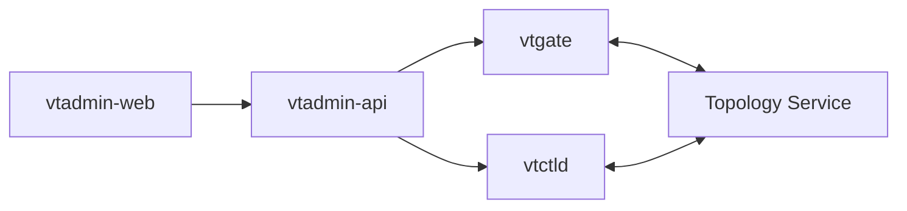
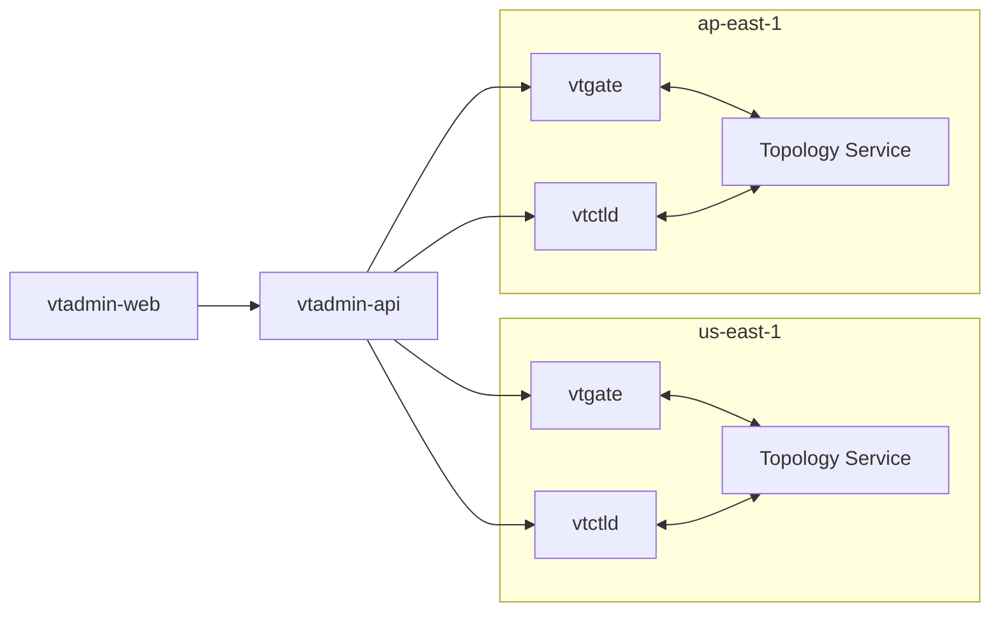

<a id="doc-f40fe8b73c4439f5f15d32a3"></a>

# vitessio/website / content/en/docs/archive/11.0/user-guides/configuration-advanced/tracing.md

Upstream: https://github.com/vitessio/website/blob/5959014a8023cb209e64874cd60cc0323f939137/content/en/docs/archive/11.0/user-guides/configuration-advanced/tracing.md

Commit: `5959014a8023cb209e64874cd60cc0323f939137`

Retrieved: 2026-10-01T15:47:12.554276+00:00

Kind: official-document

Raw SHA256: `ff5d87c863ae8f30c83f5a2e268813c4bacb774fa3f13a8b368d65914488d164`

Source text below is untrusted reference content. Acquisition does not verify technical claims.

License status: UPSTREAM_NOTICES_CAPTURED_PER_FILE_REVIEW_REQUIRED. See this repository's captured license files.

---

---
title: Tracing
weight: 14
aliases: ['/docs/user-guides/tracing/'] 
---

# Vitess tracing

Vitess allows you to generate Jaeger / OpenTracing compatible trace events from the Vitess major server components: `vtgate`, `vttablet`, and `vtctld`. To sync these trace events you need an OpenTracing compatible server (e.g. Jaeger). Vitess can send tracing events to this server in the Jaeger compact Thrift protocol wire format which is usually UDP on port 6381.

## Configuring tracing

The first step of configuring tracing is to make sure you have tracing collectors properly setup. The tracing collectors must be located where they can be reached from the various Vitess components on which you want to configure tracing.  We will not cover the entire setup process in this guide. The guide will cover the minimal config for testing/running locally, using the Jaeger docker container running on `localhost`. You can read more about Jaeger [here](https://www.jaegertracing.io/docs/1.20/features/).

### Running Jaeger in docker

You can follow the Jaeger getting started documentation [here](https://www.jaegertracing.io/docs/1.20/getting-started/). In essence you need to run the Jaeger docker container:

``` shell
$ docker run -d --name jaeger \
  -e COLLECTOR_ZIPKIN_HTTP_PORT=9411 \
  -p 5775:5775/udp \
  -p 6831:6831/udp \
  -p 6832:6832/udp \
  -p 5778:5778 \
  -p 16686:16686 \
  -p 14268:14268 \
  -p 14250:14250 \
  -p 9411:9411 \
  jaegertracing/all-in-one:1.20
```

Note that you don't need to expose all these ports, Vitess only cares about port 6831 (the UDP compact Thrift Jaeger protocol listener). You will also need port 16686 for the Jaeger web UI to browse the spans reported.

### Configuring tracing for vtgate, vttablet and vtctld

Now that you have the Jaeger server running, you can add the necessary startup options to `vtgate`, `vttablet` and `vtctld`. This will enable you to send trace spans to the server.  The command line options for doing this are the same across `vtgate`, `vttablet` and `vtctld`. Add the following options for a tracing agent running on the `localhost`:

``` shell
-tracer opentracing-jaeger -jaeger-agent-host 127.0.0.1:6831 -tracing-sampling-rate 0.0 
```

There are a few things to note:

  * There are other tracing plugins and the `-tracer` option allows you to select them. Currently we have `opentracing-jaeger` and `opentracing-datadog`. Only `opentracing-jaeger` is covered in this document.
  * `-jaeger-agent-host` should point to the `hostname:port` or `ip:port` of the tracing collector running the Jaeger compact Thrift protocol.
  * The tracing sample rate (`-tracing-sampling-rate`) is expressed as a fraction from 0.0 (no sampling) to 1.0 (100% of all events are sent to the server). In the example, this option is set to zero, because we will be passing custom span contexts to the queries we want to trace. In this way, we only instrument the queries we want.  This is recommended for large installations because it is typically very hard to organize and consume the volume of tracing events generated by even a small fraction of events from a non-trivial production Vitess system. However, if you just want events to flow automatically without you having to instrument queries, you can set this to a value other than `0.0` and skip the following section on instrumenting queries.

After adding these options, you must restart the Vitess components in question.

### Instrumenting queries

Now that you have the Vitess components setup, you can start instrumenting your queries to choose which queries (or application actions) for which you want to generate trace events. This is obviously an application-specific process, but there are a few things to note:

  * The `SpanContext` id you have to instrument your Vitess queries with, in order for them to generate trace events, has a very specific format.  It is recommended to use one of the Jaeger / OpenTracing client libraries to generate these for you. They take the format of a base64 string of a JSON object that, at it simplest, looks something like [this](https://www.jaegertracing.io/docs/1.19/client-libraries/#tracespan-identity):
  
    ``` shell
    {"uber-trace-id":"{trace-id}:{span-id}:{parent-span-id}:{flags}"}
    ```
    Note the very specific format requirements in the documentation. Because of these requirements, it can be tiresome to generate them yourself, and it is more convenient to use the client libraries instead.
    
  * Once you have the `SpanContext` string in its encoded base64 format, you can then generate your SQL query/queries related to this span to send them to Vitess.  To inform Vitess of the `SpanContext`, you need to use a special SQL comment style, e.g.:
  
    ``` shell
    /*VT_SPAN_CONTEXT=<base64 value>*/ SELECT * from product;
    ```
    There are additional notes here:
    
    * The underlying tracing libraries are very particular about the base64 value, so if you have any formatting problems (including trailing spaces between the base64 value and the closing of the comment); you will get many warnings in your `vtgate` logs.
    * When testing with, for example, the `mysql` CLI tool, make sure you are using the `-c` (or `--comments` flag), since the default is `--skip-comments`, which will never send your comments to the server (`vtgate`).

### Inspecting trace spans in the Jaeger web UI

This is beyond the scope of this guide. However, in general, if you have set everything above up correctly and you have instrumented and executed some queries appropriately, you can now access the Jager web UI to look at the spans recorded. If you are using the local docker container version of Jaeger, you can access the web UI in your browser at http://localhost:16686/. 

You should be able to search for and find spans based on the `trace-id` or `span-id` with which your query/queries were instrumented. Once you find a query, you will be able to see the trace events emitted by different
parts of the code as the query moves through `vtgate` and the `vttablet(s)` involved in the query. An example would look something like this:


<a id="doc-c2096658852d7a8685b11afd"></a>

# vitessio/website / content/en/docs/archive/11.0/user-guides/configuration-advanced/transport-security-model.md

Upstream: https://github.com/vitessio/website/blob/5959014a8023cb209e64874cd60cc0323f939137/content/en/docs/archive/11.0/user-guides/configuration-advanced/transport-security-model.md

Commit: `5959014a8023cb209e64874cd60cc0323f939137`

Retrieved: 2026-10-01T15:47:12.554276+00:00

Kind: official-document

Raw SHA256: `39957fdbe2af4a8bd61ac0f917037fc694d9bbdacc4ff7bad6d90fb83d3e15b7`

Source text below is untrusted reference content. Acquisition does not verify technical claims.

License status: UPSTREAM_NOTICES_CAPTURED_PER_FILE_REVIEW_REQUIRED. See this repository's captured license files.

---

---
title: Securing Vitess Using TLS
weight: 25
---

## Introduction

Vitess has a number of different components that, in most real-world configurations, connect to each other over the network. Many organizations require, for compliance or practical reasons, that these communications
be encrypted and/or authenticated. This guide will provide an overview of these client/server combinations between components, what the encryption and authentication options are, and a walkthrough on how to configure Vitess to use them. You can read more about our [transport security model](../../../reference/features/transport-security-model/) in our references. 

There are two paths a data path and a control path that could be secured. The focus in the guide will be to secure the data path. You can read more about the two paths [here](../../configuration-basic/ports/).

Note that the sensitive information mainly flows over the data path, and depending on your deployment model, you may not have to encrypt all of the the control or meta-data path.  We recommend that you evaluate your needs in the context of your compliance directives, threat model and risk management framework.

It should also be noted that while Vitess provides the mechanism for securing these communication channels, it does **not** manage the certificate management tasks like:
 
  * Securely generating private keys
  * Issuing server certificates
  * Issuing, if necessary, client certificates
  * Certificate rotation
  * Certificate audit

Indeed, the hardest part of deploying TLS with Vitess in a large organization may be to integrate with whatever certificate policies and procedures the organization mandates. It should be noted that the manual issuing and rotation of certificates in a Vitess environment of a non-trivial size is impractical, and some provisioning and configuration management automation will need to be built.

## Protocols involved

Of all the data, meta-data and control paths enumerated above, they use one of three protocols:

  * MySQL binary protocol
  * gRPC (using HTTP/2 as transport)
  * HTTP

## Encryption

All three the protocol types above use TLS in one form or another to encrypt communications. Therefore the basics around encrypting a specific client to server communication is straightforward:

  * Server-side:
    * Generate a CA private key and cert as the root for your certificate
      hierarchy.
    * (optionally) Generate intermediate keys to serve as signing
      keys for your server certificates.  We will not cover this case in
      this document.
    * Generate a private key for the server component involved.
    * Generate a CSR using the private key.
    * Use the CA key material and the CSR to generate/sign the server
      certificate.
    * Install the server cert and private key using the appropriate Vitess
      options for the component in question.
    * If required, adjust other Vitess component options to enforce/require
      TLS-only communications.

## Server authentication

In addition to encrypting the connection, you may want or need to configure client-side server authentication.  This is the process by which the client verifies that the server it is trying to establish a TLS connection to is who they claim to be, and not an imposter or man-in-the-middle.  We achieve this by:

  * Client-side:
    * Install the CA cert used by your certificate issuing process to sign the server component certificates.
    * Adjust the Vitess client component options to verify the server certificate using the installed CA cert.  This would typically involve specifying the CA cert, as well as the server or common name to expect from the server component, if it isn't the same as the DNS name (or has an IP SAN configured).

## Client authentication

Client authentication in Vitess can take two forms, depending on the protocol in question:

  * TLS client certificate authentication (also known as mTLS)
  * Username/password authentication;  this is only an option for the connections involving the MySQL protocol.

## Walkthroughs

We will now cover how to setup the various TLS component combinations. We will start with the data path, then move on to the control paths. We will handle [encryption](#encryption) and [server authentication](#server-authentication) together, and then handle [client authentication](#client-authentication) separately.

### Certificate generation

As discussed above, large organizations will often have established tools to secure a TLS certificate hierarchy and issue certificates. For the purpose of these walkthroughs, we could use bare `openssl` commands to step through every detail. However, since we consider this an implementation detail that is likely to vary from user to user, we will leverage a shell-script-based tool called [easy-rsa](https://github.com/OpenVPN/easy-rsa) that uses `openssl` under the covers, and hides much of the complexity.

This tool has been around for many years as part of the OpenVPN project, and can perform all the steps to setup a CA, generate server certificates and also client certificates if desired. Since `easy-rsa` is just a set of shell scripts, if you require a closer understanding of how every step works, this is easy to discover as well.  Lastly, `easy-rsa` can be used in production, and can easily manage thousands of certificates, if desired.

We will use the newest `easy-rsa` release at the time of writing, version 3.0.8.

### Installing easy-rsa

Create a directory to install and run `easy-rsa` from, download and unpack the tool:

  ```bash
  $ echo $HOME
  /home/user
  $ mkdir ~/CA
  $ cd ~/CA/
  $ wget https://github.com/OpenVPN/easy-rsa/releases/download/v3.0.8/EasyRSA-3.0.8.tgz
  .
  .
  2020-10-02 16:10:22 (604 KB/s) - ‘EasyRSA-3.0.8.tgz’ saved [48907/48907]
  $ tar zxf EasyRSA-3.0.8.tgz 
  $ mv EasyRSA-3.0.8/easyrsa .
  $ mv EasyRSA-3.0.8/openssl-easyrsa.cnf .
  $ mv EasyRSA-3.0.8/x509-types .
  $ mv EasyRSA-3.0.8/vars.example vars
  $ rm -rf EasyRSA-3.0.8
  ```

Edit the `vars` file appropriately for your setup. For the purposes of this walkthrough we will just append the following lines at the end of the file. Please adjust for your needs:

  ```
  set_var EASYRSA_DN             "org"
  set_var EASYRSA_REQ_COUNTRY    "US"
  set_var EASYRSA_REQ_PROVINCE   "California"
  set_var EASYRSA_REQ_CITY       "Mountain View"
  set_var EASYRSA_REQ_ORG        "PlanetScale Inc"
  set_var EASYRSA_REQ_EMAIL      "carequest@planetscale.com"
  set_var EASYRSA_REQ_OU         "Operations"
  set_var EASYRSA_KEY_SIZE       2048
  set_var EASYRSA_ALGO           rsa
  set_var EASYRSA_CA_EXPIRE      3650
  set_var EASYRSA_CERT_EXPIRE    1095
  ```

Bootstrap your CA. During the second step you will be prompted for a password. For the answers after the password prompt, you should be able to just hit enter multiple times as you have already configured it in the `vars` file above.


Do not forget this password! You will not be able to recover it. 


```bash
  $ cd ~/CA/
  $ ./easyrsa init-pki

  Note: using Easy-RSA configuration from: /home/user/CA/vars

  init-pki complete; you may now create a CA or requests.
  Your newly created PKI dir is: /home/user/CA/pki

  $ ./easyrsa build-ca

  Note: using Easy-RSA configuration from: /home/user/CA/vars
  Using SSL: openssl OpenSSL 1.1.1g FIPS  21 Apr 2020

  Enter New CA Key Passphrase: 
  Re-Enter New CA Key Passphrase: 
  Generating RSA private key, 2048 bit long modulus (2 primes)
  ...............................................................................+++++
  e is 65537 (0x010001)
  You are about to be asked to enter information that will be incorporated
  into your certificate request.
  What you are about to enter is what is called a Distinguished Name or a DN.
  There are quite a few fields but you can leave some blank
  For some fields there will be a default value,
  If you enter '.', the field will be left blank.
  -----
  Country Name (2 letter code) [US]:
  State or Province Name (full name) [California]:
  Locality Name (eg, city) [Mountain View]:
  Organization Name (eg, company) [PlanetScale Inc]:
  Organizational Unit Name (eg, section) [Operations]:
  Common Name (eg: your user, host, or server name) [Easy-RSA CA]:
  Email Address [carequest@planetscale.com]:

  CA creation complete and you may now import and sign cert requests.
  Your new CA certificate file for publishing is at:
  /home/user/CA/pki/ca.crt
```

Your CA is now configured and you should be able to generate certs easily now.

### Application to vtgate

While applications can connect to vtgate using gRPC, the vast majority of Vitess users only use the MySQL protocol. When using the MySQL protocol, most users will use username/password for client authentication, although it is also possible to configure TLS client certificate authentication. We will assume the use of username/password authentication.

For each vtgate you should generate a server private key and certificate. We will do this in two steps:  

- First we generate a private key and certificate request.  
- We will then use the CA to sign that request to produce the server certificate.
  
For the the prompts during `gen-req`, you can just hit enter. You will be prompted to type `yes` and enter the CA password during the `sign-req` phase.

```bash
  $ cd ~/CA/
  $ ./easyrsa gen-req vtgate1 nopass

  Note: using Easy-RSA configuration from: /home/user/CA/vars
  Using SSL: openssl OpenSSL 1.1.1g FIPS  21 Apr 2020
  Generating a RSA private key
  ............................+++++
  writing new private key to '/home/user/CA/pki/easy-rsa-178308.W6uc3G/tmp.Iqlvgf'
  -----
  You are about to be asked to enter information that will be incorporated
  into your certificate request.
  What you are about to enter is what is called a Distinguished Name or a DN.
  There are quite a few fields but you can leave some blank
  For some fields there will be a default value,
  If you enter '.', the field will be left blank.
  -----
  Country Name (2 letter code) [US]:
  State or Province Name (full name) [California]:
  Locality Name (eg, city) [Mountain View]:
  Organization Name (eg, company) [PlanetScale Inc]:
  Organizational Unit Name (eg, section) [Operations]:
  Common Name (eg: your user, host, or server name) [vtgate1]:
  Email Address [carequest@planetscale.com]:

  Keypair and certificate request completed. Your files are:
  req: /home/user/CA/pki/reqs/vtgate1.req
  key: /home/user/CA/pki/private/vtgate1.key

  $ ./easyrsa sign-req server vtgate1

  Note: using Easy-RSA configuration from: /home/user/CA/vars
  Using SSL: openssl OpenSSL 1.1.1g FIPS  21 Apr 2020


  You are about to sign the following certificate.
  Please check over the details shown below for accuracy. Note that this request
  has not been cryptographically verified. Please be sure it came from a trusted
  source or that you have verified the request checksum with the sender.

  Request subject, to be signed as a server certificate for 1095 days:

  subject=
      countryName               = US
      stateOrProvinceName       = California
      localityName              = Mountain View
      organizationName          = PlanetScale Inc
      organizationalUnitName    = Operations
      commonName                = vtgate1
      emailAddress              = carequest@planetscale.com


  Type the word 'yes' to continue, or any other input to abort.
    Confirm request details: yes
  Using configuration from /home/user/CA/pki/easy-rsa-177552.IsttQK/tmp.NA5kv0
  Enter pass phrase for /home/user/CA/pki/private/ca.key:
  Check that the request matches the signature
  Signature ok
  The Subject's Distinguished Name is as follows
  countryName           :PRINTABLE:'US'
  stateOrProvinceName   :ASN.1 12:'California'
  localityName          :ASN.1 12:'Mountain View'
  organizationName      :ASN.1 12:'PlanetScale Inc'
  organizationalUnitName:ASN.1 12:'Operations'
  commonName            :ASN.1 12:'vtgate1'
  emailAddress          :IA5STRING:'carequest@planetscale.com'
  Certificate is to be certified until Oct  4 00:07:58 2023 GMT (1095 days)

  Write out database with 1 new entries
  Data Base Updated

  Certificate created at: /home/user/CA/pki/issued/vtgate1.crt
```

Our certificate has now been issued, and we can use the private key file  in `/home/user/CA/pki/private/vtgate1.key` along with the issued server certificate in `/home/user/CA/pki/issued/vtgate1.crt` to configure vtgate for using TLS with MySQL clients.  First we copy the private key and server certificate to the appropriate configuration directory, and then tighten up the file permissions and ownership.

This will differ in your environment:

```bash
  $ mkdir ~/config/
  $ cp /home/user/CA/pki/private/vtgate1.key ~/config/
  $ cp /home/user/CA/pki/issued/vtgate1.crt ~/config/
  $ chown vtgate:vtgate ~/config/vtgate1.*
  $ chmod 400 ~/config/vtgate1.*
```

Now, we can add the options to vtgate to use the above private key and server certificate.  Modify the vtgate commandline or startup script to add the following parameters:

```
  -mysql_server_ssl_key ~/config/vtgate1.key -mysql_server_ssl_cert ~/config/vtgate1.crt -mysql_server_require_secure_transport
```


You can now start/restart the vtgate instance. Any vtgate connections from now on will be required to use TLS, so you may have to reconfigure your applications/clients. In addition, to avoid man-in-the-middle attacks, you may want the clients to verify the server by validating the server certificate against the CA cert. 


Here is an example using the MySQL CLI client.  Exact options will vary between MySQL versions, this is using a recent (8.0.21) MySQL client:

```bash
  $ cp /home/user/CA/pki/ca.crt /var/tmp/ca.crt
  $ mysql -u mysql_user -p -h 127.0.0.1 -P 15306 --ssl-mode=VERIFY_CA --ssl-ca=/var/tmp/ca.crt
  Enter password: 
  Welcome to the MySQL monitor.  Commands end with ; or \g.
  Your MySQL connection id is 3
  Server version: 5.7.9-Vitess MySQL Community Server - GPL
  .
  .
  .
  mysql> \s
  --------------
  mysql  Ver 8.0.20-11 for Linux on x86_64 (Percona Server (GPL), Release 11, Revision 159f0eb)

  Connection id:          3
  Current database:
  Current user:           vt_app@localhost
  SSL:                    Cipher in use is ECDHE-RSA-AES128-GCM-SHA256
  Current pager:          stdout
  Using outfile:          ''
  Using delimiter:        ;
  Server version:         5.7.9-Vitess MySQL Community Server - GPL
  Protocol version:       10
  Connection:             127.0.0.1 via TCP/IP
  .
  .
```
  
The above MySQL CLI output shows that the connection is encrypted, and that the server (vtgate) was successfully validated using the CA certificate. If the server certificate could not be validated using the CA certificate, an error similar to this would have been seen:

```
  ERROR 2026 (HY000): SSL connection error: error:14090086:SSL routines:SSL3_GET_SERVER_CERTIFICATE:certificate verify failed
```

If TLS was not setup on the vtgate at all, an error like this could have resulted:

```
  ERROR 2026 (HY000): SSL connection error: SSL is required but the server doesn't support it
```

### vttablet to MySQL

A common Vitess deployment model is to co-locate vttablet and MySQL on the same host/VM/container. In a case like this, vttablet connectivity to MySQL will be via local unix socket or TCP connection on localhost. It is unnecessary to configure encryption between vttablet and MySQL in this case, since the traffic never leaves the local machine/VM. However, in some deployment models vttablet and MySQL are running on different hosts, and you may want vttablet to use TLS to speak to MySQL.

We will not cover configuring MySQL to use TLS certificates extensively here, just the minimum.  Please consult the MySQL documentation for further information. Again, we will also assume that vttablet will be using MySQL username/password client authentication.

Generate a server certificate for our MySQL instance using our CA:

```bash
  $ cd ~/CA/
  $ ./easyrsa gen-req mysql1 nopass
  .
  .
  .
  Keypair and certificate request completed. Your files are:
  req: /home/user/CA/pki/reqs/mysql1.req
  key: /home/user/CA/pki/private/mysql1.key

  $ ./easyrsa sign-req server mysql1
  .
  .
  .
  Write out database with 1 new entries
  Data Base Updated

  Certificate created at: /home/user/CA/pki/issued/mysql1.crt
```

Copy the files `/home/user/CA/pki/private/mysql1.key` and `/home/user/CA/pki/issued/mysql1.crt` to the MySQL server in the appropriate locations, securing their ownership and permissions appropriately.

Configure the MySQL server options `ssl-key` and `ssl-cert` appropriately to point to where you placed the private key and certificate above. 

Note that these options do not require clients to use TLS, but is optional. If you need to require all TCP/IP clients to use TLS, you can use the MySQL server option `require_secure_transport`, or you can enforce it on a per MySQL user basis by using the `REQUIRE SSL` option when creating or altering a MySQL-level user. See the MySQL documentation for details.

Restart your MySQL server to make these MySQL server option configuration changes active.

Now, configure vttablet to connect to MySQL using the necessary parameters, verifying the CA certificate:

```bash
  $ cp /home/user/CA/pki/ca.crt ~/config/
```

Add the vttablet parameters:

```
  -db_ssl_ca /home/user/config/ca.crt -db_flags 1073743872 -db_server_name mysql1
```
  
Restart the vttablet. Note that the `db_server_name` parameter value will differ depending on your issued certificate common name; and is unnecessary if the certificate common name matches the DNS name vttablet is using to connect to the MySQL server.

The `1073743872` is a combination of the MySQL `CLIENT_SSL` (2048) and `CLIENT_SSL_VERIFY_SERVER_CERT` flags (1073741824);  which means "encrypt the connection to MySQL *and* verify the SSL cert presented by the server".

If you just wish to encrypt the vttablet -> MySQL server communication and you do not care about server certificate validation, you can just use this vttablet flag instead:

```
  -db_flags 2048
```

Note that using the above `db_flags` will also result in the MySQL to MySQL communication for replication between the replica/rdonly instances of a Vitess shard and its primary to be encrypted, as long as the upstream MySQL instance the replica is connecting to has been configured correctly to support TLS MySQL protocol connections (see above).

## vttablet data and control paths

In Vitess, communication between vtgate and vttablet instances are via gRPC. gRPC uses HTTP/2 as a transport protocol, but by default this is not encrypted in Vitess.  To secure this data path you need to, at a minimum, configure TLS for gRPC on the server (vttablet) side.

Other components, as detailed above, also connect to vttablet via gRPC. After configuring vttablet gRPC for TLS, you will need to configure all these components (vtgate, other vttablets, vtctld) explicitly to connect using TLS to vttablet via gRPC, or you will have a partially or wholly non-functional system.

#### vtgate to vttablet

First, generate a certificate for use by vttablet:

```bash
  $ cd ~/CA/
  $ ./easyrsa gen-req vttablet1 nopass

  Note: using Easy-RSA configuration from: /home/user/CA/vars
  Using SSL: openssl OpenSSL 1.1.1g FIPS  21 Apr 2020
  Generating a RSA private key
  ..................................+++++
  .....+++++
  writing new private key to '/home/user/CA/pki/easy-rsa-209692.tdDNNt/tmp.hwhw8x'
  -----
  You are about to be asked to enter information that will be incorporated
  into your certificate request.
  What you are about to enter is what is called a Distinguished Name or a DN.
  There are quite a few fields but you can leave some blank
  For some fields there will be a default value,
  If you enter '.', the field will be left blank.
  -----
  Country Name (2 letter code) [US]:
  State or Province Name (full name) [California]:
  Locality Name (eg, city) [Mountain View]:
  Organization Name (eg, company) [PlanetScale Inc]:
  Organizational Unit Name (eg, section) [Operations]:
  Common Name (eg: your user, host, or server name) [vttablet1]:
  Email Address [carequest@planetscale.com]:

  Keypair and certificate request completed. Your files are:
  req: /home/user/CA/pki/reqs/vttablet1.req
  key: /home/user/CA/pki/private/vttablet1.key

  $ ./easyrsa sign-req server vttablet1

  Note: using Easy-RSA configuration from: /home/user/CA/vars
  Using SSL: openssl OpenSSL 1.1.1g FIPS  21 Apr 2020


  You are about to sign the following certificate.
  Please check over the details shown below for accuracy. Note that this request
  has not been cryptographically verified. Please be sure it came from a trusted
  source or that you have verified the request checksum with the sender.

  Request subject, to be signed as a server certificate for 1095 days:

  subject=
      countryName               = US
      stateOrProvinceName       = California
      localityName              = Mountain View
      organizationName          = PlanetScale Inc
      organizationalUnitName    = Operations
      commonName                = vttablet1
      emailAddress              = carequest@planetscale.com


  Type the word 'yes' to continue, or any other input to abort.
    Confirm request details: yes
  Using configuration from /home/user/CA/pki/easy-rsa-209844.f9wDrk/tmp.3rww6R
  Enter pass phrase for /home/user/CA/pki/private/ca.key:
  Check that the request matches the signature
  Signature ok
  The Subject's Distinguished Name is as follows
  countryName           :PRINTABLE:'US'
  stateOrProvinceName   :ASN.1 12:'California'
  localityName          :ASN.1 12:'Mountain View'
  organizationName      :ASN.1 12:'PlanetScale Inc'
  organizationalUnitName:ASN.1 12:'Operations'
  commonName            :ASN.1 12:'vttablet1'
  emailAddress          :IA5STRING:'carequest@planetscale.com'
  Certificate is to be certified until Oct  4 20:23:48 2023 GMT (1095 days)

  Write out database with 1 new entries
  Data Base Updated

  Certificate created at: /home/user/CA/pki/issued/vttablet1.crt

  $ cp /home/user/CA/pki/private/vttablet1.key ~/config/
  $ cp /home/user/CA/pki/issued/vttablet1.crt ~/config/
  $ chmod 400 ~/config/vttablet1.*
```

To configure vttablet to use a server certificate for its gRPC server, add the below to the vttablet parameters:

```
  -grpc_cert /home/user/config/vttablet1.crt -grpc_key /home/user/config/vttablet1.key 
```

Note that adding these options **enforces** TLS only gRPC connections to this vttablet instace from that point onwards.

This means that you will need to add the following option to your vtgate instances to successfully connect to this vttablet instance from this point forward:

```
  -tablet_grpc_server_name vttablet1 -tablet_grpc_ca /home/user/config/ca.crt 
```

Adding this option to a vtgate instance will require all vttablet instances this vtgate connects to to be configured for TLS as well. This is unfortunately an all-or-nothing proposition, there is no incremental migration to using TLS in this case.

If you have vtgate instances accessing your vttablet instance after you have configured TLS on the vttablet side, you may see errors like this in the vttablet logs:

```
  W1004 13:34:16.352458  212354 server.go:650] grpc: Server.Serve failed to complete security handshake from "[::1]:51492": tls: first record does not look like a TLS handshake
```

Conversely, if you have configured the TLS parameters on the vtgate side and the vtgate instance is still trying to connect to vttablet instances that are not configured with the correct TLS options, you might see errors like this in the vtgate logs:

```
  W1004 14:38:29.383672  214179 tablet_health_check.go:323] tablet cell:"zone1" uid:101  healthcheck stream error: Code: UNAVAILABLE
  vttablet: rpc error: code = Unavailable desc = all SubConns are in TransientFailure, latest connection error: connection error: desc = "transport: authentication handshake failed: tls: first record does not look like a TLS handshake"
```

#### vttablet to vtablet:  vreplication within or across shards

For vreplication to work between vttablet instances once the gRPC server TLS options above are activated, you will need to add the following additional vttablet options:

```
  -tablet_grpc_server_name vttablet1 -tablet_grpc_ca /home/user/config/ca.crt 
```

Since each vttablet instance may need to talk to more than one other vttablet instances for vreplication streams, the implication is that each vttablet instances needs to either:

  * Use the same vttablet server key material and server certificate common name for each vttablet instance. This is obviously the easiest option, but might not conform to your compliance requirements.
  * or, ensure each vttablet server certificate common name or IP SAN matches the DNS name or IP it it accessed via. In this case, you can omit the use of the `-tablet_grpc_server_name` above for vttablet, and also for vtgate.
  
#### vtctld to vttablet

Once your vttablet(s) are configured with gRPC server TLS options as above,
you will need to also add TLS client options to vtctld, or vtctld will be
unable to connect to your vttablet(s).

* To achieve this, add the following options to the vtctld commandline:

```
  -tablet_grpc_server_name vttablet1 -tablet_grpc_ca /home/user/config/ca.crt -tablet_manager_grpc_server_name vttablet1 -tablet_manager_grpc_ca /home/user/config/ca.crt
```

### vtctlclient to vtctld

The communication from vtctlclient to vtctld is also via gRPC, so the method for securing it is similar to vtctld to vttablet above. 

Generate a server certificate for vtctld:

```bash
  $ cd ~/CA/
  $ ./easyrsa gen-req vtctld1 nopass

  Note: using Easy-RSA configuration from: /home/user/CA/vars
  Using SSL: openssl OpenSSL 1.1.1g FIPS  21 Apr 2020
  Generating a RSA private key
  ..................................................+++++
  ....................................................+++++
  writing new private key to '/home/user/CA/pki/easy-rsa-234817.QW1l8f/tmp.REK9r3'
  -----
  You are about to be asked to enter information that will be incorporated
  into your certificate request.
  What you are about to enter is what is called a Distinguished Name or a DN.
  There are quite a few fields but you can leave some blank
  For some fields there will be a default value,
  If you enter '.', the field will be left blank.
  -----
  Country Name (2 letter code) [US]:
  State or Province Name (full name) [California]:
  Locality Name (eg, city) [Mountain View]:
  Organization Name (eg, company) [PlanetScale Inc]:
  Organizational Unit Name (eg, section) [Operations]:
  Common Name (eg: your user, host, or server name) [vtctld1]:
  Email Address [carequest@planetscale.com]:

  Keypair and certificate request completed. Your files are:
  req: /home/user/CA/pki/reqs/vtctld1.req
  key: /home/user/CA/pki/private/vtctld1.key

  $ ./easyrsa sign-req server vtctld1

  Note: using Easy-RSA configuration from: /home/user/CA/vars
  Using SSL: openssl OpenSSL 1.1.1g FIPS  21 Apr 2020


  You are about to sign the following certificate.
  Please check over the details shown below for accuracy. Note that this request
  has not been cryptographically verified. Please be sure it came from a trusted
  source or that you have verified the request checksum with the sender.

  Request subject, to be signed as a server certificate for 1095 days:

  subject=
      countryName               = US
      stateOrProvinceName       = California
      localityName              = Mountain View
      organizationName          = PlanetScale Inc
      organizationalUnitName    = Operations
      commonName                = vtctld1
      emailAddress              = carequest@planetscale.com


  Type the word 'yes' to continue, or any other input to abort.
    Confirm request details: yes
  Using configuration from /home/user/CA/pki/easy-rsa-234873.8zKYwl/tmp.zDGxDd
  Enter pass phrase for /home/user/CA/pki/private/ca.key:
  Check that the request matches the signature
  Signature ok
  The Subject's Distinguished Name is as follows
  countryName           :PRINTABLE:'US'
  stateOrProvinceName   :ASN.1 12:'California'
  localityName          :ASN.1 12:'Mountain View'
  organizationName      :ASN.1 12:'PlanetScale Inc'
  organizationalUnitName:ASN.1 12:'Operations'
  commonName            :ASN.1 12:'vtctld1'
  emailAddress          :IA5STRING:'carequest@planetscale.com'
  Certificate is to be certified until Oct  5 02:30:05 2023 GMT (1095 days)

  Write out database with 1 new entries
  Data Base Updated

  Certificate created at: /home/user/CA/pki/issued/vtctld1.crt

  $ cp /home/user/CA/pki/issued/vtctld1.crt ~/config/
  $ cp /home/user/CA/pki/private/vtctld1.key ~/config/
```

Add TLS gRPC server options to vtctld commandline and restart vtctld:

```
  -grpc_cert /home/user/config/vtctld1.crt -grpc_key /home/user/config/vtctld1.key
```

At this point, all vtctlclient connections to vtctld will need the appropriate additional TLS gRPC options, or they will fail.  Add these options:

```
  -vtctld_grpc_ca /home/user/config/ca.crt -vtctld_grpc_server_name vtctld1
```

## Topology server data paths

Vitess supports several topology server implementations, with the major ones being `etcd` and `ZooKeeper`. Since each of these use their own protocols, securing communications between Vitess components (like vtgate, vttablet and vtctld) and the topology server is specific to the topology server implementation.  We we will cover `etcd` first, then `ZooKeeper`.

It should be noted that regardless of the implementation, no sensitive data is stored in the Vitess topology server, i.e.:

 * No data (queries/results) is stored in, or flows through, the topology server.
 * No secrets (keys, certificates, passwords) are stored in the toplogy server
   data store.
 * Only metadata (VSchema, keyspace and shard information) is stored in the
   topology server data store.

### Configuring etcd for secure connections

We will not cover setting up `etcd` with certificates in this guide. You can consult the `etcd` documenation [here](https://etcd.io/docs/v3.2.17/op-guide/security/). Note that you can use `easy-rsa` as above to generate your server private key and certificate pairs. If you do not require client authentication, that is sufficient, and you then just have to distribute your CA certificate (`/home/user/CA/pki/ca.crt` in the examples above) to your clients, and proceed as in the next section.

### Configuring secure connectivity between vtgate/vttablet/vtctld and etcd

The Vitess servers (vtgate/vttablet/vtctld) share the same set of parameters to connect via TLS to `etcd`:

 * `-topo_etcd_tls_ca` : Path to the PEM certificate used to authenticate the TLS CA certificate presented by the `etcd` server.  Enables TLS to `etcd` if present.
 * `-topo_etcd_tls_cert` : Path to a PEM client certificate (mTLS) used to authenticate this client to the `etcd` server. Only necessary if your `etcd` server requires client authentication.
 * `-topo_etcd_tls_key` : Path to a PEM private key used for signing the client certificate (mTLS) exchange with the `etcd` server. Only necessary if your `etcd` server requires client authentication.

As is necessary for your design/architecture, add one or more of the above options to your vtgate, vttablet and vtctld instances.

### Configuring etcd for secure connections

We will just mention the basic flags here for getting `etcd` to accept encrypted client connections.  We will not cover the flags to make sure that communication between `etcd` cluster members (peers) are encrypted.

Flags:

  * `--listen-client-urls`: specify an `https://` host and port prefix
  * `--advertise-client-urls`: specify an `https://` host and port prefix
  * `--cert-file`:  Point to to a server cert PEM file
  * `--key-file`:  Point to to a server key PEM file
  * (optional) `--cipher-suites`:  Can be used to limit the cipher suites the etc server will negotiate (e.g. `TLS_ECDHE_RSA_WITH_AES_128_GCM_SHA256,TLS_ECDHE_RSA_WITH_AES_256_GCM_SHA384` is a popular combination).  
  
Note that the Vitess client components will negotiate any of the standard golang TLS client cipher suites (which can vary somewhat depending on which golang version Vitess was compiled with, and what libraries are available on the platform).  It is not possible to limit the cipher suites from the etcd client (i.e. Vitess) components.

It is also possible to configure `etcd` to require/verify client certificates from the clients; for that use the `--trusted-ca-file` option to point to the PEM CA cert that the client certs are signed with.

### Configuring ZooKeeper for secure connections

We will not cover setting up `Zookeeper` with certificates in this guide. You can consult the `Zookeeper` documenation [here](https://cwiki.apache.org/confluence/display/ZOOKEEPER/ZooKeeper+SSL+User+Guide), specifically the `Server` section. Note that you can use `easy-rsa` as above to generate your server private key and certificate pairs. If you do not require client authentication, that is sufficient, and you then just have to distribute your CA certificate (`/home/user/CA/pki/ca.crt` in the examples above) to your clients, and proceed as in the next section.

### Configuring secure connectivity between vtgate/vttablet/vtctld and ZooKeeper

The Vitess servers (vtgate/vttablet/vtctld) share the same set of parameters to connect via TLS to `Zookeeper`:

 * `-topo_zk_tls_ca` : Path to the PEM certificate used to authenticate the TLS CA certificate presented by the `Zookeeper` server.  Enables TLS to `etcd` if present.
 * `-topo_zk_tls_cert` : Path to a PEM client certificate (mTLS) used to authenticate this client to the `Zookeeper` server. Only necessary if your `Zookeeper` server requires client authentication.
 * `-topo_zk_tls_key` : Path to a PEM private key used for signing the client certificate (mTLS) exchange with the `Zookeeper` server. Only necessary if your `Zookeeper` server requires client certificate authentication.
 * `-topo_zk_auth_file` : Unlike `etcd`, `Zookeeper` also supports username/password authentication from clients. This option is used to pass the combination of authentication schema, username and password to the client to connect with to the server, e.g. with a value like `digest:username:password`.

As is necessary for your design/architecture, add one or more of the above options to your vtgate, vttablet and vtctld instances.

## Generating client certificates with easy-rsa

`easy-rsa` can also be used to generate client certificates (i.e for mTLS or mutual TLS).  Mutual TLS needs at least two additional parameters on the client side, and one additional parameter on the server side:

  * Client side:
    * Private key to sign the client certificate exchange with server.
    * Client certificate itself.
  * Server side:
    * CA certificate that signed the client certificate(s) that the client(s) are presenting.

To generate the client-side private and client certificate using `easy-rsa`:

```bash
  $ cd ~/CA/
  $ ./easyrsa gen-req client1 nopass 
  Note: using Easy-RSA configuration from: /home/user/CA/vars
  Using SSL: openssl OpenSSL 1.1.1g FIPS  21 Apr 2020
  Generating a RSA private key
  ..........+++++
  .........+++++
  writing new private key to '/home/user/CA/pki/easy-rsa-144133.y9mHHP/tmp.LSLIhv'
  -----
  You are about to be asked to enter information that will be incorporated
  into your certificate request.
  What you are about to enter is what is called a Distinguished Name or a DN.
  There are quite a few fields but you can leave some blank
  For some fields there will be a default value,
  If you enter '.', the field will be left blank.
  -----
  Country Name (2 letter code) [US]:
  State or Province Name (full name) [California]:
  Locality Name (eg, city) [Mountain View]:
  Organization Name (eg, company) [PlanetScale Inc]:
  Organizational Unit Name (eg, section) [Operations]:
  Common Name (eg: your user, host, or server name) [client1]:
  Email Address [carequest@planetscale.com]:

  Keypair and certificate request completed. Your files are:
  req: /home/user/CA/pki/reqs/client1.req
  key: /home/user/CA/pki/private/client1.key

  $ ./easyrsa sign-req client client1
  Note: using Easy-RSA configuration from: /home/user/CA/vars
  Using SSL: openssl OpenSSL 1.1.1g FIPS  21 Apr 2020


  You are about to sign the following certificate.
  Please check over the details shown below for accuracy. Note that this request
  has not been cryptographically verified. Please be sure it came from a trusted
  source or that you have verified the request checksum with the sender.

  Request subject, to be signed as a client certificate for 1095 days:

  subject=
      countryName               = US
      stateOrProvinceName       = California
      localityName              = Mountain View
      organizationName          = PlanetScale Inc
      organizationalUnitName    = Operations
      commonName                = client1
      emailAddress              = carequest@planetscale.com


  Type the word 'yes' to continue, or any other input to abort.
    Confirm request details: yes
  Using configuration from /home/user/CA/pki/easy-rsa-144332.6AjhHm/tmp.KWRj4O
  Enter pass phrase for /home/user/CA/pki/private/ca.key:
  Check that the request matches the signature
  Signature ok
  The Subject's Distinguished Name is as follows
  countryName           :PRINTABLE:'US'
  stateOrProvinceName   :ASN.1 12:'California'
  localityName          :ASN.1 12:'Mountain View'
  organizationName      :ASN.1 12:'PlanetScale Inc'
  organizationalUnitName:ASN.1 12:'Operations'
  commonName            :ASN.1 12:'client1'
  emailAddress          :IA5STRING:'carequest@planetscale.com'
  Certificate is to be certified until Oct 14 04:10:28 2023 GMT (1095 days)

  Write out database with 1 new entries
  Data Base Updated

  Certificate created at: /home/user/CA/pki/issued/client1.crt
```

Our client certificate and key has now been issued, and we can use the files `/home/user/CA/pki/issued/client1.crt` and `/home/user/CA/pki/private/client1.key` on our client for client certificate (mTLS) authentication.


<a id="doc-de6a5fd1bdbfd8ed49d2f64f"></a>

# vitessio/website / content/en/docs/archive/11.0/user-guides/configuration-advanced/unmanaged-tablet.md

Upstream: https://github.com/vitessio/website/blob/5959014a8023cb209e64874cd60cc0323f939137/content/en/docs/archive/11.0/user-guides/configuration-advanced/unmanaged-tablet.md

Commit: `5959014a8023cb209e64874cd60cc0323f939137`

Retrieved: 2026-10-01T15:47:12.554276+00:00

Kind: official-document

Raw SHA256: `276aed2e39f0ec655bf7051722085ef41988e42c0ac3f27c88bd6cafd92a0f46`

Source text below is untrusted reference content. Acquisition does not verify technical claims.

License status: UPSTREAM_NOTICES_CAPTURED_PER_FILE_REVIEW_REQUIRED. See this repository's captured license files.

---

---
title: Unmanaged Tablet
weight: 15
aliases: ['/docs/user-guides/unmanaged-tablet/'] 
---


This guide follows on from the [local](../../../get-started/local) installation guide.


This guide uses the Vitess components vtctld, Topology Service and VTGate which have already been started in the local installation guide. It assumes that you have an existing MySQL Server setup that you would like to add to Vitess as a new keyspace, which we will call `legacy`. The same set of steps can be used to create a tablet that uses Amazon RDS, AWS Aurora, or Google CloudSQL.

## Ensure all components are up

You should have previously executed `./101_initial_cluster.sh` in the get-started guide. This will ensure that you have a Topology Service, vtgate, vtctld. For the unmanaged MySQL instance, I will be using an instance running on `127.0.0.1:5726`:

```bash
source env.sh

# verify vtgate/vitess is up and running
mysql commerce -e 'show tables'

# verify my unmanaged mysql is running
mysql -h 127.0.0.1 -P 5726 -umsandbox -pmsandbox legacy -e 'show tables'
```

Output:

```text
~/vitess/examples/local$ source env.sh
~/vitess/examples/local$ 
~/vitess/examples/local$ # verify vtgate/vitess is up and running
~/vitess/examples/local$ mysql commerce -e 'show tables' 
+-----------------------+
| Tables_in_vt_commerce |
+-----------------------+
| corder                |
| customer              |
| product               |
+-----------------------+
~/vitess/examples/local$ # verify my unmanaged mysql is running 
~/vitess/examples/local$ mysql -h 127.0.0.1 -P 5726 -umsandbox -pmsandbox legacy -e 'show tables'
mysql: [Warning] Using a password on the command line interface can be insecure.
+------------------+
| Tables_in_legacy |
+------------------+
| legacytable      |
+------------------+
```

## Start a tablet to correspond to legacy

The variables `TOPOLOGY_FLAGS` and `VTDATAROOT` should already be in the environment from sourcing env.sh earlier. We will call the new tablet UID 401.

```bash
mkdir -p $VTDATAROOT/vt_0000000401
vttablet \
 $TOPOLOGY_FLAGS \
 -logtostderr \
 -log_queries_to_file $VTDATAROOT/tmp/vttablet_0000000401_querylog.txt \
 -tablet-path "zone1-0000000401" \
 -init_keyspace legacy \
 -init_shard 0 \
 -init_tablet_type replica \
 -port 15401 \
 -grpc_port 16401 \
 -service_map 'grpc-queryservice,grpc-tabletmanager,grpc-updatestream' \
 -pid_file $VTDATAROOT/vt_0000000401/vttablet.pid \
 -vtctld_addr http://localhost:15000/ \
 -db_host 127.0.0.1 \
 -db_port 5726 \
 -db_app_user msandbox \
 -db_app_password msandbox \
 -db_dba_user msandbox \
 -db_dba_password msandbox \
 -db_repl_user msandbox \
 -db_repl_password msandbox \
 -db_filtered_user msandbox \
 -db_filtered_password msandbox \
 -db_allprivs_user msandbox \
 -db_allprivs_password msandbox \
 -init_db_name_override legacy \
 -init_populate_metadata &
```

Note that if your tablet is using a MySQL instance type where you do not have `SUPER` privileges to the database 
(e.g. AWS RDS, AWS Aurora or Google CloudSQL), you should omit the `-init_populate_metadata` flag. The `-init_populate_metadata` flag should only be enabled if the cluster is being managed through Vitess.

You should be able to see debug information written to screen confirming Vitess can reach the unmanaged server. A common problem is that you may need to change the authentication plugin to `mysql_native_password` (MySQL 8.0).

Assuming that there are no errors, after a few seconds you can mark the server as externally promoted to primary:

```bash
vtctlclient TabletExternallyReparented zone1-401
```

## Connect via VTGate

VTGate should now be able to route queries to your unmanaged MySQL server:

```bash
~/vitess/examples/local$ mysql legacy -e 'show tables'
+------------------+
| Tables_in_legacy |
+------------------+
| legacytable    |
+------------------+
``` 

You can even join between the unmanaged tablet and the managed tablets. Vitess will execute the query as a scatter-gather:

```sql
mysql> use commerce;
Database changed

mysql> select corder.order_id from corder inner join legacy.legacytable on corder.order_id=legacy.legacytable.id;
Empty set (0.01 sec)
```

## Move legacytable to the commerce keyspace

Move the table:

```bash
vtctlclient MoveTables -source legacy -tables 'legacytable' Create commerce.legacy2commerce 
```

Switch traffic:

```bash
vtctlclient MoveTables -tablet_type=rdonly,replica SwitchTraffic commerce.legacy2commerce
```

Complete the MoveTables

```bash
vtctlclient MoveTables Complete commerce.legacy2commerce
```

Verify that the table was moved:

```bash
source env.sh

# verify vtgate/vitess is up and running
mysql commerce -e 'show tables'

# verify my unmanaged mysql is running
mysql -h 127.0.0.1 -P 5726 -umsandbox -pmsandbox legacy -e 'show tables'
```

Output:

```text
~/vitess/examples/local$ source env.sh
~/vitess/examples/local$ 
~/vitess/examples/local$ # verify vtgate/vitess is up and running
~/vitess/examples/local$ mysql commerce -e 'show tables' 
+-----------------------+
| Tables_in_vt_commerce |
+-----------------------+
| corder                |
| customer              |
| legacytable           |
| product               |
+-----------------------+
~/vitess/examples/local$ # verify my unmanaged mysql is running 
~/vitess/examples/local$ mysql -h 127.0.0.1 -P 5726 -umsandbox -pmsandbox legacy -e 'show tables'
mysql: [Warning] Using a password on the command line interface can be insecure.
```


<a id="doc-6c14e26dfa9078efdcd2838d"></a>

# vitessio/website / content/en/docs/archive/11.0/user-guides/configuration-advanced/user-management.md

Upstream: https://github.com/vitessio/website/blob/5959014a8023cb209e64874cd60cc0323f939137/content/en/docs/archive/11.0/user-guides/configuration-advanced/user-management.md

Commit: `5959014a8023cb209e64874cd60cc0323f939137`

Retrieved: 2026-10-01T15:47:12.554276+00:00

Kind: official-document

Raw SHA256: `04a7ec66efd44fc9aa06cf20d94680aed654d9c9417410ddbf0be4a4e2416522`

Source text below is untrusted reference content. Acquisition does not verify technical claims.

License status: UPSTREAM_NOTICES_CAPTURED_PER_FILE_REVIEW_REQUIRED. See this repository's captured license files.

---

---
title: User Management and Authentication
weight: 1
aliases: ['/docs/user-guides/user-management/'] 
---

Vitess uses its own mechanism for managing users and their permissions through
 VTGate. As a result, the `CREATE USER....` and
`GRANT...` statements will not work if sent through VTGate.

## Authentication

The Vitess VTGate component takes care of authentication for requests so we
will need to add any users that should have access to the Keyspaces via the
command-line options to VTGate.

The simplest way to configure users is using a `static` auth method and we
can define the users in a JSON formatted file or string.

```sh
$ cat > users.json << EOF
{
  "vitess": [
    {
      "UserData": "vitess",
      "Password": "supersecretpassword"
    }
  ],
  "myuser1": [
    {
      "UserData": "myuser1",
      "Password": "password1"
    }
  ],
  "myuser2": [
    {
      "UserData": "myuser2",
      "Password": "password2"
    }
  ]
}
EOF
```

Then we can load this into VTGate with the additional commandline parameters:
```sh
vtgate $(cat <<END_OF_COMMAND
    -mysql_auth_server_impl=static
    -mysql_auth_server_static_file=users.json
    ...
    ...
    ...
END_OF_COMMAND
)
```

Now we can test our new users:

```
$ mysql -h 127.0.0.1 -u myuser1 -ppassword1 -e "select 1"
+---+
| 1 |
+---+
| 1 |
+---+

$ mysql -h 127.0.0.1 -u myuser1 -pincorrect_password -e "select 1"
ERROR 1045 (28000): Access denied for user 'myuser1'
```

## Password format

In the above example we used plaintext passwords.  Vitess supports the
MySQL [mysql_native_password](https://dev.mysql.com/doc/refman/8.0/en/native-pluggable-authentication.html)
hash format, and you should always specify your passwords using this
in a non-test or external environment.  Vitess does not yet support the
[caching_sha2_password](https://dev.mysql.com/doc/refman/8.0/en/caching-sha2-pluggable-authentication.html)
format that became the default for MySQL in 8.0.

To use a `mysql_native_password` hash, your user section in your static
JSON authentication file would look something like this instead:

```json
{
  "vitess": [
    {
      "UserData": "vitess",
      "MysqlNativePassword": "*9E128DA0C64A6FCCCDCFBDD0FC0A2C967C6DB36F"
    }
  ]
}
```

You can extract a `mysql_native_password` hash from an existing MySQL
install by looking at the `authentication_string` column of the relevant
user's row in the `mysql.user` table. An alternate way to generate this
hash is to SHA1 the cleartext password string twice, e.g. doing it in
MySQL for the cleartext password `password`:

```mysql
mysql> SELECT UPPER(SHA1(UNHEX(SHA1("password")))) as hash;
+------------------------------------------+
| hash                                     |
+------------------------------------------+
| 2470C0C06DEE42FD1618BB99005ADCA2EC9D1E19 |
+------------------------------------------+
1 row in set (0.01 sec)
```

So, you would use `*2470C0C06DEE42FD1618BB99005ADCA2EC9D1E19` as the
`MysqlNativePassword` hash value for the cleartext password `password`.


## UserData

In the static authentication JSON file, the `UserData` string is **not**
the username;  the username is the string key for the list.  The `UserData`
string does **not** need to correspond to the username, and is used by the
[authorization mechanism](../authorization) when referring to a user.  It is
usually however simpler if you make the `UserData` string and the username
the same.

The `UserData` feature can be leveraged to create multiple users that are
equivalent to the authorization layer (i.e. multiple users having the same
`UserData` strings), but are different in the authentication layer (i.e.
have different usernames and passwords).

## Multiple passwords

A very convenient feature of the VTGate authorization is that, as can be
seen in the example JSON authentication files, you have a **list** of
`UserData` and `Password`/`MysqlNativePassword` pairs associated with
a user.  You can optionally leverage this to assign multiple different
passwords to a single user, and VTGate will allow a user to authenticate
with any of the defined passwords.  This makes password rotation 
much easier;  and less likely to require or cause downtime.

An example could be:
```json
{
  "vitess": [
    {
      "UserData": "vitess_old",
      "MysqlNativePassword": "*9E128DA0C64A6FCCCDCFBDD0FC0A2C967C6DB36F"
    },
    {
      "UserData": "vitess_new",
      "MysqlNativePassword": "*B3AD996B12F211BEA47A7C666CC136FB26DC96AF"
    }
  ]
}
```

This feature also allows different `UserData` strings
to be associated with a user depending on the password used.  This can
be used in concert with the [authorization mechanism](../authorization) to
migrate an application gracefully from one set of ACLs (or no ACLs)
to another set of ACLs, by just changing the password used by the
application.

In the example above, the username `vitess` has **two different** passwords
that would be allowed, each resulting in different `UserData` strings
(`vitess_old` or `vitess_new`) being passed to the VTTablet layer that can
be used for authorization/ACL enforcement.

## Other authentication methods

Other than the static authentication file method above, other authentication
mechanisms are also provided:

 * [LDAP-based authentication](../ldap_auth)
 * TLS client certificate-based authentication


<a id="doc-c55627cd35e713b69ad07176"></a>

# vitessio/website / content/en/docs/archive/11.0/user-guides/configuration-basic/_index.md

Upstream: https://github.com/vitessio/website/blob/5959014a8023cb209e64874cd60cc0323f939137/content/en/docs/archive/11.0/user-guides/configuration-basic/_index.md

Commit: `5959014a8023cb209e64874cd60cc0323f939137`

Retrieved: 2026-10-01T15:47:12.554276+00:00

Kind: official-document

Raw SHA256: `00f902e0f5f13e00ec888a5c0796fe6e5529c49f30b11a691bb4f37e78979a22`

Source text below is untrusted reference content. Acquisition does not verify technical claims.

License status: UPSTREAM_NOTICES_CAPTURED_PER_FILE_REVIEW_REQUIRED. See this repository's captured license files.

---

---
title: Running in Production
description: Instructions and guidelines for running Vitess in a production environment
weight: 2
---


<a id="doc-f9d7a782a621794914faa059"></a>

# vitessio/website / content/en/docs/archive/11.0/user-guides/configuration-basic/add-delete-cell.md

Upstream: https://github.com/vitessio/website/blob/5959014a8023cb209e64874cd60cc0323f939137/content/en/docs/archive/11.0/user-guides/configuration-basic/add-delete-cell.md

Commit: `5959014a8023cb209e64874cd60cc0323f939137`

Retrieved: 2026-10-01T15:47:12.554276+00:00

Kind: official-document

Raw SHA256: `0520cb2fe74062d8fdcdb61a45b6181a3c9c530e5ba83988cdb2fd96af22d6ad`

Source text below is untrusted reference content. Acquisition does not verify technical claims.

License status: UPSTREAM_NOTICES_CAPTURED_PER_FILE_REVIEW_REQUIRED. See this repository's captured license files.

---

---
title: Add or Delete a Cell
weight: 15
---

## Add
To add a cell after a cluster is up and running, you start off by creating one using the same steps previously performed to create the first cell:

```sh
vtctlclient AddCellInfo \
  -root /vitess/cell2 \
  -server_address <cell2_topo_address> \
  cell2
```

Additionally, you will need to make the keyspace info visible in the cell. For every keyspace, issue the following:

```text
vtctlclient RebuildKeyspaceGraph -cells=cell2 <keyspace>
```

And finally, deploy the VSchema with

```text
vtctlclient RebuildVSchemaGraph -cells=cell2
```


If the `cells` option is not specified, the rebuild deploys to all cells.


Once these steps are done, you can bring up the necessary mysqls, vttablets and vtgates under that cell.

## Delete

To delete a cell, bring down all servers in that cell, and then remove its entry from the global topo with:

```
vtctlclient DeleteCellInfo -force cell2
```

If `-force` is not used the command will error out if any keyspace was deployed to that cell. There is currently no clean way to undeploy a keyspace from a cell. So, `-force` will need to be used for most use cases.

VTGates and vtctlds do not refresh themselves after a cell is deleted or updated. It is recommended that you restart them.

Once the Vitess components are restarted, the final step will be to bring down the cell-specific topo server.

If you had deployed a cell-specific toposerver, that can now be brought down. The deployed info under the cell's root (`/vitess/cell2`) will not be automatically deleted. You will have to manually delete that directory.


<a id="doc-7cb607c42a3df718e3ee1a98"></a>

# vitessio/website / content/en/docs/archive/11.0/user-guides/configuration-basic/backups-restores.md

Upstream: https://github.com/vitessio/website/blob/5959014a8023cb209e64874cd60cc0323f939137/content/en/docs/archive/11.0/user-guides/configuration-basic/backups-restores.md

Commit: `5959014a8023cb209e64874cd60cc0323f939137`

Retrieved: 2026-10-01T15:47:12.554276+00:00

Kind: official-document

Raw SHA256: `5fdaadeb87f4c3c97927861ffa106e235a3cfe2c27b5a432beaf3199415fc2a9`

Source text below is untrusted reference content. Acquisition does not verify technical claims.

License status: UPSTREAM_NOTICES_CAPTURED_PER_FILE_REVIEW_REQUIRED. See this repository's captured license files.

---

---
title: Backups and Restores
weight: 12
---

The default settings created by `mysqlctl` set the binlog `expire_logs_days` to 3. Once the binlogs expire, you will not be able to bring up new empty replicas that can catch up to the current state.

So, you need to take regular backups, probably through a cron job. Assuming that you’ve configured the shared storage and provided the correct parameters to the Vitess components, you should be able to create a backup as follows:

```text
vtctlclient Backup cell1-101
```


If you are not using an online backup method like xtrabackup, the `Backup` command will shut down the MySQL instance to perform the operation. The instance will be unavailable until the backup is finished, the restarted MySQL instance is pointed back at the primary and caught up on replication.



It is recommended that you also periodically backup your binlogs. Vitess does not natively support this ability. You will need to set this up yourself.


Once a backup is taken, bringing up a subsequent vttablet-MySQL pair will cause it to restore from the backup instead of starting with a fresh MySQL instance. This will make it catch up from the beginning of time. You should see the following messages in the vttablet logs:

```text
I0102 13:06:01.379759   30842 backup.go:227] Restore: looking for a suitable backup to restore
I0102 13:06:01.379820   30842 shard_sync.go:70] Change to tablet state
I0102 13:06:01.380757   30842 backupengine.go:221] Restore: found backup commerce/0 2021-01-02.205158.cell1-0000000101 to restore
```

If a MySQL with existing data is restarted either manually or due to a failure, an automatic restore will not be performed. Instead, a recovery will be performed from the existing data files.

Please refer to the [Backup and Restore](../../operating-vitess/backup-and-restore) documentation for more information.


<a id="doc-7122c5f603b1c491072eda35"></a>

# vitessio/website / content/en/docs/archive/11.0/user-guides/configuration-basic/create-cell.md

Upstream: https://github.com/vitessio/website/blob/5959014a8023cb209e64874cd60cc0323f939137/content/en/docs/archive/11.0/user-guides/configuration-basic/create-cell.md

Commit: `5959014a8023cb209e64874cd60cc0323f939137`

Retrieved: 2026-10-01T15:47:12.554276+00:00

Kind: official-document

Raw SHA256: `018361b8f6935f36508a8e02283ec30106357bb4df5146f3efea6c0814e1f725`

Source text below is untrusted reference content. Acquisition does not verify technical claims.

License status: UPSTREAM_NOTICES_CAPTURED_PER_FILE_REVIEW_REQUIRED. See this repository's captured license files.

---

---
title: Creating a cell
weight: 6
---

A Vitess [cell](../../../concepts/cell) is a logical grouping of servers that typically maps to an availability zone, region, or data center. The purpose of a cell is to provide isolation. The loss of one cell should not disrupt other cells. To fulfil this, Vitess allows you to configure separate cell-specific topo servers. There is no need to distribute the servers of a cell-specific toposerver to other cells. However, it is recommended that you bring up more than one instance in order to survive individual server failures.

Even if you do not want a multi-cell deployment, you still need to create at least one cell before bringing up the rest of the Vitess servers. If you do not plan to deploy multiple cells, you can reuse the global toposerver as the cell-specific one also.

You can use the `vtctlclient` alias to create one:

```sh
vtctlclient AddCellInfo \
  -root /vitess/cell1 \
  -server_address <cell_topo_address> \
  cell1
```

Note that the cell topo has its own root path. If reusing the same toposerver, you must ensure that they don’t overlap.

The cell information is saved in the global toposerver. Vitess takes care of deploying the necessary information from the global topo to the cell-specific topos. Vitess binaries fetch the cell information from the global topo before switching to use the cell topo.


You will only need to specify the topo global root for launching the Vitess servers. The cell-specific information including its root path will be automatically loaded from the cell info.


## Mapping cells to zones and regions

Most public clouds offer a hierarchy of failure boundaries. Regions are data centers that are far apart. Depending on the distance, the latency between two regions can be in the 10s to 100s of milliseconds. Zones are partitions within a region where the machines are in different buildings. Latency between zones is typically in the range of sub-millisecond to 1-2ms.

There is also a cost to transferring data between zones and regions, and these costs can come into play when making decisions about how to layout the topology.

The general recommendation for Vitess is to map each cell to a zone. The main advantage of this approach is that it minimizes cross-zone data transfers to the extent possible, thereby minimizing cost.

If an application must be deployed across regions, then you can create more cells in the newer region, one for each zone.

Within a region, you could use a single topo cluster to serve all the cells, as long as their root paths are distinct, or you could use one topo cluster per cell. The decision depends on the kind of failure tolerance you want to build into the system.

For example, let us say that you plan to deploy in three zones and decided to use a shared topo. In this case, losing two zones will result in a full outage because the topo server in the third zone would become unavailable due to loss of quorum. On the other hand, deploying a separate topo cluster for each cell would allow the third zone to survive the loss of the other two zones.

If you intend to use more than one region for the sake of survivability, then it is recommended that you use at least three regions. This will allow you to deploy a balanced quorum of servers for the global topo.

If you have deployed in multiple regions and would like the flexibility of queries that go cross-cell within a region, you can create [cell aliases](../../../reference/programs/vtctl/cell-aliases). These aliases will indicate to the vtgates that they can send requests to the vttablets of a different cell if a no local vttablet is available.

## Checklist

* Ensure that vtctlds come up successfully. If there is a failure, check the log files for any errors.
* Ensure that you can browse to the http port of vtctld. The dashboard should appear, after which you should be able to browse under the `Topology` tab and verify that the cell information is as you created it.
* If you configured a separate cell-specific topo, ensure that you can connect to it using the parameters in the cell information.
* Ensure that the cell-specific topos are reachable from other cells.

Browsing to the cell information should look like this screenshot:



Clicking on the `cell1` link will fail because metadata under that path will be created only when we bring up cell-specific Vitess components.



<a id="doc-7ae33bc92c1a9a04196f2297"></a>

# vitessio/website / content/en/docs/archive/11.0/user-guides/configuration-basic/delete-keyspace.md

Upstream: https://github.com/vitessio/website/blob/5959014a8023cb209e64874cd60cc0323f939137/content/en/docs/archive/11.0/user-guides/configuration-basic/delete-keyspace.md

Commit: `5959014a8023cb209e64874cd60cc0323f939137`

Retrieved: 2026-10-01T15:47:12.554276+00:00

Kind: official-document

Raw SHA256: `371db469b6381635406dd043ff9109c3b2b5f62fc45a1cafcd407209e685feca`

Source text below is untrusted reference content. Acquisition does not verify technical claims.

License status: UPSTREAM_NOTICES_CAPTURED_PER_FILE_REVIEW_REQUIRED. See this repository's captured license files.

---

---
title: Delete a Keyspace
weight: 14
---

Although adding a keyspace is implicit, deleting one is not. In order to delete a keyspace, you must first bring down all tablets on that keyspace.

Following this, you should delete all shards of a keyspace. In the current example, `commerce` has only one shard (`0`). You can use the following command to delete it:

```text
vtctlclient DeleteShard -recursive commerce/0
```

The `recursive` flag is required to ensure that the shard is deleted from all cells. If there are tablets still running against the shard, the command will fail.

You can add an `-even_if_serving` flag to ignore running tablets, but it is not recommended. Otherwise, this would cause existing vttablets to get confused about their tablet records being deleted.

If a keyspace has more than one shard, each one must be deleted individually.


Deleting a shard also deletes the metadata for all the backups, but it does not delete the backups themselves. This is something you have to do manually.


Once all shards are deleted, you can delete the keyspace with:

```text
vtctlclient DeleteKeyspace commerce
```

`DeleteKeyspace` also supports a `-recursive` flag that loops through all shards and deletes them recursively, but also ignores any tablets that are running. Note that restarting a vttablet for the deleted keyspace will cause the keyspace to be recreated. This is yet another reason for ensuring that all vttablets are shutdown upfront.


<a id="doc-aee9f4839a38856d2b3ec31e"></a>

# vitessio/website / content/en/docs/archive/11.0/user-guides/configuration-basic/exporting-data.md

Upstream: https://github.com/vitessio/website/blob/5959014a8023cb209e64874cd60cc0323f939137/content/en/docs/archive/11.0/user-guides/configuration-basic/exporting-data.md

Commit: `5959014a8023cb209e64874cd60cc0323f939137`

Retrieved: 2026-10-01T15:47:12.554276+00:00

Kind: official-document

Raw SHA256: `cada943e8d2a4161f1a5d96aceb72374b91c28620cfa0cc4a47ecbd39f41be53`

Source text below is untrusted reference content. Acquisition does not verify technical claims.

License status: UPSTREAM_NOTICES_CAPTURED_PER_FILE_REVIEW_REQUIRED. See this repository's captured license files.

---

---
title: Exporting data from Vitess
weight: 18
aliases: ['/docs/user-guides/exporting-data/'] 
---

Since [VTGate](../../../concepts/vtgate/) supports the MySQL protocol, in many
cases it is possible to use existing client utilities when connecting to
Vitess. This includes using logical dump tools such as `mysqldump`, in
certain cases.

This guide provides instructions on the required options when using these tools
against a VTGate server for the purposes of exporting data from Vitess. It is
recommended to follow the [Backup and Restore](../../operating-vitess/backup-and-restore/) guide
for regular backups, since this method is performed directly on the tablet
servers and is more efficient and safer for databases of any significant size.
The dump methods that follow are typically not suitable for production backups,
because Vitess does not implement all the locking constructs across a sharded
database that are necessary to do a consistent logical backup while writing
to the database.  As a result, you will only be guaranteed to get a 100%
consistent dump using these tools if you are sure that you are not writing
to the database while running the dump.

### mysqldump

The default invocation of `mysqldump` attempts to execute statements which are [not supported by Vitess](../../../reference/compatibility/mysql-compatibility/), such as attempting to lock tables and dump GTID coordinates. The following options are required when using the `mysqldump` binary from MySQL 5.7 to export data from the `commerce` keyspace:

* `--lock-tables=off`: VTGate currently prohibits the syntax `LOCK TABLES` and `UNLOCK TABLES`.
* `--set-gtid-purged=OFF`: `mysqldump` attemps to dump GTID coordinates of a server, but in the case of VTGate this does not make sense since it could be routing to multiple servers.
* `--no-tablespaces`: This option disables dumping InnoDB tables by tablespace. This functionality is not yet supported by Vitess.
* `....`: Additional mysqldump options like: `-u <user>`, `-p <password>`, `-h <database server hostname>`.

For example to export the `commerce` keyspace using the `mysqldump` binary from MySQL 5.7:

```sh
$ mysqldump  --set-gtid-purged=OFF --no-tablespaces .... commerce > commerce.sql
```

Vitess' support for LOCK and UNLOCK statements is currently syntax-only. As a result, Vitess will simply ignore LOCK and UNLOCK statements without taking any underlying action. It is therefore *unsafe* to perform a locking mysqldump against a database that is actively being written to, and you should pause writes completely while performing the dump; or be willing to deal with any data inconsistencies that result.


**NOTE:** You will be limited by the Vitess row limits in the size of the
tables that you can dump using this method.  The default Vitess row limit is
determined by the vttablet option `-queryserver-config-max-result-size`
and defaults to 10000 rows.  So for an unsharded database, you will not be
able to dump tables with more than 10000 rows, or N x 10000 rows if the table
is fully sharded across N shards.  Note that you should not blindly raise your
row limits just because of this, it is an important Vitess operability
and reliability feature.  If you have large tables to dump, look into using
[go-mydumper](#go-mydumper) instead.

To restore dump files created by `mysqldump`, replay it against a Vitess
server or other MySQL server using the `mysql` command line client.

### go-mydumper

Alternatively, you can use a slight modification of the `go-mydumper` tool
to export logical dumps of a Vitess keyspace. `go-mydumper` has the
advantage of being multi-threaded, and so can run faster on a database
that has many tables.  For a database with just one or a handful of large
tables, `go-mydumper` may not be that much faster than `mysqldump`.

For information on the Vitess-compatible fork of `go-mydumper`, see
https://github.com/aquarapid/go-mydumper . Examples and instructions
are available in the [README.md](https://github.com/aquarapid/go-mydumper/blob/jacques_vitess/README.md)
in that repo.  You will need to be able to compile golang binaries
to use this tool.

`go-mydumper` creates multiple files for each backup.  To restore a
backup, you can use the `mysql` commandline client, but using the
`myloader` tool as described in the `go-mydumper` repo above is easier
and can be faster, since the loader is also multithreaded.


<a id="doc-f116d3d30ba2a0839fcdfb4b"></a>

# vitessio/website / content/en/docs/archive/11.0/user-guides/configuration-basic/global-topo.md

Upstream: https://github.com/vitessio/website/blob/5959014a8023cb209e64874cd60cc0323f939137/content/en/docs/archive/11.0/user-guides/configuration-basic/global-topo.md

Commit: `5959014a8023cb209e64874cd60cc0323f939137`

Retrieved: 2026-10-01T15:47:12.554276+00:00

Kind: official-document

Raw SHA256: `11560de209f3449bb6ad8ea0ffe6ffdc8f00c66d73a6571b61dccad17d0509e2`

Source text below is untrusted reference content. Acquisition does not verify technical claims.

License status: UPSTREAM_NOTICES_CAPTURED_PER_FILE_REVIEW_REQUIRED. See this repository's captured license files.

---

---
title: Global TopoServer
weight: 4
aliases: ['/docs/user-guide/topology-service/']
---

The first component to bring up is the Global TopoServer. As mentioned before, this can be a zookeeper or etcd cluster. The servers will likely have to be distributed across data centers for resilience. Please refer to the corresponding documentation for instructions on how to configure and launch these servers.


Vitess previously supported Consul as a TopoServer. However, it is now deprecated because Consul does not natively support the ability to connect to multiple servers from a single program. This is a prerequisite for multi-region deployments.


Vitess will store global metadata like keyspaces, shards and cells in the topserver.

## Choosing a TopoRoot

Vitess allows you to share the same global toposerver for multiple clusters. For example, you may want to run separate testing, staging and production clusters.

To support this separation, we allow you to assign a root directory in the Topo for each cluster. This directory is known as the `topo_global_root` and will need to be provided as a command line flag to every Vitess component.


In the case of ZooKeeper, you will also need to create this directory on the server. For etcd, the path will be automatically created on first write.


The following command line options are required for every Vitess component:

```text
-topo_implementation=etcd2 -topo_global_server_address=<comma_separated_addresses> -topo_global_root=/vitess/global
```

To avoid repetition we will use `<topo_flags>` in our examples to signify the above flags.

Note that the topo implementation for etcd is `etcd2`. This is because Vitess uses the v2 API of etcd.


To be safe, you may want to bring up etcd with `--enable-v2=true`, even though it is the default value. Also, you will need to set the `ETCDCTL_API=2` environment variable before bringing up etcd.


## Moving to a different TopoServer

It is generally not recommended that you migrate from one type of toposerver to another. However, if absolutely necessary, you can use the [topo2topo](../../../reference/features/topology-service/#migration-between-implementations) command line tool to perform this migration.

## Backups

It is important to periodically backup the data in the TopoServer. Although most of the information in the TopoServer can be manually reconstructed, it is still a painful task. This can be avoided if a recent backup was readily available.

## Checklist

* Ensure toposerver is up, and that you can set and get values using their provided client tools.
* Ensure you have the mechanism to include the correct topo flags for all the components: `-topo_implementation`, `-topo_global_server_address` and `-topo_global_root`.
* If using zookeeper, ensure the global root path is created. It may be beneficial to do the same for etcd also.
* Ensure that the servers are reachable from other parts of the system where Vitess components will be launched.


<a id="doc-5db2140d26296f7c7e0c8523"></a>

# vitessio/website / content/en/docs/archive/11.0/user-guides/configuration-basic/init-shard-primary.md

Upstream: https://github.com/vitessio/website/blob/5959014a8023cb209e64874cd60cc0323f939137/content/en/docs/archive/11.0/user-guides/configuration-basic/init-shard-primary.md

Commit: `5959014a8023cb209e64874cd60cc0323f939137`

Retrieved: 2026-10-01T15:47:12.554276+00:00

Kind: official-document

Raw SHA256: `ac6d52a394a615b6fa8baa93450938a11adc7877b96dcf962c37764ea3cc2271`

Source text below is untrusted reference content. Acquisition does not verify technical claims.

License status: UPSTREAM_NOTICES_CAPTURED_PER_FILE_REVIEW_REQUIRED. See this repository's captured license files.

---

---
title: InitShardPrimary
weight: 9
---

The InitShardPrimary step initializes the quorum by electing a primary and setting up replication for the replicas. Additionally, a database is created to store the data for the keyspace-shard. The default name for the database will be `vt_` followed by the keyspace. In our use case, it would be `vt_commerce`. You can override this default by providing an `init_db_name_override` flag to vttablet. However, all future invocations must continue to supply this parameter.

The command for `InitShardPrimary` is as follows:

```text
vtctlclient \
  InitShardPrimary \
  -force \
  commerce/0 \
  cell1-100
```

Until this command is run, you may also see errors like this in the vttablet logs: `Cannot start query service: Unknown database 'vt_xxx'`. This is because the database will be created only after a primary is elected.

If you have semi-sync enabled and did not set up at least three replicas, InitiShardPrimary could hang indefinitely. Even if it succeeds, future operations that perform failovers could cause this shard to go into a deadlocked state.

After this step, visiting the `/debug/status` page on the vttablets should show all the tablets as healthy:



`InitShardPrimary` is a destructive command that resets all servers by deleting their binlog metadata. It should only be used for initializing a brand new cluster.



`InitShardPrimary` will soon be deprecated. This action will be performed automatically by `vtorc` once it is released as production-ready.



<a id="doc-b2073c9ef77b89e707cb4b76"></a>

# vitessio/website / content/en/docs/archive/11.0/user-guides/configuration-basic/keyspaces-shards.md

Upstream: https://github.com/vitessio/website/blob/5959014a8023cb209e64874cd60cc0323f939137/content/en/docs/archive/11.0/user-guides/configuration-basic/keyspaces-shards.md

Commit: `5959014a8023cb209e64874cd60cc0323f939137`

Retrieved: 2026-10-01T15:47:12.554276+00:00

Kind: official-document

Raw SHA256: `4f0cd68a5bca580be30a9cc882162048cc35207cac3f1f3578ddc3d97e191cc9`

Source text below is untrusted reference content. Acquisition does not verify technical claims.

License status: UPSTREAM_NOTICES_CAPTURED_PER_FILE_REVIEW_REQUIRED. See this repository's captured license files.

---

---
title: Keyspaces and Shards
weight: 7
---

You can create keyspaces and shards using vtctlclient commands. However, they are not necessary because these are implicitly created as you bring up the vttablets.

The canonical information for keyspaces and shards is initially created in the global topo. This information is then deployed to the cell-specific topos through rebuild commands like `RebuildKeyspaceGraph` and `RebuildVSchemaGraph`. These commands are implicitly issued on your behalf whenever applicable. But there are situations where you will have to issue them manually. For example, if you create a new cell, you will have to issue these commands to copy the data into the new cell.

There are use cases where you may want to experimentally deploy changes to only some cells. Separating information from the global topo and local cells makes those experiments possible without affecting the entire deployment.

Tools like vtgate and vttablet consume information from the local copy of the topo.

An unsharded keyspace typically has a single shard named `0` or` -`. A sharded keyspace has shards named after the keyranges assigned to it, like `-80` and `80-`. Please refer to the section on [shard naming](../../../concepts/shard/#shard-naming) for more info on how shards are named.


<a id="doc-c497be9ddbb1c4973a5d901e"></a>

# vitessio/website / content/en/docs/archive/11.0/user-guides/configuration-basic/monitoring.md

Upstream: https://github.com/vitessio/website/blob/5959014a8023cb209e64874cd60cc0323f939137/content/en/docs/archive/11.0/user-guides/configuration-basic/monitoring.md

Commit: `5959014a8023cb209e64874cd60cc0323f939137`

Retrieved: 2026-10-01T15:47:12.554276+00:00

Kind: official-document

Raw SHA256: `568b03dad7b396412143d02c8d851324305ba8d5066df9290469e57d2964a49b`

Source text below is untrusted reference content. Acquisition does not verify technical claims.

License status: UPSTREAM_NOTICES_CAPTURED_PER_FILE_REVIEW_REQUIRED. See this repository's captured license files.

---

---
title: Monitoring
weight: 16
aliases: ['/docs/launching/server-configuration/', '/docs/user-guides/server-configuration/', '/docs/user-guides/configuring-components/']
---

This section describes how to monitor Vitess components. Additionally, we recommend that you also add the necessary monitoring and alerting for the TopoServers as well as the MySQL instances running with each vttablet.

## Tools

Vitess provides integrations with a variety of popular monitoring tools: Prometheus, InfluxDB and Datadog. The core infrastructure uses go's `expvar` package to export real-time variables visible as a JSON object served by the `/debug/vars` URL. The exported variables are CamelCase names. These names are algorithmically converted to the appropriate naming standards for each monitoring tool. For example, Prometheus uses a [snake case conversion algorithm](https://github.com/vitessio/vitess/blob/e259a08f017d9f1b5984fcaac5c54e26d1c7c31d/go/stats/prometheusbackend/prometheusbackend.go#L95-L116). In this case, the Prometheus exporter would convert the `Queries.Histograms.Select.500000` variable to `vttablet_queries_bucket{plan_type="Select",le="0.0005"}`.

In the sections below, we will be describing the variables as seen in the `/debug/vars` page.

The two critical Vitess processes to monitor are vttablet and vtgate. Additionally, we recommend that you setup monitoring for the underlying MySQL instances as commonly recommended in the MySQL community.

Beyond what the tools export, it is important to also monitor system resource usage: CPU, memory, network and disk usage.

There is a [popular mixin](https://github.com/vitessio/vitess/tree/main/vitess-mixin) contributed by [Slack](https://slack.com) that is based on how they monitor Vitess internally. It can be used as a starting point if you intend to use Prometheus and Grafana.

Beyond the monitoring variables, the Vitess processes export additional information about their status on other URL paths. Some of those pages are for human consumption, and others are machine-readable meant for building automation.

## VTTablet

### /debug/status

This page has a variety of human-readable information about the current vttablet and contains links to all the other URLs. You can look at this page to get a general overview of what is going on.

### /debug/vars

The following sections describe the various sub-objects of the JSON object exported by `/debug/vars`. These variables can be found at the top level of the JSON object:

#### Queries

Vitess has a structured way of exporting certain performance stats. The most common one is the Histogram structure, which is used by Queries:

``` json
  "Queries": {
    "Histograms": {
      "Select": {
        "1000000": 1138196,
        "10000000": 1138313,
        "100000000": 1138342,
        "1000000000": 1138342,
        "10000000000": 1138342,
        "500000": 1133195,
        "5000000": 1138277,
        "50000000": 1138342,
        "500000000": 1138342,
        "5000000000": 1138342,
        "Count": 1138342,
        "Time": 387710449887,
        "inf": 1138342
      }
    },
    "TotalCount": 1138342,
    "TotalTime": 387710449887
  },
```

The histograms are broken out into query categories. In the above case, `Select` is the only category, which measures all SELECT statements. An entry like `"500000": 1133195` means that `1133195` queries took under `500000` nanoseconds to execute.

Here is the full list of categories [expanded from the source](https://github.com/vitessio/vitess/blob/e259a08f017d9f1b5984fcaac5c54e26d1c7c31d/go/vt/vttablet/tabletserver/planbuilder/plan.go#L79-L102):

```
Select
SelectLock
Nextval
SelectImpossible
Insert
InsertMessage
Update
UpdateLimit
Delete
DeleteLimit
DDL
Set
OtherRead
OtherAdmin
SelectStream
MessageStream
Savepoint
Release
RollbackSavepoint
ShowTables
Load
Flush
LockTables
UnlockTables
```

The numbers are cumulative. For example, if you wish to count how many queries took between `500000ns` and `1000000ns`, the answer would be `1138196-1133195`, which is `1`.

Later below, we will be covering variables that break out these queries into further sub-categories like per-table, etc. However, we do not generate histograms for them because the number of values generated would be too big.

The thresholds are hard-coded. However, if you are integrating with an extermal tool like Prometheus, it will have its own thresholds.

The counters increment for the lifetime of the vttablet, and all values are updated in real-time.

`Queries.Histograms.Select.Count` is the total count in the `Select` category.

`Queries.Histograms.Select.Time` is the total time in the `Select` category.

`Queries.TotalCount` is the total count across all categories.

`Queries.TotalTime` is the total time across all categories.

There are other Histogram variables described below, and they will always have the same structure.

Use this variable to track:

* QPS
* Latency
* Per-category QPS. For replicas, the only category will be `Select`, but there will be more for primary tablets.
* Per-category latency
* Per-category tail latency
* Per-category cost: This value is calculated as QPS\*Latency. If the latency of a high QPS query goes up, it is likely causing more harm than the latency increase of an occasional query.

#### Results

```json
  "Results": {
    "0": 0,
    "1": 0,
    "10": 1138326,
    "100": 1138326,
    "1000": 1138342,
    "10000": 1138342,
    "5": 1138326,
    "50": 1138326,
    "500": 1138342,
    "5000": 1138342,
    "Count": 1138342,
    "Total": 1140438,
    "inf": 1138342
  }
```  

Results is a simple histogram with no timing info. It gives you a histogram view of the number of rows returned per query. This does not include rows affected from write queries.

`Count` is expected to be the same as the `TotalCount` of the `Queries` histogram.

`Total` is the total number of rows returned so far.

#### Mysql

Mysql is a histogram variable like Queries, except that it reports MySQL execution times. The categories are "Exec" and “ExecStream”.

The vttablet queries exec time is roughly equal to the sum of the MySQL exec time, `ConnPoolWaitTime` and `Waits.Consolidations`.

#### Transactions

`Transactions` is a histogram variable that tracks transactions. The categories are "Completed" and “Aborted”. Since these are histograms, they include count as well as timings.

#### Waits

Waits is a histogram variable that tracks various waits in the system. Right now, the only category is "Consolidations". A consolidation happens when one query waits for the results of an identical query already executing, thereby saving the database from performing duplicate work.

This variable used to report connection pool waits, but a refactor moved those variables out into the pool related vars.

#### Errors

``` json
  "Errors": {
    "Deadlock": 0,
    "Fail": 1,
    "NotInTx": 0,
    "TxPoolFull": 0
  },
```

Errors are reported under different categories. It’s beneficial to track each category separately as it will be more helpful for troubleshooting. Right now, there are four categories. The category list may vary as Vitess evolves.

Errors/Query is a useful stat to track.

VTTablet also exports an InfoErrors variable that tracks inconsequential errors that don’t signify any kind of problem with the system. For example, a dup key on insert is considered normal because apps tend to use that error to instead update an existing row. So, no monitoring is needed for that variable.

#### InternalErrors

``` json
  "InternalErrors": {
    "HungQuery": 0,
    "Invalidation": 0,
    "MemcacheStats": 0,
    "Mismatch": 0,
    "Panic": 0,
    "Schema": 0,
    "StrayTransactions": 0,
    "Task": 0
  },
```

An internal error is an unexpected situation in code that may possibly point to a bug. Such errors may not cause outages, but even a single error needs to be escalated for root cause analysis.

#### Kills

``` json
  "Kills": {
    "Queries": 2,
    "Transactions": 0,
    "ReservedConnection": 0
  },
```

Kills reports the queries, transactions and reserved connections killed by vttablet due to timeout. It is a very important variable to look at during incidents.

#### TransactionPool\* and FoundRowsPool\*

There are a few variables with the above prefixes that report the status of the two transaction pools:

``` json
  "TransactionPoolAvailable": 300,
  "TransactionPoolCapacity": 300,
  "TransactionPoolIdleTimeout": 600000000000,
  "TransactionPoolMaxCap": 300,
  "TransactionPoolTimeout": 30000000000,
  "TransactionPoolWaitCount": 0,
  "TransactionPoolWaitTime": 0,
  "FoundRowsPoolAvailable": 300,
  "FoundRowsPoolCapacity": 300,
  "FoundRowsPoolIdleTimeout": 600000000000,
  "FoundRowsPoolMaxCap": 300,
  "FoundRowsPoolTimeout": 30000000000,
  "FoundRowsPoolWaitCount": 0,
  "FoundRowsPoolWaitTime": 0,
```

The choice of which pool gets used depends on whether the application connected with the `CLIENT_FOUND_ROWS` flag or not.

* `WaitCount` will give you how often the transaction pool gets full, which causes new transactions to wait.
* `WaitTime`/`WaitCount` will tell you the average wait time.
* `Available` is a gauge that tells you the number of available connections in the pool in real-time. `Capacity-Available` is the number of connections in use. Note that this number could be misleading if the traffic is spiky.

#### Other Pool variables

Just like `TransactionPool`, there are variables for other pools:

* `ConnPool`: This is the pool used for read traffic.
* `StreamConnPool`: This is the pool used for streaming queries.

There are other internal pools used by vttablet that are not very consequential.

#### `TableACLAllowed`, `TableACLDenied`, `TableACLPseudoDenied`

The above three variables are table acl stats. They are broken out by table, plan and user.

#### `QueryPlanCacheSize`

If the application does not make good use of bind variables, this value would reach the QueryCacheCapacity. If so, inspecting the current query cache will give you a clue about where the misuse is happening.

#### `QueryCounts`, `QueryErrorCounts`, `QueryRowCounts`, `QueryTimesNs`

These variables are another multi-dimensional view of Queries. They have a lot more data than Queries because they’re broken out into tables as well as plan. This is a priceless source of information when it comes to troubleshooting. If an outage is related to rogue queries, the graphs plotted from these vars will immediately show the table on which such queries are run. After that, a quick look at the detailed query stats will most likely identify the culprit.

#### `UserTableQueryCount`, `UserTableQueryTimesNs`, `UserTransactionCount`, `UserTransactionTimesNs`

These variables are yet another view of Queries, but broken out by user, table and plan. If you have well-compartmentalized app users, this is another priceless way of identifying a rogue "user app" that could be misbehaving.

#### /debug/health

This URL prints out a simple "ok" or “not ok” string that can be used to check if the server is healthy. The health check makes sure mysqld connections work, and replication is configured (though not necessarily running) if not on primary.

#### /debug/status\_details

This URL prints out a JSON object that lists the state of all the variables that contribute to the current healthy or unhealthy state of a vttablet. If healthy, you should see something like this:

```json
[
  {
    "Key": "Current State",
    "Class": "healthy",
    "Value": "PRIMARY: Serving, Jan 13, 2021 at 20:52:13 (PST)"
  }
]
```

#### /queryz, /debug/query\_stats, /debug/tablet\_plans, /livequeryz

* /queryz is a human-readable version of /debug/query\_stats. If a graph shows a table as a possible source of problems, this is the next place to look to see if a specific query is the root cause. This is list is sorted in descending order of query latency. If the value is greater than 100 milliseconds, it's color-coded red. If it is greater than 10 milliseconds, it is color coded yellow. Otherwise, it is color coded gray.
* /debug/query\_stats is a JSON view of the per-query stats. This information is pulled in real-time from the query cache. The per-table stats in /debug/vars are a roll-up of this information.
* /debug/table\_plans is a more static view of the query cache. It just shows how vttablet will process or rewrite the input query.
* /livequeryz lists the currently running queries. You have the option to kill any of them from this page.

#### /querylogz, /debug/querylog, /txlogz, /debug/txlog

* /debug/querylog is a continuous stream of verbose execution info as each query is executed. This URL can generate a lot of data because it streams every query processed by vttablet. The details are as per this function: https://github.com/vitessio/vitess/blob/main/go/vt/vttablet/tabletserver/tabletenv/logstats.go#L202
* /querylogz is a limited human readable version of /debug/querylog. It prints the next 300 queries by default. The limit can be specified with a limit=N parameter on the URL.
* /txlogz is like /querylogz, but for transactions.
* /debug/txlog is the JSON counterpart to /txlogz.

#### /debug/consolidations

This URL has an MRU list of consolidations. This is a way of identifying if multiple clients are spamming the same query to a server.

#### /schemaz, /debug/schema

* /schemaz shows the schema info loaded by vttablet.
* /debug/schema is the JSON version of /schemaz.

#### /debug/query\_rules

This URL displays the currently active query block rules.

### Alerting

Alerting is built on top of the variables you monitor. Before setting up alerts, you should get some baseline stats and variance, and then you can build meaningful alerting rules. You can use the following list as a guideline to build your own:

* Query latency among all vttablets
* Per keyspace latency
* Errors/query
* Memory usage
* Unhealthy for too long
* Too many vttablets down
* Health has been flapping
* Transaction pool full error rate
* Any internal error
* Traffic out of balance among replicas
* Qps/core too high
* High replication lag
* Errant transactions
* Primary is in read-only mode

## VTGate

### /debug/status

This is the landing page for a vtgate, which gives you the status of how a particular server is doing. Of particular interest there is the list of tablets this vtgate process is connected to, as this is the list of tablets that can potentially serve queries.

### /debug/vars

#### VTGateApi

This is the main histogram variable to track for vtgates. It gives you a break up of all queries by command, keyspace, and type.

#### HealthcheckConnections

It shows the number of tablet connections for query/healthcheck per keyspace, shard, and tablet type.

### TopologyWatcherErrors and TopologyWatcherOperations

These two variables track events related to how vtgate watches the topology. It is particularly important to monitor the error count. This can act as an early warning sign if a vtgate is not able to refresh the list of tablets from the topo.

### /debug/health

This URL prints out a simple "ok" or “not ok” string that can be used to check if the server is healthy.

### /debug/querylogz, /debug/querylog, /debug/queryz, /debug/query\_plans

These URLs are similar to the ones exported by vttablet, but apply to the current vtgate instance.

### /debug/vschema

This URL shows the vschema as loaded by vtgate.

### Alerting

For vtgate, here’s a list of possible variables to alert on:

* Error rate
* Error/query rate
* Error/query/tablet-type rate
* vtgate serving graph is stale by x minutes (topology service is down)
* Qps/core
* Latency


<a id="doc-6196f3ebdfe88be421bdba52"></a>

# vitessio/website / content/en/docs/archive/11.0/user-guides/configuration-basic/planning.md

Upstream: https://github.com/vitessio/website/blob/5959014a8023cb209e64874cd60cc0323f939137/content/en/docs/archive/11.0/user-guides/configuration-basic/planning.md

Commit: `5959014a8023cb209e64874cd60cc0323f939137`

Retrieved: 2026-10-01T15:47:12.554276+00:00

Kind: official-document

Raw SHA256: `997ada01366e56026bd156c4751b76a186f260f056e3a5f6b1b0567220a46d14`

Source text below is untrusted reference content. Acquisition does not verify technical claims.

License status: UPSTREAM_NOTICES_CAPTURED_PER_FILE_REVIEW_REQUIRED. See this repository's captured license files.

---

---
title: Planning
weight: 3
aliases: ['/docs/user-guides/configuration-basic/configuring-components/'] 
---

This guide explains how to bring up and manage a Vitess cluster. We cover every individual component of Vitess and how they interact with each other. If you are deploying on Kubernetes, a lot of the wire-up is automatically handled by the operator. However, it is still important to know how the components work in order to be able to troubleshoot problems if they occur in production.

We assume that you are familiar with the setup of your production environment. If operating in Kubernetes, you should be able to access all the logs, and be able to reach any ports of the pods that are getting launched. In addition, you should be familiar with provisioning storage.

In self-hosted environments, you are expected to have the ability to troubleshoot network issues, firewalls and hostnames. You will also have to configure and setup certificates for components to talk to each other securely. This topic will not be covered in this guide. In addition, you are expected to perform all other sysadmin work related to provisioning, resource allocation, etc.

Vitess is capable of running on a variety of platforms. They may be self-hosted, in the public cloud, or in a cloud orchestration environment like Kubernetes.

In this guide, we will assume that we are deploying in a self-hosted environment that has multiple data centers. This setup allows us to better understand the interaction between the components.

Before starting, we assume that you have downloaded Vitess and finished the [Get Started](../../../get-started) tutorial.

## External tools

Vitess relies on two external components, and we recommend that you choose them upfront:

1. [TopoServer](../../../concepts/topology-service/): This is the server in which Vitess stores its metadata. We recommend etcd if you have no other preference.
2. [MySQL](../../../overview/supported-databases/): Vitess supports MySQL/Percona Server 5.6 to 8.0 and MariaDB 10.0 to 10.3. We recommend MySQL 8.0 for new installations.

In this guide, we will be covering the case where the MySQL instances are managed by Vitess. A different section covers the details of running against [externally managed databases](../../configuration-advanced/unmanaged-tablet).

## Provisioning

Some high level decisions have to be made about the number of cells you plan to deploy on. This will loosely tie into how many replicas you intend to run per MySQL primary. You are likely to deploy at least one replica per cell.

Vitess resource consumption is mostly driven by QPS, but there may be variations depending on your use case. As a starting point, you can use a rule of thumb of provisioning about 1 CPU for every 1000QPS. This CPU will be divided between MySQL, vttablets and vtgates, about 1/3 each. As for memory, you can start with approximately 1GB per CPU provisioned for Vitess components. MySQL memory will be largely guided by the buffer pool size, which may take some trial and error or prior experience to tune.

Resources for other servers like the toposerver, vtctld and vtorc are minimal. They are likely not going to exceed one CPU per server instance.

## Environment variables

Setting up a few environment variables upfront will improve the manageability of the system:

* `VTDATAROOT`: Setting up this value will make Vitess create the MySQL data files under this directory. Other Vitess binaries will also use this variable to locate such files as needed. If not specified, the default value is `/vt`. Typically, no other files get stored under this directory. However, many idiomatic deployments tend to reuse this as root directory for other purposes like log files, etc.
* `VT_MYSQL_ROOT`: Informs Vitess about where to find the `mysqld` binary. If this is not specified, Vitess will try to find `mysqld` in the current `PATH`.

Vitess will automatically detect the flavor of MySQL and will adjust its behavior accordingly. You can override this behavior by specifying an explicit flavor with the `-db_flavor` command line argument to the various components.

## Backups

Backups will need to be shared across vttablet instances and multiple cells. You need to plan and allocate shared storage that must be accessible from all cells. Depending on the choice made, you will need to prepare a group of command line arguments to include with the Vitess components to launch. Here is an example:

```text
-backup_storage_implementation file -file_backup_storage_root <mounted_path_dir>
```


When using the file backup storage engine the backup storage root path must be on shared storage to provide a global view of backups to all vitess components.


Please refer to the [Backup and Restore](../../operating-vitess/backup-and-restore) guide for instructions on how to configure other storage options.

To avoid repetition we will use `<backup_flags>` in our examples to signify the above flags.

## Logging

Vitess servers write to log files, and they are rotated when they reach a maximum size. It’s recommended that you run at INFO level logging. The information printed in the log files can come in handy for troubleshooting. You can limit the disk usage by running cron jobs that periodically purge or archive them.

All Vitess servers accept a `-log_dir` argument and will create the log files in that specified directory. For example:

```text
-log_dir=${VTDATAROOT}/tmp
```


<a id="doc-6905ecd3a226d6bb476c3b7b"></a>

# vitessio/website / content/en/docs/archive/11.0/user-guides/configuration-basic/ports.md

Upstream: https://github.com/vitessio/website/blob/5959014a8023cb209e64874cd60cc0323f939137/content/en/docs/archive/11.0/user-guides/configuration-basic/ports.md

Commit: `5959014a8023cb209e64874cd60cc0323f939137`

Retrieved: 2026-10-01T15:47:12.554276+00:00

Kind: official-document

Raw SHA256: `b0732084e6ca757bb34d068c451c51022131b4a608ea90f91eab1f581e06218d`

Source text below is untrusted reference content. Acquisition does not verify technical claims.

License status: UPSTREAM_NOTICES_CAPTURED_PER_FILE_REVIEW_REQUIRED. See this repository's captured license files.

---

---
title: Ports
weight: 16
aliases: ['/docs/launching/server-configuration/', '/docs/user-guides/server-configuration/', '/docs/user-guides/configuring-components/']
---
# Ports and Network interactions in Vitess

Many/most of these ports are fully configurable, but we are listing their
defaults or the defaults we use in examples here. Your
environment may differ considerably, depending on your configuration options
for the various components:

  * Data path:
    * Main query path:
      * application &rarr; vtgate
        * TCP port 3306 or 15306 (MySQL)
        * TCP port 15999 (gRPC)
      * vtgate &rarr; vttablet
        * TCP port 16000 + vttablet UID (gRPC); e.g port 16100 for UID 100
      * vttablet &rarr; MySQL
        * local Unix domain socket (if MySQL is local)
        * TCP port 3306 (if MySQL is remote)
      * vttablet &rarr; vttablet: vreplication within or across shards
        * TCP port 16000 + vttablet UID (gRPC); e.g port 16100 for UID 100
      * MySQL &rarr; MySQL:  within-shard replication
        * TCP port 3306 (MySQL protocol)
  * Control or meta-data paths:
    * vtctld &rarr; vttablet
      * TCP port 16000 + vttablet UID (gRPC); e.g port 16100 for UID 100
    * vtctlclient &rarr; vtctld
      * TCP port 15999 (gRPC)
    * vtgate &rarr; topology server
      * Depends on topology server, e.g.:
         * for etcd typically TCP port 2379
         * for consul typically TCP port 8502
         * for zookeeper typically TCP port 2888
    * administrator using web browser &rarr; vtgate web UI
      * TCP port 15001 (HTTP)
    * administrator using web browser &rarr; vttablet web UI
      * TCP port 15000 + vttablet UID (HTTP); e.g port 15100 for UID 100
    * administrator using web browser &rarr; vtctld web UI
      * TCP port 15000 (HTTP)
    * Metrics scraper (e.g. Prometheus) &rarr; vtgate web port
      * TCP port 15001 (HTTP)
    * Metrics scraper (e.g. Prometheus) &rarr; vttablet web port
      * TCP port 15000 + vttablet UID (HTTP); e.g port 15100 for UID 100
    * Metrics scraper (e.g. Prometheus) &rarr; vtctld web port
      * TCP port 15000 (HTTP)


<a id="doc-379334ff25f9101101915ba1"></a>

# vitessio/website / content/en/docs/archive/11.0/user-guides/configuration-basic/reparenting.md

Upstream: https://github.com/vitessio/website/blob/5959014a8023cb209e64874cd60cc0323f939137/content/en/docs/archive/11.0/user-guides/configuration-basic/reparenting.md

Commit: `5959014a8023cb209e64874cd60cc0323f939137`

Retrieved: 2026-10-01T15:47:12.554276+00:00

Kind: official-document

Raw SHA256: `5e0629bb8587503c2d4966c59322e83e454c6df2eb790ac1a592865ed92712b4`

Source text below is untrusted reference content. Acquisition does not verify technical claims.

License status: UPSTREAM_NOTICES_CAPTURED_PER_FILE_REVIEW_REQUIRED. See this repository's captured license files.

---

---
title: Reparenting
weight: 13
---

Once you have the cluster up and running, you should perform a trial failover using `PlannedReparentShard` to make sure it works as expected.

A typical use case for `PlannedReparentShard` is to use it during software updates. The command has a convenient `avoid_tablet` flag that allows you to specify the current vttablet you are going to perform maintenance on. If that is a primary, then it performs a failover to another eligible replica. Otherwise, it is a no-op.

You can also perform a "Planned Reparent" through the browser from the `vtctld` Dashboard.



The Vitess operator performs this step automatically when a container is gracefully brought down by Kubernetes, which also takes care of the use case of a software rollout. If a container or pod is brought down abruptly or crashes, then the primary will be unavailable until Kubernetes restarts it. However, if `vtorc` is also deployed, it will detect this and failover to another eligible replica as the primary. `vtorc` will not intervene during a graceful shut down.


If you are running `vtorc`, you can perform the same function from the dashboard by doing a drag-and-drop operation of the nodes.

For more information, please refer to the [Reparenting](../../configuration-advanced/reparenting) section.


A reparenting operation can fail in the middle. If so, it is possible for the system to be in a situation where two vttablets report themselves as primary. If this happens, the one with the newer timestamp wins. The vtgates will automatically treat the newer primary as authoritative. The system will eventually heal itself because the vttablets use a registration protocol via the global topo and the older tablet will demote itself to a replica when it notices that it is no longer the primary.



<a id="doc-63e5e9c883f5d388ff6f2c8c"></a>

# vitessio/website / content/en/docs/archive/11.0/user-guides/configuration-basic/troubleshooting.md

Upstream: https://github.com/vitessio/website/blob/5959014a8023cb209e64874cd60cc0323f939137/content/en/docs/archive/11.0/user-guides/configuration-basic/troubleshooting.md

Commit: `5959014a8023cb209e64874cd60cc0323f939137`

Retrieved: 2026-10-01T15:47:12.554276+00:00

Kind: official-document

Raw SHA256: `81b123b411adf057470727cb38f9b7e9bce23d60957836cac33862498190fcef`

Source text below is untrusted reference content. Acquisition does not verify technical claims.

License status: UPSTREAM_NOTICES_CAPTURED_PER_FILE_REVIEW_REQUIRED. See this repository's captured license files.

---

---
title: Troubleshooting
weight: 17
---

## Understanding the Components

The secret to troubleshooting a Vitess cluster well comes from knowing how all the components are wired together.

Of these connections, the most important one is the query serving path:

* The application sends a request to a vtgate.
* The vtgate forwards that request to one or more vttablets.
* The vttablets in turn send the request to MySQL.

If there is any kind of problem with serving queries, these are the components to drill into.

VTGates and vttablets connect to the global and cell-specific toposerver. They use these toposervers to broadcast their state as well as to discover configuration changes. Additionally, vtgates receive health information from the vttablets they are connected to, and use this information to direct traffic in real-time. If there is any kind of problem with configuration, these are the areas to focus on.

The first step to troubleshooting is to have an established baseline. It is recommended that monitoring is set up for all the components as directed in the monitoring section. When there is an incident, the change in the graphs will likely help with identifying the root cause.

## Query Serving

Most of the focus of Vitess monitoring centers around the cost of a query. Although not always true, we use the following rules of thumb to get a rough estimate:

* In MySQL, the time taken by a query roughly translates to its actual cost. More often than not, the limiting factor is the number of disk IOPS.
* In Vitess components, the payload contributes to the cost. The limiting factor is most often the CPU, followed by memory.
* The cost of parsing and analyzing the input query has started to become significant. This is typically driven by the size and complexity of the query.

Let us now go through some fire drills.

### Too many connections

If you see an error that contains the string `Too many connections (errno 1040) (sqlstate 08004)`, then it means that the maximum number of connections allowed by MySQL has been exceeded.

The remedy is to further increase the `max_connections` settings in MySQL. The other alternative is to reduce the pool sizes. As [recommended before](../vttablet-mysql/#starting-vttablet), the `max_connections` value should be set about double the number of connections allocated for pools.

### Elevated Query Latency

This is one of the most common problems. It can show up as just an elevated latency with no external impact. Sometimes, the problem can be more acute where queries return errors due to timeouts. There can be multiple root causes.

#### Approach 1: Validate resource usage and remove bottlenecks

Check vtgate CPU usage: If the vtgate CPU is too high or is getting throttled, it could be the root cause. Bringing up another vtgate to take on additional load or increasing the CPU quota of the VTGate should resolve the problem.

Check vttablet CPU usage: If vttablet CPU usage is maxed out, the immediate solution is to increase the quota. If the vttablet is a replica, then bringing up more replicas should help distribute the load. If it is a primary, then you need to plan on splitting the shard into smaller parts, or reshard in the case of an unsharded keyspace.

Check MySQL resource usage: If MySQL is resource constrained, for example IOPS, then you need to provision more. Also, you will then need to add more replicas or plan a reshard or split just like in the case of a vttablet. More often than not, MySQL will run into resource constraints before vttablet does.

Check Network packet limits. Some cloud providers limit network capacity by limiting the number of packets per second. Check to see if this limit has been reached. If so, you will need to request a quota increase from the cloud provider.

If none of the processes are resource constrained, the next step is to check connection pool waits in vttablet. If there are long waits, then we know that the connection pool is under-provisioned. Restarting the vttablets with increased pool sizes should fix the problem.

If latency continues to be elevated after increasing the pool size, it most likely means that the contention has shifted from vttablet to MySQL. In that case, it is likely that MySQL is the one resource constrained. You may have to roll back the pool size increase and instead look at increasing resources for MySQL.

#### Approach 2: Find the problematic query

Typically, resource constraints are encountered during the early stages of a rollout where things are not tuned well. Once the system is well tuned and running smoothly, the root cause is likely to be related to how the application sends queries.

We first need to determine if this is an overall increase in application traffic or a change in specific query patterns.

Inspect the per-tablet and per-user graphs to see if the increase is uniform across all tables or is to only a specific table.

If the increase is across the board, then it is likely a general overload. The mitigation is to increase provisioning or address the root cause of the overload if it was not expected.

If the increase is on a specific table, then this data itself is sufficient to determine the root cause. If not, we may need to drill down further to identify if a specific query is causing the problem. There are two approaches:

* Inspect the `/queryz` page and look at the stats for all queries of that table. It is very likely that the problematic ones have already risen to the top of the page and may be color-coded red. If not, talking a few snapshots of the page and comparing the stats should help identify the problematic query.
* Real-time stream from `/debug/querylog`, filtering out unwanted tables and observing the results to identify the problematic query.

Once the query is identified, the remedy depends on the situation. It could be a rewrite of the query to be more efficient, the creation of an additional index, or it could be the shutdown of an abusive batch process.

The above guidelines have not required you to inspect MySQL. Over time, Vitess has evolved by improving its observability every time there was an incident. However, there may still be situations where the above approach is insufficient. If so, you will need to resort to looking inside MySQL to find out the root cause.

The actual identification of the root cause may not be as straightforward as described above. Sometimes, an incident is caused by multiple factors. In such cases, using first principles of troubleshooting and understanding how the components communicate with each other may be the only way to get to the bottom of a problem. If you have exhausted all the recommendations given so far and still have not found the root cause, you may have to directly troubleshoot the problem at the MySQL level.

### Elevated Error Rates

The analysis for elevated error rates for read queries follows steps similar to elevated latency. You should essentially use the same drill down approach to identify the root cause.

### Transaction timeouts

Transaction timeouts manifest as the following errors:

```text
ERROR 1317 (HY000): vtgate: http://sougou-lap1:15001/: vttablet: rpc error: code = Aborted desc = transaction 1610909864463057369: ended at 2021-01-17 10:58:49.155 PST (exceeded timeout: 30s) (CallerID: userData1)
```

If you see such errors, you may have to do one of the following:

* Increase the transaction timeout in vttablet by setting a higher value for `queryserver-config-transaction-timeout`.
* Refactor the application code to finish the transaction sooner.

It is recommended to minimize long running transactions in MySQL. This is because the efficiency of MySQL drastically drops as the number of concurrent transactions increases.

### Transaction connection limit errors

If you encounter errors that contain the following text: `transaction pool connection limit exceeded`, it means that your connection pool for transactions is full and Vitess timed out waiting for a connection. This issue can have multiple root causes.

If your transaction load is just spiky, then you may just have to increase the pool timeout to make the transaction wait longer for a connection. This can be increased by setting the `queryserver-config-txpool-timeout` flag in vttablet. The default value is one second.

It is also possible that you have underprovisioned the transaction pool size. If so, you can increase the size by changing the value for `queryserver-config-transaction-cap`. Note that it is risky to increase the pool size beyond the low hundreds because MySQL performance can drastically deteriorate if too many concurrent transactions are opened.

Another possibility is that the application is unnecessarily keeping transactions open for too long thereby causing the pool to get full. To identify this, you can look at the vttablet logs. Every time the pool gets full, the list of transactions that were occupying those connections are printed out. Looking at those transactions should help you identify the root cause. This logging is throttled to prevent log spam.

Frequent application crashes can also leave transactions open in the pool until timeout. Vitess tries to detect this situation and proactively rolls back such transactions, but it is not always reliable. If this is the case, the log file will contain many unfinished transactions that were rolled back.

If you are starting to see these errors due to steady organic growth, it may be time to split the database or reshard.

### Errant GTIDs

An errant GTID incident is one where the MySQL instances of a shard do not agree on the events in the binlogs. This means that the data on those instances has potentially diverged. Errant GTIDs are often introduced due to operator errors. For example, someone could use DBA privileges to write data to a replica.

In Vitess, you can get into an errant GTID situation if a primary is network partitioned and you make a decision to proceed forward with an `EmergencyReparentShard`. This will essentially cause the old primary to get indefinitely stuck due to transactions waiting for a semi-sync ack. The natural instinct would be to restart that server. However, such a restart will cause MySQL to go into recovery mode and complete those pending transactions thereby causing divergence.

`vtorc` can be used to detect errant GTIDs. You can also set up your own monitoring to detect this situation. This can be performed by ensuring that the GTIDs of the replicas are always a subset of the primary.

If an errant GTID is detected, the first task is to identify the GTIDs that are diverged. If the divergence did not cause any data skew, you could choose to create dummy transactions with those extra GTIDs on instances that do not contain them. If you are running `vtorc`, you can use it to perform this fix.

If the data has diverged, you have to make a decision about which one is authoritative. Once that is decided, it is recommended that you first take a backup of the instance that you have determined to be authoritative. Following this, you can bring down the instances that were non-authoritative and restart them with empty directories. This will trigger the restore workflow that will start with the authoritative backup. Once restored, the MySQL will point itself to the current primary and catch up to a consistent state.

### Replica vttablet not receiving queries

A number of reasons can cause a vtgate to not send queries to a replica vttablet. The first step is to visit the `/debug/status` page of vtgate and look at the `Health Check Cache` section.

If the vttablet entry is present, but is color coded red and displays an error message, it means that vtgate is seeing the vttablet as unhealthy. Once you fix the error that causes the problem, traffic should resume to the vttablet. There can be many reasons for the unhealthiness:

* vttablet may not be reachable: troubleshoot connectivity from the vtgate machine to the vttablet, make sure firewall rules allow access, ports are reachable, etc.
* vttablet is reporting itself as unhealthy: Fix the root cause. For example, the MySQL may be lagging too much, or vttablet may have trouble connecting to the MySQL instance, etc.

If the vttablet entry is absent, then it means that vtgate has not discovered the vttablet yet. Check to see if vtgate is having trouble connecting to the topo server. If there was a problem, there should be errors in the log file like `cannot get tablets`. If such errors are found, fix the root cause and verify again.

It may be worth proactively monitoring `TopologyWatcherErrors` and `TopologyWatcherOperations`. Alerting on errors can help identify these problems early.

If there are no topo errors in vtgate, check to see if the tablet record has been created by vttablet using the `vtctlclient ListAllTablets` command. If the tablet record is absent or does not contain the correct host and port info, check the vttablet logs to see if it has trouble connecting to the topo and is unable to publish its existence. If there are errors, fixing the issue should resolve the problem.

### Read-only errors

If you see the following error string `The MySQL server is running with the --read-only option so it cannot execute this statement (errno 1290) (sqlstate HY000)` while trying to write to the primary, then it likely means that a previous `PlannedReparentShard` operation failed in the middle.

Re-executing `PlannedReparentShard` against that primary should fix the problem. If this operation fails with an error saying that there is no current primary, you may have to issue an `EmergencyReparentShard` to safely elect a primary.

If `vtorc` is running, no action is needed because `vtorc` will notice this state and fix it in a safe manner.

This error can also be encountered if a new primary has been elected, but the older vttablet continues to think that it is still the primary. If this is the situation, then it is transient and will heal itself as long as components are able to communicate with each other. In this situation, the older vttablet will be in read-only mode. VTGates that are trying to send the writes to it will fail.

Eventually, the new primary will inform the vtgates of its existence, and they will start sending traffic to the new primary instead of the old one. The old primary will also eventually notice that a new primary was elected. When it notices it, it will demote itself to a replica.

### Local TopoServer of a Cell is getting overloaded

This situation can happen if a large number of vtgates continuously spam the local toposerver to check for changes in the list of tablet servers. If this is the case, you may have to reduce the polling frequency of the vtgates by reducing the `-tablet_refresh_interval` value.

### Global Topo or Cell Topo is down

Vitess servers are built to survive brief topo outages in the order of many minutes. All Vitess servers cache the necessary information to serve traffic. If there is an outage, they use the cached information to continue serving traffic.

However, during such an outage, you may not be able to perform cluster maintenance operations like a reparent, resharding, or bringing up new servers.

### Topo Complete Data Loss

In the unforeseen circumstance of a total data loss of the topo servers, a Vitess cluster can be restored to an operational state by performing the following actions:

* Bring up a brand new set of empty topo servers.
* Recreate the cell info as before.
* Restart all the vttablets.
* Upload the VSchema for the recreated keyspaces.

If you are in the middle of a reshard, make sure you restart the source vttablets first. This order will ensure that they get marked as serving. Any shards that get added later that overlap with existing keyranges will be marked as non-serving.


<a id="doc-fabfbe2e7c6cc18e7e895893"></a>

# vitessio/website / content/en/docs/archive/11.0/user-guides/configuration-basic/vtctld.md

Upstream: https://github.com/vitessio/website/blob/5959014a8023cb209e64874cd60cc0323f939137/content/en/docs/archive/11.0/user-guides/configuration-basic/vtctld.md

Commit: `5959014a8023cb209e64874cd60cc0323f939137`

Retrieved: 2026-10-01T15:47:12.554276+00:00

Kind: official-document

Raw SHA256: `2c69b2517ad8d905dcc7a1bda9a93dc23aa4d67bff34b6e23db30b16d9427bec`

Source text below is untrusted reference content. Acquisition does not verify technical claims.

License status: UPSTREAM_NOTICES_CAPTURED_PER_FILE_REVIEW_REQUIRED. See this repository's captured license files.

---

---
title: vtctld
weight: 5
---

vtctld is not required to be highly available because it is not in the serving path of a query. Nevertheless, it may be wise to bring up more than a single instance. Typically, users bring up one instance per cell.

Even if brought up within each cell, vtctld itself is not tied to that cell. It will attempt to access all servers of all cells. You can bring up vtctld with the following invocation:

```sh
vtctld <topo_flags> <backup_flags> \
  -log_dir=${VTDATAROOT}/tmp \
  -port=15000 \
  -grpc_port=15999 \
  -service_map='grpc-vtctl'
```

If the TopoServer is unreachable, or if the topo flags are incorrectly configured, vtctld will fail to start. You may see an error message like the following in the logs:

```text
F0426 11:11:40.363545   14833 server.go:223] Failed to open topo server (etcd2,localhost:2379,/vitess/global): dial tcp 127.0.0.1:2379: connect: connection refused
```

The `service_map` flag allows you to configure the grpc APIs that a Vitess server exposes as grpc. If grpc-vtctl is not specified as a service\_map for vtctld, you will not be able to access it using `vtctlclient`.

vtctld is usually not very resource intensive. But you may need to provision more if you plan to run the `VDiff` command. This functionality will soon be moved to vttablet.

## vtctlclient

Since we will be using `vtctlclient` often, it will be convenient to configure an alias for it:

```sh
alias vtctlclient="command vtctlclient -server <vtctld_grpc_address> -log_dir ${VTDATAROOT}/tmp -alsologtostderr"
```


We intend to move these arguments into an init file. Once that is done, there will be no need to set up the alias any more.


The next step will be to create a cell.


<a id="doc-7be205a46ab3f0b50c7ee031"></a>

# vitessio/website / content/en/docs/archive/11.0/user-guides/configuration-basic/vtgate.md

Upstream: https://github.com/vitessio/website/blob/5959014a8023cb209e64874cd60cc0323f939137/content/en/docs/archive/11.0/user-guides/configuration-basic/vtgate.md

Commit: `5959014a8023cb209e64874cd60cc0323f939137`

Retrieved: 2026-10-01T15:47:12.554276+00:00

Kind: official-document

Raw SHA256: `7749868c82cbd36ef2af9d8716658c730eaf62d5bdb1619ca1e55af495f2c28f`

Source text below is untrusted reference content. Acquisition does not verify technical claims.

License status: UPSTREAM_NOTICES_CAPTURED_PER_FILE_REVIEW_REQUIRED. See this repository's captured license files.

---

---
title: vtgate
weight: 11
---

VTGates are the primary interface to the application. They do not have any persistent state. You can bring up as many vtgates as necessary. An application can connect to any vtgate to get access to all the servers within a cell. We recommend configuring a load balancer to distribute traffic between them. A typical rule of thumb would be to bring up as many vtgates as there are vttablets.

It is better to bring up multiple vtgates within a single machine rather than trying to run a single instance that tries to use all the resources. This approach enables better amortization of Go’s garbage collector.

You can bring up the vtgates before creating any keyspaces or bringing up vttablets. The advantage of bringing up the vtgates last is that it allows them to immediately discover the existing vttablets. Otherwise, it will take up to one polling cycle before they are discovered. The default value for this flag (`-tablet_refresh_interval`) is one minute. If you intend to reduce this value, ensure that the increased polling frequency will not overwhelm the toposerver.

VTGate requires a cell to operate in. A vtgate’s main job is to forward requests to the vttablets in the local cell. However, vtgates can go cross-cell in two situations:

* vtgate receives queries to the primary, and the primary is not in the current cell.
* vtgate was configured to go to other cells in case no local vttablets were available.

Here is a sample vtgate invocation:

```text
vtgate <topo_flags> \
  -log_dir=${VTDATAROOT}/tmp \
  -cell=cell1 \
  -cells_to_watch=cell1 \
  -port=15001 \
  -mysql_server_port=15306 \
  -mysql_auth_server_impl=static \
  -mysql_auth_server_static_file=mysql_creds.json \
  -grpc_port=15991 \
  -service_map='grpc-vtgateservice' \
  -vschema_ddl_authorized_users='dba%'
```
VTGate uses the global topo to get the topo addresses of the cells it has to watch. For this reason, you do not need to specify the topo addresses for the current cell.

VTGate does not require `<backup_flags>`.

For sending primary queries across cells, you must specify an additional `cells_to_watch` flag. This will make the vtgates watch those additional cells, and will allow them to keep track of the primaries in those cells.

The `cells_to_watch` flag is a required parameter and must at least include the current cell. This is an [issue](https://github.com/vitessio/vitess/issues/6126) we will fix soon.

Going cross-cell for non-primary requests is an advanced use case that requires setting up cell aliases. This topic will not be covered in this user guide.

For those who wish to use the MySQL protocol, you must specify a `mysql_server_port` and a `mysql_auth_server_impl` for configuring authentication. Predefined auth servers are `clientcert`, `static`, `ldap` and `none`. The most commonly used authentication is `static` that  allows you to specify the credentials through a `mysql_auth_server_static_file` parameter.

The `vschema_ddl_authorized_users` specifies which users can alter the vschema by issuing “vschema ddls” directly to vtgate. VSchema DDL is an experimental feature that will be documented soon.

Here are the contents of an example file that shows the ability to specify MySQL native passwords as well as plain text:

```json
{
  "mysql_user": [
    {
      "MysqlNativePassword": "*9E128DA0C64A6FCCCDCFBDD0FC0A2C967C6DB36F",
      "Password": "mysql_password",
      "UserData": "mysql_user"
    }
  ],
  "mysql_user2": [
    { 
      "Password": "mysql_password",
      "UserData": "mysql_user"
    }
  ],
  "mysql_user3": [
    {
      "MysqlNativePassword": "*9E128DA0C64A6FCCCDCFBDD0FC0A2C967C6DB36F",
      "UserData": "mysql_user"
    }
  ]
}
```

For those who wish to use the Java or Go grpc clients to vtgate, you must also configure `grpc_port` and specify the service map as `service_map='grpc-vtgateservice'`. Note that the `VStream` feature is only available via grpc.

You can also set the following flags to control load-balancing for replicas:

* `discovery_high_replication_lag_minimum_serving`: If the replication lag of a vttablet exceeds this value, vtgate will treat it as unhealthy and will not send queries to it. This value is meant to match vttablet’s `unhealthy_threshold` value.
* `discovery_low_replication_lag`: If a single vttablet lags beyond this value, vtgate will not send it any queries. However, if too many replicas exceed this threshold, then vtgate will send queries to the ones that have the least lag. A weighted average algorithm is used to exclude the outliers. This value is meant to match vttablet’s `degraded_threshold` value.

A vtgate that comes up successfully will show all the vttablets it has discovered in its `/debug/status` page under the `Health Check Cache` section.


If vtgates cannot connect to one of the vttablets it discovered from the topo, or if the vttablet is unhealthy, it will be shown in red in the `Health Check Cache`, and a corresponding error message will be displayed next to it:


You can verify that the vtgates came up successfully by using the MySQL client:

```text
~/...vitess/examples/local> mysql -h 127.0.0.1 -P 15306 --user=mysql_user --password=mysql_password
[snip]
mysql> show databases;
+----------+
| Database |
+----------+
| commerce |
+----------+
1 row in set (0.00 sec)
```

The `show databases` command presents the `commerce` keyspace as a database. Under the covers, the MySQL database backing it is actually `vt_commerce`.

Congratulations! You have successfully brought up a Vitess cluster.


<a id="doc-25b649cdd245b67cab2edb73"></a>

# vitessio/website / content/en/docs/archive/11.0/user-guides/configuration-basic/vtorc.md

Upstream: https://github.com/vitessio/website/blob/5959014a8023cb209e64874cd60cc0323f939137/content/en/docs/archive/11.0/user-guides/configuration-basic/vtorc.md

Commit: `5959014a8023cb209e64874cd60cc0323f939137`

Retrieved: 2026-10-01T15:47:12.554276+00:00

Kind: official-document

Raw SHA256: `dabcde5bb78ef88bd91e9b2446b45d8ed20f2569d70a49888c019cef5a215220`

Source text below is untrusted reference content. Acquisition does not verify technical claims.

License status: UPSTREAM_NOTICES_CAPTURED_PER_FILE_REVIEW_REQUIRED. See this repository's captured license files.

---

---
title: vtorc (experimental)
weight: 10
---

`vtorc` is a fork of the [Orchestrator](https://github.com/openark/orchestrator) customized to run as a Vitess component. It is available as an experimental feature. It still needs thorough testing, and more features need to be added.

In order to configure `vtorc`, you have to make the following changes to `vttablet`:

* Remove `-enable_semi_sync=true`: This part will be managed by vtorc instead.
* Add `-disable_active_reparents=true`: This part will prevent vttablet from fixing replication, and will rely on vtorc instead.

As mentioned before, bringing up `vtorc` also lets you avoid performing the `InitShardPrimary` step.

`vtorc` requires a config file to be launched. A sample is available [here](https://github.com/vitessio/vitess/blob/main/config/orchestrator/default.json):

```json
{
  "Debug": true,
  "MySQLTopologyUser": "orc_client_user",
  "MySQLTopologyPassword": "orc_client_user_password",
  "MySQLReplicaUser": "vt_repl",
  "MySQLReplicaPassword": "",
  "RecoveryPeriodBlockSeconds": 5
}
```

The `orc_client_user` and its password are in the `init_db.sql` file. It is highly recommended that you change the password to a more secure value. The same recommendation holds for the `vt_repl` user.

In production, you may also want to set “Debug” to false, and use a higher value for `RecoveryPeriodBlockSeconds` (default 3600).

You can bring `vtorc` using the following invocation:

```sh
vtorc <topo_flags> \
  -log_dir=${VTDATAROOT}/tmp \
  -config orc_config.json \
  -orc_web_dir ${VTROOT}/web/orchestrator
 ```
`orc_web_dir` must point at the contents of the orchestrator web files. The source can be found [here](https://github.com/vitessio/vitess/tree/main/web/orchestrator).

Bringing up `vtorc` should immediately cause a primary to be elected among the vttablets that have come up.

The `vtorc` config supports a new `Durability` setting that can currently be set to `none`, `semi_sync` or `cross_cell`. The `semi_sync` setting is the equivalent to setting the vttablet’s `enable_semi_sync` flag, whereas `cross_cell` will ensure that a primary will acknowledge a commit only if a `replica` that is not in the current cell has received the binary logs.

You can optionally add a `clusters_to_watch` flag that contains a comma separated list of keyspaces or `keyspace/shard` values. If specified, `vtorc` will manage only those clusters.

You can perform planned failovers using `vtorc`. Additionally, `vtorc` will also perform failure detection with automatic failovers while honoring the `Durability` rules.

Other Orchestrator settings may also be carefully added to the config. However, some of them may not be compatible with Vitess. These will be documented soon.


<a id="doc-09061a2637ed2f31a35fcdde"></a>

# vitessio/website / content/en/docs/archive/11.0/user-guides/configuration-basic/vttablet-mysql.md

Upstream: https://github.com/vitessio/website/blob/5959014a8023cb209e64874cd60cc0323f939137/content/en/docs/archive/11.0/user-guides/configuration-basic/vttablet-mysql.md

Commit: `5959014a8023cb209e64874cd60cc0323f939137`

Retrieved: 2026-10-01T15:47:12.554276+00:00

Kind: official-document

Raw SHA256: `5e3b1b0d8ed19d650dfaf5bd7093340a79c1c6764f54e1aa879b97f9725a6a6e`

Source text below is untrusted reference content. Acquisition does not verify technical claims.

License status: UPSTREAM_NOTICES_CAPTURED_PER_FILE_REVIEW_REQUIRED. See this repository's captured license files.

---

---
title: VTTablet and MySQL
weight: 8
---

Let us assume that we want to bring up a single unsharded keyspace. The first step is to identify the number of replicas (including the primary) we would like to deploy. We should also make a decision about how to distribute them across the cells.

Vitess requires you to assign a globally unique id (tablet UID) to every vttablet. This has to be an unsigned 32-bit integer. This is a legacy requirement derived from the fact that the MySQL server id (also an unsigned 32-bit integer) used to be the same as the tablet uid. This is not the case any more.

In terms of mapping these components to machines, Vitess allows you to run multiple of these on the same machine. If this is the case, you will need to assign non-conflicting ports for these servers to listen on.

VTTablet and MySQL are meant to be brought up as a pair within the same machine. By default, vttablet will connect to its MySQL over a unix socket.

Let us look at the steps to bring up the first pair for an unsharded keyspace `commerce` in cell1 and a tablet uid of 100.

## Starting MySQL

`mysqlctl` is a convenience wrapper that can bring up and initialize a fresh MySQL server, and isolate all associated files within directories that are tied to the unique UID. This makes it easy to bring up multiple MySQL instances on the same machine.

The necessary arguments to a `mysqlctl` are the `tablet_uid` and `mysql_port`. Here is a sample invocation:

```sh
mysqlctl \
  -log_dir=${VTDATAROOT}/tmp \
  -tablet_uid=100 \
  -mysql_port=17100 \
  init
```

### my.cnf

`mysqlctl` **will not** read configuration files from common locations such as `/etc/my.cnf` or `/etc/mysql/my.cnf`. Instead, it will create a separate `my.cnf` config file using builtin defaults. The source files can be found [here](https://github.com/vitessio/vitess/tree/main/config/mycnf). To add your own settings, you can set the `EXTRA_MY_CNF` environment variable to a list of colon-separated files. Alternatively, you can override the default behavior by specifying your own template file using the `-mysqlctl_mycnf_template` command line argument.

For example, to override the default innodb buffer pool size, you would create a file named `/path/to/common.cnf` as follows:
```text
innodb_buffer_pool_size=1G
```

And then launch mysqlctl with as follows:

```sh
EXTRA_MY_CNF=”/path/to/common.cnf” mysqlctl \
  -log_dir=${VTDATAROOT}/tmp \
  -tablet_uid=100 \
  -mysql_port=17100 \
  init
```

When specifying additional configuration changes to Vitess, please keep in mind that changing the following settings is unsupported:

| Setting             | Reason         |
|---------------------|----------------|
| `auto_commit`       | MySQL autocommit needs to be turned on. VTTablet uses connection pools to MySQL. If autocommit is turned off, MySQL will start an implicit transaction (with a point in time snapshot) for each connection and will work very hard at keeping the current view unchanged, which would be counter-productive. |
| `log-bin`           | Several Vitess features rely on the binary log being enabled. |
| `binlog-format`     | Vitess only supports row-based replication. Do not change this setting from the included configuration files. |
| `binlog-row-image`  | Vitess only supports the default value (`FULL`) |
| `log-slave-updates` | Vitess requires this setting enabled, as it is in the included configuration files. |
| `character-set\*`   | Vitess only supports `utf8` (and variants such as `utf8mb4`) | 
| `gtid-mode`         | Vitess relies on GTIDs to track changes to topology. |
| `gtid-strict-mode`/`enforce-gtid-consistency` | Vitess requires this setting to be unchanged. |

Support was recently added to override `sql_mode`. However, we recommend keeping `STRICT_TRANS_TABLES` or replacing it with`STRICT_ALL_TABLES`. Without one of these settings, MySQL could truncate values at the time of writing, and this can mismatch with decisions made by the sharding logic and lead to data corruption. VTTablet ensures that one of these  values is set. If absolutely necessary, you can override this check by setting `-enforce_strict_trans_tables=false` while invoking vttablet.

### init\_db.sql

After mysqld comes up, `mysqlctl` will initialize the server using an internal script, the contents of which can be found [here](https://github.com/vitessio/vitess/blob/main/config/init_db.sql). You can override this behavior by providing your own script using the `-init_db_sql_file` command line argument.

### Disable AppArmor

There is a common pitfall to watch out for: If you see an error like this in the mysqlctl logs, you may need to [disable AppArmor](../../../get-started/local/#disable-apparmor-or-selinux):

```text
I0429 01:16:25.648506       1 mysqld.go:454] Waiting for mysqld socket file (/vtdataroot/tabletdata/mysql.sock) to be ready...
I0429 01:16:25.656153       1 mysqld.go:399] Mysqld.Start(1588122985) stderr: mysqld: [ERROR] Could not open required defaults file: /vtdataroot/tabletdata/my.cnf
I0429 01:16:25.656180       1 mysqld.go:399] Mysqld.Start(1588122985) stderr: mysqld: [ERROR] Fatal error in defaults handling. Program aborted!
I0429 01:16:25.657249       1 mysqld.go:418] Mysqld.Start(1588122985) exit: exit status 1
```

Disabling AppArmor once may not be enough. Many software installs or upgrades automatically install it back. You may have to disable it again if this happens.

### Verify MySQL

You can verify that MySQL came up successfully by connecting to it from the command line client:

```sh
$ mysql -S ${VTDATAROOT}/vt_0000000100/mysql.sock -u vt_dba
[snip]
mysql> show databases;
+--------------------+
| Database           |
+--------------------+
| information_schema |
| _vt                |
| mysql              |
| performance_schema |
| sys                |
+--------------------+
5 rows in set (0.00 sec)
```

The MySQL instance that was brought up has no identity related to keyspace or shard at this moment. These will be assigned in subsequent steps.

### mysqlctld

`mysqlctld` is the server version of `mysqlctl`. If the target directories are empty when it is invoked, it automatically performs an `init`. The process can subsequently receive commands from vttablet to perform housekeeping operations like shutting down and restarting MySQL as needed.

To enable communication with vttablet, the server must be configured to receive grpc messages on a unix domain socket:

```
mysqlctld \
  -log_dir=${VTDATAROOT}/tmp \
  -tablet_uid=100 \
  -mysql_port=17100 \
  -socket_file=/path/to/socket_file
```

When starting vttablet, the following additional flag must be specified:

```
-mysqlctl_socket=/path/to/socket_file
```
## Starting vttablet

VTTablet should be brought up on the same machine as the MySQL instance. It needs the following flags:

* <topo_flags> and <backup_flags>.
* `tablet-path`: This should be the cell name followed by a `-` and the tablet UID used for `mysqlctl`. VTTablet will infer the `cell` name from this. Example: `cell1-100`.
* `init_keyspace`: The keyspace that the tablet is going to serve. This will cause a keyspace to be created if one is not present.
* `init_shard`: The shard that the tablet is going to serve. This will cause a shard to be created if one is not present.
* `init_tablet_type`: This will typically be REPLICA. You may use other tablet types like “RDONLY”. Those tablet types will be deprecated in favor of newer ways to achieve their functionality. Note that you are not allowed to start a tablet as a MASTER.
* `port`, `grpc_port`, and `-service_map` `'grpc-queryservice,grpc-tabletmanager'`

There are some additional parameters that we recommend setting:

* `enable_semi_sync`: The recommended value for this is TRUE. You will need to bring up at least three vttablets for this setting to work correctly. This flag will be deprecated once `vtorc` takes over the management of MySQL instances.
* `enable_replication_reporter`: Enabling this flag will make vttablet send its replication lag information to the vtgates, and they will use this information to avoid sending queries to replicas that are lagged beyond a threshold.
* `unhealthy_threshold`: If `enable_replication_reporter` is enabled, and the replication lag exceeds this threshold, then vttablet stops serving queries. This value is meant to match the vtgate `discovery_high_replication_lag_minimum_serving` flag.
* `degraded_threshold`: This flag does not change vttablet’s behavior. This threshold is used to report a warning in the status page if the replication lag exceeds this threshold. This value is meant to match the vtgate `discovery_low_replication_lag` flag.
* `restore_from_backup`: This flag informs vttablet to automatically restore data from the latest backup. Once this task completes, vttablet will point itself at the current primary to catch up on replication. When that falls below the specified threshold, vtgate will automatically start sending queries to the tablet.
* `queryserver-config-pool-size`:This value should be set to the max number of simultaneous queries you want MySQL to run. This should typically be around 2-3x the number of allocated CPUs. Around 4-16. There is not much harm in going higher with this value, but you may see no additional benefits. This pool gets used if the workload is set to `oltp`, which is the default.
* `queryserver-config-transaction-cap`: This value should be set to how many concurrent transactions you wish to allow. This should be a function of transaction rate and transaction length. Typical values are in the low 100s.
* `queryserver-config-stream-pool-size`: This value is relevant only if you plan to run streaming queries using the `workload='olap'` setting. This value depends on how many simultaneous streaming queries you plan to run. Typical values are similar to `queryserver-config-pool-size`.
* `queryserver-config-query-timeout`: This value should be set to the upper limit you’re willing to allow an OLTP query to run before it’s deemed too expensive or detrimental to the rest of the system. VTTablet will kill any query that exceeds this timeout. This value is usually around 15-30s.
* `queryserver-config-transaction-timeout`: This value is meant to protect the situation where a client has crashed without completing a transaction. Typical value for this timeout is 30s.
* `queryserver-config-max-result-size`: This parameter prevents the OLTP application from accidentally requesting too many rows. If the result exceeds the specified number of rows, VTTablet returns an error. The default value is 10,000.

Here is a typical vttablet invocation:

```text
vttablet <topo_flags> <backup_flags> \
  -log_dir=${VTDATAROOT}/tmp \
  -cell=cell1 \
  -tablet-path=cell1-100 \
  -init_keyspace=commerce \
  -init_shard=0 \
  -init_tablet_type=replica \
  -port=15100 \
  -grpc_port=16100 \
  -service_map 'grpc-queryservice,grpc-tabletmanager’ \
  -enable_semi_sync=true \
  -enable_replication_reporter=true \
  -restore_from_backup=true \
  -queryserver-config-pool-size=16 \
  -queryserver-config-transaction-cap=300 \
  -queryserver-config-stream-pool-size= 16
```


It is important to set MySQL’s `max_connections` property to be 50%-100% higher than the total number of connections in the various pools. This is because Vitess may have to kill connections and open new ones. MySQL accounting has a delay in how it counts closed connections, which may cause its view of the number of connections to exceed the ones currently opened by Vitess. For example, in the above example, the `max_connections` settings should be around 800.


It is normal to see errors like these in the log file until MySQL instances have been initialized and a vttablet has been elected as primary:

```text
2020-04-27T00:38:02.040081Z 2 [Note] Aborted connection 2 to db: 'unconnected' user: 'root' host: 'localhost' (Got an error reading communication packets)
```

Starting the first vttablet against a keyspace and shard performs the following actions:

* Create a keyspace and shard in the global topo if these did not exist before.
* Perform a [RebuildKeyspaceGraph](../../../reference/programs/vtctl/keyspaces/#rebuildkeyspacegraph) to deploy the global topo to the current cell (cell1).
* Create a tablet record, which will allow vtgates to discover it.
* No restore action will be performed because this is the first time vttablet is coming up and no backups exist yet.

The vttablet will be unhealthy because the database for the keyspace has not been created. Visiting the `/debug/status` page on its port should show the following information:


The next step is to bring up the rest of the vttablet-MySQL pairs on other machines or different ports of the same machine.

## Tablet Records

You can find out the current state of all vttablets with the following command:

```sh
$ vtctlclient ListAllTablets
cell1-0000000100 commerce 0 primary sougou-lap1:15100 sougou-lap1:17100 [] 2021-01-02T22:27:11Z
cell1-0000000101 commerce 0 replica sougou-lap1:15101 sougou-lap1:17101 [] <null>
cell1-0000000102 commerce 0 rdonly sougou-lap1:15102 sougou-lap1:17102 [] <null>
```

This information is extracted from the “tablet record” in the cell specific topo. You can also browse to this information in vtctld either from the Dashboard or from the Topology tab.


You can move a vttablet-MySQL pair to a new host after shutting them down on the current host. Bringing up the new pair with the same UID will update the tablet record with the new address and ports. This will be noticed by the vtgates and they will adjust their traffic accordingly. However, you must not move a tablet to another cell.

Gracefully bringing down a vttablet will remove the address information from the tablet record thereby informing the vtgates that they should not attempt to send any more traffic to the tablets.

If a vttablet crashes, the address info will remain in the topo. However, vtgates will notice that the tablet is not reachable and will remember it as unhealthy. They will keep attempting to contact the tablet until it comes back up as healthy.

It is recommended that you delete the tablet record if you intend to bring down a vttablet permanently. The command to delete a tablet is:

```text
vtctlclient DeleteTablet cell1-100
```


<a id="doc-90a7498d6571bf5155e1f24b"></a>

# vitessio/website / content/en/docs/archive/11.0/user-guides/historical/_index.md

Upstream: https://github.com/vitessio/website/blob/5959014a8023cb209e64874cd60cc0323f939137/content/en/docs/archive/11.0/user-guides/historical/_index.md

Commit: `5959014a8023cb209e64874cd60cc0323f939137`

Retrieved: 2026-10-01T15:47:12.554276+00:00

Kind: official-document

Raw SHA256: `bd8a49d430e54cdc6078585559f87413f9100cf89ec885cc02f8b90c9179c985`

Source text below is untrusted reference content. Acquisition does not verify technical claims.

License status: UPSTREAM_NOTICES_CAPTURED_PER_FILE_REVIEW_REQUIRED. See this repository's captured license files.

---

---
title: Legacy
description: User guides for features in older version of Vitess
weight: 6
---

<a id="doc-2c2e5515d023a0ef90fa552a"></a>

# vitessio/website / content/en/docs/archive/11.0/user-guides/historical/horizontal-sharding.md

Upstream: https://github.com/vitessio/website/blob/5959014a8023cb209e64874cd60cc0323f939137/content/en/docs/archive/11.0/user-guides/historical/horizontal-sharding.md

Commit: `5959014a8023cb209e64874cd60cc0323f939137`

Retrieved: 2026-10-01T15:47:12.554276+00:00

Kind: official-document

Raw SHA256: `a3d6173391afaa9d32938b2411a550b10d657410ce2eb1c38efdb4c673b8a012`

Source text below is untrusted reference content. Acquisition does not verify technical claims.

License status: UPSTREAM_NOTICES_CAPTURED_PER_FILE_REVIEW_REQUIRED. See this repository's captured license files.

---

---
title: Horizontal Sharding
weight: 1
aliases: ['/docs/user-guides/horizontal-sharding/'] 
---


In Vitess 6, Horizontal Sharding became obsolete with the introduction of Resharding! It is recommended to skip this guide, and continue on with the [resharding user guide](../../configuration-advanced/resharding) instead.



This guide follows on from [Vertical Split](../vertical-split) and [Get Started with a Local deployment](../../../get-started/local). It assumes that several scripts have been executed, and that you have a running Vitess cluster.


The DBAs you hired with massive troves of hipster cash are pinging you on Slack and are freaking out. With the amount of data that you’re loading up in your keyspaces, MySQL performance is starting to tank - it’s okay, you’re prepared for this! Although the query guardrails and connection pooling are cool features that Vitess can offer to a single unsharded keyspace, the real value comes into play with horizontal sharding.

## Preparation

Before starting the resharding process, you need to make some decisions and prepare the system for horizontal resharding. Important note, this is something that should have been done before starting the vertical split. However, this is a good time to explain what normally would have been decided upon earlier the process.

### Sequences

The first issue to address is the fact that customer and corder have auto-increment columns. This scheme does not work well in a sharded setup. Instead, Vitess provides an equivalent feature through sequences.

The sequence table is an unsharded single row table that Vitess can use to generate monotonically increasing ids. The syntax to generate an id is: `select next :n values from customer_seq`. The vttablet that exposes this table is capable of serving a very large number of such ids because values are cached and served out of memory. The cache value is configurable.

The VSchema allows you to associate a column of a table with the sequence table. Once this is done, an insert on that table transparently fetches an id from the sequence table, fills in the value, and routes the row to the appropriate shard. This makes the construct backward compatible to how MySQL's `auto_increment` property works.

Since sequences are unsharded tables, they will be stored in the commerce database. The schema:

``` sql
CREATE TABLE customer_seq (id int, next_id bigint, cache bigint, primary key(id)) comment 'vitess_sequence';
INSERT INTO customer_seq (id, next_id, cache) VALUES (0, 1000, 100);
CREATE TABLE order_seq (id int, next_id bigint, cache bigint, primary key(id)) comment 'vitess_sequence';
INSERT INTO order_seq (id, next_id, cache) VALUES (0, 1000, 100);
```

Note the `vitess_sequence` comment in the create table statement. VTTablet will use this metadata to treat this table as a sequence.

* `id` is always 0
* `next_id` is set to `1000`: the value should be comfortably greater than the `auto_increment` max value used so far.
* `cache` specifies the number of values to cache before vttablet updates `next_id`.

Larger cache values perform better, but will exhaust the values quicker since during reparent operations the new master will start off at the `next_id` value.

The VTGate servers also need to know about the sequence tables. This is done by updating the VSchema for commerce as follows:

``` json
{
  "tables": {
    "customer_seq": {
      "type": "sequence"
    },
    "order_seq": {
      "type": "sequence"
    },
    "product": {}
  }
}
```

### Vindexes

The next decision is about the sharding keys, aka Primary Vindexes. This is a complex decision that involves the following considerations:

* What are the highest QPS queries, and what are the where clauses for them?
* Cardinality of the column; it must be high.
* Do we want some rows to live together to support in-shard joins?
* Do we want certain rows that will be in the same transaction to live together?

Using the above considerations, in our use case, we can determine that:

* For the customer table, the most common where clause uses `customer_id`. So, it shall have a Primary Vindex.
* Given that it has lots of users, its cardinality is also high.
* For the corder table, we have a choice between `customer_id` and `order_id`. Given that our app joins `customer` with `corder` quite often on the `customer_id` column, it will be beneficial to choose `customer_id` as the Primary Vindex for the `corder` table as well.
* Coincidentally, transactions also update `corder` tables with their corresponding `customer` rows. This further reinforces the decision to use `customer_id` as Primary Vindex.

NOTE: It may be worth creating a secondary lookup Vindex on `corder.order_id`. This is not part of the example. We will discuss this in the advanced section.

NOTE: For some use cases, `customer_id` may actually map to a tenant_id. In such cases, the cardinality of a tenant id may be too low. It’s also common that such systems have queries that use other high cardinality columns in their where clauses. Those should then be taken into consideration when deciding on a good Primary Vindex.

Putting it all together, we have the following VSchema for `customer`:

``` json
{
  "sharded": true,
  "vindexes": {
    "hash": {
      "type": "hash"
    }
  },
  "tables": {
    "customer": {
      "column_vindexes": [
        {
          "column": "customer_id",
          "name": "hash"
        }
      ],
      "auto_increment": {
        "column": "customer_id",
        "sequence": "customer_seq"
      }
    },
    "corder": {
      "column_vindexes": [
        {
          "column": "customer_id",
          "name": "hash"
        }
      ],
      "auto_increment": {
        "column": "order_id",
        "sequence": "order_seq"
      }
    }
  }
}
```

Note that we have now marked the keyspace as sharded. Making this change will also change how Vitess treats this keyspace. Some complex queries that previously worked may not work anymore. This is a good time to conduct thorough testing to ensure that all the queries work. If any queries fail, you can temporarily revert the keyspace as unsharded. You can go back and forth until you have got all the queries working again.

Since the primary vindex columns are `BIGINT`, we choose `hash` as the primary vindex, which is a pseudo-random way of distributing rows into various shards.

NOTE: For `VARCHAR` columns, use `unicode_loose_md5` or `unicode_loose_xxhash`. For `VARBINARY`, use `binary_md5` or `xxhash`.

NOTE: All vindexes in Vitess are plugins. If none of the predefined vindexes suit your needs, you can develop your own custom vindex.

Now that we have made all the important decisions, it’s time to apply these changes:

``` sh
./301_customer_sharded.sh
```

## Create new shards

At this point, you have finalized your sharded VSchema and vetted all the queries to make sure they still work. Now, it’s time to reshard.

The resharding process works by splitting existing shards into smaller shards. This type of resharding is the most appropriate for Vitess. There are some use cases where you may want to spin up a new shard and add new rows in the most recently created shard. This can be achieved in Vitess by splitting a shard in such a way that no rows end up in the ‘new’ shard. However, it’s not natural for Vitess.

We have to create the new target shards:

``` sh
./302_new_shards.sh
```

Shard 0 was already there. We have now added shards `-80` and `80-`. We’ve also added the `CopySchema` directive which requests that the schema from shard 0 be copied into the new shards.

### Shard naming

What is the meaning of `-80` and `80-`? The shard names have the following characteristics:

* They represent a range, where the left number is included, but the right is not.
* Their notation is hexadecimal.
* They are left justified.
* A `-` prefix means: anything less than the RHS value.
* A `-` postfix means: anything greater than or equal to the LHS value.
* A plain `-` denotes the full keyrange.

What does this mean: `-80` == `00-80` == `0000-8000` == `000000-800000`

`80-` is not the same as `80-FF`. This is why:

`80-FF` == `8000-FF00`. Therefore `FFFF` will be out of the `80-FF` range.

`80-` means: ‘anything greater than or equal to `0x80`

A `hash` vindex produces an 8-byte number. This means that all numbers less than `0x8000000000000000` will fall in shard `-80`. Any number with the highest bit set will be >= `0x8000000000000000`, and will therefore belong to shard `80-`.

This left-justified approach allows you to have keyspace ids of arbitrary length. However, the most significant bits are the ones on the left.

For example an `md5` hash produces 16 bytes. That can also be used as a keyspace id.

A `varbinary` of arbitrary length can also be mapped as is to a keyspace id. This is what the `binary` vindex does.

In the above case, we are essentially creating two shards: any keyspace id that does not have its leftmost bit set will go to `-80`. All others will go to `80-`.

Applying the above change should result in the creation of six more vttablet instances.

At this point, the tables have been created in the new shards but have no data yet.

``` sql
mysql --table < ../common/select_customer-80_data.sql
Using customer/-80
Customer
COrder
mysql --table < ../common/select_customer80-_data.sql
Using customer/80-
Customer
COrder
```

## SplitClone

The process for SplitClone is similar to VerticalSplitClone. It starts the horizontal resharding process:

``` sh
./303_horizontal_split.sh
```

This starts the following job "SplitClone -min_healthy_rdonly_tablets=1 customer/0":

For large tables, this job could potentially run for many days, and can be restarted if failed. This job performs the following tasks:

* Dirty copy data from customer/0 into the two new shards. But rows are split based on their target shards.
* Stop replication on customer/0 rdonly tablet and perform a final sync.
* Start a filtered replication process from customer/0 into the two shards by sending changes to one or the other shard depending on which shard the rows belong to.

Once `SplitClone` has completed, you should see this:

The horizontal counterpart to `VerticalSplitDiff` is `SplitDiff`. It can be used to validate the data integrity of the resharding process "SplitDiff -min_healthy_rdonly_tablets=1 customer/-80":

NOTE: This example does not actually run this command.

Note that the last argument of SplitDiff is the target (smaller) shard. You will need to run one job for each target shard. Also, you cannot run them in parallel because they need to take an `rdonly` instance offline to perform the comparison.

NOTE: SplitDiff can be used to split shards as well as to merge them.

## Cut over

Now that you have verified that the tables are being continuously updated from the source shard, you can cutover the traffic. This is typically performed in three steps: `rdonly`, `replica` and `master`:

For rdonly and replica:

``` sh
./304_migrate_replicas.sh
```

For master:

``` sh
./305_migrate_master.sh
```

During the *master* migration, the original shard master will first stop accepting updates. Then the process will wait for the new shard masters to fully catch up on filtered replication before allowing them to begin serving. Since filtered replication has been following along with live updates, there should only be a few seconds of master unavailability.

The replica and rdonly cutovers are freely reversible. Unlike the Vertical Split, a horizontal split is also reversible. You just have to add a `-reverse_replication` flag while cutting over the master. This flag causes the entire resharding process to run in the opposite direction, allowing you to Migrate in the other direction if the need arises.

You should now be able to see the data that has been copied over to the new shards.

``` sh
mysql --table < ../common/select_customer-80_data.sql
Using customer/-80
Customer
+-------------+--------------------+
| customer_id | email              |
+-------------+--------------------+
|           1 | alice@domain.com   |
|           2 | bob@domain.com     |
|           3 | charlie@domain.com |
|           5 | eve@domain.com     |
+-------------+--------------------+
COrder
+----------+-------------+----------+-------+
| order_id | customer_id | sku      | price |
+----------+-------------+----------+-------+
|        1 |           1 | SKU-1001 |   100 |
|        2 |           2 | SKU-1002 |    30 |
|        3 |           3 | SKU-1002 |    30 |
|        5 |           5 | SKU-1002 |    30 |
+----------+-------------+----------+-------+

mysql --table < ../common/select_customer80-_data.sql
Using customer/80-
Customer
+-------------+----------------+
| customer_id | email          |
+-------------+----------------+
|           4 | dan@domain.com |
+-------------+----------------+
COrder
+----------+-------------+----------+-------+
| order_id | customer_id | sku      | price |
+----------+-------------+----------+-------+
|        4 |           4 | SKU-1002 |    30 |
+----------+-------------+----------+-------+
```

## Clean up

After celebrating your second successful resharding, you are now ready to clean up the leftover artifacts:

``` sh
./306_down_shard_0.sh
```

In this script, we just stopped all tablet instances for shard 0. This will cause all those vttablet and `mysqld` processes to be stopped. But the shard metadata is still present. We can clean that up with this command (after all vttablets have been brought down):

``` sh
./307_delete_shard_0.sh
```

This command runs the following "`DeleteShard -recursive customer/0`".

Beyond this, you will also need to manually delete the disk associated with this shard.

## Next Steps

Feel free to experiment with your Vitess cluster! Execute the following when you are ready to teardown your example:

``` bash
./401_teardown.sh
```


<a id="doc-978b1ee0b496744796570b3b"></a>

# vitessio/website / content/en/docs/archive/11.0/user-guides/historical/vertical-split.md

Upstream: https://github.com/vitessio/website/blob/5959014a8023cb209e64874cd60cc0323f939137/content/en/docs/archive/11.0/user-guides/historical/vertical-split.md

Commit: `5959014a8023cb209e64874cd60cc0323f939137`

Retrieved: 2026-10-01T15:47:12.554276+00:00

Kind: official-document

Raw SHA256: `2975ba8b571104eef391b5b02e41c6f94ba886a457cb656cbd752a33cb123fdb`

Source text below is untrusted reference content. Acquisition does not verify technical claims.

License status: UPSTREAM_NOTICES_CAPTURED_PER_FILE_REVIEW_REQUIRED. See this repository's captured license files.

---

---
title: Vertical Split
weight: 2
aliases: ['/docs/user-guides/vertical-split/'] 
---


In Vitess 6, Vertical Split became obsolete with the introduction of MoveTables! It is recommended to skip this guide, and continue on with the [MoveTables user guide](../../migration/move-tables) instead. If you continue please note that all scripts referenced are now contained in a different directory called ['legacy_local'](https://github.com/vitessio/vitess/tree/main/examples/legacy_local).



This guide follows on from [get started with a local deployment](../../../get-started/local). It assumes that the `./101_initial_cluster.sh` script has been executed, and that you have a running Vitess cluster.


Vertical Split enables you to move a subset of tables to their own keyspace. Continuing on from the ecommerce example started in the get started guide, as your database continues to grow, you may decide to separate the `customer` and `corder` tables from the `product` table.  Let us add some data into our tables to illustrate how the vertical split works. Paste the following: 

``` sql
mysql < ../common/insert_commerce_data.sql
```

We can look at what we just inserted:

``` sh
mysql --table < ../common/select_commerce_data.sql
Using commerce/0
Customer
+-------------+--------------------+
| customer_id | email              |
+-------------+--------------------+
|           1 | alice@domain.com   |
|           2 | bob@domain.com     |
|           3 | charlie@domain.com |
|           4 | dan@domain.com     |
|           5 | eve@domain.com     |
+-------------+--------------------+
Product
+----------+-------------+-------+
| sku      | description | price |
+----------+-------------+-------+
| SKU-1001 | Monitor     |   100 |
| SKU-1002 | Keyboard    |    30 |
+----------+-------------+-------+
COrder
+----------+-------------+----------+-------+
| order_id | customer_id | sku      | price |
+----------+-------------+----------+-------+
|        1 |           1 | SKU-1001 |   100 |
|        2 |           2 | SKU-1002 |    30 |
|        3 |           3 | SKU-1002 |    30 |
|        4 |           4 | SKU-1002 |    30 |
|        5 |           5 | SKU-1002 |    30 |
+----------+-------------+----------+-------+
```

Notice that we are using keyspace `commerce/0` to select data from our tables.

## Create Keyspace

For a vertical split, we first need to create a special `served_from` keyspace. This keyspace starts off as an alias for the `commerce` keyspace. Any queries sent to this keyspace will be redirected to `commerce`. Once this is created, we can vertically split tables into the new keyspace without having to make the app aware of this change:

``` sh
./201_customer_keyspace.sh
```

This creates an entry into the topology indicating that any requests to master, replica, or rdonly sent to `customer` must be redirected to (served from) `commerce`. These tablet type specific redirects will be used to control how we transition the cutover from `commerce` to `customer`.

## Customer Tablets

Now you have to create vttablet instances to back this new keyspace onto which you’ll move the necessary tables:

``` sh
./202_customer_tablets.sh
```

The most significant change, this script makes is the instantiation of vttablets for the new keyspace. Additionally:

* You moved customer and corder from the commerce’s VSchema to customer’s VSchema. Note that the physical tables are still in commerce.
* You requested that the schema for customer and corder be copied to customer using the `copySchema` directive.

The move in the VSchema should not make a difference yet because any queries sent to customer are still redirected to commerce, where all the data is still present.

## VerticalSplitClone

The next step:

``` sh
./203_vertical_split.sh
```

starts the process of migrating the data from commerce to customer.

For large tables, this job could potentially run for many days, and may be restarted if failed. This job performs the following tasks:

* Dirty copy data from commerce’s customer and corder tables to customer’s tables.
* Stop replication on commerce’s rdonly tablet and perform a final sync.
* Start a filtered replication process from commerce->customer that keeps the customer’s tables in sync with those in commerce.

NOTE: In production, you would want to run multiple sanity checks on the replication by running `SplitDiff` jobs multiple times before starting the cutover.

We can look at the results of VerticalSplitClone by examining the data in the customer keyspace. Notice that all data in the `customer` and `corder` tables has been copied over.

``` sh
mysql --table < ../common/select_customer0_data.sql
Using customer/0
Customer
+-------------+--------------------+
| customer_id | email              |
+-------------+--------------------+
|           1 | alice@domain.com   |
|           2 | bob@domain.com     |
|           3 | charlie@domain.com |
|           4 | dan@domain.com     |
|           5 | eve@domain.com     |
+-------------+--------------------+
COrder
+----------+-------------+----------+-------+
| order_id | customer_id | sku      | price |
+----------+-------------+----------+-------+
|        1 |           1 | SKU-1001 |   100 |
|        2 |           2 | SKU-1002 |    30 |
|        3 |           3 | SKU-1002 |    30 |
|        4 |           4 | SKU-1002 |    30 |
|        5 |           5 | SKU-1002 |    30 |
+----------+-------------+----------+-------+

```

## Cut over

Once you have verified that the `customer` and `corder` tables are being continuously updated from commerce, you can cutover the traffic. This is typically performed in three steps: `rdonly`, `replica` and `master`:

For rdonly and replica:

``` sh
./204_vertical_migrate_replicas.sh
```

For master:

``` sh
./205_vertical_migrate_master.sh
```

Once this is done, the `customer` and `corder` tables are no longer accessible in the `commerce` keyspace. You can verify this by trying to read from them.

``` sql
mysql --table < ../common/select_commerce_data.sql
Using commerce/0
Customer
ERROR 1105 (HY000) at line 4: vtgate: http://vtgate-zone1-5ff9c47db6-7rmld:15001/: target: commerce.0.master, used tablet: zone1-1564760600 (zone1-commerce-0-replica-0.vttablet), vttablet: rpc error: code = FailedPrecondition desc = disallowed due to rule: enforce blacklisted tables (CallerID: userData1)
```

The replica and rdonly cutovers are freely reversible. However, the master cutover is one-way and cannot be reversed. This is a limitation of vertical resharding, which will be resolved in the near future. For now, care should be taken so that no loss of data or availability occurs after the cutover completes.

## Clean up

After celebrating your first successful ‘vertical resharding’, you will need to clean up the leftover artifacts:

``` sh
./206_clean_commerce.sh
```

Those tables are now being served from customer. So, they can be dropped from commerce.

The ‘control’ records were added by the `MigrateServedFrom` command during the cutover to prevent the commerce tables from accidentally accepting writes. They can now be removed.

After this step, the `customer` and `corder` tables no longer exist in the `commerce` keyspace.

``` sql
mysql --table < ../common/select_commerce_data.sql
Using commerce/0
Customer
ERROR 1105 (HY000) at line 4: vtgate: http://vtgate-zone1-5ff9c47db6-7rmld:15001/: target: commerce.0.master, used tablet: zone1-1564760600 (zone1-commerce-0-replica-0.vttablet), vttablet: rpc error: code = InvalidArgument desc = table customer not found in schema (CallerID: userData1)
```

## Next Steps

You can now proceed with [Horizontal Sharding](../horizontal-sharding).

Or alternatively, if you would like to teardown your example:

``` bash
./401_teardown.sh
```


<a id="doc-b171b30cc12113654e687e7b"></a>

# vitessio/website / content/en/docs/archive/11.0/user-guides/migration/_index.md

Upstream: https://github.com/vitessio/website/blob/5959014a8023cb209e64874cd60cc0323f939137/content/en/docs/archive/11.0/user-guides/migration/_index.md

Commit: `5959014a8023cb209e64874cd60cc0323f939137`

Retrieved: 2026-10-01T15:47:12.554276+00:00

Kind: official-document

Raw SHA256: `6b82d0e348bcac007f06feb13c4526e56c6f97de052233e7e745fd6ed0f4a32a`

Source text below is untrusted reference content. Acquisition does not verify technical claims.

License status: UPSTREAM_NOTICES_CAPTURED_PER_FILE_REVIEW_REQUIRED. See this repository's captured license files.

---

---
title: Migration
description: User guides covering migration to Vitess
weight: 3
---


<a id="doc-3190f145979df8fdf899f44d"></a>

# vitessio/website / content/en/docs/archive/11.0/user-guides/migration/cutover.md

Upstream: https://github.com/vitessio/website/blob/5959014a8023cb209e64874cd60cc0323f939137/content/en/docs/archive/11.0/user-guides/migration/cutover.md

Commit: `5959014a8023cb209e64874cd60cc0323f939137`

Retrieved: 2026-10-01T15:47:12.554276+00:00

Kind: official-document

Raw SHA256: `13767c94b0a12d261eb9b40bb12da30507575bfbea6fadd8f996a58ec08a6b70`

Source text below is untrusted reference content. Acquisition does not verify technical claims.

License status: UPSTREAM_NOTICES_CAPTURED_PER_FILE_REVIEW_REQUIRED. See this repository's captured license files.

---

---
title: Cutover Steps and Troubleshooting
weight: 4
---

## Prerequisites

In this guide we assume that the change being done is going from unsharded to unsharded keyspace and that all of the following names are used:

- The source keyspace is called:  sourcekeyspace
- The target keyspace is called:  targetkeyspace
- The tables to be moved:  table1, table2, table3

## Setup

Before starting the cutover process you will want to:
 
1.  Save your routing rules just in case the are needed to revert the process:

```sh
vtctlclient -server vtctld.host:15999 GetRoutingRules > /var/tmp/routingrules.backup.json
```

2. Check that the source keyspace(s) have the necessary tablet types in them (e.g. RDONLY).
3. Check that there is free diskspace in the target keyspace (i.e. on the target keyspace tablets). This is because the process will use at least as much diskspace as is in the source keyspace for the tables being moved.

### Performance notes

- In newer Vitess versions (e.g. v7, v8, or v9) MoveTable performance is usually limited by the downstream MySQL instance insert performance.
- In very recent Vitess versions (e.g. v10 or v11), the various database row and gRPC packet buffers are sized dynamically for improved performance.
- With Vitess versions before v10, be careful of making the row and packet buffers too large, since you might run into an issue where [vreplication catchup mode may be unable to terminate](https://github.com/vitessio/vitess/issues/8104).

## Start MoveTables

### Using -v2 commands

To begin MoveTables run the following command:

```sh
vtctlclient -server vtctld.host:15999 MoveTables -source sourcekeyspace -tables 'table1,table2,table3' Create targetkeyspace.workflowname
```

You can then monitor the workflow status:

```sh
vtctlclient -server vtctld.host:15999 Workflow targetkeyspace listall
Following workflow(s) found in keyspace targetkeyspace.workflowname
vtctlclient -server vtctld.host:15999 MoveTables Progress targetkeyspace.workflowname
```
If you want more detailed information you can also run:

```sh
vtctlclient -server vtctld.host:15999 Workflow targetkeyspace.workflowname show 
```
The output for `Workflow ... show` is shown below in the -v1 commands.

### Using -v1 commands

To begin MoveTables run the following command:

```sh
vtctlclient -server vtctld.host:15999 MoveTables -workflow=workflowname sourcekeyspace targetkeyspace table1,table2,table3
```

You can then monitor the workflow status:

```sh
vtctlclient -server vtctld.host:15999 Workflow targetkeyspace listall
Following workflow(s) found in keyspace targetkeyspace: workflowname
vtctlclient -server vtctld.host:15999 Workflow targetkeyspace.workflowname show
    {
    "Workflow": "workflowname",
    "SourceLocation": {
        "Keyspace": "sourcekeyspace",
        "Shards": [
            "0"
        ]
    },
    "TargetLocation": {
        "Keyspace": "targetkeyspace",
        "Shards": [
            "0"
        ]
    },
    "MaxVReplicationLag": 0,
    "ShardStatuses": {
        "0/zone1-0000000900": {
            "MasterReplicationStatuses": [
                {
                    "Shard": "0",
                    "Tablet": "zone1-0000000900",
                    "ID": 1,
                    "Bls": {
                        "keyspace": "sourcekeyspace",
                        "shard": "0",
                        "filter": {
                            "rules": [
                                {
                                    "match": "table1",
                                    "filter": "select * from table1"
                                },
                                {
                                    "match": "table2",
                                    "filter": "select * from table2"
                                },
                                {
                                    "match": "table3",
                                    "filter": "select * from table3"
                                }
                            ]
                        }
                    },
                    "Pos": "MySQL56/82e3ebcd-d2bc-11eb-821e-00259085bb84:1-33",
                    "StopPos": "",
                    "State": "Running",
                    "DBName": "vt_targetkeyspace",
                    "TransactionTimestamp": 0,
                    "TimeUpdated": 1624299797,
                    "Message": "",
                    "CopyState": null
                }
            ],
            "TabletControls": null,
            "MasterIsServing": true
        }
    }
}
```

### Potential errors or issues when starting MoveTables

1. Syntax or other issue where MoveTables doesn’t start

- Use `Workflow .. listall` to verify that MoveTables did not start
- Check the information in -h to see what might need to be adjusted
- Fix the syntax issue and re-run the MoveTables command

2. MoveTables starts but does not do what was expected

- Use `Workflow .. listall` and `Workflow .. show` as described above to determine what happened 
- You may need to collect vttablet log information on the source(s) and/or target(s) to diagnose some issues

For example, if you set your `-vreplication_tablet_type` for your vttablets to RDONLY and you are not passing an override `-tablet_types` for MoveTables.  

The result will be that the MoveTables vreplication streams will only use RDONLY tablet types as their source. 
If no tablets of this type are available in the same cell as the target keyspace’s primary tablet, the vreplication streams will never start and will loop while searching for eligible tablets to copy from. 
You would only be able to diagnose this problem by looking at the vttablet logs for the target keyspace primary tablet.

- In most cases, it would be appropriate to stop and delete the workflow using the following:

```sh
vtctlclient -server vtctld.host:15999 Workflow targetkeyspace.workflowname stop
vtctlclient -server vtctld.host:15999 Workflow targetkeyspace.workflowname delete
```

- Then fix underlying issue and re-run the MoveTables command

## Confirm MoveTables has completed

You can tell if the MoveTables workflow is done copying by inspecting workflow “State” and “CopyState” fields.  
The MoveTables workflow is done when the state has transitioned to “Running” from “Copying”, and the CopyState is empty (null).

### Performing the VDiff

Depending on the size of the table(s), the VDiff process may need increased timeouts for two things:

- If you are running VDiff using vtctlclient (i.e. vtctld is doing the VDiff) you will need to increase the vtctlclient gRPC action timeout. This increase could be something like `-action_timeout 12h` as the default is 1 hour.
- Increase the `-filtered_replication_wait_time` parameter for VDiff as the default is 30 seconds. You many need to increase this to hours on large and/or busy tables.

You will probably want to override the default for the VDiff `-tablet_types` parameter. 
This defaults to PRIMARY,REPLICA,RDONLY, and accordingly it will use any tablet type in the source keyspace as the source for the VDiff. 
This may have performance impact to production traffic still going to the sourcekeyspace, so we recommend updating to something like just RDONLY.
For example running something like the following:

```sh
vtctlclient -server vtctld.host:15999 -action_timeout=12h VDiff -filtered_replication_wait_time=2h -tablet_types=rdonly targetkeyspace.workflowname
```


Note that running VDiff via vtctld can lead to vtctld consuming significantly more memory than usual. 
We've found this to be around 1 GB plus, instead of the a few hundred MB that it normally uses. 
If you run your vtctld in a memory limited container, you may want to take this into account. 
Similarly, while a VDiff is in progress, vtctld will consume significantly more CPU than usual.


Since a VDiff is a synchronous operation, but does not report results until it has completed, which might be after many hours, you have to follow its progress indirectly. 
This can be done by inspecting the vtctld logs, which will print progress every 10 million rows when running VDiff on a large table. 
This can also be used to estimate how long the operation may take.
You will also need to run VDiff from somewhere where it can keep running uninterrupted for hours. 
For example, in a screen or tmux session on a server with stable network connectivity to vtctld. 

### What happens during a VDiff

VDiff uses the same VReplication and VStreamer infrastructure as MoveTables, Materialize, etc.  
As such, it will use consistent snapshot read queries against both sets of tablets that host the data being compared. 
If either side of these tablets are actively being used to serve queries, which usually occurs on the source side, this may lead to impact to that workload. 
This is why we recommend running VDiff against RDONLY tablet types, to reduce the chance of impacting performance-sensitive applications that may be accessing the keyspace(s).


Note that the VDiff operation (i.e. the process streaming the data from the two sets of tablets where tables are being compared) actually runs inside vtctld. 
As a result, a large amount of data is potentially transferred between the tablets and vtctld. 
You may want to keep this in mind when choosing the vtctld instance that you are going to run the VDiff against.


### Potential errors or issues when running VDiff

1. Timeouts or network interruptions

VDiff may not start because tablets of the `-tablet_type` specified may not be available in the cells specified. 
This is often the case if you are using the optional parameters of `-source_cell` and `-target_cell`. 
In a case like this VDiff will appear to run, but will not actually make any progress. 
This can be observed via messages in the vtctld log like:

```sh
`I0804 14:43:46.664273   64656 tablet_picker.go:146] No tablet found for streaming, shard keyspacename.0, cells [cellname], tabletTypes [RDONLY], sleeping for 30 seconds`
```

In a case like this, you should stop the VDiff, then adjust the options appropriately, and restart.

### How do you stop and restart VDiff

Since VDiff is synchronous, just using CTRL-C on the vtctlclient VDiff command is sufficient.
Executing another VDiff immediately afterwards will return the workflow back to the proper state.  

If you do NOT plan to execute another VDiff, you will need to double check the current state of the workflow to ensure that it’s running after you interrupted the vtctlclient process. 
If a VDiff is interrupted in certain phases it can leave the workflow stopped.

To check workflow state:

```sh
vtctlclient … Workflow targetkeyspace.workflowname show
```

If the workflow state is STOPPED and the message field is empty you can simply start the workflow again:

```sh
vtctlclient … Workflow targetkeyspace.workflowname start
```

If the workflow state is STOPPED and the message field is “Stop position … already reached”, then you will have to clear the stop_pos field in the _vt.vreplication table before starting the workflow again.
There are detailed notes and test cases on interrupted VDiffs for further reading [here](https://gist.github.com/mattlord/2205e7b4e5c7e393fe645122ea869e8b).

### How do you stop and restart Workflows

For general Workflow-based operations (MoveTables, Materialize and CreateLookupVindex), cleanup can be performed directly against the underlying workflows. 
Depending on the use-case, additional or alternative cleanup methods may be available.

1. The general procedure is as follows:

```sh
vtctlclient … Workflow targetkeyspace.workflowname show
vtctlclient … Workflow targetkeyspace.workflowname stop
vtctlclient … Workflow targetkeyspace.workflowname delete
```

In the case of MoveTables, additional operations are done at various stages against the Vitess routing rules, which are global for a Vitess cluster.
As a result, you may have to dump the routing rules, edit them, and then apply the edited routing rules in order to fully clean up your workflows. 
Usually, it is also advisable to save the routing rules before starting your MoveTables operation.

2. To save or dump routing rules:

```sh
vtctlclient -server ...  GetRoutingRules > /path/to/save/routingrules.json
```

3. You should then be able to edit the routingrules.json file and then apply the new routing rules using:

```sh
vtctlclient -server ...  ApplyRoutingRules -rules=($cat /path/to/save/routingrules.json) -dry-run
```
That will not actually execute ApplyRoutingRules due to the `-dry-run` flag, instead it will enable you to see what would happen when you run that command and address any issues that may occur.

4. Once you have verified the command works as intended run it without -dry-run:

```sh
vtctlclient -server ...  ApplyRoutingRules -rules=($cat /path/to/save/routingrules.json) 
```

Some Vreplication workflows (e.g. MoveTables and Resharding) have their own DropSources cleanup command, which can take care of much of the above.

### How do you clean the tables in the target keyspace

If traffic is not flowing against the target keyspace, you can drop the tables without being concerned about the locking/performance effects.


Be very careful with the routing rules. 
If the routing rules are not correctly cleaned up first, the action of dropping a table in the target keyspace will be re-routed to the source keyspace. 
This will result in you dropping your source/original table.


## Begin your cutover

### When using -v2 commands

With MoveTables v2 instead of performing SwitchReads/Writes you will use MoveTables --SwitchTraffic. 
It is recommended you first run SwitchTraffic with -dry_run so you understand what actions are going to be taken before actually taking them. 
`-dry_run` needs to be added before SwitchTraffic along with any other [SwitchTraffic parameters](../../../reference/vreplication/switchtraffic) you want to pass.
Reads and writes no longer need to be switched in specific order, but both will need to be completed to run MoveTables Complete. 
The default SwitchTraffic behavior is to switch all traffic in a single command, Vitess switches all reads and then writes if you use this default option.

1. Depending on what `-table_type` you are using, you will use one of the four following commands:

- Default (switches all tablet types)

```
vtctlclient -server vtctld.host:15999 MoveTables -dry_run SwitchTraffic targetkeyspace.workflowname
```

- RDONLY:
  
```
vtctlclient -server vtctld.host:15999 MoveTables -tablet_types=rdonly -dry_run SwitchTraffic targetkeyspace.workflowname
```

- REPLICA:
  
```
vtctlclient -server vtctld.host:15999 MoveTables -tablet_types=replica -dry_run SwitchTraffic targetkeyspace.workflowname
```

- PRIMARY:  

```
vtctlclient -server vtctld.host:15999 MoveTables -tablet_types=primary -dry_run SwitchTraffic targetkeyspace.workflowname
```

The output of these commands will look similar to the following:

```sh
$ vtctlclient -server localhost:15999 MoveTables -tablet_types=rdonly -dry_run SwitchTraffic targetkeyspace.workflowname 
Dry Run results for SwitchReads run at 02 Jan 06 15:04 MST
Parameters: -tablet_types=rdonly -dry_run targetkeyspace.workflowname

Lock keyspace sourcekeyspace
Switch reads for tables [t1] to keyspace targetkeyspace for tablet types [RDONLY]
Routing rules for tables [t1] will be updated
Unlock keyspace sourcekeyspace
```

After you have tried the above command(s) with `-dry_run` remove just that flag to then actually run the command.

### When using -v1 commands

1. Depending on what `-table_type` you are using, you will use one of the two following commands:

- RDONLY:
  
```
vtctlclient -server vtctld.host:15999 SwitchReads -tablet_type=rdonly targetkeyspace.workflowname
```

- REPLICA:  

```
vtctlclient -server vtctld.host:15999 SwitchReads -tablet_type=replica targetkeyspace.workflowname
```

The output of these commands will look similar to the following:

```sh
$ vtctlclient -server localhost:15999 SwitchReads -tablet_type=rdonly -reverse -dry_run targetkeyspace.workflowname
Dry Run results for SwitchReads run at 02 Jan 06 15:04 MST
Parameters: -tablet_type=rdonly -reverse -dry_run targetkeyspace.workflowname

Lock keyspace sourcekeyspace
Switch reads for tables [t1] to keyspace sourcekeyspace for tablet types [RDONLY]
Routing rules for tables [t1] will be updated
Unlock keyspace sourcekeyspace
```
 
 After you have tried the above command(s) with `-dry_run` remove just that flag to then actually run the command.
 
2. You will then need to switch your writes using the following command:

It is recommended you first run SwitchWrites with -dry_run, so you understand what actions are going to be taken before actually taking them. 
`-dry_run` needs to be added before targetkeyspace.workflowname.

```
$ vtctlclient -server localhost:15999 SwitchWrites -dry_run targetkeyspace.workflowname 
```
The output of this command will look similar to the following:

```sh
$ vtctlclient -server localhost:15999 SwitchWrites -dry_run targetkeyspace.workflowname
Dry Run results for SwitchWrites run at 02 Jan 06 15:04 MST
Parameters: -dry_run targetkeyspace.workflowname

Lock keyspace sourcekeyspace
Lock keyspace targetkeyspace
Stop writes on keyspace sourcekeyspace, tables [t1]:
        Keyspace sourcekeyspace, Shard 0 at Position MySQL56/09e0a4fa-0b6f-11ec-8ef5-00259085bb84:1-62
Wait for VReplication on stopped streams to catchup for upto 30s
Create reverse replication workflow workflowname_reverse
Create journal entries on source databases
Enable writes on keyspace targetkeyspace tables [t1]
Switch routing from keyspace sourcekeyspace to keyspace targetkeyspace
Routing rules for tables [t1] will be updated
SwitchWrites completed, freeze and delete vreplication streams on:
        tablet 900
Start reverse replication streams on:
        tablet 100
Mark vreplication streams frozen on:
        Keyspace targetkeyspace, Shard 0, Tablet 900, Workflow workflowname, DbName vt_targetkeyspace
Unlock keyspace targetkeyspace
Unlock keyspace sourcekeyspace
```

After you have tried the above command(s) with `-dry_run` remove just that flag to then actually run the command.

### Potential errors or issues during the cutover

1. Attempting to cross Vitess cells

Unless you explicitly specify it, MoveTables flows will not cross Vitess cells. 
Also, if you do not have the source tablet_types for the MoveTables workflow, either implied or explicitly specified, in the local cell, the MoveTables workflow will not actually take any action. 
Any subsequent SwitchReads or SwitchWrites will fail.

You need to verify that the MoveTables workflow did complete successfully (i.e. copied all data), either manually or by using VDiff. 
At a minimum, you can use the `Workflow … show` command to validate that the workflow has not errored.

This example shows a healthy, completed MoveTables workflow:

```sh
$ vtctlclient -server localhost:15999 Workflow show targetkeyspace.workflowname
{
    "Workflow": "workflowname",
    "SourceLocation": {
        "Keyspace": "sourcekeyspace",
        "Shards": [
            "0"
        ]
    },
    "TargetLocation": {
        "Keyspace": "targetkeyspace",
        "Shards": [
            "0"
        ]
    },
    "MaxVReplicationLag": 1,
    "ShardStatuses": {
        "0/zone1-0000000900": {
            "MasterReplicationStatuses": [
                {
                    "Shard": "0",
                    "Tablet": "zone1-0000000900",
                    "ID": 1,
                    "Bls": {
                        "keyspace": "sourcekeyspace",
                        "shard": "0",
                        "filter": {
                            "rules": [
                                {
                                    "match": "t1",
                                    "filter": "select * from t1 where in_keyrange(c1, 'targetkeyspace.xxhash', '-')"
                                }
                            ]
                        }
                    },
                    "Pos": "c403da7f-05ec-11ec-94bd-00259085bb84:1-58",
                    "StopPos": "",
                    "State": "Running",
                    "DBName": "vt_targetkeyspace",
                    "TransactionTimestamp": 0,
                    "TimeUpdated": 1629928368,
                    "Message": "",
                    "CopyState": null
                }
            ],
            "TabletControls": null,
            "MasterIsServing": true
        }
    }
} 
```

2. Timeouts 

If the VReplication of changes from the sourcekeyspace to the targetkeyspace are lagging (possibly because of high write rate to the source keyspace), the SwitchWrites operation may fail.
This is because as part of SwitchWrites, traffic is paused, and Vitess then waits a short amount of time for the targetkeyspace shards to catch up to the point(s) where the sourcekeyspace shard(s) were stopped.
If this does not happen within that timeout period, the SwitchWrites will fail. 
The default for this wait period is 30 seconds;  and can be adjusted upwards or downwards by passing the -timeout flag to the SwitchWrites command.


Note that the above limitation does not apply to SwitchReads, since replica/rdonly instances are assumed to lag anyway.  You should accordingly manually validate that the replica lag is within acceptable limits for your purposes before you run SwitchReads.   You can do this by inspecting the MaxVReplicationLag value in the Workflow … show output (cf. above).  This value represents the maximum lag, in seconds, of the underlying streams.


## Cutover rollback

### When using -v2 commands

MoveTables v2 supports cutover rollbacks via the MoveTables --ReverseTraffic command. 
ReverseTraffic supports the `-dry_run` flag and we recommend using it to verify what actions ReverseTraffic will take. 
Then remove -dry_run when you are prepared to actually ReverseTraffic.
The default ReverseTraffic behavior is to switch all traffic in a single command, meaning that Vitess switches all reads and then writes if you use this default option.

1. Depending on what `-table_type` you are using, you will use one of the four following commands:

- Default (switches all tablet types)

```
vtctlclient -server vtctld.host:15999 MoveTables -dry_run ReverseTraffic targetkeyspace.workflowname
```

- RDONLY:
  
```
vtctlclient -server vtctld.host:15999 MoveTables -tablet_types=rdonly -dry_run ReverseTraffic targetkeyspace.workflowname
```

- REPLICA:
  
```
vtctlclient -server vtctld.host:15999 MoveTables -tablet_types=replica -dry_run ReverseTraffic targetkeyspace.workflowname
```

- PRIMARY:  

```
vtctlclient -server vtctld.host:15999 MoveTables -tablet_types=primary -dry_run ReverseTraffic targetkeyspace.workflowname
```

### When using -v1 commands

#### Writes have not been switched 


Only follow these steps if SwitchWrites has not yet been run.


1. Depending on what `-table_type` you are using, you will use one of the two following commands:

- RDONLY:
  
```
vtctlclient -server localhost:15999 SwitchReads -tablet_type=rdonly -dry_run sourcekeyspace.workflowname_reverse
```

- REPLICA:  

```
vtctlclient -server localhost:15999 SwitchReads -tablet_type=replica -dry_run sourcekeyspace.workflowname_reverse
```

#### Writes have been switched:


Only follow these steps if SwitchWrites has already been run.


1. Depending on what `-table_type` you are using, you will use one of the two following commands:

- RDONLY:
  
```
vtctlclient -server vtctld.host:15999 SwitchReads -tablet_type=rdonly -reverse targetkeyspace.workflowname
```

- REPLICA:  

```
vtctlclient -server vtctld.host:15999 SwitchReads -tablet_type=replica -reverse targetkeyspace.workflowname
```

The output of this command will look similar to the following:

```sh
$ vtctlclient -server localhost:15999 SwitchReads -tablet_type=rdonly -dry_run sourcekeyspace.workflowname_reverse
Dry Run results for SwitchReads run at 02 Jan 06 15:04 MST
Parameters: -tablet_type=rdonly -dry_run sourcekeyspace.workflowname_reverse

Lock keyspace targetkeyspace
Switch reads for tables [t1] to keyspace sourcekeyspace for tablet types [RDONLY]
Routing rules for tables [t1] will be updated
Unlock keyspace targetkeyspace
```

```sh
$ vtctlclient -server localhost:15999 SwitchReads -tablet_type=replica -dry_run sourcekeyspace.workflowname_reverse
*** SwitchReads is deprecated. Consider using v2 commands instead, see https://vitess.io/docs/reference/vreplication/v2/ ***
Dry Run results for SwitchReads run at 02 Jan 06 15:04 MST
Parameters: -tablet_type=replica -dry_run sourcekeyspace.workflowname_reverse

Lock keyspace targetkeyspace
Switch reads for tables [t1] to keyspace sourcekeyspace for tablet types [REPLICA]
Routing rules for tables [t1] will be updated
Unlock keyspace targetkeyspace
```

2. After the reads are switched you will then need to reverse the writes:

```
vtctlclient -server vtctld.host:15999 SwitchWrites sourcekeyspace.workflowname_reverse
```

The output of this command will look similar to the following:

```sh
$ vtctlclient -server localhost:15999 SwitchWrites -dry_run sourcekeyspace.workflowname_reverse
Dry Run results for SwitchWrites run at 02 Jan 06 15:04 MST
Parameters: -dry_run sourcekeyspace.workflowname_reverse

Lock keyspace targetkeyspace
Lock keyspace sourcekeyspace
Stop writes on keyspace targetkeyspace, tables [t1]:
        Keyspace targetkeyspace, Shard 0 at Position MySQL56/1aa1a03b-0b6f-11ec-a022-00259085bb84:1-133
Wait for VReplication on stopped streams to catchup for upto 30s
Create reverse replication workflow workflowname
Create journal entries on source databases
Enable writes on keyspace sourcekeyspace tables [t1]
Switch routing from keyspace targetkeyspace to keyspace sourcekeyspace
Routing rules for tables [t1] will be updated
SwitchWrites completed, freeze and delete vreplication streams on:
        tablet 100
Start reverse replication streams on:
        tablet 900
Mark vreplication streams frozen on:
        Keyspace sourcekeyspace, Shard 0, Tablet 100, Workflow workflowname_reverse, DbName vt_sourcekeyspace
Unlock keyspace sourcekeyspace
Unlock keyspace targetkeyspace
```

### Potential errors or issues during the rollback

1. Timeouts  

If the reverse workflow cannot keep the sourcekeyspace up to date with the targetkeyspace, which is now receiving the application writes, the reverse SwitchWrites may time out.  
If that occurs, you may need to temporarily stop the application writes to allow the sourcekeyspace to catch up to the target keyspace.  
You would then retry the SwitchWrites and then resume the application writes. 
This should not be an issue if the amount of writes to the keyspaces are similar before and after the switchover.

## Clean up of the cutover

### When using -v2 commands

#### After a successful cutover

If the cutover was successful, the MoveTables --Complete command will do the following:

```
vtctlclient -server vtctld.host:15999 MoveTables -dry_run Complete targetkeyspace.workflowname
```

1. Drop the tables involved in the MoveTables in the original keyspace (sourcekeyspace)
2. Remove the workflows related to the MoveTables operation
3. Clean up the routing rules. Applications pointed to the sourcekeyspace will no longer be transparently redirected to the targetkeyspace

#### After a cutover rollback

If a cutover was rolled back via ReverseTraffic, the MoveTables --Cancel command will clean up the targetkeyspace:

```
vtctlclient -server vtctld.host:15999 MoveTables Cancel targetkeyspace.workflowname
```

1. Drop the tables involved in the MoveTables in the new keyspace (targetkeyspace)
2. Remove the workflows related to the MoveTables operation
3. Clean up the routing rules. Applications pointed to the targetkeyspace will no longer be transparently redirected to the sourcekeyspace

### When using -v1 commands

#### After a successful cutover

If the cutover was successful, the DropSources command will do the following:

```
vtctlclient -server vtctld.host:15999 DropSources targetkeyspace.workflowname
```

1. Drop the tables involved in the MoveTables in the original keyspace (sourcekeyspace)
2. Remove the workflows related to the MoveTables operation
3. Clean up the routing rules. Applications pointed to the sourcekeyspace will no longer be transparently redirected to the targetkeyspace

#### After a cutover rollback

If a cutover was rolled back, a DropSources will clean up the targetkeyspace:

```
vtctlclient -server vtctld.host:15999 DropSources sourcekeyspace.workflowname_reverse
```

1. Drop the tables involved in the MoveTables in the new keyspace (targetkeyspace)
2. Remove the workflows related to the MoveTables operation
3. Clean up the routing rules. Applications pointed to the targetkeyspace will no longer be transparently redirected to the sourcekeyspace


Note that when rolling back a switchover, Vitess will attempt to revive the original workflow from sourcekeyspace to targetkeyspace.  If the intention is to retry the switchover at some later date, it may not be necessary to delete the original tables/workflow/etc in this fashion.


### Potential errors or issues during the clean up

In certain older Vitess versions, those prior to v10.0, there were issues when cleaning the RoutingRules as part of DropSources. 
We recommend that you save the RoutingRules before and after each cutover and DropSources step. 
This will ensure that they have been appropriately updated. 
If not, you will need to update the RoutingRules manually by editing the RoutingRules JSON blob and then applying the new RoutingRules by using [ApplyRoutingRules](../../../reference/features/schema-routing-rules/#applyroutingrules).


<a id="doc-6658c49822249811e1787c6f"></a>

# vitessio/website / content/en/docs/archive/11.0/user-guides/migration/materialize.md

Upstream: https://github.com/vitessio/website/blob/5959014a8023cb209e64874cd60cc0323f939137/content/en/docs/archive/11.0/user-guides/migration/materialize.md

Commit: `5959014a8023cb209e64874cd60cc0323f939137`

Retrieved: 2026-10-01T15:47:12.554276+00:00

Kind: official-document

Raw SHA256: `67c6a809f8b15ce97090ec2e61a59eb90eb6e9c7c9eae499d5739f3a1e21c430`

Source text below is untrusted reference content. Acquisition does not verify technical claims.

License status: UPSTREAM_NOTICES_CAPTURED_PER_FILE_REVIEW_REQUIRED. See this repository's captured license files.

---

---
title: Materialize
weight: 3
aliases: ['/docs/user-guides/materialize/'] 
---


This guide follows on from the Get Started guides. Please make sure that you have an [Operator](../../../get-started/operator) or [local](../../../get-started/local) installation ready.  Make sure you have only run the "101" step of the examples, for example `101_initial_cluster.sh` in the [local](../../../get-started/local) example. The commands in this guide also assumes you have setup the shell aliases from the example, e.g. `env.sh` in the [local](../../../get-started/local) example.


**Materialize** is a new VReplication workflow in Vitess 6.  It can be used as a more general way to achieve something similar to [MoveTables](../../../concepts/move-tables), or as a way to generate materialized views of a table (or set of tables) in the same or different keyspace from the source table (or set of tables).  In general, it can be used to create and maintain continually updated materialized views in Vitess, without having to resort to manual or trigger-based population of the view content.

Since `Materialize` uses VReplication, the view can be kept up-to-date very close to real-time, which enables use-cases like creating copies of the same table sharded different ways for the purposes of certain types of queries that would otherwise be prohibitively expensive on the original table.  `Materialize` is also flexible enough to allow for you to pre-create the schema and vschema for the copied table, allowing you to, for example, maintain a copy of a table without some of the source table's MySQL indexes.  Alternatively, you could use `Materialize` to do certain schema changes (e.g. change the type of a table column) without having to use other tools like [gh-ost](https://github.com/github/gh-ost).

All of the command options and parameters are listed in our [reference page for Materialize](../../../reference/vreplication/materialize).

In our example, we will be using `Materialize` to perform something similar to the [MoveTables](../move-tables) user guide, which will cover just the basics of what is possible using `Materialize`.

Let's start by simulating this situation by loading sample data:

```sql
# On local installs:
mysql < /usr/local/vitess/examples/common/insert_commerce_data.sql
# With operator:
mysql --table < insert_commerce_data.sql
```

We can look at what we just inserted:

```sh
# On local installs:
mysql --table < /usr/local/vitess/examples/common/select_commerce_data.sql
# With operator:
mysql --table < select_commerce_data.sql

Using commerce
Customer
+-------------+--------------------+
| customer_id | email              |
+-------------+--------------------+
|           1 | alice@domain.com   |
|           2 | bob@domain.com     |
|           3 | charlie@domain.com |
|           4 | dan@domain.com     |
|           5 | eve@domain.com     |
+-------------+--------------------+
Product
+----------+-------------+-------+
| sku      | description | price |
+----------+-------------+-------+
| SKU-1001 | Monitor     |   100 |
| SKU-1002 | Keyboard    |    30 |
+----------+-------------+-------+
COrder
+----------+-------------+----------+-------+
| order_id | customer_id | sku      | price |
+----------+-------------+----------+-------+
|        1 |           1 | SKU-1001 |   100 |
|        2 |           2 | SKU-1002 |    30 |
|        3 |           3 | SKU-1002 |    30 |
|        4 |           4 | SKU-1002 |    30 |
|        5 |           5 | SKU-1002 |    30 |
+----------+-------------+----------+-------+
```

Note that we are using keyspace `commerce` to select data from our tables.

## Planning to use Materialize

In this scenario, we are going to make two copies of the `corder` table **in the same keyspace** using a different tablenames of `corder_view` and `corder_view_redacted`.  The first copy will be identical to the source table, but for the `corder_view_redacted` copy, we will use the opportunity to drop the `price` column from the copy.  Since we are doing the `Materialize` to the same keyspace, we do not need to create a new keyspace or tablets as we did for the [MoveTables](../move-tables) user guide.

## Create the destination tables

In the case where we using `Materialize` to copy tables between keyspaces, we can use the `"create_ddl": "copy"` option in the `Materialize` `json_spec` `table_settings` to create the target table for us (similar to what `MoveTables` does).  However, in our case where we are using `Materialize` with a target table name different from the source table name, we need to manually create the target tables.  Let's go ahead and do that:

```sql
$ mysql -A
Welcome to the MySQL monitor.  Commands end with ; or \g.
.
.

mysql> CREATE TABLE `corder_view` (
  `order_id` bigint NOT NULL,
  `customer_id` bigint DEFAULT NULL,
  `sku` varbinary(128) DEFAULT NULL,
  `price` bigint DEFAULT NULL,
  PRIMARY KEY (`order_id`)
) ENGINE=InnoDB;
Query OK, 0 rows affected (0.13 sec)

mysql> CREATE TABLE `corder_view_redacted` (
  `order_id` bigint NOT NULL,
  `customer_id` bigint DEFAULT NULL,
  `sku` varbinary(128) DEFAULT NULL,
  PRIMARY KEY (`order_id`)
) ENGINE=InnoDB;
Query OK, 0 rows affected (0.09 sec)
```

Now we need to make sure Vitess' view of our schema is up-to-date:

```sh
$ vtctlclient ReloadSchemaKeyspace commerce
```

And now we can proceed to the `Materialize` step(s).

## Start the Materialize (first copy)

We will run two `Materialize` operations, one for each copy/view of the `corder` table we will be creating.  We could combine these two operations into a single `Materialize` operation, but we will keep them separate for clarity.

```bash
$ vtctlclient Materialize '{"workflow": "copy_corder_1", "source_keyspace": "commerce", "target_keyspace": "commerce", "table_settings": [{"target_table": "corder_view", "source_expression": "select * from corder"}]}'
```

Now, we should see the materialized view table `corder_view`:

```sh
$ echo "select * from corder_view;" | mysql --table commerce
+----------+-------------+----------+-------+
| order_id | customer_id | sku      | price |
+----------+-------------+----------+-------+
|        1 |           1 | SKU-1001 |   100 |
|        2 |           2 | SKU-1002 |    30 |
|        3 |           3 | SKU-1002 |    30 |
|        4 |           4 | SKU-1002 |    30 |
|        5 |           5 | SKU-1002 |    30 |
+----------+-------------+----------+-------+
```

And if we insert a row into the source table, it will be replicated to the materialized view:

```
$ echo "insert into corder (order_id, customer_id, sku, price) values (6, 6, 'SKU-1002', 30);" | mysql commerce
$ echo "select * from corder_view;" | mysql --table commerce
+----------+-------------+----------+-------+
| order_id | customer_id | sku      | price |
+----------+-------------+----------+-------+
|        1 |           1 | SKU-1001 |   100 |
|        2 |           2 | SKU-1002 |    30 |
|        3 |           3 | SKU-1002 |    30 |
|        4 |           4 | SKU-1002 |    30 |
|        5 |           5 | SKU-1002 |    30 |
|        6 |           6 | SKU-1002 |    30 |
+----------+-------------+----------+-------+
```

Note that the target table is just a normal table, there is nothing that prevents you from writing to it directly. While you might not want to do that in this "view" use-case, in certain other use-cases, it might be completely acceptable to write to the table, as long as you don't end up altering or removing rows in a fashion that would break the "replication" part of VReplication (e.g. removing a row in the target table directly that is later updated in the source table).

## Viewing the workflow while in progress

While we can also see and manipulate the underlying VReplication streams
created by `Materialize`; there are commands to show, stop, start
and delete the operations associated with a Materialize workflow.
For example, once we have started the `Materialize` command above,
we can observe the status of the VReplication stream doing the
materialization via the `vtctlclient Workflow` command:

```sh
$ vtctlclient Workflow commerce.copy_corder_1 show
{
    "Workflow": "copy_corder_1",
    "SourceLocation": {
        "Keyspace": "commerce",
        "Shards": [
            "0"
        ]
    },
    "TargetLocation": {
        "Keyspace": "commerce",
        "Shards": [
            "0"
        ]
    },
    "MaxVReplicationLag": 1599019410,
    "ShardStatuses": {
        "0/zone1-0000000100": {
            "PrimaryReplicationStatuses": [
                {
                    "Shard": "0",
                    "Tablet": "zone1-0000000100",
                    "ID": 4,
                    "Bls": {
                        "keyspace": "commerce",
                        "shard": "0",
                        "filter": {
                            "rules": [
                                {
                                    "match": "corder_view",
                                    "filter": "select * from corder"
                                }
                            ]
                        }
                    },
                    "Pos": "MySQL56/c0d82d27-ecd0-11ea-9840-001e677affd5:1-97978",
                    "StopPos": "",
                    "State": "Copying",
                    "MaxReplicationLag": 9223372036854775807,
                    "DBName": "vt_commerce",
                    "TransactionTimestamp": 0,
                    "TimeUpdated": 1599019408,
                    "Message": "",
                    "CopyState": [
                        {
                            "Table": "corder_view",
                            "LastPK": "fields:<name:\"order_id\" type:INT64 > rows:<lengths:5 values:\"37014\" >"
                        }
                    ]
                }
            ],
            "TabletControls": null,
            "PrimaryIsServing": true
        }
    }
}
```

Note the state of `Copying`, this will transition to `Running` when the
bulk copying of rows is complete.

We can now also use the stop/start commands to temporarily stop the
materialization workflow.  E.g. `stop`:

```sh
$ vtctlclient Workflow commerce.copy_corder_1 stop
+------------------+--------------+
|      Tablet      | RowsAffected |
+------------------+--------------+
| zone1-0000000100 |            1 |
+------------------+--------------+
```

And `start` to start the workflow again and continue the materialization:

```sh
$ vtctlclient Workflow commerce.copy_corder_1 start
+------------------+--------------+
|      Tablet      | RowsAffected |
+------------------+--------------+
| zone1-0000000100 |            1 |
+------------------+--------------+
```

Eventually, when the copy is done, or we have materialized the data, and
do not want to continue the copy of new source rows, we can delete the
workflow via:

```sh
$ vtctlclient Workflow commerce.copy_corder_1 delete
+------------------+--------------+
|      Tablet      | RowsAffected |
+------------------+--------------+
| zone1-0000000100 |            1 |
+------------------+--------------+
```

Note that deleting the workflow will not drop the target table for the
`Materialize` workflow, or any of the data already copied.  The data
in the target table will remain as it was at the moment the workflow
was deleted (or previously stopped).


## Start the Materialize (redacted copy)

Now, we can perform the copy to the `corder_view_redacted` table we created earlier.  Note that we created this table without a price column;  we will not be copying that column.

```bash
$ vtctlclient Materialize '{"workflow": "copy_corder_2", "source_keyspace": "commerce", "target_keyspace": "commerce", "table_settings": [{"target_table": "corder_view_redacted", "source_expression": "select order_id, customer_id, sku from corder"}]}'
```

Again, looking the target table will show all the source table rows, this time without the `sku` column:

```sh
$ echo "select * from corder_view_redacted;" | mysql --table commerce
+----------+-------------+----------+
| order_id | customer_id | sku      |
+----------+-------------+----------+
|        1 |           1 | SKU-1001 |
|        2 |           2 | SKU-1002 |
|        3 |           3 | SKU-1002 |
|        4 |           4 | SKU-1002 |
|        5 |           5 | SKU-1002 |
|        6 |           6 | SKU-1002 |
+----------+-------------+----------+
```

Again, we can add a row to the source table, and see it replicated into the target table:

```sh
$ echo "insert into corder (order_id, customer_id, sku, price) values (7, 7, 'SKU-1002', 30);" | mysql commerce
$ echo "select * from corder_view_redacted;" | mysql --table commerce
+----------+-------------+----------+
| order_id | customer_id | sku      |
+----------+-------------+----------+
|        1 |           1 | SKU-1001 |
|        2 |           2 | SKU-1002 |
|        3 |           3 | SKU-1002 |
|        4 |           4 | SKU-1002 |
|        5 |           5 | SKU-1002 |
|        6 |           6 | SKU-1002 |
|        7 |           7 | SKU-1002 |
+----------+-------------+----------+
```

## What happened under the covers

As with `MoveTables`, a VReplication stream was formed for each of the `Materialize` workflows we executed.  We can see these by inspecting the VReplication table on the target keyspace primary tablet, e.g. in this case:

```sh
$ vtctlclient VReplicationExec zone1-0000000100 'select * from _vt.vreplication'
+----+---------------+---------------------------------------------+----------------------------------------------------+----------+---------------------+---------------------+------+--------------+--------------+-----------------------+---------+---------+-------------+
| id |   workflow    |                   source                    |                        pos                         | stop_pos |       max_tps       | max_replication_lag | cell | tablet_types | time_updated | transaction_timestamp |  state  | message |   db_name   |
+----+---------------+---------------------------------------------+----------------------------------------------------+----------+---------------------+---------------------+------+--------------+--------------+-----------------------+---------+---------+-------------+
|  1 | copy_corder_1 | keyspace:"commerce" shard:"0"               | MySQL56/00a04e3a-e74d-11ea-a8c9-001e677affd5:1-926 |          | 9223372036854775807 | 9223372036854775807 |      |              |   1598416592 |            1598416591 | Running |         | vt_commerce |
|    |               | filter:<rules:<match:"corder_view"          |                                                    |          |                     |                     |      |              |              |                       |         |         |             |
|    |               | filter:"select * from corder" > >           |                                                    |          |                     |                     |      |              |              |                       |         |         |             |
|  2 | copy_corder_2 | keyspace:"commerce" shard:"0"               | MySQL56/00a04e3a-e74d-11ea-a8c9-001e677affd5:1-926 |          | 9223372036854775807 | 9223372036854775807 |      |              |   1598416592 |            1598416591 | Running |         | vt_commerce |
|    |               | filter:<rules:<match:"corder_view_redacted" |                                                    |          |                     |                     |      |              |              |                       |         |         |             |
|    |               | filter:"select order_id, customer_id, sku   |                                                    |          |                     |                     |      |              |              |                       |         |         |             |
|    |               | from corder" > >                            |                                                    |          |                     |                     |      |              |              |                       |         |         |             |
+----+---------------+---------------------------------------------+----------------------------------------------------+----------+---------------------+---------------------+------+--------------+--------------+-----------------------+---------+---------+-------------+
```

It is important to use the `vtctlclient VReplicationExec` command to inspect this table, since some of the fields are binary and might not render properly in a MySQL client (at least with default options).  In the above output, you can see a summary of the VReplication streams that were setup (and are still `Running`) to copy and then do continuous replication of the source table (`corder`) to the two different target tables.

## Cleanup

As seen earlier, you can easily use the `vtctlclient Workflow ... stop`
and `vtctlclient Workflow ... delete` commands to clean up a materialize
operation.  If you like, you can instead use the `VReplicationExec`
command to temporarily stop the VReplication streams that make up the
`Materialize` process.  For example, to stop both streams, you can do:

```sh
$ vtctlclient VReplicationExec zone1-0000000100 'update _vt.vreplication set state = "Stopped" where id in (1,2)'
+
+
$ vtctlclient VReplicationExec zone1-0000000100 'select * from _vt.vreplication'
+----+---------------+---------------------------------------------+-----------------------------------------------------+----------+---------------------+---------------------+------+--------------+--------------+-----------------------+---------+---------+-------------+
| id |   workflow    |                   source                    |                         pos                         | stop_pos |       max_tps       | max_replication_lag | cell | tablet_types | time_updated | transaction_timestamp |  state  | message |   db_name   |
+----+---------------+---------------------------------------------+-----------------------------------------------------+----------+---------------------+---------------------+------+--------------+--------------+-----------------------+---------+---------+-------------+
|  1 | copy_corder_1 | keyspace:"commerce" shard:"0"               | MySQL56/00a04e3a-e74d-11ea-a8c9-001e677affd5:1-1218 |          | 9223372036854775807 | 9223372036854775807 |      |              |   1598416861 |            1598416859 | Stopped |         | vt_commerce |
|    |               | filter:<rules:<match:"corder_view"          |                                                     |          |                     |                     |      |              |              |                       |         |         |             |
|    |               | filter:"select * from corder" > >           |                                                     |          |                     |                     |      |              |              |                       |         |         |             |
|  2 | copy_corder_2 | keyspace:"commerce" shard:"0"               | MySQL56/00a04e3a-e74d-11ea-a8c9-001e677affd5:1-1218 |          | 9223372036854775807 | 9223372036854775807 |      |              |   1598416861 |            1598416859 | Stopped |         | vt_commerce |
|    |               | filter:<rules:<match:"corder_view_redacted" |                                                     |          |                     |                     |      |              |              |                       |         |         |             |
|    |               | filter:"select order_id, customer_id, sku   |                                                     |          |                     |                     |      |              |              |                       |         |         |             |
|    |               | from corder" > >                            |                                                     |          |                     |                     |      |              |              |                       |         |         |             |
+----+---------------+---------------------------------------------+-----------------------------------------------------+----------+---------------------+---------------------+------+--------------+--------------+-----------------------+---------+---------+-------------+
```

Any changes to the source tables will now not be applied to the target tables until you update the `state` column back to `Running`.

Lastly, you can clean up the `Materialize` process by just using `VReplicationExec` to delete the rows in the `_vt.vreplication` table.  This will do the necessary runtime cleanup as well. E.g.:

```sh
$ vtctlclient VReplicationExec zone1-0000000100 'delete from  _vt.vreplication where id in (1,2)'
+
+
$ vtctlclient VReplicationExec zone1-0000000100 'select * from _vt.vreplication'
+----+----------+--------+-----+----------+---------+---------------------+------+--------------+--------------+-----------------------+-------+---------+---------+
| id | workflow | source | pos | stop_pos | max_tps | max_replication_lag | cell | tablet_types | time_updated | transaction_timestamp | state | message | db_name |
+----+----------+--------+-----+----------+---------+---------------------+------+--------------+--------------+-----------------------+-------+---------+---------+
+----+----------+--------+-----+----------+---------+---------------------+------+--------------+--------------+-----------------------+-------+---------+---------+
```

Note that this just cleans up the VReplication streams;  the actual source and target tables are left untouched and in the same state they were at the moment the VReplication streams were stopped or deleted.

## Recap

As mentioned at the beginning, `Materialize` gives you finer control over the VReplication process without having to form VReplication rules by hand.  For the ultimate flexibility, that is still possible, but you should be able to use `Materialize` together with other Vitess features like routing rules to cover a large set of potential migration and data maintenance use-cases without resorting to creating VReplication rules directly.


<a id="doc-53ad7dfd139ba07d790167fd"></a>

# vitessio/website / content/en/docs/archive/11.0/user-guides/migration/migrate-data.md

Upstream: https://github.com/vitessio/website/blob/5959014a8023cb209e64874cd60cc0323f939137/content/en/docs/archive/11.0/user-guides/migration/migrate-data.md

Commit: `5959014a8023cb209e64874cd60cc0323f939137`

Retrieved: 2026-10-01T15:47:12.554276+00:00

Kind: official-document

Raw SHA256: `0ff7263aadfb72a418f6e6c0af0a4548788e66b9608ceece63651313467e8200`

Source text below is untrusted reference content. Acquisition does not verify technical claims.

License status: UPSTREAM_NOTICES_CAPTURED_PER_FILE_REVIEW_REQUIRED. See this repository's captured license files.

---

---
title: Migrating data into Vitess
weight: 1
aliases: ['/docs/user-guides/migrate-data/'] 
---

# Introduction 

There are two main parts to migrating your data to Vitess: migrating the actual data and repointing the application. The answer here will focus primarily on the methods that can be used to migrate your data into Vitess.

## Overview

There are three different methods to migrate your data into Vitess. Choosing the appropriate option depends on several factors.
1. The nature of the application accessing the MySQL database
1. The size of the MySQL database to be migrated
1. The load, especially the write load, on the MySQL database
1. Your tolerance for downtime during the migration of data
1. Whether you require the ability to reverse the migration if needed
1. The network level configuration of your components

The three different methods are:

* ‘Stop-the-world’
* VReplication from Vitess setup in front of the existing external MySQL database
* Application-level migration

## Method 1: “Stop-the-world”:

The simplest method to migrate data is to do a ‘dump and restore’ or ‘stop-the-world’. We recommend using [‘go-mydumper’](https://github.com/aquarapid/go-mydumper). To execute this method you would follow these steps:
1. Stop writing to the source MySQL database
1. Take a logical dump of the database using go-mydumper or possibly mysqldump
1. Apply some simple transformations on the output
1. Import the data into Vitess via the frontend
1. Repoint your application to the new database  
1. Resume writing to the new database in Vitess 

This method is only suitable for migrating small or non-critical databases that can tolerate downtime. The database will be unavailable for writes between the time the dump is started and the time the restore of the dump is completed. For databases of 10’s of GB and up this process could take hours or even days. The amount of downtime scales with the amount of data being migrated.

Please note the ‘dump and restore’ method likely isn’t viable for most production applications, unless the applicable downtime can be handled. 

## Method 2: VReplication from Vitess setup in front of the existing external MySQL database 

A set of Vitess components will be created, on a temporary basis, to run in front of the source MySQL database in order to migrate the data. These components should reference at least one of the replicas, in addition to the master, of the MySQL database. The Vitess components can be run on bare metal, in a VM, or potentially even in Kubernetes. 

It is important to note that the Vitess components must be reachable over a network by Vitess’s backend systems. Your topology must be set up such that the source database is reachable from your vitess cluster. Similarly, all the VTTablets being configured for migration must be set up to run against your database within the same Vitess cluster.

Vitess offers a choice of two VReplication commands to perform the data migration process described above: *MoveTables* or *Materialize*.

Both methods use a combination of transactional SELECTs and filtered MySQL replication to copy each of the tables in the source database to Vitess. Once all the data is copied, the two databases are kept in sync using the replication stream from the source database. While in this synchronized state, you can verify the source and destination are in sync, and testing on the copy of the data in Vitess can commence.

Once the testing has completed, application traffic can be removed from the source MySQL database and switched to the Vitess database. For this switch, a small amount of downtime will be necessary. This downtime could be seconds or minutes, depending on the application and application automation.

There are some differences between *MoveTables* and *Materialize* that you will need to evaluate to determine which process to use:

### Materialize: This process works well if you want to get data out as purely a copy or you want to transform the data during the copying process

* Has more flexibility because you can transform the data while you are migrating it. E.g. you can choose not to migrate specific columns from a table
* It isn’t directly reversible. E.g. changes to the downstream Vitess copy of the data after the application cutover will not flow back to the original source MySQL database
* Switching over application traffic is not integrated. You have to manually configure the commands in order to do the switch over

### MoveTables: This process works well if you want to have minimum downtime during the switch over and to be able to reverse the switch over

* Switch reads and switch writes are integrated
* Allows the switch over to be reversible due to reverse replication. Writes to Vitess can be propagated back to the source MySQL database after the copy
* Cannot transform the data during the migration. The assumption is that the entire dataset is being copied as is

### Choosing the Right Method

The first and most important point to consider when choosing the right method is whether you can or cannot interconnect between components on your network. If you cannot, or do not wish to, perform extra steps to ensure interconnectivity then you will need to use the ‘Stop-the-world’ method. 

If you can ensure interconnectivity and that the target VTTablets are in the same Vitess cluster, then for cases when larger amounts of downtime are not an option you will want to use VReplication with either *MoveTables* or *Materialize*.

## Method 3: Application-level migration

In some cases it might be necessary to perform the data migration on an application level.  Reasons for this might be things like:

* The source data is spread across a large set of MySQL databases, and is being consolidated as part of the migration process. Thus it’s not possible to migrate data using only normal MySQL replication
* The source database systems are not running MySQL Row-Based Replication and it's not possible, feasible, or practical to convert them
* The source database system might not be MySQL, in which case a custom application-level migration will be necessary

In these cases custom tools must first be written on the application side to start writing data to both the legacy database and Vitess. Secondly, the source data must be moved over in bulk to the Vitess database and then the switch over can be performed.

There are multiple options to do those steps, however we won’t go into detail as each situation for these cases is unique. A summary of some potential options are:

### “Stop the world”:  

* Write application-level tools to export, import, and verify data between the source and destination systems.

### Dual writes:  

* Modify the application to start doing dual writes between the source and destination databases, while the application is still pointing to the source database as the primary datastore. 
* Create custom tools to backfill old data from the source to destination system. VReplication could be used to form a part of this solution.
* Cut-over by having the application start to read, as well as write, from the destination Vitess database as the primary data source. This option can be reversible, assuming the dual writes continue after the read cutover.


<a id="doc-e8d54b8e07c345b01ffde655"></a>

# vitessio/website / content/en/docs/archive/11.0/user-guides/migration/move-tables.md

Upstream: https://github.com/vitessio/website/blob/5959014a8023cb209e64874cd60cc0323f939137/content/en/docs/archive/11.0/user-guides/migration/move-tables.md

Commit: `5959014a8023cb209e64874cd60cc0323f939137`

Retrieved: 2026-10-01T15:47:12.554276+00:00

Kind: official-document

Raw SHA256: `4d00094e7bc948f7a7ada01e14f2fae15529186a28c4fcbcb738b88338594099`

Source text below is untrusted reference content. Acquisition does not verify technical claims.

License status: UPSTREAM_NOTICES_CAPTURED_PER_FILE_REVIEW_REQUIRED. See this repository's captured license files.

---

---
title: MoveTables
weight: 2
aliases: ['/docs/user-guides/move-tables/']
---


This guide follows on from the Get Started guides. Please make sure that you have an [Operator](../../../get-started/operator) or [local](../../../get-started/local) installation ready after the `101_initial_cluster` step, and making sure you have setup aliases and port-forwarding (if necessary).


[MoveTables](../../../concepts/move-tables) is a new VReplication workflow in Vitess 6 and later, and obsoletes Vertical Split from earlier releases.

This feature enables you to move a subset of tables between keyspaces without downtime. For example, after [Initially deploying Vitess](../../../get-started/local), your single commerce schema may grow so large that it needs to be split into multiple keyspaces.

All of the command options and parameters are listed in our [reference page for MoveTables](../../../reference/vreplication/movetables).

As a stepping stone towards splitting a single table across multiple servers (sharding), it usually makes sense to first split from having a single monolithic keyspace (`commerce`) to having multiple keyspaces (`commerce` and `customer`). For example, in our hypothetical ecommerce system we may know that `customer` and `corder` tables are closely related and both growing quickly.

Let's start by simulating this situation by loading sample data:

```sh
# On local and operator installs:
mysql --table < ../common/insert_commerce_data.sql
```

We can look at what we just inserted:

```sh
# On local and operator installs:
mysql --table < ../common/select_commerce_data.sql

Using commerce/0
customer
+-------------+--------------------+
| customer_id | email              |
+-------------+--------------------+
|           1 | alice@domain.com   |
|           2 | bob@domain.com     |
|           3 | charlie@domain.com |
|           4 | dan@domain.com     |
|           5 | eve@domain.com     |
+-------------+--------------------+
product
+----------+-------------+-------+
| sku      | description | price |
+----------+-------------+-------+
| SKU-1001 | Monitor     |   100 |
| SKU-1002 | Keyboard    |    30 |
+----------+-------------+-------+
corder
+----------+-------------+----------+-------+
| order_id | customer_id | sku      | price |
+----------+-------------+----------+-------+
|        1 |           1 | SKU-1001 |   100 |
|        2 |           2 | SKU-1002 |    30 |
|        3 |           3 | SKU-1002 |    30 |
|        4 |           4 | SKU-1002 |    30 |
|        5 |           5 | SKU-1002 |    30 |
+----------+-------------+----------+-------+
```

Notice that we are using keyspace `commerce/0` to select data from our tables.

## Planning to Move Tables

In this scenario, we are going to add the `customer` keyspace to the `commerce` keyspace we already have.  This new keyspace will be backed by its own set of mysqld instances. We will then move the tables `customer` and `corder` from the `commerce` keyspace into the newly created `customer`. The `product` table will remain in the `commerce` keyspace. This operation happens online, which means that it does not block either read or write operations to the tables, __except__ for a small window during the final cut-over.

## Show our current tablets

```sh
$ mysql --table --execute="show vitess_tablets"
+-------+----------+-------+------------+---------+------------------+-----------+----------------------+
| Cell  | Keyspace | Shard | TabletType | State   | Alias            | Hostname  | PrimaryTermStartTime |
+-------+----------+-------+------------+---------+------------------+-----------+----------------------+
| zone1 | commerce | 0     | PRIMARY    | SERVING | zone1-0000000100 | localhost | 2020-08-26T00:37:21Z |
| zone1 | commerce | 0     | REPLICA    | SERVING | zone1-0000000101 | localhost |                      |
| zone1 | commerce | 0     | RDONLY     | SERVING | zone1-0000000102 | localhost |                      |
+-------+----------+-------+------------+---------+------------------+-----------+----------------------+
```

As can be seen, we have 3 tablets running, with tablet ids 100, 101 and 102;  which we use in the examples to form the tablet alias/names like `zone1-0000000100`, etc.

## Create new tablets

The first step in our MoveTables operation is to deploy new tablets for our `customer` keyspace. By the convention used in our examples, we are going to use the tablet ids 200-202 as the `commerce` keyspace previously used `100-102`. Once the tablets have started, we can force the first tablet to be the primary using the `InitShardPrimary` `-force` flag:

### Using Operator

```bash
kubectl apply -f 201_customer_tablets.yaml
```

After a few minutes the pods should appear running:

```bash
$ kubectl get pods
NAME                                             READY   STATUS    RESTARTS   AGE
example-etcd-faf13de3-1                          1/1     Running   0          8m11s
example-etcd-faf13de3-2                          1/1     Running   0          8m11s
example-etcd-faf13de3-3                          1/1     Running   0          8m11s
example-vttablet-zone1-1250593518-17c58396       3/3     Running   1          2m20s
example-vttablet-zone1-2469782763-bfadd780       3/3     Running   1          7m57s
example-vttablet-zone1-2548885007-46a852d0       3/3     Running   1          7m47s
example-vttablet-zone1-3778123133-6f4ed5fc       3/3     Running   1          2m20s
example-zone1-vtctld-1d4dcad0-59d8498459-kdml8   1/1     Running   1          8m11s
example-zone1-vtgate-bc6cde92-6bd99c6888-csnkj   1/1     Running   2          8m11s
vitess-operator-8454d86687-4wfnc                 1/1     Running   0          22m
```

Again, the operator will perform `InitShardMaster` implicitly for you.

Make sure that you restart the port-forward after launching the pods has completed:

```bash
killall kubectl
./pf.sh &
```

### Using a Local Deployment

```bash
for i in 200 201 202; do
 CELL=zone1 TABLET_UID=$i ./scripts/mysqlctl-up.sh
 CELL=zone1 KEYSPACE=customer TABLET_UID=$i ./scripts/vttablet-up.sh
done

vtctlclient InitShardPrimary -force customer/0 zone1-200
vtctlclient ReloadSchemaKeyspace customer
```

## Show our old and new tablets

```sh
$ mysql --table --execute="show vitess_tablets"
+-------+----------+-------+------------+---------+------------------+-----------+----------------------+
| Cell  | Keyspace | Shard | TabletType | State   | Alias            | Hostname  | PrimaryTermStartTime |
+-------+----------+-------+------------+---------+------------------+-----------+----------------------+
| zone1 | commerce | 0     | PRIMARY    | SERVING | zone1-0000000100 | localhost | 2020-08-26T00:37:21Z |
| zone1 | commerce | 0     | REPLICA    | SERVING | zone1-0000000101 | localhost |                      |
| zone1 | commerce | 0     | RDONLY     | SERVING | zone1-0000000102 | localhost |                      |
| zone1 | customer | 0     | PRIMARY    | SERVING | zone1-0000000200 | localhost | 2020-08-26T00:52:39Z |
| zone1 | customer | 0     | REPLICA    | SERVING | zone1-0000000201 | localhost |                      |
| zone1 | customer | 0     | RDONLY     | SERVING | zone1-0000000202 | localhost |                      |
+-------+----------+-------+------------+---------+------------------+-----------+----------------------+
```


__Note:__ The following change does not change actual routing yet. We will use a _switch_ directive to achieve that shortly.

## Start the Move

In this step we will initiate the MoveTables, which copies tables from the commerce keyspace into customer. This operation does not block any database activity; the MoveTables operation is performed online:

```bash
$ vtctlclient MoveTables -source commerce -tables 'customer,corder' Create customer.commerce2customer
```

You can read this command as:  "Start copying the tables called **customer** and **corder** from the **commerce** keyspace to the **customer** keyspace."

A few things to note:

 * In a real-world situation this process might take hours/days to complete if the table has millions or billions of rows.
 * The workflow name (`commerce2customer` in this case) is arbitrary, you can name it whatever you want.  You will use this handle/alias for the other `MoveTables` related commands like `SwitchTraffic` in the next steps.

## Check routing rules (optional)

To see what happens under the covers, let's look at the **routing rules** that the `MoveTables` operation created.  These are instructions used by VTGate to determine which backend keyspace to send requests for a given table or schema/table combo:

```sh
$ vtctlclient GetRoutingRules commerce
{
  "rules": [
    {
      "fromTable": "customer",
      "toTables": [
        "commerce.customer"
      ]
    },
    {
      "fromTable": "customer.customer",
      "toTables": [
        "commerce.customer"
      ]
    },
    {
      "fromTable": "corder",
      "toTables": [
        "commerce.corder"
      ]
    },
    {
      "fromTable": "customer.corder",
      "toTables": [
        "commerce.corder"
      ]
    }
  ]
}
```

Basically what the `MoveTables` operation has done is to create routing rules to explicitly route queries to the tables `customer` and `corder`, as well as the schema/table combos of `customer.customer` and `customer.corder` to the respective tables in the `commerce` keyspace.  This is done so that when `MoveTables` creates the new copy of the tables in the `customer` keyspace, there is no ambiguity about where to route requests for the `customer` and `corder` tables.  All requests for those tables will keep going to the original instance of those tables in `commerce` keyspace.  Any changes to the tables after the `MoveTables` is executed will be copied faithfully to the new copy of these tables in the `customer` keyspace.

## Monitoring Progress (optional)

In this example there are only a few rows in the tables, so the `MoveTables` operation only takes seconds. If the tables were large, you may need to monitor the progress of the operation.  There is no simple way to get a percentage complete status, but you can estimate the progress by running the following against the primary tablet of the target keyspace:

```sh
$ vtctlclient VReplicationExec zone1-0000000200 "select * from _vt.copy_state"
+----------+------------+--------+
| vrepl_id | table_name | lastpk |
+----------+------------+--------+
+----------+------------+--------+
```

In the above case the copy is already complete, but if it was still ongoing, there would be details about the last PK (primary key) copied by the VReplication copy process.  You could use information about the last copied PK along with the max PK and data distribution of the source table to estimate progress.

## Validate Correctness (optional)

We can use VDiff to checksum the two sources and confirm they are in sync:

```bash
$ vtctlclient VDiff customer.commerce2customer
```

You should see output similar to the following:

```bash
Summary for corder: {ProcessedRows:5 MatchingRows:5 MismatchedRows:0 ExtraRowsSource:0 ExtraRowsTarget:0}
Summary for customer: {ProcessedRows:5 MatchingRows:5 MismatchedRows:0 ExtraRowsSource:0 ExtraRowsTarget:0}
```

This can obviously take a long time on very large tables.

## Phase 1: Switch Non-Primary Reads

Once the MoveTables operation is complete, the first step in making the changes live is to _switch_ `SELECT` statements to read from the new keyspace. Other statements will continue to route to the `commerce` keyspace. By staging this as two operations, Vitess allows you to test the changes and reduce the associated risks. For example, you may have a different configuration of hardware or software on the new keyspace.

```bash
vtctlclient MoveTables -tablet_types=rdonly,replica SwitchTraffic customer.commerce2customer
```

## Interlude: check the routing rules (optional)

Lets look at what has happened to the routing rules since we checked the last time.  The `SwitchTraffic` commands above added a number of new routing rules for the tables involved in the `MoveTables` operation/workflow, e.g.:

```sh
$ vtctlclient GetRoutingRules commerce
{
  "rules": [
    {
      "fromTable": "commerce.corder@rdonly",
      "toTables": [
        "customer.corder"
      ]
    },
    {
      "fromTable": "commerce.corder@replica",
      "toTables": [
        "customer.corder"
      ]
    },
    {
      "fromTable": "customer.customer@rdonly",
      "toTables": [
        "customer.customer"
      ]
    },
    {
      "fromTable": "customer@rdonly",
      "toTables": [
        "customer.customer"
      ]
    },
    {
      "fromTable": "commerce.customer@replica",
      "toTables": [
        "customer.customer"
      ]
    },
    {
      "fromTable": "corder",
      "toTables": [
        "commerce.corder"
      ]
    },
    {
      "fromTable": "customer.corder@replica",
      "toTables": [
        "customer.corder"
      ]
    },
    {
      "fromTable": "customer.customer@replica",
      "toTables": [
        "customer.customer"
      ]
    },
    {
      "fromTable": "customer.corder",
      "toTables": [
        "commerce.corder"
      ]
    },
    {
      "fromTable": "corder@rdonly",
      "toTables": [
        "customer.corder"
      ]
    },
    {
      "fromTable": "customer.corder@rdonly",
      "toTables": [
        "customer.corder"
      ]
    },
    {
      "fromTable": "customer",
      "toTables": [
        "commerce.customer"
      ]
    },
    {
      "fromTable": "customer.customer",
      "toTables": [
        "commerce.customer"
      ]
    },
    {
      "fromTable": "commerce.customer@rdonly",
      "toTables": [
        "customer.customer"
      ]
    },
    {
      "fromTable": "corder@replica",
      "toTables": [
        "customer.corder"
      ]
    },
    {
      "fromTable": "customer@replica",
      "toTables": [
        "customer.customer"
      ]
    }
  ]
}
```

As you can see, we now have requests to the `rdonly` and `replica` tablets for the source `commerce` keyspace being redirected to the in-sync copy of the table in the target `customer` keyspace.

## Phase 2: Switch Writes and Primary Reads

After the replica/rdonly reads have been _switched_, and you have verified that the system is operating as expected, it is time to _switch_ the _write_ and primary read operations. The command to execute the switch is very similar to the one in Phase 1:

```bash
$ vtctlclient MoveTables -tablet_types=primary SwitchTraffic customer.commerce2customer
```

## Note

While we have switched reads and writes separately in this example, you can also switch all traffic, read and write, at the same time. If you don't specify the `-tablet_types` parameter `SwitchTraffic` will start serving traffic from the target for all tablet types.

## Interlude: check the routing rules (optional)

Again, if we look at the routing rules after the `SwitchTraffic` process, we will find that it has been cleaned up, and replaced with a blanket redirect for the moved tables (`customer` and `corder`) from the source keyspace (`commerce`) to the target keyspace (`customer`), e.g.:

```sh
$ vtctlclient GetRoutingRules commerce
{
  "rules": [
    {
      "fromTable": "commerce.customer",
      "toTables": [
        "customer.customer"
      ]
    },
    {
      "fromTable": "customer",
      "toTables": [
        "customer.customer"
      ]
    },
    {
      "fromTable": "commerce.corder",
      "toTables": [
        "customer.corder"
      ]
    },
    {
      "fromTable": "corder",
      "toTables": [
        "customer.corder"
      ]
    }
  ]
}
```

## Reverse workflow

As part of the `SwitchTraffic` operation above, Vitess will automatically (unless you supply the `-reverse_replication false` flag) setup a reverse VReplication workflow to copy changes now applied to the moved tables in the target keyspace (i.e. tables `customer` and `corder` in the `customer` keyspace) back to the original source tables in the source keyspace (`commerce`).  This allows us to reverse the process using additional `SwitchTraffic` commands without data loss, even after we have started writing to the new copy of the table in the new keyspace.  Note that the workflow for this reverse process is given the name of the original workflow with `_reverse` appended.  So in our example where the MoveTables workflow was called `commerce2customer`;  the reverse workflow would be `commerce2customer_reverse`.

## Finalize and Cleanup

The final step is to **remove** the data from the original keyspace. As well as freeing space on the original tablets, this is an important step to eliminate potential future confusion. If you have a misconfiguration down the line and accidentally route queries for the  `customer` and `corder` tables to `commerce`, it is much better to return a *"table not found"* error, rather than return stale data:

```sh
$ vtctlclient MoveTables Complete customer.commerce2customer
```

After this step is complete, you should see an error (in Vitess 9.0 and later) similar to:

```sh
# Expected to fail!
mysql --table < ../common/select_commerce_data.sql
Using commerce/0
Customer
ERROR 1146 (42S02) at line 4: vtgate: http://localhost:15001/: target: commerce.0.primary, used tablet: zone1-100
(localhost): vttablet: rpc error: code = NotFound desc = Table 'vt_commerce.customer' doesn't exist (errno 1146)
(sqlstate 42S02) (CallerID: userData1): Sql: "select * from customer", BindVars: {}
```

This confirms that the data has been correctly cleaned up.  Note that the `Complete` process also cleans up the reverse VReplication workflow mentioned above. Regarding the routing rules, Vitess behavior here has changed recently:

  * Before Vitess 9.0, the the routing rules from the source keyspace to the target keyspace was not cleaned up.  The assumption was that you might still have applications that refer to the tables by their explicit `schema.table` designation, and you want these applications to (still) transparently be forwarded to the new location of the data.  When you are absolutely sure that no applications are using this access pattern, you can clean up the routing rules by manually adjusting the routing rules via the `vtctlclient ApplyRoutingRules` command.
  * From Vitess 9.0 onwards, the routing rules from the source keyspace to the target keyspace are also cleaned up as part of the `Complete` operation. If this is not the behavior you want, you can choose to either delay the `Complete` until you are sure the routing rules (and source data) are no longer required; or you can perform the same steps as `Complete` manually.

## Next Steps

Congratulations! You've successfully moved tables between keyspaces. The next step to try out is to shard one of your keyspaces in [Resharding](../../configuration-advanced/resharding).


<a id="doc-42d667e1eaaeab6204af9db0"></a>

# vitessio/website / content/en/docs/archive/11.0/user-guides/operating-vitess/_index.md

Upstream: https://github.com/vitessio/website/blob/5959014a8023cb209e64874cd60cc0323f939137/content/en/docs/archive/11.0/user-guides/operating-vitess/_index.md

Commit: `5959014a8023cb209e64874cd60cc0323f939137`

Retrieved: 2026-10-01T15:47:12.554276+00:00

Kind: official-document

Raw SHA256: `a190682a9b48d3701b091129040d8b91a8dcc11eebdfd68b0d394a99117e7527`

Source text below is untrusted reference content. Acquisition does not verify technical claims.

License status: UPSTREAM_NOTICES_CAPTURED_PER_FILE_REVIEW_REQUIRED. See this repository's captured license files.

---

---
title: Operational 
description: User guides covering operational aspects of Vitess
weight: 5
skip_sections: true
---


<a id="doc-37076140b1ab681f31f084d1"></a>

# vitessio/website / content/en/docs/archive/11.0/user-guides/operating-vitess/backup-and-restore/_index.md

Upstream: https://github.com/vitessio/website/blob/5959014a8023cb209e64874cd60cc0323f939137/content/en/docs/archive/11.0/user-guides/operating-vitess/backup-and-restore/_index.md

Commit: `5959014a8023cb209e64874cd60cc0323f939137`

Retrieved: 2026-10-01T15:47:12.554276+00:00

Kind: official-document

Raw SHA256: `ba19662a1874e18b51af1de1e3bb48922107cc647c6c79e4f3fd3e2c384ad666`

Source text below is untrusted reference content. Acquisition does not verify technical claims.

License status: UPSTREAM_NOTICES_CAPTURED_PER_FILE_REVIEW_REQUIRED. See this repository's captured license files.

---

---
title: Backup and Restore 
description: User guides covering how to backup and restore in Vitess
weight: 1
---


<a id="doc-4d49edf2c1f01abb87ed7cda"></a>

# vitessio/website / content/en/docs/archive/11.0/user-guides/operating-vitess/backup-and-restore/backup-and-restore.md

Upstream: https://github.com/vitessio/website/blob/5959014a8023cb209e64874cd60cc0323f939137/content/en/docs/archive/11.0/user-guides/operating-vitess/backup-and-restore/backup-and-restore.md

Commit: `5959014a8023cb209e64874cd60cc0323f939137`

Retrieved: 2026-10-01T15:47:12.554276+00:00

Kind: official-document

Raw SHA256: `65e4c33fdcec15253b35889a4717335b5360f0a8a8aed7fd4d9371d81073fe4e`

Source text below is untrusted reference content. Acquisition does not verify technical claims.

License status: UPSTREAM_NOTICES_CAPTURED_PER_FILE_REVIEW_REQUIRED. See this repository's captured license files.

---

	---
title: Backup and Restore
weight: 1
aliases: ['/docs/user-guides/backup-and-restore/']
---

Backup and Restore are integrated features provided by tablets managed by Vitess. As well as using _backups_ for data integrity, Vitess will also create and restore backups for provisioning new tablets in an existing shard.

## Concepts

Vitess supports pluggable interfaces for both [Backup Storage Services](https://github.com/vitessio/vitess/blob/main/go/vt/mysqlctl/backupstorage/interface.go) and [Backup Engines](https://github.com/vitessio/vitess/blob/main/go/vt/mysqlctl/backupengine.go).

Before backing up or restoring a tablet, you need to ensure that the tablet is aware of the Backup Storage system and Backup engine that you are using. To do so, use the following command-line flags when starting a vttablet or vtctld that has access to the location where you are storing backups.

### Backup Storage Services

Currently, Vitess has plugins for:

* File (using a path on shared storage, e.g. an NFS mount)
* Google Cloud Storage
* Amazon S3
* Ceph

### Backup Engines

The engine is the techology used for generating the backup. Currently Vitess has plugins for:

* Builtin: Shutdown an instance and copy all the database files (default)
* XtraBackup: An online backup using Percona's [XtraBackup](https://www.percona.com/software/mysql-database/percona-xtrabackup)

## VTTablet and Vtctld configuration

The following options can be used to configure VTTablet and Vtctld for backups:

<table class="responsive">
  <thead>
    <tr>
      <th colspan="2">Flags</th>
    </tr>
  </thead>
  <tbody>
    <tr>
      <td><code>backup_storage_implementation</code></td>
      <td>Specifies the implementation of the Backup Storage interface to
        use.<br><br>
        Current plugin options available are:
        <ul>
          <li><code>file</code>: Using shared storage (e.g. NFS).</li>
          <li><code>gcs</code>: Google Cloud Storage.</li>
          <li><code>s3</code>: Amazon S3.</li>
          <li><code>ceph</code>: Ceph Object Gateway S3 API.</li>
        </ul>
      </td>
    </tr>
    <tr>
      <td><code>backup_engine_implementation</code></td>
      <td>Specifies the implementation of the Backup Engine to
        use.<br><br>
        Current options available are:
        <ul>
          <li><code>builtin</code>: Copy all the database files into specified storage. This is the default.</li>
          <li><code>xtrabackup</code>: Percona <a href="https://www.percona.com/software/mysql-database/percona-xtrabackup">XtraBackup</a>.</li>
        </ul>
      </td>
    </tr>
    <tr>
      <td><code>backup_storage_hook</code></td>
      <td>If set, the content of every file to backup is sent to a hook. The
        hook receives the data for each file on stdin. It should echo the
        transformed data to stdout. Anything the hook prints to stderr will
        be printed in the vttablet logs.<br>
        Hooks should be located in the <code>vthook</code> subdirectory of the
        <code>VTROOT</code> directory.<br>
        The hook receives a <code>-operation write</code> or a
        <code>-operation read</code> parameter depending on the direction
        of the data processing. For instance, <code>write</code> would be for
        encryption, and <code>read</code> would be for decryption.</br>
      </td>
    </tr>
    <tr>
      <td><code>backup_storage_compress</code></td>
      <td>This flag controls if the backups are compressed by the Vitess code.
        By default it is set to true. Use
        <code>-backup_storage_compress=false</code> to disable.</br>
        This is meant to be used with a <code>-backup_storage_hook</code>
        hook that already compresses the data, to avoid compressing the data
        twice.
      </td>
    </tr>
    <tr>
      <td><code>file_backup_storage_root</code></td>
      <td>For the <code>file</code> plugin, this identifies the root directory
        for backups. This path <b>must</b> exist on shared storage to provide a global backup view for all vtctlds and vttablets.
      </td>
    </tr>
    <tr>
      <td><code>gcs_backup_storage_bucket</code></td>
      <td>For the <code>gcs</code> plugin, this identifies the
        <a href="https://cloud.google.com/storage/docs/concepts-techniques#concepts">bucket</a>
        to use.</td>
    </tr>
    <tr>
      <td><code>s3_backup_aws_region</code></td>
      <td>For the <code>s3</code> plugin, this identifies the AWS region.</td>
    </tr>
    <tr>
      <td><code>s3_backup_storage_bucket</code></td>
      <td>For the <code>s3</code> plugin, this identifies the AWS S3
        bucket.</td>
    </tr>
    <tr>
      <td><code>ceph_backup_storage_config</code></td>
      <td>For the <code>ceph</code> plugin, this identifies the path to a text
        file with a JSON object as configuration. The JSON object requires the
        following keys: <code>accessKey</code>, <code>secretKey</code>,
        <code>endPoint</code> and <code>useSSL</code>. Bucket name is computed
        from keyspace name and shard name is separated for different
        keyspaces / shards.</td>
    </tr>
    <tr>
      <td><code>restore_from_backup</code></td>
      <td>Indicates that, when started with an empty MySQL instance, the
        tablet should restore the most recent backup from the specified
        storage plugin.</td>
    </tr>
    <tr>
      <td><code>restore_from_backup_ts</code></td>
      <td>If set, restore the latest backup taken at or before this timestamp
        rather than using the most recent one. Example: ‘2021-04-29.133050’.
        (Vitess 12.0+)</td>
    </tr>
    <tr>
      <td><code>xbstream_restore_flags</code></td>
      <td>The flags to pass to the xbstream command during restore. These should be space separated and will be added to the end of the command. These need to match the ones used for backup e.g. <code>--compress</code> / <code>--decompress</code>, <code>--encrypt</code> / <code>--decrypt</code></td>
    </tr>
    <tr>
      <td><code>xtrabackup_root_path</code></td>
      <td>For the <code>xtrabackup</code> backup engine, directory location of the xtrabackup executable, e.g., `/usr/bin`</td>
    </tr>
    <tr>
      <td><code>xtrabackup_backup_flags</code></td>
      <td>For the <code>xtrabackup</code> backup engine, flags to pass to the backup command. These should be space separated and will be added to the end of the command.</td>
    </tr>
    <tr>
      <td><code>xtrabackup_stream_mode</code></td>
      <td>For the <code>xtrabackup</code> backup engine, which mode to use if streaming, valid values are <code>tar</code> and <code>xbstream</code>. Defaults to <code>tar</code>.</td>
    </tr>
    <tr>
      <td><code>xtrabackup_user</code></td>
      <td>For the <code>xtrabackup</code> backup engine, required user that xtrabackup will use to connect to the database server. This user must have all necessary privileges. For details, please refer to xtrabackup documentation.</td>
    </tr>
    <tr>
      <td><code>xtrabackup_stripes</code></td>
      <td>For the <code>xtrabackup</code> backup engine, if greater than 0, use data striping across this many destination files to parallelize data transfer and decompression.</td>
    </tr>
    <tr>
      <td><code>xtrabackup_stripe_block_size</code></td>
      <td>For the <code>xtrabackup</code> backup engine, size in bytes of each block that gets sent to a given stripe before rotating to the next stripe. Defaults to <code>102400</code>.</td>
    </tr>
    <tr>
      <td><code>xtrabackup_prepare_flags</code></td>
      <td>Flags to pass to the prepare command. These should be space separated and will be added to the end of the command.</td>
    </tr> 
  </tbody>
</table>

### Authentication

Note that for the Google Cloud Storage plugin, we currently only support
[Application Default Credentials](https://developers.google.com/identity/protocols/application-default-credentials). This means that access to Google Cloud Storage (GCS) is automatically granted by virtue of the fact that you're already running within Google Compute Engine (GCE) or Google Kubernetes Engine (GKE).

For this to work, the GCE instances must have been created with the [scope](https://cloud.google.com/compute/docs/authentication#using) that grants read-write access to GCS. When using GKE, you can do this for all the instances it creates by adding `--scopes storage-rw` to the `gcloud container clusters create` command.

### Backup Frequency

We recommend to take backups regularly -- e.g. you should set up a cron job for it.

To determine the proper frequency for creating backups, consider the amount of time that you keep replication logs (see the [binlog_expire_logs](https://dev.mysql.com/doc/refman/8.0/en/replication-options-binary-log.html#sysvar_binlog_expire_logs_seconds) variables) and allow enough time to investigate and fix problems in the event that a backup operation fails.

For example, suppose you typically keep four days of replication logs and you create daily backups. In that case, even if a backup fails, you have at least a couple of days from the time of the failure to investigate and fix the problem.

### Concurrency

The backup and restore processes simultaneously copy and either compress or decompress multiple files to increase throughput. You can control the concurrency using command-line flags:

* The vtctl [Backup](https://vitess.io/docs/reference/programs/vtctl/tablets/#backup) command uses the `-concurrency` flag.
* vttablet uses the `-restore_concurrency` flag.

If the network link is fast enough, the concurrency matches the CPU usage of the process during the backup or restore process.


<a id="doc-c926d91dfe8f804366f92519"></a>

# vitessio/website / content/en/docs/archive/11.0/user-guides/operating-vitess/backup-and-restore/creating-a-backup.md

Upstream: https://github.com/vitessio/website/blob/5959014a8023cb209e64874cd60cc0323f939137/content/en/docs/archive/11.0/user-guides/operating-vitess/backup-and-restore/creating-a-backup.md

Commit: `5959014a8023cb209e64874cd60cc0323f939137`

Retrieved: 2026-10-01T15:47:12.554276+00:00

Kind: official-document

Raw SHA256: `a79fd125522de6815d9777a09a02b4064ef7303daeb8f0b53175daf6c440ac85`

Source text below is untrusted reference content. Acquisition does not verify technical claims.

License status: UPSTREAM_NOTICES_CAPTURED_PER_FILE_REVIEW_REQUIRED. See this repository's captured license files.

---

	---
title: Creating a Backup
weight: 2
aliases: ['/docs/user-guides/backup-and-restore/']
---

## Creating a backup

The default backup implementation is `builtin`, however we strongly recommend using the `xtrabackup` engine as it is more robust and allows for non-blocking backups. Restores will always be done with whichever engine was used to create the backup.

### Prerequisite

A compatible version of [xtrabackup](https://www.percona.com/doc/percona-xtrabackup/LATEST/index.html) and [xbstream](https://www.percona.com/doc/percona-xtrabackup/LATEST/xtrabackup_bin/backup.streaming.html), if needed, must be present in your `$PATH` prior to running the `Backup[Shard]` command.

### Supported Versions of Xtrabackup

* [For MySQL 5.7 and MariaDB 10](https://www.percona.com/doc/percona-xtrabackup/2.4/index.html#installation)
* [MySQL 8.0](https://www.percona.com/doc/percona-xtrabackup/8.0/index.html#installation)
* MariaDB 10.3 is not compatible with xtrabackup

### Basic VTTablet and Vtctld Configuration

Required vttablet and vtctld flags:

* `-backup_engine_implementation=xtrabackup`
* `-xtrabackup_user string` 
	* The user that xtrabackup will use to connect to the database server. This user must have the [necessary privileges](https://www.percona.com/doc/percona-xtrabackup/2.4/using_xtrabackup/privileges.html#permissions-and-privileges-needed).
    * This user will need to be authorized to connect to mysql locally without a password using [auth_socket](https://dev.mysql.com/doc/refman/5.7/en/socket-pluggable-authentication.html).

Additionaly required for MySQL 8.0:

* `-xtrabackup_stream_mode=xbstream`

### Run the following vtctl command to create a backup:

``` sh
vtctlclient -server=<vtctld_host>:<vtctld_port> Backup <tablet-alias>
```

If the engine is `builtin`, replication will be stopped prior to shutting down mysqld for the backup.

If the engine is `xtrabackup`, the tablet can continue to serve traffic while the backup is running.

### Run the following vtctl command to backup a specific shard:

``` sh
vtctlclient -server=<vtctld_host>:<vtctld_port> BackupShard [-allow_primary=false] <keyspace/shard>
```

## Restoring a backup

When a tablet starts, Vitess checks the value of the `-restore_from_backup` command-line flag to determine whether to restore a backup to that tablet.

* If the flag is present, Vitess tries to restore the most recent backup from the [BackupStorage](../backup-and-restore/#backup-storage-services) system when starting the tablet or if the `-restore_from_backup_ts` flag (Vitess 12.0+) is also set then using the latest backup taken at or before this timestamp instead. Example: '2021-04-29.133050'
* If the flag is absent, Vitess does not try to restore a backup to the tablet. This is the equivalent of starting a new tablet in a new shard.

As noted in the [Configuration](#vttablet-configuration) section, the flag is generally enabled all of the time for all of the tablets in a shard. By default, if Vitess cannot find a backup in the Backup Storage system, the tablet will start up empty. This behavior allows you to bootstrap a new shard before any backups exist.

If the `-wait_for_backup_interval` flag is set to a value greater than zero, the tablet will instead keep checking for a backup to appear at that interval. This can be used to ensure tablets launched concurrently while an initial backup is being seeded for the shard (e.g. uploaded from cold storage or created by another tablet) will wait until the proper time and then pull the new backup when it's ready.

``` sh
vttablet ... -backup_storage_implementation=file \
             -file_backup_storage_root=/nfs/XXX \
             -restore_from_backup
```

## Managing backups

**vtctl** provides two commands for managing backups:

* [ListBackups](https://vitess.io/docs/reference/programs/vtctl/shards/#listbackups) displays the existing backups for a keyspace/shard in chronological order.

    ``` sh
    vtctlclient -server=<vtctld_host>:<vtctld_port> ListBackups <keyspace/shard>
    ```

* [RemoveBackup](https://vitess.io/docs/reference/programs/vtctl/shards/#removebackup) deletes a specified backup for a keyspace/shard.

    ``` sh
    vtctlclient -server=<vtctld_host>:<vtctld_port> RemoveBackup <keyspace/shard> <backup name>
    ```

You can also confirm your backup finished by viewing the files in your configured `-<engine>_backup_storage_root` location. You will still need to test and verify these backups for completeness. Note that backups are stored by keyspace and shard under `-<engine>_backup_storage_root`. For example, when using `-file_backup_storage_root=/vt/vtdataroot/backups`:

```sh
/vt/vtdataroot/backups/commerce/0/2021-03-10.205419.zone1-0000000102:
backup.xbstream.gz  MANIFEST
```

Each backup contains a manifest file with general information about the backup:

```sh
MySQL 8.0 xbstream Manifest
{
  "BackupMethod": "xtrabackup",
  "Position": "MySQL56/c022ad67-81fc-11eb-aa0e-1c1bb572885f:1-50",
  "BackupTime": "2021-03-11T00:01:37Z",
  "FinishedTime": "2021-03-11T00:01:42Z",
  "FileName": "backup.xbstream.gz",
  "ExtraCommandLineParams": "--no-server-version-check",
  "StreamMode": "xbstream",
  "NumStripes": 0,
  "StripeBlockSize": 102400,
  "SkipCompress": false
}
```

## Bootstrapping a new tablet

Bootstrapping a new tablet is almost identical to restoring an existing tablet. The only thing you need to be cautious about is that the tablet specifies its keyspace, shard and tablet type when it registers itself in the topology. Specifically, make sure that the following additional vttablet parameters are set:

``` sh
    -init_keyspace <keyspace>
    -init_shard <shard>
    -init_tablet_type replica|rdonly
```

The bootstrapped tablet will restore the data from the backup and then apply changes, which occurred after the backup, by restarting replication.

## Common Errors and Resolutions

### No xtrabackup User passed to vttablet

```
E0310 08:15:45.336083  197442 main.go:72] remote error: rpc error: code = Unknown desc = TabletManager.Backup on zone1-0000000102 error: xtrabackupUser must be specified.: xtrabackupUser must be specified
```

Fix: Set the vtctld and vttablet flag `-xtrabackup_user`

### xtrabackup binary not found in $PATH

```
E0310 08:22:22.260044  200147 main.go:72] remote error: rpc error: code = Unknown desc = TabletManager.Backup on zone1-0000000102 error: unable to start backup: exec: "xtrabackup": executable file not found in $PATH: unable to start backup: exec: "xtrabackup": executable file not found in $PATH
```

Fixes:

	* Ensure the xtrabackup binary is in the $PATH for the $USER running vttablet
	* Alternatively, set -xtrabackup_root_path on vttablet provide path to xtrabackup/xbstream binaries via vtctld and vttablet flags

### Tar format no longer supported in 8.0

```
I0310 12:34:47.900363  211809 backup.go:163] I0310 20:34:47.900004 xtrabackupengine.go:310] xtrabackup stderr: Invalid --stream argument: tar
Streaming in tar format is no longer supported in 8.0; use xbstream instead
```

Fix: Set the `-xtrabackup_stream_mode` flag to to xbstream on vttablets and vtctlds

### Unsupported mysql server version

```
I0310 12:49:32.279729  215835 backup.go:163] I0310 20:49:32.279435 xtrabackupengine.go:310] xtrabackup stderr: Error: Unsupported server version 8.0.23-0ubuntu0.20.04.1.
I0310 12:49:32.279773  215835 backup.go:163] I0310 20:49:32.279485 xtrabackupengine.go:310] xtrabackup stderr: Please upgrade PXB, if a new version is available. To continue with risk, use the option --no-server-version-check.
```

To continue with risk: Set `-xtrabackup_backup_flags=--no-server-version-check`. Note this occurs when your MySQL server version is technically unsupported by `xtrabackup`.

## Backing up Topology Server

The Topology Server stores metadata (and not tablet data). It is recommended to create a backup using the method described by the underlying plugin:

* [etcd](https://etcd.io/docs/v3.4.0/op-guide/recovery/)
* [ZooKeeper](http://zookeeper.apache.org/doc/r3.6.0/zookeeperAdmin.html#sc_dataFileManagement)
* [Consul](https://www.consul.io/docs/commands/snapshot.html)


<a id="doc-9925a7482d4aa12c966f413c"></a>

# vitessio/website / content/en/docs/archive/11.0/user-guides/operating-vitess/upgrading-vitess.md

Upstream: https://github.com/vitessio/website/blob/5959014a8023cb209e64874cd60cc0323f939137/content/en/docs/archive/11.0/user-guides/operating-vitess/upgrading-vitess.md

Commit: `5959014a8023cb209e64874cd60cc0323f939137`

Retrieved: 2026-10-01T15:47:12.554276+00:00

Kind: official-document

Raw SHA256: `2441d5a47345296ef4e80bf58d4f74e0644181f4c73e0bba3cd8b5289f8d9f10`

Source text below is untrusted reference content. Acquisition does not verify technical claims.

License status: UPSTREAM_NOTICES_CAPTURED_PER_FILE_REVIEW_REQUIRED. See this repository's captured license files.

---

---
title: Upgrading Vitess
weight: 1
aliases: ['/docs/user-guides/upgrading/', '/docs/user-guides/upgrading-vitess/']
---

This document highlights things to be aware of when upgrading a Vitess production installation to a newer Vitess release.

Generally speaking, upgrading Vitess is a safe and easy process because it is explicitly designed for it. This is because at YouTube we followed the practice of releasing new versions often (usually from the tip of the Git primary branch).

## Compatibility

Our versioning strategy is based on [Semantic Versioning](http://semver.org/).

Vitess version numbers follow the format `MAJOR.MINOR.PATCH`. We guarantee compatibility when upgrading to a newer **patch** or **minor** version. Upgrades to a higher **major** version may require manual configuration changes.

In general, always **read the 'Upgrading' section of the release notes**. It will mention any incompatible changes and necessary manual steps.

## Upgrade Order

We recommend to upgrade components in a bottom-to-top order such that "old" clients will talk to "new" servers during the transition.

Please use this upgrade order (unless otherwise noted in the release notes):

* vttablet
* vtctld
* vtgate
* application code which links client libraries

## Canary Testing

Within the vtgate and vttablet components, we recommend to [canary](http://martinfowler.com/bliki/CanaryRelease.html) single instances, keyspaces and cells. Upgraded canary instances can "bake" for several hours or days to verify that the upgrade did not introduce a regression. Eventually, you can upgrade the remaining instances.

## Rolling Upgrades

We recommend to automate the upgrade process with a configuration management software. It will reduce the possibility of human errors and simplify the process of managing all instances.

As of June 2016 we do not have templates for any major open-source configuration management software because our internal upgrade process is based on a proprietary software. Therefore, we invite open-source users to contribute such templates.

Any upgrade should be a rolling release i.e. usually one tablet at a time within a shard. This ensures that the remaining tablets continue serving live traffic and there is no interruption.

## Upgrading the Primary Tablet

The *primary* tablet of each shard should always be updated last in the following manner:

* verify that all *replica* tablets in the shard have been upgraded
* reparent away from the current *primary* to a *replica* tablet
* upgrade old *primary* tablet


<a id="doc-9bba1d17c8731814db3ad66c"></a>

# vitessio/website / content/en/docs/archive/11.0/user-guides/schema-changes/_index.md

Upstream: https://github.com/vitessio/website/blob/5959014a8023cb209e64874cd60cc0323f939137/content/en/docs/archive/11.0/user-guides/schema-changes/_index.md

Commit: `5959014a8023cb209e64874cd60cc0323f939137`

Retrieved: 2026-10-01T15:47:12.554276+00:00

Kind: official-document

Raw SHA256: `083984fde6b90ab7b19e325ebbf91debf02d7e9e1c18b253b2e737233695c5ad`

Source text below is untrusted reference content. Acquisition does not verify technical claims.

License status: UPSTREAM_NOTICES_CAPTURED_PER_FILE_REVIEW_REQUIRED. See this repository's captured license files.

---

---
title: Making Schema Changes
description:
weight: 11
aliases: ['/docs/schema-management/mysql-schema/', '/docs/user-guides/mysql-schema/', '/docs/user-guides/making-schema-changes/', '/docs/schema-management/schema-changes/', '/docs/user-guides/schema-changes/']
---

This user guide describes the problem space of schema changes and the various approaches you may use with Vitess.

Quick links:

- Vitess supports EXPERIMENTAL [managed, online schema changes](../schema-changes/managed-online-schema-changes/) via `gh-ost` or `pt-online-schema-change`, and with visibility and control over the migration process
- Multiple approaches to [unmanaged schema changes](../schema-changes/unmanaged-schema-changes/), either blocking, or owned by the user/DBA.

Some background on schema changes follows.

## The schema change problem

Schema change is one of the oldest problems in MySQL. With accelerated development and deployment flows, engineers find they need to deploy schema changes sometimes on a daily basis. With the growth of data this task becomes more and more difficult. A direct MySQL `ALTER TABLE` statement is a blocking (no reads nor writes are possible on the migrated table) and resource heavy operation; variants of `ALTER TABLE` include `InnoDB` [Online DDL](https://dev.mysql.com/doc/refman/5.7/en/innodb-online-ddl-operations.html), which allows for some concurrency on a `primary` (aka `master`) server, but still blocking on replicas, leading to unacceptable replication lags once the statement hits the replicas.

`ALTER TABLE` operations are greedy, consume as much CPU/Disk IO as needed, are uninterruptible and uncontrollable. Once the operation has begun, it must run to completion; aborting an `ALTER TABLE` may be more expensive than letting it run through, depending on the progress the migration has made.

Direct `ALTER TABLE` is fine in development or possibly staging environments, where datasets are either small, or where table locking is acceptable.

## ALTER TABLE solutions

Busy production systems tend to use either of these two approaches, to make schema changes less disruptive to ongoing production traffic:

- Using online schema change tools, such as [gh-ost](https://github.com/github/gh-ost) and [pt-online-schema-change](https://www.percona.com/doc/percona-toolkit/3.0/pt-online-schema-change.html). These tools _emulate_ an `ALTER TABLE` statement by creating a _ghost_ table in the new desired format, and slowly working through copying data from the existing table, while also applying ongoing changes throughout the migration.
  Online schema change tools can be throttled on high load, and can be interrupted at will.
- Run the migration independently on replicas; when all replicas have the new schema, demote the `primary` and promote a `replica` as the new `primary`; then, at leisure, run the migration on the demoted server. Two considerations if using this approach are:
  - Each migration requires a failover (aka successover, aka planned reparent).
  - Total wall clock time is higher since we run the same migration in sequence on different servers.

## Schema change cycle and operation

The cycle of schema changes, from idea to production, is complex, involves multiple environments and possibly multiple teams. Below is one possible breakdown common in production. Notice how even interacting with the database itself takes multiple steps:

1. Design: the developer designs a change, tests locally
2. Publish: the developer calls for review of their changes (e.g. on a Pull Request)
3. Review: developer's colleagues and database engineers to check the changes and their impact
4. Formalize: what is the precise `ALTER TABLE` statement to be executed? If running with `gh-ost` or `pt-online-schema-change`, what are the precise command line flags?
5. Locate: where does this change need to go? Which keyspace/cluster? Is this cluster sharded? What are the shards?
  Having located the affected MySQL clusters, which is the `primary` server per cluster?
6. Schedule: is there an already running migration on the relevant keyspace/cluster(s)?
7. Execute: invoke the command. In the time we waited, did the identity of `primary` servers change?
8. Audit/control: is the migration in progress? Do we need to abort for some reason?
9. Cut-over/complete: a potential manual step to complete the migration process
10. Cleanup: what do you do with the old tables? An immediate `DROP` is likely not advisable. What's the alternative?
11. Notify user: let the developer know their changes are now in production.
12. Deploy & merge: the developer completes their process.

Steps `4` - `10` are tightly coupled with the database or with the infrastructure around the database.

## Schema change and Vitess

Vitess solves or automates multiple parts of the flow:

### Formalize

In [managed, online schema changes](../schema-changes/managed-online-schema-changes/) the user supplies a valid SQL `ALTER TABLE` statement, and Vitess generates the `gh-ost` or `pt-online-schema-change` command line invocation. It will also auto generate config files and set up the environment for those tools. This is hidden from the user.

### Locate

For a given table in a given keyspace, Vitess knows at all times:

- In which shards (MySQL clusters) the table is found
- Which is the `primary` server per shard.

When using either managed schema changes, or direct schema changes via `vtctl` or `vtgate`, Vitess resolves the discovery of the affected servers automatically, and this is hidden from the user.

### Schedule

In managed, online schema changes, Vitess owns and tracks all pending and active migrations. As a rule of thumb, it is generally advisable to only run one online schema change at a time on a given server. Following that rule of thumb, Vitess will queue incoming schema change requests and schedule them to run sequentially.

### Execute

In managed, online schema changes, Vitess owns the execution of `gh-ost` or `pt-online-schema-change`. While these run in the background, Vitess keeps track of the migratoin state.

In direct schema changes via `vtctl` or `vtgate`, Vitess issues a synchronous `ALTER TABLE` statement on the relevant shards.

### Audit/control

In managed, online schema changes, Vitess keeps track of the state of the migration. It automatically detects when the migration is complete or has failed. It will detect failure even if the tablet itself, which is running the migration, fails. Vitess allows the user to cancel a migration. If such a migration is queued by the scheduler, then it is unqueued. If it's already running, it is interrupted and aborted. Vitess allows the user to check on a migration status across the relevant shards.

### Cut-over/complete

Vitess runs automated cut-overs. The migration will complete as soon as it's able to.

### Cleanup

In the case of managed, online schema changes via `pt-online-schema-change`, Vitess will ensure to drop the triggers in case the tool failed to do so for whatever reason.

Vitess automatically garbage-collects the "old" tables, artifacts of `gh-ost` and `pt-online-schema-change`. It drops those tables in an incremental, non blocking method.

## The various approaches

Vitess allows a variety of approaches to schema changes, from fully automated to fully owned by the user.

- Managed, online schema changes are _experimental_ at this time, but are Vitess's way forward
- Direct, blocking ALTERs are generally impractical in production given that they can block writes for substantial lengths of time.
- User controlled migrations are allowed, and under the user's responsibility.

See breakdown in [managed, online schema changes](../schema-changes/managed-online-schema-changes/) and in [unmanaged schema changes](../schema-changes/unmanaged-schema-changes/).


<a id="doc-499132c60a2b1b01a2998e82"></a>

# vitessio/website / content/en/docs/archive/11.0/user-guides/schema-changes/audit-and-control.md

Upstream: https://github.com/vitessio/website/blob/5959014a8023cb209e64874cd60cc0323f939137/content/en/docs/archive/11.0/user-guides/schema-changes/audit-and-control.md

Commit: `5959014a8023cb209e64874cd60cc0323f939137`

Retrieved: 2026-10-01T15:47:12.554276+00:00

Kind: official-document

Raw SHA256: `6a5575d741df3ad80efcccb20997ef9d2f2feed492a7af602d4b4c28f8e96bb8`

Source text below is untrusted reference content. Acquisition does not verify technical claims.

License status: UPSTREAM_NOTICES_CAPTURED_PER_FILE_REVIEW_REQUIRED. See this repository's captured license files.

---

---
title: Applying, auditing, and controlling Online DDL
weight: 5
aliases: ['/docs/user-guides/managed-online-schema-changes/audit-and-control']
---

Vitess provides two interfaces to interacting with Online DDL:

- SQL commands, via `VTGate`
- Command line interface, via `vtctl`

Supported interactions are:

- [Running migrations](#running-migrations) (submitting Online DDL requests)
- [Tracking migrations](#tracking-migrations)
- [Cancelling a migration](#cancelling-a-migration)
- [Cancelling all pending migrations](#cancelling-all-keyspace-migrations)
- [Retrying a migration](#retrying-a-migration)
- [Reverting a migration](#reverting-a-migration)

## Running migrations

To run a managed schema migration, you should:

- Formulate your DDLs (`CREATE`, `ALTER`, `DROP`) queries
- Choose a [ddl_strategy](../ddl-strategies)

When the user submits an online DDL, Vitess responds with a UUID, a job Id used to later track or control the migration. The migration does not start immediately. It is queued at the tablets and executed at some point in the future.

#### Via VTGate/SQL

```sql
mysql> set @@ddl_strategy='online';

mysql> alter table corder add column ts timestamp not null default current_timestamp;
+--------------------------------------+
| uuid                                 |
+--------------------------------------+
| bf4598ab_8d55_11eb_815f_f875a4d24e90 |
+--------------------------------------+

mysql> drop table customer;
+--------------------------------------+
| uuid                                 |
+--------------------------------------+
| 6848c1a4_8d57_11eb_815f_f875a4d24e90 |
+--------------------------------------+
```

- `@@ddl_strategy` behaves like a MySQL session variable, though is only recognized by `VTGate`. Setting `@@ddl_strategy` only applies to that same connection and does not affect other connections. The strategy applies to all migrations executed in that session. You may subsequently set `@@ddl_strategy` to different value.
- If you run `vtgate` without `-ddl_strategy`, then `@@ddl_strategy` defaults to `'direct'`, which implies schema migrations are synchronous. You will need to `set @@ddl_strategy='gh-ost'` to run followup `ALTER TABLE` statements via `gh-ost`.
- If you run `vtgate -ddl_strategy "gh-ost"`, then `@@ddl_strategy` defaults to `'gh-ost'` in each new session. Any `ALTER TABLE` will run via `gh-ost`. You may `set @@ddl_strategy='pt-osc'` to make migrations run through `pt-online-schema-change`, or `set @@ddl_strategy='direct'` to run migrations synchronously.

#### Via vtctl/ApplySchema

You may use `vtctl` or `vtctlclient` (the two are interchangeable for the purpose of this document) to apply schema changes. The `ApplySchema` command supports both synchronous and online schema migrations. To run an online schema migration you will supply the `-ddl_strategy` command line flag:

```shell
$ vtctlclient ApplySchema -ddl_strategy "online" -sql "ALTER TABLE demo MODIFY id bigint UNSIGNED" commerce
a2994c92_f1d4_11ea_afa3_f875a4d24e90
```
 
## Tracking migrations

You may track the status of a single or of multiple migrations. Since migrations run asycnhronously, it is the user's responsibility to audit the progress and state of submitted migrations. Users are likely to want to know when a migration is complete (or failed) so as to be able to deploy code changes or run other operations.

Common patterns are:

- Show state of a specific migration
- Show all `running`, `complete` or `failed` migrations
- Show recent migrations

#### Via VTGate/SQL

Examples for a single shard cluster:

```sql
mysql> show vitess_migrations like 'bf4598ab_8d55_11eb_815f_f875a4d24e90' \G
*************************** 1. row ***************************
                 id: 23
     migration_uuid: bf4598ab_8d55_11eb_815f_f875a4d24e90
           keyspace: commerce
              shard: 0
       mysql_schema: vt_commerce
        mysql_table: corder
migration_statement: alter table corder add column ts timestamp not null default current_timestamp()
           strategy: online
            options: 
    added_timestamp: 2021-03-25 12:35:01
requested_timestamp: 2021-03-25 12:34:58
    ready_timestamp: 2021-03-25 12:35:04
  started_timestamp: 2021-03-25 12:35:04
 liveness_timestamp: 2021-03-25 12:35:06
completed_timestamp: 2021-03-25 12:35:06
  cleanup_timestamp: NULL
   migration_status: complete
           log_path: 
          artifacts: _bf4598ab_8d55_11eb_815f_f875a4d24e90_20210325123504_vrepl,
            retries: 0
             tablet: zone1-0000000100
     tablet_failure: 0
           progress: 100
  migration_context: vtgate:a8352418-8d55-11eb-815f-f875a4d24e90
         ddl_action: alter
            message: 
        eta_seconds: 0
```

```sql
mysql> show vitess_migrations like 'complete' \G
...
*************************** 21. row ***************************
                 id: 24
     migration_uuid: 6848c1a4_8d57_11eb_815f_f875a4d24e90
           keyspace: commerce
              shard: 0
       mysql_schema: vt_commerce
        mysql_table: customer
migration_statement: drop table customer
           strategy: online
            options: 
    added_timestamp: 2021-03-25 12:46:53
requested_timestamp: 2021-03-25 12:46:51
    ready_timestamp: 2021-03-25 12:46:57
  started_timestamp: 2021-03-25 12:46:57
 liveness_timestamp: 2021-03-25 12:46:57
completed_timestamp: 2021-03-25 12:46:57
  cleanup_timestamp: NULL
   migration_status: complete
           log_path: 
          artifacts: _vt_HOLD_6848c1a48d5711eb815ff875a4d24e90_20210326104657,
            retries: 0
             tablet: zone1-0000000100
     tablet_failure: 0
           progress: 100
  migration_context: vtgate:a8352418-8d55-11eb-815f-f875a4d24e90
         ddl_action: drop
            message: 
        eta_seconds: 0
```

```sql
mysql> show vitess_migrations where completed_timestamp > now() - interval 1 day;
+----+--------------------------------------+----------+-------+--------------+-------------+---------------------------------------------------------------------------------+----------+---------+---------------------+---------------------+---------------------+---------------------+---------------------+---------------------+-------------------+------------------+----------+-------------------------------------------------------------+---------+------------------+----------------+----------+---------------------------------------------+------------+---------+-------------+
| id | migration_uuid                       | keyspace | shard | mysql_schema | mysql_table | migration_statement                                                             | strategy | options | added_timestamp     | requested_timestamp | ready_timestamp     | started_timestamp   | liveness_timestamp  | completed_timestamp | cleanup_timestamp | migration_status | log_path | artifacts                                                   | retries | tablet           | tablet_failure | progress | migration_context                           | ddl_action | message | eta_seconds |
+----+--------------------------------------+----------+-------+--------------+-------------+---------------------------------------------------------------------------------+----------+---------+---------------------+---------------------+---------------------+---------------------+---------------------+---------------------+-------------------+------------------+----------+-------------------------------------------------------------+---------+------------------+----------------+----------+---------------------------------------------+------------+---------+-------------+
| 23 | bf4598ab_8d55_11eb_815f_f875a4d24e90 | commerce | 0     | vt_commerce  | corder      | alter table corder add column ts timestamp not null default current_timestamp() | online   |         | 2021-03-25 12:35:01 | 2021-03-25 12:34:58 | 2021-03-25 12:35:04 | 2021-03-25 12:35:04 | 2021-03-25 12:35:06 | 2021-03-25 12:35:06 | NULL              | complete         |          | _bf4598ab_8d55_11eb_815f_f875a4d24e90_20210325123504_vrepl, |       0 | zone1-0000000100 |              0 |      100 | vtgate:a8352418-8d55-11eb-815f-f875a4d24e90 | alter      |         |           0 |
| 24 | 6848c1a4_8d57_11eb_815f_f875a4d24e90 | commerce | 0     | vt_commerce  | customer    | drop table customer                                                             | online   |         | 2021-03-25 12:46:53 | 2021-03-25 12:46:51 | 2021-03-25 12:46:57 | 2021-03-25 12:46:57 | 2021-03-25 12:46:57 | 2021-03-25 12:46:57 | NULL              | complete         |          | _vt_HOLD_6848c1a48d5711eb815ff875a4d24e90_20210326104657,   |       0 | zone1-0000000100 |              0 |      100 | vtgate:a8352418-8d55-11eb-815f-f875a4d24e90 | drop       |         |           0 |
| 25 | 6fd57dd3_8d57_11eb_815f_f875a4d24e90 | commerce | 0     | vt_commerce  | customer    | revert 6848c1a4_8d57_11eb_815f_f875a4d24e90                                     | online   |         | 2021-03-25 12:47:08 | 2021-03-25 12:47:04 | 2021-03-25 12:47:12 | 2021-03-25 12:47:12 | 2021-03-25 12:47:12 | 2021-03-25 12:47:12 | NULL              | complete         |          | _vt_HOLD_6848c1a48d5711eb815ff875a4d24e90_20210326104657,   |       0 | zone1-0000000100 |              0 |      100 | vtgate:a8352418-8d55-11eb-815f-f875a4d24e90 | create     |         |           0 |
+----+--------------------------------------+----------+-------+--------------+-------------+---------------------------------------------------------------------------------+----------+---------+---------------------+---------------------+---------------------+---------------------+---------------------+---------------------+-------------------+------------------+----------+-------------------------------------------------------------+---------+------------------+----------------+----------+---------------------------------------------+------------+---------+-------------+
```

- `show vitess_migrations` shows the entire history of migrations.
- `show vitess_migrations like ...` filters migrations by `migration_uuid`, or `migration_context`, or `migration_status`.
- `show vitess_migrations where ...` lets the user specify arbitrary conditions.
- All commands return results for the keyspace (schema) in use.

#### Via vtctl/ApplySchema

Examples for a 4-shard cluster:

```shell
$ vtctlclient OnlineDDL commerce show ab3ffdd5_f25c_11ea_bab4_0242c0a8b007
+-----------------+-------+--------------+-------------+------------+--------------------------------------+----------+---------------------+---------------------+------------------+
|     Tablet      | shard | mysql_schema | mysql_table | ddl_action |            migration_uuid            | strategy |  started_timestamp  | completed_timestamp | migration_status |
+-----------------+-------+--------------+-------------+------------+--------------------------------------+----------+---------------------+---------------------+------------------+
| test-0000000201 | 40-80 | vt_commerce  | demo        | alter      | ab3ffdd5_f25c_11ea_bab4_0242c0a8b007 | online   | 2020-09-09 05:24:33 | 2020-09-09 05:24:34 | complete         |
| test-0000000301 | 80-c0 | vt_commerce  | demo        | alter      | ab3ffdd5_f25c_11ea_bab4_0242c0a8b007 | online   | 2020-09-09 05:25:13 | 2020-09-09 05:25:14 | complete         |
| test-0000000401 | c0-   | vt_commerce  | demo        | alter      | ab3ffdd5_f25c_11ea_bab4_0242c0a8b007 | online   | 2020-09-09 05:25:13 | 2020-09-09 05:25:14 | complete         |
| test-0000000101 |   -40 | vt_commerce  | demo        | alter      | ab3ffdd5_f25c_11ea_bab4_0242c0a8b007 | online   | 2020-09-09 05:25:13 | 2020-09-09 05:25:14 | complete         |
+-----------------+-------+--------------+-------------+------------+--------------------------------------+----------+---------------------+---------------------+------------------+

$ vtctlclient OnlineDDL commerce show 8a797518_f25c_11ea_bab4_0242c0a8b007
+-----------------+-------+--------------+-------------+------------+--------------------------------------+----------+---------------------+---------------------+------------------+
|     Tablet      | shard | mysql_schema | mysql_table | ddl_action |            migration_uuid            | strategy |  started_timestamp  | completed_timestamp | migration_status |
+-----------------+-------+--------------+-------------+------------+--------------------------------------+----------+---------------------+---------------------+------------------+
| test-0000000401 | c0-   | vt_commerce  | demo        | alter      | 8a797518_f25c_11ea_bab4_0242c0a8b007 | online   | 2020-09-09 05:23:32 |                     | running          |
| test-0000000201 | 40-80 | vt_commerce  | demo        | alter      | 8a797518_f25c_11ea_bab4_0242c0a8b007 | online   | 2020-09-09 05:23:32 | 2020-09-09 05:23:33 | complete         |
| test-0000000301 | 80-c0 | vt_commerce  | demo        | alter      | 8a797518_f25c_11ea_bab4_0242c0a8b007 | online   | 2020-09-09 05:23:32 |                     | running          |
| test-0000000101 |   -40 | vt_commerce  | demo        | alter      | 8a797518_f25c_11ea_bab4_0242c0a8b007 | online   | 2020-09-09 05:23:32 |                     | running          |
+-----------------+-------+--------------+-------------+------------+--------------------------------------+----------+---------------------+---------------------+------------------+

$ vtctlclient OnlineDDL commerce show 8a797518_f25c_11ea_bab4_0242c0a8b007
+-----------------+-------+--------------+-------------+------------+--------------------------------------+----------+---------------------+---------------------+------------------+
|     Tablet      | shard | mysql_schema | mysql_table | ddl_action |            migration_uuid            | strategy |  started_timestamp  | completed_timestamp | migration_status |
+-----------------+-------+--------------+-------------+------------+--------------------------------------+----------+---------------------+---------------------+------------------+
| test-0000000401 | c0-   | vt_commerce  | demo        | alter      | 8a797518_f25c_11ea_bab4_0242c0a8b007 | online   | 2020-09-09 05:23:32 |                     | failed           |
| test-0000000101 |   -40 | vt_commerce  | demo        | alter      | 8a797518_f25c_11ea_bab4_0242c0a8b007 | online   | 2020-09-09 05:23:32 |                     | failed           |
| test-0000000301 | 80-c0 | vt_commerce  | demo        | alter      | 8a797518_f25c_11ea_bab4_0242c0a8b007 | online   | 2020-09-09 05:23:32 |                     | failed           |
| test-0000000201 | 40-80 | vt_commerce  | demo        | alter      | 8a797518_f25c_11ea_bab4_0242c0a8b007 | online   | 2020-09-09 05:23:32 | 2020-09-09 05:23:33 | complete         |
+-----------------+-------+--------------+-------------+------------+--------------------------------------+----------+---------------------+---------------------+------------------+

$ vtctlclient OnlineDDL commerce show recent
+-----------------+-------+--------------+-------------+------------+--------------------------------------+----------+---------------------+---------------------+------------------+
|     Tablet      | shard | mysql_schema | mysql_table | ddl_action |            migration_uuid            | strategy |  started_timestamp  | completed_timestamp | migration_status |
+-----------------+-------+--------------+-------------+------------+--------------------------------------+----------+---------------------+---------------------+------------------+
| test-0000000201 | 40-80 | vt_commerce  | demo        | alter      | 63b5db0c_f25c_11ea_bab4_0242c0a8b007 | online   | 2020-09-09 05:22:41 | 2020-09-09 05:22:42 | complete         |
| test-0000000201 | 40-80 | vt_commerce  | demo        | alter      | 8a797518_f25c_11ea_bab4_0242c0a8b007 | online   | 2020-09-09 05:23:32 | 2020-09-09 05:23:33 | complete         |
| test-0000000201 | 40-80 | vt_commerce  | demo        | alter      | ab3ffdd5_f25c_11ea_bab4_0242c0a8b007 | online   | 2020-09-09 05:24:33 | 2020-09-09 05:24:34 | complete         |
| test-0000000301 | 80-c0 | vt_commerce  | demo        | alter      | 63b5db0c_f25c_11ea_bab4_0242c0a8b007 | online   | 2020-09-09 05:22:41 | 2020-09-09 05:22:42 | complete         |
| test-0000000301 | 80-c0 | vt_commerce  | demo        | alter      | 8a797518_f25c_11ea_bab4_0242c0a8b007 | online   | 2020-09-09 05:23:32 |                     | failed           |
| test-0000000301 | 80-c0 | vt_commerce  | demo        | alter      | ab3ffdd5_f25c_11ea_bab4_0242c0a8b007 | online   | 2020-09-09 05:25:13 | 2020-09-09 05:25:14 | complete         |
| test-0000000401 | c0-   | vt_commerce  | demo        | alter      | 63b5db0c_f25c_11ea_bab4_0242c0a8b007 | online   | 2020-09-09 05:22:41 | 2020-09-09 05:22:42 | complete         |
| test-0000000401 | c0-   | vt_commerce  | demo        | alter      | 8a797518_f25c_11ea_bab4_0242c0a8b007 | online   | 2020-09-09 05:23:32 |                     | failed           |
| test-0000000401 | c0-   | vt_commerce  | demo        | alter      | ab3ffdd5_f25c_11ea_bab4_0242c0a8b007 | online   | 2020-09-09 05:25:13 | 2020-09-09 05:25:14 | complete         |
| test-0000000101 |   -40 | vt_commerce  | demo        | alter      | 63b5db0c_f25c_11ea_bab4_0242c0a8b007 | online   | 2020-09-09 05:22:41 | 2020-09-09 05:22:42 | complete         |
| test-0000000101 |   -40 | vt_commerce  | demo        | alter      | 8a797518_f25c_11ea_bab4_0242c0a8b007 | online   | 2020-09-09 05:23:32 |                     | failed           |
| test-0000000101 |   -40 | vt_commerce  | demo        | alter      | ab3ffdd5_f25c_11ea_bab4_0242c0a8b007 | online   | 2020-09-09 05:25:13 | 2020-09-09 05:25:14 | complete         |
+-----------------+-------+--------------+-------------+------------+--------------------------------------+----------+---------------------+---------------------+------------------+

$ vtctlclient OnlineDDL commerce show failed
+-----------------+-------+--------------+-------------+------------+--------------------------------------+----------+---------------------+---------------------+------------------+
|     Tablet      | shard | mysql_schema | mysql_table | ddl_action |            migration_uuid            | strategy |  started_timestamp  | completed_timestamp | migration_status |
+-----------------+-------+--------------+-------------+------------+--------------------------------------+----------+---------------------+---------------------+------------------+
| test-0000000301 | 80-c0 | vt_commerce  | demo        | alter      | 8a797518_f25c_11ea_bab4_0242c0a8b007 | online   | 2020-09-09 05:23:32 |                     | failed           |
| test-0000000401 | c0-   | vt_commerce  | demo        | alter      | 8a797518_f25c_11ea_bab4_0242c0a8b007 | online   | 2020-09-09 05:23:32 |                     | failed           |
| test-0000000101 |   -40 | vt_commerce  | demo        | alter      | 8a797518_f25c_11ea_bab4_0242c0a8b007 | online   | 2020-09-09 05:23:32 |                     | failed           |
+-----------------+-------+--------------+-------------+------------+--------------------------------------+----------+---------------------+---------------------+------------------+
```

The syntax for tracking migrations is: 
```
vtctlclient OnlineDDL <keyspace> show <migration_id|all|recent|queued|ready|running|complete|failed|cancelled>
```


## Showing migration logs

`gh-ost` and `pt-osc` tools generate logs files, which are retrievable for `24` hours after migration completion/failure.

#### Via VTGate/SQL

```sql
mysql> show vitess_migration '3a273866_e867_11eb_ab12_0a43f95f28a3' logs \G
*************************** 1. row ***************************
migration_log: 2021-07-19 07:59:23 INFO starting gh-ost 261355426d8fc31b590733ca8ff8e79012103c18
2021-07-19 07:59:23 INFO Migrating `vt_commerce`.`corder`
2021-07-19 07:59:23 INFO executing gh-ost-on-startup hook: /tmp/online-ddl-3a273866_e867_11eb_ab12_0a43f95f28a3-943208852/gh-ost-on-startup
ok
2021-07-19 07:59:23 INFO inspector connection validated on ip-REDACTED:17100
2021-07-19 07:59:23 INFO User has SUPER, REPLICATION SLAVE privileges, and has ALL privileges on `vt_commerce`.*
2021-07-19 07:59:23 INFO binary logs validated on ip-REDACTED:17100
2021-07-19 07:59:23 INFO Restarting replication on ip-REDACTED:17100 to make sure binlog settings apply to replication thread
2021-07-19 07:59:23 INFO Inspector initiated on ip-REDACTED:17100, version 5.7.30-log
2021-07-19 07:59:23 INFO Table found. Engine=InnoDB
...
```

## Cancelling a migration

The user may cancel a migration, as follows:

- If the migration hasn't started yet (it is `queued` or `ready`), then it is removed from queue and will not be executed.
- If the migration is `running`, then it is forcibly interrupted. The migration is expected to transition to `failed` state.
- In all other cases, cancelling a migration has no effect.

#### Via VTGate/SQL

Examples for a single shard cluster:


```sql
                 id: 28
     migration_uuid: aa89f255_8d68_11eb_815f_f875a4d24e90
           keyspace: commerce
              shard: 0
       mysql_schema: vt_commerce
        mysql_table: corder
migration_statement: alter table corder add column handler_id int not null
           strategy: gh-ost
            options: 
    added_timestamp: 2021-03-25 14:50:27
requested_timestamp: 2021-03-25 14:50:24
    ready_timestamp: 2021-03-25 14:50:31
  started_timestamp: 2021-03-25 14:50:32
 liveness_timestamp: 2021-03-25 14:50:32
completed_timestamp: NULL
  cleanup_timestamp: NULL
   migration_status: running
...

mysql> alter vitess_migration 'aa89f255_8d68_11eb_815f_f875a4d24e90' cancel;
Query OK, 1 row affected (0.01 sec)

mysql> show vitess_migrations like 'aa89f255_8d68_11eb_815f_f875a4d24e90' \G
*************************** 1. row ***************************
                 id: 28
     migration_uuid: aa89f255_8d68_11eb_815f_f875a4d24e90
           keyspace: commerce
              shard: 0
       mysql_schema: vt_commerce
        mysql_table: corder
migration_statement: alter table corder add column handler_id int not null
           strategy: gh-ost
            options: --throttle-flag-file=/tmp/throttle.flag
    added_timestamp: 2021-03-25 14:50:27
requested_timestamp: 2021-03-25 14:50:24
    ready_timestamp: 2021-03-25 14:50:31
  started_timestamp: 2021-03-25 14:50:32
 liveness_timestamp: 2021-03-25 14:50:32
completed_timestamp: NULL
  cleanup_timestamp: NULL
   migration_status: failed
...
```

- `alter vitess_migration ... cancel` takes exactly one migration's UUID.
- `alter vitess_migration ... cancel` responds with number of affected migrations.

#### Via vtctl/ApplySchema

Examples for a 4-shard cluster:

```
vtctlclient OnlineDDL <keyspace> cancel <migration_id>
```

Example:

```shell
$ vtctlclient OnlineDDL commerce show 2201058f_f266_11ea_bab4_0242c0a8b007
+-----------------+-------+--------------+-------------+------------+--------------------------------------+----------+---------------------+---------------------+------------------+
|     Tablet      | shard | mysql_schema | mysql_table | ddl_action |            migration_uuid            | strategy |  started_timestamp  | completed_timestamp | migration_status |
+-----------------+-------+--------------+-------------+------------+--------------------------------------+----------+---------------------+---------------------+------------------+
| test-0000000301 | 80-c0 | vt_commerce  | demo        | alter      | 2201058f_f266_11ea_bab4_0242c0a8b007 | online   | 2020-09-09 06:32:31 |                     | running          |
| test-0000000101 |   -40 | vt_commerce  | demo        | alter      | 2201058f_f266_11ea_bab4_0242c0a8b007 | online   | 2020-09-09 06:32:31 |                     | running          |
| test-0000000401 | c0-   | vt_commerce  | demo        | alter      | 2201058f_f266_11ea_bab4_0242c0a8b007 | online   | 2020-09-09 06:32:31 |                     | running          |
| test-0000000201 | 40-80 | vt_commerce  | demo        | alter      | 2201058f_f266_11ea_bab4_0242c0a8b007 | online   | 2020-09-09 06:32:31 |                     | running          |
+-----------------+-------+--------------+-------------+------------+--------------------------------------+----------+---------------------+---------------------+------------------+

$ vtctlclient OnlineDDL commerce cancel 2201058f_f266_11ea_bab4_0242c0a8b007
+-----------------+--------------+
|     Tablet      | RowsAffected |
+-----------------+--------------+
| test-0000000401 |            1 |
| test-0000000101 |            1 |
| test-0000000201 |            1 |
| test-0000000301 |            1 |
+-----------------+--------------+

$ vtctlclient OnlineDDL commerce show 2201058f_f266_11ea_bab4_0242c0a8b007
+-----------------+-------+--------------+-------------+------------+--------------------------------------+----------+---------------------+---------------------+------------------+
|     Tablet      | shard | mysql_schema | mysql_table | ddl_action |            migration_uuid            | strategy |  started_timestamp  | completed_timestamp | migration_status |
+-----------------+-------+--------------+-------------+------------+--------------------------------------+----------+---------------------+---------------------+------------------+
| test-0000000401 | c0-   | vt_commerce  | demo        | alter      | 2201058f_f266_11ea_bab4_0242c0a8b007 | online   | 2020-09-09 06:32:31 |                     | failed           |
| test-0000000301 | 80-c0 | vt_commerce  | demo        | alter      | 2201058f_f266_11ea_bab4_0242c0a8b007 | online   | 2020-09-09 06:32:31 |                     | failed           |
| test-0000000201 | 40-80 | vt_commerce  | demo        | alter      | 2201058f_f266_11ea_bab4_0242c0a8b007 | online   | 2020-09-09 06:32:31 |                     | failed           |
| test-0000000101 |   -40 | vt_commerce  | demo        | alter      | 2201058f_f266_11ea_bab4_0242c0a8b007 | online   | 2020-09-09 06:32:31 |                     | failed           |
+-----------------+-------+--------------+-------------+------------+--------------------------------------+----------+---------------------+---------------------+------------------+
```


## Cancelling all keyspace migrations

The user may cancel all migrations in a keyspace. A migration is cancellable if it is in `queued`, `ready` or `running` states, as described previously. It is a high impact operation and should be used with care.

#### Via VTGate/SQL

Examples for a single shard cluster:

```sql
mysql> alter vitess_migration cancel all;
Query OK, 1 row affected (0.02 sec)
```

#### Via vtctl/ApplySchema

Examples for a 4-shard cluster:

```
vtctlclient OnlineDDL <keyspace> cancel-all
```

Example:

```shell
$ vtctlclient OnlineDDL commerce show all
+------------------+-------+--------------+-------------+--------------------------------------+----------+-------------------+---------------------+------------------+
|      Tablet      | shard | mysql_schema | mysql_table |            migration_uuid            | strategy | started_timestamp | completed_timestamp | migration_status |
+------------------+-------+--------------+-------------+--------------------------------------+----------+-------------------+---------------------+------------------+
| zone1-0000000100 |     0 | vt_commerce  | corder      | 2c581994_353a_11eb_8b72_f875a4d24e90 | online   |                   |                     | queued           |
| zone1-0000000100 |     0 | vt_commerce  | corder      | 2c6420c9_353a_11eb_8b72_f875a4d24e90 | online   |                   |                     | queued           |
| zone1-0000000100 |     0 | vt_commerce  | corder      | 2c7040df_353a_11eb_8b72_f875a4d24e90 | online   |                   |                     | queued           |
| zone1-0000000100 |     0 | vt_commerce  | corder      | 2c7c0572_353a_11eb_8b72_f875a4d24e90 | online   |                   |                     | queued           |
| zone1-0000000100 |     0 | vt_commerce  | corder      | 2c87f7cd_353a_11eb_8b72_f875a4d24e90 | online   |                   |                     | queued           |
+------------------+-------+--------------+-------------+--------------------------------------+----------+-------------------+---------------------+------------------+

$  vtctlclient OnlineDDL commerce cancel-all
+------------------+--------------+
|      Tablet      | RowsAffected |
+------------------+--------------+
| zone1-0000000100 |            5 |
+------------------+--------------+

 vtctlclient OnlineDDL commerce show all
+------------------+-------+--------------+-------------+--------------------------------------+----------+-------------------+---------------------+------------------+
|      Tablet      | shard | mysql_schema | mysql_table |            migration_uuid            | strategy | started_timestamp | completed_timestamp | migration_status |
+------------------+-------+--------------+-------------+--------------------------------------+----------+-------------------+---------------------+------------------+
| zone1-0000000100 |     0 | vt_commerce  | corder      | 2c581994_353a_11eb_8b72_f875a4d24e90 | online   |                   |                     | cancelled        |
| zone1-0000000100 |     0 | vt_commerce  | corder      | 2c6420c9_353a_11eb_8b72_f875a4d24e90 | online   |                   |                     | cancelled        |
| zone1-0000000100 |     0 | vt_commerce  | corder      | 2c7040df_353a_11eb_8b72_f875a4d24e90 | online   |                   |                     | cancelled        |
| zone1-0000000100 |     0 | vt_commerce  | corder      | 2c7c0572_353a_11eb_8b72_f875a4d24e90 | online   |                   |                     | cancelled        |
| zone1-0000000100 |     0 | vt_commerce  | corder      | 2c87f7cd_353a_11eb_8b72_f875a4d24e90 | online   |                   |                     | cancelled        |
+------------------+-------+--------------+-------------+--------------------------------------+----------+-------------------+---------------------+------------------+
```

## Retrying a migration

The user may retry running a migration. If the migration is in `failed` or in `cancelled` state, Vitess will re-run the migration, with exact same arguments as previously intended. If the migration is in any other state, `retry` does nothing.

It is not possible to retry a migration with different options. e.g. if the user initially runs `ALTER TABLE demo MODIFY id BIGINT` with `@@ddl_strategy='gh-ost --max-load Threads_running=200'` and the migration fails, retrying it will use exact same options. It is not possible to retry with `@@ddl_strategy='gh-ost --max-load Threads_running=500'`.

#### Via VTGate/SQL

Examples for a single shard cluster:

```sql
*************************** 1. row ***************************
                 id: 28
     migration_uuid: aa89f255_8d68_11eb_815f_f875a4d24e90
           keyspace: commerce
              shard: 0
       mysql_schema: vt_commerce
        mysql_table: corder
migration_statement: alter table corder add column handler_id int not null
           strategy: gh-ost
            options: --throttle-flag-file=/tmp/throttle.flag
    added_timestamp: 2021-03-25 14:50:27
requested_timestamp: 2021-03-25 14:50:24
    ready_timestamp: 2021-03-25 14:56:22
  started_timestamp: 2021-03-25 14:56:22
 liveness_timestamp: 2021-03-25 14:56:22
completed_timestamp: NULL
  cleanup_timestamp: NULL
   migration_status: failed
...

mysql> alter vitess_migration 'aa89f255_8d68_11eb_815f_f875a4d24e90' retry;
Query OK, 1 row affected (0.00 sec)

mysql> show vitess_migrations like 'aa89f255_8d68_11eb_815f_f875a4d24e90' \G
*************************** 1. row ***************************
                 id: 28
     migration_uuid: aa89f255_8d68_11eb_815f_f875a4d24e90
           keyspace: commerce
              shard: 0
       mysql_schema: vt_commerce
        mysql_table: corder
migration_statement: alter table corder add column handler_id int not null
           strategy: gh-ost
            options: --throttle-flag-file=/tmp/throttle.flag
    added_timestamp: 2021-03-25 14:50:27
requested_timestamp: 2021-03-25 14:50:24
    ready_timestamp: 2021-03-25 14:56:42
  started_timestamp: 2021-03-25 14:56:42
 liveness_timestamp: 2021-03-25 14:56:42
completed_timestamp: NULL
  cleanup_timestamp: NULL
   migration_status: running
...
```
- `alter vitess_migration ... retry` takes exactly one migration's UUID.
- `alter vitess_migration ... retry` responds with number of affected migrations.

#### Via vtctl/ApplySchema

Examples for a 4-shard cluster:


```shell
$ vtctlclient OnlineDDL commerce show 2201058f_f266_11ea_bab4_0242c0a8b007
+-----------------+-------+--------------+-------------+------------+--------------------------------------+----------+---------------------+---------------------+------------------+
|     Tablet      | shard | mysql_schema | mysql_table | ddl_action |            migration_uuid            | strategy |  started_timestamp  | completed_timestamp | migration_status |
+-----------------+-------+--------------+-------------+------------+--------------------------------------+----------+---------------------+---------------------+------------------+
| test-0000000401 | c0-   | vt_commerce  | demo        | alter      | 2201058f_f266_11ea_bab4_0242c0a8b007 | online   | 2020-09-09 06:32:31 |                     | failed           |
| test-0000000301 | 80-c0 | vt_commerce  | demo        | alter      | 2201058f_f266_11ea_bab4_0242c0a8b007 | online   | 2020-09-09 06:32:31 |                     | failed           |
| test-0000000201 | 40-80 | vt_commerce  | demo        | alter      | 2201058f_f266_11ea_bab4_0242c0a8b007 | online   | 2020-09-09 06:32:31 |                     | failed           |
| test-0000000101 |   -40 | vt_commerce  | demo        | alter      | 2201058f_f266_11ea_bab4_0242c0a8b007 | online   | 2020-09-09 06:32:31 |                     | failed           |
+-----------------+-------+--------------+-------------+------------+--------------------------------------+----------+---------------------+---------------------+------------------+

$ vtctlclient OnlineDDL commerce retry 2201058f_f266_11ea_bab4_0242c0a8b007
+-----------------+--------------+
|     Tablet      | RowsAffected |
+-----------------+--------------+
| test-0000000101 |            1 |
| test-0000000201 |            1 |
| test-0000000301 |            1 |
| test-0000000401 |            1 |
+-----------------+--------------+

$ vtctlclient OnlineDDL commerce show 2201058f_f266_11ea_bab4_0242c0a8b007
+-----------------+-------+--------------+-------------+------------+--------------------------------------+----------+-------------------+---------------------+------------------+
|     Tablet      | shard | mysql_schema | mysql_table | ddl_action |            migration_uuid            | strategy | started_timestamp | completed_timestamp | migration_status |
+-----------------+-------+--------------+-------------+------------+--------------------------------------+----------+-------------------+---------------------+------------------+
| test-0000000201 | 40-80 | vt_commerce  | demo        | alter      | 2201058f_f266_11ea_bab4_0242c0a8b007 | online   |                   |                     | queued           |
| test-0000000101 |   -40 | vt_commerce  | demo        | alter      | 2201058f_f266_11ea_bab4_0242c0a8b007 | online   |                   |                     | queued           |
| test-0000000301 | 80-c0 | vt_commerce  | demo        | alter      | 2201058f_f266_11ea_bab4_0242c0a8b007 | online   |                   |                     | queued           |
| test-0000000401 | c0-   | vt_commerce  | demo        | alter      | 2201058f_f266_11ea_bab4_0242c0a8b007 | online   |                   |                     | queued           |
+-----------------+-------+--------------+-------------+------------+--------------------------------------+----------+-------------------+---------------------+------------------+

$ vtctlclient OnlineDDL commerce show 2201058f_f266_11ea_bab4_0242c0a8b007
+-----------------+-------+--------------+-------------+------------+--------------------------------------+----------+---------------------+---------------------+------------------+
|     Tablet      | shard | mysql_schema | mysql_table | ddl_action |            migration_uuid            | strategy |  started_timestamp  | completed_timestamp | migration_status |
+-----------------+-------+--------------+-------------+------------+--------------------------------------+----------+---------------------+---------------------+------------------+
| test-0000000101 |   -40 | vt_commerce  | demo        | alter      | 2201058f_f266_11ea_bab4_0242c0a8b007 | online   | 2020-09-09 06:37:33 |                     | running          |
| test-0000000401 | c0-   | vt_commerce  | demo        | alter      | 2201058f_f266_11ea_bab4_0242c0a8b007 | online   | 2020-09-09 06:37:33 |                     | running          |
| test-0000000201 | 40-80 | vt_commerce  | demo        | alter      | 2201058f_f266_11ea_bab4_0242c0a8b007 | online   | 2020-09-09 06:37:33 |                     | running          |
| test-0000000301 | 80-c0 | vt_commerce  | demo        | alter      | 2201058f_f266_11ea_bab4_0242c0a8b007 | online   | 2020-09-09 06:37:33 |                     | running          |
+-----------------+-------+--------------+-------------+------------+--------------------------------------+----------+---------------------+---------------------+------------------+
```

## Reverting a migration

Vitess offers _lossless revert_ for online schema migrations: the user may regret a table migration after completion, and roll back the table's schema to previous state _without loss of data_. See [Revertible Migrations](../revertible-migrations/).

### Via VTGate/SQL

Examples for a single shard cluster:

```sql
mysql> show create table corder\G

Create Table: CREATE TABLE `corder` (
  `order_id` bigint(20) NOT NULL AUTO_INCREMENT,
  `customer_id` bigint(20) DEFAULT NULL,
  `sku` varbinary(128) DEFAULT NULL,
  `price` bigint(20) DEFAULT NULL,
  `ts` timestamp NOT NULL DEFAULT CURRENT_TIMESTAMP,
  PRIMARY KEY (`order_id`)
) ENGINE=InnoDB DEFAULT CHARSET=utf8
1 row in set (0.01 sec)

mysql> alter table corder drop column ts, add key customer_idx(customer_id);
+--------------------------------------+
| uuid                                 |
+--------------------------------------+
| 1a689113_8d77_11eb_815f_f875a4d24e90 |
+--------------------------------------+

mysql> show create table corder\G

Create Table: CREATE TABLE `corder` (
  `order_id` bigint(20) NOT NULL AUTO_INCREMENT,
  `customer_id` bigint(20) DEFAULT NULL,
  `sku` varbinary(128) DEFAULT NULL,
  `price` bigint(20) DEFAULT NULL,
  PRIMARY KEY (`order_id`),
  KEY `customer_idx` (`customer_id`)
) ENGINE=InnoDB DEFAULT CHARSET=utf8
1 row in set (0.00 sec)

mysql> revert vitess_migration '1a689113_8d77_11eb_815f_f875a4d24e90';
+--------------------------------------+
| uuid                                 |
+--------------------------------------+
| a02e6612_8d79_11eb_815f_f875a4d24e90 |
+--------------------------------------+

mysql> show create table corder\G

Create Table: CREATE TABLE `corder` (
  `order_id` bigint(20) NOT NULL AUTO_INCREMENT,
  `customer_id` bigint(20) DEFAULT NULL,
  `sku` varbinary(128) DEFAULT NULL,
  `price` bigint(20) DEFAULT NULL,
  `ts` timestamp NOT NULL DEFAULT CURRENT_TIMESTAMP,
  PRIMARY KEY (`order_id`)
) ENGINE=InnoDB DEFAULT CHARSET=utf8
```

- A `revert` is its own migration, hence has its own UUID

### Via vtctl/ApplySchema

```
$ vtctlclient OnlineDDL commerce revert 2201058f_f266_11ea_bab4_0242c0a8b007
```

## VExec commands for greater control and visibility

`vtctlclient OnlineDDL` command should provide with most needs. However, Vitess gives the user greater control through the `VExec` command and via SQL queries.

For schema migrations, Vitess allows operations on the virtual table `_vt.schema_migrations`. Queries on this virtual table scatter to the underlying tablets and gather or manipulate data on their own, private backend tables (which incidentally are called by the same name). `VExec` only allows specific types of queries on that table.

- `SELECT`: you may SELECT any column, or `SELECT *`. `vtctlclient OnlineDDL show` commands only present with a subset of columns, and so running ` VExec` `SELECT` provides greater visibility. Some columns that are not shown are:
  - `log_path`: tablet server and path where migration logs are.
  - `artifacts`: tables created by the migration. This can be used to determine which tables need cleanup.
  - `alter`: the exact `alter` statement used by the migration
  - `options`: any options passed by the user (e.g. `--max-load=Threads_running=200`)
  - Various timestamps indicating the migration progress
  Aggregate functions do not work as expected and should be avoided. `LIMIT` and `OFFSET` are not supported.
- `UPDATE`: you may directly update the status of a migration. You may only change status into `cancel` or `retry`, which Vitess interprets similarly to a `vtctlclient OnlineDDL cancel/retry` command. However, you get greater control as you may filter on a specific `shard`.
- `DELETE`: unsupported
- `INSERT`: unsupported, used internally only to advertise new migration requests to the tablets.

The syntax to run `VExec` queries is:

```
vtctlclient VExec <keyspace>.<migration_id> "<sql query>"
```

Examples:

```shell

$ vtctlclient VExec commerce.2201058f_f266_11ea_bab4_0242c0a8b007 "select * from _vt.schema_migrations"

$ vtctlclient VExec commerce.91b5c953-e1e2-11ea-a097-f875a4d24e90 "update _vt.schema_migrations set migration_status='retry'"

$ vtctlclient VExec commerce.91b5c953-e1e2-11ea-a097-f875a4d24e90 "update _vt.schema_migrations set migration_status='retry' where shard='40-80'
```

```shell
$ vtctlclient VExec commerce.2201058f_f266_11ea_bab4_0242c0a8b007 "select shard, mysql_table, migration_uuid, started_timestamp, completed_timestamp, migration_status from _vt.schema_migrations"
+-----------------+-------+-------------+--------------------------------------+---------------------+---------------------+------------------+
|     Tablet      | shard | mysql_table |            migration_uuid            |  started_timestamp  | completed_timestamp | migration_status |
+-----------------+-------+-------------+--------------------------------------+---------------------+---------------------+------------------+
| test-0000000301 | 80-c0 | demo        | 2201058f_f266_11ea_bab4_0242c0a8b007 | 2020-09-09 06:37:33 |                     | failed           |
| test-0000000101 |   -40 | demo        | 2201058f_f266_11ea_bab4_0242c0a8b007 | 2020-09-09 06:37:33 |                     | failed           |
| test-0000000201 | 40-80 | demo        | 2201058f_f266_11ea_bab4_0242c0a8b007 | 2020-09-09 08:31:47 |                     | failed           |
| test-0000000401 | c0-   | demo        | 2201058f_f266_11ea_bab4_0242c0a8b007 | 2020-09-09 06:37:33 |                     | failed           |
+-----------------+-------+-------------+--------------------------------------+---------------------+---------------------+------------------+

$ vtctlclient VExec commerce.2201058f_f266_11ea_bab4_0242c0a8b007 "update _vt.schema_migrations set migration_status='retry' where migration_uuid='2201058f_f266_11ea_bab4_0242c0a8b007' and shard='40-80'"
+-----------------+--------------+
|     Tablet      | RowsAffected |
+-----------------+--------------+
| test-0000000201 |            1 |
+-----------------+--------------+

$ vtctlclient VExec commerce.2201058f_f266_11ea_bab4_0242c0a8b007 "select shard, mysql_table, migration_uuid, started_timestamp, completed_timestamp, migration_status from _vt.schema_migrations"
+-----------------+-------+-------------+--------------------------------------+---------------------+---------------------+------------------+
|     Tablet      | shard | mysql_table |            migration_uuid            |  started_timestamp  | completed_timestamp | migration_status |
+-----------------+-------+-------------+--------------------------------------+---------------------+---------------------+------------------+
| test-0000000301 | 80-c0 | demo        | 2201058f_f266_11ea_bab4_0242c0a8b007 | 2020-09-09 06:37:33 |                     | failed           |
| test-0000000201 | 40-80 | demo        | 2201058f_f266_11ea_bab4_0242c0a8b007 | 2020-09-09 08:34:59 |                     | running          |
| test-0000000101 |   -40 | demo        | 2201058f_f266_11ea_bab4_0242c0a8b007 | 2020-09-09 06:37:33 |                     | failed           |
| test-0000000401 | c0-   | demo        | 2201058f_f266_11ea_bab4_0242c0a8b007 | 2020-09-09 06:37:33 |                     | failed           |
+-----------------+-------+-------------+--------------------------------------+---------------------+---------------------+------------------+

$ vtctlclient VExec commerce.2201058f_f266_11ea_bab4_0242c0a8b007 "update _vt.schema_migrations set migration_status='cancel' where migration_uuid='2201058f_f266_11ea_bab4_0242c0a8b007' and shard='40-80'"
+-----------------+--------------+
|     Tablet      | RowsAffected |
+-----------------+--------------+
| test-0000000201 |            1 |
+-----------------+--------------+

$ vtctlclient VExec commerce.2201058f_f266_11ea_bab4_0242c0a8b007 "select shard, mysql_table, migration_uuid, started_timestamp, completed_timestamp, migration_status from _vt.schema_migrations"
+-----------------+-------+-------------+--------------------------------------+---------------------+---------------------+------------------+
|     Tablet      | shard | mysql_table |            migration_uuid            |  started_timestamp  | completed_timestamp | migration_status |
+-----------------+-------+-------------+--------------------------------------+---------------------+---------------------+------------------+
| test-0000000401 | c0-   | demo        | 2201058f_f266_11ea_bab4_0242c0a8b007 | 2020-09-09 06:37:33 |                     | failed           |
| test-0000000101 |   -40 | demo        | 2201058f_f266_11ea_bab4_0242c0a8b007 | 2020-09-09 06:37:33 |                     | failed           |
| test-0000000201 | 40-80 | demo        | 2201058f_f266_11ea_bab4_0242c0a8b007 | 2020-09-09 08:34:59 |                     | failed           |
| test-0000000301 | 80-c0 | demo        | 2201058f_f266_11ea_bab4_0242c0a8b007 | 2020-09-09 06:37:33 |                     | failed           |
+-----------------+-------+-------------+--------------------------------------+---------------------+---------------------+------------------+

$ vtctlclient VExec commerce.2201058f_f266_11ea_bab4_0242c0a8b007 "update _vt.schema_migrations set migration_status='cancel' where migration_uuid='2201058f_f266_11ea_bab4_0242c0a8b007' and shard='40-80'"
<no result>

$ vtctlclient VExec commerce.2201058f_f266_11ea_bab4_0242c0a8b007 "select shard, log_path from _vt.schema_migrations"
+-----------------+-------+-----------------------------------------------------------------------------+
|     Tablet      | shard |                                   log_path                                  |
+-----------------+-------+-----------------------------------------------------------------------------+
| test-0000000201 | 40-80 | 11ac2af6e63e:/tmp/online-ddl-2201058f_f266_11ea_bab4_0242c0a8b007-657478384 |
| test-0000000101 |   -40 | e779a82d35d7:/tmp/online-ddl-2201058f_f266_11ea_bab4_0242c0a8b007-901629215 |
| test-0000000401 | c0-   | 5aad1249ab91:/tmp/online-ddl-2201058f_f266_11ea_bab4_0242c0a8b007-039568897 |
| test-0000000301 | 80-c0 | 5e7c662679d3:/tmp/online-ddl-2201058f_f266_11ea_bab4_0242c0a8b007-532703073 |
+-----------------+-------+-----------------------------------------------------------------------------+
```


<a id="doc-a733aa8c4cd31f0a692bd176"></a>

# vitessio/website / content/en/docs/archive/11.0/user-guides/schema-changes/ddl-strategies.md

Upstream: https://github.com/vitessio/website/blob/5959014a8023cb209e64874cd60cc0323f939137/content/en/docs/archive/11.0/user-guides/schema-changes/ddl-strategies.md

Commit: `5959014a8023cb209e64874cd60cc0323f939137`

Retrieved: 2026-10-01T15:47:12.554276+00:00

Kind: official-document

Raw SHA256: `fcc18509c5cecbe035f2180250ccdebe54b93208e1a71550b5fb7092938563ac`

Source text below is untrusted reference content. Acquisition does not verify technical claims.

License status: UPSTREAM_NOTICES_CAPTURED_PER_FILE_REVIEW_REQUIRED. See this repository's captured license files.

---

---
title: Online DDL strategies
weight: 3
aliases: ['/docs/user-guides/schema-changes/ddl-strategies/']
---

Vitess supports both managed, online schema migrations (aka Online DDL) as well as unmanaged migrations. How Vitess runs a schema migration depends on the _DDL strategy_. Vitess allows these strategies:

- `direct`: the direct apply of DDL to your database. This is not an online DDL. It is a synchronous and blocking operation. This is the default strategy. 
- `online`: utilizes Vitess's built in [VReplication](../../../reference/vreplication/vreplication/) mechanism.
- `gh-ost`: uses 3rd party GitHub's [gh-ost](https://github.com/github/gh-ost) tool.
- `pt-osc`: uses 3rd party Percona's [pt-online-schema-change](https://www.percona.com/doc/percona-toolkit/3.0/pt-online-schema-change.html) as part of [Percona Toolkit](https://www.percona.com/doc/percona-toolkit/3.0/index.html)

`CREATE` and `DROP` are managed in the same way, by Vitess, whether strategy is `online`, `gh-ost` or `pt-osc`.

## Specifying a DDL strategy

You will set either `@@ddl_strategy` session variable, or `-ddl_strategy` command line flag. Examples:

#### Via vtctl/vtctlclient
```shell
$ vtctlclient ApplySchema -ddl_strategy "online" -sql "ALTER TABLE demo MODIFY id bigint UNSIGNED" commerce
a2994c92_f1d4_11ea_afa3_f875a4d24e90
```

```shell
$ vtctlclient ApplySchema -ddl_strategy "gh-ost --max-load Threads_running=200" -sql "ALTER TABLE demo add column status int" commerce
```

#### Via VTGate


```shell
$ mysql -h 127.0.0.1 -P 15306 commerce
Welcome to the MySQL monitor.  Commands end with ; or \g.

mysql> SET @@ddl_strategy='online';
Query OK, 0 rows affected (0.00 sec)

mysql> ALTER TABLE demo ADD COLUMN sample INT;
+--------------------------------------+
| uuid                                 |
+--------------------------------------+
| fa2fb689_f1d5_11ea_859e_f875a4d24e90 |
+--------------------------------------+
1 row in set (0.00 sec)
```

## Choosing a DDL strategy

Different strategies have different behavior for `ALTER` statements. Sections below first break down specific handling and notes for each strategy, followed by an evaluation of the differences.

### online/VReplication

The `online` strategy invokes Vitess's built in [VReplication](../../../reference/vreplication/vreplication/) mechanism. It is the mechanism behind resharding, materialized views, imports from external databases, and more. VReplication migrations use the same logic for copying data as do other VReplication operations, and as such the `online` strategy is known to be compatible with overall Vitess behavior. VReplication is authored by the maintainers of Vitess.

VReplication migrations enjoy the general features of VReplication:

- Seamless integration with Vitess.
- Seamless use of the throttler mechanism.
- Visibility into internal working and status of VReplication.
- Agnostic to planned reparenting and to unplanned failovers. A migration will resume from point of interruption shortly after a new primary is available.

VReplication migrations further:

- Are [revertible](../revertible-migrations): you may switch back to the pre-migration schema without losing any data accumulated during and post migration.
- Support a wider range of schema changes. For example, while `gh-ost` has a strict requirement for a shared unique key pre/post migration, `online` migrations may work with different keys, making it possible to modify a table's `PRIMARY KEY` without having to rely on an additional `UNIQUE KEY`.

### gh-ost

[gh-ost](https://github.com/github/gh-ost) was developed by [GitHub](https://github.com) as a lightweight and safe schema migration tool.

To be able to run online schema migrations via `gh-ost`:

- If you're on Linux/amd64 architecture, and on `glibc` `2.3` or similar, there are no further dependencies. Vitess comes with a built-in `gh-ost` binary, that is compatible with your system. Note that the Vitess Docker images use this architecture, and `gh-ost` comes pre-bundled and compatible.
- On other architectures:
  - Have `gh-ost` executable installed
  - Run `vttablet` with `-gh-ost-path=/full/path/to/gh-ost` flag

Vitess automatically creates a MySQL account for the migration, with a randomly generated password. The account is destroyed at the end of the migration.

Vitess takes care of setting up the necessary command line flags. It automatically creates a hooks directory and populates it with hooks that report `gh-ost`'s progress back to Vitess. You may supply additional flags for your migration as part of `@@ddl_strategy` session variable (using `VTGate`) or `-ddl_strategy` command line flag (using `vtctl`). Examples:

- `set @@ddl_strategy='gh-ost --max-load Threads_running=200';`
- `set @@ddl_strategy='gh-ost --max-load Threads_running=200 --critical-load Threads_running=500 --critical-load-hibernate-seconds=60 --default-retries=512';`
- `vtctl ApplySchema -ddl_strategy "gh-ost --allow-nullable-unique-key --chunk-size 200" ...`

**Note:** Do not override the following flags: `alter, database, table, execute, max-lag, force-table-names, serve-socket-file, hooks-path, hooks-hint-token, panic-flag-file`. Overriding any of these may cause Vitess to lose control and track of the migration, or even to migrate the wrong table.

`gh-ost` throttling is done via Vitess's own tablet throttler, based on replication lag.


### Using pt-online-schema-change

[pt-online-schema-change](https://www.percona.com/doc/percona-toolkit/3.0/pt-online-schema-change.html) is part of [Percona Toolkit](https://www.percona.com/doc/percona-toolkit/3.0/index.html), a set of Perl scripts. To be able to use `pt-online-schema-change`, you must have the following setup on all your tablet servers (normally tablets are co-located with MySQL on same host and so this implies setting up on all MySQL servers):

- `pt-online-schema-change` tool installed and is executable
- Perl `libdbi` and `libdbd-mysql` modules installed. e.g. on Debian/Ubuntu, `sudo apt-get install libdbi-perl libdbd-mysql-perl`
- Run `vttablet` with `-pt-osc-path=/full/path/to/pt-online-schema-change` flag.

Note that on Vitess Docker images, `pt-online-schema-change` and dependencies are pre-installed.

Vitess automatically creates a MySQL account for the migration, with a randomly generated password. The account is destroyed at the end of the migration.

Vitess takes care of supplying the command line flags, the DSN, the username & password. It also sets up `PLUGINS` used to communicate migration progress back to the tablet. You may supply additional flags for your migration as part of `@@ddl_strategy` session variable (using `VTGate`) or `-ddl_strategy` command line flag (using `vtctl`). Examples:

- `set @@ddl_strategy='pt-osc --null-to-not-null';`
- `set @@ddl_strategy='pt-osc --max-load Threads_running=200';`
- `vtctl ApplySchema -ddl_strategy "pt-osc --alter-foreign-keys-method auto --chunk-size 200" ...`

Vitess tracks the state of the `pt-osc` migration. If it fails, Vitess makes sure to drop the migration triggers. Vitess keeps track of the migration even if the tablet itself restarts for any reason. Normally that would terminate the migration; Vitess will cleanup the triggers if so, or will happily let the migration run to completion if not.

Do not override the following flags: `alter, pid, plugin, dry-run, execute, new-table-name, [no-]drop-new-table, [no-]drop-old-table`.

`pt-osc` throttling is done via Vitess's own tablet throttler, based on replication lag, and via a `pt-online-schema-change` plugin.

### Comparing the options

There are pros and cons to using any of the strategies. Some notable differences:

#### General

- All three options mimic an `ALTER TABLE` statement by creating and populating a shadow/ghost table behind the scenes, slowly bringing it up to date, and finally switching between the original and shadow tables.
- All three options utilize the Vitess throttler.

#### Support

- VReplication (`online` strategy) is internal to Vitess and supported by the Vitess maintainers.
- `gh-ost` enjoys partial, informal support from Vitess maintainers.
- `pt-online-schema-change` is out of the maintainers control.

#### Setup

- VReplication is part of Vitess
- A `gh-ost` binary is embedded within the Vitess binary, compatible with `glibc 2.3` and `Linux/amd64`. The user may choose to use their own `gh-ost` binary, configured with `-gh-ost-path`.
- `pt-online-schema-change` is not included in Vitess, and the user needs to set it up on tablet hosts.
  - Note that on Vitess Docker images, `pt-online-schema-change` and dependencies _are_ pre-installed.

#### Load

- `pt-online-schema-change` uses triggers to propagate changes. This method is traditionally known to generate high load on the server. Both VReplication and `gh-ost` tail the binary logs to capture changes, and this approach is known to be more lightweight.
- When throttled, `pt-online-schema-change` still runs trigger actions, whereas both VReplication and `gh-ost` cease transfer of data (they may keep minimal bookkeeping operations).

#### Cut-over

- Both `pt-online-schema-change` and `gh-ost` have an atomic cut-over: at the end of the migration, the tables are switched, and incoming queries are momentarily blocked, but not lost.
- VReplication causes a brief outage at time of cut-over (subject to change): apps will not be able to _write_ to the original table during cut-over, and will return with error.
- VReplication cut-over is only safe when all traffic comes through Vitess/VTGate (subject to change). Any DML query running on migrated table at time of cut-over, and which executes directly on the MySQL server without going through Vitess, might lose its data.

#### MySQL compatibility

- `pt-online-schema-change` partially supports foreign keys. Neither `gh-ost` nor `VReplication` support foreign keys.

## Vitess functionality comparison

| Strategy | Managed | Online | Trackable | Declarative | Revertible          | Recoverable | Traffic |
|----------|---------|--------|-----------|-------------|---------------------|-------------|---------|
| `direct` | No      | MySQL* | No        | No          | No                  | No          | Any     |
| `pt-osc` | Yes     | Yes*   | Yes       | Yes         | `CREATE,DROP`       | No*         | Any     |
| `gh-ost` | Yes     | Yes*   | Yes+      | Yes         | `CREATE,DROP`       | No*         | Any     |
| `online` | Yes     | Yes*   | Yes       | Yes         | `CREATE,DROP,ALTER` | Yes         | Vitess  |

- **Managed**: whether Vitess schedules and operates the migration
- **Online**:
  - MySQL supports limited online ("In place") DDL and instant DDL. See [support chart](https://dev.mysql.com/doc/refman/8.0/en/innodb-online-ddl-operations.html).
  - `gh-ost`, `online` do not support foreign keys
  - `pt-osc` has support for foreign keys (may apply collateral blocking operations)
- **Trackable**: able to determine migration state (`ready`, `running`, `complete` etc)
  - `gh-ost` also makes available _progress %_ and _ETA seconds_
- **Declarative**: support `-declarative` flag
- **Revertible**: `online` strategy supports [revertible](../revertible-migrations/) `ALTER` statements (or `ALTER`s implied by `-declarative` migrations). All managed strategies supports revertible `CREATE` and `DROP`.
- **Recoverable**: an `online` migration interrupted by planned/unplanned failover, [automatically resumes](../recoverable-migrations/) work from point of interruption. `gh-ost` and `pt-osc` will not resume after failover, but Vitess will automatically retry the migration (by marking the migration as failed and by initiating a `RETRY`), exactly once for any migration.
- **Traffic**: `online` migration cut-over uses Vitess specific blocking of traffic, and is therefore only safe when write traffic to the tables runs entirely through Vitess/VTGate. `gh-ost` and `pt-osc` use generic MySQL blocking/locking mechanisms, and it is safe to run some write traffic on the migrated table outside Vitess.


<a id="doc-8355d1d1cb6fbfca6db245bd"></a>

# vitessio/website / content/en/docs/archive/11.0/user-guides/schema-changes/declarative-migrations.md

Upstream: https://github.com/vitessio/website/blob/5959014a8023cb209e64874cd60cc0323f939137/content/en/docs/archive/11.0/user-guides/schema-changes/declarative-migrations.md

Commit: `5959014a8023cb209e64874cd60cc0323f939137`

Retrieved: 2026-10-01T15:47:12.554276+00:00

Kind: official-document

Raw SHA256: `b28bc060d1fd829d32cfd947ee6ed401a6d3874ef7256faf97e36fb457d7e84e`

Source text below is untrusted reference content. Acquisition does not verify technical claims.

License status: UPSTREAM_NOTICES_CAPTURED_PER_FILE_REVIEW_REQUIRED. See this repository's captured license files.

---

---
title: Declarative migrations
weight: 6
aliases: ['/docs/user-guides/schema-changes/declarative-migrations/']
---

Vitess's [managed schema changes](../managed-online-schema-changes/) offer _declarative_ online schema migrations:

- The user may indicate a desired table schema and Vitess will make it so, whether the table exists or not, or
- The user may indicate a table should not exist, and Vitess will make it so.

Declarative DDLs are expressed via:

- Complete `CREATE TABLE` statement (make the table in desired state)
- `DROP TABLE` statement (make the table go)

Altering tables in declarative DDL is done by issuing `CREATE TABLE` statements with the desired state. `ALTER` statements are not allowed.

Declarative DDLs have the property of being idempotent. For example, a user may submit the same `CREATE TABLE` statement _twice_, one after another. If the 1st is successful, then the 2nd is a noop, and considered as implicitly successful. Likewise, two `DROP TABLE` DDLs for same statement will each ensure the table does not exist. If the 1st is successful, then the 2nd has nothing to do and is implicitly successful.

## Usage

Add `-declarative` to any of the online DDL strategies. Example:

```sql

mysql> set @@ddl_strategy='online -declarative';

-- The following migration creates a new table:
mysql> create table decl_table(id int primary key);
+--------------------------------------+
| uuid                                 |
+--------------------------------------+
| b06475e5_8a74_11eb_badd_f875a4d24e90 |
+--------------------------------------+

-- The next migration will implicitly ALTER the table decl_table into desired state:
mysql> create table decl_table(id int primary key, ts timestamp not null);
+--------------------------------------+
| uuid                                 |
+--------------------------------------+
| b7d6e6fb_8a74_11eb_badd_f875a4d24e90 |
+--------------------------------------+

-- Next migration does not change table structure, hence is a noop and implicitly successful:
mysql> create table decl_table(id int primary key, ts timestamp not null);
+--------------------------------------+
| uuid                                 |
+--------------------------------------+
| 110574b1_8a75_11eb_badd_f875a4d24e90 |
+--------------------------------------+
```

Consider migration `b7d6e6fb_8a74_11eb_badd_f875a4d24e90` above, which results in an `ALTER`. A look into the migration shows:

```sql
mysql> show vitess_migrations like 'b7d6e6fb_8a74_11eb_badd_f875a4d24e90'\G
*************************** 1. row ***************************
                 id: 19
     migration_uuid: b7d6e6fb_8a74_11eb_badd_f875a4d24e90
           keyspace: commerce
              shard: 0
       mysql_schema: vt_commerce
        mysql_table: decl_table
migration_statement: create table decl_table (
	id int primary key,
	ts timestamp not null
)
           strategy: online
            options: -declarative
    added_timestamp: 2021-03-21 20:39:08
requested_timestamp: 2021-03-21 20:39:07
    ready_timestamp: 2021-03-21 20:39:10
  started_timestamp: 2021-03-21 20:39:10
 liveness_timestamp: 2021-03-21 20:39:13
completed_timestamp: 2021-03-21 20:39:13
  cleanup_timestamp: NULL
   migration_status: complete
           log_path: 
          artifacts: _b7d6e6fb_8a74_11eb_badd_f875a4d24e90_20210321203910_vrepl,
            retries: 0
             tablet: zone1-0000000100
     tablet_failure: 0
           progress: 100
  migration_context: vtgate:38368dbe-8a60-11eb-badd-f875a4d24e90
         ddl_action: alter
            message: ADD COLUMN `ts` timestamp NOT NULL DEFAULT CURRENT_TIMESTAMP ON UPDATE CURRENT_TIMESTAMP
        eta_seconds: 0
```
Note how while the migration statement is `create`, the migration's `ddl_action` ends up being `alter`, and `message` indicates the alter options.

You may add `-declarative` even if you otherwise supply flags to your favorite strategy. For example, the following is valid:
```sql
set @@ddl_strategy='gh-ost -declarative -max-load=Threads_running=100';
```

Vitess notes down the `-declarative` flag and does not pass it to `gh-ost`, `pt-osc` or `VReplication`.

## Implementation details

The user submits a declarative DDL. Tables schedule the migration to execute, but at time of execution, may modify the migration on the fly and end up running a different migration.

Consider the following types of migrations:

- A `REVERT` has no special behavior, it acts as a normal revert.
- `ALTER` is rejected (migration will fail)
- `DROP`: silently mark as successful if the table does not exist. Otherwise treat the DDL as a normal `DROP`.
- `CREATE`: either,
  - The table does not exist: proceed as normal `CREATE`
  - The table exists: evaluate the SQL diff between the existing table schema and the proposed schema. Either:
    - There is no diff (exact same schema): silently mark as successful
    - There is a diff: rewrite the DDL as an actual `ALTER`, run using relevant strategy.

Declarative DDLs are [revertible](../revertible-migrations/). Note:

- A declarative migration which ends up being an `ALTER` is only revertible if executed with `online` strategy.
- A declarative migration which ends up being a noop (and implicitly successful), implies a noop revert.


<a id="doc-079588b11262b5595041a4e9"></a>

# vitessio/website / content/en/docs/archive/11.0/user-guides/schema-changes/managed-online-schema-changes.md

Upstream: https://github.com/vitessio/website/blob/5959014a8023cb209e64874cd60cc0323f939137/content/en/docs/archive/11.0/user-guides/schema-changes/managed-online-schema-changes.md

Commit: `5959014a8023cb209e64874cd60cc0323f939137`

Retrieved: 2026-10-01T15:47:12.554276+00:00

Kind: official-document

Raw SHA256: `23b13d9028da0098960ae127c466e7eeebc4ebf04c09f83a0775e9c3c83f86e8`

Source text below is untrusted reference content. Acquisition does not verify technical claims.

License status: UPSTREAM_NOTICES_CAPTURED_PER_FILE_REVIEW_REQUIRED. See this repository's captured license files.

---

---
title: Managed, Online Schema Changes
weight: 2
aliases: ['/docs/user-guides/managed-online-schema-changes/']
---

**Note:** `gh-ost` migrations are considered stable. `pt-osc` and `online` migrations are considered **EXPERIMENTAL**.

Vitess offers managed, online schema migrations (aka Online DDL), transparently to the user. Vitess Onine DDL offers:

- Non-blocking migrations
- Migrations are asyncronously auto-scheduled, queued and executed by tablets
- Migration state is trackable
- Migrations are cancellable
- Migrations are retry-able
- Lossless, [revertible migrations](../revertible-migrations/)
- Support for [declarative migrations](../declarative-migrations/)
- Support for [failover agnostic migrations](../recoverable-migrations/)


As general overview:
- User chooses a [strategy](../ddl-strategies) for online DDL (online DDL is opt in)
- User submits one or more schema change queries, using the standard MySQL `CREATE TABLE`, `ALTER TABLE` and `DROP TABLE` syntax.
- Vitess responds with a Job ID for each schema change query.
- Vitess resolves affected shards.
- A shard's `primary` tablet schedules the migration to run when possible.
- Tablets will independently run schema migrations:
  - `ALTER TABLE` statements run via `VReplication`, `gh-ost` or `pt-online-schema-change`, as per selected [strategy](../ddl-strategies)
  - `CREATE TABLE` statements run directly.
  - `DROP TABLE` statements run [safely and lazily](https://github.com/vitessio/vitess/blob/main/doc/design-docs/SafeLazyDropTables.md).
- Vitess provides the user a mechanism to view migration status, cancel or retry migrations, based on the job ID.

## Syntax

The standard MySQL syntax for `CREATE`, `ALTER` and `DROP` is supported.


### ALTER TABLE

Use the standard MySQL `ALTER TABLE` syntax to run online DDL. Whether your schema migration runs synchronously (the default MySQL behavior) or asynchronously (aka online), is determined by `ddl_strategy`.

We assume we have a keyspace (schema) called `commerce`, with a table called `demo`, that has the following definition:

```sql
CREATE TABLE `demo` (
  `id` int NOT NULL,
  `status` varchar(32) DEFAULT NULL,
  PRIMARY KEY (`id`)
) ENGINE=InnoDB
```

Consider the following schema migration statement:
```sql
ALTER TABLE demo MODIFY id bigint UNSIGNED;
```

This statement can be executed as:

- a `VReplication`, managed online migration
- a `gh-ost`, managed online migration
- a `pt-online-schema-change`, managed online migration
- a synchronous, [unmanaged schema change](../unmanaged-schema-changes/)

See [DDL Strategies](../ddl-strategies) for discussion around the different options.

### CREATE TABLE

Use the standard MySQL `CREATE TABLE` syntax. The query goes through the same [migration flow](#migration-flow-and-states) as `ALTER TABLE` does. The tablets eventually run the query directly on the MySQL backends.

### DROP TABLE

Use the standard MySQL `DROP TABLE` syntax. The query goes through the same [migration flow](#migration-flow-and-states) as `ALTER TABLE` does. Tables are not immediately dropped. Instead, they are renamed into special names, recognizable by the table lifecycle mechanism, to then slowly and safely transition through lifecycle states into finally getting dropped.

### Statement transformations

Vitess may modify your queries to qualify for online DDL statement. Modifications include:

- A multi-table `DROP` statement is replaced by multiple `DROP` statements, each operating on a single table (and each tracked by its own job ID).
- A `CREATE INDEX` statement is replaced by the equivalent `ALTER TABLE` statement.

## ddl_strategy

You will set either `@@ddl_strategy` session variable, or `-ddl_strategy` command line flag, to control your schema migration strategy, and specifically, to enable and configure online DDL. Details in [DDL Strategies](../ddl-strategies). A quick overview:

- The value `"direct"`, means not an online DDL. The empty value (`""`) is also interpreted as `direct`. A query is immediately pushed and applied on backend servers. This is the default strategy.
- The value `"online"` instructs Vitess to run an `ALTER TABLE` online DDL via `VReplication`.
- The value `"gh-ost"` instructs Vitess to run an `ALTER TABLE` online DDL via `gh-ost`.
- The value `"pt-osc"` instructs Vitess to run an `ALTER TABLE` online DDL via `pt-online-schema-change`.
- You may specify arguments for your tool of choice, e.g. `"gh-ost --max-load Threads_running=200"`. Details follow.

`CREATE` and `DROP` statements run in the same way for `"online"`, `"gh-ost"` and `"pt-osc"` strategies, and we consider them all to be _online_.

## Running, tracking and controlling Online DDL

Vitess provides two interfaces to interacting with Online DDL:

- SQL commands, via `VTGate`
- Command line interface, via `vtctl`

Supported interactions are:

- [Running migrations](../audit-and-control/#running-migrations) (submitting Online DDL requests)
- [Tracking migrations](../audit-and-control/#tracking-migrations)
- [Cancelling a migration](../audit-and-control/#cancelling-a-migration)
- [Cancelling all pending migrations](../audit-and-control/#cancelling-all-keyspace-migrations)
- [Retrying a migration](../audit-and-control/#retrying-a-migration)
- [Reverting a migration](../audit-and-control/#reverting-a-migration)

See [Audit and Control](../audit-and-control/) for a detailed breakdown. As quick examples:

#### Executing an Online DDL via VTGate/SQL

```sql
mysql> set @@ddl_strategy='online';

mysql> alter table corder add column ts timestamp not null default current_timestamp;
+--------------------------------------+
| uuid                                 |
+--------------------------------------+
| bf4598ab_8d55_11eb_815f_f875a4d24e90 |
+--------------------------------------+

mysql> drop table customer;
+--------------------------------------+
| uuid                                 |
+--------------------------------------+
| 6848c1a4_8d57_11eb_815f_f875a4d24e90 |
+--------------------------------------+
```

#### Executing an Online DDL via vtctl/ApplySchema

```shell
$ vtctlclient ApplySchema -ddl_strategy "online" -sql "ALTER TABLE demo MODIFY id bigint UNSIGNED" commerce
a2994c92_f1d4_11ea_afa3_f875a4d24e90
```

## Migration flow and states

A migration can be in any one of these states:

- `queued`: a migration is submitted
- `ready`: a migration is picked from the queue to run
- `running`: a migration was started. It is periodically tested to be making progress.
- `complete`: a migration completed successfully
- `failed`: a migration started running and failed due to whatever reason
- `cancelled`: a _pending_ migration was cancelled

A migration is said to be _pending_ if we expect it to run and complete. Pending migrations are those in `queued`, `ready` and `running` states.

For more about internals of the scheduler and how migration states are controlled, see [Online DDL Scheduler](https://github.com/vitessio/vitess/blob/main/doc/design-docs/OnlineDDLScheduler.md)

## Configuration

- `-retain_online_ddl_tables`: (`vttablet`) determines how long vttablet should keep an old migrated table before purging it. Type: duration. Default: 24 hours.

  Example: `vttablet -retain_online_ddl_tables 48h`

- `-migration_check_interval`: (`vttablet`) interval between checks for submitted migrations. Type: duration. Default: 1 hour. 

  Example: `vttablet -migration_check_interval 30s`

- `-enable_online_ddl`: (`vtgate`) whether Online DDL operations are at all possible through `VTGate`. Type: boolean. Default: `true`

  Example: `vtgate -enable_online_ddl=false` to disable access to Online DDL via `VTGate`.
 
## Auto resume after failure

VReplication based migrations (`ddl_strategy="online"`) are [failover agnostic](../recoverable-migrations/). They automatically resume after either planned promotion ([PlannedReparentShard](../../configuration-advanced/reparenting/#plannedreparentshard-planned-reparenting)), emergency promotion ([EmergencyReparentShard](../../configuration-advanced/reparenting/#emergencyreparentshard-emergency-reparenting)) or completely external reparenting.

Once the new primary is in place and turns active, it auto-resumes the VReplication stream. The online DDL scheduler assumes ownership of the stream and follows it to completion.

The new primary must be available within `10 minutes`, or else the migration is considered to be stale and is aborted.

## Auto retry after failure

Neither `gh-ost` and `pt-osc` are able to resume from point of failure, or after a failover. However, Vitess management can issue an automated retry (starting the migration afresh).

- which `vttablet` initiated the migration
- how many times a migration has been retried
- whether a migration failed due to a `vttablet` failure (as is the case in a failover scenario)

Vitess will auto-retry a failed migration when:

- The migration failed due to a `vttablet` failure, and
- it has not been retried (this is a temporary restriction)

The migration will be transitioned into `queued` state, as if the user requested a `retry` operation. Note that this takes place on a per-shard basis.

The primary use case is a primary failure and failover. The newly promoted tablet will be able to retry the migration that broke during the previous primary failure. To clarify, the migration will start anew, as at this time there is no mechanism to resume a broken migration.


## Throttling

All three strategies: `online`, `gh-ost` and `pt-osc` utilize the tablet throttler, which is a cooperative throttler service based on replication lag. The tablet throttler automatically detects topology `REPLICA` tablets and adapts to changes in the topology. See [Tablet throttler](../../../reference/features/tablet-throttler/).

- `online` strategy uses the throttler by the fact VReplication natively uses the throttler on both source and target ends (for both reads and writes)
- `gh-ost` uses the throttler via `--throttle-http`, which is automatically provided by Vitess
- `pt-osc` uses the throttler by replication lag plugin, automatically injected by Vitess.

**NOTE** that at this time (and subject to change) the tablet throttler is disabled by default. Enable it with `vttablet`'s `-enable-lag-throttler` flag. If the tablet throttler is disabled, schema migrations will not throttle on replication lag.

## Table cleanup

All `ALTER` strategies leave artifacts behind. Whether successful or failed, either the original table or the _ghost_ table is left still populated at the end of the migration. Vitess explicitly makes sure the tables are not dropped at the end of the migration. This is for two reasons:

- Make the table/data still available for a while, and
- in MySQL pre `8.0.23`, a `DROP TABLE` operation can be dangerous in production as it commonly locks the buffer pool for a substantial period.

The tables are kept for 24 hours after migration completion. Vitess automatically cleans up those tables as soon as a migration completes (either successful or failed). You will normally not need to do anything.

Artifact tables are identifiable via `SELECT artifacts FROM _vt.schema_migrations` in a `VExec` command, see below. You should generally not touch these tables. It's possible to `DROP` those tables with `direct` DDL strategy. Note that dropping tables in production can be risky and lock down your database for a substantial period of time.


<a id="doc-ca220a15a98cb12b685fc7c7"></a>

# vitessio/website / content/en/docs/archive/11.0/user-guides/schema-changes/recoverable-migrations.md

Upstream: https://github.com/vitessio/website/blob/5959014a8023cb209e64874cd60cc0323f939137/content/en/docs/archive/11.0/user-guides/schema-changes/recoverable-migrations.md

Commit: `5959014a8023cb209e64874cd60cc0323f939137`

Retrieved: 2026-10-01T15:47:12.554276+00:00

Kind: official-document

Raw SHA256: `004c42087772e44ebef61afb567df59e306815ecd25a67138713413293555074`

Source text below is untrusted reference content. Acquisition does not verify technical claims.

License status: UPSTREAM_NOTICES_CAPTURED_PER_FILE_REVIEW_REQUIRED. See this repository's captured license files.

---

---
title: Recoverable, failover agnostic migrations
weight: 10
aliases: ['/docs/user-guides/schema-changes/recoverable-migrations/']
---

Vitess's [managed schema changes](../managed-online-schema-changes/) offer _failover agnostic_ migrations in `online` strategy (VReplication based).

Normally, schema migrations are coupled with the original MySQL server they operate on. A `gh-ost` or a `pt-online-schema-change`, as well as plain direct migrations, may only complete on the same server where they started. Any form of failover, whether planned or unplanned, either breaks the migration or makes it obsolete.

`online` strategy migrations are agnostic to server promotion. A migration can begin on one `primary` tablet, and complete on another tablet which was promoted as `primary` throughout the migration. In large part this is a direct result of the nature of VReplication. 

`online` migrations will auto-survive:

- A planned failover (via [PlannedReparentShard](../../configuration-advanced/reparenting/#plannedreparentshard-planned-reparenting))
- An emergency reparent ([EmergencyReparentShard](../../configuration-advanced/reparenting/#emergencyreparentshard-emergency-reparenting))
- An unexpected external reparent
- As long as no more than `10` minutes pass between failure/demotion of previous `primary` tablet and the promotion of the new `primary` tablet. 

## Behavior and limitations

Whether by planned operation or an unplanned failure, an `online` migration's VReplication stream is interrupted while copying/applying data. VReplication's mechanism persists the state of data transfer transactionally with the transfer itself. Any replica will have a _consistent_ state of the migration, even if that replica lags behind the primary.

When a replica tablet is promoted as `primary`, it notices the VReplication stream, which is meant to be active and running. It sets up the connections and processes to resume its work. It is possible that some retries will take place as the stream re-evaluates its source of data.

The [Online DDL Scheduler](https://github.com/vitessio/vitess/blob/main/doc/design-docs/OnlineDDLScheduler.md) detects the running stream, and identifies it as having been created by a different tablet. It assumes ownership of the stream and proceeds to follow its progress till completion.

The stream must be no more than `10` minutes stale, otherwise the scheduler marks the migration as failed.

There is no limitation on the number of failovers an `online` migration can survive.

No user action is required. Immediately after promotion/failover the migration will present as making no progress. It is likely to present progress within 1 or 2 minutes after promotion.


<a id="doc-3ab3da885abaecac6ba71459"></a>

# vitessio/website / content/en/docs/archive/11.0/user-guides/schema-changes/revertible-migrations.md

Upstream: https://github.com/vitessio/website/blob/5959014a8023cb209e64874cd60cc0323f939137/content/en/docs/archive/11.0/user-guides/schema-changes/revertible-migrations.md

Commit: `5959014a8023cb209e64874cd60cc0323f939137`

Retrieved: 2026-10-01T15:47:12.554276+00:00

Kind: official-document

Raw SHA256: `88811275243203ed130f781316de3e29a312ce5786513c386c4720c7f3efa1a5`

Source text below is untrusted reference content. Acquisition does not verify technical claims.

License status: UPSTREAM_NOTICES_CAPTURED_PER_FILE_REVIEW_REQUIRED. See this repository's captured license files.

---

---
title: Revertible migrations
weight: 11
aliases: ['/docs/user-guides/schema-changes/revertible-migrations/']
---

Vitess's [managed schema changes](../managed-online-schema-changes/) offer _lossless revert_ for online schema migrations: the user may regret a table migration after completion, and roll back the table's schema to previous state _without loss of data_.

Revertible migrations supported for:

- `CREATE TABLE` statements: the _revert_ is to _uncreate_ the table
- `DROP TABLE` statements: the _revert_ is to _reinstate_ the table, populated with data from time of `DROP`
- `ALTER TABLE` statements: supported in `online` strategy, the _revert_ is to reapply previous table schema, without losing any data added/modified since migration completion.
- Another `revert` migration. It is possible to revert a _revert_, revert the revert of a _revert_, and so forth.

## Behavior and limitations

- A revert is a migration of its own, with a migration UUID, similarly to "normal" migrations.
- Migrations are only for revertible for `24h` since completion.
- It's only possible to revert the last successful migration on a given table. Illustrated following.
  - In the future it may be possible to revert down the stack of completed migrations.
- `ALTER` migrations are revertible only in `online` strategy.
- If a DDL is a noop, then so is its revert:
  - If a table `t` exists, and an online DDL is `CREATE TABLE IF NOT EXISTS t (...)`, then the DDL does nothing, and its revert will do nothing.
  - If a table `t` does not exist, and an online DDL is `DROP TABLE IF EXISTS t`, then likewise the DDL does nothing, and its revert does nothing.
- Some `ALTER` reverts are not guaranteed to succeed. Examples:
  - An `ALTER` which modifies column `i` from `int` to `bigint`, followed by an `INSERT` that places a value larger than max `int`, cannot be reverted, because Vitess cannot place that new value in the old schema.
  - An `ALTER` which removes a `UNIQUE KEY`, followed by an `INSERT` that populates a duplicate value on some column, may not be reverted if that duplicate violates the removed `UNIQUE` constraint.
  
  Vitess cannot know ahead of time whether a _revert_ is possible or not.

## REVERT syntax

Via SQL:

```sql
REVERT VITESS_MIGRATION '69b17887_8a62_11eb_badd_f875a4d24e90';
```

Via `vtctl`:
```shell
$ vtctlclient OnlineDDL commerce revert 69b17887_8a62_11eb_badd_f875a4d24e90
```

Both operations return a UUID for the revert migration. The user can track the revert migration to find its state.

## Usage & walkthrough

Consider the following annotated flow:
```sql
mysql> set @@ddl_strategy='online';

mysql> create table t(id int primary key);
+--------------------------------------+
| uuid                                 |
+--------------------------------------+
| 3837e739_8a60_11eb_badd_f875a4d24e90 |
+--------------------------------------+
-- Wait until migration is complete

mysql> alter table t add column ts timestamp not null default current_timestamp;
+--------------------------------------+
| uuid                                 |
+--------------------------------------+
| 6bc591b2_8a60_11eb_badd_f875a4d24e90 |
+--------------------------------------+
-- Wait until migration is complete

mysql> show create table t \G
*************************** 1. row ***************************
       Table: t
Create Table: CREATE TABLE `t` (
  `id` int(11) NOT NULL,
  `ts` timestamp NOT NULL DEFAULT CURRENT_TIMESTAMP,
  PRIMARY KEY (`id`)
) ENGINE=InnoDB DEFAULT CHARSET=utf8

-- it is now possible to revert 6bc591b2_8a60_11eb_badd_f875a4d24e90, because it was the last successful migration on table t.
-- it is not possible to revert 3837e739_8a60_11eb_badd_f875a4d24e90, because while it was successful, it is not the last
-- successful migration to run on table t t.

mysql> revert vitess_migration '6bc591b2_8a60_11eb_badd_f875a4d24e90';
+--------------------------------------+
| uuid                                 |
+--------------------------------------+
| ead67f31_8a60_11eb_badd_f875a4d24e90 |
+--------------------------------------+
-- Wait until migration is complete

mysql> show create table t \G
*************************** 1. row ***************************
       Table: t
Create Table: CREATE TABLE `t` (
  `id` int(11) NOT NULL,
  PRIMARY KEY (`id`)
) ENGINE=InnoDB DEFAULT CHARSET=utf8

-- It is now possible to revert ead67f31_8a60_11eb_badd_f875a4d24e90 as it is the last successful migration to run on table t.
-- Reverting ead67f31_8a60_11eb_badd_f875a4d24e90 affectively means restoring the changes made by 6bc591b2_8a60_11eb_badd_f875a4d24e90

mysql> revert vitess_migration 'ead67f31_8a60_11eb_badd_f875a4d24e90';
+--------------------------------------+
| uuid                                 |
+--------------------------------------+
| 3b99f686_8a61_11eb_badd_f875a4d24e90 |
+--------------------------------------+
-- Wait until migration is complete

mysql> show create table t \G
*************************** 1. row ***************************
       Table: t
Create Table: CREATE TABLE `t` (
  `id` int(11) NOT NULL,
  `ts` timestamp NOT NULL DEFAULT CURRENT_TIMESTAMP,
  PRIMARY KEY (`id`)
) ENGINE=InnoDB DEFAULT CHARSET=utf8

-- Let's try an invalid migration:
+--------------------------------------+
| uuid                                 |
+--------------------------------------+
| 7fbdf1c7_8a61_11eb_badd_f875a4d24e90 |
+--------------------------------------+
-- This will fail because column `id` already exists.

                 id: 11
     migration_uuid: 7fbdf1c7_8a61_11eb_badd_f875a4d24e90
           keyspace: commerce
              shard: 0
       mysql_schema: vt_commerce
        mysql_table: t
migration_statement: alter table t add column id bigint
           strategy: online
            options: 
    added_timestamp: 2021-03-21 18:21:36
requested_timestamp: 2021-03-21 18:21:32
    ready_timestamp: 2021-03-21 18:21:36
  started_timestamp: 2021-03-21 18:21:36
 liveness_timestamp: 2021-03-21 18:21:36
completed_timestamp: NULL
  cleanup_timestamp: NULL
   migration_status: failed
...
         ddl_action: alter
            message: Duplicate column name 'id' (errno 1060) (sqlstate 42S21) during query: ALTER TABLE `_7fbdf1c7_8a61_11eb_badd_f875a4d24e90_20210321182136_vrepl` add column id bigint
...

-- it is impossible to revert 7fbdf1c7_8a61_11eb_badd_f875a4d24e90 because it failed.

+--------------------------------------+
| uuid                                 |
+--------------------------------------+
| c3dff91a_8a61_11eb_badd_f875a4d24e90 |
+--------------------------------------+

mysql> show vitess_migrations like 'c3dff91a_8a61_11eb_badd_f875a4d24e90' \G
*************************** 1. row ***************************
                 id: 12
     migration_uuid: c3dff91a_8a61_11eb_badd_f875a4d24e90
           keyspace: commerce
              shard: 0
       mysql_schema: vt_commerce
        mysql_table: 
migration_statement: revert 7fbdf1c7_8a61_11eb_badd_f875a4d24e90
           strategy: online
            options: 
    added_timestamp: 2021-03-21 18:23:31
requested_timestamp: 2021-03-21 18:23:26
    ready_timestamp: 2021-03-21 18:23:36
  started_timestamp: NULL
 liveness_timestamp: NULL
completed_timestamp: NULL
  cleanup_timestamp: NULL
   migration_status: failed
...
         ddl_action: revert
            message: can only revert a migration in a 'complete' state. Migration 7fbdf1c7_8a61_11eb_badd_f875a4d24e90 is in 'failed' state
...

mysql> insert into t values (1, now());

mysql> select * from t;
+----+---------------------+
| id | ts                  |
+----+---------------------+
|  1 | 2021-03-21 18:26:47 |
+----+---------------------+

mysql> drop table t;
+--------------------------------------+
| uuid                                 |
+--------------------------------------+
| 69b17887_8a62_11eb_badd_f875a4d24e90 |
+--------------------------------------+
-- Wait until migration is complete

mysql> select * from t;
ERROR 1146 (42S02): ... 

mysql> revert vitess_migration '69b17887_8a62_11eb_badd_f875a4d24e90';
+--------------------------------------+
| uuid                                 |
+--------------------------------------+
| 9eb00275_8a62_11eb_badd_f875a4d24e90 |
+--------------------------------------+
-- Wait until migration is complete
-- `t` was not really dropped, but renamed away. This REVERT reinstates it.

mysql> select * from t;
+----+---------------------+
| id | ts                  |
+----+---------------------+
|  1 | 2021-03-21 18:26:47 |
+----+---------------------+
```

## Implementation details

Revert for `CREATE` and `DROP` are implemented similarly for all online strategies.

- The revert for a `CREATE` DDL is to rename the table away and into a [table lifecycle](../../../design-docs/table-lifecycle/) name, rather than actually `DROP` it. This keeps th etale safe for a period of time, and makes it possible to reinstate the table, populated with all data, via a 2nd revert.
- The revert for a `DROP` relies on the fact that Online DDL `DROP TABLE` does not, in fact, drop the table, but actually rename it away. Thus, reverting the `DROP` is merely a `RENAME` back into its original place.
- The revert for `ALTER` is only available for `online` strategy, implemented by `VReplication`. VReplication keep track of a DDL migration by writing down the GTID position through the migration flow. In particular, at time of cut-over and when tables are swapped, VReplication notes the _final_ GTID pos for the migration.
  When a revert is requested, Vitess computes a new VReplication rule/filter for the new stream. It them copies the _final_ GTID pos from the reverted migration, and instructs VReplication to resume from that point.
  As result, a revert for an `ALTER` migration only needs to catch up with the changelog (binary log entries) since the cut-over of the original migration. To elaborate, it does not need to copy table data, and only needs to consider events for the specific table affected by the revert. This makes the revert operation efficient.


<a id="doc-8fe8de8fee81828ec0a4287e"></a>

# vitessio/website / content/en/docs/archive/11.0/user-guides/schema-changes/table-lifecycle.md

Upstream: https://github.com/vitessio/website/blob/5959014a8023cb209e64874cd60cc0323f939137/content/en/docs/archive/11.0/user-guides/schema-changes/table-lifecycle.md

Commit: `5959014a8023cb209e64874cd60cc0323f939137`

Retrieved: 2026-10-01T15:47:12.554276+00:00

Kind: official-document

Raw SHA256: `072e3273a83c39648e5afc185e00ca0c6b93667107bb0918e414f6f7d827ed09`

Source text below is untrusted reference content. Acquisition does not verify technical claims.

License status: UPSTREAM_NOTICES_CAPTURED_PER_FILE_REVIEW_REQUIRED. See this repository's captured license files.

---

---
title: Table lifecycle
weight: 4
aliases: ['/docs/user-guides/table-lifecycle/','/docs/reference/table-lifecycle/', 'docs/reference/features/table-lifecycle/']
---

Vitess manages a table lifecycle flow, an abstraction and automation for a `DROP TABLE` operation.

## Problems with DROP TABLE

Vitess inherits the same issues that MySQL has with `DROP TABLE`.  Doing a direct
`DROP TABLE my_table` in production can be a risky operation. In busy environments
this can lead to a complete lockdown of the database for the duration of seconds,
to minutes and more. This is typically less of a problem in Vitess than it might
be in normal MySQL, if you are keeping your shard instances (and thus shard
table instances) small, but could still be a problem.

There are two locking aspects to dropping tables:

- Purging dropped table's pages from the InnoDB buffer pool(s)
- Removing table's data file (`.ibd`) from the filesystem.

The exact locking behavior and duration can vary depending on
various factors:

 - Which filesystem is used
 - Whether the MySQL adaptive hash index is used
 - Whether you are attempting to hack around some of the MySQL `DROP TABLE`
   performance problems using hard links

It is common practice to avoid direct `DROP TABLE` statements and to follow
a more elaborate table lifecycle.

## Vitess table lifecycle

The lifecycle offered by Vitess consists of the following stages or some subset:

> _in use_ -> hold -> purge -> evac -> drop -> _removed_

To understand the flow better, consider the following breakdown:

- _In use_: the table is serving traffic, like a normal table.
- `hold`: the table is renamed to some arbitrary new name. The application cannot see it, and considers it as gone. However, the table still exists, with all of its data intact. It is possible to reinstate it (e.g. in case we realize some application still requires it) by renaming it back to its original name.
- `purge`: the table is in the process of being purged (i.e. rows are being deleted). The purge process completes when the table is completely empty. At the end of the purge process the table no longer has any pages in the buffer pool(s). However, the purge process itself loads the table pages to cache in order to delete rows.
  Vitess purges the table a few rows at a time, and uses a throttling mechanism to reduce load.
  Vitess disables binary logging for the purge. The deletes are not written to the binary logs and are not replicated. This reduces load from disk IO, network, and replication lag. Data is not purged on the replicas.
  Experience shows that dropping a table populated with data on a replica has lower performance impact than on the primary, and the tradeoff is worthwhile.
- `evac`: a waiting period during which we expect normal production traffic to slowly evacuate the (now inactive) table's pages from the buffer pool. Vitess hard codes this period for `72` hours. The time is heuristic, there is no tracking of table pages in the buffer pool.
- `drop`: an actual `DROP TABLE` is imminent
- _removed_: table is dropped. When using InnoDB and `innodb_file_per_table` this means the `.ibd` data file backing the table is removed, and disk space is reclaimed.

## Lifecycle subsets and configuration

Different environments and users have different requirements and workflows. For example:

- Some wish to immediately start purging the table, wait for pages to evacuate, then drop it.
- Some want to keep the table's data for a few days, then directly drop it.
- Some just wish to directly drop the table, they see no locking issues (e.g. smaller table).

Vitess supports all subsets via `-table_gc_lifecycle` flag to `vttablet`. The default is `"hold,purge,evac,drop"` (the complete cycle). Users may configure any subset, e.g. `"purge,drop"`, `"hold,drop"`, `"hold,evac,drop"` or even just `"drop"`.

Vitess will always work the steps in this order: `hold -> purge -> evac -> drop`. For example, setting `-table_gc_lifecycle "drop,hold"` still first _holds_, then _drops_

All subsets end with a `drop`, even if not explicitly mentioned. Thus, `"purge"` is interpreted as `"purge,drop"`.

## Stateless flow by table name hints

Vitess does not track the state of the table lifecycle. The process is stateless thanks to an encoding scheme in the table names. Examples:

- The table `_vt_HOLD_6ace8bcef73211ea87e9f875a4d24e90_20210915120000` is held until `2021-09-15 12:00:00`. The data remains intact.
- The table `_vt_PURGE_6ace8bcef73211ea87e9f875a4d24e90_20210915123000` is at the state where it is being purged, or queued to be purged. Once it's fully purged (zero rows remain), it transitions to the next stage.
- The table `_vt_EVAC_6ace8bcef73211ea87e9f875a4d24e90_20210918093000` is held until `2021-09-18 09:30:00`
- The table `_vt_DROP_6ace8bcef73211ea87e9f875a4d24e90_20210921170000` is eligible to be dropped on `2021-09-21 17:00:00`

## Automated lifecycle

Vitess internally uses the above table lifecycle for [online, managed schema migrations](../../../user-guides/schema-changes/managed-online-schema-changes/). Online schema migration tools `gh-ost` and `pt-online-schema-change` create artifact tables or end with leftover tables: Vitess automatically collects those tables. The artifact or leftover tables are immediate moved to `purge` state. Depending on `-table_gc_lifecycle`, they may spend time in this state, getting purged, or immediately transitioned to the next state.

## User-facing DROP TABLE lifecycle

When using an online `ddl_strategy`, a `DROP TABLE` is a [managed schema migration](../../../user-guides/schema-changes/managed-online-schema-changes/). It is internally replaced by a `RENAME TABLE` statement, renaming it into a `HOLD` state (e.g. `_vt_HOLD_6ace8bcef73211ea87e9f875a4d24e90_20210915120000`). It will then participate in the table lifecycle mechanism. If `table_gc_lifecycle` does not include the `hold` state, the table proceeds to transition to next included state. 

A multi-table `DROP TABLE` statement is converted to multiple single-table `DROP TABLE` statements, each to then convert to a `RENAME TABLE` statement.


<a id="doc-737da93b09b74e1968a95568"></a>

# vitessio/website / content/en/docs/archive/11.0/user-guides/schema-changes/unmanaged-schema-changes.md

Upstream: https://github.com/vitessio/website/blob/5959014a8023cb209e64874cd60cc0323f939137/content/en/docs/archive/11.0/user-guides/schema-changes/unmanaged-schema-changes.md

Commit: `5959014a8023cb209e64874cd60cc0323f939137`

Retrieved: 2026-10-01T15:47:12.554276+00:00

Kind: official-document

Raw SHA256: `ec687dc251ff9d7c0243c6613124d37e496992695924dcb6413a9d94594ac374`

Source text below is untrusted reference content. Acquisition does not verify technical claims.

License status: UPSTREAM_NOTICES_CAPTURED_PER_FILE_REVIEW_REQUIRED. See this repository's captured license files.

---

---
title: Unmanaged Schema Changes
weight: 1
aliases: ['/docs/user-guides/operating-vitess/making-schema-changes', '/docs/schema-management/unmanaged-schema-changes/', '/docs/user-guides/unmanaged-schema-changes/']
---

Vitess offers multiple approaches to running unmanaged schema changes. Below, we review each of these approaches.

We assume we have a keyspace (schema) called `commerce`, with a table called `demo`, that has the following definition:

```sql
CREATE TABLE `demo` (
  `id` int NOT NULL,
  `status` varchar(32) DEFAULT NULL,
  PRIMARY KEY (`id`)
) ENGINE=InnoDB
```

## ApplySchema

`ApplySchema` is a `vtctlclient` command that can be used to apply a schema change to a keyspace. The main advantage of using this tool is that it performs some sanity checks about the schema before applying it. However, a downside is that it can be a little too strict and may not work for all use cases.

Consider the following examples:

```shell
$ vtctlclient ApplySchema -sql "ALTER TABLE demo modify id bigint unsigned" commerce
```
```sql
SHOW CREATE TABLE demo;


CREATE TABLE `demo` (
  `id` bigint unsigned NOT NULL,
  `status` varchar(32) DEFAULT NULL,
  PRIMARY KEY (`id`)
) ENGINE=InnoDB
```
In the above, we run a direct, synchronous, blocking `ALTER TABLE` statement. Knowing the table is in `commerce` keyspace, Vitess autodetects the relevant shards, and then autodetects which is the `primary` server in each shard. It then directly invokes the `ALTER TABLE` statement on all shards (concurrently), and the `vtctlclient` command only returns when all are complete.

Vitess will run some validations:

```shell
$ vtctlclient ApplySchema -sql "ALTER TABLE demo add column status int" commerce
E0908 10:35:53.478462 3711762 main.go:67] remote error: rpc error: code = Unknown desc = schema change failed, ExecuteResult: {
  "FailedShards": null,
  "SuccessShards": null,
  "CurSQLIndex": 0,
  "Sqls": [
    "ALTER TABLE demo add column status int"
  ],
  "ExecutorErr": "rpc error: code = Unknown desc = TabletManager.PreflightSchema on zone1-0000000100 error: /usr/bin/mysql: exit status 1, output: ERROR 1060 (42S21) at line 3: Duplicate column name 'status'\n: /usr/bin/mysql: exit status 1, output: ERROR 1060 (42S21) at line 3: Duplicate column name 'status'\n",
  "TotalTimeSpent": 87104194
}
```

Vitess was able to determine that the migration is invalid because a column named `status` already exists. The statement never made it to the MySQL servers. These checks are not thorough, though they cover common scenarios.

If the table is large, then `ApplySchema` will reject the statement, try to protect the user from blocking their production servers. You may override that by supplying `-allow_long_unavailability` as follows:

```shell
$ vtctlclient ApplySchema -allow_long_unavailability -sql "ALTER TABLE demo modify id bigint unsigned" commerce
```


## VTGate

You may run DDL directly from VTGate just like you would send to a MySQL instance. For example:

```shell
$ mysql -h 127.0.0.1 -P 15306 commerce
Welcome to the MySQL monitor.  Commands end with ; or \g.

mysql> ALTER TABLE demo ADD COLUMN sample INT;
Query OK, 0 rows affected (0.04 sec)
```

Just like in the previous example, Vitess will find out what the affected shards are, what the identity is of each shard's `primary`, then invoke the statement on all shards.

You may apply the change to specific shards by connecting directly to those shards:

```shell
$ mysql -h 127.0.0.1 -P 15306 commerce/-80
Welcome to the MySQL monitor.  Commands end with ; or \g.

mysql> ALTER TABLE demo ADD COLUMN sample INT;
Query OK, 0 rows affected (0.04 sec)
```

In the above we connect to VTGate via the `mysql` command line client, but of course you may connect with any standard MySQL client or from your application.

Please do note that if VTGate does not recognize a DDL syntax, the statement will get rejected and that this approach is not recommended for changing large tables.

## Directly to MySQL

You can apply schema changes directly to the underlying MySQL shard primary instances. 

VTTablet will eventually notice the change and update itself. This is controlled by the `-queryserver-config-schema-reload-time` parameter which defaults to 1800 seconds.

You can also explicitly issue the `vtctlclient` `ReloadSchema` command to make it reload immediately. Specify a tablet to reload the schema from, as in:

```shell
$ vtctlclient ReloadSchema zone1-0000000100
```

Users will likely want to deploy schema changes via `gh-ost` or `pt-online-schema-change`, which do not block the table. Vitess offers [managed, online schema changes](../managed-online-schema-changes/) where it automates the invocation and execution of these tools. Using these schema
deployment tools can be a better approach for large tables, because they should incur no downtime.


<a id="doc-2d7f43a0a128914c39234257"></a>

# vitessio/website / content/en/docs/archive/11.0/user-guides/sql/_index.md

Upstream: https://github.com/vitessio/website/blob/5959014a8023cb209e64874cd60cc0323f939137/content/en/docs/archive/11.0/user-guides/sql/_index.md

Commit: `5959014a8023cb209e64874cd60cc0323f939137`

Retrieved: 2026-10-01T15:47:12.554276+00:00

Kind: official-document

Raw SHA256: `008e86a9df170c49bba6f340d2223c364868a81f3b856bc25881cad88fa9e533`

Source text below is untrusted reference content. Acquisition does not verify technical claims.

License status: UPSTREAM_NOTICES_CAPTURED_PER_FILE_REVIEW_REQUIRED. See this repository's captured license files.

---

---
title: SQL Statement Analysis
description: User guides covering analyzing SQL statements
weight: 4
---


<a id="doc-971999bfda4d169b2417c627"></a>

# vitessio/website / content/en/docs/archive/11.0/user-guides/sql/vtexplain-in-bulk.md

Upstream: https://github.com/vitessio/website/blob/5959014a8023cb209e64874cd60cc0323f939137/content/en/docs/archive/11.0/user-guides/sql/vtexplain-in-bulk.md

Commit: `5959014a8023cb209e64874cd60cc0323f939137`

Retrieved: 2026-10-01T15:47:12.554276+00:00

Kind: official-document

Raw SHA256: `369b454ad69d771f1015c643679e01f8783ba5dbc3ebe58998992c656e198a78`

Source text below is untrusted reference content. Acquisition does not verify technical claims.

License status: UPSTREAM_NOTICES_CAPTURED_PER_FILE_REVIEW_REQUIRED. See this repository's captured license files.

---

---
title: Analyzing SQL statements in bulk
weight: 2
aliases: ['/docs/user-guides/vtexplain-in-bulk/'] 
---

# Introduction 

This document covers the way the [VTexplain tool](../../../reference/programs/vtexplain) can be used to evaluate if Vitess is compatible with a list of SQL statements. Enabling the evaluation of if queries from an existing application that accesses a MySQL database are generally Vitess-compatible. If there are any issues identified they can be used to target any necessary application changes needed for a successful migration from MySQL to Vitess.

## Prerequisites

You can find a prebuilt binary version of the VTexplain tool in [the most recent release of Vitess](https://github.com/vitessio/vitess/releases/).

You can also build the `vtexplain` binary in your environment. To build this binary, refer to the [build guide](../../../../contributing) for your OS.

## Overview

To analyze multiple SQL queries and determine how, or if, Vitess executes each statement, follow these steps:

1. Gather the queries from your current MySQL database environment
1. Filter out specific queries
1. Populate fake values for your queries
1. Run the VTexplain tool via a script
1. Add your SQL schema
1. Add your VSchema to the output file
1. Run the VTexplain tool and capture the output
1. Check your output for errors

## 1. Gather the queries from your current MySQL database environment

These queries should be most, if not all, of the queries that are sent to your current MySQL database over an extended period of time. You may need to record your queries for days or weeks depending on the nature of your application(s) and workload. You will need to normalize the queries you will be analyzing. Depending on the scope and complexity of your applications you may have a few hundred to thousands of distinct normalized queries. To obtain normalized queries you can use common MySQL monitoring tools like VividCortex, Monyog or PMM.

It is also possible to use the MySQL [general query log](https://dev.mysql.com/doc/refman/8.0/en/query-log.html) feature to capture raw queries and then normalize it using post-processing.

## 2. Filter out specific queries

Remove from your list any unsupported queries or queries from non-application sources. The following are examples of queries to remove are:

* `LOCK/UNLOCK TABLES`  -  These likely come from schema management tools, which VTGate obviates.
* `FLUSH/PURGE LOGS`  - Vitess performs its own log management.
* `performance_schema queries`  -  These queries are not supported by Vitess.
* `BEGIN/COMMIT`  -  Vitess supports these statements, but VTexplain does not.

The following is an example pipeline to filter out these specific queries:
```shell
cat queries.txt \
 | grep -v performance_schema \
 | grep -v information_schema \
 | grep -v @@ \
 | grep -v "SELECT ? $" \
 | grep -v "PURGE BINARY" \
 | grep -v "^SET" \
 | grep -v "^EXPLAIN" \
 | grep -v ^query \
 | grep -v ^BEGIN \
 | grep -v ^COMMIT \
 | grep -v ^FLUSH \
 | grep -v ^LOCK \
 | grep -v ^UNLOCK \
 | grep -v mysql > queries_for_vtexplain.txt
```

## 3. Populate fake values for your queries

Once the queries are normalized in prepared statement style, populate fake values to allow VTexplain to run properly. This is because `vtexplain` operates only on concrete (or un-normalized) queries. Doing this by textual substitution is shown below and typically requires some trial and error. An alternative is to use a MySQL monitoring tool. This tool sometimes has a feature where it can provide one concrete query example for every normalized query form, which is ideal for this purpose.

If you need to use textual substitution to obtain your concrete queries, the following is an example pipeline you can run:

```shell
cat queries.txt \
 | perl -p -e 's#\? = \?#1 = 1#g' \
 | perl -p -e 's#= \?#="1"#g' \
 | perl -p -e 's#LIMIT \?#LIMIT 1#g' \
 | perl -p -e 's#\> \?#> "1"#g' \
 | perl -p -e 's#IN \(\?\)#IN (1)#g' \
 | perl -p -e 's#\? AS ONE#1 AS ONE#g' \
 | perl -p -e 's#BINARY \?#BINARY \"1\"#g' \
 | perl -p -e 's#\< \?#< "2"#g' \
 | perl -p -e 's#, \?#, "1"#g' \
 | perl -p -e 's#VALUES \(...\)#VALUES \(1,2\)#g' \
 | perl -p -e 's#IN \(\.\.\.\)#IN \(1,2\)#g' \
 | perl -p -e 's#\- \? #\- 50 #g' \
 | perl -p -e 's#BETWEEN \? AND \?#BETWEEN 1 AND 10#g' \
 | perl -p -e 's#LIKE \? #LIKE \"1\" #g' \
 | perl -p -e 's#OFFSET \?#OFFSET 1#g' \
 | perl -p -e 's#\?, \.\.\.#\"1\", \"2\"#g' \
 | perl -p -e 's#\/ \? #\/ \"1\" #g' \
 | perl -p -e 's#THEN \? ELSE \?#THEN \"2\" ELSE \"3\"#g' \
 | perl -p -e 's#THEN \? WHEN#THEN \"4\" WHEN#g' \
 | perl -p -e 's#SELECT \? FROM#SELECT \"6\" FROM#g' \
 | perl -p -e 's#SELECT \?  AS#SELECT id AS#g' \
 | perl -p -e 's#\`DAYOFYEAR\` \(\?\)#DAYOFYEAR \("2020-01-20"\)#g' \
 | perl -p -e 's#YEAR \(\?\)#YEAR \("2020-01-01"\)#g' \
 | grep -v mysql > queries_for_vtexplain.txt
 ```

## 4. Run the VTexplain tool via a script

In order to analyze every query in your list, create and run a script. The following is an example Python script that assumes a sharded database with 4 shards. You can adjust this script to match your individual requirements.

```shell
$ cat testfull.py
for line in open("queries_for_vtexplain.txt", "r").readlines():
    sql = line.strip()
    print("vtexplain -schema-file schema.sql -vschema-file vschema.json -shards 4 -sql '%s'" % sql)
x
$ python testfull.py > run_vtexplain.sh
```

An alternative method is to use the `-sql-file` option for `vtexplain` to pass the whole file to a single vtexplain invocation. This is much more efficient, but we have found that it can be easier to find errors if you perform one `vtexplain` invocation per SQL query.

If you choose to use the single invocation, it would look something like:

```shell
$ vtexplain -schema-file schema.sql -vschema-file vschema.json -shards 4 -sql-file queries_for_vtexplain.txt
```

## 5. Add your SQL schema to the output file

Add your proposed SQL schema to the file created by the script (e.g. schema.sql). The following is an example SQL schema:

```shell
$ cat schema.sql
CREATE TABLE `user` (
  `user_id` bigint(20) NOT NULL,
  `name` varchar(128) DEFAULT NULL,
  `balance` decimal(13,4) DEFAULT NULL,
  PRIMARY KEY (`user_id`),
  KEY `balance` (`balance`)
) ENGINE=InnoDB DEFAULT CHARSET=utf8;
```

## 6. Add your VSchema

Add your VSchema to the file created by the script: in this example, the file is named `schema.json`. The following is an example VSchema to match the example SQL schema above.

```shell
$ cat vschema.json
{
    "ks1": {
        "sharded": true,
        "vindexes": {
            "hash": {
                "type": "hash"
            }
        },
        "tables": {
            "user": {
                "column_vindexes": [
                    {
                        "column": "user_id",
                        "name": "hash"
                    }
                ]
            }
        }
    }
}
```
Note that unlike the VSchema used in Vitess, e.g. in `vtctlclient GetVSchema` and `vtctlclient ApplyVSchema`, the format required by `vtexplain` differs slightly. There is an extra level of JSON objects at the top-level of the JSON format to allow you to have a single file that represents the VSchema for multiple Vitess keyspaces. In the above example, there is just a single keyspace called `ks1`.

## 7. Run the VTexplain tool and capture the output

This step will generate the output you need to analyze to determine what queries may have issues with your proposed VSchema. It may take a long time to finish if you have a number of queries.

```shell
$ sh -x run_vtexplain.sh 2> vtexplain.output
```

## 8. Check your output

Once you have your full output in vtexplain.output, use `grep` to search for the string "ERROR" to review any issues that VTExplain found.

### Example: Scatted across shards

In the following example, VTGate scatters the example query across both shards, and then aggregates the query results.

```shell
$ vtexplain -schema-file schema.sql -vschema-file vschema.json -shards 2 -sql 'SELECT * FROM user;'
----------------------------------------------------------------------
SELECT * FROM user

1 ks1/-40: SELECT * FROM user limit 10001
1 ks1/40-80: SELECT * FROM user limit 10001
1 ks1/80-c0: SELECT * FROM user limit 10001
1 ks1/c0-: SELECT * FROM user limit 10001
----------------------------------------------------------------------
```

This is not an error, but illustrates a few things about the query:

 * The query of this type will be scattered across all 4 the shards, given the schema and VSchema.
 * The phases of the scatter operation will occur in parallel. This is because the number `1` on the left-hand-side of the output indicates the ordering of the operations in time. The same number indicates parallel processing.
 * The implicit Vitess row limit of 10000 rows is also seen, even though that was not present in the original query.

### Example: Query returns an error

The following query produces an error because Vitess does not support the `AVG` function for scatter queries across multiple shards.

```shell
$ vtexplain -schema-file schema.sql -vschema-file vschema.json -shards 4 -sql 'SELECT AVG(balance) FROM user;'
ERROR: vtexplain execute error in 'SELECT AVG(balance) FROM user': unsupported: in scatter query: complex aggregate expression
```

### Example: Targeting a single shard

The following query only targets a single shard because the query supplies the sharding key.

```shell
$ vtexplain -schema-file schema.sql -vschema-file vschema.json -shards 2 -sql 'SELECT * FROM user WHERE user_id = 100;'
----------------------------------------------------------------------
SELECT * FROM user WHERE user_id = 100

1 ks1/80-c0: SELECT * FROM user WHERE user_id = 100 limit 10001
----------------------------------------------------------------------
```

<a id="doc-d8864cd15a1c9769de89a394"></a>

# vitessio/website / content/en/docs/archive/11.0/user-guides/sql/vtexplain.md

Upstream: https://github.com/vitessio/website/blob/5959014a8023cb209e64874cd60cc0323f939137/content/en/docs/archive/11.0/user-guides/sql/vtexplain.md

Commit: `5959014a8023cb209e64874cd60cc0323f939137`

Retrieved: 2026-10-01T15:47:12.554276+00:00

Kind: official-document

Raw SHA256: `747d56225f70eb58c159dbaa2150cddcb83d26f9da898a2510cabc857b4a06fd`

Source text below is untrusted reference content. Acquisition does not verify technical claims.

License status: UPSTREAM_NOTICES_CAPTURED_PER_FILE_REVIEW_REQUIRED. See this repository's captured license files.

---

---
title: Analyzing a SQL statement
weight: 1
aliases: ['/docs/user-guides/vtexplain/'] 
---

# Introduction 

This document covers the way Vitess executes a particular SQL statement using the [VTExplain tool](../../../reference/programs/vtexplain). This tool works similarly to the MySQL `EXPLAIN` statement.

## Prerequisites

You can find a prebuilt binary version of the VTExplain tool in [the most recent release of Vitess](https://github.com/vitessio/vitess/releases/).

You can also build the `vtexplain` binary in your environment. TTo build this binary, refer to the [build guide](../../../contributing) for your OS.

## Overview

To successfully analyze your SQL queries and determine how Vitess executes each statement, follow these steps:

1. Identify a SQL schema for the statement's source tables
1. Identify a VSchema for the statement's source tables 
1. Run the VTExplain tool

If you have a large number of queries you want to analyze for issues, based on a Vschema you’ve created for your database, you can read through a detailed scripted example [here](../vtexplain-in-bulk).

## 1. Identify a SQL schema for tables in the statement

In order to explain a statement, first identify the SQL schema for the tables that the statement uses. This includes tables that a query targets and tables that a DML statement modifies.

### Example SQL Schema

The following example SQL schema creates two tables, `users` and `users_name_idx`, each of which contain the columns `user_id` and `name`, and define both columns as a composite primary key. The example statements in step 3 include these tables.

```
CREATE TABLE users(
  user_id bigint,
  name varchar(128),
  primary key(user_id)
);

CREATE TABLE users_name_idx(
  user_id bigint,
  name varchar(128),
  primary key(name, user_id)
);
```

## 2. Identify a VSchema for the statement's source tables

Next, identify a [VSchema](../../../concepts/vschema) that contains the [Vindexes](../../../reference/features/vindexes) for the tables in the statement.

### The VSchema must use a keyspace name.

VTExplain requires a keyspace name for each keyspace in an input VSchema:

```
"keyspace_name": {
    "_comment": "Keyspace definition goes here."
}
```

If no keyspace name is present, VTExplain will return the following error:

```
ERROR: initVtgateExecutor: json: cannot unmarshal bool into Go value of type map[string]json.RawMessage
```

### Example VSchema

The following example VSchema defines a single keyspace `mainkeyspace` and three Vindexes, and specifies vindexes for each column in the two tables `users` and `users_name_idx`. The keyspace name `"mainkeyspace"` precedes the keyspace definition object.

```
{
  "mainkeyspace": {
    "sharded": true,
    "vindexes": {
      "hash": {
        "type": "hash"
      },
      "md5": {
        "type": "unicode_loose_md5",
        "params": {},
        "owner": ""
      },
      "users_name_idx": {
        "type": "lookup_hash",
        "params": {
          "from": "name",
          "table": "users_name_idx",
          "to": "user_id"
        },
        "owner": "users"
      }
    },
    "tables": {
      "users": {
        "column_vindexes": [
          {
            "column": "user_id",
            "name": "hash"
          },
          {
            "column": "name",
            "name": "users_name_idx"
          }
        ],
        "auto_increment": null
      },
      "users_name_idx": {
        "type": "",
        "column_vindexes": [
          {
            "column": "name",
            "name": "md5"
          }
        ],
        "auto_increment": null
      }
    }
  }
}
```

## 3. Run the VTExplain tool

To explain a query, pass the SQL schema and VSchema files as arguments to the `VTExplain` command.

### Example: Explaining a SELECT query

In the following example, the `VTExplain` command takes a `SELECT` query and returns the sequence of queries that Vitess runs in order to execute the query:

```
vtexplain -shards 8 -vschema-file vschema.json -schema-file schema.sql -replication-mode "ROW" -output-mode text -sql "SELECT * from users"
----------------------------------------------------------------------
SELECT * from users

1 mainkeyspace/-20: select * from users limit 10001
1 mainkeyspace/20-40: select * from users limit 10001
1 mainkeyspace/40-60: select * from users limit 10001
1 mainkeyspace/60-80: select * from users limit 10001
1 mainkeyspace/80-a0: select * from users limit 10001
1 mainkeyspace/a0-c0: select * from users limit 10001
1 mainkeyspace/c0-e0: select * from users limit 10001
1 mainkeyspace/e0-: select * from users limit 10001

----------------------------------------------------------------------
```

In the example above, the output of `VTExplain` shows the sequence of queries that Vitess runs in order to execute the query. Each line shows the logical sequence of the query, the keyspace where the query executes, the shard where the query executes, and the query that executes, in the following format:

```
[Sequence number] [keyspace]/[shard]: [query]
```

In this example, each query has sequence number `1`, which shows that Vitess executes these in parallel. Vitess automatically adds the `LIMIT 10001` clause to protect against large results.

### Example: Explaining an INSERT query

In the following example, the `VTExplain` command takes an `INSERT` query and returns the sequence of queries that Vitess runs in order to execute the query:

```
vtexplain -shards 128 -vschema-file vschema.json -schema-file schema.sql -replication-mode "ROW" -output-mode text -sql "INSERT INTO users (user_id, name) VALUES(1, 'john')"

----------------------------------------------------------------------
INSERT INTO users (user_id, name) VALUES(1, 'john')

1 mainkeyspace/22-24: begin
1 mainkeyspace/22-24: insert into users_name_idx(name, user_id) values ('john', 1) /* vtgate:: keyspace_id:22c0c31d7a0b489a16332a5b32b028bc */
2 mainkeyspace/16-18: begin
2 mainkeyspace/16-18: insert into users(user_id, name) values (1, 'john') /* vtgate:: keyspace_id:166b40b44aba4bd6 */
3 mainkeyspace/22-24: commit
4 mainkeyspace/16-18: commit

----------------------------------------------------------------------
```

The example above shows how Vitess handles an insert into a table with a secondary lookup Vindex:

* At sequence number `1`, Vitess opens a transaction on shard `22-24` to insert the row into the `users_name_idx` table.
* At sequence number `2`, Vitess opens a second transaction on shard `16-18` to perform the actual insert into the `users` table.
* At sequence number `3`, the first transaction commits.
* At sequence number `4`, the second transaction commits.

### Example: Explaining an uneven keyspace

In previous examples, we used the `-shards` flag to set up an evenly-sharded keyspace, where each shard covers the same fraction of the keyrange.
`VTExplain` also supports receiving a JSON mapping of shard ranges to see how Vitess would handle a query against an arbitrarly-sharded keyspace.

To do this, we first create a JSON file containing a mapping of keyspace names to shardrange maps.
The shardrange map has the same structure as the output of running `vtctl FindAllShardsInKeyspace <keyspace>`.

```
{
  "mainkeyspace": {
    "-80": {
      "primary_alias": {
        "cell": "test",
        "uid": 00000000100
      },
      "primary_term_start_time": {
        "seconds": 1599828375,
        "nanoseconds": 664404881
      },
      "key_range": {
        "end": "gA=="
      },
      "is_primary_serving": true
    },
    "80-90": {
      "primary_alias": {
        "cell": "test",
        "uid": 00000000200
      },
      "primary_term_start_time": {
        "seconds": 1599828344,
        "nanoseconds": 868327074
      },
      "key_range": {
        "start": "gA==",
        "end": "kA=="
      },
      "is_primary_serving": true
    },
    "90-a0": {
      "primary_alias": {
        "cell": "test",
        "uid": 00000000300
      },
      "primary_term_start_time": {
        "seconds": 1599828405,
        "nanoseconds": 152120945
      },
      "key_range": {
        "start": "kA==",
        "end": "oA=="
      },
      "is_primary_serving": true
    },
    "a0-e8": {
      "primary_alias": {
        "cell": "test",
        "uid": 00000000400
      },
      "primary_term_start_time": {
        "seconds": 1599828183,
        "nanoseconds": 911677983
      },
      "key_range": {
        "start": "oA==",
        "end": "6A=="
      },
      "is_primary_serving": true
    },
    "e8-": {
      "primary_alias": {
        "cell": "test",
        "uid": 00000000500
      },
      "primary_term_start_time": {
        "seconds": 1599827865,
        "nanoseconds": 770606551
      },
      "key_range": {
        "start": "6A=="
      },
      "is_primary_serving": true
    }
}
```

After having saved that to a file called `shardmaps.json`:

```
vtexplain -vschema-file vschema.json -schema-file schema.sql -ks-shard-map shardmaps.json -replication-mode "ROW" -output-mode text -sql "SELECT * FROM users; SELECT * FROM users WHERE id IN (10, 17, 42, 1000);"
----------------------------------------------------------------------
SELECT * FROM users

1 mainkeyspace/-80: select * from users limit 10001
1 mainkeyspace/80-90: select * from users limit 10001
1 mainkeyspace/90-a0: select * from users limit 10001
1 mainkeyspace/a0-e8: select * from users limit 10001
1 mainkeyspace/e8-: select * from users limit 10001

----------------------------------------------------------------------
SELECT * FROM users WHERE id IN (10, 17, 42, 100000)

1 mainkeyspace/-80: select * from users where id in (10, 17, 42) limit 10001
1 mainkeyspace/80-90: select * from users where id in (100000) limit 10001

----------------------------------------------------------------------
```


## See also

* For detailed configuration options for VTExplain, see the [VTExplain syntax reference](../../../reference/programs/vtexplain).


<a id="doc-1b8f29596fd465ac9280c778"></a>

# vitessio/website / content/en/docs/archive/11.0/user-guides/vschema-guide/_index.md

Upstream: https://github.com/vitessio/website/blob/5959014a8023cb209e64874cd60cc0323f939137/content/en/docs/archive/11.0/user-guides/vschema-guide/_index.md

Commit: `5959014a8023cb209e64874cd60cc0323f939137`

Retrieved: 2026-10-01T15:47:12.554276+00:00

Kind: official-document

Raw SHA256: `a3cfeea6248c452a96045434e0961bb5c8ba0ac9881c3789c32f944e74fa99d9`

Source text below is untrusted reference content. Acquisition does not verify technical claims.

License status: UPSTREAM_NOTICES_CAPTURED_PER_FILE_REVIEW_REQUIRED. See this repository's captured license files.

---

---
title: VSchema and Query Serving
description: Configuring VSchema for serving queries
weight: 1
---


<a id="doc-bb6328373460fed13f7dada0"></a>

# vitessio/website / content/en/docs/archive/11.0/user-guides/vschema-guide/advanced-vschema.md

Upstream: https://github.com/vitessio/website/blob/5959014a8023cb209e64874cd60cc0323f939137/content/en/docs/archive/11.0/user-guides/vschema-guide/advanced-vschema.md

Commit: `5959014a8023cb209e64874cd60cc0323f939137`

Retrieved: 2026-10-01T15:47:12.554276+00:00

Kind: official-document

Raw SHA256: `889c6106842a33c0664bb15d685e1e61d26ca3f911cd776e4f920f06b8f3d6bf`

Source text below is untrusted reference content. Acquisition does not verify technical claims.

License status: UPSTREAM_NOTICES_CAPTURED_PER_FILE_REVIEW_REQUIRED. See this repository's captured license files.

---

---
title: Advanced VSchema Properties
weight: 11
---

With the exception of Multi-Column Vindexes, advanced VSchema Properties do not have DDL constructs. They can only be updated through `vtctld` CLI commands.

## Multi-Column Vindexes

Multi-Column Vindexes are useful in the following two use cases:

* Grouping customers by their regions so they can be hosted in specific geographical locations. This may be required for compliance and also to achieve better performance.
* For a multi-tenant system, grouping all rows of a tenant in a separate set of shards. This limits the fan out of queries if searching only for rows that are related to a single tenant.

In both cases the leading column is the region or tenant, and is used to form the first few bits of the `keyspace_id`. The second column is used for the bits that follow. Since Vitess shards by keyrange, this approach will naturally group all rows of a region or tenant within the same shard, or within a group of consecutive shards. Since each shard is its own MySQL cluster, these can then be deployed to different regions as needed.

Please refer to [Region-based Sharding](../../configuration-advanced/region-sharding) for an example on how to use the `region_json` vindex.

Currently, the Vindex gets used for assigning a `keyspace_id` at the time of insert and at the time of resharding. Additional vindexes need to be added to the table for routing query constructs that contain WHERE clauses.

Vitess does not have the capability to route a query based on multiple values of a multi-column vindex in a where clause yet. This feature will be added soon.

#### Alternate approach

You have the option to pre-combine the region and id bits into a single column and use that as an input for a single column vindex. This approach achieves the same goals as a multi-column vindex. Moreover, you avoid having to define additional vindexes for query routing.

The downside of this approach is that it is harder to migrate an id to a different region.

## Reference Tables

Sharded databases often need the ability to join their tables with smaller “reference” tables. For example, the `product` table could be seen as a reference table. Other use cases are tables that map static information like zip code to city, etc.

Joining against these tables across keyspaces results in cross-shard joins that may not be very efficient or fast.

Vitess allows you to create a table in a sharded keyspace as a reference table. This means that it will treat the table as having an identical set of rows across all shards. A query that joins a sharded table against such reference tables is then performed locally within each shard.

A reference table should not have any vindex, and is defined in the VSchema as a reference type:

```json
{
  "sharded": true,
  "tables": {
    "zip_detail": { "type": "reference" }
  }
}
```

It may become a challenge to keep a reference table correctly updated across all shards. Vitess supports the [Materialize](../../migration/materialize) feature that allows you to maintain the original table in an unsharded keyspace and automatically propagate changes to that table in real-time across all shards.

## Column List

The VSchema allows you to specify the list of columns along with their types for every table. This allows Vitess to make optimization decisions where necessary.

For example, specifying that a column contains numeric data allows VTGate to not request further collation specific information (`weight_string`) if additional sorting is needed after collecting results from all shards.

For example, issuing this query against `customer` would add the `weight_string` column while sending the query to the vttablets:

```json
Query - select integer_col from customer order by integer_col;
Plan -
{
  "QueryType": "SELECT",
  "Original": "select integer_col from customer order by integer_col",
  "Instructions": {
    "OperatorType": "Route",
    "Variant": "SelectScatter",
    "Keyspace": {
      "Name": "customer",
      "Sharded": true
    },
    "FieldQuery": "select integer_col, weight_string(integer_col) from `customer` where 1 != 1",
    "OrderBy": "0 ASC",
    "Query": "select integer_col, weight_string(integer_col) from `customer` order by integer_col asc",
    "Table": "`customer`"
  }
}
```

However, we can modify the VSchema as follows:

```json
    "customer": {
      "column_vindexes": [{
        "column": "customer_id",
        "name": "hash"
      }],
      "auto_increment": {
        "column": "customer_id",
        "sequence": "product.customer_seq"
      },
      "columns": [{
        "name": "integer_col",
        "type": "INT16"
      }]
    }
```

Re-issuing the same query will now not use `weight_string`:

```json
Query - select integer_col from customer order by integer_col;
Plan -
{
  "QueryType": "SELECT",
  "Original": "select integer_col from customer order by integer_col",
  "Instructions": {
    "OperatorType": "Route",
    "Variant": "SelectScatter",
    "Keyspace": {
      "Name": "customer",
      "Sharded": true
    },
    "FieldQuery": "select integer_col from `customer` where 1 != 1",
    "OrderBy": "0 ASC",
    "Query": "select integer_col from `customer` order by integer_col asc",
    "Table": "`customer`"
  }
}
```

Specifying columns against tables also allows VTGate to resolve ambiguous naming of columns against the right tables.

#### Authoritative List

If you have listed all columns of a table in the VSchema, you can add the `column_list_authoritative` flag to the table:

```json
    "customer": {
      "column_vindexes": [{
        "column": "customer_id",
        "name": "hash"
      }],
      "auto_increment": {
        "column": "customer_id",
        "sequence": "product.customer_seq"
      },
      "columns": [{
        "name": "uname",
        "type": "VARCHAR"
      }],
      "column_list_authoritative": true
    }
```

This flag causes VTGate to automatically expand expressions like `select *` or insert statements that don’t specify the column list.

The caveat about using this feature is that you have to keep this column list in sync with the underlying schema.

In the future, Vitess will allow you to pull this information from the vttablets and automatically keep it up-to-date.

## Routing Rules

Routing Rules are an advanced method of redirecting queries meant for one table to another. They are just pointers and are analogous to symbolic links in a file system. You should generally not have to use routing rules in Vitess.

Workflows like `MoveTables` make use of routing rules to create the existence of the target tables and manage traffic switch from source to target by manipulating these routing rules.

For more information, please refer to the [Routing Rules](../../../reference/features/schema-routing-rules) section.


<a id="doc-0e87c692a6cfccb1436aa957"></a>

# vitessio/website / content/en/docs/archive/11.0/user-guides/vschema-guide/lookup-as-primary.md

Upstream: https://github.com/vitessio/website/blob/5959014a8023cb209e64874cd60cc0323f939137/content/en/docs/archive/11.0/user-guides/vschema-guide/lookup-as-primary.md

Commit: `5959014a8023cb209e64874cd60cc0323f939137`

Retrieved: 2026-10-01T15:47:12.554276+00:00

Kind: official-document

Raw SHA256: `da6f7b12722e0604fd8f5664d96ceaa81cbc614bc650b20a1ff72316163da0f4`

Source text below is untrusted reference content. Acquisition does not verify technical claims.

License status: UPSTREAM_NOTICES_CAPTURED_PER_FILE_REVIEW_REQUIRED. See this repository's captured license files.

---

---
title: Lookup as Primary Vindex
weight: 10
---

It is likely that a customer order goes through a life cycle of events. This would best be represented in a separate `corder_event` table that will contain a `corder_id` column as a foreign key into `corder.corder_id`. It would also be beneficial to co-locate the event rows with their associated order.

Just like we shared the `hash` vindex between `customer` and `corder`, we can share `corder_keyspace_idx` between `corder` and `corder_event`. We can also make it the Primary Vindex for `corder_event`. When an order is created, the lookup row for it is also created. Subsequently, an insert into `corder_event` will request the vindex to compute the `keyspace_id` for that `corder_id`, and that will succeed because the lookup entry for it already exists. This is where the significance of the owner table comes into play: The owner table creates the entries, whereas other tables only read those entries.

Inserting a `corder_event` row without creating a corresponding `corder` entry will result in an error. This behavior is in line with the traditional foreign key constraint enforced by relational databases.

Sharing the lookup vindex also has the additional benefit of saving space because we avoid creating separate entries for the new table.

We start with creating the sequence table in the `product` keyspace.

Schema:

```sql
create table corder_event_seq(id bigint, next_id bigint, cache bigint, primary key(id)) comment 'vitess_sequence';
insert into corder_event_seq(id, next_id, cache) values(0, 1, 3);
```

VSchema:

```json
    "corder_event_seq": { "type": "sequence" }
```

We then create the `corder_event` table in `customer`:

```sql
create table corder_event(corder_event_id bigint, corder_id bigint, ename varchar(128), primary key(corder_id, corder_event_id));
```

In the VSchema, there is no need to create a vindex because we are going to reuse the existing one:

```json
    "corder_event": {
      "column_vindexes": [{
        "column": "corder_id",
        "name": "corder_keyspace_idx"
      }],
      "auto_increment": {
        "column": "corder_event_id",
        "sequence": "product.corder_event_seq"
      }
    }
```

Alternate VSchema DDL:

```sql
alter vschema add sequence product.corder_event_seq;
alter vschema on customer.corder_event add vindex corder_keyspace_idx(corder_id);
alter vschema on customer.corder_event add auto_increment corder_event_id using product.corder_event_seq;
```

We can now insert rows in `corder_event` against rows in `corder`:

```text
mysql> insert into corder(customer_id, product_id, oname) values (1,1,'gift'),(1,2,'gift'),(2,1,'work'),(3,2,'personal'),(4,1,'personal');
Query OK, 5 rows affected (0.04 sec)

mysql> insert into corder_event(corder_id, ename) values(1, 'paid'), (5, 'delivered');
Query OK, 2 rows affected (0.01 sec)

mysql> insert into corder_event(corder_id, ename) values(6, 'expect failure');
ERROR 1105 (HY000): vtgate: http://sougou-lap1:12345/: execInsertSharded: getInsertShardedRoute: could not map [INT64(6)] to a keyspace id
```

As expected, inserting a row for a non-existent order results in an error.

### Reversible Vindexes

In Vitess, it is insufficient for a table to only have a Lookup Vindex. This is because it is not practical to reshard such a table. The overhead of performing a lookup before redirecting every row event to a new shard would be prohibitively expensive.

To overcome this limitation, we must add a column with a non-lookup vindex, also known as Functional Vindex to the table. By rule, the Primary Vindex computes the keyspace id of the row. This means that the value of the column should also be such that it yields the same keyspace id.

A Reversible Vindex is one that can back-compute the column value from a given keyspace id. If such a vindex is used for this new column, then Vitess will automatically perform this work and fill in the correct value for it. The list of vindex properties, like Functional, Reversible, etc. are listed in the [Vindexes Reference](../../../reference/features/vindexes).

In other words, adding a column with a vindex that is both Functional and Reversible allows Vitess to auto-fill the values, thereby avoiding any impact to the application logic.

The `binary` vindex is one that yields the input value itself as the `keyspace_id`, and is naturally reversible. Using this Vindex will generate the `keyspace_id` as the column value. The modified schema for the table will be as follows:

```sql
create table corder_event(corder_event_id bigint, corder_id bigint, ename varchar(128), keyspace_id varbinary(10), primary key(corder_id, corder_event_id));
```

We create a vindex instantiation for `binary`:

```json
    "binary": {
      "type": "binary"
    }
```

Modify the table VSchema:

```json
    "corder_event": {
      "column_vindexes": [{
        "column": "corder_id",
        "name": "corder_keyspace_idx"
      }, {
        "column": "keyspace_id",
        "name": "binary"
      }],
      "auto_increment": {
        "column": "corder_event_id",
        "sequence": "product.corder_event_seq"
      }
    }
```

Alternate VSchema DDL:

```sql
alter vschema on customer.corder_event add vindex `binary`(keyspace_id) using `binary`;
```

Note that `binary` needs to be backticked because it is a keyword.

After these modifications, we can now observe that the `keyspace_id` column is getting automatically populated:

```text
mysql> insert into corder(customer_id, product_id, oname) values (1,1,'gift'),(1,2,'gift'),(2,1,'work'),(3,2,'personal'),(4,1,'personal');
Query OK, 5 rows affected (0.01 sec)

mysql> insert into corder_event(corder_id, ename) values(1, 'paid'), (5, 'delivered');
Query OK, 2 rows affected (0.01 sec)

mysql> select corder_event_id, corder_id, ename, hex(keyspace_id) from corder_event;
+-----------------+-----------+-----------+------------------+
| corder_event_id | corder_id | ename     | hex(keyspace_id) |
+-----------------+-----------+-----------+------------------+
|               1 |         1 | paid      | 166B40B44ABA4BD6 |
|               2 |         5 | delivered | D2FD8867D50D2DFE |
+-----------------+-----------+-----------+------------------+
2 rows in set (0.00 sec)
```

There is no support for backfilling the reversible vindex column yet. This will be added soon.


The original `keyspace_id` for all these rows came from `customer_id`. Since `hash` is also a reversible vindex, reversing the `keyspace_id` using `hash` will yield the `customer_id`. We could instead leverage this knowledge to replace `keyspace_id+binary` with `customer_id+hash`. Vitess will auto-populate the correct value. Using this approach may be more beneficial because `customer_id` is a value the application can understand and make use of.



<a id="doc-92eb781482c3cb6cda427e64"></a>

# vitessio/website / content/en/docs/archive/11.0/user-guides/vschema-guide/non-unique-lookup.md

Upstream: https://github.com/vitessio/website/blob/5959014a8023cb209e64874cd60cc0323f939137/content/en/docs/archive/11.0/user-guides/vschema-guide/non-unique-lookup.md

Commit: `5959014a8023cb209e64874cd60cc0323f939137`

Retrieved: 2026-10-01T15:47:12.554276+00:00

Kind: official-document

Raw SHA256: `0fd96320748309b5a7dfea5f6bd3ae31641a51982b6053dfb9c5405200a89fe5`

Source text below is untrusted reference content. Acquisition does not verify technical claims.

License status: UPSTREAM_NOTICES_CAPTURED_PER_FILE_REVIEW_REQUIRED. See this repository's captured license files.

---

---
title: Non-Unique Lookup Vindexes
weight: 9
---

The `oname` column in `corder` can contain duplicate values. There may be a need in the application to frequently search by this column:

```sql
select * from corder where oname='gift'
```

To prevent this query from resulting in a full scatter, we will need to create a lookup vindex for it. But this time, it will need to be non-unique. However, the fact that duplicates are allowed leads to a complication with the lookup table approach. Let us look at the insert query:

```sql
insert into corder(customer_id, product_id, oname) values (1,1,'gift'),(1,2,'gift'),(2,1,'work'),(3,2,'personal'),(4,1,'personal');
```

We see that `customer_id 1` has two rows where the `oname` is `gift`. If we try to create entries for those two in a lookup table, they would be identical:

```text
+-----------+--------------+
| oname | hex(keyspace_id) |
+-----------+--------------+
| gift  | 166B40B44ABA4BD6 | (corder_id=1)
| gift  | 166B40B44ABA4BD6 | (corder_id=2)
+-----------+--------------+
```

To disambiguate this situation, non-unique lookup vindexes require you to add additional columns to the lookup table. They are typically the Primary Key of the main table. For the sake of demonstration, let us create this as a sharded table in the `customer` keyspace:

```sql
create table oname_keyspace_idx(oname varchar(128), corder_id bigint, keyspace_id varbinary(10), primary key(oname, corder_id));
```

Note that the primary key includes the `oname` column as well as the `corder_id` column.

Because `oname` is a text column, the recommended Primary Vindex for it would be `unicode_loose_md5`, which also requires a vindex instantiation:

“vindexes” section:

```json
    "unicode_loose_md5": {
      "type": "unicode_loose_md5"
    }
```

“tables” section:

```json
    "oname_keyspace_idx": {
      "column_vindexes": [{
        "column": "oname",
        "name": "unicode_loose_md5"
      }]
    }
```

The lookup vindex should reference these new columns as follows:

```json
    "oname_keyspace_idx": {
      "type": "consistent_lookup",
      "params": {
        "table": "customer.oname_keyspace_idx",
        "from": "oname,corder_id",
        "to": "keyspace_id"
      },
      "owner": "corder"
    }
```


This Vindex could also be seen as a multi-column Unique Lookup Vindex: For a given pair of `oname,corder_id` as input, the result can only yield a single `keyspace_id`. However, the `consistent_lookup` vindex functionality only supports resolution using the first column `oname`. In the future, we may add the ability to use both columns as input if they are present in the `where` clause. This may result in the merger of `consistent_lookup` with a multi-column version of `consistent_lookup_unique` that can also perform non-unique lookups on a subset of the inputs.


Finally, we tie the associated columns in `corder` to the vindex:

```json
    "corder": {
      "column_vindexes": [{
        "column": "customer_id",
        "name": "hash"
      }, {
        "column": "corder_id",
        "name": "corder_keyspace_idx"
      }, {
        "columns": ["oname", "corder_id"],
        "name": "oname_keyspace_idx"
      }],
      "auto_increment": {
        "column": "corder_id",
        "sequence": "product.corder_seq"
      }
    }
```

Alternate VSchema DDL:

```sql
alter vschema on customer.oname_keyspace_idx add vindex unicode_loose_md5(oname) using unicode_loose_md5;
alter vschema on customer.corder add vindex oname_keyspace_idx(oname,corder_id) using consistent_lookup with owner=`corder`, table=`customer.oname_keyspace_idx`, from=`oname,corder_id`, to=`keyspace_id`;
```

We can now look at the effects of this change:

```text
mysql> insert into corder(customer_id, product_id, oname) values (1,1,'gift'),(1,2,'gift'),(2,1,'work'),(3,2,'personal'),(4,1,'personal');
Query OK, 5 rows affected (0.03 sec)

mysql> use `customer:-80`;
Database changed
mysql> select oname, corder_id, hex(keyspace_id) from oname_keyspace_idx;
+-------+-----------+------------------+
| oname | corder_id | hex(keyspace_id) |
+-------+-----------+------------------+
| gift  |         1 | 166B40B44ABA4BD6 |
| gift  |         2 | 166B40B44ABA4BD6 |
| work  |         3 | 06E7EA22CE92708F |
+-------+-----------+------------------+
3 rows in set (0.00 sec)

mysql> use `customer:80-`;
Database changed
mysql> select oname, corder_id, hex(keyspace_id) from oname_keyspace_idx;
+----------+-----------+------------------+
| oname    | corder_id | hex(keyspace_id) |
+----------+-----------+------------------+
| personal |         4 | 4EB190C9A2FA169C |
| personal |         5 | D2FD8867D50D2DFE |
+----------+-----------+------------------+
2 rows in set (0.00 sec)
```

We can see that the lookup table is following its own sharding scheme and distributing its rows according to the value of the `oname` column.

Deleting one of the `corder` rows results in the corresponding lookup row being deleted:

```text
mysql> delete from corder where corder_id=1;
Query OK, 1 row affected (0.00 sec)

mysql> select oname, corder_id, hex(keyspace_id) from oname_keyspace_idx where oname='gift';
+-------+-----------+------------------+
| oname | corder_id | hex(keyspace_id) |
+-------+-----------+------------------+
| gift  |         2 | 166B40B44ABA4BD6 |
+-------+-----------+------------------+
1 row in set (0.00 sec)
```


You would typically have to create a MySQL non-unique index on `oname` for queries to work efficiently. While these vindexes and indexes improve read performance, the trade-off is that they also increase storage requirements and amplify writes when inserting rows.


### CreateLookupVindex

To create such a lookup vindex on a real Vitess cluster, you can use the following instructions:

Save the following json into a file, say `oname_keyspace_idx.json`:

```json
{
  "sharded": true,
  "vindexes": {
    "oname_keyspace_idx": {
      "type": "consistent_lookup",
      "params": {
        "table": "customer.oname_keyspace_idx",
        "from": "oname,corder_id",
        "to": "keyspace_id"
      },
      "owner": "corder"
    }
  },
  "tables": {
    "corder": {
      "column_vindexes": [{
        "columns": ["oname", "corder_id"],
        "name": "oname_keyspace_idx"
      }]
    }
  }
}
```

And issue the vtctlclient command:

```sh
$ vtctlclient -server <vtctld_grpc_port> CreateLookupVindex -tablet_types=REPLICA customer "$(cat oname_keyspace_idx.json)"
```

The workflow will automatically create the necessary Primary Vindex entries for `oname_keyspace_idx` knowing that it is sharded.

After the backfill is done, you should clean up the workflow. More detailed instructions are available in the  [CreateLookupVindex Reference](../../configuration-advanced/createlookupvindex)


<a id="doc-c27e0df29e7725a336da00c0"></a>

# vitessio/website / content/en/docs/archive/11.0/user-guides/vschema-guide/overview.md

Upstream: https://github.com/vitessio/website/blob/5959014a8023cb209e64874cd60cc0323f939137/content/en/docs/archive/11.0/user-guides/vschema-guide/overview.md

Commit: `5959014a8023cb209e64874cd60cc0323f939137`

Retrieved: 2026-10-01T15:47:12.554276+00:00

Kind: official-document

Raw SHA256: `9aff441d49bf3c260565aa10fd087445d0fe8b1f1205974da9c5bdb1518a7f07`

Source text below is untrusted reference content. Acquisition does not verify technical claims.

License status: UPSTREAM_NOTICES_CAPTURED_PER_FILE_REVIEW_REQUIRED. See this repository's captured license files.

---

---
title: Overview
weight: 2
---

One of the goals for Vitess is to provide a unified view for a large number of MySQL clusters distributed across multiple data centers and regions.

Vitess achieves this goal by allowing the application to connect to any VTGate server, and that server gives you the semblance of being connected to a single MySQL server. The metadata that maps the logical view to the physical MySQL servers is stored in the topology.

In this logical view, a Vitess keyspace is the equivalent of a MySQL database. In many cases, this is a one-to-one mapping where a keyspace directly corresponds to a physical MySQL server with a single database. However, a Vitess keyspace can also be sharded. If so, a single keyspace would map to multiple MySQL servers behind the scenes.

The topology is typically spread across multiple Topo Servers: The Global Topo server contains global information, like the list of keyspaces, shards and cells. This information gets deployed into cell-specific topo servers. Each cell-specific Topo Server contains additional information about vttablets and MySQL servers running in that cell. With this architecture, an outage in one cell does not affect other cells.

The topo also stores a VSchema for each keyspace. For an unsharded keyspace, the vschema is a simple list of table names. If a keyspace is sharded, then it must contain additional metadata about the sharding scheme for each table, and how they relate to each other. When a query is received by VTGate, the information in the vschema is used to make decisions about how to serve the query. In some cases, it will result in the query being routed to a single shard. In other cases, it could result in the query being sent to all shards, etc.

This guide explains how to build vschemas for Vitess keyspaces.

### Demo

To illustrate the various features of the VSchema, we will make use of the [demo app](https://github.com/vitessio/vitess/tree/main/examples/demo). After installing Vitess, you can launch this demo by running `go run demo.go`. Following this, you can visit http://localhost:8000 to view the tables, issue arbitrary queries, and view their effects.

Alternatively, you can also connect to Vitess using a MySQL client: `mysql -h 127.0.0.1 -P 12348`.

The demo models a set of tables that are similar to those presented in the [Getting Started](../../../get-started/local) guide, but with more focus on the VSchema.

Note that the demo brings up a test process called vtcombo (instead of a real Vitess cluster), which is functionally equivalent to all the components of Vitess, but within a single process.

You can also use the demo app to follow the steps of this user guide. If so, you can start by emptying out the files under `schema/product` and `schema/customer`, and incrementally making the changes presented in the steps that follow.

### VSchema DDL

The demo describes the VSchema JSON syntax. Many of the changes can be executed by issuing special DDL commands that Vitess understands. Wherever applicable, we have provided the equivalent DDL construct you could apply if you were running a live system. All the DDLs are also listed in the `vschema_ddls.sql` file.

It is generally recommended that you get familiar with the JSON syntax as it will be useful for troubleshooting if something does not work as intended.


<a id="doc-d0266e51ae3767608b46cc7f"></a>

# vitessio/website / content/en/docs/archive/11.0/user-guides/vschema-guide/pictorial.md

Upstream: https://github.com/vitessio/website/blob/5959014a8023cb209e64874cd60cc0323f939137/content/en/docs/archive/11.0/user-guides/vschema-guide/pictorial.md

Commit: `5959014a8023cb209e64874cd60cc0323f939137`

Retrieved: 2026-10-01T15:47:12.554276+00:00

Kind: official-document

Raw SHA256: `0adbeb591c077f35bb6124878625a2939f4e64cda23adb89e23226c75fb3f177`

Source text below is untrusted reference content. Acquisition does not verify technical claims.

License status: UPSTREAM_NOTICES_CAPTURED_PER_FILE_REVIEW_REQUIRED. See this repository's captured license files.

---

---
title: Pictorial Summary
weight: 12
---

The following two diagrams highlight some of the relationships that exist between VSchema elements and the MySQL tables.

### product and customer


### corder


<a id="doc-c69ee73d7bc1eb02603df0d5"></a>

# vitessio/website / content/en/docs/archive/11.0/user-guides/vschema-guide/sequences.md

Upstream: https://github.com/vitessio/website/blob/5959014a8023cb209e64874cd60cc0323f939137/content/en/docs/archive/11.0/user-guides/vschema-guide/sequences.md

Commit: `5959014a8023cb209e64874cd60cc0323f939137`

Retrieved: 2026-10-01T15:47:12.554276+00:00

Kind: official-document

Raw SHA256: `913494ea4374e525b4e8203311c37281473f5a00a75418e3fcec63c7278faa9a`

Source text below is untrusted reference content. Acquisition does not verify technical claims.

License status: UPSTREAM_NOTICES_CAPTURED_PER_FILE_REVIEW_REQUIRED. See this repository's captured license files.

---

---
title: Sequences
weight: 6
---

The sharded `customer` table we created did not have an auto-increment column. The Vitess Sequence feature can be used to emulate the same behavior as MySQL’s auto-increment. A Vitess sequence is a single row unsharded tablet that keeps track of ids issued so far. Additionally, a configurable number of values can be cached by vttablet to minimize round trips into MySQL.

We will create the sequence table in the unsharded `product` keyspace as follows:

```sql
create table customer_seq(id bigint, next_id bigint, cache bigint, primary key(id)) comment 'vitess_sequence';
insert into customer_seq(id, next_id, cache) values(0, 1, 3);
```

Note the special comment `vitess_sequence`. This instructs vttablet that this is a special table.

The table needs to be pre-populated with a single row where:

* `id` must always be 0
* `next_id` should be set to the next (starting) value of the sequence
* `cache` is the number of values to cache before updating the table for the next value. This value should be set to a fairly large number like 1000. We have set the value to `3` mainly to demonstrate how the feature works.

Since this is a special table, we have to inform the vschema by giving it a `sequence` type.

```
    "customer_seq": { "type": "sequence" }
```

Once setup this way, you can use the special `select next` syntax to generate values from this sequence:


```text
mysql> select next 2 values from customer_seq; 
+---------+
| nextval |
+---------+
|       1 |
+---------+
1 row in set (0.00 sec)

mysql> select next 1 values from customer_seq;
+---------+
| nextval |
+---------+
|       3 |
+---------+
1 row in set (0.00 sec)
```

The construct returns the first of the N values generated.

However, this is insufficient to emulate MySQL’s auto-increment behavior. To achieve this, we have to inform the VSchema that the `customer_id` column should use this sequence to generate values if no value is specified. This is done by adding the following section to the `customer` table:

```json
      "auto_increment": {
        "column": "customer_id",
        "sequence": "product.customer_seq"
      }
```

Alternate VSchema DDL:

```sql
alter vschema add sequence product.customer_seq;
alter vschema on customer.customer add auto_increment customer_id using product.customer_seq;
```

With this, you can insert into `customer` without specifying the `customer_id`:

```text
mysql> insert into customer(uname) values('alice'),('bob'),('charlie'),('dan'),('eve');
Query OK, 5 rows affected (0.03 sec)

mysql> use `customer:-80`;
Database changed
mysql> select * from customer;
+-------------+---------+
| customer_id | uname   |
+-------------+---------+
|           1 | alice   |
|           2 | bob     |
|           3 | charlie |
|           5 | eve     |
+-------------+---------+
4 rows in set (0.00 sec)

mysql> use `customer:80-`;
Database changed
mysql> select * from customer;
+-------------+-------+
| customer_id | uname |
+-------------+-------+
|           4 | dan   |
+-------------+-------+
1 row in set (0.00 sec)
```


<a id="doc-b3a3faf0c710a8f1be45f460"></a>

# vitessio/website / content/en/docs/archive/11.0/user-guides/vschema-guide/sharded.md

Upstream: https://github.com/vitessio/website/blob/5959014a8023cb209e64874cd60cc0323f939137/content/en/docs/archive/11.0/user-guides/vschema-guide/sharded.md

Commit: `5959014a8023cb209e64874cd60cc0323f939137`

Retrieved: 2026-10-01T15:47:12.554276+00:00

Kind: official-document

Raw SHA256: `89e1cd2354f1c471e64998ee7bdd575c3b6f1c22aefa4c2a608bb2f60f6eb837`

Source text below is untrusted reference content. Acquisition does not verify technical claims.

License status: UPSTREAM_NOTICES_CAPTURED_PER_FILE_REVIEW_REQUIRED. See this repository's captured license files.

---

---
title: Sharded Keyspace
weight: 5
---

A sharded keyspace allows you to split a large database into smaller parts by distributing the rows of each table into different shards. In Vitess, each shard is assigned a `keyrange`. Every row has a keyspace id, and this value decides the shard in which the row lives. For key-value stores, the keyspace id is dictated by the value of the key, also known as the sharding key. In Vitess, this is known as the Primary Vindex. But it differs from a sharding key in the following ways:

* Any column or a set of columns can be chosen to be the primary vindex.
* The Vindex also decides the sharding function that controls how the data is distributed.
* The sharding function is pluggable, allowing for user-defined sharding schemes.

Vitess provides many predefined vindex types. The most popular ones are:

* `hash`: for numbers
* `unicode_loose_md5`: for text columns
* `binary_md5`: for binary columns

In our example, we are going to designate `customer` as a sharded keyspace, and create a `customer` table in it. The schema for the table is as follows:

```sql
create table customer(customer_id bigint, uname varchar(128), primary key(customer_id));
```

In the VSchema, we need to designate which column should be the Primary Vindex, and choose the vindex type for it. The `customer_id` column seems to be the natural choice. Since it is a number, we will choose `hash` as the vindex type:

```json
{
  "sharded": true,
  "vindexes": {
    "hash": {
      "type": "hash"
    }
  },
  "tables": {
    "customer": {
      "column_vindexes": [{
        "column": "customer_id",
        "name": "hash"
      }]
    }
  }
}
```

In the above section, we are instantiating a vindex named `hash` from the vindex type `hash`. Such instantiations are listed in the `vindexes` section of the vschema. The tables are expected to refer to the instantiated name. There are a few reasons why this additional level of indirection is necessary:

* As we will see later, vindexes can be instantiated with different input parameters. In such cases, they have to have their own distinct names.
* Vindexes can be shared by tables, and this has special meaning. We will cover this in a later section.
* Vindexes can also be referenced as if they were tables and can be used to compute the keyspace id for a given input.

The `column_vindexes` section is a list. This is because a table can have multiple vindexes. If so, the first vindex in the list must be the Primary Vindex. More information about vindexes can be found in the [Vindex Reference](../../../reference/features/vindexes).

Alternate VSchema DDL:

```sql
alter vschema on customer.customer add vindex hash(customer_id) using hash;
```

The DDL creates the `hash` vindex under the `vindexes` section, the `customer` table under the `tables` section, and associates the `customer_id` column to `hash`. For sharded keyspaces, the only way to create a table is using the above construct. This is because a primary vindex is mandatory for sharded tables.


Every sharded table must have a Primary Vindex. A Primary Vindex must be instantiated from a vindex type that is Unique. `hash`, `unicode_loose_md5` and `binary_md5` are unique vindex types.


The demo brings up the `customer` table as two shards: `-80` and `80-`. For a `hash` vindex, input values of 1, 2 and 3 fall in the `-80` range, and 4 falls in the `80-` range. Restarting the demo with the updated configs should allow you to perform the following:

```text
mysql> insert into customer(customer_id,uname) values(1,'alice'),(4,'dan');
Query OK, 2 rows affected (0.00 sec)

mysql> use `customer:-80`;
Database changed
mysql> select * from customer;
+-------------+-------+
| customer_id | uname |
+-------------+-------+
|           1 | alice |
+-------------+-------+
1 row in set (0.00 sec)

mysql> use `customer:80-`;
Database changed
mysql> select * from customer;
+-------------+-------+
| customer_id | uname |
+-------------+-------+
|           4 | dan   |
+-------------+-------+
1 row in set (0.00 sec)
```

You will notice that we used a special shard targeting construct: `use customer:-80`. Vitess allows you to use this hidden database name to bypass its routing logic and directly send queries to a specific shard. Using this construct, we are able to verify that the rows went to different shards.

At the time of insert, the Primary Vindex is used to compute and assign a keyspace id to each row. This keyspace id gets used to decide where the row will be stored. Although a keyspace id is not explicitly stored anywhere, it must be seen as an unchanging property of that row; as if there was an invisible column for it.

Consequently, you cannot make changes to a row that can cause the keyspace id to change. Such a change will be supported in the future through a shard move operation. Trying to change the value of a Primary Vindex results in an error:

```text
mysql> update customer set customer_id=2 where customer_id=1;
ERROR 1235 (HY000): vtgate: http://sougou-lap1:12345/: unsupported: You can't update primary vindex columns. Invalid update on vindex: hash
```

A Primary Vindex can also be used to find rows if referenced in a where clause:

```text
mysql> select * from customer where customer_id=1;
+-------------+-------+
| customer_id | uname |
+-------------+-------+
|           1 | alice |
+-------------+-------+
1 row in set (0.00 sec)
```

If you run the above query in the demo app, the panel on the bottom right will show that the query was executed only on one shard.

On the other hand, the query below will get sent to all shards because there is no where clause:

```text
mysql> select * from customer;
+-------------+-------+
| customer_id | uname |
+-------------+-------+
|           4 | dan   |
|           1 | alice |
+-------------+-------+
2 rows in set (0.01 sec)
```


There is no implicit or predictable ordering for rows that are gathered from multiple shards. If a specific order is required, the query must include an `order by` clause.



<a id="doc-41554b175ebaf74f37c005ca"></a>

# vitessio/website / content/en/docs/archive/11.0/user-guides/vschema-guide/sharding-guidelines.md

Upstream: https://github.com/vitessio/website/blob/5959014a8023cb209e64874cd60cc0323f939137/content/en/docs/archive/11.0/user-guides/vschema-guide/sharding-guidelines.md

Commit: `5959014a8023cb209e64874cd60cc0323f939137`

Retrieved: 2026-10-01T15:47:12.554276+00:00

Kind: official-document

Raw SHA256: `81888aceb42f3ef7efeb3fe48f96ed6e25b5ec6b8d1ee7a89bf0089605828c2d`

Source text below is untrusted reference content. Acquisition does not verify technical claims.

License status: UPSTREAM_NOTICES_CAPTURED_PER_FILE_REVIEW_REQUIRED. See this repository's captured license files.

---

---
title: Sharding Guidelines
weight: 3
---

The following guidelines are not set in stone. They mainly establish a framework for making decisions.

### Why

There was a time when sharding used to be a line that one should avoid crossing for as long as possible. However, with Vitess considerably reducing the pain of sharding, we can look at leveraging some of its benefits much sooner than when a machine runs out of capacity:

* Smaller blast radius: If a shard goes down, the outage affects a smaller percentage of the users.
* Improved resource utilization: It is difficult to pack large instances of servers efficiently across machines. It is much easier to utilize the capacity of the existing hardware if the shard sizes are relatively small. Orchestration systems like Kubernetes further facilitate such utilization.
* Reduced contention: MySQL itself runs a lot better when instance sizes are small. There is less internal contention, replicas tend to keep up more easily with their primary, etc.
* Improved maintenance: Operations like schema deployment can happen in parallel across all shards and finish much sooner than usual.

There is a general worry that the complexity of deployment increases with the number of servers. However, this becomes a static cost once the necessary automation and monitoring is put in place.

### Why not

There are also reasons why you may want to avoid sharding. The main reason is that you may introduce inefficiencies by splitting data that would have been better off if it stayed together. Or, if your database is extremely small.

However, if you reach a point where the data is starting to grow, sharding may become inevitable.

### Moving Tables

Typically, the first step you may perform is to split your database by moving some tables on to other databases. In Vitess parlance, we call this as splitting off keyspaces. The [MoveTables](../../migration/move-tables) workflow allows you to perform this with minimal impact to the application.

### Resharding

Beyond a certain point, it may not make sense to separate tables that are strongly related to each other. This is when resharding comes into play. Choosing the “sharding key” is often intuitively obvious.

If you analyze the query pattern in the application, the query with the highest QPS will dictate the sharding key (or Primary Vindex). In our example below, we will be choosing `customer_id` as the Primary Vindex for the `customer` table.

If there are queries with other where clauses on the same table, those would be candidates for secondary lookup vindexes.

### Joins

The next criteria to take into account are joins. If you are performing joins across tables, it will be beneficial to keep those rows together. In our example, we will be keeping the rows of the order table along with their customer. This grouping will allow us to efficiently perform operations like reading all orders placed by a customer.

### Transactions

It is important to keep transactions within a single shard whenever possible.

Grouping related rows together usually results in transactions also falling within the same shard, but there are situations where this may not be possible. For such use-cases, Vitess supports [configurable atomicity levels for transactions that go across shards](../../configuration-advanced/shard-isolation-atomicity).

In the cases where a cross-shard transaction simply cannot be avoided, the [usage of 2PC](../../../reference/features/two-phase-commit/) allows for atomic writes across shards in a single logical transaction.

### Large Tenants

If your application is tenant-based, it is possible that a single tenant may grow so big that they may not fit in one shard. If so, it is likely that the application is using a different key that has a higher cardinality than the tenant id.

The question to ask oneself is: if the tenant were a single application by themselves, what would be their sharding key, and then shard by that key instead of the tenant id.

Vitess has started rolling out support for multi-column Vindexes. Once this feature is fully done, you will be able to shard by the tenant id and a secondary key. The two-column sharding approach will allow you to group all data for a given tenant into a smaller set of shards rather than a random distribution. This may be beneficial for security or compliance reasons, in case the tenant would want their data to be physically isolated from other tenants.

### Region Sharding

The Vitess multi-column Vindex feature also allows you to locate data associated with regions in different geographical locations. For more details, see [Region-based Sharding](../../configuration-advanced/region-sharding).

### Many-to-Many relationships

Sharding works well only if the relationship between data is hierarchical (one-to-one or one-to-many). If a table has foreign keys into multiple other tables, you have to choose one based on the strongest relationship and group the rows by that foreign key. The rest of the relationships will incur cross-shard overheads.

If more than one relationship is critically strong, you can look at the [Materialization](../../../reference/vreplication/materialize) feature which allows you to create a materialized view of the table that is sharded using the other relationship. The application will write to the source, and the other view will be automatically updated.

### Course Correction

It may happen that the original sharding decision is not working out. It may also be possible that the application evolves in such a way that the sharding decision you previously made does not make sense any more.

In such cases, the [MoveTables](../../migration/move-tables) feature can be used to change the sharding key of existing tables.

Essentially, Vitess removes the fear of making the wrong sharding decision because you can always change your mind later.

### Rule of Thumb

Although a Vitess shard can grow to many terabytes, we have seen that 250GB is the sweet spot. If your data size approaches this limit, it is time to think about splitting your data.


<a id="doc-048c12a1fd368bfba7bc82ce"></a>

# vitessio/website / content/en/docs/archive/11.0/user-guides/vschema-guide/shared-vindexes.md

Upstream: https://github.com/vitessio/website/blob/5959014a8023cb209e64874cd60cc0323f939137/content/en/docs/archive/11.0/user-guides/vschema-guide/shared-vindexes.md

Commit: `5959014a8023cb209e64874cd60cc0323f939137`

Retrieved: 2026-10-01T15:47:12.554276+00:00

Kind: official-document

Raw SHA256: `b4350e98eec6c7846bde49296c182bd6b7b7d29e91f37912c494c5cd0d0438ed`

Source text below is untrusted reference content. Acquisition does not verify technical claims.

License status: UPSTREAM_NOTICES_CAPTURED_PER_FILE_REVIEW_REQUIRED. See this repository's captured license files.

---

---
title: Shared Vindexes and Foreign Keys
weight: 7
---

Let us now look at creating the `corder` table that will contain orders placed by the customers. It will be beneficial to group the rows of the orders in the same shard as that of the customer that placed the orders. Doing things this way will allow for simpler join queries between `customer` and `corder`. There will also be transactional benefits: any transaction that also updates the customer row along with an order will be a single shard transaction.

To make this happen in Vitess, all you have to do is specify that `corder.customer_id` uses the `hash` vindex, which is the same one used by `customer.customer_id`.

This is one situation where a Primary Vindex conceptually differs from a traditional database Primary Key. Whereas a Primary Key makes a row unique, a Vitess Primary Vindex only yields a Unique value. But multiple rows with the same Primary Vindex value can exist.

In other words, the Primary Vindex column need not be the primary key, or unique within MySQL. This is convenient for the `corder` table because we want customers to place multiple orders. In this case, all orders placed by a customer will have the same `customer_id`. The Primary Vindex for those will yield the same keyspace id as that of the customer. Therefore, all the rows for that customer’s orders will end up in the same shard along with the customer row.

Since `corder` rows will need to have their own unique identifier, we also need to create a separate sequence for it in the product keyspace.

```sql
create table corder_seq(id bigint, next_id bigint, cache bigint, primary key(id)) comment 'vitess_sequence';
insert into corder_seq(id, next_id, cache) values(0, 1, 3);
```

VSchema:

```json
    "corder_seq": { "type": "sequence" }
```

We create the `corder` table as follows:

```sql
create table corder(corder_id bigint, customer_id bigint, product_id bigint, oname varchar(128), primary key(corder_id));
```

VSchema:
```json
    "corder": {
      "column_vindexes": [{
          "column": "customer_id",
          "name": "hash"
        }],
      "auto_increment": {
        "column": "corder_id",
        "sequence": "product.corder_seq"
      }
    }
```

Alternate VSchema DDL:

```sql
alter vschema on customer.corder add vindex hash(customer_id);
alter vschema add sequence product.corder_seq;
alter vschema on customer.corder add auto_increment corder_id using product.corder_seq;
```

Inserting into `corder` yields the following results:

```text
mysql> insert into corder(customer_id, product_id, oname) values (1,1,'gift'),(1,2,'gift'),(2,1,'work'),(3,2,'personal'),(4,1,'personal');
Query OK, 5 rows affected (0.03 sec)

mysql> use `customer:-80`;
Database changed
mysql> select * from corder;
+-----------+-------------+------------+----------+
| corder_id | customer_id | product_id | oname    |
+-----------+-------------+------------+----------+
|         1 |           1 |          1 | gift     |
|         2 |           1 |          2 | gift     |
|         3 |           2 |          1 | work     |
|         4 |           3 |          2 | personal |
+-----------+-------------+------------+----------+
4 rows in set (0.00 sec)

mysql> use `customer:80-`;
Database changed
mysql> select * from corder;
+-----------+-------------+------------+----------+
| corder_id | customer_id | product_id | oname    |
+-----------+-------------+------------+----------+
|         5 |           4 |          1 | personal |
+-----------+-------------+------------+----------+
1 row in set (0.00 sec)
```

As expected, orders are created in the same shard as their customer. Selecting orders by their customer id goes to a single shard:

```text
mysql> select * from corder where customer_id=1;
+-----------+-------------+------------+-------+
| corder_id | customer_id | product_id | oname |
+-----------+-------------+------------+-------+
|         1 |           1 |          1 | gift  |
|         2 |           1 |          2 | gift  |
+-----------+-------------+------------+-------+
2 rows in set (0.00 sec)
```

Joining `corder` with `customer` also goes to a single shard. This is also referred to as a local join:

```text
mysql> select c.uname, o.oname, o.product_id from customer c join corder o on c.customer_id = o.customer_id where c.customer_id=1;
+-------+-------+------------+
| uname | oname | product_id |
+-------+-------+------------+
| alice | gift  |          1 |
| alice | gift  |          2 |
+-------+-------+------------+
2 rows in set (0.01 sec)
```

Performing the join without a `customer_id` constraint still results in a local join, but the query is scattered across all shards:

```text
mysql> select c.uname, o.oname, o.product_id from customer c join corder o on c.customer_id = o.customer_id;
+---------+----------+------------+
| uname   | oname    | product_id |
+---------+----------+------------+
| alice   | gift     |          1 |
| alice   | gift     |          2 |
| bob     | work     |          1 |
| charlie | personal |          2 |
| dan     | personal |          1 |
+---------+----------+------------+
5 rows in set (0.00 sec)
```

However, adding a join with `product` results in a cross-shard join for the product part ot the query:

```text
mysql> select c.uname, o.oname, p.pname from customer c join corder o on c.customer_id = o.customer_id join product p on o.product_id = p.product_id;
+---------+----------+----------+
| uname   | oname    | pname    |
+---------+----------+----------+
| alice   | gift     | monitor  |
| alice   | gift     | keyboard |
| bob     | work     | monitor  |
| charlie | personal | keyboard |
| dan     | personal | monitor  |
+---------+----------+----------+
5 rows in set (0.01 sec)
```

Although the underlying work performed by Vitess is not visible here, you can see it in the bottom right panel if using the demo app. Alternatively, you can also stream this information with the following command:

```text
curl localhost:12345/debug/querylog
[verbose output not shown]
```

### Foreign Keys

More generically stated: If a table has a foreign key into another table, then Vitess can ensure that the related rows live in the same shard by making them share a common Unique Vindex.

In cases where you choose to group rows based on their foreign key relationships, you have the option to enforce those constraints within each shard at the MySQL level. You can also configure cascade deletes as needed. However, overuse of foreign key constraints is generally discouraged in MySQL.

Foreign key constraints across shards or keyspaces are not supported in Vitess. For example, you cannot specify a foreign key between `corder.product_id` and `product.product_id`.

### Many-to-Many relationships

In the case where a table has relationships with multiple other tables, you can only choose one of those relationships for shard grouping. All other relationships will end up being cross-shard, and will incur cross-shard penalties.

If a table has strong relationships with multiple other tables, and if performance becomes a challenge choosing either way, you can explore the [VReplication Materialization](../../../reference/vreplication/materialize) feature that allows you to materialize a table both ways.

### Enforcing Uniqueness

To enforce global uniqueness for a row in a sharded table, you have to have:

* A Unique Vindex on the column
* A Unique constraint at the MySQL level

A Primary Vindex coupled with a Primary Key constraint makes a row globally unique.

A Unique Vindex can also be specified for a non-unique column. In such cases, it is likely that you will be using that column in a where clause, and will require a secondary non-unique index on it at the MySQL level.


<a id="doc-aaa4a390b1953b0416367987"></a>

# vitessio/website / content/en/docs/archive/11.0/user-guides/vschema-guide/unique-lookup.md

Upstream: https://github.com/vitessio/website/blob/5959014a8023cb209e64874cd60cc0323f939137/content/en/docs/archive/11.0/user-guides/vschema-guide/unique-lookup.md

Commit: `5959014a8023cb209e64874cd60cc0323f939137`

Retrieved: 2026-10-01T15:47:12.554276+00:00

Kind: official-document

Raw SHA256: `ad76732e045ecac2a8c9636cfb121bc67b7f5627843ee42092e22663e22f4bdd`

Source text below is untrusted reference content. Acquisition does not verify technical claims.

License status: UPSTREAM_NOTICES_CAPTURED_PER_FILE_REVIEW_REQUIRED. See this repository's captured license files.

---

---
title: Unique Lookup Vindexes
weight: 8
---

Certain application features may require you to point-select orders by their id with a query like this:

```sql
select * from corder where corder_id=1;
```

However, issuing this query to Vitess will cause it to scatter this query across all shards because there is no way to know which shard contains that order id. This would be inefficient if the QPS of this query or the number of shards is too high.

Vitess supports the concept of lookup vindexes, also known as cross-shard indexes. You can instruct Vitess to create and manage a lookup vindex for the `corder_id` column. Such a vindex needs to maintain a mapping from `corder_id` to the `keyspace_id` of the row, which will be stored in a lookup table.

This lookup table can be created in any keyspace, and it may or may not be sharded. In this particular case, we are going to create the table in the unsharded product keyspace even though the lookup vindex itself is going to be in the `customer` keyspace:

```sql
create table corder_keyspace_idx(corder_id bigint, keyspace_id varbinary(10), primary key(corder_id));
```

The primary key is `corder_id`. The unique constraint on `corder_id` makes the Lookup Vindex unique: for a given `corder_id` as input, at most one `keyspace_id` can be produced. It is not necessary to name the column as `corder_id`, but it is less confusing to do so.

Since the table is not sharded, we have a trivial VSchema addition:

```json
    "corder_keyspace_idx": {}
```

We can now instantiate the Lookup Vindex in the VSchema of the `customer` keyspace:

```json
    "corder_keyspace_idx": {
      "type": "consistent_lookup_unique",
      "params": {
        "table": "product.corder_keyspace_idx",
        "from": "corder_id",
        "to": "keyspace_id"
      },
      "owner": "corder"
    }
```

* The vindex is given a distinctive name `corder_keyspace_idx` because of its specific input parameters.
* The vindex type is `consistent_lookup_unique`. We expect this lookup vindex to yield at most one keyspace id for a given input. The `consistent` qualifier is explained below.
* The `params` section of a Vindex is a set of key-value strings. Each vindex expects a different set of parameters depending on the implementation. A lookup vindex requires the following three parameters:
  * `table` should be the name of the lookup table. It is recommended that it is fully qualified.
  * The `from` and `to` fields must reference the column names of the lookup table.
  * An optional fourth parameter will be available in Vitess 12.0:
  
    * `batch_lookup`:  Set this to `"true"` if you want lookups for key values in the lookup vindex table to be batched (i.e. all values that match to a shard of the lookup backing table will be done in a single query). This can be important if you have queries with multiple point lookup values in the `WHERE` clause (e.g. using `IN`).  This is not enabled by default, since it only supports binary equality, i.e. does not take collation into account. You should therefore only use it with lookup vindexes where the `from` key is binary or binary equivalent (e.g. integer or a character field where you are sure that collation matching is not required). Without this option, lookups of multiple values in the shards backing the lookup table will be performed one-by-one, and can have a significant latency overhead if you have a large number of values to lookup per query, relative to your number of shards.
* The `owner` field indicates that `corder` is responsible for populating the lookup table and keeping it up-to-date. This means that an insert into `corder` will result in a corresponding lookup row being inserted in the lookup table, etc. Lookup vindexes can also be shared, but they can have only one owner each. We will later see an example about how to share lookup vindexes.


Since `corder_keyspace_idx` and `corder` are in different keyspaces, any change that affects the lookup column results in a distributed transaction between the `customer` shard and the `product` keyspace. Usually, a two-phase commit (2PC) protocol would need to be used for the distributed transaction. However, the `consistent` lookup vindex utilizes a special algorithm that orders the commits in such a way that a commit failure resulting in partial commits does not result in inconsistent data. This avoids the extra overheads associated with 2PC.


Finally, we must associate `customer.corder_id` with the lookup vindex:

```json
      "column_vindexes": [{
          "column": "customer_id",
          "name": "hash"
        }, {
          "column": "corder_id",
          "name": "corder_keyspace_idx"
        }]
```

Note that `corder_id` comes after `customer_id` implying that `customer_id` is the Primary Vindex for this table.

Alternate VSchema DDL:

```sql
alter vschema add table product.corder_keyspace_idx;
alter vschema on customer.corder add vindex corder_keyspace_idx(corder_id) using consistent_lookup_unique with owner=`corder`, table=`product.corder_keyspace_idx`, from=`corder_id`, to=`keyspace_id`;
```


An owned lookup vindex (even if unique) cannot be a Primary Vindex because it creates an association against a keyspace id after one has been assigned to the row. The job of computing the keyspace id must therefore be performed by a different unique vindex.


Bringing up the demo application again, you can now see the lookup table being automatically populated when rows are inserted in `corder`:

```text
mysql> insert into corder(customer_id, product_id, oname) values (1,1,'gift'),(1,2,'gift'),(2,1,'work'),(3,2,'personal'),(4,1,'personal');
Query OK, 5 rows affected (0.00 sec)

mysql> select corder_id, hex(keyspace_id) from corder_keyspace_idx;
+-----------+------------------+
| corder_id | hex(keyspace_id) |
+-----------+------------------+
|         1 | 166B40B44ABA4BD6 |
|         2 | 166B40B44ABA4BD6 |
|         3 | 06E7EA22CE92708F |
|         4 | 4EB190C9A2FA169C |
|         5 | D2FD8867D50D2DFE |
+-----------+------------------+
5 rows in set (0.01 sec)
```

And then, issuing a query like `select * from corder where corder_id=1` results in two single-shard round-trips instead of a full scatter.

### Reversible Vindexes

Looking at the rows in `corder_keyspace_idx` reveals a few things. We get to now see actual keyspace id values that were previously invisible. We can also notice that two different inputs `1` and `2` map to the same keyspace id `166B40B44ABA4BD6`. In other words, a unique vindex does not necessarily guarantee that two different values yield different keyspace ids. In fact, this is derived from the fact that there are two order rows for customer id `1`.

Vindexes that do have a one-to-one correspondence between the input value and keyspace id , like `hash`, are known as reversible vindexes: Given a keyspace id, the input value can be back-computed. This property will be used in a later example.

### Backfill

Creating a lookup vindex after the main table already contains rows does not automatically backfill the lookup table for the existing entries. Only newer inserts cause automatic population of the lookup table. This backfill can be set up using the `CreateLookupVindex` command covered below.

### Checklist

Creating a unique lookup Vindex is an elaborate process. It is good to use the following checklist if this is done manually:

* Create the lookup table as sharded or unsharded. Make the `from` column the primary key.
* Create a VSchema entry for the lookup table. If sharded, assign a Primary Vindex for the `from` column.
* Create the lookup vindex in the VSchema of the sharded keyspace:
  * Give it a distinct name
  * Specify the type as `consistent_lookup_unique`
  * Under `params`: specify the properties of the lookup table
  * Specify the `Owner` as the main table
* Associate the column of the owner table with the new Vindex.

### CreateLookupVindex command

vtctld supports the [CreateLookupVindex](../../configuration-advanced/createlookupvindex) command that can perform all the above steps as well as the backfill.


This will not work against the `vtcombo` based demo app because it does not support vreplication. You can only try this against a real Vitess cluster.


Save the following json into a file, say `corder_keyspace_idx.json`:

```json
{
  "sharded": true,
  "vindexes": {
    "corder_keyspace_idx": {
      "type": "consistent_lookup_unique",
      "params": {
        "table": "product.corder_keyspace_idx",
        "from": "corder_id",
        "to": "keyspace_id"
      },
      "owner": "corder"
    }
  },
  "tables": {
    "corder": {
      "column_vindexes": [{
          "column": "corder_id",
          "name": "corder_keyspace_idx"
      }],
    }
  }
}
```

And issue the vtctlclient command:

```sh
$ vtctlclient -server <vtctld_grpc_address> CreateLookupVindex -tablet_types=REPLICA customer "$(cat corder_keyspace_idx.json)"
```

The workflow automatically infers the schema and vschema for the lookup table and creates it. It also sets up the necessary VReplication streams to backfill the lookup table.

After the backfill is done, you should clean up the workflow. More detailed instructions are available in the  [CreateLookupVindex Reference](../../configuration-advanced/createlookupvindex)


<a id="doc-4f94f1b930e86f1628ffadd8"></a>

# vitessio/website / content/en/docs/archive/11.0/user-guides/vschema-guide/unsharded.md

Upstream: https://github.com/vitessio/website/blob/5959014a8023cb209e64874cd60cc0323f939137/content/en/docs/archive/11.0/user-guides/vschema-guide/unsharded.md

Commit: `5959014a8023cb209e64874cd60cc0323f939137`

Retrieved: 2026-10-01T15:47:12.554276+00:00

Kind: official-document

Raw SHA256: `d31f48e2837733772d547d6b44b37ec5dd719a47c9f42eef1767970d91df6729`

Source text below is untrusted reference content. Acquisition does not verify technical claims.

License status: UPSTREAM_NOTICES_CAPTURED_PER_FILE_REVIEW_REQUIRED. See this repository's captured license files.

---

---
title: Unsharded Keyspace
weight: 4
---

We are going to start with configuring the `product` table in the unsharded keyspace `product`. The schema file should be as follows:

```sql
create table product(product_id bigint auto_increment, pname varchar(128), primary key(product_id));
```

`product_id` is the primary key for product, and it is also configured to use MySQL’s `auto_increment` feature that allows you to automatically generate unique values for it.

We also need to create a VSchema for the `product` keyspace and specify that `product` is a table in the keyspace:

```json
{
  "sharded": false,
  "tables": {
    "product": {}
  }
}
```

The json states that the keyspace is not sharded. The product table is specified in the “tables” section of the json. This is because there are other sections that we will introduce later.

For unsharded keyspaces, no additional metadata is needed for regular tables. So, their entry is empty.

Alternate VSchema DDL:

```sql
alter vschema add table product.product;
```


If `product` is the only keyspace in the cluster, a vschema is unnecessary. Vitess treats single keyspace clusters as a special case and optimistically forwards all queries to that keyspace even if there is no table metadata present in the vschema. But it is a best practice to provide a full vschema to avoid future complications.


Bringing up the cluster will allow you to access the `product` table. You can now insert rows into the table:

```text
$ mysql -h 127.0.0.1 -P 12348
[snip]
mysql> insert into product(pname) values ('monitor'), ('keyboard');
Query OK, 2 rows affected (0.00 sec)

mysql> select * from product;
+------------+----------+
| product_id | pname    |
+------------+----------+
|          1 | monitor  |
|          2 | keyboard |
+------------+----------+
2 rows in set (0.00 sec)
```
The insert does not specify values for `product_id`, because we are relying on MySQL’s `auto_increment` feature to populate it.

You will notice that we did not connect to the `product` database or issue a `use` statement to select it. This is the ‘unspecified’ mode supported by Vitess. As long as a table name can be uniquely identified from the vschemas, Vitess will automatically direct the query to the correct keyspace.

You can also connect or specify keyspaces as if they were MySQL databases. The following constructs are valid:

```text
mysql> select * from product.product;
+------------+----------+
| product_id | pname    |
+------------+----------+
|          1 | monitor  |
|          2 | keyboard |
+------------+----------+
2 rows in set (0.00 sec)

mysql> use product;
Reading table information for completion of table and column names
You can turn off this feature to get a quicker startup with -A

Database changed
mysql> select * from product;
+------------+----------+
| product_id | pname    |
+------------+----------+
|          1 | monitor  |
|          2 | keyboard |
+------------+----------+
2 rows in set (0.01 sec)
```


<a id="doc-d3224fb1b3bf27a50f939d8b"></a>

# vitessio/website / content/en/docs/archive/12.0/_index.md

Upstream: https://github.com/vitessio/website/blob/5959014a8023cb209e64874cd60cc0323f939137/content/en/docs/archive/12.0/_index.md

Commit: `5959014a8023cb209e64874cd60cc0323f939137`

Retrieved: 2026-10-01T15:47:12.554276+00:00

Kind: official-document

Raw SHA256: `bd4019697bfc3cd8f473d1385f13dceb3bcb7766f933022c45ad94ef70002e66`

Source text below is untrusted reference content. Acquisition does not verify technical claims.

License status: UPSTREAM_NOTICES_CAPTURED_PER_FILE_REVIEW_REQUIRED. See this repository's captured license files.

---

---
title: v12.0 (Archived)
description: Everything you need to know about scaling MySQL with Vitess.
notoc: true
cascade:
  version: v12.0
weight: 88
---


<a id="doc-309d72c64d99dbf890318197"></a>

# vitessio/website / content/en/docs/archive/12.0/concepts/_index.md

Upstream: https://github.com/vitessio/website/blob/5959014a8023cb209e64874cd60cc0323f939137/content/en/docs/archive/12.0/concepts/_index.md

Commit: `5959014a8023cb209e64874cd60cc0323f939137`

Retrieved: 2026-10-01T15:47:12.554276+00:00

Kind: official-document

Raw SHA256: `085246d27d6c7c48d3ecfedb653eef3e11caadeda15959a5341ce2c3d16dbc8c`

Source text below is untrusted reference content. Acquisition does not verify technical claims.

License status: UPSTREAM_NOTICES_CAPTURED_PER_FILE_REVIEW_REQUIRED. See this repository's captured license files.

---

---
title: Concepts
description: Learn core Vitess concepts and terminology
aliases: ['/docs/overview/concepts/']
weight: 3
---


<a id="doc-9114088f4f53282af4d21886"></a>

# vitessio/website / content/en/docs/archive/12.0/concepts/cell.md

Upstream: https://github.com/vitessio/website/blob/5959014a8023cb209e64874cd60cc0323f939137/content/en/docs/archive/12.0/concepts/cell.md

Commit: `5959014a8023cb209e64874cd60cc0323f939137`

Retrieved: 2026-10-01T15:47:12.554276+00:00

Kind: official-document

Raw SHA256: `894078fef66dba4be0de9e693c5243dcf03cdf8dfdbe58d186a9d823aeef4c74`

Source text below is untrusted reference content. Acquisition does not verify technical claims.

License status: UPSTREAM_NOTICES_CAPTURED_PER_FILE_REVIEW_REQUIRED. See this repository's captured license files.

---

---
title: Cell
description: Data center, availability zone or group of computing resources
---

A *cell* is a group of servers and network infrastructure collocated in an area, and isolated from failures in other cells. It is typically either a full data center or a subset of a data center, sometimes called a *zone* or *availability zone*. Vitess gracefully handles cell-level failures, such as when a cell is cut off the network.

Each cell in a Vitess implementation has a [local topology service](../topology-service), which is hosted in that cell. The topology service contains most of the information about the Vitess tablets in its cell. This enables a cell to be taken down and rebuilt as a unit.

Vitess limits cross-cell traffic for both data and metadata. While it may be useful to also have the ability to route read traffic to individual cells, Vitess currently serves reads only from the local cell. Writes will go cross-cell when necessary, to wherever the primary for that shard resides.


<a id="doc-6a3bdfbfb0c53d73bde5dcf3"></a>

# vitessio/website / content/en/docs/archive/12.0/concepts/execution-plans.md

Upstream: https://github.com/vitessio/website/blob/5959014a8023cb209e64874cd60cc0323f939137/content/en/docs/archive/12.0/concepts/execution-plans.md

Commit: `5959014a8023cb209e64874cd60cc0323f939137`

Retrieved: 2026-10-01T15:47:12.554276+00:00

Kind: official-document

Raw SHA256: `a912badc22ee8381f8479151235944a6fc9cfc57134ac701d2895b17dd8982af`

Source text below is untrusted reference content. Acquisition does not verify technical claims.

License status: UPSTREAM_NOTICES_CAPTURED_PER_FILE_REVIEW_REQUIRED. See this repository's captured license files.

---

---
title: Execution Plans
---

Vitess parses queries at both the VTGate and VTTablet layer in order to evaluate the best method to execute a query. This evaluation is known as query planning, and results in a _query execution plan_.

The Execution Plan is dependent on both the query and the associated [VSchema](../vschema). One of the underlying goals of Vitess' planning strategy is to push down as much work as possible to the underlying MySQL instances. When this is not possible, Vitess will use a plan that collects input from multiple sources and merges the results to produce the correct query result.

### Evaluation Model

An execution plan consists of operators, each of which implements a specific piece of work. The operators combine into a tree-like structure, which represents the overall execution plan. The plan represents each operator as a node in the tree. Each operator takes as input zero or more rows, and produces as output zero or more rows. This means that the output from one operator becomes the input for the next operator. Operators that join two branches in the tree combine input from two incoming streams and produce a single output.

Evaluation of the execution plan begins at the leaf nodes of the tree. Leaf nodes pull in data from VTTablet, the Topology Service, and in some cases are also able to evaluate expression values locally. Each leaf node will not have input from other operators, and pipe in any nodes they produce into their parent nodes. The parents nodes will then pipe in nodes to their parent nodes, all the way up to a root node. The root node produces the final results of the query and delivers the results to the user.

### Observing Execution Plans

Cached execution plans can be observed at the VTGate level by browsing the `/queryz` end point.

Starting with Vitess 6, individual statement plans can also be observed with `EXPLAIN FORMAT=vitess <query>`.

**Related Vitess Documentation**

* [VTGate](../vtgate)


<a id="doc-15680f98a65af69d39b276e6"></a>

# vitessio/website / content/en/docs/archive/12.0/concepts/keyspace-id.md

Upstream: https://github.com/vitessio/website/blob/5959014a8023cb209e64874cd60cc0323f939137/content/en/docs/archive/12.0/concepts/keyspace-id.md

Commit: `5959014a8023cb209e64874cd60cc0323f939137`

Retrieved: 2026-10-01T15:47:12.554276+00:00

Kind: official-document

Raw SHA256: `6ecc4d86fc3d733c40530ac1e6c46f86511a4af21b2f13673366bc770797de56`

Source text below is untrusted reference content. Acquisition does not verify technical claims.

License status: UPSTREAM_NOTICES_CAPTURED_PER_FILE_REVIEW_REQUIRED. See this repository's captured license files.

---

---
title: Keyspace ID
---

The *keyspace ID* is the value that is used to decide on which shard a given row lives. [Range-based Sharding](../../reference/features/sharding#key-ranges-and-partitions) refers to creating shards that each cover a particular range of keyspace IDs.

Using this technique means you can split a given shard by replacing it with two or more new shards that combine to cover the original range of keyspace IDs, without having to move any records in other shards.

The keyspace ID itself is computed using a function of some column in your data, such as the user ID. Vitess allows you to choose from a variety of functions ([vindexes](../../reference/features/vindexes/)) to perform this mapping. This allows you to choose the right one to achieve optimal distribution of the data across shards.


<a id="doc-7590850b396bcbcc4492d5fc"></a>

# vitessio/website / content/en/docs/archive/12.0/concepts/keyspace.md

Upstream: https://github.com/vitessio/website/blob/5959014a8023cb209e64874cd60cc0323f939137/content/en/docs/archive/12.0/concepts/keyspace.md

Commit: `5959014a8023cb209e64874cd60cc0323f939137`

Retrieved: 2026-10-01T15:47:12.554276+00:00

Kind: official-document

Raw SHA256: `169cca4827f6ce403a647261fbab5d3b586c6222c12f9dd36b1aa2a6f2fe0317`

Source text below is untrusted reference content. Acquisition does not verify technical claims.

License status: UPSTREAM_NOTICES_CAPTURED_PER_FILE_REVIEW_REQUIRED. See this repository's captured license files.

---

---
title: Keyspace
---

A *keyspace* is a logical database. If you're using [sharding](http://en.wikipedia.org/wiki/Shard_(database_architecture)), a keyspace maps to multiple MySQL databases; if you're not using sharding, a keyspace maps directly to a MySQL database name. In either case, a keyspace appears as a single database from the standpoint of the application.

Reading data from a keyspace is just like reading from a MySQL database. However, depending on the consistency requirements of the read operation, Vitess might fetch the data from a primary database or from a replica. By routing each query to the appropriate database, Vitess allows your code to be structured as if it were reading from a single MySQL database.


<a id="doc-1a5cbe0af47cb6bf6e822b55"></a>

# vitessio/website / content/en/docs/archive/12.0/concepts/move-tables.md

Upstream: https://github.com/vitessio/website/blob/5959014a8023cb209e64874cd60cc0323f939137/content/en/docs/archive/12.0/concepts/move-tables.md

Commit: `5959014a8023cb209e64874cd60cc0323f939137`

Retrieved: 2026-10-01T15:47:12.554276+00:00

Kind: official-document

Raw SHA256: `4ae838634b51f6272373fbaee923058e5e3cd17857477a16fbb9167c78ed22da`

Source text below is untrusted reference content. Acquisition does not verify technical claims.

License status: UPSTREAM_NOTICES_CAPTURED_PER_FILE_REVIEW_REQUIRED. See this repository's captured license files.

---

---
title: MoveTables
---

MoveTables is a new workflow based on VReplication. It enables you to relocate tables between keyspaces, and therefore physical MySQL instances, without downtime.

## Identifying Candidate Tables

It is recommended to keep tables that need to join on each other in the same keyspace, so typical candidates for a MoveTables operation are a set of tables which logically group together or are otherwise isolated.

If you have multiple groups of tables as candidates, which makes the most sense to move may depend on the specifics of your environment. For example, a larger table will take more time to move, but in doing so you might be able to utilize additional or newer hardware which has more headroom before you need to perform additional operations such as sharding.

Similarly, tables that are updated at a more frequent rate could increase the move time.

### Impact to Production Traffic

Internally, a MoveTables operation is comprised of both a table copy and a subscription to all changes made to the table. Vitess uses batching to improve the performance of both table copying and applying subscription changes, but you should expect that tables with lighter modification rates to move faster.

During the active move process, data is copied from replicas instead of the primary server. This helps ensure minimal production traffic impact.

During the `SwitchWrites` phase of the MoveTables operation, Vitess may be briefly unavailable. This unavailability is usually a few seconds, but will be higher in the event that your system has a high replication delay from primary to replica(s).


**Related Vitess Documentation**

* [MoveTables User Guide](../../user-guides/migration/move-tables)


<a id="doc-26200a1e64bb59ac92344619"></a>

# vitessio/website / content/en/docs/archive/12.0/concepts/query-rewriting.md

Upstream: https://github.com/vitessio/website/blob/5959014a8023cb209e64874cd60cc0323f939137/content/en/docs/archive/12.0/concepts/query-rewriting.md

Commit: `5959014a8023cb209e64874cd60cc0323f939137`

Retrieved: 2026-10-01T15:47:12.554276+00:00

Kind: official-document

Raw SHA256: `80eae7df195e0c2d6649ed399903b2c9b054fc3efcf23cb929887fc9086a09a7`

Source text below is untrusted reference content. Acquisition does not verify technical claims.

License status: UPSTREAM_NOTICES_CAPTURED_PER_FILE_REVIEW_REQUIRED. See this repository's captured license files.

---

---
title: Query Rewriting
---

Vitess works hard to create an illusion of the user having a single connection to a single database. 
In reality, a single query might interact with multiple databases and may use multiple connections to the same database.
Here we'll go over what Vitess does and how it might impact you.

### Query splitting

A complicated query with a cross shard join might need to first fetch information from a tablet keeping vindex lookup tables. Then use this information to query two different shards for more data and subsequently join the incoming results into a single result that the user receives.
The queries that MySQL gets are often just pieces of the original query, and the final result will get assembled at the vtgate level.

### Connection Pooling

When a tablet talks with a MySQL to execute a query on behalf of a user, it does not use a dedicated connection per user, and instead will share the underlying connection between users. 
This means that it's not safe to store any state in the session as you can't be sure it will continue executing queries on the same connection, and you can't be sure if this connection will be used by other users later on.

### User-Defined Variables

User defined variables are kept in the session state when working with MySQL.
You can assign values to them using SET:

```sql
SET @my_user_variable = 'foobar'
```

And later there can be queries using for example SELECT:

```sql
> SELECT @my_user_variable;
+-------------------+
| @my_user_variable |
+-------------------+
| foobar            |
+-------------------+
```

If you execute these queries against a VTGate, the first `SET` query is not sent to MySQL.
Instead, it is evaluated in the VTGate, and VTGate will keep this state for you.
The second query is also not sent down. Trivial queries such as this one are actually fully executed on VTGate.

If we try a more complicated query that requires data from MySQL, VTGate will rewrite the query before sending it down.
If we were to write something like:

```sql
WHERE col = @my_user_variable
```

What MySQL will see is:

```sql
WHERE col = 'foobar'
```

This way, no session state is needed to evaluate the query in MySQL.

### Server System Variables

A user might also want to change one of the many different system variables that MySQL exposes.
Vitess handles system variables in one of four different ways:

  * *No op*. For some settings, Vitess will just silently ignore the setting. This is for system variables that don't make much sense in a sharded setting, and don't change the behaviour of MySQL in an interesting way. 
  * *Check and fail if not already set*. These are settings that should not change, but Vitess will allow SET statements that try to set the variable to whatever it already is.
  * *Not supported*. For these settings, attempting to change them will always result in an error.
  * *Vitess aware*. These are settings that change Vitess' behaviour, and are not sent down to MySQL
  * *Reserved connection*. For some settings, it makes sense to allow them to be set, but it also means that we can't use a shared connection for this user. What this means is that every connection done on this users behalf will need to first have these system variables set, and then keep the connection dedicated. Connection pooling is important for the performance of Vitess, and reserved connections can't be pooled, so this should not be the normal way to run applications on Vitess. Just make sure that the global variable is set to the same value the application will set it to, and Vitess can use connection pooling.

In addition to this, Vitess makes sure that @@version includes both the emulated MySQL version and the Vitess version, such as: `5.7.9-vitess-10.0.0-SNAPSHOT`. This value can be changed by using the vtgate flag `-mysql_server_version`.


### Special functions

There are a few special functions that Vitess handles without delegating to MySQL.

  * `DATABASE()` - The keyspace name and the underlying database names do not have to be equal. Vitess will rewrite these calls to use the literal string for the keyspace name. (This also applies to the synonym `SCHEMA()`) 
  * `ROW_COUNT()` and `FOUND_ROWS()` - These functions returns how many rows the last query affected/returned. Since this might have been executed on a different connection, these get rewritten to use the literal value of the number of returned rows.
  * `LAST_INSERT_ID()` - Much like `FOUND_ROWS()`, we can't trust a pooled connection for these function calls, so they get rewritten before hitting MySQL.

### Reference

Here is a list of all the system variables that are handled by Vitess and how they are handled.

| *System variable*  | *Handled* |
|---|---|
|autocommit|VitessAware|
|client_found_rows|VitessAware|
|skip_query_plan_cache|VitessAware|
|tx_read_only|VitessAware|
|transaction_read_only|VitessAware|
|sql_select_limit|VitessAware|
|transaction_mode|VitessAware|
|workload|VitessAware|
|charset|VitessAware|
|names|VitessAware|
|big_tables| NoOp |
|bulk_insert_buffer_size| NoOp |
|debug| NoOp |
|default_storage_engine| NoOp |
|default_tmp_storage_engine| NoOp |
|innodb_strict_mode| NoOp |
|innodb_support_xa| NoOp |
|innodb_table_locks| NoOp |
|innodb_tmpdir| NoOp |
|join_buffer_size| NoOp |
|keep_files_on_create| NoOp |
|lc_messages| NoOp |
|long_query_time| NoOp |
|low_priority_updates| NoOp |
|max_delayed_threads| NoOp |
|max_insert_delayed_threads| NoOp |
|multi_range_count| NoOp |
|net_buffer_length| NoOp |
|new| NoOp |
|query_cache_type| NoOp |
|query_cache_wlock_invalidate| NoOp |
|query_prealloc_size| NoOp |
|sql_buffer_result| NoOp |
|transaction_alloc_block_size| NoOp |
|wait_timeout| NoOp |
|audit_log_read_buffer_size| NotSupported|
|auto_increment_increment| NotSupported|
|auto_increment_offset| NotSupported|
|binlog_direct_non_transactional_updates| NotSupported|
|binlog_row_image| NotSupported|
|binlog_rows_query_log_events| NotSupported|
|innodb_ft_enable_stopword| NotSupported|
|innodb_ft_user_stopword_table| NotSupported|
|max_points_in_geometry| NotSupported|
|max_sp_recursion_depth| NotSupported|
|myisam_repair_threads| NotSupported|
|myisam_sort_buffer_size| NotSupported|
|myisam_stats_method| NotSupported|
|ndb_allow_copying_alter_table| NotSupported|
|ndb_autoincrement_prefetch_sz| NotSupported|
|ndb_blob_read_batch_bytes| NotSupported|
|ndb_blob_write_batch_bytes| NotSupported|
|ndb_deferred_constraints| NotSupported|
|ndb_force_send| NotSupported|
|ndb_fully_replicated| NotSupported|
|ndb_index_stat_enable| NotSupported|
|ndb_index_stat_option| NotSupported|
|ndb_join_pushdown| NotSupported|
|ndb_log_bin| NotSupported|
|ndb_log_exclusive_reads| NotSupported|
|ndb_row_checksum| NotSupported|
|ndb_use_exact_count| NotSupported|
|ndb_use_transactions| NotSupported|
|ndbinfo_max_bytes| NotSupported|
|ndbinfo_max_rows| NotSupported|
|ndbinfo_show_hidden| NotSupported|
|ndbinfo_table_prefix| NotSupported|
|old_alter_table| NotSupported|
|preload_buffer_size| NotSupported|
|rbr_exec_mode| NotSupported|
|sql_log_off| NotSupported|
|thread_pool_high_priority_connection| NotSupported|
|thread_pool_prio_kickup_timer| NotSupported|
|transaction_write_set_extraction| NotSupported|
|default_week_format|ReservedConn|
|end_markers_in_json|ReservedConn|
|eq_range_index_dive_limit|ReservedConn|
|explicit_defaults_for_timestamp|ReservedConn|
|foreign_key_checks|ReservedConn|
|group_concat_max_len|ReservedConn|
|max_heap_table_size|ReservedConn|
|max_seeks_for_key|ReservedConn|
|max_tmp_tables|ReservedConn|
|min_examined_row_limit|ReservedConn|
|old_passwords|ReservedConn|
|optimizer_prune_level|ReservedConn|
|optimizer_search_depth|ReservedConn|
|optimizer_switch|ReservedConn|
|optimizer_trace|ReservedConn|
|optimizer_trace_features|ReservedConn|
|optimizer_trace_limit|ReservedConn|
|optimizer_trace_max_mem_size|ReservedConn|
|transaction_isolation|ReservedConn|
|tx_isolation|ReservedConn|
|optimizer_trace_offset|ReservedConn|
|parser_max_mem_size|ReservedConn|
|profiling|ReservedConn|
|profiling_history_size|ReservedConn|
|query_alloc_block_size|ReservedConn|
|range_alloc_block_size|ReservedConn|
|range_optimizer_max_mem_size|ReservedConn|
|read_buffer_size|ReservedConn|
|read_rnd_buffer_size|ReservedConn|
|show_create_table_verbosity|ReservedConn|
|show_old_temporals|ReservedConn|
|sort_buffer_size|ReservedConn|
|sql_big_selects|ReservedConn|
|sql_mode|ReservedConn|
|sql_notes|ReservedConn|
|sql_quote_show_create|ReservedConn|
|sql_safe_updates|ReservedConn|
|sql_warnings|ReservedConn|
|tmp_table_size|ReservedConn|
|transaction_prealloc_size|ReservedConn|
|unique_checks|ReservedConn|
|updatable_views_with_limit|ReservedConn|
|binlog_format|CheckAndIgnore|
|block_encryption_mode|CheckAndIgnore|
|character_set_client|CheckAndIgnore|
|character_set_connection|CheckAndIgnore|
|character_set_database|CheckAndIgnore|
|character_set_filesystem|CheckAndIgnore|
|character_set_results|CheckAndIgnore|
|character_set_server|CheckAndIgnore|
|collation_connection|CheckAndIgnore|
|collation_database|CheckAndIgnore|
|collation_server|CheckAndIgnore|
|completion_type|CheckAndIgnore|
|div_precision_increment|CheckAndIgnore|
|innodb_lock_wait_timeout|CheckAndIgnore|
|interactive_timeout|CheckAndIgnore|
|lc_time_names|CheckAndIgnore|
|lock_wait_timeout|CheckAndIgnore|
|max_allowed_packet|CheckAndIgnore|
|max_error_count|CheckAndIgnore|
|max_execution_time|CheckAndIgnore|
|max_join_size|CheckAndIgnore|
|max_length_for_sort_data|CheckAndIgnore|
|max_sort_length|CheckAndIgnore|
|max_user_connections|CheckAndIgnore|
|net_read_timeout|CheckAndIgnore|
|net_retry_count|CheckAndIgnore|
|net_write_timeout|CheckAndIgnore|
|session_track_gtids|CheckAndIgnore|
|session_track_schema", boolean:|CheckAndIgnore| 
|session_track_state_change", boolean:|CheckAndIgnore| 
|session_track_system_variables|CheckAndIgnore|
|session_track_transaction_info|CheckAndIgnore|
|sql_auto_is_null", boolean:|CheckAndIgnore| 
|time_zone|CheckAndIgnore|
|version_tokens_session|CheckAndIgnore|

**Related Vitess Documentation**

* [VTGate](../vtgate)


<a id="doc-dba5d5fbcd202d487b402610"></a>

# vitessio/website / content/en/docs/archive/12.0/concepts/replication-graph.md

Upstream: https://github.com/vitessio/website/blob/5959014a8023cb209e64874cd60cc0323f939137/content/en/docs/archive/12.0/concepts/replication-graph.md

Commit: `5959014a8023cb209e64874cd60cc0323f939137`

Retrieved: 2026-10-01T15:47:12.554276+00:00

Kind: official-document

Raw SHA256: `30c26586ebdd73a2bc6cfb98231a9005fffa7801b53bcafcc72244c4855a9ffd`

Source text below is untrusted reference content. Acquisition does not verify technical claims.

License status: UPSTREAM_NOTICES_CAPTURED_PER_FILE_REVIEW_REQUIRED. See this repository's captured license files.

---

---
title: Replication Graph
---

The *replication graph* identifies the relationships between primary databases and their respective replicas. During a failover, the replication graph enables Vitess to point all existing replicas to a newly designated primary database so that replication can continue.


<a id="doc-b9546b3bb8ed5ca74098c583"></a>

# vitessio/website / content/en/docs/archive/12.0/concepts/shard.md

Upstream: https://github.com/vitessio/website/blob/5959014a8023cb209e64874cd60cc0323f939137/content/en/docs/archive/12.0/concepts/shard.md

Commit: `5959014a8023cb209e64874cd60cc0323f939137`

Retrieved: 2026-10-01T15:47:12.554276+00:00

Kind: official-document

Raw SHA256: `2214525356ced04bb607096e62155ce03186b3833148ff489610b60613a83340`

Source text below is untrusted reference content. Acquisition does not verify technical claims.

License status: UPSTREAM_NOTICES_CAPTURED_PER_FILE_REVIEW_REQUIRED. See this repository's captured license files.

---

---
title: Shard
---

A *shard* is a subset of a keyspace. A keyspace will always contain one or more shards. A shard typically contains one MySQL primary and potentially many MySQL replicas.

Each MySQL instance within a shard has identical data (if we ignore any replication lag). The replicas can serve read-only traffic (with eventual consistency guarantees), execute long-running data analysis queries, or perform administrative tasks (backup, restore, diff, etc.).

An *unsharded* keyspace is a keyspace with only a single shard. Vitess names the shard `0` (or sometimes `-`) by convention. When sharded, a keyspace has `N` shards with non-overlapping data. The number of shards in a keyspace can vary depending on the use-case and load characteristics, some Vitess users have hundreds of shards in some keyspaces.

## Shard Naming

Shard names have the following characteristics:

* They represent a range in unsigned integer space, where the left number is included, but the right is not.
* Their notation is hexadecimal.
* They are left justified, and right-padded with zeros.
* A `-` prefix means: anything less than the right value.
* A `-` postfix means: anything greater than or equal to the LHS value.
* A plain `-` denotes the full keyrange.

Thus: `-80` == `00-80` == `0000-8000` == `000000-800000` == `0000000000000000-8000000000000000`

`80-` is not the same as `80-FF`. This is why:

`80-FF` == `8000-FF00`. Therefore `FFFF` will be out of the `80-FF` range.

`80-` means: ‘anything greater than or equal to `0x80`

A `hash` type vindex produces an unsigned 64 bit integer as output. This means that all integers **less** than `0x8000000000000000` will fall in shard `-80`. Any number with the highest bit set will be >= `0x8000000000000000`, and will therefore belong to shard `80-`.

This left-justified approach allows you to have keyspace ids of arbitrary length. However, the most significant bits are the ones on the left.

For example an `md5` hash produces 16 bytes. That can also be used as a keyspace id.

A `varbinary` of arbitrary length can also be mapped as is to a keyspace id. This is what the `binary` vindex does.

## Resharding

Vitess supports [resharding](../../user-guides/configuration-advanced/resharding), in which the number of shards is changed on a live cluster. This can be either splitting one or more shards into smaller pieces, or merging neighboring shards into bigger pieces.

During resharding, the data in the source shards is copied into the destination shards, allowed to catch up on replication, and then compared against the original to ensure data integrity. Then the live serving infrastructure is shifted to the destination shards, and the source shards are deleted.

**Related Vitess Documentation**

* [Resharding User Guide](../../user-guides/configuration-advanced/resharding)


<a id="doc-0da569d3405fc8c1915789f5"></a>

# vitessio/website / content/en/docs/archive/12.0/concepts/tablet.md

Upstream: https://github.com/vitessio/website/blob/5959014a8023cb209e64874cd60cc0323f939137/content/en/docs/archive/12.0/concepts/tablet.md

Commit: `5959014a8023cb209e64874cd60cc0323f939137`

Retrieved: 2026-10-01T15:47:12.554276+00:00

Kind: official-document

Raw SHA256: `c9e6a5585520b6874421f78c813a717167c5ec4a8d3e984769da650b80e21a0d`

Source text below is untrusted reference content. Acquisition does not verify technical claims.

License status: UPSTREAM_NOTICES_CAPTURED_PER_FILE_REVIEW_REQUIRED. See this repository's captured license files.

---

---
title: Tablet
---

A *tablet* is a combination of a `mysqld` process and a corresponding `vttablet` process, usually running on the same machine. Each tablet is assigned a *tablet type*, which specifies what role it currently performs.

Queries are routed to a tablet via a [VTGate](../vtgate) server.

## Tablet Types

See the user guide [VTTablet Modes](../../user-guides/configuration-basic/vttablet-mysql/) for more information.

* **primary** - A *replica* tablet that happens to currently be the MySQL primary for its shard.
* **master** - Same as **primary**. Deprecated.
* **replica** - A MySQL replica that is eligible to be promoted to *primary*. Conventionally, these are reserved for serving live, user-facing requests (like from the website's frontend).
* **rdonly** - A MySQL replica that cannot be promoted to *primary*. Conventionally, these are used for background processing jobs, such as taking backups, dumping data to other systems, heavy analytical queries, MapReduce, and resharding.
* **backup** - A tablet that has stopped replication at a consistent snapshot, so it can upload a new backup for its shard. After it finishes, it will resume replication and return to its previous type.
* **restore** - A tablet that has started up with no data, and is in the process of restoring itself from the latest backup. After it finishes, it will begin replicating at the GTID position of the backup, and become either *replica* or *rdonly*.
* **drained** - A tablet that has been reserved by a Vitess background process (such as rdonly tablets for resharding).


<a id="doc-d7976bfa2cc9c65bf34263f2"></a>

# vitessio/website / content/en/docs/archive/12.0/concepts/topology-service.md

Upstream: https://github.com/vitessio/website/blob/5959014a8023cb209e64874cd60cc0323f939137/content/en/docs/archive/12.0/concepts/topology-service.md

Commit: `5959014a8023cb209e64874cd60cc0323f939137`

Retrieved: 2026-10-01T15:47:12.554276+00:00

Kind: official-document

Raw SHA256: `dc4beb10513fe1adab9b5972c1a968a74742e3c6a8392d2b9f7a757ea5b2ce4a`

Source text below is untrusted reference content. Acquisition does not verify technical claims.

License status: UPSTREAM_NOTICES_CAPTURED_PER_FILE_REVIEW_REQUIRED. See this repository's captured license files.

---

---
title: Topology Service
description: Also known as the TOPO or lock service
---

The [*Topology Service*](../../user-guides/configuration-basic/global-topo/) is a set of backend processes running on different servers. Those servers store topology data and provide a distributed locking service.

Vitess uses a plug-in system to support various backends for storing topology data, which are assumed to provide a distributed, consistent key-value store. The default topology service plugin is `etcd2`.

The topology service exists for several reasons:

* It enables tablets to coordinate among themselves as a cluster.
* It enables Vitess to discover tablets, so it knows where to route queries.
* It stores Vitess configuration provided by the database administrator that is needed by many different servers in the cluster, and that must persist between server restarts.

A Vitess cluster has one global topology service, and a local topology service in each cell.

## Global Topology

The global topology service stores Vitess-wide data that does not change frequently. Specifically, it contains data about keyspaces and shards as well as the primary tablet alias for each shard.

The global topology is used for some operations, including reparenting and resharding. By design, the global topology service is not used a lot.

In order to survive any single cell going down, the global topology service should have nodes in multiple cells, with enough to maintain quorum in the event of a cell failure.

## Local Topology

Each local topology contains information related to its own cell. Specifically, it contains data about tablets in the cell, the keyspace graph for that cell, and the replication graph for that cell.

The local topology service must be available for Vitess to discover tablets and adjust routing as tablets come and go. However, no calls to the topology service are made in the critical path of serving a query at steady state. That means queries are still served during temporary unavailability of topology.


<a id="doc-0b96d9c62fed2e434a31b26a"></a>

# vitessio/website / content/en/docs/archive/12.0/concepts/vschema.md

Upstream: https://github.com/vitessio/website/blob/5959014a8023cb209e64874cd60cc0323f939137/content/en/docs/archive/12.0/concepts/vschema.md

Commit: `5959014a8023cb209e64874cd60cc0323f939137`

Retrieved: 2026-10-01T15:47:12.554276+00:00

Kind: official-document

Raw SHA256: `6f29f5721d6530f60655edc49fd153097196112d3bc14f7e556f7394dd01cf63`

Source text below is untrusted reference content. Acquisition does not verify technical claims.

License status: UPSTREAM_NOTICES_CAPTURED_PER_FILE_REVIEW_REQUIRED. See this repository's captured license files.

---

---
title: VSchema
---

A [VSchema](../../reference/features/vschema) allows you to describe how data is organized within keyspaces and shards. This information is used for routing queries, and also during resharding operations.

For a Keyspace, you can specify if it's sharded or not. For sharded keyspaces, you can specify the list of vindexes for each table.

Vitess also supports [sequence generators](../../reference/features/vschema#sequences) that can be used to generate new ids that work like MySQL auto increment columns. The VSchema allows you to associate table columns to sequence tables. If no value is specified for such a column, then VTGate will know to use the sequence table to generate a new value for it.


<a id="doc-080d618f421d0de0edd779b6"></a>

# vitessio/website / content/en/docs/archive/12.0/concepts/vstream.md

Upstream: https://github.com/vitessio/website/blob/5959014a8023cb209e64874cd60cc0323f939137/content/en/docs/archive/12.0/concepts/vstream.md

Commit: `5959014a8023cb209e64874cd60cc0323f939137`

Retrieved: 2026-10-01T15:47:12.554276+00:00

Kind: official-document

Raw SHA256: `7dcc107378f30158321a51453575be130d0925a48fe83e0cc6d57b8fd763d4dc`

Source text below is untrusted reference content. Acquisition does not verify technical claims.

License status: UPSTREAM_NOTICES_CAPTURED_PER_FILE_REVIEW_REQUIRED. See this repository's captured license files.

---

---
title: VStream
---


VStream is a change notification service accessible via VTGate. The purpose of
VStream is to provide equivalent information to the MySQL binary logs from the
underlying MySQL shards of the Vitess cluster.  gRPC clients, including Vitess
components like VTTablets, can subscribe to a VStream to receive change events
from other shards.  The VStream pulls events from one or more VStreamer
instances on VTTablet instances, which in turn pulls events from the binary
log of the underlying MySQL instance.  This allows for efficient execution of
functions such as VReplication where a subscriber can indirectly receive
events from the binary logs of one or more MySQL instance shards, and then
apply it to a target instance. A user can leverage VStream to obtain in-depth
information about data change events for a given Vitess keyspace, shard, and
position.  A single VStream can also consolidate change events from multiple
shards in a keyspace, making it a convenient tool to feed a CDC (Change Data
Capture) process downstream from your Vitess datastore.


For reference, please refer to the diagram below:


Note: A VStream is distinct from a VStreamer. The former is located on the VTGate and the latter is located on the VTTablet.


<a id="doc-31c462eaf46b16222d2b9aef"></a>

# vitessio/website / content/en/docs/archive/12.0/concepts/vtctl.md

Upstream: https://github.com/vitessio/website/blob/5959014a8023cb209e64874cd60cc0323f939137/content/en/docs/archive/12.0/concepts/vtctl.md

Commit: `5959014a8023cb209e64874cd60cc0323f939137`

Retrieved: 2026-10-01T15:47:12.554276+00:00

Kind: official-document

Raw SHA256: `6256b1767979f2537b2fd9f80b6380f3faaa08bc1e2cc326ece709b9410e7b19`

Source text below is untrusted reference content. Acquisition does not verify technical claims.

License status: UPSTREAM_NOTICES_CAPTURED_PER_FILE_REVIEW_REQUIRED. See this repository's captured license files.

---

---
title: vtctl
---

**vtctl** is a command-line tool used to administer a Vitess cluster. It is available as both a standalone tool (`vtctl`) and client-server (`vtctlclient` in combination with `vtctld`). Using client-server is recommended, as it provides an additional layer of security when using the client remotely.

Using vtctl, you can identify primary and replica databases, create tables, initiate failovers, perform resharding operations, and so forth.

As vtctl performs operations, the Topology Service is updated as needed. Other Vitess servers observe those changes and react accordingly. For example, if you use vtctl to fail over to a new primary database, vtgate sees the change and directs future write operations to the new primary.


<a id="doc-a02536b4f49645e8b3568865"></a>

# vitessio/website / content/en/docs/archive/12.0/concepts/vtctld.md

Upstream: https://github.com/vitessio/website/blob/5959014a8023cb209e64874cd60cc0323f939137/content/en/docs/archive/12.0/concepts/vtctld.md

Commit: `5959014a8023cb209e64874cd60cc0323f939137`

Retrieved: 2026-10-01T15:47:12.554276+00:00

Kind: official-document

Raw SHA256: `f27b5576883b325a26438af97ac1b5a1c58427c1a5c442d2da877adb4658279f`

Source text below is untrusted reference content. Acquisition does not verify technical claims.

License status: UPSTREAM_NOTICES_CAPTURED_PER_FILE_REVIEW_REQUIRED. See this repository's captured license files.

---

---
title: vtctld
---

**vtctld** is an HTTP server that lets you browse the information stored in the Topology Service. It is useful for troubleshooting or for getting a high-level overview of the servers and their current states.

`vtctld` also acts as the server for `vtctlclient` connections.

<a id="doc-ecbb10ee45c19b2ee4932828"></a>

# vitessio/website / content/en/docs/archive/12.0/concepts/vtgate.md

Upstream: https://github.com/vitessio/website/blob/5959014a8023cb209e64874cd60cc0323f939137/content/en/docs/archive/12.0/concepts/vtgate.md

Commit: `5959014a8023cb209e64874cd60cc0323f939137`

Retrieved: 2026-10-01T15:47:12.554276+00:00

Kind: official-document

Raw SHA256: `d93df4a3a1cde3e133a0bf440fba60b8ced2c60f707791f929643c381e444ee6`

Source text below is untrusted reference content. Acquisition does not verify technical claims.

License status: UPSTREAM_NOTICES_CAPTURED_PER_FILE_REVIEW_REQUIRED. See this repository's captured license files.

---

---
title: VTGate 
---

VTGate is a lightweight proxy server that routes traffic to the correct [VTTablet](../tablet) servers and returns consolidated results back to the client. It speaks both the MySQL Protocol and the Vitess gRPC protocol. Thus, your applications can connect to VTGate as if it is a MySQL Server.

When routing queries to the appropriate VTTablet servers, VTGate considers the sharding scheme, required latency and the availability of tables and their underlying MySQL instances.

**Related Vitess Documentation**

* [Execution Plans](../execution-plans)


<a id="doc-556d7e83986ffabb495815c7"></a>

# vitessio/website / content/en/docs/archive/12.0/get-started/_index.md

Upstream: https://github.com/vitessio/website/blob/5959014a8023cb209e64874cd60cc0323f939137/content/en/docs/archive/12.0/get-started/_index.md

Commit: `5959014a8023cb209e64874cd60cc0323f939137`

Retrieved: 2026-10-01T15:47:12.554276+00:00

Kind: official-document

Raw SHA256: `1fb633c60df61e91352ac3ae3de498f2b975e64a74c07e76207daa025effbfeb`

Source text below is untrusted reference content. Acquisition does not verify technical claims.

License status: UPSTREAM_NOTICES_CAPTURED_PER_FILE_REVIEW_REQUIRED. See this repository's captured license files.

---

---
title: Get Started
description: Deploy Vitess on your favorite platform
weight: 2
aliases: ['/docs/tutorials/']
---

Vitess supports binary deployment on the following platforms. SSee also [Build On CentOS](../../contributing/build-on-centos), [Build on MacOS](../../../contributing/build-on-macos.md), or [Build on Ubuntu](../../../contributing/build-on-ubuntu) if you are interesting in building your own binary, or contributing to Vitess.


<a id="doc-0e772721f521e4c09a5ef3dd"></a>

# vitessio/website / content/en/docs/archive/12.0/get-started/local-brew.md

Upstream: https://github.com/vitessio/website/blob/5959014a8023cb209e64874cd60cc0323f939137/content/en/docs/archive/12.0/get-started/local-brew.md

Commit: `5959014a8023cb209e64874cd60cc0323f939137`

Retrieved: 2026-10-01T15:47:12.554276+00:00

Kind: official-document

Raw SHA256: `3e4be42cceeb02f7bbe4089d20bdaa7faa0c5797b3ea27e8737cfc14a793f401`

Source text below is untrusted reference content. Acquisition does not verify technical claims.

License status: UPSTREAM_NOTICES_CAPTURED_PER_FILE_REVIEW_REQUIRED. See this repository's captured license files.

---

---
title: Local Install via Homebrew
description: Instructions for using Vitess on your macOS machine for testing purposes
weight: 2
featured: true
aliases: ['/docs/tutorials/local-brew/']
---

This guide covers installing Vitess locally to macOS for testing purposes, from pre-compiled binaries. We will launch multiple copies of `mysqld`, so it is recommended to have greater than 4GB RAM, as well as 20GB of available disk space.

A [Homebrew](https://brew.sh/) package manager is also available, which requires no dependencies on your local host.

```bash
/bin/bash -c "$(curl -fsSL https://raw.githubusercontent.com/Homebrew/install/HEAD/install.sh)"
```

## Install Vitess with Homebrew

Vitess supports MySQL 5.7+ and MariaDB 10.3+. Homebrew will install latest tagged Vitess Release.

```bash
$ brew install vitess
Updating Homebrew...
==> Auto-updated Homebrew!
Updated 2 taps (homebrew/core and homebrew/cask).
==> Updated Formulae
Updated 19 formulae.
==> Updated Casks
Updated 1 cask.

==> Downloading https://homebrew.bintray.com/bottles/vitess-9.0.0.catalina.bottle.tar.gz
Already downloaded: /Users/askdba/Library/Caches/Homebrew/downloads/45991b27589a191910e89a1ce529fcdaa694bb5f36b99f1b20146f8f0fc3ee6d--vitess-9.0.0.catalina.bottle.tar.gz
==> Pouring vitess-9.0.0.catalina.bottle.tar.gz
🍺  /usr/local/Cellar/vitess/9.0.0: 268 files, 528.3MB
```
At this point Vitess binaries installed under default Homebrew install location at /usr/local/share/vitess.

## Start a Single Keyspace Cluster

For testing purposes initiate following example;
```bash
$ cd /usr/local/share/vitess/examples/local/
$ ./101_initial_cluster.sh
add /vitess/global
add /vitess/zone1
add zone1 CellInfo
etcd start done...
Starting vtctld...
Starting MySQL for tablet zone1-0000000100...
Starting vttablet for zone1-0000000100...
HTTP/1.1 200 OK
Date: Wed, 17 Feb 2021 13:09:54 GMT
Content-Type: text/html; charset=utf-8

Starting MySQL for tablet zone1-0000000101...
Starting vttablet for zone1-0000000101...
HTTP/1.1 200 OK
Date: Wed, 17 Feb 2021 13:10:03 GMT
Content-Type: text/html; charset=utf-8

Starting MySQL for tablet zone1-0000000102...
Starting vttablet for zone1-0000000102...
HTTP/1.1 200 OK
Date: Wed, 17 Feb 2021 13:10:12 GMT
Content-Type: text/html; charset=utf-8
W0217 16:10:13.075530   65562 main.go:67] W0217 13:10:13.074510 reparent.go:188] primary-elect tablet zone1-0000000100 is not the shard primary, proceeding anyway as -force was used
W0217 16:10:13.076472   65562 main.go:67] W0217 13:10:13.075483 reparent.go:194] primary-elect tablet zone1-0000000100 is not a primary in the shard, proceeding anyway as -force was used
I0217 16:10:13.076498   65562 main.go:67] I0217 13:10:13.075729 reparent.go:225] resetting replication on tablet zone1-0000000102
I0217 16:10:13.076503   65562 main.go:67] I0217 13:10:13.075730 reparent.go:225] resetting replication on tablet zone1-0000000101
I0217 16:10:13.076508   65562 main.go:67] I0217 13:10:13.075732 reparent.go:225] resetting replication on tablet zone1-0000000100
I0217 16:10:13.649509   65562 main.go:67] I0217 13:10:13.649327 reparent.go:244] initializing primary on zone1-0000000100
I0217 16:10:13.819282   65562 main.go:67] I0217 13:10:13.818887 reparent.go:277] populating reparent journal on new primary zone1-0000000100
I0217 16:10:13.819341   65562 main.go:67] I0217 13:10:13.818928 reparent.go:284] initializing replica zone1-0000000101
I0217 16:10:13.819363   65562 main.go:67] I0217 13:10:13.819005 reparent.go:284] initializing replica zone1-0000000102
I0217 16:10:15.913013   65563 main.go:67] I0217 13:10:15.912595 tablet_executor.go:240] Received DDL request. strategy=direct
I0217 16:10:16.020590   65563 main.go:67] I0217 13:10:16.020461 tablet_executor.go:240] Received DDL request. strategy=direct
I0217 16:10:16.189170   65563 main.go:67] I0217 13:10:16.189044 tablet_executor.go:240] Received DDL request. strategy=direct
New VSchema object:
{
  "tables": {
    "corder": {

    },
    "customer": {

    },
    "product": {

    }
  }
}
If this is not what you expected, check the input data (as JSON parsing will skip unexpected fields).
Waiting for vtgate to be up...
vtgate is up!
Access vtgate at http://askdba:15001/debug/status
```
Verify your initial cluster:
```sql
$ mysql -e "show vitess_tablets"
+-------+----------+-------+------------+---------+------------------+-----------+----------------------+
| Cell  | Keyspace | Shard | TabletType | State   | Alias            | Hostname  | MasterTermStartTime  |
+-------+----------+-------+------------+---------+------------------+-----------+----------------------+
| zone1 | commerce | 0     | PRIMARY    | SERVING | zone1-0000000100 | localhost | 2021-02-17T13:10:13Z |
| zone1 | commerce | 0     | REPLICA    | SERVING | zone1-0000000101 | localhost |                      |
| zone1 | commerce | 0     | RDONLY     | SERVING | zone1-0000000102 | localhost |                      |
+-------+----------+-------+------------+---------+------------------+-----------+----------------------+
```
You can also verify that the processes have started with `pgrep`:

```bash
$ pgrep -fl vtdataroot | awk '{print $2,$3}'
etcd --enable-v2=true
vtctld -topo_implementation
/bin/sh /usr/local/opt/mysql@5.7/bin/mysqld_safe
/usr/local/opt/mysql@5.7/bin/mysqld --defaults-file=/usr/local/Cellar/vitess/9.0.0/share/vitess/examples/local/vtdataroot/vt_0000000100/my.cnf
vttablet -topo_implementation
/bin/sh /usr/local/opt/mysql@5.7/bin/mysqld_safe
/usr/local/opt/mysql@5.7/bin/mysqld --defaults-file=/usr/local/Cellar/vitess/9.0.0/share/vitess/examples/local/vtdataroot/vt_0000000101/my.cnf
vttablet -topo_implementation
/bin/sh /usr/local/opt/mysql@5.7/bin/mysqld_safe
/usr/local/opt/mysql@5.7/bin/mysqld --defaults-file=/usr/local/Cellar/vitess/9.0.0/share/vitess/examples/local/vtdataroot/vt_0000000102/my.cnf
vttablet -topo_implementation
vtgate -topo_implementation
```

_The exact list of processes will vary. For example, you may not see `mysqld_safe` listed._

If you encounter any errors, such as ports already in use, you can kill the processes and start over:

```bash
pkill -9 -f '(vtdataroot|VTDATAROOT)' # kill Vitess processes
rm -rf /usr/local/Cellar/vitess/9.0.0/share/vitess/examples/local/vtdataroot
```

## Setup Aliases

For ease-of-use, Vitess provides aliases for `mysql` and `vtctlclient`:

```bash
source ./env.sh
```

Setting up aliases changes `mysql` to always connect to Vitess for your current session. To revert this, type `unalias mysql && unalias vtctlclient` or close your session.

## Connect to your cluster

You should now be able to connect to the VTGate server that was started in `101_initial_cluster.sh`:

```bash
/usr/local/share/vitess/examples/local> mysql
Welcome to the MySQL monitor.  Commands end with ; or \g.
Your MySQL connection id is 2
Server version: 5.7.9-Vitess (Ubuntu)

Copyright (c) 2000, 2019, Oracle and/or its affiliates. All rights reserved.

Oracle is a registered trademark of Oracle Corporation and/or its
affiliates. Other names may be trademarks of their respective
owners.

Type 'help;' or '\h' for help. Type '\c' to clear the current input statement.

mysql> show tables;
+-----------------------+
| Tables_in_vt_commerce |
+-----------------------+
| corder                |
| customer              |
| product               |
+-----------------------+
3 rows in set (0.00 sec)
```

You can also browse to the vtctld console using the following URL:

```text
http://localhost:15000
```

## Summary

In this example, we deployed a single unsharded keyspace named `commerce`. Unsharded keyspaces have a single shard named `0`. The following schema reflects a common ecommerce scenario that was created by the script:

```sql
create table product (
  sku varbinary(128),
  description varbinary(128),
  price bigint,
  primary key(sku)
);
create table customer (
  customer_id bigint not null auto_increment,
  email varbinary(128),
  primary key(customer_id)
);
create table corder (
  order_id bigint not null auto_increment,
  customer_id bigint,
  sku varbinary(128),
  price bigint,
  primary key(order_id)
);
```

The schema has been simplified to include only those fields that are significant to the example:

* The `product` table contains the product information for all of the products.
* The `customer` table has a `customer_id` that has an `auto_increment`. A typical customer table would have a lot more columns, and sometimes additional detail tables.
* The `corder` table (named so because `order` is an SQL reserved word) has an `order_id` auto-increment column. It also has foreign keys into `customer(customer_id)` and `product(sku)`.

## Next Steps

You can now proceed with [MoveTables](../../user-guides/migration/move-tables).

Or alternatively, if you would like to teardown your example:

```bash
pkill -9 -f '(vtdataroot|VTDATAROOT)' # kill Vitess processes
rm -rf /usr/local/Cellar/vitess/9.0.0/share/vitess/examples/local/vtdataroot
```


<a id="doc-28248937ae0c5e26ff8afdb0"></a>

# vitessio/website / content/en/docs/archive/12.0/get-started/local-docker.md

Upstream: https://github.com/vitessio/website/blob/5959014a8023cb209e64874cd60cc0323f939137/content/en/docs/archive/12.0/get-started/local-docker.md

Commit: `5959014a8023cb209e64874cd60cc0323f939137`

Retrieved: 2026-10-01T15:47:12.554276+00:00

Kind: official-document

Raw SHA256: `e6974840b810be0d9e400a2b1c4a881adbbfe9dd7b4b8a9313d654791606be50`

Source text below is untrusted reference content. Acquisition does not verify technical claims.

License status: UPSTREAM_NOTICES_CAPTURED_PER_FILE_REVIEW_REQUIRED. See this repository's captured license files.

---

---
title: Local Install via Docker
description: Instructions for using Vitess on your machine for testing purposes
weight: 1
featured: true
aliases: ['/docs/tutorials/local-docker/']
---

This guide illustrates how to run a local testing Vitess setup via Docker. The Vitess environment is identical to the [local setup](../local/), but without having to install software on one's host other than Docker.

## Check out the vitessio/vitess repository

Clone the GitHub repository via:

- SSH: `git clone git@github.com:vitessio/vitess.git`, or:
- HTTP: `git clone https://github.com/vitessio/vitess.git`

```shell
cd vitess
```

## Build the docker image

In your shell, execute:

```shell
make docker_local
```

This creates a docker image named `vitess/local` (aka `vitess/local:latest`)

## Run the docker image

In your shell, execute:

```shell
make docker_run_local
```

This will set up a MySQL replication topology, as well as `etcd`, `vtctld` and `vtgate` services. 

- `vtgate` listens on [http://127.0.0.1:15001/debug/status](http://127.0.0.1:15001/debug/status) 
- `vtctld` listens on [http://127.0.0.1:15000/debug/status](http://127.0.0.1:15000/debug/status) 
- Control panel is available at [http://localhost:15000/app/](http://localhost:15000/app/)

From within the docker shell, aliases are set up for your convenience. Try the following `mysql` commands to connect to various tablets:

- `mysql commerce`
- `mysql commerce@primary`
- `mysql commerce@replica`
- `mysql commerce@rdonly`

You will find that Vitess runs a single keyspace, single shard cluster.


## Summary

In this example, we deployed a single unsharded keyspace named `commerce`. Unsharded keyspaces have a single shard named `0`. The following schema reflects a common ecommerce scenario that was created by the script:

```sql
create table product (
  sku varbinary(128),
  description varbinary(128),
  price bigint,
  primary key(sku)
);
create table customer (
  customer_id bigint not null auto_increment,
  email varbinary(128),
  primary key(customer_id)
);
create table corder (
  order_id bigint not null auto_increment,
  customer_id bigint,
  sku varbinary(128),
  price bigint,
  primary key(order_id)
);
```

The schema has been simplified to include only those fields that are significant to the example:

* The `product` table contains the product information for all of the products.
* The `customer` table has a `customer_id` that has an `auto_increment`. A typical customer table would have a lot more columns, and sometimes additional detail tables.
* The `corder` table (named so because `order` is an SQL reserved word) has an `order_id` auto-increment column. It also has foreign keys into `customer(customer_id)` and `product(sku)`.

## Next Steps

You can now proceed with [MoveTables](../../user-guides/migration/move-tables).

Exiting the docker shell terminates and destroys the vitess cluster.


<a id="doc-e9fb5c3ebe54c97bfe5b38c8"></a>

# vitessio/website / content/en/docs/archive/12.0/get-started/local.md

Upstream: https://github.com/vitessio/website/blob/5959014a8023cb209e64874cd60cc0323f939137/content/en/docs/archive/12.0/get-started/local.md

Commit: `5959014a8023cb209e64874cd60cc0323f939137`

Retrieved: 2026-10-01T15:47:12.554276+00:00

Kind: official-document

Raw SHA256: `8e724a522068a3ea2dd15da3ca0e39fc3dd3f5b38da5717ff49ea107419f34c1`

Source text below is untrusted reference content. Acquisition does not verify technical claims.

License status: UPSTREAM_NOTICES_CAPTURED_PER_FILE_REVIEW_REQUIRED. See this repository's captured license files.

---

---
title: Local Install
description: Instructions for using Vitess on your machine for testing purposes
weight: 2
featured: true
aliases: ['/docs/tutorials/local/']
---

This guide covers installing Vitess locally for testing purposes, from pre-compiled binaries. We will launch multiple copies of `mysqld`, so it is recommended to have greater than 4GB RAM, as well as 20GB of available disk space.

A [docker setup](../local-docker/) is also available, which requires no dependencies on your local host.

## Install MySQL and etcd

Vitess supports the databases listed [here](../../overview/supported-databases/). We recommend MySQL 8.0 if your installation method provides that option:

```sh
# Ubuntu based
sudo apt install -y mysql-server etcd curl

# Debian
sudo apt install -y default-mysql-server default-mysql-client etcd curl

# Yum based
sudo yum -y localinstall https://dev.mysql.com/get/mysql80-community-release-el8-3.noarch.rpm
sudo yum -y install mysql-community-server etcd curl
```

On apt-based distributions the services `mysqld` and `etcd` will need to be shutdown, since `etcd` will conflict with the `etcd` started in the examples, and `mysqlctl` will start its own copies of `mysqld`:

```sh
# Debian and Ubuntu
sudo service mysql stop
sudo service etcd stop
sudo systemctl disable mysql
sudo systemctl disable etcd
```

## Disable AppArmor or SELinux

AppArmor/SELinux will not allow Vitess to launch MySQL in any data directory by default. You will need to disable it:

__AppArmor__:
```sh
# Debian and Ubuntu
sudo ln -s /etc/apparmor.d/usr.sbin.mysqld /etc/apparmor.d/disable/
sudo apparmor_parser -R /etc/apparmor.d/usr.sbin.mysqld

# The following command should return an empty result:
sudo aa-status | grep mysqld
```

__SELinux__:
```sh
# CentOS
sudo setenforce 0
```

## Install Vitess

Download the [latest binary release](https://github.com/vitessio/vitess/releases) for Vitess on Linux. For example with Vitess 12:

```sh
version=12.0.3
file=vitess-${version}-cbc6ab6.tar.gz
wget https://github.com/vitessio/vitess/releases/download/v${version}/${file}
tar -xzf ${file}
cd ${file/.tar.gz/}
sudo mkdir -p /usr/local/vitess
sudo cp -r * /usr/local/vitess/
```

Make sure to add `/usr/local/vitess/bin` to the `PATH` environment variable. You can do this by adding the following to your `$HOME/.bashrc` file:

```sh
export PATH=/usr/local/vitess/bin:${PATH}
```

You are now ready to start your first cluster! Open a new terminal window to ensure your `.bashrc` file changes take effect. 

## Start a Single Keyspace Cluster

Start by copying the local examples included with Vitess to your preferred location. For our first example we will deploy a [single unsharded keyspace](../../concepts/keyspace). The file `101_initial_cluster.sh` is for example `1` phase `01`. Lets execute it now:

```sh
cp -r /usr/local/vitess/examples/local ~/my-vitess-example
cd ~/my-vitess-example
./101_initial_cluster.sh
```

You should see output similar to the following:

```text
~/my-vitess-example> ./101_initial_cluster.sh
$ ./101_initial_cluster.sh 
add /vitess/global
add /vitess/zone1
add zone1 CellInfo
etcd start done...
Starting vtctld...
Starting MySQL for tablet zone1-0000000100...
Starting vttablet for zone1-0000000100...
HTTP/1.1 200 OK
Date: Wed, 25 Mar 2020 17:32:45 GMT
Content-Type: text/html; charset=utf-8

Starting MySQL for tablet zone1-0000000101...
Starting vttablet for zone1-0000000101...
HTTP/1.1 200 OK
Date: Wed, 25 Mar 2020 17:32:53 GMT
Content-Type: text/html; charset=utf-8

Starting MySQL for tablet zone1-0000000102...
Starting vttablet for zone1-0000000102...
HTTP/1.1 200 OK
Date: Wed, 25 Mar 2020 17:33:01 GMT
Content-Type: text/html; charset=utf-8

W0325 11:33:01.932674   16036 main.go:64] W0325 17:33:01.930970 reparent.go:185] primary-elect tablet zone1-0000000100 is not the shard primary, proceeding anyway as -force was used
W0325 11:33:01.933188   16036 main.go:64] W0325 17:33:01.931580 reparent.go:191] primary-elect tablet zone1-0000000100 is not a primary in the shard, proceeding anyway as -force was used
..
```

You can also verify that the processes have started with `pgrep`:

```bash
~/my-vitess-example> pgrep -fl vtdataroot
14119 etcd
14176 vtctld
14251 mysqld_safe
14720 mysqld
14787 vttablet
14885 mysqld_safe
15352 mysqld
15396 vttablet
15492 mysqld_safe
15959 mysqld
16006 vttablet
16112 vtgate
```

_The exact list of processes will vary. For example, you may not see `mysqld_safe` listed._

If you encounter any errors, such as ports already in use, you can kill the processes and start over:

```sh
pkill -9 -e -f '(vtdataroot|VTDATAROOT)' # kill Vitess processes
rm -rf vtdataroot
```

## Setup Aliases

For ease-of-use, Vitess provides aliases for `mysql` and `vtctlclient`:

```bash
source ./env.sh
```

Setting up aliases changes `mysql` to always connect to Vitess for your current session. To revert this, type `unalias mysql && unalias vtctlclient` or close your session.

## Connect to your cluster

You should now be able to connect to the VTGate server that was started in `101_initial_cluster.sh`:

```bash
~/my-vitess-example> mysql
Welcome to the MySQL monitor.  Commands end with ; or \g.
Your MySQL connection id is 2
Server version: 5.7.9-Vitess (Ubuntu)

Copyright (c) 2000, 2019, Oracle and/or its affiliates. All rights reserved.

Oracle is a registered trademark of Oracle Corporation and/or its
affiliates. Other names may be trademarks of their respective
owners.

Type 'help;' or '\h' for help. Type '\c' to clear the current input statement.

mysql> show tables;
+-----------------------+
| Tables_in_vt_commerce |
+-----------------------+
| corder                |
| customer              |
| product               |
+-----------------------+
3 rows in set (0.00 sec)
```

You can also browse to the vtctld console using the following URL:

```text
http://localhost:15000
```

## Summary

In this example, we deployed a single unsharded keyspace named `commerce`. Unsharded keyspaces have a single shard named `0`. The following schema reflects a common ecommerce scenario that was created by the script:

```sql
create table product (
  sku varbinary(128),
  description varbinary(128),
  price bigint,
  primary key(sku)
);
create table customer (
  customer_id bigint not null auto_increment,
  email varbinary(128),
  primary key(customer_id)
);
create table corder (
  order_id bigint not null auto_increment,
  customer_id bigint,
  sku varbinary(128),
  price bigint,
  primary key(order_id)
);
```

The schema has been simplified to include only those fields that are significant to the example:

* The `product` table contains the product information for all of the products.
* The `customer` table has a `customer_id` that has an `auto_increment`. A typical customer table would have a lot more columns, and sometimes additional detail tables.
* The `corder` table (named so because `order` is an SQL reserved word) has an `order_id` auto-increment column. It also has foreign keys into `customer(customer_id)` and `product(sku)`.

## Next Steps

You can now proceed with [MoveTables](../../user-guides/migration/move-tables).

Or alternatively, if you would like to teardown your example:

```bash
./401_teardown.sh
rm -rf vtdataroot
```


<a id="doc-8e4ad1261fec8f0da4c6f10b"></a>

# vitessio/website / content/en/docs/archive/12.0/get-started/operator.md

Upstream: https://github.com/vitessio/website/blob/5959014a8023cb209e64874cd60cc0323f939137/content/en/docs/archive/12.0/get-started/operator.md

Commit: `5959014a8023cb209e64874cd60cc0323f939137`

Retrieved: 2026-10-01T15:47:12.554276+00:00

Kind: official-document

Raw SHA256: `6b5664af24981209cb46e3fe69cd17c4c267012191ddd63427a261662baf700e`

Source text below is untrusted reference content. Acquisition does not verify technical claims.

License status: UPSTREAM_NOTICES_CAPTURED_PER_FILE_REVIEW_REQUIRED. See this repository's captured license files.

---

---
title: Vitess Operator for Kubernetes
weight: 3
featured: true
aliases: ['/docs/tutorials/kubernetes/','/user-guide/sharding-kubernetes.html', '/docs/get-started/scaleway/','/docs/get-started/kubernetes/']
---

PlanetScale provides a [Vitess Operator for Kubernetes](https://github.com/planetscale/vitess-operator), released under the Apache 2.0 license. The following steps show how to get started using Minikube:

## Prerequisites

Information on the versions of Kubernetes supported can be [found here](https://github.com/planetscale/vitess-operator#compatibility).

Before we get started, let’s get a few pre-requisites out of the way:

1. Install [Minikube](https://kubernetes.io/docs/tasks/tools/install-minikube/) and start a Minikube engine:
    ```bash
    minikube start --kubernetes-version=v1.19.16 --cpus=4 --memory=4000 --disk-size=32g
    ```

2. Install [kubectl](https://kubernetes.io/docs/tasks/tools/install-kubectl/) and ensure it is in your `PATH`.

1. Install [the MySQL client](https://dev.mysql.com/doc/mysql-getting-started/en/) locally.

1. Install [vtctlclient](https://vitess.io/docs/get-started/local/#install-vitess) locally.

## Install the Operator

Change to the operator example directory:

```bash
git clone https://github.com/vitessio/vitess
cd vitess/examples/operator
```

Install the operator:

```bash
kubectl apply -f operator.yaml
```

## Bring up an initial cluster

In this directory, you will see a group of yaml files. The first digit of each file name indicates the phase of example. The next two digits indicate the order in which to execute them. For example, `101_initial_cluster.yaml` is the first file of the first phase. We shall execute that now:

```bash
kubectl apply -f 101_initial_cluster.yaml
```


We have supplied an example yaml for bringing up Vitess with the experimental [vtorc](../../user-guides/configuration-basic/vtorc) component. You can try this out by using the following command: `kubectl apply -f vtorc_example.yaml`. Once `vtorc` is officially released, the examples will be updated accordingly.


### Verify cluster

You can check the state of your cluster with `kubectl get pods`. After a few minutes, it should show that all pods are in the status of running:

```bash
$ kubectl get pods
NAME                                             READY   STATUS    RESTARTS   AGE
example-etcd-faf13de3-1                          1/1     Running   0          78s
example-etcd-faf13de3-2                          1/1     Running   0          78s
example-etcd-faf13de3-3                          1/1     Running   0          78s
example-vttablet-zone1-2469782763-bfadd780       3/3     Running   1          78s
example-vttablet-zone1-2548885007-46a852d0       3/3     Running   1          78s
example-zone1-vtctld-1d4dcad0-59d8498459-kwz6b   1/1     Running   2          78s
example-zone1-vtgate-bc6cde92-6bd99c6888-vwcj5   1/1     Running   2          78s
vitess-operator-8454d86687-4wfnc                 1/1     Running   0          2m29s
```

## Setup Port-forward


The port-forward will only forward to a specific pod. Currently, `kubectl` does not automatically terminate a port-forward as the pod disappears due to apply/upgrade operations. You will need to manually restart the port-forward.


For ease-of-use, Vitess provides a script to port-forward from Kubernetes to your local machine. This script also recommends setting up aliases for `mysql` and `vtctlclient`:

```bash
./pf.sh &
alias vtctlclient="vtctlclient -server=localhost:15999"
alias mysql="mysql -h 127.0.0.1 -P 15306 -u user"
```

Setting up aliases changes `mysql` to always connect to Vitess for your current session. To revert this, type `unalias mysql && unalias vtctlclient` or close your session.

## Create Schema

Load our initial schema:

```bash
vtctlclient ApplySchema -sql="$(cat create_commerce_schema.sql)" commerce
vtctlclient ApplyVSchema -vschema="$(cat vschema_commerce_initial.json)" commerce
```

### Connect to your cluster

You should now be able to connect to the VTGate Server in your cluster with the MySQL client:

```text
~/vitess/examples/operator$ mysql
Welcome to the MySQL monitor.  Commands end with ; or \g.
Your MySQL connection id is 3
Server version: 5.7.9-Vitess MySQL Community Server (GPL)

Copyright (c) 2000, 2020, Oracle and/or its affiliates. All rights reserved.

Oracle is a registered trademark of Oracle Corporation and/or its
affiliates. Other names may be trademarks of their respective
owners.

Type 'help;' or '\h' for help. Type '\c' to clear the current input statement.

mysql> show databases;
+-----------+
| Databases |
+-----------+
| commerce  |
+-----------+
1 row in set (0.00 sec)
```

### Summary

In this example, we deployed a single unsharded keyspace named `commerce`. Unsharded keyspaces have a single shard named `0`. The following schema reflects a common ecommerce scenario that was created by the script:

``` sql
create table product(
  sku varbinary(128),
  description varbinary(128),
  price bigint,
  primary key(sku)
);
create table customer(
  customer_id bigint not null auto_increment,
  email varbinary(128),
  primary key(customer_id)
);
create table corder(
  order_id bigint not null auto_increment,
  customer_id bigint,
  sku varbinary(128),
  price bigint,
  primary key(order_id)
);
```

The schema has been simplified to include only those fields that are significant to the example:

* The `product` table contains the product information for all of the products.
* The `customer` table has a `customer_id` that has an `auto_increment`. A typical customer table would have a lot more columns, and sometimes additional detail tables.
* The `corder` table (named so because `order` is an SQL reserved word) has an `order_id` auto-increment column. It also has foreign keys into `customer(customer_id)` and `product(sku)`.

## Next Steps

You can now proceed with [MoveTables](../../user-guides/migration/move-tables).

Or alternatively, if you would like to teardown your example:

```sh
kubectl delete -f 101_initial_cluster.yaml
```
Congratulations on completing this exercise!


<a id="doc-625009956d05fcf382342a6e"></a>

# vitessio/website / content/en/docs/archive/12.0/get-started/vttestserver-docker-image.md

Upstream: https://github.com/vitessio/website/blob/5959014a8023cb209e64874cd60cc0323f939137/content/en/docs/archive/12.0/get-started/vttestserver-docker-image.md

Commit: `5959014a8023cb209e64874cd60cc0323f939137`

Retrieved: 2026-10-01T15:47:12.554276+00:00

Kind: official-document

Raw SHA256: `62cea1ff77afaadd9692aee5bda30abf68d90edb2498147101a65f438bd8b152`

Source text below is untrusted reference content. Acquisition does not verify technical claims.

License status: UPSTREAM_NOTICES_CAPTURED_PER_FILE_REVIEW_REQUIRED. See this repository's captured license files.

---

---
title: Vttestserver Docker Image
weight: 4
featured: true
aliases: ['/docs/tutorials/vttestserver/']
---

This guide covers using the vttestserver docker image for testing purposes. This is also the docker image that we use for testing in [Vitess Framework Testing](https://github.com/planetscale/vitess-framework-testing).

## Get the docker image

The first step is to get the docker image. There are two ways of doing this :

### <span style="color:red"> 1. From the vitessio/vitess repository </span>

#### Check out the vitessio/vitess repository

Clone the GitHub repository via:

- SSH: `git clone git@github.com:vitessio/vitess.git`, or:
- HTTP: `git clone https://github.com/vitessio/vitess.git`

```shell
cd vitess
```

#### Build the docker image

In your shell, execute:

```shell
make docker_vttestserver
```

This creates 2 docker images named `vitess/vttestserver:mysql57` and `vitess/vttestserver:mysql80`

### <span style="color:red"> 2. Pulling from docker hub </span>

Alternately, you can get the latest docker images from the docker hub. In your shell, execute:

```shell
docker pull vitess/vttestserver:mysql57
docker pull vitess/vttestserver:mysql80
```

## Run the docker image

At this point, you should have a docker image named `vitess/vttestserver:mysql57` or `vitess/vttestserver:mysql80`.

### Environment variables

The docker image expects some of the environment variables to be set to function properly. The following table lists all the environment variables available along with their usages.

| Environment variable | Required | Use |
| -- | -- | -- |
| *KEYSPACES* | yes | Specifies the names of the keyspaces to be created as a comma separated value. |
| *NUM_SHARDS* | yes | Specifies the number of shards in each keyspace. It is a comma separated value as well, read in conjunction with the KEYSPACES. |
| *PORT* | yes | The starting of the port addresses that vitess will use to register its components like vtgate, etc. |
| *MYSQL_MAX_CONNECTIONS* | no | Maximum number of connections that the MySQL instance will support. If unspecified, it defaults to 1000. |
| *MYSQL_BIND_HOST* | no | Which host to bind the MySQL listener to. If unspecified, it defaults to `127.0.0.1`. |
| *MYSQL_SERVER_VERSION* | no | MySQL server version to advertise. If unspecified, it defaults to `8.0.21-vitess` or `5.7.9-vitess` according to the version of vttestserver run. |
| *CHARSET* | no | Default charset to use. If unspecified, it defaults to `utf8mb4`. |
| *FOREIGN_KEY_MODE* | no | This is to provide how to handle foreign key constraint in create/alter table. Valid values are: allow (default), disallow. |
| *ENABLE_ONLINE_DDL* | no | Allow users to submit, review and control Online DDL. Valid values are: true (default), false. |
| *ENABLE_DIRECT_DDL* | no | Allow users to submit direct DDL statements. Valid values are: true (default), false. |

Environment variables in docker can be specified using the `-e` aka `--env` flag.

### Sending queries to vttestserver container from outside

The vtgate listens for MySQL connections on 3 + the `PORT` environment variable specified. i.e. if you specify `PORT` to be 33574, then vtgate will be listening to connections on 33577, on the `MYSQL_BIND_HOST` which defaults to localhost. But this port will be on the docker container side. To connect to vtgate externally from a MySQL client, you will need to publish that port as well and specify the `MYSQL_BIND_HOST` to `0.0.0.0`. This can be done via the `-p` aka `--publish` flag to docker. For eg: adding `-p 33577:33577` to the `docker
run` command will publish the container's 33577 port to your local 33577 port, which can now be used to connect to the vtgate.

## Example

An example command to run the docker image is as follows :

```shell
docker run --name=vttestserver -p 33577:33577 -e PORT=33574 -e KEYSPACES=test,unsharded -e NUM_SHARDS=2,1 -e MYSQL_MAX_CONNECTIONS=70000 -e MYSQL_BIND_HOST=0.0.0.0 --health-cmd="mysqladmin ping -h127.0.0.1 -P33577" --health-interval=5s --health-timeout=2s --health-retries=5 vitess/vttestserver:mysql57
```

Now, we can connect to the vtgate from a MySQL client as follows :
 
```shell
mysql --host 127.0.0.1 --port 33577 --user "root"
```

We have 2 keyspaces which we can use, `test` which has 2 shards and `unsharded` which has a single shard.


<a id="doc-ba818808e23da3c9dc204c9a"></a>

# vitessio/website / content/en/docs/archive/12.0/overview/_index.md

Upstream: https://github.com/vitessio/website/blob/5959014a8023cb209e64874cd60cc0323f939137/content/en/docs/archive/12.0/overview/_index.md

Commit: `5959014a8023cb209e64874cd60cc0323f939137`

Retrieved: 2026-10-01T15:47:12.554276+00:00

Kind: official-document

Raw SHA256: `b3729626dfab4bb7da99498f533a82946a7f75de34256180421d1e39f8886c76`

Source text below is untrusted reference content. Acquisition does not verify technical claims.

License status: UPSTREAM_NOTICES_CAPTURED_PER_FILE_REVIEW_REQUIRED. See this repository's captured license files.

---

---
title: Overview
description: High-level information about Vitess
weight: 1
aliases: ['/docs/overview/scalingwithvitess/','/user-guide/introduction.html']
---

The Vitess overview documentation provides general information about Vitess that's less immediately practical than what you'll find in [Get Started](../get-started) section and the [User Guides](../user-guides).


<a id="doc-9aeba97baeb61cda3071789f"></a>

# vitessio/website / content/en/docs/archive/12.0/overview/architecture.md

Upstream: https://github.com/vitessio/website/blob/5959014a8023cb209e64874cd60cc0323f939137/content/en/docs/archive/12.0/overview/architecture.md

Commit: `5959014a8023cb209e64874cd60cc0323f939137`

Retrieved: 2026-10-01T15:47:12.554276+00:00

Kind: official-document

Raw SHA256: `40cb430222747a00e25fb7e8f399110c68cb31550e4d5e51bc7002121f3f5623`

Source text below is untrusted reference content. Acquisition does not verify technical claims.

License status: UPSTREAM_NOTICES_CAPTURED_PER_FILE_REVIEW_REQUIRED. See this repository's captured license files.

---

---
title: Architecture
weight: 2
featured: true
---

The Vitess platform consists of a number of server processes, command-line utilities, and web-based utilities, backed by a consistent metadata store.

Depending on the current state of your application, you could arrive at a full Vitess implementation through a number of different process flows. For example, if you're building a service from scratch, your first step with Vitess would be to define your database topology. However, if you need to scale your existing database, you'd likely start by deploying a connection proxy.

Vitess tools and servers are designed to help you whether you start with a complete fleet of databases or start small and scale over time. For smaller implementations, vttablet features like connection pooling and query rewriting help you get more from your existing hardware. Vitess' automation tools then provide additional benefits for larger implementations.

The diagram below illustrates Vitess' components:


For additional details on each of the components, see [Concepts](../../concepts).


<a id="doc-e0de4880cf5e00969d186d53"></a>

# vitessio/website / content/en/docs/archive/12.0/overview/cloud-native.md

Upstream: https://github.com/vitessio/website/blob/5959014a8023cb209e64874cd60cc0323f939137/content/en/docs/archive/12.0/overview/cloud-native.md

Commit: `5959014a8023cb209e64874cd60cc0323f939137`

Retrieved: 2026-10-01T15:47:12.554276+00:00

Kind: official-document

Raw SHA256: `588467bacc915ddc228f043a9851820c649be640c98a2b72016fa95a382c6853`

Source text below is untrusted reference content. Acquisition does not verify technical claims.

License status: UPSTREAM_NOTICES_CAPTURED_PER_FILE_REVIEW_REQUIRED. See this repository's captured license files.

---

---
title: Cloud Native
weight: 4
---

Vitess is well-suited for Cloud deployments because it enables databases to incrementally add capacity. The easiest way to run Vitess is via Kubernetes.

## Vitess on Kubernetes

Kubernetes is an open-source orchestration system for Docker containers, and Vitess can run as a Kubernetes-aware cloud native distributed database.

Kubernetes handles scheduling onto nodes in a compute cluster, actively manages workloads on those nodes, and groups containers comprising an application for easy management and discovery. This provides an analogous open-source environment to the way Vitess runs in YouTube, on the predecessor to Kubernetes.

**Related Vitess Documentation**

* [Kubernetes Quickstart](../../get-started/operator)


<a id="doc-a3a797ffbf5229697b75ab90"></a>

# vitessio/website / content/en/docs/archive/12.0/overview/history.md

Upstream: https://github.com/vitessio/website/blob/5959014a8023cb209e64874cd60cc0323f939137/content/en/docs/archive/12.0/overview/history.md

Commit: `5959014a8023cb209e64874cd60cc0323f939137`

Retrieved: 2026-10-01T15:47:12.554276+00:00

Kind: official-document

Raw SHA256: `0af237fd303314dee6eb57f9c64f28322d74d0085948947643aed3d2ea6872e6`

Source text below is untrusted reference content. Acquisition does not verify technical claims.

License status: UPSTREAM_NOTICES_CAPTURED_PER_FILE_REVIEW_REQUIRED. See this repository's captured license files.

---

---
title: History
description: Born at YouTube, released as Open Source
weight: 5
---

Vitess was created in 2010 to solve the MySQL scalability challenges that the team at YouTube faced. This section briefly summarizes the sequence of events that led to Vitess' creation:

1. YouTube's MySQL database reached a point when peak traffic would soon exceed the database's serving capacity. To temporarily alleviate the problem, YouTube created a master database for write traffic and a replica database for read traffic.
2. With demand for cat videos at an all-time high, read-only traffic was still high enough to overload the replica database. So YouTube added more replicas, again providing a temporary solution.
3. Eventually, write traffic became too high for the master database to handle, requiring YouTube to shard data to handle incoming traffic. As an aside, sharding would have also become necessary if the overall size of the database became too large for a single MySQL instance.
4. YouTube's application layer was modified so that before executing any database operation, the code could identify the right database shard to receive that particular query.

Vitess let YouTube remove that logic from the source code, introducing a proxy between the application and the database to route and manage database interactions. Since then, YouTube has scaled its user base by a factor of more than 50, greatly increasing its capacity to serve pages, process newly uploaded videos, and more. Even more importantly, Vitess is a platform that continues to scale.

## Vitess becomes a CNCF project

The [CNCF](https://www.cncf.io) serves as the vendor-neutral home for many of the fastest-growing open source projects. In [February 2018](https://www.cncf.io/blog/2018/02/05/cncf-host-vitess/) the Technical Oversight Committee (TOC) voted to accept Vitess as a CNCF incubation project. Vitess became the eighth CNCF project to graduate in [November 2019](https://www.cncf.io/announcement/2019/11/05/cloud-native-computing-foundation-announces-vitess-graduation/), joining Kubernetes, Prometheus, Envoy, CoreDNS, containerd, Fluentd, and Jaeger.


<a id="doc-ac940c604b2bbf3228666b7a"></a>

# vitessio/website / content/en/docs/archive/12.0/overview/scalability-philosophy.md

Upstream: https://github.com/vitessio/website/blob/5959014a8023cb209e64874cd60cc0323f939137/content/en/docs/archive/12.0/overview/scalability-philosophy.md

Commit: `5959014a8023cb209e64874cd60cc0323f939137`

Retrieved: 2026-10-01T15:47:12.554276+00:00

Kind: official-document

Raw SHA256: `90f2104c14f0bc86035eac5bcacae5d51e1a94e103d159c19ff0be99209ecbc8`

Source text below is untrusted reference content. Acquisition does not verify technical claims.

License status: UPSTREAM_NOTICES_CAPTURED_PER_FILE_REVIEW_REQUIRED. See this repository's captured license files.

---

---
title: Scalability Philosophy
weight: 3 
aliases: ['/docs/launching/scalability-philosophy/']
---

Scalability problems can be solved using many approaches. This document describes Vitess' approach to address these problems.

## Small instances

When deciding to shard or break databases up into smaller parts, it's tempting to break them just enough that they fit in one machine. In the industry, it’s common to run only one MySQL instance per host.

Vitess recommends that instances be broken up into manageable chunks (250GB per MySQL server), and not to shy away from running multiple instances per host. The net resource usage would be about the same. But the manageability greatly improves when MySQL instances are small. There is the complication of keeping track of ports, and separating the paths for the MySQL instances. However, everything else becomes simpler once this hurdle is crossed.

There are fewer lock contentions to worry about, replication is a lot happier, production impact of outages become smaller, backups and restores run faster, and a lot more secondary advantages can be realized. For example, you can shuffle instances around to get better machine or rack diversity leading to even smaller production impact on outages, and improved resource usage.

## Durability through replication

Traditional data storage software treated data as durable as soon as it was flushed to disk. However, this approach is impractical in today’s world of commodity hardware. Such an approach also does not address disaster scenarios.

The new approach to durability is achieved by copying the data to multiple machines, and even geographical locations. This form of durability addresses the modern concerns of device failures and disasters.

Many of the workflows in Vitess have been built with this approach in mind. For example, turning on semi-sync replication is highly recommended. This allows Vitess to failover to a new replica when a primary goes down, with no data loss. Vitess also recommends that you avoid recovering a crashed database. Instead, create a fresh one from a recent backup and let it catch up.

Relying on replication also allows you to loosen some of the disk-based durability settings. For example, you can turn off `sync_binlog`, which greatly reduces the number of IOPS to the disk thereby increasing effective throughput.

## Consistency model

Before sharding or moving tables to different keyspaces, the application needs to be verified (or changed) such that it can tolerate the following changes:

* Cross-shard reads may not be consistent with each other. Conversely, the sharding decision should also attempt to minimize such occurrences because cross-shard reads are more expensive.
* In "best-effort mode", cross-shard transactions can fail in the middle and result in partial commits. You could instead use "2PC mode" transactions that give you distributed atomic guarantees. However, choosing this option increases the write cost by approximately 50%.

Single shard transactions continue to remain ACID, just like MySQL supports it.

If there are read-only code paths that can tolerate slightly stale data, the queries should be sent to REPLICA tablets for OLTP, and RDONLY tablets for OLAP workloads. This allows you to scale your read traffic more easily, and gives you the ability to distribute them geographically.

This trade-off allows for better throughput at the expense of stale or possibly inconsistent reads, since the reads may be lagging behind the primary, as data changes (and possibly with varying lag on different shards). To mitigate this, VTGate servers are capable of monitoring replica lag and can be configured to avoid serving data from instances that are lagging beyond X seconds.

For a true snapshot, queries must be sent to the primary within a transaction. For read-after-write consistency, reading from the primary without a transaction is sufficient.

To summarize, these are the various levels of consistency supported:

* `REPLICA/RDONLY` read: Servers can be scaled geographically. Local reads are fast, but can be stale depending on replica lag.
* `PRIMARY` read: There is only one worldwide primary per shard. Reads coming from remote locations will be subject to network latency and reliability, but the data will be up-to-date (read-after-write consistency). The isolation level is `READ_COMMITTED`.
* `PRIMARY` transactions: These exhibit the same properties as PRIMARY reads. However, you get REPEATABLE_READ consistency and ACID writes for a single shard. Support is underway for cross-shard Atomic transactions.

As for atomicity, the following levels are supported:

* `SINGLE`: disallow multi-db transactions.
* `MULTI`: multi-db transactions with best effort commit.
* `TWOPC`: multi-db transactions with 2PC commit.

### No active-active replication

Vitess doesn’t support active-active replication setup (previously called multi-master). It has alternate ways of addressing most of the use cases that are typically solved by such a configuration.

* Scalability: There are situations where active-active gives you a little bit of additional runway. However, since the statements have to eventually be applied to all writable servers, it’s not a sustainable strategy. Vitess addresses this problem through sharding, which can scale indefinitely.
* High availability: Vitess integrates with Orchestrator, which is capable of performing a failover to a new primary within seconds of failure detection. This is usually sufficient for most applications.
* Low-latency geographically distributed writes: This is one case that is not addressed by Vitess. The current recommendation is to absorb the latency cost of long-distance round-trips for writes. If the data distribution allows, you still have the option of sharding based on geographic affinity. You can then setup primarys for different shards to be in different geographic location. This way, most of the primary writes can still be local.

## Multi-cell

Vitess is meant to run in multiple data centers / regions / cells. In this part, we'll use "cell" to mean a set of servers that are very close together, and share the same regional availability.

A cell typically contains a set of tablets, a vtgate pool, and app servers that use the Vitess cluster. With Vitess, all components can be configured and brought up as needed:

* The primary for a shard can be in any cell. If cross-cell primary access is required, vtgate can be configured to do so easily (by passing the cell that contains the primary as a cell to watch).
* It is not uncommon to have the cells that can contain the primary be more provisioned than read-only serving cells. These *primary-capable* cells may need one more replica to handle a possible failover, while still maintaining the same replica serving capacity.
* Failing over from a primary in one cell to a primary in a different cell is no different than a local failover. It has an implication on traffic and latency, but if the application traffic also gets re-directed to the new cell, the end result is stable.
* It is also possible to have some shards with a primary in one cell, and some other shards with their primary in another cell. vtgate will just route the traffic to the right place, incurring extra latency cost only on the remote access. For instance, creating U.S. user records in a database with primarys in the U.S. and European user records in a database with primarys in Europe is easy to do. Replicas can exist in every cell anyway, and serve the replica traffic quickly.
* Replica serving cells are a good compromise to reduce user-visible latency: they only contain replica servers, and primary access is always done remotely. If the application profile is mostly reads, this works really well.
* Not all cells need `rdonly` (or batch) instances. Only the cells that run batch jobs, or OLAP jobs, really need them.

Note Vitess uses local-cell data first, and is very resilient to any cell going down (most of our processes handle that case gracefully).


<a id="doc-df5c00e9f4f7834a0efc8001"></a>

# vitessio/website / content/en/docs/archive/12.0/overview/supported-databases.md

Upstream: https://github.com/vitessio/website/blob/5959014a8023cb209e64874cd60cc0323f939137/content/en/docs/archive/12.0/overview/supported-databases.md

Commit: `5959014a8023cb209e64874cd60cc0323f939137`

Retrieved: 2026-10-01T15:47:12.554276+00:00

Kind: official-document

Raw SHA256: `389cc5d71c40ce6362861cd8a9dd8a76d9a2aba1edaf7c80505501dcb0276310`

Source text below is untrusted reference content. Acquisition does not verify technical claims.

License status: UPSTREAM_NOTICES_CAPTURED_PER_FILE_REVIEW_REQUIRED. See this repository's captured license files.

---

---
title: Supported Databases  
weight: 2
featured: true
---

Vitess deploys, scales and manages clusters of open-source SQL database instances. Currently, Vitess supports the [MySQL](https://www.mysql.com/), [Percona Server for MySQL](https://www.percona.com/software/mysql-database/percona-server), and to a limited extent [MariaDB](https://mariadb.org) databases.

The [VTGate](../../concepts/vtgate/) proxy server advertises its version as MySQL 5.7.

## MySQL versions 5.6 to 8.0

Vitess supports the core features of MySQL versions 5.6 to 8.0, with [some limitations](../../reference/compatibility/mysql-compatibility/). Vitess also supports [Percona Server for MySQL](https://www.percona.com/software/mysql-database/percona-server) versions 5.6 to 8.0.

For new Vitess installations, MySQL or Percona Server for MySQL version 8 are recommended.


MySQL and Percona Server for MySQL 5.6 are no longer supported in Vitess 13.0 and later.


## MariaDB versions 10.0 to 10.3

Vitess supports the core features of MariaDB versions 10.0 to 10.3. Vitess [does not yet](https://github.com/vitessio/vitess/issues/5362) support later versions of MariaDB.

MariaDB support has been EOL'd in Vitess 14.0.

[MariaDB 10.2 was EOL'd on May 23, 2022](https://mariadb.org/about/#maintenance-policy) and thus Vitess support for it is also EOL in 12.0.5 and later.

## See also

+ [MySQL Compatibility](../../reference/compatibility/mysql-compatibility/)


<a id="doc-9a97eaa81464cccc10463b8e"></a>

# vitessio/website / content/en/docs/archive/12.0/overview/whatisvitess.md

Upstream: https://github.com/vitessio/website/blob/5959014a8023cb209e64874cd60cc0323f939137/content/en/docs/archive/12.0/overview/whatisvitess.md

Commit: `5959014a8023cb209e64874cd60cc0323f939137`

Retrieved: 2026-10-01T15:47:12.554276+00:00

Kind: official-document

Raw SHA256: `ecbff6cfa47d7d88a04c36d411b8792c5cf8b1ee0a3cc4609cd75edca531f40d`

Source text below is untrusted reference content. Acquisition does not verify technical claims.

License status: UPSTREAM_NOTICES_CAPTURED_PER_FILE_REVIEW_REQUIRED. See this repository's captured license files.

---

---
title: What Is Vitess
weight: 1
featured: true
---

Vitess is a database solution for deploying, scaling and managing large clusters of open-source database instances. It currently supports MySQL, Percona and MariaDB. It's architected to run as effectively in a public or private cloud architecture as it does on dedicated hardware. It combines and extends many important SQL features with the scalability of a NoSQL database. Vitess can help you with the following problems:

1. Scaling a SQL database by allowing you to shard it, while keeping application changes to a minimum.
2. Migrating from baremetal to a private or public cloud.
3. Deploying and managing a large number of SQL database instances.

Vitess includes compliant JDBC and Go database drivers using a native query protocol. Additionally, it implements the MySQL server protocol which is compatible with virtually any other language.

Vitess served all YouTube database traffic for over five years. Many enterprises have now adopted Vitess for their production needs.

## Features

* Performance
    - Connection pooling - Multiplex front-end application queries onto a pool of MySQL connections to optimize performance.
    - Query de-duping – Reuse results of an in-flight query for any identical requests received while the in-flight query was still executing.
    - Transaction manager – Limit number of concurrent transactions and manage timeouts to optimize overall throughput.

* Protection
    - Query rewriting and sanitization – Add limits and avoid non-deterministic updates.
    - Query blacklisting – Customize rules to prevent potentially problematic queries from hitting your database.
    - Query killer – Terminate queries that take too long to return data.
    - Table ACLs – Specify access control lists (ACLs) for tables based on the connected user.

* Monitoring
    - Performance analysis tools let you monitor, diagnose, and analyze your database performance.

* Topology Management Tools
    - Cluster management tools (handles reparenting)
    - Web-based management GUI
    - Designed to work in multiple data centers / regions

* Sharding
    - Virtually seamless dynamic re-sharding
    - Vertical and Horizontal sharding support
    - Multiple sharding schemes, with the ability to plug-in custom ones

## Comparisons to other storage options

The following sections compare Vitess to two common alternatives, a vanilla MySQL implementation and a NoSQL implementation.

### Vitess vs. Vanilla MySQL

Vitess improves a vanilla MySQL implementation in several ways:

| Vanilla MySQL | Vitess |
|:--|:--|
| Every MySQL connection has a memory overhead that ranges between 256KB and almost 3MB, depending on which MySQL release you're using. As your user base grows, you need to add RAM to support additional connections,  but the RAM does not contribute to faster queries. In addition, there is  a significant CPU cost associated with obtaining the connections.              | Vitess creates very lightweight connections.  Vitess' connection pooling feature uses Go's concurrency support to map  these lightweight connections to a small pool of MySQL connections. As  such, Vitess can easily handle thousands of connections.     |
| Poorly written queries, such as those that don't set a LIMIT, can negatively impact database performance for all users.                                                                                                                                                                                                                                                           | Vitess employs a SQL parser that uses a configurable set of rules to rewrite queries that might hurt database performance.                                                                                                                                                       |
| Sharding is a process of partitioning your data to improve scalability and performance. MySQL lacks native sharding support, requiring you to write sharding code and embed sharding logic in your application.                                                                                                                                                                 | Vitess supports a variety of sharding schemes. It can also migrate  tables into different databases and scale up or down the number of  shards. These functions are performed non-intrusively, completing most  data transitions with just a few seconds of read-only downtime.  |
| A MySQL cluster using replication for availability has a primary database and a few replicas. If the primary fails, a replica should become the new primary. This requires you to manage the database lifecycle and  communicate the current system state to your application.                                                                                                     | Vitess helps to manage the lifecycle of your database scenarios. It  supports and automatically handles various scenarios, including primary  failover and data backups.                                                                                                          |
| A MySQL cluster can have custom database configurations for different  workloads, like a primary database for writes, fast read-only replicas for web clients, slower read-only replicas for batch jobs, and so forth.  If the database has horizontal sharding, the setup is repeated for each  shard, and the app needs baked-in logic to know how to find the right  database. | Vitess uses a topology backed by a consistent data store, like etcd or  ZooKeeper. This means the cluster view is always up-to-date and  consistent for different clients. Vitess also provides a proxy that  routes queries efficiently to the most appropriate MySQL instance. |


### Vitess vs. NoSQL

If you're considering a NoSQL solution primarily because of concerns about the scalability of MySQL, Vitess might be a more appropriate choice for your application. While NoSQL provides great support for unstructured data, Vitess still offers several benefits not available in NoSQL datastores:

| NoSQL | Vitess |
|:--|:--|
| NoSQL databases do not define relationships between database tables, and only support a subset of the SQL language. | Vitess is not a simple key-value store. It supports complex query semantics such as where clauses, JOINS, aggregation functions, and more.  |
| NoSQL datastores do not usually support transactions.                                                               | Vitess supports transactions.                                                                                                               |
| NoSQL solutions have custom APIs, leading to custom architectures, applications, and tools.                         | Vitess adds very little variance to MySQL, a database that most people are already accustomed to working with.                              |
| NoSQL solutions provide limited support for database indexes compared to MySQL.                                     | Vitess allows you to use all of MySQL's indexing functionality to optimize query performance.                                               |


<a id="doc-f34e7f3144b6a6bbd761209e"></a>

# vitessio/website / content/en/docs/archive/12.0/reference/_index.md

Upstream: https://github.com/vitessio/website/blob/5959014a8023cb209e64874cd60cc0323f939137/content/en/docs/archive/12.0/reference/_index.md

Commit: `5959014a8023cb209e64874cd60cc0323f939137`

Retrieved: 2026-10-01T15:47:12.554276+00:00

Kind: official-document

Raw SHA256: `6b43c17b64bacea489c2ef076c2be055b7a40ee8fc58c7bab0bdfcea42d7b022`

Source text below is untrusted reference content. Acquisition does not verify technical claims.

License status: UPSTREAM_NOTICES_CAPTURED_PER_FILE_REVIEW_REQUIRED. See this repository's captured license files.

---

---
title: Reference
description: Detailed information about specific Vitess functionality
weight: 5 
aliases: ['/docs/advanced/']
---


<a id="doc-fd6cc399b19adad1527d56b5"></a>

# vitessio/website / content/en/docs/archive/12.0/reference/compatibility/_index.md

Upstream: https://github.com/vitessio/website/blob/5959014a8023cb209e64874cd60cc0323f939137/content/en/docs/archive/12.0/reference/compatibility/_index.md

Commit: `5959014a8023cb209e64874cd60cc0323f939137`

Retrieved: 2026-10-01T15:47:12.554276+00:00

Kind: official-document

Raw SHA256: `c9a6e0ef8e569c44f6c7eaece10a65b3a590e921b50fa819aec0510703608fd2`

Source text below is untrusted reference content. Acquisition does not verify technical claims.

License status: UPSTREAM_NOTICES_CAPTURED_PER_FILE_REVIEW_REQUIRED. See this repository's captured license files.

---

---
title: Compatibility
description: Reference documents for MySQL compatibility with Vitess 
weight: 4
---


<a id="doc-9c932b4a254dea9266fcfb59"></a>

# vitessio/website / content/en/docs/archive/12.0/reference/compatibility/gen4-and-v3-compatibility.md

Upstream: https://github.com/vitessio/website/blob/5959014a8023cb209e64874cd60cc0323f939137/content/en/docs/archive/12.0/reference/compatibility/gen4-and-v3-compatibility.md

Commit: `5959014a8023cb209e64874cd60cc0323f939137`

Retrieved: 2026-10-01T15:47:12.554276+00:00

Kind: official-document

Raw SHA256: `e7cc1150656df47cb677815b26cbc6bc1598c089b98b220de3397f2cf20f3422`

Source text below is untrusted reference content. Acquisition does not verify technical claims.

License status: UPSTREAM_NOTICES_CAPTURED_PER_FILE_REVIEW_REQUIRED. See this repository's captured license files.

---

---
title: Gen4 and V3 Compatibility
weight: 2
aliases: ['/docs/reference/gen4-against-v3/', '/docs/reference/gen4-and-v3-compatibility/']
---

The latest version of the Vitess query planner, `Gen4`, changes most of the planner's internals.
To ensure `Gen4` produces plans that, once executed, give us the same results as what `V3` would do, we have developed
a small test tool that runs queries using both `Gen4` and `V3` planners and compare their results. If the results we got are different
from the two planners, the query will fail and the difference will be printed in VTGate's logs as a warning.

This tool is enabled by the use of a new planner: `Gen4CompareV3`, to use it, we must start VTGate with the `-planner_version` 
flag set to `Gen4CompareV3`. Once set, new queries will be tested against both `Gen4` and `V3`.


This new planner should only be used for testing purposes.



<a id="doc-02f11597dd3e3067be682a38"></a>

# vitessio/website / content/en/docs/archive/12.0/reference/compatibility/mysql-compatibility.md

Upstream: https://github.com/vitessio/website/blob/5959014a8023cb209e64874cd60cc0323f939137/content/en/docs/archive/12.0/reference/compatibility/mysql-compatibility.md

Commit: `5959014a8023cb209e64874cd60cc0323f939137`

Retrieved: 2026-10-01T15:47:12.554276+00:00

Kind: official-document

Raw SHA256: `8616e877f4257f6e2dd2978cabf313de82f5bd68eb39a51d37421db7aad8acf9`

Source text below is untrusted reference content. Acquisition does not verify technical claims.

License status: UPSTREAM_NOTICES_CAPTURED_PER_FILE_REVIEW_REQUIRED. See this repository's captured license files.

---

---
title: MySQL Compatibility
weight: 1
aliases: ['/docs/reference/mysql-server-protocol/', '/docs/reference/mysql-compatibility/']
---

VTGate servers speak both gRPC and the MySQL server protocol. This allows you to connect to Vitess as if it were a MySQL Server without any changes to application code. This document refers to known compatibility issues where Vitess differs from MySQL.

## Transaction Model

Vitess provides `READ COMMITTED` semantics when executing cross-shard queries. This differs to MySQL, which defaults to `REPEATABLE READ`.

## SQL Syntax

The following describes some of the major differences in SQL Syntax handling between Vitess and MySQL. For a list of unsupported queries, check out the [test-suite cases](https://github.com/vitessio/vitess/blob/main/go/vt/vtgate/planbuilder/testdata/unsupported_cases.json).

### DDL                                                                      

Vitess supports MySQL DDL, and will send `ALTER TABLE` statements to each of the underlying tablet servers. For large tables it is recommended to use an external schema deployment tool and apply directly to the underlying MySQL shard instances. This is discussed further in [Applying MySQL Schema](../../../user-guides/schema-changes).

### Join Queries

Vitess supports `INNER JOIN` including cross-shard joins. `LEFT JOIN` is supported as long as there are not expressions that compare columns on the outer table to the inner table in sharded keyspaces.

### Ordering

Vitess supports the ordering for all the columns irrespective of the data type. However it further requests collation specific information (`weight_string`) from the underlying MySQL instance. This can be avoided for numeric columns which is discussed further in [Advanced VSchema Properties](../../../user-guides/vschema-guide/advanced-vschema/#column-list)

### Aggregation

Vitess supports a subset of `GROUP BY` operations, including cross-shard operations. The VTGate servers are capable of scatter-gather operations, but can only stream results. Thus, a query that performs a `GROUP BY colx ORDER BY coly` may be refused if the intermediate result set is larger than VTGate's in-memory limit.

### Subqueries

Vitess supports a subset of subqueries. For example, a subquery combined with a `GROUP BY` operation is not supported.

### Stored Procedures

Calling stored procedures using CALL is only supported for:

* unsharded keyspaces
* if you directly target a specific shard

There are further limitations to calling stored procedures using CALL:

* The stored procedure CALL cannot return any results
* Only IN parameters are supported
* If you use transactions, the transaction state cannot be changed by the stored procedure. 

	For example, if there is a transaction open at the beginning of the CALL, a transaction must still be open after the procedure finishes. Likewise, if no transaction is open at the beginning of the CALL, the stored procedure must not leave an open transaction after execution finishes.

CREATE PROCEDURE is not supported. You have to create the procedure directly on the underlying MySQL servers and not through Vitess.

### Window Functions and CTEs

Vitess does not yet support Window Functions or Common Table Expressions.

### Killing running queries

Vitess does not yet support killing running shard queries via the `KILL` command through VTGate. Vitess does have strict query timeouts for OLTP workloads (see below). If you need a query, you can connect to the underlying MySQL shard instance and run `KILL` from there.

### Cross-shard Transactions

By default, Vitess does not support transactions that span across shards. While Vitess can support this with the use of [Two-Phase Commit](../../features/two-phase-commit), it is usually recommended to design the VSchema in such a way that cross-shard modifications are not required.

### OLAP Workload

By default, Vitess sets some intentional restrictions on the execution time and number of rows that a query can return. This default workload mode is called `OLTP`. This can be disabled by setting the workload to `OLAP`:
```sql
SET workload='olap'
```

### SELECT ... INTO Statement

The `SELECT ... INTO` form of `SELECT` in MySQL enables a query result to be stored in variables or written to a file. Vitess supports `SELECT ... INTO DUMFILE` and `SELECT ... INTO OUTFILE` constructs for unsharded keyspaces but does not support storing results in variable. Moreover, the position of `INTO` must be towards the end of the query and not in the middle. An example of a correct query is as follows:
```sql
SELECT * FROM <tableName> INTO OUTFILE 'x.txt' FIELDS TERMINATED BY ';' OPTIONALLY ENCLOSED BY '"' ESCAPED BY '\t' LINES TERMINATED BY '\n'
```
For sharded keyspaces this statement can still be used but only after specifying the exact shard with a [USE Statement](#use-statements).

### LOAD DATA Statement

`LOAD DATA` is the complement of `SELECT ... INTO OUTFILE` that reads rows from a text file into a table at a very high speed. Just like `SELECT ... INTO` statement, `LOAD DATA` is also supported in unsharded keyspaces. An example of a correct query is as follows:
```sql
LOAD DATA INFILE 'x.txt' INTO REPLACE TABLE <tableName> FIELDS TERMINATED BY ';' OPTIONALLY ENCLOSED BY '"' ESCAPED BY '\t' LINES TERMINATED BY '\n'
```
For sharded keyspaces this statement can still be used but only after specifying the exact shard with a [USE Statement](#use-statements).

## Network Protocol

### Prepared Statements

Starting with version 4.0, Vitess features experimental support for prepared statements via the MySQL protocol. Session-based commands using the `PREPARE` and `EXECUTE` SQL statements are not supported.

### Authentication Plugins

Vitess supports the `mysql_native_password` authentication plugin. Support for `caching_sha2_password` can be tracked in [#5399](https://github.com/vitessio/vitess/issues/5399).

### Transport Security

To configure VTGate to support `TLS` set `-mysql_server_ssl_cert` and `-mysql_server_ssl_key`. Client certificates can also be mandated by setting `-mysql_server_ssl_ca`. If there is no CA specified then TLS is optional.

### X Dev API

Vitess does not support [X Dev API](https://dev.mysql.com/doc/x-devapi-userguide/en/).

## Temporary Tables

Vitess has limited support for temporary tables. It works only for unsharded keyspaces.

If the user creates a temporary table then the session will start using reserved connections for any query sent on that session. 

The query plans generated by this session will not be cached. It will still continue to use the query plan cached from other non-temporary table sessions.


## Character Set and Collation

Vitess only supports `utf8` and variants such as `utf8mb4`.

## SQL Mode

Vitess behaves similar to the `STRICT_TRANS_TABLES` sql mode, and does not recommend changing the SQL Mode setting.

## Data Types

Vitess supports all of the data types available in MySQL. Using the `FLOAT` data type as part of a `PRIMARY KEY` is strongly discouraged, since features such as filtered replication and VReplication will not correctly be able to detect which rows should be included as part of a modification.

## Auto Increment

Tables in sharded keyspaces do not support the `auto_increment` column attribute, as the values generated would be local only to each shard. [Vitess Sequences](../../features/vitess-sequences) are provided as an alternative, which have very close semantics to `auto_increment`.

### USE Statements

Vitess allows you to select a keyspace using the MySQL `USE` statement, and corresponding binary API used by client libraries. SQL statements can refer to a table in another keyspace by using the standard _dot_ notation:

```sql
SELECT * FROM my_other_keyspace.table;
```

Vitess extends this functionality further by allowing you to select a specific shard and tablet-type within a `USE` statement (backticks are important):

```sql
-- `KeyspaceName:shardKeyRange@tabletType`
USE `mykeyspace:-80@rdonly`
```

A similar effect can be achieved by using a database name like `mykeyspace:-80@rdonly` in your MySQL application client connection string.

### Create/Drop Database

Vitess does not support CREATE and DROP DATABASE queries out of the box.

But, to make it possible to provision databases, a plugin mechanism exists. 
The plugin has to take care of creating and dropping the database, and update the topology & VSchema so that Vitess can start receiving queries for the new keyspace.

The plugin should implement the `DBDDLPlugin` interface, and be saved into a new file in the `go/vt/vtgate/engine/` directory.

```go
type DBDDLPlugin interface {
	CreateDatabase(ctx context.Context, name string) error
	DropDatabase(ctx context.Context, name string) error
}
```

It must then register itself calling `DBDDLRegister`. 
You can take a look at the `dbddl_plugin.go` in the engine package for an example of how it's done.
Finally, you need to add a command line flag to vtgate to have it use the new plugin: `-dbddl_plugin=myPluginName`


<a id="doc-2a8f74fe325a707bd4a4ba1f"></a>

# vitessio/website / content/en/docs/archive/12.0/reference/errors/_index.md

Upstream: https://github.com/vitessio/website/blob/5959014a8023cb209e64874cd60cc0323f939137/content/en/docs/archive/12.0/reference/errors/_index.md

Commit: `5959014a8023cb209e64874cd60cc0323f939137`

Retrieved: 2026-10-01T15:47:12.554276+00:00

Kind: official-document

Raw SHA256: `f45d7e564eee7aba434f260ae1c5accb678c8d183566debe2af385490718083c`

Source text below is untrusted reference content. Acquisition does not verify technical claims.

License status: UPSTREAM_NOTICES_CAPTURED_PER_FILE_REVIEW_REQUIRED. See this repository's captured license files.

---

---
title: Errors
description: Detailed information about errors that the user might run into
weight: 5 
---


<a id="doc-0fa54eb3ae74978a524da932"></a>

# vitessio/website / content/en/docs/archive/12.0/reference/errors/query-serving.md

Upstream: https://github.com/vitessio/website/blob/5959014a8023cb209e64874cd60cc0323f939137/content/en/docs/archive/12.0/reference/errors/query-serving.md

Commit: `5959014a8023cb209e64874cd60cc0323f939137`

Retrieved: 2026-10-01T15:47:12.554276+00:00

Kind: official-document

Raw SHA256: `3549a0c923004ff84547d88297a9a8a2494f0b628ad1131981c4e0847c9ab70f`

Source text below is untrusted reference content. Acquisition does not verify technical claims.

License status: UPSTREAM_NOTICES_CAPTURED_PER_FILE_REVIEW_REQUIRED. See this repository's captured license files.

---

---
title: Query Serving
weight: 1
description: Errors a users might encounter while querying Vitess
---


These error messages are internal to Vitess. If you are getting other errors from MySQL you can check them on this MySQL error [page](https://dev.mysql.com/doc/mysql-errors/5.7/en/server-error-reference.html).


| Error Number | Error State |  Message | Meaning |
| :--: |:--: | :-- | -- |
| 1105 | HY000 | INSERT not supported when targeting a key range: %s | When targeting a range of shards, Vitess doesn't know which shard to send the INSERT to, so this is not supported.  |
| 1450 | HY000 | Changing schema from '%s' to '%s' is not allowed | Changing schema from rename command is not valid |
| 1149 | 42000 | aggregate functions take a single argument '%s' | This function only takes a single argument. |
| 1238 | HY000 | Variable '%s' is a read only variable | Tried changing a read-only system variable |
| 1105 | HY000 | column has duplicate set values: '%v' | Cannot assign multiple values to a column in an update statement |
| 1231 | 42000 | unexpected value type for '%s': %v | Some system variables require a specific type to be used |
| 1192 | HY000 | Can't execute the given command because you have an active transaction | The provided statement cannot be executed inside a transaction. |
| 1231 | 42000 | invalid transaction_mode: %s | Valid transaction_mode values are 'SINGLE', 'MULTI' or 'TWOPC' |
| 1231 | 42000 | invalid workload: %s | Valid workload values are 'OLTP', 'OLAP' or 'DBA' |
| 1231 | 42000 | invalid DDL strategy: %s | Valid DDL strategies are gh-ost, pt-osc |
| 1690 | 22003 | %s value is out of range in %v [+,-,*,/] %v | Arithmetic operation lead to out of range value for the type |
| 1047 | 42000 | connection ID and transaction ID do not exist | The session is pointing to a transaction and/or reserved connection that is not valid |
| 1105 | HY000 | %d is not a boolean | Tried setting a system variable to a value that could not be converted a boolean value  |
| 1105 | HY000 | %s is not a sequence | The given table is not a sequence table |
| 1105 | HY000 | %s: system setting is not supported | Tried reading or setting a system variable that is not supported |
| 1105 | HY000 | %v cannot be converted to a go type | This type can't be represented as a golang value |
| 1105 | HY000 | 2pc is not enabled | This functionality requires 2PC. Read more about 'transaction_mode' to learn how to enable it. |
| 1105 | HY000 | Destination can only be a single shard for statement: %s, got: %v | This statement type can only be executed against a single shard. You need to change the target string so a single shard in targeted.|
| 1105 | HY000 | GTIDSet Mismatch: requested source position:%v, current target vrep position: %v | The requested GTIDSet does not exist in the vrep stream.  |
| 1105 | HY000 | No target | TODO https://github.com/vitessio/vitess/blob/9542883311c0849c645cfb1b5c77ac761990b31b/go/vt/vttablet/tabletserver/state_manager.go#L376 |
| 1105 | HY000 | Unexpected error, DestinationKeyspaceID mapping to multiple shards | This is an internal error. If you see this error, please report it as a bug. |
| 1105 | HY000 | auto sequence generation can happen through single shard only, it is getting routed to %d shards | A sequence query has to be routed to a single shard, but this query was not. |
| 1105 | HY000 | cannot mix scope and user defined variables | If you use the `SET GLOBAL` form, specify the variable without any `@` symbols |
| 1105 | HY000 | cannot use scope and @@ | If you use the `SET GLOBAL` form, specify the variable without any `@` symbols |
| 1105 | HY000 | column has duplicate set values: '%v' | An UPDATE query should only list a column to be updated once |
| 1105 | HY000 | could not parse value: '%s' | Tried parsing a value as a number but failed |
| 1105 | HY000 | disallowed due to rule: %s | The query was not permitted to execute because the session was lacking permissions to do so |
| 1105 | HY000 | expression is too complex '%v' | An expression was used that is not recognized by Vitess. Arithmetics and function calls are examples of expressions that are too complex in this context.|
| 1105 | HY000 | invalid increment for sequence %s: %d | TODO |
| 1105 | HY000 | invalid keyspace %v does not match expected %v | TODO |
| 1105 | HY000 | invalid shard %v does not match expected %v | TODO |
| 1105 | HY000 | invalid table name: %s | The table name contains invalid characters |
| 1105 | HY000 | is not a boolean | This error will be returned if you try to set a variable to a value that can't be converted to a boolean value. |
| 1105 | HY000 | negative number cannot be converted to unsigned: %d | The column or variable is expecting an unsigned int, and negative numbers invalid here. |
| 1105 | HY000 | query arguments missing for %s | Argument expected but was missing. |
| 1105 | HY000 | require autocommit to be 1: got %s | Connection needs autocommit to be enabled, but it was not. |
| 1105 | HY000 | require sql_auto_is_null to be 0: got %s | Vitess requires the connection not use the auto_col functionality |
| 1105 | HY000 | require sql_mode to be STRICT_TRANS_TABLES or STRICT_ALL_TABLES: got '%s' | Vitess requires the connection to be in STRICT mode; either or both of these settings need to be enabled. |
| 1105 | HY000 | unexpected rows from reading sequence %s (possible mis-route): %d | The sequence table used returned invalid results. |
| 1105 | HY000 | unsigned number overflows int64 value: %d | Tried to convert an unsigned integer into a signed integer, and the value overflows |


<a id="doc-750d8be4ce9838640a4e22d9"></a>

# vitessio/website / content/en/docs/archive/12.0/reference/features/_index.md

Upstream: https://github.com/vitessio/website/blob/5959014a8023cb209e64874cd60cc0323f939137/content/en/docs/archive/12.0/reference/features/_index.md

Commit: `5959014a8023cb209e64874cd60cc0323f939137`

Retrieved: 2026-10-01T15:47:12.554276+00:00

Kind: official-document

Raw SHA256: `30bf32d64d92c1327856aa680c4df55f8787db4ff265a9f8e9a6d4925705392b`

Source text below is untrusted reference content. Acquisition does not verify technical claims.

License status: UPSTREAM_NOTICES_CAPTURED_PER_FILE_REVIEW_REQUIRED. See this repository's captured license files.

---

---
title: Features
description: Reference documents for Vitess features
weight: 1
---


<a id="doc-448dc70f45ffe5a5aae1f8d2"></a>

# vitessio/website / content/en/docs/archive/12.0/reference/features/connection-pools.md

Upstream: https://github.com/vitessio/website/blob/5959014a8023cb209e64874cd60cc0323f939137/content/en/docs/archive/12.0/reference/features/connection-pools.md

Commit: `5959014a8023cb209e64874cd60cc0323f939137`

Retrieved: 2026-10-01T15:47:12.554276+00:00

Kind: official-document

Raw SHA256: `cf91da057ae78baf098e3f6a3b5dec3e5ddefb6ea2542163e8788dbe7054336f`

Source text below is untrusted reference content. Acquisition does not verify technical claims.

License status: UPSTREAM_NOTICES_CAPTURED_PER_FILE_REVIEW_REQUIRED. See this repository's captured license files.

---

---
title: VTTablet Connection Pools and Sizing
weight: 20
---

VTTablet uses a variety of connection pools to connect to MySQLd. 
Most of these can be controlled by vttablet options.  
Note that almost all of these pools are **not** fixed size connection pools, and will grow on demand to the maximum configured sizes.  
In older Vitess versions, v6.0 or before, some pools would eventually shrink again, but in recent Vitess versions a new pool connection is created when an old one reaches its idle timeout.  
As a result, pools will now effectively never shrink.

One thing to note is that each of these pools do not use unique MySQL usernames, so it can be hard from a MySQL process list to distinguish between different pool connections.  
Consult the `_active` pool metrics (e.g. `vttablet_dba_conn_pool_active`) as the authoritative resource on how many MySQL protocol connections are in use for each pool. 
In a similar fashion the `_exhausted` pool metrics (e.g. `vttablet_dba_conn_pool_exhausted`) can be used to see if a given pool has run out of connections (and how many times), since VTTablet startup.

Note that a connection pool running out of connections is not necessarily a bad thing, since it limits the concurrency in the database. 
As a result, connection pools should be sized mindful of the capacity of the underlying MySQL instance(s).

## Pools:

### transaction_pool and found_rows_pool

  * Max size (for each) controlled by:  `-queryserver-config-transaction-cap` (default 20)
  * metric:  `vttablet_transaction_pool_capacity`
  * metric:  `vttablet_found_rows_pool_capacity`
  * Used by transaction engine to manage transactions that require a dedicated connection. 
  The main pool for this use the **transaction_pool**. 
  The **found_rows_pool** is dedicated for connections where the client is using the `CLIENT_FOUND_ROWS` option. 
  For example, the `affected_rows` field return by the [MySQL protocol](https://dev.mysql.com/doc/internals/en/packet-OK_Packet.html) becomes the number of rows matched by the `WHERE` clause instead.

### conn_pool

  * Max size controlled controlled by:  `-queryserver-config-pool-size` (default 16)
  * metric:  `vttablet_conn_pool_capacity`
  * Potentially uses `-db_app_user`, `-db_dba_user` and `-db_appdebug_user` i.e. defaults 'vt_app', 'vt_dba' and 'vt_appdebug'
  * Used as the vttablet query engine "normal" (non-streaming) connections pool.

### stream_conn_pool

  * Max size controlled by:  `-queryserver-config-stream-pool-size` (default 200)
  * metric:  `vttablet_stream_conn_pool_capacity`
  * Potentially uses `-db_app_user`, `-db_dba_user` and `-db_appdebug_user`
    i.e. defaults 'vt_app', 'vt_dba' and 'vt_appdebug'
  * Used as vttablet query engine streaming connections pool. All streaming queries that are not transactional should use this pool.

### dba_conn_pool

  * Max size controlled by:  `-dba_pool_size` (default 20)
  * metric:  `vttablet_dba_conn_pool_capacity`
  * vttablet user flag:  `-db_dba_user` (default 'vt_dba')
  * Used by vttablet `ExecuteFetchAsDba` RPC. This is used when using `vtctlclient ExecuteFetchAsDba` 
  Also used implicitly for various internal Vitess maintenance tasks (e.g. schema reloads, etc.)

### app_conn_pool

  * Max size controlled by:  `-app_pool_size` (default 40)
  * metric:  `vttablet_app_conn_pool_capacity`
  * vttablet user flag:  `-db_app_user` default 'vt_app')
  * Used by vttablet `ExecuteFetchAsApp` RPC. This is used when using `vtctlclient ExecuteFetchAsApp`

### tx_read_pool

 * Hardcoded (size 3)
 * metric:  `vttablet_tx_read_pool_capacity`
 * vttablet user flag:  `-db_dba_user` (default 'vt_dba')
 * Used in the (non-default) TWOPC `transaction_mode` for metadata state management.  
  This pool will always be empty unless TWOPC is used.

### Pools associated with online DDL
  
#### online_ddl_executor_pool

 * Hardcoded (size 3)
 * metric:  `vttablet_online_ddl_executor_pool_capacity`
 * Potentially uses `-db_app_user`, `-db_dba_user` and `-db_appdebug_user` i.e. defaults 'vt_app', 'vt_dba' and 'vt_appdebug'
 * Used in Online DDL to during the actual process of running gh-ost or pt-osc.

#### table_gc_pool

 * Hardcoded (default 2)
 * metric:  `vttablet_table_gc_pool_capacity`
 * Potentially uses `-db_app_user`, `-db_dba_user` and `-db_appdebug_user` i.e. defaults 'vt_app', 'vt_dba' and 'vt_appdebug'
 * Used in Online DDL to purge/evac/drop origin tables after Online DDL operations from them have been completed.

#### throttler_pool

 * Hardcoded (default 2)
 * metric:  `vttablet_throttler_pool_capacity`
 * Potentially uses `-db_app_user`, `-db_dba_user` and `-db_appdebug_user` i.e. defaults 'vt_app', 'vt_dba' and 'vt_appdebug'
 * Used in Online DDL to measure/track the primary -> replica lag, and adjust the DDL copy speed accordingly.

## Other DB connections used without pools:

### vttablet user flag:

#### `-db_allprivs_user` 

 * (default 'vt_allprivs')
 * Created on demand by `vtctlclient ExecuteFetchAsAllPrivs`

#### `-db_erepl_user` 
                               
 * (default 'vt_erepl')
 * Used only if you setup replication explicitly from an external MySQL instance **without** front-ending that instance with a tablet. 
 This user is then used to login to the external MySQL.

#### `-db_repl_user` 
                                
 * (default 'vt_repl')
 * Used to setup MySQL replication between shard primary and replica instance types.

#### `-db_filtered_user`
                             
 * (default 'vt_filtered')
 * Used for VReplication to setup filtered binlog stream from a source shard MySQL instance.  
 Also used for actual copying of the upstream source table rows in VReplication, if necessary.

## Other relevant pool-related variables

### vttablet user limit flag:

#### `-transaction_limit_per_user` 
            
 * (default 0.4)
 * This flag determines the fraction of connections in the **transaction_pool** and **found_rows_pool** that can be used by a single user. 
 The username is passed to vttablet from vtgate.  
 If you are using a limited set of users, you may want to increase this limit.  
 Or disable this limit feature by setting `-transaction_limit_by_username` to `false` as the default is `true`.
 This option only comes into play if the TX limiter is enabled by `-enable_transaction_limit`, which it is not by default.
   

<a id="doc-ef9f84c992b2dd3fc6698e27"></a>

# vitessio/website / content/en/docs/archive/12.0/reference/features/global-routing.md

Upstream: https://github.com/vitessio/website/blob/5959014a8023cb209e64874cd60cc0323f939137/content/en/docs/archive/12.0/reference/features/global-routing.md

Commit: `5959014a8023cb209e64874cd60cc0323f939137`

Retrieved: 2026-10-01T15:47:12.554276+00:00

Kind: official-document

Raw SHA256: `b994830dbdd5710b243eca7e730c1e7c5acd849dc13c266d246c4d124f754e93`

Source text below is untrusted reference content. Acquisition does not verify technical claims.

License status: UPSTREAM_NOTICES_CAPTURED_PER_FILE_REVIEW_REQUIRED. See this repository's captured license files.

---

---
title: Global Routing
weight: 23
---

# Global Table Routing
Vitess has an implicit feature of routing the queries to the appropriate keyspace based on the table specified in the `from` list.
This differs from the standard mysql, in mysql unqualified tables will fail if the correct database is not set on the connection.

This feature works only for unique table names provided in the [VSchema](https://vitess.io/docs/concepts/vschema/), and only when no default keyspace is set on the connection.

Example:
```sql
mysql> show keyspaces;
+----------+
| Database |
+----------+
| ks       |
| customer |
| commerce |
+----------+
3 rows in set (0.00 sec)
```

`ks` and `customer` are sharded keyspaces and `commerce` is an unsharded keyspace.

Tables present in each of the keyspace.

```sql
mysql> show tables from ks;
+--------------+
| Tables_in_ks |
+--------------+
| customer     |
| matches      |
| player       |
+--------------+
3 rows in set (0.00 sec)

mysql> show tables from customer;
+--------------------+
| Tables_in_customer |
+--------------------+
| corder             |
| customer           |
+--------------------+
2 rows in set (0.00 sec)

mysql> show tables from commerce;
+--------------------+
| Tables_in_commerce |
+--------------------+
| customer_seq       |
| order_seq          |
| product            |
+--------------------+
3 rows in set (0.00 sec)
```

Without a default keyspace we can route to unique tables like `corder`, `product` and `player` but cannot route to `customer`

```sql
mysql> show columns from corder;
+-------------+----------------+------+-----+---------+-------+
| Field       | Type           | Null | Key | Default | Extra |
+-------------+----------------+------+-----+---------+-------+
| order_id    | bigint         | NO   | PRI | NULL    |       |
| customer_id | bigint         | YES  |     | NULL    |       |
| sku         | varbinary(128) | YES  |     | NULL    |       |
| price       | bigint         | YES  |     | NULL    |       |
+-------------+----------------+------+-----+---------+-------+
4 rows in set (0.01 sec)

mysql> show columns from product;
+-------------+----------------+------+-----+---------+-------+
| Field       | Type           | Null | Key | Default | Extra |
+-------------+----------------+------+-----+---------+-------+
| sku         | varbinary(128) | NO   | PRI | NULL    |       |
| description | varbinary(128) | YES  |     | NULL    |       |
| price       | bigint         | YES  |     | NULL    |       |
+-------------+----------------+------+-----+---------+-------+
3 rows in set (0.00 sec)

mysql> show columns from player;
+-----------+-------------+------+-----+---------+-------+
| Field     | Type        | Null | Key | Default | Extra |
+-----------+-------------+------+-----+---------+-------+
| player_id | bigint      | NO   | PRI | NULL    |       |
| name      | varchar(50) | NO   |     | NULL    |       |
+-----------+-------------+------+-----+---------+-------+
2 rows in set (0.00 sec)

mysql> show columns from customer;
ERROR 1105 (HY000): ambiguous table reference: customer
```

With the default keyspace set to `customer` we can only query tables in `commerce` i.e `customer` and `corder`.
```sql
mysql> use customer
Reading table information for completion of table and column names
You can turn off this feature to get a quicker startup with -A

Database changed
mysql> show columns from customer;
+-------------+----------------+------+-----+---------+-------+
| Field       | Type           | Null | Key | Default | Extra |
+-------------+----------------+------+-----+---------+-------+
| customer_id | bigint         | NO   | PRI | NULL    |       |
| email       | varbinary(128) | YES  |     | NULL    |       |
+-------------+----------------+------+-----+---------+-------+
2 rows in set (0.01 sec)

mysql> show columns from corder;
+-------------+----------------+------+-----+---------+-------+
| Field       | Type           | Null | Key | Default | Extra |
+-------------+----------------+------+-----+---------+-------+
| order_id    | bigint         | NO   | PRI | NULL    |       |
| customer_id | bigint         | YES  |     | NULL    |       |
| sku         | varbinary(128) | YES  |     | NULL    |       |
| price       | bigint         | YES  |     | NULL    |       |
+-------------+----------------+------+-----+---------+-------+
4 rows in set (0.00 sec)

mysql> show columns from product;
ERROR 1105 (HY000): table product not found
```

With a default keyspace set, the queries can be routed to other keyspaces by specifying the table qualifier.
```sql
mysql> use customer
Reading table information for completion of table and column names
You can turn off this feature to get a quicker startup with -A

Database changed
mysql> show columns from ks.player;
+-----------+-------------+------+-----+---------+-------+
| Field     | Type        | Null | Key | Default | Extra |
+-----------+-------------+------+-----+---------+-------+
| player_id | bigint      | NO   | PRI | NULL    |       |
| name      | varchar(50) | NO   |     | NULL    |       |
+-----------+-------------+------+-----+---------+-------+
2 rows in set (0.00 sec)

mysql> show columns from commerce.product;
+-------------+----------------+------+-----+---------+-------+
| Field       | Type           | Null | Key | Default | Extra |
+-------------+----------------+------+-----+---------+-------+
| sku         | varbinary(128) | NO   | PRI | NULL    |       |
| description | varbinary(128) | YES  |     | NULL    |       |
| price       | bigint         | YES  |     | NULL    |       |
+-------------+----------------+------+-----+---------+-------+
3 rows in set (0.00 sec)
```


<a id="doc-c323727c581e7a8e0ce3e0d6"></a>

# vitessio/website / content/en/docs/archive/12.0/reference/features/messaging.md

Upstream: https://github.com/vitessio/website/blob/5959014a8023cb209e64874cd60cc0323f939137/content/en/docs/archive/12.0/reference/features/messaging.md

Commit: `5959014a8023cb209e64874cd60cc0323f939137`

Retrieved: 2026-10-01T15:47:12.554276+00:00

Kind: official-document

Raw SHA256: `d36b4c894ca2143aa88a98326f3b1a292f7695e0e1fe00183c0e2b8c4d7e7084`

Source text below is untrusted reference content. Acquisition does not verify technical claims.

License status: UPSTREAM_NOTICES_CAPTURED_PER_FILE_REVIEW_REQUIRED. See this repository's captured license files.

---

---
title: Vitess Messaging
---

Vitess messaging gives the application an easy way to schedule and manage work
that needs to be performed asynchronously. Under the covers, messages are
stored in a traditional MySQL table and therefore enjoy the following
properties:

* **Scalable**: Because of Vitess's sharding abilities, messages can scale to
  very large QPS or sizes.
* **Guaranteed delivery**: A message will be indefinitely retried until a
  successful ack is received.
* **Non-blocking**: If the sending is backlogged, new messages continue to be
  accepted for eventual delivery.
* **Adaptive**: Messages that fail delivery are backed off exponentially with
  jitter to prevent thundering herds.
* **Analytics**: Acknowledged messages are retained for a period of time — dictated
  by the `time_acked` value for the row and the `vt_purge_after` (seconds) value
  provided for the table — and can be used for analytics.
* **Transactional**: Messages can be created or acked as part of an existing
  transaction. The action will complete only if the commit succeeds.

The properties of a message are chosen by the application. However, every
message needs a uniquely identifiable key. If the messages are stored in a
sharded table, the key must also be the primary vindex of the table.

Although messages will generally be delivered in the order they're created,
this is not an explicit guarantee of the system. The focus is more on keeping
track of the work that needs to be done and ensuring that it was performed.
Messages are good for:

* Handing off work to another system.
* Recording potentially time-consuming work that needs to be done
  asynchronously.
* Accumulating work that could be done during off-peak hours.

Messages are not a good fit for the following use cases:

* Broadcasting each event to multiple subscribers.
* Ordered delivery is required.
* Real-time delivery properties are required.

## Creating a message table

The current implementation requires a base fixed schema with properties defined
using Vitess specific table `COMMENT` directives. The message table format is as
follows:

```sql
create table my_message(
  # required columns
  id bigint NOT NULL COMMENT 'often an event id, can also be auto-increment or a sequence',
  priority tinyint NOT NULL DEFAULT '50' COMMENT 'lower number priorities process first',
  epoch bigint NOT NULL DEFAULT '0' COMMENT 'Vitess increments this each time it sends the message, and is used for incremental backoff doubling',
  time_next bigint DEFAULT 0 COMMENT 'the earliest time the message will be sent in epoch nanoseconds. Must be null if time_acked is set',
  time_acked bigint DEFAULT NULL COMMENT 'the time the message was acked in epoch nanoseconds. Must be null if time_next is set',

  # add as many custom fields here as required
  # optional - these are suggestions
  tenant_id bigint COMMENT 'offers a nice way to segment your messages',
  message json,

  # required indexes
  primary key(id),
  index poller_idx(time_acked, priority, time_next desc)

  # add any secondary indexes or foreign keys - no restrictions
) comment 'vitess_message,vt_min_backoff=30,vt_max_backoff=3600,vt_ack_wait=30,vt_purge_after=86400,vt_batch_size=10,vt_cache_size=10000,vt_poller_interval=30'
```

The application-related columns are as follows:

* `id`: can be any type. Must be unique (for sharded message tables, this will typically be your primary vindex column).
* `message`: can be any type.
* `priority`: messages with a lower priority will be processed first.

The noted indexes are recommended for optimum performance. However, some
variation can be allowed to achieve different performance trade-offs.

The comment section specifies additional configuration parameters. The fields
are as follows:

* `vitess_message`: Indicates that this is a message table.
* `vt_min_backoff=30`: Set lower bound, in seconds, on exponential backoff for
  message retries. If not set, defaults to `vt_ack_wait` _(optional)_
* `vt_max_backoff=3600`: Set upper bound, in seconds, on exponential backoff for
  message retries. The default value is infinite backoff _(optional)_
* `vt_ack_wait=30`: Wait for 30 seconds for the *first* message send to be acked.
  If one is not received within this time frame, the message will be resent.
* `vt_purge_after=86400`: Purge acked messages that are older than 86400
  seconds (1 day).
* `vt_batch_size=10`: Send up to 10 messages per gRPC packet.
* `vt_cache_size=10000`: Store up to 10,000 messages in the cache. If the demand
  is higher, the rest of the items will have to wait for the next poller cycle.
* `vt_poller_interval=30`: Poll every 30 seconds for messages that should be
  [re]sent.

If any of the above fields not marked as optional are missing, Vitess will fail to load the table. No
operation will be allowed on a table that has failed to load.

## Enqueuing messages

The application can enqueue messages using a standard `INSERT` statement, for example:

```sql
insert into my_message(id, message) values(1, '{"message": "hello world"}')
```

These inserts can be part of a regular transaction. Multiple messages can be
inserted into different tables. Avoid accumulating too many big messages within a
transaction as it consumes memory on the VTTablet side. At the time of commit,
memory permitting, all messages are instantly enqueued to be sent.

Messages can also be created to be sent in the future:

 ```sql
 insert into my_message(id, message, time_next) values(1, '{"message": "hello world"}', :future_time)
 ```

 `future_time` must be a unix timestamp expressed in nanoseconds.

## Receiving messages

Processes can subscribe to receive messages by sending a `MessageStream`
gRPC request to a `VTGate` or using the `stream * from <table>` SQL statement
(if using the interactive mysql command-line client you must also pass the
`-q`/`--quick` option). If there are multiple subscribers, the messages will be
delivered in a round-robin fashion. Note that *this is not a broadcast*; each
message will be sent to at most one subscriber.

The format for messages is the same as a standard Vitess `Result` received from
a `VTGate`. This means that standard database tools that understand query results
can also be message receivers.

### Subsetting

It's possible that you may want to subscribe to specific shards or groups of
shards while requesting messages. This is useful for partitioning or load
balancing. The `MessageStream` gRPC API call allows you to specify these
constraints. The request parameters are as follows:

* `Name`: Name of the message table.
* `Keyspace`: Keyspace where the message table is present.
* `Shard`: For unsharded keyspaces, this is usually "0". However, an empty
  shard will also work. For sharded keyspaces, a specific shard name can be
  specified.
* `KeyRange`: If the keyspace is sharded, streaming will be performed only from
  the shards that match the range. This must be an exact match.

## Acknowledging messages

A received and processed (you've completed some meaningful work based on the
message contents received) message can be acknowledged using the `MessageAck`
gRPC API call. This call accepts the following parameters:

* `Name`: Name of the message table.
* `Keyspace`: Keyspace where the message table is present. This field can be
  empty if the table name is unique across all keyspaces.
* `Ids`: The list of ids that need to be acked.

Once a message is successfully acked, it will never be resent.

## Exponential backoff

For a message that was successfully sent we will wait for the specified `vt_ack_wait`
time. If no ack is received by then, it will be resent. The next attempt will be 2x
the previous wait and this delay is doubled for every subsequent attempt — bound by
`vt_min_backoff` and `vt_max_backoff` — with some added jitter (up to 33%) to avoid
thundering herds.

## Purging

Messages that have been successfully acked will be deleted after their age
exceeds the time period specified by `vt_purge_after`.

## Advanced usage

The `MessageAck` functionality is currently a gRPC API call and cannot be used
from the SQL interface. However, you can manually ack messages using a regular
DML query like this:

```sql
update my_message set time_acked = :time_acked, time_next = null where id in ::ids and time_acked is null
```

You can also manually change the schedule of existing messages with a statement like
this:

```sql
update my_message set priority = :priority, time_next = :time_next, epoch = :epoch where id in ::ids and time_acked is null
```

This comes in handy if a bunch of messages had chronic failures and got
postponed to the distant future. If the root cause of the problem was fixed,
the application could reschedule them to be delivered as soon as possible. You can
also optionally change the priority and or epoch. Lower priority and epoch values
both increase the relative priority of the message and the back-off is less
aggressive.

You can also view messages using regular `SELECT` queries against the message table.

## Known limitations

Here is a short list of possible limitations/improvements:

* Proactive scheduling: Upcoming messages can be proactively scheduled for
  timely delivery instead of waiting for the next polling cycle.
* Changed properties: Although the engine detects new message tables, it does
  not refresh the properties (such as `vt_ack_wait`) of an existing table.
* No explicit rate limiting.
* Usage of MySQL partitioning for more efficient purging.


<a id="doc-00e8df6419ea63a5e21cd4b2"></a>

# vitessio/website / content/en/docs/archive/12.0/reference/features/monitoring.md

Upstream: https://github.com/vitessio/website/blob/5959014a8023cb209e64874cd60cc0323f939137/content/en/docs/archive/12.0/reference/features/monitoring.md

Commit: `5959014a8023cb209e64874cd60cc0323f939137`

Retrieved: 2026-10-01T15:47:12.554276+00:00

Kind: official-document

Raw SHA256: `a13d75c75024e8ab67270e8788ffc8e4ecc69b72fe149d82d2cf9c65b5de618a`

Source text below is untrusted reference content. Acquisition does not verify technical claims.

License status: UPSTREAM_NOTICES_CAPTURED_PER_FILE_REVIEW_REQUIRED. See this repository's captured license files.

---

---
title: Monitoring
weight: 8
---

# Current state of monitoring

There are currently three main ways that a Vitess cluster can be monitored. Depending on your needs, you can use any of the following methods:

## 1. Vitess status pages

The status HTML pages of various Vitess components can be accessed by pointing your browser to `http://<host>:<port>/debug/status`. The status pages will often display some basic, but useful, information for monitoring. For example, the status page of a vttablet will show the QPS graph for the past few minutes.

Viewing a status page can be useful since it works out of the box, but it only provides very basic monitoring capabilities.

## 2. Pull-based metrics system

Vitess uses Go’s [expvar package](https://golang.org/pkg/expvar/) to expose various metrics, with the expectation that a user can configure a pull-based metrics system to ingest those metrics. Metrics are published to `http://<host>:<port>/debug/vars` as JSON key-value pairs, which should be easy for any metrics system to parse.

Scraping Vitess variables is a good way to integrate Vitess into an existing monitoring system, and is useful for building up detailed monitoring dashboards. It is also the officially supported way for monitoring Vitess.

## 3. Push-based metrics system

Vitess also includes support for push-based metrics systems via plug-ins. Each Vitess component would need to be run with the `--emit_stats` flag.

By default, the stats_emit_period is 60s, so each component will push stats to the selected backend every minute. This is configurable via the `--stats_emit_period` flag.

Vitess has preliminary plug-ins to support OpenTSDB as a push-based metrics backend.

It should be fairly straightforward to write your own plug-in, if you want to support a different backend. The plug-in package simply needs to implement the `PushBackend` interface of the `stats` package. For an example, you can see the [OpenTSDB plugin](https://github.com/vitessio/vitess/blob/main/go/stats/opentsdb/opentsdb.go).

Once you’ve written the backend plug-in, you also need to register the plug-in from within all the relevant Vitess binaries. An example of how to do this can be seen in [this pull request](https://github.com/vitessio/vitess/pull/469).

You can then specify that Vitess should publish stats to the backend that you’re targeting by using the `--stats_backend` flag.  

Connecting Vitess to a push-based metrics system can be useful if you’re already running a push-based system that you would like to integrate into.

# Monitoring with Kubernetes

The existing methods for integrating metrics are not supported in a Kubernetes environment by the Vitess team yet, but are on the roadmap for the future. However, it should be possible to get the Prometheus backend working with Kubernetes. 

In the meantime, if you run into issues or have questions, please post on our [Slack](https://vitess.io/slack).


<a id="doc-85c2f260372682d36b9a5e08"></a>

# vitessio/website / content/en/docs/archive/12.0/reference/features/mysql-query-extensions.md

Upstream: https://github.com/vitessio/website/blob/5959014a8023cb209e64874cd60cc0323f939137/content/en/docs/archive/12.0/reference/features/mysql-query-extensions.md

Commit: `5959014a8023cb209e64874cd60cc0323f939137`

Retrieved: 2026-10-01T15:47:12.554276+00:00

Kind: official-document

Raw SHA256: `fb517a6deab6c473f75b40837250a461ab6fd166bdac7653417177119e6fee21`

Source text below is untrusted reference content. Acquisition does not verify technical claims.

License status: UPSTREAM_NOTICES_CAPTURED_PER_FILE_REVIEW_REQUIRED. See this repository's captured license files.

---

---
title: MySQL Query Language Extensions
weight: 9
aliases: []
---

Vitess uses the MySQL [client server protocol](https://dev.mysql.com/doc/internals/en/client-server-protocol.html) and [query language](https://dev.mysql.com/doc/refman/en/language-structure.html). While there are some [limitations and compatibility mismatches](../../compatibility/mysql-compatibility/), Vitess also expands on the MySQL query language for Vitess specific usage.

## Extensions to the MySQL Query Language

### SHOW Statements

Vitess supports the following additional SHOW statements:

* `SHOW global gtid_executed [FROM <keyspace>]` -- retrieves the global gtid_executed status variable from each shard in the keyspace either selected or provided in the query.
```shell
Example Output for customer keyspace:
+----------+-------------------------------------------+-------+
| db_name  | gtid_executed                             | shard |
+----------+-------------------------------------------+-------+
| customer | e9148eb0-a320-11eb-8026-98af65a6dc4a:1-43 | 80-   |
| customer | e0f64aca-a320-11eb-9be4-98af65a6dc4a:1-43 | -80   |
+----------+-------------------------------------------+-------+
```

* `SHOW keyspaces` -- A list of keyspaces available.
```shell
Example Output:
+----------+
| Database |
+----------+
| commerce |
| customer |
+----------+
```

* `SHOW vitess_replication_status [LIKE "<Keyspace/<Shard>"]` (**Experimental; 12.0+**) -- Shows the Replication (_not_ [VReplication](../../vreplication/vreplication/)) health for the Vitess deployment. It returns a row for each `REPLICA` and `RDONLY` tablet in the topology -- with support for filtering by Keyspace/Shard using a `LIKE` clause -- providing relevant health and status information, including the current [tablet throttler](../tablet-throttler/) status.
```shell
Example Output:
+----------+-------+------------+------------------+--------------+--------------------+-------------------------------------------------------------------------+----------------+-----------------------------------------+
| Keyspace | Shard | TabletType | Alias            | Hostname     | ReplicationSource  | ReplicationHealth                                                       | ReplicationLag | ThrottlerStatus                         |
+----------+-------+------------+------------------+--------------+--------------------+-------------------------------------------------------------------------+----------------+-----------------------------------------+
| commerce | 0     | REPLICA    | zone1-0000000101 | 52030e360852 | 52030e360852:17100 | {"EventStreamRunning":"Yes","EventApplierRunning":"Yes","LastError":""} | 0              | {"state":"OK","load":0.00,"message":""} |
| commerce | 0     | RDONLY     | zone1-0000000102 | 52030e360852 | 52030e360852:17100 | {"EventStreamRunning":"Yes","EventApplierRunning":"Yes","LastError":""} | 0              | {"state":"OK","load":0.00,"message":""} |
+----------+-------+------------+------------------+--------------+--------------------+-------------------------------------------------------------------------+----------------+-----------------------------------------+
```

* `SHOW vitess_shards` -- A list of shards that are available.
```shell
Example Output:
+--------------+
| Shards       |
+--------------+
| commerce/0   |
| customer/-80 |
| customer/80- |
+--------------+
```

* `SHOW vitess_tablets` -- Information about the current Vitess tablets such as the keyspace, key ranges, tablet type, hostname, and status.
```shell
Example Output:
+-------+----------+-------+------------+---------+------------------+------------+----------------------+
| Cell  | Keyspace | Shard | TabletType | State   | Alias            | Hostname   | PrimaryTermStartTime |
+-------+----------+-------+------------+---------+------------------+------------+----------------------+
| zone1 | commerce | 0     | PRIMARY    | SERVING | zone1-0000000100 | <redacted> | 2021-04-22T04:10:29Z |
| zone1 | commerce | 0     | REPLICA    | SERVING | zone1-0000000101 | <redacted> |                      |
| zone1 | commerce | 0     | RDONLY     | SERVING | zone1-0000000102 | <redacted> |                      |
| zone1 | customer | -80   | PRIMARY    | SERVING | zone1-0000000300 | <redacted> | 2021-04-22T04:12:23Z |
| zone1 | customer | -80   | REPLICA    | SERVING | zone1-0000000301 | <redacted> |                      |
| zone1 | customer | -80   | RDONLY     | SERVING | zone1-0000000302 | <redacted> |                      |
| zone1 | customer | 80-   | PRIMARY    | SERVING | zone1-0000000400 | <redacted> | 2021-04-22T04:12:23Z |
| zone1 | customer | 80-   | REPLICA    | SERVING | zone1-0000000401 | <redacted> |                      |
| zone1 | customer | 80-   | RDONLY     | SERVING | zone1-0000000402 | <redacted> |                      |
+-------+----------+-------+------------+---------+------------------+------------+----------------------+
```

* `SHOW vschema tables` -- A list of tables available in the current keyspace's vschema.
```shell
Example Output for customer keyspace:
+----------+
| Tables   |
+----------+
| corder   |
| customer |
| dual     |
+----------+
```

* `SHOW vschema vindexes` -- Information about the current keyspace's vindexes such as the keyspace, name, type, params, and owner. Optionally supports an "ON" clause with a table name.
```shell
Example Output:
+----------+------+------+--------+-------+
| Keyspace | Name | Type | Params | Owner |
+----------+------+------+--------+-------+
| customer | hash | hash |        |       |
+----------+------+------+--------+-------+
```

<a id="doc-3a172062368af520651222f1"></a>

# vitessio/website / content/en/docs/archive/12.0/reference/features/mysql-replication.md

Upstream: https://github.com/vitessio/website/blob/5959014a8023cb209e64874cd60cc0323f939137/content/en/docs/archive/12.0/reference/features/mysql-replication.md

Commit: `5959014a8023cb209e64874cd60cc0323f939137`

Retrieved: 2026-10-01T15:47:12.554276+00:00

Kind: official-document

Raw SHA256: `7a7c49ec7eaf86238fdbaf1e44f78942480897e506f4eb720f982bdc37aca018`

Source text below is untrusted reference content. Acquisition does not verify technical claims.

License status: UPSTREAM_NOTICES_CAPTURED_PER_FILE_REVIEW_REQUIRED. See this repository's captured license files.

---

---
title: Replication
weight: 9
aliases: ['/docs/reference/row-based-replication/','/docs/reference/vitess-replication/','/docs/reference/mysql-replication/']
---


Vitess requires the use of Row-Based Replication with GTIDs enabled. In addition, Vitess only supports the default `binlog_row_image` of `FULL`.


Vitess makes use of MySQL Replication for both high availability and to receive a feed of changes to database tables. This feed is then used in features such as [VReplication](../../vreplication/vreplication), and to identify schema changes so that caches can be updated.

## Semi-Sync

Vitess strongly recommends the use of Semi-synchronous replication for High Availability. When enabled in Vitess, _semi-sync_ has the following characteristics:

* The primary will only accept writes if it has at least one replica connected, and configured correctly to send semi-sync ACKs. Vitess configures the semi-sync timeout to essentially an unlimited number so that it will never fallback to asyncronous replication. This is important to prevent split brain (or alternate futures) in case of a network partition. If we can verify all replicas have stopped replicating, we know the old primary is not accepting writes, even if we are unable to contact the old primary itself.

* Tablets of type rdonly will not send semi-sync ACKs. This is intentional because rdonly tablets are not eligible to be promoted to primary, so Vitess avoids the case where a rdonly tablet is the single best candidate for election at the time of primary failure.

These behaviors combine to give you the property that, in case of primary failure, there is at least one other replica that has every transaction that was ever reported to clients as having completed. You can then ([manually](../../programs/vtctl/#emergencyreparentshard), or [using Orchestrator](../../../user-guides/configuration-advanced/integration-with-orchestrator/) to pick the replica that is farthest ahead in GTID position and promote that to be the new primary.

Thus, you can survive sudden primary failure without losing any transactions that were reported to clients as completed. In MySQL 5.7+, this guarantee is strengthened slightly to preventing loss of any transactions that were ever **committed** on the original primary, eliminating so-called [phantom reads](http://bugs.mysql.com/bug.php?id=62174).

On the other hand these behaviors also give a requirement that each shard must have at least 2 tablets with type *replica* (with addition of the primary that can be demoted to type *replica* this gives a minimum of 3 tablets with initial type *replica*). This will allow for the primary to have a semi-sync acker when one of the replica tablets is down for any reason (for a version update, machine reboot, schema swap or anything else).

With regard to replication lag, note that this does **not** guarantee there is always at least one replica from which queries will always return up-to-date results. Semi-sync guarantees that at least one replica has the transaction in its relay log, but it has not necessarily been applied yet. The only way Vitess guarantees a fully up-to-date read is to send the request to the primary.

## Database Schema Considerations

* Row-based replication requires that replicas have the same schema as the primary, and corruption will likely occur if the column order does not match. Earlier versions of Vitess which used Statement-Based replication recommended applying schema changes on replicas first, and then swapping their role to primary. This method is no longer recommended and a tool such as [`gh-ost`](https://github.com/github/gh-ost) or [`pt-online-schema-change`](https://www.percona.com/doc/percona-toolkit/LATEST/pt-online-schema-change.html) should be used instead.

* Using a column of type `FLOAT` or `DOUBLE` as part of a Primary Key is not supported. This limitation is because Vitess may try to execute a query for a value (for example 2.2) which MySQL will return zero results, even when the approximate value is present.

* It is not recommended to change the schema at the same time a resharding operation is being performed. This limitation exists because interpreting RBR events requires accurate knowledge of the table's schema, and Vitess does not always correctly handle the case that the schema has changed.


<a id="doc-fbadbff5009a737363a0094d"></a>

# vitessio/website / content/en/docs/archive/12.0/reference/features/recovery.md

Upstream: https://github.com/vitessio/website/blob/5959014a8023cb209e64874cd60cc0323f939137/content/en/docs/archive/12.0/reference/features/recovery.md

Commit: `5959014a8023cb209e64874cd60cc0323f939137`

Retrieved: 2026-10-01T15:47:12.554276+00:00

Kind: official-document

Raw SHA256: `3438997874796c9876c746ef84057ae9b257ca1dd34a91b5478b248bbb52b3db`

Source text below is untrusted reference content. Acquisition does not verify technical claims.

License status: UPSTREAM_NOTICES_CAPTURED_PER_FILE_REVIEW_REQUIRED. See this repository's captured license files.

---

---
title: Point In Time Recovery
weight: 17
aliases: ['/docs/recovery/pitr','/docs/reference/pitr/']
---

## Point in Time Recovery

### Supported Databases

- MySQL 5.7

### Believed to work, but untested

- MySQL 8.0

### Introduction

The Point in Time Recovery feature in Vitess enables recovery of data to a specific point time (timestamp). There can be multiple recovery requests active at the same time. It is possible to recover across sharding actions, i.e. you can recover to a time when there were two shards even though at present there are four.

Point in Time Recovery leverages two Vitess features:

1. The use of `SNAPSHOT` keyspaces for recovery of the last backup before a requested specific timestamp to restore to.
2. Integration with a binlog server to allow vttablet to apply binary logs from the recovered backup up to the specified timestamp.

### Use cases

- Accidental deletion of data, e.g. dropping a table by mistake, running an UPDATE or DELETE with an incorrect WHERE clause, etc.
- Corruption of data due to application bugs.
- Corruption of data due to MySQL bugs or underlying hardware (e.g. storage) problems.

### Preconditions

- There should be a Vitess backup taken before the desired point in time.
- There should be continuous binlogs available from the backup time to the desired point in time.
- This feature is tested using [Ripple](https://github.com/google/mysql-ripple) as the binlog server.  However, it should be possible to use a MySQL instance as source for the binlogs as well.

### Example usage

To use this feature, you need a usable backup of Vitess data and continuous binlogs.

Here is how you can create a backup.

```sh
$ vtctlclient -server <vtctld_host>:<vtctld_port> Backup zone1-101
```

Here `zone1-101` is the tablet alias of a replica tablet in the shard that you
want to back up.  Note that you can also use `vtctlclient BackupShard` to just
specify a keyspace and shard, and have Vitess choose the tablet to run the
backup for you, instead of having to specify the tablet alias explicitly.

To maintain continuous binlogs, you need to have a binlog server pointing to
the primary (or a replica, assuming that the replica is also maintaining its
own binlogs, which is the default Vitess configuration). You can use
[Ripple](https://github.com/google/mysql-ripple) as a binlog server, although
there are other options; and you could use an existing MySQL server as well.

If you use Ripple, you will need to configure it yourself, and ensure you take
care of the following:

 - You should have a highly available binlog server setup. If the binlog
   server goes down, you need to ensure that it is back up and able
   to synchronize the MySQL binary logs from its upstream MySQL server
   before the upstream server deletes the current binlog.  If you
   do not do this, you will end up with gaps in your binlogs, which
   could make restoring to a specific point in time impossible. Make
   sure that you setup your operational and monitoring procedures
   accordingly.
 - The binlog files should be safely kept at some reliable and recoverable
   location (e.g. AWS S3, remote file storage).

Once the above is done, you can proceed with doing a recovery.

#### Recovery Procedure

First, you need to create a `SNAPSHOT` keyspace with a `base_keyspace`
pointing to the original keyspace you are recovering the backup of.
This can be done by using following:

```sh
$ vtctlclient -server <vtctld_host>:<vtctld_port> CreateKeyspace -keyspace_type=SNAPSHOT -base_keyspace=originalks -snapshot_time=2020-07-17T18:25:20Z restoreks
```

 Here:
 - `originalks` is the base keyspace, i.e. the keyspace we took a backup of,
 and are trying to recover.
 - `snapshot_time` is the timestamp of the point in time to we want to recover
 to. Note the use of the `Z` in the timestamp, indicating it is expressed
 in UTC.
 - `restoreks` is the name of recovery keyspace, i.e. the keyspace to which
 we are restoring our backup.

 Next, you can launch the vttablet, which as part of vttablet's normal
 initialization procedure will look for a backup to restore. It will
 detect the meta-information you added on the keyspace topology node
 when creating the keyspace above.  It will then use that information
 to restore the last backup earlier than the timestamp provided for the
 specific shard the vttablet is in.

 Here are the command line arguments vttablet uses in this
 process.  You may already be using some of these as part of your
 normal vttablet initialization parameters (e.g. if you are using the
 Vitess K8s operator):
 
 - `-init_keyspace restoreks` - here `restoreks` is the recovery keyspace
 name which we created earlier
 - `-init_db_name_override vt_originalks` - here `vt_originalks` is the
 name of the original underlying database for the keyspace that you backed
 up and want to restore.  Usually, this takes the form of `vt_` prepended
 to the keyspace name. However, the original underlying database could
 also have been using an `-init_db_name_override` directive of its own,
 and this value should then be set to match that.
 - `-init_shard 0` - here `0` is the shard name (or range) which we want
 to recover.
 - `-binlog_host x.x.x.x` - hostname or IP address of binlog server.
 - `-binlog_port XXXX` - TCP port of binlog server.
 - `-binlog_user XXXX` - username to access binlog server.
 - `-binlog_password YYYY` - password to access binlog server.
 - `-pitr_gtid_lookup_timeout duration` - See below for details.

And then, depending on your backup storage implementation, you can use a
variety of flags:
 
 - `-backup_storage_implementation file` - for plain file backup type.
 If you use this option, you will also need to specify:
   - `-file_backup_storage_root` - with a path pointing to your backup
 storage location.
 - `-backup_storage_implementation s3` - for backing up to S3. If you
 use this option, you may need additional flags like:
   - `-s3_backup_aws_region`
   - `-s3_backup_storage_bucket`
   - `-s3_backup_storage_root`
 - There are more `-backup_storage_implementation` options like `gcs` and
  others.


When using the file backup storage engine the backup storage root path must be on shared storage to provide a global view of backups to all vitess components.


You will also probably want to use other flags for backup and restore like:

 - `-backup_engine_implementation xtrabackup` - Use Percona Xtrabackup to
 take online backups. Without this flag, the mysql instance on the replica
 being backed up will be shut down during the backup.
 - `-backup_storage_compress true` - gzip compress the backup (default is
 true).

You need to be consistent in your use of these flags for backup and restore.

Once the restore of the last backup earlier than the `snapshot_time` timestamp
is completed, the vttablet proceeds to use the `binlog_*` parameters to
connect to the binlog server and then apply all binlog events from the time
of the backup until the timestamp provided.

Since the last backup for each shard making up the keyspace could be taken at
different points in time, the amount of time that it takes to apply these events
may differ between restores of different shards in the keyspace.

Note that to restore to the specified `snapshot_time` timestamp, vttablet needs
to find the GTID corresponding to the last event before this timestamp from
the binlog server. This is an expensive operation and may take some time. By
default the timeout for this operation is one minute (1m). This can be changed
by setting the vttablet `-pitr_gtid_lookup_timeout` flag.

VTGate will automatically exclude tablets belonging to snapshot keyspaces from
query routing unless they are specifically addressed using `USE restoreks`
or by using queries of the form `SELECT ... FROM restoreks.table`.

The base keyspace's vschema will be copied over to the new snapshot keyspace
as a default. If desired this can be overwritten by the user. Care needs to
be taken to set `require_explicit_routing` to true when modifying a snapshot
keyspace's vschema, or you will bypass the VTGate routing safety feature
described above.


<a id="doc-bc23b0bc798406704be0bad8"></a>

# vitessio/website / content/en/docs/archive/12.0/reference/features/schema-management.md

Upstream: https://github.com/vitessio/website/blob/5959014a8023cb209e64874cd60cc0323f939137/content/en/docs/archive/12.0/reference/features/schema-management.md

Commit: `5959014a8023cb209e64874cd60cc0323f939137`

Retrieved: 2026-10-01T15:47:12.554276+00:00

Kind: official-document

Raw SHA256: `78455fc77f52e4f4f54a9073736fd20e29959e99d766f1e71eba043b9c06b15a`

Source text below is untrusted reference content. Acquisition does not verify technical claims.

License status: UPSTREAM_NOTICES_CAPTURED_PER_FILE_REVIEW_REQUIRED. See this repository's captured license files.

---

---
title: Schema Management
weight: 16
aliases: ['/docs/schema-management/','/docs/user-guides/schema-management/','/docs/reference/schema-management/']
---

Using Vitess requires you to work with two different types of schemas:

1. The MySQL database schema. This is the schema of the individual MySQL instances.
2. The [VSchema](../vschema), which describes all the keyspaces and how they're sharded.

The workflow for the `VSchema` is as follows:

1. Apply the `VSchema` for each keyspace using the `ApplyVschema` command. This saves the VSchemas in the global topology service.
2. Execute `RebuildVSchemaGraph` for each cell (or all cells). This command propagates a denormalized version of the combined VSchema to all the specified cells. The main purpose for this propagation is to minimize the dependency of each cell from the global topology. The ability to push a change to only specific cells allows you to canary the change to make sure that it's good before deploying it everywhere.

This document describes the [`vtctl`](../../../reference/programs/vtctl/) commands that you can use to [review](#reviewing-your-schema) or [update](#changing-your-schema) your schema in Vitess.

Note that this functionality is not recommended for long-running schema changes. It is recommended to use a tool such as [`pt-online-schema-change`](https://www.percona.com/doc/percona-toolkit/LATEST/pt-online-schema-change.html) or [`gh-ost`](https://github.com/github/gh-ost) instead.


## Reviewing your schema

This section describes the following vtctl commands, which let you look at the schema and validate its consistency across tablets or shards:

* [GetSchema](#getschema)
* [ValidateSchemaShard](#validateschemashard)
* [ValidateSchemaKeyspace](#validateschemakeyspace)
* [GetVSchema](#getvschema)
* [GetSrvVSchema](#getsrvvschema)

### GetSchema

The [GetSchema](../../programs/vtctl/schema-version-permissions#getschema) command displays the full schema for a tablet or a subset of the tablet's tables. When you call `GetSchema`, you specify the tablet alias that uniquely identifies the tablet. The `<tablet alias>` argument value has the format `<cell name>-<uid>`.

**Note**: You can use the [`vtctl ListAllTablets`](../../programs/vtctl/generic#listalltablets) command to retrieve a list of tablets in a cell and their unique IDs.

The following example retrieves the schema for the tablet with the unique ID test-000000100:

``` sh
GetSchema test-000000100
```

### ValidateSchemaShard

The [`ValidateSchemaShard`](../../programs/vtctl/schema-version-permissions#validateschemashard) command confirms that for a given keyspace, all of the replica tablets in a specified shard have the same schema as the primary tablet in that shard. When you call `ValidateSchemaShard`, you specify both the keyspace and the shard that you are validating.

The following command confirms that the primary and replica tablets in shard `0` all have the same schema for the `user` keyspace:

``` sh
ValidateSchemaShard user/0
```

### ValidateSchemaKeyspace

The [`ValidateSchemaKeyspace`](../../programs/vtctl/schema-version-permissions#validateschemakeyspace) command confirms that all of the tablets in a given keyspace have the the same schema as the primary tablet on shard `0` in that keyspace. Thus, whereas the `ValidateSchemaShard` command confirms the consistency of the schema on tablets within a shard for a given keyspace, `ValidateSchemaKeyspace` confirms the consistency across all tablets in all shards for that keyspace.

The following command confirms that all tablets in all shards have the same schema as the primary tablet in shard 0 for the user keyspace:

``` sh
ValidateSchemaKeyspace user
```

### GetVSchema

The [`GetVSchema`](../../programs/vtctl/schema-version-permissions#getvschema) command displays the global VSchema for the specified keyspace.

### GetSrvVSchema

The [`GetSrvVSchema`](../../programs/vtctl/serving-graph#getsrvvschema) command displays the combined VSchema for a given cell.

## Changing your schema

This section describes the following commands:

* [ApplySchema](#applyschema)
* [ApplyVSchema](#applyvschema)
* [RebuildVSchemaGraph](#rebuildvschemagraph)

### ApplySchema

Vitess' schema modification functionality is designed the following goals in mind:

* Enable simple updates that propagate to your entire fleet of servers.
* Require minimal human interaction.
* Minimize errors by testing changes against a temporary database.
* Guarantee very little downtime (or no downtime) for most schema updates.
* Do not store permanent schema data in the topology service.

Note that, at this time, Vitess only supports [data definition statements](https://dev.mysql.com/doc/refman/5.6/en/sql-data-definition-statements.html) that create, modify, or delete database tables. For instance, `ApplySchema` does not affect stored procedures or grants.

The [ApplySchema](../../../reference/programs/vtctl/#applyvschema) command applies a schema change to the specified keyspace on every primary tablet, running in parallel on all shards. Changes are then propagated to replicas. The command format is: `ApplySchema {-sql=<sql> || -sql_file=<filename>} <keyspace>`

When the `ApplySchema` action actually applies a schema change to the specified keyspace, it performs the following steps:

1. It finds shards that belong to the keyspace, including newly added shards if a [resharding event](../sharding/#resharding) has taken place.
2. It validates the SQL syntax and determines the impact of the schema change. If the scope of the change is too large, Vitess rejects it. See the [permitted schema changes](#permitted-schema-changes) section for more detail.
3. It employs a pre-flight check to ensure that a schema update will succeed before the change is actually applied to the live database. In this stage, Vitess copies the current schema into a temporary database, applies the change there to validate it, and retrieves the resulting schema. By doing so, Vitess verifies that the change succeeds without actually touching live database tables.
4. It applies the SQL command on the primary tablet in each shard.

The following sample command applies the SQL in the **user_table.sql** file to the **user** keyspace:

`ApplySchema -sql_file=user_table.sql user`

#### Permitted schema changes

The `ApplySchema` command supports a limited set of DDL statements. In addition, Vitess rejects some schema changes because large changes can slow replication and may reduce the availability of your overall system.

The following list identifies types of DDL statements that Vitess supports:

* `CREATE TABLE`
* `CREATE INDEX`
* `CREATE VIEW`
* `ALTER TABLE`
* `ALTER VIEW`
* `RENAME TABLE`
* `DROP TABLE`
* `DROP INDEX`
* `DROP VIEW`

In addition, Vitess applies the following rules when assessing the impact of a potential change:

* `DROP` statements are always allowed, regardless of the table's size.
* `ALTER` statements are only allowed if the table on the shard's primary tablet has 100,000 rows or less.
* For all other statements, the table on the shard's primary tablet must have 2 million rows or less.

If a schema change gets rejected because it affects too many rows, you can specify the flag `-allow_long_unavailability` to tell `ApplySchema` to skip this check. However, we do not recommend this. Instead, you should apply large schema changes by using an external tool such as `gh-ost` or `pt-online-schema-change`.

### ApplyVSchema

The [`ApplyVSchema`](../../programs/vtctl/schema-version-permissions#applyvschema) command applies the specified VSchema to the keyspace. The VSchema can be specified as a string or in a file.

### RebuildVSchemaGraph

The [`RebuildVSchemaGraph`](../../programs/vtctl/schema-version-permissions#rebuildvschemagraph) command propagates the global VSchema to a specific cell or the list of specified cells.


<a id="doc-98b7a301a98d426b8739fc0a"></a>

# vitessio/website / content/en/docs/archive/12.0/reference/features/schema-routing-rules.md

Upstream: https://github.com/vitessio/website/blob/5959014a8023cb209e64874cd60cc0323f939137/content/en/docs/archive/12.0/reference/features/schema-routing-rules.md

Commit: `5959014a8023cb209e64874cd60cc0323f939137`

Retrieved: 2026-10-01T15:47:12.554276+00:00

Kind: official-document

Raw SHA256: `de83ab67d2fef11269c744a7ba83a7fe83f4c286300c10bc281a5651bfcb1b5d`

Source text below is untrusted reference content. Acquisition does not verify technical claims.

License status: UPSTREAM_NOTICES_CAPTURED_PER_FILE_REVIEW_REQUIRED. See this repository's captured license files.

---

---
title: Schema Routing Rules
weight: 15
aliases: ['/docs/schema-management/routing-rules/','/docs/reference/schema-routing-rules/']
---

The Vitess routing rules feature is a powerful mechanism for directing traffic to the right keyspaces, shards or tablet types.
It fulfils the following use cases:

* **Routing traffic during resharding**: During resharding, you can specify rules that decide where to send reads and writes. For example,
  you can move traffic from the source shard to the destination shards, but only for the `rdonly` or `replica` types. This gives you
  the option to try out the new shards and make sure they will work as intended before committing to move the rest of the traffic.

## ApplyRoutingRules

You can use the vtctlclient command to apply routing rules:

```
ApplyRoutingRules {-rules=<rules> || -rules_file=<rules_json_file>} [-cells=c1,c2,...] [-skip_rebuild] [-dry-run]
```

## Syntax

### Resharding 

Routing rules can be specified using JSON format. Here's an example:

``` json
{"rules": [
  {
    "from_table": "t@rdonly",
    "to_tables": ["target.t"]
  }, {
    "from_table": "target.t",
    "to_tables": ["source.t"]
  }, {
    "from_table": "t",
    "to_tables": ["source.t"]
  }
]}
```

The above JSON specifies the following rules:

* If you sent a query accessing `t` for an `rdonly` instance, then it would be sent to table `t` in the `target` keyspace.
* If you sent a query accessing `target.t` for anything other than `rdonly`, it would be sent `t` in the `source` keyspace.
* If you sent a query accessing `t` without any qualification, it would be sent to `t` in the `source` keyspace.

These rules are an example of how they can be used to shift traffic for a table during a vertical resharding process.
In this case, the assumption is that we are moving `t` from `source` to `target`, and so far, we've shifted traffic
for just the `rdonly` tablet types.

By updating these rules, you can eventually move all traffic to `target.t`

The rules are applied only once. The resulting targets need to specify fully qualified table names.


<a id="doc-dcb1cf24844de2ae712c7886"></a>

# vitessio/website / content/en/docs/archive/12.0/reference/features/schema-tracking.md

Upstream: https://github.com/vitessio/website/blob/5959014a8023cb209e64874cd60cc0323f939137/content/en/docs/archive/12.0/reference/features/schema-tracking.md

Commit: `5959014a8023cb209e64874cd60cc0323f939137`

Retrieved: 2026-10-01T15:47:12.554276+00:00

Kind: official-document

Raw SHA256: `45f0c3d13e172f4a4bdf27bb9449f55654537ab771eaf45b075c6d0df122e2ca`

Source text below is untrusted reference content. Acquisition does not verify technical claims.

License status: UPSTREAM_NOTICES_CAPTURED_PER_FILE_REVIEW_REQUIRED. See this repository's captured license files.

---

---
title: Schema Tracking
weight: 16
aliases: ['/docs/reference/schema-tracking/']
---


This feature is experimental.


VTGate does not natively track table schema. Users are allowed to provide an authoritative list of columns through a VSchema which is then used to enhance query planning. If no such list is provided, a set of queries will not be supported by VTGate due to a lack of information on the underlying tables/columns.

The schema tracking functionality alleviates this issue and enable VTGate to plan more queries. When using schema tracking, VTGate keeps an authoritative list of columns on all tables. The following query set can be planned:

* `SELECT *` cross-shard queries that need evaluation at the VTGate level.
* Queries that are not able to resolve columns dependencies. For instance: queries with no table qualifier in the projection/filter list.

More information on this feature can be found in [this blog post](https://vitess.io/blog/2022-01-11-schema-tracking/).

## VTGate

Schema tracking is enabled in VTGate with the flag `-schema_change_signal`, defaults to `false`. When enabled, VTGate listens for schema changes from VTTablet.
A change triggers a fetch query on VTTablet on the internal `_vt` schema.
If the Table ACL is enabled, then an exempted/allowed username needs to be passed to VTGate with flag `-schema_change_signal_user`.

## VTTablet

Schema tracking is enabled in VTTablet with the flag `-queryserver-config-schema-change-signal`, defaults to `false`. When enabled, VTTablet sends schema changes to VTGate based on an interval that can be modified with the flag `-queryserver-config-schema-change-signal-interval` (defaults to 5 seconds).


<a id="doc-0754e6532ba3418a0347d09f"></a>

# vitessio/website / content/en/docs/archive/12.0/reference/features/sharding.md

Upstream: https://github.com/vitessio/website/blob/5959014a8023cb209e64874cd60cc0323f939137/content/en/docs/archive/12.0/reference/features/sharding.md

Commit: `5959014a8023cb209e64874cd60cc0323f939137`

Retrieved: 2026-10-01T15:47:12.554276+00:00

Kind: official-document

Raw SHA256: `b4358d3163ddd0a61bd0c39d99c4cb0d49faaaac96d45dada697c2a51bc4e283`

Source text below is untrusted reference content. Acquisition does not verify technical claims.

License status: UPSTREAM_NOTICES_CAPTURED_PER_FILE_REVIEW_REQUIRED. See this repository's captured license files.

---

---
title: Sharding
description: Shard widely, shard often.
weight: 1
aliases: ['/docs/sharding/','/user-guide/sharding.html','/docs/reference/sharding/']
---

Sharding is a method of horizontally partitioning a database to store data across two or more database servers. This document explains how sharding works in Vitess and the types of sharding that Vitess supports.

## Overview

A keyspace in Vitess can be sharded or unsharded. An unsharded keyspace maps directly to a MySQL database. If sharded, the rows of the keyspace are partitioned into different databases of identical schema.

For example, if an application's "user" keyspace is split into two shards, each shard contains records for approximately half of the application's users. Similarly, each user's information is stored in only one shard.

Note that sharding is orthogonal to (MySQL) replication. A Vitess shard typically contains one MySQL primary and many MySQL replicas. The primary handles write operations, while replicas handle read-only traffic, batch processing operations, and other tasks. Each MySQL instance within the shard should have the same data, excepting some replication lag.

### Supported Operations

Vitess supports the following types of sharding operations:

* **Horizontal sharding:** Splitting or merging shards in a sharded keyspace
* **Vertical sharding:** Moving tables from an unsharded keyspace to
  a different keyspace.

With these features, you can start with a single keyspace that contains all of your data (in multiple tables). As your database grows, you can move tables to different keyspaces (vertical split) and shard some or all of those keyspaces (horizontal split) without any real downtime for your application.

## Sharding scheme

Vitess allows you to choose the type of sharding scheme by the choice of your Primary Vindex for the tables of a shard. Once you have chosen the Primary Vindex, you can choose the partitions depending on how the resulting keyspace IDs are distributed.

Vitess calculates the sharding key or keys for each query and then routes that query to the appropriate shards. For example, a query that updates information about a particular user might be directed to a single shard in the application's "user" keyspace. On the other hand, a query that retrieves information about several products might be directed to one or more shards in the application's "product" keyspace.

### Key Ranges and Partitions

Vitess uses key ranges to determine which shards should handle any particular query.

* A **key range** is a series of consecutive keyspace ID values. It has starting and ending values. A key falls inside the range if it is equal to or greater than the start value and strictly less than the end value.
* A **partition** represents a set of key ranges that covers the entire space.

When building the serving graph for a sharded keyspace, Vitess ensures that each shard is valid and that the shards collectively constitute a full partition. In each keyspace, one shard must have a key range with an empty start value and one shard, which could be the same shard, must have a key range with an empty end value.

* An empty start value represents the lowest value, and all values are greater than it.
* An empty end value represents a value larger than the highest possible value, and all values are strictly lower than it.

Vitess always converts sharding keys to a left-justified binary string for computing a shard. This left-justification makes the right-most zeroes insignificant and optional. Therefore, the value `0x80` is always the middle value for sharding keys. So, in a keyspace with two shards, sharding keys that have a binary value lower than 0x80 are assigned to one shard. Keys with a binary value equal to or higher than 0x80 are assigned to the other shard.

Several sample key ranges are shown below:

``` sh
Start=[], End=[]: Full Key Range
Start=[], End=[0x80]: Lower half of the Key Range.
Start=[0x80], End=[]: Upper half of the Key Range.
Start=[0x40], End=[0x80]: Second quarter of the Key Range.
Start=[0xFF00], End=[0xFF80]: Second to last 1/512th of the Key Range.
```

Two key ranges are consecutive if the end value of one range equals the start value of the other range.

### Shard Names

A shard's name identifies the start and end of the shard's key range, printed in hexadecimal and separated by a hyphen. For instance, if a shard's key range is the array of bytes beginning with [ 0x80 ] and ending, noninclusively, with [ 0xc0], then the shard's name is `80-c0`.

Using this naming convention, the following four shards would be a valid full partition:

* -40
* 40-80
* 80-c0
* c0-

Shards do not need to handle the same size portion of the key space. For example, the following five shards would also be a valid full partition, possibly with a highly uneven distribution of keys.

* -80
* 80-c0
* c0-dc00
* dc00-dc80
* dc80-

## Resharding

Resharding describes the process of updating the sharding scheme for a keyspace and dynamically reorganizing data to match the new scheme. During resharding, Vitess copies, verifies, and keeps data up-to-date on new shards while the existing shards continue to serve live read and write traffic. When you're ready to switch over, the migration occurs with only a few seconds of read-only downtime. During that time, existing data can be read, but new data cannot be written.

The table below lists the sharding (or resharding) processes that you would typically perform for different types of requirements:

Requirement | Action
----------- | ------
Uniformly increase read capacity | Add replicas or split shards
Uniformly increase write capacity | Split shards
Reclaim overprovisioned resources | Merge shards and/or keyspaces
Increase geo-diversity | Add new cells and replicas
Cool a hot tablet | For read access, add replicas or split shards. For write access, split shards.

### Additional Tools and Processes

Vitess provides the following tools to help manage range-based shards:

* The [vtctl GenerateShardRanges](../../../reference/programs/vtctl/shards/#generateshardranges) command-line tool supports generating shard ranges based on the provided number of shards.
* There are additional [Shard specific vtctl](../../../reference/programs/vtctl/shards) command-line tools. 
* Client APIs account for sharding operations.


<a id="doc-39b07004d306a743977c39b5"></a>

# vitessio/website / content/en/docs/archive/12.0/reference/features/tablet-throttler.md

Upstream: https://github.com/vitessio/website/blob/5959014a8023cb209e64874cd60cc0323f939137/content/en/docs/archive/12.0/reference/features/tablet-throttler.md

Commit: `5959014a8023cb209e64874cd60cc0323f939137`

Retrieved: 2026-10-01T15:47:12.554276+00:00

Kind: official-document

Raw SHA256: `8935f1b288c722779f7a048fe3f9c106943d1ad3af458fecb2f4172413668dde`

Source text below is untrusted reference content. Acquisition does not verify technical claims.

License status: UPSTREAM_NOTICES_CAPTURED_PER_FILE_REVIEW_REQUIRED. See this repository's captured license files.

---

---
title: Tablet throttler
weight: 21
aliases: ['/docs/user-guides/tablet-throttler/','/docs/reference/tablet-throttler/']
---

VTTablet runs a cooperative throttling service. This service probes the shard's MySQL topology and observes health, measure by replication lag, or by another metric delivered by custom query, on servers. This throttler is derived from GitHub's [freno](https://github.com/github/freno).

## Why throttler: maintaining shard health via low replication lag

Vitess uses MySQL with asynchronous or semi-synchronous replication. In these modes, each shard has a primary instance that applies changes and logs them to the binary log. The replicas for that shard will get binary log entries from the primary, potentially acknowledge them (if semi-synchronous replication is enabled), and apply them. A running replica normally applies the entries as soon as possible, unless it is stopped or configured to delay. However, if the replica is busy, then it may not have the resources to apply events in a timely fashion, and can therefore start lagging. For example, if the replica is serving traffic, it may lack the necessary disk I/O or CPU to avoid lagging behind the primary.

Maintaining low replication lag is important in production for two reasons:

- A lagging replica may not be representative of the data on the primary. Reads from the replica reflect data that is not consistent with the data on the primary. This is noticeable on web services following read-after-write from the replica, and this can produce results not reflecting the write.
- An up-to-date replica makes for a good failover experience. If all replicas are lagging, then a failover process must choose between waiting for a replica to catch up or losing data.

Some common database operations include mass writes to the database, including the following:

- Online schema migrations duplicating entire tables
- Mass population of columns, such as populating the new column with derived values following an `ADD COLUMN` migration
- Purging of old data
- Purging of tables as part of safe table `DROP` operation

Other operations include mass reads from the database:

- An ETL reading content of entire tables
- VReplication scanning an entire keyspace data and binary logs

These operations can easily incur replication lag. However, these operations are typically not time-limited. It is possible to rate-limit them to reduce database load.

This is where a throttler becomes useful. A throttler can detect when replication lag is low, a cluster is healthy, and operations can proceed. It can also detect when replication lag is high and advise applications to hold the next operation.

Applications are expected to break down their tasks into small sub-tasks. For example, instead of deleting `1,000,000` rows, an application should only delete `50` at a time. Between these sub-tasks, the application should check in with the throttler.

The throttler is only intended for use with operations such as the above mass write/read cases. It should not be used for ongoing, normal OLTP queries.

## Throttler overview

Each `vttablet` runs an internal throttler service, and provides API endpoints to the throttler. Each tablet, including the primary, measures its own "self" health, discussed later. 

### Cluster health:

In addition, the primary tablet is responsible for the overall health of the cluster/shard:

- The throttler confirms it is still the primary tablet for its shard.
- Every `10sec`, the throttler uses the topology server to refresh the shard's tablets list.
- The throttler probes all `REPLICA` tablets for their replication lag. This is done by querying the `_vt.heartbeat` table.
  - The throttler begins in dormant probe mode. As long as no application or client is actually looking for metrics, it probes the servers at multi-second intervals.
  - When applications check for throttle advice, the throttler begins probing servers in subsecond intervals. It reverts to dormant probe mode if no requests are made in the duration of `1min`.
- The throttler aggregates the last probed values from all relevant tablets. This is _the cluster's metric _.

The cluster's metric is only as accurate as the following metrics:

- The probe interval
- The heartbeat injection interval
- The aggregation interval

The error margin equals approximately the sum of the above values, plus additional overhead. The defaults for these intervals are as follows:

+ Probe interval: `100ms`
+ Aggregation interval: `100ms`
+ Heartbeat interval: `250ms`

The user may override the heartbeat interval by sending `-heartbeat_interval` flag to `vttablet`.

Thus, the aggregated interval can be off, by default, by some `500ms`. This makes it inaccurate for evaluations that require high resolution lag evaluation. This resolution is sufficient for throttling purposes.

### Self health

Each tablet runs a local health check against its backend database, again in the form of evaluating replication lag from `_vt.heartbeat`. Intervals are identical to the cluster health interval illustrated above.

### Response codes

The throttler allows clients and applications to `check` for throttle advice. The check is an `HTTP` request, `HEAD` method, or `GET` method. Throttler returns one of the following HTTP response codes as an answer:

- `200` (OK): The application may write to the data store. This is the desired response.
- `404` (Not Found): The check contains an unknown metric name. This can take place immediately upon startup or immediately after failover, and should resolve within 10 seconds.
- `417` (Expectation Failed): The requesting application is explicitly forbidden to write. The throttler does not implement this at this time.
- `429` (Too Many Requests): Do not write. A normal, expected state indicating there is replication lag. This is the hint for applications or clients to withhold writes.
- `500` (Internal Server Error): An internal error has occurred. Do not write.

Normally, apps will see either `200` or `429`. An app should only ever proceed to write to the database when it receives a `200` response code.

The throttler chooses the response by comparing the replication lag with a pre-defined _threshold_. If the lag is lower than the threshold, response can be `200` (OK). If the lag is higher than the threshold, the response would be `429` (Too Many Requests).

The throttler only collects and evaluates lag on a set of predefined tablet types. By default, this tablet type set is `REPLICA`. See [Configuration](#configuration).

When the throttler sees no relevant replicas in the shard, it allows writes by responding with `HTTP 200 OK`.

## Custom metrics & queries

The default behavior is to measure replication lag and throttle based on that lag. Vitess allows the user to use custom metrics and thresholds for throttling.

Vitess only supports gauges for custom metrics: the user may define a query which returns a gauge value, an absolute metric by which Vitess can throttle. See [#Configuration](#configuration), below.

## Configuration

- The throttler is currently **disabled** by default. Use the `vttablet` option `-enable-lag-throttler` to enable the throttler.
  When the throttler is disabled, it still serves `/throttler/check` and `/throttler/check-self` API endpoints, and responds with `HTTP 200 OK` to all requests.
  When the throttler is enabled, it implicitly also runs heartbeat injections.
- Use the `vttablet` flag `-throttle_threshold` to set a lag threshold value. The default threshold is `1sec` and is set upon tablet startup. For example, to set a half-second lag threshold, use the flag `-throttle_threshold=0.5s`.
- To set the tablet types that the throttler queries for lag, use the `vttablet` flag `-throttle_tablet_types="replica,rdonly"`. The default tablet type is `replica`; this type is always implicitly included in the tablet types list. You may add any other tablet type. Any type not specified is ignored by the throttler.
- To override the default lag evaluation, and measure a different metric, use `-throttle_metrics_query`. The query must be either of these forms:
  - `SHOW GLOBAL STATUS LIKE '<metric>'`
  - `SHOW GLOBAL VARIABLES LIKE '<metric>'`
  - `SELECT <single-column> FROM ...`, expecting single column, single row result
- To override the throttle threshold, use `-throttle_metrics_threshold`. Floating point values are accepted.
- Use `-throttle_check_as_check_self` to implicitly reroute any `/throttler/check` call into `/throttler/check-self`. This makes sense when the user supplies a custom query, and where the user wishes to throttle writes to the cluster based on the primary tablet's health, rather than the overall health of the cluster.

An example for custom query & threshold setup, using the MySQL metrics `Threads_running` (number of threads actively executing a query at a given time) on the primary, might look like:

```shell
$ vttablet
  -throttle_metrics_query "show global status like 'threads_running'"
  -throttle_metrics_threshold 150
  -throttle_check_as_check_self
```

## API & usage

Applications use these API endpoints:

- `/throttler/check`, for apps that wish to write mass amounts of data to a shard, and wish to maintain the overall health of the shard.
- `/throttler/check-self`, for apps that wish to perform some operation (e.g. a massive _read_) on a specific tablet and only wish to maintain the health of that tablet.

- Applications may indicate their identity via `?app=<name>` parameter.
- Applications may also declare themselves to be _low priority_ via `?p=low` param. Managed online schema migrations (`gh-ost`, `pt-online-schema-change`) do so, as does the table purge process.

Examples:

- `gh-ost` uses this throttler endpoint: `/throttler/check?app=gh-ost&p=low`
- A data backfill application will identify as such, and use _normal_ priority: `/throttler/check?app=my_backfill` (priority not indicated in URL therefore assumed to be _normal_)
- An app reading a massive amount of data directly from a replica tablet will use `/throttler/check-self?app=my_data_reader`

A `HEAD` request is sufficient. A `GET` request also provides a `JSON` output. For example:

- `{"StatusCode":200,"Value":0.207709,"Threshold":1,"Message":""}`
- `{"StatusCode":429,"Value":3.494452,"Threshold":1,"Message":"Threshold exceeded"}`
- `{"StatusCode":404,"Value":0,"Threshold":0,"Message":"No such metric"}`

In the first two above examples we can see that the tablet is configured to throttle at `1sec`

Tablet also provides `/throttler/status` endpoint. This is useful for monitoring and management purposes. 

**Example: Healthy primary tablet**

The following command gets throttler status on a primary tablet hosted on `tablet1`, serving on port `15100`.

```shell
$ curl -s http://tablet1:15100/throttler/status | jq .
```

This API call returns the following JSON object:

```json
{
  "Keyspace": "commerce",
  "Shard": "80-c0",
  "IsLeader": true,
  "IsOpen": true,
  "IsDormant": false,
  "AggregatedMetrics": {
    "mysql/self": {
      "Value": 0.749837
    },
    "mysql/shard": {
      "Value": 0.749887
    }
  },
  "MetricsHealth": {
    "mysql/self": {
      "LastHealthyAt": "2021-01-24T19:03:19.141933727+02:00",
      "SecondsSinceLastHealthy": 0
    },
    "mysql/shard": {
      "LastHealthyAt": "2021-01-24T19:03:19.141974429+02:00",
      "SecondsSinceLastHealthy": 0
    }
  }
}
```

The primary tablet serves two types of metrics:

- `mysql/shard`: an aggregated lag on relevant replicas in this shard. This is the metric to check when writing massive amounts of data to this server.
- `mysql/self`: the health of the specific primary MySQL server backed by this tablet.

`"IsLeader": true` indicates this tablet is active, is the `primary`, and is running probes.
`"IsDormant": false,` means that an application has recently issued a `check`, and the throttler is probing for lag at high frequency.

**Example: replica tablet**

The following command gets throttler status on a replica tablet hosted on `tablet2`, serving on port `15100`.

```shell
$ curl -s http://tablet2:15100/throttler/status | jq .
```

This API call returns the following JSON object:

```json
{
  "Keyspace": "commerce",
  "Shard": "80-c0",
  "IsLeader": false,
  "IsOpen": true,
  "IsDormant": false,
  "AggregatedMetrics": {
    "mysql/self": {
      "Value": 0.346409
    }
  },
  "MetricsHealth": {
    "mysql/self": {
      "LastHealthyAt": "2021-01-24T19:04:25.038290475+02:00",
      "SecondsSinceLastHealthy": 0
    }
  }
}
```

The replica tablet only presents `mysql/self` metric (measurement of its own backend MySQL's lag). It does not serve checks for the shard in general.


## Resources

- [freno](https://github.com/github/freno) project page
- [Mitigating replication lag and reducing read load with freno](https://github.blog/2017-10-13-mitigating-replication-lag-and-reducing-read-load-with-freno/), a GitHub Engineering blog post


<a id="doc-15dc51565ff697bdc8166a10"></a>

# vitessio/website / content/en/docs/archive/12.0/reference/features/topology-service.md

Upstream: https://github.com/vitessio/website/blob/5959014a8023cb209e64874cd60cc0323f939137/content/en/docs/archive/12.0/reference/features/topology-service.md

Commit: `5959014a8023cb209e64874cd60cc0323f939137`

Retrieved: 2026-10-01T15:47:12.554276+00:00

Kind: official-document

Raw SHA256: `e55e1c06049471fbfa552ad6114d949c83fec32c349d73391563203dc060ff3b`

Source text below is untrusted reference content. Acquisition does not verify technical claims.

License status: UPSTREAM_NOTICES_CAPTURED_PER_FILE_REVIEW_REQUIRED. See this repository's captured license files.

---

---
title: Topology Service
weight: 20
aliases: ['/docs/user-guides/topology-service/','/docs/reference/topology-service/']
---

This document describes the Topology Service, a key part of the Vitess architecture. This service is exposed to all Vitess processes, and is used to store small pieces of configuration data about the Vitess cluster, and provide cluster-wide locks. It also supports watches, and primary election.

Vitess uses a plugin implementation to support multiple backend technologies for the Topology Service (etcd, ZooKeeper, Consul). Concretely, the Topology Service handles two functions: it is both a [distributed lock manager](http://en.wikipedia.org/wiki/Distributed_lock_manager) and a repository for topology metadata. In earlier versions of Vitess, the Topology Serice was also referred to as the Lock Service.

## Requirements and usage

The Topology Service is used to store information about the Keyspaces, the
Shards, the Tablets, the Replication Graph, and the Serving Graph. We store
small data structures (a few hundred bytes) per object.

The main contract for the Topology Service is to be very highly available and
consistent. It is understood it will come at a higher latency cost and very low
throughput.

We never use the Topology Service as an RPC or queuing mechanism or as a storage 
system for logs. We never depend on the Topology Service being responsive and 
fast to serve every query.

The Topology Service must also support a Watch interface, to signal when certain
conditions occur on a node. This is used, for instance, to know when the Keyspace
topology changes (e.g. for resharding).

### Global vs Local

We differentiate two instances of the Topology Service: the Global instance, and
the per-cell Local instance:

* The Global instance is used to store global data about the topology that
  doesn’t change very often, e.g. information about Keyspaces and Shards. 
  The data is independent of individual instances and cells, and needs
  to survive a cell going down entirely.
* There is one Local instance per cell, that contains cell-specific information,
  and also rolled-up data from the Global + Local cell to make it easier for
  clients to find the data. The Vitess local processes should not use the Global
  topology instance, but instead the rolled-up data in the Local topology
  server as much as possible.

The Global instance can go down for a while and not impact the local cells (an
exception to that is if a reparent needs to be processed, it might not work). If
a Local instance goes down, it only affects the local tablets in that instance
(and then the cell is usually in bad shape, and should not be used).

Vitess will not use the global or local topology service as part of serving individual queries. The Topology Service is only used to get the topology information at startup and in the background.

### Recovery

If a Local Topology Service dies and is not recoverable, it can be wiped out. All
the tablets in that cell then need to be restarted so they re-initialize their
topology records (but they won’t lose any MySQL data).

If the Global Topology Service dies and is not recoverable, this is more of a
problem. All the Keyspace / Shard objects have to be recreated or be restored. 
Then the cells should recover.

## Global data

This section describes the data structures stored in the Global instance of the
topology service.

### Keyspace

The Keyspace object contains various information, mostly about sharding: how is
this Keyspace sharded, what is the name of the sharding key column, is this
Keyspace serving data yet, how to split incoming queries, …

An entire Keyspace can be locked. We use this during resharding for instance,
when we change which Shard is serving what inside a Keyspace. That way we
guarantee only one operation changes the Keyspace data concurrently.

### Shard

A Shard contains a subset of the data for a Keyspace. The Shard record in the
Global topology service contains:

* the primary tablet alias for this shard (that has the MySQL primary).
* the sharding key range covered by this Shard inside the Keyspace.
* the tablet types this Shard is serving (primary, replica, batch, …), per cell
  if necessary.
* if using filtered replication, the source shards this shard is replicating
  from.
* the list of cells that have tablets in this shard.
* shard-global tablet controls, like blacklisted tables no tablet should serve
  in this shard.

A Shard can be locked. We use this during operations that affect either the
Shard record, or multiple tablets within a Shard (like reparenting), so multiple
tasks cannot concurrently alter the data.

### VSchema data

The VSchema data contains sharding and routing information for
the [VTGate V3](https://github.com/vitessio/vitess/blob/main/doc/VTGateV3Features.md) API.

## Local data

This section describes the data structures stored in the Local instance (per
cell) of the topology service.

### Tablets

The Tablet record has a lot of information about each vttablet process
making up each tablet (along with the MySQL process):

* the Tablet Alias (cell+unique id) that uniquely identifies the Tablet.
* the Hostname, IP address and port map of the Tablet.
* the current Tablet type (primary, replica, batch, spare, …).
* which Keyspace / Shard the tablet is part of.
* the sharding Key Range served by this Tablet.
* user-specified tag map (e.g. to store per-installation data).

A Tablet record is created before a tablet can be running (either by `vtctl
InitTablet` or by passing the `init_*` parameters to the vttablet process).
The only way a Tablet record will be updated is one of:

* The vttablet process itself owns the record while it is running, and can
  change it.
* At init time, before the tablet starts.
* After shutdown, when the tablet gets deleted.
* If a tablet becomes unresponsive, it may be forced to spare to make it
  unhealthy when it restarts.

### Replication graph

The Replication Graph allows us to find Tablets in a given Cell / Keyspace /
Shard. It used to contain information about which Tablet is replicating from
which other Tablet, but that was too complicated to maintain. Now it is just a
list of Tablets.

### Serving graph

The Serving Graph is what the clients use to find the per-cell topology of a
Keyspace. It is a roll-up of global data (Keyspace + Shard). vtgates only open a
small number of these objects and get all the information they need quickly.

#### SrvKeyspace

It is the local representation of a Keyspace. It contains information on what
shard to use for getting to the data (but not information about each individual
shard):

* the partitions map is keyed by the tablet type (primary, replica, batch, …) and
  the value is a list of shards to use for serving.
* it also contains the global Keyspace fields, copied for fast access.

It can be rebuilt by running `vtctl RebuildKeyspaceGraph <keyspace>`. It is
automatically rebuilt when a tablet starts up in a cell and the SrvKeyspace
for that cell / keyspace does not exist yet. It will also be changed
during horizontal and vertical splits.

#### SrvVSchema

It is the local roll-up for the VSchema. It contains the VSchema for all
keyspaces in a single object.

It can be rebuilt by running `vtctl RebuildVSchemaGraph`. It is automatically
rebuilt when using `vtctl ApplyVSchema` (unless prevented by flags).

## Workflows involving the Topology Service

The Topology Service is involved in many Vitess workflows.

When a Tablet is initialized, we create the Tablet record, and add the Tablet to
the Replication Graph. If it is the primary for a Shard, we update the global
Shard record as well.

Administration tools need to find the tablets for a given Keyspace / Shard. To retrieve this:

* first we get the list of Cells that have Tablets for the Shard (global topology
Shard record has these)
* then we use the Replication Graph for that Cell /
Keyspace / Shard to find all the tablets then we can read each tablet record.

When a Shard is reparented, we need to update the global Shard record with the
new primary alias.

Finding a tablet to serve the data is done in two stages:

* vtgate maintains a health check connection to all possible tablets, and they 
report which Keyspace / Shard / Tablet type they serve.
* vtgate also reads the SrvKeyspace object, to find out the shard map.

With these two pieces of information, vtgate can route the query to the right vttablet.

During resharding events, we also change the topology significantly. A horizontal split
will change the global Shard records, and the local SrvKeyspace records. A
vertical split will change the global Keyspace records, and the local
SrvKeyspace records.

## Exploring the data in a Topology Service

We store the proto3 serialized binary data for each object.

We use the following paths for the data, in all implementations:

*Global Cell*:

* CellInfo path: `cells/<cell name>/CellInfo`
* Keyspace: `keyspaces/<keyspace>/Keyspace`
* Shard: `keyspaces/<keyspace>/shards/<shard>/Shard`
* VSchema: `keyspaces/<keyspace>/VSchema`

*Local Cell*:

* Tablet: `tablets/<cell>-<uid>/Tablet`
* Replication Graph: `keyspaces/<keyspace>/shards/<shard>/ShardReplication`
* SrvKeyspace: `keyspaces/<keyspace>/SrvKeyspace`
* SrvVSchema: `SvrVSchema`

The `vtctl TopoCat` utility can decode these files when using the
`-decode_proto` option:

``` sh
TOPOLOGY="-topo_implementation zk2 -topo_global_server_address global_server1,global_server2 -topo_global_root /vitess/global"

$ vtctl $TOPOLOGY TopoCat -decode_proto -long /keyspaces/*/Keyspace
path=/keyspaces/ks1/Keyspace version=53
sharding_column_name: "col1"
path=/keyspaces/ks2/Keyspace version=55
sharding_column_name: "col2"
```

The `vtctld` web tool also contains a topology browser (use the `Topology`
tab on the left side). It will display the various proto files, decoded.

## Implementations

The Topology Service interfaces are defined in our code in `go/vt/topo/`,
specific implementations are in `go/vt/topo/<name>`, and we also have
a set of unit tests for it in `go/vt/topo/test`.

This part describes the implementations we have, and their specific
behavior.

If starting from scratch, please use the `zk2`, `etcd2` or `consul`
implementations. We deprecated the old `zookeeper` and `etcd`
implementations. See the migration section below if you want to migrate.

### Zookeeper `zk2` implementation

This is the current implementation when using Zookeeper. (The old `zookeeper`
implementation is deprecated).

The global cell typically has around 5 servers, distributed one in each
cell. The local cells typically have 3 or 5 servers, in different server racks /
sub-networks for higher resilience. For our integration tests, we use a single
ZK server that serves both global and local cells.

We provide the `zk` utility for easy access to the topology data in
Zookeeper. It can list, read and write files inside any Zoopeeker server. Just
specify the `-server` parameter to point to the Zookeeper servers. Note the
vtctld UI can also be used to see the contents of the topology data.

To configure a Zookeeper installation, let's start with the global cell
service. It is described by the addresses of the servers (comma separated list),
and by the root directory to put the Vitess data in. For instance, assuming we
want to use servers `global_server1,global_server2` in path `/vitess/global`:

``` sh
# The root directory in the global server will be created
# automatically, same as when running this command:
# zk -server global_server1,global_server2 touch -p /vitess/global

# Set the following flags to let Vitess use this global server:
# -topo_implementation zk2
# -topo_global_server_address global_server1,global_server2
# -topo_global_root /vitess/global
```

Then to add a cell whose local topology service `cell1_server1,cell1_server2`
will store their data under the directory `/vitess/cell1`:

``` sh
TOPOLOGY="-topo_implementation zk2 -topo_global_server_address global_server1,global_server2 -topo_global_root /vitess/global"

# Reference cell1 in the global topology service:
vtctl $TOPOLOGY AddCellInfo \
  -server_address cell1_server1,cell1_server2 \
  -root /vitess/cell1 \
  cell1
```

If only one cell is used, the same Zookeeper instance can be used for both
global and local data. A local cell record still needs to be created, just use
the same server address, and very importantly a *different* root directory.

[Zookeeper Observers](https://zookeeper.apache.org/doc/current/zookeeperObservers.html) can
also be used to limit the load on the global Zookeeper. They are configured by
specifying the addresses of the observers in the server address, after a `|`,
for instance:
`global_server1:p1,global_server2:p2|observer1:po1,observer2:po2`.

#### Implementation details

We use the following paths for Zookeeper specific data, in addition to the
regular files:

* Locks sub-directory: `locks/` (for instance:
  `keyspaces/<keyspace>/Keyspace/locks/` for a keyspace)
* Leader election path: `elections/<name>`

Both locks and primary election are implemented using ephemeral, sequential files
which are stored in their respective directory.

### etcd `etcd2` implementation (new version of `etcd`)

This topology service plugin is meant to use etcd clusters as storage backend
for the topology data. This topology service supports version 3 and up of the
etcd server.

This implementation is named `etcd2` because it supersedes our previous
implementation `etcd`. Note that the storage format has been changed with the
`etcd2` implementation, i.e. existing data created by the previous `etcd`
implementation must be migrated manually (See migration section below).

To configure an `etcd2` installation, let's start with the global cell
service. It is described by the addresses of the servers (comma separated list),
and by the root directory to put the Vitess data in. For instance, assuming we
want to use servers `http://global_server1,http://global_server2` in path
`/vitess/global`:

``` sh
# Set the following flags to let Vitess use this global server,
# and simplify the example below:
# -topo_implementation etcd2
# -topo_global_server_address http://global_server1,http://global_server2
# -topo_global_root /vitess/global
TOPOLOGY="-topo_implementation etcd2 -topo_global_server_address http://global_server1,http://global_server2 -topo_global_root /vitess/global
```

Then to add a cell whose local topology service
`http://cell1_server1,http://cell1_server2` will store their data under the
directory `/vitess/cell1`:

``` sh
# Reference cell1 in the global topology service:
# (the TOPOLOGY variable is defined in the previous section)
vtctl $TOPOLOGY AddCellInfo \
  -server_address http://cell1_server1,http://cell1_server2 \
  -root /vitess/cell1 \
  cell1
```

If only one cell is used, the same etcd instances can be used for both
global and local data. A local cell record still needs to be created, just use
the same server address and, very importantly, a *different* root directory.

#### Implementation details

For locks, we use a subdirectory named `locks` in the directory to lock, and an
ephemeral file in that subdirectory (it is associated with a lease, whose TTL
can be set with the `-topo_etcd_lease_duration` flag, defaults to 30
seconds). The ephemeral file with the lowest ModRevision has the lock, the
others wait for files with older ModRevisions to disappear.

Leader elections also use a subdirectory, named after the election Name, and use
a similar method as the locks, with ephemeral files.

We store the proto3 binary data for each object (as the v3 API allows us to store 
binary data).  Note that this means that if you want to interact with etcd using 
the `etcdctl` tool, you will have to tell it to use the v3 API, e.g.:

```
ETCDCTL_API=3 etcdctl get / --prefix --keys-only
```

### Consul `consul` implementation

This topology service plugin is meant to use Consul clusters as storage backend
for the topology data.

To configure a `consul` installation, let's start with the global cell
service. It is described by the address of a server,
and by the root node path to put the Vitess data in (it cannot start with `/`). For instance, assuming we
want to use servers `global_server:global_port` with node path
`vitess/global`:

``` sh
# Set the following flags to let Vitess use this global server,
# and simplify the example below:
# -topo_implementation consul
# -topo_global_server_address global_server:global_port
# -topo_global_root vitess/global
TOPOLOGY="-topo_implementation consul -topo_global_server_address global_server:global_port -topo_global_root vitess/global
```

Then to add a cell whose local topology service
`cell1_server1:cell1_port` will store their data under the
directory `vitess/cell1`:

``` sh
# Reference cell1 in the global topology service:
# (the TOPOLOGY variable is defined in the previous section)
vtctl $TOPOLOGY AddCellInfo \
  -server_address cell1_server1:cell1_port \
  -root vitess/cell1 \
  cell1
```

If only one cell is used, the same consul instances can be used for both
global and local data. A local cell record still needs to be created, just use
the same server address and, very importantly, a *different* root node path.

#### Implementation details

For locks, we use a file named `Lock` in the directory to lock, and the regular
Consul Lock API.

Leader elections use a single lock file (the Election path) and the regular
Consul Lock API. The contents of the lock file is the ID of the current primary.

Watches use the Consul long polling Get call. They cannot be interrupted, so we
use a long poll whose duration is set by the
`-topo_consul_watch_poll_duration` flag. Canceling a watch may have to
wait until the end of a polling cycle with that duration before returning.

## Running in only one cell

The topology service is meant to be distributed across multiple cells, and
survive single cell outages. However, one common usage is to run a Vitess
cluster in only one cell / region. This part explains how to do this, and later
on upgrade to multiple cells / regions.

If running in a single cell, the same topology service can be used for both
global and local data. A local cell record still needs to be created, just use
the same server address and, very importantly, a *different* root node path.

In that case, just running 3 servers for topology service quorum is probably
sufficient. For instance, 3 etcd servers. And use their address for the local
cell as well. Let's use a short cell name, like `local`, as the local data in
that topology service will later on be moved to a different topology service,
which will have the real cell name.

### Extending to more cells

To then run in multiple cells, the current topology service needs to be split
into a global instance and one local instance per cell. Whereas, the initial
setup had 3 topology servers (used for global and local data), we recommend to
run 5 global servers across all cells (for global topology data) and 3 local
servers per cell (for per-cell topology data).

To migrate to such a setup, start by adding the 3 local servers in the second
cell and run `vtctl AddCellinfo` as was done for the first cell. Tablets and
vtgates can now be started in the second cell, and used normally.

vtgate can then be configured with a list of cells to watch for tablets using
the `-cells_to_watch` command line parameter. It can then use all tablets in
all cells to route traffic. Note this is necessary to access the primary in
another cell.

After the extension to two cells, the original topo service contains both the
global topology data, and the first cell topology data. The more symmetrical
configuration we are after would be to split that original service into two: a
global one that only contains the global data (spread across both cells), and a
local one to the original cells. To achieve that split:

* Start up a new local topology service in that original cell (3 more local
  servers in that cell).
* Pick a name for that cell, different from `local`.
* Use `vtctl AddCellInfo` to configure it.
* Make sure all vtgates can see that new local cell (again, using
  `-cells_to_watch`).
* Restart all vttablets to be in that new cell, instead of the `local` cell name
  used before.
* Use `vtctl RemoveKeyspaceCell` to remove all mentions of the `local` cell in
  all keyspaces.
* Use `vtctl RemoveCellInfo` to remove the global configurations for that
  `local` cell.
* Remove all remaining data in the global topology service that are in the old
  local server root.

After this split, the configuration is completely symmetrical:

* a global topology service, with servers in all cells. Only contains global
  topology data about Keyspaces, Shards and VSchema. Typically it has 5 servers
  across all cells.
* a local topology service to each cell, with servers only in that cell. Only
  contains local topology data about Tablets, and roll-ups of global data for
  efficient access. Typically, it has 3 servers in each cell.

## Migration between implementations

We provide the `topo2topo` utility to migrate between one implementation
and another of the topology service.

The process to follow in that case is:

* Start from a stable topology, where no resharding or reparenting is ongoing.
* Configure the new topology service so it has at least all the cells of the
  source topology service. Make sure it is running.
* Run the `topo2topo` program with the right flags. `-from_implementation`,
  `-from_root`, `-from_server` describe the source (old) topology
  service. `-to_implementation`, `-to_root`, `-to_server` describe the
  destination (new) topology service.
* Run `vtctl RebuildKeyspaceGraph` for each keyspace using the new topology
  service flags.
* Run `vtctl RebuildVSchemaGraph` using the new topology service flags.
* Restart all `vtgate` processes using the new topology service flags. They 
  will see the same Keyspaces / Shards / Tablets / VSchema as before, as the 
  topology was copied over.
* Restart all `vttablet` processes using the new topology service flags. 
  They may use the same ports or not, but they will update the new topology 
  when they start up, and be visible from `vtgate`.
* Restart all `vtctld` processes using the new topology service flags. So that
  the UI also shows the new data.

Sample commands to migrate from deprecated `zookeeper` to `zk2`
topology would be:

``` sh
# Let's assume the zookeeper client config file is already
# exported in $ZK_CLIENT_CONFIG, and it contains a global record
# pointing to: global_server1,global_server2
# an a local cell cell1 pointing to cell1_server1,cell1_server2
#
# The existing directories created by Vitess are:
# /zk/global/vt/...
# /zk/cell1/vt/...
#
# The new zk2 implementation can use any root, so we will use:
# /vitess/global in the global topology service, and:
# /vitess/cell1 in the local topology service.

# Create the new topology service roots in global and local cell.
zk -server global_server1,global_server2 touch -p /vitess/global
zk -server cell1_server1,cell1_server2 touch -p /vitess/cell1

# Store the flags in a shell variable to simplify the example below.
TOPOLOGY="-topo_implementation zk2 -topo_global_server_address global_server1,global_server2 -topo_global_root /vitess/global"

# Reference cell1 in the global topology service:
vtctl $TOPOLOGY AddCellInfo \
  -server_address cell1_server1,cell1_server2 \
  -root /vitess/cell1 \
  cell1

# Now copy the topology. Note the old zookeeper implementation does not need
# any server or root parameter, as it reads ZK_CLIENT_CONFIG.
topo2topo \
  -from_implementation zookeeper \
  -to_implementation zk2 \
  -to_server global_server1,global_server2 \
  -to_root /vitess/global \

# Rebuild SvrKeyspace objects in new service, for each keyspace.
vtctl $TOPOLOGY RebuildKeyspaceGraph keyspace1
vtctl $TOPOLOGY RebuildKeyspaceGraph keyspace2

# Rebuild SrvVSchema objects in new service.
vtctl $TOPOLOGY RebuildVSchemaGraph

# Now restart all vtgate, vttablet, vtctld processes replacing:
# -topo_implementation zookeeper
# With:
# -topo_implementation zk2
# -topo_global_server_address global_server1,global_server2
# -topo_global_root /vitess/global
#
# After this, the ZK_CLIENT_CONF file and environment variables are not needed
# any more.
```

### Migration using the `Tee` implementation

If your migration is more complex, or has special requirements, we also support
a 'tee' implementation of the topo service interface. It is defined in
`go/vt/topo/helpers/tee.go`. It allows communicating to two topo services,
and the migration uses multiple phases:

* Start with the old topo service implementation we want to replace.
* Bring up the new topo service, with the same cells.
* Use `topo2topo` to copy the current data from the old to the new topo.
* Configure a `Tee` topo implementation to maintain both services.
  * Note we do not expose a plugin for this, so a small code change is necessary.
  * all updates will go to both services.
  * the `primary` topo service is the one we will get errors from, if any.
  * the `secondary` topo service is just kept in sync.
  * at first, use the old topo service as `primary`, and the new one as
    `secondary`.
  * then, change the configuration to use the new one as `primary`, and the
    old one as `secondary`. Reverse the lock order here.
  * then rollout a configuration to just use the new service.


<a id="doc-e2117e7cc7501c8bf45af31c"></a>

# vitessio/website / content/en/docs/archive/12.0/reference/features/transport-security-model.md

Upstream: https://github.com/vitessio/website/blob/5959014a8023cb209e64874cd60cc0323f939137/content/en/docs/archive/12.0/reference/features/transport-security-model.md

Commit: `5959014a8023cb209e64874cd60cc0323f939137`

Retrieved: 2026-10-01T15:47:12.554276+00:00

Kind: official-document

Raw SHA256: `4526aa0bca576ea7c5fdf8c56a893b271f2d766db6469e9cefc01067ab6c0131`

Source text below is untrusted reference content. Acquisition does not verify technical claims.

License status: UPSTREAM_NOTICES_CAPTURED_PER_FILE_REVIEW_REQUIRED. See this repository's captured license files.

---

---
title: Transport Security Model
weight: 12
aliases: ['/docs/user-guides/transport-security-model/','/docs/reference/transport-security-model/']
---

Vitess exposes a few RPC services and internally uses RPCs. These RPCs can optionally utilize secure transport options to use TLS over the gRPC HTTP/2 transport protocol. This document explains how to use these features. Finally, we briefly cover how to secure the MySQL protocol transport to VTGate.

## Overview

The following diagram represents all the RPCs we use in a Vitess cluster via gRPC:


There are two main categories:

* Internal RPCs: They are used to connect Vitess components.
* Externally visible RPCs: They are used by the app to talk to Vitess. Note that it is not necessary to use this gRPC interface. It is still possible to instead use the MySQL protocol to VTGate, which is not covered in this document.

A few features in the Vitess ecosystem depend on authentication including Caller ID and table ACLs.

## Caller ID

Caller ID is a feature provided by the Vitess stack to identify the source of queries. There are two different Caller IDs:

* Immediate Caller ID: It represents the secure client identity when it enters the Vitess side:
  - It is a single string representing the user connecting to Vitess (VTGate).
  - It is authenticated by the transport layer used.
  - It can be used by the Vitess TableACL feature.
* Effective Caller ID: It provides detailed information on the individual caller process:
  - It contains more information about the caller: principal, component, and sub-component.
  - It is provided by the application layer.
  - It is not authenticated.
  - It is exposed in query logs. Enabling it can be useful for debugging issues like the source of a slow query.

## gRPC Transport

### gRPC Encrypted Transport

When using gRPC transport, Vitess can use the usual TLS security features. Please note that familiarity with TLS is necessary here:

* Any Vitess server can be configured to use TLS with the following command line parameters:
  - `grpc_cert`, `grpc_key`: server cert and key to use.
  - `grpc_ca` (optional): client cert chains to trust. If specified, the client must then use a certificate signed by one of the CA certs in the provided file.
* A Vitess go client can be configured with symmetrical parameters to enable
  TLS:
  - `xxxx_grpc_ca`: list of server cert signers to trust. I.E. the client will only connect to servers presenting a cert signed by one of the CAs in this file.
  - `xxxx_grpc_server_name`: common name of the server cert to trust. Instead of the hostname used to connect or IP SAN if using an IP to connect.
  - `xxxx_grpc_cert`, `xxxx_grpc_key`: client side cert and key to use in cases when the server requires client authentication.
  * Other clients can take similar parameters, in various ways. Please view each client's parameters for more information.

With these options, it is possible to use TLS-secured connections for all parts of the gRPC system. This enables the server side to authenticate the client, and/or the client to authenticate the server.

This is not enabled by default, as usually the different Vitess servers will run on a private network. It is also important to note, that in a Cloud environment, for example, usually all local traffic is already secured between VMs.

### Options for vtctld

  | Name | Type | Definition |
| :-------- | :--------- | :--------- |
| -tablet_grpc_ca | string | the server ca to use to validate servers when connecting |
| -tablet_grpc_cert | string | the cert to use to connect |
| -tablet_grpc_key  | string | the key to use to connect |
| -tablet_grpc_server_name  | string | the server name to use to validate server certificate |
| -tablet_manager_grpc_ca  | string | the server ca to use to validate servers when connecting |
| -tablet_manager_grpc_cert  | string | the cert to use to connect |
| -tablet_manager_grpc_key  | string | the key to use to connect |
| -tablet_manager_grpc_server_name  | string | the server name to use to validate server certificate |
| -throttler_client_grpc_ca  | string | the server ca to use to validate servers when connecting |
| -throttler_client_grpc_cert | string | the cert to use to connect |
| -throttler_client_grpc_key  | string | the key to use to connect |
| -throttler_client_grpc_server_name  | string | the server name to use to validate server certificate |
| -vtgate_grpc_ca  | string | the server ca to use to validate servers when connecting |
| -vtgate_grpc_cert | string | the cert to use to connect |
| -vtgate_grpc_key  | string | the key to use to connect |
| -vtgate_grpc_server_name  | string | the server name to use to validate server certificate |
| -vtworker_client_grpc_ca  | string | the server ca to use to validate servers when connecting |
| -vtworker_client_grpc_cert | string | the cert to use to connect |
| -vtworker_client_grpc_key  | string | the key to use to connect |
| -vtworker_client_grpc_server_name  | string | the server name to use to validate server certificate |

### Options for vtgate

  | Name | Type | Definition |
| :-------- | :--------- | :--------- |
| -tablet_grpc_ca | string | the server ca to use to validate servers when connecting |
| -tablet_grpc_cert | string | the cert to use to connect |
| -tablet_grpc_key  | string | the key to use to connect |
| -tablet_grpc_server_name  | string | the server name to use to validate server certificate |

### Options for vttablet

  | Name | Type | Definition |
| :-------- | :--------- | :--------- |
| -binlog_player_grpc_ca | string | the server ca to use to validate servers when connecting |
| -binlog_player_grpc_cert | string | the cert to use to connect |
| -binlog_player_grpc_key  | string | the key to use to connect |
| -binlog_player_grpc_server_name  | string | the server name to use to validate server certificate |
| -tablet_grpc_ca | string | the server ca to use to validate servers when connecting |
| -tablet_grpc_cert | string | the cert to use to connect |
| -tablet_grpc_key  | string | the key to use to connect |
| -tablet_grpc_server_name  | string | the server name to use to validate server certificate |
| -tablet_manager_grpc_ca  | string | the server ca to use to validate servers when connecting |
| -tablet_manager_grpc_cert  | string | the cert to use to connect |
| -tablet_manager_grpc_key  | string | the key to use to connect |
| -tablet_manager_grpc_server_name  | string | the server name to use to validate server certificate |

### Certificates and Caller ID

Additionally, if a client uses a certificate to connect to Vitess (VTGate) via gRPC, the common name of that certificate is passed to vttablet as the Immediate Caller ID. It can then be used by table ACLs to grant read, write or admin access to individual tables. This should be used if different clients should have different access to Vitess tables.

### Caller ID Override

In a private network, where TLS security is not required, it might still be desirable to use table ACLs as a safety mechanism to prevent a user from accessing sensitive data. The gRPC connector provides the `grpc_use_effective_callerid` flag for this purpose: if specified when running vtgate, the Effective Caller ID's principal is copied into the Immediate Caller ID, and then used throughout the Vitess stack.

**Important**: This is not secure. Any user code can provide any value for the Effective Caller ID's principal, and therefore access any data. This is intended as a safety feature to make sure some applications do not misbehave. Therefore, this flag is not enabled by default.

### Example

For a concrete example, see [encrypted_transport_test.go](https://github.com/vitessio/vitess/blob/main/go/test/endtoend/encryption/encryptedtransport/encrypted_transport_test.go) in the source tree.

It first sets up all the certificates, some table ACLs, and then uses the golang client to connect with TLS. It also exercises the `grpc_use_effective_callerid` flag, by connecting without TLS.

## MySQL Transport to VTGate

To get VTGate to support TLS use the `-mysql_server_ssl_cert` and `-mysql_server_ssl_key` VTGate options. To require client certificates, you can set `-mysql_server_ssl_ca`, containing the CA certificate you expect the client TLS certificates to be verified against.

Finally, if you want to require all VTGate clients to only be able to connect using TLS, you can use the `-mysql_server_require_secure_transport` flag.


<a id="doc-98547a0ef855b07c73440c02"></a>

# vitessio/website / content/en/docs/archive/12.0/reference/features/two-phase-commit.md

Upstream: https://github.com/vitessio/website/blob/5959014a8023cb209e64874cd60cc0323f939137/content/en/docs/archive/12.0/reference/features/two-phase-commit.md

Commit: `5959014a8023cb209e64874cd60cc0323f939137`

Retrieved: 2026-10-01T15:47:12.554276+00:00

Kind: official-document

Raw SHA256: `3d42e97bca36722de2e9c40d43112004123b28d9d64e09400833fe3350241440`

Source text below is untrusted reference content. Acquisition does not verify technical claims.

License status: UPSTREAM_NOTICES_CAPTURED_PER_FILE_REVIEW_REQUIRED. See this repository's captured license files.

---

---
title: Two-Phase Commit
weight: 11
aliases: ['/docs/launching/twopc/','/docs/reference/two-phase-commit/']
---


2PC is an experimental feature and is likely not robust enough to be considered production-ready.



Transaction commit is much slower when using 2PC. The authors of Vitess recommend that you design your VSchema so that cross-shard updates (and 2PC) are not required.


Vitess 2PC allows you to perform atomic distributed commits. The feature is implemented using traditional MySQL transactions, and hence inherits the same guarantees. With this addition, Vitess can be configured to support the following three levels of atomicity:

1. **Single database**: At this level, only single database transactions are allowed. Any transaction that tries to go beyond a single database will fail.
2. **Multi database**: A transaction can span multiple databases, but the commit will be best effort. Partial commits are possible.
3. **2PC**: This is the same as Multi-database, but the commit will be atomic.

2PC commits are more expensive than multi-database because the system has to save away the statements before starting the commit process, and also clean them up after a successful commit. This is the reason why it is a separate option instead of being always on.

## Isolation

2PC transactions guarantee atomicity: either the whole transaction commits, or it is rolled back entirely. It does not guarantee Isolation (in the ACID sense). This means that a third party that performs cross-database reads can observe partial commits while a 2PC transaction is in progress.

Guaranteeing ACID Isolation is very contentious and has high costs. Providing it by default would have made Vitess impractical for the most common use cases.

### Configuring VTGate

The atomicity policy is controlled by the `transaction_mode` flag. The default value is `multi` and will set all transactions to multi-database mode.

To enforce single-database transactions, the VTGates can be started by specifying `transaction_mode=single`.

To enable 2PC, the VTGates need to be started with `transaction_mode=twopc`. The VTTablets will require additional flags, which will be explained below.

The VTGate `transaction_mode` flag decides what to allow by default. The application can then override that global default for an individual transaction using `SET transaction_mode="<mode>";` when necessary or appropriate.

## Driver APIs

The way to request atomicity from the application is driver-specific.

### MySQL Protocol

Clients can set the transaction mode via a session-variable:
```
set transaction_mode='twopc';
```

### gRPC Clients

#### Go driver

For the Go driver, you request the atomicity by adding it to the context using the WithAtomicity function. For more details, please refer to the respective GoDocs.

#### Python driver

For Python, the begin function of the cursor has an optional single_db flag. If the flag is True, then the request is for a single-db transaction. If False (or unspecified), then the following commit call's twopc flag decides if the commit is 2PC or Best Effort (multi).

#### Adding support in a new driver

The VTGate RPC API extends the Begin and Commit functions to specify atomicity. The API mimics the Python driver: The BeginRequest message provides a single_db flag and the CommitRequest message provides an atomic flag which is synonymous to twopc.

## Configuring VTTablet

The following flags need to be set to enable 2PC support in VTTablet:

* **twopc_enable**: This flag needs to be turned on.
* **twopc_coordinator_address**: This should specify the address (or VIP) of the VTGate that VTTablet will use to resolve abandoned transactions.
* **twopc_abandon_age**: This is the time in seconds that specifies how long to wait before asking a VTGate to resolve an abandoned transaction.

With the above flags specified, every primary VTTablet also turns into a watchdog. If any 2PC transaction is left lingering for longer than twopc_abandon_age seconds, then VTTablet invokes VTGate and requests it to resolve it. Typically, the abandon_age needs to be substantially longer than the time it takes for a typical 2PC commit to complete (10s of seconds).

## Configuring MySQL

The usual default values of MySQL are sufficient. However, it is important to verify that the `wait_timeout` (28800) has not been changed. If this value was changed to be too short, then MySQL could prematurely kill a prepared transaction causing data loss.

## Monitoring

A few additional variables have been added to /debug/vars. Failures described below should be rare. But these variables are present so you can build an alert mechanism if anything were to go wrong.

## Critical failures

The following errors are not expected to happen. If they do, it means that 2PC transactions have failed to commit atomically:

* **InternalErrors.TwopcCommit**: This is a counter that shows the number of times a prepared transaction failed to fulfil a commit request.
* **InternalErrors.TwopcResurrection**: This counter is incremented if a new primary failed to resurrect a previously prepared (and unresolved) transaction.

## Alertable failures

The following failures are not urgent, but require investigation:

* **InternalErrors.WatchdogFail**: This counter is incremented if there are failures in the watchdog thread of VTTablet. This means that the watchdog is not able to alert VTGate of abandoned transactions.
* **Unresolved.Prepares**: This is a gauge that is set based on the number of lingering Prepared transactions that have been alive for longer than 5x the abandon age. This usually means that a distributed transaction has repeatedly failed to resolve. A more serious condition is when the metadata for a distributed transaction has been lost and this Prepare is now permanently orphaned.

## Repairs

If any of the alerts fire, it is time to investigate. Once you identify the dtid or the VTTablet that originated the alert, you can navigate to the /twopcz URL. This will display three lists:

* **Failed Transactions**: A transaction reaches this state if it failed to commit. The only action allowed for such transactions is that you can discard it. However, you can record the DMLs that were involved and have someone come up with a plan to repair the partial commit.
* **Prepared Transactions**: Prepared transactions can be rolled back or committed. Prepared transactions must be remedied only if their root Distributed Transaction has been lost or resolved.
* **Distributed Transactions**: Distributed transactions can only be Concluded (marked as resolved).


<a id="doc-db91655401fafe87a3f5e117"></a>

# vitessio/website / content/en/docs/archive/12.0/reference/features/vindexes.md

Upstream: https://github.com/vitessio/website/blob/5959014a8023cb209e64874cd60cc0323f939137/content/en/docs/archive/12.0/reference/features/vindexes.md

Commit: `5959014a8023cb209e64874cd60cc0323f939137`

Retrieved: 2026-10-01T15:47:12.554276+00:00

Kind: official-document

Raw SHA256: `e51d6124602cbae1cfb9d515062259ac68702960dda2141a08bd8a6967c5fddf`

Source text below is untrusted reference content. Acquisition does not verify technical claims.

License status: UPSTREAM_NOTICES_CAPTURED_PER_FILE_REVIEW_REQUIRED. See this repository's captured license files.

---

---
title: Vindexes
weight: 10
aliases: ['/docs/schema-management/consistent-lookup/','/docs/reference/vindexes/']
---

## A Vindex maps column values to keyspace IDs

A Vindex provides a way to map a column value to a `keyspace ID`. Since each shard in Vitess covers a range of `keyspace ID` values, this mapping can be used to identify which shard contains a row. A variety of vindexes are available to choose from with different trade-offs, and you can choose one that best suits your needs.

The Sharding Key is a concept that was introduced by NoSQL datastores. It is based on the fact that, in NoSQL databases, there is only one access path to the data, which is the Key. However, relational databases are more versatile with respect to the data stored and their relationships. So, sharding a database by only designating a single sharding key is often insufficient.

If one were to draw an analogy, the indexes in a database would be the equivalent of the key in a NoSQL datastore, except that databases allow multiple indexes per table, and there are many types of indexes. Extending this analogy to a sharded database results in different types of cross-shard indexes. In Vitess, these are called Vindexes.


## Advantages

The advantages of Vindexes stem from their flexibility:

* A table can have multiple Vindexes.
* Vindexes can be NonUnique, which allows a column value to yield multiple keyspace IDs.
* Vindexes can be a simple function or be based on a lookup table.
* Vindexes can be shared across multiple tables.
* Custom Vindexes can be created and used, and Vitess will still know how to reshard using such Vindexes.


### The Primary Vindex

The Primary Vindex for a table is analogous to a database primary key. Every sharded table must have one defined. A Primary Vindex must be unique: given an input value, it must produce a single keyspace ID. At the time of an insert to the table, the unique mapping produced by the Primary Vindex determines the target shard for the inserted row. Conceptually, this is equivalent to a NoSQL Sharding Key, and we often informally refer to the Primary Vindex as the Sharding Key.

However, there is a subtle difference:  NoSQL datastores allow a choice of the Sharding Key, but the Sharding Strategy or Function is generally hardcoded in the engine. In Vitess, the choice of Vindex allows control of how a column value maps to a keyspace ID. In other words, a Primary Vindex in Vitess not only defines the Sharding Key, but also decides the Sharding Strategy.

Uniqueness for a Primary Vindex does not mean that the column has to be a primary key or unique key in the MySQL schema for the underlying shard. You can have multiple rows that map to the same keyspace ID. The Vindex uniqueness constraint only ensures that all rows for a keyspace ID end up in the same shard.

Vindexes come in many varieties. Some of them can be used as Primary Vindex, and others have different purposes. We will describe their properties in the [Predefined Vindexes](#predefined-vindexes) section.


### Secondary Vindexes

Secondary Vindexes are additional vindexes against other columns of a table offering optimizations for WHERE clauses that do not use the Primary Vindex. Secondary Vindexes return a single or a limited set of `keyspace IDs` which will allow VTGate to only target shards where the relevant data is present. In the absence of a Secondary Vindex, VTGate would have to send the query to all shards (called a scatter query).

It is important to note that Secondary Vindexes are only used for making routing decisions. The underlying database shards will most likely need traditional indexes on those same columns, to allow efficient retrieval from the table on the underlying MySQL instances.


### Unique and NonUnique Vindex

A Unique Vindex is a vindex that yields at most one keyspace ID for a given input. Knowing that a Vindex is Unique is useful because VTGate can push down certain complex queries into VTTablet if it knows that the scope of that query can be limited to a single shard. Uniqueness is also a prerequisite for a Vindex to be used as Primary Vindex.

A NonUnique Vindex is analogous to a database non-unique index. It is a secondary index for searching by an alternate WHERE clause. An input value could yield multiple keyspace IDs, and rows could be matched from multiple shards. For example, if a table has a `name` column that allows duplicates, you can define a cross-shard NonUnique Vindex for it, and this will allow an efficient search for users that match a certain `name`.


### Functional and Lookup Vindex

A **Functional Vindex** is a vindex where the column value to keyspace ID mapping is pre-established, typically through an algorithmic function. In contrast, a **Lookup Vindex** is a vindex that provides the ability to create an association between a value and a keyspace ID, and recall it later when needed. Lookup Vindexes are sometimes also informally referred to as cross-shard indexes.

Typically, the Primary Vindex for a table is Functional. In some cases, it is the identity function where the input value yields itself as the keyspace id. However, other algorithms like a hashing function can also be used.

A Lookup Vindex is implemented as a MySQL lookup table that maps a column value to the keyspace id. This is usually needed when database user needs to efficiently find a row using a WHERE clause that does not contain the Primary Vindex. At the time of insert, the computed keyspace ID of the row is stored in the lookup table against the column value.


### Lookup Vindex types

The lookup table that implements a Lookup Vindex can be sharded or unsharded.  Note that the lookup row is most likely not going to be in the same shard as the keyspace id it points to.

Vitess allows for the transparent population of these lookup table rows by assigning an owner table, which is the main table that requires this lookup. When a row is inserted into this owner table, the lookup row for it is created in the lookup table. The lookup row is also deleted upon a delete of the corresponding row in the owner table. These essentially result in distributed transactions, which traditionally require 2PC to guarantee atomicity.

Consistent lookup vindexes use an alternate approach that makes use of careful locking and transaction sequences to guarantee consistency without using 2PC. This gives the best of both worlds, with the benefit of a consistent cross-shard vindex without paying the price of 2PC. To read more about what makes a consistent lookup vindex different from a standard lookup vindex read our [consistent lookup vindexes design documentation](https://github.com/vitessio/vitess/issues/4855).

There are currently two vindex types in Vitess for consistent lookup:

* `consistent_lookup_unique`
* `consistent_lookup`

#### Consistent Lookup usage

There are 3 sessions which VTGate can open when a consistent lookup is involved.

1. Pre session
2. Normal session
3. Post session

The pre and post session are used by lookup queries. The normal session is used by the original query that was sent from the client to VTGate.

If an insert query is received, insert on consistent lookup will happen through the pre session and the actual query insert will happen through the normal session. When a commit happens it happens on the pre session first and if it succeeds then the commit happens on the post session.

If an update or delete query is received, the post session is used to do the update or delete on consistent lookup and the normal session for the original query. When a commit happens it happens on the normal session first and if that succeeds then the commit is executed on the post session.

Anytime there is a consistent lookup involved in the query received, a lock will be taken so that is not available for other sessions to be modified.

In order to do that we have to select the right session at the beginning. For an insert query, the pre session is used to send `SELECT ...` for the update query.

For an update or delete query, the post session is used to send `SELECT ...` for the update query.

Due to this, a current limitation with consistent lookup is that it cannot support an insert followed by an update or delete in the same transaction for the same consistent lookup column value.

#### Shared Vindexes

Relational databases encourage normalization, which allows the splitting of data into different tables to avoid duplication in the case of one-to-many relationships. In such cases, a key is shared between the two tables to indicate that the rows are related, a.k.a. `Foreign Key`.

In a sharded environment, it is often beneficial to keep those rows in the same shard. If a Lookup Vindex was created on the foreign key column of each of those tables, the backing tables would actually be identical. In such cases, Vitess allows sharing a single Lookup Vindex for multiple tables. One of these tables is designated as the owner of the Lookup Vindex, and is responsible for creating and deleting these associations. The other tables just reuse these associations.

An existing `lookup_unique` vindex can be trivially switched to a `consistent_lookup_unique` by changing the vindex type in the VSchema. This is because the data is compatible. Caveat: If you delete a row from the owner table, Vitess will not perform cascading deletes. This is mainly for efficiency reasons;  the application is likely capable of doing this more efficiently.

As for a `lookup` vindex, it can be changed it to a `consistent_lookup` only if the `from` columns can uniquely identify the owner row. Without this, many potentially valid inserts would fail.

Functional Vindexes can be also be shared. However, there is no concept of ownership because the column to keyspace ID mapping is pre-established.

### Lookup Vindex guidance

The guidance for implementing lookup vindexes has been to create a two-column table. The first column (`from` column) should match the type of the column of the main table that needs the vindex. The second column (`to` column) should be a `BINARY` or a `VARBINARY` large enough to accommodate the keyspace id.

This guidance remains the same for unique lookup vindexes.

For non-unique lookup Vindexes, the lookup table should consist of multiple columns. The first column continues to be the input for computing the keyspace IDs. Beyond this, additional columns are needed to uniquely identify the owner row. This should typically be the primary key of the owner table. But it can be any other column that can be combined with the `from` column to uniquely identify the owner row. The last column remains the keyspace ID like before.

For example, if a user table had the columns `(user_id, email)`, where `user_id` was the primary key and `email` needed a non-unique lookup vindex, the lookup table would have the columns `(email, user_id, keyspace_id)`.


### Independence

The previously described properties are mostly independent of each other. Combining them gives rise to the following valid categories:

* **Functional Unique**: The most popular category because it is the one best suited to be a Primary Vindex.
* **Functional NonUnique**: There are currently no use cases that need this category.
* **Lookup Unique Owned**: Used for optimizing high QPS read queries that do not use the Primary Vindex columns in their WHERE clause. There is a price to pay: an extra write to the lookup table for insert and delete operations, and an extra lookup for read operations. However, it may be worth it to avoid high QPS read queries to be sent to all shards. The overhead of maintaining the lookup table is amortized as the number of shards grow.
* **Lookup Unique Unowned**: Can be used as an optimization as described in the Shared Vindexes section.
* **Lookup NonUnique Owned**: Used for high QPS queries on columns that are non-unique.
* **Lookup NonUnique Unowned**: You would rarely have to use this category because it is unlikely that you will be using a column as foreign key that is not unique within a shard. But it is theoretically possible.

Of the above categories, `Functional Unique` and `Lookup Unique Unowned` Vindexes can be a Primary Vindex. This is because those are the only ones that are unique and have the column to keyspace ID mapping pre-established. This is required because the Primary Vindex is responsible for assigning the keyspace ID for a row when it is created.

However, it is generally not recommended to use a Lookup Vindex as a Primary Vindex because it is too slow for resharding. If absolutely unavoidable, it is recommended to add a `keyspace ID` column to the tables that need this level of control of the row-to-shard mapping. While resharding, Vitess can use that column to efficiently compute the target shard. Vitess can also be configured to auto-populate that column on inserts. This is done using the reverse map feature explained [below](#insert).

### Defining Vindexes

Vindexes are defined in the [VSchema](../vschema/) inside the `Vindexes` section of every keyspace. The `column_vindexes` section of each table in that keyspace may refer to the Vindex by name. Here is an example:

``` json
    "name_keyspace_idx": {
      "type": "lookup",
      "params": {
        "table": "name_keyspace_idx",
        "from": "name",
        "to": "keyspace_id"
      },
      "owner": "user"
    }
```

In the above case, the name of the vindex is `name_keyspace_idx`. It is of type `lookup`, and it is owned by the `user` table.

Every Vindex has an optional `params` section that contains a map of string key-value pairs. The keys and values differ depending on the vindex type and are explained below. 

Since Vitess 12.0 there is an optional fourth parameter: `batch_lookup`. To read more about how to use `batch_lookup` see our [Unique Lookup user guide](../../../user-guides/vschema-guide/unique-lookup/).

### How Vindexes are used

#### Cost

Vindexes have costs. For routing a query, the applicable Vindex with the lowest cost is chosen. The current general costs for the different Vindex Types are as follows:

Vindex Type | Cost
| ----------- | ---- |
| Identity | 0 |
| Functional | 1 |
| Lookup Unique | 10 |
| Lookup NonUnique | 20 |

#### Select

In the case of a simple select, Vitess scans the WHERE clause to match references to Vindex columns and chooses the best one to use. If there is no match and the query is simple without complex constructs like aggregates, etc., it is sent to all shards.

Vitess can handle more complex queries. For now, refer to the [design doc](https://github.com/vitessio/vitess/blob/main/doc/V3HighLevelDesign.md) for background information on how it handles them.

#### Insert

* The Primary Vindex is used to generate a keyspace ID.
* The keyspace ID is validated against the rest of the Vindexes on the table. There must exist a mapping from the column value(s) for these Secondary Vindexes to the keyspace ID.
* If a column value was not provided for a Vindex and the Vindex is capable of reverse mapping a keyspace ID to an input value, that function is used to auto-fill the column. If there is no reverse map, it is an error.

#### Update

The WHERE clause is used to route the update. Updating the value of a Vindex column is supported, but with a restriction: the change in the column value should not result in the row being moved from one shard to another. A workaround is to perform a delete followed by insert, which works as expected.

#### Delete

If the table owns lookup vindexes, then the rows to be deleted are first read and the associated Vindex entries are deleted. Following this, the query is routed according to the WHERE clause.

#### Ignore Nulls

There are situations where the from columns of a lookup vindex can be `NULL`. Such columns cannot be inserted in the lookup backing table due to the uniqueness constraints of a lookup. There are two ways to deal with a `NULL` value in the from column of a lookup vindex:

* Use a predefined vindex as the primary vindex of the backing table that supports the use of a `NULL` value. The table for [predefined vindexes](../vindexes/#predefined-vindexes) lists what types are and are not nullable.
* Enable the `ignore_nulls` option. If the input value of any of the columns is null, Vitess can skip the creation of the lookup row if `ignore_nulls` is enabled. 


Note: You can have `NULL` values for the primary vindex column, as long as that vindex allows it (e.g. xxhash). However, you cannot have `NULL` values for the lookup input column, unless you have enabled `ignore_nulls`.


### Predefined Vindexes

Vitess provides the following predefined Vindexes:

Name | Type | Description                                                                                                    | Primary | Multi-column | Reversible | Nullable | Cost | Data types |
---- | ---- |----------------------------------------------------------------------------------------------------------------| ------- | ------------ | ---------- | -------- | ---- | ---------- |
binary | Functional Unique | Identity                                                                                                       | Yes | No | Yes | Yes | 0 | Any |
binary\_md5 | Functional Unique | MD5 hash                                                                                                       | Yes | No | No | Yes | 1 | Any |
consistent\_lookup | Lookup NonUnique | Lookup table non-unique values                                                                                 | No | Identify Row | No | Yes [only if](../vindexes/#ignore-nulls) | 20 | Any |
consistent\_lookup\_unique | Lookup Unique | Lookup table unique values                                                                                     | If unowned | Identify Row | No | Yes [only if](../vindexes/#ignore-nulls) | 10 | Any |
hash | Functional Unique | DES null-key hash                                                                                              | Yes | No | Yes | No | 1 | 64 bit or smaller numeric or equivalent type |
lookup | Lookup NonUnique | Lookup table non-unique values                                                                                 | No | Identify Row | No | Yes [only if](../vindexes/#ignore-nulls) | 20 | Any |
lookup\_unique | Lookup Unique | Lookup table unique values                                                                                     | If unowned | Identify Row | No | Yes [only if](../vindexes/#ignore-nulls) | 10 | Any |
null | Functional Unique | Always map to keyspace ID 0                                                                                    | Yes | No | No | Yes | 100 | Any |
numeric | Functional Unique | Identity                                                                                                       | Yes | No | Yes | No | 0 | 64 bit or smaller numeric or equivalent type |
numeric\_static\_map | Functional Unique | JSON file statically mapping input numeric values to keyspace IDs                                              | Yes | No | No | No | 1 | 64 bit or smaller numeric or equivalent type |
region\_experimental | Functional Unique | Multi-column prefix-based hash for use in geo-partitioning                                                     | Yes | Yes | No | No | 1 | String and numeric type |
region\_json | Functional Unique | Multi-column prefix-based hash combined with a JSON map for key-to-region mapping, for use in geo-partitioning | Yes | Yes | No | No | 1 | String and numeric type |
reverse\_bits | Functional Unique | Bit reversal                                                                                                   | Yes | No | Yes | No | 1 | 64 bit or smaller numeric or equivalent type |
unicode\_loose\_md5 | Functional Unique | Case-insensitive (UCA level 1) MD5 hash                                                                        | Yes | No | No | Yes | 1 | String or binary types |
unicode\_loose\_xxhash | Functional Unique | Case-insensitive (UCA level 1) xxHash64 hash                                                                   | Yes | No | No | Yes | 1 | String or binary types |
xxhash | Functional Unique | xxHash64 hash                                                                                                  | Yes | No | No | Yes | 1 | Any |

Consistent lookup vindexes, as described above, are a new category of Vindexes that are meant to replace the existing lookup Vindexes implementation. For the time being, they have a different name to allow for users to switch back and forth.

Under the Multi-column heading, an `Identify Row` comment indicates that the Vindex only uses the first column to map to the keyspace id(s). The rest of the columns are used to identify the owner row.

Lookup Vindexes support the following parameters:

* `table`: The backing table for the lookup vindex. It is recommended that the table name be qualified by its keyspace.
* `from`: The list of "from" columns. The first column is used for routing, and the rest of the columns are used for identifying the owner row.
* `to`: The name of the "to" keyspace\_id column.
* `autocommit` (false): if true, specific vindex entries are updated in their own autocommit transaction. This is useful if values never get remapped to different values. For example, if the input column comes from an auto-increment value. Note that the autocommit option does not affect `consistent_lookup` or `consistent_lookup_unique` vindexes, but is for use with `lookup` or `lookup_unique` vindexes..
* `write_only` (false): if true, the vindex is kept updated, but a lookup will return all shards if the key is not found. This mode is used while the vindex is being populated and backfilled.
* `ignore_nulls` (false): if true, null values in input columns do not create entries in the lookup table. Otherwise, a null input results in an error.

The `numeric_static_map` vindex requires a `json_path` parameter. The file must contain a json that maps input numeric values to keyspace ids.

The `region_experimental` vindex is an experimental vindex that uses the first one or two bytes of the input value as prefix for keyspace id. The rest of the bits are hashed. This allows you to group users of the same region within the same group of shards. The vindex requires a `region_bytes` parameter that specifies if the prefix is one or two bytes.

The `region_json` vindex requires an additional `region_map` file name that is used to compute the region from the country. The `region_bytes` is presumed to contain country codes.

Custom Vindexes can also be created as needed. At the moment there is no formal plugin system for custom Vindexes, but the interface is well-defined, and thus custom implementations including code performing arbitrary lookups in other systems can be accommodated.

\
\
There are also the following legacy (deprecated) Vindexes. **Do not use these**:

| Name | Type | Primary | Reversible | Cost |
| ---- | ---- | ------- | ---------- | ---- |
| lookup\_hash | Lookup NonUnique | No | No | 20 |
| lookup\_hash\_unique | Lookup Unique | If unowned | No | 10 |
| lookup\_unicodeloosemd5\_hash | Lookup NonUnique | No | No | 20 |
| lookup\_unicodeloosemd5\_hash\_unique | Lookup Unique | If unowned | No | 10 |

### Query Vindex functions

You can query Vindex functions to see the resulting `keyspace_id` it produces (the resulting hash is a 64-bit hexadecimal number) and thus which shard a particular row would be placed on within the keyspace. You would query the Vindex functions by referencing their name as defined in your VSchema, and using query predicates specifically on the fixed name `id` field (this is not related to your actual schema). The Vindex functions support both equality (`WHERE id = X`) and list (`WHERE id IN(...)`) lookups. Here's a full example using the `customer` keyspace:

First, a snippet of the VSchema:
``` shell
$ vtctlclient -server=localhost:15999 GetVSchema customer | jq '.vindexes'
{
  "binary_md5_vdx": {
    "type": "binary_md5"
  },
  "binary_vdx": {
    "type": "binary"
  },
  "hash_vdx": {
    "type": "hash"
  }
}
```

And example queries using them from a VTGate (the Vindex function exists as a meta table in the given keyspace):
``` sql
mysql> use customer;
Database changed

mysql> select * from hash_vdx where id in(1,29999,397)\G
*************************** 1. row ***************************
             id: 1
    keyspace_id: k@�J�K�
    range_start:
      range_end: �
hex_keyspace_id: 166b40b44aba4bd6
          shard: -80
*************************** 2. row ***************************
             id: 29999
    keyspace_id: ��>V�7M�
    range_start: �
      range_end:
hex_keyspace_id: fcd63e56d3374d88
          shard: 80-
*************************** 3. row ***************************
             id: 397
    keyspace_id: U��s���
    range_start:
      range_end: �
hex_keyspace_id: 5584fa738baaf516
          shard: -80
3 rows in set (0.00 sec)

mysql> select * from binary_md5_vdx where id = "heythere"\G
*************************** 1. row ***************************
             id: heythere
    keyspace_id: ��,
���e��u�I�
    range_start: �
      range_end:
hex_keyspace_id: d9e62c0ad204fe91658ecc758049e515
          shard: 80-
1 row in set (0.00 sec)

```


<a id="doc-dc691638e5f314742104be42"></a>

# vitessio/website / content/en/docs/archive/12.0/reference/features/vitess-sequences.md

Upstream: https://github.com/vitessio/website/blob/5959014a8023cb209e64874cd60cc0323f939137/content/en/docs/archive/12.0/reference/features/vitess-sequences.md

Commit: `5959014a8023cb209e64874cd60cc0323f939137`

Retrieved: 2026-10-01T15:47:12.554276+00:00

Kind: official-document

Raw SHA256: `5fd17bd6a2134ef923536003090c9c379e721a49c414f77bd357b9f76672be4f`

Source text below is untrusted reference content. Acquisition does not verify technical claims.

License status: UPSTREAM_NOTICES_CAPTURED_PER_FILE_REVIEW_REQUIRED. See this repository's captured license files.

---

---
title: Sequences
weight: 3
aliases: ['/docs/reference/vitess-sequences/']
---

This document describes the Vitess Sequences feature, and how to use it.

## Motivation

MySQL provides the `auto_increment` feature to assign monotonically incrementing
IDs to a column in a table. However, when a table is sharded across multiple
instances, maintaining the same feature is a lot more tricky.

Vitess Sequences fill that gap:

* Inspired from the usual SQL sequences (implemented in different ways by
  Oracle, SQL Server and PostgreSQL).

* Very high throughput for ID creation, using a configurable in-memory block allocation.

* Transparent use, similar to MySQL `auto_increment`: when the field is omitted in
  an `insert` statement, the next sequence value is used.

## When *not* to use `auto_increment`

Let us start by exploring the limitations and drawbacks of using an
`auto_increment` column.

### Security Considerations

Using `auto_increment` can leak confidential information about a service. Take
the example of a web site that store user information, and assign user IDs
to its users as they sign in. The user ID is then passed in a cookie for all
subsequent requests.

The client then knows their own user ID. It is now possible to:

* Try other user IDs and expose potential system vulnerabilities.

* Get an approximate number of users of the system (using the user ID).

* Get an approximate number of sign-ups during a week (creating two accounts a
  week apart, and diffing the two IDs).

Auto-incrementing IDs should be reserved for either internal applications, or
exposed to the clients only when safe.

### Alternatives

Alternative to auto-incrementing IDs are:

* Using a 64 bit random generator number. Try to insert a new row with that
  ID. If taken (because the statement returns an integrity error), try another
  ID.

* Using a UUID scheme, and generate truly unique IDs.

Now that this is out of the way, let's examine the specifics of
[MySQL auto_increment](https://dev.mysql.com/doc/refman/en/example-auto-increment.html).

## MySQL `auto_increment` Feature

Comparing `auto_increment` features, properties, and behaviors that Vitess Sequences share:

* A row that has no value provided for the `auto_increment` column will be given the next ID.

* The current ID value is stored in table metadata.

* Values may be ‘burned’ (by rolled back transactions) and gaps in the generated and stored values are possible.

* The value stored by the primary instance resulting from the original statement is sent in the replication stream,
  so replicas will have the same value when re-playing the stream.

* There is no strict guarantee about ordering: two concurrent statements may
  have their commit time in one order, but their auto-incrementing ID in the
  opposite order (as the value for the ID is reserved when the statement is
  issued, not when the transaction is committed).

* When inserting a row in a table with an `auto_increment` column, if the value
  for the `auto_increment` column is generated (not explicitly specified in the
  statement), the value for the column is returned to the client alongside the
  statement result (which can be queried with [`LAST_INSERT_ID()`](https://dev.mysql.com/doc/refman/en/information-functions.html#function_last-insert-id)).

## Vitess Sequences

Each sequence has a backing MySQL table — which **must** be in an unsharded keyspace — and
uses a single row in that table to describe which values the sequence should have next.
To improve performance we also support block allocation of IDs: each update to
the MySQL table is only done every N IDs (N being configurable) and in between those writes
only the in-memory structures within the primary vttablet serving the unsharded keyspace 
where the backing table lives are updated, making the QPS only limited by the RPC latency
between the vtgates and the the serving vttablet for the sequence table.

So the sequence table is an unsharded single row table that Vitess can use to generate monotonically increasing ids.
The VSchema then allows you to associate a column in your table with the sequence. Once they are associated, an `insert`
on that table will transparently fetch an ID from the sequence, fill in the value, and route the row to the appropriate shard.

### Creating a Sequence

To create a sequence, a backing table must first be created. The table structure must have
the following columns and SQL comment in order to provide sequences (in the examples here the sequence is for a user table):

``` sql
create table user_seq(id bigint, next_id bigint, cache bigint, primary key(id)) comment 'vitess_sequence';
```

<p> 

Note: the vttablet in-memory structure uses `int64` types so `bigint unsigned` types are not supported for these columns in the backing table

</p> 

Then the sequence has to be defined in the VSchema for the unsharded keyspace where the backing table lives:

``` json
{
  "sharded": false,
  "tables": {
    "user_seq": {
      "type": "sequence"
    },
    ...
  }
}
```

<p>
Now any table that will be using the new sequence can reference it in its VSchema as shown here:
</p>

``` json
{
  ...
  "tables" : {
    "user": {
      "column_vindexes": [
           ...
      ],
      "auto_increment": {
        "column": "user_id",
        "sequence": "user_seq"
      }
    },
```

## Initializing a Sequence
The sequence backing table needs to be pre-populated with a single row where:

* `id` must always be 0.
* `next_id` should be set to the next (starting) value of the sequence.
* `cache` is the number of values to be reserved and cached in each block allocation of IDs served by the primary vttablet of the
unsharded keyspace where the sequence backing table lives. This value should be set to a fairly large number like 1000 for improved write
latency and throughput (the tradeoff being that this chunk of reserved IDs could be lost if e.g. the tablet crashes, resulting in a
potential ID gap up to that size).

For example:

``` sql
insert into user_seq(id, next_id, cache) values(0, 1, 1000);
```

### Accessing a Sequence directly

If a sequence is used to fill in an ID column for a table, nothing further needs to
be done. Just sending no value for the column will make vtgate insert the next
sequence value in its place.

It is also possible, however, to access the sequence directly with the following SQL constructs:

``` sql
/* Returns the next value for the sequence */
select next value from user_seq;

/* Returns the next value for the sequence, and also reserve 4 values after that. */
select next 5 values from user_seq;
```

### Sequence limitations

Vitess sequences do not behave like a MySQL `auto_increment` column in all
ways.  One significant example is if you mix cases where you provide values
for the auto-incrementing column, and cases where you do not.  In a case
like this, a MySQL `auto_increment` will keep track of the highest value you
have used, and thus what the "next" value for the column would be.  Vitess
sequences do not do this.  Here is an example:

MySQL mixed insert case (`c1` is the auto-incrementing column):
``` sql
mysql> create table t1 (c1 bigint not null auto_increment, c2 bigint default null, primary key (c1)) engine=innodb;
Query OK, 0 rows affected (0.03 sec)

mysql> insert into t1 (c1,c2) values (1,1),(2,2),(3,3);
Query OK, 3 rows affected (0.01 sec)
Records: 3  Duplicates: 0  Warnings: 0

mysql> insert into t1 (c2) values (4);
Query OK, 1 row affected (0.01 sec)

mysql> select * from t1;
+----+------+
| c1 | c2   |
+----+------+
|  1 |    1 |
|  2 |    2 |
|  3 |    3 |
|  4 |    4 |
+----+------+
4 rows in set (0.00 sec)
```


Vitess sequence mixed insert case (`c1` is the sequence column):
``` sql
mysql> insert into t1 (c1,c2) values (1,1),(2,2),(3,3);
Query OK, 3 rows affected (0.04 sec)

mysql> select * from t1;
+----+------+
| c1 | c2   |
+----+------+
|  1 |    1 |
|  2 |    2 |
|  3 |    3 |
+----+------+
3 rows in set (0.01 sec)

mysql> insert into t1 (c2) values (4);
ERROR 1062 (23000): transaction rolled back to reverse changes of partial DML execution: target: sharded.-80.primary: vttablet: Duplicate entry '1' for key 't1.PRIMARY' (errno 1062) (sqlstate 23000) (CallerID: user): Sql: "insert into t1(c2, c1) values (:_c2_0, :_c1_0)", BindVars: {__seq0: "type:INT64 value:\"1\""_c1_0: "type:INT64 value:\"1\""_c2_0: "type:INT64 value:\"4\""vtg1: "type:INT64 value:\"4\""}
mysql> select * from t1;
+----+------+
| c1 | c2   |
+----+------+
|  1 |    1 |
|  2 |    2 |
|  3 |    3 |
+----+------+
3 rows in set (0.01 sec)
```

It is arguably bad practice to mix use-cases like this. If you avoid mixing use-cases you will not run into this issue.


<a id="doc-6ab968f6b35fb793d8802fcc"></a>

# vitessio/website / content/en/docs/archive/12.0/reference/features/vschema.md

Upstream: https://github.com/vitessio/website/blob/5959014a8023cb209e64874cd60cc0323f939137/content/en/docs/archive/12.0/reference/features/vschema.md

Commit: `5959014a8023cb209e64874cd60cc0323f939137`

Retrieved: 2026-10-01T15:47:12.554276+00:00

Kind: official-document

Raw SHA256: `5b0caf9cb5514c94d5679814a5aaec86dd7972da8b1fd41d8bb27256894b3639`

Source text below is untrusted reference content. Acquisition does not verify technical claims.

License status: UPSTREAM_NOTICES_CAPTURED_PER_FILE_REVIEW_REQUIRED. See this repository's captured license files.

---

---
title: VSchema
weight: 9
aliases: ['/docs/schema-management/vschema/','/docs/reference/vschema/']
---

## Overview

VSchema stands for Vitess Schema. It is an abstraction layer that presents a unified view of the underlying keyspaces and shards, and gives the semblance of a single MySQL server.

For example, VSchema will contain the information about the sharding key for a sharded table. When the application issues a query with a WHERE clause that references the key, the VSchema information will be used to route the query to the appropriate shard.

## Architecture

The VSchema is specified on a per-keyspace basis. Additionally, a separate set of RoutingRules can be specified. This information is stored in the global topology. A vtctld `RebuildVSchemaGraph` command combines the RoutingRules and the per-keyspace VSchemas into a unified data structure called SrvVSchema, which is deployed into the topo of each cell. The VTGates consume this information, which they use for planning and routing queries from the application.


## Database Access Model

A Vitess Keyspace is the logical equivalent to a MySQL database. The usual syntax used to access databases in mysql work in Vitess as well. For example, you can connect to a specific database by specifying the database name in the connection parameter. You can also change the database you are connected to through the `use` statement. While connected to a database, you can access a table from a different keyspace by qualifying the table name in your query, like `select * from other_keyspace.table`.

### Tablet Types

Unlike MySQL, the vitess servers unify all types of mysql servers. You can ask vitess to target a specific tablet type by qualifying it as part of the database name. For example, to access replica tablets, you may specify the database name as `keyspace@replica`. This name can also be specified in the connection string. If no tablet type is specified in the database name, then the value specified in VTGate's `-default_tablet_type` flag is used.

### Unspecified Mode

Additionally, you can connect without specifying a database name and still access tables without qualifying them by their keyspace. If the table name is unique across all keyspaces, then VTGate automatically sends the query to the associated keyspace. Otherwise, it returns an error. This mode is useful if you start off with a single keyspace and plan on splitting it into multiple parts.

You can still specify a tablet type for the unspecified mode. For example, you can connect to `@replica` if you want to access the replica tablets in unspecified mode.

Some frameworks require you to specify an explicit database name while connecting. In order to make them work in unspecified mode, you can specify the database name as `@replica` or `@primary` instead of a blank one.

## Sharded keyspaces require a VSchema

A VSchema is needed to tie together all the databases that Vitess manages. For a very trivial setup where there is only one unsharded keyspace, there is no need to specify a VSchema because Vitess will know that there is no other place to route a query.

If you have multiple unsharded keyspaces, you can still avoid defining a VSchema in one of two ways:

1. Connect to a keyspace and all queries are sent to it.
2. Connect to Vitess without specifying a keyspace (unspecified mode), but use qualified names for tables, like `keyspace.table` in your queries.

However, once the setup exceeds the above complexity, VSchemas become a necessity. Vitess has a [working demo](https://github.com/vitessio/vitess/tree/main/examples/demo) of VSchemas.

## Sharding Model

In Vitess, a `keyspace` is sharded by `keyspace ID` ranges. Each row is assigned a keyspace ID, which acts like a street address, and it determines the shard where the row lives. In some respect, one could say that the `keyspace ID` is the equivalent of a NoSQL sharding key. However, there are some differences:

1. The `keyspace ID` is a concept that is internal to Vitess. The application does not need to know anything about it.
2. There is no physical column that stores the actual `keyspace ID`. This value is computed as needed.

This difference is significant enough that we do not refer to the keyspace ID as the sharding key. A [Primary Vindex](../vindexes/#the-primary-vindex) more closely resembles the NoSQL sharding key.

Mapping to a `keyspace ID`, and then to a shard, gives us the flexibility to reshard the data with minimal disruption because the `keyspace ID` of each row remains unchanged through the process.

## Vindexes

The Vschema contains the [Vindex](../vindexes) for any sharded tables. The Vindex tells Vitess where to find the shard that contains a particular row for a sharded table. Every VSchema must have at least one Vindex, called the [Primary Vindex](../vindexes/#the-primary-vindex), defined. The Primary Vindex is unique: given an input value, it produces a single keyspace ID, or value in the keyspace used to shard the table. The Primary Vindex is typically a functional Vindex: Vitess computes the keyspace ID as needed from a column in the sharded table.

## Sequences

Auto-increment columns do not work very well for sharded tables. [Vitess sequences](../vitess-sequences) solve this problem. Sequence tables must be specified in the VSchema, and then tied to table columns. At the time of insert, if no value is specified for such a column, VTGate will generate a number for it using the sequence table.

## Reference tables

Vitess allows you to create an unsharded table and deploy it into all shards of a sharded keyspace. The data in such a table is assumed to be identical for all shards. In this case, you can specify that the table is of type `reference`, and should not specify any vindex for it. Any joins of this table with an unsharded table will be treated as a local join.

Typically, such a table has a canonical source in an unsharded keyspace, and the copies in the sharded keyspace are kept up-to-date through VReplication.


## Per-Keyspace VSchema

The VSchema uses a flexible proto JSON format. Essentially, you can use `snake_case` or `camelCase` for the keys.

The configuration of your VSchema reflects the desired sharding configuration for your database, including whether or not your tables are sharded and whether you want to implement a secondary Vindex.

### Commands

You can use the following commands for maintaining the VSchema:

* `GetVSchema <keyspace>`
* `ApplyVSchema {-vschema=<vschema> || -vschema_file=<vschema file> || -sql=<sql> || -sql_file=<sql file>} [-cells=c1,c2,...] [-skip_rebuild] [-dry-run] <keyspace>`
* `RebuildVSchemaGraph [-cells=c1,c2,...]`
* `GetSrvVSchema <cell>`
* `DeleteSrvVSchema <cell>`

In order to verify that a VTGate has loaded SrvVSchema correctly, you can visit the `/debug/vschema` URL on the VTGate's http port.

### Unsharded Table

The following snippets show the necessary configs for creating a table in an unsharded keyspace:

Schema:

``` sql
# lookup keyspace
create table name_user_idx(name varchar(128), user_id bigint, primary key(name, user_id));
```

VSchema:

``` json
// lookup keyspace
{
  "sharded": false,
  "tables": {
    "name_user_idx": {}
  }
}
```

For a normal unsharded table, the VSchema only needs to know the table name. No additional metadata is needed.

### Sharded Table With Simple Primary Vindex

To create a sharded table with a simple [Primary Vindex](../vindexes/#the-primary-vindex), the VSchema requires more information:

Schema:

``` sql
# user keyspace
create table user(user_id bigint, name varchar(128), primary key(user_id));
```

VSchema:

``` json
// user keyspace
{
  "sharded": true,
  "vindexes": {
    "hash": {
      "type": "hash"
    }
  },
  "tables": {
    "user": {
      "column_vindexes": [
        {
          "column": "user_id",
          "name": "hash"
        }
      ]
    }
  }
}
```

Because Vindexes can be shared, the JSON requires them to be specified in a separate `vindexes` section, and then referenced by name from the `tables` section. The VSchema above simply states that `user_id` uses `hash` as Primary Vindex. The first Vindex of every table must be the Primary Vindex.

### Specifying A Sequence

Since user is a sharded table, it will be beneficial to tie it to a Sequence. However, the sequence must be defined in the lookup (unsharded) keyspace. It is then referred from the user (sharded) keyspace. In this example, we are designating the `user_id` (Primary Vindex) column as the auto-increment.

Schema:

``` sql
# lookup keyspace
create table user_seq(id int, next_id bigint, cache bigint, primary key(id)) comment 'vitess_sequence';
insert into user_seq(id, next_id, cache) values(0, 1, 3);
```

For the sequence table, `id` is always 0. `next_id` starts off as 1, and the cache is usually a medium-sized number like 1000. In our example, we are using a small number to demonstrate how it works.

VSchema:

``` json
// lookup keyspace
{
  "sharded": false,
  "tables": {
    "user_seq": {
      "type": "sequence"
    }
  }
}

// user keyspace
{
  "sharded": true,
  "vindexes": {
    "hash": {
      "type": "hash"
    }
  },
  "tables": {
    "user": {
      "column_vindexes": [
        {
          "column": "user_id",
          "name": "hash"
        }
      ],
      "auto_increment": {
        "column": "user_id",
        "sequence": "lookup.user_seq"
      }
    }
  }
}
```

If necessary, the reference to the sequence table `lookup.user_seq` can be escaped using backticks.

### Specifying A Secondary Vindex

The following snippet shows how to configure a [Secondary Vindex](../vindexes/#secondary-vindexes) that is backed by a lookup table. In this case, the lookup table is configured to be in the unsharded lookup keyspace:

Schema:

``` sql
# lookup keyspace
create table name_user_idx(name varchar(128), user_id bigint, primary key(name, user_id));
```

VSchema:

``` json
// lookup keyspace
{
  "sharded": false,
  "tables": {
    "name_user_idx": {}
  }
}

// user keyspace
{
  "sharded": true,
  "vindexes": {
    "name_user_idx": {
      "type": "lookup",
      "params": {
        "table": "name_user_idx",
        "from": "name",
        "to": "user_id"
      },
      "owner": "user"
    }
  },
  "tables": {
    "user": {
      "column_vindexes": [
        {
          "column": "name",
          "name": "name_user_idx"
        }
      ]
    }
  }
}
```

To recap, a checklist for creating the shared Secondary Vindex is:

* Create physical `name_user_idx` table in lookup database.
* Define a routing for it in the lookup VSchema.
* Define a Vindex as type `lookup` that points to it. Ensure that the `params` match the table name and columns.
* Define the owner for the Vindex as the `user` table.
* Specify that `name` uses the Vindex.

Currently, these steps have to be currently performed manually. However, extended DDLs backed by improved automation will simplify these tasks in the future.

### The columns field

For a table, you can specify an additional columns field. This can be used for two purposes:

* Specifying that a column contains text. If so, the VTGate planner can rewrite queries to leverage mysql’s collation where possible.
* If the full list of columns is specified, then VTGate can resolve columns to their tables where needed, and also authoritative expand column lists, like in the case of a `select *` or `insert` statements with no column list.

Here is an example:

``` json
  "tables": {
    "user": {
      "column_vindexes": [
        {
          "column": "name",
          "name": "name_user_idx"
        }
      ],
      "columns": [
        {
          "name": "name",
          "type": "VARCHAR"
        },
        {
          "name": "keyspace_id",
          "type": "VARBINARY"
        }
      ],
      "column_list_authoritative": true
    }
  }
```

If a query goes across multiple shards and ordering is needed on the `name` column that is now specified as `VARCHAR`, then VTGate will leverage mysql to additionally the `weigh_string` of that column and use that value to order the merged results.

If `column_list_authoritative` is false or not specified, then VTGate will treat the list of columns as partial and will not automatically expand open-ended constructs like `select *`.

### Advanced usage

The examples/demo also shows more tricks you can perform:

* The `music` table uses a secondary lookup vindex `music_user_idx`. However, this lookup vindex is itself a sharded table.
* `music_extra` shares `music_user_idx` with `music`, and uses it as Primary Vindex.
* `music_extra` defines an additional Functional Vindex called `keyspace_id` which the demo auto-populates using the reverse mapping capability.
* There is also a `name_info` table that showcases a case-insensitive Vindex `unicode_loose_md5`.

## Routing Rules

The `RoutingRules` section of the VSchema can be used to dynamically route traffic of a tablet to a different table than originally referenced in the query. This feature is used by the `MoveTables` workflow allowing you to change the application independently of when the actual traffic is moved from the old source table to the new target table.

Here is an example of `RoutingRules`

``` json
{
  "rules": [
    {
      "from_table": "customer",
      "to_tables": [
        "commerce.customer"
      ]
    },
    {
      "from_table": "customer.customer",
      "to_tables": [
        "commerce.customer"
      ]
    },
    {
      "from_table": "customer.customer@replica",
      "to_tables": [
        "commerce.customer"
      ]
    }
  ]
}
```

In the above JSON data structure, each rule maps an input table to a target.
If the input table name is unqualified, then any unqualified reference to that table gets redirected to the fully qualified `to_tables`.

The `to_tables` field must contain only one entry and the table name must be fully qualified.

If the `from_table` is qualified by a keyspace, then a query that references that table will get redirected to the corresponding target table. The reference need not be explicit. For example, if you are connected to the `customer` keyspace, then an unqualified reference to the `customer` table is interpreted as a qualified reference to `customer.customer`.

You may further add a tablet type to the `from_table` field. If so, only queries that target that tablet type will get redirected. Although you can qualify a table by its keyspace in a query, there is no equivalent syntax for specifying the tablet type. The only way to choose a tablet type is through the `use` statement, like `use @replica`, or by specifying it in the connection string.

The more specific rules supercede the less specific one. For example, `customer.customer@replica` is chosen over `customer.customer` if the current tablet type is a `replica`.

If the `to_tables` have special characters that need escaping, you can use the mysql backtick syntax to do so. As for the `from_tables`, the table name should not be escaped. Instead, you should just concatenate the table with the keyspace without the backticks. In the following example, we are redirecting the `b.c` table to the `c.b` table in keyspace `a`:

``` json
{
  "rules": [
    {
      "from_table": "a.b.c",
      "to_tables": [
        "a.`c.b`"
      ]
    }
  ]
}
```

### Commands

You can use the following commands to maintain routing rules:

* `GetRoutingRules`
* `ApplyRoutingRules {-rules=<rules> || -rules_file=<rules_file>} [-cells=c1,c2,...] [-skip_rebuild] [-dry-run]`


<a id="doc-db20ab564ba3db9d26f7bd89"></a>

# vitessio/website / content/en/docs/archive/12.0/reference/programs/_index.md

Upstream: https://github.com/vitessio/website/blob/5959014a8023cb209e64874cd60cc0323f939137/content/en/docs/archive/12.0/reference/programs/_index.md

Commit: `5959014a8023cb209e64874cd60cc0323f939137`

Retrieved: 2026-10-01T15:47:12.554276+00:00

Kind: official-document

Raw SHA256: `f2443b0205aae7125cde00bb1727068e8f6c413f9d8547a924e3672c6aa5b9c1`

Source text below is untrusted reference content. Acquisition does not verify technical claims.

License status: UPSTREAM_NOTICES_CAPTURED_PER_FILE_REVIEW_REQUIRED. See this repository's captured license files.

---

---
title: Programs
description: Reference documents for list of Vitess programs
notoc: true
weight: 2
---


<a id="doc-dd74e85165200efb745a8ad3"></a>

# vitessio/website / content/en/docs/archive/12.0/reference/programs/mysqlctl.md

Upstream: https://github.com/vitessio/website/blob/5959014a8023cb209e64874cd60cc0323f939137/content/en/docs/archive/12.0/reference/programs/mysqlctl.md

Commit: `5959014a8023cb209e64874cd60cc0323f939137`

Retrieved: 2026-10-01T15:47:12.554276+00:00

Kind: official-document

Raw SHA256: `1623e9f9fe7ac6213c01614b4dbe43a0cab3c03743b57c223efcddb3fca727a0`

Source text below is untrusted reference content. Acquisition does not verify technical claims.

License status: UPSTREAM_NOTICES_CAPTURED_PER_FILE_REVIEW_REQUIRED. See this repository's captured license files.

---

---
title: mysqlctl
---

`mysqlctl` is a command-line tool used for starting `mysqld` binaries. It is responsible for bootstrapping tasks such as generating a configuration file for `mysqld` and ensuring that `mysql_upgrade` is run in the data directory when restoring from backup.

`mysqld_safe` will be also be utilized when present. This helps ensure that `mysqld` is automatically restarted after failures.

## Commands

### init [-wait_time=5m] [-init_db_sql_file=(default)]

Bootstraps a new `mysqld` instance. The MySQL version and flavor will be auto-detected, with a minimal configuration file applied. For example:

```bash
export VTDATAROOT=/tmp
mysqlctl \
 -alsologtostderr \
 -tablet_uid 101 \
 -mysql_port 12345 \
 init
```

### init_config

Bootstraps the configuration for a new `mysqld` instance. This command is the same as `init` except the `mysqld` server will not be started. For example:

```bash
export VTDATAROOT=/tmp
mysqlctl \
 -alsologtostderr \
 -tablet_uid 101 \
 -mysql_port 12345 \
 init_config
```

### reinit_config

Regenerate new configuration files for an existing `mysqld` instance. This could be helpful to revert configuration changes, or to pick up changes made to the bundled config in newer Vitess versions. For example:

```bash
export VTDATAROOT=/tmp
mysqlctl \
 -alsologtostderr \
 -tablet_uid 101 \
 -mysql_port 12345 \
 reinit_config
```

### teardown [-wait_time=5m] [-force]

Remove the data files for a previously shutdown `mysqld` instance. This is a destructive operation:

```bash
export VTDATAROOT=/tmp
mysqlctl -tablet_uid 101 -alsologtostderr teardown
```

### start [-wait_time=5m]

Resume an existing `mysqld` instance that was previously bootstrapped with `init` or `init_config`:

```bash
export VTDATAROOT=/tmp
mysqlctl -tablet_uid 101 -alsologtostderr start
```

### shutdown [-wait_time=5m]

Stop a `mysqld` instance that was previously started with `init` or `start`.

For large `mysqld` instances, you may need to extend the -`wait_time` as flushing dirty pages.

```bash
export VTDATAROOT=/tmp
mysqlctl -tablet_uid 101 -alsologtostderr shutdown
```

## Options

The following global parameters apply to `mysqlctl`:

| Name | Type | Definition |
| :-------------------------------- | :--------- | :--------- |
| alsologtostderr | boolean | log to standard error as well as files |
| app_idle_timeout | duration | Idle timeout for app connections (default 1m0s) |
| app_pool_size | int | Size of the connection pool for app connections (default 40) |
| backup_engine_implementation | string | Specifies which implementation to use for creating new backups (builtin or xtrabackup). Restores will always be done with whichever engine created a given backup. (default "builtin") |
| backup_storage_block_size | int | if backup_storage_compress is true, backup_storage_block_size sets the byte size for each block while compressing (default is 250000). (default 250000) |
| backup_storage_compress | boolean | if set, the backup files will be compressed (default is true). Set to false for instance if a backup_storage_hook is specified and it compresses the data. (default true) |
| backup_storage_hook | string | if set, we send the contents of the backup files through this hook. |
| backup_storage_implementation | string | which implementation to use for the backup storage feature |
| backup_storage_number_blocks | int | if backup_storage_compress is true, backup_storage_number_blocks sets the number of blocks that can be processed, at once, before the writer blocks, during compression (default is 2). It should be equal to the number of CPUs available for compression (default 2) |
| cpu_profile | string | write cpu profile to file |
| datadog-agent-host | string | host to send spans to. if empty, no tracing will be done |
| datadog-agent-port | string | port to send spans to. if empty, no tracing will be done |
| db-credentials-file | string | db credentials file; send SIGHUP to reload this file |
| db-credentials-server | string | db credentials server type (use 'file' for the file implementation) (default "file") |
| db_charset | string | Character set. Only utf8 or latin1 based character sets are supported. |
| db_connect_timeout_ms | int | connection timeout to mysqld in milliseconds (0 for no timeout) |
| db_dba_password | string | db dba password |
| db_dba_use_ssl | boolean | Set this flag to false to make the dba connection to not use ssl (default true) |
| db_dba_user | string | db dba user userKey (default "vt_dba") |
| db_flags | uint | Flag values as defined by MySQL. |
| db_flavor | string | Flavor overrid. Valid value is FilePos. |
| db_host | string | The host name for the tcp connection. |
| db_port | int | tcp port |
| db_server_name | string | server name of the DB we are connecting to. |
| db_socket | string | The unix socket to connect on. If this is specified, host and port will not be used. |
| db_ssl_ca | string | connection ssl ca |
| db_ssl_ca_path | string | connection ssl ca path |
| db_ssl_cert | string | connection ssl certificate |
| db_ssl_key | string | connection ssl key |
| dba_idle_timeout | duration | Idle timeout for dba connections (default 1m0s) |
| dba_pool_size | int | Size of the connection pool for dba connections (default 20) |
| disable_active_reparents | boolean |  if set, do not allow active reparents. Use this to protect a cluster using external reparents. |
| emit_stats | boolean | true iff we should emit stats to push-based monitoring/stats backends |
| grpc_auth_mode | string | Which auth plugin implementation to use (eg: static) |
| grpc_auth_mtls_allowed_substrings | string | List of substrings of at least one of the client certificate names (separated by colon). |
| grpc_auth_static_client_creds | string | when using grpc_static_auth in the server, this file provides the credentials to use to authenticate with server |
| grpc_auth_static_password_file | string | JSON File to read the users/passwords from. |
| grpc_ca | string | ca to use, requires TLS, and enforces client cert check |
| grpc_cert | string | certificate to use, requires grpc_key, enables TLS |
| grpc_compression | string | how to compress gRPC, default: nothing, supported: snappy |
| grpc_enable_tracing | boolean | Enable GRPC tracing |
| grpc_initial_conn_window_size | int | grpc initial connection window size |
| grpc_initial_window_size | int | grpc initial window size |
| grpc_keepalive_time | duration | After a duration of this time, if the client doesn't see any activity, it pings the server to see if the transport is still alive. (default 10s) | 
| grpc_keepalive_timeout | duration | After having pinged for keepalive check, the client waits for a duration of Timeout and if no activity is seen even after that the connection is closed. (default 10s) |
| grpc_key | string | key to use, requires grpc_cert, enables TLS |
| grpc_max_connection_age | duration | Maximum age of a client connection before GoAway is sent. (default 2562047h47m16.854775807s) |
| grpc_max_connection_age_grace | duration | Additional grace period after grpc_max_connection_age, after which connections are forcibly closed. (default 2562047h47m16.854775807s) |
| grpc_max_message_size | int | Maximum allowed RPC message size. Larger messages will be rejected by gRPC with the error 'exceeding the max size'. (default 16777216) |
| grpc_port | int | Port to listen on for gRPC calls |
| grpc_prometheus | boolean | Enable gRPC monitoring with Prometheus |
| grpc_server_initial_conn_window_size | int | gRPC server initial connection window size |
| grpc_server_initial_window_size | int | gRPC server initial window size |
| grpc_server_keepalive_enforcement_policy_min_time | duration | gRPC server minimum keepalive time (default 5m0s) |
| grpc_server_keepalive_enforcement_policy_permit_without_stream | boolean |  gRPC server permit client keepalive pings even when there are no active streams (RPCs) |
| jaeger-agent-host | string | host and port to send spans to. if empty, no tracing will be done |
| keep_logs | duration | keep logs for this long (using ctime) (zero to keep forever) |
| keep_logs_by_mtime | duration | keep logs for this long (using mtime) (zero to keep forever) |
| lameduck-period | duration | keep running at least this long after SIGTERM before stopping (default 50ms) |
| log_backtrace_at | value | when logging hits line file:N, emit a stack trace |
| log_dir | string | If non-empty, write log files in this directory |
| log_err_stacks | boolean | log stack traces for errors |
| log_rotate_max_size | uint | size in bytes at which logs are rotated (glog.MaxSize) (default 1887436800) |
| logtostderr | boolean | log to standard error instead of files |
| replication_connect_retry | duration | how long to wait in between replica reconnect attempts. Only precise to the second. (default 10s) |
| mem-profile-rate | int | profile every n bytes allocated (default 524288) |
| mutex-profile-fraction | int | profile every n mutex contention events (see runtime.SetMutexProfileFraction) |
| mysql_auth_server_static_file | string | JSON File to read the users/passwords from. |
| mysql_auth_server_static_string | string | JSON representation of the users/passwords config. |
| mysql_auth_static_reload_interval | duration | Ticker to reload credentials |
| mysql_clientcert_auth_method | string | client-side authentication method to use. Supported values: mysql_clear_password, dialog. (default "mysql_clear_password") |
| mysql_port | int | mysql port (default 3306) |
| mysql_server_flush_delay | duration | Delay after which buffered response will be flushed to the client. (default 100ms) |
| mysql_socket | string | path to the mysql socket |
| mysqlctl_client_protocol | string | the protocol to use to talk to the mysqlctl server (default "grpc") |
| mysqlctl_mycnf_template | string | template file to use for generating the my.cnf file during server init |
| mysqlctl_socket | string | socket file to use for remote mysqlctl actions (empty for local actions) |
| onterm_timeout | duration | wait no more than this for OnTermSync handlers before stopping (default 10s) |
| pid_file | string | If set, the process will write its pid to the named file, and delete it on graceful shutdown. |
| pool_hostname_resolve_interval | duration | if set force an update to all hostnames and reconnect if changed, defaults to 0 (disabled) |
| port | int | vttablet port (default 6612) |
| purge_logs_interval | duration | how often try to remove old logs (default 1h0m0s) |
| remote_operation_timeout | duration | time to wait for a remote operation (default 30s) |
| security_policy | string | the name of a registered security policy to use for controlling access to URLs - empty means allow all for anyone (built-in policies: deny-all, read-only) |
| service_map | value | comma separated list of services to enable (or disable if prefixed with '-') Example: grpc-vtworker |
| sql-max-length-errors | int | truncate queries in error logs to the given length (default unlimited) |
| sql-max-length-ui | int | truncate queries in debug UIs to the given length (default 512) (default 512) |
| stats_backend | string | The name of the registered push-based monitoring/stats backend to use |
| stats_combine_dimensions | string | List of dimensions to be combined into a single "all" value in exported stats vars |
| stats_drop_variables | string | Variables to be dropped from the list of exported variables. |
| stats_emit_period | duration | Interval between emitting stats to all registered backends (default 1m0s) |
| stderrthreshold | value | logs at or above this threshold go to stderr (default 1) |
| tablet_dir | string | The directory within the vtdataroot to store vttablet/mysql files. Defaults to being generated by the tablet uid. |
| tablet_manager_protocol | string | the protocol to use to talk to vttablet (default "grpc") |
| tablet_uid | uint | tablet uid (default 41983) |
| topo_global_root | string | the path of the global topology data in the global topology server |
| topo_global_server_address | string | the address of the global topology server |
| topo_implementation | string | the topology implementation to use |
| tracer | string | tracing service to use (default "noop") |
| tracing-sampling-rate | float | sampling rate for the probabilistic jaeger sampler (default 0.1) |
| v | value | log level for V logs |
| version | boolean | print binary version |
| vmodule | value | comma-separated list of pattern=N settings for file-filtered logging |
| xbstream_restore_flags | string | flags to pass to xbstream command during restore. These should be space separated and will be added to the end of the command. These need to match the ones used for backup e.g. --compress / --decompress, --encrypt / --decrypt |
| xtrabackup_backup_flags | string | flags to pass to backup command. These should be space separated and will be added to the end of the command |
| xtrabackup_prepare_flags | string | flags to pass to prepare command. These should be space separated and will be added to the end of the command |
| xtrabackup_root_path | string | directory location of the xtrabackup executable, e.g., /usr/bin |
| xtrabackup_stream_mode | string | which mode to use if streaming, valid values are tar and xbstream (default "tar") |
| xtrabackup_stripe_block_size | uint | Size in bytes of each block that gets sent to a given stripe before rotating to the next stripe (default 102400) |
| xtrabackup_stripes | uint | If greater than 0, use data striping across this many destination files to parallelize data transfer and decompression |
| xtrabackup_user | string | User that xtrabackup will use to connect to the database server. This user must have all necessary privileges. For details, please refer to xtrabackup documentation.


<a id="doc-07eda85a845f83274ce72e00"></a>

# vitessio/website / content/en/docs/archive/12.0/reference/programs/regular-expression.txt

Upstream: https://github.com/vitessio/website/blob/5959014a8023cb209e64874cd60cc0323f939137/content/en/docs/archive/12.0/reference/programs/regular-expression.txt

Commit: `5959014a8023cb209e64874cd60cc0323f939137`

Retrieved: 2026-10-01T15:47:12.554276+00:00

Kind: official-document

Raw SHA256: `a26a92a2b59ace6e15a1aa4792bc8d2fb7a97c29ade9b8549658d4edf475a81e`

Source text below is untrusted reference content. Acquisition does not verify technical claims.

License status: UPSTREAM_NOTICES_CAPTURED_PER_FILE_REVIEW_REQUIRED. See this repository's captured license files.

---

Format Options:


Find: \n  ([^ ]+) ?(.+)?\n    \t(.+)
Replace: | \1 | \2 | \3 |\n


Format vtctl table:

Find:   ([a-z]+)(.+)
Replace: | [\1](../vtctl/serving-graph#\1) | `\1 \2` |

<a id="doc-6e47946896fe18b9f3d5151c"></a>

# vitessio/website / content/en/docs/archive/12.0/reference/programs/vtctl/_index.md

Upstream: https://github.com/vitessio/website/blob/5959014a8023cb209e64874cd60cc0323f939137/content/en/docs/archive/12.0/reference/programs/vtctl/_index.md

Commit: `5959014a8023cb209e64874cd60cc0323f939137`

Retrieved: 2026-10-01T15:47:12.554276+00:00

Kind: official-document

Raw SHA256: `a82ab49b0eb6a6a2a0d0e90e4db0ef6984487d5e30646a14991a2cd269ec8186`

Source text below is untrusted reference content. Acquisition does not verify technical claims.

License status: UPSTREAM_NOTICES_CAPTURED_PER_FILE_REVIEW_REQUIRED. See this repository's captured license files.

---

---
title: vtctl
description: vtctl Command Index
aliases: ['/docs/reference/vitess-api/','/docs/reference/vtctl/']
---

`vtctl` is a command-line tool used to administer a Vitess cluster. It is available as both a standalone tool (`vtctl`) and client-server (`vtctlclient` in combination with `vtctld`). Using client-server is recommended, as it provides an additional layer of security when using the client remotely.

## Commands

### Tablets

| Name | Example Usage |
| :-------- | :--------------- |
| [InitTablet](../vtctl/tablets#inittablet) | `InitTablet [-allow_update] [-allow_different_shard] [-allow_master_override] [-parent] [-db_name_override=<db name>] [-hostname=<hostname>] [-mysql_port=<port>] [-port=<port>] [-grpc_port=<port>] [-tags=tag1:value1,tag2:value2] -keyspace=<keyspace> -shard=<shard> <tablet alias> <tablet type>` |
| [GetTablet](../vtctl/tablets#gettablet) | `GetTablet <tablet alias>` |
| [UpdateTabletAddrs](../vtctl/tablets#updatetabletaddrs) | `UpdateTabletAddrs [-hostname <hostname>] [-ip-addr <ip addr>] [-mysql-port <mysql port>] [-vt-port <vt port>] [-grpc-port <grpc port>] <tablet alias>` |
| [DeleteTablet](../vtctl/tablets#deletetablet) | `DeleteTablet [-allow_primary=false] <tablet alias> ...` |
| [SetReadOnly](../vtctl/tablets#setreadonly) | `SetReadOnly <tablet alias>` |
| [SetReadWrite](../vtctl/tablets#setreadwrite) | `SetReadWrite <tablet alias>` |
| [StartReplication](../vtctl/tablets#startreplication) | `StartReplication <tablet alias>` |
| [StopReplication](../vtctl/tablets#stopreplication) | `StopReplication <tablet alias>` |
| [ChangeTabletType](../vtctl/tablets#changetablettype) | `ChangeTabletType [-dry-run] <tablet alias> <tablet type>` |
| [Ping](../vtctl/tablets#ping) | `Ping <tablet alias>` |
| [RefreshState](../vtctl/tablets#refreshstate) | `RefreshState <tablet alias>` |
| [RefreshStateByShard](../vtctl/tablets#refreshstatebyshard) | `RefreshStateByShard [-cells=c1,c2,...] <keyspace/shard>` |
| [RunHealthCheck](../vtctl/tablets#runhealthcheck) | `RunHealthCheck <tablet alias>` |
| [IgnoreHealthError](../vtctl/tablets#ignorehealtherror) | `IgnoreHealthError <tablet alias> <ignore regexp>` |
| [Sleep](../vtctl/tablets#sleep) | `Sleep <tablet alias> <duration>` |
| [ExecuteHook](../vtctl/tablets#executehook) | `ExecuteHook <tablet alias> <hook name> [<param1=value1> <param2=value2> ...]` |
| [ExecuteFetchAsApp](../vtctl/tablets#executefetchasapp) | `ExecuteFetchAsApp [-max_rows=10000] [-json] [-use_pool] <tablet alias> <sql command>` |
| [ExecuteFetchAsDba](../vtctl/tablets#executefetchasdba) | `ExecuteFetchAsDba [-max_rows=10000] [-disable_binlogs] [-json] <tablet alias> <sql command>` |
| [VReplicationExec](../vtctl/tablets#vreplicationexec) | `VReplicationExec [-json] <tablet alias> <sql command>` |
| [Backup](../vtctl/tablets#backup) | `Backup [-concurrency=4] [-allow_primary=false] <tablet alias>` |
| [RestoreFromBackup](../vtctl/tablets#restorefrombackup) | `RestoreFromBackup <tablet alias>` |
| [ReparentTablet](../vtctl/tablets#reparenttablet) | `ReparentTablet <tablet alias>` |

### Shards

| Name | Example Usage |
| :-------- | :--------------- |
| [CreateShard](../vtctl/shards#createshard) | `CreateShard [-force] [-parent] <keyspace/shard>` |
| [GetShard](../vtctl/shards#getshard) | `GetShard <keyspace/shard>` |
| [ValidateShard](../vtctl/shards#validateshard) | `ValidateShard [-ping-tablets] <keyspace/shard>` |
| [ShardReplicationPositions](../vtctl/shards#shardreplicationpositions) | `ShardReplicationPositions <keyspace/shard>` |
| [ListShardTablets](../vtctl/shards#listshardtablets) | `ListShardTablets <keyspace/shard>` |
| [SetShardIsPrimaryServing](../vtctl/shards#setshardisprimaryserving) | `SetShardIsPrimaryServing <keyspace/shard> <is_serving>` |
| [SetShardTabletControl](../vtctl/shards#setshardtabletcontrol) | `SetShardTabletControl [--cells=c1,c2,...] [--blacklisted_tables=t1,t2,...] [--remove] [--disable_query_service] <keyspace/shard> <tablet type>` |
| [UpdateSrvKeyspacePartition](../vtctl/shards#updatesrvkeyspacepartition)| `UpdateSrvKeyspacePartition [--cells=c1,c2,...] [--remove] <keyspace/shard> <tablet type>` |
| [SourceShardDelete](../vtctl/shards#sourcesharddelete) | `SourceShardDelete <keyspace/shard> <uid>` |
| [SourceShardAdd](../vtctl/shards#sourceshardadd) | `SourceShardAdd [--key_range=<keyrange>] [--tables=<table1,table2,...>] <keyspace/shard> <uid> <source keyspace/shard>` |
| [ShardReplicationFix](../vtctl/shards#shardreplicationfix) | `ShardReplicationFix <cell> <keyspace/shard>` |
| [WaitForFilteredReplication](../vtctl/shards#waitforfilteredreplication) | `WaitForFilteredReplication [-max_delay <max_delay, default 30s>] <keyspace/shard>` |
| [RemoveShardCell](../vtctl/shards#removeshardcell) | `RemoveShardCell [-force] [-recursive] <keyspace/shard> <cell>` |
| [DeleteShard](../vtctl/shards#deleteshard) | `DeleteShard [-recursive] [-even_if_serving] <keyspace/shard> ...` |
| [ListBackups](../vtctl/shards#listbackups) | `ListBackups <keyspace/shard>` |
| [BackupShard](../vtctl/shards#backupshard) | `BackupShard [-allow_primary=false] <keyspace/shard>` |
| [RemoveBackup](../vtctl/shards#removebackup) | `RemoveBackup <keyspace/shard> <backup name>` |
| [InitShardPrimary](../vtctl/shards#initshardprimary) | `InitShardPrimary [-force] [-wait_replicas_timeout=<duration>] <keyspace/shard> <tablet alias>` |
| [PlannedReparentShard](../vtctl/shards#plannedreparentshard) | `PlannedReparentShard -keyspace_shard=<keyspace/shard> [-new_primary=<tablet alias>] [-avoid_tablet=<tablet alias>] [-wait_replicas_timeout=<duration>]` |
| [EmergencyReparentShard](../vtctl/shards#emergencyreparentshard) | `EmergencyReparentShard -keyspace_shard=<keyspace/shard> -new_primary=<tablet alias>` |
| [TabletExternallyReparented](../vtctl/shards#tabletexternallyreparented) | `TabletExternallyReparented <tablet alias>` |
| [GenerateShardRanges](../vtctl/shards#generateshardranges) | `GenerateShardRanges <num shards>` |

### Keyspaces

| Name | Example Usage |
| :-------- | :--------------- |
| [CreateKeyspace](../vtctl/keyspaces#createkeyspace) | `CreateKeyspace  [-sharding_column_name=name] [-sharding_column_type=type] [-served_from=tablettype1:ks1,tablettype2:ks2,...] [-force] [-keyspace_type=type] [-base_keyspace=base_keyspace] [-snapshot_time=time] <keyspace name>` |
| [DeleteKeyspace](../vtctl/keyspaces#deletekeyspace) | `DeleteKeyspace  [-recursive] <keyspace>` |
| [RemoveKeyspaceCell](../vtctl/keyspaces#removekeyspacecell) | `RemoveKeyspaceCell  [-force] [-recursive] <keyspace> <cell>` |
| [GetKeyspace](../vtctl/keyspaces#getkeyspace) | `GetKeyspace  <keyspace>` |
| [GetKeyspaces](../vtctl/keyspaces#getkeyspaces) | `GetKeyspaces  ` |
| [SetKeyspaceShardingInfo](../vtctl/keyspaces#setkeyspaceshardinginfo) | `SetKeyspaceShardingInfo  [-force] <keyspace name> [<column name>] [<column type>]` |
| [SetKeyspaceServedFrom](../vtctl/keyspaces#setkeyspaceservedfrom) | `SetKeyspaceServedFrom  [-source=<source keyspace name>] [-remove] [-cells=c1,c2,...] <keyspace name> <tablet type>` |
| [RebuildKeyspaceGraph](../vtctl/keyspaces#rebuildkeyspacegraph) | `RebuildKeyspaceGraph  [-cells=c1,c2,...] <keyspace> ...` |
| [ValidateKeyspace](../vtctl/keyspaces#validatekeyspace) | `ValidateKeyspace  [-ping-tablets] <keyspace name>` |
| [Reshard (v1)](../../vreplication/v1/reshard) | `Reshard  -v1 [-skip_schema_copy] <keyspace.workflow> <source_shards> <target_shards>` |
| [Reshard (v2)](../../vreplication/reshard) | `Reshard <options> <action> <workflow identifier>` |
| [MoveTables (v1)](../../vreplication/v1/movetables) | `MoveTables  -v1 [-cell=<cell>] [-tablet_types=<source_tablet_types>] -workflow=<workflow> <source_keyspace> <target_keyspace> <table_specs>` |
| [MoveTables (v2)](../../vreplication/movetables) | `MoveTables  <options> <action> <workflow identifier>` |
| [DropSources](../../vreplication/v1/dropsources) | `DropSources  [-dry_run] <keyspace.workflow>` |
| [CreateLookupVindex](../vtctl/keyspaces#createlookupvindex) | `CreateLookupVindex  [-cell=<cell>] [-tablet_types=<source_tablet_types>] <keyspace> <json_spec>` |
| [ExternalizeVindex](../vtctl/keyspaces#externalizevindex) | `ExternalizeVindex  <keyspace>.<vindex>` |
| [Materialize](../vtctl/keyspaces#materialize) | `Materialize  <json_spec>, example : '{"workflow": "aaa", "source_keyspace": "source", "target_keyspace": "target", "table_settings": [{"target_table": "customer", "source_expression": "select * from customer", "create_ddl": "copy"}]}'` |
| [SplitClone](../vtctl/keyspaces#splitclone) | `SplitClone  <keyspace> <from_shards> <to_shards>` |
| [VerticalSplitClone](../vtctl/keyspaces#verticalsplitclone) | `VerticalSplitClone  <from_keyspace> <to_keyspace> <tables>` |
| [VDiff](../vtctl/keyspaces#vdiff) | `VDiff  [-source_cell=<cell>] [-target_cell=<cell>] [-tablet_types=<source_tablet_types>] [-filtered_replication_wait_time=30s] <keyspace.workflow>` |
| [MigrateServedTypes](../vtctl/keyspaces#migrateservedtypes) | `MigrateServedTypes  [-cells=c1,c2,...] [-reverse] [-skip-refresh-state] <keyspace/shard> <served tablet type>` |
| [MigrateServedFrom](../vtctl/keyspaces#migrateservedfrom) | `MigrateServedFrom  [-cells=c1,c2,...] [-reverse] <destination keyspace/shard> <served tablet type>` |
| [SwitchReads](../../vreplication/v1/switchreads) | `SwitchReads  [-cells=c1,c2,...] [-reverse] -tablet_type={replica\|rdonly} [-dry-run] <keyspace.workflow>` |
| [SwitchWrites](../../vreplication/v1/switchwrites) | `SwitchWrites  [-filtered_replication_wait_time=30s] [-cancel] [-reverse_replication=false] [-dry-run] <keyspace.workflow>` |
| [CancelResharding](../vtctl/keyspaces#cancelresharding) | `CancelResharding  <keyspace/shard>` |
| [ShowResharding](../vtctl/keyspaces#showresharding) | `ShowResharding  <keyspace/shard>` |
| [FindAllShardsInKeyspace](../vtctl/keyspaces#findallshardsinkeyspace) | `FindAllShardsInKeyspace  <keyspace>` |
| [WaitForDrain](../vtctl/keyspaces#waitfordrain) | `WaitForDrain  [-timeout <duration>] [-retry_delay <duration>] [-initial_wait <duration>] <keyspace/shard> <served tablet type>` |

### Generic

| Name | Example Usage |
| :-------- | :--------------- |
| [Validate](../vtctl/generic#validate) | `Validate [-ping-tablets]` |
| [ListAllTablets](../vtctl/generic#listalltablets) | `ListAllTablets <cell name1>, <cell name2>, ...` |
| [ListTablets](../vtctl/generic#listtablets) | `ListTablets <tablet alias> ...` |
| [Help](../vtctl/generic#help) | `Help [command name]` |

### Schema, Version, Permissions

| Name | Example Usage |
| :-------- | :--------------- |
| [GetSchema](../vtctl/schema-version-permissions#getschema) | `GetSchema  [-tables=<table1>,<table2>,...] [-exclude_tables=<table1>,<table2>,...] [-include-views] <tablet alias>` |
| [ReloadSchema](../vtctl/schema-version-permissions#reloadschema) | `ReloadSchema  <tablet alias>` |
| [ReloadSchemaShard](../vtctl/schema-version-permissions#reloadschemashard) | `ReloadSchemaShard  [-concurrency=10] [-include_primary=false] <keyspace/shard>` |
| [ReloadSchemaKeyspace](../vtctl/schema-version-permissions#reloadschemakeyspace) | `ReloadSchemaKeyspace  [-concurrency=10] [-include_primary=false] <keyspace>` |
| [ValidateSchemaShard](../vtctl/schema-version-permissions#validateschemashard) | `ValidateSchemaShard  [-exclude_tables=''] [-include-views] <keyspace/shard>` |
| [ValidateSchemaKeyspace](../vtctl/schema-version-permissions#validateschemakeyspace) | `ValidateSchemaKeyspace  [-exclude_tables=''] [-include-views] <keyspace name>` |
| [ApplySchema](../vtctl/schema-version-permissions#applyschema) | `ApplySchema  [-allow_long_unavailability] [-wait_replicas_timeout=10s] {-sql=<sql> \|\| -sql-file=<filename>} <keyspace>` |
| [CopySchemaShard](../vtctl/schema-version-permissions#copyschemashard) | `CopySchemaShard  [-tables=<table1>,<table2>,...] [-exclude_tables=<table1>,<table2>,...] [-include-views] [-skip-verify] [-wait_replicas_timeout=10s] {<source keyspace/shard> \|\| <source tablet alias>} <destination keyspace/shard>` |
| [ValidateVersionShard](../vtctl/schema-version-permissions#validateversionshard) | `ValidateVersionShard  <keyspace/shard>` |
| [ValidateVersionKeyspace](../vtctl/schema-version-permissions#validateversionkeyspace) | `ValidateVersionKeyspace  <keyspace name>` |
| [GetPermissions](../vtctl/schema-version-permissions#getpermissions) | `GetPermissions  <tablet alias>` |
| [ValidatePermissionsShard](../vtctl/schema-version-permissions#validatepermissionsshard) | `ValidatePermissionsShard  <keyspace/shard>` |
| [ValidatePermissionsKeyspace](../vtctl/schema-version-permissions#validatepermissionskeyspace) | `ValidatePermissionsKeyspace  <keyspace name>` |
| [GetVSchema](../vtctl/schema-version-permissions#getvschema) | `GetVSchema  <keyspace>` |
| [ApplyVSchema](../vtctl/schema-version-permissions#applyvschema) | `ApplyVSchema  {-vschema=<vschema> \|\| -vschema_file=<vschema file> \|\| -sql=<sql> \|\| -sql_file=<sql file>} [-cells=c1,c2,...] [-skip_rebuild] [-dry-run] <keyspace>` |
| [GetRoutingRules](../vtctl/schema-version-permissions#getroutingrules) | `GetRoutingRules  ` |
| [ApplyRoutingRules](../vtctl/schema-version-permissions#applyroutingrules) | `ApplyRoutingRules  {-rules=<rules> \|\| -rules_file=<rules_file>} [-cells=c1,c2,...] [-skip_rebuild] [-dry-run]` |
| [RebuildVSchemaGraph](../vtctl/schema-version-permissions#rebuildvschemagraph) | `RebuildVSchemaGraph  [-cells=c1,c2,...]` |

### Serving Graph

| Name | Example Usage |
| :-------- | :--------------- |
| [GetSrvKeyspaceNames](../vtctl/serving-graph#getsrvkeyspacenames) | `GetSrvKeyspaceNames  <cell>` |
| [GetSrvKeyspace](../vtctl/serving-graph#getsrvkeyspace) | `GetSrvKeyspace  <cell> <keyspace>` |
| [GetSrvVSchema](../vtctl/serving-graph#getsrvvschema) | `GetSrvVSchema  <cell>` |
| [DeleteSrvVSchema](../vtctl/serving-graph#deletesrvvschema) | `DeleteSrvVSchema  <cell>` |

### Replication Graph

| Name | Example Usage |
| :-------- | :--------------- |
| [GetShardReplication](../vtctl/replication-graph#getshardreplication) | `GetShardReplication  <cell> <keyspace/shard>` |

### Cells

| Name | Example Usage |
| :-------- | :--------------- |
| [AddCellInfo](../vtctl/cells#addcellinfo) | `AddCellInfo  [-server_address <addr>] [-root <root>] <cell>` |
| [UpdateCellInfo](../vtctl/cells#updatecellinfo) | `UpdateCellInfo  [-server_address <addr>] [-root <root>] <cell>` |
| [DeleteCellInfo](../vtctl/cells#deletecellinfo) | `DeleteCellInfo  [-force] <cell>` |
| [GetCellInfoNames](../vtctl/cells#getcellinfonames) | `GetCellInfoNames  ` |
| [GetCellInfo](../vtctl/cells#getcellinfo) | `GetCellInfo  <cell>` |

### CellsAliases

| Name | Example Usage |
| :-------- | :--------------- |
| [AddCellsAlias](../vtctl/cell-aliases#addcellsalias) | `AddCellsAlias  [-cells <cell,cell2...>] <alias>` |
| [UpdateCellsAlias](../vtctl/cell-aliases#updatecellsalias) | `UpdateCellsAlias  [-cells <cell,cell2,...>] <alias>` |
| [DeleteCellsAlias](../vtctl/cell-aliases#deletecellsalias) | `DeleteCellsAlias  <alias>` |
| [GetCellsAliases](../vtctl/cell-aliases#getcellsaliases) | `GetCellsAliases  ` |

### Queries

| Name | Example Usage |
| :-------- | :--------------- |
| [VtGateExecute](../vtctl/queries#vtgateexecute) | `VtGateExecute  -server <vtgate> [-bind_variables <JSON map>] [-keyspace <default keyspace>] [-tablet_type <tablet type>] [-options <proto text options>] [-json] <sql>` |
| [VtTabletExecute](../vtctl/queries#vttabletexecute) | `VtTabletExecute  [-username <TableACL user>] [-transaction_id <transaction_id>] [-options <proto text options>] [-json] <tablet alias> <sql>` |
| [VtTabletBegin](../vtctl/queries#vttabletbegin) | `VtTabletBegin  [-username <TableACL user>] <tablet alias>` |
| [VtTabletCommit](../vtctl/queries#vttabletcommit) | `VtTabletCommit  [-username <TableACL user>] <transaction_id>` |
| [VtTabletRollback](../vtctl/queries#vttabletrollback) | `VtTabletRollback  [-username <TableACL user>] <tablet alias> <transaction_id>` |
| [VtTabletStreamHealth](../vtctl/queries#vttabletstreamhealth) | `VtTabletStreamHealth  [-count <count, default 1>] <tablet alias>` |

### Resharding Throttler

| Name | Example Usage |
| :-------- | :--------------- |
| [ThrottlerMaxRates](../vtctl/resharding-throttler#throttlermaxrates) | `ThrottlerMaxRates  -server <vtworker or vttablet>` |
| [ThrottlerSetMaxRate](../vtctl/resharding-throttler#throttlersetmaxrate) | `ThrottlerSetMaxRate  -server <vtworker or vttablet> <rate>` |
| [GetThrottlerConfiguration](../vtctl/resharding-throttler#getthrottlerconfiguration) | `GetThrottlerConfiguration  -server <vtworker or vttablet> [<throttler name>]` |
| [UpdateThrottlerConfiguration](../vtctl/resharding-throttler#updatethrottlerconfiguration) | `UpdateThrottlerConfiguration  -server <vtworker or vttablet> [-copy_zero_values] "<configuration protobuf text>" [<throttler name>]` |
| [ResetThrottlerConfiguration](../vtctl/resharding-throttler#resetthrottlerconfiguration) | `ResetThrottlerConfiguration  -server <vtworker or vttablet> [<throttler name>]` |

### Topo

| Name | Example Usage |
| :-------- | :--------------- |
| [TopoCat](../vtctl/topo#topocat) | `TopoCat  [-cell <cell>] [-decode_proto] [-decode_proto_json] [-long] <path> [<path>...]` |
| [TopoCp](../vtctl/topo#topocp) | `TopoCp  [-cell <cell>] [-to_topo] <src> <dst>` |

### Workflows

| Name | Example Usage |
| :-------- | :--------------- |
| [WorkflowCreate](../vtctl/workflows#workflowcreate) | `WorkflowCreate  [-skip_start] <factoryName> [parameters...]` |
| [WorkflowStart](../vtctl/workflows#workflowstart) | `WorkflowStart  <uuid>` |
| [WorkflowStop](../vtctl/workflows#workflowstop) | `WorkflowStop  <uuid>` |
| [WorkflowDelete](../vtctl/workflows#workflowdelete) | `WorkflowDelete  <uuid>` |
| [WorkflowWait](../vtctl/workflows#workflowwait) | `WorkflowWait  <uuid>` |
| [WorkflowTree](../vtctl/workflows#workflowtree) | `WorkflowTree  ` |
| [WorkflowAction](../vtctl/workflows#workflowaction) | `WorkflowAction  <path> <name>` |

## Options

The following global options apply to `vtctl`:


| Name | Type | Definition |
| :------------------------------------ | :--------- | :----------------------------------------------------------------------------------------- |
| -alsologtostderr | | log to standard error as well as files |
| -app_idle_timeout | duration | Idle timeout for app connections (default 1m0s) |
| -app_pool_size | int | Size of the connection pool for app connections (default 40) |
| -azblob_backup_account_key_file | string | Path to a file containing the Azure Storage account key; if this flag is unset, the environment variable VT_AZBLOB_ACCOUNT_KEY will be used as the key itself (NOT a file path) |
| -azblob_backup_account_name | string | Azure Storage Account name for backups; if this flag is unset, the environment variable VT_AZBLOB_ACCOUNT_NAME will be used |
| -azblob_backup_container_name | string | Azure Blob Container Name |
| -azblob_backup_parallelism | int | Azure Blob operation parallelism (requires extra memory when increased) (default 1) |
| -azblob_backup_storage_root | string | Root prefix for all backup-related Azure Blobs; this should exclude both initial and trailing '/' (e.g. just 'a/b' not '/a/b/') |
| -backup_engine_implementation | string | Specifies which implementation to use for creating new backups (builtin or xtrabackup). Restores will always be done with whichever engine created a given backup. (default "builtin") |
| -backup_storage_block_size | int | if backup_storage_compress is true, backup_storage_block_size sets the byte size for each block while compressing (default is 250000). (default 250000) |
| -backup_storage_compress | | if set, the backup files will be compressed (default is true). Set to false for instance if a backup_storage_hook is specified and it compresses the data. (default true)|
| -backup_storage_hook | string | if set, we send the contents of the backup files through this hook. |
| -backup_storage_implementation | string | which implementation to use for the backup storage feature |
| -backup_storage_number_blocks | int | if backup_storage_compress is true, backup_storage_number_blocks sets the number of blocks that can be processed, at once, before the writer blocks, during compression (default is 2). It should be equal to the number of CPUs available for compression (default 2) |
| -binlog_player_protocol | string | the protocol to download binlogs from a vttablet (default "grpc") |
| -binlog_use_v3_resharding_mode | | True iff the binlog streamer should use V3-style sharding, which doesn't require a preset sharding key column. (default true)|
|-ceph_backup_storage_config | string | Path to JSON config file for ceph backup storage (default "ceph_backup_config.json") |
| -consul_auth_static_file | string | JSON File to read the topos/tokens from. |
| -cpu_profile | string | write cpu profile to file |
| -datadog-agent-host | string | host to send spans to. if empty, no tracing will be done |
| -datadog-agent-port | string | port to send spans to. if empty, no tracing will be done |
| -db-credentials-file | string | db credentials file; send SIGHUP to reload this file |
| -db-credentials-server | string | db credentials server type (use 'file' for the file implementation) (default "file") |
| -dba_idle_timeout | duration | Idle timeout for dba connections (default 1m0s) |
| -dba_pool_size | int | Size of the connection pool for dba connections (default 20) |
| -detach | | detached mode - run vtcl detached from the terminal |
| -disable_active_reparents | | if set, do not allow active reparents. Use this to protect a cluster using external reparents. |
| -discovery_high_replication_lag_minimum_serving | duration | the replication lag that is considered too high when selecting the minimum num vttablets for serving (default 2h0m0s) |
| -discovery_low_replication_lag | duration | the replication lag that is considered low enough to be healthy (default 30s) |
| -emit_stats | | true iff we should emit stats to push-based monitoring/stats backends |
| -enable-consolidator | | This option enables the query consolidator. (default true) |
| -enable-consolidator-replicas | | This option enables the query consolidator only on replicas. |
| -enable-query-plan-field-caching | | This option fetches & caches fields (columns) when storing query plans (default true) |
| -enable-tx-throttler | | If true replication-lag-based throttling on transactions will be enabled. |
| -enable_hot_row_protection | | If true, incoming transactions for the same row (range) will be queued and cannot consume all txpool slots. |
| -enable_hot_row_protection_dry_run | | If true, hot row protection is not enforced but logs if transactions would have been queued. |
| -enable_queries | | if set, allows vtgate and vttablet queries. May have security implications, as the queries will be run from this process. |
| -enable_transaction_limit | | If true, limit on number of transactions open at the same time will be enforced for all users. User trying to open a new transaction after exhausting their limit will receive an error immediately, regardless of whether there are available slots or not. |
| -enable_transaction_limit_dry_run | | If true, limit on number of transactions open at the same time will be tracked for all users, but not enforced. |
| -enforce_strict_trans_tables | | If true, vttablet requires MySQL to run with STRICT_TRANS_TABLES or STRICT_ALL_TABLES on. It is recommended to not turn this flag off. Otherwise MySQL may alter your supplied values before saving them to the database. (default true)|
|-file_backup_storage_root | string | root directory for the file backup storage -- this path must be on shared storage to provide a global view of backups to all vitess components |
| -gcs_backup_storage_bucket | string | Google Cloud Storage bucket to use for backups |
| -gcs_backup_storage_root | string | root prefix for all backup-related object names |
| -grpc_auth_mode | string | Which auth plugin implementation to use (eg: static) |
| -grpc_auth_mtls_allowed_substrings | string | List of substrings of at least one of the client certificate names (separated by colon). |
| -grpc_auth_static_client_creds | string | when using grpc_static_auth in the server, this file provides the credentials to use to authenticate with server |
| -grpc_auth_static_password_file | string | JSON File to read the users/passwords from. |
| -grpc_ca | string | ca to use, requires TLS, and enforces client cert check |
| -grpc_cert | string | certificate to use, requires grpc_key, enables TLS |
| -grpc_compression | string | how to compress gRPC, default: nothing, supported: snappy |
| -grpc_enable_tracing | | Enable GRPC tracing |
| -grpc_initial_conn_window_size | int | grpc initial connection window size |
| -grpc_initial_window_size | int | grpc initial window size |
| -grpc_keepalive_time | duration | After a duration of this time if the client doesn't see any activity it pings the server to see if the transport is still alive. (default 10s) |
| -grpc_keepalive_timeout | duration | After having pinged for keepalive check, the client waits for a duration of Timeout and if no activity is seen even after that the connection is closed. (default 10s) |
| -grpc_key | string | key to use, requires grpc_cert, enables TLS |
| -grpc_max_connection_age | duration | Maximum age of a client connection before GoAway is sent. (default 2562047h47m16.854775807s) |
| -grpc_max_connection_age_grace | duration | Additional grace period after grpc_max_connection_age, after which connections are forcibly closed. (default 2562047h47m16.854775807s) |
| -grpc_max_message_size | int | Maximum allowed RPC message size. Larger messages will be rejected by gRPC with the error 'exceeding the max size'. (default 16777216) |
| -grpc_port | int | Port to listen on for gRPC calls |
| -grpc_prometheus | | Enable gRPC monitoring with Prometheus |
| -grpc_server_initial_conn_window_size | int | grpc server initial connection window size |
| -grpc_server_initial_window_size | int | grpc server initial window size |
| -grpc_server_keepalive_enforcement_policy_min_time | duration | grpc server minimum keepalive time (default 5m0s) |
| -grpc_server_keepalive_enforcement_policy_permit_without_stream | | grpc server permit client keepalive pings even when there are no active streams (RPCs) |
| -heartbeat_enable | | If true, vttablet records (if primary) or checks (if replica) the current time of a replication heartbeat in the table _vt.heartbeat. The result is used to inform the serving state of the vttablet via healthchecks.|
|-heartbeat_interval | duration | How frequently to read and write replication heartbeat. (default 1s) |
| -hot_row_protection_concurrent_transactions | int | Number of concurrent transactions let through to the txpool/MySQL for the same hot row. Should be > 1 to have enough 'ready' transactions in MySQL and benefit from a pipelining effect. (default 5) |
| -hot_row_protection_max_global_queue_size | int | Global queue limit across all row (ranges). Useful to prevent that the queue can grow unbounded. (default 1000) |
| -hot_row_protection_max_queue_size | int | Maximum number of BeginExecute RPCs which will be queued for the same row (range). (default 20) |
| -jaeger-agent-host | string | host and port to send spans to. if empty, no tracing will be done |
| -keep_logs | duration | keep logs for this long (using ctime) (zero to keep forever) |
| -keep_logs_by_mtime | duration | keep logs for this long (using mtime) (zero to keep forever) |
| -lameduck-period | duration | keep running at least this long after SIGTERM before stopping (default 50ms) |
| -legacy_replication_lag_algorithm | | use the legacy algorithm when selecting the vttablets for serving (default true) |
| -log_backtrace_at | value | when logging hits line file:N, emit a stack trace |
| -log_dir | string | If non-empty, write log files in this directory |
| -log_err_stacks | | log stack traces for errors |
| -log_rotate_max_size | uint | size in bytes at which logs are rotated (glog.MaxSize) (default 1887436800) |
| -logtostderr | | log to standard error instead of files |
| -replication_connect_retry | duration | how long to wait in between replica reconnect attempts. Only precise to the second. (default 10s) |
| -mem-profile-rate | int | profile every n bytes allocated (default 524288) |
| -min_number_serving_vttablets | int | the minimum number of vttablets that will be continue to be used even with low replication lag (default 2) |
| -mutex-profile-fraction | int | profile every n mutex contention events (see runtime.SetMutexProfileFraction) |
| -mysql_auth_server_static_file | string | JSON File to read the users/passwords from. |
| -mysql_auth_server_static_string | string | JSON representation of the users/passwords config. |
| -mysql_auth_static_reload_interval | duration | Ticker to reload credentials |
| -mysql_clientcert_auth_method | string | client-side authentication method to use. Supported values: mysql_clear_password, dialog. (default "mysql_clear_password") |
| -mysql_server_flush_delay | duration | Delay after which buffered response will flushed to client. (default 100ms) |
| -mysqlctl_client_protocol | string | the protocol to use to talk to the mysqlctl server (default "grpc") |
| -mysqlctl_mycnf_template | string | template file to use for generating the my.cnf file during server init |
| -mysqlctl_socket | string | socket file to use for remote mysqlctl actions (empty for local actions) |
| -onterm_timeout | duration | wait no more than this for OnTermSync handlers before stopping (default 10s) |
| -pid_file | string | If set, the process will write its pid to the named file, and delete it on graceful shutdown. |
| -pool_hostname_resolve_interval | duration | if set force an update to all hostnames and reconnect if changed, defaults to 0 (disabled) |
| -purge_logs_interval | duration | how often try to remove old logs (default 1h0m0s) |
| -query-log-stream-handler | string | URL handler for streaming queries log (default "/debug/querylog") |
| -querylog-filter-tag | string | string that must be present in the query as a comment for the query to be logged, works for both vtgate and vttablet |
| -querylog-format | string | format for query logs ("text" or "json") (default "text") |
| -queryserver-config-acl-exempt-acl | string | an acl that exempt from table acl checking (this acl is free to access any vitess tables). |
| -queryserver-config-enable-table-acl-dry-run | | If this flag is enabled, tabletserver will emit monitoring metrics and let the request pass regardless of table acl check results |
| -queryserver-config-idle-timeout | int | query server idle timeout (in seconds), vttablet manages various mysql connection pools. This config means if a connection has not been used in given idle timeout, this connection will be removed from pool. This effectively manages number of connection objects and optimize the pool performance. (default 1800) |
| -queryserver-config-max-dml-rows | int | query server max dml rows per statement, maximum number of rows allowed to return at a time for an update or delete with either 1) an equality where clauses on primary keys, or 2) a subselect statement. For update and delete statements in above two categories, vttablet will split the original query into multiple small queries based on this configuration value.  |
| -queryserver-config-max-result-size | int | query server max result size, maximum number of rows allowed to return from vttablet for non-streaming queries. (default 10000) |
| -queryserver-config-message-conn-pool-prefill-parallelism | int | DEPRECATED: Unused. |
| -queryserver-config-message-conn-pool-size | int | DEPRECATED |
| -queryserver-config-message-postpone-cap | int | query server message postpone cap is the maximum number of messages that can be postponed at any given time. Set this number to substantially lower than transaction cap, so that the transaction pool isn't exhausted by the message subsystem. (default 4) |
| -queryserver-config-passthrough-dmls | | query server pass through all dml statements without rewriting |
| -queryserver-config-pool-prefill-parallelism | int | query server read pool prefill parallelism, a non-zero value will prefill the pool using the specified parallism. |
| -queryserver-config-pool-size | int | query server read pool size, connection pool is used by regular queries (non streaming, not in a transaction) (default 16) |
| -queryserver-config-query-cache-size | int | query server query cache size, maximum number of queries to be cached. vttablet analyzes every incoming query and generate a query plan, these plans are being cached in a lru cache. This config controls the capacity of the lru cache. (default 5000) |
| -queryserver-config-query-pool-timeout | int | query server query pool timeout (in seconds), it is how long vttablet waits for a connection from the query pool. If set to 0 (default) then the overall query timeout is used instead. |
| -queryserver-config-query-pool-waiter-cap | int | query server query pool waiter limit, this is the maximum number of queries that can be queued waiting to get a connection (default 5000) |
| -queryserver-config-query-timeout | int | query server query timeout (in seconds), this is the query timeout in vttablet side. If a query takes more than this timeout, it will be killed. (default 30) |
| -queryserver-config-schema-reload-time | int | query server schema reload time, how often vttablet reloads schemas from underlying MySQL instance in seconds. vttablet keeps table schemas in its own memory and periodically refreshes it from MySQL. This config controls the reload time. (default 1800) |
| -queryserver-config-stream-buffer-size | int | query server stream buffer size, the maximum number of bytes sent from vttablet for each stream call. It's recommended to keep this value in sync with vtgate's stream_buffer_size. (default 32768) |
| -queryserver-config-stream-pool-prefill-parallelism | int | query server stream pool prefill parallelism, a non-zero value will prefill the pool using the specified parallelism |
| -queryserver-config-stream-pool-size | int | query server stream connection pool size, stream pool is used by stream queries: queries that return results to client in a streaming fashion (default 200) |
| -queryserver-config-strict-table-acl | | only allow queries that pass table acl checks |
| -queryserver-config-terse-errors | | prevent bind vars from escaping in returned errors |
| -queryserver-config-transaction-cap | int | query server transaction cap is the maximum number of transactions allowed to happen at any given point of a time for a single vttablet. E.g. by setting transaction cap to 100, there are at most 100 transactions will be processed by a vttablet and the 101th transaction will be blocked (and fail if it cannot get connection within specified timeout) (default 20) |
| -queryserver-config-transaction-prefill-parallelism | int | query server transaction prefill parallelism, a non-zero value will prefill the pool using the specified parallism. |
| -queryserver-config-transaction-timeout | int | query server transaction timeout (in seconds), a transaction will be killed if it takes longer than this value (default 30) |
| -queryserver-config-txpool-timeout | int | query server transaction pool timeout, it is how long vttablet waits if tx pool is full (default 1) |
| -queryserver-config-txpool-waiter-cap | int | query server transaction pool waiter limit, this is the maximum number of transactions that can be queued waiting to get a connection (default 5000) |
| -queryserver-config-warn-result-size | int | query server result size warning threshold, warn if number of rows returned from vttablet for non-streaming queries exceeds this |
| -redact-debug-ui-queries | | redact full queries and bind variables from debug UI |
| -remote_operation_timeout | duration | time to wait for a remote operation (default 30s) |
| -s3_backup_aws_endpoint | string | endpoint of the S3 backend (region must be provided) |
| -s3_backup_aws_region | string | AWS region to use (default "us-east-1") |
| -s3_backup_aws_retries | int | AWS request retries (default -1) |
| -s3_backup_force_path_style | | force the s3 path style |
| -s3_backup_log_level | string | determine the S3 loglevel to use from LogOff, LogDebug, LogDebugWithSigning, LogDebugWithHTTPBody, LogDebugWithRequestRetries, LogDebugWithRequestErrors (default "LogOff") |
| -s3_backup_server_side_encryption | string | server-side encryption algorithm (e.g., AES256, aws:kms) |
| -s3_backup_storage_bucket | string | S3 bucket to use for backups |
| -s3_backup_storage_root | string | root prefix for all backup-related object names |
| -s3_backup_tls_skip_verify_cert | | skip the 'certificate is valid' check for SSL connections |
| -security_policy | string | the name of a registered security policy to use for controlling access to URLs - empty means allow all for anyone (built-in policies: deny-all, read-only) |
| -service_map | value | comma separated list of services to enable (or disable if prefixed with '-') Example: grpc-vtworker |
| -sql-max-length-errors | int | truncate queries in error logs to the given length (default unlimited) |
| -sql-max-length-ui | int | truncate queries in debug UIs to the given length (default 512) (default 512) |
| -srv_topo_cache_refresh | duration | how frequently to refresh the topology for cached entries (default 1s) |
| -srv_topo_cache_ttl | duration | how long to use cached entries for topology (default 1s) |
| -stats_backend | string | The name of the registered push-based monitoring/stats backend to use |
| -stats_combine_dimensions | string | List of dimensions to be combined into a single "all" value in exported stats vars |
| -stats_drop_variables | string | Variables to be dropped from the list of exported variables. |
| -stats_emit_period | duration | Interval between emitting stats to all registered backends (default 1m0s) |
| -stderrthreshold | value | logs at or above this threshold go to stderr (default 1) |
| -tablet_dir | string | The directory within the vtdataroot to store vttablet/mysql files. Defaults to being generated by the tablet uid. |
| -tablet_grpc_ca | string | the server ca to use to validate servers when connecting |
| -tablet_grpc_cert | string | the cert to use to connect |
| -tablet_grpc_key | string | the key to use to connect |
| -tablet_grpc_server_name | string | the server name to use to validate server certificate |
| -tablet_manager_grpc_ca | string | the server ca to use to validate servers when connecting |
| -tablet_manager_grpc_cert | string | the cert to use to connect |
| -tablet_manager_grpc_concurrency | int | concurrency to use to talk to a vttablet server for performance-sensitive RPCs (like ExecuteFetchAs{Dba,AllPrivs,App}) (default 8) |
| -tablet_manager_grpc_key | string | the key to use to connect |
| -tablet_manager_grpc_server_name | string | the server name to use to validate server certificate |
| -tablet_manager_protocol | string | the protocol to use to talk to vttablet (default "grpc") |
| -tablet_protocol | string | how to talk to the vttablets (default "grpc") |
| -tablet_url_template | string | format string describing debug tablet url formatting. See the Go code for getTabletDebugURL() how to customize this. (default "http://{{.GetTabletHostPort}}") |
| -throttler_client_grpc_ca | string | the server ca to use to validate servers when connecting |
| -throttler_client_grpc_cert | string | the cert to use to connect |
| -throttler_client_grpc_key | string | the key to use to connect |
| -throttler_client_grpc_server_name | string | the server name to use to validate server certificate |
| -throttler_client_protocol | string | the protocol to use to talk to the integrated throttler service (default "grpc") |
| -topo_consul_watch_poll_duration | duration | time of the long poll for watch queries. (default 30s) |
| -topo_etcd_lease_ttl | int | Lease TTL for locks and leader election. The client will use KeepAlive to keep the lease going. (default 30) |
| -topo_etcd_tls_ca | string | path to the ca to use to validate the server cert when connecting to the etcd topo server |
| -topo_etcd_tls_cert | string | path to the client cert to use to connect to the etcd topo server, requires topo_etcd_tls_key, enables TLS |
| -topo_etcd_tls_key | string | path to the client key to use to connect to the etcd topo server, enables TLS |
| -topo_global_root | string | the path of the global topology data in the global topology server |
| -topo_global_server_address | string | the address of the global topology server |
| -topo_implementation | string | the topology implementation to use |
| -topo_k8s_context | string | The kubeconfig context to use, overrides the 'current-context' from the config |
| -topo_k8s_kubeconfig | string | Path to a valid kubeconfig file. |
| -topo_k8s_namespace | string | The kubernetes namespace to use for all objects. Default comes from the context or in-cluster config |
| -topo_zk_auth_file | string | auth to use when connecting to the zk topo server, file contents should be <scheme>:<auth>, e.g., digest:user:pass |
| -topo_zk_base_timeout | duration | zk base timeout (see zk.Connect) (default 30s) |
| -topo_zk_max_concurrency | int | maximum number of pending requests to send to a Zookeeper server. (default 64) |
| -topo_zk_tls_ca | string | the server ca to use to validate servers when connecting to the zk topo server |
| -topo_zk_tls_cert | string | the cert to use to connect to the zk topo server, requires topo_zk_tls_key, enables TLS |
| -topo_zk_tls_key | string | the key to use to connect to the zk topo server, enables TLS |
| -tracer | string | tracing service to use (default "noop") |
| -tracing-sampling-rate | float | sampling rate for the probabilistic jaeger sampler (default 0.1) |
| -transaction-log-stream-handler | string | URL handler for streaming transactions log (default "/debug/txlog") |
| -transaction_limit_by_component | | Include CallerID.component when considering who the user is for the purpose of transaction limit. |
| -transaction_limit_by_principal | | Include CallerID.principal when considering who the user is for the purpose of transaction limit. (default true) |
| -transaction_limit_by_subcomponent | | Include CallerID.subcomponent when considering who the user is for the purpose of transaction limit. |
| -transaction_limit_by_username | | Include VTGateCallerID.username when considering who the user is for the purpose of transaction limit. (default true)|
| -transaction_limit_per_user | float | Maximum number of transactions a single user is allowed to use at any time, represented as fraction of -transaction_cap. (default 0.4) |
| -transaction_shutdown_grace_period | int | how long to wait (in seconds) for transactions to complete during graceful shutdown. |
| -twopc_abandon_age | float | time in seconds. Any unresolved transaction older than this time will be sent to the coordinator to be resolved. |
| -twopc_coordinator_address | string | address of the (VTGate) process(es) that will be used to notify of abandoned transactions. |
| -twopc_enable | | if the flag is on, 2pc is enabled. Other 2pc flags must be supplied.|
| -tx-throttler-config | string | The configuration of the transaction throttler as a text formatted throttlerdata.Configuration protocol buffer message (default "target_replication_lag_sec: 2 max_replication_lag_sec: 10 initial_rate: 100 max_increase: 1 emergency_decrease: 0.5 min_duration_between_increases_sec: 40 max_duration_between_increases_sec: 62 min_duration_between_decreases_sec: 20 spread_backlog_across_sec: 20 age_bad_rate_after_sec: 180 bad_rate_increase: 0.1 max_rate_approach_threshold: 0.9 ") |
| -tx-throttler-healthcheck-cells | value | A comma-separated list of cells. Only tabletservers running in these cells will be monitored for replication lag by the transaction throttler. |
| -v | value | log level for V logs |
| -version | | print binary version |
| -vmodule | value | comma-separated list of pattern=N settings for file-filtered logging |
| -vreplication_healthcheck_retry_delay | duration | healthcheck retry delay (default 5s) |
| -vreplication_healthcheck_timeout | duration | healthcheck retry delay (default 1m0s) |
| -vreplication_healthcheck_topology_refresh | duration | refresh interval for re-reading the topology (default 30s) |
| -vreplication_retry_delay | duration | delay before retrying a failed binlog connection (default 5s) |
| -vreplication_tablet_type | string | comma separated list of tablet types used as a source (default "PRIMARY,REPLICA") |
| -vstream_packet_size | int | Suggested packet size for VReplication streamer. This is used only as a recommendation. The actual packet size may be more or less than this amount. (default 30000) |
| -vtctl_healthcheck_retry_delay | duration | delay before retrying a failed healthcheck (default 5s) |
| -vtctl_healthcheck_timeout | duration | the health check timeout period (default 1m0s) |
| -vtctl_healthcheck_topology_refresh | duration | refresh interval for re-reading the topology (default 30s) |
| -vtgate_grpc_ca | string | the server ca to use to validate servers when connecting |
| -vtgate_grpc_cert | string | the cert to use to connect |
| -vtgate_grpc_key | string | the key to use to connect |
| -vtgate_grpc_server_name | string | the server name to use to validate server certificate |
| -vtgate_protocol | string | how to talk to vtgate (default "grpc") |
| -wait-time | duration | time to wait on an action (default 24h0m0s) |
| -wait_for_drain_sleep_rdonly | duration | time to wait before shutting the query service on old RDONLY tablets during MigrateServedTypes (default 5s) |
| -wait_for_drain_sleep_replica | duration | time to wait before shutting the query service on old REPLICA tablets during MigrateServedTypes (default 15s) |
| -watch_replication_stream | | When enabled, vttablet will stream the MySQL replication stream from the local server, and use it to support the include_event_token ExecuteOptions. |
| -xbstream_restore_flags | string | flags to pass to xbstream command during restore. These should be space separated and will be added to the end of the command. These need to match the ones used for backup e.g. --compress / --decompress, --encrypt / --decrypt |
| -xtrabackup_backup_flags | string | flags to pass to backup command. These should be space separated and will be added to the end of the command |
| -xtrabackup_prepare_flags | string | flags to pass to prepare command. These should be space separated and will be added to the end of the command |
| -xtrabackup_root_path | string | directory location of the xtrabackup executable, e.g., /usr/bin |
| -xtrabackup_stream_mode | string | which mode to use if streaming, valid values are tar and xbstream (default "tar") |
| -xtrabackup_stripe_block_size | uint | Size in bytes of each block that gets sent to a given stripe before rotating to the next stripe (default 102400) |
| -xtrabackup_stripes | uint | If greater than 0, use data striping across this many destination files to parallelize data transfer and decompression |
| -xtrabackup_user | string | User that xtrabackup will use to connect to the database server. This user must have all necessary privileges. For details, please refer to xtrabackup documentation. |


<a id="doc-b069e4ae52863b0cdfe580e2"></a>

# vitessio/website / content/en/docs/archive/12.0/reference/programs/vtctl/cell-aliases.md

Upstream: https://github.com/vitessio/website/blob/5959014a8023cb209e64874cd60cc0323f939137/content/en/docs/archive/12.0/reference/programs/vtctl/cell-aliases.md

Commit: `5959014a8023cb209e64874cd60cc0323f939137`

Retrieved: 2026-10-01T15:47:12.554276+00:00

Kind: official-document

Raw SHA256: `08873cf5640e510976843f856c90a581079f1ce1d208b8ba37fbebb540502112`

Source text below is untrusted reference content. Acquisition does not verify technical claims.

License status: UPSTREAM_NOTICES_CAPTURED_PER_FILE_REVIEW_REQUIRED. See this repository's captured license files.

---

---
title: vtctl Cell Aliases Command Reference
series: vtctl
docs_nav_title: Cell Aliases
---

The following `vtctl` commands are available for administering Cell Aliases.

## Commands

### AddCellsAlias

Defines a group of cells within which replica/rdonly traffic can be routed across cells. By default, Vitess does not allow traffic between replicas that are part of different cells. Between cells that are not in the same group (alias), only primary traffic can be routed.


#### Example

<pre class="command-example">AddCellsAlias [-cells &lt;cell1,cell2,cell3&gt;] &lt;alias&gt;</pre>

#### Flags

| Name | Type | Definition |
| :-------- | :--------- | :--------- |
| cells | string | The list of cell names that are members of this alias. |


#### Arguments

* <code>&lt;alias&gt;</code> &ndash; Required. Alias name for this grouping.

#### Errors

* the <code>&lt;alias&gt;</code> argument is required for the <code>&lt;AddCellsAlias&gt;</code> command This error occurs if the command is not called with exactly one argument.

### UpdateCellsAlias

Updates the content of a CellAlias with the provided parameters. Empty values and intersections with other aliases are not supported. 

#### Example

<pre class="command-example">UpdateCellsAliases [-cells &lt;cell1,cell2,cell3&gt;] &lt;alias&gt;</pre>

#### Flags

| Name | Type | Definition |
| :-------- | :--------- | :--------- |
| cells | string |The list of cell names that are members of this alias. |


#### Arguments

* <code>&lt;alias&gt;</code> &ndash; Required. Alias name group to update.

#### Errors

* the <code>&lt;alias&gt;</code> argument is required for the <code>&lt;UpdateCellsAlias&gt;</code> command This error occurs if the command is not called with exactly one argument.

### DeleteCellsAlias

Deletes the CellsAlias for the provided alias. After deleting an alias, cells that were part of the group are not going to be able to route replica/rdonly traffic to the rest of the cells that were part of the grouping. 

#### Example

<pre class="command-example">DeleteCellsAlias &lt;alias&gt;</pre>

#### Errors

* the <code>&lt;alias&gt;</code> argument is required for the <code>&lt;DeleteCellsAlias&gt;</code> command This error occurs if the command is not called with exactly one argument.

### GetCellsAliases

Fetches in json format all the existent cells alias groups.

#### Example

<pre class="command-example">GetCellsAliases</pre>

## See Also

* [vtctl command index](../../vtctl)


<a id="doc-d7def522dbf1eae05a41a563"></a>

# vitessio/website / content/en/docs/archive/12.0/reference/programs/vtctl/cells.md

Upstream: https://github.com/vitessio/website/blob/5959014a8023cb209e64874cd60cc0323f939137/content/en/docs/archive/12.0/reference/programs/vtctl/cells.md

Commit: `5959014a8023cb209e64874cd60cc0323f939137`

Retrieved: 2026-10-01T15:47:12.554276+00:00

Kind: official-document

Raw SHA256: `8eb3ec339a094f64b5a54e5f6253ce2bb33fb67c8ab5f23aaa24f738499b2fb7`

Source text below is untrusted reference content. Acquisition does not verify technical claims.

License status: UPSTREAM_NOTICES_CAPTURED_PER_FILE_REVIEW_REQUIRED. See this repository's captured license files.

---

---
title: vtctl Cell Command Reference
series: vtctl
docs_nav_title: Cells
---

The following `vtctl` commands are available for administering Cells.

## Commands

### AddCellInfo

Registers a local topology service in a new cell by creating the CellInfo with the provided parameters. The address will be used to connect to the topology service, and we'll put Vitess data starting at the provided root.

#### Example

<pre class="command-example">AddCellInfo [-server_address &lt;addr&gt;] [-root &lt;root&gt;] &lt;cell&gt;</pre>

#### Flags

| Name | Type | Definition |
| :-------- | :--------- | :--------- |
| root | string | The root path the topology service is using for that cell. |
| server_address | string | The address the topology service is using for that cell. |


#### Arguments

* <code>&lt;addr&gt;</code> &ndash; Required.
* <code>&lt;cell&gt;</code> &ndash; Required. A cell is a location for a service. Generally, a cell resides in only one cluster. In Vitess, the terms "cell" and "data center" are interchangeable. The argument value is a string that does not contain whitespace.

#### Errors

* the <code>&lt;cell&gt;</code> argument is required for the <code>&lt;AddCellInfo&gt;</code> command This error occurs if the command is not called with exactly one argument.

### DeleteCellInfo

Deletes the CellInfo for the provided cell. The cell cannot be referenced by any Shard record.

#### Example

<pre class="command-example">DeleteCellInfo &lt;cell&gt;</pre>

#### Errors

* the <code>&lt;cell&gt;</code> argument is required for the <code>&lt;DeleteCellInfo&gt;</code> command This error occurs if the command is not called with exactly one argument.


### GetCellInfo

Prints a JSON representation of the CellInfo for a cell.

#### Example

<pre class="command-example">GetCellInfo &lt;cell&gt;</pre>

#### Errors

* the <code>&lt;cell&gt;</code> argument is required for the <code>&lt;GetCellInfo&gt;</code> command This error occurs if the command is not called with exactly one argument.

### GetCellInfoNames

Lists all the cells for which we have a CellInfo object, meaning we have a local topology service registered.

#### Example

<pre class="command-example">GetCellInfoNames </pre>

#### Errors

* <code>&lt;GetCellInfoNames&gt;</code> command takes no parameter This error occurs if the command is not called with exactly 0 arguments.


### UpdateCellInfo

Updates the content of a CellInfo with the provided parameters. If a value is empty, it is not updated. The CellInfo will be created if it doesn't exist.

#### Example

<pre class="command-example">UpdateCellInfo [-server_address &lt;addr&gt;] [-root &lt;root&gt;] &lt;cell&gt;</pre>

#### Flags

| Name | Type | Definition |
| :-------- | :--------- | :--------- |
| root | string | The root path the topology service is using for that cell. |
| server_address | string | The address the topology service is using for that cell. |


#### Arguments

* <code>&lt;addr&gt;</code> &ndash; Required.
* <code>&lt;cell&gt;</code> &ndash; Required. A cell is a location for a service. Generally, a cell resides in only one cluster. In Vitess, the terms "cell" and "data center" are interchangeable. The argument value is a string that does not contain whitespace.

#### Errors

* the <code>&lt;cell&gt;</code> argument is required for the <code>&lt;UpdateCellInfo&gt;</code> command This error occurs if the command is not called with exactly one argument.

### GetCellInfo

Prints a JSON representation of the CellInfo for a cell.

#### Example

<pre class="command-example">GetCellInfo &lt;cell&gt;</pre>

#### Errors

* the <code>&lt;cell&gt;</code> argument is required for the <code>&lt;GetCellInfo&gt;</code> command This error occurs if the command is not called with exactly one argument.


## See Also

* [vtctl command index](../../vtctl)


<a id="doc-747e2d917b22594847693ffd"></a>

# vitessio/website / content/en/docs/archive/12.0/reference/programs/vtctl/generic.md

Upstream: https://github.com/vitessio/website/blob/5959014a8023cb209e64874cd60cc0323f939137/content/en/docs/archive/12.0/reference/programs/vtctl/generic.md

Commit: `5959014a8023cb209e64874cd60cc0323f939137`

Retrieved: 2026-10-01T15:47:12.554276+00:00

Kind: official-document

Raw SHA256: `ae575cf49736bee662d8b376a07f520ab23561753ff60e7465f2999015f9fb45`

Source text below is untrusted reference content. Acquisition does not verify technical claims.

License status: UPSTREAM_NOTICES_CAPTURED_PER_FILE_REVIEW_REQUIRED. See this repository's captured license files.

---

---
title: vtctl Generic Command Reference
series: vtctl
docs_nav_title: Generic Commands
---

The following generic `vtctl` commands are available for administering Vitess.

## Commands

### Validate

Validates that all nodes reachable from the global replication graph and that all tablets in all discoverable cells are consistent.

#### Example

<pre class="command-example">Validate [-ping-tablets]</pre>

#### Flags

| Name | Type | Definition |
| :-------- | :--------- | :--------- |
| ping-tablets | Boolean | Indicates whether all tablets should be pinged during the validation process |


### ListAllTablets

Lists all tablets in an awk-friendly way.

#### Example

<pre class="command-example">ListAllTablets &lt;cell name&gt;</pre>

#### Arguments

* <code>&lt;cell name&gt;</code> &ndash; Required. A cell is a location for a service. Generally, a cell resides in only one cluster. In Vitess, the terms "cell" and "data center" are interchangeable. The argument value is a string that does not contain whitespace.

#### Errors

* the <code>&lt;cell name&gt;</code> argument is required for the <code>&lt;ListAllTablets&gt;</code> command This error occurs if the command is not called with exactly one argument.

### ListTablets

Lists specified tablets in an awk-friendly way.

#### Example

<pre class="command-example">ListTablets &lt;tablet alias&gt; ...</pre>

#### Arguments

* <code>&lt;tablet alias&gt;</code> &ndash; Required. A Tablet Alias uniquely identifies a vttablet. The argument value is in the format <code>&lt;cell name&gt;-&lt;uid&gt;</code>. To specify multiple values for this argument, separate individual values with a space.

#### Errors

* the <code>&lt;tablet alias&gt;</code> argument is required for the <code>&lt;ListTablets&gt;</code> command This error occurs if the command is not called with at least one argument.

### Help

Provides help for a command.

#### Example

```
Help [command name]
```

## See Also

* [vtctl command index](../../vtctl)


<a id="doc-755fdd37d611b8630a71b474"></a>

# vitessio/website / content/en/docs/archive/12.0/reference/programs/vtctl/keyspaces.md

Upstream: https://github.com/vitessio/website/blob/5959014a8023cb209e64874cd60cc0323f939137/content/en/docs/archive/12.0/reference/programs/vtctl/keyspaces.md

Commit: `5959014a8023cb209e64874cd60cc0323f939137`

Retrieved: 2026-10-01T15:47:12.554276+00:00

Kind: official-document

Raw SHA256: `08d3a6d3cef6bc0b9adbd792131a4d39d83a3fad368c741ad91f648d5c6b7298`

Source text below is untrusted reference content. Acquisition does not verify technical claims.

License status: UPSTREAM_NOTICES_CAPTURED_PER_FILE_REVIEW_REQUIRED. See this repository's captured license files.

---

---
title: vtctl Keyspace Command Reference
series: vtctl
docs_nav_title: Keyspaces
---

The following `vtctl` commands are available for administering Keyspaces.

## Commands

### CreateKeyspace

Creates the specified keyspace.

#### Example

<pre class="command-example">CreateKeyspace [-sharding_column_name=name] [-sharding_column_type=type] [-served_from=tablettype1:ks1,tablettype2,ks2,...] [-force] &lt;keyspace name&gt;
Creates the specified keyspace. keyspace_type can be NORMAL or SNAPSHOT. For a SNAPSHOT keyspace you must specify the name of a base_keyspace, and a snapshot_time in UTC, in RFC3339 time format, e.g. 2006-01-02T15:04:05+00:00</pre>

#### Flags

| Name | Type | Definition |
| :-------- | :--------- | :--------- |
| force | Boolean | Proceeds even if the keyspace already exists |
| served_from | string | Specifies a comma-separated list of dbtype:keyspace pairs used to serve traffic |
| sharding_column_name | string | Specifies the column to use for sharding operations |
| sharding_column_type | string | Specifies the type of the column to use for sharding operations |


#### Arguments

* <code>&lt;keyspace name&gt;</code> &ndash; Required. The name of a sharded database that contains one or more tables. Vitess distributes keyspace shards into multiple machines and provides an SQL interface to query the data. The argument value must be a string that does not contain whitespace.

#### Errors

* the <code>&lt;keyspace name&gt;</code> argument is required for the <code>&lt;CreateKeyspace&gt;</code> command This error occurs if the command is not called with exactly one argument.

### DeleteKeyspace

Deletes the specified keyspace. In recursive mode, it also recursively deletes all shards in the keyspace. Otherwise, there must be no shards left in the keyspace.

#### Example

<pre class="command-example">DeleteKeyspace [-recursive] &lt;keyspace&gt;
Deletes the specified keyspace. In recursive mode, it also recursively deletes all shards in the keyspace. Otherwise, there must be no shards left in the keyspace.</pre>

#### Flags

| Name | Type | Definition |
| :-------- | :--------- | :--------- |
| recursive | Boolean | Also recursively delete all shards in the keyspace. |


#### Arguments

* <code>&lt;keyspace&gt;</code> &ndash; Required. The name of a sharded database that contains one or more tables. Vitess distributes keyspace shards into multiple machines and provides an SQL interface to query the data. The argument value must be a string that does not contain whitespace.

#### Errors

* must specify the <code>&lt;keyspace&gt;</code> argument for <code>&lt;DeleteKeyspace&gt;</code> This error occurs if the command is not called with exactly one argument.

### RemoveKeyspaceCell

Removes the cell from the Cells list for all shards in the keyspace, and the SrvKeyspace for that keyspace in that cell.

#### Example

<pre class="command-example">RemoveKeyspaceCell [-force] [-recursive] &lt;keyspace&gt; &lt;cell&gt;
Removes the cell from the Cells list for all shards in the keyspace, and the SrvKeyspace for that keyspace in that cell.</pre>

#### Flags

| Name | Type | Definition |
| :-------- | :--------- | :--------- |
| force | Boolean | Proceeds even if the cell's topology service cannot be reached. The assumption is that you turned down the entire cell, and just need to update the global topo data. |
| recursive | Boolean | Also delete all tablets in that cell belonging to the specified keyspace. |


#### Arguments

* <code>&lt;keyspace&gt;</code> &ndash; Required. The name of a sharded database that contains one or more tables. Vitess distributes keyspace shards into multiple machines and provides an SQL interface to query the data. The argument value must be a string that does not contain whitespace.
* <code>&lt;cell&gt;</code> &ndash; Required. A cell is a location for a service. Generally, a cell resides in only one cluster. In Vitess, the terms "cell" and "data center" are interchangeable. The argument value is a string that does not contain whitespace.

#### Errors

* the <code>&lt;keyspace&gt;</code> and <code>&lt;cell&gt;</code> arguments are required for the <code>&lt;RemoveKeyspaceCell&gt;</code> command This error occurs if the command is not called with exactly 2 arguments.

### GetKeyspace

Outputs a JSON structure that contains information about the Keyspace.

#### Example

<pre class="command-example">GetKeyspace &lt;keyspace&gt;
Outputs a JSON structure that contains information about the Keyspace.</pre>

#### Arguments

* <code>&lt;keyspace&gt;</code> &ndash; Required. The name of a sharded database that contains one or more tables. Vitess distributes keyspace shards into multiple machines and provides an SQL interface to query the data. The argument value must be a string that does not contain whitespace.

#### Errors

* the <code>&lt;keyspace&gt;</code> argument is required for the <code>&lt;GetKeyspace&gt;</code> command This error occurs if the command is not called with exactly one argument.

### GetKeyspaces

Outputs a sorted list of all keyspaces.

#### Errors

* the <code>&lt;destination keyspace/shard&gt;</code> and <code>&lt;served tablet type&gt;</code> arguments are both required for the <code>&lt;MigrateServedFrom&gt;</code> command This error occurs if the command is not called with exactly 2 arguments.

### SetKeyspaceShardingInfo

Updates the sharding information for a keyspace.

#### Example

<pre class="command-example">SetKeyspaceShardingInfo [-force] &lt;keyspace name&gt; [&lt;column name&gt;] [&lt;column type&gt;]
Updates the sharding information for a keyspace.</pre>

#### Flags

| Name | Type | Definition |
| :-------- | :--------- | :--------- |
| force | Boolean | Updates fields even if they are already set. Use caution before calling this command. |


#### Arguments

* <code>&lt;keyspace name&gt;</code> &ndash; Required. The name of a sharded database that contains one or more tables. Vitess distributes keyspace shards into multiple machines and provides an SQL interface to query the data. The argument value must be a string that does not contain whitespace.
* <code>&lt;column name&gt;</code> &ndash; Optional.
* <code>&lt;column type&gt;</code> &ndash; Optional.

#### Errors

* the <code>&lt;keyspace name&gt;</code> argument is required for the <code>&lt;SetKeyspaceShardingInfo&gt;</code> command. The <code>&lt;column name&gt;</code> and <code>&lt;column type&gt;</code> arguments are both optional This error occurs if the command is not called with between 1 and 3 arguments.
* both <code>&lt;column name&gt;</code> and <code>&lt;column type&gt;</code> must be set, or both must be unset


### SetKeyspaceServedFrom

Changes the ServedFromMap manually. This command is intended for emergency fixes. This field is automatically set when you call the [*MigrateServedFrom*](https://vitess.io/docs/reference/programs/vtctl/keyspaces/#migrateservedfrom) command. This command does not rebuild the serving graph.

#### Example

<pre class="command-example">SetKeyspaceServedFrom [-source=&lt;source keyspace name&gt;] [-remove] [-cells=c1,c2,...] &lt;keyspace name&gt; &lt;tablet type&gt;
Changes the ServedFromMap manually. This command is intended for emergency fixes. This field is automatically set when you call the *MigrateServedFrom* command. This command does not rebuild the serving graph.</pre>

#### Flags

| Name | Type | Definition |
| :-------- | :--------- | :--------- |
| cells | string | Specifies a comma-separated list of cells to affect |
| remove | Boolean | Indicates whether to add (default) or remove the served from record |
| source | string | Specifies the source keyspace name |


#### Arguments

* <code>&lt;keyspace name&gt;</code> &ndash; Required. The name of a sharded database that contains one or more tables. Vitess distributes keyspace shards into multiple machines and provides an SQL interface to query the data. The argument value must be a string that does not contain whitespace.
* <code>&lt;tablet type&gt;</code> &ndash; Required. The vttablet's role. Valid values are:

    * <code>backup</code> &ndash; A replicated copy of data that is offline to queries other than for backup purposes
    * <code>batch</code> &ndash; A replicated copy of data for OLAP load patterns (typically for MapReduce jobs)
    * <code>drained</code> &ndash; A tablet that is reserved for a background process. For example, a tablet used by a vtworker process, where the tablet is likely lagging in replication.
    * <code>experimental</code> &ndash; A replicated copy of data that is ready but not serving query traffic. The value indicates a special characteristic of the tablet that indicates the tablet should not be considered a potential primary. Vitess also does not worry about lag for experimental tablets when reparenting.
    * <code>primary</code> &ndash; A primary copy of data
    * <code>master</code> &ndash; Deprecated, same as primary
    * <code>rdonly</code> &ndash; A replicated copy of data for OLAP load patterns
    * <code>replica</code> &ndash; A replicated copy of data ready to be promoted to primary
    * <code>restore</code> &ndash; A tablet that is restoring from a snapshot. Typically, this happens at tablet startup, then it goes to its right state.
    * <code>spare</code> &ndash; A replicated copy of data that is ready but not serving query traffic. The data could be a potential primary tablet.


#### Errors

* the <code>&lt;keyspace name&gt;</code> and <code>&lt;tablet type&gt;</code> arguments are required for the <code>&lt;SetKeyspaceServedFrom&gt;</code> command This error occurs if the command is not called with exactly 2 arguments.

### RebuildKeyspaceGraph

Rebuilds the serving data for the keyspace. This command may trigger an update to all connected clients.

#### Example

<pre class="command-example">RebuildKeyspaceGraph [-cells=c1,c2,...] &lt;keyspace&gt; ...
Rebuilds the serving data for the keyspace. This command may trigger an update to all connected clients.</pre>

#### Flags

| Name | Type | Definition |
| :-------- | :--------- | :--------- |
| cells | string | Specifies a comma-separated list of cells to update |


#### Arguments

* <code>&lt;keyspace&gt;</code> &ndash; Required. The name of a sharded database that contains one or more tables. Vitess distributes keyspace shards into multiple machines and provides an SQL interface to query the data. The argument value must be a string that does not contain whitespace. To specify multiple values for this argument, separate individual values with a space.

#### Errors

* the <code>&lt;keyspace&gt;</code> argument must be used to specify at least one keyspace when calling the <code>&lt;RebuildKeyspaceGraph&gt;</code> command This error occurs if the command is not called with at least one argument.


### ValidateKeyspace


Validates that all nodes reachable from the specified keyspace are consistent.

#### Example

<pre class="command-example">ValidateKeyspace [-ping-tablets] &lt;keyspace name&gt;
Validates that all nodes reachable from the specified keyspace are consistent.</pre>

#### Flags

| Name | Type | Definition |
| :-------- | :--------- | :--------- |
| ping-tablets | Boolean | Specifies whether all tablets will be pinged during the validation process |


#### Arguments

* <code>&lt;keyspace name&gt;</code> &ndash; Required. The name of a sharded database that contains one or more tables. Vitess distributes keyspace shards into multiple machines and provides an SQL interface to query the data. The argument value must be a string that does not contain whitespace.

#### Errors

* the <code>&lt;keyspace name&gt;</code> argument is required for the <code>&lt;ValidateKeyspace&gt;</code> command This error occurs if the command is not called with exactly one argument.


### Reshard (v1)
```shell
Reshard  -v1 [-skip_schema_copy] <keyspace.workflow> <source_shards> <target_shards>
Start a Resharding process. Example: Reshard -cells='zone1,alias1' -tablet_types='primary,replica,rdonly'  ks.workflow001 '0' '-80,80-'.
```
#### Notes

* The <code>v1</code> argument is required in Vitess 11.0 and later
* This command is part of the [VReplication v1 workflow](../../../vreplication/v1) -- we recommend that you use the [v2 workflow](../../../vreplication/reshard) in Vitess 11.0 and later

### Reshard (v2)
```shell
Reshard <options> <action> <workflow identifier>
```

### MoveTables (v1)
```shell
MoveTables  -v1 [-cell=<cell>] [-tablet_types=<source_tablet_types>] -workflow=<workflow> <source_keyspace> <target_keyspace> <table_specs>
Move table(s) to another keyspace, table_specs is a list of tables or the tables section of the vschema for the target keyspace. Example: '{"t1":{"column_vindexes": [{"column": "id1", "name": "hash"}]}, "t2":{"column_vindexes": [{"column": "id2", "name": "hash"}]}}'.  In the case of an unsharded target keyspace the vschema for each table may be empty. Example: '{"t1":{}, "t2":{}}'.
```
#### Notes

* The <code>v1</code> argument is required in Vitess 11.0 and later
* This command is part of the [VReplication v1 workflow](../../../vreplication/v1) -- we recommend that you use the [v2 workflow](../../../vreplication/movetables) in Vitess 11.0 and later

## MoveTables (v2)
```shell
MoveTables <options> <action> <workflow identifier>
```

### DropSources
```shell
DropSources  [-dry_run] [-rename_tables] <keyspace.workflow>
After a MoveTables or Resharding workflow cleanup unused artifacts like source tables, source shards and blacklists.
```

#### Notes

* This command is part of the [VReplication v1 workflow](../../../vreplication/v1) -- we recommend that you use the [v2 workflow](../../../vreplication/complete) in Vitess 11.0 and later

### CreateLookupVindex
```shell
CreateLookupVindex  [-cells=<source_cells>] [-continue_after_copy_with_owner=false] [-tablet_types=<source_tablet_types>] <keyspace> <json_spec>
Create and backfill a lookup vindex. the json_spec must contain the vindex and colvindex specs for the new lookup.
```

### ExternalizeVindex
```shell
ExternalizeVindex  <keyspace>.<vindex>
Externalize (activate) a lookup vindex backfilled using `CreateLookupVindex`.
This removes the workflow and vreplication streams associated with the
backfill, and clears the `write_only` flag on the vindex. After this flag is
removed, applications can start using the vindex for lookups.
```

### Materialize
```shell
Materialize  <json_spec>, example : '{"workflow": "aaa", "source_keyspace": "source", "target_keyspace": "target", "table_settings": [{"target_table": "customer", "source_expression": "select * from customer", "create_ddl": "copy"}]}'
Performs materialization based on the json spec. Is used directly to form VReplication rules, with an optional step to copy table structure/DDL.
```

### SplitClone
```shell
SplitClone  <keyspace> <from_shards> <to_shards>
Start the SplitClone process to perform horizontal resharding. Example: SplitClone ks '0' '-80,80-'
```

### VerticalSplitClone
```shell
VerticalSplitClone  <from_keyspace> <to_keyspace> <tables>
Start the VerticalSplitClone process to perform vertical resharding. Example: SplitClone from_ks to_ks 'a,/b.*/'
```

### VDiff
```shell
VDiff  [-source_cell=<cell>] [-target_cell=<cell>] [-tablet_types=<source_tablet_types>] [-filtered_replication_wait_time=30s] <keyspace.workflow>
Perform a diff of all tables in the workflow
```

### MigrateServedTypes

Migrates a serving type from the source shard to the shards that it replicates to. This command also rebuilds the serving graph. The &lt;keyspace/shard&gt; argument can specify any of the shards involved in the migration.

#### Example

<pre class="command-example">MigrateServedTypes [-cells=c1,c2,...] [-reverse] [-skip-refresh-state] &lt;keyspace/shard&gt; &lt;served tablet type&gt;
Migrates a serving type from the source shard to the shards that it replicates to. This command also rebuilds the serving graph. The <keyspace/shard> argument can specify any of the shards involved in the migration.</pre>

#### Flags

| Name | Type | Definition |
| :-------- | :--------- | :--------- |
| cells | string | Specifies a comma-separated list of cells to update |
| filtered\_replication\_wait\_time | Duration | Specifies the maximum time to wait, in seconds, for filtered replication to catch up on primary migrations |
| reverse | Boolean | Moves the served tablet type backward instead of forward. Use in case of trouble |
| skip-refresh-state | Boolean | Skips refreshing the state of the source tablets after the migration, meaning that the refresh will need to be done manually, replica and rdonly only) |
| reverse\_replication | Boolean | For primary migration, enabling this flag reverses replication which allows you to rollback |


#### Arguments

* <code>&lt;keyspace/shard&gt;</code> &ndash; Required. The name of a sharded database that contains one or more tables as well as the shard associated with the command. The keyspace must be identified by a string that does not contain whitespace, while the shard is typically identified by a string in the format <code>&lt;range start&gt;-&lt;range end&gt;</code>.
* <code>&lt;served tablet type&gt;</code> &ndash; Required. The vttablet's role. Valid values are:

    * <code>backup</code> &ndash; A replicated copy of data that is offline to queries other than for backup purposes
    * <code>batch</code> &ndash; A replicated copy of data for OLAP load patterns (typically for MapReduce jobs)
    * <code>drained</code> &ndash; A tablet that is reserved for a background process. For example, a tablet used by a vtworker process, where the tablet is likely lagging in replication.
    * <code>experimental</code> &ndash; A replicated copy of data that is ready but not serving query traffic. The value indicates a special characteristic of the tablet that indicates the tablet should not be considered a potential primary. Vitess also does not worry about lag for experimental tablets when reparenting.
    * <code>primary</code> &ndash; A primary copy of data
    * <code>master</code> &ndash; Deprecated, same as primary
    * <code>rdonly</code> &ndash; A replicated copy of data for OLAP load patterns
    * <code>replica</code> &ndash; A replicated copy of data ready to be promoted to primary
    * <code>restore</code> &ndash; A tablet that is restoring from a snapshot. Typically, this happens at tablet startup, then it goes to its right state.
    * <code>spare</code> &ndash; A replicated copy of data that is ready but not serving query traffic. The data could be a potential primary tablet.


#### Errors

* the <code>&lt;source keyspace/shard&gt;</code> and <code>&lt;served tablet type&gt;</code> arguments are both required for the <code>&lt;MigrateServedTypes&gt;</code> command This error occurs if the command is not called with exactly 2 arguments.
* the <code>&lt;skip-refresh-state&gt;</code> flag can only be specified for non-primary migrations


### MigrateServedFrom

Makes the &lt;destination keyspace/shard&gt; serve the given type. This command also rebuilds the serving graph.

#### Example

<pre class="command-example">MigrateServedFrom [-cells=c1,c2,...] [-reverse] &lt;destination keyspace/shard&gt; &lt;served tablet type&gt;</pre>

#### Flags

| Name | Type | Definition |
| :-------- | :--------- | :--------- |
| cells | string | Specifies a comma-separated list of cells to update |
| filtered_replication_wait_time | Duration | Specifies the maximum time to wait, in seconds, for filtered replication to catch up on primary migrations |
| reverse | Boolean | Moves the served tablet type backward instead of forward. Use in case of trouble |


#### Arguments

* <code>&lt;destination keyspace/shard&gt;</code> &ndash; Required. The name of a sharded database that contains one or more tables as well as the shard associated with the command. The keyspace must be identified by a string that does not contain whitespace, while the shard is typically identified by a string in the format <code>&lt;range start&gt;-&lt;range end&gt;</code>.
* <code>&lt;served tablet type&gt;</code> &ndash; Required. The vttablet's role. Valid values are:

    * <code>backup</code> &ndash; A replicated copy of data that is offline to queries other than for backup purposes
    * <code>batch</code> &ndash; A replicated copy of data for OLAP load patterns (typically for MapReduce jobs)
    * <code>drained</code> &ndash; A tablet that is reserved for a background process. For example, a tablet used by a vtworker process, where the tablet is likely lagging in replication.
    * <code>experimental</code> &ndash; A replicated copy of data that is ready but not serving query traffic. The value indicates a special characteristic of the tablet that indicates the tablet should not be considered a potential primary. Vitess also does not worry about lag for experimental tablets when reparenting.
    * <code>primary</code> &ndash; A primary copy of data
    * <code>master</code> &ndash; Deprecated, same as primary
    * <code>rdonly</code> &ndash; A replicated copy of data for OLAP load patterns
    * <code>replica</code> &ndash; A replicated copy of data ready to be promoted to primary
    * <code>restore</code> &ndash; A tablet that is restoring from a snapshot. Typically, this happens at tablet startup, then it goes to its right state.
    * <code>spare</code> &ndash; A replicated copy of data that is ready but not serving query traffic. The data could be a potential primary tablet.


#### Errors

* the <code>&lt;destination keyspace/shard&gt;</code> and <code>&lt;served tablet type&gt;</code> arguments are both required for the <code>&lt;MigrateServedFrom&gt;</code> command This error occurs if the command is not called with exactly 2 arguments.

### SwitchReads
```shell
SwitchReads  [-cells=c1,c2,...] [-reverse] -tablet_types={replica|rdonly} [-dry-run] <keyspace.workflow>
Switch read traffic for the specified workflow.
```

#### Notes

* This command is part of the [VReplication v1 workflow](../../../vreplication/v1) -- we recommend that you use the [v2 workflow](../../../vreplication/switchtraffic) in Vitess 11.0 and later

### SwitchWrites
```shell
SwitchWrites  [-timeout=30s] [-cancel] [-reverse] [-reverse_replication=false] -tablet_types={replica|rdonly} [-dry-run] <keyspace.workflow>
Switch write traffic for the specified workflow.
```

#### Notes

* This command is part of the [VReplication v1 workflow](../../../vreplication/v1) -- we recommend that you use the [v2 workflow](../../../vreplication/switchtraffic) in Vitess 11.0 and later

### CancelResharding

Permanently cancels a resharding in progress. All resharding related metadata will be deleted.

#### Arguments

* <code>&lt;keyspace/shard&gt;</code> &ndash; Required. The name of a sharded database that contains one or more tables as well as the shard associated with the command. The keyspace must be identified by a string that does not contain whitespace, while the shard is typically identified by a string in the format <code>&lt;range start&gt;-&lt;range end&gt;</code>.

### ShowResharding

Displays all metadata about a resharding in progress.

#### Arguments

* <code>&lt;keyspace/shard&gt;</code> &ndash; Required. The name of a sharded database that contains one or more tables as well as the shard associated with the command. The keyspace must be identified by a string that does not contain whitespace, while the shard is typically identified by a string in the format <code>&lt;range start&gt;-&lt;range end&gt;</code>.


### FindAllShardsInKeyspace

Displays all of the shards in the specified keyspace.

#### Example

<pre class="command-example">FindAllShardsInKeyspace &lt;keyspace&gt;
Displays all of the shards in the specified keyspace.</pre>

#### Arguments

* <code>&lt;keyspace&gt;</code> &ndash; Required. The name of a sharded database that contains one or more tables. Vitess distributes keyspace shards into multiple machines and provides an SQL interface to query the data. The argument value must be a string that does not contain whitespace.

#### Errors

* the <code>&lt;keyspace&gt;</code> argument is required for the <code>&lt;FindAllShardsInKeyspace&gt;</code> command This error occurs if the command is not called with exactly one argument.


### WaitForDrain

Blocks until no new queries were observed on all tablets with the given tablet type in the specified keyspace.  This can be used as sanity check to ensure that the tablets were drained after running vtctl MigrateServedTypes  and vtgate is no longer using them. If -timeout is set, it fails when the timeout is reached.

#### Example

<pre class="command-example">WaitForDrain [-timeout &lt;duration&gt;] [-retry_delay &lt;duration&gt;] [-initial_wait &lt;duration&gt;] &lt;keyspace/shard&gt; &lt;served tablet type&gt;
Blocks until no new queries were observed on all tablets with the given tablet type in the specified keyspace. This can be used as sanity check to ensure that the tablets were drained after running vtctl MigrateServedTypes and vtgate is no longer using them. If -timeout is set, it fails when the timeout is reached."</pre>

#### Flags

| Name | Type | Definition |
| :-------- | :--------- | :--------- |
| cells | string | Specifies a comma-separated list of cells to look for tablets |
| initial_wait | Duration | Time to wait for all tablets to check in |
| retry_delay | Duration | Time to wait between two checks |
| timeout | Duration | Timeout after which the command fails |


#### Arguments

* <code>&lt;keyspace/shard&gt;</code> &ndash; Required. The name of a sharded database that contains one or more tables as well as the shard associated with the command. The keyspace must be identified by a string that does not contain whitespace, while the shard is typically identified by a string in the format <code>&lt;range start&gt;-&lt;range end&gt;</code>.
* <code>&lt;served tablet type&gt;</code> &ndash; Required. The vttablet's role. Valid values are:

  * <code>backup</code> &ndash; A replicated copy of data that is offline to queries other than for backup purposes
  * <code>batch</code> &ndash; A replicated copy of data for OLAP load patterns (typically for MapReduce jobs)
  * <code>drained</code> &ndash; A tablet that is reserved for a background process. For example, a tablet used by a vtworker process, where the tablet is likely lagging in replication.
  * <code>experimental</code> &ndash; A replicated copy of data that is ready but not serving query traffic. The value indicates a special characteristic of the tablet that indicates the tablet should not be considered a potential primary. Vitess also does not worry about lag for experimental tablets when reparenting.
  * <code>primary</code> &ndash; A primary copy of data
  * <code>master</code> &ndash; Deprecated, same as primary
  * <code>rdonly</code> &ndash; A replicated copy of data for OLAP load patterns
  * <code>replica</code> &ndash; A replicated copy of data ready to be promoted to primary
  * <code>restore</code> &ndash; A tablet that is restoring from a snapshot. Typically, this happens at tablet startup, then it goes to its right state.
  * <code>spare</code> &ndash; A replicated copy of data that is ready but not serving query traffic. The data could be a potential primary tablet.

#### Errors

* the <code>&lt;keyspace/shard&gt;</code> and <code>&lt;tablet type&gt;</code> arguments are both required for the <code>&lt;WaitForDrain&gt;</code> command This error occurs if the command is not called with exactly 2 arguments.


## See Also

* [vtctl command index](../../vtctl)


<a id="doc-0f85549b544d19ce9416502c"></a>

# vitessio/website / content/en/docs/archive/12.0/reference/programs/vtctl/queries.md

Upstream: https://github.com/vitessio/website/blob/5959014a8023cb209e64874cd60cc0323f939137/content/en/docs/archive/12.0/reference/programs/vtctl/queries.md

Commit: `5959014a8023cb209e64874cd60cc0323f939137`

Retrieved: 2026-10-01T15:47:12.554276+00:00

Kind: official-document

Raw SHA256: `d54d90ad4d60515fde3b62e418d9281417be0bda2abb5ad6b0ddf782826d5d10`

Source text below is untrusted reference content. Acquisition does not verify technical claims.

License status: UPSTREAM_NOTICES_CAPTURED_PER_FILE_REVIEW_REQUIRED. See this repository's captured license files.

---

---
title: vtctl Query Command Reference
series: vtctl
docs_nav_title: Queries
---

The following `vtctl` commands are available for administering queries.

## Commands

### VtGateExecute

Executes the given SQL query with the provided bound variables against the vtgate server.

#### Example

<pre class="command-example">VtGateExecute -server &lt;vtgate&gt; [-bind_variables &lt;JSON map&gt;] [-keyspace &lt;default keyspace&gt;] [-tablet_type &lt;tablet type&gt;] [-options &lt;proto text options&gt;] [-json] &lt;sql&gt;</pre>

#### Flags

| Name | Type | Definition |
| :-------- | :--------- | :--------- |
| json | Boolean | Output JSON instead of human-readable table |
| options | string | execute options values as a text encoded proto of the ExecuteOptions structure |
| server | string | VtGate server to connect to |
| target | string | keyspace:shard@tablet_type |


#### Arguments

* <code>&lt;vtgate&gt;</code> &ndash; Required.
* <code>&lt;sql&gt;</code> &ndash; Required.

#### Errors

* the <code>&lt;sql&gt;</code> argument is required for the <code>&lt;VtGateExecute&gt;</code> command This error occurs if the command is not called with exactly one argument.
* query commands are disabled (set the -enable_queries flag to enable)
* error connecting to vtgate '%v': %v
* Execute failed: %v

### VtTabletExecute

Executes the given query on the given tablet. -transaction_id is optional. Use VtTabletBegin to start a transaction.

#### Example

<pre class="command-example">VtTabletExecute [-username &lt;TableACL user&gt;] [-transaction_id &lt;transaction_id&gt;] [-options &lt;proto text options&gt;] [-json] &lt;tablet alias&gt; &lt;sql&gt;</pre>

#### Flags

| Name | Type | Definition |
| :-------- | :--------- | :--------- |
| json | Boolean | Output JSON instead of human-readable table |
| options | string | execute options values as a text encoded proto of the ExecuteOptions structure |
| transaction_id | Int | transaction id to use, if inside a transaction. |
| username | string | If set, value is set as immediate caller id in the request and used by vttablet for TableACL check |


#### Arguments

* <code>&lt;TableACL user&gt;</code> &ndash; Required.
* <code>&lt;tablet alias&gt;</code> &ndash; Required. A Tablet Alias uniquely identifies a vttablet. The argument value is in the format <code>&lt;cell name&gt;-&lt;uid&gt;</code>.
* <code>&lt;sql&gt;</code> &ndash; Required.

#### Errors

* the <code>&lt;tablet_alias&gt;</code> and <code>&lt;sql&gt;</code> arguments are required for the <code>&lt;VtTabletExecute&gt;</code> command This error occurs if the command is not called with exactly 2 arguments.
* query commands are disabled (set the -enable_queries flag to enable)
* cannot connect to tablet %v: %v
* Execute failed: %v

### VtTabletBegin

Starts a transaction on the provided server.

#### Example

<pre class="command-example">VtTabletBegin [-username &lt;TableACL user&gt;] &lt;tablet alias&gt;</pre>

#### Flags

| Name | Type | Definition |
| :-------- | :--------- | :--------- |
| username | string | If set, value is set as immediate caller id in the request and used by vttablet for TableACL check |


#### Arguments

* <code>&lt;TableACL user&gt;</code> &ndash; Required.
* <code>&lt;tablet alias&gt;</code> &ndash; Required. A Tablet Alias uniquely identifies a vttablet. The argument value is in the format <code>&lt;cell name&gt;-&lt;uid&gt;</code>.

#### Errors

* the <code>&lt;tablet_alias&gt;</code> argument is required for the <code>&lt;VtTabletBegin&gt;</code> command This error occurs if the command is not called with exactly one argument.
* query commands are disabled (set the -enable_queries flag to enable)
* cannot connect to tablet %v: %v
* Begin failed: %v

### VtTabletCommit

Commits the given transaction on the provided server.

#### Example

<pre class="command-example">VtTabletCommit [-username &lt;TableACL user&gt;] &lt;transaction_id&gt;</pre>

#### Flags

| Name | Type | Definition |
| :-------- | :--------- | :--------- |
| username | string | If set, value is set as immediate caller id in the request and used by vttablet for TableACL check |


#### Arguments

* <code>&lt;TableACL user&gt;</code> &ndash; Required.
* <code>&lt;transaction_id&gt;</code> &ndash; Required.

#### Errors

* the <code>&lt;tablet_alias&gt;</code> and <code>&lt;transaction_id&gt;</code> arguments are required for the <code>&lt;VtTabletCommit&gt;</code> command This error occurs if the command is not called with exactly 2 arguments.
* query commands are disabled (set the -enable_queries flag to enable)
* cannot connect to tablet %v: %v

### VtTabletRollback

Rollbacks the given transaction on the provided server.

#### Example

<pre class="command-example">VtTabletRollback [-username &lt;TableACL user&gt;] &lt;tablet alias&gt; &lt;transaction_id&gt;</pre>

#### Flags

| Name | Type | Definition |
| :-------- | :--------- | :--------- |
| username | string | If set, value is set as immediate caller id in the request and used by vttablet for TableACL check |


#### Arguments

* <code>&lt;TableACL user&gt;</code> &ndash; Required.
* <code>&lt;tablet alias&gt;</code> &ndash; Required. A Tablet Alias uniquely identifies a vttablet. The argument value is in the format <code>&lt;cell name&gt;-&lt;uid&gt;</code>.
* <code>&lt;transaction_id&gt;</code> &ndash; Required.

#### Errors

* the <code>&lt;tablet_alias&gt;</code> and <code>&lt;transaction_id&gt;</code> arguments are required for the <code>&lt;VtTabletRollback&gt;</code> command This error occurs if the command is not called with exactly 2 arguments.
* query commands are disabled (set the -enable_queries flag to enable)
* cannot connect to tablet %v: %v

### VtTabletStreamHealth

Executes the StreamHealth streaming query to a vttablet process. Will stop after getting &lt;count&gt; answers.

#### Example

<pre class="command-example">VtTabletStreamHealth [-count &lt;count, default 1&gt;] &lt;tablet alias&gt;</pre>

#### Flags

| Name | Type | Definition |
| :-------- | :--------- | :--------- |
| count | Int | number of responses to wait for |


#### Arguments

* <code>&lt;count default 1&gt;</code> &ndash; Required.
* <code>&lt;tablet alias&gt;</code> &ndash; Required. A Tablet Alias uniquely identifies a vttablet. The argument value is in the format <code>&lt;cell name&gt;-&lt;uid&gt;</code>.

#### Errors

* the <code>&lt;tablet alias&gt;</code> argument is required for the <code>&lt;VtTabletStreamHealth&gt;</code> command This error occurs if the command is not called with exactly one argument.
* query commands are disabled (set the -enable_queries flag to enable)
* cannot connect to tablet %v: %v

## See Also

* [vtctl command index](../../vtctl)


<a id="doc-305b671182f3a814d97c8246"></a>

# vitessio/website / content/en/docs/archive/12.0/reference/programs/vtctl/replication-graph.md

Upstream: https://github.com/vitessio/website/blob/5959014a8023cb209e64874cd60cc0323f939137/content/en/docs/archive/12.0/reference/programs/vtctl/replication-graph.md

Commit: `5959014a8023cb209e64874cd60cc0323f939137`

Retrieved: 2026-10-01T15:47:12.554276+00:00

Kind: official-document

Raw SHA256: `f4f99c071ec99e4dba7dc53735324c5cf0f21d3aab2055dfa7d6d4bcfaf40c5d`

Source text below is untrusted reference content. Acquisition does not verify technical claims.

License status: UPSTREAM_NOTICES_CAPTURED_PER_FILE_REVIEW_REQUIRED. See this repository's captured license files.

---

---
title: vtctl Replication Graph Command Reference
series: vtctl
docs_nav_title: Replication Graph
---

The following `vtctl` commands are available for administering the Replication Graph.

## Commands

### GetShardReplication

Outputs a JSON structure that contains information about the ShardReplication.

#### Example

<pre class="command-example">GetShardReplication &lt;cell&gt; &lt;keyspace/shard&gt;</pre>

#### Arguments

* <code>&lt;cell&gt;</code> &ndash; Required. A cell is a location for a service. Generally, a cell resides in only one cluster. In Vitess, the terms "cell" and "data center" are interchangeable. The argument value is a string that does not contain whitespace.
* <code>&lt;keyspace/shard&gt;</code> &ndash; Required. The name of a sharded database that contains one or more tables as well as the shard associated with the command. The keyspace must be identified by a string that does not contain whitespace, while the shard is typically identified by a string in the format <code>&lt;range start&gt;-&lt;range end&gt;</code>.

#### Errors

* the <code>&lt;cell&gt;</code> and <code>&lt;keyspace/shard&gt;</code> arguments are required for the <code>&lt;GetShardReplication&gt;</code> command This error occurs if the command is not called with exactly 2 arguments.

## See Also

* [vtctl command index](../../vtctl)


<a id="doc-9cdf16ced3b3dac3f9a53a8f"></a>

# vitessio/website / content/en/docs/archive/12.0/reference/programs/vtctl/resharding-throttler.md

Upstream: https://github.com/vitessio/website/blob/5959014a8023cb209e64874cd60cc0323f939137/content/en/docs/archive/12.0/reference/programs/vtctl/resharding-throttler.md

Commit: `5959014a8023cb209e64874cd60cc0323f939137`

Retrieved: 2026-10-01T15:47:12.554276+00:00

Kind: official-document

Raw SHA256: `eeccc9aa19d26512b460a3e1fe00eb4e7adf480dc1dc8d4ff74364be35e4a2a9`

Source text below is untrusted reference content. Acquisition does not verify technical claims.

License status: UPSTREAM_NOTICES_CAPTURED_PER_FILE_REVIEW_REQUIRED. See this repository's captured license files.

---

---
title: vtctl Resharding Throttler Command Reference
series: vtctl
docs_nav_title: Resharding Throttler
---

The following `vtctl` commands are available for administering Resharding Throttler.

## Commands

### ThrottlerMaxRates

Returns the current max rate of all active resharding throttlers on the server.

#### Example

<pre class="command-example">ThrottlerMaxRates -server &lt;vtworker or vttablet&gt;</pre>

#### Flags

| Name | Type | Definition |
| :-------- | :--------- | :--------- |
| server | string | vtworker or vttablet to connect to |


#### Arguments

* <code>&lt;vtworker or vttablet&gt;</code> &ndash; Required.

#### Errors

* the ThrottlerSetMaxRate command does not accept any positional parameters This error occurs if the command is not called with exactly 0 arguments.
* error creating a throttler client for <code>&lt;server&gt;</code> '%v': %v
* failed to get the throttler rate from <code>&lt;server&gt;</code> '%v': %v

### ThrottlerSetMaxRate

Sets the max rate for all active resharding throttlers on the server.

#### Example

<pre class="command-example">ThrottlerSetMaxRate -server &lt;vtworker or vttablet&gt; &lt;rate&gt;</pre>

#### Flags

| Name | Type | Definition |
| :-------- | :--------- | :--------- |
| server | string | vtworker or vttablet to connect to |


#### Arguments

* <code>&lt;vtworker or vttablet&gt;</code> &ndash; Required.
* <code>&lt;rate&gt;</code> &ndash; Required.

#### Errors

* the <code>&lt;rate&gt;</code> argument is required for the <code>&lt;ThrottlerSetMaxRate&gt;</code> command This error occurs if the command is not called with exactly one argument.
* failed to parse rate '%v' as integer value: %v
* error creating a throttler client for <code>&lt;server&gt;</code> '%v': %v
* failed to set the throttler rate on <code>&lt;server&gt;</code> '%v': %v


### GetThrottlerConfiguration

Returns the current configuration of the MaxReplicationLag module. If no throttler name is specified, the configuration of all throttlers will be returned.

#### Example

<pre class="command-example">GetThrottlerConfiguration -server &lt;vtworker or vttablet&gt; [&lt;throttler name&gt;]</pre>

#### Flags

| Name | Type | Definition |
| :-------- | :--------- | :--------- |
| server | string | vtworker or vttablet to connect to |


#### Arguments

* <code>&lt;vtworker or vttablet&gt;</code> &ndash; Required.
* <code>&lt;throttler name&gt;</code> &ndash; Optional.

#### Errors

* the <code>&lt;GetThrottlerConfiguration&gt;</code> command accepts only <code>&lt;throttler name&gt;</code> as optional positional parameter This error occurs if the command is not called with more than 1 arguments.
* error creating a throttler client for <code>&lt;server&gt;</code> '%v': %v
* failed to get the throttler configuration from <code>&lt;server&gt;</code> '%v': %v

### UpdateThrottlerConfiguration

Updates the configuration of the MaxReplicationLag module. The configuration must be specified as protobuf text. If a field is omitted or has a zero value, it will be ignored unless -copy_zero_values is specified. If no throttler name is specified, all throttlers will be updated.

#### Example

<pre class="command-example">UpdateThrottlerConfiguration `-server &lt;vtworker or vttablet&gt; [-copy_zero_values] "&lt;configuration protobuf text&gt;" [&lt;throttler name&gt;]`</pre>

#### Flags

| Name | Type | Definition |
| :-------- | :--------- | :--------- |
| copy_zero_values | Boolean | If true, fields with zero values will be copied as well |
| server | string | vtworker or vttablet to connect to |


#### Arguments

* <code>&lt;vtworker or vttablet&gt;</code> &ndash; Required.
* <code>&lt;throttler name&gt;</code> &ndash; Optional.

#### Errors

* Failed to unmarshal the configuration protobuf text (%v) into a protobuf instance: %v
* error creating a throttler client for <code>&lt;server&gt;</code> '%v': %v
* failed to update the throttler configuration on <code>&lt;server&gt;</code> '%v': %v


### ResetThrottlerConfiguration

Resets the current configuration of the MaxReplicationLag module. If no throttler name is specified, the configuration of all throttlers will be reset.

#### Example

<pre class="command-example">ResetThrottlerConfiguration -server &lt;vtworker or vttablet&gt; [&lt;throttler name&gt;]</pre>

#### Flags

| Name | Type | Definition |
| :-------- | :--------- | :--------- |
| server | string | vtworker or vttablet to connect to |


#### Arguments

* <code>&lt;vtworker or vttablet&gt;</code> &ndash; Required.
* <code>&lt;throttler name&gt;</code> &ndash; Optional.

#### Errors

* the <code>&lt;ResetThrottlerConfiguration&gt;</code> command accepts only <code>&lt;throttler name&gt;</code> as optional positional parameter This error occurs if the command is not called with more than 1 arguments.
* error creating a throttler client for <code>&lt;server&gt;</code> '%v': %v
* failed to get the throttler configuration from <code>&lt;server&gt;</code> '%v': %v


## See Also

* [vtctl command index](../../vtctl)


<a id="doc-3c1c4a428a39ce8ca63de122"></a>

# vitessio/website / content/en/docs/archive/12.0/reference/programs/vtctl/schema-version-permissions.md

Upstream: https://github.com/vitessio/website/blob/5959014a8023cb209e64874cd60cc0323f939137/content/en/docs/archive/12.0/reference/programs/vtctl/schema-version-permissions.md

Commit: `5959014a8023cb209e64874cd60cc0323f939137`

Retrieved: 2026-10-01T15:47:12.554276+00:00

Kind: official-document

Raw SHA256: `68ff5ad286db5fbddb99f6f4beb185cabc31579781e34bbaacfedf396f2f90f4`

Source text below is untrusted reference content. Acquisition does not verify technical claims.

License status: UPSTREAM_NOTICES_CAPTURED_PER_FILE_REVIEW_REQUIRED. See this repository's captured license files.

---

---
title: vtctl Schema, Version, Permissions Command Reference
series: vtctl
docs_nav_title: Schema Versions & Permissions
---

The following `vtctl` commands are available for administering Schema, Versions and Permissions.

## Commands

### GetSchema

Displays the full schema for a tablet, or just the schema for the specified tables in that tablet.

#### Example

<pre class="command-example">GetSchema [-tables=&lt;table1&gt;,&lt;table2&gt;,...] [-exclude_tables=&lt;table1&gt;,&lt;table2&gt;,...] [-include-views] &lt;tablet alias&gt;</pre>

#### Flags

| Name | Type | Definition |
| :-------- | :--------- | :--------- |
| exclude_tables | string | Specifies a comma-separated list of tables to exclude. Each is either an exact match, or a regular expression of the form /regexp/ |
| include-views | Boolean | Includes views in the output |
| table_names_only | Boolean | Only displays table names that match |
| tables | string | Specifies a comma-separated list of tables for which we should gather information. Each is either an exact match, or a regular expression of the form /regexp/ |


#### Arguments

* <code>&lt;tablet alias&gt;</code> &ndash; Required. A Tablet Alias uniquely identifies a vttablet. The argument value is in the format <code>&lt;cell name&gt;-&lt;uid&gt;</code>.

#### Errors

* The <code>&lt;tablet alias&gt;</code> argument is required for the <code>&lt;GetSchema&gt;</code> command This error occurs if the command is not called with exactly one argument.


### ReloadSchema

Reloads the schema on a remote tablet.

#### Example

<pre class="command-example">ReloadSchema &lt;tablet alias&gt;</pre>

#### Arguments

* <code>&lt;tablet alias&gt;</code> &ndash; Required. A Tablet Alias uniquely identifies a vttablet. The argument value is in the format <code>&lt;cell name&gt;-&lt;uid&gt;</code>.

#### Errors

* The <code>&lt;tablet alias&gt;</code> argument is required for the <code>&lt;ReloadSchema&gt;</code> command This error occurs if the command is not called with exactly one argument.

### ReloadSchemaShard

Reloads the schema on all the tablets in a shard.

#### Example

<pre class="command-example">ReloadSchemaShard [-concurrency=10] [-include_primary=false] &lt;keyspace/shard&gt;</pre>

#### Flags

| Name | Type | Definition |
| :-------- | :--------- | :--------- |
| concurrency | Int | How many tablets to reload in parallel |
| include_primary | Boolean | Include the primary tablet |


#### Arguments

* <code>&lt;keyspace/shard&gt;</code> &ndash; Required. The name of a sharded database that contains one or more tables as well as the shard associated with the command. The keyspace must be identified by a string that does not contain whitespace, while the shard is typically identified by a string in the format <code>&lt;range start&gt;-&lt;range end&gt;</code>.

#### Errors

* The <code>&lt;keyspace/shard&gt;</code> argument is required for the <code>&lt;ReloadSchemaShard&gt;</code> command This error occurs if the command is not called with exactly one argument.

### ReloadSchemaKeyspace

Reloads the schema on all the tablets in a keyspace.

#### Example

<pre class="command-example">ReloadSchemaKeyspace [-concurrency=10] [-include_primary=false] &lt;keyspace&gt;</pre>

#### Flags

| Name | Type | Definition |
| :-------- | :--------- | :--------- |
| concurrency | Int | How many tablets to reload in parallel |
| include_primary | Boolean | Include the primary tablet(s) |


#### Arguments

* <code>&lt;keyspace&gt;</code> &ndash; Required. The name of a sharded database that contains one or more tables. Vitess distributes keyspace shards into multiple machines and provides an SQL interface to query the data. The argument value must be a string that does not contain whitespace.

#### Errors

* The <code>&lt;keyspace&gt;</code> argument is required for the <code>&lt;ReloadSchemaKeyspace&gt;</code> command This error occurs if the command is not called with exactly one argument.

### ValidateSchemaShard

Validates that the schema on the primary tablet matches all of the replicas.

#### Example

<pre class="command-example">ValidateSchemaShard [-exclude_tables=''] [-include-views] &lt;keyspace/shard&gt;</pre>

#### Flags

| Name | Type | Definition |
| :-------- | :--------- | :--------- |
| exclude_tables | string | Specifies a comma-separated list of tables to exclude. Each is either an exact match, or a regular expression of the form /regexp/ |
| include-views | Boolean | Includes views in the validation |


#### Arguments

* <code>&lt;keyspace/shard&gt;</code> &ndash; Required. The name of a sharded database that contains one or more tables as well as the shard associated with the command. The keyspace must be identified by a string that does not contain whitespace, while the shard is typically identified by a string in the format <code>&lt;range start&gt;-&lt;range end&gt;</code>.

#### Errors

* The <code>&lt;keyspace/shard&gt;</code> argument is required for the <code>&lt;ValidateSchemaShard&gt;</code> command This error occurs if the command is not called with exactly one argument.

### ValidateSchemaKeyspace

Validates that the schema on the primary tablet for shard 0 matches the schema on all of the other tablets in the keyspace.

#### Example

<pre class="command-example">ValidateSchemaKeyspace [-exclude_tables=''] [-include-views] &lt;keyspace name&gt;</pre>

#### Flags

| Name | Type | Definition |
| :-------- | :--------- | :--------- |
| exclude_tables | string | Specifies a comma-separated list of tables to exclude. Each is either an exact match, or a regular expression of the form /regexp/ |
| include-views | Boolean | Includes views in the validation |


#### Arguments

* <code>&lt;keyspace name&gt;</code> &ndash; Required. The name of a sharded database that contains one or more tables. Vitess distributes keyspace shards into multiple machines and provides an SQL interface to query the data. The argument value must be a string that does not contain whitespace.

#### Errors

* The <code>&lt;keyspace name&gt;</code> argument is required for the <code>&lt;ValidateSchemaKeyspace&gt;</code> command This error occurs if the command is not called with exactly one argument.

### ApplySchema

Applies the schema change to the specified keyspace on every primary, running in parallel on all shards. The changes are then propagated to replicas via replication. If -allow_long_unavailability is set, schema changes affecting a large number of rows (and possibly incurring a longer period of unavailability) will not be rejected. -ddl_strategy is used to instruct migrations via vreplication, gh-ost or pt-osc with optional parameters. -request_context allows the user to specify a custom request context for online DDL migrations. If -skip_preflight, SQL goes directly to shards without going through sanity checks.

#### Example

<pre class="command-example">ApplySchema [-allow_long_unavailability] [-wait_replicas_timeout=10s] [-ddl_strategy=<ddl_strategy>] [-request_context=<unique-request-context>] [-skip_preflight] {-sql=&lt;sql&gt; || -sql-file=&lt;filename&gt;} &lt;keyspace&gt;</pre>

#### Flags

| Name | Type | Definition |
| :-------- | :--------- | :--------- |
| allow_long_unavailability | Boolean | Allow large schema changes which incur a longer unavailability of the database. |
| ddl_strategy | string | Online DDL strategy, compatible with @@ddl_strategy session variable (examples: 'gh-ost', 'pt-osc', 'gh-ost --max-load=Threads_running=100' (default "direct"). |
| request_context | string | For Only DDL, optionally supply a custom unique string used as context for the migration(s) in this command. By default a unique context is auto-generated by Vitess. |
| skip_preflight | Boolean | Skip pre-apply schema checks, and directly forward schema change query to shards. |
| sql | string | A list of semicolon-delimited SQL commands. |
| sql-file | string | Identifies the file that contains the SQL commands. This file needs to exist on the server, rather than on the client. |
| wait_replicas_timeout | Duration | The amount of time to wait for replicas to receive the schema change via replication (default 10s). |

#### Arguments

* <code>&lt;keyspace&gt;</code> &ndash; Required. The name of a sharded database that contains one or more tables. Vitess distributes keyspace shards into multiple machines and provides an SQL interface to query the data. The argument value must be a string that does not contain whitespace.

#### Errors

* The <code>&lt;keyspace&gt;</code> argument is required for the command<code>&lt;ApplySchema&gt;</code> command This error occurs if the command is not called with exactly one argument.
* If using a file you may need to pass the absolute path.

### CopySchemaShard

Copies the schema from a source shard's primary (or a specific tablet) to a destination shard. The schema is applied directly on the primary of the destination shard, and it is propagated to the replicas through binlogs.

#### Example

<pre class="command-example">CopySchemaShard [-tables=&lt;table1&gt;,&lt;table2&gt;,...] [-exclude_tables=&lt;table1&gt;,&lt;table2&gt;,...] [-include-views] [-wait_replicas_timeout=10s] {&lt;source keyspace/shard&gt; || &lt;source tablet alias&gt;} &lt;destination keyspace/shard&gt;</pre>

#### Flags

| Name | Type | Definition |
| :-------- | :--------- | :--------- |
| exclude_tables | string | Specifies a comma-separated list of tables to exclude. Each is either an exact match, or a regular expression of the form /regexp/ |
| include-views | Boolean | Includes views in the output |
| tables | string | Specifies a comma-separated list of tables to copy. Each is either an exact match, or a regular expression of the form /regexp/ |
| wait_replicas_timeout | Duration | The amount of time to wait for replicas to receive the schema change via replication. |


#### Arguments

* <code>&lt;source keyspace/shard&gt;</code> &ndash; Required. A keyspace or shard to be used as the source of the copy.
* <code>&lt;source tablet alias&gt;</code> &ndash; Required. A Tablet Alias uniquely identifies a vttablet. The argument value is in the format <code>&lt;cell name&gt;-&lt;uid&gt;</code>.
* <code>&lt;destination keyspace/shard&gt;</code> &ndash; Required. The name of a sharded database that contains one or more tables as well as the shard associated with the command. The keyspace must be identified by a string that does not contain whitespace, while the shard is typically identified by a string in the format <code>&lt;range start&gt;-&lt;range end&gt;</code>.

#### Errors

* The <code>&lt;source keyspace/shard&gt;</code> and <code>&lt;destination keyspace/shard&gt;</code> arguments are both required for the <code>&lt;CopySchemaShard&gt;</code> command. Instead of the <code>&lt;source keyspace/shard&gt;</code> argument, you can also specify <code>&lt;tablet alias&gt;</code> which refers to a specific tablet of the shard in the source keyspace This error occurs if the command is not called with exactly 2 arguments.

### ValidateVersionShard

Validates that the version on the primary matches all of the replicas.

#### Example

<pre class="command-example">ValidateVersionShard &lt;keyspace/shard&gt;</pre>

#### Arguments

* <code>&lt;keyspace/shard&gt;</code> &ndash; Required. The name of a sharded database that contains one or more tables as well as the shard associated with the command. The keyspace must be identified by a string that does not contain whitespace, while the shard is typically identified by a string in the format <code>&lt;range start&gt;-&lt;range end&gt;</code>.

#### Errors

* The <code>&lt;keyspace/shard&gt;</code> argument is required for the <code>&lt;ValidateVersionShard&gt;</code> command This error occurs if the command is not called with exactly one argument.

### ValidateVersionKeyspace

Validates that the version on the primary of shard 0 matches all of the other tablets in the keyspace.

#### Example

<pre class="command-example">ValidateVersionKeyspace &lt;keyspace name&gt;</pre>

#### Arguments

* <code>&lt;keyspace name&gt;</code> &ndash; Required. The name of a sharded database that contains one or more tables. Vitess distributes keyspace shards into multiple machines and provides an SQL interface to query the data. The argument value must be a string that does not contain whitespace.

#### Errors

* The <code>&lt;keyspace name&gt;</code> argument is required for the <code>&lt;ValidateVersionKeyspace&gt;</code> command This error occurs if the command is not called with exactly one argument.

### GetPermissions

Displays the permissions for a tablet.

#### Example

<pre class="command-example">GetPermissions &lt;tablet alias&gt;</pre>

#### Arguments

* <code>&lt;tablet alias&gt;</code> &ndash; Required. A Tablet Alias uniquely identifies a vttablet. The argument value is in the format <code>&lt;cell name&gt;-&lt;uid&gt;</code>.

#### Errors

* The <code>&lt;tablet alias&gt;</code> argument is required for the <code>&lt;GetPermissions&gt;</code> command This error occurs if the command is not called with exactly one argument.

### ValidatePermissionsShard

Validates that the permissions on the primary tablet match all the replicas.

#### Example

<pre class="command-example">ValidatePermissionsShard &lt;keyspace/shard&gt;</pre>

#### Arguments

* <code>&lt;keyspace/shard&gt;</code> &ndash; Required. The name of a sharded database that contains one or more tables as well as the shard associated with the command. The keyspace must be identified by a string that does not contain whitespace, while the shard is typically identified by a string in the format <code>&lt;range start&gt;-&lt;range end&gt;</code>.

#### Errors

* The <code>&lt;keyspace/shard&gt;</code> argument is required for the <code>&lt;ValidatePermissionsShard&gt;</code> command This error occurs if the command is not called with exactly one argument.

### ValidatePermissionsKeyspace

Validates that the permissions on the primary of shard 0 match those of all of the other tablets in the keyspace.

#### Example

<pre class="command-example">ValidatePermissionsKeyspace &lt;keyspace name&gt;</pre>

#### Arguments

* <code>&lt;keyspace name&gt;</code> &ndash; Required. The name of a sharded database that contains one or more tables. Vitess distributes keyspace shards into multiple machines and provides an SQL interface to query the data. The argument value must be a string that does not contain whitespace.

#### Errors

* The <code>&lt;keyspace name&gt;</code> argument is required for the <code>&lt;ValidatePermissionsKeyspace&gt;</code> command This error occurs if the command is not called with exactly one argument.

### GetVSchema

Displays the VTGate routing schema.

#### Example

<pre class="command-example">GetVSchema &lt;keyspace&gt;</pre>

#### Arguments

* <code>&lt;keyspace&gt;</code> &ndash; Required. The name of a sharded database that contains one or more tables. Vitess distributes keyspace shards into multiple machines and provides an SQL interface to query the data. The argument value must be a string that does not contain whitespace.

#### Errors

* The <code>&lt;keyspace&gt;</code> argument is required for the <code>&lt;GetVSchema&gt;</code> command This error occurs if the command is not called with exactly one argument.

### ApplyVSchema

Applies the VTGate routing schema to the provided keyspace. Shows the result after application.

#### Example

<pre class="command-example">ApplyVSchema {-vschema=&lt;vschema&gt; || -vschema_file=&lt;vschema file&gt; || -sql=&lt;sql&gt; || -sql_file=&lt;sql file&gt;} [-cells=c1,c2,...] [-skip_rebuild] [-dry-run]&lt;keyspace&gt;</pre>

#### Flags

| Name | Type | Definition |
| :-------- | :--------- | :--------- |
| cells | string | If specified, limits the rebuild to the cells, after upload. Ignored if skipRebuild is set. |
| dry-run | Boolean | If set, do not save the altered vschema, simply echo to console. |
| skip_rebuild | Boolean | If set, do not rebuild the SrvSchema objects. |
| sql | add vindex | A vschema ddl SQL statement (e.g. add vindex, `alter table t add vindex hash(id)`, etc) |
| sql_file | add vindex | A vschema ddl SQL statement (e.g. add vindex, `alter table t add vindex hash(id)`, etc) |
| vschema | string | Identifies the VTGate routing schema |
| vschema_file | string | Identifies the VTGate routing schema file |

#### Arguments

* <code>&lt;keyspace&gt;</code> &ndash; Required. The name of a sharded database that contains one or more tables. Vitess distributes keyspace shards into multiple machines and provides an SQL interface to query the data. The argument value must be a string that does not contain whitespace.

#### Errors

* The <code>&lt;keyspace&gt;</code> argument is required for the <code>&lt;ApplyVSchema&gt;</code> command This error occurs if the command is not called with exactly one argument.
* Either the <code>&lt;vschema&gt;</code> or <code>&lt;vschema&gt;</code>File flag must be specified when calling the <code>&lt;ApplyVSchema&gt;</code> command.
* If using a file you may need to pass the absolute path.

### GetRoutingRules

```
GetRoutingRules  
```

### ApplyRoutingRules

Applies the VSchema routing rules.

#### Example

```
ApplyRoutingRules  {-rules=<rules> | -rules_file=<rules_file>} [-cells=c1,c2,...] [-skip_rebuild] [-dry-run]
```

#### Flags

| Name | Type | Definition |
| :-------- | :--------- | :--------- |
| cells | string | If specified, limits the rebuild to the cells, after upload. Ignored if skip_rebuild is set. |
| dry-run | Boolean | If set, do not save the altered vschema, simply echo to console. |
| skip_rebuild | Boolean | If set, do not rebuild the SrvSchema objects. |
| -rules | string | Specify rules as a string. |
| -rules_file | string | Specify rules in a file. |


### RebuildVSchemaGraph

Rebuilds the cell-specific SrvVSchema from the global VSchema objects in the provided cells (or all cells if none provided).

#### Example

<pre class="command-example">RebuildVSchemaGraph [-cells=c1,c2,...]</pre>

#### Flags

| Name | Type | Definition |
| :-------- | :--------- | :--------- |
| cells | string | Specifies a comma-separated list of cells to look for tablets |


#### Errors

* <code>&lt;RebuildVSchemaGraph&gt;</code> doesn't take any arguments This error occurs if the command is not called with exactly 0 arguments.

## See Also

* [vtctl command index](../../vtctl)


<a id="doc-916ff1c7afd32d28f129fb13"></a>

# vitessio/website / content/en/docs/archive/12.0/reference/programs/vtctl/serving-graph.md

Upstream: https://github.com/vitessio/website/blob/5959014a8023cb209e64874cd60cc0323f939137/content/en/docs/archive/12.0/reference/programs/vtctl/serving-graph.md

Commit: `5959014a8023cb209e64874cd60cc0323f939137`

Retrieved: 2026-10-01T15:47:12.554276+00:00

Kind: official-document

Raw SHA256: `7f0470190f438e2eb0c98583f2aa964f52323bc268d7626ff5801e0fa59c1dd3`

Source text below is untrusted reference content. Acquisition does not verify technical claims.

License status: UPSTREAM_NOTICES_CAPTURED_PER_FILE_REVIEW_REQUIRED. See this repository's captured license files.

---

---
title: vtctl Serving Graph Command Reference
series: vtctl
docs_nav_title: Serving Graph
---

The following `vtctl` commands are available for administering the Serving Graph.

## Commands

### GetSrvKeyspaceNames

Outputs a list of keyspace names.

#### Example

<pre class="command-example">GetSrvKeyspaceNames &lt;cell&gt;</pre>

#### Arguments

* <code>&lt;cell&gt;</code> &ndash; Required. A cell is a location for a service. Generally, a cell resides in only one cluster. In Vitess, the terms "cell" and "data center" are interchangeable. The argument value is a string that does not contain whitespace.

#### Errors

* the <code>&lt;cell&gt;</code> argument is required for the <code>&lt;GetSrvKeyspaceNames&gt;</code> command This error occurs if the command is not called with exactly one argument.


### GetSrvKeyspace

Outputs a JSON structure that contains information about the SrvKeyspace.

#### Example

<pre class="command-example">GetSrvKeyspace &lt;cell&gt; &lt;keyspace&gt;</pre>

#### Arguments

* <code>&lt;cell&gt;</code> &ndash; Required. A cell is a location for a service. Generally, a cell resides in only one cluster. In Vitess, the terms "cell" and "data center" are interchangeable. The argument value is a string that does not contain whitespace.
* <code>&lt;keyspace&gt;</code> &ndash; Required. The name of a sharded database that contains one or more tables. Vitess distributes keyspace shards into multiple machines and provides an SQL interface to query the data. The argument value must be a string that does not contain whitespace.

#### Errors

* the <code>&lt;cell&gt;</code> and <code>&lt;keyspace&gt;</code> arguments are required for the <code>&lt;GetSrvKeyspace&gt;</code> command This error occurs if the command is not called with exactly 2 arguments.

### GetSrvVSchema

Outputs a JSON structure that contains information about the SrvVSchema.

#### Example

<pre class="command-example">GetSrvVSchema &lt;cell&gt;</pre>

#### Arguments

* <code>&lt;cell&gt;</code> &ndash; Required. A cell is a location for a service. Generally, a cell resides in only one cluster. In Vitess, the terms "cell" and "data center" are interchangeable. The argument value is a string that does not contain whitespace.

#### Errors

* the <code>&lt;cell&gt;</code> argument is required for the <code>&lt;GetSrvVSchema&gt;</code> command This error occurs if the command is not called with exactly one argument.

### DeleteSrvVSchema

```
DeleteSrvVSchema  <cell>
```


## See Also

* [vtctl command index](../../vtctl)


<a id="doc-162775644196070b7e557b5b"></a>

# vitessio/website / content/en/docs/archive/12.0/reference/programs/vtctl/shards.md

Upstream: https://github.com/vitessio/website/blob/5959014a8023cb209e64874cd60cc0323f939137/content/en/docs/archive/12.0/reference/programs/vtctl/shards.md

Commit: `5959014a8023cb209e64874cd60cc0323f939137`

Retrieved: 2026-10-01T15:47:12.554276+00:00

Kind: official-document

Raw SHA256: `c0c20367f364fbc039d938e3bc638ffe5d85a57f16c89adbff179cfd015d67c4`

Source text below is untrusted reference content. Acquisition does not verify technical claims.

License status: UPSTREAM_NOTICES_CAPTURED_PER_FILE_REVIEW_REQUIRED. See this repository's captured license files.

---

---
title: vtctl Shard Command Reference
series: vtctl
docs_nav_title: Shards
---

The following `vtctl` commands are available for administering shards.

## Commands

### CreateShard

Creates the specified shard.

#### Example

<pre class="command-example">CreateShard [-force] [-parent] &lt;keyspace/shard&gt;</pre>

#### Flags

| Name | Type | Definition |
| :-------- | :--------- | :--------- |
| force | Boolean | Proceeds with the command even if the keyspace already exists |
| parent | Boolean | Creates the parent keyspace if it doesn't already exist |


#### Arguments

* <code>&lt;keyspace/shard&gt;</code> &ndash; Required. The name of a sharded database that contains one or more tables as well as the shard associated with the command. The keyspace must be identified by a string that does not contain whitespace, while the shard is typically identified by a string in the format <code>&lt;range start&gt;-&lt;range end&gt;</code>.

#### Errors

* the <code>&lt;keyspace/shard&gt;</code> argument is required for the <code>&lt;CreateShard&gt;</code> command This error occurs if the command is not called with exactly one argument.

### GetShard

Outputs a JSON structure that contains information about the Shard.

#### Example

<pre class="command-example">GetShard &lt;keyspace/shard&gt;</pre>

#### Arguments

* <code>&lt;keyspace/shard&gt;</code> &ndash; Required. The name of a sharded database that contains one or more tables as well as the shard associated with the command. The keyspace must be identified by a string that does not contain whitespace, while the shard is typically identified by a string in the format <code>&lt;range start&gt;-&lt;range end&gt;</code>.

#### Errors

* the <code>&lt;keyspace/shard&gt;</code> argument is required for the <code>&lt;GetShard&gt;</code> command This error occurs if the command is not called with exactly one argument.

### ValidateShard

Validates that all nodes that are reachable from this shard are consistent.

#### Example

<pre class="command-example">ValidateShard [-ping-tablets] &lt;keyspace/shard&gt;</pre>

#### Flags

| Name | Type | Definition |
| :-------- | :--------- | :--------- |
| ping-tablets | Boolean | Indicates whether all tablets should be pinged during the validation process |


#### Arguments

* <code>&lt;keyspace/shard&gt;</code> &ndash; Required. The name of a sharded database that contains one or more tables as well as the shard associated with the command. The keyspace must be identified by a string that does not contain whitespace, while the shard is typically identified by a string in the format <code>&lt;range start&gt;-&lt;range end&gt;</code>.

#### Errors

* the <code>&lt;keyspace/shard&gt;</code> argument is required for the <code>&lt;ValidateShard&gt;</code> command This error occurs if the command is not called with exactly one argument.

### ShardReplicationPositions

Shows the replication status of each replica machine in the shard graph. In this case, the status refers to the replication lag between the primary vttablet and the replica vttablet. In Vitess, data is always written to the primary vttablet first and then replicated to all replica vttablets. Output is sorted by tablet type, then replication position. Use ctrl-C to interrupt command and see partial result if needed.

#### Example

<pre class="command-example">ShardReplicationPositions &lt;keyspace/shard&gt;</pre>

#### Arguments

* <code>&lt;keyspace/shard&gt;</code> &ndash; Required. The name of a sharded database that contains one or more tables as well as the shard associated with the command. The keyspace must be identified by a string that does not contain whitespace, while the shard is typically identified by a string in the format <code>&lt;range start&gt;-&lt;range end&gt;</code>.

#### Errors

* the <code>&lt;keyspace/shard&gt;</code> argument is required for the <code>&lt;ShardReplicationPositions&gt;</code> command This error occurs if the command is not called with exactly one argument.


### ListShardTablets

Lists all tablets in the specified shard.

#### Example

<pre class="command-example">ListShardTablets &lt;keyspace/shard&gt;</pre>

#### Arguments

* <code>&lt;keyspace/shard&gt;</code> &ndash; Required. The name of a sharded database that contains one or more tables as well as the shard associated with the command. The keyspace must be identified by a string that does not contain whitespace, while the shard is typically identified by a string in the format <code>&lt;range start&gt;-&lt;range end&gt;</code>.

#### Errors

* the <code>&lt;keyspace/shard&gt;</code> argument is required for the <code>&lt;ListShardTablets&gt;</code> command This error occurs if the command is not called with exactly one argument.

### SetShardIsPrimaryServing

```
SetShardIsPrimaryServing <keyspace/shard> <is_serving>
```
### SetShardIsMasterServing

Deprecated. Use <code>SetShardIsPrimaryServing</code>

### SetShardTabletControl

Sets the shardTabletControls or the tabletControls records for a shard and tablet type in the topology service. Only use this for an emergency fix or after a finished vertical split or after a corrupted MoveTables action. The [MigrateServedFrom](../keyspaces#migrateservedfrom) and [MigrateServedType](../keyspaces#migrateservedtype) commands set this field appropriately already. Always specify the `blacklisted_tables` flag for MoveTables, but never for Reshard operations.

To set the `queryServiceDisabled` for the tablet, set `disable_query_service` to true; to unset the queryServiceDisabled provide `blacklisted_tables` with an empty table set. Useful to fix vReplication operations gone wrong. These specific flags update the values for `shardTabletControls` in the topology path: `/keyspaces/<keyspace>/SrvKeyspace`.


It is important to note here the queryServiceDisabled can not be removed by `disable_query_service=false` or the `remove` flags. Only `blacklisted_tables=""` will remove this setting.


To change the `blacklistedTables` list, specify the `blacklisted_tables` parameter with the new list, this is useful to fix tables that are being blocked after a vertical split. To remove the tabletControls for selected tables, use the `remove` flag, useful after a vertical split is finished to remove serving restrictions. These specific flags update the values for `tabletControls` in the topology path: `/keyspaces/<keyspace>/shards/<shard>/Shard`.

The `SetShardTabletControl` only updates the topology records for a given shard and type, you still need to run [RefreshStateByShard](../tablets#refreshstatebyshard) to inform the vttablets of the topology change.

#### Examples

<pre class="command-example">SetShardTabletControl [-cells=c1,c2,...] [-blacklisted_tables=t1,t2,...] [-remove] [-disable_query_service] &lt;keyspace/shard&gt; &lt;tablet type&gt;</pre>

**Disable serving of the listed tables for the selected keyspace/shard and tablet type:**

<pre class="command-example">SetShardTabletControl [-blacklisted_tables=t1,t2,...] &lt;keyspace/shard&gt; &lt;tablet type&gt;<br>
RefreshStateByShard &lt;keyspace/shard&gt;</pre>

**Serve all tables for the selected keyspace/shard and tablet type:**

<pre class="command-example">SetShardTabletControl -remove &lt;keyspace/shard&gt; &lt;tablet type&gt;<br>
RefreshStateByShard &lt;keyspace/shard&gt;</pre>

**Disable serving for the selected keyspace/shard and tablet type:**

<pre class="command-example">SetShardTabletControl -disable_query_service=true &lt;keyspace/shard&gt; &lt;tablet type&gt;<br>
RefreshStateByShard &lt;keyspace/shard&gt;</pre>

**Enable serving for the selected keyspace/shard and tablet type:**

<pre class="command-example">SetShardTabletControl -blacklisted_tables="" &lt;keyspace/shard&gt; &lt;tablet type&gt;<br>
RefreshStateByShard &lt;keyspace/shard&gt;</pre>

#### Flags

| Name | Type | Definition                                                                                                                                                              |
| :-------- | :--------- |:------------------------------------------------------------------------------------------------------------------------------------------------------------------------|
| blacklisted_tables | string | Specifies a comma-separated list of tables to deny queries on (used for vertical split). Each is either an exact match, or a regular expression of the form '/regexp/'. |
| cells | string | Specifies a comma-separated list of cells to update                                                                                                                     |
| disable_query_service | Boolean | Disables query service on the provided nodes. This flag requires 'blacklisted_tables' and 'remove' to be unset, otherwise it's ignored.                                      |
| remove | Boolean | Removes cells for MoveTables.                                                                                                                                           |


#### Arguments

* <code>&lt;keyspace/shard&gt;</code> &ndash; Required. The name of a sharded database that contains one or more tables as well as the shard associated with the command. The keyspace must be identified by a string that does not contain whitespace, while the shard is typically identified by a string in the format <code>&lt;range start&gt;-&lt;range end&gt;</code>.
* <code>&lt;tablet type&gt;</code> &ndash; Required. The vttablet's role. Valid values are:

  * <code>backup</code> &ndash; A replicated copy of data that is offline to queries other than for backup purposes
  * <code>batch</code> &ndash; A replicated copy of data for OLAP load patterns (typically for MapReduce jobs)
  * <code>drained</code> &ndash; A tablet that is reserved for a background process. For example, a tablet used by a vtworker process, where the tablet is likely lagging in replication.
  * <code>experimental</code> &ndash; A replicated copy of data that is ready but not serving query traffic. The value indicates a special characteristic of the tablet that indicates the tablet should not be considered a potential primary. Vitess also does not worry about lag for experimental tablets when reparenting.
  * <code>primary</code> &ndash; A primary copy of data
  * <code>master</code> &ndash; Deprecated, same as primary
  * <code>rdonly</code> &ndash; A replicated copy of data for OLAP load patterns
  * <code>replica</code> &ndash; A replicated copy of data ready to be promoted to primary
  * <code>restore</code> &ndash; A tablet that is restoring from a snapshot. Typically, this happens at tablet startup, then it goes to its right state.
  * <code>spare</code> &ndash; A replicated copy of data that is ready but not serving query traffic. The data could be a potential primary tablet.


#### Errors

* the <code>&lt;keyspace/shard&gt;</code> and <code>&lt;tablet type&gt;</code> arguments are both required for the <code>&lt;SetShardTabletControl&gt;</code> command This error occurs if the command is not called with exactly 2 arguments.

### UpdateSrvKeyspacePartition

```
UpdateSrvKeyspacePartition [-cells=c1,c2,...] [-remove] <keyspace/shard> <tablet type>
```

### SourceShardDelete

Deletes the SourceShard record with the provided index. This is meant as an emergency cleanup function. It does not call RefreshState for the shard primary.

#### Example

<pre class="command-example">SourceShardDelete &lt;keyspace/shard&gt; &lt;uid&gt;</pre>

#### Arguments

* <code>&lt;keyspace/shard&gt;</code> &ndash; Required. The name of a sharded database that contains one or more tables as well as the shard associated with the command. The keyspace must be identified by a string that does not contain whitespace, while the shard is typically identified by a string in the format <code>&lt;range start&gt;-&lt;range end&gt;</code>.
* <code>&lt;uid&gt;</code> &ndash; Required.

#### Errors

* the <code>&lt;keyspace/shard&gt;</code> and <code>&lt;uid&gt;</code> arguments are both required for the <code>&lt;SourceShardDelete&gt;</code> command This error occurs if the command is not called with at least 2 arguments.

### SourceShardAdd

Adds the SourceShard record with the provided index. This is meant as an emergency function. It does not call RefreshState for the shard primary.

#### Example

<pre class="command-example">SourceShardAdd [-key_range=&lt;keyrange&gt;] [-tables=&lt;table1,table2,...&gt;] &lt;keyspace/shard&gt; &lt;uid&gt; &lt;source keyspace/shard&gt;</pre>

#### Flags

| Name | Type | Definition |
| :-------- | :--------- | :--------- |
| key_range | string | Identifies the key range to use for the SourceShard |
| tables | string | Specifies a comma-separated list of tables to replicate (used for vertical split). Each is either an exact match, or a regular expression of the form /regexp/ |


#### Arguments

* <code>&lt;keyspace/shard&gt;</code> &ndash; Required. The name of a sharded database that contains one or more tables as well as the shard associated with the command. The keyspace must be identified by a string that does not contain whitespace, while the shard is typically identified by a string in the format <code>&lt;range start&gt;-&lt;range end&gt;</code>.
* <code>&lt;uid&gt;</code> &ndash; Required.
* <code>&lt;source keyspace/shard&gt;</code> &ndash; Required. The name of a sharded database that contains one or more tables as well as the shard associated with the command. The keyspace must be identified by a string that does not contain whitespace, while the shard is typically identified by a string in the format <code>&lt;range start&gt;-&lt;range end&gt;</code>.

#### Errors

* the <code>&lt;keyspace/shard&gt;</code>, <code>&lt;uid&gt;</code>, and <code>&lt;source keyspace/shard&gt;</code> arguments are all required for the <code>&lt;SourceShardAdd&gt;</code> command This error occurs if the command is not called with exactly 3 arguments.

### ShardReplicationFix

Walks through a ShardReplication object and fixes the first error that it encounters.

#### Example

<pre class="command-example">ShardReplicationFix &lt;cell&gt; &lt;keyspace/shard&gt;</pre>

#### Arguments

* <code>&lt;cell&gt;</code> &ndash; Required. A cell is a location for a service. Generally, a cell resides in only one cluster. In Vitess, the terms "cell" and "data center" are interchangeable. The argument value is a string that does not contain whitespace.
* <code>&lt;keyspace/shard&gt;</code> &ndash; Required. The name of a sharded database that contains one or more tables as well as the shard associated with the command. The keyspace must be identified by a string that does not contain whitespace, while the shard is typically identified by a string in the format <code>&lt;range start&gt;-&lt;range end&gt;</code>.

#### Errors

* the <code>&lt;cell&gt;</code> and <code>&lt;keyspace/shard&gt;</code> arguments are required for the ShardReplicationRemove command This error occurs if the command is not called with exactly 2 arguments.

### WaitForFilteredReplication

Blocks until the specified shard has caught up with the filtered replication of its source shard.

#### Example

<pre class="command-example">WaitForFilteredReplication [-max_delay &lt;max_delay, default 30s&gt;] &lt;keyspace/shard&gt;</pre>

#### Arguments

* <code>&lt;keyspace/shard&gt;</code> &ndash; Required. The name of a sharded database that contains one or more tables as well as the shard associated with the command. The keyspace must be identified by a string that does not contain whitespace, while the shard is typically identified by a string in the format <code>&lt;range start&gt;-&lt;range end&gt;</code>.

#### Errors

* the <code>&lt;keyspace/shard&gt;</code> argument is required for the <code>&lt;WaitForFilteredReplication&gt;</code> command This error occurs if the command is not called with exactly one argument.

### RemoveShardCell

Removes the cell from the shard's Cells list.

#### Example

<pre class="command-example">RemoveShardCell [-force] [-recursive] &lt;keyspace/shard&gt; &lt;cell&gt;</pre>

#### Flags

| Name | Type | Definition |
| :-------- | :--------- | :--------- |
| force | Boolean | Proceeds even if the cell's topology service cannot be reached. The assumption is that you turned down the entire cell, and just need to update the global topo data. |
| recursive | Boolean | Also delete all tablets in that cell belonging to the specified shard. |


#### Arguments

* <code>&lt;keyspace/shard&gt;</code> &ndash; Required. The name of a sharded database that contains one or more tables as well as the shard associated with the command. The keyspace must be identified by a string that does not contain whitespace, while the shard is typically identified by a string in the format <code>&lt;range start&gt;-&lt;range end&gt;</code>.
* <code>&lt;cell&gt;</code> &ndash; Required. A cell is a location for a service. Generally, a cell resides in only one cluster. In Vitess, the terms "cell" and "data center" are interchangeable. The argument value is a string that does not contain whitespace.

#### Errors

* the <code>&lt;keyspace/shard&gt;</code> and <code>&lt;cell&gt;</code> arguments are required for the <code>&lt;RemoveShardCell&gt;</code> command This error occurs if the command is not called with exactly 2 arguments.

### DeleteShard

Deletes the specified shard(s). In recursive mode, it also deletes all tablets belonging to the shard. Otherwise, there must be no tablets left in the shard.

#### Example

<pre class="command-example">DeleteShard [-recursive] [-even_if_serving] &lt;keyspace/shard&gt; ...</pre>

#### Flags

| Name | Type | Definition |
| :-------- | :--------- | :--------- |
| even_if_serving | Boolean | Remove the shard even if it is serving. Use with caution. |
| recursive | Boolean | Also delete all tablets belonging to the shard. |


#### Arguments

* <code>&lt;keyspace/shard&gt;</code> &ndash; Required. The name of a sharded database that contains one or more tables as well as the shard associated with the command. The keyspace must be identified by a string that does not contain whitespace, while the shard is typically identified by a string in the format <code>&lt;range start&gt;-&lt;range end&gt;</code>. To specify multiple values for this argument, separate individual values with a space.

#### Errors

* the <code>&lt;keyspace/shard&gt;</code> argument must be used to identify at least one keyspace and shard when calling the <code>&lt;DeleteShard&gt;</code> command This error occurs if the command is not called with at least one argument.

### ListBackups

Lists all the backups for a shard.

#### Example

<pre class="command-example">ListBackups &lt;keyspace/shard&gt;</pre>

#### Errors

* action <code>&lt;ListBackups&gt;</code> requires <code>&lt;keyspace/shard&gt;</code> This error occurs if the command is not called with exactly one argument.

### BackupShard

```
BackupShard [-allow_primary=false] <keyspace/shard>
```

### RemoveBackup

Removes a backup from the BackupStorage.

#### Example

<pre class="command-example">RemoveBackup &lt;keyspace/shard&gt; &lt;backup name&gt;</pre>

#### Arguments

* <code>&lt;backup name&gt;</code> &ndash; Required.

#### Errors

* action <code>&lt;RemoveBackup&gt;</code> requires <code>&lt;keyspace/shard&gt;</code> <code>&lt;backup name&gt;</code> This error occurs if the command is not called with exactly 2 arguments.

### InitShardMaster

Deprecated. Use <code>InitShardPrimary</code>

### InitShardPrimary

Sets the initial primary for a shard. Will make all other tablets in the shard replicas of the provided primary. WARNING: this could cause data loss on an already replicating shard. PlannedReparentShard or EmergencyReparentShard should be used instead.

#### Example

<pre class="command-example">InitShardPrimary [-force] [-wait_replicas_timeout=&lt;duration&gt;] &lt;keyspace/shard&gt; &lt;tablet alias&gt;</pre>

#### Flags

| Name | Type | Definition |
| :-------- | :--------- | :--------- |
| force | Boolean | will force the reparent even if the provided tablet is not writable or the shard primary |
| wait_replicas_timeout | Duration | time to wait for replicas to catch up in reparenting |


#### Arguments

* <code>&lt;keyspace/shard&gt;</code> &ndash; Required. The name of a sharded database that contains one or more tables as well as the shard associated with the command. The keyspace must be identified by a string that does not contain whitespace, while the shard is typically identified by a string in the format <code>&lt;range start&gt;-&lt;range end&gt;</code>.
* <code>&lt;tablet alias&gt;</code> &ndash; Required. A Tablet Alias uniquely identifies a vttablet. The argument value is in the format <code>&lt;cell name&gt;-&lt;uid&gt;</code>.

#### Errors

* action <code>&lt;InitShardPrimary&gt;</code> requires <code>&lt;keyspace/shard&gt;</code> <code>&lt;tablet alias&gt;</code> This error occurs if the command is not called with exactly 2 arguments.
* active reparent commands disabled (unset the -disable_active_reparents flag to enable)

### PlannedReparentShard

Reparents the shard to a new primary that can either be explicitly specified,
or chosen by Vitess.  Both the existing primary and new primary need to be up
and running to use this command. If the existing primary for the shard is
down, you should use [EmergencyReparentShard](#emergencyreparentshard) instead.

If the `new_primary` flag is not provided, Vitess will try to automatically
choose a replica to promote to primary, avoiding any replicas specified in
the `avoid_tablet` flag, if provided.  Note that Vitess **will not consider
any replicas outside the cell the current primary is in for promotion**,
therefore you **must** pass the `new_primary` flag if you need to promote
a replica in a different cell from the primary.  In the automated selection
mode Vitess will prefer the most advanced replica for promotion, to minimize
failover time.

#### Example

<pre class="command-example">PlannedReparentShard -keyspace_shard=&lt;keyspace/shard&gt; [-new_primary=&lt;tablet alias&gt;] [-avoid_tablet=&lt;tablet alias&gt;]</pre>

#### Flags

| Name | Type | Definition |
| :-------- | :--------- | :--------- |
| avoid_tablet | string | alias of a tablet that should not be the primary, i.e. reparent to any replica other than this one |
| keyspace_shard | string | keyspace/shard of the shard that needs to be reparented |
| new_primary | string | alias of a tablet that should be the new primary |
| wait_replicas_timeout | Duration | time to wait for replicas to catch up in reparenting |


#### Errors

* action <code>&lt;PlannedReparentShard&gt;</code> requires -keyspace_shard=<code>&lt;keyspace/shard&gt;</code> [-new_primary=<code>&lt;tablet alias&gt;</code>] [-avoid_tablet=<code>&lt;tablet alias&gt;</code>] This error occurs if the command is not called with exactly 0 arguments.
* active reparent commands disabled (unset the -disable_active_reparents flag to enable)
* cannot use legacy syntax and flags -<code>&lt;keyspace_shard&gt;</code> and -<code>&lt;new_primary&gt;</code> for action <code>&lt;PlannedReparentShard&gt;</code> at the same time

### EmergencyReparentShard

Reparents the shard to the new primary. Assumes the old primary is dead and not responding.

#### Example

<pre class="command-example">EmergencyReparentShard -keyspace_shard=&lt;keyspace/shard&gt; -new_primary=&lt;tablet alias&gt;</pre>

#### Flags

| Name | Type | Definition |
| :-------- | :--------- | :--------- |
| keyspace_shard | string | keyspace/shard of the shard that needs to be reparented |
| new_primary | string | alias of a tablet that should be the new primary |
| wait_replicas_timeout | Duration | time to wait for replicas to catch up in reparenting |


#### Errors

* action <code>&lt;EmergencyReparentShard&gt;</code> requires -keyspace_shard=<code>&lt;keyspace/shard&gt;</code> -new_primary=<code>&lt;tablet alias&gt;</code> This error occurs if the command is not called with exactly 0 arguments.
* active reparent commands disabled (unset the -disable_active_reparents flag to enable)
* cannot use legacy syntax and flag -<code>&lt;new_primary&gt;</code> for action <code>&lt;EmergencyReparentShard&gt;</code> at the same time


### TabletExternallyReparented

Changes metadata in the topology service to acknowledge a shard primary change performed by an external tool. See [Reparenting](../../../../user-guides/configuration-advanced/reparenting/#external-reparenting) for more information.

#### Example

<pre class="command-example">TabletExternallyReparented &lt;tablet alias&gt;</pre>

#### Arguments

* <code>&lt;tablet alias&gt;</code> &ndash; Required. A Tablet Alias uniquely identifies a vttablet to promote to primary. The argument value is in the format <code>&lt;cell name&gt;-&lt;uid&gt;</code>.

#### Errors

* the <code>&lt;tablet alias&gt;</code> argument is required for the <code>&lt;TabletExternallyReparented&gt;</code> command This error occurs if the command is not called with exactly one argument.

### GenerateShardRanges

Generates shard ranges assuming a keyspace with N shards.

#### Example

<pre class="command-example">GenerateShardRanges -num_shards=&lt;N&gt; </pre>

#### Flags

| Name | Type | Definition |
| :-------- | :--------- | :--------- |
| num_shards | int | Number of shards to generate shard ranges for. (default 2) |

## See Also

* [vtctl command index](../../vtctl)


<a id="doc-b703e62e6f6353991176b917"></a>

# vitessio/website / content/en/docs/archive/12.0/reference/programs/vtctl/tablets.md

Upstream: https://github.com/vitessio/website/blob/5959014a8023cb209e64874cd60cc0323f939137/content/en/docs/archive/12.0/reference/programs/vtctl/tablets.md

Commit: `5959014a8023cb209e64874cd60cc0323f939137`

Retrieved: 2026-10-01T15:47:12.554276+00:00

Kind: official-document

Raw SHA256: `16cf79aae8e106676b8652a6bade1447407ad71cbe5b0f5b19b359e99d85b213`

Source text below is untrusted reference content. Acquisition does not verify technical claims.

License status: UPSTREAM_NOTICES_CAPTURED_PER_FILE_REVIEW_REQUIRED. See this repository's captured license files.

---

---
title: vtctl Tablet Command Reference
series: vtctl
docs_nav_title: Tablets
---

The following `vtctl` commands are available for administering tablets.

## Commands

### InitTablet

Deprecated. It is no longer necessary to run this command to initialize a tablet's record in the topology. Starting up a vttablet ensures that the tablet record is eventually published.

#### Example

<pre class="command-example">InitTablet [-allow_update] [-allow_different_shard] [-allow_master_override] [-parent] [-db_name_override=&lt;db name&gt;] [-hostname=&lt;hostname&gt;] [-mysql_port=&lt;port&gt;] [-port=&lt;port&gt;] [-grpc_port=&lt;port&gt;] -keyspace=&lt;keyspace&gt; -shard=&lt;shard&gt; &lt;tablet alias&gt; &lt;tablet type&gt;</pre>

#### Flags

| Name | Type | Definition |
| :-------- | :--------- | :--------- |
| allow_master_override | Boolean | Use this flag to force initialization if a tablet is created as primary, and a primary for the keyspace/shard already exists. Use with caution. |
| allow_update | Boolean | Use this flag to force initialization if a tablet with the same name already exists. Use with caution. |
| db_name_override | string | Overrides the name of the database that the vttablet uses |
| grpc_port | Int | The gRPC port for the vttablet process |
| hostname | string | The server on which the tablet is running |
| keyspace | string | The keyspace to which this tablet belongs |
| mysql_host | string | The mysql host for the mysql server |
| mysql_port | Int | The mysql port for the mysql server |
| parent | Boolean | Creates the parent shard and keyspace if they don't yet exist |
| port | Int | The main port for the vttablet process |
| shard | string | The shard to which this tablet belongs |
| tags | string | A comma-separated list of key:value pairs that are used to tag the tablet |


#### Arguments

* <code>&lt;tablet alias&gt;</code> &ndash; Required. A Tablet Alias uniquely identifies a vttablet. The argument value is in the format <code>&lt;cell name&gt;-&lt;uid&gt;</code>.
* <code>&lt;tablet type&gt;</code> &ndash; Required. The vttablet's role. Valid values are:

  * <code>backup</code> &ndash; A replicated copy of data that is offline to queries other than for backup purposes
  * <code>batch</code> &ndash; A replicated copy of data for OLAP load patterns (typically for MapReduce jobs)
  * <code>drained</code> &ndash; A tablet that is reserved for a background process. For example, a tablet used by a vtworker process, where the tablet is likely lagging in replication.
  * <code>experimental</code> &ndash; A replicated copy of data that is ready but not serving query traffic. The value indicates a special characteristic of the tablet that indicates the tablet should not be considered a potential primary. Vitess also does not worry about lag for experimental tablets when reparenting.
  * <code>primary</code> &ndash; A primary copy of data
  * <code>master</code> &ndash; Deprecated, same as primary
  * <code>rdonly</code> &ndash; A replicated copy of data for OLAP load patterns
  * <code>replica</code> &ndash; A replicated copy of data ready to be promoted to primary
  * <code>restore</code> &ndash; A tablet that is restoring from a snapshot. Typically, this happens at tablet startup, then it goes to its right state.
  * <code>spare</code> &ndash; A replicated copy of data that is ready but not serving query traffic. The data could be a potential primary tablet.


#### Errors

* the <code>&lt;tablet alias&gt;</code> and <code>&lt;tablet type&gt;</code> arguments are both required for the <code>&lt;InitTablet&gt;</code> command This error occurs if the command is not called with exactly 2 arguments.


### GetTablet

Outputs a JSON structure that contains information about the Tablet.

#### Example

<pre class="command-example">GetTablet &lt;tablet alias&gt;</pre>

#### Arguments

* <code>&lt;tablet alias&gt;</code> &ndash; Required. A Tablet Alias uniquely identifies a vttablet. The argument value is in the format <code>&lt;cell name&gt;-&lt;uid&gt;</code>.

#### Errors

* the <code>&lt;tablet alias&gt;</code> argument is required for the <code>&lt;GetTablet&gt;</code> command This error occurs if the command is not called with exactly one argument.


### IgnoreHealthError

Sets the regexp for health check errors to ignore on the specified tablet. The pattern has implicit ^$ anchors. Set to empty string or restart vttablet to stop ignoring anything.

#### Example

<pre class="command-example">IgnoreHealthError &lt;tablet alias&gt; &lt;ignore regexp&gt;</pre>

#### Arguments

* <code>&lt;tablet alias&gt;</code> &ndash; Required. A Tablet Alias uniquely identifies a vttablet. The argument value is in the format <code>&lt;cell name&gt;-&lt;uid&gt;</code>.
* <code>&lt;ignore regexp&gt;</code> &ndash; Required.

#### Errors

* the <code>&lt;tablet alias&gt;</code> and <code>&lt;ignore regexp&gt;</code> arguments are required for the <code>&lt;IgnoreHealthError&gt;</code> command This error occurs if the command is not called with exactly 2 arguments.

### UpdateTabletAddrs

Updates the IP address and port numbers of a tablet.

#### Example

<pre class="command-example">UpdateTabletAddrs [-hostname &lt;hostname&gt;] [-ip-addr &lt;ip addr&gt;] [-mysql-port &lt;mysql port&gt;] [-vt-port &lt;vt port&gt;] [-grpc-port &lt;grpc port&gt;] &lt;tablet alias&gt;</pre>

#### Flags

| Name | Type | Definition |
| :-------- | :--------- | :--------- |
| grpc-port | Int | The gRPC port for the vttablet process |
| hostname | string | The fully qualified host name of the server on which the tablet is running. |
| mysql-port | Int | The mysql port for the mysql daemon |
| mysql_host | string | The mysql host for the mysql server |
| vt-port | Int | The main port for the vttablet process |


#### Arguments

* <code>&lt;tablet alias&gt;</code> &ndash; Required. A Tablet Alias uniquely identifies a vttablet. The argument value is in the format <code>&lt;cell name&gt;-&lt;uid&gt;</code>.

#### Errors

* the <code>&lt;tablet alias&gt;</code> argument is required for the <code>&lt;UpdateTabletAddrs&gt;</code> command This error occurs if the command is not called with exactly one argument.

### DeleteTablet

Deletes tablet(s) from the topology.

#### Example

<pre class="command-example">DeleteTablet [-allow_primary] &lt;tablet alias&gt; ...</pre>

#### Flags

| Name | Type | Definition |
| :-------- | :--------- | :--------- |
| allow_primary | Boolean | Allows for the primary tablet of a shard to be deleted. Use with caution. |


#### Arguments

* <code>&lt;tablet alias&gt;</code> &ndash; Required. A Tablet Alias uniquely identifies a vttablet. The argument value is in the format <code>&lt;cell name&gt;-&lt;uid&gt;</code>. To specify multiple values for this argument, separate individual values with a space.

#### Errors

* the <code>&lt;tablet alias&gt;</code> argument must be used to specify at least one tablet when calling the <code>&lt;DeleteTablet&gt;</code> command This error occurs if the command is not called with at least one argument.

### SetReadOnly

Sets the tablet as read-only.

#### Example

<pre class="command-example">SetReadOnly &lt;tablet alias&gt;</pre>

#### Arguments

* <code>&lt;tablet alias&gt;</code> &ndash; Required. A Tablet Alias uniquely identifies a vttablet. The argument value is in the format <code>&lt;cell name&gt;-&lt;uid&gt;</code>.

#### Errors

* the <code>&lt;tablet alias&gt;</code> argument is required for the <code>&lt;SetReadOnly&gt;</code> command This error occurs if the command is not called with exactly one argument.
* failed reading tablet %v: %v

### SetReadWrite

Sets the tablet as read-write.

#### Example

<pre class="command-example">SetReadWrite &lt;tablet alias&gt;</pre>

#### Arguments

* <code>&lt;tablet alias&gt;</code> &ndash; Required. A Tablet Alias uniquely identifies a vttablet. The argument value is in the format <code>&lt;cell name&gt;-&lt;uid&gt;</code>.

#### Errors

* the <code>&lt;tablet alias&gt;</code> argument is required for the <code>&lt;SetReadWrite&gt;</code> command This error occurs if the command is not called with exactly one argument.
* failed reading tablet %v: %v

### StartReplication

Starts replication on the specified tablet.

#### Example

<pre class="command-example">StartReplication &lt;tablet alias&gt;</pre>

#### Arguments

* <code>&lt;tablet alias&gt;</code> &ndash; Required. A Tablet Alias uniquely identifies a vttablet. The argument value is in the format <code>&lt;cell name&gt;-&lt;uid&gt;</code>.

#### Errors

* action <code>&lt;StartReplication&gt;</code> requires <code>&lt;tablet alias&gt;</code> This error occurs if the command is not called with exactly one argument.
* failed reading tablet %v: %v

### StopReplication

Stops replication on the specified tablet.

#### Example

<pre class="command-example">StopReplication &lt;tablet alias&gt;</pre>

#### Arguments

* <code>&lt;tablet alias&gt;</code> &ndash; Required. A Tablet Alias uniquely identifies a vttablet. The argument value is in the format <code>&lt;cell name&gt;-&lt;uid&gt;</code>.

#### Errors

* action <code>&lt;StopReplication&gt;</code> requires <code>&lt;tablet alias&gt;</code> This error occurs if the command is not called with exactly one argument.
* failed reading tablet %v: %v

### ChangeTabletType

Changes the db type for the specified tablet, if possible. This command is used primarily to arrange replicas, and it will not convert a primary.<br><br>NOTE: This command automatically updates the serving graph.<br><br>

#### Example

<pre class="command-example">ChangeTabletType [-dry-run] &lt;tablet alias&gt; &lt;tablet type&gt;</pre>

#### Flags

| Name | Type | Definition |
| :-------- | :--------- | :--------- |
| dry-run | Boolean | Lists the proposed change without actually executing it |


#### Arguments

* <code>&lt;tablet alias&gt;</code> &ndash; Required. A Tablet Alias uniquely identifies a vttablet. The argument value is in the format <code>&lt;cell name&gt;-&lt;uid&gt;</code>.
* <code>&lt;tablet type&gt;</code> &ndash; Required. The vttablet's role. Valid values are:

  * <code>backup</code> &ndash; A replicated copy of data that is offline to queries other than for backup purposes
  * <code>batch</code> &ndash; A replicated copy of data for OLAP load patterns (typically for MapReduce jobs)
  * <code>drained</code> &ndash; A tablet that is reserved for a background process. For example, a tablet used by a vtworker process, where the tablet is likely lagging in replication.
  * <code>experimental</code> &ndash; A replicated copy of data that is ready but not serving query traffic. The value indicates a special characteristic of the tablet that indicates the tablet should not be considered a potential primary. Vitess also does not worry about lag for experimental tablets when reparenting.
  * <code>primary</code> &ndash; A primary copy of data
  * <code>master</code> &ndash; Deprecated, same as primary
  * <code>rdonly</code> &ndash; A replicated copy of data for OLAP load patterns
  * <code>replica</code> &ndash; A replicated copy of data ready to be promoted to primary
  * <code>restore</code> &ndash; A tablet that is restoring from a snapshot. Typically, this happens at tablet startup, then it goes to its right state.
  * <code>spare</code> &ndash; A replicated copy of data that is ready but not serving query traffic. The data could be a potential primary tablet.

#### Errors

* the <code>&lt;tablet alias&gt;</code> and <code>&lt;db type&gt;</code> arguments are required for the <code>&lt;ChangeTabletType&gt;</code> command This error occurs if the command is not called with exactly 2 arguments.
* failed reading tablet %v: %v
* invalid type transition %v: %v -&gt;</code> %v

### Ping

hecks that the specified tablet is awake and responding to RPCs. This command can be blocked by other in-flight operations.

#### Example

<pre class="command-example">Ping &lt;tablet alias&gt;</pre>

#### Arguments

* <code>&lt;tablet alias&gt;</code> &ndash; Required. A Tablet Alias uniquely identifies a vttablet. The argument value is in the format <code>&lt;cell name&gt;-&lt;uid&gt;</code>.

#### Errors

* the <code>&lt;tablet alias&gt;</code> argument is required for the <code>&lt;Ping&gt;</code> command This error occurs if the command is not called with exactly one argument.

### RefreshState

Reloads the tablet record on the specified tablet.

#### Example

<pre class="command-example">RefreshState &lt;tablet alias&gt;</pre>

#### Arguments

* <code>&lt;tablet alias&gt;</code> &ndash; Required. A Tablet Alias uniquely identifies a vttablet. The argument value is in the format <code>&lt;cell name&gt;-&lt;uid&gt;</code>.

#### Errors

* the <code>&lt;tablet alias&gt;</code> argument is required for the <code>&lt;RefreshState&gt;</code> command This error occurs if the command is not called with exactly one argument.

### RefreshStateByShard

Runs 'RefreshState' on all tablets in the given shard.

#### Example

<pre class="command-example">RefreshStateByShard [-cells=c1,c2,...] &lt;keyspace/shard&gt;</pre>

#### Flags

| Name | Type | Definition |
| :-------- | :--------- | :--------- |
| cells | string | Specifies a comma-separated list of cells whose tablets are included. If empty, all cells are considered. |


#### Arguments

* <code>&lt;keyspace/shard&gt;</code> &ndash; Required. The name of a sharded database that contains one or more tables as well as the shard associated with the command. The keyspace must be identified by a string that does not contain whitespace, while the shard is typically identified by a string in the format <code>&lt;range start&gt;-&lt;range end&gt;</code>.

#### Errors

* the <code>&lt;keyspace/shard&gt;</code> argument is required for the <code>&lt;RefreshStateByShard&gt;</code> command This error occurs if the command is not called with exactly one argument.

### RunHealthCheck

Runs a health check on a remote tablet.

#### Example

<pre class="command-example">RunHealthCheck &lt;tablet alias&gt;</pre>

#### Arguments

* <code>&lt;tablet alias&gt;</code> &ndash; Required. A Tablet Alias uniquely identifies a vttablet. The argument value is in the format <code>&lt;cell name&gt;-&lt;uid&gt;</code>.

#### Errors

* the <code>&lt;tablet alias&gt;</code> argument is required for the <code>&lt;RunHealthCheck&gt;</code> command This error occurs if the command is not called with exactly one argument.
* this only reports an error if a "healthcheck" RPC call to a vttablet fails. It is only useful as a connectivity and vttablet liveness check.

### IgnoreHealthError

Sets the regexp for health check errors to ignore on the specified tablet. The pattern has implicit ^$ anchors. Set to empty string or restart vttablet to stop ignoring anything.

#### Example

<pre class="command-example">IgnoreHealthError &lt;tablet alias&gt; &lt;ignore regexp&gt;</pre>

#### Arguments

* <code>&lt;tablet alias&gt;</code> &ndash; Required. A Tablet Alias uniquely identifies a vttablet. The argument value is in the format <code>&lt;cell name&gt;-&lt;uid&gt;</code>.
* <code>&lt;ignore regexp&gt;</code> &ndash; Required.

#### Errors

* the <code>&lt;tablet alias&gt;</code> and <code>&lt;ignore regexp&gt;</code> arguments are required for the <code>&lt;IgnoreHealthError&gt;</code> command This error occurs if the command is not called with exactly 2 arguments.

### Sleep

Blocks the action queue on the specified tablet for the specified amount of time. This is typically used for testing.

#### Example

<pre class="command-example">Sleep &lt;tablet alias&gt; &lt;duration&gt;</pre>

#### Arguments

* <code>&lt;tablet alias&gt;</code> &ndash; Required. A Tablet Alias uniquely identifies a vttablet. The argument value is in the format <code>&lt;cell name&gt;-&lt;uid&gt;</code>.
* <code>&lt;duration&gt;</code> &ndash; Required. The amount of time that the action queue should be blocked. The value is a string that contains a possibly signed sequence of decimal numbers, each with optional fraction and a unit suffix, such as "300ms" or "1h45m". See the definition of the Go language's <a href="http://golang.org/pkg/time/#ParseDuration">ParseDuration</a> function for more details. Note that, in practice, the value should be a positively signed value.

#### Errors

* the <code>&lt;tablet alias&gt;</code> and <code>&lt;duration&gt;</code> arguments are required for the <code>&lt;Sleep&gt;</code> command This error occurs if the command is not called with exactly 2 arguments.

### ExecuteHook

Runs the specified hook on the given tablet. A hook is a script that resides in the $VTROOT/vthook directory. You can put any script into that directory and use this command to run that script.<br><br>For this command, the param=value arguments are parameters that the command passes to the specified hook.

#### Example

<pre class="command-example">ExecuteHook &lt;tablet alias&gt; &lt;hook name&gt; [&lt;param1=value1&gt; &lt;param2=value2&gt; ...]</pre>

#### Arguments

* <code>&lt;tablet alias&gt;</code> &ndash; Required. A Tablet Alias uniquely identifies a vttablet. The argument value is in the format <code>&lt;cell name&gt;-&lt;uid&gt;</code>.
* <code>&lt;hook name&gt;</code> &ndash; Required.
* <code>&lt;param1=value1&gt;</code> <code>&lt;param2=value2&gt;</code> . &ndash; Optional.

#### Errors

* the <code>&lt;tablet alias&gt;</code> and <code>&lt;hook name&gt;</code> arguments are required for the <code>&lt;ExecuteHook&gt;</code> command This error occurs if the command is not called with at least 2 arguments.

### ExecuteFetchAsApp

```
ExecuteFetchAsApp [-max_rows=10000] [-json] [-use_pool] <tablet alias> <sql command>
```

### ExecuteFetchAsDba

Runs the given SQL command as a DBA on the remote tablet.

#### Example

<pre class="command-example">ExecuteFetchAsDba [-max_rows=10000] [-disable_binlogs] [-json] &lt;tablet alias&gt; &lt;sql command&gt;</pre>

#### Flags

| Name | Type | Definition |
| :-------- | :--------- | :--------- |
| disable_binlogs | Boolean | Disables writing to binlogs during the query |
| json | Boolean | Output JSON instead of human-readable table |
| max_rows | Int | Specifies the maximum number of rows to allow in reset |
| reload_schema | Boolean | Indicates whether the tablet schema will be reloaded after executing the SQL command. The default value is <code>false</code>, which indicates that the tablet schema will not be reloaded. |


#### Arguments

* <code>&lt;tablet alias&gt;</code> &ndash; Required. A Tablet Alias uniquely identifies a vttablet. The argument value is in the format <code>&lt;cell name&gt;-&lt;uid&gt;</code>.
* <code>&lt;sql command&gt;</code> &ndash; Required.

#### Errors

* the <code>&lt;tablet alias&gt;</code> and <code>&lt;sql command&gt;</code> arguments are required for the <code>&lt;ExecuteFetchAsDba&gt;</code> command This error occurs if the command is not called with exactly 2 arguments.

### VReplicationExec

```
VReplicationExec [-json] <tablet alias> <sql command>
```

### Backup

Stops mysqld and uses the [BackupEngine](../../../../user-guides/operating-vitess/backup-and-restore/backup-and-restore/#backup-engines) to generate a new backup and uses the [BackupStorage](../../../../user-guides/operating-vitess/backup-and-restore/backup-and-restore/#backup-storage-services) service to store the results. This function also remembers if the tablet was replicating so that it can restore the same state after the backup completes.

#### Example

<pre class="command-example">Backup [-concurrency=4] &lt;tablet alias&gt;</pre>

#### Flags

| Name | Type | Definition |
| :-------- | :--------- | :--------- |
| concurrency | Int | Specifies the number of compression/checksum jobs to run simultaneously |


#### Arguments

* <code>&lt;tablet alias&gt;</code> &ndash; Required. A Tablet Alias uniquely identifies a vttablet. The argument value is in the format <code>&lt;cell name&gt;-&lt;uid&gt;</code>.

#### Errors

* the <code>&lt;Backup&gt;</code> command requires the <code>&lt;tablet alias&gt;</code> argument This error occurs if the command is not called with exactly one argument.

### RestoreFromBackup

Stops mysqld and restores the data from the latest backup.

#### Example

<pre class="command-example">RestoreFromBackup [-backup_timestamp=2021-09-24.021828] &lt;tablet alias&gt;</pre>

#### Flags

| Name | Type | Definition |
| :-------- | :--------- | :--------- |
| backup_timestamp | String | Use the latest backup at or before this time -- in `yyyy-MM-dd.HHmmss` format -- rather than using the most recent backup (Vitess 12.0+) |

#### Errors

* the <code>&lt;RestoreFromBackup&gt;</code> command requires the <code>&lt;tablet alias&gt;</code> argument This error occurs if the command is not called with exactly one argument.


### ReparentTablet

Reparent a tablet to the current primary in the shard. This only works if the current replication position matches the last known reparent action.

#### Example

<pre class="command-example">ReparentTablet &lt;tablet alias&gt;</pre>

#### Errors

* action <code>&lt;ReparentTablet&gt;</code> requires <code>&lt;tablet alias&gt;</code> This error occurs if the command is not called with exactly one argument.
* active reparent commands disabled (unset the -disable_active_reparents flag to enable)


## See Also

* [vtctl command index](../../vtctl)


<a id="doc-e394cf61dddf5aae866ecc83"></a>

# vitessio/website / content/en/docs/archive/12.0/reference/programs/vtctl/topo.md

Upstream: https://github.com/vitessio/website/blob/5959014a8023cb209e64874cd60cc0323f939137/content/en/docs/archive/12.0/reference/programs/vtctl/topo.md

Commit: `5959014a8023cb209e64874cd60cc0323f939137`

Retrieved: 2026-10-01T15:47:12.554276+00:00

Kind: official-document

Raw SHA256: `6738e2e3dbd7385735d0610a16bb61fad042e95250ce59c46db7ebe697ba8c36`

Source text below is untrusted reference content. Acquisition does not verify technical claims.

License status: UPSTREAM_NOTICES_CAPTURED_PER_FILE_REVIEW_REQUIRED. See this repository's captured license files.

---

---
title: vtctl Topo Command Reference
series: vtctl
docs_nav_title: Topology Service
---

The following `vtctl` commands are available for administering Topology Services.

## Commands

### TopoCat

Retrieves the file(s) at &lt;path&gt; from the topo service, and displays it. It can resolve wildcards, and decode the proto-encoded data.

#### Example

<pre class="command-example">TopoCat [-cell &lt;cell&gt;] [-decode_proto] [-long] &lt;path&gt; [&lt;path&gt;...]</pre>

#### Flags

| Name | Type | Definition |
| :-------- | :--------- | :--------- |
| cell | string | topology cell to cat the file from. Defaults to global cell. |
| decode_proto | Boolean | decode proto files and display them as text |
| long | Boolean | long listing. |


#### Arguments

* <code>&lt;cell&gt;</code> &ndash; Required. A cell is a location for a service. Generally, a cell resides in only one cluster. In Vitess, the terms "cell" and "data center" are interchangeable. The argument value is a string that does not contain whitespace.
* <code>&lt;path&gt;</code> &ndash; Required.
* <code>&lt;path&gt;</code>. &ndash; Optional.

#### Errors

* <code>&lt;TopoCat&gt;</code>: no path specified This error occurs if the command is not called with at least one argument.
* <code>&lt;TopoCat&gt;</code>: invalid wildcards: %v
* <code>&lt;TopoCat&gt;</code>: some paths had errors

### TopoCp

```
TopoCp  [-cell <cell>] [-to_topo] <src> <dst>
```


## See Also

* [vtctl command index](../../vtctl)


<a id="doc-0550ca25ff1cb92a2e37a0b1"></a>

# vitessio/website / content/en/docs/archive/12.0/reference/programs/vtctl/workflows.md

Upstream: https://github.com/vitessio/website/blob/5959014a8023cb209e64874cd60cc0323f939137/content/en/docs/archive/12.0/reference/programs/vtctl/workflows.md

Commit: `5959014a8023cb209e64874cd60cc0323f939137`

Retrieved: 2026-10-01T15:47:12.554276+00:00

Kind: official-document

Raw SHA256: `45b773a032cc326bba1f7ef7854f3f08d266f9cf6ff419d53a32dc9f1a1d509d`

Source text below is untrusted reference content. Acquisition does not verify technical claims.

License status: UPSTREAM_NOTICES_CAPTURED_PER_FILE_REVIEW_REQUIRED. See this repository's captured license files.

---

---
title: vtctl Workflow Command Reference
series: vtctl
docs_nav_title: Workflows
---

This covers older vtctl specific commands. For workflows associated with VReplication, you should only use the [Workflow commands](../../../vreplication/workflow/).


The following `vtctl` commands are available for administering workflows.

## Commands

### WorkflowCreate

Creates the workflow with the provided parameters. The workflow is also started, unless -skip_start is specified.

#### Example

<pre class="command-example">WorkflowCreate [-skip_start] &lt;factoryName&gt; [parameters...]</pre>

#### Flags

| Name | Type | Definition |
| :-------- | :--------- | :--------- |
| skip_start | Boolean | If set, the workflow will not be started. |


#### Arguments

* <code>&lt;factoryName&gt;</code> &ndash; Required.

#### Errors

* the <code>&lt;factoryName&gt;</code> argument is required for the <code>&lt;WorkflowCreate&gt;</code> command This error occurs if the command is not called with at least one argument.
* no workflow.Manager registered


### WorkflowStart

Starts the workflow.

#### Example

<pre class="command-example">WorkflowStart &lt;uuid&gt;</pre>

#### Errors

* the <code>&lt;uuid&gt;</code> argument is required for the <code>&lt;WorkflowStart&gt;</code> command This error occurs if the command is not called with exactly one argument.
* no workflow.Manager registered


### WorkflowStop

Stops the workflow.

#### Example

<pre class="command-example">WorkflowStop &lt;uuid&gt;</pre>

#### Errors

* the <code>&lt;uuid&gt;</code> argument is required for the <code>&lt;WorkflowStop&gt;</code> command This error occurs if the command is not called with exactly one argument.
* no workflow.Manager registered

### WorkflowDelete

Deletes the finished or not started workflow.

#### Example

<pre class="command-example">WorkflowDelete &lt;uuid&gt;</pre>

#### Errors

* the <code>&lt;uuid&gt;</code> argument is required for the <code>&lt;WorkflowDelete&gt;</code> command This error occurs if the command is not called with exactly one argument.
* no workflow.Manager registered

### WorkflowWait
```
WorkflowWait  <uuid>
```

### WorkflowTree

Displays a JSON representation of the workflow tree.

#### Example

<pre class="command-example">WorkflowTree </pre>

#### Errors

* the <code>&lt;WorkflowTree&gt;</code> command takes no parameter This error occurs if the command is not called with exactly 0 arguments.
* no workflow.Manager registered

### WorkflowAction
```
WorkflowAction  <path> <name>
```


## See Also

* [vtctl command index](../../vtctl)


<a id="doc-b249d698ba6b18fd4b0b02f9"></a>

# vitessio/website / content/en/docs/archive/12.0/reference/programs/vtctld.md

Upstream: https://github.com/vitessio/website/blob/5959014a8023cb209e64874cd60cc0323f939137/content/en/docs/archive/12.0/reference/programs/vtctld.md

Commit: `5959014a8023cb209e64874cd60cc0323f939137`

Retrieved: 2026-10-01T15:47:12.554276+00:00

Kind: official-document

Raw SHA256: `6dfb6fe61ebb5546f09e1f8258c32d2ffa4aafb4797dd32b171eb78ddad83fc3`

Source text below is untrusted reference content. Acquisition does not verify technical claims.

License status: UPSTREAM_NOTICES_CAPTURED_PER_FILE_REVIEW_REQUIRED. See this repository's captured license files.

---

---
title: vtctld
description: The Vitess Admin GUI
---

`vtctld` is a webserver interface to administer a Vitess cluster. It is usually the first Vitess component to be started after a valid global topology service has been created.

## Example Usage

The following example launches the `vtctld` daemon on port 15000:

```bash
export TOPOLOGY_FLAGS="-topo_implementation etcd2 -topo_global_server_address localhost:2379 -topo_global_root /vitess/global"
export VTDATAROOT="/tmp"

vtctld \
 $TOPOLOGY_FLAGS \
 -workflow_manager_init \
 -workflow_manager_use_election \
 -service_map 'grpc-vtctl' \
 -backup_storage_implementation file \
 -file_backup_storage_root $VTDATAROOT/backups \
 -log_dir $VTDATAROOT/tmp \
 -port 15000 \
 -grpc_port 15999
```

## Options

| Name | Type | Definition |
| :------------------------------------ | :--------- | :----------------------------------------------------------------------------------------- |
| -action_timeout | duration | time to wait for an action before resorting to force (default 2m0s) |
| -alsologtostderr |  | log to standard error as well as files |
| -app_idle_timeout | duration | Idle timeout for app connections (default 1m0s) |
| -app_pool_size | int | Size of the connection pool for app connections (default 40) |
| -azblob_backup_account_key_file | string | Path to a file containing the Azure Storage account key; if this flag is unset, the environment variable VT_AZBLOB_ACCOUNT_KEY will be used as the key itself (NOT a file path) |
| -azblob_backup_account_name | string | Azure Storage Account name for backups; if this flag is unset, the environment variable VT_AZBLOB_ACCOUNT_NAME will be used |
| -azblob_backup_container_name | string | Azure Blob Container Name |
| -azblob_backup_parallelism | int | Azure Blob operation parallelism (requires extra memory when increased) (default 1) |
| -azblob_backup_storage_root | string | Root prefix for all backup-related Azure Blobs; this should exclude both initial and trailing '/' (e.g. just 'a/b' not '/a/b/') |
| -backup_engine_implementation | string | Specifies which implementation to use for creating new backups (builtin or xtrabackup). Restores will always be done with whichever engine created a given backup. (default "builtin") |
| -backup_storage_block_size | int | if backup_storage_compress is true, backup_storage_block_size sets the byte size for each block while compressing (default is 250000). (default 250000) |
| -backup_storage_compress | boolean | if set, the backup files will be compressed (default is true). Set to false for instance if a backup_storage_hook is specified and it compresses the data. (default true) |
| -backup_storage_hook | string | if set, we send the contents of the backup files through this hook. |
| -backup_storage_implementation | string | which implementation to use for the backup storage feature |
| -backup_storage_number_blocks | int | if backup_storage_compress is true, backup_storage_number_blocks sets the number of blocks that can be processed, at once, before the writer blocks, during compression (default is 2). It should be equal to the number of CPUs available for compression (default 2) |
| -binlog_player_protocol | string | the protocol to download binlogs from a vttablet (default "grpc") |
| -binlog_use_v3_resharding_mode | boolean | True iff the binlog streamer should use V3-style sharding, which doesn't require a preset sharding key column. (default true) |
| -cell | string | cell to use |
| -ceph_backup_storage_config | string | Path to JSON config file for ceph backup storage (default "ceph_backup_config.json") |
| -consul_auth_static_file | string | JSON File to read the topos/tokens from. |
| -cpu_profile | string | write cpu profile to file |
| -datadog-agent-host | string | host to send spans to. if empty, no tracing will be done |
| -datadog-agent-port | string | port to send spans to. if empty, no tracing will be done |
| -db-credentials-file | string | db credentials file; send SIGHUP to reload this file |
| -db-credentials-server | string | db credentials server type (use 'file' for the file implementation) (default "file") |
| -dba_idle_timeout | duration | Idle timeout for dba connections (default 1m0s) |
| -dba_pool_size | int | Size of the connection pool for dba connections (default 20) |
| -disable_active_reparents | boolean | if set, do not allow active reparents. Use this to protect a cluster using external reparents. |
| -discovery_high_replication_lag_minimum_serving | duration | the replication lag that is considered too high when selecting the minimum num vttablets for serving (default 2h0m0s) |
| -discovery_low_replication_lag | duration | the replication lag that is considered low enough to be healthy (default 30s) |
| -emit_stats | boolean | true iff we should emit stats to push-based monitoring/stats backends |
| -enable-consolidator | boolean | This option enables the query consolidator. (default true) |
| -enable-consolidator-replicas | boolean | This option enables the query consolidator only on replicas. |
| -enable-query-plan-field-caching | boollean | This option fetches & caches fields (columns) when storing query plans (default true) |
| -enable-tx-throttler | boolean | If true replication-lag-based throttling on transactions will be enabled. |
| -enable_hot_row_protection | boolean | If true, incoming transactions for the same row (range) will be queued and cannot consume all txpool slots. |
| -enable_hot_row_protection_dry_run | boolean | If true, hot row protection is not enforced but logs if transactions would have been queued. |
| -enable_queries | boolean | if set, allows vtgate and vttablet queries. May have security implications, as the queries will be run from this process. |
| -enable_realtime_stats | boolean | Required for the Realtime Stats view. If set, vtctld will maintain a streaming RPC to each tablet (in all cells) to gather the realtime health stats. |
| -enable_transaction_limit | boolean | If true, limit on number of transactions open at the same time will be enforced for all users. User trying to open a new transaction after exhausting their limit will receive an error immediately, regardless of whether there are available slots or not. |
| -enable_transaction_limit_dry_run | boolean | If true, limit on number of transactions open at the same time will be tracked for all users, but not enforced. |
| -enforce_strict_trans_tables | boolean | If true, vttablet requires MySQL to run with STRICT_TRANS_TABLES or STRICT_ALL_TABLES on. It is recommended to not turn this flag off. Otherwise MySQL may alter your supplied values before saving them to the database. (default true) |
| -file_backup_storage_root | string | root directory for the file backup storage -- this path must be on shared storage to provide a global view of backups to all vitess components |
| -gcs_backup_storage_bucket | string | Google Cloud Storage bucket to use for backups |
| -gcs_backup_storage_root | string | root prefix for all backup-related object names |
| -grpc_auth_mode | string | Which auth plugin implementation to use (eg: static) |
| -grpc_auth_mtls_allowed_substrings | string | List of substrings of at least one of the client certificate names (separated by colon). |
| -grpc_auth_static_client_creds | string | when using grpc_static_auth in the server, this file provides the credentials to use to authenticate with server |
| -grpc_auth_static_password_file | string | JSON File to read the users/passwords from. |
| -grpc_ca | string | ca to use, requires TLS, and enforces client cert check |
| -grpc_cert | string | certificate to use, requires grpc_key, enables TLS |
| -grpc_compression | string | how to compress gRPC, default: nothing, supported: snappy |
| -grpc_enable_tracing | boolean | Enable GRPC tracing |
| -grpc_initial_conn_window_size | int | grpc initial connection window size |
| -grpc_initial_window_size | int | grpc initial window size |
| -grpc_keepalive_time | duration | After a duration of this time if the client doesn't see any activity it pings the server to see if the transport is still alive. (default 10s) |
| -grpc_keepalive_timeout | duration | After having pinged for keepalive check, the client waits for a duration of Timeout and if no activity is seen even after that the connection is closed. (default 10s) |
| -grpc_key | string | key to use, requires grpc_cert, enables TLS |
| -grpc_max_connection_age | duration | Maximum age of a client connection before GoAway is sent. (default 2562047h47m16.854775807s) |
| -grpc_max_connection_age_grace | duration | Additional grace period after grpc_max_connection_age, after which connections are forcibly closed. (default 2562047h47m16.854775807s) |
| -grpc_max_message_size | int | Maximum allowed RPC message size. Larger messages will be rejected by gRPC with the error 'exceeding the max size'. (default 16777216) |
| -grpc_port | int | Port to listen on for gRPC calls |
| -grpc_prometheus | boolean | Enable gRPC monitoring with Prometheus |
| -grpc_server_initial_conn_window_size | int | grpc server initial connection window size |
| -grpc_server_initial_window_size | int | grpc server initial window size |
| -grpc_server_keepalive_enforcement_policy_min_time | duration | grpc server minimum keepalive time (default 5m0s) |
| -grpc_server_keepalive_enforcement_policy_permit_without_strea | m | grpc server permit client keepalive pings even when there are no active streams (RPCs) |
| -heartbeat_enable | boolean | If true, vttablet records (if primary) or checks (if replica) the current time of a replication heartbeat in the table _vt.heartbeat. The result is used to inform the serving state of the vttablet via healthchecks. |
| -heartbeat_interval | duration | How frequently to read and write replication heartbeat. (default 1s) |
| -hot_row_protection_concurrent_transactions | int | Number of concurrent transactions let through to the txpool/MySQL for the same hot row. Should be > 1 to have enough 'ready' transactions in MySQL and benefit from a pipelining effect. (default 5) |
| -hot_row_protection_max_global_queue_size | int | Global queue limit across all row (ranges). Useful to prevent that the queue can grow unbounded. (default 1000) |
| -hot_row_protection_max_queue_size | int | Maximum number of BeginExecute RPCs which will be queued for the same row (range). (default 20) |
| -jaeger-agent-host | string | host and port to send spans to. if empty, no tracing will be done |
| -keep_logs | duration | keep logs for this long (using ctime) (zero to keep forever) |
| -keep_logs_by_mtime | duration | keep logs for this long (using mtime) (zero to keep forever) |
| -lameduck-period | duration | keep running at least this long after SIGTERM before stopping (default 50ms) |
| -legacy_replication_lag_algorithm | boolean | use the legacy algorithm when selecting the vttablets for serving (default true) |
| -log_backtrace_at | value | when logging hits line file:N, emit a stack trace |
| -log_dir | string | If non-empty, write log files in this directory |
| -log_err_stacks | boolean | log stack traces for errors |
| -log_rotate_max_size | uint | size in bytes at which logs are rotated (glog.MaxSize) (default 1887436800) |
| -logtostderr | boolean | log to standard error instead of files |
| -replication_connect_retry | duration | how long to wait in between replica reconnect attempts. Only precise to the second. (default 10s) |
| -mem-profile-rate | int | profile every n bytes allocated (default 524288) |
| -min_number_serving_vttablets | int | the minimum number of vttablets that will be continue to be used even with low replication lag (default 2) |
| -mutex-profile-fraction | int | profile every n mutex contention events (see runtime.SetMutexProfileFraction) |
| -mysql_auth_server_static_file | string | JSON File to read the users/passwords from. |
| -mysql_auth_server_static_string | string | JSON representation of the users/passwords config. |
| -mysql_auth_static_reload_interval | duration | Ticker to reload credentials |
| -mysql_clientcert_auth_method | string | client-side authentication method to use. Supported values: mysql_clear_password, dialog. (default "mysql_clear_password") |
| -mysql_server_flush_delay | duration | Delay after which buffered response will flushed to client. (default 100ms) |
| -mysqlctl_client_protocol | string | the protocol to use to talk to the mysqlctl server (default "grpc") |
| -mysqlctl_mycnf_template | string | template file to use for generating the my.cnf file during server init |
| -mysqlctl_socket | string | socket file to use for remote mysqlctl actions (empty for local actions) |
| -onterm_timeout | duration | wait no more than this for OnTermSync handlers before stopping (default 10s) |
| -opentsdb_uri | string | URI of opentsdb /api/put method |
| -pid_file | string | If set, the process will write its pid to the named file, and delete it on graceful shutdown. |
| -pool_hostname_resolve_interval | duration | if set force an update to all hostnames and reconnect if changed, defaults to 0 (disabled) |
| -port | int | port for the server |
| -proxy_tablets | boolean | Setting this true will make vtctld proxy the tablet status instead of redirecting to them |
| -purge_logs_interval | duration | how often try to remove old logs (default 1h0m0s) |
| -query-log-stream-handler | string | URL handler for streaming queries log (default "/debug/querylog") |
| -querylog-filter-tag | string | string that must be present in the query as a comment for the query to be logged, works for both vtgate and vttablet |
| -querylog-format | string | format for query logs ("text" or "json") (default "text") |
| -queryserver-config-acl-exempt-acl | string | an acl that exempt from table acl checking (this acl is free to access any vitess tables). |
| -queryserver-config-enable-table-acl-dry-run | boolean | If this flag is enabled, tabletserver will emit monitoring metrics and let the request pass regardless of table acl check results |
| -queryserver-config-idle-timeout | int | query server idle timeout (in seconds), vttablet manages various mysql connection pools. This config means if a connection has not been used in given idle timeout, this connection will be removed from pool. This effectively manages number of connection objects and optimize the pool performance. (default 1800) |
| -queryserver-config-max-dml-rows | int | query server max dml rows per statement, maximum number of rows allowed to return at a time for an update or delete with either 1) an equality where clauses on primary keys, or 2) a subselect statement. For update and delete statements in above two categories, vttablet will split the original query into multiple small queries based on this configuration value.  |
| -queryserver-config-max-result-size | int | query server max result size, maximum number of rows allowed to return from vttablet for non-streaming queries. (default 10000) |
| -queryserver-config-message-postpone-cap | int | query server message postpone cap is the maximum number of messages that can be postponed at any given time. Set this number to substantially lower than transaction cap, so that the transaction pool isn't exhausted by the message subsystem. (default 4) |
| -queryserver-config-passthrough-dmls | boolean | query server pass through all dml statements without rewriting |
| -queryserver-config-pool-prefill-parallelism | int | query server read pool prefill parallelism, a non-zero value will prefill the pool using the specified parallism. |
| -queryserver-config-pool-size | int | query server read pool size, connection pool is used by regular queries (non streaming, not in a transaction) (default 16) |
| -queryserver-config-query-cache-size | int | query server query cache size, maximum number of queries to be cached. vttablet analyzes every incoming query and generate a query plan, these plans are being cached in a lru cache. This config controls the capacity of the lru cache. (default 5000) |
| -queryserver-config-query-pool-timeout | int | query server query pool timeout (in seconds), it is how long vttablet waits for a connection from the query pool. If set to 0 (default) then the overall query timeout is used instead. |
| -queryserver-config-query-pool-waiter-cap | int | query server query pool waiter limit, this is the maximum number of queries that can be queued waiting to get a connection (default 5000) |
| -queryserver-config-query-timeout | int | query server query timeout (in seconds), this is the query timeout in vttablet side. If a query takes more than this timeout, it will be killed. (default 30) |
| -queryserver-config-schema-reload-time | int | query server schema reload time, how often vttablet reloads schemas from underlying MySQL instance in seconds. vttablet keeps table schemas in its own memory and periodically refreshes it from MySQL. This config controls the reload time. (default 1800) |
| -queryserver-config-stream-buffer-size | int | query server stream buffer size, the maximum number of bytes sent from vttablet for each stream call. It's recommended to keep this value in sync with vtgate's stream_buffer_size. (default 32768) |
| -queryserver-config-stream-pool-prefill-parallelism | int | query server stream pool prefill parallelism, a non-zero value will prefill the pool using the specified parallelism |
| -queryserver-config-stream-pool-size | int | query server stream connection pool size, stream pool is used by stream queries: queries that return results to client in a streaming fashion (default 200) |
| -queryserver-config-strict-table-acl | boolean | only allow queries that pass table acl checks |
| -queryserver-config-terse-errors | boolean | prevent bind vars from escaping in returned errors |
| -queryserver-config-transaction-cap | int | query server transaction cap is the maximum number of transactions allowed to happen at any given point of a time for a single vttablet. E.g. by setting transaction cap to 100, there are at most 100 transactions will be processed by a vttablet and the 101th transaction will be blocked (and fail if it cannot get connection within specified timeout) (default 20) |
| -queryserver-config-transaction-prefill-parallelism | int | query server transaction prefill parallelism, a non-zero value will prefill the pool using the specified parallism. |
| -queryserver-config-transaction-timeout | int | query server transaction timeout (in seconds), a transaction will be killed if it takes longer than this value (default 30) |
| -queryserver-config-txpool-timeout | int | query server transaction pool timeout, it is how long vttablet waits if tx pool is full (default 1) |
| -queryserver-config-txpool-waiter-cap | int | query server transaction pool waiter limit, this is the maximum number of transactions that can be queued waiting to get a connection (default 5000) |
| -queryserver-config-warn-result-size | int | query server result size warning threshold, warn if number of rows returned from vttablet for non-streaming queries exceeds this |
| -redact-debug-ui-queries | boolean | redact full queries and bind variables from debug UI |
| -remote_operation_timeout | duration | time to wait for a remote operation (default 30s) |
| -s3_backup_aws_endpoint | string | endpoint of the S3 backend (region must be provided) |
| -s3_backup_aws_region | string | AWS region to use (default "us-east-1") |
| -s3_backup_aws_retries | int | AWS request retries (default -1) |
| -s3_backup_force_path_style | boolean | force the s3 path style |
| -s3_backup_log_level | string | determine the S3 loglevel to use from LogOff, LogDebug, LogDebugWithSigning, LogDebugWithHTTPBody, LogDebugWithRequestRetries, LogDebugWithRequestErrors (default "LogOff") |
| -s3_backup_server_side_encryption | string | server-side encryption algorithm (e.g., AES256, aws:kms) |
| -s3_backup_storage_bucket | string | S3 bucket to use for backups |
| -s3_backup_storage_root | string | root prefix for all backup-related object names |
| -s3_backup_tls_skip_verify_cert | boolean | skip the 'certificate is valid' check for SSL connections |
| -schema_change_check_interval | int | this value decides how often we check schema change dir, in seconds (default 60) |
| -schema_change_controller | string | schema change controller is responsible for finding schema changes and responding to schema change events |
| -schema_change_dir | string | directory contains schema changes for all keyspaces. Each keyspace has its own directory and schema changes are expected to live in '$KEYSPACE/input' dir. e.g. test_keyspace/input/*sql, each sql file represents a schema change |
| -schema_change_replicas_timeout | duration | how long to wait for replicas to receive the schema change (default 10s) |
| -schema_change_user | string | The user who submits this schema change. |
| -schema_swap_admin_query_timeout | duration | timeout for SQL queries used to save and retrieve meta information for schema swap process (default 30s) |
| -schema_swap_backup_concurrency | int | number of simultaneous compression/checksum jobs to run for seed backup during schema swap (default 4) |
| -schema_swap_delay_between_errors | duration | time to wait after a retryable error happened in the schema swap process (default 1m0s) |
| -schema_swap_reparent_timeout | duration | timeout to wait for replicas when doing reparent during schema swap (default 30s) |
| -security_policy | string | the name of a registered security policy to use for controlling access to URLs - empty means allow all for anyone (built-in policies: deny-all, read-only) |
| -service_map | value | comma separated list of services to enable (or disable if prefixed with '-') Example: grpc-vtworker |
| -sql-max-length-errors | int | truncate queries in error logs to the given length (default unlimited) |
| -sql-max-length-ui | int | truncate queries in debug UIs to the given length (default 512) (default 512) |
| -srv_topo_cache_refresh | duration | how frequently to refresh the topology for cached entries (default 1s) |
| -srv_topo_cache_ttl | duration | how long to use cached entries for topology (default 1s) |
| -stats_backend | string | The name of the registered push-based monitoring/stats backend to use |
| -stats_combine_dimensions | string | List of dimensions to be combined into a single "all" value in exported stats vars |
| -stats_drop_variables | string | Variables to be dropped from the list of exported variables. |
| -stats_emit_period | duration | Interval between emitting stats to all registered backends (default 1m0s) |
| -stderrthreshold | value | logs at or above this threshold go to stderr (default 1) |
| -tablet_dir | string | The directory within the vtdataroot to store vttablet/mysql files. Defaults to being generated by the tablet uid. |
| -tablet_grpc_ca | string | the server ca to use to validate servers when connecting |
| -tablet_grpc_cert | string | the cert to use to connect |
| -tablet_grpc_key | string | the key to use to connect |
| -tablet_grpc_server_name | string | the server name to use to validate server certificate |
| -tablet_health_keep_alive | duration | close streaming tablet health connection if there are no requests for this long (default 5m0s) |
| -tablet_manager_grpc_ca | string | the server ca to use to validate servers when connecting |
| -tablet_manager_grpc_cert | string | the cert to use to connect |
| -tablet_manager_grpc_concurrency | int | concurrency to use to talk to a vttablet server for performance-sensitive RPCs (like ExecuteFetchAs{Dba,AllPrivs,App}) (default 8) |
| -tablet_manager_grpc_key | string | the key to use to connect |
| -tablet_manager_grpc_server_name | string | the server name to use to validate server certificate |
| -tablet_manager_protocol | string | the protocol to use to talk to vttablet (default "grpc") |
| -tablet_protocol | string | how to talk to the vttablets (default "grpc") |
| -tablet_url_template | string | format string describing debug tablet url formatting. See the Go code for getTabletDebugURL() how to customize this. (default "http://{{.GetTabletHostPort}}") |
| -throttler_client_grpc_ca | string | the server ca to use to validate servers when connecting |
| -throttler_client_grpc_cert | string | the cert to use to connect |
| -throttler_client_grpc_key | string | the key to use to connect |
| -throttler_client_grpc_server_name | string | the server name to use to validate server certificate |
| -throttler_client_protocol | string | the protocol to use to talk to the integrated throttler service (default "grpc") |
| -topo_consul_watch_poll_duration | duration | time of the long poll for watch queries. (default 30s) |
| -topo_etcd_lease_ttl | int | Lease TTL for locks and leader election. The client will use KeepAlive to keep the lease going. (default 30) |
| -topo_etcd_tls_ca | string | path to the ca to use to validate the server cert when connecting to the etcd topo server |
| -topo_etcd_tls_cert | string | path to the client cert to use to connect to the etcd topo server, requires topo_etcd_tls_key, enables TLS |
| -topo_etcd_tls_key | string | path to the client key to use to connect to the etcd topo server, enables TLS |
| -topo_global_root | string | the path of the global topology data in the global topology server |
| -topo_global_server_address | string | the address of the global topology server |
| -topo_implementation | string | the topology implementation to use |
| -topo_k8s_context | string | The kubeconfig context to use, overrides the 'current-context' from the config |
| -topo_k8s_kubeconfig | string | Path to a valid kubeconfig file. |
| -topo_k8s_namespace | string | The kubernetes namespace to use for all objects. Default comes from the context or in-cluster config |
| -topo_zk_auth_file | string | auth to use when connecting to the zk topo server, file contents should be <scheme>:<auth>, e.g., digest:user:pass |
| -topo_zk_base_timeout | duration | zk base timeout (see zk.Connect) (default 30s) |
| -topo_zk_max_concurrency | int | maximum number of pending requests to send to a Zookeeper server. (default 64) |
| -topo_zk_tls_ca | string | the server ca to use to validate servers when connecting to the zk topo server |
| -topo_zk_tls_cert | string | the cert to use to connect to the zk topo server, requires topo_zk_tls_key, enables TLS |
| -topo_zk_tls_key | string | the key to use to connect to the zk topo server, enables TLS |
| -tracer | string | tracing service to use (default "noop") |
| -tracing-sampling-rate | float | sampling rate for the probabilistic jaeger sampler (default 0.1) |
| -transaction-log-stream-handler | string | URL handler for streaming transactions log (default "/debug/txlog") |
| -transaction_limit_by_component | boolean | Include CallerID.component when considering who the user is for the purpose of transaction limit. |
| -transaction_limit_by_principal | boolean | Include CallerID.principal when considering who the user is for the purpose of transaction limit. (default true) |
| -transaction_limit_by_subcomponent | boolean | Include CallerID.subcomponent when considering who the user is for the purpose of transaction limit. |
| -transaction_limit_by_username | boolean | Include VTGateCallerID.username when considering who the user is for the purpose of transaction limit. (default true) |
| -transaction_limit_per_user | float | Maximum number of transactions a single user is allowed to use at any time, represented as fraction of -transaction_cap. (default 0.4) |
| -transaction_shutdown_grace_period | int | how long to wait (in seconds) for transactions to complete during graceful shutdown. |
| -twopc_abandon_age | float | time in seconds. Any unresolved transaction older than this time will be sent to the coordinator to be resolved. |
| -twopc_coordinator_address | string | address of the (VTGate) process(es) that will be used to notify of abandoned transactions. |
| -twopc_enable | boolean | if the flag is on, 2pc is enabled. Other 2pc flags must be supplied. |
| -tx-throttler-config | string | The configuration of the transaction throttler as a text formatted throttlerdata.Configuration protocol buffer message (default "target_replication_lag_sec: 2 max_replication_lag_sec: 10 initial_rate: 100 max_increase: 1 emergency_decrease: 0.5 min_duration_between_increases_sec: 40 max_duration_between_increases_sec: 62 min_duration_between_decreases_sec: 20 spread_backlog_across_sec: 20 age_bad_rate_after_sec: 180 bad_rate_increase: 0.1 max_rate_approach_threshold: 0.9 ") |
| -tx-throttler-healthcheck-cells | value | A comma-separated list of cells. Only tabletservers running in these cells will be monitored for replication lag by the transaction throttler. |
| -v | value | log level for V logs |
| -version |  | print binary version |
| -vmodule | value | comma-separated list of pattern=N settings for file-filtered logging |
| -vreplication_healthcheck_retry_delay | duration | healthcheck retry delay (default 5s) |
| -vreplication_healthcheck_timeout | duration | healthcheck retry delay (default 1m0s) |
| -vreplication_healthcheck_topology_refresh | duration | refresh interval for re-reading the topology (default 30s) |
| -vreplication_retry_delay | duration | delay before retrying a failed binlog connection (default 5s) |
| -vreplication_tablet_type | string | comma separated list of tablet types used as a source (default "PRIMARY,REPLICA") |
| -vstream_packet_size | int | Suggested packet size for VReplication streamer. This is used only as a recommendation. The actual packet size may be more or less than this amount. (default 30000) |
| -vtctl_client_protocol | string | the protocol to use to talk to the vtctl server (default "grpc") |
| -vtctl_healthcheck_retry_delay | duration | delay before retrying a failed healthcheck (default 5s) |
| -vtctl_healthcheck_timeout | duration | the health check timeout period (default 1m0s) |
| -vtctl_healthcheck_topology_refresh | duration | refresh interval for re-reading the topology (default 30s) |
| -vtctld_show_topology_crud | boolean | Controls the display of the CRUD topology actions in the vtctld UI. (default true) |
| -vtgate_grpc_ca | string | the server ca to use to validate servers when connecting |
| -vtgate_grpc_cert | string | the cert to use to connect |
| -vtgate_grpc_key | string | the key to use to connect |
| -vtgate_grpc_server_name | string | the server name to use to validate server certificate |
| -vtgate_protocol | string | how to talk to vtgate (default "grpc") |
| -vtworker_client_grpc_ca | string | the server ca to use to validate servers when connecting |
| -vtworker_client_grpc_cert | string | the cert to use to connect |
| -vtworker_client_grpc_key | string | the key to use to connect |
| -vtworker_client_grpc_server_name | string | the server name to use to validate server certificate |
| -vtworker_client_protocol | string | the protocol to use to talk to the vtworker server (default "grpc") |
| -wait_for_drain_sleep_rdonly | duration | time to wait before shutting the query service on old RDONLY tablets during MigrateServedTypes (default 5s) |
| -wait_for_drain_sleep_replica | duration | time to wait before shutting the query service on old REPLICA tablets during MigrateServedTypes (default 15s) |
| -watch_replication_stream | boolean | When enabled, vttablet will stream the MySQL replication stream from the local server, and use it to support the include_event_token ExecuteOptions. |
| -workflow_manager_disable | value | comma separated list of workflow types to disable |
| -workflow_manager_init | boolean | Initialize the workflow manager in this vtctld instance. |
| -workflow_manager_use_election | boolean | if specified, will use a topology server-based leader election to ensure only one workflow manager is active at a time. |
| -xbstream_restore_flags | string | flags to pass to xbstream command during restore. These should be space separated and will be added to the end of the command. These need to match the ones used for backup e.g. --compress / --decompress, --encrypt / --decrypt |
| -xtrabackup_backup_flags | string | flags to pass to backup command. These should be space separated and will be added to the end of the command |
| -xtrabackup_prepare_flags | string | flags to pass to prepare command. These should be space separated and will be added to the end of the command |
| -xtrabackup_root_path | string | directory location of the xtrabackup executable, e.g., /usr/bin |
| -xtrabackup_stream_mode | string | which mode to use if streaming, valid values are tar and xbstream (default "tar") |
| -xtrabackup_stripe_block_size | uint | Size in bytes of each block that gets sent to a given stripe before rotating to the next stripe (default 102400) |
| -xtrabackup_stripes | uint | If greater than 0, use data striping across this many destination files to parallelize data transfer and decompression |
| -xtrabackup_user | string | User that xtrabackup will use to connect to the database server. This user must have all necessary privileges. For details, please refer to xtrabackup documentation. |


<a id="doc-0f8db2a2c4365e057e206145"></a>

# vitessio/website / content/en/docs/archive/12.0/reference/programs/vtexplain.md

Upstream: https://github.com/vitessio/website/blob/5959014a8023cb209e64874cd60cc0323f939137/content/en/docs/archive/12.0/reference/programs/vtexplain.md

Commit: `5959014a8023cb209e64874cd60cc0323f939137`

Retrieved: 2026-10-01T15:47:12.554276+00:00

Kind: official-document

Raw SHA256: `35438527b3b069f18847f948c0ff9c354c8ad74519223789505de2dc40be94c9`

Source text below is untrusted reference content. Acquisition does not verify technical claims.

License status: UPSTREAM_NOTICES_CAPTURED_PER_FILE_REVIEW_REQUIRED. See this repository's captured license files.

---

---
title: vtexplain
aliases: ['/docs/reference/vtexplain/']
---

`vtexplain` is a command line tool which provides information on how Vitess plans to execute a particular query. It can be used to validate queries for compatibility with Vitess.

For a user guide that describes how to use the `vtexplain` tool to explain how Vitess executes a particular SQL statement, see [Analyzing a SQL statement](../../../user-guides/sql/vtexplain/).

## Example Usage

Explain how Vitess will execute the query `SELECT * FROM users` using the VSchema contained in `vschemas.json` and the database schema `schema.sql`:

```bash
vtexplain -vschema-file vschema.json -schema-file schema.sql  -sql "SELECT * FROM users"
```

Explain how the example will execute on 128 shards using Row-based replication:

```bash
vtexplain -shards 128 -vschema-file vschema.json -schema-file schema.sql -replication-mode "ROW" -output-mode text -sql "INSERT INTO users (user_id, name) VALUES(1, 'john')"
```


## Options

The following parameters apply to `mysqlctl`:

| Name | Type | Definition |
| :-------------------- | :--------- | :---------------------------------------------------- |
| -output-mode | string | Output in human-friendly text or json (default "text") |
| -planner-version | string | Sets the query planner version to use when generating the explain output. Valid values are V3 and Gen4 (default "V3"; Vitess 12.0+) |
| -normalize |  | Whether to enable vtgate normalization (default false) |
| -shards | int | Number of shards per keyspace (default 2) |
| -replication-mode | string | The replication mode to simulate -- must be set to either ROW or STATEMENT (default "ROW") |
| -schema | string | The SQL table schema (default "") |
| -schema-file | string | Identifies the file that contains the SQL table schema (default "") |
| -sql | string | A list of semicolon-delimited SQL commands to analyze (default "") |
| -sql-file | string | Identifies the file that contains the SQL commands to analyze (default "") |
| -vschema | string | Identifies the VTGate routing schema (default "") |
| -vschema-file | string | Identifies the VTGate routing schema file (default "") |
| -ks-shard-map | string | Identifies the shard keyranges for unevenly-sharded keyspaces (default "") |
| -ks-shard-map-file | string | Identifies the shard keyranges file (default "") |
| -dbname | string | Optional database target to override normal routing (default "") |
| -queryserver-config-passthrough-dmls |  | query server pass through all dml statements without rewriting (default false) |

<br>

Please note that `-ks-shard-map` and `ks-shard-map-file` will supercede `-shards`.
If you attempt to `vtexplain` on a keyspace that is included in the keyspace shard map, the shards as defined in the mapping will be used and `-shards` will be ignored.

## Limitations

### The VSchema must use a keyspace name.

VTExplain requires a keyspace name for each keyspace in an input VSChema:

```
"keyspace_name": {
    "_comment": "Keyspace definition goes here."
}
```

If no keyspace name is present, VTExplain will return the following error:

```
ERROR: initVtgateExecutor: json: cannot unmarshal bool into Go value of type map[string]json.RawMessage
```  

<a id="doc-71ecca08eb13b8f2eed98d91"></a>

# vitessio/website / content/en/docs/archive/12.0/reference/programs/vtgate.md

Upstream: https://github.com/vitessio/website/blob/5959014a8023cb209e64874cd60cc0323f939137/content/en/docs/archive/12.0/reference/programs/vtgate.md

Commit: `5959014a8023cb209e64874cd60cc0323f939137`

Retrieved: 2026-10-01T15:47:12.554276+00:00

Kind: official-document

Raw SHA256: `1273ca5a163aff09145cf54a3a8ea6da8c545ab2594d81db3dd66567adc2a1a1`

Source text below is untrusted reference content. Acquisition does not verify technical claims.

License status: UPSTREAM_NOTICES_CAPTURED_PER_FILE_REVIEW_REQUIRED. See this repository's captured license files.

---

---
title: vtgate
---

VTGate is a stateless proxy responsible for accepting requests from applications and routing them to the appropriate tablet server(s) for query execution. It speaks both the MySQL Protocol and a gRPC protocol.

## Example Usage

Start a vtgate proxy:

```bash
export TOPOLOGY_FLAGS="-topo_implementation etcd2 -topo_global_server_address localhost:2379 -topo_global_root /vitess/global"
export VTDATAROOT="/tmp"

vtgate \
  $TOPOLOGY_FLAGS \
  -log_dir $VTDATAROOT/tmp \
  -port 15001 \
  -grpc_port 15991 \
  -mysql_server_port 15306 \
  -cell test \
  -cells_to_watch test \
  -tablet_types_to_wait PRIMARY,REPLICA \
  -gateway_implementation tabletgateway \
  -service_map 'grpc-vtgateservice' \
  -pid_file $VTDATAROOT/tmp/vtgate.pid \
  -mysql_auth_server_impl none
```

## Options

The following global options apply to `vtgate`:

| Name | Type | Definition |
| :------------------------------------ | :--------- | :----------------------------------------------------------------------------------------- |
| -allowed_tablet_types | value | Specifies the tablet types this vtgate is allowed to route queries to |
| -alsologtostderr | boolean | log to standard error as well as files |
| -buffer_drain_concurrency | int | Maximum number of requests retried simultaneously. More concurrency will increase the load on the PRIMARY vttablet when draining the buffer. (default 1) |
| -buffer_implementation | string | The algorithm used for managing request buffering during cluster availability events (allowed values: "healthcheck" (default), "keyspace_events") |
| -buffer_keyspace_shards | string | If not empty, limit buffering to these entries (comma separated). Entry format: keyspace or keyspace/shard. Requires --enable_buffer=true. |
| -buffer_max_failover_duration | duration | Stop buffering completely if a failover takes longer than this duration. (default 20s) |
| -buffer_min_time_between_failovers | duration | Minimum time between the end of a failover and the start of the next one (tracked per shard). Faster consecutive failovers will not trigger buffering. (default 1m0s) |
| -buffer_size | int | Maximum number of buffered requests in flight (across all ongoing failovers). (default 10) |
| -buffer_window | duration | Duration for how long a request should be buffered at most. (default 10s) |
| -cell | string | cell to use (default "test_nj") |
| -cells_to_watch | string | comma-separated list of cells for watching tablets |
| -consul_auth_static_file | string | JSON File to read the topos/tokens from. |
| -cpu_profile | string | write cpu profile to file |
| -datadog-agent-host | string | host to send spans to. if empty, no tracing will be done |
| -datadog-agent-port | string | port to send spans to. if empty, no tracing will be done |
| -ddl_strategy | string | Set default strategy for DDL statements. Override with @@ddl_strategy session variable. |
| -default_tablet_type | value | The default tablet type to set for queries, when one is not explicitly selected (default PRIMARY) |
| -discovery_high_replication_lag_minimum_serving | duration | the replication lag that is considered too high when selecting the minimum num vttablets for serving (default 2h0m0s) |
| -discovery_low_replication_lag | duration | the replication lag that is considered low enough to be healthy (default 30s) |
| -emit_stats | boolean | true iff we should emit stats to push-based monitoring/stats backends |
| -enable_buffer | boolean | Enable buffering (stalling) of primary traffic during failovers. |
| -enable_buffer_dry_run | boolean | Detect and log failover events, but do not actually buffer requests. |
| -enable_system_settings | boolean | Enables the system settings to be changed per session at the database connection level. Override with @@enable_system_settings session variable. |
| -gate_query_cache_size | int | gate server query cache size, maximum number of queries to be cached. vtgate analyzes every incoming query and generate a query plan, these plans are being cached in a lru cache. This config controls the capacity of the lru cache. (default 10000) |
| -gateway_implementation | string | The implementation of gateway (default "tabletgateway") |
| -gateway_initial_tablet_timeout | duration | At startup, the gateway will wait up to that duration to get one tablet per keyspace/shard/tablettype (default 30s) |
| -grpc_auth_mode | string | Which auth plugin implementation to use (eg: static) |
| -grpc_auth_mtls_allowed_substrings | string | List of substrings of at least one of the client certificate names (separated by colon). |
| -grpc_auth_static_client_creds | string | when using grpc_static_auth in the server, this file provides the credentials to use to authenticate with server |
| -grpc_auth_static_password_file | string | JSON File to read the users/passwords from. |
| -grpc_ca | string | ca to use, requires TLS, and enforces client cert check |
| -grpc_cert | string | certificate to use, requires grpc_key, enables TLS |
| -grpc_compression | string | how to compress gRPC, default: nothing, supported: snappy |
| -grpc_enable_tracing | boolean | Enable GRPC tracing |
| -grpc_initial_conn_window_size | int | grpc initial connection window size |
| -grpc_initial_window_size | int | grpc initial window size |
| -grpc_keepalive_time | duration | After a duration of this time if the client doesn't see any activity it pings the server to see if the transport is still alive. (default 10s) |
| -grpc_keepalive_timeout | duration | After having pinged for keepalive check, the client waits for a duration of Timeout and if no activity is seen even after that the connection is closed. (default 10s) |
| -grpc_key | string | key to use, requires grpc_cert, enables TLS |
| -grpc_max_connection_age | duration | Maximum age of a client connection before GoAway is sent. (default 2562047h47m16.854775807s) |
| -grpc_max_connection_age_grace | duration | Additional grace period after grpc_max_connection_age, after which connections are forcibly closed. (default 2562047h47m16.854775807s) |
| -grpc_max_message_size | int | Maximum allowed RPC message size. Larger messages will be rejected by gRPC with the error 'exceeding the max size'. (default 16777216) |
| -grpc_port | int | Port to listen on for gRPC calls |
| -grpc_prometheus | boolean | Enable gRPC monitoring with Prometheus |
| -grpc_server_initial_conn_window_size | int | grpc server initial connection window size |
| -grpc_server_initial_window_size | int | grpc server initial window size |
| -grpc_server_keepalive_enforcement_policy_min_time | duration | grpc server minimum keepalive time (default 5m0s) |
| -grpc_server_keepalive_enforcement_policy_permit_without_stream | boolean | grpc server permit client keepalive pings even when there are no active streams (RPCs) |
| -grpc_use_effective_callerid | boolean | If set, and SSL is not used, will set the immediate caller id from the effective caller id's principal. |
| -healthcheck_retry_delay | duration | health check retry delay (default 2ms) |
| -healthcheck_timeout | duration | the health check timeout period (default 1m0s) |
| -jaeger-agent-host | string | host and port to send spans to. if empty, no tracing will be done |
| -keep_logs | duration | keep logs for this long (using ctime) (zero to keep forever) |
| -keep_logs_by_mtime | duration | keep logs for this long (using mtime) (zero to keep forever) |
| -keyspaces_to_watch | value | Specifies which keyspaces this vtgate should have access to while routing queries or accessing the vschema |
| -lameduck-period | duration | keep running at least this long after SIGTERM before stopping (default 50ms) |
| -legacy_replication_lag_algorithm | boolean | use the legacy algorithm when selecting the vttablets for serving (default true) |
| -log_backtrace_at | value | when logging hits line file:N, emit a stack trace |
| -lock_heartbeat_time | duration | If there is lock function used. This will keep the lock connection active by using this heartbeat. (default 5 seconds) |
| -log_dir | string | If non-empty, write log files in this directory |
| -log_err_stacks | boolean | log stack traces for errors |
| -log_queries_to_file | string | Enable query logging to the specified file |
| -log_rotate_max_size | uint | size in bytes at which logs are rotated (glog.MaxSize) (default 1887436800) |
| -logtostderr | boolean | log to standard error instead of files |
| -max_memory_rows | int | Maximum number of rows that will be held in memory for intermediate results as well as the final result. (default 300000) |
| -max_payload_size | int | The threshold for query payloads in bytes. A payload greater than this threshold will result in a failure to handle the query. |
| -mem-profile-rate | int | profile every n bytes allocated (default 524288) |
| -message_stream_grace_period | duration | the amount of time to give for a vttablet to resume if it ends a message stream, usually because of a reparent. (default 30s) |
| -min_number_serving_vttablets | int | the minimum number of vttablets that will be continue to be used even with low replication lag (default 2) |
| -mutex-profile-fraction | int | profile every n mutex contention events (see runtime.SetMutexProfileFraction) |
| -mysql_allow_clear_text_without_tls | boolean | If set, the server will allow the use of a clear text password over non-SSL connections. |
| -mysql_auth_server_impl | string | Which auth server implementation to use. (default "static") |
| -mysql_auth_server_static_file | string | JSON File to read the users/passwords from. |
| -mysql_auth_server_static_string | string | JSON representation of the users/passwords config. |
| -mysql_auth_static_reload_interval | duration | Ticker to reload credentials |
| -mysql_clientcert_auth_method | string | client-side authentication method to use. Supported values: mysql_clear_password, dialog. (default "mysql_clear_password") |
| -mysql_default_workload | string | Default session workload (OLTP, OLAP, DBA) (default "UNSPECIFIED") |
| -mysql_ldap_auth_config_file | string | JSON File from which to read LDAP server config. |
| -mysql_ldap_auth_config_string | string | JSON representation of LDAP server config. |
| -mysql_ldap_auth_method | string | client-side authentication method to use. Supported values: mysql_clear_password, dialog. (default "mysql_clear_password") |
| -mysql_server_bind_address | string | Binds on this address when listening to MySQL binary protocol. Useful to restrict listening to 'localhost' only for instance. |
| -mysql_server_flush_delay | duration | Delay after which buffered response will flushed to client. (default 100ms) |
| -mysql_server_port | int | If set, also listen for MySQL binary protocol connections on this port. (default -1) |
| -mysql_server_query_timeout | duration | mysql query timeout |
| -mysql_server_read_timeout | duration | connection read timeout |
| -mysql_server_require_secure_transport | boolean | Reject insecure connections but only if mysql_server_ssl_cert and mysql_server_ssl_key are provided |
| -mysql_server_socket_path | string | This option specifies the Unix socket file to use when listening for local connections. By default it will be empty and it won't listen to a unix socket |
| -mysql_server_ssl_ca | string | Path to ssl CA for mysql server plugin SSL. If specified, server will require and validate client certs. |
| -mysql_server_ssl_cert | string | Path to the ssl cert for mysql server plugin SSL |
| -mysql_server_ssl_key | string | Path to ssl key for mysql server plugin SSL |
| -mysql_server_version | string | MySQL server version to advertise. (default "5.7.9-Vitess") |
| -mysql_server_write_timeout | duration | connection write timeout |
| -mysql_slow_connect_warn_threshold | duration | Warn if it takes more than the given threshold for a mysql connection to establish |
| -mysql_tcp_version | string | Select tcp, tcp4, or tcp6 to control the socket type. (default "tcp") |
| -normalize_queries | boolean | Rewrite queries with bind vars. Turn this off if the app itself sends normalized queries with bind vars. (default true) |
| -onterm_timeout | duration | wait no more than this for OnTermSync handlers before stopping (default 10s) |
| -opentsdb_uri | string | URI of opentsdb /api/put method |
| -pid_file | string | If set, the process will write its pid to the named file, and delete it on graceful shutdown. |
| -port | int | port for the server |
| -proxy_protocol | boolean | Enable HAProxy PROXY protocol on MySQL listener socket |
| -purge_logs_interval | duration | how often try to remove old logs (default 1h0m0s) |
| -querylog-filter-tag | string | string that must be present in the query as a comment for the query to be logged, works for both vtgate and vttablet |
| -querylog-format | string | format for query logs ("text" or "json") (default "text") |
| -redact-debug-ui-queries | boolean | redact full queries and bind variables from debug UI |
| -remote_operation_timeout | duration | time to wait for a remote operation (default 30s) |
| -retry-count | int | retry count (default 2) |
| -schema_change_signal | boolean | enable schema tracking |
| -security_policy | string | the name of a registered security policy to use for controlling access to URLs - empty means allow all for anyone (built-in policies: deny-all, read-only) |
| -service_map | value | comma separated list of services to enable (or disable if prefixed with '-') Example: grpc-vtworker |
| -sql-max-length-errors | int | truncate queries in error logs to the given length (default unlimited) |
| -sql-max-length-ui | int | truncate queries in debug UIs to the given length (default 512) (default 512) |
| -srv_topo_cache_refresh | duration | how frequently to refresh the topology for cached entries (default 1s) |
| -srv_topo_cache_ttl | duration | how long to use cached entries for topology (default 1s) |
| -stats_backend | string | The name of the registered push-based monitoring/stats backend to use |
| -stats_combine_dimensions | string | List of dimensions to be combined into a single "all" value in exported stats vars |
| -stats_drop_variables | string | Variables to be dropped from the list of exported variables. |
| -stats_emit_period | duration | Interval between emitting stats to all registered backends (default 1m0s) |
| -stderrthreshold | value | logs at or above this threshold go to stderr (default 1) |
| -stream_buffer_size | int | the number of bytes sent from vtgate for each stream call. It's recommended to keep this value in sync with vttablet's query-server-config-stream-buffer-size. (default 32768) |
| -tablet_filters | value | Specifies a comma-separated list of 'keyspace|shard_name or keyrange' values to filter the tablets to watch |
| -tablet_grpc_ca | string | the server ca to use to validate servers when connecting |
| -tablet_grpc_cert | string | the cert to use to connect |
| -tablet_grpc_key | string | the key to use to connect |
| -tablet_grpc_server_name | string | the server name to use to validate server certificate |
| -tablet_protocol | string | how to talk to the vttablets (default "grpc") |
| -tablet_refresh_interval | duration | tablet refresh interval (default 1m0s) |
| -tablet_refresh_known_tablets | boolean | tablet refresh reloads the tablet address/port map from topo in case it changes (default true) |
| -tablet_types_to_wait | string | wait till connected for specified tablet types during Gateway initialization |
| -tablet_url_template | string | format string describing debug tablet url formatting. See the Go code for getTabletDebugURL() how to customize this. (default "http://{{.GetTabletHostPort}}") |
| -topo_consul_watch_poll_duration | duration | time of the long poll for watch queries. (default 30s) |
| -topo_etcd_lease_ttl | int | Lease TTL for locks and leader election. The client will use KeepAlive to keep the lease going. (default 30) |
| -topo_etcd_tls_ca | string | path to the ca to use to validate the server cert when connecting to the etcd topo server |
| -topo_etcd_tls_cert | string | path to the client cert to use to connect to the etcd topo server, requires topo_etcd_tls_key, enables TLS |
| -topo_etcd_tls_key | string | path to the client key to use to connect to the etcd topo server, enables TLS |
| -topo_global_root | string | the path of the global topology data in the global topology server |
| -topo_global_server_address | string | the address of the global topology server |
| -topo_implementation | string | the topology implementation to use |
| -topo_k8s_context | string | The kubeconfig context to use, overrides the 'current-context' from the config |
| -topo_k8s_kubeconfig | string | Path to a valid kubeconfig file. |
| -topo_k8s_namespace | string | The kubernetes namespace to use for all objects. Default comes from the context or in-cluster config |
| -topo_read_concurrency | int | concurrent topo reads (default 32) |
| -topo_zk_auth_file | string | auth to use when connecting to the zk topo server, file contents should be <scheme>:<auth>, e.g., digest:user:pass |
| -topo_zk_base_timeout | duration | zk base timeout (see zk.Connect) (default 30s) |
| -topo_zk_max_concurrency | int | maximum number of pending requests to send to a Zookeeper server. (default 64) |
| -topo_zk_tls_ca | string | the server ca to use to validate servers when connecting to the zk topo server |
| -topo_zk_tls_cert | string | the cert to use to connect to the zk topo server, requires topo_zk_tls_key, enables TLS |
| -topo_zk_tls_key | string | the key to use to connect to the zk topo server, enables TLS |
| -tracer | string | tracing service to use (default "noop") |
| -tracing-sampling-rate | float | sampling rate for the probabilistic jaeger sampler (default 0.1) |
| -transaction_mode | string | the default transaction mode -- SINGLE: disallow multi-db transactions, MULTI: allow multi-db transactions with best effort commit, TWOPC: allow multi-db transactions with 2pc commit (default "MULTI");  this can be overridden at the session level when needed using `SET transaction_mode="<mode>";`|
| -v | value | log level for V logs |
| -version | boolean | print binary version |
| -vmodule | value | comma-separated list of pattern=N settings for file-filtered logging |
| -vschema_ddl_authorized_users | string | List of users authorized to execute vschema ddl operations, or '%' to allow all users. |
| -vtctld_addr | string | address of a vtctld instance |
| -vtgate-config-terse-errors | boolean | prevent bind vars from escaping in returned errors |
| -warn_memory_rows | int | Warning threshold for in-memory results. A row count higher than this amount will cause the VtGateWarnings.ResultsExceeded counter to be incremented. (default 30000) |
| -warn_payload_size | int | The warning threshold for query payloads in bytes. A payload greater than this threshold will cause the VtGateWarnings.WarnPayloadSizeExceeded counter to be incremented. |


<a id="doc-496d75e2a997f210b3994c81"></a>

# vitessio/website / content/en/docs/archive/12.0/reference/programs/vttablet.md

Upstream: https://github.com/vitessio/website/blob/5959014a8023cb209e64874cd60cc0323f939137/content/en/docs/archive/12.0/reference/programs/vttablet.md

Commit: `5959014a8023cb209e64874cd60cc0323f939137`

Retrieved: 2026-10-01T15:47:12.554276+00:00

Kind: official-document

Raw SHA256: `279e2c433a0d4170ad5e801bfff4f56b42dd320d12acb33ac24dab9bee64a4cf`

Source text below is untrusted reference content. Acquisition does not verify technical claims.

License status: UPSTREAM_NOTICES_CAPTURED_PER_FILE_REVIEW_REQUIRED. See this repository's captured license files.

---

---
title: vttablet
aliases: ['/docs/user-guides/vttablet-modes/','/docs/reference/vttablet-modes/']
---

A VTTablet server _controls_ a running MySQL server. VTTablet supports two primary types of deployments:

* Managed MySQL (most common)
* Unmanaged or Remote MySQL

In addition to these deployment types, a partially managed VTTablet is also possible by setting `-disable_active_reparents`. 


## Example Usage

### Managed MySQL

In this mode, Vitess actively manages MySQL:

```bash
export TOPOLOGY_FLAGS="-topo_implementation etcd2 -topo_global_server_address localhost:2379 -topo_global_root /vitess/global"
export VTDATAROOT="/tmp"

vttablet \
$TOPOLOGY_FLAGS
-tablet-path $alias
-init_keyspace $keyspace
-init_shard $shard
-init_tablet_type $tablet_type
-port $port
-grpc_port $grpc_port
-service_map 'grpc-queryservice,grpc-tabletmanager,grpc-updatestream'
```

`$alias` needs to be of the form: `<cell>-id`, and the cell should match one of the local cells that was created in the topology. The id can be left padded with zeroes: `cell-100` and `cell-000000100` are synonymous.

### Unmanaged or Remote MySQL

In this mode, an external MySQL can be used such as AWS RDS, AWS Aurora, Google CloudSQL; or just an existing (vanilla) MySQL installation.

See [Unmanaged Tablet](../../../user-guides/configuration-advanced/unmanaged-tablet) for the full guide.

### Partially managed MySQL

Even if a MySQL is remote, you can still make vttablet perform some management functions. They are as follows:

* `-disable_active_reparents`: If this flag is set, then any reparent or replica commands will not be allowed. These are InitShardMaster, PlannedReparent, PlannedReparent, EmergencyReparent, and ReparentTablet. In this mode, you should use the TabletExternallyReparented command to inform vitess of the current primary.
* `-replication_connect_retry`: This value is give to mysql when it connects a replica to the primary as the retry duration parameter.
* `-enable_replication_reporter`: If this flag is set, then vttablet will transmit replica lag related information to the vtgates, which will allow it to balance load better. Additionally, enabling this will also cause vttablet to restart replication if it was stopped. However, it will do this only if -disable_active_reparents was not turned on.
* `-enable_semi_sync`: This option will automatically enable semi-sync on new replicas as well as on any tablet that transitions into a replica type. This includes the demotion of a primary to a replica.
* `-heartbeat_enable` and `-heartbeat interval duration`: cause vttablet to write heartbeats to the sidecar database. This information is also used by the replication reporter to assess replica lag.


## Options

The following global options apply to `vttablet`:

| Name | Type | Definition |
| :------------------------------------ | :--------- | :----------------------------------------------------------------------------------------- |
| -alsologtostderr | boolean | log to standard error as well as files |
| -app_idle_timeout | duration | Idle timeout for app connections (default 1m0s) |
| -app_pool_size | int | Size of the connection pool for app connections (default 40) |
| -azblob_backup_account_key_file | string | Path to a file containing the Azure Storage account key; if this flag is unset, the environment variable VT_AZBLOB_ACCOUNT_KEY will be used as the key itself (NOT a file path) |
| -azblob_backup_account_name | string | Azure Storage Account name for backups; if this flag is unset, the environment variable VT_AZBLOB_ACCOUNT_NAME will be used |
| -azblob_backup_container_name | string | Azure Blob Container Name |
| -azblob_backup_parallelism | int | Azure Blob operation parallelism (requires extra memory when increased) (default 1) |
| -azblob_backup_storage_root | string | Root prefix for all backup-related Azure Blobs; this should exclude both initial and trailing '/' (e.g. just 'a/b' not '/a/b/') |
| -backup_engine_implementation | string | Specifies which implementation to use for creating new backups (builtin or xtrabackup). Restores will always be done with whichever engine created a given backup. (default "builtin") |
| -backup_storage_block_size | int | if backup_storage_compress is true, backup_storage_block_size sets the byte size for each block while compressing (default is 250000). (default 250000) |
| -backup_storage_compress |  | if set, the backup files will be compressed (default is true). Set to false for instance if a backup_storage_hook is specified and it compresses the data. (default true) |
| -backup_storage_hook | string | if set, we send the contents of the backup files through this hook. |
| -backup_storage_implementation | string | which implementation to use for the backup storage feature |
| -backup_storage_number_blocks | int | if backup_storage_compress is true, backup_storage_number_blocks sets the number of blocks that can be processed, at once, before the writer blocks, during compression (default is 2). It should be equal to the number of CPUs available for compression (default 2) |
| -binlog_player_grpc_ca | string | the server ca to use to validate servers when connecting |
| -binlog_player_grpc_cert | string | the cert to use to connect |
| -binlog_player_grpc_key | string | the key to use to connect |
| -binlog_player_grpc_server_name | string | the server name to use to validate server certificate |
| -binlog_player_protocol | string | the protocol to download binlogs from a vttablet (default "grpc") |
| -binlog_use_v3_resharding_mode |  | True iff the binlog streamer should use V3-style sharding, which doesn't require a preset sharding key column. (default true) |
| -ceph_backup_storage_config | string | Path to JSON config file for ceph backup storage (default "ceph_backup_config.json") |
| -consul_auth_static_file | string | JSON File to read the topos/tokens from. |
| -cpu_profile | string | write cpu profile to file |
| -datadog-agent-host | string | host to send spans to. if empty, no tracing will be done |
| -datadog-agent-port | string | port to send spans to. if empty, no tracing will be done |
| -db-credentials-file | string | db credentials file; send SIGHUP to reload this file |
| -db-credentials-server | string | db credentials server type (use 'file' for the file implementation) (default "file") |
| -db_allprivs_password | string | db allprivs password |
| -db_allprivs_use_ssl |  | Set this flag to false to make the allprivs connection to not use SSL (default true) |
| -db_allprivs_user | string | db allprivs user userKey (default "vt_allprivs") |
| -db_app_password | string | db app password |
| -db_app_use_ssl |  | Set this flag to false to make the app connection to not use SSL (default true) |
| -db_app_user | string | db app user userKey (default "vt_app") |
| -db_appdebug_password | string | db appdebug password |
| -db_appdebug_use_ssl |  | Set this flag to false to make the appdebug connection to not use SSL (default true) |
| -db_appdebug_user | string | db appdebug user userKey (default "vt_appdebug") |
| -db_charset | string | Character set. Only utf8 or latin1 based character sets are supported. |
| -db_connect_timeout_ms | int | connection timeout to mysqld in milliseconds (0 for no timeout) |
| -db_dba_password | string | db dba password |
| -db_dba_use_ssl |  | Set this flag to false to make the dba connection to not use SSL (default true) |
| -db_dba_user | string | db dba user userKey (default "vt_dba") |
| -db_erepl_password | string | db erepl password |
| -db_erepl_use_ssl |  | Set this flag to false to make the erepl connection to not use SSL (default true) |
| -db_erepl_user | string | db erepl user userKey (default "vt_erepl") |
| -db_filtered_password | string | db filtered password |
| -db_filtered_use_ssl |  | Set this flag to false to make the filtered connection to not use SSL (default true) |
| -db_filtered_user | string | db filtered user userKey (default "vt_filtered") |
| -db_flags | uint | Flag values as defined by MySQL. |
| -db_flavor | string | Flavor overrid. Valid value is FilePos. |
| -db_host | string | The host name for the tcp connection. |
| -db_port | int | tcp port |
| -db_repl_password | string | db repl password |
| -db_repl_use_ssl |  | Set this flag to false to make the repl connection to not use SSL (default true) |
| -db_repl_user | string | db repl user userKey (default "vt_repl") |
| -db_server_name | string | server name of the DB we are connecting to. |
| -db_socket | string | The unix socket to connect on. If this is specified, host and port will not be used. |
| -db_ssl_ca | string | connection SSL ca |
| -db_ssl_ca_path | string | connection SSL ca path |
| -db_ssl_cert | string | connection SSL certificate |
| -db_ssl_key | string | connection SSL key |
| -db_tls_min_version | string | Configures the minimal TLS version negotiated when SSL is enabled. Defaults to TLSv1.2. Options: TLSv1.0, TLSv1.1, TLSv1.2, TLSv1.3 |
| -dba_idle_timeout | duration | Idle timeout for dba connections (default 1m0s) |
| -dba_pool_size | int | Size of the connection pool for dba connections (default 20) |
| -degraded_threshold | duration | replication lag after which a replica is considered degraded (only used in status UI) (default 30s) |
| -disable_active_reparents |  | if set, do not allow active reparents. Use this to protect a cluster using external reparents. |
| -discovery_high_replication_lag_minimum_serving | duration | the replication lag that is considered too high when selecting the minimum num vttablets for serving (default 2h0m0s) |
| -discovery_low_replication_lag | duration | the replication lag that is considered low enough to be healthy (default 30s) |
| -emit_stats |  | true iff we should emit stats to push-based monitoring/stats backends |
| -enable-consolidator |  | This option enables the query consolidator. (default true) |
| -enable-consolidator-replicas |  | This option enables the query consolidator only on replicas. |
| -enable-query-plan-field-caching |  | This option fetches & caches fields (columns) when storing query plans (default true) |
| -enable-tx-throttler |  | If true replication-lag-based throttling on transactions will be enabled. |
| -enable_hot_row_protection |  | If true, incoming transactions for the same row (range) will be queued and cannot consume all txpool slots. |
| -enable_hot_row_protection_dry_run |  | If true, hot row protection is not enforced but logs if transactions would have been queued. |
| -enable_replication_reporter |  | Register the health check module that monitors MySQL replication |
| -enable_semi_sync |  | Enable semi-sync when configuring replication, on primary and replica tablets only (rdonly tablets will not ack). |
| -enable_transaction_limit |  | If true, limit on number of transactions open at the same time will be enforced for all users. User trying to open a new transaction after exhausting their limit will receive an error immediately, regardless of whether there are available slots or not. |
| -enable_transaction_limit_dry_run |  | If true, limit on number of transactions open at the same time will be tracked for all users, but not enforced. |
| -enforce-tableacl-config |  | if this flag is true, vttablet will fail to start if a valid tableacl config does not exist |
| -enforce_strict_trans_tables |  | If true, vttablet requires MySQL to run with STRICT_TRANS_TABLES or STRICT_ALL_TABLES on. It is recommended to not turn this flag off. Otherwise MySQL may alter your supplied values before saving them to the database. (default true) |
| -file_backup_storage_root | string | root directory for the file backup storage -- this path must be on shared storage to provide a global view of backups to all vitess components |
| -filecustomrules | string | file based custom rule path |
| -finalize_external_reparent_timeout | duration | Timeout for the finalize stage of a fast external reparent reconciliation. (default 30s) |
| -gcs_backup_storage_bucket | string | Google Cloud Storage bucket to use for backups |
| -gcs_backup_storage_root | string | root prefix for all backup-related object names |
| -grpc_auth_mode | string | Which auth plugin implementation to use (eg: static) |
| -grpc_auth_mtls_allowed_substrings | string | List of substrings of at least one of the client certificate names (separated by colon). |
| -grpc_auth_static_client_creds | string | when using grpc_static_auth in the server, this file provides the credentials to use to authenticate with server |
| -grpc_auth_static_password_file | string | JSON File to read the users/passwords from. |
| -grpc_ca | string | ca to use, requires TLS, and enforces client cert check |
| -grpc_cert | string | certificate to use, requires grpc_key, enables TLS |
| -grpc_compression | string | how to compress gRPC, default: nothing, supported: snappy |
| -grpc_enable_tracing |  | Enable GRPC tracing |
| -grpc_initial_conn_window_size | int | grpc initial connection window size |
| -grpc_initial_window_size | int | grpc initial window size |
| -grpc_keepalive_time | duration | After a duration of this time if the client doesn't see any activity it pings the server to see if the transport is still alive. (default 10s) |
| -grpc_keepalive_timeout | duration | After having pinged for keepalive check, the client waits for a duration of Timeout and if no activity is seen even after that the connection is closed. (default 10s) |
| -grpc_key | string | key to use, requires grpc_cert, enables TLS |
| -grpc_max_connection_age | duration | Maximum age of a client connection before GoAway is sent. (default 2562047h47m16.854775807s) |
| -grpc_max_connection_age_grace | duration | Additional grace period after grpc_max_connection_age, after which connections are forcibly closed. (default 2562047h47m16.854775807s) |
| -grpc_max_message_size | int | Maximum allowed RPC message size. Larger messages will be rejected by gRPC with the error 'exceeding the max size'. (default 16777216) |
| -grpc_port | int | Port to listen on for gRPC calls |
| -grpc_prometheus |  | Enable gRPC monitoring with Prometheus |
| -grpc_server_initial_conn_window_size | int | grpc server initial connection window size |
| -grpc_server_initial_window_size | int | grpc server initial window size |
| -grpc_server_keepalive_enforcement_policy_min_time | duration | grpc server minimum keepalive time (default 5m0s) |
| -grpc_server_keepalive_enforcement_policy_permit_without_stream |  | grpc server permit client keepalive pings even when there are no active streams (RPCs) |
| -health_check_interval | duration | Interval between health checks (default 20s) |
| -heartbeat_enable |  | If true, vttablet records (if primary) or checks (if replica) the current time of a replication heartbeat in the table _vt.heartbeat. The result is used to inform the serving state of the vttablet via healthchecks. |
| -heartbeat_interval | duration | How frequently to read and write replication heartbeat. (default 1s) |
| -hot_row_protection_concurrent_transactions | int | Number of concurrent transactions let through to the txpool/MySQL for the same hot row. Should be > 1 to have enough 'ready' transactions in MySQL and benefit from a pipelining effect. (default 5) |
| -hot_row_protection_max_global_queue_size | int | Global queue limit across all row (ranges). Useful to prevent that the queue can grow unbounded. (default 1000) |
| -hot_row_protection_max_queue_size | int | Maximum number of BeginExecute RPCs which will be queued for the same row (range). (default 20) |
| -init_db_name_override | string | (init parameter) override the name of the db used by vttablet. Without this flag, the db name defaults to vt_<keyspacename> |
| -init_keyspace | string | (init parameter) keyspace to use for this tablet |
| -init_populate_metadata |  | (init parameter) populate metadata tables even if restore_from_backup is disabled. If restore_from_backup is enabled, metadata tables are always populated regardless of this flag. |
| -init_shard | string | (init parameter) shard to use for this tablet |
| -init_tablet_type | string | (init parameter) the tablet type to use for this tablet. |
| -init_tags | value | (init parameter) comma separated list of key:value pairs used to tag the tablet |
| -init_timeout | duration | (init parameter) timeout to use for the init phase. (default 1m0s) |
| -jaeger-agent-host | string | host and port to send spans to. If empty, no tracing will be done |
| -keep_logs | duration | keep logs for this long (using ctime) (zero to keep forever). Note ctime here means "change time" and can be essentially equivalent to mtime. Read [#5318](https://github.com/vitessio/vitess/issues/5318) |
| -keep_logs_by_mtime | duration | keep logs for this long (using mtime) (zero to keep forever) |
| -lameduck-period | duration | keep running at least this long after SIGTERM before stopping (default 50ms) |
| -legacy_replication_lag_algorithm |  | use the legacy algorithm when selecting the vttablets for serving (default true) |
| -lock_tables_timeout | duration | How long to keep the table locked before timing out (default 1m0s) |
| -log_backtrace_at | value | when logging hits line file:N, emit a stack trace |
| -log_dir | string | If non-empty, write log files in this directory |
| -log_err_stacks |  | log stack traces for errors |
| -log_queries |  | Enable query logging to syslog. |
| -log_queries_to_file | string | Enable query logging to the specified file |
| -log_rotate_max_size | uint | size in bytes at which logs are rotated (glog.MaxSize) (default 1887436800) |
| -logtostderr |  | log to standard error instead of files |
| -replication_connect_retry | duration | how long to wait in between replica reconnect attempts. Only precise to the second. (default 10s) |
| -mem-profile-rate | int | profile every n bytes allocated (default 524288) |
| -min_number_serving_vttablets | int | the minimum number of vttablets that will be continue to be used even with low replication lag (default 2) |
| -mutex-profile-fraction | int | profile every n mutex contention events (see runtime.SetMutexProfileFraction) |
| -mycnf-file | string | path to my.cnf, if reading all config params from there |
| -mycnf_bin_log_path | string | mysql binlog path |
| -mycnf_data_dir | string | data directory for mysql |
| -mycnf_error_log_path | string | mysql error log path |
| -mycnf_general_log_path | string | mysql general log path |
| -mycnf_innodb_data_home_dir | string | Innodb data home directory |
| -mycnf_innodb_log_group_home_dir | string | Innodb log group home directory |
| -mycnf_master_info_file | string | mysql master.info file |
| -mycnf_mysql_port | int | port mysql is listening on |
| -mycnf_pid_file | string | mysql pid file |
| -mycnf_relay_log_index_path | string | mysql relay log index path |
| -mycnf_relay_log_info_path | string | mysql relay log info path |
| -mycnf_relay_log_path | string | mysql relay log path |
| -mycnf_server_id | int | mysql server id of the server (if specified, mycnf-file will be ignored) |
| -mycnf_slow_log_path | string | mysql slow query log path |
| -mycnf_socket_file | string | mysql socket file |
| -mycnf_tmp_dir | string | mysql tmp directory |
| -mysql_auth_server_static_file | string | JSON File to read the users/passwords from. |
| -mysql_auth_server_static_string | string | JSON representation of the users/passwords config. |
| -mysql_auth_static_reload_interval | duration | Ticker to reload credentials |
| -mysql_clientcert_auth_method | string | client-side authentication method to use. Supported values: mysql_clear_password, dialog. (default "mysql_clear_password") |
| -mysql_server_flush_delay | duration | Delay after which buffered response will flushed to client. (default 100ms) |
| -mysqlctl_client_protocol | string | the protocol to use to talk to the mysqlctl server (default "grpc") |
| -mysqlctl_mycnf_template | string | template file to use for generating the my.cnf file during server init |
| -mysqlctl_socket | string | socket file to use for remote mysqlctl actions (empty for local actions) |
| -onterm_timeout | duration | wait no more than this for OnTermSync handlers before stopping (default 10s) |
| -opentsdb_uri | string | URI of opentsdb /api/put method |
| -orc_api_password | string | (Optional) Basic auth password to authenticate with Orchestrator's HTTP API. |
| -orc_api_url | string | Address of Orchestrator's HTTP API (e.g. http://host:port/api/). Leave empty to disable Orchestrator integration. |
| -orc_api_user | string | (Optional) Basic auth username to authenticate with Orchestrator's HTTP API. Leave empty to disable basic auth. |
| -orc_discover_interval | duration | How often to ping Orchestrator's HTTP API endpoint to tell it we exist. 0 means never. |
| -orc_timeout | duration | Timeout for calls to Orchestrator's HTTP API (default 30s) |
| -pid_file | string | If set, the process will write its pid to the named file, and delete it on graceful shutdown. |
| -pool_hostname_resolve_interval | duration | if set force an update to all hostnames and reconnect if changed, defaults to 0 (disabled) |
| -port | int | port for the server |
| -purge_logs_interval | duration | how often try to remove old logs (default 1h0m0s) |
| -query-log-stream-handler | string | URL handler for streaming queries log (default "/debug/querylog") |
| -querylog-filter-tag | string | string that must be present in the query as a comment for the query to be logged, works for both vtgate and vttablet |
| -querylog-format | string | format for query logs ("text" or "json") (default "text") |
| -queryserver-config-acl-exempt-acl | string | an acl that exempt from table acl checking (this acl is free to access any vitess tables). |
| -queryserver-config-enable-table-acl-dry-run |  | If this flag is enabled, tabletserver will emit monitoring metrics and let the request pass regardless of table acl check results |
| -queryserver-config-idle-timeout | int | query server idle timeout (in seconds), vttablet manages various mysql connection pools. This config means if a connection has not been used in given idle timeout, this connection will be removed from pool. This effectively manages number of connection objects and optimize the pool performance. (default 1800) |
| -queryserver-config-max-dml-rows | int | query server max dml rows per statement, maximum number of rows allowed to return at a time for an update or delete with either 1) an equality where clauses on primary keys, or 2) a subselect statement. For update and delete statements in above two categories, vttablet will split the original query into multiple small queries based on this configuration value.  |
| -queryserver-config-max-result-size | int | query server max result size, maximum number of rows allowed to return from vttablet for non-streaming queries. (default 10000) |
| -queryserver-config-message-postpone-cap | int | query server message postpone cap is the maximum number of messages that can be postponed at any given time. Set this number to substantially lower than transaction cap, so that the transaction pool isn't exhausted by the message subsystem. (default 4) |
| -queryserver-config-passthrough-dmls |  | query server pass through all dml statements without rewriting |
| -queryserver-config-pool-prefill-parallelism | int | query server read pool prefill parallelism, a non-zero value will prefill the pool using the specified parallism. |
| -queryserver-config-pool-size | int | query server read pool size, connection pool is used by regular queries (non streaming, not in a transaction) (default 16) |
| -queryserver-config-query-cache-size | int | query server query cache size, maximum number of queries to be cached. vttablet analyzes every incoming query and generate a query plan, these plans are being cached in a lru cache. This config controls the capacity of the lru cache. (default 5000) |
| -queryserver-config-query-pool-timeout | int | query server query pool timeout (in seconds), it is how long vttablet waits for a connection from the query pool. If set to 0 (default) then the overall query timeout is used instead. |
| -queryserver-config-query-pool-waiter-cap | int | query server query pool waiter limit, this is the maximum number of queries that can be queued waiting to get a connection (default 5000) |
| -queryserver-config-query-timeout | int | query server query timeout (in seconds), this is the query timeout in vttablet side. If a query takes more than this timeout, it will be killed. (default 30) |
| -queryserver-config-schema-reload-time | int | query server schema reload time, how often vttablet reloads schemas from underlying MySQL instance in seconds. vttablet keeps table schemas in its own memory and periodically refreshes it from MySQL. This config controls the reload time. (default 1800) |
| -queryserver-config-schema-change-signal-interval | int | interval used to periodically send schema change updates to vtgate (default 5 seconds) |
| -queryserver-config-schema-change-signal | boolean | enable schema tracking |
| -queryserver-config-stream-buffer-size | int | query server stream buffer size, the maximum number of bytes sent from vttablet for each stream call. It's recommended to keep this value in sync with vtgate's stream_buffer_size. (default 32768) |
| -queryserver-config-stream-pool-prefill-parallelism | int | query server stream pool prefill parallelism, a non-zero value will prefill the pool using the specified parallelism |
| -queryserver-config-stream-pool-size | int | query server stream connection pool size, stream pool is used by stream queries: queries that return results to client in a streaming fashion (default 200) |
| -queryserver-config-strict-table-acl |  | only allow queries that pass table acl checks |
| -queryserver-config-terse-errors |  | prevent bind vars from escaping in returned errors |
| -queryserver-config-transaction-cap | int | query server transaction cap is the maximum number of transactions allowed to happen at any given point of a time for a single vttablet. E.g. by setting transaction cap to 100, there are at most 100 transactions will be processed by a vttablet and the 101th transaction will be blocked (and fail if it cannot get connection within specified timeout) (default 20) |
| -queryserver-config-transaction-prefill-parallelism | int | query server transaction prefill parallelism, a non-zero value will prefill the pool using the specified parallism. |
| -queryserver-config-transaction-timeout | int | query server transaction timeout (in seconds), a transaction will be killed if it takes longer than this value (default 30) |
| -queryserver-config-txpool-timeout | int | query server transaction pool timeout, it is how long vttablet waits if tx pool is full (default 1) |
| -queryserver-config-txpool-waiter-cap | int | query server transaction pool waiter limit, this is the maximum number of transactions that can be queued waiting to get a connection (default 5000) |
| -queryserver-config-warn-result-size | int | query server result size warning threshold, warn if number of rows returned from vttablet for non-streaming queries exceeds this |
| -redact-debug-ui-queries |  | redact full queries and bind variables from debug UI |
| -remote_operation_timeout | duration | time to wait for a remote operation (default 30s) |
| -restore_concurrency | int | (init restore parameter) how many concurrent files to restore at once (default 4) |
| -restore_from_backup |  | (init restore parameter) will check BackupStorage for a recent backup at startup and start there |
| -restore_from_backup_ts | string | (init restore parameter) if set, restore the latest backup taken at or before this timestamp. Example: '2021-04-29.133050' (Vitess 12.0+) |
| -s3_backup_aws_endpoint | string | endpoint of the S3 backend (region must be provided) |
| -s3_backup_aws_region | string | AWS region to use (default "us-east-1") |
| -s3_backup_aws_retries | int | AWS request retries (default -1) |
| -s3_backup_force_path_style |  | force the s3 path style |
| -s3_backup_log_level | string | determine the S3 loglevel to use from LogOff, LogDebug, LogDebugWithSigning, LogDebugWithHTTPBody, LogDebugWithRequestRetries, LogDebugWithRequestErrors (default "LogOff") |
| -s3_backup_server_side_encryption | string | server-side encryption algorithm (e.g., AES256, aws:kms) |
| -s3_backup_storage_bucket | string | S3 bucket to use for backups |
| -s3_backup_storage_root | string | root prefix for all backup-related object names |
| -s3_backup_tls_skip_verify_cert |  | skip the 'certificate is valid' check for SSL connections |
| -security_policy | string | the name of a registered security policy to use for controlling access to URLs - empty means allow all for anyone (built-in policies: deny-all, read-only) |
| -service_map | value | comma separated list of services to enable (or disable if prefixed with '-') Example: grpc-vtworker |
| -serving_state_grace_period | duration | how long to pause after broadcasting health to vtgate, before enforcing a new serving state |
| -shard_sync_retry_delay | duration | delay between retries of updates to keep the tablet and its shard record in sync (default 30s) |
| -sql-max-length-errors | int | truncate queries in error logs to the given length (default unlimited) |
| -sql-max-length-ui | int | truncate queries in debug UIs to the given length (default 512) (default 512) |
| -srv_topo_cache_refresh | duration | how frequently to refresh the topology for cached entries (default 1s) |
| -srv_topo_cache_ttl | duration | how long to use cached entries for topology (default 1s) |
| -stats_backend | string | The name of the registered push-based monitoring/stats backend to use |
| -stats_combine_dimensions | string | List of dimensions to be combined into a single "all" value in exported stats vars |
| -stats_drop_variables | string | Variables to be dropped from the list of exported variables. |
| -stats_emit_period | duration | Interval between emitting stats to all registered backends (default 1m0s) |
| -stderrthreshold | value | logs at or above this threshold go to stderr (default 1) |
| -table-acl-config | string | path to table access checker config file; send SIGHUP to reload this file |
| -table-acl-config-reload-interval | duration | Ticker to reload ACLs |
| -tablet-path | string | tablet alias |
| -tablet_config | string | YAML file config for tablet |
| -tablet_dir | string | The directory within the vtdataroot to store vttablet/mysql files. Defaults to being generated by the tablet uid. |
| -tablet_grpc_ca | string | the server ca to use to validate servers when connecting |
| -tablet_grpc_cert | string | the cert to use to connect |
| -tablet_grpc_key | string | the key to use to connect |
| -tablet_grpc_server_name | string | the server name to use to validate server certificate |
| -tablet_hostname | string | if not empty, this hostname will be assumed instead of trying to resolve it |
| -tablet_manager_grpc_ca | string | the server ca to use to validate servers when connecting |
| -tablet_manager_grpc_cert | string | the cert to use to connect |
| -tablet_manager_grpc_concurrency | int | concurrency to use to talk to a vttablet server for performance-sensitive RPCs (like ExecuteFetchAs{Dba,AllPrivs,App}) (default 8) |
| -tablet_manager_grpc_key | string | the key to use to connect |
| -tablet_manager_grpc_server_name | string | the server name to use to validate server certificate |
| -tablet_manager_protocol | string | the protocol to use to talk to vttablet (default "grpc") |
| -tablet_protocol | string | how to talk to the vttablets (default "grpc") |
| -tablet_url_template | string | format string describing debug tablet url formatting. See the Go code for getTabletDebugURL() how to customize this. (default "http://{{.GetTabletHostPort}}") |
| -topo_consul_watch_poll_duration | duration | time of the long poll for watch queries. (default 30s) |
| -topo_etcd_lease_ttl | int | Lease TTL for locks and leader election. The client will use KeepAlive to keep the lease going. (default 30) |
| -topo_etcd_tls_ca | string | path to the ca to use to validate the server cert when connecting to the etcd topo server |
| -topo_etcd_tls_cert | string | path to the client cert to use to connect to the etcd topo server, requires topo_etcd_tls_key, enables TLS |
| -topo_etcd_tls_key | string | path to the client key to use to connect to the etcd topo server, enables TLS |
| -topo_global_root | string | the path of the global topology data in the global topology server |
| -topo_global_server_address | string | the address of the global topology server |
| -topo_implementation | string | the topology implementation to use |
| -topo_k8s_context | string | The kubeconfig context to use, overrides the 'current-context' from the config |
| -topo_k8s_kubeconfig | string | Path to a valid kubeconfig file. |
| -topo_k8s_namespace | string | The kubernetes namespace to use for all objects. Default comes from the context or in-cluster config |
| -topo_zk_auth_file | string | auth to use when connecting to the zk topo server, file contents should be <scheme>:<auth>, e.g., digest:user:pass |
| -topo_zk_base_timeout | duration | zk base timeout (see zk.Connect) (default 30s) |
| -topo_zk_max_concurrency | int | maximum number of pending requests to send to a Zookeeper server. (default 64) |
| -topo_zk_tls_ca | string | the server ca to use to validate servers when connecting to the zk topo server |
| -topo_zk_tls_cert | string | the cert to use to connect to the zk topo server, requires topo_zk_tls_key, enables TLS |
| -topo_zk_tls_key | string | the key to use to connect to the zk topo server, enables TLS |
| -topocustomrule_cell | string | topo cell for customrules file. (default "global") |
| -topocustomrule_path | string | path for customrules file. Disabled if empty. |
| -tracer | string | tracing service to use (default "noop") |
| -tracing-sampling-rate | float | sampling rate for the probabilistic jaeger sampler (default 0.1) |
| -transaction-log-stream-handler | string | URL handler for streaming transactions log (default "/debug/txlog") |
| -transaction_limit_by_component |  | Include CallerID.component when considering who the user is for the purpose of transaction limit. |
| -transaction_limit_by_principal |  | Include CallerID.principal when considering who the user is for the purpose of transaction limit. (default true) |
| -transaction_limit_by_subcomponent |  | Include CallerID.subcomponent when considering who the user is for the purpose of transaction limit. |
| -transaction_limit_by_username |  | Include VTGateCallerID.username when considering who the user is for the purpose of transaction limit. (default true) |
| -transaction_limit_per_user | float | Maximum number of transactions a single user is allowed to use at any time, represented as fraction of -transaction_cap. (default 0.4) |
| -shutdown_grace_period | float | how long to wait (in seconds) for queries and transactions to complete during graceful shutdown. |
| -twopc_abandon_age | float | time in seconds. Any unresolved transaction older than this time will be sent to the coordinator to be resolved. |
| -twopc_coordinator_address | string | address of the (VTGate) process(es) that will be used to notify of abandoned transactions. |
| -twopc_enable |  | if the flag is on, 2pc is enabled. Other 2pc flags must be supplied. |
| -tx-throttler-config | string | The configuration of the transaction throttler as a text formatted throttlerdata.Configuration protocol buffer message (default "target_replication_lag_sec: 2 max_replication_lag_sec: 10 initial_rate: 100 max_increase: 1 emergency_decrease: 0.5 min_duration_between_increases_sec: 40 max_duration_between_increases_sec: 62 min_duration_between_decreases_sec: 20 spread_backlog_across_sec: 20 age_bad_rate_after_sec: 180 bad_rate_increase: 0.1 max_rate_approach_threshold: 0.9 ") |
| -tx-throttler-healthcheck-cells | value | A comma-separated list of cells. Only tabletservers running in these cells will be monitored for replication lag by the transaction throttler. |
| -unhealthy_threshold | duration | replication lag  after which a replica is considered unhealthy (default 2h0m0s) |
| -use_super_read_only |  | Set super_read_only flag when performing planned failover. |
| -v | value | log level for V logs |
| -version |  | print binary version |
| -vmodule | value | comma-separated list of pattern=N settings for file-filtered logging |
| -vreplication_copy_phase_duration | duration | Duration for each copy phase loop (before running the next catchup: default 1h) (default 1h0m0s) |
| -vreplication_healthcheck_retry_delay | duration | healthcheck retry delay (default 5s) |
| -vreplication_healthcheck_timeout | duration | healthcheck retry delay (default 1m0s) |
| -vreplication_healthcheck_topology_refresh | duration | refresh interval for re-reading the topology (default 30s) |
| -vreplication_retry_delay | duration | delay before retrying a failed binlog connection (default 5s) |
| -vreplication_tablet_type | string | comma separated list of tablet types used as a source (default "PRIMARY,REPLICA") |
| -vstream_packet_size | int | Suggested packet size for VReplication streamer. This is used only as a recommendation. The actual packet size may be more or less than this amount. (default 30000) |
| -vtctld_addr | string | address of a vtctld instance |
| -vtgate_protocol | string | how to talk to vtgate (default "grpc") |
| -wait_for_backup_interval | duration | (init restore parameter) if this is greater than 0, instead of starting up empty when no backups are found, keep checking at this interval for a backup to appear |
| -watch_replication_stream |  | When enabled, vttablet will stream the MySQL replication stream from the local server, and use it to support the include_event_token ExecuteOptions. |
| -xbstream_restore_flags | string | flags to pass to xbstream command during restore. These should be space separated and will be added to the end of the command. These need to match the ones used for backup e.g. --compress / --decompress, --encrypt / --decrypt |
| -xtrabackup_backup_flags | string | flags to pass to backup command. These should be space separated and will be added to the end of the command |
| -xtrabackup_prepare_flags | string | flags to pass to prepare command. These should be space separated and will be added to the end of the command |
| -xtrabackup_root_path | string | directory location of the xtrabackup executable, e.g., /usr/bin |
| -xtrabackup_stream_mode | string | which mode to use if streaming, valid values are tar and xbstream (default "tar") |
| -xtrabackup_stripe_block_size | uint | Size in bytes of each block that gets sent to a given stripe before rotating to the next stripe (default 102400) |
| -xtrabackup_stripes | uint | If greater than 0, use data striping across this many destination files to parallelize data transfer and decompression |
| -xtrabackup_user | string | User that xtrabackup will use to connect to the database server. This user must have all necessary privileges. For details, please refer to xtrabackup documentation. |

### Key Options

* -restore_from_backup: The default value for this flag is false. If set to true, and the my.cnf file was successfully loaded, then vttablet can perform automatic restores as follows:

	* If started against a mysql instance that has no data files, it will search the list of backups for the latest one, and initiate a restore. After this, it will point the mysql to the current primary and wait for replication to catch up. Once replication is caught up to the specified tolerance limit, it will advertise itself as serving. This will cause the vtgates to add it to the list of healthy tablets to serve queries from.
	* If this flag is true, but my.cnf was not loaded, then vttablet will fatally exit with an error message.
	* You can additionally control the level of concurrency for a restore with the `-restore_concurrency` flag. This is typically useful in cloud environments to prevent the restore process from becoming a 'noisy' neighbor by consuming all available disk IOPS.


<a id="doc-b43248cb50e4af2cd547e763"></a>

# vitessio/website / content/en/docs/archive/12.0/reference/vreplication/_index.md

Upstream: https://github.com/vitessio/website/blob/5959014a8023cb209e64874cd60cc0323f939137/content/en/docs/archive/12.0/reference/vreplication/_index.md

Commit: `5959014a8023cb209e64874cd60cc0323f939137`

Retrieved: 2026-10-01T15:47:12.554276+00:00

Kind: official-document

Raw SHA256: `9618c72cb346717bb19407285844c69791333b6c39fb97c8e3f183b4bc6e2644`

Source text below is untrusted reference content. Acquisition does not verify technical claims.

License status: UPSTREAM_NOTICES_CAPTURED_PER_FILE_REVIEW_REQUIRED. See this repository's captured license files.

---

---
title: VReplication
description: "VReplication vtctl commands"
weight: 1
aliases: ['/docs/reference/vreplication/v2/']
skip_sections: true
---


<a id="doc-641741c3b6a25f3cf0af048e"></a>

# vitessio/website / content/en/docs/archive/12.0/reference/vreplication/cancel.md

Upstream: https://github.com/vitessio/website/blob/5959014a8023cb209e64874cd60cc0323f939137/content/en/docs/archive/12.0/reference/vreplication/cancel.md

Commit: `5959014a8023cb209e64874cd60cc0323f939137`

Retrieved: 2026-10-01T15:47:12.554276+00:00

Kind: official-document

Raw SHA256: `32ace5fed9fcb1d5f38e610fedef6a8016011b457fd97ca8bda9bfbb7074ca4a`

Source text below is untrusted reference content. Acquisition does not verify technical claims.

License status: UPSTREAM_NOTICES_CAPTURED_PER_FILE_REVIEW_REQUIRED. See this repository's captured license files.

---

---
title: --- Cancel
description: Tear down a workflow where no traffic has been switched
weight: 37
aliases: ['/docs/reference/vreplication/v2/cancel/']
---


This documentation is for a new (v2) set of vtctld commands that start in Vitess 11.0. See [RFC](https://github.com/vitessio/vitess/issues/7225) for more details.


### Command

```
MoveTables/Reshard [-keep_data] Cancel <targetKs.workflow>
```

### Description

`Cancel` can be used if a workflow was created in error or was misconfigured and you prefer to create a new workflow instead of fixing this one. Cancel can only be called if no traffic has been switched. It removes vreplication-related artifacts like rows from vreplication and copy_state tables in the side-car `_vt` database and routing rules and blacklisted tables from the topo and, by default, the target tables/shards from the target keyspace.

### Parameters

#### -keep_data
**optional**\
**default** false

<div class="cmd">

Usually, the target data (tables or shards) are deleted by Cancel. If this flag is used with MoveTables, target tables will not be deleted and, with Reshard, target shards will not be dropped.

</div>


<a id="doc-1dcd5ea991acc61713c30304"></a>

# vitessio/website / content/en/docs/archive/12.0/reference/vreplication/complete.md

Upstream: https://github.com/vitessio/website/blob/5959014a8023cb209e64874cd60cc0323f939137/content/en/docs/archive/12.0/reference/vreplication/complete.md

Commit: `5959014a8023cb209e64874cd60cc0323f939137`

Retrieved: 2026-10-01T15:47:12.554276+00:00

Kind: official-document

Raw SHA256: `006c4f5de4d964c0ad71f4515f47a1491984f151f08036689ad5e2e1db015b36`

Source text below is untrusted reference content. Acquisition does not verify technical claims.

License status: UPSTREAM_NOTICES_CAPTURED_PER_FILE_REVIEW_REQUIRED. See this repository's captured license files.

---

---
title: --- Complete
description: Tear down a workflow after switching all traffic
weight: 34
aliases: ['/docs/reference/vreplication/v2/complete/']
---


This documentation is for a new (v2) set of vtctld commands that start in Vitess 11.0. See [RFC](https://github.com/vitessio/vitess/issues/7225) for more details.


### Command

```
MoveTables/Reshard [-keep_data] [-rename_tables] [-dry_run]
  Complete <targetKs.workflow>
```

### Description
**Alert: This is a destructive command**

`Complete` is used after all traffic has been switched. It removes vreplication-related artifacts like rows from vreplication and copy_state tables in the side-car `_vt` database and routing rules and and blacklisted tables (for MoveTables) from the topo. By default, the source tables (or source shards) are also dropped.

### Parameters

#### -keep_data
**optional**\
**default** false

<div class="cmd">

Usually, the source data (tables or shards) are deleted by Complete. If this flag is used, for MoveTables, source tables will not be deleted, for Reshard, source shards will not be dropped.

</div>

#### -rename_tables
**optional**\
**default** false

<div class="cmd">

The rename_tables flag is applicable only for MoveTables. Tables are renamed instead of being deleted. Currently the new name is _&lt;table_name&gt;_old.

We use the same renaming logic used by `pt-online-schema-change`. Such tables are automatically skipped by vreplication if they exist on the source.

</div>

#### -dry-run
**optional**\
**default** false

<div class="cmd">
You can do a dry run where no actual action is taken but the command logs all the actions that would be taken
by Complete.
</div>


<a id="doc-f8c487c107ffa4d0ca2e5cf8"></a>

# vitessio/website / content/en/docs/archive/12.0/reference/vreplication/create.md

Upstream: https://github.com/vitessio/website/blob/5959014a8023cb209e64874cd60cc0323f939137/content/en/docs/archive/12.0/reference/vreplication/create.md

Commit: `5959014a8023cb209e64874cd60cc0323f939137`

Retrieved: 2026-10-01T15:47:12.554276+00:00

Kind: official-document

Raw SHA256: `5639cc8f43d2d3856617577ac585f53865097a14909394598716a466e953cbb8`

Source text below is untrusted reference content. Acquisition does not verify technical claims.

License status: UPSTREAM_NOTICES_CAPTURED_PER_FILE_REVIEW_REQUIRED. See this repository's captured license files.

---

---
title: "--- Create"
description: Initiate a workflow
weight: 31
aliases: ['/docs/reference/vreplication/v2/create/']
---


This documentation is for a new (v2) set of vtctld commands that start in Vitess 11.0. See [RFC](https://github.com/vitessio/vitess/issues/7225) for more details.


### Command

```
MoveTables [-source=<sourceKs>] [-tables=<tableSpecs>] [-cells=<cells>]
  [-tablet_types=<source_tablet_types>] [-all] [-exclude=<tables>]
   [-auto_start] [-stop_after_copy]
  Create <targetKs.workflow>

Reshard [-source_shards=<source_shards>] [-target_shards=<target_shards>]
  [-cells=<cells>] [-tablet_types=<source_tablet_types>]  [-skip_schema_copy]
  Create <keyspace.workflow>

```

### Description

`MoveTables/Reshard Create` sets up and creates a new workflow. The workflow name should not conflict with that of an existing workflow.

### Parameters

#### -source
**mandatory**

**MoveTables only**
<div class="cmd">
Name of existing keyspace (the source keyspace) that contains the tables to be moved.
</div>

#### table_specs
**mandatory**  Either `table_specs` or `-all` needs to be specified

**MoveTables only**
<div class="cmd">
_Either_

* a comma-separated list of tables
  * if target keyspace is unsharded OR
  * if target keyspace is sharded AND the tables being moved are already defined in the target's vschema

  Example: `MoveTables -source=commerce -tables=customer,corder Create customer.commerce2customer`

_Or_

* the JSON table section of the vschema for associated tables
  * if target keyspace is sharded AND
  * tables being moved are not yet present in the target's vschema

  Example: `MoveTables -source=commerce -tables='{"t1":{"column_vindexes": [{"column": "id", "name": "hash"}]}}}' Create customer.commerce2customer`

</div>

#### -cells
**optional**\
**default** local cell

<div class="cmd">
A comma-separated list of cell names or cell aliases. This list is used by VReplication to determine which
cells should be used to pick a tablet for selecting data from the source keyspace.<br><br>

###### Uses

* Improve performance by picking a tablet in cells in network proximity with the target
* Reduce bandwidth costs by skipping cells that are in different availability zones
* Select cells where replica lags are lower
</div>

#### -tablet_types
**optional**\
**default** replica

<div class="cmd">
A comma-separated list of tablet types that are used while picking a tablet for sourcing data. One or more from PRIMARY, REPLICA, RDONLY.<br><br>

###### Uses

* To reduce the load on PRIMARY tablets by using REPLICAs or RDONLYs
* Reducing lag by pointing to PRIMARY
</div>


#### -auto_start

**optional**
**default** true

<div class="cmd">

Normally the workflow starts immediately after it is created. If this flag is set
to false then the workflow is in a Stopped state until you explicitly start it.

</div>

###### Uses

* Allows updating the rows in `_vt.vreplication` after MoveTables has setup the
streams. For example, you can add some filters to specific tables or change the
projection clause to modify the values on the target. This
provides an easier way to create simpler Materialize workflows by first using
MoveTables with auto_start false, updating the BinlogSource as required by your
Materialize and then starting the workflow.
* Changing the `copy_state` and/or `pos` values to restart a broken MoveTables workflow
from a specific point of time.

#### -stop_after_copy

**optional**
**default** false

<div class="cmd">

If set, the workflow will stop once the Copy phase has been completed i.e. once
all tables have been copied and VReplication decides that the lag
is small enough to start replicating, the workflow state will be set to Stopped.

###### Uses
* If you just want a consistent snapshot of all the tables you can set this flag. The workflow
will stop once the copy is done and you can then mark the workflow as `Complete`d

</div>

#### -all
**optional** cannot specify `table_specs` if `-all` is specified

**MoveTables only**
<div class="cmd">

Move all tables from the source keyspace.

</div>

#### -exclude
**optional** only applies if `-all` is specified

**MoveTables only**
<div class="cmd">

If moving all tables, specifies tables to be skipped.

</div>


#### source_shards
**mandatory**

**Reshard only**

<div class="cmd">
Comma-separated shard names to reshard from.

Example: `Reshard -source_shards=0 -target_shards=-80,80- Create customer.reshard1to2`

</div>

#### target_shards
**mandatory**

**Reshard only**

<div class="cmd">
Comma-separated shard names to reshard to.
</div>

#### -skip_schema_copy
**optional**\
**default** false

**Reshard only**

<div class="cmd">
If true the source schema is copied to the target shards. If false, you need to create the tables
before calling `Reshard`.
</div>


<a id="doc-04baac422ba9234e60bdec1d"></a>

# vitessio/website / content/en/docs/archive/12.0/reference/vreplication/faq.md

Upstream: https://github.com/vitessio/website/blob/5959014a8023cb209e64874cd60cc0323f939137/content/en/docs/archive/12.0/reference/vreplication/faq.md

Commit: `5959014a8023cb209e64874cd60cc0323f939137`

Retrieved: 2026-10-01T15:47:12.554276+00:00

Kind: official-document

Raw SHA256: `00f0e03441bb906c9ec172d41d1c5bcd68470f8351e27e7a370835f3047637dc`

Source text below is untrusted reference content. Acquisition does not verify technical claims.

License status: UPSTREAM_NOTICES_CAPTURED_PER_FILE_REVIEW_REQUIRED. See this repository's captured license files.

---

---
title: VReplication FAQ
description: Common issues/questions while operating VReplication workflows.
weight: 400
---

<pre>
GRANT SELECT, INSERT, UPDATE, DELETE, CREATE, DROP, RELOAD, PROCESS, FILE, 
  REFERENCES, INDEX, ALTER, SHOW DATABASES, CREATE TEMPORARY TABLES,
  LOCK TABLES, EXECUTE, REPLICATION SLAVE, REPLICATION CLIENT, CREATE VIEW,
  SHOW VIEW, CREATE ROUTINE, ALTER ROUTINE, CREATE USER, EVENT, TRIGGER
  ON *.* TO 'vt_filtered'@'localhost';
</pre>




<code>io.EOF</code> errors can be difficult to track down. These are usually caused by an issue at the mysql server. Here are some possible reasons
<ul>
<li>GTID is not enabled on the server. VReplication requires <code>GTID=on</code>
(<code>permissible</code> is <b>not</b> supported)</li>
<li>Permissions are not setup correctly for the vreplication mysql user</li>
<li>Row-based replication (RBR) <code>binlog_format=row</code> is not enabled. Statement-based replication (SBR) is <b>not</b> supported by VReplication</li>
<li>The mysql server is down or not reachable</li>
</ul>



<pre>
log_bin=1
binlog_format=ROW
binlog_row_image=full
</pre>


<!--


To be done


-->


<a id="doc-8a800cdd390abc7dc7d26405"></a>

# vitessio/website / content/en/docs/archive/12.0/reference/vreplication/flags.md

Upstream: https://github.com/vitessio/website/blob/5959014a8023cb209e64874cd60cc0323f939137/content/en/docs/archive/12.0/reference/vreplication/flags.md

Commit: `5959014a8023cb209e64874cd60cc0323f939137`

Retrieved: 2026-10-01T15:47:12.554276+00:00

Kind: official-document

Raw SHA256: `7f245f2f7175968fc5540627e7dc99f24f5491ae237c27816239010f64bc6051`

Source text below is untrusted reference content. Acquisition does not verify technical claims.

License status: UPSTREAM_NOTICES_CAPTURED_PER_FILE_REVIEW_REQUIRED. See this repository's captured license files.

---

---
title: Flags
description: vttablet flags related to VReplication functionality
weight: 80
---

There are several flags that can be specified when `vttablet` is launched that are related to the
VReplication functionality. Some of the flags are relevant when tablets are acting as targets and others when tablets are acting as sources in a VReplication workflow.

#### relay_log_max_size

**Type** integer\
**Unit** bytes\
**Default** 250000\
**Applicable on** target

The target tablet receives events from the source and applies the corresponding DML to the underlying MySQL database. Depending on the load on the target the query execution times can change. Also during the copy
phase, we are doing bulk inserts. For both of these reasons VReplication introduces a buffer between receiving the events and applying them: the _relay log_.

The relay log buffers events on the target as they are received from the source. This is done in a separate thread concurrently with the thread that applies the events.

**relay_log_max_size** defines the maximum buffer size (in bytes). As events arrive they are stored in the relay log. The apply thread consumes these events as fast as it can. When the relay log fills up we no longer pull
events from the source until some events are consumed. If single rows are larger than the specified buffer size, a single row is buffered at a time.

#### vreplication_copy_phase_duration

**Type** duration\
**Default** 1h (1 hour)\
**Applicable on** target

When copying the contents of a table we go through 1+ cycles of copying rows, catching up on changes made (binlog events) while we copied rows, and applying those changes to the rows that have been copied (copy,catchup,fastforward). This flag determines at most how long we copy rows before moving through the other stages in the cycle. These cycles will continue until all of the rows have been copied.

* You can see metrics related to the copy phase in the following values at the `/debug/vars` vttablet endpoint: `VReplicationPhaseTimings`, `VReplicationPhaseTimingsCounts`, `VReplicationPhaseTimingsTotal`, `VReplicationCopyLoopCount`, `VReplicationCopyLoopCountTotal`, `VReplicationCopyRowCount`, `VReplicationCopyRowCountTotal`, `VStreamerPhaseTiming`, and `VStreamerErrors`


You should not generally need to change this. But, you may want to increase this duration if the source has little to no write traffic occurring during the copy phase (to speed things along) and you may want to decrease it if the write rate is very high on the source during the copy phase (to ensure we can stay caught up with changes that are happening).


#### vstream_packet_size

**Type** integer\
**Unit** bytes\
**Default** 250000\
**Applicable on** source

On the source, events are buffered where applicable, to minimize network overhead. For example, multiple row events in a transaction or the set of begin/dml/commit event sets are buffered and sent together. Commits, DDLs, and synthetic events generated by VReplication like heartbeats, resharding journals cause the events buffered on the source to be sent immediately.

**vstream_packet_size** specifies the suggested packet size for VReplication streamer. This is used only as a recommendation. The actual packet size may be more or less than this amount depending on the number and type of events yet to be sent on the source.

#### vreplication_heartbeat_update_interval

**Type** integer\
**Unit** seconds\
**Default** 1\
**Maximum** 60 (one minute)\
**Applicable on** target

For an idle source shard, the source vstreamer sends a heartbeat. Currently, that is once per second. On receiving the heartbeat the target VReplication module updates the time_updated column of the relevant row of `\_vt.vreplication`. For some setups this is a problem, for example:

* if there are too many streams the extra write QPS or CPU load due to these updates are unacceptable
* if there are too many streams and/or a large source field (lot of participating tables) which generates unacceptable increase in the binlog size
* even for a single stream, if the server is of a lower configuration, then the resulting increase in the QPS or binlog increase may become significant as a percentage of resources

**vreplicationHeartbeatUpdateInterval** determines how often the time_updated column is updated if there is no activity on the source and the source vstream is only sending heartbeats. Use a low value if you expect a high QPS or you are monitoring this column to alert about potential outages. Keep this high if:

* you have too many streams and the extra write QPS or CPU load due to these updates is unacceptable OR
 * you have too many streams and/or a large binlogsource field (i.e., there are a lot of participating tables) which generates unacceptable increase in your binlog size

Some internal processes (like online ddl) depend on the heartbeat updates for operating properly. Hence there is an upper limit on this interval, which is 60 seconds.

#### watch_replication_stream

**Type** bool\
**Default** false\
**Applicable on** source

By default vttablets reload their schema every `queryserver-config-schema-reload-time` seconds (default 30 minutes). This can cause a problem while streaming events if DDLs are applied on the source and streaming is started _after_ the DDL was applied but _before_ vttablet refreshed its schema. This is alleviated by the _watcher_.

When enabled, vttablet will start the _watcher_ which streams the MySQL replication stream from the local database, and uses it to proactively update its schema when it encounters a DDL.

#### track_schema_versions

**Type** bool\
**Default** false\
**Applicable on** source

All vstreams on a tablet share a common engine. vstreams that are lagging might see a newer (and hence incorrect) version of the schema in case DDLs were applied in between. Also, reloading schemas is an expensive operation. If there are multiple vstreams, each of them will separately receive a DDL event resulting in multiple reloads for the same DDL. The [tracker](../internal/tracker) addresses these issues.

When enabled, vttablet will start the _tracker_ which runs a separate vstream that monitors DDLs and stores the version of the schema at the position that a DDL is applied in the schema version table. So if we are streaming events from the past we can get the corresponding schema and interpret the fields from the event correctly.

#### vreplication_retry_delay

**Type** integer\
**Unit** seconds\
**Default** 5\
**Applicable on** target

The target might encounter connection failures during a workflow. VReplication automatically retries
stalled streams after _vreplication_retry_delay_ seconds

#### vreplication_tablet_type

**Type** string\
**Default** PRIMARY,REPLICA\
**Applicable on** target

This parameter specifies the default tablet_types that will be used by the tablet picker to find sources for a VReplication stream. It can be overridden, per workflow, by passing a different list to the workflow commands like MoveTables and Reshard.

#### vreplication_experimental_flags

**Type** bitmask\
**Default** 0\
**Applicable on** target

Features that are not field-tested, that are not backward-compatible, or need to be proven in production environments are put behind _vreplication_experimental_flags_. These features are temporary and will either be made permanent, removed, or put behind a separate vttablet option. Currently, the only experimental features are expected to be performance improvements.

This will be a bit-mask for each such feature. The ones currently defined:

bitmask: *0x1* => If set then we optimize the catchup phase by not sending inserts for rows that are outside the range of primary keys already copied. More details at https://github.com/vitessio/vitess/pull/7708


<a id="doc-804caf81dd50fa0c22885451"></a>

# vitessio/website / content/en/docs/archive/12.0/reference/vreplication/materialize.md

Upstream: https://github.com/vitessio/website/blob/5959014a8023cb209e64874cd60cc0323f939137/content/en/docs/archive/12.0/reference/vreplication/materialize.md

Commit: `5959014a8023cb209e64874cd60cc0323f939137`

Retrieved: 2026-10-01T15:47:12.554276+00:00

Kind: official-document

Raw SHA256: `17a0e07420e6cb96c2ecaaff746b2a2efde6c9ee03536048b76a5b6e734cadff`

Source text below is untrusted reference content. Acquisition does not verify technical claims.

License status: UPSTREAM_NOTICES_CAPTURED_PER_FILE_REVIEW_REQUIRED. See this repository's captured license files.

---

---
title: Materialize
description:
weight: 40
---

### Command

```
Materialize [-cells=<cells>] [-tablet_types=<source_tablet_types>] <json_spec>
```

### Description

Materialize is a low level vreplication API that allows for generalized materialization of tables. The target tables
can be copies, aggregations or views. The target tables are kept in sync in near-realtime.

You can specify multiple tables to materialize using the json_spec parameter.


Be careful to avoid using the `INSTANT ADD COLUMN` feature in [MySQL 8.0+](https://mysqlserverteam.com/mysql-8-0-innodb-now-supports-instant-add-column/) and [MariaDB 10.3+](https://mariadb.com/kb/en/instant-add-column-for-innodb/) with materialization source tables as this can cause the vreplication based materialization workflow to break.


### Parameters


#### -cells
**optional**\
**default** local cell

<div class="cmd">

A comma-separated list of cell names or cell aliases. This list is used by VReplication to determine which
cells should be used to pick a tablet for selecting data from the source keyspace.<br><br>

###### Uses

* Improve performance by using picking a tablet in cells in network proximity with the target
* To reduce bandwidth costs by skipping cells that are in different availability zones
* Select cells where replica lags are lower
</div>

#### -tablet_types
**optional**\
**default** replica

<div class="cmd">

A comma-separated list of tablet types that are used while picking a tablet for sourcing data.
One or more from PRIMARY, REPLICA, RDONLY.<br><br>

###### Uses

* To reduce the load on PRIMARY tablets by using REPLICAs or RDONLYs
* Reducing lag by pointing to PRIMARY
</div>

#### JSON spec details
<div class="cmd">

* *workflow* name to refer to this materialization
* *source_keyspace* keyspace containing the source table
* *target_keyspace* keyspace to materialize to
* *table_settings* list of views to be materialized and the associated query
  * *target_table* name of table to which to materialize the data to
  * *source_expression* the materialization query
* Optional parameters:
  * *stop_after_copy* if vreplication should be stopped after the copy phase
    is complete
  * *cell* name of a cell, or a comma separated list of cells, that should be
    used for choosing source tablet(s) for the materialization. If this
    parameter is not specified, only cell(s) local to the target tablet(s) is
    considered
  * *tablet_types* a Vitess tablet_type, or comma separated list of tablet
    types, that should be used for choosing source tablet(s) for the
    materialization. If not specified, this defaults to the tablet type(s)
    specified by the `-vreplication_tablet_type` VTTablet command line flag

</div>

#### Example
```
Materialize '{"workflow": "product_sales", "source_keyspace": "commerce", "target_keyspace": "customer",
    "table_settings": [{"target_table": "sales_by_sku",
    "source_expression": "select sku, count(*), sum(price) from corder group by order_id"}],
    "cell": "zone1", "tablet_types": "REPLICA"}'
```


### A Materialize Workflow

Once you decide on your materialization requirements, you need to initiate a VReplication workflow as follows:

1. Initiate the migration using Materialize
2. Monitor the workflow using [Workflow](../workflow) or [VExec](../vexec)
3. Start accessing your views once the workflow has started Replicating

### Notes

There are special commands to perform common materialization tasks and you should prefer them
to using Materialize directly.

* If you just want to copy tables to a different keyspace use [MoveTables](../movetables).
* If you want to change sharding strategies use [Reshard](../reshard) instead


<a id="doc-548d687cd64a1089a2fc0062"></a>

# vitessio/website / content/en/docs/archive/12.0/reference/vreplication/metrics.md

Upstream: https://github.com/vitessio/website/blob/5959014a8023cb209e64874cd60cc0323f939137/content/en/docs/archive/12.0/reference/vreplication/metrics.md

Commit: `5959014a8023cb209e64874cd60cc0323f939137`

Retrieved: 2026-10-01T15:47:12.554276+00:00

Kind: official-document

Raw SHA256: `2e47f04117e7ca166481c34423a16060c34dc2f44a60cad857109778a7ebbd58`

Source text below is untrusted reference content. Acquisition does not verify technical claims.

License status: UPSTREAM_NOTICES_CAPTURED_PER_FILE_REVIEW_REQUIRED. See this repository's captured license files.

---

---
title: Metrics
description: Metrics related to vreplication functionality
weight: 85
---

VReplication exports several metrics using the expvars interface. These are available at the `debug/vars` endpoint of vttablet's http status pages. [More details here](../../features/monitoring/#3-push-based-metrics-system)

## Target Metrics

#### VReplicationCopyLoopCount, VReplicationCopyLoopCountTotal

During the copy phase we run one loop of bulk copy for approximately an hour at a time before running catchup. _VReplicationCopyLoopCount_ counts the number of times this loop has run for each stream and _VReplicationCopyLoopCountTotal_ the total across all streams.

#### VReplicationCopyRowCount, VReplicationCopyRowCountTotal

_VReplicationCopyRowCount_ counts the number of rows copied during the copy phase per stream and _VReplicationCopyRowCountTotal_ the total across all streams.

#### VReplicationErrors

_VReplicationErrors_ counts the number of times errors occurred during vreplication. Errors are keyed
with the type of error.

#### VReplicationHeartbeat

_VReplicationHeartbeat_ records, for each stream, the timestamp sent by the last heartbeat event for that stream.

#### VReplicationMessages

_VReplicationMessages_ contains a stack of the last N (currently 3) messages of a vreplication stream.

#### VReplicationMessages

_VReplicationMessages_ contains a stack of the last N (currently 3) messages of a vreplication stream.

#### VReplicationPhaseTimings, VReplicationPhaseTimingsCounts, VReplicationPhaseTimingsTotal

This metric relates to the times each phase is run during the lifetime of a stream.
_VReplicationPhaseTimings_ counts the total time taken by the runs,
VReplicationPhaseTimingsCounts the number of runs and _VReplicationPhaseTimingsTotals_ the total
runs across all streams.

#### VReplicationQPS

_VReplicationQPS_ is a list of QPS values for each loop of each phase of the workflow.

#### VReplicationQueryCount, VReplicationQueryCountTotal

_VReplicationQueryCount_ is the total number of queries in each phase of a workflow. _VReplicationQueryCountTotal_ is the total queries across all phases and workflows.

#### VReplicationSecondsBehindMaster, VReplicationSecondsBehindMasterMax, VReplicationSecondsBehindMasterTotal

Deprecated. See next section.

#### VReplicationLagSeconds, VReplicationLagSecondsMax, VReplicationLagSecondsTotal

These metrics show the replication lag of the target stream with respect to the source stream. _VReplicationLagSeconds_ shows the current replication lag and _VReplicationLagSecondsMax_ has the maximum lag in this stream. Note that these values are only valid during the replication phase of a workflow.

#### VReplicationSource

Shows the keyspace and shard of the source from which this target stream is replicating

#### VReplicationSourceTablet

Shows the tablet from which this stream is currently replicating

#### VReplicationStreamCount

The number of streams running on this target

#### VReplicationStreamState

This shows the state of each stream.

## Source Metrics

#### VStreamPacketSize

The value of the `vstream_packet_size` flag specified for this tablet

#### VStreamerErrors

The number of errors per category across workflows

#### VStreamersEndedWithErrors

The total number of errors that caused a stream to stall

#### VStreamerEventsStreamed

The total number of events streamed by this vttablet across all workflows

#### VStreamerNumPackets

The total number of packets sent by this vttablet across all workflows

#### VStreamersCreated

The total number of vstreamer created during the lifetime of this tablet

<hr style="border-top: 2px dashed brown">

## Example
**A snippet from tablet 200 from the local example after running the MoveTables step**

```
"VReplicationCopyLoopCount": {"commerce.0.commerce2customer.1": 2},
"VReplicationCopyLoopCountTotal": 2,
"VReplicationCopyRowCount": {"commerce.0.commerce2customer.1": 10},
"VReplicationCopyRowCountTotal": 10,
"VReplicationErrors": {},
"VReplicationHeartbeat": {"commerce.0.commerce2customer.1": 1618681048},
"VReplicationMessages": {"1": "2021-04-17T19:36:13.003858838+02:00:Picked source tablet: cell:\"zone1\" uid:100 "},
"VReplicationPhaseTimings": {"commerce.0.commerce2customer.1.catchup": 948, "commerce.0.commerce2customer.1.fastforward": 555, "commerce.0.commerce2customer.1.copy": 615},
"VReplicationPhaseTimingsCounts": {"commerce.0.commerce2customer.1.fastforward": 2, "commerce.0.commerce2customer.1.copy": 2, "commerce.0.commerce2customer.1.All": 6, "commerce.0.commerce2customer.1.catchup": 2},
"VReplicationPhaseTimingsTotal": 2118,
"VReplicationQPS": {"All":[7.2,1,1.2,1,1.2,1,1.2,1.2,1,1.2,1,1.2,1,1.2,1],"Query":[6.6,1,1.2,1,1.2,1,1.2,1.2,1,1.2,1,1.2,1,1.2,1],"Transaction":[0.6,0,0,0,0,0,0,0,0,0,0,0,0,0,0]},
"VReplicationQueryCount": {"commerce.0.commerce2customer.1.copy": 2},
"VReplicationQueryCountTotal": 2,
"VReplicationLagSeconds": {"commerce.0.commerce2customer.1": 0},
"VReplicationLagSecondsMax": 0,
"VReplicationLagSecondsTotal": 0,
"VReplicationSource": {"1": "commerce/0"},
"VReplicationSourceTablet": {"1": "cell:\"zone1\" uid:100 "},
"VReplicationStreamCount": 1,
"VReplicationStreamState": {"commerce2customer.1": "Running"},
"VStreamPacketSize": 250000,
"VStreamerErrors": {"Catchup": 0, "Copy": 0, "Send": 0, "TablePlan": 0},
"VStreamerEventsStreamed": 0,
"VStreamerNumPackets": 0,
"VStreamerPhaseTiming": {"TotalCount":0,"TotalTime":0,"Histograms":{}},
"VStreamersCreated": 0,
"VStreamersEndedWithErrors": 0,
```


<a id="doc-848a0bbdce7240d0d5fb0d5e"></a>

# vitessio/website / content/en/docs/archive/12.0/reference/vreplication/migrate.md

Upstream: https://github.com/vitessio/website/blob/5959014a8023cb209e64874cd60cc0323f939137/content/en/docs/archive/12.0/reference/vreplication/migrate.md

Commit: `5959014a8023cb209e64874cd60cc0323f939137`

Retrieved: 2026-10-01T15:47:12.554276+00:00

Kind: official-document

Raw SHA256: `fc15093a30d7fc8b5023188d6a1bfe0f8379f664e65cc2846a419a55ade038a5`

Source text below is untrusted reference content. Acquisition does not verify technical claims.

License status: UPSTREAM_NOTICES_CAPTURED_PER_FILE_REVIEW_REQUIRED. See this repository's captured license files.

---

---
title: Migrate
description: Move tables from an external cluster
weight: 85
---


This documentation is for a new (v2) set of vtctld commands that start in Vitess 11.0. See [RFC](https://github.com/vitessio/vitess/issues/7225) for more details.


### Command

```
Migrate <options> <action> <workflow identifier>
```


### Description

Migrate is used to start and manage vReplication workflows for copying keyspaces and/or tables from a source Vitess cluster, to a target Vitess cluster.
This command is built off of [MoveTables](../movetables) but has been extended to work with source and target topology services. It should be 
utilized when moving Keyspaces or Tables between two separate Vitess environments. Migrate is an advantageous strategy for large sharded environments
for a few reasons:

* Data can be migrated while the source Vitess cluster, typically the production environment, continues to serve traffic.
* Shard mapping between Source and Target Vitess clusters is handled automatically by Migrate.
    * Similar to MoveTables, you may have different shard counts between the source and target Vitess clusters.
* VDiffs and read-only SQL can be performed to verify data integrity before the Migration completes.
* Migrate works as a copy of data not a move, source data remains once the Migrate completes.
* Could be used for configuring lower environments with production data.

Please note the Migrate command works with an externally mounted source cluster. See the related [Mount command](../mount) for more information
on external Vitess clusters.

#### Differences between Migrate and MoveTables

Migrate has separate semantics and behaviors from MoveTables:

* MoveTables migrates data from one keyspace to another, within the same Vitess cluster; Migrate functions between two separated Vitess clusters. 
* MoveTables erases the source data upon completion by default; Migrate keeps the source data intact.
    * There are flags available in MoveTables to change the default behavior in regards to the source data.
* MoveTables sets up routing rules and reverse replication, allowing for rollback prior to completion.
    * Switching read/write traffic is not meaningful in the case of Migrate, as the Source is in a different cluster.
    * Switching traffic requires the Target to have the ability to create vreplication streams (in the _vt database) on the Source;
      this may not always be possible on production systems.
* Not all MoveTables options work with Migrate; for example [Progress](../progress) is unavailable with Migrate. 


### Parameters

#### action

Migrate is an "umbrella" command. The `action` sub-command defines the operation on the workflow.
The only actions supported by Migrate are `Create`, `Complete` and `Cancel`.

The `Create` action is also modified to accommodate the external mount. The proper syntax will be highlighted below:

```
Migrate <options> -source <mount name>.<source keyspace> Create <workflow identifier>
```

If needed, you can rename the keyspace while migrating, simply provide a different name for the target keyspace in the `<workflow identifier>`. 


#### options

Each `action` has additional options/parameters that can be used to modify its behavior.

The options for the supported commands are the same as [MoveTables](../movetables), with the exception of `reverse_replication`.

A common option to give if migrating all of the tables from a source keyspace is the `-all` option.


#### workflow identifier

All workflows are identified by `targetKeyspace.workflow` where `targetKeyspace` is the name of the keyspace to which the tables are being moved. `workflow` is a name you assign to the Migrate workflow to identify it.


### A Migrate Workflow lifecycle


NOTE: there is no reverse replication flow with Migrate. After the `Migrate Complete` command is given; no writes will be replicated between the Source and Target Vitess clusters. They are essentially two identical Vitess clusters running in two different environments. Once writing resumes on one of the clusters they will begin to drift apart. 


1. Mount the source Vitess cluster using [Mount](../mount).<br/>
`Mount -type vitess -topo_type etcd2 -topo_server localhost:12379 -topo_root /vitess/global ext1`
1. Apply source vSchema to the Target's Keyspace.<br/>
`ApplyVSchema -vschema_file commerceVschema.json commerce`
1. Initiate the migration using [Create](../create).<br/>
`Migrate -all -source ext1.commerce Create commerce.wf`
1. Monitor the workflow using [Show](../show).<br/>
`Workflow commerce.wf Show`
1. Confirm that data has been copied over correctly using [VDiff](../vdiff).<br/>
`VDiff commerce.wf`
1. Stop the application from writing to the source Vitess cluster.<br/>
1. Confirm again the data has been copied over correctly using [VDiff](../vdiff).<br/>
`VDiff commerce.wf`
1. Cleanup vreplication artifacts and source tables with [Complete](../complete).<br />
`Migrate Complete commerce.wf`
1. Start the application pointed to the target Vitess Cluster.
1. Unmount the source cluster.<br/>
`Mount -unmount ext1`


### Network Considerations

For Migrate to function properly, you will need to ensure communication is possible between the target Vitess cluster and the source Vitess cluster. At a minimum the following network concerns must be implemented:

* Target vtctld/vttablet (PRIMARY) processes must reach the Source topo service.
* Target vtctld/vttablet (PRIMARY) processes must reach EACH source vttablet's grpc port.
    * You can limit your source vttablet's to just the replicas by using the `-tablet_types` option when creating the migration. 

If you're migrating a keyspace from a production system, you may want to target a replica to reduce your load on the primary vttablets. This will also assist you in reducing the number of network considerations you need to make. 

```
Migrate -all -tablet_types "REPLICA" -source <mount name>.<source keyspace> Create <workflow identifier>
```

To verify the Migration you can also perform VDiff with the `-tablet_types` option:

```
VDiff -tablet_types "REPLICA"  <target keyspace>.<workflow identifier>
```

### Troubleshooting Errors

Migrate fails right away with error:

```sh
E0224 23:51:45.312536     138 main.go:76] remote error: rpc error: code = Unknown desc = table table1 not found in vschema for keyspace sharded
```
<br />Solution:
* The target table has a vSchema which does not match the source vSchema
* Upload the source vSchema to the target vSchema and try the migrate again

---

Migrate fails right away with error:

```sh
E0224 18:55:29.275019     578 main.go:76] remote error: rpc error: code = Unknown desc = node doesn't exist
```

<br />Solution:
* Ensure there is networking communication between Target vtctld and Source topology
* Ensure the topology information is correct on the `Mount` command

---

After issuing Migrate command everything is stuck at 0% progress 
with errors found in target vttablet logs:

```sh
I0223 20:13:36.825110       1 tablet_picker.go:146] No tablet found for streaming
```

<br />Solution:
* Ensure there is networking communication between Target vttablets and Source vttablets
* Ensure there is networking communication between Target vttablets and the Source topology service
* Older versions of Vitess may be labeling vttablets as "master" instead of "primary"
  you can resolve this problem by adjusting your `tablet_types`:

      Migrate -all -tablet_types "MASTER,REPLICA,RDONLY" ...

---

The MySQL client fails with:

```sh
SQL error, errno = 1105, state = 'HY000': table 'table_name' does not have a primary vindex
```

<br />Solution:

* The write was sent to the Target Vitess cluster before the migration completed,
  solvable by writing to the source instead, or by completing the migration.

<a id="doc-5c8a83e7efefec7c9063ff21"></a>

# vitessio/website / content/en/docs/archive/12.0/reference/vreplication/mount.md

Upstream: https://github.com/vitessio/website/blob/5959014a8023cb209e64874cd60cc0323f939137/content/en/docs/archive/12.0/reference/vreplication/mount.md

Commit: `5959014a8023cb209e64874cd60cc0323f939137`

Retrieved: 2026-10-01T15:47:12.554276+00:00

Kind: official-document

Raw SHA256: `3d0c09bb42ccc3f185d3c229cd2d974683a9995f996b1ecaf48dc3a11360ddf8`

Source text below is untrusted reference content. Acquisition does not verify technical claims.

License status: UPSTREAM_NOTICES_CAPTURED_PER_FILE_REVIEW_REQUIRED. See this repository's captured license files.

---

---
title: Mount
description: Link an external cluster to the current one
weight: 90
---


This documentation is for a new (v2) set of vtctld commands that start in Vitess 11.0. See [RFC](https://github.com/vitessio/vitess/issues/7225) for more details.


### Command

```
Mount [-type vitess] [-topo_type=etcd2|consul|zookeeper] [-topo_server=topo_url]
    [-topo_root=root_topo_node> [-unmount] [-list] [-show]  [<cluster_name>]
```

### Description

Mount is used to link external Vitess clusters to the current cluster. (In the future we will also support mounting external MySQL servers.)

Mounting Vitess clusters requires the topology information of the external cluster to be specified. Used in conjunction with [the Migrate command](../migrate).


No validation is performed when using the Mount command. You must ensure your values are correct, or you may get errors when initializing a migration.



### Parameters

#### cluster_name

The name that will be used in VReplication workflows to refer to the mounted cluster. Required when mounting, unmounting or getting details of a cluster.

#### unmount

Unmount an already mounted cluster. Requires `cluster_name` to be specified.

#### show

Show details of an already mounted cluster. Requires `cluster_name` to be specified.

#### list

List all mounted clusters

### Topo parameters

##### topo_type=[etcd2|consul|zookeeper]
##### topo_server=<topo_url>
##### topo_root=<root_topo_node>

Mandatory (and only specified) while mounting a Vitess cluster. These should specify the topology parameters of the cluster being mounted.


<a id="doc-6e6d9c261365d030974a40e2"></a>

# vitessio/website / content/en/docs/archive/12.0/reference/vreplication/movetables.md

Upstream: https://github.com/vitessio/website/blob/5959014a8023cb209e64874cd60cc0323f939137/content/en/docs/archive/12.0/reference/vreplication/movetables.md

Commit: `5959014a8023cb209e64874cd60cc0323f939137`

Retrieved: 2026-10-01T15:47:12.554276+00:00

Kind: official-document

Raw SHA256: `93cb7dc73003d6f8c62f584495dd31a764a9d9787c92b5f73414efe9095c8b22`

Source text below is untrusted reference content. Acquisition does not verify technical claims.

License status: UPSTREAM_NOTICES_CAPTURED_PER_FILE_REVIEW_REQUIRED. See this repository's captured license files.

---

---
title: MoveTables
description: Move tables between keyspaces without downtime
weight: 10
aliases: ['/docs/reference/vreplication/v2/movetables/']
---


This documentation is for a new (v2) set of vtctld commands that start in Vitess 11.0. See [RFC](https://github.com/vitessio/vitess/issues/7225) for more details.


## Command

```
MoveTables <options> <action> <workflow identifier>
```
or

```
MoveTables [-source=<sourceKs>] [-tables=<tableSpecs>] [-cells=<cells>] [-tablet_types=<source_tablet_types>] [-all] [-exclude=<tables>] [-auto_start] [-stop_after_copy] [-timeout=timeoutDuration] [-reverse_replication] [-keep_data] <action> <workflow identifier>
```

## Description

MoveTables is used to start and manage workflows to move one or more tables from an external database or an existing Vitess keyspace into a new Vitess keyspace. The target keyspace can be unsharded or sharded.

MoveTables is typically used for migrating data into Vitess or to implement vertical sharding. You might use the former when you first start using Vitess and the latter if you want to distribute your load across servers without sharding tables.

## Parameters

### action

MoveTables is an "umbrella" command. The `action` sub-command defines the operation on the workflow.
Action must be one of the following: Create, Complete, Cancel, SwitchTraffic, ReverseTrafffic, Show, or Progress

### options

Each `action` has additional options/parameters that can be used to modify its behavior.

`actions` are common to both MoveTables and Reshard v2 workflows. Only the `create` action has different parameters, all other actions have common options and similar semantics. These actions are documented separately.

#### source_keyspace
**mandatory**
<div class="cmd">

Name of existing keyspace that contains the tables to be moved

</div>

#### table_specs
**optional**  one of `table_specs` or `-all` needs to be specified
<div class="cmd">

_Either_

* a comma-separated list of tables
  * if target keyspace is unsharded OR '
  * if target keyspace is sharded AND the tables being moved are already defined in the target's vschema

  Example: `MoveTables -workflow=commerce2customer commerce customer customer,corder`

_Or_

* the JSON table section of the vschema for associated tables
  * if target keyspace is sharded AND
  * tables being moved are not yet present in the target's vschema

  Example: `MoveTables -workflow=commerce2customer commerce customer '{"t1":{"column_vindexes": [{"column": "id", "name": "hash"}]}}}'`

</div>

#### -cells
**optional**\
**default** local cell\
**string**

<div class="cmd">

Cell(s) or CellAlias(es) (comma-separated) to replicate from.

</div>

#### -tablet_types 
**optional**\
**default** `-vreplication_tablet_type` parameter value for the tablet. `-vreplication_tablet_type` has the default value of "PRIMARY,REPLICA".\
**string**

<div class="cmd">

Source tablet types to replicate from (e.g. primary, replica, rdonly). Defaults to -vreplication_tablet_type parameter value for the tablet, which has the default value of "PRIMARY,REPLICA".

</div>

#### -all

**optional** cannot specify `table_specs` if `-all` is specified
<div class="cmd">

Move all tables from the source keyspace.

</div>

#### -exclude

**optional** only applies if `-all` is specified
<div class="cmd">

If moving all tables, specifies tables to be skipped.

</div>

#### -auto_start

**optional**
**default** true

<div class="cmd">

Normally the workflow starts immediately after it is created. If this flag is set
to false then the workflow is in a Stopped state until you explicitly start it.

</div>

###### Uses
* allows updating the rows in `_vt.vreplication` after MoveTables has setup the
streams. For example, you can add some filters to specific tables or change the
projection clause to modify the values on the target. This
provides an easier way to create simpler Materialize workflows by first using
MoveTables with auto_start false, updating the BinlogSource as required by your
Materialize and then start the workflow.
* changing the `copy_state` and/or `pos` values to restart a broken MoveTables workflow
from a specific point of time.

#### -stop_after_copy

**optional**
**default** false

<div class="cmd">

If set, the workflow will stop once the Copy phase has been completed i.e. once
all tables have been copied and VReplication decides that the lag
is small enough to start replicating, the workflow state will be set to Stopped.

###### Uses
* If you just want a consistent snapshot of all the tables you can set this flag. The workflow
will stop once the copy is done and you can then mark the workflow as `Complete`d

</div>

#### -timeout
**optional**\
**default** 30s

<div class="cmd">

For primary tablets, SwitchTraffic first stops writes on the source primary and waits for the replication to the target to
catchup with the point where the writes were stopped. If the wait time is longer than timeout
the command will error out. For setups with high write qps you may need to increase this value.

</div>

#### -reverse_replication
**optional**\
**default** true

<div class="cmd">

SwitchTraffic for primary tablet types, by default, starts a reverse replication stream with the current target as the source, replicating back to the original source. This enables a quick and simple rollback using ReverseTraffic. This reverse workflow name is that of the original workflow concatenated with \_reverse.

If set to false these reverse replication streams will not be created and you will not be able to rollback once you have switched write traffic over to the target.

</div>

#### -keep_data
**optional**\
**default** false

<div class="cmd">

Usually, the target data (tables or shards) are deleted by Cancel. If this flag is used with MoveTables, target tables will not be deleted and, with Reshard, target shards will not be dropped.

</div>

### workflow identifier

<div class="cmd">

All workflows are identified by `targetKeyspace.workflow` where `targetKeyspace` is the name of the keyspace to which the tables are being moved. `workflow` is a name you assign to the MoveTables workflow to identify it.

</div>


## The most basic MoveTables Workflow lifecycle

1. Initiate the migration using [Create](../create)<br/>
`MoveTables -source=<sourceKs> -tables=<tableSpecs> Create <targetKs.workflow>`
1. Monitor the workflow using [Show](../show) or [Progress](../progress)<br/>
`MoveTables Show <targetKs.workflow>` _*or*_ <br/>
`MoveTables Progress <targetKs.workflow>`<br/>
1. Confirm that data has been copied over correctly using [VDiff](../vdiff)
1. Cutover to the target keyspace with [SwitchTraffic](../switchtraffic) <br/>
`MoveTables SwitchTraffic <targetKs.workflow>`
1. Cleanup vreplication artifacts and source tables with [Complete](../complete) <br/>
`MoveTables Complete <targetKs.workflow>`


## Common use cases for MoveTables

### Adopting Vitess

For those wanting to try out Vitess for the first time, MoveTables provides an easy way to route part of their workload to Vitess with the ability to migrate back at any time without any risk. You point a vttablet to your existing MySQL installation, spin up an unsharded Vitess cluster and use a MoveTables workflow to start serving some tables from Vitess. You can also go further and use a Reshard workflow to experiment with a sharded version of a part of your database.

See this [user guide](../../../user-guides/configuration-advanced/unmanaged-tablet#move-legacytable-to-the-commerce-keyspace) for detailed steps.

### Vertical Sharding

For existing Vitess users you can easily move one or more tables to another keyspace, either for balancing load or as preparation for sharding your tables.

See this [user guide](../../../user-guides/migration/move-tables) which describes how MoveTables works in the local example provided in the Vitess repo.

### More Reading

* [MoveTables in practice](../../../concepts/move-tables)


<a id="doc-ad84d8b6ba7952cba6774271"></a>

# vitessio/website / content/en/docs/archive/12.0/reference/vreplication/progress.md

Upstream: https://github.com/vitessio/website/blob/5959014a8023cb209e64874cd60cc0323f939137/content/en/docs/archive/12.0/reference/vreplication/progress.md

Commit: `5959014a8023cb209e64874cd60cc0323f939137`

Retrieved: 2026-10-01T15:47:12.554276+00:00

Kind: official-document

Raw SHA256: `1696637a2192d80c7e235338c47329879c13b1eed129f5cbf28212545e512eec`

Source text below is untrusted reference content. Acquisition does not verify technical claims.

License status: UPSTREAM_NOTICES_CAPTURED_PER_FILE_REVIEW_REQUIRED. See this repository's captured license files.

---

---
title: --- Progress
description: Show copy progress and replication lag of a workflow
weight: 36
aliases: ['/docs/reference/vreplication/v2/progress/']
---


This documentation is for a new (v2) set of vtctld commands that start in Vitess 11.0. See [RFC](https://github.com/vitessio/vitess/issues/7225) for more details.


### Command

```
MoveTables/Reshard Progress <targetKs.workflow>
```

### Description
Workflows start in the copy state, (details in [VReplication Life of a stream](../../../design-docs/vreplication/life-of-a-stream)), doing a bulk copy of the tables involved until they reach a low replication lag, after which we stream binlog events. Tables are copied sequentially.

`Progress` reports the progress of a workflow by showing the percentage of data copied across targets, if workflow is in copy state, and the replication lag between the target and the source once the copy phase is completed.

It is too expensive to get real-time row counts of tables, using _count(*)_, say. So we use the statistics available in the `information_schema` to approximate copy progress. This data can be significantly off (up to 50-60%) depending on the utilization of the underlying mysql server resources. You can manually run `analyze table` to update the statistics if so desired.


<a id="doc-77046f4a3447ae5f55550631"></a>

# vitessio/website / content/en/docs/archive/12.0/reference/vreplication/reshard.md

Upstream: https://github.com/vitessio/website/blob/5959014a8023cb209e64874cd60cc0323f939137/content/en/docs/archive/12.0/reference/vreplication/reshard.md

Commit: `5959014a8023cb209e64874cd60cc0323f939137`

Retrieved: 2026-10-01T15:47:12.554276+00:00

Kind: official-document

Raw SHA256: `801e614f357cbd0da3e1c6db1509b2c6c44a06f84688b3d4eb32d32c14f484e0`

Source text below is untrusted reference content. Acquisition does not verify technical claims.

License status: UPSTREAM_NOTICES_CAPTURED_PER_FILE_REVIEW_REQUIRED. See this repository's captured license files.

---

---
title: Reshard
description: Reshard a keyspace to achieve horizontal scaling
weight: 20
aliases: ['/docs/reference/vreplication/v2/reshard/']
---


This documentation is for a new (v2) set of vtctld commands that start in Vitess 11.0. See [RFC](https://github.com/vitessio/vitess/issues/7225) for more details.


## Command

```
Reshard <options> <action> <workflow identifier>
```

or

```
Reshard [-source_shards=<source_shards>] [-target_shards=<target_shards>] [-cells=<cells>] [-tablet_types=<source_tablet_types>]  [-skip_schema_copy] [-auto_start] [-stop_after_copy] [-timeout=timeoutDuration] [-reverse_replication] [-keep_data] <action> <keyspace.workflow>
```

## Description

Reshard is used to create and manage workflows to horizontally shard an existing keyspace. The source keyspace can be unsharded or sharded.

## Parameters

### action

<div class="cmd">

Reshard is an "umbrella" command. The `action` sub-command defines the operation on the workflow.
Action must be one of the following: Create, Complete, Cancel, SwitchTraffic, ReverseTrafffic, Show, or Progress

</div>

### options
<div class="cmd">

Each `action` has additional options/parameters that can be used to modify its behavior.

`actions` are common to both MoveTables and Reshard v2 workflows. Only the `create` action has different parameters, all other actions have common options and similar semantics. These actions are documented separately.

</div>

#### source_shards
**mandatory**

<div class="cmd">
Comma separated shard names to reshard from.
</div>

#### target_shards
**mandatory**

<div class="cmd">
Comma separated shard names to reshard to.
</div>

#### -cells
**optional**\

<div class="cmd">
Comma separated Cell(s) or CellAlias(es) to replicate from.
</div>

#### -tablet_types
**optional**\
**default** empty

<div class="cmd">
Source Vitess tablet_type, or comma separated list of tablet types, that should be used for choosing source tablet(s) for the reshard.
</div>

**Note:** If replicating from primary, you must explicitly use `-tablet_types=primary`. If not specified, it defaults to the tablet type(s) specified by the `-vreplication_tablet_type` VTTablet command line flag. `-vreplication_tablet_type` defaults to "PRIMARY,REPLICA".

#### -skip_schema_copy
**optional**\
**default** false

<div class="cmd">
If false, the source schema is copied to the target shards. If true, the schema won't be copied
and you need to create the tables before calling reshard.
</div>

#### -auto_start

**optional**
**default** true

<div class="cmd">

Normally the workflow starts immediately after it is created. If this flag is set
to false then the workflow is in a Stopped state until you explicitly start it.

</div>

###### Uses
* allows updating the rows in `_vt.vreplication` after MoveTables has setup the
streams. For example, you can add some filters to specific tables or change the
projection clause to modify the values on the target. This
provides an easier way to create simpler Materialize workflows by first using
MoveTables with auto_start false, updating the BinlogSource as required by your
Materialize and then start the workflow.
* changing the `copy_state` and/or `pos` values to restart a broken MoveTables workflow
from a specific point of time.

#### -stop_after_copy

**optional**
**default** false

<div class="cmd">

If set, the workflow will stop once the Copy phase has been completed i.e. once
all tables have been copied and VReplication decides that the lag
is small enough to start replicating, the workflow state will be set to Stopped.

###### Uses
* If you just want a consistent snapshot of all the tables you can set this flag. The workflow
will stop once the copy is done and you can then mark the workflow as `Complete`d

</div>

#### -timeout
**optional**\
**default** 30s

<div class="cmd">

For primary tablets, SwitchTraffic first stops writes on the source primary and waits for the replication to the target to
catchup with the point where the writes were stopped. If the wait time is longer than timeout
the command will error out. For setups with high write qps you may need to increase this value.

</div>

#### -reverse_replication
**optional**\
**default** true

<div class="cmd">

SwitchTraffic for primary tablet types, by default, starts a reverse replication stream with the current target as the source, replicating back to the original source. This enables a quick and simple rollback using ReverseTraffic. This reverse workflow name is that of the original workflow concatenated with \_reverse.

If set to false these reverse replication streams will not be created and you will not be able to rollback once you have switched write traffic over to the target.

</div>

#### -keep_data
**optional**\
**default** false

<div class="cmd">

Usually, the target data (tables or shards) are deleted by Cancel. If this flag is used with MoveTables, target tables will not be deleted and, with Reshard, target shards will not be dropped.

</div>

#### workflow identifier

<div class="cmd">

All workflows are identified by `targetKeyspace.workflow` where `targetKeyspace` is the name of the keyspace to which the tables are being moved. `workflow` is a name you assign to the Reshard workflow to identify it.

</div>


### The most basic Reshard Workflow lifecycle

1. Initiate the migration using [Create](../create)<br/>
`Reshard -source_shards=<source_shards> -target_shards=<target_shards> Create <keyspace.workflow>`
1. Monitor the workflow using [Show](../show) or [Progress](../progress)<br/>
`Reshard Show <keyspace.workflow>` _*or*_ <br/>
`Reshard Progress <keyspace.workflow>`<br/>
1. Confirm that data has been copied over correctly using [VDiff](../vdiff)
1. Cutover to the target keyspace with [SwitchTraffic](../switchtraffic) <br/>
`Reshard SwitchTraffic <keyspace.workflow>`
1. Cleanup vreplication artifacts and source shards with [Complete](../complete) <br/>
`Reshard Complete <keyspace.workflow>`


<a id="doc-8378623e5293a8ce17e2a0f2"></a>

# vitessio/website / content/en/docs/archive/12.0/reference/vreplication/reversetraffic.md

Upstream: https://github.com/vitessio/website/blob/5959014a8023cb209e64874cd60cc0323f939137/content/en/docs/archive/12.0/reference/vreplication/reversetraffic.md

Commit: `5959014a8023cb209e64874cd60cc0323f939137`

Retrieved: 2026-10-01T15:47:12.554276+00:00

Kind: official-document

Raw SHA256: `05c42e54c6e3f8be787c4257f8cca93cc91f4ba72a60ba7c15d1ad7660377ed5`

Source text below is untrusted reference content. Acquisition does not verify technical claims.

License status: UPSTREAM_NOTICES_CAPTURED_PER_FILE_REVIEW_REQUIRED. See this repository's captured license files.

---

---
title: --- ReverseTraffic
description: Reverse traffic from target to source
weight: 33
aliases: ['/docs/reference/vreplication/v2/reversetraffic/']
---


This documentation is for a new (v2) set of vtctld commands that start in Vitess 11.0. See [RFC](https://github.com/vitessio/vitess/issues/7225) for more details.


### Command

```
MoveTables/Reshard [-tablet_types <tablet_types_csv>] [-cells <cells>]
  [-timeout=timeoutDuration] [-dry_run]
  ReverseTraffic <targetKs.workflow>
```

### Description

`ReverseTraffic` switches traffic in the reverse direction for the tablet_types specified. The traffic should have been previously switched forward using SwitchTraffic for the cells/tablet_types specified.

### Parameters

#### -cells
**optional**\
**default** all cells

<div class="cmd">

A comma-separated list of cell names or cell aliases. Traffic will be reversed only in these cells for the
specified tablet types.

</div>

#### -tablet_types
**optional**\
**default** all (replica,rdonly,primary)

<div class="cmd">

A comma-separated list of tablet types for which traffic is to be reversed.
One or more from primary, replica, rdonly.<br><br>


Note: ReverseTraffic expects the `-tablet_types` to be lower case.


</div>


#### -timeout
**optional**\
**default** 30s

<div class="cmd">

For primary tablets, ReverseTraffic first stops writes on the target primary and waits for the replication on the source to catchup with the gtid on the target where the writes were stopped. If the wait time is longer than timeout the command will error out. For setups with high write qps you may need to increase this value.

</div>

#### -dry-run
**optional**\
**default** false

<div class="cmd">
You can do a dry run where no actual action is taken but the command logs all the actions that would be taken
by ReverseTraffic.
</div>


<a id="doc-a7e3fcf5463ab55a5513dfb3"></a>

# vitessio/website / content/en/docs/archive/12.0/reference/vreplication/show.md

Upstream: https://github.com/vitessio/website/blob/5959014a8023cb209e64874cd60cc0323f939137/content/en/docs/archive/12.0/reference/vreplication/show.md

Commit: `5959014a8023cb209e64874cd60cc0323f939137`

Retrieved: 2026-10-01T15:47:12.554276+00:00

Kind: official-document

Raw SHA256: `8e3cbcd94aa3ec907880dee3cb7c7ec7f9d2fdca3c7a140988d68fefc063cf3f`

Source text below is untrusted reference content. Acquisition does not verify technical claims.

License status: UPSTREAM_NOTICES_CAPTURED_PER_FILE_REVIEW_REQUIRED. See this repository's captured license files.

---

---
title: --- Show
description: Show information about a workflow
weight: 35
aliases: ['/docs/reference/vreplication/v2/show/']
---


This documentation is for a new (v2) set of vtctld commands that start in Vitess 11.0. See [RFC](https://github.com/vitessio/vitess/issues/7225) for more details.


### Command

```
MoveTables/Reshard Show <targetKs.workflow>
```

### Description

`Show` displays useful information about a workflow. (At this time the [Workflow](../workflow) Show command gives more information. This will be improved over time.)


<a id="doc-8c6efdbc7e0304dff3e63852"></a>

# vitessio/website / content/en/docs/archive/12.0/reference/vreplication/switchtraffic.md

Upstream: https://github.com/vitessio/website/blob/5959014a8023cb209e64874cd60cc0323f939137/content/en/docs/archive/12.0/reference/vreplication/switchtraffic.md

Commit: `5959014a8023cb209e64874cd60cc0323f939137`

Retrieved: 2026-10-01T15:47:12.554276+00:00

Kind: official-document

Raw SHA256: `44f96aa19211255f50825afadf2e0058438332b1513a35c7ce61fa0e6327b678`

Source text below is untrusted reference content. Acquisition does not verify technical claims.

License status: UPSTREAM_NOTICES_CAPTURED_PER_FILE_REVIEW_REQUIRED. See this repository's captured license files.

---

---
title: --- SwitchTraffic
description: Switch traffic from source to target
weight: 32
aliases: ['/docs/reference/vreplication/v2/switchtraffic/']
---


This documentation is for a new (v2) set of vtctld commands that start in Vitess 11.0. See [RFC](https://github.com/vitessio/vitess/issues/7225) for more details.


### Command

```
MoveTables/Reshard [-tablet_types=<tablet_types>] [-cells=<cells>]
  [-timeout=timeoutDuration] [-reverse_replication] [-dry_run]
  SwitchTraffic <targetKs.workflow>
```

### Description

`SwitchTraffic` switches traffic forward for the tablet_types specified. This replaces the previous SwitchReads and SwitchWrites commands with a single one. It is now possible to switch all traffic with just one command. Also, you can now switch replica, rdonly and primary traffic in any order: earlier you needed to first SwitchReads (for replicas and rdonly tablets) first before SwitchWrites.

### Parameters

#### -cells
**optional**\
**default** all cells

<div class="cmd">

A comma-separated list of cell names or cell aliases. Traffic will be switched only in these cells for the
specified tablet types.

</div>

#### -tablet_types
**optional**\
**default** all (replica,rdonly,primary)

<div class="cmd">

A comma-separated list of tablet types for which traffic is to be switched.
One or more from primary,replica,rdonly.<br><br>


Note: SwtichTraffic expects the `-tablet_types` to be lower case.


</div>

#### -timeout
**optional**\
**default** 30s

<div class="cmd">

For primary tablets, SwitchTraffic first stops writes on the source primary and waits for the replication to the target to
catchup with the point where the writes were stopped. If the wait time is longer than timeout
the command will error out. For setups with high write qps you may need to increase this value.

</div>

#### -reverse_replication
**optional**\
**default** true

<div class="cmd">

SwitchTraffic for primary tablet types, by default, starts a reverse replication stream with the current target as the source, replicating back to the original source. This enables a quick and simple rollback using ReverseTraffic. This reverse workflow name is that of the original workflow concatenated with \_reverse.

If set to false these reverse replication streams will not be created and you will not be able to rollback once you have switched write traffic over to the target.

</div>

#### -dry-run
**optional**\
**default** false

<div class="cmd">
You can do a dry run where no actual action is taken but the command logs all the actions that would be taken
by SwitchTraffic.
</div>


<a id="doc-bf7abca8967a3d9535411f64"></a>

# vitessio/website / content/en/docs/archive/12.0/reference/vreplication/tablet_selection.md

Upstream: https://github.com/vitessio/website/blob/5959014a8023cb209e64874cd60cc0323f939137/content/en/docs/archive/12.0/reference/vreplication/tablet_selection.md

Commit: `5959014a8023cb209e64874cd60cc0323f939137`

Retrieved: 2026-10-01T15:47:12.554276+00:00

Kind: official-document

Raw SHA256: `041116e62abf36cad794c516fc7cc742810a7d9aa195e90025e7b395af71612e`

Source text below is untrusted reference content. Acquisition does not verify technical claims.

License status: UPSTREAM_NOTICES_CAPTURED_PER_FILE_REVIEW_REQUIRED. See this repository's captured license files.

---

---
title: Tablet selection
weight: 300
---

### Introduction

For [VReplication streams](../../../concepts/vstream/), we must choose a tablet to serve the role of source (vstreamer) and target (vapplier) in the replication stream and this is done automatically.

To select the tablets we get a set of viable -- healthy and serving -- candidates for the source and target of the stream:
  * **Source**: a random tablet is selected from the viable candidates of the specified types (see [tablet types](./#tablet-types))
  * **Target**: a viable primary tablet is chosen, as we need to do writes that are then replicated within the target shard

### Cell considerations

VReplication will only look for tablet pairings within the same cell. If you want to have cross-cell streams then you will need to [create a CellAlias](https://vitess.io/docs/reference/programs/vtctl/cell-aliases/) that contains the list of potential cells and specify that using the `-cell` flag in your VReplication workflow commands.

### Tablet types

The server side default which determines the candiate types made available for potential selection in a stream is set using the [vttablet's `-vreplication_tablet_type` flag](../flags/#vreplication_retry_delay). The target tablet will use this when finding the viable source tablet candidates.

You can override this on the client side using your workflow command's `-tablet_types` flag.

In Vitess 12.0 and later you can specify an order of preference for the tablet types using the `in_order:` prefix in both the server and client flags. For example, `-tablet_types "in_order:REPLICA,PRIMARY"` would cause a replica source tablet to be used whenever possible and a primary would only be used as a fallback in the event that there are no viable replicas available at the time.


The default value for some VReplication workflow command's `-tablet_types` flag is "PRIMARY,REPLICA" (e.g. [VDiff](../../programs/vtctl/keyspaces/#vdiff)). When a primary source tablet is used it can have a significant impact on your production workloads.



<a id="doc-cf69f491808e1a9dcdfa4043"></a>

# vitessio/website / content/en/docs/archive/12.0/reference/vreplication/throttling.md

Upstream: https://github.com/vitessio/website/blob/5959014a8023cb209e64874cd60cc0323f939137/content/en/docs/archive/12.0/reference/vreplication/throttling.md

Commit: `5959014a8023cb209e64874cd60cc0323f939137`

Retrieved: 2026-10-01T15:47:12.554276+00:00

Kind: official-document

Raw SHA256: `c1c127d34095d441b09bbafcd9c336ec0cf83289da98a347bd884b143e837d40`

Source text below is untrusted reference content. Acquisition does not verify technical claims.

License status: UPSTREAM_NOTICES_CAPTURED_PER_FILE_REVIEW_REQUIRED. See this repository's captured license files.

---

---
title: Throttling
weight: 300
---

### Introduction

VReplication moves potentially massive amounts of data from one place to another, whether within the same keyspace and shard or across keyspaces. It copies data of entire tables and follows up to apply ongoing changes on those tables by reading the binary logs (aka the changelog).

This places load on both the source side (where VReplication reads data from) as well as on target side (where VReplication writes data to).

On the source side, VReplication reads the full content of tables. This typically means loading pages from disk contending for disk IO, and "polluting" the MySQL buffer pool. The operation competes with normal production traffic for both IO and memory resources. If the source is a replica, the operation may lead to replication lag. If the source is a primary, this may lead to write contention.

On the target side, VReplication writes massive amount of data. If the target server is a primary with replicas, then the replicas may incur replication lag.

To address the above issues, VReplication uses the [tablet throttler](../../features/tablet-throttler/) mechanism to push back both reads and writes.

### Target throttling

On the target side, VReplication wishes to consult the overall health of the target shard (there can be multiple shards to a VReplication workflow, and here we discuss the single shard at the end of a single VReplication stream). That shard may serve production traffic unrelated to VReplication. VReplication therefore consults the internal equivalent of `/throttler/check` when writing data to the shard's primary. This checks the replication lag on relevant replicas in the shard. The throttler will push back VReplication writes of both table-copy and changelog events.

### Source throttling

On the source side, VReplication only affects the single MySQL server it reads from, and has no impact on the overall shard. VStreamer, the source endpoint of VReplication, consults the equivalent of `/throttler/check-self`, which looks for replication lag on the source host.

As long as `check-self` fails, VStreamer will not read table data, nor will it pull events from the changelog.

### Impact of throttling

VReplication throttling is designed to give way to normal production traffic while operating in the background. Production traffic will see less contention. The downside is that VReplication can take longer to operate. Under high load in production VReplication may altogether stall, to resume when the load subsides.

Throttling will push back VReplication on replication lag. On systems where replication lag is normally high this can bring VReplication down to a grinding halt. In such systems consider configuring `-throttle_threshold` to a value that agrees with your constraints. The default throttling threshold is at `1` second replication lag.


<a id="doc-40fc0c22347272ed86fde55a"></a>

# vitessio/website / content/en/docs/archive/12.0/reference/vreplication/v1/_index.md

Upstream: https://github.com/vitessio/website/blob/5959014a8023cb209e64874cd60cc0323f939137/content/en/docs/archive/12.0/reference/vreplication/v1/_index.md

Commit: `5959014a8023cb209e64874cd60cc0323f939137`

Retrieved: 2026-10-01T15:47:12.554276+00:00

Kind: official-document

Raw SHA256: `46466b264f60ac397260218e6a9ee598d948630f60bac79c317849b2e15424e6`

Source text below is untrusted reference content. Acquisition does not verify technical claims.

License status: UPSTREAM_NOTICES_CAPTURED_PER_FILE_REVIEW_REQUIRED. See this repository's captured license files.

---

---
title: VReplication V1 Commands
description: v1 MoveTables and Reshard vtctld commands (**Deprecated**)
weight: 1000
---


Starting with Vitess 11.0 you should use the [VReplication v2 commands](..)



<a id="doc-ff9009b2fb949999b9c78782"></a>

# vitessio/website / content/en/docs/archive/12.0/reference/vreplication/v1/dropsources.md

Upstream: https://github.com/vitessio/website/blob/5959014a8023cb209e64874cd60cc0323f939137/content/en/docs/archive/12.0/reference/vreplication/v1/dropsources.md

Commit: `5959014a8023cb209e64874cd60cc0323f939137`

Retrieved: 2026-10-01T15:47:12.554276+00:00

Kind: official-document

Raw SHA256: `cf1e008bca983046ccadfe36ee91119cfd79144937ebe9710a3caa2cc19732a7`

Source text below is untrusted reference content. Acquisition does not verify technical claims.

License status: UPSTREAM_NOTICES_CAPTURED_PER_FILE_REVIEW_REQUIRED. See this repository's captured license files.

---

---
title: DropSources
description: Cleans up after a MoveTables and Reshard workflow
weight: 60
---


Starting with Vitess 11.0 you should use the [VReplication v2 commands](../../complete)


### Command

```
DropSources [-dry_run] [-rename_tables] [-keep_data] <keyspace.workflow>
```

### Description

Once SwitchWrites has been run DropSources cleans up the source resources by deleting the
source tables for a MoveTables workflow or source shards for a Reshard workflow. It also
cleans up other artifacts of the workflow, deleting forward and reverse replication streams and
blacklisted tables.

***Warning***: This command actually deletes data. We recommend that you run this
with the -dry_run parameter first and reads its output so that you know which actions will be performed.

### Parameters

#### -rename_tables
**optional**\
**default** all

<div class="cmd">
Only applies for a MoveTables workflow. Instead of deleting the tables in the source it renames them
using the template _&lt;tableName&gt;_old, the same scheme followed by pt-osc
</div>

#### -dry-run
**optional**\
**default** false

<div class="cmd">
You can do a dry run where no actual action is taken but the command logs all the actions that would be taken
by SwitchReads.
</div>

#### -keep_data
**optional**\
**default** false

<div class="cmd">

Usually, the source data (tables or shards) are deleted by Complete. If this flag is used, for MoveTables, source tables will not be deleted, for Reshard, source shards will not be dropped.

</div>

#### keyspace.workflow
**mandatory**

<div class="cmd">
Name of target keyspace and the associated workflow to run VDiff on.
</div>


<a id="doc-812219896f2b989af2667e0b"></a>

# vitessio/website / content/en/docs/archive/12.0/reference/vreplication/v1/movetables.md

Upstream: https://github.com/vitessio/website/blob/5959014a8023cb209e64874cd60cc0323f939137/content/en/docs/archive/12.0/reference/vreplication/v1/movetables.md

Commit: `5959014a8023cb209e64874cd60cc0323f939137`

Retrieved: 2026-10-01T15:47:12.554276+00:00

Kind: official-document

Raw SHA256: `802c6caf83fb696774f83645bcd4b00844dbe3224e6a4697bb185afd30549857`

Source text below is untrusted reference content. Acquisition does not verify technical claims.

License status: UPSTREAM_NOTICES_CAPTURED_PER_FILE_REVIEW_REQUIRED. See this repository's captured license files.

---

---
title: MoveTables
description: Move tables between keyspaces without downtime
weight: 10
---


Starting with Vitess 11.0 you should use the [VReplication v2 commands](../../movetables)


### Command

```
MoveTables -v1 [-cells=<cells>] [-tablet_types=<source_tablet_types>] -workflow=<workflow>
            [-all] [-exclude=<tables>]  [-auto_start] [-stop_after_copy]
            <source_keyspace> <target_keyspace> <table_specs>
```

### Description

MoveTables is used to start a workflow to move one or more tables from an external database or an existing Vitess keyspace into a new Vitess keyspace.
The target keyspace can be unsharded or sharded.

MoveTables is used typically for migrating data into Vitess or to implement vertical sharding. You might use the former when you
first start using Vitess and the latter if you want to distribute your load across servers.

### Parameters

#### -cells
**optional**\
**default** local cell

<div class="cmd">

A comma-separated list of cell names or cell aliases. This list is used by VReplication to determine which
cells should be used to pick a tablet for selecting data from the source keyspace.<br><br>

###### Uses

* Improve performance by using picking a tablet in cells in network proximity with the target
* To reduce bandwidth costs by skipping cells that are in different availability zones
* Select cells where replica lags are lower
</div>

#### -tablet_types
**optional**\
**default** replica

<div class="cmd">

A comma-separated list of tablet types that are used while picking a tablet for sourcing data.
One or more from PRIMARY, REPLICA, RDONLY.<br><br>

###### Uses

* To reduce the load on PRIMARY tablets by using REPLICAs or RDONLYs
* Reducing lags by pointing to PRIMARY
</div>

#### workflow
**mandatory**
<div class="cmd">

Unique name for the MoveTables-initiated workflow, used in later commands to refer back to this workflow

</div>

#### source_keyspace
**mandatory**
<div class="cmd">

Name of existing keyspace that contains the tables to be moved

</div>

#### target_keyspace
**mandatory**
<div class="cmd">

Name of existing keyspace to which the tables will be moved

</div>

#### table_specs
**optional**  one of `table_specs` or `-all` needs to be specified
<div class="cmd">

_Either_

* a comma-separated list of tables
  * if target keyspace is unsharded OR
  * if target keyspace is sharded AND the tables being moved are already defined in the target's vschema

  Example: `MoveTables -workflow=commerce2customer commerce customer customer,corder`

_Or_

* the JSON table section of the vschema for associated tables
  * if target keyspace is sharded AND
  * tables being moved are not yet present in the target's vschema

  Example: `MoveTables -workflow=commerce2customer commerce customer '{"t1":{"column_vindexes": [{"column": "id", "name": "hash"}]}}}'`

</div>

#### -all

**optional** cannot specify `table_specs` if `-all` is specified
<div class="cmd">

Move all tables from the source keyspace.

</div>

#### -exclude

**optional** only applies if `-all` is specified
<div class="cmd">

If moving all tables, specifies tables to be skipped.

</div>

#### -auto_start

**optional**
**default** true

<div class="cmd">

Normally the workflow starts immediately after it is created. If this flag is set
to false then the workflow is in a Stopped state until you explicitly start it.

</div>

###### Uses
* allows updating the rows in `_vt.vreplication` after MoveTables has setup the
streams. For example, you can add some filters to specific tables or change the
projection clause to modify the values on the target. This
provides an easier way to create simpler Materialize workflows by first using
MoveTables with auto_start false, updating the BinlogSource as required by your
Materialize and then start the workflow.
* changing the `copy_state` and/or `pos` values to restart a broken MoveTables workflow
from a specific point of time.

#### -stop_after_copy

**optional**
**default** false

<div class="cmd">

If set, the workflow will stop once the Copy phase has been completed i.e. once
all tables have been copied and VReplication decides that the lag
is small enough to start replicating, the workflow state will be set to Stopped.

###### Uses
* If you just want a consistent snapshot of all the tables you can set this flag. The workflow
will stop once the copy is done and you can then mark the workflow as `Complete`d

</div>

### A MoveTables Workflow

Once you select the set of tables to move from one keyspace to another you need to initiate a VReplication workflow as follows:

1. Initiate the migration using MoveTables
2. Monitor the workflow using [Workflow](../../workflow) or [VExec](../../vexec)
3. Confirm that data has been copied over correctly using [VDiff](../../vdiff)
4. Start the cutover by routing all reads from your application to those tables using [SwitchReads](../switchreads)
5. Complete the cutover by routing all writes using [SwitchWrites](../switchwrites)
6. Optionally clean up the source tables using [DropSources](../dropsources)


### Common use cases for MoveTables

#### Adopting Vitess

For those wanting to try out Vitess for the first time, MoveTables provides an easy way to route part of their workload
to Vitess with the ability to migrate back at any time without any risk. You point a vttablet to your existing MySQL installation,
spin up an unsharded Vitess cluster and use a MoveTables workflow to start serving some tables from Vitess. You can also go
further and use a Reshard workflow to experiment with a sharded version of a part of your database.

See [user guide](../../../../user-guides/configuration-advanced/unmanaged-tablet/#move-legacytable-to-the-commerce-keyspace) for detailed steps

#### Vertical Sharding

For existing Vitess users you can easily move one or more tables to another keyspace, either for balancing load or
as preparation for sharding your tables.

See [user guide](../../../../user-guides/migration/move-tables/) which describes how MoveTables works in the local example provided
in the Vitess repo.

#### More Reading

* [MoveTables in practice](../../../../concepts/move-tables/)


<a id="doc-5ef69e4cb6fd93fb7326159a"></a>

# vitessio/website / content/en/docs/archive/12.0/reference/vreplication/v1/reshard.md

Upstream: https://github.com/vitessio/website/blob/5959014a8023cb209e64874cd60cc0323f939137/content/en/docs/archive/12.0/reference/vreplication/v1/reshard.md

Commit: `5959014a8023cb209e64874cd60cc0323f939137`

Retrieved: 2026-10-01T15:47:12.554276+00:00

Kind: official-document

Raw SHA256: `967a415ef87f2ee1eaab6aa3ac40c6d4aa5ab460aaba82e93c943ced795591b5`

Source text below is untrusted reference content. Acquisition does not verify technical claims.

License status: UPSTREAM_NOTICES_CAPTURED_PER_FILE_REVIEW_REQUIRED. See this repository's captured license files.

---

---
title: Reshard
description: split or merge shards in a keyspace
weight: 60
---


Starting with Vitess 11.0 you should use the [VReplication v2 commands](../../reshard)


### Command

```
Reshard -v1 [-cells=<cells>] [-tablet_types=<source_tablet_types>] [-skip_schema_copy] [-auto_start] [-stop_after_copy] <keyspace.workflow> <source_shards> <target_shards>
```

### Description

Reshard support horizontal sharding by letting you change the sharding ranges of your existing keyspace.

### Parameters

#### -cells
**optional**\

<div class="cmd">
Comma separated Cell(s) or CellAlias(es) to replicate from.
</div>

#### -tablet_types
**optional**\
**default** empty

<div class="cmd">
Source Vitess tablet_type, or comma separated list of tablet types, that should be used for choosing source tablet(s) for the reshard.
</div>

**Note:** If replicating from primary, you must explicitly use `-tablet_types=primary`. If not specified, it defaults to the tablet type(s) specified by the `-vreplication_tablet_type` VTTablet command line flag. `-vreplication_tablet_type` defaults to "PRIMARY,REPLICA".

#### -skip_schema_copy
**optional**\
**default** false

<div class="cmd">
If true the source schema is copied to the target shards. If false, you need to create the tables
before calling reshard.
</div>

#### -auto_start
**optional**\
**default** true

<div class="cmd">
If false, streams will start in the Stopped state and will need to be explicitly started (default true).
</div>

#### -stop_after_copy
**optional**\
**default** false

<div class="cmd">
Streams will be stopped once the copy phase is completed.
</div>

#### keyspace.workflow
**mandatory**

<div class="cmd">
Name of keyspace being sharded and the associated workflow name, used in later commands to refer back to this reshard.
</div>

#### source_shards
**mandatory**

<div class="cmd">
Comma separated shard names to reshard from.
</div>

#### target_shards
**mandatory**

<div class="cmd">
Comma separated shard names to reshard to.
</div>


### A Reshard Workflow

Once you decide on the new resharding strategy for a keyspace, you need to initiate a VReplication workflow as follows:

1. Initiate the migration using Reshard
2. Monitor the workflow using [Workflow](../../workflow) or [VExec](../../vexec)
3. Confirm that data has been copied over correctly using [VDiff](../../vdiff)
4. Start the cutover by routing all reads from your application to those tables using [SwitchReads](../switchreads)
5. Complete the cutover by routing all writes using [SwitchWrites](../switchwrites)
6. Optionally cleanup the source tables using [DropSources](../dropsources)


<a id="doc-ccb02b8369d13403789c6e5f"></a>

# vitessio/website / content/en/docs/archive/12.0/reference/vreplication/v1/switchreads.md

Upstream: https://github.com/vitessio/website/blob/5959014a8023cb209e64874cd60cc0323f939137/content/en/docs/archive/12.0/reference/vreplication/v1/switchreads.md

Commit: `5959014a8023cb209e64874cd60cc0323f939137`

Retrieved: 2026-10-01T15:47:12.554276+00:00

Kind: official-document

Raw SHA256: `8b45df0def0b4c2ada88631f0b86ace82a18003074c3152d16e37a8b88795aa2`

Source text below is untrusted reference content. Acquisition does not verify technical claims.

License status: UPSTREAM_NOTICES_CAPTURED_PER_FILE_REVIEW_REQUIRED. See this repository's captured license files.

---

---
title: SwitchReads
description: Route reads to target keyspace
weight: 30
aliases: ['/docs/reference/vreplication/switchreads/']
---


Starting with Vitess 11.0 you should use the [SwitchTraffic VReplication v2 commands](../../switchtraffic)


### Command

```
SwitchReads  [-cells=c1,c2,...] [-reverse] -tablet_types={replica|rdonly} [-dry-run] <keyspace.workflow>
```

### Description

SwitchReads is used to switch reads for tables in a MoveTables workflow or for entire keyspace 
to the target keyspace in a Reshard workflow.

### Parameters

#### -cells 
**optional**\
**default** all

<div class="cmd">
Comma separated list of cells or cell aliases in which reads should be switched in the target keyspace
</div>

#### -reverse 
**optional**\
**default** false

<div class="cmd">
When a workflow is setup the routing rules are setup so that reads/writes to the target shards
still go to the source shard since the target is not yet setup. If SwitchReads is called without
-reverse then the routing rules for the target keyspace are setup to actually use it. It is assumed
that the workflow was successful and user is ready to use the target keyspace now.

However if, for any reason, we want to abort this workflow using the -reverse flag deletes the
rules that were setup and vtgate will route the queries to this table to the the source table.
There is no way to reverse the use of the -reverse flag other than by recreating the routing rules
again using the vtctl ApplyRoutingRules command.
</div>

#### -dry-run 
**optional**\
**default** false

<div class="cmd">
You can do a dry run where no actual action is taken but the command logs all the actions that would be taken
by SwitchReads.
</div>

#### -tablet_types
**mandatory**

<div class="cmd">
Tablet types to switch one or both or rdonly/replica (default "rdonly,replica")
</div>

#### -tablet_type 
**DEPRECATED**

<div class="cmd">
On which type of tablets should be reads be switched to the target keyspace. One of replica or rdonly. rdonly
tables should be switched first before replica tablets. 
</div>

#### keyspace.workflow 
**mandatory**

<div class="cmd">
Name of target keyspace and the associated workflow to SwitchReads for.
</div>


<a id="doc-1f1d26fb6d8ef1b356053229"></a>

# vitessio/website / content/en/docs/archive/12.0/reference/vreplication/v1/switchwrites.md

Upstream: https://github.com/vitessio/website/blob/5959014a8023cb209e64874cd60cc0323f939137/content/en/docs/archive/12.0/reference/vreplication/v1/switchwrites.md

Commit: `5959014a8023cb209e64874cd60cc0323f939137`

Retrieved: 2026-10-01T15:47:12.554276+00:00

Kind: official-document

Raw SHA256: `94cff3cca2d17c91561b08385a2fd3735d87dd9702799f113213fedcac099486`

Source text below is untrusted reference content. Acquisition does not verify technical claims.

License status: UPSTREAM_NOTICES_CAPTURED_PER_FILE_REVIEW_REQUIRED. See this repository's captured license files.

---

---
title: SwitchWrites
description: Route writes to target keyspace in a vreplication workflow
weight: 50
aliases: ['/docs/reference/vreplication/switchwrites/']
---


Starting with Vitess 11.0 you should use the [SwitchTraffic VReplication v2 commands](../../switchtraffic)


### Command

```
SwitchWrites  [-timeout=30s] [-cancel] [-reverse] [-reverse_replication=false] -tablet_types={replica|rdonly} [-dry-run] <keyspace.workflow>
```

### Description

SwitchWrites is used to switch writes for tables in a MoveTables workflow or for entire keyspace in the
Reshard workflow away from the primary in the source keyspace to the primary in the target keyspace

### Parameters

#### -timeout 
**optional**\
**default** 30s

<div class="cmd">
Specifies the maximum time to wait, in seconds, for vreplication to catch up on primary migrations. The migration will be cancelled on a timeout.
</div>


#### -filtered_replication_wait_time 
**DEPRECATED**\
**default** 30s

<div class="cmd">
SwitchWrites first stops writes on the source primary and waits for the replication to the target to
catchup with the point where the writes were stopped. If the wait time is longer than filtered_replication_wait_time
the command will error out. 
For setups with high write qps you may need to increase this value.
</div>

#### -cancel 
**optional**\
**default** false

<div class="cmd">
If a previous SwitchWrites returned with an error you can restart it by running the command again (after fixing
the issue that caused the failure) or the SwitchWrites can be canceled using this parameter. Only the SwitchWrites
is cancelled: the workflow is set to Running so that replication continues.
</div>

#### -reverse 
**optional**\
**default** false

<div class="cmd">
Reverse a previous SwitchWrites serve from source
</div>

#### -reverse_replication 
**optional**\
**default** true

<div class="cmd">
SwitchWrites, by default, starts a reverse replication stream with the current target as the source, replicating
back to the original source. This enables a quick and simple rollback. This reverse workflow name is that
of the original workflow concatenated with \_reverse.
</div>

#### -tablet_types
**mandatory**

<div class="cmd">
Tablet types to switch one or both or rdonly/replica (default "rdonly,replica")
Note: For tablet type rdonly you must [SwitchReads](../switchreads) before you can SwitchWrites
</div>

#### -dry-run 
**optional**\
**default** false

<div class="cmd">
You can do a dry run where no actual action is taken but the command logs all the actions that would be taken
by SwitchReads.
</div>

#### keyspace.workflow 
**mandatory**

<div class="cmd">
Name of target keyspace and the associated workflow to SwitchWrites for.
</div>


<a id="doc-ce3ce85aca1773457331ff3b"></a>

# vitessio/website / content/en/docs/archive/12.0/reference/vreplication/vdiff.md

Upstream: https://github.com/vitessio/website/blob/5959014a8023cb209e64874cd60cc0323f939137/content/en/docs/archive/12.0/reference/vreplication/vdiff.md

Commit: `5959014a8023cb209e64874cd60cc0323f939137`

Retrieved: 2026-10-01T15:47:12.554276+00:00

Kind: official-document

Raw SHA256: `f5449227772c5ef7305b80efce6703b65fdef42b10b90bbd26711b0601a9c2d5`

Source text below is untrusted reference content. Acquisition does not verify technical claims.

License status: UPSTREAM_NOTICES_CAPTURED_PER_FILE_REVIEW_REQUIRED. See this repository's captured license files.

---

---
title: VDiff
description: Compare the source and target in a workflow to ensure integrity
weight: 40
---

### Command

```
VDiff  [-source_cell=<cell>] [-target_cell=<cell>] [-tablet_types=primary,replica,rdonly]
       [-limit=<max rows to diff>] [-tables=<table list>] [-format=json]
       [-filtered_replication_wait_time=30s] [-debug_query] [-only_pks] <keyspace.workflow>
```

### Description

VDiff does a row by row comparison of all tables associated with the workflow, diffing the
source keyspace and the target keyspace and reporting counts of missing/extra/unmatched rows.

It is highly recommended that you do this before you finalize a workflow with `SwitchTraffic`.

### Parameters

#### -source_cell
**optional**\
**default** all

<div class="cmd">
VDiff will choose a tablet from this cell to diff the source table(s) with the target tables
</div>

#### -target_cell
**optional**\
**default** all

<div class="cmd">
VDiff will choose a tablet from this cell to diff the source table(s) with the target tables
</div>

#### -tablet_types
**optional**\
**default** primary,replica,rdonly

<div class="cmd">
A comma separated list of tablet types that are used while picking a tablet for sourcing data.
One or more from PRIMARY, REPLICA, RDONLY.<br><br>
</div>

#### -filtered_replication_wait_time
**optional**\
**default** 30s

<div class="cmd">
VDiff finds the current position of the source primary and then waits for the target replication to reach
that position for _filtered_replication_wait_time_. If the target is much behind the source or if there is
a high write qps on the source then this time will need to be increased.
</div>

#### -limit
**optional**\
**default** 9223372036854775807

<div class="cmd">
Maximum number of rows to run vdiff on (across all tables specified).
This limit is usually set while diffing a large table as a quick consistency check.
</div>

#### -tables
**optional**\
**default** all tables in the workflow

<div class="cmd">
A comma separated list of tables to run vdiff on.
</div>


#### -format
**optional**\
**default** unstructured text output

<div class="cmd">
Only other format supported is json
</div>

###### _Example:_

```
[{
  "ProcessedRows": 5,
  "MatchingRows": 5,
  "MismatchedRows": 0,
  "ExtraRowsSource": 0,
  "ExtraRowsTarget": 0
},{
  "ProcessedRows": 3,
  "MatchingRows": 3,
  "MismatchedRows": 0,
  "ExtraRowsSource": 0,
  "ExtraRowsTarget": 0
}]
```

#### -debug_query
**optional**\

<div class="cmd">
Adds a MySQL query to the report that can be used for further debugging
</div>

#### -only_pks
**optional**\

<div class="cmd">
When reporting missing rows, only show primary keys in the report.
</div>

#### keyspace.workflow
**mandatory**

<div class="cmd">
Name of target keyspace and the associated workflow to run VDiff on.
</div>

#### Example

```
$ vtctlclient VDiff customer.commerce2customer

Summary for corder: {ProcessedRows:10 MatchingRows:10 MismatchedRows:0 ExtraRowsSource:0 ExtraRowsTarget:0}
Summary for customer: {ProcessedRows:11 MatchingRows:11 MismatchedRows:0 ExtraRowsSource:0 ExtraRowsTarget:0}
```

### Using VDiff with huge tables

Currently VDiff runs within vtctd. Each VDiff will stream rows from all sources and targets and then compare them row by row after assembling the rows in order. Since there are no database transactions, VDiff will run much faster than the actual workflow. However, for huge tables (billions of rows or terabytes in size) this can take several hours or even days depending on the number of rows, row composition, server configurations and the topology of the cluster. If your sources and/or targets are across multiple cells, for example, this can slow down the VDiff considerably.

Actual VDiff speeds are of course dependent on several factors in your cluster. But as a reference, we have seen VDiffs run as fast as 400mrph (million rows per hour) (~9B rows/day) for tables with short rows, or as slow as 60mrph (~1.5B rows/day), for tables with larger width and complex columns.

You may need to use one or more of the following recommendations while running long VDiffs:

* If VDiff takes more than an hour `vtctlclient` will hit grpc/http timeouts of 1 hour. In that case you can use `vtctl` (the bundled `vctlclient` + `vtctld`) instead.
* VDiff also synchronizes sources and targets to get consistent snapshots. If you have a high write QPS then you may encounter timeouts during the sync. Use higher values of `-filtered_replication_wait_time` to prevent that, for example `-filtered_replication_wait_time=4h`.
* If VDiff takes more than a day set the `-wait-time` parameter, which is the maximum time a vtctl command can run for, to a value comfortably higher than the expected run time, for example `-wait-time=168h`.
* You can follow the progress of the command by tailing the vtctld logs. VDiff logs progress every 10 million rows. This can also give you an early indication of how long it will run for, allowing you to increase your settings if needed.

### Note

* There is no throttling, so you might see an increased lag in the replica used as the source.
* VDiff is currently not resumable, so any timeouts or errors mean that you will need to rerun the entire VDiff again.
* VDiff runs one table at a time.

_VReplication and VDiff performance improvements, resumability and throttling support are on the roadmap!_


<a id="doc-e9cfd5760aae153e8a5e88c2"></a>

# vitessio/website / content/en/docs/archive/12.0/reference/vreplication/vexec.md

Upstream: https://github.com/vitessio/website/blob/5959014a8023cb209e64874cd60cc0323f939137/content/en/docs/archive/12.0/reference/vreplication/vexec.md

Commit: `5959014a8023cb209e64874cd60cc0323f939137`

Retrieved: 2026-10-01T15:47:12.554276+00:00

Kind: official-document

Raw SHA256: `f2a63f2ab3566bce050ab9152111e9c3a5ab76b42a8f12066e9163cf380c990f`

Source text below is untrusted reference content. Acquisition does not verify technical claims.

License status: UPSTREAM_NOTICES_CAPTURED_PER_FILE_REVIEW_REQUIRED. See this repository's captured license files.

---

---
title: VExec
description: Wrapper on VReplicationExec to run query on all participating primary tablets
weight: 60
---

### Command

```
VExec  [-dry_run] <keyspace.workflow> <query>
```

### Description


VExec is a wrapper over [VReplicationExec](../vreplicationexec).
Given a workflow it executes the provided query on all primary tablets in the target keyspace that participate
in the workflow. Internally it calls VReplicationExec for running the query.

### Parameters

#### -dry-run
**optional**\
**default** false

<div class="cmd">
You can do a dry run where no actual action is taken but the command logs the queries and the tablets
 on which the query would be run.
by VExec.
</div>

#### keyspace.workflow
**mandatory**

<div class="cmd">
Name of target keyspace and the associated workflow
</div>

#### sql query
**mandatory**

<div class="cmd">
SQL query to be run: validations are done to ensure that queries can be run only against vreplication tables.
A limited set of queries are allowed.
</div>

#### Example
```
vtctlclient VExec keyspace1.workflow1 'select * from _vt.vreplication'
```


<a id="doc-addbda10fbf4a039445bec00"></a>

# vitessio/website / content/en/docs/archive/12.0/reference/vreplication/vreplication.md

Upstream: https://github.com/vitessio/website/blob/5959014a8023cb209e64874cd60cc0323f939137/content/en/docs/archive/12.0/reference/vreplication/vreplication.md

Commit: `5959014a8023cb209e64874cd60cc0323f939137`

Retrieved: 2026-10-01T15:47:12.554276+00:00

Kind: official-document

Raw SHA256: `935fcc44338b02452673c1e0b288106594432d0133c91462e4be5d31f81ff9c2`

Source text below is untrusted reference content. Acquisition does not verify technical claims.

License status: UPSTREAM_NOTICES_CAPTURED_PER_FILE_REVIEW_REQUIRED. See this repository's captured license files.

---

---
title: Overview
description: VReplication features, design and options in a nutshell
weight: 2
aliases: ['/docs/reference/features/vreplication/']
---

VReplication is a core component of Vitess that can be used to compose
many features. It can be used for the following use cases:

* **Resharding**: Legacy workflows of vertical and horizontal resharding.
  New workflows of resharding from an unsharded to a sharded keyspace and
  vice-versa. Resharding from an unsharded to an unsharded keyspace using
  a different vindex than the source keyspace.
* **Materialized Views**: You can specify a materialization rule that creates
  a view of the source table into a target keyspace. This materialization
  can use a different primary vindex than the source. It can also materialize
  a subset of the source columns, or add new expressions from the source.
  This view will be kept up-to-date in real time. One can also materialize
  reference tables onto all shards and have Vitess perform efficient
  local joins with those materialized tables.
* **Realtime rollups**: The materialization expression can include aggregation
  expressions in which case, Vitess will create a rolled up version of the
  source table which can be used for realtime analytics.
* **Backfilling lookup vindexes**: VReplication can be used to backfill a
  newly created lookup vindex. Workflows can be built to manage the switching
  from a backfill mode to the vindex itself keeping it up-to-date.
* **Schema deployment**: VReplication can be used to recreate the workflow
  performed by gh-ost and thereby support zero-downtime schema deployments
  in Vitess natively.
* **Data migration**: VReplication can be setup to migrate data from an
  existing system into Vitess. The replication could also be reversed after
  a cutover giving you the option to rollback a migration cutover if something
  went wrong, without losing the writes to the migration target.
* **Change notification**: The streamer component of VReplication can be
  used for the application or a systems operator to subscribe to change
  notification and use it to keep downstream systems up-to-date with the
  source.

The VReplication feature itself is a fairly low level one that is
expected to be used as a building block for the above use cases. However,
it is still possible to directly issue commands to perform some of the
activities.

## Feature description

VReplication works as a stream or set of streams. Each stream
establishes a replication from a source keyspace/shard into a target
keyspace/shard.

A given stream can replicate multiple tables. For each table, you can
specify a `SELECT` statement that represents both the transformation
rule and the filtering rule. The `SELECT` expressions specify the
transformation, and the `WHERE` clause specifies the filtering.

The `SELECT` expressions can be any non-aggregate MySQL expression, or
they can also be `COUNT` or `SUM` as aggregate expressions. Aggregate
expressions combined with the corresponding `GROUP BY` clauses will
allow you to materialize real-time rollups of the source table, which
can be used for analytics. The target table can have a different name
from the source.

For a sharded system like Vitess, multiple VReplication streams
may be needed to achieve the objective. This is because there
can be multiple source shards and multiple destination shards, and
the relationship between them may not be one to one.

VReplication performs the following essential functions:

* Copy data from the source to the destination table in a consistent
  fashion. For a large table, this copy can be long-running. It can be
  interrupted and resumed. If interrupted, VReplication can keep
  the copied portion up-to-date with respect to the source, and it can
  resume the copy process at a point that is consistent with the
  current replication position.
* After copying is finished, it can continuously replicate the data
  from the source to destination.
* The copying rule can be expressed as a `SELECT` statement. The
  statement should be simple enough that the materialized table can
  be kept up-to-date from the data coming from the binlog. For
  example, joins in the `SELECT` statement are not supported.
* Correctness verification (to be implemented): VReplication can
  verify that the target table is an exact representation of
  the `SELECT` statement from the source by capturing consistent
  snapshots of the source and target and comparing them against each
  other. This step can be done without the need to create special
  snapshot replicas.
* Journaling: If there is any kind of traffic cut-over where we
  start writing to a different table than we used
  to before, VReplication will save the current binlog positions
  into a journal table. This can be used by other streams to resume
  replication from the new source.
* Routing rules: Although this feature is itself not a direct
  functionality of VReplication, it works hand in hand with it. It allows
  you to specify sophisticated rules about where to route queries
  depending on the type of workflow being performed. For example,
  it can be used to control the cut-over during resharding.

<a name="exec"></a>

## VReplicationExec

The `VReplicationExec` command is a low-level command used to manage
VReplication streams.  The commands are issued as SQL statements. For
example, a `SELECT` can be used to see the current list of streams. An
`INSERT` can be used to create one, etc. By design, the metadata for
vreplication streams are stored in a table called `vreplication` in the `_vt`
sidecar database. VReplication uses a 'pull' model. This means that a stream is
created on the target side, and the target pulls the data by finding
the appropriate source. As a result, this metadata is stored on the
target shard.

The table schema is as follows:

```
CREATE TABLE _vt.vreplication (
  id INT AUTO_INCREMENT,
  workflow VARBINARY(1000),
  source VARBINARY(10000) NOT NULL,
  pos VARBINARY(10000) NOT NULL,
  stop_pos VARBINARY(10000) DEFAULT NULL,
  max_tps BIGINT(20) NOT NULL,
  max_replication_lag BIGINT(20) NOT NULL,
  cell VARBINARY(1000) DEFAULT NULL,
  tablet_types VARBINARY(100) DEFAULT NULL,
  time_updated BIGINT(20) NOT NULL,
  transaction_timestamp BIGINT(20) NOT NULL,
  state VARBINARY(100) NOT NULL,
  message VARBINARY(1000) DEFAULT NULL,
  db_name VARBINARY(255) NOT NULL,
  PRIMARY KEY (id)
)
```

The fields are explained in the following section.

This is the syntax of the command:

```
VReplicationExec [-json] <tablet alias> <sql command>
```

Here's an example of the command to list all existing streams for
a given tablet.

```
vtctlclient -server localhost:15999 VReplicationExec 'tablet-100' 'select * from _vt.vreplication'
```

### Creating a stream

It's generally easier to send the VReplication command programmatically
instead of a bash script. This is because of the number of nested encodings
involved:

* One of the arguments is an SQL statement, which can contain quoted
  strings as values.
* One of the strings in the SQL statement is a string encoded protobuf,
  which can contain quotes.
* One of the parameters within the protobuf is an SQL `SELECT` expression
  for the materialized view.

However, you can use [vreplgen.go](https://github.com/vitessio/contrib/blob/main/vreplgen/vreplgen.go) to generate a fully escaped bash command.

Alternately, you can use a python program. Here's an example:

```python
cmd = [
  'vtctlclient',
  '-server',
  'localhost:15999',
  'VReplicationExec',
  'test-200',
  """insert into _vt.vreplication
  (db_name, source, pos, max_tps, max_replication_lag, tablet_types, time_updated, transaction_timestamp, state) values
  ('vt_keyspace', 'keyspace:"lookup" shard:"0" filter:<rules:<match:"uproduct" filter:"select * from product" > >', '', 99999, 99999, 'primary', 0, 0, 'Running')""",
]
```

The first argument to the command is the primary tablet id of the target
keyspace/shard for the VReplication stream.

The second argument is the SQL command. To start a new stream, you need
an insert statement.  The parameters are as follows:

* `db_name`: This name must match the name of the MySQL database. In the future, this
  will not be required, and will be automatically filled in by the vttablet.
* `source`: The protobuf representation of the stream source, explained below.
* `pos`: For a brand new stream, this should be empty. To start
  from a specific position, a flavor-encoded position must be specified. A
  typical position would look like this `MySQL56/ac6c45eb-71c2-11e9-92ea-0a580a1c1026:1-1296`.
* `max_tps`: 99999, reserved.
* `max_replication_lag`: 99999, reserved.
* `tablet_types`: specifies a comma separated list of tablet types to replicate from.
  If empty, the default tablet type specified by the `-vreplication_tablet_type`
  command line flag is used, which in turn defaults to 'REPLICA'.
* `time_updated`: 0, reserved.
* `transaction_timestamp`: 0, reserved.
* `state`: 'Init', 'Copying', 'Running', 'Stopped', 'Error'.
* `cell`: is an optional parameter that specifies the cell from which the stream
  can be sourced. If no cell is specified, the default is the local/current cell.

#### The source field

The source field is a proto-encoding of the following structure:

```
message BinlogSource {
  // the source keyspace
  string keyspace = 1;
  // the source shard
  string shard = 2;
  // list of filtering rules
  Filter filter = 6;
  // what to do if a DDL is encountered
  OnDDLAction on_ddl = 7;
}

message Filter {
  repeated Rule rules = 1;
}

message Rule {
  // match can be a table name or a regular expression
  // delineated by '/' and '/'.
  string match = 1;
  // filter can be an empty string or keyrange if the match
  // is a regular expression. Otherwise, it must be a select
  // query.
  string filter = 2;
}

enum OnDDLAction {
  IGNORE = 0;
  STOP = 1;
  EXEC = 2;
  EXEC_IGNORE = 3;
}
```

Here are some examples of proto encodings:

```
keyspace:"lookup" shard:"0" filter:<rules:<match:"uproduct" filter:"select * from product" > >
```

Meaning: copy and replicate all columns and rows of product from the source
table `lookup/0.product` to the `uproduct` table in target keyspace.

```
keyspace:"user" shard:"-80" filter:<rules:<match:"morder" filter:"select * from uorder where in_keyrange(mname, \\'unicode_loose_md5\\', \\'-80\\')" > >
```

The double-backslash for the strings inside the select will first be escaped by the python script,
which will cause the expression to internally be `\'unicode_loose_md5\'`. Since the entire
source is surrounded by single quotes when being sent as a value inside the outer insert statement,
the single `\` will escape the single quotes that follow. The final value in the source will
therefore be:


```
keyspace:"user" shard:"-80" filter:<rules:<match:"morder" filter:"select * from uorder where in_keyrange(mname, 'unicode_loose_md5', '-80')" > >
```

Meaning: copy and replicate all columns of the source table `user/-80.uorder`
where `unicode_loose_md5(mname)` is within `-80` keyrange, to the `morder`
table in the the target keyspace.

This particular stream generally wouldn't make sense in isolation. This would typically
be one of a set of four streams that combine to create a materialized view of `uorder`
from the `user` keyspace into the target (`merchant`) keyspace, but sharded by using
`mname` as the primary vindex. The vindex used would be `unicode_loose_md5` which should
also match the primary vindex of other tables in the target keyspace.

```
keyspace:"user" shard:"-80" filter:<rules:<match:"sales" filter:"select pid, count(*) as kount, sum(price) as amount from uorder group by pid" > >
```

Meaning: create a materialized view of `user/-80.uorder` into `sales` of the target
keyspace using the expression: `select pid, count(*) as kount, sum(price) as amount from uorder group by pid`.

This represents only one stream from source shard `-80`. Presumably, there will be one
more for the other `-80` shard.

#### The 'SELECT' features

The `SELECT` statement has the following features (and restrictions):

* The `SELECT` expressions can be any deterministic MySQL expression.
  Subqueries and joins are not supported. Among aggregate expressions, only
  `count(*)` and `sum(col)` are supported.
* The `WHERE` clause can only contain:
  * Integer or string equality comparisons, like `customer_id = 42 AND somecol='newval'`.
  * The `in_keyrange` construct. It has two forms:
    * `in_keyrange('-80')`: The row's source keyrange matched against `-80`.
    * `in_keyrange(col, 'vindex_func', '-80')`: The keyrange is computed using
      the specified Vindex function as `vindex_func(col)` and matched against
      `-80`.
* `GROUP BY`: can be specified if using aggregations. The `GROUP BY`
  expressions are expected to cover the non-aggregated columns just
  like regular SQL requires.
* No other constructs like `ORDER BY`, `LIMIT`, etc. are allowed.

#### The pos field

For starting a brand new vreplication stream, the `pos` field must be empty.
The empty string signifies that there's no starting point for the vreplication.
This causes VReplication to copy the contents of the source table first, and then
start the replication.

For large tables, this is done in chunks. After each chunk is copied, replication
is resumed until it's caught up. VReplication ensures that only changes that affect
existing rows are applied. Following this another chunk is copied, and so on,
until all tables are completed. After that, replication runs indefinitely until
the VReplication stream is stopped or deleted.

#### It is a shared row

The `vreplication` table row is shared between the operator and Vreplication
itself.  Once the row is created, the VReplication stream
updates various fields of the row to save and report on its own status. For
example, the `pos` field is continuously updated as it makes forward progress.

While copying, the `state` field will be `Init` or `Copying`.

### Updating a stream

You can change any field of the stream by issuing a `VReplicationExec` with an
SQL `UPDATE` statement. You are required to specify the id of the row you
intend to update. You can only update one row at a time.

Typically, you can update the row and change the state to `Stopped` to stop a
stream, or to `Running` to restart a stopped stream.

You can also update the row to set a `stop_pos`, which will make the replication
stop once it reaches the specified position.

### Deleting a stream

You can delete a stream by issuing a `DELETE` statement. This will stop the replication
and delete the row. This statement is destructive. All data about the replication
state will be permanently deleted. Note that the target table will be left as-is,
potentially partially copied, and needs to be cleaned up separately, if desired.

## Other properties of VReplication

### Fast replay

VReplication has the capability to batch transactions if the send rate of the source
exceeds the replay rate of the destination.  This allows it to catch up very quickly
when there is a backlog. Load tests have shown a 3-20X improvement over traditional
MySQL replication depending on the workload.

### Accurate lag tracking

The source vttablet sends its current time along with every event. This allows the
target to correct for clock skew while estimating replication lag. Additionally,
the source starts sending heartbeats if there is nothing to send. If the target
receives no events from the source at all, it knows that it's definitely lagged
and starts reporting itself accordingly.

### Self-replication

VReplication allows you to set the source keyspace/shard to be the same as the target.
This is especially useful for performing schema rollouts: you can create the target
table with the intended schema and vreplicate from the source table to the new
target. Once caught up, you can cutover to write to the target table.
In this situation, an apply on
the target generates a binlog event that will be picked up by the source and
sent to the target. Typically, it will be an empty transaction. In such cases,
the target does not generally apply these transactions, because such an application
will generate yet another event. However, there are situations where one needs
to apply empty transactions, especially if it's a required stopping point.
VReplication can differentiate between these situations and apply events
only as needed.

### Deadlocks and lock wait timeouts

It is possible that multiple streams can conflict with each other and cause
deadlocks or lock waits. When such things happen, VReplication silently retries
such transactions without reporting an error. It does increment a counter so
that the frequency of such occurrences can be tracked.

### Automatic retries

If any other error is encountered, the replication is retried after a short wait.
Each time, the stream searches from the full list of available sources and picks
one at random.

### on\_ddl

The source specification allows you to specify a value for `on_ddl`. This allows
you to specify what to do with DDL SQL statements when they are encountered
in the replication stream from the source. The values can be as follows:

* `IGNORE`: Ignore all DDLs (this is also the default, if a value for `on_ddl`
  is not provided).
* `STOP`: Stop when DDL is encountered. This allows you to make any necessary
  changes to the target. Once changes are made, updating the state to `Running`
  will cause VReplication to continue from just after the point where it
  encountered the DDL.
* `EXEC`: Apply the DDL, but stop if an error is encountered while applying it.
* `EXEC_IGNORE`: Apply the DDL, but ignore any errors and continue replicating.

### Failover continuation

If a failover is performed on the target keyspace/shard, the new primary will
automatically resume VReplication from where the previous primary left off.

### Tablet selection

VReplication automatically chooses viable tablets for the source and target of a given stream. See [tablet selection](../../vreplication/tablet_selection).

### Throttling

VReplication throttles operation when the source or target appear to be overloaded, indicated by replication lag. See [throttling](../../vreplication/throttling).

## Monitoring and troubleshooting

### VTTablet /debug/status

The first place to look at is the `/debug/status` page of the target primary
vttablet. The bottom of the page shows the status of all the VReplication
streams.

Typically, if there is a problem, the `Last Message` column will display the
error. Sometimes, it's possible that the stream cannot find a source. If so,
the `Source Tablet` would be empty.

### VTTablet logfile

If the errors are not clear or if they keep disappearing, the VTTablet logfile
will contain information about what it's been doing with each stream.

### VReplicationExec select

The current status of the streams can also be fetched by issuing a
VReplicationExec command with `select * from _vt.vreplication`.

### Monitoring variables

VReplication also reports the following variables that can be scraped by
monitoring tools like prometheus:

* VReplicationStreamCount: Number of VReplication streams.
* VReplicationLagSecondsMax: Max vreplication lag behind primary.
* VReplicationLagSeconds: vreplication lag behind primary per stream.
* VReplicationSource: The source for each VReplication stream.
* VReplicationSourceTablet: The source tablet for each VReplication stream.

Thresholds and alerts can be set to draw attention to potential problems.


<a id="doc-7e27696d9fa03783970896a0"></a>

# vitessio/website / content/en/docs/archive/12.0/reference/vreplication/vreplicationexec.md

Upstream: https://github.com/vitessio/website/blob/5959014a8023cb209e64874cd60cc0323f939137/content/en/docs/archive/12.0/reference/vreplication/vreplicationexec.md

Commit: `5959014a8023cb209e64874cd60cc0323f939137`

Retrieved: 2026-10-01T15:47:12.554276+00:00

Kind: official-document

Raw SHA256: `6f3189ab1d10a3d9c96a4c9c9c46d84501af1f2fe47fb83cfa8d05cdaa751147`

Source text below is untrusted reference content. Acquisition does not verify technical claims.

License status: UPSTREAM_NOTICES_CAPTURED_PER_FILE_REVIEW_REQUIRED. See this repository's captured license files.

---

---
title: VReplicationExec
description: Low level command to run a query on vreplication related tables
weight: 70
---

### Command

```
VReplicationExec [-json] <tablet alias> <sql command>
```

### Description

The VReplicationExec command is used to view or manage vreplication streams. More details are [here](#exec). You would typically use one of the higher-level commands like the [WorkFlow](../workflow) command accomplish the same task.

### Parameters

#### -json
**optional**

<div class="cmd">
The output of the command is json formatted: to be readable by scripts.
</div>

#### tablet alias
**mandatory**

<div class="cmd">
Id of the target tablet on which to run the sql query, specified using the vitess tablet id format
cell-uid (see example below).
</div>

#### sql query
**mandatory**

<div class="cmd">
SQL query which will be run: validations are done to ensure that queries can be run only against vreplication tables.
A limited set of queries are allowed.
</div>

#### Example
```
vtctlclient  VReplicationExec 'zone1-100' 'select * from _vt.vreplication'
```


<a id="doc-95e7cdbb7a087f43a5e38d45"></a>

# vitessio/website / content/en/docs/archive/12.0/reference/vreplication/workflow.md

Upstream: https://github.com/vitessio/website/blob/5959014a8023cb209e64874cd60cc0323f939137/content/en/docs/archive/12.0/reference/vreplication/workflow.md

Commit: `5959014a8023cb209e64874cd60cc0323f939137`

Retrieved: 2026-10-01T15:47:12.554276+00:00

Kind: official-document

Raw SHA256: `d52d8c16190fccc22eb6fcf8fec669affcdb4736a8abcc72788ba0de2579163d`

Source text below is untrusted reference content. Acquisition does not verify technical claims.

License status: UPSTREAM_NOTICES_CAPTURED_PER_FILE_REVIEW_REQUIRED. See this repository's captured license files.

---

---
title: Workflow
description: Wrapper on VExec to perform common actions on a workflow
weight: 50
---

### Command

```
Workflow  [-dry_run] <keyspace.workflow> <action>
```

### Description

Workflow is a convenience command for useful actions on a workflow that you can use instead of
actually specifying a query to VExec.

### Parameters

#### -dry-run
**optional**\
**default** false

<div class="cmd">
You can do a dry run where no actual action is taken but the command logs all the actions that would be taken by the Workflow.
</div>

#### keyspace.workflow
**mandatory**

<div class="cmd">
Name of target keyspace and the associated workflow to take action on.
</div>

#### action
**mandatory**

<div class="cmd">
action is one of

* **stop**: sets the state of the workflow to Stopped: no further vreplication will happen until workflow is restarted
* **start**: restarts a Stopped workflows
* **delete**: removes the entries for this workflow in \_vt.vreplication
* **show**: returns a JSON object with details about the associated shards and also with all the columns
    from the \_vt.vreplication table
* **listall**: returns a comma separated list of all *running* workflows in a keyspace
* **tags**: a comma-separated list of key:value pairs that are used to tag the tablet
</div>

#### Example
```
vtctlclient  Workflow keyspace1.workflow1 stop
vtctlclient  Workflow keyspace1.workflow1 show
vtctlclient  Workflow keyspace1 listall
```


<a id="doc-12e96360c9de17c7b3cc6205"></a>

# vitessio/website / content/en/docs/archive/12.0/user-guides/_index.md

Upstream: https://github.com/vitessio/website/blob/5959014a8023cb209e64874cd60cc0323f939137/content/en/docs/archive/12.0/user-guides/_index.md

Commit: `5959014a8023cb209e64874cd60cc0323f939137`

Retrieved: 2026-10-01T15:47:12.554276+00:00

Kind: official-document

Raw SHA256: `8f3014d1e7c291caea2ee0af4e9765c4c11429f6de9e8fa05f7049a210d24943`

Source text below is untrusted reference content. Acquisition does not verify technical claims.

License status: UPSTREAM_NOTICES_CAPTURED_PER_FILE_REVIEW_REQUIRED. See this repository's captured license files.

---

---
title: User Guides
description: Task-based guides for common usage scenarios
weight: 4
aliases: ['/user-guide/client-libraries.html', '/docs/user-guides/']
---

We recommend running through a [get started](../get-started) on your favorite platform before running through user guides.


<a id="doc-27f32ca560c4228490e89a75"></a>

# vitessio/website / content/en/docs/archive/12.0/user-guides/configuration-advanced/_index.md

Upstream: https://github.com/vitessio/website/blob/5959014a8023cb209e64874cd60cc0323f939137/content/en/docs/archive/12.0/user-guides/configuration-advanced/_index.md

Commit: `5959014a8023cb209e64874cd60cc0323f939137`

Retrieved: 2026-10-01T15:47:12.554276+00:00

Kind: official-document

Raw SHA256: `bd65d6c4030ce6894dff411a17656eee7aedb844a9f92c5c3ad4eed65cf55a4f`

Source text below is untrusted reference content. Acquisition does not verify technical claims.

License status: UPSTREAM_NOTICES_CAPTURED_PER_FILE_REVIEW_REQUIRED. See this repository's captured license files.

---

---
title: Advanced Configuration
description: User guides covering advanced configuration concepts
weight: 5
---


<a id="doc-5dc35ed9117dd0ff95cf7339"></a>

# vitessio/website / content/en/docs/archive/12.0/user-guides/configuration-advanced/authorization.md

Upstream: https://github.com/vitessio/website/blob/5959014a8023cb209e64874cd60cc0323f939137/content/en/docs/archive/12.0/user-guides/configuration-advanced/authorization.md

Commit: `5959014a8023cb209e64874cd60cc0323f939137`

Retrieved: 2026-10-01T15:47:12.554276+00:00

Kind: official-document

Raw SHA256: `fbf95e2a3dc9f333d3c5f6d13b236abb029df9ab06aa6d2d3f2153a5efebe48c`

Source text below is untrusted reference content. Acquisition does not verify technical claims.

License status: UPSTREAM_NOTICES_CAPTURED_PER_FILE_REVIEW_REQUIRED. See this repository's captured license files.

---

---
title: Authorization
weight: 3
aliases: ['/docs/user-guides/authorization/'] 
---

A common question is how to enforce fine-grained access control in Vitess.
This question comes up because Vitess uses connection pooling with fixed
MySQL users at the VTTablet level, and implements its own authentication
at the VTGate level. As a result, you cannot use the normal MySQL GRANTs
system to give certain application-level MySQL users more or less permissions
than others.

The MySQL GRANT system is very extensive, and we have not reimplemented
all of this functionality in Vitess.  What we have done is to enable you
to provide authorization via table-level ACLs, with a few basic
characteristics:

 * Individual users can be assigned 3 levels of permissions:
   * Read (corresponding to read DML, e.g. `SELECT`)
   * Write (corresponding to write DML, e.g. `INSERT`, `UPDATE`, `DELETE`)
   * Admin (corresponding to DDL, e.g. `ALTER TABLE`)
 * Permissions are applied on a specified set of tables, which can be
   enumerated or specified by regex.

## VTTablet parameters for table ACLs

Note that the Vitess authorization via ACLs are applied at the VTTablet
level, as opposed to on VTGate, where authentication is enforced.
There are a number of VTTablet command line parameters that control the
behavior of ACLs.  Let's review these:

 * `-enforce-tableacl-config`:  Set this to `true` to ensure VTTablet will not
   start unless there is a valid ACL configuration. This is used to
   catch misconfigurations resulting in blanket access to authenticated
   users.
 * `-queryserver-config-enable-table-acl-dry-run`:  Set to `true` to check the
   table ACL at runtime, and only emit the
   [TableACLPseudoDenied](../../configuration-basic/monitoring)
   metric if a request would have been blocked. The request is then
   allowed to pass, even if the ACL determined it should
   be blocked.  This can be used for testing new or updated ACL policies.
   Default is `false`.
 * `-queryserver-config-strict-table-acl`: Set to `true` to enforce table ACL
   checking.  **This needs to be enabled for your ACLs to have any effect.**
   Any users that are not specified in an ACL policy will be denied.
   Default is `false`.
 * `-queryserver-config-acl-exempt-acl`:  Allows you to specify the name
   of an ACL (see below for format) that is exempt from enforcement.
   Allows you to separate the rollout and the subsequent enforcement of
   a specific ACL.
 * `-table-acl-config`: Path to a file defining the table ACL config.
 * `-table-acl-config-reload-interval`:  How often the `table-acl-config`
   should be reloaded.  Set this to allow you to update the ACL file on
   disk, and then have VTTablet automatically reload the file within this
   period.  Default is not to reload the ACL file after VTTablet startup.
   Note that even if you do not set this parameter, you can always force
   VTTablet to reload the ACL config file from disk by sending a SIGHUP
   signal to your VTTablet process.

## Format of the table ACL config file

The file specified in the `-table-acl-config` parameter above is a JSON
file with the following example to explain the format:

```json
{
    "table_groups": [
        {
            "name": "aclname",
            "table_names_or_prefixes": [
                "%"
            ],
            "readers": [
                "vtgate-user1"
            ],
            "writers": [
                "vtgate-user2"
            ],
            "admins": [
                "vtgate-user3"
            ]
        },
        { "... more ACLs here if necessary ..." }
    ]
}
```

Notes:

 * `name`: This is the name of the ACL (`aclname` in the example above) and is
   what needs to be specified in `-queryserver-config-acl-exempt-acl`,
   if you need to exempt a specific ACL from enforcement.
 * `table_names_or_prefixes`:  A list of strings and/or regexes that allow
   a rule to target a specific table or set of tables.  Use `%` as in the
   example to specify all tables.  Note that only the SQL `%` "regex"
   wildcard is supported here at the moment.
 * `readers`:  A list of VTGate users, specified by their [UserData](../../configuration-advanced/user-management/#userdata)
   field in the authentication specification, that are allowed to read the
   tables targeted by this ACL rule. Typically allows `SELECT`.
 * `writers`:  A list of VTGate users that are allowed to write to the tables
   targeted by this ACL rule. Typically allows `INSERT`, `UPDATE` and `DELETE`.
 * `admins`:  A list of VTGate users that are allowed admin privileges on
   the tables targeted by this ACL rule.  Typically allows DDL privileges,
   e.g. `ALTER TABLE`. Note that this also includes some commands that might
   be thought of as DML, which are really DDL, like `TRUNCATE`)
 * Note that `writers` privilege does not imply `readers` privilege, and `admins`
   privilege does not imply `readers` or `writers`.  You need to therefore
   add your users to each list explicitly if you want them to have that
   level of access.
 * You cannot use multiple ACL rules to target the same (sub)set of tables.
   Therefore the tablenames specified by `table_names_or_prefixes`
   (or expanded by regexes) need to be non-overlapping between ACL rules.
   Additionally, you cannot have duplicate tablenames or overlapping regexes
   in the `table_names_or_prefixes` list in a single ACL rule.

## Example

Let's assume your Vitess cluster already has two keyspaces setup:

 * `keyspace1` with a single table `t` that should only be accessed by `myuser1`
 * `keyspace2` with a single table `t` that should only be accessed by `myuser2`

For the VTTablet configuration for `keyspace1`:
```sh
$ cat > acls_for_keyspace1.json << EOF
{
  "table_groups": [
    {
      "name": "keyspace1acls",
      "table_names_or_prefixes": ["%"],
      "readers": ["myuser1", "vitess"],
      "writers": ["myuser1", "vitess"],
      "admins": ["myuser1", "vitess"]
    }
  ]
}
EOF

$ vttablet -init_keyspace "keyspace1" -table-acl-config=acls_for_keyspace1.json -enforce-tableacl-config -queryserver-config-strict-table-acl ........
```

Note that the `%` specifier for `table_names_or_prefixes` translates to
"all tables".

Do the same thing for `keyspace2`:
```sh
$ cat > acls_for_keyspace2.json << EOF
{
  "table_groups": [
    {
      "name": "keyspace2acls",
      "table_names_or_prefixes": ["%"],
      "readers": ["myuser2", "vitess"],
      "writers": ["myuser2", "vitess"],
      "admins": ["myuser2", "vitess"]
    }
  ]
}
EOF

$ vttablet -init_keyspace "keyspace2" -table-acl-config=acls_for_keyspace2.json -enforce-tableacl-config -queryserver-config-strict-table-acl ........
```

With this setup, the `myuser1` and `myuser2` users can only access their respective keyspaces, but the `vitess`
user can access both.

```sh
# Attempt to access keyspace1 with myuser2 credentials through vtgate
$ mysql -h 127.0.0.1 -u myuser2 -ppassword2 -D keyspace1 -e "select * from t"
ERROR 1045 (HY000) at line 1: vtgate: http://vtgate-zone1-7fbfd8cc47-tchbz:15001/: target: keyspace1.-80.primary, used tablet: zone1-476565201 (zone1-keyspace1-x-80-replica-1.vttablet): vttablet: rpc error: code = PermissionDenied desc = table acl error: "myuser2" [] cannot run PASS_SELECT on table "t" (CallerID: myuser2)
target: keyspace1.80-.primary, used tablet: zone1-1289569200 (zone1-keyspace1-80-x-replica-0.vttablet): vttablet: rpc error: code = PermissionDenied desc = table acl error: "myuser2" [] cannot run PASS_SELECT on table "t" (CallerID: myuser2)
$
```

Whereas myuser1 is able to access its keyspace without error:
```sh
$ mysql -h 127.0.0.1 -u myuser1 -ppassword1 -D keyspace1 -e "select * from t"
$
```


<a id="doc-467402198679fbb71b8265a8"></a>

# vitessio/website / content/en/docs/archive/12.0/user-guides/configuration-advanced/createlookupvindex.md

Upstream: https://github.com/vitessio/website/blob/5959014a8023cb209e64874cd60cc0323f939137/content/en/docs/archive/12.0/user-guides/configuration-advanced/createlookupvindex.md

Commit: `5959014a8023cb209e64874cd60cc0323f939137`

Retrieved: 2026-10-01T15:47:12.554276+00:00

Kind: official-document

Raw SHA256: `7dd507fe0673f1b8605110a752e9168c7dd979f2769b43a7ff0b134d26487d90`

Source text below is untrusted reference content. Acquisition does not verify technical claims.

License status: UPSTREAM_NOTICES_CAPTURED_PER_FILE_REVIEW_REQUIRED. See this repository's captured license files.

---

---
title: CreateLookupVindex
weight: 11
aliases: ['/docs/user-guides/createlookupvindex/']
---


This guide follows on from the Get Started guides. Please make sure that you have an [Operator](../../../get-started/operator) or [local](../../../get-started/local) installation ready.  Make sure you are at the point where you have the sharded keyspace called `customer` setup.


**CreateLookupVindex** is a new VReplication workflow in Vitess 6.  It is used to create **and** backfill a lookup Vindex automatically for a table that already exists, and may have a significant amount of data in it already.

Internally, the `CreateLookupVindex` process uses VReplication for the backfill process, until the lookup Vindex is "in sync". Then the normal process for adding/deleting/updating rows in the lookup Vindex via the usual transactional flow when updating the "owner" table for the Vindex takes over.

In this guide, we will walk through the process of using the `CreateLookupVindex` workflow, and give some insight into what happens underneath the covers.

`vtctlclient CreateLookupVindex` has the following syntax:

```CreateLookupVindex  [-cells=<source_cells>] [-continue_after_copy_with_owner=false] [-tablet_types=<source_tablet_types>] <keyspace> <json_spec>```

 * `<json_spec>`:  Use the lookup Vindex specified in `<json_spec>` along with
VReplication to populate/backfill the lookup Vindex from the source table.
 * `<keyspace>`:  The Vitess keyspace we are creating the lookup Vindex in.
The source table is expected to also be in this keyspace.
 * `-tablet-types`:  Provided to specify the tablet types
(e.g. `PRIMARY`, `REPLICA`, `RDONLY`) that are acceptable
as source tablets for the VReplication stream(s) that this command will
create. If not specified, the tablet type used will default to the value
of the vttablet `-vreplication_tablet_type` option, which defaults to
`PRIMARY,REPLICA`.
 * `-cells`: By default VReplication streams, such as used by
`CreateLookupVindex` will not cross cell boundaries.  If you want the
VReplication streams to source their data from tablets in cells other
than the local cell, you can use the `-cells` option to specify a
comma-separated list of cells.
* `-continue_after_copy_with_owner`: By default, when an owner is provided,
the VReplication streams will stop after the backfill completes. Set this flag if
you don't want this to happen. This is useful if, for example,
the owner table is being migrated from an unsharded keyspace to a sharded keyspace
using MoveTables.

The `<json_spec>` describes the lookup Vindex to be created, and details about
the table it is to be created against (on which column, etc.).  However,
you do not have to specify details about the actual lookup table, Vitess
will create that automatically based on the type of the column you are
creating the Vindex column on, etc.

In the context of the regular `customer` database that is part of the Vitess
examples we started earlier, let's add some rows into the `customer.corder`
table, and then look at an example `<json_spec>`:

```sql
$ mysql -P 15306 -h 127.0.0.1 -u root --binary-as-hex=false -A
Welcome to the MySQL monitor.  Commands end with ; or \g.
.
.
.
mysql> use customer;
Database changed

mysql> show tables;
+-----------------------+
| Tables_in_vt_customer |
+-----------------------+
| corder                |
| customer              |
+-----------------------+
2 rows in set (0.00 sec)

mysql> desc corder;
+-------------+----------------+------+-----+---------+-------+
| Field       | Type           | Null | Key | Default | Extra |
+-------------+----------------+------+-----+---------+-------+
| order_id    | bigint         | NO   | PRI | NULL    |       |
| customer_id | bigint         | YES  |     | NULL    |       |
| sku         | varbinary(128) | YES  |     | NULL    |       |
| price       | bigint         | YES  |     | NULL    |       |
+-------------+----------------+------+-----+---------+-------+
4 rows in set (0.01 sec)

mysql> insert into corder (order_id, customer_id, sku, price) values (1, 1, "Product_1", 100);
Query OK, 1 row affected (0.01 sec)

mysql> insert into corder (order_id, customer_id, sku, price) values (2, 1, "Product_2", 101);
Query OK, 1 row affected (0.01 sec)

mysql> insert into corder (order_id, customer_id, sku, price) values (3, 2, "Product_3", 102);
Query OK, 1 row affected (0.01 sec)

mysql> insert into corder (order_id, customer_id, sku, price) values (4, 3, "Product_4", 103);
Query OK, 1 row affected (0.01 sec)

mysql> insert into corder (order_id, customer_id, sku, price) values (5, 4, "Product_5", 104);
Query OK, 1 row affected (0.03 sec)

mysql> select * from corder;
+----------+-------------+-----------+-------+
| order_id | customer_id | sku       | price |
+----------+-------------+-----------+-------+
|        1 |           1 | Product_1 |   100 |
|        2 |           1 | Product_2 |   101 |
|        3 |           2 | Product_3 |   102 |
|        4 |           3 | Product_4 |   103 |
|        5 |           4 | Product_5 |   104 |
+----------+-------------+-----------+-------+
5 rows in set (0.01 sec)
```

If we look at the VSchema for the `customer.corder` table, we
will see there is a `hash` index on the `customer_id` table,
and 4 of our 5 rows have ended up on the `-80` shard, and the
5th row on the `80-` shard:

```sql
mysql> use customer/-80
Database changed

mysql> select * from corder;
+----------+-------------+-----------+-------+
| order_id | customer_id | sku       | price |
+----------+-------------+-----------+-------+
|        1 |           1 | Product_1 |   100 |
|        2 |           1 | Product_2 |   101 |
|        3 |           2 | Product_3 |   102 |
|        4 |           3 | Product_4 |   103 |
+----------+-------------+-----------+-------+
4 rows in set (0.00 sec)

mysql> use customer/80-
Database changed

mysql> select * from corder;
+----------+-------------+-----------+-------+
| order_id | customer_id | sku       | price |
+----------+-------------+-----------+-------+
|        5 |           4 | Product_5 |   104 |
+----------+-------------+-----------+-------+
1 row in set (0.01 sec)
```

Note that this skewed distribution is completely coincidental, for larger
numbers of rows, we would expect the distribution to be approximately even
for a `hash` index.

Now let's say we want to add a lookup Vindex on the `sku` column.
We can use a `consistent_lookup` or `consistent_lookup_unique`
Vindex type.  In our example we will use `consistent_lookup_unique`.

Here is our example `<json_spec>`:

```sh
$ cat lookup_vindex.json
{
    "sharded": true,
    "vindexes": {
        "corder_lookup": {
            "type": "consistent_lookup_unique",
            "params": {
                "table": "customer.corder_lookup",
                "from": "sku",
                "to": "keyspace_id"
            },
            "owner": "corder"
        }
    },
    "tables": {
        "corder": {
            "column_vindexes": [
                {
                    "column": "sku",
                    "name": "corder_lookup"
                }
            ]
        }
    }
}
```

Note that as mentioned above, we do not have to tell Vitess about
how to shard the actual backing table for the lookup Vindex or
any schema to create as it will do it automatically.  Now, let us
actually execute the `CreateLookupVindex` command:

```sh
$ vtctlclient -server localhost:15999 CreateLookupVindex -tablet_types=RDONLY customer "$(cat lookup_vindex.json)"
```

Note:

 * We are specifying a tablet_type of `RDONLY`; meaning it is going to
run the VReplication streams from tablets of the `RDONLY` type **only**.
If tablets of this type cannot be found, in a shard, the lookup Vindex
population will fail.

Now, in our case, the table is tiny, so the copy will be instant, but
in a real-world case this might take hours.  To monitor the process,
we can use the usual VReplication commands.  However, the VReplication
status commands needs to operate on individual tablets. Let's check
which tablets we have in our environment, so we know which tablets to
issue commands against:

```sh
$ vtctlclient -server localhost:15999 ListAllTablets | grep customer
zone1-0000000300 customer -80 primary localhost:15300 localhost:17300 [] 2020-08-13T01:23:15Z
zone1-0000000301 customer -80 replica localhost:15301 localhost:17301 [] <null>
zone1-0000000302 customer -80 rdonly localhost:15302 localhost:17302 [] <null>
zone1-0000000400 customer 80- primary localhost:15400 localhost:17400 [] 2020-08-13T01:23:15Z
zone1-0000000401 customer 80- replica localhost:15401 localhost:17401 [] <null>
zone1-0000000402 customer 80- rdonly localhost:15402 localhost:17402 [] <null>
```

i.e. now we can see what will happen:

  * VReplication streams will be setup from the primary tablets
`zone1-0000000300` and `zone1-0000000400`; pulling data from the `RDONLY`
source tablets `zone1-0000000302` and `zone1-0000000402`.
  * Note that each primary tablet will start streams from each source
tablet, for a total of 4 streams in this case.

Lets observe the VReplication streams that got created using the
`vtctlclient VReplicationExec` command.  First let's look at the streams
to the first primary tablet `zone1-0000000300`:

```sql
$ vtctlclient -server localhost:15999 VReplicationExec zone1-0000000300 "select * from _vt.vreplication"
+----+-------------------+--------------------------------------+---------------------------------------------------+----------+---------------------+---------------------+------+--------------+--------------+-----------------------+---------+---------------------+-------------+
| id |     workflow      |                source                |                        pos                        | stop_pos |       max_tps       | max_replication_lag | cell | tablet_types | time_updated | transaction_timestamp |  state  |       message       |   db_name   |
+----+-------------------+--------------------------------------+---------------------------------------------------+----------+---------------------+---------------------+------+--------------+--------------+-----------------------+---------+---------------------+-------------+
|  2 | corder_lookup_vdx | keyspace:"customer" shard:"-80"      | MySQL56/68da1cdd-dd03-11ea-95de-68a86d2718b0:1-43 |          | 9223372036854775807 | 9223372036854775807 |      | RDONLY       |   1597282811 |                     0 | Stopped | Stopped after copy. | vt_customer |
|    |                   | filter:<rules:<match:"corder_lookup" |                                                   |          |                     |                     |      |              |              |                       |         |                     |             |
|    |                   | filter:"select sku as sku,           |                                                   |          |                     |                     |      |              |              |                       |         |                     |             |
|    |                   | keyspace_id() as keyspace_id from    |                                                   |          |                     |                     |      |              |              |                       |         |                     |             |
|    |                   | corder where in_keyrange(sku,        |                                                   |          |                     |                     |      |              |              |                       |         |                     |             |
|    |                   | 'customer.binary_md5', '-80')        |                                                   |          |                     |                     |      |              |              |                       |         |                     |             |
|    |                   | group by sku, keyspace_id" > >       |                                                   |          |                     |                     |      |              |              |                       |         |                     |             |
|    |                   | stop_after_copy:true                 |                                                   |          |                     |                     |      |              |              |                       |         |                     |             |
|  3 | corder_lookup_vdx | keyspace:"customer" shard:"80-"      | MySQL56/7d2c819e-dd03-11ea-92e4-68a86d2718b0:1-38 |          | 9223372036854775807 | 9223372036854775807 |      | RDONLY       |   1597282811 |                     0 | Stopped | Stopped after copy. | vt_customer |
|    |                   | filter:<rules:<match:"corder_lookup" |                                                   |          |                     |                     |      |              |              |                       |         |                     |             |
|    |                   | filter:"select sku as sku,           |                                                   |          |                     |                     |      |              |              |                       |         |                     |             |
|    |                   | keyspace_id() as keyspace_id from    |                                                   |          |                     |                     |      |              |              |                       |         |                     |             |
|    |                   | corder where in_keyrange(sku,        |                                                   |          |                     |                     |      |              |              |                       |         |                     |             |
|    |                   | 'customer.binary_md5', '-80')        |                                                   |          |                     |                     |      |              |              |                       |         |                     |             |
|    |                   | group by sku, keyspace_id" > >       |                                                   |          |                     |                     |      |              |              |                       |         |                     |             |
|    |                   | stop_after_copy:true                 |                                                   |          |                     |                     |      |              |              |                       |         |                     |             |
+----+-------------------+--------------------------------------+---------------------------------------------------+----------+---------------------+---------------------+------+--------------+--------------+-----------------------+---------+---------------------+-------------+
```

And now the streams to the second primary tablet `zone1-0000000400`:

```sql
$ vtctlclient -server localhost:15999 VReplicationExec zone1-0000000400 "select * from _vt.vreplication"
+----+-------------------+--------------------------------------+---------------------------------------------------+----------+---------------------+---------------------+------+--------------+--------------+-----------------------+---------+---------------------+-------------+
| id |     workflow      |                source                |                        pos                        | stop_pos |       max_tps       | max_replication_lag | cell | tablet_types | time_updated | transaction_timestamp |  state  |       message       |   db_name   |
+----+-------------------+--------------------------------------+---------------------------------------------------+----------+---------------------+---------------------+------+--------------+--------------+-----------------------+---------+---------------------+-------------+
|  2 | corder_lookup_vdx | keyspace:"customer" shard:"-80"      | MySQL56/68da1cdd-dd03-11ea-95de-68a86d2718b0:1-43 |          | 9223372036854775807 | 9223372036854775807 |      | RDONLY       |   1597282811 |                     0 | Stopped | Stopped after copy. | vt_customer |
|    |                   | filter:<rules:<match:"corder_lookup" |                                                   |          |                     |                     |      |              |              |                       |         |                     |             |
|    |                   | filter:"select sku as sku,           |                                                   |          |                     |                     |      |              |              |                       |         |                     |             |
|    |                   | keyspace_id() as keyspace_id from    |                                                   |          |                     |                     |      |              |              |                       |         |                     |             |
|    |                   | corder where in_keyrange(sku,        |                                                   |          |                     |                     |      |              |              |                       |         |                     |             |
|    |                   | 'customer.binary_md5', '80-')        |                                                   |          |                     |                     |      |              |              |                       |         |                     |             |
|    |                   | group by sku, keyspace_id" > >       |                                                   |          |                     |                     |      |              |              |                       |         |                     |             |
|    |                   | stop_after_copy:true                 |                                                   |          |                     |                     |      |              |              |                       |         |                     |             |
|  3 | corder_lookup_vdx | keyspace:"customer" shard:"80-"      | MySQL56/7d2c819e-dd03-11ea-92e4-68a86d2718b0:1-38 |          | 9223372036854775807 | 9223372036854775807 |      | RDONLY       |   1597282811 |                     0 | Stopped | Stopped after copy. | vt_customer |
|    |                   | filter:<rules:<match:"corder_lookup" |                                                   |          |                     |                     |      |              |              |                       |         |                     |             |
|    |                   | filter:"select sku as sku,           |                                                   |          |                     |                     |      |              |              |                       |         |                     |             |
|    |                   | keyspace_id() as keyspace_id from    |                                                   |          |                     |                     |      |              |              |                       |         |                     |             |
|    |                   | corder where in_keyrange(sku,        |                                                   |          |                     |                     |      |              |              |                       |         |                     |             |
|    |                   | 'customer.binary_md5', '80-')        |                                                   |          |                     |                     |      |              |              |                       |         |                     |             |
|    |                   | group by sku, keyspace_id" > >       |                                                   |          |                     |                     |      |              |              |                       |         |                     |             |
|    |                   | stop_after_copy:true                 |                                                   |          |                     |                     |      |              |              |                       |         |                     |             |
+----+-------------------+--------------------------------------+---------------------------------------------------+----------+---------------------+---------------------+------+--------------+--------------+-----------------------+---------+---------------------+-------------+
```

There is a lot going on in this output, but the most important parts are the
`state` and `message` fields which say `Stopped` and `Stopped after copy.`
for all four the streams.  This means that the VReplication streams finished
their copying/backfill of the lookup table.

Note that if the tables were large and the copy was still in progress, the
`state` field would say `Copying`, and you can see the state/progress of
the copy by looking at the `_vt.copy_state` table, e.g.:

```sql
$ vtctlclient -server localhost:15999 VReplicationExec zone1-0000000300 "select * from _vt.copy_state"
+----------+------------+--------+
| vrepl_id | table_name | lastpk |
+----------+------------+--------+
+----------+------------+--------+
```

(In this case this table is empty, because the copy has finished already).

We can verify the result of the backfill by looking at the `customer`
keyspace again in the MySQL client:

```sql
mysql> show tables;
+-----------------------+
| Tables_in_vt_customer |
+-----------------------+
| corder                |
| corder_lookup         |
| customer              |
+-----------------------+
3 rows in set (0.01 sec)
```

Note there is now a new table, `corder_lookup`; which was created as the
backing table for the lookup Vindex.  Lets look at this table:

```sql
mysql> desc corder_lookup;
+-------------+----------------+------+-----+---------+-------+
| Field       | Type           | Null | Key | Default | Extra |
+-------------+----------------+------+-----+---------+-------+
| sku         | varbinary(128) | NO   | PRI | NULL    |       |
| keyspace_id | varbinary(128) | YES  |     | NULL    |       |
+-------------+----------------+------+-----+---------+-------+
2 rows in set (0.01 sec)

mysql> select sku, hex(keyspace_id) from corder_lookup;
+-----------+------------------+
| sku       | hex(keyspace_id) |
+-----------+------------------+
| Product_2 | 166B40B44ABA4BD6 |
| Product_3 | 06E7EA22CE92708F |
| Product_1 | 166B40B44ABA4BD6 |
| Product_4 | 4EB190C9A2FA169C |
| Product_5 | D2FD8867D50D2DFE |
+-----------+------------------+
```

Basically, this shows exactly what we expected.  Now, we have to clean-up
the artifacts of the backfill. The `ExternalizeVindex` command will delete
the vreplication streams and also clear the `write_only` flag from the
vindex indicating that it is not backfilling any more.

```sh
$ vtctlclient -server localhost:15999 ExternalizeVindex customer.corder_lookup
```

Next, to confirm the lookup Vindex is doing what we think it should, we can
use the Vitess MySQL explain format, e.g.:

```sql
mysql> explain format=vitess select * from corder where customer_id = 1;
+----------+-------------------+----------+-------------+------------+--------------------------------------------+
| operator | variant           | keyspace | destination | tabletType | query                                      |
+----------+-------------------+----------+-------------+------------+--------------------------------------------+
| Route    | SelectEqualUnique | customer |             | UNKNOWN    | select * from corder where customer_id = 1 |
+----------+-------------------+----------+-------------+------------+--------------------------------------------+
1 row in set (0.00 sec)
```

Since the above `select` statement is doing a lookup using the primary Vindex
on the `corder` table, this query does not Scatter (variant is
`SelectEqualUnique`), as expected.  Let's try a scatter query to see what that
looks like:

```sql
mysql> explain format=vitess select * from corder;
+----------+---------------+----------+-------------+------------+----------------------+
| operator | variant       | keyspace | destination | tabletType | query                |
+----------+---------------+----------+-------------+------------+----------------------+
| Route    | SelectScatter | customer |             | UNKNOWN    | select * from corder |
+----------+---------------+----------+-------------+------------+----------------------+
1 row in set (0.00 sec)
```

OK, variant is `SelectScatter` for a scatter query.  Let's try a lookup on
a column that does not have a primary or secondary (lookup) Vindex, e.g.
the `price` column:

```sql
mysql> explain format=vitess select * from corder where price = 103;
+----------+---------------+----------+-------------+------------+----------------------------------------+
| operator | variant       | keyspace | destination | tabletType | query                                  |
+----------+---------------+----------+-------------+------------+----------------------------------------+
| Route    | SelectScatter | customer |             | UNKNOWN    | select * from corder where price = 103 |
+----------+---------------+----------+-------------+------------+----------------------------------------+
1 row in set (0.00 sec)
```

That also scatters, as expected.

Now, let's try a lookup on the `sku` column, which we have created our lookup
Vindex on:

```sql
mysql> explain format=vitess select * from corder where sku = "Product_1";
+----------+-------------------+----------+-------------+------------+----------------------------------------------+
| operator | variant           | keyspace | destination | tabletType | query                                        |
+----------+-------------------+----------+-------------+------------+----------------------------------------------+
| Route    | SelectEqualUnique | customer |             | UNKNOWN    | select * from corder where sku = 'Product_1' |
+----------+-------------------+----------+-------------+------------+----------------------------------------------+
1 row in set (0.00 sec)
```

As expected, we can see it is not scattering anymore, which it would have
before we did `CreateLookupVindex`.

Lastly, let's ensure that the lookup Vindex is being updated appropriately
when we insert and delete rows:

```sql
mysql> select * from corder;
+----------+-------------+-----------+-------+
| order_id | customer_id | sku       | price |
+----------+-------------+-----------+-------+
|        5 |           4 | Product_5 |   104 |
|        1 |           1 | Product_1 |   100 |
|        2 |           1 | Product_2 |   101 |
|        3 |           2 | Product_3 |   102 |
|        4 |           3 | Product_4 |   103 |
+----------+-------------+-----------+-------+
5 rows in set (0.00 sec)

mysql> delete from corder where customer_id = 1 and sku = "Product_1";
Query OK, 1 row affected (0.03 sec)

mysql> select * from corder;
+----------+-------------+-----------+-------+
| order_id | customer_id | sku       | price |
+----------+-------------+-----------+-------+
|        2 |           1 | Product_2 |   101 |
|        3 |           2 | Product_3 |   102 |
|        4 |           3 | Product_4 |   103 |
|        5 |           4 | Product_5 |   104 |
+----------+-------------+-----------+-------+
4 rows in set (0.01 sec)

mysql> select sku, hex(keyspace_id) from corder_lookup;
+-----------+------------------+
| sku       | hex(keyspace_id) |
+-----------+------------------+
| Product_4 | 4EB190C9A2FA169C |
| Product_5 | D2FD8867D50D2DFE |
| Product_2 | 166B40B44ABA4BD6 |
| Product_3 | 06E7EA22CE92708F |
+-----------+------------------+
4 rows in set (0.01 sec)
```

We deleted a row from the `corder` table, and the matching lookup Vindex row
is gone.

```sql
mysql> insert into corder (order_id, customer_id, sku, price) values (6, 1, "Product_6", 105);
Query OK, 1 row affected (0.02 sec)

mysql> select * from corder;
+----------+-------------+-----------+-------+
| order_id | customer_id | sku       | price |
+----------+-------------+-----------+-------+
|        2 |           1 | Product_2 |   101 |
|        3 |           2 | Product_3 |   102 |
|        4 |           3 | Product_4 |   103 |
|        6 |           1 | Product_6 |   105 |
|        5 |           4 | Product_5 |   104 |
+----------+-------------+-----------+-------+
5 rows in set (0.00 sec)

mysql> select sku, hex(keyspace_id) from corder_lookup;
+-----------+------------------+
| sku       | hex(keyspace_id) |
+-----------+------------------+
| Product_4 | 4EB190C9A2FA169C |
| Product_5 | D2FD8867D50D2DFE |
| Product_6 | 166B40B44ABA4BD6 |
| Product_2 | 166B40B44ABA4BD6 |
| Product_3 | 06E7EA22CE92708F |
+-----------+------------------+
5 rows in set (0.00 sec)
```

We added a new row to the `corder` table, and now we have a new row in the
lookup table.


<a id="doc-0798a6ada0b2643523eb4b92"></a>

# vitessio/website / content/en/docs/archive/12.0/user-guides/configuration-advanced/integration-with-orchestrator.md

Upstream: https://github.com/vitessio/website/blob/5959014a8023cb209e64874cd60cc0323f939137/content/en/docs/archive/12.0/user-guides/configuration-advanced/integration-with-orchestrator.md

Commit: `5959014a8023cb209e64874cd60cc0323f939137`

Retrieved: 2026-10-01T15:47:12.554276+00:00

Kind: official-document

Raw SHA256: `c3854c4b3771b86f73808a717dc3a22ec63d075d40e2fab899ee2a830531d724`

Source text below is untrusted reference content. Acquisition does not verify technical claims.

License status: UPSTREAM_NOTICES_CAPTURED_PER_FILE_REVIEW_REQUIRED. See this repository's captured license files.

---

---
title: Integration with Orchestrator
weight: 5
aliases: ['/docs/user-guides/integration-with-orchestrator/'] 
---

[Orchestrator](https://github.com/github/orchestrator) is a tool for managing MySQL replication topologies, including automated failover. It can detect primary failure and initiate a recovery in a matter of seconds.

For the most part, Vitess is agnostic to the actions of Orchestrator, which operates below Vitess at the MySQL level. That means you can pretty much [set up Orchestrator](https://github.com/github/orchestrator/wiki/Orchestrator-Manual) in the normal way, with just a few additions as described below.

For the [Kubernetes](../../../get-started/operator) example, we provide a sample script to launch Orchestrator for you with these settings applied.

## Orchestrator configuration

Orchestrator needs to know some things from the Vitess side, like the tablet aliases and whether semisync is enforced with async fallback disabled. We pass this information by telling Orchestrator to execute certain queries that return local metadata from a non-replicated table, as seen in our sample [orchestrator.conf.json](https://github.com/vitessio/vitess/blob/main/docker/orchestrator/orchestrator.conf.json):

``` json
"DetectClusterAliasQuery": "SELECT value FROM _vt.local_metadata WHERE name='ClusterAlias'",
"DetectInstanceAliasQuery": "SELECT value FROM _vt.local_metadata WHERE name='Alias'",
"DetectPromotionRuleQuery": "SELECT value FROM _vt.local_metadata WHERE name='PromotionRule'",
"DetectSemiSyncEnforcedQuery": "SELECT @@global.rpl_semi_sync_master_wait_no_slave AND @@global.rpl_semi_sync_master_timeout > 1000000",
```

Vitess also needs to know the identity of the primary for each shard. This is necessary in case of a failover.

It is important to ensure that orchestrator has access to `vtctlclient` so that orchestrator can trigger the change in topology via the [`TabletExternallyReparented`](../../../reference/programs/vtctl/#tabletexternallyreparented) command.

``` json
"PostMasterFailoverProcesses": [
"echo 'Recovered from {failureType} on {failureCluster}. Failed: {failedHost}:{failedPort}; Promoted: {successorHost}:{successorPort}' >> /tmp/recovery.log",
"vtctlclient -server vtctld:15999 TabletExternallyReparented {successorAlias}"
  ],
```

## VTTablet configuration

Normally, you need to seed Orchestrator by giving it the addresses of MySQL instances in each shard. If you have lots of shards, this could be tedious or error-prone.

Luckily, Vitess already knows everything about all the MySQL instances that comprise your cluster. So we provide a mechanism for tablets to self-register with the Orchestrator API, configured by the following vttablet parameters:

* `orc_api_url`: Address of Orchestrator's HTTP API (e.g. http://host:port/api/). Leave empty to disable Orchestrator integration.
* `orc_discover_interval`: How often (e.g. 60s) to ping Orchestrator's HTTP API endpoint to tell it we exist. 0 means never.

Not only does this relieve you from the initial seeding of addresses into Orchestrator, it also means new instances will be discovered immediately, and the topology will automatically repopulate even if Orchestrator's backing store is wiped out. Note that Orchestrator will forget stale instances after a configurable timeout.


<a id="doc-e9f91ab837b94fa08d3451f0"></a>

# vitessio/website / content/en/docs/archive/12.0/user-guides/configuration-advanced/ldap_auth.md

Upstream: https://github.com/vitessio/website/blob/5959014a8023cb209e64874cd60cc0323f939137/content/en/docs/archive/12.0/user-guides/configuration-advanced/ldap_auth.md

Commit: `5959014a8023cb209e64874cd60cc0323f939137`

Retrieved: 2026-10-01T15:47:12.554276+00:00

Kind: official-document

Raw SHA256: `2ac76c8a7f654663cd5ddad050714934f9a9cf6eb090154ce6253bc8e844c212`

Source text below is untrusted reference content. Acquisition does not verify technical claims.

License status: UPSTREAM_NOTICES_CAPTURED_PER_FILE_REVIEW_REQUIRED. See this repository's captured license files.

---

---
title: LDAP authentication
weight: 2
aliases: ['/docs/user-guides/ldap_auth/'] 
---

Currently, Vitess supports two ways to authenticate to `vtgate` via the MySQL protocol:

  * **Static** : You provide a static configuration file to `vtgate` with user names and plaintext passwords or `mysql_native_password` password hashes.  This file can be reloaded without restarting `vtgate`. Further details can be found [here](../user-management).
  * **LDAP** : You provide the necessary details of an upstream LDAP server, along with credentials and configuration, to query it. Using this information, the LDAP passwords for a user can then be used to authenticate the same user against `vtgate`. You can also integrate with LDAP groups to allow ACLs to be managed using information from the LDAP server.

In this guide, we will examine the capabilities of the `vtgate` LDAP integration and how to configure them.

## Requirements

There are a few requirements that are necessary for the `vtgate` LDAP integration to work:

 * The communication between `vtgate` and the LDAP server has to be encrypted.
 * Encrypted communication to LDAP has to be via LDAP over TLS (STARTTLS) and not via LDAP over SSL (LDAPS). The latter is not a standardized protocol and is not supported by Vitess. Ensure that your LDAP server and the LDAP URI (hostname/port) that you provide supports STARTTLS.
 * The application MySQL protocol connections to `vtgate` that use LDAP usernames/passwords need to use TLS. This is required because of the next point, but can be bypassed. We strongly **DO NOT** recommend doing this.
 * The application needs to be able to, and configured to, pass its password authentication using the cleartext MySQL authentication protocol. This is why it is required that the MySQL connection to `vtgate` be encrypted first.  This is required because LDAP servers do not standardize their password hashes and, as a result, a cleartext password is required by `vtgate` to bind (i.e. authenticate) against the LDAP server to verify the user's password.  Note that some applications might not support passing cleartext MySQL passwords without alteration or configuration.  An example is recent versions of the MySQL CLI client `mysql` need the additional `--enable-cleartext-plugin` option to allow the passing of cleartext passwords.
  
## Configuration

To configure `vtgate` to integrate with LDAP you will have to perform various tasks:

  * Generate/obtain TLS certificate(s) for the `vtgate` server(s), and configure `vtgate` to use them. Further details can be found [here](https://github.com/aquarapid/vitess_examples/blob/master/tls/securing_vitess.md).
  * Obtain or add the necessary LDAP user/groups for integration with `vtgate`.  In general, you will need:
    * LDAP user entries for each of the MySQL users you want to use at the `vtgate` level. An example might be a readonly user, a readwrite user, and an admin/DBA user.
    * Ensure these users are part of one or more LDAP groups. This is not strictly required by Vitess, but is leveraged to obtain group membership that can then be used in Vitess (`vttablet`)[ACLs](../authorization).  At the moment if you use an LDAP user that is not a member of an LDAP group, the MySQL client authentication to `vtgate` will fail, even if the password is correct.
  * As mentioned above, you also need to have:
    * Your LDAP server setup for STARTTLS
    * Obtained the LDAP URI to connect to the LDAP server
    * The CA certificate, that your LDAP server TLS certificate is signed by, in PEM format
    * Make sure that you are accessing the LDAP server via a hostname or IP SAN that is defined in your LDAP server TLS certificate. If not, you will not be able to use your LDAP server as-is from `vtgate`.

Once you have your prerequisites above ready, you can now construct your JSON configuration file for `vtgate` using the command line parameter `-mysql_ldap_auth_config_file`. The content of this file is a JSON format object with string key/value members as follows:

```shell
{
    "LdapServer": "ldapserver.example.org:389",
    "LdapCert": "path/to/ldap-client-cert.pem",
    "LdapKey": "path/to/ldap-client-key.pem",
    "LdapCA": "path/to/ldap-server-ca.pem",
    "User": "cn=admin,dc=example,dc=org",
    "Password": "adminpassword!",
    "GroupQuery": "ou=groups,ou=people,dc=example,dc=org",
    "UserDnPattern": "uid=%s,ou=users,ou=people,dc=example,dc=org",
    "RefreshSeconds": 300
}
```

Not all these options are necessary in all configurations. Here are what each key/value option represents:

  * **LdapServer** : Hostname/IP and port to access the LDAP server via using [STARTTLS](https://www.digitalocean.com/community/tutorials/how-to-encrypt-openldap-connections-using-starttls). Note that as mentioned above, this needs to match the server TLS certificate presented by the LDAP server. This is required.
  * **LdapCert** : Path to the local file that contains the PEM format TLS client certificate that you want to present to the LDAP server. This is optional unless you use client-certificates with the LDAP server. If you are using this option, `LdapKey` is also required.
  * **LdapKey** : Path to the local file that contains the PEM format TLS private key for the client certificate you want to present to the LDAP server. This is optional unless you use client-certificates with the LDAP server. If you are using this option, `LdapCert` is also required.
  * **LdapCA** : Path to the local file that contains the PEM format TLS CA certificate to verify against the TLS server certificate presented by the LDAP server. This is required.
  * **User** : DN of the LDAP user you will be authenticating to the LDAP server to read information such as group membership. Required, unless you are using LDAP client certificates to authenticate to the LDAP server. If you are using this option, `Password` option is also required.
  * **Password** : Cleartext password for the LDAP user specified above in `User`. This is required, unless you are using LDAP client certificates to authenticate to the LDAP server. If you are using this option, `User` option is also required.
  * **GroupQuery** : LDAP base DN from which to start the group membership query to establish the group of which the `User` specified (or implied via the client certificate) is a member. The group membership query itself is hardcoded to the LDAP query filter of `(memberUid=%s)` where `%s` is the authenticating username. This is required.
  * **UserDnPattern** : LDAP DN pattern to autofill with MySQL username passed during MySQL client authentication to `vtgate`. This DN is then used, along with the password provided to `vtgate`, to attempt to bind with the LDAP server. If the bind is successful, you know that the password provided to `vtgate` was valid. This is required.
  * **RefreshSeconds** : Number of seconds that you should cache individual LDAP credentials for in-memory at the `vtgate`. This is used to reduce load on the LDAP for high traffic MySQL servers. As well as to avoid short LDAP server outages from causing Vitess/`vtgate` authentication outages. Default value is 0, which means **do not cache**. For production it is recommended to set this value to something reasonably high, for example at least a few minutes. This is optional.

Note that `vtgate` only does very basic validation of the values passed here and that incorrect configurations may just fail at runtime. If you are lucky, relevant errors may be logged by `vtgate`, but in many cases incorrect configuration will just result in a `vtgate` instance that you cannot log into via the MySQL protocol. 

For debugging this, it is useful to have access to the logs from your LDAP server that you are pointing to. The logs would preferably be at trace or debug level, so that you can see each LDAP bind and search operation against the LDAP server as you are testing.

Once you have constructed the above file, you will need to remove any options that references static authentication from your `vtgate` command line such as:

  * `-mysql_auth_server_static_file`
  * `-mysql_auth_server_static_string`
  * `-mysql_auth_static_reload_interval`
  * `-mysql_auth_server_impl static`

and add the following new options:

```shell
-mysql_auth_server_impl ldap -mysql_ldap_auth_config_file /path/to/ldapconfig.json
```


<a id="doc-ce823def5fc1759e987234ab"></a>

# vitessio/website / content/en/docs/archive/12.0/user-guides/configuration-advanced/query-consolidation.md

Upstream: https://github.com/vitessio/website/blob/5959014a8023cb209e64874cd60cc0323f939137/content/en/docs/archive/12.0/user-guides/configuration-advanced/query-consolidation.md

Commit: `5959014a8023cb209e64874cd60cc0323f939137`

Retrieved: 2026-10-01T15:47:12.554276+00:00

Kind: official-document

Raw SHA256: `c1c3d08e77ace8cad113205def3a6dcba915606cff09de85e37cd92085d0711d`

Source text below is untrusted reference content. Acquisition does not verify technical claims.

License status: UPSTREAM_NOTICES_CAPTURED_PER_FILE_REVIEW_REQUIRED. See this repository's captured license files.

---

---
title: Query Consolidation
weight: 16
aliases: []
---
Query consolidation is a VTTablet feature meant to protect your database from an overload caused by a spike in QPS for a specific query.

Without this feature enabled such spikes can completely overwhelm the database. With this feature enabled the following will occur: when a vttablet receives a query, if an identical query is already in the process of being executed, the query will then wait.
As soon as the first query returns from the underlying database, the result is sent to all callers that have been waiting.

**Note**: an identical query is one that is exactly the same, including literals and bind variables.

Flags:

* `-enable_consolidator`: Defaults to true.
* `-enable_consolidator_replicas`: Only enable query consolidation on non-primary tablets.

## Consistency

It is important to note that in some cases read-after-write consistency can be lost.

For example, if user1 issues a read query and user2 issues a write, that changes the result that the first read query would get, then user2 issues an identical read while user1's read is still executing.

In this case the consolidator will kick in and user2 will get the result of user1's query thereby losing read-after-write consistency.

If the application is sensitive to this behavior then you can specify that consolidation should be disabled on the primary using the following flags: `-enable_consolidator=false` and `-enable_consolidator_replicas=true`


<a id="doc-0d825c4ed1f734f5af654f8b"></a>

# vitessio/website / content/en/docs/archive/12.0/user-guides/configuration-advanced/region-sharding.md

Upstream: https://github.com/vitessio/website/blob/5959014a8023cb209e64874cd60cc0323f939137/content/en/docs/archive/12.0/user-guides/configuration-advanced/region-sharding.md

Commit: `5959014a8023cb209e64874cd60cc0323f939137`

Retrieved: 2026-10-01T15:47:12.554276+00:00

Kind: official-document

Raw SHA256: `c4449730936950beefbf70ba4f54dc6b2c437e04ce943d526037a5f6df1cecd6`

Source text below is untrusted reference content. Acquisition does not verify technical claims.

License status: UPSTREAM_NOTICES_CAPTURED_PER_FILE_REVIEW_REQUIRED. See this repository's captured license files.

---

---
title: Region-based Sharding
weight: 10
aliases: ['/docs/user-guides/region-sharding/'] 
---


This guide follows on from the Get Started guides. Please make sure that you have a [local](../../../get-started/local) installation ready. You should also have already gone through the [MoveTables](../../migration/move-tables) and [Resharding](../../configuration-advanced/resharding) tutorials.


## Preparation

Having gone through the Resharding tutorial, you should be familiar with [VSchema](../../../concepts/vschema) and [Vindexes](../../../reference/features/vindexes).
In this tutorial, we will perform resharding on an existing keyspace using a location-based vindex. We will create 4 shards (-40, 40-80, 80-c0, c0-).
The location will be denoted by a `country` column.

## Schema

We will create one table in the unsharded keyspace to start with:

```text
CREATE TABLE customer (
  id int NOT NULL,
  fullname varbinary(256),
  nationalid varbinary(256),
  country varbinary(256),
  primary key(id)
  );
```

The customer table is the main table we want to shard using country. 

## Region Vindex

We will use a `region_json` vindex to compute the keyspace_id for a customer row using the (id, country) fields.
Here's what the vindex definition looks like:

```text
    "region_vdx": {
	    "type": "region_json",
	    "params": {
	        "region_map": "/home/user/my-vitess/examples/region_sharding/countries.json",
	        "region_bytes": "1"
	    }
    },
```

And we use it thus:

```text
    "customer": {
      "column_vindexes": [
        {
            "columns": ["id", "country"],
	        "name": "region_vdx"
        },
```
This vindex uses a byte mapping of countries provided in a JSON file and combines that with the id column in the customer table to compute the keyspace_id. 
This is what the JSON file contains:

```text
{
    "United States": 1,
    "Canada": 2,
    "France": 64,
    "Germany": 65,
    "China": 128,
    "Japan": 129,
    "India": 192,
    "Indonesia": 193
}
```

The values for the countries have been chosen such that 2 countries fall into each shard.

In this example, we are using 1 byte to represent a country code. You can use 1 or 2 bytes. With 2 bytes, 65536 distinct locations can be supported. The byte value of the country(or other location identifier) is prefixed to a hash value computed from the id to produce the keyspace_id.
This will be primary vindex on the `customer` table. As such, it is sufficient for resharding, inserts and selects.
However, we don't yet support updates and deletes using a multi-column vindex.
In order for those to work, we need to create a lookup vindex that can used to find the correct rows by id.
The lookup vindex also makes querying by id efficient. Without it, queries that provided id but not country will scatter to all shards.


To do this, we will use the new vreplication workflow `CreateLookupVindex`. This workflow will create the lookup table and a lookup vindex. It will also associate the lookup vindex with the `customer` table.

## Start the Cluster

Start by copying the region_sharding example included with Vitess to your preferred location:

```sh
cp -r /usr/local/vitess/examples/region_sharding ~/my-vitess/examples/region_sharding
cd ~/my-vitess/examples/region_sharding
```

The VSchema for this tutorial uses a config file. You will need to edit the value of the `region_map` parameter in the vschema file `main_vschema_sharded.json`.
For example:

```text
"region_map": "/home/user/my-vitess/examples/region_sharding/countries.json",
```

Now start the cluster:

```sh
./101_initial_cluster.sh
```

You should see output similar to the following:

```text
~/my-vitess-example> ./101_initial_cluster.sh
add /vitess/global
add /vitess/zone1
add zone1 CellInfo
etcd start done...
Starting vtctld...
Starting MySQL for tablet zone1-0000000100...
Starting vttablet for zone1-0000000100...
HTTP/1.1 200 OK
Date: Mon, 17 Aug 2020 14:20:08 GMT
Content-Type: text/html; charset=utf-8

W0817 07:20:08.822742    7735 main.go:64] W0817 14:20:08.821985 reparent.go:185] primary-elect tablet zone1-0000000100 is not the shard primary, proceeding anyway as -force was used
W0817 07:20:08.823004    7735 main.go:64] W0817 14:20:08.822370 reparent.go:191] primary-elect tablet zone1-0000000100 is not a primary in the shard, proceeding anyway as -force was used
I0817 07:20:08.823239    7735 main.go:64] I0817 14:20:08.823075 reparent.go:222] resetting replication on tablet zone1-0000000100
I0817 07:20:08.833215    7735 main.go:64] I0817 14:20:08.833019 reparent.go:241] initializing primary on zone1-0000000100
I0817 07:20:08.849955    7735 main.go:64] I0817 14:20:08.849736 reparent.go:274] populating reparent journal on new primary zone1-0000000100
New VSchema object:
{
  "tables": {
    "customer": {

    }
  }
}
If this is not what you expected, check the input data (as JSON parsing will skip unexpected fields).
Waiting for vtgate to be up...
vtgate is up!
Access vtgate at http://localhost:15001/debug/status
```

You can also verify that the processes have started with `pgrep`:

```bash
~/my-vitess-example> pgrep -fl vtdataroot
9160 etcd
9222 vtctld
9280 mysqld_safe
9843 mysqld
9905 vttablet
10040 vtgate
10224 mysqld
```

_The exact list of processes will vary. For example, you may not see `mysqld_safe` listed._

If you encounter any errors, such as ports already in use, you can kill the processes and start over:

```sh
pkill -9 -e -f '(vtdataroot|VTDATAROOT)' # kill Vitess processes
rm -rf vtdataroot
```

## Aliases

For ease-of-use, Vitess provides aliases for `mysql` and `vtctlclient`. These are automatically created when you start the cluster.
```bash
source ./env.sh
```

Setting up aliases changes `mysql` to always connect to Vitess for your current session. To revert this, type `unalias mysql && unalias vtctlclient` or close your session.

## Connect to your cluster

You should now be able to connect to the VTGate server that was started in `101_initial_cluster.sh`:

```bash
~/my-vitess-example> mysql
Welcome to the MySQL monitor.  Commands end with ; or \g.
Your MySQL connection id is 2
Server version: 5.7.9-Vitess (Ubuntu)

Copyright (c) 2000, 2019, Oracle and/or its affiliates. All rights reserved.

Oracle is a registered trademark of Oracle Corporation and/or its
affiliates. Other names may be trademarks of their respective
owners.

Type 'help;' or '\h' for help. Type '\c' to clear the current input statement.

mysql> show tables;
+-------------------+
| Tables_in_vt_main |
+-------------------+
| customer          |
+-------------------+
1 row in set (0.01 sec)
```

## Insert some data into the cluster

```bash
~/my-vitess-example> mysql < insert_customers.sql
```

## Examine the data we just inserted

```bash
~/my-vitess-example> mysql --table < show_initial_data.sql
```

```text
+----+------------------+-------------+---------------+
| id | fullname         | nationalid  | country       |
+----+------------------+-------------+---------------+
|  1 | Philip Roth      | 123-456-789 | United States |
|  2 | Gary Shteyngart  | 234-567-891 | United States |
|  3 | Margaret Atwood  | 345-678-912 | Canada        |
|  4 | Alice Munro      | 456-789-123 | Canada        |
|  5 | Albert Camus     | 912-345-678 | France        |
|  6 | Colette          | 102-345-678 | France        |
|  7 | Hermann Hesse    | 304-567-891 | Germany       |
|  8 | Cornelia Funke   | 203-456-789 | Germany       |
|  9 | Cixin Liu        | 789-123-456 | China         |
| 10 | Jian Ma          | 891-234-567 | China         |
| 11 | Haruki Murakami  | 405-678-912 | Japan         |
| 12 | Banana Yoshimoto | 506-789-123 | Japan         |
| 13 | Arundhati Roy    | 567-891-234 | India         |
| 14 | Shashi Tharoor   | 678-912-345 | India         |
| 15 | Andrea Hirata    | 607-891-234 | Indonesia     |
| 16 | Ayu Utami        | 708-912-345 | Indonesia     |
+----+------------------+-------------+---------------+
```

## Prepare for resharding

Now that we have some data in our unsharded cluster, let us go ahead and perform the setup needed for resharding.
The initial vschema is unsharded and simply lists the customer table (see script output above).
We are going to first apply the sharding vschema to the cluster from `main_vschema_sharded.json`
```text
{
  "sharded": true,
  "vindexes": {
    "region_vdx": {
      "type": "region_json",
      "params": {
        "region_map": "/home/user/my-vitess/examples/region_sharding/countries.json",
        "region_bytes": "1"
      }
    }
  },
  "tables": {
    "customer": {
      "column_vindexes": [
        {
          "columns": ["id", "country"],
              "name": "region_vdx"
        }
      ]
    }
  }
}
```
Then we will create a lookup vindex (`CreateLookupVindex`) using the definition in `lookup_vindex.json`

Here is the lookup vindex definition. Here we both define the lookup vindex, and associate it with the customer table.
```text
{
  "sharded": true,
  "vindexes": {
    "customer_region_lookup": {
      "type": "consistent_lookup_unique",
      "params": {
        "table": "main.customer_lookup",
        "from": "id",
        "to": "keyspace_id"
      },
      "owner": "customer"
    }
  },
  "tables": {
    "customer": {
      "column_vindexes": [
        {
          "column": "id",
          "name": "customer_region_lookup"
        }
      ]
    }
  }
}
```
Once the vindex is available, we have to `Externalize` it for it to be usable.
Putting this all together, we run the script that combines the above steps.

```sh
./201_main_sharded.sh
```
Once this is complete, we can view the new vschema. Note that it now includes both region_vdx and a lookup vindex.
```text
~/my-vitess-example> vtctlclient GetVSchema main
{
  "sharded": true,
  "vindexes": {
    "customer_region_lookup": {
      "type": "consistent_lookup_unique",
      "params": {
        "from": "id",
        "table": "main.customer_lookup",
        "to": "keyspace_id"
      },
      "owner": "customer"
    },
    "hash": {
      "type": "hash"
    },
    "region_vdx": {
      "type": "region_json",
      "params": {
        "region_bytes": "1",
        "region_map": "/home/user/my-vitess/examples/region_sharding/countries.json"
      }
    }
  },
  "tables": {
    "customer": {
      "columnVindexes": [
        {
          "name": "region_vdx",
          "columns": [
            "id",
            "country"
          ]
        },
        {
          "column": "id",
          "name": "customer_region_lookup"
        }
      ]
    },
    "customer_lookup": {
      "columnVindexes": [
        {
          "column": "id",
          "name": "hash"
        }
      ]
    }
  }
}
```
Notice that the vschema shows a hash vindex on the lookup table. This is automatically created by the workflow.
Creating a lookup vindex via `CreateLookupVindex` also creates the backing table needed to hold the vindex, and populates it with the correct rows.
We can see that by checking the database.

```text
mysql> show tables;
+-------------------+
| Tables_in_vt_main |
+-------------------+
| customer          |
| customer_lookup   |
+-------------------+
2 rows in set (0.00 sec)

mysql> describe customer_lookup;
+-------------+----------------+------+-----+---------+-------+
| Field       | Type           | Null | Key | Default | Extra |
+-------------+----------------+------+-----+---------+-------+
| id          | int(11)        | NO   | PRI | NULL    |       |
| keyspace_id | varbinary(128) | YES  |     | NULL    |       |
+-------------+----------------+------+-----+---------+-------+
2 rows in set (0.01 sec)

mysql> select id, hex(keyspace_id) from customer_lookup;
+----+--------------------+
| id | hex(keyspace_id)   |
+----+--------------------+
|  1 | 01166B40B44ABA4BD6 |
|  2 | 0106E7EA22CE92708F |
|  3 | 024EB190C9A2FA169C |
|  4 | 02D2FD8867D50D2DFE |
|  5 | 4070BB023C810CA87A |
|  6 | 40F098480AC4C4BE71 |
|  7 | 41FB8BAAAD918119B8 |
|  8 | 41CC083F1E6D9E85F6 |
|  9 | 80692BB9BF752B0F58 |
| 10 | 80594764E1A2B2D98E |
| 11 | 81AEFC44491CFE474C |
| 12 | 81D3748269B7058A0E |
| 13 | C062DCE203C602F358 |
| 14 | C0ACBFDA0D70613FC4 |
| 15 | C16A8B56ED414942B8 |
| 16 | C15B711BC4CEEBF2EE |
+----+--------------------+
16 rows in set (0.01 sec)
```

Once the sharding vschema and lookup vindex (+table) are ready, we can bring up the sharded cluster.
Since we have 4 shards, we will bring up 4 sets of vttablets, 1 per shard. In this example, we are deploying only 1 tablet per shard and disabling semi-sync, but in general each shard will consist of at least 3 tablets.
```bash
./202_new_tablets.sh
```
```text
Starting MySQL for tablet zone1-0000000200...
Starting vttablet for zone1-0000000200...
HTTP/1.1 200 OK
Date: Mon, 17 Aug 2020 15:07:41 GMT
Content-Type: text/html; charset=utf-8

Starting MySQL for tablet zone1-0000000300...
Starting vttablet for zone1-0000000300...
HTTP/1.1 200 OK
Date: Mon, 17 Aug 2020 15:07:46 GMT
Content-Type: text/html; charset=utf-8

Starting MySQL for tablet zone1-0000000400...
Starting vttablet for zone1-0000000400...
HTTP/1.1 200 OK
Date: Mon, 17 Aug 2020 15:07:50 GMT
Content-Type: text/html; charset=utf-8

Starting MySQL for tablet zone1-0000000500...
Starting vttablet for zone1-0000000500...
HTTP/1.1 200 OK
Date: Mon, 17 Aug 2020 15:07:55 GMT
Content-Type: text/html; charset=utf-8

W0817 08:07:55.217317   15230 main.go:64] W0817 15:07:55.215654 reparent.go:185] primary-elect tablet zone1-0000000200 is not the shard primary, proceeding anyway as -force was used
W0817 08:07:55.218083   15230 main.go:64] W0817 15:07:55.215771 reparent.go:191] primary-elect tablet zone1-0000000200 is not a primary in the shard, proceeding anyway as -force was used
I0817 08:07:55.218121   15230 main.go:64] I0817 15:07:55.215918 reparent.go:222] resetting replication on tablet zone1-0000000200
I0817 08:07:55.229794   15230 main.go:64] I0817 15:07:55.229416 reparent.go:241] initializing primary on zone1-0000000200
I0817 08:07:55.249680   15230 main.go:64] I0817 15:07:55.249325 reparent.go:274] populating reparent journal on new primary zone1-0000000200
W0817 08:07:55.286894   15247 main.go:64] W0817 15:07:55.286288 reparent.go:185] primary-elect tablet zone1-0000000300 is not the shard primary, proceeding anyway as -force was used
W0817 08:07:55.287392   15247 main.go:64] W0817 15:07:55.286354 reparent.go:191] primary-elect tablet zone1-0000000300 is not a primary in the shard, proceeding anyway as -force was used
I0817 08:07:55.287411   15247 main.go:64] I0817 15:07:55.286448 reparent.go:222] resetting replication on tablet zone1-0000000300
I0817 08:07:55.300499   15247 main.go:64] I0817 15:07:55.300276 reparent.go:241] initializing primary on zone1-0000000300
I0817 08:07:55.324774   15247 main.go:64] I0817 15:07:55.324454 reparent.go:274] populating reparent journal on new primary zone1-0000000300
W0817 08:07:55.363497   15264 main.go:64] W0817 15:07:55.362451 reparent.go:185] primary-elect tablet zone1-0000000400 is not the shard primary, proceeding anyway as -force was used
W0817 08:07:55.364061   15264 main.go:64] W0817 15:07:55.362569 reparent.go:191] primary-elect tablet zone1-0000000400 is not a primary in the shard, proceeding anyway as -force was used
I0817 08:07:55.364079   15264 main.go:64] I0817 15:07:55.362689 reparent.go:222] resetting replication on tablet zone1-0000000400
I0817 08:07:55.378370   15264 main.go:64] I0817 15:07:55.378201 reparent.go:241] initializing primary on zone1-0000000400
I0817 08:07:55.401258   15264 main.go:64] I0817 15:07:55.400569 reparent.go:274] populating reparent journal on new primary zone1-0000000400
W0817 08:07:55.437158   15280 main.go:64] W0817 15:07:55.435986 reparent.go:185] primary-elect tablet zone1-0000000500 is not the shard primary, proceeding anyway as -force was used
W0817 08:07:55.437953   15280 main.go:64] W0817 15:07:55.436038 reparent.go:191] primary-elect tablet zone1-0000000500 is not a primary in the shard, proceeding anyway as -force was used
I0817 08:07:55.437982   15280 main.go:64] I0817 15:07:55.436107 reparent.go:222] resetting replication on tablet zone1-0000000500
I0817 08:07:55.449958   15280 main.go:64] I0817 15:07:55.449725 reparent.go:241] initializing primary on zone1-0000000500
I0817 08:07:55.467790   15280 main.go:64] I0817 15:07:55.466993 reparent.go:274] populating reparent journal on new primary zone1-0000000500
```

## Perform Resharding

Once the tablets are up, we can go ahead with the resharding:

```bash
./203_reshard.sh
```

This script has only one command: `Reshard`:

```bash
vtctlclient Reshard -source_shards '0' -target_shards '-40,40-80,80-c0,c0-' -tablet_types=PRIMARY Create main.main2regions
```
Let us unpack this a bit. Since we are running only primary tablets in this cluster, we have to tell the `Reshard` command to use them as the source for copying data into the target shards.
The next argument is of the form `keyspace.workflow`. `keyspace` is the one we want to reshard. `workflow` is an identifier chosen by the user. It can be any arbitrary string and is used to tie the different steps of the resharding flow together.
We will see it being used in subsequent steps.
Then we have the source shard `0` and target shards `-40,40-80,80-c0,c0-`

This step copies all the data from source to target and sets up vreplication to keep the targets in sync with the source

We can check the correctness of the copy using `VDiff` and the `keyspace.workflow` we used for `Reshard`
```bash
vtctlclient VDiff main.main2regions
I0817 08:22:53.958578   16065 main.go:64] I0817 15:22:53.956743 traffic_switcher.go:389] Migration ID for workflow main2regions: 7369191857547657706
Summary for customer: {ProcessedRows:16 MatchingRows:16 MismatchedRows:0 ExtraRowsSource:0 ExtraRowsTarget:0}
```
Let's take a look at the vreplication streams
```bash
vtctlclient VReplicationExec zone1-0000000200 'select * from _vt.vreplication'
+----+--------------+--------------------------------+---------------------------------------------------+----------+---------------------+---------------------+------+--------------+--------------+-----------------------+---------+---------+---------+
| id |   workflow   |             source             |                        pos                        | stop_pos |       max_tps       | max_replication_lag | cell | tablet_types | time_updated | transaction_timestamp |  state  | message | db_name |
+----+--------------+--------------------------------+---------------------------------------------------+----------+---------------------+---------------------+------+--------------+--------------+-----------------------+---------+---------+---------+
|  1 | main2regions | keyspace:"main" shard:"0"      | MySQL56/cd3b495a-e096-11ea-9088-34e12d1e6711:1-44 |          | 9223372036854775807 | 9223372036854775807 |      | PRIMARY      |   1597676983 |                     0 | Running |         | vt_main |
|    |              | filter:<rules:<match:"/.*"     |                                                   |          |                     |                     |      |              |              |                       |         |         |         |
|    |              | filter:"-40" > >               |                                                   |          |                     |                     |      |              |              |                       |         |         |         |
+----+--------------+--------------------------------+---------------------------------------------------+----------+---------------------+---------------------+------+--------------+--------------+-----------------------+---------+---------+---------+
```
We have a running stream on tablet 200 (shard `-40`) that will keep it up-to-date with the source shard (`0`)

## Cutover

Once the copy process is complete, we can start cutting-over traffic.
This is done via [SwitchTraffic](../../../reference/vreplication/switchtraffic/). This replaced the previous SwitchReads and SwitchWrites commands with a single one. It is now possible to switch all traffic with just one command, however in this example we continue to do it in two steps as that is a more typical workflow. 

```bash
./204_switch_reads.sh
./205_switch_writes.sh
```

Let us take a look at the sharded data:

```text
mysql> use main/-40;
Database changed

mysql> select * from customer;
+----+-----------------+-------------+---------------+
| id | fullname        | nationalid  | country       |
+----+-----------------+-------------+---------------+
|  1 | Philip Roth     | 123-456-789 | United States |
|  2 | Gary Shteyngart | 234-567-891 | United States |
|  3 | Margaret Atwood | 345-678-912 | Canada        |
|  4 | Alice Munro     | 456-789-123 | Canada        |
+----+-----------------+-------------+---------------+
4 rows in set (0.01 sec)

mysql> select id,hex(keyspace_id) from customer_lookup;
+----+--------------------+
| id | hex(keyspace_id)   |
+----+--------------------+
|  1 | 01166B40B44ABA4BD6 |
|  2 | 0106E7EA22CE92708F |
+----+--------------------+
2 rows in set (0.00 sec)
```

You can see that only data from US and Canada exists in the customer table in this shard. 
Repeat this for the other shards (40-80, 80-c0 and c0-) and see that each shard contains 4 rows in customer table.

The lookup table, however, has a different number of rows.
This is because we are using a `hash` vindex to shard the lookup table which means that it is distributed differently from the customer table.
If we look at the next shard 40-80:

```text
mysql> use main/40-80;

Database changed
mysql> select id, hex(keyspace_id) from customer_lookup;
+----+--------------------+
| id | hex(keyspace_id)   |
+----+--------------------+
|  3 | 024EB190C9A2FA169C |
|  5 | 4070BB023C810CA87A |
|  9 | 80692BB9BF752B0F58 |
| 10 | 80594764E1A2B2D98E |
| 13 | C062DCE203C602F358 |
| 15 | C16A8B56ED414942B8 |
| 16 | C15B711BC4CEEBF2EE |
+----+--------------------+
7 rows in set (0.00 sec)
```

## Drop source

Once resharding is complete, we can teardown the source shard:

```bash
./206_down_shard_0.sh
./207_delete_shard_0.sh
```
What we have now is a sharded keyspace. The original unsharded keyspace no longer exists.

## Teardown

Once you are done playing with the example, you can tear it down completely:

```bash
./301_teardown.sh
rm -rf vtdataroot
```


<a id="doc-490b92bb8eb7a50250f66876"></a>

# vitessio/website / content/en/docs/archive/12.0/user-guides/configuration-advanced/reparenting.md

Upstream: https://github.com/vitessio/website/blob/5959014a8023cb209e64874cd60cc0323f939137/content/en/docs/archive/12.0/user-guides/configuration-advanced/reparenting.md

Commit: `5959014a8023cb209e64874cd60cc0323f939137`

Retrieved: 2026-10-01T15:47:12.554276+00:00

Kind: official-document

Raw SHA256: `f6acf32cfca7d5f6bc983306d85b99e581a5648079552748cd927ee3ad60b719`

Source text below is untrusted reference content. Acquisition does not verify technical claims.

License status: UPSTREAM_NOTICES_CAPTURED_PER_FILE_REVIEW_REQUIRED. See this repository's captured license files.

---

---
title: Reparenting
weight: 6
aliases: ['/docs/user-guides/reparenting/']
---

**Reparenting** is the process of changing a shard's primary tablet from one host to another or changing a replica tablet to have a different primary. Reparenting can be initiated manually or it can occur automatically in response to particular database conditions. As examples, you might reparent a shard or tablet during a maintenance exercise or automatically trigger reparenting when a primary tablet dies.

This document explains the types of reparenting that Vitess supports:

* [Active reparenting](../../configuration-advanced/reparenting/#active-reparenting) occurs when Vitess manages the entire reparenting process.
* [External reparenting](../../configuration-advanced/reparenting/#external-reparenting) occurs when another tool handles the reparenting process, and Vitess just updates its topology service, replication graph, and serving graph to accurately reflect primary-replica relationships.

**Note:** The `InitShardPrimary` command defines the initial parenting relationships within a shard. That command makes the specified tablet the primary and makes the other tablets in the shard replicas that replicate from that primary.

## MySQL requirements

### GTIDs

Vitess requires the use of global transaction identifiers ([GTIDs](https://dev.mysql.com/doc/refman/5.6/en/replication-gtids-concepts.html)) for its operations:

* During active reparenting, Vitess uses GTIDs to initialize the replication process and then depends on the GTID stream to be correct when reparenting. (During external reparenting, Vitess assumes the external tool manages the replication process.)
* During resharding, Vitess uses GTIDs for [VReplication](../../../reference/vreplication), the process by which source tablet data is transferred to the proper destination tablets.

### Semisynchronous replication

Vitess does not depend on [semisynchronous replication](https://dev.mysql.com/doc/refman/5.6/en/replication-semisync.html) but does work if it is implemented. Larger Vitess deployments typically do implement semisynchronous replication.

### Active Reparenting

You can use the following `vtctl` commands to perform reparenting operations:

* `PlannedReparentShard`
* `EmergencyReparentShard`

Both commands lock the Shard record in the global topology service. The two commands cannot run in parallel, nor can either command run in parallel with the `InitShardPrimary` command.

Both commands are both dependent on the global topology service being available, and they both insert rows in the topology service's `_vt.reparent_journal` table. As such, you can review your database's reparenting history by inspecting that table.

### PlannedReparentShard: Planned reparenting

The `PlannedReparentShard` command reparents a healthy primary tablet to a new primary. The current and new primary must both be up and running.

This command performs the following actions:

1. Puts the current primary tablet in read-only mode.
2. Shuts down the current primary's query service, which is the part of the system that handles user SQL queries. At this point, Vitess does not handle any user SQL queries until the new primary is configured and can be used a few seconds later.
3. Retrieves the current primary's replication position.
4. Instructs the primary-elect tablet to wait for replication data and then begin functioning as the new primary after that data is fully transferred.
5. Ensures replication is functioning properly via the following steps:
    - On the primary-elect tablet, insert an entry in a test table and then update the global Shard object's PrimaryAlias record.
    - In parallel on each replica, including the old primary, set the new primary and wait for the test entry to replicate to the replica tablet. Replica tablets that had not been replicating before the command was called are left in their current state and do not start replication after the reparenting process.
    - Start replication on the old primary tablet so it catches up to the new primary.

In this scenario, the old primary's tablet type transitions to `spare`. If health checking is enabled on the old primary, it will likely rejoin the cluster as a replica on the next health check. To enable health checking, set the `target_tablet_type` parameter when starting a tablet. That parameter indicates what type of tablet that tablet tries to be when healthy. When it is not healthy, the tablet type changes to spare.

### EmergencyReparentShard: Emergency reparenting

The `EmergencyReparentShard` command is used to force a reparent to a new primary when the current primary is unavailable. The command assumes that data cannot be retrieved from the current primary because it is dead or not working properly.

As such, this command does not rely on the current primary at all to replicate data to the new primary. Instead, it makes sure that the primary-elect is the most advanced in replication within all of the available replicas.

**Important**: Before calling this command, you must first identify the replica with the most advanced replication position as that replica must be designated as the new primary. You can use the [`vtctl ShardReplicationPositions`](../../../reference/programs/vtctl/#shardreplicationpositions) command to determine the current replication positions of a shard's replicas.

This command performs the following actions:

1. Determines the current replication position on all of the replica tablets and confirms that the primary-elect tablet has the most advanced replication position.
2. Promotes the primary-elect tablet to be the new primary. In addition to changing its tablet type to primary, the primary-elect performs any other changes that might be required for its new state.
3. Ensures replication is functioning properly via the following steps:
    - On the primary-elect tablet, Vitess inserts an entry in a test table and then updates the `PrimaryAlias` record of the global Shard object.
    - In parallel on each replica, excluding the old primary, Vitess sets the primary and waits for the test entry to replicate to the replica tablet. Replica tablets that had not been replicating before the command was called are left in their current state and do not start replication after the reparenting process.

## External Reparenting

External reparenting occurs when another tool handles the process of changing a shard's primary tablet. After that occurs, the tool needs to call the [`vtctl TabletExternallyReparented`](../../../reference/programs/vtctl/#tabletexternallyreparented) command to ensure that the topology service, replication graph, and serving graph are updated accordingly.

That command performs the following operations:

1. Reads the Tablet from the local topology service.
2. Reads the Shard object from the global topology service.
3. If the Tablet type is not already `PRIMARY`, sets the tablet type to `PRIMARY`.
4. The Shard record is updated asynchronously (if needed) with the current primary alias.
5. Any other tablets that still have their tablet type to `PRIMARY` will demote themselves to `REPLICA`.

The `TabletExternallyReparented` command fails in the following cases:

* The global topology service is not available for locking and modification. In that case, the operation fails completely.

Active reparenting might be a dangerous practice in any system that depends on external reparents. You can disable active reparents by starting `vtctld` with the `--disable_active_reparents` flag set to true. (You cannot set the flag after `vtctld` is started.)

## Fixing Replication

A tablet can be orphaned after a reparenting if it is unavailable when the reparent operation is running but then recovers later on. In that case, you can manually reset the tablet's primary to the current shard primary using the `vtctl ReparentTablet` command. You can then restart replication on the tablet if it was stopped by calling the `vtctl StartReplication` command.


<a id="doc-4bc66aa57352c37b6c1598f4"></a>

# vitessio/website / content/en/docs/archive/12.0/user-guides/configuration-advanced/resharding.md

Upstream: https://github.com/vitessio/website/blob/5959014a8023cb209e64874cd60cc0323f939137/content/en/docs/archive/12.0/user-guides/configuration-advanced/resharding.md

Commit: `5959014a8023cb209e64874cd60cc0323f939137`

Retrieved: 2026-10-01T15:47:12.554276+00:00

Kind: official-document

Raw SHA256: `3ed891c5e89cec8e5c2c030cc7d1628c00ee0b72f2e7f4c6178b93739c2aa132`

Source text below is untrusted reference content. Acquisition does not verify technical claims.

License status: UPSTREAM_NOTICES_CAPTURED_PER_FILE_REVIEW_REQUIRED. See this repository's captured license files.

---

---
title: Resharding
weight: 4
aliases: ['/docs/user-guides/resharding/']
---


This guide follows on from the Get Started guides. Please make sure that you have an [Operator](../../../get-started/operator) or [local](../../../get-started/local) installation ready. It also assumes that the [MoveTables](../../migration/move-tables/) user guide has been followed.


## Preparation

[Resharding](../../../concepts/shard) enables you to both _initially shard_ and reshard tables so that your keyspace is partitioned across several underlying [tablets](../../../concepts/tablet). A sharded keyspace has some additional restrictions on both [query syntax](../../../reference/compatibility/mysql-compatibility) and features such as `auto_increment`, so it is helpful to plan out a reshard operation diligently. However, you can always _reshard again_ if your sharding scheme turns out to be suboptimal.

Using our example commerce and customer keyspaces, lets work through the two most common issues.

### Sequences

The first issue to address is the fact that customer and corder have auto-increment columns. This scheme does not work well in a sharded setup. Instead, Vitess provides an equivalent feature through sequences.

The sequence table is an unsharded single row table that Vitess can use to generate monotonically increasing IDs. The syntax to generate an id is: `select next :n values from customer_seq`. The vttablet that exposes this table is capable of serving a very large number of such IDs because values are cached and served out of memory. The cache value is configurable.

The VSchema allows you to associate a column of a table with the sequence table. Once this is done, an insert on that table transparently fetches an id from the sequence table, fills in the value, and routes the row to the appropriate shard. This makes the construct backward compatible to how MySQL's `auto_increment` property works.

Since sequences are unsharded tables, they will be stored in the commerce database. Here is the schema:

``` sql
CREATE TABLE customer_seq (id int, next_id bigint, cache bigint, primary key(id)) comment 'vitess_sequence';
INSERT INTO customer_seq (id, next_id, cache) VALUES (0, 1000, 100);
CREATE TABLE order_seq (id int, next_id bigint, cache bigint, primary key(id)) comment 'vitess_sequence';
INSERT INTO order_seq (id, next_id, cache) VALUES (0, 1000, 100);
```

Note the `vitess_sequence` comment in the create table statement. VTTablet will use this metadata to treat this table as a sequence.

* `id` is always 0
* `next_id` is set to `1000`: the value should be comfortably greater than the `auto_increment` max value used so far.
* `cache` specifies the number of values to cache before vttablet updates `next_id`.

Larger cache values perform better, but will exhaust the values quicker, since during reparent operations the new primary will start off at the `next_id` value.

The VTGate servers also need to know about the sequence tables. This is done by updating the VSchema for commerce as follows:

``` json
{
  "tables": {
    "customer_seq": {
      "type": "sequence"
    },
    "order_seq": {
      "type": "sequence"
    },
    "product": {}
  }
}
```

### Vindexes

The next decision is about the sharding keys, or Primary Vindexes. This is a complex decision that involves the following considerations:

* What are the highest QPS queries, and what are the `WHERE` clauses for them?
* Cardinality of the column; it must be high.
* Do we want some rows to live together to support in-shard joins?
* Do we want certain rows that will be in the same transaction to live together?

Using the above considerations, in our use case, we can determine that:

* For the customer table, the most common `WHERE` clause uses `customer_id`. So, it shall have a Primary Vindex.
* Given that it has lots of users, its cardinality is also high.
* For the corder table, we have a choice between `customer_id` and `order_id`. Given that our app joins `customer` with `corder` quite often on the `customer_id` column, it will be beneficial to choose `customer_id` as the Primary Vindex for the `corder` table as well.
* Coincidentally, transactions also update `corder` tables with their corresponding `customer` rows. This further reinforces the decision to use `customer_id` as Primary Vindex.

There are a couple of other considerations out of scope for now, but worth mentioning:

* It may also be worth creating a secondary lookup Vindex on `corder.order_id`.
* Sometimes the `customer_id` is really a `tenant_id`. For example, your application is a SaaS, which serves tenants that themselves have customers. One key consideration here is that the sharding by the `tenant_id` can lead to unbalanced shards. You may also need to consider sharding by the tenant's `customer_id`.

Putting it all together, we have the following VSchema for `customer`:

``` json
{
  "sharded": true,
  "vindexes": {
    "hash": {
      "type": "hash"
    }
  },
  "tables": {
    "customer": {
      "column_vindexes": [
        {
          "column": "customer_id",
          "name": "hash"
        }
      ],
      "auto_increment": {
        "column": "customer_id",
        "sequence": "customer_seq"
      }
    },
    "corder": {
      "column_vindexes": [
        {
          "column": "customer_id",
          "name": "hash"
        }
      ],
      "auto_increment": {
        "column": "order_id",
        "sequence": "order_seq"
      }
    }
  }
}
```

Since the primary vindex columns are `BIGINT`, we choose `hash` as the primary vindex, which is a pseudo-random way of distributing rows into various shards. For other data types:

* For `VARCHAR` columns, use `unicode_loose_md5` or `unicode_loose_xxhash`.
* For `VARBINARY`, use `binary_md5` or `xxhash`.
* Vitess uses a plugin system to define vindexes. If none of the predefined vindexes suit your needs, you can develop your own custom vindex.

## Apply VSchema

Applying the new VSchema instructs Vitess that the keyspace is sharded, which may prevent some complex queries. It is a good idea to [validate this](../../sql/vtexplain) before proceeding with this step. If you do notice that certain queries start failing, you can always revert temporarily by restoring the old VSchema. Make sure you fix all of the queries before proceeding to the Reshard process.

### Using Operator

```bash
vtctlclient ApplySchema -sql="$(cat create_commerce_seq.sql)" commerce
vtctlclient ApplyVSchema -vschema="$(cat vschema_commerce_seq.json)" commerce
vtctlclient ApplyVSchema -vschema="$(cat vschema_customer_sharded.json)" customer
vtctlclient ApplySchema -sql="$(cat create_customer_sharded.sql)" customer
```

### Using a Local Deployment

``` sh
vtctlclient ApplySchema -sql-file create_commerce_seq.sql commerce
vtctlclient ApplyVSchema -vschema_file vschema_commerce_seq.json commerce
vtctlclient ApplyVSchema -vschema_file vschema_customer_sharded.json customer
vtctlclient ApplySchema -sql-file create_customer_sharded.sql customer
```

## Create new shards

At this point, you have finalized your sharded VSchema and vetted all the queries to make sure they still work. Now, it’s time to reshard.

The resharding process works by splitting existing shards into smaller shards. This type of resharding is the most appropriate for Vitess. There are some use cases where you may want to bring up a new shard and add new rows in the most recently created shard. This can be achieved in Vitess by splitting a shard in such a way that no rows end up in the ‘new’ shard. However, it's not natural for Vitess. We have to create the new target shards:

### Using Operator

```bash
kubectl apply -f 302_new_shards.yaml
```

Make sure that you restart the port-forward after you have verified with `kubectl get pods` that this operation has completed:

```bash
killall kubectl
./pf.sh &
```

### Using a Local Deployment

``` sh
for i in 300 301 302; do
 CELL=zone1 TABLET_UID=$i ./scripts/mysqlctl-up.sh
 SHARD=-80 CELL=zone1 KEYSPACE=customer TABLET_UID=$i ./scripts/vttablet-up.sh
done

for i in 400 401 402; do
 CELL=zone1 TABLET_UID=$i ./scripts/mysqlctl-up.sh
 SHARD=80- CELL=zone1 KEYSPACE=customer TABLET_UID=$i ./scripts/vttablet-up.sh
done

vtctlclient InitShardPrimary -force customer/-80 zone1-300
vtctlclient InitShardPrimary -force customer/80- zone1-400
```

## Start the Reshard

This process starts the reshard operation. It occurs online, and will not block any read or write operations to your database:

```bash
# With Helm and Local Installation
vtctlclient Reshard -source_shards '0' -target_shards '-80,80-' Create customer.cust2cust
# With Operator
vtctlclient Reshard -source_shards '-' -target_shards '-80,80-' Create customer.cust2cust
```

All of the command options and parameters for `Reshard` are listed in our [reference page for Reshard](../../../reference/vreplication/reshard).

## Validate Correctness

After the reshard is complete, we can use VDiff to check data integrity and ensure our source and target shards are consistent:

```bash
vtctlclient VDiff customer.cust2cust
```

You should see output similar to the following:
```bash
Summary for customer: {ProcessedRows:5 MatchingRows:5 MismatchedRows:0 ExtraRowsSource:0 ExtraRowsTarget:0}
Summary for corder: {ProcessedRows:5 MatchingRows:5 MismatchedRows:0 ExtraRowsSource:0 ExtraRowsTarget:0}
```

## Switch Non-Primary Reads

After validating for correctness, the next step is to switch read operations to occur at the new location. By switching read operations first, we are able to verify that the new tablet servers are healthy and able to respond to requests:

```bash
vtctlclient Reshard -tablet_types=rdonly,replica SwitchTraffic customer.cust2cust
```

## Switch Writes and Primary Reads

After the replica/rdonly reads have been switched, and the health of the system has been verified, it's time to switch writes. The usage is very similar to switching reads:

```bash
vtctlclient Reshard -tablet_types=primary SwitchTraffic customer.cust2cust
```

## Note

While we have switched reads and writes separately in this example, you can also switch all traffic, read and write, at the same time. If you don't specify the `-tablet_types` parameter `SwitchTraffic` will start serving traffic from the target for all tablet types.


You should now be able to see the data that has been copied over to the new shards:


```bash
mysql --table < ../common/select_customer-80_data.sql
Using customer/-80
Customer
+-------------+--------------------+
| customer_id | email              |
+-------------+--------------------+
|           1 | alice@domain.com   |
|           2 | bob@domain.com     |
|           3 | charlie@domain.com |
|           5 | eve@domain.com     |
+-------------+--------------------+
COrder
+----------+-------------+----------+-------+
| order_id | customer_id | sku      | price |
+----------+-------------+----------+-------+
|        1 |           1 | SKU-1001 |   100 |
|        2 |           2 | SKU-1002 |    30 |
|        3 |           3 | SKU-1002 |    30 |
|        5 |           5 | SKU-1002 |    30 |
+----------+-------------+----------+-------+

mysql --table < ../common/select_customer80-_data.sql
Using customer/80-
Customer
+-------------+----------------+
| customer_id | email          |
+-------------+----------------+
|           4 | dan@domain.com |
+-------------+----------------+
COrder
+----------+-------------+----------+-------+
| order_id | customer_id | sku      | price |
+----------+-------------+----------+-------+
|        4 |           4 | SKU-1002 |    30 |
+----------+-------------+----------+-------+
```

## Finalize and Cleanup

After celebrating your second successful resharding, you are now ready to clean up the leftover artifacts:

### Using Operator

```bash
kubectl apply -f 306_down_shard_0.yaml
```

### Using a Local Deployment

``` sh
vtctlclient Reshard Complete customer.cust2cust

for i in 200 201 202; do
 CELL=zone1 TABLET_UID=$i ./scripts/vttablet-down.sh
 CELL=zone1 TABLET_UID=$i ./scripts/mysqlctl-down.sh
done
```

In this script, we just stopped all tablet instances for shard 0. This will cause all those vttablet and `mysqld` processes to be stopped. Beyond this, you will also need to manually delete the disk associated with this shard.


<a id="doc-1a29bc977a183da2c71dd620"></a>

# vitessio/website / content/en/docs/archive/12.0/user-guides/configuration-advanced/shard-isolation-atomicity.md

Upstream: https://github.com/vitessio/website/blob/5959014a8023cb209e64874cd60cc0323f939137/content/en/docs/archive/12.0/user-guides/configuration-advanced/shard-isolation-atomicity.md

Commit: `5959014a8023cb209e64874cd60cc0323f939137`

Retrieved: 2026-10-01T15:47:12.554276+00:00

Kind: official-document

Raw SHA256: `1bf8249be9fb850168b9f5efd0907ee7e46723456898aacc86bbdcdbdfa4893e`

Source text below is untrusted reference content. Acquisition does not verify technical claims.

License status: UPSTREAM_NOTICES_CAPTURED_PER_FILE_REVIEW_REQUIRED. See this repository's captured license files.

---

---
title: Shard Isolation and Atomicity Model
weight: 20
---

This is meant to explain some of the practical effects of the Vitess multi-shard isolation and atomicity model touched on in [Vitess' scalability philosophy](../../../overview/scalability-philosophy/#consistency-model).


A note about naming:  When talking about multi-shard atomicity and isolation informally, we may talk about it as "consistency", but in the context of **ACID** (atomicity, consistency, isolation, durability) as it is applied in a database context, this is incorrect. For this document, we will attempt to use the more precise terms.


## Introduction

For a sharded database (keyspace) Vitess maintains multiple, independent MySQL instances. Each of these instances is a member of a single **shard**, and contains a subset of the rows for one or more tables in the keyspace, dependent on the sharding strategy selected for that table according to the **vschema** for that keyspace.

When it comes to dealing with **isolation** and **atomicity** in the database sense (i.e.  the `I` and `A` in `ACID`), there are two main issues in a sharded environment like Vitess:

  * Cross-shard isolation
  * Cross-shard atomicity

Before we dive in, let us state that in the simple case, where a read (`SELECT`) or write (`INSERT`, `UPDATE`, `DELETE`) only addresses data in a single shard, there are no cross-shard concerns, and in general, both the isolation and atomicity guarantees are similar (or the same) to that of MySQL.

## Cross-shard isolation

Because cross-shard writes might not be [completely atomic](../shard-isolation-atomicity/#cross-shard-atomicity), cross-shard primary reads (even if they all go to the primary) might not display **isolation**, i.e. they may show partial results for in-flight cross-shard write operations. A simple example may be that the all the rows for a multi-valued insert might not become visible across all shards at the same time.

This is typically not a big issue for most applications, since so-called read-after-write consistency is retained,  e.g.:

  * if you performed a multi-value insert across multiple shards,
  * **and** it completed successfully
  * **then** if you issue a multi-shard (primary) read after this, you should see the results of what you wrote across all shards (assuming nothing else deleted/updated those rows in the meanwhile)

### Note  

If you perform replica or rdonly reads instead of primary reads (using the `@replica` or `@rdonly` Vitess dbname syntax extension), you will face the same issues you would if you read from a single MySQL replica instance. Accordingly, writes might not become visible for an extended period of time, depending on **replica lag**. That being said, since Vitess helps you to keep your individual primary instances smaller, replica lag should be less of an issue than it would be with an unsharded large MySQL setup.

## Cross-shard atomicity

When performing a write (`INSERT`, `UPDATE`, `DELETE`) across multiple shards, Vitess attempts to optimize performance, while also trying to ensure as much **atomicity** as possible. That is, Vitess will attempt to ensure that the whole write operation succeeds across all shards, or is rolled back.  However, if you think about what actually needs to happen across the multiple shards, achieving full atomicity across a (potentially large) number of shards can be very expensive. As a result, Vitess does not even try to guarantee cross-shard **isolation**, but rather focuses on trying to optimize cross-shard **atomicity**. The difference here is that while the results of a single transaction might not become visible across all shards in the same instant, Vitess does try to ensure that write failures on a subset of the shards are:

  * rolled back
  * or if they cannot be rolled back, the application receives a reasonable error to that effect.

As an example, imagine an insert of 20 rows into a sharded table with 4 shards. There are many ways for Vitess to take an insert like this and perform the inserts to the backend shards:

### Method 1:  The naive way

The first method would be to launch an autocommit insert of the subset of rows for each shard to the 4 shards. This would insert concurrently across the 4 shards, so would be great for performance. However, there are significant drawbacks:

  * What do we do if any of them fail?
  * What do we do if any/all of them time out?

As a result we might not even be able to tell the application with some certainty what happened. However, for some use-cases the performance of this option might be desirable. It is possible to select this behavior for individual DML statements in Vitess by using the special Vitess comment:

```sh
/*vt+ MULTI_SHARD_AUTOCOMMIT=1 */
```

It is not possible to make this the default behavior in Vitess; i.e. you will have to change your application code to take advantage of this option.

In the [local examples](https://github.com/vitessio/vitess/tree/main/examples/local), we have a script, [`method1.sh`](https://github.com/vitessio/vitess/blob/main/examples/local/vtexplain/atomicity_method1.sh); which tries to use a sample vschema from `vschema.json` and SQL schema in `vschema.sql` to illustrate this method. Let's run this and inspect the output:

```sh
$ ./method1.sh
+ vtexplain -vschema-file vschema.json -schema-file schema.sql -shards 4 -sql 'INSERT /*vt+ MULTI_SHARD_AUTOCOMMIT=1 */ INTO t1 (c1) values (1),(2),(3),(4),(5),(6),(7),(8),(9),(10),(11),(12),(13),(14),(15),(16),(17),(18),(19),(20);'
----------------------------------------------------------------------
INSERT /*vt+ MULTI_SHARD_AUTOCOMMIT=1 */ INTO t1 (c1) values (1),(2),(3),(4),(5),(6),(7),(8),(9),(10),(11),(12),(13),(14),(15),(16),(17),(18),(19),(20)

1 ks1/-40: insert /*vt+ MULTI_SHARD_AUTOCOMMIT=1 */ into t1(c1) values (10), (14), (15), (16)
1 ks1/40-80: insert /*vt+ MULTI_SHARD_AUTOCOMMIT=1 */ into t1(c1) values (8), (17), (18)
1 ks1/80-c0: insert /*vt+ MULTI_SHARD_AUTOCOMMIT=1 */ into t1(c1) values (2), (3), (4), (7), (9), (12), (13), (19), (20)
1 ks1/c0-: insert /*vt+ MULTI_SHARD_AUTOCOMMIT=1 */ into t1(c1) values (1), (5), (6), (11)

----------------------------------------------------------------------
```

As can be seen from this output, we just issue all the inserts with the subset of values destined for each shard without any transactions.

### Method 2:  The I-don't-want-this way (a.k.a. SINGLE)

In certain situations, a schema may be constructed in a fashion where cross-shard writes are very rare (or should not happen). In a situation like this Vitess provides for a transaction mode (set via the MySQL set statement `set transaction_mode = 'single'`) called **SINGLE**.  In this transaction mode, any write that needs to span multiple shards will fail with an error. Similarly, any **transactional read** (i.e. using `BEGIN` & `COMMIT`) that spans multiple shards will also get an error.

Here is our example for this case using `vtexplain` and [`method2.sh`](https://github.com/vitessio/vitess/blob/main/examples/local/vtexplain/atomicity_method2.sh):

```sh
$ ./method2.sh
+ vtexplain -vschema-file vschema.json -schema-file schema.sql -shards 4 -sql 'SET transaction_mode="single"; INSERT INTO t1 (c1) values (1),(2),(3),(4),(5),(6),(7),(8),(9),(10),(11),(12),(13),(14),(15),(16),(17),(18),(19),(20);'
E0803 16:54:09.738322   89168 tabletserver.go:1368] unknown error: unsupported query rollback (errno 1105) (sqlstate HY000): Sql: "rollback", BindVars: {}
E0803 16:54:09.738352   89168 tabletserver.go:1368] unknown error: unsupported query rollback (errno 1105) (sqlstate HY000): Sql: "rollback", BindVars: {}
E0803 16:54:09.738431   89168 tabletserver.go:1368] unknown error: unsupported query rollback (errno 1105) (sqlstate HY000): Sql: "rollback", BindVars: {}
E0803 16:54:09.739161   89168 tabletserver.go:1368] unknown error: unsupported query rollback (errno 1105) (sqlstate HY000): Sql: "rollback", BindVars: {}
ERROR: vtexplain execute error in 'INSERT INTO t1 (c1) values (1),(2),(3),(4),(5),(6),(7),(8),(9),(10),(11),(12),(13),(14),(15),(16),(17),(18),(19),(20)': multi-db transaction attempted: [target:{keyspace:"ks1" shard:"40-80" tablet_type:PRIMARY} transaction_id:1628034849705415307 tablet_alias:{cell:"explainCell" uid:2} target:{keyspace:"ks1" shard:"80-c0" tablet_type:PRIMARY} transaction_id:1628034849709028116 tablet_alias:{cell:"explainCell" uid:3} target:{keyspace:"ks1" shard:"-40" tablet_type:PRIMARY} transaction_id:1628034849700176113 tablet_alias:{cell:"explainCell" uid:1} target:{keyspace:"ks1" shard:"c0-" tablet_type:PRIMARY} transaction_id:1628034849710978055 tablet_alias:{cell:"explainCell" uid:4}]
multi-db transaction attempted: [target:{keyspace:"ks1" shard:"40-80" tablet_type:PRIMARY} transaction_id:1628034849705415307 tablet_alias:{cell:"explainCell" uid:2} target:{keyspace:"ks1" shard:"80-c0" tablet_type:PRIMARY} transaction_id:1628034849709028116 tablet_alias:{cell:"explainCell" uid:3} target:{keyspace:"ks1" shard:"-40" tablet_type:PRIMARY} transaction_id:1628034849700176113 tablet_alias:{cell:"explainCell" uid:1}]
multi-db transaction attempted: [target:{keyspace:"ks1" shard:"40-80" tablet_type:PRIMARY} transaction_id:1628034849705415307 tablet_alias:{cell:"explainCell" uid:2} target:{keyspace:"ks1" shard:"80-c0" tablet_type:PRIMARY} transaction_id:1628034849709028116 tablet_alias:{cell:"explainCell" uid:3}]
```

As expected, we start getting errors since we are attempting a Vitess "transaction" across multiple shards.

If we limited ourselves to writes that only target a single one of the multiple shards, this would work fine, e.g.:

```sh
$ ./method2_working.sh
+ vtexplain -vschema-file vschema.json -schema-file schema.sql -shards 4 -sql 'SET transaction_mode="single"; INSERT INTO t1 (c1) values (10),(14),(15),(16);'
----------------------------------------------------------------------
SET transaction_mode="single"


----------------------------------------------------------------------
INSERT INTO t1 (c1) values (10),(14),(15),(16)

1 ks1/-40: insert into t1(c1) values (10), (14), (15), (16)

----------------------------------------------------------------------
```

Here is the result if we attempted a transactional read across shards while in `transaction_mode` of `single` (note the `BEGIN` and `COMMIT` in the query):

```sh
$ ./method2_reads.sh
+ vtexplain -vschema-file vschema.json -schema-file schema.sql -shards 4 -sql 'SET transaction_mode="single"; BEGIN; SELECT * from t1; COMMIT;'
E0803 17:00:49.524545   89777 tabletserver.go:1368] unknown error: unsupported query rollback (errno 1105) (sqlstate HY000): Sql: "rollback", BindVars: {}
E0803 17:00:49.524549   89777 tabletserver.go:1368] unknown error: unsupported query rollback (errno 1105) (sqlstate HY000): Sql: "rollback", BindVars: {}
E0803 17:00:49.524581   89777 tabletserver.go:1368] unknown error: unsupported query rollback (errno 1105) (sqlstate HY000): Sql: "rollback", BindVars: {}
E0803 17:00:49.524661   89777 tabletserver.go:1368] unknown error: unsupported query rollback (errno 1105) (sqlstate HY000): Sql: "rollback", BindVars: {}
ERROR: vtexplain execute error in 'SELECT * from t1': multi-db transaction attempted: [target:{keyspace:"ks1" shard:"c0-" tablet_type:PRIMARY} transaction_id:1628035249495856333 tablet_alias:{cell:"explainCell" uid:4} target:{keyspace:"ks1" shard:"80-c0" tablet_type:PRIMARY} transaction_id:1628035249493377809 tablet_alias:{cell:"explainCell" uid:3} target:{keyspace:"ks1" shard:"-40" tablet_type:PRIMARY} transaction_id:1628035249485888657 tablet_alias:{cell:"explainCell" uid:1} target:{keyspace:"ks1" shard:"40-80" tablet_type:PRIMARY} transaction_id:1628035249490426670 tablet_alias:{cell:"explainCell" uid:2}]
multi-db transaction attempted: [target:{keyspace:"ks1" shard:"c0-" tablet_type:PRIMARY} transaction_id:1628035249495856333 tablet_alias:{cell:"explainCell" uid:4} target:{keyspace:"ks1" shard:"80-c0" tablet_type:PRIMARY} transaction_id:1628035249493377809 tablet_alias:{cell:"explainCell" uid:3} target:{keyspace:"ks1" shard:"-40" tablet_type:PRIMARY} transaction_id:1628035249485888657 tablet_alias:{cell:"explainCell" uid:1}]
multi-db transaction attempted: [target:{keyspace:"ks1" shard:"c0-" tablet_type:PRIMARY} transaction_id:1628035249495856333 tablet_alias:{cell:"explainCell" uid:4} target:{keyspace:"ks1" shard:"80-c0" tablet_type:PRIMARY} transaction_id:1628035249493377809 tablet_alias:{cell:"explainCell" uid:3}]
```


### Method 3:  The default way

By default, Vitess employs a default setting for `transaction_mode` of **MULTI** (`set transaction_mode = 'multi'`).  This mode is a tradeoff between atomicity, isolation and performance, where Vitess will attempt to minimize (but not guarantee) the chances of a partial cross-shard update.  What Vitess does in a case like this is:

  * Phase 1:  Open transactions to each of the shards.  If anything fails during this phase, nothing has been written, the application sees an error, and can cleanly retry. These transactions are opened in parallel for best performance.
  * Phase 2:  Issue the subset of inserts for each shard. This is also done in parallel. An error at this point will allow us to rollback the transactions on the shards.  Again, no data has been affected, and the application can retry.
  * Phase 3:  Issue commits against each shard involved in the insert. This is done serially.  This allows the operation to halt if there is an error on one of the shards.  At this point an error would be returned to the application, **but the inserts on shards committed before the failing shard cannot be rolled back**. As a result the atomicity of the insert is broken, and now clients will see (possibly permanently) inconsistent results. It is left up to the client to repair the possible inconsistency, potentially with a retry, or some more elaborate mechanism.

#### Notes: 

* As an optimization Phase 1+2 are performed at the same time, see below.
* Because parts of this proceeds serially, the latency of the overall insert is typically proportional to the number of shards that the insert is scattered across.

Let's run our example for this case [`method3.sh`](https://github.com/vitessio/vitess/blob/main/examples/local/vtexplain/atomicity_method3.sh) and inspect the output:

```sh
$ ./method3.sh
+ vtexplain -vschema-file vschema.json -schema-file schema.sql -shards 4 -sql 'INSERT INTO t1 (c1) values (1),(2),(3),(4),(5),(6),(7),(8),(9),(10),(11),(12),(13),(14),(15),(16),(17),(18),(19),(20);'
----------------------------------------------------------------------
INSERT INTO t1 (c1) values (1),(2),(3),(4),(5),(6),(7),(8),(9),(10),(11),(12),(13),(14),(15),(16),(17),(18),(19),(20)

1 ks1/-40: begin
1 ks1/-40: insert into t1(c1) values (10), (14), (15), (16)
1 ks1/40-80: begin
1 ks1/40-80: insert into t1(c1) values (8), (17), (18)
1 ks1/80-c0: begin
1 ks1/80-c0: insert into t1(c1) values (2), (3), (4), (7), (9), (12), (13), (19), (20)
1 ks1/c0-: begin
1 ks1/c0-: insert into t1(c1) values (1), (5), (6), (11)
2 ks1/40-80: commit
3 ks1/80-c0: commit
4 ks1/c0-: commit
5 ks1/-40: commit

----------------------------------------------------------------------
```

The numbers on the left of the output indicate the ordering of operations, i.e. everything with the number `1` are performed concurrently. Here we can see that Phase 1 and 2 are initiated across all the shards for the multi-sharded insert concurrently.  It is only in Phase 3 when we start doing the commits to each of the shards in serial, which allows us to abandon or roll back changes to at least a subset of the shards if something goes wrong between the `2 ks1/40-80: commit` and the `5 ks1/-40: commit`.


### Method 4:  The TWOPC way

Vitess also supports (assuming the vtgate and vttablets have been configured appropriately) a two-phase commit option for multi-shard writes. This is enabled by using the non-default setting for `transaction_mode` of **TWOPC**. In this mode, Vitess can guarantee atomicity for cross-shard writes;  but still does not guarantee isolation; i.e. other clients can still see partial commits across shards.

It should be emphasized that if you need to use **TWOPC** extensively in your application, you may be using Vitess incorrectly;  the vast majority of Vitess users do not use it at all.

See our [TWOPC page](../../../reference/features/two-phase-commit/) for more details on how to configure **TWOPC**.

In TWOPC mode, Vitess uses the `_vt` sidecar database to record metadata related to each transactions across multiple tables.  As a result, any multi-shard write in **TWOPC** mode is likely to be an order of a magnitude slower than in **MULTI** mode.

Unfortunately, we cannot use `vtexplain` to illustrate the working of TWOPC mode.


## In closing

From the above examples, it should be clear that as the number of shards increase, large write operations that span multiple shards become more problematic from a performance point of view. It is therefore important for Vitess keyspaces (databases) that will span a large number of shards to be designed in a way that individual writes will affect a minimum of shards.

<a id="doc-11783cea48428930b18aa805"></a>

# vitessio/website / content/en/docs/archive/12.0/user-guides/configuration-advanced/tracing.md

Upstream: https://github.com/vitessio/website/blob/5959014a8023cb209e64874cd60cc0323f939137/content/en/docs/archive/12.0/user-guides/configuration-advanced/tracing.md

Commit: `5959014a8023cb209e64874cd60cc0323f939137`

Retrieved: 2026-10-01T15:47:12.554276+00:00

Kind: official-document

Raw SHA256: `ff5d87c863ae8f30c83f5a2e268813c4bacb774fa3f13a8b368d65914488d164`

Source text below is untrusted reference content. Acquisition does not verify technical claims.

License status: UPSTREAM_NOTICES_CAPTURED_PER_FILE_REVIEW_REQUIRED. See this repository's captured license files.

---

---
title: Tracing
weight: 14
aliases: ['/docs/user-guides/tracing/'] 
---

# Vitess tracing

Vitess allows you to generate Jaeger / OpenTracing compatible trace events from the Vitess major server components: `vtgate`, `vttablet`, and `vtctld`. To sync these trace events you need an OpenTracing compatible server (e.g. Jaeger). Vitess can send tracing events to this server in the Jaeger compact Thrift protocol wire format which is usually UDP on port 6381.

## Configuring tracing

The first step of configuring tracing is to make sure you have tracing collectors properly setup. The tracing collectors must be located where they can be reached from the various Vitess components on which you want to configure tracing.  We will not cover the entire setup process in this guide. The guide will cover the minimal config for testing/running locally, using the Jaeger docker container running on `localhost`. You can read more about Jaeger [here](https://www.jaegertracing.io/docs/1.20/features/).

### Running Jaeger in docker

You can follow the Jaeger getting started documentation [here](https://www.jaegertracing.io/docs/1.20/getting-started/). In essence you need to run the Jaeger docker container:

``` shell
$ docker run -d --name jaeger \
  -e COLLECTOR_ZIPKIN_HTTP_PORT=9411 \
  -p 5775:5775/udp \
  -p 6831:6831/udp \
  -p 6832:6832/udp \
  -p 5778:5778 \
  -p 16686:16686 \
  -p 14268:14268 \
  -p 14250:14250 \
  -p 9411:9411 \
  jaegertracing/all-in-one:1.20
```

Note that you don't need to expose all these ports, Vitess only cares about port 6831 (the UDP compact Thrift Jaeger protocol listener). You will also need port 16686 for the Jaeger web UI to browse the spans reported.

### Configuring tracing for vtgate, vttablet and vtctld

Now that you have the Jaeger server running, you can add the necessary startup options to `vtgate`, `vttablet` and `vtctld`. This will enable you to send trace spans to the server.  The command line options for doing this are the same across `vtgate`, `vttablet` and `vtctld`. Add the following options for a tracing agent running on the `localhost`:

``` shell
-tracer opentracing-jaeger -jaeger-agent-host 127.0.0.1:6831 -tracing-sampling-rate 0.0 
```

There are a few things to note:

  * There are other tracing plugins and the `-tracer` option allows you to select them. Currently we have `opentracing-jaeger` and `opentracing-datadog`. Only `opentracing-jaeger` is covered in this document.
  * `-jaeger-agent-host` should point to the `hostname:port` or `ip:port` of the tracing collector running the Jaeger compact Thrift protocol.
  * The tracing sample rate (`-tracing-sampling-rate`) is expressed as a fraction from 0.0 (no sampling) to 1.0 (100% of all events are sent to the server). In the example, this option is set to zero, because we will be passing custom span contexts to the queries we want to trace. In this way, we only instrument the queries we want.  This is recommended for large installations because it is typically very hard to organize and consume the volume of tracing events generated by even a small fraction of events from a non-trivial production Vitess system. However, if you just want events to flow automatically without you having to instrument queries, you can set this to a value other than `0.0` and skip the following section on instrumenting queries.

After adding these options, you must restart the Vitess components in question.

### Instrumenting queries

Now that you have the Vitess components setup, you can start instrumenting your queries to choose which queries (or application actions) for which you want to generate trace events. This is obviously an application-specific process, but there are a few things to note:

  * The `SpanContext` id you have to instrument your Vitess queries with, in order for them to generate trace events, has a very specific format.  It is recommended to use one of the Jaeger / OpenTracing client libraries to generate these for you. They take the format of a base64 string of a JSON object that, at it simplest, looks something like [this](https://www.jaegertracing.io/docs/1.19/client-libraries/#tracespan-identity):
  
    ``` shell
    {"uber-trace-id":"{trace-id}:{span-id}:{parent-span-id}:{flags}"}
    ```
    Note the very specific format requirements in the documentation. Because of these requirements, it can be tiresome to generate them yourself, and it is more convenient to use the client libraries instead.
    
  * Once you have the `SpanContext` string in its encoded base64 format, you can then generate your SQL query/queries related to this span to send them to Vitess.  To inform Vitess of the `SpanContext`, you need to use a special SQL comment style, e.g.:
  
    ``` shell
    /*VT_SPAN_CONTEXT=<base64 value>*/ SELECT * from product;
    ```
    There are additional notes here:
    
    * The underlying tracing libraries are very particular about the base64 value, so if you have any formatting problems (including trailing spaces between the base64 value and the closing of the comment); you will get many warnings in your `vtgate` logs.
    * When testing with, for example, the `mysql` CLI tool, make sure you are using the `-c` (or `--comments` flag), since the default is `--skip-comments`, which will never send your comments to the server (`vtgate`).

### Inspecting trace spans in the Jaeger web UI

This is beyond the scope of this guide. However, in general, if you have set everything above up correctly and you have instrumented and executed some queries appropriately, you can now access the Jager web UI to look at the spans recorded. If you are using the local docker container version of Jaeger, you can access the web UI in your browser at http://localhost:16686/. 

You should be able to search for and find spans based on the `trace-id` or `span-id` with which your query/queries were instrumented. Once you find a query, you will be able to see the trace events emitted by different
parts of the code as the query moves through `vtgate` and the `vttablet(s)` involved in the query. An example would look something like this:


<a id="doc-e26e9c6c0ec9c688401c7d17"></a>

# vitessio/website / content/en/docs/archive/12.0/user-guides/configuration-advanced/transport-security-model.md

Upstream: https://github.com/vitessio/website/blob/5959014a8023cb209e64874cd60cc0323f939137/content/en/docs/archive/12.0/user-guides/configuration-advanced/transport-security-model.md

Commit: `5959014a8023cb209e64874cd60cc0323f939137`

Retrieved: 2026-10-01T15:47:12.554276+00:00

Kind: official-document

Raw SHA256: `fa96968f7d022ec6240c9765219f8a333a9bde8c08b859bcac9bc327edaaa614`

Source text below is untrusted reference content. Acquisition does not verify technical claims.

License status: UPSTREAM_NOTICES_CAPTURED_PER_FILE_REVIEW_REQUIRED. See this repository's captured license files.

---

---
title: Securing Vitess Using TLS
weight: 25
---

## Introduction

Vitess has a number of different components that, in most real-world configurations, connect to each other over the network. Many organizations require, for compliance or practical reasons, that these communications
be encrypted and/or authenticated. This guide will provide an overview of these client/server combinations between components, what the encryption and authentication options are, and a walkthrough on how to configure Vitess to use them. You can read more about our [transport security model](../../../reference/features/transport-security-model/) in our references. 

There are two paths a data path and a control path that could be secured. The focus in the guide will be to secure the data path. You can read more about the two paths [here](../../configuration-basic/ports/).

Note that the sensitive information mainly flows over the data path, and depending on your deployment model, you may not have to encrypt all of the the control or meta-data path.  We recommend that you evaluate your needs in the context of your compliance directives, threat model and risk management framework.

It should also be noted that while Vitess provides the mechanism for securing these communication channels, it does **not** manage the certificate management tasks like:
 
  * Securely generating private keys
  * Issuing server certificates
  * Issuing, if necessary, client certificates
  * Certificate rotation
  * Certificate audit

Indeed, the hardest part of deploying TLS with Vitess in a large organization may be to integrate with whatever certificate policies and procedures the organization mandates. It should be noted that the manual issuing and rotation of certificates in a Vitess environment of a non-trivial size is impractical, and some provisioning and configuration management automation will need to be built.

## Protocols involved

Of all the data, meta-data and control paths enumerated above, they use one of three protocols:

  * MySQL binary protocol
  * gRPC (using HTTP/2 as transport)
  * HTTP

## Encryption

All three the protocol types above use TLS in one form or another to encrypt communications. Therefore the basics around encrypting a specific client to server communication is straightforward:

  * Server-side:
    * Generate a CA private key and cert as the root for your certificate
      hierarchy.
    * (optionally) Generate intermediate keys to serve as signing
      keys for your server certificates.  We will not cover this case in
      this document.
    * Generate a private key for the server component involved.
    * Generate a CSR using the private key.
    * Use the CA key material and the CSR to generate/sign the server
      certificate.
    * Install the server cert and private key using the appropriate Vitess
      options for the component in question.
    * If required, adjust other Vitess component options to enforce/require
      TLS-only communications.

## Server authentication

In addition to encrypting the connection, you may want or need to configure client-side server authentication.  This is the process by which the client verifies that the server it is trying to establish a TLS connection to is who they claim to be, and not an imposter or man-in-the-middle.  We achieve this by:

  * Client-side:
    * Install the CA cert used by your certificate issuing process to sign the server component certificates.
    * Adjust the Vitess client component options to verify the server certificate using the installed CA cert.  This would typically involve specifying the CA cert, as well as the server or common name to expect from the server component, if it isn't the same as the DNS name (or has an IP SAN configured).

## Client authentication

Client authentication in Vitess can take two forms, depending on the protocol in question:

  * TLS client certificate authentication (also known as mTLS)
  * Username/password authentication;  this is only an option for the connections involving the MySQL protocol.

## Walkthroughs

We will now cover how to setup the various TLS component combinations. We will start with the data path, then move on to the control paths. We will handle [encryption](#encryption) and [server authentication](#server-authentication) together, and then handle [client authentication](#client-authentication) separately.

### Certificate generation

As discussed above, large organizations will often have established tools to secure a TLS certificate hierarchy and issue certificates. For the purpose of these walkthroughs, we could use bare `openssl` commands to step through every detail. However, since we consider this an implementation detail that is likely to vary from user to user, we will leverage a shell-script-based tool called [easy-rsa](https://github.com/OpenVPN/easy-rsa) that uses `openssl` under the covers, and hides much of the complexity.

This tool has been around for many years as part of the OpenVPN project, and can perform all the steps to setup a CA, generate server certificates and also client certificates if desired. Since `easy-rsa` is just a set of shell scripts, if you require a closer understanding of how every step works, this is easy to discover as well.  Lastly, `easy-rsa` can be used in production, and can easily manage thousands of certificates, if desired.

We will use the newest `easy-rsa` release at the time of writing, version 3.0.8.

### Installing easy-rsa

Create a directory to install and run `easy-rsa` from, download and unpack the tool:

  ```bash
  $ echo $HOME
  /home/user
  $ mkdir ~/CA
  $ cd ~/CA/
  $ wget https://github.com/OpenVPN/easy-rsa/releases/download/v3.0.8/EasyRSA-3.0.8.tgz
  .
  .
  2020-10-02 16:10:22 (604 KB/s) - ‘EasyRSA-3.0.8.tgz’ saved [48907/48907]
  $ tar zxf EasyRSA-3.0.8.tgz 
  $ mv EasyRSA-3.0.8/easyrsa .
  $ mv EasyRSA-3.0.8/openssl-easyrsa.cnf .
  $ mv EasyRSA-3.0.8/x509-types .
  $ mv EasyRSA-3.0.8/vars.example vars
  $ rm -rf EasyRSA-3.0.8
  ```

Edit the `vars` file appropriately for your setup. For the purposes of this walkthrough we will just append the following lines at the end of the file. Please adjust for your needs:

  ```
  set_var EASYRSA_DN             "org"
  set_var EASYRSA_REQ_COUNTRY    "US"
  set_var EASYRSA_REQ_PROVINCE   "California"
  set_var EASYRSA_REQ_CITY       "Mountain View"
  set_var EASYRSA_REQ_ORG        "PlanetScale Inc"
  set_var EASYRSA_REQ_EMAIL      "carequest@planetscale.com"
  set_var EASYRSA_REQ_OU         "Operations"
  set_var EASYRSA_KEY_SIZE       2048
  set_var EASYRSA_ALGO           rsa
  set_var EASYRSA_CA_EXPIRE      3650
  set_var EASYRSA_CERT_EXPIRE    1095
  ```

Bootstrap your CA. During the second step you will be prompted for a password. For the answers after the password prompt, you should be able to just hit enter multiple times as you have already configured it in the `vars` file above.


Do not forget this password! You will not be able to recover it. 


```bash
  $ cd ~/CA/
  $ ./easyrsa init-pki

  Note: using Easy-RSA configuration from: /home/user/CA/vars

  init-pki complete; you may now create a CA or requests.
  Your newly created PKI dir is: /home/user/CA/pki

  $ ./easyrsa build-ca

  Note: using Easy-RSA configuration from: /home/user/CA/vars
  Using SSL: openssl OpenSSL 1.1.1g FIPS  21 Apr 2020

  Enter New CA Key Passphrase: 
  Re-Enter New CA Key Passphrase: 
  Generating RSA private key, 2048 bit long modulus (2 primes)
  ...............................................................................+++++
  e is 65537 (0x010001)
  You are about to be asked to enter information that will be incorporated
  into your certificate request.
  What you are about to enter is what is called a Distinguished Name or a DN.
  There are quite a few fields but you can leave some blank
  For some fields there will be a default value,
  If you enter '.', the field will be left blank.
  -----
  Country Name (2 letter code) [US]:
  State or Province Name (full name) [California]:
  Locality Name (eg, city) [Mountain View]:
  Organization Name (eg, company) [PlanetScale Inc]:
  Organizational Unit Name (eg, section) [Operations]:
  Common Name (eg: your user, host, or server name) [Easy-RSA CA]:
  Email Address [carequest@planetscale.com]:

  CA creation complete and you may now import and sign cert requests.
  Your new CA certificate file for publishing is at:
  /home/user/CA/pki/ca.crt
```

Your CA is now configured and you should be able to generate certs easily now.

### Application to vtgate

While applications can connect to vtgate using gRPC, the vast majority of Vitess users only use the MySQL protocol. When using the MySQL protocol, most users will use username/password for client authentication, although it is also possible to configure TLS client certificate authentication. We will assume the use of username/password authentication.

For each vtgate you should generate a server private key and certificate. We will do this in two steps:  

- First we generate a private key and certificate request.  
- We will then use the CA to sign that request to produce the server certificate.
  
For the the prompts during `gen-req`, you can just hit enter. You will be prompted to type `yes` and enter the CA password during the `sign-req` phase.

```bash
  $ cd ~/CA/
  $ ./easyrsa gen-req vtgate1 nopass

  Note: using Easy-RSA configuration from: /home/user/CA/vars
  Using SSL: openssl OpenSSL 1.1.1g FIPS  21 Apr 2020
  Generating a RSA private key
  ............................+++++
  writing new private key to '/home/user/CA/pki/easy-rsa-178308.W6uc3G/tmp.Iqlvgf'
  -----
  You are about to be asked to enter information that will be incorporated
  into your certificate request.
  What you are about to enter is what is called a Distinguished Name or a DN.
  There are quite a few fields but you can leave some blank
  For some fields there will be a default value,
  If you enter '.', the field will be left blank.
  -----
  Country Name (2 letter code) [US]:
  State or Province Name (full name) [California]:
  Locality Name (eg, city) [Mountain View]:
  Organization Name (eg, company) [PlanetScale Inc]:
  Organizational Unit Name (eg, section) [Operations]:
  Common Name (eg: your user, host, or server name) [vtgate1]:
  Email Address [carequest@planetscale.com]:

  Keypair and certificate request completed. Your files are:
  req: /home/user/CA/pki/reqs/vtgate1.req
  key: /home/user/CA/pki/private/vtgate1.key

  $ ./easyrsa sign-req server vtgate1

  Note: using Easy-RSA configuration from: /home/user/CA/vars
  Using SSL: openssl OpenSSL 1.1.1g FIPS  21 Apr 2020


  You are about to sign the following certificate.
  Please check over the details shown below for accuracy. Note that this request
  has not been cryptographically verified. Please be sure it came from a trusted
  source or that you have verified the request checksum with the sender.

  Request subject, to be signed as a server certificate for 1095 days:

  subject=
      countryName               = US
      stateOrProvinceName       = California
      localityName              = Mountain View
      organizationName          = PlanetScale Inc
      organizationalUnitName    = Operations
      commonName                = vtgate1
      emailAddress              = carequest@planetscale.com


  Type the word 'yes' to continue, or any other input to abort.
    Confirm request details: yes
  Using configuration from /home/user/CA/pki/easy-rsa-177552.IsttQK/tmp.NA5kv0
  Enter pass phrase for /home/user/CA/pki/private/ca.key:
  Check that the request matches the signature
  Signature ok
  The Subject's Distinguished Name is as follows
  countryName           :PRINTABLE:'US'
  stateOrProvinceName   :ASN.1 12:'California'
  localityName          :ASN.1 12:'Mountain View'
  organizationName      :ASN.1 12:'PlanetScale Inc'
  organizationalUnitName:ASN.1 12:'Operations'
  commonName            :ASN.1 12:'vtgate1'
  emailAddress          :IA5STRING:'carequest@planetscale.com'
  Certificate is to be certified until Oct  4 00:07:58 2023 GMT (1095 days)

  Write out database with 1 new entries
  Data Base Updated

  Certificate created at: /home/user/CA/pki/issued/vtgate1.crt
```

Our certificate has now been issued, and we can use the private key file  in `/home/user/CA/pki/private/vtgate1.key` along with the issued server certificate in `/home/user/CA/pki/issued/vtgate1.crt` to configure vtgate for using TLS with MySQL clients.  First we copy the private key and server certificate to the appropriate configuration directory, and then tighten up the file permissions and ownership.

This will differ in your environment:

```bash
  $ mkdir ~/config/
  $ cp /home/user/CA/pki/private/vtgate1.key ~/config/
  $ cp /home/user/CA/pki/issued/vtgate1.crt ~/config/
  $ chown vtgate:vtgate ~/config/vtgate1.*
  $ chmod 400 ~/config/vtgate1.*
```

Now, we can add the options to vtgate to use the above private key and server certificate.  Modify the vtgate commandline or startup script to add the following parameters:

```
  -mysql_server_ssl_key ~/config/vtgate1.key -mysql_server_ssl_cert ~/config/vtgate1.crt -mysql_server_require_secure_transport
```


You can now start/restart the vtgate instance. Any vtgate connections from now on will be required to use TLS, so you may have to reconfigure your applications/clients. In addition, to avoid man-in-the-middle attacks, you may want the clients to verify the server by validating the server certificate against the CA cert. 


Here is an example using the MySQL CLI client.  Exact options will vary between MySQL versions, this is using a recent (8.0.21) MySQL client:

```bash
  $ cp /home/user/CA/pki/ca.crt /var/tmp/ca.crt
  $ mysql -u mysql_user -p -h 127.0.0.1 -P 15306 --ssl-mode=VERIFY_CA --ssl-ca=/var/tmp/ca.crt
  Enter password: 
  Welcome to the MySQL monitor.  Commands end with ; or \g.
  Your MySQL connection id is 3
  Server version: 5.7.9-Vitess MySQL Community Server - GPL
  .
  .
  .
  mysql> \s
  --------------
  mysql  Ver 8.0.20-11 for Linux on x86_64 (Percona Server (GPL), Release 11, Revision 159f0eb)

  Connection id:          3
  Current database:
  Current user:           vt_app@localhost
  SSL:                    Cipher in use is ECDHE-RSA-AES128-GCM-SHA256
  Current pager:          stdout
  Using outfile:          ''
  Using delimiter:        ;
  Server version:         5.7.9-Vitess MySQL Community Server - GPL
  Protocol version:       10
  Connection:             127.0.0.1 via TCP/IP
  .
  .
```
  
The above MySQL CLI output shows that the connection is encrypted, and that the server (vtgate) was successfully validated using the CA certificate. If the server certificate could not be validated using the CA certificate, an error similar to this would have been seen:

```
  ERROR 2026 (HY000): SSL connection error: error:14090086:SSL routines:SSL3_GET_SERVER_CERTIFICATE:certificate verify failed
```

If TLS was not setup on the vtgate at all, an error like this could have resulted:

```
  ERROR 2026 (HY000): SSL connection error: SSL is required but the server doesn't support it
```

### vttablet to MySQL

A common Vitess deployment model is to co-locate vttablet and MySQL on the same host/VM/container. In a case like this, vttablet connectivity to MySQL will be via local unix socket or TCP connection on localhost. It is unnecessary to configure encryption between vttablet and MySQL in this case, since the traffic never leaves the local machine/VM. However, in some deployment models vttablet and MySQL are running on different hosts, and you may want vttablet to use TLS to speak to MySQL.

We will not cover configuring MySQL to use TLS certificates extensively here, just the minimum.  Please consult the MySQL documentation for further information. Again, we will also assume that vttablet will be using MySQL username/password client authentication.

Note that when you are configuring TLS and MySQL you will need to be aware of what TLS versions are supported. You may be using an [older version of MySQL that does not have TLS 1.2 support](https://docs.aws.amazon.com/AmazonRDS/latest/UserGuide/CHAP_MySQL.html#MySQL.Concepts.SSLSupport). If you need to support pre 1.2 TLS [vtgate supports ](https://github.com/vitessio/vitess/blob/de7f133dbe2dd6a7910f13c682910a4f5c0ac0df/go/vt/vtgate/plugin_mysql_server.go#L67)that setting using `-mysql_server_tls_min_version` and vttablet supports that setting using `-db_tls_min_version=TLSv1.1`

Generate a server certificate for our MySQL instance using our CA:

```bash
  $ cd ~/CA/
  $ ./easyrsa gen-req mysql1 nopass
  .
  .
  .
  Keypair and certificate request completed. Your files are:
  req: /home/user/CA/pki/reqs/mysql1.req
  key: /home/user/CA/pki/private/mysql1.key

  $ ./easyrsa sign-req server mysql1
  .
  .
  .
  Write out database with 1 new entries
  Data Base Updated

  Certificate created at: /home/user/CA/pki/issued/mysql1.crt
```

Copy the files `/home/user/CA/pki/private/mysql1.key` and `/home/user/CA/pki/issued/mysql1.crt` to the MySQL server in the appropriate locations, securing their ownership and permissions appropriately.

Configure the MySQL server options `ssl-key` and `ssl-cert` appropriately to point to where you placed the private key and certificate above. 

Note that these options do not require clients to use TLS, but is optional. If you need to require all TCP/IP clients to use TLS, you can use the MySQL server option `require_secure_transport`, or you can enforce it on a per MySQL user basis by using the `REQUIRE SSL` option when creating or altering a MySQL-level user. See the MySQL documentation for details.

Restart your MySQL server to make these MySQL server option configuration changes active.

Now, configure vttablet to connect to MySQL using the necessary parameters, verifying the CA certificate:

```bash
  $ cp /home/user/CA/pki/ca.crt ~/config/
```

Add the vttablet parameters:

```
  -db_ssl_ca /home/user/config/ca.crt -db_flags 1073743872 -db_server_name mysql1
```
  
Restart the vttablet. Note that the `db_server_name` parameter value will differ depending on your issued certificate common name; and is unnecessary if the certificate common name matches the DNS name vttablet is using to connect to the MySQL server.

The `1073743872` is a combination of the MySQL `CLIENT_SSL` (2048) and `CLIENT_SSL_VERIFY_SERVER_CERT` flags (1073741824);  which means "encrypt the connection to MySQL *and* verify the SSL cert presented by the server".

If you just wish to encrypt the vttablet -> MySQL server communication and you do not care about server certificate validation, you can just use this vttablet flag instead:

```
  -db_flags 2048
```

Note that using the above `db_flags` will also result in the MySQL to MySQL communication for replication between the replica/rdonly instances of a Vitess shard and its primary to be encrypted, as long as the upstream MySQL instance the replica is connecting to has been configured correctly to support TLS MySQL protocol connections (see above).

## vttablet data and control paths

In Vitess, communication between vtgate and vttablet instances are via gRPC. gRPC uses HTTP/2 as a transport protocol, but by default this is not encrypted in Vitess.  To secure this data path you need to, at a minimum, configure TLS for gRPC on the server (vttablet) side.

Other components, as detailed above, also connect to vttablet via gRPC. After configuring vttablet gRPC for TLS, you will need to configure all these components (vtgate, other vttablets, vtctld) explicitly to connect using TLS to vttablet via gRPC, or you will have a partially or wholly non-functional system.

#### vtgate to vttablet

First, generate a certificate for use by vttablet:

```bash
  $ cd ~/CA/
  $ ./easyrsa gen-req vttablet1 nopass

  Note: using Easy-RSA configuration from: /home/user/CA/vars
  Using SSL: openssl OpenSSL 1.1.1g FIPS  21 Apr 2020
  Generating a RSA private key
  ..................................+++++
  .....+++++
  writing new private key to '/home/user/CA/pki/easy-rsa-209692.tdDNNt/tmp.hwhw8x'
  -----
  You are about to be asked to enter information that will be incorporated
  into your certificate request.
  What you are about to enter is what is called a Distinguished Name or a DN.
  There are quite a few fields but you can leave some blank
  For some fields there will be a default value,
  If you enter '.', the field will be left blank.
  -----
  Country Name (2 letter code) [US]:
  State or Province Name (full name) [California]:
  Locality Name (eg, city) [Mountain View]:
  Organization Name (eg, company) [PlanetScale Inc]:
  Organizational Unit Name (eg, section) [Operations]:
  Common Name (eg: your user, host, or server name) [vttablet1]:
  Email Address [carequest@planetscale.com]:

  Keypair and certificate request completed. Your files are:
  req: /home/user/CA/pki/reqs/vttablet1.req
  key: /home/user/CA/pki/private/vttablet1.key

  $ ./easyrsa sign-req server vttablet1

  Note: using Easy-RSA configuration from: /home/user/CA/vars
  Using SSL: openssl OpenSSL 1.1.1g FIPS  21 Apr 2020


  You are about to sign the following certificate.
  Please check over the details shown below for accuracy. Note that this request
  has not been cryptographically verified. Please be sure it came from a trusted
  source or that you have verified the request checksum with the sender.

  Request subject, to be signed as a server certificate for 1095 days:

  subject=
      countryName               = US
      stateOrProvinceName       = California
      localityName              = Mountain View
      organizationName          = PlanetScale Inc
      organizationalUnitName    = Operations
      commonName                = vttablet1
      emailAddress              = carequest@planetscale.com


  Type the word 'yes' to continue, or any other input to abort.
    Confirm request details: yes
  Using configuration from /home/user/CA/pki/easy-rsa-209844.f9wDrk/tmp.3rww6R
  Enter pass phrase for /home/user/CA/pki/private/ca.key:
  Check that the request matches the signature
  Signature ok
  The Subject's Distinguished Name is as follows
  countryName           :PRINTABLE:'US'
  stateOrProvinceName   :ASN.1 12:'California'
  localityName          :ASN.1 12:'Mountain View'
  organizationName      :ASN.1 12:'PlanetScale Inc'
  organizationalUnitName:ASN.1 12:'Operations'
  commonName            :ASN.1 12:'vttablet1'
  emailAddress          :IA5STRING:'carequest@planetscale.com'
  Certificate is to be certified until Oct  4 20:23:48 2023 GMT (1095 days)

  Write out database with 1 new entries
  Data Base Updated

  Certificate created at: /home/user/CA/pki/issued/vttablet1.crt

  $ cp /home/user/CA/pki/private/vttablet1.key ~/config/
  $ cp /home/user/CA/pki/issued/vttablet1.crt ~/config/
  $ chmod 400 ~/config/vttablet1.*
```

To configure vttablet to use a server certificate for its gRPC server, add the below to the vttablet parameters:

```
  -grpc_cert /home/user/config/vttablet1.crt -grpc_key /home/user/config/vttablet1.key 
```

Note that adding these options **enforces** TLS only gRPC connections to this vttablet instace from that point onwards.

This means that you will need to add the following option to your vtgate instances to successfully connect to this vttablet instance from this point forward:

```
  -tablet_grpc_server_name vttablet1 -tablet_grpc_ca /home/user/config/ca.crt 
```

Adding this option to a vtgate instance will require all vttablet instances this vtgate connects to to be configured for TLS as well. This is unfortunately an all-or-nothing proposition, there is no incremental migration to using TLS in this case.

If you have vtgate instances accessing your vttablet instance after you have configured TLS on the vttablet side, you may see errors like this in the vttablet logs:

```
  W1004 13:34:16.352458  212354 server.go:650] grpc: Server.Serve failed to complete security handshake from "[::1]:51492": tls: first record does not look like a TLS handshake
```

Conversely, if you have configured the TLS parameters on the vtgate side and the vtgate instance is still trying to connect to vttablet instances that are not configured with the correct TLS options, you might see errors like this in the vtgate logs:

```
  W1004 14:38:29.383672  214179 tablet_health_check.go:323] tablet cell:"zone1" uid:101  healthcheck stream error: Code: UNAVAILABLE
  vttablet: rpc error: code = Unavailable desc = all SubConns are in TransientFailure, latest connection error: connection error: desc = "transport: authentication handshake failed: tls: first record does not look like a TLS handshake"
```

#### vttablet to vtablet:  vreplication within or across shards

For vreplication to work between vttablet instances once the gRPC server TLS options above are activated, you will need to add the following additional vttablet options:

```
  -tablet_grpc_server_name vttablet1 -tablet_grpc_ca /home/user/config/ca.crt 
```

Since each vttablet instance may need to talk to more than one other vttablet instances for vreplication streams, the implication is that each vttablet instances needs to either:

  * Use the same vttablet server key material and server certificate common name for each vttablet instance. This is obviously the easiest option, but might not conform to your compliance requirements.
  * or, ensure each vttablet server certificate common name or IP SAN matches the DNS name or IP it it accessed via. In this case, you can omit the use of the `-tablet_grpc_server_name` above for vttablet, and also for vtgate.
  
#### vtctld to vttablet

Once your vttablet(s) are configured with gRPC server TLS options as above,
you will need to also add TLS client options to vtctld, or vtctld will be
unable to connect to your vttablet(s).

* To achieve this, add the following options to the vtctld commandline:

```
  -tablet_grpc_server_name vttablet1 -tablet_grpc_ca /home/user/config/ca.crt -tablet_manager_grpc_server_name vttablet1 -tablet_manager_grpc_ca /home/user/config/ca.crt
```

### vtctlclient to vtctld

The communication from vtctlclient to vtctld is also via gRPC, so the method for securing it is similar to vtctld to vttablet above. 

Generate a server certificate for vtctld:

```bash
  $ cd ~/CA/
  $ ./easyrsa gen-req vtctld1 nopass

  Note: using Easy-RSA configuration from: /home/user/CA/vars
  Using SSL: openssl OpenSSL 1.1.1g FIPS  21 Apr 2020
  Generating a RSA private key
  ..................................................+++++
  ....................................................+++++
  writing new private key to '/home/user/CA/pki/easy-rsa-234817.QW1l8f/tmp.REK9r3'
  -----
  You are about to be asked to enter information that will be incorporated
  into your certificate request.
  What you are about to enter is what is called a Distinguished Name or a DN.
  There are quite a few fields but you can leave some blank
  For some fields there will be a default value,
  If you enter '.', the field will be left blank.
  -----
  Country Name (2 letter code) [US]:
  State or Province Name (full name) [California]:
  Locality Name (eg, city) [Mountain View]:
  Organization Name (eg, company) [PlanetScale Inc]:
  Organizational Unit Name (eg, section) [Operations]:
  Common Name (eg: your user, host, or server name) [vtctld1]:
  Email Address [carequest@planetscale.com]:

  Keypair and certificate request completed. Your files are:
  req: /home/user/CA/pki/reqs/vtctld1.req
  key: /home/user/CA/pki/private/vtctld1.key

  $ ./easyrsa sign-req server vtctld1

  Note: using Easy-RSA configuration from: /home/user/CA/vars
  Using SSL: openssl OpenSSL 1.1.1g FIPS  21 Apr 2020


  You are about to sign the following certificate.
  Please check over the details shown below for accuracy. Note that this request
  has not been cryptographically verified. Please be sure it came from a trusted
  source or that you have verified the request checksum with the sender.

  Request subject, to be signed as a server certificate for 1095 days:

  subject=
      countryName               = US
      stateOrProvinceName       = California
      localityName              = Mountain View
      organizationName          = PlanetScale Inc
      organizationalUnitName    = Operations
      commonName                = vtctld1
      emailAddress              = carequest@planetscale.com


  Type the word 'yes' to continue, or any other input to abort.
    Confirm request details: yes
  Using configuration from /home/user/CA/pki/easy-rsa-234873.8zKYwl/tmp.zDGxDd
  Enter pass phrase for /home/user/CA/pki/private/ca.key:
  Check that the request matches the signature
  Signature ok
  The Subject's Distinguished Name is as follows
  countryName           :PRINTABLE:'US'
  stateOrProvinceName   :ASN.1 12:'California'
  localityName          :ASN.1 12:'Mountain View'
  organizationName      :ASN.1 12:'PlanetScale Inc'
  organizationalUnitName:ASN.1 12:'Operations'
  commonName            :ASN.1 12:'vtctld1'
  emailAddress          :IA5STRING:'carequest@planetscale.com'
  Certificate is to be certified until Oct  5 02:30:05 2023 GMT (1095 days)

  Write out database with 1 new entries
  Data Base Updated

  Certificate created at: /home/user/CA/pki/issued/vtctld1.crt

  $ cp /home/user/CA/pki/issued/vtctld1.crt ~/config/
  $ cp /home/user/CA/pki/private/vtctld1.key ~/config/
```

Add TLS gRPC server options to vtctld commandline and restart vtctld:

```
  -grpc_cert /home/user/config/vtctld1.crt -grpc_key /home/user/config/vtctld1.key
```

At this point, all vtctlclient connections to vtctld will need the appropriate additional TLS gRPC options, or they will fail.  Add these options:

```
  -vtctld_grpc_ca /home/user/config/ca.crt -vtctld_grpc_server_name vtctld1
```

## Topology server data paths

Vitess supports several topology server implementations, with the major ones being `etcd` and `ZooKeeper`. Since each of these use their own protocols, securing communications between Vitess components (like vtgate, vttablet and vtctld) and the topology server is specific to the topology server implementation.  We we will cover `etcd` first, then `ZooKeeper`.

It should be noted that regardless of the implementation, no sensitive data is stored in the Vitess topology server, i.e.:

 * No data (queries/results) is stored in, or flows through, the topology server.
 * No secrets (keys, certificates, passwords) are stored in the toplogy server
   data store.
 * Only metadata (VSchema, keyspace and shard information) is stored in the
   topology server data store.

### Configuring etcd for secure connections

We will not cover setting up `etcd` with certificates in this guide. You can consult the `etcd` documenation [here](https://etcd.io/docs/v3.2.17/op-guide/security/). Note that you can use `easy-rsa` as above to generate your server private key and certificate pairs. If you do not require client authentication, that is sufficient, and you then just have to distribute your CA certificate (`/home/user/CA/pki/ca.crt` in the examples above) to your clients, and proceed as in the next section.

### Configuring secure connectivity between vtgate/vttablet/vtctld and etcd

The Vitess servers (vtgate/vttablet/vtctld) share the same set of parameters to connect via TLS to `etcd`:

 * `-topo_etcd_tls_ca` : Path to the PEM certificate used to authenticate the TLS CA certificate presented by the `etcd` server.  Enables TLS to `etcd` if present.
 * `-topo_etcd_tls_cert` : Path to a PEM client certificate (mTLS) used to authenticate this client to the `etcd` server. Only necessary if your `etcd` server requires client authentication.
 * `-topo_etcd_tls_key` : Path to a PEM private key used for signing the client certificate (mTLS) exchange with the `etcd` server. Only necessary if your `etcd` server requires client authentication.

As is necessary for your design/architecture, add one or more of the above options to your vtgate, vttablet and vtctld instances.

### Configuring etcd for secure connections

We will just mention the basic flags here for getting `etcd` to accept encrypted client connections.  We will not cover the flags to make sure that communication between `etcd` cluster members (peers) are encrypted.

Flags:

  * `--listen-client-urls`: specify an `https://` host and port prefix
  * `--advertise-client-urls`: specify an `https://` host and port prefix
  * `--cert-file`:  Point to to a server cert PEM file
  * `--key-file`:  Point to to a server key PEM file
  * (optional) `--cipher-suites`:  Can be used to limit the cipher suites the etc server will negotiate (e.g. `TLS_ECDHE_RSA_WITH_AES_128_GCM_SHA256,TLS_ECDHE_RSA_WITH_AES_256_GCM_SHA384` is a popular combination).  
  
Note that the Vitess client components will negotiate any of the standard golang TLS client cipher suites (which can vary somewhat depending on which golang version Vitess was compiled with, and what libraries are available on the platform).  It is not possible to limit the cipher suites from the etcd client (i.e. Vitess) components.

It is also possible to configure `etcd` to require/verify client certificates from the clients; for that use the `--trusted-ca-file` option to point to the PEM CA cert that the client certs are signed with.

### Configuring ZooKeeper for secure connections

We will not cover setting up `Zookeeper` with certificates in this guide. You can consult the `Zookeeper` documenation [here](https://cwiki.apache.org/confluence/display/ZOOKEEPER/ZooKeeper+SSL+User+Guide), specifically the `Server` section. Note that you can use `easy-rsa` as above to generate your server private key and certificate pairs. If you do not require client authentication, that is sufficient, and you then just have to distribute your CA certificate (`/home/user/CA/pki/ca.crt` in the examples above) to your clients, and proceed as in the next section.

### Configuring secure connectivity between vtgate/vttablet/vtctld and ZooKeeper

The Vitess servers (vtgate/vttablet/vtctld) share the same set of parameters to connect via TLS to `Zookeeper`:

 * `-topo_zk_tls_ca` : Path to the PEM certificate used to authenticate the TLS CA certificate presented by the `Zookeeper` server.  Enables TLS to `etcd` if present.
 * `-topo_zk_tls_cert` : Path to a PEM client certificate (mTLS) used to authenticate this client to the `Zookeeper` server. Only necessary if your `Zookeeper` server requires client authentication.
 * `-topo_zk_tls_key` : Path to a PEM private key used for signing the client certificate (mTLS) exchange with the `Zookeeper` server. Only necessary if your `Zookeeper` server requires client certificate authentication.
 * `-topo_zk_auth_file` : Unlike `etcd`, `Zookeeper` also supports username/password authentication from clients. This option is used to pass the combination of authentication schema, username and password to the client to connect with to the server, e.g. with a value like `digest:username:password`.

As is necessary for your design/architecture, add one or more of the above options to your vtgate, vttablet and vtctld instances.

## Generating client certificates with easy-rsa

`easy-rsa` can also be used to generate client certificates (i.e for mTLS or mutual TLS).  Mutual TLS needs at least two additional parameters on the client side, and one additional parameter on the server side:

  * Client side:
    * Private key to sign the client certificate exchange with server.
    * Client certificate itself.
  * Server side:
    * CA certificate that signed the client certificate(s) that the client(s) are presenting.

To generate the client-side private and client certificate using `easy-rsa`:

```bash
  $ cd ~/CA/
  $ ./easyrsa gen-req client1 nopass 
  Note: using Easy-RSA configuration from: /home/user/CA/vars
  Using SSL: openssl OpenSSL 1.1.1g FIPS  21 Apr 2020
  Generating a RSA private key
  ..........+++++
  .........+++++
  writing new private key to '/home/user/CA/pki/easy-rsa-144133.y9mHHP/tmp.LSLIhv'
  -----
  You are about to be asked to enter information that will be incorporated
  into your certificate request.
  What you are about to enter is what is called a Distinguished Name or a DN.
  There are quite a few fields but you can leave some blank
  For some fields there will be a default value,
  If you enter '.', the field will be left blank.
  -----
  Country Name (2 letter code) [US]:
  State or Province Name (full name) [California]:
  Locality Name (eg, city) [Mountain View]:
  Organization Name (eg, company) [PlanetScale Inc]:
  Organizational Unit Name (eg, section) [Operations]:
  Common Name (eg: your user, host, or server name) [client1]:
  Email Address [carequest@planetscale.com]:

  Keypair and certificate request completed. Your files are:
  req: /home/user/CA/pki/reqs/client1.req
  key: /home/user/CA/pki/private/client1.key

  $ ./easyrsa sign-req client client1
  Note: using Easy-RSA configuration from: /home/user/CA/vars
  Using SSL: openssl OpenSSL 1.1.1g FIPS  21 Apr 2020


  You are about to sign the following certificate.
  Please check over the details shown below for accuracy. Note that this request
  has not been cryptographically verified. Please be sure it came from a trusted
  source or that you have verified the request checksum with the sender.

  Request subject, to be signed as a client certificate for 1095 days:

  subject=
      countryName               = US
      stateOrProvinceName       = California
      localityName              = Mountain View
      organizationName          = PlanetScale Inc
      organizationalUnitName    = Operations
      commonName                = client1
      emailAddress              = carequest@planetscale.com


  Type the word 'yes' to continue, or any other input to abort.
    Confirm request details: yes
  Using configuration from /home/user/CA/pki/easy-rsa-144332.6AjhHm/tmp.KWRj4O
  Enter pass phrase for /home/user/CA/pki/private/ca.key:
  Check that the request matches the signature
  Signature ok
  The Subject's Distinguished Name is as follows
  countryName           :PRINTABLE:'US'
  stateOrProvinceName   :ASN.1 12:'California'
  localityName          :ASN.1 12:'Mountain View'
  organizationName      :ASN.1 12:'PlanetScale Inc'
  organizationalUnitName:ASN.1 12:'Operations'
  commonName            :ASN.1 12:'client1'
  emailAddress          :IA5STRING:'carequest@planetscale.com'
  Certificate is to be certified until Oct 14 04:10:28 2023 GMT (1095 days)

  Write out database with 1 new entries
  Data Base Updated

  Certificate created at: /home/user/CA/pki/issued/client1.crt
```

Our client certificate and key has now been issued, and we can use the files `/home/user/CA/pki/issued/client1.crt` and `/home/user/CA/pki/private/client1.key` on our client for client certificate (mTLS) authentication.


<a id="doc-777bc5643666d0f8d348b6d0"></a>

# vitessio/website / content/en/docs/archive/12.0/user-guides/configuration-advanced/unmanaged-tablet.md

Upstream: https://github.com/vitessio/website/blob/5959014a8023cb209e64874cd60cc0323f939137/content/en/docs/archive/12.0/user-guides/configuration-advanced/unmanaged-tablet.md

Commit: `5959014a8023cb209e64874cd60cc0323f939137`

Retrieved: 2026-10-01T15:47:12.554276+00:00

Kind: official-document

Raw SHA256: `276aed2e39f0ec655bf7051722085ef41988e42c0ac3f27c88bd6cafd92a0f46`

Source text below is untrusted reference content. Acquisition does not verify technical claims.

License status: UPSTREAM_NOTICES_CAPTURED_PER_FILE_REVIEW_REQUIRED. See this repository's captured license files.

---

---
title: Unmanaged Tablet
weight: 15
aliases: ['/docs/user-guides/unmanaged-tablet/'] 
---


This guide follows on from the [local](../../../get-started/local) installation guide.


This guide uses the Vitess components vtctld, Topology Service and VTGate which have already been started in the local installation guide. It assumes that you have an existing MySQL Server setup that you would like to add to Vitess as a new keyspace, which we will call `legacy`. The same set of steps can be used to create a tablet that uses Amazon RDS, AWS Aurora, or Google CloudSQL.

## Ensure all components are up

You should have previously executed `./101_initial_cluster.sh` in the get-started guide. This will ensure that you have a Topology Service, vtgate, vtctld. For the unmanaged MySQL instance, I will be using an instance running on `127.0.0.1:5726`:

```bash
source env.sh

# verify vtgate/vitess is up and running
mysql commerce -e 'show tables'

# verify my unmanaged mysql is running
mysql -h 127.0.0.1 -P 5726 -umsandbox -pmsandbox legacy -e 'show tables'
```

Output:

```text
~/vitess/examples/local$ source env.sh
~/vitess/examples/local$ 
~/vitess/examples/local$ # verify vtgate/vitess is up and running
~/vitess/examples/local$ mysql commerce -e 'show tables' 
+-----------------------+
| Tables_in_vt_commerce |
+-----------------------+
| corder                |
| customer              |
| product               |
+-----------------------+
~/vitess/examples/local$ # verify my unmanaged mysql is running 
~/vitess/examples/local$ mysql -h 127.0.0.1 -P 5726 -umsandbox -pmsandbox legacy -e 'show tables'
mysql: [Warning] Using a password on the command line interface can be insecure.
+------------------+
| Tables_in_legacy |
+------------------+
| legacytable      |
+------------------+
```

## Start a tablet to correspond to legacy

The variables `TOPOLOGY_FLAGS` and `VTDATAROOT` should already be in the environment from sourcing env.sh earlier. We will call the new tablet UID 401.

```bash
mkdir -p $VTDATAROOT/vt_0000000401
vttablet \
 $TOPOLOGY_FLAGS \
 -logtostderr \
 -log_queries_to_file $VTDATAROOT/tmp/vttablet_0000000401_querylog.txt \
 -tablet-path "zone1-0000000401" \
 -init_keyspace legacy \
 -init_shard 0 \
 -init_tablet_type replica \
 -port 15401 \
 -grpc_port 16401 \
 -service_map 'grpc-queryservice,grpc-tabletmanager,grpc-updatestream' \
 -pid_file $VTDATAROOT/vt_0000000401/vttablet.pid \
 -vtctld_addr http://localhost:15000/ \
 -db_host 127.0.0.1 \
 -db_port 5726 \
 -db_app_user msandbox \
 -db_app_password msandbox \
 -db_dba_user msandbox \
 -db_dba_password msandbox \
 -db_repl_user msandbox \
 -db_repl_password msandbox \
 -db_filtered_user msandbox \
 -db_filtered_password msandbox \
 -db_allprivs_user msandbox \
 -db_allprivs_password msandbox \
 -init_db_name_override legacy \
 -init_populate_metadata &
```

Note that if your tablet is using a MySQL instance type where you do not have `SUPER` privileges to the database 
(e.g. AWS RDS, AWS Aurora or Google CloudSQL), you should omit the `-init_populate_metadata` flag. The `-init_populate_metadata` flag should only be enabled if the cluster is being managed through Vitess.

You should be able to see debug information written to screen confirming Vitess can reach the unmanaged server. A common problem is that you may need to change the authentication plugin to `mysql_native_password` (MySQL 8.0).

Assuming that there are no errors, after a few seconds you can mark the server as externally promoted to primary:

```bash
vtctlclient TabletExternallyReparented zone1-401
```

## Connect via VTGate

VTGate should now be able to route queries to your unmanaged MySQL server:

```bash
~/vitess/examples/local$ mysql legacy -e 'show tables'
+------------------+
| Tables_in_legacy |
+------------------+
| legacytable    |
+------------------+
``` 

You can even join between the unmanaged tablet and the managed tablets. Vitess will execute the query as a scatter-gather:

```sql
mysql> use commerce;
Database changed

mysql> select corder.order_id from corder inner join legacy.legacytable on corder.order_id=legacy.legacytable.id;
Empty set (0.01 sec)
```

## Move legacytable to the commerce keyspace

Move the table:

```bash
vtctlclient MoveTables -source legacy -tables 'legacytable' Create commerce.legacy2commerce 
```

Switch traffic:

```bash
vtctlclient MoveTables -tablet_type=rdonly,replica SwitchTraffic commerce.legacy2commerce
```

Complete the MoveTables

```bash
vtctlclient MoveTables Complete commerce.legacy2commerce
```

Verify that the table was moved:

```bash
source env.sh

# verify vtgate/vitess is up and running
mysql commerce -e 'show tables'

# verify my unmanaged mysql is running
mysql -h 127.0.0.1 -P 5726 -umsandbox -pmsandbox legacy -e 'show tables'
```

Output:

```text
~/vitess/examples/local$ source env.sh
~/vitess/examples/local$ 
~/vitess/examples/local$ # verify vtgate/vitess is up and running
~/vitess/examples/local$ mysql commerce -e 'show tables' 
+-----------------------+
| Tables_in_vt_commerce |
+-----------------------+
| corder                |
| customer              |
| legacytable           |
| product               |
+-----------------------+
~/vitess/examples/local$ # verify my unmanaged mysql is running 
~/vitess/examples/local$ mysql -h 127.0.0.1 -P 5726 -umsandbox -pmsandbox legacy -e 'show tables'
mysql: [Warning] Using a password on the command line interface can be insecure.
```


<a id="doc-1ffd3dba1d0f2cacf3c62289"></a>

# vitessio/website / content/en/docs/archive/12.0/user-guides/configuration-advanced/user-management.md

Upstream: https://github.com/vitessio/website/blob/5959014a8023cb209e64874cd60cc0323f939137/content/en/docs/archive/12.0/user-guides/configuration-advanced/user-management.md

Commit: `5959014a8023cb209e64874cd60cc0323f939137`

Retrieved: 2026-10-01T15:47:12.554276+00:00

Kind: official-document

Raw SHA256: `04a7ec66efd44fc9aa06cf20d94680aed654d9c9417410ddbf0be4a4e2416522`

Source text below is untrusted reference content. Acquisition does not verify technical claims.

License status: UPSTREAM_NOTICES_CAPTURED_PER_FILE_REVIEW_REQUIRED. See this repository's captured license files.

---

---
title: User Management and Authentication
weight: 1
aliases: ['/docs/user-guides/user-management/'] 
---

Vitess uses its own mechanism for managing users and their permissions through
 VTGate. As a result, the `CREATE USER....` and
`GRANT...` statements will not work if sent through VTGate.

## Authentication

The Vitess VTGate component takes care of authentication for requests so we
will need to add any users that should have access to the Keyspaces via the
command-line options to VTGate.

The simplest way to configure users is using a `static` auth method and we
can define the users in a JSON formatted file or string.

```sh
$ cat > users.json << EOF
{
  "vitess": [
    {
      "UserData": "vitess",
      "Password": "supersecretpassword"
    }
  ],
  "myuser1": [
    {
      "UserData": "myuser1",
      "Password": "password1"
    }
  ],
  "myuser2": [
    {
      "UserData": "myuser2",
      "Password": "password2"
    }
  ]
}
EOF
```

Then we can load this into VTGate with the additional commandline parameters:
```sh
vtgate $(cat <<END_OF_COMMAND
    -mysql_auth_server_impl=static
    -mysql_auth_server_static_file=users.json
    ...
    ...
    ...
END_OF_COMMAND
)
```

Now we can test our new users:

```
$ mysql -h 127.0.0.1 -u myuser1 -ppassword1 -e "select 1"
+---+
| 1 |
+---+
| 1 |
+---+

$ mysql -h 127.0.0.1 -u myuser1 -pincorrect_password -e "select 1"
ERROR 1045 (28000): Access denied for user 'myuser1'
```

## Password format

In the above example we used plaintext passwords.  Vitess supports the
MySQL [mysql_native_password](https://dev.mysql.com/doc/refman/8.0/en/native-pluggable-authentication.html)
hash format, and you should always specify your passwords using this
in a non-test or external environment.  Vitess does not yet support the
[caching_sha2_password](https://dev.mysql.com/doc/refman/8.0/en/caching-sha2-pluggable-authentication.html)
format that became the default for MySQL in 8.0.

To use a `mysql_native_password` hash, your user section in your static
JSON authentication file would look something like this instead:

```json
{
  "vitess": [
    {
      "UserData": "vitess",
      "MysqlNativePassword": "*9E128DA0C64A6FCCCDCFBDD0FC0A2C967C6DB36F"
    }
  ]
}
```

You can extract a `mysql_native_password` hash from an existing MySQL
install by looking at the `authentication_string` column of the relevant
user's row in the `mysql.user` table. An alternate way to generate this
hash is to SHA1 the cleartext password string twice, e.g. doing it in
MySQL for the cleartext password `password`:

```mysql
mysql> SELECT UPPER(SHA1(UNHEX(SHA1("password")))) as hash;
+------------------------------------------+
| hash                                     |
+------------------------------------------+
| 2470C0C06DEE42FD1618BB99005ADCA2EC9D1E19 |
+------------------------------------------+
1 row in set (0.01 sec)
```

So, you would use `*2470C0C06DEE42FD1618BB99005ADCA2EC9D1E19` as the
`MysqlNativePassword` hash value for the cleartext password `password`.


## UserData

In the static authentication JSON file, the `UserData` string is **not**
the username;  the username is the string key for the list.  The `UserData`
string does **not** need to correspond to the username, and is used by the
[authorization mechanism](../authorization) when referring to a user.  It is
usually however simpler if you make the `UserData` string and the username
the same.

The `UserData` feature can be leveraged to create multiple users that are
equivalent to the authorization layer (i.e. multiple users having the same
`UserData` strings), but are different in the authentication layer (i.e.
have different usernames and passwords).

## Multiple passwords

A very convenient feature of the VTGate authorization is that, as can be
seen in the example JSON authentication files, you have a **list** of
`UserData` and `Password`/`MysqlNativePassword` pairs associated with
a user.  You can optionally leverage this to assign multiple different
passwords to a single user, and VTGate will allow a user to authenticate
with any of the defined passwords.  This makes password rotation 
much easier;  and less likely to require or cause downtime.

An example could be:
```json
{
  "vitess": [
    {
      "UserData": "vitess_old",
      "MysqlNativePassword": "*9E128DA0C64A6FCCCDCFBDD0FC0A2C967C6DB36F"
    },
    {
      "UserData": "vitess_new",
      "MysqlNativePassword": "*B3AD996B12F211BEA47A7C666CC136FB26DC96AF"
    }
  ]
}
```

This feature also allows different `UserData` strings
to be associated with a user depending on the password used.  This can
be used in concert with the [authorization mechanism](../authorization) to
migrate an application gracefully from one set of ACLs (or no ACLs)
to another set of ACLs, by just changing the password used by the
application.

In the example above, the username `vitess` has **two different** passwords
that would be allowed, each resulting in different `UserData` strings
(`vitess_old` or `vitess_new`) being passed to the VTTablet layer that can
be used for authorization/ACL enforcement.

## Other authentication methods

Other than the static authentication file method above, other authentication
mechanisms are also provided:

 * [LDAP-based authentication](../ldap_auth)
 * TLS client certificate-based authentication


<a id="doc-ab5748b9ca1de91b3978db40"></a>

# vitessio/website / content/en/docs/archive/12.0/user-guides/configuration-basic/_index.md

Upstream: https://github.com/vitessio/website/blob/5959014a8023cb209e64874cd60cc0323f939137/content/en/docs/archive/12.0/user-guides/configuration-basic/_index.md

Commit: `5959014a8023cb209e64874cd60cc0323f939137`

Retrieved: 2026-10-01T15:47:12.554276+00:00

Kind: official-document

Raw SHA256: `00f902e0f5f13e00ec888a5c0796fe6e5529c49f30b11a691bb4f37e78979a22`

Source text below is untrusted reference content. Acquisition does not verify technical claims.

License status: UPSTREAM_NOTICES_CAPTURED_PER_FILE_REVIEW_REQUIRED. See this repository's captured license files.

---

---
title: Running in Production
description: Instructions and guidelines for running Vitess in a production environment
weight: 2
---


<a id="doc-4cb57f6a3eff904c896c7578"></a>

# vitessio/website / content/en/docs/archive/12.0/user-guides/configuration-basic/add-delete-cell.md

Upstream: https://github.com/vitessio/website/blob/5959014a8023cb209e64874cd60cc0323f939137/content/en/docs/archive/12.0/user-guides/configuration-basic/add-delete-cell.md

Commit: `5959014a8023cb209e64874cd60cc0323f939137`

Retrieved: 2026-10-01T15:47:12.554276+00:00

Kind: official-document

Raw SHA256: `0520cb2fe74062d8fdcdb61a45b6181a3c9c530e5ba83988cdb2fd96af22d6ad`

Source text below is untrusted reference content. Acquisition does not verify technical claims.

License status: UPSTREAM_NOTICES_CAPTURED_PER_FILE_REVIEW_REQUIRED. See this repository's captured license files.

---

---
title: Add or Delete a Cell
weight: 15
---

## Add
To add a cell after a cluster is up and running, you start off by creating one using the same steps previously performed to create the first cell:

```sh
vtctlclient AddCellInfo \
  -root /vitess/cell2 \
  -server_address <cell2_topo_address> \
  cell2
```

Additionally, you will need to make the keyspace info visible in the cell. For every keyspace, issue the following:

```text
vtctlclient RebuildKeyspaceGraph -cells=cell2 <keyspace>
```

And finally, deploy the VSchema with

```text
vtctlclient RebuildVSchemaGraph -cells=cell2
```


If the `cells` option is not specified, the rebuild deploys to all cells.


Once these steps are done, you can bring up the necessary mysqls, vttablets and vtgates under that cell.

## Delete

To delete a cell, bring down all servers in that cell, and then remove its entry from the global topo with:

```
vtctlclient DeleteCellInfo -force cell2
```

If `-force` is not used the command will error out if any keyspace was deployed to that cell. There is currently no clean way to undeploy a keyspace from a cell. So, `-force` will need to be used for most use cases.

VTGates and vtctlds do not refresh themselves after a cell is deleted or updated. It is recommended that you restart them.

Once the Vitess components are restarted, the final step will be to bring down the cell-specific topo server.

If you had deployed a cell-specific toposerver, that can now be brought down. The deployed info under the cell's root (`/vitess/cell2`) will not be automatically deleted. You will have to manually delete that directory.


<a id="doc-b15ad8ebd43c40f7a404a828"></a>

# vitessio/website / content/en/docs/archive/12.0/user-guides/configuration-basic/backups-restores.md

Upstream: https://github.com/vitessio/website/blob/5959014a8023cb209e64874cd60cc0323f939137/content/en/docs/archive/12.0/user-guides/configuration-basic/backups-restores.md

Commit: `5959014a8023cb209e64874cd60cc0323f939137`

Retrieved: 2026-10-01T15:47:12.554276+00:00

Kind: official-document

Raw SHA256: `5fdaadeb87f4c3c97927861ffa106e235a3cfe2c27b5a432beaf3199415fc2a9`

Source text below is untrusted reference content. Acquisition does not verify technical claims.

License status: UPSTREAM_NOTICES_CAPTURED_PER_FILE_REVIEW_REQUIRED. See this repository's captured license files.

---

---
title: Backups and Restores
weight: 12
---

The default settings created by `mysqlctl` set the binlog `expire_logs_days` to 3. Once the binlogs expire, you will not be able to bring up new empty replicas that can catch up to the current state.

So, you need to take regular backups, probably through a cron job. Assuming that you’ve configured the shared storage and provided the correct parameters to the Vitess components, you should be able to create a backup as follows:

```text
vtctlclient Backup cell1-101
```


If you are not using an online backup method like xtrabackup, the `Backup` command will shut down the MySQL instance to perform the operation. The instance will be unavailable until the backup is finished, the restarted MySQL instance is pointed back at the primary and caught up on replication.



It is recommended that you also periodically backup your binlogs. Vitess does not natively support this ability. You will need to set this up yourself.


Once a backup is taken, bringing up a subsequent vttablet-MySQL pair will cause it to restore from the backup instead of starting with a fresh MySQL instance. This will make it catch up from the beginning of time. You should see the following messages in the vttablet logs:

```text
I0102 13:06:01.379759   30842 backup.go:227] Restore: looking for a suitable backup to restore
I0102 13:06:01.379820   30842 shard_sync.go:70] Change to tablet state
I0102 13:06:01.380757   30842 backupengine.go:221] Restore: found backup commerce/0 2021-01-02.205158.cell1-0000000101 to restore
```

If a MySQL with existing data is restarted either manually or due to a failure, an automatic restore will not be performed. Instead, a recovery will be performed from the existing data files.

Please refer to the [Backup and Restore](../../operating-vitess/backup-and-restore) documentation for more information.


<a id="doc-44eb3e2def28978413e1de15"></a>

# vitessio/website / content/en/docs/archive/12.0/user-guides/configuration-basic/create-cell.md

Upstream: https://github.com/vitessio/website/blob/5959014a8023cb209e64874cd60cc0323f939137/content/en/docs/archive/12.0/user-guides/configuration-basic/create-cell.md

Commit: `5959014a8023cb209e64874cd60cc0323f939137`

Retrieved: 2026-10-01T15:47:12.554276+00:00

Kind: official-document

Raw SHA256: `018361b8f6935f36508a8e02283ec30106357bb4df5146f3efea6c0814e1f725`

Source text below is untrusted reference content. Acquisition does not verify technical claims.

License status: UPSTREAM_NOTICES_CAPTURED_PER_FILE_REVIEW_REQUIRED. See this repository's captured license files.

---

---
title: Creating a cell
weight: 6
---

A Vitess [cell](../../../concepts/cell) is a logical grouping of servers that typically maps to an availability zone, region, or data center. The purpose of a cell is to provide isolation. The loss of one cell should not disrupt other cells. To fulfil this, Vitess allows you to configure separate cell-specific topo servers. There is no need to distribute the servers of a cell-specific toposerver to other cells. However, it is recommended that you bring up more than one instance in order to survive individual server failures.

Even if you do not want a multi-cell deployment, you still need to create at least one cell before bringing up the rest of the Vitess servers. If you do not plan to deploy multiple cells, you can reuse the global toposerver as the cell-specific one also.

You can use the `vtctlclient` alias to create one:

```sh
vtctlclient AddCellInfo \
  -root /vitess/cell1 \
  -server_address <cell_topo_address> \
  cell1
```

Note that the cell topo has its own root path. If reusing the same toposerver, you must ensure that they don’t overlap.

The cell information is saved in the global toposerver. Vitess takes care of deploying the necessary information from the global topo to the cell-specific topos. Vitess binaries fetch the cell information from the global topo before switching to use the cell topo.


You will only need to specify the topo global root for launching the Vitess servers. The cell-specific information including its root path will be automatically loaded from the cell info.


## Mapping cells to zones and regions

Most public clouds offer a hierarchy of failure boundaries. Regions are data centers that are far apart. Depending on the distance, the latency between two regions can be in the 10s to 100s of milliseconds. Zones are partitions within a region where the machines are in different buildings. Latency between zones is typically in the range of sub-millisecond to 1-2ms.

There is also a cost to transferring data between zones and regions, and these costs can come into play when making decisions about how to layout the topology.

The general recommendation for Vitess is to map each cell to a zone. The main advantage of this approach is that it minimizes cross-zone data transfers to the extent possible, thereby minimizing cost.

If an application must be deployed across regions, then you can create more cells in the newer region, one for each zone.

Within a region, you could use a single topo cluster to serve all the cells, as long as their root paths are distinct, or you could use one topo cluster per cell. The decision depends on the kind of failure tolerance you want to build into the system.

For example, let us say that you plan to deploy in three zones and decided to use a shared topo. In this case, losing two zones will result in a full outage because the topo server in the third zone would become unavailable due to loss of quorum. On the other hand, deploying a separate topo cluster for each cell would allow the third zone to survive the loss of the other two zones.

If you intend to use more than one region for the sake of survivability, then it is recommended that you use at least three regions. This will allow you to deploy a balanced quorum of servers for the global topo.

If you have deployed in multiple regions and would like the flexibility of queries that go cross-cell within a region, you can create [cell aliases](../../../reference/programs/vtctl/cell-aliases). These aliases will indicate to the vtgates that they can send requests to the vttablets of a different cell if a no local vttablet is available.

## Checklist

* Ensure that vtctlds come up successfully. If there is a failure, check the log files for any errors.
* Ensure that you can browse to the http port of vtctld. The dashboard should appear, after which you should be able to browse under the `Topology` tab and verify that the cell information is as you created it.
* If you configured a separate cell-specific topo, ensure that you can connect to it using the parameters in the cell information.
* Ensure that the cell-specific topos are reachable from other cells.

Browsing to the cell information should look like this screenshot:



Clicking on the `cell1` link will fail because metadata under that path will be created only when we bring up cell-specific Vitess components.



<a id="doc-6bdde752a15ddfc33509f509"></a>

# vitessio/website / content/en/docs/archive/12.0/user-guides/configuration-basic/delete-keyspace.md

Upstream: https://github.com/vitessio/website/blob/5959014a8023cb209e64874cd60cc0323f939137/content/en/docs/archive/12.0/user-guides/configuration-basic/delete-keyspace.md

Commit: `5959014a8023cb209e64874cd60cc0323f939137`

Retrieved: 2026-10-01T15:47:12.554276+00:00

Kind: official-document

Raw SHA256: `371db469b6381635406dd043ff9109c3b2b5f62fc45a1cafcd407209e685feca`

Source text below is untrusted reference content. Acquisition does not verify technical claims.

License status: UPSTREAM_NOTICES_CAPTURED_PER_FILE_REVIEW_REQUIRED. See this repository's captured license files.

---

---
title: Delete a Keyspace
weight: 14
---

Although adding a keyspace is implicit, deleting one is not. In order to delete a keyspace, you must first bring down all tablets on that keyspace.

Following this, you should delete all shards of a keyspace. In the current example, `commerce` has only one shard (`0`). You can use the following command to delete it:

```text
vtctlclient DeleteShard -recursive commerce/0
```

The `recursive` flag is required to ensure that the shard is deleted from all cells. If there are tablets still running against the shard, the command will fail.

You can add an `-even_if_serving` flag to ignore running tablets, but it is not recommended. Otherwise, this would cause existing vttablets to get confused about their tablet records being deleted.

If a keyspace has more than one shard, each one must be deleted individually.


Deleting a shard also deletes the metadata for all the backups, but it does not delete the backups themselves. This is something you have to do manually.


Once all shards are deleted, you can delete the keyspace with:

```text
vtctlclient DeleteKeyspace commerce
```

`DeleteKeyspace` also supports a `-recursive` flag that loops through all shards and deletes them recursively, but also ignores any tablets that are running. Note that restarting a vttablet for the deleted keyspace will cause the keyspace to be recreated. This is yet another reason for ensuring that all vttablets are shutdown upfront.


<a id="doc-c79326039e1a6a99065c24d0"></a>

# vitessio/website / content/en/docs/archive/12.0/user-guides/configuration-basic/exporting-data.md

Upstream: https://github.com/vitessio/website/blob/5959014a8023cb209e64874cd60cc0323f939137/content/en/docs/archive/12.0/user-guides/configuration-basic/exporting-data.md

Commit: `5959014a8023cb209e64874cd60cc0323f939137`

Retrieved: 2026-10-01T15:47:12.554276+00:00

Kind: official-document

Raw SHA256: `cada943e8d2a4161f1a5d96aceb72374b91c28620cfa0cc4a47ecbd39f41be53`

Source text below is untrusted reference content. Acquisition does not verify technical claims.

License status: UPSTREAM_NOTICES_CAPTURED_PER_FILE_REVIEW_REQUIRED. See this repository's captured license files.

---

---
title: Exporting data from Vitess
weight: 18
aliases: ['/docs/user-guides/exporting-data/'] 
---

Since [VTGate](../../../concepts/vtgate/) supports the MySQL protocol, in many
cases it is possible to use existing client utilities when connecting to
Vitess. This includes using logical dump tools such as `mysqldump`, in
certain cases.

This guide provides instructions on the required options when using these tools
against a VTGate server for the purposes of exporting data from Vitess. It is
recommended to follow the [Backup and Restore](../../operating-vitess/backup-and-restore/) guide
for regular backups, since this method is performed directly on the tablet
servers and is more efficient and safer for databases of any significant size.
The dump methods that follow are typically not suitable for production backups,
because Vitess does not implement all the locking constructs across a sharded
database that are necessary to do a consistent logical backup while writing
to the database.  As a result, you will only be guaranteed to get a 100%
consistent dump using these tools if you are sure that you are not writing
to the database while running the dump.

### mysqldump

The default invocation of `mysqldump` attempts to execute statements which are [not supported by Vitess](../../../reference/compatibility/mysql-compatibility/), such as attempting to lock tables and dump GTID coordinates. The following options are required when using the `mysqldump` binary from MySQL 5.7 to export data from the `commerce` keyspace:

* `--lock-tables=off`: VTGate currently prohibits the syntax `LOCK TABLES` and `UNLOCK TABLES`.
* `--set-gtid-purged=OFF`: `mysqldump` attemps to dump GTID coordinates of a server, but in the case of VTGate this does not make sense since it could be routing to multiple servers.
* `--no-tablespaces`: This option disables dumping InnoDB tables by tablespace. This functionality is not yet supported by Vitess.
* `....`: Additional mysqldump options like: `-u <user>`, `-p <password>`, `-h <database server hostname>`.

For example to export the `commerce` keyspace using the `mysqldump` binary from MySQL 5.7:

```sh
$ mysqldump  --set-gtid-purged=OFF --no-tablespaces .... commerce > commerce.sql
```

Vitess' support for LOCK and UNLOCK statements is currently syntax-only. As a result, Vitess will simply ignore LOCK and UNLOCK statements without taking any underlying action. It is therefore *unsafe* to perform a locking mysqldump against a database that is actively being written to, and you should pause writes completely while performing the dump; or be willing to deal with any data inconsistencies that result.


**NOTE:** You will be limited by the Vitess row limits in the size of the
tables that you can dump using this method.  The default Vitess row limit is
determined by the vttablet option `-queryserver-config-max-result-size`
and defaults to 10000 rows.  So for an unsharded database, you will not be
able to dump tables with more than 10000 rows, or N x 10000 rows if the table
is fully sharded across N shards.  Note that you should not blindly raise your
row limits just because of this, it is an important Vitess operability
and reliability feature.  If you have large tables to dump, look into using
[go-mydumper](#go-mydumper) instead.

To restore dump files created by `mysqldump`, replay it against a Vitess
server or other MySQL server using the `mysql` command line client.

### go-mydumper

Alternatively, you can use a slight modification of the `go-mydumper` tool
to export logical dumps of a Vitess keyspace. `go-mydumper` has the
advantage of being multi-threaded, and so can run faster on a database
that has many tables.  For a database with just one or a handful of large
tables, `go-mydumper` may not be that much faster than `mysqldump`.

For information on the Vitess-compatible fork of `go-mydumper`, see
https://github.com/aquarapid/go-mydumper . Examples and instructions
are available in the [README.md](https://github.com/aquarapid/go-mydumper/blob/jacques_vitess/README.md)
in that repo.  You will need to be able to compile golang binaries
to use this tool.

`go-mydumper` creates multiple files for each backup.  To restore a
backup, you can use the `mysql` commandline client, but using the
`myloader` tool as described in the `go-mydumper` repo above is easier
and can be faster, since the loader is also multithreaded.


<a id="doc-4662b6ae5c07a0f0be0c98d6"></a>

# vitessio/website / content/en/docs/archive/12.0/user-guides/configuration-basic/global-topo.md

Upstream: https://github.com/vitessio/website/blob/5959014a8023cb209e64874cd60cc0323f939137/content/en/docs/archive/12.0/user-guides/configuration-basic/global-topo.md

Commit: `5959014a8023cb209e64874cd60cc0323f939137`

Retrieved: 2026-10-01T15:47:12.554276+00:00

Kind: official-document

Raw SHA256: `11560de209f3449bb6ad8ea0ffe6ffdc8f00c66d73a6571b61dccad17d0509e2`

Source text below is untrusted reference content. Acquisition does not verify technical claims.

License status: UPSTREAM_NOTICES_CAPTURED_PER_FILE_REVIEW_REQUIRED. See this repository's captured license files.

---

---
title: Global TopoServer
weight: 4
aliases: ['/docs/user-guide/topology-service/']
---

The first component to bring up is the Global TopoServer. As mentioned before, this can be a zookeeper or etcd cluster. The servers will likely have to be distributed across data centers for resilience. Please refer to the corresponding documentation for instructions on how to configure and launch these servers.


Vitess previously supported Consul as a TopoServer. However, it is now deprecated because Consul does not natively support the ability to connect to multiple servers from a single program. This is a prerequisite for multi-region deployments.


Vitess will store global metadata like keyspaces, shards and cells in the topserver.

## Choosing a TopoRoot

Vitess allows you to share the same global toposerver for multiple clusters. For example, you may want to run separate testing, staging and production clusters.

To support this separation, we allow you to assign a root directory in the Topo for each cluster. This directory is known as the `topo_global_root` and will need to be provided as a command line flag to every Vitess component.


In the case of ZooKeeper, you will also need to create this directory on the server. For etcd, the path will be automatically created on first write.


The following command line options are required for every Vitess component:

```text
-topo_implementation=etcd2 -topo_global_server_address=<comma_separated_addresses> -topo_global_root=/vitess/global
```

To avoid repetition we will use `<topo_flags>` in our examples to signify the above flags.

Note that the topo implementation for etcd is `etcd2`. This is because Vitess uses the v2 API of etcd.


To be safe, you may want to bring up etcd with `--enable-v2=true`, even though it is the default value. Also, you will need to set the `ETCDCTL_API=2` environment variable before bringing up etcd.


## Moving to a different TopoServer

It is generally not recommended that you migrate from one type of toposerver to another. However, if absolutely necessary, you can use the [topo2topo](../../../reference/features/topology-service/#migration-between-implementations) command line tool to perform this migration.

## Backups

It is important to periodically backup the data in the TopoServer. Although most of the information in the TopoServer can be manually reconstructed, it is still a painful task. This can be avoided if a recent backup was readily available.

## Checklist

* Ensure toposerver is up, and that you can set and get values using their provided client tools.
* Ensure you have the mechanism to include the correct topo flags for all the components: `-topo_implementation`, `-topo_global_server_address` and `-topo_global_root`.
* If using zookeeper, ensure the global root path is created. It may be beneficial to do the same for etcd also.
* Ensure that the servers are reachable from other parts of the system where Vitess components will be launched.


<a id="doc-3521a565c7b96efa9cc40e8a"></a>

# vitessio/website / content/en/docs/archive/12.0/user-guides/configuration-basic/init-shard-primary.md

Upstream: https://github.com/vitessio/website/blob/5959014a8023cb209e64874cd60cc0323f939137/content/en/docs/archive/12.0/user-guides/configuration-basic/init-shard-primary.md

Commit: `5959014a8023cb209e64874cd60cc0323f939137`

Retrieved: 2026-10-01T15:47:12.554276+00:00

Kind: official-document

Raw SHA256: `ac6d52a394a615b6fa8baa93450938a11adc7877b96dcf962c37764ea3cc2271`

Source text below is untrusted reference content. Acquisition does not verify technical claims.

License status: UPSTREAM_NOTICES_CAPTURED_PER_FILE_REVIEW_REQUIRED. See this repository's captured license files.

---

---
title: InitShardPrimary
weight: 9
---

The InitShardPrimary step initializes the quorum by electing a primary and setting up replication for the replicas. Additionally, a database is created to store the data for the keyspace-shard. The default name for the database will be `vt_` followed by the keyspace. In our use case, it would be `vt_commerce`. You can override this default by providing an `init_db_name_override` flag to vttablet. However, all future invocations must continue to supply this parameter.

The command for `InitShardPrimary` is as follows:

```text
vtctlclient \
  InitShardPrimary \
  -force \
  commerce/0 \
  cell1-100
```

Until this command is run, you may also see errors like this in the vttablet logs: `Cannot start query service: Unknown database 'vt_xxx'`. This is because the database will be created only after a primary is elected.

If you have semi-sync enabled and did not set up at least three replicas, InitiShardPrimary could hang indefinitely. Even if it succeeds, future operations that perform failovers could cause this shard to go into a deadlocked state.

After this step, visiting the `/debug/status` page on the vttablets should show all the tablets as healthy:



`InitShardPrimary` is a destructive command that resets all servers by deleting their binlog metadata. It should only be used for initializing a brand new cluster.



`InitShardPrimary` will soon be deprecated. This action will be performed automatically by `vtorc` once it is released as production-ready.



<a id="doc-e784775b511ec5ef8fe1838b"></a>

# vitessio/website / content/en/docs/archive/12.0/user-guides/configuration-basic/keyspaces-shards.md

Upstream: https://github.com/vitessio/website/blob/5959014a8023cb209e64874cd60cc0323f939137/content/en/docs/archive/12.0/user-guides/configuration-basic/keyspaces-shards.md

Commit: `5959014a8023cb209e64874cd60cc0323f939137`

Retrieved: 2026-10-01T15:47:12.554276+00:00

Kind: official-document

Raw SHA256: `4f0cd68a5bca580be30a9cc882162048cc35207cac3f1f3578ddc3d97e191cc9`

Source text below is untrusted reference content. Acquisition does not verify technical claims.

License status: UPSTREAM_NOTICES_CAPTURED_PER_FILE_REVIEW_REQUIRED. See this repository's captured license files.

---

---
title: Keyspaces and Shards
weight: 7
---

You can create keyspaces and shards using vtctlclient commands. However, they are not necessary because these are implicitly created as you bring up the vttablets.

The canonical information for keyspaces and shards is initially created in the global topo. This information is then deployed to the cell-specific topos through rebuild commands like `RebuildKeyspaceGraph` and `RebuildVSchemaGraph`. These commands are implicitly issued on your behalf whenever applicable. But there are situations where you will have to issue them manually. For example, if you create a new cell, you will have to issue these commands to copy the data into the new cell.

There are use cases where you may want to experimentally deploy changes to only some cells. Separating information from the global topo and local cells makes those experiments possible without affecting the entire deployment.

Tools like vtgate and vttablet consume information from the local copy of the topo.

An unsharded keyspace typically has a single shard named `0` or` -`. A sharded keyspace has shards named after the keyranges assigned to it, like `-80` and `80-`. Please refer to the section on [shard naming](../../../concepts/shard/#shard-naming) for more info on how shards are named.


<a id="doc-76d8f3b9c779b9451cd2fbcc"></a>

# vitessio/website / content/en/docs/archive/12.0/user-guides/configuration-basic/monitoring.md

Upstream: https://github.com/vitessio/website/blob/5959014a8023cb209e64874cd60cc0323f939137/content/en/docs/archive/12.0/user-guides/configuration-basic/monitoring.md

Commit: `5959014a8023cb209e64874cd60cc0323f939137`

Retrieved: 2026-10-01T15:47:12.554276+00:00

Kind: official-document

Raw SHA256: `f9d7937ce2953a48568ca0033d72f61a908caff657e80a16b24e8ced3288402e`

Source text below is untrusted reference content. Acquisition does not verify technical claims.

License status: UPSTREAM_NOTICES_CAPTURED_PER_FILE_REVIEW_REQUIRED. See this repository's captured license files.

---

---
title: Monitoring
weight: 16
aliases: ['/docs/launching/server-configuration/', '/docs/user-guides/server-configuration/', '/docs/user-guides/configuring-components/']
---

This section describes how to monitor Vitess components. Additionally, we recommend that you also add the necessary monitoring and alerting for the TopoServers as well as the MySQL instances running with each vttablet.

## Tools

Vitess provides integrations with a variety of popular monitoring tools: Prometheus, InfluxDB and Datadog. The core infrastructure uses go's `expvar` package to export real-time variables visible as a JSON object served by the `/debug/vars` URL. The exported variables are CamelCase names. These names are algorithmically converted to the appropriate naming standards for each monitoring tool. For example, Prometheus uses a [snake case conversion algorithm](https://github.com/vitessio/vitess/blob/e259a08f017d9f1b5984fcaac5c54e26d1c7c31d/go/stats/prometheusbackend/prometheusbackend.go#L95-L116). In this case, the Prometheus exporter would convert the `Queries.Histograms.Select.500000` variable to `vttablet_queries_bucket{plan_type="Select",le="0.0005"}`.

In the sections below, we will be describing the variables as seen in the `/debug/vars` page.

The two critical Vitess processes to monitor are vttablet and vtgate. Additionally, we recommend that you setup monitoring for the underlying MySQL instances as commonly recommended in the MySQL community.

Beyond what the tools export, it is important to also monitor system resource usage: CPU, memory, network and disk usage.

There is a [popular mixin](https://github.com/vitessio/vitess/tree/main/vitess-mixin) contributed by [Slack](https://slack.com) that is based on how they monitor Vitess internally. It can be used as a starting point if you intend to use Prometheus and Grafana.

Beyond the monitoring variables, the Vitess processes export additional information about their status on other URL paths. Some of those pages are for human consumption, and others are machine-readable meant for building automation.

## VTTablet

### /debug/status

This page has a variety of human-readable information about the current vttablet and contains links to all the other URLs. You can look at this page to get a general overview of what is going on.

### /debug/vars

The following sections describe the various sub-objects of the JSON object exported by `/debug/vars`. These variables can be found at the top level of the JSON object:

#### Queries

Vitess has a structured way of exporting certain performance stats. The most common one is the Histogram structure, which is used by Queries:

``` json
  "Queries": {
    "Histograms": {
      "Select": {
        "1000000": 1138196,
        "10000000": 1138313,
        "100000000": 1138342,
        "1000000000": 1138342,
        "10000000000": 1138342,
        "500000": 1133195,
        "5000000": 1138277,
        "50000000": 1138342,
        "500000000": 1138342,
        "5000000000": 1138342,
        "Count": 1138342,
        "Time": 387710449887,
        "inf": 1138342
      }
    },
    "TotalCount": 1138342,
    "TotalTime": 387710449887
  },
```

The histograms are broken out into query categories. In the above case, `Select` is the only category, which measures all SELECT statements. An entry like `"500000": 1133195` means that `1133195` queries took under `500000` nanoseconds to execute.

Here is the full list of categories [expanded from the source](https://github.com/vitessio/vitess/blob/e259a08f017d9f1b5984fcaac5c54e26d1c7c31d/go/vt/vttablet/tabletserver/planbuilder/plan.go#L79-L102):

```
Select
SelectLock
Nextval
SelectImpossible
Insert
InsertMessage
Update
UpdateLimit
Delete
DeleteLimit
DDL
Set
OtherRead
OtherAdmin
SelectStream
MessageStream
Savepoint
Release
RollbackSavepoint
ShowTables
Load
Flush
LockTables
UnlockTables
```

The numbers are cumulative. For example, if you wish to count how many queries took between `500000ns` and `1000000ns`, the answer would be `1138196-1133195`, which is `1`.

Later below, we will be covering variables that break out these queries into further sub-categories like per-table, etc. However, we do not generate histograms for them because the number of values generated would be too big.

The thresholds are hard-coded. However, if you are integrating with an extermal tool like Prometheus, it will have its own thresholds.

The counters increment for the lifetime of the vttablet, and all values are updated in real-time.

`Queries.Histograms.Select.Count` is the total count in the `Select` category.

`Queries.Histograms.Select.Time` is the total time in the `Select` category.

`Queries.TotalCount` is the total count across all categories.

`Queries.TotalTime` is the total time across all categories.

There are other Histogram variables described below, and they will always have the same structure.

Use this variable to track:

* QPS
* Latency
* Per-category QPS. For replicas, the only category will be `Select`, but there will be more for primary tablets.
* Per-category latency
* Per-category tail latency
* Per-category cost: This value is calculated as QPS\*Latency. If the latency of a high QPS query goes up, it is likely causing more harm than the latency increase of an occasional query.

#### Results

```json
  "Results": {
    "0": 0,
    "1": 0,
    "10": 1138326,
    "100": 1138326,
    "1000": 1138342,
    "10000": 1138342,
    "5": 1138326,
    "50": 1138326,
    "500": 1138342,
    "5000": 1138342,
    "Count": 1138342,
    "Total": 1140438,
    "inf": 1138342
  }
```  

Results is a simple histogram with no timing info. It gives you a histogram view of the number of rows returned per query. This does not include rows affected from write queries.

`Count` is expected to be the same as the `TotalCount` of the `Queries` histogram.

`Total` is the total number of rows returned so far.

#### Mysql

Mysql is a histogram variable like Queries, except that it reports MySQL execution times. The categories are "Exec" and “ExecStream”.

The vttablet queries exec time is roughly equal to the sum of the MySQL exec time, `ConnPoolWaitTime` and `Waits.Consolidations`.

#### Transactions

`Transactions` is a histogram variable that tracks transactions. The categories are "Completed" and “Aborted”. Since these are histograms, they include count as well as timings.

#### Waits

Waits is a histogram variable that tracks various waits in the system. Right now, the only category is "Consolidations". A consolidation happens when one query waits for the results of an identical query already executing, thereby saving the database from performing duplicate work.

This variable used to report connection pool waits, but a refactor moved those variables out into the pool related vars.

#### Errors

``` json
  "Errors": {
    "Deadlock": 0,
    "Fail": 1,
    "NotInTx": 0,
    "TxPoolFull": 0
  },
```

Errors are reported under different categories. It’s beneficial to track each category separately as it will be more helpful for troubleshooting. Right now, there are four categories. The category list may vary as Vitess evolves.

Errors/Query is a useful stat to track.

VTTablet also exports an InfoErrors variable that tracks inconsequential errors that don’t signify any kind of problem with the system. For example, a dup key on insert is considered normal because apps tend to use that error to instead update an existing row. So, no monitoring is needed for that variable.

#### InternalErrors

``` json
  "InternalErrors": {
    "HungQuery": 0,
    "Invalidation": 0,
    "MemcacheStats": 0,
    "Mismatch": 0,
    "Panic": 0,
    "Schema": 0,
    "StrayTransactions": 0,
    "Task": 0
  },
```

An internal error is an unexpected situation in code that may possibly point to a bug. Such errors may not cause outages, but even a single error needs to be escalated for root cause analysis.

#### Kills

``` json
  "Kills": {
    "Queries": 2,
    "Transactions": 0,
    "ReservedConnection": 0
  },
```

Kills reports the queries, transactions and reserved connections killed by vttablet due to timeout. It is a very important variable to look at during incidents.

#### TransactionPool\* and FoundRowsPool\*

There are a few variables with the above prefixes that report the status of the two transaction pools:

``` json
  "TransactionPoolAvailable": 300,
  "TransactionPoolCapacity": 300,
  "TransactionPoolIdleTimeout": 600000000000,
  "TransactionPoolMaxCap": 300,
  "TransactionPoolTimeout": 30000000000,
  "TransactionPoolWaitCount": 0,
  "TransactionPoolWaitTime": 0,
  "FoundRowsPoolAvailable": 300,
  "FoundRowsPoolCapacity": 300,
  "FoundRowsPoolIdleTimeout": 600000000000,
  "FoundRowsPoolMaxCap": 300,
  "FoundRowsPoolTimeout": 30000000000,
  "FoundRowsPoolWaitCount": 0,
  "FoundRowsPoolWaitTime": 0,
```

The choice of which pool gets used depends on whether the application connected with the `CLIENT_FOUND_ROWS` flag or not.

* `WaitCount` will give you how often the transaction pool gets full, which causes new transactions to wait.
* `WaitTime`/`WaitCount` will tell you the average wait time.
* `Available` is a gauge that tells you the number of available connections in the pool in real-time. `Capacity-Available` is the number of connections in use. Note that this number could be misleading if the traffic is spiky.

#### Other Pool variables

Just like `TransactionPool`, there are variables for other pools:

* `ConnPool`: This is the pool used for read traffic.
* `StreamConnPool`: This is the pool used for streaming queries.

There are other internal pools used by vttablet that are not very consequential.

#### `TableACLAllowed`, `TableACLDenied`, `TableACLPseudoDenied`

The above three variables are table acl stats. They are broken out by table, plan and user.

#### `QueryPlanCacheSize`

If the application does not make good use of bind variables, this value would reach the QueryCacheCapacity. If so, inspecting the current query cache will give you a clue about where the misuse is happening.

#### `QueryCounts`, `QueryErrorCounts`, `QueryRowCounts`, `QueryTimesNs`

These variables are another multi-dimensional view of Queries. They have a lot more data than Queries because they’re broken out into tables as well as plan. This is a priceless source of information when it comes to troubleshooting. If an outage is related to rogue queries, the graphs plotted from these vars will immediately show the table on which such queries are run. After that, a quick look at the detailed query stats will most likely identify the culprit.

#### `UserTableQueryCount`, `UserTableQueryTimesNs`, `UserTransactionCount`, `UserTransactionTimesNs`

These variables are yet another view of Queries, but broken out by user, table and plan. If you have well-compartmentalized app users, this is another priceless way of identifying a rogue "user app" that could be misbehaving.

#### /debug/health

This URL prints out a simple "ok" or “not ok” string that can be used to check if the server is healthy. The health check makes sure mysqld connections work, and replication is configured (though not necessarily running) if not on primary.

#### /debug/status\_details

This URL prints out a JSON object that lists the state of all the variables that contribute to the current healthy or unhealthy state of a vttablet. If healthy, you should see something like this:

```json
[
  {
    "Key": "Current State",
    "Class": "healthy",
    "Value": "PRIMARY: Serving, Jan 13, 2021 at 20:52:13 (PST)"
  }
]
```

#### /queryz, /debug/query\_stats, /debug/tablet\_plans, /livequeryz

* /queryz is a human-readable version of /debug/query\_stats. If a graph shows a table as a possible source of problems, this is the next place to look to see if a specific query is the root cause. This is list is sorted in descending order of query latency. If the value is greater than 100 milliseconds, it's color-coded red. If it is greater than 10 milliseconds, it is color coded yellow. Otherwise, it is color coded gray.
* /debug/query\_stats is a JSON view of the per-query stats. This information is pulled in real-time from the query cache. The per-table stats in /debug/vars are a roll-up of this information.
* /debug/table\_plans is a more static view of the query cache. It just shows how vttablet will process or rewrite the input query.
* /livequeryz lists the currently running queries. You have the option to kill any of them from this page.

#### /querylogz, /debug/querylog, /txlogz, /debug/txlog

* /debug/querylog is a continuous stream of verbose execution info as each query is executed. This URL can generate a lot of data because it streams every query processed by vttablet. The details are as per this function: https://github.com/vitessio/vitess/blob/main/go/vt/vttablet/tabletserver/tabletenv/logstats.go#L202
* /querylogz is a limited human readable version of /debug/querylog. It prints the next 300 queries by default. The limit can be specified with a limit=N parameter on the URL.
* /txlogz is like /querylogz, but for transactions.
* /debug/txlog is the JSON counterpart to /txlogz.

#### /debug/consolidations

This URL has an MRU list of consolidations. This is a way of identifying if multiple clients are spamming the same query to a server.

#### /schemaz, /debug/schema

* /schemaz shows the schema info loaded by vttablet.
* /debug/schema is the JSON version of /schemaz.

#### /debug/query\_rules

This URL displays the currently active query blacklist rules.

### Alerting

Alerting is built on top of the variables you monitor. Before setting up alerts, you should get some baseline stats and variance, and then you can build meaningful alerting rules. You can use the following list as a guideline to build your own:

* Query latency among all vttablets
* Per keyspace latency
* Errors/query
* Memory usage
* Unhealthy for too long
* Too many vttablets down
* Health has been flapping
* Transaction pool full error rate
* Any internal error
* Traffic out of balance among replicas
* Qps/core too high
* High replication lag
* Errant transactions
* Primary is in read-only mode

## VTGate

### /debug/status

This is the landing page for a vtgate, which gives you the status of how a particular server is doing. Of particular interest there is the list of tablets this vtgate process is connected to, as this is the list of tablets that can potentially serve queries.

### /debug/vars

#### VTGateApi

This is the main histogram variable to track for vtgates. It gives you a break up of all queries by command, keyspace, and type.

#### HealthcheckConnections

It shows the number of tablet connections for query/healthcheck per keyspace, shard, and tablet type.

### TopologyWatcherErrors and TopologyWatcherOperations

These two variables track events related to how vtgate watches the topology. It is particularly important to monitor the error count. This can act as an early warning sign if a vtgate is not able to refresh the list of tablets from the topo.

### /debug/health

This URL prints out a simple "ok" or “not ok” string that can be used to check if the server is healthy.

### /debug/querylogz, /debug/querylog, /debug/queryz, /debug/query\_plans

These URLs are similar to the ones exported by vttablet, but apply to the current vtgate instance.

### /debug/vschema

This URL shows the vschema as loaded by vtgate.

### Alerting

For vtgate, here’s a list of possible variables to alert on:

* Error rate
* Error/query rate
* Error/query/tablet-type rate
* vtgate serving graph is stale by x minutes (topology service is down)
* Qps/core
* Latency


<a id="doc-034501d83a91441822b610af"></a>

# vitessio/website / content/en/docs/archive/12.0/user-guides/configuration-basic/planning.md

Upstream: https://github.com/vitessio/website/blob/5959014a8023cb209e64874cd60cc0323f939137/content/en/docs/archive/12.0/user-guides/configuration-basic/planning.md

Commit: `5959014a8023cb209e64874cd60cc0323f939137`

Retrieved: 2026-10-01T15:47:12.554276+00:00

Kind: official-document

Raw SHA256: `997ada01366e56026bd156c4751b76a186f260f056e3a5f6b1b0567220a46d14`

Source text below is untrusted reference content. Acquisition does not verify technical claims.

License status: UPSTREAM_NOTICES_CAPTURED_PER_FILE_REVIEW_REQUIRED. See this repository's captured license files.

---

---
title: Planning
weight: 3
aliases: ['/docs/user-guides/configuration-basic/configuring-components/'] 
---

This guide explains how to bring up and manage a Vitess cluster. We cover every individual component of Vitess and how they interact with each other. If you are deploying on Kubernetes, a lot of the wire-up is automatically handled by the operator. However, it is still important to know how the components work in order to be able to troubleshoot problems if they occur in production.

We assume that you are familiar with the setup of your production environment. If operating in Kubernetes, you should be able to access all the logs, and be able to reach any ports of the pods that are getting launched. In addition, you should be familiar with provisioning storage.

In self-hosted environments, you are expected to have the ability to troubleshoot network issues, firewalls and hostnames. You will also have to configure and setup certificates for components to talk to each other securely. This topic will not be covered in this guide. In addition, you are expected to perform all other sysadmin work related to provisioning, resource allocation, etc.

Vitess is capable of running on a variety of platforms. They may be self-hosted, in the public cloud, or in a cloud orchestration environment like Kubernetes.

In this guide, we will assume that we are deploying in a self-hosted environment that has multiple data centers. This setup allows us to better understand the interaction between the components.

Before starting, we assume that you have downloaded Vitess and finished the [Get Started](../../../get-started) tutorial.

## External tools

Vitess relies on two external components, and we recommend that you choose them upfront:

1. [TopoServer](../../../concepts/topology-service/): This is the server in which Vitess stores its metadata. We recommend etcd if you have no other preference.
2. [MySQL](../../../overview/supported-databases/): Vitess supports MySQL/Percona Server 5.6 to 8.0 and MariaDB 10.0 to 10.3. We recommend MySQL 8.0 for new installations.

In this guide, we will be covering the case where the MySQL instances are managed by Vitess. A different section covers the details of running against [externally managed databases](../../configuration-advanced/unmanaged-tablet).

## Provisioning

Some high level decisions have to be made about the number of cells you plan to deploy on. This will loosely tie into how many replicas you intend to run per MySQL primary. You are likely to deploy at least one replica per cell.

Vitess resource consumption is mostly driven by QPS, but there may be variations depending on your use case. As a starting point, you can use a rule of thumb of provisioning about 1 CPU for every 1000QPS. This CPU will be divided between MySQL, vttablets and vtgates, about 1/3 each. As for memory, you can start with approximately 1GB per CPU provisioned for Vitess components. MySQL memory will be largely guided by the buffer pool size, which may take some trial and error or prior experience to tune.

Resources for other servers like the toposerver, vtctld and vtorc are minimal. They are likely not going to exceed one CPU per server instance.

## Environment variables

Setting up a few environment variables upfront will improve the manageability of the system:

* `VTDATAROOT`: Setting up this value will make Vitess create the MySQL data files under this directory. Other Vitess binaries will also use this variable to locate such files as needed. If not specified, the default value is `/vt`. Typically, no other files get stored under this directory. However, many idiomatic deployments tend to reuse this as root directory for other purposes like log files, etc.
* `VT_MYSQL_ROOT`: Informs Vitess about where to find the `mysqld` binary. If this is not specified, Vitess will try to find `mysqld` in the current `PATH`.

Vitess will automatically detect the flavor of MySQL and will adjust its behavior accordingly. You can override this behavior by specifying an explicit flavor with the `-db_flavor` command line argument to the various components.

## Backups

Backups will need to be shared across vttablet instances and multiple cells. You need to plan and allocate shared storage that must be accessible from all cells. Depending on the choice made, you will need to prepare a group of command line arguments to include with the Vitess components to launch. Here is an example:

```text
-backup_storage_implementation file -file_backup_storage_root <mounted_path_dir>
```


When using the file backup storage engine the backup storage root path must be on shared storage to provide a global view of backups to all vitess components.


Please refer to the [Backup and Restore](../../operating-vitess/backup-and-restore) guide for instructions on how to configure other storage options.

To avoid repetition we will use `<backup_flags>` in our examples to signify the above flags.

## Logging

Vitess servers write to log files, and they are rotated when they reach a maximum size. It’s recommended that you run at INFO level logging. The information printed in the log files can come in handy for troubleshooting. You can limit the disk usage by running cron jobs that periodically purge or archive them.

All Vitess servers accept a `-log_dir` argument and will create the log files in that specified directory. For example:

```text
-log_dir=${VTDATAROOT}/tmp
```


<a id="doc-8934c7de6e1a5944777a3d88"></a>

# vitessio/website / content/en/docs/archive/12.0/user-guides/configuration-basic/ports.md

Upstream: https://github.com/vitessio/website/blob/5959014a8023cb209e64874cd60cc0323f939137/content/en/docs/archive/12.0/user-guides/configuration-basic/ports.md

Commit: `5959014a8023cb209e64874cd60cc0323f939137`

Retrieved: 2026-10-01T15:47:12.554276+00:00

Kind: official-document

Raw SHA256: `b0732084e6ca757bb34d068c451c51022131b4a608ea90f91eab1f581e06218d`

Source text below is untrusted reference content. Acquisition does not verify technical claims.

License status: UPSTREAM_NOTICES_CAPTURED_PER_FILE_REVIEW_REQUIRED. See this repository's captured license files.

---

---
title: Ports
weight: 16
aliases: ['/docs/launching/server-configuration/', '/docs/user-guides/server-configuration/', '/docs/user-guides/configuring-components/']
---
# Ports and Network interactions in Vitess

Many/most of these ports are fully configurable, but we are listing their
defaults or the defaults we use in examples here. Your
environment may differ considerably, depending on your configuration options
for the various components:

  * Data path:
    * Main query path:
      * application &rarr; vtgate
        * TCP port 3306 or 15306 (MySQL)
        * TCP port 15999 (gRPC)
      * vtgate &rarr; vttablet
        * TCP port 16000 + vttablet UID (gRPC); e.g port 16100 for UID 100
      * vttablet &rarr; MySQL
        * local Unix domain socket (if MySQL is local)
        * TCP port 3306 (if MySQL is remote)
      * vttablet &rarr; vttablet: vreplication within or across shards
        * TCP port 16000 + vttablet UID (gRPC); e.g port 16100 for UID 100
      * MySQL &rarr; MySQL:  within-shard replication
        * TCP port 3306 (MySQL protocol)
  * Control or meta-data paths:
    * vtctld &rarr; vttablet
      * TCP port 16000 + vttablet UID (gRPC); e.g port 16100 for UID 100
    * vtctlclient &rarr; vtctld
      * TCP port 15999 (gRPC)
    * vtgate &rarr; topology server
      * Depends on topology server, e.g.:
         * for etcd typically TCP port 2379
         * for consul typically TCP port 8502
         * for zookeeper typically TCP port 2888
    * administrator using web browser &rarr; vtgate web UI
      * TCP port 15001 (HTTP)
    * administrator using web browser &rarr; vttablet web UI
      * TCP port 15000 + vttablet UID (HTTP); e.g port 15100 for UID 100
    * administrator using web browser &rarr; vtctld web UI
      * TCP port 15000 (HTTP)
    * Metrics scraper (e.g. Prometheus) &rarr; vtgate web port
      * TCP port 15001 (HTTP)
    * Metrics scraper (e.g. Prometheus) &rarr; vttablet web port
      * TCP port 15000 + vttablet UID (HTTP); e.g port 15100 for UID 100
    * Metrics scraper (e.g. Prometheus) &rarr; vtctld web port
      * TCP port 15000 (HTTP)


<a id="doc-e7308e67ce157c420aa17088"></a>

# vitessio/website / content/en/docs/archive/12.0/user-guides/configuration-basic/reparenting.md

Upstream: https://github.com/vitessio/website/blob/5959014a8023cb209e64874cd60cc0323f939137/content/en/docs/archive/12.0/user-guides/configuration-basic/reparenting.md

Commit: `5959014a8023cb209e64874cd60cc0323f939137`

Retrieved: 2026-10-01T15:47:12.554276+00:00

Kind: official-document

Raw SHA256: `5e0629bb8587503c2d4966c59322e83e454c6df2eb790ac1a592865ed92712b4`

Source text below is untrusted reference content. Acquisition does not verify technical claims.

License status: UPSTREAM_NOTICES_CAPTURED_PER_FILE_REVIEW_REQUIRED. See this repository's captured license files.

---

---
title: Reparenting
weight: 13
---

Once you have the cluster up and running, you should perform a trial failover using `PlannedReparentShard` to make sure it works as expected.

A typical use case for `PlannedReparentShard` is to use it during software updates. The command has a convenient `avoid_tablet` flag that allows you to specify the current vttablet you are going to perform maintenance on. If that is a primary, then it performs a failover to another eligible replica. Otherwise, it is a no-op.

You can also perform a "Planned Reparent" through the browser from the `vtctld` Dashboard.



The Vitess operator performs this step automatically when a container is gracefully brought down by Kubernetes, which also takes care of the use case of a software rollout. If a container or pod is brought down abruptly or crashes, then the primary will be unavailable until Kubernetes restarts it. However, if `vtorc` is also deployed, it will detect this and failover to another eligible replica as the primary. `vtorc` will not intervene during a graceful shut down.


If you are running `vtorc`, you can perform the same function from the dashboard by doing a drag-and-drop operation of the nodes.

For more information, please refer to the [Reparenting](../../configuration-advanced/reparenting) section.


A reparenting operation can fail in the middle. If so, it is possible for the system to be in a situation where two vttablets report themselves as primary. If this happens, the one with the newer timestamp wins. The vtgates will automatically treat the newer primary as authoritative. The system will eventually heal itself because the vttablets use a registration protocol via the global topo and the older tablet will demote itself to a replica when it notices that it is no longer the primary.



<a id="doc-a8d2d33697b81ac0d0c18334"></a>

# vitessio/website / content/en/docs/archive/12.0/user-guides/configuration-basic/troubleshooting.md

Upstream: https://github.com/vitessio/website/blob/5959014a8023cb209e64874cd60cc0323f939137/content/en/docs/archive/12.0/user-guides/configuration-basic/troubleshooting.md

Commit: `5959014a8023cb209e64874cd60cc0323f939137`

Retrieved: 2026-10-01T15:47:12.554276+00:00

Kind: official-document

Raw SHA256: `81b123b411adf057470727cb38f9b7e9bce23d60957836cac33862498190fcef`

Source text below is untrusted reference content. Acquisition does not verify technical claims.

License status: UPSTREAM_NOTICES_CAPTURED_PER_FILE_REVIEW_REQUIRED. See this repository's captured license files.

---

---
title: Troubleshooting
weight: 17
---

## Understanding the Components

The secret to troubleshooting a Vitess cluster well comes from knowing how all the components are wired together.

Of these connections, the most important one is the query serving path:

* The application sends a request to a vtgate.
* The vtgate forwards that request to one or more vttablets.
* The vttablets in turn send the request to MySQL.

If there is any kind of problem with serving queries, these are the components to drill into.

VTGates and vttablets connect to the global and cell-specific toposerver. They use these toposervers to broadcast their state as well as to discover configuration changes. Additionally, vtgates receive health information from the vttablets they are connected to, and use this information to direct traffic in real-time. If there is any kind of problem with configuration, these are the areas to focus on.

The first step to troubleshooting is to have an established baseline. It is recommended that monitoring is set up for all the components as directed in the monitoring section. When there is an incident, the change in the graphs will likely help with identifying the root cause.

## Query Serving

Most of the focus of Vitess monitoring centers around the cost of a query. Although not always true, we use the following rules of thumb to get a rough estimate:

* In MySQL, the time taken by a query roughly translates to its actual cost. More often than not, the limiting factor is the number of disk IOPS.
* In Vitess components, the payload contributes to the cost. The limiting factor is most often the CPU, followed by memory.
* The cost of parsing and analyzing the input query has started to become significant. This is typically driven by the size and complexity of the query.

Let us now go through some fire drills.

### Too many connections

If you see an error that contains the string `Too many connections (errno 1040) (sqlstate 08004)`, then it means that the maximum number of connections allowed by MySQL has been exceeded.

The remedy is to further increase the `max_connections` settings in MySQL. The other alternative is to reduce the pool sizes. As [recommended before](../vttablet-mysql/#starting-vttablet), the `max_connections` value should be set about double the number of connections allocated for pools.

### Elevated Query Latency

This is one of the most common problems. It can show up as just an elevated latency with no external impact. Sometimes, the problem can be more acute where queries return errors due to timeouts. There can be multiple root causes.

#### Approach 1: Validate resource usage and remove bottlenecks

Check vtgate CPU usage: If the vtgate CPU is too high or is getting throttled, it could be the root cause. Bringing up another vtgate to take on additional load or increasing the CPU quota of the VTGate should resolve the problem.

Check vttablet CPU usage: If vttablet CPU usage is maxed out, the immediate solution is to increase the quota. If the vttablet is a replica, then bringing up more replicas should help distribute the load. If it is a primary, then you need to plan on splitting the shard into smaller parts, or reshard in the case of an unsharded keyspace.

Check MySQL resource usage: If MySQL is resource constrained, for example IOPS, then you need to provision more. Also, you will then need to add more replicas or plan a reshard or split just like in the case of a vttablet. More often than not, MySQL will run into resource constraints before vttablet does.

Check Network packet limits. Some cloud providers limit network capacity by limiting the number of packets per second. Check to see if this limit has been reached. If so, you will need to request a quota increase from the cloud provider.

If none of the processes are resource constrained, the next step is to check connection pool waits in vttablet. If there are long waits, then we know that the connection pool is under-provisioned. Restarting the vttablets with increased pool sizes should fix the problem.

If latency continues to be elevated after increasing the pool size, it most likely means that the contention has shifted from vttablet to MySQL. In that case, it is likely that MySQL is the one resource constrained. You may have to roll back the pool size increase and instead look at increasing resources for MySQL.

#### Approach 2: Find the problematic query

Typically, resource constraints are encountered during the early stages of a rollout where things are not tuned well. Once the system is well tuned and running smoothly, the root cause is likely to be related to how the application sends queries.

We first need to determine if this is an overall increase in application traffic or a change in specific query patterns.

Inspect the per-tablet and per-user graphs to see if the increase is uniform across all tables or is to only a specific table.

If the increase is across the board, then it is likely a general overload. The mitigation is to increase provisioning or address the root cause of the overload if it was not expected.

If the increase is on a specific table, then this data itself is sufficient to determine the root cause. If not, we may need to drill down further to identify if a specific query is causing the problem. There are two approaches:

* Inspect the `/queryz` page and look at the stats for all queries of that table. It is very likely that the problematic ones have already risen to the top of the page and may be color-coded red. If not, talking a few snapshots of the page and comparing the stats should help identify the problematic query.
* Real-time stream from `/debug/querylog`, filtering out unwanted tables and observing the results to identify the problematic query.

Once the query is identified, the remedy depends on the situation. It could be a rewrite of the query to be more efficient, the creation of an additional index, or it could be the shutdown of an abusive batch process.

The above guidelines have not required you to inspect MySQL. Over time, Vitess has evolved by improving its observability every time there was an incident. However, there may still be situations where the above approach is insufficient. If so, you will need to resort to looking inside MySQL to find out the root cause.

The actual identification of the root cause may not be as straightforward as described above. Sometimes, an incident is caused by multiple factors. In such cases, using first principles of troubleshooting and understanding how the components communicate with each other may be the only way to get to the bottom of a problem. If you have exhausted all the recommendations given so far and still have not found the root cause, you may have to directly troubleshoot the problem at the MySQL level.

### Elevated Error Rates

The analysis for elevated error rates for read queries follows steps similar to elevated latency. You should essentially use the same drill down approach to identify the root cause.

### Transaction timeouts

Transaction timeouts manifest as the following errors:

```text
ERROR 1317 (HY000): vtgate: http://sougou-lap1:15001/: vttablet: rpc error: code = Aborted desc = transaction 1610909864463057369: ended at 2021-01-17 10:58:49.155 PST (exceeded timeout: 30s) (CallerID: userData1)
```

If you see such errors, you may have to do one of the following:

* Increase the transaction timeout in vttablet by setting a higher value for `queryserver-config-transaction-timeout`.
* Refactor the application code to finish the transaction sooner.

It is recommended to minimize long running transactions in MySQL. This is because the efficiency of MySQL drastically drops as the number of concurrent transactions increases.

### Transaction connection limit errors

If you encounter errors that contain the following text: `transaction pool connection limit exceeded`, it means that your connection pool for transactions is full and Vitess timed out waiting for a connection. This issue can have multiple root causes.

If your transaction load is just spiky, then you may just have to increase the pool timeout to make the transaction wait longer for a connection. This can be increased by setting the `queryserver-config-txpool-timeout` flag in vttablet. The default value is one second.

It is also possible that you have underprovisioned the transaction pool size. If so, you can increase the size by changing the value for `queryserver-config-transaction-cap`. Note that it is risky to increase the pool size beyond the low hundreds because MySQL performance can drastically deteriorate if too many concurrent transactions are opened.

Another possibility is that the application is unnecessarily keeping transactions open for too long thereby causing the pool to get full. To identify this, you can look at the vttablet logs. Every time the pool gets full, the list of transactions that were occupying those connections are printed out. Looking at those transactions should help you identify the root cause. This logging is throttled to prevent log spam.

Frequent application crashes can also leave transactions open in the pool until timeout. Vitess tries to detect this situation and proactively rolls back such transactions, but it is not always reliable. If this is the case, the log file will contain many unfinished transactions that were rolled back.

If you are starting to see these errors due to steady organic growth, it may be time to split the database or reshard.

### Errant GTIDs

An errant GTID incident is one where the MySQL instances of a shard do not agree on the events in the binlogs. This means that the data on those instances has potentially diverged. Errant GTIDs are often introduced due to operator errors. For example, someone could use DBA privileges to write data to a replica.

In Vitess, you can get into an errant GTID situation if a primary is network partitioned and you make a decision to proceed forward with an `EmergencyReparentShard`. This will essentially cause the old primary to get indefinitely stuck due to transactions waiting for a semi-sync ack. The natural instinct would be to restart that server. However, such a restart will cause MySQL to go into recovery mode and complete those pending transactions thereby causing divergence.

`vtorc` can be used to detect errant GTIDs. You can also set up your own monitoring to detect this situation. This can be performed by ensuring that the GTIDs of the replicas are always a subset of the primary.

If an errant GTID is detected, the first task is to identify the GTIDs that are diverged. If the divergence did not cause any data skew, you could choose to create dummy transactions with those extra GTIDs on instances that do not contain them. If you are running `vtorc`, you can use it to perform this fix.

If the data has diverged, you have to make a decision about which one is authoritative. Once that is decided, it is recommended that you first take a backup of the instance that you have determined to be authoritative. Following this, you can bring down the instances that were non-authoritative and restart them with empty directories. This will trigger the restore workflow that will start with the authoritative backup. Once restored, the MySQL will point itself to the current primary and catch up to a consistent state.

### Replica vttablet not receiving queries

A number of reasons can cause a vtgate to not send queries to a replica vttablet. The first step is to visit the `/debug/status` page of vtgate and look at the `Health Check Cache` section.

If the vttablet entry is present, but is color coded red and displays an error message, it means that vtgate is seeing the vttablet as unhealthy. Once you fix the error that causes the problem, traffic should resume to the vttablet. There can be many reasons for the unhealthiness:

* vttablet may not be reachable: troubleshoot connectivity from the vtgate machine to the vttablet, make sure firewall rules allow access, ports are reachable, etc.
* vttablet is reporting itself as unhealthy: Fix the root cause. For example, the MySQL may be lagging too much, or vttablet may have trouble connecting to the MySQL instance, etc.

If the vttablet entry is absent, then it means that vtgate has not discovered the vttablet yet. Check to see if vtgate is having trouble connecting to the topo server. If there was a problem, there should be errors in the log file like `cannot get tablets`. If such errors are found, fix the root cause and verify again.

It may be worth proactively monitoring `TopologyWatcherErrors` and `TopologyWatcherOperations`. Alerting on errors can help identify these problems early.

If there are no topo errors in vtgate, check to see if the tablet record has been created by vttablet using the `vtctlclient ListAllTablets` command. If the tablet record is absent or does not contain the correct host and port info, check the vttablet logs to see if it has trouble connecting to the topo and is unable to publish its existence. If there are errors, fixing the issue should resolve the problem.

### Read-only errors

If you see the following error string `The MySQL server is running with the --read-only option so it cannot execute this statement (errno 1290) (sqlstate HY000)` while trying to write to the primary, then it likely means that a previous `PlannedReparentShard` operation failed in the middle.

Re-executing `PlannedReparentShard` against that primary should fix the problem. If this operation fails with an error saying that there is no current primary, you may have to issue an `EmergencyReparentShard` to safely elect a primary.

If `vtorc` is running, no action is needed because `vtorc` will notice this state and fix it in a safe manner.

This error can also be encountered if a new primary has been elected, but the older vttablet continues to think that it is still the primary. If this is the situation, then it is transient and will heal itself as long as components are able to communicate with each other. In this situation, the older vttablet will be in read-only mode. VTGates that are trying to send the writes to it will fail.

Eventually, the new primary will inform the vtgates of its existence, and they will start sending traffic to the new primary instead of the old one. The old primary will also eventually notice that a new primary was elected. When it notices it, it will demote itself to a replica.

### Local TopoServer of a Cell is getting overloaded

This situation can happen if a large number of vtgates continuously spam the local toposerver to check for changes in the list of tablet servers. If this is the case, you may have to reduce the polling frequency of the vtgates by reducing the `-tablet_refresh_interval` value.

### Global Topo or Cell Topo is down

Vitess servers are built to survive brief topo outages in the order of many minutes. All Vitess servers cache the necessary information to serve traffic. If there is an outage, they use the cached information to continue serving traffic.

However, during such an outage, you may not be able to perform cluster maintenance operations like a reparent, resharding, or bringing up new servers.

### Topo Complete Data Loss

In the unforeseen circumstance of a total data loss of the topo servers, a Vitess cluster can be restored to an operational state by performing the following actions:

* Bring up a brand new set of empty topo servers.
* Recreate the cell info as before.
* Restart all the vttablets.
* Upload the VSchema for the recreated keyspaces.

If you are in the middle of a reshard, make sure you restart the source vttablets first. This order will ensure that they get marked as serving. Any shards that get added later that overlap with existing keyranges will be marked as non-serving.


<a id="doc-03fb412a160d87036f60e6e4"></a>

# vitessio/website / content/en/docs/archive/12.0/user-guides/configuration-basic/vtctld.md

Upstream: https://github.com/vitessio/website/blob/5959014a8023cb209e64874cd60cc0323f939137/content/en/docs/archive/12.0/user-guides/configuration-basic/vtctld.md

Commit: `5959014a8023cb209e64874cd60cc0323f939137`

Retrieved: 2026-10-01T15:47:12.554276+00:00

Kind: official-document

Raw SHA256: `2c69b2517ad8d905dcc7a1bda9a93dc23aa4d67bff34b6e23db30b16d9427bec`

Source text below is untrusted reference content. Acquisition does not verify technical claims.

License status: UPSTREAM_NOTICES_CAPTURED_PER_FILE_REVIEW_REQUIRED. See this repository's captured license files.

---

---
title: vtctld
weight: 5
---

vtctld is not required to be highly available because it is not in the serving path of a query. Nevertheless, it may be wise to bring up more than a single instance. Typically, users bring up one instance per cell.

Even if brought up within each cell, vtctld itself is not tied to that cell. It will attempt to access all servers of all cells. You can bring up vtctld with the following invocation:

```sh
vtctld <topo_flags> <backup_flags> \
  -log_dir=${VTDATAROOT}/tmp \
  -port=15000 \
  -grpc_port=15999 \
  -service_map='grpc-vtctl'
```

If the TopoServer is unreachable, or if the topo flags are incorrectly configured, vtctld will fail to start. You may see an error message like the following in the logs:

```text
F0426 11:11:40.363545   14833 server.go:223] Failed to open topo server (etcd2,localhost:2379,/vitess/global): dial tcp 127.0.0.1:2379: connect: connection refused
```

The `service_map` flag allows you to configure the grpc APIs that a Vitess server exposes as grpc. If grpc-vtctl is not specified as a service\_map for vtctld, you will not be able to access it using `vtctlclient`.

vtctld is usually not very resource intensive. But you may need to provision more if you plan to run the `VDiff` command. This functionality will soon be moved to vttablet.

## vtctlclient

Since we will be using `vtctlclient` often, it will be convenient to configure an alias for it:

```sh
alias vtctlclient="command vtctlclient -server <vtctld_grpc_address> -log_dir ${VTDATAROOT}/tmp -alsologtostderr"
```


We intend to move these arguments into an init file. Once that is done, there will be no need to set up the alias any more.


The next step will be to create a cell.


<a id="doc-c4ef10e68ed101cdeb902b63"></a>

# vitessio/website / content/en/docs/archive/12.0/user-guides/configuration-basic/vtgate.md

Upstream: https://github.com/vitessio/website/blob/5959014a8023cb209e64874cd60cc0323f939137/content/en/docs/archive/12.0/user-guides/configuration-basic/vtgate.md

Commit: `5959014a8023cb209e64874cd60cc0323f939137`

Retrieved: 2026-10-01T15:47:12.554276+00:00

Kind: official-document

Raw SHA256: `75600b484f3dd768e790b393b793e775329dfe899b26c09443a7c7ac5e8dbec5`

Source text below is untrusted reference content. Acquisition does not verify technical claims.

License status: UPSTREAM_NOTICES_CAPTURED_PER_FILE_REVIEW_REQUIRED. See this repository's captured license files.

---

---
title: vtgate
weight: 11
---

VTGates are the primary interface to the application. They do not have any persistent state. You can bring up as many vtgates as necessary. An application can connect to any vtgate to get access to all the servers within a cell. We recommend configuring a load balancer to distribute traffic between them. A typical rule of thumb would be to bring up as many vtgates as there are vttablets.

It is better to bring up multiple vtgates within a single machine rather than trying to run a single instance that tries to use all the resources. This approach enables better amortization of Go’s garbage collector.

You can bring up the vtgates before creating any keyspaces or bringing up vttablets. The advantage of bringing up the vtgates last is that it allows them to immediately discover the existing vttablets. Otherwise, it will take up to one polling cycle before they are discovered. The default value for this flag (`-tablet_refresh_interval`) is one minute. If you intend to reduce this value, ensure that the increased polling frequency will not overwhelm the toposerver.

VTGate requires a cell to operate in. A vtgate’s main job is to forward requests to the vttablets in the local cell. However, vtgates can go cross-cell in two situations:

* vtgate receives queries to the primary, and the primary is not in the current cell.
* vtgate was configured to go to other cells in case no local vttablets were available.

Here is a sample vtgate invocation:

```text
vtgate <topo_flags> \
  -log_dir=${VTDATAROOT}/tmp \
  -cell=cell1 \
  -cells_to_watch=cell1 \
  -tablet_types_to_wait=PRIMARY,REPLICA \
  -port=15001 \
  -mysql_server_port=15306 \
  -mysql_auth_server_impl=static \
  -mysql_auth_server_static_file=mysql_creds.json \
  -grpc_port=15991 \
  -service_map='grpc-vtgateservice' \
  -vschema_ddl_authorized_users='dba%'
```
VTGate uses the global topo to get the topo addresses of the cells it has to watch. For this reason, you do not need to specify the topo addresses for the current cell.

VTGate does not require `<backup_flags>`.

For sending primary queries across cells, you must specify an additional `cells_to_watch` flag. This will make the vtgates watch those additional cells, and will allow them to keep track of the primaries in those cells.

The `cells_to_watch` flag is a required parameter and must at least include the current cell. This is an [issue](https://github.com/vitessio/vitess/issues/6126) we will fix soon.

Going cross-cell for non-primary requests is an advanced use case that requires setting up cell aliases. This topic will not be covered in this user guide.

For those who wish to use the MySQL protocol, you must specify a `mysql_server_port` and a `mysql_auth_server_impl` for configuring authentication. Predefined auth servers are `clientcert`, `static`, `ldap` and `none`. The most commonly used authentication is `static` that  allows you to specify the credentials through a `mysql_auth_server_static_file` parameter.

The `vschema_ddl_authorized_users` specifies which users can alter the vschema by issuing “vschema ddls” directly to vtgate. VSchema DDL is an experimental feature that will be documented soon.

Here are the contents of an example file that shows the ability to specify MySQL native passwords as well as plain text:

```json
{
  "mysql_user": [
    {
      "MysqlNativePassword": "*9E128DA0C64A6FCCCDCFBDD0FC0A2C967C6DB36F",
      "Password": "mysql_password",
      "UserData": "mysql_user"
    }
  ],
  "mysql_user2": [
    { 
      "Password": "mysql_password",
      "UserData": "mysql_user"
    }
  ],
  "mysql_user3": [
    {
      "MysqlNativePassword": "*9E128DA0C64A6FCCCDCFBDD0FC0A2C967C6DB36F",
      "UserData": "mysql_user"
    }
  ]
}
```

For those who wish to use the Java or Go grpc clients to vtgate, you must also configure `grpc_port` and specify the service map as `service_map='grpc-vtgateservice'`. Note that the `VStream` feature is only available via grpc.

You can also set the following flags to control load-balancing for replicas:

* `discovery_high_replication_lag_minimum_serving`: If the replication lag of a vttablet exceeds this value, vtgate will treat it as unhealthy and will not send queries to it. This value is meant to match vttablet’s `unhealthy_threshold` value.
* `discovery_low_replication_lag`: If a single vttablet lags beyond this value, vtgate will not send it any queries. However, if too many replicas exceed this threshold, then vtgate will send queries to the ones that have the least lag. A weighted average algorithm is used to exclude the outliers. This value is meant to match vttablet’s `degraded_threshold` value.

A vtgate that comes up successfully will show all the vttablets it has discovered in its `/debug/status` page under the `Health Check Cache` section.


If vtgates cannot connect to one of the vttablets it discovered from the topo, or if the vttablet is unhealthy, it will be shown in red in the `Health Check Cache`, and a corresponding error message will be displayed next to it:


You can verify that the vtgates came up successfully by using the MySQL client:

```text
~/...vitess/examples/local> mysql -h 127.0.0.1 -P 15306 --user=mysql_user --password=mysql_password
[snip]
mysql> show databases;
+----------+
| Database |
+----------+
| commerce |
+----------+
1 row in set (0.00 sec)
```

The `show databases` command presents the `commerce` keyspace as a database. Under the covers, the MySQL database backing it is actually `vt_commerce`.

Congratulations! You have successfully brought up a Vitess cluster.


<a id="doc-0d6cccb4f2af3a7d58722f2a"></a>

# vitessio/website / content/en/docs/archive/12.0/user-guides/configuration-basic/vtorc.md

Upstream: https://github.com/vitessio/website/blob/5959014a8023cb209e64874cd60cc0323f939137/content/en/docs/archive/12.0/user-guides/configuration-basic/vtorc.md

Commit: `5959014a8023cb209e64874cd60cc0323f939137`

Retrieved: 2026-10-01T15:47:12.554276+00:00

Kind: official-document

Raw SHA256: `dabcde5bb78ef88bd91e9b2446b45d8ed20f2569d70a49888c019cef5a215220`

Source text below is untrusted reference content. Acquisition does not verify technical claims.

License status: UPSTREAM_NOTICES_CAPTURED_PER_FILE_REVIEW_REQUIRED. See this repository's captured license files.

---

---
title: vtorc (experimental)
weight: 10
---

`vtorc` is a fork of the [Orchestrator](https://github.com/openark/orchestrator) customized to run as a Vitess component. It is available as an experimental feature. It still needs thorough testing, and more features need to be added.

In order to configure `vtorc`, you have to make the following changes to `vttablet`:

* Remove `-enable_semi_sync=true`: This part will be managed by vtorc instead.
* Add `-disable_active_reparents=true`: This part will prevent vttablet from fixing replication, and will rely on vtorc instead.

As mentioned before, bringing up `vtorc` also lets you avoid performing the `InitShardPrimary` step.

`vtorc` requires a config file to be launched. A sample is available [here](https://github.com/vitessio/vitess/blob/main/config/orchestrator/default.json):

```json
{
  "Debug": true,
  "MySQLTopologyUser": "orc_client_user",
  "MySQLTopologyPassword": "orc_client_user_password",
  "MySQLReplicaUser": "vt_repl",
  "MySQLReplicaPassword": "",
  "RecoveryPeriodBlockSeconds": 5
}
```

The `orc_client_user` and its password are in the `init_db.sql` file. It is highly recommended that you change the password to a more secure value. The same recommendation holds for the `vt_repl` user.

In production, you may also want to set “Debug” to false, and use a higher value for `RecoveryPeriodBlockSeconds` (default 3600).

You can bring `vtorc` using the following invocation:

```sh
vtorc <topo_flags> \
  -log_dir=${VTDATAROOT}/tmp \
  -config orc_config.json \
  -orc_web_dir ${VTROOT}/web/orchestrator
 ```
`orc_web_dir` must point at the contents of the orchestrator web files. The source can be found [here](https://github.com/vitessio/vitess/tree/main/web/orchestrator).

Bringing up `vtorc` should immediately cause a primary to be elected among the vttablets that have come up.

The `vtorc` config supports a new `Durability` setting that can currently be set to `none`, `semi_sync` or `cross_cell`. The `semi_sync` setting is the equivalent to setting the vttablet’s `enable_semi_sync` flag, whereas `cross_cell` will ensure that a primary will acknowledge a commit only if a `replica` that is not in the current cell has received the binary logs.

You can optionally add a `clusters_to_watch` flag that contains a comma separated list of keyspaces or `keyspace/shard` values. If specified, `vtorc` will manage only those clusters.

You can perform planned failovers using `vtorc`. Additionally, `vtorc` will also perform failure detection with automatic failovers while honoring the `Durability` rules.

Other Orchestrator settings may also be carefully added to the config. However, some of them may not be compatible with Vitess. These will be documented soon.


<a id="doc-ad41fd02497fa98939dea539"></a>

# vitessio/website / content/en/docs/archive/12.0/user-guides/configuration-basic/vttablet-mysql.md

Upstream: https://github.com/vitessio/website/blob/5959014a8023cb209e64874cd60cc0323f939137/content/en/docs/archive/12.0/user-guides/configuration-basic/vttablet-mysql.md

Commit: `5959014a8023cb209e64874cd60cc0323f939137`

Retrieved: 2026-10-01T15:47:12.554276+00:00

Kind: official-document

Raw SHA256: `97e24867f497082aa61533ddc170d11753d6e759ed1eb76dc68bd5396b89b102`

Source text below is untrusted reference content. Acquisition does not verify technical claims.

License status: UPSTREAM_NOTICES_CAPTURED_PER_FILE_REVIEW_REQUIRED. See this repository's captured license files.

---

---
title: VTTablet and MySQL
weight: 8
---

Let us assume that we want to bring up a single unsharded keyspace. The first step is to identify the number of replicas (including the primary) we would like to deploy. We should also make a decision about how to distribute them across the cells.

Vitess requires you to assign a globally unique id (tablet UID) to every vttablet. This has to be an unsigned 32-bit integer. This is a legacy requirement derived from the fact that the MySQL server id (also an unsigned 32-bit integer) used to be the same as the tablet uid. This is not the case any more.

In terms of mapping these components to machines, Vitess allows you to run multiple of these on the same machine. If this is the case, you will need to assign non-conflicting ports for these servers to listen on.

VTTablet and MySQL are meant to be brought up as a pair within the same machine. By default, vttablet will connect to its MySQL over a unix socket.

Let us look at the steps to bring up the first pair for an unsharded keyspace `commerce` in cell1 and a tablet uid of 100.

## Starting MySQL

`mysqlctl` is a convenience wrapper that can bring up and initialize a fresh MySQL server, and isolate all associated files within directories that are tied to the unique UID. This makes it easy to bring up multiple MySQL instances on the same machine.

The necessary arguments to a `mysqlctl` are the `tablet_uid` and `mysql_port`. Here is a sample invocation:

```sh
mysqlctl \
  -log_dir=${VTDATAROOT}/tmp \
  -tablet_uid=100 \
  -mysql_port=17100 \
  init
```

### my.cnf

`mysqlctl` **will not** read configuration files from common locations such as `/etc/my.cnf` or `/etc/mysql/my.cnf`. Instead, it will create a separate `my.cnf` config file using builtin defaults. The source files can be found [here](https://github.com/vitessio/vitess/tree/main/config/mycnf). To add your own settings, you can set the `EXTRA_MY_CNF` environment variable to a list of colon-separated files. Alternatively, you can override the default behavior by specifying your own template file using the `-mysqlctl_mycnf_template` command line argument.

For example, to override the default innodb buffer pool size, you would create a file named `/path/to/common.cnf` as follows:
```text
innodb_buffer_pool_size=1G
```

And then launch mysqlctl with as follows:

```sh
EXTRA_MY_CNF=”/path/to/common.cnf” mysqlctl \
  -log_dir=${VTDATAROOT}/tmp \
  -tablet_uid=100 \
  -mysql_port=17100 \
  init
```

When specifying additional configuration changes to Vitess, please keep in mind that changing the following settings is unsupported:

| Setting             | Reason         |
|---------------------|----------------|
| `auto_commit`       | MySQL autocommit needs to be turned on. VTTablet uses connection pools to MySQL. If autocommit is turned off, MySQL will start an implicit transaction (with a point in time snapshot) for each connection and will work very hard at keeping the current view unchanged, which would be counter-productive. |
| `log-bin`           | Several Vitess features rely on the binary log being enabled. |
| `binlog-format`     | Vitess only supports row-based replication. Do not change this setting from the included configuration files. |
| `binlog-row-image`  | Vitess only supports the default value (`FULL`) |
| `log-slave-updates` | Vitess requires this setting enabled, as it is in the included configuration files. |
| `character-set\*`   | Vitess only supports `utf8` (and variants such as `utf8mb4`) | 
| `gtid-mode`         | Vitess relies on GTIDs to track changes to topology. |
| `gtid-strict-mode`/`enforce-gtid-consistency` | Vitess requires this setting to be unchanged. |

Support was recently added to override `sql_mode`. However, we recommend keeping `STRICT_TRANS_TABLES` or replacing it with`STRICT_ALL_TABLES`. Without one of these settings, MySQL could truncate values at the time of writing, and this can mismatch with decisions made by the sharding logic and lead to data corruption. VTTablet ensures that one of these  values is set. If absolutely necessary, you can override this check by setting `-enforce_strict_trans_tables=false` while invoking vttablet.

### init\_db.sql

After mysqld comes up, `mysqlctl` will initialize the server using an internal script, the contents of which can be found [here](https://github.com/vitessio/vitess/blob/main/config/init_db.sql). You can override this behavior by providing your own script using the `-init_db_sql_file` command line argument.

### Disable AppArmor

There is a common pitfall to watch out for: If you see an error like this in the mysqlctl logs, you may need to [disable AppArmor](../../../get-started/local/#disable-apparmor-or-selinux):

```text
I0429 01:16:25.648506       1 mysqld.go:454] Waiting for mysqld socket file (/vtdataroot/tabletdata/mysql.sock) to be ready...
I0429 01:16:25.656153       1 mysqld.go:399] Mysqld.Start(1588122985) stderr: mysqld: [ERROR] Could not open required defaults file: /vtdataroot/tabletdata/my.cnf
I0429 01:16:25.656180       1 mysqld.go:399] Mysqld.Start(1588122985) stderr: mysqld: [ERROR] Fatal error in defaults handling. Program aborted!
I0429 01:16:25.657249       1 mysqld.go:418] Mysqld.Start(1588122985) exit: exit status 1
```

Disabling AppArmor once may not be enough. Many software installs or upgrades automatically install it back. You may have to disable it again if this happens.

### Verify MySQL

You can verify that MySQL came up successfully by connecting to it from the command line client:

```sh
$ mysql -S ${VTDATAROOT}/vt_0000000100/mysql.sock -u vt_dba
[snip]
mysql> show databases;
+--------------------+
| Database           |
+--------------------+
| information_schema |
| _vt                |
| mysql              |
| performance_schema |
| sys                |
+--------------------+
5 rows in set (0.00 sec)
```

The MySQL instance that was brought up has no identity related to keyspace or shard at this moment. These will be assigned in subsequent steps.

### mysqlctld

`mysqlctld` is the server version of `mysqlctl`. If the target directories are empty when it is invoked, it automatically performs an `init`. The process can subsequently receive commands from vttablet to perform housekeeping operations like shutting down and restarting MySQL as needed.

To enable communication with vttablet, the server must be configured to receive grpc messages on a unix domain socket:

```
mysqlctld \
  -log_dir=${VTDATAROOT}/tmp \
  -tablet_uid=100 \
  -mysql_port=17100 \
  -socket_file=/path/to/socket_file
```

When starting vttablet, the following additional flag must be specified:

```
-mysqlctl_socket=/path/to/socket_file
```
## Starting vttablet

VTTablet should be brought up on the same machine as the MySQL instance. It needs the following flags:

* <topo_flags> and <backup_flags>.
* `tablet-path`: This should be the cell name followed by a `-` and the tablet UID used for `mysqlctl`. VTTablet will infer the `cell` name from this. Example: `cell1-100`.
* `init_keyspace`: The keyspace that the tablet is going to serve. This will cause a keyspace to be created if one is not present.
* `init_shard`: The shard that the tablet is going to serve. This will cause a shard to be created if one is not present.
* `init_tablet_type`: This will typically be REPLICA. You may use other tablet types like “RDONLY”. Note that you are not allowed to start a tablet as a "PRIMARY".
* `port`, `grpc_port`, and `-service_map` `'grpc-queryservice,grpc-tabletmanager'`

There are some additional parameters that we recommend setting:

* `enable_semi_sync`: The recommended value for this is TRUE. You will need to bring up at least three vttablets for this setting to work correctly. This flag will be deprecated once `vtorc` takes over the management of MySQL instances.
* `enable_replication_reporter`: Enabling this flag will make vttablet send its replication lag information to the vtgates, and they will use this information to avoid sending queries to replicas that are lagged beyond a threshold.
* `unhealthy_threshold`: If `enable_replication_reporter` is enabled, and the replication lag exceeds this threshold, then vttablet stops serving queries. This value is meant to match the vtgate `discovery_high_replication_lag_minimum_serving` flag.
* `degraded_threshold`: This flag does not change vttablet’s behavior. This threshold is used to report a warning in the status page if the replication lag exceeds this threshold. This value is meant to match the vtgate `discovery_low_replication_lag` flag.
* `restore_from_backup`: This flag informs vttablet to automatically restore data from the latest backup. Once this task completes, vttablet will point itself at the current primary to catch up on replication. When that falls below the specified threshold, vtgate will automatically start sending queries to the tablet.
* `queryserver-config-pool-size`:This value should be set to the max number of simultaneous queries you want MySQL to run. This should typically be around 2-3x the number of allocated CPUs. Around 4-16. There is not much harm in going higher with this value, but you may see no additional benefits. This pool gets used if the workload is set to `oltp`, which is the default.
* `queryserver-config-transaction-cap`: This value should be set to how many concurrent transactions you wish to allow. This should be a function of transaction rate and transaction length. Typical values are in the low 100s.
* `queryserver-config-stream-pool-size`: This value is relevant only if you plan to run streaming queries using the `workload='olap'` setting. This value depends on how many simultaneous streaming queries you plan to run. Typical values are similar to `queryserver-config-pool-size`.
* `queryserver-config-query-timeout`: This value should be set to the upper limit you’re willing to allow an OLTP query to run before it’s deemed too expensive or detrimental to the rest of the system. VTTablet will kill any query that exceeds this timeout. This value is usually around 15-30s.
* `queryserver-config-transaction-timeout`: This value is meant to protect the situation where a client has crashed without completing a transaction. Typical value for this timeout is 30s.
* `queryserver-config-max-result-size`: This parameter prevents the OLTP application from accidentally requesting too many rows. If the result exceeds the specified number of rows, VTTablet returns an error. The default value is 10,000.

Here is a typical vttablet invocation:

```text
vttablet <topo_flags> <backup_flags> \
  -log_dir=${VTDATAROOT}/tmp \
  -cell=cell1 \
  -tablet-path=cell1-100 \
  -init_keyspace=commerce \
  -init_shard=0 \
  -init_tablet_type=replica \
  -port=15100 \
  -grpc_port=16100 \
  -service_map 'grpc-queryservice,grpc-tabletmanager’ \
  -enable_semi_sync=true \
  -enable_replication_reporter=true \
  -restore_from_backup=true \
  -queryserver-config-pool-size=16 \
  -queryserver-config-transaction-cap=300 \
  -queryserver-config-stream-pool-size= 16
```


It is important to set MySQL’s `max_connections` property to be 50%-100% higher than the total number of connections in the various pools. This is because Vitess may have to kill connections and open new ones. MySQL accounting has a delay in how it counts closed connections, which may cause its view of the number of connections to exceed the ones currently opened by Vitess. For example, in the above example, the `max_connections` settings should be around 800.


It is normal to see errors like these in the log file until MySQL instances have been initialized and a vttablet has been elected as primary:

```text
2020-04-27T00:38:02.040081Z 2 [Note] Aborted connection 2 to db: 'unconnected' user: 'root' host: 'localhost' (Got an error reading communication packets)
```

Starting the first vttablet against a keyspace and shard performs the following actions:

* Create a keyspace and shard in the global topo if these did not exist before.
* Perform a [RebuildKeyspaceGraph](../../../reference/programs/vtctl/keyspaces/#rebuildkeyspacegraph) to deploy the global topo to the current cell (cell1).
* Create a tablet record, which will allow vtgates to discover it.
* No restore action will be performed because this is the first time vttablet is coming up and no backups exist yet.

The vttablet will be unhealthy because the database for the keyspace has not been created. Visiting the `/debug/status` page on its port should show the following information:


The next step is to bring up the rest of the vttablet-MySQL pairs on other machines or different ports of the same machine.

## Tablet Records

You can find out the current state of all vttablets with the following command:

```sh
$ vtctlclient ListAllTablets
cell1-0000000100 commerce 0 primary sougou-lap1:15100 sougou-lap1:17100 [] 2021-01-02T22:27:11Z
cell1-0000000101 commerce 0 replica sougou-lap1:15101 sougou-lap1:17101 [] <null>
cell1-0000000102 commerce 0 rdonly sougou-lap1:15102 sougou-lap1:17102 [] <null>
```

This information is extracted from the “tablet record” in the cell specific topo. You can also browse to this information in vtctld either from the Dashboard or from the Topology tab.


You can move a vttablet-MySQL pair to a new host after shutting them down on the current host. Bringing up the new pair with the same UID will update the tablet record with the new address and ports. This will be noticed by the vtgates and they will adjust their traffic accordingly. However, you must not move a tablet to another cell.

Gracefully bringing down a vttablet will remove the address information from the tablet record thereby informing the vtgates that they should not attempt to send any more traffic to the tablets.

If a vttablet crashes, the address info will remain in the topo. However, vtgates will notice that the tablet is not reachable and will remember it as unhealthy. They will keep attempting to contact the tablet until it comes back up as healthy.

It is recommended that you delete the tablet record if you intend to bring down a vttablet permanently. The command to delete a tablet is:

```text
vtctlclient DeleteTablet cell1-100
```


<a id="doc-67fede0342d4ad43438959a6"></a>

# vitessio/website / content/en/docs/archive/12.0/user-guides/historical/_index.md

Upstream: https://github.com/vitessio/website/blob/5959014a8023cb209e64874cd60cc0323f939137/content/en/docs/archive/12.0/user-guides/historical/_index.md

Commit: `5959014a8023cb209e64874cd60cc0323f939137`

Retrieved: 2026-10-01T15:47:12.554276+00:00

Kind: official-document

Raw SHA256: `bd8a49d430e54cdc6078585559f87413f9100cf89ec885cc02f8b90c9179c985`

Source text below is untrusted reference content. Acquisition does not verify technical claims.

License status: UPSTREAM_NOTICES_CAPTURED_PER_FILE_REVIEW_REQUIRED. See this repository's captured license files.

---

---
title: Legacy
description: User guides for features in older version of Vitess
weight: 6
---

<a id="doc-f102e2ba9dd65da25517b9ad"></a>

# vitessio/website / content/en/docs/archive/12.0/user-guides/historical/horizontal-sharding.md

Upstream: https://github.com/vitessio/website/blob/5959014a8023cb209e64874cd60cc0323f939137/content/en/docs/archive/12.0/user-guides/historical/horizontal-sharding.md

Commit: `5959014a8023cb209e64874cd60cc0323f939137`

Retrieved: 2026-10-01T15:47:12.554276+00:00

Kind: official-document

Raw SHA256: `a3d6173391afaa9d32938b2411a550b10d657410ce2eb1c38efdb4c673b8a012`

Source text below is untrusted reference content. Acquisition does not verify technical claims.

License status: UPSTREAM_NOTICES_CAPTURED_PER_FILE_REVIEW_REQUIRED. See this repository's captured license files.

---

---
title: Horizontal Sharding
weight: 1
aliases: ['/docs/user-guides/horizontal-sharding/'] 
---


In Vitess 6, Horizontal Sharding became obsolete with the introduction of Resharding! It is recommended to skip this guide, and continue on with the [resharding user guide](../../configuration-advanced/resharding) instead.



This guide follows on from [Vertical Split](../vertical-split) and [Get Started with a Local deployment](../../../get-started/local). It assumes that several scripts have been executed, and that you have a running Vitess cluster.


The DBAs you hired with massive troves of hipster cash are pinging you on Slack and are freaking out. With the amount of data that you’re loading up in your keyspaces, MySQL performance is starting to tank - it’s okay, you’re prepared for this! Although the query guardrails and connection pooling are cool features that Vitess can offer to a single unsharded keyspace, the real value comes into play with horizontal sharding.

## Preparation

Before starting the resharding process, you need to make some decisions and prepare the system for horizontal resharding. Important note, this is something that should have been done before starting the vertical split. However, this is a good time to explain what normally would have been decided upon earlier the process.

### Sequences

The first issue to address is the fact that customer and corder have auto-increment columns. This scheme does not work well in a sharded setup. Instead, Vitess provides an equivalent feature through sequences.

The sequence table is an unsharded single row table that Vitess can use to generate monotonically increasing ids. The syntax to generate an id is: `select next :n values from customer_seq`. The vttablet that exposes this table is capable of serving a very large number of such ids because values are cached and served out of memory. The cache value is configurable.

The VSchema allows you to associate a column of a table with the sequence table. Once this is done, an insert on that table transparently fetches an id from the sequence table, fills in the value, and routes the row to the appropriate shard. This makes the construct backward compatible to how MySQL's `auto_increment` property works.

Since sequences are unsharded tables, they will be stored in the commerce database. The schema:

``` sql
CREATE TABLE customer_seq (id int, next_id bigint, cache bigint, primary key(id)) comment 'vitess_sequence';
INSERT INTO customer_seq (id, next_id, cache) VALUES (0, 1000, 100);
CREATE TABLE order_seq (id int, next_id bigint, cache bigint, primary key(id)) comment 'vitess_sequence';
INSERT INTO order_seq (id, next_id, cache) VALUES (0, 1000, 100);
```

Note the `vitess_sequence` comment in the create table statement. VTTablet will use this metadata to treat this table as a sequence.

* `id` is always 0
* `next_id` is set to `1000`: the value should be comfortably greater than the `auto_increment` max value used so far.
* `cache` specifies the number of values to cache before vttablet updates `next_id`.

Larger cache values perform better, but will exhaust the values quicker since during reparent operations the new master will start off at the `next_id` value.

The VTGate servers also need to know about the sequence tables. This is done by updating the VSchema for commerce as follows:

``` json
{
  "tables": {
    "customer_seq": {
      "type": "sequence"
    },
    "order_seq": {
      "type": "sequence"
    },
    "product": {}
  }
}
```

### Vindexes

The next decision is about the sharding keys, aka Primary Vindexes. This is a complex decision that involves the following considerations:

* What are the highest QPS queries, and what are the where clauses for them?
* Cardinality of the column; it must be high.
* Do we want some rows to live together to support in-shard joins?
* Do we want certain rows that will be in the same transaction to live together?

Using the above considerations, in our use case, we can determine that:

* For the customer table, the most common where clause uses `customer_id`. So, it shall have a Primary Vindex.
* Given that it has lots of users, its cardinality is also high.
* For the corder table, we have a choice between `customer_id` and `order_id`. Given that our app joins `customer` with `corder` quite often on the `customer_id` column, it will be beneficial to choose `customer_id` as the Primary Vindex for the `corder` table as well.
* Coincidentally, transactions also update `corder` tables with their corresponding `customer` rows. This further reinforces the decision to use `customer_id` as Primary Vindex.

NOTE: It may be worth creating a secondary lookup Vindex on `corder.order_id`. This is not part of the example. We will discuss this in the advanced section.

NOTE: For some use cases, `customer_id` may actually map to a tenant_id. In such cases, the cardinality of a tenant id may be too low. It’s also common that such systems have queries that use other high cardinality columns in their where clauses. Those should then be taken into consideration when deciding on a good Primary Vindex.

Putting it all together, we have the following VSchema for `customer`:

``` json
{
  "sharded": true,
  "vindexes": {
    "hash": {
      "type": "hash"
    }
  },
  "tables": {
    "customer": {
      "column_vindexes": [
        {
          "column": "customer_id",
          "name": "hash"
        }
      ],
      "auto_increment": {
        "column": "customer_id",
        "sequence": "customer_seq"
      }
    },
    "corder": {
      "column_vindexes": [
        {
          "column": "customer_id",
          "name": "hash"
        }
      ],
      "auto_increment": {
        "column": "order_id",
        "sequence": "order_seq"
      }
    }
  }
}
```

Note that we have now marked the keyspace as sharded. Making this change will also change how Vitess treats this keyspace. Some complex queries that previously worked may not work anymore. This is a good time to conduct thorough testing to ensure that all the queries work. If any queries fail, you can temporarily revert the keyspace as unsharded. You can go back and forth until you have got all the queries working again.

Since the primary vindex columns are `BIGINT`, we choose `hash` as the primary vindex, which is a pseudo-random way of distributing rows into various shards.

NOTE: For `VARCHAR` columns, use `unicode_loose_md5` or `unicode_loose_xxhash`. For `VARBINARY`, use `binary_md5` or `xxhash`.

NOTE: All vindexes in Vitess are plugins. If none of the predefined vindexes suit your needs, you can develop your own custom vindex.

Now that we have made all the important decisions, it’s time to apply these changes:

``` sh
./301_customer_sharded.sh
```

## Create new shards

At this point, you have finalized your sharded VSchema and vetted all the queries to make sure they still work. Now, it’s time to reshard.

The resharding process works by splitting existing shards into smaller shards. This type of resharding is the most appropriate for Vitess. There are some use cases where you may want to spin up a new shard and add new rows in the most recently created shard. This can be achieved in Vitess by splitting a shard in such a way that no rows end up in the ‘new’ shard. However, it’s not natural for Vitess.

We have to create the new target shards:

``` sh
./302_new_shards.sh
```

Shard 0 was already there. We have now added shards `-80` and `80-`. We’ve also added the `CopySchema` directive which requests that the schema from shard 0 be copied into the new shards.

### Shard naming

What is the meaning of `-80` and `80-`? The shard names have the following characteristics:

* They represent a range, where the left number is included, but the right is not.
* Their notation is hexadecimal.
* They are left justified.
* A `-` prefix means: anything less than the RHS value.
* A `-` postfix means: anything greater than or equal to the LHS value.
* A plain `-` denotes the full keyrange.

What does this mean: `-80` == `00-80` == `0000-8000` == `000000-800000`

`80-` is not the same as `80-FF`. This is why:

`80-FF` == `8000-FF00`. Therefore `FFFF` will be out of the `80-FF` range.

`80-` means: ‘anything greater than or equal to `0x80`

A `hash` vindex produces an 8-byte number. This means that all numbers less than `0x8000000000000000` will fall in shard `-80`. Any number with the highest bit set will be >= `0x8000000000000000`, and will therefore belong to shard `80-`.

This left-justified approach allows you to have keyspace ids of arbitrary length. However, the most significant bits are the ones on the left.

For example an `md5` hash produces 16 bytes. That can also be used as a keyspace id.

A `varbinary` of arbitrary length can also be mapped as is to a keyspace id. This is what the `binary` vindex does.

In the above case, we are essentially creating two shards: any keyspace id that does not have its leftmost bit set will go to `-80`. All others will go to `80-`.

Applying the above change should result in the creation of six more vttablet instances.

At this point, the tables have been created in the new shards but have no data yet.

``` sql
mysql --table < ../common/select_customer-80_data.sql
Using customer/-80
Customer
COrder
mysql --table < ../common/select_customer80-_data.sql
Using customer/80-
Customer
COrder
```

## SplitClone

The process for SplitClone is similar to VerticalSplitClone. It starts the horizontal resharding process:

``` sh
./303_horizontal_split.sh
```

This starts the following job "SplitClone -min_healthy_rdonly_tablets=1 customer/0":

For large tables, this job could potentially run for many days, and can be restarted if failed. This job performs the following tasks:

* Dirty copy data from customer/0 into the two new shards. But rows are split based on their target shards.
* Stop replication on customer/0 rdonly tablet and perform a final sync.
* Start a filtered replication process from customer/0 into the two shards by sending changes to one or the other shard depending on which shard the rows belong to.

Once `SplitClone` has completed, you should see this:

The horizontal counterpart to `VerticalSplitDiff` is `SplitDiff`. It can be used to validate the data integrity of the resharding process "SplitDiff -min_healthy_rdonly_tablets=1 customer/-80":

NOTE: This example does not actually run this command.

Note that the last argument of SplitDiff is the target (smaller) shard. You will need to run one job for each target shard. Also, you cannot run them in parallel because they need to take an `rdonly` instance offline to perform the comparison.

NOTE: SplitDiff can be used to split shards as well as to merge them.

## Cut over

Now that you have verified that the tables are being continuously updated from the source shard, you can cutover the traffic. This is typically performed in three steps: `rdonly`, `replica` and `master`:

For rdonly and replica:

``` sh
./304_migrate_replicas.sh
```

For master:

``` sh
./305_migrate_master.sh
```

During the *master* migration, the original shard master will first stop accepting updates. Then the process will wait for the new shard masters to fully catch up on filtered replication before allowing them to begin serving. Since filtered replication has been following along with live updates, there should only be a few seconds of master unavailability.

The replica and rdonly cutovers are freely reversible. Unlike the Vertical Split, a horizontal split is also reversible. You just have to add a `-reverse_replication` flag while cutting over the master. This flag causes the entire resharding process to run in the opposite direction, allowing you to Migrate in the other direction if the need arises.

You should now be able to see the data that has been copied over to the new shards.

``` sh
mysql --table < ../common/select_customer-80_data.sql
Using customer/-80
Customer
+-------------+--------------------+
| customer_id | email              |
+-------------+--------------------+
|           1 | alice@domain.com   |
|           2 | bob@domain.com     |
|           3 | charlie@domain.com |
|           5 | eve@domain.com     |
+-------------+--------------------+
COrder
+----------+-------------+----------+-------+
| order_id | customer_id | sku      | price |
+----------+-------------+----------+-------+
|        1 |           1 | SKU-1001 |   100 |
|        2 |           2 | SKU-1002 |    30 |
|        3 |           3 | SKU-1002 |    30 |
|        5 |           5 | SKU-1002 |    30 |
+----------+-------------+----------+-------+

mysql --table < ../common/select_customer80-_data.sql
Using customer/80-
Customer
+-------------+----------------+
| customer_id | email          |
+-------------+----------------+
|           4 | dan@domain.com |
+-------------+----------------+
COrder
+----------+-------------+----------+-------+
| order_id | customer_id | sku      | price |
+----------+-------------+----------+-------+
|        4 |           4 | SKU-1002 |    30 |
+----------+-------------+----------+-------+
```

## Clean up

After celebrating your second successful resharding, you are now ready to clean up the leftover artifacts:

``` sh
./306_down_shard_0.sh
```

In this script, we just stopped all tablet instances for shard 0. This will cause all those vttablet and `mysqld` processes to be stopped. But the shard metadata is still present. We can clean that up with this command (after all vttablets have been brought down):

``` sh
./307_delete_shard_0.sh
```

This command runs the following "`DeleteShard -recursive customer/0`".

Beyond this, you will also need to manually delete the disk associated with this shard.

## Next Steps

Feel free to experiment with your Vitess cluster! Execute the following when you are ready to teardown your example:

``` bash
./401_teardown.sh
```


<a id="doc-3c1a70d8569d94673b95fcc4"></a>

# vitessio/website / content/en/docs/archive/12.0/user-guides/historical/vertical-split.md

Upstream: https://github.com/vitessio/website/blob/5959014a8023cb209e64874cd60cc0323f939137/content/en/docs/archive/12.0/user-guides/historical/vertical-split.md

Commit: `5959014a8023cb209e64874cd60cc0323f939137`

Retrieved: 2026-10-01T15:47:12.554276+00:00

Kind: official-document

Raw SHA256: `2975ba8b571104eef391b5b02e41c6f94ba886a457cb656cbd752a33cb123fdb`

Source text below is untrusted reference content. Acquisition does not verify technical claims.

License status: UPSTREAM_NOTICES_CAPTURED_PER_FILE_REVIEW_REQUIRED. See this repository's captured license files.

---

---
title: Vertical Split
weight: 2
aliases: ['/docs/user-guides/vertical-split/'] 
---


In Vitess 6, Vertical Split became obsolete with the introduction of MoveTables! It is recommended to skip this guide, and continue on with the [MoveTables user guide](../../migration/move-tables) instead. If you continue please note that all scripts referenced are now contained in a different directory called ['legacy_local'](https://github.com/vitessio/vitess/tree/main/examples/legacy_local).



This guide follows on from [get started with a local deployment](../../../get-started/local). It assumes that the `./101_initial_cluster.sh` script has been executed, and that you have a running Vitess cluster.


Vertical Split enables you to move a subset of tables to their own keyspace. Continuing on from the ecommerce example started in the get started guide, as your database continues to grow, you may decide to separate the `customer` and `corder` tables from the `product` table.  Let us add some data into our tables to illustrate how the vertical split works. Paste the following: 

``` sql
mysql < ../common/insert_commerce_data.sql
```

We can look at what we just inserted:

``` sh
mysql --table < ../common/select_commerce_data.sql
Using commerce/0
Customer
+-------------+--------------------+
| customer_id | email              |
+-------------+--------------------+
|           1 | alice@domain.com   |
|           2 | bob@domain.com     |
|           3 | charlie@domain.com |
|           4 | dan@domain.com     |
|           5 | eve@domain.com     |
+-------------+--------------------+
Product
+----------+-------------+-------+
| sku      | description | price |
+----------+-------------+-------+
| SKU-1001 | Monitor     |   100 |
| SKU-1002 | Keyboard    |    30 |
+----------+-------------+-------+
COrder
+----------+-------------+----------+-------+
| order_id | customer_id | sku      | price |
+----------+-------------+----------+-------+
|        1 |           1 | SKU-1001 |   100 |
|        2 |           2 | SKU-1002 |    30 |
|        3 |           3 | SKU-1002 |    30 |
|        4 |           4 | SKU-1002 |    30 |
|        5 |           5 | SKU-1002 |    30 |
+----------+-------------+----------+-------+
```

Notice that we are using keyspace `commerce/0` to select data from our tables.

## Create Keyspace

For a vertical split, we first need to create a special `served_from` keyspace. This keyspace starts off as an alias for the `commerce` keyspace. Any queries sent to this keyspace will be redirected to `commerce`. Once this is created, we can vertically split tables into the new keyspace without having to make the app aware of this change:

``` sh
./201_customer_keyspace.sh
```

This creates an entry into the topology indicating that any requests to master, replica, or rdonly sent to `customer` must be redirected to (served from) `commerce`. These tablet type specific redirects will be used to control how we transition the cutover from `commerce` to `customer`.

## Customer Tablets

Now you have to create vttablet instances to back this new keyspace onto which you’ll move the necessary tables:

``` sh
./202_customer_tablets.sh
```

The most significant change, this script makes is the instantiation of vttablets for the new keyspace. Additionally:

* You moved customer and corder from the commerce’s VSchema to customer’s VSchema. Note that the physical tables are still in commerce.
* You requested that the schema for customer and corder be copied to customer using the `copySchema` directive.

The move in the VSchema should not make a difference yet because any queries sent to customer are still redirected to commerce, where all the data is still present.

## VerticalSplitClone

The next step:

``` sh
./203_vertical_split.sh
```

starts the process of migrating the data from commerce to customer.

For large tables, this job could potentially run for many days, and may be restarted if failed. This job performs the following tasks:

* Dirty copy data from commerce’s customer and corder tables to customer’s tables.
* Stop replication on commerce’s rdonly tablet and perform a final sync.
* Start a filtered replication process from commerce->customer that keeps the customer’s tables in sync with those in commerce.

NOTE: In production, you would want to run multiple sanity checks on the replication by running `SplitDiff` jobs multiple times before starting the cutover.

We can look at the results of VerticalSplitClone by examining the data in the customer keyspace. Notice that all data in the `customer` and `corder` tables has been copied over.

``` sh
mysql --table < ../common/select_customer0_data.sql
Using customer/0
Customer
+-------------+--------------------+
| customer_id | email              |
+-------------+--------------------+
|           1 | alice@domain.com   |
|           2 | bob@domain.com     |
|           3 | charlie@domain.com |
|           4 | dan@domain.com     |
|           5 | eve@domain.com     |
+-------------+--------------------+
COrder
+----------+-------------+----------+-------+
| order_id | customer_id | sku      | price |
+----------+-------------+----------+-------+
|        1 |           1 | SKU-1001 |   100 |
|        2 |           2 | SKU-1002 |    30 |
|        3 |           3 | SKU-1002 |    30 |
|        4 |           4 | SKU-1002 |    30 |
|        5 |           5 | SKU-1002 |    30 |
+----------+-------------+----------+-------+

```

## Cut over

Once you have verified that the `customer` and `corder` tables are being continuously updated from commerce, you can cutover the traffic. This is typically performed in three steps: `rdonly`, `replica` and `master`:

For rdonly and replica:

``` sh
./204_vertical_migrate_replicas.sh
```

For master:

``` sh
./205_vertical_migrate_master.sh
```

Once this is done, the `customer` and `corder` tables are no longer accessible in the `commerce` keyspace. You can verify this by trying to read from them.

``` sql
mysql --table < ../common/select_commerce_data.sql
Using commerce/0
Customer
ERROR 1105 (HY000) at line 4: vtgate: http://vtgate-zone1-5ff9c47db6-7rmld:15001/: target: commerce.0.master, used tablet: zone1-1564760600 (zone1-commerce-0-replica-0.vttablet), vttablet: rpc error: code = FailedPrecondition desc = disallowed due to rule: enforce blacklisted tables (CallerID: userData1)
```

The replica and rdonly cutovers are freely reversible. However, the master cutover is one-way and cannot be reversed. This is a limitation of vertical resharding, which will be resolved in the near future. For now, care should be taken so that no loss of data or availability occurs after the cutover completes.

## Clean up

After celebrating your first successful ‘vertical resharding’, you will need to clean up the leftover artifacts:

``` sh
./206_clean_commerce.sh
```

Those tables are now being served from customer. So, they can be dropped from commerce.

The ‘control’ records were added by the `MigrateServedFrom` command during the cutover to prevent the commerce tables from accidentally accepting writes. They can now be removed.

After this step, the `customer` and `corder` tables no longer exist in the `commerce` keyspace.

``` sql
mysql --table < ../common/select_commerce_data.sql
Using commerce/0
Customer
ERROR 1105 (HY000) at line 4: vtgate: http://vtgate-zone1-5ff9c47db6-7rmld:15001/: target: commerce.0.master, used tablet: zone1-1564760600 (zone1-commerce-0-replica-0.vttablet), vttablet: rpc error: code = InvalidArgument desc = table customer not found in schema (CallerID: userData1)
```

## Next Steps

You can now proceed with [Horizontal Sharding](../horizontal-sharding).

Or alternatively, if you would like to teardown your example:

``` bash
./401_teardown.sh
```


<a id="doc-5312cf972c672361fe76a78d"></a>

# vitessio/website / content/en/docs/archive/12.0/user-guides/migration/_index.md

Upstream: https://github.com/vitessio/website/blob/5959014a8023cb209e64874cd60cc0323f939137/content/en/docs/archive/12.0/user-guides/migration/_index.md

Commit: `5959014a8023cb209e64874cd60cc0323f939137`

Retrieved: 2026-10-01T15:47:12.554276+00:00

Kind: official-document

Raw SHA256: `6b82d0e348bcac007f06feb13c4526e56c6f97de052233e7e745fd6ed0f4a32a`

Source text below is untrusted reference content. Acquisition does not verify technical claims.

License status: UPSTREAM_NOTICES_CAPTURED_PER_FILE_REVIEW_REQUIRED. See this repository's captured license files.

---

---
title: Migration
description: User guides covering migration to Vitess
weight: 3
---


<a id="doc-65994b79d8ad096e7fd7c1ad"></a>

# vitessio/website / content/en/docs/archive/12.0/user-guides/migration/cutover.md

Upstream: https://github.com/vitessio/website/blob/5959014a8023cb209e64874cd60cc0323f939137/content/en/docs/archive/12.0/user-guides/migration/cutover.md

Commit: `5959014a8023cb209e64874cd60cc0323f939137`

Retrieved: 2026-10-01T15:47:12.554276+00:00

Kind: official-document

Raw SHA256: `b3ac77e7c1570396371d31f81c36827570fe0586f485be3e4b541fa96d83f664`

Source text below is untrusted reference content. Acquisition does not verify technical claims.

License status: UPSTREAM_NOTICES_CAPTURED_PER_FILE_REVIEW_REQUIRED. See this repository's captured license files.

---

---
title: Cutover Steps and Troubleshooting
weight: 4
---

## Prerequisites

In this guide we assume that the change being done is going from unsharded to unsharded keyspace and that all of the following names are used:

- The source keyspace is called:  sourcekeyspace
- The target keyspace is called:  targetkeyspace
- The tables to be moved:  table1, table2, table3

## Setup

Before starting the cutover process you will want to:
 
1.  Save your routing rules just in case the are needed to revert the process:

```sh
vtctlclient -server vtctld.host:15999 GetRoutingRules > /var/tmp/routingrules.backup.json
```

2. Check that the source keyspace(s) have the necessary tablet types in them (e.g. RDONLY).
3. Check that there is free diskspace in the target keyspace (i.e. on the target keyspace tablets). This is because the process will use at least as much diskspace as is in the source keyspace for the tables being moved.

### Performance notes

- In newer Vitess versions (e.g. v7, v8, or v9) MoveTable performance is usually limited by the downstream MySQL instance insert performance.
- In very recent Vitess versions (e.g. v10 or v11), the various database row and gRPC packet buffers are sized dynamically for improved performance.
- With Vitess versions before v10, be careful of making the row and packet buffers too large, since you might run into an issue where [vreplication catchup mode may be unable to terminate](https://github.com/vitessio/vitess/issues/8104).

## Start MoveTables

### Using -v2 commands

To begin MoveTables run the following command:

```sh
vtctlclient -server vtctld.host:15999 MoveTables -source sourcekeyspace -tables 'table1,table2,table3' Create targetkeyspace.workflowname
```

You can then monitor the workflow status:

```sh
vtctlclient -server vtctld.host:15999 Workflow targetkeyspace listall
Following workflow(s) found in keyspace targetkeyspace.workflowname
vtctlclient -server vtctld.host:15999 MoveTables Progress targetkeyspace.workflowname
```
If you want more detailed information you can also run:

```sh
vtctlclient -server vtctld.host:15999 Workflow targetkeyspace.workflowname show 
```
The output for `Workflow ... show` is shown below in the -v1 commands.

### Using -v1 commands

To begin MoveTables run the following command:

```sh
vtctlclient -server vtctld.host:15999 MoveTables -workflow=workflowname sourcekeyspace targetkeyspace table1,table2,table3
```

You can then monitor the workflow status:

```sh
vtctlclient -server vtctld.host:15999 Workflow targetkeyspace listall
Following workflow(s) found in keyspace targetkeyspace: workflowname
vtctlclient -server vtctld.host:15999 Workflow targetkeyspace.workflowname show
    {
    "Workflow": "workflowname",
    "SourceLocation": {
        "Keyspace": "sourcekeyspace",
        "Shards": [
            "0"
        ]
    },
    "TargetLocation": {
        "Keyspace": "targetkeyspace",
        "Shards": [
            "0"
        ]
    },
    "MaxVReplicationLag": 0,
    "ShardStatuses": {
        "0/zone1-0000000900": {
            "MasterReplicationStatuses": [
                {
                    "Shard": "0",
                    "Tablet": "zone1-0000000900",
                    "ID": 1,
                    "Bls": {
                        "keyspace": "sourcekeyspace",
                        "shard": "0",
                        "filter": {
                            "rules": [
                                {
                                    "match": "table1",
                                    "filter": "select * from table1"
                                },
                                {
                                    "match": "table2",
                                    "filter": "select * from table2"
                                },
                                {
                                    "match": "table3",
                                    "filter": "select * from table3"
                                }
                            ]
                        }
                    },
                    "Pos": "MySQL56/82e3ebcd-d2bc-11eb-821e-00259085bb84:1-33",
                    "StopPos": "",
                    "State": "Running",
                    "DBName": "vt_targetkeyspace",
                    "TransactionTimestamp": 0,
                    "TimeUpdated": 1624299797,
                    "Message": "",
                    "CopyState": null
                }
            ],
            "TabletControls": null,
            "MasterIsServing": true
        }
    }
}
```

### Potential errors or issues when starting MoveTables

1. Syntax or other issue where MoveTables doesn’t start

- Use `Workflow .. listall` to verify that MoveTables did not start
- Check the information in -h to see what might need to be adjusted
- Fix the syntax issue and re-run the MoveTables command

2. MoveTables starts but does not do what was expected

- Use `Workflow .. listall` and `Workflow .. show` as described above to determine what happened 
- You may need to collect vttablet log information on the source(s) and/or target(s) to diagnose some issues

For example, if you set your `-vreplication_tablet_type` for your vttablets to RDONLY and you are not passing an override `-tablet_types` for MoveTables.  

The result will be that the MoveTables vreplication streams will only use RDONLY tablet types as their source. 
If no tablets of this type are available in the same cell as the target keyspace’s primary tablet, the vreplication streams will never start and will loop while searching for eligible tablets to copy from. 
You would only be able to diagnose this problem by looking at the vttablet logs for the target keyspace primary tablet.

- In most cases, it would be appropriate to stop and delete the workflow using the following:

```sh
vtctlclient -server vtctld.host:15999 Workflow targetkeyspace.workflowname stop
vtctlclient -server vtctld.host:15999 Workflow targetkeyspace.workflowname delete
```

- Then fix underlying issue and re-run the MoveTables command

## Confirm MoveTables has completed

You can tell if the MoveTables workflow is done copying by inspecting workflow “State” and “CopyState” fields.  
The MoveTables workflow is done when the state has transitioned to “Running” from “Copying”, and the CopyState is empty (null).

### Performing the VDiff

Depending on the size of the table(s), the VDiff process may need increased timeouts for two things:

- If you are running VDiff using vtctlclient (i.e. vtctld is doing the VDiff) you will need to increase the vtctlclient gRPC action timeout. This increase could be something like `-action_timeout 12h` as the default is 1 hour.
- Increase the `-filtered_replication_wait_time` parameter for VDiff as the default is 30 seconds. You many need to increase this to hours on large and/or busy tables.

You will probably want to override the default for the VDiff `-tablet_types` parameter. 
This defaults to PRIMARY,REPLICA,RDONLY, and accordingly it will use any tablet type in the source keyspace as the source for the VDiff. 
This may have performance impact to production traffic still going to the sourcekeyspace, so we recommend updating to something like just RDONLY.
For example running something like the following:

```sh
vtctlclient -server vtctld.host:15999 -action_timeout=12h VDiff -filtered_replication_wait_time=2h -tablet_types=rdonly targetkeyspace.workflowname
```


Note that running VDiff via vtctld can lead to vtctld consuming significantly more memory than usual. 
We've found this to be around 1 GB plus, instead of the a few hundred MB that it normally uses. 
If you run your vtctld in a memory limited container, you may want to take this into account. 
Similarly, while a VDiff is in progress, vtctld will consume significantly more CPU than usual.


Since a VDiff is a synchronous operation, but does not report results until it has completed, which might be after many hours, you have to follow its progress indirectly. 
This can be done by inspecting the vtctld logs, which will print progress every 10 million rows when running VDiff on a large table. 
This can also be used to estimate how long the operation may take.
You will also need to run VDiff from somewhere where it can keep running uninterrupted for hours. 
For example, in a screen or tmux session on a server with stable network connectivity to vtctld. 

### What happens during a VDiff

VDiff uses the same VReplication and VStreamer infrastructure as MoveTables, Materialize, etc.  
As such, it will use consistent snapshot read queries against both sets of tablets that host the data being compared. 
If either side of these tablets are actively being used to serve queries, which usually occurs on the source side, this may lead to impact to that workload. 
This is why we recommend running VDiff against RDONLY tablet types, to reduce the chance of impacting performance-sensitive applications that may be accessing the keyspace(s).


Note that the VDiff operation (i.e. the process streaming the data from the two sets of tablets where tables are being compared) actually runs inside vtctld. 
As a result, a large amount of data is potentially transferred between the tablets and vtctld. 
You may want to keep this in mind when choosing the vtctld instance that you are going to run the VDiff against.


### Potential errors or issues when running VDiff

1. Timeouts or network interruptions

VDiff may not start because tablets of the `-tablet_type` specified may not be available in the cells specified. 
This is often the case if you are using the optional parameters of `-source_cell` and `-target_cell`. 
In a case like this VDiff will appear to run, but will not actually make any progress. 
This can be observed via messages in the vtctld log like:

```sh
`I0804 14:43:46.664273   64656 tablet_picker.go:146] No tablet found for streaming, shard keyspacename.0, cells [cellname], tabletTypes [RDONLY], sleeping for 30 seconds`
```

In a case like this, you should stop the VDiff, then adjust the options appropriately, and restart.

### How do you stop and restart VDiff

Since VDiff is synchronous, just using CTRL-C on the vtctlclient VDiff command is sufficient.
Executing another VDiff immediately afterwards will return the workflow back to the proper state.  

If you do NOT plan to execute another VDiff, you will need to double check the current state of the workflow to ensure that it’s running after you interrupted the vtctlclient process. 
If a VDiff is interrupted in certain phases it can leave the workflow stopped.

To check workflow state:

```sh
vtctlclient … Workflow targetkeyspace.workflowname show
```

If the workflow state is STOPPED and the message field is empty you can simply start the workflow again:

```sh
vtctlclient … Workflow targetkeyspace.workflowname start
```

If the workflow state is STOPPED and the message field is “Stop position … already reached”, then you will have to clear the stop_pos field in the _vt.vreplication table before starting the workflow again.
There are detailed notes and test cases on interrupted VDiffs for further reading [here](https://gist.github.com/mattlord/2205e7b4e5c7e393fe645122ea869e8b).

### How do you stop and restart Workflows

For general Workflow-based operations (MoveTables, Materialize and CreateLookupVindex), cleanup can be performed directly against the underlying workflows. 
Depending on the use-case, additional or alternative cleanup methods may be available.

1. The general procedure is as follows:

```sh
vtctlclient … Workflow targetkeyspace.workflowname show
vtctlclient … Workflow targetkeyspace.workflowname stop
vtctlclient … Workflow targetkeyspace.workflowname delete
```

In the case of MoveTables, additional operations are done at various stages against the Vitess routing rules, which are global for a Vitess cluster.
As a result, you may have to dump the routing rules, edit them, and then apply the edited routing rules in order to fully clean up your workflows. 
Usually, it is also advisable to save the routing rules before starting your MoveTables operation.

2. To save or dump routing rules:

```sh
vtctlclient -server ...  GetRoutingRules > /path/to/save/routingrules.json
```

3. You should then be able to edit the routingrules.json file and then apply the new routing rules using:

```sh
vtctlclient -server ...  ApplyRoutingRules -rules=($cat /path/to/save/routingrules.json) -dry-run
```
That will not actually execute ApplyRoutingRules due to the `-dry-run` flag, instead it will enable you to see what would happen when you run that command and address any issues that may occur.

4. Once you have verified the command works as intended run it without -dry-run:

```sh
vtctlclient -server ...  ApplyRoutingRules -rules=($cat /path/to/save/routingrules.json) 
```

Some Vreplication workflows (e.g. MoveTables and Resharding) have their own DropSources cleanup command, which can take care of much of the above.

### How do you clean the tables in the target keyspace

If traffic is not flowing against the target keyspace, you can drop the tables without being concerned about the locking/performance effects.


Be very careful with the routing rules. 
If the routing rules are not correctly cleaned up first, the action of dropping a table in the target keyspace will be re-routed to the source keyspace. 
This will result in you dropping your source/original table.


## Begin your cutover

### When using -v2 commands

With MoveTables v2 instead of performing SwitchReads/Writes you will use MoveTables --SwitchTraffic. 
It is recommended you first run SwitchTraffic with -dry_run so you understand what actions are going to be taken before actually taking them. 
`-dry_run` needs to be added before SwitchTraffic along with any other [SwitchTraffic parameters](../../../reference/vreplication/switchtraffic) you want to pass.
Reads and writes no longer need to be switched in specific order, but both will need to be completed to run MoveTables Complete. 
The default SwitchTraffic behavior is to switch all traffic in a single command, Vitess switches all reads and then writes if you use this default option.

1. Depending on what `-table_type` you are using, you will use one of the four following commands:

- Default (switches all tablet types)

```
vtctlclient -server vtctld.host:15999 MoveTables -dry_run SwitchTraffic targetkeyspace.workflowname
```

- RDONLY:
  
```
vtctlclient -server vtctld.host:15999 MoveTables -tablet_types=rdonly -dry_run SwitchTraffic targetkeyspace.workflowname
```

- REPLICA:
  
```
vtctlclient -server vtctld.host:15999 MoveTables -tablet_types=replica -dry_run SwitchTraffic targetkeyspace.workflowname
```

- PRIMARY:  

```
vtctlclient -server vtctld.host:15999 MoveTables -tablet_types=primary -dry_run SwitchTraffic targetkeyspace.workflowname
```

The output of these commands will look similar to the following:

```sh
$ vtctlclient -server localhost:15999 MoveTables -tablet_types=rdonly -dry_run SwitchTraffic targetkeyspace.workflowname 
Dry Run results for SwitchReads run at 02 Jan 06 15:04 MST
Parameters: -tablet_types=rdonly -dry_run targetkeyspace.workflowname

Lock keyspace sourcekeyspace
Switch reads for tables [t1] to keyspace targetkeyspace for tablet types [RDONLY]
Routing rules for tables [t1] will be updated
Unlock keyspace sourcekeyspace
```

After you have tried the above command(s) with `-dry_run` remove just that flag to then actually run the command.

### When using -v1 commands

1. Depending on what `-table_type` you are using, you will use one of the two following commands:

- RDONLY:
  
```
vtctlclient -server vtctld.host:15999 SwitchReads -tablet_type=rdonly targetkeyspace.workflowname
```

- REPLICA:  

```
vtctlclient -server vtctld.host:15999 SwitchReads -tablet_type=replica targetkeyspace.workflowname
```

The output of these commands will look similar to the following:

```sh
$ vtctlclient -server localhost:15999 SwitchReads -tablet_type=rdonly -reverse -dry_run targetkeyspace.workflowname
Dry Run results for SwitchReads run at 02 Jan 06 15:04 MST
Parameters: -tablet_type=rdonly -reverse -dry_run targetkeyspace.workflowname

Lock keyspace sourcekeyspace
Switch reads for tables [t1] to keyspace sourcekeyspace for tablet types [RDONLY]
Routing rules for tables [t1] will be updated
Unlock keyspace sourcekeyspace
```
 
 After you have tried the above command(s) with `-dry_run` remove just that flag to then actually run the command.
 
2. You will then need to switch your writes using the following command:

It is recommended you first run SwitchWrites with -dry_run, so you understand what actions are going to be taken before actually taking them. 
`-dry_run` needs to be added before targetkeyspace.workflowname.

```
$ vtctlclient -server localhost:15999 SwitchWrites -dry_run targetkeyspace.workflowname 
```
The output of this command will look similar to the following:

```sh
$ vtctlclient -server localhost:15999 SwitchWrites -dry_run targetkeyspace.workflowname
Dry Run results for SwitchWrites run at 02 Jan 06 15:04 MST
Parameters: -dry_run targetkeyspace.workflowname

Lock keyspace sourcekeyspace
Lock keyspace targetkeyspace
Stop writes on keyspace sourcekeyspace, tables [t1]:
        Keyspace sourcekeyspace, Shard 0 at Position MySQL56/09e0a4fa-0b6f-11ec-8ef5-00259085bb84:1-62
Wait for VReplication on stopped streams to catchup for upto 30s
Create reverse replication workflow workflowname_reverse
Create journal entries on source databases
Enable writes on keyspace targetkeyspace tables [t1]
Switch routing from keyspace sourcekeyspace to keyspace targetkeyspace
Routing rules for tables [t1] will be updated
SwitchWrites completed, freeze and delete vreplication streams on:
        tablet 900
Start reverse replication streams on:
        tablet 100
Mark vreplication streams frozen on:
        Keyspace targetkeyspace, Shard 0, Tablet 900, Workflow workflowname, DbName vt_targetkeyspace
Unlock keyspace targetkeyspace
Unlock keyspace sourcekeyspace
```

After you have tried the above command(s) with `-dry_run` remove just that flag to then actually run the command.

### Potential errors or issues during the cutover

1. Attempting to cross Vitess cells

Unless you explicitly specify it, MoveTables flows will not cross Vitess cells. 
Also, if you do not have the source tablet_types for the MoveTables workflow, either implied or explicitly specified, in the local cell, the MoveTables workflow will not actually take any action. 
Any subsequent SwitchReads or SwitchWrites will fail.

You need to verify that the MoveTables workflow did complete successfully (i.e. copied all data), either manually or by using VDiff. 
At a minimum, you can use the `Workflow … show` command to validate that the workflow has not errored.

This example shows a healthy, completed MoveTables workflow:

```sh
$ vtctlclient -server localhost:15999 Workflow show targetkeyspace.workflowname
{
    "Workflow": "workflowname",
    "SourceLocation": {
        "Keyspace": "sourcekeyspace",
        "Shards": [
            "0"
        ]
    },
    "TargetLocation": {
        "Keyspace": "targetkeyspace",
        "Shards": [
            "0"
        ]
    },
    "MaxVReplicationLag": 1,
    "ShardStatuses": {
        "0/zone1-0000000900": {
            "MasterReplicationStatuses": [
                {
                    "Shard": "0",
                    "Tablet": "zone1-0000000900",
                    "ID": 1,
                    "Bls": {
                        "keyspace": "sourcekeyspace",
                        "shard": "0",
                        "filter": {
                            "rules": [
                                {
                                    "match": "t1",
                                    "filter": "select * from t1 where in_keyrange(c1, 'targetkeyspace.xxhash', '-')"
                                }
                            ]
                        }
                    },
                    "Pos": "c403da7f-05ec-11ec-94bd-00259085bb84:1-58",
                    "StopPos": "",
                    "State": "Running",
                    "DBName": "vt_targetkeyspace",
                    "TransactionTimestamp": 0,
                    "TimeUpdated": 1629928368,
                    "Message": "",
                    "CopyState": null
                }
            ],
            "TabletControls": null,
            "MasterIsServing": true
        }
    }
} 
```

2. Timeouts 

If the VReplication of changes from the sourcekeyspace to the targetkeyspace are lagging (possibly because of high write rate to the source keyspace), the SwitchWrites operation may fail.
This is because as part of SwitchWrites, traffic is paused, and Vitess then waits a short amount of time for the targetkeyspace shards to catch up to the point(s) where the sourcekeyspace shard(s) were stopped.
If this does not happen within that timeout period, the SwitchWrites will fail. 
The default for this wait period is 30 seconds;  and can be adjusted upwards or downwards by passing the -timeout flag to the SwitchWrites command.


Note that the above limitation does not apply to SwitchReads, since replica/rdonly instances are assumed to lag anyway.  You should accordingly manually validate that the replica lag is within acceptable limits for your purposes before you run SwitchReads.   You can do this by inspecting the MaxVReplicationLag value in the Workflow … show output (cf. above).  This value represents the maximum lag, in seconds, of the underlying streams.


## Cutover rollback

### When using -v2 commands

MoveTables v2 supports cutover rollbacks via the MoveTables --ReverseTraffic command. 
ReverseTraffic supports the `-dry_run` flag and we recommend using it to verify what actions ReverseTraffic will take. 
Then remove -dry_run when you are prepared to actually ReverseTraffic.
The default ReverseTraffic behavior is to switch all traffic in a single command, meaning that Vitess switches all reads and then writes if you use this default option.

1. Depending on what `-table_type` you are using, you will use one of the four following commands:

- Default (switches all tablet types)

```
vtctlclient -server vtctld.host:15999 MoveTables -dry_run ReverseTraffic targetkeyspace.workflowname
```

- RDONLY:
  
```
vtctlclient -server vtctld.host:15999 MoveTables -tablet_types=rdonly -dry_run ReverseTraffic targetkeyspace.workflowname
```

- REPLICA:
  
```
vtctlclient -server vtctld.host:15999 MoveTables -tablet_types=replica -dry_run ReverseTraffic targetkeyspace.workflowname
```

- PRIMARY:  

```
vtctlclient -server vtctld.host:15999 MoveTables -tablet_types=primary -dry_run ReverseTraffic targetkeyspace.workflowname
```

### When using -v1 commands

#### Writes have not been switched 


Only follow these steps if SwitchWrites has not yet been run.


1. Depending on what `-table_type` you are using, you will use one of the two following commands:

- RDONLY:
  
```
vtctlclient -server localhost:15999 SwitchReads -tablet_type=rdonly -dry_run sourcekeyspace.workflowname_reverse
```

- REPLICA:  

```
vtctlclient -server localhost:15999 SwitchReads -tablet_type=replica -dry_run sourcekeyspace.workflowname_reverse
```

#### Writes have been switched:


Only follow these steps if SwitchWrites has already been run.


1. Depending on what `-table_type` you are using, you will use one of the two following commands:

- RDONLY:
  
```
vtctlclient -server vtctld.host:15999 SwitchReads -tablet_type=rdonly -reverse targetkeyspace.workflowname
```

- REPLICA:  

```
vtctlclient -server vtctld.host:15999 SwitchReads -tablet_type=replica -reverse targetkeyspace.workflowname
```

The output of this command will look similar to the following:

```sh
$ vtctlclient -server localhost:15999 SwitchReads -tablet_type=rdonly -dry_run sourcekeyspace.workflowname_reverse
Dry Run results for SwitchReads run at 02 Jan 06 15:04 MST
Parameters: -tablet_type=rdonly -dry_run sourcekeyspace.workflowname_reverse

Lock keyspace targetkeyspace
Switch reads for tables [t1] to keyspace sourcekeyspace for tablet types [RDONLY]
Routing rules for tables [t1] will be updated
Unlock keyspace targetkeyspace
```

```sh
$ vtctlclient -server localhost:15999 SwitchReads -tablet_type=replica -dry_run sourcekeyspace.workflowname_reverse
*** SwitchReads is deprecated. Consider using v2 commands instead, see https://vitess.io/docs/reference/vreplication/ ***
Dry Run results for SwitchReads run at 02 Jan 06 15:04 MST
Parameters: -tablet_type=replica -dry_run sourcekeyspace.workflowname_reverse

Lock keyspace targetkeyspace
Switch reads for tables [t1] to keyspace sourcekeyspace for tablet types [REPLICA]
Routing rules for tables [t1] will be updated
Unlock keyspace targetkeyspace
```

2. After the reads are switched you will then need to reverse the writes:

```
vtctlclient -server vtctld.host:15999 SwitchWrites sourcekeyspace.workflowname_reverse
```

The output of this command will look similar to the following:

```sh
$ vtctlclient -server localhost:15999 SwitchWrites -dry_run sourcekeyspace.workflowname_reverse
Dry Run results for SwitchWrites run at 02 Jan 06 15:04 MST
Parameters: -dry_run sourcekeyspace.workflowname_reverse

Lock keyspace targetkeyspace
Lock keyspace sourcekeyspace
Stop writes on keyspace targetkeyspace, tables [t1]:
        Keyspace targetkeyspace, Shard 0 at Position MySQL56/1aa1a03b-0b6f-11ec-a022-00259085bb84:1-133
Wait for VReplication on stopped streams to catchup for upto 30s
Create reverse replication workflow workflowname
Create journal entries on source databases
Enable writes on keyspace sourcekeyspace tables [t1]
Switch routing from keyspace targetkeyspace to keyspace sourcekeyspace
Routing rules for tables [t1] will be updated
SwitchWrites completed, freeze and delete vreplication streams on:
        tablet 100
Start reverse replication streams on:
        tablet 900
Mark vreplication streams frozen on:
        Keyspace sourcekeyspace, Shard 0, Tablet 100, Workflow workflowname_reverse, DbName vt_sourcekeyspace
Unlock keyspace sourcekeyspace
Unlock keyspace targetkeyspace
```

### Potential errors or issues during the rollback

1. Timeouts  

If the reverse workflow cannot keep the sourcekeyspace up to date with the targetkeyspace, which is now receiving the application writes, the reverse SwitchWrites may time out.  
If that occurs, you may need to temporarily stop the application writes to allow the sourcekeyspace to catch up to the target keyspace.  
You would then retry the SwitchWrites and then resume the application writes. 
This should not be an issue if the amount of writes to the keyspaces are similar before and after the switchover.

## Clean up of the cutover

### When using -v2 commands

#### After a successful cutover

If the cutover was successful, the MoveTables --Complete command will do the following:

```
vtctlclient -server vtctld.host:15999 MoveTables -dry_run Complete targetkeyspace.workflowname
```

1. Drop the tables involved in the MoveTables in the original keyspace (sourcekeyspace)
2. Remove the workflows related to the MoveTables operation
3. Clean up the routing rules. Applications pointed to the sourcekeyspace will no longer be transparently redirected to the targetkeyspace

#### After a cutover rollback

If a cutover was rolled back via ReverseTraffic, the MoveTables --Cancel command will clean up the targetkeyspace:

```
vtctlclient -server vtctld.host:15999 MoveTables Cancel targetkeyspace.workflowname
```

1. Drop the tables involved in the MoveTables in the new keyspace (targetkeyspace)
2. Remove the workflows related to the MoveTables operation
3. Clean up the routing rules. Applications pointed to the targetkeyspace will no longer be transparently redirected to the sourcekeyspace

### When using -v1 commands

#### After a successful cutover

If the cutover was successful, the DropSources command will do the following:

```
vtctlclient -server vtctld.host:15999 DropSources targetkeyspace.workflowname
```

1. Drop the tables involved in the MoveTables in the original keyspace (sourcekeyspace)
2. Remove the workflows related to the MoveTables operation
3. Clean up the routing rules. Applications pointed to the sourcekeyspace will no longer be transparently redirected to the targetkeyspace

#### After a cutover rollback

If a cutover was rolled back, a DropSources will clean up the targetkeyspace:

```
vtctlclient -server vtctld.host:15999 DropSources sourcekeyspace.workflowname_reverse
```

1. Drop the tables involved in the MoveTables in the new keyspace (targetkeyspace)
2. Remove the workflows related to the MoveTables operation
3. Clean up the routing rules. Applications pointed to the targetkeyspace will no longer be transparently redirected to the sourcekeyspace


Note that when rolling back a switchover, Vitess will attempt to revive the original workflow from sourcekeyspace to targetkeyspace.  If the intention is to retry the switchover at some later date, it may not be necessary to delete the original tables/workflow/etc in this fashion.


### Potential errors or issues during the clean up

In certain older Vitess versions, those prior to v10.0, there were issues when cleaning the RoutingRules as part of DropSources. 
We recommend that you save the RoutingRules before and after each cutover and DropSources step. 
This will ensure that they have been appropriately updated. 
If not, you will need to update the RoutingRules manually by editing the RoutingRules JSON blob and then applying the new RoutingRules by using [ApplyRoutingRules](../../../reference/features/schema-routing-rules/#applyroutingrules).


<a id="doc-cb0d58be9b7da83d28c1021b"></a>

# vitessio/website / content/en/docs/archive/12.0/user-guides/migration/materialize.md

Upstream: https://github.com/vitessio/website/blob/5959014a8023cb209e64874cd60cc0323f939137/content/en/docs/archive/12.0/user-guides/migration/materialize.md

Commit: `5959014a8023cb209e64874cd60cc0323f939137`

Retrieved: 2026-10-01T15:47:12.554276+00:00

Kind: official-document

Raw SHA256: `67c6a809f8b15ce97090ec2e61a59eb90eb6e9c7c9eae499d5739f3a1e21c430`

Source text below is untrusted reference content. Acquisition does not verify technical claims.

License status: UPSTREAM_NOTICES_CAPTURED_PER_FILE_REVIEW_REQUIRED. See this repository's captured license files.

---

---
title: Materialize
weight: 3
aliases: ['/docs/user-guides/materialize/'] 
---


This guide follows on from the Get Started guides. Please make sure that you have an [Operator](../../../get-started/operator) or [local](../../../get-started/local) installation ready.  Make sure you have only run the "101" step of the examples, for example `101_initial_cluster.sh` in the [local](../../../get-started/local) example. The commands in this guide also assumes you have setup the shell aliases from the example, e.g. `env.sh` in the [local](../../../get-started/local) example.


**Materialize** is a new VReplication workflow in Vitess 6.  It can be used as a more general way to achieve something similar to [MoveTables](../../../concepts/move-tables), or as a way to generate materialized views of a table (or set of tables) in the same or different keyspace from the source table (or set of tables).  In general, it can be used to create and maintain continually updated materialized views in Vitess, without having to resort to manual or trigger-based population of the view content.

Since `Materialize` uses VReplication, the view can be kept up-to-date very close to real-time, which enables use-cases like creating copies of the same table sharded different ways for the purposes of certain types of queries that would otherwise be prohibitively expensive on the original table.  `Materialize` is also flexible enough to allow for you to pre-create the schema and vschema for the copied table, allowing you to, for example, maintain a copy of a table without some of the source table's MySQL indexes.  Alternatively, you could use `Materialize` to do certain schema changes (e.g. change the type of a table column) without having to use other tools like [gh-ost](https://github.com/github/gh-ost).

All of the command options and parameters are listed in our [reference page for Materialize](../../../reference/vreplication/materialize).

In our example, we will be using `Materialize` to perform something similar to the [MoveTables](../move-tables) user guide, which will cover just the basics of what is possible using `Materialize`.

Let's start by simulating this situation by loading sample data:

```sql
# On local installs:
mysql < /usr/local/vitess/examples/common/insert_commerce_data.sql
# With operator:
mysql --table < insert_commerce_data.sql
```

We can look at what we just inserted:

```sh
# On local installs:
mysql --table < /usr/local/vitess/examples/common/select_commerce_data.sql
# With operator:
mysql --table < select_commerce_data.sql

Using commerce
Customer
+-------------+--------------------+
| customer_id | email              |
+-------------+--------------------+
|           1 | alice@domain.com   |
|           2 | bob@domain.com     |
|           3 | charlie@domain.com |
|           4 | dan@domain.com     |
|           5 | eve@domain.com     |
+-------------+--------------------+
Product
+----------+-------------+-------+
| sku      | description | price |
+----------+-------------+-------+
| SKU-1001 | Monitor     |   100 |
| SKU-1002 | Keyboard    |    30 |
+----------+-------------+-------+
COrder
+----------+-------------+----------+-------+
| order_id | customer_id | sku      | price |
+----------+-------------+----------+-------+
|        1 |           1 | SKU-1001 |   100 |
|        2 |           2 | SKU-1002 |    30 |
|        3 |           3 | SKU-1002 |    30 |
|        4 |           4 | SKU-1002 |    30 |
|        5 |           5 | SKU-1002 |    30 |
+----------+-------------+----------+-------+
```

Note that we are using keyspace `commerce` to select data from our tables.

## Planning to use Materialize

In this scenario, we are going to make two copies of the `corder` table **in the same keyspace** using a different tablenames of `corder_view` and `corder_view_redacted`.  The first copy will be identical to the source table, but for the `corder_view_redacted` copy, we will use the opportunity to drop the `price` column from the copy.  Since we are doing the `Materialize` to the same keyspace, we do not need to create a new keyspace or tablets as we did for the [MoveTables](../move-tables) user guide.

## Create the destination tables

In the case where we using `Materialize` to copy tables between keyspaces, we can use the `"create_ddl": "copy"` option in the `Materialize` `json_spec` `table_settings` to create the target table for us (similar to what `MoveTables` does).  However, in our case where we are using `Materialize` with a target table name different from the source table name, we need to manually create the target tables.  Let's go ahead and do that:

```sql
$ mysql -A
Welcome to the MySQL monitor.  Commands end with ; or \g.
.
.

mysql> CREATE TABLE `corder_view` (
  `order_id` bigint NOT NULL,
  `customer_id` bigint DEFAULT NULL,
  `sku` varbinary(128) DEFAULT NULL,
  `price` bigint DEFAULT NULL,
  PRIMARY KEY (`order_id`)
) ENGINE=InnoDB;
Query OK, 0 rows affected (0.13 sec)

mysql> CREATE TABLE `corder_view_redacted` (
  `order_id` bigint NOT NULL,
  `customer_id` bigint DEFAULT NULL,
  `sku` varbinary(128) DEFAULT NULL,
  PRIMARY KEY (`order_id`)
) ENGINE=InnoDB;
Query OK, 0 rows affected (0.09 sec)
```

Now we need to make sure Vitess' view of our schema is up-to-date:

```sh
$ vtctlclient ReloadSchemaKeyspace commerce
```

And now we can proceed to the `Materialize` step(s).

## Start the Materialize (first copy)

We will run two `Materialize` operations, one for each copy/view of the `corder` table we will be creating.  We could combine these two operations into a single `Materialize` operation, but we will keep them separate for clarity.

```bash
$ vtctlclient Materialize '{"workflow": "copy_corder_1", "source_keyspace": "commerce", "target_keyspace": "commerce", "table_settings": [{"target_table": "corder_view", "source_expression": "select * from corder"}]}'
```

Now, we should see the materialized view table `corder_view`:

```sh
$ echo "select * from corder_view;" | mysql --table commerce
+----------+-------------+----------+-------+
| order_id | customer_id | sku      | price |
+----------+-------------+----------+-------+
|        1 |           1 | SKU-1001 |   100 |
|        2 |           2 | SKU-1002 |    30 |
|        3 |           3 | SKU-1002 |    30 |
|        4 |           4 | SKU-1002 |    30 |
|        5 |           5 | SKU-1002 |    30 |
+----------+-------------+----------+-------+
```

And if we insert a row into the source table, it will be replicated to the materialized view:

```
$ echo "insert into corder (order_id, customer_id, sku, price) values (6, 6, 'SKU-1002', 30);" | mysql commerce
$ echo "select * from corder_view;" | mysql --table commerce
+----------+-------------+----------+-------+
| order_id | customer_id | sku      | price |
+----------+-------------+----------+-------+
|        1 |           1 | SKU-1001 |   100 |
|        2 |           2 | SKU-1002 |    30 |
|        3 |           3 | SKU-1002 |    30 |
|        4 |           4 | SKU-1002 |    30 |
|        5 |           5 | SKU-1002 |    30 |
|        6 |           6 | SKU-1002 |    30 |
+----------+-------------+----------+-------+
```

Note that the target table is just a normal table, there is nothing that prevents you from writing to it directly. While you might not want to do that in this "view" use-case, in certain other use-cases, it might be completely acceptable to write to the table, as long as you don't end up altering or removing rows in a fashion that would break the "replication" part of VReplication (e.g. removing a row in the target table directly that is later updated in the source table).

## Viewing the workflow while in progress

While we can also see and manipulate the underlying VReplication streams
created by `Materialize`; there are commands to show, stop, start
and delete the operations associated with a Materialize workflow.
For example, once we have started the `Materialize` command above,
we can observe the status of the VReplication stream doing the
materialization via the `vtctlclient Workflow` command:

```sh
$ vtctlclient Workflow commerce.copy_corder_1 show
{
    "Workflow": "copy_corder_1",
    "SourceLocation": {
        "Keyspace": "commerce",
        "Shards": [
            "0"
        ]
    },
    "TargetLocation": {
        "Keyspace": "commerce",
        "Shards": [
            "0"
        ]
    },
    "MaxVReplicationLag": 1599019410,
    "ShardStatuses": {
        "0/zone1-0000000100": {
            "PrimaryReplicationStatuses": [
                {
                    "Shard": "0",
                    "Tablet": "zone1-0000000100",
                    "ID": 4,
                    "Bls": {
                        "keyspace": "commerce",
                        "shard": "0",
                        "filter": {
                            "rules": [
                                {
                                    "match": "corder_view",
                                    "filter": "select * from corder"
                                }
                            ]
                        }
                    },
                    "Pos": "MySQL56/c0d82d27-ecd0-11ea-9840-001e677affd5:1-97978",
                    "StopPos": "",
                    "State": "Copying",
                    "MaxReplicationLag": 9223372036854775807,
                    "DBName": "vt_commerce",
                    "TransactionTimestamp": 0,
                    "TimeUpdated": 1599019408,
                    "Message": "",
                    "CopyState": [
                        {
                            "Table": "corder_view",
                            "LastPK": "fields:<name:\"order_id\" type:INT64 > rows:<lengths:5 values:\"37014\" >"
                        }
                    ]
                }
            ],
            "TabletControls": null,
            "PrimaryIsServing": true
        }
    }
}
```

Note the state of `Copying`, this will transition to `Running` when the
bulk copying of rows is complete.

We can now also use the stop/start commands to temporarily stop the
materialization workflow.  E.g. `stop`:

```sh
$ vtctlclient Workflow commerce.copy_corder_1 stop
+------------------+--------------+
|      Tablet      | RowsAffected |
+------------------+--------------+
| zone1-0000000100 |            1 |
+------------------+--------------+
```

And `start` to start the workflow again and continue the materialization:

```sh
$ vtctlclient Workflow commerce.copy_corder_1 start
+------------------+--------------+
|      Tablet      | RowsAffected |
+------------------+--------------+
| zone1-0000000100 |            1 |
+------------------+--------------+
```

Eventually, when the copy is done, or we have materialized the data, and
do not want to continue the copy of new source rows, we can delete the
workflow via:

```sh
$ vtctlclient Workflow commerce.copy_corder_1 delete
+------------------+--------------+
|      Tablet      | RowsAffected |
+------------------+--------------+
| zone1-0000000100 |            1 |
+------------------+--------------+
```

Note that deleting the workflow will not drop the target table for the
`Materialize` workflow, or any of the data already copied.  The data
in the target table will remain as it was at the moment the workflow
was deleted (or previously stopped).


## Start the Materialize (redacted copy)

Now, we can perform the copy to the `corder_view_redacted` table we created earlier.  Note that we created this table without a price column;  we will not be copying that column.

```bash
$ vtctlclient Materialize '{"workflow": "copy_corder_2", "source_keyspace": "commerce", "target_keyspace": "commerce", "table_settings": [{"target_table": "corder_view_redacted", "source_expression": "select order_id, customer_id, sku from corder"}]}'
```

Again, looking the target table will show all the source table rows, this time without the `sku` column:

```sh
$ echo "select * from corder_view_redacted;" | mysql --table commerce
+----------+-------------+----------+
| order_id | customer_id | sku      |
+----------+-------------+----------+
|        1 |           1 | SKU-1001 |
|        2 |           2 | SKU-1002 |
|        3 |           3 | SKU-1002 |
|        4 |           4 | SKU-1002 |
|        5 |           5 | SKU-1002 |
|        6 |           6 | SKU-1002 |
+----------+-------------+----------+
```

Again, we can add a row to the source table, and see it replicated into the target table:

```sh
$ echo "insert into corder (order_id, customer_id, sku, price) values (7, 7, 'SKU-1002', 30);" | mysql commerce
$ echo "select * from corder_view_redacted;" | mysql --table commerce
+----------+-------------+----------+
| order_id | customer_id | sku      |
+----------+-------------+----------+
|        1 |           1 | SKU-1001 |
|        2 |           2 | SKU-1002 |
|        3 |           3 | SKU-1002 |
|        4 |           4 | SKU-1002 |
|        5 |           5 | SKU-1002 |
|        6 |           6 | SKU-1002 |
|        7 |           7 | SKU-1002 |
+----------+-------------+----------+
```

## What happened under the covers

As with `MoveTables`, a VReplication stream was formed for each of the `Materialize` workflows we executed.  We can see these by inspecting the VReplication table on the target keyspace primary tablet, e.g. in this case:

```sh
$ vtctlclient VReplicationExec zone1-0000000100 'select * from _vt.vreplication'
+----+---------------+---------------------------------------------+----------------------------------------------------+----------+---------------------+---------------------+------+--------------+--------------+-----------------------+---------+---------+-------------+
| id |   workflow    |                   source                    |                        pos                         | stop_pos |       max_tps       | max_replication_lag | cell | tablet_types | time_updated | transaction_timestamp |  state  | message |   db_name   |
+----+---------------+---------------------------------------------+----------------------------------------------------+----------+---------------------+---------------------+------+--------------+--------------+-----------------------+---------+---------+-------------+
|  1 | copy_corder_1 | keyspace:"commerce" shard:"0"               | MySQL56/00a04e3a-e74d-11ea-a8c9-001e677affd5:1-926 |          | 9223372036854775807 | 9223372036854775807 |      |              |   1598416592 |            1598416591 | Running |         | vt_commerce |
|    |               | filter:<rules:<match:"corder_view"          |                                                    |          |                     |                     |      |              |              |                       |         |         |             |
|    |               | filter:"select * from corder" > >           |                                                    |          |                     |                     |      |              |              |                       |         |         |             |
|  2 | copy_corder_2 | keyspace:"commerce" shard:"0"               | MySQL56/00a04e3a-e74d-11ea-a8c9-001e677affd5:1-926 |          | 9223372036854775807 | 9223372036854775807 |      |              |   1598416592 |            1598416591 | Running |         | vt_commerce |
|    |               | filter:<rules:<match:"corder_view_redacted" |                                                    |          |                     |                     |      |              |              |                       |         |         |             |
|    |               | filter:"select order_id, customer_id, sku   |                                                    |          |                     |                     |      |              |              |                       |         |         |             |
|    |               | from corder" > >                            |                                                    |          |                     |                     |      |              |              |                       |         |         |             |
+----+---------------+---------------------------------------------+----------------------------------------------------+----------+---------------------+---------------------+------+--------------+--------------+-----------------------+---------+---------+-------------+
```

It is important to use the `vtctlclient VReplicationExec` command to inspect this table, since some of the fields are binary and might not render properly in a MySQL client (at least with default options).  In the above output, you can see a summary of the VReplication streams that were setup (and are still `Running`) to copy and then do continuous replication of the source table (`corder`) to the two different target tables.

## Cleanup

As seen earlier, you can easily use the `vtctlclient Workflow ... stop`
and `vtctlclient Workflow ... delete` commands to clean up a materialize
operation.  If you like, you can instead use the `VReplicationExec`
command to temporarily stop the VReplication streams that make up the
`Materialize` process.  For example, to stop both streams, you can do:

```sh
$ vtctlclient VReplicationExec zone1-0000000100 'update _vt.vreplication set state = "Stopped" where id in (1,2)'
+
+
$ vtctlclient VReplicationExec zone1-0000000100 'select * from _vt.vreplication'
+----+---------------+---------------------------------------------+-----------------------------------------------------+----------+---------------------+---------------------+------+--------------+--------------+-----------------------+---------+---------+-------------+
| id |   workflow    |                   source                    |                         pos                         | stop_pos |       max_tps       | max_replication_lag | cell | tablet_types | time_updated | transaction_timestamp |  state  | message |   db_name   |
+----+---------------+---------------------------------------------+-----------------------------------------------------+----------+---------------------+---------------------+------+--------------+--------------+-----------------------+---------+---------+-------------+
|  1 | copy_corder_1 | keyspace:"commerce" shard:"0"               | MySQL56/00a04e3a-e74d-11ea-a8c9-001e677affd5:1-1218 |          | 9223372036854775807 | 9223372036854775807 |      |              |   1598416861 |            1598416859 | Stopped |         | vt_commerce |
|    |               | filter:<rules:<match:"corder_view"          |                                                     |          |                     |                     |      |              |              |                       |         |         |             |
|    |               | filter:"select * from corder" > >           |                                                     |          |                     |                     |      |              |              |                       |         |         |             |
|  2 | copy_corder_2 | keyspace:"commerce" shard:"0"               | MySQL56/00a04e3a-e74d-11ea-a8c9-001e677affd5:1-1218 |          | 9223372036854775807 | 9223372036854775807 |      |              |   1598416861 |            1598416859 | Stopped |         | vt_commerce |
|    |               | filter:<rules:<match:"corder_view_redacted" |                                                     |          |                     |                     |      |              |              |                       |         |         |             |
|    |               | filter:"select order_id, customer_id, sku   |                                                     |          |                     |                     |      |              |              |                       |         |         |             |
|    |               | from corder" > >                            |                                                     |          |                     |                     |      |              |              |                       |         |         |             |
+----+---------------+---------------------------------------------+-----------------------------------------------------+----------+---------------------+---------------------+------+--------------+--------------+-----------------------+---------+---------+-------------+
```

Any changes to the source tables will now not be applied to the target tables until you update the `state` column back to `Running`.

Lastly, you can clean up the `Materialize` process by just using `VReplicationExec` to delete the rows in the `_vt.vreplication` table.  This will do the necessary runtime cleanup as well. E.g.:

```sh
$ vtctlclient VReplicationExec zone1-0000000100 'delete from  _vt.vreplication where id in (1,2)'
+
+
$ vtctlclient VReplicationExec zone1-0000000100 'select * from _vt.vreplication'
+----+----------+--------+-----+----------+---------+---------------------+------+--------------+--------------+-----------------------+-------+---------+---------+
| id | workflow | source | pos | stop_pos | max_tps | max_replication_lag | cell | tablet_types | time_updated | transaction_timestamp | state | message | db_name |
+----+----------+--------+-----+----------+---------+---------------------+------+--------------+--------------+-----------------------+-------+---------+---------+
+----+----------+--------+-----+----------+---------+---------------------+------+--------------+--------------+-----------------------+-------+---------+---------+
```

Note that this just cleans up the VReplication streams;  the actual source and target tables are left untouched and in the same state they were at the moment the VReplication streams were stopped or deleted.

## Recap

As mentioned at the beginning, `Materialize` gives you finer control over the VReplication process without having to form VReplication rules by hand.  For the ultimate flexibility, that is still possible, but you should be able to use `Materialize` together with other Vitess features like routing rules to cover a large set of potential migration and data maintenance use-cases without resorting to creating VReplication rules directly.


<a id="doc-e337ba303d2d200d00a1ca64"></a>

# vitessio/website / content/en/docs/archive/12.0/user-guides/migration/migrate-data.md

Upstream: https://github.com/vitessio/website/blob/5959014a8023cb209e64874cd60cc0323f939137/content/en/docs/archive/12.0/user-guides/migration/migrate-data.md

Commit: `5959014a8023cb209e64874cd60cc0323f939137`

Retrieved: 2026-10-01T15:47:12.554276+00:00

Kind: official-document

Raw SHA256: `0ff7263aadfb72a418f6e6c0af0a4548788e66b9608ceece63651313467e8200`

Source text below is untrusted reference content. Acquisition does not verify technical claims.

License status: UPSTREAM_NOTICES_CAPTURED_PER_FILE_REVIEW_REQUIRED. See this repository's captured license files.

---

---
title: Migrating data into Vitess
weight: 1
aliases: ['/docs/user-guides/migrate-data/'] 
---

# Introduction 

There are two main parts to migrating your data to Vitess: migrating the actual data and repointing the application. The answer here will focus primarily on the methods that can be used to migrate your data into Vitess.

## Overview

There are three different methods to migrate your data into Vitess. Choosing the appropriate option depends on several factors.
1. The nature of the application accessing the MySQL database
1. The size of the MySQL database to be migrated
1. The load, especially the write load, on the MySQL database
1. Your tolerance for downtime during the migration of data
1. Whether you require the ability to reverse the migration if needed
1. The network level configuration of your components

The three different methods are:

* ‘Stop-the-world’
* VReplication from Vitess setup in front of the existing external MySQL database
* Application-level migration

## Method 1: “Stop-the-world”:

The simplest method to migrate data is to do a ‘dump and restore’ or ‘stop-the-world’. We recommend using [‘go-mydumper’](https://github.com/aquarapid/go-mydumper). To execute this method you would follow these steps:
1. Stop writing to the source MySQL database
1. Take a logical dump of the database using go-mydumper or possibly mysqldump
1. Apply some simple transformations on the output
1. Import the data into Vitess via the frontend
1. Repoint your application to the new database  
1. Resume writing to the new database in Vitess 

This method is only suitable for migrating small or non-critical databases that can tolerate downtime. The database will be unavailable for writes between the time the dump is started and the time the restore of the dump is completed. For databases of 10’s of GB and up this process could take hours or even days. The amount of downtime scales with the amount of data being migrated.

Please note the ‘dump and restore’ method likely isn’t viable for most production applications, unless the applicable downtime can be handled. 

## Method 2: VReplication from Vitess setup in front of the existing external MySQL database 

A set of Vitess components will be created, on a temporary basis, to run in front of the source MySQL database in order to migrate the data. These components should reference at least one of the replicas, in addition to the master, of the MySQL database. The Vitess components can be run on bare metal, in a VM, or potentially even in Kubernetes. 

It is important to note that the Vitess components must be reachable over a network by Vitess’s backend systems. Your topology must be set up such that the source database is reachable from your vitess cluster. Similarly, all the VTTablets being configured for migration must be set up to run against your database within the same Vitess cluster.

Vitess offers a choice of two VReplication commands to perform the data migration process described above: *MoveTables* or *Materialize*.

Both methods use a combination of transactional SELECTs and filtered MySQL replication to copy each of the tables in the source database to Vitess. Once all the data is copied, the two databases are kept in sync using the replication stream from the source database. While in this synchronized state, you can verify the source and destination are in sync, and testing on the copy of the data in Vitess can commence.

Once the testing has completed, application traffic can be removed from the source MySQL database and switched to the Vitess database. For this switch, a small amount of downtime will be necessary. This downtime could be seconds or minutes, depending on the application and application automation.

There are some differences between *MoveTables* and *Materialize* that you will need to evaluate to determine which process to use:

### Materialize: This process works well if you want to get data out as purely a copy or you want to transform the data during the copying process

* Has more flexibility because you can transform the data while you are migrating it. E.g. you can choose not to migrate specific columns from a table
* It isn’t directly reversible. E.g. changes to the downstream Vitess copy of the data after the application cutover will not flow back to the original source MySQL database
* Switching over application traffic is not integrated. You have to manually configure the commands in order to do the switch over

### MoveTables: This process works well if you want to have minimum downtime during the switch over and to be able to reverse the switch over

* Switch reads and switch writes are integrated
* Allows the switch over to be reversible due to reverse replication. Writes to Vitess can be propagated back to the source MySQL database after the copy
* Cannot transform the data during the migration. The assumption is that the entire dataset is being copied as is

### Choosing the Right Method

The first and most important point to consider when choosing the right method is whether you can or cannot interconnect between components on your network. If you cannot, or do not wish to, perform extra steps to ensure interconnectivity then you will need to use the ‘Stop-the-world’ method. 

If you can ensure interconnectivity and that the target VTTablets are in the same Vitess cluster, then for cases when larger amounts of downtime are not an option you will want to use VReplication with either *MoveTables* or *Materialize*.

## Method 3: Application-level migration

In some cases it might be necessary to perform the data migration on an application level.  Reasons for this might be things like:

* The source data is spread across a large set of MySQL databases, and is being consolidated as part of the migration process. Thus it’s not possible to migrate data using only normal MySQL replication
* The source database systems are not running MySQL Row-Based Replication and it's not possible, feasible, or practical to convert them
* The source database system might not be MySQL, in which case a custom application-level migration will be necessary

In these cases custom tools must first be written on the application side to start writing data to both the legacy database and Vitess. Secondly, the source data must be moved over in bulk to the Vitess database and then the switch over can be performed.

There are multiple options to do those steps, however we won’t go into detail as each situation for these cases is unique. A summary of some potential options are:

### “Stop the world”:  

* Write application-level tools to export, import, and verify data between the source and destination systems.

### Dual writes:  

* Modify the application to start doing dual writes between the source and destination databases, while the application is still pointing to the source database as the primary datastore. 
* Create custom tools to backfill old data from the source to destination system. VReplication could be used to form a part of this solution.
* Cut-over by having the application start to read, as well as write, from the destination Vitess database as the primary data source. This option can be reversible, assuming the dual writes continue after the read cutover.


<a id="doc-827b10bf1a800577566a78ae"></a>

# vitessio/website / content/en/docs/archive/12.0/user-guides/migration/move-tables.md

Upstream: https://github.com/vitessio/website/blob/5959014a8023cb209e64874cd60cc0323f939137/content/en/docs/archive/12.0/user-guides/migration/move-tables.md

Commit: `5959014a8023cb209e64874cd60cc0323f939137`

Retrieved: 2026-10-01T15:47:12.554276+00:00

Kind: official-document

Raw SHA256: `4d00094e7bc948f7a7ada01e14f2fae15529186a28c4fcbcb738b88338594099`

Source text below is untrusted reference content. Acquisition does not verify technical claims.

License status: UPSTREAM_NOTICES_CAPTURED_PER_FILE_REVIEW_REQUIRED. See this repository's captured license files.

---

---
title: MoveTables
weight: 2
aliases: ['/docs/user-guides/move-tables/']
---


This guide follows on from the Get Started guides. Please make sure that you have an [Operator](../../../get-started/operator) or [local](../../../get-started/local) installation ready after the `101_initial_cluster` step, and making sure you have setup aliases and port-forwarding (if necessary).


[MoveTables](../../../concepts/move-tables) is a new VReplication workflow in Vitess 6 and later, and obsoletes Vertical Split from earlier releases.

This feature enables you to move a subset of tables between keyspaces without downtime. For example, after [Initially deploying Vitess](../../../get-started/local), your single commerce schema may grow so large that it needs to be split into multiple keyspaces.

All of the command options and parameters are listed in our [reference page for MoveTables](../../../reference/vreplication/movetables).

As a stepping stone towards splitting a single table across multiple servers (sharding), it usually makes sense to first split from having a single monolithic keyspace (`commerce`) to having multiple keyspaces (`commerce` and `customer`). For example, in our hypothetical ecommerce system we may know that `customer` and `corder` tables are closely related and both growing quickly.

Let's start by simulating this situation by loading sample data:

```sh
# On local and operator installs:
mysql --table < ../common/insert_commerce_data.sql
```

We can look at what we just inserted:

```sh
# On local and operator installs:
mysql --table < ../common/select_commerce_data.sql

Using commerce/0
customer
+-------------+--------------------+
| customer_id | email              |
+-------------+--------------------+
|           1 | alice@domain.com   |
|           2 | bob@domain.com     |
|           3 | charlie@domain.com |
|           4 | dan@domain.com     |
|           5 | eve@domain.com     |
+-------------+--------------------+
product
+----------+-------------+-------+
| sku      | description | price |
+----------+-------------+-------+
| SKU-1001 | Monitor     |   100 |
| SKU-1002 | Keyboard    |    30 |
+----------+-------------+-------+
corder
+----------+-------------+----------+-------+
| order_id | customer_id | sku      | price |
+----------+-------------+----------+-------+
|        1 |           1 | SKU-1001 |   100 |
|        2 |           2 | SKU-1002 |    30 |
|        3 |           3 | SKU-1002 |    30 |
|        4 |           4 | SKU-1002 |    30 |
|        5 |           5 | SKU-1002 |    30 |
+----------+-------------+----------+-------+
```

Notice that we are using keyspace `commerce/0` to select data from our tables.

## Planning to Move Tables

In this scenario, we are going to add the `customer` keyspace to the `commerce` keyspace we already have.  This new keyspace will be backed by its own set of mysqld instances. We will then move the tables `customer` and `corder` from the `commerce` keyspace into the newly created `customer`. The `product` table will remain in the `commerce` keyspace. This operation happens online, which means that it does not block either read or write operations to the tables, __except__ for a small window during the final cut-over.

## Show our current tablets

```sh
$ mysql --table --execute="show vitess_tablets"
+-------+----------+-------+------------+---------+------------------+-----------+----------------------+
| Cell  | Keyspace | Shard | TabletType | State   | Alias            | Hostname  | PrimaryTermStartTime |
+-------+----------+-------+------------+---------+------------------+-----------+----------------------+
| zone1 | commerce | 0     | PRIMARY    | SERVING | zone1-0000000100 | localhost | 2020-08-26T00:37:21Z |
| zone1 | commerce | 0     | REPLICA    | SERVING | zone1-0000000101 | localhost |                      |
| zone1 | commerce | 0     | RDONLY     | SERVING | zone1-0000000102 | localhost |                      |
+-------+----------+-------+------------+---------+------------------+-----------+----------------------+
```

As can be seen, we have 3 tablets running, with tablet ids 100, 101 and 102;  which we use in the examples to form the tablet alias/names like `zone1-0000000100`, etc.

## Create new tablets

The first step in our MoveTables operation is to deploy new tablets for our `customer` keyspace. By the convention used in our examples, we are going to use the tablet ids 200-202 as the `commerce` keyspace previously used `100-102`. Once the tablets have started, we can force the first tablet to be the primary using the `InitShardPrimary` `-force` flag:

### Using Operator

```bash
kubectl apply -f 201_customer_tablets.yaml
```

After a few minutes the pods should appear running:

```bash
$ kubectl get pods
NAME                                             READY   STATUS    RESTARTS   AGE
example-etcd-faf13de3-1                          1/1     Running   0          8m11s
example-etcd-faf13de3-2                          1/1     Running   0          8m11s
example-etcd-faf13de3-3                          1/1     Running   0          8m11s
example-vttablet-zone1-1250593518-17c58396       3/3     Running   1          2m20s
example-vttablet-zone1-2469782763-bfadd780       3/3     Running   1          7m57s
example-vttablet-zone1-2548885007-46a852d0       3/3     Running   1          7m47s
example-vttablet-zone1-3778123133-6f4ed5fc       3/3     Running   1          2m20s
example-zone1-vtctld-1d4dcad0-59d8498459-kdml8   1/1     Running   1          8m11s
example-zone1-vtgate-bc6cde92-6bd99c6888-csnkj   1/1     Running   2          8m11s
vitess-operator-8454d86687-4wfnc                 1/1     Running   0          22m
```

Again, the operator will perform `InitShardMaster` implicitly for you.

Make sure that you restart the port-forward after launching the pods has completed:

```bash
killall kubectl
./pf.sh &
```

### Using a Local Deployment

```bash
for i in 200 201 202; do
 CELL=zone1 TABLET_UID=$i ./scripts/mysqlctl-up.sh
 CELL=zone1 KEYSPACE=customer TABLET_UID=$i ./scripts/vttablet-up.sh
done

vtctlclient InitShardPrimary -force customer/0 zone1-200
vtctlclient ReloadSchemaKeyspace customer
```

## Show our old and new tablets

```sh
$ mysql --table --execute="show vitess_tablets"
+-------+----------+-------+------------+---------+------------------+-----------+----------------------+
| Cell  | Keyspace | Shard | TabletType | State   | Alias            | Hostname  | PrimaryTermStartTime |
+-------+----------+-------+------------+---------+------------------+-----------+----------------------+
| zone1 | commerce | 0     | PRIMARY    | SERVING | zone1-0000000100 | localhost | 2020-08-26T00:37:21Z |
| zone1 | commerce | 0     | REPLICA    | SERVING | zone1-0000000101 | localhost |                      |
| zone1 | commerce | 0     | RDONLY     | SERVING | zone1-0000000102 | localhost |                      |
| zone1 | customer | 0     | PRIMARY    | SERVING | zone1-0000000200 | localhost | 2020-08-26T00:52:39Z |
| zone1 | customer | 0     | REPLICA    | SERVING | zone1-0000000201 | localhost |                      |
| zone1 | customer | 0     | RDONLY     | SERVING | zone1-0000000202 | localhost |                      |
+-------+----------+-------+------------+---------+------------------+-----------+----------------------+
```


__Note:__ The following change does not change actual routing yet. We will use a _switch_ directive to achieve that shortly.

## Start the Move

In this step we will initiate the MoveTables, which copies tables from the commerce keyspace into customer. This operation does not block any database activity; the MoveTables operation is performed online:

```bash
$ vtctlclient MoveTables -source commerce -tables 'customer,corder' Create customer.commerce2customer
```

You can read this command as:  "Start copying the tables called **customer** and **corder** from the **commerce** keyspace to the **customer** keyspace."

A few things to note:

 * In a real-world situation this process might take hours/days to complete if the table has millions or billions of rows.
 * The workflow name (`commerce2customer` in this case) is arbitrary, you can name it whatever you want.  You will use this handle/alias for the other `MoveTables` related commands like `SwitchTraffic` in the next steps.

## Check routing rules (optional)

To see what happens under the covers, let's look at the **routing rules** that the `MoveTables` operation created.  These are instructions used by VTGate to determine which backend keyspace to send requests for a given table or schema/table combo:

```sh
$ vtctlclient GetRoutingRules commerce
{
  "rules": [
    {
      "fromTable": "customer",
      "toTables": [
        "commerce.customer"
      ]
    },
    {
      "fromTable": "customer.customer",
      "toTables": [
        "commerce.customer"
      ]
    },
    {
      "fromTable": "corder",
      "toTables": [
        "commerce.corder"
      ]
    },
    {
      "fromTable": "customer.corder",
      "toTables": [
        "commerce.corder"
      ]
    }
  ]
}
```

Basically what the `MoveTables` operation has done is to create routing rules to explicitly route queries to the tables `customer` and `corder`, as well as the schema/table combos of `customer.customer` and `customer.corder` to the respective tables in the `commerce` keyspace.  This is done so that when `MoveTables` creates the new copy of the tables in the `customer` keyspace, there is no ambiguity about where to route requests for the `customer` and `corder` tables.  All requests for those tables will keep going to the original instance of those tables in `commerce` keyspace.  Any changes to the tables after the `MoveTables` is executed will be copied faithfully to the new copy of these tables in the `customer` keyspace.

## Monitoring Progress (optional)

In this example there are only a few rows in the tables, so the `MoveTables` operation only takes seconds. If the tables were large, you may need to monitor the progress of the operation.  There is no simple way to get a percentage complete status, but you can estimate the progress by running the following against the primary tablet of the target keyspace:

```sh
$ vtctlclient VReplicationExec zone1-0000000200 "select * from _vt.copy_state"
+----------+------------+--------+
| vrepl_id | table_name | lastpk |
+----------+------------+--------+
+----------+------------+--------+
```

In the above case the copy is already complete, but if it was still ongoing, there would be details about the last PK (primary key) copied by the VReplication copy process.  You could use information about the last copied PK along with the max PK and data distribution of the source table to estimate progress.

## Validate Correctness (optional)

We can use VDiff to checksum the two sources and confirm they are in sync:

```bash
$ vtctlclient VDiff customer.commerce2customer
```

You should see output similar to the following:

```bash
Summary for corder: {ProcessedRows:5 MatchingRows:5 MismatchedRows:0 ExtraRowsSource:0 ExtraRowsTarget:0}
Summary for customer: {ProcessedRows:5 MatchingRows:5 MismatchedRows:0 ExtraRowsSource:0 ExtraRowsTarget:0}
```

This can obviously take a long time on very large tables.

## Phase 1: Switch Non-Primary Reads

Once the MoveTables operation is complete, the first step in making the changes live is to _switch_ `SELECT` statements to read from the new keyspace. Other statements will continue to route to the `commerce` keyspace. By staging this as two operations, Vitess allows you to test the changes and reduce the associated risks. For example, you may have a different configuration of hardware or software on the new keyspace.

```bash
vtctlclient MoveTables -tablet_types=rdonly,replica SwitchTraffic customer.commerce2customer
```

## Interlude: check the routing rules (optional)

Lets look at what has happened to the routing rules since we checked the last time.  The `SwitchTraffic` commands above added a number of new routing rules for the tables involved in the `MoveTables` operation/workflow, e.g.:

```sh
$ vtctlclient GetRoutingRules commerce
{
  "rules": [
    {
      "fromTable": "commerce.corder@rdonly",
      "toTables": [
        "customer.corder"
      ]
    },
    {
      "fromTable": "commerce.corder@replica",
      "toTables": [
        "customer.corder"
      ]
    },
    {
      "fromTable": "customer.customer@rdonly",
      "toTables": [
        "customer.customer"
      ]
    },
    {
      "fromTable": "customer@rdonly",
      "toTables": [
        "customer.customer"
      ]
    },
    {
      "fromTable": "commerce.customer@replica",
      "toTables": [
        "customer.customer"
      ]
    },
    {
      "fromTable": "corder",
      "toTables": [
        "commerce.corder"
      ]
    },
    {
      "fromTable": "customer.corder@replica",
      "toTables": [
        "customer.corder"
      ]
    },
    {
      "fromTable": "customer.customer@replica",
      "toTables": [
        "customer.customer"
      ]
    },
    {
      "fromTable": "customer.corder",
      "toTables": [
        "commerce.corder"
      ]
    },
    {
      "fromTable": "corder@rdonly",
      "toTables": [
        "customer.corder"
      ]
    },
    {
      "fromTable": "customer.corder@rdonly",
      "toTables": [
        "customer.corder"
      ]
    },
    {
      "fromTable": "customer",
      "toTables": [
        "commerce.customer"
      ]
    },
    {
      "fromTable": "customer.customer",
      "toTables": [
        "commerce.customer"
      ]
    },
    {
      "fromTable": "commerce.customer@rdonly",
      "toTables": [
        "customer.customer"
      ]
    },
    {
      "fromTable": "corder@replica",
      "toTables": [
        "customer.corder"
      ]
    },
    {
      "fromTable": "customer@replica",
      "toTables": [
        "customer.customer"
      ]
    }
  ]
}
```

As you can see, we now have requests to the `rdonly` and `replica` tablets for the source `commerce` keyspace being redirected to the in-sync copy of the table in the target `customer` keyspace.

## Phase 2: Switch Writes and Primary Reads

After the replica/rdonly reads have been _switched_, and you have verified that the system is operating as expected, it is time to _switch_ the _write_ and primary read operations. The command to execute the switch is very similar to the one in Phase 1:

```bash
$ vtctlclient MoveTables -tablet_types=primary SwitchTraffic customer.commerce2customer
```

## Note

While we have switched reads and writes separately in this example, you can also switch all traffic, read and write, at the same time. If you don't specify the `-tablet_types` parameter `SwitchTraffic` will start serving traffic from the target for all tablet types.

## Interlude: check the routing rules (optional)

Again, if we look at the routing rules after the `SwitchTraffic` process, we will find that it has been cleaned up, and replaced with a blanket redirect for the moved tables (`customer` and `corder`) from the source keyspace (`commerce`) to the target keyspace (`customer`), e.g.:

```sh
$ vtctlclient GetRoutingRules commerce
{
  "rules": [
    {
      "fromTable": "commerce.customer",
      "toTables": [
        "customer.customer"
      ]
    },
    {
      "fromTable": "customer",
      "toTables": [
        "customer.customer"
      ]
    },
    {
      "fromTable": "commerce.corder",
      "toTables": [
        "customer.corder"
      ]
    },
    {
      "fromTable": "corder",
      "toTables": [
        "customer.corder"
      ]
    }
  ]
}
```

## Reverse workflow

As part of the `SwitchTraffic` operation above, Vitess will automatically (unless you supply the `-reverse_replication false` flag) setup a reverse VReplication workflow to copy changes now applied to the moved tables in the target keyspace (i.e. tables `customer` and `corder` in the `customer` keyspace) back to the original source tables in the source keyspace (`commerce`).  This allows us to reverse the process using additional `SwitchTraffic` commands without data loss, even after we have started writing to the new copy of the table in the new keyspace.  Note that the workflow for this reverse process is given the name of the original workflow with `_reverse` appended.  So in our example where the MoveTables workflow was called `commerce2customer`;  the reverse workflow would be `commerce2customer_reverse`.

## Finalize and Cleanup

The final step is to **remove** the data from the original keyspace. As well as freeing space on the original tablets, this is an important step to eliminate potential future confusion. If you have a misconfiguration down the line and accidentally route queries for the  `customer` and `corder` tables to `commerce`, it is much better to return a *"table not found"* error, rather than return stale data:

```sh
$ vtctlclient MoveTables Complete customer.commerce2customer
```

After this step is complete, you should see an error (in Vitess 9.0 and later) similar to:

```sh
# Expected to fail!
mysql --table < ../common/select_commerce_data.sql
Using commerce/0
Customer
ERROR 1146 (42S02) at line 4: vtgate: http://localhost:15001/: target: commerce.0.primary, used tablet: zone1-100
(localhost): vttablet: rpc error: code = NotFound desc = Table 'vt_commerce.customer' doesn't exist (errno 1146)
(sqlstate 42S02) (CallerID: userData1): Sql: "select * from customer", BindVars: {}
```

This confirms that the data has been correctly cleaned up.  Note that the `Complete` process also cleans up the reverse VReplication workflow mentioned above. Regarding the routing rules, Vitess behavior here has changed recently:

  * Before Vitess 9.0, the the routing rules from the source keyspace to the target keyspace was not cleaned up.  The assumption was that you might still have applications that refer to the tables by their explicit `schema.table` designation, and you want these applications to (still) transparently be forwarded to the new location of the data.  When you are absolutely sure that no applications are using this access pattern, you can clean up the routing rules by manually adjusting the routing rules via the `vtctlclient ApplyRoutingRules` command.
  * From Vitess 9.0 onwards, the routing rules from the source keyspace to the target keyspace are also cleaned up as part of the `Complete` operation. If this is not the behavior you want, you can choose to either delay the `Complete` until you are sure the routing rules (and source data) are no longer required; or you can perform the same steps as `Complete` manually.

## Next Steps

Congratulations! You've successfully moved tables between keyspaces. The next step to try out is to shard one of your keyspaces in [Resharding](../../configuration-advanced/resharding).


<a id="doc-5abdf463b7bc5b911275db82"></a>

# vitessio/website / content/en/docs/archive/12.0/user-guides/operating-vitess/_index.md

Upstream: https://github.com/vitessio/website/blob/5959014a8023cb209e64874cd60cc0323f939137/content/en/docs/archive/12.0/user-guides/operating-vitess/_index.md

Commit: `5959014a8023cb209e64874cd60cc0323f939137`

Retrieved: 2026-10-01T15:47:12.554276+00:00

Kind: official-document

Raw SHA256: `a190682a9b48d3701b091129040d8b91a8dcc11eebdfd68b0d394a99117e7527`

Source text below is untrusted reference content. Acquisition does not verify technical claims.

License status: UPSTREAM_NOTICES_CAPTURED_PER_FILE_REVIEW_REQUIRED. See this repository's captured license files.

---

---
title: Operational 
description: User guides covering operational aspects of Vitess
weight: 5
skip_sections: true
---


<a id="doc-cb207158e2518983fe1a32a0"></a>

# vitessio/website / content/en/docs/archive/12.0/user-guides/operating-vitess/backup-and-restore/_index.md

Upstream: https://github.com/vitessio/website/blob/5959014a8023cb209e64874cd60cc0323f939137/content/en/docs/archive/12.0/user-guides/operating-vitess/backup-and-restore/_index.md

Commit: `5959014a8023cb209e64874cd60cc0323f939137`

Retrieved: 2026-10-01T15:47:12.554276+00:00

Kind: official-document

Raw SHA256: `54c6b2b6686005e97bf4bfc1333e309c5e5849f52564df9c41523e1d264da9d4`

Source text below is untrusted reference content. Acquisition does not verify technical claims.

License status: UPSTREAM_NOTICES_CAPTURED_PER_FILE_REVIEW_REQUIRED. See this repository's captured license files.

---

---
title: Backup and Restore 
description: User guides covering how to backup and restore in Vitess
weight: 1
---


Vitess 12.0 does not support backups of MySQL 8.0.30 and later. You can see additional details [here](https://github.com/vitessio/vitess/pull/10847).



<a id="doc-bfb49d3c65d35b49f71dc502"></a>

# vitessio/website / content/en/docs/archive/12.0/user-guides/operating-vitess/backup-and-restore/backup-and-restore.md

Upstream: https://github.com/vitessio/website/blob/5959014a8023cb209e64874cd60cc0323f939137/content/en/docs/archive/12.0/user-guides/operating-vitess/backup-and-restore/backup-and-restore.md

Commit: `5959014a8023cb209e64874cd60cc0323f939137`

Retrieved: 2026-10-01T15:47:12.554276+00:00

Kind: official-document

Raw SHA256: `020ee285f1a00c06f12b591b563565f9b36596a36cc3d3a789b999abd7f644c6`

Source text below is untrusted reference content. Acquisition does not verify technical claims.

License status: UPSTREAM_NOTICES_CAPTURED_PER_FILE_REVIEW_REQUIRED. See this repository's captured license files.

---

---
title: Backup and Restore
weight: 1
aliases: ['/docs/user-guides/backup-and-restore/']
---


Vitess 12.0 does not support backups of MySQL 8.0.30 and later. You can see additional details [here](https://github.com/vitessio/vitess/pull/10847).


Backup and Restore are integrated features provided by tablets managed by Vitess. As well as using _backups_ for data integrity, Vitess will also create and restore backups for provisioning new tablets in an existing shard.

## Concepts

Vitess supports pluggable interfaces for both [Backup Storage Services](https://github.com/vitessio/vitess/blob/main/go/vt/mysqlctl/backupstorage/interface.go) and [Backup Engines](https://github.com/vitessio/vitess/blob/main/go/vt/mysqlctl/backupengine.go).

Before backing up or restoring a tablet, you need to ensure that the tablet is aware of the Backup Storage system and Backup engine that you are using. To do so, use the following command-line flags when starting a vttablet or vtctld that has access to the location where you are storing backups.

### Backup Storage Services

Currently, Vitess has plugins for:

* File (using a path on shared storage, e.g. an NFS mount)
* Google Cloud Storage
* Amazon S3
* Ceph

### Backup Engines

The engine is the techology used for generating the backup. Currently Vitess has plugins for:

* Builtin: Shutdown an instance and copy all the database files (default)
* XtraBackup: An online backup using Percona's [XtraBackup](https://www.percona.com/software/mysql-database/percona-xtrabackup)

## VTTablet and Vtctld configuration

The following options can be used to configure VTTablet and Vtctld for backups:

<table class="responsive">
  <thead>
    <tr>
      <th colspan="2">Flags</th>
    </tr>
  </thead>
  <tbody>
    <tr>
      <td><code>backup_storage_implementation</code></td>
      <td>Specifies the implementation of the Backup Storage interface to
        use.<br><br>
        Current plugin options available are:
        <ul>
          <li><code>file</code>: Using shared storage (e.g. NFS).</li>
          <li><code>gcs</code>: Google Cloud Storage.</li>
          <li><code>s3</code>: Amazon S3.</li>
          <li><code>ceph</code>: Ceph Object Gateway S3 API.</li>
        </ul>
      </td>
    </tr>
    <tr>
      <td><code>backup_engine_implementation</code></td>
      <td>Specifies the implementation of the Backup Engine to
        use.<br><br>
        Current options available are:
        <ul>
          <li><code>builtin</code>: Copy all the database files into specified storage. This is the default.</li>
          <li><code>xtrabackup</code>: Percona <a href="https://www.percona.com/software/mysql-database/percona-xtrabackup">XtraBackup</a>.</li>
        </ul>
      </td>
    </tr>
    <tr>
      <td><code>backup_storage_hook</code></td>
      <td>If set, the content of every file to backup is sent to a hook. The
        hook receives the data for each file on stdin. It should echo the
        transformed data to stdout. Anything the hook prints to stderr will
        be printed in the vttablet logs.<br>
        Hooks should be located in the <code>vthook</code> subdirectory of the
        <code>VTROOT</code> directory.<br>
        The hook receives a <code>-operation write</code> or a
        <code>-operation read</code> parameter depending on the direction
        of the data processing. For instance, <code>write</code> would be for
        encryption, and <code>read</code> would be for decryption.</br>
      </td>
    </tr>
    <tr>
      <td><code>backup_storage_compress</code></td>
      <td>This flag controls if the backups are compressed by the Vitess code.
        By default it is set to true. Use
        <code>-backup_storage_compress=false</code> to disable.</br>
        This is meant to be used with a <code>-backup_storage_hook</code>
        hook that already compresses the data, to avoid compressing the data
        twice.
      </td>
    </tr>
    <tr>
      <td><code>file_backup_storage_root</code></td>
      <td>For the <code>file</code> plugin, this identifies the root directory
        for backups. This path <b>must</b> exist on shared storage to provide a global backup view for all vtctlds and vttablets.
      </td>
    </tr>
    <tr>
      <td><code>gcs_backup_storage_bucket</code></td>
      <td>For the <code>gcs</code> plugin, this identifies the
        <a href="https://cloud.google.com/storage/docs/concepts-techniques#concepts">bucket</a>
        to use.</td>
    </tr>
    <tr>
      <td><code>s3_backup_aws_region</code></td>
      <td>For the <code>s3</code> plugin, this identifies the AWS region.</td>
    </tr>
    <tr>
      <td><code>s3_backup_storage_bucket</code></td>
      <td>For the <code>s3</code> plugin, this identifies the AWS S3
        bucket.</td>
    </tr>
    <tr>
      <td><code>ceph_backup_storage_config</code></td>
      <td>For the <code>ceph</code> plugin, this identifies the path to a text
        file with a JSON object as configuration. The JSON object requires the
        following keys: <code>accessKey</code>, <code>secretKey</code>,
        <code>endPoint</code> and <code>useSSL</code>. Bucket name is computed
        from keyspace name and shard name is separated for different
        keyspaces / shards.</td>
    </tr>
    <tr>
      <td><code>restore_from_backup</code></td>
      <td>Indicates that, when started with an empty MySQL instance, the
        tablet should restore the most recent backup from the specified
        storage plugin.</td>
    </tr>
    <tr>
      <td><code>restore_from_backup_ts</code></td>
      <td>If set, restore the latest backup taken at or before this timestamp
        rather than using the most recent one. Example: ‘2021-04-29.133050’.
        (Vitess 12.0+)</td>
    </tr>
    <tr>
      <td><code>xbstream_restore_flags</code></td>
      <td>The flags to pass to the xbstream command during restore. These should be space separated and will be added to the end of the command. These need to match the ones used for backup e.g. <code>--compress</code> / <code>--decompress</code>, <code>--encrypt</code> / <code>--decrypt</code></td>
    </tr>
    <tr>
      <td><code>xtrabackup_root_path</code></td>
      <td>For the <code>xtrabackup</code> backup engine, directory location of the xtrabackup executable, e.g., `/usr/bin`</td>
    </tr>
    <tr>
      <td><code>xtrabackup_backup_flags</code></td>
      <td>For the <code>xtrabackup</code> backup engine, flags to pass to the backup command. These should be space separated and will be added to the end of the command.</td>
    </tr>
    <tr>
      <td><code>xtrabackup_stream_mode</code></td>
      <td>For the <code>xtrabackup</code> backup engine, which mode to use if streaming, valid values are <code>tar</code> and <code>xbstream</code>. Defaults to <code>tar</code>.</td>
    </tr>
    <tr>
      <td><code>xtrabackup_user</code></td>
      <td>For the <code>xtrabackup</code> backup engine, required user that xtrabackup will use to connect to the database server. This user must have all necessary privileges. For details, please refer to xtrabackup documentation.</td>
    </tr>
    <tr>
      <td><code>xtrabackup_stripes</code></td>
      <td>For the <code>xtrabackup</code> backup engine, if greater than 0, use data striping across this many destination files to parallelize data transfer and decompression.</td>
    </tr>
    <tr>
      <td><code>xtrabackup_stripe_block_size</code></td>
      <td>For the <code>xtrabackup</code> backup engine, size in bytes of each block that gets sent to a given stripe before rotating to the next stripe. Defaults to <code>102400</code>.</td>
    </tr>
    <tr>
      <td><code>xtrabackup_prepare_flags</code></td>
      <td>Flags to pass to the prepare command. These should be space separated and will be added to the end of the command.</td>
    </tr> 
  </tbody>
</table>

### Authentication

Note that for the Google Cloud Storage plugin, we currently only support
[Application Default Credentials](https://developers.google.com/identity/protocols/application-default-credentials). This means that access to Google Cloud Storage (GCS) is automatically granted by virtue of the fact that you're already running within Google Compute Engine (GCE) or Google Kubernetes Engine (GKE).

For this to work, the GCE instances must have been created with the [scope](https://cloud.google.com/compute/docs/authentication#using) that grants read-write access to GCS. When using GKE, you can do this for all the instances it creates by adding `--scopes storage-rw` to the `gcloud container clusters create` command.

### Backup Frequency

We recommend to take backups regularly -- e.g. you should set up a cron job for it.

To determine the proper frequency for creating backups, consider the amount of time that you keep replication logs (see the [binlog_expire_logs](https://dev.mysql.com/doc/refman/8.0/en/replication-options-binary-log.html#sysvar_binlog_expire_logs_seconds) variables) and allow enough time to investigate and fix problems in the event that a backup operation fails.

For example, suppose you typically keep four days of replication logs and you create daily backups. In that case, even if a backup fails, you have at least a couple of days from the time of the failure to investigate and fix the problem.

### Concurrency

The backup and restore processes simultaneously copy and either compress or decompress multiple files to increase throughput. You can control the concurrency using command-line flags:

* The vtctl [Backup](https://vitess.io/docs/reference/programs/vtctl/tablets/#backup) command uses the `-concurrency` flag.
* vttablet uses the `-restore_concurrency` flag.

If the network link is fast enough, the concurrency matches the CPU usage of the process during the backup or restore process.


<a id="doc-f1b6651bf1005794481957f7"></a>

# vitessio/website / content/en/docs/archive/12.0/user-guides/operating-vitess/backup-and-restore/creating-a-backup.md

Upstream: https://github.com/vitessio/website/blob/5959014a8023cb209e64874cd60cc0323f939137/content/en/docs/archive/12.0/user-guides/operating-vitess/backup-and-restore/creating-a-backup.md

Commit: `5959014a8023cb209e64874cd60cc0323f939137`

Retrieved: 2026-10-01T15:47:12.554276+00:00

Kind: official-document

Raw SHA256: `2859ca1f0961e2a6fc4844ae3ea7a10635078be90aefc9badc35c62a3487e7fd`

Source text below is untrusted reference content. Acquisition does not verify technical claims.

License status: UPSTREAM_NOTICES_CAPTURED_PER_FILE_REVIEW_REQUIRED. See this repository's captured license files.

---

---
title: Creating a Backup
weight: 2
aliases: ['/docs/user-guides/backup-and-restore/']
---


Vitess 12.0 does not support backups of MySQL 8.0.30 and later. You can see additional details [here](https://github.com/vitessio/vitess/pull/10847).


## Creating a backup

The default backup implementation is `builtin`, however we strongly recommend using the `xtrabackup` engine as it is more robust and allows for non-blocking backups. Restores will always be done with whichever engine was used to create the backup.

### Prerequisite

A compatible version of [xtrabackup](https://www.percona.com/doc/percona-xtrabackup/LATEST/index.html) and [xbstream](https://www.percona.com/doc/percona-xtrabackup/LATEST/xtrabackup_bin/backup.streaming.html), if needed, must be present in your `$PATH` prior to running the `Backup[Shard]` command.

### Supported Versions of Xtrabackup

* [For MySQL 5.7 and MariaDB 10](https://www.percona.com/doc/percona-xtrabackup/2.4/index.html#installation)
* [MySQL 8.0](https://www.percona.com/doc/percona-xtrabackup/8.0/index.html#installation)
* MariaDB 10.3 is not compatible with xtrabackup

### Basic VTTablet and Vtctld Configuration

Required vttablet and vtctld flags:

* `-backup_engine_implementation=xtrabackup`
* `-xtrabackup_user string` 
	* The user that xtrabackup will use to connect to the database server. This user must have the [necessary privileges](https://www.percona.com/doc/percona-xtrabackup/2.4/using_xtrabackup/privileges.html#permissions-and-privileges-needed).
    * This user will need to be authorized to connect to mysql locally without a password using [auth_socket](https://dev.mysql.com/doc/refman/5.7/en/socket-pluggable-authentication.html).

Additionaly required for MySQL 8.0:

* `-xtrabackup_stream_mode=xbstream`

### Run the following vtctl command to create a backup:

``` sh
vtctlclient -server=<vtctld_host>:<vtctld_port> Backup <tablet-alias>
```

If the engine is `builtin`, replication will be stopped prior to shutting down mysqld for the backup.

If the engine is `xtrabackup`, the tablet can continue to serve traffic while the backup is running.

### Run the following vtctl command to backup a specific shard:

``` sh
vtctlclient -server=<vtctld_host>:<vtctld_port> BackupShard [-allow_primary=false] <keyspace/shard>
```

## Restoring a backup

When a tablet starts, Vitess checks the value of the `-restore_from_backup` command-line flag to determine whether to restore a backup to that tablet.

* If the flag is present, Vitess tries to restore the most recent backup from the [BackupStorage](../backup-and-restore/#backup-storage-services) system when starting the tablet or if the `-restore_from_backup_ts` flag (Vitess 12.0+) is also set then using the latest backup taken at or before this timestamp instead. Example: '2021-04-29.133050'
* If the flag is absent, Vitess does not try to restore a backup to the tablet. This is the equivalent of starting a new tablet in a new shard.

As noted in the [Configuration](#vttablet-configuration) section, the flag is generally enabled all of the time for all of the tablets in a shard. By default, if Vitess cannot find a backup in the Backup Storage system, the tablet will start up empty. This behavior allows you to bootstrap a new shard before any backups exist.

If the `-wait_for_backup_interval` flag is set to a value greater than zero, the tablet will instead keep checking for a backup to appear at that interval. This can be used to ensure tablets launched concurrently while an initial backup is being seeded for the shard (e.g. uploaded from cold storage or created by another tablet) will wait until the proper time and then pull the new backup when it's ready.

``` sh
vttablet ... -backup_storage_implementation=file \
             -file_backup_storage_root=/nfs/XXX \
             -restore_from_backup
```

## Managing backups

**vtctl** provides two commands for managing backups:

* [ListBackups](https://vitess.io/docs/reference/programs/vtctl/shards/#listbackups) displays the existing backups for a keyspace/shard in chronological order.

    ``` sh
    vtctlclient -server=<vtctld_host>:<vtctld_port> ListBackups <keyspace/shard>
    ```

* [RemoveBackup](https://vitess.io/docs/reference/programs/vtctl/shards/#removebackup) deletes a specified backup for a keyspace/shard.

    ``` sh
    vtctlclient -server=<vtctld_host>:<vtctld_port> RemoveBackup <keyspace/shard> <backup name>
    ```

You can also confirm your backup finished by viewing the files in your configured `-<engine>_backup_storage_root` location. You will still need to test and verify these backups for completeness. Note that backups are stored by keyspace and shard under `-<engine>_backup_storage_root`. For example, when using `-file_backup_storage_root=/vt/vtdataroot/backups`:

```sh
/vt/vtdataroot/backups/commerce/0/2021-03-10.205419.zone1-0000000102:
backup.xbstream.gz  MANIFEST
```

Each backup contains a manifest file with general information about the backup:

```sh
MySQL 8.0 xbstream Manifest
{
  "BackupMethod": "xtrabackup",
  "Position": "MySQL56/c022ad67-81fc-11eb-aa0e-1c1bb572885f:1-50",
  "BackupTime": "2021-03-11T00:01:37Z",
  "FinishedTime": "2021-03-11T00:01:42Z",
  "FileName": "backup.xbstream.gz",
  "ExtraCommandLineParams": "--no-server-version-check",
  "StreamMode": "xbstream",
  "NumStripes": 0,
  "StripeBlockSize": 102400,
  "SkipCompress": false
}
```

## Bootstrapping a new tablet

Bootstrapping a new tablet is almost identical to restoring an existing tablet. The only thing you need to be cautious about is that the tablet specifies its keyspace, shard and tablet type when it registers itself in the topology. Specifically, make sure that the following additional vttablet parameters are set:

``` sh
    -init_keyspace <keyspace>
    -init_shard <shard>
    -init_tablet_type replica|rdonly
```

The bootstrapped tablet will restore the data from the backup and then apply changes, which occurred after the backup, by restarting replication.

## Common Errors and Resolutions

### No xtrabackup User passed to vttablet

```
E0310 08:15:45.336083  197442 main.go:72] remote error: rpc error: code = Unknown desc = TabletManager.Backup on zone1-0000000102 error: xtrabackupUser must be specified.: xtrabackupUser must be specified
```

Fix: Set the vtctld and vttablet flag `-xtrabackup_user`

### xtrabackup binary not found in $PATH

```
E0310 08:22:22.260044  200147 main.go:72] remote error: rpc error: code = Unknown desc = TabletManager.Backup on zone1-0000000102 error: unable to start backup: exec: "xtrabackup": executable file not found in $PATH: unable to start backup: exec: "xtrabackup": executable file not found in $PATH
```

Fixes:

	* Ensure the xtrabackup binary is in the $PATH for the $USER running vttablet
	* Alternatively, set -xtrabackup_root_path on vttablet provide path to xtrabackup/xbstream binaries via vtctld and vttablet flags

### Tar format no longer supported in 8.0

```
I0310 12:34:47.900363  211809 backup.go:163] I0310 20:34:47.900004 xtrabackupengine.go:310] xtrabackup stderr: Invalid --stream argument: tar
Streaming in tar format is no longer supported in 8.0; use xbstream instead
```

Fix: Set the `-xtrabackup_stream_mode` flag to to xbstream on vttablets and vtctlds

### Unsupported mysql server version

```
I0310 12:49:32.279729  215835 backup.go:163] I0310 20:49:32.279435 xtrabackupengine.go:310] xtrabackup stderr: Error: Unsupported server version 8.0.23-0ubuntu0.20.04.1.
I0310 12:49:32.279773  215835 backup.go:163] I0310 20:49:32.279485 xtrabackupengine.go:310] xtrabackup stderr: Please upgrade PXB, if a new version is available. To continue with risk, use the option --no-server-version-check.
```

To continue with risk: Set `-xtrabackup_backup_flags=--no-server-version-check`. Note this occurs when your MySQL server version is technically unsupported by `xtrabackup`.

## Backing up Topology Server

The Topology Server stores metadata (and not tablet data). It is recommended to create a backup using the method described by the underlying plugin:

* [etcd](https://etcd.io/docs/v3.4.0/op-guide/recovery/)
* [ZooKeeper](http://zookeeper.apache.org/doc/r3.6.0/zookeeperAdmin.html#sc_dataFileManagement)
* [Consul](https://www.consul.io/docs/commands/snapshot.html)


<a id="doc-9df5f761867ad758e6c12059"></a>

# vitessio/website / content/en/docs/archive/12.0/user-guides/operating-vitess/upgrading-vitess.md

Upstream: https://github.com/vitessio/website/blob/5959014a8023cb209e64874cd60cc0323f939137/content/en/docs/archive/12.0/user-guides/operating-vitess/upgrading-vitess.md

Commit: `5959014a8023cb209e64874cd60cc0323f939137`

Retrieved: 2026-10-01T15:47:12.554276+00:00

Kind: official-document

Raw SHA256: `2441d5a47345296ef4e80bf58d4f74e0644181f4c73e0bba3cd8b5289f8d9f10`

Source text below is untrusted reference content. Acquisition does not verify technical claims.

License status: UPSTREAM_NOTICES_CAPTURED_PER_FILE_REVIEW_REQUIRED. See this repository's captured license files.

---

---
title: Upgrading Vitess
weight: 1
aliases: ['/docs/user-guides/upgrading/', '/docs/user-guides/upgrading-vitess/']
---

This document highlights things to be aware of when upgrading a Vitess production installation to a newer Vitess release.

Generally speaking, upgrading Vitess is a safe and easy process because it is explicitly designed for it. This is because at YouTube we followed the practice of releasing new versions often (usually from the tip of the Git primary branch).

## Compatibility

Our versioning strategy is based on [Semantic Versioning](http://semver.org/).

Vitess version numbers follow the format `MAJOR.MINOR.PATCH`. We guarantee compatibility when upgrading to a newer **patch** or **minor** version. Upgrades to a higher **major** version may require manual configuration changes.

In general, always **read the 'Upgrading' section of the release notes**. It will mention any incompatible changes and necessary manual steps.

## Upgrade Order

We recommend to upgrade components in a bottom-to-top order such that "old" clients will talk to "new" servers during the transition.

Please use this upgrade order (unless otherwise noted in the release notes):

* vttablet
* vtctld
* vtgate
* application code which links client libraries

## Canary Testing

Within the vtgate and vttablet components, we recommend to [canary](http://martinfowler.com/bliki/CanaryRelease.html) single instances, keyspaces and cells. Upgraded canary instances can "bake" for several hours or days to verify that the upgrade did not introduce a regression. Eventually, you can upgrade the remaining instances.

## Rolling Upgrades

We recommend to automate the upgrade process with a configuration management software. It will reduce the possibility of human errors and simplify the process of managing all instances.

As of June 2016 we do not have templates for any major open-source configuration management software because our internal upgrade process is based on a proprietary software. Therefore, we invite open-source users to contribute such templates.

Any upgrade should be a rolling release i.e. usually one tablet at a time within a shard. This ensures that the remaining tablets continue serving live traffic and there is no interruption.

## Upgrading the Primary Tablet

The *primary* tablet of each shard should always be updated last in the following manner:

* verify that all *replica* tablets in the shard have been upgraded
* reparent away from the current *primary* to a *replica* tablet
* upgrade old *primary* tablet


<a id="doc-836849b6efa9bc84fa6b5553"></a>

# vitessio/website / content/en/docs/archive/12.0/user-guides/schema-changes/_index.md

Upstream: https://github.com/vitessio/website/blob/5959014a8023cb209e64874cd60cc0323f939137/content/en/docs/archive/12.0/user-guides/schema-changes/_index.md

Commit: `5959014a8023cb209e64874cd60cc0323f939137`

Retrieved: 2026-10-01T15:47:12.554276+00:00

Kind: official-document

Raw SHA256: `91530a6b05193f4991d548c2470c16ef82cdaf95e82207851bdabef328cfea9a`

Source text below is untrusted reference content. Acquisition does not verify technical claims.

License status: UPSTREAM_NOTICES_CAPTURED_PER_FILE_REVIEW_REQUIRED. See this repository's captured license files.

---

---
title: Making Schema Changes
description:
weight: 11
aliases: ['/docs/schema-management/mysql-schema/', '/docs/user-guides/mysql-schema/', '/docs/user-guides/making-schema-changes/', '/docs/schema-management/schema-changes/', '/docs/user-guides/schema-changes/']
---

This user guide describes the problem space of schema changes and the various approaches you may use with Vitess.

Quick links:

- Vitess supports EXPERIMENTAL [managed, online schema changes](../schema-changes/managed-online-schema-changes/) via `gh-ost` or `pt-online-schema-change`, and with visibility and control over the migration process
- Multiple approaches to [unmanaged schema changes](../schema-changes/unmanaged-schema-changes/), either blocking, or owned by the user/DBA.

Some background on schema changes follows.

## The schema change problem

Schema change is one of the oldest problems in MySQL. With accelerated development and deployment flows, engineers find they need to deploy schema changes sometimes on a daily basis. With the growth of data this task becomes more and more difficult. A direct MySQL `ALTER TABLE` statement is a blocking (no reads nor writes are possible on the migrated table) and resource heavy operation; variants of `ALTER TABLE` include `InnoDB` [Online DDL](https://dev.mysql.com/doc/refman/5.7/en/innodb-online-ddl-operations.html), which allows for some concurrency on a `primary` (aka `master`) server, but still blocking on replicas, leading to unacceptable replication lags once the statement hits the replicas.

`ALTER TABLE` operations are greedy, consume as much CPU/Disk IO as needed, are uninterruptible and uncontrollable. Once the operation has begun, it must run to completion; aborting an `ALTER TABLE` may be more expensive than letting it run through, depending on the progress the migration has made.

Direct `ALTER TABLE` is fine in development or possibly staging environments, where datasets are either small, or where table locking is acceptable.

## ALTER TABLE solutions

Busy production systems tend to use either of these two approaches, to make schema changes less disruptive to ongoing production traffic:

- Using online schema change tools, such as [gh-ost](https://github.com/github/gh-ost) and [pt-online-schema-change](https://www.percona.com/doc/percona-toolkit/3.0/pt-online-schema-change.html). These tools _emulate_ an `ALTER TABLE` statement by creating a _ghost_ table in the new desired format, and slowly working through copying data from the existing table, while also applying ongoing changes throughout the migration.
  Online schema change tools can be throttled on high load, and can be interrupted at will.
- Run the migration independently on replicas; when all replicas have the new schema, demote the `primary` and promote a `replica` as the new `primary`; then, at leisure, run the migration on the demoted server. Two considerations if using this approach are:
  - Each migration requires a failover (aka successover, aka planned reparent).
  - Total wall clock time is higher since we run the same migration in sequence on different servers.

## Schema change cycle and operation

The cycle of schema changes, from idea to production, is complex, involves multiple environments and possibly multiple teams. Below is one possible breakdown common in production. Notice how even interacting with the database itself takes multiple steps:

1. Design: the developer designs a change, tests locally
2. Publish: the developer calls for review of their changes (e.g. on a Pull Request)
3. Review: developer's colleagues and database engineers to check the changes and their impact
4. Formalize: what is the precise `ALTER TABLE` statement to be executed? If running with `gh-ost` or `pt-online-schema-change`, what are the precise command line flags?
5. Locate: where does this change need to go? Which keyspace/cluster? Is this cluster sharded? What are the shards?
  Having located the affected MySQL clusters, which is the `primary` server per cluster?
6. Schedule: is there an already running migration on the relevant keyspace/cluster(s)?
7. Execute: invoke the command. In the time we waited, did the identity of `primary` servers change?
8. Audit/control: is the migration in progress? Do we need to abort for some reason?
9. Cut-over/complete: a potential manual step to complete the migration process
10. Cleanup: what do you do with the old tables? An immediate `DROP` is likely not advisable. What's the alternative?
11. Notify user: let the developer know their changes are now in production.
12. Deploy & merge: the developer completes their process.

Steps `4` - `10` are tightly coupled with the database or with the infrastrcture around the database.

## Schema change and Vitess

Vitess solves or automates multiple parts of the flow:

### Formalize

In [managed, online schema changes](../schema-changes/managed-online-schema-changes/) the user supplies a valid SQL `ALTER TABLE` statement, and Vitess generates the `gh-ost` or `pt-online-schema-change` command line invocation. It will also auto generate config files and set up the environment for those tools. This is hidden from the user.

### Locate

For a given table in a given keyspace, Vitess knows at all times:

- In which shards (MySQL clusters) the table is found
- Which is the `primary` server per shard.

When using either managed schema changes, or direct schema changes via `vtctl` or `vtgate`, Vitess resolves the discovery of the affected servers automatically, and this is hidden from the user.

### Schedule

In managed, online schema changes, Vitess owns and tracks all pending and active migrations. As a rule of thumb, it is generally advisable to only run one online schema change at a time on a given server. Following that rule of thumb, Vitess will queue incoming schema change requests and schedule them to run sequentially.

### Execute

In managed, online schema changes, Vitess owns the execution of `gh-ost` or `pt-online-schema-change`. While these run in the background, Vitess keeps track of the migratoin state.

In direct schema changes via `vtctl` or `vtgate`, Vitess issues a synchronous `ALTER TABLE` statement on the relevant shards.

### Audit/control

In managed, online schema changes, Vitess keeps track of the state of the migration. It automatically detects when the migration is complete or has failed. It will detect failure even if the tablet itself, which is running the migration, fails. Vitess allows the user to cancel a migration. If such a migration is queued by the scheduler, then it is unqueued. If it's already running, it is interrupted and aborted. Vitess allows the user to check on a migration status across the relevant shards.

### Cut-over/complete

Vitess runs automated cut-overs. The migration will complete as soon as it's able to.

### Cleanup

In the case of managed, online schema changes via `pt-online-schema-change`, Vitess will ensure to drop the triggers in case the tool failed to do so for whatever reason.

Vitess automatically garbage-collects the "old" tables, artifacts of `gh-ost` and `pt-online-schema-change`. It drops those tables in an incremental, non blocking method.

## The various approaches

Vitess allows a variety of approaches to schema changes, from fully automated to fully owned by the user.

- Managed, online schema changes are _experimental_ at this time, but are Vitess's way forward
- Direct, blocking ALTERs are generally impractical in production given that they can block writes for substantial lengths of time.
- User controlled migrations are allowed, and under the user's responsibility.

See breakdown in [managed, online schema changes](../schema-changes/managed-online-schema-changes/) and in [unmanaged schema changes](../schema-changes/unmanaged-schema-changes/).


<a id="doc-af5d44fe7f56f135286e5428"></a>

# vitessio/website / content/en/docs/archive/12.0/user-guides/schema-changes/audit-and-control.md

Upstream: https://github.com/vitessio/website/blob/5959014a8023cb209e64874cd60cc0323f939137/content/en/docs/archive/12.0/user-guides/schema-changes/audit-and-control.md

Commit: `5959014a8023cb209e64874cd60cc0323f939137`

Retrieved: 2026-10-01T15:47:12.554276+00:00

Kind: official-document

Raw SHA256: `6a5575d741df3ad80efcccb20997ef9d2f2feed492a7af602d4b4c28f8e96bb8`

Source text below is untrusted reference content. Acquisition does not verify technical claims.

License status: UPSTREAM_NOTICES_CAPTURED_PER_FILE_REVIEW_REQUIRED. See this repository's captured license files.

---

---
title: Applying, auditing, and controlling Online DDL
weight: 5
aliases: ['/docs/user-guides/managed-online-schema-changes/audit-and-control']
---

Vitess provides two interfaces to interacting with Online DDL:

- SQL commands, via `VTGate`
- Command line interface, via `vtctl`

Supported interactions are:

- [Running migrations](#running-migrations) (submitting Online DDL requests)
- [Tracking migrations](#tracking-migrations)
- [Cancelling a migration](#cancelling-a-migration)
- [Cancelling all pending migrations](#cancelling-all-keyspace-migrations)
- [Retrying a migration](#retrying-a-migration)
- [Reverting a migration](#reverting-a-migration)

## Running migrations

To run a managed schema migration, you should:

- Formulate your DDLs (`CREATE`, `ALTER`, `DROP`) queries
- Choose a [ddl_strategy](../ddl-strategies)

When the user submits an online DDL, Vitess responds with a UUID, a job Id used to later track or control the migration. The migration does not start immediately. It is queued at the tablets and executed at some point in the future.

#### Via VTGate/SQL

```sql
mysql> set @@ddl_strategy='online';

mysql> alter table corder add column ts timestamp not null default current_timestamp;
+--------------------------------------+
| uuid                                 |
+--------------------------------------+
| bf4598ab_8d55_11eb_815f_f875a4d24e90 |
+--------------------------------------+

mysql> drop table customer;
+--------------------------------------+
| uuid                                 |
+--------------------------------------+
| 6848c1a4_8d57_11eb_815f_f875a4d24e90 |
+--------------------------------------+
```

- `@@ddl_strategy` behaves like a MySQL session variable, though is only recognized by `VTGate`. Setting `@@ddl_strategy` only applies to that same connection and does not affect other connections. The strategy applies to all migrations executed in that session. You may subsequently set `@@ddl_strategy` to different value.
- If you run `vtgate` without `-ddl_strategy`, then `@@ddl_strategy` defaults to `'direct'`, which implies schema migrations are synchronous. You will need to `set @@ddl_strategy='gh-ost'` to run followup `ALTER TABLE` statements via `gh-ost`.
- If you run `vtgate -ddl_strategy "gh-ost"`, then `@@ddl_strategy` defaults to `'gh-ost'` in each new session. Any `ALTER TABLE` will run via `gh-ost`. You may `set @@ddl_strategy='pt-osc'` to make migrations run through `pt-online-schema-change`, or `set @@ddl_strategy='direct'` to run migrations synchronously.

#### Via vtctl/ApplySchema

You may use `vtctl` or `vtctlclient` (the two are interchangeable for the purpose of this document) to apply schema changes. The `ApplySchema` command supports both synchronous and online schema migrations. To run an online schema migration you will supply the `-ddl_strategy` command line flag:

```shell
$ vtctlclient ApplySchema -ddl_strategy "online" -sql "ALTER TABLE demo MODIFY id bigint UNSIGNED" commerce
a2994c92_f1d4_11ea_afa3_f875a4d24e90
```
 
## Tracking migrations

You may track the status of a single or of multiple migrations. Since migrations run asycnhronously, it is the user's responsibility to audit the progress and state of submitted migrations. Users are likely to want to know when a migration is complete (or failed) so as to be able to deploy code changes or run other operations.

Common patterns are:

- Show state of a specific migration
- Show all `running`, `complete` or `failed` migrations
- Show recent migrations

#### Via VTGate/SQL

Examples for a single shard cluster:

```sql
mysql> show vitess_migrations like 'bf4598ab_8d55_11eb_815f_f875a4d24e90' \G
*************************** 1. row ***************************
                 id: 23
     migration_uuid: bf4598ab_8d55_11eb_815f_f875a4d24e90
           keyspace: commerce
              shard: 0
       mysql_schema: vt_commerce
        mysql_table: corder
migration_statement: alter table corder add column ts timestamp not null default current_timestamp()
           strategy: online
            options: 
    added_timestamp: 2021-03-25 12:35:01
requested_timestamp: 2021-03-25 12:34:58
    ready_timestamp: 2021-03-25 12:35:04
  started_timestamp: 2021-03-25 12:35:04
 liveness_timestamp: 2021-03-25 12:35:06
completed_timestamp: 2021-03-25 12:35:06
  cleanup_timestamp: NULL
   migration_status: complete
           log_path: 
          artifacts: _bf4598ab_8d55_11eb_815f_f875a4d24e90_20210325123504_vrepl,
            retries: 0
             tablet: zone1-0000000100
     tablet_failure: 0
           progress: 100
  migration_context: vtgate:a8352418-8d55-11eb-815f-f875a4d24e90
         ddl_action: alter
            message: 
        eta_seconds: 0
```

```sql
mysql> show vitess_migrations like 'complete' \G
...
*************************** 21. row ***************************
                 id: 24
     migration_uuid: 6848c1a4_8d57_11eb_815f_f875a4d24e90
           keyspace: commerce
              shard: 0
       mysql_schema: vt_commerce
        mysql_table: customer
migration_statement: drop table customer
           strategy: online
            options: 
    added_timestamp: 2021-03-25 12:46:53
requested_timestamp: 2021-03-25 12:46:51
    ready_timestamp: 2021-03-25 12:46:57
  started_timestamp: 2021-03-25 12:46:57
 liveness_timestamp: 2021-03-25 12:46:57
completed_timestamp: 2021-03-25 12:46:57
  cleanup_timestamp: NULL
   migration_status: complete
           log_path: 
          artifacts: _vt_HOLD_6848c1a48d5711eb815ff875a4d24e90_20210326104657,
            retries: 0
             tablet: zone1-0000000100
     tablet_failure: 0
           progress: 100
  migration_context: vtgate:a8352418-8d55-11eb-815f-f875a4d24e90
         ddl_action: drop
            message: 
        eta_seconds: 0
```

```sql
mysql> show vitess_migrations where completed_timestamp > now() - interval 1 day;
+----+--------------------------------------+----------+-------+--------------+-------------+---------------------------------------------------------------------------------+----------+---------+---------------------+---------------------+---------------------+---------------------+---------------------+---------------------+-------------------+------------------+----------+-------------------------------------------------------------+---------+------------------+----------------+----------+---------------------------------------------+------------+---------+-------------+
| id | migration_uuid                       | keyspace | shard | mysql_schema | mysql_table | migration_statement                                                             | strategy | options | added_timestamp     | requested_timestamp | ready_timestamp     | started_timestamp   | liveness_timestamp  | completed_timestamp | cleanup_timestamp | migration_status | log_path | artifacts                                                   | retries | tablet           | tablet_failure | progress | migration_context                           | ddl_action | message | eta_seconds |
+----+--------------------------------------+----------+-------+--------------+-------------+---------------------------------------------------------------------------------+----------+---------+---------------------+---------------------+---------------------+---------------------+---------------------+---------------------+-------------------+------------------+----------+-------------------------------------------------------------+---------+------------------+----------------+----------+---------------------------------------------+------------+---------+-------------+
| 23 | bf4598ab_8d55_11eb_815f_f875a4d24e90 | commerce | 0     | vt_commerce  | corder      | alter table corder add column ts timestamp not null default current_timestamp() | online   |         | 2021-03-25 12:35:01 | 2021-03-25 12:34:58 | 2021-03-25 12:35:04 | 2021-03-25 12:35:04 | 2021-03-25 12:35:06 | 2021-03-25 12:35:06 | NULL              | complete         |          | _bf4598ab_8d55_11eb_815f_f875a4d24e90_20210325123504_vrepl, |       0 | zone1-0000000100 |              0 |      100 | vtgate:a8352418-8d55-11eb-815f-f875a4d24e90 | alter      |         |           0 |
| 24 | 6848c1a4_8d57_11eb_815f_f875a4d24e90 | commerce | 0     | vt_commerce  | customer    | drop table customer                                                             | online   |         | 2021-03-25 12:46:53 | 2021-03-25 12:46:51 | 2021-03-25 12:46:57 | 2021-03-25 12:46:57 | 2021-03-25 12:46:57 | 2021-03-25 12:46:57 | NULL              | complete         |          | _vt_HOLD_6848c1a48d5711eb815ff875a4d24e90_20210326104657,   |       0 | zone1-0000000100 |              0 |      100 | vtgate:a8352418-8d55-11eb-815f-f875a4d24e90 | drop       |         |           0 |
| 25 | 6fd57dd3_8d57_11eb_815f_f875a4d24e90 | commerce | 0     | vt_commerce  | customer    | revert 6848c1a4_8d57_11eb_815f_f875a4d24e90                                     | online   |         | 2021-03-25 12:47:08 | 2021-03-25 12:47:04 | 2021-03-25 12:47:12 | 2021-03-25 12:47:12 | 2021-03-25 12:47:12 | 2021-03-25 12:47:12 | NULL              | complete         |          | _vt_HOLD_6848c1a48d5711eb815ff875a4d24e90_20210326104657,   |       0 | zone1-0000000100 |              0 |      100 | vtgate:a8352418-8d55-11eb-815f-f875a4d24e90 | create     |         |           0 |
+----+--------------------------------------+----------+-------+--------------+-------------+---------------------------------------------------------------------------------+----------+---------+---------------------+---------------------+---------------------+---------------------+---------------------+---------------------+-------------------+------------------+----------+-------------------------------------------------------------+---------+------------------+----------------+----------+---------------------------------------------+------------+---------+-------------+
```

- `show vitess_migrations` shows the entire history of migrations.
- `show vitess_migrations like ...` filters migrations by `migration_uuid`, or `migration_context`, or `migration_status`.
- `show vitess_migrations where ...` lets the user specify arbitrary conditions.
- All commands return results for the keyspace (schema) in use.

#### Via vtctl/ApplySchema

Examples for a 4-shard cluster:

```shell
$ vtctlclient OnlineDDL commerce show ab3ffdd5_f25c_11ea_bab4_0242c0a8b007
+-----------------+-------+--------------+-------------+------------+--------------------------------------+----------+---------------------+---------------------+------------------+
|     Tablet      | shard | mysql_schema | mysql_table | ddl_action |            migration_uuid            | strategy |  started_timestamp  | completed_timestamp | migration_status |
+-----------------+-------+--------------+-------------+------------+--------------------------------------+----------+---------------------+---------------------+------------------+
| test-0000000201 | 40-80 | vt_commerce  | demo        | alter      | ab3ffdd5_f25c_11ea_bab4_0242c0a8b007 | online   | 2020-09-09 05:24:33 | 2020-09-09 05:24:34 | complete         |
| test-0000000301 | 80-c0 | vt_commerce  | demo        | alter      | ab3ffdd5_f25c_11ea_bab4_0242c0a8b007 | online   | 2020-09-09 05:25:13 | 2020-09-09 05:25:14 | complete         |
| test-0000000401 | c0-   | vt_commerce  | demo        | alter      | ab3ffdd5_f25c_11ea_bab4_0242c0a8b007 | online   | 2020-09-09 05:25:13 | 2020-09-09 05:25:14 | complete         |
| test-0000000101 |   -40 | vt_commerce  | demo        | alter      | ab3ffdd5_f25c_11ea_bab4_0242c0a8b007 | online   | 2020-09-09 05:25:13 | 2020-09-09 05:25:14 | complete         |
+-----------------+-------+--------------+-------------+------------+--------------------------------------+----------+---------------------+---------------------+------------------+

$ vtctlclient OnlineDDL commerce show 8a797518_f25c_11ea_bab4_0242c0a8b007
+-----------------+-------+--------------+-------------+------------+--------------------------------------+----------+---------------------+---------------------+------------------+
|     Tablet      | shard | mysql_schema | mysql_table | ddl_action |            migration_uuid            | strategy |  started_timestamp  | completed_timestamp | migration_status |
+-----------------+-------+--------------+-------------+------------+--------------------------------------+----------+---------------------+---------------------+------------------+
| test-0000000401 | c0-   | vt_commerce  | demo        | alter      | 8a797518_f25c_11ea_bab4_0242c0a8b007 | online   | 2020-09-09 05:23:32 |                     | running          |
| test-0000000201 | 40-80 | vt_commerce  | demo        | alter      | 8a797518_f25c_11ea_bab4_0242c0a8b007 | online   | 2020-09-09 05:23:32 | 2020-09-09 05:23:33 | complete         |
| test-0000000301 | 80-c0 | vt_commerce  | demo        | alter      | 8a797518_f25c_11ea_bab4_0242c0a8b007 | online   | 2020-09-09 05:23:32 |                     | running          |
| test-0000000101 |   -40 | vt_commerce  | demo        | alter      | 8a797518_f25c_11ea_bab4_0242c0a8b007 | online   | 2020-09-09 05:23:32 |                     | running          |
+-----------------+-------+--------------+-------------+------------+--------------------------------------+----------+---------------------+---------------------+------------------+

$ vtctlclient OnlineDDL commerce show 8a797518_f25c_11ea_bab4_0242c0a8b007
+-----------------+-------+--------------+-------------+------------+--------------------------------------+----------+---------------------+---------------------+------------------+
|     Tablet      | shard | mysql_schema | mysql_table | ddl_action |            migration_uuid            | strategy |  started_timestamp  | completed_timestamp | migration_status |
+-----------------+-------+--------------+-------------+------------+--------------------------------------+----------+---------------------+---------------------+------------------+
| test-0000000401 | c0-   | vt_commerce  | demo        | alter      | 8a797518_f25c_11ea_bab4_0242c0a8b007 | online   | 2020-09-09 05:23:32 |                     | failed           |
| test-0000000101 |   -40 | vt_commerce  | demo        | alter      | 8a797518_f25c_11ea_bab4_0242c0a8b007 | online   | 2020-09-09 05:23:32 |                     | failed           |
| test-0000000301 | 80-c0 | vt_commerce  | demo        | alter      | 8a797518_f25c_11ea_bab4_0242c0a8b007 | online   | 2020-09-09 05:23:32 |                     | failed           |
| test-0000000201 | 40-80 | vt_commerce  | demo        | alter      | 8a797518_f25c_11ea_bab4_0242c0a8b007 | online   | 2020-09-09 05:23:32 | 2020-09-09 05:23:33 | complete         |
+-----------------+-------+--------------+-------------+------------+--------------------------------------+----------+---------------------+---------------------+------------------+

$ vtctlclient OnlineDDL commerce show recent
+-----------------+-------+--------------+-------------+------------+--------------------------------------+----------+---------------------+---------------------+------------------+
|     Tablet      | shard | mysql_schema | mysql_table | ddl_action |            migration_uuid            | strategy |  started_timestamp  | completed_timestamp | migration_status |
+-----------------+-------+--------------+-------------+------------+--------------------------------------+----------+---------------------+---------------------+------------------+
| test-0000000201 | 40-80 | vt_commerce  | demo        | alter      | 63b5db0c_f25c_11ea_bab4_0242c0a8b007 | online   | 2020-09-09 05:22:41 | 2020-09-09 05:22:42 | complete         |
| test-0000000201 | 40-80 | vt_commerce  | demo        | alter      | 8a797518_f25c_11ea_bab4_0242c0a8b007 | online   | 2020-09-09 05:23:32 | 2020-09-09 05:23:33 | complete         |
| test-0000000201 | 40-80 | vt_commerce  | demo        | alter      | ab3ffdd5_f25c_11ea_bab4_0242c0a8b007 | online   | 2020-09-09 05:24:33 | 2020-09-09 05:24:34 | complete         |
| test-0000000301 | 80-c0 | vt_commerce  | demo        | alter      | 63b5db0c_f25c_11ea_bab4_0242c0a8b007 | online   | 2020-09-09 05:22:41 | 2020-09-09 05:22:42 | complete         |
| test-0000000301 | 80-c0 | vt_commerce  | demo        | alter      | 8a797518_f25c_11ea_bab4_0242c0a8b007 | online   | 2020-09-09 05:23:32 |                     | failed           |
| test-0000000301 | 80-c0 | vt_commerce  | demo        | alter      | ab3ffdd5_f25c_11ea_bab4_0242c0a8b007 | online   | 2020-09-09 05:25:13 | 2020-09-09 05:25:14 | complete         |
| test-0000000401 | c0-   | vt_commerce  | demo        | alter      | 63b5db0c_f25c_11ea_bab4_0242c0a8b007 | online   | 2020-09-09 05:22:41 | 2020-09-09 05:22:42 | complete         |
| test-0000000401 | c0-   | vt_commerce  | demo        | alter      | 8a797518_f25c_11ea_bab4_0242c0a8b007 | online   | 2020-09-09 05:23:32 |                     | failed           |
| test-0000000401 | c0-   | vt_commerce  | demo        | alter      | ab3ffdd5_f25c_11ea_bab4_0242c0a8b007 | online   | 2020-09-09 05:25:13 | 2020-09-09 05:25:14 | complete         |
| test-0000000101 |   -40 | vt_commerce  | demo        | alter      | 63b5db0c_f25c_11ea_bab4_0242c0a8b007 | online   | 2020-09-09 05:22:41 | 2020-09-09 05:22:42 | complete         |
| test-0000000101 |   -40 | vt_commerce  | demo        | alter      | 8a797518_f25c_11ea_bab4_0242c0a8b007 | online   | 2020-09-09 05:23:32 |                     | failed           |
| test-0000000101 |   -40 | vt_commerce  | demo        | alter      | ab3ffdd5_f25c_11ea_bab4_0242c0a8b007 | online   | 2020-09-09 05:25:13 | 2020-09-09 05:25:14 | complete         |
+-----------------+-------+--------------+-------------+------------+--------------------------------------+----------+---------------------+---------------------+------------------+

$ vtctlclient OnlineDDL commerce show failed
+-----------------+-------+--------------+-------------+------------+--------------------------------------+----------+---------------------+---------------------+------------------+
|     Tablet      | shard | mysql_schema | mysql_table | ddl_action |            migration_uuid            | strategy |  started_timestamp  | completed_timestamp | migration_status |
+-----------------+-------+--------------+-------------+------------+--------------------------------------+----------+---------------------+---------------------+------------------+
| test-0000000301 | 80-c0 | vt_commerce  | demo        | alter      | 8a797518_f25c_11ea_bab4_0242c0a8b007 | online   | 2020-09-09 05:23:32 |                     | failed           |
| test-0000000401 | c0-   | vt_commerce  | demo        | alter      | 8a797518_f25c_11ea_bab4_0242c0a8b007 | online   | 2020-09-09 05:23:32 |                     | failed           |
| test-0000000101 |   -40 | vt_commerce  | demo        | alter      | 8a797518_f25c_11ea_bab4_0242c0a8b007 | online   | 2020-09-09 05:23:32 |                     | failed           |
+-----------------+-------+--------------+-------------+------------+--------------------------------------+----------+---------------------+---------------------+------------------+
```

The syntax for tracking migrations is: 
```
vtctlclient OnlineDDL <keyspace> show <migration_id|all|recent|queued|ready|running|complete|failed|cancelled>
```


## Showing migration logs

`gh-ost` and `pt-osc` tools generate logs files, which are retrievable for `24` hours after migration completion/failure.

#### Via VTGate/SQL

```sql
mysql> show vitess_migration '3a273866_e867_11eb_ab12_0a43f95f28a3' logs \G
*************************** 1. row ***************************
migration_log: 2021-07-19 07:59:23 INFO starting gh-ost 261355426d8fc31b590733ca8ff8e79012103c18
2021-07-19 07:59:23 INFO Migrating `vt_commerce`.`corder`
2021-07-19 07:59:23 INFO executing gh-ost-on-startup hook: /tmp/online-ddl-3a273866_e867_11eb_ab12_0a43f95f28a3-943208852/gh-ost-on-startup
ok
2021-07-19 07:59:23 INFO inspector connection validated on ip-REDACTED:17100
2021-07-19 07:59:23 INFO User has SUPER, REPLICATION SLAVE privileges, and has ALL privileges on `vt_commerce`.*
2021-07-19 07:59:23 INFO binary logs validated on ip-REDACTED:17100
2021-07-19 07:59:23 INFO Restarting replication on ip-REDACTED:17100 to make sure binlog settings apply to replication thread
2021-07-19 07:59:23 INFO Inspector initiated on ip-REDACTED:17100, version 5.7.30-log
2021-07-19 07:59:23 INFO Table found. Engine=InnoDB
...
```

## Cancelling a migration

The user may cancel a migration, as follows:

- If the migration hasn't started yet (it is `queued` or `ready`), then it is removed from queue and will not be executed.
- If the migration is `running`, then it is forcibly interrupted. The migration is expected to transition to `failed` state.
- In all other cases, cancelling a migration has no effect.

#### Via VTGate/SQL

Examples for a single shard cluster:


```sql
                 id: 28
     migration_uuid: aa89f255_8d68_11eb_815f_f875a4d24e90
           keyspace: commerce
              shard: 0
       mysql_schema: vt_commerce
        mysql_table: corder
migration_statement: alter table corder add column handler_id int not null
           strategy: gh-ost
            options: 
    added_timestamp: 2021-03-25 14:50:27
requested_timestamp: 2021-03-25 14:50:24
    ready_timestamp: 2021-03-25 14:50:31
  started_timestamp: 2021-03-25 14:50:32
 liveness_timestamp: 2021-03-25 14:50:32
completed_timestamp: NULL
  cleanup_timestamp: NULL
   migration_status: running
...

mysql> alter vitess_migration 'aa89f255_8d68_11eb_815f_f875a4d24e90' cancel;
Query OK, 1 row affected (0.01 sec)

mysql> show vitess_migrations like 'aa89f255_8d68_11eb_815f_f875a4d24e90' \G
*************************** 1. row ***************************
                 id: 28
     migration_uuid: aa89f255_8d68_11eb_815f_f875a4d24e90
           keyspace: commerce
              shard: 0
       mysql_schema: vt_commerce
        mysql_table: corder
migration_statement: alter table corder add column handler_id int not null
           strategy: gh-ost
            options: --throttle-flag-file=/tmp/throttle.flag
    added_timestamp: 2021-03-25 14:50:27
requested_timestamp: 2021-03-25 14:50:24
    ready_timestamp: 2021-03-25 14:50:31
  started_timestamp: 2021-03-25 14:50:32
 liveness_timestamp: 2021-03-25 14:50:32
completed_timestamp: NULL
  cleanup_timestamp: NULL
   migration_status: failed
...
```

- `alter vitess_migration ... cancel` takes exactly one migration's UUID.
- `alter vitess_migration ... cancel` responds with number of affected migrations.

#### Via vtctl/ApplySchema

Examples for a 4-shard cluster:

```
vtctlclient OnlineDDL <keyspace> cancel <migration_id>
```

Example:

```shell
$ vtctlclient OnlineDDL commerce show 2201058f_f266_11ea_bab4_0242c0a8b007
+-----------------+-------+--------------+-------------+------------+--------------------------------------+----------+---------------------+---------------------+------------------+
|     Tablet      | shard | mysql_schema | mysql_table | ddl_action |            migration_uuid            | strategy |  started_timestamp  | completed_timestamp | migration_status |
+-----------------+-------+--------------+-------------+------------+--------------------------------------+----------+---------------------+---------------------+------------------+
| test-0000000301 | 80-c0 | vt_commerce  | demo        | alter      | 2201058f_f266_11ea_bab4_0242c0a8b007 | online   | 2020-09-09 06:32:31 |                     | running          |
| test-0000000101 |   -40 | vt_commerce  | demo        | alter      | 2201058f_f266_11ea_bab4_0242c0a8b007 | online   | 2020-09-09 06:32:31 |                     | running          |
| test-0000000401 | c0-   | vt_commerce  | demo        | alter      | 2201058f_f266_11ea_bab4_0242c0a8b007 | online   | 2020-09-09 06:32:31 |                     | running          |
| test-0000000201 | 40-80 | vt_commerce  | demo        | alter      | 2201058f_f266_11ea_bab4_0242c0a8b007 | online   | 2020-09-09 06:32:31 |                     | running          |
+-----------------+-------+--------------+-------------+------------+--------------------------------------+----------+---------------------+---------------------+------------------+

$ vtctlclient OnlineDDL commerce cancel 2201058f_f266_11ea_bab4_0242c0a8b007
+-----------------+--------------+
|     Tablet      | RowsAffected |
+-----------------+--------------+
| test-0000000401 |            1 |
| test-0000000101 |            1 |
| test-0000000201 |            1 |
| test-0000000301 |            1 |
+-----------------+--------------+

$ vtctlclient OnlineDDL commerce show 2201058f_f266_11ea_bab4_0242c0a8b007
+-----------------+-------+--------------+-------------+------------+--------------------------------------+----------+---------------------+---------------------+------------------+
|     Tablet      | shard | mysql_schema | mysql_table | ddl_action |            migration_uuid            | strategy |  started_timestamp  | completed_timestamp | migration_status |
+-----------------+-------+--------------+-------------+------------+--------------------------------------+----------+---------------------+---------------------+------------------+
| test-0000000401 | c0-   | vt_commerce  | demo        | alter      | 2201058f_f266_11ea_bab4_0242c0a8b007 | online   | 2020-09-09 06:32:31 |                     | failed           |
| test-0000000301 | 80-c0 | vt_commerce  | demo        | alter      | 2201058f_f266_11ea_bab4_0242c0a8b007 | online   | 2020-09-09 06:32:31 |                     | failed           |
| test-0000000201 | 40-80 | vt_commerce  | demo        | alter      | 2201058f_f266_11ea_bab4_0242c0a8b007 | online   | 2020-09-09 06:32:31 |                     | failed           |
| test-0000000101 |   -40 | vt_commerce  | demo        | alter      | 2201058f_f266_11ea_bab4_0242c0a8b007 | online   | 2020-09-09 06:32:31 |                     | failed           |
+-----------------+-------+--------------+-------------+------------+--------------------------------------+----------+---------------------+---------------------+------------------+
```


## Cancelling all keyspace migrations

The user may cancel all migrations in a keyspace. A migration is cancellable if it is in `queued`, `ready` or `running` states, as described previously. It is a high impact operation and should be used with care.

#### Via VTGate/SQL

Examples for a single shard cluster:

```sql
mysql> alter vitess_migration cancel all;
Query OK, 1 row affected (0.02 sec)
```

#### Via vtctl/ApplySchema

Examples for a 4-shard cluster:

```
vtctlclient OnlineDDL <keyspace> cancel-all
```

Example:

```shell
$ vtctlclient OnlineDDL commerce show all
+------------------+-------+--------------+-------------+--------------------------------------+----------+-------------------+---------------------+------------------+
|      Tablet      | shard | mysql_schema | mysql_table |            migration_uuid            | strategy | started_timestamp | completed_timestamp | migration_status |
+------------------+-------+--------------+-------------+--------------------------------------+----------+-------------------+---------------------+------------------+
| zone1-0000000100 |     0 | vt_commerce  | corder      | 2c581994_353a_11eb_8b72_f875a4d24e90 | online   |                   |                     | queued           |
| zone1-0000000100 |     0 | vt_commerce  | corder      | 2c6420c9_353a_11eb_8b72_f875a4d24e90 | online   |                   |                     | queued           |
| zone1-0000000100 |     0 | vt_commerce  | corder      | 2c7040df_353a_11eb_8b72_f875a4d24e90 | online   |                   |                     | queued           |
| zone1-0000000100 |     0 | vt_commerce  | corder      | 2c7c0572_353a_11eb_8b72_f875a4d24e90 | online   |                   |                     | queued           |
| zone1-0000000100 |     0 | vt_commerce  | corder      | 2c87f7cd_353a_11eb_8b72_f875a4d24e90 | online   |                   |                     | queued           |
+------------------+-------+--------------+-------------+--------------------------------------+----------+-------------------+---------------------+------------------+

$  vtctlclient OnlineDDL commerce cancel-all
+------------------+--------------+
|      Tablet      | RowsAffected |
+------------------+--------------+
| zone1-0000000100 |            5 |
+------------------+--------------+

 vtctlclient OnlineDDL commerce show all
+------------------+-------+--------------+-------------+--------------------------------------+----------+-------------------+---------------------+------------------+
|      Tablet      | shard | mysql_schema | mysql_table |            migration_uuid            | strategy | started_timestamp | completed_timestamp | migration_status |
+------------------+-------+--------------+-------------+--------------------------------------+----------+-------------------+---------------------+------------------+
| zone1-0000000100 |     0 | vt_commerce  | corder      | 2c581994_353a_11eb_8b72_f875a4d24e90 | online   |                   |                     | cancelled        |
| zone1-0000000100 |     0 | vt_commerce  | corder      | 2c6420c9_353a_11eb_8b72_f875a4d24e90 | online   |                   |                     | cancelled        |
| zone1-0000000100 |     0 | vt_commerce  | corder      | 2c7040df_353a_11eb_8b72_f875a4d24e90 | online   |                   |                     | cancelled        |
| zone1-0000000100 |     0 | vt_commerce  | corder      | 2c7c0572_353a_11eb_8b72_f875a4d24e90 | online   |                   |                     | cancelled        |
| zone1-0000000100 |     0 | vt_commerce  | corder      | 2c87f7cd_353a_11eb_8b72_f875a4d24e90 | online   |                   |                     | cancelled        |
+------------------+-------+--------------+-------------+--------------------------------------+----------+-------------------+---------------------+------------------+
```

## Retrying a migration

The user may retry running a migration. If the migration is in `failed` or in `cancelled` state, Vitess will re-run the migration, with exact same arguments as previously intended. If the migration is in any other state, `retry` does nothing.

It is not possible to retry a migration with different options. e.g. if the user initially runs `ALTER TABLE demo MODIFY id BIGINT` with `@@ddl_strategy='gh-ost --max-load Threads_running=200'` and the migration fails, retrying it will use exact same options. It is not possible to retry with `@@ddl_strategy='gh-ost --max-load Threads_running=500'`.

#### Via VTGate/SQL

Examples for a single shard cluster:

```sql
*************************** 1. row ***************************
                 id: 28
     migration_uuid: aa89f255_8d68_11eb_815f_f875a4d24e90
           keyspace: commerce
              shard: 0
       mysql_schema: vt_commerce
        mysql_table: corder
migration_statement: alter table corder add column handler_id int not null
           strategy: gh-ost
            options: --throttle-flag-file=/tmp/throttle.flag
    added_timestamp: 2021-03-25 14:50:27
requested_timestamp: 2021-03-25 14:50:24
    ready_timestamp: 2021-03-25 14:56:22
  started_timestamp: 2021-03-25 14:56:22
 liveness_timestamp: 2021-03-25 14:56:22
completed_timestamp: NULL
  cleanup_timestamp: NULL
   migration_status: failed
...

mysql> alter vitess_migration 'aa89f255_8d68_11eb_815f_f875a4d24e90' retry;
Query OK, 1 row affected (0.00 sec)

mysql> show vitess_migrations like 'aa89f255_8d68_11eb_815f_f875a4d24e90' \G
*************************** 1. row ***************************
                 id: 28
     migration_uuid: aa89f255_8d68_11eb_815f_f875a4d24e90
           keyspace: commerce
              shard: 0
       mysql_schema: vt_commerce
        mysql_table: corder
migration_statement: alter table corder add column handler_id int not null
           strategy: gh-ost
            options: --throttle-flag-file=/tmp/throttle.flag
    added_timestamp: 2021-03-25 14:50:27
requested_timestamp: 2021-03-25 14:50:24
    ready_timestamp: 2021-03-25 14:56:42
  started_timestamp: 2021-03-25 14:56:42
 liveness_timestamp: 2021-03-25 14:56:42
completed_timestamp: NULL
  cleanup_timestamp: NULL
   migration_status: running
...
```
- `alter vitess_migration ... retry` takes exactly one migration's UUID.
- `alter vitess_migration ... retry` responds with number of affected migrations.

#### Via vtctl/ApplySchema

Examples for a 4-shard cluster:


```shell
$ vtctlclient OnlineDDL commerce show 2201058f_f266_11ea_bab4_0242c0a8b007
+-----------------+-------+--------------+-------------+------------+--------------------------------------+----------+---------------------+---------------------+------------------+
|     Tablet      | shard | mysql_schema | mysql_table | ddl_action |            migration_uuid            | strategy |  started_timestamp  | completed_timestamp | migration_status |
+-----------------+-------+--------------+-------------+------------+--------------------------------------+----------+---------------------+---------------------+------------------+
| test-0000000401 | c0-   | vt_commerce  | demo        | alter      | 2201058f_f266_11ea_bab4_0242c0a8b007 | online   | 2020-09-09 06:32:31 |                     | failed           |
| test-0000000301 | 80-c0 | vt_commerce  | demo        | alter      | 2201058f_f266_11ea_bab4_0242c0a8b007 | online   | 2020-09-09 06:32:31 |                     | failed           |
| test-0000000201 | 40-80 | vt_commerce  | demo        | alter      | 2201058f_f266_11ea_bab4_0242c0a8b007 | online   | 2020-09-09 06:32:31 |                     | failed           |
| test-0000000101 |   -40 | vt_commerce  | demo        | alter      | 2201058f_f266_11ea_bab4_0242c0a8b007 | online   | 2020-09-09 06:32:31 |                     | failed           |
+-----------------+-------+--------------+-------------+------------+--------------------------------------+----------+---------------------+---------------------+------------------+

$ vtctlclient OnlineDDL commerce retry 2201058f_f266_11ea_bab4_0242c0a8b007
+-----------------+--------------+
|     Tablet      | RowsAffected |
+-----------------+--------------+
| test-0000000101 |            1 |
| test-0000000201 |            1 |
| test-0000000301 |            1 |
| test-0000000401 |            1 |
+-----------------+--------------+

$ vtctlclient OnlineDDL commerce show 2201058f_f266_11ea_bab4_0242c0a8b007
+-----------------+-------+--------------+-------------+------------+--------------------------------------+----------+-------------------+---------------------+------------------+
|     Tablet      | shard | mysql_schema | mysql_table | ddl_action |            migration_uuid            | strategy | started_timestamp | completed_timestamp | migration_status |
+-----------------+-------+--------------+-------------+------------+--------------------------------------+----------+-------------------+---------------------+------------------+
| test-0000000201 | 40-80 | vt_commerce  | demo        | alter      | 2201058f_f266_11ea_bab4_0242c0a8b007 | online   |                   |                     | queued           |
| test-0000000101 |   -40 | vt_commerce  | demo        | alter      | 2201058f_f266_11ea_bab4_0242c0a8b007 | online   |                   |                     | queued           |
| test-0000000301 | 80-c0 | vt_commerce  | demo        | alter      | 2201058f_f266_11ea_bab4_0242c0a8b007 | online   |                   |                     | queued           |
| test-0000000401 | c0-   | vt_commerce  | demo        | alter      | 2201058f_f266_11ea_bab4_0242c0a8b007 | online   |                   |                     | queued           |
+-----------------+-------+--------------+-------------+------------+--------------------------------------+----------+-------------------+---------------------+------------------+

$ vtctlclient OnlineDDL commerce show 2201058f_f266_11ea_bab4_0242c0a8b007
+-----------------+-------+--------------+-------------+------------+--------------------------------------+----------+---------------------+---------------------+------------------+
|     Tablet      | shard | mysql_schema | mysql_table | ddl_action |            migration_uuid            | strategy |  started_timestamp  | completed_timestamp | migration_status |
+-----------------+-------+--------------+-------------+------------+--------------------------------------+----------+---------------------+---------------------+------------------+
| test-0000000101 |   -40 | vt_commerce  | demo        | alter      | 2201058f_f266_11ea_bab4_0242c0a8b007 | online   | 2020-09-09 06:37:33 |                     | running          |
| test-0000000401 | c0-   | vt_commerce  | demo        | alter      | 2201058f_f266_11ea_bab4_0242c0a8b007 | online   | 2020-09-09 06:37:33 |                     | running          |
| test-0000000201 | 40-80 | vt_commerce  | demo        | alter      | 2201058f_f266_11ea_bab4_0242c0a8b007 | online   | 2020-09-09 06:37:33 |                     | running          |
| test-0000000301 | 80-c0 | vt_commerce  | demo        | alter      | 2201058f_f266_11ea_bab4_0242c0a8b007 | online   | 2020-09-09 06:37:33 |                     | running          |
+-----------------+-------+--------------+-------------+------------+--------------------------------------+----------+---------------------+---------------------+------------------+
```

## Reverting a migration

Vitess offers _lossless revert_ for online schema migrations: the user may regret a table migration after completion, and roll back the table's schema to previous state _without loss of data_. See [Revertible Migrations](../revertible-migrations/).

### Via VTGate/SQL

Examples for a single shard cluster:

```sql
mysql> show create table corder\G

Create Table: CREATE TABLE `corder` (
  `order_id` bigint(20) NOT NULL AUTO_INCREMENT,
  `customer_id` bigint(20) DEFAULT NULL,
  `sku` varbinary(128) DEFAULT NULL,
  `price` bigint(20) DEFAULT NULL,
  `ts` timestamp NOT NULL DEFAULT CURRENT_TIMESTAMP,
  PRIMARY KEY (`order_id`)
) ENGINE=InnoDB DEFAULT CHARSET=utf8
1 row in set (0.01 sec)

mysql> alter table corder drop column ts, add key customer_idx(customer_id);
+--------------------------------------+
| uuid                                 |
+--------------------------------------+
| 1a689113_8d77_11eb_815f_f875a4d24e90 |
+--------------------------------------+

mysql> show create table corder\G

Create Table: CREATE TABLE `corder` (
  `order_id` bigint(20) NOT NULL AUTO_INCREMENT,
  `customer_id` bigint(20) DEFAULT NULL,
  `sku` varbinary(128) DEFAULT NULL,
  `price` bigint(20) DEFAULT NULL,
  PRIMARY KEY (`order_id`),
  KEY `customer_idx` (`customer_id`)
) ENGINE=InnoDB DEFAULT CHARSET=utf8
1 row in set (0.00 sec)

mysql> revert vitess_migration '1a689113_8d77_11eb_815f_f875a4d24e90';
+--------------------------------------+
| uuid                                 |
+--------------------------------------+
| a02e6612_8d79_11eb_815f_f875a4d24e90 |
+--------------------------------------+

mysql> show create table corder\G

Create Table: CREATE TABLE `corder` (
  `order_id` bigint(20) NOT NULL AUTO_INCREMENT,
  `customer_id` bigint(20) DEFAULT NULL,
  `sku` varbinary(128) DEFAULT NULL,
  `price` bigint(20) DEFAULT NULL,
  `ts` timestamp NOT NULL DEFAULT CURRENT_TIMESTAMP,
  PRIMARY KEY (`order_id`)
) ENGINE=InnoDB DEFAULT CHARSET=utf8
```

- A `revert` is its own migration, hence has its own UUID

### Via vtctl/ApplySchema

```
$ vtctlclient OnlineDDL commerce revert 2201058f_f266_11ea_bab4_0242c0a8b007
```

## VExec commands for greater control and visibility

`vtctlclient OnlineDDL` command should provide with most needs. However, Vitess gives the user greater control through the `VExec` command and via SQL queries.

For schema migrations, Vitess allows operations on the virtual table `_vt.schema_migrations`. Queries on this virtual table scatter to the underlying tablets and gather or manipulate data on their own, private backend tables (which incidentally are called by the same name). `VExec` only allows specific types of queries on that table.

- `SELECT`: you may SELECT any column, or `SELECT *`. `vtctlclient OnlineDDL show` commands only present with a subset of columns, and so running ` VExec` `SELECT` provides greater visibility. Some columns that are not shown are:
  - `log_path`: tablet server and path where migration logs are.
  - `artifacts`: tables created by the migration. This can be used to determine which tables need cleanup.
  - `alter`: the exact `alter` statement used by the migration
  - `options`: any options passed by the user (e.g. `--max-load=Threads_running=200`)
  - Various timestamps indicating the migration progress
  Aggregate functions do not work as expected and should be avoided. `LIMIT` and `OFFSET` are not supported.
- `UPDATE`: you may directly update the status of a migration. You may only change status into `cancel` or `retry`, which Vitess interprets similarly to a `vtctlclient OnlineDDL cancel/retry` command. However, you get greater control as you may filter on a specific `shard`.
- `DELETE`: unsupported
- `INSERT`: unsupported, used internally only to advertise new migration requests to the tablets.

The syntax to run `VExec` queries is:

```
vtctlclient VExec <keyspace>.<migration_id> "<sql query>"
```

Examples:

```shell

$ vtctlclient VExec commerce.2201058f_f266_11ea_bab4_0242c0a8b007 "select * from _vt.schema_migrations"

$ vtctlclient VExec commerce.91b5c953-e1e2-11ea-a097-f875a4d24e90 "update _vt.schema_migrations set migration_status='retry'"

$ vtctlclient VExec commerce.91b5c953-e1e2-11ea-a097-f875a4d24e90 "update _vt.schema_migrations set migration_status='retry' where shard='40-80'
```

```shell
$ vtctlclient VExec commerce.2201058f_f266_11ea_bab4_0242c0a8b007 "select shard, mysql_table, migration_uuid, started_timestamp, completed_timestamp, migration_status from _vt.schema_migrations"
+-----------------+-------+-------------+--------------------------------------+---------------------+---------------------+------------------+
|     Tablet      | shard | mysql_table |            migration_uuid            |  started_timestamp  | completed_timestamp | migration_status |
+-----------------+-------+-------------+--------------------------------------+---------------------+---------------------+------------------+
| test-0000000301 | 80-c0 | demo        | 2201058f_f266_11ea_bab4_0242c0a8b007 | 2020-09-09 06:37:33 |                     | failed           |
| test-0000000101 |   -40 | demo        | 2201058f_f266_11ea_bab4_0242c0a8b007 | 2020-09-09 06:37:33 |                     | failed           |
| test-0000000201 | 40-80 | demo        | 2201058f_f266_11ea_bab4_0242c0a8b007 | 2020-09-09 08:31:47 |                     | failed           |
| test-0000000401 | c0-   | demo        | 2201058f_f266_11ea_bab4_0242c0a8b007 | 2020-09-09 06:37:33 |                     | failed           |
+-----------------+-------+-------------+--------------------------------------+---------------------+---------------------+------------------+

$ vtctlclient VExec commerce.2201058f_f266_11ea_bab4_0242c0a8b007 "update _vt.schema_migrations set migration_status='retry' where migration_uuid='2201058f_f266_11ea_bab4_0242c0a8b007' and shard='40-80'"
+-----------------+--------------+
|     Tablet      | RowsAffected |
+-----------------+--------------+
| test-0000000201 |            1 |
+-----------------+--------------+

$ vtctlclient VExec commerce.2201058f_f266_11ea_bab4_0242c0a8b007 "select shard, mysql_table, migration_uuid, started_timestamp, completed_timestamp, migration_status from _vt.schema_migrations"
+-----------------+-------+-------------+--------------------------------------+---------------------+---------------------+------------------+
|     Tablet      | shard | mysql_table |            migration_uuid            |  started_timestamp  | completed_timestamp | migration_status |
+-----------------+-------+-------------+--------------------------------------+---------------------+---------------------+------------------+
| test-0000000301 | 80-c0 | demo        | 2201058f_f266_11ea_bab4_0242c0a8b007 | 2020-09-09 06:37:33 |                     | failed           |
| test-0000000201 | 40-80 | demo        | 2201058f_f266_11ea_bab4_0242c0a8b007 | 2020-09-09 08:34:59 |                     | running          |
| test-0000000101 |   -40 | demo        | 2201058f_f266_11ea_bab4_0242c0a8b007 | 2020-09-09 06:37:33 |                     | failed           |
| test-0000000401 | c0-   | demo        | 2201058f_f266_11ea_bab4_0242c0a8b007 | 2020-09-09 06:37:33 |                     | failed           |
+-----------------+-------+-------------+--------------------------------------+---------------------+---------------------+------------------+

$ vtctlclient VExec commerce.2201058f_f266_11ea_bab4_0242c0a8b007 "update _vt.schema_migrations set migration_status='cancel' where migration_uuid='2201058f_f266_11ea_bab4_0242c0a8b007' and shard='40-80'"
+-----------------+--------------+
|     Tablet      | RowsAffected |
+-----------------+--------------+
| test-0000000201 |            1 |
+-----------------+--------------+

$ vtctlclient VExec commerce.2201058f_f266_11ea_bab4_0242c0a8b007 "select shard, mysql_table, migration_uuid, started_timestamp, completed_timestamp, migration_status from _vt.schema_migrations"
+-----------------+-------+-------------+--------------------------------------+---------------------+---------------------+------------------+
|     Tablet      | shard | mysql_table |            migration_uuid            |  started_timestamp  | completed_timestamp | migration_status |
+-----------------+-------+-------------+--------------------------------------+---------------------+---------------------+------------------+
| test-0000000401 | c0-   | demo        | 2201058f_f266_11ea_bab4_0242c0a8b007 | 2020-09-09 06:37:33 |                     | failed           |
| test-0000000101 |   -40 | demo        | 2201058f_f266_11ea_bab4_0242c0a8b007 | 2020-09-09 06:37:33 |                     | failed           |
| test-0000000201 | 40-80 | demo        | 2201058f_f266_11ea_bab4_0242c0a8b007 | 2020-09-09 08:34:59 |                     | failed           |
| test-0000000301 | 80-c0 | demo        | 2201058f_f266_11ea_bab4_0242c0a8b007 | 2020-09-09 06:37:33 |                     | failed           |
+-----------------+-------+-------------+--------------------------------------+---------------------+---------------------+------------------+

$ vtctlclient VExec commerce.2201058f_f266_11ea_bab4_0242c0a8b007 "update _vt.schema_migrations set migration_status='cancel' where migration_uuid='2201058f_f266_11ea_bab4_0242c0a8b007' and shard='40-80'"
<no result>

$ vtctlclient VExec commerce.2201058f_f266_11ea_bab4_0242c0a8b007 "select shard, log_path from _vt.schema_migrations"
+-----------------+-------+-----------------------------------------------------------------------------+
|     Tablet      | shard |                                   log_path                                  |
+-----------------+-------+-----------------------------------------------------------------------------+
| test-0000000201 | 40-80 | 11ac2af6e63e:/tmp/online-ddl-2201058f_f266_11ea_bab4_0242c0a8b007-657478384 |
| test-0000000101 |   -40 | e779a82d35d7:/tmp/online-ddl-2201058f_f266_11ea_bab4_0242c0a8b007-901629215 |
| test-0000000401 | c0-   | 5aad1249ab91:/tmp/online-ddl-2201058f_f266_11ea_bab4_0242c0a8b007-039568897 |
| test-0000000301 | 80-c0 | 5e7c662679d3:/tmp/online-ddl-2201058f_f266_11ea_bab4_0242c0a8b007-532703073 |
+-----------------+-------+-----------------------------------------------------------------------------+
```


<a id="doc-002fc2b815638cbe5977bb12"></a>

# vitessio/website / content/en/docs/archive/12.0/user-guides/schema-changes/ddl-strategies.md

Upstream: https://github.com/vitessio/website/blob/5959014a8023cb209e64874cd60cc0323f939137/content/en/docs/archive/12.0/user-guides/schema-changes/ddl-strategies.md

Commit: `5959014a8023cb209e64874cd60cc0323f939137`

Retrieved: 2026-10-01T15:47:12.554276+00:00

Kind: official-document

Raw SHA256: `fcc18509c5cecbe035f2180250ccdebe54b93208e1a71550b5fb7092938563ac`

Source text below is untrusted reference content. Acquisition does not verify technical claims.

License status: UPSTREAM_NOTICES_CAPTURED_PER_FILE_REVIEW_REQUIRED. See this repository's captured license files.

---

---
title: Online DDL strategies
weight: 3
aliases: ['/docs/user-guides/schema-changes/ddl-strategies/']
---

Vitess supports both managed, online schema migrations (aka Online DDL) as well as unmanaged migrations. How Vitess runs a schema migration depends on the _DDL strategy_. Vitess allows these strategies:

- `direct`: the direct apply of DDL to your database. This is not an online DDL. It is a synchronous and blocking operation. This is the default strategy. 
- `online`: utilizes Vitess's built in [VReplication](../../../reference/vreplication/vreplication/) mechanism.
- `gh-ost`: uses 3rd party GitHub's [gh-ost](https://github.com/github/gh-ost) tool.
- `pt-osc`: uses 3rd party Percona's [pt-online-schema-change](https://www.percona.com/doc/percona-toolkit/3.0/pt-online-schema-change.html) as part of [Percona Toolkit](https://www.percona.com/doc/percona-toolkit/3.0/index.html)

`CREATE` and `DROP` are managed in the same way, by Vitess, whether strategy is `online`, `gh-ost` or `pt-osc`.

## Specifying a DDL strategy

You will set either `@@ddl_strategy` session variable, or `-ddl_strategy` command line flag. Examples:

#### Via vtctl/vtctlclient
```shell
$ vtctlclient ApplySchema -ddl_strategy "online" -sql "ALTER TABLE demo MODIFY id bigint UNSIGNED" commerce
a2994c92_f1d4_11ea_afa3_f875a4d24e90
```

```shell
$ vtctlclient ApplySchema -ddl_strategy "gh-ost --max-load Threads_running=200" -sql "ALTER TABLE demo add column status int" commerce
```

#### Via VTGate


```shell
$ mysql -h 127.0.0.1 -P 15306 commerce
Welcome to the MySQL monitor.  Commands end with ; or \g.

mysql> SET @@ddl_strategy='online';
Query OK, 0 rows affected (0.00 sec)

mysql> ALTER TABLE demo ADD COLUMN sample INT;
+--------------------------------------+
| uuid                                 |
+--------------------------------------+
| fa2fb689_f1d5_11ea_859e_f875a4d24e90 |
+--------------------------------------+
1 row in set (0.00 sec)
```

## Choosing a DDL strategy

Different strategies have different behavior for `ALTER` statements. Sections below first break down specific handling and notes for each strategy, followed by an evaluation of the differences.

### online/VReplication

The `online` strategy invokes Vitess's built in [VReplication](../../../reference/vreplication/vreplication/) mechanism. It is the mechanism behind resharding, materialized views, imports from external databases, and more. VReplication migrations use the same logic for copying data as do other VReplication operations, and as such the `online` strategy is known to be compatible with overall Vitess behavior. VReplication is authored by the maintainers of Vitess.

VReplication migrations enjoy the general features of VReplication:

- Seamless integration with Vitess.
- Seamless use of the throttler mechanism.
- Visibility into internal working and status of VReplication.
- Agnostic to planned reparenting and to unplanned failovers. A migration will resume from point of interruption shortly after a new primary is available.

VReplication migrations further:

- Are [revertible](../revertible-migrations): you may switch back to the pre-migration schema without losing any data accumulated during and post migration.
- Support a wider range of schema changes. For example, while `gh-ost` has a strict requirement for a shared unique key pre/post migration, `online` migrations may work with different keys, making it possible to modify a table's `PRIMARY KEY` without having to rely on an additional `UNIQUE KEY`.

### gh-ost

[gh-ost](https://github.com/github/gh-ost) was developed by [GitHub](https://github.com) as a lightweight and safe schema migration tool.

To be able to run online schema migrations via `gh-ost`:

- If you're on Linux/amd64 architecture, and on `glibc` `2.3` or similar, there are no further dependencies. Vitess comes with a built-in `gh-ost` binary, that is compatible with your system. Note that the Vitess Docker images use this architecture, and `gh-ost` comes pre-bundled and compatible.
- On other architectures:
  - Have `gh-ost` executable installed
  - Run `vttablet` with `-gh-ost-path=/full/path/to/gh-ost` flag

Vitess automatically creates a MySQL account for the migration, with a randomly generated password. The account is destroyed at the end of the migration.

Vitess takes care of setting up the necessary command line flags. It automatically creates a hooks directory and populates it with hooks that report `gh-ost`'s progress back to Vitess. You may supply additional flags for your migration as part of `@@ddl_strategy` session variable (using `VTGate`) or `-ddl_strategy` command line flag (using `vtctl`). Examples:

- `set @@ddl_strategy='gh-ost --max-load Threads_running=200';`
- `set @@ddl_strategy='gh-ost --max-load Threads_running=200 --critical-load Threads_running=500 --critical-load-hibernate-seconds=60 --default-retries=512';`
- `vtctl ApplySchema -ddl_strategy "gh-ost --allow-nullable-unique-key --chunk-size 200" ...`

**Note:** Do not override the following flags: `alter, database, table, execute, max-lag, force-table-names, serve-socket-file, hooks-path, hooks-hint-token, panic-flag-file`. Overriding any of these may cause Vitess to lose control and track of the migration, or even to migrate the wrong table.

`gh-ost` throttling is done via Vitess's own tablet throttler, based on replication lag.


### Using pt-online-schema-change

[pt-online-schema-change](https://www.percona.com/doc/percona-toolkit/3.0/pt-online-schema-change.html) is part of [Percona Toolkit](https://www.percona.com/doc/percona-toolkit/3.0/index.html), a set of Perl scripts. To be able to use `pt-online-schema-change`, you must have the following setup on all your tablet servers (normally tablets are co-located with MySQL on same host and so this implies setting up on all MySQL servers):

- `pt-online-schema-change` tool installed and is executable
- Perl `libdbi` and `libdbd-mysql` modules installed. e.g. on Debian/Ubuntu, `sudo apt-get install libdbi-perl libdbd-mysql-perl`
- Run `vttablet` with `-pt-osc-path=/full/path/to/pt-online-schema-change` flag.

Note that on Vitess Docker images, `pt-online-schema-change` and dependencies are pre-installed.

Vitess automatically creates a MySQL account for the migration, with a randomly generated password. The account is destroyed at the end of the migration.

Vitess takes care of supplying the command line flags, the DSN, the username & password. It also sets up `PLUGINS` used to communicate migration progress back to the tablet. You may supply additional flags for your migration as part of `@@ddl_strategy` session variable (using `VTGate`) or `-ddl_strategy` command line flag (using `vtctl`). Examples:

- `set @@ddl_strategy='pt-osc --null-to-not-null';`
- `set @@ddl_strategy='pt-osc --max-load Threads_running=200';`
- `vtctl ApplySchema -ddl_strategy "pt-osc --alter-foreign-keys-method auto --chunk-size 200" ...`

Vitess tracks the state of the `pt-osc` migration. If it fails, Vitess makes sure to drop the migration triggers. Vitess keeps track of the migration even if the tablet itself restarts for any reason. Normally that would terminate the migration; Vitess will cleanup the triggers if so, or will happily let the migration run to completion if not.

Do not override the following flags: `alter, pid, plugin, dry-run, execute, new-table-name, [no-]drop-new-table, [no-]drop-old-table`.

`pt-osc` throttling is done via Vitess's own tablet throttler, based on replication lag, and via a `pt-online-schema-change` plugin.

### Comparing the options

There are pros and cons to using any of the strategies. Some notable differences:

#### General

- All three options mimic an `ALTER TABLE` statement by creating and populating a shadow/ghost table behind the scenes, slowly bringing it up to date, and finally switching between the original and shadow tables.
- All three options utilize the Vitess throttler.

#### Support

- VReplication (`online` strategy) is internal to Vitess and supported by the Vitess maintainers.
- `gh-ost` enjoys partial, informal support from Vitess maintainers.
- `pt-online-schema-change` is out of the maintainers control.

#### Setup

- VReplication is part of Vitess
- A `gh-ost` binary is embedded within the Vitess binary, compatible with `glibc 2.3` and `Linux/amd64`. The user may choose to use their own `gh-ost` binary, configured with `-gh-ost-path`.
- `pt-online-schema-change` is not included in Vitess, and the user needs to set it up on tablet hosts.
  - Note that on Vitess Docker images, `pt-online-schema-change` and dependencies _are_ pre-installed.

#### Load

- `pt-online-schema-change` uses triggers to propagate changes. This method is traditionally known to generate high load on the server. Both VReplication and `gh-ost` tail the binary logs to capture changes, and this approach is known to be more lightweight.
- When throttled, `pt-online-schema-change` still runs trigger actions, whereas both VReplication and `gh-ost` cease transfer of data (they may keep minimal bookkeeping operations).

#### Cut-over

- Both `pt-online-schema-change` and `gh-ost` have an atomic cut-over: at the end of the migration, the tables are switched, and incoming queries are momentarily blocked, but not lost.
- VReplication causes a brief outage at time of cut-over (subject to change): apps will not be able to _write_ to the original table during cut-over, and will return with error.
- VReplication cut-over is only safe when all traffic comes through Vitess/VTGate (subject to change). Any DML query running on migrated table at time of cut-over, and which executes directly on the MySQL server without going through Vitess, might lose its data.

#### MySQL compatibility

- `pt-online-schema-change` partially supports foreign keys. Neither `gh-ost` nor `VReplication` support foreign keys.

## Vitess functionality comparison

| Strategy | Managed | Online | Trackable | Declarative | Revertible          | Recoverable | Traffic |
|----------|---------|--------|-----------|-------------|---------------------|-------------|---------|
| `direct` | No      | MySQL* | No        | No          | No                  | No          | Any     |
| `pt-osc` | Yes     | Yes*   | Yes       | Yes         | `CREATE,DROP`       | No*         | Any     |
| `gh-ost` | Yes     | Yes*   | Yes+      | Yes         | `CREATE,DROP`       | No*         | Any     |
| `online` | Yes     | Yes*   | Yes       | Yes         | `CREATE,DROP,ALTER` | Yes         | Vitess  |

- **Managed**: whether Vitess schedules and operates the migration
- **Online**:
  - MySQL supports limited online ("In place") DDL and instant DDL. See [support chart](https://dev.mysql.com/doc/refman/8.0/en/innodb-online-ddl-operations.html).
  - `gh-ost`, `online` do not support foreign keys
  - `pt-osc` has support for foreign keys (may apply collateral blocking operations)
- **Trackable**: able to determine migration state (`ready`, `running`, `complete` etc)
  - `gh-ost` also makes available _progress %_ and _ETA seconds_
- **Declarative**: support `-declarative` flag
- **Revertible**: `online` strategy supports [revertible](../revertible-migrations/) `ALTER` statements (or `ALTER`s implied by `-declarative` migrations). All managed strategies supports revertible `CREATE` and `DROP`.
- **Recoverable**: an `online` migration interrupted by planned/unplanned failover, [automatically resumes](../recoverable-migrations/) work from point of interruption. `gh-ost` and `pt-osc` will not resume after failover, but Vitess will automatically retry the migration (by marking the migration as failed and by initiating a `RETRY`), exactly once for any migration.
- **Traffic**: `online` migration cut-over uses Vitess specific blocking of traffic, and is therefore only safe when write traffic to the tables runs entirely through Vitess/VTGate. `gh-ost` and `pt-osc` use generic MySQL blocking/locking mechanisms, and it is safe to run some write traffic on the migrated table outside Vitess.


<a id="doc-1574e8d4537eca72146cd65c"></a>

# vitessio/website / content/en/docs/archive/12.0/user-guides/schema-changes/declarative-migrations.md

Upstream: https://github.com/vitessio/website/blob/5959014a8023cb209e64874cd60cc0323f939137/content/en/docs/archive/12.0/user-guides/schema-changes/declarative-migrations.md

Commit: `5959014a8023cb209e64874cd60cc0323f939137`

Retrieved: 2026-10-01T15:47:12.554276+00:00

Kind: official-document

Raw SHA256: `b28bc060d1fd829d32cfd947ee6ed401a6d3874ef7256faf97e36fb457d7e84e`

Source text below is untrusted reference content. Acquisition does not verify technical claims.

License status: UPSTREAM_NOTICES_CAPTURED_PER_FILE_REVIEW_REQUIRED. See this repository's captured license files.

---

---
title: Declarative migrations
weight: 6
aliases: ['/docs/user-guides/schema-changes/declarative-migrations/']
---

Vitess's [managed schema changes](../managed-online-schema-changes/) offer _declarative_ online schema migrations:

- The user may indicate a desired table schema and Vitess will make it so, whether the table exists or not, or
- The user may indicate a table should not exist, and Vitess will make it so.

Declarative DDLs are expressed via:

- Complete `CREATE TABLE` statement (make the table in desired state)
- `DROP TABLE` statement (make the table go)

Altering tables in declarative DDL is done by issuing `CREATE TABLE` statements with the desired state. `ALTER` statements are not allowed.

Declarative DDLs have the property of being idempotent. For example, a user may submit the same `CREATE TABLE` statement _twice_, one after another. If the 1st is successful, then the 2nd is a noop, and considered as implicitly successful. Likewise, two `DROP TABLE` DDLs for same statement will each ensure the table does not exist. If the 1st is successful, then the 2nd has nothing to do and is implicitly successful.

## Usage

Add `-declarative` to any of the online DDL strategies. Example:

```sql

mysql> set @@ddl_strategy='online -declarative';

-- The following migration creates a new table:
mysql> create table decl_table(id int primary key);
+--------------------------------------+
| uuid                                 |
+--------------------------------------+
| b06475e5_8a74_11eb_badd_f875a4d24e90 |
+--------------------------------------+

-- The next migration will implicitly ALTER the table decl_table into desired state:
mysql> create table decl_table(id int primary key, ts timestamp not null);
+--------------------------------------+
| uuid                                 |
+--------------------------------------+
| b7d6e6fb_8a74_11eb_badd_f875a4d24e90 |
+--------------------------------------+

-- Next migration does not change table structure, hence is a noop and implicitly successful:
mysql> create table decl_table(id int primary key, ts timestamp not null);
+--------------------------------------+
| uuid                                 |
+--------------------------------------+
| 110574b1_8a75_11eb_badd_f875a4d24e90 |
+--------------------------------------+
```

Consider migration `b7d6e6fb_8a74_11eb_badd_f875a4d24e90` above, which results in an `ALTER`. A look into the migration shows:

```sql
mysql> show vitess_migrations like 'b7d6e6fb_8a74_11eb_badd_f875a4d24e90'\G
*************************** 1. row ***************************
                 id: 19
     migration_uuid: b7d6e6fb_8a74_11eb_badd_f875a4d24e90
           keyspace: commerce
              shard: 0
       mysql_schema: vt_commerce
        mysql_table: decl_table
migration_statement: create table decl_table (
	id int primary key,
	ts timestamp not null
)
           strategy: online
            options: -declarative
    added_timestamp: 2021-03-21 20:39:08
requested_timestamp: 2021-03-21 20:39:07
    ready_timestamp: 2021-03-21 20:39:10
  started_timestamp: 2021-03-21 20:39:10
 liveness_timestamp: 2021-03-21 20:39:13
completed_timestamp: 2021-03-21 20:39:13
  cleanup_timestamp: NULL
   migration_status: complete
           log_path: 
          artifacts: _b7d6e6fb_8a74_11eb_badd_f875a4d24e90_20210321203910_vrepl,
            retries: 0
             tablet: zone1-0000000100
     tablet_failure: 0
           progress: 100
  migration_context: vtgate:38368dbe-8a60-11eb-badd-f875a4d24e90
         ddl_action: alter
            message: ADD COLUMN `ts` timestamp NOT NULL DEFAULT CURRENT_TIMESTAMP ON UPDATE CURRENT_TIMESTAMP
        eta_seconds: 0
```
Note how while the migration statement is `create`, the migration's `ddl_action` ends up being `alter`, and `message` indicates the alter options.

You may add `-declarative` even if you otherwise supply flags to your favorite strategy. For example, the following is valid:
```sql
set @@ddl_strategy='gh-ost -declarative -max-load=Threads_running=100';
```

Vitess notes down the `-declarative` flag and does not pass it to `gh-ost`, `pt-osc` or `VReplication`.

## Implementation details

The user submits a declarative DDL. Tables schedule the migration to execute, but at time of execution, may modify the migration on the fly and end up running a different migration.

Consider the following types of migrations:

- A `REVERT` has no special behavior, it acts as a normal revert.
- `ALTER` is rejected (migration will fail)
- `DROP`: silently mark as successful if the table does not exist. Otherwise treat the DDL as a normal `DROP`.
- `CREATE`: either,
  - The table does not exist: proceed as normal `CREATE`
  - The table exists: evaluate the SQL diff between the existing table schema and the proposed schema. Either:
    - There is no diff (exact same schema): silently mark as successful
    - There is a diff: rewrite the DDL as an actual `ALTER`, run using relevant strategy.

Declarative DDLs are [revertible](../revertible-migrations/). Note:

- A declarative migration which ends up being an `ALTER` is only revertible if executed with `online` strategy.
- A declarative migration which ends up being a noop (and implicitly successful), implies a noop revert.


<a id="doc-4bbbfcde06fccbf3e68700f6"></a>

# vitessio/website / content/en/docs/archive/12.0/user-guides/schema-changes/managed-online-schema-changes.md

Upstream: https://github.com/vitessio/website/blob/5959014a8023cb209e64874cd60cc0323f939137/content/en/docs/archive/12.0/user-guides/schema-changes/managed-online-schema-changes.md

Commit: `5959014a8023cb209e64874cd60cc0323f939137`

Retrieved: 2026-10-01T15:47:12.554276+00:00

Kind: official-document

Raw SHA256: `23b13d9028da0098960ae127c466e7eeebc4ebf04c09f83a0775e9c3c83f86e8`

Source text below is untrusted reference content. Acquisition does not verify technical claims.

License status: UPSTREAM_NOTICES_CAPTURED_PER_FILE_REVIEW_REQUIRED. See this repository's captured license files.

---

---
title: Managed, Online Schema Changes
weight: 2
aliases: ['/docs/user-guides/managed-online-schema-changes/']
---

**Note:** `gh-ost` migrations are considered stable. `pt-osc` and `online` migrations are considered **EXPERIMENTAL**.

Vitess offers managed, online schema migrations (aka Online DDL), transparently to the user. Vitess Onine DDL offers:

- Non-blocking migrations
- Migrations are asyncronously auto-scheduled, queued and executed by tablets
- Migration state is trackable
- Migrations are cancellable
- Migrations are retry-able
- Lossless, [revertible migrations](../revertible-migrations/)
- Support for [declarative migrations](../declarative-migrations/)
- Support for [failover agnostic migrations](../recoverable-migrations/)


As general overview:
- User chooses a [strategy](../ddl-strategies) for online DDL (online DDL is opt in)
- User submits one or more schema change queries, using the standard MySQL `CREATE TABLE`, `ALTER TABLE` and `DROP TABLE` syntax.
- Vitess responds with a Job ID for each schema change query.
- Vitess resolves affected shards.
- A shard's `primary` tablet schedules the migration to run when possible.
- Tablets will independently run schema migrations:
  - `ALTER TABLE` statements run via `VReplication`, `gh-ost` or `pt-online-schema-change`, as per selected [strategy](../ddl-strategies)
  - `CREATE TABLE` statements run directly.
  - `DROP TABLE` statements run [safely and lazily](https://github.com/vitessio/vitess/blob/main/doc/design-docs/SafeLazyDropTables.md).
- Vitess provides the user a mechanism to view migration status, cancel or retry migrations, based on the job ID.

## Syntax

The standard MySQL syntax for `CREATE`, `ALTER` and `DROP` is supported.


### ALTER TABLE

Use the standard MySQL `ALTER TABLE` syntax to run online DDL. Whether your schema migration runs synchronously (the default MySQL behavior) or asynchronously (aka online), is determined by `ddl_strategy`.

We assume we have a keyspace (schema) called `commerce`, with a table called `demo`, that has the following definition:

```sql
CREATE TABLE `demo` (
  `id` int NOT NULL,
  `status` varchar(32) DEFAULT NULL,
  PRIMARY KEY (`id`)
) ENGINE=InnoDB
```

Consider the following schema migration statement:
```sql
ALTER TABLE demo MODIFY id bigint UNSIGNED;
```

This statement can be executed as:

- a `VReplication`, managed online migration
- a `gh-ost`, managed online migration
- a `pt-online-schema-change`, managed online migration
- a synchronous, [unmanaged schema change](../unmanaged-schema-changes/)

See [DDL Strategies](../ddl-strategies) for discussion around the different options.

### CREATE TABLE

Use the standard MySQL `CREATE TABLE` syntax. The query goes through the same [migration flow](#migration-flow-and-states) as `ALTER TABLE` does. The tablets eventually run the query directly on the MySQL backends.

### DROP TABLE

Use the standard MySQL `DROP TABLE` syntax. The query goes through the same [migration flow](#migration-flow-and-states) as `ALTER TABLE` does. Tables are not immediately dropped. Instead, they are renamed into special names, recognizable by the table lifecycle mechanism, to then slowly and safely transition through lifecycle states into finally getting dropped.

### Statement transformations

Vitess may modify your queries to qualify for online DDL statement. Modifications include:

- A multi-table `DROP` statement is replaced by multiple `DROP` statements, each operating on a single table (and each tracked by its own job ID).
- A `CREATE INDEX` statement is replaced by the equivalent `ALTER TABLE` statement.

## ddl_strategy

You will set either `@@ddl_strategy` session variable, or `-ddl_strategy` command line flag, to control your schema migration strategy, and specifically, to enable and configure online DDL. Details in [DDL Strategies](../ddl-strategies). A quick overview:

- The value `"direct"`, means not an online DDL. The empty value (`""`) is also interpreted as `direct`. A query is immediately pushed and applied on backend servers. This is the default strategy.
- The value `"online"` instructs Vitess to run an `ALTER TABLE` online DDL via `VReplication`.
- The value `"gh-ost"` instructs Vitess to run an `ALTER TABLE` online DDL via `gh-ost`.
- The value `"pt-osc"` instructs Vitess to run an `ALTER TABLE` online DDL via `pt-online-schema-change`.
- You may specify arguments for your tool of choice, e.g. `"gh-ost --max-load Threads_running=200"`. Details follow.

`CREATE` and `DROP` statements run in the same way for `"online"`, `"gh-ost"` and `"pt-osc"` strategies, and we consider them all to be _online_.

## Running, tracking and controlling Online DDL

Vitess provides two interfaces to interacting with Online DDL:

- SQL commands, via `VTGate`
- Command line interface, via `vtctl`

Supported interactions are:

- [Running migrations](../audit-and-control/#running-migrations) (submitting Online DDL requests)
- [Tracking migrations](../audit-and-control/#tracking-migrations)
- [Cancelling a migration](../audit-and-control/#cancelling-a-migration)
- [Cancelling all pending migrations](../audit-and-control/#cancelling-all-keyspace-migrations)
- [Retrying a migration](../audit-and-control/#retrying-a-migration)
- [Reverting a migration](../audit-and-control/#reverting-a-migration)

See [Audit and Control](../audit-and-control/) for a detailed breakdown. As quick examples:

#### Executing an Online DDL via VTGate/SQL

```sql
mysql> set @@ddl_strategy='online';

mysql> alter table corder add column ts timestamp not null default current_timestamp;
+--------------------------------------+
| uuid                                 |
+--------------------------------------+
| bf4598ab_8d55_11eb_815f_f875a4d24e90 |
+--------------------------------------+

mysql> drop table customer;
+--------------------------------------+
| uuid                                 |
+--------------------------------------+
| 6848c1a4_8d57_11eb_815f_f875a4d24e90 |
+--------------------------------------+
```

#### Executing an Online DDL via vtctl/ApplySchema

```shell
$ vtctlclient ApplySchema -ddl_strategy "online" -sql "ALTER TABLE demo MODIFY id bigint UNSIGNED" commerce
a2994c92_f1d4_11ea_afa3_f875a4d24e90
```

## Migration flow and states

A migration can be in any one of these states:

- `queued`: a migration is submitted
- `ready`: a migration is picked from the queue to run
- `running`: a migration was started. It is periodically tested to be making progress.
- `complete`: a migration completed successfully
- `failed`: a migration started running and failed due to whatever reason
- `cancelled`: a _pending_ migration was cancelled

A migration is said to be _pending_ if we expect it to run and complete. Pending migrations are those in `queued`, `ready` and `running` states.

For more about internals of the scheduler and how migration states are controlled, see [Online DDL Scheduler](https://github.com/vitessio/vitess/blob/main/doc/design-docs/OnlineDDLScheduler.md)

## Configuration

- `-retain_online_ddl_tables`: (`vttablet`) determines how long vttablet should keep an old migrated table before purging it. Type: duration. Default: 24 hours.

  Example: `vttablet -retain_online_ddl_tables 48h`

- `-migration_check_interval`: (`vttablet`) interval between checks for submitted migrations. Type: duration. Default: 1 hour. 

  Example: `vttablet -migration_check_interval 30s`

- `-enable_online_ddl`: (`vtgate`) whether Online DDL operations are at all possible through `VTGate`. Type: boolean. Default: `true`

  Example: `vtgate -enable_online_ddl=false` to disable access to Online DDL via `VTGate`.
 
## Auto resume after failure

VReplication based migrations (`ddl_strategy="online"`) are [failover agnostic](../recoverable-migrations/). They automatically resume after either planned promotion ([PlannedReparentShard](../../configuration-advanced/reparenting/#plannedreparentshard-planned-reparenting)), emergency promotion ([EmergencyReparentShard](../../configuration-advanced/reparenting/#emergencyreparentshard-emergency-reparenting)) or completely external reparenting.

Once the new primary is in place and turns active, it auto-resumes the VReplication stream. The online DDL scheduler assumes ownership of the stream and follows it to completion.

The new primary must be available within `10 minutes`, or else the migration is considered to be stale and is aborted.

## Auto retry after failure

Neither `gh-ost` and `pt-osc` are able to resume from point of failure, or after a failover. However, Vitess management can issue an automated retry (starting the migration afresh).

- which `vttablet` initiated the migration
- how many times a migration has been retried
- whether a migration failed due to a `vttablet` failure (as is the case in a failover scenario)

Vitess will auto-retry a failed migration when:

- The migration failed due to a `vttablet` failure, and
- it has not been retried (this is a temporary restriction)

The migration will be transitioned into `queued` state, as if the user requested a `retry` operation. Note that this takes place on a per-shard basis.

The primary use case is a primary failure and failover. The newly promoted tablet will be able to retry the migration that broke during the previous primary failure. To clarify, the migration will start anew, as at this time there is no mechanism to resume a broken migration.


## Throttling

All three strategies: `online`, `gh-ost` and `pt-osc` utilize the tablet throttler, which is a cooperative throttler service based on replication lag. The tablet throttler automatically detects topology `REPLICA` tablets and adapts to changes in the topology. See [Tablet throttler](../../../reference/features/tablet-throttler/).

- `online` strategy uses the throttler by the fact VReplication natively uses the throttler on both source and target ends (for both reads and writes)
- `gh-ost` uses the throttler via `--throttle-http`, which is automatically provided by Vitess
- `pt-osc` uses the throttler by replication lag plugin, automatically injected by Vitess.

**NOTE** that at this time (and subject to change) the tablet throttler is disabled by default. Enable it with `vttablet`'s `-enable-lag-throttler` flag. If the tablet throttler is disabled, schema migrations will not throttle on replication lag.

## Table cleanup

All `ALTER` strategies leave artifacts behind. Whether successful or failed, either the original table or the _ghost_ table is left still populated at the end of the migration. Vitess explicitly makes sure the tables are not dropped at the end of the migration. This is for two reasons:

- Make the table/data still available for a while, and
- in MySQL pre `8.0.23`, a `DROP TABLE` operation can be dangerous in production as it commonly locks the buffer pool for a substantial period.

The tables are kept for 24 hours after migration completion. Vitess automatically cleans up those tables as soon as a migration completes (either successful or failed). You will normally not need to do anything.

Artifact tables are identifiable via `SELECT artifacts FROM _vt.schema_migrations` in a `VExec` command, see below. You should generally not touch these tables. It's possible to `DROP` those tables with `direct` DDL strategy. Note that dropping tables in production can be risky and lock down your database for a substantial period of time.


<a id="doc-3c7f68f8d954cd2757f8a0b1"></a>

# vitessio/website / content/en/docs/archive/12.0/user-guides/schema-changes/recoverable-migrations.md

Upstream: https://github.com/vitessio/website/blob/5959014a8023cb209e64874cd60cc0323f939137/content/en/docs/archive/12.0/user-guides/schema-changes/recoverable-migrations.md

Commit: `5959014a8023cb209e64874cd60cc0323f939137`

Retrieved: 2026-10-01T15:47:12.554276+00:00

Kind: official-document

Raw SHA256: `004c42087772e44ebef61afb567df59e306815ecd25a67138713413293555074`

Source text below is untrusted reference content. Acquisition does not verify technical claims.

License status: UPSTREAM_NOTICES_CAPTURED_PER_FILE_REVIEW_REQUIRED. See this repository's captured license files.

---

---
title: Recoverable, failover agnostic migrations
weight: 10
aliases: ['/docs/user-guides/schema-changes/recoverable-migrations/']
---

Vitess's [managed schema changes](../managed-online-schema-changes/) offer _failover agnostic_ migrations in `online` strategy (VReplication based).

Normally, schema migrations are coupled with the original MySQL server they operate on. A `gh-ost` or a `pt-online-schema-change`, as well as plain direct migrations, may only complete on the same server where they started. Any form of failover, whether planned or unplanned, either breaks the migration or makes it obsolete.

`online` strategy migrations are agnostic to server promotion. A migration can begin on one `primary` tablet, and complete on another tablet which was promoted as `primary` throughout the migration. In large part this is a direct result of the nature of VReplication. 

`online` migrations will auto-survive:

- A planned failover (via [PlannedReparentShard](../../configuration-advanced/reparenting/#plannedreparentshard-planned-reparenting))
- An emergency reparent ([EmergencyReparentShard](../../configuration-advanced/reparenting/#emergencyreparentshard-emergency-reparenting))
- An unexpected external reparent
- As long as no more than `10` minutes pass between failure/demotion of previous `primary` tablet and the promotion of the new `primary` tablet. 

## Behavior and limitations

Whether by planned operation or an unplanned failure, an `online` migration's VReplication stream is interrupted while copying/applying data. VReplication's mechanism persists the state of data transfer transactionally with the transfer itself. Any replica will have a _consistent_ state of the migration, even if that replica lags behind the primary.

When a replica tablet is promoted as `primary`, it notices the VReplication stream, which is meant to be active and running. It sets up the connections and processes to resume its work. It is possible that some retries will take place as the stream re-evaluates its source of data.

The [Online DDL Scheduler](https://github.com/vitessio/vitess/blob/main/doc/design-docs/OnlineDDLScheduler.md) detects the running stream, and identifies it as having been created by a different tablet. It assumes ownership of the stream and proceeds to follow its progress till completion.

The stream must be no more than `10` minutes stale, otherwise the scheduler marks the migration as failed.

There is no limitation on the number of failovers an `online` migration can survive.

No user action is required. Immediately after promotion/failover the migration will present as making no progress. It is likely to present progress within 1 or 2 minutes after promotion.


<a id="doc-ff51e46b75ef0be86f438ef5"></a>

# vitessio/website / content/en/docs/archive/12.0/user-guides/schema-changes/revertible-migrations.md

Upstream: https://github.com/vitessio/website/blob/5959014a8023cb209e64874cd60cc0323f939137/content/en/docs/archive/12.0/user-guides/schema-changes/revertible-migrations.md

Commit: `5959014a8023cb209e64874cd60cc0323f939137`

Retrieved: 2026-10-01T15:47:12.554276+00:00

Kind: official-document

Raw SHA256: `8a7d2cdd8a4993ae7787e355fb6fa653ca09a4297581e99232f138216829894e`

Source text below is untrusted reference content. Acquisition does not verify technical claims.

License status: UPSTREAM_NOTICES_CAPTURED_PER_FILE_REVIEW_REQUIRED. See this repository's captured license files.

---

---
title: Revertible migrations
weight: 11
aliases: ['/docs/user-guides/schema-changes/revertible-migrations/']
---

Vitess's [managed schema changes](../managed-online-schema-changes/) offer _lossless revert_ for online schema migrations: the user may regret a table migration after completion, and roll back the table's schema to previous state _without loss of data_.

Revertible migrations supported for:

- `CREATE TABLE` statements: the _revert_ is to _uncreate_ the table
- `DROP TABLE` statements: the _revert_ is to _reinstate_ the table, populated with data from time of `DROP`
- `ALTER TABLE` statements: supported in `online` strategy, the _revert_ is to reapply previous table schema, without losing any data added/modified since migration completion.
- Another `revert` migration. It is possible to revert a _revert_, revert the revert of a _revert_, and so forth.

## Behavior and limitations

- A revert is a migration of its own, with a migration UUID, similarly to "normal" migrations.
- Migrations are only for revertible for `24h` since completion.
- It's only possible to revert the last successful migration on a given table. Illustrated following.
  - In the future it may be possible to revert down the stack of completed migrations.
- `ALTER` migrations are revertible only in `online` strategy.
- If a DDL is a noop, then so is its revert:
  - If a table `t` exists, and an online DDL is `CREATE TABLE IF NOT EXISTS t (...)`, then the DDL does nothing, and its revert will do nothing.
  - If a table `t` does not exist, and an online DDL is `DROP TABLE IF EXISTS t`, then likewise the DDL does nothing, and its revert does nothing.
- Some `ALTER` reverts are not guaranteed to succeed. Examples:
  - An `ALTER` which modifies column `i` from `int` to `bigint`, followed by an `INSERT` that places a value larger than max `int`, cannot be reverted, because Vitess cannot place that new value in the old schema.
  - An `ALTER` which removes a `UNIQUE KEY`, followed by an `INSERT` that populates a duplicate value on some column, may not be reverted if that duplicate violates the removed `UNIQUE` constraint.
  
  Vitess cannot know ahead of time whether a _revert_ is possible or not.

## REVERT syntax

Via SQL:

```sql
REVERT VITESS_MIGRATION '69b17887_8a62_11eb_badd_f875a4d24e90';
```

Via `vtctl`:
```shell
$ vtctlclient OnlineDDL commerce revert 69b17887_8a62_11eb_badd_f875a4d24e90
```

Both operations return a UUID for the revert migration. The user can track the revert migration to find its state.

## Usage & walkthrough

Consider the following annotated flow:
```sql
mysql> set @@ddl_strategy='online';

mysql> create table t(id int primary key);
+--------------------------------------+
| uuid                                 |
+--------------------------------------+
| 3837e739_8a60_11eb_badd_f875a4d24e90 |
+--------------------------------------+
-- Wait until migration is complete

mysql> alter table t add column ts timestamp not null default current_timestamp;
+--------------------------------------+
| uuid                                 |
+--------------------------------------+
| 6bc591b2_8a60_11eb_badd_f875a4d24e90 |
+--------------------------------------+
-- Wait until migration is complete

mysql> show create table t \G
*************************** 1. row ***************************
       Table: t
Create Table: CREATE TABLE `t` (
  `id` int(11) NOT NULL,
  `ts` timestamp NOT NULL DEFAULT CURRENT_TIMESTAMP,
  PRIMARY KEY (`id`)
) ENGINE=InnoDB DEFAULT CHARSET=utf8

-- it is now possible to revert 6bc591b2_8a60_11eb_badd_f875a4d24e90, because it was the last successful migration on table t.
-- it is not possible to revert 3837e739_8a60_11eb_badd_f875a4d24e90, because while it was successful, it is not the last
-- successful migration to run on table t t.

mysql> revert vitess_migration '6bc591b2_8a60_11eb_badd_f875a4d24e90';
+--------------------------------------+
| uuid                                 |
+--------------------------------------+
| ead67f31_8a60_11eb_badd_f875a4d24e90 |
+--------------------------------------+
-- Wait until migration is complete

mysql> show create table t \G
*************************** 1. row ***************************
       Table: t
Create Table: CREATE TABLE `t` (
  `id` int(11) NOT NULL,
  PRIMARY KEY (`id`)
) ENGINE=InnoDB DEFAULT CHARSET=utf8

-- It is now possible to revert ead67f31_8a60_11eb_badd_f875a4d24e90 as it is the last successful migration to run on table t.
-- Reverting ead67f31_8a60_11eb_badd_f875a4d24e90 affectively means restoring the changes made by 6bc591b2_8a60_11eb_badd_f875a4d24e90

mysql> revert vitess_migration 'ead67f31_8a60_11eb_badd_f875a4d24e90';
+--------------------------------------+
| uuid                                 |
+--------------------------------------+
| 3b99f686_8a61_11eb_badd_f875a4d24e90 |
+--------------------------------------+
-- Wait until migration is complete

mysql> show create table t \G
*************************** 1. row ***************************
       Table: t
Create Table: CREATE TABLE `t` (
  `id` int(11) NOT NULL,
  `ts` timestamp NOT NULL DEFAULT CURRENT_TIMESTAMP,
  PRIMARY KEY (`id`)
) ENGINE=InnoDB DEFAULT CHARSET=utf8

-- Let's try an invalid migration:
+--------------------------------------+
| uuid                                 |
+--------------------------------------+
| 7fbdf1c7_8a61_11eb_badd_f875a4d24e90 |
+--------------------------------------+
-- This will fail because column `id` already exists.

                 id: 11
     migration_uuid: 7fbdf1c7_8a61_11eb_badd_f875a4d24e90
           keyspace: commerce
              shard: 0
       mysql_schema: vt_commerce
        mysql_table: t
migration_statement: alter table t add column id bigint
           strategy: online
            options: 
    added_timestamp: 2021-03-21 18:21:36
requested_timestamp: 2021-03-21 18:21:32
    ready_timestamp: 2021-03-21 18:21:36
  started_timestamp: 2021-03-21 18:21:36
 liveness_timestamp: 2021-03-21 18:21:36
completed_timestamp: NULL
  cleanup_timestamp: NULL
   migration_status: failed
...
         ddl_action: alter
            message: Duplicate column name 'id' (errno 1060) (sqlstate 42S21) during query: ALTER TABLE `_7fbdf1c7_8a61_11eb_badd_f875a4d24e90_20210321182136_vrepl` add column id bigint
...

-- it is impossible to revert 7fbdf1c7_8a61_11eb_badd_f875a4d24e90 because it failed.

+--------------------------------------+
| uuid                                 |
+--------------------------------------+
| c3dff91a_8a61_11eb_badd_f875a4d24e90 |
+--------------------------------------+

mysql> show vitess_migrations like 'c3dff91a_8a61_11eb_badd_f875a4d24e90' \G
*************************** 1. row ***************************
                 id: 12
     migration_uuid: c3dff91a_8a61_11eb_badd_f875a4d24e90
           keyspace: commerce
              shard: 0
       mysql_schema: vt_commerce
        mysql_table: 
migration_statement: revert 7fbdf1c7_8a61_11eb_badd_f875a4d24e90
           strategy: online
            options: 
    added_timestamp: 2021-03-21 18:23:31
requested_timestamp: 2021-03-21 18:23:26
    ready_timestamp: 2021-03-21 18:23:36
  started_timestamp: NULL
 liveness_timestamp: NULL
completed_timestamp: NULL
  cleanup_timestamp: NULL
   migration_status: failed
...
         ddl_action: revert
            message: can only revert a migration in a 'complete' state. Migration 7fbdf1c7_8a61_11eb_badd_f875a4d24e90 is in 'failed' state
...

mysql> insert into t values (1, now());

mysql> select * from t;
+----+---------------------+
| id | ts                  |
+----+---------------------+
|  1 | 2021-03-21 18:26:47 |
+----+---------------------+

mysql> drop table t;
+--------------------------------------+
| uuid                                 |
+--------------------------------------+
| 69b17887_8a62_11eb_badd_f875a4d24e90 |
+--------------------------------------+
-- Wait until migration is complete

mysql> select * from t;
ERROR 1146 (42S02): ... 

mysql> revert vitess_migration '69b17887_8a62_11eb_badd_f875a4d24e90';
+--------------------------------------+
| uuid                                 |
+--------------------------------------+
| 9eb00275_8a62_11eb_badd_f875a4d24e90 |
+--------------------------------------+
-- Wait until migration is complete
-- `t` was not really dropped, but renamed away. This REVERT reinstates it.

mysql> select * from t;
+----+---------------------+
| id | ts                  |
+----+---------------------+
|  1 | 2021-03-21 18:26:47 |
+----+---------------------+
```

## Implementation details

Revert for `CREATE` and `DROP` are implemented similarly for all online strategies.

- The revert for a `CREATE` DDL is to rename the table away and into a [table lifecycle](../../../design-docs/table-lifecycle/safe-lazy-drop-tables/) name, rather than actually `DROP` it. This keeps th etale safe for a period of time, and makes it possible to reinstate the table, populated with all data, via a 2nd revert.
- The revert for a `DROP` relies on the fact that Online DDL `DROP TABLE` does not, in fact, drop the table, but actually rename it away. Thus, reverting the `DROP` is merely a `RENAME` back into its original place.
- The revert for `ALTER` is only available for `online` strategy, implemented by `VReplication`. VReplication keep track of a DDL migration by writing down the GTID position through the migration flow. In particular, at time of cut-over and when tables are swapped, VReplication notes the _final_ GTID pos for the migration.
  When a revert is requested, Vitess computes a new VReplication rule/filter for the new stream. It them copies the _final_ GTID pos from the reverted migration, and instructs VReplication to resume from that point.
  As result, a revert for an `ALTER` migration only needs to catch up with the changelog (binary log entries) since the cut-over of the original migration. To elaborate, it does not need to copy table data, and only needs to consider events for the specific table affected by the revert. This makes the revert operation efficient.


<a id="doc-fc2a171309be1507e8169044"></a>

# vitessio/website / content/en/docs/archive/12.0/user-guides/schema-changes/table-lifecycle.md

Upstream: https://github.com/vitessio/website/blob/5959014a8023cb209e64874cd60cc0323f939137/content/en/docs/archive/12.0/user-guides/schema-changes/table-lifecycle.md

Commit: `5959014a8023cb209e64874cd60cc0323f939137`

Retrieved: 2026-10-01T15:47:12.554276+00:00

Kind: official-document

Raw SHA256: `072e3273a83c39648e5afc185e00ca0c6b93667107bb0918e414f6f7d827ed09`

Source text below is untrusted reference content. Acquisition does not verify technical claims.

License status: UPSTREAM_NOTICES_CAPTURED_PER_FILE_REVIEW_REQUIRED. See this repository's captured license files.

---

---
title: Table lifecycle
weight: 4
aliases: ['/docs/user-guides/table-lifecycle/','/docs/reference/table-lifecycle/', 'docs/reference/features/table-lifecycle/']
---

Vitess manages a table lifecycle flow, an abstraction and automation for a `DROP TABLE` operation.

## Problems with DROP TABLE

Vitess inherits the same issues that MySQL has with `DROP TABLE`.  Doing a direct
`DROP TABLE my_table` in production can be a risky operation. In busy environments
this can lead to a complete lockdown of the database for the duration of seconds,
to minutes and more. This is typically less of a problem in Vitess than it might
be in normal MySQL, if you are keeping your shard instances (and thus shard
table instances) small, but could still be a problem.

There are two locking aspects to dropping tables:

- Purging dropped table's pages from the InnoDB buffer pool(s)
- Removing table's data file (`.ibd`) from the filesystem.

The exact locking behavior and duration can vary depending on
various factors:

 - Which filesystem is used
 - Whether the MySQL adaptive hash index is used
 - Whether you are attempting to hack around some of the MySQL `DROP TABLE`
   performance problems using hard links

It is common practice to avoid direct `DROP TABLE` statements and to follow
a more elaborate table lifecycle.

## Vitess table lifecycle

The lifecycle offered by Vitess consists of the following stages or some subset:

> _in use_ -> hold -> purge -> evac -> drop -> _removed_

To understand the flow better, consider the following breakdown:

- _In use_: the table is serving traffic, like a normal table.
- `hold`: the table is renamed to some arbitrary new name. The application cannot see it, and considers it as gone. However, the table still exists, with all of its data intact. It is possible to reinstate it (e.g. in case we realize some application still requires it) by renaming it back to its original name.
- `purge`: the table is in the process of being purged (i.e. rows are being deleted). The purge process completes when the table is completely empty. At the end of the purge process the table no longer has any pages in the buffer pool(s). However, the purge process itself loads the table pages to cache in order to delete rows.
  Vitess purges the table a few rows at a time, and uses a throttling mechanism to reduce load.
  Vitess disables binary logging for the purge. The deletes are not written to the binary logs and are not replicated. This reduces load from disk IO, network, and replication lag. Data is not purged on the replicas.
  Experience shows that dropping a table populated with data on a replica has lower performance impact than on the primary, and the tradeoff is worthwhile.
- `evac`: a waiting period during which we expect normal production traffic to slowly evacuate the (now inactive) table's pages from the buffer pool. Vitess hard codes this period for `72` hours. The time is heuristic, there is no tracking of table pages in the buffer pool.
- `drop`: an actual `DROP TABLE` is imminent
- _removed_: table is dropped. When using InnoDB and `innodb_file_per_table` this means the `.ibd` data file backing the table is removed, and disk space is reclaimed.

## Lifecycle subsets and configuration

Different environments and users have different requirements and workflows. For example:

- Some wish to immediately start purging the table, wait for pages to evacuate, then drop it.
- Some want to keep the table's data for a few days, then directly drop it.
- Some just wish to directly drop the table, they see no locking issues (e.g. smaller table).

Vitess supports all subsets via `-table_gc_lifecycle` flag to `vttablet`. The default is `"hold,purge,evac,drop"` (the complete cycle). Users may configure any subset, e.g. `"purge,drop"`, `"hold,drop"`, `"hold,evac,drop"` or even just `"drop"`.

Vitess will always work the steps in this order: `hold -> purge -> evac -> drop`. For example, setting `-table_gc_lifecycle "drop,hold"` still first _holds_, then _drops_

All subsets end with a `drop`, even if not explicitly mentioned. Thus, `"purge"` is interpreted as `"purge,drop"`.

## Stateless flow by table name hints

Vitess does not track the state of the table lifecycle. The process is stateless thanks to an encoding scheme in the table names. Examples:

- The table `_vt_HOLD_6ace8bcef73211ea87e9f875a4d24e90_20210915120000` is held until `2021-09-15 12:00:00`. The data remains intact.
- The table `_vt_PURGE_6ace8bcef73211ea87e9f875a4d24e90_20210915123000` is at the state where it is being purged, or queued to be purged. Once it's fully purged (zero rows remain), it transitions to the next stage.
- The table `_vt_EVAC_6ace8bcef73211ea87e9f875a4d24e90_20210918093000` is held until `2021-09-18 09:30:00`
- The table `_vt_DROP_6ace8bcef73211ea87e9f875a4d24e90_20210921170000` is eligible to be dropped on `2021-09-21 17:00:00`

## Automated lifecycle

Vitess internally uses the above table lifecycle for [online, managed schema migrations](../../../user-guides/schema-changes/managed-online-schema-changes/). Online schema migration tools `gh-ost` and `pt-online-schema-change` create artifact tables or end with leftover tables: Vitess automatically collects those tables. The artifact or leftover tables are immediate moved to `purge` state. Depending on `-table_gc_lifecycle`, they may spend time in this state, getting purged, or immediately transitioned to the next state.

## User-facing DROP TABLE lifecycle

When using an online `ddl_strategy`, a `DROP TABLE` is a [managed schema migration](../../../user-guides/schema-changes/managed-online-schema-changes/). It is internally replaced by a `RENAME TABLE` statement, renaming it into a `HOLD` state (e.g. `_vt_HOLD_6ace8bcef73211ea87e9f875a4d24e90_20210915120000`). It will then participate in the table lifecycle mechanism. If `table_gc_lifecycle` does not include the `hold` state, the table proceeds to transition to next included state. 

A multi-table `DROP TABLE` statement is converted to multiple single-table `DROP TABLE` statements, each to then convert to a `RENAME TABLE` statement.


<a id="doc-f79842c94502e63cc2b29dda"></a>

# vitessio/website / content/en/docs/archive/12.0/user-guides/schema-changes/unmanaged-schema-changes.md

Upstream: https://github.com/vitessio/website/blob/5959014a8023cb209e64874cd60cc0323f939137/content/en/docs/archive/12.0/user-guides/schema-changes/unmanaged-schema-changes.md

Commit: `5959014a8023cb209e64874cd60cc0323f939137`

Retrieved: 2026-10-01T15:47:12.554276+00:00

Kind: official-document

Raw SHA256: `ec687dc251ff9d7c0243c6613124d37e496992695924dcb6413a9d94594ac374`

Source text below is untrusted reference content. Acquisition does not verify technical claims.

License status: UPSTREAM_NOTICES_CAPTURED_PER_FILE_REVIEW_REQUIRED. See this repository's captured license files.

---

---
title: Unmanaged Schema Changes
weight: 1
aliases: ['/docs/user-guides/operating-vitess/making-schema-changes', '/docs/schema-management/unmanaged-schema-changes/', '/docs/user-guides/unmanaged-schema-changes/']
---

Vitess offers multiple approaches to running unmanaged schema changes. Below, we review each of these approaches.

We assume we have a keyspace (schema) called `commerce`, with a table called `demo`, that has the following definition:

```sql
CREATE TABLE `demo` (
  `id` int NOT NULL,
  `status` varchar(32) DEFAULT NULL,
  PRIMARY KEY (`id`)
) ENGINE=InnoDB
```

## ApplySchema

`ApplySchema` is a `vtctlclient` command that can be used to apply a schema change to a keyspace. The main advantage of using this tool is that it performs some sanity checks about the schema before applying it. However, a downside is that it can be a little too strict and may not work for all use cases.

Consider the following examples:

```shell
$ vtctlclient ApplySchema -sql "ALTER TABLE demo modify id bigint unsigned" commerce
```
```sql
SHOW CREATE TABLE demo;


CREATE TABLE `demo` (
  `id` bigint unsigned NOT NULL,
  `status` varchar(32) DEFAULT NULL,
  PRIMARY KEY (`id`)
) ENGINE=InnoDB
```
In the above, we run a direct, synchronous, blocking `ALTER TABLE` statement. Knowing the table is in `commerce` keyspace, Vitess autodetects the relevant shards, and then autodetects which is the `primary` server in each shard. It then directly invokes the `ALTER TABLE` statement on all shards (concurrently), and the `vtctlclient` command only returns when all are complete.

Vitess will run some validations:

```shell
$ vtctlclient ApplySchema -sql "ALTER TABLE demo add column status int" commerce
E0908 10:35:53.478462 3711762 main.go:67] remote error: rpc error: code = Unknown desc = schema change failed, ExecuteResult: {
  "FailedShards": null,
  "SuccessShards": null,
  "CurSQLIndex": 0,
  "Sqls": [
    "ALTER TABLE demo add column status int"
  ],
  "ExecutorErr": "rpc error: code = Unknown desc = TabletManager.PreflightSchema on zone1-0000000100 error: /usr/bin/mysql: exit status 1, output: ERROR 1060 (42S21) at line 3: Duplicate column name 'status'\n: /usr/bin/mysql: exit status 1, output: ERROR 1060 (42S21) at line 3: Duplicate column name 'status'\n",
  "TotalTimeSpent": 87104194
}
```

Vitess was able to determine that the migration is invalid because a column named `status` already exists. The statement never made it to the MySQL servers. These checks are not thorough, though they cover common scenarios.

If the table is large, then `ApplySchema` will reject the statement, try to protect the user from blocking their production servers. You may override that by supplying `-allow_long_unavailability` as follows:

```shell
$ vtctlclient ApplySchema -allow_long_unavailability -sql "ALTER TABLE demo modify id bigint unsigned" commerce
```


## VTGate

You may run DDL directly from VTGate just like you would send to a MySQL instance. For example:

```shell
$ mysql -h 127.0.0.1 -P 15306 commerce
Welcome to the MySQL monitor.  Commands end with ; or \g.

mysql> ALTER TABLE demo ADD COLUMN sample INT;
Query OK, 0 rows affected (0.04 sec)
```

Just like in the previous example, Vitess will find out what the affected shards are, what the identity is of each shard's `primary`, then invoke the statement on all shards.

You may apply the change to specific shards by connecting directly to those shards:

```shell
$ mysql -h 127.0.0.1 -P 15306 commerce/-80
Welcome to the MySQL monitor.  Commands end with ; or \g.

mysql> ALTER TABLE demo ADD COLUMN sample INT;
Query OK, 0 rows affected (0.04 sec)
```

In the above we connect to VTGate via the `mysql` command line client, but of course you may connect with any standard MySQL client or from your application.

Please do note that if VTGate does not recognize a DDL syntax, the statement will get rejected and that this approach is not recommended for changing large tables.

## Directly to MySQL

You can apply schema changes directly to the underlying MySQL shard primary instances. 

VTTablet will eventually notice the change and update itself. This is controlled by the `-queryserver-config-schema-reload-time` parameter which defaults to 1800 seconds.

You can also explicitly issue the `vtctlclient` `ReloadSchema` command to make it reload immediately. Specify a tablet to reload the schema from, as in:

```shell
$ vtctlclient ReloadSchema zone1-0000000100
```

Users will likely want to deploy schema changes via `gh-ost` or `pt-online-schema-change`, which do not block the table. Vitess offers [managed, online schema changes](../managed-online-schema-changes/) where it automates the invocation and execution of these tools. Using these schema
deployment tools can be a better approach for large tables, because they should incur no downtime.


<a id="doc-23ea7b99e65d4dc1227e0fcc"></a>

# vitessio/website / content/en/docs/archive/12.0/user-guides/sql/_index.md

Upstream: https://github.com/vitessio/website/blob/5959014a8023cb209e64874cd60cc0323f939137/content/en/docs/archive/12.0/user-guides/sql/_index.md

Commit: `5959014a8023cb209e64874cd60cc0323f939137`

Retrieved: 2026-10-01T15:47:12.554276+00:00

Kind: official-document

Raw SHA256: `008e86a9df170c49bba6f340d2223c364868a81f3b856bc25881cad88fa9e533`

Source text below is untrusted reference content. Acquisition does not verify technical claims.

License status: UPSTREAM_NOTICES_CAPTURED_PER_FILE_REVIEW_REQUIRED. See this repository's captured license files.

---

---
title: SQL Statement Analysis
description: User guides covering analyzing SQL statements
weight: 4
---


<a id="doc-b449d7aa9accabc87f19dc46"></a>

# vitessio/website / content/en/docs/archive/12.0/user-guides/sql/vtexplain-in-bulk.md

Upstream: https://github.com/vitessio/website/blob/5959014a8023cb209e64874cd60cc0323f939137/content/en/docs/archive/12.0/user-guides/sql/vtexplain-in-bulk.md

Commit: `5959014a8023cb209e64874cd60cc0323f939137`

Retrieved: 2026-10-01T15:47:12.554276+00:00

Kind: official-document

Raw SHA256: `de8fb9d6682d8099556e618cb0057c2c717f324ec07c23a0c5fc6192e8eec1f3`

Source text below is untrusted reference content. Acquisition does not verify technical claims.

License status: UPSTREAM_NOTICES_CAPTURED_PER_FILE_REVIEW_REQUIRED. See this repository's captured license files.

---

---
title: Analyzing SQL statements in bulk
weight: 2
aliases: ['/docs/user-guides/vtexplain-in-bulk/'] 
---

# Introduction 

This document covers the way the [VTexplain tool](../../../reference/programs/vtexplain) can be used to evaluate if Vitess is compatible with a list of SQL statements. Enabling the evaluation of if queries from an existing application that accesses a MySQL database are generally Vitess-compatible. If there are any issues identified they can be used to target any necessary application changes needed for a successful migration from MySQL to Vitess.

## Prerequisites

You can find a prebuilt binary version of the VTexplain tool in [the most recent release of Vitess](https://github.com/vitessio/vitess/releases/).

You can also build the `vtexplain` binary in your environment. To build this binary, refer to the [build guide](../../../../contributing) for your OS.

## Overview

To analyze multiple SQL queries and determine how, or if, Vitess executes each statement, follow these steps:

1. Gather the queries from your current MySQL database environment
1. Filter out specific queries
1. Populate fake values for your queries
1. Run the VTexplain tool via a script
1. Add your SQL schema
1. Add your VSchema to the output file
1. Run the VTexplain tool and capture the output
1. Check your output for errors

## 1. Gather the queries from your current MySQL database environment

These queries should be most, if not all, of the queries that are sent to your current MySQL database over an extended period of time. You may need to record your queries for days or weeks depending on the nature of your application(s) and workload. You will need to normalize the queries you will be analyzing. Depending on the scope and complexity of your applications you may have a few hundred to thousands of distinct normalized queries. To obtain normalized queries you can use common MySQL monitoring tools like VividCortex, Monyog or PMM.

It is also possible to use the MySQL [general query log](https://dev.mysql.com/doc/refman/8.0/en/query-log.html) feature to capture raw queries and then normalize it using post-processing.

## 2. Filter out specific queries

Remove from your list any unsupported queries or queries from non-application sources. The following are examples of queries to remove are:

* `LOCK/UNLOCK TABLES`  -  These likely come from schema management tools, which VTGate obviates.
* `FLUSH/PURGE LOGS`  - Vitess performs its own log management.
* `performance_schema queries`  -  These queries are not supported by Vitess.
* `BEGIN/COMMIT`  -  Vitess supports these statements, but VTexplain does not.

The following is an example pipeline to filter out these specific queries:
```shell
cat queries.txt \
 | grep -v performance_schema \
 | grep -v information_schema \
 | grep -v @@ \
 | grep -v "SELECT ? $" \
 | grep -v "PURGE BINARY" \
 | grep -v "^SET" \
 | grep -v "^EXPLAIN" \
 | grep -v ^query \
 | grep -v ^BEGIN \
 | grep -v ^COMMIT \
 | grep -v ^FLUSH \
 | grep -v ^LOCK \
 | grep -v ^UNLOCK \
 | grep -v mysql > queries_for_vtexplain.txt
```

## 3. Populate fake values for your queries

Once the queries are normalized in prepared statement style, populate fake values to allow VTexplain to run properly. This is because `vtexplain` operates only on concrete (or un-normalized) queries. Doing this by textual substitution is shown below and typically requires some trial and error. An alternative is to use a MySQL monitoring tool. This tool sometimes has a feature where it can provide one concrete query example for every normalized query form, which is ideal for this purpose.

If you need to use textual substitution to obtain your concrete queries, the following is an example pipeline you can run:

```shell
cat queries.txt \
 | perl -p -e 's#\? = \?#1 = 1#g' \
 | perl -p -e 's#= \?#="1"#g' \
 | perl -p -e 's#LIMIT \?#LIMIT 1#g' \
 | perl -p -e 's#\> \?#> "1"#g' \
 | perl -p -e 's#IN \(\?\)#IN (1)#g' \
 | perl -p -e 's#\? AS ONE#1 AS ONE#g' \
 | perl -p -e 's#BINARY \?#BINARY \"1\"#g' \
 | perl -p -e 's#\< \?#< "2"#g' \
 | perl -p -e 's#, \?#, "1"#g' \
 | perl -p -e 's#VALUES \(...\)#VALUES \(1,2\)#g' \
 | perl -p -e 's#IN \(\.\.\.\)#IN \(1,2\)#g' \
 | perl -p -e 's#\- \? #\- 50 #g' \
 | perl -p -e 's#BETWEEN \? AND \?#BETWEEN 1 AND 10#g' \
 | perl -p -e 's#LIKE \? #LIKE \"1\" #g' \
 | perl -p -e 's#OFFSET \?#OFFSET 1#g' \
 | perl -p -e 's#\?, \.\.\.#\"1\", \"2\"#g' \
 | perl -p -e 's#\/ \? #\/ \"1\" #g' \
 | perl -p -e 's#THEN \? ELSE \?#THEN \"2\" ELSE \"3\"#g' \
 | perl -p -e 's#THEN \? WHEN#THEN \"4\" WHEN#g' \
 | perl -p -e 's#SELECT \? FROM#SELECT \"6\" FROM#g' \
 | perl -p -e 's#SELECT \?  AS#SELECT id AS#g' \
 | perl -p -e 's#\`DAYOFYEAR\` \(\?\)#DAYOFYEAR \("2020-01-20"\)#g' \
 | perl -p -e 's#YEAR \(\?\)#YEAR \("2020-01-01"\)#g' \
 | grep -v mysql > queries_for_vtexplain.txt
 ```

## 4. Run the VTexplain tool via a script

In order to analyze every query in your list, create and run a script. The following is an example Python script that assumes a sharded database with 4 shards. You can adjust this script to match your individual requirements.

```shell
$ cat testfull.py
for line in open("queries_for_vtexplain.txt", "r").readlines():
    sql = line.strip()
    print("vtexplain -schema-file schema.sql -vschema-file vschema.json -shards 4 -sql '%s'" % sql)
x
$ python testfull.py > run_vtexplain.sh
```

An alternative method is to use the `-sql-file` option for `vtexplain` to pass the whole file to a single vtexplain invocation. This is much more efficient, but we have found that it can be easier to find errors if you perform one `vtexplain` invocation per SQL query.

If you choose to use the single invocation, it would look something like:

```shell
$ vtexplain -schema-file schema.sql -vschema-file vschema.json -shards 4 -sql-file queries_for_vtexplain.txt
```

## 5. Add your SQL schema to the output file

Add your proposed SQL schema to the file created by the script (e.g. schema.sql). The following is an example SQL schema:

```shell
$ cat schema.sql
CREATE TABLE `user` (
  `user_id` bigint(20) NOT NULL,
  `name` varchar(128) DEFAULT NULL,
  `balance` decimal(13,4) DEFAULT NULL,
  PRIMARY KEY (`user_id`),
  KEY `balance` (`balance`)
) ENGINE=InnoDB DEFAULT CHARSET=utf8;
```

## 6. Add your VSchema

Add your VSchema to the file created by the script: in this example, the file is named `schema.json`. The following is an example VSchema to match the example SQL schema above.

```shell
$ cat vschema.json
{
    "ks1": {
        "sharded": true,
        "vindexes": {
            "hash": {
                "type": "hash"
            }
        },
        "tables": {
            "user": {
                "column_vindexes": [
                    {
                        "column": "user_id",
                        "name": "hash"
                    }
                ]
            }
        }
    }
}
```
Note that unlike the VSchema used in Vitess, e.g. in `vtctlclient GetVSchema` and `vtctlclient ApplyVSchema`, the format required by `vtexplain` differs slightly. There is an extra level of JSON objects at the top-level of the JSON format to allow you to have a single file that represents the VSchema for multiple Vitess keyspaces. In the above example, there is just a single keyspace called `ks1`.

## 7. Run the VTexplain tool and capture the output

This step will generate the output you need to analyze to determine what queries may have issues with your proposed VSchema. It may take a long time to finish if you have a number of queries.

```shell
$ sh -x run_vtexplain.sh 2> vtexplain.output
```

## 8. Check your output

Once you have your full output in vtexplain.output, use `grep` to search for the string "ERROR" to review any issues that VTExplain found.

### Example: Scatted across shards

In the following example, VTGate scatters the example query across both shards, and then aggregates the query results.

```shell
$ vtexplain -schema-file schema.sql -vschema-file vschema.json -shards 2 -sql 'SELECT * FROM user;'
----------------------------------------------------------------------
SELECT * FROM user

1 ks1/-40: SELECT * FROM user limit 10001
1 ks1/40-80: SELECT * FROM user limit 10001
1 ks1/80-c0: SELECT * FROM user limit 10001
1 ks1/c0-: SELECT * FROM user limit 10001
----------------------------------------------------------------------
```

This is not an error, but illustrates a few things about the query:

 * The query of this type will be scattered across all 4 the shards, given the schema and VSchema.
 * The phases of the scatter operation will occur in parallel. This is because the number `1` on the left-hand-side of the output indicates the ordering of the operations in time. The same number indicates parallel processing.
 * The implicit Vitess row limit of 10000 rows is also seen, even though that was not present in the original query.

### Example: Query returns an error

The following query produces an error because Vitess does not support the `AVG` function for scatter queries across multiple shards.

```shell
$ vtexplain -schema-file schema.sql -vschema-file vschema.json -shards 4 -sql 'SELECT AVG(balance) FROM user;'
ERROR: vtexplain execute error in 'SELECT AVG(balance) FROM user': unsupported: in scatter query: complex aggregate expression
```

### Example: Targeting a single shard

The following query only targets a single shard because the query supplies the sharding key.

```shell
$ vtexplain -schema-file schema.sql -vschema-file vschema.json -shards 2 -sql 'SELECT * FROM user WHERE user_id = 100;'
----------------------------------------------------------------------
SELECT * FROM user WHERE user_id = 100

1 ks1/80-c0: SELECT * FROM user WHERE user_id = 100 limit 10001
----------------------------------------------------------------------
```


<a id="doc-ded72baa34c6a6fdb107020c"></a>

# vitessio/website / content/en/docs/archive/12.0/user-guides/sql/vtexplain.md

Upstream: https://github.com/vitessio/website/blob/5959014a8023cb209e64874cd60cc0323f939137/content/en/docs/archive/12.0/user-guides/sql/vtexplain.md

Commit: `5959014a8023cb209e64874cd60cc0323f939137`

Retrieved: 2026-10-01T15:47:12.554276+00:00

Kind: official-document

Raw SHA256: `fde8ef38b33607254848045216a2a1a4c7619580c5fa30106d1d6b35c55040e6`

Source text below is untrusted reference content. Acquisition does not verify technical claims.

License status: UPSTREAM_NOTICES_CAPTURED_PER_FILE_REVIEW_REQUIRED. See this repository's captured license files.

---

---
title: Analyzing a SQL statement
weight: 1
aliases: ['/docs/user-guides/vtexplain/'] 
---

# Introduction 

This document covers the way Vitess executes a particular SQL statement using the [VTExplain tool](../../../reference/programs/vtexplain). This tool works similarly to the MySQL `EXPLAIN` statement.

## Prerequisites

You can find a prebuilt binary version of the VTExplain tool in [the most recent release of Vitess](https://github.com/vitessio/vitess/releases/).

You can also build the `vtexplain` binary in your environment. To build this binary, refer to the [build guide](../../../../contributing) for your OS.

## Overview

To successfully analyze your SQL queries and determine how Vitess executes each statement, follow these steps:

1. Identify a SQL schema for the statement's source tables
1. Identify a VSchema for the statement's source tables 
1. Run the VTExplain tool

If you have a large number of queries you want to analyze for issues, based on a Vschema you’ve created for your database, you can read through a detailed scripted example [here](../vtexplain-in-bulk).

## 1. Identify a SQL schema for tables in the statement

In order to explain a statement, first identify the SQL schema for the tables that the statement uses. This includes tables that a query targets and tables that a DML statement modifies.

### Example SQL Schema

The following example SQL schema creates two tables, `users` and `users_name_idx`, each of which contain the columns `user_id` and `name`, and define both columns as a composite primary key. The example statements in step 3 include these tables.

```
CREATE TABLE users(
  user_id bigint,
  name varchar(128),
  primary key(user_id)
);

CREATE TABLE users_name_idx(
  user_id bigint,
  name varchar(128),
  primary key(name, user_id)
);
```

## 2. Identify a VSchema for the statement's source tables

Next, identify a [VSchema](../../../concepts/vschema) that contains the [Vindexes](../../../reference/features/vindexes) for the tables in the statement.

### The VSchema must use a keyspace name.

VTExplain requires a keyspace name for each keyspace in an input VSchema:

```
"keyspace_name": {
    "_comment": "Keyspace definition goes here."
}
```

If no keyspace name is present, VTExplain will return the following error:

```
ERROR: initVtgateExecutor: json: cannot unmarshal bool into Go value of type map[string]json.RawMessage
```

### Example VSchema

The following example VSchema defines a single keyspace `mainkeyspace` and three Vindexes, and specifies vindexes for each column in the two tables `users` and `users_name_idx`. The keyspace name `"mainkeyspace"` precedes the keyspace definition object.

```
{
  "mainkeyspace": {
    "sharded": true,
    "vindexes": {
      "hash": {
        "type": "hash"
      },
      "md5": {
        "type": "unicode_loose_md5",
        "params": {},
        "owner": ""
      },
      "users_name_idx": {
        "type": "lookup_hash",
        "params": {
          "from": "name",
          "table": "users_name_idx",
          "to": "user_id"
        },
        "owner": "users"
      }
    },
    "tables": {
      "users": {
        "column_vindexes": [
          {
            "column": "user_id",
            "name": "hash"
          },
          {
            "column": "name",
            "name": "users_name_idx"
          }
        ],
        "auto_increment": null
      },
      "users_name_idx": {
        "type": "",
        "column_vindexes": [
          {
            "column": "name",
            "name": "md5"
          }
        ],
        "auto_increment": null
      }
    }
  }
}
```

## 3. Run the VTExplain tool

To explain a query, pass the SQL schema and VSchema files as arguments to the `VTExplain` command.

### Example: Explaining a SELECT query

In the following example, the `VTExplain` command takes a `SELECT` query and returns the sequence of queries that Vitess runs in order to execute the query:

```
vtexplain -shards 8 -vschema-file vschema.json -schema-file schema.sql -replication-mode "ROW" -output-mode text -sql "SELECT * from users"
----------------------------------------------------------------------
SELECT * from users

1 mainkeyspace/-20: select * from users limit 10001
1 mainkeyspace/20-40: select * from users limit 10001
1 mainkeyspace/40-60: select * from users limit 10001
1 mainkeyspace/60-80: select * from users limit 10001
1 mainkeyspace/80-a0: select * from users limit 10001
1 mainkeyspace/a0-c0: select * from users limit 10001
1 mainkeyspace/c0-e0: select * from users limit 10001
1 mainkeyspace/e0-: select * from users limit 10001

----------------------------------------------------------------------
```

In the example above, the output of `VTExplain` shows the sequence of queries that Vitess runs in order to execute the query. Each line shows the logical sequence of the query, the keyspace where the query executes, the shard where the query executes, and the query that executes, in the following format:

```
[Sequence number] [keyspace]/[shard]: [query]
```

In this example, each query has sequence number `1`, which shows that Vitess executes these in parallel. Vitess automatically adds the `LIMIT 10001` clause to protect against large results.

### Example: Explaining an INSERT query

In the following example, the `VTExplain` command takes an `INSERT` query and returns the sequence of queries that Vitess runs in order to execute the query:

```
vtexplain -shards 128 -vschema-file vschema.json -schema-file schema.sql -replication-mode "ROW" -output-mode text -sql "INSERT INTO users (user_id, name) VALUES(1, 'john')"

----------------------------------------------------------------------
INSERT INTO users (user_id, name) VALUES(1, 'john')

1 mainkeyspace/22-24: begin
1 mainkeyspace/22-24: insert into users_name_idx(name, user_id) values ('john', 1) /* vtgate:: keyspace_id:22c0c31d7a0b489a16332a5b32b028bc */
2 mainkeyspace/16-18: begin
2 mainkeyspace/16-18: insert into users(user_id, name) values (1, 'john') /* vtgate:: keyspace_id:166b40b44aba4bd6 */
3 mainkeyspace/22-24: commit
4 mainkeyspace/16-18: commit

----------------------------------------------------------------------
```

The example above shows how Vitess handles an insert into a table with a secondary lookup Vindex:

* At sequence number `1`, Vitess opens a transaction on shard `22-24` to insert the row into the `users_name_idx` table.
* At sequence number `2`, Vitess opens a second transaction on shard `16-18` to perform the actual insert into the `users` table.
* At sequence number `3`, the first transaction commits.
* At sequence number `4`, the second transaction commits.

### Example: Explaining an uneven keyspace

In previous examples, we used the `-shards` flag to set up an evenly-sharded keyspace, where each shard covers the same fraction of the keyrange.
`VTExplain` also supports receiving a JSON mapping of shard ranges to see how Vitess would handle a query against an arbitrarly-sharded keyspace.

To do this, we first create a JSON file containing a mapping of keyspace names to shardrange maps.
The shardrange map has the same structure as the output of running `vtctl FindAllShardsInKeyspace <keyspace>`.

```
{
  "mainkeyspace": {
    "-80": {
      "primary_alias": {
        "cell": "test",
        "uid": 00000000100
      },
      "primary_term_start_time": {
        "seconds": 1599828375,
        "nanoseconds": 664404881
      },
      "key_range": {
        "end": "gA=="
      },
      "is_primary_serving": true
    },
    "80-90": {
      "primary_alias": {
        "cell": "test",
        "uid": 00000000200
      },
      "primary_term_start_time": {
        "seconds": 1599828344,
        "nanoseconds": 868327074
      },
      "key_range": {
        "start": "gA==",
        "end": "kA=="
      },
      "is_primary_serving": true
    },
    "90-a0": {
      "primary_alias": {
        "cell": "test",
        "uid": 00000000300
      },
      "primary_term_start_time": {
        "seconds": 1599828405,
        "nanoseconds": 152120945
      },
      "key_range": {
        "start": "kA==",
        "end": "oA=="
      },
      "is_primary_serving": true
    },
    "a0-e8": {
      "primary_alias": {
        "cell": "test",
        "uid": 00000000400
      },
      "primary_term_start_time": {
        "seconds": 1599828183,
        "nanoseconds": 911677983
      },
      "key_range": {
        "start": "oA==",
        "end": "6A=="
      },
      "is_primary_serving": true
    },
    "e8-": {
      "primary_alias": {
        "cell": "test",
        "uid": 00000000500
      },
      "primary_term_start_time": {
        "seconds": 1599827865,
        "nanoseconds": 770606551
      },
      "key_range": {
        "start": "6A=="
      },
      "is_primary_serving": true
    }
}
```

After having saved that to a file called `shardmaps.json`:

```
vtexplain -vschema-file vschema.json -schema-file schema.sql -ks-shard-map shardmaps.json -replication-mode "ROW" -output-mode text -sql "SELECT * FROM users; SELECT * FROM users WHERE id IN (10, 17, 42, 1000);"
----------------------------------------------------------------------
SELECT * FROM users

1 mainkeyspace/-80: select * from users limit 10001
1 mainkeyspace/80-90: select * from users limit 10001
1 mainkeyspace/90-a0: select * from users limit 10001
1 mainkeyspace/a0-e8: select * from users limit 10001
1 mainkeyspace/e8-: select * from users limit 10001

----------------------------------------------------------------------
SELECT * FROM users WHERE id IN (10, 17, 42, 100000)

1 mainkeyspace/-80: select * from users where id in (10, 17, 42) limit 10001
1 mainkeyspace/80-90: select * from users where id in (100000) limit 10001

----------------------------------------------------------------------
```


## See also

* For detailed configuration options for VTExplain, see the [VTExplain syntax reference](../../../reference/programs/vtexplain).


<a id="doc-b3dbe527218e4498f2fb6f1c"></a>

# vitessio/website / content/en/docs/archive/12.0/user-guides/vschema-guide/_index.md

Upstream: https://github.com/vitessio/website/blob/5959014a8023cb209e64874cd60cc0323f939137/content/en/docs/archive/12.0/user-guides/vschema-guide/_index.md

Commit: `5959014a8023cb209e64874cd60cc0323f939137`

Retrieved: 2026-10-01T15:47:12.554276+00:00

Kind: official-document

Raw SHA256: `a3cfeea6248c452a96045434e0961bb5c8ba0ac9881c3789c32f944e74fa99d9`

Source text below is untrusted reference content. Acquisition does not verify technical claims.

License status: UPSTREAM_NOTICES_CAPTURED_PER_FILE_REVIEW_REQUIRED. See this repository's captured license files.

---

---
title: VSchema and Query Serving
description: Configuring VSchema for serving queries
weight: 1
---


<a id="doc-f12bba000b6e9f6e8467e47a"></a>

# vitessio/website / content/en/docs/archive/12.0/user-guides/vschema-guide/advanced-vschema.md

Upstream: https://github.com/vitessio/website/blob/5959014a8023cb209e64874cd60cc0323f939137/content/en/docs/archive/12.0/user-guides/vschema-guide/advanced-vschema.md

Commit: `5959014a8023cb209e64874cd60cc0323f939137`

Retrieved: 2026-10-01T15:47:12.554276+00:00

Kind: official-document

Raw SHA256: `889c6106842a33c0664bb15d685e1e61d26ca3f911cd776e4f920f06b8f3d6bf`

Source text below is untrusted reference content. Acquisition does not verify technical claims.

License status: UPSTREAM_NOTICES_CAPTURED_PER_FILE_REVIEW_REQUIRED. See this repository's captured license files.

---

---
title: Advanced VSchema Properties
weight: 11
---

With the exception of Multi-Column Vindexes, advanced VSchema Properties do not have DDL constructs. They can only be updated through `vtctld` CLI commands.

## Multi-Column Vindexes

Multi-Column Vindexes are useful in the following two use cases:

* Grouping customers by their regions so they can be hosted in specific geographical locations. This may be required for compliance and also to achieve better performance.
* For a multi-tenant system, grouping all rows of a tenant in a separate set of shards. This limits the fan out of queries if searching only for rows that are related to a single tenant.

In both cases the leading column is the region or tenant, and is used to form the first few bits of the `keyspace_id`. The second column is used for the bits that follow. Since Vitess shards by keyrange, this approach will naturally group all rows of a region or tenant within the same shard, or within a group of consecutive shards. Since each shard is its own MySQL cluster, these can then be deployed to different regions as needed.

Please refer to [Region-based Sharding](../../configuration-advanced/region-sharding) for an example on how to use the `region_json` vindex.

Currently, the Vindex gets used for assigning a `keyspace_id` at the time of insert and at the time of resharding. Additional vindexes need to be added to the table for routing query constructs that contain WHERE clauses.

Vitess does not have the capability to route a query based on multiple values of a multi-column vindex in a where clause yet. This feature will be added soon.

#### Alternate approach

You have the option to pre-combine the region and id bits into a single column and use that as an input for a single column vindex. This approach achieves the same goals as a multi-column vindex. Moreover, you avoid having to define additional vindexes for query routing.

The downside of this approach is that it is harder to migrate an id to a different region.

## Reference Tables

Sharded databases often need the ability to join their tables with smaller “reference” tables. For example, the `product` table could be seen as a reference table. Other use cases are tables that map static information like zip code to city, etc.

Joining against these tables across keyspaces results in cross-shard joins that may not be very efficient or fast.

Vitess allows you to create a table in a sharded keyspace as a reference table. This means that it will treat the table as having an identical set of rows across all shards. A query that joins a sharded table against such reference tables is then performed locally within each shard.

A reference table should not have any vindex, and is defined in the VSchema as a reference type:

```json
{
  "sharded": true,
  "tables": {
    "zip_detail": { "type": "reference" }
  }
}
```

It may become a challenge to keep a reference table correctly updated across all shards. Vitess supports the [Materialize](../../migration/materialize) feature that allows you to maintain the original table in an unsharded keyspace and automatically propagate changes to that table in real-time across all shards.

## Column List

The VSchema allows you to specify the list of columns along with their types for every table. This allows Vitess to make optimization decisions where necessary.

For example, specifying that a column contains numeric data allows VTGate to not request further collation specific information (`weight_string`) if additional sorting is needed after collecting results from all shards.

For example, issuing this query against `customer` would add the `weight_string` column while sending the query to the vttablets:

```json
Query - select integer_col from customer order by integer_col;
Plan -
{
  "QueryType": "SELECT",
  "Original": "select integer_col from customer order by integer_col",
  "Instructions": {
    "OperatorType": "Route",
    "Variant": "SelectScatter",
    "Keyspace": {
      "Name": "customer",
      "Sharded": true
    },
    "FieldQuery": "select integer_col, weight_string(integer_col) from `customer` where 1 != 1",
    "OrderBy": "0 ASC",
    "Query": "select integer_col, weight_string(integer_col) from `customer` order by integer_col asc",
    "Table": "`customer`"
  }
}
```

However, we can modify the VSchema as follows:

```json
    "customer": {
      "column_vindexes": [{
        "column": "customer_id",
        "name": "hash"
      }],
      "auto_increment": {
        "column": "customer_id",
        "sequence": "product.customer_seq"
      },
      "columns": [{
        "name": "integer_col",
        "type": "INT16"
      }]
    }
```

Re-issuing the same query will now not use `weight_string`:

```json
Query - select integer_col from customer order by integer_col;
Plan -
{
  "QueryType": "SELECT",
  "Original": "select integer_col from customer order by integer_col",
  "Instructions": {
    "OperatorType": "Route",
    "Variant": "SelectScatter",
    "Keyspace": {
      "Name": "customer",
      "Sharded": true
    },
    "FieldQuery": "select integer_col from `customer` where 1 != 1",
    "OrderBy": "0 ASC",
    "Query": "select integer_col from `customer` order by integer_col asc",
    "Table": "`customer`"
  }
}
```

Specifying columns against tables also allows VTGate to resolve ambiguous naming of columns against the right tables.

#### Authoritative List

If you have listed all columns of a table in the VSchema, you can add the `column_list_authoritative` flag to the table:

```json
    "customer": {
      "column_vindexes": [{
        "column": "customer_id",
        "name": "hash"
      }],
      "auto_increment": {
        "column": "customer_id",
        "sequence": "product.customer_seq"
      },
      "columns": [{
        "name": "uname",
        "type": "VARCHAR"
      }],
      "column_list_authoritative": true
    }
```

This flag causes VTGate to automatically expand expressions like `select *` or insert statements that don’t specify the column list.

The caveat about using this feature is that you have to keep this column list in sync with the underlying schema.

In the future, Vitess will allow you to pull this information from the vttablets and automatically keep it up-to-date.

## Routing Rules

Routing Rules are an advanced method of redirecting queries meant for one table to another. They are just pointers and are analogous to symbolic links in a file system. You should generally not have to use routing rules in Vitess.

Workflows like `MoveTables` make use of routing rules to create the existence of the target tables and manage traffic switch from source to target by manipulating these routing rules.

For more information, please refer to the [Routing Rules](../../../reference/features/schema-routing-rules) section.


<a id="doc-11f37f6c3ae4f7cadf12f6ce"></a>

# vitessio/website / content/en/docs/archive/12.0/user-guides/vschema-guide/lookup-as-primary.md

Upstream: https://github.com/vitessio/website/blob/5959014a8023cb209e64874cd60cc0323f939137/content/en/docs/archive/12.0/user-guides/vschema-guide/lookup-as-primary.md

Commit: `5959014a8023cb209e64874cd60cc0323f939137`

Retrieved: 2026-10-01T15:47:12.554276+00:00

Kind: official-document

Raw SHA256: `da6f7b12722e0604fd8f5664d96ceaa81cbc614bc650b20a1ff72316163da0f4`

Source text below is untrusted reference content. Acquisition does not verify technical claims.

License status: UPSTREAM_NOTICES_CAPTURED_PER_FILE_REVIEW_REQUIRED. See this repository's captured license files.

---

---
title: Lookup as Primary Vindex
weight: 10
---

It is likely that a customer order goes through a life cycle of events. This would best be represented in a separate `corder_event` table that will contain a `corder_id` column as a foreign key into `corder.corder_id`. It would also be beneficial to co-locate the event rows with their associated order.

Just like we shared the `hash` vindex between `customer` and `corder`, we can share `corder_keyspace_idx` between `corder` and `corder_event`. We can also make it the Primary Vindex for `corder_event`. When an order is created, the lookup row for it is also created. Subsequently, an insert into `corder_event` will request the vindex to compute the `keyspace_id` for that `corder_id`, and that will succeed because the lookup entry for it already exists. This is where the significance of the owner table comes into play: The owner table creates the entries, whereas other tables only read those entries.

Inserting a `corder_event` row without creating a corresponding `corder` entry will result in an error. This behavior is in line with the traditional foreign key constraint enforced by relational databases.

Sharing the lookup vindex also has the additional benefit of saving space because we avoid creating separate entries for the new table.

We start with creating the sequence table in the `product` keyspace.

Schema:

```sql
create table corder_event_seq(id bigint, next_id bigint, cache bigint, primary key(id)) comment 'vitess_sequence';
insert into corder_event_seq(id, next_id, cache) values(0, 1, 3);
```

VSchema:

```json
    "corder_event_seq": { "type": "sequence" }
```

We then create the `corder_event` table in `customer`:

```sql
create table corder_event(corder_event_id bigint, corder_id bigint, ename varchar(128), primary key(corder_id, corder_event_id));
```

In the VSchema, there is no need to create a vindex because we are going to reuse the existing one:

```json
    "corder_event": {
      "column_vindexes": [{
        "column": "corder_id",
        "name": "corder_keyspace_idx"
      }],
      "auto_increment": {
        "column": "corder_event_id",
        "sequence": "product.corder_event_seq"
      }
    }
```

Alternate VSchema DDL:

```sql
alter vschema add sequence product.corder_event_seq;
alter vschema on customer.corder_event add vindex corder_keyspace_idx(corder_id);
alter vschema on customer.corder_event add auto_increment corder_event_id using product.corder_event_seq;
```

We can now insert rows in `corder_event` against rows in `corder`:

```text
mysql> insert into corder(customer_id, product_id, oname) values (1,1,'gift'),(1,2,'gift'),(2,1,'work'),(3,2,'personal'),(4,1,'personal');
Query OK, 5 rows affected (0.04 sec)

mysql> insert into corder_event(corder_id, ename) values(1, 'paid'), (5, 'delivered');
Query OK, 2 rows affected (0.01 sec)

mysql> insert into corder_event(corder_id, ename) values(6, 'expect failure');
ERROR 1105 (HY000): vtgate: http://sougou-lap1:12345/: execInsertSharded: getInsertShardedRoute: could not map [INT64(6)] to a keyspace id
```

As expected, inserting a row for a non-existent order results in an error.

### Reversible Vindexes

In Vitess, it is insufficient for a table to only have a Lookup Vindex. This is because it is not practical to reshard such a table. The overhead of performing a lookup before redirecting every row event to a new shard would be prohibitively expensive.

To overcome this limitation, we must add a column with a non-lookup vindex, also known as Functional Vindex to the table. By rule, the Primary Vindex computes the keyspace id of the row. This means that the value of the column should also be such that it yields the same keyspace id.

A Reversible Vindex is one that can back-compute the column value from a given keyspace id. If such a vindex is used for this new column, then Vitess will automatically perform this work and fill in the correct value for it. The list of vindex properties, like Functional, Reversible, etc. are listed in the [Vindexes Reference](../../../reference/features/vindexes).

In other words, adding a column with a vindex that is both Functional and Reversible allows Vitess to auto-fill the values, thereby avoiding any impact to the application logic.

The `binary` vindex is one that yields the input value itself as the `keyspace_id`, and is naturally reversible. Using this Vindex will generate the `keyspace_id` as the column value. The modified schema for the table will be as follows:

```sql
create table corder_event(corder_event_id bigint, corder_id bigint, ename varchar(128), keyspace_id varbinary(10), primary key(corder_id, corder_event_id));
```

We create a vindex instantiation for `binary`:

```json
    "binary": {
      "type": "binary"
    }
```

Modify the table VSchema:

```json
    "corder_event": {
      "column_vindexes": [{
        "column": "corder_id",
        "name": "corder_keyspace_idx"
      }, {
        "column": "keyspace_id",
        "name": "binary"
      }],
      "auto_increment": {
        "column": "corder_event_id",
        "sequence": "product.corder_event_seq"
      }
    }
```

Alternate VSchema DDL:

```sql
alter vschema on customer.corder_event add vindex `binary`(keyspace_id) using `binary`;
```

Note that `binary` needs to be backticked because it is a keyword.

After these modifications, we can now observe that the `keyspace_id` column is getting automatically populated:

```text
mysql> insert into corder(customer_id, product_id, oname) values (1,1,'gift'),(1,2,'gift'),(2,1,'work'),(3,2,'personal'),(4,1,'personal');
Query OK, 5 rows affected (0.01 sec)

mysql> insert into corder_event(corder_id, ename) values(1, 'paid'), (5, 'delivered');
Query OK, 2 rows affected (0.01 sec)

mysql> select corder_event_id, corder_id, ename, hex(keyspace_id) from corder_event;
+-----------------+-----------+-----------+------------------+
| corder_event_id | corder_id | ename     | hex(keyspace_id) |
+-----------------+-----------+-----------+------------------+
|               1 |         1 | paid      | 166B40B44ABA4BD6 |
|               2 |         5 | delivered | D2FD8867D50D2DFE |
+-----------------+-----------+-----------+------------------+
2 rows in set (0.00 sec)
```

There is no support for backfilling the reversible vindex column yet. This will be added soon.


The original `keyspace_id` for all these rows came from `customer_id`. Since `hash` is also a reversible vindex, reversing the `keyspace_id` using `hash` will yield the `customer_id`. We could instead leverage this knowledge to replace `keyspace_id+binary` with `customer_id+hash`. Vitess will auto-populate the correct value. Using this approach may be more beneficial because `customer_id` is a value the application can understand and make use of.



<a id="doc-4bd7fa28233c3a667656294e"></a>

# vitessio/website / content/en/docs/archive/12.0/user-guides/vschema-guide/non-unique-lookup.md

Upstream: https://github.com/vitessio/website/blob/5959014a8023cb209e64874cd60cc0323f939137/content/en/docs/archive/12.0/user-guides/vschema-guide/non-unique-lookup.md

Commit: `5959014a8023cb209e64874cd60cc0323f939137`

Retrieved: 2026-10-01T15:47:12.554276+00:00

Kind: official-document

Raw SHA256: `0fd96320748309b5a7dfea5f6bd3ae31641a51982b6053dfb9c5405200a89fe5`

Source text below is untrusted reference content. Acquisition does not verify technical claims.

License status: UPSTREAM_NOTICES_CAPTURED_PER_FILE_REVIEW_REQUIRED. See this repository's captured license files.

---

---
title: Non-Unique Lookup Vindexes
weight: 9
---

The `oname` column in `corder` can contain duplicate values. There may be a need in the application to frequently search by this column:

```sql
select * from corder where oname='gift'
```

To prevent this query from resulting in a full scatter, we will need to create a lookup vindex for it. But this time, it will need to be non-unique. However, the fact that duplicates are allowed leads to a complication with the lookup table approach. Let us look at the insert query:

```sql
insert into corder(customer_id, product_id, oname) values (1,1,'gift'),(1,2,'gift'),(2,1,'work'),(3,2,'personal'),(4,1,'personal');
```

We see that `customer_id 1` has two rows where the `oname` is `gift`. If we try to create entries for those two in a lookup table, they would be identical:

```text
+-----------+--------------+
| oname | hex(keyspace_id) |
+-----------+--------------+
| gift  | 166B40B44ABA4BD6 | (corder_id=1)
| gift  | 166B40B44ABA4BD6 | (corder_id=2)
+-----------+--------------+
```

To disambiguate this situation, non-unique lookup vindexes require you to add additional columns to the lookup table. They are typically the Primary Key of the main table. For the sake of demonstration, let us create this as a sharded table in the `customer` keyspace:

```sql
create table oname_keyspace_idx(oname varchar(128), corder_id bigint, keyspace_id varbinary(10), primary key(oname, corder_id));
```

Note that the primary key includes the `oname` column as well as the `corder_id` column.

Because `oname` is a text column, the recommended Primary Vindex for it would be `unicode_loose_md5`, which also requires a vindex instantiation:

“vindexes” section:

```json
    "unicode_loose_md5": {
      "type": "unicode_loose_md5"
    }
```

“tables” section:

```json
    "oname_keyspace_idx": {
      "column_vindexes": [{
        "column": "oname",
        "name": "unicode_loose_md5"
      }]
    }
```

The lookup vindex should reference these new columns as follows:

```json
    "oname_keyspace_idx": {
      "type": "consistent_lookup",
      "params": {
        "table": "customer.oname_keyspace_idx",
        "from": "oname,corder_id",
        "to": "keyspace_id"
      },
      "owner": "corder"
    }
```


This Vindex could also be seen as a multi-column Unique Lookup Vindex: For a given pair of `oname,corder_id` as input, the result can only yield a single `keyspace_id`. However, the `consistent_lookup` vindex functionality only supports resolution using the first column `oname`. In the future, we may add the ability to use both columns as input if they are present in the `where` clause. This may result in the merger of `consistent_lookup` with a multi-column version of `consistent_lookup_unique` that can also perform non-unique lookups on a subset of the inputs.


Finally, we tie the associated columns in `corder` to the vindex:

```json
    "corder": {
      "column_vindexes": [{
        "column": "customer_id",
        "name": "hash"
      }, {
        "column": "corder_id",
        "name": "corder_keyspace_idx"
      }, {
        "columns": ["oname", "corder_id"],
        "name": "oname_keyspace_idx"
      }],
      "auto_increment": {
        "column": "corder_id",
        "sequence": "product.corder_seq"
      }
    }
```

Alternate VSchema DDL:

```sql
alter vschema on customer.oname_keyspace_idx add vindex unicode_loose_md5(oname) using unicode_loose_md5;
alter vschema on customer.corder add vindex oname_keyspace_idx(oname,corder_id) using consistent_lookup with owner=`corder`, table=`customer.oname_keyspace_idx`, from=`oname,corder_id`, to=`keyspace_id`;
```

We can now look at the effects of this change:

```text
mysql> insert into corder(customer_id, product_id, oname) values (1,1,'gift'),(1,2,'gift'),(2,1,'work'),(3,2,'personal'),(4,1,'personal');
Query OK, 5 rows affected (0.03 sec)

mysql> use `customer:-80`;
Database changed
mysql> select oname, corder_id, hex(keyspace_id) from oname_keyspace_idx;
+-------+-----------+------------------+
| oname | corder_id | hex(keyspace_id) |
+-------+-----------+------------------+
| gift  |         1 | 166B40B44ABA4BD6 |
| gift  |         2 | 166B40B44ABA4BD6 |
| work  |         3 | 06E7EA22CE92708F |
+-------+-----------+------------------+
3 rows in set (0.00 sec)

mysql> use `customer:80-`;
Database changed
mysql> select oname, corder_id, hex(keyspace_id) from oname_keyspace_idx;
+----------+-----------+------------------+
| oname    | corder_id | hex(keyspace_id) |
+----------+-----------+------------------+
| personal |         4 | 4EB190C9A2FA169C |
| personal |         5 | D2FD8867D50D2DFE |
+----------+-----------+------------------+
2 rows in set (0.00 sec)
```

We can see that the lookup table is following its own sharding scheme and distributing its rows according to the value of the `oname` column.

Deleting one of the `corder` rows results in the corresponding lookup row being deleted:

```text
mysql> delete from corder where corder_id=1;
Query OK, 1 row affected (0.00 sec)

mysql> select oname, corder_id, hex(keyspace_id) from oname_keyspace_idx where oname='gift';
+-------+-----------+------------------+
| oname | corder_id | hex(keyspace_id) |
+-------+-----------+------------------+
| gift  |         2 | 166B40B44ABA4BD6 |
+-------+-----------+------------------+
1 row in set (0.00 sec)
```


You would typically have to create a MySQL non-unique index on `oname` for queries to work efficiently. While these vindexes and indexes improve read performance, the trade-off is that they also increase storage requirements and amplify writes when inserting rows.


### CreateLookupVindex

To create such a lookup vindex on a real Vitess cluster, you can use the following instructions:

Save the following json into a file, say `oname_keyspace_idx.json`:

```json
{
  "sharded": true,
  "vindexes": {
    "oname_keyspace_idx": {
      "type": "consistent_lookup",
      "params": {
        "table": "customer.oname_keyspace_idx",
        "from": "oname,corder_id",
        "to": "keyspace_id"
      },
      "owner": "corder"
    }
  },
  "tables": {
    "corder": {
      "column_vindexes": [{
        "columns": ["oname", "corder_id"],
        "name": "oname_keyspace_idx"
      }]
    }
  }
}
```

And issue the vtctlclient command:

```sh
$ vtctlclient -server <vtctld_grpc_port> CreateLookupVindex -tablet_types=REPLICA customer "$(cat oname_keyspace_idx.json)"
```

The workflow will automatically create the necessary Primary Vindex entries for `oname_keyspace_idx` knowing that it is sharded.

After the backfill is done, you should clean up the workflow. More detailed instructions are available in the  [CreateLookupVindex Reference](../../configuration-advanced/createlookupvindex)


<a id="doc-137a43575ade8a24d0e1348c"></a>

# vitessio/website / content/en/docs/archive/12.0/user-guides/vschema-guide/overview.md

Upstream: https://github.com/vitessio/website/blob/5959014a8023cb209e64874cd60cc0323f939137/content/en/docs/archive/12.0/user-guides/vschema-guide/overview.md

Commit: `5959014a8023cb209e64874cd60cc0323f939137`

Retrieved: 2026-10-01T15:47:12.554276+00:00

Kind: official-document

Raw SHA256: `9aff441d49bf3c260565aa10fd087445d0fe8b1f1205974da9c5bdb1518a7f07`

Source text below is untrusted reference content. Acquisition does not verify technical claims.

License status: UPSTREAM_NOTICES_CAPTURED_PER_FILE_REVIEW_REQUIRED. See this repository's captured license files.

---

---
title: Overview
weight: 2
---

One of the goals for Vitess is to provide a unified view for a large number of MySQL clusters distributed across multiple data centers and regions.

Vitess achieves this goal by allowing the application to connect to any VTGate server, and that server gives you the semblance of being connected to a single MySQL server. The metadata that maps the logical view to the physical MySQL servers is stored in the topology.

In this logical view, a Vitess keyspace is the equivalent of a MySQL database. In many cases, this is a one-to-one mapping where a keyspace directly corresponds to a physical MySQL server with a single database. However, a Vitess keyspace can also be sharded. If so, a single keyspace would map to multiple MySQL servers behind the scenes.

The topology is typically spread across multiple Topo Servers: The Global Topo server contains global information, like the list of keyspaces, shards and cells. This information gets deployed into cell-specific topo servers. Each cell-specific Topo Server contains additional information about vttablets and MySQL servers running in that cell. With this architecture, an outage in one cell does not affect other cells.

The topo also stores a VSchema for each keyspace. For an unsharded keyspace, the vschema is a simple list of table names. If a keyspace is sharded, then it must contain additional metadata about the sharding scheme for each table, and how they relate to each other. When a query is received by VTGate, the information in the vschema is used to make decisions about how to serve the query. In some cases, it will result in the query being routed to a single shard. In other cases, it could result in the query being sent to all shards, etc.

This guide explains how to build vschemas for Vitess keyspaces.

### Demo

To illustrate the various features of the VSchema, we will make use of the [demo app](https://github.com/vitessio/vitess/tree/main/examples/demo). After installing Vitess, you can launch this demo by running `go run demo.go`. Following this, you can visit http://localhost:8000 to view the tables, issue arbitrary queries, and view their effects.

Alternatively, you can also connect to Vitess using a MySQL client: `mysql -h 127.0.0.1 -P 12348`.

The demo models a set of tables that are similar to those presented in the [Getting Started](../../../get-started/local) guide, but with more focus on the VSchema.

Note that the demo brings up a test process called vtcombo (instead of a real Vitess cluster), which is functionally equivalent to all the components of Vitess, but within a single process.

You can also use the demo app to follow the steps of this user guide. If so, you can start by emptying out the files under `schema/product` and `schema/customer`, and incrementally making the changes presented in the steps that follow.

### VSchema DDL

The demo describes the VSchema JSON syntax. Many of the changes can be executed by issuing special DDL commands that Vitess understands. Wherever applicable, we have provided the equivalent DDL construct you could apply if you were running a live system. All the DDLs are also listed in the `vschema_ddls.sql` file.

It is generally recommended that you get familiar with the JSON syntax as it will be useful for troubleshooting if something does not work as intended.


<a id="doc-613c4fe6ac0599ae83b6c912"></a>

# vitessio/website / content/en/docs/archive/12.0/user-guides/vschema-guide/pictorial.md

Upstream: https://github.com/vitessio/website/blob/5959014a8023cb209e64874cd60cc0323f939137/content/en/docs/archive/12.0/user-guides/vschema-guide/pictorial.md

Commit: `5959014a8023cb209e64874cd60cc0323f939137`

Retrieved: 2026-10-01T15:47:12.554276+00:00

Kind: official-document

Raw SHA256: `0adbeb591c077f35bb6124878625a2939f4e64cda23adb89e23226c75fb3f177`

Source text below is untrusted reference content. Acquisition does not verify technical claims.

License status: UPSTREAM_NOTICES_CAPTURED_PER_FILE_REVIEW_REQUIRED. See this repository's captured license files.

---

---
title: Pictorial Summary
weight: 12
---

The following two diagrams highlight some of the relationships that exist between VSchema elements and the MySQL tables.

### product and customer


### corder


<a id="doc-beb61efe3a3a4d87c9e8a730"></a>

# vitessio/website / content/en/docs/archive/12.0/user-guides/vschema-guide/sequences.md

Upstream: https://github.com/vitessio/website/blob/5959014a8023cb209e64874cd60cc0323f939137/content/en/docs/archive/12.0/user-guides/vschema-guide/sequences.md

Commit: `5959014a8023cb209e64874cd60cc0323f939137`

Retrieved: 2026-10-01T15:47:12.554276+00:00

Kind: official-document

Raw SHA256: `913494ea4374e525b4e8203311c37281473f5a00a75418e3fcec63c7278faa9a`

Source text below is untrusted reference content. Acquisition does not verify technical claims.

License status: UPSTREAM_NOTICES_CAPTURED_PER_FILE_REVIEW_REQUIRED. See this repository's captured license files.

---

---
title: Sequences
weight: 6
---

The sharded `customer` table we created did not have an auto-increment column. The Vitess Sequence feature can be used to emulate the same behavior as MySQL’s auto-increment. A Vitess sequence is a single row unsharded tablet that keeps track of ids issued so far. Additionally, a configurable number of values can be cached by vttablet to minimize round trips into MySQL.

We will create the sequence table in the unsharded `product` keyspace as follows:

```sql
create table customer_seq(id bigint, next_id bigint, cache bigint, primary key(id)) comment 'vitess_sequence';
insert into customer_seq(id, next_id, cache) values(0, 1, 3);
```

Note the special comment `vitess_sequence`. This instructs vttablet that this is a special table.

The table needs to be pre-populated with a single row where:

* `id` must always be 0
* `next_id` should be set to the next (starting) value of the sequence
* `cache` is the number of values to cache before updating the table for the next value. This value should be set to a fairly large number like 1000. We have set the value to `3` mainly to demonstrate how the feature works.

Since this is a special table, we have to inform the vschema by giving it a `sequence` type.

```
    "customer_seq": { "type": "sequence" }
```

Once setup this way, you can use the special `select next` syntax to generate values from this sequence:


```text
mysql> select next 2 values from customer_seq; 
+---------+
| nextval |
+---------+
|       1 |
+---------+
1 row in set (0.00 sec)

mysql> select next 1 values from customer_seq;
+---------+
| nextval |
+---------+
|       3 |
+---------+
1 row in set (0.00 sec)
```

The construct returns the first of the N values generated.

However, this is insufficient to emulate MySQL’s auto-increment behavior. To achieve this, we have to inform the VSchema that the `customer_id` column should use this sequence to generate values if no value is specified. This is done by adding the following section to the `customer` table:

```json
      "auto_increment": {
        "column": "customer_id",
        "sequence": "product.customer_seq"
      }
```

Alternate VSchema DDL:

```sql
alter vschema add sequence product.customer_seq;
alter vschema on customer.customer add auto_increment customer_id using product.customer_seq;
```

With this, you can insert into `customer` without specifying the `customer_id`:

```text
mysql> insert into customer(uname) values('alice'),('bob'),('charlie'),('dan'),('eve');
Query OK, 5 rows affected (0.03 sec)

mysql> use `customer:-80`;
Database changed
mysql> select * from customer;
+-------------+---------+
| customer_id | uname   |
+-------------+---------+
|           1 | alice   |
|           2 | bob     |
|           3 | charlie |
|           5 | eve     |
+-------------+---------+
4 rows in set (0.00 sec)

mysql> use `customer:80-`;
Database changed
mysql> select * from customer;
+-------------+-------+
| customer_id | uname |
+-------------+-------+
|           4 | dan   |
+-------------+-------+
1 row in set (0.00 sec)
```


<a id="doc-73fb23887265fb5f5a067bb0"></a>

# vitessio/website / content/en/docs/archive/12.0/user-guides/vschema-guide/sharded.md

Upstream: https://github.com/vitessio/website/blob/5959014a8023cb209e64874cd60cc0323f939137/content/en/docs/archive/12.0/user-guides/vschema-guide/sharded.md

Commit: `5959014a8023cb209e64874cd60cc0323f939137`

Retrieved: 2026-10-01T15:47:12.554276+00:00

Kind: official-document

Raw SHA256: `89e1cd2354f1c471e64998ee7bdd575c3b6f1c22aefa4c2a608bb2f60f6eb837`

Source text below is untrusted reference content. Acquisition does not verify technical claims.

License status: UPSTREAM_NOTICES_CAPTURED_PER_FILE_REVIEW_REQUIRED. See this repository's captured license files.

---

---
title: Sharded Keyspace
weight: 5
---

A sharded keyspace allows you to split a large database into smaller parts by distributing the rows of each table into different shards. In Vitess, each shard is assigned a `keyrange`. Every row has a keyspace id, and this value decides the shard in which the row lives. For key-value stores, the keyspace id is dictated by the value of the key, also known as the sharding key. In Vitess, this is known as the Primary Vindex. But it differs from a sharding key in the following ways:

* Any column or a set of columns can be chosen to be the primary vindex.
* The Vindex also decides the sharding function that controls how the data is distributed.
* The sharding function is pluggable, allowing for user-defined sharding schemes.

Vitess provides many predefined vindex types. The most popular ones are:

* `hash`: for numbers
* `unicode_loose_md5`: for text columns
* `binary_md5`: for binary columns

In our example, we are going to designate `customer` as a sharded keyspace, and create a `customer` table in it. The schema for the table is as follows:

```sql
create table customer(customer_id bigint, uname varchar(128), primary key(customer_id));
```

In the VSchema, we need to designate which column should be the Primary Vindex, and choose the vindex type for it. The `customer_id` column seems to be the natural choice. Since it is a number, we will choose `hash` as the vindex type:

```json
{
  "sharded": true,
  "vindexes": {
    "hash": {
      "type": "hash"
    }
  },
  "tables": {
    "customer": {
      "column_vindexes": [{
        "column": "customer_id",
        "name": "hash"
      }]
    }
  }
}
```

In the above section, we are instantiating a vindex named `hash` from the vindex type `hash`. Such instantiations are listed in the `vindexes` section of the vschema. The tables are expected to refer to the instantiated name. There are a few reasons why this additional level of indirection is necessary:

* As we will see later, vindexes can be instantiated with different input parameters. In such cases, they have to have their own distinct names.
* Vindexes can be shared by tables, and this has special meaning. We will cover this in a later section.
* Vindexes can also be referenced as if they were tables and can be used to compute the keyspace id for a given input.

The `column_vindexes` section is a list. This is because a table can have multiple vindexes. If so, the first vindex in the list must be the Primary Vindex. More information about vindexes can be found in the [Vindex Reference](../../../reference/features/vindexes).

Alternate VSchema DDL:

```sql
alter vschema on customer.customer add vindex hash(customer_id) using hash;
```

The DDL creates the `hash` vindex under the `vindexes` section, the `customer` table under the `tables` section, and associates the `customer_id` column to `hash`. For sharded keyspaces, the only way to create a table is using the above construct. This is because a primary vindex is mandatory for sharded tables.


Every sharded table must have a Primary Vindex. A Primary Vindex must be instantiated from a vindex type that is Unique. `hash`, `unicode_loose_md5` and `binary_md5` are unique vindex types.


The demo brings up the `customer` table as two shards: `-80` and `80-`. For a `hash` vindex, input values of 1, 2 and 3 fall in the `-80` range, and 4 falls in the `80-` range. Restarting the demo with the updated configs should allow you to perform the following:

```text
mysql> insert into customer(customer_id,uname) values(1,'alice'),(4,'dan');
Query OK, 2 rows affected (0.00 sec)

mysql> use `customer:-80`;
Database changed
mysql> select * from customer;
+-------------+-------+
| customer_id | uname |
+-------------+-------+
|           1 | alice |
+-------------+-------+
1 row in set (0.00 sec)

mysql> use `customer:80-`;
Database changed
mysql> select * from customer;
+-------------+-------+
| customer_id | uname |
+-------------+-------+
|           4 | dan   |
+-------------+-------+
1 row in set (0.00 sec)
```

You will notice that we used a special shard targeting construct: `use customer:-80`. Vitess allows you to use this hidden database name to bypass its routing logic and directly send queries to a specific shard. Using this construct, we are able to verify that the rows went to different shards.

At the time of insert, the Primary Vindex is used to compute and assign a keyspace id to each row. This keyspace id gets used to decide where the row will be stored. Although a keyspace id is not explicitly stored anywhere, it must be seen as an unchanging property of that row; as if there was an invisible column for it.

Consequently, you cannot make changes to a row that can cause the keyspace id to change. Such a change will be supported in the future through a shard move operation. Trying to change the value of a Primary Vindex results in an error:

```text
mysql> update customer set customer_id=2 where customer_id=1;
ERROR 1235 (HY000): vtgate: http://sougou-lap1:12345/: unsupported: You can't update primary vindex columns. Invalid update on vindex: hash
```

A Primary Vindex can also be used to find rows if referenced in a where clause:

```text
mysql> select * from customer where customer_id=1;
+-------------+-------+
| customer_id | uname |
+-------------+-------+
|           1 | alice |
+-------------+-------+
1 row in set (0.00 sec)
```

If you run the above query in the demo app, the panel on the bottom right will show that the query was executed only on one shard.

On the other hand, the query below will get sent to all shards because there is no where clause:

```text
mysql> select * from customer;
+-------------+-------+
| customer_id | uname |
+-------------+-------+
|           4 | dan   |
|           1 | alice |
+-------------+-------+
2 rows in set (0.01 sec)
```


There is no implicit or predictable ordering for rows that are gathered from multiple shards. If a specific order is required, the query must include an `order by` clause.



<a id="doc-491ded047b47509d52821ecb"></a>

# vitessio/website / content/en/docs/archive/12.0/user-guides/vschema-guide/sharding-guidelines.md

Upstream: https://github.com/vitessio/website/blob/5959014a8023cb209e64874cd60cc0323f939137/content/en/docs/archive/12.0/user-guides/vschema-guide/sharding-guidelines.md

Commit: `5959014a8023cb209e64874cd60cc0323f939137`

Retrieved: 2026-10-01T15:47:12.554276+00:00

Kind: official-document

Raw SHA256: `81888aceb42f3ef7efeb3fe48f96ed6e25b5ec6b8d1ee7a89bf0089605828c2d`

Source text below is untrusted reference content. Acquisition does not verify technical claims.

License status: UPSTREAM_NOTICES_CAPTURED_PER_FILE_REVIEW_REQUIRED. See this repository's captured license files.

---

---
title: Sharding Guidelines
weight: 3
---

The following guidelines are not set in stone. They mainly establish a framework for making decisions.

### Why

There was a time when sharding used to be a line that one should avoid crossing for as long as possible. However, with Vitess considerably reducing the pain of sharding, we can look at leveraging some of its benefits much sooner than when a machine runs out of capacity:

* Smaller blast radius: If a shard goes down, the outage affects a smaller percentage of the users.
* Improved resource utilization: It is difficult to pack large instances of servers efficiently across machines. It is much easier to utilize the capacity of the existing hardware if the shard sizes are relatively small. Orchestration systems like Kubernetes further facilitate such utilization.
* Reduced contention: MySQL itself runs a lot better when instance sizes are small. There is less internal contention, replicas tend to keep up more easily with their primary, etc.
* Improved maintenance: Operations like schema deployment can happen in parallel across all shards and finish much sooner than usual.

There is a general worry that the complexity of deployment increases with the number of servers. However, this becomes a static cost once the necessary automation and monitoring is put in place.

### Why not

There are also reasons why you may want to avoid sharding. The main reason is that you may introduce inefficiencies by splitting data that would have been better off if it stayed together. Or, if your database is extremely small.

However, if you reach a point where the data is starting to grow, sharding may become inevitable.

### Moving Tables

Typically, the first step you may perform is to split your database by moving some tables on to other databases. In Vitess parlance, we call this as splitting off keyspaces. The [MoveTables](../../migration/move-tables) workflow allows you to perform this with minimal impact to the application.

### Resharding

Beyond a certain point, it may not make sense to separate tables that are strongly related to each other. This is when resharding comes into play. Choosing the “sharding key” is often intuitively obvious.

If you analyze the query pattern in the application, the query with the highest QPS will dictate the sharding key (or Primary Vindex). In our example below, we will be choosing `customer_id` as the Primary Vindex for the `customer` table.

If there are queries with other where clauses on the same table, those would be candidates for secondary lookup vindexes.

### Joins

The next criteria to take into account are joins. If you are performing joins across tables, it will be beneficial to keep those rows together. In our example, we will be keeping the rows of the order table along with their customer. This grouping will allow us to efficiently perform operations like reading all orders placed by a customer.

### Transactions

It is important to keep transactions within a single shard whenever possible.

Grouping related rows together usually results in transactions also falling within the same shard, but there are situations where this may not be possible. For such use-cases, Vitess supports [configurable atomicity levels for transactions that go across shards](../../configuration-advanced/shard-isolation-atomicity).

In the cases where a cross-shard transaction simply cannot be avoided, the [usage of 2PC](../../../reference/features/two-phase-commit/) allows for atomic writes across shards in a single logical transaction.

### Large Tenants

If your application is tenant-based, it is possible that a single tenant may grow so big that they may not fit in one shard. If so, it is likely that the application is using a different key that has a higher cardinality than the tenant id.

The question to ask oneself is: if the tenant were a single application by themselves, what would be their sharding key, and then shard by that key instead of the tenant id.

Vitess has started rolling out support for multi-column Vindexes. Once this feature is fully done, you will be able to shard by the tenant id and a secondary key. The two-column sharding approach will allow you to group all data for a given tenant into a smaller set of shards rather than a random distribution. This may be beneficial for security or compliance reasons, in case the tenant would want their data to be physically isolated from other tenants.

### Region Sharding

The Vitess multi-column Vindex feature also allows you to locate data associated with regions in different geographical locations. For more details, see [Region-based Sharding](../../configuration-advanced/region-sharding).

### Many-to-Many relationships

Sharding works well only if the relationship between data is hierarchical (one-to-one or one-to-many). If a table has foreign keys into multiple other tables, you have to choose one based on the strongest relationship and group the rows by that foreign key. The rest of the relationships will incur cross-shard overheads.

If more than one relationship is critically strong, you can look at the [Materialization](../../../reference/vreplication/materialize) feature which allows you to create a materialized view of the table that is sharded using the other relationship. The application will write to the source, and the other view will be automatically updated.

### Course Correction

It may happen that the original sharding decision is not working out. It may also be possible that the application evolves in such a way that the sharding decision you previously made does not make sense any more.

In such cases, the [MoveTables](../../migration/move-tables) feature can be used to change the sharding key of existing tables.

Essentially, Vitess removes the fear of making the wrong sharding decision because you can always change your mind later.

### Rule of Thumb

Although a Vitess shard can grow to many terabytes, we have seen that 250GB is the sweet spot. If your data size approaches this limit, it is time to think about splitting your data.


<a id="doc-0187e2b3bc0a2e8f1b06feca"></a>

# vitessio/website / content/en/docs/archive/12.0/user-guides/vschema-guide/shared-vindexes.md

Upstream: https://github.com/vitessio/website/blob/5959014a8023cb209e64874cd60cc0323f939137/content/en/docs/archive/12.0/user-guides/vschema-guide/shared-vindexes.md

Commit: `5959014a8023cb209e64874cd60cc0323f939137`

Retrieved: 2026-10-01T15:47:12.554276+00:00

Kind: official-document

Raw SHA256: `b4350e98eec6c7846bde49296c182bd6b7b7d29e91f37912c494c5cd0d0438ed`

Source text below is untrusted reference content. Acquisition does not verify technical claims.

License status: UPSTREAM_NOTICES_CAPTURED_PER_FILE_REVIEW_REQUIRED. See this repository's captured license files.

---

---
title: Shared Vindexes and Foreign Keys
weight: 7
---

Let us now look at creating the `corder` table that will contain orders placed by the customers. It will be beneficial to group the rows of the orders in the same shard as that of the customer that placed the orders. Doing things this way will allow for simpler join queries between `customer` and `corder`. There will also be transactional benefits: any transaction that also updates the customer row along with an order will be a single shard transaction.

To make this happen in Vitess, all you have to do is specify that `corder.customer_id` uses the `hash` vindex, which is the same one used by `customer.customer_id`.

This is one situation where a Primary Vindex conceptually differs from a traditional database Primary Key. Whereas a Primary Key makes a row unique, a Vitess Primary Vindex only yields a Unique value. But multiple rows with the same Primary Vindex value can exist.

In other words, the Primary Vindex column need not be the primary key, or unique within MySQL. This is convenient for the `corder` table because we want customers to place multiple orders. In this case, all orders placed by a customer will have the same `customer_id`. The Primary Vindex for those will yield the same keyspace id as that of the customer. Therefore, all the rows for that customer’s orders will end up in the same shard along with the customer row.

Since `corder` rows will need to have their own unique identifier, we also need to create a separate sequence for it in the product keyspace.

```sql
create table corder_seq(id bigint, next_id bigint, cache bigint, primary key(id)) comment 'vitess_sequence';
insert into corder_seq(id, next_id, cache) values(0, 1, 3);
```

VSchema:

```json
    "corder_seq": { "type": "sequence" }
```

We create the `corder` table as follows:

```sql
create table corder(corder_id bigint, customer_id bigint, product_id bigint, oname varchar(128), primary key(corder_id));
```

VSchema:
```json
    "corder": {
      "column_vindexes": [{
          "column": "customer_id",
          "name": "hash"
        }],
      "auto_increment": {
        "column": "corder_id",
        "sequence": "product.corder_seq"
      }
    }
```

Alternate VSchema DDL:

```sql
alter vschema on customer.corder add vindex hash(customer_id);
alter vschema add sequence product.corder_seq;
alter vschema on customer.corder add auto_increment corder_id using product.corder_seq;
```

Inserting into `corder` yields the following results:

```text
mysql> insert into corder(customer_id, product_id, oname) values (1,1,'gift'),(1,2,'gift'),(2,1,'work'),(3,2,'personal'),(4,1,'personal');
Query OK, 5 rows affected (0.03 sec)

mysql> use `customer:-80`;
Database changed
mysql> select * from corder;
+-----------+-------------+------------+----------+
| corder_id | customer_id | product_id | oname    |
+-----------+-------------+------------+----------+
|         1 |           1 |          1 | gift     |
|         2 |           1 |          2 | gift     |
|         3 |           2 |          1 | work     |
|         4 |           3 |          2 | personal |
+-----------+-------------+------------+----------+
4 rows in set (0.00 sec)

mysql> use `customer:80-`;
Database changed
mysql> select * from corder;
+-----------+-------------+------------+----------+
| corder_id | customer_id | product_id | oname    |
+-----------+-------------+------------+----------+
|         5 |           4 |          1 | personal |
+-----------+-------------+------------+----------+
1 row in set (0.00 sec)
```

As expected, orders are created in the same shard as their customer. Selecting orders by their customer id goes to a single shard:

```text
mysql> select * from corder where customer_id=1;
+-----------+-------------+------------+-------+
| corder_id | customer_id | product_id | oname |
+-----------+-------------+------------+-------+
|         1 |           1 |          1 | gift  |
|         2 |           1 |          2 | gift  |
+-----------+-------------+------------+-------+
2 rows in set (0.00 sec)
```

Joining `corder` with `customer` also goes to a single shard. This is also referred to as a local join:

```text
mysql> select c.uname, o.oname, o.product_id from customer c join corder o on c.customer_id = o.customer_id where c.customer_id=1;
+-------+-------+------------+
| uname | oname | product_id |
+-------+-------+------------+
| alice | gift  |          1 |
| alice | gift  |          2 |
+-------+-------+------------+
2 rows in set (0.01 sec)
```

Performing the join without a `customer_id` constraint still results in a local join, but the query is scattered across all shards:

```text
mysql> select c.uname, o.oname, o.product_id from customer c join corder o on c.customer_id = o.customer_id;
+---------+----------+------------+
| uname   | oname    | product_id |
+---------+----------+------------+
| alice   | gift     |          1 |
| alice   | gift     |          2 |
| bob     | work     |          1 |
| charlie | personal |          2 |
| dan     | personal |          1 |
+---------+----------+------------+
5 rows in set (0.00 sec)
```

However, adding a join with `product` results in a cross-shard join for the product part ot the query:

```text
mysql> select c.uname, o.oname, p.pname from customer c join corder o on c.customer_id = o.customer_id join product p on o.product_id = p.product_id;
+---------+----------+----------+
| uname   | oname    | pname    |
+---------+----------+----------+
| alice   | gift     | monitor  |
| alice   | gift     | keyboard |
| bob     | work     | monitor  |
| charlie | personal | keyboard |
| dan     | personal | monitor  |
+---------+----------+----------+
5 rows in set (0.01 sec)
```

Although the underlying work performed by Vitess is not visible here, you can see it in the bottom right panel if using the demo app. Alternatively, you can also stream this information with the following command:

```text
curl localhost:12345/debug/querylog
[verbose output not shown]
```

### Foreign Keys

More generically stated: If a table has a foreign key into another table, then Vitess can ensure that the related rows live in the same shard by making them share a common Unique Vindex.

In cases where you choose to group rows based on their foreign key relationships, you have the option to enforce those constraints within each shard at the MySQL level. You can also configure cascade deletes as needed. However, overuse of foreign key constraints is generally discouraged in MySQL.

Foreign key constraints across shards or keyspaces are not supported in Vitess. For example, you cannot specify a foreign key between `corder.product_id` and `product.product_id`.

### Many-to-Many relationships

In the case where a table has relationships with multiple other tables, you can only choose one of those relationships for shard grouping. All other relationships will end up being cross-shard, and will incur cross-shard penalties.

If a table has strong relationships with multiple other tables, and if performance becomes a challenge choosing either way, you can explore the [VReplication Materialization](../../../reference/vreplication/materialize) feature that allows you to materialize a table both ways.

### Enforcing Uniqueness

To enforce global uniqueness for a row in a sharded table, you have to have:

* A Unique Vindex on the column
* A Unique constraint at the MySQL level

A Primary Vindex coupled with a Primary Key constraint makes a row globally unique.

A Unique Vindex can also be specified for a non-unique column. In such cases, it is likely that you will be using that column in a where clause, and will require a secondary non-unique index on it at the MySQL level.


<a id="doc-93d47dc0c853a59b5766fe36"></a>

# vitessio/website / content/en/docs/archive/12.0/user-guides/vschema-guide/unique-lookup.md

Upstream: https://github.com/vitessio/website/blob/5959014a8023cb209e64874cd60cc0323f939137/content/en/docs/archive/12.0/user-guides/vschema-guide/unique-lookup.md

Commit: `5959014a8023cb209e64874cd60cc0323f939137`

Retrieved: 2026-10-01T15:47:12.554276+00:00

Kind: official-document

Raw SHA256: `ad76732e045ecac2a8c9636cfb121bc67b7f5627843ee42092e22663e22f4bdd`

Source text below is untrusted reference content. Acquisition does not verify technical claims.

License status: UPSTREAM_NOTICES_CAPTURED_PER_FILE_REVIEW_REQUIRED. See this repository's captured license files.

---

---
title: Unique Lookup Vindexes
weight: 8
---

Certain application features may require you to point-select orders by their id with a query like this:

```sql
select * from corder where corder_id=1;
```

However, issuing this query to Vitess will cause it to scatter this query across all shards because there is no way to know which shard contains that order id. This would be inefficient if the QPS of this query or the number of shards is too high.

Vitess supports the concept of lookup vindexes, also known as cross-shard indexes. You can instruct Vitess to create and manage a lookup vindex for the `corder_id` column. Such a vindex needs to maintain a mapping from `corder_id` to the `keyspace_id` of the row, which will be stored in a lookup table.

This lookup table can be created in any keyspace, and it may or may not be sharded. In this particular case, we are going to create the table in the unsharded product keyspace even though the lookup vindex itself is going to be in the `customer` keyspace:

```sql
create table corder_keyspace_idx(corder_id bigint, keyspace_id varbinary(10), primary key(corder_id));
```

The primary key is `corder_id`. The unique constraint on `corder_id` makes the Lookup Vindex unique: for a given `corder_id` as input, at most one `keyspace_id` can be produced. It is not necessary to name the column as `corder_id`, but it is less confusing to do so.

Since the table is not sharded, we have a trivial VSchema addition:

```json
    "corder_keyspace_idx": {}
```

We can now instantiate the Lookup Vindex in the VSchema of the `customer` keyspace:

```json
    "corder_keyspace_idx": {
      "type": "consistent_lookup_unique",
      "params": {
        "table": "product.corder_keyspace_idx",
        "from": "corder_id",
        "to": "keyspace_id"
      },
      "owner": "corder"
    }
```

* The vindex is given a distinctive name `corder_keyspace_idx` because of its specific input parameters.
* The vindex type is `consistent_lookup_unique`. We expect this lookup vindex to yield at most one keyspace id for a given input. The `consistent` qualifier is explained below.
* The `params` section of a Vindex is a set of key-value strings. Each vindex expects a different set of parameters depending on the implementation. A lookup vindex requires the following three parameters:
  * `table` should be the name of the lookup table. It is recommended that it is fully qualified.
  * The `from` and `to` fields must reference the column names of the lookup table.
  * An optional fourth parameter will be available in Vitess 12.0:
  
    * `batch_lookup`:  Set this to `"true"` if you want lookups for key values in the lookup vindex table to be batched (i.e. all values that match to a shard of the lookup backing table will be done in a single query). This can be important if you have queries with multiple point lookup values in the `WHERE` clause (e.g. using `IN`).  This is not enabled by default, since it only supports binary equality, i.e. does not take collation into account. You should therefore only use it with lookup vindexes where the `from` key is binary or binary equivalent (e.g. integer or a character field where you are sure that collation matching is not required). Without this option, lookups of multiple values in the shards backing the lookup table will be performed one-by-one, and can have a significant latency overhead if you have a large number of values to lookup per query, relative to your number of shards.
* The `owner` field indicates that `corder` is responsible for populating the lookup table and keeping it up-to-date. This means that an insert into `corder` will result in a corresponding lookup row being inserted in the lookup table, etc. Lookup vindexes can also be shared, but they can have only one owner each. We will later see an example about how to share lookup vindexes.


Since `corder_keyspace_idx` and `corder` are in different keyspaces, any change that affects the lookup column results in a distributed transaction between the `customer` shard and the `product` keyspace. Usually, a two-phase commit (2PC) protocol would need to be used for the distributed transaction. However, the `consistent` lookup vindex utilizes a special algorithm that orders the commits in such a way that a commit failure resulting in partial commits does not result in inconsistent data. This avoids the extra overheads associated with 2PC.


Finally, we must associate `customer.corder_id` with the lookup vindex:

```json
      "column_vindexes": [{
          "column": "customer_id",
          "name": "hash"
        }, {
          "column": "corder_id",
          "name": "corder_keyspace_idx"
        }]
```

Note that `corder_id` comes after `customer_id` implying that `customer_id` is the Primary Vindex for this table.

Alternate VSchema DDL:

```sql
alter vschema add table product.corder_keyspace_idx;
alter vschema on customer.corder add vindex corder_keyspace_idx(corder_id) using consistent_lookup_unique with owner=`corder`, table=`product.corder_keyspace_idx`, from=`corder_id`, to=`keyspace_id`;
```


An owned lookup vindex (even if unique) cannot be a Primary Vindex because it creates an association against a keyspace id after one has been assigned to the row. The job of computing the keyspace id must therefore be performed by a different unique vindex.


Bringing up the demo application again, you can now see the lookup table being automatically populated when rows are inserted in `corder`:

```text
mysql> insert into corder(customer_id, product_id, oname) values (1,1,'gift'),(1,2,'gift'),(2,1,'work'),(3,2,'personal'),(4,1,'personal');
Query OK, 5 rows affected (0.00 sec)

mysql> select corder_id, hex(keyspace_id) from corder_keyspace_idx;
+-----------+------------------+
| corder_id | hex(keyspace_id) |
+-----------+------------------+
|         1 | 166B40B44ABA4BD6 |
|         2 | 166B40B44ABA4BD6 |
|         3 | 06E7EA22CE92708F |
|         4 | 4EB190C9A2FA169C |
|         5 | D2FD8867D50D2DFE |
+-----------+------------------+
5 rows in set (0.01 sec)
```

And then, issuing a query like `select * from corder where corder_id=1` results in two single-shard round-trips instead of a full scatter.

### Reversible Vindexes

Looking at the rows in `corder_keyspace_idx` reveals a few things. We get to now see actual keyspace id values that were previously invisible. We can also notice that two different inputs `1` and `2` map to the same keyspace id `166B40B44ABA4BD6`. In other words, a unique vindex does not necessarily guarantee that two different values yield different keyspace ids. In fact, this is derived from the fact that there are two order rows for customer id `1`.

Vindexes that do have a one-to-one correspondence between the input value and keyspace id , like `hash`, are known as reversible vindexes: Given a keyspace id, the input value can be back-computed. This property will be used in a later example.

### Backfill

Creating a lookup vindex after the main table already contains rows does not automatically backfill the lookup table for the existing entries. Only newer inserts cause automatic population of the lookup table. This backfill can be set up using the `CreateLookupVindex` command covered below.

### Checklist

Creating a unique lookup Vindex is an elaborate process. It is good to use the following checklist if this is done manually:

* Create the lookup table as sharded or unsharded. Make the `from` column the primary key.
* Create a VSchema entry for the lookup table. If sharded, assign a Primary Vindex for the `from` column.
* Create the lookup vindex in the VSchema of the sharded keyspace:
  * Give it a distinct name
  * Specify the type as `consistent_lookup_unique`
  * Under `params`: specify the properties of the lookup table
  * Specify the `Owner` as the main table
* Associate the column of the owner table with the new Vindex.

### CreateLookupVindex command

vtctld supports the [CreateLookupVindex](../../configuration-advanced/createlookupvindex) command that can perform all the above steps as well as the backfill.


This will not work against the `vtcombo` based demo app because it does not support vreplication. You can only try this against a real Vitess cluster.


Save the following json into a file, say `corder_keyspace_idx.json`:

```json
{
  "sharded": true,
  "vindexes": {
    "corder_keyspace_idx": {
      "type": "consistent_lookup_unique",
      "params": {
        "table": "product.corder_keyspace_idx",
        "from": "corder_id",
        "to": "keyspace_id"
      },
      "owner": "corder"
    }
  },
  "tables": {
    "corder": {
      "column_vindexes": [{
          "column": "corder_id",
          "name": "corder_keyspace_idx"
      }],
    }
  }
}
```

And issue the vtctlclient command:

```sh
$ vtctlclient -server <vtctld_grpc_address> CreateLookupVindex -tablet_types=REPLICA customer "$(cat corder_keyspace_idx.json)"
```

The workflow automatically infers the schema and vschema for the lookup table and creates it. It also sets up the necessary VReplication streams to backfill the lookup table.

After the backfill is done, you should clean up the workflow. More detailed instructions are available in the  [CreateLookupVindex Reference](../../configuration-advanced/createlookupvindex)


<a id="doc-c61c23569cbe7c1687e1e9b1"></a>

# vitessio/website / content/en/docs/archive/12.0/user-guides/vschema-guide/unsharded.md

Upstream: https://github.com/vitessio/website/blob/5959014a8023cb209e64874cd60cc0323f939137/content/en/docs/archive/12.0/user-guides/vschema-guide/unsharded.md

Commit: `5959014a8023cb209e64874cd60cc0323f939137`

Retrieved: 2026-10-01T15:47:12.554276+00:00

Kind: official-document

Raw SHA256: `d31f48e2837733772d547d6b44b37ec5dd719a47c9f42eef1767970d91df6729`

Source text below is untrusted reference content. Acquisition does not verify technical claims.

License status: UPSTREAM_NOTICES_CAPTURED_PER_FILE_REVIEW_REQUIRED. See this repository's captured license files.

---

---
title: Unsharded Keyspace
weight: 4
---

We are going to start with configuring the `product` table in the unsharded keyspace `product`. The schema file should be as follows:

```sql
create table product(product_id bigint auto_increment, pname varchar(128), primary key(product_id));
```

`product_id` is the primary key for product, and it is also configured to use MySQL’s `auto_increment` feature that allows you to automatically generate unique values for it.

We also need to create a VSchema for the `product` keyspace and specify that `product` is a table in the keyspace:

```json
{
  "sharded": false,
  "tables": {
    "product": {}
  }
}
```

The json states that the keyspace is not sharded. The product table is specified in the “tables” section of the json. This is because there are other sections that we will introduce later.

For unsharded keyspaces, no additional metadata is needed for regular tables. So, their entry is empty.

Alternate VSchema DDL:

```sql
alter vschema add table product.product;
```


If `product` is the only keyspace in the cluster, a vschema is unnecessary. Vitess treats single keyspace clusters as a special case and optimistically forwards all queries to that keyspace even if there is no table metadata present in the vschema. But it is a best practice to provide a full vschema to avoid future complications.


Bringing up the cluster will allow you to access the `product` table. You can now insert rows into the table:

```text
$ mysql -h 127.0.0.1 -P 12348
[snip]
mysql> insert into product(pname) values ('monitor'), ('keyboard');
Query OK, 2 rows affected (0.00 sec)

mysql> select * from product;
+------------+----------+
| product_id | pname    |
+------------+----------+
|          1 | monitor  |
|          2 | keyboard |
+------------+----------+
2 rows in set (0.00 sec)
```
The insert does not specify values for `product_id`, because we are relying on MySQL’s `auto_increment` feature to populate it.

You will notice that we did not connect to the `product` database or issue a `use` statement to select it. This is the ‘unspecified’ mode supported by Vitess. As long as a table name can be uniquely identified from the vschemas, Vitess will automatically direct the query to the correct keyspace.

You can also connect or specify keyspaces as if they were MySQL databases. The following constructs are valid:

```text
mysql> select * from product.product;
+------------+----------+
| product_id | pname    |
+------------+----------+
|          1 | monitor  |
|          2 | keyboard |
+------------+----------+
2 rows in set (0.00 sec)

mysql> use product;
Reading table information for completion of table and column names
You can turn off this feature to get a quicker startup with -A

Database changed
mysql> select * from product;
+------------+----------+
| product_id | pname    |
+------------+----------+
|          1 | monitor  |
|          2 | keyboard |
+------------+----------+
2 rows in set (0.01 sec)
```


<a id="doc-4dce28cd1bac6698adfbac2f"></a>

# vitessio/website / content/en/docs/archive/13.0/_index.md

Upstream: https://github.com/vitessio/website/blob/5959014a8023cb209e64874cd60cc0323f939137/content/en/docs/archive/13.0/_index.md

Commit: `5959014a8023cb209e64874cd60cc0323f939137`

Retrieved: 2026-10-01T15:47:12.554276+00:00

Kind: official-document

Raw SHA256: `0a8e4b5c94cdf607ddf78742ca9694221b2833350c795c783935d0122cb826ac`

Source text below is untrusted reference content. Acquisition does not verify technical claims.

License status: UPSTREAM_NOTICES_CAPTURED_PER_FILE_REVIEW_REQUIRED. See this repository's captured license files.

---

---
title: v13.0 (Archived)
description: >
  Everything you need to know about scaling MySQL with Vitess.
notoc: true
cascade:
  version: v13.0
weight: 87
---


<a id="doc-9ccb3eb74635ddea68c5cc6f"></a>

# vitessio/website / content/en/docs/archive/13.0/concepts/_index.md

Upstream: https://github.com/vitessio/website/blob/5959014a8023cb209e64874cd60cc0323f939137/content/en/docs/archive/13.0/concepts/_index.md

Commit: `5959014a8023cb209e64874cd60cc0323f939137`

Retrieved: 2026-10-01T15:47:12.554276+00:00

Kind: official-document

Raw SHA256: `085246d27d6c7c48d3ecfedb653eef3e11caadeda15959a5341ce2c3d16dbc8c`

Source text below is untrusted reference content. Acquisition does not verify technical claims.

License status: UPSTREAM_NOTICES_CAPTURED_PER_FILE_REVIEW_REQUIRED. See this repository's captured license files.

---

---
title: Concepts
description: Learn core Vitess concepts and terminology
aliases: ['/docs/overview/concepts/']
weight: 3
---


<a id="doc-030fe3d4d0030c671257f747"></a>

# vitessio/website / content/en/docs/archive/13.0/concepts/cell.md

Upstream: https://github.com/vitessio/website/blob/5959014a8023cb209e64874cd60cc0323f939137/content/en/docs/archive/13.0/concepts/cell.md

Commit: `5959014a8023cb209e64874cd60cc0323f939137`

Retrieved: 2026-10-01T15:47:12.554276+00:00

Kind: official-document

Raw SHA256: `894078fef66dba4be0de9e693c5243dcf03cdf8dfdbe58d186a9d823aeef4c74`

Source text below is untrusted reference content. Acquisition does not verify technical claims.

License status: UPSTREAM_NOTICES_CAPTURED_PER_FILE_REVIEW_REQUIRED. See this repository's captured license files.

---

---
title: Cell
description: Data center, availability zone or group of computing resources
---

A *cell* is a group of servers and network infrastructure collocated in an area, and isolated from failures in other cells. It is typically either a full data center or a subset of a data center, sometimes called a *zone* or *availability zone*. Vitess gracefully handles cell-level failures, such as when a cell is cut off the network.

Each cell in a Vitess implementation has a [local topology service](../topology-service), which is hosted in that cell. The topology service contains most of the information about the Vitess tablets in its cell. This enables a cell to be taken down and rebuilt as a unit.

Vitess limits cross-cell traffic for both data and metadata. While it may be useful to also have the ability to route read traffic to individual cells, Vitess currently serves reads only from the local cell. Writes will go cross-cell when necessary, to wherever the primary for that shard resides.


<a id="doc-08f1c536f9d876f6a400f9fd"></a>

# vitessio/website / content/en/docs/archive/13.0/concepts/execution-plans.md

Upstream: https://github.com/vitessio/website/blob/5959014a8023cb209e64874cd60cc0323f939137/content/en/docs/archive/13.0/concepts/execution-plans.md

Commit: `5959014a8023cb209e64874cd60cc0323f939137`

Retrieved: 2026-10-01T15:47:12.554276+00:00

Kind: official-document

Raw SHA256: `a912badc22ee8381f8479151235944a6fc9cfc57134ac701d2895b17dd8982af`

Source text below is untrusted reference content. Acquisition does not verify technical claims.

License status: UPSTREAM_NOTICES_CAPTURED_PER_FILE_REVIEW_REQUIRED. See this repository's captured license files.

---

---
title: Execution Plans
---

Vitess parses queries at both the VTGate and VTTablet layer in order to evaluate the best method to execute a query. This evaluation is known as query planning, and results in a _query execution plan_.

The Execution Plan is dependent on both the query and the associated [VSchema](../vschema). One of the underlying goals of Vitess' planning strategy is to push down as much work as possible to the underlying MySQL instances. When this is not possible, Vitess will use a plan that collects input from multiple sources and merges the results to produce the correct query result.

### Evaluation Model

An execution plan consists of operators, each of which implements a specific piece of work. The operators combine into a tree-like structure, which represents the overall execution plan. The plan represents each operator as a node in the tree. Each operator takes as input zero or more rows, and produces as output zero or more rows. This means that the output from one operator becomes the input for the next operator. Operators that join two branches in the tree combine input from two incoming streams and produce a single output.

Evaluation of the execution plan begins at the leaf nodes of the tree. Leaf nodes pull in data from VTTablet, the Topology Service, and in some cases are also able to evaluate expression values locally. Each leaf node will not have input from other operators, and pipe in any nodes they produce into their parent nodes. The parents nodes will then pipe in nodes to their parent nodes, all the way up to a root node. The root node produces the final results of the query and delivers the results to the user.

### Observing Execution Plans

Cached execution plans can be observed at the VTGate level by browsing the `/queryz` end point.

Starting with Vitess 6, individual statement plans can also be observed with `EXPLAIN FORMAT=vitess <query>`.

**Related Vitess Documentation**

* [VTGate](../vtgate)


<a id="doc-98f468a83486a68d9d84de2d"></a>

# vitessio/website / content/en/docs/archive/13.0/concepts/keyspace-id.md

Upstream: https://github.com/vitessio/website/blob/5959014a8023cb209e64874cd60cc0323f939137/content/en/docs/archive/13.0/concepts/keyspace-id.md

Commit: `5959014a8023cb209e64874cd60cc0323f939137`

Retrieved: 2026-10-01T15:47:12.554276+00:00

Kind: official-document

Raw SHA256: `ba2e7247e8dcac58f88b2dbe2108e9bf7115172326709c77af2989563574cd3e`

Source text below is untrusted reference content. Acquisition does not verify technical claims.

License status: UPSTREAM_NOTICES_CAPTURED_PER_FILE_REVIEW_REQUIRED. See this repository's captured license files.

---

---
title: Keyspace ID
---

The *keyspace ID* is the value that is used to decide on which shard a given row lives. [Range-based Sharding](../../reference/features/sharding/#key-ranges-and-partitions) refers to creating shards that each cover a particular range of keyspace IDs.

Using this technique means you can split a given shard by replacing it with two or more new shards that combine to cover the original range of keyspace IDs, without having to move any records in other shards.

The keyspace ID itself is computed using a function of some column in your data, such as the user ID. Vitess allows you to choose from a variety of functions ([vindexes](../../reference/features/vindexes/)) to perform this mapping. This allows you to choose the right one to achieve optimal distribution of the data across shards.


<a id="doc-6faa4b8580ad4cbfa139e9fc"></a>

# vitessio/website / content/en/docs/archive/13.0/concepts/keyspace.md

Upstream: https://github.com/vitessio/website/blob/5959014a8023cb209e64874cd60cc0323f939137/content/en/docs/archive/13.0/concepts/keyspace.md

Commit: `5959014a8023cb209e64874cd60cc0323f939137`

Retrieved: 2026-10-01T15:47:12.554276+00:00

Kind: official-document

Raw SHA256: `169cca4827f6ce403a647261fbab5d3b586c6222c12f9dd36b1aa2a6f2fe0317`

Source text below is untrusted reference content. Acquisition does not verify technical claims.

License status: UPSTREAM_NOTICES_CAPTURED_PER_FILE_REVIEW_REQUIRED. See this repository's captured license files.

---

---
title: Keyspace
---

A *keyspace* is a logical database. If you're using [sharding](http://en.wikipedia.org/wiki/Shard_(database_architecture)), a keyspace maps to multiple MySQL databases; if you're not using sharding, a keyspace maps directly to a MySQL database name. In either case, a keyspace appears as a single database from the standpoint of the application.

Reading data from a keyspace is just like reading from a MySQL database. However, depending on the consistency requirements of the read operation, Vitess might fetch the data from a primary database or from a replica. By routing each query to the appropriate database, Vitess allows your code to be structured as if it were reading from a single MySQL database.


<a id="doc-f7f1cf80e2eb8ebf0cf8a92e"></a>

# vitessio/website / content/en/docs/archive/13.0/concepts/move-tables.md

Upstream: https://github.com/vitessio/website/blob/5959014a8023cb209e64874cd60cc0323f939137/content/en/docs/archive/13.0/concepts/move-tables.md

Commit: `5959014a8023cb209e64874cd60cc0323f939137`

Retrieved: 2026-10-01T15:47:12.554276+00:00

Kind: official-document

Raw SHA256: `4ae838634b51f6272373fbaee923058e5e3cd17857477a16fbb9167c78ed22da`

Source text below is untrusted reference content. Acquisition does not verify technical claims.

License status: UPSTREAM_NOTICES_CAPTURED_PER_FILE_REVIEW_REQUIRED. See this repository's captured license files.

---

---
title: MoveTables
---

MoveTables is a new workflow based on VReplication. It enables you to relocate tables between keyspaces, and therefore physical MySQL instances, without downtime.

## Identifying Candidate Tables

It is recommended to keep tables that need to join on each other in the same keyspace, so typical candidates for a MoveTables operation are a set of tables which logically group together or are otherwise isolated.

If you have multiple groups of tables as candidates, which makes the most sense to move may depend on the specifics of your environment. For example, a larger table will take more time to move, but in doing so you might be able to utilize additional or newer hardware which has more headroom before you need to perform additional operations such as sharding.

Similarly, tables that are updated at a more frequent rate could increase the move time.

### Impact to Production Traffic

Internally, a MoveTables operation is comprised of both a table copy and a subscription to all changes made to the table. Vitess uses batching to improve the performance of both table copying and applying subscription changes, but you should expect that tables with lighter modification rates to move faster.

During the active move process, data is copied from replicas instead of the primary server. This helps ensure minimal production traffic impact.

During the `SwitchWrites` phase of the MoveTables operation, Vitess may be briefly unavailable. This unavailability is usually a few seconds, but will be higher in the event that your system has a high replication delay from primary to replica(s).


**Related Vitess Documentation**

* [MoveTables User Guide](../../user-guides/migration/move-tables)


<a id="doc-793c88ae9320187dfbd2830a"></a>

# vitessio/website / content/en/docs/archive/13.0/concepts/query-rewriting.md

Upstream: https://github.com/vitessio/website/blob/5959014a8023cb209e64874cd60cc0323f939137/content/en/docs/archive/13.0/concepts/query-rewriting.md

Commit: `5959014a8023cb209e64874cd60cc0323f939137`

Retrieved: 2026-10-01T15:47:12.554276+00:00

Kind: official-document

Raw SHA256: `80eae7df195e0c2d6649ed399903b2c9b054fc3efcf23cb929887fc9086a09a7`

Source text below is untrusted reference content. Acquisition does not verify technical claims.

License status: UPSTREAM_NOTICES_CAPTURED_PER_FILE_REVIEW_REQUIRED. See this repository's captured license files.

---

---
title: Query Rewriting
---

Vitess works hard to create an illusion of the user having a single connection to a single database. 
In reality, a single query might interact with multiple databases and may use multiple connections to the same database.
Here we'll go over what Vitess does and how it might impact you.

### Query splitting

A complicated query with a cross shard join might need to first fetch information from a tablet keeping vindex lookup tables. Then use this information to query two different shards for more data and subsequently join the incoming results into a single result that the user receives.
The queries that MySQL gets are often just pieces of the original query, and the final result will get assembled at the vtgate level.

### Connection Pooling

When a tablet talks with a MySQL to execute a query on behalf of a user, it does not use a dedicated connection per user, and instead will share the underlying connection between users. 
This means that it's not safe to store any state in the session as you can't be sure it will continue executing queries on the same connection, and you can't be sure if this connection will be used by other users later on.

### User-Defined Variables

User defined variables are kept in the session state when working with MySQL.
You can assign values to them using SET:

```sql
SET @my_user_variable = 'foobar'
```

And later there can be queries using for example SELECT:

```sql
> SELECT @my_user_variable;
+-------------------+
| @my_user_variable |
+-------------------+
| foobar            |
+-------------------+
```

If you execute these queries against a VTGate, the first `SET` query is not sent to MySQL.
Instead, it is evaluated in the VTGate, and VTGate will keep this state for you.
The second query is also not sent down. Trivial queries such as this one are actually fully executed on VTGate.

If we try a more complicated query that requires data from MySQL, VTGate will rewrite the query before sending it down.
If we were to write something like:

```sql
WHERE col = @my_user_variable
```

What MySQL will see is:

```sql
WHERE col = 'foobar'
```

This way, no session state is needed to evaluate the query in MySQL.

### Server System Variables

A user might also want to change one of the many different system variables that MySQL exposes.
Vitess handles system variables in one of four different ways:

  * *No op*. For some settings, Vitess will just silently ignore the setting. This is for system variables that don't make much sense in a sharded setting, and don't change the behaviour of MySQL in an interesting way. 
  * *Check and fail if not already set*. These are settings that should not change, but Vitess will allow SET statements that try to set the variable to whatever it already is.
  * *Not supported*. For these settings, attempting to change them will always result in an error.
  * *Vitess aware*. These are settings that change Vitess' behaviour, and are not sent down to MySQL
  * *Reserved connection*. For some settings, it makes sense to allow them to be set, but it also means that we can't use a shared connection for this user. What this means is that every connection done on this users behalf will need to first have these system variables set, and then keep the connection dedicated. Connection pooling is important for the performance of Vitess, and reserved connections can't be pooled, so this should not be the normal way to run applications on Vitess. Just make sure that the global variable is set to the same value the application will set it to, and Vitess can use connection pooling.

In addition to this, Vitess makes sure that @@version includes both the emulated MySQL version and the Vitess version, such as: `5.7.9-vitess-10.0.0-SNAPSHOT`. This value can be changed by using the vtgate flag `-mysql_server_version`.


### Special functions

There are a few special functions that Vitess handles without delegating to MySQL.

  * `DATABASE()` - The keyspace name and the underlying database names do not have to be equal. Vitess will rewrite these calls to use the literal string for the keyspace name. (This also applies to the synonym `SCHEMA()`) 
  * `ROW_COUNT()` and `FOUND_ROWS()` - These functions returns how many rows the last query affected/returned. Since this might have been executed on a different connection, these get rewritten to use the literal value of the number of returned rows.
  * `LAST_INSERT_ID()` - Much like `FOUND_ROWS()`, we can't trust a pooled connection for these function calls, so they get rewritten before hitting MySQL.

### Reference

Here is a list of all the system variables that are handled by Vitess and how they are handled.

| *System variable*  | *Handled* |
|---|---|
|autocommit|VitessAware|
|client_found_rows|VitessAware|
|skip_query_plan_cache|VitessAware|
|tx_read_only|VitessAware|
|transaction_read_only|VitessAware|
|sql_select_limit|VitessAware|
|transaction_mode|VitessAware|
|workload|VitessAware|
|charset|VitessAware|
|names|VitessAware|
|big_tables| NoOp |
|bulk_insert_buffer_size| NoOp |
|debug| NoOp |
|default_storage_engine| NoOp |
|default_tmp_storage_engine| NoOp |
|innodb_strict_mode| NoOp |
|innodb_support_xa| NoOp |
|innodb_table_locks| NoOp |
|innodb_tmpdir| NoOp |
|join_buffer_size| NoOp |
|keep_files_on_create| NoOp |
|lc_messages| NoOp |
|long_query_time| NoOp |
|low_priority_updates| NoOp |
|max_delayed_threads| NoOp |
|max_insert_delayed_threads| NoOp |
|multi_range_count| NoOp |
|net_buffer_length| NoOp |
|new| NoOp |
|query_cache_type| NoOp |
|query_cache_wlock_invalidate| NoOp |
|query_prealloc_size| NoOp |
|sql_buffer_result| NoOp |
|transaction_alloc_block_size| NoOp |
|wait_timeout| NoOp |
|audit_log_read_buffer_size| NotSupported|
|auto_increment_increment| NotSupported|
|auto_increment_offset| NotSupported|
|binlog_direct_non_transactional_updates| NotSupported|
|binlog_row_image| NotSupported|
|binlog_rows_query_log_events| NotSupported|
|innodb_ft_enable_stopword| NotSupported|
|innodb_ft_user_stopword_table| NotSupported|
|max_points_in_geometry| NotSupported|
|max_sp_recursion_depth| NotSupported|
|myisam_repair_threads| NotSupported|
|myisam_sort_buffer_size| NotSupported|
|myisam_stats_method| NotSupported|
|ndb_allow_copying_alter_table| NotSupported|
|ndb_autoincrement_prefetch_sz| NotSupported|
|ndb_blob_read_batch_bytes| NotSupported|
|ndb_blob_write_batch_bytes| NotSupported|
|ndb_deferred_constraints| NotSupported|
|ndb_force_send| NotSupported|
|ndb_fully_replicated| NotSupported|
|ndb_index_stat_enable| NotSupported|
|ndb_index_stat_option| NotSupported|
|ndb_join_pushdown| NotSupported|
|ndb_log_bin| NotSupported|
|ndb_log_exclusive_reads| NotSupported|
|ndb_row_checksum| NotSupported|
|ndb_use_exact_count| NotSupported|
|ndb_use_transactions| NotSupported|
|ndbinfo_max_bytes| NotSupported|
|ndbinfo_max_rows| NotSupported|
|ndbinfo_show_hidden| NotSupported|
|ndbinfo_table_prefix| NotSupported|
|old_alter_table| NotSupported|
|preload_buffer_size| NotSupported|
|rbr_exec_mode| NotSupported|
|sql_log_off| NotSupported|
|thread_pool_high_priority_connection| NotSupported|
|thread_pool_prio_kickup_timer| NotSupported|
|transaction_write_set_extraction| NotSupported|
|default_week_format|ReservedConn|
|end_markers_in_json|ReservedConn|
|eq_range_index_dive_limit|ReservedConn|
|explicit_defaults_for_timestamp|ReservedConn|
|foreign_key_checks|ReservedConn|
|group_concat_max_len|ReservedConn|
|max_heap_table_size|ReservedConn|
|max_seeks_for_key|ReservedConn|
|max_tmp_tables|ReservedConn|
|min_examined_row_limit|ReservedConn|
|old_passwords|ReservedConn|
|optimizer_prune_level|ReservedConn|
|optimizer_search_depth|ReservedConn|
|optimizer_switch|ReservedConn|
|optimizer_trace|ReservedConn|
|optimizer_trace_features|ReservedConn|
|optimizer_trace_limit|ReservedConn|
|optimizer_trace_max_mem_size|ReservedConn|
|transaction_isolation|ReservedConn|
|tx_isolation|ReservedConn|
|optimizer_trace_offset|ReservedConn|
|parser_max_mem_size|ReservedConn|
|profiling|ReservedConn|
|profiling_history_size|ReservedConn|
|query_alloc_block_size|ReservedConn|
|range_alloc_block_size|ReservedConn|
|range_optimizer_max_mem_size|ReservedConn|
|read_buffer_size|ReservedConn|
|read_rnd_buffer_size|ReservedConn|
|show_create_table_verbosity|ReservedConn|
|show_old_temporals|ReservedConn|
|sort_buffer_size|ReservedConn|
|sql_big_selects|ReservedConn|
|sql_mode|ReservedConn|
|sql_notes|ReservedConn|
|sql_quote_show_create|ReservedConn|
|sql_safe_updates|ReservedConn|
|sql_warnings|ReservedConn|
|tmp_table_size|ReservedConn|
|transaction_prealloc_size|ReservedConn|
|unique_checks|ReservedConn|
|updatable_views_with_limit|ReservedConn|
|binlog_format|CheckAndIgnore|
|block_encryption_mode|CheckAndIgnore|
|character_set_client|CheckAndIgnore|
|character_set_connection|CheckAndIgnore|
|character_set_database|CheckAndIgnore|
|character_set_filesystem|CheckAndIgnore|
|character_set_results|CheckAndIgnore|
|character_set_server|CheckAndIgnore|
|collation_connection|CheckAndIgnore|
|collation_database|CheckAndIgnore|
|collation_server|CheckAndIgnore|
|completion_type|CheckAndIgnore|
|div_precision_increment|CheckAndIgnore|
|innodb_lock_wait_timeout|CheckAndIgnore|
|interactive_timeout|CheckAndIgnore|
|lc_time_names|CheckAndIgnore|
|lock_wait_timeout|CheckAndIgnore|
|max_allowed_packet|CheckAndIgnore|
|max_error_count|CheckAndIgnore|
|max_execution_time|CheckAndIgnore|
|max_join_size|CheckAndIgnore|
|max_length_for_sort_data|CheckAndIgnore|
|max_sort_length|CheckAndIgnore|
|max_user_connections|CheckAndIgnore|
|net_read_timeout|CheckAndIgnore|
|net_retry_count|CheckAndIgnore|
|net_write_timeout|CheckAndIgnore|
|session_track_gtids|CheckAndIgnore|
|session_track_schema", boolean:|CheckAndIgnore| 
|session_track_state_change", boolean:|CheckAndIgnore| 
|session_track_system_variables|CheckAndIgnore|
|session_track_transaction_info|CheckAndIgnore|
|sql_auto_is_null", boolean:|CheckAndIgnore| 
|time_zone|CheckAndIgnore|
|version_tokens_session|CheckAndIgnore|

**Related Vitess Documentation**

* [VTGate](../vtgate)


<a id="doc-55bbe6dfe51b8f38e1dc0b3e"></a>

# vitessio/website / content/en/docs/archive/13.0/concepts/replication-graph.md

Upstream: https://github.com/vitessio/website/blob/5959014a8023cb209e64874cd60cc0323f939137/content/en/docs/archive/13.0/concepts/replication-graph.md

Commit: `5959014a8023cb209e64874cd60cc0323f939137`

Retrieved: 2026-10-01T15:47:12.554276+00:00

Kind: official-document

Raw SHA256: `30c26586ebdd73a2bc6cfb98231a9005fffa7801b53bcafcc72244c4855a9ffd`

Source text below is untrusted reference content. Acquisition does not verify technical claims.

License status: UPSTREAM_NOTICES_CAPTURED_PER_FILE_REVIEW_REQUIRED. See this repository's captured license files.

---

---
title: Replication Graph
---

The *replication graph* identifies the relationships between primary databases and their respective replicas. During a failover, the replication graph enables Vitess to point all existing replicas to a newly designated primary database so that replication can continue.


<a id="doc-e38972486049bb8669329e27"></a>

# vitessio/website / content/en/docs/archive/13.0/concepts/shard.md

Upstream: https://github.com/vitessio/website/blob/5959014a8023cb209e64874cd60cc0323f939137/content/en/docs/archive/13.0/concepts/shard.md

Commit: `5959014a8023cb209e64874cd60cc0323f939137`

Retrieved: 2026-10-01T15:47:12.554276+00:00

Kind: official-document

Raw SHA256: `2214525356ced04bb607096e62155ce03186b3833148ff489610b60613a83340`

Source text below is untrusted reference content. Acquisition does not verify technical claims.

License status: UPSTREAM_NOTICES_CAPTURED_PER_FILE_REVIEW_REQUIRED. See this repository's captured license files.

---

---
title: Shard
---

A *shard* is a subset of a keyspace. A keyspace will always contain one or more shards. A shard typically contains one MySQL primary and potentially many MySQL replicas.

Each MySQL instance within a shard has identical data (if we ignore any replication lag). The replicas can serve read-only traffic (with eventual consistency guarantees), execute long-running data analysis queries, or perform administrative tasks (backup, restore, diff, etc.).

An *unsharded* keyspace is a keyspace with only a single shard. Vitess names the shard `0` (or sometimes `-`) by convention. When sharded, a keyspace has `N` shards with non-overlapping data. The number of shards in a keyspace can vary depending on the use-case and load characteristics, some Vitess users have hundreds of shards in some keyspaces.

## Shard Naming

Shard names have the following characteristics:

* They represent a range in unsigned integer space, where the left number is included, but the right is not.
* Their notation is hexadecimal.
* They are left justified, and right-padded with zeros.
* A `-` prefix means: anything less than the right value.
* A `-` postfix means: anything greater than or equal to the LHS value.
* A plain `-` denotes the full keyrange.

Thus: `-80` == `00-80` == `0000-8000` == `000000-800000` == `0000000000000000-8000000000000000`

`80-` is not the same as `80-FF`. This is why:

`80-FF` == `8000-FF00`. Therefore `FFFF` will be out of the `80-FF` range.

`80-` means: ‘anything greater than or equal to `0x80`

A `hash` type vindex produces an unsigned 64 bit integer as output. This means that all integers **less** than `0x8000000000000000` will fall in shard `-80`. Any number with the highest bit set will be >= `0x8000000000000000`, and will therefore belong to shard `80-`.

This left-justified approach allows you to have keyspace ids of arbitrary length. However, the most significant bits are the ones on the left.

For example an `md5` hash produces 16 bytes. That can also be used as a keyspace id.

A `varbinary` of arbitrary length can also be mapped as is to a keyspace id. This is what the `binary` vindex does.

## Resharding

Vitess supports [resharding](../../user-guides/configuration-advanced/resharding), in which the number of shards is changed on a live cluster. This can be either splitting one or more shards into smaller pieces, or merging neighboring shards into bigger pieces.

During resharding, the data in the source shards is copied into the destination shards, allowed to catch up on replication, and then compared against the original to ensure data integrity. Then the live serving infrastructure is shifted to the destination shards, and the source shards are deleted.

**Related Vitess Documentation**

* [Resharding User Guide](../../user-guides/configuration-advanced/resharding)


<a id="doc-4675bf7d1826cc9263875a82"></a>

# vitessio/website / content/en/docs/archive/13.0/concepts/tablet.md

Upstream: https://github.com/vitessio/website/blob/5959014a8023cb209e64874cd60cc0323f939137/content/en/docs/archive/13.0/concepts/tablet.md

Commit: `5959014a8023cb209e64874cd60cc0323f939137`

Retrieved: 2026-10-01T15:47:12.554276+00:00

Kind: official-document

Raw SHA256: `c9e6a5585520b6874421f78c813a717167c5ec4a8d3e984769da650b80e21a0d`

Source text below is untrusted reference content. Acquisition does not verify technical claims.

License status: UPSTREAM_NOTICES_CAPTURED_PER_FILE_REVIEW_REQUIRED. See this repository's captured license files.

---

---
title: Tablet
---

A *tablet* is a combination of a `mysqld` process and a corresponding `vttablet` process, usually running on the same machine. Each tablet is assigned a *tablet type*, which specifies what role it currently performs.

Queries are routed to a tablet via a [VTGate](../vtgate) server.

## Tablet Types

See the user guide [VTTablet Modes](../../user-guides/configuration-basic/vttablet-mysql/) for more information.

* **primary** - A *replica* tablet that happens to currently be the MySQL primary for its shard.
* **master** - Same as **primary**. Deprecated.
* **replica** - A MySQL replica that is eligible to be promoted to *primary*. Conventionally, these are reserved for serving live, user-facing requests (like from the website's frontend).
* **rdonly** - A MySQL replica that cannot be promoted to *primary*. Conventionally, these are used for background processing jobs, such as taking backups, dumping data to other systems, heavy analytical queries, MapReduce, and resharding.
* **backup** - A tablet that has stopped replication at a consistent snapshot, so it can upload a new backup for its shard. After it finishes, it will resume replication and return to its previous type.
* **restore** - A tablet that has started up with no data, and is in the process of restoring itself from the latest backup. After it finishes, it will begin replicating at the GTID position of the backup, and become either *replica* or *rdonly*.
* **drained** - A tablet that has been reserved by a Vitess background process (such as rdonly tablets for resharding).


<a id="doc-da015bb1f8fd6a82190adb2e"></a>

# vitessio/website / content/en/docs/archive/13.0/concepts/topology-service.md

Upstream: https://github.com/vitessio/website/blob/5959014a8023cb209e64874cd60cc0323f939137/content/en/docs/archive/13.0/concepts/topology-service.md

Commit: `5959014a8023cb209e64874cd60cc0323f939137`

Retrieved: 2026-10-01T15:47:12.554276+00:00

Kind: official-document

Raw SHA256: `dc4beb10513fe1adab9b5972c1a968a74742e3c6a8392d2b9f7a757ea5b2ce4a`

Source text below is untrusted reference content. Acquisition does not verify technical claims.

License status: UPSTREAM_NOTICES_CAPTURED_PER_FILE_REVIEW_REQUIRED. See this repository's captured license files.

---

---
title: Topology Service
description: Also known as the TOPO or lock service
---

The [*Topology Service*](../../user-guides/configuration-basic/global-topo/) is a set of backend processes running on different servers. Those servers store topology data and provide a distributed locking service.

Vitess uses a plug-in system to support various backends for storing topology data, which are assumed to provide a distributed, consistent key-value store. The default topology service plugin is `etcd2`.

The topology service exists for several reasons:

* It enables tablets to coordinate among themselves as a cluster.
* It enables Vitess to discover tablets, so it knows where to route queries.
* It stores Vitess configuration provided by the database administrator that is needed by many different servers in the cluster, and that must persist between server restarts.

A Vitess cluster has one global topology service, and a local topology service in each cell.

## Global Topology

The global topology service stores Vitess-wide data that does not change frequently. Specifically, it contains data about keyspaces and shards as well as the primary tablet alias for each shard.

The global topology is used for some operations, including reparenting and resharding. By design, the global topology service is not used a lot.

In order to survive any single cell going down, the global topology service should have nodes in multiple cells, with enough to maintain quorum in the event of a cell failure.

## Local Topology

Each local topology contains information related to its own cell. Specifically, it contains data about tablets in the cell, the keyspace graph for that cell, and the replication graph for that cell.

The local topology service must be available for Vitess to discover tablets and adjust routing as tablets come and go. However, no calls to the topology service are made in the critical path of serving a query at steady state. That means queries are still served during temporary unavailability of topology.


<a id="doc-3368f6085bce196c3fc2d20d"></a>

# vitessio/website / content/en/docs/archive/13.0/concepts/vschema.md

Upstream: https://github.com/vitessio/website/blob/5959014a8023cb209e64874cd60cc0323f939137/content/en/docs/archive/13.0/concepts/vschema.md

Commit: `5959014a8023cb209e64874cd60cc0323f939137`

Retrieved: 2026-10-01T15:47:12.554276+00:00

Kind: official-document

Raw SHA256: `aa513ff9f711d317877d2b01eace8d88bdefba4ec945f91ac24c98441e36d00b`

Source text below is untrusted reference content. Acquisition does not verify technical claims.

License status: UPSTREAM_NOTICES_CAPTURED_PER_FILE_REVIEW_REQUIRED. See this repository's captured license files.

---

---
title: VSchema
---

A [VSchema](../../reference/features/vschema) allows you to describe how data is organized within keyspaces and shards. This information is used for routing queries, and also during resharding operations.

For a Keyspace, you can specify if it's sharded or not. For sharded keyspaces, you can specify the list of vindexes for each table.

Vitess also supports [sequence generators](../../reference/features/vitess-sequences/) that can be used to generate new ids that work like MySQL auto increment columns. The VSchema allows you to associate table columns to sequence tables. If no value is specified for such a column, then VTGate will know to use the sequence table to generate a new value for it.


<a id="doc-bf5ebfeb2bf61dd5485baf42"></a>

# vitessio/website / content/en/docs/archive/13.0/concepts/vstream.md

Upstream: https://github.com/vitessio/website/blob/5959014a8023cb209e64874cd60cc0323f939137/content/en/docs/archive/13.0/concepts/vstream.md

Commit: `5959014a8023cb209e64874cd60cc0323f939137`

Retrieved: 2026-10-01T15:47:12.554276+00:00

Kind: official-document

Raw SHA256: `7dcc107378f30158321a51453575be130d0925a48fe83e0cc6d57b8fd763d4dc`

Source text below is untrusted reference content. Acquisition does not verify technical claims.

License status: UPSTREAM_NOTICES_CAPTURED_PER_FILE_REVIEW_REQUIRED. See this repository's captured license files.

---

---
title: VStream
---


VStream is a change notification service accessible via VTGate. The purpose of
VStream is to provide equivalent information to the MySQL binary logs from the
underlying MySQL shards of the Vitess cluster.  gRPC clients, including Vitess
components like VTTablets, can subscribe to a VStream to receive change events
from other shards.  The VStream pulls events from one or more VStreamer
instances on VTTablet instances, which in turn pulls events from the binary
log of the underlying MySQL instance.  This allows for efficient execution of
functions such as VReplication where a subscriber can indirectly receive
events from the binary logs of one or more MySQL instance shards, and then
apply it to a target instance. A user can leverage VStream to obtain in-depth
information about data change events for a given Vitess keyspace, shard, and
position.  A single VStream can also consolidate change events from multiple
shards in a keyspace, making it a convenient tool to feed a CDC (Change Data
Capture) process downstream from your Vitess datastore.


For reference, please refer to the diagram below:


Note: A VStream is distinct from a VStreamer. The former is located on the VTGate and the latter is located on the VTTablet.


<a id="doc-db8a30cf83946b8d6649f707"></a>

# vitessio/website / content/en/docs/archive/13.0/concepts/vtctl.md

Upstream: https://github.com/vitessio/website/blob/5959014a8023cb209e64874cd60cc0323f939137/content/en/docs/archive/13.0/concepts/vtctl.md

Commit: `5959014a8023cb209e64874cd60cc0323f939137`

Retrieved: 2026-10-01T15:47:12.554276+00:00

Kind: official-document

Raw SHA256: `6256b1767979f2537b2fd9f80b6380f3faaa08bc1e2cc326ece709b9410e7b19`

Source text below is untrusted reference content. Acquisition does not verify technical claims.

License status: UPSTREAM_NOTICES_CAPTURED_PER_FILE_REVIEW_REQUIRED. See this repository's captured license files.

---

---
title: vtctl
---

**vtctl** is a command-line tool used to administer a Vitess cluster. It is available as both a standalone tool (`vtctl`) and client-server (`vtctlclient` in combination with `vtctld`). Using client-server is recommended, as it provides an additional layer of security when using the client remotely.

Using vtctl, you can identify primary and replica databases, create tables, initiate failovers, perform resharding operations, and so forth.

As vtctl performs operations, the Topology Service is updated as needed. Other Vitess servers observe those changes and react accordingly. For example, if you use vtctl to fail over to a new primary database, vtgate sees the change and directs future write operations to the new primary.


<a id="doc-6e560ce788ac0ff9d5eb30cb"></a>

# vitessio/website / content/en/docs/archive/13.0/concepts/vtctld.md

Upstream: https://github.com/vitessio/website/blob/5959014a8023cb209e64874cd60cc0323f939137/content/en/docs/archive/13.0/concepts/vtctld.md

Commit: `5959014a8023cb209e64874cd60cc0323f939137`

Retrieved: 2026-10-01T15:47:12.554276+00:00

Kind: official-document

Raw SHA256: `f27b5576883b325a26438af97ac1b5a1c58427c1a5c442d2da877adb4658279f`

Source text below is untrusted reference content. Acquisition does not verify technical claims.

License status: UPSTREAM_NOTICES_CAPTURED_PER_FILE_REVIEW_REQUIRED. See this repository's captured license files.

---

---
title: vtctld
---

**vtctld** is an HTTP server that lets you browse the information stored in the Topology Service. It is useful for troubleshooting or for getting a high-level overview of the servers and their current states.

`vtctld` also acts as the server for `vtctlclient` connections.

<a id="doc-09013dbce80c6769db981683"></a>

# vitessio/website / content/en/docs/archive/13.0/concepts/vtgate.md

Upstream: https://github.com/vitessio/website/blob/5959014a8023cb209e64874cd60cc0323f939137/content/en/docs/archive/13.0/concepts/vtgate.md

Commit: `5959014a8023cb209e64874cd60cc0323f939137`

Retrieved: 2026-10-01T15:47:12.554276+00:00

Kind: official-document

Raw SHA256: `d93df4a3a1cde3e133a0bf440fba60b8ced2c60f707791f929643c381e444ee6`

Source text below is untrusted reference content. Acquisition does not verify technical claims.

License status: UPSTREAM_NOTICES_CAPTURED_PER_FILE_REVIEW_REQUIRED. See this repository's captured license files.

---

---
title: VTGate 
---

VTGate is a lightweight proxy server that routes traffic to the correct [VTTablet](../tablet) servers and returns consolidated results back to the client. It speaks both the MySQL Protocol and the Vitess gRPC protocol. Thus, your applications can connect to VTGate as if it is a MySQL Server.

When routing queries to the appropriate VTTablet servers, VTGate considers the sharding scheme, required latency and the availability of tables and their underlying MySQL instances.

**Related Vitess Documentation**

* [Execution Plans](../execution-plans)


<a id="doc-24d6afbc152638db4f399914"></a>

# vitessio/website / content/en/docs/archive/13.0/get-started/_index.md

Upstream: https://github.com/vitessio/website/blob/5959014a8023cb209e64874cd60cc0323f939137/content/en/docs/archive/13.0/get-started/_index.md

Commit: `5959014a8023cb209e64874cd60cc0323f939137`

Retrieved: 2026-10-01T15:47:12.554276+00:00

Kind: official-document

Raw SHA256: `2b8528c68e803547ece6a6c5bb373452d92f7824ab0d065ee1fb80aa248d70f1`

Source text below is untrusted reference content. Acquisition does not verify technical claims.

License status: UPSTREAM_NOTICES_CAPTURED_PER_FILE_REVIEW_REQUIRED. See this repository's captured license files.

---

---
title: Get Started
description: Deploy Vitess on your favorite platform
weight: 2
aliases: ['/docs/tutorials/']
---

Vitess supports binary deployment on the following platforms. See also [Build On CentOS](../../contributing/build-on-centos), [Build on MacOS](../../contributing/build-on-macos), or [Build on Ubuntu](../../contributing/build-on-ubuntu) if you are interesting in building your own binary, or contributing to Vitess.


<a id="doc-c2d246c752a5ba5a0bd69500"></a>

# vitessio/website / content/en/docs/archive/13.0/get-started/local-brew.md

Upstream: https://github.com/vitessio/website/blob/5959014a8023cb209e64874cd60cc0323f939137/content/en/docs/archive/13.0/get-started/local-brew.md

Commit: `5959014a8023cb209e64874cd60cc0323f939137`

Retrieved: 2026-10-01T15:47:12.554276+00:00

Kind: official-document

Raw SHA256: `9208f8f2d69a4514dce576fff9bfcd4b6c8f045161f4d611daee4b5ecbc4b1fe`

Source text below is untrusted reference content. Acquisition does not verify technical claims.

License status: UPSTREAM_NOTICES_CAPTURED_PER_FILE_REVIEW_REQUIRED. See this repository's captured license files.

---

---
title: Local Install via Homebrew
description: Instructions for using Vitess on your macOS machine for testing purposes
weight: 2
featured: true
aliases: ['/docs/tutorials/local-brew/']
---

This guide covers installing Vitess locally to macOS for testing purposes, from pre-compiled binaries. We will launch multiple copies of `mysqld`, so it is recommended to have greater than 4GB RAM, as well as 20GB of available disk space.

A [Homebrew](https://brew.sh/) package manager is also available, which requires no dependencies on your local host.

```bash
/bin/bash -c "$(curl -fsSL https://raw.githubusercontent.com/Homebrew/install/HEAD/install.sh)"
```

## Install Vitess with Homebrew

Vitess supports the databases listed [here](../../../overview/supported-databases/). Homebrew will install latest tagged Vitess Release.

```bash
$ brew install vitess
Updating Homebrew...
==> Auto-updated Homebrew!
Updated 2 taps (homebrew/core and homebrew/cask).
==> Updated Formulae
Updated 19 formulae.
==> Updated Casks
Updated 1 cask.

==> Downloading https://homebrew.bintray.com/bottles/vitess-9.0.0.catalina.bottle.tar.gz
Already downloaded: /Users/askdba/Library/Caches/Homebrew/downloads/45991b27589a191910e89a1ce529fcdaa694bb5f36b99f1b20146f8f0fc3ee6d--vitess-9.0.0.catalina.bottle.tar.gz
==> Pouring vitess-9.0.0.catalina.bottle.tar.gz
🍺  /usr/local/Cellar/vitess/9.0.0: 268 files, 528.3MB
```
At this point Vitess binaries installed under default Homebrew install location at /usr/local/share/vitess.

## Start a Single Keyspace Cluster

For testing purposes initiate following example;
```bash
$ cd /usr/local/share/vitess/examples/local/
$ ./101_initial_cluster.sh
add /vitess/global
add /vitess/zone1
add zone1 CellInfo
etcd start done...
Starting vtctld...
Starting MySQL for tablet zone1-0000000100...
Starting vttablet for zone1-0000000100...
HTTP/1.1 200 OK
Date: Wed, 17 Feb 2021 13:09:54 GMT
Content-Type: text/html; charset=utf-8

Starting MySQL for tablet zone1-0000000101...
Starting vttablet for zone1-0000000101...
HTTP/1.1 200 OK
Date: Wed, 17 Feb 2021 13:10:03 GMT
Content-Type: text/html; charset=utf-8

Starting MySQL for tablet zone1-0000000102...
Starting vttablet for zone1-0000000102...
HTTP/1.1 200 OK
Date: Wed, 17 Feb 2021 13:10:12 GMT
Content-Type: text/html; charset=utf-8
W0217 16:10:13.075530   65562 main.go:67] W0217 13:10:13.074510 reparent.go:188] primary-elect tablet zone1-0000000100 is not the shard primary, proceeding anyway as -force was used
W0217 16:10:13.076472   65562 main.go:67] W0217 13:10:13.075483 reparent.go:194] primary-elect tablet zone1-0000000100 is not a primary in the shard, proceeding anyway as -force was used
I0217 16:10:13.076498   65562 main.go:67] I0217 13:10:13.075729 reparent.go:225] resetting replication on tablet zone1-0000000102
I0217 16:10:13.076503   65562 main.go:67] I0217 13:10:13.075730 reparent.go:225] resetting replication on tablet zone1-0000000101
I0217 16:10:13.076508   65562 main.go:67] I0217 13:10:13.075732 reparent.go:225] resetting replication on tablet zone1-0000000100
I0217 16:10:13.649509   65562 main.go:67] I0217 13:10:13.649327 reparent.go:244] initializing primary on zone1-0000000100
I0217 16:10:13.819282   65562 main.go:67] I0217 13:10:13.818887 reparent.go:277] populating reparent journal on new primary zone1-0000000100
I0217 16:10:13.819341   65562 main.go:67] I0217 13:10:13.818928 reparent.go:284] initializing replica zone1-0000000101
I0217 16:10:13.819363   65562 main.go:67] I0217 13:10:13.819005 reparent.go:284] initializing replica zone1-0000000102
I0217 16:10:15.913013   65563 main.go:67] I0217 13:10:15.912595 tablet_executor.go:240] Received DDL request. strategy=direct
I0217 16:10:16.020590   65563 main.go:67] I0217 13:10:16.020461 tablet_executor.go:240] Received DDL request. strategy=direct
I0217 16:10:16.189170   65563 main.go:67] I0217 13:10:16.189044 tablet_executor.go:240] Received DDL request. strategy=direct
New VSchema object:
{
  "tables": {
    "corder": {

    },
    "customer": {

    },
    "product": {

    }
  }
}
If this is not what you expected, check the input data (as JSON parsing will skip unexpected fields).
Waiting for vtgate to be up...
vtgate is up!
Access vtgate at http://askdba:15001/debug/status
```
Verify your initial cluster:
```sql
$ mysql -e "show vitess_tablets"
+-------+----------+-------+------------+---------+------------------+-----------+----------------------+
| Cell  | Keyspace | Shard | TabletType | State   | Alias            | Hostname  | MasterTermStartTime  |
+-------+----------+-------+------------+---------+------------------+-----------+----------------------+
| zone1 | commerce | 0     | PRIMARY    | SERVING | zone1-0000000100 | localhost | 2021-02-17T13:10:13Z |
| zone1 | commerce | 0     | REPLICA    | SERVING | zone1-0000000101 | localhost |                      |
| zone1 | commerce | 0     | RDONLY     | SERVING | zone1-0000000102 | localhost |                      |
+-------+----------+-------+------------+---------+------------------+-----------+----------------------+
```
You can also verify that the processes have started with `pgrep`:

```bash
$ pgrep -fl vtdataroot | awk '{print $2,$3}'
etcd --enable-v2=true
vtctld -topo_implementation
/bin/sh /usr/local/opt/mysql@5.7/bin/mysqld_safe
/usr/local/opt/mysql@5.7/bin/mysqld --defaults-file=/usr/local/Cellar/vitess/9.0.0/share/vitess/examples/local/vtdataroot/vt_0000000100/my.cnf
vttablet -topo_implementation
/bin/sh /usr/local/opt/mysql@5.7/bin/mysqld_safe
/usr/local/opt/mysql@5.7/bin/mysqld --defaults-file=/usr/local/Cellar/vitess/9.0.0/share/vitess/examples/local/vtdataroot/vt_0000000101/my.cnf
vttablet -topo_implementation
/bin/sh /usr/local/opt/mysql@5.7/bin/mysqld_safe
/usr/local/opt/mysql@5.7/bin/mysqld --defaults-file=/usr/local/Cellar/vitess/9.0.0/share/vitess/examples/local/vtdataroot/vt_0000000102/my.cnf
vttablet -topo_implementation
vtgate -topo_implementation
```

_The exact list of processes will vary. For example, you may not see `mysqld_safe` listed._

If you encounter any errors, such as ports already in use, you can kill the processes and start over:

```bash
pkill -9 -f '(vtdataroot|VTDATAROOT)' # kill Vitess processes
rm -rf /usr/local/Cellar/vitess/9.0.0/share/vitess/examples/local/vtdataroot
```

## Setup Aliases

For ease-of-use, Vitess provides aliases for `mysql` and `vtctlclient`:

```bash
source ./env.sh
```

Setting up aliases changes `mysql` to always connect to Vitess for your current session. To revert this, type `unalias mysql && unalias vtctlclient` or close your session.

## Connect to your cluster

You should now be able to connect to the VTGate server that was started in `101_initial_cluster.sh`:

```bash
/usr/local/share/vitess/examples/local> mysql
Welcome to the MySQL monitor.  Commands end with ; or \g.
Your MySQL connection id is 2
Server version: 5.7.9-Vitess (Ubuntu)

Copyright (c) 2000, 2019, Oracle and/or its affiliates. All rights reserved.

Oracle is a registered trademark of Oracle Corporation and/or its
affiliates. Other names may be trademarks of their respective
owners.

Type 'help;' or '\h' for help. Type '\c' to clear the current input statement.

mysql> show tables;
+-----------------------+
| Tables_in_vt_commerce |
+-----------------------+
| corder                |
| customer              |
| product               |
+-----------------------+
3 rows in set (0.00 sec)
```

You can also browse to the vtctld console using the following URL:

```text
http://localhost:15000
```

## Summary

In this example, we deployed a single unsharded keyspace named `commerce`. Unsharded keyspaces have a single shard named `0`. The following schema reflects a common ecommerce scenario that was created by the script:

```sql
create table product (
  sku varbinary(128),
  description varbinary(128),
  price bigint,
  primary key(sku)
);
create table customer (
  customer_id bigint not null auto_increment,
  email varbinary(128),
  primary key(customer_id)
);
create table corder (
  order_id bigint not null auto_increment,
  customer_id bigint,
  sku varbinary(128),
  price bigint,
  primary key(order_id)
);
```

The schema has been simplified to include only those fields that are significant to the example:

* The `product` table contains the product information for all of the products.
* The `customer` table has a `customer_id` that has an `auto_increment`. A typical customer table would have a lot more columns, and sometimes additional detail tables.
* The `corder` table (named so because `order` is an SQL reserved word) has an `order_id` auto-increment column. It also has foreign keys into `customer(customer_id)` and `product(sku)`.

## Next Steps

You can now proceed with [MoveTables](../../user-guides/migration/move-tables).

Or alternatively, if you would like to teardown your example:

```bash
pkill -9 -f '(vtdataroot|VTDATAROOT)' # kill Vitess processes
rm -rf /usr/local/Cellar/vitess/9.0.0/share/vitess/examples/local/vtdataroot
```


<a id="doc-7810758328b41161da58d9fe"></a>

# vitessio/website / content/en/docs/archive/13.0/get-started/local-docker.md

Upstream: https://github.com/vitessio/website/blob/5959014a8023cb209e64874cd60cc0323f939137/content/en/docs/archive/13.0/get-started/local-docker.md

Commit: `5959014a8023cb209e64874cd60cc0323f939137`

Retrieved: 2026-10-01T15:47:12.554276+00:00

Kind: official-document

Raw SHA256: `0f27f954aaab2b75efab5deeeb9fe46fa48e55bbec1878fa123c6d9d8cd64ee0`

Source text below is untrusted reference content. Acquisition does not verify technical claims.

License status: UPSTREAM_NOTICES_CAPTURED_PER_FILE_REVIEW_REQUIRED. See this repository's captured license files.

---

---
title: Local Install via Docker
description: Instructions for using Vitess on your machine for testing purposes
weight: 1
featured: true
aliases: ['/docs/tutorials/local-docker/']
---

This guide illustrates how to run a local testing Vitess setup via Docker. The Vitess environment is identical to the [local setup](../local/), but without having to install software on one's host other than Docker.

## Check out the vitessio/vitess repository

Clone the GitHub repository via:

- SSH: `git clone git@github.com:vitessio/vitess.git`, or:
- HTTP: `git clone https://github.com/vitessio/vitess.git`

```shell
cd vitess
```

## Build the docker image

In your shell, execute:

```shell
make docker_local
```

This creates a docker image named `vitess/local` (aka `vitess/local:latest`)

## Run the docker image

In your shell, execute:

```shell
make docker_run_local
```

This will set up a MySQL replication topology, as well as `etcd`, `vtctld` and `vtgate` services. 

- `vtgate` listens on [http://127.0.0.1:15001/debug/status](http://127.0.0.1:15001/debug/status) 
- `vtctld` listens on [http://127.0.0.1:15000/debug/status](http://127.0.0.1:15000/debug/status) 
- Control panel is available at [http://localhost:15000/app/](http://localhost:15000/app/)

From within the docker shell, aliases are set up for your convenience. Try the following `mysql` commands to connect to various tablets:

- `mysql commerce`
- `mysql commerce@primary`
- `mysql commerce@replica`
- `mysql commerce@rdonly`

You will find that Vitess runs a single keyspace, single shard cluster.

## Summary

In this example, we deployed a single unsharded keyspace named `commerce`. Unsharded keyspaces have a single shard named `0`. The following schema reflects a common ecommerce scenario that was created by the script:

```sql
create table product (
  sku varbinary(128),
  description varbinary(128),
  price bigint,
  primary key(sku)
);
create table customer (
  customer_id bigint not null auto_increment,
  email varbinary(128),
  primary key(customer_id)
);
create table corder (
  order_id bigint not null auto_increment,
  customer_id bigint,
  sku varbinary(128),
  price bigint,
  primary key(order_id)
);
```

The schema has been simplified to include only those fields that are significant to the example:

* The `product` table contains the product information for all of the products.
* The `customer` table has a `customer_id` that has an `auto_increment`. A typical customer table would have a lot more columns, and sometimes additional detail tables.
* The `corder` table (named so because `order` is an SQL reserved word) has an `order_id` auto-increment column. It also has foreign keys into `customer(customer_id)` and `product(sku)`.

## Next Steps

You can now proceed with [MoveTables](../../user-guides/migration/move-tables).

Exiting the docker shell terminates and destroys the vitess cluster.


<a id="doc-df022917763d04fbeec3942e"></a>

# vitessio/website / content/en/docs/archive/13.0/get-started/local-mac.md

Upstream: https://github.com/vitessio/website/blob/5959014a8023cb209e64874cd60cc0323f939137/content/en/docs/archive/13.0/get-started/local-mac.md

Commit: `5959014a8023cb209e64874cd60cc0323f939137`

Retrieved: 2026-10-01T15:47:12.554276+00:00

Kind: official-document

Raw SHA256: `1f8ed7e1c23ca59f4c58f22622d7f2e18cef5601f1e9256cf1811b187edc9c1b`

Source text below is untrusted reference content. Acquisition does not verify technical claims.

License status: UPSTREAM_NOTICES_CAPTURED_PER_FILE_REVIEW_REQUIRED. See this repository's captured license files.

---

---
title: Local Install via source for Mac
description: Instructions for using Vitess on your macOS machine for testing purposes
weight: 4
---

This guide covers installing Vitess locally for testing purposes, from pre-compiled binaries. We will launch multiple copies of `mysqld`, so it is recommended to have greater than 4GB RAM, as well as 20GB of available disk space.

A pure [homebrew setup](../local-brew/) is also available.

## Install Brew

For the purposes of installing software you will need to have brew installed. This will also install curl and git which will also be needed:

```sh
$ curl https://raw.githubusercontent.com/Homebrew/install/HEAD/install.sh > brew-install.sh

$ bash brew-install.sh
```

## Install MySQL and etcd

Once brew is installed you will need to install some dependencies for Vitess. Vitess supports the databases listed [here](../../overview/supported-databases/):

```sh
$ brew install automake go mysql@5.7 mysql-client etcd
```

When MySQL installs with brew it will startup, you will want to shut this process down, as Vitess will be managing the startup and shutdown of MySQL:

```sh
$ brew services stop mysql@5.7
```

## PATH Settings

With the tools you’ve just installed via brew, you will next update your PATH variable so your shell knows where to find the binaries:

```sh
$ echo “export PATH=${PATH}:/opt/homebrew/opt/mysql-client/bin:/opt/homebrew/opt/mysql@5.7/bin:~/Github/vitess/bin:/Users/jason/go/bin:​​/opt/homebrew/bin” >> ~/.zshrc
$ source ~/.zshrc
```

If you’re using bash for your shell you’ll have to update the paths in `.bash_profile` or `.bashrc` instead. Mac does not read `.bashrc` by default:

```sh
$ echo “export PATH=${PATH}:/opt/homebrew/opt/mysql-client/bin:/opt/homebrew/opt/mysql@5.7/bin:~/Github/vitess/bin:/Users/jason/go/bin:/opt/homebrew/bin” >> ~/.bash_profile
$ source ~/.bash_profile
```

## System Check

Before going further, you should check to confirm your shell has access to `go`, `mysql`, and `mysqld`. If versions are not returned when you run the following commands you should check that the programs are installed and the path is correct for your shell: 

```sh
$ mysqld --version
$ mysql --version
$ go version
$ etcd --version
```

## Install Vitess

With everything now in place you can clone and build Vitess.

```sh
$ git clone https://github.com/vitessio/vitess.git
$ cd vitess
$ make build
```

It will take some time for Vitess to build. Once it completes you should see a bin folder which will hold the Vitess binaries. You will need to add this folder to your `PATH` variable as well: 

```sh
$ cd bin
$ echo "$(printf 'export PATH="${PATH}:'; echo "$(pwd)\"")" >> ~/.zshrc
$ source ~/.zshrc
```

If you are using bash this will need to be your `.bash_profile` or `.bashrc` file instead:

```sh
$ cd bin
$ echo "$(printf 'export PATH="${PATH}:'; echo "$(pwd)\"")" >> ~/.bash_profile
$ source ~/.bash_profile
```

You are now ready to start your first cluster! Open a new terminal window to ensure your `.bashrc` file changes take effect. 

## Start a Single Keyspace Cluster

You are now ready to stand up your first Vitess cluster, using the example scripts provided in the source code. Assuming you are still in the bin directory you will need to navigate to the sample files:

```sh
$ cd ../examples/local/
```

From here you can startup the cluster and source the env file which will help set environment variables used when working with this local cluster: 

```sh
$ ./101_initial_cluster.sh
$ source env.sh
```

You should see output similar to the following:

```text
~/my-vitess-example> ./101_initial_cluster.sh
$ ./101_initial_cluster.sh 
add /vitess/global
add /vitess/zone1
add zone1 CellInfo
etcd start done...
Starting vtctld...
Starting MySQL for tablet zone1-0000000100...
Starting vttablet for zone1-0000000100...
HTTP/1.1 200 OK
Date: Wed, 25 Mar 2020 17:32:45 GMT
Content-Type: text/html; charset=utf-8

Starting MySQL for tablet zone1-0000000101...
Starting vttablet for zone1-0000000101...
HTTP/1.1 200 OK
Date: Wed, 25 Mar 2020 17:32:53 GMT
Content-Type: text/html; charset=utf-8

Starting MySQL for tablet zone1-0000000102...
Starting vttablet for zone1-0000000102...
HTTP/1.1 200 OK
Date: Wed, 25 Mar 2020 17:33:01 GMT
Content-Type: text/html; charset=utf-8

W0325 11:33:01.932674   16036 main.go:64] W0325 17:33:01.930970 reparent.go:185] primary-elect tablet zone1-0000000100 is not the shard primary, proceeding anyway as -force was used
W0325 11:33:01.933188   16036 main.go:64] W0325 17:33:01.931580 reparent.go:191] primary-elect tablet zone1-0000000100 is not a primary in the shard, proceeding anyway as -force was used
..
```

If you encounter any errors, such as ports already in use, you can kill the processes and start over. Ensure you're in the vitess/examples/local directory, then issue the statement to kill the processes and remove the data directory. 
This data directory `vtdataroot` will get recreated when you run the 101_initial_cluster.sh startup script again.

```sh
user@computer:~/Github/vitess/examples/local$ pwd
/home/user/Github/vitess/examples/local

user@computer:~/Github/vitess/examples/local$ pkill -e -f ./vtdataroot
etcd killed (pid 224091)
vtctld killed (pid 224154)
mysqld_safe killed (pid 224247)
mysqld killed (pid 224716)
vttablet killed (pid 224764)
mysqld_safe killed (pid 224897)
mysqld killed (pid 225364)
vttablet killed (pid 225413)
mysqld_safe killed (pid 225529)
mysqld killed (pid 225995)
vttablet killed (pid 226045)
vtgate killed (pid 226204)

user@computer:~/Github/vitess/examples/local$ rm -rf ./vtdataroot
```

## Connect to your cluster

You should now be able to connect to the VTGate server that was started in `101_initial_cluster.sh`:

```sh
$ mysql -P 15306 -u root --protocol tcp
```

You can also browse to the vtctld console using the following URL:

```text
http://localhost:15000
```

## Summary

In this example, we deployed a single unsharded keyspace named `commerce`. Unsharded keyspaces have a single shard named `0`. The following schema reflects a common ecommerce scenario that was created by the script:

```sql
create table product (
  sku varbinary(128),
  description varbinary(128),
  price bigint,
  primary key(sku)
);
create table customer (
  customer_id bigint not null auto_increment,
  email varbinary(128),
  primary key(customer_id)
);
create table corder (
  order_id bigint not null auto_increment,
  customer_id bigint,
  sku varbinary(128),
  price bigint,
  primary key(order_id)
);
```

The schema has been simplified to include only those fields that are significant to the example:

* The `product` table contains the product information for all of the products.
* The `customer` table has a `customer_id` that has an `auto_increment`. A typical customer table would have a lot more columns, and sometimes additional detail tables.
* The `corder` table (named so because `order` is an SQL reserved word) has an `order_id` auto-increment column. It also has foreign keys into `customer(customer_id)` and `product(sku)`.

## Next Steps

You can now proceed with [MoveTables](../../user-guides/migration/move-tables).

Or alternatively, once you are finished with the local examples or if you would like to start over, you can clean up by running the 401_teardown script:

```sh
$ ./401_teardown.sh
$ rm -rf ./vtdataroot
```

Sometimes you will still need to manually kill processes if there are errors in the environment:

```sh
$ pkill -9 -f ./vtdataroot
$ rm -rf ./vtdataroot
```


<a id="doc-1e7dc5d345476b00ebb2e789"></a>

# vitessio/website / content/en/docs/archive/13.0/get-started/local.md

Upstream: https://github.com/vitessio/website/blob/5959014a8023cb209e64874cd60cc0323f939137/content/en/docs/archive/13.0/get-started/local.md

Commit: `5959014a8023cb209e64874cd60cc0323f939137`

Retrieved: 2026-10-01T15:47:12.554276+00:00

Kind: official-document

Raw SHA256: `1b31c66e9808cf8bd48022bfb3f2c6ede05f6666f8c38f01d02773305c7f642b`

Source text below is untrusted reference content. Acquisition does not verify technical claims.

License status: UPSTREAM_NOTICES_CAPTURED_PER_FILE_REVIEW_REQUIRED. See this repository's captured license files.

---

---
title: Local Install
description: Instructions for using Vitess on your machine for testing purposes
weight: 2
featured: true
aliases: ['/docs/tutorials/local/']
---

This guide covers installing Vitess locally for testing purposes, from pre-compiled binaries. We will launch multiple copies of `mysqld`, so it is recommended to have greater than 4GB RAM, as well as 20GB of available disk space.

A [docker setup](../local-docker/) is also available, which requires no dependencies on your local host.

## Install MySQL and etcd

Vitess supports the databases listed [here](../../overview/supported-databases/). We recommend MySQL 8.0 if your installation method provides that option:

```sh
# Ubuntu based
sudo apt install -y mysql-server etcd curl

# Debian
sudo apt install -y default-mysql-server default-mysql-client etcd curl

# Yum based
sudo yum -y localinstall https://dev.mysql.com/get/mysql80-community-release-el8-3.noarch.rpm
sudo yum -y install mysql-community-server etcd curl
```

On apt-based distributions the services `mysqld` and `etcd` will need to be shutdown, since `etcd` will conflict with the `etcd` started in the examples, and `mysqlctl` will start its own copies of `mysqld`:

```sh
# Debian and Ubuntu
sudo service mysql stop
sudo service etcd stop
sudo systemctl disable mysql
sudo systemctl disable etcd
```

## Disable AppArmor or SELinux

AppArmor/SELinux will not allow Vitess to launch MySQL in any data directory by default. You will need to disable it:

__AppArmor__:
```sh
# Debian and Ubuntu
sudo ln -s /etc/apparmor.d/usr.sbin.mysqld /etc/apparmor.d/disable/
sudo apparmor_parser -R /etc/apparmor.d/usr.sbin.mysqld

# The following command should return an empty result:
sudo aa-status | grep mysqld
```

__SELinux__:
```sh
# CentOS
sudo setenforce 0
```

## Install Vitess

Download the [latest binary release](https://github.com/vitessio/vitess/releases) for Vitess on Linux. For example with Vitess 13:

```sh
version=13.0.0
file=vitess-${version}-bc4a960.tar.gz
wget https://github.com/vitessio/vitess/releases/download/v${version}/${file}
tar -xzf ${file}
cd ${file/.tar.gz/}
sudo mkdir -p /usr/local/vitess
sudo cp -r * /usr/local/vitess/
```

Make sure to add `/usr/local/vitess/bin` to the `PATH` environment variable. You can do this by adding the following to your `$HOME/.bashrc` file:

```sh
export PATH=/usr/local/vitess/bin:${PATH}
```

You are now ready to start your first cluster! Open a new terminal window to ensure your `.bashrc` file changes take effect. 

## Start a Single Keyspace Cluster

Start by copying the local examples included with Vitess to your preferred location. For our first example we will deploy a [single unsharded keyspace](../../concepts/keyspace). The file `101_initial_cluster.sh` is for example `1` phase `01`. Lets execute it now:

```sh
cp -r /usr/local/vitess/examples/local ~/my-vitess-example
cd ~/my-vitess-example
./101_initial_cluster.sh
```

You should see output similar to the following:

```text
~/my-vitess-example> ./101_initial_cluster.sh
$ ./101_initial_cluster.sh 
add /vitess/global
add /vitess/zone1
add zone1 CellInfo
etcd start done...
Starting vtctld...
Starting MySQL for tablet zone1-0000000100...
Starting vttablet for zone1-0000000100...
HTTP/1.1 200 OK
Date: Wed, 25 Mar 2020 17:32:45 GMT
Content-Type: text/html; charset=utf-8

Starting MySQL for tablet zone1-0000000101...
Starting vttablet for zone1-0000000101...
HTTP/1.1 200 OK
Date: Wed, 25 Mar 2020 17:32:53 GMT
Content-Type: text/html; charset=utf-8

Starting MySQL for tablet zone1-0000000102...
Starting vttablet for zone1-0000000102...
HTTP/1.1 200 OK
Date: Wed, 25 Mar 2020 17:33:01 GMT
Content-Type: text/html; charset=utf-8

W0325 11:33:01.932674   16036 main.go:64] W0325 17:33:01.930970 reparent.go:185] primary-elect tablet zone1-0000000100 is not the shard primary, proceeding anyway as -force was used
W0325 11:33:01.933188   16036 main.go:64] W0325 17:33:01.931580 reparent.go:191] primary-elect tablet zone1-0000000100 is not a primary in the shard, proceeding anyway as -force was used
..
```

You can also verify that the processes have started with `pgrep`:

```bash
~/my-vitess-example> pgrep -fl vtdataroot
14119 etcd
14176 vtctld
14251 mysqld_safe
14720 mysqld
14787 vttablet
14885 mysqld_safe
15352 mysqld
15396 vttablet
15492 mysqld_safe
15959 mysqld
16006 vttablet
16112 vtgate
```

_The exact list of processes will vary. For example, you may not see `mysqld_safe` listed._

If you encounter any errors, such as ports already in use, you can kill the processes and start over:

```sh
pkill -9 -e -f '(vtdataroot|VTDATAROOT)' # kill Vitess processes
rm -rf vtdataroot
```

## Setup Aliases

For ease-of-use, Vitess provides aliases for `mysql` and `vtctlclient`:

```bash
source ./env.sh
```

Setting up aliases changes `mysql` to always connect to Vitess for your current session. To revert this, type `unalias mysql && unalias vtctlclient` or close your session.

## Connect to your cluster

You should now be able to connect to the VTGate server that was started in `101_initial_cluster.sh`:

```bash
~/my-vitess-example> mysql
Welcome to the MySQL monitor.  Commands end with ; or \g.
Your MySQL connection id is 2
Server version: 5.7.9-Vitess (Ubuntu)

Copyright (c) 2000, 2019, Oracle and/or its affiliates. All rights reserved.

Oracle is a registered trademark of Oracle Corporation and/or its
affiliates. Other names may be trademarks of their respective
owners.

Type 'help;' or '\h' for help. Type '\c' to clear the current input statement.

mysql> show tables;
+-----------------------+
| Tables_in_vt_commerce |
+-----------------------+
| corder                |
| customer              |
| product               |
+-----------------------+
3 rows in set (0.00 sec)
```

You can also browse to the vtctld console using the following URL:

```text
http://localhost:15000
```

## Summary

In this example, we deployed a single unsharded keyspace named `commerce`. Unsharded keyspaces have a single shard named `0`. The following schema reflects a common ecommerce scenario that was created by the script:

```sql
create table product (
  sku varbinary(128),
  description varbinary(128),
  price bigint,
  primary key(sku)
);
create table customer (
  customer_id bigint not null auto_increment,
  email varbinary(128),
  primary key(customer_id)
);
create table corder (
  order_id bigint not null auto_increment,
  customer_id bigint,
  sku varbinary(128),
  price bigint,
  primary key(order_id)
);
```

The schema has been simplified to include only those fields that are significant to the example:

* The `product` table contains the product information for all of the products.
* The `customer` table has a `customer_id` that has an `auto_increment`. A typical customer table would have a lot more columns, and sometimes additional detail tables.
* The `corder` table (named so because `order` is an SQL reserved word) has an `order_id` auto-increment column. It also has foreign keys into `customer(customer_id)` and `product(sku)`.

## Next Steps

You can now proceed with [MoveTables](../../user-guides/migration/move-tables).

Or alternatively, if you would like to teardown your example:

```bash
./401_teardown.sh
rm -rf vtdataroot
```


<a id="doc-312723cf5c1201902b491e86"></a>

# vitessio/website / content/en/docs/archive/13.0/get-started/operator.md

Upstream: https://github.com/vitessio/website/blob/5959014a8023cb209e64874cd60cc0323f939137/content/en/docs/archive/13.0/get-started/operator.md

Commit: `5959014a8023cb209e64874cd60cc0323f939137`

Retrieved: 2026-10-01T15:47:12.554276+00:00

Kind: official-document

Raw SHA256: `6b5664af24981209cb46e3fe69cd17c4c267012191ddd63427a261662baf700e`

Source text below is untrusted reference content. Acquisition does not verify technical claims.

License status: UPSTREAM_NOTICES_CAPTURED_PER_FILE_REVIEW_REQUIRED. See this repository's captured license files.

---

---
title: Vitess Operator for Kubernetes
weight: 3
featured: true
aliases: ['/docs/tutorials/kubernetes/','/user-guide/sharding-kubernetes.html', '/docs/get-started/scaleway/','/docs/get-started/kubernetes/']
---

PlanetScale provides a [Vitess Operator for Kubernetes](https://github.com/planetscale/vitess-operator), released under the Apache 2.0 license. The following steps show how to get started using Minikube:

## Prerequisites

Information on the versions of Kubernetes supported can be [found here](https://github.com/planetscale/vitess-operator#compatibility).

Before we get started, let’s get a few pre-requisites out of the way:

1. Install [Minikube](https://kubernetes.io/docs/tasks/tools/install-minikube/) and start a Minikube engine:
    ```bash
    minikube start --kubernetes-version=v1.19.16 --cpus=4 --memory=4000 --disk-size=32g
    ```

2. Install [kubectl](https://kubernetes.io/docs/tasks/tools/install-kubectl/) and ensure it is in your `PATH`.

1. Install [the MySQL client](https://dev.mysql.com/doc/mysql-getting-started/en/) locally.

1. Install [vtctlclient](https://vitess.io/docs/get-started/local/#install-vitess) locally.

## Install the Operator

Change to the operator example directory:

```bash
git clone https://github.com/vitessio/vitess
cd vitess/examples/operator
```

Install the operator:

```bash
kubectl apply -f operator.yaml
```

## Bring up an initial cluster

In this directory, you will see a group of yaml files. The first digit of each file name indicates the phase of example. The next two digits indicate the order in which to execute them. For example, `101_initial_cluster.yaml` is the first file of the first phase. We shall execute that now:

```bash
kubectl apply -f 101_initial_cluster.yaml
```


We have supplied an example yaml for bringing up Vitess with the experimental [vtorc](../../user-guides/configuration-basic/vtorc) component. You can try this out by using the following command: `kubectl apply -f vtorc_example.yaml`. Once `vtorc` is officially released, the examples will be updated accordingly.


### Verify cluster

You can check the state of your cluster with `kubectl get pods`. After a few minutes, it should show that all pods are in the status of running:

```bash
$ kubectl get pods
NAME                                             READY   STATUS    RESTARTS   AGE
example-etcd-faf13de3-1                          1/1     Running   0          78s
example-etcd-faf13de3-2                          1/1     Running   0          78s
example-etcd-faf13de3-3                          1/1     Running   0          78s
example-vttablet-zone1-2469782763-bfadd780       3/3     Running   1          78s
example-vttablet-zone1-2548885007-46a852d0       3/3     Running   1          78s
example-zone1-vtctld-1d4dcad0-59d8498459-kwz6b   1/1     Running   2          78s
example-zone1-vtgate-bc6cde92-6bd99c6888-vwcj5   1/1     Running   2          78s
vitess-operator-8454d86687-4wfnc                 1/1     Running   0          2m29s
```

## Setup Port-forward


The port-forward will only forward to a specific pod. Currently, `kubectl` does not automatically terminate a port-forward as the pod disappears due to apply/upgrade operations. You will need to manually restart the port-forward.


For ease-of-use, Vitess provides a script to port-forward from Kubernetes to your local machine. This script also recommends setting up aliases for `mysql` and `vtctlclient`:

```bash
./pf.sh &
alias vtctlclient="vtctlclient -server=localhost:15999"
alias mysql="mysql -h 127.0.0.1 -P 15306 -u user"
```

Setting up aliases changes `mysql` to always connect to Vitess for your current session. To revert this, type `unalias mysql && unalias vtctlclient` or close your session.

## Create Schema

Load our initial schema:

```bash
vtctlclient ApplySchema -sql="$(cat create_commerce_schema.sql)" commerce
vtctlclient ApplyVSchema -vschema="$(cat vschema_commerce_initial.json)" commerce
```

### Connect to your cluster

You should now be able to connect to the VTGate Server in your cluster with the MySQL client:

```text
~/vitess/examples/operator$ mysql
Welcome to the MySQL monitor.  Commands end with ; or \g.
Your MySQL connection id is 3
Server version: 5.7.9-Vitess MySQL Community Server (GPL)

Copyright (c) 2000, 2020, Oracle and/or its affiliates. All rights reserved.

Oracle is a registered trademark of Oracle Corporation and/or its
affiliates. Other names may be trademarks of their respective
owners.

Type 'help;' or '\h' for help. Type '\c' to clear the current input statement.

mysql> show databases;
+-----------+
| Databases |
+-----------+
| commerce  |
+-----------+
1 row in set (0.00 sec)
```

### Summary

In this example, we deployed a single unsharded keyspace named `commerce`. Unsharded keyspaces have a single shard named `0`. The following schema reflects a common ecommerce scenario that was created by the script:

``` sql
create table product(
  sku varbinary(128),
  description varbinary(128),
  price bigint,
  primary key(sku)
);
create table customer(
  customer_id bigint not null auto_increment,
  email varbinary(128),
  primary key(customer_id)
);
create table corder(
  order_id bigint not null auto_increment,
  customer_id bigint,
  sku varbinary(128),
  price bigint,
  primary key(order_id)
);
```

The schema has been simplified to include only those fields that are significant to the example:

* The `product` table contains the product information for all of the products.
* The `customer` table has a `customer_id` that has an `auto_increment`. A typical customer table would have a lot more columns, and sometimes additional detail tables.
* The `corder` table (named so because `order` is an SQL reserved word) has an `order_id` auto-increment column. It also has foreign keys into `customer(customer_id)` and `product(sku)`.

## Next Steps

You can now proceed with [MoveTables](../../user-guides/migration/move-tables).

Or alternatively, if you would like to teardown your example:

```sh
kubectl delete -f 101_initial_cluster.yaml
```
Congratulations on completing this exercise!


<a id="doc-508fee6948b1e8ba61bca544"></a>

# vitessio/website / content/en/docs/archive/13.0/get-started/vttestserver-docker-image.md

Upstream: https://github.com/vitessio/website/blob/5959014a8023cb209e64874cd60cc0323f939137/content/en/docs/archive/13.0/get-started/vttestserver-docker-image.md

Commit: `5959014a8023cb209e64874cd60cc0323f939137`

Retrieved: 2026-10-01T15:47:12.554276+00:00

Kind: official-document

Raw SHA256: `8ecd95be36cef89c2477ce695f3d079dc1eb2f682f1284adfb642d121ed6b781`

Source text below is untrusted reference content. Acquisition does not verify technical claims.

License status: UPSTREAM_NOTICES_CAPTURED_PER_FILE_REVIEW_REQUIRED. See this repository's captured license files.

---

---
title: Vttestserver Docker Image
weight: 4
featured: true
aliases: ['/docs/tutorials/vttestserver/']
---

This guide covers using the vttestserver docker image for testing purposes. This is also the docker image that we use for testing in [Vitess Framework Testing](https://github.com/planetscale/vitess-framework-testing).

## Get the docker image

The first step is to get the docker image. There are two ways of doing this :

### <span style="color:red"> 1. From the vitessio/vitess repository </span>

#### Check out the vitessio/vitess repository

Clone the GitHub repository via:

- SSH: `git clone git@github.com:vitessio/vitess.git`, or:
- HTTP: `git clone https://github.com/vitessio/vitess.git`

```shell
cd vitess
```

#### Build the docker image

In your shell, execute:

```shell
make docker_vttestserver
```

This creates 2 docker images named `vitess/vttestserver:mysql57` and `vitess/vttestserver:mysql80`

### <span style="color:red"> 2. Pulling from docker hub </span>

Alternately, you can get the latest docker images from the docker hub. In your shell, execute:

```shell
docker pull vitess/vttestserver:mysql57
docker pull vitess/vttestserver:mysql80
```

## Run the docker image

At this point, you should have a docker image named `vitess/vttestserver:mysql57` or `vitess/vttestserver:mysql80`.

### Environment variables

The docker image expects some of the environment variables to be set to function properly. The following table lists all the environment variables available along with their usages.

| Environment variable | Required | Use |
| -- | -- | -- |
| *KEYSPACES* | yes | Specifies the names of the keyspaces to be created as a comma separated value. |
| *NUM_SHARDS* | yes | Specifies the number of shards in each keyspace. It is a comma separated value as well, read in conjunction with the KEYSPACES. |
| *PORT* | yes | The starting of the port addresses that vitess will use to register its components like vtgate, etc. |
| *MYSQL_MAX_CONNECTIONS* | no | Maximum number of connections that the MySQL instance will support. If unspecified, it defaults to 1000. |
| *MYSQL_BIND_HOST* | no | Which host to bind the MySQL listener to. If unspecified, it defaults to `127.0.0.1`. |
| *MYSQL_SERVER_VERSION* | no | MySQL server version to advertise. If unspecified, it defaults to `8.0.21-vitess` or `5.7.9-vitess` according to the version of vttestserver run. |
| *CHARSET* | no | Default charset to use. If unspecified, it defaults to `utf8mb4`. |
| *FOREIGN_KEY_MODE* | no | This is to provide how to handle foreign key constraint in create/alter table. Valid values are: allow (default), disallow. |
| *ENABLE_ONLINE_DDL* | no | Allow users to submit, review and control Online DDL. Valid values are: true (default), false. |
| *ENABLE_DIRECT_DDL* | no | Allow users to submit direct DDL statements. Valid values are: true (default), false. |
| *PLANNER_VERSION* | no | Sets the default planner to use when the session has not changed it. Valid values are: V3 (default), Gen4, Gen4Greedy and Gen4Fallback. Gen4Fallback tries the new gen4 planner and falls back to the V3 planner if the gen4 fails. |

Environment variables in docker can be specified using the `-e` aka `--env` flag.

### Sending queries to vttestserver container from outside

The vtgate listens for MySQL connections on 3 + the `PORT` environment variable specified. i.e. if you specify `PORT` to be 33574, then vtgate will be listening to connections on 33577, on the `MYSQL_BIND_HOST` which defaults to localhost. But this port will be on the docker container side. To connect to vtgate externally from a MySQL client, you will need to publish that port as well and specify the `MYSQL_BIND_HOST` to `0.0.0.0`. This can be done via the `-p` aka `--publish` flag to docker. For eg: adding `-p 33577:33577` to the `docker
run` command will publish the container's 33577 port to your local 33577 port, which can now be used to connect to the vtgate.

## Example

An example command to run the docker image is as follows :

```shell
docker run --name=vttestserver -p 33577:33577 -e PORT=33574 -e PLANNER_VERSION=gen4fallback -e KEYSPACES=test,unsharded -e NUM_SHARDS=2,1 -e MYSQL_MAX_CONNECTIONS=70000 -e MYSQL_BIND_HOST=0.0.0.0 --health-cmd="mysqladmin ping -h127.0.0.1 -P33577" --health-interval=5s --health-timeout=2s --health-retries=5 vitess/vttestserver:mysql57
```

Now, we can connect to the vtgate from a MySQL client as follows :
 
```shell
mysql --host 127.0.0.1 --port 33577 --user "root"
```

We have 2 keyspaces which we can use, `test` which has 2 shards and `unsharded` which has a single shard.


<a id="doc-6eab89c85549d8903761397c"></a>

# vitessio/website / content/en/docs/archive/13.0/overview/_index.md

Upstream: https://github.com/vitessio/website/blob/5959014a8023cb209e64874cd60cc0323f939137/content/en/docs/archive/13.0/overview/_index.md

Commit: `5959014a8023cb209e64874cd60cc0323f939137`

Retrieved: 2026-10-01T15:47:12.554276+00:00

Kind: official-document

Raw SHA256: `b3729626dfab4bb7da99498f533a82946a7f75de34256180421d1e39f8886c76`

Source text below is untrusted reference content. Acquisition does not verify technical claims.

License status: UPSTREAM_NOTICES_CAPTURED_PER_FILE_REVIEW_REQUIRED. See this repository's captured license files.

---

---
title: Overview
description: High-level information about Vitess
weight: 1
aliases: ['/docs/overview/scalingwithvitess/','/user-guide/introduction.html']
---

The Vitess overview documentation provides general information about Vitess that's less immediately practical than what you'll find in [Get Started](../get-started) section and the [User Guides](../user-guides).


<a id="doc-a8644527fef857b4d5734d1e"></a>

# vitessio/website / content/en/docs/archive/13.0/overview/architecture.md

Upstream: https://github.com/vitessio/website/blob/5959014a8023cb209e64874cd60cc0323f939137/content/en/docs/archive/13.0/overview/architecture.md

Commit: `5959014a8023cb209e64874cd60cc0323f939137`

Retrieved: 2026-10-01T15:47:12.554276+00:00

Kind: official-document

Raw SHA256: `40cb430222747a00e25fb7e8f399110c68cb31550e4d5e51bc7002121f3f5623`

Source text below is untrusted reference content. Acquisition does not verify technical claims.

License status: UPSTREAM_NOTICES_CAPTURED_PER_FILE_REVIEW_REQUIRED. See this repository's captured license files.

---

---
title: Architecture
weight: 2
featured: true
---

The Vitess platform consists of a number of server processes, command-line utilities, and web-based utilities, backed by a consistent metadata store.

Depending on the current state of your application, you could arrive at a full Vitess implementation through a number of different process flows. For example, if you're building a service from scratch, your first step with Vitess would be to define your database topology. However, if you need to scale your existing database, you'd likely start by deploying a connection proxy.

Vitess tools and servers are designed to help you whether you start with a complete fleet of databases or start small and scale over time. For smaller implementations, vttablet features like connection pooling and query rewriting help you get more from your existing hardware. Vitess' automation tools then provide additional benefits for larger implementations.

The diagram below illustrates Vitess' components:


For additional details on each of the components, see [Concepts](../../concepts).


<a id="doc-e67347eaf1fdb344f8f70c23"></a>

# vitessio/website / content/en/docs/archive/13.0/overview/cloud-native.md

Upstream: https://github.com/vitessio/website/blob/5959014a8023cb209e64874cd60cc0323f939137/content/en/docs/archive/13.0/overview/cloud-native.md

Commit: `5959014a8023cb209e64874cd60cc0323f939137`

Retrieved: 2026-10-01T15:47:12.554276+00:00

Kind: official-document

Raw SHA256: `1d6974bcca489156aab9b25ab95c03cddefcb2941e41ad72d93418fa0cdfe92a`

Source text below is untrusted reference content. Acquisition does not verify technical claims.

License status: UPSTREAM_NOTICES_CAPTURED_PER_FILE_REVIEW_REQUIRED. See this repository's captured license files.

---

---
title: Cloud Native
weight: 4
---

Vitess is well-suited for Cloud deployments because it enables databases to incrementally add capacity. The easiest way to run Vitess is via Kubernetes.

## Vitess on Kubernetes

Kubernetes is an open-source orchestration system for Docker containers, and Vitess can run as a Kubernetes-aware cloud native distributed database.

Kubernetes handles scheduling onto nodes in a compute cluster, actively manages workloads on those nodes, and groups containers comprising an application for easy management and discovery. This provides an analogous open-source environment to the way Vitess runs in YouTube, on the predecessor to Kubernetes.

**Related Vitess Documentation**

* [Kubernetes Quickstart](../../get-started/operator/)


<a id="doc-30bacfaa3a5038a98a1cda29"></a>

# vitessio/website / content/en/docs/archive/13.0/overview/history.md

Upstream: https://github.com/vitessio/website/blob/5959014a8023cb209e64874cd60cc0323f939137/content/en/docs/archive/13.0/overview/history.md

Commit: `5959014a8023cb209e64874cd60cc0323f939137`

Retrieved: 2026-10-01T15:47:12.554276+00:00

Kind: official-document

Raw SHA256: `0af237fd303314dee6eb57f9c64f28322d74d0085948947643aed3d2ea6872e6`

Source text below is untrusted reference content. Acquisition does not verify technical claims.

License status: UPSTREAM_NOTICES_CAPTURED_PER_FILE_REVIEW_REQUIRED. See this repository's captured license files.

---

---
title: History
description: Born at YouTube, released as Open Source
weight: 5
---

Vitess was created in 2010 to solve the MySQL scalability challenges that the team at YouTube faced. This section briefly summarizes the sequence of events that led to Vitess' creation:

1. YouTube's MySQL database reached a point when peak traffic would soon exceed the database's serving capacity. To temporarily alleviate the problem, YouTube created a master database for write traffic and a replica database for read traffic.
2. With demand for cat videos at an all-time high, read-only traffic was still high enough to overload the replica database. So YouTube added more replicas, again providing a temporary solution.
3. Eventually, write traffic became too high for the master database to handle, requiring YouTube to shard data to handle incoming traffic. As an aside, sharding would have also become necessary if the overall size of the database became too large for a single MySQL instance.
4. YouTube's application layer was modified so that before executing any database operation, the code could identify the right database shard to receive that particular query.

Vitess let YouTube remove that logic from the source code, introducing a proxy between the application and the database to route and manage database interactions. Since then, YouTube has scaled its user base by a factor of more than 50, greatly increasing its capacity to serve pages, process newly uploaded videos, and more. Even more importantly, Vitess is a platform that continues to scale.

## Vitess becomes a CNCF project

The [CNCF](https://www.cncf.io) serves as the vendor-neutral home for many of the fastest-growing open source projects. In [February 2018](https://www.cncf.io/blog/2018/02/05/cncf-host-vitess/) the Technical Oversight Committee (TOC) voted to accept Vitess as a CNCF incubation project. Vitess became the eighth CNCF project to graduate in [November 2019](https://www.cncf.io/announcement/2019/11/05/cloud-native-computing-foundation-announces-vitess-graduation/), joining Kubernetes, Prometheus, Envoy, CoreDNS, containerd, Fluentd, and Jaeger.


<a id="doc-409cf4f0e8abde60247e4f0b"></a>

# vitessio/website / content/en/docs/archive/13.0/overview/scalability-philosophy.md

Upstream: https://github.com/vitessio/website/blob/5959014a8023cb209e64874cd60cc0323f939137/content/en/docs/archive/13.0/overview/scalability-philosophy.md

Commit: `5959014a8023cb209e64874cd60cc0323f939137`

Retrieved: 2026-10-01T15:47:12.554276+00:00

Kind: official-document

Raw SHA256: `90f2104c14f0bc86035eac5bcacae5d51e1a94e103d159c19ff0be99209ecbc8`

Source text below is untrusted reference content. Acquisition does not verify technical claims.

License status: UPSTREAM_NOTICES_CAPTURED_PER_FILE_REVIEW_REQUIRED. See this repository's captured license files.

---

---
title: Scalability Philosophy
weight: 3 
aliases: ['/docs/launching/scalability-philosophy/']
---

Scalability problems can be solved using many approaches. This document describes Vitess' approach to address these problems.

## Small instances

When deciding to shard or break databases up into smaller parts, it's tempting to break them just enough that they fit in one machine. In the industry, it’s common to run only one MySQL instance per host.

Vitess recommends that instances be broken up into manageable chunks (250GB per MySQL server), and not to shy away from running multiple instances per host. The net resource usage would be about the same. But the manageability greatly improves when MySQL instances are small. There is the complication of keeping track of ports, and separating the paths for the MySQL instances. However, everything else becomes simpler once this hurdle is crossed.

There are fewer lock contentions to worry about, replication is a lot happier, production impact of outages become smaller, backups and restores run faster, and a lot more secondary advantages can be realized. For example, you can shuffle instances around to get better machine or rack diversity leading to even smaller production impact on outages, and improved resource usage.

## Durability through replication

Traditional data storage software treated data as durable as soon as it was flushed to disk. However, this approach is impractical in today’s world of commodity hardware. Such an approach also does not address disaster scenarios.

The new approach to durability is achieved by copying the data to multiple machines, and even geographical locations. This form of durability addresses the modern concerns of device failures and disasters.

Many of the workflows in Vitess have been built with this approach in mind. For example, turning on semi-sync replication is highly recommended. This allows Vitess to failover to a new replica when a primary goes down, with no data loss. Vitess also recommends that you avoid recovering a crashed database. Instead, create a fresh one from a recent backup and let it catch up.

Relying on replication also allows you to loosen some of the disk-based durability settings. For example, you can turn off `sync_binlog`, which greatly reduces the number of IOPS to the disk thereby increasing effective throughput.

## Consistency model

Before sharding or moving tables to different keyspaces, the application needs to be verified (or changed) such that it can tolerate the following changes:

* Cross-shard reads may not be consistent with each other. Conversely, the sharding decision should also attempt to minimize such occurrences because cross-shard reads are more expensive.
* In "best-effort mode", cross-shard transactions can fail in the middle and result in partial commits. You could instead use "2PC mode" transactions that give you distributed atomic guarantees. However, choosing this option increases the write cost by approximately 50%.

Single shard transactions continue to remain ACID, just like MySQL supports it.

If there are read-only code paths that can tolerate slightly stale data, the queries should be sent to REPLICA tablets for OLTP, and RDONLY tablets for OLAP workloads. This allows you to scale your read traffic more easily, and gives you the ability to distribute them geographically.

This trade-off allows for better throughput at the expense of stale or possibly inconsistent reads, since the reads may be lagging behind the primary, as data changes (and possibly with varying lag on different shards). To mitigate this, VTGate servers are capable of monitoring replica lag and can be configured to avoid serving data from instances that are lagging beyond X seconds.

For a true snapshot, queries must be sent to the primary within a transaction. For read-after-write consistency, reading from the primary without a transaction is sufficient.

To summarize, these are the various levels of consistency supported:

* `REPLICA/RDONLY` read: Servers can be scaled geographically. Local reads are fast, but can be stale depending on replica lag.
* `PRIMARY` read: There is only one worldwide primary per shard. Reads coming from remote locations will be subject to network latency and reliability, but the data will be up-to-date (read-after-write consistency). The isolation level is `READ_COMMITTED`.
* `PRIMARY` transactions: These exhibit the same properties as PRIMARY reads. However, you get REPEATABLE_READ consistency and ACID writes for a single shard. Support is underway for cross-shard Atomic transactions.

As for atomicity, the following levels are supported:

* `SINGLE`: disallow multi-db transactions.
* `MULTI`: multi-db transactions with best effort commit.
* `TWOPC`: multi-db transactions with 2PC commit.

### No active-active replication

Vitess doesn’t support active-active replication setup (previously called multi-master). It has alternate ways of addressing most of the use cases that are typically solved by such a configuration.

* Scalability: There are situations where active-active gives you a little bit of additional runway. However, since the statements have to eventually be applied to all writable servers, it’s not a sustainable strategy. Vitess addresses this problem through sharding, which can scale indefinitely.
* High availability: Vitess integrates with Orchestrator, which is capable of performing a failover to a new primary within seconds of failure detection. This is usually sufficient for most applications.
* Low-latency geographically distributed writes: This is one case that is not addressed by Vitess. The current recommendation is to absorb the latency cost of long-distance round-trips for writes. If the data distribution allows, you still have the option of sharding based on geographic affinity. You can then setup primarys for different shards to be in different geographic location. This way, most of the primary writes can still be local.

## Multi-cell

Vitess is meant to run in multiple data centers / regions / cells. In this part, we'll use "cell" to mean a set of servers that are very close together, and share the same regional availability.

A cell typically contains a set of tablets, a vtgate pool, and app servers that use the Vitess cluster. With Vitess, all components can be configured and brought up as needed:

* The primary for a shard can be in any cell. If cross-cell primary access is required, vtgate can be configured to do so easily (by passing the cell that contains the primary as a cell to watch).
* It is not uncommon to have the cells that can contain the primary be more provisioned than read-only serving cells. These *primary-capable* cells may need one more replica to handle a possible failover, while still maintaining the same replica serving capacity.
* Failing over from a primary in one cell to a primary in a different cell is no different than a local failover. It has an implication on traffic and latency, but if the application traffic also gets re-directed to the new cell, the end result is stable.
* It is also possible to have some shards with a primary in one cell, and some other shards with their primary in another cell. vtgate will just route the traffic to the right place, incurring extra latency cost only on the remote access. For instance, creating U.S. user records in a database with primarys in the U.S. and European user records in a database with primarys in Europe is easy to do. Replicas can exist in every cell anyway, and serve the replica traffic quickly.
* Replica serving cells are a good compromise to reduce user-visible latency: they only contain replica servers, and primary access is always done remotely. If the application profile is mostly reads, this works really well.
* Not all cells need `rdonly` (or batch) instances. Only the cells that run batch jobs, or OLAP jobs, really need them.

Note Vitess uses local-cell data first, and is very resilient to any cell going down (most of our processes handle that case gracefully).


<a id="doc-04ad08c92d40e12635d77886"></a>

# vitessio/website / content/en/docs/archive/13.0/overview/supported-databases.md

Upstream: https://github.com/vitessio/website/blob/5959014a8023cb209e64874cd60cc0323f939137/content/en/docs/archive/13.0/overview/supported-databases.md

Commit: `5959014a8023cb209e64874cd60cc0323f939137`

Retrieved: 2026-10-01T15:47:12.554276+00:00

Kind: official-document

Raw SHA256: `6aeea701d86cd31425ecd6d3a0edd7e193a56f737da9a809f5d5aaf9dcd423b1`

Source text below is untrusted reference content. Acquisition does not verify technical claims.

License status: UPSTREAM_NOTICES_CAPTURED_PER_FILE_REVIEW_REQUIRED. See this repository's captured license files.

---

---
title: Supported Databases  
weight: 2
featured: true
---

Vitess deploys, scales and manages clusters of open-source SQL database instances. Currently, Vitess supports the [MySQL](https://www.mysql.com/), [Percona Server for MySQL](https://www.percona.com/software/mysql-database/percona-server), and to a limited extent [MariaDB](https://mariadb.org) databases.

The [VTGate](../../concepts/vtgate/) proxy server advertises its version as MySQL 5.7.

## MySQL versions 5.7 to 8.0

Vitess supports the core features of MySQL versions 5.7 to 8.0, with [some limitations](../../reference/compatibility/mysql-compatibility/). Vitess also supports [Percona Server for MySQL](https://www.percona.com/software/mysql-database/percona-server) versions 5.7 to 8.0.

For new Vitess installations, MySQL or Percona Server for MySQL version 8 are recommended.

## MariaDB versions 10.0 to 10.3

Vitess supports the core features of MariaDB versions 10.0 to 10.3. Vitess [does not yet](https://github.com/vitessio/vitess/issues/5362) support later versions of MariaDB.

MariaDB support has been EOL'd in Vitess 14.0.

[MariaDB 10.2 was EOL'd on May 23, 2022](https://mariadb.org/about/#maintenance-policy) and thus Vitess support for it is also EOL in 13.0.2 and later.

## See also

+ [MySQL Compatibility](../../reference/compatibility/mysql-compatibility/)


<a id="doc-a52883e2adf9d0862673dd7e"></a>

# vitessio/website / content/en/docs/archive/13.0/overview/whatisvitess.md

Upstream: https://github.com/vitessio/website/blob/5959014a8023cb209e64874cd60cc0323f939137/content/en/docs/archive/13.0/overview/whatisvitess.md

Commit: `5959014a8023cb209e64874cd60cc0323f939137`

Retrieved: 2026-10-01T15:47:12.554276+00:00

Kind: official-document

Raw SHA256: `ecbff6cfa47d7d88a04c36d411b8792c5cf8b1ee0a3cc4609cd75edca531f40d`

Source text below is untrusted reference content. Acquisition does not verify technical claims.

License status: UPSTREAM_NOTICES_CAPTURED_PER_FILE_REVIEW_REQUIRED. See this repository's captured license files.

---

---
title: What Is Vitess
weight: 1
featured: true
---

Vitess is a database solution for deploying, scaling and managing large clusters of open-source database instances. It currently supports MySQL, Percona and MariaDB. It's architected to run as effectively in a public or private cloud architecture as it does on dedicated hardware. It combines and extends many important SQL features with the scalability of a NoSQL database. Vitess can help you with the following problems:

1. Scaling a SQL database by allowing you to shard it, while keeping application changes to a minimum.
2. Migrating from baremetal to a private or public cloud.
3. Deploying and managing a large number of SQL database instances.

Vitess includes compliant JDBC and Go database drivers using a native query protocol. Additionally, it implements the MySQL server protocol which is compatible with virtually any other language.

Vitess served all YouTube database traffic for over five years. Many enterprises have now adopted Vitess for their production needs.

## Features

* Performance
    - Connection pooling - Multiplex front-end application queries onto a pool of MySQL connections to optimize performance.
    - Query de-duping – Reuse results of an in-flight query for any identical requests received while the in-flight query was still executing.
    - Transaction manager – Limit number of concurrent transactions and manage timeouts to optimize overall throughput.

* Protection
    - Query rewriting and sanitization – Add limits and avoid non-deterministic updates.
    - Query blacklisting – Customize rules to prevent potentially problematic queries from hitting your database.
    - Query killer – Terminate queries that take too long to return data.
    - Table ACLs – Specify access control lists (ACLs) for tables based on the connected user.

* Monitoring
    - Performance analysis tools let you monitor, diagnose, and analyze your database performance.

* Topology Management Tools
    - Cluster management tools (handles reparenting)
    - Web-based management GUI
    - Designed to work in multiple data centers / regions

* Sharding
    - Virtually seamless dynamic re-sharding
    - Vertical and Horizontal sharding support
    - Multiple sharding schemes, with the ability to plug-in custom ones

## Comparisons to other storage options

The following sections compare Vitess to two common alternatives, a vanilla MySQL implementation and a NoSQL implementation.

### Vitess vs. Vanilla MySQL

Vitess improves a vanilla MySQL implementation in several ways:

| Vanilla MySQL | Vitess |
|:--|:--|
| Every MySQL connection has a memory overhead that ranges between 256KB and almost 3MB, depending on which MySQL release you're using. As your user base grows, you need to add RAM to support additional connections,  but the RAM does not contribute to faster queries. In addition, there is  a significant CPU cost associated with obtaining the connections.              | Vitess creates very lightweight connections.  Vitess' connection pooling feature uses Go's concurrency support to map  these lightweight connections to a small pool of MySQL connections. As  such, Vitess can easily handle thousands of connections.     |
| Poorly written queries, such as those that don't set a LIMIT, can negatively impact database performance for all users.                                                                                                                                                                                                                                                           | Vitess employs a SQL parser that uses a configurable set of rules to rewrite queries that might hurt database performance.                                                                                                                                                       |
| Sharding is a process of partitioning your data to improve scalability and performance. MySQL lacks native sharding support, requiring you to write sharding code and embed sharding logic in your application.                                                                                                                                                                 | Vitess supports a variety of sharding schemes. It can also migrate  tables into different databases and scale up or down the number of  shards. These functions are performed non-intrusively, completing most  data transitions with just a few seconds of read-only downtime.  |
| A MySQL cluster using replication for availability has a primary database and a few replicas. If the primary fails, a replica should become the new primary. This requires you to manage the database lifecycle and  communicate the current system state to your application.                                                                                                     | Vitess helps to manage the lifecycle of your database scenarios. It  supports and automatically handles various scenarios, including primary  failover and data backups.                                                                                                          |
| A MySQL cluster can have custom database configurations for different  workloads, like a primary database for writes, fast read-only replicas for web clients, slower read-only replicas for batch jobs, and so forth.  If the database has horizontal sharding, the setup is repeated for each  shard, and the app needs baked-in logic to know how to find the right  database. | Vitess uses a topology backed by a consistent data store, like etcd or  ZooKeeper. This means the cluster view is always up-to-date and  consistent for different clients. Vitess also provides a proxy that  routes queries efficiently to the most appropriate MySQL instance. |


### Vitess vs. NoSQL

If you're considering a NoSQL solution primarily because of concerns about the scalability of MySQL, Vitess might be a more appropriate choice for your application. While NoSQL provides great support for unstructured data, Vitess still offers several benefits not available in NoSQL datastores:

| NoSQL | Vitess |
|:--|:--|
| NoSQL databases do not define relationships between database tables, and only support a subset of the SQL language. | Vitess is not a simple key-value store. It supports complex query semantics such as where clauses, JOINS, aggregation functions, and more.  |
| NoSQL datastores do not usually support transactions.                                                               | Vitess supports transactions.                                                                                                               |
| NoSQL solutions have custom APIs, leading to custom architectures, applications, and tools.                         | Vitess adds very little variance to MySQL, a database that most people are already accustomed to working with.                              |
| NoSQL solutions provide limited support for database indexes compared to MySQL.                                     | Vitess allows you to use all of MySQL's indexing functionality to optimize query performance.                                               |


<a id="doc-316d8258f3a05f3a2d894769"></a>

# vitessio/website / content/en/docs/archive/13.0/reference/_index.md

Upstream: https://github.com/vitessio/website/blob/5959014a8023cb209e64874cd60cc0323f939137/content/en/docs/archive/13.0/reference/_index.md

Commit: `5959014a8023cb209e64874cd60cc0323f939137`

Retrieved: 2026-10-01T15:47:12.554276+00:00

Kind: official-document

Raw SHA256: `6b43c17b64bacea489c2ef076c2be055b7a40ee8fc58c7bab0bdfcea42d7b022`

Source text below is untrusted reference content. Acquisition does not verify technical claims.

License status: UPSTREAM_NOTICES_CAPTURED_PER_FILE_REVIEW_REQUIRED. See this repository's captured license files.

---

---
title: Reference
description: Detailed information about specific Vitess functionality
weight: 5 
aliases: ['/docs/advanced/']
---


<a id="doc-46369e2ef97375a75b857fa7"></a>

# vitessio/website / content/en/docs/archive/13.0/reference/compatibility/_index.md

Upstream: https://github.com/vitessio/website/blob/5959014a8023cb209e64874cd60cc0323f939137/content/en/docs/archive/13.0/reference/compatibility/_index.md

Commit: `5959014a8023cb209e64874cd60cc0323f939137`

Retrieved: 2026-10-01T15:47:12.554276+00:00

Kind: official-document

Raw SHA256: `c9a6e0ef8e569c44f6c7eaece10a65b3a590e921b50fa819aec0510703608fd2`

Source text below is untrusted reference content. Acquisition does not verify technical claims.

License status: UPSTREAM_NOTICES_CAPTURED_PER_FILE_REVIEW_REQUIRED. See this repository's captured license files.

---

---
title: Compatibility
description: Reference documents for MySQL compatibility with Vitess 
weight: 4
---


<a id="doc-e36cc021a9b45703ceb9eb8c"></a>

# vitessio/website / content/en/docs/archive/13.0/reference/compatibility/mysql-compatibility.md

Upstream: https://github.com/vitessio/website/blob/5959014a8023cb209e64874cd60cc0323f939137/content/en/docs/archive/13.0/reference/compatibility/mysql-compatibility.md

Commit: `5959014a8023cb209e64874cd60cc0323f939137`

Retrieved: 2026-10-01T15:47:12.554276+00:00

Kind: official-document

Raw SHA256: `65f95db813b444aa91a4dd9146c2160ba533d98e85bb416463852dbbc6742fbe`

Source text below is untrusted reference content. Acquisition does not verify technical claims.

License status: UPSTREAM_NOTICES_CAPTURED_PER_FILE_REVIEW_REQUIRED. See this repository's captured license files.

---

---
title: MySQL Compatibility
weight: 1
aliases: ['/docs/reference/mysql-server-protocol/', '/docs/reference/mysql-compatibility/']
---

VTGate servers speak both gRPC and the MySQL server protocol. This allows you to connect to Vitess as if it were a MySQL Server without any changes to application code. This document refers to known compatibility issues where Vitess differs from MySQL.

## Transaction Model

Vitess provides `READ COMMITTED` semantics when executing cross-shard queries. This differs to MySQL, which defaults to `REPEATABLE READ`.

## SQL Syntax

The following describes some of the major differences in SQL Syntax handling between Vitess and MySQL. For a list of unsupported queries, check out the [test-suite cases](https://github.com/vitessio/vitess/blob/main/go/vt/vtgate/planbuilder/testdata/unsupported_cases.json).

### DDL                                                                      

Vitess supports MySQL DDL, and will send `ALTER TABLE` statements to each of the underlying tablet servers. For large tables it is recommended to use an external schema deployment tool and apply directly to the underlying MySQL shard instances. This is discussed further in [Applying MySQL Schema](../../../user-guides/schema-changes).

### Join Queries

Vitess supports `INNER JOIN` including cross-shard joins. `LEFT JOIN` is supported as long as there are not expressions that compare columns on the outer table to the inner table in sharded keyspaces.

### Ordering

Vitess supports the ordering for all the columns irrespective of the data type. However it further requests collation specific information (`weight_string`) from the underlying MySQL instance. This can be avoided for numeric columns which is discussed further in [Advanced VSchema Properties](../../../user-guides/vschema-guide/advanced-vschema/#column-list)

### Aggregation

Vitess supports a subset of `GROUP BY` operations, including cross-shard operations. The VTGate servers are capable of scatter-gather operations, but can only stream results. Thus, a query that performs a `GROUP BY colx ORDER BY coly` may be refused if the intermediate result set is larger than VTGate's in-memory limit.

### Subqueries

Vitess supports a subset of subqueries. For example, a subquery combined with a `GROUP BY` operation is not supported.

### Stored Procedures

Calling stored procedures using CALL is only supported for:

* unsharded keyspaces
* if you directly target a specific shard

There are further limitations to calling stored procedures using CALL:

* The stored procedure CALL cannot return any results
* Only IN parameters are supported
* If you use transactions, the transaction state cannot be changed by the stored procedure. 

	For example, if there is a transaction open at the beginning of the CALL, a transaction must still be open after the procedure finishes. Likewise, if no transaction is open at the beginning of the CALL, the stored procedure must not leave an open transaction after execution finishes.

CREATE PROCEDURE is not supported. You have to create the procedure directly on the underlying MySQL servers and not through Vitess.

### Window Functions and CTEs

Vitess does not yet support Window Functions or Common Table Expressions.

### Killing running queries

Vitess does not yet support killing running shard queries via the `KILL` command through VTGate. Vitess does have strict query timeouts for OLTP workloads (see below). If you need to kill a query, you can connect to the underlying MySQL shard instance and run `KILL` from there.

### Cross-shard Transactions

By default, Vitess does not support transactions that span across shards. While Vitess can support this with the use of [Two-Phase Commit](../../features/two-phase-commit), it is usually recommended to design the VSchema in such a way that cross-shard modifications are not required.

### OLAP Workload

By default, Vitess sets some intentional restrictions on the execution time and number of rows that a query can return. This default workload mode is called `OLTP`. This can be disabled by setting the workload to `OLAP`:
```sql
SET workload='olap'
```

### SELECT ... INTO Statement

The `SELECT ... INTO` form of `SELECT` in MySQL enables a query result to be stored in variables or written to a file. Vitess supports `SELECT ... INTO DUMFILE` and `SELECT ... INTO OUTFILE` constructs for unsharded keyspaces but does not support storing results in variable. Moreover, the position of `INTO` must be towards the end of the query and not in the middle. An example of a correct query is as follows:
```sql
SELECT * FROM <tableName> INTO OUTFILE 'x.txt' FIELDS TERMINATED BY ';' OPTIONALLY ENCLOSED BY '"' ESCAPED BY '\t' LINES TERMINATED BY '\n'
```
For sharded keyspaces this statement can still be used but only after specifying the exact shard with a [USE Statement](#use-statements).

### LOAD DATA Statement

`LOAD DATA` is the complement of `SELECT ... INTO OUTFILE` that reads rows from a text file into a table at a very high speed. Just like `SELECT ... INTO` statement, `LOAD DATA` is also supported in unsharded keyspaces. An example of a correct query is as follows:
```sql
LOAD DATA INFILE 'x.txt' INTO REPLACE TABLE <tableName> FIELDS TERMINATED BY ';' OPTIONALLY ENCLOSED BY '"' ESCAPED BY '\t' LINES TERMINATED BY '\n'
```
For sharded keyspaces this statement can still be used but only after specifying the exact shard with a [USE Statement](#use-statements).

## Network Protocol

### Prepared Statements

Starting with version 4.0, Vitess features experimental support for prepared statements via the MySQL protocol. Session-based commands using the `PREPARE` and `EXECUTE` SQL statements are not supported.

### Authentication Plugins

Vitess supports the `mysql_native_password` authentication plugin. Support for `caching_sha2_password` can be tracked in [#5399](https://github.com/vitessio/vitess/issues/5399).

### Transport Security

To configure VTGate to support `TLS` set `-mysql_server_ssl_cert` and `-mysql_server_ssl_key`. Client certificates can also be mandated by setting `-mysql_server_ssl_ca`. If there is no CA specified then TLS is optional.

### X Dev API

Vitess does not support [X Dev API](https://dev.mysql.com/doc/x-devapi-userguide/en/).

## Temporary Tables

Vitess has limited support for temporary tables. It works only for unsharded keyspaces.

If the user creates a temporary table then the session will start using reserved connections for any query sent on that session. 

The query plans generated by this session will not be cached. It will still continue to use the query plan cached from other non-temporary table sessions.


## Character Set and Collation

Vitess only supports `utf8` and variants such as `utf8mb4`.

## SQL Mode

Vitess behaves similar to the `STRICT_TRANS_TABLES` sql mode, and does not recommend changing the SQL Mode setting.

## Data Types

Vitess supports all of the data types available in MySQL. Using the `FLOAT` data type as part of a `PRIMARY KEY` is strongly discouraged, since features such as filtered replication and VReplication will not correctly be able to detect which rows should be included as part of a modification.

## Auto Increment

Tables in sharded keyspaces do not support the `auto_increment` column attribute, as the values generated would be local only to each shard. [Vitess Sequences](../../features/vitess-sequences) are provided as an alternative, which have very close semantics to `auto_increment`.

### USE Statements

Vitess allows you to select a keyspace using the MySQL `USE` statement, and corresponding binary API used by client libraries. SQL statements can refer to a table in another keyspace by using the standard _dot_ notation:

```sql
SELECT * FROM my_other_keyspace.table;
```

Vitess extends this functionality further by allowing you to select a specific shard and tablet-type within a `USE` statement (backticks are important):

```sql
-- `KeyspaceName:shardKeyRange@tabletType`
USE `mykeyspace:-80@rdonly`
```

A similar effect can be achieved by using a database name like `mykeyspace:-80@rdonly` in your MySQL application client connection string.

### Create/Drop Database

Vitess does not support CREATE and DROP DATABASE queries out of the box.

But, to make it possible to provision databases, a plugin mechanism exists. 
The plugin has to take care of creating and dropping the database, and update the topology & VSchema so that Vitess can start receiving queries for the new keyspace.

The plugin should implement the `DBDDLPlugin` interface, and be saved into a new file in the `go/vt/vtgate/engine/` directory.

```go
type DBDDLPlugin interface {
	CreateDatabase(ctx context.Context, name string) error
	DropDatabase(ctx context.Context, name string) error
}
```

It must then register itself calling `DBDDLRegister`. 
You can take a look at the `dbddl_plugin.go` in the engine package for an example of how it's done.
Finally, you need to add a command line flag to vtgate to have it use the new plugin: `-dbddl_plugin=myPluginName`


<a id="doc-3bf602cfb2e1109912e58b40"></a>

# vitessio/website / content/en/docs/archive/13.0/reference/compatibility/query_planner.md

Upstream: https://github.com/vitessio/website/blob/5959014a8023cb209e64874cd60cc0323f939137/content/en/docs/archive/13.0/reference/compatibility/query_planner.md

Commit: `5959014a8023cb209e64874cd60cc0323f939137`

Retrieved: 2026-10-01T15:47:12.554276+00:00

Kind: official-document

Raw SHA256: `601fa766207055d69f723cc43074c262eb4096857bd0eae273a4b7196b3429f4`

Source text below is untrusted reference content. Acquisition does not verify technical claims.

License status: UPSTREAM_NOTICES_CAPTURED_PER_FILE_REVIEW_REQUIRED. See this repository's captured license files.

---

---
title: Query Planners
weight: 2
aliases: ['/docs/reference/query_planner/', '/docs/reference/gen4-and-v3-compatibility/']
---

The query planner is the module that is responsible for taking a query sent to VTGate, split it across shards and combine the results to make it look like a single database.
Since this is a critical piece of the system, we have made it easy to change which planner is used.

The following planners are available:

 + v3
   - This is the default planner. It is not being worked on anymore - new features are added to gen4. 

 + gen4
   - The new planner added to vitess. 
   It supports more queries, and is able to find plans that are more optimal than the old planner could.
   Read more about it [here](../../../../../../blog/2021-11-02-why-write-new-planner)

 + left2right
   - This planner works similar to the `straight_join` directive in MySQL - the joins are going to be performed in the order specified by the query.
   
 + gen4fallback
   - This planner will first try the gen4 planner, and if it fails, it uses the v3 planner. This was useful during the development of gen4, but probably not very useful in production.

 + gen4comparev3
   - Finally, specifying the planner to `gen4comparev3` will run the query using both planners, and compares the output, failing the query if the results do not agree.

### Specifying the planner to use

You can change which planner is to be used in two ways - you can specify the `-planner_version` flag when starting VTGate, and then you can override this value using a query hint.

Example of using the planner_version flag:

```bash
vtgate -planner_version=gen4 # rest of config follows here
```

Example of using the query hint to specify planner:

```sql
select /*vt+ PLANNER=gen4 */ * from commerce;
```

### Testing the new planner using `gen4comparev3`

The latest version of the Vitess query planner, `Gen4`, changes most of the planner's internals.
To ensure `Gen4` produces plans that, once executed, give us the same results as what `V3` would, we have developed a small test tool that runs queries using both `Gen4` and `V3` planners and compares their results. 
If the results we got are different from the two planners, the query will fail and the difference will be printed in VTGate's logs as a warning.

This tool is enabled by the use of a new planner: `Gen4CompareV3`, to use it, we must start VTGate with the `-planner_version` flag set to `Gen4CompareV3`.
Once set, new queries will be tested against both `Gen4` and `V3`.

The comparer planner runs the same query twice, so it will consume a lot more resources and take longer to run. 
It is only meant to be used for testing before switching query planners.


<a id="doc-f9095a113c5b8d3e607d6361"></a>

# vitessio/website / content/en/docs/archive/13.0/reference/errors/_index.md

Upstream: https://github.com/vitessio/website/blob/5959014a8023cb209e64874cd60cc0323f939137/content/en/docs/archive/13.0/reference/errors/_index.md

Commit: `5959014a8023cb209e64874cd60cc0323f939137`

Retrieved: 2026-10-01T15:47:12.554276+00:00

Kind: official-document

Raw SHA256: `f45d7e564eee7aba434f260ae1c5accb678c8d183566debe2af385490718083c`

Source text below is untrusted reference content. Acquisition does not verify technical claims.

License status: UPSTREAM_NOTICES_CAPTURED_PER_FILE_REVIEW_REQUIRED. See this repository's captured license files.

---

---
title: Errors
description: Detailed information about errors that the user might run into
weight: 5 
---


<a id="doc-69df236ca968883304f2d2cb"></a>

# vitessio/website / content/en/docs/archive/13.0/reference/errors/query-serving.md

Upstream: https://github.com/vitessio/website/blob/5959014a8023cb209e64874cd60cc0323f939137/content/en/docs/archive/13.0/reference/errors/query-serving.md

Commit: `5959014a8023cb209e64874cd60cc0323f939137`

Retrieved: 2026-10-01T15:47:12.554276+00:00

Kind: official-document

Raw SHA256: `3549a0c923004ff84547d88297a9a8a2494f0b628ad1131981c4e0847c9ab70f`

Source text below is untrusted reference content. Acquisition does not verify technical claims.

License status: UPSTREAM_NOTICES_CAPTURED_PER_FILE_REVIEW_REQUIRED. See this repository's captured license files.

---

---
title: Query Serving
weight: 1
description: Errors a users might encounter while querying Vitess
---


These error messages are internal to Vitess. If you are getting other errors from MySQL you can check them on this MySQL error [page](https://dev.mysql.com/doc/mysql-errors/5.7/en/server-error-reference.html).


| Error Number | Error State |  Message | Meaning |
| :--: |:--: | :-- | -- |
| 1105 | HY000 | INSERT not supported when targeting a key range: %s | When targeting a range of shards, Vitess doesn't know which shard to send the INSERT to, so this is not supported.  |
| 1450 | HY000 | Changing schema from '%s' to '%s' is not allowed | Changing schema from rename command is not valid |
| 1149 | 42000 | aggregate functions take a single argument '%s' | This function only takes a single argument. |
| 1238 | HY000 | Variable '%s' is a read only variable | Tried changing a read-only system variable |
| 1105 | HY000 | column has duplicate set values: '%v' | Cannot assign multiple values to a column in an update statement |
| 1231 | 42000 | unexpected value type for '%s': %v | Some system variables require a specific type to be used |
| 1192 | HY000 | Can't execute the given command because you have an active transaction | The provided statement cannot be executed inside a transaction. |
| 1231 | 42000 | invalid transaction_mode: %s | Valid transaction_mode values are 'SINGLE', 'MULTI' or 'TWOPC' |
| 1231 | 42000 | invalid workload: %s | Valid workload values are 'OLTP', 'OLAP' or 'DBA' |
| 1231 | 42000 | invalid DDL strategy: %s | Valid DDL strategies are gh-ost, pt-osc |
| 1690 | 22003 | %s value is out of range in %v [+,-,*,/] %v | Arithmetic operation lead to out of range value for the type |
| 1047 | 42000 | connection ID and transaction ID do not exist | The session is pointing to a transaction and/or reserved connection that is not valid |
| 1105 | HY000 | %d is not a boolean | Tried setting a system variable to a value that could not be converted a boolean value  |
| 1105 | HY000 | %s is not a sequence | The given table is not a sequence table |
| 1105 | HY000 | %s: system setting is not supported | Tried reading or setting a system variable that is not supported |
| 1105 | HY000 | %v cannot be converted to a go type | This type can't be represented as a golang value |
| 1105 | HY000 | 2pc is not enabled | This functionality requires 2PC. Read more about 'transaction_mode' to learn how to enable it. |
| 1105 | HY000 | Destination can only be a single shard for statement: %s, got: %v | This statement type can only be executed against a single shard. You need to change the target string so a single shard in targeted.|
| 1105 | HY000 | GTIDSet Mismatch: requested source position:%v, current target vrep position: %v | The requested GTIDSet does not exist in the vrep stream.  |
| 1105 | HY000 | No target | TODO https://github.com/vitessio/vitess/blob/9542883311c0849c645cfb1b5c77ac761990b31b/go/vt/vttablet/tabletserver/state_manager.go#L376 |
| 1105 | HY000 | Unexpected error, DestinationKeyspaceID mapping to multiple shards | This is an internal error. If you see this error, please report it as a bug. |
| 1105 | HY000 | auto sequence generation can happen through single shard only, it is getting routed to %d shards | A sequence query has to be routed to a single shard, but this query was not. |
| 1105 | HY000 | cannot mix scope and user defined variables | If you use the `SET GLOBAL` form, specify the variable without any `@` symbols |
| 1105 | HY000 | cannot use scope and @@ | If you use the `SET GLOBAL` form, specify the variable without any `@` symbols |
| 1105 | HY000 | column has duplicate set values: '%v' | An UPDATE query should only list a column to be updated once |
| 1105 | HY000 | could not parse value: '%s' | Tried parsing a value as a number but failed |
| 1105 | HY000 | disallowed due to rule: %s | The query was not permitted to execute because the session was lacking permissions to do so |
| 1105 | HY000 | expression is too complex '%v' | An expression was used that is not recognized by Vitess. Arithmetics and function calls are examples of expressions that are too complex in this context.|
| 1105 | HY000 | invalid increment for sequence %s: %d | TODO |
| 1105 | HY000 | invalid keyspace %v does not match expected %v | TODO |
| 1105 | HY000 | invalid shard %v does not match expected %v | TODO |
| 1105 | HY000 | invalid table name: %s | The table name contains invalid characters |
| 1105 | HY000 | is not a boolean | This error will be returned if you try to set a variable to a value that can't be converted to a boolean value. |
| 1105 | HY000 | negative number cannot be converted to unsigned: %d | The column or variable is expecting an unsigned int, and negative numbers invalid here. |
| 1105 | HY000 | query arguments missing for %s | Argument expected but was missing. |
| 1105 | HY000 | require autocommit to be 1: got %s | Connection needs autocommit to be enabled, but it was not. |
| 1105 | HY000 | require sql_auto_is_null to be 0: got %s | Vitess requires the connection not use the auto_col functionality |
| 1105 | HY000 | require sql_mode to be STRICT_TRANS_TABLES or STRICT_ALL_TABLES: got '%s' | Vitess requires the connection to be in STRICT mode; either or both of these settings need to be enabled. |
| 1105 | HY000 | unexpected rows from reading sequence %s (possible mis-route): %d | The sequence table used returned invalid results. |
| 1105 | HY000 | unsigned number overflows int64 value: %d | Tried to convert an unsigned integer into a signed integer, and the value overflows |


<a id="doc-10c72b7e7f3e3ad546c8bb10"></a>

# vitessio/website / content/en/docs/archive/13.0/reference/features/_index.md

Upstream: https://github.com/vitessio/website/blob/5959014a8023cb209e64874cd60cc0323f939137/content/en/docs/archive/13.0/reference/features/_index.md

Commit: `5959014a8023cb209e64874cd60cc0323f939137`

Retrieved: 2026-10-01T15:47:12.554276+00:00

Kind: official-document

Raw SHA256: `30bf32d64d92c1327856aa680c4df55f8787db4ff265a9f8e9a6d4925705392b`

Source text below is untrusted reference content. Acquisition does not verify technical claims.

License status: UPSTREAM_NOTICES_CAPTURED_PER_FILE_REVIEW_REQUIRED. See this repository's captured license files.

---

---
title: Features
description: Reference documents for Vitess features
weight: 1
---


<a id="doc-66358f22b8f62437ae71c695"></a>

# vitessio/website / content/en/docs/archive/13.0/reference/features/connection-pools.md

Upstream: https://github.com/vitessio/website/blob/5959014a8023cb209e64874cd60cc0323f939137/content/en/docs/archive/13.0/reference/features/connection-pools.md

Commit: `5959014a8023cb209e64874cd60cc0323f939137`

Retrieved: 2026-10-01T15:47:12.554276+00:00

Kind: official-document

Raw SHA256: `24780be490cb723c1469f60d57651ad8cb4d06e3c1dbb791194718b80bb975d1`

Source text below is untrusted reference content. Acquisition does not verify technical claims.

License status: UPSTREAM_NOTICES_CAPTURED_PER_FILE_REVIEW_REQUIRED. See this repository's captured license files.

---

---
title: VTTablet Connection Pools and Sizing
weight: 20
---

VTTablet uses a variety of connection pools to connect to MySQLd. 
Most of these can be controlled by vttablet options.  
Note that almost all of these pools are **not** fixed size connection pools, and will grow on demand to the maximum configured sizes.  
In older Vitess versions, v6.0 or before, some pools would eventually shrink again, but in recent Vitess versions a new pool connection is created when an old one reaches its idle timeout.  
As a result, pools will now effectively never shrink.

One thing to note is that each of these pools do not use unique MySQL usernames, so it can be hard from a MySQL process list to distinguish between different pool connections.  
Consult the `_active` pool metrics (e.g. `vttablet_dba_conn_pool_active`) as the authoritative resource on how many MySQL protocol connections are in use for each pool. 
In a similar fashion the `_exhausted` pool metrics (e.g. `vttablet_dba_conn_pool_exhausted`) can be used to see if a given pool has run out of connections (and how many times), since VTTablet startup.

Note that a connection pool running out of connections is not necessarily a bad thing, since it limits the concurrency in the database. 
As a result, connection pools should be sized mindful of the capacity of the underlying MySQL instance(s).

## Pools:

### transaction_pool and found_rows_pool

  * Max size (for each) controlled by:  `-queryserver-config-transaction-cap` (default 20)
  * metric:  `vttablet_transaction_pool_capacity`
  * metric:  `vttablet_found_rows_pool_capacity`
  * Used by transaction engine to manage transactions that require a dedicated connection. 
  The main pool for this use the **transaction_pool**. 
  The **found_rows_pool** is dedicated for connections where the client is using the `CLIENT_FOUND_ROWS` option. 
  For example, the `affected_rows` field return by the [MySQL protocol](https://dev.mysql.com/doc/internals/en/packet-OK_Packet.html) becomes the number of rows matched by the `WHERE` clause instead.

### conn_pool

  * Max size controlled controlled by:  `-queryserver-config-pool-size` (default 16)
  * metric:  `vttablet_conn_pool_capacity`
  * Potentially uses `-db_app_user`, `-db_dba_user` and `-db_appdebug_user` i.e. defaults 'vt_app', 'vt_dba' and 'vt_appdebug'
  * Used as the vttablet query engine "normal" (non-streaming) connections pool.

### stream_conn_pool

  * Max size controlled by:  `-queryserver-config-stream-pool-size` (default 200)
  * metric:  `vttablet_stream_conn_pool_capacity`
  * Potentially uses `-db_app_user`, `-db_dba_user` and `-db_appdebug_user`
    i.e. defaults 'vt_app', 'vt_dba' and 'vt_appdebug'
  * Used as vttablet query engine streaming connections pool. All streaming queries that are not transactional should use this pool.

### dba_conn_pool

  * Max size controlled by:  `-dba_pool_size` (default 20)
  * metric:  `vttablet_dba_conn_pool_capacity`
  * vttablet user flag:  `-db_dba_user` (default 'vt_dba')
  * Used by vttablet `ExecuteFetchAsDba` RPC. This is used when using `vtctlclient ExecuteFetchAsDba` 
  Also used implicitly for various internal Vitess maintenance tasks (e.g. schema reloads, etc.)

### app_conn_pool

  * Max size controlled by:  `-app_pool_size` (default 40)
  * metric:  `vttablet_app_conn_pool_capacity`
  * vttablet user flag:  `-db_app_user` default 'vt_app')
  	* Used for VReplication source and vstreamer in v7.0 and onwards to setup filtered binlog stream from a source shard MySQL instance. Also used for actual copying of the upstream source table rows in VReplication, if necessary. Note that before v7.0 db_dba_user was used for VReplication.
  * Used by vttablet `ExecuteFetchAsApp` RPC. This is used when using `vtctlclient ExecuteFetchAsApp`

### tx_read_pool

 * Hardcoded (size 3)
 * metric:  `vttablet_tx_read_pool_capacity`
 * vttablet user flag:  `-db_dba_user` (default 'vt_dba')
 * Used in the (non-default) TWOPC `transaction_mode` for metadata state management.  
  This pool will always be empty unless TWOPC is used.

### Pools associated with online DDL
  
#### online_ddl_executor_pool

 * Hardcoded (size 3)
 * metric:  `vttablet_online_ddl_executor_pool_capacity`
 * Potentially uses `-db_app_user`, `-db_dba_user` and `-db_appdebug_user` i.e. defaults 'vt_app', 'vt_dba' and 'vt_appdebug'
 * Used in Online DDL to during the actual process of running gh-ost or pt-osc.

#### table_gc_pool

 * Hardcoded (default 2)
 * metric:  `vttablet_table_gc_pool_capacity`
 * Potentially uses `-db_app_user`, `-db_dba_user` and `-db_appdebug_user` i.e. defaults 'vt_app', 'vt_dba' and 'vt_appdebug'
 * Used in Online DDL to purge/evac/drop origin tables after Online DDL operations from them have been completed.

#### throttler_pool

 * Hardcoded (default 2)
 * metric:  `vttablet_throttler_pool_capacity`
 * Potentially uses `-db_app_user`, `-db_dba_user` and `-db_appdebug_user` i.e. defaults 'vt_app', 'vt_dba' and 'vt_appdebug'
 * Used in Online DDL to measure/track the primary -> replica lag, and adjust the DDL copy speed accordingly.

## Other DB connections used without pools:

### vttablet user flag:

#### `-db_allprivs_user` 

 * (default 'vt_allprivs')
 * Created on demand by `vtctlclient ExecuteFetchAsAllPrivs`

#### `-db_erepl_user` 
                               
 * (default 'vt_erepl')
 * Used only if you setup replication explicitly from an external MySQL instance **without** front-ending that instance with a tablet. 
 This user is then used to login to the external MySQL.

#### `-db_repl_user` 
                                
 * (default 'vt_repl')
 * Used to setup MySQL replication between shard primary and replica instance types.

#### `-db_filtered_user`
                             
 * (default 'vt_filtered')
 * Used on the target or vplayer side during VReplication.

## Other relevant pool-related variables

### vttablet user limit flag:

#### `-transaction_limit_per_user` 
            
 * (default 0.4)
 * This flag determines the fraction of connections in the **transaction_pool** and **found_rows_pool** that can be used by a single user. 
 The username is passed to vttablet from vtgate.  
 If you are using a limited set of users, you may want to increase this limit.  
 Or disable this limit feature by setting `-transaction_limit_by_username` to `false` as the default is `true`.
 This option only comes into play if the TX limiter is enabled by `-enable_transaction_limit`, which it is not by default.
 
 ## `-enable_system_settings`

This vtgate flag converts pool connections into [reserved/dedicated session connections](../../query-serving/reserved-conn/#enabling-reserved-connections) that live for the life of the vtgate session.  The pool is then refilled.  Thus their lifecycle is outside of that of the usual pool
connections. As a result, the number of MySQL server connections used by
vttablet may be significantly higher than expected from the pool settings if
you have `-enable_system_settings` enabled.

## Calculating maximum db connections used by vttablet

You can use the following formula to approximate the maximum MySQL connections per vttablet instance:
```
    -queryserver-config-transaction-cap x 2  (transaction_pool and found_rows_pool)
  + -queryserver-config-pool-size            (conn_pool)
  + -queryserver-config-stream-pool-size     (stream_conn_pool)
  + -dba_pool_size                           (dba_conn_pool)
  + -app_pool_size                           (app_conn_pool)
  + 3                                        (tx_read_pool, hardcoded)
  + 7                                        (online DDL)
  + variable                                 (on demand:  for vreplication, MySQL replication, etc;  should < 10)
  + variable                                 (reserved connections used by `enable_system_settings`)
```


Note that most servers will not use this many connections, since most workloads do not exercise all the pools.



<a id="doc-902fa0845931e82c68723c45"></a>

# vitessio/website / content/en/docs/archive/13.0/reference/features/global-routing.md

Upstream: https://github.com/vitessio/website/blob/5959014a8023cb209e64874cd60cc0323f939137/content/en/docs/archive/13.0/reference/features/global-routing.md

Commit: `5959014a8023cb209e64874cd60cc0323f939137`

Retrieved: 2026-10-01T15:47:12.554276+00:00

Kind: official-document

Raw SHA256: `b994830dbdd5710b243eca7e730c1e7c5acd849dc13c266d246c4d124f754e93`

Source text below is untrusted reference content. Acquisition does not verify technical claims.

License status: UPSTREAM_NOTICES_CAPTURED_PER_FILE_REVIEW_REQUIRED. See this repository's captured license files.

---

---
title: Global Routing
weight: 23
---

# Global Table Routing
Vitess has an implicit feature of routing the queries to the appropriate keyspace based on the table specified in the `from` list.
This differs from the standard mysql, in mysql unqualified tables will fail if the correct database is not set on the connection.

This feature works only for unique table names provided in the [VSchema](https://vitess.io/docs/concepts/vschema/), and only when no default keyspace is set on the connection.

Example:
```sql
mysql> show keyspaces;
+----------+
| Database |
+----------+
| ks       |
| customer |
| commerce |
+----------+
3 rows in set (0.00 sec)
```

`ks` and `customer` are sharded keyspaces and `commerce` is an unsharded keyspace.

Tables present in each of the keyspace.

```sql
mysql> show tables from ks;
+--------------+
| Tables_in_ks |
+--------------+
| customer     |
| matches      |
| player       |
+--------------+
3 rows in set (0.00 sec)

mysql> show tables from customer;
+--------------------+
| Tables_in_customer |
+--------------------+
| corder             |
| customer           |
+--------------------+
2 rows in set (0.00 sec)

mysql> show tables from commerce;
+--------------------+
| Tables_in_commerce |
+--------------------+
| customer_seq       |
| order_seq          |
| product            |
+--------------------+
3 rows in set (0.00 sec)
```

Without a default keyspace we can route to unique tables like `corder`, `product` and `player` but cannot route to `customer`

```sql
mysql> show columns from corder;
+-------------+----------------+------+-----+---------+-------+
| Field       | Type           | Null | Key | Default | Extra |
+-------------+----------------+------+-----+---------+-------+
| order_id    | bigint         | NO   | PRI | NULL    |       |
| customer_id | bigint         | YES  |     | NULL    |       |
| sku         | varbinary(128) | YES  |     | NULL    |       |
| price       | bigint         | YES  |     | NULL    |       |
+-------------+----------------+------+-----+---------+-------+
4 rows in set (0.01 sec)

mysql> show columns from product;
+-------------+----------------+------+-----+---------+-------+
| Field       | Type           | Null | Key | Default | Extra |
+-------------+----------------+------+-----+---------+-------+
| sku         | varbinary(128) | NO   | PRI | NULL    |       |
| description | varbinary(128) | YES  |     | NULL    |       |
| price       | bigint         | YES  |     | NULL    |       |
+-------------+----------------+------+-----+---------+-------+
3 rows in set (0.00 sec)

mysql> show columns from player;
+-----------+-------------+------+-----+---------+-------+
| Field     | Type        | Null | Key | Default | Extra |
+-----------+-------------+------+-----+---------+-------+
| player_id | bigint      | NO   | PRI | NULL    |       |
| name      | varchar(50) | NO   |     | NULL    |       |
+-----------+-------------+------+-----+---------+-------+
2 rows in set (0.00 sec)

mysql> show columns from customer;
ERROR 1105 (HY000): ambiguous table reference: customer
```

With the default keyspace set to `customer` we can only query tables in `commerce` i.e `customer` and `corder`.
```sql
mysql> use customer
Reading table information for completion of table and column names
You can turn off this feature to get a quicker startup with -A

Database changed
mysql> show columns from customer;
+-------------+----------------+------+-----+---------+-------+
| Field       | Type           | Null | Key | Default | Extra |
+-------------+----------------+------+-----+---------+-------+
| customer_id | bigint         | NO   | PRI | NULL    |       |
| email       | varbinary(128) | YES  |     | NULL    |       |
+-------------+----------------+------+-----+---------+-------+
2 rows in set (0.01 sec)

mysql> show columns from corder;
+-------------+----------------+------+-----+---------+-------+
| Field       | Type           | Null | Key | Default | Extra |
+-------------+----------------+------+-----+---------+-------+
| order_id    | bigint         | NO   | PRI | NULL    |       |
| customer_id | bigint         | YES  |     | NULL    |       |
| sku         | varbinary(128) | YES  |     | NULL    |       |
| price       | bigint         | YES  |     | NULL    |       |
+-------------+----------------+------+-----+---------+-------+
4 rows in set (0.00 sec)

mysql> show columns from product;
ERROR 1105 (HY000): table product not found
```

With a default keyspace set, the queries can be routed to other keyspaces by specifying the table qualifier.
```sql
mysql> use customer
Reading table information for completion of table and column names
You can turn off this feature to get a quicker startup with -A

Database changed
mysql> show columns from ks.player;
+-----------+-------------+------+-----+---------+-------+
| Field     | Type        | Null | Key | Default | Extra |
+-----------+-------------+------+-----+---------+-------+
| player_id | bigint      | NO   | PRI | NULL    |       |
| name      | varchar(50) | NO   |     | NULL    |       |
+-----------+-------------+------+-----+---------+-------+
2 rows in set (0.00 sec)

mysql> show columns from commerce.product;
+-------------+----------------+------+-----+---------+-------+
| Field       | Type           | Null | Key | Default | Extra |
+-------------+----------------+------+-----+---------+-------+
| sku         | varbinary(128) | NO   | PRI | NULL    |       |
| description | varbinary(128) | YES  |     | NULL    |       |
| price       | bigint         | YES  |     | NULL    |       |
+-------------+----------------+------+-----+---------+-------+
3 rows in set (0.00 sec)
```


<a id="doc-516ef72a1f222afe014baabb"></a>

# vitessio/website / content/en/docs/archive/13.0/reference/features/messaging.md

Upstream: https://github.com/vitessio/website/blob/5959014a8023cb209e64874cd60cc0323f939137/content/en/docs/archive/13.0/reference/features/messaging.md

Commit: `5959014a8023cb209e64874cd60cc0323f939137`

Retrieved: 2026-10-01T15:47:12.554276+00:00

Kind: official-document

Raw SHA256: `d36b4c894ca2143aa88a98326f3b1a292f7695e0e1fe00183c0e2b8c4d7e7084`

Source text below is untrusted reference content. Acquisition does not verify technical claims.

License status: UPSTREAM_NOTICES_CAPTURED_PER_FILE_REVIEW_REQUIRED. See this repository's captured license files.

---

---
title: Vitess Messaging
---

Vitess messaging gives the application an easy way to schedule and manage work
that needs to be performed asynchronously. Under the covers, messages are
stored in a traditional MySQL table and therefore enjoy the following
properties:

* **Scalable**: Because of Vitess's sharding abilities, messages can scale to
  very large QPS or sizes.
* **Guaranteed delivery**: A message will be indefinitely retried until a
  successful ack is received.
* **Non-blocking**: If the sending is backlogged, new messages continue to be
  accepted for eventual delivery.
* **Adaptive**: Messages that fail delivery are backed off exponentially with
  jitter to prevent thundering herds.
* **Analytics**: Acknowledged messages are retained for a period of time — dictated
  by the `time_acked` value for the row and the `vt_purge_after` (seconds) value
  provided for the table — and can be used for analytics.
* **Transactional**: Messages can be created or acked as part of an existing
  transaction. The action will complete only if the commit succeeds.

The properties of a message are chosen by the application. However, every
message needs a uniquely identifiable key. If the messages are stored in a
sharded table, the key must also be the primary vindex of the table.

Although messages will generally be delivered in the order they're created,
this is not an explicit guarantee of the system. The focus is more on keeping
track of the work that needs to be done and ensuring that it was performed.
Messages are good for:

* Handing off work to another system.
* Recording potentially time-consuming work that needs to be done
  asynchronously.
* Accumulating work that could be done during off-peak hours.

Messages are not a good fit for the following use cases:

* Broadcasting each event to multiple subscribers.
* Ordered delivery is required.
* Real-time delivery properties are required.

## Creating a message table

The current implementation requires a base fixed schema with properties defined
using Vitess specific table `COMMENT` directives. The message table format is as
follows:

```sql
create table my_message(
  # required columns
  id bigint NOT NULL COMMENT 'often an event id, can also be auto-increment or a sequence',
  priority tinyint NOT NULL DEFAULT '50' COMMENT 'lower number priorities process first',
  epoch bigint NOT NULL DEFAULT '0' COMMENT 'Vitess increments this each time it sends the message, and is used for incremental backoff doubling',
  time_next bigint DEFAULT 0 COMMENT 'the earliest time the message will be sent in epoch nanoseconds. Must be null if time_acked is set',
  time_acked bigint DEFAULT NULL COMMENT 'the time the message was acked in epoch nanoseconds. Must be null if time_next is set',

  # add as many custom fields here as required
  # optional - these are suggestions
  tenant_id bigint COMMENT 'offers a nice way to segment your messages',
  message json,

  # required indexes
  primary key(id),
  index poller_idx(time_acked, priority, time_next desc)

  # add any secondary indexes or foreign keys - no restrictions
) comment 'vitess_message,vt_min_backoff=30,vt_max_backoff=3600,vt_ack_wait=30,vt_purge_after=86400,vt_batch_size=10,vt_cache_size=10000,vt_poller_interval=30'
```

The application-related columns are as follows:

* `id`: can be any type. Must be unique (for sharded message tables, this will typically be your primary vindex column).
* `message`: can be any type.
* `priority`: messages with a lower priority will be processed first.

The noted indexes are recommended for optimum performance. However, some
variation can be allowed to achieve different performance trade-offs.

The comment section specifies additional configuration parameters. The fields
are as follows:

* `vitess_message`: Indicates that this is a message table.
* `vt_min_backoff=30`: Set lower bound, in seconds, on exponential backoff for
  message retries. If not set, defaults to `vt_ack_wait` _(optional)_
* `vt_max_backoff=3600`: Set upper bound, in seconds, on exponential backoff for
  message retries. The default value is infinite backoff _(optional)_
* `vt_ack_wait=30`: Wait for 30 seconds for the *first* message send to be acked.
  If one is not received within this time frame, the message will be resent.
* `vt_purge_after=86400`: Purge acked messages that are older than 86400
  seconds (1 day).
* `vt_batch_size=10`: Send up to 10 messages per gRPC packet.
* `vt_cache_size=10000`: Store up to 10,000 messages in the cache. If the demand
  is higher, the rest of the items will have to wait for the next poller cycle.
* `vt_poller_interval=30`: Poll every 30 seconds for messages that should be
  [re]sent.

If any of the above fields not marked as optional are missing, Vitess will fail to load the table. No
operation will be allowed on a table that has failed to load.

## Enqueuing messages

The application can enqueue messages using a standard `INSERT` statement, for example:

```sql
insert into my_message(id, message) values(1, '{"message": "hello world"}')
```

These inserts can be part of a regular transaction. Multiple messages can be
inserted into different tables. Avoid accumulating too many big messages within a
transaction as it consumes memory on the VTTablet side. At the time of commit,
memory permitting, all messages are instantly enqueued to be sent.

Messages can also be created to be sent in the future:

 ```sql
 insert into my_message(id, message, time_next) values(1, '{"message": "hello world"}', :future_time)
 ```

 `future_time` must be a unix timestamp expressed in nanoseconds.

## Receiving messages

Processes can subscribe to receive messages by sending a `MessageStream`
gRPC request to a `VTGate` or using the `stream * from <table>` SQL statement
(if using the interactive mysql command-line client you must also pass the
`-q`/`--quick` option). If there are multiple subscribers, the messages will be
delivered in a round-robin fashion. Note that *this is not a broadcast*; each
message will be sent to at most one subscriber.

The format for messages is the same as a standard Vitess `Result` received from
a `VTGate`. This means that standard database tools that understand query results
can also be message receivers.

### Subsetting

It's possible that you may want to subscribe to specific shards or groups of
shards while requesting messages. This is useful for partitioning or load
balancing. The `MessageStream` gRPC API call allows you to specify these
constraints. The request parameters are as follows:

* `Name`: Name of the message table.
* `Keyspace`: Keyspace where the message table is present.
* `Shard`: For unsharded keyspaces, this is usually "0". However, an empty
  shard will also work. For sharded keyspaces, a specific shard name can be
  specified.
* `KeyRange`: If the keyspace is sharded, streaming will be performed only from
  the shards that match the range. This must be an exact match.

## Acknowledging messages

A received and processed (you've completed some meaningful work based on the
message contents received) message can be acknowledged using the `MessageAck`
gRPC API call. This call accepts the following parameters:

* `Name`: Name of the message table.
* `Keyspace`: Keyspace where the message table is present. This field can be
  empty if the table name is unique across all keyspaces.
* `Ids`: The list of ids that need to be acked.

Once a message is successfully acked, it will never be resent.

## Exponential backoff

For a message that was successfully sent we will wait for the specified `vt_ack_wait`
time. If no ack is received by then, it will be resent. The next attempt will be 2x
the previous wait and this delay is doubled for every subsequent attempt — bound by
`vt_min_backoff` and `vt_max_backoff` — with some added jitter (up to 33%) to avoid
thundering herds.

## Purging

Messages that have been successfully acked will be deleted after their age
exceeds the time period specified by `vt_purge_after`.

## Advanced usage

The `MessageAck` functionality is currently a gRPC API call and cannot be used
from the SQL interface. However, you can manually ack messages using a regular
DML query like this:

```sql
update my_message set time_acked = :time_acked, time_next = null where id in ::ids and time_acked is null
```

You can also manually change the schedule of existing messages with a statement like
this:

```sql
update my_message set priority = :priority, time_next = :time_next, epoch = :epoch where id in ::ids and time_acked is null
```

This comes in handy if a bunch of messages had chronic failures and got
postponed to the distant future. If the root cause of the problem was fixed,
the application could reschedule them to be delivered as soon as possible. You can
also optionally change the priority and or epoch. Lower priority and epoch values
both increase the relative priority of the message and the back-off is less
aggressive.

You can also view messages using regular `SELECT` queries against the message table.

## Known limitations

Here is a short list of possible limitations/improvements:

* Proactive scheduling: Upcoming messages can be proactively scheduled for
  timely delivery instead of waiting for the next polling cycle.
* Changed properties: Although the engine detects new message tables, it does
  not refresh the properties (such as `vt_ack_wait`) of an existing table.
* No explicit rate limiting.
* Usage of MySQL partitioning for more efficient purging.


<a id="doc-0c1a4c292deefcc2f6519279"></a>

# vitessio/website / content/en/docs/archive/13.0/reference/features/monitoring.md

Upstream: https://github.com/vitessio/website/blob/5959014a8023cb209e64874cd60cc0323f939137/content/en/docs/archive/13.0/reference/features/monitoring.md

Commit: `5959014a8023cb209e64874cd60cc0323f939137`

Retrieved: 2026-10-01T15:47:12.554276+00:00

Kind: official-document

Raw SHA256: `a13d75c75024e8ab67270e8788ffc8e4ecc69b72fe149d82d2cf9c65b5de618a`

Source text below is untrusted reference content. Acquisition does not verify technical claims.

License status: UPSTREAM_NOTICES_CAPTURED_PER_FILE_REVIEW_REQUIRED. See this repository's captured license files.

---

---
title: Monitoring
weight: 8
---

# Current state of monitoring

There are currently three main ways that a Vitess cluster can be monitored. Depending on your needs, you can use any of the following methods:

## 1. Vitess status pages

The status HTML pages of various Vitess components can be accessed by pointing your browser to `http://<host>:<port>/debug/status`. The status pages will often display some basic, but useful, information for monitoring. For example, the status page of a vttablet will show the QPS graph for the past few minutes.

Viewing a status page can be useful since it works out of the box, but it only provides very basic monitoring capabilities.

## 2. Pull-based metrics system

Vitess uses Go’s [expvar package](https://golang.org/pkg/expvar/) to expose various metrics, with the expectation that a user can configure a pull-based metrics system to ingest those metrics. Metrics are published to `http://<host>:<port>/debug/vars` as JSON key-value pairs, which should be easy for any metrics system to parse.

Scraping Vitess variables is a good way to integrate Vitess into an existing monitoring system, and is useful for building up detailed monitoring dashboards. It is also the officially supported way for monitoring Vitess.

## 3. Push-based metrics system

Vitess also includes support for push-based metrics systems via plug-ins. Each Vitess component would need to be run with the `--emit_stats` flag.

By default, the stats_emit_period is 60s, so each component will push stats to the selected backend every minute. This is configurable via the `--stats_emit_period` flag.

Vitess has preliminary plug-ins to support OpenTSDB as a push-based metrics backend.

It should be fairly straightforward to write your own plug-in, if you want to support a different backend. The plug-in package simply needs to implement the `PushBackend` interface of the `stats` package. For an example, you can see the [OpenTSDB plugin](https://github.com/vitessio/vitess/blob/main/go/stats/opentsdb/opentsdb.go).

Once you’ve written the backend plug-in, you also need to register the plug-in from within all the relevant Vitess binaries. An example of how to do this can be seen in [this pull request](https://github.com/vitessio/vitess/pull/469).

You can then specify that Vitess should publish stats to the backend that you’re targeting by using the `--stats_backend` flag.  

Connecting Vitess to a push-based metrics system can be useful if you’re already running a push-based system that you would like to integrate into.

# Monitoring with Kubernetes

The existing methods for integrating metrics are not supported in a Kubernetes environment by the Vitess team yet, but are on the roadmap for the future. However, it should be possible to get the Prometheus backend working with Kubernetes. 

In the meantime, if you run into issues or have questions, please post on our [Slack](https://vitess.io/slack).


<a id="doc-4add47956aa7bacffe008831"></a>

# vitessio/website / content/en/docs/archive/13.0/reference/features/mysql-query-extensions.md

Upstream: https://github.com/vitessio/website/blob/5959014a8023cb209e64874cd60cc0323f939137/content/en/docs/archive/13.0/reference/features/mysql-query-extensions.md

Commit: `5959014a8023cb209e64874cd60cc0323f939137`

Retrieved: 2026-10-01T15:47:12.554276+00:00

Kind: official-document

Raw SHA256: `fb517a6deab6c473f75b40837250a461ab6fd166bdac7653417177119e6fee21`

Source text below is untrusted reference content. Acquisition does not verify technical claims.

License status: UPSTREAM_NOTICES_CAPTURED_PER_FILE_REVIEW_REQUIRED. See this repository's captured license files.

---

---
title: MySQL Query Language Extensions
weight: 9
aliases: []
---

Vitess uses the MySQL [client server protocol](https://dev.mysql.com/doc/internals/en/client-server-protocol.html) and [query language](https://dev.mysql.com/doc/refman/en/language-structure.html). While there are some [limitations and compatibility mismatches](../../compatibility/mysql-compatibility/), Vitess also expands on the MySQL query language for Vitess specific usage.

## Extensions to the MySQL Query Language

### SHOW Statements

Vitess supports the following additional SHOW statements:

* `SHOW global gtid_executed [FROM <keyspace>]` -- retrieves the global gtid_executed status variable from each shard in the keyspace either selected or provided in the query.
```shell
Example Output for customer keyspace:
+----------+-------------------------------------------+-------+
| db_name  | gtid_executed                             | shard |
+----------+-------------------------------------------+-------+
| customer | e9148eb0-a320-11eb-8026-98af65a6dc4a:1-43 | 80-   |
| customer | e0f64aca-a320-11eb-9be4-98af65a6dc4a:1-43 | -80   |
+----------+-------------------------------------------+-------+
```

* `SHOW keyspaces` -- A list of keyspaces available.
```shell
Example Output:
+----------+
| Database |
+----------+
| commerce |
| customer |
+----------+
```

* `SHOW vitess_replication_status [LIKE "<Keyspace/<Shard>"]` (**Experimental; 12.0+**) -- Shows the Replication (_not_ [VReplication](../../vreplication/vreplication/)) health for the Vitess deployment. It returns a row for each `REPLICA` and `RDONLY` tablet in the topology -- with support for filtering by Keyspace/Shard using a `LIKE` clause -- providing relevant health and status information, including the current [tablet throttler](../tablet-throttler/) status.
```shell
Example Output:
+----------+-------+------------+------------------+--------------+--------------------+-------------------------------------------------------------------------+----------------+-----------------------------------------+
| Keyspace | Shard | TabletType | Alias            | Hostname     | ReplicationSource  | ReplicationHealth                                                       | ReplicationLag | ThrottlerStatus                         |
+----------+-------+------------+------------------+--------------+--------------------+-------------------------------------------------------------------------+----------------+-----------------------------------------+
| commerce | 0     | REPLICA    | zone1-0000000101 | 52030e360852 | 52030e360852:17100 | {"EventStreamRunning":"Yes","EventApplierRunning":"Yes","LastError":""} | 0              | {"state":"OK","load":0.00,"message":""} |
| commerce | 0     | RDONLY     | zone1-0000000102 | 52030e360852 | 52030e360852:17100 | {"EventStreamRunning":"Yes","EventApplierRunning":"Yes","LastError":""} | 0              | {"state":"OK","load":0.00,"message":""} |
+----------+-------+------------+------------------+--------------+--------------------+-------------------------------------------------------------------------+----------------+-----------------------------------------+
```

* `SHOW vitess_shards` -- A list of shards that are available.
```shell
Example Output:
+--------------+
| Shards       |
+--------------+
| commerce/0   |
| customer/-80 |
| customer/80- |
+--------------+
```

* `SHOW vitess_tablets` -- Information about the current Vitess tablets such as the keyspace, key ranges, tablet type, hostname, and status.
```shell
Example Output:
+-------+----------+-------+------------+---------+------------------+------------+----------------------+
| Cell  | Keyspace | Shard | TabletType | State   | Alias            | Hostname   | PrimaryTermStartTime |
+-------+----------+-------+------------+---------+------------------+------------+----------------------+
| zone1 | commerce | 0     | PRIMARY    | SERVING | zone1-0000000100 | <redacted> | 2021-04-22T04:10:29Z |
| zone1 | commerce | 0     | REPLICA    | SERVING | zone1-0000000101 | <redacted> |                      |
| zone1 | commerce | 0     | RDONLY     | SERVING | zone1-0000000102 | <redacted> |                      |
| zone1 | customer | -80   | PRIMARY    | SERVING | zone1-0000000300 | <redacted> | 2021-04-22T04:12:23Z |
| zone1 | customer | -80   | REPLICA    | SERVING | zone1-0000000301 | <redacted> |                      |
| zone1 | customer | -80   | RDONLY     | SERVING | zone1-0000000302 | <redacted> |                      |
| zone1 | customer | 80-   | PRIMARY    | SERVING | zone1-0000000400 | <redacted> | 2021-04-22T04:12:23Z |
| zone1 | customer | 80-   | REPLICA    | SERVING | zone1-0000000401 | <redacted> |                      |
| zone1 | customer | 80-   | RDONLY     | SERVING | zone1-0000000402 | <redacted> |                      |
+-------+----------+-------+------------+---------+------------------+------------+----------------------+
```

* `SHOW vschema tables` -- A list of tables available in the current keyspace's vschema.
```shell
Example Output for customer keyspace:
+----------+
| Tables   |
+----------+
| corder   |
| customer |
| dual     |
+----------+
```

* `SHOW vschema vindexes` -- Information about the current keyspace's vindexes such as the keyspace, name, type, params, and owner. Optionally supports an "ON" clause with a table name.
```shell
Example Output:
+----------+------+------+--------+-------+
| Keyspace | Name | Type | Params | Owner |
+----------+------+------+--------+-------+
| customer | hash | hash |        |       |
+----------+------+------+--------+-------+
```

<a id="doc-8d0fabec03263879a91d1ddf"></a>

# vitessio/website / content/en/docs/archive/13.0/reference/features/mysql-replication.md

Upstream: https://github.com/vitessio/website/blob/5959014a8023cb209e64874cd60cc0323f939137/content/en/docs/archive/13.0/reference/features/mysql-replication.md

Commit: `5959014a8023cb209e64874cd60cc0323f939137`

Retrieved: 2026-10-01T15:47:12.554276+00:00

Kind: official-document

Raw SHA256: `a7103f80741744da497e7387aabab8fdbb01db862077a60af871e6ab848b8bd3`

Source text below is untrusted reference content. Acquisition does not verify technical claims.

License status: UPSTREAM_NOTICES_CAPTURED_PER_FILE_REVIEW_REQUIRED. See this repository's captured license files.

---

---
title: Replication
weight: 9
aliases: ['/docs/reference/row-based-replication/','/docs/reference/vitess-replication/','/docs/reference/mysql-replication/']
---


Vitess requires the use of Row-Based Replication with GTIDs enabled. In addition, Vitess only supports the default `binlog_row_image` of `FULL`.


Vitess makes use of MySQL Replication for both high availability and to receive a feed of changes to database tables. This feed is then used in features such as [VReplication](../../vreplication/vreplication/), and to identify schema changes so that caches can be updated.

## Semi-Sync

Vitess strongly recommends the use of Semi-synchronous replication for High Availability. When enabled in Vitess, _semi-sync_ has the following characteristics:

* The primary will only accept writes if it has at least one replica connected, and configured correctly to send semi-sync ACKs. Vitess configures the semi-sync timeout to essentially an unlimited number so that it will never fallback to asyncronous replication. This is important to prevent split brain (or alternate futures) in case of a network partition. If we can verify all replicas have stopped replicating, we know the old primary is not accepting writes, even if we are unable to contact the old primary itself.

* Tablets of type rdonly will not send semi-sync ACKs. This is intentional because rdonly tablets are not eligible to be promoted to primary, so Vitess avoids the case where a rdonly tablet is the single best candidate for election at the time of primary failure.

These behaviors combine to give you the property that, in case of primary failure, there is at least one other replica that has every transaction that was ever reported to clients as having completed. You can then ([manually](../../programs/vtctl/#emergencyreparentshard), or [using Orchestrator](../../../user-guides/configuration-advanced/integration-with-orchestrator/) to pick the replica that is farthest ahead in GTID position and promote that to be the new primary.

Thus, you can survive sudden primary failure without losing any transactions that were reported to clients as completed. In MySQL 5.7+, this guarantee is strengthened slightly to preventing loss of any transactions that were ever **committed** on the original primary, eliminating so-called [phantom reads](http://bugs.mysql.com/bug.php?id=62174).

On the other hand these behaviors also give a requirement that each shard must have at least 2 tablets with type *replica* (with addition of the primary that can be demoted to type *replica* this gives a minimum of 3 tablets with initial type *replica*). This will allow for the primary to have a semi-sync acker when one of the replica tablets is down for any reason (for a version update, machine reboot, schema swap or anything else).

With regard to replication lag, note that this does **not** guarantee there is always at least one replica from which queries will always return up-to-date results. Semi-sync guarantees that at least one replica has the transaction in its relay log, but it has not necessarily been applied yet. The only way Vitess guarantees a fully up-to-date read is to send the request to the primary.

## Database Schema Considerations

* Row-based replication requires that replicas have the same schema as the primary, and corruption will likely occur if the column order does not match. Earlier versions of Vitess which used Statement-Based replication recommended applying schema changes on replicas first, and then swapping their role to primary. This method is no longer recommended and a tool such as [`gh-ost`](https://github.com/github/gh-ost) or [`pt-online-schema-change`](https://www.percona.com/doc/percona-toolkit/LATEST/pt-online-schema-change.html) should be used instead.

* Using a column of type `FLOAT` or `DOUBLE` as part of a Primary Key is not supported. This limitation is because Vitess may try to execute a query for a value (for example 2.2) which MySQL will return zero results, even when the approximate value is present.

* It is not recommended to change the schema at the same time a resharding operation is being performed. This limitation exists because interpreting RBR events requires accurate knowledge of the table's schema, and Vitess does not always correctly handle the case that the schema has changed.


<a id="doc-4bd6477275031b0483c3a7d1"></a>

# vitessio/website / content/en/docs/archive/13.0/reference/features/recovery.md

Upstream: https://github.com/vitessio/website/blob/5959014a8023cb209e64874cd60cc0323f939137/content/en/docs/archive/13.0/reference/features/recovery.md

Commit: `5959014a8023cb209e64874cd60cc0323f939137`

Retrieved: 2026-10-01T15:47:12.554276+00:00

Kind: official-document

Raw SHA256: `3438997874796c9876c746ef84057ae9b257ca1dd34a91b5478b248bbb52b3db`

Source text below is untrusted reference content. Acquisition does not verify technical claims.

License status: UPSTREAM_NOTICES_CAPTURED_PER_FILE_REVIEW_REQUIRED. See this repository's captured license files.

---

---
title: Point In Time Recovery
weight: 17
aliases: ['/docs/recovery/pitr','/docs/reference/pitr/']
---

## Point in Time Recovery

### Supported Databases

- MySQL 5.7

### Believed to work, but untested

- MySQL 8.0

### Introduction

The Point in Time Recovery feature in Vitess enables recovery of data to a specific point time (timestamp). There can be multiple recovery requests active at the same time. It is possible to recover across sharding actions, i.e. you can recover to a time when there were two shards even though at present there are four.

Point in Time Recovery leverages two Vitess features:

1. The use of `SNAPSHOT` keyspaces for recovery of the last backup before a requested specific timestamp to restore to.
2. Integration with a binlog server to allow vttablet to apply binary logs from the recovered backup up to the specified timestamp.

### Use cases

- Accidental deletion of data, e.g. dropping a table by mistake, running an UPDATE or DELETE with an incorrect WHERE clause, etc.
- Corruption of data due to application bugs.
- Corruption of data due to MySQL bugs or underlying hardware (e.g. storage) problems.

### Preconditions

- There should be a Vitess backup taken before the desired point in time.
- There should be continuous binlogs available from the backup time to the desired point in time.
- This feature is tested using [Ripple](https://github.com/google/mysql-ripple) as the binlog server.  However, it should be possible to use a MySQL instance as source for the binlogs as well.

### Example usage

To use this feature, you need a usable backup of Vitess data and continuous binlogs.

Here is how you can create a backup.

```sh
$ vtctlclient -server <vtctld_host>:<vtctld_port> Backup zone1-101
```

Here `zone1-101` is the tablet alias of a replica tablet in the shard that you
want to back up.  Note that you can also use `vtctlclient BackupShard` to just
specify a keyspace and shard, and have Vitess choose the tablet to run the
backup for you, instead of having to specify the tablet alias explicitly.

To maintain continuous binlogs, you need to have a binlog server pointing to
the primary (or a replica, assuming that the replica is also maintaining its
own binlogs, which is the default Vitess configuration). You can use
[Ripple](https://github.com/google/mysql-ripple) as a binlog server, although
there are other options; and you could use an existing MySQL server as well.

If you use Ripple, you will need to configure it yourself, and ensure you take
care of the following:

 - You should have a highly available binlog server setup. If the binlog
   server goes down, you need to ensure that it is back up and able
   to synchronize the MySQL binary logs from its upstream MySQL server
   before the upstream server deletes the current binlog.  If you
   do not do this, you will end up with gaps in your binlogs, which
   could make restoring to a specific point in time impossible. Make
   sure that you setup your operational and monitoring procedures
   accordingly.
 - The binlog files should be safely kept at some reliable and recoverable
   location (e.g. AWS S3, remote file storage).

Once the above is done, you can proceed with doing a recovery.

#### Recovery Procedure

First, you need to create a `SNAPSHOT` keyspace with a `base_keyspace`
pointing to the original keyspace you are recovering the backup of.
This can be done by using following:

```sh
$ vtctlclient -server <vtctld_host>:<vtctld_port> CreateKeyspace -keyspace_type=SNAPSHOT -base_keyspace=originalks -snapshot_time=2020-07-17T18:25:20Z restoreks
```

 Here:
 - `originalks` is the base keyspace, i.e. the keyspace we took a backup of,
 and are trying to recover.
 - `snapshot_time` is the timestamp of the point in time to we want to recover
 to. Note the use of the `Z` in the timestamp, indicating it is expressed
 in UTC.
 - `restoreks` is the name of recovery keyspace, i.e. the keyspace to which
 we are restoring our backup.

 Next, you can launch the vttablet, which as part of vttablet's normal
 initialization procedure will look for a backup to restore. It will
 detect the meta-information you added on the keyspace topology node
 when creating the keyspace above.  It will then use that information
 to restore the last backup earlier than the timestamp provided for the
 specific shard the vttablet is in.

 Here are the command line arguments vttablet uses in this
 process.  You may already be using some of these as part of your
 normal vttablet initialization parameters (e.g. if you are using the
 Vitess K8s operator):
 
 - `-init_keyspace restoreks` - here `restoreks` is the recovery keyspace
 name which we created earlier
 - `-init_db_name_override vt_originalks` - here `vt_originalks` is the
 name of the original underlying database for the keyspace that you backed
 up and want to restore.  Usually, this takes the form of `vt_` prepended
 to the keyspace name. However, the original underlying database could
 also have been using an `-init_db_name_override` directive of its own,
 and this value should then be set to match that.
 - `-init_shard 0` - here `0` is the shard name (or range) which we want
 to recover.
 - `-binlog_host x.x.x.x` - hostname or IP address of binlog server.
 - `-binlog_port XXXX` - TCP port of binlog server.
 - `-binlog_user XXXX` - username to access binlog server.
 - `-binlog_password YYYY` - password to access binlog server.
 - `-pitr_gtid_lookup_timeout duration` - See below for details.

And then, depending on your backup storage implementation, you can use a
variety of flags:
 
 - `-backup_storage_implementation file` - for plain file backup type.
 If you use this option, you will also need to specify:
   - `-file_backup_storage_root` - with a path pointing to your backup
 storage location.
 - `-backup_storage_implementation s3` - for backing up to S3. If you
 use this option, you may need additional flags like:
   - `-s3_backup_aws_region`
   - `-s3_backup_storage_bucket`
   - `-s3_backup_storage_root`
 - There are more `-backup_storage_implementation` options like `gcs` and
  others.


When using the file backup storage engine the backup storage root path must be on shared storage to provide a global view of backups to all vitess components.


You will also probably want to use other flags for backup and restore like:

 - `-backup_engine_implementation xtrabackup` - Use Percona Xtrabackup to
 take online backups. Without this flag, the mysql instance on the replica
 being backed up will be shut down during the backup.
 - `-backup_storage_compress true` - gzip compress the backup (default is
 true).

You need to be consistent in your use of these flags for backup and restore.

Once the restore of the last backup earlier than the `snapshot_time` timestamp
is completed, the vttablet proceeds to use the `binlog_*` parameters to
connect to the binlog server and then apply all binlog events from the time
of the backup until the timestamp provided.

Since the last backup for each shard making up the keyspace could be taken at
different points in time, the amount of time that it takes to apply these events
may differ between restores of different shards in the keyspace.

Note that to restore to the specified `snapshot_time` timestamp, vttablet needs
to find the GTID corresponding to the last event before this timestamp from
the binlog server. This is an expensive operation and may take some time. By
default the timeout for this operation is one minute (1m). This can be changed
by setting the vttablet `-pitr_gtid_lookup_timeout` flag.

VTGate will automatically exclude tablets belonging to snapshot keyspaces from
query routing unless they are specifically addressed using `USE restoreks`
or by using queries of the form `SELECT ... FROM restoreks.table`.

The base keyspace's vschema will be copied over to the new snapshot keyspace
as a default. If desired this can be overwritten by the user. Care needs to
be taken to set `require_explicit_routing` to true when modifying a snapshot
keyspace's vschema, or you will bypass the VTGate routing safety feature
described above.


<a id="doc-c768e1468cb8ca41d2892ac5"></a>

# vitessio/website / content/en/docs/archive/13.0/reference/features/schema-management.md

Upstream: https://github.com/vitessio/website/blob/5959014a8023cb209e64874cd60cc0323f939137/content/en/docs/archive/13.0/reference/features/schema-management.md

Commit: `5959014a8023cb209e64874cd60cc0323f939137`

Retrieved: 2026-10-01T15:47:12.554276+00:00

Kind: official-document

Raw SHA256: `80f196ca860e16ce98d7aef3b2721dae0442a9d4619713cd1658c991d12aba08`

Source text below is untrusted reference content. Acquisition does not verify technical claims.

License status: UPSTREAM_NOTICES_CAPTURED_PER_FILE_REVIEW_REQUIRED. See this repository's captured license files.

---

---
title: Schema Management
weight: 16
aliases: ['/docs/schema-management/','/docs/user-guides/schema-management/','/docs/reference/schema-management/']
---

Using Vitess requires you to work with two different types of schemas:

1. The MySQL database schema. This is the schema of the individual MySQL instances.
2. The [VSchema](../vschema), which describes all the keyspaces and how they're sharded.

The workflow for the `VSchema` is as follows:

1. Apply the `VSchema` for each keyspace using the `ApplyVschema` command. This saves the VSchemas in the global topology service.
2. Execute `RebuildVSchemaGraph` for each cell (or all cells). This command propagates a denormalized version of the combined VSchema to all the specified cells. The main purpose for this propagation is to minimize the dependency of each cell from the global topology. The ability to push a change to only specific cells allows you to canary the change to make sure that it's good before deploying it everywhere.

This document describes the [`vtctl`](../../../reference/programs/vtctl/) commands that you can use to [review](#reviewing-your-schema) or [update](#changing-your-schema) your schema in Vitess.

Note that this functionality is not recommended for long-running schema changes. It is recommended to use a tool such as [`pt-online-schema-change`](https://www.percona.com/doc/percona-toolkit/LATEST/pt-online-schema-change.html) or [`gh-ost`](https://github.com/github/gh-ost) instead.


## Reviewing your schema

This section describes the following vtctl commands, which let you look at the schema and validate its consistency across tablets or shards:

* [GetSchema](#getschema)
* [ValidateSchemaShard](#validateschemashard)
* [ValidateSchemaKeyspace](#validateschemakeyspace)
* [GetVSchema](#getvschema)
* [GetSrvVSchema](#getsrvvschema)

### GetSchema

The [GetSchema](../../programs/vtctl/schema-version-permissions#getschema) command displays the full schema for a tablet or a subset of the tablet's tables. When you call `GetSchema`, you specify the tablet alias that uniquely identifies the tablet. The `<tablet alias>` argument value has the format `<cell name>-<uid>`.

**Note**: You can use the [`vtctl ListAllTablets`](../../programs/vtctl/generic#listalltablets) command to retrieve a list of tablets in a cell and their unique IDs.

The following example retrieves the schema for the tablet with the unique ID test-000000100:

``` sh
GetSchema test-000000100
```

### ValidateSchemaShard

The [`ValidateSchemaShard`](../../programs/vtctl/schema-version-permissions#validateschemashard) command confirms that for a given keyspace, all of the replica tablets in a specified shard have the same schema as the primary tablet in that shard. When you call `ValidateSchemaShard`, you specify both the keyspace and the shard that you are validating.

The following command confirms that the primary and replica tablets in shard `0` all have the same schema for the `user` keyspace:

``` sh
ValidateSchemaShard user/0
```

### ValidateSchemaKeyspace

The [`ValidateSchemaKeyspace`](../../programs/vtctl/schema-version-permissions#validateschemakeyspace) command confirms that all of the tablets in a given keyspace have the the same schema as the primary tablet on shard `0` in that keyspace. Thus, whereas the `ValidateSchemaShard` command confirms the consistency of the schema on tablets within a shard for a given keyspace, `ValidateSchemaKeyspace` confirms the consistency across all tablets in all shards for that keyspace.

The following command confirms that all tablets in all shards have the same schema as the primary tablet in shard 0 for the user keyspace:

``` sh
ValidateSchemaKeyspace user
```

### GetVSchema

The [`GetVSchema`](../../../reference/programs/vtctl/#getvschema) command displays the global VSchema for the specified keyspace.

### GetSrvVSchema

The [`GetSrvVSchema`](../../programs/vtctl/serving-graph#getsrvvschema) command displays the combined VSchema for a given cell.

## Changing your schema

This section describes the following commands:

* [ApplySchema](#applyschema)
* [ApplyVSchema](#applyvschema)
* [RebuildVSchemaGraph](#rebuildvschemagraph)

### ApplySchema

Vitess' schema modification functionality is designed the following goals in mind:

* Enable simple updates that propagate to your entire fleet of servers.
* Require minimal human interaction.
* Minimize errors by testing changes against a temporary database.
* Guarantee very little downtime (or no downtime) for most schema updates.
* Do not store permanent schema data in the topology service.

Note that, at this time, Vitess only supports [data definition statements](https://dev.mysql.com/doc/refman/5.6/en/sql-data-definition-statements.html) that create, modify, or delete database tables. For instance, `ApplySchema` does not affect stored procedures or grants.

The [ApplySchema](../../../reference/programs/vtctl/#applyvschema) command applies a schema change to the specified keyspace on every primary tablet, running in parallel on all shards. Changes are then propagated to replicas. The command format is: `ApplySchema {-sql=<sql> || -sql_file=<filename>} <keyspace>`

When the `ApplySchema` action actually applies a schema change to the specified keyspace, it performs the following steps:

1. It finds shards that belong to the keyspace, including newly added shards if a [resharding event](../sharding/#resharding) has taken place.
2. It validates the SQL syntax and determines the impact of the schema change. If the scope of the change is too large, Vitess rejects it. See the [permitted schema changes](#permitted-schema-changes) section for more detail.
3. It employs a pre-flight check to ensure that a schema update will succeed before the change is actually applied to the live database. In this stage, Vitess copies the current schema into a temporary database, applies the change there to validate it, and retrieves the resulting schema. By doing so, Vitess verifies that the change succeeds without actually touching live database tables.
4. It applies the SQL command on the primary tablet in each shard.

The following sample command applies the SQL in the **user_table.sql** file to the **user** keyspace:

`ApplySchema -sql_file=user_table.sql user`

#### Permitted schema changes

The `ApplySchema` command supports a limited set of DDL statements. In addition, Vitess rejects some schema changes because large changes can slow replication and may reduce the availability of your overall system.

The following list identifies types of DDL statements that Vitess supports:

* `CREATE TABLE`
* `CREATE INDEX`
* `CREATE VIEW`
* `ALTER TABLE`
* `ALTER VIEW`
* `RENAME TABLE`
* `DROP TABLE`
* `DROP INDEX`
* `DROP VIEW`

In addition, Vitess applies the following rules when assessing the impact of a potential change:

* `DROP` statements are always allowed, regardless of the table's size.
* `ALTER` statements are only allowed if the table on the shard's primary tablet has 100,000 rows or less.
* For all other statements, the table on the shard's primary tablet must have 2 million rows or less.

If a schema change gets rejected because it affects too many rows, you can specify the flag `-allow_long_unavailability` to tell `ApplySchema` to skip this check. However, we do not recommend this. Instead, you should apply large schema changes by using an external tool such as `gh-ost` or `pt-online-schema-change`.

### ApplyVSchema

The [`ApplyVSchema`](../../programs/vtctl/schema-version-permissions#applyvschema) command applies the specified VSchema to the keyspace. The VSchema can be specified as a string or in a file.

### RebuildVSchemaGraph

The [`RebuildVSchemaGraph`](../../programs/vtctl/schema-version-permissions#rebuildvschemagraph) command propagates the global VSchema to a specific cell or the list of specified cells.


<a id="doc-94a82a0d30b5bb94b068841a"></a>

# vitessio/website / content/en/docs/archive/13.0/reference/features/schema-routing-rules.md

Upstream: https://github.com/vitessio/website/blob/5959014a8023cb209e64874cd60cc0323f939137/content/en/docs/archive/13.0/reference/features/schema-routing-rules.md

Commit: `5959014a8023cb209e64874cd60cc0323f939137`

Retrieved: 2026-10-01T15:47:12.554276+00:00

Kind: official-document

Raw SHA256: `de83ab67d2fef11269c744a7ba83a7fe83f4c286300c10bc281a5651bfcb1b5d`

Source text below is untrusted reference content. Acquisition does not verify technical claims.

License status: UPSTREAM_NOTICES_CAPTURED_PER_FILE_REVIEW_REQUIRED. See this repository's captured license files.

---

---
title: Schema Routing Rules
weight: 15
aliases: ['/docs/schema-management/routing-rules/','/docs/reference/schema-routing-rules/']
---

The Vitess routing rules feature is a powerful mechanism for directing traffic to the right keyspaces, shards or tablet types.
It fulfils the following use cases:

* **Routing traffic during resharding**: During resharding, you can specify rules that decide where to send reads and writes. For example,
  you can move traffic from the source shard to the destination shards, but only for the `rdonly` or `replica` types. This gives you
  the option to try out the new shards and make sure they will work as intended before committing to move the rest of the traffic.

## ApplyRoutingRules

You can use the vtctlclient command to apply routing rules:

```
ApplyRoutingRules {-rules=<rules> || -rules_file=<rules_json_file>} [-cells=c1,c2,...] [-skip_rebuild] [-dry-run]
```

## Syntax

### Resharding 

Routing rules can be specified using JSON format. Here's an example:

``` json
{"rules": [
  {
    "from_table": "t@rdonly",
    "to_tables": ["target.t"]
  }, {
    "from_table": "target.t",
    "to_tables": ["source.t"]
  }, {
    "from_table": "t",
    "to_tables": ["source.t"]
  }
]}
```

The above JSON specifies the following rules:

* If you sent a query accessing `t` for an `rdonly` instance, then it would be sent to table `t` in the `target` keyspace.
* If you sent a query accessing `target.t` for anything other than `rdonly`, it would be sent `t` in the `source` keyspace.
* If you sent a query accessing `t` without any qualification, it would be sent to `t` in the `source` keyspace.

These rules are an example of how they can be used to shift traffic for a table during a vertical resharding process.
In this case, the assumption is that we are moving `t` from `source` to `target`, and so far, we've shifted traffic
for just the `rdonly` tablet types.

By updating these rules, you can eventually move all traffic to `target.t`

The rules are applied only once. The resulting targets need to specify fully qualified table names.


<a id="doc-19d5f60d95300597f4342b6c"></a>

# vitessio/website / content/en/docs/archive/13.0/reference/features/schema-tracking.md

Upstream: https://github.com/vitessio/website/blob/5959014a8023cb209e64874cd60cc0323f939137/content/en/docs/archive/13.0/reference/features/schema-tracking.md

Commit: `5959014a8023cb209e64874cd60cc0323f939137`

Retrieved: 2026-10-01T15:47:12.554276+00:00

Kind: official-document

Raw SHA256: `45f0c3d13e172f4a4bdf27bb9449f55654537ab771eaf45b075c6d0df122e2ca`

Source text below is untrusted reference content. Acquisition does not verify technical claims.

License status: UPSTREAM_NOTICES_CAPTURED_PER_FILE_REVIEW_REQUIRED. See this repository's captured license files.

---

---
title: Schema Tracking
weight: 16
aliases: ['/docs/reference/schema-tracking/']
---


This feature is experimental.


VTGate does not natively track table schema. Users are allowed to provide an authoritative list of columns through a VSchema which is then used to enhance query planning. If no such list is provided, a set of queries will not be supported by VTGate due to a lack of information on the underlying tables/columns.

The schema tracking functionality alleviates this issue and enable VTGate to plan more queries. When using schema tracking, VTGate keeps an authoritative list of columns on all tables. The following query set can be planned:

* `SELECT *` cross-shard queries that need evaluation at the VTGate level.
* Queries that are not able to resolve columns dependencies. For instance: queries with no table qualifier in the projection/filter list.

More information on this feature can be found in [this blog post](https://vitess.io/blog/2022-01-11-schema-tracking/).

## VTGate

Schema tracking is enabled in VTGate with the flag `-schema_change_signal`, defaults to `false`. When enabled, VTGate listens for schema changes from VTTablet.
A change triggers a fetch query on VTTablet on the internal `_vt` schema.
If the Table ACL is enabled, then an exempted/allowed username needs to be passed to VTGate with flag `-schema_change_signal_user`.

## VTTablet

Schema tracking is enabled in VTTablet with the flag `-queryserver-config-schema-change-signal`, defaults to `false`. When enabled, VTTablet sends schema changes to VTGate based on an interval that can be modified with the flag `-queryserver-config-schema-change-signal-interval` (defaults to 5 seconds).


<a id="doc-79df7457612e2e3eb8aec73a"></a>

# vitessio/website / content/en/docs/archive/13.0/reference/features/sharding.md

Upstream: https://github.com/vitessio/website/blob/5959014a8023cb209e64874cd60cc0323f939137/content/en/docs/archive/13.0/reference/features/sharding.md

Commit: `5959014a8023cb209e64874cd60cc0323f939137`

Retrieved: 2026-10-01T15:47:12.554276+00:00

Kind: official-document

Raw SHA256: `b4358d3163ddd0a61bd0c39d99c4cb0d49faaaac96d45dada697c2a51bc4e283`

Source text below is untrusted reference content. Acquisition does not verify technical claims.

License status: UPSTREAM_NOTICES_CAPTURED_PER_FILE_REVIEW_REQUIRED. See this repository's captured license files.

---

---
title: Sharding
description: Shard widely, shard often.
weight: 1
aliases: ['/docs/sharding/','/user-guide/sharding.html','/docs/reference/sharding/']
---

Sharding is a method of horizontally partitioning a database to store data across two or more database servers. This document explains how sharding works in Vitess and the types of sharding that Vitess supports.

## Overview

A keyspace in Vitess can be sharded or unsharded. An unsharded keyspace maps directly to a MySQL database. If sharded, the rows of the keyspace are partitioned into different databases of identical schema.

For example, if an application's "user" keyspace is split into two shards, each shard contains records for approximately half of the application's users. Similarly, each user's information is stored in only one shard.

Note that sharding is orthogonal to (MySQL) replication. A Vitess shard typically contains one MySQL primary and many MySQL replicas. The primary handles write operations, while replicas handle read-only traffic, batch processing operations, and other tasks. Each MySQL instance within the shard should have the same data, excepting some replication lag.

### Supported Operations

Vitess supports the following types of sharding operations:

* **Horizontal sharding:** Splitting or merging shards in a sharded keyspace
* **Vertical sharding:** Moving tables from an unsharded keyspace to
  a different keyspace.

With these features, you can start with a single keyspace that contains all of your data (in multiple tables). As your database grows, you can move tables to different keyspaces (vertical split) and shard some or all of those keyspaces (horizontal split) without any real downtime for your application.

## Sharding scheme

Vitess allows you to choose the type of sharding scheme by the choice of your Primary Vindex for the tables of a shard. Once you have chosen the Primary Vindex, you can choose the partitions depending on how the resulting keyspace IDs are distributed.

Vitess calculates the sharding key or keys for each query and then routes that query to the appropriate shards. For example, a query that updates information about a particular user might be directed to a single shard in the application's "user" keyspace. On the other hand, a query that retrieves information about several products might be directed to one or more shards in the application's "product" keyspace.

### Key Ranges and Partitions

Vitess uses key ranges to determine which shards should handle any particular query.

* A **key range** is a series of consecutive keyspace ID values. It has starting and ending values. A key falls inside the range if it is equal to or greater than the start value and strictly less than the end value.
* A **partition** represents a set of key ranges that covers the entire space.

When building the serving graph for a sharded keyspace, Vitess ensures that each shard is valid and that the shards collectively constitute a full partition. In each keyspace, one shard must have a key range with an empty start value and one shard, which could be the same shard, must have a key range with an empty end value.

* An empty start value represents the lowest value, and all values are greater than it.
* An empty end value represents a value larger than the highest possible value, and all values are strictly lower than it.

Vitess always converts sharding keys to a left-justified binary string for computing a shard. This left-justification makes the right-most zeroes insignificant and optional. Therefore, the value `0x80` is always the middle value for sharding keys. So, in a keyspace with two shards, sharding keys that have a binary value lower than 0x80 are assigned to one shard. Keys with a binary value equal to or higher than 0x80 are assigned to the other shard.

Several sample key ranges are shown below:

``` sh
Start=[], End=[]: Full Key Range
Start=[], End=[0x80]: Lower half of the Key Range.
Start=[0x80], End=[]: Upper half of the Key Range.
Start=[0x40], End=[0x80]: Second quarter of the Key Range.
Start=[0xFF00], End=[0xFF80]: Second to last 1/512th of the Key Range.
```

Two key ranges are consecutive if the end value of one range equals the start value of the other range.

### Shard Names

A shard's name identifies the start and end of the shard's key range, printed in hexadecimal and separated by a hyphen. For instance, if a shard's key range is the array of bytes beginning with [ 0x80 ] and ending, noninclusively, with [ 0xc0], then the shard's name is `80-c0`.

Using this naming convention, the following four shards would be a valid full partition:

* -40
* 40-80
* 80-c0
* c0-

Shards do not need to handle the same size portion of the key space. For example, the following five shards would also be a valid full partition, possibly with a highly uneven distribution of keys.

* -80
* 80-c0
* c0-dc00
* dc00-dc80
* dc80-

## Resharding

Resharding describes the process of updating the sharding scheme for a keyspace and dynamically reorganizing data to match the new scheme. During resharding, Vitess copies, verifies, and keeps data up-to-date on new shards while the existing shards continue to serve live read and write traffic. When you're ready to switch over, the migration occurs with only a few seconds of read-only downtime. During that time, existing data can be read, but new data cannot be written.

The table below lists the sharding (or resharding) processes that you would typically perform for different types of requirements:

Requirement | Action
----------- | ------
Uniformly increase read capacity | Add replicas or split shards
Uniformly increase write capacity | Split shards
Reclaim overprovisioned resources | Merge shards and/or keyspaces
Increase geo-diversity | Add new cells and replicas
Cool a hot tablet | For read access, add replicas or split shards. For write access, split shards.

### Additional Tools and Processes

Vitess provides the following tools to help manage range-based shards:

* The [vtctl GenerateShardRanges](../../../reference/programs/vtctl/shards/#generateshardranges) command-line tool supports generating shard ranges based on the provided number of shards.
* There are additional [Shard specific vtctl](../../../reference/programs/vtctl/shards) command-line tools. 
* Client APIs account for sharding operations.


<a id="doc-92ca6f2e30c8a58176244ee3"></a>

# vitessio/website / content/en/docs/archive/13.0/reference/features/tablet-throttler.md

Upstream: https://github.com/vitessio/website/blob/5959014a8023cb209e64874cd60cc0323f939137/content/en/docs/archive/13.0/reference/features/tablet-throttler.md

Commit: `5959014a8023cb209e64874cd60cc0323f939137`

Retrieved: 2026-10-01T15:47:12.554276+00:00

Kind: official-document

Raw SHA256: `8935f1b288c722779f7a048fe3f9c106943d1ad3af458fecb2f4172413668dde`

Source text below is untrusted reference content. Acquisition does not verify technical claims.

License status: UPSTREAM_NOTICES_CAPTURED_PER_FILE_REVIEW_REQUIRED. See this repository's captured license files.

---

---
title: Tablet throttler
weight: 21
aliases: ['/docs/user-guides/tablet-throttler/','/docs/reference/tablet-throttler/']
---

VTTablet runs a cooperative throttling service. This service probes the shard's MySQL topology and observes health, measure by replication lag, or by another metric delivered by custom query, on servers. This throttler is derived from GitHub's [freno](https://github.com/github/freno).

## Why throttler: maintaining shard health via low replication lag

Vitess uses MySQL with asynchronous or semi-synchronous replication. In these modes, each shard has a primary instance that applies changes and logs them to the binary log. The replicas for that shard will get binary log entries from the primary, potentially acknowledge them (if semi-synchronous replication is enabled), and apply them. A running replica normally applies the entries as soon as possible, unless it is stopped or configured to delay. However, if the replica is busy, then it may not have the resources to apply events in a timely fashion, and can therefore start lagging. For example, if the replica is serving traffic, it may lack the necessary disk I/O or CPU to avoid lagging behind the primary.

Maintaining low replication lag is important in production for two reasons:

- A lagging replica may not be representative of the data on the primary. Reads from the replica reflect data that is not consistent with the data on the primary. This is noticeable on web services following read-after-write from the replica, and this can produce results not reflecting the write.
- An up-to-date replica makes for a good failover experience. If all replicas are lagging, then a failover process must choose between waiting for a replica to catch up or losing data.

Some common database operations include mass writes to the database, including the following:

- Online schema migrations duplicating entire tables
- Mass population of columns, such as populating the new column with derived values following an `ADD COLUMN` migration
- Purging of old data
- Purging of tables as part of safe table `DROP` operation

Other operations include mass reads from the database:

- An ETL reading content of entire tables
- VReplication scanning an entire keyspace data and binary logs

These operations can easily incur replication lag. However, these operations are typically not time-limited. It is possible to rate-limit them to reduce database load.

This is where a throttler becomes useful. A throttler can detect when replication lag is low, a cluster is healthy, and operations can proceed. It can also detect when replication lag is high and advise applications to hold the next operation.

Applications are expected to break down their tasks into small sub-tasks. For example, instead of deleting `1,000,000` rows, an application should only delete `50` at a time. Between these sub-tasks, the application should check in with the throttler.

The throttler is only intended for use with operations such as the above mass write/read cases. It should not be used for ongoing, normal OLTP queries.

## Throttler overview

Each `vttablet` runs an internal throttler service, and provides API endpoints to the throttler. Each tablet, including the primary, measures its own "self" health, discussed later. 

### Cluster health:

In addition, the primary tablet is responsible for the overall health of the cluster/shard:

- The throttler confirms it is still the primary tablet for its shard.
- Every `10sec`, the throttler uses the topology server to refresh the shard's tablets list.
- The throttler probes all `REPLICA` tablets for their replication lag. This is done by querying the `_vt.heartbeat` table.
  - The throttler begins in dormant probe mode. As long as no application or client is actually looking for metrics, it probes the servers at multi-second intervals.
  - When applications check for throttle advice, the throttler begins probing servers in subsecond intervals. It reverts to dormant probe mode if no requests are made in the duration of `1min`.
- The throttler aggregates the last probed values from all relevant tablets. This is _the cluster's metric _.

The cluster's metric is only as accurate as the following metrics:

- The probe interval
- The heartbeat injection interval
- The aggregation interval

The error margin equals approximately the sum of the above values, plus additional overhead. The defaults for these intervals are as follows:

+ Probe interval: `100ms`
+ Aggregation interval: `100ms`
+ Heartbeat interval: `250ms`

The user may override the heartbeat interval by sending `-heartbeat_interval` flag to `vttablet`.

Thus, the aggregated interval can be off, by default, by some `500ms`. This makes it inaccurate for evaluations that require high resolution lag evaluation. This resolution is sufficient for throttling purposes.

### Self health

Each tablet runs a local health check against its backend database, again in the form of evaluating replication lag from `_vt.heartbeat`. Intervals are identical to the cluster health interval illustrated above.

### Response codes

The throttler allows clients and applications to `check` for throttle advice. The check is an `HTTP` request, `HEAD` method, or `GET` method. Throttler returns one of the following HTTP response codes as an answer:

- `200` (OK): The application may write to the data store. This is the desired response.
- `404` (Not Found): The check contains an unknown metric name. This can take place immediately upon startup or immediately after failover, and should resolve within 10 seconds.
- `417` (Expectation Failed): The requesting application is explicitly forbidden to write. The throttler does not implement this at this time.
- `429` (Too Many Requests): Do not write. A normal, expected state indicating there is replication lag. This is the hint for applications or clients to withhold writes.
- `500` (Internal Server Error): An internal error has occurred. Do not write.

Normally, apps will see either `200` or `429`. An app should only ever proceed to write to the database when it receives a `200` response code.

The throttler chooses the response by comparing the replication lag with a pre-defined _threshold_. If the lag is lower than the threshold, response can be `200` (OK). If the lag is higher than the threshold, the response would be `429` (Too Many Requests).

The throttler only collects and evaluates lag on a set of predefined tablet types. By default, this tablet type set is `REPLICA`. See [Configuration](#configuration).

When the throttler sees no relevant replicas in the shard, it allows writes by responding with `HTTP 200 OK`.

## Custom metrics & queries

The default behavior is to measure replication lag and throttle based on that lag. Vitess allows the user to use custom metrics and thresholds for throttling.

Vitess only supports gauges for custom metrics: the user may define a query which returns a gauge value, an absolute metric by which Vitess can throttle. See [#Configuration](#configuration), below.

## Configuration

- The throttler is currently **disabled** by default. Use the `vttablet` option `-enable-lag-throttler` to enable the throttler.
  When the throttler is disabled, it still serves `/throttler/check` and `/throttler/check-self` API endpoints, and responds with `HTTP 200 OK` to all requests.
  When the throttler is enabled, it implicitly also runs heartbeat injections.
- Use the `vttablet` flag `-throttle_threshold` to set a lag threshold value. The default threshold is `1sec` and is set upon tablet startup. For example, to set a half-second lag threshold, use the flag `-throttle_threshold=0.5s`.
- To set the tablet types that the throttler queries for lag, use the `vttablet` flag `-throttle_tablet_types="replica,rdonly"`. The default tablet type is `replica`; this type is always implicitly included in the tablet types list. You may add any other tablet type. Any type not specified is ignored by the throttler.
- To override the default lag evaluation, and measure a different metric, use `-throttle_metrics_query`. The query must be either of these forms:
  - `SHOW GLOBAL STATUS LIKE '<metric>'`
  - `SHOW GLOBAL VARIABLES LIKE '<metric>'`
  - `SELECT <single-column> FROM ...`, expecting single column, single row result
- To override the throttle threshold, use `-throttle_metrics_threshold`. Floating point values are accepted.
- Use `-throttle_check_as_check_self` to implicitly reroute any `/throttler/check` call into `/throttler/check-self`. This makes sense when the user supplies a custom query, and where the user wishes to throttle writes to the cluster based on the primary tablet's health, rather than the overall health of the cluster.

An example for custom query & threshold setup, using the MySQL metrics `Threads_running` (number of threads actively executing a query at a given time) on the primary, might look like:

```shell
$ vttablet
  -throttle_metrics_query "show global status like 'threads_running'"
  -throttle_metrics_threshold 150
  -throttle_check_as_check_self
```

## API & usage

Applications use these API endpoints:

- `/throttler/check`, for apps that wish to write mass amounts of data to a shard, and wish to maintain the overall health of the shard.
- `/throttler/check-self`, for apps that wish to perform some operation (e.g. a massive _read_) on a specific tablet and only wish to maintain the health of that tablet.

- Applications may indicate their identity via `?app=<name>` parameter.
- Applications may also declare themselves to be _low priority_ via `?p=low` param. Managed online schema migrations (`gh-ost`, `pt-online-schema-change`) do so, as does the table purge process.

Examples:

- `gh-ost` uses this throttler endpoint: `/throttler/check?app=gh-ost&p=low`
- A data backfill application will identify as such, and use _normal_ priority: `/throttler/check?app=my_backfill` (priority not indicated in URL therefore assumed to be _normal_)
- An app reading a massive amount of data directly from a replica tablet will use `/throttler/check-self?app=my_data_reader`

A `HEAD` request is sufficient. A `GET` request also provides a `JSON` output. For example:

- `{"StatusCode":200,"Value":0.207709,"Threshold":1,"Message":""}`
- `{"StatusCode":429,"Value":3.494452,"Threshold":1,"Message":"Threshold exceeded"}`
- `{"StatusCode":404,"Value":0,"Threshold":0,"Message":"No such metric"}`

In the first two above examples we can see that the tablet is configured to throttle at `1sec`

Tablet also provides `/throttler/status` endpoint. This is useful for monitoring and management purposes. 

**Example: Healthy primary tablet**

The following command gets throttler status on a primary tablet hosted on `tablet1`, serving on port `15100`.

```shell
$ curl -s http://tablet1:15100/throttler/status | jq .
```

This API call returns the following JSON object:

```json
{
  "Keyspace": "commerce",
  "Shard": "80-c0",
  "IsLeader": true,
  "IsOpen": true,
  "IsDormant": false,
  "AggregatedMetrics": {
    "mysql/self": {
      "Value": 0.749837
    },
    "mysql/shard": {
      "Value": 0.749887
    }
  },
  "MetricsHealth": {
    "mysql/self": {
      "LastHealthyAt": "2021-01-24T19:03:19.141933727+02:00",
      "SecondsSinceLastHealthy": 0
    },
    "mysql/shard": {
      "LastHealthyAt": "2021-01-24T19:03:19.141974429+02:00",
      "SecondsSinceLastHealthy": 0
    }
  }
}
```

The primary tablet serves two types of metrics:

- `mysql/shard`: an aggregated lag on relevant replicas in this shard. This is the metric to check when writing massive amounts of data to this server.
- `mysql/self`: the health of the specific primary MySQL server backed by this tablet.

`"IsLeader": true` indicates this tablet is active, is the `primary`, and is running probes.
`"IsDormant": false,` means that an application has recently issued a `check`, and the throttler is probing for lag at high frequency.

**Example: replica tablet**

The following command gets throttler status on a replica tablet hosted on `tablet2`, serving on port `15100`.

```shell
$ curl -s http://tablet2:15100/throttler/status | jq .
```

This API call returns the following JSON object:

```json
{
  "Keyspace": "commerce",
  "Shard": "80-c0",
  "IsLeader": false,
  "IsOpen": true,
  "IsDormant": false,
  "AggregatedMetrics": {
    "mysql/self": {
      "Value": 0.346409
    }
  },
  "MetricsHealth": {
    "mysql/self": {
      "LastHealthyAt": "2021-01-24T19:04:25.038290475+02:00",
      "SecondsSinceLastHealthy": 0
    }
  }
}
```

The replica tablet only presents `mysql/self` metric (measurement of its own backend MySQL's lag). It does not serve checks for the shard in general.


## Resources

- [freno](https://github.com/github/freno) project page
- [Mitigating replication lag and reducing read load with freno](https://github.blog/2017-10-13-mitigating-replication-lag-and-reducing-read-load-with-freno/), a GitHub Engineering blog post


<a id="doc-4f83ee5fb70e51835a61e056"></a>

# vitessio/website / content/en/docs/archive/13.0/reference/features/topology-service.md

Upstream: https://github.com/vitessio/website/blob/5959014a8023cb209e64874cd60cc0323f939137/content/en/docs/archive/13.0/reference/features/topology-service.md

Commit: `5959014a8023cb209e64874cd60cc0323f939137`

Retrieved: 2026-10-01T15:47:12.554276+00:00

Kind: official-document

Raw SHA256: `079ebd41b549a0fa872a91647c9dd0ec5eb0d2b03b882c4110678f483ec6145a`

Source text below is untrusted reference content. Acquisition does not verify technical claims.

License status: UPSTREAM_NOTICES_CAPTURED_PER_FILE_REVIEW_REQUIRED. See this repository's captured license files.

---

---
title: Topology Service
weight: 20
aliases: ['/docs/user-guides/topology-service/','/docs/reference/topology-service/']
---

This document describes the Topology Service, a key part of the Vitess architecture. This service is exposed to all Vitess processes, and is used to store small pieces of configuration data about the Vitess cluster, and provide cluster-wide locks. It also supports watches, and primary election.

Vitess uses a plugin implementation to support multiple backend technologies for the Topology Service (etcd, ZooKeeper, Consul). Concretely, the Topology Service handles two functions: it is both a [distributed lock manager](http://en.wikipedia.org/wiki/Distributed_lock_manager) and a repository for topology metadata. In earlier versions of Vitess, the Topology Serice was also referred to as the Lock Service.

## Requirements and usage

The Topology Service is used to store information about the Keyspaces, the
Shards, the Tablets, the Replication Graph, and the Serving Graph. We store
small data structures (a few hundred bytes) per object.

The main contract for the Topology Service is to be very highly available and
consistent. It is understood it will come at a higher latency cost and very low
throughput.

We never use the Topology Service as an RPC or queuing mechanism or as a storage
system for logs. We never depend on the Topology Service being responsive and
fast to serve every query.

The Topology Service must also support a Watch interface, to signal when certain
conditions occur on a node. This is used, for instance, to know when the Keyspace
topology changes (e.g. for resharding).

### Global vs Local

We differentiate two instances of the Topology Service: the Global instance, and
the per-cell Local instance:

* The Global instance is used to store global data about the topology that
  doesn’t change very often, e.g. information about Keyspaces and Shards.
  The data is independent of individual instances and cells, and needs
  to survive a cell going down entirely.
* There is one Local instance per cell, that contains cell-specific information,
  and also rolled-up data from the Global + Local cell to make it easier for
  clients to find the data. The Vitess local processes should not use the Global
  topology instance, but instead the rolled-up data in the Local topology
  server as much as possible.

The Global instance can go down for a while and not impact the local cells (an
exception to that is if a reparent needs to be processed, it might not work). If
a Local instance goes down, it only affects the local tablets in that instance
(and then the cell is usually in bad shape, and should not be used).

Vitess will not use the global or local topology service as part of serving individual queries. The Topology Service is only used to get the topology information at startup and in the background.

### Recovery

If a Local Topology Service dies and is not recoverable, it can be wiped out. All
the tablets in that cell then need to be restarted so they re-initialize their
topology records (but they won’t lose any MySQL data).

If the Global Topology Service dies and is not recoverable, this is more of a
problem. All the Keyspace / Shard objects have to be recreated or be restored.
Then the cells should recover.

## Global data

This section describes the data structures stored in the Global instance of the
topology service.

### Keyspace

The Keyspace object contains various information, mostly about sharding: how is
this Keyspace sharded, what is the name of the sharding key column, is this
Keyspace serving data yet, how to split incoming queries, …

An entire Keyspace can be locked. We use this during resharding for instance,
when we change which Shard is serving what inside a Keyspace. That way we
guarantee only one operation changes the Keyspace data concurrently.

### Shard

A Shard contains a subset of the data for a Keyspace. The Shard record in the
Global topology service contains:

* the primary tablet alias for this shard (that has the MySQL primary).
* the sharding key range covered by this Shard inside the Keyspace.
* the tablet types this Shard is serving (primary, replica, batch, …), per cell
  if necessary.
* if using filtered replication, the source shards this shard is replicating
  from.
* the list of cells that have tablets in this shard.
* shard-global tablet controls, like denied tables no tablet should serve
  in this shard.

A Shard can be locked. We use this during operations that affect either the
Shard record, or multiple tablets within a Shard (like reparenting), so multiple
tasks cannot concurrently alter the data.

### VSchema data

The VSchema data contains sharding and routing information for
the [VTGate V3](https://github.com/vitessio/vitess/blob/main/doc/VTGateV3Features.md) API.

## Local data

This section describes the data structures stored in the Local instance (per
cell) of the topology service.

### Tablets

The Tablet record has a lot of information about each vttablet process
making up each tablet (along with the MySQL process):

* the Tablet Alias (cell+unique id) that uniquely identifies the Tablet.
* the Hostname, IP address and port map of the Tablet.
* the current Tablet type (primary, replica, batch, spare, …).
* which Keyspace / Shard the tablet is part of.
* the sharding Key Range served by this Tablet.
* user-specified tag map (e.g. to store per-installation data).

A Tablet record is created before a tablet can be running (by passing the `init_*` parameters to the vttablet process).
The only way a Tablet record will be updated is one of:

* The vttablet process itself owns the record while it is running, and can
  change it.
* At init time, before the tablet starts.
* After shutdown, when the tablet gets deleted.
* If a tablet becomes unresponsive, it may be forced to spare to make it
  unhealthy when it restarts.

### Replication graph

The Replication Graph allows us to find Tablets in a given Cell / Keyspace /
Shard. It used to contain information about which Tablet is replicating from
which other Tablet, but that was too complicated to maintain. Now it is just a
list of Tablets.

### Serving graph

The Serving Graph is what the clients use to find the per-cell topology of a
Keyspace. It is a roll-up of global data (Keyspace + Shard). vtgates only open a
small number of these objects and get all the information they need quickly.

#### SrvKeyspace

It is the local representation of a Keyspace. It contains information on what
shard to use for getting to the data (but not information about each individual
shard):

* the partitions map is keyed by the tablet type (primary, replica, batch, …) and
  the value is a list of shards to use for serving.
* it also contains the global Keyspace fields, copied for fast access.

It can be rebuilt by running `vtctl RebuildKeyspaceGraph <keyspace>`. It is
automatically rebuilt when a tablet starts up in a cell and the SrvKeyspace
for that cell / keyspace does not exist yet. It will also be changed
during horizontal and vertical splits.

#### SrvVSchema

It is the local roll-up for the VSchema. It contains the VSchema for all
keyspaces in a single object.

It can be rebuilt by running `vtctl RebuildVSchemaGraph`. It is automatically
rebuilt when using `vtctl ApplyVSchema` (unless prevented by flags).

## Workflows involving the Topology Service

The Topology Service is involved in many Vitess workflows.

When a Tablet is initialized, we create the Tablet record, and add the Tablet to
the Replication Graph. If it is the primary for a Shard, we update the global
Shard record as well.

Administration tools need to find the tablets for a given Keyspace / Shard. To retrieve this:

* first we get the list of Cells that have Tablets for the Shard (global topology
Shard record has these)
* then we use the Replication Graph for that Cell /
Keyspace / Shard to find all the tablets then we can read each tablet record.

When a Shard is reparented, we need to update the global Shard record with the
new primary alias.

Finding a tablet to serve the data is done in two stages:

* vtgate maintains a health check connection to all possible tablets, and they
report which Keyspace / Shard / Tablet type they serve.
* vtgate also reads the SrvKeyspace object, to find out the shard map.

With these two pieces of information, vtgate can route the query to the right vttablet.

During resharding events, we also change the topology significantly. A horizontal split
will change the global Shard records, and the local SrvKeyspace records. A
vertical split will change the global Keyspace records, and the local
SrvKeyspace records.

## Exploring the data in a Topology Service

We store the proto3 serialized binary data for each object.

We use the following paths for the data, in all implementations:

*Global Cell*:

* CellInfo path: `cells/<cell name>/CellInfo`
* Keyspace: `keyspaces/<keyspace>/Keyspace`
* Shard: `keyspaces/<keyspace>/shards/<shard>/Shard`
* VSchema: `keyspaces/<keyspace>/VSchema`

*Local Cell*:

* Tablet: `tablets/<cell>-<uid>/Tablet`
* Replication Graph: `keyspaces/<keyspace>/shards/<shard>/ShardReplication`
* SrvKeyspace: `keyspaces/<keyspace>/SrvKeyspace`
* SrvVSchema: `SvrVSchema`

The `vtctl TopoCat` utility can decode these files when using the
`-decode_proto` option:

``` sh
GLOBAL_TOPOLOGY="-topo_implementation zk2 -topo_global_server_address global_server1,global_server2 -topo_global_root /vitess/global"

$ vtctl ${GLOBAL_TOPOLOGY} TopoCat -decode_proto -long /keyspaces/*/Keyspace
path=/keyspaces/ks1/Keyspace version=53
sharding_column_name: "col1"
path=/keyspaces/ks2/Keyspace version=55
sharding_column_name: "col2"
```

The `vtctld` web tool also contains a topology browser (use the `Topology`
tab on the left side). It will display the various proto files, decoded.

## Implementations

The Topology Service interfaces are defined in our code in `go/vt/topo/`,
specific implementations are in `go/vt/topo/<name>`, and we also have
a set of unit tests for it in `go/vt/topo/test`.

This part describes the implementations we have, and their specific
behavior.

If starting from scratch, please use the `zk2`, `etcd2` or `consul`
implementations. We deprecated the old `zookeeper` and `etcd`
implementations. See the migration section below if you want to migrate.

### Zookeeper `zk2` implementation

This is the current implementation when using Zookeeper. (The old `zookeeper`
implementation is deprecated).

The global cell typically has around 5 servers, distributed one in each
cell. The local cells typically have 3 or 5 servers, in different server racks /
sub-networks for higher resilience. For our integration tests, we use a single
ZK server that serves both global and local cells.

We provide the `zk` utility for easy access to the topology data in
Zookeeper. It can list, read and write files inside any Zoopeeker server. Just
specify the `-server` parameter to point to the Zookeeper servers. Note the
vtctld UI can also be used to see the contents of the topology data.

To configure a Zookeeper installation, let's start with the global cell
service. It is described by the addresses of the servers (comma separated list),
and by the root directory to put the Vitess data in. For instance, assuming we
want to use servers `global_server1,global_server2` in path `/vitess/global`:

``` sh
# The root directory in the global server will be created
# automatically, same as when running this command:
# zk -server global_server1,global_server2 touch -p /vitess/global

# Set the following flags to let Vitess use this global server:
# -topo_implementation zk2
# -topo_global_server_address global_server1,global_server2
# -topo_global_root /vitess/global
```

Then to add a cell whose local topology service `cell1_server1,cell1_server2`
will store their data under the directory `/vitess/cell1`:

``` sh
GLOBAL_TOPOLOGY="-topo_implementation zk2 -topo_global_server_address global_server1,global_server2 -topo_global_root /vitess/global"

# Reference cell1 in the global topology service:
vtctl ${GLOBAL_TOPOLOGY} AddCellInfo \
  -server_address cell1_server1,cell1_server2 \
  -root /vitess/cell1 \
  cell1
```

If only one cell is used, the same Zookeeper instance can be used for both
global and local data. A local cell record still needs to be created, just use
the same server address, and very importantly a *different* root directory.

[Zookeeper Observers](https://zookeeper.apache.org/doc/current/zookeeperObservers.html) can
also be used to limit the load on the global Zookeeper. They are configured by
specifying the addresses of the observers in the server address, after a `|`,
for instance:
`global_server1:p1,global_server2:p2|observer1:po1,observer2:po2`.

#### Implementation details

We use the following paths for Zookeeper specific data, in addition to the
regular files:

* Locks sub-directory: `locks/` (for instance:
  `keyspaces/<keyspace>/Keyspace/locks/` for a keyspace)
* Leader election path: `elections/<name>`

Both locks and primary election are implemented using ephemeral, sequential files
which are stored in their respective directory.

### etcd `etcd2` implementation (new version of `etcd`)

This topology service plugin is meant to use etcd clusters as storage backend
for the topology data. This topology service supports version 3 and up of the
etcd server.

This implementation is named `etcd2` because it supersedes our previous
implementation `etcd`. Note that the storage format has been changed with the
`etcd2` implementation, i.e. existing data created by the previous `etcd`
implementation must be migrated manually (See migration section below).

To configure an `etcd2` installation, let's start with the global cell
service. It is described by the addresses of the servers (comma separated list),
and by the root directory to put the Vitess data in. For instance, assuming we
want to use servers `http://global_server1,http://global_server2` in path
`/vitess/global`:

``` sh
# Set the following flags to let Vitess use this global server,
# and simplify the example below:
# -topo_implementation etcd2
# -topo_global_server_address http://global_server1,http://global_server2
# -topo_global_root /vitess/global
GLOBAL_TOPOLOGY="-topo_implementation etcd2 -topo_global_server_address http://global_server1,http://global_server2 -topo_global_root /vitess/global"
```

Then to add a cell whose local topology service
`http://cell1_server1,http://cell1_server2` will store their data under the
directory `/vitess/cell1`:

``` sh
# Reference cell1 in the global topology service:
# (the TOPOLOGY variable is defined in the previous section)
vtctl ${GLOBAL_TOPOLOGY} AddCellInfo \
  -server_address http://cell1_server1,http://cell1_server2 \
  -root /vitess/cell1 \
  cell1
```

If only one cell is used, the same etcd instances can be used for both
global and local data. A local cell record still needs to be created, just use
the same server address and, very importantly, a *different* root directory.

#### Implementation details

For locks, we use a subdirectory named `locks` in the directory to lock, and an
ephemeral file in that subdirectory (it is associated with a lease, whose TTL
can be set with the `-topo_etcd_lease_duration` flag, defaults to 30
seconds). The ephemeral file with the lowest ModRevision has the lock, the
others wait for files with older ModRevisions to disappear.

Leader elections also use a subdirectory, named after the election Name, and use
a similar method as the locks, with ephemeral files.

We store the proto3 binary data for each object (as the v3 API allows us to store
binary data).  Note that this means that if you want to interact with etcd using
the `etcdctl` tool, you will have to tell it to use the v3 API, e.g.:

```
ETCDCTL_API=3 etcdctl get / --prefix --keys-only
```

### Consul `consul` implementation

This topology service plugin is meant to use Consul clusters as storage backend
for the topology data.

To configure a `consul` installation, let's start with the global cell
service. It is described by the address of a server,
and by the root node path to put the Vitess data in (it cannot start with `/`). For instance, assuming we
want to use servers `global_server:global_port` with node path
`vitess/global`:

``` sh
# Set the following flags to let Vitess use this global server,
# and simplify the example below:
# -topo_implementation consul
# -topo_global_server_address global_server:global_port
# -topo_global_root vitess/global
GLOBAL_TOPOLOGY="-topo_implementation consul -topo_global_server_address global_server:global_port -topo_global_root vitess/global"
```

Then to add a cell whose local topology service
`cell1_server1:cell1_port` will store their data under the
directory `vitess/cell1`:

``` sh
# Reference cell1 in the global topology service:
# (the TOPOLOGY variable is defined in the previous section)
vtctl ${GLOBAL_TOPOLOGY} AddCellInfo \
  -server_address cell1_server1:cell1_port \
  -root vitess/cell1 \
  cell1
```

If only one cell is used, the same consul instances can be used for both
global and local data. A local cell record still needs to be created, just use
the same server address and, very importantly, a *different* root node path.

#### Implementation details

For locks, we use a file named `Lock` in the directory to lock, and the regular
Consul Lock API.

Leader elections use a single lock file (the Election path) and the regular
Consul Lock API. The contents of the lock file is the ID of the current primary.

Watches use the Consul long polling Get call. They cannot be interrupted, so we
use a long poll whose duration is set by the
`-topo_consul_watch_poll_duration` flag. Canceling a watch may have to
wait until the end of a polling cycle with that duration before returning.

## Running multi cell environments

When running an environment with multiple cells, it is essential to first create
and configure your global topology service. Then define each local topology
service to the global topology. As mentioned previously, the global
and local topology service can reside on the same or separate implementation of
etcd, zookeeper, or consul. At a higher level overview:

* Create or locate an existing instance of etcd, zookeeper, or consul for the
  global topology service.
* Use vtctl client commands to initialize the global topology service,
  providing the global topology implementation, and root directory.
  NOTE: for best practices the root dir should be set to `/vitess/global` (on
  consul this should be `vitess/global`).
* (Optional) For each cell create an instance of etcd, zookeeper, or consul for
  the local topology service. This step is optional as you may use the existing
  implementation used by the global topology service. If you create a new local
  instances, the technologies must match. For example, if you are using etcd for
  your global topology service then you must use etcd for your local topology
  service.
* For each cell, using the vtctl client commands, define the local topology
  service with the global topology service. This is done by providing the global
  topology service with the cell name, the local topology service, and the root
  directory. NOTE: for best practices the local root dir should be set to
  `/vitess/${CELL_NAME}` (on consul this should be `vitess/${CELL_NAME}`) where `${CELL_NAME}` is the location of the cell
  `us-east-1, eu-west-2, etc`.
* When starting a vttablet instance you must provide the global topology service
  as well as the `-tablet-path`, which implicitly includes the cell details.
  With this information the vttablet process will read the local topology
  details from the global topology server.
* When starting a vtgate instance, you will provide the global topology
  service, as well as the `-cell` flag to explicitly provide the cell details.
  With this information the vtgate process will retrieve the connection details
  it needs to connect to the applicable local topology server(s). Unlike the
  vttablet process, if you are watching more than one cell, in `-cells_to_watch`
  you may connect to multiple local topology services.


### Simple local configuration

For this example run through, we will be using two etcd services one for
the global and one for local topology service.


Production environments can and should be configured with multiple
topology instances at the global and local levels.



1. Create the global etcd service

``` sh
export VTDATAROOT="/vt"
TOKEN="SOMETHING_UNIQ_HERE"
GLOBAL_ETCD_IP="192.168.0.2"
GLOBAL_ETCD_SERVER="http://${GLOBAL_ETCD_IP}:2379"
GLOBAL_ETCD_PEER_SERVER="http://${GLOBAL_ETCD_IP}:2380"

etcd --enable-v2=true --data-dir ${VTDATAROOT}/etcd/global --listen-client-urls ${GLOBAL_ETCD_SERVER} \
  --name=global --advertise-client-urls ${GLOBAL_ETCD_SERVER} --listen-peer-urls ${GLOBAL_ETCD_PEER_SERVER} \
  --initial-advertise-peer-urls ${GLOBAL_ETCD_PEER_SERVER} --initial-cluster global=${GLOBAL_ETCD_PEER_SERVER} \
  --initial-cluster-token=${TOKEN} --initial-cluster-state=new \
  ${OTHER_ETCD_FLAGS}
```

2. Configure vtctld to use the global topology service

``` sh
vtctld -topo_implementation=etcd2 -topo_global_server_address=${GLOBAL_ETCD_SERVER} \
  -topo_global_root=/vitess/global -port=15000 -grpc_port=15999 -service_map='grpc-vtctl' \
  ${OTHER_VTCTLD_FLAGS}
```

3. Create a local etcd instance to store our cell information

``` sh
CELL_NAME="US_EAST"
CELL_TOKEN="${CELL_NAME}"
CELL_ETCD_IP="192.168.0.3"
CELL_ETCD_SERVER="http://${CELL_ETCD_IP}:2379"
CELL_ETCD_PEER_SERVER="http://${CELL_ETCD_IP}:2380"

etcd --enable-v2=true --data-dir ${VTDATAROOT}/etcd/${CELL_NAME} --listen-client-urls ${CELL_ETCD_SERVER} \
  --name=${CELL_NAME} --advertise-client-urls ${CELL_ETCD_SERVER} --listen-peer-urls ${CELL_ETCD_PEER_SERVER} \
  --initial-advertise-peer-urls ${CELL_ETCD_PEER_SERVER} --initial-cluster ${CELL_NAME}=${CELL_ETCD_PEER_SERVER} \
  --initial-cluster-token=${CELL_TOKEN} --initial-cluster-state=new \
  ${OTHER_ETCD_FLAGS}
```

4. Define the local topology service in the global topology service using vtctl
client commands. We are providing the global topolgy server three pieces of
information about the local topology service:
    * `-root=` the root of our local topology server
    * `-server_address` comma separated connection details to our local etcd
  instance(s). In this example, it is only a single instance
    * `${CELL_NAME}` the name of our local cell in this case `US_EAST`

``` sh
# vtctlclient uses the IP address of the vtctld daemon with the `-server` flag
# The daemon already has the global topology information, therefore, we do not
# need to explicitly provide these details.

vtctlclient -server ${VTCTLD_IP}:15999 AddCellInfo \
  -root=/vitess/${CELL_NAME} \
  -server_address=${CELL_ETCD_SERVER} \
  ${CELL_NAME}
```

5. When starting up a new vttablet instances, you will need to provide
the global topology details, as well as the alias of the tablet, provided through
`-tablet-path=${TABLET_ALIAS}`. With the alias vttablet will acquire the cell
name and retrieve the local topology information from the global topology server.
NOTE: the `${TABLET_ALIAS}` variable is composed of two parts, the `${CELL_NAME}`
and the `${TABLET_UID}`. The `${TABLET_ALIAS}` must be unique within the cluster
and the `${TABLET_UID}` must be unique numerical value within the cell.

```sh
# vttablet implementation
GLOBAL_TOPOLOGY="-topo_implementation etcd2 -topo_global_server_address ${GLOBAL_ETCD_SERVER} -topo_global_root /vitess/global"
TABLET_UID="100"
CELL_NAME="US_EAST"
TABLET_ALIAS="${CELL_NAME}-${TABLET_UID}"
KEYSPACE="CustomerInfo"

vttablet ${GLBOAL_TOPOLOGY} -tablet-path=${TABLET_ALIAS} -tablet_dir=${VTDATAROOT}/${TABLET_ALIAS} \
  -mycnf-file=${VTDATAROOT}/${TABLET_ALIAS}/my.cnf -init_keyspace=${KEYSPACE} -enable_semi_sync=true \
  -init_shard=0 -init_tablet_type=replica -port=15100 -grpc_port=16100 \
  -service_map='grpc-queryservice,grpc-tabletmanager,grpc-updatestream' \
  ${OTHER_VTTABLET_FLAGS}
```

5. When starting up a new vtgate instances, you will explicitly provide cell
details with `-cell` flag, and the global topology details. vtgate may be aware
of additional local topology services if `-cells_to_watch` contains more than
one cell. Local Topology information will be retrieved from the global toplogy
server for each cell vtgate is aware of.

```sh
# vtgate implementation
GLOBAL_TOPOLOGY="-topo_implementation etcd2 -topo_global_server_address ${GLOBAL_ETCD_SERVER} -topo_global_root /vitess/global"
CELL_NAME="US_EAST"

vtgate ${GLOBAL_TOPOLOGY} -cell=${CELL_NAME} -cells_to_watch=${CELL_NAME} -port=15001 -grpc_port=15991 \
-mysql_server_port=25306 -mysql_auth_server_impl=none -service_map='grpc-vtgateservice' \
-tablet_types_to_wait PRIMARY,REPLICA \
${OTHER_VTGATE_FLAGS}
```

6. You can repeat steps 3 through 5 above to create each cell as needed. If you
have a vtgate instance that is watching a new and old cell with `-cells_to_watch`,
you may have to rebuild the topology for the Keyspace and VSchema. This will
propagate information from the global topology service back to the local topology
services

```sh
vtctlclient -server ${VTCTLD_IP}:15999 RebuildKeyspaceGraph ${KEYSPACE_NAME}
vtctlclient -server ${VTCTLD_IP}:15999 RebuildVSchemaGraph
```


## Running single cell environments

The topology service is meant to be distributed across multiple cells, and
survive single cell outages. However, one common usage is to run a Vitess
cluster in only one cell / region. This part explains how to do this, and later
on upgrade to multiple cells / regions.

If running in a single cell, the same topology service can be used for both
global and local data. A local cell record still needs to be created, just use
the same server address and, very importantly, a *different* root node path.

In that case, just running 3 servers for topology service quorum is probably
sufficient. For instance, 3 etcd servers. And use their address for the local
cell as well. Let's use a short cell name, like `local`, as the local data in
that topology service will later on be moved to a different topology service,
which will have the real cell name.

### Extending to more cells

To then run in multiple cells, the current topology service needs to be split
into a global instance and one local instance per cell. Whereas, the initial
setup had 3 topology servers (used for global and local data), we recommend to
run 5 global servers across all cells (for global topology data) and 3 local
servers per cell (for per-cell topology data).

To migrate to such a setup, start by adding the 3 local servers in the second
cell and run `vtctl AddCellinfo` as was done for the first cell. Tablets and
vtgates can now be started in the second cell, and used normally.

vtgate can then be configured with a list of cells to watch for tablets using
the `-cells_to_watch` command line parameter. It can then use all tablets in
all cells to route traffic. Note this is necessary to access the primary in
another cell.

After the extension to two cells, the original topo service contains both the
global topology data, and the first cell topology data. The more symmetrical
configuration we are after would be to split that original service into two: a
global one that only contains the global data (spread across both cells), and a
local one to the original cells. To achieve that split:

* Start up a new local topology service in that original cell (3 more local
  servers in that cell).
* Pick a name for that cell, different from `local`.
* Use `vtctl AddCellInfo` to configure it.
* Make sure all vtgates can see that new local cell (again, using
  `-cells_to_watch`).
* Restart all vttablets to be in that new cell, instead of the `local` cell name
  used before.
* Use `vtctl RemoveKeyspaceCell` to remove all mentions of the `local` cell in
  all keyspaces.
* Use `vtctl RemoveCellInfo` to remove the global configurations for that
  `local` cell.
* Remove all remaining data in the global topology service that are in the old
  local server root.

After this split, the configuration is completely symmetrical:

* a global topology service, with servers in all cells. Only contains global
  topology data about Keyspaces, Shards and VSchema. Typically it has 5 servers
  across all cells.
* a local topology service to each cell, with servers only in that cell. Only
  contains local topology data about Tablets, and roll-ups of global data for
  efficient access. Typically, it has 3 servers in each cell.

## Migration between implementations

We provide the `topo2topo` utility to migrate between one implementation
and another of the topology service.

The process to follow in that case is:

* Start from a stable topology, where no resharding or reparenting is ongoing.
* Configure the new topology service so it has at least all the cells of the
  source topology service. Make sure it is running.
* Run the `topo2topo` program with the right flags. `-from_implementation`,
  `-from_root`, `-from_server` describe the source (old) topology
  service. `-to_implementation`, `-to_root`, `-to_server` describe the
  destination (new) topology service.
* Run `vtctl RebuildKeyspaceGraph` for each keyspace using the new topology
  service flags.
* Run `vtctl RebuildVSchemaGraph` using the new topology service flags.
* Restart all `vtgate` processes using the new topology service flags. They
  will see the same Keyspaces / Shards / Tablets / VSchema as before, as the
  topology was copied over.
* Restart all `vttablet` processes using the new topology service flags.
  They may use the same ports or not, but they will update the new topology
  when they start up, and be visible from `vtgate`.
* Restart all `vtctld` processes using the new topology service flags. So that
  the UI also shows the new data.

Sample commands to migrate from deprecated `zookeeper` to `zk2`
topology would be:

``` sh
# Let's assume the zookeeper client config file is already
# exported in $ZK_CLIENT_CONFIG, and it contains a global record
# pointing to: global_server1,global_server2
# an a local cell cell1 pointing to cell1_server1,cell1_server2
#
# The existing directories created by Vitess are:
# /zk/global/vt/...
# /zk/cell1/vt/...
#
# The new zk2 implementation can use any root, so we will use:
# /vitess/global in the global topology service, and:
# /vitess/cell1 in the local topology service.

# Create the new topology service roots in global and local cell.
zk -server global_server1,global_server2 touch -p /vitess/global
zk -server cell1_server1,cell1_server2 touch -p /vitess/cell1

# Store the flags in a shell variable to simplify the example below.
GLOBAL_TOPOLOGY="-topo_implementation zk2 -topo_global_server_address global_server1,global_server2 -topo_global_root /vitess/global"

# Reference cell1 in the global topology service:
vtctl ${GLOBAL_TOPOLOGY} AddCellInfo \
  -server_address cell1_server1,cell1_server2 \
  -root /vitess/cell1 \
  cell1

# Now copy the topology. Note the old zookeeper implementation does not need
# any server or root parameter, as it reads ZK_CLIENT_CONFIG.
topo2topo \
  -from_implementation zookeeper \
  -to_implementation zk2 \
  -to_server global_server1,global_server2 \
  -to_root /vitess/global \

# Rebuild SvrKeyspace objects in new service, for each keyspace.
vtctl ${GLOBAL_TOPOLOGY} RebuildKeyspaceGraph keyspace1
vtctl ${GLOBAL_TOPOLOGY} RebuildKeyspaceGraph keyspace2

# Rebuild SrvVSchema objects in new service.
vtctl ${GLOBAL_TOPOLOGY} RebuildVSchemaGraph

# Now restart all vtgate, vttablet, vtctld processes replacing:
# -topo_implementation zookeeper
# With:
# -topo_implementation zk2
# -topo_global_server_address global_server1,global_server2
# -topo_global_root /vitess/global
#
# After this, the ZK_CLIENT_CONF file and environment variables are not needed
# any more.
```

### Migration using the `Tee` implementation

If your migration is more complex, or has special requirements, we also support
a 'tee' implementation of the topo service interface. It is defined in
`go/vt/topo/helpers/tee.go`. It allows communicating to two topo services,
and the migration uses multiple phases:

* Start with the old topo service implementation we want to replace.
* Bring up the new topo service, with the same cells.
* Use `topo2topo` to copy the current data from the old to the new topo.
* Configure a `Tee` topo implementation to maintain both services.
  * Note we do not expose a plugin for this, so a small code change is necessary.
  * all updates will go to both services.
  * the `primary` topo service is the one we will get errors from, if any.
  * the `secondary` topo service is just kept in sync.
  * at first, use the old topo service as `primary`, and the new one as
    `secondary`.
  * then, change the configuration to use the new one as `primary`, and the
    old one as `secondary`. Reverse the lock order here.
  * then rollout a configuration to just use the new service.


<a id="doc-b09f4ad2f342bdc16b76e307"></a>

# vitessio/website / content/en/docs/archive/13.0/reference/features/transport-security-model.md

Upstream: https://github.com/vitessio/website/blob/5959014a8023cb209e64874cd60cc0323f939137/content/en/docs/archive/13.0/reference/features/transport-security-model.md

Commit: `5959014a8023cb209e64874cd60cc0323f939137`

Retrieved: 2026-10-01T15:47:12.554276+00:00

Kind: official-document

Raw SHA256: `4526aa0bca576ea7c5fdf8c56a893b271f2d766db6469e9cefc01067ab6c0131`

Source text below is untrusted reference content. Acquisition does not verify technical claims.

License status: UPSTREAM_NOTICES_CAPTURED_PER_FILE_REVIEW_REQUIRED. See this repository's captured license files.

---

---
title: Transport Security Model
weight: 12
aliases: ['/docs/user-guides/transport-security-model/','/docs/reference/transport-security-model/']
---

Vitess exposes a few RPC services and internally uses RPCs. These RPCs can optionally utilize secure transport options to use TLS over the gRPC HTTP/2 transport protocol. This document explains how to use these features. Finally, we briefly cover how to secure the MySQL protocol transport to VTGate.

## Overview

The following diagram represents all the RPCs we use in a Vitess cluster via gRPC:


There are two main categories:

* Internal RPCs: They are used to connect Vitess components.
* Externally visible RPCs: They are used by the app to talk to Vitess. Note that it is not necessary to use this gRPC interface. It is still possible to instead use the MySQL protocol to VTGate, which is not covered in this document.

A few features in the Vitess ecosystem depend on authentication including Caller ID and table ACLs.

## Caller ID

Caller ID is a feature provided by the Vitess stack to identify the source of queries. There are two different Caller IDs:

* Immediate Caller ID: It represents the secure client identity when it enters the Vitess side:
  - It is a single string representing the user connecting to Vitess (VTGate).
  - It is authenticated by the transport layer used.
  - It can be used by the Vitess TableACL feature.
* Effective Caller ID: It provides detailed information on the individual caller process:
  - It contains more information about the caller: principal, component, and sub-component.
  - It is provided by the application layer.
  - It is not authenticated.
  - It is exposed in query logs. Enabling it can be useful for debugging issues like the source of a slow query.

## gRPC Transport

### gRPC Encrypted Transport

When using gRPC transport, Vitess can use the usual TLS security features. Please note that familiarity with TLS is necessary here:

* Any Vitess server can be configured to use TLS with the following command line parameters:
  - `grpc_cert`, `grpc_key`: server cert and key to use.
  - `grpc_ca` (optional): client cert chains to trust. If specified, the client must then use a certificate signed by one of the CA certs in the provided file.
* A Vitess go client can be configured with symmetrical parameters to enable
  TLS:
  - `xxxx_grpc_ca`: list of server cert signers to trust. I.E. the client will only connect to servers presenting a cert signed by one of the CAs in this file.
  - `xxxx_grpc_server_name`: common name of the server cert to trust. Instead of the hostname used to connect or IP SAN if using an IP to connect.
  - `xxxx_grpc_cert`, `xxxx_grpc_key`: client side cert and key to use in cases when the server requires client authentication.
  * Other clients can take similar parameters, in various ways. Please view each client's parameters for more information.

With these options, it is possible to use TLS-secured connections for all parts of the gRPC system. This enables the server side to authenticate the client, and/or the client to authenticate the server.

This is not enabled by default, as usually the different Vitess servers will run on a private network. It is also important to note, that in a Cloud environment, for example, usually all local traffic is already secured between VMs.

### Options for vtctld

  | Name | Type | Definition |
| :-------- | :--------- | :--------- |
| -tablet_grpc_ca | string | the server ca to use to validate servers when connecting |
| -tablet_grpc_cert | string | the cert to use to connect |
| -tablet_grpc_key  | string | the key to use to connect |
| -tablet_grpc_server_name  | string | the server name to use to validate server certificate |
| -tablet_manager_grpc_ca  | string | the server ca to use to validate servers when connecting |
| -tablet_manager_grpc_cert  | string | the cert to use to connect |
| -tablet_manager_grpc_key  | string | the key to use to connect |
| -tablet_manager_grpc_server_name  | string | the server name to use to validate server certificate |
| -throttler_client_grpc_ca  | string | the server ca to use to validate servers when connecting |
| -throttler_client_grpc_cert | string | the cert to use to connect |
| -throttler_client_grpc_key  | string | the key to use to connect |
| -throttler_client_grpc_server_name  | string | the server name to use to validate server certificate |
| -vtgate_grpc_ca  | string | the server ca to use to validate servers when connecting |
| -vtgate_grpc_cert | string | the cert to use to connect |
| -vtgate_grpc_key  | string | the key to use to connect |
| -vtgate_grpc_server_name  | string | the server name to use to validate server certificate |
| -vtworker_client_grpc_ca  | string | the server ca to use to validate servers when connecting |
| -vtworker_client_grpc_cert | string | the cert to use to connect |
| -vtworker_client_grpc_key  | string | the key to use to connect |
| -vtworker_client_grpc_server_name  | string | the server name to use to validate server certificate |

### Options for vtgate

  | Name | Type | Definition |
| :-------- | :--------- | :--------- |
| -tablet_grpc_ca | string | the server ca to use to validate servers when connecting |
| -tablet_grpc_cert | string | the cert to use to connect |
| -tablet_grpc_key  | string | the key to use to connect |
| -tablet_grpc_server_name  | string | the server name to use to validate server certificate |

### Options for vttablet

  | Name | Type | Definition |
| :-------- | :--------- | :--------- |
| -binlog_player_grpc_ca | string | the server ca to use to validate servers when connecting |
| -binlog_player_grpc_cert | string | the cert to use to connect |
| -binlog_player_grpc_key  | string | the key to use to connect |
| -binlog_player_grpc_server_name  | string | the server name to use to validate server certificate |
| -tablet_grpc_ca | string | the server ca to use to validate servers when connecting |
| -tablet_grpc_cert | string | the cert to use to connect |
| -tablet_grpc_key  | string | the key to use to connect |
| -tablet_grpc_server_name  | string | the server name to use to validate server certificate |
| -tablet_manager_grpc_ca  | string | the server ca to use to validate servers when connecting |
| -tablet_manager_grpc_cert  | string | the cert to use to connect |
| -tablet_manager_grpc_key  | string | the key to use to connect |
| -tablet_manager_grpc_server_name  | string | the server name to use to validate server certificate |

### Certificates and Caller ID

Additionally, if a client uses a certificate to connect to Vitess (VTGate) via gRPC, the common name of that certificate is passed to vttablet as the Immediate Caller ID. It can then be used by table ACLs to grant read, write or admin access to individual tables. This should be used if different clients should have different access to Vitess tables.

### Caller ID Override

In a private network, where TLS security is not required, it might still be desirable to use table ACLs as a safety mechanism to prevent a user from accessing sensitive data. The gRPC connector provides the `grpc_use_effective_callerid` flag for this purpose: if specified when running vtgate, the Effective Caller ID's principal is copied into the Immediate Caller ID, and then used throughout the Vitess stack.

**Important**: This is not secure. Any user code can provide any value for the Effective Caller ID's principal, and therefore access any data. This is intended as a safety feature to make sure some applications do not misbehave. Therefore, this flag is not enabled by default.

### Example

For a concrete example, see [encrypted_transport_test.go](https://github.com/vitessio/vitess/blob/main/go/test/endtoend/encryption/encryptedtransport/encrypted_transport_test.go) in the source tree.

It first sets up all the certificates, some table ACLs, and then uses the golang client to connect with TLS. It also exercises the `grpc_use_effective_callerid` flag, by connecting without TLS.

## MySQL Transport to VTGate

To get VTGate to support TLS use the `-mysql_server_ssl_cert` and `-mysql_server_ssl_key` VTGate options. To require client certificates, you can set `-mysql_server_ssl_ca`, containing the CA certificate you expect the client TLS certificates to be verified against.

Finally, if you want to require all VTGate clients to only be able to connect using TLS, you can use the `-mysql_server_require_secure_transport` flag.


<a id="doc-18b8c7ef40907414e4dee5b3"></a>

# vitessio/website / content/en/docs/archive/13.0/reference/features/two-phase-commit.md

Upstream: https://github.com/vitessio/website/blob/5959014a8023cb209e64874cd60cc0323f939137/content/en/docs/archive/13.0/reference/features/two-phase-commit.md

Commit: `5959014a8023cb209e64874cd60cc0323f939137`

Retrieved: 2026-10-01T15:47:12.554276+00:00

Kind: official-document

Raw SHA256: `3d42e97bca36722de2e9c40d43112004123b28d9d64e09400833fe3350241440`

Source text below is untrusted reference content. Acquisition does not verify technical claims.

License status: UPSTREAM_NOTICES_CAPTURED_PER_FILE_REVIEW_REQUIRED. See this repository's captured license files.

---

---
title: Two-Phase Commit
weight: 11
aliases: ['/docs/launching/twopc/','/docs/reference/two-phase-commit/']
---


2PC is an experimental feature and is likely not robust enough to be considered production-ready.



Transaction commit is much slower when using 2PC. The authors of Vitess recommend that you design your VSchema so that cross-shard updates (and 2PC) are not required.


Vitess 2PC allows you to perform atomic distributed commits. The feature is implemented using traditional MySQL transactions, and hence inherits the same guarantees. With this addition, Vitess can be configured to support the following three levels of atomicity:

1. **Single database**: At this level, only single database transactions are allowed. Any transaction that tries to go beyond a single database will fail.
2. **Multi database**: A transaction can span multiple databases, but the commit will be best effort. Partial commits are possible.
3. **2PC**: This is the same as Multi-database, but the commit will be atomic.

2PC commits are more expensive than multi-database because the system has to save away the statements before starting the commit process, and also clean them up after a successful commit. This is the reason why it is a separate option instead of being always on.

## Isolation

2PC transactions guarantee atomicity: either the whole transaction commits, or it is rolled back entirely. It does not guarantee Isolation (in the ACID sense). This means that a third party that performs cross-database reads can observe partial commits while a 2PC transaction is in progress.

Guaranteeing ACID Isolation is very contentious and has high costs. Providing it by default would have made Vitess impractical for the most common use cases.

### Configuring VTGate

The atomicity policy is controlled by the `transaction_mode` flag. The default value is `multi` and will set all transactions to multi-database mode.

To enforce single-database transactions, the VTGates can be started by specifying `transaction_mode=single`.

To enable 2PC, the VTGates need to be started with `transaction_mode=twopc`. The VTTablets will require additional flags, which will be explained below.

The VTGate `transaction_mode` flag decides what to allow by default. The application can then override that global default for an individual transaction using `SET transaction_mode="<mode>";` when necessary or appropriate.

## Driver APIs

The way to request atomicity from the application is driver-specific.

### MySQL Protocol

Clients can set the transaction mode via a session-variable:
```
set transaction_mode='twopc';
```

### gRPC Clients

#### Go driver

For the Go driver, you request the atomicity by adding it to the context using the WithAtomicity function. For more details, please refer to the respective GoDocs.

#### Python driver

For Python, the begin function of the cursor has an optional single_db flag. If the flag is True, then the request is for a single-db transaction. If False (or unspecified), then the following commit call's twopc flag decides if the commit is 2PC or Best Effort (multi).

#### Adding support in a new driver

The VTGate RPC API extends the Begin and Commit functions to specify atomicity. The API mimics the Python driver: The BeginRequest message provides a single_db flag and the CommitRequest message provides an atomic flag which is synonymous to twopc.

## Configuring VTTablet

The following flags need to be set to enable 2PC support in VTTablet:

* **twopc_enable**: This flag needs to be turned on.
* **twopc_coordinator_address**: This should specify the address (or VIP) of the VTGate that VTTablet will use to resolve abandoned transactions.
* **twopc_abandon_age**: This is the time in seconds that specifies how long to wait before asking a VTGate to resolve an abandoned transaction.

With the above flags specified, every primary VTTablet also turns into a watchdog. If any 2PC transaction is left lingering for longer than twopc_abandon_age seconds, then VTTablet invokes VTGate and requests it to resolve it. Typically, the abandon_age needs to be substantially longer than the time it takes for a typical 2PC commit to complete (10s of seconds).

## Configuring MySQL

The usual default values of MySQL are sufficient. However, it is important to verify that the `wait_timeout` (28800) has not been changed. If this value was changed to be too short, then MySQL could prematurely kill a prepared transaction causing data loss.

## Monitoring

A few additional variables have been added to /debug/vars. Failures described below should be rare. But these variables are present so you can build an alert mechanism if anything were to go wrong.

## Critical failures

The following errors are not expected to happen. If they do, it means that 2PC transactions have failed to commit atomically:

* **InternalErrors.TwopcCommit**: This is a counter that shows the number of times a prepared transaction failed to fulfil a commit request.
* **InternalErrors.TwopcResurrection**: This counter is incremented if a new primary failed to resurrect a previously prepared (and unresolved) transaction.

## Alertable failures

The following failures are not urgent, but require investigation:

* **InternalErrors.WatchdogFail**: This counter is incremented if there are failures in the watchdog thread of VTTablet. This means that the watchdog is not able to alert VTGate of abandoned transactions.
* **Unresolved.Prepares**: This is a gauge that is set based on the number of lingering Prepared transactions that have been alive for longer than 5x the abandon age. This usually means that a distributed transaction has repeatedly failed to resolve. A more serious condition is when the metadata for a distributed transaction has been lost and this Prepare is now permanently orphaned.

## Repairs

If any of the alerts fire, it is time to investigate. Once you identify the dtid or the VTTablet that originated the alert, you can navigate to the /twopcz URL. This will display three lists:

* **Failed Transactions**: A transaction reaches this state if it failed to commit. The only action allowed for such transactions is that you can discard it. However, you can record the DMLs that were involved and have someone come up with a plan to repair the partial commit.
* **Prepared Transactions**: Prepared transactions can be rolled back or committed. Prepared transactions must be remedied only if their root Distributed Transaction has been lost or resolved.
* **Distributed Transactions**: Distributed transactions can only be Concluded (marked as resolved).


<a id="doc-953d6431b6f0af412c280e3a"></a>

# vitessio/website / content/en/docs/archive/13.0/reference/features/vindexes.md

Upstream: https://github.com/vitessio/website/blob/5959014a8023cb209e64874cd60cc0323f939137/content/en/docs/archive/13.0/reference/features/vindexes.md

Commit: `5959014a8023cb209e64874cd60cc0323f939137`

Retrieved: 2026-10-01T15:47:12.554276+00:00

Kind: official-document

Raw SHA256: `9fb31de9763a26725ac72aa8888a11d17416e3eea43f773d95c1a8a09f8d3d28`

Source text below is untrusted reference content. Acquisition does not verify technical claims.

License status: UPSTREAM_NOTICES_CAPTURED_PER_FILE_REVIEW_REQUIRED. See this repository's captured license files.

---

---
title: Vindexes
weight: 10
aliases: ['/docs/schema-management/consistent-lookup/','/docs/reference/vindexes/']
---

## A Vindex maps column values to keyspace IDs

A Vindex provides a way to map a column value to a `keyspace ID`. Since each shard in Vitess covers a range of `keyspace ID` values, this mapping can be used to identify which shard contains a row. A variety of vindexes are available to choose from with different trade-offs, and you can choose one that best suits your needs.

The Sharding Key is a concept that was introduced by NoSQL datastores. It is based on the fact that, in NoSQL databases, there is only one access path to the data, which is the Key. However, relational databases are more versatile with respect to the data stored and their relationships. So, sharding a database by only designating a single sharding key is often insufficient.

If one were to draw an analogy, the indexes in a database would be the equivalent of the key in a NoSQL datastore, except that databases allow multiple indexes per table, and there are many types of indexes. Extending this analogy to a sharded database results in different types of cross-shard indexes. In Vitess, these are called Vindexes.


## Advantages

The advantages of Vindexes stem from their flexibility:

* A table can have multiple Vindexes.
* Vindexes can be NonUnique, which allows a column value to yield multiple keyspace IDs.
* Vindexes can be a simple function or be based on a lookup table.
* Vindexes can be shared across multiple tables.
* Custom Vindexes can be created and used, and Vitess will still know how to reshard using such Vindexes.


### The Primary Vindex

The Primary Vindex for a table is analogous to a database primary key. Every sharded table must have one defined. A Primary Vindex must be unique: given an input value, it must produce a single keyspace ID. At the time of an insert to the table, the unique mapping produced by the Primary Vindex determines the target shard for the inserted row. Conceptually, this is equivalent to a NoSQL Sharding Key, and we often informally refer to the Primary Vindex as the Sharding Key.

However, there is a subtle difference:  NoSQL datastores allow a choice of the Sharding Key, but the Sharding Strategy or Function is generally hardcoded in the engine. In Vitess, the choice of Vindex allows control of how a column value maps to a keyspace ID. In other words, a Primary Vindex in Vitess not only defines the Sharding Key, but also decides the Sharding Strategy.

Uniqueness for a Primary Vindex does not mean that the column has to be a primary key or unique key in the MySQL schema for the underlying shard. You can have multiple rows that map to the same keyspace ID. The Vindex uniqueness constraint only ensures that all rows for a keyspace ID end up in the same shard.

Vindexes come in many varieties. Some of them can be used as Primary Vindex, and others have different purposes. We will describe their properties in the [Predefined Vindexes](#predefined-vindexes) section.


### Secondary Vindexes

Secondary Vindexes are additional vindexes against other columns of a table offering optimizations for WHERE clauses that do not use the Primary Vindex. Secondary Vindexes return a single or a limited set of `keyspace IDs` which will allow VTGate to only target shards where the relevant data is present. In the absence of a Secondary Vindex, VTGate would have to send the query to all shards (called a scatter query).

It is important to note that Secondary Vindexes are only used for making routing decisions. The underlying database shards will most likely need traditional indexes on those same columns, to allow efficient retrieval from the table on the underlying MySQL instances.


### Unique and NonUnique Vindex

A Unique Vindex is a vindex that yields at most one keyspace ID for a given input. Knowing that a Vindex is Unique is useful because VTGate can push down certain complex queries into VTTablet if it knows that the scope of that query can be limited to a single shard. Uniqueness is also a prerequisite for a Vindex to be used as Primary Vindex.

A NonUnique Vindex is analogous to a database non-unique index. It is a secondary index for searching by an alternate WHERE clause. An input value could yield multiple keyspace IDs, and rows could be matched from multiple shards. For example, if a table has a `name` column that allows duplicates, you can define a cross-shard NonUnique Vindex for it, and this will allow an efficient search for users that match a certain `name`.


### Functional and Lookup Vindex

A **Functional Vindex** is a vindex where the column value to keyspace ID mapping is pre-established, typically through an algorithmic function. In contrast, a **Lookup Vindex** is a vindex that provides the ability to create an association between a value and a keyspace ID, and recall it later when needed. Lookup Vindexes are sometimes also informally referred to as cross-shard indexes.

Typically, the Primary Vindex for a table is Functional. In some cases, it is the identity function where the input value yields itself as the keyspace id. However, other algorithms like a hashing function can also be used.

A Lookup Vindex is implemented as a MySQL lookup table that maps a column value to the keyspace id. This is usually needed when database user needs to efficiently find a row using a WHERE clause that does not contain the Primary Vindex. At the time of insert, the computed keyspace ID of the row is stored in the lookup table against the column value.


### Lookup Vindex types

The lookup table that implements a Lookup Vindex can be sharded or unsharded.  Note that the lookup row is most likely not going to be in the same shard as the keyspace id it points to.

Vitess allows for the transparent population of these lookup table rows by assigning an owner table, which is the main table that requires this lookup. When a row is inserted into this owner table, the lookup row for it is created in the lookup table. The lookup row is also deleted upon a delete of the corresponding row in the owner table. These essentially result in distributed transactions, which traditionally require 2PC to guarantee atomicity.

Consistent lookup vindexes use an alternate approach that makes use of careful locking and transaction sequences to guarantee consistency without using 2PC. This gives the best of both worlds, with the benefit of a consistent cross-shard vindex without paying the price of 2PC. To read more about what makes a consistent lookup vindex different from a standard lookup vindex read our [consistent lookup vindexes design documentation](../../../design-docs/query-serving/clookup-vindex/).

There are currently two vindex types in Vitess for consistent lookup:

* `consistent_lookup_unique`
* `consistent_lookup`

#### Consistent Lookup usage

There are 3 sessions which VTGate can open when a consistent lookup is involved.

1. Pre session
2. Normal session
3. Post session

The pre and post session are used by lookup queries. The normal session is used by the original query that was sent from the client to VTGate.

If an insert query is received, insert on consistent lookup will happen through the pre session and the actual query insert will happen through the normal session. When a commit happens it happens on the pre session first and if it succeeds then the commit happens on the post session.

If an update or delete query is received, the post session is used to do the update or delete on consistent lookup and the normal session for the original query. When a commit happens it happens on the normal session first and if that succeeds then the commit is executed on the post session.

Anytime there is a consistent lookup involved in the query received, a lock will be taken so that is not available for other sessions to be modified.

In order to do that we have to select the right session at the beginning. For an insert query, the pre session is used to send `SELECT ...` for the update query.

For an update or delete query, the post session is used to send `SELECT ...` for the update query.

Due to this, a current limitation with consistent lookup is that it cannot support an insert followed by an update or delete in the same transaction for the same consistent lookup column value.

#### Shared Vindexes

Relational databases encourage normalization, which allows the splitting of data into different tables to avoid duplication in the case of one-to-many relationships. In such cases, a key is shared between the two tables to indicate that the rows are related, a.k.a. `Foreign Key`.

In a sharded environment, it is often beneficial to keep those rows in the same shard. If a Lookup Vindex was created on the foreign key column of each of those tables, the backing tables would actually be identical. In such cases, Vitess allows sharing a single Lookup Vindex for multiple tables. One of these tables is designated as the owner of the Lookup Vindex, and is responsible for creating and deleting these associations. The other tables just reuse these associations.

An existing `lookup_unique` vindex can be trivially switched to a `consistent_lookup_unique` by changing the vindex type in the VSchema. This is because the data is compatible. Caveat: If you delete a row from the owner table, Vitess will not perform cascading deletes. This is mainly for efficiency reasons;  the application is likely capable of doing this more efficiently.

As for a `lookup` vindex, it can be changed it to a `consistent_lookup` only if the `from` columns can uniquely identify the owner row. Without this, many potentially valid inserts would fail.

Functional Vindexes can be also be shared. However, there is no concept of ownership because the column to keyspace ID mapping is pre-established.

### Lookup Vindex guidance

The guidance for implementing lookup vindexes has been to create a two-column table. The first column (`from` column) should match the type of the column of the main table that needs the vindex. The second column (`to` column) should be a `BINARY` or a `VARBINARY` large enough to accommodate the keyspace id.

This guidance remains the same for unique lookup vindexes.

For non-unique lookup Vindexes, the lookup table should consist of multiple columns. The first column continues to be the input for computing the keyspace IDs. Beyond this, additional columns are needed to uniquely identify the owner row. This should typically be the primary key of the owner table. But it can be any other column that can be combined with the `from` column to uniquely identify the owner row. The last column remains the keyspace ID like before.

For example, if a user table had the columns `(user_id, email)`, where `user_id` was the primary key and `email` needed a non-unique lookup vindex, the lookup table would have the columns `(email, user_id, keyspace_id)`.


### Independence

The previously described properties are mostly independent of each other. Combining them gives rise to the following valid categories:

* **Functional Unique**: The most popular category because it is the one best suited to be a Primary Vindex.
* **Functional NonUnique**: There are currently no use cases that need this category.
* **Lookup Unique Owned**: Used for optimizing high QPS read queries that do not use the Primary Vindex columns in their WHERE clause. There is a price to pay: an extra write to the lookup table for insert and delete operations, and an extra lookup for read operations. However, it may be worth it to avoid high QPS read queries to be sent to all shards. The overhead of maintaining the lookup table is amortized as the number of shards grow.
* **Lookup Unique Unowned**: Can be used as an optimization as described in the Shared Vindexes section.
* **Lookup NonUnique Owned**: Used for high QPS queries on columns that are non-unique.
* **Lookup NonUnique Unowned**: You would rarely have to use this category because it is unlikely that you will be using a column as foreign key that is not unique within a shard. But it is theoretically possible.

Of the above categories, `Functional Unique` and `Lookup Unique Unowned` Vindexes can be a Primary Vindex. This is because those are the only ones that are unique and have the column to keyspace ID mapping pre-established. This is required because the Primary Vindex is responsible for assigning the keyspace ID for a row when it is created.

However, it is generally not recommended to use a Lookup Vindex as a Primary Vindex because it is too slow for resharding. If absolutely unavoidable, it is recommended to add a `keyspace ID` column to the tables that need this level of control of the row-to-shard mapping. While resharding, Vitess can use that column to efficiently compute the target shard. Vitess can also be configured to auto-populate that column on inserts. This is done using the reverse map feature explained [below](#insert).

### Defining Vindexes

Vindexes are defined in the [VSchema](../vschema/) inside the `Vindexes` section of every keyspace. The `column_vindexes` section of each table in that keyspace may refer to the Vindex by name. Here is an example:

``` json
    "name_keyspace_idx": {
      "type": "lookup",
      "params": {
        "table": "name_keyspace_idx",
        "from": "name",
        "to": "keyspace_id"
      },
      "owner": "user"
    }
```

In the above case, the name of the vindex is `name_keyspace_idx`. It is of type `lookup`, and it is owned by the `user` table.

Every Vindex has an optional `params` section that contains a map of string key-value pairs. The keys and values differ depending on the vindex type and are explained below. 

Since Vitess 12.0 there is an optional fourth parameter: `batch_lookup`. To read more about how to use `batch_lookup` see our [Unique Lookup user guide](../../../user-guides/vschema-guide/unique-lookup/).

### How Vindexes are used

#### Cost

Vindexes have costs. For routing a query, the applicable Vindex with the lowest cost is chosen. The current general costs for the different Vindex Types are as follows:

Vindex Type | Cost
| ----------- | ---- |
| Identity | 0 |
| Functional | 1 |
| Lookup Unique | 10 |
| Lookup NonUnique | 20 |

#### Select

In the case of a simple select, Vitess scans the WHERE clause to match references to Vindex columns and chooses the best one to use. If there is no match and the query is simple without complex constructs like aggregates, etc., it is sent to all shards.

Vitess can handle more complex queries. For now, refer to the [design doc](https://github.com/vitessio/vitess/blob/main/doc/V3HighLevelDesign.md) for background information on how it handles them.

#### Insert

* The Primary Vindex is used to generate a keyspace ID.
* The keyspace ID is validated against the rest of the Vindexes on the table. There must exist a mapping from the column value(s) for these Secondary Vindexes to the keyspace ID.
* If a column value was not provided for a Vindex and the Vindex is capable of reverse mapping a keyspace ID to an input value, that function is used to auto-fill the column. If there is no reverse map, it is an error.

#### Update

The WHERE clause is used to route the update. Updating the value of a Vindex column is supported, but with a restriction: the change in the column value should not result in the row being moved from one shard to another. A workaround is to perform a delete followed by insert, which works as expected.

#### Delete

If the table owns lookup vindexes, then the rows to be deleted are first read and the associated Vindex entries are deleted. Following this, the query is routed according to the WHERE clause.

#### Ignore Nulls

There are situations where the from columns of a lookup vindex can be `NULL`. Such columns cannot be inserted in the lookup backing table due to the uniqueness constraints of a lookup. There are two ways to deal with a `NULL` value in the from column of a lookup vindex:

* Use a predefined vindex as the primary vindex of the backing table that supports the use of a `NULL` value. The table for [predefined vindexes](../vindexes/#predefined-vindexes) lists what types are and are not nullable.
* Enable the `ignore_nulls` option. If the input value of any of the columns is null, Vitess can skip the creation of the lookup row if `ignore_nulls` is enabled. 


Note: You can have `NULL` values for the primary vindex column, as long as that vindex allows it (e.g. xxhash). However, you cannot have `NULL` values for the lookup input column, unless you have enabled `ignore_nulls`.


### Predefined Vindexes

Vitess provides the following predefined Vindexes:

Name | Type | Description                                                                                                                                                                             | Primary | Multi-column | Reversible | Nullable | Cost | Data types                                   |
---- | ---- |-----------------------------------------------------------------------------------------------------------------------------------------------------------------------------------------| ------- | ------------ | ---------- | -------- | --- |----------------------------------------------|
binary | Functional Unique | Identity                                                                                                                                                                                | Yes | No | Yes | Yes | 0 | Any                                          |
binary\_md5 | Functional Unique | MD5 hash                                                                                                                                                                                | Yes | No | No | Yes | 1 | Any                                          |
consistent\_lookup | Lookup NonUnique | Lookup table non-unique values                                                                                                                                                          | No | Identify Row | No | Yes [only if](../vindexes/#ignore-nulls) | 20 | Any                                          |
consistent\_lookup\_unique | Lookup Unique | Lookup table unique values                                                                                                                                                              | If unowned | Identify Row | No | Yes [only if](../vindexes/#ignore-nulls) | 10 | Any                                          |
hash | Functional Unique | DES null-key hash                                                                                                                                                                       | Yes | No | Yes | No | 1 | 64 bit or smaller numeric or equivalent type |
lookup | Lookup NonUnique | Lookup table non-unique values                                                                                                                                                          | No | Identify Row | No | Yes [only if](../vindexes/#ignore-nulls) | 20 | Any                                          |
lookup\_unique | Lookup Unique | Lookup table unique values                                                                                                                                                              | If unowned | Identify Row | No | Yes [only if](../vindexes/#ignore-nulls) | 10 | Any                                          |
multicol | Functional Unique | Multi-column [subsharding](../../../user-guides/vschema-guide/subsharding-vindex/) hash for use in tenant based sharding or geo-partitioning or multiple column serving as sharding key | Yes | Yes | No | No | sum of cost of hashing function used for each column | Any                                          |
null | Functional Unique | Always map to keyspace ID 0                                                                                                                                                             | Yes | No | No | Yes | 100 | Any                                          |
numeric | Functional Unique | Identity                                                                                                                                                                                | Yes | No | Yes | No | 0 | 64 bit or smaller numeric or equivalent type |
numeric\_static\_map | Functional Unique | JSON file statically mapping input numeric values to keyspace IDs                                                                                                                       | Yes | No | No | No | 1 | 64 bit or smaller numeric or equivalent type |
region\_experimental | Functional Unique | Multi-column prefix-based hash for use in geo-partitioning                                                                                                                              | Yes | Yes | No | No | 1 | String and numeric type                      |
region\_json | Functional Unique | Multi-column prefix-based hash combined with a JSON map for key-to-region mapping, for use in geo-partitioning                                                                          | Yes | Yes | No | No | 1 | String and numeric type                      |
reverse\_bits | Functional Unique | Bit reversal                                                                                                                                                                            | Yes | No | Yes | No | 1 | 64 bit or smaller numeric or equivalent type |
unicode\_loose\_md5 | Functional Unique | Case-insensitive (UCA level 1) MD5 hash                                                                                                                                                 | Yes | No | No | Yes | 1 | String or binary types                       |
unicode\_loose\_xxhash | Functional Unique | Case-insensitive (UCA level 1) xxHash64 hash                                                                                                                                            | Yes | No | No | Yes | 1 | String or binary types                       |
xxhash | Functional Unique | xxHash64 hash                                                                                                                                                                           | Yes | No | No | Yes | 1 | Any                                          |

Consistent lookup vindexes, as described above, are a new category of Vindexes that are meant to replace the existing lookup Vindexes implementation. For the time being, they have a different name to allow for users to switch back and forth.

Under the Multi-column heading, an `Identify Row` comment indicates that the Vindex only uses the first column to map to the keyspace id(s). The rest of the columns are used to identify the owner row.

Lookup Vindexes support the following parameters:

* `table`: The backing table for the lookup vindex. It is recommended that the table name be qualified by its keyspace.
* `from`: The list of "from" columns. The first column is used for routing, and the rest of the columns are used for identifying the owner row.
* `to`: The name of the "to" keyspace\_id column.
* `autocommit` (false): if true, specific vindex entries are updated in their own autocommit transaction. This is useful if values never get remapped to different values. For example, if the input column comes from an auto-increment value. Note that the autocommit option does not affect `consistent_lookup` or `consistent_lookup_unique` vindexes, but is for use with `lookup` or `lookup_unique` vindexes..
* `write_only` (false): if true, the vindex is kept updated, but a lookup will return all shards if the key is not found. This mode is used while the vindex is being populated and backfilled.
* `ignore_nulls` (false): if true, null values in input columns do not create entries in the lookup table. Otherwise, a null input results in an error.

The `numeric_static_map` vindex requires a `json_path` parameter. The file must contain a json that maps input numeric values to keyspace ids.

The `region_experimental` vindex is an experimental vindex that uses the first one or two bytes of the input value as prefix for keyspace id. The rest of the bits are hashed. This allows you to group users of the same region within the same group of shards. The vindex requires a `region_bytes` parameter that specifies if the prefix is one or two bytes.

The `region_json` vindex requires an additional `region_map` file name that is used to compute the region from the country. The `region_bytes` is presumed to contain country codes.

Custom Vindexes can also be created as needed. At the moment there is no formal plugin system for custom Vindexes, but the interface is well-defined, and thus custom implementations including code performing arbitrary lookups in other systems can be accommodated.

\
\
There are also the following legacy (deprecated) Vindexes. **Do not use these**:

| Name | Type | Primary | Reversible | Cost |
| ---- | ---- | ------- | ---------- | ---- |
| lookup\_hash | Lookup NonUnique | No | No | 20 |
| lookup\_hash\_unique | Lookup Unique | If unowned | No | 10 |
| lookup\_unicodeloosemd5\_hash | Lookup NonUnique | No | No | 20 |
| lookup\_unicodeloosemd5\_hash\_unique | Lookup Unique | If unowned | No | 10 |

### Query Vindex functions

You can query Vindex functions to see the resulting `keyspace_id` it produces (the resulting hash is a 64-bit hexadecimal number) and thus which shard a particular row would be placed on within the keyspace. You would query the Vindex functions by referencing their name as defined in your VSchema, and using query predicates specifically on the fixed name `id` field (this is not related to your actual schema). The Vindex functions support both equality (`WHERE id = X`) and list (`WHERE id IN(...)`) lookups. Here's a full example using the `customer` keyspace:

First, a snippet of the VSchema:
``` shell
$ vtctlclient -server=localhost:15999 GetVSchema customer | jq '.vindexes'
{
  "binary_md5_vdx": {
    "type": "binary_md5"
  },
  "binary_vdx": {
    "type": "binary"
  },
  "hash_vdx": {
    "type": "hash"
  }
}
```

And example queries using them from a VTGate (the Vindex function exists as a meta table in the given keyspace):
``` sql
mysql> use customer;
Database changed

mysql> select * from hash_vdx where id in(1,29999,397)\G
*************************** 1. row ***************************
             id: 1
    keyspace_id: k@�J�K�
    range_start:
      range_end: �
hex_keyspace_id: 166b40b44aba4bd6
          shard: -80
*************************** 2. row ***************************
             id: 29999
    keyspace_id: ��>V�7M�
    range_start: �
      range_end:
hex_keyspace_id: fcd63e56d3374d88
          shard: 80-
*************************** 3. row ***************************
             id: 397
    keyspace_id: U��s���
    range_start:
      range_end: �
hex_keyspace_id: 5584fa738baaf516
          shard: -80
3 rows in set (0.00 sec)

mysql> select * from binary_md5_vdx where id = "heythere"\G
*************************** 1. row ***************************
             id: heythere
    keyspace_id: ��,
���e��u�I�
    range_start: �
      range_end:
hex_keyspace_id: d9e62c0ad204fe91658ecc758049e515
          shard: 80-
1 row in set (0.00 sec)

```


<a id="doc-6133beb17e1ff5cb94d2197e"></a>

# vitessio/website / content/en/docs/archive/13.0/reference/features/vitess-sequences.md

Upstream: https://github.com/vitessio/website/blob/5959014a8023cb209e64874cd60cc0323f939137/content/en/docs/archive/13.0/reference/features/vitess-sequences.md

Commit: `5959014a8023cb209e64874cd60cc0323f939137`

Retrieved: 2026-10-01T15:47:12.554276+00:00

Kind: official-document

Raw SHA256: `5fd17bd6a2134ef923536003090c9c379e721a49c414f77bd357b9f76672be4f`

Source text below is untrusted reference content. Acquisition does not verify technical claims.

License status: UPSTREAM_NOTICES_CAPTURED_PER_FILE_REVIEW_REQUIRED. See this repository's captured license files.

---

---
title: Sequences
weight: 3
aliases: ['/docs/reference/vitess-sequences/']
---

This document describes the Vitess Sequences feature, and how to use it.

## Motivation

MySQL provides the `auto_increment` feature to assign monotonically incrementing
IDs to a column in a table. However, when a table is sharded across multiple
instances, maintaining the same feature is a lot more tricky.

Vitess Sequences fill that gap:

* Inspired from the usual SQL sequences (implemented in different ways by
  Oracle, SQL Server and PostgreSQL).

* Very high throughput for ID creation, using a configurable in-memory block allocation.

* Transparent use, similar to MySQL `auto_increment`: when the field is omitted in
  an `insert` statement, the next sequence value is used.

## When *not* to use `auto_increment`

Let us start by exploring the limitations and drawbacks of using an
`auto_increment` column.

### Security Considerations

Using `auto_increment` can leak confidential information about a service. Take
the example of a web site that store user information, and assign user IDs
to its users as they sign in. The user ID is then passed in a cookie for all
subsequent requests.

The client then knows their own user ID. It is now possible to:

* Try other user IDs and expose potential system vulnerabilities.

* Get an approximate number of users of the system (using the user ID).

* Get an approximate number of sign-ups during a week (creating two accounts a
  week apart, and diffing the two IDs).

Auto-incrementing IDs should be reserved for either internal applications, or
exposed to the clients only when safe.

### Alternatives

Alternative to auto-incrementing IDs are:

* Using a 64 bit random generator number. Try to insert a new row with that
  ID. If taken (because the statement returns an integrity error), try another
  ID.

* Using a UUID scheme, and generate truly unique IDs.

Now that this is out of the way, let's examine the specifics of
[MySQL auto_increment](https://dev.mysql.com/doc/refman/en/example-auto-increment.html).

## MySQL `auto_increment` Feature

Comparing `auto_increment` features, properties, and behaviors that Vitess Sequences share:

* A row that has no value provided for the `auto_increment` column will be given the next ID.

* The current ID value is stored in table metadata.

* Values may be ‘burned’ (by rolled back transactions) and gaps in the generated and stored values are possible.

* The value stored by the primary instance resulting from the original statement is sent in the replication stream,
  so replicas will have the same value when re-playing the stream.

* There is no strict guarantee about ordering: two concurrent statements may
  have their commit time in one order, but their auto-incrementing ID in the
  opposite order (as the value for the ID is reserved when the statement is
  issued, not when the transaction is committed).

* When inserting a row in a table with an `auto_increment` column, if the value
  for the `auto_increment` column is generated (not explicitly specified in the
  statement), the value for the column is returned to the client alongside the
  statement result (which can be queried with [`LAST_INSERT_ID()`](https://dev.mysql.com/doc/refman/en/information-functions.html#function_last-insert-id)).

## Vitess Sequences

Each sequence has a backing MySQL table — which **must** be in an unsharded keyspace — and
uses a single row in that table to describe which values the sequence should have next.
To improve performance we also support block allocation of IDs: each update to
the MySQL table is only done every N IDs (N being configurable) and in between those writes
only the in-memory structures within the primary vttablet serving the unsharded keyspace 
where the backing table lives are updated, making the QPS only limited by the RPC latency
between the vtgates and the the serving vttablet for the sequence table.

So the sequence table is an unsharded single row table that Vitess can use to generate monotonically increasing ids.
The VSchema then allows you to associate a column in your table with the sequence. Once they are associated, an `insert`
on that table will transparently fetch an ID from the sequence, fill in the value, and route the row to the appropriate shard.

### Creating a Sequence

To create a sequence, a backing table must first be created. The table structure must have
the following columns and SQL comment in order to provide sequences (in the examples here the sequence is for a user table):

``` sql
create table user_seq(id bigint, next_id bigint, cache bigint, primary key(id)) comment 'vitess_sequence';
```

<p> 

Note: the vttablet in-memory structure uses `int64` types so `bigint unsigned` types are not supported for these columns in the backing table

</p> 

Then the sequence has to be defined in the VSchema for the unsharded keyspace where the backing table lives:

``` json
{
  "sharded": false,
  "tables": {
    "user_seq": {
      "type": "sequence"
    },
    ...
  }
}
```

<p>
Now any table that will be using the new sequence can reference it in its VSchema as shown here:
</p>

``` json
{
  ...
  "tables" : {
    "user": {
      "column_vindexes": [
           ...
      ],
      "auto_increment": {
        "column": "user_id",
        "sequence": "user_seq"
      }
    },
```

## Initializing a Sequence
The sequence backing table needs to be pre-populated with a single row where:

* `id` must always be 0.
* `next_id` should be set to the next (starting) value of the sequence.
* `cache` is the number of values to be reserved and cached in each block allocation of IDs served by the primary vttablet of the
unsharded keyspace where the sequence backing table lives. This value should be set to a fairly large number like 1000 for improved write
latency and throughput (the tradeoff being that this chunk of reserved IDs could be lost if e.g. the tablet crashes, resulting in a
potential ID gap up to that size).

For example:

``` sql
insert into user_seq(id, next_id, cache) values(0, 1, 1000);
```

### Accessing a Sequence directly

If a sequence is used to fill in an ID column for a table, nothing further needs to
be done. Just sending no value for the column will make vtgate insert the next
sequence value in its place.

It is also possible, however, to access the sequence directly with the following SQL constructs:

``` sql
/* Returns the next value for the sequence */
select next value from user_seq;

/* Returns the next value for the sequence, and also reserve 4 values after that. */
select next 5 values from user_seq;
```

### Sequence limitations

Vitess sequences do not behave like a MySQL `auto_increment` column in all
ways.  One significant example is if you mix cases where you provide values
for the auto-incrementing column, and cases where you do not.  In a case
like this, a MySQL `auto_increment` will keep track of the highest value you
have used, and thus what the "next" value for the column would be.  Vitess
sequences do not do this.  Here is an example:

MySQL mixed insert case (`c1` is the auto-incrementing column):
``` sql
mysql> create table t1 (c1 bigint not null auto_increment, c2 bigint default null, primary key (c1)) engine=innodb;
Query OK, 0 rows affected (0.03 sec)

mysql> insert into t1 (c1,c2) values (1,1),(2,2),(3,3);
Query OK, 3 rows affected (0.01 sec)
Records: 3  Duplicates: 0  Warnings: 0

mysql> insert into t1 (c2) values (4);
Query OK, 1 row affected (0.01 sec)

mysql> select * from t1;
+----+------+
| c1 | c2   |
+----+------+
|  1 |    1 |
|  2 |    2 |
|  3 |    3 |
|  4 |    4 |
+----+------+
4 rows in set (0.00 sec)
```


Vitess sequence mixed insert case (`c1` is the sequence column):
``` sql
mysql> insert into t1 (c1,c2) values (1,1),(2,2),(3,3);
Query OK, 3 rows affected (0.04 sec)

mysql> select * from t1;
+----+------+
| c1 | c2   |
+----+------+
|  1 |    1 |
|  2 |    2 |
|  3 |    3 |
+----+------+
3 rows in set (0.01 sec)

mysql> insert into t1 (c2) values (4);
ERROR 1062 (23000): transaction rolled back to reverse changes of partial DML execution: target: sharded.-80.primary: vttablet: Duplicate entry '1' for key 't1.PRIMARY' (errno 1062) (sqlstate 23000) (CallerID: user): Sql: "insert into t1(c2, c1) values (:_c2_0, :_c1_0)", BindVars: {__seq0: "type:INT64 value:\"1\""_c1_0: "type:INT64 value:\"1\""_c2_0: "type:INT64 value:\"4\""vtg1: "type:INT64 value:\"4\""}
mysql> select * from t1;
+----+------+
| c1 | c2   |
+----+------+
|  1 |    1 |
|  2 |    2 |
|  3 |    3 |
+----+------+
3 rows in set (0.01 sec)
```

It is arguably bad practice to mix use-cases like this. If you avoid mixing use-cases you will not run into this issue.


<a id="doc-c85d410cd8983cc1ecb207d5"></a>

# vitessio/website / content/en/docs/archive/13.0/reference/features/vschema.md

Upstream: https://github.com/vitessio/website/blob/5959014a8023cb209e64874cd60cc0323f939137/content/en/docs/archive/13.0/reference/features/vschema.md

Commit: `5959014a8023cb209e64874cd60cc0323f939137`

Retrieved: 2026-10-01T15:47:12.554276+00:00

Kind: official-document

Raw SHA256: `5b0caf9cb5514c94d5679814a5aaec86dd7972da8b1fd41d8bb27256894b3639`

Source text below is untrusted reference content. Acquisition does not verify technical claims.

License status: UPSTREAM_NOTICES_CAPTURED_PER_FILE_REVIEW_REQUIRED. See this repository's captured license files.

---

---
title: VSchema
weight: 9
aliases: ['/docs/schema-management/vschema/','/docs/reference/vschema/']
---

## Overview

VSchema stands for Vitess Schema. It is an abstraction layer that presents a unified view of the underlying keyspaces and shards, and gives the semblance of a single MySQL server.

For example, VSchema will contain the information about the sharding key for a sharded table. When the application issues a query with a WHERE clause that references the key, the VSchema information will be used to route the query to the appropriate shard.

## Architecture

The VSchema is specified on a per-keyspace basis. Additionally, a separate set of RoutingRules can be specified. This information is stored in the global topology. A vtctld `RebuildVSchemaGraph` command combines the RoutingRules and the per-keyspace VSchemas into a unified data structure called SrvVSchema, which is deployed into the topo of each cell. The VTGates consume this information, which they use for planning and routing queries from the application.


## Database Access Model

A Vitess Keyspace is the logical equivalent to a MySQL database. The usual syntax used to access databases in mysql work in Vitess as well. For example, you can connect to a specific database by specifying the database name in the connection parameter. You can also change the database you are connected to through the `use` statement. While connected to a database, you can access a table from a different keyspace by qualifying the table name in your query, like `select * from other_keyspace.table`.

### Tablet Types

Unlike MySQL, the vitess servers unify all types of mysql servers. You can ask vitess to target a specific tablet type by qualifying it as part of the database name. For example, to access replica tablets, you may specify the database name as `keyspace@replica`. This name can also be specified in the connection string. If no tablet type is specified in the database name, then the value specified in VTGate's `-default_tablet_type` flag is used.

### Unspecified Mode

Additionally, you can connect without specifying a database name and still access tables without qualifying them by their keyspace. If the table name is unique across all keyspaces, then VTGate automatically sends the query to the associated keyspace. Otherwise, it returns an error. This mode is useful if you start off with a single keyspace and plan on splitting it into multiple parts.

You can still specify a tablet type for the unspecified mode. For example, you can connect to `@replica` if you want to access the replica tablets in unspecified mode.

Some frameworks require you to specify an explicit database name while connecting. In order to make them work in unspecified mode, you can specify the database name as `@replica` or `@primary` instead of a blank one.

## Sharded keyspaces require a VSchema

A VSchema is needed to tie together all the databases that Vitess manages. For a very trivial setup where there is only one unsharded keyspace, there is no need to specify a VSchema because Vitess will know that there is no other place to route a query.

If you have multiple unsharded keyspaces, you can still avoid defining a VSchema in one of two ways:

1. Connect to a keyspace and all queries are sent to it.
2. Connect to Vitess without specifying a keyspace (unspecified mode), but use qualified names for tables, like `keyspace.table` in your queries.

However, once the setup exceeds the above complexity, VSchemas become a necessity. Vitess has a [working demo](https://github.com/vitessio/vitess/tree/main/examples/demo) of VSchemas.

## Sharding Model

In Vitess, a `keyspace` is sharded by `keyspace ID` ranges. Each row is assigned a keyspace ID, which acts like a street address, and it determines the shard where the row lives. In some respect, one could say that the `keyspace ID` is the equivalent of a NoSQL sharding key. However, there are some differences:

1. The `keyspace ID` is a concept that is internal to Vitess. The application does not need to know anything about it.
2. There is no physical column that stores the actual `keyspace ID`. This value is computed as needed.

This difference is significant enough that we do not refer to the keyspace ID as the sharding key. A [Primary Vindex](../vindexes/#the-primary-vindex) more closely resembles the NoSQL sharding key.

Mapping to a `keyspace ID`, and then to a shard, gives us the flexibility to reshard the data with minimal disruption because the `keyspace ID` of each row remains unchanged through the process.

## Vindexes

The Vschema contains the [Vindex](../vindexes) for any sharded tables. The Vindex tells Vitess where to find the shard that contains a particular row for a sharded table. Every VSchema must have at least one Vindex, called the [Primary Vindex](../vindexes/#the-primary-vindex), defined. The Primary Vindex is unique: given an input value, it produces a single keyspace ID, or value in the keyspace used to shard the table. The Primary Vindex is typically a functional Vindex: Vitess computes the keyspace ID as needed from a column in the sharded table.

## Sequences

Auto-increment columns do not work very well for sharded tables. [Vitess sequences](../vitess-sequences) solve this problem. Sequence tables must be specified in the VSchema, and then tied to table columns. At the time of insert, if no value is specified for such a column, VTGate will generate a number for it using the sequence table.

## Reference tables

Vitess allows you to create an unsharded table and deploy it into all shards of a sharded keyspace. The data in such a table is assumed to be identical for all shards. In this case, you can specify that the table is of type `reference`, and should not specify any vindex for it. Any joins of this table with an unsharded table will be treated as a local join.

Typically, such a table has a canonical source in an unsharded keyspace, and the copies in the sharded keyspace are kept up-to-date through VReplication.


## Per-Keyspace VSchema

The VSchema uses a flexible proto JSON format. Essentially, you can use `snake_case` or `camelCase` for the keys.

The configuration of your VSchema reflects the desired sharding configuration for your database, including whether or not your tables are sharded and whether you want to implement a secondary Vindex.

### Commands

You can use the following commands for maintaining the VSchema:

* `GetVSchema <keyspace>`
* `ApplyVSchema {-vschema=<vschema> || -vschema_file=<vschema file> || -sql=<sql> || -sql_file=<sql file>} [-cells=c1,c2,...] [-skip_rebuild] [-dry-run] <keyspace>`
* `RebuildVSchemaGraph [-cells=c1,c2,...]`
* `GetSrvVSchema <cell>`
* `DeleteSrvVSchema <cell>`

In order to verify that a VTGate has loaded SrvVSchema correctly, you can visit the `/debug/vschema` URL on the VTGate's http port.

### Unsharded Table

The following snippets show the necessary configs for creating a table in an unsharded keyspace:

Schema:

``` sql
# lookup keyspace
create table name_user_idx(name varchar(128), user_id bigint, primary key(name, user_id));
```

VSchema:

``` json
// lookup keyspace
{
  "sharded": false,
  "tables": {
    "name_user_idx": {}
  }
}
```

For a normal unsharded table, the VSchema only needs to know the table name. No additional metadata is needed.

### Sharded Table With Simple Primary Vindex

To create a sharded table with a simple [Primary Vindex](../vindexes/#the-primary-vindex), the VSchema requires more information:

Schema:

``` sql
# user keyspace
create table user(user_id bigint, name varchar(128), primary key(user_id));
```

VSchema:

``` json
// user keyspace
{
  "sharded": true,
  "vindexes": {
    "hash": {
      "type": "hash"
    }
  },
  "tables": {
    "user": {
      "column_vindexes": [
        {
          "column": "user_id",
          "name": "hash"
        }
      ]
    }
  }
}
```

Because Vindexes can be shared, the JSON requires them to be specified in a separate `vindexes` section, and then referenced by name from the `tables` section. The VSchema above simply states that `user_id` uses `hash` as Primary Vindex. The first Vindex of every table must be the Primary Vindex.

### Specifying A Sequence

Since user is a sharded table, it will be beneficial to tie it to a Sequence. However, the sequence must be defined in the lookup (unsharded) keyspace. It is then referred from the user (sharded) keyspace. In this example, we are designating the `user_id` (Primary Vindex) column as the auto-increment.

Schema:

``` sql
# lookup keyspace
create table user_seq(id int, next_id bigint, cache bigint, primary key(id)) comment 'vitess_sequence';
insert into user_seq(id, next_id, cache) values(0, 1, 3);
```

For the sequence table, `id` is always 0. `next_id` starts off as 1, and the cache is usually a medium-sized number like 1000. In our example, we are using a small number to demonstrate how it works.

VSchema:

``` json
// lookup keyspace
{
  "sharded": false,
  "tables": {
    "user_seq": {
      "type": "sequence"
    }
  }
}

// user keyspace
{
  "sharded": true,
  "vindexes": {
    "hash": {
      "type": "hash"
    }
  },
  "tables": {
    "user": {
      "column_vindexes": [
        {
          "column": "user_id",
          "name": "hash"
        }
      ],
      "auto_increment": {
        "column": "user_id",
        "sequence": "lookup.user_seq"
      }
    }
  }
}
```

If necessary, the reference to the sequence table `lookup.user_seq` can be escaped using backticks.

### Specifying A Secondary Vindex

The following snippet shows how to configure a [Secondary Vindex](../vindexes/#secondary-vindexes) that is backed by a lookup table. In this case, the lookup table is configured to be in the unsharded lookup keyspace:

Schema:

``` sql
# lookup keyspace
create table name_user_idx(name varchar(128), user_id bigint, primary key(name, user_id));
```

VSchema:

``` json
// lookup keyspace
{
  "sharded": false,
  "tables": {
    "name_user_idx": {}
  }
}

// user keyspace
{
  "sharded": true,
  "vindexes": {
    "name_user_idx": {
      "type": "lookup",
      "params": {
        "table": "name_user_idx",
        "from": "name",
        "to": "user_id"
      },
      "owner": "user"
    }
  },
  "tables": {
    "user": {
      "column_vindexes": [
        {
          "column": "name",
          "name": "name_user_idx"
        }
      ]
    }
  }
}
```

To recap, a checklist for creating the shared Secondary Vindex is:

* Create physical `name_user_idx` table in lookup database.
* Define a routing for it in the lookup VSchema.
* Define a Vindex as type `lookup` that points to it. Ensure that the `params` match the table name and columns.
* Define the owner for the Vindex as the `user` table.
* Specify that `name` uses the Vindex.

Currently, these steps have to be currently performed manually. However, extended DDLs backed by improved automation will simplify these tasks in the future.

### The columns field

For a table, you can specify an additional columns field. This can be used for two purposes:

* Specifying that a column contains text. If so, the VTGate planner can rewrite queries to leverage mysql’s collation where possible.
* If the full list of columns is specified, then VTGate can resolve columns to their tables where needed, and also authoritative expand column lists, like in the case of a `select *` or `insert` statements with no column list.

Here is an example:

``` json
  "tables": {
    "user": {
      "column_vindexes": [
        {
          "column": "name",
          "name": "name_user_idx"
        }
      ],
      "columns": [
        {
          "name": "name",
          "type": "VARCHAR"
        },
        {
          "name": "keyspace_id",
          "type": "VARBINARY"
        }
      ],
      "column_list_authoritative": true
    }
  }
```

If a query goes across multiple shards and ordering is needed on the `name` column that is now specified as `VARCHAR`, then VTGate will leverage mysql to additionally the `weigh_string` of that column and use that value to order the merged results.

If `column_list_authoritative` is false or not specified, then VTGate will treat the list of columns as partial and will not automatically expand open-ended constructs like `select *`.

### Advanced usage

The examples/demo also shows more tricks you can perform:

* The `music` table uses a secondary lookup vindex `music_user_idx`. However, this lookup vindex is itself a sharded table.
* `music_extra` shares `music_user_idx` with `music`, and uses it as Primary Vindex.
* `music_extra` defines an additional Functional Vindex called `keyspace_id` which the demo auto-populates using the reverse mapping capability.
* There is also a `name_info` table that showcases a case-insensitive Vindex `unicode_loose_md5`.

## Routing Rules

The `RoutingRules` section of the VSchema can be used to dynamically route traffic of a tablet to a different table than originally referenced in the query. This feature is used by the `MoveTables` workflow allowing you to change the application independently of when the actual traffic is moved from the old source table to the new target table.

Here is an example of `RoutingRules`

``` json
{
  "rules": [
    {
      "from_table": "customer",
      "to_tables": [
        "commerce.customer"
      ]
    },
    {
      "from_table": "customer.customer",
      "to_tables": [
        "commerce.customer"
      ]
    },
    {
      "from_table": "customer.customer@replica",
      "to_tables": [
        "commerce.customer"
      ]
    }
  ]
}
```

In the above JSON data structure, each rule maps an input table to a target.
If the input table name is unqualified, then any unqualified reference to that table gets redirected to the fully qualified `to_tables`.

The `to_tables` field must contain only one entry and the table name must be fully qualified.

If the `from_table` is qualified by a keyspace, then a query that references that table will get redirected to the corresponding target table. The reference need not be explicit. For example, if you are connected to the `customer` keyspace, then an unqualified reference to the `customer` table is interpreted as a qualified reference to `customer.customer`.

You may further add a tablet type to the `from_table` field. If so, only queries that target that tablet type will get redirected. Although you can qualify a table by its keyspace in a query, there is no equivalent syntax for specifying the tablet type. The only way to choose a tablet type is through the `use` statement, like `use @replica`, or by specifying it in the connection string.

The more specific rules supercede the less specific one. For example, `customer.customer@replica` is chosen over `customer.customer` if the current tablet type is a `replica`.

If the `to_tables` have special characters that need escaping, you can use the mysql backtick syntax to do so. As for the `from_tables`, the table name should not be escaped. Instead, you should just concatenate the table with the keyspace without the backticks. In the following example, we are redirecting the `b.c` table to the `c.b` table in keyspace `a`:

``` json
{
  "rules": [
    {
      "from_table": "a.b.c",
      "to_tables": [
        "a.`c.b`"
      ]
    }
  ]
}
```

### Commands

You can use the following commands to maintain routing rules:

* `GetRoutingRules`
* `ApplyRoutingRules {-rules=<rules> || -rules_file=<rules_file>} [-cells=c1,c2,...] [-skip_rebuild] [-dry-run]`


<a id="doc-0d94beda71611edfeeb80950"></a>

# vitessio/website / content/en/docs/archive/13.0/reference/features/vtgate-buffering.md

Upstream: https://github.com/vitessio/website/blob/5959014a8023cb209e64874cd60cc0323f939137/content/en/docs/archive/13.0/reference/features/vtgate-buffering.md

Commit: `5959014a8023cb209e64874cd60cc0323f939137`

Retrieved: 2026-10-01T15:47:12.554276+00:00

Kind: official-document

Raw SHA256: `7f403d9cf525b1c6f1fccfe7c9b76403119e7b50005a14ae4995a0b2df0b9517`

Source text below is untrusted reference content. Acquisition does not verify technical claims.

License status: UPSTREAM_NOTICES_CAPTURED_PER_FILE_REVIEW_REQUIRED. See this repository's captured license files.

---

---
title: VTGate Buffering
weight: 5
aliases: ['/docs/user-guides/buffering/','/docs/reference/programs/vtgate']
---

VTGate in Vitess supports the **buffering** of queries in certain situations.
The original intention of this feature was to **reduce**, not necessarily
eliminate, downtime during planned fail overs PlannedReparentShard (PRS). VTGate
has been extended to provide buffering in some additional fail over situations,
e.g. during resharding.

Note that buffering is not intended for, nor active during, unplanned failovers
or other unplanned issues with a `PRIMARY` tablet during normal operations.
There are some new heuristics built in the `keyspace_events` implementation
for scenarios where the `PRIMARY`is offline. However, you should not rely on
these at this time.

Buffering can be somewhat involved, and there are a number of tricky edge cases.
We will discuss these in the context of an application's experience, starting
with the simplest case: that of buffering during a PRS (PlannedReparentShard)
operation. Examples of various edge cases can be found in
[Buffering Scenarios](../../../user-guides/configuration-advanced/buffering-scenarios/).

## VTGate parameters to enable buffering

First, let us cover the parameters that need to be set in VTGate to enable
buffering:

  * `-enable_buffer`:  Enables buffering.  **Not enabled by default**
  * `-enable_buffer_dry_run`:  Enable logging of if/when buffering would
  trigger, without actually buffering anything. Useful for testing.
  Default: `false`
  * `-buffer_implementation`:  Default: `keyspace_events`.  More consistent results
  have been seen with `keyspace_events`. However, if the legacy behavior is needed
  you may use `healthcheck`.
  * `-buffer_size`:  Default: `1000` This should be sized to the appropriate
  number of expected request during a buffering event. Typically, if each
  connection has one request then, each connection will consume one buffer slot
  of the `buffer_size` and be put in a "pause" state as it is buffered on the
  vtgate. The resource consideration for setting this parameter are memory resources.
  * `-buffer_drain_concurrency`:  Default: `1`.  If the buffer is of any
  significant size, you probably want to increase this proportionally.
  * `-buffer_keyspace_shards`:  Can be used to limit buffering to only
  certain keyspaces. Should not be necessary in most cases, defaults to watching
  all keyspaces.
  * `-buffer_max_failover_duration`:  Default: `20s`.  If buffering is active
  longer than this set duration, stop buffering and return errors to the client.
  * `-buffer_window`: Default: `10s`.  The maximum time any individual request
  should be buffered for. Should probably be less than the value for
  `-buffer_max_failover_duration`. Adjust according to your application
  requirements. Be aware, if your MySQL client has  `write_timeout` or
  `read_timeout` settings those values should be greater than the
  `buffer_max_failover_duration`.
  * `-buffer_min_time_between_failover`: Default `1m`. If consecutive
  fail overs for a shard happens within less than this duration, do **not**
  buffer again. The purpose of this setting is to avoid consecutive fail over
  events where vtgate may be buffering, but never purging the buffer.

## Types of queries that can be buffered

 * Only requests to tablets of type `PRIMARY` are buffered. In-flight requests
 to a `REPLICA` in the process of transitioning to `PRIMARY` because of a PRS
 should be unaffected, and do not require buffering.

## What happens during a PlannedReparentShard with Buffering

Fundamentally Vitess will:

 * Hold up and buffer any queries sent to the `PRIMARY` tablet for a shard.
 * Wait for replication on a primary candidate `REPLICA` to catch up to the
 current `PRIMARY`.
 * Perform the actions which demote the `PRIMARY` to a `REPLICA` and promote a
 primary candidate `REPLICA` to `PRIMARY`.
 * Drain the buffered queries to the new `PRIMARY` tablet.
 * Begin the countdown timer for `buffer_max_failover_duration`.

 
This process is not guaranteed to eliminate errors to the application, but
rather reduce them or make them less frequent. The application should still
endeavor to handle errors appropriately if/when they occur (e.g. unplanned
outages/fail overs, etc.)



## How does it work?

The following steps are considerably simplified, but to give a high level
overview of how buffering works:

  * All buffering is done in `vtgate`
  * When a shard begins a fail over or resharding event, and a query is sent
  from `vtgate` to `vttablet`, `vttablet` will return a certain type of error
  to `vtgate` (`vtrpcpb.Code_CLUSTER_EVENT`).
  * This error indicates to `vtgate` that it is appropriate to buffer this
  request.
  * Separately the various timers associated with the flags above are being
  maintained to timeout and return errors to the application when appropriate,
  e.g. if an individual request was buffered for too long; or if buffering
  start "too long" ago.
  * When the failover is complete, and the tablet starts accepting queries
  again, we start draining the buffered queries, with a concurrency as
  indicated by the `-buffer_drain_concurrency` parameter.
  * When the buffer is drained, the buffering is complete.  We maintain a
  timer based on `-buffer_min_time_between_fail overs` to make sure we
  do not buffer again if another fail over starts within that period.


## What the application sees

When buffering executes as expected the application will see a pause in their
query processing. Each query will consume a slot from the configured
`buffer_size` and will be paused for the duration of `buffer_window` before
errors are returned. Once the failover event completes, the buffer will begin to
drain at a concurrency set by the `buffer_drain_concurrency` value. Next a
countdown timer will start set by `buffer_min_time_between_failover`. During
this period any future buffers will be disabled. Once the
`buffer_min_time_between_failover` timer expires, buffering will be enabled
once again.

## Potential Errors

Buffering was implemented to minimize downtime, but there is still potential for
errors to occur, and your application should be configured to handle them
appropriately. Below are a few errors which may occur:

### Lost connection

```
Error Number: 2013
Error Message: Lost connection to MySQL server during query (timed out)
```

Due to the nature of buffering and pausing your queries the MySQL client will see
delays in their query request. If your client has a `read_timeout` or
`write_timeout` set, the value should be greater than the value set
`buffer_window` in vtgate `buffer_window`.

### Primary not serving

```
Error Number: 1105
Error Message: target: ${KEYSPACE}.0.primary: primary is not serving, there is a reparent operation in progress
```

This is the most common error you will see in regards to buffering. You may get
this result in the application for a variety of reasons:

* `enable_buffer` is not configured; by default buffers are disabled.
* `enable_buffer_dry_run` is configured to be true; no buffering actions are
taken when this setting is enabled.
* `buffer_keyspace_shards` is not configured for the keyspace on which the
PRS event is being executed.
* `buffer_size` is set to be lower than the number of incoming queries; any
incoming request over the `buffer_size` will see this error.
* A new buffering event occurs before the `buffer_min_time_between_fail overs`
has expired.
* `buffer_max_failover_duration` has been exceeded; buffering is discontinued
and this error is returned.

## Next Steps

You may want to review the scenarios in
[Buffering Scenarios](../../../user-guides/configuration-advanced/buffering-scenarios/).


<a id="doc-db32b9c8e57feb612cb4a7d5"></a>

# vitessio/website / content/en/docs/archive/13.0/reference/programs/_index.md

Upstream: https://github.com/vitessio/website/blob/5959014a8023cb209e64874cd60cc0323f939137/content/en/docs/archive/13.0/reference/programs/_index.md

Commit: `5959014a8023cb209e64874cd60cc0323f939137`

Retrieved: 2026-10-01T15:47:12.554276+00:00

Kind: official-document

Raw SHA256: `f2443b0205aae7125cde00bb1727068e8f6c413f9d8547a924e3672c6aa5b9c1`

Source text below is untrusted reference content. Acquisition does not verify technical claims.

License status: UPSTREAM_NOTICES_CAPTURED_PER_FILE_REVIEW_REQUIRED. See this repository's captured license files.

---

---
title: Programs
description: Reference documents for list of Vitess programs
notoc: true
weight: 2
---


<a id="doc-6732d413878187a7b6ff62ec"></a>

# vitessio/website / content/en/docs/archive/13.0/reference/programs/mysqlctl.md

Upstream: https://github.com/vitessio/website/blob/5959014a8023cb209e64874cd60cc0323f939137/content/en/docs/archive/13.0/reference/programs/mysqlctl.md

Commit: `5959014a8023cb209e64874cd60cc0323f939137`

Retrieved: 2026-10-01T15:47:12.554276+00:00

Kind: official-document

Raw SHA256: `1623e9f9fe7ac6213c01614b4dbe43a0cab3c03743b57c223efcddb3fca727a0`

Source text below is untrusted reference content. Acquisition does not verify technical claims.

License status: UPSTREAM_NOTICES_CAPTURED_PER_FILE_REVIEW_REQUIRED. See this repository's captured license files.

---

---
title: mysqlctl
---

`mysqlctl` is a command-line tool used for starting `mysqld` binaries. It is responsible for bootstrapping tasks such as generating a configuration file for `mysqld` and ensuring that `mysql_upgrade` is run in the data directory when restoring from backup.

`mysqld_safe` will be also be utilized when present. This helps ensure that `mysqld` is automatically restarted after failures.

## Commands

### init [-wait_time=5m] [-init_db_sql_file=(default)]

Bootstraps a new `mysqld` instance. The MySQL version and flavor will be auto-detected, with a minimal configuration file applied. For example:

```bash
export VTDATAROOT=/tmp
mysqlctl \
 -alsologtostderr \
 -tablet_uid 101 \
 -mysql_port 12345 \
 init
```

### init_config

Bootstraps the configuration for a new `mysqld` instance. This command is the same as `init` except the `mysqld` server will not be started. For example:

```bash
export VTDATAROOT=/tmp
mysqlctl \
 -alsologtostderr \
 -tablet_uid 101 \
 -mysql_port 12345 \
 init_config
```

### reinit_config

Regenerate new configuration files for an existing `mysqld` instance. This could be helpful to revert configuration changes, or to pick up changes made to the bundled config in newer Vitess versions. For example:

```bash
export VTDATAROOT=/tmp
mysqlctl \
 -alsologtostderr \
 -tablet_uid 101 \
 -mysql_port 12345 \
 reinit_config
```

### teardown [-wait_time=5m] [-force]

Remove the data files for a previously shutdown `mysqld` instance. This is a destructive operation:

```bash
export VTDATAROOT=/tmp
mysqlctl -tablet_uid 101 -alsologtostderr teardown
```

### start [-wait_time=5m]

Resume an existing `mysqld` instance that was previously bootstrapped with `init` or `init_config`:

```bash
export VTDATAROOT=/tmp
mysqlctl -tablet_uid 101 -alsologtostderr start
```

### shutdown [-wait_time=5m]

Stop a `mysqld` instance that was previously started with `init` or `start`.

For large `mysqld` instances, you may need to extend the -`wait_time` as flushing dirty pages.

```bash
export VTDATAROOT=/tmp
mysqlctl -tablet_uid 101 -alsologtostderr shutdown
```

## Options

The following global parameters apply to `mysqlctl`:

| Name | Type | Definition |
| :-------------------------------- | :--------- | :--------- |
| alsologtostderr | boolean | log to standard error as well as files |
| app_idle_timeout | duration | Idle timeout for app connections (default 1m0s) |
| app_pool_size | int | Size of the connection pool for app connections (default 40) |
| backup_engine_implementation | string | Specifies which implementation to use for creating new backups (builtin or xtrabackup). Restores will always be done with whichever engine created a given backup. (default "builtin") |
| backup_storage_block_size | int | if backup_storage_compress is true, backup_storage_block_size sets the byte size for each block while compressing (default is 250000). (default 250000) |
| backup_storage_compress | boolean | if set, the backup files will be compressed (default is true). Set to false for instance if a backup_storage_hook is specified and it compresses the data. (default true) |
| backup_storage_hook | string | if set, we send the contents of the backup files through this hook. |
| backup_storage_implementation | string | which implementation to use for the backup storage feature |
| backup_storage_number_blocks | int | if backup_storage_compress is true, backup_storage_number_blocks sets the number of blocks that can be processed, at once, before the writer blocks, during compression (default is 2). It should be equal to the number of CPUs available for compression (default 2) |
| cpu_profile | string | write cpu profile to file |
| datadog-agent-host | string | host to send spans to. if empty, no tracing will be done |
| datadog-agent-port | string | port to send spans to. if empty, no tracing will be done |
| db-credentials-file | string | db credentials file; send SIGHUP to reload this file |
| db-credentials-server | string | db credentials server type (use 'file' for the file implementation) (default "file") |
| db_charset | string | Character set. Only utf8 or latin1 based character sets are supported. |
| db_connect_timeout_ms | int | connection timeout to mysqld in milliseconds (0 for no timeout) |
| db_dba_password | string | db dba password |
| db_dba_use_ssl | boolean | Set this flag to false to make the dba connection to not use ssl (default true) |
| db_dba_user | string | db dba user userKey (default "vt_dba") |
| db_flags | uint | Flag values as defined by MySQL. |
| db_flavor | string | Flavor overrid. Valid value is FilePos. |
| db_host | string | The host name for the tcp connection. |
| db_port | int | tcp port |
| db_server_name | string | server name of the DB we are connecting to. |
| db_socket | string | The unix socket to connect on. If this is specified, host and port will not be used. |
| db_ssl_ca | string | connection ssl ca |
| db_ssl_ca_path | string | connection ssl ca path |
| db_ssl_cert | string | connection ssl certificate |
| db_ssl_key | string | connection ssl key |
| dba_idle_timeout | duration | Idle timeout for dba connections (default 1m0s) |
| dba_pool_size | int | Size of the connection pool for dba connections (default 20) |
| disable_active_reparents | boolean |  if set, do not allow active reparents. Use this to protect a cluster using external reparents. |
| emit_stats | boolean | true iff we should emit stats to push-based monitoring/stats backends |
| grpc_auth_mode | string | Which auth plugin implementation to use (eg: static) |
| grpc_auth_mtls_allowed_substrings | string | List of substrings of at least one of the client certificate names (separated by colon). |
| grpc_auth_static_client_creds | string | when using grpc_static_auth in the server, this file provides the credentials to use to authenticate with server |
| grpc_auth_static_password_file | string | JSON File to read the users/passwords from. |
| grpc_ca | string | ca to use, requires TLS, and enforces client cert check |
| grpc_cert | string | certificate to use, requires grpc_key, enables TLS |
| grpc_compression | string | how to compress gRPC, default: nothing, supported: snappy |
| grpc_enable_tracing | boolean | Enable GRPC tracing |
| grpc_initial_conn_window_size | int | grpc initial connection window size |
| grpc_initial_window_size | int | grpc initial window size |
| grpc_keepalive_time | duration | After a duration of this time, if the client doesn't see any activity, it pings the server to see if the transport is still alive. (default 10s) | 
| grpc_keepalive_timeout | duration | After having pinged for keepalive check, the client waits for a duration of Timeout and if no activity is seen even after that the connection is closed. (default 10s) |
| grpc_key | string | key to use, requires grpc_cert, enables TLS |
| grpc_max_connection_age | duration | Maximum age of a client connection before GoAway is sent. (default 2562047h47m16.854775807s) |
| grpc_max_connection_age_grace | duration | Additional grace period after grpc_max_connection_age, after which connections are forcibly closed. (default 2562047h47m16.854775807s) |
| grpc_max_message_size | int | Maximum allowed RPC message size. Larger messages will be rejected by gRPC with the error 'exceeding the max size'. (default 16777216) |
| grpc_port | int | Port to listen on for gRPC calls |
| grpc_prometheus | boolean | Enable gRPC monitoring with Prometheus |
| grpc_server_initial_conn_window_size | int | gRPC server initial connection window size |
| grpc_server_initial_window_size | int | gRPC server initial window size |
| grpc_server_keepalive_enforcement_policy_min_time | duration | gRPC server minimum keepalive time (default 5m0s) |
| grpc_server_keepalive_enforcement_policy_permit_without_stream | boolean |  gRPC server permit client keepalive pings even when there are no active streams (RPCs) |
| jaeger-agent-host | string | host and port to send spans to. if empty, no tracing will be done |
| keep_logs | duration | keep logs for this long (using ctime) (zero to keep forever) |
| keep_logs_by_mtime | duration | keep logs for this long (using mtime) (zero to keep forever) |
| lameduck-period | duration | keep running at least this long after SIGTERM before stopping (default 50ms) |
| log_backtrace_at | value | when logging hits line file:N, emit a stack trace |
| log_dir | string | If non-empty, write log files in this directory |
| log_err_stacks | boolean | log stack traces for errors |
| log_rotate_max_size | uint | size in bytes at which logs are rotated (glog.MaxSize) (default 1887436800) |
| logtostderr | boolean | log to standard error instead of files |
| replication_connect_retry | duration | how long to wait in between replica reconnect attempts. Only precise to the second. (default 10s) |
| mem-profile-rate | int | profile every n bytes allocated (default 524288) |
| mutex-profile-fraction | int | profile every n mutex contention events (see runtime.SetMutexProfileFraction) |
| mysql_auth_server_static_file | string | JSON File to read the users/passwords from. |
| mysql_auth_server_static_string | string | JSON representation of the users/passwords config. |
| mysql_auth_static_reload_interval | duration | Ticker to reload credentials |
| mysql_clientcert_auth_method | string | client-side authentication method to use. Supported values: mysql_clear_password, dialog. (default "mysql_clear_password") |
| mysql_port | int | mysql port (default 3306) |
| mysql_server_flush_delay | duration | Delay after which buffered response will be flushed to the client. (default 100ms) |
| mysql_socket | string | path to the mysql socket |
| mysqlctl_client_protocol | string | the protocol to use to talk to the mysqlctl server (default "grpc") |
| mysqlctl_mycnf_template | string | template file to use for generating the my.cnf file during server init |
| mysqlctl_socket | string | socket file to use for remote mysqlctl actions (empty for local actions) |
| onterm_timeout | duration | wait no more than this for OnTermSync handlers before stopping (default 10s) |
| pid_file | string | If set, the process will write its pid to the named file, and delete it on graceful shutdown. |
| pool_hostname_resolve_interval | duration | if set force an update to all hostnames and reconnect if changed, defaults to 0 (disabled) |
| port | int | vttablet port (default 6612) |
| purge_logs_interval | duration | how often try to remove old logs (default 1h0m0s) |
| remote_operation_timeout | duration | time to wait for a remote operation (default 30s) |
| security_policy | string | the name of a registered security policy to use for controlling access to URLs - empty means allow all for anyone (built-in policies: deny-all, read-only) |
| service_map | value | comma separated list of services to enable (or disable if prefixed with '-') Example: grpc-vtworker |
| sql-max-length-errors | int | truncate queries in error logs to the given length (default unlimited) |
| sql-max-length-ui | int | truncate queries in debug UIs to the given length (default 512) (default 512) |
| stats_backend | string | The name of the registered push-based monitoring/stats backend to use |
| stats_combine_dimensions | string | List of dimensions to be combined into a single "all" value in exported stats vars |
| stats_drop_variables | string | Variables to be dropped from the list of exported variables. |
| stats_emit_period | duration | Interval between emitting stats to all registered backends (default 1m0s) |
| stderrthreshold | value | logs at or above this threshold go to stderr (default 1) |
| tablet_dir | string | The directory within the vtdataroot to store vttablet/mysql files. Defaults to being generated by the tablet uid. |
| tablet_manager_protocol | string | the protocol to use to talk to vttablet (default "grpc") |
| tablet_uid | uint | tablet uid (default 41983) |
| topo_global_root | string | the path of the global topology data in the global topology server |
| topo_global_server_address | string | the address of the global topology server |
| topo_implementation | string | the topology implementation to use |
| tracer | string | tracing service to use (default "noop") |
| tracing-sampling-rate | float | sampling rate for the probabilistic jaeger sampler (default 0.1) |
| v | value | log level for V logs |
| version | boolean | print binary version |
| vmodule | value | comma-separated list of pattern=N settings for file-filtered logging |
| xbstream_restore_flags | string | flags to pass to xbstream command during restore. These should be space separated and will be added to the end of the command. These need to match the ones used for backup e.g. --compress / --decompress, --encrypt / --decrypt |
| xtrabackup_backup_flags | string | flags to pass to backup command. These should be space separated and will be added to the end of the command |
| xtrabackup_prepare_flags | string | flags to pass to prepare command. These should be space separated and will be added to the end of the command |
| xtrabackup_root_path | string | directory location of the xtrabackup executable, e.g., /usr/bin |
| xtrabackup_stream_mode | string | which mode to use if streaming, valid values are tar and xbstream (default "tar") |
| xtrabackup_stripe_block_size | uint | Size in bytes of each block that gets sent to a given stripe before rotating to the next stripe (default 102400) |
| xtrabackup_stripes | uint | If greater than 0, use data striping across this many destination files to parallelize data transfer and decompression |
| xtrabackup_user | string | User that xtrabackup will use to connect to the database server. This user must have all necessary privileges. For details, please refer to xtrabackup documentation.


<a id="doc-1f1fbdb41107909deea8dd05"></a>

# vitessio/website / content/en/docs/archive/13.0/reference/programs/regular-expression.txt

Upstream: https://github.com/vitessio/website/blob/5959014a8023cb209e64874cd60cc0323f939137/content/en/docs/archive/13.0/reference/programs/regular-expression.txt

Commit: `5959014a8023cb209e64874cd60cc0323f939137`

Retrieved: 2026-10-01T15:47:12.554276+00:00

Kind: official-document

Raw SHA256: `a26a92a2b59ace6e15a1aa4792bc8d2fb7a97c29ade9b8549658d4edf475a81e`

Source text below is untrusted reference content. Acquisition does not verify technical claims.

License status: UPSTREAM_NOTICES_CAPTURED_PER_FILE_REVIEW_REQUIRED. See this repository's captured license files.

---

Format Options:


Find: \n  ([^ ]+) ?(.+)?\n    \t(.+)
Replace: | \1 | \2 | \3 |\n


Format vtctl table:

Find:   ([a-z]+)(.+)
Replace: | [\1](../vtctl/serving-graph#\1) | `\1 \2` |

<a id="doc-383c49e46aaff659ab790484"></a>

# vitessio/website / content/en/docs/archive/13.0/reference/programs/vtctl/_index.md

Upstream: https://github.com/vitessio/website/blob/5959014a8023cb209e64874cd60cc0323f939137/content/en/docs/archive/13.0/reference/programs/vtctl/_index.md

Commit: `5959014a8023cb209e64874cd60cc0323f939137`

Retrieved: 2026-10-01T15:47:12.554276+00:00

Kind: official-document

Raw SHA256: `da10eb45abf9de8b7c48e242c2274da0cccab9cdfc6de58a74b228f4a50315fa`

Source text below is untrusted reference content. Acquisition does not verify technical claims.

License status: UPSTREAM_NOTICES_CAPTURED_PER_FILE_REVIEW_REQUIRED. See this repository's captured license files.

---

---
title: vtctl
description: vtctl Command Index
aliases: ['/docs/reference/vitess-api/','/docs/reference/vtctl/']
---

`vtctl` is a command-line tool used to administer a Vitess cluster. It is available as both a standalone tool (`vtctl`) and client-server (`vtctlclient` in combination with `vtctld`). Using client-server is recommended, as it provides an additional layer of security when using the client remotely.

Note that wherever `vtctl` commands produced master or MASTER for tablet type, they now produce primary or PRIMARY. Scripts and tools that depend on parsing command output will need to be updated.

## Commands

### Tablets

| Name | Example Usage |
| :-------- | :--------------- |
| [InitTablet](../vtctl/tablets#inittablet) DEPRECATED | `InitTablet [-allow_update] [-allow_different_shard] [-allow_master_override] [-parent] [-db_name_override=<db name>] [-hostname=<hostname>] [-mysql_port=<port>] [-port=<port>] [-grpc_port=<port>] [-tags=tag1:value1,tag2:value2] -keyspace=<keyspace> -shard=<shard> <tablet alias> <tablet type>` |
| [GetTablet](../vtctl/tablets#gettablet) | `GetTablet <tablet alias>` |
| [UpdateTabletAddrs](../vtctl/tablets#updatetabletaddrs) DEPRECATED | `UpdateTabletAddrs [-hostname <hostname>] [-ip-addr <ip addr>] [-mysql-port <mysql port>] [-vt-port <vt port>] [-grpc-port <grpc port>] <tablet alias>` |
| [DeleteTablet](../vtctl/tablets#deletetablet) | `DeleteTablet [-allow_primary=false] <tablet alias> ...` |
| [SetReadOnly](../vtctl/tablets#setreadonly) | `SetReadOnly <tablet alias>` |
| [SetReadWrite](../vtctl/tablets#setreadwrite) | `SetReadWrite <tablet alias>` |
| [StartReplication](../vtctl/tablets#startreplication) | `StartReplication <tablet alias>` |
| [StopReplication](../vtctl/tablets#stopreplication) | `StopReplication <tablet alias>` |
| [ChangeTabletType](../vtctl/tablets#changetablettype) | `ChangeTabletType [-dry-run] <tablet alias> <tablet type>` |
| [Ping](../vtctl/tablets#ping) | `Ping <tablet alias>` |
| [RefreshState](../vtctl/tablets#refreshstate) | `RefreshState <tablet alias>` |
| [RefreshStateByShard](../vtctl/tablets#refreshstatebyshard) | `RefreshStateByShard [-cells=c1,c2,...] <keyspace/shard>` |
| [RunHealthCheck](../vtctl/tablets#runhealthcheck) | `RunHealthCheck <tablet alias>` |
| [Sleep](../vtctl/tablets#sleep) | `Sleep <tablet alias> <duration>` |
| [ExecuteHook](../vtctl/tablets#executehook) | `ExecuteHook <tablet alias> <hook name> [<param1=value1> <param2=value2> ...]` |
| [ExecuteFetchAsApp](../vtctl/tablets#executefetchasapp) | `ExecuteFetchAsApp [-max_rows=10000] [-json] [-use_pool] <tablet alias> <sql command>` |
| [ExecuteFetchAsDba](../vtctl/tablets#executefetchasdba) | `ExecuteFetchAsDba [-max_rows=10000] [-disable_binlogs] [-json] <tablet alias> <sql command>` |
| [VReplicationExec](../vtctl/tablets#vreplicationexec) | `VReplicationExec [-json] <tablet alias> <sql command>` |
| [Backup](../vtctl/tablets#backup) | `Backup [-concurrency=4] [-allow_primary=false] <tablet alias>` |
| [RestoreFromBackup](../vtctl/tablets#restorefrombackup) | `RestoreFromBackup <tablet alias>` |
| [ReparentTablet](../vtctl/tablets#reparenttablet) | `ReparentTablet <tablet alias>` |

### Shards

| Name | Example Usage |
| :-------- | :--------------- |
| [CreateShard](../vtctl/shards#createshard) | `CreateShard [-force] [-parent] <keyspace/shard>` |
| [GetShard](../vtctl/shards#getshard) | `GetShard <keyspace/shard>` |
| [ValidateShard](../vtctl/shards#validateshard) | `ValidateShard [-ping-tablets] <keyspace/shard>` |
| [ShardReplicationPositions](../vtctl/shards#shardreplicationpositions) | `ShardReplicationPositions <keyspace/shard>` |
| [ListShardTablets](../vtctl/shards#listshardtablets) | `ListShardTablets <keyspace/shard>` |
| [SetShardIsPrimaryServing](../vtctl/shards#setshardisprimaryserving) | `SetShardIsPrimaryServing <keyspace/shard> <is_serving>` |
| [SetShardTabletControl](../vtctl/shards#setshardtabletcontrol) | `SetShardTabletControl [--cells=c1,c2,...] [--denied_tables=t1,t2,...] [--remove] [--disable_query_service] <keyspace/shard> <tablet type>` |
| [UpdateSrvKeyspacePartition](../vtctl/shards#updatesrvkeyspacepartition)| `UpdateSrvKeyspacePartition [--cells=c1,c2,...] [--remove] <keyspace/shard> <tablet type>` |
| [SourceShardDelete](../vtctl/shards#sourcesharddelete) | `SourceShardDelete <keyspace/shard> <uid>` |
| [SourceShardAdd](../vtctl/shards#sourceshardadd) | `SourceShardAdd [--key_range=<keyrange>] [--tables=<table1,table2,...>] <keyspace/shard> <uid> <source keyspace/shard>` |
| [ShardReplicationFix](../vtctl/shards#shardreplicationfix) | `ShardReplicationFix <cell> <keyspace/shard>` |
| [WaitForFilteredReplication](../vtctl/shards#waitforfilteredreplication) | `WaitForFilteredReplication [-max_delay <max_delay, default 30s>] <keyspace/shard>` |
| [RemoveShardCell](../vtctl/shards#removeshardcell) | `RemoveShardCell [-force] [-recursive] <keyspace/shard> <cell>` |
| [DeleteShard](../vtctl/shards#deleteshard) | `DeleteShard [-recursive] [-even_if_serving] <keyspace/shard> ...` |
| [ListBackups](../vtctl/shards#listbackups) | `ListBackups <keyspace/shard>` |
| [BackupShard](../vtctl/shards#backupshard) | `BackupShard [-allow_primary=false] <keyspace/shard>` |
| [RemoveBackup](../vtctl/shards#removebackup) | `RemoveBackup <keyspace/shard> <backup name>` |
| [InitShardPrimary](../vtctl/shards#initshardprimary) | `InitShardPrimary [-force] [-wait_replicas_timeout=<duration>] <keyspace/shard> <tablet alias>` |
| [PlannedReparentShard](../vtctl/shards#plannedreparentshard) | `PlannedReparentShard -keyspace_shard=<keyspace/shard> [-new_primary=<tablet alias>] [-avoid_tablet=<tablet alias>] [-wait_replicas_timeout=<duration>]` |
| [EmergencyReparentShard](../vtctl/shards#emergencyreparentshard) | `EmergencyReparentShard -keyspace_shard=<keyspace/shard> [-new_primary=<tablet alias>] [-wait_replicas_timeout=<duration>] [-ignore_replicas=<tablet alias list>] [-prevent_cross_cell_promotion=<true/false>]`
| [TabletExternallyReparented](../vtctl/shards#tabletexternallyreparented) | `TabletExternallyReparented <tablet alias>` |
| [GenerateShardRanges](../vtctl/shards#generateshardranges) | `GenerateShardRanges <num shards>` |

### Keyspaces

| Name | Example Usage |
| :-------- | :--------------- |
| [CreateKeyspace](../vtctl/keyspaces#createkeyspace) | `CreateKeyspace  [-sharding_column_name=name] [-sharding_column_type=type] [-served_from=tablettype1:ks1,tablettype2:ks2,...] [-force] [-keyspace_type=type] [-base_keyspace=base_keyspace] [-snapshot_time=time] <keyspace name>` |
| [DeleteKeyspace](../vtctl/keyspaces#deletekeyspace) | `DeleteKeyspace  [-recursive] <keyspace>` |
| [RemoveKeyspaceCell](../vtctl/keyspaces#removekeyspacecell) | `RemoveKeyspaceCell  [-force] [-recursive] <keyspace> <cell>` |
| [GetKeyspace](../vtctl/keyspaces#getkeyspace) | `GetKeyspace  <keyspace>` |
| [GetKeyspaces](../vtctl/keyspaces#getkeyspaces) | `GetKeyspaces  ` |
| [SetKeyspaceShardingInfo](../vtctl/keyspaces#setkeyspaceshardinginfo) | `SetKeyspaceShardingInfo  [-force] <keyspace name> [<column name>] [<column type>]` |
| [SetKeyspaceServedFrom](../vtctl/keyspaces#setkeyspaceservedfrom) | `SetKeyspaceServedFrom  [-source=<source keyspace name>] [-remove] [-cells=c1,c2,...] <keyspace name> <tablet type>` |
| [RebuildKeyspaceGraph](../vtctl/keyspaces#rebuildkeyspacegraph) | `RebuildKeyspaceGraph  [-cells=c1,c2,...] <keyspace> ...` |
| [ValidateKeyspace](../vtctl/keyspaces#validatekeyspace) | `ValidateKeyspace  [-ping-tablets] <keyspace name>` |
| [Reshard (v1)](../../vreplication/v1/reshard) | `Reshard  -v1 [-skip_schema_copy] <keyspace.workflow> <source_shards> <target_shards>` |
| [Reshard (v2)](../../vreplication/reshard) | `Reshard <options> <action> <workflow identifier>` |
| [MoveTables (v1)](../../vreplication/v1/movetables) | `MoveTables  -v1 [-cell=<cell>] [-tablet_types=<source_tablet_types>] -workflow=<workflow> <source_keyspace> <target_keyspace> <table_specs>` |
| [MoveTables (v2)](../../vreplication/movetables) | `MoveTables  <options> <action> <workflow identifier>` |
| [DropSources](../../vreplication/v1/dropsources) | `DropSources  [-dry_run] <keyspace.workflow>` |
| [CreateLookupVindex](../vtctl/keyspaces#createlookupvindex) | `CreateLookupVindex  [-cell=<cell>] [-tablet_types=<source_tablet_types>] <keyspace> <json_spec>` |
| [ExternalizeVindex](../vtctl/keyspaces#externalizevindex) | `ExternalizeVindex  <keyspace>.<vindex>` |
| [Materialize](../vtctl/keyspaces#materialize) | `Materialize  <json_spec>, example : '{"workflow": "aaa", "source_keyspace": "source", "target_keyspace": "target", "table_settings": [{"target_table": "customer", "source_expression": "select * from customer", "create_ddl": "copy"}]}'` |
| [SplitClone](../vtctl/keyspaces#splitclone) DEPRECATED | `SplitClone  <keyspace> <from_shards> <to_shards>` |
| [VerticalSplitClone](../vtctl/keyspaces#verticalsplitclone) DEPRECATED | `VerticalSplitClone  <from_keyspace> <to_keyspace> <tables>` |
| [VDiff](../vtctl/keyspaces#vdiff) | `VDiff  [-source_cell=<cell>] [-target_cell=<cell>] [-tablet_types=<source_tablet_types>] [-filtered_replication_wait_time=30s] <keyspace.workflow>` |
| [MigrateServedTypes](../vtctl/keyspaces#migrateservedtypes) | `MigrateServedTypes  [-cells=c1,c2,...] [-reverse] [-skip-refresh-state] <keyspace/shard> <served tablet type>` |
| [MigrateServedFrom](../vtctl/keyspaces#migrateservedfrom) | `MigrateServedFrom  [-cells=c1,c2,...] [-reverse] <destination keyspace/shard> <served tablet type>` |
| [SwitchReads](../../vreplication/v1/switchreads) | `SwitchReads  [-cells=c1,c2,...] [-reverse] -tablet_type={replica\|rdonly} [-dry-run] <keyspace.workflow>` |
| [SwitchWrites](../../vreplication/v1/switchwrites) | `SwitchWrites  [-filtered_replication_wait_time=30s] [-cancel] [-reverse_replication=false] [-dry-run] <keyspace.workflow>` |
| [CancelResharding](../vtctl/keyspaces#cancelresharding) | `CancelResharding  <keyspace/shard>` |
| [ShowResharding](../vtctl/keyspaces#showresharding) | `ShowResharding  <keyspace/shard>` |
| [FindAllShardsInKeyspace](../vtctl/keyspaces#findallshardsinkeyspace) | `FindAllShardsInKeyspace  <keyspace>` |
| [WaitForDrain](../vtctl/keyspaces#waitfordrain) | `WaitForDrain  [-timeout <duration>] [-retry_delay <duration>] [-initial_wait <duration>] <keyspace/shard> <served tablet type>` |

### Generic

| Name | Example Usage |
| :-------- | :--------------- |
| [Validate](../vtctl/generic#validate) | `Validate [-ping-tablets]` |
| [ListAllTablets](../vtctl/generic#listalltablets) | `ListAllTablets [-keyspace=''] [-tablet_type=<primary,replica,rdonly,spare>] [<cell_name1>,<cell_name2>,...]` |
| [ListTablets](../vtctl/generic#listtablets) | `ListTablets <tablet alias> ...` |
| [Help](../vtctl/generic#help) | `Help [command name]` |

### Schema, Version, Permissions

| Name | Example Usage |
| :-------- | :--------------- |
| [GetSchema](../vtctl/schema-version-permissions#getschema) | `GetSchema  [-tables=<table1>,<table2>,...] [-exclude_tables=<table1>,<table2>,...] [-include-views] <tablet alias>` |
| [ReloadSchema](../vtctl/schema-version-permissions#reloadschema) | `ReloadSchema  <tablet alias>` |
| [ReloadSchemaShard](../vtctl/schema-version-permissions#reloadschemashard) | `ReloadSchemaShard  [-concurrency=10] [-include_primary=false] <keyspace/shard>` |
| [ReloadSchemaKeyspace](../vtctl/schema-version-permissions#reloadschemakeyspace) | `ReloadSchemaKeyspace  [-concurrency=10] [-include_primary=false] <keyspace>` |
| [ValidateSchemaShard](../vtctl/schema-version-permissions#validateschemashard) | `ValidateSchemaShard  [-exclude_tables=''] [-include-views] <keyspace/shard>` |
| [ValidateSchemaKeyspace](../vtctl/schema-version-permissions#validateschemakeyspace) | `ValidateSchemaKeyspace  [-exclude_tables=''] [-include-views] <keyspace name>` |
| [ApplySchema](../vtctl/schema-version-permissions#applyschema) | `ApplySchema  [-allow_long_unavailability] [-wait_replicas_timeout=10s] {-sql=<sql> \|\| -sql-file=<filename>} <keyspace>` |
| [CopySchemaShard](../vtctl/schema-version-permissions#copyschemashard) | `CopySchemaShard  [-tables=<table1>,<table2>,...] [-exclude_tables=<table1>,<table2>,...] [-include-views] [-skip-verify] [-wait_replicas_timeout=10s] {<source keyspace/shard> \|\| <source tablet alias>} <destination keyspace/shard>` |
| [ValidateVersionShard](../vtctl/schema-version-permissions#validateversionshard) | `ValidateVersionShard  <keyspace/shard>` |
| [ValidateVersionKeyspace](../vtctl/schema-version-permissions#validateversionkeyspace) | `ValidateVersionKeyspace  <keyspace name>` |
| [GetPermissions](../vtctl/schema-version-permissions#getpermissions) | `GetPermissions  <tablet alias>` |
| [ValidatePermissionsShard](../vtctl/schema-version-permissions#validatepermissionsshard) | `ValidatePermissionsShard  <keyspace/shard>` |
| [ValidatePermissionsKeyspace](../vtctl/schema-version-permissions#validatepermissionskeyspace) | `ValidatePermissionsKeyspace  <keyspace name>` |
| [GetVSchema](../vtctl/schema-version-permissions#getvschema) | `GetVSchema  <keyspace>` |
| [ApplyVSchema](../vtctl/schema-version-permissions#applyvschema) | `ApplyVSchema  {-vschema=<vschema> \|\| -vschema_file=<vschema file> \|\| -sql=<sql> \|\| -sql_file=<sql file>} [-cells=c1,c2,...] [-skip_rebuild] [-dry-run] <keyspace>` |
| [GetRoutingRules](../vtctl/schema-version-permissions#getroutingrules) | `GetRoutingRules  ` |
| [ApplyRoutingRules](../vtctl/schema-version-permissions#applyroutingrules) | `ApplyRoutingRules  {-rules=<rules> \|\| -rules_file=<rules_file>} [-cells=c1,c2,...] [-skip_rebuild] [-dry-run]` |
| [RebuildVSchemaGraph](../vtctl/schema-version-permissions#rebuildvschemagraph) | `RebuildVSchemaGraph  [-cells=c1,c2,...]` |

### Serving Graph

| Name | Example Usage |
| :-------- | :--------------- |
| [GetSrvKeyspaceNames](../vtctl/serving-graph#getsrvkeyspacenames) | `GetSrvKeyspaceNames  <cell>` |
| [GetSrvKeyspace](../vtctl/serving-graph#getsrvkeyspace) | `GetSrvKeyspace  <cell> <keyspace>` |
| [GetSrvVSchema](../vtctl/serving-graph#getsrvvschema) | `GetSrvVSchema  <cell>` |
| [DeleteSrvVSchema](../vtctl/serving-graph#deletesrvvschema) | `DeleteSrvVSchema  <cell>` |

### Replication Graph

| Name | Example Usage |
| :-------- | :--------------- |
| [GetShardReplication](../vtctl/replication-graph#getshardreplication) | `GetShardReplication  <cell> <keyspace/shard>` |

### Cells

| Name | Example Usage |
| :-------- | :--------------- |
| [AddCellInfo](../vtctl/cells#addcellinfo) | `AddCellInfo  [-server_address <addr>] [-root <root>] <cell>` |
| [UpdateCellInfo](../vtctl/cells#updatecellinfo) | `UpdateCellInfo  [-server_address <addr>] [-root <root>] <cell>` |
| [DeleteCellInfo](../vtctl/cells#deletecellinfo) | `DeleteCellInfo  [-force] <cell>` |
| [GetCellInfoNames](../vtctl/cells#getcellinfonames) | `GetCellInfoNames  ` |
| [GetCellInfo](../vtctl/cells#getcellinfo) | `GetCellInfo  <cell>` |

### CellsAliases

| Name | Example Usage |
| :-------- | :--------------- |
| [AddCellsAlias](../vtctl/cell-aliases#addcellsalias) | `AddCellsAlias  [-cells <cell,cell2...>] <alias>` |
| [UpdateCellsAlias](../vtctl/cell-aliases#updatecellsalias) | `UpdateCellsAlias  [-cells <cell,cell2,...>] <alias>` |
| [DeleteCellsAlias](../vtctl/cell-aliases#deletecellsalias) | `DeleteCellsAlias  <alias>` |
| [GetCellsAliases](../vtctl/cell-aliases#getcellsaliases) | `GetCellsAliases  ` |

### Queries

| Name | Example Usage |
| :-------- | :--------------- |
| [VtGateExecute](../vtctl/queries#vtgateexecute) | `VtGateExecute  -server <vtgate> [-bind_variables <JSON map>] [-keyspace <default keyspace>] [-tablet_type <tablet type>] [-options <proto text options>] [-json] <sql>` |
| [VtTabletExecute](../vtctl/queries#vttabletexecute) | `VtTabletExecute  [-username <TableACL user>] [-transaction_id <transaction_id>] [-options <proto text options>] [-json] <tablet alias> <sql>` |
| [VtTabletBegin](../vtctl/queries#vttabletbegin) | `VtTabletBegin  [-username <TableACL user>] <tablet alias>` |
| [VtTabletCommit](../vtctl/queries#vttabletcommit) | `VtTabletCommit  [-username <TableACL user>] <transaction_id>` |
| [VtTabletRollback](../vtctl/queries#vttabletrollback) | `VtTabletRollback  [-username <TableACL user>] <tablet alias> <transaction_id>` |
| [VtTabletStreamHealth](../vtctl/queries#vttabletstreamhealth) | `VtTabletStreamHealth  [-count <count, default 1>] <tablet alias>` |

### Resharding Throttler

| Name | Example Usage |
| :-------- | :--------------- |
| [ThrottlerMaxRates](../vtctl/resharding-throttler#throttlermaxrates) | `ThrottlerMaxRates  -server <vtworker or vttablet>` |
| [ThrottlerSetMaxRate](../vtctl/resharding-throttler#throttlersetmaxrate) | `ThrottlerSetMaxRate  -server <vtworker or vttablet> <rate>` |
| [GetThrottlerConfiguration](../vtctl/resharding-throttler#getthrottlerconfiguration) | `GetThrottlerConfiguration  -server <vtworker or vttablet> [<throttler name>]` |
| [UpdateThrottlerConfiguration](../vtctl/resharding-throttler#updatethrottlerconfiguration) | `UpdateThrottlerConfiguration  -server <vtworker or vttablet> [-copy_zero_values] "<configuration protobuf text>" [<throttler name>]` |
| [ResetThrottlerConfiguration](../vtctl/resharding-throttler#resetthrottlerconfiguration) | `ResetThrottlerConfiguration  -server <vtworker or vttablet> [<throttler name>]` |

### Topo

| Name | Example Usage |
| :-------- | :--------------- |
| [TopoCat](../vtctl/topo#topocat) | `TopoCat  [-cell <cell>] [-decode_proto] [-decode_proto_json] [-long] <path> [<path>...]` |
| [TopoCp](../vtctl/topo#topocp) | `TopoCp  [-cell <cell>] [-to_topo] <src> <dst>` |

### Workflows

| Name | Example Usage |
| :-------- | :--------------- |
| [WorkflowCreate](../vtctl/workflows#workflowcreate) | `WorkflowCreate  [-skip_start] <factoryName> [parameters...]` |
| [WorkflowStart](../vtctl/workflows#workflowstart) | `WorkflowStart  <uuid>` |
| [WorkflowStop](../vtctl/workflows#workflowstop) | `WorkflowStop  <uuid>` |
| [WorkflowDelete](../vtctl/workflows#workflowdelete) | `WorkflowDelete  <uuid>` |
| [WorkflowWait](../vtctl/workflows#workflowwait) | `WorkflowWait  <uuid>` |
| [WorkflowTree](../vtctl/workflows#workflowtree) | `WorkflowTree  ` |
| [WorkflowAction](../vtctl/workflows#workflowaction) | `WorkflowAction  <path> <name>` |

## Options

The following global options apply to `vtctl`:


| Name | Type | Definition |
| :------------------------------------ | :--------- | :----------------------------------------------------------------------------------------- |
| -alsologtostderr | | log to standard error as well as files |
| -app_idle_timeout | duration | Idle timeout for app connections (default 1m0s) |
| -app_pool_size | int | Size of the connection pool for app connections (default 40) |
| -azblob_backup_account_key_file | string | Path to a file containing the Azure Storage account key; if this flag is unset, the environment variable VT_AZBLOB_ACCOUNT_KEY will be used as the key itself (NOT a file path) |
| -azblob_backup_account_name | string | Azure Storage Account name for backups; if this flag is unset, the environment variable VT_AZBLOB_ACCOUNT_NAME will be used |
| -azblob_backup_container_name | string | Azure Blob Container Name |
| -azblob_backup_parallelism | int | Azure Blob operation parallelism (requires extra memory when increased) (default 1) |
| -azblob_backup_storage_root | string | Root prefix for all backup-related Azure Blobs; this should exclude both initial and trailing '/' (e.g. just 'a/b' not '/a/b/') |
| -backup_engine_implementation | string | Specifies which implementation to use for creating new backups (builtin or xtrabackup). Restores will always be done with whichever engine created a given backup. (default "builtin") |
| -backup_storage_block_size | int | if backup_storage_compress is true, backup_storage_block_size sets the byte size for each block while compressing (default is 250000). (default 250000) |
| -backup_storage_compress | | if set, the backup files will be compressed (default is true). Set to false for instance if a backup_storage_hook is specified and it compresses the data. (default true)|
| -backup_storage_hook | string | if set, we send the contents of the backup files through this hook. |
| -backup_storage_implementation | string | which implementation to use for the backup storage feature |
| -backup_storage_number_blocks | int | if backup_storage_compress is true, backup_storage_number_blocks sets the number of blocks that can be processed, at once, before the writer blocks, during compression (default is 2). It should be equal to the number of CPUs available for compression (default 2) |
| -binlog_player_protocol | string | the protocol to download binlogs from a vttablet (default "grpc") |
| -binlog_use_v3_resharding_mode | | True iff the binlog streamer should use V3-style sharding, which doesn't require a preset sharding key column. (default true)|
|-ceph_backup_storage_config | string | Path to JSON config file for ceph backup storage (default "ceph_backup_config.json") |
| -consul_auth_static_file | string | JSON File to read the topos/tokens from. |
| -cpu_profile | string | write cpu profile to file |
| -datadog-agent-host | string | host to send spans to. if empty, no tracing will be done |
| -datadog-agent-port | string | port to send spans to. if empty, no tracing will be done |
| -db-credentials-file | string | db credentials file; send SIGHUP to reload this file |
| -db-credentials-server | string | db credentials server type (use 'file' for the file implementation) (default "file") |
| -dba_idle_timeout | duration | Idle timeout for dba connections (default 1m0s) |
| -dba_pool_size | int | Size of the connection pool for dba connections (default 20) |
| -detach | | detached mode - run vtcl detached from the terminal |
| -disable_active_reparents | | if set, do not allow active reparents. Use this to protect a cluster using external reparents. |
| -discovery_high_replication_lag_minimum_serving | duration | the replication lag that is considered too high when selecting the minimum num vttablets for serving (default 2h0m0s) |
| -discovery_low_replication_lag | duration | the replication lag that is considered low enough to be healthy (default 30s) |
| -emit_stats | | true iff we should emit stats to push-based monitoring/stats backends |
| -enable-consolidator | | This option enables the query consolidator. (default true) |
| -enable-consolidator-replicas | | This option enables the query consolidator only on replicas. |
| -enable-query-plan-field-caching | | This option fetches & caches fields (columns) when storing query plans (default true) |
| -enable-tx-throttler | | If true replication-lag-based throttling on transactions will be enabled. |
| -enable_hot_row_protection | | If true, incoming transactions for the same row (range) will be queued and cannot consume all txpool slots. |
| -enable_hot_row_protection_dry_run | | If true, hot row protection is not enforced but logs if transactions would have been queued. |
| -enable_queries | | if set, allows vtgate and vttablet queries. May have security implications, as the queries will be run from this process. |
| -enable_transaction_limit | | If true, limit on number of transactions open at the same time will be enforced for all users. User trying to open a new transaction after exhausting their limit will receive an error immediately, regardless of whether there are available slots or not. |
| -enable_transaction_limit_dry_run | | If true, limit on number of transactions open at the same time will be tracked for all users, but not enforced. |
| -enforce_strict_trans_tables | | If true, vttablet requires MySQL to run with STRICT_TRANS_TABLES or STRICT_ALL_TABLES on. It is recommended to not turn this flag off. Otherwise MySQL may alter your supplied values before saving them to the database. (default true)|
|-file_backup_storage_root | string | root directory for the file backup storage -- this path must be on shared storage to provide a global view of backups to all vitess components |
| -gcs_backup_storage_bucket | string | Google Cloud Storage bucket to use for backups |
| -gcs_backup_storage_root | string | root prefix for all backup-related object names |
| -grpc_auth_mode | string | Which auth plugin implementation to use (eg: static) |
| -grpc_auth_mtls_allowed_substrings | string | List of substrings of at least one of the client certificate names (separated by colon). |
| -grpc_auth_static_client_creds | string | when using grpc_static_auth in the server, this file provides the credentials to use to authenticate with server |
| -grpc_auth_static_password_file | string | JSON File to read the users/passwords from. |
| -grpc_ca | string | ca to use, requires TLS, and enforces client cert check |
| -grpc_cert | string | certificate to use, requires grpc_key, enables TLS |
| -grpc_compression | string | how to compress gRPC, default: nothing, supported: snappy |
| -grpc_enable_tracing | | Enable GRPC tracing |
| -grpc_initial_conn_window_size | int | grpc initial connection window size |
| -grpc_initial_window_size | int | grpc initial window size |
| -grpc_keepalive_time | duration | After a duration of this time if the client doesn't see any activity it pings the server to see if the transport is still alive. (default 10s) |
| -grpc_keepalive_timeout | duration | After having pinged for keepalive check, the client waits for a duration of Timeout and if no activity is seen even after that the connection is closed. (default 10s) |
| -grpc_key | string | key to use, requires grpc_cert, enables TLS |
| -grpc_max_connection_age | duration | Maximum age of a client connection before GoAway is sent. (default 2562047h47m16.854775807s) |
| -grpc_max_connection_age_grace | duration | Additional grace period after grpc_max_connection_age, after which connections are forcibly closed. (default 2562047h47m16.854775807s) |
| -grpc_max_message_size | int | Maximum allowed RPC message size. Larger messages will be rejected by gRPC with the error 'exceeding the max size'. (default 16777216) |
| -grpc_port | int | Port to listen on for gRPC calls |
| -grpc_prometheus | | Enable gRPC monitoring with Prometheus |
| -grpc_server_initial_conn_window_size | int | grpc server initial connection window size |
| -grpc_server_initial_window_size | int | grpc server initial window size |
| -grpc_server_keepalive_enforcement_policy_min_time | duration | grpc server minimum keepalive time (default 5m0s) |
| -grpc_server_keepalive_enforcement_policy_permit_without_stream | | grpc server permit client keepalive pings even when there are no active streams (RPCs) |
| -heartbeat_enable | | If true, vttablet records (if primary) or checks (if replica) the current time of a replication heartbeat in the table _vt.heartbeat. The result is used to inform the serving state of the vttablet via healthchecks.|
|-heartbeat_interval | duration | How frequently to read and write replication heartbeat. (default 1s) |
| -hot_row_protection_concurrent_transactions | int | Number of concurrent transactions let through to the txpool/MySQL for the same hot row. Should be > 1 to have enough 'ready' transactions in MySQL and benefit from a pipelining effect. (default 5) |
| -hot_row_protection_max_global_queue_size | int | Global queue limit across all row (ranges). Useful to prevent that the queue can grow unbounded. (default 1000) |
| -hot_row_protection_max_queue_size | int | Maximum number of BeginExecute RPCs which will be queued for the same row (range). (default 20) |
| -jaeger-agent-host | string | host and port to send spans to. if empty, no tracing will be done |
| -keep_logs | duration | keep logs for this long (using ctime) (zero to keep forever) |
| -keep_logs_by_mtime | duration | keep logs for this long (using mtime) (zero to keep forever) |
| -lameduck-period | duration | keep running at least this long after SIGTERM before stopping (default 50ms) |
| -legacy_replication_lag_algorithm | | use the legacy algorithm when selecting the vttablets for serving (default true) |
| -log_backtrace_at | value | when logging hits line file:N, emit a stack trace |
| -log_dir | string | If non-empty, write log files in this directory |
| -log_err_stacks | | log stack traces for errors |
| -log_rotate_max_size | uint | size in bytes at which logs are rotated (glog.MaxSize) (default 1887436800) |
| -logtostderr | | log to standard error instead of files |
| -replication_connect_retry | duration | how long to wait in between replica reconnect attempts. Only precise to the second. (default 10s) |
| -mem-profile-rate | int | profile every n bytes allocated (default 524288) |
| -min_number_serving_vttablets | int | the minimum number of vttablets that will be continue to be used even with low replication lag (default 2) |
| -mutex-profile-fraction | int | profile every n mutex contention events (see runtime.SetMutexProfileFraction) |
| -mysql_auth_server_static_file | string | JSON File to read the users/passwords from. |
| -mysql_auth_server_static_string | string | JSON representation of the users/passwords config. |
| -mysql_auth_static_reload_interval | duration | Ticker to reload credentials |
| -mysql_clientcert_auth_method | string | client-side authentication method to use. Supported values: mysql_clear_password, dialog. (default "mysql_clear_password") |
| -mysql_server_flush_delay | duration | Delay after which buffered response will flushed to client. (default 100ms) |
| -mysqlctl_client_protocol | string | the protocol to use to talk to the mysqlctl server (default "grpc") |
| -mysqlctl_mycnf_template | string | template file to use for generating the my.cnf file during server init |
| -mysqlctl_socket | string | socket file to use for remote mysqlctl actions (empty for local actions) |
| -onterm_timeout | duration | wait no more than this for OnTermSync handlers before stopping (default 10s) |
| -pid_file | string | If set, the process will write its pid to the named file, and delete it on graceful shutdown. |
| -pool_hostname_resolve_interval | duration | if set force an update to all hostnames and reconnect if changed, defaults to 0 (disabled) |
| -purge_logs_interval | duration | how often try to remove old logs (default 1h0m0s) |
| -query-log-stream-handler | string | URL handler for streaming queries log (default "/debug/querylog") |
| -querylog-filter-tag | string | string that must be present in the query as a comment for the query to be logged, works for both vtgate and vttablet |
| -querylog-format | string | format for query logs ("text" or "json") (default "text") |
| -queryserver-config-acl-exempt-acl | string | an acl that exempt from table acl checking (this acl is free to access any vitess tables). |
| -queryserver-config-enable-table-acl-dry-run | | If this flag is enabled, tabletserver will emit monitoring metrics and let the request pass regardless of table acl check results |
| -queryserver-config-idle-timeout | int | query server idle timeout (in seconds), vttablet manages various mysql connection pools. This config means if a connection has not been used in given idle timeout, this connection will be removed from pool. This effectively manages number of connection objects and optimize the pool performance. (default 1800) |
| -queryserver-config-max-dml-rows | int | query server max dml rows per statement, maximum number of rows allowed to return at a time for an update or delete with either 1) an equality where clauses on primary keys, or 2) a subselect statement. For update and delete statements in above two categories, vttablet will split the original query into multiple small queries based on this configuration value.  |
| -queryserver-config-max-result-size | int | query server max result size, maximum number of rows allowed to return from vttablet for non-streaming queries. (default 10000) |
| -queryserver-config-message-conn-pool-prefill-parallelism | int | DEPRECATED: Unused. |
| -queryserver-config-message-conn-pool-size | int | DEPRECATED |
| -queryserver-config-message-postpone-cap | int | query server message postpone cap is the maximum number of messages that can be postponed at any given time. Set this number to substantially lower than transaction cap, so that the transaction pool isn't exhausted by the message subsystem. (default 4) |
| -queryserver-config-passthrough-dmls | | query server pass through all dml statements without rewriting |
| -queryserver-config-pool-prefill-parallelism | int | query server read pool prefill parallelism, a non-zero value will prefill the pool using the specified parallism. |
| -queryserver-config-pool-size | int | query server read pool size, connection pool is used by regular queries (non streaming, not in a transaction) (default 16) |
| -queryserver-config-query-cache-size | int | query server query cache size, maximum number of queries to be cached. vttablet analyzes every incoming query and generate a query plan, these plans are being cached in a lru cache. This config controls the capacity of the lru cache. (default 5000) |
| -queryserver-config-query-pool-timeout | int | query server query pool timeout (in seconds), it is how long vttablet waits for a connection from the query pool. If set to 0 (default) then the overall query timeout is used instead. |
| -queryserver-config-query-pool-waiter-cap | int | query server query pool waiter limit, this is the maximum number of queries that can be queued waiting to get a connection (default 5000) |
| -queryserver-config-query-timeout | int | query server query timeout (in seconds), this is the query timeout in vttablet side. If a query takes more than this timeout, it will be killed. (default 30) |
| -queryserver-config-schema-reload-time | int | query server schema reload time, how often vttablet reloads schemas from underlying MySQL instance in seconds. vttablet keeps table schemas in its own memory and periodically refreshes it from MySQL. This config controls the reload time. (default 1800) |
| -queryserver-config-stream-buffer-size | int | query server stream buffer size, the maximum number of bytes sent from vttablet for each stream call. It's recommended to keep this value in sync with vtgate's stream_buffer_size. (default 32768) |
| -queryserver-config-stream-pool-prefill-parallelism | int | query server stream pool prefill parallelism, a non-zero value will prefill the pool using the specified parallelism |
| -queryserver-config-stream-pool-size | int | query server stream connection pool size, stream pool is used by stream queries: queries that return results to client in a streaming fashion (default 200) |
| -queryserver-config-strict-table-acl | | only allow queries that pass table acl checks |
| -queryserver-config-terse-errors | | prevent bind vars from escaping in returned errors |
| -queryserver-config-transaction-cap | int | query server transaction cap is the maximum number of transactions allowed to happen at any given point of a time for a single vttablet. E.g. by setting transaction cap to 100, there are at most 100 transactions will be processed by a vttablet and the 101th transaction will be blocked (and fail if it cannot get connection within specified timeout) (default 20) |
| -queryserver-config-transaction-prefill-parallelism | int | query server transaction prefill parallelism, a non-zero value will prefill the pool using the specified parallism. |
| -queryserver-config-transaction-timeout | int | query server transaction timeout (in seconds), a transaction will be killed if it takes longer than this value (default 30) |
| -queryserver-config-txpool-timeout | int | query server transaction pool timeout, it is how long vttablet waits if tx pool is full (default 1) |
| -queryserver-config-txpool-waiter-cap | int | query server transaction pool waiter limit, this is the maximum number of transactions that can be queued waiting to get a connection (default 5000) |
| -queryserver-config-warn-result-size | int | query server result size warning threshold, warn if number of rows returned from vttablet for non-streaming queries exceeds this |
| -redact-debug-ui-queries | | redact full queries and bind variables from debug UI |
| -remote_operation_timeout | duration | time to wait for a remote operation (default 30s) |
| -s3_backup_aws_endpoint | string | endpoint of the S3 backend (region must be provided) |
| -s3_backup_aws_region | string | AWS region to use (default "us-east-1") |
| -s3_backup_aws_retries | int | AWS request retries (default -1) |
| -s3_backup_force_path_style | | force the s3 path style |
| -s3_backup_log_level | string | determine the S3 loglevel to use from LogOff, LogDebug, LogDebugWithSigning, LogDebugWithHTTPBody, LogDebugWithRequestRetries, LogDebugWithRequestErrors (default "LogOff") |
| -s3_backup_server_side_encryption | string | server-side encryption algorithm (e.g., AES256, aws:kms) |
| -s3_backup_storage_bucket | string | S3 bucket to use for backups |
| -s3_backup_storage_root | string | root prefix for all backup-related object names |
| -s3_backup_tls_skip_verify_cert | | skip the 'certificate is valid' check for SSL connections |
| -security_policy | string | the name of a registered security policy to use for controlling access to URLs - empty means allow all for anyone (built-in policies: deny-all, read-only) |
| -service_map | value | comma separated list of services to enable (or disable if prefixed with '-') Example: grpc-vtworker |
| -sql-max-length-errors | int | truncate queries in error logs to the given length (default unlimited) |
| -sql-max-length-ui | int | truncate queries in debug UIs to the given length (default 512) (default 512) |
| -srv_topo_cache_refresh | duration | how frequently to refresh the topology for cached entries (default 1s) |
| -srv_topo_cache_ttl | duration | how long to use cached entries for topology (default 1s) |
| -stats_backend | string | The name of the registered push-based monitoring/stats backend to use |
| -stats_combine_dimensions | string | List of dimensions to be combined into a single "all" value in exported stats vars |
| -stats_drop_variables | string | Variables to be dropped from the list of exported variables. |
| -stats_emit_period | duration | Interval between emitting stats to all registered backends (default 1m0s) |
| -stderrthreshold | value | logs at or above this threshold go to stderr (default 1) |
| -tablet_dir | string | The directory within the vtdataroot to store vttablet/mysql files. Defaults to being generated by the tablet uid. |
| -tablet_grpc_ca | string | the server ca to use to validate servers when connecting |
| -tablet_grpc_cert | string | the cert to use to connect |
| -tablet_grpc_key | string | the key to use to connect |
| -tablet_grpc_server_name | string | the server name to use to validate server certificate |
| -tablet_manager_grpc_ca | string | the server ca to use to validate servers when connecting |
| -tablet_manager_grpc_cert | string | the cert to use to connect |
| -tablet_manager_grpc_concurrency | int | concurrency to use to talk to a vttablet server for performance-sensitive RPCs (like ExecuteFetchAs{Dba,AllPrivs,App}) (default 8) |
| -tablet_manager_grpc_key | string | the key to use to connect |
| -tablet_manager_grpc_server_name | string | the server name to use to validate server certificate |
| -tablet_manager_protocol | string | the protocol to use to talk to vttablet (default "grpc") |
| -tablet_protocol | string | how to talk to the vttablets (default "grpc") |
| -tablet_url_template | string | format string describing debug tablet url formatting. See the Go code for getTabletDebugURL() how to customize this. (default "http://{{.GetTabletHostPort}}") |
| -throttler_client_grpc_ca | string | the server ca to use to validate servers when connecting |
| -throttler_client_grpc_cert | string | the cert to use to connect |
| -throttler_client_grpc_key | string | the key to use to connect |
| -throttler_client_grpc_server_name | string | the server name to use to validate server certificate |
| -throttler_client_protocol | string | the protocol to use to talk to the integrated throttler service (default "grpc") |
| -topo_consul_watch_poll_duration | duration | time of the long poll for watch queries. (default 30s) |
| -topo_etcd_lease_ttl | int | Lease TTL for locks and leader election. The client will use KeepAlive to keep the lease going. (default 30) |
| -topo_etcd_tls_ca | string | path to the ca to use to validate the server cert when connecting to the etcd topo server |
| -topo_etcd_tls_cert | string | path to the client cert to use to connect to the etcd topo server, requires topo_etcd_tls_key, enables TLS |
| -topo_etcd_tls_key | string | path to the client key to use to connect to the etcd topo server, enables TLS |
| -topo_global_root | string | the path of the global topology data in the global topology server |
| -topo_global_server_address | string | the address of the global topology server |
| -topo_implementation | string | the topology implementation to use |
| -topo_k8s_context | string | The kubeconfig context to use, overrides the 'current-context' from the config |
| -topo_k8s_kubeconfig | string | Path to a valid kubeconfig file. |
| -topo_k8s_namespace | string | The kubernetes namespace to use for all objects. Default comes from the context or in-cluster config |
| -topo_zk_auth_file | string | auth to use when connecting to the zk topo server, file contents should be <scheme>:<auth>, e.g., digest:user:pass |
| -topo_zk_base_timeout | duration | zk base timeout (see zk.Connect) (default 30s) |
| -topo_zk_max_concurrency | int | maximum number of pending requests to send to a Zookeeper server. (default 64) |
| -topo_zk_tls_ca | string | the server ca to use to validate servers when connecting to the zk topo server |
| -topo_zk_tls_cert | string | the cert to use to connect to the zk topo server, requires topo_zk_tls_key, enables TLS |
| -topo_zk_tls_key | string | the key to use to connect to the zk topo server, enables TLS |
| -tracer | string | tracing service to use (default "noop") |
| -tracing-sampling-rate | float | sampling rate for the probabilistic jaeger sampler (default 0.1) |
| -transaction-log-stream-handler | string | URL handler for streaming transactions log (default "/debug/txlog") |
| -transaction_limit_by_component | | Include CallerID.component when considering who the user is for the purpose of transaction limit. |
| -transaction_limit_by_principal | | Include CallerID.principal when considering who the user is for the purpose of transaction limit. (default true) |
| -transaction_limit_by_subcomponent | | Include CallerID.subcomponent when considering who the user is for the purpose of transaction limit. |
| -transaction_limit_by_username | | Include VTGateCallerID.username when considering who the user is for the purpose of transaction limit. (default true)|
| -transaction_limit_per_user | float | Maximum number of transactions a single user is allowed to use at any time, represented as fraction of -transaction_cap. (default 0.4) |
| -transaction_shutdown_grace_period | int | how long to wait (in seconds) for transactions to complete during graceful shutdown. |
| -twopc_abandon_age | float | time in seconds. Any unresolved transaction older than this time will be sent to the coordinator to be resolved. |
| -twopc_coordinator_address | string | address of the (VTGate) process(es) that will be used to notify of abandoned transactions. |
| -twopc_enable | | if the flag is on, 2pc is enabled. Other 2pc flags must be supplied.|
| -tx-throttler-config | string | The configuration of the transaction throttler as a text formatted throttlerdata.Configuration protocol buffer message (default "target_replication_lag_sec: 2 max_replication_lag_sec: 10 initial_rate: 100 max_increase: 1 emergency_decrease: 0.5 min_duration_between_increases_sec: 40 max_duration_between_increases_sec: 62 min_duration_between_decreases_sec: 20 spread_backlog_across_sec: 20 age_bad_rate_after_sec: 180 bad_rate_increase: 0.1 max_rate_approach_threshold: 0.9 ") |
| -tx-throttler-healthcheck-cells | value | A comma-separated list of cells. Only tabletservers running in these cells will be monitored for replication lag by the transaction throttler. |
| -v | value | log level for V logs |
| -version | | print binary version |
| -vmodule | value | comma-separated list of pattern=N settings for file-filtered logging |
| -vreplication_healthcheck_retry_delay | duration | healthcheck retry delay (default 5s) |
| -vreplication_healthcheck_timeout | duration | healthcheck retry delay (default 1m0s) |
| -vreplication_healthcheck_topology_refresh | duration | refresh interval for re-reading the topology (default 30s) |
| -vreplication_retry_delay | duration | delay before retrying a failed binlog connection (default 5s) |
| -vreplication_tablet_type | string | comma separated list of tablet types used as a source (default "PRIMARY,REPLICA") |
| -vstream_packet_size | int | Suggested packet size for VReplication streamer. This is used only as a recommendation. The actual packet size may be more or less than this amount. (default 30000) |
| -vtctl_healthcheck_retry_delay | duration | delay before retrying a failed healthcheck (default 5s) |
| -vtctl_healthcheck_timeout | duration | the health check timeout period (default 1m0s) |
| -vtctl_healthcheck_topology_refresh | duration | refresh interval for re-reading the topology (default 30s) |
| -vtgate_grpc_ca | string | the server ca to use to validate servers when connecting |
| -vtgate_grpc_cert | string | the cert to use to connect |
| -vtgate_grpc_key | string | the key to use to connect |
| -vtgate_grpc_server_name | string | the server name to use to validate server certificate |
| -vtgate_protocol | string | how to talk to vtgate (default "grpc") |
| -wait-time | duration | time to wait on an action (default 24h0m0s) |
| -wait_for_drain_sleep_rdonly | duration | time to wait before shutting the query service on old RDONLY tablets during MigrateServedTypes (default 5s) |
| -wait_for_drain_sleep_replica | duration | time to wait before shutting the query service on old REPLICA tablets during MigrateServedTypes (default 15s) |
| -watch_replication_stream | | When enabled, vttablet will stream the MySQL replication stream from the local server, and use it to support the include_event_token ExecuteOptions. |
| -xbstream_restore_flags | string | flags to pass to xbstream command during restore. These should be space separated and will be added to the end of the command. These need to match the ones used for backup e.g. --compress / --decompress, --encrypt / --decrypt |
| -xtrabackup_backup_flags | string | flags to pass to backup command. These should be space separated and will be added to the end of the command |
| -xtrabackup_prepare_flags | string | flags to pass to prepare command. These should be space separated and will be added to the end of the command |
| -xtrabackup_root_path | string | directory location of the xtrabackup executable, e.g., /usr/bin |
| -xtrabackup_stream_mode | string | which mode to use if streaming, valid values are tar and xbstream (default "tar") |
| -xtrabackup_stripe_block_size | uint | Size in bytes of each block that gets sent to a given stripe before rotating to the next stripe (default 102400) |
| -xtrabackup_stripes | uint | If greater than 0, use data striping across this many destination files to parallelize data transfer and decompression |
| -xtrabackup_user | string | User that xtrabackup will use to connect to the database server. This user must have all necessary privileges. For details, please refer to xtrabackup documentation. |


<a id="doc-110f94a36bbe09891618f14e"></a>

# vitessio/website / content/en/docs/archive/13.0/reference/programs/vtctl/cell-aliases.md

Upstream: https://github.com/vitessio/website/blob/5959014a8023cb209e64874cd60cc0323f939137/content/en/docs/archive/13.0/reference/programs/vtctl/cell-aliases.md

Commit: `5959014a8023cb209e64874cd60cc0323f939137`

Retrieved: 2026-10-01T15:47:12.554276+00:00

Kind: official-document

Raw SHA256: `08873cf5640e510976843f856c90a581079f1ce1d208b8ba37fbebb540502112`

Source text below is untrusted reference content. Acquisition does not verify technical claims.

License status: UPSTREAM_NOTICES_CAPTURED_PER_FILE_REVIEW_REQUIRED. See this repository's captured license files.

---

---
title: vtctl Cell Aliases Command Reference
series: vtctl
docs_nav_title: Cell Aliases
---

The following `vtctl` commands are available for administering Cell Aliases.

## Commands

### AddCellsAlias

Defines a group of cells within which replica/rdonly traffic can be routed across cells. By default, Vitess does not allow traffic between replicas that are part of different cells. Between cells that are not in the same group (alias), only primary traffic can be routed.


#### Example

<pre class="command-example">AddCellsAlias [-cells &lt;cell1,cell2,cell3&gt;] &lt;alias&gt;</pre>

#### Flags

| Name | Type | Definition |
| :-------- | :--------- | :--------- |
| cells | string | The list of cell names that are members of this alias. |


#### Arguments

* <code>&lt;alias&gt;</code> &ndash; Required. Alias name for this grouping.

#### Errors

* the <code>&lt;alias&gt;</code> argument is required for the <code>&lt;AddCellsAlias&gt;</code> command This error occurs if the command is not called with exactly one argument.

### UpdateCellsAlias

Updates the content of a CellAlias with the provided parameters. Empty values and intersections with other aliases are not supported. 

#### Example

<pre class="command-example">UpdateCellsAliases [-cells &lt;cell1,cell2,cell3&gt;] &lt;alias&gt;</pre>

#### Flags

| Name | Type | Definition |
| :-------- | :--------- | :--------- |
| cells | string |The list of cell names that are members of this alias. |


#### Arguments

* <code>&lt;alias&gt;</code> &ndash; Required. Alias name group to update.

#### Errors

* the <code>&lt;alias&gt;</code> argument is required for the <code>&lt;UpdateCellsAlias&gt;</code> command This error occurs if the command is not called with exactly one argument.

### DeleteCellsAlias

Deletes the CellsAlias for the provided alias. After deleting an alias, cells that were part of the group are not going to be able to route replica/rdonly traffic to the rest of the cells that were part of the grouping. 

#### Example

<pre class="command-example">DeleteCellsAlias &lt;alias&gt;</pre>

#### Errors

* the <code>&lt;alias&gt;</code> argument is required for the <code>&lt;DeleteCellsAlias&gt;</code> command This error occurs if the command is not called with exactly one argument.

### GetCellsAliases

Fetches in json format all the existent cells alias groups.

#### Example

<pre class="command-example">GetCellsAliases</pre>

## See Also

* [vtctl command index](../../vtctl)


<a id="doc-23c151a89491ee87f217eda4"></a>

# vitessio/website / content/en/docs/archive/13.0/reference/programs/vtctl/cells.md

Upstream: https://github.com/vitessio/website/blob/5959014a8023cb209e64874cd60cc0323f939137/content/en/docs/archive/13.0/reference/programs/vtctl/cells.md

Commit: `5959014a8023cb209e64874cd60cc0323f939137`

Retrieved: 2026-10-01T15:47:12.554276+00:00

Kind: official-document

Raw SHA256: `8eb3ec339a094f64b5a54e5f6253ce2bb33fb67c8ab5f23aaa24f738499b2fb7`

Source text below is untrusted reference content. Acquisition does not verify technical claims.

License status: UPSTREAM_NOTICES_CAPTURED_PER_FILE_REVIEW_REQUIRED. See this repository's captured license files.

---

---
title: vtctl Cell Command Reference
series: vtctl
docs_nav_title: Cells
---

The following `vtctl` commands are available for administering Cells.

## Commands

### AddCellInfo

Registers a local topology service in a new cell by creating the CellInfo with the provided parameters. The address will be used to connect to the topology service, and we'll put Vitess data starting at the provided root.

#### Example

<pre class="command-example">AddCellInfo [-server_address &lt;addr&gt;] [-root &lt;root&gt;] &lt;cell&gt;</pre>

#### Flags

| Name | Type | Definition |
| :-------- | :--------- | :--------- |
| root | string | The root path the topology service is using for that cell. |
| server_address | string | The address the topology service is using for that cell. |


#### Arguments

* <code>&lt;addr&gt;</code> &ndash; Required.
* <code>&lt;cell&gt;</code> &ndash; Required. A cell is a location for a service. Generally, a cell resides in only one cluster. In Vitess, the terms "cell" and "data center" are interchangeable. The argument value is a string that does not contain whitespace.

#### Errors

* the <code>&lt;cell&gt;</code> argument is required for the <code>&lt;AddCellInfo&gt;</code> command This error occurs if the command is not called with exactly one argument.

### DeleteCellInfo

Deletes the CellInfo for the provided cell. The cell cannot be referenced by any Shard record.

#### Example

<pre class="command-example">DeleteCellInfo &lt;cell&gt;</pre>

#### Errors

* the <code>&lt;cell&gt;</code> argument is required for the <code>&lt;DeleteCellInfo&gt;</code> command This error occurs if the command is not called with exactly one argument.


### GetCellInfo

Prints a JSON representation of the CellInfo for a cell.

#### Example

<pre class="command-example">GetCellInfo &lt;cell&gt;</pre>

#### Errors

* the <code>&lt;cell&gt;</code> argument is required for the <code>&lt;GetCellInfo&gt;</code> command This error occurs if the command is not called with exactly one argument.

### GetCellInfoNames

Lists all the cells for which we have a CellInfo object, meaning we have a local topology service registered.

#### Example

<pre class="command-example">GetCellInfoNames </pre>

#### Errors

* <code>&lt;GetCellInfoNames&gt;</code> command takes no parameter This error occurs if the command is not called with exactly 0 arguments.


### UpdateCellInfo

Updates the content of a CellInfo with the provided parameters. If a value is empty, it is not updated. The CellInfo will be created if it doesn't exist.

#### Example

<pre class="command-example">UpdateCellInfo [-server_address &lt;addr&gt;] [-root &lt;root&gt;] &lt;cell&gt;</pre>

#### Flags

| Name | Type | Definition |
| :-------- | :--------- | :--------- |
| root | string | The root path the topology service is using for that cell. |
| server_address | string | The address the topology service is using for that cell. |


#### Arguments

* <code>&lt;addr&gt;</code> &ndash; Required.
* <code>&lt;cell&gt;</code> &ndash; Required. A cell is a location for a service. Generally, a cell resides in only one cluster. In Vitess, the terms "cell" and "data center" are interchangeable. The argument value is a string that does not contain whitespace.

#### Errors

* the <code>&lt;cell&gt;</code> argument is required for the <code>&lt;UpdateCellInfo&gt;</code> command This error occurs if the command is not called with exactly one argument.

### GetCellInfo

Prints a JSON representation of the CellInfo for a cell.

#### Example

<pre class="command-example">GetCellInfo &lt;cell&gt;</pre>

#### Errors

* the <code>&lt;cell&gt;</code> argument is required for the <code>&lt;GetCellInfo&gt;</code> command This error occurs if the command is not called with exactly one argument.


## See Also

* [vtctl command index](../../vtctl)


<a id="doc-ab5cbcc0f0a245df710baf46"></a>

# vitessio/website / content/en/docs/archive/13.0/reference/programs/vtctl/generic.md

Upstream: https://github.com/vitessio/website/blob/5959014a8023cb209e64874cd60cc0323f939137/content/en/docs/archive/13.0/reference/programs/vtctl/generic.md

Commit: `5959014a8023cb209e64874cd60cc0323f939137`

Retrieved: 2026-10-01T15:47:12.554276+00:00

Kind: official-document

Raw SHA256: `7e08233c06edc18702f3418fe764f9067cc0979f25d400407d60c79892af0456`

Source text below is untrusted reference content. Acquisition does not verify technical claims.

License status: UPSTREAM_NOTICES_CAPTURED_PER_FILE_REVIEW_REQUIRED. See this repository's captured license files.

---

---
title: vtctl Generic Command Reference
series: vtctl
docs_nav_title: Generic Commands
---

The following generic `vtctl` commands are available for administering Vitess.

## Commands

### Validate

Validates that all nodes reachable from the global replication graph and that all tablets in all discoverable cells are consistent.

#### Example

<pre class="command-example">Validate [-ping-tablets]</pre>

#### Flags

| Name | Type | Definition |
| :-------- | :--------- | :--------- |
| ping-tablets | Boolean | Indicates whether all tablets should be pinged during the validation process |


### ListAllTablets

Lists all tablets in an awk-friendly way.

#### Example

<pre class="command-example">ListAllTablets [-keyspace=''] [-tablet_type=&lt;primary,replica,rdonly,spare&gt;] [&lt;cell_name1&gt;,&lt;cell_name2&gt;,...]</pre>

#### Arguments

* <code>&lt;cell_name&gt;</code> &ndash; Optional. A cell is a location for a service. Generally, a cell resides in only one cluster. In Vitess, the terms "cell" and "data center" are interchangeable. The argument value is a string that does not contain whitespace. This allows you to request server side filtering to exlude tablets in cells not explicitly specified.
* <code>keyspace</code> &ndash; Optional. A keyspace is a logical database. This allows you to request server side filtering to exlude tablets not in this keyspace.
* <code>tablet_type</code> &ndash; Optional. A tablet type is one of PRIMARY,REPLICA,RDONLY,SPARE. This allows you to request server side filtering to exlude tablets not of this type.

#### Errors

* An error will be returned if you specify a non-existent cell or an invalid tablet type.

### ListTablets

Lists specified tablets in an awk-friendly way.

#### Example

<pre class="command-example">ListTablets &lt;tablet alias&gt; ...</pre>

#### Arguments

* <code>&lt;tablet alias&gt;</code> &ndash; Required. A Tablet Alias uniquely identifies a vttablet. The argument value is in the format <code>&lt;cell name&gt;-&lt;uid&gt;</code>. To specify multiple values for this argument, separate individual values with a space.

#### Errors

* the <code>&lt;tablet alias&gt;</code> argument is required for the <code>&lt;ListTablets&gt;</code> command This error occurs if the command is not called with at least one argument.

### Help

Provides help for a command.

#### Example

```
Help [command name]
```

## See Also

* [vtctl command index](../../vtctl)


<a id="doc-6ae062b9676a64054d7205be"></a>

# vitessio/website / content/en/docs/archive/13.0/reference/programs/vtctl/keyspaces.md

Upstream: https://github.com/vitessio/website/blob/5959014a8023cb209e64874cd60cc0323f939137/content/en/docs/archive/13.0/reference/programs/vtctl/keyspaces.md

Commit: `5959014a8023cb209e64874cd60cc0323f939137`

Retrieved: 2026-10-01T15:47:12.554276+00:00

Kind: official-document

Raw SHA256: `0748758cd2b38a1af745fce7c7ac67aa5934d474c22bb7c6fed57af1c1d2c5bb`

Source text below is untrusted reference content. Acquisition does not verify technical claims.

License status: UPSTREAM_NOTICES_CAPTURED_PER_FILE_REVIEW_REQUIRED. See this repository's captured license files.

---

---
title: vtctl Keyspace Command Reference
series: vtctl
docs_nav_title: Keyspaces
---

The following `vtctl` commands are available for administering Keyspaces.

## Commands

### CreateKeyspace

Creates the specified keyspace.

#### Example

<pre class="command-example">CreateKeyspace [-sharding_column_name=name] [-sharding_column_type=type] [-served_from=tablettype1:ks1,tablettype2,ks2,...] [-force] &lt;keyspace name&gt;
Creates the specified keyspace. keyspace_type can be NORMAL or SNAPSHOT. For a SNAPSHOT keyspace you must specify the name of a base_keyspace, and a snapshot_time in UTC, in RFC3339 time format, e.g. 2006-01-02T15:04:05+00:00</pre>

#### Flags

| Name | Type | Definition |
| :-------- | :--------- | :--------- |
| force | Boolean | Proceeds even if the keyspace already exists |
| served_from | string | Specifies a comma-separated list of dbtype:keyspace pairs used to serve traffic |
| sharding_column_name | string | Specifies the column to use for sharding operations |
| sharding_column_type | string | Specifies the type of the column to use for sharding operations |


#### Arguments

* <code>&lt;keyspace name&gt;</code> &ndash; Required. The name of a sharded database that contains one or more tables. Vitess distributes keyspace shards into multiple machines and provides an SQL interface to query the data. The argument value must be a string that does not contain whitespace.

#### Errors

* the <code>&lt;keyspace name&gt;</code> argument is required for the <code>&lt;CreateKeyspace&gt;</code> command This error occurs if the command is not called with exactly one argument.

### DeleteKeyspace

Deletes the specified keyspace. In recursive mode, it also recursively deletes all shards in the keyspace. Otherwise, there must be no shards left in the keyspace.

#### Example

<pre class="command-example">DeleteKeyspace [-recursive] &lt;keyspace&gt;
Deletes the specified keyspace. In recursive mode, it also recursively deletes all shards in the keyspace. Otherwise, there must be no shards left in the keyspace.</pre>

#### Flags

| Name | Type | Definition |
| :-------- | :--------- | :--------- |
| recursive | Boolean | Also recursively delete all shards in the keyspace. |


#### Arguments

* <code>&lt;keyspace&gt;</code> &ndash; Required. The name of a sharded database that contains one or more tables. Vitess distributes keyspace shards into multiple machines and provides an SQL interface to query the data. The argument value must be a string that does not contain whitespace.

#### Errors

* must specify the <code>&lt;keyspace&gt;</code> argument for <code>&lt;DeleteKeyspace&gt;</code> This error occurs if the command is not called with exactly one argument.

### RemoveKeyspaceCell

Removes the cell from the Cells list for all shards in the keyspace, and the SrvKeyspace for that keyspace in that cell.

#### Example

<pre class="command-example">RemoveKeyspaceCell [-force] [-recursive] &lt;keyspace&gt; &lt;cell&gt;
Removes the cell from the Cells list for all shards in the keyspace, and the SrvKeyspace for that keyspace in that cell.</pre>

#### Flags

| Name | Type | Definition |
| :-------- | :--------- | :--------- |
| force | Boolean | Proceeds even if the cell's topology service cannot be reached. The assumption is that you turned down the entire cell, and just need to update the global topo data. |
| recursive | Boolean | Also delete all tablets in that cell belonging to the specified keyspace. |


#### Arguments

* <code>&lt;keyspace&gt;</code> &ndash; Required. The name of a sharded database that contains one or more tables. Vitess distributes keyspace shards into multiple machines and provides an SQL interface to query the data. The argument value must be a string that does not contain whitespace.
* <code>&lt;cell&gt;</code> &ndash; Required. A cell is a location for a service. Generally, a cell resides in only one cluster. In Vitess, the terms "cell" and "data center" are interchangeable. The argument value is a string that does not contain whitespace.

#### Errors

* the <code>&lt;keyspace&gt;</code> and <code>&lt;cell&gt;</code> arguments are required for the <code>&lt;RemoveKeyspaceCell&gt;</code> command This error occurs if the command is not called with exactly 2 arguments.

### GetKeyspace

Outputs a JSON structure that contains information about the Keyspace.

#### Example

<pre class="command-example">GetKeyspace &lt;keyspace&gt;
Outputs a JSON structure that contains information about the Keyspace.</pre>

#### Arguments

* <code>&lt;keyspace&gt;</code> &ndash; Required. The name of a sharded database that contains one or more tables. Vitess distributes keyspace shards into multiple machines and provides an SQL interface to query the data. The argument value must be a string that does not contain whitespace.

#### Errors

* the <code>&lt;keyspace&gt;</code> argument is required for the <code>&lt;GetKeyspace&gt;</code> command This error occurs if the command is not called with exactly one argument.

### GetKeyspaces

Outputs a sorted list of all keyspaces.

#### Errors

* the <code>&lt;destination keyspace/shard&gt;</code> and <code>&lt;served tablet type&gt;</code> arguments are both required for the <code>&lt;MigrateServedFrom&gt;</code> command This error occurs if the command is not called with exactly 2 arguments.

### SetKeyspaceShardingInfo

Updates the sharding information for a keyspace.

#### Example

<pre class="command-example">SetKeyspaceShardingInfo [-force] &lt;keyspace name&gt; [&lt;column name&gt;] [&lt;column type&gt;]
Updates the sharding information for a keyspace.</pre>

#### Flags

| Name | Type | Definition |
| :-------- | :--------- | :--------- |
| force | Boolean | Updates fields even if they are already set. Use caution before calling this command. |


#### Arguments

* <code>&lt;keyspace name&gt;</code> &ndash; Required. The name of a sharded database that contains one or more tables. Vitess distributes keyspace shards into multiple machines and provides an SQL interface to query the data. The argument value must be a string that does not contain whitespace.
* <code>&lt;column name&gt;</code> &ndash; Optional.
* <code>&lt;column type&gt;</code> &ndash; Optional.

#### Errors

* the <code>&lt;keyspace name&gt;</code> argument is required for the <code>&lt;SetKeyspaceShardingInfo&gt;</code> command. The <code>&lt;column name&gt;</code> and <code>&lt;column type&gt;</code> arguments are both optional This error occurs if the command is not called with between 1 and 3 arguments.
* both <code>&lt;column name&gt;</code> and <code>&lt;column type&gt;</code> must be set, or both must be unset


### SetKeyspaceServedFrom

Changes the ServedFromMap manually. This command is intended for emergency fixes. This field is automatically set when you call the [*MigrateServedFrom*](https://vitess.io/docs/reference/programs/vtctl/keyspaces/#migrateservedfrom) command. This command does not rebuild the serving graph.

#### Example

<pre class="command-example">SetKeyspaceServedFrom [-source=&lt;source keyspace name&gt;] [-remove] [-cells=c1,c2,...] &lt;keyspace name&gt; &lt;tablet type&gt;
Changes the ServedFromMap manually. This command is intended for emergency fixes. This field is automatically set when you call the *MigrateServedFrom* command. This command does not rebuild the serving graph.</pre>

#### Flags

| Name | Type | Definition |
| :-------- | :--------- | :--------- |
| cells | string | Specifies a comma-separated list of cells to affect |
| remove | Boolean | Indicates whether to add (default) or remove the served from record |
| source | string | Specifies the source keyspace name |


#### Arguments

* <code>&lt;keyspace name&gt;</code> &ndash; Required. The name of a sharded database that contains one or more tables. Vitess distributes keyspace shards into multiple machines and provides an SQL interface to query the data. The argument value must be a string that does not contain whitespace.
* <code>&lt;tablet type&gt;</code> &ndash; Required. The vttablet's role. Valid values are:

    * <code>backup</code> &ndash; A replicated copy of data that is offline to queries other than for backup purposes
    * <code>batch</code> &ndash; A replicated copy of data for OLAP load patterns (typically for MapReduce jobs)
    * <code>drained</code> &ndash; A tablet that is reserved for a background process. For example, a tablet used by a vtworker process, where the tablet is likely lagging in replication.
    * <code>experimental</code> &ndash; A replicated copy of data that is ready but not serving query traffic. The value indicates a special characteristic of the tablet that indicates the tablet should not be considered a potential primary. Vitess also does not worry about lag for experimental tablets when reparenting.
    * <code>primary</code> &ndash; A primary copy of data
    * <code>master</code> &ndash; Deprecated, same as primary
    * <code>rdonly</code> &ndash; A replicated copy of data for OLAP load patterns
    * <code>replica</code> &ndash; A replicated copy of data ready to be promoted to primary
    * <code>restore</code> &ndash; A tablet that is restoring from a snapshot. Typically, this happens at tablet startup, then it goes to its right state.
    * <code>spare</code> &ndash; A replicated copy of data that is ready but not serving query traffic. The data could be a potential primary tablet.


#### Errors

* the <code>&lt;keyspace name&gt;</code> and <code>&lt;tablet type&gt;</code> arguments are required for the <code>&lt;SetKeyspaceServedFrom&gt;</code> command This error occurs if the command is not called with exactly 2 arguments.

### RebuildKeyspaceGraph

Rebuilds the serving data for the keyspace. This command may trigger an update to all connected clients.

#### Example

<pre class="command-example">RebuildKeyspaceGraph [-cells=c1,c2,...] &lt;keyspace&gt; ...
Rebuilds the serving data for the keyspace. This command may trigger an update to all connected clients.</pre>

#### Flags

| Name | Type | Definition |
| :-------- | :--------- | :--------- |
| cells | string | Specifies a comma-separated list of cells to update |


#### Arguments

* <code>&lt;keyspace&gt;</code> &ndash; Required. The name of a sharded database that contains one or more tables. Vitess distributes keyspace shards into multiple machines and provides an SQL interface to query the data. The argument value must be a string that does not contain whitespace. To specify multiple values for this argument, separate individual values with a space.

#### Errors

* the <code>&lt;keyspace&gt;</code> argument must be used to specify at least one keyspace when calling the <code>&lt;RebuildKeyspaceGraph&gt;</code> command This error occurs if the command is not called with at least one argument.


### ValidateKeyspace

Validates that all nodes reachable from the specified keyspace are consistent.

#### Example

<pre class="command-example">ValidateKeyspace [-ping-tablets] &lt;keyspace name&gt;
Validates that all nodes reachable from the specified keyspace are consistent.</pre>

#### Flags

| Name | Type | Definition |
| :-------- | :--------- | :--------- |
| ping-tablets | Boolean | Specifies whether all tablets will be pinged during the validation process |


#### Arguments

* <code>&lt;keyspace name&gt;</code> &ndash; Required. The name of a sharded database that contains one or more tables. Vitess distributes keyspace shards into multiple machines and provides an SQL interface to query the data. The argument value must be a string that does not contain whitespace.

#### Errors

* the <code>&lt;keyspace name&gt;</code> argument is required for the <code>&lt;ValidateKeyspace&gt;</code> command This error occurs if the command is not called with exactly one argument.


### Reshard (v1)

```shell
Reshard  -v1 [-skip_schema_copy] <keyspace.workflow> <source_shards> <target_shards>
Start a Resharding process. Example: Reshard -cells='zone1,alias1' -tablet_types='primary,replica,rdonly'  ks.workflow001 '0' '-80,80-'.
```
#### Notes

* The <code>v1</code> argument is required in Vitess 11.0 and later
* This command is part of the [VReplication v1 workflow](../../../vreplication/v1) -- we recommend that you use the [v2 workflow](../../../vreplication/reshard) in Vitess 11.0 and later

### Reshard (v2)

```shell
Reshard <options> <action> <workflow identifier>
```

### MoveTables (v1)

```shell
MoveTables  -v1 [-cell=<cell>] [-tablet_types=<source_tablet_types>] -workflow=<workflow> <source_keyspace> <target_keyspace> <table_specs>
Move table(s) to another keyspace, table_specs is a list of tables or the tables section of the vschema for the target keyspace. Example: '{"t1":{"column_vindexes": [{"column": "id1", "name": "hash"}]}, "t2":{"column_vindexes": [{"column": "id2", "name": "hash"}]}}'.  In the case of an unsharded target keyspace the vschema for each table may be empty. Example: '{"t1":{}, "t2":{}}'.
```
#### Notes

* The <code>v1</code> argument is required in Vitess 11.0 and later
* This command is part of the [VReplication v1 workflow](../../../vreplication/v1) -- we recommend that you use the [v2 workflow](../../../vreplication/movetables) in Vitess 11.0 and later

## MoveTables (v2)

```shell
MoveTables <options> <action> <workflow identifier>
```

### DropSources

```shell
DropSources  [-dry_run] [-rename_tables] <keyspace.workflow>
After a MoveTables or Resharding workflow cleanup unused artifacts like source tables, source shards and blacklists.
```

#### Notes

* This command is part of the [VReplication v1 workflow](../../../vreplication/v1) -- we recommend that you use the [v2 workflow](../../../vreplication/complete) in Vitess 11.0 and later

### CreateLookupVindex

```shell
CreateLookupVindex  [-cells=<source_cells>] [-continue_after_copy_with_owner=false] [-tablet_types=<source_tablet_types>] <keyspace> <json_spec>
Create and backfill a lookup vindex. the json_spec must contain the vindex and colvindex specs for the new lookup.
```

### ExternalizeVindex

```shell
ExternalizeVindex  <keyspace>.<vindex>
Externalize (activate) a lookup vindex backfilled using `CreateLookupVindex`.
This removes the workflow and vreplication streams associated with the
backfill, and clears the `write_only` flag on the vindex. After this flag is
removed, applications can start using the vindex for lookups.
```

### Materialize

```shell
Materialize  <json_spec>, example : '{"workflow": "aaa", "source_keyspace": "source", "target_keyspace": "target", "table_settings": [{"target_table": "customer", "source_expression": "select * from customer", "create_ddl": "copy"}]}'
Performs materialization based on the json spec. Is used directly to form VReplication rules, with an optional step to copy table structure/DDL.
```

### SplitClone

Deprecated.

```shell
SplitClone  <keyspace> <from_shards> <to_shards>
Start the SplitClone process to perform horizontal resharding. Example: SplitClone ks '0' '-80,80-'
```

### VerticalSplitClone

Deprecated.

```shell
VerticalSplitClone  <from_keyspace> <to_keyspace> <tables>
Start the VerticalSplitClone process to perform vertical resharding. Example: SplitClone from_ks to_ks 'a,/b.*/'
```

### VDiff

```shell
VDiff  [-source_cell=<cell>] [-target_cell=<cell>] [-tablet_types=<source_tablet_types>] [-filtered_replication_wait_time=30s] <keyspace.workflow>
Perform a diff of all tables in the workflow
```

### MigrateServedTypes

Migrates a serving type from the source shard to the shards that it replicates to. This command also rebuilds the serving graph. The &lt;keyspace/shard&gt; argument can specify any of the shards involved in the migration.

#### Example

<pre class="command-example">MigrateServedTypes [-cells=c1,c2,...] [-reverse] [-skip-refresh-state] &lt;keyspace/shard&gt; &lt;served tablet type&gt;
Migrates a serving type from the source shard to the shards that it replicates to. This command also rebuilds the serving graph. The <keyspace/shard> argument can specify any of the shards involved in the migration.</pre>

#### Flags

| Name | Type | Definition |
| :-------- | :--------- | :--------- |
| cells | string | Specifies a comma-separated list of cells to update |
| filtered\_replication\_wait\_time | Duration | Specifies the maximum time to wait, in seconds, for filtered replication to catch up on primary migrations |
| reverse | Boolean | Moves the served tablet type backward instead of forward. Use in case of trouble |
| skip-refresh-state | Boolean | Skips refreshing the state of the source tablets after the migration, meaning that the refresh will need to be done manually, replica and rdonly only) |
| reverse\_replication | Boolean | For primary migration, enabling this flag reverses replication which allows you to rollback |


#### Arguments

* <code>&lt;keyspace/shard&gt;</code> &ndash; Required. The name of a sharded database that contains one or more tables as well as the shard associated with the command. The keyspace must be identified by a string that does not contain whitespace, while the shard is typically identified by a string in the format <code>&lt;range start&gt;-&lt;range end&gt;</code>.
* <code>&lt;served tablet type&gt;</code> &ndash; Required. The vttablet's role. Valid values are:

    * <code>backup</code> &ndash; A replicated copy of data that is offline to queries other than for backup purposes
    * <code>batch</code> &ndash; A replicated copy of data for OLAP load patterns (typically for MapReduce jobs)
    * <code>drained</code> &ndash; A tablet that is reserved for a background process. For example, a tablet used by a vtworker process, where the tablet is likely lagging in replication.
    * <code>experimental</code> &ndash; A replicated copy of data that is ready but not serving query traffic. The value indicates a special characteristic of the tablet that indicates the tablet should not be considered a potential primary. Vitess also does not worry about lag for experimental tablets when reparenting.
    * <code>primary</code> &ndash; A primary copy of data
    * <code>master</code> &ndash; Deprecated, same as primary
    * <code>rdonly</code> &ndash; A replicated copy of data for OLAP load patterns
    * <code>replica</code> &ndash; A replicated copy of data ready to be promoted to primary
    * <code>restore</code> &ndash; A tablet that is restoring from a snapshot. Typically, this happens at tablet startup, then it goes to its right state.
    * <code>spare</code> &ndash; A replicated copy of data that is ready but not serving query traffic. The data could be a potential primary tablet.


#### Errors

* the <code>&lt;source keyspace/shard&gt;</code> and <code>&lt;served tablet type&gt;</code> arguments are both required for the <code>&lt;MigrateServedTypes&gt;</code> command This error occurs if the command is not called with exactly 2 arguments.
* the <code>&lt;skip-refresh-state&gt;</code> flag can only be specified for non-primary migrations


### MigrateServedFrom

Makes the &lt;destination keyspace/shard&gt; serve the given type. This command also rebuilds the serving graph.

#### Example

<pre class="command-example">MigrateServedFrom [-cells=c1,c2,...] [-reverse] &lt;destination keyspace/shard&gt; &lt;served tablet type&gt;</pre>

#### Flags

| Name | Type | Definition |
| :-------- | :--------- | :--------- |
| cells | string | Specifies a comma-separated list of cells to update |
| filtered_replication_wait_time | Duration | Specifies the maximum time to wait, in seconds, for filtered replication to catch up on primary migrations |
| reverse | Boolean | Moves the served tablet type backward instead of forward. Use in case of trouble |


#### Arguments

* <code>&lt;destination keyspace/shard&gt;</code> &ndash; Required. The name of a sharded database that contains one or more tables as well as the shard associated with the command. The keyspace must be identified by a string that does not contain whitespace, while the shard is typically identified by a string in the format <code>&lt;range start&gt;-&lt;range end&gt;</code>.
* <code>&lt;served tablet type&gt;</code> &ndash; Required. The vttablet's role. Valid values are:

    * <code>backup</code> &ndash; A replicated copy of data that is offline to queries other than for backup purposes
    * <code>batch</code> &ndash; A replicated copy of data for OLAP load patterns (typically for MapReduce jobs)
    * <code>drained</code> &ndash; A tablet that is reserved for a background process. For example, a tablet used by a vtworker process, where the tablet is likely lagging in replication.
    * <code>experimental</code> &ndash; A replicated copy of data that is ready but not serving query traffic. The value indicates a special characteristic of the tablet that indicates the tablet should not be considered a potential primary. Vitess also does not worry about lag for experimental tablets when reparenting.
    * <code>primary</code> &ndash; A primary copy of data
    * <code>master</code> &ndash; Deprecated, same as primary
    * <code>rdonly</code> &ndash; A replicated copy of data for OLAP load patterns
    * <code>replica</code> &ndash; A replicated copy of data ready to be promoted to primary
    * <code>restore</code> &ndash; A tablet that is restoring from a snapshot. Typically, this happens at tablet startup, then it goes to its right state.
    * <code>spare</code> &ndash; A replicated copy of data that is ready but not serving query traffic. The data could be a potential primary tablet.


#### Errors

* the <code>&lt;destination keyspace/shard&gt;</code> and <code>&lt;served tablet type&gt;</code> arguments are both required for the <code>&lt;MigrateServedFrom&gt;</code> command This error occurs if the command is not called with exactly 2 arguments.

### SwitchReads

```shell
SwitchReads  [-cells=c1,c2,...] [-reverse] -tablet_types={replica|rdonly} [-dry-run] <keyspace.workflow>
Switch read traffic for the specified workflow.
```

#### Notes

* This command is part of the [VReplication v1 workflow](../../../vreplication/v1) -- we recommend that you use the [v2 workflow](../../../vreplication/switchtraffic) in Vitess 11.0 and later

### SwitchWrites

```shell
SwitchWrites  [-timeout=30s] [-cancel] [-reverse] [-reverse_replication=false] -tablet_types={replica|rdonly} [-dry-run] <keyspace.workflow>
Switch write traffic for the specified workflow.
```

#### Notes

* This command is part of the [VReplication v1 workflow](../../../vreplication/v1) -- we recommend that you use the [v2 workflow](../../../vreplication/switchtraffic) in Vitess 11.0 and later

### CancelResharding

Permanently cancels a resharding in progress. All resharding related metadata will be deleted.

#### Arguments

* <code>&lt;keyspace/shard&gt;</code> &ndash; Required. The name of a sharded database that contains one or more tables as well as the shard associated with the command. The keyspace must be identified by a string that does not contain whitespace, while the shard is typically identified by a string in the format <code>&lt;range start&gt;-&lt;range end&gt;</code>.

### ShowResharding

Displays all metadata about a resharding in progress.

#### Arguments

* <code>&lt;keyspace/shard&gt;</code> &ndash; Required. The name of a sharded database that contains one or more tables as well as the shard associated with the command. The keyspace must be identified by a string that does not contain whitespace, while the shard is typically identified by a string in the format <code>&lt;range start&gt;-&lt;range end&gt;</code>.


### FindAllShardsInKeyspace

Displays all of the shards in the specified keyspace.

#### Example

<pre class="command-example">FindAllShardsInKeyspace &lt;keyspace&gt;
Displays all of the shards in the specified keyspace.</pre>

#### Arguments

* <code>&lt;keyspace&gt;</code> &ndash; Required. The name of a sharded database that contains one or more tables. Vitess distributes keyspace shards into multiple machines and provides an SQL interface to query the data. The argument value must be a string that does not contain whitespace.

#### Errors

* the <code>&lt;keyspace&gt;</code> argument is required for the <code>&lt;FindAllShardsInKeyspace&gt;</code> command This error occurs if the command is not called with exactly one argument.


### WaitForDrain

Blocks until no new queries were observed on all tablets with the given tablet type in the specified keyspace.  This can be used as sanity check to ensure that the tablets were drained after running vtctl MigrateServedTypes  and vtgate is no longer using them. If -timeout is set, it fails when the timeout is reached.

#### Example

<pre class="command-example">WaitForDrain [-timeout &lt;duration&gt;] [-retry_delay &lt;duration&gt;] [-initial_wait &lt;duration&gt;] &lt;keyspace/shard&gt; &lt;served tablet type&gt;
Blocks until no new queries were observed on all tablets with the given tablet type in the specified keyspace. This can be used as sanity check to ensure that the tablets were drained after running vtctl MigrateServedTypes and vtgate is no longer using them. If -timeout is set, it fails when the timeout is reached."</pre>

#### Flags

| Name | Type | Definition |
| :-------- | :--------- | :--------- |
| cells | string | Specifies a comma-separated list of cells to look for tablets |
| initial_wait | Duration | Time to wait for all tablets to check in |
| retry_delay | Duration | Time to wait between two checks |
| timeout | Duration | Timeout after which the command fails |


#### Arguments

* <code>&lt;keyspace/shard&gt;</code> &ndash; Required. The name of a sharded database that contains one or more tables as well as the shard associated with the command. The keyspace must be identified by a string that does not contain whitespace, while the shard is typically identified by a string in the format <code>&lt;range start&gt;-&lt;range end&gt;</code>.
* <code>&lt;served tablet type&gt;</code> &ndash; Required. The vttablet's role. Valid values are:

  * <code>backup</code> &ndash; A replicated copy of data that is offline to queries other than for backup purposes
  * <code>batch</code> &ndash; A replicated copy of data for OLAP load patterns (typically for MapReduce jobs)
  * <code>drained</code> &ndash; A tablet that is reserved for a background process. For example, a tablet used by a vtworker process, where the tablet is likely lagging in replication.
  * <code>experimental</code> &ndash; A replicated copy of data that is ready but not serving query traffic. The value indicates a special characteristic of the tablet that indicates the tablet should not be considered a potential primary. Vitess also does not worry about lag for experimental tablets when reparenting.
  * <code>primary</code> &ndash; A primary copy of data
  * <code>master</code> &ndash; Deprecated, same as primary
  * <code>rdonly</code> &ndash; A replicated copy of data for OLAP load patterns
  * <code>replica</code> &ndash; A replicated copy of data ready to be promoted to primary
  * <code>restore</code> &ndash; A tablet that is restoring from a snapshot. Typically, this happens at tablet startup, then it goes to its right state.
  * <code>spare</code> &ndash; A replicated copy of data that is ready but not serving query traffic. The data could be a potential primary tablet.

#### Errors

* the <code>&lt;keyspace/shard&gt;</code> and <code>&lt;tablet type&gt;</code> arguments are both required for the <code>&lt;WaitForDrain&gt;</code> command This error occurs if the command is not called with exactly 2 arguments.


## See Also

* [vtctl command index](../../vtctl)


<a id="doc-5fb6b993df5a2926b5adc0b7"></a>

# vitessio/website / content/en/docs/archive/13.0/reference/programs/vtctl/queries.md

Upstream: https://github.com/vitessio/website/blob/5959014a8023cb209e64874cd60cc0323f939137/content/en/docs/archive/13.0/reference/programs/vtctl/queries.md

Commit: `5959014a8023cb209e64874cd60cc0323f939137`

Retrieved: 2026-10-01T15:47:12.554276+00:00

Kind: official-document

Raw SHA256: `d54d90ad4d60515fde3b62e418d9281417be0bda2abb5ad6b0ddf782826d5d10`

Source text below is untrusted reference content. Acquisition does not verify technical claims.

License status: UPSTREAM_NOTICES_CAPTURED_PER_FILE_REVIEW_REQUIRED. See this repository's captured license files.

---

---
title: vtctl Query Command Reference
series: vtctl
docs_nav_title: Queries
---

The following `vtctl` commands are available for administering queries.

## Commands

### VtGateExecute

Executes the given SQL query with the provided bound variables against the vtgate server.

#### Example

<pre class="command-example">VtGateExecute -server &lt;vtgate&gt; [-bind_variables &lt;JSON map&gt;] [-keyspace &lt;default keyspace&gt;] [-tablet_type &lt;tablet type&gt;] [-options &lt;proto text options&gt;] [-json] &lt;sql&gt;</pre>

#### Flags

| Name | Type | Definition |
| :-------- | :--------- | :--------- |
| json | Boolean | Output JSON instead of human-readable table |
| options | string | execute options values as a text encoded proto of the ExecuteOptions structure |
| server | string | VtGate server to connect to |
| target | string | keyspace:shard@tablet_type |


#### Arguments

* <code>&lt;vtgate&gt;</code> &ndash; Required.
* <code>&lt;sql&gt;</code> &ndash; Required.

#### Errors

* the <code>&lt;sql&gt;</code> argument is required for the <code>&lt;VtGateExecute&gt;</code> command This error occurs if the command is not called with exactly one argument.
* query commands are disabled (set the -enable_queries flag to enable)
* error connecting to vtgate '%v': %v
* Execute failed: %v

### VtTabletExecute

Executes the given query on the given tablet. -transaction_id is optional. Use VtTabletBegin to start a transaction.

#### Example

<pre class="command-example">VtTabletExecute [-username &lt;TableACL user&gt;] [-transaction_id &lt;transaction_id&gt;] [-options &lt;proto text options&gt;] [-json] &lt;tablet alias&gt; &lt;sql&gt;</pre>

#### Flags

| Name | Type | Definition |
| :-------- | :--------- | :--------- |
| json | Boolean | Output JSON instead of human-readable table |
| options | string | execute options values as a text encoded proto of the ExecuteOptions structure |
| transaction_id | Int | transaction id to use, if inside a transaction. |
| username | string | If set, value is set as immediate caller id in the request and used by vttablet for TableACL check |


#### Arguments

* <code>&lt;TableACL user&gt;</code> &ndash; Required.
* <code>&lt;tablet alias&gt;</code> &ndash; Required. A Tablet Alias uniquely identifies a vttablet. The argument value is in the format <code>&lt;cell name&gt;-&lt;uid&gt;</code>.
* <code>&lt;sql&gt;</code> &ndash; Required.

#### Errors

* the <code>&lt;tablet_alias&gt;</code> and <code>&lt;sql&gt;</code> arguments are required for the <code>&lt;VtTabletExecute&gt;</code> command This error occurs if the command is not called with exactly 2 arguments.
* query commands are disabled (set the -enable_queries flag to enable)
* cannot connect to tablet %v: %v
* Execute failed: %v

### VtTabletBegin

Starts a transaction on the provided server.

#### Example

<pre class="command-example">VtTabletBegin [-username &lt;TableACL user&gt;] &lt;tablet alias&gt;</pre>

#### Flags

| Name | Type | Definition |
| :-------- | :--------- | :--------- |
| username | string | If set, value is set as immediate caller id in the request and used by vttablet for TableACL check |


#### Arguments

* <code>&lt;TableACL user&gt;</code> &ndash; Required.
* <code>&lt;tablet alias&gt;</code> &ndash; Required. A Tablet Alias uniquely identifies a vttablet. The argument value is in the format <code>&lt;cell name&gt;-&lt;uid&gt;</code>.

#### Errors

* the <code>&lt;tablet_alias&gt;</code> argument is required for the <code>&lt;VtTabletBegin&gt;</code> command This error occurs if the command is not called with exactly one argument.
* query commands are disabled (set the -enable_queries flag to enable)
* cannot connect to tablet %v: %v
* Begin failed: %v

### VtTabletCommit

Commits the given transaction on the provided server.

#### Example

<pre class="command-example">VtTabletCommit [-username &lt;TableACL user&gt;] &lt;transaction_id&gt;</pre>

#### Flags

| Name | Type | Definition |
| :-------- | :--------- | :--------- |
| username | string | If set, value is set as immediate caller id in the request and used by vttablet for TableACL check |


#### Arguments

* <code>&lt;TableACL user&gt;</code> &ndash; Required.
* <code>&lt;transaction_id&gt;</code> &ndash; Required.

#### Errors

* the <code>&lt;tablet_alias&gt;</code> and <code>&lt;transaction_id&gt;</code> arguments are required for the <code>&lt;VtTabletCommit&gt;</code> command This error occurs if the command is not called with exactly 2 arguments.
* query commands are disabled (set the -enable_queries flag to enable)
* cannot connect to tablet %v: %v

### VtTabletRollback

Rollbacks the given transaction on the provided server.

#### Example

<pre class="command-example">VtTabletRollback [-username &lt;TableACL user&gt;] &lt;tablet alias&gt; &lt;transaction_id&gt;</pre>

#### Flags

| Name | Type | Definition |
| :-------- | :--------- | :--------- |
| username | string | If set, value is set as immediate caller id in the request and used by vttablet for TableACL check |


#### Arguments

* <code>&lt;TableACL user&gt;</code> &ndash; Required.
* <code>&lt;tablet alias&gt;</code> &ndash; Required. A Tablet Alias uniquely identifies a vttablet. The argument value is in the format <code>&lt;cell name&gt;-&lt;uid&gt;</code>.
* <code>&lt;transaction_id&gt;</code> &ndash; Required.

#### Errors

* the <code>&lt;tablet_alias&gt;</code> and <code>&lt;transaction_id&gt;</code> arguments are required for the <code>&lt;VtTabletRollback&gt;</code> command This error occurs if the command is not called with exactly 2 arguments.
* query commands are disabled (set the -enable_queries flag to enable)
* cannot connect to tablet %v: %v

### VtTabletStreamHealth

Executes the StreamHealth streaming query to a vttablet process. Will stop after getting &lt;count&gt; answers.

#### Example

<pre class="command-example">VtTabletStreamHealth [-count &lt;count, default 1&gt;] &lt;tablet alias&gt;</pre>

#### Flags

| Name | Type | Definition |
| :-------- | :--------- | :--------- |
| count | Int | number of responses to wait for |


#### Arguments

* <code>&lt;count default 1&gt;</code> &ndash; Required.
* <code>&lt;tablet alias&gt;</code> &ndash; Required. A Tablet Alias uniquely identifies a vttablet. The argument value is in the format <code>&lt;cell name&gt;-&lt;uid&gt;</code>.

#### Errors

* the <code>&lt;tablet alias&gt;</code> argument is required for the <code>&lt;VtTabletStreamHealth&gt;</code> command This error occurs if the command is not called with exactly one argument.
* query commands are disabled (set the -enable_queries flag to enable)
* cannot connect to tablet %v: %v

## See Also

* [vtctl command index](../../vtctl)


<a id="doc-392b53194203aa5c20951570"></a>

# vitessio/website / content/en/docs/archive/13.0/reference/programs/vtctl/replication-graph.md

Upstream: https://github.com/vitessio/website/blob/5959014a8023cb209e64874cd60cc0323f939137/content/en/docs/archive/13.0/reference/programs/vtctl/replication-graph.md

Commit: `5959014a8023cb209e64874cd60cc0323f939137`

Retrieved: 2026-10-01T15:47:12.554276+00:00

Kind: official-document

Raw SHA256: `f4f99c071ec99e4dba7dc53735324c5cf0f21d3aab2055dfa7d6d4bcfaf40c5d`

Source text below is untrusted reference content. Acquisition does not verify technical claims.

License status: UPSTREAM_NOTICES_CAPTURED_PER_FILE_REVIEW_REQUIRED. See this repository's captured license files.

---

---
title: vtctl Replication Graph Command Reference
series: vtctl
docs_nav_title: Replication Graph
---

The following `vtctl` commands are available for administering the Replication Graph.

## Commands

### GetShardReplication

Outputs a JSON structure that contains information about the ShardReplication.

#### Example

<pre class="command-example">GetShardReplication &lt;cell&gt; &lt;keyspace/shard&gt;</pre>

#### Arguments

* <code>&lt;cell&gt;</code> &ndash; Required. A cell is a location for a service. Generally, a cell resides in only one cluster. In Vitess, the terms "cell" and "data center" are interchangeable. The argument value is a string that does not contain whitespace.
* <code>&lt;keyspace/shard&gt;</code> &ndash; Required. The name of a sharded database that contains one or more tables as well as the shard associated with the command. The keyspace must be identified by a string that does not contain whitespace, while the shard is typically identified by a string in the format <code>&lt;range start&gt;-&lt;range end&gt;</code>.

#### Errors

* the <code>&lt;cell&gt;</code> and <code>&lt;keyspace/shard&gt;</code> arguments are required for the <code>&lt;GetShardReplication&gt;</code> command This error occurs if the command is not called with exactly 2 arguments.

## See Also

* [vtctl command index](../../vtctl)


<a id="doc-2c0e92e4250fe118e0ceb0a9"></a>

# vitessio/website / content/en/docs/archive/13.0/reference/programs/vtctl/resharding-throttler.md

Upstream: https://github.com/vitessio/website/blob/5959014a8023cb209e64874cd60cc0323f939137/content/en/docs/archive/13.0/reference/programs/vtctl/resharding-throttler.md

Commit: `5959014a8023cb209e64874cd60cc0323f939137`

Retrieved: 2026-10-01T15:47:12.554276+00:00

Kind: official-document

Raw SHA256: `eeccc9aa19d26512b460a3e1fe00eb4e7adf480dc1dc8d4ff74364be35e4a2a9`

Source text below is untrusted reference content. Acquisition does not verify technical claims.

License status: UPSTREAM_NOTICES_CAPTURED_PER_FILE_REVIEW_REQUIRED. See this repository's captured license files.

---

---
title: vtctl Resharding Throttler Command Reference
series: vtctl
docs_nav_title: Resharding Throttler
---

The following `vtctl` commands are available for administering Resharding Throttler.

## Commands

### ThrottlerMaxRates

Returns the current max rate of all active resharding throttlers on the server.

#### Example

<pre class="command-example">ThrottlerMaxRates -server &lt;vtworker or vttablet&gt;</pre>

#### Flags

| Name | Type | Definition |
| :-------- | :--------- | :--------- |
| server | string | vtworker or vttablet to connect to |


#### Arguments

* <code>&lt;vtworker or vttablet&gt;</code> &ndash; Required.

#### Errors

* the ThrottlerSetMaxRate command does not accept any positional parameters This error occurs if the command is not called with exactly 0 arguments.
* error creating a throttler client for <code>&lt;server&gt;</code> '%v': %v
* failed to get the throttler rate from <code>&lt;server&gt;</code> '%v': %v

### ThrottlerSetMaxRate

Sets the max rate for all active resharding throttlers on the server.

#### Example

<pre class="command-example">ThrottlerSetMaxRate -server &lt;vtworker or vttablet&gt; &lt;rate&gt;</pre>

#### Flags

| Name | Type | Definition |
| :-------- | :--------- | :--------- |
| server | string | vtworker or vttablet to connect to |


#### Arguments

* <code>&lt;vtworker or vttablet&gt;</code> &ndash; Required.
* <code>&lt;rate&gt;</code> &ndash; Required.

#### Errors

* the <code>&lt;rate&gt;</code> argument is required for the <code>&lt;ThrottlerSetMaxRate&gt;</code> command This error occurs if the command is not called with exactly one argument.
* failed to parse rate '%v' as integer value: %v
* error creating a throttler client for <code>&lt;server&gt;</code> '%v': %v
* failed to set the throttler rate on <code>&lt;server&gt;</code> '%v': %v


### GetThrottlerConfiguration

Returns the current configuration of the MaxReplicationLag module. If no throttler name is specified, the configuration of all throttlers will be returned.

#### Example

<pre class="command-example">GetThrottlerConfiguration -server &lt;vtworker or vttablet&gt; [&lt;throttler name&gt;]</pre>

#### Flags

| Name | Type | Definition |
| :-------- | :--------- | :--------- |
| server | string | vtworker or vttablet to connect to |


#### Arguments

* <code>&lt;vtworker or vttablet&gt;</code> &ndash; Required.
* <code>&lt;throttler name&gt;</code> &ndash; Optional.

#### Errors

* the <code>&lt;GetThrottlerConfiguration&gt;</code> command accepts only <code>&lt;throttler name&gt;</code> as optional positional parameter This error occurs if the command is not called with more than 1 arguments.
* error creating a throttler client for <code>&lt;server&gt;</code> '%v': %v
* failed to get the throttler configuration from <code>&lt;server&gt;</code> '%v': %v

### UpdateThrottlerConfiguration

Updates the configuration of the MaxReplicationLag module. The configuration must be specified as protobuf text. If a field is omitted or has a zero value, it will be ignored unless -copy_zero_values is specified. If no throttler name is specified, all throttlers will be updated.

#### Example

<pre class="command-example">UpdateThrottlerConfiguration `-server &lt;vtworker or vttablet&gt; [-copy_zero_values] "&lt;configuration protobuf text&gt;" [&lt;throttler name&gt;]`</pre>

#### Flags

| Name | Type | Definition |
| :-------- | :--------- | :--------- |
| copy_zero_values | Boolean | If true, fields with zero values will be copied as well |
| server | string | vtworker or vttablet to connect to |


#### Arguments

* <code>&lt;vtworker or vttablet&gt;</code> &ndash; Required.
* <code>&lt;throttler name&gt;</code> &ndash; Optional.

#### Errors

* Failed to unmarshal the configuration protobuf text (%v) into a protobuf instance: %v
* error creating a throttler client for <code>&lt;server&gt;</code> '%v': %v
* failed to update the throttler configuration on <code>&lt;server&gt;</code> '%v': %v


### ResetThrottlerConfiguration

Resets the current configuration of the MaxReplicationLag module. If no throttler name is specified, the configuration of all throttlers will be reset.

#### Example

<pre class="command-example">ResetThrottlerConfiguration -server &lt;vtworker or vttablet&gt; [&lt;throttler name&gt;]</pre>

#### Flags

| Name | Type | Definition |
| :-------- | :--------- | :--------- |
| server | string | vtworker or vttablet to connect to |


#### Arguments

* <code>&lt;vtworker or vttablet&gt;</code> &ndash; Required.
* <code>&lt;throttler name&gt;</code> &ndash; Optional.

#### Errors

* the <code>&lt;ResetThrottlerConfiguration&gt;</code> command accepts only <code>&lt;throttler name&gt;</code> as optional positional parameter This error occurs if the command is not called with more than 1 arguments.
* error creating a throttler client for <code>&lt;server&gt;</code> '%v': %v
* failed to get the throttler configuration from <code>&lt;server&gt;</code> '%v': %v


## See Also

* [vtctl command index](../../vtctl)


<a id="doc-8bf7435300aae53112d68761"></a>

# vitessio/website / content/en/docs/archive/13.0/reference/programs/vtctl/schema-version-permissions.md

Upstream: https://github.com/vitessio/website/blob/5959014a8023cb209e64874cd60cc0323f939137/content/en/docs/archive/13.0/reference/programs/vtctl/schema-version-permissions.md

Commit: `5959014a8023cb209e64874cd60cc0323f939137`

Retrieved: 2026-10-01T15:47:12.554276+00:00

Kind: official-document

Raw SHA256: `b47b5495b9da77c584f871062f3d87298a7010863bea7ce14a22d127bc374df9`

Source text below is untrusted reference content. Acquisition does not verify technical claims.

License status: UPSTREAM_NOTICES_CAPTURED_PER_FILE_REVIEW_REQUIRED. See this repository's captured license files.

---

---
title: vtctl Schema, Version, Permissions Command Reference
series: vtctl
docs_nav_title: Schema Versions & Permissions
---

The following `vtctl` commands are available for administering Schema, Versions and Permissions.

## Commands

### GetSchema

Displays the full schema for a tablet, or just the schema for the specified tables in that tablet.

#### Example

<pre class="command-example">GetSchema [-tables=&lt;table1&gt;,&lt;table2&gt;,...] [-exclude_tables=&lt;table1&gt;,&lt;table2&gt;,...] [-include-views] &lt;tablet alias&gt;</pre>

#### Flags

| Name | Type | Definition |
| :-------- | :--------- | :--------- |
| exclude_tables | string | Specifies a comma-separated list of tables to exclude. Each is either an exact match, or a regular expression of the form /regexp/ |
| include-views | Boolean | Includes views in the output |
| table_names_only | Boolean | Only displays table names that match |
| tables | string | Specifies a comma-separated list of tables for which we should gather information. Each is either an exact match, or a regular expression of the form /regexp/ |


#### Arguments

* <code>&lt;tablet alias&gt;</code> &ndash; Required. A Tablet Alias uniquely identifies a vttablet. The argument value is in the format <code>&lt;cell name&gt;-&lt;uid&gt;</code>.

#### Errors

* The <code>&lt;tablet alias&gt;</code> argument is required for the <code>&lt;GetSchema&gt;</code> command This error occurs if the command is not called with exactly one argument.


### ReloadSchema

Reloads the schema on a remote tablet.

#### Example

<pre class="command-example">ReloadSchema &lt;tablet alias&gt;</pre>

#### Arguments

* <code>&lt;tablet alias&gt;</code> &ndash; Required. A Tablet Alias uniquely identifies a vttablet. The argument value is in the format <code>&lt;cell name&gt;-&lt;uid&gt;</code>.

#### Errors

* The <code>&lt;tablet alias&gt;</code> argument is required for the <code>&lt;ReloadSchema&gt;</code> command This error occurs if the command is not called with exactly one argument.

### ReloadSchemaShard

Reloads the schema on all the tablets in a shard.

#### Example

<pre class="command-example">ReloadSchemaShard [-concurrency=10] [-include_primary=false] &lt;keyspace/shard&gt;</pre>

#### Flags

| Name | Type | Definition |
| :-------- | :--------- | :--------- |
| concurrency | Int | How many tablets to reload in parallel |
| include_primary | Boolean | Include the primary tablet |


#### Arguments

* <code>&lt;keyspace/shard&gt;</code> &ndash; Required. The name of a sharded database that contains one or more tables as well as the shard associated with the command. The keyspace must be identified by a string that does not contain whitespace, while the shard is typically identified by a string in the format <code>&lt;range start&gt;-&lt;range end&gt;</code>.

#### Errors

* The <code>&lt;keyspace/shard&gt;</code> argument is required for the <code>&lt;ReloadSchemaShard&gt;</code> command This error occurs if the command is not called with exactly one argument.

### ReloadSchemaKeyspace

Reloads the schema on all the tablets in a keyspace.

#### Example

<pre class="command-example">ReloadSchemaKeyspace [-concurrency=10] [-include_primary=false] &lt;keyspace&gt;</pre>

#### Flags

| Name | Type | Definition |
| :-------- | :--------- | :--------- |
| concurrency | Int | How many tablets to reload in parallel |
| include_primary | Boolean | Include the primary tablet(s) |


#### Arguments

* <code>&lt;keyspace&gt;</code> &ndash; Required. The name of a sharded database that contains one or more tables. Vitess distributes keyspace shards into multiple machines and provides an SQL interface to query the data. The argument value must be a string that does not contain whitespace.

#### Errors

* The <code>&lt;keyspace&gt;</code> argument is required for the <code>&lt;ReloadSchemaKeyspace&gt;</code> command This error occurs if the command is not called with exactly one argument.

### ValidateSchemaShard

Validates that the schema on the primary tablet matches all of the replicas.

#### Example

<pre class="command-example">ValidateSchemaShard [-exclude_tables=''] [-include-views] &lt;keyspace/shard&gt;</pre>

#### Flags

| Name | Type | Definition |
| :-------- | :--------- | :--------- |
| exclude_tables | string | Specifies a comma-separated list of tables to exclude. Each is either an exact match, or a regular expression of the form /regexp/ |
| include-views | Boolean | Includes views in the validation |


#### Arguments

* <code>&lt;keyspace/shard&gt;</code> &ndash; Required. The name of a sharded database that contains one or more tables as well as the shard associated with the command. The keyspace must be identified by a string that does not contain whitespace, while the shard is typically identified by a string in the format <code>&lt;range start&gt;-&lt;range end&gt;</code>.

#### Errors

* The <code>&lt;keyspace/shard&gt;</code> argument is required for the <code>&lt;ValidateSchemaShard&gt;</code> command This error occurs if the command is not called with exactly one argument.

### ValidateSchemaKeyspace

Validates that the schema on the primary tablet for shard 0 matches the schema on all of the other tablets in the keyspace.

#### Example

<pre class="command-example">ValidateSchemaKeyspace [-exclude_tables=''] [-include-views] &lt;keyspace name&gt;</pre>

#### Flags

| Name | Type | Definition |
| :-------- | :--------- | :--------- |
| exclude_tables | string | Specifies a comma-separated list of tables to exclude. Each is either an exact match, or a regular expression of the form /regexp/ |
| include-views | Boolean | Includes views in the validation |


#### Arguments

* <code>&lt;keyspace name&gt;</code> &ndash; Required. The name of a sharded database that contains one or more tables. Vitess distributes keyspace shards into multiple machines and provides an SQL interface to query the data. The argument value must be a string that does not contain whitespace.

#### Errors

* The <code>&lt;keyspace name&gt;</code> argument is required for the <code>&lt;ValidateSchemaKeyspace&gt;</code> command This error occurs if the command is not called with exactly one argument.

### ApplySchema

Applies the schema change to the specified keyspace on every primary, running in parallel on all shards. The changes are then propagated to replicas via replication. If -allow_long_unavailability is set, schema changes affecting a large number of rows (and possibly incurring a longer period of unavailability) will not be rejected. -ddl_strategy is used to instruct migrations via vreplication, gh-ost or pt-osc with optional parameters. `-migration_context` allows the user to specify a custom request context for online DDL migrations. If -skip_preflight, SQL goes directly to shards without going through sanity checks.

#### Example

<pre class="command-example">ApplySchema [-allow_long_unavailability] [-wait_replicas_timeout=10s] [-ddl_strategy=<ddl_strategy>] [-migration_context=<unique-request-context>] [-skip_preflight] {-sql=&lt;sql&gt; || -sql-file=&lt;filename&gt;} &lt;keyspace&gt;</pre>

#### Flags

| Name | Type | Definition |
| :-------- | :--------- | :--------- |
| allow_long_unavailability | Boolean | Allow large schema changes which incur a longer unavailability of the database. |
| caller_id | string | Effective caller ID used for the operation and should map to an ACL name which grants this identity the necessary permissions to perform the operation (this is only necessary when strict table ACLs are used). |
| ddl_strategy | string | Online DDL strategy, compatible with @@ddl_strategy session variable (examples: 'gh-ost', 'pt-osc', 'gh-ost --max-load=Threads_running=100' (default "direct"). |
| request_context | string | For Only DDL, optionally supply a custom unique string used as context for the migration(s) in this command. By default a unique context is auto-generated by Vitess. |
| skip_preflight | Boolean | Skip pre-apply schema checks, and directly forward schema change query to shards. |
| sql | string | A list of semicolon-delimited SQL commands. |
| sql-file | string | Identifies the file that contains the SQL commands. This file needs to exist on the server, rather than on the client. |
| wait_replicas_timeout | Duration | The amount of time to wait for replicas to receive the schema change via replication (default 10s). |

#### Arguments

* <code>&lt;keyspace&gt;</code> &ndash; Required. The name of a sharded database that contains one or more tables. Vitess distributes keyspace shards into multiple machines and provides an SQL interface to query the data. The argument value must be a string that does not contain whitespace.

#### Errors

* The <code>&lt;keyspace&gt;</code> argument is required for the command<code>&lt;ApplySchema&gt;</code> command This error occurs if the command is not called with exactly one argument.
* If using a file you may need to pass the absolute path.

### CopySchemaShard

Copies the schema from a source shard's primary (or a specific tablet) to a destination shard. The schema is applied directly on the primary of the destination shard, and it is propagated to the replicas through binlogs.

#### Example

<pre class="command-example">CopySchemaShard [-tables=&lt;table1&gt;,&lt;table2&gt;,...] [-exclude_tables=&lt;table1&gt;,&lt;table2&gt;,...] [-include-views] [-wait_replicas_timeout=10s] {&lt;source keyspace/shard&gt; || &lt;source tablet alias&gt;} &lt;destination keyspace/shard&gt;</pre>

#### Flags

| Name | Type | Definition |
| :-------- | :--------- | :--------- |
| exclude_tables | string | Specifies a comma-separated list of tables to exclude. Each is either an exact match, or a regular expression of the form /regexp/ |
| include-views | Boolean | Includes views in the output |
| tables | string | Specifies a comma-separated list of tables to copy. Each is either an exact match, or a regular expression of the form /regexp/ |
| wait_replicas_timeout | Duration | The amount of time to wait for replicas to receive the schema change via replication. |


#### Arguments

* <code>&lt;source keyspace/shard&gt;</code> &ndash; Required. A keyspace or shard to be used as the source of the copy.
* <code>&lt;source tablet alias&gt;</code> &ndash; Required. A Tablet Alias uniquely identifies a vttablet. The argument value is in the format <code>&lt;cell name&gt;-&lt;uid&gt;</code>.
* <code>&lt;destination keyspace/shard&gt;</code> &ndash; Required. The name of a sharded database that contains one or more tables as well as the shard associated with the command. The keyspace must be identified by a string that does not contain whitespace, while the shard is typically identified by a string in the format <code>&lt;range start&gt;-&lt;range end&gt;</code>.

#### Errors

* The <code>&lt;source keyspace/shard&gt;</code> and <code>&lt;destination keyspace/shard&gt;</code> arguments are both required for the <code>&lt;CopySchemaShard&gt;</code> command. Instead of the <code>&lt;source keyspace/shard&gt;</code> argument, you can also specify <code>&lt;tablet alias&gt;</code> which refers to a specific tablet of the shard in the source keyspace This error occurs if the command is not called with exactly 2 arguments.

### ValidateVersionShard

Validates that the version on the primary matches all of the replicas.

#### Example

<pre class="command-example">ValidateVersionShard &lt;keyspace/shard&gt;</pre>

#### Arguments

* <code>&lt;keyspace/shard&gt;</code> &ndash; Required. The name of a sharded database that contains one or more tables as well as the shard associated with the command. The keyspace must be identified by a string that does not contain whitespace, while the shard is typically identified by a string in the format <code>&lt;range start&gt;-&lt;range end&gt;</code>.

#### Errors

* The <code>&lt;keyspace/shard&gt;</code> argument is required for the <code>&lt;ValidateVersionShard&gt;</code> command This error occurs if the command is not called with exactly one argument.

### ValidateVersionKeyspace

Validates that the version on the primary of shard 0 matches all of the other tablets in the keyspace.

#### Example

<pre class="command-example">ValidateVersionKeyspace &lt;keyspace name&gt;</pre>

#### Arguments

* <code>&lt;keyspace name&gt;</code> &ndash; Required. The name of a sharded database that contains one or more tables. Vitess distributes keyspace shards into multiple machines and provides an SQL interface to query the data. The argument value must be a string that does not contain whitespace.

#### Errors

* The <code>&lt;keyspace name&gt;</code> argument is required for the <code>&lt;ValidateVersionKeyspace&gt;</code> command This error occurs if the command is not called with exactly one argument.

### GetPermissions

Displays the permissions for a tablet.

#### Example

<pre class="command-example">GetPermissions &lt;tablet alias&gt;</pre>

#### Arguments

* <code>&lt;tablet alias&gt;</code> &ndash; Required. A Tablet Alias uniquely identifies a vttablet. The argument value is in the format <code>&lt;cell name&gt;-&lt;uid&gt;</code>.

#### Errors

* The <code>&lt;tablet alias&gt;</code> argument is required for the <code>&lt;GetPermissions&gt;</code> command This error occurs if the command is not called with exactly one argument.

### ValidatePermissionsShard

Validates that the permissions on the primary tablet match all the replicas.

#### Example

<pre class="command-example">ValidatePermissionsShard &lt;keyspace/shard&gt;</pre>

#### Arguments

* <code>&lt;keyspace/shard&gt;</code> &ndash; Required. The name of a sharded database that contains one or more tables as well as the shard associated with the command. The keyspace must be identified by a string that does not contain whitespace, while the shard is typically identified by a string in the format <code>&lt;range start&gt;-&lt;range end&gt;</code>.

#### Errors

* The <code>&lt;keyspace/shard&gt;</code> argument is required for the <code>&lt;ValidatePermissionsShard&gt;</code> command This error occurs if the command is not called with exactly one argument.

### ValidatePermissionsKeyspace

Validates that the permissions on the primary of shard 0 match those of all of the other tablets in the keyspace.

#### Example

<pre class="command-example">ValidatePermissionsKeyspace &lt;keyspace name&gt;</pre>

#### Arguments

* <code>&lt;keyspace name&gt;</code> &ndash; Required. The name of a sharded database that contains one or more tables. Vitess distributes keyspace shards into multiple machines and provides an SQL interface to query the data. The argument value must be a string that does not contain whitespace.

#### Errors

* The <code>&lt;keyspace name&gt;</code> argument is required for the <code>&lt;ValidatePermissionsKeyspace&gt;</code> command This error occurs if the command is not called with exactly one argument.

### GetVSchema

Displays the VTGate routing schema.

#### Example

<pre class="command-example">GetVSchema &lt;keyspace&gt;</pre>

#### Arguments

* <code>&lt;keyspace&gt;</code> &ndash; Required. The name of a sharded database that contains one or more tables. Vitess distributes keyspace shards into multiple machines and provides an SQL interface to query the data. The argument value must be a string that does not contain whitespace.

#### Errors

* The <code>&lt;keyspace&gt;</code> argument is required for the <code>&lt;GetVSchema&gt;</code> command This error occurs if the command is not called with exactly one argument.

### ApplyVSchema

Applies the VTGate routing schema to the provided keyspace. Shows the result after application.

#### Example

<pre class="command-example">ApplyVSchema {-vschema=&lt;vschema&gt; || -vschema_file=&lt;vschema file&gt; || -sql=&lt;sql&gt; || -sql_file=&lt;sql file&gt;} [-cells=c1,c2,...] [-skip_rebuild] [-dry-run]&lt;keyspace&gt;</pre>

#### Flags

| Name | Type | Definition |
| :-------- | :--------- | :--------- |
| cells | string | If specified, limits the rebuild to the cells, after upload. Ignored if skipRebuild is set. |
| dry-run | Boolean | If set, do not save the altered vschema, simply echo to console. |
| skip_rebuild | Boolean | If set, do not rebuild the SrvSchema objects. |
| sql | add vindex | A vschema ddl SQL statement (e.g. add vindex, `alter table t add vindex hash(id)`, etc) |
| sql_file | add vindex | A vschema ddl SQL statement (e.g. add vindex, `alter table t add vindex hash(id)`, etc) |
| vschema | string | Identifies the VTGate routing schema |
| vschema_file | string | Identifies the VTGate routing schema file |

#### Arguments

* <code>&lt;keyspace&gt;</code> &ndash; Required. The name of a sharded database that contains one or more tables. Vitess distributes keyspace shards into multiple machines and provides an SQL interface to query the data. The argument value must be a string that does not contain whitespace.

#### Errors

* The <code>&lt;keyspace&gt;</code> argument is required for the <code>&lt;ApplyVSchema&gt;</code> command This error occurs if the command is not called with exactly one argument.
* Either the <code>&lt;vschema&gt;</code> or <code>&lt;vschema&gt;</code>File flag must be specified when calling the <code>&lt;ApplyVSchema&gt;</code> command.
* If using a file you may need to pass the absolute path.

### GetRoutingRules

```
GetRoutingRules  
```

### ApplyRoutingRules

Applies the VSchema routing rules.

#### Example

```
ApplyRoutingRules  {-rules=<rules> | -rules_file=<rules_file>} [-cells=c1,c2,...] [-skip_rebuild] [-dry-run]
```

#### Flags

| Name | Type | Definition |
| :-------- | :--------- | :--------- |
| cells | string | If specified, limits the rebuild to the cells, after upload. Ignored if skip_rebuild is set. |
| dry-run | Boolean | If set, do not save the altered vschema, simply echo to console. |
| skip_rebuild | Boolean | If set, do not rebuild the SrvSchema objects. |
| -rules | string | Specify rules as a string. |
| -rules_file | string | Specify rules in a file. |


### RebuildVSchemaGraph

Rebuilds the cell-specific SrvVSchema from the global VSchema objects in the provided cells (or all cells if none provided).

#### Example

<pre class="command-example">RebuildVSchemaGraph [-cells=c1,c2,...]</pre>

#### Flags

| Name | Type | Definition |
| :-------- | :--------- | :--------- |
| cells | string | Specifies a comma-separated list of cells to look for tablets |


#### Errors

* <code>&lt;RebuildVSchemaGraph&gt;</code> doesn't take any arguments This error occurs if the command is not called with exactly 0 arguments.

## See Also

* [vtctl command index](../../vtctl)


<a id="doc-0c554391da12569d2ec9f9d3"></a>

# vitessio/website / content/en/docs/archive/13.0/reference/programs/vtctl/serving-graph.md

Upstream: https://github.com/vitessio/website/blob/5959014a8023cb209e64874cd60cc0323f939137/content/en/docs/archive/13.0/reference/programs/vtctl/serving-graph.md

Commit: `5959014a8023cb209e64874cd60cc0323f939137`

Retrieved: 2026-10-01T15:47:12.554276+00:00

Kind: official-document

Raw SHA256: `7f0470190f438e2eb0c98583f2aa964f52323bc268d7626ff5801e0fa59c1dd3`

Source text below is untrusted reference content. Acquisition does not verify technical claims.

License status: UPSTREAM_NOTICES_CAPTURED_PER_FILE_REVIEW_REQUIRED. See this repository's captured license files.

---

---
title: vtctl Serving Graph Command Reference
series: vtctl
docs_nav_title: Serving Graph
---

The following `vtctl` commands are available for administering the Serving Graph.

## Commands

### GetSrvKeyspaceNames

Outputs a list of keyspace names.

#### Example

<pre class="command-example">GetSrvKeyspaceNames &lt;cell&gt;</pre>

#### Arguments

* <code>&lt;cell&gt;</code> &ndash; Required. A cell is a location for a service. Generally, a cell resides in only one cluster. In Vitess, the terms "cell" and "data center" are interchangeable. The argument value is a string that does not contain whitespace.

#### Errors

* the <code>&lt;cell&gt;</code> argument is required for the <code>&lt;GetSrvKeyspaceNames&gt;</code> command This error occurs if the command is not called with exactly one argument.


### GetSrvKeyspace

Outputs a JSON structure that contains information about the SrvKeyspace.

#### Example

<pre class="command-example">GetSrvKeyspace &lt;cell&gt; &lt;keyspace&gt;</pre>

#### Arguments

* <code>&lt;cell&gt;</code> &ndash; Required. A cell is a location for a service. Generally, a cell resides in only one cluster. In Vitess, the terms "cell" and "data center" are interchangeable. The argument value is a string that does not contain whitespace.
* <code>&lt;keyspace&gt;</code> &ndash; Required. The name of a sharded database that contains one or more tables. Vitess distributes keyspace shards into multiple machines and provides an SQL interface to query the data. The argument value must be a string that does not contain whitespace.

#### Errors

* the <code>&lt;cell&gt;</code> and <code>&lt;keyspace&gt;</code> arguments are required for the <code>&lt;GetSrvKeyspace&gt;</code> command This error occurs if the command is not called with exactly 2 arguments.

### GetSrvVSchema

Outputs a JSON structure that contains information about the SrvVSchema.

#### Example

<pre class="command-example">GetSrvVSchema &lt;cell&gt;</pre>

#### Arguments

* <code>&lt;cell&gt;</code> &ndash; Required. A cell is a location for a service. Generally, a cell resides in only one cluster. In Vitess, the terms "cell" and "data center" are interchangeable. The argument value is a string that does not contain whitespace.

#### Errors

* the <code>&lt;cell&gt;</code> argument is required for the <code>&lt;GetSrvVSchema&gt;</code> command This error occurs if the command is not called with exactly one argument.

### DeleteSrvVSchema

```
DeleteSrvVSchema  <cell>
```


## See Also

* [vtctl command index](../../vtctl)


<a id="doc-507933c32d987158b32fb0fb"></a>

# vitessio/website / content/en/docs/archive/13.0/reference/programs/vtctl/shards.md

Upstream: https://github.com/vitessio/website/blob/5959014a8023cb209e64874cd60cc0323f939137/content/en/docs/archive/13.0/reference/programs/vtctl/shards.md

Commit: `5959014a8023cb209e64874cd60cc0323f939137`

Retrieved: 2026-10-01T15:47:12.554276+00:00

Kind: official-document

Raw SHA256: `5286dee9436b9c106512fe215dfcff6206371a26e5122fc867b98cfd9aca9338`

Source text below is untrusted reference content. Acquisition does not verify technical claims.

License status: UPSTREAM_NOTICES_CAPTURED_PER_FILE_REVIEW_REQUIRED. See this repository's captured license files.

---

---
title: vtctl Shard Command Reference
series: vtctl
docs_nav_title: Shards
aliases: ['/docs/reference/vtctl/shards/'] 
---

The following `vtctl` commands are available for administering shards.

## Commands

### CreateShard

Creates the specified shard.

#### Example

<pre class="command-example">CreateShard [-force] [-parent] &lt;keyspace/shard&gt;</pre>

#### Flags

| Name | Type | Definition |
| :-------- | :--------- | :--------- |
| force | Boolean | Proceeds with the command even if the keyspace already exists |
| parent | Boolean | Creates the parent keyspace if it doesn't already exist |


#### Arguments

* <code>&lt;keyspace/shard&gt;</code> &ndash; Required. The name of a sharded database that contains one or more tables as well as the shard associated with the command. The keyspace must be identified by a string that does not contain whitespace, while the shard is typically identified by a string in the format <code>&lt;range start&gt;-&lt;range end&gt;</code>.

#### Errors

* the <code>&lt;keyspace/shard&gt;</code> argument is required for the <code>&lt;CreateShard&gt;</code> command This error occurs if the command is not called with exactly one argument.

### GetShard

Outputs a JSON structure that contains information about the Shard.

#### Example

<pre class="command-example">GetShard &lt;keyspace/shard&gt;</pre>

#### Arguments

* <code>&lt;keyspace/shard&gt;</code> &ndash; Required. The name of a sharded database that contains one or more tables as well as the shard associated with the command. The keyspace must be identified by a string that does not contain whitespace, while the shard is typically identified by a string in the format <code>&lt;range start&gt;-&lt;range end&gt;</code>.

#### Errors

* the <code>&lt;keyspace/shard&gt;</code> argument is required for the <code>&lt;GetShard&gt;</code> command This error occurs if the command is not called with exactly one argument.

### ValidateShard

Validates that all nodes that are reachable from this shard are consistent.

#### Example

<pre class="command-example">ValidateShard [-ping-tablets] &lt;keyspace/shard&gt;</pre>

#### Flags

| Name | Type | Definition |
| :-------- | :--------- | :--------- |
| ping-tablets | Boolean | Indicates whether all tablets should be pinged during the validation process |


#### Arguments

* <code>&lt;keyspace/shard&gt;</code> &ndash; Required. The name of a sharded database that contains one or more tables as well as the shard associated with the command. The keyspace must be identified by a string that does not contain whitespace, while the shard is typically identified by a string in the format <code>&lt;range start&gt;-&lt;range end&gt;</code>.

#### Errors

* the <code>&lt;keyspace/shard&gt;</code> argument is required for the <code>&lt;ValidateShard&gt;</code> command This error occurs if the command is not called with exactly one argument.

### ShardReplicationPositions

Shows the replication status of each replica machine in the shard graph. In this case, the status refers to the replication lag between the primary vttablet and the replica vttablet. In Vitess, data is always written to the primary vttablet first and then replicated to all replica vttablets. Output is sorted by tablet type, then replication position. Use ctrl-C to interrupt command and see partial result if needed.

#### Example

<pre class="command-example">ShardReplicationPositions &lt;keyspace/shard&gt;</pre>

#### Arguments

* <code>&lt;keyspace/shard&gt;</code> &ndash; Required. The name of a sharded database that contains one or more tables as well as the shard associated with the command. The keyspace must be identified by a string that does not contain whitespace, while the shard is typically identified by a string in the format <code>&lt;range start&gt;-&lt;range end&gt;</code>.

#### Errors

* the <code>&lt;keyspace/shard&gt;</code> argument is required for the <code>&lt;ShardReplicationPositions&gt;</code> command This error occurs if the command is not called with exactly one argument.


### ListShardTablets

Lists all tablets in the specified shard.

#### Example

<pre class="command-example">ListShardTablets &lt;keyspace/shard&gt;</pre>

#### Arguments

* <code>&lt;keyspace/shard&gt;</code> &ndash; Required. The name of a sharded database that contains one or more tables as well as the shard associated with the command. The keyspace must be identified by a string that does not contain whitespace, while the shard is typically identified by a string in the format <code>&lt;range start&gt;-&lt;range end&gt;</code>.

#### Errors

* the <code>&lt;keyspace/shard&gt;</code> argument is required for the <code>&lt;ListShardTablets&gt;</code> command This error occurs if the command is not called with exactly one argument.

### SetShardIsPrimaryServing

```
SetShardIsPrimaryServing <keyspace/shard> <is_serving>
```

### SetShardTabletControl

Sets the shardTabletControls or the tabletControls records for a shard and tablet type in the topology service. Only use this for an emergency fix or after a finished vertical split or after a corrupted MoveTables action. The [MigrateServedFrom](../keyspaces#migrateservedfrom) and [MigrateServedType](../keyspaces#migrateservedtype) commands set this field appropriately already. Always specify the `denied_tables` flag for MoveTables, but never for Reshard operations.

To set the `queryServiceDisabled` for the tablet, set `disable_query_service` to true; to unset the queryServiceDisabled provide `denied_tables` with an empty table set. Useful to fix vReplication operations gone wrong. These specific flags update the values for `shardTabletControls` in the topology path: `/keyspaces/<keyspace>/SrvKeyspace`.


It is important to note here the queryServiceDisabled can not be removed by `disable_query_service=false` or the `remove` flags. Only `denied_tables=""` will remove this setting.


To change the `deniedTables` list, specify the `denied_tables` parameter with the new list, this is useful to fix tables that are being blocked after a vertical split. To remove the tabletControls for selected tables, use the `remove` flag, useful after a vertical split is finished to remove serving restrictions. These specific flags update the values for `tabletControls` in the topology path: `/keyspaces/<keyspace>/shards/<shard>/Shard`.

The `SetShardTabletControl` only updates the topology records for a given shard and type, you still need to run [RefreshStateByShard](../tablets#refreshstatebyshard) to inform the vttablets of the topology change.

#### Examples

<pre class="command-example">SetShardTabletControl [-cells=c1,c2,...] [-denied_tables=t1,t2,...] [-remove] [-disable_query_service] &lt;keyspace/shard&gt; &lt;tablet type&gt;</pre>

**Disable serving of the listed tables for the selected keyspace/shard and tablet type:**

<pre class="command-example">SetShardTabletControl [-denied_tables=t1,t2,...] &lt;keyspace/shard&gt; &lt;tablet type&gt;<br>
RefreshStateByShard &lt;keyspace/shard&gt;</pre>

**Serve all tables for the selected keyspace/shard and tablet type:**

<pre class="command-example">SetShardTabletControl -remove &lt;keyspace/shard&gt; &lt;tablet type&gt;<br>
RefreshStateByShard &lt;keyspace/shard&gt;</pre>

**Disable serving for the selected keyspace/shard and tablet type:**

<pre class="command-example">SetShardTabletControl -disable_query_service=true &lt;keyspace/shard&gt; &lt;tablet type&gt;<br>
RefreshStateByShard &lt;keyspace/shard&gt;</pre>

**Enable serving for the selected keyspace/shard and tablet type:**

<pre class="command-example">SetShardTabletControl -denied_tables="" &lt;keyspace/shard&gt; &lt;tablet type&gt;<br>
RefreshStateByShard &lt;keyspace/shard&gt;</pre>

#### Flags

| Name | Type | Definition                                                                                                                                                              |
| :-------- | :--------- |:------------------------------------------------------------------------------------------------------------------------------------------------------------------------|
| denied_tables | string | Specifies a comma-separated list of tables to deny queries on (used for vertical split). Each is either an exact match, or a regular expression of the form '/regexp/'. |
| cells | string | Specifies a comma-separated list of cells to update                                                                                                                     |
| disable_query_service | Boolean | Disables query service on the provided nodes. This flag requires 'denied_tables' and 'remove' to be unset, otherwise it's ignored.                                      |
| remove | Boolean | Removes cells for MoveTables.                                                                                                                                           |                                                                                                                                         |


#### Arguments

* <code>&lt;keyspace/shard&gt;</code> &ndash; Required. The name of a sharded database that contains one or more tables as well as the shard associated with the command. The keyspace must be identified by a string that does not contain whitespace, while the shard is typically identified by a string in the format <code>&lt;range start&gt;-&lt;range end&gt;</code>.
* <code>&lt;tablet type&gt;</code> &ndash; Required. The vttablet's role. Valid values are:

  * <code>backup</code> &ndash; A replicated copy of data that is offline to queries other than for backup purposes
  * <code>batch</code> &ndash; A replicated copy of data for OLAP load patterns (typically for MapReduce jobs)
  * <code>drained</code> &ndash; A tablet that is reserved for a background process. For example, a tablet used by a vtworker process, where the tablet is likely lagging in replication.
  * <code>experimental</code> &ndash; A replicated copy of data that is ready but not serving query traffic. The value indicates a special characteristic of the tablet that indicates the tablet should not be considered a potential primary. Vitess also does not worry about lag for experimental tablets when reparenting.
  * <code>primary</code> &ndash; A primary copy of data
  * <code>master</code> &ndash; Deprecated, same as primary
  * <code>rdonly</code> &ndash; A replicated copy of data for OLAP load patterns
  * <code>replica</code> &ndash; A replicated copy of data ready to be promoted to primary
  * <code>restore</code> &ndash; A tablet that is restoring from a snapshot. Typically, this happens at tablet startup, then it goes to its right state.
  * <code>spare</code> &ndash; A replicated copy of data that is ready but not serving query traffic. The data could be a potential primary tablet.


#### Errors

* the <code>&lt;keyspace/shard&gt;</code> and <code>&lt;tablet type&gt;</code> arguments are both required for the <code>&lt;SetShardTabletControl&gt;</code> command This error occurs if the command is not called with exactly 2 arguments.

### UpdateSrvKeyspacePartition

```
UpdateSrvKeyspacePartition [-cells=c1,c2,...] [-remove] <keyspace/shard> <tablet type>
```

### SourceShardDelete

Deletes the SourceShard record with the provided index. This is meant as an emergency cleanup function. It does not call RefreshState for the shard primary.

#### Example

<pre class="command-example">SourceShardDelete &lt;keyspace/shard&gt; &lt;uid&gt;</pre>

#### Arguments

* <code>&lt;keyspace/shard&gt;</code> &ndash; Required. The name of a sharded database that contains one or more tables as well as the shard associated with the command. The keyspace must be identified by a string that does not contain whitespace, while the shard is typically identified by a string in the format <code>&lt;range start&gt;-&lt;range end&gt;</code>.
* <code>&lt;uid&gt;</code> &ndash; Required.

#### Errors

* the <code>&lt;keyspace/shard&gt;</code> and <code>&lt;uid&gt;</code> arguments are both required for the <code>&lt;SourceShardDelete&gt;</code> command This error occurs if the command is not called with at least 2 arguments.

### SourceShardAdd

Adds the SourceShard record with the provided index. This is meant as an emergency function. It does not call RefreshState for the shard primary.

#### Example

<pre class="command-example">SourceShardAdd [-key_range=&lt;keyrange&gt;] [-tables=&lt;table1,table2,...&gt;] &lt;keyspace/shard&gt; &lt;uid&gt; &lt;source keyspace/shard&gt;</pre>

#### Flags

| Name | Type | Definition |
| :-------- | :--------- | :--------- |
| key_range | string | Identifies the key range to use for the SourceShard |
| tables | string | Specifies a comma-separated list of tables to replicate (used for vertical split). Each is either an exact match, or a regular expression of the form /regexp/ |


#### Arguments

* <code>&lt;keyspace/shard&gt;</code> &ndash; Required. The name of a sharded database that contains one or more tables as well as the shard associated with the command. The keyspace must be identified by a string that does not contain whitespace, while the shard is typically identified by a string in the format <code>&lt;range start&gt;-&lt;range end&gt;</code>.
* <code>&lt;uid&gt;</code> &ndash; Required.
* <code>&lt;source keyspace/shard&gt;</code> &ndash; Required. The name of a sharded database that contains one or more tables as well as the shard associated with the command. The keyspace must be identified by a string that does not contain whitespace, while the shard is typically identified by a string in the format <code>&lt;range start&gt;-&lt;range end&gt;</code>.

#### Errors

* the <code>&lt;keyspace/shard&gt;</code>, <code>&lt;uid&gt;</code>, and <code>&lt;source keyspace/shard&gt;</code> arguments are all required for the <code>&lt;SourceShardAdd&gt;</code> command This error occurs if the command is not called with exactly 3 arguments.

### ShardReplicationFix

Walks through a ShardReplication object and fixes the first error that it encounters.

#### Example

<pre class="command-example">ShardReplicationFix &lt;cell&gt; &lt;keyspace/shard&gt;</pre>

#### Arguments

* <code>&lt;cell&gt;</code> &ndash; Required. A cell is a location for a service. Generally, a cell resides in only one cluster. In Vitess, the terms "cell" and "data center" are interchangeable. The argument value is a string that does not contain whitespace.
* <code>&lt;keyspace/shard&gt;</code> &ndash; Required. The name of a sharded database that contains one or more tables as well as the shard associated with the command. The keyspace must be identified by a string that does not contain whitespace, while the shard is typically identified by a string in the format <code>&lt;range start&gt;-&lt;range end&gt;</code>.

#### Errors

* the <code>&lt;cell&gt;</code> and <code>&lt;keyspace/shard&gt;</code> arguments are required for the ShardReplicationRemove command This error occurs if the command is not called with exactly 2 arguments.

### WaitForFilteredReplication

Blocks until the specified shard has caught up with the filtered replication of its source shard.

#### Example

<pre class="command-example">WaitForFilteredReplication [-max_delay &lt;max_delay, default 30s&gt;] &lt;keyspace/shard&gt;</pre>

#### Arguments

* <code>&lt;keyspace/shard&gt;</code> &ndash; Required. The name of a sharded database that contains one or more tables as well as the shard associated with the command. The keyspace must be identified by a string that does not contain whitespace, while the shard is typically identified by a string in the format <code>&lt;range start&gt;-&lt;range end&gt;</code>.

#### Errors

* the <code>&lt;keyspace/shard&gt;</code> argument is required for the <code>&lt;WaitForFilteredReplication&gt;</code> command This error occurs if the command is not called with exactly one argument.

### RemoveShardCell

Removes the cell from the shard's Cells list.

#### Example

<pre class="command-example">RemoveShardCell [-force] [-recursive] &lt;keyspace/shard&gt; &lt;cell&gt;</pre>

#### Flags

| Name | Type | Definition |
| :-------- | :--------- | :--------- |
| force | Boolean | Proceeds even if the cell's topology service cannot be reached. The assumption is that you turned down the entire cell, and just need to update the global topo data. |
| recursive | Boolean | Also delete all tablets in that cell belonging to the specified shard. |


#### Arguments

* <code>&lt;keyspace/shard&gt;</code> &ndash; Required. The name of a sharded database that contains one or more tables as well as the shard associated with the command. The keyspace must be identified by a string that does not contain whitespace, while the shard is typically identified by a string in the format <code>&lt;range start&gt;-&lt;range end&gt;</code>.
* <code>&lt;cell&gt;</code> &ndash; Required. A cell is a location for a service. Generally, a cell resides in only one cluster. In Vitess, the terms "cell" and "data center" are interchangeable. The argument value is a string that does not contain whitespace.

#### Errors

* the <code>&lt;keyspace/shard&gt;</code> and <code>&lt;cell&gt;</code> arguments are required for the <code>&lt;RemoveShardCell&gt;</code> command This error occurs if the command is not called with exactly 2 arguments.

### DeleteShard

Deletes the specified shard(s). In recursive mode, it also deletes all tablets belonging to the shard. Otherwise, there must be no tablets left in the shard.

#### Example

<pre class="command-example">DeleteShard [-recursive] [-even_if_serving] &lt;keyspace/shard&gt; ...</pre>

#### Flags

| Name | Type | Definition |
| :-------- | :--------- | :--------- |
| even_if_serving | Boolean | Remove the shard even if it is serving. Use with caution. |
| recursive | Boolean | Also delete all tablets belonging to the shard. |


#### Arguments

* <code>&lt;keyspace/shard&gt;</code> &ndash; Required. The name of a sharded database that contains one or more tables as well as the shard associated with the command. The keyspace must be identified by a string that does not contain whitespace, while the shard is typically identified by a string in the format <code>&lt;range start&gt;-&lt;range end&gt;</code>. To specify multiple values for this argument, separate individual values with a space.

#### Errors

* the <code>&lt;keyspace/shard&gt;</code> argument must be used to identify at least one keyspace and shard when calling the <code>&lt;DeleteShard&gt;</code> command This error occurs if the command is not called with at least one argument.

### ListBackups

Lists all the backups for a shard.

#### Example

<pre class="command-example">ListBackups &lt;keyspace/shard&gt;</pre>

#### Errors

* action <code>&lt;ListBackups&gt;</code> requires <code>&lt;keyspace/shard&gt;</code> This error occurs if the command is not called with exactly one argument.

### BackupShard

```
BackupShard [-allow_primary=false] <keyspace/shard>
```

### RemoveBackup

Removes a backup from the BackupStorage.

#### Example

<pre class="command-example">RemoveBackup &lt;keyspace/shard&gt; &lt;backup name&gt;</pre>

#### Arguments

* <code>&lt;backup name&gt;</code> &ndash; Required.

#### Errors

* action <code>&lt;RemoveBackup&gt;</code> requires <code>&lt;keyspace/shard&gt;</code> <code>&lt;backup name&gt;</code> This error occurs if the command is not called with exactly 2 arguments.

### InitShardPrimary

Sets the initial primary for a shard. Will make all other tablets in the shard replicas of the provided primary. WARNING: this could cause data loss on an already replicating shard. PlannedReparentShard or EmergencyReparentShard should be used instead.

#### Example

<pre class="command-example">InitShardPrimary [-force] [-wait_replicas_timeout=&lt;duration&gt;] &lt;keyspace/shard&gt; &lt;tablet alias&gt;</pre>

#### Flags

| Name | Type | Definition |
| :-------- | :--------- | :--------- |
| force | Boolean | will force the reparent even if the provided tablet is not writable or the shard primary |
| wait_replicas_timeout | Duration | time to wait for replicas to catch up in reparenting |


#### Arguments

* <code>&lt;keyspace/shard&gt;</code> &ndash; Required. The name of a sharded database that contains one or more tables as well as the shard associated with the command. The keyspace must be identified by a string that does not contain whitespace, while the shard is typically identified by a string in the format <code>&lt;range start&gt;-&lt;range end&gt;</code>.
* <code>&lt;tablet alias&gt;</code> &ndash; Required. A Tablet Alias uniquely identifies a vttablet. The argument value is in the format <code>&lt;cell name&gt;-&lt;uid&gt;</code>.

#### Errors

* action <code>&lt;InitShardPrimary&gt;</code> requires <code>&lt;keyspace/shard&gt;</code> <code>&lt;tablet alias&gt;</code> This error occurs if the command is not called with exactly 2 arguments.
* active reparent commands disabled (unset the -disable_active_reparents flag to enable)

### PlannedReparentShard

Reparents the shard to a new primary that can either be explicitly specified,
or chosen by Vitess.  Both the existing primary and new primary need to be up
and running to use this command. If the existing primary for the shard is
down, you should use [EmergencyReparentShard](#emergencyreparentshard) instead.

If the `new_primary` flag is not provided, Vitess will try to automatically
choose a replica to promote to primary, avoiding any replicas specified in
the `avoid_tablet` flag, if provided.  Note that Vitess **will not consider
any replicas outside the cell the current primary is in for promotion**,
therefore you **must** pass the `new_primary` flag if you need to promote
a replica in a different cell from the primary.  In the automated selection
mode Vitess will prefer the most advanced replica for promotion, to minimize
failover time.

#### Example

<pre class="command-example">PlannedReparentShard -keyspace_shard=&lt;keyspace/shard&gt; [-new_primary=&lt;tablet alias&gt;] [-avoid_tablet=&lt;tablet alias&gt;]</pre>

#### Flags

| Name | Type | Definition |
| :-------- | :--------- | :--------- |
| avoid_tablet | string | alias of a tablet that should not be the primary, i.e. reparent to any replica other than this one |
| keyspace_shard | string | keyspace/shard of the shard that needs to be reparented |
| new_primary | string | alias of a tablet that should be the new primary |
| wait_replicas_timeout | Duration | time to wait for replicas to catch up in reparenting |


#### Errors

* action <code>&lt;PlannedReparentShard&gt;</code> requires -keyspace_shard=<code>&lt;keyspace/shard&gt;</code> [-new_primary=<code>&lt;tablet alias&gt;</code>] [-avoid_tablet=<code>&lt;tablet alias&gt;</code>] This error occurs if the command is not called with exactly 0 arguments.
* active reparent commands disabled (unset the -disable_active_reparents flag to enable)
* cannot use legacy syntax and flags -<code>&lt;keyspace_shard&gt;</code> and -<code>&lt;new_primary&gt;</code> for action <code>&lt;PlannedReparentShard&gt;</code> at the same time

### EmergencyReparentShard

Reparents the shard to the new primary. Assumes the old primary is dead and not responding.

#### Example

<pre class="command-example">EmergencyReparentShard -keyspace_shard=&lt;keyspace/shard&gt; -new_primary=&lt;tablet alias&gt;</pre>

#### Flags

| Name | Type | Definition |
| :-------- | :--------- | :--------- |
| keyspace_shard | string | keyspace/shard of the shard that needs to be reparented |
| new_primary | string | alias of a tablet that should be the new primary |
| wait_replicas_timeout | Duration | time to wait for replicas to catch up in reparenting |


#### Errors

* action <code>&lt;EmergencyReparentShard&gt;</code> requires -keyspace_shard=<code>&lt;keyspace/shard&gt;</code> -new_primary=<code>&lt;tablet alias&gt;</code> This error occurs if the command is not called with exactly 0 arguments.
* active reparent commands disabled (unset the -disable_active_reparents flag to enable)
* cannot use legacy syntax and flag -<code>&lt;new_primary&gt;</code> for action <code>&lt;EmergencyReparentShard&gt;</code> at the same time


### TabletExternallyReparented

Changes metadata in the topology service to acknowledge a shard primary change performed by an external tool. See [Reparenting](../../../../user-guides/configuration-advanced/reparenting/#external-reparenting) for more information.

#### Example

<pre class="command-example">TabletExternallyReparented &lt;tablet alias&gt;</pre>

#### Arguments

* <code>&lt;tablet alias&gt;</code> &ndash; Required. A Tablet Alias uniquely identifies a vttablet to promote to primary. The argument value is in the format <code>&lt;cell name&gt;-&lt;uid&gt;</code>.

#### Errors

* the <code>&lt;tablet alias&gt;</code> argument is required for the <code>&lt;TabletExternallyReparented&gt;</code> command This error occurs if the command is not called with exactly one argument.

### GenerateShardRanges

Generates shard ranges assuming a keyspace with N shards.

#### Example

<pre class="command-example">GenerateShardRanges -num_shards=&lt;N&gt; </pre>

#### Flags

| Name | Type | Definition |
| :-------- | :--------- | :--------- |
| num_shards | int | Number of shards to generate shard ranges for. (default 2) |

## See Also

* [vtctl command index](../../vtctl)


<a id="doc-f2f608929637b061ca521231"></a>

# vitessio/website / content/en/docs/archive/13.0/reference/programs/vtctl/tablets.md

Upstream: https://github.com/vitessio/website/blob/5959014a8023cb209e64874cd60cc0323f939137/content/en/docs/archive/13.0/reference/programs/vtctl/tablets.md

Commit: `5959014a8023cb209e64874cd60cc0323f939137`

Retrieved: 2026-10-01T15:47:12.554276+00:00

Kind: official-document

Raw SHA256: `f98d80c1a22ec04f7c930597e51cec64beeb515b0271f1475a7a8423465f8edc`

Source text below is untrusted reference content. Acquisition does not verify technical claims.

License status: UPSTREAM_NOTICES_CAPTURED_PER_FILE_REVIEW_REQUIRED. See this repository's captured license files.

---

---
title: vtctl Tablet Command Reference
series: vtctl
docs_nav_title: Tablets
---

The following `vtctl` commands are available for administering tablets.

## Commands

### InitTablet

Deprecated. It is no longer necessary to run this command to initialize a tablet's record in the topology. Starting up a vttablet ensures that the tablet record is eventually published.

#### Example

<pre class="command-example">InitTablet [-allow_update] [-allow_different_shard] [-allow_master_override] [-parent] [-db_name_override=&lt;db name&gt;] [-hostname=&lt;hostname&gt;] [-mysql_port=&lt;port&gt;] [-port=&lt;port&gt;] [-grpc_port=&lt;port&gt;] -keyspace=&lt;keyspace&gt; -shard=&lt;shard&gt; &lt;tablet alias&gt; &lt;tablet type&gt;</pre>

#### Flags

| Name | Type | Definition |
| :-------- | :--------- | :--------- |
| allow_master_override | Boolean | Use this flag to force initialization if a tablet is created as primary, and a primary for the keyspace/shard already exists. Use with caution. |
| allow_update | Boolean | Use this flag to force initialization if a tablet with the same name already exists. Use with caution. |
| db_name_override | string | Overrides the name of the database that the vttablet uses |
| grpc_port | Int | The gRPC port for the vttablet process |
| hostname | string | The server on which the tablet is running |
| keyspace | string | The keyspace to which this tablet belongs |
| mysql_host | string | The mysql host for the mysql server |
| mysql_port | Int | The mysql port for the mysql server |
| parent | Boolean | Creates the parent shard and keyspace if they don't yet exist |
| port | Int | The main port for the vttablet process |
| shard | string | The shard to which this tablet belongs |
| tags | string | A comma-separated list of key:value pairs that are used to tag the tablet |


#### Arguments

* <code>&lt;tablet alias&gt;</code> &ndash; Required. A Tablet Alias uniquely identifies a vttablet. The argument value is in the format <code>&lt;cell name&gt;-&lt;uid&gt;</code>.
* <code>&lt;tablet type&gt;</code> &ndash; Required. The vttablet's role. Valid values are:

  * <code>backup</code> &ndash; A replicated copy of data that is offline to queries other than for backup purposes
  * <code>batch</code> &ndash; A replicated copy of data for OLAP load patterns (typically for MapReduce jobs)
  * <code>drained</code> &ndash; A tablet that is reserved for a background process. For example, a tablet used by a vtworker process, where the tablet is likely lagging in replication.
  * <code>experimental</code> &ndash; A replicated copy of data that is ready but not serving query traffic. The value indicates a special characteristic of the tablet that indicates the tablet should not be considered a potential primary. Vitess also does not worry about lag for experimental tablets when reparenting.
  * <code>primary</code> &ndash; A primary copy of data
  * <code>master</code> &ndash; Deprecated, same as primary
  * <code>rdonly</code> &ndash; A replicated copy of data for OLAP load patterns
  * <code>replica</code> &ndash; A replicated copy of data ready to be promoted to primary
  * <code>restore</code> &ndash; A tablet that is restoring from a snapshot. Typically, this happens at tablet startup, then it goes to its right state.
  * <code>spare</code> &ndash; A replicated copy of data that is ready but not serving query traffic. The data could be a potential primary tablet.


#### Errors

* the <code>&lt;tablet alias&gt;</code> and <code>&lt;tablet type&gt;</code> arguments are both required for the <code>&lt;InitTablet&gt;</code> command This error occurs if the command is not called with exactly 2 arguments.


### GetTablet

Outputs a JSON structure that contains information about the Tablet.

#### Example

<pre class="command-example">GetTablet &lt;tablet alias&gt;</pre>

#### Arguments

* <code>&lt;tablet alias&gt;</code> &ndash; Required. A Tablet Alias uniquely identifies a vttablet. The argument value is in the format <code>&lt;cell name&gt;-&lt;uid&gt;</code>.

#### Errors

* the <code>&lt;tablet alias&gt;</code> argument is required for the <code>&lt;GetTablet&gt;</code> command This error occurs if the command is not called with exactly one argument.


### IgnoreHealthError

Deprecated.

### UpdateTabletAddrs

Deprecated. Updates the IP address and port numbers of a tablet.

#### Example

<pre class="command-example">UpdateTabletAddrs [-hostname &lt;hostname&gt;] [-ip-addr &lt;ip addr&gt;] [-mysql-port &lt;mysql port&gt;] [-vt-port &lt;vt port&gt;] [-grpc-port &lt;grpc port&gt;] &lt;tablet alias&gt;</pre>

#### Flags

| Name | Type | Definition |
| :-------- | :--------- | :--------- |
| grpc-port | Int | The gRPC port for the vttablet process |
| hostname | string | The fully qualified host name of the server on which the tablet is running. |
| mysql-port | Int | The mysql port for the mysql daemon |
| mysql_host | string | The mysql host for the mysql server |
| vt-port | Int | The main port for the vttablet process |


#### Arguments

* <code>&lt;tablet alias&gt;</code> &ndash; Required. A Tablet Alias uniquely identifies a vttablet. The argument value is in the format <code>&lt;cell name&gt;-&lt;uid&gt;</code>.

#### Errors

* the <code>&lt;tablet alias&gt;</code> argument is required for the <code>&lt;UpdateTabletAddrs&gt;</code> command This error occurs if the command is not called with exactly one argument.

### DeleteTablet

Deletes tablet(s) from the topology.

#### Example

<pre class="command-example">DeleteTablet [-allow_primary] &lt;tablet alias&gt; ...</pre>

#### Flags

| Name | Type | Definition |
| :-------- | :--------- | :--------- |
| allow_primary | Boolean | Allows for the primary tablet of a shard to be deleted. Use with caution. |


#### Arguments

* <code>&lt;tablet alias&gt;</code> &ndash; Required. A Tablet Alias uniquely identifies a vttablet. The argument value is in the format <code>&lt;cell name&gt;-&lt;uid&gt;</code>. To specify multiple values for this argument, separate individual values with a space.

#### Errors

* the <code>&lt;tablet alias&gt;</code> argument must be used to specify at least one tablet when calling the <code>&lt;DeleteTablet&gt;</code> command This error occurs if the command is not called with at least one argument.

### SetReadOnly

Sets the tablet as read-only.

#### Example

<pre class="command-example">SetReadOnly &lt;tablet alias&gt;</pre>

#### Arguments

* <code>&lt;tablet alias&gt;</code> &ndash; Required. A Tablet Alias uniquely identifies a vttablet. The argument value is in the format <code>&lt;cell name&gt;-&lt;uid&gt;</code>.

#### Errors

* the <code>&lt;tablet alias&gt;</code> argument is required for the <code>&lt;SetReadOnly&gt;</code> command This error occurs if the command is not called with exactly one argument.
* failed reading tablet %v: %v

### SetReadWrite

Sets the tablet as read-write.

#### Example

<pre class="command-example">SetReadWrite &lt;tablet alias&gt;</pre>

#### Arguments

* <code>&lt;tablet alias&gt;</code> &ndash; Required. A Tablet Alias uniquely identifies a vttablet. The argument value is in the format <code>&lt;cell name&gt;-&lt;uid&gt;</code>.

#### Errors

* the <code>&lt;tablet alias&gt;</code> argument is required for the <code>&lt;SetReadWrite&gt;</code> command This error occurs if the command is not called with exactly one argument.
* failed reading tablet %v: %v

### StartReplication

Starts replication on the specified tablet.

#### Example

<pre class="command-example">StartReplication &lt;tablet alias&gt;</pre>

#### Arguments

* <code>&lt;tablet alias&gt;</code> &ndash; Required. A Tablet Alias uniquely identifies a vttablet. The argument value is in the format <code>&lt;cell name&gt;-&lt;uid&gt;</code>.

#### Errors

* action <code>&lt;StartReplication&gt;</code> requires <code>&lt;tablet alias&gt;</code> This error occurs if the command is not called with exactly one argument.
* failed reading tablet %v: %v

### StopReplication

Stops replication on the specified tablet.

#### Example

<pre class="command-example">StopReplication &lt;tablet alias&gt;</pre>

#### Arguments

* <code>&lt;tablet alias&gt;</code> &ndash; Required. A Tablet Alias uniquely identifies a vttablet. The argument value is in the format <code>&lt;cell name&gt;-&lt;uid&gt;</code>.

#### Errors

* action <code>&lt;StopReplication&gt;</code> requires <code>&lt;tablet alias&gt;</code> This error occurs if the command is not called with exactly one argument.
* failed reading tablet %v: %v

### ChangeTabletType

Changes the db type for the specified tablet, if possible. This command is used primarily to arrange replicas, and it will not convert a primary.<br><br>NOTE: This command automatically updates the serving graph.<br><br>

#### Example

<pre class="command-example">ChangeTabletType [-dry-run] &lt;tablet alias&gt; &lt;tablet type&gt;</pre>

#### Flags

| Name | Type | Definition |
| :-------- | :--------- | :--------- |
| dry-run | Boolean | Lists the proposed change without actually executing it |


#### Arguments

* <code>&lt;tablet alias&gt;</code> &ndash; Required. A Tablet Alias uniquely identifies a vttablet. The argument value is in the format <code>&lt;cell name&gt;-&lt;uid&gt;</code>.
* <code>&lt;tablet type&gt;</code> &ndash; Required. The vttablet's role. Valid values are:

  * <code>backup</code> &ndash; A replicated copy of data that is offline to queries other than for backup purposes
  * <code>batch</code> &ndash; A replicated copy of data for OLAP load patterns (typically for MapReduce jobs)
  * <code>drained</code> &ndash; A tablet that is reserved for a background process. For example, a tablet used by a vtworker process, where the tablet is likely lagging in replication.
  * <code>experimental</code> &ndash; A replicated copy of data that is ready but not serving query traffic. The value indicates a special characteristic of the tablet that indicates the tablet should not be considered a potential primary. Vitess also does not worry about lag for experimental tablets when reparenting.
  * <code>primary</code> &ndash; A primary copy of data
  * <code>master</code> &ndash; Deprecated, same as primary
  * <code>rdonly</code> &ndash; A replicated copy of data for OLAP load patterns
  * <code>replica</code> &ndash; A replicated copy of data ready to be promoted to primary
  * <code>restore</code> &ndash; A tablet that is restoring from a snapshot. Typically, this happens at tablet startup, then it goes to its right state.
  * <code>spare</code> &ndash; A replicated copy of data that is ready but not serving query traffic. The data could be a potential primary tablet.

#### Errors

* the <code>&lt;tablet alias&gt;</code> and <code>&lt;db type&gt;</code> arguments are required for the <code>&lt;ChangeTabletType&gt;</code> command This error occurs if the command is not called with exactly 2 arguments.
* failed reading tablet %v: %v
* invalid type transition %v: %v -&gt;</code> %v

### Ping

hecks that the specified tablet is awake and responding to RPCs. This command can be blocked by other in-flight operations.

#### Example

<pre class="command-example">Ping &lt;tablet alias&gt;</pre>

#### Arguments

* <code>&lt;tablet alias&gt;</code> &ndash; Required. A Tablet Alias uniquely identifies a vttablet. The argument value is in the format <code>&lt;cell name&gt;-&lt;uid&gt;</code>.

#### Errors

* the <code>&lt;tablet alias&gt;</code> argument is required for the <code>&lt;Ping&gt;</code> command This error occurs if the command is not called with exactly one argument.

### RefreshState

Reloads the tablet record on the specified tablet.

#### Example

<pre class="command-example">RefreshState &lt;tablet alias&gt;</pre>

#### Arguments

* <code>&lt;tablet alias&gt;</code> &ndash; Required. A Tablet Alias uniquely identifies a vttablet. The argument value is in the format <code>&lt;cell name&gt;-&lt;uid&gt;</code>.

#### Errors

* the <code>&lt;tablet alias&gt;</code> argument is required for the <code>&lt;RefreshState&gt;</code> command This error occurs if the command is not called with exactly one argument.

### RefreshStateByShard

Runs 'RefreshState' on all tablets in the given shard.

#### Example

<pre class="command-example">RefreshStateByShard [-cells=c1,c2,...] &lt;keyspace/shard&gt;</pre>

#### Flags

| Name | Type | Definition |
| :-------- | :--------- | :--------- |
| cells | string | Specifies a comma-separated list of cells whose tablets are included. If empty, all cells are considered. |


#### Arguments

* <code>&lt;keyspace/shard&gt;</code> &ndash; Required. The name of a sharded database that contains one or more tables as well as the shard associated with the command. The keyspace must be identified by a string that does not contain whitespace, while the shard is typically identified by a string in the format <code>&lt;range start&gt;-&lt;range end&gt;</code>.

#### Errors

* the <code>&lt;keyspace/shard&gt;</code> argument is required for the <code>&lt;RefreshStateByShard&gt;</code> command This error occurs if the command is not called with exactly one argument.

### RunHealthCheck

Runs a health check on a remote tablet.

#### Example

<pre class="command-example">RunHealthCheck &lt;tablet alias&gt;</pre>

#### Arguments

* <code>&lt;tablet alias&gt;</code> &ndash; Required. A Tablet Alias uniquely identifies a vttablet. The argument value is in the format <code>&lt;cell name&gt;-&lt;uid&gt;</code>.

#### Errors

* the <code>&lt;tablet alias&gt;</code> argument is required for the <code>&lt;RunHealthCheck&gt;</code> command This error occurs if the command is not called with exactly one argument.
* this only reports an error if a "healthcheck" RPC call to a vttablet fails. It is only useful as a connectivity and vttablet liveness check.

### Sleep

Blocks the action queue on the specified tablet for the specified amount of time. This is typically used for testing.

#### Example

<pre class="command-example">Sleep &lt;tablet alias&gt; &lt;duration&gt;</pre>

#### Arguments

* <code>&lt;tablet alias&gt;</code> &ndash; Required. A Tablet Alias uniquely identifies a vttablet. The argument value is in the format <code>&lt;cell name&gt;-&lt;uid&gt;</code>.
* <code>&lt;duration&gt;</code> &ndash; Required. The amount of time that the action queue should be blocked. The value is a string that contains a possibly signed sequence of decimal numbers, each with optional fraction and a unit suffix, such as "300ms" or "1h45m". See the definition of the Go language's <a href="http://golang.org/pkg/time/#ParseDuration">ParseDuration</a> function for more details. Note that, in practice, the value should be a positively signed value.

#### Errors

* the <code>&lt;tablet alias&gt;</code> and <code>&lt;duration&gt;</code> arguments are required for the <code>&lt;Sleep&gt;</code> command This error occurs if the command is not called with exactly 2 arguments.

### ExecuteHook

Runs the specified hook on the given tablet. A hook is a script that resides in the $VTROOT/vthook directory. You can put any script into that directory and use this command to run that script.<br><br>For this command, the param=value arguments are parameters that the command passes to the specified hook.

#### Example

<pre class="command-example">ExecuteHook &lt;tablet alias&gt; &lt;hook name&gt; [&lt;param1=value1&gt; &lt;param2=value2&gt; ...]</pre>

#### Arguments

* <code>&lt;tablet alias&gt;</code> &ndash; Required. A Tablet Alias uniquely identifies a vttablet. The argument value is in the format <code>&lt;cell name&gt;-&lt;uid&gt;</code>.
* <code>&lt;hook name&gt;</code> &ndash; Required.
* <code>&lt;param1=value1&gt;</code> <code>&lt;param2=value2&gt;</code> . &ndash; Optional.

#### Errors

* the <code>&lt;tablet alias&gt;</code> and <code>&lt;hook name&gt;</code> arguments are required for the <code>&lt;ExecuteHook&gt;</code> command This error occurs if the command is not called with at least 2 arguments.

### ExecuteFetchAsApp

```
ExecuteFetchAsApp [-max_rows=10000] [-json] [-use_pool] <tablet alias> <sql command>
```

### ExecuteFetchAsDba

Runs the given SQL command as a DBA on the remote tablet.

#### Example

<pre class="command-example">ExecuteFetchAsDba [-max_rows=10000] [-disable_binlogs] [-json] &lt;tablet alias&gt; &lt;sql command&gt;</pre>

#### Flags

| Name | Type | Definition |
| :-------- | :--------- | :--------- |
| disable_binlogs | Boolean | Disables writing to binlogs during the query |
| json | Boolean | Output JSON instead of human-readable table |
| max_rows | Int | Specifies the maximum number of rows to allow in reset |
| reload_schema | Boolean | Indicates whether the tablet schema will be reloaded after executing the SQL command. The default value is <code>false</code>, which indicates that the tablet schema will not be reloaded. |


#### Arguments

* <code>&lt;tablet alias&gt;</code> &ndash; Required. A Tablet Alias uniquely identifies a vttablet. The argument value is in the format <code>&lt;cell name&gt;-&lt;uid&gt;</code>.
* <code>&lt;sql command&gt;</code> &ndash; Required.

#### Errors

* the <code>&lt;tablet alias&gt;</code> and <code>&lt;sql command&gt;</code> arguments are required for the <code>&lt;ExecuteFetchAsDba&gt;</code> command This error occurs if the command is not called with exactly 2 arguments.

### VReplicationExec

```
VReplicationExec [-json] <tablet alias> <sql command>
```

### Backup

Stops mysqld and uses the [BackupEngine](../../../../user-guides/operating-vitess/backup-and-restore/backup-and-restore/#backup-engines) to generate a new backup and uses the [BackupStorage](../../../../user-guides/operating-vitess/backup-and-restore/backup-and-restore/#backup-storage-services) service to store the results. This function also remembers if the tablet was replicating so that it can restore the same state after the backup completes.

#### Example

<pre class="command-example">Backup [-concurrency=4] &lt;tablet alias&gt;</pre>

#### Flags

| Name | Type | Definition |
| :-------- | :--------- | :--------- |
| concurrency | Int | Specifies the number of compression/checksum jobs to run simultaneously |


#### Arguments

* <code>&lt;tablet alias&gt;</code> &ndash; Required. A Tablet Alias uniquely identifies a vttablet. The argument value is in the format <code>&lt;cell name&gt;-&lt;uid&gt;</code>.

#### Errors

* the <code>&lt;Backup&gt;</code> command requires the <code>&lt;tablet alias&gt;</code> argument This error occurs if the command is not called with exactly one argument.

### RestoreFromBackup

Stops mysqld and restores the data from the latest backup.

#### Example

<pre class="command-example">RestoreFromBackup [-backup_timestamp=2021-09-24.021828] &lt;tablet alias&gt;</pre>

#### Flags

| Name | Type | Definition |
| :-------- | :--------- | :--------- |
| backup_timestamp | String | Use the latest backup at or before this time -- in `yyyy-MM-dd.HHmmss` format -- rather than using the most recent backup (Vitess 12.0+) |

#### Errors

* the <code>&lt;RestoreFromBackup&gt;</code> command requires the <code>&lt;tablet alias&gt;</code> argument This error occurs if the command is not called with exactly one argument.


### ReparentTablet

Reparent a tablet to the current primary in the shard. This only works if the current replication position matches the last known reparent action.

#### Example

<pre class="command-example">ReparentTablet &lt;tablet alias&gt;</pre>

#### Errors

* action <code>&lt;ReparentTablet&gt;</code> requires <code>&lt;tablet alias&gt;</code> This error occurs if the command is not called with exactly one argument.
* active reparent commands disabled (unset the -disable_active_reparents flag to enable)


## See Also

* [vtctl command index](../../vtctl)


<a id="doc-86effbbdba9739af6a1235aa"></a>

# vitessio/website / content/en/docs/archive/13.0/reference/programs/vtctl/topo.md

Upstream: https://github.com/vitessio/website/blob/5959014a8023cb209e64874cd60cc0323f939137/content/en/docs/archive/13.0/reference/programs/vtctl/topo.md

Commit: `5959014a8023cb209e64874cd60cc0323f939137`

Retrieved: 2026-10-01T15:47:12.554276+00:00

Kind: official-document

Raw SHA256: `6738e2e3dbd7385735d0610a16bb61fad042e95250ce59c46db7ebe697ba8c36`

Source text below is untrusted reference content. Acquisition does not verify technical claims.

License status: UPSTREAM_NOTICES_CAPTURED_PER_FILE_REVIEW_REQUIRED. See this repository's captured license files.

---

---
title: vtctl Topo Command Reference
series: vtctl
docs_nav_title: Topology Service
---

The following `vtctl` commands are available for administering Topology Services.

## Commands

### TopoCat

Retrieves the file(s) at &lt;path&gt; from the topo service, and displays it. It can resolve wildcards, and decode the proto-encoded data.

#### Example

<pre class="command-example">TopoCat [-cell &lt;cell&gt;] [-decode_proto] [-long] &lt;path&gt; [&lt;path&gt;...]</pre>

#### Flags

| Name | Type | Definition |
| :-------- | :--------- | :--------- |
| cell | string | topology cell to cat the file from. Defaults to global cell. |
| decode_proto | Boolean | decode proto files and display them as text |
| long | Boolean | long listing. |


#### Arguments

* <code>&lt;cell&gt;</code> &ndash; Required. A cell is a location for a service. Generally, a cell resides in only one cluster. In Vitess, the terms "cell" and "data center" are interchangeable. The argument value is a string that does not contain whitespace.
* <code>&lt;path&gt;</code> &ndash; Required.
* <code>&lt;path&gt;</code>. &ndash; Optional.

#### Errors

* <code>&lt;TopoCat&gt;</code>: no path specified This error occurs if the command is not called with at least one argument.
* <code>&lt;TopoCat&gt;</code>: invalid wildcards: %v
* <code>&lt;TopoCat&gt;</code>: some paths had errors

### TopoCp

```
TopoCp  [-cell <cell>] [-to_topo] <src> <dst>
```


## See Also

* [vtctl command index](../../vtctl)


<a id="doc-c6d53b72d47eaa3a41c73895"></a>

# vitessio/website / content/en/docs/archive/13.0/reference/programs/vtctl/workflows.md

Upstream: https://github.com/vitessio/website/blob/5959014a8023cb209e64874cd60cc0323f939137/content/en/docs/archive/13.0/reference/programs/vtctl/workflows.md

Commit: `5959014a8023cb209e64874cd60cc0323f939137`

Retrieved: 2026-10-01T15:47:12.554276+00:00

Kind: official-document

Raw SHA256: `45b773a032cc326bba1f7ef7854f3f08d266f9cf6ff419d53a32dc9f1a1d509d`

Source text below is untrusted reference content. Acquisition does not verify technical claims.

License status: UPSTREAM_NOTICES_CAPTURED_PER_FILE_REVIEW_REQUIRED. See this repository's captured license files.

---

---
title: vtctl Workflow Command Reference
series: vtctl
docs_nav_title: Workflows
---

This covers older vtctl specific commands. For workflows associated with VReplication, you should only use the [Workflow commands](../../../vreplication/workflow/).


The following `vtctl` commands are available for administering workflows.

## Commands

### WorkflowCreate

Creates the workflow with the provided parameters. The workflow is also started, unless -skip_start is specified.

#### Example

<pre class="command-example">WorkflowCreate [-skip_start] &lt;factoryName&gt; [parameters...]</pre>

#### Flags

| Name | Type | Definition |
| :-------- | :--------- | :--------- |
| skip_start | Boolean | If set, the workflow will not be started. |


#### Arguments

* <code>&lt;factoryName&gt;</code> &ndash; Required.

#### Errors

* the <code>&lt;factoryName&gt;</code> argument is required for the <code>&lt;WorkflowCreate&gt;</code> command This error occurs if the command is not called with at least one argument.
* no workflow.Manager registered


### WorkflowStart

Starts the workflow.

#### Example

<pre class="command-example">WorkflowStart &lt;uuid&gt;</pre>

#### Errors

* the <code>&lt;uuid&gt;</code> argument is required for the <code>&lt;WorkflowStart&gt;</code> command This error occurs if the command is not called with exactly one argument.
* no workflow.Manager registered


### WorkflowStop

Stops the workflow.

#### Example

<pre class="command-example">WorkflowStop &lt;uuid&gt;</pre>

#### Errors

* the <code>&lt;uuid&gt;</code> argument is required for the <code>&lt;WorkflowStop&gt;</code> command This error occurs if the command is not called with exactly one argument.
* no workflow.Manager registered

### WorkflowDelete

Deletes the finished or not started workflow.

#### Example

<pre class="command-example">WorkflowDelete &lt;uuid&gt;</pre>

#### Errors

* the <code>&lt;uuid&gt;</code> argument is required for the <code>&lt;WorkflowDelete&gt;</code> command This error occurs if the command is not called with exactly one argument.
* no workflow.Manager registered

### WorkflowWait
```
WorkflowWait  <uuid>
```

### WorkflowTree

Displays a JSON representation of the workflow tree.

#### Example

<pre class="command-example">WorkflowTree </pre>

#### Errors

* the <code>&lt;WorkflowTree&gt;</code> command takes no parameter This error occurs if the command is not called with exactly 0 arguments.
* no workflow.Manager registered

### WorkflowAction
```
WorkflowAction  <path> <name>
```


## See Also

* [vtctl command index](../../vtctl)


<a id="doc-0effd7836b7fd7e92085ec33"></a>

# vitessio/website / content/en/docs/archive/13.0/reference/programs/vtctld.md

Upstream: https://github.com/vitessio/website/blob/5959014a8023cb209e64874cd60cc0323f939137/content/en/docs/archive/13.0/reference/programs/vtctld.md

Commit: `5959014a8023cb209e64874cd60cc0323f939137`

Retrieved: 2026-10-01T15:47:12.554276+00:00

Kind: official-document

Raw SHA256: `dc46d9b96bb0ba804323b466371674e20c5e5d57a7050aaaccf195e08982aae6`

Source text below is untrusted reference content. Acquisition does not verify technical claims.

License status: UPSTREAM_NOTICES_CAPTURED_PER_FILE_REVIEW_REQUIRED. See this repository's captured license files.

---

---
title: vtctld
description: The Vitess Admin GUI
---

`vtctld` is a webserver interface to administer a Vitess cluster. It is usually the first Vitess component to be started after a valid global topology service has been created.

## Example Usage

The following example launches the `vtctld` daemon on port 15000:

```bash
export TOPOLOGY_FLAGS="-topo_implementation etcd2 -topo_global_server_address localhost:2379 -topo_global_root /vitess/global"
export VTDATAROOT="/tmp"

vtctld \
 $TOPOLOGY_FLAGS \
 -workflow_manager_init \
 -workflow_manager_use_election \
 -service_map 'grpc-vtctl' \
 -backup_storage_implementation file \
 -file_backup_storage_root $VTDATAROOT/backups \
 -log_dir $VTDATAROOT/tmp \
 -port 15000 \
 -grpc_port 15999
```

## Options

| Name | Type     | Definition |
| :------------------------------------ |:---------| :----------------------------------------------------------------------------------------- |
| -action_timeout | duration | Time to wait for an action before resorting to force (default 2m0s) |
| -alsologtostderr | boolean  | Log to standard error as well as files |
| -app_idle_timeout | duration | Idle timeout for app connections (default 1m0s) |
| -app_pool_size | int      | Size of the connection pool for app connections (default 40) |
| -azblob_backup_account_key_file | string   | Path to a file containing the Azure Storage account key; if this flag is unset, the environment variable VT_AZBLOB_ACCOUNT_KEY will be used as the key itself (NOT a file path) |
| -azblob_backup_account_name | string   | Azure Storage Account name for backups; if this flag is unset, the environment variable VT_AZBLOB_ACCOUNT_NAME will be used |
| -azblob_backup_container_name | string   | Azure Blob Container Name |
| -azblob_backup_parallelism | int      | Azure Blob operation parallelism (requires extra memory when increased) (default 1) |
| -azblob_backup_storage_root | string   | Root prefix for all backup-related Azure Blobs; this should exclude both initial and trailing '/' (e.g. just 'a/b' not '/a/b/') |
| -backup_engine_implementation | string   | Specifies which implementation to use for creating new backups (builtin or xtrabackup). Restores will always be done with whichever engine created a given backup. (default "builtin") |
| -backup_storage_block_size | int      | If backup_storage_compress is true, backup_storage_block_size sets the byte size for each block while compressing (default is 250000) |
| -backup_storage_compress | boolean | If set, the backup files will be compressed. Set to false for instance if a backup_storage_hook is specified and it compresses the data (default true) |
| -backup_storage_hook | string   | If set, we send the contents of the backup files through this hook |
| -backup_storage_implementation | string   | Which implementation to use for the backup storage feature |
| -backup_storage_number_blocks | int      | If backup_storage_compress is true, backup_storage_number_blocks sets the number of blocks that can be processed at once, before the writer blocks, during compression. It should be equal to the number of CPUs available for compression (default 2) |
| -binlog_use_v3_resharding_mode | boolean | True if the binlog streamer should use V3-style sharding, which doesn't require a preset sharding key column (default true) |
| -builtinbackup_mysqld_timeout | duration | How long to wait for mysqld to shutdown at the start of the backup (default 10m0s) |
| -builtinbackup_progress | duration | How often to send progress updates when backing up large files (default 5s) |
| -catch-sigpipe | boolean | Catch and ignore SIGPIPE on stdout and stderr if specified |
| -cell | string   | Cell to use |
| -ceph_backup_storage_config | string   | Path to JSON config file for ceph backup storage (default "ceph_backup_config.json") |
| -consul_auth_static_file | string   | JSON File to read the topos/tokens from |
| -cpu_profile | string   | Deprecated: use '-pprof=cpu' instead |
| -datadog-agent-host | string   | Host to send spans to; if empty, no tracing will be done |
| -datadog-agent-port | string   | Port to send spans to; if empty, no tracing will be done |
| -disable_active_reparents | boolean | If set, do not allow active reparents. Use this to protect a cluster using external reparents |
| -durability_policy | string   | Type of durability to enforce. Other values are dictated by registered plugins (default "none") |
| -emit_stats | boolean | If set, emit stats to push-based monitoring and stats backends |
| -enable_realtime_stats | boolean | Required for the Realtime Stats view. If set, vtctld will maintain a streaming RPC to each tablet (in all cells) to gather the realtime health stats |
| -enable_replication_reporter | boolean | Use polling to track replication lag |
| -file_backup_storage_root | string   | Root directory for the file backup storage |
| -gcs_backup_storage_bucket | string   | Google Cloud Storage bucket to use for backups |
| -gcs_backup_storage_root | string   | Root prefix for all backup-related object names |
| -grpc_auth_mode | string   | Which auth plugin implementation to use (eg: static) |
| -grpc_auth_mtls_allowed_substrings | string   | List of substrings of at least one of the client certificate names (separated by colon) |
| -grpc_auth_static_client_creds | string   | When using grpc_static_auth in the server, this file provides the credentials to use to authenticate with the server |
| -grpc_auth_static_password_file | string   | JSON File to read the users/passwords from |
| -grpc_ca | string   | Server CA to use for gRPC connections, requires TLS, and enforces client certificate check |
| -grpc_cert | string   | Server certificate to use for gRPC connections, requires grpc_key, enables TLS |
| -grpc_compression | string   | Which protocol to use for compressing gRPC. Supported: snappy (default: nothing) |
| -grpc_crl | string   | Path to a certificate revocation list in PEM format, client certificates will be further verified against this file during TLS handshake |
| -grpc_enable_optional_tls | boolean | Enable optional TLS mode when a server accepts both TLS and plain-text connections on the same port |
| -grpc_enable_tracing | boolean | Enable GRPC tracing |
| -grpc_initial_conn_window_size | int      | gRPC initial connection window size |
| -grpc_initial_window_size | int      | gRPC initial window size |
| -grpc_keepalive_time | duration | After a duration of this time, if the client doesn't see any activity, it pings the server to see if the transport is still alive (default 10s) |
| -grpc_keepalive_timeout | duration | After having pinged for keepalive check, the client waits for a duration of Timeout and if no activity is seen even after that, the connection is closed (default 10s) |
| -grpc_key | string   | Server private key to use for gRPC connections, requires grpc_cert, enables TLS |
| -grpc_max_connection_age | duration | Maximum age of a client connection before GoAway is sent (default 2562047h47m16.854775807s) |
| -grpc_max_connection_age_grace | duration | Additional grace period after grpc_max_connection_age, after which connections are forcibly closed (default 2562047h47m16.854775807s) |
| -grpc_max_message_size | int      | Maximum allowed RPC message size. Larger messages will be rejected by gRPC with the error 'exceeding the max size' (default 16777216) |
| -grpc_port | int      | Port to listen on for gRPC calls |
| -grpc_prometheus | boolean | Enable gRPC monitoring with Prometheus |
| -grpc_server_ca | string   | Path to server CA in PEM format, which will be combine with server cert, return full certificate chain to clients |
| -grpc_server_initial_conn_window_size | int      | gRPC server initial connection window size |
| -grpc_server_initial_window_size | int      | gRPC server initial window size |
| -grpc_server_keepalive_enforcement_policy_min_time | duration | gRPC server minimum keepalive time (default 10s) |
| -grpc_server_keepalive_enforcement_policy_permit_without_stream | boolean | gRPC server permit client keepalive pings even when there are no active streams (RPCs) |
| -jaeger-agent-host | string   | Host and port to send spans to; if empty, no tracing will be done |
| -keep_logs | duration | Keep logs for this long (using ctime) (zero to keep forever) |
| -keep_logs_by_mtime | duration | Keep logs for this long (using mtime) (zero to keep forever) |
| -lameduck-period | duration | Keep running at least this long after SIGTERM before stopping (default 50ms) |
| -log_backtrace_at | value    | When logging hits line file:N, emit a stack trace |
| -log_dir | string   | If non-empty, write log files in this directory |
| -log_err_stacks | boolean | Log stack traces for errors |
| -log_rotate_max_size | uint     | Size in bytes at which logs are rotated (glog.MaxSize) (default 1887436800) |
| -logtostderr | boolean | Log to standard error instead of files |
| -master_connect_retry | duration | Deprecated, use -replication_connect_retry (default 10s) |
| -mem-profile-rate | int      | Deprecated: use '-pprof=mem' instead (default 524288) |
| -mutex-profile-fraction | int      | Deprecated: use '-pprof=mutex' instead |
| -onclose_timeout | duration | Wait no more than this for OnClose handlers before stopping (default 1ns) |
| -online_ddl_check_interval | duration | Interval polling for new online DDL requests (default 1m0s) |
| -onterm_timeout | duration | Wait no more than this for OnTermSync handlers before stopping (default 10s) |
| -opentsdb_uri | string   | URI of opentsdb /api/put method |
| -pid_file | string   | If set, the process will write its pid to the named file, and delete it on graceful shutdown |
| -pool_hostname_resolve_interval | duration | If set force an update to all hostnames and reconnect if changed, defaults to 0 (disabled) |
| -port | int      | Port for the server |
| -pprof | string   | Enable profiling |
| -proxy_tablets | boolean | Setting this true will make vtctld proxy the tablet status instead of redirecting to them |
| -purge_logs_interval | duration | How often to try to remove old logs (default 1h0m0s) |
| -relay_log_max_items | int      | Maximum number of rows for VReplication target buffering (default 5000) |
| -relay_log_max_size | int      | Maximum buffer size (in bytes) for VReplication target buffering. If single rows are larger than this, a single row is buffered at a time (default 250000) |
| -remote_operation_timeout | duration | Time to wait for a remote operation (default 30s) |
| -replication_connect_retry | duration | How long to wait in between replica reconnect attempts. Only precise to the second (default 10s) |
| -s3_backup_aws_endpoint | string   | Endpoint of the S3 backend (region must be provided) |
| -s3_backup_aws_region | string   | AWS region to use (default "us-east-1") |
| -s3_backup_aws_retries | int      | AWS request retries (default -1) |
| -s3_backup_force_path_style | boolean | Force the S3 path style |
| -s3_backup_log_level | string   | Determine the S3 loglevel to use from LogOff, LogDebug, LogDebugWithSigning, LogDebugWithHTTPBody, LogDebugWithRequestRetries, LogDebugWithRequestErrors (default "LogOff") |
| -s3_backup_server_side_encryption | string   | Server-side encryption algorithm (e.g., AES256, aws:kms, sse_c:/path/to/key/file) |
| -s3_backup_storage_bucket | string   | S3 bucket to use for backups |
| -s3_backup_storage_root | string   | Root prefix for all backup-related object names |
| -s3_backup_tls_skip_verify_cert | boolean | Skip the 'certificate is valid' check for SSL connections |
| -security_policy | string   | The name of a registered security policy to use for controlling access to URLs - empty means allow all for anyone (built-in policies: deny-all, read-only) |
| -service_map | value    | Comma separated list of services to enable (or disable if prefixed with '-') Example: grpc-vtworker |
| -serving_state_grace_period | duration | how long to pause after broadcasting health to vtgate, before enforcing a new serving state |
| -shutdown_grace_period | float    | how long to wait (in seconds) for queries and transactions to complete during graceful shutdown. |
| -stats_backend | string   | The name of the registered push-based monitoring/stats backend to use |
| -stats_combine_dimensions | string   | List of dimensions to be combined into a single "all" value in exported stats vars |
| -stats_common_tags | string   | Comma-separated list of common tags for the stats backend. It provides both label and values. Example: label1:value1,label2:value2 |
| -stats_drop_variables | string   | Variables to be dropped from the list of exported variables |
| -stats_emit_period | duration | Interval between emitting stats to all registered backends (default 1m0s) |
| -stderrthreshold | value    | Logs at or above this threshold go to stderr (default 1) |
| -tracer | string   | Tracing service to use (default "noop") |
| -tracing-enable-logging | boolean | Whether to enable logging in the tracing service |
| -tracing-sampling-rate | value    | Sampling rate for the probabilistic jaeger sampler (default 0.1) |
| -tracing-sampling-type | value    | Sampling strategy to use for jaeger. Possible values are 'const', 'probabilistic', 'rateLimiting', or 'remote' (default const) |
| -v | value    | Log level for V logs |
| -version | boolean | Print binary version |
| -vmodule | value    | Comma-separated list of pattern=N settings for file-filtered logging |
| -vreplication_copy_phase_duration | duration | Duration for each copy phase loop before running the next catchup (default 1h0m0s) |
| -vreplication_experimental_flags | int      | (Bitmask) of experimental features in vreplication to enable (default 1) |
| -vreplication_healthcheck_retry_delay | duration | healthcheck retry delay (default 5s) |
| -vreplication_healthcheck_timeout | duration | healthcheck retry delay (default 1m0s) |
| -vreplication_healthcheck_topology_refresh | duration | Refresh interval for re-reading the topology (default 30s) |
| -vreplication_heartbeat_update_interval | int      | Frequency (in seconds, max 60) at which the time_updated column of a vreplication stream when idling (default 1) |
| -vreplication_replica_lag_tolerance | duration | Replica lag threshold duration: once lag is below this we switch from copy phase to the replication (streaming) phase (default 1m0s) |
| -vreplication_retry_delay | duration | Delay before retrying a failed binlog connection (default 5s) |
| -vreplication_store_compressed_gtid | boolean | Store compressed gtids in the pos column of _vt.vreplication |
| -vreplication_tablet_type | string   | Comma separated list of tablet types used as a source (default "PRIMARY,REPLICA") |
| -vstream_dynamic_packet_size | boolean | Enable dynamic packet sizing for VReplication. This will adjust the packet size during replication to improve performance (default true) |
| -vstream_packet_size | int      | Suggested packet size for VReplication streamer. This is used only as a recommendation. The actual packet size may be more or less than this amount (default 250000) |
| -vtctl_client_protocol | string   | The protocol to use to talk to the vtctl server (default "grpc") |
| -vtctl_healthcheck_retry_delay | duration | Delay before retrying a failed healthcheck (default 5s) |
| -vtctl_healthcheck_timeout | duration | The health check timeout period (default 1m0s) |
| -vtctl_healthcheck_topology_refresh | duration | Refresh interval for re-reading the topology (default 30s) |
| -vtctld_show_topology_crud | boolean | Controls the display of the CRUD topology actions in the vtctld UI (default true) |
| -vtworker_client_grpc_ca | string   | The server CA to use to validate servers when connecting |
| -vtworker_client_grpc_cert | string   | The cert to use to connect |
| -vtworker_client_grpc_crl | string   | The server crl to use to validate server certificates when connecting |
| -vtworker_client_grpc_key | string   | The key to use to connect |
| -vtworker_client_grpc_server_name | string   | The server name to use to validate server certificate |
| -vtworker_client_protocol | string   | The protocol to use to talk to the vtworker server (default "grpc") |
| -wait_for_drain_sleep_rdonly | duration | Time to wait before shutting the query service on old RDONLY tablets during MigrateServedTypes (default 5s) |
| -wait_for_drain_sleep_replica | duration | Time to wait before shutting the query service on old REPLICA tablets during MigrateServedTypes (default 15s) |
| -watch_replication_stream | boolean | When enabled, vttablet will stream the MySQL replication stream from the local server, and use it to update schema when it sees a DDL |
| -web_dir | string   | NOT USED, here for backward compatibility |
| -web_dir2 | string   | NOT USED, here for backward compatibility |
| -workflow_manager_disable | value    | Comma separated list of workflow types to disable |
| -workflow_manager_init | boolean | Initialize the workflow manager in this vtctld instance |
| -workflow_manager_use_election | boolean | If specified, will use a topology server-based master election to ensure only one workflow manager is active at a time |
| -xbstream_restore_flags | string   | Flags to pass to xbstream command during restore. These should be space separated and will be added to the end of the command. These need to match the ones used for backup e.g. --compress / --decompress, --encrypt / --decrypt |
| -xtrabackup_backup_flags | string   | Flags to pass to backup command. These should be space separated and will be added to the end of the command |
| -xtrabackup_prepare_flags | string   | Flags to pass to prepare command. These should be space separated and will be added to the end of the command |
| -xtrabackup_root_path | string   | Directory location of the xtrabackup and xbstream executables, e.g., /usr/bin |
| -xtrabackup_stream_mode | string   | Which mode to use if streaming, valid values are tar and xbstream (default "tar") |
| -xtrabackup_stripe_block_size | uint     | Size in bytes of each block that gets sent to a given stripe before rotating to the next stripe (default 102400) |
| -xtrabackup_stripes | uint     | If greater than 0, use data striping across this many destination files to parallelize data transfer and decompression |
| -xtrabackup_user | string   | User that xtrabackup will use to connect to the database server. This user must have all necessary privileges. For details, please refer to xtrabackup documentation |


<a id="doc-226bc41160240fe6a9062895"></a>

# vitessio/website / content/en/docs/archive/13.0/reference/programs/vtexplain.md

Upstream: https://github.com/vitessio/website/blob/5959014a8023cb209e64874cd60cc0323f939137/content/en/docs/archive/13.0/reference/programs/vtexplain.md

Commit: `5959014a8023cb209e64874cd60cc0323f939137`

Retrieved: 2026-10-01T15:47:12.554276+00:00

Kind: official-document

Raw SHA256: `a852f145e0ddcc92fa499df2b65ab07ed819884afad692e97e81f9ba72e3359b`

Source text below is untrusted reference content. Acquisition does not verify technical claims.

License status: UPSTREAM_NOTICES_CAPTURED_PER_FILE_REVIEW_REQUIRED. See this repository's captured license files.

---

---
title: vtexplain
aliases: ['/docs/reference/vtexplain/']
---

`vtexplain` is a command line tool which provides information on how Vitess plans to execute a particular query. It can be used to validate queries for compatibility with Vitess.

For a user guide that describes how to use the `vtexplain` tool to explain how Vitess executes a particular SQL statement, see [Analyzing a SQL statement](../../../user-guides/sql/vtexplain/).

## Example Usage

Explain how Vitess will execute the query `SELECT * FROM users` using the VSchema contained in `vschemas.json` and the database schema `schema.sql`:

```bash
vtexplain -vschema-file vschema.json -schema-file schema.sql  -sql "SELECT * FROM users"
```

Explain how the example will execute on 128 shards using Row-based replication:

```bash
vtexplain -shards 128 -vschema-file vschema.json -schema-file schema.sql -replication-mode "ROW" -output-mode text -sql "INSERT INTO users (user_id, name) VALUES(1, 'john')"
```


## Options

The following parameters apply to `mysqlctl`:

| Name | Type    | Definition                                                                                                                                               |
| :-------------------- |:--------|:---------------------------------------------------------------------------------------------------------------------------------------------------------|
| -output-mode | string  | Output in human-friendly text or JSON (default "text")                                                                                                   |
| -planner-version | string  | Sets the query planner version to use when generating the explain output. Valid values are V3 and Gen4 (default "V3")                                    |
| -normalize | boolean | Whether to enable vtgate normalization (default false)                                                                                                   |
| -shards | int     | Number of shards per keyspace, passing -ks-shard-map/-ks-shard-map-file causes this flag to be ignored (default 2)                                       |
| -replication-mode | string  | The replication mode to simulate -- must be set to either ROW or STATEMENT (default "ROW")                                                               |
| -schema | string  | The SQL table schema (default "")                                                                                                                        |
| -schema-file | string  | Identifies the file that contains the SQL table schema (default "")                                                                                      |
| -sql | string  | A list of semicolon-delimited SQL commands to analyze (default "")                                                                                       |
| -sql-file | string  | Identifies the file that contains the SQL commands to analyze (default "")                                                                               |
| -vschema | string  | Identifies the VTGate routing schema (default "")                                                                                                        |
| -vschema-file | string  | Identifies the VTGate routing schema file (default "")                                                                                                   |
| -ks-shard-map | string  | JSON map of keyspace name -> shard name -> ShardReference object. The inner map should be the same as the output of FindAllShardsInKeyspace (default "") |
| -ks-shard-map-file | string  | File containing JSON blob of keyspace name -> shard name -> ShardReference object (default "")                                                           |
| -dbname | string  | Optional database target to override normal routing (default "")                                                                                         |
| -queryserver-config-passthrough-dmls | boolean | Query server pass through all dml statements without rewriting (default false)                                                                           |

<br>

Please note that `-ks-shard-map` and `ks-shard-map-file` will supercede `-shards`.
If you attempt to `vtexplain` on a keyspace that is included in the keyspace shard map, the shards as defined in the mapping will be used and `-shards` will be ignored.

## Limitations

### The VSchema must use a keyspace name.

VTExplain requires a keyspace name for each keyspace in an input VSChema:

```
"keyspace_name": {
    "_comment": "Keyspace definition goes here."
}
```

If no keyspace name is present, VTExplain will return the following error:

```
ERROR: initVtgateExecutor: json: cannot unmarshal bool into Go value of type map[string]json.RawMessage
```  


<a id="doc-194a5aeaede0000d01b713bb"></a>

# vitessio/website / content/en/docs/archive/13.0/reference/programs/vtgate.md

Upstream: https://github.com/vitessio/website/blob/5959014a8023cb209e64874cd60cc0323f939137/content/en/docs/archive/13.0/reference/programs/vtgate.md

Commit: `5959014a8023cb209e64874cd60cc0323f939137`

Retrieved: 2026-10-01T15:47:12.554276+00:00

Kind: official-document

Raw SHA256: `d89ee8c4810491dfb43f737637e71daea979ade9a0ea45d2eb7ad12964851ac1`

Source text below is untrusted reference content. Acquisition does not verify technical claims.

License status: UPSTREAM_NOTICES_CAPTURED_PER_FILE_REVIEW_REQUIRED. See this repository's captured license files.

---

---
title: vtgate
---

VTGate is a stateless proxy responsible for accepting requests from applications and routing them to the appropriate tablet server(s) for query execution. It speaks both the MySQL Protocol and a gRPC protocol.

## Example Usage

Start a vtgate proxy:

```bash
export TOPOLOGY_FLAGS="-topo_implementation etcd2 -topo_global_server_address localhost:2379 -topo_global_root /vitess/global"
export VTDATAROOT="/tmp"

vtgate \
  $TOPOLOGY_FLAGS \
  -log_dir $VTDATAROOT/tmp \
  -port 15001 \
  -grpc_port 15991 \
  -mysql_server_port 15306 \
  -cell test \
  -cells_to_watch test \
  -tablet_types_to_wait PRIMARY,REPLICA \
  -gateway_implementation tabletgateway \
  -service_map 'grpc-vtgateservice' \
  -pid_file $VTDATAROOT/tmp/vtgate.pid \
  -mysql_auth_server_impl none
```

## Options

The following global options apply to `vtgate`:

| Name | Type     | Definition |
| :------------------------------------ |:---------| :----------------------------------------------------------------------------------------- |
| -allowed_tablet_types | value    | Specifies the tablet types this vtgate is allowed to route queries to |
| -alsologtostderr | boolean  | Log to standard error as well as files |
| -buffer_drain_concurrency | int      | Maximum number of requests retried simultaneously. More concurrency will increase the load on the PRIMARY vttablet when draining the buffer (default 1) |
| -buffer_implementation | string   | The algorithm used for managing request buffering during cluster availability events (allowed values: "keyspace_events" (default), "healthcheck" (legacy value)) |
| -buffer_keyspace_shards | string   | If not empty, limit buffering to these entries (comma separated). Entry format: keyspace or keyspace/shard. Requires --enable_buffer=true |
| -buffer_max_failover_duration | duration | Stop buffering completely if a failover takes longer than this duration (default 20s) |
| -buffer_min_time_between_failovers | duration | Minimum time between the end of a failover and the start of the next one (tracked per shard). Faster consecutive failovers will not trigger buffering (default 1m0s) |
| -buffer_size | int      | Maximum number of buffered requests in flight (across all ongoing failovers) (default 1000) |
| -buffer_window | duration | Duration for at most how long a request should be buffered (default 10s) |
| -catch-sigpipe | boolean  | Catch and ignore SIGPIPE on stdout and stderr if specified |
| -cell | string   | Cell to use (default "test_nj") |
| -cells_to_watch | string   | Comma-separated list of cells for watching tablets |
| -consul_auth_static_file | string   | JSON File to read the topos/tokens from |
| -cpu_profile | string   | Deprecated: use '-pprof=cpu' instead |
| -datadog-agent-host | string   | Host to send spans to; if empty, no tracing will be done |
| -datadog-agent-port | string   | Port to send spans to; if empty, no tracing will be done |
| -dbddl_plugin | string   | Controls how to handle CREATE/DROP DATABASE. Add it if you are using your own database provisioning service (default "fail") |
| -ddl_strategy | string   | Set default strategy for DDL statements. Override with @@ddl_strategy session variable (default "direct") |
| -default_tablet_type | value    | The default tablet type to set for queries, when one is not explicitly selected (default PRIMARY) |
| -disable_local_gateway | boolean | Deprecated: if specified, this process will not route any queries to local tablets in the local cell |
| -discovery_high_replication_lag_minimum_serving | duration | The replication lag considered too high when applying the min_number_serving_vttablets threshold (default 2h0m0s) |
| -discovery_low_replication_lag | duration | The replication lag considered low enough to be healthy (default 30s) |
| -emit_stats | boolean | If set, emit stats to push-based monitoring and stats backends |
| -enable_buffer | boolean | Enable buffering (stalling) of primary traffic during failovers |
| -enable_buffer_dry_run | boolean | Detect and log failover events, but do not actually buffer requests |
| -enable_direct_ddl | boolean | Allow users to submit direct DDL statements (default true) |
| -enable_online_ddl | boolean | Allow users to submit, review and control Online DDL (default true) |
| -enable_system_settings | boolean | This will enable the system settings to be changed per session at the database connection level (default true) |
| -foreign_key_mode | string   | This allows users to provide a method to handle a foreign key constraint in create/alter table. Valid values are: allow, disallow (default "allow") |
| -gate_query_cache_lfu | boolean | Gate server cache algorithm. When set to true, a new cache algorithm based on a TinyLFU admission policy will be used to improve cache behavior and prevent pollution from sparse queries (default true) |
| -gate_query_cache_memory | int      | Gate server query cache size in bytes, maximum amount of memory to be cached. vtgate analyzes every incoming query and generate a query plan, these plans are being cached in a lru cache. This config controls the capacity of the lru cache (default 33554432) |
| -gate_query_cache_size | int      | Gate server query cache size, maximum number of queries to be cached. vtgate analyzes every incoming query and generate a query plan, these plans are being cached in a cache. This config controls the expected amount of unique entries in the cache (default 5000) |
| -gateway_implementation | string   | Deprecated: Only tabletgateway is now supported, discoverygateway is no longer available |
| -gateway_initial_tablet_timeout | duration | At startup, the gateway will wait up to that duration to get one tablet per keyspace/shard/tablettype (default 30s) |
| -grpc_auth_mode | string   | Which auth plugin implementation to use (eg: static) |
| -grpc_auth_mtls_allowed_substrings | string   | List of substrings of at least one of the client certificate names (separated by colon) |
| -grpc_auth_static_client_creds | string   | When using grpc_static_auth in the server, this file provides the credentials to use to authenticate with the server |
| -grpc_auth_static_password_file | string   | JSON File to read the users/passwords from |
| -grpc_ca | string   | Server CA to use for gRPC connections, requires TLS, and enforces client certificate check |
| -grpc_cert | string   | Server certificate to use for gRPC connections, requires grpc_key, enables TLS |
| -grpc_compression | string   | Which protocol to use for compressing gRPC. (Default: nothing) Supported: snappy |
| -grpc_crl | string   | Path to a certificate revocation list in PEM format, client certificates will be further verified against this file during TLS handshake |
| -grpc_enable_optional_tls | boolean | Enable optional TLS mode when a server accepts both TLS and plain-text connections on the same port |
| -grpc_enable_tracing | boolean | Enable GRPC tracing |
| -grpc_initial_conn_window_size | int      | gRPC initial connection window size |
| -grpc_initial_window_size | int      | gRPC initial window size |
| -grpc_keepalive_time | duration | After a duration of this time, if the client doesn't see any activity, it pings the server to see if the transport is still alive (default 10s) |
| -grpc_keepalive_timeout | duration | After having pinged for keepalive check, the client waits for a duration of Timeout and if no activity is seen even after that the connection is closed. (default 10s) |
| -grpc_key | string   | Server private key to use for gRPC connections, requires grpc_cert, enables TLS |
| -grpc_max_connection_age | duration | Maximum age of a client connection before GoAway is sent (default 2562047h47m16.854775807s) |
| -grpc_max_connection_age_grace | duration | Additional grace period after grpc_max_connection_age, after which connections are forcibly closed (default 2562047h47m16.854775807s) |
| -grpc_max_message_size | int      | Maximum allowed RPC message size. Larger messages will be rejected by gRPC with the error 'exceeding the max size' (default 16777216) |
| -grpc_port | int      | Port to listen on for gRPC calls |
| -grpc_prometheus | boolean | Enable gRPC monitoring with Prometheus |
| -grpc_server_ca | string   | Path to server CA in PEM format, which will be combine with server cert, return full certificate chain to clients |
| -grpc_server_initial_conn_window_size | int      | gRPC server initial connection window size |
| -grpc_server_initial_window_size | int      | gRPC server initial window size |
| -grpc_server_keepalive_enforcement_policy_min_time | duration | gRPC server minimum keepalive time (default 10s) |
| -grpc_server_keepalive_enforcement_policy_permit_without_stream | boolean | gRPC server permit client keepalive pings even when there are no active streams (RPCs) |
| -grpc_use_effective_callerid | boolean | If set, and SSL is not used, will set the immediate caller id from the effective caller id's principal |
| -healthcheck_retry_delay | duration | Health check retry delay (default 2ms) |
| -healthcheck_timeout | duration | Health check timeout period (default 1m0s) |
| -jaeger-agent-host | string   | Host and port to send spans to; if empty, no tracing will be done |
| -keep_logs | duration | Keep logs for this long (using ctime) (zero to keep forever) |
| -keep_logs_by_mtime | duration | Keep logs for this long (using mtime) (zero to keep forever) |
| -keyspaces_to_watch | value    | Specifies which keyspaces this vtgate should have access to while routing queries or accessing the vschema |
| -lameduck-period | duration | Keep running at least this long after SIGTERM before stopping (default 50ms) |
| -legacy_replication_lag_algorithm | boolean | Use the legacy algorithm when selecting the vttablets for serving (default true) |
| -lock_heartbeat_time | duration | If there is lock function used, this will keep the lock connection active by using this heartbeat (default 5s) |
| -log_backtrace_at | value    | When logging hits line file:N, emit a stack trace |
| -log_dir | string   | If non-empty, write log files in this directory |
| -log_err_stacks | boolean | Log stack traces for errors |
| -log_queries_to_file | string   | Enable query logging to the specified file |
| -log_rotate_max_size | uint     | Size in bytes at which logs are rotated (glog.MaxSize) (default 1887436800) |
| -logtostderr | boolean | Log to standard error instead of files |
| -max_memory_rows | int      | Maximum number of rows that will be held in memory for intermediate results, as well as the final result (default 300000) |
| -max_payload_size | int      | The threshold for query payloads in bytes. A payload greater than this threshold will result in a failure to handle the query |
| -mem-profile-rate | int      | Deprecated: use '-pprof=mem' instead (default 524288) |
| -message_stream_grace_period | duration | The amount of time for a vttablet to resume if it ends a message stream, usually because of a reparent (default 30s) |
| -min_number_serving_vttablets | int      | The minimum number of vttablets for each replicating tablet_type (e.g. replica, rdonly) that will be continue to be used, even with replication lag above discovery_low_replication_lag, but still below discovery_high_replication_lag_minimum_serving (default 2) |
| -mutex-profile-fraction | int      | Deprecated: use '-pprof=mutex' instead |
| -mysql_allow_clear_text_without_tls | boolean | If set, the server will allow the use of a clear text password over non-SSL connections |
| -mysql_auth_server_impl | string   | Which auth server implementation to use. Options: none, ldap, clientcert, static, vault (default "static") |
| -mysql_auth_server_static_file | string   | JSON File to read the users/passwords from |
| -mysql_auth_server_static_string | string   | JSON representation of the users/passwords config |
| -mysql_auth_static_reload_interval | duration | Ticker to reload credentials |
| -mysql_auth_vault_addr | string   | URL to Vault server |
| -mysql_auth_vault_path | string   | Vault path to vtgate credentials JSON blob, e.g.: secret/data/prod/vtgatecreds |
| -mysql_auth_vault_role_mountpoint | string   | Vault AppRole mountpoint; can also be passed using VAULT_MOUNTPOINT environment variable (default "approle") |
| -mysql_auth_vault_role_secretidfile | string   | Path to file containing Vault AppRole secret_id; can also be passed using VAULT_SECRETID environment variable |
| -mysql_auth_vault_roleid | string   | Vault AppRole id; can also be passed using VAULT_ROLEID environment variable |
| -mysql_auth_vault_timeout | duration | Timeout for vault API operations (default 10s) |
| -mysql_auth_vault_tls_ca | string   | Path to CA PEM for validating Vault server certificate |
| -mysql_auth_vault_tokenfile | string   | Path to file containing Vault auth token; token can also be passed using VAULT_TOKEN environment variable |
| -mysql_auth_vault_ttl | duration | How long to cache vtgate credentials from the Vault server (default 30m0s) |
| -mysql_clientcert_auth_method | string   | Client-side authentication method to use. Supported values: mysql_clear_password, dialog (default "mysql_clear_password") |
| -mysql_default_workload | string   | Default session workload (OLTP, OLAP, DBA) (default "OLTP") |
| -mysql_ldap_auth_config_file | string   | JSON File from which to read LDAP server config |
| -mysql_ldap_auth_config_string | string   | JSON representation of LDAP server config |
| -mysql_ldap_auth_method | string   | Client-side authentication method to use. Supported values: mysql_clear_password, dialog (default "mysql_clear_password") |
| -mysql_server_bind_address | string   | Binds on this address when listening to MySQL binary protocol. Useful to restrict listening to 'localhost' only for instance |
| -mysql_server_flush_delay | duration | Delay after which buffered response will be flushed to the client (default 100ms) |
| -mysql_server_port | int      | If set, also listen for MySQL binary protocol connections on this port (default -1) |
| -mysql_server_query_timeout | duration | MySQL query timeout |
| -mysql_server_read_timeout | duration | Connection read timeout |
| -mysql_server_require_secure_transport | boolean | Reject insecure connections, but only if mysql_server_ssl_cert and mysql_server_ssl_key are provided |
| -mysql_server_socket_path | string   | This option specifies the Unix socket file to use when listening for local connections. By default it will be empty and it won't listen to a unix socket |
| -mysql_server_ssl_ca | string   | Path to SSL CA for mysql server plugin SSL. If specified, server will require and validate client certs. |
| -mysql_server_ssl_cert | string   | Path to the SSL cert for mysql server plugin SSL |
| -mysql_server_ssl_crl | string   | Path to SSL CRL for mysql server plugin SSL |
| -mysql_server_ssl_key | string   | Path to SSL key for mysql server plugin SSL |
| -mysql_server_ssl_server_ca | string   | Path to server CA in PEM format, which will be combine with server cert, and return full certificate chain to clients |
| -mysql_server_tls_min_version | string   | Configures the minimal TLS version negotiated when SSL is enabled. Options: TLSv1.0, TLSv1.1, TLSv1.2, TLSv1.3 (Defaults to TLSv1.2) |
| -mysql_server_version | string   | MySQL server version to advertise. |
| -mysql_server_write_timeout | duration | Connection write timeout |
| -mysql_slow_connect_warn_threshold | duration | Warn if it takes more than the given threshold for a MySQL connection to establish |
| -mysql_tcp_version | string   | Select tcp, tcp4, or tcp6 to control the socket type (default "tcp") |
| -no_scatter | boolean | When set to true, the planner will fail instead of producing a plan that includes scatter queries |
| -normalize_queries | boolean | Rewrite queries with bind vars. Turn this off if the app itself sends normalized queries with bind vars (default true) |
| -onclose_timeout | duration | Wait no more than this time for OnClose handlers before stopping (default 1ns) |
| -onterm_timeout | duration | Wait no more than this time for OnTermSync handlers before stopping (default 10s) |
| -opentsdb_uri | string   | URI of opentsdb /api/put method |
| -pid_file | string   | If set, the process will write its pid to the named file, and delete it on graceful shutdown |
| -planner_version | string   | Sets the default planner to use when the session has not changed it. Valid values are: V3, Gen4, Gen4Greedy and Gen4Fallback. Gen4Fallback tries the new gen4 planner and falls back to the V3 planner if the gen4 fails. All Gen4 versions should be considered experimental! (default "v3") |
| -port | int      | Port for the server |
| -pprof | string   | Enable profiling |
| -proxy_protocol | boolean | Enable HAProxy PROXY protocol on MySQL listener socket |
| -purge_logs_interval | duration | How often try to remove old logs (default 1h0m0s) |
| -querylog-filter-tag | string   | String that must be present in the query for it to be logged; if using a value as the tag, you need to disable query normalization |
| -querylog-format | string   | Format for query logs ("text" or "json") (default "text") |
| -querylog-row-threshold | uint     | Number of rows a query has to return or affect before being logged; not useful for streaming queries. 0 means all queries will be logged |
| -redact-debug-ui-queries | boolean | Redact full queries and bind variables from debug UI |
| -remote_operation_timeout | duration | Time to wait for a remote operation (default 30s) |
| -retry-count | int      | Retry count (default 2) |
| -schema_change_signal | boolean | Enable the schema tracker; requires queryserver-config-schema-change-signal to be enabled on the underlying vttablets |
| -schema_change_signal_user | string   | User to be used to send down query to vttablet to retrieve schema changes |
| -security_policy | string   | The name of a registered security policy to use for controlling access to URLs - empty means allow all for anyone (built-in policies: deny-all, read-only) |
| -service_map | value    | Comma separated list of services to enable (or disable if prefixed with '-') Example: grpc-vtworker |
| -sql-max-length-errors | int      | Truncate queries in error logs to the given length (default unlimited) |
| -sql-max-length-ui | int      | Truncate queries in debug UIs to the given length (default 512) |
| -srv_topo_cache_refresh | duration | How frequently to refresh the topology for cached entries (default 1s) |
| -srv_topo_cache_ttl | duration | How long to use cached entries for topology (default 1s) |
| -srv_topo_timeout | duration | Topo server timeout (default 5s) |
| -stats_backend | string   | The name of the registered push-based monitoring/stats backend to use |
| -stats_combine_dimensions | string   | List of dimensions to be combined into a single "all" value in exported stats vars |
| -stats_common_tags | string   | Comma-separated list of common tags for the stats backend. It provides both label and values. Example: label1:value1,label2:value2 |
| -stats_drop_variables | string   | Variables to be dropped from the list of exported variables |
| -stats_emit_period | duration | Interval between emitting stats to all registered backends (default 1m0s) |
| -statsd_address | string   | Address for statsd client |
| -statsd_sample_rate | float    |  (default 1) |
| -stderrthreshold | value    | Logs at or above this threshold go to stderr (default 1) |
| -stream_buffer_size | int      | The number of bytes sent from vtgate for each stream call. It's recommended to keep this value in sync with vttablet's query-server-config-stream-buffer-size (default 32768) |
| -tablet_filters | value    | Specifies a comma-separated list of 'keyspace |
| -tablet_grpc_ca | string   | The server CA to use to validate servers when connecting |
| -tablet_grpc_cert | string   | The cert to use to connect |
| -tablet_grpc_crl | string   | The server crl to use to validate server certificates when connecting |
| -tablet_grpc_key | string   | The key to use to connect |
| -tablet_grpc_server_name | string   | The server name to use to validate server certificate |
| -tablet_manager_protocol | string   | The protocol to use to talk to vttablet (default "grpc") |
| -tablet_protocol | string   | How to talk to the vttablets (default "grpc") |
| -tablet_refresh_interval | duration | Tablet refresh interval (default 1m0s) |
| -tablet_refresh_known_tablets | boolean | Tablet refresh reloads the tablet address/port map from topo in case it changes (default true) |
| -tablet_types_to_wait | string   | Wait till connected for specified tablet types during Gateway initialization |
| -tablet_url_template | string   | Format string describing debug tablet url formatting. See the Go code for getTabletDebugURL() how to customize this. (default "http://{{.GetTabletHostPort}}") |
| -topo_consul_lock_delay | duration | LockDelay for consul session (default 15s) |
| -topo_consul_lock_session_checks | string   | List of checks for consul session (default "serfHealth") |
| -topo_consul_lock_session_ttl | string   | TTL for consul session. |
| -topo_consul_watch_poll_duration | duration | Time of the long poll for watch queries (default 30s) |
| -topo_etcd_lease_ttl | int      | Lease TTL for locks and leader election. The client will use KeepAlive to keep the lease going (default 30) |
| -topo_etcd_tls_ca | string   | Path to the CA to use to validate the server cert when connecting to the etcd topo server |
| -topo_etcd_tls_cert | string   | Path to the client cert to use to connect to the etcd topo server, requires topo_etcd_tls_key, enables TLS |
| -topo_etcd_tls_key | string   | Path to the client key to use to connect to the etcd topo server, enables TLS |
| -topo_global_root | string   | Path of the global topology data in the global topology server |
| -topo_global_server_address | string   | Address of the global topology server |
| -topo_implementation | string   | Topology implementation to use |
| -topo_k8s_context | string   | The kubeconfig context to use, overrides the 'current-context' from the config |
| -topo_k8s_kubeconfig | string   | Path to a valid kubeconfig file. When running as a k8s pod inside the same cluster you wish to use as the topo, you may omit this and the below arguments, and Vitess is capable of auto-discovering the correct values. https://kubernetes.io/docs/tasks/access-application-cluster/access-cluster/#accessing-the-api-from-a-pod |
| -topo_k8s_namespace | string   | The kubernetes namespace to use for all objects. Default comes from the context or in-cluster config |
| -topo_read_concurrency | int      | Concurrent topo reads (default 32) |
| -topo_zk_auth_file | string   | Auth to use when connecting to the zk topo server, file contents should be <scheme>:<auth>, e.g., digest:user:pass |
| -topo_zk_base_timeout | duration | zk base timeout (see zk.Connect) (default 30s) |
| -topo_zk_max_concurrency | int      | Maximum number of pending requests to send to a Zookeeper server (default 64) |
| -topo_zk_tls_ca | string   | The server CA to use to validate servers when connecting to the zk topo server |
| -topo_zk_tls_cert | string   | The cert to use to connect to the zk topo server, requires topo_zk_tls_key, enables TLS |
| -topo_zk_tls_key | string   | The key to use to connect to the zk topo server, enables TLS |
| -tracer | string   | Tracing service to use (default "noop") |
| -tracing-enable-logging | boolean  | Whether to enable logging in the tracing service |
| -tracing-sampling-rate | value    | Sampling rate for the probabilistic jaeger sampler (default 0.1) |
| -tracing-sampling-type | value    | Sampling strategy to use for jaeger. possible values are 'const', 'probabilistic', 'rateLimiting', or 'remote' (default const) |
| -transaction_mode | string   | SINGLE: disallow multi-db transactions, MULTI: allow multi-db transactions with best effort commit, TWOPC: allow multi-db transactions with 2pc commit (default "MULTI") |
| -v | value    | Log level for V logs |
| -version | boolean | Print binary version |
| -vmodule | value    | Comma-separated list of pattern=N settings for file-filtered logging |
| -vschema_ddl_authorized_users | string   | List of users authorized to execute vschema ddl operations, or '%' to allow all users. |
| -vtctld_addr | string   | Address of a vtctld instance |
| -vtgate-config-terse-errors | boolean | Prevent bind vars from escaping in returned errors |
| -warn_memory_rows | int      | Warning threshold for in-memory results. A row count higher than this amount will cause the VtGateWarnings.ResultsExceeded counter to be incremented (default 30000) |
| -warn_payload_size | int      | The warning threshold for query payloads in bytes. A payload greater than this threshold will cause the VtGateWarnings.WarnPayloadSizeExceeded counter to be incremented. |
| -warn_sharded_only | boolean | If any features that are only available in unsharded mode are used, query execution warnings will be added to the session |

### Key Options

* -srv_topo_cache_ttl: There may be instances where you will need to increase the cached TTL from the default of 1 second to a higher number:
	* You may want to increase this option if you see that your topo leader goes down and keeps your queries waiting for a few seconds


<a id="doc-ea8152f5f83c3c559ac7be08"></a>

# vitessio/website / content/en/docs/archive/13.0/reference/programs/vttablet.md

Upstream: https://github.com/vitessio/website/blob/5959014a8023cb209e64874cd60cc0323f939137/content/en/docs/archive/13.0/reference/programs/vttablet.md

Commit: `5959014a8023cb209e64874cd60cc0323f939137`

Retrieved: 2026-10-01T15:47:12.554276+00:00

Kind: official-document

Raw SHA256: `efad37ce90b440303161f5b2fa4cf1dd8391b947f4ab78eba9a74ff041a761d8`

Source text below is untrusted reference content. Acquisition does not verify technical claims.

License status: UPSTREAM_NOTICES_CAPTURED_PER_FILE_REVIEW_REQUIRED. See this repository's captured license files.

---

---
title: vttablet
aliases: ['/docs/user-guides/vttablet-modes/','/docs/reference/vttablet-modes/']
---

A VTTablet server _controls_ a running MySQL server. VTTablet supports two primary types of deployments:

* Managed MySQL (most common)
* External MySQL

In addition to these deployment types, a partially managed VTTablet is also possible by setting `-disable_active_reparents`. 

## Example Usage

### Managed MySQL

In this mode, Vitess actively manages MySQL:

```bash
export TOPOLOGY_FLAGS="-topo_implementation etcd2 -topo_global_server_address localhost:2379 -topo_global_root /vitess/global"
export VTDATAROOT="/tmp"

vttablet \
$TOPOLOGY_FLAGS
-tablet-path $alias
-init_keyspace $keyspace
-init_shard $shard
-init_tablet_type $tablet_type
-port $port
-grpc_port $grpc_port
-service_map 'grpc-queryservice,grpc-tabletmanager,grpc-updatestream'
```

`$alias` needs to be of the form: `<cell>-id`, and the cell should match one of the local cells that was created in the topology. The id can be left padded with zeroes: `cell-100` and `cell-000000100` are synonymous.

### External MySQL

In this mode, an external MySQL can be used such as AWS RDS, AWS Aurora, Google CloudSQL; or just an existing (vanilla) MySQL installation.

See [Unmanaged Tablet](../../../user-guides/configuration-advanced/unmanaged-tablet) for the full guide.

Even if a MySQL is external, you can still make vttablet perform some management functions. They are as follows:

* `-disable_active_reparents`: If this flag is set, then any reparent or replica commands will not be allowed. These are InitShardPrimary, PlannedReparentShard, EmergencyReparentShard, and ReparentTablet. In this mode, you should use the TabletExternallyReparented command to inform vitess of the current primary.
* `-replication_connect_retry`: This value is give to mysql when it connects a replica to the primary as the retry duration parameter.
* `-enable_replication_reporter`: If this flag is set, then vttablet will transmit replica lag related information to the vtgates, which will allow it to balance load better. Additionally, enabling this will also cause vttablet to restart replication if it was stopped. However, it will do this only if -disable_active_reparents was not turned on.
* `-enable_semi_sync`: This option will automatically enable semi-sync on new replicas as well as on any tablet that transitions into a replica type. This includes the demotion of a primary to a replica.
* `-heartbeat_enable` and `-heartbeat interval duration`: cause vttablet to write heartbeats to the sidecar database. This information is also used by the replication reporter to assess replica lag.

## Options

The following global options apply to `vttablet`:

| Name | Type     | Definition |
| :------------------------------------ |:---------| :----------------------------------------------------------------------------------------- |
| -alsologtostderr | boolean | Log to standard error as well as files |
| -app_idle_timeout | duration | Idle timeout for app connections (default 1m0s) |
| -app_pool_size | int      | Size of the connection pool for app connections (default 40) |
| -azblob_backup_account_key_file | string   | Path to a file containing the Azure Storage account key; if this flag is unset, the environment variable VT_AZBLOB_ACCOUNT_KEY will be used as the key itself (NOT a file path) |
| -azblob_backup_account_name | string   | Azure Storage Account name for backups; if this flag is unset, the environment variable VT_AZBLOB_ACCOUNT_NAME will be used |
| -azblob_backup_container_name | string   | Azure Blob Container Name |
| -azblob_backup_parallelism | int      | Azure Blob operation parallelism (requires extra memory when increased) (default 1) |
| -azblob_backup_storage_root | string   | Root prefix for all backup-related Azure Blobs; this should exclude both initial and trailing '/' (e.g. just 'a/b' not '/a/b/') |
| -backup_engine_implementation | string   | Specifies which implementation to use for creating new backups (builtin or xtrabackup). Restores will always be done with whichever engine created a given backup (default "builtin") |
| -backup_storage_block_size | int      | If backup_storage_compress is true, backup_storage_block_size sets the byte size for each block while compressing (default 250000) |
| -backup_storage_compress | boolean | If set, the backup files will be compressed. Set to false for instance if a backup_storage_hook is specified and it compresses the data (default true) |
| -backup_storage_hook | string   | If set, sends the contents of the backup files through this hook |
| -backup_storage_implementation | string   | Which implementation to use for the backup storage feature |
| -backup_storage_number_blocks | int      | If backup_storage_compress is true, backup_storage_number_blocks sets the number of blocks that can be processed, at once, before the writer blocks, during compression. It should be equal to the number of CPUs available for compression (default 2) |
| -binlog_host | string   | PITR restore parameter: hostname/IP of binlog server |
| -binlog_password | string   | PITR restore parameter: password of binlog server |
| -binlog_player_grpc_ca | string   | The server CA to use to validate servers when connecting |
| -binlog_player_grpc_cert | string   | The cert to use to connect |
| -binlog_player_grpc_crl | string   | The server crl to use to validate server certificates when connecting |
| -binlog_player_grpc_key | string   | The key to use to connect |
| -binlog_player_grpc_server_name | string   | The server name to use to validate server certificate |
| -binlog_player_protocol | string   | The protocol to download binlogs from a vttablet (default "grpc") |
| -binlog_port | int      | PITR restore parameter: port of binlog server |
| -binlog_ssl_ca | string   | PITR restore parameter: Filename containing TLS CA certificate to verify binlog server TLS certificate against |
| -binlog_ssl_cert | string   | PITR restore parameter: Filename containing mTLS client certificate to present to binlog server as authentication |
| -binlog_ssl_key | string   | PITR restore parameter: Filename containing mTLS client private key for use in binlog server authentication |
| -binlog_ssl_server_name | string   | PITR restore parameter: TLS server name (common name) to verify against for the binlog server we are connecting to (If not set: use the hostname or IP supplied in -binlog_host) |
| -binlog_use_v3_resharding_mode | boolean | True if the binlog streamer should use V3-style sharding, which doesn't require a preset sharding key column (default true) |
| -binlog_user | string   | PITR restore parameter: username of binlog server. |
| -builtinbackup_mysqld_timeout | duration | How long to wait for MySQL to shutdown at the start of the backup (default 10m0s) |
| -builtinbackup_progress | duration | How often to send progress updates when backing up large files (default 5s) |
| -catch-sigpipe | boolean | Catch and ignore SIGPIPE on stdout and stderr if specified |
| -ceph_backup_storage_config | string   | Path to JSON config file for ceph backup storage (default "ceph_backup_config.json") |
| -client-found-rows-pool-size | int      | Deprecated: queryserver-config-transaction-cap will be used instead |
| -consul_auth_static_file | string   | JSON File to read the topos/tokens from. |
| -cpu_profile | string   | Deprecated: use '-pprof=cpu' instead |
| -datadog-agent-host | string   | Host to send spans to; if empty, no tracing will be done |
| -datadog-agent-port | string   | Port to send spans to; if empty, no tracing will be done |
| -db-config-allprivs-charset | string   | Deprecated: use db_charset (default "utf8mb4") |
| -db-config-allprivs-flags | uint     | Deprecated: use db_flags |
| -db-config-allprivs-flavor | string   | Deprecated: use db_flavor |
| -db-config-allprivs-host | string   | Deprecated: use db_host |
| -db-config-allprivs-pass | string   | Deprecated: use db_allprivs_password |
| -db-config-allprivs-port | int      | Deprecated: use db_port |
| -db-config-allprivs-server_name | string   | Deprecated: use db_server_name |
| -db-config-allprivs-ssl-ca | string   | Deprecated: use db_ssl_ca |
| -db-config-allprivs-ssl-ca-path | string   | Deprecated: use db_ssl_ca_path |
| -db-config-allprivs-ssl-cert | string   | Deprecated: use db_ssl_cert |
| -db-config-allprivs-ssl-key | string   | Deprecated: use db_ssl_key |
| -db-config-allprivs-uname | string   | Deprecated: use db_allprivs_user (default "vt_allprivs") |
| -db-config-allprivs-unixsocket | string   | Deprecated: use db_socket |
| -db-config-app-charset | string   | Deprecated: use db_charset (default "utf8mb4") |
| -db-config-app-flags | uint     | Deprecated: use db_flags |
| -db-config-app-flavor | string   | Deprecated: use db_flavor |
| -db-config-app-host | string   | Deprecated: use db_host |
| -db-config-app-pass | string   | Deprecated: use db_app_password |
| -db-config-app-port | int      | Deprecated: use db_port |
| -db-config-app-server_name | string   | Deprecated: use db_server_name |
| -db-config-app-ssl-ca | string   | Deprecated: use db_ssl_ca |
| -db-config-app-ssl-ca-path | string   | Deprecated: use db_ssl_ca_path |
| -db-config-app-ssl-cert | string   | Deprecated: use db_ssl_cert |
| -db-config-app-ssl-key | string   | Deprecated: use db_ssl_key |
| -db-config-app-uname | string   | Deprecated: use db_app_user (default "vt_app") |
| -db-config-app-unixsocket | string   | Deprecated: use db_socket |
| -db-config-appdebug-charset | string   | Deprecated: use db_charset (default "utf8mb4") |
| -db-config-appdebug-flags | uint     | Deprecated: use db_flags |
| -db-config-appdebug-flavor | string   | Deprecated: use db_flavor |
| -db-config-appdebug-host | string   | Deprecated: use db_host |
| -db-config-appdebug-pass | string   | Deprecated: use db_appdebug_password |
| -db-config-appdebug-port | int      | Deprecated: use db_port |
| -db-config-appdebug-server_name | string   | Deprecated: use db_server_name |
| -db-config-appdebug-ssl-ca | string   | Deprecated: use db_ssl_ca |
| -db-config-appdebug-ssl-ca-path | string   | Deprecated: use db_ssl_ca_path |
| -db-config-appdebug-ssl-cert | string   | Deprecated: use db_ssl_cert |
| -db-config-appdebug-ssl-key | string   | Deprecated: use db_ssl_key |
| -db-config-appdebug-uname | string   | Deprecated: use db_appdebug_user (default "vt_appdebug") |
| -db-config-appdebug-unixsocket | string   | Deprecated: use db_socket |
| -db-config-dba-charset | string   | Deprecated: use db_charset (default "utf8mb4") |
| -db-config-dba-flags | uint     | Deprecated: use db_flags |
| -db-config-dba-flavor | string   | Deprecated: use db_flavor |
| -db-config-dba-host | string   | Deprecated: use db_host |
| -db-config-dba-pass | string   | Deprecated: use db_dba_password |
| -db-config-dba-port | int      | Deprecated: use db_port |
| -db-config-dba-server_name | string   | Deprecated: use db_server_name |
| -db-config-dba-ssl-ca | string   | Deprecated: use db_ssl_ca |
| -db-config-dba-ssl-ca-path | string   | Deprecated: use db_ssl_ca_path |
| -db-config-dba-ssl-cert | string   | Deprecated: use db_ssl_cert |
| -db-config-dba-ssl-key | string   | Deprecated: use db_ssl_key |
| -db-config-dba-uname | string   | Deprecated: use db_dba_user (default "vt_dba") |
| -db-config-dba-unixsocket | string   | Deprecated: use db_socket |
| -db-config-erepl-charset | string   | Deprecated: use db_charset (default "utf8mb4") |
| -db-config-erepl-dbname | string   | Deprecated: dbname does not need to be explicitly configured |
| -db-config-erepl-flags | uint     | Deprecated: use db_flags |
| -db-config-erepl-flavor | string   | Deprecated: use db_flavor |
| -db-config-erepl-host | string   | Deprecated: use db_host |
| -db-config-erepl-pass | string   | Deprecated: use db_erepl_password |
| -db-config-erepl-port | int      | Deprecated: use db_port |
| -db-config-erepl-server_name | string   | Deprecated: use db_server_name |
| -db-config-erepl-ssl-ca | string   | Deprecated: use db_ssl_ca |
| -db-config-erepl-ssl-ca-path | string   | Deprecated: use db_ssl_ca_path |
| -db-config-erepl-ssl-cert | string   | Deprecated: use db_ssl_cert |
| -db-config-erepl-ssl-key | string   | Deprecated: use db_ssl_key |
| -db-config-erepl-uname | string   | Deprecated: use db_erepl_user (default "vt_erepl") |
| -db-config-erepl-unixsocket | string   | Deprecated: use db_socket |
| -db-config-filtered-charset | string   | Deprecated: use db_charset (default "utf8mb4") |
| -db-config-filtered-flags | uint     | Deprecated: use db_flags |
| -db-config-filtered-flavor | string   | Deprecated: use db_flavor |
| -db-config-filtered-host | string   | Deprecated: use db_host |
| -db-config-filtered-pass | string   | Deprecated: use db_filtered_password |
| -db-config-filtered-port | int      | Deprecated: use db_port |
| -db-config-filtered-server_name | string   | Deprecated: use db_server_name |
| -db-config-filtered-ssl-ca | string   | Deprecated: use db_ssl_ca |
| -db-config-filtered-ssl-ca-path | string   | Deprecated: use db_ssl_ca_path |
| -db-config-filtered-ssl-cert | string   | Deprecated: use db_ssl_cert |
| -db-config-filtered-ssl-key | string   | Deprecated: use db_ssl_key |
| -db-config-filtered-uname | string   | Deprecated: use db_filtered_user (default "vt_filtered") |
| -db-config-filtered-unixsocket | string   | Deprecated: use db_socket |
| -db-config-repl-charset | string   | Deprecated: use db_charset (default "utf8mb4") |
| -db-config-repl-flags | uint     | Deprecated: use db_flags |
| -db-config-repl-flavor | string   | Deprecated: use db_flavor |
| -db-config-repl-host | string   | Deprecated: use db_host |
| -db-config-repl-pass | string   | Deprecated: use db_repl_password |
| -db-config-repl-port | int      | Deprecated: use db_port |
| -db-config-repl-server_name | string   | Deprecated: use db_server_name |
| -db-config-repl-ssl-ca | string   | Deprecated: use db_ssl_ca |
| -db-config-repl-ssl-ca-path | string   | Deprecated: use db_ssl_ca_path |
| -db-config-repl-ssl-cert | string   | Deprecated: use db_ssl_cert |
| -db-config-repl-ssl-key | string   | Deprecated: use db_ssl_key |
| -db-config-repl-uname | string   | Deprecated: use db_repl_user (default "vt_repl") |
| -db-config-repl-unixsocket | string   | Deprecated: use db_socket |
| -db-credentials-file | string   | db credentials file; send SIGHUP to reload this file |
| -db-credentials-server | string   | db credentials server type ('file' - file implementation; 'vault' - HashiCorp Vault implementation) (default "file") |
| -db-credentials-vault-addr | string   | URL to Vault server |
| -db-credentials-vault-path | string   | Vault path to credentials JSON blob, e.g.: secret/data/prod/dbcreds |
| -db-credentials-vault-role-mountpoint | string   | Vault AppRole mountpoint; can also be passed using VAULT_MOUNTPOINT environment variable (default "approle") |
| -db-credentials-vault-role-secretidfile | string   | Path to file containing Vault AppRole secret_id; can also be passed using VAULT_SECRETID environment variable |
| -db-credentials-vault-roleid | string   | Vault AppRole id; can also be passed using VAULT_ROLEID environment variable |
| -db-credentials-vault-timeout | duration | Timeout for vault API operations (default 10s) |
| -db-credentials-vault-tls-ca | string   | Path to CA PEM for validating Vault server certificate |
| -db-credentials-vault-tokenfile | string   | Path to file containing Vault auth token; token can also be passed using VAULT_TOKEN environment variable |
| -db-credentials-vault-ttl | duration | How long to cache DB credentials from the Vault server (default 30m0s) |
| -db_allprivs_password | string   | db allprivs password |
| -db_allprivs_use_ssl | boolean | Set this flag to false to make the allprivs connection not use SSL (default true) |
| -db_allprivs_user | string   | db allprivs user userKey (default "vt_allprivs") |
| -db_app_password | string   | db app password |
| -db_app_use_ssl | boolean | Set this flag to false to make the app connection not use SSL (default true) |
| -db_app_user | string   | db app user userKey (default "vt_app") |
| -db_appdebug_password | string   | db appdebug password |
| -db_appdebug_use_ssl | boolean | Set this flag to false to make the appdebug connection not use SSL (default true) |
| -db_appdebug_user | string   | db appdebug user userKey (default "vt_appdebug") |
| -db_charset | string   | Character set used for this tablet (default "utf8mb4") |
| -db_connect_timeout_ms | int      | Connection timeout to mysqld in milliseconds (0 for no timeout) |
| -db_dba_password | string   | db dba password |
| -db_dba_use_ssl | boolean | Set this flag to false to make the dba connection not use SSL (default true) |
| -db_dba_user | string   | db dba user userKey (default "vt_dba") |
| -db_erepl_password | string   | db erepl password |
| -db_erepl_use_ssl | boolean | Set this flag to false to make the erepl connection not use SSL (default true) |
| -db_erepl_user | string   | db erepl user userKey (default "vt_erepl") |
| -db_filtered_password | string   | db filtered password |
| -db_filtered_use_ssl | boolean | Set this flag to false to make the filtered connection not use SSL (default true) |
| -db_filtered_user | string   | db filtered user userKey (default "vt_filtered") |
| -db_flags | uint     | Flag values as defined by MySQL. |
| -db_flavor | string   | Flavor override. Valid value is FilePos |
| -db_host | string   | The host name for the tcp connection |
| -db_port | int      | tcp port |
| -db_repl_password | string   | db repl password |
| -db_repl_use_ssl | boolean | Set this flag to false to make the repl connection not use SSL (default true) |
| -db_repl_user | string   | db repl user userKey (default "vt_repl") |
| -db_server_name | string   | Server name of the DB we are connecting to |
| -db_socket | string   | The unix socket to connect on. If this is specified, host and port will not be used |
| -db_ssl_ca | string   | Connection SSL CA |
| -db_ssl_ca_path | string   | Connection SSL CA path |
| -db_ssl_cert | string   | Connection SSL certificate |
| -db_ssl_key | string   | Connection SSL key |
| -db_ssl_mode | value    | SSL mode to connect with. One of disabled, preferred, required, verify_ca & verify_identity |
| -db_tls_min_version | string   | Configures the minimal TLS version negotiated when SSL is enabled. Options: TLSv1.0, TLSv1.1, TLSv1.2, TLSv1.3 (Defaults to TLSv1.2) |
| -dba_idle_timeout | duration | Idle timeout for dba connections (default 1m0s) |
| -dba_pool_size | int      | Size of the connection pool for dba connections (default 20) |
| -degraded_threshold | duration | Replication lag after which a replica is considered degraded (default 30s) |
| -disable_active_reparents | boolean | If set, do not allow active reparents. Use this to protect a cluster using external reparents |
| -discovery_high_replication_lag_minimum_serving | duration | The replication lag considered too high when applying the min_number_serving_vttablets threshold (default 2h0m0s) |
| -discovery_low_replication_lag | duration | The replication lag considered low enough to be healthy (default 30s) |
| -emit_stats | boolean | If set, emit stats to push-based monitoring and stats backends |
| -enable-autocommit | boolean | This flag is deprecated. Autocommit is always allowed (default true) |
| -enable-consolidator | boolean | Synonym to -enable_consolidator (default true) |
| -enable-consolidator-replicas | boolean | Synonym to -enable_consolidator_replicas |
| -enable-lag-throttler | boolean | Synonym to -enable_lag_throttler |
| -enable-query-plan-field-caching | boolean | Synonym to -enable_query_plan_field_caching (default true) |
| -enable-tx-throttler | boolean | Synonym to -enable_tx_throttler |
| -enable_consolidator | boolean | This option enables the query consolidator (default true) |
| -enable_consolidator_replicas | boolean | This option enables the query consolidator only on replicas |
| -enable_hot_row_protection | boolean | If true, incoming transactions for the same row (range) will be queued and cannot consume all txpool slots |
| -enable_hot_row_protection_dry_run | boolean | If true, hot row protection is not enforced but logs if transactions would have been queued |
| -enable_lag_throttler | boolean | If true, vttablet will run a throttler service, and will implicitly enable heartbeats |
| -enable_query_plan_field_caching | boolean | This option fetches & caches fields (columns) when storing query plans (default true) |
| -enable_replication_reporter | boolean | Use polling to track replication lag |
| -enable_semi_sync | boolean | Enable semi-sync when configuring replication, on primary and replica tablets only (rdonly tablets will not ack) |
| -enable_transaction_limit | boolean | If true, limit on number of transactions open at the same time will be enforced for all users. User trying to open a new transaction after exhausting their limit will receive an error immediately, regardless of whether there are available slots or not |
| -enable_transaction_limit_dry_run | boolean | If true, limit on number of transactions open at the same time will be tracked for all users, but not enforced |
| -enable_tx_throttler | boolean | If true replication-lag-based throttling on transactions will be enabled |
| -enforce-tableacl-config | boolean | If this flag is true, vttablet will fail to start if a valid tableacl config does not exist |
| -enforce_strict_trans_tables | boolean | If true, vttablet requires MySQL to run with STRICT_TRANS_TABLES or STRICT_ALL_TABLES on. It is recommended to not turn this flag off. Otherwise MySQL may alter your supplied values before saving them to the database (default true) |
| -file_backup_storage_root | string   | Root directory for the file backup storage |
| -filecustomrules | string   | File based custom rule path |
| -filecustomrules_watch | boolean | Set up a watch on the target file and reload query rules when it changes |
| -gc_check_interval | duration | Interval between garbage collection checks (default 1h0m0s) |
| -gc_purge_check_interval | duration | Interval between purge discovery checks (default 1m0s) |
| -gcs_backup_storage_bucket | string   | Google Cloud Storage bucket to use for backups |
| -gcs_backup_storage_root | string   | Root prefix for all backup-related object names |
| -gh-ost-path | string   | Override default gh-ost binary full path |
| -grpc_auth_mode | string   | Which auth plugin implementation to use (eg: static) |
| -grpc_auth_mtls_allowed_substrings | string   | List of substrings of at least one of the client certificate names (separated by colon) |
| -grpc_auth_static_client_creds | string   | When using grpc_static_auth in the server, this file provides the credentials to use to authenticate with server |
| -grpc_auth_static_password_file | string   | JSON File to read the users/passwords from |
| -grpc_ca | string   | Server CA to use for gRPC connections, requires TLS, and enforces client certificate check |
| -grpc_cert | string   | Server certificate to use for gRPC connections, requires grpc_key, enables TLS |
| -grpc_compression | string   | Which protocol to use for compressing gRPC. Supported: snappy (Default: nothing) |
| -grpc_crl | string   | Path to a certificate revocation list in PEM format, client certificates will be further verified against this file during TLS handshake |
| -grpc_enable_optional_tls | boolean | Enable optional TLS mode when a server accepts both TLS and plain-text connections on the same port |
| -grpc_enable_tracing | boolean | Enable GRPC tracing |
| -grpc_initial_conn_window_size | int      | gRPC initial connection window size |
| -grpc_initial_window_size | int      | gRPC initial window size |
| -grpc_keepalive_time | duration | After a duration of this time, if the client doesn't see any activity, it pings the server to see if the transport is still alive (default 10s) |
| -grpc_keepalive_timeout | duration | After having pinged for keepalive check, the client waits for a duration of Timeout and if no activity is seen even after that the connection is closed. (default 10s) |
| -grpc_key | string   | Server private key to use for gRPC connections, requires grpc_cert, enables TLS |
| -grpc_max_connection_age | duration | Maximum age of a client connection before GoAway is sent (default 2562047h47m16.854775807s) |
| -grpc_max_connection_age_grace | duration | Additional grace period after grpc_max_connection_age, after which connections are forcibly closed (default 2562047h47m16.854775807s) |
| -grpc_max_message_size | int      | Maximum allowed RPC message size. Larger messages will be rejected by gRPC with the error 'exceeding the max size' (default 16777216) |
| -grpc_port | int      | Port to listen on for gRPC calls |
| -grpc_prometheus | boolean | Enable gRPC monitoring with Prometheus |
| -grpc_server_ca | string   | path to server CA in PEM format, which will be combine with server cert, return full certificate chain to clients |
| -grpc_server_initial_conn_window_size | int      | gRPC server initial connection window size |
| -grpc_server_initial_window_size | int      | gRPC server initial window size |
| -grpc_server_keepalive_enforcement_policy_min_time | duration | gRPC server minimum keepalive time (default 10s) |
| -grpc_server_keepalive_enforcement_policy_permit_without_stream | boolean | gRPC server permit client keepalive pings even when there are no active streams (RPCs) |
| -health_check_interval | duration | Interval between health checks (default 20s) |
| -heartbeat_enable | boolean | If true, vttablet records (if primary) or checks (if replica) the current time of a replication heartbeat in the table _vt.heartbeat. The result is used to inform the serving state of the vttablet via healthchecks. |
| -heartbeat_interval | duration | How frequently to read and write replication heartbeat. (default 1s) |
| -hot_row_protection_concurrent_transactions | int      | Number of concurrent transactions let through to the txpool/MySQL for the same hot row. Should be > 1 to have enough 'ready' transactions in MySQL and benefit from a pipelining effect (default 5) |
| -hot_row_protection_max_global_queue_size | int      | Global queue limit across all row (ranges). Useful to prevent that the queue can grow unbounded (default 1000) |
| -hot_row_protection_max_queue_size | int      | Maximum number of BeginExecute RPCs which will be queued for the same row (range) (default 20) |
| -init_db_name_override | string   | (init parameter) Override the name of the db used by vttablet. Without this flag, the db name defaults to vt_<keyspacename> |
| -init_keyspace | string   | (init parameter) Keyspace to use for this tablet |
| -init_populate_metadata | boolean | (init parameter) Populate metadata tables even if restore_from_backup is disabled. If restore_from_backup is enabled, metadata tables are always populated regardless of this flag |
| -init_shard | string   | (init parameter) Shard to use for this tablet |
| -init_tablet_type | string   | (init parameter) The tablet type to use for this tablet |
| -init_tags | value    | (init parameter) Comma separated list of key:value pairs used to tag the tablet |
| -init_timeout | duration | (init parameter) Timeout to use for the init phase (default 1m0s) |
| -jaeger-agent-host | string   | Host and port to send spans to; if empty, no tracing will be done |
| -keep_logs | duration | Keep logs for this long (using ctime) (zero to keep forever) |
| -keep_logs_by_mtime | duration | Keep logs for this long (using mtime) (zero to keep forever) |
| -keyspaces_to_watch | value    | Specifies which keyspaces this vtgate should have access to while routing queries or accessing the vschema |
| -lameduck-period | duration | Keep running at least this long after SIGTERM before stopping (default 50ms) |
| -legacy_replication_lag_algorithm | boolean | Use the legacy algorithm when selecting the vttablets for serving (default true) |
| -lock_tables_timeout | duration | How long to keep the table locked before timing out (default 1m0s) |
| -log_backtrace_at | value    | When logging hits line file:N, emit a stack trace |
| -log_dir | string   | If non-empty, write log files in this directory |
| -log_err_stacks | boolean | Log stack traces for errors |
| -log_queries | boolean | Enable query logging to syslog. |
| -log_queries_to_file | string   | Enable query logging to the specified file |
| -log_rotate_max_size | uint     | Size in bytes at which logs are rotated (glog.MaxSize) (default 1887436800) |
| -logtostderr | boolean | Log to standard error instead of files |
| -master_connect_retry | duration | Deprecated, use -replication_connect_retry (default 10s) |
| -mem-profile-rate | int      | Deprecated: use '-pprof=mem' instead (default 524288) |
| -migration_check_interval | duration | Interval between migration checks (default 1m0s) |
| -min_number_serving_vttablets | int      | The minimum number of vttablets for each replicating tablet_type (e.g. replica, rdonly) that will be continue to be used even with replication lag above discovery_low_replication_lag, but still below discovery_high_replication_lag_minimum_serving (default 2) |
| -mutex-profile-fraction | int      | Deprecated: use '-pprof=mutex' instead |
| -mycnf-file | string   | Path to my.cnf, if reading all config params from there |
| -mycnf_bin_log_path | string   | MySQL binlog path |
| -mycnf_data_dir | string   | Data directory for mysql |
| -mycnf_error_log_path | string   | MySQL error log path |
| -mycnf_general_log_path | string   | MySQL general log path |
| -mycnf_innodb_data_home_dir | string   | Innodb data home directory |
| -mycnf_innodb_log_group_home_dir | string   | Innodb log group home directory |
| -mycnf_master_info_file | string   | MySQL master.info file |
| -mycnf_mysql_port | int      | Port MySQL is listening on |
| -mycnf_pid_file | string   | MySQL pid file |
| -mycnf_relay_log_index_path | string   | MySQL relay log index path |
| -mycnf_relay_log_info_path | string   | MySQL relay log info path |
| -mycnf_relay_log_path | string   | MySQL relay log path |
| -mycnf_secure_file_priv | string   | MySQL path for loading secure files |
| -mycnf_server_id | int      | MySQL server id of the server (if specified, mycnf-file will be ignored) |
| -mycnf_slow_log_path | string   | MySQL slow query log path |
| -mycnf_socket_file | string   | MySQL socket file |
| -mycnf_tmp_dir | string   | MySQL tmp directory |
| -mysql_auth_server_static_file | string   | JSON File to read the users/passwords from |
| -mysql_auth_server_static_string | string   | JSON representation of the users/passwords config |
| -mysql_auth_static_reload_interval | duration | Ticker to reload credentials |
| -mysql_clientcert_auth_method | string   | Client-side authentication method to use. Supported values: mysql_clear_password, dialog (default "mysql_clear_password") |
| -mysql_server_flush_delay | duration | Delay after which buffered response will be flushed to the client (default 100ms) |
| -mysql_server_version | string   | MySQL server version to advertise. |
| -mysqlctl_client_protocol | string   | The protocol to use to talk to the mysqlctl server (default "grpc") |
| -mysqlctl_mycnf_template | string   | Template file to use for generating the my.cnf file during server init |
| -mysqlctl_socket | string   | Socket file to use for remote mysqlctl actions (empty for local actions) |
| -onclose_timeout | duration | Wait no more than this for OnClose handlers before stopping (default 1ns) |
| -onterm_timeout | duration | Wait no more than this for OnTermSync handlers before stopping (default 10s) |
| -opentsdb_uri | string   | URI of opentsdb /api/put method |
| -orc_api_password | string   | (Optional) Basic auth password to authenticate with Orchestrator's HTTP API |
| -orc_api_url | string   | Address of Orchestrator's HTTP API (e.g. http://host:port/api/). Leave empty to disable Orchestrator integration |
| -orc_api_user | string   | (Optional) Basic auth username to authenticate with Orchestrator's HTTP API. Leave empty to disable basic auth |
| -orc_discover_interval | duration | How often to ping Orchestrator's HTTP API endpoint to tell it we exist. 0 means never |
| -orc_timeout | duration | Timeout for calls to Orchestrator's HTTP API (default 30s) |
| -pid_file | string   | If set, the process will write its pid to the named file, and delete it on graceful shutdown |
| -pitr_gtid_lookup_timeout | duration | PITR restore parameter: timeout for fetching gtid from timestamp (default 1m0s) |
| -pool-name-prefix | string   | Deprecated |
| -pool_hostname_resolve_interval | duration | If set force an update to all hostnames and reconnect if changed, defaults to 0 (disabled) |
| -port | int      | Port for the server |
| -pprof | string   | Enable profiling |
| -pt-osc-path | string   | Override default pt-online-schema-change binary full path |
| -publish_retry_interval | duration | How long vttablet waits to retry publishing the tablet record (default 30s) |
| -purge_logs_interval | duration | How often try to remove old logs (default 1h0m0s) |
| -query-log-stream-handler | string   | URL handler for streaming queries log (default "/debug/querylog") |
| -querylog-filter-tag | string   | String that must be present in the query for it to be logged; if using a value as the tag, you need to disable query normalization |
| -querylog-format | string   | Format for query logs ("text" or "json") (default "text") |
| -querylog-row-threshold | uint     | Number of rows a query has to return or affect before being logged; not useful for streaming queries. 0 means all queries will be logged |
| -queryserver-config-acl-exempt-acl | string   | An acl that exempt from table acl checking (this acl is free to access any vitess tables). |
| -queryserver-config-allowunsafe-dmls | boolean | Deprecated |
| -queryserver-config-annotate-queries | boolean | Prefix queries to MySQL backend with comment indicating vtgate principal (user) and target tablet type |
| -queryserver-config-enable-table-acl-dry-run | boolean | If this flag is enabled, tabletserver will emit monitoring metrics and let the request pass regardless of table acl check results |
| -queryserver-config-idle-timeout | float    | Query server idle timeout (in seconds), vttablet manages various mysql connection pools. This config means if a connection has not been used in given idle timeout, this connection will be removed from pool. This effectively manages number of connection objects and optimize the pool performance (default 1800) |
| -queryserver-config-max-dml-rows | int      | Query server max dml rows per statement, maximum number of rows allowed to return at a time for an update or delete with either 1) an equality where clauses on primary keys, or 2) a subselect statement. For update and delete statements in above two categories, vttablet will split the original query into multiple small queries based on this configuration value  |
| -queryserver-config-max-result-size | int      | Query server max result size, maximum number of rows allowed to return from vttablet for non-streaming queries (default 10000) |
| -queryserver-config-message-conn-pool-prefill-parallelism | int      | Deprecated: Unused |
| -queryserver-config-message-conn-pool-size | int      | Deprecated |
| -queryserver-config-message-postpone-cap | int      | Query server message postpone cap is the maximum number of messages that can be postponed at any given time. Set this number to substantially lower than transaction cap, so that the transaction pool isn't exhausted by the message subsystem (default 4) |
| -queryserver-config-passthrough-dmls | boolean | Query server pass through all dml statements without rewriting |
| -queryserver-config-pool-prefill-parallelism | int      | Query server read pool pre-fill parallelism, a non-zero value will pre-fill the pool using the specified parallism |
| -queryserver-config-pool-size | int      | Query server read pool size, connection pool is used by regular queries (non streaming, not in a transaction) (default 16) |
| -queryserver-config-query-cache-lfu | boolean | Query server cache algorithm. When set to true, a new cache algorithm based on a TinyLFU admission policy will be used to improve cache behavior and prevent pollution from sparse queries (default true) |
| -queryserver-config-query-cache-memory | int      | Query server query cache size in bytes, maximum amount of memory to be used for caching. vttablet analyzes every incoming query and generate a query plan, these plans are being cached in a lru cache. This config controls the capacity of the lru cache (default 33554432) |
| -queryserver-config-query-cache-size | int      | Query server query cache size, maximum number of queries to be cached. vttablet analyzes every incoming query and generate a query plan, these plans are being cached in a lru cache. This config controls the capacity of the lru cache (default 5000) |
| -queryserver-config-query-pool-timeout | float    | Query server query pool timeout (in seconds), is how long vttablet waits for a connection from the query pool. If set to 0 (default) then the overall query timeout is used instead |
| -queryserver-config-query-pool-waiter-cap | int      | Query server query pool waiter limit, this is the maximum number of queries that can be queued waiting to get a connection (default 5000) |
| -queryserver-config-query-timeout | float    | Query server query timeout (in seconds), this is the query timeout in vttablet side. If a query takes more than this timeout, it will be killed (default 30) |
| -queryserver-config-schema-change-signal | boolean | Query server schema signal, will signal connected vtgates that schema has changed whenever this is detected. VTGates will need to have -schema_change_signal enabled for this to work |
| -queryserver-config-schema-change-signal-interval | float    | Query server schema change signal interval defines at which interval the query server shall send schema updates to vtgate (default 5) |
| -queryserver-config-schema-reload-time | float    | Query server schema reload time, how often vttablet reloads schemas from underlying MySQL instance in seconds. vttablet keeps table schemas in its own memory and periodically refreshes it from MySQL. This config controls the reload time (default 1800) |
| -queryserver-config-stream-buffer-size | int      | Query server stream buffer size, the maximum number of bytes sent from vttablet for each stream call. It's recommended to keep this value in sync with vtgate's stream_buffer_size (default 32768) |
| -queryserver-config-stream-pool-prefill-parallelism | int      | Query server stream pool pre-fill parallelism, a non-zero value will pre-fill the pool using the specified parallelism |
| -queryserver-config-stream-pool-size | int      | Query server stream connection pool size, stream pool is used by stream queries: queries that return results to client in a streaming fashion (default 200) |
| -queryserver-config-stream-pool-timeout | float    | Query server stream pool timeout (in seconds), is how long vttablet waits for a connection from the stream pool. If set to 0 (default) then there is no timeout |
| -queryserver-config-stream-pool-waiter-cap | int      | Query server stream pool waiter limit, is the maximum number of streaming queries that can be queued waiting to get a connection |
| -queryserver-config-strict-table-acl | boolean | Only allow queries that pass table acl checks |
| -queryserver-config-terse-errors | boolean | Prevent bind vars from escaping in client error messages |
| -queryserver-config-transaction-cap | int      | Query server transaction cap is the maximum number of transactions allowed to happen at any given point of a time for a single vttablet. E.g. by setting transaction cap to 100, at most 100 transactions will be processed by a vttablet and the 101th transaction will be blocked (and fail if it cannot get connection within specified timeout) (default 20) |
| -queryserver-config-transaction-prefill-parallelism | int      | Query server transaction pre-fill parallelism, a non-zero value will pre-fill the pool using the specified parallism |
| -queryserver-config-transaction-timeout | float    | Query server transaction timeout (in seconds), a transaction will be killed if it takes longer than this value (default 30) |
| -queryserver-config-txpool-timeout | float    | Query server transaction pool timeout, is how long vttablet waits if tx pool is full (default 1) |
| -queryserver-config-txpool-waiter-cap | int      | Query server transaction pool waiter limit, this is the maximum number of transactions that can be queued waiting to get a connection (default 5000) |
| -queryserver-config-warn-result-size | int      | Query server result size warning threshold, warn if number of rows returned from vttablet for non-streaming queries exceeds this |
| -queryserver_enable_online_ddl | boolean | Enable online DDL. (default true) |
| -redact-debug-ui-queries | boolean | Redact full queries and bind variables from debug UI |
| -relay_log_max_items | int      | Maximum number of rows for VReplication target buffering (default 5000) |
| -relay_log_max_size | int      | Maximum buffer size (in bytes) for VReplication target buffering. If single rows are larger than this, a single row is buffered at a time (default 250000) |
| -remote_operation_timeout | duration | Time to wait for a remote operation (default 30s) |
| -replication_connect_retry | duration | How long to wait in between replica reconnect attempts. Only precise to the second (default 10s) |
| -restore_concurrency | int      | (init restore parameter) How many concurrent files to restore at once (default 4) |
| -restore_from_backup | boolean | (init restore parameter) Will check BackupStorage for a recent backup at startup and start there |
| -restore_from_backup_ts | string   | (init restore parameter) If set, restore the latest backup taken at or before this timestamp. Example: '2021-04-29.133050' |
| -retain_online_ddl_tables | duration | How long should vttablet keep an old migrated table before purging it (default 24h0m0s) |
| -s3_backup_aws_endpoint | string   | Endpoint of the S3 backend (region must be provided) |
| -s3_backup_aws_region | string   | AWS region to use (default "us-east-1") |
| -s3_backup_aws_retries | int      | AWS request retries (default -1) |
| -s3_backup_force_path_style | boolean | Force the S3 path style |
| -s3_backup_log_level | string   | Determine the S3 loglevel to use from LogOff, LogDebug, LogDebugWithSigning, LogDebugWithHTTPBody, LogDebugWithRequestRetries, LogDebugWithRequestErrors (default "LogOff") |
| -s3_backup_server_side_encryption | string   | Server-side encryption algorithm (e.g., AES256, aws:kms, sse_c:/path/to/key/file) |
| -s3_backup_storage_bucket | string   | S3 bucket to use for backups |
| -s3_backup_storage_root | string   | Root prefix for all backup-related object names |
| -s3_backup_tls_skip_verify_cert | boolean | Skip the 'certificate is valid' check for SSL connections |
| -sanitize_log_messages | bool | Remove potentially sensitive information in tablet INFO, WARNING, and ERROR log messages such as query parameters |
| -security_policy | string   | The name of a registered security policy to use for controlling access to URLs - empty means allow all for anyone (built-in policies: deny-all, read-only) |
| -service_map | value    | Comma separated list of services to enable (or disable if prefixed with '-') Example: grpc-vtworker |
| -serving_state_grace_period | duration | How long to pause after broadcasting health to vtgate, before enforcing a new serving state |
| -shard_sync_retry_delay | duration | Delay between retries of updates to keep the tablet and its shard record in sync (default 30s) |
| -shutdown_grace_period | float    | How long to wait (in seconds) for queries and transactions to complete during graceful shutdown |
| -sql-max-length-errors | int      | Truncate queries in error logs to the given length (default unlimited) |
| -sql-max-length-ui | int      | Truncate queries in debug UIs to the given length (default 512) |
| -srv_topo_cache_refresh | duration | How frequently to refresh the topology for cached entries (default 1s) |
| -srv_topo_cache_ttl | duration | How long to use cached entries for topology (default 1s) |
| -srv_topo_timeout | duration | Topo server timeout (default 5s) |
| -stats_backend | string   | The name of the registered push-based monitoring/stats backend uses |
| -stats_combine_dimensions | string   | List of dimensions to be combined into a single "all" value in exported stats vars |
| -stats_common_tags | string   | Comma-separated list of common tags for the stats backend. It provides both label and values. Example: label1:value1,label2:value2 |
| -stats_drop_variables | string   | Variables to be dropped from the list of exported variables. |
| -stats_emit_period | duration | Interval between emitting stats to all registered backends (default 1m0s) |
| -statsd_address | string   | Address for statsd client |
| -statsd_sample_rate | float    |  (default 1) |
| -stderrthreshold | value    | Logs at or above this threshold go to stderr (default 1) |
| -stream_health_buffer_size | uint     | Max streaming health entries to buffer per streaming health client (default 20) |
| -table-acl-config | string   | Path to table access checker config file; send SIGHUP to reload this file |
| -table-acl-config-reload-interval | duration | Ticker to reload ACLs. Duration flag, format e.g.: 30s. (Default: do not reload) |
| -table_gc_lifecycle | string   | States for a DROP TABLE garbage collection cycle. Default is 'hold,purge,evac,drop', use any subset ('drop' implcitly always included) (default "hold,purge,evac,drop") |
| -tablet-path | string   | Tablet alias |
| -tablet_config | string   | YAML file config for tablet |
| -tablet_dir | string   | The directory within the vtdataroot to store vttablet/mysql files. Defaults to being generated by the tablet uid |
| -tablet_filters | value    | Specifies a comma-separated list of 'keyspace |
| -tablet_grpc_ca | string   | The server CA to use to validate servers when connecting |
| -tablet_grpc_cert | string   | The cert to use to connect |
| -tablet_grpc_crl | string   | The server crl to use to validate server certificates when connecting |
| -tablet_grpc_key | string   | The key to use to connect |
| -tablet_grpc_server_name | string   | The server name to use to validate server certificate |
| -tablet_hostname | string   | If not empty, this hostname will be assumed instead of trying to resolve it |
| -tablet_manager_grpc_ca | string   | The server CA to use to validate servers when connecting |
| -tablet_manager_grpc_cert | string   | The cert to use to connect |
| -tablet_manager_grpc_concurrency | int      | Concurrency to use to talk to a vttablet server for performance-sensitive RPCs (like ExecuteFetchAs{Dba,AllPrivs,App}) (default 8) |
| -tablet_manager_grpc_connpool_size | int      | Number of tablets to keep tmclient connections open to (default 100) |
| -tablet_manager_grpc_crl | string   | The server crl to use to validate server certificates when connecting |
| -tablet_manager_grpc_key | string   | The key to use to connect |
| -tablet_manager_grpc_server_name | string   | The server name to use to validate server certificate |
| -tablet_manager_protocol | string   | The protocol to use to talk to vttablet (default "grpc") |
| -tablet_protocol | string   | How to talk to the vttablets (default "grpc") |
| -tablet_refresh_interval | duration | Tablet refresh interval (default 1m0s) |
| -tablet_refresh_known_tablets | boolean | Tablet refresh reloads the tablet address/port map from topo in case it changes (default true) |
| -tablet_url_template | string   | Format string describing debug tablet url formatting. See the Go code for getTabletDebugURL() how to customize this (default "http://{{.GetTabletHostPort}}") |
| -throttle_check_as_check_self | boolean | Should throttler/check return a throttler/check-self result (changes throttler behavior for writes) |
| -throttle_metrics_query | SELECT   | Override default heartbeat/lag metric. Use either SELECT (must return single row, single value) or `SHOW GLOBAL ... LIKE ...` queries. Set -throttle_metrics_threshold respectively |
| -throttle_metrics_threshold | float    | Override default throttle threshold, respective to -throttle_metrics_query (default 1.7976931348623157e+308) |
| -throttle_tablet_types | string   | Comma separated VTTablet types to be considered by the throttler. example: 'replica,rdonly'. 'replica' aways implicitly included (default "replica") |
| -throttle_threshold | duration | Replication lag threshold for default lag throttling (default 1s) |
| -topo_consul_lock_delay | duration | LockDelay for consul session (default 15s) |
| -topo_consul_lock_session_checks | string   | List of checks for consul session (default "serfHealth") |
| -topo_consul_lock_session_ttl | string   | TTL for consul session. |
| -topo_consul_watch_poll_duration | duration | Time of the long poll for watch queries. (default 30s) |
| -topo_etcd_lease_ttl | int      | Lease TTL for locks and leader election. The client will use KeepAlive to keep the lease going (default 30) |
| -topo_etcd_tls_ca | string   | Path to the CA to use to validate the server cert when connecting to the etcd topo server |
| -topo_etcd_tls_cert | string   | Path to the client cert to use to connect to the etcd topo server, requires topo_etcd_tls_key, enables TLS |
| -topo_etcd_tls_key | string   | Path to the client key to use to connect to the etcd topo server, enables TLS |
| -topo_global_root | string   | Path of the global topology data in the global topology server |
| -topo_global_server_address | string   | Address of the global topology server |
| -topo_implementation | string   | Topology implementation to use |
| -topo_k8s_context | string   | The kubeconfig context to use, overrides the 'current-context' from the config |
| -topo_k8s_kubeconfig | string   | Path to a valid kubeconfig file. When running as a k8s pod inside the same cluster you wish to use as the topo, you may omit this and the below arguments, and Vitess is capable of auto-discovering the correct values. https://kubernetes.io/docs/tasks/access-application-cluster/access-cluster/#accessing-the-api-from-a-pod |
| -topo_k8s_namespace | string   | The kubernetes namespace to use for all objects. Default comes from the context or in-cluster config |
| -topo_read_concurrency | int      | Concurrent topo reads (default 32) |
| -topo_zk_auth_file | string   | Auth to use when connecting to the zk topo server, file contents should be <scheme>:<auth>, e.g., digest:user:pass |
| -topo_zk_base_timeout | duration | zk base timeout (see zk.Connect) (default 30s) |
| -topo_zk_max_concurrency | int      | Maximum number of pending requests to send to a Zookeeper server. (default 64) |
| -topo_zk_tls_ca | string   | The server CA to use to validate servers when connecting to the zk topo server |
| -topo_zk_tls_cert | string   | The cert to use to connect to the zk topo server, requires topo_zk_tls_key, enables TLS |
| -topo_zk_tls_key | string   | The key to use to connect to the zk topo server, enables TLS |
| -topocustomrule_cell | string   | Topo cell for customrules file. (default "global") |
| -topocustomrule_path | string   | Path for customrules file. Disabled if empty |
| -tracer | string   | Tracing service to use (default "noop") |
| -tracing-enable-logging | boolean | Whether to enable logging in the tracing service |
| -tracing-sampling-rate | value    | Sampling rate for the probabilistic jaeger sampler (default 0.1) |
| -tracing-sampling-type | value    | Sampling strategy to use for jaeger. Possible values are 'const', 'probabilistic', 'rateLimiting', or 'remote' (default const) |
| -track_schema_versions | boolean | When enabled, vttablet will store versions of schemas at each position that a DDL is applied and allow retrieval of the schema corresponding to a position |
| -transaction-log-stream-handler | string   | URL handler for streaming transactions log (default "/debug/txlog") |
| -transaction_limit_by_component | boolean | Include CallerID.component when considering who the user is for the purpose of transaction limit |
| -transaction_limit_by_principal | boolean | Include CallerID.principal when considering who the user is for the purpose of transaction limit (default true) |
| -transaction_limit_by_subcomponent | boolean | Include CallerID.subcomponent when considering who the user is for the purpose of transaction limit |
| -transaction_limit_by_username | boolean | Include VTGateCallerID.username when considering who the user is for the purpose of transaction limit (default true) |
| -transaction_limit_per_user | float    | Maximum number of transactions a single user is allowed to use at any time, represented as fraction of -transaction_cap (default 0.4) |
| -transaction_shutdown_grace_period | float    | Deprecated: use shutdown_grace_period instead. |
| -twopc_abandon_age | float    | Time in seconds. Any unresolved transaction older than this time will be sent to the coordinator to be resolved |
| -twopc_coordinator_address | string   | Address of the (VTGate) process(es) that will be used to notify of abandoned transactions |
| -twopc_enable | boolean | If the flag is on, 2pc is enabled. Other 2pc flags must be supplied |
| -tx-throttler-config | string   | Synonym to -tx_throttler_config (default "target_replication_lag_sec: 2\nmax_replication_lag_sec: 10\ninitial_rate: 100\nmax_increase: 1\nemergency_decrease: 0.5\nmin_duration_between_increases_sec: 40\nmax_duration_between_increases_sec: 62\nmin_duration_between_decreases_sec: 20\nspread_backlog_across_sec: 20\nage_bad_rate_after_sec: 180\nbad_rate_increase: 0.1\nmax_rate_approach_threshold: 0.9\n") |
| -tx-throttler-healthcheck-cells | value    | Synonym to -tx_throttler_healthcheck_cells |
| -tx_throttler_config | string   | The configuration of the transaction throttler as a text formatted throttlerdata.Configuration protocol buffer message (default "target_replication_lag_sec: 2\nmax_replication_lag_sec: 10\ninitial_rate: 100\nmax_increase: 1\nemergency_decrease: 0.5\nmin_duration_between_increases_sec: 40\nmax_duration_between_increases_sec: 62\nmin_duration_between_decreases_sec: 20\nspread_backlog_across_sec: 20\nage_bad_rate_after_sec: 180\nbad_rate_increase: 0.1\nmax_rate_approach_threshold: 0.9\n") |
| -tx_throttler_healthcheck_cells | value    | A comma-separated list of cells. Only tabletservers running in these cells will be monitored for replication lag by the transaction throttler |
| -unhealthy_threshold | duration | Replication lag after which a replica is considered unhealthy (default 2h0m0s) |
| -use_super_read_only | boolean | Set super_read_only flag when performing planned failover (default true) |
| -v | value    | Log level for V logs |
| -version | boolean | Print binary version |
| -vmodule | value    | Comma-separated list of pattern=N settings for file-filtered logging |
| -vreplication_copy_phase_duration | duration | Duration for each copy phase loop before running the next catchup (default 1h0m0s) |
| -vreplication_experimental_flags | int      | (Bitmask) of experimental features in vreplication to enable (default 1) |
| -vreplication_healthcheck_retry_delay | duration | healthcheck retry delay (default 5s) |
| -vreplication_healthcheck_timeout | duration | healthcheck retry delay (default 1m0s) |
| -vreplication_healthcheck_topology_refresh | duration | Refresh interval for re-reading the topology (default 30s) |
| -vreplication_heartbeat_update_interval | int      | Frequency (in seconds, max 60) at which the time_updated column of a vreplication stream when idling (default 1) |
| -vreplication_replica_lag_tolerance | duration | Replica lag threshold duration: once lag is below this we switch from copy phase to the replication (streaming) phase (default 1m0s) |
| -vreplication_retry_delay | duration | Delay before retrying a failed binlog connection (default 5s) |
| -vreplication_store_compressed_gtid | boolean | Store compressed gtids in the pos column of _vt.vreplication |
| -vreplication_tablet_type | string   | Comma separated list of tablet types used as a source (default "PRIMARY,REPLICA") |
| -vstream_dynamic_packet_size | boolean | Enable dynamic packet sizing for VReplication. This will adjust the packet size during replication to improve performance (default true) |
| -vstream_packet_size | int      | Suggested packet size for VReplication streamer. This is used only as a recommendation. The actual packet size may be more or less than this amount (default 250000) |
| -vtctld_addr | string   | Address of a vtctld instance |
| -vtgate_protocol | string   | How to talk to vtgate (default "grpc") |
| -vttablet_skip_buildinfo_tags | string   | Comma-separated list of buildinfo tags to skip from merging with -init_tags. Each tag is either an exact match or a regular expression of the form '/regexp/' (default "/.*/") |
| -wait_for_backup_interval | duration | (init restore parameter) If this is greater than 0, instead of starting up empty when no backups are found, keep checking at this interval for a backup to appear |
| -watch_replication_stream | boolean | When enabled, vttablet will stream the MySQL replication stream from the local server, and use it to update schema when it sees a DDL. |
| -xbstream_restore_flags | string   | Flags to pass to xbstream command during restore. These should be space separated and will be added to the end of the command. These need to match the ones used for backup e.g. --compress / --decompress, --encrypt / --decrypt |
| -xtrabackup_backup_flags | string   | Flags to pass to backup command. These should be space separated and will be added to the end of the command |
| -xtrabackup_prepare_flags | string   | Flags to pass to prepare command. These should be space separated and will be added to the end of the command |
| -xtrabackup_root_path | string   | Directory location of the xtrabackup and xbstream executables, e.g., /usr/bin |
| -xtrabackup_stream_mode | string   | Which mode to use if streaming, valid values are tar and xbstream (default "tar") |
| -xtrabackup_stripe_block_size | uint     | Size in bytes of each block that gets sent to a given stripe before rotating to the next stripe (default 102400) |
| -xtrabackup_stripes | uint     | If greater than 0, use data striping across this many destination files to parallelize data transfer and decompression |
| -xtrabackup_user | string   | User that xtrabackup will use to connect to the database server. This user must have all necessary privileges. For details, please refer to xtrabackup documentation |

### Key Options

* -restore_from_backup: The default value for this flag is false. If set to true, and the my.cnf file was successfully loaded, then vttablet can perform automatic restores as follows:

	* If started against a mysql instance that has no data files, it will search the list of backups for the latest one, and initiate a restore. After this, it will point the mysql to the current primary and wait for replication to catch up. Once replication is caught up to the specified tolerance limit, it will advertise itself as serving. This will cause the vtgates to add it to the list of healthy tablets to serve queries from.
	* If this flag is true, but my.cnf was not loaded, then vttablet will fatally exit with an error message.
	* You can additionally control the level of concurrency for a restore with the `-restore_concurrency` flag. This is typically useful in cloud environments to prevent the restore process from becoming a 'noisy' neighbor by consuming all available disk IOPS.


<a id="doc-9b2d01d11bd308d7ca5941cf"></a>

# vitessio/website / content/en/docs/archive/13.0/reference/query-serving/_index.md

Upstream: https://github.com/vitessio/website/blob/5959014a8023cb209e64874cd60cc0323f939137/content/en/docs/archive/13.0/reference/query-serving/_index.md

Commit: `5959014a8023cb209e64874cd60cc0323f939137`

Retrieved: 2026-10-01T15:47:12.554276+00:00

Kind: official-document

Raw SHA256: `24fd62dcc56a3787155ad55deed22f6aa10b9703533851cee4f7d68416c0f68b`

Source text below is untrusted reference content. Acquisition does not verify technical claims.

License status: UPSTREAM_NOTICES_CAPTURED_PER_FILE_REVIEW_REQUIRED. See this repository's captured license files.

---

---
title: Query Serving
description: Query Serving related reference docs
weight: 1
---


<a id="doc-7439e9293e66fd7f188b1799"></a>

# vitessio/website / content/en/docs/archive/13.0/reference/query-serving/locking-functions.md

Upstream: https://github.com/vitessio/website/blob/5959014a8023cb209e64874cd60cc0323f939137/content/en/docs/archive/13.0/reference/query-serving/locking-functions.md

Commit: `5959014a8023cb209e64874cd60cc0323f939137`

Retrieved: 2026-10-01T15:47:12.554276+00:00

Kind: official-document

Raw SHA256: `165285cc32644ebcedaf179ebaf971f7895c8bb4780fffbb75b3ef0eee17f432`

Source text below is untrusted reference content. Acquisition does not verify technical claims.

License status: UPSTREAM_NOTICES_CAPTURED_PER_FILE_REVIEW_REQUIRED. See this repository's captured license files.

---

---
title: Locking functions
description:
weight: 1
---
# Locking Functions

Supporting the advisory locking functions in MySQL is important, given that they are used by common applications and frameworks.

## Functions covered

 * __GET_LOCK()__
 * __IS_FREE_LOCK()__
 * __IS_USED_LOCK()__
 * __RELEASE_ALL_LOCKS()__
 * __RELEASE_LOCK()__

## Restrictions

Vitess will initially only support locking functions with these limitations:

 * Can only be used in SELECT queries
 * The queries can either have only the table `dual`, or have no `FROM` clause.

 ## Functionality

Locking function evaluation will have a simple and consistent routing scheme, making sure all requests happen at the same target. This way, locks will be executed on the same `mysqld`.
The locking function evaluation always is routed to the first shard in the first keyspace known to the VTGate, sorted alphabetically.

Using any of the locking functions will force the session to use a reserved connection - a dedicated connection to `mysqld` for that session, so that `get_lock()`/`release_lock()` happen on the same connection, and so that `COM_QUIT` releases any lingering locks.

## Examples of valid queries

```
SELECT GET_LOCK('lock1',10);
SELECT RELEASE_LOCK('lock1');
SELECT GET_LOCK('lock1',10), GET_LOCK('lock2',10);
SELECT RELEASE_ALL_LOCKS()
SELECT GET_LOCK(@customVariable, 10);
```

## Examples of queries not supported in the first implementation

```
SELECT GET_LOCK(user_name,10) FROM users;
INSERT INTO T (id) VALUES (GET_LOCK('lock2',10));
DO GET_LOCK('lock1',10);
```


<a id="doc-8247fa572ebdc64a3e5e3c87"></a>

# vitessio/website / content/en/docs/archive/13.0/reference/query-serving/replicatx.md

Upstream: https://github.com/vitessio/website/blob/5959014a8023cb209e64874cd60cc0323f939137/content/en/docs/archive/13.0/reference/query-serving/replicatx.md

Commit: `5959014a8023cb209e64874cd60cc0323f939137`

Retrieved: 2026-10-01T15:47:12.554276+00:00

Kind: official-document

Raw SHA256: `4c82c8b4593351d12afeb23b96300ce44829fdecb1e31b1fdf85e3807c4f68ba`

Source text below is untrusted reference content. Acquisition does not verify technical claims.

License status: UPSTREAM_NOTICES_CAPTURED_PER_FILE_REVIEW_REQUIRED. See this repository's captured license files.

---

---
title: Replica Transactions
description:
weight: 1
aliases: ['/docs/design-docs/query-serving/replicatx/'] 
---

### Feature Description

Vitess supports transactions through vtgate on PRIMARY and read REPLICA tablets as of v7.0. 

### Use Case(s)

* Consistent reads
* Sqoop integration

### Implemented Solution

- When vtgate chooses a tablet to execute a query on, it will return the tablet alias.
- The tablet alias and transactionID is then stored on the shard session struct.
- If the session object has a tablet alias set, then the query will target the specific tablet.
- If the transaction is committed or rolled back, the session will end.

In order to use this feature, a client will need to issue `use @replica` followed by `BEGIN`.


<a id="doc-74ae6b031d09eead22fd128d"></a>

# vitessio/website / content/en/docs/archive/13.0/reference/query-serving/reserved-conn.md

Upstream: https://github.com/vitessio/website/blob/5959014a8023cb209e64874cd60cc0323f939137/content/en/docs/archive/13.0/reference/query-serving/reserved-conn.md

Commit: `5959014a8023cb209e64874cd60cc0323f939137`

Retrieved: 2026-10-01T15:47:12.554276+00:00

Kind: official-document

Raw SHA256: `ec6f64b8a45d92bfb4fd3d8cdb4a9aa9779524b9633284c7ada2298c875f1e59`

Source text below is untrusted reference content. Acquisition does not verify technical claims.

License status: UPSTREAM_NOTICES_CAPTURED_PER_FILE_REVIEW_REQUIRED. See this repository's captured license files.

---

---
title: Reserved Connections
description:
weight: 1
---

## Feature Description

Vitess uses connection pooling to minimize memory usage and otherwise
optimize the performance of the underlying MySQL servers. Even with 
tens of thousands of client database connections. This means that
different users connecting to a `vtgate` can effectively share a
database session to MySQL. To make this process as transparent as possible
to users, Vitess removes all query constructs that would normally
need to change the state in the MySQL connection. For example, when a user 
sets or evaluates a user defined variable, the `vtgate` will rewrite the query 
so that it does not actually do anything with user variables. Instead it keeps 
the state in the Vitess layer.

In other cases, this approach is not enough, and Vitess can use 
**reserved connections**, which are controlled via the `-enable_system_settings` vtgate flag.
Enabling reserved connections means a dedicated connection is maintained for 
the `vtgate` session from the relevant `vttablet` to the MySQL server. Reserved 
connections are used when changing system variables, using temporary tables, 
or when using MySQL locking functions to acquire advisory locks. In general, it 
is better to use reserved connections sparingly, because they reduce the 
effectiveness of the `vttablet` connection pooling. This may also reduce, or even 
eliminate, the advantages of using connection pooling between `vttablet` and 
MySQL. As such, take note of the `SET` statements that your application's 
MySQL connector and/or ORM sends to MySQL/`vtgate`. Or if those settings will
result in reserved connections being employed for some/all of the application's
sessions.

### System variables and reserved connections

If a user changes a system variable and reserved connections are enabled, 
the user connection will be marked as needing reserved connections.
For all subsequent calls to Vitess, connection pooling is turned off for
a particular session. This only applies to certain system settings. For more
details see [here](../../../reference/query-serving/set-stmt/). Any queries to a
tablet from this session will create a reserved connection on that tablet. This 
means a connection is reserved only for that session.

Connection pooling is an important part of what makes Vitess performant, so
using constructs that turn it off should only be done in rare circumstances.

If you are using an application or library that issues these kind of `SET`
statements, the best way to avoid reserved connections is to make sure the
global MySQL settings match the ones the application is trying to set (e.g.
`sql_mode`, or `wait_timeout`). When Vitess discovers that you are changing
a system setting to the global value, Vitess just ignores those `SET`s.

Once a session has been marked as reserved, it remain reserved until the user
disconnects from `vtgate`.

### Enabling reserved connections

Use of reserved connections are controlled by the `vtgate` flag
`-enable_system_settings`.  This flag has traditionally defaulted to **false**
(or off) in release versions (i.e. `x.0` and `x.0.y`) of Vitess, and to
**true** (or on) in development versions. 

From Vitess 12.0 onwards, it defaults to **true** in all release and 
development versions. You can read more [here](https://github.com/vitessio/vitess/issues/9125). 
Thus you should specify this flag explicitly, so you are sure whether
it is enabled or not, independent of which Vitess release/build/version
you are running.

If you have reserved connections disabled, you will get the "old" Vitess behavior:
where most setting most system settings (e.g. `sql_mode`) are just silently
ignored by Vitess. In situations where you know your backend MySQL defaults
are acceptable, this may be the correct tradeoff to ensure the best possible
performance of the `vttablet` <-> MySQL connection pools. As noted above,
this comes down to a trade-off between compatibility and
performance/scalability. You should also review [this section](#number-of-vttablet---mysql-connections)
when deciding on whether or not to enable reserved connections.

### Temporary tables and reserved connections

Temporary tables exist only in the context of a particular MySQL connection.
If using a temporary table, Vitess will mark the session as needing a
reserved connection. It will continue to use the reserved connection
until the user disconnects. Note that removing the temp table is not enough to reset this.
More info can be found [here](../../compatibility/mysql-compatibility/#temporary-tables).

### GET_LOCK() and reserved connections

The MySQL locking functions allow users to work with user level locks. Since
the locks are tied to the connection, and the lock must be released in the
same connection as it was acquired, use of these functions will force a
connection to become a reserved connection. This connection is also kept alive
so it does not time out due to inactivity.  More information can be found
[here](../../../reference/query-serving/locking-functions/).

### Shutting down reserved connections

Whenever a connection gets transformed into a reserved connection, a fresh
connection is created in the connection pool to replace it. Once the `vtgate`
session that initiated the reserved connections disconnects, all reserved
connections created for this session between the `vttablet`s and MySQL
are terminated. You may want to configure your application or application 
connector to disconnect idle sessions that are likely to use
reserved connections promptly. In order to release resources that cannot
otherwise be reused.

### Number of vttablet <-> MySQL connections

As a result of how reserved connections work, it is possible for there
to be significantly more `vttablet` <-> MySQL connections than the limit you
set by sizing the `vttablet` connection pools. This is because the connection
pools are still being maintained. Which results in a set maximum number of
connections, plus the number of reserved connections. This is at
least partially based on the number of connected vtgate clients that are using
reserved connections. As such, it may be challenging to size your MySQL
`max_connections` configuration setting appropriately in order to deal with the
potentially (much) larger number of connections.

We recommend you review the value of this setting carefully, and keep this
in mind when you decide whether to enable or disable reserved connections.


<a id="doc-597e71d0ff2ca8e01562598b"></a>

# vitessio/website / content/en/docs/archive/13.0/reference/query-serving/set-stmt.md

Upstream: https://github.com/vitessio/website/blob/5959014a8023cb209e64874cd60cc0323f939137/content/en/docs/archive/13.0/reference/query-serving/set-stmt.md

Commit: `5959014a8023cb209e64874cd60cc0323f939137`

Retrieved: 2026-10-01T15:47:12.554276+00:00

Kind: official-document

Raw SHA256: `ca49427e3e049157a6a819a60341ee3a9e3c06665e00318a14989763725d2ebf`

Source text below is untrusted reference content. Acquisition does not verify technical claims.

License status: UPSTREAM_NOTICES_CAPTURED_PER_FILE_REVIEW_REQUIRED. See this repository's captured license files.

---

---
title: Set Statements
description:
weight: 1
---

## Use Case

There are multiple applications/frameworks that tweak session system variables at the start of the connection to configure the system in specific ways. Some do it for all connections it uses, and some do it only for specific workloads, such as import, installation, etc.

To support these use cases, Vitess needs to allow SET statements to be set on a per-connection basis.

The recommendation is to change the setting at a global level during Vitess tablet setup. When this is done, sessions can use the normal connection pools, which is the most efficient way to operate. However, this design allows for sessions with VTgate changing these system variables and Vitess will make sure that they are set for all connections with MySQL for that session.

## System variable types

Vitess internally classifies system variables into three types - Ignore, Reserve, and Vitess-aware.

### Ignore modification

These are the system variables for which Vitess validates the current setting and notify users via warning that settings are either ignored or modification was not allowed. E.g. default_storage_engine, debug, etc.

### Vitess Aware

These are the system variables for which Vitess needs to change behavior based on the settings. E.g. auto-commit, client_found_rows, etc.

### Reserve connection

These are the system variables that Vitess will send down to the storage engine and modify the settings at the session connection level. E.g. sql_mode, sql_safe_updates, etc.

This document contains the design for this type of system variables. To learn how to enable reserve connections see [Reserved connections](../reserved-conn/#enabling-reserved-connections). 

## Design

### VTTablet Reserve Pool

VTTablet will have a new pool named reserved pool. Connections in the reserved pool are tied to a specific session and are closed when the session is closed.

QueryService interface changes:

* ReserveExecute: Reserve a connection, execute the set statements, and the query.
* ReserveBeginExecute: Reserve a connection, execute the set statements, move the reserve connection to active transaction pool and execute begin and the query.
* ReserveRelease: This closes the reserved connection and also rollback the transaction if it is in an open state.
* BeginExecute: ReserveId will be added as a parameter to the request.
* Execute: ReserveId will be added as a parameter to the request.

Connections that have updated session system variables will at the end of a transaction (Commit/Rollback) be moved to the reserve pool - they can’t be reused by other sessions.

### VTGate

When a session issues a SET statement to change a system variable, VTGate will compare the provided value with the already configured value. If it differs, it is stored in the session.

A connection with the vttablet is reserved when a query is sent from the client connection. The stored settings are applied first to the reserved connection and then the query is executed.
Storing the changed setting in the session enables VTGate to apply settings to any new connection that is opened with different shards.

State | Reserved | Transaction | Recorded SETs
| -- | -- | -- | -- |
|clear | F | F | F |
|remember-sets | F | F | T |
|reserved | T | F | T |
|inTx | F | T | F |
|reserved-inTx | T | T | T |

From State | Query | Vtgate Action | API on tablet | To State
| -- | -- | -- | -- | -- |
| clear | SET system var | Record statement | No call | remember-sets |
| remember-sets | SET system var | Record statement | No call | remember-sets |
| reserved | SET system var | Record statement | Execute | reserved |
| inTx | SET system var | Record statement | ReserveExecute | reserved-inTx |
| reserved-inTx | SET system var | Record statement | Execute | reserved-inTx |
| remember-sets | Query |   | ReserveExecute | reserved |
| reserved | Query |   | Execute | reserved |
| reserved-inTx | Query |   | Execute | reserved-inTx |
| remember-sets | Begin + Query |   | ReserveBeginExecute | reserved-inTx |
| reserved | Begin + Query |   | BeginExecute | reserved-inTx |
| remember-sets | Commit/Rollback | No-op | No call | remember-sets |
| reserved | Commit/Rollback | No-op | No call | reserved |
| reserved-inTx | Commit/Rollback |   | Commit/Rollback | reserved |
| remember-sets | Close Connection | Close Session | No call | clear |
| reserved | Close Connection | Close Session | ReserveRelease | clear |
| reserved-inTx | Close Connection | Close Session | ReserveRelease | clear |

## Release Plan

The release plan would be to update vttablet < vtctl < vtgate in this particular order.

## Assumption

The order of the SET statements is not maintained. Different Vitess shards might see settings being applied in any order.


<a id="doc-07558962352d58cc922d46c7"></a>

# vitessio/website / content/en/docs/archive/13.0/reference/vreplication/_index.md

Upstream: https://github.com/vitessio/website/blob/5959014a8023cb209e64874cd60cc0323f939137/content/en/docs/archive/13.0/reference/vreplication/_index.md

Commit: `5959014a8023cb209e64874cd60cc0323f939137`

Retrieved: 2026-10-01T15:47:12.554276+00:00

Kind: official-document

Raw SHA256: `9618c72cb346717bb19407285844c69791333b6c39fb97c8e3f183b4bc6e2644`

Source text below is untrusted reference content. Acquisition does not verify technical claims.

License status: UPSTREAM_NOTICES_CAPTURED_PER_FILE_REVIEW_REQUIRED. See this repository's captured license files.

---

---
title: VReplication
description: "VReplication vtctl commands"
weight: 1
aliases: ['/docs/reference/vreplication/v2/']
skip_sections: true
---


<a id="doc-d3778b036a559d322314f54d"></a>

# vitessio/website / content/en/docs/archive/13.0/reference/vreplication/cancel.md

Upstream: https://github.com/vitessio/website/blob/5959014a8023cb209e64874cd60cc0323f939137/content/en/docs/archive/13.0/reference/vreplication/cancel.md

Commit: `5959014a8023cb209e64874cd60cc0323f939137`

Retrieved: 2026-10-01T15:47:12.554276+00:00

Kind: official-document

Raw SHA256: `102eb78a742d1857d0038878b2d72750b32eec227dab66aff64086961870b5c6`

Source text below is untrusted reference content. Acquisition does not verify technical claims.

License status: UPSTREAM_NOTICES_CAPTURED_PER_FILE_REVIEW_REQUIRED. See this repository's captured license files.

---

---
title: --- Cancel
description: Tear down a workflow where no traffic has been switched
weight: 37
aliases: ['/docs/reference/vreplication/v2/cancel/']
---


This documentation is for a new (v2) set of vtctld commands that start in Vitess 11.0. See [RFC](https://github.com/vitessio/vitess/issues/7225) for more details.


### Command

```
MoveTables/Reshard [-keep_data] [-keep_routing_rules] Cancel <targetKs.workflow>
```

### Description

`Cancel` can be used if a workflow was created in error or was misconfigured and you prefer to create a new workflow instead of fixing this one. Cancel can only be called if no traffic has been switched. It removes vreplication-related artifacts like rows from vreplication and copy_state tables in the side-car `_vt` database and routing rules and blacklisted tables from the topo and, by default, the target tables/shards from the target keyspace.

### Parameters

#### -keep_data
**optional**\
**default** false

<div class="cmd">

Usually, the target data (tables or shards) are deleted by Cancel. If this flag is used with MoveTables, target tables will not be deleted and, with Reshard, target shards will not be dropped.

</div>

#### -keep_routing_rules
**optional**\
**default** false

<div class="cmd">

Usually, any routing rules added in the target keyspace are removed by Cancel. If this flag is used the routing rules in the target keyspace will be left in place.

</div>


<a id="doc-2e73667a7aa9224182e39a06"></a>

# vitessio/website / content/en/docs/archive/13.0/reference/vreplication/complete.md

Upstream: https://github.com/vitessio/website/blob/5959014a8023cb209e64874cd60cc0323f939137/content/en/docs/archive/13.0/reference/vreplication/complete.md

Commit: `5959014a8023cb209e64874cd60cc0323f939137`

Retrieved: 2026-10-01T15:47:12.554276+00:00

Kind: official-document

Raw SHA256: `2e405940bc8eba9a6cda4d689b9f60970173ce6d183b642d3273904ef2b735b5`

Source text below is untrusted reference content. Acquisition does not verify technical claims.

License status: UPSTREAM_NOTICES_CAPTURED_PER_FILE_REVIEW_REQUIRED. See this repository's captured license files.

---

---
title: --- Complete
description: Tear down a workflow after switching all traffic
weight: 34
aliases: ['/docs/reference/vreplication/v2/complete/']
---


This documentation is for a new (v2) set of vtctld commands that start in Vitess 11.0. See [RFC](https://github.com/vitessio/vitess/issues/7225) for more details.


### Command

```
MoveTables/Reshard [-keep_data] [-keep_routing_rules] [-rename_tables] [-dry_run]
  Complete <targetKs.workflow>
```

### Description
**Alert: This is a destructive command**

`Complete` is used after all traffic has been switched. It removes vreplication-related artifacts like rows from vreplication and copy_state tables in the side-car `_vt` database and routing rules and and blacklisted tables (for MoveTables) from the topo. By default, the source tables (or source shards) are also dropped.

### Parameters

#### -keep_data
**optional**\
**default** false

<div class="cmd">

Usually, the source data (tables or shards) are deleted by Complete. If this flag is used, for MoveTables, source tables will not be deleted, for Reshard, source shards will not be dropped.

</div>

#### -keep_routing_rules
**optional**\
**default** false

<div class="cmd">

Usually, any routing rules added in the source keyspace are removed by Complete. If this flag is used the routing rules in the source keyspace will be left in place.

</div>

#### -rename_tables
**optional**\
**default** false

<div class="cmd">

The rename_tables flag is applicable only for MoveTables. Tables are renamed instead of being deleted. Currently the new name is _&lt;table_name&gt;_old.

We use the same renaming logic used by `pt-online-schema-change`. Such tables are automatically skipped by vreplication if they exist on the source.

</div>

#### -dry-run
**optional**\
**default** false

<div class="cmd">
You can do a dry run where no actual action is taken but the command logs all the actions that would be taken
by Complete.
</div>


<a id="doc-a0dcf03b26aeadf879d766cd"></a>

# vitessio/website / content/en/docs/archive/13.0/reference/vreplication/create.md

Upstream: https://github.com/vitessio/website/blob/5959014a8023cb209e64874cd60cc0323f939137/content/en/docs/archive/13.0/reference/vreplication/create.md

Commit: `5959014a8023cb209e64874cd60cc0323f939137`

Retrieved: 2026-10-01T15:47:12.554276+00:00

Kind: official-document

Raw SHA256: `5639cc8f43d2d3856617577ac585f53865097a14909394598716a466e953cbb8`

Source text below is untrusted reference content. Acquisition does not verify technical claims.

License status: UPSTREAM_NOTICES_CAPTURED_PER_FILE_REVIEW_REQUIRED. See this repository's captured license files.

---

---
title: "--- Create"
description: Initiate a workflow
weight: 31
aliases: ['/docs/reference/vreplication/v2/create/']
---


This documentation is for a new (v2) set of vtctld commands that start in Vitess 11.0. See [RFC](https://github.com/vitessio/vitess/issues/7225) for more details.


### Command

```
MoveTables [-source=<sourceKs>] [-tables=<tableSpecs>] [-cells=<cells>]
  [-tablet_types=<source_tablet_types>] [-all] [-exclude=<tables>]
   [-auto_start] [-stop_after_copy]
  Create <targetKs.workflow>

Reshard [-source_shards=<source_shards>] [-target_shards=<target_shards>]
  [-cells=<cells>] [-tablet_types=<source_tablet_types>]  [-skip_schema_copy]
  Create <keyspace.workflow>

```

### Description

`MoveTables/Reshard Create` sets up and creates a new workflow. The workflow name should not conflict with that of an existing workflow.

### Parameters

#### -source
**mandatory**

**MoveTables only**
<div class="cmd">
Name of existing keyspace (the source keyspace) that contains the tables to be moved.
</div>

#### table_specs
**mandatory**  Either `table_specs` or `-all` needs to be specified

**MoveTables only**
<div class="cmd">
_Either_

* a comma-separated list of tables
  * if target keyspace is unsharded OR
  * if target keyspace is sharded AND the tables being moved are already defined in the target's vschema

  Example: `MoveTables -source=commerce -tables=customer,corder Create customer.commerce2customer`

_Or_

* the JSON table section of the vschema for associated tables
  * if target keyspace is sharded AND
  * tables being moved are not yet present in the target's vschema

  Example: `MoveTables -source=commerce -tables='{"t1":{"column_vindexes": [{"column": "id", "name": "hash"}]}}}' Create customer.commerce2customer`

</div>

#### -cells
**optional**\
**default** local cell

<div class="cmd">
A comma-separated list of cell names or cell aliases. This list is used by VReplication to determine which
cells should be used to pick a tablet for selecting data from the source keyspace.<br><br>

###### Uses

* Improve performance by picking a tablet in cells in network proximity with the target
* Reduce bandwidth costs by skipping cells that are in different availability zones
* Select cells where replica lags are lower
</div>

#### -tablet_types
**optional**\
**default** replica

<div class="cmd">
A comma-separated list of tablet types that are used while picking a tablet for sourcing data. One or more from PRIMARY, REPLICA, RDONLY.<br><br>

###### Uses

* To reduce the load on PRIMARY tablets by using REPLICAs or RDONLYs
* Reducing lag by pointing to PRIMARY
</div>


#### -auto_start

**optional**
**default** true

<div class="cmd">

Normally the workflow starts immediately after it is created. If this flag is set
to false then the workflow is in a Stopped state until you explicitly start it.

</div>

###### Uses

* Allows updating the rows in `_vt.vreplication` after MoveTables has setup the
streams. For example, you can add some filters to specific tables or change the
projection clause to modify the values on the target. This
provides an easier way to create simpler Materialize workflows by first using
MoveTables with auto_start false, updating the BinlogSource as required by your
Materialize and then starting the workflow.
* Changing the `copy_state` and/or `pos` values to restart a broken MoveTables workflow
from a specific point of time.

#### -stop_after_copy

**optional**
**default** false

<div class="cmd">

If set, the workflow will stop once the Copy phase has been completed i.e. once
all tables have been copied and VReplication decides that the lag
is small enough to start replicating, the workflow state will be set to Stopped.

###### Uses
* If you just want a consistent snapshot of all the tables you can set this flag. The workflow
will stop once the copy is done and you can then mark the workflow as `Complete`d

</div>

#### -all
**optional** cannot specify `table_specs` if `-all` is specified

**MoveTables only**
<div class="cmd">

Move all tables from the source keyspace.

</div>

#### -exclude
**optional** only applies if `-all` is specified

**MoveTables only**
<div class="cmd">

If moving all tables, specifies tables to be skipped.

</div>


#### source_shards
**mandatory**

**Reshard only**

<div class="cmd">
Comma-separated shard names to reshard from.

Example: `Reshard -source_shards=0 -target_shards=-80,80- Create customer.reshard1to2`

</div>

#### target_shards
**mandatory**

**Reshard only**

<div class="cmd">
Comma-separated shard names to reshard to.
</div>

#### -skip_schema_copy
**optional**\
**default** false

**Reshard only**

<div class="cmd">
If true the source schema is copied to the target shards. If false, you need to create the tables
before calling `Reshard`.
</div>


<a id="doc-7bb9541bcb4f50f3d280651f"></a>

# vitessio/website / content/en/docs/archive/13.0/reference/vreplication/faq.md

Upstream: https://github.com/vitessio/website/blob/5959014a8023cb209e64874cd60cc0323f939137/content/en/docs/archive/13.0/reference/vreplication/faq.md

Commit: `5959014a8023cb209e64874cd60cc0323f939137`

Retrieved: 2026-10-01T15:47:12.554276+00:00

Kind: official-document

Raw SHA256: `4780c4d62215263fb247b924b894d5f6d44776ccfadfd56b3b45fad49b3698ba`

Source text below is untrusted reference content. Acquisition does not verify technical claims.

License status: UPSTREAM_NOTICES_CAPTURED_PER_FILE_REVIEW_REQUIRED. See this repository's captured license files.

---

---
title: VReplication FAQ
description: Common issues/questions while operating VReplication workflows.
weight: 400
---


<pre>
GRANT SELECT, INSERT, UPDATE, DELETE, CREATE, DROP, RELOAD, PROCESS, FILE, 
  REFERENCES, INDEX, ALTER, SHOW DATABASES, CREATE TEMPORARY TABLES,
  LOCK TABLES, EXECUTE, REPLICATION SLAVE, REPLICATION CLIENT, CREATE VIEW,
  SHOW VIEW, CREATE ROUTINE, ALTER ROUTINE, CREATE USER, EVENT, TRIGGER
  ON *.* TO 'vt_filtered'@'localhost';
</pre>



<p>
  <code>io.EOF</code> errors can be difficult to track down. These are usually caused by an issue at the mysql server. Here are some possible reasons:
</p>

<ul>
  <li>GTID is not enabled on the server. VReplication requires <code>GTID=on</code>
  (<code>permissible</code> is <b>not</b> supported)</li>
  <li>Permissions are not setup correctly for the vreplication mysql user</li>
  <li>Row-based replication (RBR) <code>binlog_format=row</code> is not enabled. Statement-based replication (SBR) is <b>not</b> supported by VReplication</li>
  <li>The mysql server is down or not reachable</li>
</ul>



<pre>
log_bin=1
binlog_format=ROW
binlog_row_image=full
</pre>


<!--

To be done

-->


<a id="doc-d87d46fe10e236ad46117d44"></a>

# vitessio/website / content/en/docs/archive/13.0/reference/vreplication/flags.md

Upstream: https://github.com/vitessio/website/blob/5959014a8023cb209e64874cd60cc0323f939137/content/en/docs/archive/13.0/reference/vreplication/flags.md

Commit: `5959014a8023cb209e64874cd60cc0323f939137`

Retrieved: 2026-10-01T15:47:12.554276+00:00

Kind: official-document

Raw SHA256: `54069a880f35067c557bdd986892b8bd9fe17b49ad9847025e0638e558d573e9`

Source text below is untrusted reference content. Acquisition does not verify technical claims.

License status: UPSTREAM_NOTICES_CAPTURED_PER_FILE_REVIEW_REQUIRED. See this repository's captured license files.

---

---
title: VTTablet Flags
description: vttablet flags related to VReplication functionality
weight: 80
---

There are several flags that can be specified when `vttablet` is launched that are related to the
VReplication functionality. Some of the flags are relevant when tablets are acting as targets and others when tablets are acting as sources in a VReplication workflow.

#### relay_log_max_size

**Type** integer\
**Unit** bytes\
**Default** 250000\
**Applicable on** target

The target tablet receives events from the source and applies the corresponding DML to the underlying MySQL database. Depending on the load on the target the query execution times can change. Also during the copy
phase, we are doing bulk inserts. For both of these reasons VReplication introduces a buffer between receiving the events and applying them: the _relay log_.

The relay log buffers events on the target as they are received from the source. This is done in a separate thread concurrently with the thread that applies the events.

**relay_log_max_size** defines the maximum buffer size (in bytes). As events arrive they are stored in the relay log. The apply thread consumes these events as fast as it can. When the relay log fills up we no longer pull
events from the source until some events are consumed. If single rows are larger than the specified buffer size, a single row is buffered at a time.

#### vreplication_copy_phase_duration

**Type** duration\
**Default** 1h (1 hour)\
**Applicable on** target

When copying the contents of a table we go through 1+ cycles of copying rows, catching up on changes made (binlog events) while we copied rows, and applying those changes to the rows that have been copied (copy,catchup,fastforward). This flag determines at most how long we copy rows before moving through the other stages in the cycle. These cycles will continue until all of the rows have been copied.

* You can see metrics related to the copy phase in the following values at the `/debug/vars` vttablet endpoint: `VReplicationPhaseTimings`, `VReplicationPhaseTimingsCounts`, `VReplicationPhaseTimingsTotal`, `VReplicationCopyLoopCount`, `VReplicationCopyLoopCountTotal`, `VReplicationCopyRowCount`, `VReplicationCopyRowCountTotal`, `VStreamerPhaseTiming`, and `VStreamerErrors`


You should not generally need to change this. But, you may want to increase this duration if the source has little to no write traffic occurring during the copy phase (to speed things along) and you may want to decrease it if the write rate is very high on the source during the copy phase (to ensure we can stay caught up with changes that are happening).


#### vstream_packet_size

**Type** integer\
**Unit** bytes\
**Default** 250000\
**Applicable on** source

On the source, events are buffered where applicable, to minimize network overhead. For example, multiple row events in a transaction or the set of begin/dml/commit event sets are buffered and sent together. Commits, DDLs, and synthetic events generated by VReplication like heartbeats, resharding journals cause the events buffered on the source to be sent immediately.

**vstream_packet_size** specifies the suggested packet size for VReplication streamer. This is used only as a recommendation. The actual packet size may be more or less than this amount depending on the number and type of events yet to be sent on the source.

#### vreplication_heartbeat_update_interval

**Type** integer\
**Unit** seconds\
**Default** 1\
**Maximum** 60 (one minute)\
**Applicable on** target

For an idle source shard, the source vstreamer sends a heartbeat. Currently, that is once per second. On receiving the heartbeat the target VReplication module updates the time_updated column of the relevant row of `\_vt.vreplication`. For some setups this is a problem, for example:

* if there are too many streams the extra write QPS or CPU load due to these updates are unacceptable
* if there are too many streams and/or a large source field (lot of participating tables) which generates unacceptable increase in the binlog size
* even for a single stream, if the server is of a lower configuration, then the resulting increase in the QPS or binlog increase may become significant as a percentage of resources

**vreplicationHeartbeatUpdateInterval** determines how often the time_updated column is updated if there is no activity on the source and the source vstream is only sending heartbeats. Use a low value if you expect a high QPS or you are monitoring this column to alert about potential outages. Keep this high if:

* you have too many streams and the extra write QPS or CPU load due to these updates is unacceptable OR
 * you have too many streams and/or a large binlogsource field (i.e., there are a lot of participating tables) which generates unacceptable increase in your binlog size

Some internal processes (like online ddl) depend on the heartbeat updates for operating properly. Hence there is an upper limit on this interval, which is 60 seconds.

#### watch_replication_stream

**Type** bool\
**Default** false\
**Applicable on** source

By default vttablets reload their schema every `queryserver-config-schema-reload-time` seconds (default 30 minutes). This can cause a problem while streaming events if DDLs are applied on the source and streaming is started _after_ the DDL was applied but _before_ vttablet refreshed its schema. This is alleviated by the _watcher_.

When enabled, vttablet will start the _watcher_ which streams the MySQL replication stream from the local database, and uses it to proactively update its schema when it encounters a DDL.

#### track_schema_versions

**Type** bool\
**Default** false\
**Applicable on** source

All vstreams on a tablet share a common engine. vstreams that are lagging might see a newer (and hence incorrect) version of the schema in case DDLs were applied in between. Also, reloading schemas is an expensive operation. If there are multiple vstreams, each of them will separately receive a DDL event resulting in multiple reloads for the same DDL. The [tracker](../internal/tracker) addresses these issues.

When enabled, vttablet will start the _tracker_ which runs a separate vstream that monitors DDLs and stores the version of the schema at the position that a DDL is applied in the schema version table. So if we are streaming events from the past we can get the corresponding schema and interpret the fields from the event correctly.

#### vreplication_retry_delay

**Type** integer\
**Unit** seconds\
**Default** 5\
**Applicable on** target

The target might encounter connection failures during a workflow. VReplication automatically retries
stalled streams after _vreplication_retry_delay_ seconds

#### vreplication_tablet_type

**Type** string\
**Default** PRIMARY,REPLICA\
**Applicable on** target

This parameter specifies the default tablet_types that will be used by the tablet picker to find sources for a VReplication stream. It can be overridden, per workflow, by passing a different list to the workflow commands like MoveTables and Reshard.

#### vreplication_experimental_flags

**Type** bitmask\
**Default** 0\
**Applicable on** target

Features that are not field-tested, that are not backward-compatible, or need to be proven in production environments are put behind _vreplication_experimental_flags_. These features are temporary and will either be made permanent, removed, or put behind a separate vttablet option. Currently, the only experimental features are expected to be performance improvements.

This will be a bit-mask for each such feature. The ones currently defined:

bitmask: *0x1* => If set then we optimize the catchup phase by not sending inserts for rows that are outside the range of primary keys already copied. More details at https://github.com/vitessio/vitess/pull/7708


<a id="doc-188217b0e1276f28c34e1899"></a>

# vitessio/website / content/en/docs/archive/13.0/reference/vreplication/internal/_index.md

Upstream: https://github.com/vitessio/website/blob/5959014a8023cb209e64874cd60cc0323f939137/content/en/docs/archive/13.0/reference/vreplication/internal/_index.md

Commit: `5959014a8023cb209e64874cd60cc0323f939137`

Retrieved: 2026-10-01T15:47:12.554276+00:00

Kind: official-document

Raw SHA256: `531709c7532eb7e982348fab2881cc4ea278046a32525d2c931144414f84c10f`

Source text below is untrusted reference content. Acquisition does not verify technical claims.

License status: UPSTREAM_NOTICES_CAPTURED_PER_FILE_REVIEW_REQUIRED. See this repository's captured license files.

---

---
title: Internals
description: Selected vreplication-related design docs and implementation details
weight: 1000
skip_sections: true
aliases: ['/docs/reference/vreplication/internal']
---


<a id="doc-9db8659f1c329a656a6ca84d"></a>

# vitessio/website / content/en/docs/archive/13.0/reference/vreplication/internal/cutover.md

Upstream: https://github.com/vitessio/website/blob/5959014a8023cb209e64874cd60cc0323f939137/content/en/docs/archive/13.0/reference/vreplication/internal/cutover.md

Commit: `5959014a8023cb209e64874cd60cc0323f939137`

Retrieved: 2026-10-01T15:47:12.554276+00:00

Kind: official-document

Raw SHA256: `cfead04d976ba35231d79d3d49ab76f90a6ed094548e90183d542a073881e9f9`

Source text below is untrusted reference content. Acquisition does not verify technical claims.

License status: UPSTREAM_NOTICES_CAPTURED_PER_FILE_REVIEW_REQUIRED. See this repository's captured license files.

---

---
title: How Traffic Is Switched
description: How Vitess signals traffic cutover for Reshard and MoveTables
weight: 2
aliases: ['/docs/design-docs/vreplication/cutover/']
---

# Related Persistent Vitess Objects


As the objects or keys noted below are stored in [the topo server](../../../features/topology-service/) and
cached locally, the processes involved will refresh their topo data throughout the cutover process. For example, each
tablet on the source and target shards that are involved in a [VReplication](../../) workflow
will refresh their topo data multiple times as the state of things transition during the cutover. If we are *not* able
to confirm that all tablets involved in a VReplication worfklow are able to refresh their topo data then the cutover
command — e.g. [`vtctlclient SwitchTraffic`](../../switchtraffic) — will cancel the operation
and return an error indicating which tablet(s) are unhealthy (including for `--dry_run` executions).


## VSchema

A [VSchema](../../../../concepts/vschema/) allows you to describe how data is organized within keyspaces and shards.

## Shard Info

The [`global` topo](../../../features/topology-service/#global-vs-local) contains
one [`Shard`](../../../features/topology-service/#shard) key per keyspace which then contains one key per
shard that has been created within the keyspace. For each shard that is healthy there is an
attribute `is_primary_serving` which is set to true. The other shards which have been created but are still not healthy
and serving within the keyspace will not have this attribute set. Here is an example shard info record from an unsharded
keyspace named commerce (without the `--cell` flag being passed the `global` topo base path is used):

```bash
$ vtctlclient --server=localhost:15999 TopoCat -- --decode_proto '/keyspaces/commerce/shards/0/Shard'
primary_alias:{cell:"zone1" uid:100} primary_term_start_time:{seconds:1650341417 nanoseconds:374817485} is_primary_serving:true
```

## SrvKeyspace

Each cell has a [`SrvKeyspace`](../../../features/topology-service/#srvkeyspace) key in
the [`local` topo](../../../features/topology-service/#global-vs-local) (per cell info) for each keyspace. For
each tablet type (e.g. `PRIMARY` or `REPLICA`) there is one `partitions` object. The `partitions` objects contain all of the
current shards in the keyspace. For sharded keyspaces, the tablets which are healthy and serving have a key range specified
for that shard.

Also the primary can contain a `query_service_disabled` attribute which is set to `true` during resharding cutovers.
This tells the primary in that shard to reject any queries made to it, as a signal to vtgate in case vtgate routes
queries to this primary during the cutover or before it discovers the new serving graph. Here is an example using the
same unsharded commerce keyspace and here we specify the `--cell` flag so that cell's topo base path — stored in
its `CellInfo` record in the `global` topo — is used:

```bash
$ vtctlclient --server=localhost:15999 TopoCat -- --decode_proto '/cells/zone1/CellInfo'
server_address:"localhost:2379" root:"/vitess/zone1"

$ vtctlclient --server=localhost:15999 TopoCat -- --decode_proto --cell=zone1 '/keyspaces/commerce/SrvKeyspace'
partitions:{served_type:PRIMARY shard_references:{name:"0"}} partitions:{served_type:REPLICA shard_references:{name:"0"}} partitions:{served_type:RDONLY shard_references:{name:"0"}}
```

## Routing Rules

[Routing Rules](../../../features/schema-routing-rules) are stored in the `RoutingRules` key within
the `global` topo. Routing Rules contain a list of table-specific routes. You can route a table for all or specific
tablet types to another table in the same or different keyspace. Here is an example using the same commerce keyspace
where we have an active [`MoveTables`](../../../vreplication/movetables/) workflow to move tables to the
customer keyspace but we have not switched any traffic yet:

```bash
$ vtctlclient --server=localhost:15999 TopoCat -- --decode_proto '/RoutingRules'
rules:{from_table:"corder@rdonly" to_tables:"commerce.corder"} rules:{from_table:"customer.corder" to_tables:"commerce.corder"} rules:{from_table:"customer.corder@replica" to_tables:"commerce.corder"} rules:{from_table:"customer@rdonly" to_tables:"commerce.customer"} rules:{from_table:"customer.customer@rdonly" to_tables:"commerce.customer"} rules:{from_table:"customer.corder@rdonly" to_tables:"commerce.corder"} rules:{from_table:"customer@replica" to_tables:"commerce.customer"} rules:{from_table:"corder@replica" to_tables:"commerce.corder"} rules:{from_table:"commerce.corder@replica" to_tables:"commerce.corder"} rules:{from_table:"commerce.corder@rdonly" to_tables:"commerce.corder"} rules:{from_table:"commerce.customer@rdonly" to_tables:"commerce.customer"} rules:{from_table:"corder" to_tables:"commerce.corder"} rules:{from_table:"customer.customer@replica" to_tables:"commerce.customer"} rules:{from_table:"commerce.customer@replica" to_tables:"commerce.customer"} rules:{from_table:"customer" to_tables:"commerce.customer"} rules:{from_table:"customer.customer" to_tables:"commerce.customer"}
```

</br>


In practice you would instead typically view the routing rules via the
dedicated [`GetRoutingRules`](../../../programs/vtctl/schema-version-permissions/#getroutingrules)
vtctl client command which will return the rules for all keyspaces in the topo.


# How VTGate Routes a Query

This section walks through a simplified version of the logic used to determine which keyspace and table vtgate will route
a simple query of the form `select * from t1 where id = 1` (a _read_ query) or `insert into t1 (id, val) values (1,'abc')`
(a _write_ query).

1. Check to see if `t1` has an appropriate routing rule defined. If so, use the specified target table as an alias for `t1`.
2. Locate the keyspace for `t1` using the [`VSchema`](../../../features/vschema/).
3. For a non-sharded keyspace locate the appropriate tablet (`PRIMARY`, by default) from the (cached) `SrvKeyspace` `local`
(per cell) topo record.
4. For a sharded keyspace the `SrvKeyspace` record is used to find the currently active shards. This is done by checking
the list of partitions for the specific tablet type selected for the query (`PRIMARY`, by default, for both reads and writes)
and selecting the ones whose `query_service_disabled` field is *not* set and whose `is_primary_serving` value is true.
5. Finally, based on the [`VIndex`](../../../features/vindexes/) defined for the table from the cached
[`VSchema`](../../../features/vschema/) (stored in the `global` topo), the shard for the relevant row is computed based
on the keyrange to which the id is mapped to using the declared [`VIndex` function/type](../../../features/vindexes/#predefined-vindexes).

# Changes Made to the Topo When Traffic Is Switched

This document outlines the steps involved in the cutover process
of [`MoveTables`](../../movetables/) and [`Reshard`](../../reshard/)
workflows when traffic is switched from the source tables/shards to the target tables/shards. We use the resharding flow
provided in the [local examples](../../../../get-started/local/) and show the relevant snippets from the topo for each step
in the workflow.


Items in italics are topo keys and the following snippet the value of the key


## What Happens When a Reshard Is Cutover

For brevity we only show the records for the `80-` shard. There will be similar records for the `-80` shard.

#### Before Resharding, After -80/80- Shards Are Created

Only shard `0` has `is_primary_serving` set to true. The `SrvKeyspace` record only has references to `0` for both `PRIMARY`
and `REPLICA` tablet types.

*global/keyspaces/customer/shards/0/Shard*

```proto
primary_alias:{cell:"zone1" uid:200}
primary_term_start_time:{seconds:1627465761 nanoseconds:600070156}
is_primary_serving:true
```

</br>

*global/keyspaces/customer/shards/80-/Shard*

```proto
primary_alias:{cell:"zone1" uid:400}
primary_term_start_time:{seconds:1627465833 nanoseconds:536524508}
key_range:{start:"\x80"}
```

</br>

*zone1/keyspaces/customer/SrvKeyspace*

```proto
partitions:{served_type:PRIMARY shard_references:{name:"0"}}
partitions:{served_type:REPLICA shard_references:{name:"0"}}
```

### After Replica Traffic Is Switched Using `SwitchTraffic` (Previously Known as SwitchReads)

Shard `0` still has the `is_primary_serving` set as true. The primary partition is still the same.

The replica partition has the following changes:

* Two more shard_references for `-80` and `80-`
* Key ranges are specified for these shards
* The key range for shard `0` has been removed
* `query_service_disabled` is set to true for shard `0`

*global/keyspaces/customer/shards/0/Shard*

```proto
primary_alias:{cell:"zone1" uid:200}
primary_term_start_time:{seconds:1627466189 nanoseconds:587021377}
is_primary_serving:true
```

</br>

*global/keyspaces/customer/shards/80-/Shard*

```proto
primary_alias:{cell:"zone1" uid:400}
primary_term_start_time:{seconds:1627466263 nanoseconds:16201490}
key_range:{start:"\x80"}``
```

</br>

_zone1/keyspaces/customer/SrvKeyspace_

```proto
partitions:{served_type:PRIMARY shard_references:{name:"0"}}

partitions:{served_type:REPLICA
  shard_references:{name:"-80" key_range:{end:"\x80"}}
  shard_references:{name:"80-" key_range:{start:"\x80"}}
  shard_tablet_controls:{name:"0" query_service_disabled:true}
  shard_tablet_controls:{name:"-80" key_range:{end:"\x80"}}
  shard_tablet_controls:{name:"80-" key_range:{start:"\x80"}}
}
```

</br>

#### After Primary Traffic Is Switched Using `SwitchTraffic` (Previously Known as SwitchWrites)

* `is_primary_serving` is removed from shard `0`
* `is_primary_serving` is added to shards `-80` and `80-`
* In the primary partition the shards `-80` and `80-` are added with their associated key ranges
* In the primary partition the key range for shard `0` is removed
* The replica partition remains the same as in the previous step

*global/keyspaces/customer/shards/0/Shard*

```proto
primary_alias:{cell:"zone1" uid:200}
primary_term_start_time:{seconds:1627466636 nanoseconds:405646818}
```

</br>

*global/keyspaces/customer/shards/80-/Shard*

```proto
primary_alias:{cell:"zone1" uid:400}
primary_term_start_time:{seconds:1627466710 nanoseconds:579634511}
key_range:{start:"\x80"}
is_primary_serving:true
```

</br>

*zone1/keyspaces/customer/SrvKeyspace*

```proto
partitions:{served_type:PRIMARY
  shard_references:{name:"-80" key_range:{end:"\x80"}}
  shard_references:{name:"80-"
  key_range:{start:"\x80"}}
} {name:"0"}

partitions:{served_type:REPLICA
  shard_references:{name:"-80" key_range:{end:"\x80"}}
  shard_references:{name:"80-" key_range:{start:"\x80"}}}
  shard_tablet_controls:{name:"0" query_service_disabled:true}
  shard_tablet_controls:{name:"-80" key_range:{end:"\x80"}}
  shard_tablet_controls:{name:"80-" key_range:{start:"\x80"}}
}
```

## What Happens When a MoveTables Workflow Is Cutover

#### Before MoveTables Is Initiated

The [`VSchema`](../../../features/vschema/) for the source keyspace contains the table name, so vtgate routes queries to that
keyspace.

#### During MoveTables

Both the source and target now contain the tables and both [`VSchemas`](../../../features/vschema/) refer to them. However we
have routing rules that map the tables for each tablet type from the target keyspace to the source keyspace.

*global/RoutingRules*

```proto
rules:{from_table:"customer" to_tables:"commerce.customer"}
rules:{from_table:"customer.customer" to_tables:"commerce.customer"}
rules:{from_table:"customer@replica" to_tables:"commerce.customer"}
rules:{from_table:"customer.customer@replica" to_tables:"commerce.customer"}
```

</br>

#### On Switching Replica Traffic to Target

The routing rules for replica targeted reads are updated to map the table on the source to the target.

*global/RoutingRules*

```proto
rules:{from_table:"customer.customer" to_tables:"commerce.customer"} rules:{from_table:"commerce.customer@replica" to_tables:"customer.customer"}
rules:{from_table:"customer" to_tables:"commerce.customer"}
rules:{from_table:"customer@replica" to_tables:"customer.customer"}
```

</br>

#### On Switching Primary Traffic

The routing rules for default read-write traffic are updated to map the table on the source to the target. In addition the
tables are added to the “denylist” on the source keyspace which `vttablet` uses to reject queries for these tables on the
old/inactive shards.

*global/RoutingRules*

```proto
rules:{from_table:"commerce.customer@replica" to_tables:"customer.customer"}
rules:{from_table:"customer.customer@replica" to_tables:"customer.customer"}
rules:{from_table:"commerce.customer" to_tables:"customer.customer"}
rules:{from_table:"customer" to_tables:"customer.customer"}
```

</br>

*global/keyspaces/commerce/shards/0/Shard*

```proto
primary_alias:{cell:"zone1" uid:100}
primary_term_start_time:{seconds:1627477340 nanoseconds:740407602}
tablet_controls:{tablet_type:PRIMARY denylisted_tables:"customer"}
is_primary_serving:true
```

# Miscellaneous Notes

* In VReplication workflows, cutovers are performed manually by the user executing the `SwitchTraffic` and `ReverseTraffic`
actions e.g. for a [`MoveTables`](../../movetables/) or [`Reshard`](../../reshard/) vtctl
client command.
* When traffic for `REPLICA` and `RDONLY` tablets is switched not all read traffic is switched: primary/default reads will
still be served from the source shards, until `PRIMARY` tablet traffic is also switched.


<a id="doc-3d20d32408cc2a771f08a9c9"></a>

# vitessio/website / content/en/docs/archive/13.0/reference/vreplication/internal/keys.md

Upstream: https://github.com/vitessio/website/blob/5959014a8023cb209e64874cd60cc0323f939137/content/en/docs/archive/13.0/reference/vreplication/internal/keys.md

Commit: `5959014a8023cb209e64874cd60cc0323f939137`

Retrieved: 2026-10-01T15:47:12.554276+00:00

Kind: official-document

Raw SHA256: `e5190f7c1d36b4db9297970ee886dd2b982c65341085239faa4ca06409d75b2a`

Source text below is untrusted reference content. Acquisition does not verify technical claims.

License status: UPSTREAM_NOTICES_CAPTURED_PER_FILE_REVIEW_REQUIRED. See this repository's captured license files.

---

---
title: Role of Table Keys in VReplication
description: Uses and requirements for primary and unique keys in source and target tables in VReplication Workflows
weight: 3
aliases: ['/docs/design-docs/vreplication/keys/']
---

# The Use of Unique Keys

A VReplication stream copies data from a table on a source tablet to a table on a target tablet. In some cases, the two
tablets may be the same one, but the stream is oblivious to such nuance. VReplication needs to be able to copy existing
rows from the source table to the target table, as well as identify binary log events from the source tablet and
apply them to the target table. To that effect, VReplication needs to be able to uniquely identify rows, so that it
can apply a specific `UPDATE` on the correct row, or so that it knows that all rows _up to a given row_ have been copied.

Thus each row needs to be uniquely identifiable. In the relational model, this is trivially done by utilizing a `UNIQUE KEY`s,
preferably `PRIMARY KEY`s. A `UNIQUE KEY` made up of non-`NULL`able columns is considered a `PRIMARY KEY` equivalent (PKE)
for this purpose.

Typically, both the source and the target tables have a similar structure and the same keys.

In fact, in the most common use case, both tables will have the same `PRIMARY KEY` covering the same set of columns in
the same order. This is the default assumption and expectation by VReplication. But this doesn't have to be the case,
and it is possible to have different keys on the source and the target table.

## Which Keys Are Eligible?

Any `UNIQUE KEY` that is non-`NULL`able potentially qualifies. A `NULL`able `UNIQUE KEY` is a key that covers one or
more `NULL`able columns. It doesn't matter if column values do or do not actually contain `NULL`s. If a column is `NULL`
able, then a `UNIQUE KEY` that includes that column is not eligible.

`PRIMARY KEY`s are by definition always non-`NULL`able. A `PRIMARY KEY` (PK) is typically the best choice. It gives best
iteration/read performance on InnoDB tables, as those are clustered by PK (index organized tables).

`PRIMARY KEY` aside, `VReplication` prioritizes keys that utilize e.g. integers rather than characters, and more generally
prioritizes smaller data types over larger data types.

However, not all eligible `UNIQUE KEY`s, or even `PRIMARY KEY`s are usable for all VReplication streams, as described
below.

## Comparable Rows

VReplication needs to be able to determine, given a row in the source table, which row it maps to in the target table.

In the case both tables share the same `PRIMARY KEY`, the answer is trivial: given a row from the source table, take the
PK column values (say the table has `PRIMARY KEY(col1, col2)`), and compare with/apply to the target table via
`... WHERE col1=<val1> AND col2=<val2>`.

However, other scenarios are also valid. Consider an OnlineDDL operation that modifies the `PRIMARY KEY` as
follows: `DROP PRIMARY KEY, ADD PRIMARY KEY(col1)`. On the source table, a row is identified by `col1, col2`. On the
target table, a row is only identifiable by `col1`. This scenario still feels comfortable: all we need to do when we
apply e.g. an `UPDATE` statement on the target table is to drop `col2` from the statement: `... WHERE col1=<val1>`.

_Note that it is the user's responsibility to make sure the data will comply with the new constraints. If not,
VReplication will fail the operation._

But consider the opposite case, there's a `PRIMARY KEY(col1)` and an OnlineDDL operation turns it into
`PRIMARY KEY(col1, col2)`. Now we need to apply changes using `... WHERE col1=<val1> AND col2=<val2>`. But `col2` is
not part of the source `PRIMARY KEY`.

An extreme case is when the keys on the source table and the target table do not share _any columns_ between them. Say
the source table has `PRIMARY KEY(col1)` and the target table has `PRIMARY KEY(col2)` and with no other potential keys.
We still need to identify which row in the source table maps to which row in the target table. VReplication still supports
this scenario.

Yet another complication is when columns are renamed along the way. Consider an
`ALTER TABLE CHANGE COLUMN col2 col_two INT UNSIGNED ...` statement. A row on the source table is identified by
`col1, col2`, but on the target table it is identified by `col1, col_two`.

Let's now discuss what the exact requirements are for unique keys, and then discuss the implementation.

## Requirements

To be able to create a VReplication stream between the source table and target table:

- The source table must have a non-`NULL`able `UNIQUE/PRIMARY` key (PK or PKE) whose columns all exist in the target
  table (possibly under different names)
- The target table must have a non-`NULL`able `UNIQUE/PRIMARY` key whose columns all exist in the source table (possibly
  under different names)
- Except in the trivial case where both tables share the same `PRIMARY KEY` (of the same columns in the same order),
  VReplication can automatically determine which keys to utilize (more on this later)

To clarify, it is **OK** if:

- Keys in the source table and the target table go by different names
- Chosen key in the source table and chosen key in the target table do not share any columns
- Chosen key in the source table and chosen key in the target table share some or all columns
- Chosen key in the source table and chosen key in the target table share some or all columns, but in a different order
- There are keys in the source table that cover columns not present in the target table
- There are keys in the target table that cover columns not present in the source table
- There are `NULL`able columns in the source and the target table
- There are `NULL`able keys in the source and the target table

All it takes is _one_ viable key that can be used to uniquely identify rows in the source table, and one such viable key
in the target table to allow VReplication to work.

### Examples of Valid Cases

#### Source Table and Target Table Are the Same

```sql
CREATE TABLE `entry` (
  `id` int NOT NULL,
  `uuid` varchar(40) DEFAULT NULL,
  `ts` timestamp NULL DEFAULT NULL,
  `customer_id` int NOT NULL,
  PRIMARY KEY (`id`)
)
```

</br>

The above is a trivial scenario.

#### Source Table and Target table Share the Same PRIMARY KEY

```sql
CREATE TABLE `source` (
  `id` int NOT NULL,
  `uuid` varchar(40) DEFAULT NULL,
  `ts` timestamp NULL DEFAULT NULL,
  `customer_id` int,
  PRIMARY KEY (`id`),
  KEY ts_idx(`ts`)
)

CREATE TABLE `target` (
  `id` int NOT NULL,
  `uuid` varchar(40) DEFAULT NULL,
  `ts` timestamp NULL DEFAULT NULL,
  `customer_id` int NOT NULL,
  PRIMARY KEY (`id`)
)
```

</br>

The differences in structure are interesting but irrelevant to VReplication's ability to copy the data.

#### Subset PRIMARY KEY

```sql
CREATE TABLE `source` (
  `id` int NOT NULL,
  `uuid` varchar(40) DEFAULT NULL,
  `ts` timestamp NULL DEFAULT NULL,
  `customer_id` int NOT NULL,
  PRIMARY KEY (`id`, `customer_id`)
)

CREATE TABLE `target` (
  `id` int NOT NULL,
  `uuid` varchar(40) DEFAULT NULL,
  `ts` timestamp NULL DEFAULT NULL,
  `customer_id` int NOT NULL,
  PRIMARY KEY (`id`)
)
```

</br>

#### Superset PRIMARY KEY

```sql
CREATE TABLE `source` (
  `id` int NOT NULL,
  `uuid` varchar(40) DEFAULT NULL,
  `ts` timestamp NULL DEFAULT NULL,
  `customer_id` int NOT NULL,
  PRIMARY KEY (`id`)
)

CREATE TABLE `target` (
  `id` int NOT NULL,
  `uuid` varchar(40) DEFAULT NULL,
  `ts` timestamp NULL DEFAULT NULL,
  `customer_id` int NOT NULL,
  PRIMARY KEY (`id`, `customer_id`)
)
```

</br>

#### Different PRIMARY KEYs

```sql
CREATE TABLE `source` (
  `id` int NOT NULL,
  `uuid` varchar(40) NOT NULL,
  `ts` timestamp NULL DEFAULT NULL,
  `customer_id` int NOT NULL,
  PRIMARY KEY (`id`)
)

CREATE TABLE `target` (
  `id` int NOT NULL,
  `uuid` varchar(40) NOT NULL,
  `ts` timestamp NULL DEFAULT NULL,
  `customer_id` int NOT NULL,
  PRIMARY KEY (`uuid`)
)
```

</br>

No columns are shared between the `PRIMARY KEY`s in the above. However:

- `id`, covered by `source`'s PK, is found in `target`
- `uuid`, covered by `target`'s PK, is found in `source`

#### Mixed Keys

```sql
CREATE TABLE `source` (
  `uuid` varchar(40) NOT NULL,
  `ts` timestamp NULL DEFAULT NULL,
  `customer_id` int NOT NULL,
  PRIMARY KEY (`uuid`)
)

CREATE TABLE `target` (
  `id` int NOT NULL,
  `uuid` varchar(40) NOT NULL,
  `ts` timestamp NULL DEFAULT NULL,
  `customer_id` int NOT NULL,
  PRIMARY KEY (`id`)
  UNIQUE KEY uuid_idx(`uuid`)
)
```

</br>

The only eligible solution in the above is:

- Use `source`'s `PRIMARY KEY` (the column `uuid` is found in `target`)
- Use `target`'s `uuid_idx` key (again using column `uuid` which is found in `source`).

`target`'s `PRIMARY KEY` is not valid because the covered column `id` does not exist in `source`.

Incidentally, in the above, the chosen keys differ by name, but share the same columns (`uuid`).

### Examples of Invalid Cases

#### NULLable Columns

```sql
CREATE TABLE `source` (
  `id` int NOT NULL,
  `uuid` varchar(40) DEFAULT NULL,
  `ts` timestamp NULL DEFAULT NULL,
  `customer_id` int NOT NULL,
  PRIMARY KEY (`id`)
)

CREATE TABLE `target` (
  `id` int NOT NULL,
  `uuid` varchar(40) DEFAULT NULL,
  `ts` timestamp NULL DEFAULT NULL,
  `customer_id` int NOT NULL,
  UNIQUE KEY (`uuid`)
)
```

</br>

The only `UNIQUE KEY` on `target` is `NULL`able, hence _not_ eligible.

#### Missing Columns

```sql
CREATE TABLE `source` (
  `uuid` varchar(40) NOT NULL,
  `ts` timestamp NULL DEFAULT NULL,
  `customer_id` int NOT NULL,
  PRIMARY KEY (`uuid`)
)

CREATE TABLE `target` (
  `id` int NOT NULL,
  `uuid` varchar(40) NOT NULL,
  `ts` timestamp NULL DEFAULT NULL,
  `customer_id` int NOT NULL,
  PRIMARY KEY (`id`)
)
```

</br>

`target` only has one possible key, the `PRIMARY KEY`, covering `id`. But `id` is not found in `source`.

## Configuring The Stream

If both source and target table share the same `PRIMARY KEY` (covering the same columns in the same order) then there's
nothing to be done. VReplication will pick `PRIMARY KEY` on both ends by default.

In all other cases, VReplication must determine which keys are involved and which ones to use.

### Example 1

Let's begin again as a trivial example, both tables have same `PRIMARY KEY`s:

```sql
CREATE TABLE `corder` (
  `order_id` bigint NOT NULL AUTO_INCREMENT,
  `customer_id` bigint DEFAULT NULL,
  `sku` varbinary(128) DEFAULT NULL,
  `price` bigint DEFAULT NULL,
  PRIMARY KEY (`order_id`)
)
```

</br>

And even though we don't _have to_, here's how we could manually configure the VReplication workflow definition
(prettified for readability):

```proto
keyspace:"commerce" shard:"0" filter:{
  rules:{
    match:"corder" 
    filter:"select `order_id` as `order_id`, `customer_id` as `customer_id`, `sku` as `sku`, `price` as `price` from `corder`" 
    source_unique_key_columns:"order_id" 
    target_unique_key_columns:"order_id" 
    source_unique_key_target_columns:"order_id"
  }
}
```

</br>

In the above:

- `source_unique_key_columns` is the (comma delimited) list of columns covered by the chosen key on source table
- `target_unique_key_columns` is the (comma delimited) list of columns covered by the chosen key on target table
- `source_unique_key_target_columns` is the (comma delimited) list of column names in target table, which map
  to `source_unique_key_columns`. This mapping is necessary because columns may change their names.

### Example 2

Again both the source and the target table share same `PRIMARY KEY`, but this time it covers two columns:

```sql
CREATE TABLE `shipment` (
  `order_id` int NOT NULL,
  `customer_id` int NOT NULL,
  `ts` timestamp NULL DEFAULT NULL,
  PRIMARY KEY (`order_id`,`customer_id`)
)
```

```proto
keyspace:"commerce" shard:"0" filter:{
  rules:{
    match:"shipment" 
    filter:"select `order_id` as `order_id`, `customer_id` as `customer_id`, `ts` as `ts` from `shipment`" 
    source_unique_key_columns:"order_id,customer_id" 
    target_unique_key_columns:"order_id,customer_id" 
    source_unique_key_target_columns:"order_id,customer_id"
  }
}
```

</br>

Not much changed from the previous example, just note how we comma separate `"order_id,customer_id"`.

### Example 3

Continuing the previous example, we now rename a column the target table:

```sql
CREATE TABLE `shipment` (
  `order_id` int NOT NULL,
  `cust_id` int NOT NULL,
  `ts` timestamp NULL DEFAULT NULL,
  PRIMARY KEY (`order_id`,`cust_id`)
)
```

```proto
keyspace:"commerce" shard:"0" filter:{
  rules:{
    match:"shipment"
    filter:"select `order_id` as `order_id`, `customer_id` as `cust_id`, `ts` as `ts` from `shipment`" 
    source_unique_key_columns:"order_id,customer_id" 
    target_unique_key_columns:"order_id,cust_id" 
    source_unique_key_target_columns:"order_id,cust_id"
  }
}
```

</br>

Note:

- `source_unique_key_columns` indicates the names of columns on the source table
- `target_unique_key_columns` indicates the names of columns on the target table
- `source_unique_key_target_columns` repeats `source_unique_key_columns`, but replaces `customer_id` with `cust_id`

## Automation

OnlineDDL has a mechanism to automatically analyze the differences between source and target tables, evaluate eligible
keys, choose the best keys on source and target tables, and populate the filter's
`source_unique_key_columns`, `target_unique_key_columns`, and `source_unique_key_target_columns` fields. Indeed,
OnlineDDL operations are most susceptible to differences in keys. The user can also supply their chosen values as an
override — using those fields in the workflow definition — in the rare case it's needed.

VReplication more broadly will automatically use the most efficient `PRIMARY KEY` equivalent or PKE (non-`NULL`able unique
key) when there's no defined `PRIMARY KEY` on the table.

## Implementation

At a high level, this is how VReplication is able to work with different keys/columns between the source and target.

Originally, VReplication was only designed to work with identical `PRIMARY KEY`s. If not specified, VReplication assumed
the source table's `PRIMARY KEY` _can be used_ on the target table, and that the target table's `PRIMARY KEY` is applied
to the source table. If not, it would error out and the workflow would fail.

With the introduction of mechanisms to automatically determine the optimal key to use and of
the `source_unique_key_columns`, `target_unique_key_columns`, and `source_unique_key_target_columns` fields for more
fine-grained control, VReplication changes its behavior as needed.

#### Notes About The Code

Much of the code uses "PK" terminology. With the introduction of _any_ unique key utilization the "PK" terminology
becomes incorrect. However, to avoid mass rewrites we kept this terminology, and wherever VReplication discusses
a `PRIMARY KEY` or pkColumns, etc., it may refer to a non-PK Unique Key (PKE).

### Streamer

Streaming is done using the `source_unique_key_columns` value if present. When present, `rowstreamer` trusts the
information in `source_unique_key_columns` to be correct. It does not validate that there is indeed a valid unique key
covering those columns, it only validates that the columns exist. When a `source_unique_key_columns` value is not
present, `rowstreamer` uses the `PRIMARY KEY` columns if they exist, otherwise it will determine the best
available `PRIMARY KEY` equivalent if one exists, and lastly if none of these are available it will use all of the
columns in the table.

The streamer iterates the table by the chosen index's column order. It then tracks its progress in `lastPk` as if this
was indeed a true `PRIMARY KEY`.

### Copier

VCopier receives rows from the `rowstreamer` in the chosen index's column order. It complies with the streamer's ordering.
When tracking progress in `_vt.copy_state` it uses `lastPk` values from the streamer, which means it uses the same index
columns as the streamer in that order.

### Player

VPlayer adheres to both `source_unique_key_columns` and `target_unique_key_columns` when present. If not present, again
it attempts to use the `PRIMARY KEY` columns if they exist, otherwise it will determine the best available `PRIMARY KEY`
equivalent if one exists, and lastly if none of these are available it will use all of the columns in the table.

- `TablePlan`'s `isOutsidePKRange()` function needs to compare values according to `rowstreamer`'s ordering, therefore
  uses the chosen index columns in order.
- `tablePlanBuilder`'s `generateWhere()` function uses the target table's `target_unique_key_columns`, and then also
  appends any supplemental columns from `source_unique_key_target_columns` not included in `target_unique_key_columns`
  when they are present. If not present, again it attempts to use the `PRIMARY KEY` columns if they exist, otherwise it
  will determine the best available `PRIMARY KEY` equivalent if one exists, and lastly if none of these are available it
  will use all of the columns in the table.


<a id="doc-9265bf67c15fbaa3f451d876"></a>

# vitessio/website / content/en/docs/archive/13.0/reference/vreplication/internal/life-of-a-stream.md

Upstream: https://github.com/vitessio/website/blob/5959014a8023cb209e64874cd60cc0323f939137/content/en/docs/archive/13.0/reference/vreplication/internal/life-of-a-stream.md

Commit: `5959014a8023cb209e64874cd60cc0323f939137`

Retrieved: 2026-10-01T15:47:12.554276+00:00

Kind: official-document

Raw SHA256: `fddd0f7ef6588168bcc34ef57adb1605eb1eea0024260e75ed67fd04a465ac57`

Source text below is untrusted reference content. Acquisition does not verify technical claims.

License status: UPSTREAM_NOTICES_CAPTURED_PER_FILE_REVIEW_REQUIRED. See this repository's captured license files.

---

---
title: Life of a Stream
description: How VReplication replicates data
weight: 1
aliases: ['/docs/design-docs/vreplication/life-of-a-stream/']
---

### Introduction

When a VReplication workflow runs, data is copied from source to target shards. Each target `PRIMARY` tablet runs one
vreplication stream (`vstream`) for each source shard that the target's
[keyrange](../../../features/sharding/#key-ranges-and-partitions) overlaps with.

The diagram below outlines how one such stream operates. VReplication can be asked to start from a specific
[`GTID`](https://dev.mysql.com/doc/refman/en/replication-gtids-concepts.html) or from the start. When starting from a
[`GTID`](https://dev.mysql.com/doc/refman/en/replication-gtids-concepts.html) the _replication_ mode is used where it
streams events from the binlog.


#### Full Table Copy

If the entire table data is requested then the simple streaming done by the _replication_ mode can create an avalanche
of events (think 100s of millions of rows). Moreover, and more importantly, it is highly likely that necesasry older
binlogs are no longer available.

So a _copy/catchup_ mode is initiated first: data in the tables are copied over in a consistent manner using bulk
inserts. Once we have copied enough data so that we are close enough to the current position (when replication lag is
low) it switches over to, and forever stays in, the _replication_ mode. All future replication is done only by
streaming binlog events.

While we may have multiple database sources in a workflow each `vstream` has just one source and one target. The source is
always a `vttablet` (and hence one `mysqld` instance). The target could be another `vttablet` (when resharding) or a
streaming gRPC response (for [`vtgate` `vstream` API](../../vstream/) clients).

#### Transformation and Filtering

Note that for all steps the data selected from the source will only be from the tables specified
in the [`Match`](https://github.com/vitessio/vitess/blob/main/proto/binlogdata.proto#LL128C5) field of the Rule
specification of the VReplication workflow. Furthermore, if a
[`Filter`](https://github.com/vitessio/vitess/blob/main/proto/binlogdata.proto#LL133C5) is specified for a table it will
be applied before being sent to the target. Columns may also be transformed based on the Filter’s `SELECT` clause.

#### Source and Sink

Each stream has two actors: the target initiates streaming by making gRPC calls to the source tablet and the source
tablet sources the data by connecting to its underlying `mysqld` server as a replica (while replicating) or using SQL
queries (in the copy phase) and streams it to the target. The target takes appropriate action: in case of resharding it
will convert the events into CRUD SQL statements and apply them to the target database. In case of [`vtgate` `vstream`
API](../../vstream/) clients the events are forwarded by `vtgate` to the client.

Note that the target always pulls data. If the source pushes data, there are chances of buffer overruns if the target is
not able to process them in time. For example, in resharding workflows we need to convert the events to SQL `INSERT`
statements and execute them on the target's mysqld instance, which are usually much slower than just selecting data on
the source.

### Modes, in Detail

#### Replicate

This is the easiest to understand. The source stream just acts like a MySQL replica and processes events as they are
received. Events, after any necessary filtering and transformation, are sent to the target. Replication runs
continuously with short sleeps when there are no more events to source. Periodic heartbeats are sent to the target to
signal liveness. You will see this reflected with the `Running` state for the workflow.

#### Initialize

Initialize is called at the start of the copy phase. For each table to be copied an entry is created in the internal
`_vt.copy_state` table with a null primary key (PK). As each table copy is completed the related entries are deleted
and when there are no more entries for this workflow the copy phase is considered complete and the workflow moves into
the replication mode which you will see reflected with the `Running` state for the workflow.

#### Copy

Copy works on one table at a time. The source selects a set of rows from the table, for primary keys greater than the
ones copied so far, using a consistent snapshot. This results in a stream of rows to be sent to the target which
generates a bulk `INSERT` for these rows. You will see this reflected with the `Copying` state for the workflow.

However, there are a couple of factors which complicate our story:

* Each copy selects all rows until the current position of the binlog, but,
* Since transactions continue to be applied (presuming the database is online) the GTID position is continuously
moving forward

Consider this example:

We have two tables `X` and `Y`. Each table has 20 rows and we copy 10 rows at a time. (The queries below simplified
for readability).

The queries for the copy phase of `X` will be:

```sql
T1: select * from X where pk > 0 limit 10; GTID: 100, Last PK 10

   send rows to target

T2: select * from X where pk > 10 limit 10; GTID: 110, Last PK 20

   send rows to target
```

</br>

There is a gotcha here: onsider that there are 10 new transactions or GTIDs between times T1 and T2. Some of these
can potentially modify the rows returned from the query at T1. Hence if we just return the rows from T2 (which have
only rows from PK 11 to 20) then we will have an inconsistent state on the target: the updates to rows with PK
between 1 and 10 will not be present.

This means that we need to first stream the events between GTIDs 100 and 110 for primary keys between 1 and 10 first
and then do the second select:

```sql
T1: select * from X where pk > 0 limit 10; GTID: 100, Last PK 10

   send rows to target

T2: replicate from 100 to current position (110 from previous example),

   only pass events for pks 1 to 10 of X

T3: select * from X where pk > 10 limit 10; GTID: 112, Last PK 20

   send rows to target
```

</br>

Another gotcha: note that at time T3 when we selected the PKs from 11 to 20 the GTID position could have moved further!
This could be due to transactions that were applied between T2 and T3. So if we just applied the rows from T3 we would
still have an inconsistent state, if transactions 111 and 112 affected the rows from pks 1 to 10.

This leads us to the following flow:

```sql
T1: select * from X where pk > 0 limit 10; GTID: 100, Last PK 10

   send rows to target

T2: replicate from 100 to current position (110 from previous example),

   only pass events for pks 1 to 10

T3: select * from X where pk > 10 limit 10; GTID: 112, Last PK 20

T4: replicate from 111 to 112  

   only pass events for pks 1 to 10

T5: Send rows for pks 11 to 20 to target
```

</br>

This flow actually works and is the one used in Vitess VReplication!

The transactions to be applied at T1 can take a long time (due to the bulk inserts). T3 (which is just a snapshot) is
quick. So the position can diverge much more at T2 than at T4. Hence, we call step T2 "Catchup" and step T4
"Fast Forward".

#### Catchup

As detailed above the catchup phase runs between copy phase cycles (time limited by the
[`vreplication_copy_phase_max_duration`](../../flags/#vreplication_copy_phase_duration) flag). During the copy phase the
GTID position can move significantly ahead. So we run a catchup and fast-forward phase until we come close to the current
position — i.e. the replication lag is small. At that point we execute another Copy cycle.

#### Fast Forward

During the copy phase we first take a snapshot. Then we fast-forward: we replicate from the gtid position where we stopped
the Catchup to the position of the new snapshot.

Finally once we have finished copying all the tables we proceed to the replicate or `Running` phase until our job is done:
for example if we have resharded and switched over the reads and writes to the new shards or when the
[`vstream` API](../../vstream/) client closes its connection.


<a id="doc-f4094645071734365537a56a"></a>

# vitessio/website / content/en/docs/archive/13.0/reference/vreplication/internal/tracker.md

Upstream: https://github.com/vitessio/website/blob/5959014a8023cb209e64874cd60cc0323f939137/content/en/docs/archive/13.0/reference/vreplication/internal/tracker.md

Commit: `5959014a8023cb209e64874cd60cc0323f939137`

Retrieved: 2026-10-01T15:47:12.554276+00:00

Kind: official-document

Raw SHA256: `77bcbc38c7b3fc4a3937c9c6239102e0e51943d5eeb6773c58b08460709ad1d3`

Source text below is untrusted reference content. Acquisition does not verify technical claims.

License status: UPSTREAM_NOTICES_CAPTURED_PER_FILE_REVIEW_REQUIRED. See this repository's captured license files.

---

---
title: Schema Tracker
description: Tracking schema changes in VStreams
aliases: []
weight: 4
aliases: ['/user-guide/update-stream', '/docs/design-docs/vreplication/vstream/tracker/']
---

# Tracking Schema Changes in VStreams

## Motivation

Currently, vstreams work with a single (the latest or current) database schema. On every DDL the schema engine reloads the
schema from the database engine.

All vstreams on a tablet share a common schema engine. VStreams that are lagging can see a more recent schema than when
the older binlog events occurred. So the lagging vstreams will see an incorrect version of the schema in case DDLs were
applied in between that affect the schema of the tables involved in those lagging events.

In addition, reloading schemas is an expensive operation. If there are multiple vstreams them each of them will separately
receive a DDL event resulting in multiple reloads for the same DDL.


For full functionality, schema tracking relies on these non-default Vitess `vttablet` flags:
[`--watch_replication_stream`](../../flags/#watch_replication_stream) and
[`--track_schema_versions`](../../flags/#track_schema_versions). Specifically, performing a vstream from a non-PRIMARY
tablet while concurrently making DDL changes to the keyspace without one or both of these tablet options could result in
incorrect vstream results.


## Goals

1. Provide a mechanism for maintaining versions of the schema
2. Reduce the number of redundant schema loads

## Model

We add a new `schema_version` table in the internal `_vt` database with columns, including, the `GTID` position, the
schema as of that position, and the DDL that led to this schema. Inserting into this table generates a `version` event
in the vstream.

## Actors

#### Schema Engine

Schema engine gets the schema from the database and only keeps the last (latest) copy it loaded. It notifies subscribers
if the schema changes. It polls for the latest schema at intervals or can be explicitly requested to load the schema for
a tablet using the [`ReloadSchemaKeyspace`](../../../programs/vtctl/schema-version-permissions/#reloadschemakeyspace)
vtctl client command.

#### Replication Watcher

Replication watcher is a separate vstream that is started by the tabletserver. It notifies subscribers when it encounters
a DDL in the workflow stream.

#### Version Tracker

Version tracker runs on the `PRIMARY` tablet. It subscribes to the replication watcher and inserts a new row into the
`_vt.schema_version` table with the latest schema.

#### Version Historian

Version historian runs on both `PRIMARY` and `REPLICA` tablets and handles DDL events. For a given `GTID` it looks in its
cache to check if it has a valid schema for that `GTID`. If not, it looks up the in the `schema_version` table on `REPLICA`
tablet. If no schema is found then it provides the latest schema -- which is updated by subscribing to the schema engine’s
change notification.

### Notes

- Schema Engine is an existing service
- Replication Watcher is used as an optional vstream that the user can run. It doesn’t do anything user specific: it is only
used for the side-effect that a vstream loads the schema on a DDL to proactively load the latest schema

## Basic Flow for Version Tracking

### Primary

#### Version Tracker:

1. When the primary comes up the replication watcher (a vstream) is started from the current `GTID` position. The
tracker subscribes to the watcher.
1. Say, a DDL is applied
1. The watcher vstream sees the DDL and
1. Asks the schema engine to reload the schema, also providing the corresponding `GTID` position
1. Notifies the tracker of a schema change
1. Tracker stores its latest schema into the `_vt.schema_version` table associated with the given `GTID` and DDL

#### Historian/VStreams:

1. Historian warms its cache from the `_vt.schema_version` table when it starts
2. When the tracker inserts the latest schema into `_vt.schema_version` table, the vstream converts it into a (new)
   version event
3. For every version event the vstream registers it with the historian
4. On the version event, the tracker loads the new row from the `_vt.schema_version` table
5. When a vstream needs a new `TableMap` event it asks the historian for it along with the corresponding `GTID`
6. Historian looks in its cache for a schema version for that `GTID`. If not present it provides the latest schema it
   has received from the schema engine

#### Replica

1. Version tracker does not run: the tracker can only store versions on the `PRIMARY` since it requires writing to the
database
2. Historian functionality is identical to that on the `PRIMARY`

## Flags

### Primary

Schema version snapshots are stored only on the `PRIMARY`. This is done when the Replication Watcher gets a DDL event
resulting in a `SchemaUpdated()` call. There are two independent flows here:

1. Replication Watcher is running
2. Schema snapshots are saved to `_vt.schema_version` when `SchemaUpdated()` is called

Point 2 is performed only when the [`--track_schema_versions`](../../flags/#track_schema_versions) `vttablet` flag is enabled.
This implies that #1 also has to happen when [`--track_schema_versions`](../../flags/#track_schema_versions) is enabled
independently of the [`--watch_replication_stream`](../../flags/#watch_replication_stream) flag.

However if the [`--watch_replication_stream`](../../flags/#watch_replication_stream) flag is enabled but
[`--track_schema_versions`](../../flags/#track_schema_versions) is disabled we still need to run the Replication
Watcher since the user has requested it, but we do not store any schema versions.

So the logic is:

1. WatchReplication==true \
   => Replication Watcher is running

2. TrackSchemaVersions==false  
   => SchemaUpdated is a noop

3. TrackSchemaVersions=true  
   => Replication Watcher is running \
   => SchemaUpdated is handled

The historian behavior is identical to that of the replica: of course if versions are not stored in `_vt.schema_versions`
it will always provide the latest version of the schema.

### Replica

Schema versions are never stored directly on `REPLICA` tablets, so SchemaUpdated is always a noop. Versions are provided
as appropriate by the historian. The historian provides the latest schema if there is no appropriate version.

So the logic is:

1. WatchReplication==true \
   => Replication Watcher is running

2. TrackSchemaVersions==false || true //noop \
   => Historian tries to get appropriate schema version

## Caveat

Only best-effort versioning can be provided due to races between DDLs and DMLs. Some examples below:

### Situation 1

If multiple DDLs are applied in a quick sequence we can end up with the following binlog scenario:

```text
T1: DDL 1 on table1

T2: DDL 2 on table1

T3: Version Event DDL1 // gets written because of the time taken by tracker processing DDL1

T4: DML1 on table1

T5: Version Event DDL2 // gets written AFTER DML1
```

</br>

So now on the `REPLICA`, at T4, the version historian will incorrectly provide the schema from T1 after DDL1 was applied.

### Situation 2

If version tracking is turned off on the `PRIMARY` for some time, correct versions may not be available to the historian
which will always return the latest schema. This might result in an incorrect schema when a vstream is processing events
in the past.

#### Possible New Features Around This Functionality

- Schema tracking vstream client for notifications of all ddls
- Raw history of schema changes for auditing, root cause analysis, etc.


<a id="doc-81d42427b57c997ae1e16550"></a>

# vitessio/website / content/en/docs/archive/13.0/reference/vreplication/internal/vstream-skew-detection.md

Upstream: https://github.com/vitessio/website/blob/5959014a8023cb209e64874cd60cc0323f939137/content/en/docs/archive/13.0/reference/vreplication/internal/vstream-skew-detection.md

Commit: `5959014a8023cb209e64874cd60cc0323f939137`

Retrieved: 2026-10-01T15:47:12.554276+00:00

Kind: official-document

Raw SHA256: `9151a3c2f7636e2027c875fb1f6d87470a79758a54d64b0db085e14e80d5de5d`

Source text below is untrusted reference content. Acquisition does not verify technical claims.

License status: UPSTREAM_NOTICES_CAPTURED_PER_FILE_REVIEW_REQUIRED. See this repository's captured license files.

---

---
title: VStream Skew Minimization
description: Aligning streams from different shards in the VStream API
weight: 7
aliases: ['/docs/design-docs/vreplication/vstream/skew-detection/']
---

## VStream Skew Detection

### Motivation

When the [VStream API](../../vstream/) is streaming from multiple shards we have multiple sources of events: one `PRIMARY`
or `REPLICA` tablet for each shard in the provided [`VGTID`](https://pkg.go.dev/vitess.io/vitess/go/vt/proto/binlogdata#VGtid).
The rate at which the events will be streamed from the underlying sources can vary depending on various factors, such as:

* The replication lag on the source tablets (if a `REPLICA` tablet is selected as the source for the vstream)
* The CPU load on the source tablet
* Possible network partitions or network delays

This can result in the events in the vstream from some shards being well ahead of other shards. So, for example, if a
row moves from the faster shard to a slower shard we might see the `DELETE` event in the vstream from the faster shard
long before the `INSERT` from the second. This would result in the row going "invisible" for the duration of the skew.
This can affect the user experience in applications where the vstream events are used to refresh a UI, for example.

For most applications where [VStream API](../../vstream/) events feed into change data capture systems for auditing or
reporting purposes these delays may be acceptable. However, for applications which are using these events for user-facing
functions this can cause unexpected behavior. See https://github.com/vitessio/vitess/issues/7402 for one such case.

### Goal

It is not practically possible to provide exact ordering of events across Vitess shards. The [VStream API](../../vstream/)
will inherently stream events from one shard independently of another. However, vstream events
([`VEvent`](https://pkg.go.dev/vitess.io/vitess/go/vt/proto/binlogdata#VEvent)) do keep track of the binlog event
timestamps which we can use to loosely coordinate the streams. Since binlog timestamp granularity is only to the nearest
second, and we attempt to align the streams to within a second.

### Implementation

The skew minimization feature adds a [`MinimizeSkew` flag](../../vstream/#minimizeskew) that the client can set. This flag
enables skew detection between the various streams. Once a skew is detected, events for streams that are ahead are held back
until the lagging streams catch up causing the skew to reach an acceptable level.

Each vstream event ([`VEvent`](https://pkg.go.dev/vitess.io/vitess/go/vt/proto/binlogdata#VEvent)) contains two timestamps:
one when the database transaction occurred, and the other the current time on the source tablet where the
[`VEvent`](https://pkg.go.dev/vitess.io/vitess/go/vt/proto/binlogdata#VEvent) was created. This lets us compute how far in
the past the event we just received was created. We use this to determine which shard has the most recent event and which one
has the oldest. Note that for shards where there is no activity, the vstreamer sends a heartbeat event every second and the
transaction time for a heartbeat is the same as the current time on the source. (These heartbeats are not forwarded to clients
in the vstream since they are synthetic/internal VReplication events.)

If the difference between the fastest and slowest streams is greater than a threshold, we declare that we have detected
a skew. MySQL binlogs store the transaction timestamp in seconds. Also, on the `vtgate` serving the vstream, we adjust
this time for clock skews between the `vtgate` and the source tablet's `mysqld` server. When the user sets the `MinimizeSkew`
flag we want to keep the events across shards within the same second: each transaction timestamp is within 1 second of each
other. To account for rounding-off of the transaction timestamp and the clock-skew we set the threshold to be 2 seconds,
instead of 1 second, so that we don't keep stalling the streams due to cumulative round-offs.

### Possible Unexpected Behavior

If there are no events for a second in a shard then a heartbeat is sent. On receiving a heartbeat we reset the skew.
This is necessary to avoid shards with no events starving other shards. The current logic will align streams only if
they are all getting events faster than the heartbeat frequency.

This means that we cannot guarantee the skew alignment feature will work as expected in certain conditions. This could
happen mainly while streaming from `REPLICA` tablets with high replication lag, say, due to high write QPS or a network
partition.

Thus it is recommended that you stream from `PRIMARY` tablets when using the [VStream feature](../../vstream/).
Note, however, that even `PRIMARY` tablets with skewed loads could potentially trigger such a situation.

### API

This is how you would turn on the skew detection and alignment feature in a [VStream](../../vstream/) client:

```go
    import vtgatepb "vitess.io/vitess/go/vt/proto/vtgate"
    ...
    ...
    flags := &vtgatepb.VStreamFlags{};
    flags.MinimizeSkew = true;

    reader, err := conn.VStream(ctx, topodatapb.TabletType_PRIMARY, vgtid, filter, flags)

```


<a id="doc-4964cc1f47d122ec66533de3"></a>

# vitessio/website / content/en/docs/archive/13.0/reference/vreplication/internal/vstream-stream-migration.md

Upstream: https://github.com/vitessio/website/blob/5959014a8023cb209e64874cd60cc0323f939137/content/en/docs/archive/13.0/reference/vreplication/internal/vstream-stream-migration.md

Commit: `5959014a8023cb209e64874cd60cc0323f939137`

Retrieved: 2026-10-01T15:47:12.554276+00:00

Kind: official-document

Raw SHA256: `5085e3e4df62c033aafa040759dbc19136cc57e335b6f0fb4f980661c80a3f78`

Source text below is untrusted reference content. Acquisition does not verify technical claims.

License status: UPSTREAM_NOTICES_CAPTURED_PER_FILE_REVIEW_REQUIRED. See this repository's captured license files.

---

---
title: VStream API and Resharding
description: How VStream API handles a reshard
weight: 8
aliases: ['/docs/design-docs/vreplication/vstream/stream-migration/']
---

## Stream Migration on a Resharding Operation

While subscribing to the [VStream API](../../vstream/) you need to specify the shards from which to stream events. While
streaming it is possible that the underlying keyspace is resharded. Thus some or all of the shards which were originally
specified may be replaced by new shards after the resharding operation is completed.

Stream migration logic within VReplication handles this transparently within `vtgate`. The Event streaming will be paused
momentarily during the actual cutover (when writes are switched) and you will start getting the events
([`VEvent`](https://pkg.go.dev/vitess.io/vitess/go/vt/proto/binlogdata#VEvent)) (and updated
[`VGTID`](https://pkg.go.dev/vitess.io/vitess/go/vt/proto/binlogdata#VGtid)s) for the new set of shards once the cutover
is completed.

### An Illustration

Here is a sample session using the scripts from the [local example](../../../../get-started/local).

Run the steps up to and including `205_clean_commerce.sh`. Now start a [VStream API](../../vstream/) client in a
separate terminal to stream events from the `customer` table in the `customer` keyspace, which is currently unsharded.

```json
{
  ShardGtids: []*binlogdatapb.ShardGtid{
        {
            Keyspace: "customer",
            Shard:    "0",
        },
    },
}
```

</br>

Initial events will be streamed:

```proto
[type:BEGIN  type:FIELD field_event:<table_name:"customer.customer" fields:<name:"customer_id" type:INT64 table:"customer" org_table:"customer" database:"vt_customer" org_name:"customer_id" column_length:20 charset:63 flags:49667 > fields:<name:"email" type:VARBINARY table:"customer" org_table:"customer" database:"vt_customer" org_name:"email" column_length:128 charset:63 flags:128 > > ]
[type:VGTID vgtid:<shard_gtids:<keyspace:"customer" shard:"0" gtid:"MySQL56/060a409d-8e10-11eb-9bb5-04ed332e05c2:1-45" > > ]
[type:ROW row_event:<table_name:"customer.customer" row_changes:<after:<lengths:1 lengths:16 values:"1alice@domain.com" > > >  type:ROW row_event:<table_name:"customer.customer" row_changes:<after:<lengths:1 lengths:14 values:"2bob@domain.com" > > >  type:ROW row_event:<table_name:"customer.customer" row_changes:<after:<lengths:1 lengths:18 values:"3charlie@domain.com" > > >  type:ROW row_event:<table_name:"customer.customer" row_changes:<after:<lengths:1 lengths:14 values:"4dan@domain.com" > > >  type:ROW row_event:<table_name:"customer.customer" row_changes:<after:<lengths:1 lengths:14 values:"5eve@domain.com" > > >  type:VGTID vgtid:<shard_gtids:<keyspace:"customer" shard:"0" gtid:"MySQL56/060a409d-8e10-11eb-9bb5-04ed332e05c2:1-45" table_p_ks:<table_name:"customer" lastpk:<rows:<lengths:1 values:"5" > > > > >  type:COMMIT ]
[type:BEGIN  type:VGTID vgtid:<shard_gtids:<keyspace:"customer" shard:"0" gtid:"MySQL56/060a409d-8e10-11eb-9bb5-04ed332e05c2:1-45" > >  type:COMMIT ]
```

</br>

Now run the resharding scripts and switch reads (steps/scripts 301, 302, 303, and 304). The following events are now seen:

```proto
[type:VGTID vgtid:<shard_gtids:<keyspace:"customer" shard:"0" gtid:"MySQL56/060a409d-8e10-11eb-9bb5-04ed332e05c2:1-46" > >  type:DDL timestamp:1616748652 statement:"alter table customer change customer_id customer_id bigint not null" current_time:1616748652480051077 ]
[type:VGTID vgtid:<shard_gtids:<keyspace:"customer" shard:"0" gtid:"MySQL56/060a409d-8e10-11eb-9bb5-04ed332e05c2:1-47" > >  type:OTHER timestamp:1616748652 current_time:1616748652553883482 ]
```

</br>

Run the 305 step/script to switch writes. You will see that the [`VGTID`](https://pkg.go.dev/vitess.io/vitess/go/vt/proto/binlogdata#VGtid)s)
will include the new shards `-80` and `80-` instead of `0`:

```proto
[type:BEGIN timestamp:1616748733 current_time:1616748733480901644  type:VGTID vgtid:<shard_gtids:<keyspace:"customer" shard:"0" gtid:"MySQL56/060a409d-8e10-11eb-9bb5-04ed332e05c2:1-48" > >  type:COMMIT timestamp:1616748733 current_time:1616748733480932466 ]
[type:BEGIN timestamp:1616748733 current_time:1616748733486715446  type:VGTID vgtid:<shard_gtids:<keyspace:"customer" shard:"0" gtid:"MySQL56/060a409d-8e10-11eb-9bb5-04ed332e05c2:1-49" > >  type:COMMIT timestamp:1616748733 current_time:1616748733486749728 ]

[type:BEGIN timestamp:1616748733 current_time:1616748733519198641  type:VGTID vgtid:<shard_gtids:<keyspace:"customer" shard:"80-" gtid:"MySQL56/6a60d315-8e10-11eb-b894-04ed332e05c2:1-76" > shard_gtids:<keyspace:"customer" shard:"-80" gtid:"MySQL56/629442b7-8e10-11eb-a0bb-04ed332e05c2:1-75" > >  type:COMMIT timestamp:1616748733 current_time:1616748733519244822 ]
[type:BEGIN timestamp:1616748733 current_time:1616748733520355854  type:VGTID vgtid:<shard_gtids:<keyspace:"customer" shard:"80-" gtid:"MySQL56/6a60d315-8e10-11eb-b894-04ed332e05c2:1-76" > shard_gtids:<keyspace:"customer" shard:"-80" gtid:"MySQL56/629442b7-8e10-11eb-a0bb-04ed332e05c2:1-76" > >  type:COMMIT timestamp:1616748733 current_time:1616748733520403210 ]
```

</br>

Insert new rows: this will result in row events from the new shards. Shards will only stream changes from the point of
resharding.

```bash
$ mysql -u root --host=127.0.0.1 -P 15306 -e "insert into customer(customer_id, email) values(6,'rohit@planetscale.com'), (7, 'mlord@planetscale.com')"
```

```proto
[type:BEGIN timestamp:1616749631 current_time:1616749631516372189  type:FIELD timestamp:1616749631 field_event:<table_name:"customer.customer" fields:<name:"customer_id" type:INT64 table:"customer" org_table:"customer" database:"vt_customer" org_name:"customer_id" column_length:20 charset:63 flags:53251 > fields:<name:"email" type:VARBINARY table:"customer" org_table:"customer" database:"vt_customer" org_name:"email" column_length:128 charset:63 flags:128 > > current_time:1616749631517765487  type:ROW timestamp:1616749631 row_event:<table_name:"customer.customer" row_changes:<after:<lengths:1 lengths:22 values:"6sougou@planetscale.com" > > row_changes:<after:<lengths:1 lengths:23 values:"7deepthi@planetscale.com" > > > current_time:1616749631517779353  type:VGTID vgtid:<shard_gtids:<keyspace:"customer" shard:"80-" gtid:"MySQL56/6a60d315-8e10-11eb-b894-04ed332e05c2:1-77" > shard_gtids:<keyspace:"customer" shard:"-80" gtid:"MySQL56/629442b7-8e10-11eb-a0bb-04ed332e05c2:1-76" > >  type:COMMIT timestamp:1616749631 current_time:1616749631517789376 ]
```


<a id="doc-1683a685eb9ef53feb30c7ca"></a>

# vitessio/website / content/en/docs/archive/13.0/reference/vreplication/materialize.md

Upstream: https://github.com/vitessio/website/blob/5959014a8023cb209e64874cd60cc0323f939137/content/en/docs/archive/13.0/reference/vreplication/materialize.md

Commit: `5959014a8023cb209e64874cd60cc0323f939137`

Retrieved: 2026-10-01T15:47:12.554276+00:00

Kind: official-document

Raw SHA256: `17a0e07420e6cb96c2ecaaff746b2a2efde6c9ee03536048b76a5b6e734cadff`

Source text below is untrusted reference content. Acquisition does not verify technical claims.

License status: UPSTREAM_NOTICES_CAPTURED_PER_FILE_REVIEW_REQUIRED. See this repository's captured license files.

---

---
title: Materialize
description:
weight: 40
---

### Command

```
Materialize [-cells=<cells>] [-tablet_types=<source_tablet_types>] <json_spec>
```

### Description

Materialize is a low level vreplication API that allows for generalized materialization of tables. The target tables
can be copies, aggregations or views. The target tables are kept in sync in near-realtime.

You can specify multiple tables to materialize using the json_spec parameter.


Be careful to avoid using the `INSTANT ADD COLUMN` feature in [MySQL 8.0+](https://mysqlserverteam.com/mysql-8-0-innodb-now-supports-instant-add-column/) and [MariaDB 10.3+](https://mariadb.com/kb/en/instant-add-column-for-innodb/) with materialization source tables as this can cause the vreplication based materialization workflow to break.


### Parameters


#### -cells
**optional**\
**default** local cell

<div class="cmd">

A comma-separated list of cell names or cell aliases. This list is used by VReplication to determine which
cells should be used to pick a tablet for selecting data from the source keyspace.<br><br>

###### Uses

* Improve performance by using picking a tablet in cells in network proximity with the target
* To reduce bandwidth costs by skipping cells that are in different availability zones
* Select cells where replica lags are lower
</div>

#### -tablet_types
**optional**\
**default** replica

<div class="cmd">

A comma-separated list of tablet types that are used while picking a tablet for sourcing data.
One or more from PRIMARY, REPLICA, RDONLY.<br><br>

###### Uses

* To reduce the load on PRIMARY tablets by using REPLICAs or RDONLYs
* Reducing lag by pointing to PRIMARY
</div>

#### JSON spec details
<div class="cmd">

* *workflow* name to refer to this materialization
* *source_keyspace* keyspace containing the source table
* *target_keyspace* keyspace to materialize to
* *table_settings* list of views to be materialized and the associated query
  * *target_table* name of table to which to materialize the data to
  * *source_expression* the materialization query
* Optional parameters:
  * *stop_after_copy* if vreplication should be stopped after the copy phase
    is complete
  * *cell* name of a cell, or a comma separated list of cells, that should be
    used for choosing source tablet(s) for the materialization. If this
    parameter is not specified, only cell(s) local to the target tablet(s) is
    considered
  * *tablet_types* a Vitess tablet_type, or comma separated list of tablet
    types, that should be used for choosing source tablet(s) for the
    materialization. If not specified, this defaults to the tablet type(s)
    specified by the `-vreplication_tablet_type` VTTablet command line flag

</div>

#### Example
```
Materialize '{"workflow": "product_sales", "source_keyspace": "commerce", "target_keyspace": "customer",
    "table_settings": [{"target_table": "sales_by_sku",
    "source_expression": "select sku, count(*), sum(price) from corder group by order_id"}],
    "cell": "zone1", "tablet_types": "REPLICA"}'
```


### A Materialize Workflow

Once you decide on your materialization requirements, you need to initiate a VReplication workflow as follows:

1. Initiate the migration using Materialize
2. Monitor the workflow using [Workflow](../workflow) or [VExec](../vexec)
3. Start accessing your views once the workflow has started Replicating

### Notes

There are special commands to perform common materialization tasks and you should prefer them
to using Materialize directly.

* If you just want to copy tables to a different keyspace use [MoveTables](../movetables).
* If you want to change sharding strategies use [Reshard](../reshard) instead


<a id="doc-fc97eab27ea8fb3d958ecf87"></a>

# vitessio/website / content/en/docs/archive/13.0/reference/vreplication/metrics.md

Upstream: https://github.com/vitessio/website/blob/5959014a8023cb209e64874cd60cc0323f939137/content/en/docs/archive/13.0/reference/vreplication/metrics.md

Commit: `5959014a8023cb209e64874cd60cc0323f939137`

Retrieved: 2026-10-01T15:47:12.554276+00:00

Kind: official-document

Raw SHA256: `2e47f04117e7ca166481c34423a16060c34dc2f44a60cad857109778a7ebbd58`

Source text below is untrusted reference content. Acquisition does not verify technical claims.

License status: UPSTREAM_NOTICES_CAPTURED_PER_FILE_REVIEW_REQUIRED. See this repository's captured license files.

---

---
title: Metrics
description: Metrics related to vreplication functionality
weight: 85
---

VReplication exports several metrics using the expvars interface. These are available at the `debug/vars` endpoint of vttablet's http status pages. [More details here](../../features/monitoring/#3-push-based-metrics-system)

## Target Metrics

#### VReplicationCopyLoopCount, VReplicationCopyLoopCountTotal

During the copy phase we run one loop of bulk copy for approximately an hour at a time before running catchup. _VReplicationCopyLoopCount_ counts the number of times this loop has run for each stream and _VReplicationCopyLoopCountTotal_ the total across all streams.

#### VReplicationCopyRowCount, VReplicationCopyRowCountTotal

_VReplicationCopyRowCount_ counts the number of rows copied during the copy phase per stream and _VReplicationCopyRowCountTotal_ the total across all streams.

#### VReplicationErrors

_VReplicationErrors_ counts the number of times errors occurred during vreplication. Errors are keyed
with the type of error.

#### VReplicationHeartbeat

_VReplicationHeartbeat_ records, for each stream, the timestamp sent by the last heartbeat event for that stream.

#### VReplicationMessages

_VReplicationMessages_ contains a stack of the last N (currently 3) messages of a vreplication stream.

#### VReplicationMessages

_VReplicationMessages_ contains a stack of the last N (currently 3) messages of a vreplication stream.

#### VReplicationPhaseTimings, VReplicationPhaseTimingsCounts, VReplicationPhaseTimingsTotal

This metric relates to the times each phase is run during the lifetime of a stream.
_VReplicationPhaseTimings_ counts the total time taken by the runs,
VReplicationPhaseTimingsCounts the number of runs and _VReplicationPhaseTimingsTotals_ the total
runs across all streams.

#### VReplicationQPS

_VReplicationQPS_ is a list of QPS values for each loop of each phase of the workflow.

#### VReplicationQueryCount, VReplicationQueryCountTotal

_VReplicationQueryCount_ is the total number of queries in each phase of a workflow. _VReplicationQueryCountTotal_ is the total queries across all phases and workflows.

#### VReplicationSecondsBehindMaster, VReplicationSecondsBehindMasterMax, VReplicationSecondsBehindMasterTotal

Deprecated. See next section.

#### VReplicationLagSeconds, VReplicationLagSecondsMax, VReplicationLagSecondsTotal

These metrics show the replication lag of the target stream with respect to the source stream. _VReplicationLagSeconds_ shows the current replication lag and _VReplicationLagSecondsMax_ has the maximum lag in this stream. Note that these values are only valid during the replication phase of a workflow.

#### VReplicationSource

Shows the keyspace and shard of the source from which this target stream is replicating

#### VReplicationSourceTablet

Shows the tablet from which this stream is currently replicating

#### VReplicationStreamCount

The number of streams running on this target

#### VReplicationStreamState

This shows the state of each stream.

## Source Metrics

#### VStreamPacketSize

The value of the `vstream_packet_size` flag specified for this tablet

#### VStreamerErrors

The number of errors per category across workflows

#### VStreamersEndedWithErrors

The total number of errors that caused a stream to stall

#### VStreamerEventsStreamed

The total number of events streamed by this vttablet across all workflows

#### VStreamerNumPackets

The total number of packets sent by this vttablet across all workflows

#### VStreamersCreated

The total number of vstreamer created during the lifetime of this tablet

<hr style="border-top: 2px dashed brown">

## Example
**A snippet from tablet 200 from the local example after running the MoveTables step**

```
"VReplicationCopyLoopCount": {"commerce.0.commerce2customer.1": 2},
"VReplicationCopyLoopCountTotal": 2,
"VReplicationCopyRowCount": {"commerce.0.commerce2customer.1": 10},
"VReplicationCopyRowCountTotal": 10,
"VReplicationErrors": {},
"VReplicationHeartbeat": {"commerce.0.commerce2customer.1": 1618681048},
"VReplicationMessages": {"1": "2021-04-17T19:36:13.003858838+02:00:Picked source tablet: cell:\"zone1\" uid:100 "},
"VReplicationPhaseTimings": {"commerce.0.commerce2customer.1.catchup": 948, "commerce.0.commerce2customer.1.fastforward": 555, "commerce.0.commerce2customer.1.copy": 615},
"VReplicationPhaseTimingsCounts": {"commerce.0.commerce2customer.1.fastforward": 2, "commerce.0.commerce2customer.1.copy": 2, "commerce.0.commerce2customer.1.All": 6, "commerce.0.commerce2customer.1.catchup": 2},
"VReplicationPhaseTimingsTotal": 2118,
"VReplicationQPS": {"All":[7.2,1,1.2,1,1.2,1,1.2,1.2,1,1.2,1,1.2,1,1.2,1],"Query":[6.6,1,1.2,1,1.2,1,1.2,1.2,1,1.2,1,1.2,1,1.2,1],"Transaction":[0.6,0,0,0,0,0,0,0,0,0,0,0,0,0,0]},
"VReplicationQueryCount": {"commerce.0.commerce2customer.1.copy": 2},
"VReplicationQueryCountTotal": 2,
"VReplicationLagSeconds": {"commerce.0.commerce2customer.1": 0},
"VReplicationLagSecondsMax": 0,
"VReplicationLagSecondsTotal": 0,
"VReplicationSource": {"1": "commerce/0"},
"VReplicationSourceTablet": {"1": "cell:\"zone1\" uid:100 "},
"VReplicationStreamCount": 1,
"VReplicationStreamState": {"commerce2customer.1": "Running"},
"VStreamPacketSize": 250000,
"VStreamerErrors": {"Catchup": 0, "Copy": 0, "Send": 0, "TablePlan": 0},
"VStreamerEventsStreamed": 0,
"VStreamerNumPackets": 0,
"VStreamerPhaseTiming": {"TotalCount":0,"TotalTime":0,"Histograms":{}},
"VStreamersCreated": 0,
"VStreamersEndedWithErrors": 0,
```


<a id="doc-5d21ed11110229c3d6ea0795"></a>

# vitessio/website / content/en/docs/archive/13.0/reference/vreplication/migrate.md

Upstream: https://github.com/vitessio/website/blob/5959014a8023cb209e64874cd60cc0323f939137/content/en/docs/archive/13.0/reference/vreplication/migrate.md

Commit: `5959014a8023cb209e64874cd60cc0323f939137`

Retrieved: 2026-10-01T15:47:12.554276+00:00

Kind: official-document

Raw SHA256: `fc15093a30d7fc8b5023188d6a1bfe0f8379f664e65cc2846a419a55ade038a5`

Source text below is untrusted reference content. Acquisition does not verify technical claims.

License status: UPSTREAM_NOTICES_CAPTURED_PER_FILE_REVIEW_REQUIRED. See this repository's captured license files.

---

---
title: Migrate
description: Move tables from an external cluster
weight: 85
---


This documentation is for a new (v2) set of vtctld commands that start in Vitess 11.0. See [RFC](https://github.com/vitessio/vitess/issues/7225) for more details.


### Command

```
Migrate <options> <action> <workflow identifier>
```


### Description

Migrate is used to start and manage vReplication workflows for copying keyspaces and/or tables from a source Vitess cluster, to a target Vitess cluster.
This command is built off of [MoveTables](../movetables) but has been extended to work with source and target topology services. It should be 
utilized when moving Keyspaces or Tables between two separate Vitess environments. Migrate is an advantageous strategy for large sharded environments
for a few reasons:

* Data can be migrated while the source Vitess cluster, typically the production environment, continues to serve traffic.
* Shard mapping between Source and Target Vitess clusters is handled automatically by Migrate.
    * Similar to MoveTables, you may have different shard counts between the source and target Vitess clusters.
* VDiffs and read-only SQL can be performed to verify data integrity before the Migration completes.
* Migrate works as a copy of data not a move, source data remains once the Migrate completes.
* Could be used for configuring lower environments with production data.

Please note the Migrate command works with an externally mounted source cluster. See the related [Mount command](../mount) for more information
on external Vitess clusters.

#### Differences between Migrate and MoveTables

Migrate has separate semantics and behaviors from MoveTables:

* MoveTables migrates data from one keyspace to another, within the same Vitess cluster; Migrate functions between two separated Vitess clusters. 
* MoveTables erases the source data upon completion by default; Migrate keeps the source data intact.
    * There are flags available in MoveTables to change the default behavior in regards to the source data.
* MoveTables sets up routing rules and reverse replication, allowing for rollback prior to completion.
    * Switching read/write traffic is not meaningful in the case of Migrate, as the Source is in a different cluster.
    * Switching traffic requires the Target to have the ability to create vreplication streams (in the _vt database) on the Source;
      this may not always be possible on production systems.
* Not all MoveTables options work with Migrate; for example [Progress](../progress) is unavailable with Migrate. 


### Parameters

#### action

Migrate is an "umbrella" command. The `action` sub-command defines the operation on the workflow.
The only actions supported by Migrate are `Create`, `Complete` and `Cancel`.

The `Create` action is also modified to accommodate the external mount. The proper syntax will be highlighted below:

```
Migrate <options> -source <mount name>.<source keyspace> Create <workflow identifier>
```

If needed, you can rename the keyspace while migrating, simply provide a different name for the target keyspace in the `<workflow identifier>`. 


#### options

Each `action` has additional options/parameters that can be used to modify its behavior.

The options for the supported commands are the same as [MoveTables](../movetables), with the exception of `reverse_replication`.

A common option to give if migrating all of the tables from a source keyspace is the `-all` option.


#### workflow identifier

All workflows are identified by `targetKeyspace.workflow` where `targetKeyspace` is the name of the keyspace to which the tables are being moved. `workflow` is a name you assign to the Migrate workflow to identify it.


### A Migrate Workflow lifecycle


NOTE: there is no reverse replication flow with Migrate. After the `Migrate Complete` command is given; no writes will be replicated between the Source and Target Vitess clusters. They are essentially two identical Vitess clusters running in two different environments. Once writing resumes on one of the clusters they will begin to drift apart. 


1. Mount the source Vitess cluster using [Mount](../mount).<br/>
`Mount -type vitess -topo_type etcd2 -topo_server localhost:12379 -topo_root /vitess/global ext1`
1. Apply source vSchema to the Target's Keyspace.<br/>
`ApplyVSchema -vschema_file commerceVschema.json commerce`
1. Initiate the migration using [Create](../create).<br/>
`Migrate -all -source ext1.commerce Create commerce.wf`
1. Monitor the workflow using [Show](../show).<br/>
`Workflow commerce.wf Show`
1. Confirm that data has been copied over correctly using [VDiff](../vdiff).<br/>
`VDiff commerce.wf`
1. Stop the application from writing to the source Vitess cluster.<br/>
1. Confirm again the data has been copied over correctly using [VDiff](../vdiff).<br/>
`VDiff commerce.wf`
1. Cleanup vreplication artifacts and source tables with [Complete](../complete).<br />
`Migrate Complete commerce.wf`
1. Start the application pointed to the target Vitess Cluster.
1. Unmount the source cluster.<br/>
`Mount -unmount ext1`


### Network Considerations

For Migrate to function properly, you will need to ensure communication is possible between the target Vitess cluster and the source Vitess cluster. At a minimum the following network concerns must be implemented:

* Target vtctld/vttablet (PRIMARY) processes must reach the Source topo service.
* Target vtctld/vttablet (PRIMARY) processes must reach EACH source vttablet's grpc port.
    * You can limit your source vttablet's to just the replicas by using the `-tablet_types` option when creating the migration. 

If you're migrating a keyspace from a production system, you may want to target a replica to reduce your load on the primary vttablets. This will also assist you in reducing the number of network considerations you need to make. 

```
Migrate -all -tablet_types "REPLICA" -source <mount name>.<source keyspace> Create <workflow identifier>
```

To verify the Migration you can also perform VDiff with the `-tablet_types` option:

```
VDiff -tablet_types "REPLICA"  <target keyspace>.<workflow identifier>
```

### Troubleshooting Errors

Migrate fails right away with error:

```sh
E0224 23:51:45.312536     138 main.go:76] remote error: rpc error: code = Unknown desc = table table1 not found in vschema for keyspace sharded
```
<br />Solution:
* The target table has a vSchema which does not match the source vSchema
* Upload the source vSchema to the target vSchema and try the migrate again

---

Migrate fails right away with error:

```sh
E0224 18:55:29.275019     578 main.go:76] remote error: rpc error: code = Unknown desc = node doesn't exist
```

<br />Solution:
* Ensure there is networking communication between Target vtctld and Source topology
* Ensure the topology information is correct on the `Mount` command

---

After issuing Migrate command everything is stuck at 0% progress 
with errors found in target vttablet logs:

```sh
I0223 20:13:36.825110       1 tablet_picker.go:146] No tablet found for streaming
```

<br />Solution:
* Ensure there is networking communication between Target vttablets and Source vttablets
* Ensure there is networking communication between Target vttablets and the Source topology service
* Older versions of Vitess may be labeling vttablets as "master" instead of "primary"
  you can resolve this problem by adjusting your `tablet_types`:

      Migrate -all -tablet_types "MASTER,REPLICA,RDONLY" ...

---

The MySQL client fails with:

```sh
SQL error, errno = 1105, state = 'HY000': table 'table_name' does not have a primary vindex
```

<br />Solution:

* The write was sent to the Target Vitess cluster before the migration completed,
  solvable by writing to the source instead, or by completing the migration.

<a id="doc-bbf8ff94ee4efb7ca3a51e46"></a>

# vitessio/website / content/en/docs/archive/13.0/reference/vreplication/mount.md

Upstream: https://github.com/vitessio/website/blob/5959014a8023cb209e64874cd60cc0323f939137/content/en/docs/archive/13.0/reference/vreplication/mount.md

Commit: `5959014a8023cb209e64874cd60cc0323f939137`

Retrieved: 2026-10-01T15:47:12.554276+00:00

Kind: official-document

Raw SHA256: `3d0c09bb42ccc3f185d3c229cd2d974683a9995f996b1ecaf48dc3a11360ddf8`

Source text below is untrusted reference content. Acquisition does not verify technical claims.

License status: UPSTREAM_NOTICES_CAPTURED_PER_FILE_REVIEW_REQUIRED. See this repository's captured license files.

---

---
title: Mount
description: Link an external cluster to the current one
weight: 90
---


This documentation is for a new (v2) set of vtctld commands that start in Vitess 11.0. See [RFC](https://github.com/vitessio/vitess/issues/7225) for more details.


### Command

```
Mount [-type vitess] [-topo_type=etcd2|consul|zookeeper] [-topo_server=topo_url]
    [-topo_root=root_topo_node> [-unmount] [-list] [-show]  [<cluster_name>]
```

### Description

Mount is used to link external Vitess clusters to the current cluster. (In the future we will also support mounting external MySQL servers.)

Mounting Vitess clusters requires the topology information of the external cluster to be specified. Used in conjunction with [the Migrate command](../migrate).


No validation is performed when using the Mount command. You must ensure your values are correct, or you may get errors when initializing a migration.



### Parameters

#### cluster_name

The name that will be used in VReplication workflows to refer to the mounted cluster. Required when mounting, unmounting or getting details of a cluster.

#### unmount

Unmount an already mounted cluster. Requires `cluster_name` to be specified.

#### show

Show details of an already mounted cluster. Requires `cluster_name` to be specified.

#### list

List all mounted clusters

### Topo parameters

##### topo_type=[etcd2|consul|zookeeper]
##### topo_server=<topo_url>
##### topo_root=<root_topo_node>

Mandatory (and only specified) while mounting a Vitess cluster. These should specify the topology parameters of the cluster being mounted.


<a id="doc-cde7630d2c32c674086f3e8e"></a>

# vitessio/website / content/en/docs/archive/13.0/reference/vreplication/movetables.md

Upstream: https://github.com/vitessio/website/blob/5959014a8023cb209e64874cd60cc0323f939137/content/en/docs/archive/13.0/reference/vreplication/movetables.md

Commit: `5959014a8023cb209e64874cd60cc0323f939137`

Retrieved: 2026-10-01T15:47:12.554276+00:00

Kind: official-document

Raw SHA256: `f9624bbcf75ade720c735c131b6e2787ee6dc75b63129a563e39edce40347886`

Source text below is untrusted reference content. Acquisition does not verify technical claims.

License status: UPSTREAM_NOTICES_CAPTURED_PER_FILE_REVIEW_REQUIRED. See this repository's captured license files.

---

---
title: MoveTables
description: Move tables between keyspaces without downtime
weight: 10
aliases: ['/docs/reference/vreplication/v2/movetables/']
---


This documentation is for a new (v2) set of vtctld commands that start in Vitess 11.0. See [RFC](https://github.com/vitessio/vitess/issues/7225) for more details.


## Command

```
MoveTables <options> <action> <workflow identifier>
```
or

```
MoveTables [-source=<sourceKs>] [-tables=<tableSpecs>] [-cells=<cells>] [-tablet_types=<source_tablet_types>] [-all] [-exclude=<tables>] [-auto_start] [-stop_after_copy] [-timeout=timeoutDuration] [-reverse_replication] [-keep_data] [-keep_routing_rules] <action> <workflow identifier>
```

## Description

MoveTables is used to start and manage workflows to move one or more tables from an external database or an existing Vitess keyspace into a new Vitess keyspace. The target keyspace can be unsharded or sharded.

MoveTables is typically used for migrating data into Vitess or to implement vertical sharding. You might use the former when you first start using Vitess and the latter if you want to distribute your load across servers without sharding tables.

## Parameters

### action

MoveTables is an "umbrella" command. The `action` sub-command defines the operation on the workflow.
Action must be one of the following: Create, Complete, Cancel, SwitchTraffic, ReverseTrafffic, Show, or Progress

### options

Each `action` has additional options/parameters that can be used to modify its behavior.

`actions` are common to both MoveTables and Reshard v2 workflows. Only the `create` action has different parameters, all other actions have common options and similar semantics. These actions are documented separately.

#### source_keyspace
**mandatory**
<div class="cmd">

Name of existing keyspace that contains the tables to be moved

</div>

#### table_specs
**optional**  one of `table_specs` or `-all` needs to be specified
<div class="cmd">

_Either_

* a comma-separated list of tables
  * if target keyspace is unsharded OR '
  * if target keyspace is sharded AND the tables being moved are already defined in the target's vschema

  Example: `MoveTables -workflow=commerce2customer commerce customer customer,corder`

_Or_

* the JSON table section of the vschema for associated tables
  * if target keyspace is sharded AND
  * tables being moved are not yet present in the target's vschema

  Example: `MoveTables -workflow=commerce2customer commerce customer '{"t1":{"column_vindexes": [{"column": "id", "name": "hash"}]}}}'`

</div>

#### -cells
**optional**\
**default** local cell\
**string**

<div class="cmd">

Cell(s) or CellAlias(es) (comma-separated) to replicate from.

</div>

#### -tablet_types 
**optional**\
**default** `-vreplication_tablet_type` parameter value for the tablet. `-vreplication_tablet_type` has the default value of "PRIMARY,REPLICA".\
**string**

<div class="cmd">

Source tablet types to replicate from (e.g. primary, replica, rdonly). Defaults to -vreplication_tablet_type parameter value for the tablet, which has the default value of "PRIMARY,REPLICA".

</div>

#### -all

**optional** cannot specify `table_specs` if `-all` is specified
<div class="cmd">

Move all tables from the source keyspace.

</div>

#### -exclude

**optional** only applies if `-all` is specified
<div class="cmd">

If moving all tables, specifies tables to be skipped.

</div>

#### -auto_start

**optional**
**default** true

<div class="cmd">

Normally the workflow starts immediately after it is created. If this flag is set
to false then the workflow is in a Stopped state until you explicitly start it.

</div>

###### Uses
* allows updating the rows in `_vt.vreplication` after MoveTables has setup the
streams. For example, you can add some filters to specific tables or change the
projection clause to modify the values on the target. This
provides an easier way to create simpler Materialize workflows by first using
MoveTables with auto_start false, updating the BinlogSource as required by your
Materialize and then start the workflow.
* changing the `copy_state` and/or `pos` values to restart a broken MoveTables workflow
from a specific point of time.

#### -stop_after_copy

**optional**
**default** false

<div class="cmd">

If set, the workflow will stop once the Copy phase has been completed i.e. once
all tables have been copied and VReplication decides that the lag
is small enough to start replicating, the workflow state will be set to Stopped.

###### Uses
* If you just want a consistent snapshot of all the tables you can set this flag. The workflow
will stop once the copy is done and you can then mark the workflow as `Complete`d

</div>

#### -timeout
**optional**\
**default** 30s

<div class="cmd">

For primary tablets, SwitchTraffic first stops writes on the source primary and waits for the replication to the target to
catchup with the point where the writes were stopped. If the wait time is longer than timeout
the command will error out. For setups with high write qps you may need to increase this value.

</div>

#### -reverse_replication
**optional**\
**default** true

<div class="cmd">

SwitchTraffic for primary tablet types, by default, starts a reverse replication stream with the current target as the source, replicating back to the original source. This enables a quick and simple rollback using ReverseTraffic. This reverse workflow name is that of the original workflow concatenated with \_reverse.

If set to false these reverse replication streams will not be created and you will not be able to rollback once you have switched write traffic over to the target.

</div>

#### -keep_data
**optional**\
**default** false

<div class="cmd">

Usually, any data created by the workflow in the source and target (tables or shards) are deleted by Complete or Cancel. If this flag is used the data will be left in place.

</div>

#### -keep_routing_rules
**optional**\
**default** false

<div class="cmd">

Usually, any routing rules created by the workflow in the source and target keyspace are removed by Complete or Cancel. If this flag is used the routing rules will be left in place.

</div>

### workflow identifier

<div class="cmd">

All workflows are identified by `targetKeyspace.workflow` where `targetKeyspace` is the name of the keyspace to which the tables are being moved. `workflow` is a name you assign to the MoveTables workflow to identify it.

</div>


## The most basic MoveTables Workflow lifecycle

1. Initiate the migration using [Create](../create)<br/>
`MoveTables -source=<sourceKs> -tables=<tableSpecs> Create <targetKs.workflow>`
1. Monitor the workflow using [Show](../show) or [Progress](../progress)<br/>
`MoveTables Show <targetKs.workflow>` _*or*_ <br/>
`MoveTables Progress <targetKs.workflow>`<br/>
1. Confirm that data has been copied over correctly using [VDiff](../vdiff)
1. Cutover to the target keyspace with [SwitchTraffic](../switchtraffic) <br/>
`MoveTables SwitchTraffic <targetKs.workflow>`
1. Cleanup vreplication artifacts and source tables with [Complete](../complete) <br/>
`MoveTables Complete <targetKs.workflow>`


## Common use cases for MoveTables

### Adopting Vitess

For those wanting to try out Vitess for the first time, MoveTables provides an easy way to route part of their workload to Vitess with the ability to migrate back at any time without any risk. You point a vttablet to your existing MySQL installation, spin up an unsharded Vitess cluster and use a MoveTables workflow to start serving some tables from Vitess. You can also go further and use a Reshard workflow to experiment with a sharded version of a part of your database.

SSee this [user guide](../../../user-guides/configuration-advanced/unmanaged-tablet#move-legacytable-to-the-commerce-keyspace) for detailed steps.

### Vertical Sharding

For existing Vitess users you can easily move one or more tables to another keyspace, either for balancing load or as preparation for sharding your tables.

See this [user guide](../../../user-guides/migration/move-tables) which describes how MoveTables works in the local example provided in the Vitess repo.

### More Reading

* [MoveTables in practice](../../../concepts/move-tables)


<a id="doc-7cced0d5893f9b2690f29967"></a>

# vitessio/website / content/en/docs/archive/13.0/reference/vreplication/progress.md

Upstream: https://github.com/vitessio/website/blob/5959014a8023cb209e64874cd60cc0323f939137/content/en/docs/archive/13.0/reference/vreplication/progress.md

Commit: `5959014a8023cb209e64874cd60cc0323f939137`

Retrieved: 2026-10-01T15:47:12.554276+00:00

Kind: official-document

Raw SHA256: `78de151e7e65e6ccc4c8c23452f1728dab0dfd16c8dec67cb9970014fde78359`

Source text below is untrusted reference content. Acquisition does not verify technical claims.

License status: UPSTREAM_NOTICES_CAPTURED_PER_FILE_REVIEW_REQUIRED. See this repository's captured license files.

---

---
title: --- Progress
description: Show copy progress and replication lag of a workflow
weight: 36
aliases: ['/docs/reference/vreplication/v2/progress/']
---


This documentation is for a new (v2) set of vtctld commands that start in Vitess 11.0. See [RFC](https://github.com/vitessio/vitess/issues/7225) for more details.


### Command

```
MoveTables/Reshard Progress <targetKs.workflow>
```

### Description
Workflows start in the copy state, (details in [VReplication Life of a stream](../../../design-docs/vreplication/life-of-a-stream), doing a bulk copy of the tables involved until they reach a low replication lag, after which we stream binlog events. Tables are copied sequentially.

`Progress` reports the progress of a workflow by showing the percentage of data copied across targets, if workflow is in copy state, and the replication lag between the target and the source once the copy phase is completed.

It is too expensive to get real-time row counts of tables, using _count(*)_, say. So we use the statistics available in the `information_schema` to approximate copy progress. This data can be significantly off (up to 50-60%) depending on the utilization of the underlying mysql server resources. You can manually run `analyze table` to update the statistics if so desired.


<a id="doc-24b6a1d342a207d0ae599d75"></a>

# vitessio/website / content/en/docs/archive/13.0/reference/vreplication/reshard.md

Upstream: https://github.com/vitessio/website/blob/5959014a8023cb209e64874cd60cc0323f939137/content/en/docs/archive/13.0/reference/vreplication/reshard.md

Commit: `5959014a8023cb209e64874cd60cc0323f939137`

Retrieved: 2026-10-01T15:47:12.554276+00:00

Kind: official-document

Raw SHA256: `16151876dc500ffc6d3f16d990714af741ea980f6c0da1df459f85ec8bfa44ae`

Source text below is untrusted reference content. Acquisition does not verify technical claims.

License status: UPSTREAM_NOTICES_CAPTURED_PER_FILE_REVIEW_REQUIRED. See this repository's captured license files.

---

---
title: Reshard
description: Reshard a keyspace to achieve horizontal scaling
weight: 20
aliases: ['/docs/reference/vreplication/v2/reshard/']
---


This documentation is for a new (v2) set of vtctld commands that start in Vitess 11.0. See [RFC](https://github.com/vitessio/vitess/issues/7225) for more details.


## Command

```
Reshard <options> <action> <workflow identifier>
```

or

```
Reshard [-source_shards=<source_shards>] [-target_shards=<target_shards>] [-cells=<cells>] [-tablet_types=<source_tablet_types>]  [-skip_schema_copy] [-auto_start] [-stop_after_copy] [-timeout=timeoutDuration] [-reverse_replication] [-keep_data] [-keep_routing_rules] <action> <keyspace.workflow>
```

## Description

Reshard is used to create and manage workflows to horizontally shard an existing keyspace. The source keyspace can be unsharded or sharded.

## Parameters

### action

<div class="cmd">

Reshard is an "umbrella" command. The `action` sub-command defines the operation on the workflow.
Action must be one of the following: Create, Complete, Cancel, SwitchTraffic, ReverseTrafffic, Show, or Progress

</div>

### options
<div class="cmd">

Each `action` has additional options/parameters that can be used to modify its behavior.

`actions` are common to both MoveTables and Reshard v2 workflows. Only the `create` action has different parameters, all other actions have common options and similar semantics. These actions are documented separately.

</div>

#### source_shards
**mandatory**

<div class="cmd">
Comma separated shard names to reshard from.
</div>

#### target_shards
**mandatory**

<div class="cmd">
Comma separated shard names to reshard to.
</div>

#### -cells
**optional**\

<div class="cmd">
Comma separated Cell(s) or CellAlias(es) to replicate from.
</div>

#### -tablet_types
**optional**\
**default** empty

<div class="cmd">
Source Vitess tablet_type, or comma separated list of tablet types, that should be used for choosing source tablet(s) for the reshard.
</div>

**Note:** If replicating from primary, you must explicitly use `-tablet_types=primary`. If not specified, it defaults to the tablet type(s) specified by the `-vreplication_tablet_type` VTTablet command line flag. `-vreplication_tablet_type` defaults to "PRIMARY,REPLICA".

#### -skip_schema_copy
**optional**\
**default** false

<div class="cmd">
If false, the source schema is copied to the target shards. If true, the schema won't be copied
and you need to create the tables before calling reshard.
</div>

#### -auto_start

**optional**
**default** true

<div class="cmd">

Normally the workflow starts immediately after it is created. If this flag is set
to false then the workflow is in a Stopped state until you explicitly start it.

</div>

###### Uses
* allows updating the rows in `_vt.vreplication` after MoveTables has setup the
streams. For example, you can add some filters to specific tables or change the
projection clause to modify the values on the target. This
provides an easier way to create simpler Materialize workflows by first using
MoveTables with auto_start false, updating the BinlogSource as required by your
Materialize and then start the workflow.
* changing the `copy_state` and/or `pos` values to restart a broken MoveTables workflow
from a specific point of time.

#### -stop_after_copy

**optional**
**default** false

<div class="cmd">

If set, the workflow will stop once the Copy phase has been completed i.e. once
all tables have been copied and VReplication decides that the lag
is small enough to start replicating, the workflow state will be set to Stopped.

###### Uses
* If you just want a consistent snapshot of all the tables you can set this flag. The workflow
will stop once the copy is done and you can then mark the workflow as `Complete`d

</div>

#### -timeout
**optional**\
**default** 30s

<div class="cmd">

For primary tablets, SwitchTraffic first stops writes on the source primary and waits for the replication to the target to
catchup with the point where the writes were stopped. If the wait time is longer than timeout
the command will error out. For setups with high write qps you may need to increase this value.

</div>

#### -reverse_replication
**optional**\
**default** true

<div class="cmd">

SwitchTraffic for primary tablet types, by default, starts a reverse replication stream with the current target as the source, replicating back to the original source. This enables a quick and simple rollback using ReverseTraffic. This reverse workflow name is that of the original workflow concatenated with \_reverse.

If set to false these reverse replication streams will not be created and you will not be able to rollback once you have switched write traffic over to the target.

</div>

#### -keep_data
**optional**\
**default** false

<div class="cmd">

Usually, the target data (tables or shards) are deleted by Cancel. If this flag is used with MoveTables, target tables will not be deleted and, with Reshard, target shards will not be dropped.

</div>

#### -keep_routing_rules
**optional**\
**default** false

<div class="cmd">

Usually, any routing rules created by the workflow in the source and target keyspace are removed by Complete or Cancel. If this flag is used the routing rules will be left in place.

</div>

#### workflow identifier

<div class="cmd">

All workflows are identified by `targetKeyspace.workflow` where `targetKeyspace` is the name of the keyspace to which the tables are being moved. `workflow` is a name you assign to the Reshard workflow to identify it.

</div>


### The most basic Reshard Workflow lifecycle

1. Initiate the migration using [Create](../create)<br/>
`Reshard -source_shards=<source_shards> -target_shards=<target_shards> Create <keyspace.workflow>`
1. Monitor the workflow using [Show](../show) or [Progress](../progress)<br/>
`Reshard Show <keyspace.workflow>` _*or*_ <br/>
`Reshard Progress <keyspace.workflow>`<br/>
1. Confirm that data has been copied over correctly using [VDiff](../vdiff)
1. Cutover to the target keyspace with [SwitchTraffic](../switchtraffic) <br/>
`Reshard SwitchTraffic <keyspace.workflow>`
1. Cleanup vreplication artifacts and source shards with [Complete](../complete) <br/>
`Reshard Complete <keyspace.workflow>`


<a id="doc-1cf13e7e0e76eb01c5134079"></a>

# vitessio/website / content/en/docs/archive/13.0/reference/vreplication/reversetraffic.md

Upstream: https://github.com/vitessio/website/blob/5959014a8023cb209e64874cd60cc0323f939137/content/en/docs/archive/13.0/reference/vreplication/reversetraffic.md

Commit: `5959014a8023cb209e64874cd60cc0323f939137`

Retrieved: 2026-10-01T15:47:12.554276+00:00

Kind: official-document

Raw SHA256: `f0e7004c2631ea0920894d98250c92bd2cf4cb002feeee71f25c5aabcae80f2b`

Source text below is untrusted reference content. Acquisition does not verify technical claims.

License status: UPSTREAM_NOTICES_CAPTURED_PER_FILE_REVIEW_REQUIRED. See this repository's captured license files.

---

---
title: --- ReverseTraffic
description: Reverse traffic from target to source
weight: 33
aliases: ['/docs/reference/vreplication/v2/reversetraffic/']
---


This documentation is for a new (v2) set of vtctld commands that start in Vitess 11.0. See [RFC](https://github.com/vitessio/vitess/issues/7225) for more details.


### Command

```
MoveTables/Reshard [-tablet_types <tablet_types_csv>] [-cells <cells>]
  [-timeout=timeoutDuration] [-dry_run]
  ReverseTraffic <targetKs.workflow>
```

### Description

`ReverseTraffic` switches traffic in the reverse direction for the tablet_types specified. The traffic should have been previously switched forward using SwitchTraffic for the cells/tablet_types specified.

### Parameters

#### -cells
**optional**\
**default** all cells

<div class="cmd">

A comma-separated list of cell names or cell aliases. Traffic will be reversed only in these cells for the
specified tablet types.

</div>

#### -tablet_types
**optional**\
**default** all (replica,rdonly,primary)

<div class="cmd">

A comma-separated list of tablet types for which traffic is to be reversed.
One or more from primary, replica, rdonly.<br><br>

</div>


#### -timeout
**optional**\
**default** 30s

<div class="cmd">

For primary tablets, ReverseTraffic first stops writes on the target primary and waits for the replication on the source to catchup with the gtid on the target where the writes were stopped. If the wait time is longer than timeout the command will error out. For setups with high write qps you may need to increase this value.

</div>

#### -dry-run
**optional**\
**default** false

<div class="cmd">
You can do a dry run where no actual action is taken but the command logs all the actions that would be taken
by ReverseTraffic.
</div>


<a id="doc-36af964e2abac6f7ee215a77"></a>

# vitessio/website / content/en/docs/archive/13.0/reference/vreplication/show.md

Upstream: https://github.com/vitessio/website/blob/5959014a8023cb209e64874cd60cc0323f939137/content/en/docs/archive/13.0/reference/vreplication/show.md

Commit: `5959014a8023cb209e64874cd60cc0323f939137`

Retrieved: 2026-10-01T15:47:12.554276+00:00

Kind: official-document

Raw SHA256: `8e3cbcd94aa3ec907880dee3cb7c7ec7f9d2fdca3c7a140988d68fefc063cf3f`

Source text below is untrusted reference content. Acquisition does not verify technical claims.

License status: UPSTREAM_NOTICES_CAPTURED_PER_FILE_REVIEW_REQUIRED. See this repository's captured license files.

---

---
title: --- Show
description: Show information about a workflow
weight: 35
aliases: ['/docs/reference/vreplication/v2/show/']
---


This documentation is for a new (v2) set of vtctld commands that start in Vitess 11.0. See [RFC](https://github.com/vitessio/vitess/issues/7225) for more details.


### Command

```
MoveTables/Reshard Show <targetKs.workflow>
```

### Description

`Show` displays useful information about a workflow. (At this time the [Workflow](../workflow) Show command gives more information. This will be improved over time.)


<a id="doc-7f2331ca7ea1cc55ba2e24ed"></a>

# vitessio/website / content/en/docs/archive/13.0/reference/vreplication/switchtraffic.md

Upstream: https://github.com/vitessio/website/blob/5959014a8023cb209e64874cd60cc0323f939137/content/en/docs/archive/13.0/reference/vreplication/switchtraffic.md

Commit: `5959014a8023cb209e64874cd60cc0323f939137`

Retrieved: 2026-10-01T15:47:12.554276+00:00

Kind: official-document

Raw SHA256: `cadcc45e0e2ad108d6c648c99a46debb3f3ec70ac2fe9bf123044259288ae609`

Source text below is untrusted reference content. Acquisition does not verify technical claims.

License status: UPSTREAM_NOTICES_CAPTURED_PER_FILE_REVIEW_REQUIRED. See this repository's captured license files.

---

---
title: --- SwitchTraffic
description: Switch traffic from source to target
weight: 32
aliases: ['/docs/reference/vreplication/v2/switchtraffic/']
---


This documentation is for a new (v2) set of vtctld commands that start in Vitess 11.0. See [RFC](https://github.com/vitessio/vitess/issues/7225) for more details.


### Command

```
MoveTables/Reshard [-tablet_types=<tablet_types>] [-cells=<cells>]
  [-timeout=timeoutDuration] [-reverse_replication] [-dry_run]
  SwitchTraffic <targetKs.workflow>
```

### Description

`SwitchTraffic` switches traffic forward for the tablet_types specified. This replaces the previous SwitchReads and SwitchWrites commands with a single one. It is now possible to switch all traffic with just one command. Also, you can now switch replica, rdonly and primary traffic in any order: earlier you needed to first SwitchReads (for replicas and rdonly tablets) first before SwitchWrites.

### Parameters

#### -cells
**optional**\
**default** all cells

<div class="cmd">

A comma-separated list of cell names or cell aliases. Traffic will be switched only in these cells for the
specified tablet types.

</div>

#### -tablet_types
**optional**\
**default** all (replica,rdonly,primary)

<div class="cmd">

A comma-separated list of tablet types for which traffic is to be switched.
One or more from primary,replica,rdonly.<br><br>

</div>

#### -timeout
**optional**\
**default** 30s

<div class="cmd">

For primary tablets, SwitchTraffic first stops writes on the source primary and waits for the replication to the target to
catchup with the point where the writes were stopped. If the wait time is longer than timeout
the command will error out. For setups with high write qps you may need to increase this value.

</div>

#### -reverse_replication
**optional**\
**default** true

<div class="cmd">

SwitchTraffic for primary tablet types, by default, starts a reverse replication stream with the current target as the source, replicating back to the original source. This enables a quick and simple rollback using ReverseTraffic. This reverse workflow name is that of the original workflow concatenated with \_reverse.

If set to false these reverse replication streams will not be created and you will not be able to rollback once you have switched write traffic over to the target.

</div>

#### -max_replication_lag_allowed
**optional**\
**default**  the value used for `-timeout`

<div class="cmd">

While switching traffic ensure that the VReplication lag for the workflow is less than this duration, otherwise report an error and don't attempt the switch. The calculated VReplication lag is the estimated maximum lag across workflow streams between the last event seen at the source and the last event processed by the target (which would be a heartbeat event if we're fully caught up). Usually, when VReplication has caught up, this lag should be very small (under a second).

While switching write traffic, we temporarily make the source databases read-only, and wait for the targets to catchup. This means that the application can effectively be partially down for this cutover period as writes will pause or error out. While switching write traffic this flag can ensure that you only switch traffic if the current lag is low, thus limiting this period of write-unavailability and avoiding it entirely if we're not likely to catch up within the `-timeout` window.

While switching read traffic this can also be used to set an approximate upper bound on how stale reads will be against the replica tablets when using `@replica` shard targeting.

</div>

#### -dry-run
**optional**\
**default** false

<div class="cmd">
You can do a dry run where no actual action is taken but the command logs all the actions that would be taken
by SwitchTraffic.
</div>


<a id="doc-f29bc6c30a143b103fc2a715"></a>

# vitessio/website / content/en/docs/archive/13.0/reference/vreplication/tablet_selection.md

Upstream: https://github.com/vitessio/website/blob/5959014a8023cb209e64874cd60cc0323f939137/content/en/docs/archive/13.0/reference/vreplication/tablet_selection.md

Commit: `5959014a8023cb209e64874cd60cc0323f939137`

Retrieved: 2026-10-01T15:47:12.554276+00:00

Kind: official-document

Raw SHA256: `df9cd2d774087048a8557ef12529e31d2bac02e55585346d2db4fcde4f34b1ad`

Source text below is untrusted reference content. Acquisition does not verify technical claims.

License status: UPSTREAM_NOTICES_CAPTURED_PER_FILE_REVIEW_REQUIRED. See this repository's captured license files.

---

---
title: Tablet selection
weight: 300
---

### Introduction

For [VReplication streams](../../../concepts/vstream/), we must choose a tablet to serve the role of source (vstreamer) and target (vapplier) in the replication stream and this is done automatically.

To select the tablets we get a set of viable -- healthy and serving -- candidates for the source and target of the stream:
  * **Source**: a random tablet is selected from the viable candidates of the specified types (see [tablet types](./#tablet-types))
  * **Target**: a viable primary tablet is chosen, as we need to do writes that are then replicated within the target shard

### Cell considerations

VReplication will only look for tablet pairings within the same cell. If you want to have cross-cell streams then you will need to [create a CellAlias](https://vitess.io/docs/reference/programs/vtctl/cell-aliases/) that contains the list of potential cells and specify that using the `-cell` flag in your VReplication workflow commands.

### Tablet types

The server side default which determines the candidate types made available for potential selection in a stream is set using the [vttablet's `-vreplication_tablet_type` flag](../flags/#vreplication_retry_delay). The target tablet will use this when finding the viable source tablet candidates.

You can override this on the client side using your workflow command's `-tablet_types` flag.

In Vitess 12.0 and later you can specify an order of preference for the tablet types using the `in_order:` prefix in both the server and client flags. For example, `-tablet_types "in_order:REPLICA,PRIMARY"` would cause a replica source tablet to be used whenever possible and a primary would only be used as a fallback in the event that there are no viable replicas available at the time.


The default value for some VReplication workflow command's `-tablet_types` flag is "PRIMARY,REPLICA" (e.g. [VDiff](../../programs/vtctl/keyspaces/#vdiff)). When a primary source tablet is used it can have a significant impact on your production workloads.



<a id="doc-fd7399ea5db5b54765658367"></a>

# vitessio/website / content/en/docs/archive/13.0/reference/vreplication/throttling.md

Upstream: https://github.com/vitessio/website/blob/5959014a8023cb209e64874cd60cc0323f939137/content/en/docs/archive/13.0/reference/vreplication/throttling.md

Commit: `5959014a8023cb209e64874cd60cc0323f939137`

Retrieved: 2026-10-01T15:47:12.554276+00:00

Kind: official-document

Raw SHA256: `c1c127d34095d441b09bbafcd9c336ec0cf83289da98a347bd884b143e837d40`

Source text below is untrusted reference content. Acquisition does not verify technical claims.

License status: UPSTREAM_NOTICES_CAPTURED_PER_FILE_REVIEW_REQUIRED. See this repository's captured license files.

---

---
title: Throttling
weight: 300
---

### Introduction

VReplication moves potentially massive amounts of data from one place to another, whether within the same keyspace and shard or across keyspaces. It copies data of entire tables and follows up to apply ongoing changes on those tables by reading the binary logs (aka the changelog).

This places load on both the source side (where VReplication reads data from) as well as on target side (where VReplication writes data to).

On the source side, VReplication reads the full content of tables. This typically means loading pages from disk contending for disk IO, and "polluting" the MySQL buffer pool. The operation competes with normal production traffic for both IO and memory resources. If the source is a replica, the operation may lead to replication lag. If the source is a primary, this may lead to write contention.

On the target side, VReplication writes massive amount of data. If the target server is a primary with replicas, then the replicas may incur replication lag.

To address the above issues, VReplication uses the [tablet throttler](../../features/tablet-throttler/) mechanism to push back both reads and writes.

### Target throttling

On the target side, VReplication wishes to consult the overall health of the target shard (there can be multiple shards to a VReplication workflow, and here we discuss the single shard at the end of a single VReplication stream). That shard may serve production traffic unrelated to VReplication. VReplication therefore consults the internal equivalent of `/throttler/check` when writing data to the shard's primary. This checks the replication lag on relevant replicas in the shard. The throttler will push back VReplication writes of both table-copy and changelog events.

### Source throttling

On the source side, VReplication only affects the single MySQL server it reads from, and has no impact on the overall shard. VStreamer, the source endpoint of VReplication, consults the equivalent of `/throttler/check-self`, which looks for replication lag on the source host.

As long as `check-self` fails, VStreamer will not read table data, nor will it pull events from the changelog.

### Impact of throttling

VReplication throttling is designed to give way to normal production traffic while operating in the background. Production traffic will see less contention. The downside is that VReplication can take longer to operate. Under high load in production VReplication may altogether stall, to resume when the load subsides.

Throttling will push back VReplication on replication lag. On systems where replication lag is normally high this can bring VReplication down to a grinding halt. In such systems consider configuring `-throttle_threshold` to a value that agrees with your constraints. The default throttling threshold is at `1` second replication lag.


<a id="doc-3ee8e03b4b386fb52f8957a6"></a>

# vitessio/website / content/en/docs/archive/13.0/reference/vreplication/v1/_index.md

Upstream: https://github.com/vitessio/website/blob/5959014a8023cb209e64874cd60cc0323f939137/content/en/docs/archive/13.0/reference/vreplication/v1/_index.md

Commit: `5959014a8023cb209e64874cd60cc0323f939137`

Retrieved: 2026-10-01T15:47:12.554276+00:00

Kind: official-document

Raw SHA256: `fffcfde68915f4273baa7f87a4dbe721bb4bdbc3d5eef43d7d2e30be5c91102c`

Source text below is untrusted reference content. Acquisition does not verify technical claims.

License status: UPSTREAM_NOTICES_CAPTURED_PER_FILE_REVIEW_REQUIRED. See this repository's captured license files.

---

---
title: VReplication V1 Commands
description: v1 MoveTables and Reshard vtctld commands (**Deprecated**)
weight: 1000
---


The v1 commands were deprecated in Vitess 11.0 and have been **removed** in Vitess 16.0. You should begin using the [VReplication v2 commands](../../vreplication)



<a id="doc-d12629ccf8e1342f132b45e4"></a>

# vitessio/website / content/en/docs/archive/13.0/reference/vreplication/v1/dropsources.md

Upstream: https://github.com/vitessio/website/blob/5959014a8023cb209e64874cd60cc0323f939137/content/en/docs/archive/13.0/reference/vreplication/v1/dropsources.md

Commit: `5959014a8023cb209e64874cd60cc0323f939137`

Retrieved: 2026-10-01T15:47:12.554276+00:00

Kind: official-document

Raw SHA256: `cf1e008bca983046ccadfe36ee91119cfd79144937ebe9710a3caa2cc19732a7`

Source text below is untrusted reference content. Acquisition does not verify technical claims.

License status: UPSTREAM_NOTICES_CAPTURED_PER_FILE_REVIEW_REQUIRED. See this repository's captured license files.

---

---
title: DropSources
description: Cleans up after a MoveTables and Reshard workflow
weight: 60
---


Starting with Vitess 11.0 you should use the [VReplication v2 commands](../../complete)


### Command

```
DropSources [-dry_run] [-rename_tables] [-keep_data] <keyspace.workflow>
```

### Description

Once SwitchWrites has been run DropSources cleans up the source resources by deleting the
source tables for a MoveTables workflow or source shards for a Reshard workflow. It also
cleans up other artifacts of the workflow, deleting forward and reverse replication streams and
blacklisted tables.

***Warning***: This command actually deletes data. We recommend that you run this
with the -dry_run parameter first and reads its output so that you know which actions will be performed.

### Parameters

#### -rename_tables
**optional**\
**default** all

<div class="cmd">
Only applies for a MoveTables workflow. Instead of deleting the tables in the source it renames them
using the template _&lt;tableName&gt;_old, the same scheme followed by pt-osc
</div>

#### -dry-run
**optional**\
**default** false

<div class="cmd">
You can do a dry run where no actual action is taken but the command logs all the actions that would be taken
by SwitchReads.
</div>

#### -keep_data
**optional**\
**default** false

<div class="cmd">

Usually, the source data (tables or shards) are deleted by Complete. If this flag is used, for MoveTables, source tables will not be deleted, for Reshard, source shards will not be dropped.

</div>

#### keyspace.workflow
**mandatory**

<div class="cmd">
Name of target keyspace and the associated workflow to run VDiff on.
</div>


<a id="doc-f1deab9c8eac8237bec88b88"></a>

# vitessio/website / content/en/docs/archive/13.0/reference/vreplication/v1/movetables.md

Upstream: https://github.com/vitessio/website/blob/5959014a8023cb209e64874cd60cc0323f939137/content/en/docs/archive/13.0/reference/vreplication/v1/movetables.md

Commit: `5959014a8023cb209e64874cd60cc0323f939137`

Retrieved: 2026-10-01T15:47:12.554276+00:00

Kind: official-document

Raw SHA256: `134c300b6b36d2f7001acc1b8dbd0be23ab23514c9b97063e51748730da01648`

Source text below is untrusted reference content. Acquisition does not verify technical claims.

License status: UPSTREAM_NOTICES_CAPTURED_PER_FILE_REVIEW_REQUIRED. See this repository's captured license files.

---

---
title: MoveTables
description: Move tables between keyspaces without downtime
weight: 10
---


Starting with Vitess 11.0 you should use the [VReplication v2 commands](../../movetables)


### Command

```
MoveTables -v1 [-cells=<cells>] [-tablet_types=<source_tablet_types>] -workflow=<workflow>
            [-all] [-exclude=<tables>]  [-auto_start] [-stop_after_copy]
            <source_keyspace> <target_keyspace> <table_specs>
```

### Description

MoveTables is used to start a workflow to move one or more tables from an external database or an existing Vitess keyspace into a new Vitess keyspace.
The target keyspace can be unsharded or sharded.

MoveTables is used typically for migrating data into Vitess or to implement vertical sharding. You might use the former when you
first start using Vitess and the latter if you want to distribute your load across servers.

### Parameters

#### -cells
**optional**\
**default** local cell

<div class="cmd">

A comma-separated list of cell names or cell aliases. This list is used by VReplication to determine which
cells should be used to pick a tablet for selecting data from the source keyspace.<br><br>

###### Uses

* Improve performance by using picking a tablet in cells in network proximity with the target
* To reduce bandwidth costs by skipping cells that are in different availability zones
* Select cells where replica lags are lower
</div>

#### -tablet_types
**optional**\
**default** replica

<div class="cmd">

A comma-separated list of tablet types that are used while picking a tablet for sourcing data.
One or more from PRIMARY, REPLICA, RDONLY.<br><br>

###### Uses

* To reduce the load on PRIMARY tablets by using REPLICAs or RDONLYs
* Reducing lags by pointing to PRIMARY
</div>

#### workflow
**mandatory**
<div class="cmd">

Unique name for the MoveTables-initiated workflow, used in later commands to refer back to this workflow

</div>

#### source_keyspace
**mandatory**
<div class="cmd">

Name of existing keyspace that contains the tables to be moved

</div>

#### target_keyspace
**mandatory**
<div class="cmd">

Name of existing keyspace to which the tables will be moved

</div>

#### table_specs
**optional**  one of `table_specs` or `-all` needs to be specified
<div class="cmd">

_Either_

* a comma-separated list of tables
  * if target keyspace is unsharded OR
  * if target keyspace is sharded AND the tables being moved are already defined in the target's vschema

  Example: `MoveTables -workflow=commerce2customer commerce customer customer,corder`

_Or_

* the JSON table section of the vschema for associated tables
  * if target keyspace is sharded AND
  * tables being moved are not yet present in the target's vschema

  Example: `MoveTables -workflow=commerce2customer commerce customer '{"t1":{"column_vindexes": [{"column": "id", "name": "hash"}]}}}'`

</div>

#### -all

**optional** cannot specify `table_specs` if `-all` is specified
<div class="cmd">

Move all tables from the source keyspace.

</div>

#### -exclude

**optional** only applies if `-all` is specified
<div class="cmd">

If moving all tables, specifies tables to be skipped.

</div>

#### -auto_start

**optional**
**default** true

<div class="cmd">

Normally the workflow starts immediately after it is created. If this flag is set
to false then the workflow is in a Stopped state until you explicitly start it.

</div>

###### Uses
* allows updating the rows in `_vt.vreplication` after MoveTables has setup the
streams. For example, you can add some filters to specific tables or change the
projection clause to modify the values on the target. This
provides an easier way to create simpler Materialize workflows by first using
MoveTables with auto_start false, updating the BinlogSource as required by your
Materialize and then start the workflow.
* changing the `copy_state` and/or `pos` values to restart a broken MoveTables workflow
from a specific point of time.

#### -stop_after_copy

**optional**
**default** false

<div class="cmd">

If set, the workflow will stop once the Copy phase has been completed i.e. once
all tables have been copied and VReplication decides that the lag
is small enough to start replicating, the workflow state will be set to Stopped.

###### Uses
* If you just want a consistent snapshot of all the tables you can set this flag. The workflow
will stop once the copy is done and you can then mark the workflow as `Complete`d

</div>

### A MoveTables Workflow

Once you select the set of tables to move from one keyspace to another you need to initiate a VReplication workflow as follows:

1. Initiate the migration using MoveTables
2. Monitor the workflow using [Workflow](../../workflow)
3. Confirm that data has been copied over correctly using [VDiff](../../vdiff)
4. Start the cutover by routing all reads from your application to those tables using [SwitchReads](../switchreads)
5. Complete the cutover by routing all writes using [SwitchWrites](../switchwrites)
6. Optionally clean up the source tables using [DropSources](../dropsources)


### Common use cases for MoveTables

#### Adopting Vitess

For those wanting to try out Vitess for the first time, MoveTables provides an easy way to route part of their workload
to Vitess with the ability to migrate back at any time without any risk. You point a vttablet to your existing MySQL installation,
spin up an unsharded Vitess cluster and use a MoveTables workflow to start serving some tables from Vitess. You can also go
further and use a Reshard workflow to experiment with a sharded version of a part of your database.

See [user guide](../../../../user-guides/configuration-advanced/unmanaged-tablet/#move-legacytable-to-the-commerce-keyspace) for detailed steps

#### Vertical Sharding

For existing Vitess users you can easily move one or more tables to another keyspace, either for balancing load or
as preparation for sharding your tables.

See [user guide](../../../../user-guides/migration/move-tables/) which describes how MoveTables works in the local example provided
in the Vitess repo.

#### More Reading

* [MoveTables in practice](../../../../concepts/move-tables/)


<a id="doc-6b75548deb01a37fe6d976b2"></a>

# vitessio/website / content/en/docs/archive/13.0/reference/vreplication/v1/reshard.md

Upstream: https://github.com/vitessio/website/blob/5959014a8023cb209e64874cd60cc0323f939137/content/en/docs/archive/13.0/reference/vreplication/v1/reshard.md

Commit: `5959014a8023cb209e64874cd60cc0323f939137`

Retrieved: 2026-10-01T15:47:12.554276+00:00

Kind: official-document

Raw SHA256: `2a4356b847ab1e8328266f38dadc8fd4bd573ae8ae0388c620fddb1897f890b2`

Source text below is untrusted reference content. Acquisition does not verify technical claims.

License status: UPSTREAM_NOTICES_CAPTURED_PER_FILE_REVIEW_REQUIRED. See this repository's captured license files.

---

---
title: Reshard
description: split or merge shards in a keyspace
weight: 60
---


Starting with Vitess 11.0 you should use the [VReplication v2 commands](../../reshard)


### Command

```
Reshard -v1 [-cells=<cells>] [-tablet_types=<source_tablet_types>] [-skip_schema_copy] [-auto_start] [-stop_after_copy] <keyspace.workflow> <source_shards> <target_shards>
```

### Description

Reshard support horizontal sharding by letting you change the sharding ranges of your existing keyspace.

### Parameters

#### -cells
**optional**\

<div class="cmd">
Comma separated Cell(s) or CellAlias(es) to replicate from.
</div>

#### -tablet_types
**optional**\
**default** empty

<div class="cmd">
Source Vitess tablet_type, or comma separated list of tablet types, that should be used for choosing source tablet(s) for the reshard.
</div>

**Note:** If replicating from primary, you must explicitly use `-tablet_types=primary`. If not specified, it defaults to the tablet type(s) specified by the `-vreplication_tablet_type` VTTablet command line flag. `-vreplication_tablet_type` defaults to "PRIMARY,REPLICA".

#### -skip_schema_copy
**optional**\
**default** false

<div class="cmd">
If true the source schema is copied to the target shards. If false, you need to create the tables
before calling reshard.
</div>

#### -auto_start
**optional**\
**default** true

<div class="cmd">
If false, streams will start in the Stopped state and will need to be explicitly started (default true).
</div>

#### -stop_after_copy
**optional**\
**default** false

<div class="cmd">
Streams will be stopped once the copy phase is completed.
</div>

#### keyspace.workflow
**mandatory**

<div class="cmd">
Name of keyspace being sharded and the associated workflow name, used in later commands to refer back to this reshard.
</div>

#### source_shards
**mandatory**

<div class="cmd">
Comma separated shard names to reshard from.
</div>

#### target_shards
**mandatory**

<div class="cmd">
Comma separated shard names to reshard to.
</div>


### A Reshard Workflow

Once you decide on the new resharding strategy for a keyspace, you need to initiate a VReplication workflow as follows:

1. Initiate the migration using Reshard
2. Monitor the workflow using [Workflow](../../workflow)
3. Confirm that data has been copied over correctly using [VDiff](../../vdiff)
4. Start the cutover by routing all reads from your application to those tables using [SwitchReads](../switchreads)
5. Complete the cutover by routing all writes using [SwitchWrites](../switchwrites)
6. Optionally cleanup the source tables using [DropSources](../dropsources)


<a id="doc-04703b7a4724483fc83a7281"></a>

# vitessio/website / content/en/docs/archive/13.0/reference/vreplication/v1/switchreads.md

Upstream: https://github.com/vitessio/website/blob/5959014a8023cb209e64874cd60cc0323f939137/content/en/docs/archive/13.0/reference/vreplication/v1/switchreads.md

Commit: `5959014a8023cb209e64874cd60cc0323f939137`

Retrieved: 2026-10-01T15:47:12.554276+00:00

Kind: official-document

Raw SHA256: `8b45df0def0b4c2ada88631f0b86ace82a18003074c3152d16e37a8b88795aa2`

Source text below is untrusted reference content. Acquisition does not verify technical claims.

License status: UPSTREAM_NOTICES_CAPTURED_PER_FILE_REVIEW_REQUIRED. See this repository's captured license files.

---

---
title: SwitchReads
description: Route reads to target keyspace
weight: 30
aliases: ['/docs/reference/vreplication/switchreads/']
---


Starting with Vitess 11.0 you should use the [SwitchTraffic VReplication v2 commands](../../switchtraffic)


### Command

```
SwitchReads  [-cells=c1,c2,...] [-reverse] -tablet_types={replica|rdonly} [-dry-run] <keyspace.workflow>
```

### Description

SwitchReads is used to switch reads for tables in a MoveTables workflow or for entire keyspace 
to the target keyspace in a Reshard workflow.

### Parameters

#### -cells 
**optional**\
**default** all

<div class="cmd">
Comma separated list of cells or cell aliases in which reads should be switched in the target keyspace
</div>

#### -reverse 
**optional**\
**default** false

<div class="cmd">
When a workflow is setup the routing rules are setup so that reads/writes to the target shards
still go to the source shard since the target is not yet setup. If SwitchReads is called without
-reverse then the routing rules for the target keyspace are setup to actually use it. It is assumed
that the workflow was successful and user is ready to use the target keyspace now.

However if, for any reason, we want to abort this workflow using the -reverse flag deletes the
rules that were setup and vtgate will route the queries to this table to the the source table.
There is no way to reverse the use of the -reverse flag other than by recreating the routing rules
again using the vtctl ApplyRoutingRules command.
</div>

#### -dry-run 
**optional**\
**default** false

<div class="cmd">
You can do a dry run where no actual action is taken but the command logs all the actions that would be taken
by SwitchReads.
</div>

#### -tablet_types
**mandatory**

<div class="cmd">
Tablet types to switch one or both or rdonly/replica (default "rdonly,replica")
</div>

#### -tablet_type 
**DEPRECATED**

<div class="cmd">
On which type of tablets should be reads be switched to the target keyspace. One of replica or rdonly. rdonly
tables should be switched first before replica tablets. 
</div>

#### keyspace.workflow 
**mandatory**

<div class="cmd">
Name of target keyspace and the associated workflow to SwitchReads for.
</div>


<a id="doc-2b5709e98b59e7b590be5158"></a>

# vitessio/website / content/en/docs/archive/13.0/reference/vreplication/v1/switchwrites.md

Upstream: https://github.com/vitessio/website/blob/5959014a8023cb209e64874cd60cc0323f939137/content/en/docs/archive/13.0/reference/vreplication/v1/switchwrites.md

Commit: `5959014a8023cb209e64874cd60cc0323f939137`

Retrieved: 2026-10-01T15:47:12.554276+00:00

Kind: official-document

Raw SHA256: `94cff3cca2d17c91561b08385a2fd3735d87dd9702799f113213fedcac099486`

Source text below is untrusted reference content. Acquisition does not verify technical claims.

License status: UPSTREAM_NOTICES_CAPTURED_PER_FILE_REVIEW_REQUIRED. See this repository's captured license files.

---

---
title: SwitchWrites
description: Route writes to target keyspace in a vreplication workflow
weight: 50
aliases: ['/docs/reference/vreplication/switchwrites/']
---


Starting with Vitess 11.0 you should use the [SwitchTraffic VReplication v2 commands](../../switchtraffic)


### Command

```
SwitchWrites  [-timeout=30s] [-cancel] [-reverse] [-reverse_replication=false] -tablet_types={replica|rdonly} [-dry-run] <keyspace.workflow>
```

### Description

SwitchWrites is used to switch writes for tables in a MoveTables workflow or for entire keyspace in the
Reshard workflow away from the primary in the source keyspace to the primary in the target keyspace

### Parameters

#### -timeout 
**optional**\
**default** 30s

<div class="cmd">
Specifies the maximum time to wait, in seconds, for vreplication to catch up on primary migrations. The migration will be cancelled on a timeout.
</div>


#### -filtered_replication_wait_time 
**DEPRECATED**\
**default** 30s

<div class="cmd">
SwitchWrites first stops writes on the source primary and waits for the replication to the target to
catchup with the point where the writes were stopped. If the wait time is longer than filtered_replication_wait_time
the command will error out. 
For setups with high write qps you may need to increase this value.
</div>

#### -cancel 
**optional**\
**default** false

<div class="cmd">
If a previous SwitchWrites returned with an error you can restart it by running the command again (after fixing
the issue that caused the failure) or the SwitchWrites can be canceled using this parameter. Only the SwitchWrites
is cancelled: the workflow is set to Running so that replication continues.
</div>

#### -reverse 
**optional**\
**default** false

<div class="cmd">
Reverse a previous SwitchWrites serve from source
</div>

#### -reverse_replication 
**optional**\
**default** true

<div class="cmd">
SwitchWrites, by default, starts a reverse replication stream with the current target as the source, replicating
back to the original source. This enables a quick and simple rollback. This reverse workflow name is that
of the original workflow concatenated with \_reverse.
</div>

#### -tablet_types
**mandatory**

<div class="cmd">
Tablet types to switch one or both or rdonly/replica (default "rdonly,replica")
Note: For tablet type rdonly you must [SwitchReads](../switchreads) before you can SwitchWrites
</div>

#### -dry-run 
**optional**\
**default** false

<div class="cmd">
You can do a dry run where no actual action is taken but the command logs all the actions that would be taken
by SwitchReads.
</div>

#### keyspace.workflow 
**mandatory**

<div class="cmd">
Name of target keyspace and the associated workflow to SwitchWrites for.
</div>


<a id="doc-ac457200489d357f7d70c3b3"></a>

# vitessio/website / content/en/docs/archive/13.0/reference/vreplication/vdiff.md

Upstream: https://github.com/vitessio/website/blob/5959014a8023cb209e64874cd60cc0323f939137/content/en/docs/archive/13.0/reference/vreplication/vdiff.md

Commit: `5959014a8023cb209e64874cd60cc0323f939137`

Retrieved: 2026-10-01T15:47:12.554276+00:00

Kind: official-document

Raw SHA256: `f5449227772c5ef7305b80efce6703b65fdef42b10b90bbd26711b0601a9c2d5`

Source text below is untrusted reference content. Acquisition does not verify technical claims.

License status: UPSTREAM_NOTICES_CAPTURED_PER_FILE_REVIEW_REQUIRED. See this repository's captured license files.

---

---
title: VDiff
description: Compare the source and target in a workflow to ensure integrity
weight: 40
---

### Command

```
VDiff  [-source_cell=<cell>] [-target_cell=<cell>] [-tablet_types=primary,replica,rdonly]
       [-limit=<max rows to diff>] [-tables=<table list>] [-format=json]
       [-filtered_replication_wait_time=30s] [-debug_query] [-only_pks] <keyspace.workflow>
```

### Description

VDiff does a row by row comparison of all tables associated with the workflow, diffing the
source keyspace and the target keyspace and reporting counts of missing/extra/unmatched rows.

It is highly recommended that you do this before you finalize a workflow with `SwitchTraffic`.

### Parameters

#### -source_cell
**optional**\
**default** all

<div class="cmd">
VDiff will choose a tablet from this cell to diff the source table(s) with the target tables
</div>

#### -target_cell
**optional**\
**default** all

<div class="cmd">
VDiff will choose a tablet from this cell to diff the source table(s) with the target tables
</div>

#### -tablet_types
**optional**\
**default** primary,replica,rdonly

<div class="cmd">
A comma separated list of tablet types that are used while picking a tablet for sourcing data.
One or more from PRIMARY, REPLICA, RDONLY.<br><br>
</div>

#### -filtered_replication_wait_time
**optional**\
**default** 30s

<div class="cmd">
VDiff finds the current position of the source primary and then waits for the target replication to reach
that position for _filtered_replication_wait_time_. If the target is much behind the source or if there is
a high write qps on the source then this time will need to be increased.
</div>

#### -limit
**optional**\
**default** 9223372036854775807

<div class="cmd">
Maximum number of rows to run vdiff on (across all tables specified).
This limit is usually set while diffing a large table as a quick consistency check.
</div>

#### -tables
**optional**\
**default** all tables in the workflow

<div class="cmd">
A comma separated list of tables to run vdiff on.
</div>


#### -format
**optional**\
**default** unstructured text output

<div class="cmd">
Only other format supported is json
</div>

###### _Example:_

```
[{
  "ProcessedRows": 5,
  "MatchingRows": 5,
  "MismatchedRows": 0,
  "ExtraRowsSource": 0,
  "ExtraRowsTarget": 0
},{
  "ProcessedRows": 3,
  "MatchingRows": 3,
  "MismatchedRows": 0,
  "ExtraRowsSource": 0,
  "ExtraRowsTarget": 0
}]
```

#### -debug_query
**optional**\

<div class="cmd">
Adds a MySQL query to the report that can be used for further debugging
</div>

#### -only_pks
**optional**\

<div class="cmd">
When reporting missing rows, only show primary keys in the report.
</div>

#### keyspace.workflow
**mandatory**

<div class="cmd">
Name of target keyspace and the associated workflow to run VDiff on.
</div>

#### Example

```
$ vtctlclient VDiff customer.commerce2customer

Summary for corder: {ProcessedRows:10 MatchingRows:10 MismatchedRows:0 ExtraRowsSource:0 ExtraRowsTarget:0}
Summary for customer: {ProcessedRows:11 MatchingRows:11 MismatchedRows:0 ExtraRowsSource:0 ExtraRowsTarget:0}
```

### Using VDiff with huge tables

Currently VDiff runs within vtctd. Each VDiff will stream rows from all sources and targets and then compare them row by row after assembling the rows in order. Since there are no database transactions, VDiff will run much faster than the actual workflow. However, for huge tables (billions of rows or terabytes in size) this can take several hours or even days depending on the number of rows, row composition, server configurations and the topology of the cluster. If your sources and/or targets are across multiple cells, for example, this can slow down the VDiff considerably.

Actual VDiff speeds are of course dependent on several factors in your cluster. But as a reference, we have seen VDiffs run as fast as 400mrph (million rows per hour) (~9B rows/day) for tables with short rows, or as slow as 60mrph (~1.5B rows/day), for tables with larger width and complex columns.

You may need to use one or more of the following recommendations while running long VDiffs:

* If VDiff takes more than an hour `vtctlclient` will hit grpc/http timeouts of 1 hour. In that case you can use `vtctl` (the bundled `vctlclient` + `vtctld`) instead.
* VDiff also synchronizes sources and targets to get consistent snapshots. If you have a high write QPS then you may encounter timeouts during the sync. Use higher values of `-filtered_replication_wait_time` to prevent that, for example `-filtered_replication_wait_time=4h`.
* If VDiff takes more than a day set the `-wait-time` parameter, which is the maximum time a vtctl command can run for, to a value comfortably higher than the expected run time, for example `-wait-time=168h`.
* You can follow the progress of the command by tailing the vtctld logs. VDiff logs progress every 10 million rows. This can also give you an early indication of how long it will run for, allowing you to increase your settings if needed.

### Note

* There is no throttling, so you might see an increased lag in the replica used as the source.
* VDiff is currently not resumable, so any timeouts or errors mean that you will need to rerun the entire VDiff again.
* VDiff runs one table at a time.

_VReplication and VDiff performance improvements, resumability and throttling support are on the roadmap!_


<a id="doc-3b2c47a423af548402c2a5b7"></a>

# vitessio/website / content/en/docs/archive/13.0/reference/vreplication/vexec.md

Upstream: https://github.com/vitessio/website/blob/5959014a8023cb209e64874cd60cc0323f939137/content/en/docs/archive/13.0/reference/vreplication/vexec.md

Commit: `5959014a8023cb209e64874cd60cc0323f939137`

Retrieved: 2026-10-01T15:47:12.554276+00:00

Kind: official-document

Raw SHA256: `b95e35bb5e4a71348ec90a45f1dd8a6788bd047d169e40c582e3ab23803b6b53`

Source text below is untrusted reference content. Acquisition does not verify technical claims.

License status: UPSTREAM_NOTICES_CAPTURED_PER_FILE_REVIEW_REQUIRED. See this repository's captured license files.

---

---
title: VExec
description: Wrapper on VReplicationExec to run query on all participating primary tablets
weight: 60
---


This command was deprecated in v12.0 and has been removed in v16.0.


### Command

```
VExec  [-dry_run] <keyspace.workflow> <query>
```

### Description

Deprecated in version 12.0.

VExec is a wrapper over [VReplicationExec](../vreplicationexec).
Given a workflow it executes the provided query on all primary tablets in the target keyspace that participate
in the workflow. Internally it calls VReplicationExec for running the query.

### Parameters

#### -dry-run
**optional**\
**default** false

<div class="cmd">
You can do a dry run where no actual action is taken but the command logs the queries and the tablets
 on which the query would be run.
by VExec.
</div>

#### keyspace.workflow
**mandatory**

<div class="cmd">
Name of target keyspace and the associated workflow
</div>

#### sql query
**mandatory**

<div class="cmd">
SQL query to be run: validations are done to ensure that queries can be run only against vreplication tables.
A limited set of queries are allowed.
</div>

#### Example

```
vtctlclient VExec keyspace1.workflow1 'select * from _vt.vreplication'
```


<a id="doc-bd564dca0585a65178e6d47d"></a>

# vitessio/website / content/en/docs/archive/13.0/reference/vreplication/vreplication.md

Upstream: https://github.com/vitessio/website/blob/5959014a8023cb209e64874cd60cc0323f939137/content/en/docs/archive/13.0/reference/vreplication/vreplication.md

Commit: `5959014a8023cb209e64874cd60cc0323f939137`

Retrieved: 2026-10-01T15:47:12.554276+00:00

Kind: official-document

Raw SHA256: `935fcc44338b02452673c1e0b288106594432d0133c91462e4be5d31f81ff9c2`

Source text below is untrusted reference content. Acquisition does not verify technical claims.

License status: UPSTREAM_NOTICES_CAPTURED_PER_FILE_REVIEW_REQUIRED. See this repository's captured license files.

---

---
title: Overview
description: VReplication features, design and options in a nutshell
weight: 2
aliases: ['/docs/reference/features/vreplication/']
---

VReplication is a core component of Vitess that can be used to compose
many features. It can be used for the following use cases:

* **Resharding**: Legacy workflows of vertical and horizontal resharding.
  New workflows of resharding from an unsharded to a sharded keyspace and
  vice-versa. Resharding from an unsharded to an unsharded keyspace using
  a different vindex than the source keyspace.
* **Materialized Views**: You can specify a materialization rule that creates
  a view of the source table into a target keyspace. This materialization
  can use a different primary vindex than the source. It can also materialize
  a subset of the source columns, or add new expressions from the source.
  This view will be kept up-to-date in real time. One can also materialize
  reference tables onto all shards and have Vitess perform efficient
  local joins with those materialized tables.
* **Realtime rollups**: The materialization expression can include aggregation
  expressions in which case, Vitess will create a rolled up version of the
  source table which can be used for realtime analytics.
* **Backfilling lookup vindexes**: VReplication can be used to backfill a
  newly created lookup vindex. Workflows can be built to manage the switching
  from a backfill mode to the vindex itself keeping it up-to-date.
* **Schema deployment**: VReplication can be used to recreate the workflow
  performed by gh-ost and thereby support zero-downtime schema deployments
  in Vitess natively.
* **Data migration**: VReplication can be setup to migrate data from an
  existing system into Vitess. The replication could also be reversed after
  a cutover giving you the option to rollback a migration cutover if something
  went wrong, without losing the writes to the migration target.
* **Change notification**: The streamer component of VReplication can be
  used for the application or a systems operator to subscribe to change
  notification and use it to keep downstream systems up-to-date with the
  source.

The VReplication feature itself is a fairly low level one that is
expected to be used as a building block for the above use cases. However,
it is still possible to directly issue commands to perform some of the
activities.

## Feature description

VReplication works as a stream or set of streams. Each stream
establishes a replication from a source keyspace/shard into a target
keyspace/shard.

A given stream can replicate multiple tables. For each table, you can
specify a `SELECT` statement that represents both the transformation
rule and the filtering rule. The `SELECT` expressions specify the
transformation, and the `WHERE` clause specifies the filtering.

The `SELECT` expressions can be any non-aggregate MySQL expression, or
they can also be `COUNT` or `SUM` as aggregate expressions. Aggregate
expressions combined with the corresponding `GROUP BY` clauses will
allow you to materialize real-time rollups of the source table, which
can be used for analytics. The target table can have a different name
from the source.

For a sharded system like Vitess, multiple VReplication streams
may be needed to achieve the objective. This is because there
can be multiple source shards and multiple destination shards, and
the relationship between them may not be one to one.

VReplication performs the following essential functions:

* Copy data from the source to the destination table in a consistent
  fashion. For a large table, this copy can be long-running. It can be
  interrupted and resumed. If interrupted, VReplication can keep
  the copied portion up-to-date with respect to the source, and it can
  resume the copy process at a point that is consistent with the
  current replication position.
* After copying is finished, it can continuously replicate the data
  from the source to destination.
* The copying rule can be expressed as a `SELECT` statement. The
  statement should be simple enough that the materialized table can
  be kept up-to-date from the data coming from the binlog. For
  example, joins in the `SELECT` statement are not supported.
* Correctness verification (to be implemented): VReplication can
  verify that the target table is an exact representation of
  the `SELECT` statement from the source by capturing consistent
  snapshots of the source and target and comparing them against each
  other. This step can be done without the need to create special
  snapshot replicas.
* Journaling: If there is any kind of traffic cut-over where we
  start writing to a different table than we used
  to before, VReplication will save the current binlog positions
  into a journal table. This can be used by other streams to resume
  replication from the new source.
* Routing rules: Although this feature is itself not a direct
  functionality of VReplication, it works hand in hand with it. It allows
  you to specify sophisticated rules about where to route queries
  depending on the type of workflow being performed. For example,
  it can be used to control the cut-over during resharding.

<a name="exec"></a>

## VReplicationExec

The `VReplicationExec` command is a low-level command used to manage
VReplication streams.  The commands are issued as SQL statements. For
example, a `SELECT` can be used to see the current list of streams. An
`INSERT` can be used to create one, etc. By design, the metadata for
vreplication streams are stored in a table called `vreplication` in the `_vt`
sidecar database. VReplication uses a 'pull' model. This means that a stream is
created on the target side, and the target pulls the data by finding
the appropriate source. As a result, this metadata is stored on the
target shard.

The table schema is as follows:

```
CREATE TABLE _vt.vreplication (
  id INT AUTO_INCREMENT,
  workflow VARBINARY(1000),
  source VARBINARY(10000) NOT NULL,
  pos VARBINARY(10000) NOT NULL,
  stop_pos VARBINARY(10000) DEFAULT NULL,
  max_tps BIGINT(20) NOT NULL,
  max_replication_lag BIGINT(20) NOT NULL,
  cell VARBINARY(1000) DEFAULT NULL,
  tablet_types VARBINARY(100) DEFAULT NULL,
  time_updated BIGINT(20) NOT NULL,
  transaction_timestamp BIGINT(20) NOT NULL,
  state VARBINARY(100) NOT NULL,
  message VARBINARY(1000) DEFAULT NULL,
  db_name VARBINARY(255) NOT NULL,
  PRIMARY KEY (id)
)
```

The fields are explained in the following section.

This is the syntax of the command:

```
VReplicationExec [-json] <tablet alias> <sql command>
```

Here's an example of the command to list all existing streams for
a given tablet.

```
vtctlclient -server localhost:15999 VReplicationExec 'tablet-100' 'select * from _vt.vreplication'
```

### Creating a stream

It's generally easier to send the VReplication command programmatically
instead of a bash script. This is because of the number of nested encodings
involved:

* One of the arguments is an SQL statement, which can contain quoted
  strings as values.
* One of the strings in the SQL statement is a string encoded protobuf,
  which can contain quotes.
* One of the parameters within the protobuf is an SQL `SELECT` expression
  for the materialized view.

However, you can use [vreplgen.go](https://github.com/vitessio/contrib/blob/main/vreplgen/vreplgen.go) to generate a fully escaped bash command.

Alternately, you can use a python program. Here's an example:

```python
cmd = [
  'vtctlclient',
  '-server',
  'localhost:15999',
  'VReplicationExec',
  'test-200',
  """insert into _vt.vreplication
  (db_name, source, pos, max_tps, max_replication_lag, tablet_types, time_updated, transaction_timestamp, state) values
  ('vt_keyspace', 'keyspace:"lookup" shard:"0" filter:<rules:<match:"uproduct" filter:"select * from product" > >', '', 99999, 99999, 'primary', 0, 0, 'Running')""",
]
```

The first argument to the command is the primary tablet id of the target
keyspace/shard for the VReplication stream.

The second argument is the SQL command. To start a new stream, you need
an insert statement.  The parameters are as follows:

* `db_name`: This name must match the name of the MySQL database. In the future, this
  will not be required, and will be automatically filled in by the vttablet.
* `source`: The protobuf representation of the stream source, explained below.
* `pos`: For a brand new stream, this should be empty. To start
  from a specific position, a flavor-encoded position must be specified. A
  typical position would look like this `MySQL56/ac6c45eb-71c2-11e9-92ea-0a580a1c1026:1-1296`.
* `max_tps`: 99999, reserved.
* `max_replication_lag`: 99999, reserved.
* `tablet_types`: specifies a comma separated list of tablet types to replicate from.
  If empty, the default tablet type specified by the `-vreplication_tablet_type`
  command line flag is used, which in turn defaults to 'REPLICA'.
* `time_updated`: 0, reserved.
* `transaction_timestamp`: 0, reserved.
* `state`: 'Init', 'Copying', 'Running', 'Stopped', 'Error'.
* `cell`: is an optional parameter that specifies the cell from which the stream
  can be sourced. If no cell is specified, the default is the local/current cell.

#### The source field

The source field is a proto-encoding of the following structure:

```
message BinlogSource {
  // the source keyspace
  string keyspace = 1;
  // the source shard
  string shard = 2;
  // list of filtering rules
  Filter filter = 6;
  // what to do if a DDL is encountered
  OnDDLAction on_ddl = 7;
}

message Filter {
  repeated Rule rules = 1;
}

message Rule {
  // match can be a table name or a regular expression
  // delineated by '/' and '/'.
  string match = 1;
  // filter can be an empty string or keyrange if the match
  // is a regular expression. Otherwise, it must be a select
  // query.
  string filter = 2;
}

enum OnDDLAction {
  IGNORE = 0;
  STOP = 1;
  EXEC = 2;
  EXEC_IGNORE = 3;
}
```

Here are some examples of proto encodings:

```
keyspace:"lookup" shard:"0" filter:<rules:<match:"uproduct" filter:"select * from product" > >
```

Meaning: copy and replicate all columns and rows of product from the source
table `lookup/0.product` to the `uproduct` table in target keyspace.

```
keyspace:"user" shard:"-80" filter:<rules:<match:"morder" filter:"select * from uorder where in_keyrange(mname, \\'unicode_loose_md5\\', \\'-80\\')" > >
```

The double-backslash for the strings inside the select will first be escaped by the python script,
which will cause the expression to internally be `\'unicode_loose_md5\'`. Since the entire
source is surrounded by single quotes when being sent as a value inside the outer insert statement,
the single `\` will escape the single quotes that follow. The final value in the source will
therefore be:


```
keyspace:"user" shard:"-80" filter:<rules:<match:"morder" filter:"select * from uorder where in_keyrange(mname, 'unicode_loose_md5', '-80')" > >
```

Meaning: copy and replicate all columns of the source table `user/-80.uorder`
where `unicode_loose_md5(mname)` is within `-80` keyrange, to the `morder`
table in the the target keyspace.

This particular stream generally wouldn't make sense in isolation. This would typically
be one of a set of four streams that combine to create a materialized view of `uorder`
from the `user` keyspace into the target (`merchant`) keyspace, but sharded by using
`mname` as the primary vindex. The vindex used would be `unicode_loose_md5` which should
also match the primary vindex of other tables in the target keyspace.

```
keyspace:"user" shard:"-80" filter:<rules:<match:"sales" filter:"select pid, count(*) as kount, sum(price) as amount from uorder group by pid" > >
```

Meaning: create a materialized view of `user/-80.uorder` into `sales` of the target
keyspace using the expression: `select pid, count(*) as kount, sum(price) as amount from uorder group by pid`.

This represents only one stream from source shard `-80`. Presumably, there will be one
more for the other `-80` shard.

#### The 'SELECT' features

The `SELECT` statement has the following features (and restrictions):

* The `SELECT` expressions can be any deterministic MySQL expression.
  Subqueries and joins are not supported. Among aggregate expressions, only
  `count(*)` and `sum(col)` are supported.
* The `WHERE` clause can only contain:
  * Integer or string equality comparisons, like `customer_id = 42 AND somecol='newval'`.
  * The `in_keyrange` construct. It has two forms:
    * `in_keyrange('-80')`: The row's source keyrange matched against `-80`.
    * `in_keyrange(col, 'vindex_func', '-80')`: The keyrange is computed using
      the specified Vindex function as `vindex_func(col)` and matched against
      `-80`.
* `GROUP BY`: can be specified if using aggregations. The `GROUP BY`
  expressions are expected to cover the non-aggregated columns just
  like regular SQL requires.
* No other constructs like `ORDER BY`, `LIMIT`, etc. are allowed.

#### The pos field

For starting a brand new vreplication stream, the `pos` field must be empty.
The empty string signifies that there's no starting point for the vreplication.
This causes VReplication to copy the contents of the source table first, and then
start the replication.

For large tables, this is done in chunks. After each chunk is copied, replication
is resumed until it's caught up. VReplication ensures that only changes that affect
existing rows are applied. Following this another chunk is copied, and so on,
until all tables are completed. After that, replication runs indefinitely until
the VReplication stream is stopped or deleted.

#### It is a shared row

The `vreplication` table row is shared between the operator and Vreplication
itself.  Once the row is created, the VReplication stream
updates various fields of the row to save and report on its own status. For
example, the `pos` field is continuously updated as it makes forward progress.

While copying, the `state` field will be `Init` or `Copying`.

### Updating a stream

You can change any field of the stream by issuing a `VReplicationExec` with an
SQL `UPDATE` statement. You are required to specify the id of the row you
intend to update. You can only update one row at a time.

Typically, you can update the row and change the state to `Stopped` to stop a
stream, or to `Running` to restart a stopped stream.

You can also update the row to set a `stop_pos`, which will make the replication
stop once it reaches the specified position.

### Deleting a stream

You can delete a stream by issuing a `DELETE` statement. This will stop the replication
and delete the row. This statement is destructive. All data about the replication
state will be permanently deleted. Note that the target table will be left as-is,
potentially partially copied, and needs to be cleaned up separately, if desired.

## Other properties of VReplication

### Fast replay

VReplication has the capability to batch transactions if the send rate of the source
exceeds the replay rate of the destination.  This allows it to catch up very quickly
when there is a backlog. Load tests have shown a 3-20X improvement over traditional
MySQL replication depending on the workload.

### Accurate lag tracking

The source vttablet sends its current time along with every event. This allows the
target to correct for clock skew while estimating replication lag. Additionally,
the source starts sending heartbeats if there is nothing to send. If the target
receives no events from the source at all, it knows that it's definitely lagged
and starts reporting itself accordingly.

### Self-replication

VReplication allows you to set the source keyspace/shard to be the same as the target.
This is especially useful for performing schema rollouts: you can create the target
table with the intended schema and vreplicate from the source table to the new
target. Once caught up, you can cutover to write to the target table.
In this situation, an apply on
the target generates a binlog event that will be picked up by the source and
sent to the target. Typically, it will be an empty transaction. In such cases,
the target does not generally apply these transactions, because such an application
will generate yet another event. However, there are situations where one needs
to apply empty transactions, especially if it's a required stopping point.
VReplication can differentiate between these situations and apply events
only as needed.

### Deadlocks and lock wait timeouts

It is possible that multiple streams can conflict with each other and cause
deadlocks or lock waits. When such things happen, VReplication silently retries
such transactions without reporting an error. It does increment a counter so
that the frequency of such occurrences can be tracked.

### Automatic retries

If any other error is encountered, the replication is retried after a short wait.
Each time, the stream searches from the full list of available sources and picks
one at random.

### on\_ddl

The source specification allows you to specify a value for `on_ddl`. This allows
you to specify what to do with DDL SQL statements when they are encountered
in the replication stream from the source. The values can be as follows:

* `IGNORE`: Ignore all DDLs (this is also the default, if a value for `on_ddl`
  is not provided).
* `STOP`: Stop when DDL is encountered. This allows you to make any necessary
  changes to the target. Once changes are made, updating the state to `Running`
  will cause VReplication to continue from just after the point where it
  encountered the DDL.
* `EXEC`: Apply the DDL, but stop if an error is encountered while applying it.
* `EXEC_IGNORE`: Apply the DDL, but ignore any errors and continue replicating.

### Failover continuation

If a failover is performed on the target keyspace/shard, the new primary will
automatically resume VReplication from where the previous primary left off.

### Tablet selection

VReplication automatically chooses viable tablets for the source and target of a given stream. See [tablet selection](../../vreplication/tablet_selection).

### Throttling

VReplication throttles operation when the source or target appear to be overloaded, indicated by replication lag. See [throttling](../../vreplication/throttling).

## Monitoring and troubleshooting

### VTTablet /debug/status

The first place to look at is the `/debug/status` page of the target primary
vttablet. The bottom of the page shows the status of all the VReplication
streams.

Typically, if there is a problem, the `Last Message` column will display the
error. Sometimes, it's possible that the stream cannot find a source. If so,
the `Source Tablet` would be empty.

### VTTablet logfile

If the errors are not clear or if they keep disappearing, the VTTablet logfile
will contain information about what it's been doing with each stream.

### VReplicationExec select

The current status of the streams can also be fetched by issuing a
VReplicationExec command with `select * from _vt.vreplication`.

### Monitoring variables

VReplication also reports the following variables that can be scraped by
monitoring tools like prometheus:

* VReplicationStreamCount: Number of VReplication streams.
* VReplicationLagSecondsMax: Max vreplication lag behind primary.
* VReplicationLagSeconds: vreplication lag behind primary per stream.
* VReplicationSource: The source for each VReplication stream.
* VReplicationSourceTablet: The source tablet for each VReplication stream.

Thresholds and alerts can be set to draw attention to potential problems.


<a id="doc-3c136ad092c11d6072e7dcf5"></a>

# vitessio/website / content/en/docs/archive/13.0/reference/vreplication/vreplicationexec.md

Upstream: https://github.com/vitessio/website/blob/5959014a8023cb209e64874cd60cc0323f939137/content/en/docs/archive/13.0/reference/vreplication/vreplicationexec.md

Commit: `5959014a8023cb209e64874cd60cc0323f939137`

Retrieved: 2026-10-01T15:47:12.554276+00:00

Kind: official-document

Raw SHA256: `1be63cdaa420e51b7febea68471a6d4b72fa22ed8c2f15ac8ee61d5eb325fc4f`

Source text below is untrusted reference content. Acquisition does not verify technical claims.

License status: UPSTREAM_NOTICES_CAPTURED_PER_FILE_REVIEW_REQUIRED. See this repository's captured license files.

---

---
title: VReplicationExec
description: Low level command to run a query on vreplication related tables
weight: 70
---


This command was deprecated in v16.0 and will be removed in a future release.


### Command

```
VReplicationExec [-json] <tablet alias> <sql command>
```

### Description

The VReplicationExec command is used to view or manage vreplication streams. More details are [here](../vreplication#exec). You would typically use one of the higher-level commands like the [WorkFlow](../workflow) command accomplish the same task.

### Parameters

#### -json
**optional**

<div class="cmd">
The output of the command is json formatted: to be readable by scripts.
</div>

#### tablet alias
**mandatory**

<div class="cmd">
Id of the target tablet on which to run the sql query, specified using the vitess tablet id format
cell-uid (see example below).
</div>

#### sql query
**mandatory**

<div class="cmd">
SQL query which will be run: validations are done to ensure that queries can be run only against vreplication tables.
A limited set of queries are allowed.
</div>

#### Example
```
vtctlclient  VReplicationExec 'zone1-100' 'select * from _vt.vreplication'
```


<a id="doc-b0b516c20a0a5307a03c06d3"></a>

# vitessio/website / content/en/docs/archive/13.0/reference/vreplication/workflow.md

Upstream: https://github.com/vitessio/website/blob/5959014a8023cb209e64874cd60cc0323f939137/content/en/docs/archive/13.0/reference/vreplication/workflow.md

Commit: `5959014a8023cb209e64874cd60cc0323f939137`

Retrieved: 2026-10-01T15:47:12.554276+00:00

Kind: official-document

Raw SHA256: `4888fab7c119133755f7ffa92430458cdb188bc70610069ba757348712d797de`

Source text below is untrusted reference content. Acquisition does not verify technical claims.

License status: UPSTREAM_NOTICES_CAPTURED_PER_FILE_REVIEW_REQUIRED. See this repository's captured license files.

---

---
title: Workflow
description: Wrapper on VReplication to perform common actions on a workflow
weight: 50
---

### Command

```
Workflow  [-dry_run] <keyspace.workflow> <action>
```

### Description

Workflow is a convenience command for useful actions on a workflow that you can use instead of
actually specifying a query to VReplication.

### Parameters

#### -dry-run
**optional**\
**default** false

<div class="cmd">
You can do a dry run where no actual action is taken but the command logs all the actions that would be taken by the Workflow.
</div>

#### keyspace.workflow
**mandatory**

<div class="cmd">
Name of target keyspace and the associated workflow to take action on.
</div>

#### action
**mandatory**

<div class="cmd">
action is one of

* **stop**: sets the state of the workflow to Stopped: no further vreplication will happen until workflow is restarted
* **start**: restarts a Stopped workflows
* **delete**: removes the entries for this workflow in \_vt.vreplication
* **show**: returns a JSON object with details about the associated shards and also with all the columns
    from the \_vt.vreplication table
* **listall**: returns a comma separated list of all *running* workflows in a keyspace
* **tags**: a comma-separated list of key:value pairs that are used to tag the tablet
</div>

#### Example
```
vtctlclient  Workflow keyspace1.workflow1 stop
vtctlclient  Workflow keyspace1.workflow1 show
vtctlclient  Workflow keyspace1 listall
```


<a id="doc-43ace24bbb177c6510d47d76"></a>

# vitessio/website / content/en/docs/archive/13.0/reference/vtadmin/_index.md

Upstream: https://github.com/vitessio/website/blob/5959014a8023cb209e64874cd60cc0323f939137/content/en/docs/archive/13.0/reference/vtadmin/_index.md

Commit: `5959014a8023cb209e64874cd60cc0323f939137`

Retrieved: 2026-10-01T15:47:12.554276+00:00

Kind: official-document

Raw SHA256: `5368cd95f0f7210b7e7eb763012a857aeb7089bdc1aa6b6884cf9aab28d579bc`

Source text below is untrusted reference content. Acquisition does not verify technical claims.

License status: UPSTREAM_NOTICES_CAPTURED_PER_FILE_REVIEW_REQUIRED. See this repository's captured license files.

---

---
title: VTAdmin
---


<a id="doc-d703fbd58d985aa89c82ceaf"></a>

# vitessio/website / content/en/docs/archive/13.0/reference/vtadmin/architecture.md

Upstream: https://github.com/vitessio/website/blob/5959014a8023cb209e64874cd60cc0323f939137/content/en/docs/archive/13.0/reference/vtadmin/architecture.md

Commit: `5959014a8023cb209e64874cd60cc0323f939137`

Retrieved: 2026-10-01T15:47:12.554276+00:00

Kind: official-document

Raw SHA256: `92cf51a84250e1c4d82f564b3dc259db77cfc4e07bbb324960e7ee5e87e6bb78`

Source text below is untrusted reference content. Acquisition does not verify technical claims.

License status: UPSTREAM_NOTICES_CAPTURED_PER_FILE_REVIEW_REQUIRED. See this repository's captured license files.

---

---
title: Architecture
---

# Overview 

VTAdmin is made up of two components:
- `vtadmin-web`, the browser interface
- `vtadmin-api`, the HTTP(S) and gRPC API

The `vtadmin-web` front-end queries its data from `vtadmin-api`. In turn, `vtadmin-api` issues queries against the vtgates and vtctlds across one or more Vitess clusters. The [clusters.yaml config file](https://github.com/vitessio/vitess/blob/main/doc/vtadmin/clusters.yaml) defines this mapping from VTAdmin to cluster(s).

Single-cluster deployments are the simplest and most common configuration. The local example in the ["Get Started" documentation](../../../get-started/) is a good example of a single-cluster deployment.



Large Vitess deployments can be "multi-cluster". These environments have two or more Vitess clusters, each with its own Topology Service, that are isolated from one another. VTAdmin supports these, too. An example of a multi-cluster Vitess deployment is an environment that has one Vitess cluster per geographic region:



# The Life Cycle of a VTAdmin Request

To understand how data moves through VTAdmin, let's look at life cycle of a typical request: fetching a list of all of the schemas. We'll use the single-cluster ["Get Started"](../../../get-started/) environment as an example:


When a user loads the `/schemas` view in the browser, `vtadmin-web` makes an HTTP `GET /api/schema/local/commerce/corder` request to `vtadmin-api`. `vtadmin-api` then issues gRPC requests to the vtgates and vtctlds in the cluster to construct the list of schemas. Here's what that looks like in detail:

```mermaid
sequenceDiagram
    autonumber 

    participant W as vtadmin-web
    participant A as vtadmin-api
    participant G as vtgate
    participant V as vtctld

    W ->> A: GET /api/schemas
    A ->> G: SHOW vitess_tablets
    A ->> V: GetKeyspaces
    A ->> V: GetSchema
    Note left of V: { Keyspace: "commerce", TabletAlias: "zone1-101" }
    A ->> V: GetSchema
    Note left of V: { Keyspace: "customer", TabletAlias: "zone1-201" }
    A ->> W: 200 OK
    Note right of W: { "schemas": [...] }
```

1. `vtadmin-web` makes a `GET /api/schema/local/commerce/corder` request against `vtadmin-api`'s HTTP endpoint.
2. `vtadmin-api` discovers a vtgate in the cluster and issues a `SHOW vitess_tablets` query on that vtgate to get a list of all tablets in the cluster. 
3. `vtadmin-api` discovers a vtctld in the cluster and makes a `GetKeyspaces` gRPC request to get a list of all keyspaces in the cluster.
4. For each of these keyspaces, `vtadmin-api` chooses a random, serving tablet. The keyspace and tablet alias are used to make a `GetSchema` gRPC request to the vtctld to get the full schema, with all of the tables, on that tablet in the keyspace.
5. Since the "Get Started" example has two keyspaces, `commerce` and `customer`, `vtadmin-api` issues separate requests in parallel.
6. Finally, the `GetSchema` gRPC response is annotated with additional metadata (like cluster information), and returned to `vtadmin-web` as JSON.


<a id="doc-4d042c796aede4fc8d56cd9f"></a>

# vitessio/website / content/en/docs/archive/13.0/user-guides/_index.md

Upstream: https://github.com/vitessio/website/blob/5959014a8023cb209e64874cd60cc0323f939137/content/en/docs/archive/13.0/user-guides/_index.md

Commit: `5959014a8023cb209e64874cd60cc0323f939137`

Retrieved: 2026-10-01T15:47:12.554276+00:00

Kind: official-document

Raw SHA256: `8f3014d1e7c291caea2ee0af4e9765c4c11429f6de9e8fa05f7049a210d24943`

Source text below is untrusted reference content. Acquisition does not verify technical claims.

License status: UPSTREAM_NOTICES_CAPTURED_PER_FILE_REVIEW_REQUIRED. See this repository's captured license files.

---

---
title: User Guides
description: Task-based guides for common usage scenarios
weight: 4
aliases: ['/user-guide/client-libraries.html', '/docs/user-guides/']
---

We recommend running through a [get started](../get-started) on your favorite platform before running through user guides.


<a id="doc-f0e787b615d169247f64994d"></a>

# vitessio/website / content/en/docs/archive/13.0/user-guides/configuration-advanced/_index.md

Upstream: https://github.com/vitessio/website/blob/5959014a8023cb209e64874cd60cc0323f939137/content/en/docs/archive/13.0/user-guides/configuration-advanced/_index.md

Commit: `5959014a8023cb209e64874cd60cc0323f939137`

Retrieved: 2026-10-01T15:47:12.554276+00:00

Kind: official-document

Raw SHA256: `bd65d6c4030ce6894dff411a17656eee7aedb844a9f92c5c3ad4eed65cf55a4f`

Source text below is untrusted reference content. Acquisition does not verify technical claims.

License status: UPSTREAM_NOTICES_CAPTURED_PER_FILE_REVIEW_REQUIRED. See this repository's captured license files.

---

---
title: Advanced Configuration
description: User guides covering advanced configuration concepts
weight: 5
---


<a id="doc-06f2f48031ebd004449cf742"></a>

# vitessio/website / content/en/docs/archive/13.0/user-guides/configuration-advanced/authorization.md

Upstream: https://github.com/vitessio/website/blob/5959014a8023cb209e64874cd60cc0323f939137/content/en/docs/archive/13.0/user-guides/configuration-advanced/authorization.md

Commit: `5959014a8023cb209e64874cd60cc0323f939137`

Retrieved: 2026-10-01T15:47:12.554276+00:00

Kind: official-document

Raw SHA256: `c1fc1b8761a261d4abb2416d32e4a0d8ec78db74b808ff60df866e47ae2a4455`

Source text below is untrusted reference content. Acquisition does not verify technical claims.

License status: UPSTREAM_NOTICES_CAPTURED_PER_FILE_REVIEW_REQUIRED. See this repository's captured license files.

---

---
title: Authorization
weight: 3
aliases: ['/docs/user-guides/authorization/'] 
---

A common question is how to enforce fine-grained access control in Vitess.
This question comes up because Vitess uses connection pooling with fixed
MySQL users at the VTTablet level, and implements its own authentication
at the VTGate level. As a result, you cannot use the normal MySQL GRANTs
system to give certain application-level MySQL users more or less permissions
than others.

The MySQL GRANT system is very extensive, and we have not reimplemented
all of this functionality in Vitess.  What we have done is to enable you
to provide authorization via table-level ACLs, with a few basic
characteristics:

 * Individual users can be assigned 3 levels of permissions:
   * Read (corresponding to read DML, e.g. `SELECT`)
   * Write (corresponding to write DML, e.g. `INSERT`, `UPDATE`, `DELETE`)
   * Admin (corresponding to DDL, e.g. `ALTER TABLE`)
 * Permissions are applied on a specified set of tables, which can be
   enumerated or specified by regex.

## VTTablet parameters for table ACLs

Note that the Vitess authorization via ACLs are applied at the VTTablet
level, as opposed to on VTGate, where authentication is enforced.
There are a number of VTTablet command line parameters that control the
behavior of ACLs.  Let's review these:

 * `-enforce-tableacl-config`:  Set this to `true` to ensure VTTablet will not
   start unless there is a valid ACL configuration. This is used to
   catch misconfigurations resulting in blanket access to authenticated
   users.
 * `-queryserver-config-enable-table-acl-dry-run`:  Set to `true` to check the
   table ACL at runtime, and only emit the
   [TableACLPseudoDenied](../../configuration-basic/monitoring)
   metric if a request would have been blocked. The request is then
   allowed to pass, even if the ACL determined it should
   be blocked.  This can be used for testing new or updated ACL policies.
   Default is `false`.
 * `-queryserver-config-strict-table-acl`: Set to `true` to enforce table ACL
   checking.  **This needs to be enabled for your ACLs to have any effect.**
   Any users that are not specified in an ACL policy will be denied.
   Default is `false`.
 * `-queryserver-config-acl-exempt-acl`:  Allows you to specify the name
   of an ACL (see below for format) that is exempt from enforcement.
   Allows you to separate the rollout and the subsequent enforcement of
   a specific ACL.
 * `-table-acl-config`: Path to a file defining the table ACL config.
 * `-table-acl-config-reload-interval`:  How often the `table-acl-config`
   should be reloaded.  Set this to allow you to update the ACL file on
   disk, and then have VTTablet automatically reload the file within this
   period.  Default is not to reload the ACL file after VTTablet startup.
   Note that even if you do not set this parameter, you can always force
   VTTablet to reload the ACL config file from disk by sending a SIGHUP
   signal to your VTTablet process.

## Warning regarding ACL reloading

If you choose to reload the ACL config manually or on an interval,
and you are using the `-enforce-tableacl-config` option, your VTTablet
processes **will exit** if your table ACL config file contains an invalid
configuration at reload time. While this might be unexpected, this ensures
the highest level of security. Accordingly, it is very important to test
your ACL config thoroughly before applying, pay attention to access
permissions on the ACL config file, etc.

## ACLs and schema tracking

If you are using the VTGate [schema tracking](https://vitess.io/docs/reference/features/schema-tracking/)
feature, you will want to review https://vitess.io/docs/reference/features/schema-tracking/#vtgate .
Specifically, you will need to specify a user with the appropriate access
for your ACL config in the VTGate `-schema_change_signal_user` parameter.

## Format of the table ACL config file

The file specified in the `-table-acl-config` parameter above is a JSON
file with the following example to explain the format:

```json
{
    "table_groups": [
        {
            "name": "aclname",
            "table_names_or_prefixes": [
                "%"
            ],
            "readers": [
                "vtgate-user1"
            ],
            "writers": [
                "vtgate-user2"
            ],
            "admins": [
                "vtgate-user3"
            ]
        },
        { "... more ACLs here if necessary ..." }
    ]
}
```

Notes:

 * `name`: This is the name of the ACL (`aclname` in the example above) and is
   what needs to be specified in `-queryserver-config-acl-exempt-acl`,
   if you need to exempt a specific ACL from enforcement.
 * `table_names_or_prefixes`:  A list of strings and/or regexes that allow
   a rule to target a specific table or set of tables.  Use `%` as in the
   example to specify all tables.  Note that only the SQL `%` "regex"
   wildcard is supported here at the moment.
 * `readers`:  A list of VTGate users, specified by their [UserData](../../configuration-advanced/user-management/#userdata)
   field in the authentication specification, that are allowed to read the
   tables targeted by this ACL rule. Typically allows `SELECT`.
 * `writers`:  A list of VTGate users that are allowed to write to the tables
   targeted by this ACL rule. Typically allows `INSERT`, `UPDATE` and `DELETE`.
 * `admins`:  A list of VTGate users that are allowed admin privileges on
   the tables targeted by this ACL rule.  Typically allows DDL privileges,
   e.g. `ALTER TABLE`. Note that this also includes some commands that might
   be thought of as DML, which are really DDL, like `TRUNCATE`)
 * Note that `writers` privilege does not imply `readers` privilege, and `admins`
   privilege does not imply `readers` or `writers`.  You need to therefore
   add your users to each list explicitly if you want them to have that
   level of access.
 * You cannot use multiple ACL rules to target the same (sub)set of tables.
   Therefore the tablenames specified by `table_names_or_prefixes`
   (or expanded by regexes) need to be non-overlapping between ACL rules.
   Additionally, you cannot have duplicate tablenames or overlapping regexes
   in the `table_names_or_prefixes` list in a single ACL rule.

## Example

Let's assume your Vitess cluster already has two keyspaces setup:

 * `keyspace1` with a single table `t` that should only be accessed by `myuser1`
 * `keyspace2` with a single table `t` that should only be accessed by `myuser2`

For the VTTablet configuration for `keyspace1`:
```sh
$ cat > acls_for_keyspace1.json << EOF
{
  "table_groups": [
    {
      "name": "keyspace1acls",
      "table_names_or_prefixes": ["%"],
      "readers": ["myuser1", "vitess"],
      "writers": ["myuser1", "vitess"],
      "admins": ["myuser1", "vitess"]
    }
  ]
}
EOF

$ vttablet -init_keyspace "keyspace1" -table-acl-config=acls_for_keyspace1.json -enforce-tableacl-config -queryserver-config-strict-table-acl ........
```

Note that the `%` specifier for `table_names_or_prefixes` translates to
"all tables".

Do the same thing for `keyspace2`:
```sh
$ cat > acls_for_keyspace2.json << EOF
{
  "table_groups": [
    {
      "name": "keyspace2acls",
      "table_names_or_prefixes": ["%"],
      "readers": ["myuser2", "vitess"],
      "writers": ["myuser2", "vitess"],
      "admins": ["myuser2", "vitess"]
    }
  ]
}
EOF

$ vttablet -init_keyspace "keyspace2" -table-acl-config=acls_for_keyspace2.json -enforce-tableacl-config -queryserver-config-strict-table-acl ........
```

With this setup, the `myuser1` and `myuser2` users can only access their respective keyspaces, but the `vitess`
user can access both.

```sh
# Attempt to access keyspace1 with myuser2 credentials through vtgate
$ mysql -h 127.0.0.1 -u myuser2 -ppassword2 -D keyspace1 -e "select * from t"
ERROR 1045 (HY000) at line 1: vtgate: http://vtgate-zone1-7fbfd8cc47-tchbz:15001/: target: keyspace1.-80.primary, used tablet: zone1-476565201 (zone1-keyspace1-x-80-replica-1.vttablet): vttablet: rpc error: code = PermissionDenied desc = table acl error: "myuser2" [] cannot run PASS_SELECT on table "t" (CallerID: myuser2)
target: keyspace1.80-.primary, used tablet: zone1-1289569200 (zone1-keyspace1-80-x-replica-0.vttablet): vttablet: rpc error: code = PermissionDenied desc = table acl error: "myuser2" [] cannot run PASS_SELECT on table "t" (CallerID: myuser2)
$
```

Whereas myuser1 is able to access its keyspace without error:
```sh
$ mysql -h 127.0.0.1 -u myuser1 -ppassword1 -D keyspace1 -e "select * from t"
$
```
## Negative ACLs

If you want to set up an authorization structure like the following:

 * Assume a database with the tables `t1`, `t2` and `t3`, and the database
 (`vtgate`) users `regular` and `privileged`.
 * Give read and write access to only tables `t1` and `t2` to user `regular`.
 * **Only** give user `privileged` access to read or write table `t3`.

You will need to construct an ACL config with two ACLs, and enumerate all the necessary table names in each ACL
(`t1` and `t2` in the first ACL;  `t3` in the second ACL). This type of configuration could be called "completely specified".

However, every time a non-privileged table is added to the schema, the
ACL config needs to be updated to add the table name to the config, or
user `regular` will not have access to it. For schemas with large numbers
of tables, and that change frequently, this can be a burden.

In general, it is not possible to express a "negative" target ACL in Vitess'
ACL config syntax, e.g.:  `Give this user access to all tables except these
specific ones`. It is possible to express an ACL config that is
equivalent to the above "completely specified" ACL config, but somewhat
easier to manage, even for large numbers of tables.

Consider the following example:

  * Your schema has a 100+ tables.
  * You regularly add new tables.
  * You have a special set of tables called `secret` and `supersecret`
    that you only want a specific `vtgate` user called `super` to have
    access to.
  * You have 3 other users:
    * `readonly` for read access to all tables, except `secret` and
      `supersecret`
    * `readwrite` for read and write access to all tables, except `secret`
       and `supersecret`
    * `dba` for read, write and admin access to all tables, except
      `secret` and `supersecret`.
  * You only a few other tables that start with the letter `s`, called
    `s1`, `s2`, `s3`.
  * We assume you do not use table names with upper case or other
    characters.

The idea of this configuration is that you construct access to the
non-sensitive data using wildcards of table names for each letter
of the alphabet. You then only need to specify table names fully for
the letter of the alphabet that our "special" tables start
with. In other words this still requires us to specify a list of table names, but
only for the letters of the alphabet that the "special" tables start
with. 

Here is the ACL config that satisfies the requirements:

```json
{
  "table_groups": [
    {
      "name": "acl1",
      "table_names_or_prefixes": ["a%", "b%", "c%", "d%", "e%", "f%", "g%", "h%", "i%", "j%", "k%", "l%", "m%", "n%", "o%", "p%", "q%", "r%", "t%", "u%", "v%", "w%", "x%", "y%", "z%", "s1", "s2", "s3"],
      "readers": ["readonly", "readwrite", "dba"],
      "writers": ["readwrite", "dba"],
      "admins": ["dba"]
    },
    {
      "name": "acl2",
      "table_names_or_prefixes": ["secret", "supersecret"],
      "readers": ["super"],
      "writers": ["super"],
      "admins": ["super"]
    }
  ]
}
```

Now, with the above ACL config, you only need to update the ACL config
if you add a new table that starts with the letter `s`.


<a id="doc-44b5eda849030af08bc82a32"></a>

# vitessio/website / content/en/docs/archive/13.0/user-guides/configuration-advanced/buffering-scenarios.md

Upstream: https://github.com/vitessio/website/blob/5959014a8023cb209e64874cd60cc0323f939137/content/en/docs/archive/13.0/user-guides/configuration-advanced/buffering-scenarios.md

Commit: `5959014a8023cb209e64874cd60cc0323f939137`

Retrieved: 2026-10-01T15:47:12.554276+00:00

Kind: official-document

Raw SHA256: `c524fe3cd018921c5b67a8db170013676dc96bc8f638f217c116c865d5734c0e`

Source text below is untrusted reference content. Acquisition does not verify technical claims.

License status: UPSTREAM_NOTICES_CAPTURED_PER_FILE_REVIEW_REQUIRED. See this repository's captured license files.

---

---
title: VTGate Buffering Scenarios
weight: 1
aliases: ['/docs/user-guides/buffering-scenarios/']
---

For documentation on buffering behaviors please see
[VTGate Buffering](../../../reference/features/vtgate-buffering/).
In this guide we are going to go through a few scenarios involving buffering to
see the practical behaviors. There are several parameters to tune for buffering
so, we will be using a python utility [gateslap](https://github.com/planetscale/gateslap)
to generate traffic and simulate an application. You will need three terminal
windows for these exercises:

  * terminal 1 - for manipulating the vtgate process
  * terminal 2 - for sending simulated traffic to vtgate; gateslap
  * terminal 3 - to send PlannedReparentShard (PRS) commands and retrieve metrics

## Setup

These scenarios will be building off of the
[local getting started guide](../../../get-started/local/).

#### Terminal 1

1.) Locate the vtgate process, copy the process information to your notes for
future use; then kill the process:

```
Terminal 1
    $ ps aux | head -1; ps aux | grep vtgat[e]
    $ pkill vtgate
```

2.) From your notes, paste in the vtgate command you have previously copied into
the terminal window and hit enter:


```
Terminal 1
    $ vtgate -topo_implementation etcd2 -topo_global_server_address localhost:2379 \
    -topo_global_root /vitess/global -log_dir ~/github/vitess/examples/local/vtdataroot/tmp \
    -log_queries_to_file ~/github/vitess/examples/local/vtdataroot/tmp/vtgate_querylog.txt \
    -port 15001 -grpc_port 15991 -mysql_server_port 15306 -mysql_server_socket_path /tmp/mysql.sock \
    -cell zone1 -cells_to_watch zone1 -tablet_types_to_wait PRIMARY,REPLICA \
    -service_map grpc-vtgateservice -pid_file ~/github/vitess/examples/local/vtdataroot/tmp/vtgate.pid \
    -mysql_auth_server_impl none
```

#### Terminal 2:

3.) In a NEW terminal window download and configure gateslap. This utility will
be used to simulate traffic on Vitess. The virtualenv and source commands are
optional:

```
Terminal 2
    $ git clone https://github.com/planetscale/gateslap.git
    $ cd gateslap
    $ virtualenv venv
    $ source venv/bin/activate
    $ sudo python3 setup.py install
```

4.) You may do a test run of this script which will create a table called `t1`
in the commerce schema. You may hit "CTRL + C" at anytime to stop the traffic.
By default this will create 2 persistent, 2 pooled, and 2 oneoff MySQL
connections and it will drop the `t1` table when it is complete, or when the
SIGINT signal is given. You can change the behavior by modifying the
`slapper.ini` file.

```
Terminal 2
    (venv) $ gateslap
    (venv) CTRL + C
```

#### Terminal 3:

5.) In a third terminal window we will prepare the vtctlclient to do a
PlannedReparentShard (PRS). Note, `time` is optional but it is useful
for measuring how long the operation takes.

```
Terminal 3
    $ time vtctlclient -server localhost:15999 PlannedReparentShard -keyspace_shard=commerce/0
```
---

## Scenarios

### Scenario 1: Default behavior

By default there are no buffering mechanisms in place on vtgate.
In this configuration gateslap is configured to exit immediately when an
error is encountered.

```
Terminal 2:
    (venv) $ gateslap examples/01_light_traffic.ini
```

As soon as traffic is sent issue the PlannedReparentShard command:

```
Terminal 3:
    $ time vtctlclient -server localhost:15999 PlannedReparentShard -keyspace_shard=commerce/0
```

#### Results:

As soon as you issue the PRS operation, you will notice SQL statements begin
to drop and the utility exits. The error code we get from vtgate is `1105` with
the message `target: commerce.0.primary: primary is not serving, there is a
reparent operation in progress`. With no buffering in place it is exclusively
the job of the application to handle this error appropriately, to ensure data
is not lost. Below we can look at buffering metrics.

```sh
$ curl -s localhost:15001/metrics | grep -v '^#' | grep buffer_requests
vtgate_buffer_requests_buffered{keyspace="commerce",shard_name="0"} 0
vtgate_buffer_requests_buffered_dry_run{keyspace="commerce",shard_name="0"} 0
vtgate_buffer_requests_drained{keyspace="commerce",shard_name="0"} 0
vtgate_buffer_requests_evicted{keyspace="commerce",reason="BufferFull",shard_name="0"} 0
vtgate_buffer_requests_evicted{keyspace="commerce",reason="ContextDone",shard_name="0"} 0
vtgate_buffer_requests_evicted{keyspace="commerce",reason="WindowExceeded",shard_name="0"} 0
vtgate_buffer_requests_skipped{keyspace="commerce",reason="BufferFull",shard_name="0"} 0
vtgate_buffer_requests_skipped{keyspace="commerce",reason="Disabled",shard_name="0"} 33
vtgate_buffer_requests_skipped{keyspace="commerce",reason="LastFailoverTooRecent",shard_name="0"} 0
vtgate_buffer_requests_skipped{keyspace="commerce",reason="LastReparentTooRecent",shard_name="0"} 0
vtgate_buffer_requests_skipped{keyspace="commerce",reason="Shutdown",shard_name="0"} 0
```

NOTE: reviewing the buffered request metrics from vtgate, nothing was buffered
during this event.


### Scenario 2: Solving with error Handling

One approach to preventing these `1105` errors is to handle them in the
application. In the next example we will configure gateslap to retry the MySQL
connection 10 times before it quits. Each time it will wait five seconds
(5000ms) for a `PRIMARY` tablet to return.

```
Terminal 2:
    Ctrl + C
    (venv) $ gateslap examples/02_light_traffic_error_handling.ini
```

As soon as traffic is sent issue the PlannedReparentShard command:

```
Terminal 3:
    $ time vtctlclient -server localhost:15999 PlannedReparentShard -keyspace_shard=commerce/0
```

#### Results:

The PlannedReparentShard event occurs, and the application recognizes the `1105`
error. The error is displayed on screen and the application sleeps for 5
seconds before retrying the connection. During the error handling the connection
is retried, and it is able to execute the SQL and continue processing. Nothing
is getting buffered in vtgate.

```sh
$ curl -s localhost:15001/metrics | grep -v '^#' | grep buffer_requests
vtgate_buffer_requests_buffered{keyspace="commerce",shard_name="0"} 0
vtgate_buffer_requests_buffered_dry_run{keyspace="commerce",shard_name="0"} 0
vtgate_buffer_requests_drained{keyspace="commerce",shard_name="0"} 0
vtgate_buffer_requests_evicted{keyspace="commerce",reason="BufferFull",shard_name="0"} 0
vtgate_buffer_requests_evicted{keyspace="commerce",reason="ContextDone",shard_name="0"} 0
vtgate_buffer_requests_evicted{keyspace="commerce",reason="WindowExceeded",shard_name="0"} 0
vtgate_buffer_requests_skipped{keyspace="commerce",reason="BufferFull",shard_name="0"} 0
vtgate_buffer_requests_skipped{keyspace="commerce",reason="Disabled",shard_name="0"} 122
vtgate_buffer_requests_skipped{keyspace="commerce",reason="LastFailoverTooRecent",shard_name="0"} 0
vtgate_buffer_requests_skipped{keyspace="commerce",reason="LastReparentTooRecent",shard_name="0"} 0
vtgate_buffer_requests_skipped{keyspace="commerce",reason="Shutdown",shard_name="0"} 0
```

NOTE: Once again no queries are being buffered in these examples.


### Scenario 3: Solving with Buffering

Another approach to this problem, is to employ buffering on vtgate. It is highly
recommended to use both buffering and error handling in your code; however for
purposes of highlighting buffering we will disable the error handling in this
example.

First we will need to reconfigure vtgate running in your terminal 1.

```
Terminal 1:
    Hit "Ctrl + C" to kill the vtgate process
```

Add the vtgate arguments needed to implement buffering. We are only implementing
basic buffering functionality. Notice the additional flag we are adding
to our vtgate process: `-enable_buffer=1`

```
Terminal 1:
    $ vtgate -topo_implementation etcd2 -topo_global_server_address localhost:2379 \
    -topo_global_root /vitess/global -log_dir ~/github/vitess/examples/local/vtdataroot/tmp \
    -log_queries_to_file ~/github/vitess/examples/local/vtdataroot/tmp/vtgate_querylog.txt \
    -port 15001 -grpc_port 15991 -mysql_server_port 15306 -mysql_server_socket_path /tmp/mysql.sock \
    -cell zone1 -cells_to_watch zone1 -tablet_types_to_wait PRIMARY,REPLICA \
    -service_map grpc-vtgateservice -pid_file ~/github/vitess/examples/local/vtdataroot/tmp/vtgate.pid \
    -mysql_auth_server_impl none -enable_buffer=1
```

We're using the `01_light_traffic.ini` which has error handling disabled.

```
Terminal 2:
    Ctrl + C
    (venv) $ gateslap examples/01_light_traffic.ini
```

As soon as traffic is sent issue the PlannedReparentShard command:

```
Terminal 3:
    $ time vtctlclient -server localhost:15999 PlannedReparentShard -keyspace_shard=commerce/0
```

#### Results:

Shortly after the PRS command is issued, the SQL statements pause momentarily.
During this time a message is logged to the terminal console window:

```
E1215 15:35:47.712589  251262 healthcheck.go:487] Adding 1 to PrimaryPromoted counter for target: keyspace:"commerce" shard:"0" tablet_type:REPLICA, tablet: zone1-0000000101, tabletType: PRIMARY
```

After this process completes, SQL statements resume processing once again. When
we take a look at stats (shown below) we will see for the first time records of
buffering occurring on the vtgate.

```sh
$ curl -s localhost:15001/metrics | grep -v '^#' | grep buffer_requests
vtgate_buffer_requests_buffered{keyspace="commerce",shard_name="0"} 6
vtgate_buffer_requests_buffered_dry_run{keyspace="commerce",shard_name="0"} 0
vtgate_buffer_requests_drained{keyspace="commerce",shard_name="0"} 6
vtgate_buffer_requests_evicted{keyspace="commerce",reason="BufferFull",shard_name="0"} 0
vtgate_buffer_requests_evicted{keyspace="commerce",reason="ContextDone",shard_name="0"} 0
vtgate_buffer_requests_evicted{keyspace="commerce",reason="WindowExceeded",shard_name="0"} 0
vtgate_buffer_requests_skipped{keyspace="commerce",reason="BufferFull",shard_name="0"} 0
vtgate_buffer_requests_skipped{keyspace="commerce",reason="Disabled",shard_name="0"} 0
vtgate_buffer_requests_skipped{keyspace="commerce",reason="LastFailoverTooRecent",shard_name="0"} 0
vtgate_buffer_requests_skipped{keyspace="commerce",reason="LastReparentTooRecent",shard_name="0"} 0
vtgate_buffer_requests_skipped{keyspace="commerce",reason="Shutdown",shard_name="0"} 0
```

NOTE: You will see each of our 6 established connections were buffered during
the PRS event.


### Scenario 4: Quickly issued PRS events

In this scenario we are going to look at the buffering behavior when quickly
issuing several PlannedReparentShard operations. Restart the VTGate before
proceeding to reset the buffering statistics.

Restart the vtgate process to clear metrics:

```
Terminal 1:
    Ctrl + C
    $ vtgate -topo_implementation etcd2 -topo_global_server_address localhost:2379 \
    -topo_global_root /vitess/global -log_dir ~/github/vitess/examples/local/vtdataroot/tmp \
    -log_queries_to_file ~/github/vitess/examples/local/vtdataroot/tmp/vtgate_querylog.txt \
    -port 15001 -grpc_port 15991 -mysql_server_port 15306 -mysql_server_socket_path /tmp/mysql.sock \
    -cell zone1 -cells_to_watch zone1 -tablet_types_to_wait PRIMARY,REPLICA \
    -service_map grpc-vtgateservice -pid_file ~/github/vitess/examples/local/vtdataroot/tmp/vtgate.pid \
    -mysql_auth_server_impl none -enable_buffer=1
```

```
Terminal 2:
    Ctrl + C
    (venv) $ gateslap examples/01_light_traffic.ini

```

As soon as traffic is sent issue the PlannedReparentShard commands. Note there
is a 5 second sleep commands between the PRS statements.

```
Terminal 3:
    $ time vtctlclient -server localhost:15999 PlannedReparentShard -keyspace_shard=commerce/0 && sleep 5 && time vtctlclient -server localhost:15999 PlannedReparentShard -keyspace_shard=commerce/0
```

#### Results:

In this scenario, back to back PRS events were issued, only 5 seconds apart.
Due to the close nature of these events, buffering is disabled to protect Vitess
against events where PRS may be issued in a looping fashion. This behavior is
adjustable with the vtgate flag `-buffer_min_time_between_failovers`.

```sh
$ curl -s localhost:15001/metrics | grep -v '^#' | grep buffer_requests
vtgate_buffer_requests_buffered{keyspace="commerce",shard_name="0"} 6
vtgate_buffer_requests_buffered_dry_run{keyspace="commerce",shard_name="0"} 0
vtgate_buffer_requests_drained{keyspace="commerce",shard_name="0"} 6
vtgate_buffer_requests_evicted{keyspace="commerce",reason="BufferFull",shard_name="0"} 0
vtgate_buffer_requests_evicted{keyspace="commerce",reason="ContextDone",shard_name="0"} 0
vtgate_buffer_requests_evicted{keyspace="commerce",reason="WindowExceeded",shard_name="0"} 0
vtgate_buffer_requests_skipped{keyspace="commerce",reason="BufferFull",shard_name="0"} 0
vtgate_buffer_requests_skipped{keyspace="commerce",reason="Disabled",shard_name="0"} 0
vtgate_buffer_requests_skipped{keyspace="commerce",reason="LastFailoverTooRecent",shard_name="0"} 28
vtgate_buffer_requests_skipped{keyspace="commerce",reason="LastReparentTooRecent",shard_name="0"} 0
vtgate_buffer_requests_skipped{keyspace="commerce",reason="Shutdown",shard_name="0"} 0
```

NOTE: Here we will see the `LastFailoverTooRecent` metric to let us know these
PRS events are too close together for the vtgate to buffer again. You will also
see 6 events which were buffered from the first PRS event.

#### Preventing this issue

We can prevent this issue by implementing error handling, which your application
should be doing. Another way to handle the issue is to ensure you are waiting
for the `-buffer_min_time_between_failovers` timer to expire before issuing
the next PlannedReparentShard command.


### Scenario 5: Too many connections

Another aspect to be aware of is the `-buffer_size`. For this scenario we will
be setting the buffer size lower than the number of connections from the
application. As we're using 6 connections in our example we will set the
`buffer_size` down from the default of `1000` to `4`.

Restart the vtgate process to clear metrics:

```
Terminal 1:
    Hit "Ctrl + C" to kill the vtgate process

    $ vtgate -topo_implementation etcd2 -topo_global_server_address localhost:2379 \
    -topo_global_root /vitess/global -log_dir ~/github/vitess/examples/local/vtdataroot/tmp \
    -log_queries_to_file ~/github/vitess/examples/local/vtdataroot/tmp/vtgate_querylog.txt \
    -port 15001 -grpc_port 15991 -mysql_server_port 15306 -mysql_server_socket_path /tmp/mysql.sock \
    -cell zone1 -cells_to_watch zone1 -tablet_types_to_wait PRIMARY,REPLICA \
    -service_map grpc-vtgateservice -pid_file ~/github/vitess/examples/local/vtdataroot/tmp/vtgate.pid \
    -mysql_auth_server_impl none -enable_buffer=1 -buffer_size=4
```

```
Terminal 2:
    Ctrl + C
    (venv) $ gateslap examples/01_light_traffic.ini
```

```
Terminal 3:
    $ time vtctlclient -server localhost:15999 PlannedReparentShard -keyspace_shard=commerce/0
```

#### Results:

Two of the 6 threads will die, as they were unable to obtain a slot during the
buffering event. The remaining 4 threads will be buffered and will continue to
process in their thread. To avoid this issue you should set your buffer_size to
the estimated amount of requests you expect to get during the PRS event.

```sh
$ curl -s localhost:15001/metrics | grep -v '^#' | grep buffer_requests
vtgate_buffer_requests_buffered{keyspace="commerce",shard_name="0"} 8
vtgate_buffer_requests_buffered_dry_run{keyspace="commerce",shard_name="0"} 0
vtgate_buffer_requests_drained{keyspace="commerce",shard_name="0"} 4
vtgate_buffer_requests_evicted{keyspace="commerce",reason="BufferFull",shard_name="0"} 4
vtgate_buffer_requests_evicted{keyspace="commerce",reason="ContextDone",shard_name="0"} 0
vtgate_buffer_requests_evicted{keyspace="commerce",reason="WindowExceeded",shard_name="0"} 0
vtgate_buffer_requests_skipped{keyspace="commerce",reason="BufferFull",shard_name="0"} 0
vtgate_buffer_requests_skipped{keyspace="commerce",reason="Disabled",shard_name="0"} 0
vtgate_buffer_requests_skipped{keyspace="commerce",reason="LastFailoverTooRecent",shard_name="0"} 0
vtgate_buffer_requests_skipped{keyspace="commerce",reason="LastReparentTooRecent",shard_name="0"} 0
vtgate_buffer_requests_skipped{keyspace="commerce",reason="Shutdown",shard_name="0"} 0
```

NOTE: Here we can see the `BufferFull` metric set to 4 to let us know the buffer
had an overflow.


### Scenario 6: Buffer time too Short

In this scenario we are going to set the `buffer_window` to a short period of
time, and hit the vtgate a bit harder with a different configuration file.

Restart the vtgate process to clear metrics:

```
Terminal 1:
    Hit "Ctrl + C" to kill the vtgate process

    $ vtgate -topo_implementation etcd2 -topo_global_server_address localhost:2379 \
    -topo_global_root /vitess/global -log_dir ~/github/vitess/examples/local/vtdataroot/tmp \
    -log_queries_to_file ~/github/vitess/examples/local/vtdataroot/tmp/vtgate_querylog.txt \
    -port 15001 -grpc_port 15991 -mysql_server_port 15306 -mysql_server_socket_path /tmp/mysql.sock \
    -cell zone1 -cells_to_watch zone1 -tablet_types_to_wait PRIMARY,REPLICA \
    -service_map grpc-vtgateservice -pid_file ~/github/vitess/examples/local/vtdataroot/tmp/vtgate.pid \
    -mysql_auth_server_impl none -enable_buffer=1 -buffer_window=1s
```

```
Terminal 2:
    Ctrl + C
    (venv) $ gateslap examples/03_short_timeout.ini
```

```
Terminal 3:
    $ time vtctlclient -server localhost:15999 PlannedReparentShard -keyspace_shard=commerce/0
```

#### Results:

In these results, we see a few SQL statements fail to buffer. They display
the standard `1105` error we've seen previously.

```sh
$ curl -s localhost:15001/metrics | grep -v '^#' | grep buffer_requests
vtgate_buffer_requests_buffered{keyspace="commerce",shard_name="0"} 10
vtgate_buffer_requests_buffered_dry_run{keyspace="commerce",shard_name="0"} 0
vtgate_buffer_requests_drained{keyspace="commerce",shard_name="0"} 4
vtgate_buffer_requests_evicted{keyspace="commerce",reason="BufferFull",shard_name="0"} 0
vtgate_buffer_requests_evicted{keyspace="commerce",reason="ContextDone",shard_name="0"} 0
vtgate_buffer_requests_evicted{keyspace="commerce",reason="WindowExceeded",shard_name="0"} 6
vtgate_buffer_requests_skipped{keyspace="commerce",reason="BufferFull",shard_name="0"} 0
vtgate_buffer_requests_skipped{keyspace="commerce",reason="Disabled",shard_name="0"} 0
vtgate_buffer_requests_skipped{keyspace="commerce",reason="LastFailoverTooRecent",shard_name="0"} 0
vtgate_buffer_requests_skipped{keyspace="commerce",reason="LastReparentTooRecent",shard_name="0"} 0
vtgate_buffer_requests_skipped{keyspace="commerce",reason="Shutdown",shard_name="0"} 0
```

NOTE: Reviewing these results we can see value for `WindowExceeded` at 6;
informing us the `buffer_window` was not long enough for these request.


### Scenario 7: Replica never becomes Primary

There may be time in which the PRS event takes too long and must be rolled back.
To accomplish this scenario we will need to ensure we are using an older version
of MySQL, and we will need to send excessive traffic to vtgate.


This scenario assumes you are running Ubuntu LTS 20.04, you may have to adjust if
your environment is different.



Here we will tear down the cluster, install an older version of MySQL, and
rebuild:

```
Terminal 1:
    Hit "Ctrl + C" to kill the vtgate process

    $ ./401_teardown.sh
    $ rm -rf ./vtdataroot

    $ sudo apt-get install mysql-client-core-8.0=8.0.19-0ubuntu5 mysql-server-core-8.0=8.0.19-0ubuntu5

    $ ./101_initial_cluster.sh
    $ ps aux | grep [v]tgate
    $ pkill vtgate
    $ vtgate -topo_implementation etcd2 -topo_global_server_address localhost:2379 \
    -topo_global_root /vitess/global -log_dir ~/github/vitess/examples/local/vtdataroot/tmp \
    -log_queries_to_file ~/github/vitess/examples/local/vtdataroot/tmp/vtgate_querylog.txt \
    -port 15001 -grpc_port 15991 -mysql_server_port 15306 -mysql_server_socket_path /tmp/mysql.sock \
    -cell zone1 -cells_to_watch zone1 -tablet_types_to_wait PRIMARY,REPLICA \
    -service_map grpc-vtgateservice -pid_file ~/github/vitess/examples/local/vtdataroot/tmp/vtgate.pid \
    -mysql_auth_server_impl none -enable_buffer=1
```

```
Terminal 2:
    Ctrl + C
    (venv) $ gateslap examples/04_numerous_heavy_traffic.ini
```

As soon as the heavy traffic starts to generate send the PRS command.

```
Terminal 3:
    $ time vtctlclient -server localhost:15999 PlannedReparentShard -keyspace_shard=commerce/0  
```

#### Results:

Here the buffering takes too long to complete, as a result the application
heavily utilizes error handling to recover. When programming for error handling
in these events, consider allowing the client enough time to recover from an
attempted RPC + rollback. This scenario will retry the connection 10 times,
waiting 5 seconds between each attempt.

Part of the reason we had to downgrade MySQL was to make replication issues more
relevant. In this scenario vtgate bailed on the PlannedReparentShard as the
primary candidate `REPLICA` failed to catch up to the `PRIMARY`.

```
$ time vtctlclient -server localhost:15999 PlannedReparentShard -keyspace_shard=commerce/0
PlannedReparentShard Error: rpc error: code = Unknown desc = primary-elect tablet zone1-0000000101 failed
to catch up with replication MySQL56/4fb7c72c-62c8-11ec-8287-8cae4cdeeda4:1-1677: rpc error: code = Unknown
desc = TabletManager.WaitForPosition on zone1-0000000101 error: timed out waiting for position
4fb7c72c-62c8-11ec-8287-8cae4cdeeda4:1-1677: timed out waiting for position 4fb7c72c-62c8-11ec-8287-8cae4cdeeda4:1-1677

E1221 19:44:29.715359  203407 main.go:76] remote error: rpc error: code = Unknown desc = primary-elect tablet
zone1-0000000101 failed to catch up with replication MySQL56/4fb7c72c-62c8-11ec-8287-8cae4cdeeda4:1-1677:
rpc error: code = Unknown desc = TabletManager.WaitForPosition on zone1-0000000101 error: timed out waiting for position
4fb7c72c-62c8-11ec-8287-8cae4cdeeda4:1-1677: timed out waiting for position 4fb7c72c-62c8-11ec-8287-8cae4cdeeda4:1-1677

real	0m35.458s
user	0m0.015s
sys	0m0.005s

```

There are a few things we can do to resolve this issue:

* Upgrade the MySQL version
* Perform these operations during non-peak times
* Ensure we have error handling in case the PRS command fails
* Increase the buffer_window to buffer request instead of return errors

This scenario was designed to show buffering assisting, even during a failed
PlannedReparentShard:

```sh
curl -s localhost:15001/metrics | grep -v '^#' | grep buffer_requests
vtgate_buffer_requests_buffered{keyspace="commerce",shard_name="0"} 30
vtgate_buffer_requests_buffered_dry_run{keyspace="commerce",shard_name="0"} 0
vtgate_buffer_requests_drained{keyspace="commerce",shard_name="0"} 15
vtgate_buffer_requests_evicted{keyspace="commerce",reason="BufferFull",shard_name="0"} 0
vtgate_buffer_requests_evicted{keyspace="commerce",reason="ContextDone",shard_name="0"} 0
vtgate_buffer_requests_evicted{keyspace="commerce",reason="WindowExceeded",shard_name="0"} 15
vtgate_buffer_requests_skipped{keyspace="commerce",reason="BufferFull",shard_name="0"} 0
vtgate_buffer_requests_skipped{keyspace="commerce",reason="Disabled",shard_name="0"} 0
vtgate_buffer_requests_skipped{keyspace="commerce",reason="LastFailoverTooRecent",shard_name="0"} 50
vtgate_buffer_requests_skipped{keyspace="commerce",reason="LastReparentTooRecent",shard_name="0"} 0
vtgate_buffer_requests_skipped{keyspace="commerce",reason="Shutdown",shard_name="0"} 0
```

NOTE: Reviewing the results, we can see from the `WindowExceeded` metric some of
the buffered queries expired. If this is common you may want to increase your
`buffer_window` to cover these failures. Retrying this scenario with the following
vtgate flags appended resolves many of these errors:

`-buffer_max_failover_duration=1m -buffer_min_time_between_failovers=2m -buffer_window=60s`

## Revert your configurations

To undo our configuration we will need to tear the cluster down; upgrade MySQL;
then rebuild the vitess cluster:

```
Terminal 1:
    Ctrl + C

    $ ./401_teardown.sh
    $ rm -rf ./vtdataroot

    $ sudo apt-get upgrade && sudo apt-get update

```


<a id="doc-418ddaccf9fcf9f66bd3a4dd"></a>

# vitessio/website / content/en/docs/archive/13.0/user-guides/configuration-advanced/comment-directives.md

Upstream: https://github.com/vitessio/website/blob/5959014a8023cb209e64874cd60cc0323f939137/content/en/docs/archive/13.0/user-guides/configuration-advanced/comment-directives.md

Commit: `5959014a8023cb209e64874cd60cc0323f939137`

Retrieved: 2026-10-01T15:47:12.554276+00:00

Kind: official-document

Raw SHA256: `fd34cafe93c81b334283daac167ef84320e9a925dce3d386f7c8cdafc7a1949f`

Source text below is untrusted reference content. Acquisition does not verify technical claims.

License status: UPSTREAM_NOTICES_CAPTURED_PER_FILE_REVIEW_REQUIRED. See this repository's captured license files.

---

---
title: Comment Directives
weight: 13
---

Vitess supports a small set of meta-directives that can be passed from the application to Vitess as SQL comments in the application. These directives can be used to alter the behavior of Vitess on a per-query basis. This is often used by advanced Vitess users to obtain finely granular control over the behavior of Vitess, often for the purposes of optimizing performance.

All the comment directives, included as part of the query, take the form:

```sh
/*vt+ comment_directive_name_plus_argument */
```

One thing to note when experimenting with query comments is that various MySQL clients can strip comments by default before sending the query to the server. You will need to make sure your query comments are not being stripped. For example, the MySQL CLI (`mysql`) will do this unless you pass it the -c (or --comments) parameter.

## Query timeouts (`QUERY_TIMEOUT_MS`)

In Vitess, individual non-streaming queries are subject to query timeouts. This are typically set by the vttablet option `-queryserver-config-query-timeout`. Whole transactions are also subject to the vttablet timeout setting `-queryserver-config-transaction-timeout`.

However, for read (`SELECT`) queries, it is also possible to use a special Vitess query comment format to set a lower timeout for certain queries, e.g.:

```sh
mysql> select /*vt+ QUERY_TIMEOUT_MS=1 */ sleep(1);
ERROR 1317 (70100): target: keyspace1.0.primary: vttablet: rpc error: code = DeadlineExceeded desc = context deadline exceeded
```

As indicated by the comment name (QUERY_TIMEOUT_MS), this timeout is in milliseconds.

### Limitation and caveats:

- Only works for `SELECT` (read) queries.
- Does not work when doing manual shard-targeting. See [this issue](https://github.com/vitessio/vitess/issues/7031).
- Cannot set a higher limit to evade the settings for `-queryserver-config-query-timeout` and/or `-queryserver-config-transaction-timeout`.

## Multi-shard Autocommit (`MULTI_SHARD_AUTOCOMMIT`)

Using this in, for example, an insert statement will cause individual shard autocommit to be used for the shards where the rows for the insert are routed. This means that if one of the individual shard inserts fails, it will not be possible to roll back the inserts on all the other shards. This is the default behavior. A helpful way to think of this is as best-effort cross-shard writes, with the application being responsible for repairs in the case of errors. For an example, read our [Shard Isolation and Atomicity guide](../../configuration-advanced/shard-isolation-atomicity/#method-1--the-naive-way).

## Skip query plan cache (`SKIP_QUERY_PLAN_CACHE`)

Vitess maintains a query/plan cache in both `vtgate` and `vttablet`. These caches serve different purposes:

- `vtgate`: overall targeting of queries against backend shard tablets
- `vttablet`: shard-specific details like field definitions/types, etc.

The `SKIP_QUERY_PLAN_CACHE` comment directive tells `vttablet` to skip caching this query in its query cache. This can be used by a Vitess-aware application to avoid polluting the cache with things like bulk insert plans, etc.

Since vttablet places a memory size limit on the query cache, it is much less likely for this cache to get overrun by queries like bulk inserts. As a result, it should be less necessary to use this comment directive, other than as a performance optimization.  Previously, it was unbounded in memory, or in other words it was only bounded by number of entries. At that point it might have been necessary to use to avoid vttablet out-of-memory (OOM) situations.

## Scatter errors as warnings (`SCATTER_ERRORS_AS_WARNINGS`)

Vitess will, by default, return only an error if any of the shards involved in a scatter query reports an error. This is important for strong correctness, however, in some cases it may be necessary or desirable to have Vitess return partial results from the available shards anyway. The application can then act accordingly based on the results.

The `SCATTER_ERRORS_AS_WARNINGS` comment directive enables exactly this, by returning the partial results from the healthy shards in the scatter query, and returning the error(s) from the unhealthy shard(s) as warnings. The application can then potentially use the warning information to guide its subsequent action.

## Ignore max payload size (`IGNORE_MAX_PAYLOAD_SIZE`)

By default, Vitess will try to handle queries of any size. It is possible to use the `vtgate` parameter `-max_payload_size` (default unlimited) to limit the size of an incoming query to a certain number of bytes. Queries larger than this limit will then be rejected by `vtgate`.

The `IGNORE_MAX_PAYLOAD_SIZE` comment directive allows a Vitess-aware application to bypass this limit, essentially setting it to the default of unlimited for that query.

## Ignore max memory rows (`IGNORE_MAX_MEMORY_ROWS`)

By default, `vtgate` will allow intermediate results for things like in-vtgate sorting and joining, up to a maximum of number of rows per query. This is to avoid using massive amounts of memory in `vtgate`. This limit is set using the `vtgate` parameter `-max_memory_rows`, which defaults to 300,000. Note that this limit is not a direct memory usage limit, since 300,000 very large rows could still be a huge amount of memory.

The `IGNORE_MAX_MEMORY_ROWS` comment directive allows a Vitess-aware application to bypass this limit, essentially setting it to an unlimited number of rows for that query. Since this override can result in very large, and even potentially effectively unbounded, amounts of memory being used by `vtgate`, it should be used with extreme caution.

## Allow scatter (ALLOW_SCATTER)

In Vitess, it is possible to use the `vtgate` parameter `-no_scatter` to prevent `vtgate` from issuing scatter queries. Thus only queries that target a single shard will be allowed.

This comment directive is used to override that limitation, allowing application code to be customized to allow scatters for certain chosen use-cases, but not for the general case.

<a id="doc-1350893711b1d141fea7d43d"></a>

# vitessio/website / content/en/docs/archive/13.0/user-guides/configuration-advanced/createlookupvindex.md

Upstream: https://github.com/vitessio/website/blob/5959014a8023cb209e64874cd60cc0323f939137/content/en/docs/archive/13.0/user-guides/configuration-advanced/createlookupvindex.md

Commit: `5959014a8023cb209e64874cd60cc0323f939137`

Retrieved: 2026-10-01T15:47:12.554276+00:00

Kind: official-document

Raw SHA256: `7dd507fe0673f1b8605110a752e9168c7dd979f2769b43a7ff0b134d26487d90`

Source text below is untrusted reference content. Acquisition does not verify technical claims.

License status: UPSTREAM_NOTICES_CAPTURED_PER_FILE_REVIEW_REQUIRED. See this repository's captured license files.

---

---
title: CreateLookupVindex
weight: 11
aliases: ['/docs/user-guides/createlookupvindex/']
---


This guide follows on from the Get Started guides. Please make sure that you have an [Operator](../../../get-started/operator) or [local](../../../get-started/local) installation ready.  Make sure you are at the point where you have the sharded keyspace called `customer` setup.


**CreateLookupVindex** is a new VReplication workflow in Vitess 6.  It is used to create **and** backfill a lookup Vindex automatically for a table that already exists, and may have a significant amount of data in it already.

Internally, the `CreateLookupVindex` process uses VReplication for the backfill process, until the lookup Vindex is "in sync". Then the normal process for adding/deleting/updating rows in the lookup Vindex via the usual transactional flow when updating the "owner" table for the Vindex takes over.

In this guide, we will walk through the process of using the `CreateLookupVindex` workflow, and give some insight into what happens underneath the covers.

`vtctlclient CreateLookupVindex` has the following syntax:

```CreateLookupVindex  [-cells=<source_cells>] [-continue_after_copy_with_owner=false] [-tablet_types=<source_tablet_types>] <keyspace> <json_spec>```

 * `<json_spec>`:  Use the lookup Vindex specified in `<json_spec>` along with
VReplication to populate/backfill the lookup Vindex from the source table.
 * `<keyspace>`:  The Vitess keyspace we are creating the lookup Vindex in.
The source table is expected to also be in this keyspace.
 * `-tablet-types`:  Provided to specify the tablet types
(e.g. `PRIMARY`, `REPLICA`, `RDONLY`) that are acceptable
as source tablets for the VReplication stream(s) that this command will
create. If not specified, the tablet type used will default to the value
of the vttablet `-vreplication_tablet_type` option, which defaults to
`PRIMARY,REPLICA`.
 * `-cells`: By default VReplication streams, such as used by
`CreateLookupVindex` will not cross cell boundaries.  If you want the
VReplication streams to source their data from tablets in cells other
than the local cell, you can use the `-cells` option to specify a
comma-separated list of cells.
* `-continue_after_copy_with_owner`: By default, when an owner is provided,
the VReplication streams will stop after the backfill completes. Set this flag if
you don't want this to happen. This is useful if, for example,
the owner table is being migrated from an unsharded keyspace to a sharded keyspace
using MoveTables.

The `<json_spec>` describes the lookup Vindex to be created, and details about
the table it is to be created against (on which column, etc.).  However,
you do not have to specify details about the actual lookup table, Vitess
will create that automatically based on the type of the column you are
creating the Vindex column on, etc.

In the context of the regular `customer` database that is part of the Vitess
examples we started earlier, let's add some rows into the `customer.corder`
table, and then look at an example `<json_spec>`:

```sql
$ mysql -P 15306 -h 127.0.0.1 -u root --binary-as-hex=false -A
Welcome to the MySQL monitor.  Commands end with ; or \g.
.
.
.
mysql> use customer;
Database changed

mysql> show tables;
+-----------------------+
| Tables_in_vt_customer |
+-----------------------+
| corder                |
| customer              |
+-----------------------+
2 rows in set (0.00 sec)

mysql> desc corder;
+-------------+----------------+------+-----+---------+-------+
| Field       | Type           | Null | Key | Default | Extra |
+-------------+----------------+------+-----+---------+-------+
| order_id    | bigint         | NO   | PRI | NULL    |       |
| customer_id | bigint         | YES  |     | NULL    |       |
| sku         | varbinary(128) | YES  |     | NULL    |       |
| price       | bigint         | YES  |     | NULL    |       |
+-------------+----------------+------+-----+---------+-------+
4 rows in set (0.01 sec)

mysql> insert into corder (order_id, customer_id, sku, price) values (1, 1, "Product_1", 100);
Query OK, 1 row affected (0.01 sec)

mysql> insert into corder (order_id, customer_id, sku, price) values (2, 1, "Product_2", 101);
Query OK, 1 row affected (0.01 sec)

mysql> insert into corder (order_id, customer_id, sku, price) values (3, 2, "Product_3", 102);
Query OK, 1 row affected (0.01 sec)

mysql> insert into corder (order_id, customer_id, sku, price) values (4, 3, "Product_4", 103);
Query OK, 1 row affected (0.01 sec)

mysql> insert into corder (order_id, customer_id, sku, price) values (5, 4, "Product_5", 104);
Query OK, 1 row affected (0.03 sec)

mysql> select * from corder;
+----------+-------------+-----------+-------+
| order_id | customer_id | sku       | price |
+----------+-------------+-----------+-------+
|        1 |           1 | Product_1 |   100 |
|        2 |           1 | Product_2 |   101 |
|        3 |           2 | Product_3 |   102 |
|        4 |           3 | Product_4 |   103 |
|        5 |           4 | Product_5 |   104 |
+----------+-------------+-----------+-------+
5 rows in set (0.01 sec)
```

If we look at the VSchema for the `customer.corder` table, we
will see there is a `hash` index on the `customer_id` table,
and 4 of our 5 rows have ended up on the `-80` shard, and the
5th row on the `80-` shard:

```sql
mysql> use customer/-80
Database changed

mysql> select * from corder;
+----------+-------------+-----------+-------+
| order_id | customer_id | sku       | price |
+----------+-------------+-----------+-------+
|        1 |           1 | Product_1 |   100 |
|        2 |           1 | Product_2 |   101 |
|        3 |           2 | Product_3 |   102 |
|        4 |           3 | Product_4 |   103 |
+----------+-------------+-----------+-------+
4 rows in set (0.00 sec)

mysql> use customer/80-
Database changed

mysql> select * from corder;
+----------+-------------+-----------+-------+
| order_id | customer_id | sku       | price |
+----------+-------------+-----------+-------+
|        5 |           4 | Product_5 |   104 |
+----------+-------------+-----------+-------+
1 row in set (0.01 sec)
```

Note that this skewed distribution is completely coincidental, for larger
numbers of rows, we would expect the distribution to be approximately even
for a `hash` index.

Now let's say we want to add a lookup Vindex on the `sku` column.
We can use a `consistent_lookup` or `consistent_lookup_unique`
Vindex type.  In our example we will use `consistent_lookup_unique`.

Here is our example `<json_spec>`:

```sh
$ cat lookup_vindex.json
{
    "sharded": true,
    "vindexes": {
        "corder_lookup": {
            "type": "consistent_lookup_unique",
            "params": {
                "table": "customer.corder_lookup",
                "from": "sku",
                "to": "keyspace_id"
            },
            "owner": "corder"
        }
    },
    "tables": {
        "corder": {
            "column_vindexes": [
                {
                    "column": "sku",
                    "name": "corder_lookup"
                }
            ]
        }
    }
}
```

Note that as mentioned above, we do not have to tell Vitess about
how to shard the actual backing table for the lookup Vindex or
any schema to create as it will do it automatically.  Now, let us
actually execute the `CreateLookupVindex` command:

```sh
$ vtctlclient -server localhost:15999 CreateLookupVindex -tablet_types=RDONLY customer "$(cat lookup_vindex.json)"
```

Note:

 * We are specifying a tablet_type of `RDONLY`; meaning it is going to
run the VReplication streams from tablets of the `RDONLY` type **only**.
If tablets of this type cannot be found, in a shard, the lookup Vindex
population will fail.

Now, in our case, the table is tiny, so the copy will be instant, but
in a real-world case this might take hours.  To monitor the process,
we can use the usual VReplication commands.  However, the VReplication
status commands needs to operate on individual tablets. Let's check
which tablets we have in our environment, so we know which tablets to
issue commands against:

```sh
$ vtctlclient -server localhost:15999 ListAllTablets | grep customer
zone1-0000000300 customer -80 primary localhost:15300 localhost:17300 [] 2020-08-13T01:23:15Z
zone1-0000000301 customer -80 replica localhost:15301 localhost:17301 [] <null>
zone1-0000000302 customer -80 rdonly localhost:15302 localhost:17302 [] <null>
zone1-0000000400 customer 80- primary localhost:15400 localhost:17400 [] 2020-08-13T01:23:15Z
zone1-0000000401 customer 80- replica localhost:15401 localhost:17401 [] <null>
zone1-0000000402 customer 80- rdonly localhost:15402 localhost:17402 [] <null>
```

i.e. now we can see what will happen:

  * VReplication streams will be setup from the primary tablets
`zone1-0000000300` and `zone1-0000000400`; pulling data from the `RDONLY`
source tablets `zone1-0000000302` and `zone1-0000000402`.
  * Note that each primary tablet will start streams from each source
tablet, for a total of 4 streams in this case.

Lets observe the VReplication streams that got created using the
`vtctlclient VReplicationExec` command.  First let's look at the streams
to the first primary tablet `zone1-0000000300`:

```sql
$ vtctlclient -server localhost:15999 VReplicationExec zone1-0000000300 "select * from _vt.vreplication"
+----+-------------------+--------------------------------------+---------------------------------------------------+----------+---------------------+---------------------+------+--------------+--------------+-----------------------+---------+---------------------+-------------+
| id |     workflow      |                source                |                        pos                        | stop_pos |       max_tps       | max_replication_lag | cell | tablet_types | time_updated | transaction_timestamp |  state  |       message       |   db_name   |
+----+-------------------+--------------------------------------+---------------------------------------------------+----------+---------------------+---------------------+------+--------------+--------------+-----------------------+---------+---------------------+-------------+
|  2 | corder_lookup_vdx | keyspace:"customer" shard:"-80"      | MySQL56/68da1cdd-dd03-11ea-95de-68a86d2718b0:1-43 |          | 9223372036854775807 | 9223372036854775807 |      | RDONLY       |   1597282811 |                     0 | Stopped | Stopped after copy. | vt_customer |
|    |                   | filter:<rules:<match:"corder_lookup" |                                                   |          |                     |                     |      |              |              |                       |         |                     |             |
|    |                   | filter:"select sku as sku,           |                                                   |          |                     |                     |      |              |              |                       |         |                     |             |
|    |                   | keyspace_id() as keyspace_id from    |                                                   |          |                     |                     |      |              |              |                       |         |                     |             |
|    |                   | corder where in_keyrange(sku,        |                                                   |          |                     |                     |      |              |              |                       |         |                     |             |
|    |                   | 'customer.binary_md5', '-80')        |                                                   |          |                     |                     |      |              |              |                       |         |                     |             |
|    |                   | group by sku, keyspace_id" > >       |                                                   |          |                     |                     |      |              |              |                       |         |                     |             |
|    |                   | stop_after_copy:true                 |                                                   |          |                     |                     |      |              |              |                       |         |                     |             |
|  3 | corder_lookup_vdx | keyspace:"customer" shard:"80-"      | MySQL56/7d2c819e-dd03-11ea-92e4-68a86d2718b0:1-38 |          | 9223372036854775807 | 9223372036854775807 |      | RDONLY       |   1597282811 |                     0 | Stopped | Stopped after copy. | vt_customer |
|    |                   | filter:<rules:<match:"corder_lookup" |                                                   |          |                     |                     |      |              |              |                       |         |                     |             |
|    |                   | filter:"select sku as sku,           |                                                   |          |                     |                     |      |              |              |                       |         |                     |             |
|    |                   | keyspace_id() as keyspace_id from    |                                                   |          |                     |                     |      |              |              |                       |         |                     |             |
|    |                   | corder where in_keyrange(sku,        |                                                   |          |                     |                     |      |              |              |                       |         |                     |             |
|    |                   | 'customer.binary_md5', '-80')        |                                                   |          |                     |                     |      |              |              |                       |         |                     |             |
|    |                   | group by sku, keyspace_id" > >       |                                                   |          |                     |                     |      |              |              |                       |         |                     |             |
|    |                   | stop_after_copy:true                 |                                                   |          |                     |                     |      |              |              |                       |         |                     |             |
+----+-------------------+--------------------------------------+---------------------------------------------------+----------+---------------------+---------------------+------+--------------+--------------+-----------------------+---------+---------------------+-------------+
```

And now the streams to the second primary tablet `zone1-0000000400`:

```sql
$ vtctlclient -server localhost:15999 VReplicationExec zone1-0000000400 "select * from _vt.vreplication"
+----+-------------------+--------------------------------------+---------------------------------------------------+----------+---------------------+---------------------+------+--------------+--------------+-----------------------+---------+---------------------+-------------+
| id |     workflow      |                source                |                        pos                        | stop_pos |       max_tps       | max_replication_lag | cell | tablet_types | time_updated | transaction_timestamp |  state  |       message       |   db_name   |
+----+-------------------+--------------------------------------+---------------------------------------------------+----------+---------------------+---------------------+------+--------------+--------------+-----------------------+---------+---------------------+-------------+
|  2 | corder_lookup_vdx | keyspace:"customer" shard:"-80"      | MySQL56/68da1cdd-dd03-11ea-95de-68a86d2718b0:1-43 |          | 9223372036854775807 | 9223372036854775807 |      | RDONLY       |   1597282811 |                     0 | Stopped | Stopped after copy. | vt_customer |
|    |                   | filter:<rules:<match:"corder_lookup" |                                                   |          |                     |                     |      |              |              |                       |         |                     |             |
|    |                   | filter:"select sku as sku,           |                                                   |          |                     |                     |      |              |              |                       |         |                     |             |
|    |                   | keyspace_id() as keyspace_id from    |                                                   |          |                     |                     |      |              |              |                       |         |                     |             |
|    |                   | corder where in_keyrange(sku,        |                                                   |          |                     |                     |      |              |              |                       |         |                     |             |
|    |                   | 'customer.binary_md5', '80-')        |                                                   |          |                     |                     |      |              |              |                       |         |                     |             |
|    |                   | group by sku, keyspace_id" > >       |                                                   |          |                     |                     |      |              |              |                       |         |                     |             |
|    |                   | stop_after_copy:true                 |                                                   |          |                     |                     |      |              |              |                       |         |                     |             |
|  3 | corder_lookup_vdx | keyspace:"customer" shard:"80-"      | MySQL56/7d2c819e-dd03-11ea-92e4-68a86d2718b0:1-38 |          | 9223372036854775807 | 9223372036854775807 |      | RDONLY       |   1597282811 |                     0 | Stopped | Stopped after copy. | vt_customer |
|    |                   | filter:<rules:<match:"corder_lookup" |                                                   |          |                     |                     |      |              |              |                       |         |                     |             |
|    |                   | filter:"select sku as sku,           |                                                   |          |                     |                     |      |              |              |                       |         |                     |             |
|    |                   | keyspace_id() as keyspace_id from    |                                                   |          |                     |                     |      |              |              |                       |         |                     |             |
|    |                   | corder where in_keyrange(sku,        |                                                   |          |                     |                     |      |              |              |                       |         |                     |             |
|    |                   | 'customer.binary_md5', '80-')        |                                                   |          |                     |                     |      |              |              |                       |         |                     |             |
|    |                   | group by sku, keyspace_id" > >       |                                                   |          |                     |                     |      |              |              |                       |         |                     |             |
|    |                   | stop_after_copy:true                 |                                                   |          |                     |                     |      |              |              |                       |         |                     |             |
+----+-------------------+--------------------------------------+---------------------------------------------------+----------+---------------------+---------------------+------+--------------+--------------+-----------------------+---------+---------------------+-------------+
```

There is a lot going on in this output, but the most important parts are the
`state` and `message` fields which say `Stopped` and `Stopped after copy.`
for all four the streams.  This means that the VReplication streams finished
their copying/backfill of the lookup table.

Note that if the tables were large and the copy was still in progress, the
`state` field would say `Copying`, and you can see the state/progress of
the copy by looking at the `_vt.copy_state` table, e.g.:

```sql
$ vtctlclient -server localhost:15999 VReplicationExec zone1-0000000300 "select * from _vt.copy_state"
+----------+------------+--------+
| vrepl_id | table_name | lastpk |
+----------+------------+--------+
+----------+------------+--------+
```

(In this case this table is empty, because the copy has finished already).

We can verify the result of the backfill by looking at the `customer`
keyspace again in the MySQL client:

```sql
mysql> show tables;
+-----------------------+
| Tables_in_vt_customer |
+-----------------------+
| corder                |
| corder_lookup         |
| customer              |
+-----------------------+
3 rows in set (0.01 sec)
```

Note there is now a new table, `corder_lookup`; which was created as the
backing table for the lookup Vindex.  Lets look at this table:

```sql
mysql> desc corder_lookup;
+-------------+----------------+------+-----+---------+-------+
| Field       | Type           | Null | Key | Default | Extra |
+-------------+----------------+------+-----+---------+-------+
| sku         | varbinary(128) | NO   | PRI | NULL    |       |
| keyspace_id | varbinary(128) | YES  |     | NULL    |       |
+-------------+----------------+------+-----+---------+-------+
2 rows in set (0.01 sec)

mysql> select sku, hex(keyspace_id) from corder_lookup;
+-----------+------------------+
| sku       | hex(keyspace_id) |
+-----------+------------------+
| Product_2 | 166B40B44ABA4BD6 |
| Product_3 | 06E7EA22CE92708F |
| Product_1 | 166B40B44ABA4BD6 |
| Product_4 | 4EB190C9A2FA169C |
| Product_5 | D2FD8867D50D2DFE |
+-----------+------------------+
```

Basically, this shows exactly what we expected.  Now, we have to clean-up
the artifacts of the backfill. The `ExternalizeVindex` command will delete
the vreplication streams and also clear the `write_only` flag from the
vindex indicating that it is not backfilling any more.

```sh
$ vtctlclient -server localhost:15999 ExternalizeVindex customer.corder_lookup
```

Next, to confirm the lookup Vindex is doing what we think it should, we can
use the Vitess MySQL explain format, e.g.:

```sql
mysql> explain format=vitess select * from corder where customer_id = 1;
+----------+-------------------+----------+-------------+------------+--------------------------------------------+
| operator | variant           | keyspace | destination | tabletType | query                                      |
+----------+-------------------+----------+-------------+------------+--------------------------------------------+
| Route    | SelectEqualUnique | customer |             | UNKNOWN    | select * from corder where customer_id = 1 |
+----------+-------------------+----------+-------------+------------+--------------------------------------------+
1 row in set (0.00 sec)
```

Since the above `select` statement is doing a lookup using the primary Vindex
on the `corder` table, this query does not Scatter (variant is
`SelectEqualUnique`), as expected.  Let's try a scatter query to see what that
looks like:

```sql
mysql> explain format=vitess select * from corder;
+----------+---------------+----------+-------------+------------+----------------------+
| operator | variant       | keyspace | destination | tabletType | query                |
+----------+---------------+----------+-------------+------------+----------------------+
| Route    | SelectScatter | customer |             | UNKNOWN    | select * from corder |
+----------+---------------+----------+-------------+------------+----------------------+
1 row in set (0.00 sec)
```

OK, variant is `SelectScatter` for a scatter query.  Let's try a lookup on
a column that does not have a primary or secondary (lookup) Vindex, e.g.
the `price` column:

```sql
mysql> explain format=vitess select * from corder where price = 103;
+----------+---------------+----------+-------------+------------+----------------------------------------+
| operator | variant       | keyspace | destination | tabletType | query                                  |
+----------+---------------+----------+-------------+------------+----------------------------------------+
| Route    | SelectScatter | customer |             | UNKNOWN    | select * from corder where price = 103 |
+----------+---------------+----------+-------------+------------+----------------------------------------+
1 row in set (0.00 sec)
```

That also scatters, as expected.

Now, let's try a lookup on the `sku` column, which we have created our lookup
Vindex on:

```sql
mysql> explain format=vitess select * from corder where sku = "Product_1";
+----------+-------------------+----------+-------------+------------+----------------------------------------------+
| operator | variant           | keyspace | destination | tabletType | query                                        |
+----------+-------------------+----------+-------------+------------+----------------------------------------------+
| Route    | SelectEqualUnique | customer |             | UNKNOWN    | select * from corder where sku = 'Product_1' |
+----------+-------------------+----------+-------------+------------+----------------------------------------------+
1 row in set (0.00 sec)
```

As expected, we can see it is not scattering anymore, which it would have
before we did `CreateLookupVindex`.

Lastly, let's ensure that the lookup Vindex is being updated appropriately
when we insert and delete rows:

```sql
mysql> select * from corder;
+----------+-------------+-----------+-------+
| order_id | customer_id | sku       | price |
+----------+-------------+-----------+-------+
|        5 |           4 | Product_5 |   104 |
|        1 |           1 | Product_1 |   100 |
|        2 |           1 | Product_2 |   101 |
|        3 |           2 | Product_3 |   102 |
|        4 |           3 | Product_4 |   103 |
+----------+-------------+-----------+-------+
5 rows in set (0.00 sec)

mysql> delete from corder where customer_id = 1 and sku = "Product_1";
Query OK, 1 row affected (0.03 sec)

mysql> select * from corder;
+----------+-------------+-----------+-------+
| order_id | customer_id | sku       | price |
+----------+-------------+-----------+-------+
|        2 |           1 | Product_2 |   101 |
|        3 |           2 | Product_3 |   102 |
|        4 |           3 | Product_4 |   103 |
|        5 |           4 | Product_5 |   104 |
+----------+-------------+-----------+-------+
4 rows in set (0.01 sec)

mysql> select sku, hex(keyspace_id) from corder_lookup;
+-----------+------------------+
| sku       | hex(keyspace_id) |
+-----------+------------------+
| Product_4 | 4EB190C9A2FA169C |
| Product_5 | D2FD8867D50D2DFE |
| Product_2 | 166B40B44ABA4BD6 |
| Product_3 | 06E7EA22CE92708F |
+-----------+------------------+
4 rows in set (0.01 sec)
```

We deleted a row from the `corder` table, and the matching lookup Vindex row
is gone.

```sql
mysql> insert into corder (order_id, customer_id, sku, price) values (6, 1, "Product_6", 105);
Query OK, 1 row affected (0.02 sec)

mysql> select * from corder;
+----------+-------------+-----------+-------+
| order_id | customer_id | sku       | price |
+----------+-------------+-----------+-------+
|        2 |           1 | Product_2 |   101 |
|        3 |           2 | Product_3 |   102 |
|        4 |           3 | Product_4 |   103 |
|        6 |           1 | Product_6 |   105 |
|        5 |           4 | Product_5 |   104 |
+----------+-------------+-----------+-------+
5 rows in set (0.00 sec)

mysql> select sku, hex(keyspace_id) from corder_lookup;
+-----------+------------------+
| sku       | hex(keyspace_id) |
+-----------+------------------+
| Product_4 | 4EB190C9A2FA169C |
| Product_5 | D2FD8867D50D2DFE |
| Product_6 | 166B40B44ABA4BD6 |
| Product_2 | 166B40B44ABA4BD6 |
| Product_3 | 06E7EA22CE92708F |
+-----------+------------------+
5 rows in set (0.00 sec)
```

We added a new row to the `corder` table, and now we have a new row in the
lookup table.


<a id="doc-4c2dbdca948aa172ce8fcdb2"></a>

# vitessio/website / content/en/docs/archive/13.0/user-guides/configuration-advanced/integration-with-orchestrator.md

Upstream: https://github.com/vitessio/website/blob/5959014a8023cb209e64874cd60cc0323f939137/content/en/docs/archive/13.0/user-guides/configuration-advanced/integration-with-orchestrator.md

Commit: `5959014a8023cb209e64874cd60cc0323f939137`

Retrieved: 2026-10-01T15:47:12.554276+00:00

Kind: official-document

Raw SHA256: `43adc47482d3c430f6e4db595200e6aec3dcf9ffc1debf8979f38dc3d264ad16`

Source text below is untrusted reference content. Acquisition does not verify technical claims.

License status: UPSTREAM_NOTICES_CAPTURED_PER_FILE_REVIEW_REQUIRED. See this repository's captured license files.

---

---
title: Integration with Orchestrator
weight: 5
aliases: ['/docs/user-guides/integration-with-orchestrator/'] 
---

[Orchestrator](https://github.com/github/orchestrator) is a tool for managing MySQL replication topologies, including automated failover. It can detect primary failure and initiate a recovery in a matter of seconds.

For the most part, Vitess is agnostic to the actions of Orchestrator, which operates below Vitess at the MySQL level. That means you can pretty much [set up Orchestrator](https://github.com/github/orchestrator/wiki/Orchestrator-Manual) in the normal way, with just a few additions as described below.

For the [Kubernetes](../../../get-started/operator) example, we provide a sample script to launch Orchestrator for you with these settings applied.

## Orchestrator configuration

Orchestrator needs to know some things from the Vitess side, like the tablet aliases and whether semisync is enforced with async fallback disabled. We pass this information by telling Orchestrator to execute certain queries that return local metadata from a non-replicated table, as seen in our sample [orchestrator.conf.json](https://github.com/vitessio/vitess/blob/main/docker/orchestrator/orchestrator.conf.json):

``` json
"DetectClusterAliasQuery": "SELECT value FROM _vt.local_metadata WHERE name='ClusterAlias'",
"DetectInstanceAliasQuery": "SELECT value FROM _vt.local_metadata WHERE name='Alias'",
"DetectPromotionRuleQuery": "SELECT value FROM _vt.local_metadata WHERE name='PromotionRule'",
"DetectSemiSyncEnforcedQuery": "SELECT @@global.rpl_semi_sync_master_wait_no_slave AND @@global.rpl_semi_sync_master_timeout > 1000000",
```

Vitess also needs to know the identity of the primary for each shard. This is necessary in case of a failover.

It is important to ensure that orchestrator has access to `vtctlclient` so that orchestrator can trigger the change in topology via the [`TabletExternallyReparented`](../../../reference/programs/vtctl/shards/#tabletexternallyreparented) command.

``` json
"PostMasterFailoverProcesses": [
"echo 'Recovered from {failureType} on {failureCluster}. Failed: {failedHost}:{failedPort}; Promoted: {successorHost}:{successorPort}' >> /tmp/recovery.log",
"vtctlclient -server vtctld:15999 TabletExternallyReparented {successorAlias}"
  ],
```

## VTTablet configuration

Normally, you need to seed Orchestrator by giving it the addresses of MySQL instances in each shard. If you have lots of shards, this could be tedious or error-prone.

Luckily, Vitess already knows everything about all the MySQL instances that comprise your cluster. So we provide a mechanism for tablets to self-register with the Orchestrator API, configured by the following vttablet parameters:

* `orc_api_url`: Address of Orchestrator's HTTP API (e.g. http://host:port/api/). Leave empty to disable Orchestrator integration.
* `orc_discover_interval`: How often (e.g. 60s) to ping Orchestrator's HTTP API endpoint to tell it we exist. 0 means never.

Not only does this relieve you from the initial seeding of addresses into Orchestrator, it also means new instances will be discovered immediately, and the topology will automatically repopulate even if Orchestrator's backing store is wiped out. Note that Orchestrator will forget stale instances after a configurable timeout.


<a id="doc-f22ba6f55ab3ea461cefec05"></a>

# vitessio/website / content/en/docs/archive/13.0/user-guides/configuration-advanced/ldap_auth.md

Upstream: https://github.com/vitessio/website/blob/5959014a8023cb209e64874cd60cc0323f939137/content/en/docs/archive/13.0/user-guides/configuration-advanced/ldap_auth.md

Commit: `5959014a8023cb209e64874cd60cc0323f939137`

Retrieved: 2026-10-01T15:47:12.554276+00:00

Kind: official-document

Raw SHA256: `2ac76c8a7f654663cd5ddad050714934f9a9cf6eb090154ce6253bc8e844c212`

Source text below is untrusted reference content. Acquisition does not verify technical claims.

License status: UPSTREAM_NOTICES_CAPTURED_PER_FILE_REVIEW_REQUIRED. See this repository's captured license files.

---

---
title: LDAP authentication
weight: 2
aliases: ['/docs/user-guides/ldap_auth/'] 
---

Currently, Vitess supports two ways to authenticate to `vtgate` via the MySQL protocol:

  * **Static** : You provide a static configuration file to `vtgate` with user names and plaintext passwords or `mysql_native_password` password hashes.  This file can be reloaded without restarting `vtgate`. Further details can be found [here](../user-management).
  * **LDAP** : You provide the necessary details of an upstream LDAP server, along with credentials and configuration, to query it. Using this information, the LDAP passwords for a user can then be used to authenticate the same user against `vtgate`. You can also integrate with LDAP groups to allow ACLs to be managed using information from the LDAP server.

In this guide, we will examine the capabilities of the `vtgate` LDAP integration and how to configure them.

## Requirements

There are a few requirements that are necessary for the `vtgate` LDAP integration to work:

 * The communication between `vtgate` and the LDAP server has to be encrypted.
 * Encrypted communication to LDAP has to be via LDAP over TLS (STARTTLS) and not via LDAP over SSL (LDAPS). The latter is not a standardized protocol and is not supported by Vitess. Ensure that your LDAP server and the LDAP URI (hostname/port) that you provide supports STARTTLS.
 * The application MySQL protocol connections to `vtgate` that use LDAP usernames/passwords need to use TLS. This is required because of the next point, but can be bypassed. We strongly **DO NOT** recommend doing this.
 * The application needs to be able to, and configured to, pass its password authentication using the cleartext MySQL authentication protocol. This is why it is required that the MySQL connection to `vtgate` be encrypted first.  This is required because LDAP servers do not standardize their password hashes and, as a result, a cleartext password is required by `vtgate` to bind (i.e. authenticate) against the LDAP server to verify the user's password.  Note that some applications might not support passing cleartext MySQL passwords without alteration or configuration.  An example is recent versions of the MySQL CLI client `mysql` need the additional `--enable-cleartext-plugin` option to allow the passing of cleartext passwords.
  
## Configuration

To configure `vtgate` to integrate with LDAP you will have to perform various tasks:

  * Generate/obtain TLS certificate(s) for the `vtgate` server(s), and configure `vtgate` to use them. Further details can be found [here](https://github.com/aquarapid/vitess_examples/blob/master/tls/securing_vitess.md).
  * Obtain or add the necessary LDAP user/groups for integration with `vtgate`.  In general, you will need:
    * LDAP user entries for each of the MySQL users you want to use at the `vtgate` level. An example might be a readonly user, a readwrite user, and an admin/DBA user.
    * Ensure these users are part of one or more LDAP groups. This is not strictly required by Vitess, but is leveraged to obtain group membership that can then be used in Vitess (`vttablet`)[ACLs](../authorization).  At the moment if you use an LDAP user that is not a member of an LDAP group, the MySQL client authentication to `vtgate` will fail, even if the password is correct.
  * As mentioned above, you also need to have:
    * Your LDAP server setup for STARTTLS
    * Obtained the LDAP URI to connect to the LDAP server
    * The CA certificate, that your LDAP server TLS certificate is signed by, in PEM format
    * Make sure that you are accessing the LDAP server via a hostname or IP SAN that is defined in your LDAP server TLS certificate. If not, you will not be able to use your LDAP server as-is from `vtgate`.

Once you have your prerequisites above ready, you can now construct your JSON configuration file for `vtgate` using the command line parameter `-mysql_ldap_auth_config_file`. The content of this file is a JSON format object with string key/value members as follows:

```shell
{
    "LdapServer": "ldapserver.example.org:389",
    "LdapCert": "path/to/ldap-client-cert.pem",
    "LdapKey": "path/to/ldap-client-key.pem",
    "LdapCA": "path/to/ldap-server-ca.pem",
    "User": "cn=admin,dc=example,dc=org",
    "Password": "adminpassword!",
    "GroupQuery": "ou=groups,ou=people,dc=example,dc=org",
    "UserDnPattern": "uid=%s,ou=users,ou=people,dc=example,dc=org",
    "RefreshSeconds": 300
}
```

Not all these options are necessary in all configurations. Here are what each key/value option represents:

  * **LdapServer** : Hostname/IP and port to access the LDAP server via using [STARTTLS](https://www.digitalocean.com/community/tutorials/how-to-encrypt-openldap-connections-using-starttls). Note that as mentioned above, this needs to match the server TLS certificate presented by the LDAP server. This is required.
  * **LdapCert** : Path to the local file that contains the PEM format TLS client certificate that you want to present to the LDAP server. This is optional unless you use client-certificates with the LDAP server. If you are using this option, `LdapKey` is also required.
  * **LdapKey** : Path to the local file that contains the PEM format TLS private key for the client certificate you want to present to the LDAP server. This is optional unless you use client-certificates with the LDAP server. If you are using this option, `LdapCert` is also required.
  * **LdapCA** : Path to the local file that contains the PEM format TLS CA certificate to verify against the TLS server certificate presented by the LDAP server. This is required.
  * **User** : DN of the LDAP user you will be authenticating to the LDAP server to read information such as group membership. Required, unless you are using LDAP client certificates to authenticate to the LDAP server. If you are using this option, `Password` option is also required.
  * **Password** : Cleartext password for the LDAP user specified above in `User`. This is required, unless you are using LDAP client certificates to authenticate to the LDAP server. If you are using this option, `User` option is also required.
  * **GroupQuery** : LDAP base DN from which to start the group membership query to establish the group of which the `User` specified (or implied via the client certificate) is a member. The group membership query itself is hardcoded to the LDAP query filter of `(memberUid=%s)` where `%s` is the authenticating username. This is required.
  * **UserDnPattern** : LDAP DN pattern to autofill with MySQL username passed during MySQL client authentication to `vtgate`. This DN is then used, along with the password provided to `vtgate`, to attempt to bind with the LDAP server. If the bind is successful, you know that the password provided to `vtgate` was valid. This is required.
  * **RefreshSeconds** : Number of seconds that you should cache individual LDAP credentials for in-memory at the `vtgate`. This is used to reduce load on the LDAP for high traffic MySQL servers. As well as to avoid short LDAP server outages from causing Vitess/`vtgate` authentication outages. Default value is 0, which means **do not cache**. For production it is recommended to set this value to something reasonably high, for example at least a few minutes. This is optional.

Note that `vtgate` only does very basic validation of the values passed here and that incorrect configurations may just fail at runtime. If you are lucky, relevant errors may be logged by `vtgate`, but in many cases incorrect configuration will just result in a `vtgate` instance that you cannot log into via the MySQL protocol. 

For debugging this, it is useful to have access to the logs from your LDAP server that you are pointing to. The logs would preferably be at trace or debug level, so that you can see each LDAP bind and search operation against the LDAP server as you are testing.

Once you have constructed the above file, you will need to remove any options that references static authentication from your `vtgate` command line such as:

  * `-mysql_auth_server_static_file`
  * `-mysql_auth_server_static_string`
  * `-mysql_auth_static_reload_interval`
  * `-mysql_auth_server_impl static`

and add the following new options:

```shell
-mysql_auth_server_impl ldap -mysql_ldap_auth_config_file /path/to/ldapconfig.json
```


<a id="doc-a35d09535737eba5b99603cf"></a>

# vitessio/website / content/en/docs/archive/13.0/user-guides/configuration-advanced/query-consolidation.md

Upstream: https://github.com/vitessio/website/blob/5959014a8023cb209e64874cd60cc0323f939137/content/en/docs/archive/13.0/user-guides/configuration-advanced/query-consolidation.md

Commit: `5959014a8023cb209e64874cd60cc0323f939137`

Retrieved: 2026-10-01T15:47:12.554276+00:00

Kind: official-document

Raw SHA256: `c1c3d08e77ace8cad113205def3a6dcba915606cff09de85e37cd92085d0711d`

Source text below is untrusted reference content. Acquisition does not verify technical claims.

License status: UPSTREAM_NOTICES_CAPTURED_PER_FILE_REVIEW_REQUIRED. See this repository's captured license files.

---

---
title: Query Consolidation
weight: 16
aliases: []
---
Query consolidation is a VTTablet feature meant to protect your database from an overload caused by a spike in QPS for a specific query.

Without this feature enabled such spikes can completely overwhelm the database. With this feature enabled the following will occur: when a vttablet receives a query, if an identical query is already in the process of being executed, the query will then wait.
As soon as the first query returns from the underlying database, the result is sent to all callers that have been waiting.

**Note**: an identical query is one that is exactly the same, including literals and bind variables.

Flags:

* `-enable_consolidator`: Defaults to true.
* `-enable_consolidator_replicas`: Only enable query consolidation on non-primary tablets.

## Consistency

It is important to note that in some cases read-after-write consistency can be lost.

For example, if user1 issues a read query and user2 issues a write, that changes the result that the first read query would get, then user2 issues an identical read while user1's read is still executing.

In this case the consolidator will kick in and user2 will get the result of user1's query thereby losing read-after-write consistency.

If the application is sensitive to this behavior then you can specify that consolidation should be disabled on the primary using the following flags: `-enable_consolidator=false` and `-enable_consolidator_replicas=true`


<a id="doc-37c1c9af5ce8034815180ee9"></a>

# vitessio/website / content/en/docs/archive/13.0/user-guides/configuration-advanced/region-sharding.md

Upstream: https://github.com/vitessio/website/blob/5959014a8023cb209e64874cd60cc0323f939137/content/en/docs/archive/13.0/user-guides/configuration-advanced/region-sharding.md

Commit: `5959014a8023cb209e64874cd60cc0323f939137`

Retrieved: 2026-10-01T15:47:12.554276+00:00

Kind: official-document

Raw SHA256: `c4449730936950beefbf70ba4f54dc6b2c437e04ce943d526037a5f6df1cecd6`

Source text below is untrusted reference content. Acquisition does not verify technical claims.

License status: UPSTREAM_NOTICES_CAPTURED_PER_FILE_REVIEW_REQUIRED. See this repository's captured license files.

---

---
title: Region-based Sharding
weight: 10
aliases: ['/docs/user-guides/region-sharding/'] 
---


This guide follows on from the Get Started guides. Please make sure that you have a [local](../../../get-started/local) installation ready. You should also have already gone through the [MoveTables](../../migration/move-tables) and [Resharding](../../configuration-advanced/resharding) tutorials.


## Preparation

Having gone through the Resharding tutorial, you should be familiar with [VSchema](../../../concepts/vschema) and [Vindexes](../../../reference/features/vindexes).
In this tutorial, we will perform resharding on an existing keyspace using a location-based vindex. We will create 4 shards (-40, 40-80, 80-c0, c0-).
The location will be denoted by a `country` column.

## Schema

We will create one table in the unsharded keyspace to start with:

```text
CREATE TABLE customer (
  id int NOT NULL,
  fullname varbinary(256),
  nationalid varbinary(256),
  country varbinary(256),
  primary key(id)
  );
```

The customer table is the main table we want to shard using country. 

## Region Vindex

We will use a `region_json` vindex to compute the keyspace_id for a customer row using the (id, country) fields.
Here's what the vindex definition looks like:

```text
    "region_vdx": {
	    "type": "region_json",
	    "params": {
	        "region_map": "/home/user/my-vitess/examples/region_sharding/countries.json",
	        "region_bytes": "1"
	    }
    },
```

And we use it thus:

```text
    "customer": {
      "column_vindexes": [
        {
            "columns": ["id", "country"],
	        "name": "region_vdx"
        },
```
This vindex uses a byte mapping of countries provided in a JSON file and combines that with the id column in the customer table to compute the keyspace_id. 
This is what the JSON file contains:

```text
{
    "United States": 1,
    "Canada": 2,
    "France": 64,
    "Germany": 65,
    "China": 128,
    "Japan": 129,
    "India": 192,
    "Indonesia": 193
}
```

The values for the countries have been chosen such that 2 countries fall into each shard.

In this example, we are using 1 byte to represent a country code. You can use 1 or 2 bytes. With 2 bytes, 65536 distinct locations can be supported. The byte value of the country(or other location identifier) is prefixed to a hash value computed from the id to produce the keyspace_id.
This will be primary vindex on the `customer` table. As such, it is sufficient for resharding, inserts and selects.
However, we don't yet support updates and deletes using a multi-column vindex.
In order for those to work, we need to create a lookup vindex that can used to find the correct rows by id.
The lookup vindex also makes querying by id efficient. Without it, queries that provided id but not country will scatter to all shards.


To do this, we will use the new vreplication workflow `CreateLookupVindex`. This workflow will create the lookup table and a lookup vindex. It will also associate the lookup vindex with the `customer` table.

## Start the Cluster

Start by copying the region_sharding example included with Vitess to your preferred location:

```sh
cp -r /usr/local/vitess/examples/region_sharding ~/my-vitess/examples/region_sharding
cd ~/my-vitess/examples/region_sharding
```

The VSchema for this tutorial uses a config file. You will need to edit the value of the `region_map` parameter in the vschema file `main_vschema_sharded.json`.
For example:

```text
"region_map": "/home/user/my-vitess/examples/region_sharding/countries.json",
```

Now start the cluster:

```sh
./101_initial_cluster.sh
```

You should see output similar to the following:

```text
~/my-vitess-example> ./101_initial_cluster.sh
add /vitess/global
add /vitess/zone1
add zone1 CellInfo
etcd start done...
Starting vtctld...
Starting MySQL for tablet zone1-0000000100...
Starting vttablet for zone1-0000000100...
HTTP/1.1 200 OK
Date: Mon, 17 Aug 2020 14:20:08 GMT
Content-Type: text/html; charset=utf-8

W0817 07:20:08.822742    7735 main.go:64] W0817 14:20:08.821985 reparent.go:185] primary-elect tablet zone1-0000000100 is not the shard primary, proceeding anyway as -force was used
W0817 07:20:08.823004    7735 main.go:64] W0817 14:20:08.822370 reparent.go:191] primary-elect tablet zone1-0000000100 is not a primary in the shard, proceeding anyway as -force was used
I0817 07:20:08.823239    7735 main.go:64] I0817 14:20:08.823075 reparent.go:222] resetting replication on tablet zone1-0000000100
I0817 07:20:08.833215    7735 main.go:64] I0817 14:20:08.833019 reparent.go:241] initializing primary on zone1-0000000100
I0817 07:20:08.849955    7735 main.go:64] I0817 14:20:08.849736 reparent.go:274] populating reparent journal on new primary zone1-0000000100
New VSchema object:
{
  "tables": {
    "customer": {

    }
  }
}
If this is not what you expected, check the input data (as JSON parsing will skip unexpected fields).
Waiting for vtgate to be up...
vtgate is up!
Access vtgate at http://localhost:15001/debug/status
```

You can also verify that the processes have started with `pgrep`:

```bash
~/my-vitess-example> pgrep -fl vtdataroot
9160 etcd
9222 vtctld
9280 mysqld_safe
9843 mysqld
9905 vttablet
10040 vtgate
10224 mysqld
```

_The exact list of processes will vary. For example, you may not see `mysqld_safe` listed._

If you encounter any errors, such as ports already in use, you can kill the processes and start over:

```sh
pkill -9 -e -f '(vtdataroot|VTDATAROOT)' # kill Vitess processes
rm -rf vtdataroot
```

## Aliases

For ease-of-use, Vitess provides aliases for `mysql` and `vtctlclient`. These are automatically created when you start the cluster.
```bash
source ./env.sh
```

Setting up aliases changes `mysql` to always connect to Vitess for your current session. To revert this, type `unalias mysql && unalias vtctlclient` or close your session.

## Connect to your cluster

You should now be able to connect to the VTGate server that was started in `101_initial_cluster.sh`:

```bash
~/my-vitess-example> mysql
Welcome to the MySQL monitor.  Commands end with ; or \g.
Your MySQL connection id is 2
Server version: 5.7.9-Vitess (Ubuntu)

Copyright (c) 2000, 2019, Oracle and/or its affiliates. All rights reserved.

Oracle is a registered trademark of Oracle Corporation and/or its
affiliates. Other names may be trademarks of their respective
owners.

Type 'help;' or '\h' for help. Type '\c' to clear the current input statement.

mysql> show tables;
+-------------------+
| Tables_in_vt_main |
+-------------------+
| customer          |
+-------------------+
1 row in set (0.01 sec)
```

## Insert some data into the cluster

```bash
~/my-vitess-example> mysql < insert_customers.sql
```

## Examine the data we just inserted

```bash
~/my-vitess-example> mysql --table < show_initial_data.sql
```

```text
+----+------------------+-------------+---------------+
| id | fullname         | nationalid  | country       |
+----+------------------+-------------+---------------+
|  1 | Philip Roth      | 123-456-789 | United States |
|  2 | Gary Shteyngart  | 234-567-891 | United States |
|  3 | Margaret Atwood  | 345-678-912 | Canada        |
|  4 | Alice Munro      | 456-789-123 | Canada        |
|  5 | Albert Camus     | 912-345-678 | France        |
|  6 | Colette          | 102-345-678 | France        |
|  7 | Hermann Hesse    | 304-567-891 | Germany       |
|  8 | Cornelia Funke   | 203-456-789 | Germany       |
|  9 | Cixin Liu        | 789-123-456 | China         |
| 10 | Jian Ma          | 891-234-567 | China         |
| 11 | Haruki Murakami  | 405-678-912 | Japan         |
| 12 | Banana Yoshimoto | 506-789-123 | Japan         |
| 13 | Arundhati Roy    | 567-891-234 | India         |
| 14 | Shashi Tharoor   | 678-912-345 | India         |
| 15 | Andrea Hirata    | 607-891-234 | Indonesia     |
| 16 | Ayu Utami        | 708-912-345 | Indonesia     |
+----+------------------+-------------+---------------+
```

## Prepare for resharding

Now that we have some data in our unsharded cluster, let us go ahead and perform the setup needed for resharding.
The initial vschema is unsharded and simply lists the customer table (see script output above).
We are going to first apply the sharding vschema to the cluster from `main_vschema_sharded.json`
```text
{
  "sharded": true,
  "vindexes": {
    "region_vdx": {
      "type": "region_json",
      "params": {
        "region_map": "/home/user/my-vitess/examples/region_sharding/countries.json",
        "region_bytes": "1"
      }
    }
  },
  "tables": {
    "customer": {
      "column_vindexes": [
        {
          "columns": ["id", "country"],
              "name": "region_vdx"
        }
      ]
    }
  }
}
```
Then we will create a lookup vindex (`CreateLookupVindex`) using the definition in `lookup_vindex.json`

Here is the lookup vindex definition. Here we both define the lookup vindex, and associate it with the customer table.
```text
{
  "sharded": true,
  "vindexes": {
    "customer_region_lookup": {
      "type": "consistent_lookup_unique",
      "params": {
        "table": "main.customer_lookup",
        "from": "id",
        "to": "keyspace_id"
      },
      "owner": "customer"
    }
  },
  "tables": {
    "customer": {
      "column_vindexes": [
        {
          "column": "id",
          "name": "customer_region_lookup"
        }
      ]
    }
  }
}
```
Once the vindex is available, we have to `Externalize` it for it to be usable.
Putting this all together, we run the script that combines the above steps.

```sh
./201_main_sharded.sh
```
Once this is complete, we can view the new vschema. Note that it now includes both region_vdx and a lookup vindex.
```text
~/my-vitess-example> vtctlclient GetVSchema main
{
  "sharded": true,
  "vindexes": {
    "customer_region_lookup": {
      "type": "consistent_lookup_unique",
      "params": {
        "from": "id",
        "table": "main.customer_lookup",
        "to": "keyspace_id"
      },
      "owner": "customer"
    },
    "hash": {
      "type": "hash"
    },
    "region_vdx": {
      "type": "region_json",
      "params": {
        "region_bytes": "1",
        "region_map": "/home/user/my-vitess/examples/region_sharding/countries.json"
      }
    }
  },
  "tables": {
    "customer": {
      "columnVindexes": [
        {
          "name": "region_vdx",
          "columns": [
            "id",
            "country"
          ]
        },
        {
          "column": "id",
          "name": "customer_region_lookup"
        }
      ]
    },
    "customer_lookup": {
      "columnVindexes": [
        {
          "column": "id",
          "name": "hash"
        }
      ]
    }
  }
}
```
Notice that the vschema shows a hash vindex on the lookup table. This is automatically created by the workflow.
Creating a lookup vindex via `CreateLookupVindex` also creates the backing table needed to hold the vindex, and populates it with the correct rows.
We can see that by checking the database.

```text
mysql> show tables;
+-------------------+
| Tables_in_vt_main |
+-------------------+
| customer          |
| customer_lookup   |
+-------------------+
2 rows in set (0.00 sec)

mysql> describe customer_lookup;
+-------------+----------------+------+-----+---------+-------+
| Field       | Type           | Null | Key | Default | Extra |
+-------------+----------------+------+-----+---------+-------+
| id          | int(11)        | NO   | PRI | NULL    |       |
| keyspace_id | varbinary(128) | YES  |     | NULL    |       |
+-------------+----------------+------+-----+---------+-------+
2 rows in set (0.01 sec)

mysql> select id, hex(keyspace_id) from customer_lookup;
+----+--------------------+
| id | hex(keyspace_id)   |
+----+--------------------+
|  1 | 01166B40B44ABA4BD6 |
|  2 | 0106E7EA22CE92708F |
|  3 | 024EB190C9A2FA169C |
|  4 | 02D2FD8867D50D2DFE |
|  5 | 4070BB023C810CA87A |
|  6 | 40F098480AC4C4BE71 |
|  7 | 41FB8BAAAD918119B8 |
|  8 | 41CC083F1E6D9E85F6 |
|  9 | 80692BB9BF752B0F58 |
| 10 | 80594764E1A2B2D98E |
| 11 | 81AEFC44491CFE474C |
| 12 | 81D3748269B7058A0E |
| 13 | C062DCE203C602F358 |
| 14 | C0ACBFDA0D70613FC4 |
| 15 | C16A8B56ED414942B8 |
| 16 | C15B711BC4CEEBF2EE |
+----+--------------------+
16 rows in set (0.01 sec)
```

Once the sharding vschema and lookup vindex (+table) are ready, we can bring up the sharded cluster.
Since we have 4 shards, we will bring up 4 sets of vttablets, 1 per shard. In this example, we are deploying only 1 tablet per shard and disabling semi-sync, but in general each shard will consist of at least 3 tablets.
```bash
./202_new_tablets.sh
```
```text
Starting MySQL for tablet zone1-0000000200...
Starting vttablet for zone1-0000000200...
HTTP/1.1 200 OK
Date: Mon, 17 Aug 2020 15:07:41 GMT
Content-Type: text/html; charset=utf-8

Starting MySQL for tablet zone1-0000000300...
Starting vttablet for zone1-0000000300...
HTTP/1.1 200 OK
Date: Mon, 17 Aug 2020 15:07:46 GMT
Content-Type: text/html; charset=utf-8

Starting MySQL for tablet zone1-0000000400...
Starting vttablet for zone1-0000000400...
HTTP/1.1 200 OK
Date: Mon, 17 Aug 2020 15:07:50 GMT
Content-Type: text/html; charset=utf-8

Starting MySQL for tablet zone1-0000000500...
Starting vttablet for zone1-0000000500...
HTTP/1.1 200 OK
Date: Mon, 17 Aug 2020 15:07:55 GMT
Content-Type: text/html; charset=utf-8

W0817 08:07:55.217317   15230 main.go:64] W0817 15:07:55.215654 reparent.go:185] primary-elect tablet zone1-0000000200 is not the shard primary, proceeding anyway as -force was used
W0817 08:07:55.218083   15230 main.go:64] W0817 15:07:55.215771 reparent.go:191] primary-elect tablet zone1-0000000200 is not a primary in the shard, proceeding anyway as -force was used
I0817 08:07:55.218121   15230 main.go:64] I0817 15:07:55.215918 reparent.go:222] resetting replication on tablet zone1-0000000200
I0817 08:07:55.229794   15230 main.go:64] I0817 15:07:55.229416 reparent.go:241] initializing primary on zone1-0000000200
I0817 08:07:55.249680   15230 main.go:64] I0817 15:07:55.249325 reparent.go:274] populating reparent journal on new primary zone1-0000000200
W0817 08:07:55.286894   15247 main.go:64] W0817 15:07:55.286288 reparent.go:185] primary-elect tablet zone1-0000000300 is not the shard primary, proceeding anyway as -force was used
W0817 08:07:55.287392   15247 main.go:64] W0817 15:07:55.286354 reparent.go:191] primary-elect tablet zone1-0000000300 is not a primary in the shard, proceeding anyway as -force was used
I0817 08:07:55.287411   15247 main.go:64] I0817 15:07:55.286448 reparent.go:222] resetting replication on tablet zone1-0000000300
I0817 08:07:55.300499   15247 main.go:64] I0817 15:07:55.300276 reparent.go:241] initializing primary on zone1-0000000300
I0817 08:07:55.324774   15247 main.go:64] I0817 15:07:55.324454 reparent.go:274] populating reparent journal on new primary zone1-0000000300
W0817 08:07:55.363497   15264 main.go:64] W0817 15:07:55.362451 reparent.go:185] primary-elect tablet zone1-0000000400 is not the shard primary, proceeding anyway as -force was used
W0817 08:07:55.364061   15264 main.go:64] W0817 15:07:55.362569 reparent.go:191] primary-elect tablet zone1-0000000400 is not a primary in the shard, proceeding anyway as -force was used
I0817 08:07:55.364079   15264 main.go:64] I0817 15:07:55.362689 reparent.go:222] resetting replication on tablet zone1-0000000400
I0817 08:07:55.378370   15264 main.go:64] I0817 15:07:55.378201 reparent.go:241] initializing primary on zone1-0000000400
I0817 08:07:55.401258   15264 main.go:64] I0817 15:07:55.400569 reparent.go:274] populating reparent journal on new primary zone1-0000000400
W0817 08:07:55.437158   15280 main.go:64] W0817 15:07:55.435986 reparent.go:185] primary-elect tablet zone1-0000000500 is not the shard primary, proceeding anyway as -force was used
W0817 08:07:55.437953   15280 main.go:64] W0817 15:07:55.436038 reparent.go:191] primary-elect tablet zone1-0000000500 is not a primary in the shard, proceeding anyway as -force was used
I0817 08:07:55.437982   15280 main.go:64] I0817 15:07:55.436107 reparent.go:222] resetting replication on tablet zone1-0000000500
I0817 08:07:55.449958   15280 main.go:64] I0817 15:07:55.449725 reparent.go:241] initializing primary on zone1-0000000500
I0817 08:07:55.467790   15280 main.go:64] I0817 15:07:55.466993 reparent.go:274] populating reparent journal on new primary zone1-0000000500
```

## Perform Resharding

Once the tablets are up, we can go ahead with the resharding:

```bash
./203_reshard.sh
```

This script has only one command: `Reshard`:

```bash
vtctlclient Reshard -source_shards '0' -target_shards '-40,40-80,80-c0,c0-' -tablet_types=PRIMARY Create main.main2regions
```
Let us unpack this a bit. Since we are running only primary tablets in this cluster, we have to tell the `Reshard` command to use them as the source for copying data into the target shards.
The next argument is of the form `keyspace.workflow`. `keyspace` is the one we want to reshard. `workflow` is an identifier chosen by the user. It can be any arbitrary string and is used to tie the different steps of the resharding flow together.
We will see it being used in subsequent steps.
Then we have the source shard `0` and target shards `-40,40-80,80-c0,c0-`

This step copies all the data from source to target and sets up vreplication to keep the targets in sync with the source

We can check the correctness of the copy using `VDiff` and the `keyspace.workflow` we used for `Reshard`
```bash
vtctlclient VDiff main.main2regions
I0817 08:22:53.958578   16065 main.go:64] I0817 15:22:53.956743 traffic_switcher.go:389] Migration ID for workflow main2regions: 7369191857547657706
Summary for customer: {ProcessedRows:16 MatchingRows:16 MismatchedRows:0 ExtraRowsSource:0 ExtraRowsTarget:0}
```
Let's take a look at the vreplication streams
```bash
vtctlclient VReplicationExec zone1-0000000200 'select * from _vt.vreplication'
+----+--------------+--------------------------------+---------------------------------------------------+----------+---------------------+---------------------+------+--------------+--------------+-----------------------+---------+---------+---------+
| id |   workflow   |             source             |                        pos                        | stop_pos |       max_tps       | max_replication_lag | cell | tablet_types | time_updated | transaction_timestamp |  state  | message | db_name |
+----+--------------+--------------------------------+---------------------------------------------------+----------+---------------------+---------------------+------+--------------+--------------+-----------------------+---------+---------+---------+
|  1 | main2regions | keyspace:"main" shard:"0"      | MySQL56/cd3b495a-e096-11ea-9088-34e12d1e6711:1-44 |          | 9223372036854775807 | 9223372036854775807 |      | PRIMARY      |   1597676983 |                     0 | Running |         | vt_main |
|    |              | filter:<rules:<match:"/.*"     |                                                   |          |                     |                     |      |              |              |                       |         |         |         |
|    |              | filter:"-40" > >               |                                                   |          |                     |                     |      |              |              |                       |         |         |         |
+----+--------------+--------------------------------+---------------------------------------------------+----------+---------------------+---------------------+------+--------------+--------------+-----------------------+---------+---------+---------+
```
We have a running stream on tablet 200 (shard `-40`) that will keep it up-to-date with the source shard (`0`)

## Cutover

Once the copy process is complete, we can start cutting-over traffic.
This is done via [SwitchTraffic](../../../reference/vreplication/switchtraffic/). This replaced the previous SwitchReads and SwitchWrites commands with a single one. It is now possible to switch all traffic with just one command, however in this example we continue to do it in two steps as that is a more typical workflow. 

```bash
./204_switch_reads.sh
./205_switch_writes.sh
```

Let us take a look at the sharded data:

```text
mysql> use main/-40;
Database changed

mysql> select * from customer;
+----+-----------------+-------------+---------------+
| id | fullname        | nationalid  | country       |
+----+-----------------+-------------+---------------+
|  1 | Philip Roth     | 123-456-789 | United States |
|  2 | Gary Shteyngart | 234-567-891 | United States |
|  3 | Margaret Atwood | 345-678-912 | Canada        |
|  4 | Alice Munro     | 456-789-123 | Canada        |
+----+-----------------+-------------+---------------+
4 rows in set (0.01 sec)

mysql> select id,hex(keyspace_id) from customer_lookup;
+----+--------------------+
| id | hex(keyspace_id)   |
+----+--------------------+
|  1 | 01166B40B44ABA4BD6 |
|  2 | 0106E7EA22CE92708F |
+----+--------------------+
2 rows in set (0.00 sec)
```

You can see that only data from US and Canada exists in the customer table in this shard. 
Repeat this for the other shards (40-80, 80-c0 and c0-) and see that each shard contains 4 rows in customer table.

The lookup table, however, has a different number of rows.
This is because we are using a `hash` vindex to shard the lookup table which means that it is distributed differently from the customer table.
If we look at the next shard 40-80:

```text
mysql> use main/40-80;

Database changed
mysql> select id, hex(keyspace_id) from customer_lookup;
+----+--------------------+
| id | hex(keyspace_id)   |
+----+--------------------+
|  3 | 024EB190C9A2FA169C |
|  5 | 4070BB023C810CA87A |
|  9 | 80692BB9BF752B0F58 |
| 10 | 80594764E1A2B2D98E |
| 13 | C062DCE203C602F358 |
| 15 | C16A8B56ED414942B8 |
| 16 | C15B711BC4CEEBF2EE |
+----+--------------------+
7 rows in set (0.00 sec)
```

## Drop source

Once resharding is complete, we can teardown the source shard:

```bash
./206_down_shard_0.sh
./207_delete_shard_0.sh
```
What we have now is a sharded keyspace. The original unsharded keyspace no longer exists.

## Teardown

Once you are done playing with the example, you can tear it down completely:

```bash
./301_teardown.sh
rm -rf vtdataroot
```


<a id="doc-4c70d2d80eab76ebf58296ca"></a>

# vitessio/website / content/en/docs/archive/13.0/user-guides/configuration-advanced/reparenting.md

Upstream: https://github.com/vitessio/website/blob/5959014a8023cb209e64874cd60cc0323f939137/content/en/docs/archive/13.0/user-guides/configuration-advanced/reparenting.md

Commit: `5959014a8023cb209e64874cd60cc0323f939137`

Retrieved: 2026-10-01T15:47:12.554276+00:00

Kind: official-document

Raw SHA256: `2d421a4fc129c43cca165a6ab88627edc291aea0dc74016b24b211901db5fba7`

Source text below is untrusted reference content. Acquisition does not verify technical claims.

License status: UPSTREAM_NOTICES_CAPTURED_PER_FILE_REVIEW_REQUIRED. See this repository's captured license files.

---

---
title: Reparenting
weight: 6
aliases: ['/docs/user-guides/reparenting/']
---

**Reparenting** is the process of changing a shard's primary tablet from one host to another or changing a replica tablet to have a different primary. Reparenting can be initiated manually or it can occur automatically in response to particular database conditions. As examples, you might reparent a shard or tablet during a maintenance exercise or automatically trigger reparenting when a primary tablet dies.

This document explains the types of reparenting that Vitess supports:

* [Active reparenting](../../configuration-advanced/reparenting/#active-reparenting) occurs when Vitess manages the entire reparenting process.
* [External reparenting](../../configuration-advanced/reparenting/#external-reparenting) occurs when another tool handles the reparenting process, and Vitess just updates its topology service, replication graph, and serving graph to accurately reflect primary-replica relationships.

## MySQL requirements

### GTIDs

Vitess requires the use of global transaction identifiers ([GTIDs](https://dev.mysql.com/doc/refman/5.6/en/replication-gtids-concepts.html)) for its operations:

* During active reparenting, Vitess uses GTIDs to initialize the replication process and then depends on the GTID stream to be correct when reparenting. (During external reparenting, Vitess assumes the external tool manages the replication process.)
* During resharding, Vitess uses GTIDs for [VReplication](../../../reference/vreplication), the process by which source tablet data is transferred to the proper destination tablets.

### Semisynchronous replication

Vitess does not depend on [semisynchronous replication](https://dev.mysql.com/doc/refman/5.6/en/replication-semisync.html) but does work if it is implemented. Larger Vitess deployments typically do implement semisynchronous replication.

### Active Reparenting

You can use the following `vtctl` commands to perform reparenting operations:

* `PlannedReparentShard`
* `EmergencyReparentShard`

Both commands lock the Shard record in the global topology service. The two commands cannot run in parallel, nor can either command run in parallel with the `InitShardPrimary` command.

Both commands are both dependent on the global topology service being available, and they both insert rows in the topology service's `_vt.reparent_journal` table. As such, you can review your database's reparenting history by inspecting that table.

### PlannedReparentShard: Planned reparenting

The `PlannedReparentShard` command reparents a healthy shard to a new primary. It can be used to initialize the shard primary when the shard is brought up. If it is used to change the primary of an already running shard, then both the current and new primary must be up and running. In case the current primary is down, use `EmergencyReparentShard` instead.

This command performs the following actions when used to change the current primary:

1. Puts the current primary tablet in read-only mode.
2. Shuts down the current primary's query service, which is the part of the system that handles user SQL queries. At this point, Vitess does not handle any user SQL queries until the new primary is configured and can be used a few seconds later.
3. Retrieves the current primary's replication position.
4. Instructs the primary-elect tablet to wait for replication data and then begin functioning as the new primary after that data is fully transferred.
5. Ensures replication is functioning properly via the following steps:
    - On the primary-elect tablet, insert a row into an internal table and then update the global shard object's PrimaryAlias record.
    - In parallel on each replica, including the old primary, set the new primary and wait for the inserted row to replicate to the replica tablet. Replica tablets that had not been replicating before the command was called are left in their current state and do not start replication after the reparenting process.
    - Start replication on the old primary tablet so it catches up to the new primary.

In this scenario, the old primary's tablet type transitions to `spare`. If health checking is enabled on the old primary, it will likely rejoin the cluster as a replica on the next health check. To enable health checking, set the `target_tablet_type` parameter when starting a tablet. That parameter indicates what type of tablet that tablet tries to be when healthy. When it is not healthy, the tablet type changes to spare.

This command performs the following actions when used to initialize the first primary in the shard:
1. Promote the new primary that is specified.
2. Ensures replication is functioning properly via the following steps:
    - On the primary-elect tablet, insert a row into an internal table and then update the global shard object's PrimaryAlias record.
    - In parallel on each replica, set the new primary and wait for the inserted row to replicate to the replica tablet.

The new primary (if unspecified) is chosen using the configured [Durability Policy](../../configuration-basic/durability_policy).  

### EmergencyReparentShard: Emergency reparenting

The `EmergencyReparentShard` command is used to force a reparent to a new primary when the current primary is unavailable. The command assumes that data cannot be retrieved from the current primary because it is dead or not working properly.

As such, this command does not rely on the current primary at all to replicate data to the new primary. Instead, it makes sure that the primary-elect is the most advanced in replication within all of the available replicas or that the primary-elect has caught up to the most advanced one. In either case, the candidate will only be promoted once it is the most advanced replica.

**Important**: You can specify which replica you want to be promoted. If not specified, Vitess will choose it for you depending on the durability policies being used.

This command performs the following actions:

1. Determines the current replication position on all of the replica tablets and finds the tablet that has the most advanced replication position.
2. Choose a primary-elect tablet based on the durability policy specified, if the user has not specified one using the flags.
3. Wait for the primary-elect to catch up to the most advanced replica, if it isn't already the most advanced.
4. Promotes the primary-elect tablet to be the new primary. In addition to changing its tablet type to primary, the primary-elect performs any other changes that might be required for its new state.
5. Ensures replication is functioning properly via the following steps:
    - On the primary-elect tablet, Vitess inserts an entry in a test table and then updates the `PrimaryAlias` record of the global Shard object.
    - In parallel on each replica, excluding the old primary, Vitess sets the primary and waits for the test entry to replicate to the replica tablet. Replica tablets that had not been replicating before the command was called are left in their current state and do not start replication after the reparenting process.

The new primary (if unspecified) is chosen using the configured [Durability Policy](../../configuration-basic/durability_policy).  

## External Reparenting

External reparenting occurs when another tool handles the process of changing a shard's primary tablet. After that occurs, the tool needs to call the [`vtctl TabletExternallyReparented`](../../../reference/programs/vtctl/shards/#tabletexternallyreparented) command to ensure that the topology service, replication graph, and serving graph are updated accordingly.

That command performs the following operations:

1. Reads the Tablet from the local topology service.
2. Reads the Shard object from the global topology service.
3. If the Tablet type is not already `PRIMARY`, sets the tablet type to `PRIMARY`.
4. The Shard record is updated asynchronously (if needed) with the current primary alias.
5. Any other tablets that still have their tablet type to `PRIMARY` will demote themselves to `REPLICA`.

The `TabletExternallyReparented` command fails in the following cases:

* The global topology service is not available for locking and modification. In that case, the operation fails completely.

Active reparenting might be a dangerous practice in any system that depends on external reparents. You can disable active reparents by starting `vtctld` with the `--disable_active_reparents` flag set to true. (You cannot set the flag after `vtctld` is started.)

## Fixing Replication

A tablet can be orphaned after a reparenting if it is unavailable when the reparent operation is running but then recovers later on. In that case, you can manually reset the tablet's primary to the current shard primary using the `vtctl ReparentTablet` command. You can then restart replication on the tablet if it was stopped by calling the `vtctl StartReplication` command.


<a id="doc-4f0686f47f095c67591c5935"></a>

# vitessio/website / content/en/docs/archive/13.0/user-guides/configuration-advanced/resharding.md

Upstream: https://github.com/vitessio/website/blob/5959014a8023cb209e64874cd60cc0323f939137/content/en/docs/archive/13.0/user-guides/configuration-advanced/resharding.md

Commit: `5959014a8023cb209e64874cd60cc0323f939137`

Retrieved: 2026-10-01T15:47:12.554276+00:00

Kind: official-document

Raw SHA256: `3ed891c5e89cec8e5c2c030cc7d1628c00ee0b72f2e7f4c6178b93739c2aa132`

Source text below is untrusted reference content. Acquisition does not verify technical claims.

License status: UPSTREAM_NOTICES_CAPTURED_PER_FILE_REVIEW_REQUIRED. See this repository's captured license files.

---

---
title: Resharding
weight: 4
aliases: ['/docs/user-guides/resharding/']
---


This guide follows on from the Get Started guides. Please make sure that you have an [Operator](../../../get-started/operator) or [local](../../../get-started/local) installation ready. It also assumes that the [MoveTables](../../migration/move-tables/) user guide has been followed.


## Preparation

[Resharding](../../../concepts/shard) enables you to both _initially shard_ and reshard tables so that your keyspace is partitioned across several underlying [tablets](../../../concepts/tablet). A sharded keyspace has some additional restrictions on both [query syntax](../../../reference/compatibility/mysql-compatibility) and features such as `auto_increment`, so it is helpful to plan out a reshard operation diligently. However, you can always _reshard again_ if your sharding scheme turns out to be suboptimal.

Using our example commerce and customer keyspaces, lets work through the two most common issues.

### Sequences

The first issue to address is the fact that customer and corder have auto-increment columns. This scheme does not work well in a sharded setup. Instead, Vitess provides an equivalent feature through sequences.

The sequence table is an unsharded single row table that Vitess can use to generate monotonically increasing IDs. The syntax to generate an id is: `select next :n values from customer_seq`. The vttablet that exposes this table is capable of serving a very large number of such IDs because values are cached and served out of memory. The cache value is configurable.

The VSchema allows you to associate a column of a table with the sequence table. Once this is done, an insert on that table transparently fetches an id from the sequence table, fills in the value, and routes the row to the appropriate shard. This makes the construct backward compatible to how MySQL's `auto_increment` property works.

Since sequences are unsharded tables, they will be stored in the commerce database. Here is the schema:

``` sql
CREATE TABLE customer_seq (id int, next_id bigint, cache bigint, primary key(id)) comment 'vitess_sequence';
INSERT INTO customer_seq (id, next_id, cache) VALUES (0, 1000, 100);
CREATE TABLE order_seq (id int, next_id bigint, cache bigint, primary key(id)) comment 'vitess_sequence';
INSERT INTO order_seq (id, next_id, cache) VALUES (0, 1000, 100);
```

Note the `vitess_sequence` comment in the create table statement. VTTablet will use this metadata to treat this table as a sequence.

* `id` is always 0
* `next_id` is set to `1000`: the value should be comfortably greater than the `auto_increment` max value used so far.
* `cache` specifies the number of values to cache before vttablet updates `next_id`.

Larger cache values perform better, but will exhaust the values quicker, since during reparent operations the new primary will start off at the `next_id` value.

The VTGate servers also need to know about the sequence tables. This is done by updating the VSchema for commerce as follows:

``` json
{
  "tables": {
    "customer_seq": {
      "type": "sequence"
    },
    "order_seq": {
      "type": "sequence"
    },
    "product": {}
  }
}
```

### Vindexes

The next decision is about the sharding keys, or Primary Vindexes. This is a complex decision that involves the following considerations:

* What are the highest QPS queries, and what are the `WHERE` clauses for them?
* Cardinality of the column; it must be high.
* Do we want some rows to live together to support in-shard joins?
* Do we want certain rows that will be in the same transaction to live together?

Using the above considerations, in our use case, we can determine that:

* For the customer table, the most common `WHERE` clause uses `customer_id`. So, it shall have a Primary Vindex.
* Given that it has lots of users, its cardinality is also high.
* For the corder table, we have a choice between `customer_id` and `order_id`. Given that our app joins `customer` with `corder` quite often on the `customer_id` column, it will be beneficial to choose `customer_id` as the Primary Vindex for the `corder` table as well.
* Coincidentally, transactions also update `corder` tables with their corresponding `customer` rows. This further reinforces the decision to use `customer_id` as Primary Vindex.

There are a couple of other considerations out of scope for now, but worth mentioning:

* It may also be worth creating a secondary lookup Vindex on `corder.order_id`.
* Sometimes the `customer_id` is really a `tenant_id`. For example, your application is a SaaS, which serves tenants that themselves have customers. One key consideration here is that the sharding by the `tenant_id` can lead to unbalanced shards. You may also need to consider sharding by the tenant's `customer_id`.

Putting it all together, we have the following VSchema for `customer`:

``` json
{
  "sharded": true,
  "vindexes": {
    "hash": {
      "type": "hash"
    }
  },
  "tables": {
    "customer": {
      "column_vindexes": [
        {
          "column": "customer_id",
          "name": "hash"
        }
      ],
      "auto_increment": {
        "column": "customer_id",
        "sequence": "customer_seq"
      }
    },
    "corder": {
      "column_vindexes": [
        {
          "column": "customer_id",
          "name": "hash"
        }
      ],
      "auto_increment": {
        "column": "order_id",
        "sequence": "order_seq"
      }
    }
  }
}
```

Since the primary vindex columns are `BIGINT`, we choose `hash` as the primary vindex, which is a pseudo-random way of distributing rows into various shards. For other data types:

* For `VARCHAR` columns, use `unicode_loose_md5` or `unicode_loose_xxhash`.
* For `VARBINARY`, use `binary_md5` or `xxhash`.
* Vitess uses a plugin system to define vindexes. If none of the predefined vindexes suit your needs, you can develop your own custom vindex.

## Apply VSchema

Applying the new VSchema instructs Vitess that the keyspace is sharded, which may prevent some complex queries. It is a good idea to [validate this](../../sql/vtexplain) before proceeding with this step. If you do notice that certain queries start failing, you can always revert temporarily by restoring the old VSchema. Make sure you fix all of the queries before proceeding to the Reshard process.

### Using Operator

```bash
vtctlclient ApplySchema -sql="$(cat create_commerce_seq.sql)" commerce
vtctlclient ApplyVSchema -vschema="$(cat vschema_commerce_seq.json)" commerce
vtctlclient ApplyVSchema -vschema="$(cat vschema_customer_sharded.json)" customer
vtctlclient ApplySchema -sql="$(cat create_customer_sharded.sql)" customer
```

### Using a Local Deployment

``` sh
vtctlclient ApplySchema -sql-file create_commerce_seq.sql commerce
vtctlclient ApplyVSchema -vschema_file vschema_commerce_seq.json commerce
vtctlclient ApplyVSchema -vschema_file vschema_customer_sharded.json customer
vtctlclient ApplySchema -sql-file create_customer_sharded.sql customer
```

## Create new shards

At this point, you have finalized your sharded VSchema and vetted all the queries to make sure they still work. Now, it’s time to reshard.

The resharding process works by splitting existing shards into smaller shards. This type of resharding is the most appropriate for Vitess. There are some use cases where you may want to bring up a new shard and add new rows in the most recently created shard. This can be achieved in Vitess by splitting a shard in such a way that no rows end up in the ‘new’ shard. However, it's not natural for Vitess. We have to create the new target shards:

### Using Operator

```bash
kubectl apply -f 302_new_shards.yaml
```

Make sure that you restart the port-forward after you have verified with `kubectl get pods` that this operation has completed:

```bash
killall kubectl
./pf.sh &
```

### Using a Local Deployment

``` sh
for i in 300 301 302; do
 CELL=zone1 TABLET_UID=$i ./scripts/mysqlctl-up.sh
 SHARD=-80 CELL=zone1 KEYSPACE=customer TABLET_UID=$i ./scripts/vttablet-up.sh
done

for i in 400 401 402; do
 CELL=zone1 TABLET_UID=$i ./scripts/mysqlctl-up.sh
 SHARD=80- CELL=zone1 KEYSPACE=customer TABLET_UID=$i ./scripts/vttablet-up.sh
done

vtctlclient InitShardPrimary -force customer/-80 zone1-300
vtctlclient InitShardPrimary -force customer/80- zone1-400
```

## Start the Reshard

This process starts the reshard operation. It occurs online, and will not block any read or write operations to your database:

```bash
# With Helm and Local Installation
vtctlclient Reshard -source_shards '0' -target_shards '-80,80-' Create customer.cust2cust
# With Operator
vtctlclient Reshard -source_shards '-' -target_shards '-80,80-' Create customer.cust2cust
```

All of the command options and parameters for `Reshard` are listed in our [reference page for Reshard](../../../reference/vreplication/reshard).

## Validate Correctness

After the reshard is complete, we can use VDiff to check data integrity and ensure our source and target shards are consistent:

```bash
vtctlclient VDiff customer.cust2cust
```

You should see output similar to the following:
```bash
Summary for customer: {ProcessedRows:5 MatchingRows:5 MismatchedRows:0 ExtraRowsSource:0 ExtraRowsTarget:0}
Summary for corder: {ProcessedRows:5 MatchingRows:5 MismatchedRows:0 ExtraRowsSource:0 ExtraRowsTarget:0}
```

## Switch Non-Primary Reads

After validating for correctness, the next step is to switch read operations to occur at the new location. By switching read operations first, we are able to verify that the new tablet servers are healthy and able to respond to requests:

```bash
vtctlclient Reshard -tablet_types=rdonly,replica SwitchTraffic customer.cust2cust
```

## Switch Writes and Primary Reads

After the replica/rdonly reads have been switched, and the health of the system has been verified, it's time to switch writes. The usage is very similar to switching reads:

```bash
vtctlclient Reshard -tablet_types=primary SwitchTraffic customer.cust2cust
```

## Note

While we have switched reads and writes separately in this example, you can also switch all traffic, read and write, at the same time. If you don't specify the `-tablet_types` parameter `SwitchTraffic` will start serving traffic from the target for all tablet types.


You should now be able to see the data that has been copied over to the new shards:


```bash
mysql --table < ../common/select_customer-80_data.sql
Using customer/-80
Customer
+-------------+--------------------+
| customer_id | email              |
+-------------+--------------------+
|           1 | alice@domain.com   |
|           2 | bob@domain.com     |
|           3 | charlie@domain.com |
|           5 | eve@domain.com     |
+-------------+--------------------+
COrder
+----------+-------------+----------+-------+
| order_id | customer_id | sku      | price |
+----------+-------------+----------+-------+
|        1 |           1 | SKU-1001 |   100 |
|        2 |           2 | SKU-1002 |    30 |
|        3 |           3 | SKU-1002 |    30 |
|        5 |           5 | SKU-1002 |    30 |
+----------+-------------+----------+-------+

mysql --table < ../common/select_customer80-_data.sql
Using customer/80-
Customer
+-------------+----------------+
| customer_id | email          |
+-------------+----------------+
|           4 | dan@domain.com |
+-------------+----------------+
COrder
+----------+-------------+----------+-------+
| order_id | customer_id | sku      | price |
+----------+-------------+----------+-------+
|        4 |           4 | SKU-1002 |    30 |
+----------+-------------+----------+-------+
```

## Finalize and Cleanup

After celebrating your second successful resharding, you are now ready to clean up the leftover artifacts:

### Using Operator

```bash
kubectl apply -f 306_down_shard_0.yaml
```

### Using a Local Deployment

``` sh
vtctlclient Reshard Complete customer.cust2cust

for i in 200 201 202; do
 CELL=zone1 TABLET_UID=$i ./scripts/vttablet-down.sh
 CELL=zone1 TABLET_UID=$i ./scripts/mysqlctl-down.sh
done
```

In this script, we just stopped all tablet instances for shard 0. This will cause all those vttablet and `mysqld` processes to be stopped. Beyond this, you will also need to manually delete the disk associated with this shard.


<a id="doc-f89bd2a2f0c8747b460c391f"></a>

# vitessio/website / content/en/docs/archive/13.0/user-guides/configuration-advanced/shard-isolation-atomicity.md

Upstream: https://github.com/vitessio/website/blob/5959014a8023cb209e64874cd60cc0323f939137/content/en/docs/archive/13.0/user-guides/configuration-advanced/shard-isolation-atomicity.md

Commit: `5959014a8023cb209e64874cd60cc0323f939137`

Retrieved: 2026-10-01T15:47:12.554276+00:00

Kind: official-document

Raw SHA256: `03e7a5b5522fbb0d1fccc255baed8787a08687314ba994548536f4ff374d38ba`

Source text below is untrusted reference content. Acquisition does not verify technical claims.

License status: UPSTREAM_NOTICES_CAPTURED_PER_FILE_REVIEW_REQUIRED. See this repository's captured license files.

---

---
title: Shard Isolation and Atomicity Model
weight: 20
aliases: ['/docs/user-guides/shard-isolation-atomicity/'] 
---

This is meant to explain some of the practical effects of the Vitess multi-shard isolation and atomicity model touched on in [Vitess' scalability philosophy](../../../overview/scalability-philosophy/#consistency-model).


A note about naming:  When talking about multi-shard atomicity and isolation informally, we may talk about it as "consistency", but in the context of **ACID** (atomicity, consistency, isolation, durability) as it is applied in a database context, this is incorrect. For this document, we will attempt to use the more precise terms.


## Introduction

For a sharded database (keyspace) Vitess maintains multiple, independent MySQL instances. Each of these instances is a member of a single **shard**, and contains a subset of the rows for one or more tables in the keyspace, dependent on the sharding strategy selected for that table according to the **vschema** for that keyspace.

When it comes to dealing with **isolation** and **atomicity** in the database sense (i.e.  the `I` and `A` in `ACID`), there are two main issues in a sharded environment like Vitess:

  * Cross-shard isolation
  * Cross-shard atomicity

Before we dive in, let us state that in the simple case, where a read (`SELECT`) or write (`INSERT`, `UPDATE`, `DELETE`) only addresses data in a single shard, there are no cross-shard concerns, and in general, both the isolation and atomicity guarantees are similar (or the same) to that of MySQL.

## Cross-shard isolation

Because cross-shard writes might not be [completely atomic](../shard-isolation-atomicity/#cross-shard-atomicity), cross-shard primary reads (even if they all go to the primary) might not display **isolation**, i.e. they may show partial results for in-flight cross-shard write operations. A simple example may be that the all the rows for a multi-valued insert might not become visible across all shards at the same time.

This is typically not a big issue for most applications, since so-called read-after-write consistency is retained,  e.g.:

  * if you performed a multi-value insert across multiple shards,
  * **and** it completed successfully
  * **then** if you issue a multi-shard (primary) read after this, you should see the results of what you wrote across all shards (assuming nothing else deleted/updated those rows in the meanwhile)

### Note  

If you perform replica or rdonly reads instead of primary reads (using the `@replica` or `@rdonly` Vitess dbname syntax extension), you will face the same issues you would if you read from a single MySQL replica instance. Accordingly, writes might not become visible for an extended period of time, depending on **replica lag**. That being said, since Vitess helps you to keep your individual primary instances smaller, replica lag should be less of an issue than it would be with an unsharded large MySQL setup.

## Cross-shard atomicity

When performing a write (`INSERT`, `UPDATE`, `DELETE`) across multiple shards, Vitess attempts to optimize performance, while also trying to ensure as much **atomicity** as possible. That is, Vitess will attempt to ensure that the whole write operation succeeds across all shards, or is rolled back.  However, if you think about what actually needs to happen across the multiple shards, achieving full atomicity across a (potentially large) number of shards can be very expensive. As a result, Vitess does not even try to guarantee cross-shard **isolation**, but rather focuses on trying to optimize cross-shard **atomicity**. The difference here is that while the results of a single transaction might not become visible across all shards in the same instant, Vitess does try to ensure that write failures on a subset of the shards are:

  * rolled back
  * or if they cannot be rolled back, the application receives a reasonable error to that effect.

As an example, imagine an insert of 20 rows into a sharded table with 4 shards. There are many ways for Vitess to take an insert like this and perform the inserts to the backend shards:

### Method 1:  The naive way

The first method would be to launch an autocommit insert of the subset of rows for each shard to the 4 shards. This would insert concurrently across the 4 shards, so would be great for performance. However, there are significant drawbacks:

  * What do we do if any of them fail?
  * What do we do if any/all of them time out?

As a result we might not even be able to tell the application with some certainty what happened. However, for some use-cases the performance of this option might be desirable. It is possible to select this behavior for individual DML statements in Vitess by using the special Vitess comment:

```sh
/*vt+ MULTI_SHARD_AUTOCOMMIT=1 */
```

It is not possible to make this the default behavior in Vitess; i.e. you will have to change your application code to take advantage of this option.

In the [local examples](https://github.com/vitessio/vitess/tree/main/examples/local), we have a script, [`method1.sh`](https://github.com/vitessio/vitess/blob/main/examples/local/vtexplain/atomicity_method1.sh); which tries to use a sample vschema from `vschema.json` and SQL schema in `vschema.sql` to illustrate this method. Let's run this and inspect the output:

```sh
$ ./method1.sh
+ vtexplain -vschema-file vschema.json -schema-file schema.sql -shards 4 -sql 'INSERT /*vt+ MULTI_SHARD_AUTOCOMMIT=1 */ INTO t1 (c1) values (1),(2),(3),(4),(5),(6),(7),(8),(9),(10),(11),(12),(13),(14),(15),(16),(17),(18),(19),(20);'
----------------------------------------------------------------------
INSERT /*vt+ MULTI_SHARD_AUTOCOMMIT=1 */ INTO t1 (c1) values (1),(2),(3),(4),(5),(6),(7),(8),(9),(10),(11),(12),(13),(14),(15),(16),(17),(18),(19),(20)

1 ks1/-40: insert /*vt+ MULTI_SHARD_AUTOCOMMIT=1 */ into t1(c1) values (10), (14), (15), (16)
1 ks1/40-80: insert /*vt+ MULTI_SHARD_AUTOCOMMIT=1 */ into t1(c1) values (8), (17), (18)
1 ks1/80-c0: insert /*vt+ MULTI_SHARD_AUTOCOMMIT=1 */ into t1(c1) values (2), (3), (4), (7), (9), (12), (13), (19), (20)
1 ks1/c0-: insert /*vt+ MULTI_SHARD_AUTOCOMMIT=1 */ into t1(c1) values (1), (5), (6), (11)

----------------------------------------------------------------------
```

As can be seen from this output, we just issue all the inserts with the subset of values destined for each shard without any transactions.

### Method 2:  The I-don't-want-this way (a.k.a. SINGLE)

In certain situations, a schema may be constructed in a fashion where cross-shard writes are very rare (or should not happen). In a situation like this Vitess provides for a transaction mode (set via the MySQL set statement `set transaction_mode = 'single'`) called **SINGLE**.  In this transaction mode, any write that needs to span multiple shards will fail with an error. Similarly, any **transactional read** (i.e. using `BEGIN` & `COMMIT`) that spans multiple shards will also get an error.

Here is our example for this case using `vtexplain` and [`method2.sh`](https://github.com/vitessio/vitess/blob/main/examples/local/vtexplain/atomicity_method2.sh):

```sh
$ ./method2.sh
+ vtexplain -vschema-file vschema.json -schema-file schema.sql -shards 4 -sql 'SET transaction_mode="single"; INSERT INTO t1 (c1) values (1),(2),(3),(4),(5),(6),(7),(8),(9),(10),(11),(12),(13),(14),(15),(16),(17),(18),(19),(20);'
E0803 16:54:09.738322   89168 tabletserver.go:1368] unknown error: unsupported query rollback (errno 1105) (sqlstate HY000): Sql: "rollback", BindVars: {}
E0803 16:54:09.738352   89168 tabletserver.go:1368] unknown error: unsupported query rollback (errno 1105) (sqlstate HY000): Sql: "rollback", BindVars: {}
E0803 16:54:09.738431   89168 tabletserver.go:1368] unknown error: unsupported query rollback (errno 1105) (sqlstate HY000): Sql: "rollback", BindVars: {}
E0803 16:54:09.739161   89168 tabletserver.go:1368] unknown error: unsupported query rollback (errno 1105) (sqlstate HY000): Sql: "rollback", BindVars: {}
ERROR: vtexplain execute error in 'INSERT INTO t1 (c1) values (1),(2),(3),(4),(5),(6),(7),(8),(9),(10),(11),(12),(13),(14),(15),(16),(17),(18),(19),(20)': multi-db transaction attempted: [target:{keyspace:"ks1" shard:"40-80" tablet_type:PRIMARY} transaction_id:1628034849705415307 tablet_alias:{cell:"explainCell" uid:2} target:{keyspace:"ks1" shard:"80-c0" tablet_type:PRIMARY} transaction_id:1628034849709028116 tablet_alias:{cell:"explainCell" uid:3} target:{keyspace:"ks1" shard:"-40" tablet_type:PRIMARY} transaction_id:1628034849700176113 tablet_alias:{cell:"explainCell" uid:1} target:{keyspace:"ks1" shard:"c0-" tablet_type:PRIMARY} transaction_id:1628034849710978055 tablet_alias:{cell:"explainCell" uid:4}]
multi-db transaction attempted: [target:{keyspace:"ks1" shard:"40-80" tablet_type:PRIMARY} transaction_id:1628034849705415307 tablet_alias:{cell:"explainCell" uid:2} target:{keyspace:"ks1" shard:"80-c0" tablet_type:PRIMARY} transaction_id:1628034849709028116 tablet_alias:{cell:"explainCell" uid:3} target:{keyspace:"ks1" shard:"-40" tablet_type:PRIMARY} transaction_id:1628034849700176113 tablet_alias:{cell:"explainCell" uid:1}]
multi-db transaction attempted: [target:{keyspace:"ks1" shard:"40-80" tablet_type:PRIMARY} transaction_id:1628034849705415307 tablet_alias:{cell:"explainCell" uid:2} target:{keyspace:"ks1" shard:"80-c0" tablet_type:PRIMARY} transaction_id:1628034849709028116 tablet_alias:{cell:"explainCell" uid:3}]
```

As expected, we start getting errors since we are attempting a Vitess "transaction" across multiple shards.

If we limited ourselves to writes that only target a single one of the multiple shards, this would work fine, e.g.:

```sh
$ ./method2_working.sh
+ vtexplain -vschema-file vschema.json -schema-file schema.sql -shards 4 -sql 'SET transaction_mode="single"; INSERT INTO t1 (c1) values (10),(14),(15),(16);'
----------------------------------------------------------------------
SET transaction_mode="single"


----------------------------------------------------------------------
INSERT INTO t1 (c1) values (10),(14),(15),(16)

1 ks1/-40: insert into t1(c1) values (10), (14), (15), (16)

----------------------------------------------------------------------
```

Here is the result if we attempted a transactional read across shards while in `transaction_mode` of `single` (note the `BEGIN` and `COMMIT` in the query):

```sh
$ ./method2_reads.sh
+ vtexplain -vschema-file vschema.json -schema-file schema.sql -shards 4 -sql 'SET transaction_mode="single"; BEGIN; SELECT * from t1; COMMIT;'
E0803 17:00:49.524545   89777 tabletserver.go:1368] unknown error: unsupported query rollback (errno 1105) (sqlstate HY000): Sql: "rollback", BindVars: {}
E0803 17:00:49.524549   89777 tabletserver.go:1368] unknown error: unsupported query rollback (errno 1105) (sqlstate HY000): Sql: "rollback", BindVars: {}
E0803 17:00:49.524581   89777 tabletserver.go:1368] unknown error: unsupported query rollback (errno 1105) (sqlstate HY000): Sql: "rollback", BindVars: {}
E0803 17:00:49.524661   89777 tabletserver.go:1368] unknown error: unsupported query rollback (errno 1105) (sqlstate HY000): Sql: "rollback", BindVars: {}
ERROR: vtexplain execute error in 'SELECT * from t1': multi-db transaction attempted: [target:{keyspace:"ks1" shard:"c0-" tablet_type:PRIMARY} transaction_id:1628035249495856333 tablet_alias:{cell:"explainCell" uid:4} target:{keyspace:"ks1" shard:"80-c0" tablet_type:PRIMARY} transaction_id:1628035249493377809 tablet_alias:{cell:"explainCell" uid:3} target:{keyspace:"ks1" shard:"-40" tablet_type:PRIMARY} transaction_id:1628035249485888657 tablet_alias:{cell:"explainCell" uid:1} target:{keyspace:"ks1" shard:"40-80" tablet_type:PRIMARY} transaction_id:1628035249490426670 tablet_alias:{cell:"explainCell" uid:2}]
multi-db transaction attempted: [target:{keyspace:"ks1" shard:"c0-" tablet_type:PRIMARY} transaction_id:1628035249495856333 tablet_alias:{cell:"explainCell" uid:4} target:{keyspace:"ks1" shard:"80-c0" tablet_type:PRIMARY} transaction_id:1628035249493377809 tablet_alias:{cell:"explainCell" uid:3} target:{keyspace:"ks1" shard:"-40" tablet_type:PRIMARY} transaction_id:1628035249485888657 tablet_alias:{cell:"explainCell" uid:1}]
multi-db transaction attempted: [target:{keyspace:"ks1" shard:"c0-" tablet_type:PRIMARY} transaction_id:1628035249495856333 tablet_alias:{cell:"explainCell" uid:4} target:{keyspace:"ks1" shard:"80-c0" tablet_type:PRIMARY} transaction_id:1628035249493377809 tablet_alias:{cell:"explainCell" uid:3}]
```


### Method 3:  The default way

By default, Vitess employs a default setting for `transaction_mode` of **MULTI** (`set transaction_mode = 'multi'`).  This mode is a tradeoff between atomicity, isolation and performance, where Vitess will attempt to minimize (but not guarantee) the chances of a partial cross-shard update.  What Vitess does in a case like this is:

  * Phase 1:  Open transactions to each of the shards.  If anything fails during this phase, nothing has been written, the application sees an error, and can cleanly retry. These transactions are opened in parallel for best performance.
  * Phase 2:  Issue the subset of inserts for each shard. This is also done in parallel. An error at this point will allow us to rollback the transactions on the shards.  Again, no data has been affected, and the application can retry.
  * Phase 3:  Issue commits against each shard involved in the insert. This is done serially.  This allows the operation to halt if there is an error on one of the shards.  At this point an error would be returned to the application, **but the inserts on shards committed before the failing shard cannot be rolled back**. As a result the atomicity of the insert is broken, and now clients will see (possibly permanently) inconsistent results. It is left up to the client to repair the possible inconsistency, potentially with a retry, or some more elaborate mechanism.

#### Notes: 

* As an optimization Phase 1+2 are performed at the same time, see below.
* Because parts of this proceeds serially, the latency of the overall insert is typically proportional to the number of shards that the insert is scattered across.

Let's run our example for this case [`method3.sh`](https://github.com/vitessio/vitess/blob/main/examples/local/vtexplain/atomicity_method3.sh) and inspect the output:

```sh
$ ./method3.sh
+ vtexplain -vschema-file vschema.json -schema-file schema.sql -shards 4 -sql 'INSERT INTO t1 (c1) values (1),(2),(3),(4),(5),(6),(7),(8),(9),(10),(11),(12),(13),(14),(15),(16),(17),(18),(19),(20);'
----------------------------------------------------------------------
INSERT INTO t1 (c1) values (1),(2),(3),(4),(5),(6),(7),(8),(9),(10),(11),(12),(13),(14),(15),(16),(17),(18),(19),(20)

1 ks1/-40: begin
1 ks1/-40: insert into t1(c1) values (10), (14), (15), (16)
1 ks1/40-80: begin
1 ks1/40-80: insert into t1(c1) values (8), (17), (18)
1 ks1/80-c0: begin
1 ks1/80-c0: insert into t1(c1) values (2), (3), (4), (7), (9), (12), (13), (19), (20)
1 ks1/c0-: begin
1 ks1/c0-: insert into t1(c1) values (1), (5), (6), (11)
2 ks1/40-80: commit
3 ks1/80-c0: commit
4 ks1/c0-: commit
5 ks1/-40: commit

----------------------------------------------------------------------
```

The numbers on the left of the output indicate the ordering of operations, i.e. everything with the number `1` are performed concurrently. Here we can see that Phase 1 and 2 are initiated across all the shards for the multi-sharded insert concurrently.  It is only in Phase 3 when we start doing the commits to each of the shards in serial, which allows us to abandon or roll back changes to at least a subset of the shards if something goes wrong between the `2 ks1/40-80: commit` and the `5 ks1/-40: commit`.


### Method 4:  The TWOPC way

Vitess also supports (assuming the vtgate and vttablets have been configured appropriately) a two-phase commit option for multi-shard writes. This is enabled by using the non-default setting for `transaction_mode` of **TWOPC**. In this mode, Vitess can guarantee atomicity for cross-shard writes;  but still does not guarantee isolation; i.e. other clients can still see partial commits across shards.

It should be emphasized that if you need to use **TWOPC** extensively in your application, you may be using Vitess incorrectly;  the vast majority of Vitess users do not use it at all.

See our [TWOPC page](../../../reference/features/two-phase-commit/) for more details on how to configure **TWOPC**.

In TWOPC mode, Vitess uses the `_vt` sidecar database to record metadata related to each transactions across multiple tables.  As a result, any multi-shard write in **TWOPC** mode is likely to be an order of a magnitude slower than in **MULTI** mode.

Unfortunately, we cannot use `vtexplain` to illustrate the working of TWOPC mode.


## In closing

From the above examples, it should be clear that as the number of shards increase, large write operations that span multiple shards become more problematic from a performance point of view. It is therefore important for Vitess keyspaces (databases) that will span a large number of shards to be designed in a way that individual writes will affect a minimum of shards.

<a id="doc-16f3f9d433fa6210c6064af0"></a>

# vitessio/website / content/en/docs/archive/13.0/user-guides/configuration-advanced/tracing.md

Upstream: https://github.com/vitessio/website/blob/5959014a8023cb209e64874cd60cc0323f939137/content/en/docs/archive/13.0/user-guides/configuration-advanced/tracing.md

Commit: `5959014a8023cb209e64874cd60cc0323f939137`

Retrieved: 2026-10-01T15:47:12.554276+00:00

Kind: official-document

Raw SHA256: `ff5d87c863ae8f30c83f5a2e268813c4bacb774fa3f13a8b368d65914488d164`

Source text below is untrusted reference content. Acquisition does not verify technical claims.

License status: UPSTREAM_NOTICES_CAPTURED_PER_FILE_REVIEW_REQUIRED. See this repository's captured license files.

---

---
title: Tracing
weight: 14
aliases: ['/docs/user-guides/tracing/'] 
---

# Vitess tracing

Vitess allows you to generate Jaeger / OpenTracing compatible trace events from the Vitess major server components: `vtgate`, `vttablet`, and `vtctld`. To sync these trace events you need an OpenTracing compatible server (e.g. Jaeger). Vitess can send tracing events to this server in the Jaeger compact Thrift protocol wire format which is usually UDP on port 6381.

## Configuring tracing

The first step of configuring tracing is to make sure you have tracing collectors properly setup. The tracing collectors must be located where they can be reached from the various Vitess components on which you want to configure tracing.  We will not cover the entire setup process in this guide. The guide will cover the minimal config for testing/running locally, using the Jaeger docker container running on `localhost`. You can read more about Jaeger [here](https://www.jaegertracing.io/docs/1.20/features/).

### Running Jaeger in docker

You can follow the Jaeger getting started documentation [here](https://www.jaegertracing.io/docs/1.20/getting-started/). In essence you need to run the Jaeger docker container:

``` shell
$ docker run -d --name jaeger \
  -e COLLECTOR_ZIPKIN_HTTP_PORT=9411 \
  -p 5775:5775/udp \
  -p 6831:6831/udp \
  -p 6832:6832/udp \
  -p 5778:5778 \
  -p 16686:16686 \
  -p 14268:14268 \
  -p 14250:14250 \
  -p 9411:9411 \
  jaegertracing/all-in-one:1.20
```

Note that you don't need to expose all these ports, Vitess only cares about port 6831 (the UDP compact Thrift Jaeger protocol listener). You will also need port 16686 for the Jaeger web UI to browse the spans reported.

### Configuring tracing for vtgate, vttablet and vtctld

Now that you have the Jaeger server running, you can add the necessary startup options to `vtgate`, `vttablet` and `vtctld`. This will enable you to send trace spans to the server.  The command line options for doing this are the same across `vtgate`, `vttablet` and `vtctld`. Add the following options for a tracing agent running on the `localhost`:

``` shell
-tracer opentracing-jaeger -jaeger-agent-host 127.0.0.1:6831 -tracing-sampling-rate 0.0 
```

There are a few things to note:

  * There are other tracing plugins and the `-tracer` option allows you to select them. Currently we have `opentracing-jaeger` and `opentracing-datadog`. Only `opentracing-jaeger` is covered in this document.
  * `-jaeger-agent-host` should point to the `hostname:port` or `ip:port` of the tracing collector running the Jaeger compact Thrift protocol.
  * The tracing sample rate (`-tracing-sampling-rate`) is expressed as a fraction from 0.0 (no sampling) to 1.0 (100% of all events are sent to the server). In the example, this option is set to zero, because we will be passing custom span contexts to the queries we want to trace. In this way, we only instrument the queries we want.  This is recommended for large installations because it is typically very hard to organize and consume the volume of tracing events generated by even a small fraction of events from a non-trivial production Vitess system. However, if you just want events to flow automatically without you having to instrument queries, you can set this to a value other than `0.0` and skip the following section on instrumenting queries.

After adding these options, you must restart the Vitess components in question.

### Instrumenting queries

Now that you have the Vitess components setup, you can start instrumenting your queries to choose which queries (or application actions) for which you want to generate trace events. This is obviously an application-specific process, but there are a few things to note:

  * The `SpanContext` id you have to instrument your Vitess queries with, in order for them to generate trace events, has a very specific format.  It is recommended to use one of the Jaeger / OpenTracing client libraries to generate these for you. They take the format of a base64 string of a JSON object that, at it simplest, looks something like [this](https://www.jaegertracing.io/docs/1.19/client-libraries/#tracespan-identity):
  
    ``` shell
    {"uber-trace-id":"{trace-id}:{span-id}:{parent-span-id}:{flags}"}
    ```
    Note the very specific format requirements in the documentation. Because of these requirements, it can be tiresome to generate them yourself, and it is more convenient to use the client libraries instead.
    
  * Once you have the `SpanContext` string in its encoded base64 format, you can then generate your SQL query/queries related to this span to send them to Vitess.  To inform Vitess of the `SpanContext`, you need to use a special SQL comment style, e.g.:
  
    ``` shell
    /*VT_SPAN_CONTEXT=<base64 value>*/ SELECT * from product;
    ```
    There are additional notes here:
    
    * The underlying tracing libraries are very particular about the base64 value, so if you have any formatting problems (including trailing spaces between the base64 value and the closing of the comment); you will get many warnings in your `vtgate` logs.
    * When testing with, for example, the `mysql` CLI tool, make sure you are using the `-c` (or `--comments` flag), since the default is `--skip-comments`, which will never send your comments to the server (`vtgate`).

### Inspecting trace spans in the Jaeger web UI

This is beyond the scope of this guide. However, in general, if you have set everything above up correctly and you have instrumented and executed some queries appropriately, you can now access the Jager web UI to look at the spans recorded. If you are using the local docker container version of Jaeger, you can access the web UI in your browser at http://localhost:16686/. 

You should be able to search for and find spans based on the `trace-id` or `span-id` with which your query/queries were instrumented. Once you find a query, you will be able to see the trace events emitted by different
parts of the code as the query moves through `vtgate` and the `vttablet(s)` involved in the query. An example would look something like this:


<a id="doc-2a73b145c43f43efa134aef3"></a>

# vitessio/website / content/en/docs/archive/13.0/user-guides/configuration-advanced/transport-security-model.md

Upstream: https://github.com/vitessio/website/blob/5959014a8023cb209e64874cd60cc0323f939137/content/en/docs/archive/13.0/user-guides/configuration-advanced/transport-security-model.md

Commit: `5959014a8023cb209e64874cd60cc0323f939137`

Retrieved: 2026-10-01T15:47:12.554276+00:00

Kind: official-document

Raw SHA256: `fa96968f7d022ec6240c9765219f8a333a9bde8c08b859bcac9bc327edaaa614`

Source text below is untrusted reference content. Acquisition does not verify technical claims.

License status: UPSTREAM_NOTICES_CAPTURED_PER_FILE_REVIEW_REQUIRED. See this repository's captured license files.

---

---
title: Securing Vitess Using TLS
weight: 25
---

## Introduction

Vitess has a number of different components that, in most real-world configurations, connect to each other over the network. Many organizations require, for compliance or practical reasons, that these communications
be encrypted and/or authenticated. This guide will provide an overview of these client/server combinations between components, what the encryption and authentication options are, and a walkthrough on how to configure Vitess to use them. You can read more about our [transport security model](../../../reference/features/transport-security-model/) in our references. 

There are two paths a data path and a control path that could be secured. The focus in the guide will be to secure the data path. You can read more about the two paths [here](../../configuration-basic/ports/).

Note that the sensitive information mainly flows over the data path, and depending on your deployment model, you may not have to encrypt all of the the control or meta-data path.  We recommend that you evaluate your needs in the context of your compliance directives, threat model and risk management framework.

It should also be noted that while Vitess provides the mechanism for securing these communication channels, it does **not** manage the certificate management tasks like:
 
  * Securely generating private keys
  * Issuing server certificates
  * Issuing, if necessary, client certificates
  * Certificate rotation
  * Certificate audit

Indeed, the hardest part of deploying TLS with Vitess in a large organization may be to integrate with whatever certificate policies and procedures the organization mandates. It should be noted that the manual issuing and rotation of certificates in a Vitess environment of a non-trivial size is impractical, and some provisioning and configuration management automation will need to be built.

## Protocols involved

Of all the data, meta-data and control paths enumerated above, they use one of three protocols:

  * MySQL binary protocol
  * gRPC (using HTTP/2 as transport)
  * HTTP

## Encryption

All three the protocol types above use TLS in one form or another to encrypt communications. Therefore the basics around encrypting a specific client to server communication is straightforward:

  * Server-side:
    * Generate a CA private key and cert as the root for your certificate
      hierarchy.
    * (optionally) Generate intermediate keys to serve as signing
      keys for your server certificates.  We will not cover this case in
      this document.
    * Generate a private key for the server component involved.
    * Generate a CSR using the private key.
    * Use the CA key material and the CSR to generate/sign the server
      certificate.
    * Install the server cert and private key using the appropriate Vitess
      options for the component in question.
    * If required, adjust other Vitess component options to enforce/require
      TLS-only communications.

## Server authentication

In addition to encrypting the connection, you may want or need to configure client-side server authentication.  This is the process by which the client verifies that the server it is trying to establish a TLS connection to is who they claim to be, and not an imposter or man-in-the-middle.  We achieve this by:

  * Client-side:
    * Install the CA cert used by your certificate issuing process to sign the server component certificates.
    * Adjust the Vitess client component options to verify the server certificate using the installed CA cert.  This would typically involve specifying the CA cert, as well as the server or common name to expect from the server component, if it isn't the same as the DNS name (or has an IP SAN configured).

## Client authentication

Client authentication in Vitess can take two forms, depending on the protocol in question:

  * TLS client certificate authentication (also known as mTLS)
  * Username/password authentication;  this is only an option for the connections involving the MySQL protocol.

## Walkthroughs

We will now cover how to setup the various TLS component combinations. We will start with the data path, then move on to the control paths. We will handle [encryption](#encryption) and [server authentication](#server-authentication) together, and then handle [client authentication](#client-authentication) separately.

### Certificate generation

As discussed above, large organizations will often have established tools to secure a TLS certificate hierarchy and issue certificates. For the purpose of these walkthroughs, we could use bare `openssl` commands to step through every detail. However, since we consider this an implementation detail that is likely to vary from user to user, we will leverage a shell-script-based tool called [easy-rsa](https://github.com/OpenVPN/easy-rsa) that uses `openssl` under the covers, and hides much of the complexity.

This tool has been around for many years as part of the OpenVPN project, and can perform all the steps to setup a CA, generate server certificates and also client certificates if desired. Since `easy-rsa` is just a set of shell scripts, if you require a closer understanding of how every step works, this is easy to discover as well.  Lastly, `easy-rsa` can be used in production, and can easily manage thousands of certificates, if desired.

We will use the newest `easy-rsa` release at the time of writing, version 3.0.8.

### Installing easy-rsa

Create a directory to install and run `easy-rsa` from, download and unpack the tool:

  ```bash
  $ echo $HOME
  /home/user
  $ mkdir ~/CA
  $ cd ~/CA/
  $ wget https://github.com/OpenVPN/easy-rsa/releases/download/v3.0.8/EasyRSA-3.0.8.tgz
  .
  .
  2020-10-02 16:10:22 (604 KB/s) - ‘EasyRSA-3.0.8.tgz’ saved [48907/48907]
  $ tar zxf EasyRSA-3.0.8.tgz 
  $ mv EasyRSA-3.0.8/easyrsa .
  $ mv EasyRSA-3.0.8/openssl-easyrsa.cnf .
  $ mv EasyRSA-3.0.8/x509-types .
  $ mv EasyRSA-3.0.8/vars.example vars
  $ rm -rf EasyRSA-3.0.8
  ```

Edit the `vars` file appropriately for your setup. For the purposes of this walkthrough we will just append the following lines at the end of the file. Please adjust for your needs:

  ```
  set_var EASYRSA_DN             "org"
  set_var EASYRSA_REQ_COUNTRY    "US"
  set_var EASYRSA_REQ_PROVINCE   "California"
  set_var EASYRSA_REQ_CITY       "Mountain View"
  set_var EASYRSA_REQ_ORG        "PlanetScale Inc"
  set_var EASYRSA_REQ_EMAIL      "carequest@planetscale.com"
  set_var EASYRSA_REQ_OU         "Operations"
  set_var EASYRSA_KEY_SIZE       2048
  set_var EASYRSA_ALGO           rsa
  set_var EASYRSA_CA_EXPIRE      3650
  set_var EASYRSA_CERT_EXPIRE    1095
  ```

Bootstrap your CA. During the second step you will be prompted for a password. For the answers after the password prompt, you should be able to just hit enter multiple times as you have already configured it in the `vars` file above.


Do not forget this password! You will not be able to recover it. 


```bash
  $ cd ~/CA/
  $ ./easyrsa init-pki

  Note: using Easy-RSA configuration from: /home/user/CA/vars

  init-pki complete; you may now create a CA or requests.
  Your newly created PKI dir is: /home/user/CA/pki

  $ ./easyrsa build-ca

  Note: using Easy-RSA configuration from: /home/user/CA/vars
  Using SSL: openssl OpenSSL 1.1.1g FIPS  21 Apr 2020

  Enter New CA Key Passphrase: 
  Re-Enter New CA Key Passphrase: 
  Generating RSA private key, 2048 bit long modulus (2 primes)
  ...............................................................................+++++
  e is 65537 (0x010001)
  You are about to be asked to enter information that will be incorporated
  into your certificate request.
  What you are about to enter is what is called a Distinguished Name or a DN.
  There are quite a few fields but you can leave some blank
  For some fields there will be a default value,
  If you enter '.', the field will be left blank.
  -----
  Country Name (2 letter code) [US]:
  State or Province Name (full name) [California]:
  Locality Name (eg, city) [Mountain View]:
  Organization Name (eg, company) [PlanetScale Inc]:
  Organizational Unit Name (eg, section) [Operations]:
  Common Name (eg: your user, host, or server name) [Easy-RSA CA]:
  Email Address [carequest@planetscale.com]:

  CA creation complete and you may now import and sign cert requests.
  Your new CA certificate file for publishing is at:
  /home/user/CA/pki/ca.crt
```

Your CA is now configured and you should be able to generate certs easily now.

### Application to vtgate

While applications can connect to vtgate using gRPC, the vast majority of Vitess users only use the MySQL protocol. When using the MySQL protocol, most users will use username/password for client authentication, although it is also possible to configure TLS client certificate authentication. We will assume the use of username/password authentication.

For each vtgate you should generate a server private key and certificate. We will do this in two steps:  

- First we generate a private key and certificate request.  
- We will then use the CA to sign that request to produce the server certificate.
  
For the the prompts during `gen-req`, you can just hit enter. You will be prompted to type `yes` and enter the CA password during the `sign-req` phase.

```bash
  $ cd ~/CA/
  $ ./easyrsa gen-req vtgate1 nopass

  Note: using Easy-RSA configuration from: /home/user/CA/vars
  Using SSL: openssl OpenSSL 1.1.1g FIPS  21 Apr 2020
  Generating a RSA private key
  ............................+++++
  writing new private key to '/home/user/CA/pki/easy-rsa-178308.W6uc3G/tmp.Iqlvgf'
  -----
  You are about to be asked to enter information that will be incorporated
  into your certificate request.
  What you are about to enter is what is called a Distinguished Name or a DN.
  There are quite a few fields but you can leave some blank
  For some fields there will be a default value,
  If you enter '.', the field will be left blank.
  -----
  Country Name (2 letter code) [US]:
  State or Province Name (full name) [California]:
  Locality Name (eg, city) [Mountain View]:
  Organization Name (eg, company) [PlanetScale Inc]:
  Organizational Unit Name (eg, section) [Operations]:
  Common Name (eg: your user, host, or server name) [vtgate1]:
  Email Address [carequest@planetscale.com]:

  Keypair and certificate request completed. Your files are:
  req: /home/user/CA/pki/reqs/vtgate1.req
  key: /home/user/CA/pki/private/vtgate1.key

  $ ./easyrsa sign-req server vtgate1

  Note: using Easy-RSA configuration from: /home/user/CA/vars
  Using SSL: openssl OpenSSL 1.1.1g FIPS  21 Apr 2020


  You are about to sign the following certificate.
  Please check over the details shown below for accuracy. Note that this request
  has not been cryptographically verified. Please be sure it came from a trusted
  source or that you have verified the request checksum with the sender.

  Request subject, to be signed as a server certificate for 1095 days:

  subject=
      countryName               = US
      stateOrProvinceName       = California
      localityName              = Mountain View
      organizationName          = PlanetScale Inc
      organizationalUnitName    = Operations
      commonName                = vtgate1
      emailAddress              = carequest@planetscale.com


  Type the word 'yes' to continue, or any other input to abort.
    Confirm request details: yes
  Using configuration from /home/user/CA/pki/easy-rsa-177552.IsttQK/tmp.NA5kv0
  Enter pass phrase for /home/user/CA/pki/private/ca.key:
  Check that the request matches the signature
  Signature ok
  The Subject's Distinguished Name is as follows
  countryName           :PRINTABLE:'US'
  stateOrProvinceName   :ASN.1 12:'California'
  localityName          :ASN.1 12:'Mountain View'
  organizationName      :ASN.1 12:'PlanetScale Inc'
  organizationalUnitName:ASN.1 12:'Operations'
  commonName            :ASN.1 12:'vtgate1'
  emailAddress          :IA5STRING:'carequest@planetscale.com'
  Certificate is to be certified until Oct  4 00:07:58 2023 GMT (1095 days)

  Write out database with 1 new entries
  Data Base Updated

  Certificate created at: /home/user/CA/pki/issued/vtgate1.crt
```

Our certificate has now been issued, and we can use the private key file  in `/home/user/CA/pki/private/vtgate1.key` along with the issued server certificate in `/home/user/CA/pki/issued/vtgate1.crt` to configure vtgate for using TLS with MySQL clients.  First we copy the private key and server certificate to the appropriate configuration directory, and then tighten up the file permissions and ownership.

This will differ in your environment:

```bash
  $ mkdir ~/config/
  $ cp /home/user/CA/pki/private/vtgate1.key ~/config/
  $ cp /home/user/CA/pki/issued/vtgate1.crt ~/config/
  $ chown vtgate:vtgate ~/config/vtgate1.*
  $ chmod 400 ~/config/vtgate1.*
```

Now, we can add the options to vtgate to use the above private key and server certificate.  Modify the vtgate commandline or startup script to add the following parameters:

```
  -mysql_server_ssl_key ~/config/vtgate1.key -mysql_server_ssl_cert ~/config/vtgate1.crt -mysql_server_require_secure_transport
```


You can now start/restart the vtgate instance. Any vtgate connections from now on will be required to use TLS, so you may have to reconfigure your applications/clients. In addition, to avoid man-in-the-middle attacks, you may want the clients to verify the server by validating the server certificate against the CA cert. 


Here is an example using the MySQL CLI client.  Exact options will vary between MySQL versions, this is using a recent (8.0.21) MySQL client:

```bash
  $ cp /home/user/CA/pki/ca.crt /var/tmp/ca.crt
  $ mysql -u mysql_user -p -h 127.0.0.1 -P 15306 --ssl-mode=VERIFY_CA --ssl-ca=/var/tmp/ca.crt
  Enter password: 
  Welcome to the MySQL monitor.  Commands end with ; or \g.
  Your MySQL connection id is 3
  Server version: 5.7.9-Vitess MySQL Community Server - GPL
  .
  .
  .
  mysql> \s
  --------------
  mysql  Ver 8.0.20-11 for Linux on x86_64 (Percona Server (GPL), Release 11, Revision 159f0eb)

  Connection id:          3
  Current database:
  Current user:           vt_app@localhost
  SSL:                    Cipher in use is ECDHE-RSA-AES128-GCM-SHA256
  Current pager:          stdout
  Using outfile:          ''
  Using delimiter:        ;
  Server version:         5.7.9-Vitess MySQL Community Server - GPL
  Protocol version:       10
  Connection:             127.0.0.1 via TCP/IP
  .
  .
```
  
The above MySQL CLI output shows that the connection is encrypted, and that the server (vtgate) was successfully validated using the CA certificate. If the server certificate could not be validated using the CA certificate, an error similar to this would have been seen:

```
  ERROR 2026 (HY000): SSL connection error: error:14090086:SSL routines:SSL3_GET_SERVER_CERTIFICATE:certificate verify failed
```

If TLS was not setup on the vtgate at all, an error like this could have resulted:

```
  ERROR 2026 (HY000): SSL connection error: SSL is required but the server doesn't support it
```

### vttablet to MySQL

A common Vitess deployment model is to co-locate vttablet and MySQL on the same host/VM/container. In a case like this, vttablet connectivity to MySQL will be via local unix socket or TCP connection on localhost. It is unnecessary to configure encryption between vttablet and MySQL in this case, since the traffic never leaves the local machine/VM. However, in some deployment models vttablet and MySQL are running on different hosts, and you may want vttablet to use TLS to speak to MySQL.

We will not cover configuring MySQL to use TLS certificates extensively here, just the minimum.  Please consult the MySQL documentation for further information. Again, we will also assume that vttablet will be using MySQL username/password client authentication.

Note that when you are configuring TLS and MySQL you will need to be aware of what TLS versions are supported. You may be using an [older version of MySQL that does not have TLS 1.2 support](https://docs.aws.amazon.com/AmazonRDS/latest/UserGuide/CHAP_MySQL.html#MySQL.Concepts.SSLSupport). If you need to support pre 1.2 TLS [vtgate supports ](https://github.com/vitessio/vitess/blob/de7f133dbe2dd6a7910f13c682910a4f5c0ac0df/go/vt/vtgate/plugin_mysql_server.go#L67)that setting using `-mysql_server_tls_min_version` and vttablet supports that setting using `-db_tls_min_version=TLSv1.1`

Generate a server certificate for our MySQL instance using our CA:

```bash
  $ cd ~/CA/
  $ ./easyrsa gen-req mysql1 nopass
  .
  .
  .
  Keypair and certificate request completed. Your files are:
  req: /home/user/CA/pki/reqs/mysql1.req
  key: /home/user/CA/pki/private/mysql1.key

  $ ./easyrsa sign-req server mysql1
  .
  .
  .
  Write out database with 1 new entries
  Data Base Updated

  Certificate created at: /home/user/CA/pki/issued/mysql1.crt
```

Copy the files `/home/user/CA/pki/private/mysql1.key` and `/home/user/CA/pki/issued/mysql1.crt` to the MySQL server in the appropriate locations, securing their ownership and permissions appropriately.

Configure the MySQL server options `ssl-key` and `ssl-cert` appropriately to point to where you placed the private key and certificate above. 

Note that these options do not require clients to use TLS, but is optional. If you need to require all TCP/IP clients to use TLS, you can use the MySQL server option `require_secure_transport`, or you can enforce it on a per MySQL user basis by using the `REQUIRE SSL` option when creating or altering a MySQL-level user. See the MySQL documentation for details.

Restart your MySQL server to make these MySQL server option configuration changes active.

Now, configure vttablet to connect to MySQL using the necessary parameters, verifying the CA certificate:

```bash
  $ cp /home/user/CA/pki/ca.crt ~/config/
```

Add the vttablet parameters:

```
  -db_ssl_ca /home/user/config/ca.crt -db_flags 1073743872 -db_server_name mysql1
```
  
Restart the vttablet. Note that the `db_server_name` parameter value will differ depending on your issued certificate common name; and is unnecessary if the certificate common name matches the DNS name vttablet is using to connect to the MySQL server.

The `1073743872` is a combination of the MySQL `CLIENT_SSL` (2048) and `CLIENT_SSL_VERIFY_SERVER_CERT` flags (1073741824);  which means "encrypt the connection to MySQL *and* verify the SSL cert presented by the server".

If you just wish to encrypt the vttablet -> MySQL server communication and you do not care about server certificate validation, you can just use this vttablet flag instead:

```
  -db_flags 2048
```

Note that using the above `db_flags` will also result in the MySQL to MySQL communication for replication between the replica/rdonly instances of a Vitess shard and its primary to be encrypted, as long as the upstream MySQL instance the replica is connecting to has been configured correctly to support TLS MySQL protocol connections (see above).

## vttablet data and control paths

In Vitess, communication between vtgate and vttablet instances are via gRPC. gRPC uses HTTP/2 as a transport protocol, but by default this is not encrypted in Vitess.  To secure this data path you need to, at a minimum, configure TLS for gRPC on the server (vttablet) side.

Other components, as detailed above, also connect to vttablet via gRPC. After configuring vttablet gRPC for TLS, you will need to configure all these components (vtgate, other vttablets, vtctld) explicitly to connect using TLS to vttablet via gRPC, or you will have a partially or wholly non-functional system.

#### vtgate to vttablet

First, generate a certificate for use by vttablet:

```bash
  $ cd ~/CA/
  $ ./easyrsa gen-req vttablet1 nopass

  Note: using Easy-RSA configuration from: /home/user/CA/vars
  Using SSL: openssl OpenSSL 1.1.1g FIPS  21 Apr 2020
  Generating a RSA private key
  ..................................+++++
  .....+++++
  writing new private key to '/home/user/CA/pki/easy-rsa-209692.tdDNNt/tmp.hwhw8x'
  -----
  You are about to be asked to enter information that will be incorporated
  into your certificate request.
  What you are about to enter is what is called a Distinguished Name or a DN.
  There are quite a few fields but you can leave some blank
  For some fields there will be a default value,
  If you enter '.', the field will be left blank.
  -----
  Country Name (2 letter code) [US]:
  State or Province Name (full name) [California]:
  Locality Name (eg, city) [Mountain View]:
  Organization Name (eg, company) [PlanetScale Inc]:
  Organizational Unit Name (eg, section) [Operations]:
  Common Name (eg: your user, host, or server name) [vttablet1]:
  Email Address [carequest@planetscale.com]:

  Keypair and certificate request completed. Your files are:
  req: /home/user/CA/pki/reqs/vttablet1.req
  key: /home/user/CA/pki/private/vttablet1.key

  $ ./easyrsa sign-req server vttablet1

  Note: using Easy-RSA configuration from: /home/user/CA/vars
  Using SSL: openssl OpenSSL 1.1.1g FIPS  21 Apr 2020


  You are about to sign the following certificate.
  Please check over the details shown below for accuracy. Note that this request
  has not been cryptographically verified. Please be sure it came from a trusted
  source or that you have verified the request checksum with the sender.

  Request subject, to be signed as a server certificate for 1095 days:

  subject=
      countryName               = US
      stateOrProvinceName       = California
      localityName              = Mountain View
      organizationName          = PlanetScale Inc
      organizationalUnitName    = Operations
      commonName                = vttablet1
      emailAddress              = carequest@planetscale.com


  Type the word 'yes' to continue, or any other input to abort.
    Confirm request details: yes
  Using configuration from /home/user/CA/pki/easy-rsa-209844.f9wDrk/tmp.3rww6R
  Enter pass phrase for /home/user/CA/pki/private/ca.key:
  Check that the request matches the signature
  Signature ok
  The Subject's Distinguished Name is as follows
  countryName           :PRINTABLE:'US'
  stateOrProvinceName   :ASN.1 12:'California'
  localityName          :ASN.1 12:'Mountain View'
  organizationName      :ASN.1 12:'PlanetScale Inc'
  organizationalUnitName:ASN.1 12:'Operations'
  commonName            :ASN.1 12:'vttablet1'
  emailAddress          :IA5STRING:'carequest@planetscale.com'
  Certificate is to be certified until Oct  4 20:23:48 2023 GMT (1095 days)

  Write out database with 1 new entries
  Data Base Updated

  Certificate created at: /home/user/CA/pki/issued/vttablet1.crt

  $ cp /home/user/CA/pki/private/vttablet1.key ~/config/
  $ cp /home/user/CA/pki/issued/vttablet1.crt ~/config/
  $ chmod 400 ~/config/vttablet1.*
```

To configure vttablet to use a server certificate for its gRPC server, add the below to the vttablet parameters:

```
  -grpc_cert /home/user/config/vttablet1.crt -grpc_key /home/user/config/vttablet1.key 
```

Note that adding these options **enforces** TLS only gRPC connections to this vttablet instace from that point onwards.

This means that you will need to add the following option to your vtgate instances to successfully connect to this vttablet instance from this point forward:

```
  -tablet_grpc_server_name vttablet1 -tablet_grpc_ca /home/user/config/ca.crt 
```

Adding this option to a vtgate instance will require all vttablet instances this vtgate connects to to be configured for TLS as well. This is unfortunately an all-or-nothing proposition, there is no incremental migration to using TLS in this case.

If you have vtgate instances accessing your vttablet instance after you have configured TLS on the vttablet side, you may see errors like this in the vttablet logs:

```
  W1004 13:34:16.352458  212354 server.go:650] grpc: Server.Serve failed to complete security handshake from "[::1]:51492": tls: first record does not look like a TLS handshake
```

Conversely, if you have configured the TLS parameters on the vtgate side and the vtgate instance is still trying to connect to vttablet instances that are not configured with the correct TLS options, you might see errors like this in the vtgate logs:

```
  W1004 14:38:29.383672  214179 tablet_health_check.go:323] tablet cell:"zone1" uid:101  healthcheck stream error: Code: UNAVAILABLE
  vttablet: rpc error: code = Unavailable desc = all SubConns are in TransientFailure, latest connection error: connection error: desc = "transport: authentication handshake failed: tls: first record does not look like a TLS handshake"
```

#### vttablet to vtablet:  vreplication within or across shards

For vreplication to work between vttablet instances once the gRPC server TLS options above are activated, you will need to add the following additional vttablet options:

```
  -tablet_grpc_server_name vttablet1 -tablet_grpc_ca /home/user/config/ca.crt 
```

Since each vttablet instance may need to talk to more than one other vttablet instances for vreplication streams, the implication is that each vttablet instances needs to either:

  * Use the same vttablet server key material and server certificate common name for each vttablet instance. This is obviously the easiest option, but might not conform to your compliance requirements.
  * or, ensure each vttablet server certificate common name or IP SAN matches the DNS name or IP it it accessed via. In this case, you can omit the use of the `-tablet_grpc_server_name` above for vttablet, and also for vtgate.
  
#### vtctld to vttablet

Once your vttablet(s) are configured with gRPC server TLS options as above,
you will need to also add TLS client options to vtctld, or vtctld will be
unable to connect to your vttablet(s).

* To achieve this, add the following options to the vtctld commandline:

```
  -tablet_grpc_server_name vttablet1 -tablet_grpc_ca /home/user/config/ca.crt -tablet_manager_grpc_server_name vttablet1 -tablet_manager_grpc_ca /home/user/config/ca.crt
```

### vtctlclient to vtctld

The communication from vtctlclient to vtctld is also via gRPC, so the method for securing it is similar to vtctld to vttablet above. 

Generate a server certificate for vtctld:

```bash
  $ cd ~/CA/
  $ ./easyrsa gen-req vtctld1 nopass

  Note: using Easy-RSA configuration from: /home/user/CA/vars
  Using SSL: openssl OpenSSL 1.1.1g FIPS  21 Apr 2020
  Generating a RSA private key
  ..................................................+++++
  ....................................................+++++
  writing new private key to '/home/user/CA/pki/easy-rsa-234817.QW1l8f/tmp.REK9r3'
  -----
  You are about to be asked to enter information that will be incorporated
  into your certificate request.
  What you are about to enter is what is called a Distinguished Name or a DN.
  There are quite a few fields but you can leave some blank
  For some fields there will be a default value,
  If you enter '.', the field will be left blank.
  -----
  Country Name (2 letter code) [US]:
  State or Province Name (full name) [California]:
  Locality Name (eg, city) [Mountain View]:
  Organization Name (eg, company) [PlanetScale Inc]:
  Organizational Unit Name (eg, section) [Operations]:
  Common Name (eg: your user, host, or server name) [vtctld1]:
  Email Address [carequest@planetscale.com]:

  Keypair and certificate request completed. Your files are:
  req: /home/user/CA/pki/reqs/vtctld1.req
  key: /home/user/CA/pki/private/vtctld1.key

  $ ./easyrsa sign-req server vtctld1

  Note: using Easy-RSA configuration from: /home/user/CA/vars
  Using SSL: openssl OpenSSL 1.1.1g FIPS  21 Apr 2020


  You are about to sign the following certificate.
  Please check over the details shown below for accuracy. Note that this request
  has not been cryptographically verified. Please be sure it came from a trusted
  source or that you have verified the request checksum with the sender.

  Request subject, to be signed as a server certificate for 1095 days:

  subject=
      countryName               = US
      stateOrProvinceName       = California
      localityName              = Mountain View
      organizationName          = PlanetScale Inc
      organizationalUnitName    = Operations
      commonName                = vtctld1
      emailAddress              = carequest@planetscale.com


  Type the word 'yes' to continue, or any other input to abort.
    Confirm request details: yes
  Using configuration from /home/user/CA/pki/easy-rsa-234873.8zKYwl/tmp.zDGxDd
  Enter pass phrase for /home/user/CA/pki/private/ca.key:
  Check that the request matches the signature
  Signature ok
  The Subject's Distinguished Name is as follows
  countryName           :PRINTABLE:'US'
  stateOrProvinceName   :ASN.1 12:'California'
  localityName          :ASN.1 12:'Mountain View'
  organizationName      :ASN.1 12:'PlanetScale Inc'
  organizationalUnitName:ASN.1 12:'Operations'
  commonName            :ASN.1 12:'vtctld1'
  emailAddress          :IA5STRING:'carequest@planetscale.com'
  Certificate is to be certified until Oct  5 02:30:05 2023 GMT (1095 days)

  Write out database with 1 new entries
  Data Base Updated

  Certificate created at: /home/user/CA/pki/issued/vtctld1.crt

  $ cp /home/user/CA/pki/issued/vtctld1.crt ~/config/
  $ cp /home/user/CA/pki/private/vtctld1.key ~/config/
```

Add TLS gRPC server options to vtctld commandline and restart vtctld:

```
  -grpc_cert /home/user/config/vtctld1.crt -grpc_key /home/user/config/vtctld1.key
```

At this point, all vtctlclient connections to vtctld will need the appropriate additional TLS gRPC options, or they will fail.  Add these options:

```
  -vtctld_grpc_ca /home/user/config/ca.crt -vtctld_grpc_server_name vtctld1
```

## Topology server data paths

Vitess supports several topology server implementations, with the major ones being `etcd` and `ZooKeeper`. Since each of these use their own protocols, securing communications between Vitess components (like vtgate, vttablet and vtctld) and the topology server is specific to the topology server implementation.  We we will cover `etcd` first, then `ZooKeeper`.

It should be noted that regardless of the implementation, no sensitive data is stored in the Vitess topology server, i.e.:

 * No data (queries/results) is stored in, or flows through, the topology server.
 * No secrets (keys, certificates, passwords) are stored in the toplogy server
   data store.
 * Only metadata (VSchema, keyspace and shard information) is stored in the
   topology server data store.

### Configuring etcd for secure connections

We will not cover setting up `etcd` with certificates in this guide. You can consult the `etcd` documenation [here](https://etcd.io/docs/v3.2.17/op-guide/security/). Note that you can use `easy-rsa` as above to generate your server private key and certificate pairs. If you do not require client authentication, that is sufficient, and you then just have to distribute your CA certificate (`/home/user/CA/pki/ca.crt` in the examples above) to your clients, and proceed as in the next section.

### Configuring secure connectivity between vtgate/vttablet/vtctld and etcd

The Vitess servers (vtgate/vttablet/vtctld) share the same set of parameters to connect via TLS to `etcd`:

 * `-topo_etcd_tls_ca` : Path to the PEM certificate used to authenticate the TLS CA certificate presented by the `etcd` server.  Enables TLS to `etcd` if present.
 * `-topo_etcd_tls_cert` : Path to a PEM client certificate (mTLS) used to authenticate this client to the `etcd` server. Only necessary if your `etcd` server requires client authentication.
 * `-topo_etcd_tls_key` : Path to a PEM private key used for signing the client certificate (mTLS) exchange with the `etcd` server. Only necessary if your `etcd` server requires client authentication.

As is necessary for your design/architecture, add one or more of the above options to your vtgate, vttablet and vtctld instances.

### Configuring etcd for secure connections

We will just mention the basic flags here for getting `etcd` to accept encrypted client connections.  We will not cover the flags to make sure that communication between `etcd` cluster members (peers) are encrypted.

Flags:

  * `--listen-client-urls`: specify an `https://` host and port prefix
  * `--advertise-client-urls`: specify an `https://` host and port prefix
  * `--cert-file`:  Point to to a server cert PEM file
  * `--key-file`:  Point to to a server key PEM file
  * (optional) `--cipher-suites`:  Can be used to limit the cipher suites the etc server will negotiate (e.g. `TLS_ECDHE_RSA_WITH_AES_128_GCM_SHA256,TLS_ECDHE_RSA_WITH_AES_256_GCM_SHA384` is a popular combination).  
  
Note that the Vitess client components will negotiate any of the standard golang TLS client cipher suites (which can vary somewhat depending on which golang version Vitess was compiled with, and what libraries are available on the platform).  It is not possible to limit the cipher suites from the etcd client (i.e. Vitess) components.

It is also possible to configure `etcd` to require/verify client certificates from the clients; for that use the `--trusted-ca-file` option to point to the PEM CA cert that the client certs are signed with.

### Configuring ZooKeeper for secure connections

We will not cover setting up `Zookeeper` with certificates in this guide. You can consult the `Zookeeper` documenation [here](https://cwiki.apache.org/confluence/display/ZOOKEEPER/ZooKeeper+SSL+User+Guide), specifically the `Server` section. Note that you can use `easy-rsa` as above to generate your server private key and certificate pairs. If you do not require client authentication, that is sufficient, and you then just have to distribute your CA certificate (`/home/user/CA/pki/ca.crt` in the examples above) to your clients, and proceed as in the next section.

### Configuring secure connectivity between vtgate/vttablet/vtctld and ZooKeeper

The Vitess servers (vtgate/vttablet/vtctld) share the same set of parameters to connect via TLS to `Zookeeper`:

 * `-topo_zk_tls_ca` : Path to the PEM certificate used to authenticate the TLS CA certificate presented by the `Zookeeper` server.  Enables TLS to `etcd` if present.
 * `-topo_zk_tls_cert` : Path to a PEM client certificate (mTLS) used to authenticate this client to the `Zookeeper` server. Only necessary if your `Zookeeper` server requires client authentication.
 * `-topo_zk_tls_key` : Path to a PEM private key used for signing the client certificate (mTLS) exchange with the `Zookeeper` server. Only necessary if your `Zookeeper` server requires client certificate authentication.
 * `-topo_zk_auth_file` : Unlike `etcd`, `Zookeeper` also supports username/password authentication from clients. This option is used to pass the combination of authentication schema, username and password to the client to connect with to the server, e.g. with a value like `digest:username:password`.

As is necessary for your design/architecture, add one or more of the above options to your vtgate, vttablet and vtctld instances.

## Generating client certificates with easy-rsa

`easy-rsa` can also be used to generate client certificates (i.e for mTLS or mutual TLS).  Mutual TLS needs at least two additional parameters on the client side, and one additional parameter on the server side:

  * Client side:
    * Private key to sign the client certificate exchange with server.
    * Client certificate itself.
  * Server side:
    * CA certificate that signed the client certificate(s) that the client(s) are presenting.

To generate the client-side private and client certificate using `easy-rsa`:

```bash
  $ cd ~/CA/
  $ ./easyrsa gen-req client1 nopass 
  Note: using Easy-RSA configuration from: /home/user/CA/vars
  Using SSL: openssl OpenSSL 1.1.1g FIPS  21 Apr 2020
  Generating a RSA private key
  ..........+++++
  .........+++++
  writing new private key to '/home/user/CA/pki/easy-rsa-144133.y9mHHP/tmp.LSLIhv'
  -----
  You are about to be asked to enter information that will be incorporated
  into your certificate request.
  What you are about to enter is what is called a Distinguished Name or a DN.
  There are quite a few fields but you can leave some blank
  For some fields there will be a default value,
  If you enter '.', the field will be left blank.
  -----
  Country Name (2 letter code) [US]:
  State or Province Name (full name) [California]:
  Locality Name (eg, city) [Mountain View]:
  Organization Name (eg, company) [PlanetScale Inc]:
  Organizational Unit Name (eg, section) [Operations]:
  Common Name (eg: your user, host, or server name) [client1]:
  Email Address [carequest@planetscale.com]:

  Keypair and certificate request completed. Your files are:
  req: /home/user/CA/pki/reqs/client1.req
  key: /home/user/CA/pki/private/client1.key

  $ ./easyrsa sign-req client client1
  Note: using Easy-RSA configuration from: /home/user/CA/vars
  Using SSL: openssl OpenSSL 1.1.1g FIPS  21 Apr 2020


  You are about to sign the following certificate.
  Please check over the details shown below for accuracy. Note that this request
  has not been cryptographically verified. Please be sure it came from a trusted
  source or that you have verified the request checksum with the sender.

  Request subject, to be signed as a client certificate for 1095 days:

  subject=
      countryName               = US
      stateOrProvinceName       = California
      localityName              = Mountain View
      organizationName          = PlanetScale Inc
      organizationalUnitName    = Operations
      commonName                = client1
      emailAddress              = carequest@planetscale.com


  Type the word 'yes' to continue, or any other input to abort.
    Confirm request details: yes
  Using configuration from /home/user/CA/pki/easy-rsa-144332.6AjhHm/tmp.KWRj4O
  Enter pass phrase for /home/user/CA/pki/private/ca.key:
  Check that the request matches the signature
  Signature ok
  The Subject's Distinguished Name is as follows
  countryName           :PRINTABLE:'US'
  stateOrProvinceName   :ASN.1 12:'California'
  localityName          :ASN.1 12:'Mountain View'
  organizationName      :ASN.1 12:'PlanetScale Inc'
  organizationalUnitName:ASN.1 12:'Operations'
  commonName            :ASN.1 12:'client1'
  emailAddress          :IA5STRING:'carequest@planetscale.com'
  Certificate is to be certified until Oct 14 04:10:28 2023 GMT (1095 days)

  Write out database with 1 new entries
  Data Base Updated

  Certificate created at: /home/user/CA/pki/issued/client1.crt
```

Our client certificate and key has now been issued, and we can use the files `/home/user/CA/pki/issued/client1.crt` and `/home/user/CA/pki/private/client1.key` on our client for client certificate (mTLS) authentication.


<a id="doc-14072c1c979a9401271ae48b"></a>

# vitessio/website / content/en/docs/archive/13.0/user-guides/configuration-advanced/unmanaged-tablet.md

Upstream: https://github.com/vitessio/website/blob/5959014a8023cb209e64874cd60cc0323f939137/content/en/docs/archive/13.0/user-guides/configuration-advanced/unmanaged-tablet.md

Commit: `5959014a8023cb209e64874cd60cc0323f939137`

Retrieved: 2026-10-01T15:47:12.554276+00:00

Kind: official-document

Raw SHA256: `b41a8e779b79bec48b8a9fe295d4e97cebf8c3878b7d089bde25d0d9f2b87238`

Source text below is untrusted reference content. Acquisition does not verify technical claims.

License status: UPSTREAM_NOTICES_CAPTURED_PER_FILE_REVIEW_REQUIRED. See this repository's captured license files.

---

---
title: Unmanaged Tablet
weight: 15
aliases: ['/docs/user-guides/unmanaged-tablet/'] 
---


This guide follows on from the [local](../../../get-started/local) installation guide.


This guide uses the Vitess components vtctld, Topology Service and VTGate which have already been started in the local installation guide. It assumes that you have an existing MySQL Server setup that you would like to add to Vitess as a new keyspace, which we will call `legacy`. The same set of steps can be used to create a tablet that uses Amazon RDS, AWS Aurora, or Google CloudSQL.

## Ensure all components are up

You should have previously executed `./101_initial_cluster.sh` in the get-started guide. This will ensure that you have a Topology Service, vtgate, vtctld. For the unmanaged MySQL instance, I will be using an instance running on `127.0.0.1:5726`:

```bash
source env.sh

# verify vtgate/vitess is up and running
mysql commerce -e 'show tables'

# verify my unmanaged mysql is running
mysql -h 127.0.0.1 -P 5726 -umsandbox -pmsandbox legacy -e 'show tables'
```

Output:

```text
~/vitess/examples/local$ source env.sh
~/vitess/examples/local$ 
~/vitess/examples/local$ # verify vtgate/vitess is up and running
~/vitess/examples/local$ mysql commerce -e 'show tables' 
+-----------------------+
| Tables_in_vt_commerce |
+-----------------------+
| corder                |
| customer              |
| product               |
+-----------------------+
~/vitess/examples/local$ # verify my unmanaged mysql is running 
~/vitess/examples/local$ mysql -h 127.0.0.1 -P 5726 -umsandbox -pmsandbox legacy -e 'show tables'
mysql: [Warning] Using a password on the command line interface can be insecure.
+------------------+
| Tables_in_legacy |
+------------------+
| legacytable      |
+------------------+
```

## Start a tablet to correspond to legacy

The variables `TOPOLOGY_FLAGS` and `VTDATAROOT` should already be in the environment from sourcing env.sh earlier. We will call the new tablet UID 401.

```bash
mkdir -p $VTDATAROOT/vt_0000000401
vttablet \
 $TOPOLOGY_FLAGS \
 -logtostderr \
 -log_queries_to_file $VTDATAROOT/tmp/vttablet_0000000401_querylog.txt \
 -tablet-path "zone1-0000000401" \
 -init_keyspace legacy \
 -init_shard 0 \
 -init_tablet_type replica \
 -port 15401 \
 -grpc_port 16401 \
 -service_map 'grpc-queryservice,grpc-tabletmanager,grpc-updatestream' \
 -pid_file $VTDATAROOT/vt_0000000401/vttablet.pid \
 -vtctld_addr http://localhost:15000/ \
 -db_host 127.0.0.1 \
 -db_port 5726 \
 -db_app_user msandbox \
 -db_app_password msandbox \
 -db_dba_user msandbox \
 -db_dba_password msandbox \
 -db_repl_user msandbox \
 -db_repl_password msandbox \
 -db_filtered_user msandbox \
 -db_filtered_password msandbox \
 -db_allprivs_user msandbox \
 -db_allprivs_password msandbox \
 -init_db_name_override legacy \
 -init_populate_metadata \
 -disable_active_reparents &
```

Note that if your tablet is using a MySQL instance type where you do not have `SUPER` privileges to the database 
(e.g. AWS RDS, AWS Aurora or Google CloudSQL), you should omit the `-init_populate_metadata` flag. The `-init_populate_metadata` flag should only be enabled if the cluster is being managed through Vitess.

You should be able to see debug information written to screen confirming Vitess can reach the unmanaged server. A common problem is that you may need to change the authentication plugin to `mysql_native_password` (MySQL 8.0).

Assuming that there are no errors, after a few seconds you can mark the server as externally promoted to primary:

```bash
vtctlclient TabletExternallyReparented zone1-401
```

## Connect via VTGate

VTGate should now be able to route queries to your unmanaged MySQL server:

```bash
~/vitess/examples/local$ mysql legacy -e 'show tables'
+------------------+
| Tables_in_legacy |
+------------------+
| legacytable    |
+------------------+
``` 

You can even join between the unmanaged tablet and the managed tablets. Vitess will execute the query as a scatter-gather:

```sql
mysql> use commerce;
Database changed

mysql> select corder.order_id from corder inner join legacy.legacytable on corder.order_id=legacy.legacytable.id;
Empty set (0.01 sec)
```

## Move legacytable to the commerce keyspace

Move the table:

```bash
vtctlclient MoveTables -source legacy -tables 'legacytable' Create commerce.legacy2commerce 
```

Switch traffic:

```bash
vtctlclient MoveTables -tablet_type=rdonly,replica SwitchTraffic commerce.legacy2commerce
```

Complete the MoveTables

```bash
vtctlclient MoveTables Complete commerce.legacy2commerce
```

Verify that the table was moved:

```bash
source env.sh

# verify vtgate/vitess is up and running
mysql commerce -e 'show tables'

# verify my unmanaged mysql is running
mysql -h 127.0.0.1 -P 5726 -umsandbox -pmsandbox legacy -e 'show tables'
```

Output:

```text
~/vitess/examples/local$ source env.sh
~/vitess/examples/local$ 
~/vitess/examples/local$ # verify vtgate/vitess is up and running
~/vitess/examples/local$ mysql commerce -e 'show tables' 
+-----------------------+
| Tables_in_vt_commerce |
+-----------------------+
| corder                |
| customer              |
| legacytable           |
| product               |
+-----------------------+
~/vitess/examples/local$ # verify my unmanaged mysql is running 
~/vitess/examples/local$ mysql -h 127.0.0.1 -P 5726 -umsandbox -pmsandbox legacy -e 'show tables'
mysql: [Warning] Using a password on the command line interface can be insecure.
```


<a id="doc-1caad98b09a1ed755c178382"></a>

# vitessio/website / content/en/docs/archive/13.0/user-guides/configuration-advanced/user-management.md

Upstream: https://github.com/vitessio/website/blob/5959014a8023cb209e64874cd60cc0323f939137/content/en/docs/archive/13.0/user-guides/configuration-advanced/user-management.md

Commit: `5959014a8023cb209e64874cd60cc0323f939137`

Retrieved: 2026-10-01T15:47:12.554276+00:00

Kind: official-document

Raw SHA256: `04a7ec66efd44fc9aa06cf20d94680aed654d9c9417410ddbf0be4a4e2416522`

Source text below is untrusted reference content. Acquisition does not verify technical claims.

License status: UPSTREAM_NOTICES_CAPTURED_PER_FILE_REVIEW_REQUIRED. See this repository's captured license files.

---

---
title: User Management and Authentication
weight: 1
aliases: ['/docs/user-guides/user-management/'] 
---

Vitess uses its own mechanism for managing users and their permissions through
 VTGate. As a result, the `CREATE USER....` and
`GRANT...` statements will not work if sent through VTGate.

## Authentication

The Vitess VTGate component takes care of authentication for requests so we
will need to add any users that should have access to the Keyspaces via the
command-line options to VTGate.

The simplest way to configure users is using a `static` auth method and we
can define the users in a JSON formatted file or string.

```sh
$ cat > users.json << EOF
{
  "vitess": [
    {
      "UserData": "vitess",
      "Password": "supersecretpassword"
    }
  ],
  "myuser1": [
    {
      "UserData": "myuser1",
      "Password": "password1"
    }
  ],
  "myuser2": [
    {
      "UserData": "myuser2",
      "Password": "password2"
    }
  ]
}
EOF
```

Then we can load this into VTGate with the additional commandline parameters:
```sh
vtgate $(cat <<END_OF_COMMAND
    -mysql_auth_server_impl=static
    -mysql_auth_server_static_file=users.json
    ...
    ...
    ...
END_OF_COMMAND
)
```

Now we can test our new users:

```
$ mysql -h 127.0.0.1 -u myuser1 -ppassword1 -e "select 1"
+---+
| 1 |
+---+
| 1 |
+---+

$ mysql -h 127.0.0.1 -u myuser1 -pincorrect_password -e "select 1"
ERROR 1045 (28000): Access denied for user 'myuser1'
```

## Password format

In the above example we used plaintext passwords.  Vitess supports the
MySQL [mysql_native_password](https://dev.mysql.com/doc/refman/8.0/en/native-pluggable-authentication.html)
hash format, and you should always specify your passwords using this
in a non-test or external environment.  Vitess does not yet support the
[caching_sha2_password](https://dev.mysql.com/doc/refman/8.0/en/caching-sha2-pluggable-authentication.html)
format that became the default for MySQL in 8.0.

To use a `mysql_native_password` hash, your user section in your static
JSON authentication file would look something like this instead:

```json
{
  "vitess": [
    {
      "UserData": "vitess",
      "MysqlNativePassword": "*9E128DA0C64A6FCCCDCFBDD0FC0A2C967C6DB36F"
    }
  ]
}
```

You can extract a `mysql_native_password` hash from an existing MySQL
install by looking at the `authentication_string` column of the relevant
user's row in the `mysql.user` table. An alternate way to generate this
hash is to SHA1 the cleartext password string twice, e.g. doing it in
MySQL for the cleartext password `password`:

```mysql
mysql> SELECT UPPER(SHA1(UNHEX(SHA1("password")))) as hash;
+------------------------------------------+
| hash                                     |
+------------------------------------------+
| 2470C0C06DEE42FD1618BB99005ADCA2EC9D1E19 |
+------------------------------------------+
1 row in set (0.01 sec)
```

So, you would use `*2470C0C06DEE42FD1618BB99005ADCA2EC9D1E19` as the
`MysqlNativePassword` hash value for the cleartext password `password`.


## UserData

In the static authentication JSON file, the `UserData` string is **not**
the username;  the username is the string key for the list.  The `UserData`
string does **not** need to correspond to the username, and is used by the
[authorization mechanism](../authorization) when referring to a user.  It is
usually however simpler if you make the `UserData` string and the username
the same.

The `UserData` feature can be leveraged to create multiple users that are
equivalent to the authorization layer (i.e. multiple users having the same
`UserData` strings), but are different in the authentication layer (i.e.
have different usernames and passwords).

## Multiple passwords

A very convenient feature of the VTGate authorization is that, as can be
seen in the example JSON authentication files, you have a **list** of
`UserData` and `Password`/`MysqlNativePassword` pairs associated with
a user.  You can optionally leverage this to assign multiple different
passwords to a single user, and VTGate will allow a user to authenticate
with any of the defined passwords.  This makes password rotation 
much easier;  and less likely to require or cause downtime.

An example could be:
```json
{
  "vitess": [
    {
      "UserData": "vitess_old",
      "MysqlNativePassword": "*9E128DA0C64A6FCCCDCFBDD0FC0A2C967C6DB36F"
    },
    {
      "UserData": "vitess_new",
      "MysqlNativePassword": "*B3AD996B12F211BEA47A7C666CC136FB26DC96AF"
    }
  ]
}
```

This feature also allows different `UserData` strings
to be associated with a user depending on the password used.  This can
be used in concert with the [authorization mechanism](../authorization) to
migrate an application gracefully from one set of ACLs (or no ACLs)
to another set of ACLs, by just changing the password used by the
application.

In the example above, the username `vitess` has **two different** passwords
that would be allowed, each resulting in different `UserData` strings
(`vitess_old` or `vitess_new`) being passed to the VTTablet layer that can
be used for authorization/ACL enforcement.

## Other authentication methods

Other than the static authentication file method above, other authentication
mechanisms are also provided:

 * [LDAP-based authentication](../ldap_auth)
 * TLS client certificate-based authentication


<a id="doc-7ba8c245bc8cbd84bbd1a029"></a>

# vitessio/website / content/en/docs/archive/13.0/user-guides/configuration-basic/_index.md

Upstream: https://github.com/vitessio/website/blob/5959014a8023cb209e64874cd60cc0323f939137/content/en/docs/archive/13.0/user-guides/configuration-basic/_index.md

Commit: `5959014a8023cb209e64874cd60cc0323f939137`

Retrieved: 2026-10-01T15:47:12.554276+00:00

Kind: official-document

Raw SHA256: `00f902e0f5f13e00ec888a5c0796fe6e5529c49f30b11a691bb4f37e78979a22`

Source text below is untrusted reference content. Acquisition does not verify technical claims.

License status: UPSTREAM_NOTICES_CAPTURED_PER_FILE_REVIEW_REQUIRED. See this repository's captured license files.

---

---
title: Running in Production
description: Instructions and guidelines for running Vitess in a production environment
weight: 2
---


<a id="doc-8272fca5e86e03db1e0260fb"></a>

# vitessio/website / content/en/docs/archive/13.0/user-guides/configuration-basic/add-delete-cell.md

Upstream: https://github.com/vitessio/website/blob/5959014a8023cb209e64874cd60cc0323f939137/content/en/docs/archive/13.0/user-guides/configuration-basic/add-delete-cell.md

Commit: `5959014a8023cb209e64874cd60cc0323f939137`

Retrieved: 2026-10-01T15:47:12.554276+00:00

Kind: official-document

Raw SHA256: `0520cb2fe74062d8fdcdb61a45b6181a3c9c530e5ba83988cdb2fd96af22d6ad`

Source text below is untrusted reference content. Acquisition does not verify technical claims.

License status: UPSTREAM_NOTICES_CAPTURED_PER_FILE_REVIEW_REQUIRED. See this repository's captured license files.

---

---
title: Add or Delete a Cell
weight: 15
---

## Add
To add a cell after a cluster is up and running, you start off by creating one using the same steps previously performed to create the first cell:

```sh
vtctlclient AddCellInfo \
  -root /vitess/cell2 \
  -server_address <cell2_topo_address> \
  cell2
```

Additionally, you will need to make the keyspace info visible in the cell. For every keyspace, issue the following:

```text
vtctlclient RebuildKeyspaceGraph -cells=cell2 <keyspace>
```

And finally, deploy the VSchema with

```text
vtctlclient RebuildVSchemaGraph -cells=cell2
```


If the `cells` option is not specified, the rebuild deploys to all cells.


Once these steps are done, you can bring up the necessary mysqls, vttablets and vtgates under that cell.

## Delete

To delete a cell, bring down all servers in that cell, and then remove its entry from the global topo with:

```
vtctlclient DeleteCellInfo -force cell2
```

If `-force` is not used the command will error out if any keyspace was deployed to that cell. There is currently no clean way to undeploy a keyspace from a cell. So, `-force` will need to be used for most use cases.

VTGates and vtctlds do not refresh themselves after a cell is deleted or updated. It is recommended that you restart them.

Once the Vitess components are restarted, the final step will be to bring down the cell-specific topo server.

If you had deployed a cell-specific toposerver, that can now be brought down. The deployed info under the cell's root (`/vitess/cell2`) will not be automatically deleted. You will have to manually delete that directory.


<a id="doc-6860decc51c452719a79ef3a"></a>

# vitessio/website / content/en/docs/archive/13.0/user-guides/configuration-basic/backups-restores.md

Upstream: https://github.com/vitessio/website/blob/5959014a8023cb209e64874cd60cc0323f939137/content/en/docs/archive/13.0/user-guides/configuration-basic/backups-restores.md

Commit: `5959014a8023cb209e64874cd60cc0323f939137`

Retrieved: 2026-10-01T15:47:12.554276+00:00

Kind: official-document

Raw SHA256: `5fdaadeb87f4c3c97927861ffa106e235a3cfe2c27b5a432beaf3199415fc2a9`

Source text below is untrusted reference content. Acquisition does not verify technical claims.

License status: UPSTREAM_NOTICES_CAPTURED_PER_FILE_REVIEW_REQUIRED. See this repository's captured license files.

---

---
title: Backups and Restores
weight: 12
---

The default settings created by `mysqlctl` set the binlog `expire_logs_days` to 3. Once the binlogs expire, you will not be able to bring up new empty replicas that can catch up to the current state.

So, you need to take regular backups, probably through a cron job. Assuming that you’ve configured the shared storage and provided the correct parameters to the Vitess components, you should be able to create a backup as follows:

```text
vtctlclient Backup cell1-101
```


If you are not using an online backup method like xtrabackup, the `Backup` command will shut down the MySQL instance to perform the operation. The instance will be unavailable until the backup is finished, the restarted MySQL instance is pointed back at the primary and caught up on replication.



It is recommended that you also periodically backup your binlogs. Vitess does not natively support this ability. You will need to set this up yourself.


Once a backup is taken, bringing up a subsequent vttablet-MySQL pair will cause it to restore from the backup instead of starting with a fresh MySQL instance. This will make it catch up from the beginning of time. You should see the following messages in the vttablet logs:

```text
I0102 13:06:01.379759   30842 backup.go:227] Restore: looking for a suitable backup to restore
I0102 13:06:01.379820   30842 shard_sync.go:70] Change to tablet state
I0102 13:06:01.380757   30842 backupengine.go:221] Restore: found backup commerce/0 2021-01-02.205158.cell1-0000000101 to restore
```

If a MySQL with existing data is restarted either manually or due to a failure, an automatic restore will not be performed. Instead, a recovery will be performed from the existing data files.

Please refer to the [Backup and Restore](../../operating-vitess/backup-and-restore) documentation for more information.


<a id="doc-f945e8e6ef5d980cafd4e94f"></a>

# vitessio/website / content/en/docs/archive/13.0/user-guides/configuration-basic/collations.md

Upstream: https://github.com/vitessio/website/blob/5959014a8023cb209e64874cd60cc0323f939137/content/en/docs/archive/13.0/user-guides/configuration-basic/collations.md

Commit: `5959014a8023cb209e64874cd60cc0323f939137`

Retrieved: 2026-10-01T15:47:12.554276+00:00

Kind: official-document

Raw SHA256: `2d697725680b52eea8b2694a0e998c740ea6228137ef1a4e41ed65bba1df3ccc`

Source text below is untrusted reference content. Acquisition does not verify technical claims.

License status: UPSTREAM_NOTICES_CAPTURED_PER_FILE_REVIEW_REQUIRED. See this repository's captured license files.

---

---
title: Collations and Character sets
description:
weight: 1
---

MySQL is a Unicode-aware database, and as explained on [the MySQL documentation](https://dev.mysql.com/doc/refman/8.0/en/charset-mysql.html), it supports using many different character sets to store textual data in databases, and many different collations which are used to compare and sort this textual data.

Likewise, Vitess is also Unicode-aware, and it supports the vast majority of the collations and charsets in the underlying MySQL server. On a basic level, this support means that Vitess handles gracefully textual Unicode columns and queries, and relays this information to MySQL clients without losing or corrupting the encoding of the data. On top of this, newer versions of Vitess are also capable of performing textual comparison and sorting operations in SQL queries directly on VTGate instances, greatly speeding up complex operations such as cross-shard joins.

### Supported collations

The collation environment (i.e. the set of support collations and charsets) of a Vitess cluster is defined by the MySQL server version flag (`-mysql_server_version`) provided to the VTGate and VTTablet instances in the cluster. Higher (newer) MySQL versions will enable built-in support for more collations.

The following table lists all of the supported collations in the current release of Vitess:

| Legend | |
|----|----|
| ✅ | Vitess has full support for this collation. |
| ⚠️ | The underlying MySQL engine supports this collation, but Vitess does not. |
| ❌ | Neither Vitess nor the underlying MySQL engine supports this collation. |

Using collations that are not supported by Vitess but implemented in the underlying MySQL instance can lead to unpredictable behavior.

| Collation | Charset | MySQL 8.0 | MySQL 5.7 | MySQL 5.6 | MariaDB 10.3 | MariaDB 10.2 | MariaDB 10.1 | MariaDB 10.0 |
|---|---|---|---|---|---|---|---|---|
| big5_chinese_ci | big5 | ⚠️ | ⚠️ | ⚠️ | ⚠️ | ⚠️ | ⚠️ | ⚠️ |
| latin2_czech_cs | latin2 | ⚠️ | ⚠️ | ⚠️ | ⚠️ | ⚠️ | ⚠️ | ⚠️ |
| dec8_swedish_ci | dec8 | ✅ | ✅ | ✅ | ✅ | ✅ | ✅ | ✅ |
| cp850_general_ci | cp850 | ✅ | ✅ | ✅ | ✅ | ✅ | ✅ | ✅ |
| latin1_german1_ci | latin1 | ✅ | ✅ | ✅ | ✅ | ✅ | ✅ | ✅ |
| hp8_english_ci | hp8 | ✅ | ✅ | ✅ | ✅ | ✅ | ✅ | ✅ |
| koi8r_general_ci | koi8r | ✅ | ✅ | ✅ | ✅ | ✅ | ✅ | ✅ |
| latin1_swedish_ci | latin1 | ✅ | ✅ | ✅ | ✅ | ✅ | ✅ | ✅ |
| latin2_general_ci | latin2 | ✅ | ✅ | ✅ | ✅ | ✅ | ✅ | ✅ |
| swe7_swedish_ci | swe7 | ✅ | ✅ | ✅ | ✅ | ✅ | ✅ | ✅ |
| ascii_general_ci | ascii | ✅ | ✅ | ✅ | ✅ | ✅ | ✅ | ✅ |
| ujis_japanese_ci | ujis | ✅ | ✅ | ✅ | ✅ | ✅ | ✅ | ✅ |
| sjis_japanese_ci | sjis | ✅ | ✅ | ✅ | ✅ | ✅ | ✅ | ✅ |
| cp1251_bulgarian_ci | cp1251 | ✅ | ✅ | ✅ | ✅ | ✅ | ✅ | ✅ |
| latin1_danish_ci | latin1 | ✅ | ✅ | ✅ | ✅ | ✅ | ✅ | ✅ |
| hebrew_general_ci | hebrew | ✅ | ✅ | ✅ | ✅ | ✅ | ✅ | ✅ |
| tis620_thai_ci | tis620 | ⚠️ | ⚠️ | ⚠️ | ⚠️ | ⚠️ | ⚠️ | ⚠️ |
| euckr_korean_ci | euckr | ✅ | ✅ | ✅ | ✅ | ✅ | ✅ | ✅ |
| latin7_estonian_cs | latin7 | ✅ | ✅ | ✅ | ✅ | ✅ | ✅ | ✅ |
| latin2_hungarian_ci | latin2 | ✅ | ✅ | ✅ | ✅ | ✅ | ✅ | ✅ |
| koi8u_general_ci | koi8u | ✅ | ✅ | ✅ | ✅ | ✅ | ✅ | ✅ |
| cp1251_ukrainian_ci | cp1251 | ✅ | ✅ | ✅ | ✅ | ✅ | ✅ | ✅ |
| gb2312_chinese_ci | gb2312 | ✅ | ✅ | ✅ | ✅ | ✅ | ✅ | ✅ |
| greek_general_ci | greek | ✅ | ✅ | ✅ | ✅ | ✅ | ✅ | ✅ |
| cp1250_general_ci | cp1250 | ✅ | ✅ | ✅ | ✅ | ✅ | ✅ | ✅ |
| latin2_croatian_ci | latin2 | ✅ | ✅ | ✅ | ✅ | ✅ | ✅ | ✅ |
| gbk_chinese_ci | gbk | ⚠️ | ⚠️ | ⚠️ | ⚠️ | ⚠️ | ⚠️ | ⚠️ |
| cp1257_lithuanian_ci | cp1257 | ✅ | ✅ | ✅ | ✅ | ✅ | ✅ | ✅ |
| latin5_turkish_ci | latin5 | ✅ | ✅ | ✅ | ✅ | ✅ | ✅ | ✅ |
| latin1_german2_ci | latin1 | ⚠️ | ⚠️ | ⚠️ | ⚠️ | ⚠️ | ⚠️ | ⚠️ |
| armscii8_general_ci | armscii8 | ✅ | ✅ | ✅ | ✅ | ✅ | ✅ | ✅ |
| utf8_general_ci | utf8 | ✅ | ✅ | ✅ | ✅ | ✅ | ✅ | ✅ |
| cp1250_czech_cs | cp1250 | ⚠️ | ⚠️ | ⚠️ | ⚠️ | ⚠️ | ⚠️ | ⚠️ |
| ucs2_general_ci | ucs2 | ✅ | ✅ | ✅ | ✅ | ✅ | ✅ | ✅ |
| cp866_general_ci | cp866 | ✅ | ✅ | ✅ | ✅ | ✅ | ✅ | ✅ |
| keybcs2_general_ci | keybcs2 | ✅ | ✅ | ✅ | ✅ | ✅ | ✅ | ✅ |
| macce_general_ci | macce | ✅ | ✅ | ✅ | ✅ | ✅ | ✅ | ✅ |
| macroman_general_ci | macroman | ✅ | ✅ | ✅ | ✅ | ✅ | ✅ | ✅ |
| cp852_general_ci | cp852 | ✅ | ✅ | ✅ | ✅ | ✅ | ✅ | ✅ |
| latin7_general_ci | latin7 | ✅ | ✅ | ✅ | ✅ | ✅ | ✅ | ✅ |
| latin7_general_cs | latin7 | ✅ | ✅ | ✅ | ✅ | ✅ | ✅ | ✅ |
| macce_bin | macce | ✅ | ✅ | ✅ | ✅ | ✅ | ✅ | ✅ |
| cp1250_croatian_ci | cp1250 | ✅ | ✅ | ✅ | ✅ | ✅ | ✅ | ✅ |
| utf8mb4_general_ci | utf8mb4 | ✅ | ✅ | ✅ | ✅ | ✅ | ✅ | ✅ |
| utf8mb4_bin | utf8mb4 | ✅ | ✅ | ✅ | ✅ | ✅ | ✅ | ✅ |
| latin1_bin | latin1 | ✅ | ✅ | ✅ | ✅ | ✅ | ✅ | ✅ |
| latin1_general_ci | latin1 | ✅ | ✅ | ✅ | ✅ | ✅ | ✅ | ✅ |
| latin1_general_cs | latin1 | ✅ | ✅ | ✅ | ✅ | ✅ | ✅ | ✅ |
| cp1251_bin | cp1251 | ✅ | ✅ | ✅ | ✅ | ✅ | ✅ | ✅ |
| cp1251_general_ci | cp1251 | ✅ | ✅ | ✅ | ✅ | ✅ | ✅ | ✅ |
| cp1251_general_cs | cp1251 | ✅ | ✅ | ✅ | ✅ | ✅ | ✅ | ✅ |
| macroman_bin | macroman | ✅ | ✅ | ✅ | ✅ | ✅ | ✅ | ✅ |
| utf16_general_ci | utf16 | ✅ | ✅ | ✅ | ✅ | ✅ | ✅ | ✅ |
| utf16_bin | utf16 | ✅ | ✅ | ✅ | ✅ | ✅ | ✅ | ✅ |
| utf16le_general_ci | utf16le | ✅ | ✅ | ✅ | ✅ | ✅ | ✅ | ✅ |
| cp1256_general_ci | cp1256 | ✅ | ✅ | ✅ | ✅ | ✅ | ✅ | ✅ |
| cp1257_bin | cp1257 | ✅ | ✅ | ✅ | ✅ | ✅ | ✅ | ✅ |
| cp1257_general_ci | cp1257 | ✅ | ✅ | ✅ | ✅ | ✅ | ✅ | ✅ |
| utf32_general_ci | utf32 | ✅ | ✅ | ✅ | ✅ | ✅ | ✅ | ✅ |
| utf32_bin | utf32 | ✅ | ✅ | ✅ | ✅ | ✅ | ✅ | ✅ |
| utf16le_bin | utf16le | ✅ | ✅ | ✅ | ✅ | ✅ | ✅ | ✅ |
| binary | binary | ✅ | ✅ | ✅ | ✅ | ✅ | ✅ | ✅ |
| armscii8_bin | armscii8 | ✅ | ✅ | ✅ | ✅ | ✅ | ✅ | ✅ |
| ascii_bin | ascii | ✅ | ✅ | ✅ | ✅ | ✅ | ✅ | ✅ |
| cp1250_bin | cp1250 | ✅ | ✅ | ✅ | ✅ | ✅ | ✅ | ✅ |
| cp1256_bin | cp1256 | ✅ | ✅ | ✅ | ✅ | ✅ | ✅ | ✅ |
| cp866_bin | cp866 | ✅ | ✅ | ✅ | ✅ | ✅ | ✅ | ✅ |
| dec8_bin | dec8 | ✅ | ✅ | ✅ | ✅ | ✅ | ✅ | ✅ |
| greek_bin | greek | ✅ | ✅ | ✅ | ✅ | ✅ | ✅ | ✅ |
| hebrew_bin | hebrew | ✅ | ✅ | ✅ | ✅ | ✅ | ✅ | ✅ |
| hp8_bin | hp8 | ✅ | ✅ | ✅ | ✅ | ✅ | ✅ | ✅ |
| keybcs2_bin | keybcs2 | ✅ | ✅ | ✅ | ✅ | ✅ | ✅ | ✅ |
| koi8r_bin | koi8r | ✅ | ✅ | ✅ | ✅ | ✅ | ✅ | ✅ |
| koi8u_bin | koi8u | ✅ | ✅ | ✅ | ✅ | ✅ | ✅ | ✅ |
| utf8_tolower_ci | utf8 | ⚠️ | ❌ | ❌ | ❌ | ❌ | ❌ | ❌ |
| latin2_bin | latin2 | ✅ | ✅ | ✅ | ✅ | ✅ | ✅ | ✅ |
| latin5_bin | latin5 | ✅ | ✅ | ✅ | ✅ | ✅ | ✅ | ✅ |
| latin7_bin | latin7 | ✅ | ✅ | ✅ | ✅ | ✅ | ✅ | ✅ |
| cp850_bin | cp850 | ✅ | ✅ | ✅ | ✅ | ✅ | ✅ | ✅ |
| cp852_bin | cp852 | ✅ | ✅ | ✅ | ✅ | ✅ | ✅ | ✅ |
| swe7_bin | swe7 | ✅ | ✅ | ✅ | ✅ | ✅ | ✅ | ✅ |
| utf8_bin | utf8 | ✅ | ✅ | ✅ | ✅ | ✅ | ✅ | ✅ |
| big5_bin | big5 | ⚠️ | ⚠️ | ⚠️ | ⚠️ | ⚠️ | ⚠️ | ⚠️ |
| euckr_bin | euckr | ✅ | ✅ | ✅ | ✅ | ✅ | ✅ | ✅ |
| gb2312_bin | gb2312 | ✅ | ✅ | ✅ | ✅ | ✅ | ✅ | ✅ |
| gbk_bin | gbk | ⚠️ | ⚠️ | ⚠️ | ⚠️ | ⚠️ | ⚠️ | ⚠️ |
| sjis_bin | sjis | ✅ | ✅ | ✅ | ✅ | ✅ | ✅ | ✅ |
| tis620_bin | tis620 | ⚠️ | ⚠️ | ⚠️ | ⚠️ | ⚠️ | ⚠️ | ⚠️ |
| ucs2_bin | ucs2 | ✅ | ✅ | ✅ | ✅ | ✅ | ✅ | ✅ |
| ujis_bin | ujis | ✅ | ✅ | ✅ | ✅ | ✅ | ✅ | ✅ |
| geostd8_general_ci | geostd8 | ✅ | ✅ | ✅ | ✅ | ✅ | ✅ | ✅ |
| geostd8_bin | geostd8 | ✅ | ✅ | ✅ | ✅ | ✅ | ✅ | ✅ |
| latin1_spanish_ci | latin1 | ✅ | ✅ | ✅ | ✅ | ✅ | ✅ | ✅ |
| cp932_japanese_ci | cp932 | ✅ | ✅ | ✅ | ✅ | ✅ | ✅ | ✅ |
| cp932_bin | cp932 | ✅ | ✅ | ✅ | ✅ | ✅ | ✅ | ✅ |
| eucjpms_japanese_ci | eucjpms | ✅ | ✅ | ✅ | ✅ | ✅ | ✅ | ✅ |
| eucjpms_bin | eucjpms | ✅ | ✅ | ✅ | ✅ | ✅ | ✅ | ✅ |
| cp1250_polish_ci | cp1250 | ✅ | ✅ | ✅ | ✅ | ✅ | ✅ | ✅ |
| utf16_unicode_ci | utf16 | ✅ | ✅ | ✅ | ✅ | ✅ | ✅ | ✅ |
| utf16_icelandic_ci | utf16 | ✅ | ✅ | ✅ | ✅ | ✅ | ✅ | ✅ |
| utf16_latvian_ci | utf16 | ✅ | ✅ | ✅ | ✅ | ✅ | ✅ | ✅ |
| utf16_romanian_ci | utf16 | ✅ | ✅ | ✅ | ✅ | ✅ | ✅ | ✅ |
| utf16_slovenian_ci | utf16 | ✅ | ✅ | ✅ | ✅ | ✅ | ✅ | ✅ |
| utf16_polish_ci | utf16 | ✅ | ✅ | ✅ | ✅ | ✅ | ✅ | ✅ |
| utf16_estonian_ci | utf16 | ✅ | ✅ | ✅ | ✅ | ✅ | ✅ | ✅ |
| utf16_spanish_ci | utf16 | ✅ | ✅ | ✅ | ✅ | ✅ | ✅ | ✅ |
| utf16_swedish_ci | utf16 | ✅ | ✅ | ✅ | ✅ | ✅ | ✅ | ✅ |
| utf16_turkish_ci | utf16 | ✅ | ✅ | ✅ | ✅ | ✅ | ✅ | ✅ |
| utf16_czech_ci | utf16 | ✅ | ✅ | ✅ | ✅ | ✅ | ✅ | ✅ |
| utf16_danish_ci | utf16 | ✅ | ✅ | ✅ | ✅ | ✅ | ✅ | ✅ |
| utf16_lithuanian_ci | utf16 | ✅ | ✅ | ✅ | ✅ | ✅ | ✅ | ✅ |
| utf16_slovak_ci | utf16 | ✅ | ✅ | ✅ | ✅ | ✅ | ✅ | ✅ |
| utf16_spanish2_ci | utf16 | ✅ | ✅ | ✅ | ✅ | ✅ | ✅ | ✅ |
| utf16_roman_ci | utf16 | ✅ | ✅ | ✅ | ✅ | ✅ | ✅ | ✅ |
| utf16_persian_ci | utf16 | ✅ | ✅ | ✅ | ✅ | ✅ | ✅ | ✅ |
| utf16_esperanto_ci | utf16 | ✅ | ✅ | ✅ | ✅ | ✅ | ✅ | ✅ |
| utf16_hungarian_ci | utf16 | ✅ | ✅ | ✅ | ✅ | ✅ | ✅ | ✅ |
| utf16_sinhala_ci | utf16 | ✅ | ✅ | ✅ | ✅ | ✅ | ✅ | ✅ |
| utf16_german2_ci | utf16 | ✅ | ✅ | ✅ | ✅ | ✅ | ✅ | ✅ |
| utf16_croatian_ci | utf16 | ✅ | ✅ | ✅ | ✅ | ✅ | ✅ | ✅ |
| utf16_unicode_520_ci | utf16 | ✅ | ✅ | ✅ | ✅ | ✅ | ✅ | ✅ |
| utf16_vietnamese_ci | utf16 | ✅ | ✅ | ✅ | ✅ | ✅ | ✅ | ✅ |
| ucs2_unicode_ci | ucs2 | ✅ | ✅ | ✅ | ✅ | ✅ | ✅ | ✅ |
| ucs2_icelandic_ci | ucs2 | ✅ | ✅ | ✅ | ✅ | ✅ | ✅ | ✅ |
| ucs2_latvian_ci | ucs2 | ✅ | ✅ | ✅ | ✅ | ✅ | ✅ | ✅ |
| ucs2_romanian_ci | ucs2 | ✅ | ✅ | ✅ | ✅ | ✅ | ✅ | ✅ |
| ucs2_slovenian_ci | ucs2 | ✅ | ✅ | ✅ | ✅ | ✅ | ✅ | ✅ |
| ucs2_polish_ci | ucs2 | ✅ | ✅ | ✅ | ✅ | ✅ | ✅ | ✅ |
| ucs2_estonian_ci | ucs2 | ✅ | ✅ | ✅ | ✅ | ✅ | ✅ | ✅ |
| ucs2_spanish_ci | ucs2 | ✅ | ✅ | ✅ | ✅ | ✅ | ✅ | ✅ |
| ucs2_swedish_ci | ucs2 | ✅ | ✅ | ✅ | ✅ | ✅ | ✅ | ✅ |
| ucs2_turkish_ci | ucs2 | ✅ | ✅ | ✅ | ✅ | ✅ | ✅ | ✅ |
| ucs2_czech_ci | ucs2 | ✅ | ✅ | ✅ | ✅ | ✅ | ✅ | ✅ |
| ucs2_danish_ci | ucs2 | ✅ | ✅ | ✅ | ✅ | ✅ | ✅ | ✅ |
| ucs2_lithuanian_ci | ucs2 | ✅ | ✅ | ✅ | ✅ | ✅ | ✅ | ✅ |
| ucs2_slovak_ci | ucs2 | ✅ | ✅ | ✅ | ✅ | ✅ | ✅ | ✅ |
| ucs2_spanish2_ci | ucs2 | ✅ | ✅ | ✅ | ✅ | ✅ | ✅ | ✅ |
| ucs2_roman_ci | ucs2 | ✅ | ✅ | ✅ | ✅ | ✅ | ✅ | ✅ |
| ucs2_persian_ci | ucs2 | ✅ | ✅ | ✅ | ✅ | ✅ | ✅ | ✅ |
| ucs2_esperanto_ci | ucs2 | ✅ | ✅ | ✅ | ✅ | ✅ | ✅ | ✅ |
| ucs2_hungarian_ci | ucs2 | ✅ | ✅ | ✅ | ✅ | ✅ | ✅ | ✅ |
| ucs2_sinhala_ci | ucs2 | ✅ | ✅ | ✅ | ✅ | ✅ | ✅ | ✅ |
| ucs2_german2_ci | ucs2 | ✅ | ✅ | ✅ | ✅ | ✅ | ✅ | ✅ |
| ucs2_croatian_ci | ucs2 | ✅ | ✅ | ✅ | ✅ | ✅ | ✅ | ✅ |
| ucs2_unicode_520_ci | ucs2 | ✅ | ✅ | ✅ | ✅ | ✅ | ✅ | ✅ |
| ucs2_vietnamese_ci | ucs2 | ✅ | ✅ | ✅ | ✅ | ✅ | ✅ | ✅ |
| ucs2_general_mysql500_ci | ucs2 | ⚠️ | ⚠️ | ⚠️ | ⚠️ | ⚠️ | ⚠️ | ⚠️ |
| utf32_unicode_ci | utf32 | ✅ | ✅ | ✅ | ✅ | ✅ | ✅ | ✅ |
| utf32_icelandic_ci | utf32 | ✅ | ✅ | ✅ | ✅ | ✅ | ✅ | ✅ |
| utf32_latvian_ci | utf32 | ✅ | ✅ | ✅ | ✅ | ✅ | ✅ | ✅ |
| utf32_romanian_ci | utf32 | ✅ | ✅ | ✅ | ✅ | ✅ | ✅ | ✅ |
| utf32_slovenian_ci | utf32 | ✅ | ✅ | ✅ | ✅ | ✅ | ✅ | ✅ |
| utf32_polish_ci | utf32 | ✅ | ✅ | ✅ | ✅ | ✅ | ✅ | ✅ |
| utf32_estonian_ci | utf32 | ✅ | ✅ | ✅ | ✅ | ✅ | ✅ | ✅ |
| utf32_spanish_ci | utf32 | ✅ | ✅ | ✅ | ✅ | ✅ | ✅ | ✅ |
| utf32_swedish_ci | utf32 | ✅ | ✅ | ✅ | ✅ | ✅ | ✅ | ✅ |
| utf32_turkish_ci | utf32 | ✅ | ✅ | ✅ | ✅ | ✅ | ✅ | ✅ |
| utf32_czech_ci | utf32 | ✅ | ✅ | ✅ | ✅ | ✅ | ✅ | ✅ |
| utf32_danish_ci | utf32 | ✅ | ✅ | ✅ | ✅ | ✅ | ✅ | ✅ |
| utf32_lithuanian_ci | utf32 | ✅ | ✅ | ✅ | ✅ | ✅ | ✅ | ✅ |
| utf32_slovak_ci | utf32 | ✅ | ✅ | ✅ | ✅ | ✅ | ✅ | ✅ |
| utf32_spanish2_ci | utf32 | ✅ | ✅ | ✅ | ✅ | ✅ | ✅ | ✅ |
| utf32_roman_ci | utf32 | ✅ | ✅ | ✅ | ✅ | ✅ | ✅ | ✅ |
| utf32_persian_ci | utf32 | ✅ | ✅ | ✅ | ✅ | ✅ | ✅ | ✅ |
| utf32_esperanto_ci | utf32 | ✅ | ✅ | ✅ | ✅ | ✅ | ✅ | ✅ |
| utf32_hungarian_ci | utf32 | ✅ | ✅ | ✅ | ✅ | ✅ | ✅ | ✅ |
| utf32_sinhala_ci | utf32 | ✅ | ✅ | ✅ | ✅ | ✅ | ✅ | ✅ |
| utf32_german2_ci | utf32 | ✅ | ✅ | ✅ | ✅ | ✅ | ✅ | ✅ |
| utf32_croatian_ci | utf32 | ✅ | ✅ | ✅ | ✅ | ✅ | ✅ | ✅ |
| utf32_unicode_520_ci | utf32 | ✅ | ✅ | ✅ | ✅ | ✅ | ✅ | ✅ |
| utf32_vietnamese_ci | utf32 | ✅ | ✅ | ✅ | ✅ | ✅ | ✅ | ✅ |
| utf8_unicode_ci | utf8 | ✅ | ✅ | ✅ | ✅ | ✅ | ✅ | ✅ |
| utf8_icelandic_ci | utf8 | ✅ | ✅ | ✅ | ✅ | ✅ | ✅ | ✅ |
| utf8_latvian_ci | utf8 | ✅ | ✅ | ✅ | ✅ | ✅ | ✅ | ✅ |
| utf8_romanian_ci | utf8 | ✅ | ✅ | ✅ | ✅ | ✅ | ✅ | ✅ |
| utf8_slovenian_ci | utf8 | ✅ | ✅ | ✅ | ✅ | ✅ | ✅ | ✅ |
| utf8_polish_ci | utf8 | ✅ | ✅ | ✅ | ✅ | ✅ | ✅ | ✅ |
| utf8_estonian_ci | utf8 | ✅ | ✅ | ✅ | ✅ | ✅ | ✅ | ✅ |
| utf8_spanish_ci | utf8 | ✅ | ✅ | ✅ | ✅ | ✅ | ✅ | ✅ |
| utf8_swedish_ci | utf8 | ✅ | ✅ | ✅ | ✅ | ✅ | ✅ | ✅ |
| utf8_turkish_ci | utf8 | ✅ | ✅ | ✅ | ✅ | ✅ | ✅ | ✅ |
| utf8_czech_ci | utf8 | ✅ | ✅ | ✅ | ✅ | ✅ | ✅ | ✅ |
| utf8_danish_ci | utf8 | ✅ | ✅ | ✅ | ✅ | ✅ | ✅ | ✅ |
| utf8_lithuanian_ci | utf8 | ✅ | ✅ | ✅ | ✅ | ✅ | ✅ | ✅ |
| utf8_slovak_ci | utf8 | ✅ | ✅ | ✅ | ✅ | ✅ | ✅ | ✅ |
| utf8_spanish2_ci | utf8 | ✅ | ✅ | ✅ | ✅ | ✅ | ✅ | ✅ |
| utf8_roman_ci | utf8 | ✅ | ✅ | ✅ | ✅ | ✅ | ✅ | ✅ |
| utf8_persian_ci | utf8 | ✅ | ✅ | ✅ | ✅ | ✅ | ✅ | ✅ |
| utf8_esperanto_ci | utf8 | ✅ | ✅ | ✅ | ✅ | ✅ | ✅ | ✅ |
| utf8_hungarian_ci | utf8 | ✅ | ✅ | ✅ | ✅ | ✅ | ✅ | ✅ |
| utf8_sinhala_ci | utf8 | ✅ | ✅ | ✅ | ✅ | ✅ | ✅ | ✅ |
| utf8_german2_ci | utf8 | ✅ | ✅ | ✅ | ✅ | ✅ | ✅ | ✅ |
| utf8_croatian_ci | utf8 | ✅ | ✅ | ✅ | ✅ | ✅ | ✅ | ✅ |
| utf8_unicode_520_ci | utf8 | ✅ | ✅ | ✅ | ✅ | ✅ | ✅ | ✅ |
| utf8_vietnamese_ci | utf8 | ✅ | ✅ | ✅ | ✅ | ✅ | ✅ | ✅ |
| utf8_general_mysql500_ci | utf8 | ⚠️ | ⚠️ | ⚠️ | ⚠️ | ⚠️ | ⚠️ | ⚠️ |
| utf8mb4_unicode_ci | utf8mb4 | ✅ | ✅ | ✅ | ✅ | ✅ | ✅ | ✅ |
| utf8mb4_icelandic_ci | utf8mb4 | ✅ | ✅ | ✅ | ✅ | ✅ | ✅ | ✅ |
| utf8mb4_latvian_ci | utf8mb4 | ✅ | ✅ | ✅ | ✅ | ✅ | ✅ | ✅ |
| utf8mb4_romanian_ci | utf8mb4 | ✅ | ✅ | ✅ | ✅ | ✅ | ✅ | ✅ |
| utf8mb4_slovenian_ci | utf8mb4 | ✅ | ✅ | ✅ | ✅ | ✅ | ✅ | ✅ |
| utf8mb4_polish_ci | utf8mb4 | ✅ | ✅ | ✅ | ✅ | ✅ | ✅ | ✅ |
| utf8mb4_estonian_ci | utf8mb4 | ✅ | ✅ | ✅ | ✅ | ✅ | ✅ | ✅ |
| utf8mb4_spanish_ci | utf8mb4 | ✅ | ✅ | ✅ | ✅ | ✅ | ✅ | ✅ |
| utf8mb4_swedish_ci | utf8mb4 | ✅ | ✅ | ✅ | ✅ | ✅ | ✅ | ✅ |
| utf8mb4_turkish_ci | utf8mb4 | ✅ | ✅ | ✅ | ✅ | ✅ | ✅ | ✅ |
| utf8mb4_czech_ci | utf8mb4 | ✅ | ✅ | ✅ | ✅ | ✅ | ✅ | ✅ |
| utf8mb4_danish_ci | utf8mb4 | ✅ | ✅ | ✅ | ✅ | ✅ | ✅ | ✅ |
| utf8mb4_lithuanian_ci | utf8mb4 | ✅ | ✅ | ✅ | ✅ | ✅ | ✅ | ✅ |
| utf8mb4_slovak_ci | utf8mb4 | ✅ | ✅ | ✅ | ✅ | ✅ | ✅ | ✅ |
| utf8mb4_spanish2_ci | utf8mb4 | ✅ | ✅ | ✅ | ✅ | ✅ | ✅ | ✅ |
| utf8mb4_roman_ci | utf8mb4 | ✅ | ✅ | ✅ | ✅ | ✅ | ✅ | ✅ |
| utf8mb4_persian_ci | utf8mb4 | ✅ | ✅ | ✅ | ✅ | ✅ | ✅ | ✅ |
| utf8mb4_esperanto_ci | utf8mb4 | ✅ | ✅ | ✅ | ✅ | ✅ | ✅ | ✅ |
| utf8mb4_hungarian_ci | utf8mb4 | ✅ | ✅ | ✅ | ✅ | ✅ | ✅ | ✅ |
| utf8mb4_sinhala_ci | utf8mb4 | ✅ | ✅ | ✅ | ✅ | ✅ | ✅ | ✅ |
| utf8mb4_german2_ci | utf8mb4 | ✅ | ✅ | ✅ | ✅ | ✅ | ✅ | ✅ |
| utf8mb4_croatian_ci | utf8mb4 | ✅ | ✅ | ✅ | ✅ | ✅ | ✅ | ✅ |
| utf8mb4_unicode_520_ci | utf8mb4 | ✅ | ✅ | ✅ | ✅ | ✅ | ✅ | ✅ |
| utf8mb4_vietnamese_ci | utf8mb4 | ✅ | ✅ | ✅ | ✅ | ✅ | ✅ | ✅ |
| gb18030_chinese_ci | gb18030 | ⚠️ | ⚠️ | ❌ | ❌ | ❌ | ❌ | ❌ |
| gb18030_bin | gb18030 | ⚠️ | ⚠️ | ❌ | ❌ | ❌ | ❌ | ❌ |
| gb18030_unicode_520_ci | gb18030 | ✅ | ✅ | ❌ | ❌ | ❌ | ❌ | ❌ |
| utf8mb4_0900_ai_ci | utf8mb4 | ✅ | ❌ | ❌ | ❌ | ❌ | ❌ | ❌ |
| utf8mb4_de_pb_0900_ai_ci | utf8mb4 | ✅ | ❌ | ❌ | ❌ | ❌ | ❌ | ❌ |
| utf8mb4_is_0900_ai_ci | utf8mb4 | ✅ | ❌ | ❌ | ❌ | ❌ | ❌ | ❌ |
| utf8mb4_lv_0900_ai_ci | utf8mb4 | ✅ | ❌ | ❌ | ❌ | ❌ | ❌ | ❌ |
| utf8mb4_ro_0900_ai_ci | utf8mb4 | ✅ | ❌ | ❌ | ❌ | ❌ | ❌ | ❌ |
| utf8mb4_sl_0900_ai_ci | utf8mb4 | ✅ | ❌ | ❌ | ❌ | ❌ | ❌ | ❌ |
| utf8mb4_pl_0900_ai_ci | utf8mb4 | ✅ | ❌ | ❌ | ❌ | ❌ | ❌ | ❌ |
| utf8mb4_et_0900_ai_ci | utf8mb4 | ✅ | ❌ | ❌ | ❌ | ❌ | ❌ | ❌ |
| utf8mb4_es_0900_ai_ci | utf8mb4 | ✅ | ❌ | ❌ | ❌ | ❌ | ❌ | ❌ |
| utf8mb4_sv_0900_ai_ci | utf8mb4 | ✅ | ❌ | ❌ | ❌ | ❌ | ❌ | ❌ |
| utf8mb4_tr_0900_ai_ci | utf8mb4 | ✅ | ❌ | ❌ | ❌ | ❌ | ❌ | ❌ |
| utf8mb4_cs_0900_ai_ci | utf8mb4 | ✅ | ❌ | ❌ | ❌ | ❌ | ❌ | ❌ |
| utf8mb4_da_0900_ai_ci | utf8mb4 | ✅ | ❌ | ❌ | ❌ | ❌ | ❌ | ❌ |
| utf8mb4_lt_0900_ai_ci | utf8mb4 | ✅ | ❌ | ❌ | ❌ | ❌ | ❌ | ❌ |
| utf8mb4_sk_0900_ai_ci | utf8mb4 | ✅ | ❌ | ❌ | ❌ | ❌ | ❌ | ❌ |
| utf8mb4_es_trad_0900_ai_ci | utf8mb4 | ✅ | ❌ | ❌ | ❌ | ❌ | ❌ | ❌ |
| utf8mb4_la_0900_ai_ci | utf8mb4 | ✅ | ❌ | ❌ | ❌ | ❌ | ❌ | ❌ |
| utf8mb4_eo_0900_ai_ci | utf8mb4 | ✅ | ❌ | ❌ | ❌ | ❌ | ❌ | ❌ |
| utf8mb4_hu_0900_ai_ci | utf8mb4 | ✅ | ❌ | ❌ | ❌ | ❌ | ❌ | ❌ |
| utf8mb4_hr_0900_ai_ci | utf8mb4 | ✅ | ❌ | ❌ | ❌ | ❌ | ❌ | ❌ |
| utf8mb4_vi_0900_ai_ci | utf8mb4 | ✅ | ❌ | ❌ | ❌ | ❌ | ❌ | ❌ |
| utf8mb4_0900_as_cs | utf8mb4 | ✅ | ❌ | ❌ | ❌ | ❌ | ❌ | ❌ |
| utf8mb4_de_pb_0900_as_cs | utf8mb4 | ✅ | ❌ | ❌ | ❌ | ❌ | ❌ | ❌ |
| utf8mb4_is_0900_as_cs | utf8mb4 | ✅ | ❌ | ❌ | ❌ | ❌ | ❌ | ❌ |
| utf8mb4_lv_0900_as_cs | utf8mb4 | ✅ | ❌ | ❌ | ❌ | ❌ | ❌ | ❌ |
| utf8mb4_ro_0900_as_cs | utf8mb4 | ✅ | ❌ | ❌ | ❌ | ❌ | ❌ | ❌ |
| utf8mb4_sl_0900_as_cs | utf8mb4 | ✅ | ❌ | ❌ | ❌ | ❌ | ❌ | ❌ |
| utf8mb4_pl_0900_as_cs | utf8mb4 | ✅ | ❌ | ❌ | ❌ | ❌ | ❌ | ❌ |
| utf8mb4_et_0900_as_cs | utf8mb4 | ✅ | ❌ | ❌ | ❌ | ❌ | ❌ | ❌ |
| utf8mb4_es_0900_as_cs | utf8mb4 | ✅ | ❌ | ❌ | ❌ | ❌ | ❌ | ❌ |
| utf8mb4_sv_0900_as_cs | utf8mb4 | ✅ | ❌ | ❌ | ❌ | ❌ | ❌ | ❌ |
| utf8mb4_tr_0900_as_cs | utf8mb4 | ✅ | ❌ | ❌ | ❌ | ❌ | ❌ | ❌ |
| utf8mb4_cs_0900_as_cs | utf8mb4 | ✅ | ❌ | ❌ | ❌ | ❌ | ❌ | ❌ |
| utf8mb4_da_0900_as_cs | utf8mb4 | ✅ | ❌ | ❌ | ❌ | ❌ | ❌ | ❌ |
| utf8mb4_lt_0900_as_cs | utf8mb4 | ✅ | ❌ | ❌ | ❌ | ❌ | ❌ | ❌ |
| utf8mb4_sk_0900_as_cs | utf8mb4 | ✅ | ❌ | ❌ | ❌ | ❌ | ❌ | ❌ |
| utf8mb4_es_trad_0900_as_cs | utf8mb4 | ✅ | ❌ | ❌ | ❌ | ❌ | ❌ | ❌ |
| utf8mb4_la_0900_as_cs | utf8mb4 | ✅ | ❌ | ❌ | ❌ | ❌ | ❌ | ❌ |
| utf8mb4_eo_0900_as_cs | utf8mb4 | ✅ | ❌ | ❌ | ❌ | ❌ | ❌ | ❌ |
| utf8mb4_hu_0900_as_cs | utf8mb4 | ✅ | ❌ | ❌ | ❌ | ❌ | ❌ | ❌ |
| utf8mb4_hr_0900_as_cs | utf8mb4 | ✅ | ❌ | ❌ | ❌ | ❌ | ❌ | ❌ |
| utf8mb4_vi_0900_as_cs | utf8mb4 | ✅ | ❌ | ❌ | ❌ | ❌ | ❌ | ❌ |
| utf8mb4_ja_0900_as_cs | utf8mb4 | ✅ | ❌ | ❌ | ❌ | ❌ | ❌ | ❌ |
| utf8mb4_ja_0900_as_cs_ks | utf8mb4 | ✅ | ❌ | ❌ | ❌ | ❌ | ❌ | ❌ |
| utf8mb4_0900_as_ci | utf8mb4 | ✅ | ❌ | ❌ | ❌ | ❌ | ❌ | ❌ |
| utf8mb4_ru_0900_ai_ci | utf8mb4 | ✅ | ❌ | ❌ | ❌ | ❌ | ❌ | ❌ |
| utf8mb4_ru_0900_as_cs | utf8mb4 | ✅ | ❌ | ❌ | ❌ | ❌ | ❌ | ❌ |
| utf8mb4_zh_0900_as_cs | utf8mb4 | ✅ | ❌ | ❌ | ❌ | ❌ | ❌ | ❌ |
| utf8mb4_0900_bin | utf8mb4 | ✅ | ❌ | ❌ | ❌ | ❌ | ❌ | ❌ |
| utf8_croatian_ci | utf8 | ❌ | ❌ | ❌ | ⚠️ | ⚠️ | ⚠️ | ⚠️ |
| utf8_myanmar_ci | utf8 | ❌ | ❌ | ❌ | ⚠️ | ⚠️ | ⚠️ | ⚠️ |
| utf8_thai_520_w2 | utf8 | ❌ | ❌ | ❌ | ⚠️ | ⚠️ | ⚠️ | ❌ |
| utf8mb4_croatian_ci | utf8mb4 | ❌ | ❌ | ❌ | ⚠️ | ⚠️ | ⚠️ | ⚠️ |
| utf8mb4_myanmar_ci | utf8mb4 | ❌ | ❌ | ❌ | ⚠️ | ⚠️ | ⚠️ | ⚠️ |
| utf8mb4_thai_520_w2 | utf8mb4 | ❌ | ❌ | ❌ | ⚠️ | ⚠️ | ⚠️ | ❌ |
| ucs2_croatian_ci | ucs2 | ❌ | ❌ | ❌ | ⚠️ | ⚠️ | ⚠️ | ⚠️ |
| ucs2_myanmar_ci | ucs2 | ❌ | ❌ | ❌ | ⚠️ | ⚠️ | ⚠️ | ⚠️ |
| ucs2_thai_520_w2 | ucs2 | ❌ | ❌ | ❌ | ⚠️ | ⚠️ | ⚠️ | ❌ |
| utf16_croatian_ci | utf16 | ❌ | ❌ | ❌ | ⚠️ | ⚠️ | ⚠️ | ⚠️ |
| utf16_myanmar_ci | utf16 | ❌ | ❌ | ❌ | ⚠️ | ⚠️ | ⚠️ | ⚠️ |
| utf16_thai_520_w2 | utf16 | ❌ | ❌ | ❌ | ⚠️ | ⚠️ | ⚠️ | ❌ |
| utf32_croatian_ci | utf32 | ❌ | ❌ | ❌ | ⚠️ | ⚠️ | ⚠️ | ⚠️ |
| utf32_myanmar_ci | utf32 | ❌ | ❌ | ❌ | ⚠️ | ⚠️ | ⚠️ | ⚠️ |
| utf32_thai_520_w2 | utf32 | ❌ | ❌ | ❌ | ⚠️ | ⚠️ | ⚠️ | ❌ |
| big5_chinese_nopad_ci | big5 | ❌ | ❌ | ❌ | ⚠️ | ⚠️ | ❌ | ❌ |
| dec8_swedish_nopad_ci | dec8 | ❌ | ❌ | ❌ | ⚠️ | ⚠️ | ❌ | ❌ |
| cp850_general_nopad_ci | cp850 | ❌ | ❌ | ❌ | ⚠️ | ⚠️ | ❌ | ❌ |
| hp8_english_nopad_ci | hp8 | ❌ | ❌ | ❌ | ⚠️ | ⚠️ | ❌ | ❌ |
| koi8r_general_nopad_ci | koi8r | ❌ | ❌ | ❌ | ⚠️ | ⚠️ | ❌ | ❌ |
| latin1_swedish_nopad_ci | latin1 | ❌ | ❌ | ❌ | ⚠️ | ⚠️ | ❌ | ❌ |
| latin2_general_nopad_ci | latin2 | ❌ | ❌ | ❌ | ⚠️ | ⚠️ | ❌ | ❌ |
| swe7_swedish_nopad_ci | swe7 | ❌ | ❌ | ❌ | ⚠️ | ⚠️ | ❌ | ❌ |
| ascii_general_nopad_ci | ascii | ❌ | ❌ | ❌ | ⚠️ | ⚠️ | ❌ | ❌ |
| ujis_japanese_nopad_ci | ujis | ❌ | ❌ | ❌ | ⚠️ | ⚠️ | ❌ | ❌ |
| sjis_japanese_nopad_ci | sjis | ❌ | ❌ | ❌ | ⚠️ | ⚠️ | ❌ | ❌ |
| hebrew_general_nopad_ci | hebrew | ❌ | ❌ | ❌ | ⚠️ | ⚠️ | ❌ | ❌ |
| tis620_thai_nopad_ci | tis620 | ❌ | ❌ | ❌ | ⚠️ | ⚠️ | ❌ | ❌ |
| euckr_korean_nopad_ci | euckr | ❌ | ❌ | ❌ | ⚠️ | ⚠️ | ❌ | ❌ |
| koi8u_general_nopad_ci | koi8u | ❌ | ❌ | ❌ | ⚠️ | ⚠️ | ❌ | ❌ |
| gb2312_chinese_nopad_ci | gb2312 | ❌ | ❌ | ❌ | ⚠️ | ⚠️ | ❌ | ❌ |
| greek_general_nopad_ci | greek | ❌ | ❌ | ❌ | ⚠️ | ⚠️ | ❌ | ❌ |
| cp1250_general_nopad_ci | cp1250 | ❌ | ❌ | ❌ | ⚠️ | ⚠️ | ❌ | ❌ |
| gbk_chinese_nopad_ci | gbk | ❌ | ❌ | ❌ | ⚠️ | ⚠️ | ❌ | ❌ |
| latin5_turkish_nopad_ci | latin5 | ❌ | ❌ | ❌ | ⚠️ | ⚠️ | ❌ | ❌ |
| armscii8_general_nopad_ci | armscii8 | ❌ | ❌ | ❌ | ⚠️ | ⚠️ | ❌ | ❌ |
| utf8_general_nopad_ci | utf8 | ❌ | ❌ | ❌ | ⚠️ | ⚠️ | ❌ | ❌ |
| ucs2_general_nopad_ci | ucs2 | ❌ | ❌ | ❌ | ⚠️ | ⚠️ | ❌ | ❌ |
| cp866_general_nopad_ci | cp866 | ❌ | ❌ | ❌ | ⚠️ | ⚠️ | ❌ | ❌ |
| keybcs2_general_nopad_ci | keybcs2 | ❌ | ❌ | ❌ | ⚠️ | ⚠️ | ❌ | ❌ |
| macce_general_nopad_ci | macce | ❌ | ❌ | ❌ | ⚠️ | ⚠️ | ❌ | ❌ |
| macroman_general_nopad_ci | macroman | ❌ | ❌ | ❌ | ⚠️ | ⚠️ | ❌ | ❌ |
| cp852_general_nopad_ci | cp852 | ❌ | ❌ | ❌ | ⚠️ | ⚠️ | ❌ | ❌ |
| latin7_general_nopad_ci | latin7 | ❌ | ❌ | ❌ | ⚠️ | ⚠️ | ❌ | ❌ |
| macce_nopad_bin | macce | ❌ | ❌ | ❌ | ⚠️ | ⚠️ | ❌ | ❌ |
| utf8mb4_general_nopad_ci | utf8mb4 | ❌ | ❌ | ❌ | ⚠️ | ⚠️ | ❌ | ❌ |
| utf8mb4_nopad_bin | utf8mb4 | ❌ | ❌ | ❌ | ⚠️ | ⚠️ | ❌ | ❌ |
| latin1_nopad_bin | latin1 | ❌ | ❌ | ❌ | ⚠️ | ⚠️ | ❌ | ❌ |
| cp1251_nopad_bin | cp1251 | ❌ | ❌ | ❌ | ⚠️ | ⚠️ | ❌ | ❌ |
| cp1251_general_nopad_ci | cp1251 | ❌ | ❌ | ❌ | ⚠️ | ⚠️ | ❌ | ❌ |
| macroman_nopad_bin | macroman | ❌ | ❌ | ❌ | ⚠️ | ⚠️ | ❌ | ❌ |
| utf16_general_nopad_ci | utf16 | ❌ | ❌ | ❌ | ⚠️ | ⚠️ | ❌ | ❌ |
| utf16_nopad_bin | utf16 | ❌ | ❌ | ❌ | ⚠️ | ⚠️ | ❌ | ❌ |
| utf16le_general_nopad_ci | utf16le | ❌ | ❌ | ❌ | ⚠️ | ⚠️ | ❌ | ❌ |
| cp1256_general_nopad_ci | cp1256 | ❌ | ❌ | ❌ | ⚠️ | ⚠️ | ❌ | ❌ |
| cp1257_nopad_bin | cp1257 | ❌ | ❌ | ❌ | ⚠️ | ⚠️ | ❌ | ❌ |
| cp1257_general_nopad_ci | cp1257 | ❌ | ❌ | ❌ | ⚠️ | ⚠️ | ❌ | ❌ |
| utf32_general_nopad_ci | utf32 | ❌ | ❌ | ❌ | ⚠️ | ⚠️ | ❌ | ❌ |
| utf32_nopad_bin | utf32 | ❌ | ❌ | ❌ | ⚠️ | ⚠️ | ❌ | ❌ |
| utf16le_nopad_bin | utf16le | ❌ | ❌ | ❌ | ⚠️ | ⚠️ | ❌ | ❌ |
| armscii8_nopad_bin | armscii8 | ❌ | ❌ | ❌ | ⚠️ | ⚠️ | ❌ | ❌ |
| ascii_nopad_bin | ascii | ❌ | ❌ | ❌ | ⚠️ | ⚠️ | ❌ | ❌ |
| cp1250_nopad_bin | cp1250 | ❌ | ❌ | ❌ | ⚠️ | ⚠️ | ❌ | ❌ |
| cp1256_nopad_bin | cp1256 | ❌ | ❌ | ❌ | ⚠️ | ⚠️ | ❌ | ❌ |
| cp866_nopad_bin | cp866 | ❌ | ❌ | ❌ | ⚠️ | ⚠️ | ❌ | ❌ |
| dec8_nopad_bin | dec8 | ❌ | ❌ | ❌ | ⚠️ | ⚠️ | ❌ | ❌ |
| greek_nopad_bin | greek | ❌ | ❌ | ❌ | ⚠️ | ⚠️ | ❌ | ❌ |
| hebrew_nopad_bin | hebrew | ❌ | ❌ | ❌ | ⚠️ | ⚠️ | ❌ | ❌ |
| hp8_nopad_bin | hp8 | ❌ | ❌ | ❌ | ⚠️ | ⚠️ | ❌ | ❌ |
| keybcs2_nopad_bin | keybcs2 | ❌ | ❌ | ❌ | ⚠️ | ⚠️ | ❌ | ❌ |
| koi8r_nopad_bin | koi8r | ❌ | ❌ | ❌ | ⚠️ | ⚠️ | ❌ | ❌ |
| koi8u_nopad_bin | koi8u | ❌ | ❌ | ❌ | ⚠️ | ⚠️ | ❌ | ❌ |
| latin2_nopad_bin | latin2 | ❌ | ❌ | ❌ | ⚠️ | ⚠️ | ❌ | ❌ |
| latin5_nopad_bin | latin5 | ❌ | ❌ | ❌ | ⚠️ | ⚠️ | ❌ | ❌ |
| latin7_nopad_bin | latin7 | ❌ | ❌ | ❌ | ⚠️ | ⚠️ | ❌ | ❌ |
| cp850_nopad_bin | cp850 | ❌ | ❌ | ❌ | ⚠️ | ⚠️ | ❌ | ❌ |
| cp852_nopad_bin | cp852 | ❌ | ❌ | ❌ | ⚠️ | ⚠️ | ❌ | ❌ |
| swe7_nopad_bin | swe7 | ❌ | ❌ | ❌ | ⚠️ | ⚠️ | ❌ | ❌ |
| utf8_nopad_bin | utf8 | ❌ | ❌ | ❌ | ⚠️ | ⚠️ | ❌ | ❌ |
| big5_nopad_bin | big5 | ❌ | ❌ | ❌ | ⚠️ | ⚠️ | ❌ | ❌ |
| euckr_nopad_bin | euckr | ❌ | ❌ | ❌ | ⚠️ | ⚠️ | ❌ | ❌ |
| gb2312_nopad_bin | gb2312 | ❌ | ❌ | ❌ | ⚠️ | ⚠️ | ❌ | ❌ |
| gbk_nopad_bin | gbk | ❌ | ❌ | ❌ | ⚠️ | ⚠️ | ❌ | ❌ |
| sjis_nopad_bin | sjis | ❌ | ❌ | ❌ | ⚠️ | ⚠️ | ❌ | ❌ |
| tis620_nopad_bin | tis620 | ❌ | ❌ | ❌ | ⚠️ | ⚠️ | ❌ | ❌ |
| ucs2_nopad_bin | ucs2 | ❌ | ❌ | ❌ | ⚠️ | ⚠️ | ❌ | ❌ |
| ujis_nopad_bin | ujis | ❌ | ❌ | ❌ | ⚠️ | ⚠️ | ❌ | ❌ |
| geostd8_general_nopad_ci | geostd8 | ❌ | ❌ | ❌ | ⚠️ | ⚠️ | ❌ | ❌ |
| geostd8_nopad_bin | geostd8 | ❌ | ❌ | ❌ | ⚠️ | ⚠️ | ❌ | ❌ |
| cp932_japanese_nopad_ci | cp932 | ❌ | ❌ | ❌ | ⚠️ | ⚠️ | ❌ | ❌ |
| cp932_nopad_bin | cp932 | ❌ | ❌ | ❌ | ⚠️ | ⚠️ | ❌ | ❌ |
| eucjpms_japanese_nopad_ci | eucjpms | ❌ | ❌ | ❌ | ⚠️ | ⚠️ | ❌ | ❌ |
| eucjpms_nopad_bin | eucjpms | ❌ | ❌ | ❌ | ⚠️ | ⚠️ | ❌ | ❌ |
| utf16_unicode_nopad_ci | utf16 | ❌ | ❌ | ❌ | ⚠️ | ⚠️ | ❌ | ❌ |
| utf16_unicode_520_nopad_ci | utf16 | ❌ | ❌ | ❌ | ⚠️ | ⚠️ | ❌ | ❌ |
| ucs2_unicode_nopad_ci | ucs2 | ❌ | ❌ | ❌ | ⚠️ | ⚠️ | ❌ | ❌ |
| ucs2_unicode_520_nopad_ci | ucs2 | ❌ | ❌ | ❌ | ⚠️ | ⚠️ | ❌ | ❌ |
| utf32_unicode_nopad_ci | utf32 | ❌ | ❌ | ❌ | ⚠️ | ⚠️ | ❌ | ❌ |
| utf32_unicode_520_nopad_ci | utf32 | ❌ | ❌ | ❌ | ⚠️ | ⚠️ | ❌ | ❌ |
| utf8_unicode_nopad_ci | utf8 | ❌ | ❌ | ❌ | ⚠️ | ⚠️ | ❌ | ❌ |
| utf8_unicode_520_nopad_ci | utf8 | ❌ | ❌ | ❌ | ⚠️ | ⚠️ | ❌ | ❌ |
| utf8mb4_unicode_nopad_ci | utf8mb4 | ❌ | ❌ | ❌ | ⚠️ | ⚠️ | ❌ | ❌ |
| utf8mb4_unicode_520_nopad_ci | utf8mb4 | ❌ | ❌ | ❌ | ⚠️ | ⚠️ | ❌ | ❌ |

### Configuring the default connection charset for a Vitess cluster

**The default connection charset for a Vitess cluster is configured in your VTTablet instances** via the `-db_charset` flag. This flag modifies the behavior of the _connections_ that the tablet creates, not the underlying MySQL instance: it defines the charset that VTTablet uses when opening connections to MySQL.
If the `-db_charset` flag is left empty, VTTablet will default to an `utf8mb4` charset based on the underlying MySQL version. For instance, MySQL 5.x will default to `utf8mb4_general_ci`, while MySQL 8.x defaults to `utf8mb4_0900_ai_ci`. Because the handshake packet of MySQL leaves only 1 byte to reference the charset ID, only charset IDs <= 255 are supported.

The `@character_set_client` of a VTTablet is automatically propagated to all the VTGates that connect to it, and hence to all the MySQL clients connected to the VTGates. It is a configuration error to deploy several VTTablets in the same Vitess cluster with different connection charset: it will cause warning messages in the VTGates and lead to inconsistent behaviors. 

**The `@character_set_client` of a Vitess cluster is constant**: it cannot be changed at runtime via SQL (e.g. by issuing a `SET character_set_client = utf8` statement). VTGates will reject such queries.

Do note that, as the MySQL documentation explains, the `@character_set_client` setting only applies when performing character comparisons in SQL queries that don't have explicit collation information. For instance, a query such as `SELECT 'foo' = 'FOO'` will use the default `@character_set_client` for the cluster when picking the charset and collation for the two string literals, because these literals contain no explicit charset or collation information. A query such as `SELECT c FROM t WHERE c = 'foo'` will **not** use the `@character_set_client`; it will use the charset and collation that was defined for column `c` when creating table `t`.

Vitess has extensive support for creating collation-aware tables and columns in your SQL database, using any charset, and performing collation-aware operations in SQL queries. Any of the supported collations and charsets in Vitess can be used when declaring a table or a row in your database -- it does not need to match the specific value of `@character_set_client`. Generally speaking, setting `@character_set_client` to a charset not based on `utf8mb4` is a mistake. We strongly encourage you to leave the `-db_charset` flag to its default value.


<a id="doc-34cdc1f2345eaa00d6b8185a"></a>

# vitessio/website / content/en/docs/archive/13.0/user-guides/configuration-basic/create-cell.md

Upstream: https://github.com/vitessio/website/blob/5959014a8023cb209e64874cd60cc0323f939137/content/en/docs/archive/13.0/user-guides/configuration-basic/create-cell.md

Commit: `5959014a8023cb209e64874cd60cc0323f939137`

Retrieved: 2026-10-01T15:47:12.554276+00:00

Kind: official-document

Raw SHA256: `018361b8f6935f36508a8e02283ec30106357bb4df5146f3efea6c0814e1f725`

Source text below is untrusted reference content. Acquisition does not verify technical claims.

License status: UPSTREAM_NOTICES_CAPTURED_PER_FILE_REVIEW_REQUIRED. See this repository's captured license files.

---

---
title: Creating a cell
weight: 6
---

A Vitess [cell](../../../concepts/cell) is a logical grouping of servers that typically maps to an availability zone, region, or data center. The purpose of a cell is to provide isolation. The loss of one cell should not disrupt other cells. To fulfil this, Vitess allows you to configure separate cell-specific topo servers. There is no need to distribute the servers of a cell-specific toposerver to other cells. However, it is recommended that you bring up more than one instance in order to survive individual server failures.

Even if you do not want a multi-cell deployment, you still need to create at least one cell before bringing up the rest of the Vitess servers. If you do not plan to deploy multiple cells, you can reuse the global toposerver as the cell-specific one also.

You can use the `vtctlclient` alias to create one:

```sh
vtctlclient AddCellInfo \
  -root /vitess/cell1 \
  -server_address <cell_topo_address> \
  cell1
```

Note that the cell topo has its own root path. If reusing the same toposerver, you must ensure that they don’t overlap.

The cell information is saved in the global toposerver. Vitess takes care of deploying the necessary information from the global topo to the cell-specific topos. Vitess binaries fetch the cell information from the global topo before switching to use the cell topo.


You will only need to specify the topo global root for launching the Vitess servers. The cell-specific information including its root path will be automatically loaded from the cell info.


## Mapping cells to zones and regions

Most public clouds offer a hierarchy of failure boundaries. Regions are data centers that are far apart. Depending on the distance, the latency between two regions can be in the 10s to 100s of milliseconds. Zones are partitions within a region where the machines are in different buildings. Latency between zones is typically in the range of sub-millisecond to 1-2ms.

There is also a cost to transferring data between zones and regions, and these costs can come into play when making decisions about how to layout the topology.

The general recommendation for Vitess is to map each cell to a zone. The main advantage of this approach is that it minimizes cross-zone data transfers to the extent possible, thereby minimizing cost.

If an application must be deployed across regions, then you can create more cells in the newer region, one for each zone.

Within a region, you could use a single topo cluster to serve all the cells, as long as their root paths are distinct, or you could use one topo cluster per cell. The decision depends on the kind of failure tolerance you want to build into the system.

For example, let us say that you plan to deploy in three zones and decided to use a shared topo. In this case, losing two zones will result in a full outage because the topo server in the third zone would become unavailable due to loss of quorum. On the other hand, deploying a separate topo cluster for each cell would allow the third zone to survive the loss of the other two zones.

If you intend to use more than one region for the sake of survivability, then it is recommended that you use at least three regions. This will allow you to deploy a balanced quorum of servers for the global topo.

If you have deployed in multiple regions and would like the flexibility of queries that go cross-cell within a region, you can create [cell aliases](../../../reference/programs/vtctl/cell-aliases). These aliases will indicate to the vtgates that they can send requests to the vttablets of a different cell if a no local vttablet is available.

## Checklist

* Ensure that vtctlds come up successfully. If there is a failure, check the log files for any errors.
* Ensure that you can browse to the http port of vtctld. The dashboard should appear, after which you should be able to browse under the `Topology` tab and verify that the cell information is as you created it.
* If you configured a separate cell-specific topo, ensure that you can connect to it using the parameters in the cell information.
* Ensure that the cell-specific topos are reachable from other cells.

Browsing to the cell information should look like this screenshot:



Clicking on the `cell1` link will fail because metadata under that path will be created only when we bring up cell-specific Vitess components.



<a id="doc-c3f0ec51f9c2ef8744ca6a3d"></a>

# vitessio/website / content/en/docs/archive/13.0/user-guides/configuration-basic/delete-keyspace.md

Upstream: https://github.com/vitessio/website/blob/5959014a8023cb209e64874cd60cc0323f939137/content/en/docs/archive/13.0/user-guides/configuration-basic/delete-keyspace.md

Commit: `5959014a8023cb209e64874cd60cc0323f939137`

Retrieved: 2026-10-01T15:47:12.554276+00:00

Kind: official-document

Raw SHA256: `371db469b6381635406dd043ff9109c3b2b5f62fc45a1cafcd407209e685feca`

Source text below is untrusted reference content. Acquisition does not verify technical claims.

License status: UPSTREAM_NOTICES_CAPTURED_PER_FILE_REVIEW_REQUIRED. See this repository's captured license files.

---

---
title: Delete a Keyspace
weight: 14
---

Although adding a keyspace is implicit, deleting one is not. In order to delete a keyspace, you must first bring down all tablets on that keyspace.

Following this, you should delete all shards of a keyspace. In the current example, `commerce` has only one shard (`0`). You can use the following command to delete it:

```text
vtctlclient DeleteShard -recursive commerce/0
```

The `recursive` flag is required to ensure that the shard is deleted from all cells. If there are tablets still running against the shard, the command will fail.

You can add an `-even_if_serving` flag to ignore running tablets, but it is not recommended. Otherwise, this would cause existing vttablets to get confused about their tablet records being deleted.

If a keyspace has more than one shard, each one must be deleted individually.


Deleting a shard also deletes the metadata for all the backups, but it does not delete the backups themselves. This is something you have to do manually.


Once all shards are deleted, you can delete the keyspace with:

```text
vtctlclient DeleteKeyspace commerce
```

`DeleteKeyspace` also supports a `-recursive` flag that loops through all shards and deletes them recursively, but also ignores any tablets that are running. Note that restarting a vttablet for the deleted keyspace will cause the keyspace to be recreated. This is yet another reason for ensuring that all vttablets are shutdown upfront.


<a id="doc-fdbe94168f619234c67800d1"></a>

# vitessio/website / content/en/docs/archive/13.0/user-guides/configuration-basic/durability_policy.md

Upstream: https://github.com/vitessio/website/blob/5959014a8023cb209e64874cd60cc0323f939137/content/en/docs/archive/13.0/user-guides/configuration-basic/durability_policy.md

Commit: `5959014a8023cb209e64874cd60cc0323f939137`

Retrieved: 2026-10-01T15:47:12.554276+00:00

Kind: official-document

Raw SHA256: `a125817d64fc933f6fac5708750a9e1d7e7c1f7675ab27d69bb013b240d4365a`

Source text below is untrusted reference content. Acquisition does not verify technical claims.

License status: UPSTREAM_NOTICES_CAPTURED_PER_FILE_REVIEW_REQUIRED. See this repository's captured license files.

---

---
title: Durability Policy
weight: 10
---

Vitess now supports a configurable interface for durability policies. Users can now define, in the interface, which tablets are eligible to be promoted to a PRIMARY instance. They can also specify the number of semi-sync ACKs it requires and the tablets which are eligible to send these ACKs.

The interface definition looks like:
```go
// durabler is the interface which is used to get the promotion rules for candidates and the semi sync setup
type durabler interface {
	promotionRule(*topodatapb.Tablet) promotionrule.CandidatePromotionRule
	semiSyncAckers(*topodatapb.Tablet) int
	isReplicaSemiSync(primary, replica *topodatapb.Tablet) bool
}
```

There are 2 implementations supported in this release:
 - ***semi_sync*** - This durability policy sets the number of required semi-sync ACKers to 1. It only allows Primary and Replica type servers to acknowledge semi sync. It returns NeutralPromoteRule for Primary and Replica tablet types, MustNotPromoteRule for everything else
 - ***none** (default)* - This durability policy does not set any semi-sync configurations. It returns NeutralPromoteRule for Primary and Replica tablet types, MustNotPromoteRule for everything else


[EmergencyReparentShard](../../configuration-advanced/reparenting/#emergencyreparentshard-emergency-reparenting) and [PlannedReparentShard](../../configuration-advanced/reparenting/#plannedreparentshard-planned-reparenting) will use the durability rules while choosing the correct candidate for promotion.

This configuration should be specified in [vtctld](../vtctld), [vtctl](../../../concepts/vtctl) and vtworker as a flag `-durability_policy`. It should be specified in [vtorc](../vtorc) as `Durability` config.


Currently the durability policies are not used to setup semi-sync in EmergencyReparentShard or PlannedReparentShard. All the RPCs are still using the `-enable_semi_sync` flag on vttablet to setup semi-sync. This flag is currently being used for promotion rules and to log discrepancies in semi-sync setup. Nonetheless, this flag should be specified correctly for upgrade considerations to future releases when the durability policies will be used to setup semi-sync and `-enable_semi_sync` is deprecated.


In case you notice any logs that look like the following, please check that your vtctld and vttablet configurations match:
```
invalid configuration - semi-sync should be setup according to durability policies, but enable_semi_sync is not set
```
```
invalid configuration - semi-sync should be setup according to durability policies, but the tablet is not primaryEligible
```
If `-enable_semi_sync` is set on the vttablets, then `semi_sync` durability policy should be used.  If semi-sync is not being used then `-durability_policy` should be set to `none`.

If the configurations are in order , then you should create an issue [here](https://github.com/vitessio/vitess/issues) and report it.

If the following log is noticed when all the components are upgraded, then it should also be reported:
```
invalid configuration - enabling semi sync even though not specified by durability policies. Possibly in the process of upgrading
```


<a id="doc-55a68e2879ab60781ed96c1a"></a>

# vitessio/website / content/en/docs/archive/13.0/user-guides/configuration-basic/exporting-data.md

Upstream: https://github.com/vitessio/website/blob/5959014a8023cb209e64874cd60cc0323f939137/content/en/docs/archive/13.0/user-guides/configuration-basic/exporting-data.md

Commit: `5959014a8023cb209e64874cd60cc0323f939137`

Retrieved: 2026-10-01T15:47:12.554276+00:00

Kind: official-document

Raw SHA256: `cada943e8d2a4161f1a5d96aceb72374b91c28620cfa0cc4a47ecbd39f41be53`

Source text below is untrusted reference content. Acquisition does not verify technical claims.

License status: UPSTREAM_NOTICES_CAPTURED_PER_FILE_REVIEW_REQUIRED. See this repository's captured license files.

---

---
title: Exporting data from Vitess
weight: 18
aliases: ['/docs/user-guides/exporting-data/'] 
---

Since [VTGate](../../../concepts/vtgate/) supports the MySQL protocol, in many
cases it is possible to use existing client utilities when connecting to
Vitess. This includes using logical dump tools such as `mysqldump`, in
certain cases.

This guide provides instructions on the required options when using these tools
against a VTGate server for the purposes of exporting data from Vitess. It is
recommended to follow the [Backup and Restore](../../operating-vitess/backup-and-restore/) guide
for regular backups, since this method is performed directly on the tablet
servers and is more efficient and safer for databases of any significant size.
The dump methods that follow are typically not suitable for production backups,
because Vitess does not implement all the locking constructs across a sharded
database that are necessary to do a consistent logical backup while writing
to the database.  As a result, you will only be guaranteed to get a 100%
consistent dump using these tools if you are sure that you are not writing
to the database while running the dump.

### mysqldump

The default invocation of `mysqldump` attempts to execute statements which are [not supported by Vitess](../../../reference/compatibility/mysql-compatibility/), such as attempting to lock tables and dump GTID coordinates. The following options are required when using the `mysqldump` binary from MySQL 5.7 to export data from the `commerce` keyspace:

* `--lock-tables=off`: VTGate currently prohibits the syntax `LOCK TABLES` and `UNLOCK TABLES`.
* `--set-gtid-purged=OFF`: `mysqldump` attemps to dump GTID coordinates of a server, but in the case of VTGate this does not make sense since it could be routing to multiple servers.
* `--no-tablespaces`: This option disables dumping InnoDB tables by tablespace. This functionality is not yet supported by Vitess.
* `....`: Additional mysqldump options like: `-u <user>`, `-p <password>`, `-h <database server hostname>`.

For example to export the `commerce` keyspace using the `mysqldump` binary from MySQL 5.7:

```sh
$ mysqldump  --set-gtid-purged=OFF --no-tablespaces .... commerce > commerce.sql
```

Vitess' support for LOCK and UNLOCK statements is currently syntax-only. As a result, Vitess will simply ignore LOCK and UNLOCK statements without taking any underlying action. It is therefore *unsafe* to perform a locking mysqldump against a database that is actively being written to, and you should pause writes completely while performing the dump; or be willing to deal with any data inconsistencies that result.


**NOTE:** You will be limited by the Vitess row limits in the size of the
tables that you can dump using this method.  The default Vitess row limit is
determined by the vttablet option `-queryserver-config-max-result-size`
and defaults to 10000 rows.  So for an unsharded database, you will not be
able to dump tables with more than 10000 rows, or N x 10000 rows if the table
is fully sharded across N shards.  Note that you should not blindly raise your
row limits just because of this, it is an important Vitess operability
and reliability feature.  If you have large tables to dump, look into using
[go-mydumper](#go-mydumper) instead.

To restore dump files created by `mysqldump`, replay it against a Vitess
server or other MySQL server using the `mysql` command line client.

### go-mydumper

Alternatively, you can use a slight modification of the `go-mydumper` tool
to export logical dumps of a Vitess keyspace. `go-mydumper` has the
advantage of being multi-threaded, and so can run faster on a database
that has many tables.  For a database with just one or a handful of large
tables, `go-mydumper` may not be that much faster than `mysqldump`.

For information on the Vitess-compatible fork of `go-mydumper`, see
https://github.com/aquarapid/go-mydumper . Examples and instructions
are available in the [README.md](https://github.com/aquarapid/go-mydumper/blob/jacques_vitess/README.md)
in that repo.  You will need to be able to compile golang binaries
to use this tool.

`go-mydumper` creates multiple files for each backup.  To restore a
backup, you can use the `mysql` commandline client, but using the
`myloader` tool as described in the `go-mydumper` repo above is easier
and can be faster, since the loader is also multithreaded.


<a id="doc-398f4a724dc55d9ffe32256c"></a>

# vitessio/website / content/en/docs/archive/13.0/user-guides/configuration-basic/global-topo.md

Upstream: https://github.com/vitessio/website/blob/5959014a8023cb209e64874cd60cc0323f939137/content/en/docs/archive/13.0/user-guides/configuration-basic/global-topo.md

Commit: `5959014a8023cb209e64874cd60cc0323f939137`

Retrieved: 2026-10-01T15:47:12.554276+00:00

Kind: official-document

Raw SHA256: `11560de209f3449bb6ad8ea0ffe6ffdc8f00c66d73a6571b61dccad17d0509e2`

Source text below is untrusted reference content. Acquisition does not verify technical claims.

License status: UPSTREAM_NOTICES_CAPTURED_PER_FILE_REVIEW_REQUIRED. See this repository's captured license files.

---

---
title: Global TopoServer
weight: 4
aliases: ['/docs/user-guide/topology-service/']
---

The first component to bring up is the Global TopoServer. As mentioned before, this can be a zookeeper or etcd cluster. The servers will likely have to be distributed across data centers for resilience. Please refer to the corresponding documentation for instructions on how to configure and launch these servers.


Vitess previously supported Consul as a TopoServer. However, it is now deprecated because Consul does not natively support the ability to connect to multiple servers from a single program. This is a prerequisite for multi-region deployments.


Vitess will store global metadata like keyspaces, shards and cells in the topserver.

## Choosing a TopoRoot

Vitess allows you to share the same global toposerver for multiple clusters. For example, you may want to run separate testing, staging and production clusters.

To support this separation, we allow you to assign a root directory in the Topo for each cluster. This directory is known as the `topo_global_root` and will need to be provided as a command line flag to every Vitess component.


In the case of ZooKeeper, you will also need to create this directory on the server. For etcd, the path will be automatically created on first write.


The following command line options are required for every Vitess component:

```text
-topo_implementation=etcd2 -topo_global_server_address=<comma_separated_addresses> -topo_global_root=/vitess/global
```

To avoid repetition we will use `<topo_flags>` in our examples to signify the above flags.

Note that the topo implementation for etcd is `etcd2`. This is because Vitess uses the v2 API of etcd.


To be safe, you may want to bring up etcd with `--enable-v2=true`, even though it is the default value. Also, you will need to set the `ETCDCTL_API=2` environment variable before bringing up etcd.


## Moving to a different TopoServer

It is generally not recommended that you migrate from one type of toposerver to another. However, if absolutely necessary, you can use the [topo2topo](../../../reference/features/topology-service/#migration-between-implementations) command line tool to perform this migration.

## Backups

It is important to periodically backup the data in the TopoServer. Although most of the information in the TopoServer can be manually reconstructed, it is still a painful task. This can be avoided if a recent backup was readily available.

## Checklist

* Ensure toposerver is up, and that you can set and get values using their provided client tools.
* Ensure you have the mechanism to include the correct topo flags for all the components: `-topo_implementation`, `-topo_global_server_address` and `-topo_global_root`.
* If using zookeeper, ensure the global root path is created. It may be beneficial to do the same for etcd also.
* Ensure that the servers are reachable from other parts of the system where Vitess components will be launched.


<a id="doc-76dcb4ca727d33a988e85b45"></a>

# vitessio/website / content/en/docs/archive/13.0/user-guides/configuration-basic/initialize-shard-primary.md

Upstream: https://github.com/vitessio/website/blob/5959014a8023cb209e64874cd60cc0323f939137/content/en/docs/archive/13.0/user-guides/configuration-basic/initialize-shard-primary.md

Commit: `5959014a8023cb209e64874cd60cc0323f939137`

Retrieved: 2026-10-01T15:47:12.554276+00:00

Kind: official-document

Raw SHA256: `16647549a8570043f052dae1c3555e407c206377999c73eda18e58037bf96e37`

Source text below is untrusted reference content. Acquisition does not verify technical claims.

License status: UPSTREAM_NOTICES_CAPTURED_PER_FILE_REVIEW_REQUIRED. See this repository's captured license files.

---

---
title: Initialize Shard Primary
weight: 9
---

The [PlannedReparentShard](../../configuration-advanced/reparenting/#plannedreparentshard-planned-reparenting) command should be used to initialize the shard by electing a new primary and setting up replication for the replicas. Additionally, a database is created to store the data for the keyspace-shard. The default name for the database will be `vt_` followed by the keyspace. In our use case, it would be `vt_commerce`. You can override this default by providing an `init_db_name_override` flag to each vttablet. However, all future invocations must continue to supply this parameter.

The InitShardPrimary step can also be used to do the same operation. However, it is a destructive command and should only be used by advanced users. This command copies over the `executed_gtid_set` from the primary to the replica which can break replication if the user isn't careful. 


If using a custom `init_db.sql` that omits `SET sql_log_bin = 0`, then InitShardPrimary must be used instead of PlannedReparentShard.


The command for `InitShardPrimary` is as follows:

```text
vtctlclient \
  InitShardPrimary \
  -force \
  commerce/0 \
  cell1-100
```

Until one of these commands is run, you may also see errors like this in the vttablet logs: `Cannot start query service: Unknown database 'vt_xxx'`. This is because the database will be created only after a primary is elected.

If you have semi-sync enabled and did not set up at least two replicas, InitShardPrimary could hang indefinitely. Even if it succeeds, future operations that perform failovers could cause this shard to go into a deadlocked state.

After this step, visiting the `/debug/status` page on the vttablets should show all the tablets as healthy:



`InitShardPrimary` is a destructive command that resets all servers by deleting their binlog metadata. It should only be used for initializing a brand new cluster.



`InitShardPrimary` will soon be deprecated. This action will be performed automatically by `vtorc` once it is released as production-ready.



<a id="doc-7bc523f73e508d1c5022b2a2"></a>

# vitessio/website / content/en/docs/archive/13.0/user-guides/configuration-basic/keyspaces-shards.md

Upstream: https://github.com/vitessio/website/blob/5959014a8023cb209e64874cd60cc0323f939137/content/en/docs/archive/13.0/user-guides/configuration-basic/keyspaces-shards.md

Commit: `5959014a8023cb209e64874cd60cc0323f939137`

Retrieved: 2026-10-01T15:47:12.554276+00:00

Kind: official-document

Raw SHA256: `4f0cd68a5bca580be30a9cc882162048cc35207cac3f1f3578ddc3d97e191cc9`

Source text below is untrusted reference content. Acquisition does not verify technical claims.

License status: UPSTREAM_NOTICES_CAPTURED_PER_FILE_REVIEW_REQUIRED. See this repository's captured license files.

---

---
title: Keyspaces and Shards
weight: 7
---

You can create keyspaces and shards using vtctlclient commands. However, they are not necessary because these are implicitly created as you bring up the vttablets.

The canonical information for keyspaces and shards is initially created in the global topo. This information is then deployed to the cell-specific topos through rebuild commands like `RebuildKeyspaceGraph` and `RebuildVSchemaGraph`. These commands are implicitly issued on your behalf whenever applicable. But there are situations where you will have to issue them manually. For example, if you create a new cell, you will have to issue these commands to copy the data into the new cell.

There are use cases where you may want to experimentally deploy changes to only some cells. Separating information from the global topo and local cells makes those experiments possible without affecting the entire deployment.

Tools like vtgate and vttablet consume information from the local copy of the topo.

An unsharded keyspace typically has a single shard named `0` or` -`. A sharded keyspace has shards named after the keyranges assigned to it, like `-80` and `80-`. Please refer to the section on [shard naming](../../../concepts/shard/#shard-naming) for more info on how shards are named.


<a id="doc-2520e57f85607c70ef6033ca"></a>

# vitessio/website / content/en/docs/archive/13.0/user-guides/configuration-basic/monitoring.md

Upstream: https://github.com/vitessio/website/blob/5959014a8023cb209e64874cd60cc0323f939137/content/en/docs/archive/13.0/user-guides/configuration-basic/monitoring.md

Commit: `5959014a8023cb209e64874cd60cc0323f939137`

Retrieved: 2026-10-01T15:47:12.554276+00:00

Kind: official-document

Raw SHA256: `f9d7937ce2953a48568ca0033d72f61a908caff657e80a16b24e8ced3288402e`

Source text below is untrusted reference content. Acquisition does not verify technical claims.

License status: UPSTREAM_NOTICES_CAPTURED_PER_FILE_REVIEW_REQUIRED. See this repository's captured license files.

---

---
title: Monitoring
weight: 16
aliases: ['/docs/launching/server-configuration/', '/docs/user-guides/server-configuration/', '/docs/user-guides/configuring-components/']
---

This section describes how to monitor Vitess components. Additionally, we recommend that you also add the necessary monitoring and alerting for the TopoServers as well as the MySQL instances running with each vttablet.

## Tools

Vitess provides integrations with a variety of popular monitoring tools: Prometheus, InfluxDB and Datadog. The core infrastructure uses go's `expvar` package to export real-time variables visible as a JSON object served by the `/debug/vars` URL. The exported variables are CamelCase names. These names are algorithmically converted to the appropriate naming standards for each monitoring tool. For example, Prometheus uses a [snake case conversion algorithm](https://github.com/vitessio/vitess/blob/e259a08f017d9f1b5984fcaac5c54e26d1c7c31d/go/stats/prometheusbackend/prometheusbackend.go#L95-L116). In this case, the Prometheus exporter would convert the `Queries.Histograms.Select.500000` variable to `vttablet_queries_bucket{plan_type="Select",le="0.0005"}`.

In the sections below, we will be describing the variables as seen in the `/debug/vars` page.

The two critical Vitess processes to monitor are vttablet and vtgate. Additionally, we recommend that you setup monitoring for the underlying MySQL instances as commonly recommended in the MySQL community.

Beyond what the tools export, it is important to also monitor system resource usage: CPU, memory, network and disk usage.

There is a [popular mixin](https://github.com/vitessio/vitess/tree/main/vitess-mixin) contributed by [Slack](https://slack.com) that is based on how they monitor Vitess internally. It can be used as a starting point if you intend to use Prometheus and Grafana.

Beyond the monitoring variables, the Vitess processes export additional information about their status on other URL paths. Some of those pages are for human consumption, and others are machine-readable meant for building automation.

## VTTablet

### /debug/status

This page has a variety of human-readable information about the current vttablet and contains links to all the other URLs. You can look at this page to get a general overview of what is going on.

### /debug/vars

The following sections describe the various sub-objects of the JSON object exported by `/debug/vars`. These variables can be found at the top level of the JSON object:

#### Queries

Vitess has a structured way of exporting certain performance stats. The most common one is the Histogram structure, which is used by Queries:

``` json
  "Queries": {
    "Histograms": {
      "Select": {
        "1000000": 1138196,
        "10000000": 1138313,
        "100000000": 1138342,
        "1000000000": 1138342,
        "10000000000": 1138342,
        "500000": 1133195,
        "5000000": 1138277,
        "50000000": 1138342,
        "500000000": 1138342,
        "5000000000": 1138342,
        "Count": 1138342,
        "Time": 387710449887,
        "inf": 1138342
      }
    },
    "TotalCount": 1138342,
    "TotalTime": 387710449887
  },
```

The histograms are broken out into query categories. In the above case, `Select` is the only category, which measures all SELECT statements. An entry like `"500000": 1133195` means that `1133195` queries took under `500000` nanoseconds to execute.

Here is the full list of categories [expanded from the source](https://github.com/vitessio/vitess/blob/e259a08f017d9f1b5984fcaac5c54e26d1c7c31d/go/vt/vttablet/tabletserver/planbuilder/plan.go#L79-L102):

```
Select
SelectLock
Nextval
SelectImpossible
Insert
InsertMessage
Update
UpdateLimit
Delete
DeleteLimit
DDL
Set
OtherRead
OtherAdmin
SelectStream
MessageStream
Savepoint
Release
RollbackSavepoint
ShowTables
Load
Flush
LockTables
UnlockTables
```

The numbers are cumulative. For example, if you wish to count how many queries took between `500000ns` and `1000000ns`, the answer would be `1138196-1133195`, which is `1`.

Later below, we will be covering variables that break out these queries into further sub-categories like per-table, etc. However, we do not generate histograms for them because the number of values generated would be too big.

The thresholds are hard-coded. However, if you are integrating with an extermal tool like Prometheus, it will have its own thresholds.

The counters increment for the lifetime of the vttablet, and all values are updated in real-time.

`Queries.Histograms.Select.Count` is the total count in the `Select` category.

`Queries.Histograms.Select.Time` is the total time in the `Select` category.

`Queries.TotalCount` is the total count across all categories.

`Queries.TotalTime` is the total time across all categories.

There are other Histogram variables described below, and they will always have the same structure.

Use this variable to track:

* QPS
* Latency
* Per-category QPS. For replicas, the only category will be `Select`, but there will be more for primary tablets.
* Per-category latency
* Per-category tail latency
* Per-category cost: This value is calculated as QPS\*Latency. If the latency of a high QPS query goes up, it is likely causing more harm than the latency increase of an occasional query.

#### Results

```json
  "Results": {
    "0": 0,
    "1": 0,
    "10": 1138326,
    "100": 1138326,
    "1000": 1138342,
    "10000": 1138342,
    "5": 1138326,
    "50": 1138326,
    "500": 1138342,
    "5000": 1138342,
    "Count": 1138342,
    "Total": 1140438,
    "inf": 1138342
  }
```  

Results is a simple histogram with no timing info. It gives you a histogram view of the number of rows returned per query. This does not include rows affected from write queries.

`Count` is expected to be the same as the `TotalCount` of the `Queries` histogram.

`Total` is the total number of rows returned so far.

#### Mysql

Mysql is a histogram variable like Queries, except that it reports MySQL execution times. The categories are "Exec" and “ExecStream”.

The vttablet queries exec time is roughly equal to the sum of the MySQL exec time, `ConnPoolWaitTime` and `Waits.Consolidations`.

#### Transactions

`Transactions` is a histogram variable that tracks transactions. The categories are "Completed" and “Aborted”. Since these are histograms, they include count as well as timings.

#### Waits

Waits is a histogram variable that tracks various waits in the system. Right now, the only category is "Consolidations". A consolidation happens when one query waits for the results of an identical query already executing, thereby saving the database from performing duplicate work.

This variable used to report connection pool waits, but a refactor moved those variables out into the pool related vars.

#### Errors

``` json
  "Errors": {
    "Deadlock": 0,
    "Fail": 1,
    "NotInTx": 0,
    "TxPoolFull": 0
  },
```

Errors are reported under different categories. It’s beneficial to track each category separately as it will be more helpful for troubleshooting. Right now, there are four categories. The category list may vary as Vitess evolves.

Errors/Query is a useful stat to track.

VTTablet also exports an InfoErrors variable that tracks inconsequential errors that don’t signify any kind of problem with the system. For example, a dup key on insert is considered normal because apps tend to use that error to instead update an existing row. So, no monitoring is needed for that variable.

#### InternalErrors

``` json
  "InternalErrors": {
    "HungQuery": 0,
    "Invalidation": 0,
    "MemcacheStats": 0,
    "Mismatch": 0,
    "Panic": 0,
    "Schema": 0,
    "StrayTransactions": 0,
    "Task": 0
  },
```

An internal error is an unexpected situation in code that may possibly point to a bug. Such errors may not cause outages, but even a single error needs to be escalated for root cause analysis.

#### Kills

``` json
  "Kills": {
    "Queries": 2,
    "Transactions": 0,
    "ReservedConnection": 0
  },
```

Kills reports the queries, transactions and reserved connections killed by vttablet due to timeout. It is a very important variable to look at during incidents.

#### TransactionPool\* and FoundRowsPool\*

There are a few variables with the above prefixes that report the status of the two transaction pools:

``` json
  "TransactionPoolAvailable": 300,
  "TransactionPoolCapacity": 300,
  "TransactionPoolIdleTimeout": 600000000000,
  "TransactionPoolMaxCap": 300,
  "TransactionPoolTimeout": 30000000000,
  "TransactionPoolWaitCount": 0,
  "TransactionPoolWaitTime": 0,
  "FoundRowsPoolAvailable": 300,
  "FoundRowsPoolCapacity": 300,
  "FoundRowsPoolIdleTimeout": 600000000000,
  "FoundRowsPoolMaxCap": 300,
  "FoundRowsPoolTimeout": 30000000000,
  "FoundRowsPoolWaitCount": 0,
  "FoundRowsPoolWaitTime": 0,
```

The choice of which pool gets used depends on whether the application connected with the `CLIENT_FOUND_ROWS` flag or not.

* `WaitCount` will give you how often the transaction pool gets full, which causes new transactions to wait.
* `WaitTime`/`WaitCount` will tell you the average wait time.
* `Available` is a gauge that tells you the number of available connections in the pool in real-time. `Capacity-Available` is the number of connections in use. Note that this number could be misleading if the traffic is spiky.

#### Other Pool variables

Just like `TransactionPool`, there are variables for other pools:

* `ConnPool`: This is the pool used for read traffic.
* `StreamConnPool`: This is the pool used for streaming queries.

There are other internal pools used by vttablet that are not very consequential.

#### `TableACLAllowed`, `TableACLDenied`, `TableACLPseudoDenied`

The above three variables are table acl stats. They are broken out by table, plan and user.

#### `QueryPlanCacheSize`

If the application does not make good use of bind variables, this value would reach the QueryCacheCapacity. If so, inspecting the current query cache will give you a clue about where the misuse is happening.

#### `QueryCounts`, `QueryErrorCounts`, `QueryRowCounts`, `QueryTimesNs`

These variables are another multi-dimensional view of Queries. They have a lot more data than Queries because they’re broken out into tables as well as plan. This is a priceless source of information when it comes to troubleshooting. If an outage is related to rogue queries, the graphs plotted from these vars will immediately show the table on which such queries are run. After that, a quick look at the detailed query stats will most likely identify the culprit.

#### `UserTableQueryCount`, `UserTableQueryTimesNs`, `UserTransactionCount`, `UserTransactionTimesNs`

These variables are yet another view of Queries, but broken out by user, table and plan. If you have well-compartmentalized app users, this is another priceless way of identifying a rogue "user app" that could be misbehaving.

#### /debug/health

This URL prints out a simple "ok" or “not ok” string that can be used to check if the server is healthy. The health check makes sure mysqld connections work, and replication is configured (though not necessarily running) if not on primary.

#### /debug/status\_details

This URL prints out a JSON object that lists the state of all the variables that contribute to the current healthy or unhealthy state of a vttablet. If healthy, you should see something like this:

```json
[
  {
    "Key": "Current State",
    "Class": "healthy",
    "Value": "PRIMARY: Serving, Jan 13, 2021 at 20:52:13 (PST)"
  }
]
```

#### /queryz, /debug/query\_stats, /debug/tablet\_plans, /livequeryz

* /queryz is a human-readable version of /debug/query\_stats. If a graph shows a table as a possible source of problems, this is the next place to look to see if a specific query is the root cause. This is list is sorted in descending order of query latency. If the value is greater than 100 milliseconds, it's color-coded red. If it is greater than 10 milliseconds, it is color coded yellow. Otherwise, it is color coded gray.
* /debug/query\_stats is a JSON view of the per-query stats. This information is pulled in real-time from the query cache. The per-table stats in /debug/vars are a roll-up of this information.
* /debug/table\_plans is a more static view of the query cache. It just shows how vttablet will process or rewrite the input query.
* /livequeryz lists the currently running queries. You have the option to kill any of them from this page.

#### /querylogz, /debug/querylog, /txlogz, /debug/txlog

* /debug/querylog is a continuous stream of verbose execution info as each query is executed. This URL can generate a lot of data because it streams every query processed by vttablet. The details are as per this function: https://github.com/vitessio/vitess/blob/main/go/vt/vttablet/tabletserver/tabletenv/logstats.go#L202
* /querylogz is a limited human readable version of /debug/querylog. It prints the next 300 queries by default. The limit can be specified with a limit=N parameter on the URL.
* /txlogz is like /querylogz, but for transactions.
* /debug/txlog is the JSON counterpart to /txlogz.

#### /debug/consolidations

This URL has an MRU list of consolidations. This is a way of identifying if multiple clients are spamming the same query to a server.

#### /schemaz, /debug/schema

* /schemaz shows the schema info loaded by vttablet.
* /debug/schema is the JSON version of /schemaz.

#### /debug/query\_rules

This URL displays the currently active query blacklist rules.

### Alerting

Alerting is built on top of the variables you monitor. Before setting up alerts, you should get some baseline stats and variance, and then you can build meaningful alerting rules. You can use the following list as a guideline to build your own:

* Query latency among all vttablets
* Per keyspace latency
* Errors/query
* Memory usage
* Unhealthy for too long
* Too many vttablets down
* Health has been flapping
* Transaction pool full error rate
* Any internal error
* Traffic out of balance among replicas
* Qps/core too high
* High replication lag
* Errant transactions
* Primary is in read-only mode

## VTGate

### /debug/status

This is the landing page for a vtgate, which gives you the status of how a particular server is doing. Of particular interest there is the list of tablets this vtgate process is connected to, as this is the list of tablets that can potentially serve queries.

### /debug/vars

#### VTGateApi

This is the main histogram variable to track for vtgates. It gives you a break up of all queries by command, keyspace, and type.

#### HealthcheckConnections

It shows the number of tablet connections for query/healthcheck per keyspace, shard, and tablet type.

### TopologyWatcherErrors and TopologyWatcherOperations

These two variables track events related to how vtgate watches the topology. It is particularly important to monitor the error count. This can act as an early warning sign if a vtgate is not able to refresh the list of tablets from the topo.

### /debug/health

This URL prints out a simple "ok" or “not ok” string that can be used to check if the server is healthy.

### /debug/querylogz, /debug/querylog, /debug/queryz, /debug/query\_plans

These URLs are similar to the ones exported by vttablet, but apply to the current vtgate instance.

### /debug/vschema

This URL shows the vschema as loaded by vtgate.

### Alerting

For vtgate, here’s a list of possible variables to alert on:

* Error rate
* Error/query rate
* Error/query/tablet-type rate
* vtgate serving graph is stale by x minutes (topology service is down)
* Qps/core
* Latency


<a id="doc-6d1b78a0eff6800fc807f9c3"></a>

# vitessio/website / content/en/docs/archive/13.0/user-guides/configuration-basic/planning.md

Upstream: https://github.com/vitessio/website/blob/5959014a8023cb209e64874cd60cc0323f939137/content/en/docs/archive/13.0/user-guides/configuration-basic/planning.md

Commit: `5959014a8023cb209e64874cd60cc0323f939137`

Retrieved: 2026-10-01T15:47:12.554276+00:00

Kind: official-document

Raw SHA256: `aa1fde19a52a4c8a2f601200a96be3e27a8444f237b5bb6a75ea482f9985d2e9`

Source text below is untrusted reference content. Acquisition does not verify technical claims.

License status: UPSTREAM_NOTICES_CAPTURED_PER_FILE_REVIEW_REQUIRED. See this repository's captured license files.

---

---
title: Planning
weight: 3
aliases: ['/docs/user-guides/configuration-basic/configuring-components/'] 
---

This guide explains how to bring up and manage a Vitess cluster. We cover every individual component of Vitess and how they interact with each other. If you are deploying on Kubernetes, a lot of the wire-up is automatically handled by the operator. However, it is still important to know how the components work in order to be able to troubleshoot problems if they occur in production.

We assume that you are familiar with the setup of your production environment. If operating in Kubernetes, you should be able to access all the logs, and be able to reach any ports of the pods that are getting launched. In addition, you should be familiar with provisioning storage.

In self-hosted environments, you are expected to have the ability to troubleshoot network issues, firewalls and hostnames. You will also have to configure and setup certificates for components to talk to each other securely. This topic will not be covered in this guide. In addition, you are expected to perform all other sysadmin work related to provisioning, resource allocation, etc.

Vitess is capable of running on a variety of platforms. They may be self-hosted, in the public cloud, or in a cloud orchestration environment like Kubernetes.

In this guide, we will assume that we are deploying in a self-hosted environment that has multiple data centers. This setup allows us to better understand the interaction between the components.

Before starting, we assume that you have downloaded Vitess and finished the [Get Started](../../../get-started) tutorial.

## External tools

Vitess relies on two external components, and we recommend that you choose them upfront:

1. [TopoServer](../../../concepts/topology-service/): This is the server in which Vitess stores its metadata. We recommend etcd if you have no other preference.
2. [MySQL](../../../overview/supported-databases/): Vitess supports MySQL/Percona Server 5.7 to 8.0 and to a limited extent MariaDB 10.0 to 10.3. We recommend MySQL 8.0 for new installations.

In this guide, we will be covering the case where the MySQL instances are managed by Vitess. A different section covers the details of running against [externally managed databases](../../configuration-advanced/unmanaged-tablet).

## Provisioning

Some high level decisions have to be made about the number of cells you plan to deploy on. This will loosely tie into how many replicas you intend to run per MySQL primary. You are likely to deploy at least one replica per cell.

Vitess resource consumption is mostly driven by QPS, but there may be variations depending on your use case. As a starting point, you can use a rule of thumb of provisioning about 1 CPU for every 1000QPS. This CPU will be divided between MySQL, vttablets and vtgates, about 1/3 each. As for memory, you can start with approximately 1GB per CPU provisioned for Vitess components. MySQL memory will be largely guided by the buffer pool size, which may take some trial and error or prior experience to tune.

Resources for other servers like the toposerver, vtctld and vtorc are minimal. They are likely not going to exceed one CPU per server instance.

## Environment variables

Setting up a few environment variables upfront will improve the manageability of the system:

* `VTDATAROOT`: Setting up this value will make Vitess create the MySQL data files under this directory. Other Vitess binaries will also use this variable to locate such files as needed. If not specified, the default value is `/vt`. Typically, no other files get stored under this directory. However, many idiomatic deployments tend to reuse this as root directory for other purposes like log files, etc.
* `VT_MYSQL_ROOT`: Informs Vitess about where to find the `mysqld` binary. If this is not specified, Vitess will try to find `mysqld` in the current `PATH`.

Vitess will automatically detect the flavor of MySQL and will adjust its behavior accordingly. You can override this behavior by specifying an explicit flavor with the `-db_flavor` command line argument to the various components.

## Backups

Backups will need to be shared across vttablet instances and multiple cells. You need to plan and allocate shared storage that must be accessible from all cells. Depending on the choice made, you will need to prepare a group of command line arguments to include with the Vitess components to launch. Here is an example:

```text
-backup_storage_implementation file -file_backup_storage_root <mounted_path_dir>
```


When using the file backup storage engine the backup storage root path must be on shared storage to provide a global view of backups to all vitess components.


Please refer to the [Backup and Restore](../../operating-vitess/backup-and-restore) guide for instructions on how to configure other storage options.

To avoid repetition we will use `<backup_flags>` in our examples to signify the above flags.

## Logging

Vitess servers write to log files, and they are rotated when they reach a maximum size. It’s recommended that you run at INFO level logging. The information printed in the log files can come in handy for troubleshooting. You can limit the disk usage by running cron jobs that periodically purge or archive them.

All Vitess servers accept a `-log_dir` argument and will create the log files in that specified directory. For example:

```text
-log_dir=${VTDATAROOT}/tmp
```


<a id="doc-c384cc4814b1d8cfa0014d62"></a>

# vitessio/website / content/en/docs/archive/13.0/user-guides/configuration-basic/ports.md

Upstream: https://github.com/vitessio/website/blob/5959014a8023cb209e64874cd60cc0323f939137/content/en/docs/archive/13.0/user-guides/configuration-basic/ports.md

Commit: `5959014a8023cb209e64874cd60cc0323f939137`

Retrieved: 2026-10-01T15:47:12.554276+00:00

Kind: official-document

Raw SHA256: `b0732084e6ca757bb34d068c451c51022131b4a608ea90f91eab1f581e06218d`

Source text below is untrusted reference content. Acquisition does not verify technical claims.

License status: UPSTREAM_NOTICES_CAPTURED_PER_FILE_REVIEW_REQUIRED. See this repository's captured license files.

---

---
title: Ports
weight: 16
aliases: ['/docs/launching/server-configuration/', '/docs/user-guides/server-configuration/', '/docs/user-guides/configuring-components/']
---
# Ports and Network interactions in Vitess

Many/most of these ports are fully configurable, but we are listing their
defaults or the defaults we use in examples here. Your
environment may differ considerably, depending on your configuration options
for the various components:

  * Data path:
    * Main query path:
      * application &rarr; vtgate
        * TCP port 3306 or 15306 (MySQL)
        * TCP port 15999 (gRPC)
      * vtgate &rarr; vttablet
        * TCP port 16000 + vttablet UID (gRPC); e.g port 16100 for UID 100
      * vttablet &rarr; MySQL
        * local Unix domain socket (if MySQL is local)
        * TCP port 3306 (if MySQL is remote)
      * vttablet &rarr; vttablet: vreplication within or across shards
        * TCP port 16000 + vttablet UID (gRPC); e.g port 16100 for UID 100
      * MySQL &rarr; MySQL:  within-shard replication
        * TCP port 3306 (MySQL protocol)
  * Control or meta-data paths:
    * vtctld &rarr; vttablet
      * TCP port 16000 + vttablet UID (gRPC); e.g port 16100 for UID 100
    * vtctlclient &rarr; vtctld
      * TCP port 15999 (gRPC)
    * vtgate &rarr; topology server
      * Depends on topology server, e.g.:
         * for etcd typically TCP port 2379
         * for consul typically TCP port 8502
         * for zookeeper typically TCP port 2888
    * administrator using web browser &rarr; vtgate web UI
      * TCP port 15001 (HTTP)
    * administrator using web browser &rarr; vttablet web UI
      * TCP port 15000 + vttablet UID (HTTP); e.g port 15100 for UID 100
    * administrator using web browser &rarr; vtctld web UI
      * TCP port 15000 (HTTP)
    * Metrics scraper (e.g. Prometheus) &rarr; vtgate web port
      * TCP port 15001 (HTTP)
    * Metrics scraper (e.g. Prometheus) &rarr; vttablet web port
      * TCP port 15000 + vttablet UID (HTTP); e.g port 15100 for UID 100
    * Metrics scraper (e.g. Prometheus) &rarr; vtctld web port
      * TCP port 15000 (HTTP)


<a id="doc-b179e902a13cae74cb67f226"></a>

# vitessio/website / content/en/docs/archive/13.0/user-guides/configuration-basic/reparenting.md

Upstream: https://github.com/vitessio/website/blob/5959014a8023cb209e64874cd60cc0323f939137/content/en/docs/archive/13.0/user-guides/configuration-basic/reparenting.md

Commit: `5959014a8023cb209e64874cd60cc0323f939137`

Retrieved: 2026-10-01T15:47:12.554276+00:00

Kind: official-document

Raw SHA256: `5e0629bb8587503c2d4966c59322e83e454c6df2eb790ac1a592865ed92712b4`

Source text below is untrusted reference content. Acquisition does not verify technical claims.

License status: UPSTREAM_NOTICES_CAPTURED_PER_FILE_REVIEW_REQUIRED. See this repository's captured license files.

---

---
title: Reparenting
weight: 13
---

Once you have the cluster up and running, you should perform a trial failover using `PlannedReparentShard` to make sure it works as expected.

A typical use case for `PlannedReparentShard` is to use it during software updates. The command has a convenient `avoid_tablet` flag that allows you to specify the current vttablet you are going to perform maintenance on. If that is a primary, then it performs a failover to another eligible replica. Otherwise, it is a no-op.

You can also perform a "Planned Reparent" through the browser from the `vtctld` Dashboard.



The Vitess operator performs this step automatically when a container is gracefully brought down by Kubernetes, which also takes care of the use case of a software rollout. If a container or pod is brought down abruptly or crashes, then the primary will be unavailable until Kubernetes restarts it. However, if `vtorc` is also deployed, it will detect this and failover to another eligible replica as the primary. `vtorc` will not intervene during a graceful shut down.


If you are running `vtorc`, you can perform the same function from the dashboard by doing a drag-and-drop operation of the nodes.

For more information, please refer to the [Reparenting](../../configuration-advanced/reparenting) section.


A reparenting operation can fail in the middle. If so, it is possible for the system to be in a situation where two vttablets report themselves as primary. If this happens, the one with the newer timestamp wins. The vtgates will automatically treat the newer primary as authoritative. The system will eventually heal itself because the vttablets use a registration protocol via the global topo and the older tablet will demote itself to a replica when it notices that it is no longer the primary.



<a id="doc-e3c1d3f290aebc924044e2be"></a>

# vitessio/website / content/en/docs/archive/13.0/user-guides/configuration-basic/troubleshooting.md

Upstream: https://github.com/vitessio/website/blob/5959014a8023cb209e64874cd60cc0323f939137/content/en/docs/archive/13.0/user-guides/configuration-basic/troubleshooting.md

Commit: `5959014a8023cb209e64874cd60cc0323f939137`

Retrieved: 2026-10-01T15:47:12.554276+00:00

Kind: official-document

Raw SHA256: `81b123b411adf057470727cb38f9b7e9bce23d60957836cac33862498190fcef`

Source text below is untrusted reference content. Acquisition does not verify technical claims.

License status: UPSTREAM_NOTICES_CAPTURED_PER_FILE_REVIEW_REQUIRED. See this repository's captured license files.

---

---
title: Troubleshooting
weight: 17
---

## Understanding the Components

The secret to troubleshooting a Vitess cluster well comes from knowing how all the components are wired together.

Of these connections, the most important one is the query serving path:

* The application sends a request to a vtgate.
* The vtgate forwards that request to one or more vttablets.
* The vttablets in turn send the request to MySQL.

If there is any kind of problem with serving queries, these are the components to drill into.

VTGates and vttablets connect to the global and cell-specific toposerver. They use these toposervers to broadcast their state as well as to discover configuration changes. Additionally, vtgates receive health information from the vttablets they are connected to, and use this information to direct traffic in real-time. If there is any kind of problem with configuration, these are the areas to focus on.

The first step to troubleshooting is to have an established baseline. It is recommended that monitoring is set up for all the components as directed in the monitoring section. When there is an incident, the change in the graphs will likely help with identifying the root cause.

## Query Serving

Most of the focus of Vitess monitoring centers around the cost of a query. Although not always true, we use the following rules of thumb to get a rough estimate:

* In MySQL, the time taken by a query roughly translates to its actual cost. More often than not, the limiting factor is the number of disk IOPS.
* In Vitess components, the payload contributes to the cost. The limiting factor is most often the CPU, followed by memory.
* The cost of parsing and analyzing the input query has started to become significant. This is typically driven by the size and complexity of the query.

Let us now go through some fire drills.

### Too many connections

If you see an error that contains the string `Too many connections (errno 1040) (sqlstate 08004)`, then it means that the maximum number of connections allowed by MySQL has been exceeded.

The remedy is to further increase the `max_connections` settings in MySQL. The other alternative is to reduce the pool sizes. As [recommended before](../vttablet-mysql/#starting-vttablet), the `max_connections` value should be set about double the number of connections allocated for pools.

### Elevated Query Latency

This is one of the most common problems. It can show up as just an elevated latency with no external impact. Sometimes, the problem can be more acute where queries return errors due to timeouts. There can be multiple root causes.

#### Approach 1: Validate resource usage and remove bottlenecks

Check vtgate CPU usage: If the vtgate CPU is too high or is getting throttled, it could be the root cause. Bringing up another vtgate to take on additional load or increasing the CPU quota of the VTGate should resolve the problem.

Check vttablet CPU usage: If vttablet CPU usage is maxed out, the immediate solution is to increase the quota. If the vttablet is a replica, then bringing up more replicas should help distribute the load. If it is a primary, then you need to plan on splitting the shard into smaller parts, or reshard in the case of an unsharded keyspace.

Check MySQL resource usage: If MySQL is resource constrained, for example IOPS, then you need to provision more. Also, you will then need to add more replicas or plan a reshard or split just like in the case of a vttablet. More often than not, MySQL will run into resource constraints before vttablet does.

Check Network packet limits. Some cloud providers limit network capacity by limiting the number of packets per second. Check to see if this limit has been reached. If so, you will need to request a quota increase from the cloud provider.

If none of the processes are resource constrained, the next step is to check connection pool waits in vttablet. If there are long waits, then we know that the connection pool is under-provisioned. Restarting the vttablets with increased pool sizes should fix the problem.

If latency continues to be elevated after increasing the pool size, it most likely means that the contention has shifted from vttablet to MySQL. In that case, it is likely that MySQL is the one resource constrained. You may have to roll back the pool size increase and instead look at increasing resources for MySQL.

#### Approach 2: Find the problematic query

Typically, resource constraints are encountered during the early stages of a rollout where things are not tuned well. Once the system is well tuned and running smoothly, the root cause is likely to be related to how the application sends queries.

We first need to determine if this is an overall increase in application traffic or a change in specific query patterns.

Inspect the per-tablet and per-user graphs to see if the increase is uniform across all tables or is to only a specific table.

If the increase is across the board, then it is likely a general overload. The mitigation is to increase provisioning or address the root cause of the overload if it was not expected.

If the increase is on a specific table, then this data itself is sufficient to determine the root cause. If not, we may need to drill down further to identify if a specific query is causing the problem. There are two approaches:

* Inspect the `/queryz` page and look at the stats for all queries of that table. It is very likely that the problematic ones have already risen to the top of the page and may be color-coded red. If not, talking a few snapshots of the page and comparing the stats should help identify the problematic query.
* Real-time stream from `/debug/querylog`, filtering out unwanted tables and observing the results to identify the problematic query.

Once the query is identified, the remedy depends on the situation. It could be a rewrite of the query to be more efficient, the creation of an additional index, or it could be the shutdown of an abusive batch process.

The above guidelines have not required you to inspect MySQL. Over time, Vitess has evolved by improving its observability every time there was an incident. However, there may still be situations where the above approach is insufficient. If so, you will need to resort to looking inside MySQL to find out the root cause.

The actual identification of the root cause may not be as straightforward as described above. Sometimes, an incident is caused by multiple factors. In such cases, using first principles of troubleshooting and understanding how the components communicate with each other may be the only way to get to the bottom of a problem. If you have exhausted all the recommendations given so far and still have not found the root cause, you may have to directly troubleshoot the problem at the MySQL level.

### Elevated Error Rates

The analysis for elevated error rates for read queries follows steps similar to elevated latency. You should essentially use the same drill down approach to identify the root cause.

### Transaction timeouts

Transaction timeouts manifest as the following errors:

```text
ERROR 1317 (HY000): vtgate: http://sougou-lap1:15001/: vttablet: rpc error: code = Aborted desc = transaction 1610909864463057369: ended at 2021-01-17 10:58:49.155 PST (exceeded timeout: 30s) (CallerID: userData1)
```

If you see such errors, you may have to do one of the following:

* Increase the transaction timeout in vttablet by setting a higher value for `queryserver-config-transaction-timeout`.
* Refactor the application code to finish the transaction sooner.

It is recommended to minimize long running transactions in MySQL. This is because the efficiency of MySQL drastically drops as the number of concurrent transactions increases.

### Transaction connection limit errors

If you encounter errors that contain the following text: `transaction pool connection limit exceeded`, it means that your connection pool for transactions is full and Vitess timed out waiting for a connection. This issue can have multiple root causes.

If your transaction load is just spiky, then you may just have to increase the pool timeout to make the transaction wait longer for a connection. This can be increased by setting the `queryserver-config-txpool-timeout` flag in vttablet. The default value is one second.

It is also possible that you have underprovisioned the transaction pool size. If so, you can increase the size by changing the value for `queryserver-config-transaction-cap`. Note that it is risky to increase the pool size beyond the low hundreds because MySQL performance can drastically deteriorate if too many concurrent transactions are opened.

Another possibility is that the application is unnecessarily keeping transactions open for too long thereby causing the pool to get full. To identify this, you can look at the vttablet logs. Every time the pool gets full, the list of transactions that were occupying those connections are printed out. Looking at those transactions should help you identify the root cause. This logging is throttled to prevent log spam.

Frequent application crashes can also leave transactions open in the pool until timeout. Vitess tries to detect this situation and proactively rolls back such transactions, but it is not always reliable. If this is the case, the log file will contain many unfinished transactions that were rolled back.

If you are starting to see these errors due to steady organic growth, it may be time to split the database or reshard.

### Errant GTIDs

An errant GTID incident is one where the MySQL instances of a shard do not agree on the events in the binlogs. This means that the data on those instances has potentially diverged. Errant GTIDs are often introduced due to operator errors. For example, someone could use DBA privileges to write data to a replica.

In Vitess, you can get into an errant GTID situation if a primary is network partitioned and you make a decision to proceed forward with an `EmergencyReparentShard`. This will essentially cause the old primary to get indefinitely stuck due to transactions waiting for a semi-sync ack. The natural instinct would be to restart that server. However, such a restart will cause MySQL to go into recovery mode and complete those pending transactions thereby causing divergence.

`vtorc` can be used to detect errant GTIDs. You can also set up your own monitoring to detect this situation. This can be performed by ensuring that the GTIDs of the replicas are always a subset of the primary.

If an errant GTID is detected, the first task is to identify the GTIDs that are diverged. If the divergence did not cause any data skew, you could choose to create dummy transactions with those extra GTIDs on instances that do not contain them. If you are running `vtorc`, you can use it to perform this fix.

If the data has diverged, you have to make a decision about which one is authoritative. Once that is decided, it is recommended that you first take a backup of the instance that you have determined to be authoritative. Following this, you can bring down the instances that were non-authoritative and restart them with empty directories. This will trigger the restore workflow that will start with the authoritative backup. Once restored, the MySQL will point itself to the current primary and catch up to a consistent state.

### Replica vttablet not receiving queries

A number of reasons can cause a vtgate to not send queries to a replica vttablet. The first step is to visit the `/debug/status` page of vtgate and look at the `Health Check Cache` section.

If the vttablet entry is present, but is color coded red and displays an error message, it means that vtgate is seeing the vttablet as unhealthy. Once you fix the error that causes the problem, traffic should resume to the vttablet. There can be many reasons for the unhealthiness:

* vttablet may not be reachable: troubleshoot connectivity from the vtgate machine to the vttablet, make sure firewall rules allow access, ports are reachable, etc.
* vttablet is reporting itself as unhealthy: Fix the root cause. For example, the MySQL may be lagging too much, or vttablet may have trouble connecting to the MySQL instance, etc.

If the vttablet entry is absent, then it means that vtgate has not discovered the vttablet yet. Check to see if vtgate is having trouble connecting to the topo server. If there was a problem, there should be errors in the log file like `cannot get tablets`. If such errors are found, fix the root cause and verify again.

It may be worth proactively monitoring `TopologyWatcherErrors` and `TopologyWatcherOperations`. Alerting on errors can help identify these problems early.

If there are no topo errors in vtgate, check to see if the tablet record has been created by vttablet using the `vtctlclient ListAllTablets` command. If the tablet record is absent or does not contain the correct host and port info, check the vttablet logs to see if it has trouble connecting to the topo and is unable to publish its existence. If there are errors, fixing the issue should resolve the problem.

### Read-only errors

If you see the following error string `The MySQL server is running with the --read-only option so it cannot execute this statement (errno 1290) (sqlstate HY000)` while trying to write to the primary, then it likely means that a previous `PlannedReparentShard` operation failed in the middle.

Re-executing `PlannedReparentShard` against that primary should fix the problem. If this operation fails with an error saying that there is no current primary, you may have to issue an `EmergencyReparentShard` to safely elect a primary.

If `vtorc` is running, no action is needed because `vtorc` will notice this state and fix it in a safe manner.

This error can also be encountered if a new primary has been elected, but the older vttablet continues to think that it is still the primary. If this is the situation, then it is transient and will heal itself as long as components are able to communicate with each other. In this situation, the older vttablet will be in read-only mode. VTGates that are trying to send the writes to it will fail.

Eventually, the new primary will inform the vtgates of its existence, and they will start sending traffic to the new primary instead of the old one. The old primary will also eventually notice that a new primary was elected. When it notices it, it will demote itself to a replica.

### Local TopoServer of a Cell is getting overloaded

This situation can happen if a large number of vtgates continuously spam the local toposerver to check for changes in the list of tablet servers. If this is the case, you may have to reduce the polling frequency of the vtgates by reducing the `-tablet_refresh_interval` value.

### Global Topo or Cell Topo is down

Vitess servers are built to survive brief topo outages in the order of many minutes. All Vitess servers cache the necessary information to serve traffic. If there is an outage, they use the cached information to continue serving traffic.

However, during such an outage, you may not be able to perform cluster maintenance operations like a reparent, resharding, or bringing up new servers.

### Topo Complete Data Loss

In the unforeseen circumstance of a total data loss of the topo servers, a Vitess cluster can be restored to an operational state by performing the following actions:

* Bring up a brand new set of empty topo servers.
* Recreate the cell info as before.
* Restart all the vttablets.
* Upload the VSchema for the recreated keyspaces.

If you are in the middle of a reshard, make sure you restart the source vttablets first. This order will ensure that they get marked as serving. Any shards that get added later that overlap with existing keyranges will be marked as non-serving.


<a id="doc-f90cffa52b7b42635100d218"></a>

# vitessio/website / content/en/docs/archive/13.0/user-guides/configuration-basic/vtctld.md

Upstream: https://github.com/vitessio/website/blob/5959014a8023cb209e64874cd60cc0323f939137/content/en/docs/archive/13.0/user-guides/configuration-basic/vtctld.md

Commit: `5959014a8023cb209e64874cd60cc0323f939137`

Retrieved: 2026-10-01T15:47:12.554276+00:00

Kind: official-document

Raw SHA256: `cc22c98a264479e230e4d44f762e5b1388daa279fe346d330244b63e6b780711`

Source text below is untrusted reference content. Acquisition does not verify technical claims.

License status: UPSTREAM_NOTICES_CAPTURED_PER_FILE_REVIEW_REQUIRED. See this repository's captured license files.

---

---
title: vtctld
weight: 5
---

vtctld is not required to be highly available because it is not in the serving path of a query. Nevertheless, it may be wise to bring up more than a single instance. Typically, users bring up one instance per cell.

Even if brought up within each cell, vtctld itself is not tied to that cell. It will attempt to access all servers of all cells. You can bring up vtctld with the following invocation:

```sh
vtctld <topo_flags> <backup_flags> \
  -log_dir=${VTDATAROOT}/tmp \
  -port=15000 \
  -grpc_port=15999 \
  -service_map='grpc-vtctl' \
  -durability_policy='none'
```

Look at [Durability Policies](../durability_policy) for more information on the available durability policies.

If the TopoServer is unreachable, or if the topo flags are incorrectly configured, vtctld will fail to start. You may see an error message like the following in the logs:

```text
F0426 11:11:40.363545   14833 server.go:223] Failed to open topo server (etcd2,localhost:2379,/vitess/global): dial tcp 127.0.0.1:2379: connect: connection refused
```

The `service_map` flag allows you to configure the grpc APIs that a Vitess server exposes as grpc. If grpc-vtctl is not specified as a service\_map for vtctld, you will not be able to access it using `vtctlclient`.

vtctld is usually not very resource intensive. But you may need to provision more if you plan to run the `VDiff` command. This functionality will soon be moved to vttablet.

## vtctlclient

Since we will be using `vtctlclient` often, it will be convenient to configure an alias for it:

```sh
alias vtctlclient="command vtctlclient -server <vtctld_grpc_address> -log_dir ${VTDATAROOT}/tmp -alsologtostderr"
```


We intend to move these arguments into an init file. Once that is done, there will be no need to set up the alias any more.


The next step will be to create a cell.


<a id="doc-167218f1cebce9ba321de197"></a>

# vitessio/website / content/en/docs/archive/13.0/user-guides/configuration-basic/vtgate.md

Upstream: https://github.com/vitessio/website/blob/5959014a8023cb209e64874cd60cc0323f939137/content/en/docs/archive/13.0/user-guides/configuration-basic/vtgate.md

Commit: `5959014a8023cb209e64874cd60cc0323f939137`

Retrieved: 2026-10-01T15:47:12.554276+00:00

Kind: official-document

Raw SHA256: `75600b484f3dd768e790b393b793e775329dfe899b26c09443a7c7ac5e8dbec5`

Source text below is untrusted reference content. Acquisition does not verify technical claims.

License status: UPSTREAM_NOTICES_CAPTURED_PER_FILE_REVIEW_REQUIRED. See this repository's captured license files.

---

---
title: vtgate
weight: 11
---

VTGates are the primary interface to the application. They do not have any persistent state. You can bring up as many vtgates as necessary. An application can connect to any vtgate to get access to all the servers within a cell. We recommend configuring a load balancer to distribute traffic between them. A typical rule of thumb would be to bring up as many vtgates as there are vttablets.

It is better to bring up multiple vtgates within a single machine rather than trying to run a single instance that tries to use all the resources. This approach enables better amortization of Go’s garbage collector.

You can bring up the vtgates before creating any keyspaces or bringing up vttablets. The advantage of bringing up the vtgates last is that it allows them to immediately discover the existing vttablets. Otherwise, it will take up to one polling cycle before they are discovered. The default value for this flag (`-tablet_refresh_interval`) is one minute. If you intend to reduce this value, ensure that the increased polling frequency will not overwhelm the toposerver.

VTGate requires a cell to operate in. A vtgate’s main job is to forward requests to the vttablets in the local cell. However, vtgates can go cross-cell in two situations:

* vtgate receives queries to the primary, and the primary is not in the current cell.
* vtgate was configured to go to other cells in case no local vttablets were available.

Here is a sample vtgate invocation:

```text
vtgate <topo_flags> \
  -log_dir=${VTDATAROOT}/tmp \
  -cell=cell1 \
  -cells_to_watch=cell1 \
  -tablet_types_to_wait=PRIMARY,REPLICA \
  -port=15001 \
  -mysql_server_port=15306 \
  -mysql_auth_server_impl=static \
  -mysql_auth_server_static_file=mysql_creds.json \
  -grpc_port=15991 \
  -service_map='grpc-vtgateservice' \
  -vschema_ddl_authorized_users='dba%'
```
VTGate uses the global topo to get the topo addresses of the cells it has to watch. For this reason, you do not need to specify the topo addresses for the current cell.

VTGate does not require `<backup_flags>`.

For sending primary queries across cells, you must specify an additional `cells_to_watch` flag. This will make the vtgates watch those additional cells, and will allow them to keep track of the primaries in those cells.

The `cells_to_watch` flag is a required parameter and must at least include the current cell. This is an [issue](https://github.com/vitessio/vitess/issues/6126) we will fix soon.

Going cross-cell for non-primary requests is an advanced use case that requires setting up cell aliases. This topic will not be covered in this user guide.

For those who wish to use the MySQL protocol, you must specify a `mysql_server_port` and a `mysql_auth_server_impl` for configuring authentication. Predefined auth servers are `clientcert`, `static`, `ldap` and `none`. The most commonly used authentication is `static` that  allows you to specify the credentials through a `mysql_auth_server_static_file` parameter.

The `vschema_ddl_authorized_users` specifies which users can alter the vschema by issuing “vschema ddls” directly to vtgate. VSchema DDL is an experimental feature that will be documented soon.

Here are the contents of an example file that shows the ability to specify MySQL native passwords as well as plain text:

```json
{
  "mysql_user": [
    {
      "MysqlNativePassword": "*9E128DA0C64A6FCCCDCFBDD0FC0A2C967C6DB36F",
      "Password": "mysql_password",
      "UserData": "mysql_user"
    }
  ],
  "mysql_user2": [
    { 
      "Password": "mysql_password",
      "UserData": "mysql_user"
    }
  ],
  "mysql_user3": [
    {
      "MysqlNativePassword": "*9E128DA0C64A6FCCCDCFBDD0FC0A2C967C6DB36F",
      "UserData": "mysql_user"
    }
  ]
}
```

For those who wish to use the Java or Go grpc clients to vtgate, you must also configure `grpc_port` and specify the service map as `service_map='grpc-vtgateservice'`. Note that the `VStream` feature is only available via grpc.

You can also set the following flags to control load-balancing for replicas:

* `discovery_high_replication_lag_minimum_serving`: If the replication lag of a vttablet exceeds this value, vtgate will treat it as unhealthy and will not send queries to it. This value is meant to match vttablet’s `unhealthy_threshold` value.
* `discovery_low_replication_lag`: If a single vttablet lags beyond this value, vtgate will not send it any queries. However, if too many replicas exceed this threshold, then vtgate will send queries to the ones that have the least lag. A weighted average algorithm is used to exclude the outliers. This value is meant to match vttablet’s `degraded_threshold` value.

A vtgate that comes up successfully will show all the vttablets it has discovered in its `/debug/status` page under the `Health Check Cache` section.


If vtgates cannot connect to one of the vttablets it discovered from the topo, or if the vttablet is unhealthy, it will be shown in red in the `Health Check Cache`, and a corresponding error message will be displayed next to it:


You can verify that the vtgates came up successfully by using the MySQL client:

```text
~/...vitess/examples/local> mysql -h 127.0.0.1 -P 15306 --user=mysql_user --password=mysql_password
[snip]
mysql> show databases;
+----------+
| Database |
+----------+
| commerce |
+----------+
1 row in set (0.00 sec)
```

The `show databases` command presents the `commerce` keyspace as a database. Under the covers, the MySQL database backing it is actually `vt_commerce`.

Congratulations! You have successfully brought up a Vitess cluster.


<a id="doc-275e3451960324be33f54b57"></a>

# vitessio/website / content/en/docs/archive/13.0/user-guides/configuration-basic/vtgr.md

Upstream: https://github.com/vitessio/website/blob/5959014a8023cb209e64874cd60cc0323f939137/content/en/docs/archive/13.0/user-guides/configuration-basic/vtgr.md

Commit: `5959014a8023cb209e64874cd60cc0323f939137`

Retrieved: 2026-10-01T15:47:12.554276+00:00

Kind: official-document

Raw SHA256: `bc30f710cf8d50c153e704684e73e470e6afb9937779b435431c1f9a70d2716e`

Source text below is untrusted reference content. Acquisition does not verify technical claims.

License status: UPSTREAM_NOTICES_CAPTURED_PER_FILE_REVIEW_REQUIRED. See this repository's captured license files.

---

---
title: vtgr (experimental)
weight: 10
---

`vtgr` is a stateless orchestration component that integrates Vitess with MySQL group replication: it is responsible to bootstrap MySQL group and reconcile between the group and Vitess. It is available as an experimental feature. It still needs thorough testing, and more features need to be added.

In order to configure `vtgr`, you have to make the following changes to `vttablet`:

* Add `-db_flavor=MysqlGR`: This will allow vttablet to understand stats in group replication.
* Add `-disable_active_reparents=true`: This part will prevent vttablet from fixing replication, and will rely on vtgr instead.

`vtgr` requires two config files `vtgr_config` and `db_config` to be launched:

* `vtgr_config`: controls desired group parameters. A sample is available [here](https://github.com/vitessio/vitess/blob/main/go/vt/vtgr/config/vtgr_config.json).

`BootstrapGroupSize` configs the desired size of group. `vtgr` will only bootstrap a mysql group for a shard when it discovers desired number of healthy node from topology.

* `db_config`: controls connection parameters that `vtgr` uses. As an example:

```json
{
  "MySQLTopologyUser": "vtgr_user",
  "MySQLTopologyPassword": "vtgr_password",
  "MySQLReplicaUser": "vtgr_user",
  "MySQLReplicaPassword": "vtgr_password",
}
```

You can bring `vtgr` using the following invocation:

```sh
vtgr <topo_flags> \
  -log_dir=${VTDATAROOT}/tmp \
  -vtgr_config vtgr.json \
  -db_config db.json \
  -clusters_to_watch ks/0 \
 ```

Bringing up `vtgr` should immediately cause a primary to be elected among the vttablets that have come up.

You can optionally add a `clusters_to_watch` flag that contains a comma separated list of keyspaces or `keyspace/shard` values. If specified, `vtgr` will manage only those clusters.


<a id="doc-183322fafefe2829f857ecd0"></a>

# vitessio/website / content/en/docs/archive/13.0/user-guides/configuration-basic/vtorc.md

Upstream: https://github.com/vitessio/website/blob/5959014a8023cb209e64874cd60cc0323f939137/content/en/docs/archive/13.0/user-guides/configuration-basic/vtorc.md

Commit: `5959014a8023cb209e64874cd60cc0323f939137`

Retrieved: 2026-10-01T15:47:12.554276+00:00

Kind: official-document

Raw SHA256: `c4e561761c7959f437b616ae5b6fe39b10c138a83420c0c0b4b683247bc3bc4c`

Source text below is untrusted reference content. Acquisition does not verify technical claims.

License status: UPSTREAM_NOTICES_CAPTURED_PER_FILE_REVIEW_REQUIRED. See this repository's captured license files.

---

---
title: vtorc (experimental)
weight: 10
---

`vtorc` is a fork of the [Orchestrator](https://github.com/openark/orchestrator) customized to run as a Vitess component. It is available as an experimental feature. It still needs thorough testing, and more features need to be added.

In order to configure `vtorc`, you have to make the following changes to `vttablet`:

* Remove `-enable_semi_sync=true`: This part will be managed by vtorc instead.
* Add `-disable_active_reparents=true`: This part will prevent vttablet from fixing replication, and will rely on vtorc instead.

As mentioned before, bringing up `vtorc` also lets you avoid performing the `InitShardPrimary` step.

`vtorc` requires a config file to be launched. A sample is available [here](https://github.com/vitessio/vitess/blob/main/config/orchestrator/default.json):

```json
{
  "Debug": true,
  "MySQLTopologyUser": "orc_client_user",
  "MySQLTopologyPassword": "orc_client_user_password",
  "MySQLReplicaUser": "vt_repl",
  "MySQLReplicaPassword": "",
  "RecoveryPeriodBlockSeconds": 5
}
```

The `orc_client_user` and its password are in the `init_db.sql` file. It is highly recommended that you change the password to a more secure value. The same recommendation holds for the `vt_repl` user.

In production, you may also want to set “Debug” to false, and use a higher value for `RecoveryPeriodBlockSeconds` (default 3600).

You can bring `vtorc` using the following invocation:

```sh
vtorc <topo_flags> \
  -log_dir=${VTDATAROOT}/tmp \
  -config orc_config.json \
  -orc_web_dir ${VTROOT}/web/orchestrator
 ```
`orc_web_dir` must point at the contents of the orchestrator web files. The source can be found [here](https://github.com/vitessio/vitess/tree/main/web/orchestrator).

Bringing up `vtorc` should immediately cause a primary to be elected among the vttablets that have come up.

The `vtorc` config supports `Durability` setting. Look at [Durability Policies](../durability_policy) for more information on the available durability policies.

You can optionally add a `clusters_to_watch` flag that contains a comma separated list of keyspaces or `keyspace/shard` values. If specified, `vtorc` will manage only those clusters.

You can perform planned failovers using `vtorc`. Additionally, `vtorc` will also perform failure detection with automatic failovers while honoring the `Durability` rules.

Other Orchestrator settings may also be carefully added to the config. However, some of them may not be compatible with Vitess. These will be documented soon.


<a id="doc-b389a9239093df35ac0d70d9"></a>

# vitessio/website / content/en/docs/archive/13.0/user-guides/configuration-basic/vttablet-mysql.md

Upstream: https://github.com/vitessio/website/blob/5959014a8023cb209e64874cd60cc0323f939137/content/en/docs/archive/13.0/user-guides/configuration-basic/vttablet-mysql.md

Commit: `5959014a8023cb209e64874cd60cc0323f939137`

Retrieved: 2026-10-01T15:47:12.554276+00:00

Kind: official-document

Raw SHA256: `4c2e8a9dcb39724da660cc3e1d7a8405dd40632951124f521f55cc1a33327a08`

Source text below is untrusted reference content. Acquisition does not verify technical claims.

License status: UPSTREAM_NOTICES_CAPTURED_PER_FILE_REVIEW_REQUIRED. See this repository's captured license files.

---

---
title: VTTablet and MySQL
weight: 8
---

Let us assume that we want to bring up a single unsharded keyspace. The first step is to identify the number of replicas (including the primary) we would like to deploy. We should also make a decision about how to distribute them across the cells.

Vitess requires you to assign a globally unique id (tablet UID) to every vttablet. This has to be an unsigned 32-bit integer. This is a legacy requirement derived from the fact that the MySQL server id (also an unsigned 32-bit integer) used to be the same as the tablet uid. This is not the case any more.

In terms of mapping these components to machines, Vitess allows you to run multiple of these on the same machine. If this is the case, you will need to assign non-conflicting ports for these servers to listen on.

VTTablet and MySQL are meant to be brought up as a pair within the same machine. By default, vttablet will connect to its MySQL over a unix socket.

Let us look at the steps to bring up the first pair for an unsharded keyspace `commerce` in cell1 and a tablet uid of 100.

## Starting MySQL

`mysqlctl` is a convenience wrapper that can bring up and initialize a fresh MySQL server, and isolate all associated files within directories that are tied to the unique UID. This makes it easy to bring up multiple MySQL instances on the same machine.

The necessary arguments to a `mysqlctl` are the `tablet_uid` and `mysql_port`. Here is a sample invocation:

```sh
mysqlctl \
  -log_dir=${VTDATAROOT}/tmp \
  -tablet_uid=100 \
  -mysql_port=17100 \
  init
```

### my.cnf

`mysqlctl` **will not** read configuration files from common locations such as `/etc/my.cnf` or `/etc/mysql/my.cnf`. Instead, it will create a separate `my.cnf` config file using builtin defaults. The source files can be found [here](https://github.com/vitessio/vitess/tree/main/config/mycnf). To add your own settings, you can set the `EXTRA_MY_CNF` environment variable to a list of colon-separated files. Alternatively, you can override the default behavior by specifying your own template file using the `-mysqlctl_mycnf_template` command line argument.

For example, to override the default innodb buffer pool size, you would create a file named `/path/to/common.cnf` as follows:
```text
innodb_buffer_pool_size=1G
```

And then launch mysqlctl with as follows:

```sh
EXTRA_MY_CNF=”/path/to/common.cnf” mysqlctl \
  -log_dir=${VTDATAROOT}/tmp \
  -tablet_uid=100 \
  -mysql_port=17100 \
  init
```

When specifying additional configuration changes to Vitess, please keep in mind that changing the following settings is unsupported:

| Setting             | Reason         |
|---------------------|----------------|
| `auto_commit`       | MySQL autocommit needs to be turned on. VTTablet uses connection pools to MySQL. If autocommit is turned off, MySQL will start an implicit transaction (with a point in time snapshot) for each connection and will work very hard at keeping the current view unchanged, which would be counter-productive. |
| `log-bin`           | Several Vitess features rely on the binary log being enabled. |
| `binlog-format`     | Vitess only supports row-based replication. Do not change this setting from the included configuration files. |
| `binlog-row-image`  | Vitess only supports the default value (`FULL`) |
| `log-slave-updates` | Vitess requires this setting enabled, as it is in the included configuration files. |
| `character-set\*`   | Vitess only supports `utf8` (and variants such as `utf8mb4`) | 
| `gtid-mode`         | Vitess relies on GTIDs to track changes to topology. |
| `gtid-strict-mode`/`enforce-gtid-consistency` | Vitess requires this setting to be unchanged. |

Support was recently added to override `sql_mode`. However, we recommend keeping `STRICT_TRANS_TABLES` or replacing it with`STRICT_ALL_TABLES`. Without one of these settings, MySQL could truncate values at the time of writing, and this can mismatch with decisions made by the sharding logic and lead to data corruption. VTTablet ensures that one of these  values is set. If absolutely necessary, you can override this check by setting `-enforce_strict_trans_tables=false` while invoking vttablet.

### init\_db.sql

After mysqld comes up, `mysqlctl` will initialize the server using an internal script, the contents of which can be found [here](https://github.com/vitessio/vitess/blob/main/config/init_db.sql). You can override this behavior by providing your own script using the `-init_db_sql_file` command line argument.

### Disable AppArmor

There is a common pitfall to watch out for: If you see an error like this in the mysqlctl logs, you may need to [disable AppArmor](../../../get-started/local/#disable-apparmor-or-selinux):

```text
I0429 01:16:25.648506       1 mysqld.go:454] Waiting for mysqld socket file (/vtdataroot/tabletdata/mysql.sock) to be ready...
I0429 01:16:25.656153       1 mysqld.go:399] Mysqld.Start(1588122985) stderr: mysqld: [ERROR] Could not open required defaults file: /vtdataroot/tabletdata/my.cnf
I0429 01:16:25.656180       1 mysqld.go:399] Mysqld.Start(1588122985) stderr: mysqld: [ERROR] Fatal error in defaults handling. Program aborted!
I0429 01:16:25.657249       1 mysqld.go:418] Mysqld.Start(1588122985) exit: exit status 1
```

Disabling AppArmor once may not be enough. Many software installs or upgrades automatically install it back. You may have to disable it again if this happens.

### Verify MySQL

You can verify that MySQL came up successfully by connecting to it from the command line client:

```sh
$ mysql -S ${VTDATAROOT}/vt_0000000100/mysql.sock -u vt_dba
[snip]
mysql> show databases;
+--------------------+
| Database           |
+--------------------+
| information_schema |
| _vt                |
| mysql              |
| performance_schema |
| sys                |
+--------------------+
5 rows in set (0.00 sec)
```

The MySQL instance that was brought up has no identity related to keyspace or shard at this moment. These will be assigned in subsequent steps.

### mysqlctld

`mysqlctld` is the server version of `mysqlctl`. If the target directories are empty when it is invoked, it automatically performs an `init`. The process can subsequently receive commands from vttablet to perform housekeeping operations like shutting down and restarting MySQL as needed.

To enable communication with vttablet, the server must be configured to receive grpc messages on a unix domain socket:

```
mysqlctld \
  -log_dir=${VTDATAROOT}/tmp \
  -tablet_uid=100 \
  -mysql_port=17100 \
  -socket_file=/path/to/socket_file
```

When starting vttablet, the following additional flag must be specified:

```
-mysqlctl_socket=/path/to/socket_file
```
## Starting vttablet

VTTablet should be brought up on the same machine as the MySQL instance. It needs the following flags:

* <topo_flags> and <backup_flags>.
* `tablet-path`: This should be the cell name followed by a `-` and the tablet UID used for `mysqlctl`. VTTablet will infer the `cell` name from this. Example: `cell1-100`.
* `init_keyspace`: The keyspace that the tablet is going to serve. This will cause a keyspace to be created if one is not present.
* `init_shard`: The shard that the tablet is going to serve. This will cause a shard to be created if one is not present.
* `init_tablet_type`: This will typically be REPLICA. You may use other tablet types like “RDONLY”. Note that you are not allowed to start a tablet as a "PRIMARY".
* `port`, `grpc_port`, and `-service_map` `'grpc-queryservice,grpc-tabletmanager'`

There are some additional parameters that we recommend setting:

* `enable_semi_sync`: The recommended value for this is TRUE. You will need to bring up at least three vttablets for this setting to work correctly. This flag will be deprecated once `vtorc` takes over the management of MySQL instances.
* `enable_replication_reporter`: Enabling this flag will make vttablet send its replication lag information to the vtgates, and they will use this information to avoid sending queries to replicas that are lagged beyond a threshold.
* `unhealthy_threshold`: If `enable_replication_reporter` is enabled, and the replication lag exceeds this threshold, then vttablet stops serving queries. This value is meant to match the vtgate `discovery_high_replication_lag_minimum_serving` flag.
* `degraded_threshold`: This flag does not change vttablet’s behavior. This threshold is used to report a warning in the status page if the replication lag exceeds this threshold. This value is meant to match the vtgate `discovery_low_replication_lag` flag.
* `restore_from_backup`: This flag informs vttablet to automatically restore data from the latest backup. Once this task completes, vttablet will point itself at the current primary to catch up on replication. When that falls below the specified threshold, vtgate will automatically start sending queries to the tablet.
* `queryserver-config-pool-size`:This value should be set to the max number of simultaneous queries you want MySQL to run. This should typically be around 2-3x the number of allocated CPUs. Around 4-16. There is not much harm in going higher with this value, but you may see no additional benefits. This pool gets used if the workload is set to `oltp`, which is the default.
* `queryserver-config-transaction-cap`: This value should be set to how many concurrent transactions you wish to allow. This should be a function of transaction rate and transaction length. Typical values are in the low 100s.
* `queryserver-config-stream-pool-size`: This value is relevant only if you plan to run streaming queries using the `workload='olap'` setting. This value depends on how many simultaneous streaming queries you plan to run. Typical values are similar to `queryserver-config-pool-size`.
* `queryserver-config-query-timeout`: This value should be set to the upper limit you’re willing to allow an OLTP query to run before it’s deemed too expensive or detrimental to the rest of the system. VTTablet will kill any query that exceeds this timeout. This value is usually around 15-30s.
* `queryserver-config-transaction-timeout`: This value is meant to protect the situation where a client has crashed without completing a transaction. Typical value for this timeout is 30s.
* `queryserver-config-idle-timeout`:  This value sets a time in seconds after which, if a connection has not been used, this connection will be removed from pool. This effectively manages number of connection objects and optimizes the pool performance.
* `queryserver-config-max-result-size`: This parameter prevents the OLTP application from accidentally requesting too many rows. If the result exceeds the specified number of rows, VTTablet returns an error. The default value is 10,000.

Here is a typical vttablet invocation:

```text
vttablet <topo_flags> <backup_flags> \
  -log_dir=${VTDATAROOT}/tmp \
  -cell=cell1 \
  -tablet-path=cell1-100 \
  -init_keyspace=commerce \
  -init_shard=0 \
  -init_tablet_type=replica \
  -port=15100 \
  -grpc_port=16100 \
  -service_map 'grpc-queryservice,grpc-tabletmanager’ \
  -enable_semi_sync=true \
  -enable_replication_reporter=true \
  -restore_from_backup=true \
  -queryserver-config-pool-size=16 \
  -queryserver-config-transaction-cap=300 \
  -queryserver-config-stream-pool-size= 16
```

### Key configuration notes

* It is important to set MySQL’s `max_connections` property to be 50%-100% higher than the total number of connections in the various pools. 
	* This is because Vitess may have to kill connections and open new ones. MySQL accounting has a delay in how it counts closed connections, which may cause its view of the number of connections to exceed the ones currently opened by Vitess. For example, in the above example, the `max_connections` settings should be around 800.
* It is also important to set vttablets `queryserver-config-idle-timeout` to be at least 10% lower than MySQL's `wait_timeout`.
	* This is because MySQL's `wait_timeout` is the number of seconds the server waits for activity on a noninteractive connection before closing it. So if the vttablet setting is not lower the MySQL limit will be hit first and can cause issues with performance. The defaults are as follows: `queryserver-config-idle-timeout` defaults to 30 minutes and MySQL's `wait_timeout` defaults to 8 hours. 

It is normal to see errors like these in the log file until MySQL instances have been initialized and a vttablet has been elected as primary:

```text
2020-04-27T00:38:02.040081Z 2 [Note] Aborted connection 2 to db: 'unconnected' user: 'root' host: 'localhost' (Got an error reading communication packets)
```

Starting the first vttablet against a keyspace and shard performs the following actions:

* Create a keyspace and shard in the global topo if these did not exist before.
* Perform a [RebuildKeyspaceGraph](../../../reference/programs/vtctl/keyspaces/#rebuildkeyspacegraph) to deploy the global topo to the current cell (cell1).
* Create a tablet record, which will allow vtgates to discover it.
* No restore action will be performed because this is the first time vttablet is coming up and no backups exist yet.

The vttablet will be unhealthy because the database for the keyspace has not been created. Visiting the `/debug/status` page on its port should show the following information:


The next step is to bring up the rest of the vttablet-MySQL pairs on other machines or different ports of the same machine.

## Tablet Records

You can find out the current state of all vttablets with the following command:

```sh
$ vtctlclient ListAllTablets
cell1-0000000100 commerce 0 primary sougou-lap1:15100 sougou-lap1:17100 [] 2021-01-02T22:27:11Z
cell1-0000000101 commerce 0 replica sougou-lap1:15101 sougou-lap1:17101 [] <null>
cell1-0000000102 commerce 0 rdonly sougou-lap1:15102 sougou-lap1:17102 [] <null>
```

This information is extracted from the “tablet record” in the cell specific topo. You can also browse to this information in vtctld either from the Dashboard or from the Topology tab.


You can move a vttablet-MySQL pair to a new host after shutting them down on the current host. Bringing up the new pair with the same UID will update the tablet record with the new address and ports. This will be noticed by the vtgates and they will adjust their traffic accordingly. However, you must not move a tablet to another cell.

Gracefully bringing down a vttablet will remove the address information from the tablet record thereby informing the vtgates that they should not attempt to send any more traffic to the tablets.

If a vttablet crashes, the address info will remain in the topo. However, vtgates will notice that the tablet is not reachable and will remember it as unhealthy. They will keep attempting to contact the tablet until it comes back up as healthy.

It is recommended that you delete the tablet record if you intend to bring down a vttablet permanently. The command to delete a tablet is:

```text
vtctlclient DeleteTablet cell1-100
```


<a id="doc-ed18182d281a6c98c3f7b8c3"></a>

# vitessio/website / content/en/docs/archive/13.0/user-guides/historical/_index.md

Upstream: https://github.com/vitessio/website/blob/5959014a8023cb209e64874cd60cc0323f939137/content/en/docs/archive/13.0/user-guides/historical/_index.md

Commit: `5959014a8023cb209e64874cd60cc0323f939137`

Retrieved: 2026-10-01T15:47:12.554276+00:00

Kind: official-document

Raw SHA256: `bd8a49d430e54cdc6078585559f87413f9100cf89ec885cc02f8b90c9179c985`

Source text below is untrusted reference content. Acquisition does not verify technical claims.

License status: UPSTREAM_NOTICES_CAPTURED_PER_FILE_REVIEW_REQUIRED. See this repository's captured license files.

---

---
title: Legacy
description: User guides for features in older version of Vitess
weight: 6
---

<a id="doc-45d6fbc9fbaa2f18cc0f3938"></a>

# vitessio/website / content/en/docs/archive/13.0/user-guides/historical/horizontal-sharding.md

Upstream: https://github.com/vitessio/website/blob/5959014a8023cb209e64874cd60cc0323f939137/content/en/docs/archive/13.0/user-guides/historical/horizontal-sharding.md

Commit: `5959014a8023cb209e64874cd60cc0323f939137`

Retrieved: 2026-10-01T15:47:12.554276+00:00

Kind: official-document

Raw SHA256: `32139e5de944a6e9d61fb26dfa7aadcf902eea99a9a1f1e140f1c081f91b7af6`

Source text below is untrusted reference content. Acquisition does not verify technical claims.

License status: UPSTREAM_NOTICES_CAPTURED_PER_FILE_REVIEW_REQUIRED. See this repository's captured license files.

---

---
title: Horizontal Sharding
weight: 1
aliases: ['/docs/user-guides/horizontal-sharding/'] 
---


In Vitess 6, Horizontal Sharding became obsolete with the introduction of Resharding! It is recommended to skip this guide, and continue on with the [resharding user guide](../../configuration-advanced/resharding) instead.



This guide follows on from [Vertical Split](../vertical-split) and [Get Started with a Local deployment](../../../get-started/local). It assumes that several scripts have been executed, and that you have a running Vitess cluster.


The DBAs you hired with massive troves of hipster cash are pinging you on Slack and are freaking out. With the amount of data that you’re loading up in your keyspaces, MySQL performance is starting to tank - it’s okay, you’re prepared for this! Although the query guardrails and connection pooling are cool features that Vitess can offer to a single unsharded keyspace, the real value comes into play with horizontal sharding.

## Preparation

Before starting the resharding process, you need to make some decisions and prepare the system for horizontal resharding. Important note, this is something that should have been done before starting the vertical split. However, this is a good time to explain what normally would have been decided upon earlier the process.

### Sequences

The first issue to address is the fact that customer and corder have auto-increment columns. This scheme does not work well in a sharded setup. Instead, Vitess provides an equivalent feature through sequences.

The sequence table is an unsharded single row table that Vitess can use to generate monotonically increasing ids. The syntax to generate an id is: `select next :n values from customer_seq`. The vttablet that exposes this table is capable of serving a very large number of such ids because values are cached and served out of memory. The cache value is configurable.

The VSchema allows you to associate a column of a table with the sequence table. Once this is done, an insert on that table transparently fetches an id from the sequence table, fills in the value, and routes the row to the appropriate shard. This makes the construct backward compatible to how MySQL's `auto_increment` property works.

Since sequences are unsharded tables, they will be stored in the commerce database. The schema:

``` sql
CREATE TABLE customer_seq (id int, next_id bigint, cache bigint, primary key(id)) comment 'vitess_sequence';
INSERT INTO customer_seq (id, next_id, cache) VALUES (0, 1000, 100);
CREATE TABLE order_seq (id int, next_id bigint, cache bigint, primary key(id)) comment 'vitess_sequence';
INSERT INTO order_seq (id, next_id, cache) VALUES (0, 1000, 100);
```

Note the `vitess_sequence` comment in the create table statement. VTTablet will use this metadata to treat this table as a sequence.

* `id` is always 0
* `next_id` is set to `1000`: the value should be comfortably greater than the `auto_increment` max value used so far.
* `cache` specifies the number of values to cache before vttablet updates `next_id`.

Larger cache values perform better, but will exhaust the values quicker since during reparent operations the new master will start off at the `next_id` value.

The VTGate servers also need to know about the sequence tables. This is done by updating the VSchema for commerce as follows:

``` json
{
  "tables": {
    "customer_seq": {
      "type": "sequence"
    },
    "order_seq": {
      "type": "sequence"
    },
    "product": {}
  }
}
```

### Vindexes

The next decision is about the sharding keys, aka Primary Vindexes. This is a complex decision that involves the following considerations:

* What are the highest QPS queries, and what are the where clauses for them?
* Cardinality of the column; it must be high.
* Do we want some rows to live together to support in-shard joins?
* Do we want certain rows that will be in the same transaction to live together?

Using the above considerations, in our use case, we can determine that:

* For the customer table, the most common where clause uses `customer_id`. So, it shall have a Primary Vindex.
* Given that it has lots of users, its cardinality is also high.
* For the corder table, we have a choice between `customer_id` and `order_id`. Given that our app joins `customer` with `corder` quite often on the `customer_id` column, it will be beneficial to choose `customer_id` as the Primary Vindex for the `corder` table as well.
* Coincidentally, transactions also update `corder` tables with their corresponding `customer` rows. This further reinforces the decision to use `customer_id` as Primary Vindex.

NOTE: It may be worth creating a secondary lookup Vindex on `corder.order_id`. This is not part of the example. We will discuss this in the advanced section.

NOTE: For some use cases, `customer_id` may actually map to a tenant_id. In such cases, the cardinality of a tenant id may be too low. It’s also common that such systems have queries that use other high cardinality columns in their where clauses. Those should then be taken into consideration when deciding on a good Primary Vindex.

Putting it all together, we have the following VSchema for `customer`:

``` json
{
  "sharded": true,
  "vindexes": {
    "hash": {
      "type": "hash"
    }
  },
  "tables": {
    "customer": {
      "column_vindexes": [
        {
          "column": "customer_id",
          "name": "hash"
        }
      ],
      "auto_increment": {
        "column": "customer_id",
        "sequence": "customer_seq"
      }
    },
    "corder": {
      "column_vindexes": [
        {
          "column": "customer_id",
          "name": "hash"
        }
      ],
      "auto_increment": {
        "column": "order_id",
        "sequence": "order_seq"
      }
    }
  }
}
```

Note that we have now marked the keyspace as sharded. Making this change will also change how Vitess treats this keyspace. Some complex queries that previously worked may not work anymore. This is a good time to conduct thorough testing to ensure that all the queries work. If any queries fail, you can temporarily revert the keyspace as unsharded. You can go back and forth until you have got all the queries working again.

Since the primary vindex columns are `BIGINT`, we choose `hash` as the primary vindex, which is a pseudo-random way of distributing rows into various shards.

NOTE: For `VARCHAR` columns, use `unicode_loose_md5` or `unicode_loose_xxhash`. For `VARBINARY`, use `binary_md5` or `xxhash`.

NOTE: All vindexes in Vitess are plugins. If none of the predefined vindexes suit your needs, you can develop your own custom vindex.

Now that we have made all the important decisions, it’s time to apply these changes:

``` sh
./301_customer_sharded.sh
```

## Create new shards

At this point, you have finalized your sharded VSchema and vetted all the queries to make sure they still work. Now, it’s time to reshard.

The resharding process works by splitting existing shards into smaller shards. This type of resharding is the most appropriate for Vitess. There are some use cases where you may want to spin up a new shard and add new rows in the most recently created shard. This can be achieved in Vitess by splitting a shard in such a way that no rows end up in the ‘new’ shard. However, it’s not natural for Vitess.

We have to create the new target shards:

``` sh
./302_new_shards.sh
```

Shard 0 was already there. We have now added shards `-80` and `80-`. We’ve also added the `CopySchema` directive which requests that the schema from shard 0 be copied into the new shards.

### Shard naming

What is the meaning of `-80` and `80-`? The shard names have the following characteristics:

* They represent a range, where the left number is included, but the right is not.
* Their notation is hexadecimal.
* They are left justified.
* A `-` prefix means: anything less than the RHS value.
* A `-` postfix means: anything greater than or equal to the LHS value.
* A plain `-` denotes the full keyrange.

What does this mean: `-80` == `00-80` == `0000-8000` == `000000-800000`

`80-` is not the same as `80-FF`. This is why:

`80-FF` == `8000-FF00`. Therefore `FFFF` will be out of the `80-FF` range.

`80-` means: ‘anything greater than or equal to `0x80`

A `hash` vindex produces an 8-byte number. This means that all numbers less than `0x8000000000000000` will fall in shard `-80`. Any number with the highest bit set will be >= `0x8000000000000000`, and will therefore belong to shard `80-`.

This left-justified approach allows you to have keyspace ids of arbitrary length. However, the most significant bits are the ones on the left.

For example an `md5` hash produces 16 bytes. That can also be used as a keyspace id.

A `varbinary` of arbitrary length can also be mapped as is to a keyspace id. This is what the `binary` vindex does.

In the above case, we are essentially creating two shards: any keyspace id that does not have its leftmost bit set will go to `-80`. All others will go to `80-`.

Applying the above change should result in the creation of six more vttablet instances.

At this point, the tables have been created in the new shards but have no data yet.

``` sql
mysql --table < ../common/select_customer-80_data.sql
Using customer/-80
Customer
COrder
mysql --table < ../common/select_customer80-_data.sql
Using customer/80-
Customer
COrder
```

## SplitClone

SplitClone has been deprecated in version 12.0. In older versions the process for SplitClone is similar to VerticalSplitClone. It starts the horizontal resharding process:

``` sh
./303_horizontal_split.sh
```

This starts the following job "SplitClone -min_healthy_rdonly_tablets=1 customer/0":

For large tables, this job could potentially run for many days, and can be restarted if failed. This job performs the following tasks:

* Dirty copy data from customer/0 into the two new shards. But rows are split based on their target shards.
* Stop replication on customer/0 rdonly tablet and perform a final sync.
* Start a filtered replication process from customer/0 into the two shards by sending changes to one or the other shard depending on which shard the rows belong to.

Once `SplitClone` has completed, you should see this:

The horizontal counterpart to `VerticalSplitDiff` is `SplitDiff`. It can be used to validate the data integrity of the resharding process "SplitDiff -min_healthy_rdonly_tablets=1 customer/-80":

NOTE: This example does not actually run this command.

Note that the last argument of SplitDiff is the target (smaller) shard. You will need to run one job for each target shard. Also, you cannot run them in parallel because they need to take an `rdonly` instance offline to perform the comparison.

NOTE: SplitDiff can be used to split shards as well as to merge them.

## Cut over

Now that you have verified that the tables are being continuously updated from the source shard, you can cutover the traffic. This is typically performed in three steps: `rdonly`, `replica` and `master`:

For rdonly and replica:

``` sh
./304_migrate_replicas.sh
```

For master:

``` sh
./305_migrate_master.sh
```

During the *master* migration, the original shard master will first stop accepting updates. Then the process will wait for the new shard masters to fully catch up on filtered replication before allowing them to begin serving. Since filtered replication has been following along with live updates, there should only be a few seconds of master unavailability.

The replica and rdonly cutovers are freely reversible. Unlike the Vertical Split, a horizontal split is also reversible. You just have to add a `-reverse_replication` flag while cutting over the master. This flag causes the entire resharding process to run in the opposite direction, allowing you to Migrate in the other direction if the need arises.

You should now be able to see the data that has been copied over to the new shards.

``` sh
mysql --table < ../common/select_customer-80_data.sql
Using customer/-80
Customer
+-------------+--------------------+
| customer_id | email              |
+-------------+--------------------+
|           1 | alice@domain.com   |
|           2 | bob@domain.com     |
|           3 | charlie@domain.com |
|           5 | eve@domain.com     |
+-------------+--------------------+
COrder
+----------+-------------+----------+-------+
| order_id | customer_id | sku      | price |
+----------+-------------+----------+-------+
|        1 |           1 | SKU-1001 |   100 |
|        2 |           2 | SKU-1002 |    30 |
|        3 |           3 | SKU-1002 |    30 |
|        5 |           5 | SKU-1002 |    30 |
+----------+-------------+----------+-------+

mysql --table < ../common/select_customer80-_data.sql
Using customer/80-
Customer
+-------------+----------------+
| customer_id | email          |
+-------------+----------------+
|           4 | dan@domain.com |
+-------------+----------------+
COrder
+----------+-------------+----------+-------+
| order_id | customer_id | sku      | price |
+----------+-------------+----------+-------+
|        4 |           4 | SKU-1002 |    30 |
+----------+-------------+----------+-------+
```

## Clean up

After celebrating your second successful resharding, you are now ready to clean up the leftover artifacts:

``` sh
./306_down_shard_0.sh
```

In this script, we just stopped all tablet instances for shard 0. This will cause all those vttablet and `mysqld` processes to be stopped. But the shard metadata is still present. We can clean that up with this command (after all vttablets have been brought down):

``` sh
./307_delete_shard_0.sh
```

This command runs the following "`DeleteShard -recursive customer/0`".

Beyond this, you will also need to manually delete the disk associated with this shard.

## Next Steps

Feel free to experiment with your Vitess cluster! Execute the following when you are ready to teardown your example:

``` bash
./401_teardown.sh
```


<a id="doc-4e4595771c4b1277efdbc545"></a>

# vitessio/website / content/en/docs/archive/13.0/user-guides/historical/vertical-split.md

Upstream: https://github.com/vitessio/website/blob/5959014a8023cb209e64874cd60cc0323f939137/content/en/docs/archive/13.0/user-guides/historical/vertical-split.md

Commit: `5959014a8023cb209e64874cd60cc0323f939137`

Retrieved: 2026-10-01T15:47:12.554276+00:00

Kind: official-document

Raw SHA256: `c37e2c679aee83236df31e3d38a534515329c2cac1e6dffe54860b2a42a5d530`

Source text below is untrusted reference content. Acquisition does not verify technical claims.

License status: UPSTREAM_NOTICES_CAPTURED_PER_FILE_REVIEW_REQUIRED. See this repository's captured license files.

---

---
title: Vertical Split
weight: 2
aliases: ['/docs/user-guides/vertical-split/'] 
---


In Vitess 6, Vertical Split became obsolete with the introduction of MoveTables! It is recommended to skip this guide, and continue on with the [MoveTables user guide](../../migration/move-tables) instead. If you continue please note that all scripts referenced are now contained in a different directory called ['legacy_local'](https://github.com/vitessio/vitess/tree/main/examples/legacy_local).



This guide follows on from [get started with a local deployment](../../../get-started/local). It assumes that the `./101_initial_cluster.sh` script has been executed, and that you have a running Vitess cluster.


Vertical Split enables you to move a subset of tables to their own keyspace. Continuing on from the ecommerce example started in the get started guide, as your database continues to grow, you may decide to separate the `customer` and `corder` tables from the `product` table.  Let us add some data into our tables to illustrate how the vertical split works. Paste the following: 

``` sql
mysql < ../common/insert_commerce_data.sql
```

We can look at what we just inserted:

``` sh
mysql --table < ../common/select_commerce_data.sql
Using commerce/0
Customer
+-------------+--------------------+
| customer_id | email              |
+-------------+--------------------+
|           1 | alice@domain.com   |
|           2 | bob@domain.com     |
|           3 | charlie@domain.com |
|           4 | dan@domain.com     |
|           5 | eve@domain.com     |
+-------------+--------------------+
Product
+----------+-------------+-------+
| sku      | description | price |
+----------+-------------+-------+
| SKU-1001 | Monitor     |   100 |
| SKU-1002 | Keyboard    |    30 |
+----------+-------------+-------+
COrder
+----------+-------------+----------+-------+
| order_id | customer_id | sku      | price |
+----------+-------------+----------+-------+
|        1 |           1 | SKU-1001 |   100 |
|        2 |           2 | SKU-1002 |    30 |
|        3 |           3 | SKU-1002 |    30 |
|        4 |           4 | SKU-1002 |    30 |
|        5 |           5 | SKU-1002 |    30 |
+----------+-------------+----------+-------+
```

Notice that we are using keyspace `commerce/0` to select data from our tables.

## Create Keyspace

For a vertical split, we first need to create a special `served_from` keyspace. This keyspace starts off as an alias for the `commerce` keyspace. Any queries sent to this keyspace will be redirected to `commerce`. Once this is created, we can vertically split tables into the new keyspace without having to make the app aware of this change:

``` sh
./201_customer_keyspace.sh
```

This creates an entry into the topology indicating that any requests to master, replica, or rdonly sent to `customer` must be redirected to (served from) `commerce`. These tablet type specific redirects will be used to control how we transition the cutover from `commerce` to `customer`.

## Customer Tablets

Now you have to create vttablet instances to back this new keyspace onto which you’ll move the necessary tables:

``` sh
./202_customer_tablets.sh
```

The most significant change, this script makes is the instantiation of vttablets for the new keyspace. Additionally:

* You moved customer and corder from the commerce’s VSchema to customer’s VSchema. Note that the physical tables are still in commerce.
* You requested that the schema for customer and corder be copied to customer using the `copySchema` directive.

The move in the VSchema should not make a difference yet because any queries sent to customer are still redirected to commerce, where all the data is still present.

## VerticalSplitClone

VerticalSplitClone has been deprecated in version 12.0. In older versions the process would continue with:

``` sh
./203_vertical_split.sh
```

starts the process of migrating the data from commerce to customer.

For large tables, this job could potentially run for many days, and may be restarted if failed. This job performs the following tasks:

* Dirty copy data from commerce’s customer and corder tables to customer’s tables.
* Stop replication on commerce’s rdonly tablet and perform a final sync.
* Start a filtered replication process from commerce->customer that keeps the customer’s tables in sync with those in commerce.

NOTE: In production, you would want to run multiple sanity checks on the replication by running `SplitDiff` jobs multiple times before starting the cutover.

We can look at the results of VerticalSplitClone by examining the data in the customer keyspace. Notice that all data in the `customer` and `corder` tables has been copied over.

``` sh
mysql --table < ../common/select_customer0_data.sql
Using customer/0
Customer
+-------------+--------------------+
| customer_id | email              |
+-------------+--------------------+
|           1 | alice@domain.com   |
|           2 | bob@domain.com     |
|           3 | charlie@domain.com |
|           4 | dan@domain.com     |
|           5 | eve@domain.com     |
+-------------+--------------------+
COrder
+----------+-------------+----------+-------+
| order_id | customer_id | sku      | price |
+----------+-------------+----------+-------+
|        1 |           1 | SKU-1001 |   100 |
|        2 |           2 | SKU-1002 |    30 |
|        3 |           3 | SKU-1002 |    30 |
|        4 |           4 | SKU-1002 |    30 |
|        5 |           5 | SKU-1002 |    30 |
+----------+-------------+----------+-------+

```

## Cut over

Once you have verified that the `customer` and `corder` tables are being continuously updated from commerce, you can cutover the traffic. This is typically performed in three steps: `rdonly`, `replica` and `master`:

For rdonly and replica:

``` sh
./204_vertical_migrate_replicas.sh
```

For master:

``` sh
./205_vertical_migrate_master.sh
```

Once this is done, the `customer` and `corder` tables are no longer accessible in the `commerce` keyspace. You can verify this by trying to read from them.

``` sql
mysql --table < ../common/select_commerce_data.sql
Using commerce/0
Customer
ERROR 1105 (HY000) at line 4: vtgate: http://vtgate-zone1-5ff9c47db6-7rmld:15001/: target: commerce.0.master, used tablet: zone1-1564760600 (zone1-commerce-0-replica-0.vttablet), vttablet: rpc error: code = FailedPrecondition desc = disallowed due to rule: enforce blacklisted tables (CallerID: userData1)
```

The replica and rdonly cutovers are freely reversible. However, the master cutover is one-way and cannot be reversed. This is a limitation of vertical resharding, which will be resolved in the near future. For now, care should be taken so that no loss of data or availability occurs after the cutover completes.

## Clean up

After celebrating your first successful ‘vertical resharding’, you will need to clean up the leftover artifacts:

``` sh
./206_clean_commerce.sh
```

Those tables are now being served from customer. So, they can be dropped from commerce.

The ‘control’ records were added by the `MigrateServedFrom` command during the cutover to prevent the commerce tables from accidentally accepting writes. They can now be removed.

After this step, the `customer` and `corder` tables no longer exist in the `commerce` keyspace.

``` sql
mysql --table < ../common/select_commerce_data.sql
Using commerce/0
Customer
ERROR 1105 (HY000) at line 4: vtgate: http://vtgate-zone1-5ff9c47db6-7rmld:15001/: target: commerce.0.master, used tablet: zone1-1564760600 (zone1-commerce-0-replica-0.vttablet), vttablet: rpc error: code = InvalidArgument desc = table customer not found in schema (CallerID: userData1)
```

## Next Steps

You can now proceed with [Horizontal Sharding](../horizontal-sharding).

Or alternatively, if you would like to teardown your example:

``` bash
./401_teardown.sh
```


<a id="doc-e339301303edfb9f217b260f"></a>

# vitessio/website / content/en/docs/archive/13.0/user-guides/migration/_index.md

Upstream: https://github.com/vitessio/website/blob/5959014a8023cb209e64874cd60cc0323f939137/content/en/docs/archive/13.0/user-guides/migration/_index.md

Commit: `5959014a8023cb209e64874cd60cc0323f939137`

Retrieved: 2026-10-01T15:47:12.554276+00:00

Kind: official-document

Raw SHA256: `6b82d0e348bcac007f06feb13c4526e56c6f97de052233e7e745fd6ed0f4a32a`

Source text below is untrusted reference content. Acquisition does not verify technical claims.

License status: UPSTREAM_NOTICES_CAPTURED_PER_FILE_REVIEW_REQUIRED. See this repository's captured license files.

---

---
title: Migration
description: User guides covering migration to Vitess
weight: 3
---


<a id="doc-9878cbb7ad11efb5d4f43aff"></a>

# vitessio/website / content/en/docs/archive/13.0/user-guides/migration/cutover.md

Upstream: https://github.com/vitessio/website/blob/5959014a8023cb209e64874cd60cc0323f939137/content/en/docs/archive/13.0/user-guides/migration/cutover.md

Commit: `5959014a8023cb209e64874cd60cc0323f939137`

Retrieved: 2026-10-01T15:47:12.554276+00:00

Kind: official-document

Raw SHA256: `b3ac77e7c1570396371d31f81c36827570fe0586f485be3e4b541fa96d83f664`

Source text below is untrusted reference content. Acquisition does not verify technical claims.

License status: UPSTREAM_NOTICES_CAPTURED_PER_FILE_REVIEW_REQUIRED. See this repository's captured license files.

---

---
title: Cutover Steps and Troubleshooting
weight: 4
---

## Prerequisites

In this guide we assume that the change being done is going from unsharded to unsharded keyspace and that all of the following names are used:

- The source keyspace is called:  sourcekeyspace
- The target keyspace is called:  targetkeyspace
- The tables to be moved:  table1, table2, table3

## Setup

Before starting the cutover process you will want to:
 
1.  Save your routing rules just in case the are needed to revert the process:

```sh
vtctlclient -server vtctld.host:15999 GetRoutingRules > /var/tmp/routingrules.backup.json
```

2. Check that the source keyspace(s) have the necessary tablet types in them (e.g. RDONLY).
3. Check that there is free diskspace in the target keyspace (i.e. on the target keyspace tablets). This is because the process will use at least as much diskspace as is in the source keyspace for the tables being moved.

### Performance notes

- In newer Vitess versions (e.g. v7, v8, or v9) MoveTable performance is usually limited by the downstream MySQL instance insert performance.
- In very recent Vitess versions (e.g. v10 or v11), the various database row and gRPC packet buffers are sized dynamically for improved performance.
- With Vitess versions before v10, be careful of making the row and packet buffers too large, since you might run into an issue where [vreplication catchup mode may be unable to terminate](https://github.com/vitessio/vitess/issues/8104).

## Start MoveTables

### Using -v2 commands

To begin MoveTables run the following command:

```sh
vtctlclient -server vtctld.host:15999 MoveTables -source sourcekeyspace -tables 'table1,table2,table3' Create targetkeyspace.workflowname
```

You can then monitor the workflow status:

```sh
vtctlclient -server vtctld.host:15999 Workflow targetkeyspace listall
Following workflow(s) found in keyspace targetkeyspace.workflowname
vtctlclient -server vtctld.host:15999 MoveTables Progress targetkeyspace.workflowname
```
If you want more detailed information you can also run:

```sh
vtctlclient -server vtctld.host:15999 Workflow targetkeyspace.workflowname show 
```
The output for `Workflow ... show` is shown below in the -v1 commands.

### Using -v1 commands

To begin MoveTables run the following command:

```sh
vtctlclient -server vtctld.host:15999 MoveTables -workflow=workflowname sourcekeyspace targetkeyspace table1,table2,table3
```

You can then monitor the workflow status:

```sh
vtctlclient -server vtctld.host:15999 Workflow targetkeyspace listall
Following workflow(s) found in keyspace targetkeyspace: workflowname
vtctlclient -server vtctld.host:15999 Workflow targetkeyspace.workflowname show
    {
    "Workflow": "workflowname",
    "SourceLocation": {
        "Keyspace": "sourcekeyspace",
        "Shards": [
            "0"
        ]
    },
    "TargetLocation": {
        "Keyspace": "targetkeyspace",
        "Shards": [
            "0"
        ]
    },
    "MaxVReplicationLag": 0,
    "ShardStatuses": {
        "0/zone1-0000000900": {
            "MasterReplicationStatuses": [
                {
                    "Shard": "0",
                    "Tablet": "zone1-0000000900",
                    "ID": 1,
                    "Bls": {
                        "keyspace": "sourcekeyspace",
                        "shard": "0",
                        "filter": {
                            "rules": [
                                {
                                    "match": "table1",
                                    "filter": "select * from table1"
                                },
                                {
                                    "match": "table2",
                                    "filter": "select * from table2"
                                },
                                {
                                    "match": "table3",
                                    "filter": "select * from table3"
                                }
                            ]
                        }
                    },
                    "Pos": "MySQL56/82e3ebcd-d2bc-11eb-821e-00259085bb84:1-33",
                    "StopPos": "",
                    "State": "Running",
                    "DBName": "vt_targetkeyspace",
                    "TransactionTimestamp": 0,
                    "TimeUpdated": 1624299797,
                    "Message": "",
                    "CopyState": null
                }
            ],
            "TabletControls": null,
            "MasterIsServing": true
        }
    }
}
```

### Potential errors or issues when starting MoveTables

1. Syntax or other issue where MoveTables doesn’t start

- Use `Workflow .. listall` to verify that MoveTables did not start
- Check the information in -h to see what might need to be adjusted
- Fix the syntax issue and re-run the MoveTables command

2. MoveTables starts but does not do what was expected

- Use `Workflow .. listall` and `Workflow .. show` as described above to determine what happened 
- You may need to collect vttablet log information on the source(s) and/or target(s) to diagnose some issues

For example, if you set your `-vreplication_tablet_type` for your vttablets to RDONLY and you are not passing an override `-tablet_types` for MoveTables.  

The result will be that the MoveTables vreplication streams will only use RDONLY tablet types as their source. 
If no tablets of this type are available in the same cell as the target keyspace’s primary tablet, the vreplication streams will never start and will loop while searching for eligible tablets to copy from. 
You would only be able to diagnose this problem by looking at the vttablet logs for the target keyspace primary tablet.

- In most cases, it would be appropriate to stop and delete the workflow using the following:

```sh
vtctlclient -server vtctld.host:15999 Workflow targetkeyspace.workflowname stop
vtctlclient -server vtctld.host:15999 Workflow targetkeyspace.workflowname delete
```

- Then fix underlying issue and re-run the MoveTables command

## Confirm MoveTables has completed

You can tell if the MoveTables workflow is done copying by inspecting workflow “State” and “CopyState” fields.  
The MoveTables workflow is done when the state has transitioned to “Running” from “Copying”, and the CopyState is empty (null).

### Performing the VDiff

Depending on the size of the table(s), the VDiff process may need increased timeouts for two things:

- If you are running VDiff using vtctlclient (i.e. vtctld is doing the VDiff) you will need to increase the vtctlclient gRPC action timeout. This increase could be something like `-action_timeout 12h` as the default is 1 hour.
- Increase the `-filtered_replication_wait_time` parameter for VDiff as the default is 30 seconds. You many need to increase this to hours on large and/or busy tables.

You will probably want to override the default for the VDiff `-tablet_types` parameter. 
This defaults to PRIMARY,REPLICA,RDONLY, and accordingly it will use any tablet type in the source keyspace as the source for the VDiff. 
This may have performance impact to production traffic still going to the sourcekeyspace, so we recommend updating to something like just RDONLY.
For example running something like the following:

```sh
vtctlclient -server vtctld.host:15999 -action_timeout=12h VDiff -filtered_replication_wait_time=2h -tablet_types=rdonly targetkeyspace.workflowname
```


Note that running VDiff via vtctld can lead to vtctld consuming significantly more memory than usual. 
We've found this to be around 1 GB plus, instead of the a few hundred MB that it normally uses. 
If you run your vtctld in a memory limited container, you may want to take this into account. 
Similarly, while a VDiff is in progress, vtctld will consume significantly more CPU than usual.


Since a VDiff is a synchronous operation, but does not report results until it has completed, which might be after many hours, you have to follow its progress indirectly. 
This can be done by inspecting the vtctld logs, which will print progress every 10 million rows when running VDiff on a large table. 
This can also be used to estimate how long the operation may take.
You will also need to run VDiff from somewhere where it can keep running uninterrupted for hours. 
For example, in a screen or tmux session on a server with stable network connectivity to vtctld. 

### What happens during a VDiff

VDiff uses the same VReplication and VStreamer infrastructure as MoveTables, Materialize, etc.  
As such, it will use consistent snapshot read queries against both sets of tablets that host the data being compared. 
If either side of these tablets are actively being used to serve queries, which usually occurs on the source side, this may lead to impact to that workload. 
This is why we recommend running VDiff against RDONLY tablet types, to reduce the chance of impacting performance-sensitive applications that may be accessing the keyspace(s).


Note that the VDiff operation (i.e. the process streaming the data from the two sets of tablets where tables are being compared) actually runs inside vtctld. 
As a result, a large amount of data is potentially transferred between the tablets and vtctld. 
You may want to keep this in mind when choosing the vtctld instance that you are going to run the VDiff against.


### Potential errors or issues when running VDiff

1. Timeouts or network interruptions

VDiff may not start because tablets of the `-tablet_type` specified may not be available in the cells specified. 
This is often the case if you are using the optional parameters of `-source_cell` and `-target_cell`. 
In a case like this VDiff will appear to run, but will not actually make any progress. 
This can be observed via messages in the vtctld log like:

```sh
`I0804 14:43:46.664273   64656 tablet_picker.go:146] No tablet found for streaming, shard keyspacename.0, cells [cellname], tabletTypes [RDONLY], sleeping for 30 seconds`
```

In a case like this, you should stop the VDiff, then adjust the options appropriately, and restart.

### How do you stop and restart VDiff

Since VDiff is synchronous, just using CTRL-C on the vtctlclient VDiff command is sufficient.
Executing another VDiff immediately afterwards will return the workflow back to the proper state.  

If you do NOT plan to execute another VDiff, you will need to double check the current state of the workflow to ensure that it’s running after you interrupted the vtctlclient process. 
If a VDiff is interrupted in certain phases it can leave the workflow stopped.

To check workflow state:

```sh
vtctlclient … Workflow targetkeyspace.workflowname show
```

If the workflow state is STOPPED and the message field is empty you can simply start the workflow again:

```sh
vtctlclient … Workflow targetkeyspace.workflowname start
```

If the workflow state is STOPPED and the message field is “Stop position … already reached”, then you will have to clear the stop_pos field in the _vt.vreplication table before starting the workflow again.
There are detailed notes and test cases on interrupted VDiffs for further reading [here](https://gist.github.com/mattlord/2205e7b4e5c7e393fe645122ea869e8b).

### How do you stop and restart Workflows

For general Workflow-based operations (MoveTables, Materialize and CreateLookupVindex), cleanup can be performed directly against the underlying workflows. 
Depending on the use-case, additional or alternative cleanup methods may be available.

1. The general procedure is as follows:

```sh
vtctlclient … Workflow targetkeyspace.workflowname show
vtctlclient … Workflow targetkeyspace.workflowname stop
vtctlclient … Workflow targetkeyspace.workflowname delete
```

In the case of MoveTables, additional operations are done at various stages against the Vitess routing rules, which are global for a Vitess cluster.
As a result, you may have to dump the routing rules, edit them, and then apply the edited routing rules in order to fully clean up your workflows. 
Usually, it is also advisable to save the routing rules before starting your MoveTables operation.

2. To save or dump routing rules:

```sh
vtctlclient -server ...  GetRoutingRules > /path/to/save/routingrules.json
```

3. You should then be able to edit the routingrules.json file and then apply the new routing rules using:

```sh
vtctlclient -server ...  ApplyRoutingRules -rules=($cat /path/to/save/routingrules.json) -dry-run
```
That will not actually execute ApplyRoutingRules due to the `-dry-run` flag, instead it will enable you to see what would happen when you run that command and address any issues that may occur.

4. Once you have verified the command works as intended run it without -dry-run:

```sh
vtctlclient -server ...  ApplyRoutingRules -rules=($cat /path/to/save/routingrules.json) 
```

Some Vreplication workflows (e.g. MoveTables and Resharding) have their own DropSources cleanup command, which can take care of much of the above.

### How do you clean the tables in the target keyspace

If traffic is not flowing against the target keyspace, you can drop the tables without being concerned about the locking/performance effects.


Be very careful with the routing rules. 
If the routing rules are not correctly cleaned up first, the action of dropping a table in the target keyspace will be re-routed to the source keyspace. 
This will result in you dropping your source/original table.


## Begin your cutover

### When using -v2 commands

With MoveTables v2 instead of performing SwitchReads/Writes you will use MoveTables --SwitchTraffic. 
It is recommended you first run SwitchTraffic with -dry_run so you understand what actions are going to be taken before actually taking them. 
`-dry_run` needs to be added before SwitchTraffic along with any other [SwitchTraffic parameters](../../../reference/vreplication/switchtraffic) you want to pass.
Reads and writes no longer need to be switched in specific order, but both will need to be completed to run MoveTables Complete. 
The default SwitchTraffic behavior is to switch all traffic in a single command, Vitess switches all reads and then writes if you use this default option.

1. Depending on what `-table_type` you are using, you will use one of the four following commands:

- Default (switches all tablet types)

```
vtctlclient -server vtctld.host:15999 MoveTables -dry_run SwitchTraffic targetkeyspace.workflowname
```

- RDONLY:
  
```
vtctlclient -server vtctld.host:15999 MoveTables -tablet_types=rdonly -dry_run SwitchTraffic targetkeyspace.workflowname
```

- REPLICA:
  
```
vtctlclient -server vtctld.host:15999 MoveTables -tablet_types=replica -dry_run SwitchTraffic targetkeyspace.workflowname
```

- PRIMARY:  

```
vtctlclient -server vtctld.host:15999 MoveTables -tablet_types=primary -dry_run SwitchTraffic targetkeyspace.workflowname
```

The output of these commands will look similar to the following:

```sh
$ vtctlclient -server localhost:15999 MoveTables -tablet_types=rdonly -dry_run SwitchTraffic targetkeyspace.workflowname 
Dry Run results for SwitchReads run at 02 Jan 06 15:04 MST
Parameters: -tablet_types=rdonly -dry_run targetkeyspace.workflowname

Lock keyspace sourcekeyspace
Switch reads for tables [t1] to keyspace targetkeyspace for tablet types [RDONLY]
Routing rules for tables [t1] will be updated
Unlock keyspace sourcekeyspace
```

After you have tried the above command(s) with `-dry_run` remove just that flag to then actually run the command.

### When using -v1 commands

1. Depending on what `-table_type` you are using, you will use one of the two following commands:

- RDONLY:
  
```
vtctlclient -server vtctld.host:15999 SwitchReads -tablet_type=rdonly targetkeyspace.workflowname
```

- REPLICA:  

```
vtctlclient -server vtctld.host:15999 SwitchReads -tablet_type=replica targetkeyspace.workflowname
```

The output of these commands will look similar to the following:

```sh
$ vtctlclient -server localhost:15999 SwitchReads -tablet_type=rdonly -reverse -dry_run targetkeyspace.workflowname
Dry Run results for SwitchReads run at 02 Jan 06 15:04 MST
Parameters: -tablet_type=rdonly -reverse -dry_run targetkeyspace.workflowname

Lock keyspace sourcekeyspace
Switch reads for tables [t1] to keyspace sourcekeyspace for tablet types [RDONLY]
Routing rules for tables [t1] will be updated
Unlock keyspace sourcekeyspace
```
 
 After you have tried the above command(s) with `-dry_run` remove just that flag to then actually run the command.
 
2. You will then need to switch your writes using the following command:

It is recommended you first run SwitchWrites with -dry_run, so you understand what actions are going to be taken before actually taking them. 
`-dry_run` needs to be added before targetkeyspace.workflowname.

```
$ vtctlclient -server localhost:15999 SwitchWrites -dry_run targetkeyspace.workflowname 
```
The output of this command will look similar to the following:

```sh
$ vtctlclient -server localhost:15999 SwitchWrites -dry_run targetkeyspace.workflowname
Dry Run results for SwitchWrites run at 02 Jan 06 15:04 MST
Parameters: -dry_run targetkeyspace.workflowname

Lock keyspace sourcekeyspace
Lock keyspace targetkeyspace
Stop writes on keyspace sourcekeyspace, tables [t1]:
        Keyspace sourcekeyspace, Shard 0 at Position MySQL56/09e0a4fa-0b6f-11ec-8ef5-00259085bb84:1-62
Wait for VReplication on stopped streams to catchup for upto 30s
Create reverse replication workflow workflowname_reverse
Create journal entries on source databases
Enable writes on keyspace targetkeyspace tables [t1]
Switch routing from keyspace sourcekeyspace to keyspace targetkeyspace
Routing rules for tables [t1] will be updated
SwitchWrites completed, freeze and delete vreplication streams on:
        tablet 900
Start reverse replication streams on:
        tablet 100
Mark vreplication streams frozen on:
        Keyspace targetkeyspace, Shard 0, Tablet 900, Workflow workflowname, DbName vt_targetkeyspace
Unlock keyspace targetkeyspace
Unlock keyspace sourcekeyspace
```

After you have tried the above command(s) with `-dry_run` remove just that flag to then actually run the command.

### Potential errors or issues during the cutover

1. Attempting to cross Vitess cells

Unless you explicitly specify it, MoveTables flows will not cross Vitess cells. 
Also, if you do not have the source tablet_types for the MoveTables workflow, either implied or explicitly specified, in the local cell, the MoveTables workflow will not actually take any action. 
Any subsequent SwitchReads or SwitchWrites will fail.

You need to verify that the MoveTables workflow did complete successfully (i.e. copied all data), either manually or by using VDiff. 
At a minimum, you can use the `Workflow … show` command to validate that the workflow has not errored.

This example shows a healthy, completed MoveTables workflow:

```sh
$ vtctlclient -server localhost:15999 Workflow show targetkeyspace.workflowname
{
    "Workflow": "workflowname",
    "SourceLocation": {
        "Keyspace": "sourcekeyspace",
        "Shards": [
            "0"
        ]
    },
    "TargetLocation": {
        "Keyspace": "targetkeyspace",
        "Shards": [
            "0"
        ]
    },
    "MaxVReplicationLag": 1,
    "ShardStatuses": {
        "0/zone1-0000000900": {
            "MasterReplicationStatuses": [
                {
                    "Shard": "0",
                    "Tablet": "zone1-0000000900",
                    "ID": 1,
                    "Bls": {
                        "keyspace": "sourcekeyspace",
                        "shard": "0",
                        "filter": {
                            "rules": [
                                {
                                    "match": "t1",
                                    "filter": "select * from t1 where in_keyrange(c1, 'targetkeyspace.xxhash', '-')"
                                }
                            ]
                        }
                    },
                    "Pos": "c403da7f-05ec-11ec-94bd-00259085bb84:1-58",
                    "StopPos": "",
                    "State": "Running",
                    "DBName": "vt_targetkeyspace",
                    "TransactionTimestamp": 0,
                    "TimeUpdated": 1629928368,
                    "Message": "",
                    "CopyState": null
                }
            ],
            "TabletControls": null,
            "MasterIsServing": true
        }
    }
} 
```

2. Timeouts 

If the VReplication of changes from the sourcekeyspace to the targetkeyspace are lagging (possibly because of high write rate to the source keyspace), the SwitchWrites operation may fail.
This is because as part of SwitchWrites, traffic is paused, and Vitess then waits a short amount of time for the targetkeyspace shards to catch up to the point(s) where the sourcekeyspace shard(s) were stopped.
If this does not happen within that timeout period, the SwitchWrites will fail. 
The default for this wait period is 30 seconds;  and can be adjusted upwards or downwards by passing the -timeout flag to the SwitchWrites command.


Note that the above limitation does not apply to SwitchReads, since replica/rdonly instances are assumed to lag anyway.  You should accordingly manually validate that the replica lag is within acceptable limits for your purposes before you run SwitchReads.   You can do this by inspecting the MaxVReplicationLag value in the Workflow … show output (cf. above).  This value represents the maximum lag, in seconds, of the underlying streams.


## Cutover rollback

### When using -v2 commands

MoveTables v2 supports cutover rollbacks via the MoveTables --ReverseTraffic command. 
ReverseTraffic supports the `-dry_run` flag and we recommend using it to verify what actions ReverseTraffic will take. 
Then remove -dry_run when you are prepared to actually ReverseTraffic.
The default ReverseTraffic behavior is to switch all traffic in a single command, meaning that Vitess switches all reads and then writes if you use this default option.

1. Depending on what `-table_type` you are using, you will use one of the four following commands:

- Default (switches all tablet types)

```
vtctlclient -server vtctld.host:15999 MoveTables -dry_run ReverseTraffic targetkeyspace.workflowname
```

- RDONLY:
  
```
vtctlclient -server vtctld.host:15999 MoveTables -tablet_types=rdonly -dry_run ReverseTraffic targetkeyspace.workflowname
```

- REPLICA:
  
```
vtctlclient -server vtctld.host:15999 MoveTables -tablet_types=replica -dry_run ReverseTraffic targetkeyspace.workflowname
```

- PRIMARY:  

```
vtctlclient -server vtctld.host:15999 MoveTables -tablet_types=primary -dry_run ReverseTraffic targetkeyspace.workflowname
```

### When using -v1 commands

#### Writes have not been switched 


Only follow these steps if SwitchWrites has not yet been run.


1. Depending on what `-table_type` you are using, you will use one of the two following commands:

- RDONLY:
  
```
vtctlclient -server localhost:15999 SwitchReads -tablet_type=rdonly -dry_run sourcekeyspace.workflowname_reverse
```

- REPLICA:  

```
vtctlclient -server localhost:15999 SwitchReads -tablet_type=replica -dry_run sourcekeyspace.workflowname_reverse
```

#### Writes have been switched:


Only follow these steps if SwitchWrites has already been run.


1. Depending on what `-table_type` you are using, you will use one of the two following commands:

- RDONLY:
  
```
vtctlclient -server vtctld.host:15999 SwitchReads -tablet_type=rdonly -reverse targetkeyspace.workflowname
```

- REPLICA:  

```
vtctlclient -server vtctld.host:15999 SwitchReads -tablet_type=replica -reverse targetkeyspace.workflowname
```

The output of this command will look similar to the following:

```sh
$ vtctlclient -server localhost:15999 SwitchReads -tablet_type=rdonly -dry_run sourcekeyspace.workflowname_reverse
Dry Run results for SwitchReads run at 02 Jan 06 15:04 MST
Parameters: -tablet_type=rdonly -dry_run sourcekeyspace.workflowname_reverse

Lock keyspace targetkeyspace
Switch reads for tables [t1] to keyspace sourcekeyspace for tablet types [RDONLY]
Routing rules for tables [t1] will be updated
Unlock keyspace targetkeyspace
```

```sh
$ vtctlclient -server localhost:15999 SwitchReads -tablet_type=replica -dry_run sourcekeyspace.workflowname_reverse
*** SwitchReads is deprecated. Consider using v2 commands instead, see https://vitess.io/docs/reference/vreplication/ ***
Dry Run results for SwitchReads run at 02 Jan 06 15:04 MST
Parameters: -tablet_type=replica -dry_run sourcekeyspace.workflowname_reverse

Lock keyspace targetkeyspace
Switch reads for tables [t1] to keyspace sourcekeyspace for tablet types [REPLICA]
Routing rules for tables [t1] will be updated
Unlock keyspace targetkeyspace
```

2. After the reads are switched you will then need to reverse the writes:

```
vtctlclient -server vtctld.host:15999 SwitchWrites sourcekeyspace.workflowname_reverse
```

The output of this command will look similar to the following:

```sh
$ vtctlclient -server localhost:15999 SwitchWrites -dry_run sourcekeyspace.workflowname_reverse
Dry Run results for SwitchWrites run at 02 Jan 06 15:04 MST
Parameters: -dry_run sourcekeyspace.workflowname_reverse

Lock keyspace targetkeyspace
Lock keyspace sourcekeyspace
Stop writes on keyspace targetkeyspace, tables [t1]:
        Keyspace targetkeyspace, Shard 0 at Position MySQL56/1aa1a03b-0b6f-11ec-a022-00259085bb84:1-133
Wait for VReplication on stopped streams to catchup for upto 30s
Create reverse replication workflow workflowname
Create journal entries on source databases
Enable writes on keyspace sourcekeyspace tables [t1]
Switch routing from keyspace targetkeyspace to keyspace sourcekeyspace
Routing rules for tables [t1] will be updated
SwitchWrites completed, freeze and delete vreplication streams on:
        tablet 100
Start reverse replication streams on:
        tablet 900
Mark vreplication streams frozen on:
        Keyspace sourcekeyspace, Shard 0, Tablet 100, Workflow workflowname_reverse, DbName vt_sourcekeyspace
Unlock keyspace sourcekeyspace
Unlock keyspace targetkeyspace
```

### Potential errors or issues during the rollback

1. Timeouts  

If the reverse workflow cannot keep the sourcekeyspace up to date with the targetkeyspace, which is now receiving the application writes, the reverse SwitchWrites may time out.  
If that occurs, you may need to temporarily stop the application writes to allow the sourcekeyspace to catch up to the target keyspace.  
You would then retry the SwitchWrites and then resume the application writes. 
This should not be an issue if the amount of writes to the keyspaces are similar before and after the switchover.

## Clean up of the cutover

### When using -v2 commands

#### After a successful cutover

If the cutover was successful, the MoveTables --Complete command will do the following:

```
vtctlclient -server vtctld.host:15999 MoveTables -dry_run Complete targetkeyspace.workflowname
```

1. Drop the tables involved in the MoveTables in the original keyspace (sourcekeyspace)
2. Remove the workflows related to the MoveTables operation
3. Clean up the routing rules. Applications pointed to the sourcekeyspace will no longer be transparently redirected to the targetkeyspace

#### After a cutover rollback

If a cutover was rolled back via ReverseTraffic, the MoveTables --Cancel command will clean up the targetkeyspace:

```
vtctlclient -server vtctld.host:15999 MoveTables Cancel targetkeyspace.workflowname
```

1. Drop the tables involved in the MoveTables in the new keyspace (targetkeyspace)
2. Remove the workflows related to the MoveTables operation
3. Clean up the routing rules. Applications pointed to the targetkeyspace will no longer be transparently redirected to the sourcekeyspace

### When using -v1 commands

#### After a successful cutover

If the cutover was successful, the DropSources command will do the following:

```
vtctlclient -server vtctld.host:15999 DropSources targetkeyspace.workflowname
```

1. Drop the tables involved in the MoveTables in the original keyspace (sourcekeyspace)
2. Remove the workflows related to the MoveTables operation
3. Clean up the routing rules. Applications pointed to the sourcekeyspace will no longer be transparently redirected to the targetkeyspace

#### After a cutover rollback

If a cutover was rolled back, a DropSources will clean up the targetkeyspace:

```
vtctlclient -server vtctld.host:15999 DropSources sourcekeyspace.workflowname_reverse
```

1. Drop the tables involved in the MoveTables in the new keyspace (targetkeyspace)
2. Remove the workflows related to the MoveTables operation
3. Clean up the routing rules. Applications pointed to the targetkeyspace will no longer be transparently redirected to the sourcekeyspace


Note that when rolling back a switchover, Vitess will attempt to revive the original workflow from sourcekeyspace to targetkeyspace.  If the intention is to retry the switchover at some later date, it may not be necessary to delete the original tables/workflow/etc in this fashion.


### Potential errors or issues during the clean up

In certain older Vitess versions, those prior to v10.0, there were issues when cleaning the RoutingRules as part of DropSources. 
We recommend that you save the RoutingRules before and after each cutover and DropSources step. 
This will ensure that they have been appropriately updated. 
If not, you will need to update the RoutingRules manually by editing the RoutingRules JSON blob and then applying the new RoutingRules by using [ApplyRoutingRules](../../../reference/features/schema-routing-rules/#applyroutingrules).


<a id="doc-e1dc729b7002fade60771c75"></a>

# vitessio/website / content/en/docs/archive/13.0/user-guides/migration/materialize.md

Upstream: https://github.com/vitessio/website/blob/5959014a8023cb209e64874cd60cc0323f939137/content/en/docs/archive/13.0/user-guides/migration/materialize.md

Commit: `5959014a8023cb209e64874cd60cc0323f939137`

Retrieved: 2026-10-01T15:47:12.554276+00:00

Kind: official-document

Raw SHA256: `67c6a809f8b15ce97090ec2e61a59eb90eb6e9c7c9eae499d5739f3a1e21c430`

Source text below is untrusted reference content. Acquisition does not verify technical claims.

License status: UPSTREAM_NOTICES_CAPTURED_PER_FILE_REVIEW_REQUIRED. See this repository's captured license files.

---

---
title: Materialize
weight: 3
aliases: ['/docs/user-guides/materialize/'] 
---


This guide follows on from the Get Started guides. Please make sure that you have an [Operator](../../../get-started/operator) or [local](../../../get-started/local) installation ready.  Make sure you have only run the "101" step of the examples, for example `101_initial_cluster.sh` in the [local](../../../get-started/local) example. The commands in this guide also assumes you have setup the shell aliases from the example, e.g. `env.sh` in the [local](../../../get-started/local) example.


**Materialize** is a new VReplication workflow in Vitess 6.  It can be used as a more general way to achieve something similar to [MoveTables](../../../concepts/move-tables), or as a way to generate materialized views of a table (or set of tables) in the same or different keyspace from the source table (or set of tables).  In general, it can be used to create and maintain continually updated materialized views in Vitess, without having to resort to manual or trigger-based population of the view content.

Since `Materialize` uses VReplication, the view can be kept up-to-date very close to real-time, which enables use-cases like creating copies of the same table sharded different ways for the purposes of certain types of queries that would otherwise be prohibitively expensive on the original table.  `Materialize` is also flexible enough to allow for you to pre-create the schema and vschema for the copied table, allowing you to, for example, maintain a copy of a table without some of the source table's MySQL indexes.  Alternatively, you could use `Materialize` to do certain schema changes (e.g. change the type of a table column) without having to use other tools like [gh-ost](https://github.com/github/gh-ost).

All of the command options and parameters are listed in our [reference page for Materialize](../../../reference/vreplication/materialize).

In our example, we will be using `Materialize` to perform something similar to the [MoveTables](../move-tables) user guide, which will cover just the basics of what is possible using `Materialize`.

Let's start by simulating this situation by loading sample data:

```sql
# On local installs:
mysql < /usr/local/vitess/examples/common/insert_commerce_data.sql
# With operator:
mysql --table < insert_commerce_data.sql
```

We can look at what we just inserted:

```sh
# On local installs:
mysql --table < /usr/local/vitess/examples/common/select_commerce_data.sql
# With operator:
mysql --table < select_commerce_data.sql

Using commerce
Customer
+-------------+--------------------+
| customer_id | email              |
+-------------+--------------------+
|           1 | alice@domain.com   |
|           2 | bob@domain.com     |
|           3 | charlie@domain.com |
|           4 | dan@domain.com     |
|           5 | eve@domain.com     |
+-------------+--------------------+
Product
+----------+-------------+-------+
| sku      | description | price |
+----------+-------------+-------+
| SKU-1001 | Monitor     |   100 |
| SKU-1002 | Keyboard    |    30 |
+----------+-------------+-------+
COrder
+----------+-------------+----------+-------+
| order_id | customer_id | sku      | price |
+----------+-------------+----------+-------+
|        1 |           1 | SKU-1001 |   100 |
|        2 |           2 | SKU-1002 |    30 |
|        3 |           3 | SKU-1002 |    30 |
|        4 |           4 | SKU-1002 |    30 |
|        5 |           5 | SKU-1002 |    30 |
+----------+-------------+----------+-------+
```

Note that we are using keyspace `commerce` to select data from our tables.

## Planning to use Materialize

In this scenario, we are going to make two copies of the `corder` table **in the same keyspace** using a different tablenames of `corder_view` and `corder_view_redacted`.  The first copy will be identical to the source table, but for the `corder_view_redacted` copy, we will use the opportunity to drop the `price` column from the copy.  Since we are doing the `Materialize` to the same keyspace, we do not need to create a new keyspace or tablets as we did for the [MoveTables](../move-tables) user guide.

## Create the destination tables

In the case where we using `Materialize` to copy tables between keyspaces, we can use the `"create_ddl": "copy"` option in the `Materialize` `json_spec` `table_settings` to create the target table for us (similar to what `MoveTables` does).  However, in our case where we are using `Materialize` with a target table name different from the source table name, we need to manually create the target tables.  Let's go ahead and do that:

```sql
$ mysql -A
Welcome to the MySQL monitor.  Commands end with ; or \g.
.
.

mysql> CREATE TABLE `corder_view` (
  `order_id` bigint NOT NULL,
  `customer_id` bigint DEFAULT NULL,
  `sku` varbinary(128) DEFAULT NULL,
  `price` bigint DEFAULT NULL,
  PRIMARY KEY (`order_id`)
) ENGINE=InnoDB;
Query OK, 0 rows affected (0.13 sec)

mysql> CREATE TABLE `corder_view_redacted` (
  `order_id` bigint NOT NULL,
  `customer_id` bigint DEFAULT NULL,
  `sku` varbinary(128) DEFAULT NULL,
  PRIMARY KEY (`order_id`)
) ENGINE=InnoDB;
Query OK, 0 rows affected (0.09 sec)
```

Now we need to make sure Vitess' view of our schema is up-to-date:

```sh
$ vtctlclient ReloadSchemaKeyspace commerce
```

And now we can proceed to the `Materialize` step(s).

## Start the Materialize (first copy)

We will run two `Materialize` operations, one for each copy/view of the `corder` table we will be creating.  We could combine these two operations into a single `Materialize` operation, but we will keep them separate for clarity.

```bash
$ vtctlclient Materialize '{"workflow": "copy_corder_1", "source_keyspace": "commerce", "target_keyspace": "commerce", "table_settings": [{"target_table": "corder_view", "source_expression": "select * from corder"}]}'
```

Now, we should see the materialized view table `corder_view`:

```sh
$ echo "select * from corder_view;" | mysql --table commerce
+----------+-------------+----------+-------+
| order_id | customer_id | sku      | price |
+----------+-------------+----------+-------+
|        1 |           1 | SKU-1001 |   100 |
|        2 |           2 | SKU-1002 |    30 |
|        3 |           3 | SKU-1002 |    30 |
|        4 |           4 | SKU-1002 |    30 |
|        5 |           5 | SKU-1002 |    30 |
+----------+-------------+----------+-------+
```

And if we insert a row into the source table, it will be replicated to the materialized view:

```
$ echo "insert into corder (order_id, customer_id, sku, price) values (6, 6, 'SKU-1002', 30);" | mysql commerce
$ echo "select * from corder_view;" | mysql --table commerce
+----------+-------------+----------+-------+
| order_id | customer_id | sku      | price |
+----------+-------------+----------+-------+
|        1 |           1 | SKU-1001 |   100 |
|        2 |           2 | SKU-1002 |    30 |
|        3 |           3 | SKU-1002 |    30 |
|        4 |           4 | SKU-1002 |    30 |
|        5 |           5 | SKU-1002 |    30 |
|        6 |           6 | SKU-1002 |    30 |
+----------+-------------+----------+-------+
```

Note that the target table is just a normal table, there is nothing that prevents you from writing to it directly. While you might not want to do that in this "view" use-case, in certain other use-cases, it might be completely acceptable to write to the table, as long as you don't end up altering or removing rows in a fashion that would break the "replication" part of VReplication (e.g. removing a row in the target table directly that is later updated in the source table).

## Viewing the workflow while in progress

While we can also see and manipulate the underlying VReplication streams
created by `Materialize`; there are commands to show, stop, start
and delete the operations associated with a Materialize workflow.
For example, once we have started the `Materialize` command above,
we can observe the status of the VReplication stream doing the
materialization via the `vtctlclient Workflow` command:

```sh
$ vtctlclient Workflow commerce.copy_corder_1 show
{
    "Workflow": "copy_corder_1",
    "SourceLocation": {
        "Keyspace": "commerce",
        "Shards": [
            "0"
        ]
    },
    "TargetLocation": {
        "Keyspace": "commerce",
        "Shards": [
            "0"
        ]
    },
    "MaxVReplicationLag": 1599019410,
    "ShardStatuses": {
        "0/zone1-0000000100": {
            "PrimaryReplicationStatuses": [
                {
                    "Shard": "0",
                    "Tablet": "zone1-0000000100",
                    "ID": 4,
                    "Bls": {
                        "keyspace": "commerce",
                        "shard": "0",
                        "filter": {
                            "rules": [
                                {
                                    "match": "corder_view",
                                    "filter": "select * from corder"
                                }
                            ]
                        }
                    },
                    "Pos": "MySQL56/c0d82d27-ecd0-11ea-9840-001e677affd5:1-97978",
                    "StopPos": "",
                    "State": "Copying",
                    "MaxReplicationLag": 9223372036854775807,
                    "DBName": "vt_commerce",
                    "TransactionTimestamp": 0,
                    "TimeUpdated": 1599019408,
                    "Message": "",
                    "CopyState": [
                        {
                            "Table": "corder_view",
                            "LastPK": "fields:<name:\"order_id\" type:INT64 > rows:<lengths:5 values:\"37014\" >"
                        }
                    ]
                }
            ],
            "TabletControls": null,
            "PrimaryIsServing": true
        }
    }
}
```

Note the state of `Copying`, this will transition to `Running` when the
bulk copying of rows is complete.

We can now also use the stop/start commands to temporarily stop the
materialization workflow.  E.g. `stop`:

```sh
$ vtctlclient Workflow commerce.copy_corder_1 stop
+------------------+--------------+
|      Tablet      | RowsAffected |
+------------------+--------------+
| zone1-0000000100 |            1 |
+------------------+--------------+
```

And `start` to start the workflow again and continue the materialization:

```sh
$ vtctlclient Workflow commerce.copy_corder_1 start
+------------------+--------------+
|      Tablet      | RowsAffected |
+------------------+--------------+
| zone1-0000000100 |            1 |
+------------------+--------------+
```

Eventually, when the copy is done, or we have materialized the data, and
do not want to continue the copy of new source rows, we can delete the
workflow via:

```sh
$ vtctlclient Workflow commerce.copy_corder_1 delete
+------------------+--------------+
|      Tablet      | RowsAffected |
+------------------+--------------+
| zone1-0000000100 |            1 |
+------------------+--------------+
```

Note that deleting the workflow will not drop the target table for the
`Materialize` workflow, or any of the data already copied.  The data
in the target table will remain as it was at the moment the workflow
was deleted (or previously stopped).


## Start the Materialize (redacted copy)

Now, we can perform the copy to the `corder_view_redacted` table we created earlier.  Note that we created this table without a price column;  we will not be copying that column.

```bash
$ vtctlclient Materialize '{"workflow": "copy_corder_2", "source_keyspace": "commerce", "target_keyspace": "commerce", "table_settings": [{"target_table": "corder_view_redacted", "source_expression": "select order_id, customer_id, sku from corder"}]}'
```

Again, looking the target table will show all the source table rows, this time without the `sku` column:

```sh
$ echo "select * from corder_view_redacted;" | mysql --table commerce
+----------+-------------+----------+
| order_id | customer_id | sku      |
+----------+-------------+----------+
|        1 |           1 | SKU-1001 |
|        2 |           2 | SKU-1002 |
|        3 |           3 | SKU-1002 |
|        4 |           4 | SKU-1002 |
|        5 |           5 | SKU-1002 |
|        6 |           6 | SKU-1002 |
+----------+-------------+----------+
```

Again, we can add a row to the source table, and see it replicated into the target table:

```sh
$ echo "insert into corder (order_id, customer_id, sku, price) values (7, 7, 'SKU-1002', 30);" | mysql commerce
$ echo "select * from corder_view_redacted;" | mysql --table commerce
+----------+-------------+----------+
| order_id | customer_id | sku      |
+----------+-------------+----------+
|        1 |           1 | SKU-1001 |
|        2 |           2 | SKU-1002 |
|        3 |           3 | SKU-1002 |
|        4 |           4 | SKU-1002 |
|        5 |           5 | SKU-1002 |
|        6 |           6 | SKU-1002 |
|        7 |           7 | SKU-1002 |
+----------+-------------+----------+
```

## What happened under the covers

As with `MoveTables`, a VReplication stream was formed for each of the `Materialize` workflows we executed.  We can see these by inspecting the VReplication table on the target keyspace primary tablet, e.g. in this case:

```sh
$ vtctlclient VReplicationExec zone1-0000000100 'select * from _vt.vreplication'
+----+---------------+---------------------------------------------+----------------------------------------------------+----------+---------------------+---------------------+------+--------------+--------------+-----------------------+---------+---------+-------------+
| id |   workflow    |                   source                    |                        pos                         | stop_pos |       max_tps       | max_replication_lag | cell | tablet_types | time_updated | transaction_timestamp |  state  | message |   db_name   |
+----+---------------+---------------------------------------------+----------------------------------------------------+----------+---------------------+---------------------+------+--------------+--------------+-----------------------+---------+---------+-------------+
|  1 | copy_corder_1 | keyspace:"commerce" shard:"0"               | MySQL56/00a04e3a-e74d-11ea-a8c9-001e677affd5:1-926 |          | 9223372036854775807 | 9223372036854775807 |      |              |   1598416592 |            1598416591 | Running |         | vt_commerce |
|    |               | filter:<rules:<match:"corder_view"          |                                                    |          |                     |                     |      |              |              |                       |         |         |             |
|    |               | filter:"select * from corder" > >           |                                                    |          |                     |                     |      |              |              |                       |         |         |             |
|  2 | copy_corder_2 | keyspace:"commerce" shard:"0"               | MySQL56/00a04e3a-e74d-11ea-a8c9-001e677affd5:1-926 |          | 9223372036854775807 | 9223372036854775807 |      |              |   1598416592 |            1598416591 | Running |         | vt_commerce |
|    |               | filter:<rules:<match:"corder_view_redacted" |                                                    |          |                     |                     |      |              |              |                       |         |         |             |
|    |               | filter:"select order_id, customer_id, sku   |                                                    |          |                     |                     |      |              |              |                       |         |         |             |
|    |               | from corder" > >                            |                                                    |          |                     |                     |      |              |              |                       |         |         |             |
+----+---------------+---------------------------------------------+----------------------------------------------------+----------+---------------------+---------------------+------+--------------+--------------+-----------------------+---------+---------+-------------+
```

It is important to use the `vtctlclient VReplicationExec` command to inspect this table, since some of the fields are binary and might not render properly in a MySQL client (at least with default options).  In the above output, you can see a summary of the VReplication streams that were setup (and are still `Running`) to copy and then do continuous replication of the source table (`corder`) to the two different target tables.

## Cleanup

As seen earlier, you can easily use the `vtctlclient Workflow ... stop`
and `vtctlclient Workflow ... delete` commands to clean up a materialize
operation.  If you like, you can instead use the `VReplicationExec`
command to temporarily stop the VReplication streams that make up the
`Materialize` process.  For example, to stop both streams, you can do:

```sh
$ vtctlclient VReplicationExec zone1-0000000100 'update _vt.vreplication set state = "Stopped" where id in (1,2)'
+
+
$ vtctlclient VReplicationExec zone1-0000000100 'select * from _vt.vreplication'
+----+---------------+---------------------------------------------+-----------------------------------------------------+----------+---------------------+---------------------+------+--------------+--------------+-----------------------+---------+---------+-------------+
| id |   workflow    |                   source                    |                         pos                         | stop_pos |       max_tps       | max_replication_lag | cell | tablet_types | time_updated | transaction_timestamp |  state  | message |   db_name   |
+----+---------------+---------------------------------------------+-----------------------------------------------------+----------+---------------------+---------------------+------+--------------+--------------+-----------------------+---------+---------+-------------+
|  1 | copy_corder_1 | keyspace:"commerce" shard:"0"               | MySQL56/00a04e3a-e74d-11ea-a8c9-001e677affd5:1-1218 |          | 9223372036854775807 | 9223372036854775807 |      |              |   1598416861 |            1598416859 | Stopped |         | vt_commerce |
|    |               | filter:<rules:<match:"corder_view"          |                                                     |          |                     |                     |      |              |              |                       |         |         |             |
|    |               | filter:"select * from corder" > >           |                                                     |          |                     |                     |      |              |              |                       |         |         |             |
|  2 | copy_corder_2 | keyspace:"commerce" shard:"0"               | MySQL56/00a04e3a-e74d-11ea-a8c9-001e677affd5:1-1218 |          | 9223372036854775807 | 9223372036854775807 |      |              |   1598416861 |            1598416859 | Stopped |         | vt_commerce |
|    |               | filter:<rules:<match:"corder_view_redacted" |                                                     |          |                     |                     |      |              |              |                       |         |         |             |
|    |               | filter:"select order_id, customer_id, sku   |                                                     |          |                     |                     |      |              |              |                       |         |         |             |
|    |               | from corder" > >                            |                                                     |          |                     |                     |      |              |              |                       |         |         |             |
+----+---------------+---------------------------------------------+-----------------------------------------------------+----------+---------------------+---------------------+------+--------------+--------------+-----------------------+---------+---------+-------------+
```

Any changes to the source tables will now not be applied to the target tables until you update the `state` column back to `Running`.

Lastly, you can clean up the `Materialize` process by just using `VReplicationExec` to delete the rows in the `_vt.vreplication` table.  This will do the necessary runtime cleanup as well. E.g.:

```sh
$ vtctlclient VReplicationExec zone1-0000000100 'delete from  _vt.vreplication where id in (1,2)'
+
+
$ vtctlclient VReplicationExec zone1-0000000100 'select * from _vt.vreplication'
+----+----------+--------+-----+----------+---------+---------------------+------+--------------+--------------+-----------------------+-------+---------+---------+
| id | workflow | source | pos | stop_pos | max_tps | max_replication_lag | cell | tablet_types | time_updated | transaction_timestamp | state | message | db_name |
+----+----------+--------+-----+----------+---------+---------------------+------+--------------+--------------+-----------------------+-------+---------+---------+
+----+----------+--------+-----+----------+---------+---------------------+------+--------------+--------------+-----------------------+-------+---------+---------+
```

Note that this just cleans up the VReplication streams;  the actual source and target tables are left untouched and in the same state they were at the moment the VReplication streams were stopped or deleted.

## Recap

As mentioned at the beginning, `Materialize` gives you finer control over the VReplication process without having to form VReplication rules by hand.  For the ultimate flexibility, that is still possible, but you should be able to use `Materialize` together with other Vitess features like routing rules to cover a large set of potential migration and data maintenance use-cases without resorting to creating VReplication rules directly.


<a id="doc-ed809932b605b4c73a25d5db"></a>

# vitessio/website / content/en/docs/archive/13.0/user-guides/migration/migrate-data.md

Upstream: https://github.com/vitessio/website/blob/5959014a8023cb209e64874cd60cc0323f939137/content/en/docs/archive/13.0/user-guides/migration/migrate-data.md

Commit: `5959014a8023cb209e64874cd60cc0323f939137`

Retrieved: 2026-10-01T15:47:12.554276+00:00

Kind: official-document

Raw SHA256: `0ff7263aadfb72a418f6e6c0af0a4548788e66b9608ceece63651313467e8200`

Source text below is untrusted reference content. Acquisition does not verify technical claims.

License status: UPSTREAM_NOTICES_CAPTURED_PER_FILE_REVIEW_REQUIRED. See this repository's captured license files.

---

---
title: Migrating data into Vitess
weight: 1
aliases: ['/docs/user-guides/migrate-data/'] 
---

# Introduction 

There are two main parts to migrating your data to Vitess: migrating the actual data and repointing the application. The answer here will focus primarily on the methods that can be used to migrate your data into Vitess.

## Overview

There are three different methods to migrate your data into Vitess. Choosing the appropriate option depends on several factors.
1. The nature of the application accessing the MySQL database
1. The size of the MySQL database to be migrated
1. The load, especially the write load, on the MySQL database
1. Your tolerance for downtime during the migration of data
1. Whether you require the ability to reverse the migration if needed
1. The network level configuration of your components

The three different methods are:

* ‘Stop-the-world’
* VReplication from Vitess setup in front of the existing external MySQL database
* Application-level migration

## Method 1: “Stop-the-world”:

The simplest method to migrate data is to do a ‘dump and restore’ or ‘stop-the-world’. We recommend using [‘go-mydumper’](https://github.com/aquarapid/go-mydumper). To execute this method you would follow these steps:
1. Stop writing to the source MySQL database
1. Take a logical dump of the database using go-mydumper or possibly mysqldump
1. Apply some simple transformations on the output
1. Import the data into Vitess via the frontend
1. Repoint your application to the new database  
1. Resume writing to the new database in Vitess 

This method is only suitable for migrating small or non-critical databases that can tolerate downtime. The database will be unavailable for writes between the time the dump is started and the time the restore of the dump is completed. For databases of 10’s of GB and up this process could take hours or even days. The amount of downtime scales with the amount of data being migrated.

Please note the ‘dump and restore’ method likely isn’t viable for most production applications, unless the applicable downtime can be handled. 

## Method 2: VReplication from Vitess setup in front of the existing external MySQL database 

A set of Vitess components will be created, on a temporary basis, to run in front of the source MySQL database in order to migrate the data. These components should reference at least one of the replicas, in addition to the master, of the MySQL database. The Vitess components can be run on bare metal, in a VM, or potentially even in Kubernetes. 

It is important to note that the Vitess components must be reachable over a network by Vitess’s backend systems. Your topology must be set up such that the source database is reachable from your vitess cluster. Similarly, all the VTTablets being configured for migration must be set up to run against your database within the same Vitess cluster.

Vitess offers a choice of two VReplication commands to perform the data migration process described above: *MoveTables* or *Materialize*.

Both methods use a combination of transactional SELECTs and filtered MySQL replication to copy each of the tables in the source database to Vitess. Once all the data is copied, the two databases are kept in sync using the replication stream from the source database. While in this synchronized state, you can verify the source and destination are in sync, and testing on the copy of the data in Vitess can commence.

Once the testing has completed, application traffic can be removed from the source MySQL database and switched to the Vitess database. For this switch, a small amount of downtime will be necessary. This downtime could be seconds or minutes, depending on the application and application automation.

There are some differences between *MoveTables* and *Materialize* that you will need to evaluate to determine which process to use:

### Materialize: This process works well if you want to get data out as purely a copy or you want to transform the data during the copying process

* Has more flexibility because you can transform the data while you are migrating it. E.g. you can choose not to migrate specific columns from a table
* It isn’t directly reversible. E.g. changes to the downstream Vitess copy of the data after the application cutover will not flow back to the original source MySQL database
* Switching over application traffic is not integrated. You have to manually configure the commands in order to do the switch over

### MoveTables: This process works well if you want to have minimum downtime during the switch over and to be able to reverse the switch over

* Switch reads and switch writes are integrated
* Allows the switch over to be reversible due to reverse replication. Writes to Vitess can be propagated back to the source MySQL database after the copy
* Cannot transform the data during the migration. The assumption is that the entire dataset is being copied as is

### Choosing the Right Method

The first and most important point to consider when choosing the right method is whether you can or cannot interconnect between components on your network. If you cannot, or do not wish to, perform extra steps to ensure interconnectivity then you will need to use the ‘Stop-the-world’ method. 

If you can ensure interconnectivity and that the target VTTablets are in the same Vitess cluster, then for cases when larger amounts of downtime are not an option you will want to use VReplication with either *MoveTables* or *Materialize*.

## Method 3: Application-level migration

In some cases it might be necessary to perform the data migration on an application level.  Reasons for this might be things like:

* The source data is spread across a large set of MySQL databases, and is being consolidated as part of the migration process. Thus it’s not possible to migrate data using only normal MySQL replication
* The source database systems are not running MySQL Row-Based Replication and it's not possible, feasible, or practical to convert them
* The source database system might not be MySQL, in which case a custom application-level migration will be necessary

In these cases custom tools must first be written on the application side to start writing data to both the legacy database and Vitess. Secondly, the source data must be moved over in bulk to the Vitess database and then the switch over can be performed.

There are multiple options to do those steps, however we won’t go into detail as each situation for these cases is unique. A summary of some potential options are:

### “Stop the world”:  

* Write application-level tools to export, import, and verify data between the source and destination systems.

### Dual writes:  

* Modify the application to start doing dual writes between the source and destination databases, while the application is still pointing to the source database as the primary datastore. 
* Create custom tools to backfill old data from the source to destination system. VReplication could be used to form a part of this solution.
* Cut-over by having the application start to read, as well as write, from the destination Vitess database as the primary data source. This option can be reversible, assuming the dual writes continue after the read cutover.


<a id="doc-4c345c1864abbcad91fbdc9d"></a>

# vitessio/website / content/en/docs/archive/13.0/user-guides/migration/move-tables.md

Upstream: https://github.com/vitessio/website/blob/5959014a8023cb209e64874cd60cc0323f939137/content/en/docs/archive/13.0/user-guides/migration/move-tables.md

Commit: `5959014a8023cb209e64874cd60cc0323f939137`

Retrieved: 2026-10-01T15:47:12.554276+00:00

Kind: official-document

Raw SHA256: `4d00094e7bc948f7a7ada01e14f2fae15529186a28c4fcbcb738b88338594099`

Source text below is untrusted reference content. Acquisition does not verify technical claims.

License status: UPSTREAM_NOTICES_CAPTURED_PER_FILE_REVIEW_REQUIRED. See this repository's captured license files.

---

---
title: MoveTables
weight: 2
aliases: ['/docs/user-guides/move-tables/']
---


This guide follows on from the Get Started guides. Please make sure that you have an [Operator](../../../get-started/operator) or [local](../../../get-started/local) installation ready after the `101_initial_cluster` step, and making sure you have setup aliases and port-forwarding (if necessary).


[MoveTables](../../../concepts/move-tables) is a new VReplication workflow in Vitess 6 and later, and obsoletes Vertical Split from earlier releases.

This feature enables you to move a subset of tables between keyspaces without downtime. For example, after [Initially deploying Vitess](../../../get-started/local), your single commerce schema may grow so large that it needs to be split into multiple keyspaces.

All of the command options and parameters are listed in our [reference page for MoveTables](../../../reference/vreplication/movetables).

As a stepping stone towards splitting a single table across multiple servers (sharding), it usually makes sense to first split from having a single monolithic keyspace (`commerce`) to having multiple keyspaces (`commerce` and `customer`). For example, in our hypothetical ecommerce system we may know that `customer` and `corder` tables are closely related and both growing quickly.

Let's start by simulating this situation by loading sample data:

```sh
# On local and operator installs:
mysql --table < ../common/insert_commerce_data.sql
```

We can look at what we just inserted:

```sh
# On local and operator installs:
mysql --table < ../common/select_commerce_data.sql

Using commerce/0
customer
+-------------+--------------------+
| customer_id | email              |
+-------------+--------------------+
|           1 | alice@domain.com   |
|           2 | bob@domain.com     |
|           3 | charlie@domain.com |
|           4 | dan@domain.com     |
|           5 | eve@domain.com     |
+-------------+--------------------+
product
+----------+-------------+-------+
| sku      | description | price |
+----------+-------------+-------+
| SKU-1001 | Monitor     |   100 |
| SKU-1002 | Keyboard    |    30 |
+----------+-------------+-------+
corder
+----------+-------------+----------+-------+
| order_id | customer_id | sku      | price |
+----------+-------------+----------+-------+
|        1 |           1 | SKU-1001 |   100 |
|        2 |           2 | SKU-1002 |    30 |
|        3 |           3 | SKU-1002 |    30 |
|        4 |           4 | SKU-1002 |    30 |
|        5 |           5 | SKU-1002 |    30 |
+----------+-------------+----------+-------+
```

Notice that we are using keyspace `commerce/0` to select data from our tables.

## Planning to Move Tables

In this scenario, we are going to add the `customer` keyspace to the `commerce` keyspace we already have.  This new keyspace will be backed by its own set of mysqld instances. We will then move the tables `customer` and `corder` from the `commerce` keyspace into the newly created `customer`. The `product` table will remain in the `commerce` keyspace. This operation happens online, which means that it does not block either read or write operations to the tables, __except__ for a small window during the final cut-over.

## Show our current tablets

```sh
$ mysql --table --execute="show vitess_tablets"
+-------+----------+-------+------------+---------+------------------+-----------+----------------------+
| Cell  | Keyspace | Shard | TabletType | State   | Alias            | Hostname  | PrimaryTermStartTime |
+-------+----------+-------+------------+---------+------------------+-----------+----------------------+
| zone1 | commerce | 0     | PRIMARY    | SERVING | zone1-0000000100 | localhost | 2020-08-26T00:37:21Z |
| zone1 | commerce | 0     | REPLICA    | SERVING | zone1-0000000101 | localhost |                      |
| zone1 | commerce | 0     | RDONLY     | SERVING | zone1-0000000102 | localhost |                      |
+-------+----------+-------+------------+---------+------------------+-----------+----------------------+
```

As can be seen, we have 3 tablets running, with tablet ids 100, 101 and 102;  which we use in the examples to form the tablet alias/names like `zone1-0000000100`, etc.

## Create new tablets

The first step in our MoveTables operation is to deploy new tablets for our `customer` keyspace. By the convention used in our examples, we are going to use the tablet ids 200-202 as the `commerce` keyspace previously used `100-102`. Once the tablets have started, we can force the first tablet to be the primary using the `InitShardPrimary` `-force` flag:

### Using Operator

```bash
kubectl apply -f 201_customer_tablets.yaml
```

After a few minutes the pods should appear running:

```bash
$ kubectl get pods
NAME                                             READY   STATUS    RESTARTS   AGE
example-etcd-faf13de3-1                          1/1     Running   0          8m11s
example-etcd-faf13de3-2                          1/1     Running   0          8m11s
example-etcd-faf13de3-3                          1/1     Running   0          8m11s
example-vttablet-zone1-1250593518-17c58396       3/3     Running   1          2m20s
example-vttablet-zone1-2469782763-bfadd780       3/3     Running   1          7m57s
example-vttablet-zone1-2548885007-46a852d0       3/3     Running   1          7m47s
example-vttablet-zone1-3778123133-6f4ed5fc       3/3     Running   1          2m20s
example-zone1-vtctld-1d4dcad0-59d8498459-kdml8   1/1     Running   1          8m11s
example-zone1-vtgate-bc6cde92-6bd99c6888-csnkj   1/1     Running   2          8m11s
vitess-operator-8454d86687-4wfnc                 1/1     Running   0          22m
```

Again, the operator will perform `InitShardMaster` implicitly for you.

Make sure that you restart the port-forward after launching the pods has completed:

```bash
killall kubectl
./pf.sh &
```

### Using a Local Deployment

```bash
for i in 200 201 202; do
 CELL=zone1 TABLET_UID=$i ./scripts/mysqlctl-up.sh
 CELL=zone1 KEYSPACE=customer TABLET_UID=$i ./scripts/vttablet-up.sh
done

vtctlclient InitShardPrimary -force customer/0 zone1-200
vtctlclient ReloadSchemaKeyspace customer
```

## Show our old and new tablets

```sh
$ mysql --table --execute="show vitess_tablets"
+-------+----------+-------+------------+---------+------------------+-----------+----------------------+
| Cell  | Keyspace | Shard | TabletType | State   | Alias            | Hostname  | PrimaryTermStartTime |
+-------+----------+-------+------------+---------+------------------+-----------+----------------------+
| zone1 | commerce | 0     | PRIMARY    | SERVING | zone1-0000000100 | localhost | 2020-08-26T00:37:21Z |
| zone1 | commerce | 0     | REPLICA    | SERVING | zone1-0000000101 | localhost |                      |
| zone1 | commerce | 0     | RDONLY     | SERVING | zone1-0000000102 | localhost |                      |
| zone1 | customer | 0     | PRIMARY    | SERVING | zone1-0000000200 | localhost | 2020-08-26T00:52:39Z |
| zone1 | customer | 0     | REPLICA    | SERVING | zone1-0000000201 | localhost |                      |
| zone1 | customer | 0     | RDONLY     | SERVING | zone1-0000000202 | localhost |                      |
+-------+----------+-------+------------+---------+------------------+-----------+----------------------+
```


__Note:__ The following change does not change actual routing yet. We will use a _switch_ directive to achieve that shortly.

## Start the Move

In this step we will initiate the MoveTables, which copies tables from the commerce keyspace into customer. This operation does not block any database activity; the MoveTables operation is performed online:

```bash
$ vtctlclient MoveTables -source commerce -tables 'customer,corder' Create customer.commerce2customer
```

You can read this command as:  "Start copying the tables called **customer** and **corder** from the **commerce** keyspace to the **customer** keyspace."

A few things to note:

 * In a real-world situation this process might take hours/days to complete if the table has millions or billions of rows.
 * The workflow name (`commerce2customer` in this case) is arbitrary, you can name it whatever you want.  You will use this handle/alias for the other `MoveTables` related commands like `SwitchTraffic` in the next steps.

## Check routing rules (optional)

To see what happens under the covers, let's look at the **routing rules** that the `MoveTables` operation created.  These are instructions used by VTGate to determine which backend keyspace to send requests for a given table or schema/table combo:

```sh
$ vtctlclient GetRoutingRules commerce
{
  "rules": [
    {
      "fromTable": "customer",
      "toTables": [
        "commerce.customer"
      ]
    },
    {
      "fromTable": "customer.customer",
      "toTables": [
        "commerce.customer"
      ]
    },
    {
      "fromTable": "corder",
      "toTables": [
        "commerce.corder"
      ]
    },
    {
      "fromTable": "customer.corder",
      "toTables": [
        "commerce.corder"
      ]
    }
  ]
}
```

Basically what the `MoveTables` operation has done is to create routing rules to explicitly route queries to the tables `customer` and `corder`, as well as the schema/table combos of `customer.customer` and `customer.corder` to the respective tables in the `commerce` keyspace.  This is done so that when `MoveTables` creates the new copy of the tables in the `customer` keyspace, there is no ambiguity about where to route requests for the `customer` and `corder` tables.  All requests for those tables will keep going to the original instance of those tables in `commerce` keyspace.  Any changes to the tables after the `MoveTables` is executed will be copied faithfully to the new copy of these tables in the `customer` keyspace.

## Monitoring Progress (optional)

In this example there are only a few rows in the tables, so the `MoveTables` operation only takes seconds. If the tables were large, you may need to monitor the progress of the operation.  There is no simple way to get a percentage complete status, but you can estimate the progress by running the following against the primary tablet of the target keyspace:

```sh
$ vtctlclient VReplicationExec zone1-0000000200 "select * from _vt.copy_state"
+----------+------------+--------+
| vrepl_id | table_name | lastpk |
+----------+------------+--------+
+----------+------------+--------+
```

In the above case the copy is already complete, but if it was still ongoing, there would be details about the last PK (primary key) copied by the VReplication copy process.  You could use information about the last copied PK along with the max PK and data distribution of the source table to estimate progress.

## Validate Correctness (optional)

We can use VDiff to checksum the two sources and confirm they are in sync:

```bash
$ vtctlclient VDiff customer.commerce2customer
```

You should see output similar to the following:

```bash
Summary for corder: {ProcessedRows:5 MatchingRows:5 MismatchedRows:0 ExtraRowsSource:0 ExtraRowsTarget:0}
Summary for customer: {ProcessedRows:5 MatchingRows:5 MismatchedRows:0 ExtraRowsSource:0 ExtraRowsTarget:0}
```

This can obviously take a long time on very large tables.

## Phase 1: Switch Non-Primary Reads

Once the MoveTables operation is complete, the first step in making the changes live is to _switch_ `SELECT` statements to read from the new keyspace. Other statements will continue to route to the `commerce` keyspace. By staging this as two operations, Vitess allows you to test the changes and reduce the associated risks. For example, you may have a different configuration of hardware or software on the new keyspace.

```bash
vtctlclient MoveTables -tablet_types=rdonly,replica SwitchTraffic customer.commerce2customer
```

## Interlude: check the routing rules (optional)

Lets look at what has happened to the routing rules since we checked the last time.  The `SwitchTraffic` commands above added a number of new routing rules for the tables involved in the `MoveTables` operation/workflow, e.g.:

```sh
$ vtctlclient GetRoutingRules commerce
{
  "rules": [
    {
      "fromTable": "commerce.corder@rdonly",
      "toTables": [
        "customer.corder"
      ]
    },
    {
      "fromTable": "commerce.corder@replica",
      "toTables": [
        "customer.corder"
      ]
    },
    {
      "fromTable": "customer.customer@rdonly",
      "toTables": [
        "customer.customer"
      ]
    },
    {
      "fromTable": "customer@rdonly",
      "toTables": [
        "customer.customer"
      ]
    },
    {
      "fromTable": "commerce.customer@replica",
      "toTables": [
        "customer.customer"
      ]
    },
    {
      "fromTable": "corder",
      "toTables": [
        "commerce.corder"
      ]
    },
    {
      "fromTable": "customer.corder@replica",
      "toTables": [
        "customer.corder"
      ]
    },
    {
      "fromTable": "customer.customer@replica",
      "toTables": [
        "customer.customer"
      ]
    },
    {
      "fromTable": "customer.corder",
      "toTables": [
        "commerce.corder"
      ]
    },
    {
      "fromTable": "corder@rdonly",
      "toTables": [
        "customer.corder"
      ]
    },
    {
      "fromTable": "customer.corder@rdonly",
      "toTables": [
        "customer.corder"
      ]
    },
    {
      "fromTable": "customer",
      "toTables": [
        "commerce.customer"
      ]
    },
    {
      "fromTable": "customer.customer",
      "toTables": [
        "commerce.customer"
      ]
    },
    {
      "fromTable": "commerce.customer@rdonly",
      "toTables": [
        "customer.customer"
      ]
    },
    {
      "fromTable": "corder@replica",
      "toTables": [
        "customer.corder"
      ]
    },
    {
      "fromTable": "customer@replica",
      "toTables": [
        "customer.customer"
      ]
    }
  ]
}
```

As you can see, we now have requests to the `rdonly` and `replica` tablets for the source `commerce` keyspace being redirected to the in-sync copy of the table in the target `customer` keyspace.

## Phase 2: Switch Writes and Primary Reads

After the replica/rdonly reads have been _switched_, and you have verified that the system is operating as expected, it is time to _switch_ the _write_ and primary read operations. The command to execute the switch is very similar to the one in Phase 1:

```bash
$ vtctlclient MoveTables -tablet_types=primary SwitchTraffic customer.commerce2customer
```

## Note

While we have switched reads and writes separately in this example, you can also switch all traffic, read and write, at the same time. If you don't specify the `-tablet_types` parameter `SwitchTraffic` will start serving traffic from the target for all tablet types.

## Interlude: check the routing rules (optional)

Again, if we look at the routing rules after the `SwitchTraffic` process, we will find that it has been cleaned up, and replaced with a blanket redirect for the moved tables (`customer` and `corder`) from the source keyspace (`commerce`) to the target keyspace (`customer`), e.g.:

```sh
$ vtctlclient GetRoutingRules commerce
{
  "rules": [
    {
      "fromTable": "commerce.customer",
      "toTables": [
        "customer.customer"
      ]
    },
    {
      "fromTable": "customer",
      "toTables": [
        "customer.customer"
      ]
    },
    {
      "fromTable": "commerce.corder",
      "toTables": [
        "customer.corder"
      ]
    },
    {
      "fromTable": "corder",
      "toTables": [
        "customer.corder"
      ]
    }
  ]
}
```

## Reverse workflow

As part of the `SwitchTraffic` operation above, Vitess will automatically (unless you supply the `-reverse_replication false` flag) setup a reverse VReplication workflow to copy changes now applied to the moved tables in the target keyspace (i.e. tables `customer` and `corder` in the `customer` keyspace) back to the original source tables in the source keyspace (`commerce`).  This allows us to reverse the process using additional `SwitchTraffic` commands without data loss, even after we have started writing to the new copy of the table in the new keyspace.  Note that the workflow for this reverse process is given the name of the original workflow with `_reverse` appended.  So in our example where the MoveTables workflow was called `commerce2customer`;  the reverse workflow would be `commerce2customer_reverse`.

## Finalize and Cleanup

The final step is to **remove** the data from the original keyspace. As well as freeing space on the original tablets, this is an important step to eliminate potential future confusion. If you have a misconfiguration down the line and accidentally route queries for the  `customer` and `corder` tables to `commerce`, it is much better to return a *"table not found"* error, rather than return stale data:

```sh
$ vtctlclient MoveTables Complete customer.commerce2customer
```

After this step is complete, you should see an error (in Vitess 9.0 and later) similar to:

```sh
# Expected to fail!
mysql --table < ../common/select_commerce_data.sql
Using commerce/0
Customer
ERROR 1146 (42S02) at line 4: vtgate: http://localhost:15001/: target: commerce.0.primary, used tablet: zone1-100
(localhost): vttablet: rpc error: code = NotFound desc = Table 'vt_commerce.customer' doesn't exist (errno 1146)
(sqlstate 42S02) (CallerID: userData1): Sql: "select * from customer", BindVars: {}
```

This confirms that the data has been correctly cleaned up.  Note that the `Complete` process also cleans up the reverse VReplication workflow mentioned above. Regarding the routing rules, Vitess behavior here has changed recently:

  * Before Vitess 9.0, the the routing rules from the source keyspace to the target keyspace was not cleaned up.  The assumption was that you might still have applications that refer to the tables by their explicit `schema.table` designation, and you want these applications to (still) transparently be forwarded to the new location of the data.  When you are absolutely sure that no applications are using this access pattern, you can clean up the routing rules by manually adjusting the routing rules via the `vtctlclient ApplyRoutingRules` command.
  * From Vitess 9.0 onwards, the routing rules from the source keyspace to the target keyspace are also cleaned up as part of the `Complete` operation. If this is not the behavior you want, you can choose to either delay the `Complete` until you are sure the routing rules (and source data) are no longer required; or you can perform the same steps as `Complete` manually.

## Next Steps

Congratulations! You've successfully moved tables between keyspaces. The next step to try out is to shard one of your keyspaces in [Resharding](../../configuration-advanced/resharding).


<a id="doc-39198e14ddc474bc275c96cd"></a>

# vitessio/website / content/en/docs/archive/13.0/user-guides/operating-vitess/_index.md

Upstream: https://github.com/vitessio/website/blob/5959014a8023cb209e64874cd60cc0323f939137/content/en/docs/archive/13.0/user-guides/operating-vitess/_index.md

Commit: `5959014a8023cb209e64874cd60cc0323f939137`

Retrieved: 2026-10-01T15:47:12.554276+00:00

Kind: official-document

Raw SHA256: `a190682a9b48d3701b091129040d8b91a8dcc11eebdfd68b0d394a99117e7527`

Source text below is untrusted reference content. Acquisition does not verify technical claims.

License status: UPSTREAM_NOTICES_CAPTURED_PER_FILE_REVIEW_REQUIRED. See this repository's captured license files.

---

---
title: Operational 
description: User guides covering operational aspects of Vitess
weight: 5
skip_sections: true
---


<a id="doc-d29dfca328f3704c3cf4e109"></a>

# vitessio/website / content/en/docs/archive/13.0/user-guides/operating-vitess/backup-and-restore/_index.md

Upstream: https://github.com/vitessio/website/blob/5959014a8023cb209e64874cd60cc0323f939137/content/en/docs/archive/13.0/user-guides/operating-vitess/backup-and-restore/_index.md

Commit: `5959014a8023cb209e64874cd60cc0323f939137`

Retrieved: 2026-10-01T15:47:12.554276+00:00

Kind: official-document

Raw SHA256: `5755a7e05762a9df1527b8b64f4d973accf3b748c9bac75ed22fd8758129b824`

Source text below is untrusted reference content. Acquisition does not verify technical claims.

License status: UPSTREAM_NOTICES_CAPTURED_PER_FILE_REVIEW_REQUIRED. See this repository's captured license files.

---

---
title: Backup and Restore 
description: User guides covering how to backup and restore in Vitess
weight: 1
---


Vitess 13.0 does not support backups of MySQL 8.0.30 and later. You can see additional details [here](https://github.com/vitessio/vitess/pull/10847).



<a id="doc-262b8d9a6a30b02ab6fcba10"></a>

# vitessio/website / content/en/docs/archive/13.0/user-guides/operating-vitess/backup-and-restore/backup-and-restore.md

Upstream: https://github.com/vitessio/website/blob/5959014a8023cb209e64874cd60cc0323f939137/content/en/docs/archive/13.0/user-guides/operating-vitess/backup-and-restore/backup-and-restore.md

Commit: `5959014a8023cb209e64874cd60cc0323f939137`

Retrieved: 2026-10-01T15:47:12.554276+00:00

Kind: official-document

Raw SHA256: `c4a19361644c4025f91b9c4dd70adf9d643a37c16de50eeea60bc26a170f498a`

Source text below is untrusted reference content. Acquisition does not verify technical claims.

License status: UPSTREAM_NOTICES_CAPTURED_PER_FILE_REVIEW_REQUIRED. See this repository's captured license files.

---

---
title: Backup and Restore
weight: 1
aliases: ['/docs/user-guides/backup-and-restore/']
---


Vitess 13.0 does not support backups of MySQL 8.0.30 and later. You can see additional details [here](https://github.com/vitessio/vitess/pull/10847).


Backup and Restore are integrated features provided by tablets managed by Vitess. As well as using _backups_ for data integrity, Vitess will also create and restore backups for provisioning new tablets in an existing shard.

## Concepts

Vitess supports pluggable interfaces for both [Backup Storage Services](https://github.com/vitessio/vitess/blob/main/go/vt/mysqlctl/backupstorage/interface.go) and [Backup Engines](https://github.com/vitessio/vitess/blob/main/go/vt/mysqlctl/backupengine.go).

Before backing up or restoring a tablet, you need to ensure that the tablet is aware of the Backup Storage system and Backup engine that you are using. To do so, use the following command-line flags when starting a vttablet or vtctld that has access to the location where you are storing backups.

### Backup Storage Services

Currently, Vitess has plugins for:

* File (using a path on shared storage, e.g. an NFS mount)
* Google Cloud Storage
* Amazon S3
* Ceph

### Backup Engines

The engine is the techology used for generating the backup. Currently Vitess has plugins for:

* Builtin: Shutdown an instance and copy all the database files (default)
* XtraBackup: An online backup using Percona's [XtraBackup](https://www.percona.com/software/mysql-database/percona-xtrabackup)

## VTTablet and Vtctld configuration

The following options can be used to configure VTTablet and Vtctld for backups:

<table class="responsive">
  <thead>
    <tr>
      <th colspan="2">Flags</th>
    </tr>
  </thead>
  <tbody>
    <tr>
      <td><code>backup_storage_implementation</code></td>
      <td>Specifies the implementation of the Backup Storage interface to
        use.<br><br>
        Current plugin options available are:
        <ul>
          <li><code>file</code>: Using shared storage (e.g. NFS).</li>
          <li><code>gcs</code>: Google Cloud Storage.</li>
          <li><code>s3</code>: Amazon S3.</li>
          <li><code>ceph</code>: Ceph Object Gateway S3 API.</li>
        </ul>
      </td>
    </tr>
    <tr>
      <td><code>backup_engine_implementation</code></td>
      <td>Specifies the implementation of the Backup Engine to
        use.<br><br>
        Current options available are:
        <ul>
          <li><code>builtin</code>: Copy all the database files into specified storage. This is the default.</li>
          <li><code>xtrabackup</code>: Percona <a href="https://www.percona.com/software/mysql-database/percona-xtrabackup">XtraBackup</a>.</li>
        </ul>
      </td>
    </tr>
    <tr>
      <td><code>backup_storage_hook</code></td>
      <td>If set, the content of every file to backup is sent to a hook. The
        hook receives the data for each file on stdin. It should echo the
        transformed data to stdout. Anything the hook prints to stderr will
        be printed in the vttablet logs.<br>
        Hooks should be located in the <code>vthook</code> subdirectory of the
        <code>VTROOT</code> directory.<br>
        The hook receives a <code>-operation write</code> or a
        <code>-operation read</code> parameter depending on the direction
        of the data processing. For instance, <code>write</code> would be for
        encryption, and <code>read</code> would be for decryption.</br>
      </td>
    </tr>
    <tr>
      <td><code>backup_storage_compress</code></td>
      <td>This flag controls if the backups are compressed by the Vitess code.
        By default it is set to true. Use
        <code>-backup_storage_compress=false</code> to disable.</br>
        This is meant to be used with a <code>-backup_storage_hook</code>
        hook that already compresses the data, to avoid compressing the data
        twice.
      </td>
    </tr>
    <tr>
      <td><code>file_backup_storage_root</code></td>
      <td>For the <code>file</code> plugin, this identifies the root directory
        for backups. This path <b>must</b> exist on shared storage to provide a global backup view for all vtctlds and vttablets.
      </td>
    </tr>
    <tr>
      <td><code>gcs_backup_storage_bucket</code></td>
      <td>For the <code>gcs</code> plugin, this identifies the
        <a href="https://cloud.google.com/storage/docs/concepts-techniques#concepts">bucket</a>
        to use.</td>
    </tr>
    <tr>
      <td><code>s3_backup_aws_region</code></td>
      <td>For the <code>s3</code> plugin, this identifies the AWS region.</td>
    </tr>
    <tr>
      <td><code>s3_backup_storage_bucket</code></td>
      <td>For the <code>s3</code> plugin, this identifies the AWS S3
        bucket.</td>
    </tr>
    <tr>
      <td><code>ceph_backup_storage_config</code></td>
      <td>For the <code>ceph</code> plugin, this identifies the path to a text
        file with a JSON object as configuration. The JSON object requires the
        following keys: <code>accessKey</code>, <code>secretKey</code>,
        <code>endPoint</code> and <code>useSSL</code>. Bucket name is computed
        from keyspace name and shard name is separated for different
        keyspaces / shards.</td>
    </tr>
    <tr>
      <td><code>restart_before_backup</code></td>
      <td>If set, perform a clean MySQL shutdown and startup cycle. Note this is not
       	executing any `FLUSH` statements. This enables users to work around <a href="https://jira.percona.com/browse/PXB-2205">xtrabackup
	DDL issues.</a></td>
    </tr>
    <tr>
      <td><code>restore_from_backup</code></td>
      <td>Indicates that, when started with an empty MySQL instance, the
        tablet should restore the most recent backup from the specified
        storage plugin.</td>
    </tr>
    <tr>
      <td><code>restore_from_backup_ts</code></td>
      <td>If set, restore the latest backup taken at or before this timestamp
        rather than using the most recent one. Example: ‘2021-04-29.133050’.
        (Vitess 12.0+)</td>
    </tr>
    <tr>
      <td><code>xbstream_restore_flags</code></td>
      <td>The flags to pass to the xbstream command during restore. These should be space separated and will be added to the end of the command. These need to match the ones used for backup e.g. <code>--compress</code> / <code>--decompress</code>, <code>--encrypt</code> / <code>--decrypt</code></td>
    </tr>
    <tr>
      <td><code>xtrabackup_root_path</code></td>
      <td>For the <code>xtrabackup</code> backup engine, directory location of the xtrabackup executable, e.g., `/usr/bin`</td>
    </tr>
    <tr>
      <td><code>xtrabackup_backup_flags</code></td>
      <td>For the <code>xtrabackup</code> backup engine, flags to pass to the backup command. These should be space separated and will be added to the end of the command.</td>
    </tr>
    <tr>
      <td><code>xtrabackup_stream_mode</code></td>
      <td>For the <code>xtrabackup</code> backup engine, which mode to use if streaming, valid values are <code>tar</code> and <code>xbstream</code>. Defaults to <code>tar</code>.</td>
    </tr>
    <tr>
      <td><code>xtrabackup_user</code></td>
      <td>For the <code>xtrabackup</code> backup engine, required user that xtrabackup will use to connect to the database server. This user must have all necessary privileges. For details, please refer to xtrabackup documentation.</td>
    </tr>
    <tr>
      <td><code>xtrabackup_stripes</code></td>
      <td>For the <code>xtrabackup</code> backup engine, if greater than 0, use data striping across this many destination files to parallelize data transfer and decompression.</td>
    </tr>
    <tr>
      <td><code>xtrabackup_stripe_block_size</code></td>
      <td>For the <code>xtrabackup</code> backup engine, size in bytes of each block that gets sent to a given stripe before rotating to the next stripe. Defaults to <code>102400</code>.</td>
    </tr>
    <tr>
      <td><code>xtrabackup_prepare_flags</code></td>
      <td>Flags to pass to the prepare command. These should be space separated and will be added to the end of the command.</td>
    </tr> 
  </tbody>
</table>

### Authentication

Note that for the Google Cloud Storage plugin, we currently only support
[Application Default Credentials](https://developers.google.com/identity/protocols/application-default-credentials). This means that access to Google Cloud Storage (GCS) is automatically granted by virtue of the fact that you're already running within Google Compute Engine (GCE) or Google Kubernetes Engine (GKE).

For this to work, the GCE instances must have been created with the [scope](https://cloud.google.com/compute/docs/authentication#using) that grants read-write access to GCS. When using GKE, you can do this for all the instances it creates by adding `--scopes storage-rw` to the `gcloud container clusters create` command.

### Backup Frequency

We recommend to take backups regularly -- e.g. you should set up a cron job for it.

To determine the proper frequency for creating backups, consider the amount of time that you keep replication logs (see the [binlog_expire_logs](https://dev.mysql.com/doc/refman/8.0/en/replication-options-binary-log.html#sysvar_binlog_expire_logs_seconds) variables) and allow enough time to investigate and fix problems in the event that a backup operation fails.

For example, suppose you typically keep four days of replication logs and you create daily backups. In that case, even if a backup fails, you have at least a couple of days from the time of the failure to investigate and fix the problem.

### Concurrency

The backup and restore processes simultaneously copy and either compress or decompress multiple files to increase throughput. You can control the concurrency using command-line flags:

* The vtctl [Backup](https://vitess.io/docs/reference/programs/vtctl/tablets/#backup) command uses the `-concurrency` flag.
* vttablet uses the `-restore_concurrency` flag.

If the network link is fast enough, the concurrency matches the CPU usage of the process during the backup or restore process.


<a id="doc-d5efa568979c1bb0384957f2"></a>

# vitessio/website / content/en/docs/archive/13.0/user-guides/operating-vitess/backup-and-restore/creating-a-backup.md

Upstream: https://github.com/vitessio/website/blob/5959014a8023cb209e64874cd60cc0323f939137/content/en/docs/archive/13.0/user-guides/operating-vitess/backup-and-restore/creating-a-backup.md

Commit: `5959014a8023cb209e64874cd60cc0323f939137`

Retrieved: 2026-10-01T15:47:12.554276+00:00

Kind: official-document

Raw SHA256: `0a42cb6e7f5559e3b65ce5929398057786eef64efdf294b9acc50b5c82e0f791`

Source text below is untrusted reference content. Acquisition does not verify technical claims.

License status: UPSTREAM_NOTICES_CAPTURED_PER_FILE_REVIEW_REQUIRED. See this repository's captured license files.

---

---
title: Creating a Backup
weight: 2
aliases: ['/docs/user-guides/backup-and-restore/']
---


Vitess 13.0 does not support backups of MySQL 8.0.30 and later. You can see additional details [here](https://github.com/vitessio/vitess/pull/10847).


## Creating a backup

The default backup implementation is `builtin`, however we strongly recommend using the `xtrabackup` engine as it is more robust and allows for non-blocking backups. Restores will always be done with whichever engine was used to create the backup.

### Prerequisite

A compatible version of [xtrabackup](https://www.percona.com/doc/percona-xtrabackup/LATEST/index.html) and [xbstream](https://www.percona.com/doc/percona-xtrabackup/LATEST/xtrabackup_bin/backup.streaming.html), if needed, must be present in your `$PATH` prior to running the `Backup[Shard]` command.

### Supported Versions of Xtrabackup

* [For MySQL 5.7 and MariaDB 10](https://www.percona.com/doc/percona-xtrabackup/2.4/index.html#installation)
* [MySQL 8.0](https://www.percona.com/doc/percona-xtrabackup/8.0/index.html#installation)
* MariaDB 10.3 is not compatible with xtrabackup

### Basic VTTablet and Vtctld Configuration

Required vttablet and vtctld flags:

* `-backup_engine_implementation=xtrabackup`
* `-xtrabackup_user string` 
	* The user that xtrabackup will use to connect to the database server. This user must have the [necessary privileges](https://www.percona.com/doc/percona-xtrabackup/2.4/using_xtrabackup/privileges.html#permissions-and-privileges-needed).
    * This user will need to be authorized to connect to mysql locally without a password using [auth_socket](https://dev.mysql.com/doc/refman/5.7/en/socket-pluggable-authentication.html).

Additionally required for MySQL 8.0:

* `-xtrabackup_stream_mode=xbstream`

### Run the following vtctl command to create a backup:

``` sh
vtctlclient -server=<vtctld_host>:<vtctld_port> Backup <tablet-alias>
```

If the engine is `builtin`, replication will be stopped prior to shutting down mysqld for the backup.

If the engine is `xtrabackup`, the tablet can continue to serve traffic while the backup is running.

### Run the following vtctl command to backup a specific shard:

``` sh
vtctlclient -server=<vtctld_host>:<vtctld_port> BackupShard [-allow_primary=false] <keyspace/shard>
```

## Restoring a backup

When a tablet starts, Vitess checks the value of the `-restore_from_backup` command-line flag to determine whether to restore a backup to that tablet.

* If the flag is present, Vitess tries to restore the most recent backup from the [BackupStorage](../backup-and-restore/#backup-storage-services) system when starting the tablet or if the `-restore_from_backup_ts` flag (Vitess 12.0+) is also set then using the latest backup taken at or before this timestamp instead. Example: '2021-04-29.133050'
* If the flag is absent, Vitess does not try to restore a backup to the tablet. This is the equivalent of starting a new tablet in a new shard.

As noted in the [Configuration](#basic-vttablet-and-vtctld-configuration) section, the flag is generally enabled all of the time for all of the tablets in a shard. By default, if Vitess cannot find a backup in the Backup Storage system, the tablet will start up empty. This behavior allows you to bootstrap a new shard before any backups exist.

If the `-wait_for_backup_interval` flag is set to a value greater than zero, the tablet will instead keep checking for a backup to appear at that interval. This can be used to ensure tablets launched concurrently while an initial backup is being seeded for the shard (e.g. uploaded from cold storage or created by another tablet) will wait until the proper time and then pull the new backup when it's ready.

``` sh
vttablet ... -backup_storage_implementation=file \
             -file_backup_storage_root=/nfs/XXX \
             -restore_from_backup
```

## Managing backups

**vtctl** provides two commands for managing backups:

* [ListBackups](https://vitess.io/docs/reference/programs/vtctl/shards/#listbackups) displays the existing backups for a keyspace/shard in chronological order.

    ``` sh
    vtctlclient -server=<vtctld_host>:<vtctld_port> ListBackups <keyspace/shard>
    ```

* [RemoveBackup](https://vitess.io/docs/reference/programs/vtctl/shards/#removebackup) deletes a specified backup for a keyspace/shard.

    ``` sh
    vtctlclient -server=<vtctld_host>:<vtctld_port> RemoveBackup <keyspace/shard> <backup name>
    ```

You can also confirm your backup finished by viewing the files in your configured `-<engine>_backup_storage_root` location. You will still need to test and verify these backups for completeness. Note that backups are stored by keyspace and shard under `-<engine>_backup_storage_root`. For example, when using `-file_backup_storage_root=/vt/vtdataroot/backups`:

```sh
/vt/vtdataroot/backups/commerce/0/2021-03-10.205419.zone1-0000000102:
backup.xbstream.gz  MANIFEST
```

Each backup contains a manifest file with general information about the backup:

```sh
MySQL 8.0 xbstream Manifest
{
  "BackupMethod": "xtrabackup",
  "Position": "MySQL56/c022ad67-81fc-11eb-aa0e-1c1bb572885f:1-50",
  "BackupTime": "2021-03-11T00:01:37Z",
  "FinishedTime": "2021-03-11T00:01:42Z",
  "FileName": "backup.xbstream.gz",
  "ExtraCommandLineParams": "--no-server-version-check",
  "StreamMode": "xbstream",
  "NumStripes": 0,
  "StripeBlockSize": 102400,
  "SkipCompress": false
}
```

## Bootstrapping a new tablet

Bootstrapping a new tablet is almost identical to restoring an existing tablet. The only thing you need to be cautious about is that the tablet specifies its keyspace, shard and tablet type when it registers itself in the topology. Specifically, make sure that the following additional vttablet parameters are set:

``` sh
    -init_keyspace <keyspace>
    -init_shard <shard>
    -init_tablet_type replica|rdonly
```

The bootstrapped tablet will restore the data from the backup and then apply changes, which occurred after the backup, by restarting replication.

## Common Errors and Resolutions

### No xtrabackup User passed to vttablet

```
E0310 08:15:45.336083  197442 main.go:72] remote error: rpc error: code = Unknown desc = TabletManager.Backup on zone1-0000000102 error: xtrabackupUser must be specified.: xtrabackupUser must be specified
```

Fix: Set the vtctld and vttablet flag `-xtrabackup_user`

### xtrabackup binary not found in $PATH

```
E0310 08:22:22.260044  200147 main.go:72] remote error: rpc error: code = Unknown desc = TabletManager.Backup on zone1-0000000102 error: unable to start backup: exec: "xtrabackup": executable file not found in $PATH: unable to start backup: exec: "xtrabackup": executable file not found in $PATH
```

Fixes:

	* Ensure the xtrabackup binary is in the $PATH for the $USER running vttablet
	* Alternatively, set -xtrabackup_root_path on vttablet provide path to xtrabackup/xbstream binaries via vtctld and vttablet flags

### Tar format no longer supported in 8.0

```
I0310 12:34:47.900363  211809 backup.go:163] I0310 20:34:47.900004 xtrabackupengine.go:310] xtrabackup stderr: Invalid --stream argument: tar
Streaming in tar format is no longer supported in 8.0; use xbstream instead
```

Fix: Set the `-xtrabackup_stream_mode` flag to to xbstream on vttablets and vtctlds

### Unsupported mysql server version

```
I0310 12:49:32.279729  215835 backup.go:163] I0310 20:49:32.279435 xtrabackupengine.go:310] xtrabackup stderr: Error: Unsupported server version 8.0.23-0ubuntu0.20.04.1.
I0310 12:49:32.279773  215835 backup.go:163] I0310 20:49:32.279485 xtrabackupengine.go:310] xtrabackup stderr: Please upgrade PXB, if a new version is available. To continue with risk, use the option --no-server-version-check.
```

To continue with risk: Set `-xtrabackup_backup_flags=--no-server-version-check`. Note this occurs when your MySQL server version is technically unsupported by `xtrabackup`.

## Backing up Topology Server

The Topology Server stores metadata (and not tablet data). It is recommended to create a backup using the method described by the underlying plugin:

* [etcd](https://etcd.io/docs/v3.4.0/op-guide/recovery/)
* [ZooKeeper](http://zookeeper.apache.org/doc/r3.6.0/zookeeperAdmin.html#sc_dataFileManagement)
* [Consul](https://www.consul.io/docs/commands/snapshot.html)


<a id="doc-c813fcedd91fa4aa8379b5cc"></a>

# vitessio/website / content/en/docs/archive/13.0/user-guides/operating-vitess/upgrading-vitess.md

Upstream: https://github.com/vitessio/website/blob/5959014a8023cb209e64874cd60cc0323f939137/content/en/docs/archive/13.0/user-guides/operating-vitess/upgrading-vitess.md

Commit: `5959014a8023cb209e64874cd60cc0323f939137`

Retrieved: 2026-10-01T15:47:12.554276+00:00

Kind: official-document

Raw SHA256: `50d93cd108a7a58a3edbc10f3bf99d6e95cd97b0439ccb49dcc5b79f3b175094`

Source text below is untrusted reference content. Acquisition does not verify technical claims.

License status: UPSTREAM_NOTICES_CAPTURED_PER_FILE_REVIEW_REQUIRED. See this repository's captured license files.

---

---
title: Upgrading Vitess
weight: 1
aliases: ['/docs/user-guides/upgrading/', '/docs/user-guides/upgrading-vitess/']
---

This document highlights things to be aware of when upgrading a Vitess production installation to a newer Vitess release.

Generally speaking, upgrading Vitess is a safe and easy process because it is explicitly designed for it. This is because at YouTube we followed the practice of releasing new versions often (usually from the tip of the Git primary branch).

## Compatibility

Our versioning strategy is based on [Semantic Versioning](http://semver.org/).

Vitess version numbers follow the format `MAJOR.MINOR.PATCH`. We guarantee compatibility when upgrading to a newer **patch** or **minor** version. Upgrades to a higher **major** version may require manual configuration changes.

In general, always **read the 'Upgrading' section of the release notes**. It will mention any incompatible changes and necessary manual steps.

## Upgrade Order

We recommend upgrading Vitess using a bottom up approach starting with the vttablet instances and ending with application updates. Upgrades and restarts for vttablets should be handled one at a time, in a rotating fashion, with the primary tablet being last. All components will need restarts after applying upgrades.

Please use this upgrade order (unless otherwise noted in the release notes):

* vttablet
* vtctld
* vtgate
* application code which links client libraries

## Canary Testing

Within the vtgate and vttablet components, we recommend to [canary](http://martinfowler.com/bliki/CanaryRelease.html) single instances, keyspaces and cells. Upgraded canary instances can "bake" for several hours or days to verify that the upgrade did not introduce a regression. Eventually, you can upgrade the remaining instances.

## Rolling Upgrades

We recommend to automate the upgrade process with a configuration management software. It will reduce the possibility of human errors and simplify the process of managing all instances.

As of June 2016 we do not have templates for any major open-source configuration management software because our internal upgrade process is based on a proprietary software. Therefore, we invite open-source users to contribute such templates.

Any upgrade should be a rolling release i.e. usually one tablet at a time within a shard. This ensures that the remaining tablets continue serving live traffic and there is no interruption.

## Upgrading the Primary Tablet

The *primary* tablet of each shard should always be updated last in the following manner:

* verify that all *replica* tablets in the shard have been upgraded
* reparent away from the current *primary* to a *replica* tablet
* upgrade old *primary* tablet


<a id="doc-a7c2ecb2ab4bb475159e9528"></a>

# vitessio/website / content/en/docs/archive/13.0/user-guides/schema-changes/_index.md

Upstream: https://github.com/vitessio/website/blob/5959014a8023cb209e64874cd60cc0323f939137/content/en/docs/archive/13.0/user-guides/schema-changes/_index.md

Commit: `5959014a8023cb209e64874cd60cc0323f939137`

Retrieved: 2026-10-01T15:47:12.554276+00:00

Kind: official-document

Raw SHA256: `217950bb81e829713ab63a76d692beb5eb6403ed00781931d4c4e686496b5c96`

Source text below is untrusted reference content. Acquisition does not verify technical claims.

License status: UPSTREAM_NOTICES_CAPTURED_PER_FILE_REVIEW_REQUIRED. See this repository's captured license files.

---

---
title: Making Schema Changes
description:
weight: 11
aliases: ['/docs/schema-management/mysql-schema/', '/docs/user-guides/mysql-schema/', '/docs/user-guides/making-schema-changes/', '/docs/schema-management/schema-changes/', '/docs/user-guides/schema-changes/']
---

This user guide describes the problem space of schema changes and the various approaches you may use with Vitess.

Quick links:

- Vitess supports EXPERIMENTAL [managed, online schema changes](../schema-changes/managed-online-schema-changes/) via `gh-ost` or `pt-online-schema-change`, and with visibility and control over the migration process
- Multiple approaches to [unmanaged schema changes](../schema-changes/unmanaged-schema-changes/), either blocking, or owned by the user/DBA.

Some background on schema changes follows.

## The schema change problem

Schema change is one of the oldest problems in MySQL. With accelerated development and deployment flows, engineers find they need to deploy schema changes sometimes on a daily basis. With the growth of data this task becomes more and more difficult. A direct MySQL `ALTER TABLE` statement is a blocking (no reads nor writes are possible on the migrated table) and resource heavy operation; variants of `ALTER TABLE` include `InnoDB` [Online DDL](https://dev.mysql.com/doc/refman/5.7/en/innodb-online-ddl-operations.html), which allows for some concurrency on a `primary` (aka `master`) server, but still blocking on replicas, leading to unacceptable replication lags once the statement hits the replicas.

`ALTER TABLE` operations are greedy, consume as much CPU/Disk IO as needed, are uninterruptible and uncontrollable. Once the operation has begun, it must run to completion; aborting an `ALTER TABLE` may be more expensive than letting it run through, depending on the progress the migration has made.

Direct `ALTER TABLE` is fine in development or possibly staging environments, where datasets are either small, or where table locking is acceptable.

## ALTER TABLE solutions

Busy production systems tend to use either of these two approaches, to make schema changes less disruptive to ongoing production traffic:

- Using online schema change tools, such as [gh-ost](https://github.com/github/gh-ost) and [pt-online-schema-change](https://www.percona.com/doc/percona-toolkit/3.0/pt-online-schema-change.html). These tools _emulate_ an `ALTER TABLE` statement by creating a _ghost_ table in the new desired format, and slowly working through copying data from the existing table, while also applying ongoing changes throughout the migration.
  Online schema change tools can be throttled on high load, and can be interrupted at will.
- Run the migration independently on replicas; when all replicas have the new schema, demote the `primary` and promote a `replica` as the new `primary`; then, at leisure, run the migration on the demoted server. Two considerations if using this approach are:
  - Each migration requires a failover (aka successover, aka planned reparent).
  - Total wall clock time is higher since we run the same migration in sequence on different servers.

## Schema change cycle and operation

The cycle of schema changes, from idea to production, is complex, involves multiple environments and possibly multiple teams. Below is one possible breakdown common in production. Notice how even interacting with the database itself takes multiple steps:

1. Design: the developer designs a change, tests locally
2. Publish: the developer calls for review of their changes (e.g. on a Pull Request)
3. Review: developer's colleagues and database engineers to check the changes and their impact
4. Formalize: what is the precise `ALTER TABLE` statement to be executed? If running with `gh-ost` or `pt-online-schema-change`, what are the precise command line flags?
5. Locate: where does this change need to go? Which keyspace/cluster? Is this cluster sharded? What are the shards?
  Having located the affected MySQL clusters, which is the `primary` server per cluster?
6. Schedule: is there an already running migration on the relevant keyspace/cluster(s)?
7. Execute: invoke the command. In the time we waited, did the identity of `primary` servers change?
8. Audit/control: is the migration in progress? Do we need to abort for some reason?
9. Cut-over/complete: a potential manual step to complete the migration process
10. Cleanup: what do you do with the old tables? An immediate `DROP` is likely not advisable. What's the alternative?
11. Notify user: let the developer know their changes are now in production.
12. Deploy & merge: the developer completes their process.

Steps `4` - `10` are tightly coupled with the database or with the infrastructure around the database.

## Schema change and Vitess

Vitess solves or automates multiple parts of the flow:

### Formalize

In [managed, online schema changes](../schema-changes/managed-online-schema-changes/) the user supplies a valid SQL `ALTER TABLE` statement, and Vitess generates the `gh-ost` or `pt-online-schema-change` command line invocation. It will also auto generate config files and set up the environment for those tools. This is hidden from the user.

### Locate

For a given table in a given keyspace, Vitess knows at all times:

- In which shards (MySQL clusters) the table is found
- Which is the `primary` server per shard.

When using either managed schema changes, or direct schema changes via `vtctl` or `vtgate`, Vitess resolves the discovery of the affected servers automatically, and this is hidden from the user.

### Schedule

In managed, online schema changes, Vitess owns and tracks all pending and active migrations. As a rule of thumb, it is generally advisable to only run one online schema change at a time on a given server. Following that rule of thumb, Vitess will by default queue incoming schema change requests and schedule them to run sequentially. There are cases for concurrent execution, and Vitess is able to run some types of migrations concurrently. See [concurrent migrations](../schema-changes/concurrent-migrations/).

### Execute

In managed, online schema changes, Vitess owns the execution of `gh-ost` or `pt-online-schema-change`. While these run in the background, Vitess keeps track of the migration state.

In direct schema changes via `vtctl` or `vtgate`, Vitess issues a synchronous `ALTER TABLE` statement on the relevant shards.

### Audit/control

In managed, online schema changes, Vitess keeps track of the state of the migration. It automatically detects when the migration is complete or has failed. It will detect failure even if the tablet itself, which is running the migration, fails. Vitess allows the user to cancel a migration. If such a migration is queued by the scheduler, then it is unqueued. If it's already running, it is interrupted and aborted. Vitess allows the user to check on a migration status across the relevant shards.

### Cut-over/complete

Vitess runs automated cut-overs. The migration will complete as soon as it's able to.

### Cleanup

In the case of managed, online schema changes via `pt-online-schema-change`, Vitess will ensure to drop the triggers in case the tool failed to do so for whatever reason.

Vitess automatically garbage-collects the "old" tables, artifacts of `gh-ost` and `pt-online-schema-change`. It drops those tables in an incremental, non blocking method.

## The various approaches

Vitess allows a variety of approaches to schema changes, from fully automated to fully owned by the user.

- Managed, online schema changes are _experimental_ at this time, but are Vitess's way forward
- Direct, blocking ALTERs are generally impractical in production given that they can block writes for substantial lengths of time.
- User controlled migrations are allowed, and under the user's responsibility.

See breakdown in [managed, online schema changes](../schema-changes/managed-online-schema-changes/) and in [unmanaged schema changes](../schema-changes/unmanaged-schema-changes/).


<a id="doc-c5e53b872af3fb8481089eb2"></a>

# vitessio/website / content/en/docs/archive/13.0/user-guides/schema-changes/advanced-usage.md

Upstream: https://github.com/vitessio/website/blob/5959014a8023cb209e64874cd60cc0323f939137/content/en/docs/archive/13.0/user-guides/schema-changes/advanced-usage.md

Commit: `5959014a8023cb209e64874cd60cc0323f939137`

Retrieved: 2026-10-01T15:47:12.554276+00:00

Kind: official-document

Raw SHA256: `e18832d643e2628a80ca947f43bb4194e2f5f00db4041cd9b956a02b5699104f`

Source text below is untrusted reference content. Acquisition does not verify technical claims.

License status: UPSTREAM_NOTICES_CAPTURED_PER_FILE_REVIEW_REQUIRED. See this repository's captured license files.

---

---
title: Advanced usage
weight: 20
aliases: ['/docs/user-guides/schema-changes/advanced-usage/']
---

Listed below are recipes for advanced online DDL usage:

- [Duplicate migration detection](#duplicate-migration-detection)
- [Duplicate migration indication](#duplicate-migration-indication)
- [Near instant REVERTs](#near-instant-reverts)

## Duplicate migration detection

Two migrations sharing the same context and DDL are considered duplicate, and only one will run to completion.

Consider this DDL:

```sql
alter table `customer` add column `status` int unsigned not null;
```

You can only run this change successfully once. Once it it applied, the column `status` exists; any attempt to run the migration again yields an error.

Sometimes it is desirable to be able to retry a migration. For example, if you apply a migration on a sharded keyspace, where one or more of the shards can be down. In such scenario some shards receive and apply the DDL, while other shards do not, and are not aware of its existence. Attempting to re-apply the same DDL will generate errors on the shards that have received and applied it on the first attempt.

`vtctl ApplySchema` accepts a `-migration_context` flag. By default, Vitess auto-generates a unique context per execution of `vtctl ApplySchema`. You may supply your own value, which can be an arbitrary text (limited to `1024` characters). You may search for migrations with a particular context via `SHOW VITESS_MIGRATIONS LIKE '<context-value>'`. Also, any `SHOW VITESS_MIGRATIONS ...` command outputs the context value in the `migration_context` column.

When Vitess meets a migration which has exact same DDL and exact same (non-empty) context as some older migration, it considers it as a _duplicate_. The new migration does get a `UUID` of its own, and is tracked as a new migration. But if the previous migration (or, if there are multiple past duplicate migrations with same DDL and context, _any one of those_) is `complete`, then the new migration is also implicitly assumed to be `complete`.

Thus, the new migration does not get to execute if an identical previous migration was successful.

Usage:

```sh
$ vtctlclient ApplySchema -migration_context="1111-2222" -skip_preflight -ddl_strategy='online' -sql "alter table customer add column status int unsigned not null" commerce

$ vtctlclient ApplySchema -migration_context="1111-2222" -skip_preflight -ddl_strategy='online' -sql "alter table customer add column status int unsigned not null" commerce
```

In the above, the two calls are identical. Specifically, they share the exact same `-migration_context` value of `1111-2222`, and the exact same `-sql`.

Notes:

- As mentioned, the new migration will have its own `UUID`.
- The new migration does get to be scheduled.
- It will only be marked as `complete` if one previous identical migration (same DDL, same non-empty context) is likewise `complete`.
- If, for example, there's a single previous identical migration which is `failed`, the new migration gets to be executed.
- Continuing the above example: if the new migration is successful, the previous migration remains in `failed` state.
- The decision whether to run the migration or to mark it as implicitly `complete` only takes place when the migration is scheduled to run.

## Duplicate migration indication

You may go one step beyond [duplicate migration detection](#duplicate-migration-detection) by explicitly supplying migration UUIDs such that duplicate migrations are never submitted in the first place.

Consider the following example, note `-uuid_list` flag:

```sh
$ vtctlclient ApplySchema -uuid_list "73380089_7764_11ec_a656_0a43f95f28a3" -skip_preflight -ddl_strategy='online' -sql "alter table customer add column status int unsigned not null" commerce

$ vtctlclient ApplySchema -uuid_list "73380089_7764_11ec_a656_0a43f95f28a3" -skip_preflight -ddl_strategy='online' -sql "alter table customer add column status int unsigned not null" commerce
```

Normally Vitess generates a `UUID` for each migration, thus having a new, unique ID per migration. With `-uuid_list`, you can force Vitess into using your own supplied UUID. There cannot be two migrations with the same `UUID`. Therefore, any subsequent submission of a migration with an already existing `UUID` is implicitly discarded. The 2nd call does return the migration `UUID`, but is internally discarded.

This feature is useful for external management systems (e.g. schema deployment tools) which may want to control the identity of migrations. The external systems are thus able to own the UUID and can re-submit at will.

Notes:

- `-uuid_list` accepts zero or more comma separated UUID values
- If empty, Vitess calculates UUID for the migrations
- Number of supplied UUIDs must match the number of DDL statements in `-sql`
- Each UUID must be in [RFC 4122](http://www.ietf.org/rfc/rfc4122.txt) format, with underscored instead of dashes. Examples of valid UUIDs: `73380089_7764_11ec_a656_0a43f95f28a3`  and `28dc5ebc_78e6_11ec_accf_ab29e6ca1002`.
- If multiple UUIDs are given, they must all be different from one another.
- It is the caller's responsibility to ensure the UUIDs are indeed unique. If the user submits an `ApplySchema` with an already existing `-uuid_list=<UUID>` value, Vitess takes no steps to validate whether the DDL is identical to the already existing submission.

## Near instant REVERTs

A [REVERT](../revertible-migrations/) operation is available for `CREATE`, `DROP` and `ALTER` statements. Both `CREATE` and `DROP` reverts are near instantaneous by design. An `ALTER`'s revert is fast, but not instantaneous. While it does not need to copy any table data, hence not proportional to table size and migration runtime, it does need to apply any changes made to the table since migration completion. This means tracking and applying binary log events, and the operation runtime is generally proportional to the time elapsed since migration completion.

It is possible to preemptively initiate an "open-ended" revert, such that a new workflow prepares the grounds for a revert, but requires a user interaction to actually cut over.

The use case and workflow is as follows:

- A long migration runs. The user suspects there might be a risk to the schema change
- As soon as the migration completes, the user issues an open ended revert, preparing the ground to undoing the schema change
- The open ended revert keeps track of binary log changes via VReplication
- If the original migration turns out to be fine, the user cancels the revert
- If the original migration has negative impact, the user completes the revert (thus undoing the schema change)

Consider the following example. We run a 5 hour long migration to drop an index:

```sh
$ vtctlclient ApplySchema -skip_preflight -ddl_strategy='online' -sql "alter table customer drop index joined_timestamp_idx" commerce
29231906_776f_11ec_a656_0a43f95f28a3
```

As soon as the migration completes, we run:

```sh
$ vtctlclient ApplySchema -skip_preflight -ddl_strategy='online -postpone-completion -allow-concurrent' -sql "revert vitess_migration '29231906_776f_11ec_a656_0a43f95f28a3'" commerce
3cc4ae0e_776f_11ec_a656_0a43f95f28a3
```

The above begins a `REVERT` migration that is open-ended (does not complete), via `-postpone-completion`. We also request the migration to run concurrently via `-allow-concurrent` such that it does not block any further "normal" migrations on other tables. Note `3cc4ae0e_776f_11ec_a656_0a43f95f28a3` is the UUID for the reverted migration.

Finally, if we are satisfied that the `drop index` migration went well, we issue:

```sh
$ vtctlclient ApplySchema -skip_preflight -sql "alter vitess_migration '3cc4ae0e_776f_11ec_a656_0a43f95f28a3'" cancel
```

That is, we cancel the `REVERT` operation.

Or, should we have not dropped the index? If our migration seems to have been wrong, we run:

```sh
$ vtctlclient ApplySchema -skip_preflight -sql "alter vitess_migration '3cc4ae0e_776f_11ec_a656_0a43f95f28a3'" complete
```

Which means we want to apply the revert. Since the revert is already running in the background, it is likely that binary log processing is up to date, and cut-over is near instantaneous.


<a id="doc-559e25fa72f5d68609e2059f"></a>

# vitessio/website / content/en/docs/archive/13.0/user-guides/schema-changes/audit-and-control.md

Upstream: https://github.com/vitessio/website/blob/5959014a8023cb209e64874cd60cc0323f939137/content/en/docs/archive/13.0/user-guides/schema-changes/audit-and-control.md

Commit: `5959014a8023cb209e64874cd60cc0323f939137`

Retrieved: 2026-10-01T15:47:12.554276+00:00

Kind: official-document

Raw SHA256: `fea50ff7c45bbe1777d1c1472e12e4f7b5b9bb5b539dd3d802966ddc463494c6`

Source text below is untrusted reference content. Acquisition does not verify technical claims.

License status: UPSTREAM_NOTICES_CAPTURED_PER_FILE_REVIEW_REQUIRED. See this repository's captured license files.

---

---
title: Applying, auditing, and controlling Online DDL
weight: 6
aliases: ['/docs/user-guides/managed-online-schema-changes/audit-and-control']
---

Vitess provides two interfaces to interacting with Online DDL:

- SQL commands, via `VTGate`
- Command line interface, via `vtctl`

Supported interactions are:

- [Running migrations](#running-migrations) (submitting Online DDL requests)
- [Tracking migrations](#tracking-migrations)
- [Cancelling a migration](#cancelling-a-migration)
- [Cancelling all pending migrations](#cancelling-all-keyspace-migrations)
- [Retrying a migration](#retrying-a-migration)
- [Cleaning migration artifacts](#cleaning-migration-artifacts)
- [Reverting a migration](#reverting-a-migration)

## Running migrations

To run a managed schema migration, you should:

- Formulate your DDLs (`CREATE`, `ALTER`, `DROP`) queries
- Choose a [ddl_strategy](../ddl-strategies)

When the user submits an online DDL, Vitess responds with a UUID, a job Id used to later track or control the migration. The migration does not start immediately. It is queued at the tablets and executed at some point in the future.

#### Via VTGate/SQL

```sql
mysql> set @@ddl_strategy='online';

mysql> alter table corder add column ts timestamp not null default current_timestamp;
+--------------------------------------+
| uuid                                 |
+--------------------------------------+
| bf4598ab_8d55_11eb_815f_f875a4d24e90 |
+--------------------------------------+

mysql> drop table customer;
+--------------------------------------+
| uuid                                 |
+--------------------------------------+
| 6848c1a4_8d57_11eb_815f_f875a4d24e90 |
+--------------------------------------+
```

- `@@ddl_strategy` behaves like a MySQL session variable, though is only recognized by `VTGate`. Setting `@@ddl_strategy` only applies to that same connection and does not affect other connections. The strategy applies to all migrations executed in that session. You may subsequently set `@@ddl_strategy` to different value.
- If you run `vtgate` without `-ddl_strategy`, then `@@ddl_strategy` defaults to `'direct'`, which implies schema migrations are synchronous. You will need to `set @@ddl_strategy='gh-ost'` to run followup `ALTER TABLE` statements via `gh-ost`.
- If you run `vtgate -ddl_strategy "gh-ost"`, then `@@ddl_strategy` defaults to `'gh-ost'` in each new session. Any `ALTER TABLE` will run via `gh-ost`. You may `set @@ddl_strategy='pt-osc'` to make migrations run through `pt-online-schema-change`, or `set @@ddl_strategy='direct'` to run migrations synchronously.

#### Via vtctl/ApplySchema

You may use `vtctl` or `vtctlclient` (the two are interchangeable for the purpose of this document) to apply schema changes. The `ApplySchema` command supports both synchronous and online schema migrations. To run an online schema migration you will supply the `-ddl_strategy` command line flag:

```shell
$ vtctlclient ApplySchema -ddl_strategy "online" -sql "ALTER TABLE demo MODIFY id bigint UNSIGNED" commerce
a2994c92_f1d4_11ea_afa3_f875a4d24e90
```

 You my run multiple migrations withing the same `ApplySchema` command:
```shell
$ vtctlclient ApplySchema -skip_preflight -ddl_strategy "online" -sql "ALTER TABLE demo MODIFY id bigint UNSIGNED; CREATE TABLE sample (id int PRIMARY KEY); DROP TABLE another;" commerce
3091ef2a_4b87_11ec_a827_0a43f95f28a3
```

`ApplySchema` accepts the following flags:

- `-ddl_strategy`: by default migrations run directly via MySQL standard DDL. This flag must be aupplied to indicate an online strategy. See also [DDL strategies](../ddl-strategies) and [ddl_strategy flags](../ddl-strategy-flags).
- `-migration_context <unique-value>`: all migrations in a `ApplySchema` command are logically grouped via a unique _context_. A unique value will be supplied automatically. The user may choose to supply their own value, and it's their responsibility to provide with a unique value. Any string format is accepted.
  The context can then be used to search for migrations, via `SHOW VITESS_MIGRATIONS LIKE 'the-context'`. It is visible in `SHOW VITESS_MIGRATIONS ...` output as the `migration_context` column.
- `-skip_preflight`: skip an internal Vitess schema validation. When running an online DDL it's recommended to add `-skip_preflight`. In future Vitess versions this flag may be removed or default to `true`.

## Tracking migrations

You may track the status of a single or of multiple migrations. Since migrations run asycnhronously, it is the user's responsibility to audit the progress and state of submitted migrations. Users are likely to want to know when a migration is complete (or failed) so as to be able to deploy code changes or run other operations.

Common patterns are:

- Show state of a specific migration
- Show all `running`, `complete` or `failed` migrations
- Show recent migrations

#### Via VTGate/SQL

Examples for a single shard cluster:

```sql
mysql> show vitess_migrations like 'bf4598ab_8d55_11eb_815f_f875a4d24e90' \G
*************************** 1. row ***************************
                 id: 23
     migration_uuid: bf4598ab_8d55_11eb_815f_f875a4d24e90
           keyspace: commerce
              shard: 0
       mysql_schema: vt_commerce
        mysql_table: corder
migration_statement: alter table corder add column ts timestamp not null default current_timestamp()
           strategy: online
            options: 
    added_timestamp: 2021-03-25 12:35:01
requested_timestamp: 2021-03-25 12:34:58
    ready_timestamp: 2021-03-25 12:35:04
  started_timestamp: 2021-03-25 12:35:04
 liveness_timestamp: 2021-03-25 12:35:06
completed_timestamp: 2021-03-25 12:35:06
  cleanup_timestamp: NULL
   migration_status: complete
           log_path: 
          artifacts: _bf4598ab_8d55_11eb_815f_f875a4d24e90_20210325123504_vrepl,
            retries: 0
             tablet: zone1-0000000100
     tablet_failure: 0
           progress: 100
  migration_context: vtgate:a8352418-8d55-11eb-815f-f875a4d24e90
         ddl_action: alter
            message: 
        eta_seconds: 0
```

```sql
mysql> show vitess_migrations like 'complete' \G
...
*************************** 21. row ***************************
                 id: 24
     migration_uuid: 6848c1a4_8d57_11eb_815f_f875a4d24e90
           keyspace: commerce
              shard: 0
       mysql_schema: vt_commerce
        mysql_table: customer
migration_statement: drop table customer
           strategy: online
            options: 
    added_timestamp: 2021-03-25 12:46:53
requested_timestamp: 2021-03-25 12:46:51
    ready_timestamp: 2021-03-25 12:46:57
  started_timestamp: 2021-03-25 12:46:57
 liveness_timestamp: 2021-03-25 12:46:57
completed_timestamp: 2021-03-25 12:46:57
  cleanup_timestamp: NULL
   migration_status: complete
           log_path: 
          artifacts: _vt_HOLD_6848c1a48d5711eb815ff875a4d24e90_20210326104657,
            retries: 0
             tablet: zone1-0000000100
     tablet_failure: 0
           progress: 100
  migration_context: vtgate:a8352418-8d55-11eb-815f-f875a4d24e90
         ddl_action: drop
            message: 
        eta_seconds: 0
```

```sql
mysql> show vitess_migrations where completed_timestamp > now() - interval 1 day;
+----+--------------------------------------+----------+-------+--------------+-------------+---------------------------------------------------------------------------------+----------+---------+---------------------+---------------------+---------------------+---------------------+---------------------+---------------------+-------------------+------------------+----------+-------------------------------------------------------------+---------+------------------+----------------+----------+---------------------------------------------+------------+---------+-------------+
| id | migration_uuid                       | keyspace | shard | mysql_schema | mysql_table | migration_statement                                                             | strategy | options | added_timestamp     | requested_timestamp | ready_timestamp     | started_timestamp   | liveness_timestamp  | completed_timestamp | cleanup_timestamp | migration_status | log_path | artifacts                                                   | retries | tablet           | tablet_failure | progress | migration_context                           | ddl_action | message | eta_seconds |
+----+--------------------------------------+----------+-------+--------------+-------------+---------------------------------------------------------------------------------+----------+---------+---------------------+---------------------+---------------------+---------------------+---------------------+---------------------+-------------------+------------------+----------+-------------------------------------------------------------+---------+------------------+----------------+----------+---------------------------------------------+------------+---------+-------------+
| 23 | bf4598ab_8d55_11eb_815f_f875a4d24e90 | commerce | 0     | vt_commerce  | corder      | alter table corder add column ts timestamp not null default current_timestamp() | online   |         | 2021-03-25 12:35:01 | 2021-03-25 12:34:58 | 2021-03-25 12:35:04 | 2021-03-25 12:35:04 | 2021-03-25 12:35:06 | 2021-03-25 12:35:06 | NULL              | complete         |          | _bf4598ab_8d55_11eb_815f_f875a4d24e90_20210325123504_vrepl, |       0 | zone1-0000000100 |              0 |      100 | vtgate:a8352418-8d55-11eb-815f-f875a4d24e90 | alter      |         |           0 |
| 24 | 6848c1a4_8d57_11eb_815f_f875a4d24e90 | commerce | 0     | vt_commerce  | customer    | drop table customer                                                             | online   |         | 2021-03-25 12:46:53 | 2021-03-25 12:46:51 | 2021-03-25 12:46:57 | 2021-03-25 12:46:57 | 2021-03-25 12:46:57 | 2021-03-25 12:46:57 | NULL              | complete         |          | _vt_HOLD_6848c1a48d5711eb815ff875a4d24e90_20210326104657,   |       0 | zone1-0000000100 |              0 |      100 | vtgate:a8352418-8d55-11eb-815f-f875a4d24e90 | drop       |         |           0 |
| 25 | 6fd57dd3_8d57_11eb_815f_f875a4d24e90 | commerce | 0     | vt_commerce  | customer    | revert 6848c1a4_8d57_11eb_815f_f875a4d24e90                                     | online   |         | 2021-03-25 12:47:08 | 2021-03-25 12:47:04 | 2021-03-25 12:47:12 | 2021-03-25 12:47:12 | 2021-03-25 12:47:12 | 2021-03-25 12:47:12 | NULL              | complete         |          | _vt_HOLD_6848c1a48d5711eb815ff875a4d24e90_20210326104657,   |       0 | zone1-0000000100 |              0 |      100 | vtgate:a8352418-8d55-11eb-815f-f875a4d24e90 | create     |         |           0 |
+----+--------------------------------------+----------+-------+--------------+-------------+---------------------------------------------------------------------------------+----------+---------+---------------------+---------------------+---------------------+---------------------+---------------------+---------------------+-------------------+------------------+----------+-------------------------------------------------------------+---------+------------------+----------------+----------+---------------------------------------------+------------+---------+-------------+
```

- `show vitess_migrations` shows the entire history of migrations.
- `show vitess_migrations like ...` filters migrations by `migration_uuid`, or `migration_context`, or `migration_status`.
- `show vitess_migrations where ...` lets the user specify arbitrary conditions.
- All commands return results for the keyspace (schema) in use.

#### Via vtctl/ApplySchema

Examples for a 4-shard cluster:

```shell
$ vtctlclient OnlineDDL commerce show ab3ffdd5_f25c_11ea_bab4_0242c0a8b007
+-----------------+-------+--------------+-------------+------------+--------------------------------------+----------+---------------------+---------------------+------------------+
|     Tablet      | shard | mysql_schema | mysql_table | ddl_action |            migration_uuid            | strategy |  started_timestamp  | completed_timestamp | migration_status |
+-----------------+-------+--------------+-------------+------------+--------------------------------------+----------+---------------------+---------------------+------------------+
| test-0000000201 | 40-80 | vt_commerce  | demo        | alter      | ab3ffdd5_f25c_11ea_bab4_0242c0a8b007 | online   | 2020-09-09 05:24:33 | 2020-09-09 05:24:34 | complete         |
| test-0000000301 | 80-c0 | vt_commerce  | demo        | alter      | ab3ffdd5_f25c_11ea_bab4_0242c0a8b007 | online   | 2020-09-09 05:25:13 | 2020-09-09 05:25:14 | complete         |
| test-0000000401 | c0-   | vt_commerce  | demo        | alter      | ab3ffdd5_f25c_11ea_bab4_0242c0a8b007 | online   | 2020-09-09 05:25:13 | 2020-09-09 05:25:14 | complete         |
| test-0000000101 |   -40 | vt_commerce  | demo        | alter      | ab3ffdd5_f25c_11ea_bab4_0242c0a8b007 | online   | 2020-09-09 05:25:13 | 2020-09-09 05:25:14 | complete         |
+-----------------+-------+--------------+-------------+------------+--------------------------------------+----------+---------------------+---------------------+------------------+

$ vtctlclient OnlineDDL commerce show 8a797518_f25c_11ea_bab4_0242c0a8b007
+-----------------+-------+--------------+-------------+------------+--------------------------------------+----------+---------------------+---------------------+------------------+
|     Tablet      | shard | mysql_schema | mysql_table | ddl_action |            migration_uuid            | strategy |  started_timestamp  | completed_timestamp | migration_status |
+-----------------+-------+--------------+-------------+------------+--------------------------------------+----------+---------------------+---------------------+------------------+
| test-0000000401 | c0-   | vt_commerce  | demo        | alter      | 8a797518_f25c_11ea_bab4_0242c0a8b007 | online   | 2020-09-09 05:23:32 |                     | running          |
| test-0000000201 | 40-80 | vt_commerce  | demo        | alter      | 8a797518_f25c_11ea_bab4_0242c0a8b007 | online   | 2020-09-09 05:23:32 | 2020-09-09 05:23:33 | complete         |
| test-0000000301 | 80-c0 | vt_commerce  | demo        | alter      | 8a797518_f25c_11ea_bab4_0242c0a8b007 | online   | 2020-09-09 05:23:32 |                     | running          |
| test-0000000101 |   -40 | vt_commerce  | demo        | alter      | 8a797518_f25c_11ea_bab4_0242c0a8b007 | online   | 2020-09-09 05:23:32 |                     | running          |
+-----------------+-------+--------------+-------------+------------+--------------------------------------+----------+---------------------+---------------------+------------------+

$ vtctlclient OnlineDDL commerce show 8a797518_f25c_11ea_bab4_0242c0a8b007
+-----------------+-------+--------------+-------------+------------+--------------------------------------+----------+---------------------+---------------------+------------------+
|     Tablet      | shard | mysql_schema | mysql_table | ddl_action |            migration_uuid            | strategy |  started_timestamp  | completed_timestamp | migration_status |
+-----------------+-------+--------------+-------------+------------+--------------------------------------+----------+---------------------+---------------------+------------------+
| test-0000000401 | c0-   | vt_commerce  | demo        | alter      | 8a797518_f25c_11ea_bab4_0242c0a8b007 | online   | 2020-09-09 05:23:32 |                     | failed           |
| test-0000000101 |   -40 | vt_commerce  | demo        | alter      | 8a797518_f25c_11ea_bab4_0242c0a8b007 | online   | 2020-09-09 05:23:32 |                     | failed           |
| test-0000000301 | 80-c0 | vt_commerce  | demo        | alter      | 8a797518_f25c_11ea_bab4_0242c0a8b007 | online   | 2020-09-09 05:23:32 |                     | failed           |
| test-0000000201 | 40-80 | vt_commerce  | demo        | alter      | 8a797518_f25c_11ea_bab4_0242c0a8b007 | online   | 2020-09-09 05:23:32 | 2020-09-09 05:23:33 | complete         |
+-----------------+-------+--------------+-------------+------------+--------------------------------------+----------+---------------------+---------------------+------------------+

$ vtctlclient OnlineDDL commerce show recent
+-----------------+-------+--------------+-------------+------------+--------------------------------------+----------+---------------------+---------------------+------------------+
|     Tablet      | shard | mysql_schema | mysql_table | ddl_action |            migration_uuid            | strategy |  started_timestamp  | completed_timestamp | migration_status |
+-----------------+-------+--------------+-------------+------------+--------------------------------------+----------+---------------------+---------------------+------------------+
| test-0000000201 | 40-80 | vt_commerce  | demo        | alter      | 63b5db0c_f25c_11ea_bab4_0242c0a8b007 | online   | 2020-09-09 05:22:41 | 2020-09-09 05:22:42 | complete         |
| test-0000000201 | 40-80 | vt_commerce  | demo        | alter      | 8a797518_f25c_11ea_bab4_0242c0a8b007 | online   | 2020-09-09 05:23:32 | 2020-09-09 05:23:33 | complete         |
| test-0000000201 | 40-80 | vt_commerce  | demo        | alter      | ab3ffdd5_f25c_11ea_bab4_0242c0a8b007 | online   | 2020-09-09 05:24:33 | 2020-09-09 05:24:34 | complete         |
| test-0000000301 | 80-c0 | vt_commerce  | demo        | alter      | 63b5db0c_f25c_11ea_bab4_0242c0a8b007 | online   | 2020-09-09 05:22:41 | 2020-09-09 05:22:42 | complete         |
| test-0000000301 | 80-c0 | vt_commerce  | demo        | alter      | 8a797518_f25c_11ea_bab4_0242c0a8b007 | online   | 2020-09-09 05:23:32 |                     | failed           |
| test-0000000301 | 80-c0 | vt_commerce  | demo        | alter      | ab3ffdd5_f25c_11ea_bab4_0242c0a8b007 | online   | 2020-09-09 05:25:13 | 2020-09-09 05:25:14 | complete         |
| test-0000000401 | c0-   | vt_commerce  | demo        | alter      | 63b5db0c_f25c_11ea_bab4_0242c0a8b007 | online   | 2020-09-09 05:22:41 | 2020-09-09 05:22:42 | complete         |
| test-0000000401 | c0-   | vt_commerce  | demo        | alter      | 8a797518_f25c_11ea_bab4_0242c0a8b007 | online   | 2020-09-09 05:23:32 |                     | failed           |
| test-0000000401 | c0-   | vt_commerce  | demo        | alter      | ab3ffdd5_f25c_11ea_bab4_0242c0a8b007 | online   | 2020-09-09 05:25:13 | 2020-09-09 05:25:14 | complete         |
| test-0000000101 |   -40 | vt_commerce  | demo        | alter      | 63b5db0c_f25c_11ea_bab4_0242c0a8b007 | online   | 2020-09-09 05:22:41 | 2020-09-09 05:22:42 | complete         |
| test-0000000101 |   -40 | vt_commerce  | demo        | alter      | 8a797518_f25c_11ea_bab4_0242c0a8b007 | online   | 2020-09-09 05:23:32 |                     | failed           |
| test-0000000101 |   -40 | vt_commerce  | demo        | alter      | ab3ffdd5_f25c_11ea_bab4_0242c0a8b007 | online   | 2020-09-09 05:25:13 | 2020-09-09 05:25:14 | complete         |
+-----------------+-------+--------------+-------------+------------+--------------------------------------+----------+---------------------+---------------------+------------------+

$ vtctlclient OnlineDDL commerce show failed
+-----------------+-------+--------------+-------------+------------+--------------------------------------+----------+---------------------+---------------------+------------------+
|     Tablet      | shard | mysql_schema | mysql_table | ddl_action |            migration_uuid            | strategy |  started_timestamp  | completed_timestamp | migration_status |
+-----------------+-------+--------------+-------------+------------+--------------------------------------+----------+---------------------+---------------------+------------------+
| test-0000000301 | 80-c0 | vt_commerce  | demo        | alter      | 8a797518_f25c_11ea_bab4_0242c0a8b007 | online   | 2020-09-09 05:23:32 |                     | failed           |
| test-0000000401 | c0-   | vt_commerce  | demo        | alter      | 8a797518_f25c_11ea_bab4_0242c0a8b007 | online   | 2020-09-09 05:23:32 |                     | failed           |
| test-0000000101 |   -40 | vt_commerce  | demo        | alter      | 8a797518_f25c_11ea_bab4_0242c0a8b007 | online   | 2020-09-09 05:23:32 |                     | failed           |
+-----------------+-------+--------------+-------------+------------+--------------------------------------+----------+---------------------+---------------------+------------------+
```

The syntax for tracking migrations is: 
```
vtctlclient OnlineDDL [-json] <keyspace> show <migration_id|all|recent|queued|ready|running|complete|failed|cancelled>
```

With `-json` flag, the results are returned as a well formed JSON construct.


## Showing migration logs

`gh-ost` and `pt-osc` tools generate logs files, which are retrievable for `24` hours after migration completion/failure.

#### Via VTGate/SQL

```sql
mysql> show vitess_migration '3a273866_e867_11eb_ab12_0a43f95f28a3' logs \G
*************************** 1. row ***************************
migration_log: 2021-07-19 07:59:23 INFO starting gh-ost 261355426d8fc31b590733ca8ff8e79012103c18
2021-07-19 07:59:23 INFO Migrating `vt_commerce`.`corder`
2021-07-19 07:59:23 INFO executing gh-ost-on-startup hook: /tmp/online-ddl-3a273866_e867_11eb_ab12_0a43f95f28a3-943208852/gh-ost-on-startup
ok
2021-07-19 07:59:23 INFO inspector connection validated on ip-REDACTED:17100
2021-07-19 07:59:23 INFO User has SUPER, REPLICATION SLAVE privileges, and has ALL privileges on `vt_commerce`.*
2021-07-19 07:59:23 INFO binary logs validated on ip-REDACTED:17100
2021-07-19 07:59:23 INFO Restarting replication on ip-REDACTED:17100 to make sure binlog settings apply to replication thread
2021-07-19 07:59:23 INFO Inspector initiated on ip-REDACTED:17100, version 5.7.30-log
2021-07-19 07:59:23 INFO Table found. Engine=InnoDB
...
```

## Cancelling a migration

The user may cancel a migration, as follows:

- If the migration hasn't started yet (it is `queued` or `ready`), then it is removed from queue and will not be executed.
- If the migration is `running`, then it is forcibly interrupted. The migration is expected to transition to `failed` state.
- In all other cases, cancelling a migration has no effect.

#### Via VTGate/SQL

Examples for a single shard cluster:


```sql
                 id: 28
     migration_uuid: aa89f255_8d68_11eb_815f_f875a4d24e90
           keyspace: commerce
              shard: 0
       mysql_schema: vt_commerce
        mysql_table: corder
migration_statement: alter table corder add column handler_id int not null
           strategy: gh-ost
            options: 
    added_timestamp: 2021-03-25 14:50:27
requested_timestamp: 2021-03-25 14:50:24
    ready_timestamp: 2021-03-25 14:50:31
  started_timestamp: 2021-03-25 14:50:32
 liveness_timestamp: 2021-03-25 14:50:32
completed_timestamp: NULL
  cleanup_timestamp: NULL
   migration_status: running
...

mysql> alter vitess_migration 'aa89f255_8d68_11eb_815f_f875a4d24e90' cancel;
Query OK, 1 row affected (0.01 sec)

mysql> show vitess_migrations like 'aa89f255_8d68_11eb_815f_f875a4d24e90' \G
*************************** 1. row ***************************
                 id: 28
     migration_uuid: aa89f255_8d68_11eb_815f_f875a4d24e90
           keyspace: commerce
              shard: 0
       mysql_schema: vt_commerce
        mysql_table: corder
migration_statement: alter table corder add column handler_id int not null
           strategy: gh-ost
            options: --throttle-flag-file=/tmp/throttle.flag
    added_timestamp: 2021-03-25 14:50:27
requested_timestamp: 2021-03-25 14:50:24
    ready_timestamp: 2021-03-25 14:50:31
  started_timestamp: 2021-03-25 14:50:32
 liveness_timestamp: 2021-03-25 14:50:32
completed_timestamp: NULL
  cleanup_timestamp: NULL
   migration_status: failed
...
```

- `alter vitess_migration ... cancel` takes exactly one migration's UUID.
- `alter vitess_migration ... cancel` responds with number of affected migrations.

#### Via vtctl/ApplySchema

Examples for a 4-shard cluster:

```
vtctlclient OnlineDDL <keyspace> cancel <migration_id>
```

Example:

```shell
$ vtctlclient OnlineDDL commerce show 2201058f_f266_11ea_bab4_0242c0a8b007
+-----------------+-------+--------------+-------------+------------+--------------------------------------+----------+---------------------+---------------------+------------------+
|     Tablet      | shard | mysql_schema | mysql_table | ddl_action |            migration_uuid            | strategy |  started_timestamp  | completed_timestamp | migration_status |
+-----------------+-------+--------------+-------------+------------+--------------------------------------+----------+---------------------+---------------------+------------------+
| test-0000000301 | 80-c0 | vt_commerce  | demo        | alter      | 2201058f_f266_11ea_bab4_0242c0a8b007 | online   | 2020-09-09 06:32:31 |                     | running          |
| test-0000000101 |   -40 | vt_commerce  | demo        | alter      | 2201058f_f266_11ea_bab4_0242c0a8b007 | online   | 2020-09-09 06:32:31 |                     | running          |
| test-0000000401 | c0-   | vt_commerce  | demo        | alter      | 2201058f_f266_11ea_bab4_0242c0a8b007 | online   | 2020-09-09 06:32:31 |                     | running          |
| test-0000000201 | 40-80 | vt_commerce  | demo        | alter      | 2201058f_f266_11ea_bab4_0242c0a8b007 | online   | 2020-09-09 06:32:31 |                     | running          |
+-----------------+-------+--------------+-------------+------------+--------------------------------------+----------+---------------------+---------------------+------------------+

$ vtctlclient OnlineDDL commerce cancel 2201058f_f266_11ea_bab4_0242c0a8b007
+-----------------+--------------+
|     Tablet      | RowsAffected |
+-----------------+--------------+
| test-0000000401 |            1 |
| test-0000000101 |            1 |
| test-0000000201 |            1 |
| test-0000000301 |            1 |
+-----------------+--------------+

$ vtctlclient OnlineDDL commerce show 2201058f_f266_11ea_bab4_0242c0a8b007
+-----------------+-------+--------------+-------------+------------+--------------------------------------+----------+---------------------+---------------------+------------------+
|     Tablet      | shard | mysql_schema | mysql_table | ddl_action |            migration_uuid            | strategy |  started_timestamp  | completed_timestamp | migration_status |
+-----------------+-------+--------------+-------------+------------+--------------------------------------+----------+---------------------+---------------------+------------------+
| test-0000000401 | c0-   | vt_commerce  | demo        | alter      | 2201058f_f266_11ea_bab4_0242c0a8b007 | online   | 2020-09-09 06:32:31 |                     | failed           |
| test-0000000301 | 80-c0 | vt_commerce  | demo        | alter      | 2201058f_f266_11ea_bab4_0242c0a8b007 | online   | 2020-09-09 06:32:31 |                     | failed           |
| test-0000000201 | 40-80 | vt_commerce  | demo        | alter      | 2201058f_f266_11ea_bab4_0242c0a8b007 | online   | 2020-09-09 06:32:31 |                     | failed           |
| test-0000000101 |   -40 | vt_commerce  | demo        | alter      | 2201058f_f266_11ea_bab4_0242c0a8b007 | online   | 2020-09-09 06:32:31 |                     | failed           |
+-----------------+-------+--------------+-------------+------------+--------------------------------------+----------+---------------------+---------------------+------------------+
```


## Cancelling all keyspace migrations

The user may cancel all migrations in a keyspace. A migration is cancellable if it is in `queued`, `ready` or `running` states, as described previously. It is a high impact operation and should be used with care.

#### Via VTGate/SQL

Examples for a single shard cluster:

```sql
mysql> alter vitess_migration cancel all;
Query OK, 1 row affected (0.02 sec)
```

#### Via vtctl/ApplySchema

Examples for a 4-shard cluster:

```
vtctlclient OnlineDDL <keyspace> cancel-all
```

Example:

```shell
$ vtctlclient OnlineDDL commerce show all
+------------------+-------+--------------+-------------+--------------------------------------+----------+-------------------+---------------------+------------------+
|      Tablet      | shard | mysql_schema | mysql_table |            migration_uuid            | strategy | started_timestamp | completed_timestamp | migration_status |
+------------------+-------+--------------+-------------+--------------------------------------+----------+-------------------+---------------------+------------------+
| zone1-0000000100 |     0 | vt_commerce  | corder      | 2c581994_353a_11eb_8b72_f875a4d24e90 | online   |                   |                     | queued           |
| zone1-0000000100 |     0 | vt_commerce  | corder      | 2c6420c9_353a_11eb_8b72_f875a4d24e90 | online   |                   |                     | queued           |
| zone1-0000000100 |     0 | vt_commerce  | corder      | 2c7040df_353a_11eb_8b72_f875a4d24e90 | online   |                   |                     | queued           |
| zone1-0000000100 |     0 | vt_commerce  | corder      | 2c7c0572_353a_11eb_8b72_f875a4d24e90 | online   |                   |                     | queued           |
| zone1-0000000100 |     0 | vt_commerce  | corder      | 2c87f7cd_353a_11eb_8b72_f875a4d24e90 | online   |                   |                     | queued           |
+------------------+-------+--------------+-------------+--------------------------------------+----------+-------------------+---------------------+------------------+

$  vtctlclient OnlineDDL commerce cancel-all
+------------------+--------------+
|      Tablet      | RowsAffected |
+------------------+--------------+
| zone1-0000000100 |            5 |
+------------------+--------------+

 vtctlclient OnlineDDL commerce show all
+------------------+-------+--------------+-------------+--------------------------------------+----------+-------------------+---------------------+------------------+
|      Tablet      | shard | mysql_schema | mysql_table |            migration_uuid            | strategy | started_timestamp | completed_timestamp | migration_status |
+------------------+-------+--------------+-------------+--------------------------------------+----------+-------------------+---------------------+------------------+
| zone1-0000000100 |     0 | vt_commerce  | corder      | 2c581994_353a_11eb_8b72_f875a4d24e90 | online   |                   |                     | cancelled        |
| zone1-0000000100 |     0 | vt_commerce  | corder      | 2c6420c9_353a_11eb_8b72_f875a4d24e90 | online   |                   |                     | cancelled        |
| zone1-0000000100 |     0 | vt_commerce  | corder      | 2c7040df_353a_11eb_8b72_f875a4d24e90 | online   |                   |                     | cancelled        |
| zone1-0000000100 |     0 | vt_commerce  | corder      | 2c7c0572_353a_11eb_8b72_f875a4d24e90 | online   |                   |                     | cancelled        |
| zone1-0000000100 |     0 | vt_commerce  | corder      | 2c87f7cd_353a_11eb_8b72_f875a4d24e90 | online   |                   |                     | cancelled        |
+------------------+-------+--------------+-------------+--------------------------------------+----------+-------------------+---------------------+------------------+
```

## Retrying a migration

The user may retry running a migration. If the migration is in `failed` or in `cancelled` state, Vitess will re-run the migration, with exact same arguments as previously intended. If the migration is in any other state, `retry` does nothing.

It is not possible to retry a migration with different options. e.g. if the user initially runs `ALTER TABLE demo MODIFY id BIGINT` with `@@ddl_strategy='gh-ost --max-load Threads_running=200'` and the migration fails, retrying it will use exact same options. It is not possible to retry with `@@ddl_strategy='gh-ost --max-load Threads_running=500'`.

#### Via VTGate/SQL

Examples for a single shard cluster:

```sql
*************************** 1. row ***************************
                 id: 28
     migration_uuid: aa89f255_8d68_11eb_815f_f875a4d24e90
           keyspace: commerce
              shard: 0
       mysql_schema: vt_commerce
        mysql_table: corder
migration_statement: alter table corder add column handler_id int not null
           strategy: gh-ost
            options: --throttle-flag-file=/tmp/throttle.flag
    added_timestamp: 2021-03-25 14:50:27
requested_timestamp: 2021-03-25 14:50:24
    ready_timestamp: 2021-03-25 14:56:22
  started_timestamp: 2021-03-25 14:56:22
 liveness_timestamp: 2021-03-25 14:56:22
completed_timestamp: NULL
  cleanup_timestamp: NULL
   migration_status: failed
...

mysql> alter vitess_migration 'aa89f255_8d68_11eb_815f_f875a4d24e90' retry;
Query OK, 1 row affected (0.00 sec)

mysql> show vitess_migrations like 'aa89f255_8d68_11eb_815f_f875a4d24e90' \G
*************************** 1. row ***************************
                 id: 28
     migration_uuid: aa89f255_8d68_11eb_815f_f875a4d24e90
           keyspace: commerce
              shard: 0
       mysql_schema: vt_commerce
        mysql_table: corder
migration_statement: alter table corder add column handler_id int not null
           strategy: gh-ost
            options: --throttle-flag-file=/tmp/throttle.flag
    added_timestamp: 2021-03-25 14:50:27
requested_timestamp: 2021-03-25 14:50:24
    ready_timestamp: 2021-03-25 14:56:42
  started_timestamp: 2021-03-25 14:56:42
 liveness_timestamp: 2021-03-25 14:56:42
completed_timestamp: NULL
  cleanup_timestamp: NULL
   migration_status: running
...
```
- `alter vitess_migration ... retry` takes exactly one migration's UUID.
- `alter vitess_migration ... retry` responds with number of affected migrations.

#### Via vtctl/ApplySchema

Examples for a 4-shard cluster:


```shell
$ vtctlclient OnlineDDL commerce show 2201058f_f266_11ea_bab4_0242c0a8b007
+-----------------+-------+--------------+-------------+------------+--------------------------------------+----------+---------------------+---------------------+------------------+
|     Tablet      | shard | mysql_schema | mysql_table | ddl_action |            migration_uuid            | strategy |  started_timestamp  | completed_timestamp | migration_status |
+-----------------+-------+--------------+-------------+------------+--------------------------------------+----------+---------------------+---------------------+------------------+
| test-0000000401 | c0-   | vt_commerce  | demo        | alter      | 2201058f_f266_11ea_bab4_0242c0a8b007 | online   | 2020-09-09 06:32:31 |                     | failed           |
| test-0000000301 | 80-c0 | vt_commerce  | demo        | alter      | 2201058f_f266_11ea_bab4_0242c0a8b007 | online   | 2020-09-09 06:32:31 |                     | failed           |
| test-0000000201 | 40-80 | vt_commerce  | demo        | alter      | 2201058f_f266_11ea_bab4_0242c0a8b007 | online   | 2020-09-09 06:32:31 |                     | failed           |
| test-0000000101 |   -40 | vt_commerce  | demo        | alter      | 2201058f_f266_11ea_bab4_0242c0a8b007 | online   | 2020-09-09 06:32:31 |                     | failed           |
+-----------------+-------+--------------+-------------+------------+--------------------------------------+----------+---------------------+---------------------+------------------+

$ vtctlclient OnlineDDL commerce retry 2201058f_f266_11ea_bab4_0242c0a8b007
+-----------------+--------------+
|     Tablet      | RowsAffected |
+-----------------+--------------+
| test-0000000101 |            1 |
| test-0000000201 |            1 |
| test-0000000301 |            1 |
| test-0000000401 |            1 |
+-----------------+--------------+

$ vtctlclient OnlineDDL commerce show 2201058f_f266_11ea_bab4_0242c0a8b007
+-----------------+-------+--------------+-------------+------------+--------------------------------------+----------+-------------------+---------------------+------------------+
|     Tablet      | shard | mysql_schema | mysql_table | ddl_action |            migration_uuid            | strategy | started_timestamp | completed_timestamp | migration_status |
+-----------------+-------+--------------+-------------+------------+--------------------------------------+----------+-------------------+---------------------+------------------+
| test-0000000201 | 40-80 | vt_commerce  | demo        | alter      | 2201058f_f266_11ea_bab4_0242c0a8b007 | online   |                   |                     | queued           |
| test-0000000101 |   -40 | vt_commerce  | demo        | alter      | 2201058f_f266_11ea_bab4_0242c0a8b007 | online   |                   |                     | queued           |
| test-0000000301 | 80-c0 | vt_commerce  | demo        | alter      | 2201058f_f266_11ea_bab4_0242c0a8b007 | online   |                   |                     | queued           |
| test-0000000401 | c0-   | vt_commerce  | demo        | alter      | 2201058f_f266_11ea_bab4_0242c0a8b007 | online   |                   |                     | queued           |
+-----------------+-------+--------------+-------------+------------+--------------------------------------+----------+-------------------+---------------------+------------------+

$ vtctlclient OnlineDDL commerce show 2201058f_f266_11ea_bab4_0242c0a8b007
+-----------------+-------+--------------+-------------+------------+--------------------------------------+----------+---------------------+---------------------+------------------+
|     Tablet      | shard | mysql_schema | mysql_table | ddl_action |            migration_uuid            | strategy |  started_timestamp  | completed_timestamp | migration_status |
+-----------------+-------+--------------+-------------+------------+--------------------------------------+----------+---------------------+---------------------+------------------+
| test-0000000101 |   -40 | vt_commerce  | demo        | alter      | 2201058f_f266_11ea_bab4_0242c0a8b007 | online   | 2020-09-09 06:37:33 |                     | running          |
| test-0000000401 | c0-   | vt_commerce  | demo        | alter      | 2201058f_f266_11ea_bab4_0242c0a8b007 | online   | 2020-09-09 06:37:33 |                     | running          |
| test-0000000201 | 40-80 | vt_commerce  | demo        | alter      | 2201058f_f266_11ea_bab4_0242c0a8b007 | online   | 2020-09-09 06:37:33 |                     | running          |
| test-0000000301 | 80-c0 | vt_commerce  | demo        | alter      | 2201058f_f266_11ea_bab4_0242c0a8b007 | online   | 2020-09-09 06:37:33 |                     | running          |
+-----------------+-------+--------------+-------------+------------+--------------------------------------+----------+---------------------+---------------------+------------------+
```

## Cleaning migration artifacts

Migrations yield artifacts: these are leftover tables, such as the ghost or shadow tables in an `ALTER` DDL. These tables are audited and collected as part of [table lifecycle](../table-lifecycle/).

The artifacts are essential to [Reverting a migration](../revertible-migrations/), and are kept intact for a while before destroyed.

However, the artifacts also consume disk space. If the user is convinced they will not need the artifacts, they may explicitly request that the artifacts are dropped sooner.


Once cleanup is requested, the migration cannot be reverted.


The artifact tables are not purged immediately. Rather, they are sent for processing into the lifecycle mechanism.



#### Via VTGate/SQL

Per migration, request artifact cleanup via:
```sql
mysql> alter vitess_migration 'aa89f255_8d68_11eb_815f_f875a4d24e90' cleanup;
Query OK, 1 row affected (0.00 sec)
```


## Reverting a migration

Vitess offers _lossless revert_ for online schema migrations: the user may regret a table migration after completion, and roll back the table's schema to previous state _without loss of data_. See [Revertible Migrations](../revertible-migrations/).

### Via VTGate/SQL

Examples for a single shard cluster:

```sql
mysql> show create table corder\G

Create Table: CREATE TABLE `corder` (
  `order_id` bigint(20) NOT NULL AUTO_INCREMENT,
  `customer_id` bigint(20) DEFAULT NULL,
  `sku` varbinary(128) DEFAULT NULL,
  `price` bigint(20) DEFAULT NULL,
  `ts` timestamp NOT NULL DEFAULT CURRENT_TIMESTAMP,
  PRIMARY KEY (`order_id`)
) ENGINE=InnoDB DEFAULT CHARSET=utf8
1 row in set (0.01 sec)

mysql> alter table corder drop column ts, add key customer_idx(customer_id);
+--------------------------------------+
| uuid                                 |
+--------------------------------------+
| 1a689113_8d77_11eb_815f_f875a4d24e90 |
+--------------------------------------+

mysql> show create table corder\G

Create Table: CREATE TABLE `corder` (
  `order_id` bigint(20) NOT NULL AUTO_INCREMENT,
  `customer_id` bigint(20) DEFAULT NULL,
  `sku` varbinary(128) DEFAULT NULL,
  `price` bigint(20) DEFAULT NULL,
  PRIMARY KEY (`order_id`),
  KEY `customer_idx` (`customer_id`)
) ENGINE=InnoDB DEFAULT CHARSET=utf8
1 row in set (0.00 sec)

mysql> revert vitess_migration '1a689113_8d77_11eb_815f_f875a4d24e90';
+--------------------------------------+
| uuid                                 |
+--------------------------------------+
| a02e6612_8d79_11eb_815f_f875a4d24e90 |
+--------------------------------------+

mysql> show create table corder\G

Create Table: CREATE TABLE `corder` (
  `order_id` bigint(20) NOT NULL AUTO_INCREMENT,
  `customer_id` bigint(20) DEFAULT NULL,
  `sku` varbinary(128) DEFAULT NULL,
  `price` bigint(20) DEFAULT NULL,
  `ts` timestamp NOT NULL DEFAULT CURRENT_TIMESTAMP,
  PRIMARY KEY (`order_id`)
) ENGINE=InnoDB DEFAULT CHARSET=utf8
```

- A `revert` is its own migration, hence has its own UUID

### Via vtctl/ApplySchema

```
$ vtctlclient ApplySchema -ddl_strategy "online" -sql "revert vitess_migration '1a689113_8d77_11eb_815f_f875a4d24e90'" commerce
```


<a id="doc-aa015e9b9729ba3164705e5c"></a>

# vitessio/website / content/en/docs/archive/13.0/user-guides/schema-changes/concurrent-migrations.md

Upstream: https://github.com/vitessio/website/blob/5959014a8023cb209e64874cd60cc0323f939137/content/en/docs/archive/13.0/user-guides/schema-changes/concurrent-migrations.md

Commit: `5959014a8023cb209e64874cd60cc0323f939137`

Retrieved: 2026-10-01T15:47:12.554276+00:00

Kind: official-document

Raw SHA256: `e47fdc5678ce97ebe088b5340993ebe08e8ca355b01fefad89dacb704405f403`

Source text below is untrusted reference content. Acquisition does not verify technical claims.

License status: UPSTREAM_NOTICES_CAPTURED_PER_FILE_REVIEW_REQUIRED. See this repository's captured license files.

---

---
title: Concurrent migration execution
weight: 15
aliases: ['/docs/user-guides/schema-changes/concurrent-migrations/']
---

By default, Vitess schedules all migrations to run sequentially. Only a single migration is expected to run at any given time. However, there are cases for concurrent execution of migrations, and the user may request concurrent execution via `-allow-concurrent` flag in `ddl_strategy`.

## Why not run concurrent migrations by default

At the heart of schema migration management we are interested in `ALTER` DDLs that run for long periods of time. These will copy large amounts of data, perform many reads and writes, and overall affect the production server. They use built-in throttling mechanism to prevent harming production. The migration essentially competes with production traffic over resources.

We have found that running multiple such migrations concurrently increases resource competition substantially, and yields with overall higher wall clock migrations runtime compared with sequential execution.

## Cases for concurrent migrations, supported by Vitess

There are valid, even essential cases to running multiple migrations concurrently. Vitess supports the following scenarios:

- Even though a long running `ALTER` may be running, a `CREATE` or `DROP` can be issued concurrently, with little to no effect on the migration and without competing over resources.
- There can be an urgent need to [revert a migration](../revertible-migrations). Vitess can allow reverting a migration (or even multiple migrations) even as some other unrelated migration is in process.

## Running a concurrent migration

To run a migration concurrently, the user will add `-allow-concurrent` to the `ddl_strategy`. For example:

```sql
mysql> set @@ddl_strategy='online -allow-concurrent';
mysql> create table sample_table(id int primary key);
```

or, via `vtctl`:

```shell
vtctl ApplySchema -skip_preflight -ddl_strategy "online -allow-concurrent" -sql "REVERT VITESS_MIGRATION '3091ef2a_4b87_11ec_a827_0a43f95f28a3'"
```

## Restrictions and eligibility

- To be eligible for concurrent execution, `-allow-concurrent` must be supplied.
- Any `CREATE` and `DROP` DDL is eligible for concurrent execution.
- Any `REVERT` request is eligible for concurrent execution.
- There can be at most one non-concurrent (regular) migration running at any given time.
- There may be an unlimited number of concurrent migrations running at any given time, on top of potentially a single non-concurrent migration.
- But there will never be two migrations running concurrently that operate on the same table.

To clarify:

- `gh-ost` and `pt-osc` `ALTER` migrations are not eligible to run concurrently
- A "normal" `online` `ALTER` migration is not eligible to run concurrently. A `REVERT` of an `online` migration _is_ eligible though.

## Scheduling notes

- Multiple migrations can be in `ready` state. The scheduler will check them one by one to see which is eligible to next run.
- Migrations will advance to `running` state one at a time, at most a few seconds apart.
- A migration can be blocked from `running` if it operates on the same table as an already running migration.
- While one or more migrations can be blocked from `running`, other migrations, even if submitted later, could start running, assuming no concurrency conflicts.


<a id="doc-d02aaa76045aacbdd63f1ae8"></a>

# vitessio/website / content/en/docs/archive/13.0/user-guides/schema-changes/ddl-strategies.md

Upstream: https://github.com/vitessio/website/blob/5959014a8023cb209e64874cd60cc0323f939137/content/en/docs/archive/13.0/user-guides/schema-changes/ddl-strategies.md

Commit: `5959014a8023cb209e64874cd60cc0323f939137`

Retrieved: 2026-10-01T15:47:12.554276+00:00

Kind: official-document

Raw SHA256: `cdb42157d58fa3bc699acc5351fe7eed026dc2ed4a9264ad0ff51dbe7d1694e1`

Source text below is untrusted reference content. Acquisition does not verify technical claims.

License status: UPSTREAM_NOTICES_CAPTURED_PER_FILE_REVIEW_REQUIRED. See this repository's captured license files.

---

---
title: Online DDL strategies
weight: 3
aliases: ['/docs/user-guides/schema-changes/ddl-strategies/']
---

Vitess supports both managed, online schema migrations (aka Online DDL) as well as unmanaged migrations. How Vitess runs a schema migration depends on the _DDL strategy_. Vitess allows these strategies:

- `direct`: the direct apply of DDL to your database. This is not an online DDL. It is a synchronous and blocking operation. This is the default strategy. 
- `online`: utilizes Vitess's built in [VReplication](../../../reference/vreplication/vreplication/) mechanism.
- `gh-ost`: uses 3rd party GitHub's [gh-ost](https://github.com/github/gh-ost) tool.
- `pt-osc`: uses 3rd party Percona's [pt-online-schema-change](https://www.percona.com/doc/percona-toolkit/3.0/pt-online-schema-change.html) as part of [Percona Toolkit](https://www.percona.com/doc/percona-toolkit/3.0/index.html)

`CREATE` and `DROP` are managed in the same way, by Vitess, whether strategy is `online`, `gh-ost` or `pt-osc`.

See also [ddl_strategy flags](../ddl-strategy-flags).

## Specifying a DDL strategy

You will set either `@@ddl_strategy` session variable, or `-ddl_strategy` command line flag. Examples:

#### Via vtctl/vtctlclient
```shell
$ vtctlclient ApplySchema -ddl_strategy "online" -sql "ALTER TABLE demo MODIFY id bigint UNSIGNED" commerce
a2994c92_f1d4_11ea_afa3_f875a4d24e90
```

```shell
$ vtctlclient ApplySchema -ddl_strategy "gh-ost --max-load Threads_running=200" -sql "ALTER TABLE demo add column status int" commerce
```

#### Via VTGate


```shell
$ mysql -h 127.0.0.1 -P 15306 commerce
Welcome to the MySQL monitor.  Commands end with ; or \g.

mysql> SET @@ddl_strategy='online';
Query OK, 0 rows affected (0.00 sec)

mysql> ALTER TABLE demo ADD COLUMN sample INT;
+--------------------------------------+
| uuid                                 |
+--------------------------------------+
| fa2fb689_f1d5_11ea_859e_f875a4d24e90 |
+--------------------------------------+
1 row in set (0.00 sec)
```

## Choosing a DDL strategy

Different strategies have different behavior for `ALTER` statements. Sections below first break down specific handling and notes for each strategy, followed by an evaluation of the differences.

### online/VReplication

The `online` strategy invokes Vitess's built in [VReplication](../../../reference/vreplication/vreplication/) mechanism. It is the mechanism behind resharding, materialized views, imports from external databases, and more. VReplication migrations use the same logic for copying data as do other VReplication operations, and as such the `online` strategy is known to be compatible with overall Vitess behavior. VReplication is authored by the maintainers of Vitess.

VReplication migrations enjoy the general features of VReplication:

- Seamless integration with Vitess.
- Seamless use of the throttler mechanism.
- Visibility into internal working and status of VReplication.
- Agnostic to planned reparenting and to unplanned failovers. A migration will resume from point of interruption shortly after a new primary is available.

VReplication migrations further:

- Are [revertible](../revertible-migrations): you may switch back to the pre-migration schema without losing any data accumulated during and post migration.
- Support a wider range of schema changes. For example, while `gh-ost` has a strict requirement for a shared unique key pre/post migration, `online` migrations may work with different keys, making it possible to modify a table's `PRIMARY KEY` without having to rely on an additional `UNIQUE KEY`.

### gh-ost

[gh-ost](https://github.com/github/gh-ost) was developed by [GitHub](https://github.com) as a lightweight and safe schema migration tool.

To be able to run online schema migrations via `gh-ost`:

- If you're on Linux/amd64 architecture, and on `glibc` `2.3` or similar, there are no further dependencies. Vitess comes with a built-in `gh-ost` binary, that is compatible with your system. Note that the Vitess Docker images use this architecture, and `gh-ost` comes pre-bundled and compatible.
- On other architectures:
  - Have `gh-ost` executable installed
  - Run `vttablet` with `-gh-ost-path=/full/path/to/gh-ost` flag

Vitess automatically creates a MySQL account for the migration, with a randomly generated password. The account is destroyed at the end of the migration.

Vitess takes care of setting up the necessary command line flags. It automatically creates a hooks directory and populates it with hooks that report `gh-ost`'s progress back to Vitess. You may supply additional flags for your migration as part of `@@ddl_strategy` session variable (using `VTGate`) or `-ddl_strategy` command line flag (using `vtctl`). Examples:

- `set @@ddl_strategy='gh-ost --max-load Threads_running=200';`
- `set @@ddl_strategy='gh-ost --max-load Threads_running=200 --critical-load Threads_running=500 --critical-load-hibernate-seconds=60 --default-retries=512';`
- `vtctl ApplySchema -ddl_strategy "gh-ost --allow-nullable-unique-key --chunk-size 200" ...`

**Note:** Do not override the following flags: `alter, database, table, execute, max-lag, force-table-names, serve-socket-file, hooks-path, hooks-hint-token, panic-flag-file`. Overriding any of these may cause Vitess to lose control and track of the migration, or even to migrate the wrong table.

`gh-ost` throttling is done via Vitess's own tablet throttler, based on replication lag.


### Using pt-online-schema-change

[pt-online-schema-change](https://www.percona.com/doc/percona-toolkit/3.0/pt-online-schema-change.html) is part of [Percona Toolkit](https://www.percona.com/doc/percona-toolkit/3.0/index.html), a set of Perl scripts. To be able to use `pt-online-schema-change`, you must have the following setup on all your tablet servers (normally tablets are co-located with MySQL on same host and so this implies setting up on all MySQL servers):

- `pt-online-schema-change` tool installed and is executable
- Perl `libdbi` and `libdbd-mysql` modules installed. e.g. on Debian/Ubuntu, `sudo apt-get install libdbi-perl libdbd-mysql-perl`
- Run `vttablet` with `-pt-osc-path=/full/path/to/pt-online-schema-change` flag.

Note that on Vitess Docker images, `pt-online-schema-change` and dependencies are pre-installed.

Vitess automatically creates a MySQL account for the migration, with a randomly generated password. The account is destroyed at the end of the migration.

Vitess takes care of supplying the command line flags, the DSN, the username & password. It also sets up `PLUGINS` used to communicate migration progress back to the tablet. You may supply additional flags for your migration as part of `@@ddl_strategy` session variable (using `VTGate`) or `-ddl_strategy` command line flag (using `vtctl`). Examples:

- `set @@ddl_strategy='pt-osc --null-to-not-null';`
- `set @@ddl_strategy='pt-osc --max-load Threads_running=200';`
- `vtctl ApplySchema -ddl_strategy "pt-osc --alter-foreign-keys-method auto --chunk-size 200" ...`

Vitess tracks the state of the `pt-osc` migration. If it fails, Vitess makes sure to drop the migration triggers. Vitess keeps track of the migration even if the tablet itself restarts for any reason. Normally that would terminate the migration; Vitess will cleanup the triggers if so, or will happily let the migration run to completion if not.

Do not override the following flags: `alter, pid, plugin, dry-run, execute, new-table-name, [no-]drop-new-table, [no-]drop-old-table`.

`pt-osc` throttling is done via Vitess's own tablet throttler, based on replication lag, and via a `pt-online-schema-change` plugin.

### Comparing the options

There are pros and cons to using any of the strategies. Some notable differences:

#### General

- All three options mimic an `ALTER TABLE` statement by creating and populating a shadow/ghost table behind the scenes, slowly bringing it up to date, and finally switching between the original and shadow tables.
- All three options utilize the Vitess throttler.

#### Support

- VReplication (`online` strategy) is internal to Vitess and supported by the Vitess maintainers.
- `gh-ost` enjoys partial, informal support from Vitess maintainers.
- `pt-online-schema-change` is out of the maintainers control.

#### Setup

- VReplication is part of Vitess
- A `gh-ost` binary is embedded within the Vitess binary, compatible with `glibc 2.3` and `Linux/amd64`. The user may choose to use their own `gh-ost` binary, configured with `-gh-ost-path`.
- `pt-online-schema-change` is not included in Vitess, and the user needs to set it up on tablet hosts.
  - Note that on Vitess Docker images, `pt-online-schema-change` and dependencies _are_ pre-installed.

#### Load

- `pt-online-schema-change` uses triggers to propagate changes. This method is traditionally known to generate high load on the server. Both VReplication and `gh-ost` tail the binary logs to capture changes, and this approach is known to be more lightweight.
- When throttled, `pt-online-schema-change` still runs trigger actions, whereas both VReplication and `gh-ost` cease transfer of data (they may keep minimal bookkeeping operations).

#### Cut-over

- Both `pt-online-schema-change` and `gh-ost` have an atomic cut-over: at the end of the migration, the tables are switched, and incoming queries are momentarily blocked, but not lost.
- VReplication causes a brief outage at time of cut-over (subject to change): apps will not be able to _write_ to the original table during cut-over, and will return with error.
- VReplication cut-over is only safe when all traffic comes through Vitess/VTGate (subject to change). Any DML query running on migrated table at time of cut-over, and which executes directly on the MySQL server without going through Vitess, might lose its data.

#### MySQL compatibility

- `pt-online-schema-change` partially supports foreign keys. Neither `gh-ost` nor `VReplication` support foreign keys.

## Vitess functionality comparison

| Strategy | Managed | Online | Trackable | Declarative | Revertible          | Recoverable | Traffic |
|----------|---------|--------|-----------|-------------|---------------------|-------------|---------|
| `direct` | No      | MySQL* | No        | No          | No                  | No          | Any     |
| `pt-osc` | Yes     | Yes*   | Yes       | Yes         | `CREATE,DROP`       | No*         | Any     |
| `gh-ost` | Yes     | Yes*   | Yes+      | Yes         | `CREATE,DROP`       | No*         | Any     |
| `online` | Yes     | Yes*   | Yes+      | Yes         | `CREATE,DROP,ALTER` | Yes         | Vitess  |

- **Managed**: whether Vitess schedules and operates the migration
- **Online**:
  - MySQL supports limited online ("In place") DDL and instant DDL. See [support chart](https://dev.mysql.com/doc/refman/8.0/en/innodb-online-ddl-operations.html).
  - `gh-ost`, `online` do not support foreign keys
  - `pt-osc` has support for foreign keys (may apply collateral blocking operations)
- **Trackable**: able to determine migration state (`ready`, `running`, `complete` etc)
  - `online` and `gh-ost` strategies also makes available _progress %_ and _ETA seconds_
- **Declarative**: support `-declarative` flag
- **Revertible**: `online` strategy supports [revertible](../revertible-migrations/) `ALTER` statements (or `ALTER`s implied by `-declarative` migrations). All managed strategies supports revertible `CREATE` and `DROP`.
- **Recoverable**: an `online` migration interrupted by planned/unplanned failover, [automatically resumes](../recoverable-migrations/) work from point of interruption. `gh-ost` and `pt-osc` will not resume after failover, but Vitess will automatically retry the migration (by marking the migration as failed and by initiating a `RETRY`), exactly once for any migration.
- **Traffic**: `online` migration cut-over uses Vitess specific blocking of traffic, and is therefore only safe when write traffic to the tables runs entirely through Vitess/VTGate. `gh-ost` and `pt-osc` use generic MySQL blocking/locking mechanisms, and it is safe to run some write traffic on the migrated table outside Vitess.


<a id="doc-f45e4720727c3920b7b864bb"></a>

# vitessio/website / content/en/docs/archive/13.0/user-guides/schema-changes/ddl-strategy-flags.md

Upstream: https://github.com/vitessio/website/blob/5959014a8023cb209e64874cd60cc0323f939137/content/en/docs/archive/13.0/user-guides/schema-changes/ddl-strategy-flags.md

Commit: `5959014a8023cb209e64874cd60cc0323f939137`

Retrieved: 2026-10-01T15:47:12.554276+00:00

Kind: official-document

Raw SHA256: `ecc32afcdd09fac91cb7a8524f89b47303e263bcb48d8cc061046383178a94a9`

Source text below is untrusted reference content. Acquisition does not verify technical claims.

License status: UPSTREAM_NOTICES_CAPTURED_PER_FILE_REVIEW_REQUIRED. See this repository's captured license files.

---

---
title: ddl_strategy flags
weight: 4
aliases: ['/docs/user-guides/schema-changes/ddl-strategy-flags/']
---

[`ddl_strategy`](../ddl-strategies) accepts flags in command line format. The flags can be vitess-specific, or, if unrecognized by Vitess, are passed on the underlying online schema change tools.

## Vitess flags

Vitess respects the following flags. They can be combined unless specifically indicated otherwise:

- `-allow-concurrent`: allow a migration to run concurrently to other migrations, rather than queue sequentially. Some restrictions apply, see [concurrent migrations](../concurrent-migrations).
- `-allow-zero-in-date`: normally Vitess operates with a strict `sql_mode`. If you have columns such as `my_datetime DATETIME DEFAULT '0000-00-00 00:00:00'` and you wish to run DDL on these tables, Vitess will prevent the migration due to invalid values. Provide `-allow-zero-in-date` to allow either a fully zero-date or a zero-in-date inyour schema. See also [NO_ZERO_IN_DATE](https://dev.mysql.com/doc/refman/8.0/en/sql-mode.html#sqlmode_no_zero_in_date) and [NO_ZERO_DATE](https://dev.mysql.com/doc/refman/8.0/en/sql-mode.html#sqlmode_no_zero_date) documentation for [sql_mode](https://dev.mysql.com/doc/refman/8.0/en/sql-mode.html).

- `-declarative`: mark the migration as declarative. You will define a desired schema state by supplying `CREATE` and `DROP` statements, ad Vitess will infer how to achieve the desired schema. If need be, it will generate an `ALTER` migration to convert to the new schema. See [declarative migrations](../declarative-migrations).

- `-postpone-completion`: initiate a migration that will only cut-over per user command, i.e. will not auto-complete. This gives the user control over the time when the schema change takes effect. See [postponed migrations](../postponed-migrations).

  `-declarative` migrations are only evaluated when scheduled to run. If a migrations is both `-declarative` and `-postpone-completion` then it will remain in `queued` state until the user issues a `ALTER VITESS_MIGRATION ... COMPLETE`. If it turns out that Vitess should run the migration as an `ALTER` then it is only at that time that the migration starts.

- `-singleton`: only allow a single pending migration to be submitted at a time. From the moment the migration is queued, and until either completion, failure or cancellation, no other new `-singleton` migration can be submitted. New requests will be rejected with error. `-singleton` works as an exclusive lock for pending migrations. Note that this only affects migrations with `-singleton` flag. Migrations running without that flag are unaffected and unblocked.

- `-singleton-context`: only allow migrations submitted under same _context_ to be pending at any given time. Migrations submitted with a different _context_ are rejected for as long as at least one of the initially submitted migrations is pending.

  It does not make sense to combine `-singleton` and `-singleton-context`.

## Pass-through flags

Flags unrecognized by Vitess are passed on to the underlying schema change tools. For example, a `gh-ost` migration can run with:
```sql
set @@ddl_strategy='gh-ost --max-load Threads_running=200'
```
Since Vitess knows nothing about `--max-load` it will pass it on as a command line argument to `gh-ost`. Consult [gh-ost documentation](https://github.com/github/gh-ost) for supported command line flags.

Similarly, a `pt-online-schema-change` migration can run with:
```sql
set @@ddl_strategy='pt-osc --null-to-not-null'
```
Consult [pt-online-schema-change documentation](https://www.percona.com/doc/percona-toolkit/3.0/pt-online-schema-change.html) for supported command line flags.

The `online` strategy uses Vitess internal mechanisms and is not a standalone command line tool. Therefore, it has no particular command line flags. For internal testing/CI purposes, the `online` strategy supports `-vreplication-test-suite`, and this flag must **not** be used in production as it can have destructive consequences.


<a id="doc-853b9233de844fc2b8e78d6a"></a>

# vitessio/website / content/en/docs/archive/13.0/user-guides/schema-changes/declarative-migrations.md

Upstream: https://github.com/vitessio/website/blob/5959014a8023cb209e64874cd60cc0323f939137/content/en/docs/archive/13.0/user-guides/schema-changes/declarative-migrations.md

Commit: `5959014a8023cb209e64874cd60cc0323f939137`

Retrieved: 2026-10-01T15:47:12.554276+00:00

Kind: official-document

Raw SHA256: `aac106420cbdf80892c90a636efdfa8818fa0f0faf927d83376b78f7722037c1`

Source text below is untrusted reference content. Acquisition does not verify technical claims.

License status: UPSTREAM_NOTICES_CAPTURED_PER_FILE_REVIEW_REQUIRED. See this repository's captured license files.

---

---
title: Declarative migrations
weight: 11
aliases: ['/docs/user-guides/schema-changes/declarative-migrations/']
---

Vitess's [managed schema changes](../managed-online-schema-changes/) offer _declarative_ online schema migrations:

- The user may indicate a desired table schema and Vitess will make it so, whether the table exists or not, or
- The user may indicate a table should not exist, and Vitess will make it so.

Declarative DDLs are expressed via:

- Complete `CREATE TABLE` statement (make the table in desired state)
- `DROP TABLE` statement (make the table go)

Altering tables in declarative DDL is done by issuing `CREATE TABLE` statements with the desired state. `ALTER` statements are not allowed.

Declarative DDLs have the property of being idempotent. For example, a user may submit the same `CREATE TABLE` statement _twice_, one after another. If the 1st is successful, then the 2nd is a noop, and considered as implicitly successful. Likewise, two `DROP TABLE` DDLs for same statement will each ensure the table does not exist. If the 1st is successful, then the 2nd has nothing to do and is implicitly successful.

## Usage

Add `-declarative` to any of the online DDL strategies. Example:

```sql

mysql> set @@ddl_strategy='online -declarative';

-- The following migration creates a new table:
mysql> create table decl_table(id int primary key);
+--------------------------------------+
| uuid                                 |
+--------------------------------------+
| b06475e5_8a74_11eb_badd_f875a4d24e90 |
+--------------------------------------+

-- The next migration will implicitly ALTER the table decl_table into desired state:
mysql> create table decl_table(id int primary key, ts timestamp not null);
+--------------------------------------+
| uuid                                 |
+--------------------------------------+
| b7d6e6fb_8a74_11eb_badd_f875a4d24e90 |
+--------------------------------------+

-- Next migration does not change table structure, hence is a noop and implicitly successful:
mysql> create table decl_table(id int primary key, ts timestamp not null);
+--------------------------------------+
| uuid                                 |
+--------------------------------------+
| 110574b1_8a75_11eb_badd_f875a4d24e90 |
+--------------------------------------+
```

Consider migration `b7d6e6fb_8a74_11eb_badd_f875a4d24e90` above, which results in an `ALTER`. A look into the migration shows:

```sql
mysql> show vitess_migrations like 'b7d6e6fb_8a74_11eb_badd_f875a4d24e90'\G
*************************** 1. row ***************************
                 id: 19
     migration_uuid: b7d6e6fb_8a74_11eb_badd_f875a4d24e90
           keyspace: commerce
              shard: 0
       mysql_schema: vt_commerce
        mysql_table: decl_table
migration_statement: create table decl_table (
	id int primary key,
	ts timestamp not null
)
           strategy: online
            options: -declarative
    added_timestamp: 2021-03-21 20:39:08
requested_timestamp: 2021-03-21 20:39:07
    ready_timestamp: 2021-03-21 20:39:10
  started_timestamp: 2021-03-21 20:39:10
 liveness_timestamp: 2021-03-21 20:39:13
completed_timestamp: 2021-03-21 20:39:13
  cleanup_timestamp: NULL
   migration_status: complete
           log_path: 
          artifacts: _b7d6e6fb_8a74_11eb_badd_f875a4d24e90_20210321203910_vrepl,
            retries: 0
             tablet: zone1-0000000100
     tablet_failure: 0
           progress: 100
  migration_context: vtgate:38368dbe-8a60-11eb-badd-f875a4d24e90
         ddl_action: alter
            message: ADD COLUMN `ts` timestamp NOT NULL DEFAULT CURRENT_TIMESTAMP ON UPDATE CURRENT_TIMESTAMP
        eta_seconds: 0
```
Note how while the migration statement is `create`, the migration's `ddl_action` ends up being `alter`, and `message` indicates the alter options.

You may add `-declarative` even if you otherwise supply flags to your favorite strategy. For example, the following is valid:
```sql
set @@ddl_strategy='gh-ost -declarative -max-load=Threads_running=100';
```

Vitess notes down the `-declarative` flag and does not pass it to `gh-ost`, `pt-osc` or `VReplication`.

## Implementation details

The user submits a declarative DDL. Tables schedule the migration to execute, but at time of execution, may modify the migration on the fly and end up running a different migration.

Consider the following types of migrations:

- A `REVERT` has no special behavior, it acts as a normal revert.
- `ALTER` is rejected (migration will fail)
- `DROP`: silently mark as successful if the table does not exist. Otherwise treat the DDL as a normal `DROP`.
- `CREATE`: either,
  - The table does not exist: proceed as normal `CREATE`
  - The table exists: evaluate the SQL diff between the existing table schema and the proposed schema. Either:
    - There is no diff (exact same schema): silently mark as successful
    - There is a diff: rewrite the DDL as an actual `ALTER`, run using relevant strategy.

Declarative DDLs are [revertible](../revertible-migrations/). Note:

- A declarative migration which ends up being an `ALTER` is only revertible if executed with `online` strategy.
- A declarative migration which ends up being a noop (and implicitly successful), implies a noop revert.


<a id="doc-7636c660ea96ac3d2e98f6dd"></a>

# vitessio/website / content/en/docs/archive/13.0/user-guides/schema-changes/managed-online-schema-changes.md

Upstream: https://github.com/vitessio/website/blob/5959014a8023cb209e64874cd60cc0323f939137/content/en/docs/archive/13.0/user-guides/schema-changes/managed-online-schema-changes.md

Commit: `5959014a8023cb209e64874cd60cc0323f939137`

Retrieved: 2026-10-01T15:47:12.554276+00:00

Kind: official-document

Raw SHA256: `b4f468120f376ccb04601865e3b78afec0fa79cd31014c1fb05231f33c54865a`

Source text below is untrusted reference content. Acquisition does not verify technical claims.

License status: UPSTREAM_NOTICES_CAPTURED_PER_FILE_REVIEW_REQUIRED. See this repository's captured license files.

---

---
title: Managed, Online Schema Changes
weight: 2
aliases: ['/docs/user-guides/managed-online-schema-changes/']
---

**Note:** `gh-ost` migrations are considered stable. `pt-osc` and `online` migrations are considered **EXPERIMENTAL**.

Vitess offers managed, online schema migrations (aka Online DDL), transparently to the user. Vitess Onine DDL offers:

- Non-blocking migrations
- Migrations are asyncronously auto-scheduled, queued and executed by tablets
- Migration state is trackable
- Migrations are cancellable
- Migrations are retry-able
- Lossless, [revertible migrations](../revertible-migrations/)
- Support for [declarative migrations](../declarative-migrations/)
- Support for [postponed migrations](../postponed-migrations/)
- Support for [failover agnostic migrations](../recoverable-migrations/)
- Support for [concurrent migrations](../concurrent-migrations/)
- See also [advanced usage](../advanced-usage/)

As general overview:
- User chooses a [strategy](../ddl-strategies) for online DDL (online DDL is opt in)
- User submits one or more schema change queries, using the standard MySQL `CREATE TABLE`, `ALTER TABLE` and `DROP TABLE` syntax.
- Vitess responds with a Job ID for each schema change query.
- Vitess resolves affected shards.
- A shard's `primary` tablet schedules the migration to run when possible.
- Tablets will independently run schema migrations:
  - `ALTER TABLE` statements run via `VReplication`, `gh-ost` or `pt-online-schema-change`, as per selected [strategy](../ddl-strategies)
  - `CREATE TABLE` statements run directly.
  - `DROP TABLE` statements run [safely and lazily](https://github.com/vitessio/vitess/blob/main/doc/design-docs/SafeLazyDropTables.md).
- Vitess provides the user a mechanism to view migration status, cancel or retry migrations, based on the job ID.

## Syntax

The standard MySQL syntax for `CREATE`, `ALTER` and `DROP` is supported.

### ALTER TABLE

Use the standard MySQL `ALTER TABLE` syntax to run online DDL. Whether your schema migration runs synchronously (the default MySQL behavior) or asynchronously (aka online), is determined by `ddl_strategy`.

We assume we have a keyspace (schema) called `commerce`, with a table called `demo`, that has the following definition:

```sql
CREATE TABLE `demo` (
  `id` int NOT NULL,
  `status` varchar(32) DEFAULT NULL,
  PRIMARY KEY (`id`)
) ENGINE=InnoDB
```

Consider the following schema migration statement:
```sql
ALTER TABLE demo MODIFY id bigint UNSIGNED;
```

This statement can be executed as:

- a `VReplication`, managed online migration
- a `gh-ost`, managed online migration
- a `pt-online-schema-change`, managed online migration
- a synchronous, [unmanaged schema change](../unmanaged-schema-changes/)

See [DDL Strategies](../ddl-strategies) for discussion around the different options.

### CREATE TABLE

Use the standard MySQL `CREATE TABLE` syntax. The query goes through the same [migration flow](#migration-flow-and-states) as `ALTER TABLE` does. The tablets eventually run the query directly on the MySQL backends.

### DROP TABLE

Use the standard MySQL `DROP TABLE` syntax. The query goes through the same [migration flow](#migration-flow-and-states) as `ALTER TABLE` does. Tables are not immediately dropped. Instead, they are renamed into special names, recognizable by the table lifecycle mechanism, to then slowly and safely transition through lifecycle states into finally getting dropped.

### Statement transformations

Vitess may modify your queries to qualify for online DDL statement. Modifications include:

- A multi-table `DROP` statement is replaced by multiple `DROP` statements, each operating on a single table (and each tracked by its own job ID).
- A `CREATE INDEX` statement is replaced by the equivalent `ALTER TABLE` statement.

## ddl_strategy

You will set either `@@ddl_strategy` session variable, or `-ddl_strategy` command line flag, to control your schema migration strategy, and specifically, to enable and configure online DDL. Details in [DDL Strategies](../ddl-strategies). A quick overview:

- The value `"direct"`, means not an online DDL. The empty value (`""`) is also interpreted as `direct`. A query is immediately pushed and applied on backend servers. This is the default strategy.
- The value `"online"` instructs Vitess to run an `ALTER TABLE` online DDL via `VReplication`.
- The value `"gh-ost"` instructs Vitess to run an `ALTER TABLE` online DDL via `gh-ost`.
- The value `"pt-osc"` instructs Vitess to run an `ALTER TABLE` online DDL via `pt-online-schema-change`.
- You may specify arguments for your tool of choice, e.g. `"gh-ost --max-load Threads_running=200"`. Details follow.

`CREATE` and `DROP` statements run in the same way for `"online"`, `"gh-ost"` and `"pt-osc"` strategies, and we consider them all to be _online_.

See also [ddl_strategy flags](../ddl-strategy-flags).

## Running, tracking and controlling Online DDL

Vitess provides two interfaces to interacting with Online DDL:

- SQL commands, via `VTGate`
- Command line interface, via `vtctl`

Supported interactions are:

- [Running migrations](../audit-and-control/#running-migrations) (submitting Online DDL requests)
- [Tracking migrations](../audit-and-control/#tracking-migrations)
- [Cancelling a migration](../audit-and-control/#cancelling-a-migration)
- [Cancelling all pending migrations](../audit-and-control/#cancelling-all-keyspace-migrations)
- [Retrying a migration](../audit-and-control/#retrying-a-migration)
- [Reverting a migration](../audit-and-control/#reverting-a-migration)

See [Audit and Control](../audit-and-control/) for a detailed breakdown. As quick examples:

#### Executing an Online DDL via VTGate/SQL

```sql
mysql> set @@ddl_strategy='online';

mysql> alter table corder add column ts timestamp not null default current_timestamp;
+--------------------------------------+
| uuid                                 |
+--------------------------------------+
| bf4598ab_8d55_11eb_815f_f875a4d24e90 |
+--------------------------------------+

mysql> drop table customer;
+--------------------------------------+
| uuid                                 |
+--------------------------------------+
| 6848c1a4_8d57_11eb_815f_f875a4d24e90 |
+--------------------------------------+
```

#### Executing an Online DDL via vtctl/ApplySchema

```shell
$ vtctlclient ApplySchema -skip_preflight -ddl_strategy "online" -sql "ALTER TABLE demo MODIFY id bigint UNSIGNED" commerce
a2994c92_f1d4_11ea_afa3_f875a4d24e90
```
You my run multiple migrations withing the same `ApplySchema` command:
```shell
$ vtctlclient ApplySchema -skip_preflight -ddl_strategy "online" -sql "ALTER TABLE demo MODIFY id bigint UNSIGNED; CREATE TABLE sample (id int PRIMARY KEY); DROP TABLE another;" commerce
3091ef2a_4b87_11ec_a827_0a43f95f28a3
```

`ApplySchema` accepts the following flags:

- `-ddl_strategy`: by default migrations run directly via MySQL standard DDL. This flag must be aupplied to indicate an online strategy. See also [DDL strategies](../ddl-strategies) and [ddl_strategy flags](../ddl-strategy-flags).
- `-migration_context <unique-value>`: all migrations in a `ApplySchema` command are logically grouped via a unique _context_. A unique value will be supplied automatically. The user may choose to supply their own value, and it's their responsibility to provide with a unique value. Any string format is accepted.
  The context can then be used to search for migrations, via `SHOW VITESS_MIGRATIONS LIKE 'the-context'`. It is visible in `SHOW VITESS_MIGRATIONS ...` output as the `migration_context` column.
- `-skip_preflight`: skip an internal Vitess schema validation. When running an online DDL it's recommended to add `-skip_preflight`. In future Vitess versions this flag may be removed or default to `true`.

## Migration flow and states

A migration can be in any one of these states:

- `queued`: a migration is submitted
- `ready`: a migration is picked from the queue to run
- `running`: a migration was started. It is periodically tested to be making progress.
- `complete`: a migration completed successfully
- `failed`: a migration started running and failed due to whatever reason
- `cancelled`: a _pending_ migration was cancelled

A migration is said to be _pending_ if we expect it to run and complete. Pending migrations are those in `queued`, `ready` and `running` states.

For more about internals of the scheduler and how migration states are controlled, see [Online DDL Scheduler](https://github.com/vitessio/vitess/blob/main/doc/design-docs/OnlineDDLScheduler.md)

## Configuration

- `-retain_online_ddl_tables`: (`vttablet`) determines how long vttablet should keep an old migrated table before purging it. Type: duration. Default: 24 hours.

  Example: `vttablet -retain_online_ddl_tables 48h`

- `-migration_check_interval`: (`vttablet`) interval between checks for submitted migrations. Type: duration. Default: 1 hour. 

  Example: `vttablet -migration_check_interval 30s`

- `-enable_online_ddl`: (`vtgate`) whether Online DDL operations are at all possible through `VTGate`. Type: boolean. Default: `true`

  Example: `vtgate -enable_online_ddl=false` to disable access to Online DDL via `VTGate`.
 
## Auto resume after failure

VReplication based migrations (`ddl_strategy="online"`) are [failover agnostic](../recoverable-migrations/). They automatically resume after either planned promotion ([PlannedReparentShard](../../configuration-advanced/reparenting/#plannedreparentshard-planned-reparenting)), emergency promotion ([EmergencyReparentShard](../../configuration-advanced/reparenting/#emergencyreparentshard-emergency-reparenting)) or completely external reparenting.

Once the new primary is in place and turns active, it auto-resumes the VReplication stream. The online DDL scheduler assumes ownership of the stream and follows it to completion.

The new primary must be available within `10 minutes`, or else the migration is considered to be stale and is aborted.

## Auto retry after failure

Neither `gh-ost` and `pt-osc` are able to resume from point of failure, or after a failover. However, Vitess management can issue an automated retry (starting the migration afresh).

- which `vttablet` initiated the migration
- how many times a migration has been retried
- whether a migration failed due to a `vttablet` failure (as is the case in a failover scenario)

Vitess will auto-retry a failed migration when:

- The migration failed due to a `vttablet` failure, and
- it has not been retried (this is a temporary restriction)

The migration will be transitioned into `queued` state, as if the user requested a `retry` operation. Note that this takes place on a per-shard basis.

The primary use case is a primary failure and failover. The newly promoted tablet will be able to retry the migration that broke during the previous primary failure. To clarify, the migration will start anew, as at this time there is no mechanism to resume a broken migration.


## Throttling

All three strategies: `online`, `gh-ost` and `pt-osc` utilize the tablet throttler, which is a cooperative throttler service based on replication lag. The tablet throttler automatically detects topology `REPLICA` tablets and adapts to changes in the topology. See [Tablet throttler](../../../reference/features/tablet-throttler/).

- `online` strategy uses the throttler by the fact VReplication natively uses the throttler on both source and target ends (for both reads and writes)
- `gh-ost` uses the throttler via `--throttle-http`, which is automatically provided by Vitess
- `pt-osc` uses the throttler by replication lag plugin, automatically injected by Vitess.

**NOTE** that at this time (and subject to change) the tablet throttler is disabled by default. Enable it with `vttablet`'s `-enable-lag-throttler` flag. If the tablet throttler is disabled, schema migrations will not throttle on replication lag.

## Table cleanup

All `ALTER` strategies leave artifacts behind. Whether successful or failed, either the original table or the _ghost_ table is left still populated at the end of the migration. Vitess explicitly makes sure the tables are not dropped at the end of the migration. This is for two reasons:

- Make the table/data still available for a while, and
- in MySQL pre `8.0.23`, a `DROP TABLE` operation can be dangerous in production as it commonly locks the buffer pool for a substantial period.

The tables are kept for 24 hours after migration completion. Vitess automatically cleans up those tables as soon as a migration completes (either successful or failed). You will normally not need to do anything.

Artifact tables are identifiable via `artifacts` column in a `SHOW VITESS_MIGRATION ...` command. You should generally not touch these tables. It's possible to `DROP` those tables with `direct` DDL strategy. Note that dropping tables in production can be risky and lock down your database for a substantial period of time. Dropping artifact tables also makes the migrations impossible to [revert](../revertible-migrations/).


<a id="doc-ae1ab1c9b234ae285e660688"></a>

# vitessio/website / content/en/docs/archive/13.0/user-guides/schema-changes/postponed-migrations.md

Upstream: https://github.com/vitessio/website/blob/5959014a8023cb209e64874cd60cc0323f939137/content/en/docs/archive/13.0/user-guides/schema-changes/postponed-migrations.md

Commit: `5959014a8023cb209e64874cd60cc0323f939137`

Retrieved: 2026-10-01T15:47:12.554276+00:00

Kind: official-document

Raw SHA256: `d80317f40522d4d2db64283c7aa33aea4a538e1a3cd81f12d2f44c29c4775682`

Source text below is untrusted reference content. Acquisition does not verify technical claims.

License status: UPSTREAM_NOTICES_CAPTURED_PER_FILE_REVIEW_REQUIRED. See this repository's captured license files.

---

---
title: Postponed migrations
weight: 12
aliases: ['/docs/user-guides/schema-changes/postponed-migrations/']
---

Postponed migrations await final cut-over until the user manually issues a completion statement.

Normally, migrations are executed by Vitess and completed automatically. For example, an `ALTER` on a large table can take hours or more to complete. Vitess automatically instates the new schema in place whenever it is satisfied that the `ALTER` is complete. Or, a `DROP` statement could wait in queue while other statements are running, only to actually execute hours later.

Some engineers wish to have more control over the cut-over time. With postponed migrations, it is possible to:

- Invoke a migration that postpones completion
- Manually `COMPLETE` a migration

This lets an engineer observe the change of schema at a point when they're comfortably at their console and prepared to take action should any issue occur.

## Postpone completion

Add `-postpone-completion` to any* (see [supported migrations](#supported-migrations)) of the online DDL strategies. Example:

```sql

mysql> set @@ddl_strategy='online -postpone-completion';

-- The migration is tracked, but the table won't get created
mysql> create table mytable(id int primary key);
+--------------------------------------+
| uuid                                 |
+--------------------------------------+
| a1dac193_4b86_11ec_a827_0a43f95f28a3 |
+--------------------------------------+
```

Migrations executed with `-postpone-completion` are visible on `show vitess_migrations` just as normal. They will present either as `queued`, `ready` or `running`, at the scheduler's discretion. But they will not actually make changes to affected tables. The column `postpone_completion` indicates that the migration will not auto-complete:

```sql
mysql> show vitess_migrations like 'a1dac193_4b86_11ec_a827_0a43f95f28a3' \G

                             id: 1
                 migration_uuid: a1dac193_4b86_11ec_a827_0a43f95f28a3
                       keyspace: commerce
                          shard: 0
                   mysql_schema: vt_commerce
                    mysql_table: my_table
            migration_statement: create table my_table (
	id int primary key
)
                       strategy: online
                        options: --postpone-completion --allow-zero-in-date
                added_timestamp: 2021-11-22 11:23:35
            requested_timestamp: 0000-00-00 00:00:00
                ready_timestamp: NULL
              started_timestamp: NULL
             liveness_timestamp: NULL
            completed_timestamp: NULL
              cleanup_timestamp: NULL
               migration_status: queued
                       log_path: 
                      artifacts: 
                        retries: 0
                         tablet: zone1-0000000100
                 tablet_failure: 0
                       progress: 0
              migration_context: vtgate:a1d8c5e0-4b86-11ec-a827-0a43f95f28a3
                     ddl_action: create
                        message: 
                    eta_seconds: -1
                    rows_copied: 0
                     table_rows: 0
              added_unique_keys: 0
            removed_unique_keys: 0
                       log_file: 
       retain_artifacts_seconds: 86400
            postpone_completion: 1
```

```sql
-- The migration is tracked, will start running when scheduler chooses, but will not cut-over
-- to replace the table with the new schema
mysql> alter table another_table add column ts timestamp not null;
+--------------------------------------+
| uuid                                 |
+--------------------------------------+
| b7d6e6fb_8a74_11eb_badd_f875a4d24e90 |
+--------------------------------------+

*************************** 1. row ***************************
                             id: 3
                 migration_uuid: 3091ef2a_4b87_11ec_a827_0a43f95f28a3
...                 
                       strategy: online
                        options: --postpone-completion
                added_timestamp: 2021-11-22 11:27:34
            requested_timestamp: 0000-00-00 00:00:00
                ready_timestamp: 2021-11-22 11:27:35
              started_timestamp: 2021-11-22 11:27:35
             liveness_timestamp: 2021-11-22 11:27:39
            completed_timestamp: NULL
              cleanup_timestamp: NULL
               migration_status: running
...
            postpone_completion: 1
```

## Completing a migration

Completing a postponed migration is achieved by:

```sql
mysql> alter vitess_migration 'b7d6e6fb_8a74_11eb_badd_f875a4d24e90' complete;
```

This command instructs Vitess that the migration should not kept waiting any further.

The command serves as a hint. It does not synchronously cut-over the migration. It is possible that the migration is not yet ready to cut-over (e.g. a long running `ALTER` may not be done copying all necessary data)


After issuing the command, value of `postpone_completion` turns to `0`:

```sql
mysql> show vitess_migrations like '3091ef2a_4b87_11ec_a827_0a43f95f28a3' \G
*************************** 1. row ***************************
                             id: 3
                 migration_uuid: 3091ef2a_4b87_11ec_a827_0a43f95f28a3
...
                       strategy: online
                        options: --postpone-completion
                added_timestamp: 2021-11-22 11:27:34
            requested_timestamp: 0000-00-00 00:00:00
                ready_timestamp: 2021-11-22 11:27:35
              started_timestamp: 2021-11-22 11:27:35
             liveness_timestamp: 2021-11-22 11:29:32
            completed_timestamp: NULL
              cleanup_timestamp: NULL
               migration_status: running
...
            postpone_completion: 0
```

In the above the migration is still `running`. The scheduler has not determined yet that it is ready to cut-over. Continuing the example, two seconds later:
```sql
mysql> show vitess_migrations like '3091ef2a_4b87_11ec_a827_0a43f95f28a3' \G
*************************** 1. row ***************************
                             id: 3
                 migration_uuid: 3091ef2a_4b87_11ec_a827_0a43f95f28a3
...
                       strategy: online
                        options: --postpone-completion
                added_timestamp: 2021-11-22 11:27:34
            requested_timestamp: 0000-00-00 00:00:00
                ready_timestamp: 2021-11-22 11:27:35
              started_timestamp: 2021-11-22 11:27:35
             liveness_timestamp: 2021-11-22 11:29:32
            completed_timestamp: 2021-11-22 11:29:33
              cleanup_timestamp: NULL
               migration_status: complete
...
            postpone_completion: 0
```

## Supported migrations

Postponed completion is supported for:

- `CREATE` and `DROP` for all online strategies
- `ALTER` migrations in `online` strategy
- `ALTER` migrations in `gh-ost` strategy
- `REVERT` of any of the above, as well as further cascading `REVERT` operations

Postponed completion is not supported in:

- `direct` strategy
- `pt-osc` for `ALTER` migrations

[declarative migrations](../declarative-migrations) will remain `queued` when `-postpone-migration` is specified, until `alter vitess_migration ... complete` is issued. This is true whether the declarative migration implies an eventual `CREATE`, `DROP` or `ALTER`.

## Implementation details

The two strong cases for postponed migrations are `DROP` and log `ALTER`s. Both carry an amount of risk to production above other migrations.

Postponed `ALTER` migrations (in `online` and `gh-ost` strategies) are actually executed, and begin copying table data as well as track ongoing changes. But as they reach the point where cut-over is agreeable, they stall, and keep waiting until the user issues the `alter vitess_migration ... complete` statement. Assuming the user runs the statement when all data has already been copied, it is typically a matter of seconds until the migration completes and the new schema is instated.

For `CREATE` and `DROP` statements, there's no such backfill process as with `ALTER`, and the migrations are simply not scheduled, until the user issues the `complete` statement. Once the statement is issued, the migrations still need to be scheduled, and may be possibly delayed by an existing queue of migrations.


<a id="doc-91b71f57b31232a258fe45f9"></a>

# vitessio/website / content/en/docs/archive/13.0/user-guides/schema-changes/recoverable-migrations.md

Upstream: https://github.com/vitessio/website/blob/5959014a8023cb209e64874cd60cc0323f939137/content/en/docs/archive/13.0/user-guides/schema-changes/recoverable-migrations.md

Commit: `5959014a8023cb209e64874cd60cc0323f939137`

Retrieved: 2026-10-01T15:47:12.554276+00:00

Kind: official-document

Raw SHA256: `8715cfd7d3993ec3ca618a98064ce07d06d84756dbd7410581077d5ec7605182`

Source text below is untrusted reference content. Acquisition does not verify technical claims.

License status: UPSTREAM_NOTICES_CAPTURED_PER_FILE_REVIEW_REQUIRED. See this repository's captured license files.

---

---
title: Recoverable, failover agnostic migrations
weight: 13
aliases: ['/docs/user-guides/schema-changes/recoverable-migrations/']
---

Vitess's [managed schema changes](../managed-online-schema-changes/) offer _failover agnostic_ migrations in `online` strategy (VReplication based).

Normally, schema migrations are coupled with the original MySQL server they operate on. A `gh-ost` or a `pt-online-schema-change`, as well as plain direct migrations, may only complete on the same server where they started. Any form of failover, whether planned or unplanned, either breaks the migration or makes it obsolete.

`online` strategy migrations are agnostic to server promotion. A migration can begin on one `primary` tablet, and complete on another tablet which was promoted as `primary` throughout the migration. In large part this is a direct result of the nature of VReplication. 

`online` migrations will auto-survive:

- A planned failover (via [PlannedReparentShard](../../configuration-advanced/reparenting/#plannedreparentshard-planned-reparenting))
- An emergency reparent ([EmergencyReparentShard](../../configuration-advanced/reparenting/#emergencyreparentshard-emergency-reparenting))
- An unexpected external reparent
- As long as no more than `10` minutes pass between failure/demotion of previous `primary` tablet and the promotion of the new `primary` tablet. 

## Behavior and limitations

Whether by planned operation or an unplanned failure, an `online` migration's VReplication stream is interrupted while copying/applying data. VReplication's mechanism persists the state of data transfer transactionally with the transfer itself. Any replica will have a _consistent_ state of the migration, even if that replica lags behind the primary.

When a replica tablet is promoted as `primary`, it notices the VReplication stream, which is meant to be active and running. It sets up the connections and processes to resume its work. It is possible that some retries will take place as the stream re-evaluates its source of data.

The [Online DDL Scheduler](https://github.com/vitessio/vitess/blob/main/doc/design-docs/OnlineDDLScheduler.md) detects the running stream, and identifies it as having been created by a different tablet. It assumes ownership of the stream and proceeds to follow its progress till completion.

The stream must be no more than `10` minutes stale, otherwise the scheduler marks the migration as failed.

There is no limitation on the number of failovers an `online` migration can survive.

No user action is required. Immediately after promotion/failover the migration will present as making no progress. It is likely to present progress within 1 or 2 minutes after promotion.


<a id="doc-d58896dae9d4644e3c20e97d"></a>

# vitessio/website / content/en/docs/archive/13.0/user-guides/schema-changes/revertible-migrations.md

Upstream: https://github.com/vitessio/website/blob/5959014a8023cb209e64874cd60cc0323f939137/content/en/docs/archive/13.0/user-guides/schema-changes/revertible-migrations.md

Commit: `5959014a8023cb209e64874cd60cc0323f939137`

Retrieved: 2026-10-01T15:47:12.554276+00:00

Kind: official-document

Raw SHA256: `e17103fb4fc27af40c18b8e0da65fb3bc52d5f29d0ce174c594e2027d222c35b`

Source text below is untrusted reference content. Acquisition does not verify technical claims.

License status: UPSTREAM_NOTICES_CAPTURED_PER_FILE_REVIEW_REQUIRED. See this repository's captured license files.

---

---
title: Revertible migrations
weight: 14
aliases: ['/docs/user-guides/schema-changes/revertible-migrations/']
---

Vitess's [managed schema changes](../managed-online-schema-changes/) offer _lossless revert_ for online schema migrations: the user may regret a table migration after completion, and roll back the table's schema to previous state _without loss of data_.

Revertible migrations supported for:

- `CREATE TABLE` statements: the _revert_ is to _uncreate_ the table
- `DROP TABLE` statements: the _revert_ is to _reinstate_ the table, populated with data from time of `DROP`
- `ALTER TABLE` statements: supported in `online` strategy, the _revert_ is to reapply previous table schema, without losing any data added/modified since migration completion.
- Another `revert` migration. It is possible to revert a _revert_, revert the revert of a _revert_, and so forth.

## Behavior and limitations

- A revert is a migration of its own, with a migration UUID, similarly to "normal" migrations.
- Migrations are only for revertible for `24h` since completion.
- It's only possible to revert the last successful migration on a given table. Illustrated following.
  - In the future it may be possible to revert down the stack of completed migrations.
- `ALTER` migrations are revertible only in `online` strategy.
- If a DDL is a noop, then so is its revert:
  - If a table `t` exists, and an online DDL is `CREATE TABLE IF NOT EXISTS t (...)`, then the DDL does nothing, and its revert will do nothing.
  - If a table `t` does not exist, and an online DDL is `DROP TABLE IF EXISTS t`, then likewise the DDL does nothing, and its revert does nothing.
- Some `ALTER` reverts are not guaranteed to succeed. Examples:
  - An `ALTER` which modifies column `i` from `int` to `bigint`, followed by an `INSERT` that places a value larger than max `int`, cannot be reverted, because Vitess cannot place that new value in the old schema.
  - An `ALTER` which removes a `UNIQUE KEY`, followed by an `INSERT` that populates a duplicate value on some column, may not be reverted if that duplicate violates the removed `UNIQUE` constraint.
  
  Vitess cannot know ahead of time whether a _revert_ is possible or not.

## REVERT syntax

Via SQL:

```sql
REVERT VITESS_MIGRATION '69b17887_8a62_11eb_badd_f875a4d24e90';
```


As of Vitess 12.0 `vtctl OnlineDDL revert` is deprecated. Use the `REVERT VITESS_MIGRATION '...' ` SQL command either via `vtctl ApplySchema` or via `vtgate`.


Via `vtctl`:
```shell
$ vtctlclient OnlineDDL commerce revert 69b17887_8a62_11eb_badd_f875a4d24e90
```

Both operations return a UUID for the revert migration. The user can track the revert migration to find its state.

## Usage & walkthrough

Consider the following annotated flow:
```sql
mysql> set @@ddl_strategy='online';

mysql> create table t(id int primary key);
+--------------------------------------+
| uuid                                 |
+--------------------------------------+
| 3837e739_8a60_11eb_badd_f875a4d24e90 |
+--------------------------------------+
-- Wait until migration is complete

mysql> alter table t add column ts timestamp not null default current_timestamp;
+--------------------------------------+
| uuid                                 |
+--------------------------------------+
| 6bc591b2_8a60_11eb_badd_f875a4d24e90 |
+--------------------------------------+
-- Wait until migration is complete

mysql> show create table t \G
*************************** 1. row ***************************
       Table: t
Create Table: CREATE TABLE `t` (
  `id` int(11) NOT NULL,
  `ts` timestamp NOT NULL DEFAULT CURRENT_TIMESTAMP,
  PRIMARY KEY (`id`)
) ENGINE=InnoDB DEFAULT CHARSET=utf8

-- it is now possible to revert 6bc591b2_8a60_11eb_badd_f875a4d24e90, because it was the last successful migration on table t.
-- it is not possible to revert 3837e739_8a60_11eb_badd_f875a4d24e90, because while it was successful, it is not the last
-- successful migration to run on table t t.

mysql> revert vitess_migration '6bc591b2_8a60_11eb_badd_f875a4d24e90';
+--------------------------------------+
| uuid                                 |
+--------------------------------------+
| ead67f31_8a60_11eb_badd_f875a4d24e90 |
+--------------------------------------+
-- Wait until migration is complete

mysql> show create table t \G
*************************** 1. row ***************************
       Table: t
Create Table: CREATE TABLE `t` (
  `id` int(11) NOT NULL,
  PRIMARY KEY (`id`)
) ENGINE=InnoDB DEFAULT CHARSET=utf8

-- It is now possible to revert ead67f31_8a60_11eb_badd_f875a4d24e90 as it is the last successful migration to run on table t.
-- Reverting ead67f31_8a60_11eb_badd_f875a4d24e90 affectively means restoring the changes made by 6bc591b2_8a60_11eb_badd_f875a4d24e90

mysql> revert vitess_migration 'ead67f31_8a60_11eb_badd_f875a4d24e90';
+--------------------------------------+
| uuid                                 |
+--------------------------------------+
| 3b99f686_8a61_11eb_badd_f875a4d24e90 |
+--------------------------------------+
-- Wait until migration is complete

mysql> show create table t \G
*************************** 1. row ***************************
       Table: t
Create Table: CREATE TABLE `t` (
  `id` int(11) NOT NULL,
  `ts` timestamp NOT NULL DEFAULT CURRENT_TIMESTAMP,
  PRIMARY KEY (`id`)
) ENGINE=InnoDB DEFAULT CHARSET=utf8

-- Let's try an invalid migration:
+--------------------------------------+
| uuid                                 |
+--------------------------------------+
| 7fbdf1c7_8a61_11eb_badd_f875a4d24e90 |
+--------------------------------------+
-- This will fail because column `id` already exists.

                 id: 11
     migration_uuid: 7fbdf1c7_8a61_11eb_badd_f875a4d24e90
           keyspace: commerce
              shard: 0
       mysql_schema: vt_commerce
        mysql_table: t
migration_statement: alter table t add column id bigint
           strategy: online
            options: 
    added_timestamp: 2021-03-21 18:21:36
requested_timestamp: 2021-03-21 18:21:32
    ready_timestamp: 2021-03-21 18:21:36
  started_timestamp: 2021-03-21 18:21:36
 liveness_timestamp: 2021-03-21 18:21:36
completed_timestamp: NULL
  cleanup_timestamp: NULL
   migration_status: failed
...
         ddl_action: alter
            message: Duplicate column name 'id' (errno 1060) (sqlstate 42S21) during query: ALTER TABLE `_7fbdf1c7_8a61_11eb_badd_f875a4d24e90_20210321182136_vrepl` add column id bigint
...

-- it is impossible to revert 7fbdf1c7_8a61_11eb_badd_f875a4d24e90 because it failed.

+--------------------------------------+
| uuid                                 |
+--------------------------------------+
| c3dff91a_8a61_11eb_badd_f875a4d24e90 |
+--------------------------------------+

mysql> show vitess_migrations like 'c3dff91a_8a61_11eb_badd_f875a4d24e90' \G
*************************** 1. row ***************************
                 id: 12
     migration_uuid: c3dff91a_8a61_11eb_badd_f875a4d24e90
           keyspace: commerce
              shard: 0
       mysql_schema: vt_commerce
        mysql_table: 
migration_statement: revert 7fbdf1c7_8a61_11eb_badd_f875a4d24e90
           strategy: online
            options: 
    added_timestamp: 2021-03-21 18:23:31
requested_timestamp: 2021-03-21 18:23:26
    ready_timestamp: 2021-03-21 18:23:36
  started_timestamp: NULL
 liveness_timestamp: NULL
completed_timestamp: NULL
  cleanup_timestamp: NULL
   migration_status: failed
...
         ddl_action: revert
            message: can only revert a migration in a 'complete' state. Migration 7fbdf1c7_8a61_11eb_badd_f875a4d24e90 is in 'failed' state
...

mysql> insert into t values (1, now());

mysql> select * from t;
+----+---------------------+
| id | ts                  |
+----+---------------------+
|  1 | 2021-03-21 18:26:47 |
+----+---------------------+

mysql> drop table t;
+--------------------------------------+
| uuid                                 |
+--------------------------------------+
| 69b17887_8a62_11eb_badd_f875a4d24e90 |
+--------------------------------------+
-- Wait until migration is complete

mysql> select * from t;
ERROR 1146 (42S02): ... 

mysql> revert vitess_migration '69b17887_8a62_11eb_badd_f875a4d24e90';
+--------------------------------------+
| uuid                                 |
+--------------------------------------+
| 9eb00275_8a62_11eb_badd_f875a4d24e90 |
+--------------------------------------+
-- Wait until migration is complete
-- `t` was not really dropped, but renamed away. This REVERT reinstates it.

mysql> select * from t;
+----+---------------------+
| id | ts                  |
+----+---------------------+
|  1 | 2021-03-21 18:26:47 |
+----+---------------------+
```

## Implementation details

Revert for `CREATE` and `DROP` are implemented similarly for all online strategies.

- The revert for a `CREATE` DDL is to rename the table away and into a [table lifecycle](../table-lifecycle/) name, rather than actually `DROP` it. This keeps th etale safe for a period of time, and makes it possible to reinstate the table, populated with all data, via a 2nd revert.
- The revert for a `DROP` relies on the fact that Online DDL `DROP TABLE` does not, in fact, drop the table, but actually rename it away. Thus, reverting the `DROP` is merely a `RENAME` back into its original place.
- The revert for `ALTER` is only available for `online` strategy, implemented by `VReplication`. VReplication keep track of a DDL migration by writing down the GTID position through the migration flow. In particular, at time of cut-over and when tables are swapped, VReplication notes the _final_ GTID pos for the migration.
  When a revert is requested, Vitess computes a new VReplication rule/filter for the new stream. It them copies the _final_ GTID pos from the reverted migration, and instructs VReplication to resume from that point.
  As result, a revert for an `ALTER` migration only needs to catch up with the changelog (binary log entries) since the cut-over of the original migration. To elaborate, it does not need to copy table data, and only needs to consider events for the specific table affected by the revert. This makes the revert operation efficient.


<a id="doc-e608a1c96a904147addc0589"></a>

# vitessio/website / content/en/docs/archive/13.0/user-guides/schema-changes/table-lifecycle.md

Upstream: https://github.com/vitessio/website/blob/5959014a8023cb209e64874cd60cc0323f939137/content/en/docs/archive/13.0/user-guides/schema-changes/table-lifecycle.md

Commit: `5959014a8023cb209e64874cd60cc0323f939137`

Retrieved: 2026-10-01T15:47:12.554276+00:00

Kind: official-document

Raw SHA256: `1a6bf259dfc53bb0466ddcfa3fbb4c4864fd74be9c9e57332638d72397e25cb2`

Source text below is untrusted reference content. Acquisition does not verify technical claims.

License status: UPSTREAM_NOTICES_CAPTURED_PER_FILE_REVIEW_REQUIRED. See this repository's captured license files.

---

---
title: Table lifecycle
weight: 5
aliases: ['/docs/user-guides/table-lifecycle/','/docs/reference/table-lifecycle/', 'docs/reference/features/table-lifecycle/']
---

Vitess manages a table lifecycle flow, an abstraction and automation for a `DROP TABLE` operation.

## Problems with DROP TABLE

Vitess inherits the same issues that MySQL has with `DROP TABLE`.  Doing a direct
`DROP TABLE my_table` in production can be a risky operation. In busy environments
this can lead to a complete lockdown of the database for the duration of seconds,
to minutes and more. This is typically less of a problem in Vitess than it might
be in normal MySQL, if you are keeping your shard instances (and thus shard
table instances) small, but could still be a problem.

There are two locking aspects to dropping tables:

- Purging dropped table's pages from the InnoDB buffer pool(s)
- Removing table's data file (`.ibd`) from the filesystem.

The exact locking behavior and duration can vary depending on
various factors:

 - Which filesystem is used
 - Whether the MySQL adaptive hash index is used
 - Whether you are attempting to hack around some of the MySQL `DROP TABLE`
   performance problems using hard links

It is common practice to avoid direct `DROP TABLE` statements and to follow
a more elaborate table lifecycle.

## Vitess table lifecycle

The lifecycle offered by Vitess consists of the following stages or some subset:

> _in use_ -> hold -> purge -> evac -> drop -> _removed_

To understand the flow better, consider the following breakdown:

- _In use_: the table is serving traffic, like a normal table.
- `hold`: the table is renamed to some arbitrary new name. The application cannot see it, and considers it as gone. However, the table still exists, with all of its data intact. It is possible to reinstate it (e.g. in case we realize some application still requires it) by renaming it back to its original name.
- `purge`: the table is in the process of being purged (i.e. rows are being deleted). The purge process completes when the table is completely empty. At the end of the purge process the table no longer has any pages in the buffer pool(s). However, the purge process itself loads the table pages to cache in order to delete rows.
  Vitess purges the table a few rows at a time, and uses a throttling mechanism to reduce load.
  Vitess disables binary logging for the purge. The deletes are not written to the binary logs and are not replicated. This reduces load from disk IO, network, and replication lag. Data is not purged on the replicas.
  Experience shows that dropping a table populated with data on a replica has lower performance impact than on the primary, and the tradeoff is worthwhile.
- `evac`: a waiting period during which we expect normal production traffic to slowly evacuate the (now inactive) table's pages from the buffer pool. Vitess hard codes this period for `72` hours. The time is heuristic, there is no tracking of table pages in the buffer pool.
- `drop`: an actual `DROP TABLE` is imminent
- _removed_: table is dropped. When using InnoDB and `innodb_file_per_table` this means the `.ibd` data file backing the table is removed, and disk space is reclaimed.

## Lifecycle subsets and configuration

Different environments and users have different requirements and workflows. For example:

- Some wish to immediately start purging the table, wait for pages to evacuate, then drop it.
- Some want to keep the table's data for a few days, then directly drop it.
- Some just wish to directly drop the table, they see no locking issues (e.g. smaller table).

Vitess supports all subsets via `-table_gc_lifecycle` flag to `vttablet`. The default is `"hold,purge,evac,drop"` (the complete cycle). Users may configure any subset, e.g. `"purge,drop"`, `"hold,drop"`, `"hold,evac,drop"` or even just `"drop"`.

Vitess will always work the steps in this order: `hold -> purge -> evac -> drop`. For example, setting `-table_gc_lifecycle "drop,hold"` still first _holds_, then _drops_

All subsets end with a `drop`, even if not explicitly mentioned. Thus, `"purge"` is interpreted as `"purge,drop"`.

## Stateless flow by table name hints

Vitess does not track the state of the table lifecycle. The process is stateless thanks to an encoding scheme in the table names. Examples:

- The table `_vt_HOLD_6ace8bcef73211ea87e9f875a4d24e90_20210915120000` is held until `2021-09-15 12:00:00`. The data remains intact.
- The table `_vt_PURGE_6ace8bcef73211ea87e9f875a4d24e90_20210915123000` is at the state where it is being purged, or queued to be purged. Once it's fully purged (zero rows remain), it transitions to the next stage.
- The table `_vt_EVAC_6ace8bcef73211ea87e9f875a4d24e90_20210918093000` is held until `2021-09-18 09:30:00`
- The table `_vt_DROP_6ace8bcef73211ea87e9f875a4d24e90_20210921170000` is eligible to be dropped on `2021-09-21 17:00:00`

## Automated lifecycle

Vitess internally uses the above table lifecycle for [online, managed schema migrations](../../../user-guides/schema-changes/managed-online-schema-changes/). Online schema migration tools `gh-ost` and `pt-online-schema-change` create artifact tables or end with leftover tables: Vitess automatically collects those tables. The artifact or leftover tables are immediate moved to `purge` state. Depending on `-table_gc_lifecycle`, they may spend time in this state, getting purged, or immediately transitioned to the next state.

## User-facing DROP TABLE lifecycle

When using an online `ddl_strategy`, a `DROP TABLE` is a [managed schema migration](../../../user-guides/schema-changes/managed-online-schema-changes/). It is internally replaced by a `RENAME TABLE` statement, renaming it into a `HOLD` state (e.g. `_vt_HOLD_6ace8bcef73211ea87e9f875a4d24e90_20210915120000`). It will then participate in the table lifecycle mechanism. If `table_gc_lifecycle` does not include the `hold` state, the table proceeds to transition to next included state. 

A multi-table `DROP TABLE` statement is converted to multiple single-table `DROP TABLE` statements, each to then convert to a `RENAME TABLE` statement.


<a id="doc-9e0e756240493fa7d4b81448"></a>

# vitessio/website / content/en/docs/archive/13.0/user-guides/schema-changes/unmanaged-schema-changes.md

Upstream: https://github.com/vitessio/website/blob/5959014a8023cb209e64874cd60cc0323f939137/content/en/docs/archive/13.0/user-guides/schema-changes/unmanaged-schema-changes.md

Commit: `5959014a8023cb209e64874cd60cc0323f939137`

Retrieved: 2026-10-01T15:47:12.554276+00:00

Kind: official-document

Raw SHA256: `ec687dc251ff9d7c0243c6613124d37e496992695924dcb6413a9d94594ac374`

Source text below is untrusted reference content. Acquisition does not verify technical claims.

License status: UPSTREAM_NOTICES_CAPTURED_PER_FILE_REVIEW_REQUIRED. See this repository's captured license files.

---

---
title: Unmanaged Schema Changes
weight: 1
aliases: ['/docs/user-guides/operating-vitess/making-schema-changes', '/docs/schema-management/unmanaged-schema-changes/', '/docs/user-guides/unmanaged-schema-changes/']
---

Vitess offers multiple approaches to running unmanaged schema changes. Below, we review each of these approaches.

We assume we have a keyspace (schema) called `commerce`, with a table called `demo`, that has the following definition:

```sql
CREATE TABLE `demo` (
  `id` int NOT NULL,
  `status` varchar(32) DEFAULT NULL,
  PRIMARY KEY (`id`)
) ENGINE=InnoDB
```

## ApplySchema

`ApplySchema` is a `vtctlclient` command that can be used to apply a schema change to a keyspace. The main advantage of using this tool is that it performs some sanity checks about the schema before applying it. However, a downside is that it can be a little too strict and may not work for all use cases.

Consider the following examples:

```shell
$ vtctlclient ApplySchema -sql "ALTER TABLE demo modify id bigint unsigned" commerce
```
```sql
SHOW CREATE TABLE demo;


CREATE TABLE `demo` (
  `id` bigint unsigned NOT NULL,
  `status` varchar(32) DEFAULT NULL,
  PRIMARY KEY (`id`)
) ENGINE=InnoDB
```
In the above, we run a direct, synchronous, blocking `ALTER TABLE` statement. Knowing the table is in `commerce` keyspace, Vitess autodetects the relevant shards, and then autodetects which is the `primary` server in each shard. It then directly invokes the `ALTER TABLE` statement on all shards (concurrently), and the `vtctlclient` command only returns when all are complete.

Vitess will run some validations:

```shell
$ vtctlclient ApplySchema -sql "ALTER TABLE demo add column status int" commerce
E0908 10:35:53.478462 3711762 main.go:67] remote error: rpc error: code = Unknown desc = schema change failed, ExecuteResult: {
  "FailedShards": null,
  "SuccessShards": null,
  "CurSQLIndex": 0,
  "Sqls": [
    "ALTER TABLE demo add column status int"
  ],
  "ExecutorErr": "rpc error: code = Unknown desc = TabletManager.PreflightSchema on zone1-0000000100 error: /usr/bin/mysql: exit status 1, output: ERROR 1060 (42S21) at line 3: Duplicate column name 'status'\n: /usr/bin/mysql: exit status 1, output: ERROR 1060 (42S21) at line 3: Duplicate column name 'status'\n",
  "TotalTimeSpent": 87104194
}
```

Vitess was able to determine that the migration is invalid because a column named `status` already exists. The statement never made it to the MySQL servers. These checks are not thorough, though they cover common scenarios.

If the table is large, then `ApplySchema` will reject the statement, try to protect the user from blocking their production servers. You may override that by supplying `-allow_long_unavailability` as follows:

```shell
$ vtctlclient ApplySchema -allow_long_unavailability -sql "ALTER TABLE demo modify id bigint unsigned" commerce
```


## VTGate

You may run DDL directly from VTGate just like you would send to a MySQL instance. For example:

```shell
$ mysql -h 127.0.0.1 -P 15306 commerce
Welcome to the MySQL monitor.  Commands end with ; or \g.

mysql> ALTER TABLE demo ADD COLUMN sample INT;
Query OK, 0 rows affected (0.04 sec)
```

Just like in the previous example, Vitess will find out what the affected shards are, what the identity is of each shard's `primary`, then invoke the statement on all shards.

You may apply the change to specific shards by connecting directly to those shards:

```shell
$ mysql -h 127.0.0.1 -P 15306 commerce/-80
Welcome to the MySQL monitor.  Commands end with ; or \g.

mysql> ALTER TABLE demo ADD COLUMN sample INT;
Query OK, 0 rows affected (0.04 sec)
```

In the above we connect to VTGate via the `mysql` command line client, but of course you may connect with any standard MySQL client or from your application.

Please do note that if VTGate does not recognize a DDL syntax, the statement will get rejected and that this approach is not recommended for changing large tables.

## Directly to MySQL

You can apply schema changes directly to the underlying MySQL shard primary instances. 

VTTablet will eventually notice the change and update itself. This is controlled by the `-queryserver-config-schema-reload-time` parameter which defaults to 1800 seconds.

You can also explicitly issue the `vtctlclient` `ReloadSchema` command to make it reload immediately. Specify a tablet to reload the schema from, as in:

```shell
$ vtctlclient ReloadSchema zone1-0000000100
```

Users will likely want to deploy schema changes via `gh-ost` or `pt-online-schema-change`, which do not block the table. Vitess offers [managed, online schema changes](../managed-online-schema-changes/) where it automates the invocation and execution of these tools. Using these schema
deployment tools can be a better approach for large tables, because they should incur no downtime.


<a id="doc-43709528843a1e30f5db38d2"></a>

# vitessio/website / content/en/docs/archive/13.0/user-guides/sql/_index.md

Upstream: https://github.com/vitessio/website/blob/5959014a8023cb209e64874cd60cc0323f939137/content/en/docs/archive/13.0/user-guides/sql/_index.md

Commit: `5959014a8023cb209e64874cd60cc0323f939137`

Retrieved: 2026-10-01T15:47:12.554276+00:00

Kind: official-document

Raw SHA256: `008e86a9df170c49bba6f340d2223c364868a81f3b856bc25881cad88fa9e533`

Source text below is untrusted reference content. Acquisition does not verify technical claims.

License status: UPSTREAM_NOTICES_CAPTURED_PER_FILE_REVIEW_REQUIRED. See this repository's captured license files.

---

---
title: SQL Statement Analysis
description: User guides covering analyzing SQL statements
weight: 4
---


<a id="doc-60eafdc60da5c639ac698af2"></a>

# vitessio/website / content/en/docs/archive/13.0/user-guides/sql/vtexplain-in-bulk.md

Upstream: https://github.com/vitessio/website/blob/5959014a8023cb209e64874cd60cc0323f939137/content/en/docs/archive/13.0/user-guides/sql/vtexplain-in-bulk.md

Commit: `5959014a8023cb209e64874cd60cc0323f939137`

Retrieved: 2026-10-01T15:47:12.554276+00:00

Kind: official-document

Raw SHA256: `369b454ad69d771f1015c643679e01f8783ba5dbc3ebe58998992c656e198a78`

Source text below is untrusted reference content. Acquisition does not verify technical claims.

License status: UPSTREAM_NOTICES_CAPTURED_PER_FILE_REVIEW_REQUIRED. See this repository's captured license files.

---

---
title: Analyzing SQL statements in bulk
weight: 2
aliases: ['/docs/user-guides/vtexplain-in-bulk/'] 
---

# Introduction 

This document covers the way the [VTexplain tool](../../../reference/programs/vtexplain) can be used to evaluate if Vitess is compatible with a list of SQL statements. Enabling the evaluation of if queries from an existing application that accesses a MySQL database are generally Vitess-compatible. If there are any issues identified they can be used to target any necessary application changes needed for a successful migration from MySQL to Vitess.

## Prerequisites

You can find a prebuilt binary version of the VTexplain tool in [the most recent release of Vitess](https://github.com/vitessio/vitess/releases/).

You can also build the `vtexplain` binary in your environment. To build this binary, refer to the [build guide](../../../../contributing) for your OS.

## Overview

To analyze multiple SQL queries and determine how, or if, Vitess executes each statement, follow these steps:

1. Gather the queries from your current MySQL database environment
1. Filter out specific queries
1. Populate fake values for your queries
1. Run the VTexplain tool via a script
1. Add your SQL schema
1. Add your VSchema to the output file
1. Run the VTexplain tool and capture the output
1. Check your output for errors

## 1. Gather the queries from your current MySQL database environment

These queries should be most, if not all, of the queries that are sent to your current MySQL database over an extended period of time. You may need to record your queries for days or weeks depending on the nature of your application(s) and workload. You will need to normalize the queries you will be analyzing. Depending on the scope and complexity of your applications you may have a few hundred to thousands of distinct normalized queries. To obtain normalized queries you can use common MySQL monitoring tools like VividCortex, Monyog or PMM.

It is also possible to use the MySQL [general query log](https://dev.mysql.com/doc/refman/8.0/en/query-log.html) feature to capture raw queries and then normalize it using post-processing.

## 2. Filter out specific queries

Remove from your list any unsupported queries or queries from non-application sources. The following are examples of queries to remove are:

* `LOCK/UNLOCK TABLES`  -  These likely come from schema management tools, which VTGate obviates.
* `FLUSH/PURGE LOGS`  - Vitess performs its own log management.
* `performance_schema queries`  -  These queries are not supported by Vitess.
* `BEGIN/COMMIT`  -  Vitess supports these statements, but VTexplain does not.

The following is an example pipeline to filter out these specific queries:
```shell
cat queries.txt \
 | grep -v performance_schema \
 | grep -v information_schema \
 | grep -v @@ \
 | grep -v "SELECT ? $" \
 | grep -v "PURGE BINARY" \
 | grep -v "^SET" \
 | grep -v "^EXPLAIN" \
 | grep -v ^query \
 | grep -v ^BEGIN \
 | grep -v ^COMMIT \
 | grep -v ^FLUSH \
 | grep -v ^LOCK \
 | grep -v ^UNLOCK \
 | grep -v mysql > queries_for_vtexplain.txt
```

## 3. Populate fake values for your queries

Once the queries are normalized in prepared statement style, populate fake values to allow VTexplain to run properly. This is because `vtexplain` operates only on concrete (or un-normalized) queries. Doing this by textual substitution is shown below and typically requires some trial and error. An alternative is to use a MySQL monitoring tool. This tool sometimes has a feature where it can provide one concrete query example for every normalized query form, which is ideal for this purpose.

If you need to use textual substitution to obtain your concrete queries, the following is an example pipeline you can run:

```shell
cat queries.txt \
 | perl -p -e 's#\? = \?#1 = 1#g' \
 | perl -p -e 's#= \?#="1"#g' \
 | perl -p -e 's#LIMIT \?#LIMIT 1#g' \
 | perl -p -e 's#\> \?#> "1"#g' \
 | perl -p -e 's#IN \(\?\)#IN (1)#g' \
 | perl -p -e 's#\? AS ONE#1 AS ONE#g' \
 | perl -p -e 's#BINARY \?#BINARY \"1\"#g' \
 | perl -p -e 's#\< \?#< "2"#g' \
 | perl -p -e 's#, \?#, "1"#g' \
 | perl -p -e 's#VALUES \(...\)#VALUES \(1,2\)#g' \
 | perl -p -e 's#IN \(\.\.\.\)#IN \(1,2\)#g' \
 | perl -p -e 's#\- \? #\- 50 #g' \
 | perl -p -e 's#BETWEEN \? AND \?#BETWEEN 1 AND 10#g' \
 | perl -p -e 's#LIKE \? #LIKE \"1\" #g' \
 | perl -p -e 's#OFFSET \?#OFFSET 1#g' \
 | perl -p -e 's#\?, \.\.\.#\"1\", \"2\"#g' \
 | perl -p -e 's#\/ \? #\/ \"1\" #g' \
 | perl -p -e 's#THEN \? ELSE \?#THEN \"2\" ELSE \"3\"#g' \
 | perl -p -e 's#THEN \? WHEN#THEN \"4\" WHEN#g' \
 | perl -p -e 's#SELECT \? FROM#SELECT \"6\" FROM#g' \
 | perl -p -e 's#SELECT \?  AS#SELECT id AS#g' \
 | perl -p -e 's#\`DAYOFYEAR\` \(\?\)#DAYOFYEAR \("2020-01-20"\)#g' \
 | perl -p -e 's#YEAR \(\?\)#YEAR \("2020-01-01"\)#g' \
 | grep -v mysql > queries_for_vtexplain.txt
 ```

## 4. Run the VTexplain tool via a script

In order to analyze every query in your list, create and run a script. The following is an example Python script that assumes a sharded database with 4 shards. You can adjust this script to match your individual requirements.

```shell
$ cat testfull.py
for line in open("queries_for_vtexplain.txt", "r").readlines():
    sql = line.strip()
    print("vtexplain -schema-file schema.sql -vschema-file vschema.json -shards 4 -sql '%s'" % sql)
x
$ python testfull.py > run_vtexplain.sh
```

An alternative method is to use the `-sql-file` option for `vtexplain` to pass the whole file to a single vtexplain invocation. This is much more efficient, but we have found that it can be easier to find errors if you perform one `vtexplain` invocation per SQL query.

If you choose to use the single invocation, it would look something like:

```shell
$ vtexplain -schema-file schema.sql -vschema-file vschema.json -shards 4 -sql-file queries_for_vtexplain.txt
```

## 5. Add your SQL schema to the output file

Add your proposed SQL schema to the file created by the script (e.g. schema.sql). The following is an example SQL schema:

```shell
$ cat schema.sql
CREATE TABLE `user` (
  `user_id` bigint(20) NOT NULL,
  `name` varchar(128) DEFAULT NULL,
  `balance` decimal(13,4) DEFAULT NULL,
  PRIMARY KEY (`user_id`),
  KEY `balance` (`balance`)
) ENGINE=InnoDB DEFAULT CHARSET=utf8;
```

## 6. Add your VSchema

Add your VSchema to the file created by the script: in this example, the file is named `schema.json`. The following is an example VSchema to match the example SQL schema above.

```shell
$ cat vschema.json
{
    "ks1": {
        "sharded": true,
        "vindexes": {
            "hash": {
                "type": "hash"
            }
        },
        "tables": {
            "user": {
                "column_vindexes": [
                    {
                        "column": "user_id",
                        "name": "hash"
                    }
                ]
            }
        }
    }
}
```
Note that unlike the VSchema used in Vitess, e.g. in `vtctlclient GetVSchema` and `vtctlclient ApplyVSchema`, the format required by `vtexplain` differs slightly. There is an extra level of JSON objects at the top-level of the JSON format to allow you to have a single file that represents the VSchema for multiple Vitess keyspaces. In the above example, there is just a single keyspace called `ks1`.

## 7. Run the VTexplain tool and capture the output

This step will generate the output you need to analyze to determine what queries may have issues with your proposed VSchema. It may take a long time to finish if you have a number of queries.

```shell
$ sh -x run_vtexplain.sh 2> vtexplain.output
```

## 8. Check your output

Once you have your full output in vtexplain.output, use `grep` to search for the string "ERROR" to review any issues that VTExplain found.

### Example: Scatted across shards

In the following example, VTGate scatters the example query across both shards, and then aggregates the query results.

```shell
$ vtexplain -schema-file schema.sql -vschema-file vschema.json -shards 2 -sql 'SELECT * FROM user;'
----------------------------------------------------------------------
SELECT * FROM user

1 ks1/-40: SELECT * FROM user limit 10001
1 ks1/40-80: SELECT * FROM user limit 10001
1 ks1/80-c0: SELECT * FROM user limit 10001
1 ks1/c0-: SELECT * FROM user limit 10001
----------------------------------------------------------------------
```

This is not an error, but illustrates a few things about the query:

 * The query of this type will be scattered across all 4 the shards, given the schema and VSchema.
 * The phases of the scatter operation will occur in parallel. This is because the number `1` on the left-hand-side of the output indicates the ordering of the operations in time. The same number indicates parallel processing.
 * The implicit Vitess row limit of 10000 rows is also seen, even though that was not present in the original query.

### Example: Query returns an error

The following query produces an error because Vitess does not support the `AVG` function for scatter queries across multiple shards.

```shell
$ vtexplain -schema-file schema.sql -vschema-file vschema.json -shards 4 -sql 'SELECT AVG(balance) FROM user;'
ERROR: vtexplain execute error in 'SELECT AVG(balance) FROM user': unsupported: in scatter query: complex aggregate expression
```

### Example: Targeting a single shard

The following query only targets a single shard because the query supplies the sharding key.

```shell
$ vtexplain -schema-file schema.sql -vschema-file vschema.json -shards 2 -sql 'SELECT * FROM user WHERE user_id = 100;'
----------------------------------------------------------------------
SELECT * FROM user WHERE user_id = 100

1 ks1/80-c0: SELECT * FROM user WHERE user_id = 100 limit 10001
----------------------------------------------------------------------
```

<a id="doc-6bde8947bc3f888eebbe0a0e"></a>

# vitessio/website / content/en/docs/archive/13.0/user-guides/sql/vtexplain.md

Upstream: https://github.com/vitessio/website/blob/5959014a8023cb209e64874cd60cc0323f939137/content/en/docs/archive/13.0/user-guides/sql/vtexplain.md

Commit: `5959014a8023cb209e64874cd60cc0323f939137`

Retrieved: 2026-10-01T15:47:12.554276+00:00

Kind: official-document

Raw SHA256: `5bad7739625788ca1a472ad69c6070219bd7e30fcbc81bc1bd3dc9658cb2ba46`

Source text below is untrusted reference content. Acquisition does not verify technical claims.

License status: UPSTREAM_NOTICES_CAPTURED_PER_FILE_REVIEW_REQUIRED. See this repository's captured license files.

---

---
title: Analyzing a SQL statement
weight: 1
aliases: ['/docs/user-guides/vtexplain/']
---

# Introduction

This document covers the way Vitess executes a particular SQL statement using the [VTExplain tool](../../../reference/programs/vtexplain). This tool works similarly to the MySQL `EXPLAIN` statement.

## Prerequisites

You can find a prebuilt binary version of the VTExplain tool in [the most recent release of Vitess](https://github.com/vitessio/vitess/releases/).

You can also build the `vtexplain` binary in your environment. To build this binary, refer to the [build guide](../../../../contributing) for your OS.

## Overview

To successfully analyze your SQL queries and determine how Vitess executes each statement, follow these steps:

1. Identify a SQL schema for the statement's source tables
1. Identify a VSchema for the statement's source tables
1. Run the VTExplain tool

If you have a large number of queries you want to analyze for issues, based on a Vschema you’ve created for your database, you can read through a detailed scripted example [here](../vtexplain-in-bulk).

## 1. Identify a SQL schema for tables in the statement

In order to explain a statement, first identify the SQL schema for the tables that the statement uses. This includes tables that a query targets and tables that a DML statement modifies.

### Example SQL Schema

The following example SQL schema creates two tables, `users` and `users_name_idx`, each of which contain the columns `user_id` and `name`, and define both columns as a composite primary key. The example statements in step 3 include these tables.

```
CREATE TABLE users(
  user_id bigint,
  name varchar(128),
  primary key(user_id)
);

CREATE TABLE users_name_idx(
  user_id bigint,
  name varchar(128),
  primary key(name, user_id)
);
```

## 2. Identify a VSchema for the statement's source tables

Next, identify a [VSchema](../../../concepts/vschema) that contains the [Vindexes](../../../reference/features/vindexes) for the tables in the statement.

### The VSchema must use a keyspace name.

VTExplain requires a keyspace name for each keyspace in an input VSchema:

```
"keyspace_name": {
    "_comment": "Keyspace definition goes here."
}
```

If no keyspace name is present, VTExplain will return the following error:

```
ERROR: initVtgateExecutor: json: cannot unmarshal bool into Go value of type map[string]json.RawMessage
```

### Example VSchema

The following example VSchema defines a single keyspace `mainkeyspace` and three Vindexes, and specifies vindexes for each column in the two tables `users` and `users_name_idx`. The keyspace name `"mainkeyspace"` precedes the keyspace definition object.

```
{
  "mainkeyspace": {
    "sharded": true,
    "vindexes": {
      "hash": {
        "type": "hash"
      },
      "md5": {
        "type": "unicode_loose_md5",
        "params": {},
        "owner": ""
      },
      "users_name_idx": {
        "type": "lookup_hash",
        "params": {
          "from": "name",
          "table": "users_name_idx",
          "to": "user_id"
        },
        "owner": "users"
      }
    },
    "tables": {
      "users": {
        "column_vindexes": [
          {
            "column": "user_id",
            "name": "hash"
          },
          {
            "column": "name",
            "name": "users_name_idx"
          }
        ],
        "auto_increment": null
      },
      "users_name_idx": {
        "type": "",
        "column_vindexes": [
          {
            "column": "name",
            "name": "md5"
          }
        ],
        "auto_increment": null
      }
    }
  }
}
```

## 3. Run the VTExplain tool

To explain a query, pass the SQL schema and VSchema files as arguments to the `VTExplain` command.

### Example: Explaining a SELECT query

In the following example, the `VTExplain` command takes a `SELECT` query and returns the sequence of queries that Vitess runs in order to execute the query:

```
vtexplain -shards 8 -vschema-file vschema.json -schema-file schema.sql -replication-mode "ROW" -output-mode text -sql "SELECT * from users"
----------------------------------------------------------------------
SELECT * from users

1 mainkeyspace/-20: SET collation_connection = utf8mb4_general_ci
1 mainkeyspace/-20: SET collation_connection = utf8mb4_general_ci
1 mainkeyspace/-20: select * from users limit 10001
1 mainkeyspace/20-40: SET collation_connection = utf8mb4_general_ci
1 mainkeyspace/20-40: SET collation_connection = utf8mb4_general_ci
1 mainkeyspace/20-40: select * from users limit 10001
1 mainkeyspace/40-60: SET collation_connection = utf8mb4_general_ci
1 mainkeyspace/40-60: SET collation_connection = utf8mb4_general_ci
1 mainkeyspace/40-60: select * from users limit 10001
1 mainkeyspace/60-80: SET collation_connection = utf8mb4_general_ci
1 mainkeyspace/60-80: SET collation_connection = utf8mb4_general_ci
1 mainkeyspace/60-80: select * from users limit 10001
1 mainkeyspace/80-a0: SET collation_connection = utf8mb4_general_ci
1 mainkeyspace/80-a0: SET collation_connection = utf8mb4_general_ci
1 mainkeyspace/80-a0: select * from users limit 10001
1 mainkeyspace/a0-c0: SET collation_connection = utf8mb4_general_ci
1 mainkeyspace/a0-c0: SET collation_connection = utf8mb4_general_ci
1 mainkeyspace/a0-c0: select * from users limit 10001
1 mainkeyspace/c0-e0: SET collation_connection = utf8mb4_general_ci
1 mainkeyspace/c0-e0: SET collation_connection = utf8mb4_general_ci
1 mainkeyspace/c0-e0: select * from users limit 10001
1 mainkeyspace/e0-: SET collation_connection = utf8mb4_general_ci
1 mainkeyspace/e0-: SET collation_connection = utf8mb4_general_ci
1 mainkeyspace/e0-: select * from users limit 10001

----------------------------------------------------------------------
<nil>
```

In the example above, the output of `VTExplain` shows the sequence of queries that Vitess runs in order to execute the query. Each line shows the logical sequence of the query, the keyspace where the query executes, the shard where the query executes, and the query that executes, in the following format:

```
[Sequence number] [keyspace]/[shard]: [query]
```

In this example, each query has sequence number `1`, which shows that Vitess executes these in parallel. Vitess automatically adds the `LIMIT 10001` clause to protect against large results.

### Example: Explaining an INSERT query

In the following example, the `VTExplain` command takes an `INSERT` query and returns the sequence of queries that Vitess runs in order to execute the query:

```
vtexplain -shards 128 -vschema-file vschema.json -schema-file schema.sql -replication-mode "ROW" -output-mode text -sql "INSERT INTO users (user_id, name) VALUES(1, 'john')"
----------------------------------------------------------------------
INSERT INTO users (user_id, name) VALUES(1, 'john')

1 mainkeyspace/22-24: SET collation_connection = utf8mb4_general_ci
1 mainkeyspace/22-24: begin
1 mainkeyspace/22-24: insert into users_name_idx(`name`, user_id) values ('john', 1)
2 mainkeyspace/16-18: SET collation_connection = utf8mb4_general_ci
2 mainkeyspace/16-18: begin
2 mainkeyspace/16-18: insert into users(user_id, `name`) values (1, 'john')
3 mainkeyspace/22-24: commit
4 mainkeyspace/16-18: commit

----------------------------------------------------------------------
<nil>
```

The example above shows how Vitess handles an insert into a table with a secondary lookup Vindex:

* At sequence number `1`, Vitess opens a transaction on shard `22-24` to insert the row into the `users_name_idx` table.
* At sequence number `2`, Vitess opens a second transaction on shard `16-18` to perform the actual insert into the `users` table.
* At sequence number `3`, the first transaction commits.
* At sequence number `4`, the second transaction commits.

### Example: Explaining an uneven keyspace

In previous examples, we used the `-shards` flag to set up an evenly-sharded keyspace, where each shard covers the same fraction of the keyrange.
`VTExplain` also supports receiving a JSON mapping of shard ranges to see how Vitess would handle a query against an arbitrarly-sharded keyspace.

To do this, we first create a JSON file containing a mapping of keyspace names to shardrange maps.
The shardrange map has the same structure as the output of running `vtctl FindAllShardsInKeyspace <keyspace>`.

```
{
  "mainkeyspace": {
    "-80": {
      "primary_alias": {
        "cell": "test",
        "uid":  100
      },
      "primary_term_start_time": {
        "seconds": 1599828375,
        "nanoseconds": 664404881
      },
      "key_range": {
        "end": "gA=="
      },
      "is_primary_serving": true
    },
    "80-90": {
      "primary_alias": {
        "cell": "test",
        "uid": 200
      },
      "primary_term_start_time": {
        "seconds": 1599828344,
        "nanoseconds": 868327074
      },
      "key_range": {
        "start": "gA==",
        "end": "kA=="
      },
      "is_primary_serving": true
    },
    "90-a0": {
      "primary_alias": {
        "cell": "test",
        "uid": 300
      },
      "primary_term_start_time": {
        "seconds": 1599828405,
        "nanoseconds": 152120945
      },
      "key_range": {
        "start": "kA==",
        "end": "oA=="
      },
      "is_primary_serving": true
    },
    "a0-e8": {
      "primary_alias": {
        "cell": "test",
        "uid": 400
      },
      "primary_term_start_time": {
        "seconds": 1599828183,
        "nanoseconds": 911677983
      },
      "key_range": {
        "start": "oA==",
        "end": "6A=="
      },
      "is_primary_serving": true
    },
    "e8-": {
      "primary_alias": {
        "cell": "test",
        "uid": 500
      },
      "primary_term_start_time": {
        "seconds": 1599827865,
        "nanoseconds": 770606551
      },
      "key_range": {
        "start": "6A=="
      },
      "is_primary_serving": true
    }
  }
}

```

After having saved that to a file called `shardmaps.json`:

```
vtexplain -vschema-file vschema.json -schema-file schema.sql -ks-shard-map "$(cat shardmaps.json)" -replication-mode "ROW" -output-mode text -sql "SELECT * FROM users; SELECT * FROM users WHERE id IN (10, 17, 42, 1000);"
----------------------------------------------------------------------
SELECT * FROM users

1 mainkeyspace/-80: SET collation_connection = utf8mb4_general_ci
1 mainkeyspace/-80: SET collation_connection = utf8mb4_general_ci
1 mainkeyspace/-80: select * from users limit 10001
1 mainkeyspace/80-90: SET collation_connection = utf8mb4_general_ci
1 mainkeyspace/80-90: SET collation_connection = utf8mb4_general_ci
1 mainkeyspace/80-90: select * from users limit 10001
1 mainkeyspace/90-a0: SET collation_connection = utf8mb4_general_ci
1 mainkeyspace/90-a0: SET collation_connection = utf8mb4_general_ci
1 mainkeyspace/90-a0: select * from users limit 10001
1 mainkeyspace/a0-e8: SET collation_connection = utf8mb4_general_ci
1 mainkeyspace/a0-e8: SET collation_connection = utf8mb4_general_ci
1 mainkeyspace/a0-e8: select * from users limit 10001
1 mainkeyspace/e8-: SET collation_connection = utf8mb4_general_ci
1 mainkeyspace/e8-: SET collation_connection = utf8mb4_general_ci
1 mainkeyspace/e8-: select * from users limit 10001

----------------------------------------------------------------------
SELECT * FROM users WHERE id IN (10, 17, 42, 1000)

1 mainkeyspace/-80: SET collation_connection = utf8mb4_general_ci
1 mainkeyspace/-80: SET collation_connection = utf8mb4_general_ci
1 mainkeyspace/-80: select * from users where id in (10, 17, 42, 1000) limit 10001
1 mainkeyspace/80-90: SET collation_connection = utf8mb4_general_ci
1 mainkeyspace/80-90: SET collation_connection = utf8mb4_general_ci
1 mainkeyspace/80-90: select * from users where id in (10, 17, 42, 1000) limit 10001
1 mainkeyspace/90-a0: SET collation_connection = utf8mb4_general_ci
1 mainkeyspace/90-a0: SET collation_connection = utf8mb4_general_ci
1 mainkeyspace/90-a0: select * from users where id in (10, 17, 42, 1000) limit 10001
1 mainkeyspace/a0-e8: SET collation_connection = utf8mb4_general_ci
1 mainkeyspace/a0-e8: SET collation_connection = utf8mb4_general_ci
1 mainkeyspace/a0-e8: select * from users where id in (10, 17, 42, 1000) limit 10001
1 mainkeyspace/e8-: SET collation_connection = utf8mb4_general_ci
1 mainkeyspace/e8-: SET collation_connection = utf8mb4_general_ci
1 mainkeyspace/e8-: select * from users where id in (10, 17, 42, 1000) limit 10001

----------------------------------------------------------------------
<nil>
```


## See also

* For detailed configuration options for VTExplain, see the [VTExplain syntax reference](../../../reference/programs/vtexplain).


<a id="doc-316b366cbabf16d82205ad68"></a>

# vitessio/website / content/en/docs/archive/13.0/user-guides/vschema-guide/_index.md

Upstream: https://github.com/vitessio/website/blob/5959014a8023cb209e64874cd60cc0323f939137/content/en/docs/archive/13.0/user-guides/vschema-guide/_index.md

Commit: `5959014a8023cb209e64874cd60cc0323f939137`

Retrieved: 2026-10-01T15:47:12.554276+00:00

Kind: official-document

Raw SHA256: `a3cfeea6248c452a96045434e0961bb5c8ba0ac9881c3789c32f944e74fa99d9`

Source text below is untrusted reference content. Acquisition does not verify technical claims.

License status: UPSTREAM_NOTICES_CAPTURED_PER_FILE_REVIEW_REQUIRED. See this repository's captured license files.

---

---
title: VSchema and Query Serving
description: Configuring VSchema for serving queries
weight: 1
---


<a id="doc-a1861bf4ba43d84c71eb635c"></a>

# vitessio/website / content/en/docs/archive/13.0/user-guides/vschema-guide/advanced-vschema.md

Upstream: https://github.com/vitessio/website/blob/5959014a8023cb209e64874cd60cc0323f939137/content/en/docs/archive/13.0/user-guides/vschema-guide/advanced-vschema.md

Commit: `5959014a8023cb209e64874cd60cc0323f939137`

Retrieved: 2026-10-01T15:47:12.554276+00:00

Kind: official-document

Raw SHA256: `94d6a3fad89b0afe818eaf41f70e2490f2c744ca02092d5479f1b5dc03e89df4`

Source text below is untrusted reference content. Acquisition does not verify technical claims.

License status: UPSTREAM_NOTICES_CAPTURED_PER_FILE_REVIEW_REQUIRED. See this repository's captured license files.

---

---
title: Advanced VSchema Properties
weight: 12
---

With the exception of Multi-Column Vindexes, advanced VSchema Properties do not have DDL constructs. They can only be updated through `vtctld` CLI commands.

## Multi-Column Vindexes

Multi-Column Vindexes are useful in the following two use cases:

* Grouping customers by their regions so they can be hosted in specific geographical locations. This may be required for compliance and also to achieve better performance.
* For a multi-tenant system, grouping all rows of a tenant in a separate set of shards. This limits the fan out of queries if searching only for rows that are related to a single tenant.

In both cases the leading column is the region or tenant, and is used to form the first few bits of the `keyspace_id`. The second column is used for the bits that follow. Since Vitess shards by keyrange, this approach will naturally group all rows of a region or tenant within the same shard, or within a group of consecutive shards. Since each shard is its own MySQL cluster, these can then be deployed to different regions as needed.

Please refer to [Region-based Sharding](../../configuration-advanced/region-sharding) for an example on how to use the `region_json` vindex.

Currently, the Vindex gets used for assigning a `keyspace_id` at the time of insert and at the time of resharding. Additional vindexes need to be added to the table for routing query constructs that contain WHERE clauses.

Vitess does not have the capability to route a query based on multiple values of a multi-column vindex in a where clause yet. This feature will be added soon.

#### Alternate approach

You have the option to pre-combine the region and id bits into a single column and use that as an input for a single column vindex. This approach achieves the same goals as a multi-column vindex. Moreover, you avoid having to define additional vindexes for query routing.

The downside of this approach is that it is harder to migrate an id to a different region.

## Reference Tables

Sharded databases often need the ability to join their tables with smaller “reference” tables. For example, the `product` table could be seen as a reference table. Other use cases are tables that map static information like zip code to city, etc.

Joining against these tables across keyspaces results in cross-shard joins that may not be very efficient or fast.

Vitess allows you to create a table in a sharded keyspace as a reference table. This means that it will treat the table as having an identical set of rows across all shards. A query that joins a sharded table against such reference tables is then performed locally within each shard.

A reference table should not have any vindex, and is defined in the VSchema as a reference type:

```json
{
  "sharded": true,
  "tables": {
    "zip_detail": { "type": "reference" }
  }
}
```

It may become a challenge to keep a reference table correctly updated across all shards. Vitess supports the [Materialize](../../migration/materialize) feature that allows you to maintain the original table in an unsharded keyspace and automatically propagate changes to that table in real-time across all shards.

## Column List

The VSchema allows you to specify the list of columns along with their types for every table. This allows Vitess to make optimization decisions where necessary.

For example, specifying that a column contains numeric data allows VTGate to not request further collation specific information (`weight_string`) if additional sorting is needed after collecting results from all shards.

For example, issuing this query against `customer` would add the `weight_string` column while sending the query to the vttablets:

```json
Query - select integer_col from customer order by integer_col;
Plan -
{
  "QueryType": "SELECT",
  "Original": "select integer_col from customer order by integer_col",
  "Instructions": {
    "OperatorType": "Route",
    "Variant": "SelectScatter",
    "Keyspace": {
      "Name": "customer",
      "Sharded": true
    },
    "FieldQuery": "select integer_col, weight_string(integer_col) from `customer` where 1 != 1",
    "OrderBy": "0 ASC",
    "Query": "select integer_col, weight_string(integer_col) from `customer` order by integer_col asc",
    "Table": "`customer`"
  }
}
```

However, we can modify the VSchema as follows:

```json
    "customer": {
      "column_vindexes": [{
        "column": "customer_id",
        "name": "hash"
      }],
      "auto_increment": {
        "column": "customer_id",
        "sequence": "product.customer_seq"
      },
      "columns": [{
        "name": "integer_col",
        "type": "INT16"
      }]
    }
```

Re-issuing the same query will now not use `weight_string`:

```json
Query - select integer_col from customer order by integer_col;
Plan -
{
  "QueryType": "SELECT",
  "Original": "select integer_col from customer order by integer_col",
  "Instructions": {
    "OperatorType": "Route",
    "Variant": "SelectScatter",
    "Keyspace": {
      "Name": "customer",
      "Sharded": true
    },
    "FieldQuery": "select integer_col from `customer` where 1 != 1",
    "OrderBy": "0 ASC",
    "Query": "select integer_col from `customer` order by integer_col asc",
    "Table": "`customer`"
  }
}
```

Specifying columns against tables also allows VTGate to resolve ambiguous naming of columns against the right tables.

#### Authoritative List

If you have listed all columns of a table in the VSchema, you can add the `column_list_authoritative` flag to the table:

```json
    "customer": {
      "column_vindexes": [{
        "column": "customer_id",
        "name": "hash"
      }],
      "auto_increment": {
        "column": "customer_id",
        "sequence": "product.customer_seq"
      },
      "columns": [{
        "name": "uname",
        "type": "VARCHAR"
      }],
      "column_list_authoritative": true
    }
```

This flag causes VTGate to automatically expand expressions like `select *` or insert statements that don’t specify the column list.

The caveat about using this feature is that you have to keep this column list in sync with the underlying schema.

In the future, Vitess will allow you to pull this information from the vttablets and automatically keep it up-to-date.

## Routing Rules

Routing Rules are an advanced method of redirecting queries meant for one table to another. They are just pointers and are analogous to symbolic links in a file system. You should generally not have to use routing rules in Vitess.

Workflows like `MoveTables` make use of routing rules to create the existence of the target tables and manage traffic switch from source to target by manipulating these routing rules.

For more information, please refer to the [Routing Rules](../../../reference/features/schema-routing-rules) section.


<a id="doc-b2cbc35662378bd410674cdd"></a>

# vitessio/website / content/en/docs/archive/13.0/user-guides/vschema-guide/lookup-as-primary.md

Upstream: https://github.com/vitessio/website/blob/5959014a8023cb209e64874cd60cc0323f939137/content/en/docs/archive/13.0/user-guides/vschema-guide/lookup-as-primary.md

Commit: `5959014a8023cb209e64874cd60cc0323f939137`

Retrieved: 2026-10-01T15:47:12.554276+00:00

Kind: official-document

Raw SHA256: `da6f7b12722e0604fd8f5664d96ceaa81cbc614bc650b20a1ff72316163da0f4`

Source text below is untrusted reference content. Acquisition does not verify technical claims.

License status: UPSTREAM_NOTICES_CAPTURED_PER_FILE_REVIEW_REQUIRED. See this repository's captured license files.

---

---
title: Lookup as Primary Vindex
weight: 10
---

It is likely that a customer order goes through a life cycle of events. This would best be represented in a separate `corder_event` table that will contain a `corder_id` column as a foreign key into `corder.corder_id`. It would also be beneficial to co-locate the event rows with their associated order.

Just like we shared the `hash` vindex between `customer` and `corder`, we can share `corder_keyspace_idx` between `corder` and `corder_event`. We can also make it the Primary Vindex for `corder_event`. When an order is created, the lookup row for it is also created. Subsequently, an insert into `corder_event` will request the vindex to compute the `keyspace_id` for that `corder_id`, and that will succeed because the lookup entry for it already exists. This is where the significance of the owner table comes into play: The owner table creates the entries, whereas other tables only read those entries.

Inserting a `corder_event` row without creating a corresponding `corder` entry will result in an error. This behavior is in line with the traditional foreign key constraint enforced by relational databases.

Sharing the lookup vindex also has the additional benefit of saving space because we avoid creating separate entries for the new table.

We start with creating the sequence table in the `product` keyspace.

Schema:

```sql
create table corder_event_seq(id bigint, next_id bigint, cache bigint, primary key(id)) comment 'vitess_sequence';
insert into corder_event_seq(id, next_id, cache) values(0, 1, 3);
```

VSchema:

```json
    "corder_event_seq": { "type": "sequence" }
```

We then create the `corder_event` table in `customer`:

```sql
create table corder_event(corder_event_id bigint, corder_id bigint, ename varchar(128), primary key(corder_id, corder_event_id));
```

In the VSchema, there is no need to create a vindex because we are going to reuse the existing one:

```json
    "corder_event": {
      "column_vindexes": [{
        "column": "corder_id",
        "name": "corder_keyspace_idx"
      }],
      "auto_increment": {
        "column": "corder_event_id",
        "sequence": "product.corder_event_seq"
      }
    }
```

Alternate VSchema DDL:

```sql
alter vschema add sequence product.corder_event_seq;
alter vschema on customer.corder_event add vindex corder_keyspace_idx(corder_id);
alter vschema on customer.corder_event add auto_increment corder_event_id using product.corder_event_seq;
```

We can now insert rows in `corder_event` against rows in `corder`:

```text
mysql> insert into corder(customer_id, product_id, oname) values (1,1,'gift'),(1,2,'gift'),(2,1,'work'),(3,2,'personal'),(4,1,'personal');
Query OK, 5 rows affected (0.04 sec)

mysql> insert into corder_event(corder_id, ename) values(1, 'paid'), (5, 'delivered');
Query OK, 2 rows affected (0.01 sec)

mysql> insert into corder_event(corder_id, ename) values(6, 'expect failure');
ERROR 1105 (HY000): vtgate: http://sougou-lap1:12345/: execInsertSharded: getInsertShardedRoute: could not map [INT64(6)] to a keyspace id
```

As expected, inserting a row for a non-existent order results in an error.

### Reversible Vindexes

In Vitess, it is insufficient for a table to only have a Lookup Vindex. This is because it is not practical to reshard such a table. The overhead of performing a lookup before redirecting every row event to a new shard would be prohibitively expensive.

To overcome this limitation, we must add a column with a non-lookup vindex, also known as Functional Vindex to the table. By rule, the Primary Vindex computes the keyspace id of the row. This means that the value of the column should also be such that it yields the same keyspace id.

A Reversible Vindex is one that can back-compute the column value from a given keyspace id. If such a vindex is used for this new column, then Vitess will automatically perform this work and fill in the correct value for it. The list of vindex properties, like Functional, Reversible, etc. are listed in the [Vindexes Reference](../../../reference/features/vindexes).

In other words, adding a column with a vindex that is both Functional and Reversible allows Vitess to auto-fill the values, thereby avoiding any impact to the application logic.

The `binary` vindex is one that yields the input value itself as the `keyspace_id`, and is naturally reversible. Using this Vindex will generate the `keyspace_id` as the column value. The modified schema for the table will be as follows:

```sql
create table corder_event(corder_event_id bigint, corder_id bigint, ename varchar(128), keyspace_id varbinary(10), primary key(corder_id, corder_event_id));
```

We create a vindex instantiation for `binary`:

```json
    "binary": {
      "type": "binary"
    }
```

Modify the table VSchema:

```json
    "corder_event": {
      "column_vindexes": [{
        "column": "corder_id",
        "name": "corder_keyspace_idx"
      }, {
        "column": "keyspace_id",
        "name": "binary"
      }],
      "auto_increment": {
        "column": "corder_event_id",
        "sequence": "product.corder_event_seq"
      }
    }
```

Alternate VSchema DDL:

```sql
alter vschema on customer.corder_event add vindex `binary`(keyspace_id) using `binary`;
```

Note that `binary` needs to be backticked because it is a keyword.

After these modifications, we can now observe that the `keyspace_id` column is getting automatically populated:

```text
mysql> insert into corder(customer_id, product_id, oname) values (1,1,'gift'),(1,2,'gift'),(2,1,'work'),(3,2,'personal'),(4,1,'personal');
Query OK, 5 rows affected (0.01 sec)

mysql> insert into corder_event(corder_id, ename) values(1, 'paid'), (5, 'delivered');
Query OK, 2 rows affected (0.01 sec)

mysql> select corder_event_id, corder_id, ename, hex(keyspace_id) from corder_event;
+-----------------+-----------+-----------+------------------+
| corder_event_id | corder_id | ename     | hex(keyspace_id) |
+-----------------+-----------+-----------+------------------+
|               1 |         1 | paid      | 166B40B44ABA4BD6 |
|               2 |         5 | delivered | D2FD8867D50D2DFE |
+-----------------+-----------+-----------+------------------+
2 rows in set (0.00 sec)
```

There is no support for backfilling the reversible vindex column yet. This will be added soon.


The original `keyspace_id` for all these rows came from `customer_id`. Since `hash` is also a reversible vindex, reversing the `keyspace_id` using `hash` will yield the `customer_id`. We could instead leverage this knowledge to replace `keyspace_id+binary` with `customer_id+hash`. Vitess will auto-populate the correct value. Using this approach may be more beneficial because `customer_id` is a value the application can understand and make use of.



<a id="doc-d2e68faf842e9f76f938cba3"></a>

# vitessio/website / content/en/docs/archive/13.0/user-guides/vschema-guide/non-unique-lookup.md

Upstream: https://github.com/vitessio/website/blob/5959014a8023cb209e64874cd60cc0323f939137/content/en/docs/archive/13.0/user-guides/vschema-guide/non-unique-lookup.md

Commit: `5959014a8023cb209e64874cd60cc0323f939137`

Retrieved: 2026-10-01T15:47:12.554276+00:00

Kind: official-document

Raw SHA256: `0fd96320748309b5a7dfea5f6bd3ae31641a51982b6053dfb9c5405200a89fe5`

Source text below is untrusted reference content. Acquisition does not verify technical claims.

License status: UPSTREAM_NOTICES_CAPTURED_PER_FILE_REVIEW_REQUIRED. See this repository's captured license files.

---

---
title: Non-Unique Lookup Vindexes
weight: 9
---

The `oname` column in `corder` can contain duplicate values. There may be a need in the application to frequently search by this column:

```sql
select * from corder where oname='gift'
```

To prevent this query from resulting in a full scatter, we will need to create a lookup vindex for it. But this time, it will need to be non-unique. However, the fact that duplicates are allowed leads to a complication with the lookup table approach. Let us look at the insert query:

```sql
insert into corder(customer_id, product_id, oname) values (1,1,'gift'),(1,2,'gift'),(2,1,'work'),(3,2,'personal'),(4,1,'personal');
```

We see that `customer_id 1` has two rows where the `oname` is `gift`. If we try to create entries for those two in a lookup table, they would be identical:

```text
+-----------+--------------+
| oname | hex(keyspace_id) |
+-----------+--------------+
| gift  | 166B40B44ABA4BD6 | (corder_id=1)
| gift  | 166B40B44ABA4BD6 | (corder_id=2)
+-----------+--------------+
```

To disambiguate this situation, non-unique lookup vindexes require you to add additional columns to the lookup table. They are typically the Primary Key of the main table. For the sake of demonstration, let us create this as a sharded table in the `customer` keyspace:

```sql
create table oname_keyspace_idx(oname varchar(128), corder_id bigint, keyspace_id varbinary(10), primary key(oname, corder_id));
```

Note that the primary key includes the `oname` column as well as the `corder_id` column.

Because `oname` is a text column, the recommended Primary Vindex for it would be `unicode_loose_md5`, which also requires a vindex instantiation:

“vindexes” section:

```json
    "unicode_loose_md5": {
      "type": "unicode_loose_md5"
    }
```

“tables” section:

```json
    "oname_keyspace_idx": {
      "column_vindexes": [{
        "column": "oname",
        "name": "unicode_loose_md5"
      }]
    }
```

The lookup vindex should reference these new columns as follows:

```json
    "oname_keyspace_idx": {
      "type": "consistent_lookup",
      "params": {
        "table": "customer.oname_keyspace_idx",
        "from": "oname,corder_id",
        "to": "keyspace_id"
      },
      "owner": "corder"
    }
```


This Vindex could also be seen as a multi-column Unique Lookup Vindex: For a given pair of `oname,corder_id` as input, the result can only yield a single `keyspace_id`. However, the `consistent_lookup` vindex functionality only supports resolution using the first column `oname`. In the future, we may add the ability to use both columns as input if they are present in the `where` clause. This may result in the merger of `consistent_lookup` with a multi-column version of `consistent_lookup_unique` that can also perform non-unique lookups on a subset of the inputs.


Finally, we tie the associated columns in `corder` to the vindex:

```json
    "corder": {
      "column_vindexes": [{
        "column": "customer_id",
        "name": "hash"
      }, {
        "column": "corder_id",
        "name": "corder_keyspace_idx"
      }, {
        "columns": ["oname", "corder_id"],
        "name": "oname_keyspace_idx"
      }],
      "auto_increment": {
        "column": "corder_id",
        "sequence": "product.corder_seq"
      }
    }
```

Alternate VSchema DDL:

```sql
alter vschema on customer.oname_keyspace_idx add vindex unicode_loose_md5(oname) using unicode_loose_md5;
alter vschema on customer.corder add vindex oname_keyspace_idx(oname,corder_id) using consistent_lookup with owner=`corder`, table=`customer.oname_keyspace_idx`, from=`oname,corder_id`, to=`keyspace_id`;
```

We can now look at the effects of this change:

```text
mysql> insert into corder(customer_id, product_id, oname) values (1,1,'gift'),(1,2,'gift'),(2,1,'work'),(3,2,'personal'),(4,1,'personal');
Query OK, 5 rows affected (0.03 sec)

mysql> use `customer:-80`;
Database changed
mysql> select oname, corder_id, hex(keyspace_id) from oname_keyspace_idx;
+-------+-----------+------------------+
| oname | corder_id | hex(keyspace_id) |
+-------+-----------+------------------+
| gift  |         1 | 166B40B44ABA4BD6 |
| gift  |         2 | 166B40B44ABA4BD6 |
| work  |         3 | 06E7EA22CE92708F |
+-------+-----------+------------------+
3 rows in set (0.00 sec)

mysql> use `customer:80-`;
Database changed
mysql> select oname, corder_id, hex(keyspace_id) from oname_keyspace_idx;
+----------+-----------+------------------+
| oname    | corder_id | hex(keyspace_id) |
+----------+-----------+------------------+
| personal |         4 | 4EB190C9A2FA169C |
| personal |         5 | D2FD8867D50D2DFE |
+----------+-----------+------------------+
2 rows in set (0.00 sec)
```

We can see that the lookup table is following its own sharding scheme and distributing its rows according to the value of the `oname` column.

Deleting one of the `corder` rows results in the corresponding lookup row being deleted:

```text
mysql> delete from corder where corder_id=1;
Query OK, 1 row affected (0.00 sec)

mysql> select oname, corder_id, hex(keyspace_id) from oname_keyspace_idx where oname='gift';
+-------+-----------+------------------+
| oname | corder_id | hex(keyspace_id) |
+-------+-----------+------------------+
| gift  |         2 | 166B40B44ABA4BD6 |
+-------+-----------+------------------+
1 row in set (0.00 sec)
```


You would typically have to create a MySQL non-unique index on `oname` for queries to work efficiently. While these vindexes and indexes improve read performance, the trade-off is that they also increase storage requirements and amplify writes when inserting rows.


### CreateLookupVindex

To create such a lookup vindex on a real Vitess cluster, you can use the following instructions:

Save the following json into a file, say `oname_keyspace_idx.json`:

```json
{
  "sharded": true,
  "vindexes": {
    "oname_keyspace_idx": {
      "type": "consistent_lookup",
      "params": {
        "table": "customer.oname_keyspace_idx",
        "from": "oname,corder_id",
        "to": "keyspace_id"
      },
      "owner": "corder"
    }
  },
  "tables": {
    "corder": {
      "column_vindexes": [{
        "columns": ["oname", "corder_id"],
        "name": "oname_keyspace_idx"
      }]
    }
  }
}
```

And issue the vtctlclient command:

```sh
$ vtctlclient -server <vtctld_grpc_port> CreateLookupVindex -tablet_types=REPLICA customer "$(cat oname_keyspace_idx.json)"
```

The workflow will automatically create the necessary Primary Vindex entries for `oname_keyspace_idx` knowing that it is sharded.

After the backfill is done, you should clean up the workflow. More detailed instructions are available in the  [CreateLookupVindex Reference](../../configuration-advanced/createlookupvindex)


<a id="doc-5e9ec9c65677f19819b024ad"></a>

# vitessio/website / content/en/docs/archive/13.0/user-guides/vschema-guide/overview.md

Upstream: https://github.com/vitessio/website/blob/5959014a8023cb209e64874cd60cc0323f939137/content/en/docs/archive/13.0/user-guides/vschema-guide/overview.md

Commit: `5959014a8023cb209e64874cd60cc0323f939137`

Retrieved: 2026-10-01T15:47:12.554276+00:00

Kind: official-document

Raw SHA256: `9aff441d49bf3c260565aa10fd087445d0fe8b1f1205974da9c5bdb1518a7f07`

Source text below is untrusted reference content. Acquisition does not verify technical claims.

License status: UPSTREAM_NOTICES_CAPTURED_PER_FILE_REVIEW_REQUIRED. See this repository's captured license files.

---

---
title: Overview
weight: 2
---

One of the goals for Vitess is to provide a unified view for a large number of MySQL clusters distributed across multiple data centers and regions.

Vitess achieves this goal by allowing the application to connect to any VTGate server, and that server gives you the semblance of being connected to a single MySQL server. The metadata that maps the logical view to the physical MySQL servers is stored in the topology.

In this logical view, a Vitess keyspace is the equivalent of a MySQL database. In many cases, this is a one-to-one mapping where a keyspace directly corresponds to a physical MySQL server with a single database. However, a Vitess keyspace can also be sharded. If so, a single keyspace would map to multiple MySQL servers behind the scenes.

The topology is typically spread across multiple Topo Servers: The Global Topo server contains global information, like the list of keyspaces, shards and cells. This information gets deployed into cell-specific topo servers. Each cell-specific Topo Server contains additional information about vttablets and MySQL servers running in that cell. With this architecture, an outage in one cell does not affect other cells.

The topo also stores a VSchema for each keyspace. For an unsharded keyspace, the vschema is a simple list of table names. If a keyspace is sharded, then it must contain additional metadata about the sharding scheme for each table, and how they relate to each other. When a query is received by VTGate, the information in the vschema is used to make decisions about how to serve the query. In some cases, it will result in the query being routed to a single shard. In other cases, it could result in the query being sent to all shards, etc.

This guide explains how to build vschemas for Vitess keyspaces.

### Demo

To illustrate the various features of the VSchema, we will make use of the [demo app](https://github.com/vitessio/vitess/tree/main/examples/demo). After installing Vitess, you can launch this demo by running `go run demo.go`. Following this, you can visit http://localhost:8000 to view the tables, issue arbitrary queries, and view their effects.

Alternatively, you can also connect to Vitess using a MySQL client: `mysql -h 127.0.0.1 -P 12348`.

The demo models a set of tables that are similar to those presented in the [Getting Started](../../../get-started/local) guide, but with more focus on the VSchema.

Note that the demo brings up a test process called vtcombo (instead of a real Vitess cluster), which is functionally equivalent to all the components of Vitess, but within a single process.

You can also use the demo app to follow the steps of this user guide. If so, you can start by emptying out the files under `schema/product` and `schema/customer`, and incrementally making the changes presented in the steps that follow.

### VSchema DDL

The demo describes the VSchema JSON syntax. Many of the changes can be executed by issuing special DDL commands that Vitess understands. Wherever applicable, we have provided the equivalent DDL construct you could apply if you were running a live system. All the DDLs are also listed in the `vschema_ddls.sql` file.

It is generally recommended that you get familiar with the JSON syntax as it will be useful for troubleshooting if something does not work as intended.


<a id="doc-cb0cb12d6163d40d4318d6b8"></a>

# vitessio/website / content/en/docs/archive/13.0/user-guides/vschema-guide/pictorial.md

Upstream: https://github.com/vitessio/website/blob/5959014a8023cb209e64874cd60cc0323f939137/content/en/docs/archive/13.0/user-guides/vschema-guide/pictorial.md

Commit: `5959014a8023cb209e64874cd60cc0323f939137`

Retrieved: 2026-10-01T15:47:12.554276+00:00

Kind: official-document

Raw SHA256: `4faf42ff7effdc1c5744e759af3be82236f5c8eaad54e3cef9eb4c74a0b4de76`

Source text below is untrusted reference content. Acquisition does not verify technical claims.

License status: UPSTREAM_NOTICES_CAPTURED_PER_FILE_REVIEW_REQUIRED. See this repository's captured license files.

---

---
title: Pictorial Summary
weight: 13
---

The following two diagrams highlight some of the relationships that exist between VSchema elements and the MySQL tables.

### product and customer


### corder


<a id="doc-27ef382d3f87de59d1040580"></a>

# vitessio/website / content/en/docs/archive/13.0/user-guides/vschema-guide/sequences.md

Upstream: https://github.com/vitessio/website/blob/5959014a8023cb209e64874cd60cc0323f939137/content/en/docs/archive/13.0/user-guides/vschema-guide/sequences.md

Commit: `5959014a8023cb209e64874cd60cc0323f939137`

Retrieved: 2026-10-01T15:47:12.554276+00:00

Kind: official-document

Raw SHA256: `913494ea4374e525b4e8203311c37281473f5a00a75418e3fcec63c7278faa9a`

Source text below is untrusted reference content. Acquisition does not verify technical claims.

License status: UPSTREAM_NOTICES_CAPTURED_PER_FILE_REVIEW_REQUIRED. See this repository's captured license files.

---

---
title: Sequences
weight: 6
---

The sharded `customer` table we created did not have an auto-increment column. The Vitess Sequence feature can be used to emulate the same behavior as MySQL’s auto-increment. A Vitess sequence is a single row unsharded tablet that keeps track of ids issued so far. Additionally, a configurable number of values can be cached by vttablet to minimize round trips into MySQL.

We will create the sequence table in the unsharded `product` keyspace as follows:

```sql
create table customer_seq(id bigint, next_id bigint, cache bigint, primary key(id)) comment 'vitess_sequence';
insert into customer_seq(id, next_id, cache) values(0, 1, 3);
```

Note the special comment `vitess_sequence`. This instructs vttablet that this is a special table.

The table needs to be pre-populated with a single row where:

* `id` must always be 0
* `next_id` should be set to the next (starting) value of the sequence
* `cache` is the number of values to cache before updating the table for the next value. This value should be set to a fairly large number like 1000. We have set the value to `3` mainly to demonstrate how the feature works.

Since this is a special table, we have to inform the vschema by giving it a `sequence` type.

```
    "customer_seq": { "type": "sequence" }
```

Once setup this way, you can use the special `select next` syntax to generate values from this sequence:


```text
mysql> select next 2 values from customer_seq; 
+---------+
| nextval |
+---------+
|       1 |
+---------+
1 row in set (0.00 sec)

mysql> select next 1 values from customer_seq;
+---------+
| nextval |
+---------+
|       3 |
+---------+
1 row in set (0.00 sec)
```

The construct returns the first of the N values generated.

However, this is insufficient to emulate MySQL’s auto-increment behavior. To achieve this, we have to inform the VSchema that the `customer_id` column should use this sequence to generate values if no value is specified. This is done by adding the following section to the `customer` table:

```json
      "auto_increment": {
        "column": "customer_id",
        "sequence": "product.customer_seq"
      }
```

Alternate VSchema DDL:

```sql
alter vschema add sequence product.customer_seq;
alter vschema on customer.customer add auto_increment customer_id using product.customer_seq;
```

With this, you can insert into `customer` without specifying the `customer_id`:

```text
mysql> insert into customer(uname) values('alice'),('bob'),('charlie'),('dan'),('eve');
Query OK, 5 rows affected (0.03 sec)

mysql> use `customer:-80`;
Database changed
mysql> select * from customer;
+-------------+---------+
| customer_id | uname   |
+-------------+---------+
|           1 | alice   |
|           2 | bob     |
|           3 | charlie |
|           5 | eve     |
+-------------+---------+
4 rows in set (0.00 sec)

mysql> use `customer:80-`;
Database changed
mysql> select * from customer;
+-------------+-------+
| customer_id | uname |
+-------------+-------+
|           4 | dan   |
+-------------+-------+
1 row in set (0.00 sec)
```


<a id="doc-5cca32cc8739e22308122199"></a>

# vitessio/website / content/en/docs/archive/13.0/user-guides/vschema-guide/sharded.md

Upstream: https://github.com/vitessio/website/blob/5959014a8023cb209e64874cd60cc0323f939137/content/en/docs/archive/13.0/user-guides/vschema-guide/sharded.md

Commit: `5959014a8023cb209e64874cd60cc0323f939137`

Retrieved: 2026-10-01T15:47:12.554276+00:00

Kind: official-document

Raw SHA256: `89e1cd2354f1c471e64998ee7bdd575c3b6f1c22aefa4c2a608bb2f60f6eb837`

Source text below is untrusted reference content. Acquisition does not verify technical claims.

License status: UPSTREAM_NOTICES_CAPTURED_PER_FILE_REVIEW_REQUIRED. See this repository's captured license files.

---

---
title: Sharded Keyspace
weight: 5
---

A sharded keyspace allows you to split a large database into smaller parts by distributing the rows of each table into different shards. In Vitess, each shard is assigned a `keyrange`. Every row has a keyspace id, and this value decides the shard in which the row lives. For key-value stores, the keyspace id is dictated by the value of the key, also known as the sharding key. In Vitess, this is known as the Primary Vindex. But it differs from a sharding key in the following ways:

* Any column or a set of columns can be chosen to be the primary vindex.
* The Vindex also decides the sharding function that controls how the data is distributed.
* The sharding function is pluggable, allowing for user-defined sharding schemes.

Vitess provides many predefined vindex types. The most popular ones are:

* `hash`: for numbers
* `unicode_loose_md5`: for text columns
* `binary_md5`: for binary columns

In our example, we are going to designate `customer` as a sharded keyspace, and create a `customer` table in it. The schema for the table is as follows:

```sql
create table customer(customer_id bigint, uname varchar(128), primary key(customer_id));
```

In the VSchema, we need to designate which column should be the Primary Vindex, and choose the vindex type for it. The `customer_id` column seems to be the natural choice. Since it is a number, we will choose `hash` as the vindex type:

```json
{
  "sharded": true,
  "vindexes": {
    "hash": {
      "type": "hash"
    }
  },
  "tables": {
    "customer": {
      "column_vindexes": [{
        "column": "customer_id",
        "name": "hash"
      }]
    }
  }
}
```

In the above section, we are instantiating a vindex named `hash` from the vindex type `hash`. Such instantiations are listed in the `vindexes` section of the vschema. The tables are expected to refer to the instantiated name. There are a few reasons why this additional level of indirection is necessary:

* As we will see later, vindexes can be instantiated with different input parameters. In such cases, they have to have their own distinct names.
* Vindexes can be shared by tables, and this has special meaning. We will cover this in a later section.
* Vindexes can also be referenced as if they were tables and can be used to compute the keyspace id for a given input.

The `column_vindexes` section is a list. This is because a table can have multiple vindexes. If so, the first vindex in the list must be the Primary Vindex. More information about vindexes can be found in the [Vindex Reference](../../../reference/features/vindexes).

Alternate VSchema DDL:

```sql
alter vschema on customer.customer add vindex hash(customer_id) using hash;
```

The DDL creates the `hash` vindex under the `vindexes` section, the `customer` table under the `tables` section, and associates the `customer_id` column to `hash`. For sharded keyspaces, the only way to create a table is using the above construct. This is because a primary vindex is mandatory for sharded tables.


Every sharded table must have a Primary Vindex. A Primary Vindex must be instantiated from a vindex type that is Unique. `hash`, `unicode_loose_md5` and `binary_md5` are unique vindex types.


The demo brings up the `customer` table as two shards: `-80` and `80-`. For a `hash` vindex, input values of 1, 2 and 3 fall in the `-80` range, and 4 falls in the `80-` range. Restarting the demo with the updated configs should allow you to perform the following:

```text
mysql> insert into customer(customer_id,uname) values(1,'alice'),(4,'dan');
Query OK, 2 rows affected (0.00 sec)

mysql> use `customer:-80`;
Database changed
mysql> select * from customer;
+-------------+-------+
| customer_id | uname |
+-------------+-------+
|           1 | alice |
+-------------+-------+
1 row in set (0.00 sec)

mysql> use `customer:80-`;
Database changed
mysql> select * from customer;
+-------------+-------+
| customer_id | uname |
+-------------+-------+
|           4 | dan   |
+-------------+-------+
1 row in set (0.00 sec)
```

You will notice that we used a special shard targeting construct: `use customer:-80`. Vitess allows you to use this hidden database name to bypass its routing logic and directly send queries to a specific shard. Using this construct, we are able to verify that the rows went to different shards.

At the time of insert, the Primary Vindex is used to compute and assign a keyspace id to each row. This keyspace id gets used to decide where the row will be stored. Although a keyspace id is not explicitly stored anywhere, it must be seen as an unchanging property of that row; as if there was an invisible column for it.

Consequently, you cannot make changes to a row that can cause the keyspace id to change. Such a change will be supported in the future through a shard move operation. Trying to change the value of a Primary Vindex results in an error:

```text
mysql> update customer set customer_id=2 where customer_id=1;
ERROR 1235 (HY000): vtgate: http://sougou-lap1:12345/: unsupported: You can't update primary vindex columns. Invalid update on vindex: hash
```

A Primary Vindex can also be used to find rows if referenced in a where clause:

```text
mysql> select * from customer where customer_id=1;
+-------------+-------+
| customer_id | uname |
+-------------+-------+
|           1 | alice |
+-------------+-------+
1 row in set (0.00 sec)
```

If you run the above query in the demo app, the panel on the bottom right will show that the query was executed only on one shard.

On the other hand, the query below will get sent to all shards because there is no where clause:

```text
mysql> select * from customer;
+-------------+-------+
| customer_id | uname |
+-------------+-------+
|           4 | dan   |
|           1 | alice |
+-------------+-------+
2 rows in set (0.01 sec)
```


There is no implicit or predictable ordering for rows that are gathered from multiple shards. If a specific order is required, the query must include an `order by` clause.



<a id="doc-bda7413010a7ad274db2e676"></a>

# vitessio/website / content/en/docs/archive/13.0/user-guides/vschema-guide/sharding-guidelines.md

Upstream: https://github.com/vitessio/website/blob/5959014a8023cb209e64874cd60cc0323f939137/content/en/docs/archive/13.0/user-guides/vschema-guide/sharding-guidelines.md

Commit: `5959014a8023cb209e64874cd60cc0323f939137`

Retrieved: 2026-10-01T15:47:12.554276+00:00

Kind: official-document

Raw SHA256: `8444ba1fb53ec8e54219edbfecc44e5a6e01ec04ac9ad410f5ff2f840d358170`

Source text below is untrusted reference content. Acquisition does not verify technical claims.

License status: UPSTREAM_NOTICES_CAPTURED_PER_FILE_REVIEW_REQUIRED. See this repository's captured license files.

---

---
title: Sharding Guidelines
weight: 3
---

The following guidelines are not set in stone. They mainly establish a framework for making decisions.

### Why

There was a time when sharding used to be a line that one should avoid crossing for as long as possible. However, with Vitess considerably reducing the pain of sharding, we can look at leveraging some of its benefits much sooner than when a machine runs out of capacity:

* Smaller blast radius: If a shard goes down, the outage affects a smaller percentage of the users.
* Improved resource utilization: It is difficult to pack large instances of servers efficiently across machines. It is much easier to utilize the capacity of the existing hardware if the shard sizes are relatively small. Orchestration systems like Kubernetes further facilitate such utilization.
* Reduced contention: MySQL itself runs a lot better when instance sizes are small. There is less internal contention, replicas tend to keep up more easily with their primary, etc.
* Improved maintenance: Operations like schema deployment can happen in parallel across all shards and finish much sooner than usual.

There is a general worry that the complexity of deployment increases with the number of servers. However, this becomes a static cost once the necessary automation and monitoring is put in place.

### Why not

There are also reasons why you may want to avoid sharding. The main reason is that you may introduce inefficiencies by splitting data that would have been better off if it stayed together. Or, if your database is extremely small.

However, if you reach a point where the data is starting to grow, sharding may become inevitable.

### Moving Tables

Typically, the first step you may perform is to split your database by moving some tables on to other databases. In Vitess parlance, we call this as splitting off keyspaces. The [MoveTables](../../migration/move-tables) workflow allows you to perform this with minimal impact to the application.

### Resharding

Beyond a certain point, it may not make sense to separate tables that are strongly related to each other. This is when resharding comes into play. Choosing the “sharding key” is often intuitively obvious.

If you analyze the query pattern in the application, the query with the highest QPS will dictate the sharding key (or Primary Vindex). In our example below, we will be choosing `customer_id` as the Primary Vindex for the `customer` table.

If there are queries with other where clauses on the same table, those would be candidates for secondary lookup vindexes.

### Joins

The next criteria to take into account are joins. If you are performing joins across tables, it will be beneficial to keep those rows together. In our example, we will be keeping the rows of the order table along with their customer. This grouping will allow us to efficiently perform operations like reading all orders placed by a customer.

### Transactions

It is important to keep transactions within a single shard whenever possible.

Grouping related rows together usually results in transactions also falling within the same shard, but there are situations where this may not be possible. For such use-cases, Vitess supports [configurable atomicity levels for transactions that go across shards](../../configuration-advanced/shard-isolation-atomicity).

In the cases where a cross-shard transaction simply cannot be avoided, the [usage of 2PC](../../../reference/features/two-phase-commit/) allows for atomic writes across shards in a single logical transaction.

### Large Tenants

If your application is tenant-based, it is possible that a single tenant may grow so big that they may not fit in one shard. If so, it is likely that the application is using a different key that has a higher cardinality than the tenant id.

The question to ask oneself is: if the tenant were a single application by themselves, what would be their sharding key, and then shard by that key instead of the tenant id.

Vitess has started rolling out support for multi-column Vindexes. Once this feature is fully done, you will be able to shard by the tenant id and a secondary key. The two-column sharding approach will allow you to group all data for a given tenant into a smaller set of shards rather than a random distribution. This may be beneficial for security or compliance reasons, in case the tenant would want their data to be physically isolated from other tenants.

### Region Sharding

The Vitess multi-column Vindex feature also allows you to locate data associated with regions in different geographical locations. For more details, see [Region-based Sharding](../../configuration-advanced/region-sharding).

### Many-to-Many relationships

Sharding works well only if the relationship between data is hierarchical (one-to-one or one-to-many). If a table has foreign keys into multiple other tables, you have to choose one based on the strongest relationship and group the rows by that foreign key. The rest of the relationships will incur cross-shard overheads.

If more than one relationship is critically strong, you can look at the [Materialization](../../../reference/vreplication/materialize) feature which allows you to create a materialized view of the table that is sharded using the other relationship. The application will write to the source, and the other view will be automatically updated.

### Course Correction

It may happen that the original sharding decision is not working out. It may also be possible that the application evolves in such a way that the sharding decision you previously made does not make sense any more.

In such cases, the [MoveTables](../../migration/move-tables) feature can be used to change the sharding key of existing tables.

Essentially, Vitess removes the fear of making the wrong sharding decision because you can always change your mind later.

### Rule of Thumb

Although a Vitess shard can grow to many terabytes, we have seen that 250GB is the sweet spot. If your data size approaches this limit, it is time to think about splitting your data.

Please also note that smaller shard sizes will backup more quickly. However, you will likely end up with more shards to backup, which may take more time to run in total, but can be run in parallel.  


<a id="doc-5461fdffd81ef914e5acb601"></a>

# vitessio/website / content/en/docs/archive/13.0/user-guides/vschema-guide/shared-vindexes.md

Upstream: https://github.com/vitessio/website/blob/5959014a8023cb209e64874cd60cc0323f939137/content/en/docs/archive/13.0/user-guides/vschema-guide/shared-vindexes.md

Commit: `5959014a8023cb209e64874cd60cc0323f939137`

Retrieved: 2026-10-01T15:47:12.554276+00:00

Kind: official-document

Raw SHA256: `b4350e98eec6c7846bde49296c182bd6b7b7d29e91f37912c494c5cd0d0438ed`

Source text below is untrusted reference content. Acquisition does not verify technical claims.

License status: UPSTREAM_NOTICES_CAPTURED_PER_FILE_REVIEW_REQUIRED. See this repository's captured license files.

---

---
title: Shared Vindexes and Foreign Keys
weight: 7
---

Let us now look at creating the `corder` table that will contain orders placed by the customers. It will be beneficial to group the rows of the orders in the same shard as that of the customer that placed the orders. Doing things this way will allow for simpler join queries between `customer` and `corder`. There will also be transactional benefits: any transaction that also updates the customer row along with an order will be a single shard transaction.

To make this happen in Vitess, all you have to do is specify that `corder.customer_id` uses the `hash` vindex, which is the same one used by `customer.customer_id`.

This is one situation where a Primary Vindex conceptually differs from a traditional database Primary Key. Whereas a Primary Key makes a row unique, a Vitess Primary Vindex only yields a Unique value. But multiple rows with the same Primary Vindex value can exist.

In other words, the Primary Vindex column need not be the primary key, or unique within MySQL. This is convenient for the `corder` table because we want customers to place multiple orders. In this case, all orders placed by a customer will have the same `customer_id`. The Primary Vindex for those will yield the same keyspace id as that of the customer. Therefore, all the rows for that customer’s orders will end up in the same shard along with the customer row.

Since `corder` rows will need to have their own unique identifier, we also need to create a separate sequence for it in the product keyspace.

```sql
create table corder_seq(id bigint, next_id bigint, cache bigint, primary key(id)) comment 'vitess_sequence';
insert into corder_seq(id, next_id, cache) values(0, 1, 3);
```

VSchema:

```json
    "corder_seq": { "type": "sequence" }
```

We create the `corder` table as follows:

```sql
create table corder(corder_id bigint, customer_id bigint, product_id bigint, oname varchar(128), primary key(corder_id));
```

VSchema:
```json
    "corder": {
      "column_vindexes": [{
          "column": "customer_id",
          "name": "hash"
        }],
      "auto_increment": {
        "column": "corder_id",
        "sequence": "product.corder_seq"
      }
    }
```

Alternate VSchema DDL:

```sql
alter vschema on customer.corder add vindex hash(customer_id);
alter vschema add sequence product.corder_seq;
alter vschema on customer.corder add auto_increment corder_id using product.corder_seq;
```

Inserting into `corder` yields the following results:

```text
mysql> insert into corder(customer_id, product_id, oname) values (1,1,'gift'),(1,2,'gift'),(2,1,'work'),(3,2,'personal'),(4,1,'personal');
Query OK, 5 rows affected (0.03 sec)

mysql> use `customer:-80`;
Database changed
mysql> select * from corder;
+-----------+-------------+------------+----------+
| corder_id | customer_id | product_id | oname    |
+-----------+-------------+------------+----------+
|         1 |           1 |          1 | gift     |
|         2 |           1 |          2 | gift     |
|         3 |           2 |          1 | work     |
|         4 |           3 |          2 | personal |
+-----------+-------------+------------+----------+
4 rows in set (0.00 sec)

mysql> use `customer:80-`;
Database changed
mysql> select * from corder;
+-----------+-------------+------------+----------+
| corder_id | customer_id | product_id | oname    |
+-----------+-------------+------------+----------+
|         5 |           4 |          1 | personal |
+-----------+-------------+------------+----------+
1 row in set (0.00 sec)
```

As expected, orders are created in the same shard as their customer. Selecting orders by their customer id goes to a single shard:

```text
mysql> select * from corder where customer_id=1;
+-----------+-------------+------------+-------+
| corder_id | customer_id | product_id | oname |
+-----------+-------------+------------+-------+
|         1 |           1 |          1 | gift  |
|         2 |           1 |          2 | gift  |
+-----------+-------------+------------+-------+
2 rows in set (0.00 sec)
```

Joining `corder` with `customer` also goes to a single shard. This is also referred to as a local join:

```text
mysql> select c.uname, o.oname, o.product_id from customer c join corder o on c.customer_id = o.customer_id where c.customer_id=1;
+-------+-------+------------+
| uname | oname | product_id |
+-------+-------+------------+
| alice | gift  |          1 |
| alice | gift  |          2 |
+-------+-------+------------+
2 rows in set (0.01 sec)
```

Performing the join without a `customer_id` constraint still results in a local join, but the query is scattered across all shards:

```text
mysql> select c.uname, o.oname, o.product_id from customer c join corder o on c.customer_id = o.customer_id;
+---------+----------+------------+
| uname   | oname    | product_id |
+---------+----------+------------+
| alice   | gift     |          1 |
| alice   | gift     |          2 |
| bob     | work     |          1 |
| charlie | personal |          2 |
| dan     | personal |          1 |
+---------+----------+------------+
5 rows in set (0.00 sec)
```

However, adding a join with `product` results in a cross-shard join for the product part ot the query:

```text
mysql> select c.uname, o.oname, p.pname from customer c join corder o on c.customer_id = o.customer_id join product p on o.product_id = p.product_id;
+---------+----------+----------+
| uname   | oname    | pname    |
+---------+----------+----------+
| alice   | gift     | monitor  |
| alice   | gift     | keyboard |
| bob     | work     | monitor  |
| charlie | personal | keyboard |
| dan     | personal | monitor  |
+---------+----------+----------+
5 rows in set (0.01 sec)
```

Although the underlying work performed by Vitess is not visible here, you can see it in the bottom right panel if using the demo app. Alternatively, you can also stream this information with the following command:

```text
curl localhost:12345/debug/querylog
[verbose output not shown]
```

### Foreign Keys

More generically stated: If a table has a foreign key into another table, then Vitess can ensure that the related rows live in the same shard by making them share a common Unique Vindex.

In cases where you choose to group rows based on their foreign key relationships, you have the option to enforce those constraints within each shard at the MySQL level. You can also configure cascade deletes as needed. However, overuse of foreign key constraints is generally discouraged in MySQL.

Foreign key constraints across shards or keyspaces are not supported in Vitess. For example, you cannot specify a foreign key between `corder.product_id` and `product.product_id`.

### Many-to-Many relationships

In the case where a table has relationships with multiple other tables, you can only choose one of those relationships for shard grouping. All other relationships will end up being cross-shard, and will incur cross-shard penalties.

If a table has strong relationships with multiple other tables, and if performance becomes a challenge choosing either way, you can explore the [VReplication Materialization](../../../reference/vreplication/materialize) feature that allows you to materialize a table both ways.

### Enforcing Uniqueness

To enforce global uniqueness for a row in a sharded table, you have to have:

* A Unique Vindex on the column
* A Unique constraint at the MySQL level

A Primary Vindex coupled with a Primary Key constraint makes a row globally unique.

A Unique Vindex can also be specified for a non-unique column. In such cases, it is likely that you will be using that column in a where clause, and will require a secondary non-unique index on it at the MySQL level.


<a id="doc-15a49d6b4f052cdace8a8982"></a>

# vitessio/website / content/en/docs/archive/13.0/user-guides/vschema-guide/subsharding-vindex.md

Upstream: https://github.com/vitessio/website/blob/5959014a8023cb209e64874cd60cc0323f939137/content/en/docs/archive/13.0/user-guides/vschema-guide/subsharding-vindex.md

Commit: `5959014a8023cb209e64874cd60cc0323f939137`

Retrieved: 2026-10-01T15:47:12.554276+00:00

Kind: official-document

Raw SHA256: `37ec96e0ca8223c8427bcdabcd83f0ed1e903da5ca7c3a451a224aa1bfcb678d`

Source text below is untrusted reference content. Acquisition does not verify technical claims.

License status: UPSTREAM_NOTICES_CAPTURED_PER_FILE_REVIEW_REQUIRED. See this repository's captured license files.

---

---
title: Subsharding Vindex
weight: 11
---

### Introduction

A subsharding vindex is a functional unique vindex. It is constructed by using
a set of columns from the table to be sharded.  If all the columns in this
vindex are provided in a query's `WHERE` clause, then the query is guaranteed to
be routed to a single shard.  If an ordered subset of columns are provided,
starting with the first column in the vindex, then the query can usually be
routed to a subset of shards instead of all shards.

### Use cases

A common use case for a subsharding vindex is when a given entity’s data fits
on more than one shard (e.g a large tenant in a SaaS scenario) and there is
no suitable intermediary grouping construct.  Storing that entity’s data across
all shards will lead to scatter queries. Scatter queries are especially expensive for
keyspaces with large numbers of shards.

An additional use case could be geo-sharding, where the data for a particular
region should reside within a subset of shards which are co-located in that
region.

### Prerequisite
The subsharding vindex only works with [Gen4 query planner](../../../reference/compatibility/query_planner).

### Usage

This vindex is registered as `multicol` vindex. 
It takes 3 parameters as input:

1. `column_count` - the number of columns provided for using the vindex.
2. `column_vindex` - a list of functional vindexes, mapping to hashing functions, to be used on each column in turn to compute the hash value for that column.
3. `column_bytes` - number of bytes to be used from each column's hash value after applying its hashing function on it to produce keyspace id. These must sum to 8 bytes to make up the 64 bit keyspace ID.

Example usage in VSchema:

```json
"vindexes": {
  "multicol_vdx": {
    "type": "multicol",
    "params": {
      "column_count": "3",
      "column_bytes": "1,3,4",
      "column_vindex": "hash,binary,unicode_loose_xxhash"
    }
  }
}
```
```json
"tables": {
  "multicol_tbl": {
    "column_vindexes": [
      {
        "columns": ["cola","colb","colc"],
        "name": "multicol_vdx"
      }
    ]
  }
}
```
`column_count` is a required parameter.
A maximum of 8 columns can be used in this vindex i.e. `column_count <= 8`

`column_vindex` should contain the vindex names in a comma-separated list. It should be less than or equal to column_count.
The default vindex is `hash`, If a vindex is not provided for a column, then `hash` will be used for that column.
Each vindex in `column_vindex` should implement the following interface otherwise the initialization will fail. See below for the list of [standard Vitess vindexes](#hashing-function-implementation) that implement this interface.

```go
// Hashing defines the interface for vindexes that export the Hash function to be used by multi-column vindex.
type Hashing interface {
	Hash(id sqltypes.Value) ([]byte, error)
}
```

Here is an example of how the keyspace ID is constructed:

```
Given that we allocate bytes from the following columns:
c1 - 1 byte
c2 - 3 bytes
c3 - 4 bytes

For the column Cn -> Cn.Hash(Cn_values)[0 : n_bytes_allocated_for_column]

keyspace_id:
|_c1|_c2__c2__c2|_c3__c3__c3__c3|
|_0_|_1_|_2_|_3_|_4_|_5_|_6_|_7_|
```

`column_bytes` should contain the number of bytes for each column in a comma-separated list. The numbers should add up to 8.
If the number of bytes is not provided for all columns, they are inferred by assigning equal numbers to the remaining unassigned columns.

Example 1:

```
Given:
column_count = 5
column_bytes = 1, , 3

col 1 -> 1
col 2 -> not provided
col 3 -> 3
col 4 -> not provided
col 5 -> not provided

Calculated:
remaining bytes = 8 - 1 - 3 -> 4
remaining columns = 5 - 2 -> 3
col 2 -> 2
col 4 -> 1
col 5 -> 1
```

Example 2:
```
given: 3 columns, 8 bytes
output: c1 -> 3, c2 -> 3, c3 -> 2
```

Example 3:
```
given: 3 columns, first column is 1 byte.
output: c1 -> 1, c2 -> 4, c3 -> 3
```

### Hashing Function Implementation

The Vindexes that can be used in a subsharding vindex by implementing the required hashing interface are:

* `binary`
* `binary_md5`
* `hash`
* `numeric`
* `numeric_static_map`
* `reverse_bits`
* `unicode_loose_md5`
* `unicode_loose_xxhash`
* `xxhash`


### Example

For a concrete example, assume we have a table with `BIGINT` columns:

```
CREATE TABLE t1 (
    c1 BIGINT NOT NULL,
    c2 BIGINT NOT NULL,
    c3 BIGINT NOT NULL,
    c4 BIGINT NOT NULL,
    PRIMARY KEY (c1)
);
```

We want to form a subsharding vindex with 4 bytes from column `c1`, 2 bytes
from column `c2` and 2 bytes from column `c3`, using the `xxhash` hashing
function for each column. The complete vschema would look something like:

```
{
  "sharded": true,
  "vindexes": {
    "t1_multicol": {
      "type": "multicol",
      "params": {
        "column_count": "3",
        "column_bytes": "4,2,2",
        "column_vindex": "xxhash,xxhash,xxhash"
      }
    },
    "xxhash": {
      "type": "xxhash"
    }
  },
  "tables": {
    "t1": {
      "columnVindexes": [
        {
          "columns": [
            "c1",
            "c2",
            "c3"
          ],
          "name": "t1_multicol"
        }
      ]
    }
  }
}
```

Now, if we have a sharded Vitess cluster, let us observe the routing when all
columns are provided:

```
mysql> explain format=vitess select * from t1 where c1=1 and c2=1 and c3=1;
+----------+-------------+----------+-------------+------------+-----------------------------------------------------+
| operator | variant     | keyspace | destination | tabletType | query                                               |
+----------+-------------+----------+-------------+------------+-----------------------------------------------------+
| Route    | EqualUnique | sharded  |             | UNKNOWN    | select * from t1 where c1 = 1 and c2 = 1 and c3 = 1 |
+----------+-------------+----------+-------------+------------+-----------------------------------------------------+
1 row in set (0.00 sec)
```

This is as expected.  Let's see the plans when a subset of columns,
in order of their appearance in the vindex is provided:

```
mysql> explain format=vitess select * from t1 where c1=1 and c2=1;
+----------+---------+----------+-------------+------------+------------------------------------------+
| operator | variant | keyspace | destination | tabletType | query                                    |
+----------+---------+----------+-------------+------------+------------------------------------------+
| Route    | Equal   | sharded  |             | UNKNOWN    | select * from t1 where c1 = 1 and c2 = 1 |
+----------+---------+----------+-------------+------------+------------------------------------------+
1 row in set (0.00 sec)

mysql> explain format=vitess select * from t1 where c1=1;
+----------+---------+----------+-------------+------------+-------------------------------+
| operator | variant | keyspace | destination | tabletType | query                         |
+----------+---------+----------+-------------+------------+-------------------------------+
| Route    | Equal   | sharded  |             | UNKNOWN    | select * from t1 where c1 = 1 |
+----------+---------+----------+-------------+------------+-------------------------------+
1 row in set (0.00 sec)
```

Note that the number of shards that these types of queries target. For queries that provide a
subset of the subsharding vindex's columns in the `WHERE` clause the target is
dependent on the structure (byte allocation) of the vindex and the number
of shards in the keyspace.

Next, let's show that providing no columns scatters (as expected):

```
mysql> explain format=vitess select * from t1;
+----------+---------+----------+-------------+------------+------------------+
| operator | variant | keyspace | destination | tabletType | query            |
+----------+---------+----------+-------------+------------+------------------+
| Route    | Scatter | sharded  |             | UNKNOWN    | select * from t1 |
+----------+---------+----------+-------------+------------+------------------+
1 row in set (0.00 sec)
```

Similarly, providing a column (or subset of columns) from the subsharding
vindex that does not include the first column will lead to a scatter:

```
mysql> explain format=vitess select * from t1 where c3=1;
+----------+---------+----------+-------------+------------+-------------------------------+
| operator | variant | keyspace | destination | tabletType | query                         |
+----------+---------+----------+-------------+------------+-------------------------------+
| Route    | Scatter | sharded  |             | UNKNOWN    | select * from t1 where c3 = 1 |
+----------+---------+----------+-------------+------------+-------------------------------+
1 row in set (0.00 sec)

mysql> explain format=vitess select * from t1 where c2=1 and c3=1;
+----------+---------+----------+-------------+------------+------------------------------------------+
| operator | variant | keyspace | destination | tabletType | query                                    |
+----------+---------+----------+-------------+------------+------------------------------------------+
| Route    | Scatter | sharded  |             | UNKNOWN    | select * from t1 where c2 = 1 and c3 = 1 |
+----------+---------+----------+-------------+------------+------------------------------------------+
1 row in set (0.00 sec)
```


<a id="doc-c6bc1334a77385567c09e94d"></a>

# vitessio/website / content/en/docs/archive/13.0/user-guides/vschema-guide/unique-lookup.md

Upstream: https://github.com/vitessio/website/blob/5959014a8023cb209e64874cd60cc0323f939137/content/en/docs/archive/13.0/user-guides/vschema-guide/unique-lookup.md

Commit: `5959014a8023cb209e64874cd60cc0323f939137`

Retrieved: 2026-10-01T15:47:12.554276+00:00

Kind: official-document

Raw SHA256: `ad76732e045ecac2a8c9636cfb121bc67b7f5627843ee42092e22663e22f4bdd`

Source text below is untrusted reference content. Acquisition does not verify technical claims.

License status: UPSTREAM_NOTICES_CAPTURED_PER_FILE_REVIEW_REQUIRED. See this repository's captured license files.

---

---
title: Unique Lookup Vindexes
weight: 8
---

Certain application features may require you to point-select orders by their id with a query like this:

```sql
select * from corder where corder_id=1;
```

However, issuing this query to Vitess will cause it to scatter this query across all shards because there is no way to know which shard contains that order id. This would be inefficient if the QPS of this query or the number of shards is too high.

Vitess supports the concept of lookup vindexes, also known as cross-shard indexes. You can instruct Vitess to create and manage a lookup vindex for the `corder_id` column. Such a vindex needs to maintain a mapping from `corder_id` to the `keyspace_id` of the row, which will be stored in a lookup table.

This lookup table can be created in any keyspace, and it may or may not be sharded. In this particular case, we are going to create the table in the unsharded product keyspace even though the lookup vindex itself is going to be in the `customer` keyspace:

```sql
create table corder_keyspace_idx(corder_id bigint, keyspace_id varbinary(10), primary key(corder_id));
```

The primary key is `corder_id`. The unique constraint on `corder_id` makes the Lookup Vindex unique: for a given `corder_id` as input, at most one `keyspace_id` can be produced. It is not necessary to name the column as `corder_id`, but it is less confusing to do so.

Since the table is not sharded, we have a trivial VSchema addition:

```json
    "corder_keyspace_idx": {}
```

We can now instantiate the Lookup Vindex in the VSchema of the `customer` keyspace:

```json
    "corder_keyspace_idx": {
      "type": "consistent_lookup_unique",
      "params": {
        "table": "product.corder_keyspace_idx",
        "from": "corder_id",
        "to": "keyspace_id"
      },
      "owner": "corder"
    }
```

* The vindex is given a distinctive name `corder_keyspace_idx` because of its specific input parameters.
* The vindex type is `consistent_lookup_unique`. We expect this lookup vindex to yield at most one keyspace id for a given input. The `consistent` qualifier is explained below.
* The `params` section of a Vindex is a set of key-value strings. Each vindex expects a different set of parameters depending on the implementation. A lookup vindex requires the following three parameters:
  * `table` should be the name of the lookup table. It is recommended that it is fully qualified.
  * The `from` and `to` fields must reference the column names of the lookup table.
  * An optional fourth parameter will be available in Vitess 12.0:
  
    * `batch_lookup`:  Set this to `"true"` if you want lookups for key values in the lookup vindex table to be batched (i.e. all values that match to a shard of the lookup backing table will be done in a single query). This can be important if you have queries with multiple point lookup values in the `WHERE` clause (e.g. using `IN`).  This is not enabled by default, since it only supports binary equality, i.e. does not take collation into account. You should therefore only use it with lookup vindexes where the `from` key is binary or binary equivalent (e.g. integer or a character field where you are sure that collation matching is not required). Without this option, lookups of multiple values in the shards backing the lookup table will be performed one-by-one, and can have a significant latency overhead if you have a large number of values to lookup per query, relative to your number of shards.
* The `owner` field indicates that `corder` is responsible for populating the lookup table and keeping it up-to-date. This means that an insert into `corder` will result in a corresponding lookup row being inserted in the lookup table, etc. Lookup vindexes can also be shared, but they can have only one owner each. We will later see an example about how to share lookup vindexes.


Since `corder_keyspace_idx` and `corder` are in different keyspaces, any change that affects the lookup column results in a distributed transaction between the `customer` shard and the `product` keyspace. Usually, a two-phase commit (2PC) protocol would need to be used for the distributed transaction. However, the `consistent` lookup vindex utilizes a special algorithm that orders the commits in such a way that a commit failure resulting in partial commits does not result in inconsistent data. This avoids the extra overheads associated with 2PC.


Finally, we must associate `customer.corder_id` with the lookup vindex:

```json
      "column_vindexes": [{
          "column": "customer_id",
          "name": "hash"
        }, {
          "column": "corder_id",
          "name": "corder_keyspace_idx"
        }]
```

Note that `corder_id` comes after `customer_id` implying that `customer_id` is the Primary Vindex for this table.

Alternate VSchema DDL:

```sql
alter vschema add table product.corder_keyspace_idx;
alter vschema on customer.corder add vindex corder_keyspace_idx(corder_id) using consistent_lookup_unique with owner=`corder`, table=`product.corder_keyspace_idx`, from=`corder_id`, to=`keyspace_id`;
```


An owned lookup vindex (even if unique) cannot be a Primary Vindex because it creates an association against a keyspace id after one has been assigned to the row. The job of computing the keyspace id must therefore be performed by a different unique vindex.


Bringing up the demo application again, you can now see the lookup table being automatically populated when rows are inserted in `corder`:

```text
mysql> insert into corder(customer_id, product_id, oname) values (1,1,'gift'),(1,2,'gift'),(2,1,'work'),(3,2,'personal'),(4,1,'personal');
Query OK, 5 rows affected (0.00 sec)

mysql> select corder_id, hex(keyspace_id) from corder_keyspace_idx;
+-----------+------------------+
| corder_id | hex(keyspace_id) |
+-----------+------------------+
|         1 | 166B40B44ABA4BD6 |
|         2 | 166B40B44ABA4BD6 |
|         3 | 06E7EA22CE92708F |
|         4 | 4EB190C9A2FA169C |
|         5 | D2FD8867D50D2DFE |
+-----------+------------------+
5 rows in set (0.01 sec)
```

And then, issuing a query like `select * from corder where corder_id=1` results in two single-shard round-trips instead of a full scatter.

### Reversible Vindexes

Looking at the rows in `corder_keyspace_idx` reveals a few things. We get to now see actual keyspace id values that were previously invisible. We can also notice that two different inputs `1` and `2` map to the same keyspace id `166B40B44ABA4BD6`. In other words, a unique vindex does not necessarily guarantee that two different values yield different keyspace ids. In fact, this is derived from the fact that there are two order rows for customer id `1`.

Vindexes that do have a one-to-one correspondence between the input value and keyspace id , like `hash`, are known as reversible vindexes: Given a keyspace id, the input value can be back-computed. This property will be used in a later example.

### Backfill

Creating a lookup vindex after the main table already contains rows does not automatically backfill the lookup table for the existing entries. Only newer inserts cause automatic population of the lookup table. This backfill can be set up using the `CreateLookupVindex` command covered below.

### Checklist

Creating a unique lookup Vindex is an elaborate process. It is good to use the following checklist if this is done manually:

* Create the lookup table as sharded or unsharded. Make the `from` column the primary key.
* Create a VSchema entry for the lookup table. If sharded, assign a Primary Vindex for the `from` column.
* Create the lookup vindex in the VSchema of the sharded keyspace:
  * Give it a distinct name
  * Specify the type as `consistent_lookup_unique`
  * Under `params`: specify the properties of the lookup table
  * Specify the `Owner` as the main table
* Associate the column of the owner table with the new Vindex.

### CreateLookupVindex command

vtctld supports the [CreateLookupVindex](../../configuration-advanced/createlookupvindex) command that can perform all the above steps as well as the backfill.


This will not work against the `vtcombo` based demo app because it does not support vreplication. You can only try this against a real Vitess cluster.


Save the following json into a file, say `corder_keyspace_idx.json`:

```json
{
  "sharded": true,
  "vindexes": {
    "corder_keyspace_idx": {
      "type": "consistent_lookup_unique",
      "params": {
        "table": "product.corder_keyspace_idx",
        "from": "corder_id",
        "to": "keyspace_id"
      },
      "owner": "corder"
    }
  },
  "tables": {
    "corder": {
      "column_vindexes": [{
          "column": "corder_id",
          "name": "corder_keyspace_idx"
      }],
    }
  }
}
```

And issue the vtctlclient command:

```sh
$ vtctlclient -server <vtctld_grpc_address> CreateLookupVindex -tablet_types=REPLICA customer "$(cat corder_keyspace_idx.json)"
```

The workflow automatically infers the schema and vschema for the lookup table and creates it. It also sets up the necessary VReplication streams to backfill the lookup table.

After the backfill is done, you should clean up the workflow. More detailed instructions are available in the  [CreateLookupVindex Reference](../../configuration-advanced/createlookupvindex)


<a id="doc-2abcb09cdc60aac26c066897"></a>

# vitessio/website / content/en/docs/archive/13.0/user-guides/vschema-guide/unsharded.md

Upstream: https://github.com/vitessio/website/blob/5959014a8023cb209e64874cd60cc0323f939137/content/en/docs/archive/13.0/user-guides/vschema-guide/unsharded.md

Commit: `5959014a8023cb209e64874cd60cc0323f939137`

Retrieved: 2026-10-01T15:47:12.554276+00:00

Kind: official-document

Raw SHA256: `d31f48e2837733772d547d6b44b37ec5dd719a47c9f42eef1767970d91df6729`

Source text below is untrusted reference content. Acquisition does not verify technical claims.

License status: UPSTREAM_NOTICES_CAPTURED_PER_FILE_REVIEW_REQUIRED. See this repository's captured license files.

---

---
title: Unsharded Keyspace
weight: 4
---

We are going to start with configuring the `product` table in the unsharded keyspace `product`. The schema file should be as follows:

```sql
create table product(product_id bigint auto_increment, pname varchar(128), primary key(product_id));
```

`product_id` is the primary key for product, and it is also configured to use MySQL’s `auto_increment` feature that allows you to automatically generate unique values for it.

We also need to create a VSchema for the `product` keyspace and specify that `product` is a table in the keyspace:

```json
{
  "sharded": false,
  "tables": {
    "product": {}
  }
}
```

The json states that the keyspace is not sharded. The product table is specified in the “tables” section of the json. This is because there are other sections that we will introduce later.

For unsharded keyspaces, no additional metadata is needed for regular tables. So, their entry is empty.

Alternate VSchema DDL:

```sql
alter vschema add table product.product;
```


If `product` is the only keyspace in the cluster, a vschema is unnecessary. Vitess treats single keyspace clusters as a special case and optimistically forwards all queries to that keyspace even if there is no table metadata present in the vschema. But it is a best practice to provide a full vschema to avoid future complications.


Bringing up the cluster will allow you to access the `product` table. You can now insert rows into the table:

```text
$ mysql -h 127.0.0.1 -P 12348
[snip]
mysql> insert into product(pname) values ('monitor'), ('keyboard');
Query OK, 2 rows affected (0.00 sec)

mysql> select * from product;
+------------+----------+
| product_id | pname    |
+------------+----------+
|          1 | monitor  |
|          2 | keyboard |
+------------+----------+
2 rows in set (0.00 sec)
```
The insert does not specify values for `product_id`, because we are relying on MySQL’s `auto_increment` feature to populate it.

You will notice that we did not connect to the `product` database or issue a `use` statement to select it. This is the ‘unspecified’ mode supported by Vitess. As long as a table name can be uniquely identified from the vschemas, Vitess will automatically direct the query to the correct keyspace.

You can also connect or specify keyspaces as if they were MySQL databases. The following constructs are valid:

```text
mysql> select * from product.product;
+------------+----------+
| product_id | pname    |
+------------+----------+
|          1 | monitor  |
|          2 | keyboard |
+------------+----------+
2 rows in set (0.00 sec)

mysql> use product;
Reading table information for completion of table and column names
You can turn off this feature to get a quicker startup with -A

Database changed
mysql> select * from product;
+------------+----------+
| product_id | pname    |
+------------+----------+
|          1 | monitor  |
|          2 | keyboard |
+------------+----------+
2 rows in set (0.01 sec)
```


<a id="doc-e513e7008599e0d4c0d3edbb"></a>

# vitessio/website / content/en/docs/archive/14.0/_index.md

Upstream: https://github.com/vitessio/website/blob/5959014a8023cb209e64874cd60cc0323f939137/content/en/docs/archive/14.0/_index.md

Commit: `5959014a8023cb209e64874cd60cc0323f939137`

Retrieved: 2026-10-01T15:47:12.554276+00:00

Kind: official-document

Raw SHA256: `c96ef6231224dc69d44535ab9be988bed7b6b5efbb9278fb750f8d6c666b87ae`

Source text below is untrusted reference content. Acquisition does not verify technical claims.

License status: UPSTREAM_NOTICES_CAPTURED_PER_FILE_REVIEW_REQUIRED. See this repository's captured license files.

---

---
title: v14.0 (Archived)
description: >
  
  Everything you need to know about scaling MySQL with Vitess.
notoc: true
cascade:
  version: v14.0
weight: 86
---


<a id="doc-a31e3e259ee9fbc32de72499"></a>

# vitessio/website / content/en/docs/archive/14.0/concepts/_index.md

Upstream: https://github.com/vitessio/website/blob/5959014a8023cb209e64874cd60cc0323f939137/content/en/docs/archive/14.0/concepts/_index.md

Commit: `5959014a8023cb209e64874cd60cc0323f939137`

Retrieved: 2026-10-01T15:47:12.554276+00:00

Kind: official-document

Raw SHA256: `085246d27d6c7c48d3ecfedb653eef3e11caadeda15959a5341ce2c3d16dbc8c`

Source text below is untrusted reference content. Acquisition does not verify technical claims.

License status: UPSTREAM_NOTICES_CAPTURED_PER_FILE_REVIEW_REQUIRED. See this repository's captured license files.

---

---
title: Concepts
description: Learn core Vitess concepts and terminology
aliases: ['/docs/overview/concepts/']
weight: 3
---


<a id="doc-34991dbbef6e1757bd89fe8d"></a>

# vitessio/website / content/en/docs/archive/14.0/concepts/cell.md

Upstream: https://github.com/vitessio/website/blob/5959014a8023cb209e64874cd60cc0323f939137/content/en/docs/archive/14.0/concepts/cell.md

Commit: `5959014a8023cb209e64874cd60cc0323f939137`

Retrieved: 2026-10-01T15:47:12.554276+00:00

Kind: official-document

Raw SHA256: `894078fef66dba4be0de9e693c5243dcf03cdf8dfdbe58d186a9d823aeef4c74`

Source text below is untrusted reference content. Acquisition does not verify technical claims.

License status: UPSTREAM_NOTICES_CAPTURED_PER_FILE_REVIEW_REQUIRED. See this repository's captured license files.

---

---
title: Cell
description: Data center, availability zone or group of computing resources
---

A *cell* is a group of servers and network infrastructure collocated in an area, and isolated from failures in other cells. It is typically either a full data center or a subset of a data center, sometimes called a *zone* or *availability zone*. Vitess gracefully handles cell-level failures, such as when a cell is cut off the network.

Each cell in a Vitess implementation has a [local topology service](../topology-service), which is hosted in that cell. The topology service contains most of the information about the Vitess tablets in its cell. This enables a cell to be taken down and rebuilt as a unit.

Vitess limits cross-cell traffic for both data and metadata. While it may be useful to also have the ability to route read traffic to individual cells, Vitess currently serves reads only from the local cell. Writes will go cross-cell when necessary, to wherever the primary for that shard resides.


<a id="doc-6cf30b22b74a42e848e41d69"></a>

# vitessio/website / content/en/docs/archive/14.0/concepts/execution-plans.md

Upstream: https://github.com/vitessio/website/blob/5959014a8023cb209e64874cd60cc0323f939137/content/en/docs/archive/14.0/concepts/execution-plans.md

Commit: `5959014a8023cb209e64874cd60cc0323f939137`

Retrieved: 2026-10-01T15:47:12.554276+00:00

Kind: official-document

Raw SHA256: `a912badc22ee8381f8479151235944a6fc9cfc57134ac701d2895b17dd8982af`

Source text below is untrusted reference content. Acquisition does not verify technical claims.

License status: UPSTREAM_NOTICES_CAPTURED_PER_FILE_REVIEW_REQUIRED. See this repository's captured license files.

---

---
title: Execution Plans
---

Vitess parses queries at both the VTGate and VTTablet layer in order to evaluate the best method to execute a query. This evaluation is known as query planning, and results in a _query execution plan_.

The Execution Plan is dependent on both the query and the associated [VSchema](../vschema). One of the underlying goals of Vitess' planning strategy is to push down as much work as possible to the underlying MySQL instances. When this is not possible, Vitess will use a plan that collects input from multiple sources and merges the results to produce the correct query result.

### Evaluation Model

An execution plan consists of operators, each of which implements a specific piece of work. The operators combine into a tree-like structure, which represents the overall execution plan. The plan represents each operator as a node in the tree. Each operator takes as input zero or more rows, and produces as output zero or more rows. This means that the output from one operator becomes the input for the next operator. Operators that join two branches in the tree combine input from two incoming streams and produce a single output.

Evaluation of the execution plan begins at the leaf nodes of the tree. Leaf nodes pull in data from VTTablet, the Topology Service, and in some cases are also able to evaluate expression values locally. Each leaf node will not have input from other operators, and pipe in any nodes they produce into their parent nodes. The parents nodes will then pipe in nodes to their parent nodes, all the way up to a root node. The root node produces the final results of the query and delivers the results to the user.

### Observing Execution Plans

Cached execution plans can be observed at the VTGate level by browsing the `/queryz` end point.

Starting with Vitess 6, individual statement plans can also be observed with `EXPLAIN FORMAT=vitess <query>`.

**Related Vitess Documentation**

* [VTGate](../vtgate)


<a id="doc-bcf135f12c17fa24e9b0415f"></a>

# vitessio/website / content/en/docs/archive/14.0/concepts/keyspace-id.md

Upstream: https://github.com/vitessio/website/blob/5959014a8023cb209e64874cd60cc0323f939137/content/en/docs/archive/14.0/concepts/keyspace-id.md

Commit: `5959014a8023cb209e64874cd60cc0323f939137`

Retrieved: 2026-10-01T15:47:12.554276+00:00

Kind: official-document

Raw SHA256: `ba2e7247e8dcac58f88b2dbe2108e9bf7115172326709c77af2989563574cd3e`

Source text below is untrusted reference content. Acquisition does not verify technical claims.

License status: UPSTREAM_NOTICES_CAPTURED_PER_FILE_REVIEW_REQUIRED. See this repository's captured license files.

---

---
title: Keyspace ID
---

The *keyspace ID* is the value that is used to decide on which shard a given row lives. [Range-based Sharding](../../reference/features/sharding/#key-ranges-and-partitions) refers to creating shards that each cover a particular range of keyspace IDs.

Using this technique means you can split a given shard by replacing it with two or more new shards that combine to cover the original range of keyspace IDs, without having to move any records in other shards.

The keyspace ID itself is computed using a function of some column in your data, such as the user ID. Vitess allows you to choose from a variety of functions ([vindexes](../../reference/features/vindexes/)) to perform this mapping. This allows you to choose the right one to achieve optimal distribution of the data across shards.


<a id="doc-83714356c325b58a52cde0b0"></a>

# vitessio/website / content/en/docs/archive/14.0/concepts/keyspace.md

Upstream: https://github.com/vitessio/website/blob/5959014a8023cb209e64874cd60cc0323f939137/content/en/docs/archive/14.0/concepts/keyspace.md

Commit: `5959014a8023cb209e64874cd60cc0323f939137`

Retrieved: 2026-10-01T15:47:12.554276+00:00

Kind: official-document

Raw SHA256: `169cca4827f6ce403a647261fbab5d3b586c6222c12f9dd36b1aa2a6f2fe0317`

Source text below is untrusted reference content. Acquisition does not verify technical claims.

License status: UPSTREAM_NOTICES_CAPTURED_PER_FILE_REVIEW_REQUIRED. See this repository's captured license files.

---

---
title: Keyspace
---

A *keyspace* is a logical database. If you're using [sharding](http://en.wikipedia.org/wiki/Shard_(database_architecture)), a keyspace maps to multiple MySQL databases; if you're not using sharding, a keyspace maps directly to a MySQL database name. In either case, a keyspace appears as a single database from the standpoint of the application.

Reading data from a keyspace is just like reading from a MySQL database. However, depending on the consistency requirements of the read operation, Vitess might fetch the data from a primary database or from a replica. By routing each query to the appropriate database, Vitess allows your code to be structured as if it were reading from a single MySQL database.


<a id="doc-490f0f4c80a047a742767487"></a>

# vitessio/website / content/en/docs/archive/14.0/concepts/move-tables.md

Upstream: https://github.com/vitessio/website/blob/5959014a8023cb209e64874cd60cc0323f939137/content/en/docs/archive/14.0/concepts/move-tables.md

Commit: `5959014a8023cb209e64874cd60cc0323f939137`

Retrieved: 2026-10-01T15:47:12.554276+00:00

Kind: official-document

Raw SHA256: `27b9e6198672e16d304d4bdb6e47bf1393f991b88471e599f42a59b86f583479`

Source text below is untrusted reference content. Acquisition does not verify technical claims.

License status: UPSTREAM_NOTICES_CAPTURED_PER_FILE_REVIEW_REQUIRED. See this repository's captured license files.

---

---
title: MoveTables
---

MoveTables is a new workflow based on VReplication. It enables you to relocate tables between keyspaces, and therefore physical MySQL instances, without downtime.

## Identifying Candidate Tables

It is recommended to keep tables that need to join on each other in the same keyspace, so typical candidates for a MoveTables operation are a set of tables which logically group together or are otherwise isolated.

If you have multiple groups of tables as candidates, which makes the most sense to move may depend on the specifics of your environment. For example, a larger table will take more time to move, but in doing so you might be able to utilize additional or newer hardware which has more headroom before you need to perform additional operations such as sharding.

Similarly, tables that are updated at a more frequent rate could increase the move time.

### Impact to Production Traffic

Internally, a MoveTables operation is comprised of both a table copy and a subscription to all changes made to the table. Vitess uses batching to improve the performance of both table copying and applying subscription changes, but you should expect that tables with lighter modification rates to move faster.

During the active move process, data is copied from replicas instead of the primary server. This helps ensure minimal production traffic impact.

During the `SwitchTraffic` phase of the MoveTables operation, for primary tablets, Vitess may be briefly unavailable. This unavailability is usually a few seconds, but will be higher in the event that your system has a high replication delay from primary to replica(s).


**Related Vitess Documentation**

* [MoveTables User Guide](../../user-guides/migration/move-tables)


<a id="doc-685cb9482c111ea082e4e621"></a>

# vitessio/website / content/en/docs/archive/14.0/concepts/query-rewriting.md

Upstream: https://github.com/vitessio/website/blob/5959014a8023cb209e64874cd60cc0323f939137/content/en/docs/archive/14.0/concepts/query-rewriting.md

Commit: `5959014a8023cb209e64874cd60cc0323f939137`

Retrieved: 2026-10-01T15:47:12.554276+00:00

Kind: official-document

Raw SHA256: `872ea9a1b8fda623e579d63582231d3fa9e9e1470cbbcb76624f256284080b9a`

Source text below is untrusted reference content. Acquisition does not verify technical claims.

License status: UPSTREAM_NOTICES_CAPTURED_PER_FILE_REVIEW_REQUIRED. See this repository's captured license files.

---

---
title: Query Rewriting
---

Vitess works hard to create an illusion of the user having a single connection to a single database. 
In reality, a single query might interact with multiple databases and may use multiple connections to the same database.
Here we'll go over what Vitess does and how it might impact you.

### Query splitting

A complicated query with a cross shard join might need to first fetch information from a tablet keeping vindex lookup tables. Then use this information to query two different shards for more data and subsequently join the incoming results into a single result that the user receives.
The queries that MySQL gets are often just pieces of the original query, and the final result will get assembled at the vtgate level.

### Connection Pooling

When a tablet talks with a MySQL to execute a query on behalf of a user, it does not use a dedicated connection per user, and instead will share the underlying connection between users. 
This means that it's not safe to store any state in the session as you can't be sure it will continue executing queries on the same connection, and you can't be sure if this connection will be used by other users later on.

### User-Defined Variables

User defined variables are kept in the session state when working with MySQL.
You can assign values to them using SET:

```sql
SET @my_user_variable = 'foobar'
```

And later there can be queries using for example SELECT:

```sql
> SELECT @my_user_variable;
+-------------------+
| @my_user_variable |
+-------------------+
| foobar            |
+-------------------+
```

If you execute these queries against a VTGate, the first `SET` query is not sent to MySQL.
Instead, it is evaluated in the VTGate, and VTGate will keep this state for you.
The second query is also not sent down. Trivial queries such as this one are actually fully executed on VTGate.

If we try a more complicated query that requires data from MySQL, VTGate will rewrite the query before sending it down.
If we were to write something like:

```sql
WHERE col = @my_user_variable
```

What MySQL will see is:

```sql
WHERE col = 'foobar'
```

This way, no session state is needed to evaluate the query in MySQL.

### Server System Variables

A user might also want to change one of the many different system variables that MySQL exposes.
Vitess handles system variables in one of four different ways:

  * *No op*. For some settings, Vitess will just silently ignore the setting. This is for system variables that don't make much sense in a sharded setting, and don't change the behaviour of MySQL in an interesting way. 
  * *Check and fail if not already set*. These are settings that should not change, but Vitess will allow SET statements that try to set the variable to whatever it already is.
  * *Not supported*. For these settings, attempting to change them will always result in an error.
  * *Vitess aware*. These are settings that change Vitess' behaviour, and are not sent down to MySQL
  * *Reserved connection*. For some settings, it makes sense to allow them to be set, but it also means that we can't use a shared connection for this user. What this means is that every connection done on this users behalf will need to first have these system variables set, and then keep the connection dedicated. Connection pooling is important for the performance of Vitess, and reserved connections can't be pooled, so this should not be the normal way to run applications on Vitess. Just make sure that the global variable is set to the same value the application will set it to, and Vitess can use connection pooling.

In addition to this, Vitess makes sure that @@version includes both the emulated MySQL version and the Vitess version, such as: `5.7.9-vitess-14.0.0`. This value can be changed by using the vtgate flag `--mysql_server_version`.


### Special functions

There are a few special functions that Vitess handles without delegating to MySQL.

  * `DATABASE()` - The keyspace name and the underlying database names do not have to be equal. Vitess will rewrite these calls to use the literal string for the keyspace name. (This also applies to the synonym `SCHEMA()`) 
  * `ROW_COUNT()` and `FOUND_ROWS()` - These functions returns how many rows the last query affected/returned. Since this might have been executed on a different connection, these get rewritten to use the literal value of the number of returned rows.
  * `LAST_INSERT_ID()` - Much like `FOUND_ROWS()`, we can't trust a pooled connection for these function calls, so they get rewritten before hitting MySQL.

### Reference

Here is a list of all the system variables that are handled by Vitess and how they are handled.

| *System variable*  | *Handled* |
|---|---|
|autocommit|VitessAware|
|client_found_rows|VitessAware|
|skip_query_plan_cache|VitessAware|
|tx_read_only|VitessAware|
|transaction_read_only|VitessAware|
|sql_select_limit|VitessAware|
|transaction_mode|VitessAware|
|workload|VitessAware|
|charset|VitessAware|
|names|VitessAware|
|big_tables| NoOp |
|bulk_insert_buffer_size| NoOp |
|debug| NoOp |
|default_storage_engine| NoOp |
|default_tmp_storage_engine| NoOp |
|innodb_strict_mode| NoOp |
|innodb_support_xa| NoOp |
|innodb_table_locks| NoOp |
|innodb_tmpdir| NoOp |
|join_buffer_size| NoOp |
|keep_files_on_create| NoOp |
|lc_messages| NoOp |
|long_query_time| NoOp |
|low_priority_updates| NoOp |
|max_delayed_threads| NoOp |
|max_insert_delayed_threads| NoOp |
|multi_range_count| NoOp |
|net_buffer_length| NoOp |
|new| NoOp |
|query_cache_type| NoOp |
|query_cache_wlock_invalidate| NoOp |
|query_prealloc_size| NoOp |
|sql_buffer_result| NoOp |
|transaction_alloc_block_size| NoOp |
|wait_timeout| NoOp |
|audit_log_read_buffer_size| NotSupported|
|auto_increment_increment| NotSupported|
|auto_increment_offset| NotSupported|
|binlog_direct_non_transactional_updates| NotSupported|
|binlog_row_image| NotSupported|
|binlog_rows_query_log_events| NotSupported|
|innodb_ft_enable_stopword| NotSupported|
|innodb_ft_user_stopword_table| NotSupported|
|max_points_in_geometry| NotSupported|
|max_sp_recursion_depth| NotSupported|
|myisam_repair_threads| NotSupported|
|myisam_sort_buffer_size| NotSupported|
|myisam_stats_method| NotSupported|
|ndb_allow_copying_alter_table| NotSupported|
|ndb_autoincrement_prefetch_sz| NotSupported|
|ndb_blob_read_batch_bytes| NotSupported|
|ndb_blob_write_batch_bytes| NotSupported|
|ndb_deferred_constraints| NotSupported|
|ndb_force_send| NotSupported|
|ndb_fully_replicated| NotSupported|
|ndb_index_stat_enable| NotSupported|
|ndb_index_stat_option| NotSupported|
|ndb_join_pushdown| NotSupported|
|ndb_log_bin| NotSupported|
|ndb_log_exclusive_reads| NotSupported|
|ndb_row_checksum| NotSupported|
|ndb_use_exact_count| NotSupported|
|ndb_use_transactions| NotSupported|
|ndbinfo_max_bytes| NotSupported|
|ndbinfo_max_rows| NotSupported|
|ndbinfo_show_hidden| NotSupported|
|ndbinfo_table_prefix| NotSupported|
|old_alter_table| NotSupported|
|preload_buffer_size| NotSupported|
|rbr_exec_mode| NotSupported|
|sql_log_off| NotSupported|
|thread_pool_high_priority_connection| NotSupported|
|thread_pool_prio_kickup_timer| NotSupported|
|transaction_write_set_extraction| NotSupported|
|default_week_format|ReservedConn|
|end_markers_in_json|ReservedConn|
|eq_range_index_dive_limit|ReservedConn|
|explicit_defaults_for_timestamp|ReservedConn|
|foreign_key_checks|ReservedConn|
|group_concat_max_len|ReservedConn|
|max_heap_table_size|ReservedConn|
|max_seeks_for_key|ReservedConn|
|max_tmp_tables|ReservedConn|
|min_examined_row_limit|ReservedConn|
|old_passwords|ReservedConn|
|optimizer_prune_level|ReservedConn|
|optimizer_search_depth|ReservedConn|
|optimizer_switch|ReservedConn|
|optimizer_trace|ReservedConn|
|optimizer_trace_features|ReservedConn|
|optimizer_trace_limit|ReservedConn|
|optimizer_trace_max_mem_size|ReservedConn|
|transaction_isolation|ReservedConn|
|tx_isolation|ReservedConn|
|optimizer_trace_offset|ReservedConn|
|parser_max_mem_size|ReservedConn|
|profiling|ReservedConn|
|profiling_history_size|ReservedConn|
|query_alloc_block_size|ReservedConn|
|range_alloc_block_size|ReservedConn|
|range_optimizer_max_mem_size|ReservedConn|
|read_buffer_size|ReservedConn|
|read_rnd_buffer_size|ReservedConn|
|show_create_table_verbosity|ReservedConn|
|show_old_temporals|ReservedConn|
|sort_buffer_size|ReservedConn|
|sql_big_selects|ReservedConn|
|sql_mode|ReservedConn|
|sql_notes|ReservedConn|
|sql_quote_show_create|ReservedConn|
|sql_safe_updates|ReservedConn|
|sql_warnings|ReservedConn|
|tmp_table_size|ReservedConn|
|transaction_prealloc_size|ReservedConn|
|unique_checks|ReservedConn|
|updatable_views_with_limit|ReservedConn|
|binlog_format|CheckAndIgnore|
|block_encryption_mode|CheckAndIgnore|
|character_set_client|CheckAndIgnore|
|character_set_connection|CheckAndIgnore|
|character_set_database|CheckAndIgnore|
|character_set_filesystem|CheckAndIgnore|
|character_set_results|CheckAndIgnore|
|character_set_server|CheckAndIgnore|
|collation_connection|CheckAndIgnore|
|collation_database|CheckAndIgnore|
|collation_server|CheckAndIgnore|
|completion_type|CheckAndIgnore|
|div_precision_increment|CheckAndIgnore|
|innodb_lock_wait_timeout|CheckAndIgnore|
|interactive_timeout|CheckAndIgnore|
|lc_time_names|CheckAndIgnore|
|lock_wait_timeout|CheckAndIgnore|
|max_allowed_packet|CheckAndIgnore|
|max_error_count|CheckAndIgnore|
|max_execution_time|CheckAndIgnore|
|max_join_size|CheckAndIgnore|
|max_length_for_sort_data|CheckAndIgnore|
|max_sort_length|CheckAndIgnore|
|max_user_connections|CheckAndIgnore|
|net_read_timeout|CheckAndIgnore|
|net_retry_count|CheckAndIgnore|
|net_write_timeout|CheckAndIgnore|
|session_track_gtids|CheckAndIgnore|
|session_track_schema", boolean:|CheckAndIgnore| 
|session_track_state_change", boolean:|CheckAndIgnore| 
|session_track_system_variables|CheckAndIgnore|
|session_track_transaction_info|CheckAndIgnore|
|sql_auto_is_null", boolean:|CheckAndIgnore| 
|time_zone|CheckAndIgnore|
|version_tokens_session|CheckAndIgnore|

**Related Vitess Documentation**

* [VTGate](../vtgate)


<a id="doc-4bb4a238cfcd901dbc91b940"></a>

# vitessio/website / content/en/docs/archive/14.0/concepts/replication-graph.md

Upstream: https://github.com/vitessio/website/blob/5959014a8023cb209e64874cd60cc0323f939137/content/en/docs/archive/14.0/concepts/replication-graph.md

Commit: `5959014a8023cb209e64874cd60cc0323f939137`

Retrieved: 2026-10-01T15:47:12.554276+00:00

Kind: official-document

Raw SHA256: `30c26586ebdd73a2bc6cfb98231a9005fffa7801b53bcafcc72244c4855a9ffd`

Source text below is untrusted reference content. Acquisition does not verify technical claims.

License status: UPSTREAM_NOTICES_CAPTURED_PER_FILE_REVIEW_REQUIRED. See this repository's captured license files.

---

---
title: Replication Graph
---

The *replication graph* identifies the relationships between primary databases and their respective replicas. During a failover, the replication graph enables Vitess to point all existing replicas to a newly designated primary database so that replication can continue.


<a id="doc-71c9449611604111223f39a9"></a>

# vitessio/website / content/en/docs/archive/14.0/concepts/shard.md

Upstream: https://github.com/vitessio/website/blob/5959014a8023cb209e64874cd60cc0323f939137/content/en/docs/archive/14.0/concepts/shard.md

Commit: `5959014a8023cb209e64874cd60cc0323f939137`

Retrieved: 2026-10-01T15:47:12.554276+00:00

Kind: official-document

Raw SHA256: `2214525356ced04bb607096e62155ce03186b3833148ff489610b60613a83340`

Source text below is untrusted reference content. Acquisition does not verify technical claims.

License status: UPSTREAM_NOTICES_CAPTURED_PER_FILE_REVIEW_REQUIRED. See this repository's captured license files.

---

---
title: Shard
---

A *shard* is a subset of a keyspace. A keyspace will always contain one or more shards. A shard typically contains one MySQL primary and potentially many MySQL replicas.

Each MySQL instance within a shard has identical data (if we ignore any replication lag). The replicas can serve read-only traffic (with eventual consistency guarantees), execute long-running data analysis queries, or perform administrative tasks (backup, restore, diff, etc.).

An *unsharded* keyspace is a keyspace with only a single shard. Vitess names the shard `0` (or sometimes `-`) by convention. When sharded, a keyspace has `N` shards with non-overlapping data. The number of shards in a keyspace can vary depending on the use-case and load characteristics, some Vitess users have hundreds of shards in some keyspaces.

## Shard Naming

Shard names have the following characteristics:

* They represent a range in unsigned integer space, where the left number is included, but the right is not.
* Their notation is hexadecimal.
* They are left justified, and right-padded with zeros.
* A `-` prefix means: anything less than the right value.
* A `-` postfix means: anything greater than or equal to the LHS value.
* A plain `-` denotes the full keyrange.

Thus: `-80` == `00-80` == `0000-8000` == `000000-800000` == `0000000000000000-8000000000000000`

`80-` is not the same as `80-FF`. This is why:

`80-FF` == `8000-FF00`. Therefore `FFFF` will be out of the `80-FF` range.

`80-` means: ‘anything greater than or equal to `0x80`

A `hash` type vindex produces an unsigned 64 bit integer as output. This means that all integers **less** than `0x8000000000000000` will fall in shard `-80`. Any number with the highest bit set will be >= `0x8000000000000000`, and will therefore belong to shard `80-`.

This left-justified approach allows you to have keyspace ids of arbitrary length. However, the most significant bits are the ones on the left.

For example an `md5` hash produces 16 bytes. That can also be used as a keyspace id.

A `varbinary` of arbitrary length can also be mapped as is to a keyspace id. This is what the `binary` vindex does.

## Resharding

Vitess supports [resharding](../../user-guides/configuration-advanced/resharding), in which the number of shards is changed on a live cluster. This can be either splitting one or more shards into smaller pieces, or merging neighboring shards into bigger pieces.

During resharding, the data in the source shards is copied into the destination shards, allowed to catch up on replication, and then compared against the original to ensure data integrity. Then the live serving infrastructure is shifted to the destination shards, and the source shards are deleted.

**Related Vitess Documentation**

* [Resharding User Guide](../../user-guides/configuration-advanced/resharding)


<a id="doc-c302485bf27e429a71db34b1"></a>

# vitessio/website / content/en/docs/archive/14.0/concepts/tablet.md

Upstream: https://github.com/vitessio/website/blob/5959014a8023cb209e64874cd60cc0323f939137/content/en/docs/archive/14.0/concepts/tablet.md

Commit: `5959014a8023cb209e64874cd60cc0323f939137`

Retrieved: 2026-10-01T15:47:12.554276+00:00

Kind: official-document

Raw SHA256: `cd549f8981fea4a8fb5c6542f2c1d314145ce2d93f7cfc1f46c70d402ba10788`

Source text below is untrusted reference content. Acquisition does not verify technical claims.

License status: UPSTREAM_NOTICES_CAPTURED_PER_FILE_REVIEW_REQUIRED. See this repository's captured license files.

---

---
title: Tablet
---

A *tablet* is a combination of a `mysqld` process and a corresponding `vttablet` process, usually running on the same machine. Each tablet is assigned a *tablet type*, which specifies what role it currently performs.

Queries are routed to a tablet via a [VTGate](../vtgate) server.

## Tablet Types

See the user guide [VTTablet Modes](../../user-guides/configuration-basic/vttablet-mysql/) for more information.

* **primary** - A *replica* tablet that happens to currently be the MySQL primary for its shard.
* **master** - Same as **primary**. Deprecated.
* **replica** - A MySQL replica that is eligible to be promoted to *primary*. Conventionally, these are reserved for serving live, user-facing requests (like from the website's frontend).
* **rdonly** - A MySQL replica that cannot be promoted to *primary*. Conventionally, these are used for background processing jobs, such as taking backups, dumping data to other systems, heavy analytical queries and MapReduce.
* **backup** - A tablet that has stopped replication at a consistent snapshot, so it can upload a new backup for its shard. After it finishes, it will resume replication and return to its previous type.
* **restore** - A tablet that has started up with no data, and is in the process of restoring itself from the latest backup. After it finishes, it will begin replicating at the GTID position of the backup, and become either *replica* or *rdonly*.
* **drained** - A tablet that has been reserved by a Vitess background process (such as rdonly tablets for resharding).


<a id="doc-5e1aa5cce5b91a4062ea77c3"></a>

# vitessio/website / content/en/docs/archive/14.0/concepts/topology-service.md

Upstream: https://github.com/vitessio/website/blob/5959014a8023cb209e64874cd60cc0323f939137/content/en/docs/archive/14.0/concepts/topology-service.md

Commit: `5959014a8023cb209e64874cd60cc0323f939137`

Retrieved: 2026-10-01T15:47:12.554276+00:00

Kind: official-document

Raw SHA256: `dc4beb10513fe1adab9b5972c1a968a74742e3c6a8392d2b9f7a757ea5b2ce4a`

Source text below is untrusted reference content. Acquisition does not verify technical claims.

License status: UPSTREAM_NOTICES_CAPTURED_PER_FILE_REVIEW_REQUIRED. See this repository's captured license files.

---

---
title: Topology Service
description: Also known as the TOPO or lock service
---

The [*Topology Service*](../../user-guides/configuration-basic/global-topo/) is a set of backend processes running on different servers. Those servers store topology data and provide a distributed locking service.

Vitess uses a plug-in system to support various backends for storing topology data, which are assumed to provide a distributed, consistent key-value store. The default topology service plugin is `etcd2`.

The topology service exists for several reasons:

* It enables tablets to coordinate among themselves as a cluster.
* It enables Vitess to discover tablets, so it knows where to route queries.
* It stores Vitess configuration provided by the database administrator that is needed by many different servers in the cluster, and that must persist between server restarts.

A Vitess cluster has one global topology service, and a local topology service in each cell.

## Global Topology

The global topology service stores Vitess-wide data that does not change frequently. Specifically, it contains data about keyspaces and shards as well as the primary tablet alias for each shard.

The global topology is used for some operations, including reparenting and resharding. By design, the global topology service is not used a lot.

In order to survive any single cell going down, the global topology service should have nodes in multiple cells, with enough to maintain quorum in the event of a cell failure.

## Local Topology

Each local topology contains information related to its own cell. Specifically, it contains data about tablets in the cell, the keyspace graph for that cell, and the replication graph for that cell.

The local topology service must be available for Vitess to discover tablets and adjust routing as tablets come and go. However, no calls to the topology service are made in the critical path of serving a query at steady state. That means queries are still served during temporary unavailability of topology.


<a id="doc-9e484f9607362e2cd01bc753"></a>

# vitessio/website / content/en/docs/archive/14.0/concepts/vschema.md

Upstream: https://github.com/vitessio/website/blob/5959014a8023cb209e64874cd60cc0323f939137/content/en/docs/archive/14.0/concepts/vschema.md

Commit: `5959014a8023cb209e64874cd60cc0323f939137`

Retrieved: 2026-10-01T15:47:12.554276+00:00

Kind: official-document

Raw SHA256: `aa513ff9f711d317877d2b01eace8d88bdefba4ec945f91ac24c98441e36d00b`

Source text below is untrusted reference content. Acquisition does not verify technical claims.

License status: UPSTREAM_NOTICES_CAPTURED_PER_FILE_REVIEW_REQUIRED. See this repository's captured license files.

---

---
title: VSchema
---

A [VSchema](../../reference/features/vschema) allows you to describe how data is organized within keyspaces and shards. This information is used for routing queries, and also during resharding operations.

For a Keyspace, you can specify if it's sharded or not. For sharded keyspaces, you can specify the list of vindexes for each table.

Vitess also supports [sequence generators](../../reference/features/vitess-sequences/) that can be used to generate new ids that work like MySQL auto increment columns. The VSchema allows you to associate table columns to sequence tables. If no value is specified for such a column, then VTGate will know to use the sequence table to generate a new value for it.


<a id="doc-eb3a79bfdd53a1f77af97dde"></a>

# vitessio/website / content/en/docs/archive/14.0/concepts/vstream.md

Upstream: https://github.com/vitessio/website/blob/5959014a8023cb209e64874cd60cc0323f939137/content/en/docs/archive/14.0/concepts/vstream.md

Commit: `5959014a8023cb209e64874cd60cc0323f939137`

Retrieved: 2026-10-01T15:47:12.554276+00:00

Kind: official-document

Raw SHA256: `7dcc107378f30158321a51453575be130d0925a48fe83e0cc6d57b8fd763d4dc`

Source text below is untrusted reference content. Acquisition does not verify technical claims.

License status: UPSTREAM_NOTICES_CAPTURED_PER_FILE_REVIEW_REQUIRED. See this repository's captured license files.

---

---
title: VStream
---


VStream is a change notification service accessible via VTGate. The purpose of
VStream is to provide equivalent information to the MySQL binary logs from the
underlying MySQL shards of the Vitess cluster.  gRPC clients, including Vitess
components like VTTablets, can subscribe to a VStream to receive change events
from other shards.  The VStream pulls events from one or more VStreamer
instances on VTTablet instances, which in turn pulls events from the binary
log of the underlying MySQL instance.  This allows for efficient execution of
functions such as VReplication where a subscriber can indirectly receive
events from the binary logs of one or more MySQL instance shards, and then
apply it to a target instance. A user can leverage VStream to obtain in-depth
information about data change events for a given Vitess keyspace, shard, and
position.  A single VStream can also consolidate change events from multiple
shards in a keyspace, making it a convenient tool to feed a CDC (Change Data
Capture) process downstream from your Vitess datastore.


For reference, please refer to the diagram below:


Note: A VStream is distinct from a VStreamer. The former is located on the VTGate and the latter is located on the VTTablet.


<a id="doc-76ac0db895ce6c52b9f12bf7"></a>

# vitessio/website / content/en/docs/archive/14.0/concepts/vtctl.md

Upstream: https://github.com/vitessio/website/blob/5959014a8023cb209e64874cd60cc0323f939137/content/en/docs/archive/14.0/concepts/vtctl.md

Commit: `5959014a8023cb209e64874cd60cc0323f939137`

Retrieved: 2026-10-01T15:47:12.554276+00:00

Kind: official-document

Raw SHA256: `6256b1767979f2537b2fd9f80b6380f3faaa08bc1e2cc326ece709b9410e7b19`

Source text below is untrusted reference content. Acquisition does not verify technical claims.

License status: UPSTREAM_NOTICES_CAPTURED_PER_FILE_REVIEW_REQUIRED. See this repository's captured license files.

---

---
title: vtctl
---

**vtctl** is a command-line tool used to administer a Vitess cluster. It is available as both a standalone tool (`vtctl`) and client-server (`vtctlclient` in combination with `vtctld`). Using client-server is recommended, as it provides an additional layer of security when using the client remotely.

Using vtctl, you can identify primary and replica databases, create tables, initiate failovers, perform resharding operations, and so forth.

As vtctl performs operations, the Topology Service is updated as needed. Other Vitess servers observe those changes and react accordingly. For example, if you use vtctl to fail over to a new primary database, vtgate sees the change and directs future write operations to the new primary.


<a id="doc-adc6507d94b57929f8f453ef"></a>

# vitessio/website / content/en/docs/archive/14.0/concepts/vtctld.md

Upstream: https://github.com/vitessio/website/blob/5959014a8023cb209e64874cd60cc0323f939137/content/en/docs/archive/14.0/concepts/vtctld.md

Commit: `5959014a8023cb209e64874cd60cc0323f939137`

Retrieved: 2026-10-01T15:47:12.554276+00:00

Kind: official-document

Raw SHA256: `f27b5576883b325a26438af97ac1b5a1c58427c1a5c442d2da877adb4658279f`

Source text below is untrusted reference content. Acquisition does not verify technical claims.

License status: UPSTREAM_NOTICES_CAPTURED_PER_FILE_REVIEW_REQUIRED. See this repository's captured license files.

---

---
title: vtctld
---

**vtctld** is an HTTP server that lets you browse the information stored in the Topology Service. It is useful for troubleshooting or for getting a high-level overview of the servers and their current states.

`vtctld` also acts as the server for `vtctlclient` connections.

<a id="doc-b614a97e03c006df340b3dc6"></a>

# vitessio/website / content/en/docs/archive/14.0/concepts/vtgate.md

Upstream: https://github.com/vitessio/website/blob/5959014a8023cb209e64874cd60cc0323f939137/content/en/docs/archive/14.0/concepts/vtgate.md

Commit: `5959014a8023cb209e64874cd60cc0323f939137`

Retrieved: 2026-10-01T15:47:12.554276+00:00

Kind: official-document

Raw SHA256: `d93df4a3a1cde3e133a0bf440fba60b8ced2c60f707791f929643c381e444ee6`

Source text below is untrusted reference content. Acquisition does not verify technical claims.

License status: UPSTREAM_NOTICES_CAPTURED_PER_FILE_REVIEW_REQUIRED. See this repository's captured license files.

---

---
title: VTGate 
---

VTGate is a lightweight proxy server that routes traffic to the correct [VTTablet](../tablet) servers and returns consolidated results back to the client. It speaks both the MySQL Protocol and the Vitess gRPC protocol. Thus, your applications can connect to VTGate as if it is a MySQL Server.

When routing queries to the appropriate VTTablet servers, VTGate considers the sharding scheme, required latency and the availability of tables and their underlying MySQL instances.

**Related Vitess Documentation**

* [Execution Plans](../execution-plans)


<a id="doc-78ab388ab6dc9ad790c5f3c7"></a>

# vitessio/website / content/en/docs/archive/14.0/get-started/_index.md

Upstream: https://github.com/vitessio/website/blob/5959014a8023cb209e64874cd60cc0323f939137/content/en/docs/archive/14.0/get-started/_index.md

Commit: `5959014a8023cb209e64874cd60cc0323f939137`

Retrieved: 2026-10-01T15:47:12.554276+00:00

Kind: official-document

Raw SHA256: `2b8528c68e803547ece6a6c5bb373452d92f7824ab0d065ee1fb80aa248d70f1`

Source text below is untrusted reference content. Acquisition does not verify technical claims.

License status: UPSTREAM_NOTICES_CAPTURED_PER_FILE_REVIEW_REQUIRED. See this repository's captured license files.

---

---
title: Get Started
description: Deploy Vitess on your favorite platform
weight: 2
aliases: ['/docs/tutorials/']
---

Vitess supports binary deployment on the following platforms. See also [Build On CentOS](../../contributing/build-on-centos), [Build on MacOS](../../contributing/build-on-macos), or [Build on Ubuntu](../../contributing/build-on-ubuntu) if you are interesting in building your own binary, or contributing to Vitess.


<a id="doc-6f5f5ba13b6c341e55fb9c96"></a>

# vitessio/website / content/en/docs/archive/14.0/get-started/local-brew.md

Upstream: https://github.com/vitessio/website/blob/5959014a8023cb209e64874cd60cc0323f939137/content/en/docs/archive/14.0/get-started/local-brew.md

Commit: `5959014a8023cb209e64874cd60cc0323f939137`

Retrieved: 2026-10-01T15:47:12.554276+00:00

Kind: official-document

Raw SHA256: `6898a2394f46f1cf53356b9b2cb28b540f79cd065188f3d37080cdbaf0ad0dda`

Source text below is untrusted reference content. Acquisition does not verify technical claims.

License status: UPSTREAM_NOTICES_CAPTURED_PER_FILE_REVIEW_REQUIRED. See this repository's captured license files.

---

---
title: Local Install via Homebrew
description: Instructions for using Vitess on your macOS machine for testing purposes
weight: 2
featured: true
aliases: ['/docs/tutorials/local-brew/']
---

This guide covers installing Vitess locally to macOS for testing purposes, from pre-compiled binaries. We will launch multiple copies of `mysqld`, so it is recommended to have greater than 4GB RAM, as well as 20GB of available disk space.

A [Homebrew](https://brew.sh/) package manager is also available, which requires no dependencies on your local host.

```bash
/bin/bash -c "$(curl -fsSL https://raw.githubusercontent.com/Homebrew/install/HEAD/install.sh)"
```

> In this guide, `v9.0.0` is used in most outputs. You can replace it by the version of Vitess you are using.

## Install Vitess with Homebrew

Vitess supports the databases listed [here](../../../overview/supported-databases/). Homebrew will install latest tagged Vitess Release.

```bash
$ brew install vitess
Updating Homebrew...
==> Auto-updated Homebrew!
Updated 2 taps (homebrew/core and homebrew/cask).
==> Updated Formulae
Updated 19 formulae.
==> Updated Casks
Updated 1 cask.

==> Downloading https://homebrew.bintray.com/bottles/vitess-9.0.0.catalina.bottle.tar.gz
Already downloaded: /Users/askdba/Library/Caches/Homebrew/downloads/45991b27589a191910e89a1ce529fcdaa694bb5f36b99f1b20146f8f0fc3ee6d--vitess-9.0.0.catalina.bottle.tar.gz
==> Pouring vitess-9.0.0.catalina.bottle.tar.gz
🍺  /usr/local/Cellar/vitess/9.0.0: 268 files, 528.3MB
```
At this point Vitess binaries installed under default Homebrew install location at /usr/local/share/vitess.

## Start a Single Keyspace Cluster

For testing purposes initiate following example;
```bash
$ cd /usr/local/share/vitess/examples/local/
$ ./101_initial_cluster.sh
add /vitess/global
add /vitess/zone1
add zone1 CellInfo
etcd start done...
Starting vtctld...
Starting MySQL for tablet zone1-0000000100...
Starting vttablet for zone1-0000000100...
HTTP/1.1 200 OK
Date: Wed, 17 Feb 2021 13:09:54 GMT
Content-Type: text/html; charset=utf-8

Starting MySQL for tablet zone1-0000000101...
Starting vttablet for zone1-0000000101...
HTTP/1.1 200 OK
Date: Wed, 17 Feb 2021 13:10:03 GMT
Content-Type: text/html; charset=utf-8

Starting MySQL for tablet zone1-0000000102...
Starting vttablet for zone1-0000000102...
HTTP/1.1 200 OK
Date: Wed, 17 Feb 2021 13:10:12 GMT
Content-Type: text/html; charset=utf-8
W0217 16:10:13.075530   65562 main.go:67] W0217 13:10:13.074510 reparent.go:188] primary-elect tablet zone1-0000000100 is not the shard primary, proceeding anyway as -force was used
W0217 16:10:13.076472   65562 main.go:67] W0217 13:10:13.075483 reparent.go:194] primary-elect tablet zone1-0000000100 is not a primary in the shard, proceeding anyway as -force was used
I0217 16:10:13.076498   65562 main.go:67] I0217 13:10:13.075729 reparent.go:225] resetting replication on tablet zone1-0000000102
I0217 16:10:13.076503   65562 main.go:67] I0217 13:10:13.075730 reparent.go:225] resetting replication on tablet zone1-0000000101
I0217 16:10:13.076508   65562 main.go:67] I0217 13:10:13.075732 reparent.go:225] resetting replication on tablet zone1-0000000100
I0217 16:10:13.649509   65562 main.go:67] I0217 13:10:13.649327 reparent.go:244] initializing primary on zone1-0000000100
I0217 16:10:13.819282   65562 main.go:67] I0217 13:10:13.818887 reparent.go:277] populating reparent journal on new primary zone1-0000000100
I0217 16:10:13.819341   65562 main.go:67] I0217 13:10:13.818928 reparent.go:284] initializing replica zone1-0000000101
I0217 16:10:13.819363   65562 main.go:67] I0217 13:10:13.819005 reparent.go:284] initializing replica zone1-0000000102
I0217 16:10:15.913013   65563 main.go:67] I0217 13:10:15.912595 tablet_executor.go:240] Received DDL request. strategy=direct
I0217 16:10:16.020590   65563 main.go:67] I0217 13:10:16.020461 tablet_executor.go:240] Received DDL request. strategy=direct
I0217 16:10:16.189170   65563 main.go:67] I0217 13:10:16.189044 tablet_executor.go:240] Received DDL request. strategy=direct
New VSchema object:
{
  "tables": {
    "corder": {

    },
    "customer": {

    },
    "product": {

    }
  }
}
If this is not what you expected, check the input data (as JSON parsing will skip unexpected fields).
Waiting for vtgate to be up...
vtgate is up!
Access vtgate at http://askdba:15001/debug/status
```
Verify your initial cluster:
```sql
$ mysql -e "show vitess_tablets"
+-------+----------+-------+------------+---------+------------------+-----------+----------------------+
| Cell  | Keyspace | Shard | TabletType | State   | Alias            | Hostname  | MasterTermStartTime  |
+-------+----------+-------+------------+---------+------------------+-----------+----------------------+
| zone1 | commerce | 0     | PRIMARY    | SERVING | zone1-0000000100 | localhost | 2021-02-17T13:10:13Z |
| zone1 | commerce | 0     | REPLICA    | SERVING | zone1-0000000101 | localhost |                      |
| zone1 | commerce | 0     | RDONLY     | SERVING | zone1-0000000102 | localhost |                      |
+-------+----------+-------+------------+---------+------------------+-----------+----------------------+
```
You can also verify that the processes have started with `pgrep`:

```bash
$ pgrep -fl vtdataroot | awk '{print $2,$3}'
etcd --enable-v2=true
vtctld -topo_implementation
/bin/sh /usr/local/opt/mysql@5.7/bin/mysqld_safe
/usr/local/opt/mysql@5.7/bin/mysqld --defaults-file=/usr/local/Cellar/vitess/9.0.0/share/vitess/examples/local/vtdataroot/vt_0000000100/my.cnf
vttablet -topo_implementation
/bin/sh /usr/local/opt/mysql@5.7/bin/mysqld_safe
/usr/local/opt/mysql@5.7/bin/mysqld --defaults-file=/usr/local/Cellar/vitess/9.0.0/share/vitess/examples/local/vtdataroot/vt_0000000101/my.cnf
vttablet -topo_implementation
/bin/sh /usr/local/opt/mysql@5.7/bin/mysqld_safe
/usr/local/opt/mysql@5.7/bin/mysqld --defaults-file=/usr/local/Cellar/vitess/9.0.0/share/vitess/examples/local/vtdataroot/vt_0000000102/my.cnf
vttablet -topo_implementation
vtgate -topo_implementation
```

_The exact list of processes will vary. For example, you may not see `mysqld_safe` listed._

If you encounter any errors, such as ports already in use, you can kill the processes and start over:

```bash
pkill -9 -f '(vtdataroot|VTDATAROOT)' # kill Vitess processes
rm -rf /usr/local/Cellar/vitess/9.0.0/share/vitess/examples/local/vtdataroot
```

## Setup Aliases

For ease-of-use, Vitess provides aliases for `mysql` and `vtctlclient`:

```bash
source ./env.sh
```

Setting up aliases changes `mysql` to always connect to Vitess for your current session. To revert this, type `unalias mysql && unalias vtctlclient` or close your session.

## Connect to your cluster

You should now be able to connect to the VTGate server that was started in `101_initial_cluster.sh`:

```bash
/usr/local/share/vitess/examples/local> mysql
Welcome to the MySQL monitor.  Commands end with ; or \g.
Your MySQL connection id is 2
Server version: 5.7.9-Vitess (Ubuntu)

Copyright (c) 2000, 2019, Oracle and/or its affiliates. All rights reserved.

Oracle is a registered trademark of Oracle Corporation and/or its
affiliates. Other names may be trademarks of their respective
owners.

Type 'help;' or '\h' for help. Type '\c' to clear the current input statement.

mysql> show tables;
+-----------------------+
| Tables_in_vt_commerce |
+-----------------------+
| corder                |
| customer              |
| product               |
+-----------------------+
3 rows in set (0.00 sec)
```

You can also browse to the vtctld console using the following URL:

```text
http://localhost:15000
```

## Summary

In this example, we deployed a single unsharded keyspace named `commerce`. Unsharded keyspaces have a single shard named `0`. The following schema reflects a common ecommerce scenario that was created by the script:

```sql
create table product (
  sku varbinary(128),
  description varbinary(128),
  price bigint,
  primary key(sku)
);
create table customer (
  customer_id bigint not null auto_increment,
  email varbinary(128),
  primary key(customer_id)
);
create table corder (
  order_id bigint not null auto_increment,
  customer_id bigint,
  sku varbinary(128),
  price bigint,
  primary key(order_id)
);
```

The schema has been simplified to include only those fields that are significant to the example:

* The `product` table contains the product information for all of the products.
* The `customer` table has a `customer_id` that has an `auto_increment`. A typical customer table would have a lot more columns, and sometimes additional detail tables.
* The `corder` table (named so because `order` is an SQL reserved word) has an `order_id` auto-increment column. It also has foreign keys into `customer(customer_id)` and `product(sku)`.

## Next Steps

You can now proceed with [MoveTables](../../user-guides/migration/move-tables).

Or alternatively, if you would like to teardown your example:

```bash
pkill -9 -f '(vtdataroot|VTDATAROOT)' # kill Vitess processes
rm -rf /usr/local/Cellar/vitess/9.0.0/share/vitess/examples/local/vtdataroot
```


<a id="doc-b0a8d6153127b0e21d4e869d"></a>

# vitessio/website / content/en/docs/archive/14.0/get-started/local-docker.md

Upstream: https://github.com/vitessio/website/blob/5959014a8023cb209e64874cd60cc0323f939137/content/en/docs/archive/14.0/get-started/local-docker.md

Commit: `5959014a8023cb209e64874cd60cc0323f939137`

Retrieved: 2026-10-01T15:47:12.554276+00:00

Kind: official-document

Raw SHA256: `6503d5bce6100d106af23ca8fe8ab0b87d890c47bf3488b17b479a86467cdc59`

Source text below is untrusted reference content. Acquisition does not verify technical claims.

License status: UPSTREAM_NOTICES_CAPTURED_PER_FILE_REVIEW_REQUIRED. See this repository's captured license files.

---

---
title: Local Install via Docker
description: Instructions for using Vitess on your machine for testing purposes
weight: 1
featured: true
aliases: ['/docs/tutorials/local-docker/']
---

This guide illustrates how to run a local testing Vitess setup via Docker. The Vitess environment is identical to the [local setup](../local/), but without having to install software on one's host other than Docker.

## Check out the vitessio/vitess repository

Clone the GitHub repository via:

- SSH: `git clone git@github.com:vitessio/vitess.git`, or:
- HTTP: `git clone https://github.com/vitessio/vitess.git`

```shell
cd vitess
```

## Build the docker image

In your shell, execute:

```shell
make docker_local
```

This creates a docker image named `vitess/local` (aka `vitess/local:latest`)

## Run the docker image

In your shell, execute:

```shell
make docker_run_local
```

This will set up a MySQL replication topology, as well as `etcd`, `vtctld`, `vtgate`,
and `vtadmin` services.

- `vtgate` listens on [http://127.0.0.1:15001/debug/status](http://127.0.0.1:15001/debug/status)
- `vtctld` listens on [http://127.0.0.1:15000/debug/status](http://127.0.0.1:15000/debug/status)
- Control panel is available at [http://localhost:15000/app/](http://localhost:15000/app/)
- `VTadmin` web application is available [http://localhost:14201](http://localhost:14201)

From within the docker shell, aliases are set up for your convenience. Try the following `mysql` commands to connect to various tablets:

- `mysql commerce`
- `mysql commerce@primary`
- `mysql commerce@replica`
- `mysql commerce@rdonly`

You will find that Vitess runs a single keyspace, single shard cluster.

## Summary

In this example, we deployed a single unsharded keyspace named `commerce`. Unsharded keyspaces have a single shard named `0`. The following schema reflects a common ecommerce scenario that was created by the script:

```sql
create table product (
  sku varbinary(128),
  description varbinary(128),
  price bigint,
  primary key(sku)
);
create table customer (
  customer_id bigint not null auto_increment,
  email varbinary(128),
  primary key(customer_id)
);
create table corder (
  order_id bigint not null auto_increment,
  customer_id bigint,
  sku varbinary(128),
  price bigint,
  primary key(order_id)
);
```

The schema has been simplified to include only those fields that are significant to the example:

* The `product` table contains the product information for all of the products.
* The `customer` table has a `customer_id` that has an `auto_increment`. A typical customer table would have a lot more columns, and sometimes additional detail tables.
* The `corder` table (named so because `order` is an SQL reserved word) has an `order_id` auto-increment column. It also has foreign keys into `customer(customer_id)` and `product(sku)`.

## Next Steps

You can now proceed with [MoveTables](../../user-guides/migration/move-tables).

Exiting the docker shell terminates and destroys the vitess cluster.


<a id="doc-98a9c7ba7cf8fb9c28fb289d"></a>

# vitessio/website / content/en/docs/archive/14.0/get-started/local-mac.md

Upstream: https://github.com/vitessio/website/blob/5959014a8023cb209e64874cd60cc0323f939137/content/en/docs/archive/14.0/get-started/local-mac.md

Commit: `5959014a8023cb209e64874cd60cc0323f939137`

Retrieved: 2026-10-01T15:47:12.554276+00:00

Kind: official-document

Raw SHA256: `1f8ed7e1c23ca59f4c58f22622d7f2e18cef5601f1e9256cf1811b187edc9c1b`

Source text below is untrusted reference content. Acquisition does not verify technical claims.

License status: UPSTREAM_NOTICES_CAPTURED_PER_FILE_REVIEW_REQUIRED. See this repository's captured license files.

---

---
title: Local Install via source for Mac
description: Instructions for using Vitess on your macOS machine for testing purposes
weight: 4
---

This guide covers installing Vitess locally for testing purposes, from pre-compiled binaries. We will launch multiple copies of `mysqld`, so it is recommended to have greater than 4GB RAM, as well as 20GB of available disk space.

A pure [homebrew setup](../local-brew/) is also available.

## Install Brew

For the purposes of installing software you will need to have brew installed. This will also install curl and git which will also be needed:

```sh
$ curl https://raw.githubusercontent.com/Homebrew/install/HEAD/install.sh > brew-install.sh

$ bash brew-install.sh
```

## Install MySQL and etcd

Once brew is installed you will need to install some dependencies for Vitess. Vitess supports the databases listed [here](../../overview/supported-databases/):

```sh
$ brew install automake go mysql@5.7 mysql-client etcd
```

When MySQL installs with brew it will startup, you will want to shut this process down, as Vitess will be managing the startup and shutdown of MySQL:

```sh
$ brew services stop mysql@5.7
```

## PATH Settings

With the tools you’ve just installed via brew, you will next update your PATH variable so your shell knows where to find the binaries:

```sh
$ echo “export PATH=${PATH}:/opt/homebrew/opt/mysql-client/bin:/opt/homebrew/opt/mysql@5.7/bin:~/Github/vitess/bin:/Users/jason/go/bin:​​/opt/homebrew/bin” >> ~/.zshrc
$ source ~/.zshrc
```

If you’re using bash for your shell you’ll have to update the paths in `.bash_profile` or `.bashrc` instead. Mac does not read `.bashrc` by default:

```sh
$ echo “export PATH=${PATH}:/opt/homebrew/opt/mysql-client/bin:/opt/homebrew/opt/mysql@5.7/bin:~/Github/vitess/bin:/Users/jason/go/bin:/opt/homebrew/bin” >> ~/.bash_profile
$ source ~/.bash_profile
```

## System Check

Before going further, you should check to confirm your shell has access to `go`, `mysql`, and `mysqld`. If versions are not returned when you run the following commands you should check that the programs are installed and the path is correct for your shell: 

```sh
$ mysqld --version
$ mysql --version
$ go version
$ etcd --version
```

## Install Vitess

With everything now in place you can clone and build Vitess.

```sh
$ git clone https://github.com/vitessio/vitess.git
$ cd vitess
$ make build
```

It will take some time for Vitess to build. Once it completes you should see a bin folder which will hold the Vitess binaries. You will need to add this folder to your `PATH` variable as well: 

```sh
$ cd bin
$ echo "$(printf 'export PATH="${PATH}:'; echo "$(pwd)\"")" >> ~/.zshrc
$ source ~/.zshrc
```

If you are using bash this will need to be your `.bash_profile` or `.bashrc` file instead:

```sh
$ cd bin
$ echo "$(printf 'export PATH="${PATH}:'; echo "$(pwd)\"")" >> ~/.bash_profile
$ source ~/.bash_profile
```

You are now ready to start your first cluster! Open a new terminal window to ensure your `.bashrc` file changes take effect. 

## Start a Single Keyspace Cluster

You are now ready to stand up your first Vitess cluster, using the example scripts provided in the source code. Assuming you are still in the bin directory you will need to navigate to the sample files:

```sh
$ cd ../examples/local/
```

From here you can startup the cluster and source the env file which will help set environment variables used when working with this local cluster: 

```sh
$ ./101_initial_cluster.sh
$ source env.sh
```

You should see output similar to the following:

```text
~/my-vitess-example> ./101_initial_cluster.sh
$ ./101_initial_cluster.sh 
add /vitess/global
add /vitess/zone1
add zone1 CellInfo
etcd start done...
Starting vtctld...
Starting MySQL for tablet zone1-0000000100...
Starting vttablet for zone1-0000000100...
HTTP/1.1 200 OK
Date: Wed, 25 Mar 2020 17:32:45 GMT
Content-Type: text/html; charset=utf-8

Starting MySQL for tablet zone1-0000000101...
Starting vttablet for zone1-0000000101...
HTTP/1.1 200 OK
Date: Wed, 25 Mar 2020 17:32:53 GMT
Content-Type: text/html; charset=utf-8

Starting MySQL for tablet zone1-0000000102...
Starting vttablet for zone1-0000000102...
HTTP/1.1 200 OK
Date: Wed, 25 Mar 2020 17:33:01 GMT
Content-Type: text/html; charset=utf-8

W0325 11:33:01.932674   16036 main.go:64] W0325 17:33:01.930970 reparent.go:185] primary-elect tablet zone1-0000000100 is not the shard primary, proceeding anyway as -force was used
W0325 11:33:01.933188   16036 main.go:64] W0325 17:33:01.931580 reparent.go:191] primary-elect tablet zone1-0000000100 is not a primary in the shard, proceeding anyway as -force was used
..
```

If you encounter any errors, such as ports already in use, you can kill the processes and start over. Ensure you're in the vitess/examples/local directory, then issue the statement to kill the processes and remove the data directory. 
This data directory `vtdataroot` will get recreated when you run the 101_initial_cluster.sh startup script again.

```sh
user@computer:~/Github/vitess/examples/local$ pwd
/home/user/Github/vitess/examples/local

user@computer:~/Github/vitess/examples/local$ pkill -e -f ./vtdataroot
etcd killed (pid 224091)
vtctld killed (pid 224154)
mysqld_safe killed (pid 224247)
mysqld killed (pid 224716)
vttablet killed (pid 224764)
mysqld_safe killed (pid 224897)
mysqld killed (pid 225364)
vttablet killed (pid 225413)
mysqld_safe killed (pid 225529)
mysqld killed (pid 225995)
vttablet killed (pid 226045)
vtgate killed (pid 226204)

user@computer:~/Github/vitess/examples/local$ rm -rf ./vtdataroot
```

## Connect to your cluster

You should now be able to connect to the VTGate server that was started in `101_initial_cluster.sh`:

```sh
$ mysql -P 15306 -u root --protocol tcp
```

You can also browse to the vtctld console using the following URL:

```text
http://localhost:15000
```

## Summary

In this example, we deployed a single unsharded keyspace named `commerce`. Unsharded keyspaces have a single shard named `0`. The following schema reflects a common ecommerce scenario that was created by the script:

```sql
create table product (
  sku varbinary(128),
  description varbinary(128),
  price bigint,
  primary key(sku)
);
create table customer (
  customer_id bigint not null auto_increment,
  email varbinary(128),
  primary key(customer_id)
);
create table corder (
  order_id bigint not null auto_increment,
  customer_id bigint,
  sku varbinary(128),
  price bigint,
  primary key(order_id)
);
```

The schema has been simplified to include only those fields that are significant to the example:

* The `product` table contains the product information for all of the products.
* The `customer` table has a `customer_id` that has an `auto_increment`. A typical customer table would have a lot more columns, and sometimes additional detail tables.
* The `corder` table (named so because `order` is an SQL reserved word) has an `order_id` auto-increment column. It also has foreign keys into `customer(customer_id)` and `product(sku)`.

## Next Steps

You can now proceed with [MoveTables](../../user-guides/migration/move-tables).

Or alternatively, once you are finished with the local examples or if you would like to start over, you can clean up by running the 401_teardown script:

```sh
$ ./401_teardown.sh
$ rm -rf ./vtdataroot
```

Sometimes you will still need to manually kill processes if there are errors in the environment:

```sh
$ pkill -9 -f ./vtdataroot
$ rm -rf ./vtdataroot
```


<a id="doc-b3ede30bfa6b56cd301bdbae"></a>

# vitessio/website / content/en/docs/archive/14.0/get-started/local.md

Upstream: https://github.com/vitessio/website/blob/5959014a8023cb209e64874cd60cc0323f939137/content/en/docs/archive/14.0/get-started/local.md

Commit: `5959014a8023cb209e64874cd60cc0323f939137`

Retrieved: 2026-10-01T15:47:12.554276+00:00

Kind: official-document

Raw SHA256: `a4f147470265efdf10725efb3ce72376c56ea79994c7da0b12b158655922ce23`

Source text below is untrusted reference content. Acquisition does not verify technical claims.

License status: UPSTREAM_NOTICES_CAPTURED_PER_FILE_REVIEW_REQUIRED. See this repository's captured license files.

---

---
title: Local Install
description: Instructions for using Vitess on your machine for testing purposes
weight: 2
featured: true
aliases: ['/docs/tutorials/local/']
---

This guide covers installing Vitess locally for testing purposes, from pre-compiled binaries. We will launch multiple copies of `mysqld`, so it is recommended to have greater than 4GB RAM, as well as 20GB of available disk space.

A [docker setup](../local-docker/) is also available, which requires no dependencies on your local host.

## Install MySQL and etcd

Vitess supports the databases listed [here](../../overview/supported-databases/). We recommend MySQL 8.0 if your installation method provides that option:

```sh
# Ubuntu based
sudo apt install -y mysql-server etcd curl

# Debian
sudo apt install -y default-mysql-server default-mysql-client etcd curl

# Yum based
sudo yum -y localinstall https://dev.mysql.com/get/mysql80-community-release-el8-3.noarch.rpm
sudo yum -y install mysql-community-server etcd curl
```

On apt-based distributions the services `mysqld` and `etcd` will need to be shutdown, since `etcd` will conflict with the `etcd` started in the examples, and `mysqlctl` will start its own copies of `mysqld`:

```sh
# Debian and Ubuntu
sudo service mysql stop
sudo service etcd stop
sudo systemctl disable mysql
sudo systemctl disable etcd
```

### Install Node 16+

```
curl -o- https://raw.githubusercontent.com/nvm-sh/nvm/v0.39.1/install.sh | bash
```

Ensure the following is in your bashrc/zshrc or similar. `nvm` automatically attempts to add them:
```
export NVM_DIR="$HOME/.nvm"
[ -s "$NVM_DIR/nvm.sh" ] && \. "$NVM_DIR/nvm.sh"  # This loads nvm
[ -s "$NVM_DIR/bash_completion" ] && \. "$NVM_DIR/bash_completion"
```

Finally, install [node](https://nodejs.org/):

```
nvm install 16
nvm use 16
```

See the [vtadmin README](https://github.com/vitessio/vitess/blob/release-14.0/web/vtadmin/README.md) for more details.

## Disable AppArmor or SELinux

AppArmor/SELinux will not allow Vitess to launch MySQL in any data directory by default. You will need to disable it:

__AppArmor__:
```sh
# Debian and Ubuntu
sudo ln -s /etc/apparmor.d/usr.sbin.mysqld /etc/apparmor.d/disable/
sudo apparmor_parser -R /etc/apparmor.d/usr.sbin.mysqld

# The following command should return an empty result:
sudo aa-status | grep mysqld
```

__SELinux__:
```sh
# CentOS
sudo setenforce 0
```

## Install Vitess

Download the [latest binary release](https://github.com/vitessio/vitess/releases) for Vitess on Linux. For example with Vitess 13:

```sh
version=14.0.5
file=vitess-${version}-3e5671f.tar.gz
wget https://github.com/vitessio/vitess/releases/download/v${version}/${file}
tar -xzf ${file}
cd ${file/.tar.gz/}
sudo mkdir -p /usr/local/vitess
sudo cp -r * /usr/local/vitess/
```

Make sure to add `/usr/local/vitess/bin` to the `PATH` environment variable. You can do this by adding the following to your `$HOME/.bashrc` file:

```sh
export PATH=/usr/local/vitess/bin:${PATH}
```

You are now ready to start your first cluster! Open a new terminal window to ensure your `.bashrc` file changes take effect. 

## Start a Single Keyspace Cluster

Start by copying the local examples included with Vitess to your preferred location. For our first example we will deploy a [single unsharded keyspace](../../concepts/keyspace). The file `101_initial_cluster.sh` is for example `1` phase `01`. Lets execute it now:

```sh
cp -r /usr/local/vitess/examples/local ~/my-vitess-example
cd ~/my-vitess-example
./101_initial_cluster.sh
```

You should see output similar to the following:

```text
~/my-vitess-example> ./101_initial_cluster.sh
$ ./101_initial_cluster.sh 
add /vitess/global
add /vitess/zone1
add zone1 CellInfo
etcd start done...
Starting vtctld...
Starting MySQL for tablet zone1-0000000100...
Starting vttablet for zone1-0000000100...
HTTP/1.1 200 OK
Date: Wed, 25 Mar 2020 17:32:45 GMT
Content-Type: text/html; charset=utf-8

Starting MySQL for tablet zone1-0000000101...
Starting vttablet for zone1-0000000101...
HTTP/1.1 200 OK
Date: Wed, 25 Mar 2020 17:32:53 GMT
Content-Type: text/html; charset=utf-8

Starting MySQL for tablet zone1-0000000102...
Starting vttablet for zone1-0000000102...
HTTP/1.1 200 OK
Date: Wed, 25 Mar 2020 17:33:01 GMT
Content-Type: text/html; charset=utf-8

W0325 11:33:01.932674   16036 main.go:64] W0325 17:33:01.930970 reparent.go:185] primary-elect tablet zone1-0000000100 is not the shard primary, proceeding anyway as -force was used
W0325 11:33:01.933188   16036 main.go:64] W0325 17:33:01.931580 reparent.go:191] primary-elect tablet zone1-0000000100 is not a primary in the shard, proceeding anyway as -force was used
..
```

You can also verify that the processes have started with `pgrep`:

```bash
~/my-vitess-example> pgrep -fl vtdataroot
14119 etcd
14176 vtctld
14251 mysqld_safe
14720 mysqld
14787 vttablet
14885 mysqld_safe
15352 mysqld
15396 vttablet
15492 mysqld_safe
15959 mysqld
16006 vttablet
16112 vtgate
```

_The exact list of processes will vary. For example, you may not see `mysqld_safe` listed._

If you encounter any errors, such as ports already in use, you can kill the processes and start over:

```sh
pkill -9 -e -f '(vtdataroot|VTDATAROOT)' # kill Vitess processes
rm -rf vtdataroot
```

## Setup Aliases

For ease-of-use, Vitess provides aliases for `mysql` and `vtctlclient`:

```bash
source ./env.sh
```

Setting up aliases changes `mysql` to always connect to Vitess for your current session. To revert this, type `unalias mysql && unalias vtctlclient` or close your session.

## Connect to your cluster

You should now be able to connect to the VTGate server that was started in `101_initial_cluster.sh`:

```bash
~/my-vitess-example> mysql
Welcome to the MySQL monitor.  Commands end with ; or \g.
Your MySQL connection id is 2
Server version: 5.7.9-Vitess (Ubuntu)

Copyright (c) 2000, 2019, Oracle and/or its affiliates. All rights reserved.

Oracle is a registered trademark of Oracle Corporation and/or its
affiliates. Other names may be trademarks of their respective
owners.

Type 'help;' or '\h' for help. Type '\c' to clear the current input statement.

mysql> show tables;
+-----------------------+
| Tables_in_vt_commerce |
+-----------------------+
| corder                |
| customer              |
| product               |
+-----------------------+
3 rows in set (0.00 sec)
```

You can also browse to the vtctld console using the following URL:

```text
http://localhost:15000
```

## Summary

In this example, we deployed a single unsharded keyspace named `commerce`. Unsharded keyspaces have a single shard named `0`. The following schema reflects a common ecommerce scenario that was created by the script:

```sql
create table product (
  sku varbinary(128),
  description varbinary(128),
  price bigint,
  primary key(sku)
);
create table customer (
  customer_id bigint not null auto_increment,
  email varbinary(128),
  primary key(customer_id)
);
create table corder (
  order_id bigint not null auto_increment,
  customer_id bigint,
  sku varbinary(128),
  price bigint,
  primary key(order_id)
);
```

The schema has been simplified to include only those fields that are significant to the example:

* The `product` table contains the product information for all of the products.
* The `customer` table has a `customer_id` that has an `auto_increment`. A typical customer table would have a lot more columns, and sometimes additional detail tables.
* The `corder` table (named so because `order` is an SQL reserved word) has an `order_id` auto-increment column. It also has foreign keys into `customer(customer_id)` and `product(sku)`.

## Next Steps

You can now proceed with [MoveTables](../../user-guides/migration/move-tables).

Or alternatively, if you would like to teardown your example:

```bash
./401_teardown.sh
rm -rf vtdataroot
```


<a id="doc-4b9d0e17906673d68f0e8123"></a>

# vitessio/website / content/en/docs/archive/14.0/get-started/operator.md

Upstream: https://github.com/vitessio/website/blob/5959014a8023cb209e64874cd60cc0323f939137/content/en/docs/archive/14.0/get-started/operator.md

Commit: `5959014a8023cb209e64874cd60cc0323f939137`

Retrieved: 2026-10-01T15:47:12.554276+00:00

Kind: official-document

Raw SHA256: `34d54b2154d04070f7d2fea9eb486b3755f26b4c3732f7a8170e33352e54a5b3`

Source text below is untrusted reference content. Acquisition does not verify technical claims.

License status: UPSTREAM_NOTICES_CAPTURED_PER_FILE_REVIEW_REQUIRED. See this repository's captured license files.

---

---
title: Vitess Operator for Kubernetes
weight: 3
featured: true
aliases: ['/docs/tutorials/kubernetes/','/user-guide/sharding-kubernetes.html', '/docs/get-started/scaleway/','/docs/get-started/kubernetes/']
---

PlanetScale provides a [Vitess Operator for Kubernetes](https://github.com/planetscale/vitess-operator), released under the Apache 2.0 license. The following steps show how to get started using Minikube:

## Prerequisites

Information on the versions of Kubernetes supported can be [found here](https://github.com/planetscale/vitess-operator#compatibility).

Before we get started, let’s get a few pre-requisites out of the way:

1. Install [Minikube](https://kubernetes.io/docs/tasks/tools/install-minikube/) and start a Minikube engine:
    ```bash
    minikube start --kubernetes-version=v1.19.16 --cpus=4 --memory=4000 --disk-size=32g
    ```

2. Install [kubectl](https://kubernetes.io/docs/tasks/tools/install-kubectl/) and ensure it is in your `PATH`.

1. Install [the MySQL client](https://dev.mysql.com/doc/mysql-getting-started/en/) locally.

1. Install [vtctlclient](https://vitess.io/docs/get-started/local/#install-vitess) locally.

## Install the Operator

Change to the operator example directory:

```bash
git clone https://github.com/vitessio/vitess
cd vitess/examples/operator
```

Install the operator:

```bash
kubectl apply -f operator.yaml
```

## Bring up an initial cluster

In this directory, you will see a group of yaml files. The first digit of each file name indicates the phase of example. The next two digits indicate the order in which to execute them. For example, `101_initial_cluster.yaml` is the first file of the first phase. We shall execute that now:

```bash
kubectl apply -f 101_initial_cluster.yaml
```


We have supplied an example yaml for bringing up Vitess with the experimental [vtorc](../../user-guides/configuration-basic/vtorc) component. You can try this out by using the following command: `kubectl apply -f vtorc_example.yaml`. Once `vtorc` is officially released, the examples will be updated accordingly.

After the [port forwarding](#setup-port-forward) is setup, you are required to run [`SetKeyspaceDurabilityPolicy`](../../reference/programs/vtctldclient/vtctldclient_setkeyspacedurabilitypolicy/) with the desired [durability policy](../../user-guides/configuration-basic/durability_policy) and restart VTOrc.


### Verify cluster

You can check the state of your cluster with `kubectl get pods`. After a few minutes, it should show that all pods are in the status of running:

```bash
$ kubectl get pods
NAME                                             READY   STATUS    RESTARTS   AGE
example-etcd-faf13de3-1                          1/1     Running   0          78s
example-etcd-faf13de3-2                          1/1     Running   0          78s
example-etcd-faf13de3-3                          1/1     Running   0          78s
example-vttablet-zone1-2469782763-bfadd780       3/3     Running   1          78s
example-vttablet-zone1-2548885007-46a852d0       3/3     Running   1          78s
example-zone1-vtctld-1d4dcad0-59d8498459-kwz6b   1/1     Running   2          78s
example-zone1-vtgate-bc6cde92-6bd99c6888-vwcj5   1/1     Running   2          78s
vitess-operator-8454d86687-4wfnc                 1/1     Running   0          2m29s
```

## Setup Port-forward


The port-forward will only forward to a specific pod. Currently, `kubectl` does not automatically terminate a port-forward as the pod disappears due to apply/upgrade operations. You will need to manually restart the port-forward.


For ease-of-use, Vitess provides a script to port-forward from Kubernetes to your local machine. This script also recommends setting up aliases for `mysql` and `vtctlclient`:

```bash
./pf.sh &
alias vtctlclient="vtctlclient --server=localhost:15999"
alias mysql="mysql -h 127.0.0.1 -P 15306 -u user"
```

Setting up aliases changes `mysql` to always connect to Vitess for your current session. To revert this, type `unalias mysql && unalias vtctlclient` or close your session.

## Create Schema

Load our initial schema:

```bash
vtctlclient ApplySchema -- --sql="$(cat create_commerce_schema.sql)" commerce
vtctlclient ApplyVSchema -- --vschema="$(cat vschema_commerce_initial.json)" commerce
```

### Connect to your cluster

You should now be able to connect to the VTGate Server in your cluster with the MySQL client:

```text
~/vitess/examples/operator$ mysql
Welcome to the MySQL monitor.  Commands end with ; or \g.
Your MySQL connection id is 3
Server version: 5.7.9-Vitess MySQL Community Server (GPL)

Copyright (c) 2000, 2020, Oracle and/or its affiliates. All rights reserved.

Oracle is a registered trademark of Oracle Corporation and/or its
affiliates. Other names may be trademarks of their respective
owners.

Type 'help;' or '\h' for help. Type '\c' to clear the current input statement.

mysql> show databases;
+-----------+
| Databases |
+-----------+
| commerce  |
+-----------+
1 row in set (0.00 sec)
```

### Summary

In this example, we deployed a single unsharded keyspace named `commerce`. Unsharded keyspaces have a single shard named `0`. The following schema reflects a common ecommerce scenario that was created by the script:

``` sql
create table product(
  sku varbinary(128),
  description varbinary(128),
  price bigint,
  primary key(sku)
);
create table customer(
  customer_id bigint not null auto_increment,
  email varbinary(128),
  primary key(customer_id)
);
create table corder(
  order_id bigint not null auto_increment,
  customer_id bigint,
  sku varbinary(128),
  price bigint,
  primary key(order_id)
);
```

The schema has been simplified to include only those fields that are significant to the example:

* The `product` table contains the product information for all of the products.
* The `customer` table has a `customer_id` that has an `auto_increment`. A typical customer table would have a lot more columns, and sometimes additional detail tables.
* The `corder` table (named so because `order` is an SQL reserved word) has an `order_id` auto-increment column. It also has foreign keys into `customer(customer_id)` and `product(sku)`.

## Next Steps

You can now proceed with [MoveTables](../../user-guides/migration/move-tables).

Or alternatively, if you would like to teardown your example:

```sh
kubectl delete -f 101_initial_cluster.yaml
```
Congratulations on completing this exercise!


<a id="doc-beb43a68c8c6094b9b6356a9"></a>

# vitessio/website / content/en/docs/archive/14.0/get-started/vttestserver-docker-image.md

Upstream: https://github.com/vitessio/website/blob/5959014a8023cb209e64874cd60cc0323f939137/content/en/docs/archive/14.0/get-started/vttestserver-docker-image.md

Commit: `5959014a8023cb209e64874cd60cc0323f939137`

Retrieved: 2026-10-01T15:47:12.554276+00:00

Kind: official-document

Raw SHA256: `67689c4c66282c8385b0c968bb1ea0cfd00a7f346bef6b9a11d504c5ffbd8935`

Source text below is untrusted reference content. Acquisition does not verify technical claims.

License status: UPSTREAM_NOTICES_CAPTURED_PER_FILE_REVIEW_REQUIRED. See this repository's captured license files.

---

---
title: Vttestserver Docker Image
weight: 4
featured: true
aliases: ['/docs/tutorials/vttestserver/']
---

This guide covers using the vttestserver docker image for testing purposes. This is also the docker image that we use for testing in [Vitess Framework Testing](https://github.com/planetscale/vitess-framework-testing).

## Get the docker image

The first step is to get the docker image. There are two ways of doing this :

### <span style="color:red"> 1. From the vitessio/vitess repository </span>

#### Check out the vitessio/vitess repository

Clone the GitHub repository via:

- SSH: `git clone git@github.com:vitessio/vitess.git`, or:
- HTTP: `git clone https://github.com/vitessio/vitess.git`

```shell
cd vitess
```

#### Build the docker image

In your shell, execute:

```shell
make docker_vttestserver
```

This creates 2 docker images named `vitess/vttestserver:mysql57` and `vitess/vttestserver:mysql80`

### <span style="color:red"> 2. Pulling from docker hub </span>

Alternately, you can get the latest docker images from the docker hub. In your shell, execute:

```shell
docker pull vitess/vttestserver:mysql57
docker pull vitess/vttestserver:mysql80
```

## Run the docker image

At this point, you should have a docker image named `vitess/vttestserver:mysql57` or `vitess/vttestserver:mysql80`.

### Environment variables

The docker image expects some of the environment variables to be set to function properly. The following table lists all the environment variables available along with their usages.

| Environment variable | Required | Use |
| -- | -- | -- |
| *KEYSPACES* | yes | Specifies the names of the keyspaces to be created as a comma separated value. |
| *NUM_SHARDS* | yes | Specifies the number of shards in each keyspace. It is a comma separated value as well, read in conjunction with the KEYSPACES. |
| *PORT* | yes | The starting of the port addresses that vitess will use to register its components like vtgate, etc. |
| *MYSQL_MAX_CONNECTIONS* | no | Maximum number of connections that the MySQL instance will support. If unspecified, it defaults to 1000. |
| *MYSQL_BIND_HOST* | no | Which host to bind the MySQL listener to. If unspecified, it defaults to `127.0.0.1`. |
| *MYSQL_SERVER_VERSION* | no | MySQL server version to advertise. If unspecified, it defaults to `8.0.21-vitess` or `5.7.9-vitess` according to the version of vttestserver run. |
| *CHARSET* | no | Default charset to use. If unspecified, it defaults to `utf8mb4`. |
| *FOREIGN_KEY_MODE* | no | This is to provide how to handle foreign key constraint in create/alter table. Valid values are: allow (default), disallow. |
| *ENABLE_ONLINE_DDL* | no | Allow users to submit, review and control Online DDL. Valid values are: true (default), false. |
| *ENABLE_DIRECT_DDL* | no | Allow users to submit direct DDL statements. Valid values are: true (default), false. |
| *PLANNER_VERSION* | no | Sets the default planner to use when the session has not changed it. Valid values are: Gen4 (default), v3, Gen4Greedy and Gen4Fallback. Gen4Fallback tries the new gen4 planner and falls back to the V3 planner if the gen4 fails. |

Environment variables in docker can be specified using the `-e` aka `--env` flag.

### Sending queries to vttestserver container from outside

The vtgate listens for MySQL connections on 3 + the `PORT` environment variable specified. i.e. if you specify `PORT` to be 33574, then vtgate will be listening to connections on 33577, on the `MYSQL_BIND_HOST` which defaults to localhost. But this port will be on the docker container side. To connect to vtgate externally from a MySQL client, you will need to publish that port as well and specify the `MYSQL_BIND_HOST` to `0.0.0.0`. This can be done via the `-p` aka `--publish` flag to docker. For eg: adding `-p 33577:33577` to the `docker
run` command will publish the container's 33577 port to your local 33577 port, which can now be used to connect to the vtgate.

### Persisting container data

If you wish to keep the state of the test container across reboots, such as when running the vttestserver container as a database container in local application development environments, you may optionally pass the `--persistent_mode` flag, along with a `--data_dir` directory which is bound to a docker volume. Due to a bug, the `--port` argument must also be present for correct operation.

When running in this mode, underlying MySQL table schemas and their data are persisted under the provided `--data_dir`.

For example:

```shell
docker run --name=vttestserver \
  -p 33577:33577 \
  --health-cmd="mysqladmin ping -h127.0.0.1 -P33577" \
  --health-interval=5s \
  --health-timeout=2s \
  --health-retries=5 \
  -v vttestserver_data:/vt/vtdataroot \
  vitess/vttestserver:mysql57
  /vt/bin/vttestserver \
  --alsologtostderr \
  --data_dir=/vt/vtdataroot/ \
  --persistent_mode \
  --port=33574 \
  --mysql_bind_host=0.0.0.0 \
  --keyspaces=test,unsharded \
  --num_shards=2,1 \
  --planner-version=gen4fallback
```

## Example

An example command to run the docker image is as follows :

```shell
docker run --name=vttestserver \
  -p 33577:33577 \
  -e PORT=33574 \
  -e PLANNER_VERSION=gen4fallback \
  -e KEYSPACES=test,unsharded \
  -e NUM_SHARDS=2,1 \
  -e MYSQL_MAX_CONNECTIONS=70000 \
  -e MYSQL_BIND_HOST=0.0.0.0 \
  --health-cmd="mysqladmin ping -h127.0.0.1 -P33577" \
  --health-interval=5s \
  --health-timeout=2s \
  --health-retries=5 \
  vitess/vttestserver:mysql57
```

Now, we can connect to the vtgate from a MySQL client as follows :

```shell
mysql --host 127.0.0.1 --port 33577 --user "root"
```

We have 2 keyspaces which we can use, `test` which has 2 shards and `unsharded` which has a single shard.


<a id="doc-681f3effa61a09d7c476995d"></a>

# vitessio/website / content/en/docs/archive/14.0/overview/_index.md

Upstream: https://github.com/vitessio/website/blob/5959014a8023cb209e64874cd60cc0323f939137/content/en/docs/archive/14.0/overview/_index.md

Commit: `5959014a8023cb209e64874cd60cc0323f939137`

Retrieved: 2026-10-01T15:47:12.554276+00:00

Kind: official-document

Raw SHA256: `b3729626dfab4bb7da99498f533a82946a7f75de34256180421d1e39f8886c76`

Source text below is untrusted reference content. Acquisition does not verify technical claims.

License status: UPSTREAM_NOTICES_CAPTURED_PER_FILE_REVIEW_REQUIRED. See this repository's captured license files.

---

---
title: Overview
description: High-level information about Vitess
weight: 1
aliases: ['/docs/overview/scalingwithvitess/','/user-guide/introduction.html']
---

The Vitess overview documentation provides general information about Vitess that's less immediately practical than what you'll find in [Get Started](../get-started) section and the [User Guides](../user-guides).


<a id="doc-c92247464be53e6daa125642"></a>

# vitessio/website / content/en/docs/archive/14.0/overview/architecture.md

Upstream: https://github.com/vitessio/website/blob/5959014a8023cb209e64874cd60cc0323f939137/content/en/docs/archive/14.0/overview/architecture.md

Commit: `5959014a8023cb209e64874cd60cc0323f939137`

Retrieved: 2026-10-01T15:47:12.554276+00:00

Kind: official-document

Raw SHA256: `40cb430222747a00e25fb7e8f399110c68cb31550e4d5e51bc7002121f3f5623`

Source text below is untrusted reference content. Acquisition does not verify technical claims.

License status: UPSTREAM_NOTICES_CAPTURED_PER_FILE_REVIEW_REQUIRED. See this repository's captured license files.

---

---
title: Architecture
weight: 2
featured: true
---

The Vitess platform consists of a number of server processes, command-line utilities, and web-based utilities, backed by a consistent metadata store.

Depending on the current state of your application, you could arrive at a full Vitess implementation through a number of different process flows. For example, if you're building a service from scratch, your first step with Vitess would be to define your database topology. However, if you need to scale your existing database, you'd likely start by deploying a connection proxy.

Vitess tools and servers are designed to help you whether you start with a complete fleet of databases or start small and scale over time. For smaller implementations, vttablet features like connection pooling and query rewriting help you get more from your existing hardware. Vitess' automation tools then provide additional benefits for larger implementations.

The diagram below illustrates Vitess' components:


For additional details on each of the components, see [Concepts](../../concepts).


<a id="doc-faf9c857ad6bc62e1bf33c1f"></a>

# vitessio/website / content/en/docs/archive/14.0/overview/cloud-native.md

Upstream: https://github.com/vitessio/website/blob/5959014a8023cb209e64874cd60cc0323f939137/content/en/docs/archive/14.0/overview/cloud-native.md

Commit: `5959014a8023cb209e64874cd60cc0323f939137`

Retrieved: 2026-10-01T15:47:12.554276+00:00

Kind: official-document

Raw SHA256: `1d6974bcca489156aab9b25ab95c03cddefcb2941e41ad72d93418fa0cdfe92a`

Source text below is untrusted reference content. Acquisition does not verify technical claims.

License status: UPSTREAM_NOTICES_CAPTURED_PER_FILE_REVIEW_REQUIRED. See this repository's captured license files.

---

---
title: Cloud Native
weight: 4
---

Vitess is well-suited for Cloud deployments because it enables databases to incrementally add capacity. The easiest way to run Vitess is via Kubernetes.

## Vitess on Kubernetes

Kubernetes is an open-source orchestration system for Docker containers, and Vitess can run as a Kubernetes-aware cloud native distributed database.

Kubernetes handles scheduling onto nodes in a compute cluster, actively manages workloads on those nodes, and groups containers comprising an application for easy management and discovery. This provides an analogous open-source environment to the way Vitess runs in YouTube, on the predecessor to Kubernetes.

**Related Vitess Documentation**

* [Kubernetes Quickstart](../../get-started/operator/)


<a id="doc-3486d6404bb6d8f1d87589bf"></a>

# vitessio/website / content/en/docs/archive/14.0/overview/history.md

Upstream: https://github.com/vitessio/website/blob/5959014a8023cb209e64874cd60cc0323f939137/content/en/docs/archive/14.0/overview/history.md

Commit: `5959014a8023cb209e64874cd60cc0323f939137`

Retrieved: 2026-10-01T15:47:12.554276+00:00

Kind: official-document

Raw SHA256: `0af237fd303314dee6eb57f9c64f28322d74d0085948947643aed3d2ea6872e6`

Source text below is untrusted reference content. Acquisition does not verify technical claims.

License status: UPSTREAM_NOTICES_CAPTURED_PER_FILE_REVIEW_REQUIRED. See this repository's captured license files.

---

---
title: History
description: Born at YouTube, released as Open Source
weight: 5
---

Vitess was created in 2010 to solve the MySQL scalability challenges that the team at YouTube faced. This section briefly summarizes the sequence of events that led to Vitess' creation:

1. YouTube's MySQL database reached a point when peak traffic would soon exceed the database's serving capacity. To temporarily alleviate the problem, YouTube created a master database for write traffic and a replica database for read traffic.
2. With demand for cat videos at an all-time high, read-only traffic was still high enough to overload the replica database. So YouTube added more replicas, again providing a temporary solution.
3. Eventually, write traffic became too high for the master database to handle, requiring YouTube to shard data to handle incoming traffic. As an aside, sharding would have also become necessary if the overall size of the database became too large for a single MySQL instance.
4. YouTube's application layer was modified so that before executing any database operation, the code could identify the right database shard to receive that particular query.

Vitess let YouTube remove that logic from the source code, introducing a proxy between the application and the database to route and manage database interactions. Since then, YouTube has scaled its user base by a factor of more than 50, greatly increasing its capacity to serve pages, process newly uploaded videos, and more. Even more importantly, Vitess is a platform that continues to scale.

## Vitess becomes a CNCF project

The [CNCF](https://www.cncf.io) serves as the vendor-neutral home for many of the fastest-growing open source projects. In [February 2018](https://www.cncf.io/blog/2018/02/05/cncf-host-vitess/) the Technical Oversight Committee (TOC) voted to accept Vitess as a CNCF incubation project. Vitess became the eighth CNCF project to graduate in [November 2019](https://www.cncf.io/announcement/2019/11/05/cloud-native-computing-foundation-announces-vitess-graduation/), joining Kubernetes, Prometheus, Envoy, CoreDNS, containerd, Fluentd, and Jaeger.


<a id="doc-d3217407fea1931f94179a13"></a>

# vitessio/website / content/en/docs/archive/14.0/overview/scalability-philosophy.md

Upstream: https://github.com/vitessio/website/blob/5959014a8023cb209e64874cd60cc0323f939137/content/en/docs/archive/14.0/overview/scalability-philosophy.md

Commit: `5959014a8023cb209e64874cd60cc0323f939137`

Retrieved: 2026-10-01T15:47:12.554276+00:00

Kind: official-document

Raw SHA256: `90f2104c14f0bc86035eac5bcacae5d51e1a94e103d159c19ff0be99209ecbc8`

Source text below is untrusted reference content. Acquisition does not verify technical claims.

License status: UPSTREAM_NOTICES_CAPTURED_PER_FILE_REVIEW_REQUIRED. See this repository's captured license files.

---

---
title: Scalability Philosophy
weight: 3 
aliases: ['/docs/launching/scalability-philosophy/']
---

Scalability problems can be solved using many approaches. This document describes Vitess' approach to address these problems.

## Small instances

When deciding to shard or break databases up into smaller parts, it's tempting to break them just enough that they fit in one machine. In the industry, it’s common to run only one MySQL instance per host.

Vitess recommends that instances be broken up into manageable chunks (250GB per MySQL server), and not to shy away from running multiple instances per host. The net resource usage would be about the same. But the manageability greatly improves when MySQL instances are small. There is the complication of keeping track of ports, and separating the paths for the MySQL instances. However, everything else becomes simpler once this hurdle is crossed.

There are fewer lock contentions to worry about, replication is a lot happier, production impact of outages become smaller, backups and restores run faster, and a lot more secondary advantages can be realized. For example, you can shuffle instances around to get better machine or rack diversity leading to even smaller production impact on outages, and improved resource usage.

## Durability through replication

Traditional data storage software treated data as durable as soon as it was flushed to disk. However, this approach is impractical in today’s world of commodity hardware. Such an approach also does not address disaster scenarios.

The new approach to durability is achieved by copying the data to multiple machines, and even geographical locations. This form of durability addresses the modern concerns of device failures and disasters.

Many of the workflows in Vitess have been built with this approach in mind. For example, turning on semi-sync replication is highly recommended. This allows Vitess to failover to a new replica when a primary goes down, with no data loss. Vitess also recommends that you avoid recovering a crashed database. Instead, create a fresh one from a recent backup and let it catch up.

Relying on replication also allows you to loosen some of the disk-based durability settings. For example, you can turn off `sync_binlog`, which greatly reduces the number of IOPS to the disk thereby increasing effective throughput.

## Consistency model

Before sharding or moving tables to different keyspaces, the application needs to be verified (or changed) such that it can tolerate the following changes:

* Cross-shard reads may not be consistent with each other. Conversely, the sharding decision should also attempt to minimize such occurrences because cross-shard reads are more expensive.
* In "best-effort mode", cross-shard transactions can fail in the middle and result in partial commits. You could instead use "2PC mode" transactions that give you distributed atomic guarantees. However, choosing this option increases the write cost by approximately 50%.

Single shard transactions continue to remain ACID, just like MySQL supports it.

If there are read-only code paths that can tolerate slightly stale data, the queries should be sent to REPLICA tablets for OLTP, and RDONLY tablets for OLAP workloads. This allows you to scale your read traffic more easily, and gives you the ability to distribute them geographically.

This trade-off allows for better throughput at the expense of stale or possibly inconsistent reads, since the reads may be lagging behind the primary, as data changes (and possibly with varying lag on different shards). To mitigate this, VTGate servers are capable of monitoring replica lag and can be configured to avoid serving data from instances that are lagging beyond X seconds.

For a true snapshot, queries must be sent to the primary within a transaction. For read-after-write consistency, reading from the primary without a transaction is sufficient.

To summarize, these are the various levels of consistency supported:

* `REPLICA/RDONLY` read: Servers can be scaled geographically. Local reads are fast, but can be stale depending on replica lag.
* `PRIMARY` read: There is only one worldwide primary per shard. Reads coming from remote locations will be subject to network latency and reliability, but the data will be up-to-date (read-after-write consistency). The isolation level is `READ_COMMITTED`.
* `PRIMARY` transactions: These exhibit the same properties as PRIMARY reads. However, you get REPEATABLE_READ consistency and ACID writes for a single shard. Support is underway for cross-shard Atomic transactions.

As for atomicity, the following levels are supported:

* `SINGLE`: disallow multi-db transactions.
* `MULTI`: multi-db transactions with best effort commit.
* `TWOPC`: multi-db transactions with 2PC commit.

### No active-active replication

Vitess doesn’t support active-active replication setup (previously called multi-master). It has alternate ways of addressing most of the use cases that are typically solved by such a configuration.

* Scalability: There are situations where active-active gives you a little bit of additional runway. However, since the statements have to eventually be applied to all writable servers, it’s not a sustainable strategy. Vitess addresses this problem through sharding, which can scale indefinitely.
* High availability: Vitess integrates with Orchestrator, which is capable of performing a failover to a new primary within seconds of failure detection. This is usually sufficient for most applications.
* Low-latency geographically distributed writes: This is one case that is not addressed by Vitess. The current recommendation is to absorb the latency cost of long-distance round-trips for writes. If the data distribution allows, you still have the option of sharding based on geographic affinity. You can then setup primarys for different shards to be in different geographic location. This way, most of the primary writes can still be local.

## Multi-cell

Vitess is meant to run in multiple data centers / regions / cells. In this part, we'll use "cell" to mean a set of servers that are very close together, and share the same regional availability.

A cell typically contains a set of tablets, a vtgate pool, and app servers that use the Vitess cluster. With Vitess, all components can be configured and brought up as needed:

* The primary for a shard can be in any cell. If cross-cell primary access is required, vtgate can be configured to do so easily (by passing the cell that contains the primary as a cell to watch).
* It is not uncommon to have the cells that can contain the primary be more provisioned than read-only serving cells. These *primary-capable* cells may need one more replica to handle a possible failover, while still maintaining the same replica serving capacity.
* Failing over from a primary in one cell to a primary in a different cell is no different than a local failover. It has an implication on traffic and latency, but if the application traffic also gets re-directed to the new cell, the end result is stable.
* It is also possible to have some shards with a primary in one cell, and some other shards with their primary in another cell. vtgate will just route the traffic to the right place, incurring extra latency cost only on the remote access. For instance, creating U.S. user records in a database with primarys in the U.S. and European user records in a database with primarys in Europe is easy to do. Replicas can exist in every cell anyway, and serve the replica traffic quickly.
* Replica serving cells are a good compromise to reduce user-visible latency: they only contain replica servers, and primary access is always done remotely. If the application profile is mostly reads, this works really well.
* Not all cells need `rdonly` (or batch) instances. Only the cells that run batch jobs, or OLAP jobs, really need them.

Note Vitess uses local-cell data first, and is very resilient to any cell going down (most of our processes handle that case gracefully).


<a id="doc-1d9c56d49a6cb7d9ac00908e"></a>

# vitessio/website / content/en/docs/archive/14.0/overview/supported-databases.md

Upstream: https://github.com/vitessio/website/blob/5959014a8023cb209e64874cd60cc0323f939137/content/en/docs/archive/14.0/overview/supported-databases.md

Commit: `5959014a8023cb209e64874cd60cc0323f939137`

Retrieved: 2026-10-01T15:47:12.554276+00:00

Kind: official-document

Raw SHA256: `f4d785d115f8524e6834be384b4d019efa6b7023f32bb116f80d59f545b7de42`

Source text below is untrusted reference content. Acquisition does not verify technical claims.

License status: UPSTREAM_NOTICES_CAPTURED_PER_FILE_REVIEW_REQUIRED. See this repository's captured license files.

---

---
title: Supported Databases  
weight: 2
featured: true
---

Vitess deploys, scales and manages clusters of open-source SQL database instances. Currently, Vitess supports the [MySQL](https://www.mysql.com/) and [Percona Server for MySQL](https://www.percona.com/software/mysql-database/percona-server) databases.

The [VTGate](../../concepts/vtgate/) proxy server advertises its version as MySQL 5.7.

## MySQL versions 5.7 to 8.0

Vitess supports the core features of MySQL versions 5.7 to 8.0, with [some limitations](../../reference/compatibility/mysql-compatibility/). Vitess also supports [Percona Server for MySQL](https://www.percona.com/software/mysql-database/percona-server) versions 5.7 to 8.0.

For new Vitess installations, MySQL or Percona Server for MySQL version 8 are recommended.

## See also

+ [MySQL Compatibility](../../reference/compatibility/mysql-compatibility/)


<a id="doc-6e0aa9804ab47bbd77bd7dc5"></a>

# vitessio/website / content/en/docs/archive/14.0/overview/whatisvitess.md

Upstream: https://github.com/vitessio/website/blob/5959014a8023cb209e64874cd60cc0323f939137/content/en/docs/archive/14.0/overview/whatisvitess.md

Commit: `5959014a8023cb209e64874cd60cc0323f939137`

Retrieved: 2026-10-01T15:47:12.554276+00:00

Kind: official-document

Raw SHA256: `0f9da85f5eb7d9e1f242b8b56b0799d1f72ade20251252ebc72eb7dbd6856697`

Source text below is untrusted reference content. Acquisition does not verify technical claims.

License status: UPSTREAM_NOTICES_CAPTURED_PER_FILE_REVIEW_REQUIRED. See this repository's captured license files.

---

---
title: What Is Vitess
weight: 1
featured: true
---

Vitess is a database solution for deploying, scaling and managing large clusters of open-source database instances. It currently supports MySQL and Percona Server for MySQL. It's architected to run as effectively in a public or private cloud architecture as it does on dedicated hardware. It combines and extends many important SQL features with the scalability of a NoSQL database. Vitess can help you with the following problems:

1. Scaling a SQL database by allowing you to shard it, while keeping application changes to a minimum.
2. Migrating from baremetal to a private or public cloud.
3. Deploying and managing a large number of SQL database instances.

Vitess includes compliant JDBC and Go database drivers using a native query protocol. Additionally, it implements the MySQL server protocol which is compatible with virtually any other language.

Vitess served all YouTube database traffic for over five years. Many enterprises have now adopted Vitess for their production needs.

## Features

* Performance
    - Connection pooling - Multiplex front-end application queries onto a pool of MySQL connections to optimize performance.
    - Query de-duping – Reuse results of an in-flight query for any identical requests received while the in-flight query was still executing.
    - Transaction manager – Limit number of concurrent transactions and manage timeouts to optimize overall throughput.

* Protection
    - Query rewriting and sanitization – Add limits and avoid non-deterministic updates.
    - Query blacklisting – Customize rules to prevent potentially problematic queries from hitting your database.
    - Query killer – Terminate queries that take too long to return data.
    - Table ACLs – Specify access control lists (ACLs) for tables based on the connected user.

* Monitoring
    - Performance analysis tools let you monitor, diagnose, and analyze your database performance.

* Topology Management Tools
    - Cluster management tools (handles reparenting)
    - Web-based management GUI
    - Designed to work in multiple data centers / regions

* Sharding
    - Virtually seamless dynamic re-sharding
    - Vertical and Horizontal sharding support
    - Multiple sharding schemes, with the ability to plug-in custom ones

## Comparisons to other storage options

The following sections compare Vitess to two common alternatives, a vanilla MySQL implementation and a NoSQL implementation.

### Vitess vs. Vanilla MySQL

Vitess improves a vanilla MySQL implementation in several ways:

| Vanilla MySQL | Vitess |
|:--|:--|
| Every MySQL connection has a memory overhead that ranges between 256KB and almost 3MB, depending on which MySQL release you're using. As your user base grows, you need to add RAM to support additional connections,  but the RAM does not contribute to faster queries. In addition, there is  a significant CPU cost associated with obtaining the connections.              | Vitess creates very lightweight connections.  Vitess' connection pooling feature uses Go's concurrency support to map  these lightweight connections to a small pool of MySQL connections. As  such, Vitess can easily handle thousands of connections.     |
| Poorly written queries, such as those that don't set a LIMIT, can negatively impact database performance for all users.                                                                                                                                                                                                                                                           | Vitess employs a SQL parser that uses a configurable set of rules to rewrite queries that might hurt database performance.                                                                                                                                                       |
| Sharding is a process of partitioning your data to improve scalability and performance. MySQL lacks native sharding support, requiring you to write sharding code and embed sharding logic in your application.                                                                                                                                                                 | Vitess supports a variety of sharding schemes. It can also migrate  tables into different databases and scale up or down the number of  shards. These functions are performed non-intrusively, completing most  data transitions with just a few seconds of read-only downtime.  |
| A MySQL cluster using replication for availability has a primary database and a few replicas. If the primary fails, a replica should become the new primary. This requires you to manage the database lifecycle and  communicate the current system state to your application.                                                                                                     | Vitess helps to manage the lifecycle of your database scenarios. It  supports and automatically handles various scenarios, including primary  failover and data backups.                                                                                                          |
| A MySQL cluster can have custom database configurations for different  workloads, like a primary database for writes, fast read-only replicas for web clients, slower read-only replicas for batch jobs, and so forth.  If the database has horizontal sharding, the setup is repeated for each  shard, and the app needs baked-in logic to know how to find the right  database. | Vitess uses a topology backed by a consistent data store, like etcd or  ZooKeeper. This means the cluster view is always up-to-date and  consistent for different clients. Vitess also provides a proxy that  routes queries efficiently to the most appropriate MySQL instance. |


### Vitess vs. NoSQL

If you're considering a NoSQL solution primarily because of concerns about the scalability of MySQL, Vitess might be a more appropriate choice for your application. While NoSQL provides great support for unstructured data, Vitess still offers several benefits not available in NoSQL datastores:

| NoSQL | Vitess |
|:--|:--|
| NoSQL databases do not define relationships between database tables, and only support a subset of the SQL language. | Vitess is not a simple key-value store. It supports complex query semantics such as where clauses, JOINS, aggregation functions, and more.  |
| NoSQL datastores do not usually support transactions.                                                               | Vitess supports transactions.                                                                                                               |
| NoSQL solutions have custom APIs, leading to custom architectures, applications, and tools.                         | Vitess adds very little variance to MySQL, a database that most people are already accustomed to working with.                              |
| NoSQL solutions provide limited support for database indexes compared to MySQL.                                     | Vitess allows you to use all of MySQL's indexing functionality to optimize query performance.                                               |


<a id="doc-2298de18268ca71f9fb00e46"></a>

# vitessio/website / content/en/docs/archive/14.0/reference/_index.md

Upstream: https://github.com/vitessio/website/blob/5959014a8023cb209e64874cd60cc0323f939137/content/en/docs/archive/14.0/reference/_index.md

Commit: `5959014a8023cb209e64874cd60cc0323f939137`

Retrieved: 2026-10-01T15:47:12.554276+00:00

Kind: official-document

Raw SHA256: `6b43c17b64bacea489c2ef076c2be055b7a40ee8fc58c7bab0bdfcea42d7b022`

Source text below is untrusted reference content. Acquisition does not verify technical claims.

License status: UPSTREAM_NOTICES_CAPTURED_PER_FILE_REVIEW_REQUIRED. See this repository's captured license files.

---

---
title: Reference
description: Detailed information about specific Vitess functionality
weight: 5 
aliases: ['/docs/advanced/']
---


<a id="doc-fc97f013d77e7c0b85537df9"></a>

# vitessio/website / content/en/docs/archive/14.0/reference/compatibility/_index.md

Upstream: https://github.com/vitessio/website/blob/5959014a8023cb209e64874cd60cc0323f939137/content/en/docs/archive/14.0/reference/compatibility/_index.md

Commit: `5959014a8023cb209e64874cd60cc0323f939137`

Retrieved: 2026-10-01T15:47:12.554276+00:00

Kind: official-document

Raw SHA256: `c9a6e0ef8e569c44f6c7eaece10a65b3a590e921b50fa819aec0510703608fd2`

Source text below is untrusted reference content. Acquisition does not verify technical claims.

License status: UPSTREAM_NOTICES_CAPTURED_PER_FILE_REVIEW_REQUIRED. See this repository's captured license files.

---

---
title: Compatibility
description: Reference documents for MySQL compatibility with Vitess 
weight: 4
---


<a id="doc-710b199c1efed57297ff1df4"></a>

# vitessio/website / content/en/docs/archive/14.0/reference/compatibility/gen4-and-v3-compatibility.md

Upstream: https://github.com/vitessio/website/blob/5959014a8023cb209e64874cd60cc0323f939137/content/en/docs/archive/14.0/reference/compatibility/gen4-and-v3-compatibility.md

Commit: `5959014a8023cb209e64874cd60cc0323f939137`

Retrieved: 2026-10-01T15:47:12.554276+00:00

Kind: official-document

Raw SHA256: `794aa87d072fc716ee570c118cda61c041394b56f169cf9886c67469e14b2529`

Source text below is untrusted reference content. Acquisition does not verify technical claims.

License status: UPSTREAM_NOTICES_CAPTURED_PER_FILE_REVIEW_REQUIRED. See this repository's captured license files.

---

---
title: Gen4 and V3 Compatibility
weight: 2
aliases: ['/docs/reference/gen4-against-v3/', '/docs/reference/gen4-and-v3-compatibility/']
---

The latest version of the Vitess query planner, `Gen4`, changes most of the planner's internals.
To ensure `Gen4` produces plans that, once executed, give us the same results as what `V3` would do, we have developed
a small test tool that runs queries using both `Gen4` and `V3` planners and compare their results. If the results we got are different
from the two planners, the query will fail and the difference will be printed in VTGate's logs as a warning.

This tool is enabled by the use of a new planner: `Gen4CompareV3`, to use it, we must start VTGate with the `--planner-version`
flag set to `Gen4CompareV3`. Once set, new queries will be tested against both `Gen4` and `V3`.


<a id="doc-de3b0ee4fc2d3b51fca28427"></a>

# vitessio/website / content/en/docs/archive/14.0/reference/compatibility/mysql-compatibility.md

Upstream: https://github.com/vitessio/website/blob/5959014a8023cb209e64874cd60cc0323f939137/content/en/docs/archive/14.0/reference/compatibility/mysql-compatibility.md

Commit: `5959014a8023cb209e64874cd60cc0323f939137`

Retrieved: 2026-10-01T15:47:12.554276+00:00

Kind: official-document

Raw SHA256: `3d4a441c793cfe03f20815b9e600d33358e0737f63127f5f8bfcf508094fe7a7`

Source text below is untrusted reference content. Acquisition does not verify technical claims.

License status: UPSTREAM_NOTICES_CAPTURED_PER_FILE_REVIEW_REQUIRED. See this repository's captured license files.

---

---
title: MySQL Compatibility
weight: 1
aliases: ['/docs/reference/mysql-server-protocol/', '/docs/reference/mysql-compatibility/']
---

Vitess supports MySQL and gRPC server protocol. This allows Vitess to be a drop-in replacement for MySQL Server without any changes to application code.
As Vitess is a distributed system, it is important to understand the differences between Vitess and MySQL on compatibility.

## Transaction Model

Vitess provides MySQL default semantics i.e. `REPEATABLE READ` for single-shard transactions. For multi-shard transactions the semantics change to `READ COMMITTED`.

## SQL Support

The following describes some differences in query handling between Vitess and MySQL.
The Vitess team maintains a list of [unsupported queries](https://github.com/vitessio/vitess/blob/main/go/vt/vtgate/planbuilder/testdata/unsupported_cases.json) which is kept up-to-date as we add support for new constructs. 

This is an area of active development in Vitess. Any unsupported query can be raised as an issue in the [Vitess GitHub Project](https://github.com/vitessio/vitess/issues).

### DDL

Vitess supports all DDL queries. It offers both [managed, online schema changes](../../../user-guides/schema-changes/managed-online-schema-changes) and non-managed DDL.
It is recommended to use Vitess's managed schema changes, which offer non-blocking, trackable, failure agnostic, revertible, concurrent changes, and more. Read more about [making schema changes](../../../user-guides/schema-changes).

### Join, Subqueries, Aggregation, Grouping, Having, Ordering, Limit Queries

Vitess supports most of these types of queries. It is recommended to leave [schema tracking](../../features/schema-tracking) enabled in order to fully utilize the available support.

### Stored Procedures

Calling stored procedures using CALL is only supported for:

* unsharded keyspaces
* if you directly target a specific shard

There are further limitations to calling stored procedures using CALL:

* The stored procedure CALL cannot return any results
* Only IN parameters are supported
* If you use transactions, the transaction state cannot be changed by the stored procedure.

  For example, if there is a transaction open at the beginning of the CALL, a transaction must still be open after the procedure finishes. Likewise, if no transaction is open at the beginning of the CALL, the stored procedure must not leave an open transaction after execution finishes.

CREATE PROCEDURE is not supported. You have to create the procedure directly on the underlying MySQL servers and not through Vitess.

### Temporary Tables

Vitess has limited support for temporary tables. It works only for unsharded keyspaces.

If the user creates a temporary table then the session will start using reserved connections for any query sent on that session.

The query plans generated by this session will not be cached. It will still continue to use the query plan cached from other non-temporary table sessions.

### Window Functions and CTEs

Vitess does not yet support Window Functions or Common Table Expressions.

### Killing running queries

Vitess does not yet support killing running queries via the `KILL` command through VTGate.
Vitess does have strict query timeouts for OLTP workloads (see below). If you need to kill a query, you can connect to the underlying MySQL shard instance and run `KILL` from there.

### Workload

By default, Vitess sets some intentional restrictions on the execution time and number of rows that a query can return. This default workload mode is called `OLTP`. This can be disabled by setting the workload to `OLAP`:
```sql
SET workload='olap'
```

### SELECT ... INTO Statement

The `SELECT ... INTO` form of `SELECT` in MySQL enables a query result to be stored in variables or written to a file. Vitess supports `SELECT ... INTO DUMFILE` and `SELECT ... INTO OUTFILE` constructs for unsharded keyspaces but does not support storing results in variable. Moreover, the position of `INTO` must be towards the end of the query and not in the middle. An example of a correct query is as follows:
```sql
SELECT * FROM <tableName> INTO OUTFILE 'x.txt' FIELDS TERMINATED BY ';' OPTIONALLY ENCLOSED BY '"' ESCAPED BY '\t' LINES TERMINATED BY '\n'
```
For sharded keyspaces this statement can still be used but only after specifying the exact shard with a [USE Statement](#use-statements).

### LOAD DATA Statement

`LOAD DATA` is the complement of `SELECT ... INTO OUTFILE` that reads rows from a text file into a table at a very high speed. Just like `SELECT ... INTO` statement, `LOAD DATA` is also supported in unsharded keyspaces. An example of a correct query is as follows:
```sql
LOAD DATA INFILE 'x.txt' INTO REPLACE TABLE <tableName> FIELDS TERMINATED BY ';' OPTIONALLY ENCLOSED BY '"' ESCAPED BY '\t' LINES TERMINATED BY '\n'
```
For sharded keyspaces this statement can still be used but only after specifying the exact shard with a [USE Statement](#use-statements).

### USE Statements

Vitess allows you to select a keyspace using the MySQL `USE` statement, and corresponding binary API used by client libraries. SQL statements can refer to a table in another keyspace by using the standard _dot_ notation:

```sql
SELECT * FROM my_other_keyspace.table;
```

Vitess extends this functionality further by allowing you to select a specific shard and tablet-type within a `USE` statement (backticks are important):

```sql
-- `KeyspaceName:shardKeyRange@tabletType`
USE `mykeyspace:-80@rdonly`
```

A similar effect can be achieved by using a database name like `mykeyspace:-80@rdonly` in your MySQL application client connection string.

### Create/Drop Database

Vitess does not support CREATE and DROP DATABASE queries out of the box.

However, a plugin mechanism is available that can be used to provision databases.
The plugin has to take care of creating and dropping the database, and update the topology & VSchema so that Vitess can start receiving queries for the new keyspace.

The plugin should implement the `DBDDLPlugin` interface, and be saved into a new file in the `go/vt/vtgate/engine/` directory.

```go
type DBDDLPlugin interface {
	CreateDatabase(ctx context.Context, name string) error
	DropDatabase(ctx context.Context, name string) error
}
```

It must then register itself by calling `DBDDLRegister`.
You can take a look at the `dbddl_plugin.go` in the engine package for an example of how it's done.
Finally, you need to add a command line flag to vtgate to have it use the new plugin: `--dbddl_plugin=myPluginName`

## Cross-shard Transactions

Vitess supports multiple [transaction modes](../../../user-guides/configuration-advanced/shard-isolation-atomicity).
The default mode is MULTI i.e. multi-shard transactions as best-effort. A transaction that affects only one shard will be fully ACID complaint.
When a transactions affects multiple shards, any failure on one or more shards will rollback the effect of that query.
Committing the multi-shard transaction issues commits to the participating shards in a particular order. This allows the application or user to undo the effects of partial commits in case of failures.
There are more improvements planned which can be tracked through [this issue](https://github.com/vitessio/vitess/issues/10692)

## Auto Increment

Tables in sharded keyspaces should not be defined using the `auto_increment` column attribute, as the values generated will not be unique across shards.
It is recommended to use [Vitess Sequences](../../features/vitess-sequences) instead. The semantics are very similar to `auto_increment` and the differences are documented.

## Character Set and Collation

Vitess supports ~99% of MySQL collations. More details can be found [here](../../../user-guides/configuration-basic/collations).

## Data Types

Vitess supports all of the data types available in MySQL. Using the `FLOAT` data type as part of a `PRIMARY KEY` is strongly discouraged, since features such as filtered replication and VReplication will not correctly be able to detect which rows should be included as part of a modification.

## SQL Mode

Vitess behaves similar to the `STRICT_TRANS_TABLES` sql mode, and does not recommend changing the SQL Mode setting.

## Network Protocol

### Prepared Statements

Vitess supports prepared statements via the MySQL protocol. Session-based commands using the `PREPARE` and `EXECUTE` SQL statements are currently not supported.

### Authentication Plugins

Vitess supports both 5.7 and 8.0 authentication. E.g. `mysql_native_password`, `caching_sha2_password`, etc.

### Transport Security

To configure VTGate to support `TLS` set `--mysql_server_ssl_cert` and `--mysql_server_ssl_key`. Client certificates can also be mandated by setting `--mysql_server_ssl_ca`. If there is no CA specified then TLS is optional.

### X Dev API

Vitess does not support [X Dev API](https://dev.mysql.com/doc/x-devapi-userguide/en/).


<a id="doc-89fc5524cc8eab4822d4cfeb"></a>

# vitessio/website / content/en/docs/archive/14.0/reference/errors/_index.md

Upstream: https://github.com/vitessio/website/blob/5959014a8023cb209e64874cd60cc0323f939137/content/en/docs/archive/14.0/reference/errors/_index.md

Commit: `5959014a8023cb209e64874cd60cc0323f939137`

Retrieved: 2026-10-01T15:47:12.554276+00:00

Kind: official-document

Raw SHA256: `f45d7e564eee7aba434f260ae1c5accb678c8d183566debe2af385490718083c`

Source text below is untrusted reference content. Acquisition does not verify technical claims.

License status: UPSTREAM_NOTICES_CAPTURED_PER_FILE_REVIEW_REQUIRED. See this repository's captured license files.

---

---
title: Errors
description: Detailed information about errors that the user might run into
weight: 5 
---


<a id="doc-92e7d906450a11ab556d6f01"></a>

# vitessio/website / content/en/docs/archive/14.0/reference/errors/query-serving.md

Upstream: https://github.com/vitessio/website/blob/5959014a8023cb209e64874cd60cc0323f939137/content/en/docs/archive/14.0/reference/errors/query-serving.md

Commit: `5959014a8023cb209e64874cd60cc0323f939137`

Retrieved: 2026-10-01T15:47:12.554276+00:00

Kind: official-document

Raw SHA256: `3549a0c923004ff84547d88297a9a8a2494f0b628ad1131981c4e0847c9ab70f`

Source text below is untrusted reference content. Acquisition does not verify technical claims.

License status: UPSTREAM_NOTICES_CAPTURED_PER_FILE_REVIEW_REQUIRED. See this repository's captured license files.

---

---
title: Query Serving
weight: 1
description: Errors a users might encounter while querying Vitess
---


These error messages are internal to Vitess. If you are getting other errors from MySQL you can check them on this MySQL error [page](https://dev.mysql.com/doc/mysql-errors/5.7/en/server-error-reference.html).


| Error Number | Error State |  Message | Meaning |
| :--: |:--: | :-- | -- |
| 1105 | HY000 | INSERT not supported when targeting a key range: %s | When targeting a range of shards, Vitess doesn't know which shard to send the INSERT to, so this is not supported.  |
| 1450 | HY000 | Changing schema from '%s' to '%s' is not allowed | Changing schema from rename command is not valid |
| 1149 | 42000 | aggregate functions take a single argument '%s' | This function only takes a single argument. |
| 1238 | HY000 | Variable '%s' is a read only variable | Tried changing a read-only system variable |
| 1105 | HY000 | column has duplicate set values: '%v' | Cannot assign multiple values to a column in an update statement |
| 1231 | 42000 | unexpected value type for '%s': %v | Some system variables require a specific type to be used |
| 1192 | HY000 | Can't execute the given command because you have an active transaction | The provided statement cannot be executed inside a transaction. |
| 1231 | 42000 | invalid transaction_mode: %s | Valid transaction_mode values are 'SINGLE', 'MULTI' or 'TWOPC' |
| 1231 | 42000 | invalid workload: %s | Valid workload values are 'OLTP', 'OLAP' or 'DBA' |
| 1231 | 42000 | invalid DDL strategy: %s | Valid DDL strategies are gh-ost, pt-osc |
| 1690 | 22003 | %s value is out of range in %v [+,-,*,/] %v | Arithmetic operation lead to out of range value for the type |
| 1047 | 42000 | connection ID and transaction ID do not exist | The session is pointing to a transaction and/or reserved connection that is not valid |
| 1105 | HY000 | %d is not a boolean | Tried setting a system variable to a value that could not be converted a boolean value  |
| 1105 | HY000 | %s is not a sequence | The given table is not a sequence table |
| 1105 | HY000 | %s: system setting is not supported | Tried reading or setting a system variable that is not supported |
| 1105 | HY000 | %v cannot be converted to a go type | This type can't be represented as a golang value |
| 1105 | HY000 | 2pc is not enabled | This functionality requires 2PC. Read more about 'transaction_mode' to learn how to enable it. |
| 1105 | HY000 | Destination can only be a single shard for statement: %s, got: %v | This statement type can only be executed against a single shard. You need to change the target string so a single shard in targeted.|
| 1105 | HY000 | GTIDSet Mismatch: requested source position:%v, current target vrep position: %v | The requested GTIDSet does not exist in the vrep stream.  |
| 1105 | HY000 | No target | TODO https://github.com/vitessio/vitess/blob/9542883311c0849c645cfb1b5c77ac761990b31b/go/vt/vttablet/tabletserver/state_manager.go#L376 |
| 1105 | HY000 | Unexpected error, DestinationKeyspaceID mapping to multiple shards | This is an internal error. If you see this error, please report it as a bug. |
| 1105 | HY000 | auto sequence generation can happen through single shard only, it is getting routed to %d shards | A sequence query has to be routed to a single shard, but this query was not. |
| 1105 | HY000 | cannot mix scope and user defined variables | If you use the `SET GLOBAL` form, specify the variable without any `@` symbols |
| 1105 | HY000 | cannot use scope and @@ | If you use the `SET GLOBAL` form, specify the variable without any `@` symbols |
| 1105 | HY000 | column has duplicate set values: '%v' | An UPDATE query should only list a column to be updated once |
| 1105 | HY000 | could not parse value: '%s' | Tried parsing a value as a number but failed |
| 1105 | HY000 | disallowed due to rule: %s | The query was not permitted to execute because the session was lacking permissions to do so |
| 1105 | HY000 | expression is too complex '%v' | An expression was used that is not recognized by Vitess. Arithmetics and function calls are examples of expressions that are too complex in this context.|
| 1105 | HY000 | invalid increment for sequence %s: %d | TODO |
| 1105 | HY000 | invalid keyspace %v does not match expected %v | TODO |
| 1105 | HY000 | invalid shard %v does not match expected %v | TODO |
| 1105 | HY000 | invalid table name: %s | The table name contains invalid characters |
| 1105 | HY000 | is not a boolean | This error will be returned if you try to set a variable to a value that can't be converted to a boolean value. |
| 1105 | HY000 | negative number cannot be converted to unsigned: %d | The column or variable is expecting an unsigned int, and negative numbers invalid here. |
| 1105 | HY000 | query arguments missing for %s | Argument expected but was missing. |
| 1105 | HY000 | require autocommit to be 1: got %s | Connection needs autocommit to be enabled, but it was not. |
| 1105 | HY000 | require sql_auto_is_null to be 0: got %s | Vitess requires the connection not use the auto_col functionality |
| 1105 | HY000 | require sql_mode to be STRICT_TRANS_TABLES or STRICT_ALL_TABLES: got '%s' | Vitess requires the connection to be in STRICT mode; either or both of these settings need to be enabled. |
| 1105 | HY000 | unexpected rows from reading sequence %s (possible mis-route): %d | The sequence table used returned invalid results. |
| 1105 | HY000 | unsigned number overflows int64 value: %d | Tried to convert an unsigned integer into a signed integer, and the value overflows |


<a id="doc-176ffb7f02ba409d6bd64728"></a>

# vitessio/website / content/en/docs/archive/14.0/reference/features/_index.md

Upstream: https://github.com/vitessio/website/blob/5959014a8023cb209e64874cd60cc0323f939137/content/en/docs/archive/14.0/reference/features/_index.md

Commit: `5959014a8023cb209e64874cd60cc0323f939137`

Retrieved: 2026-10-01T15:47:12.554276+00:00

Kind: official-document

Raw SHA256: `30bf32d64d92c1327856aa680c4df55f8787db4ff265a9f8e9a6d4925705392b`

Source text below is untrusted reference content. Acquisition does not verify technical claims.

License status: UPSTREAM_NOTICES_CAPTURED_PER_FILE_REVIEW_REQUIRED. See this repository's captured license files.

---

---
title: Features
description: Reference documents for Vitess features
weight: 1
---


<a id="doc-a200ab5a8014537a255c31ef"></a>

# vitessio/website / content/en/docs/archive/14.0/reference/features/connection-pools.md

Upstream: https://github.com/vitessio/website/blob/5959014a8023cb209e64874cd60cc0323f939137/content/en/docs/archive/14.0/reference/features/connection-pools.md

Commit: `5959014a8023cb209e64874cd60cc0323f939137`

Retrieved: 2026-10-01T15:47:12.554276+00:00

Kind: official-document

Raw SHA256: `6e0ae7256bbf3da8b9c9487dd25625db53007fe2c890ecb7b3142496c3747fe8`

Source text below is untrusted reference content. Acquisition does not verify technical claims.

License status: UPSTREAM_NOTICES_CAPTURED_PER_FILE_REVIEW_REQUIRED. See this repository's captured license files.

---

---
title: VTTablet Connection Pools and Sizing
weight: 20
---

VTTablet uses a variety of connection pools to connect to MySQLd. 
Most of these can be controlled by vttablet options.  
Note that almost all of these pools are **not** fixed size connection pools, and will grow on demand to the maximum configured sizes.  
In older Vitess versions, v6.0 or before, some pools would eventually shrink again, but in recent Vitess versions a new pool connection is created when an old one reaches its idle timeout.  
As a result, pools will now effectively never shrink.

One thing to note is that each of these pools do not use unique MySQL usernames, so it can be hard from a MySQL process list to distinguish between different pool connections.  
Consult the `_active` pool metrics (e.g. `vttablet_dba_conn_pool_active`) as the authoritative resource on how many MySQL protocol connections are in use for each pool. 
In a similar fashion the `_exhausted` pool metrics (e.g. `vttablet_dba_conn_pool_exhausted`) can be used to see if a given pool has run out of connections (and how many times), since VTTablet startup.

Note that a connection pool running out of connections is not necessarily a bad thing, since it limits the concurrency in the database. 
As a result, connection pools should be sized mindful of the capacity of the underlying MySQL instance(s).

## Pools:

### transaction_pool and found_rows_pool

  * Max size (for each) controlled by:  `--queryserver-config-transaction-cap` (default 20)
  * metric:  `vttablet_transaction_pool_capacity`
  * metric:  `vttablet_found_rows_pool_capacity`
  * Used by transaction engine to manage transactions that require a dedicated connection. 
  The main pool for this use the **transaction_pool**. 
  The **found_rows_pool** is dedicated for connections where the client is using the `CLIENT_FOUND_ROWS` option. 
  For example, the `affected_rows` field return by the [MySQL protocol](https://dev.mysql.com/doc/internals/en/packet-OK_Packet.html) becomes the number of rows matched by the `WHERE` clause instead.

### conn_pool

  * Max size controlled controlled by:  `--queryserver-config-pool-size` (default 16)
  * metric:  `vttablet_conn_pool_capacity`
  * Potentially uses `--db_app_user`, `--db_dba_user` and `--db_appdebug_user` i.e. defaults 'vt_app', 'vt_dba' and 'vt_appdebug'
  * Used as the vttablet query engine "normal" (non-streaming) connections pool.

### stream_conn_pool

  * Max size controlled by:  `--queryserver-config-stream-pool-size` (default 200)
  * metric:  `vttablet_stream_conn_pool_capacity`
  * Potentially uses `--db_app_user`, `--db_dba_user` and `--db_appdebug_user`
    i.e. defaults 'vt_app', 'vt_dba' and 'vt_appdebug'
  * Used as vttablet query engine streaming connections pool. All streaming queries that are not transactional should use this pool.

### dba_conn_pool

  * Max size controlled by:  `--dba_pool_size` (default 20)
  * metric:  `vttablet_dba_conn_pool_capacity`
  * vttablet user flag:  `--db_dba_user` (default 'vt_dba')
  * Used by vttablet `ExecuteFetchAsDba` RPC. This is used when using `vtctlclient ExecuteFetchAsDba` 
  Also used implicitly for various internal Vitess maintenance tasks (e.g. schema reloads, etc.)

### app_conn_pool

  * Max size controlled by:  `--app_pool_size` (default 40)
  * metric:  `vttablet_app_conn_pool_capacity`
  * vttablet user flag:  `--db_app_user` default 'vt_app')
  * Used by vttablet `ExecuteFetchAsApp` RPC. This is used when using `vtctlclient ExecuteFetchAsApp`

### tx_read_pool

 * Hardcoded (size 3)
 * metric:  `vttablet_tx_read_pool_capacity`
 * vttablet user flag:  `--db_dba_user` (default 'vt_dba')
 * Used in the (non-default) TWOPC `transaction_mode` for metadata state management.  
  This pool will always be empty unless TWOPC is used.

### Pools associated with online DDL
  
#### online_ddl_executor_pool

 * Hardcoded (size 3)
 * metric:  `vttablet_online_ddl_executor_pool_capacity`
 * Potentially uses `--db_app_user`, `--db_dba_user` and `--db_appdebug_user` i.e. defaults 'vt_app', 'vt_dba' and 'vt_appdebug'
 * Used in Online DDL to during the actual process of running gh-ost or pt-osc.

#### table_gc_pool

 * Hardcoded (default 2)
 * metric:  `vttablet_table_gc_pool_capacity`
 * Potentially uses `--db_app_user`, `--db_dba_user` and `--db_appdebug_user` i.e. defaults 'vt_app', 'vt_dba' and 'vt_appdebug'
 * Used in Online DDL to purge/evac/drop origin tables after Online DDL operations from them have been completed.

## Other DB connections used without pools:

### vttablet user flag:

#### `--db_allprivs_user` 

 * (default 'vt_allprivs')
 * Created on demand by `vtctlclient ExecuteFetchAsAllPrivs`

#### `--db_erepl_user` 
                               
 * (default 'vt_erepl')
 * Used only if you setup replication explicitly from an external MySQL instance **without** front-ending that instance with a tablet. 
 This user is then used to login to the external MySQL.

#### `--db_repl_user` 
                                
 * (default 'vt_repl')
 * Used to setup MySQL replication between shard primary and replica instance types.

#### `--db_filtered_user`
                             
 * (default 'vt_filtered')
 * Used by VReplication on the source (vstreamer) and target (vplayer) side when copying data.

## Other relevant pool-related variables

### vttablet user limit flag:

#### `--transaction_limit_per_user` 
            
 * (default 0.4)
 * This flag determines the fraction of connections in the **transaction_pool** and **found_rows_pool** that can be used by a single user. 
 The username is passed to vttablet from vtgate.  
 If you are using a limited set of users, you may want to increase this limit.  
 Or disable this limit feature by setting `--transaction_limit_by_username` to `false` as the default is `true`.
 This option only comes into play if the TX limiter is enabled by `--enable_transaction_limit`, which it is not by default.
 
 ## `--enable_system_settings`

This vtgate flag converts pool connections into [reserved/dedicated session connections](../../query-serving/reserved-conn/#enabling-reserved-connections) that live for the life of the vtgate session.  The pool is then refilled.  Thus their lifecycle is outside of that of the usual pool
connections. As a result, the number of MySQL server connections used by
vttablet may be significantly higher than expected from the pool settings if
you have `--enable_system_settings` enabled.

## Calculating maximum db connections used by vttablet

You can use the following formula to approximate the maximum MySQL connections per vttablet instance:
```
    --queryserver-config-transaction-cap x 2  (transaction_pool and found_rows_pool)
  + --queryserver-config-pool-size            (conn_pool)
  + --queryserver-config-stream-pool-size     (stream_conn_pool)
  + --dba_pool_size                           (dba_conn_pool)
  + --app_pool_size                           (app_conn_pool)
  + 3                                        (tx_read_pool, hardcoded)
  + 7                                        (online DDL)
  + variable                                 (on demand:  for vreplication, MySQL replication, etc;  should < 10)
  + variable                                 (reserved connections used by `enable_system_settings`)
```


Note that most servers will not use this many connections, since most workloads do not exercise all the pools.

   


<a id="doc-482db9d4cb14e8494a6aa264"></a>

# vitessio/website / content/en/docs/archive/14.0/reference/features/global-routing.md

Upstream: https://github.com/vitessio/website/blob/5959014a8023cb209e64874cd60cc0323f939137/content/en/docs/archive/14.0/reference/features/global-routing.md

Commit: `5959014a8023cb209e64874cd60cc0323f939137`

Retrieved: 2026-10-01T15:47:12.554276+00:00

Kind: official-document

Raw SHA256: `b994830dbdd5710b243eca7e730c1e7c5acd849dc13c266d246c4d124f754e93`

Source text below is untrusted reference content. Acquisition does not verify technical claims.

License status: UPSTREAM_NOTICES_CAPTURED_PER_FILE_REVIEW_REQUIRED. See this repository's captured license files.

---

---
title: Global Routing
weight: 23
---

# Global Table Routing
Vitess has an implicit feature of routing the queries to the appropriate keyspace based on the table specified in the `from` list.
This differs from the standard mysql, in mysql unqualified tables will fail if the correct database is not set on the connection.

This feature works only for unique table names provided in the [VSchema](https://vitess.io/docs/concepts/vschema/), and only when no default keyspace is set on the connection.

Example:
```sql
mysql> show keyspaces;
+----------+
| Database |
+----------+
| ks       |
| customer |
| commerce |
+----------+
3 rows in set (0.00 sec)
```

`ks` and `customer` are sharded keyspaces and `commerce` is an unsharded keyspace.

Tables present in each of the keyspace.

```sql
mysql> show tables from ks;
+--------------+
| Tables_in_ks |
+--------------+
| customer     |
| matches      |
| player       |
+--------------+
3 rows in set (0.00 sec)

mysql> show tables from customer;
+--------------------+
| Tables_in_customer |
+--------------------+
| corder             |
| customer           |
+--------------------+
2 rows in set (0.00 sec)

mysql> show tables from commerce;
+--------------------+
| Tables_in_commerce |
+--------------------+
| customer_seq       |
| order_seq          |
| product            |
+--------------------+
3 rows in set (0.00 sec)
```

Without a default keyspace we can route to unique tables like `corder`, `product` and `player` but cannot route to `customer`

```sql
mysql> show columns from corder;
+-------------+----------------+------+-----+---------+-------+
| Field       | Type           | Null | Key | Default | Extra |
+-------------+----------------+------+-----+---------+-------+
| order_id    | bigint         | NO   | PRI | NULL    |       |
| customer_id | bigint         | YES  |     | NULL    |       |
| sku         | varbinary(128) | YES  |     | NULL    |       |
| price       | bigint         | YES  |     | NULL    |       |
+-------------+----------------+------+-----+---------+-------+
4 rows in set (0.01 sec)

mysql> show columns from product;
+-------------+----------------+------+-----+---------+-------+
| Field       | Type           | Null | Key | Default | Extra |
+-------------+----------------+------+-----+---------+-------+
| sku         | varbinary(128) | NO   | PRI | NULL    |       |
| description | varbinary(128) | YES  |     | NULL    |       |
| price       | bigint         | YES  |     | NULL    |       |
+-------------+----------------+------+-----+---------+-------+
3 rows in set (0.00 sec)

mysql> show columns from player;
+-----------+-------------+------+-----+---------+-------+
| Field     | Type        | Null | Key | Default | Extra |
+-----------+-------------+------+-----+---------+-------+
| player_id | bigint      | NO   | PRI | NULL    |       |
| name      | varchar(50) | NO   |     | NULL    |       |
+-----------+-------------+------+-----+---------+-------+
2 rows in set (0.00 sec)

mysql> show columns from customer;
ERROR 1105 (HY000): ambiguous table reference: customer
```

With the default keyspace set to `customer` we can only query tables in `commerce` i.e `customer` and `corder`.
```sql
mysql> use customer
Reading table information for completion of table and column names
You can turn off this feature to get a quicker startup with -A

Database changed
mysql> show columns from customer;
+-------------+----------------+------+-----+---------+-------+
| Field       | Type           | Null | Key | Default | Extra |
+-------------+----------------+------+-----+---------+-------+
| customer_id | bigint         | NO   | PRI | NULL    |       |
| email       | varbinary(128) | YES  |     | NULL    |       |
+-------------+----------------+------+-----+---------+-------+
2 rows in set (0.01 sec)

mysql> show columns from corder;
+-------------+----------------+------+-----+---------+-------+
| Field       | Type           | Null | Key | Default | Extra |
+-------------+----------------+------+-----+---------+-------+
| order_id    | bigint         | NO   | PRI | NULL    |       |
| customer_id | bigint         | YES  |     | NULL    |       |
| sku         | varbinary(128) | YES  |     | NULL    |       |
| price       | bigint         | YES  |     | NULL    |       |
+-------------+----------------+------+-----+---------+-------+
4 rows in set (0.00 sec)

mysql> show columns from product;
ERROR 1105 (HY000): table product not found
```

With a default keyspace set, the queries can be routed to other keyspaces by specifying the table qualifier.
```sql
mysql> use customer
Reading table information for completion of table and column names
You can turn off this feature to get a quicker startup with -A

Database changed
mysql> show columns from ks.player;
+-----------+-------------+------+-----+---------+-------+
| Field     | Type        | Null | Key | Default | Extra |
+-----------+-------------+------+-----+---------+-------+
| player_id | bigint      | NO   | PRI | NULL    |       |
| name      | varchar(50) | NO   |     | NULL    |       |
+-----------+-------------+------+-----+---------+-------+
2 rows in set (0.00 sec)

mysql> show columns from commerce.product;
+-------------+----------------+------+-----+---------+-------+
| Field       | Type           | Null | Key | Default | Extra |
+-------------+----------------+------+-----+---------+-------+
| sku         | varbinary(128) | NO   | PRI | NULL    |       |
| description | varbinary(128) | YES  |     | NULL    |       |
| price       | bigint         | YES  |     | NULL    |       |
+-------------+----------------+------+-----+---------+-------+
3 rows in set (0.00 sec)
```


<a id="doc-0b389a2e26b5c74928cae33b"></a>

# vitessio/website / content/en/docs/archive/14.0/reference/features/messaging.md

Upstream: https://github.com/vitessio/website/blob/5959014a8023cb209e64874cd60cc0323f939137/content/en/docs/archive/14.0/reference/features/messaging.md

Commit: `5959014a8023cb209e64874cd60cc0323f939137`

Retrieved: 2026-10-01T15:47:12.554276+00:00

Kind: official-document

Raw SHA256: `d36b4c894ca2143aa88a98326f3b1a292f7695e0e1fe00183c0e2b8c4d7e7084`

Source text below is untrusted reference content. Acquisition does not verify technical claims.

License status: UPSTREAM_NOTICES_CAPTURED_PER_FILE_REVIEW_REQUIRED. See this repository's captured license files.

---

---
title: Vitess Messaging
---

Vitess messaging gives the application an easy way to schedule and manage work
that needs to be performed asynchronously. Under the covers, messages are
stored in a traditional MySQL table and therefore enjoy the following
properties:

* **Scalable**: Because of Vitess's sharding abilities, messages can scale to
  very large QPS or sizes.
* **Guaranteed delivery**: A message will be indefinitely retried until a
  successful ack is received.
* **Non-blocking**: If the sending is backlogged, new messages continue to be
  accepted for eventual delivery.
* **Adaptive**: Messages that fail delivery are backed off exponentially with
  jitter to prevent thundering herds.
* **Analytics**: Acknowledged messages are retained for a period of time — dictated
  by the `time_acked` value for the row and the `vt_purge_after` (seconds) value
  provided for the table — and can be used for analytics.
* **Transactional**: Messages can be created or acked as part of an existing
  transaction. The action will complete only if the commit succeeds.

The properties of a message are chosen by the application. However, every
message needs a uniquely identifiable key. If the messages are stored in a
sharded table, the key must also be the primary vindex of the table.

Although messages will generally be delivered in the order they're created,
this is not an explicit guarantee of the system. The focus is more on keeping
track of the work that needs to be done and ensuring that it was performed.
Messages are good for:

* Handing off work to another system.
* Recording potentially time-consuming work that needs to be done
  asynchronously.
* Accumulating work that could be done during off-peak hours.

Messages are not a good fit for the following use cases:

* Broadcasting each event to multiple subscribers.
* Ordered delivery is required.
* Real-time delivery properties are required.

## Creating a message table

The current implementation requires a base fixed schema with properties defined
using Vitess specific table `COMMENT` directives. The message table format is as
follows:

```sql
create table my_message(
  # required columns
  id bigint NOT NULL COMMENT 'often an event id, can also be auto-increment or a sequence',
  priority tinyint NOT NULL DEFAULT '50' COMMENT 'lower number priorities process first',
  epoch bigint NOT NULL DEFAULT '0' COMMENT 'Vitess increments this each time it sends the message, and is used for incremental backoff doubling',
  time_next bigint DEFAULT 0 COMMENT 'the earliest time the message will be sent in epoch nanoseconds. Must be null if time_acked is set',
  time_acked bigint DEFAULT NULL COMMENT 'the time the message was acked in epoch nanoseconds. Must be null if time_next is set',

  # add as many custom fields here as required
  # optional - these are suggestions
  tenant_id bigint COMMENT 'offers a nice way to segment your messages',
  message json,

  # required indexes
  primary key(id),
  index poller_idx(time_acked, priority, time_next desc)

  # add any secondary indexes or foreign keys - no restrictions
) comment 'vitess_message,vt_min_backoff=30,vt_max_backoff=3600,vt_ack_wait=30,vt_purge_after=86400,vt_batch_size=10,vt_cache_size=10000,vt_poller_interval=30'
```

The application-related columns are as follows:

* `id`: can be any type. Must be unique (for sharded message tables, this will typically be your primary vindex column).
* `message`: can be any type.
* `priority`: messages with a lower priority will be processed first.

The noted indexes are recommended for optimum performance. However, some
variation can be allowed to achieve different performance trade-offs.

The comment section specifies additional configuration parameters. The fields
are as follows:

* `vitess_message`: Indicates that this is a message table.
* `vt_min_backoff=30`: Set lower bound, in seconds, on exponential backoff for
  message retries. If not set, defaults to `vt_ack_wait` _(optional)_
* `vt_max_backoff=3600`: Set upper bound, in seconds, on exponential backoff for
  message retries. The default value is infinite backoff _(optional)_
* `vt_ack_wait=30`: Wait for 30 seconds for the *first* message send to be acked.
  If one is not received within this time frame, the message will be resent.
* `vt_purge_after=86400`: Purge acked messages that are older than 86400
  seconds (1 day).
* `vt_batch_size=10`: Send up to 10 messages per gRPC packet.
* `vt_cache_size=10000`: Store up to 10,000 messages in the cache. If the demand
  is higher, the rest of the items will have to wait for the next poller cycle.
* `vt_poller_interval=30`: Poll every 30 seconds for messages that should be
  [re]sent.

If any of the above fields not marked as optional are missing, Vitess will fail to load the table. No
operation will be allowed on a table that has failed to load.

## Enqueuing messages

The application can enqueue messages using a standard `INSERT` statement, for example:

```sql
insert into my_message(id, message) values(1, '{"message": "hello world"}')
```

These inserts can be part of a regular transaction. Multiple messages can be
inserted into different tables. Avoid accumulating too many big messages within a
transaction as it consumes memory on the VTTablet side. At the time of commit,
memory permitting, all messages are instantly enqueued to be sent.

Messages can also be created to be sent in the future:

 ```sql
 insert into my_message(id, message, time_next) values(1, '{"message": "hello world"}', :future_time)
 ```

 `future_time` must be a unix timestamp expressed in nanoseconds.

## Receiving messages

Processes can subscribe to receive messages by sending a `MessageStream`
gRPC request to a `VTGate` or using the `stream * from <table>` SQL statement
(if using the interactive mysql command-line client you must also pass the
`-q`/`--quick` option). If there are multiple subscribers, the messages will be
delivered in a round-robin fashion. Note that *this is not a broadcast*; each
message will be sent to at most one subscriber.

The format for messages is the same as a standard Vitess `Result` received from
a `VTGate`. This means that standard database tools that understand query results
can also be message receivers.

### Subsetting

It's possible that you may want to subscribe to specific shards or groups of
shards while requesting messages. This is useful for partitioning or load
balancing. The `MessageStream` gRPC API call allows you to specify these
constraints. The request parameters are as follows:

* `Name`: Name of the message table.
* `Keyspace`: Keyspace where the message table is present.
* `Shard`: For unsharded keyspaces, this is usually "0". However, an empty
  shard will also work. For sharded keyspaces, a specific shard name can be
  specified.
* `KeyRange`: If the keyspace is sharded, streaming will be performed only from
  the shards that match the range. This must be an exact match.

## Acknowledging messages

A received and processed (you've completed some meaningful work based on the
message contents received) message can be acknowledged using the `MessageAck`
gRPC API call. This call accepts the following parameters:

* `Name`: Name of the message table.
* `Keyspace`: Keyspace where the message table is present. This field can be
  empty if the table name is unique across all keyspaces.
* `Ids`: The list of ids that need to be acked.

Once a message is successfully acked, it will never be resent.

## Exponential backoff

For a message that was successfully sent we will wait for the specified `vt_ack_wait`
time. If no ack is received by then, it will be resent. The next attempt will be 2x
the previous wait and this delay is doubled for every subsequent attempt — bound by
`vt_min_backoff` and `vt_max_backoff` — with some added jitter (up to 33%) to avoid
thundering herds.

## Purging

Messages that have been successfully acked will be deleted after their age
exceeds the time period specified by `vt_purge_after`.

## Advanced usage

The `MessageAck` functionality is currently a gRPC API call and cannot be used
from the SQL interface. However, you can manually ack messages using a regular
DML query like this:

```sql
update my_message set time_acked = :time_acked, time_next = null where id in ::ids and time_acked is null
```

You can also manually change the schedule of existing messages with a statement like
this:

```sql
update my_message set priority = :priority, time_next = :time_next, epoch = :epoch where id in ::ids and time_acked is null
```

This comes in handy if a bunch of messages had chronic failures and got
postponed to the distant future. If the root cause of the problem was fixed,
the application could reschedule them to be delivered as soon as possible. You can
also optionally change the priority and or epoch. Lower priority and epoch values
both increase the relative priority of the message and the back-off is less
aggressive.

You can also view messages using regular `SELECT` queries against the message table.

## Known limitations

Here is a short list of possible limitations/improvements:

* Proactive scheduling: Upcoming messages can be proactively scheduled for
  timely delivery instead of waiting for the next polling cycle.
* Changed properties: Although the engine detects new message tables, it does
  not refresh the properties (such as `vt_ack_wait`) of an existing table.
* No explicit rate limiting.
* Usage of MySQL partitioning for more efficient purging.


<a id="doc-1a04f765a5b11968bff6241c"></a>

# vitessio/website / content/en/docs/archive/14.0/reference/features/monitoring.md

Upstream: https://github.com/vitessio/website/blob/5959014a8023cb209e64874cd60cc0323f939137/content/en/docs/archive/14.0/reference/features/monitoring.md

Commit: `5959014a8023cb209e64874cd60cc0323f939137`

Retrieved: 2026-10-01T15:47:12.554276+00:00

Kind: official-document

Raw SHA256: `a13d75c75024e8ab67270e8788ffc8e4ecc69b72fe149d82d2cf9c65b5de618a`

Source text below is untrusted reference content. Acquisition does not verify technical claims.

License status: UPSTREAM_NOTICES_CAPTURED_PER_FILE_REVIEW_REQUIRED. See this repository's captured license files.

---

---
title: Monitoring
weight: 8
---

# Current state of monitoring

There are currently three main ways that a Vitess cluster can be monitored. Depending on your needs, you can use any of the following methods:

## 1. Vitess status pages

The status HTML pages of various Vitess components can be accessed by pointing your browser to `http://<host>:<port>/debug/status`. The status pages will often display some basic, but useful, information for monitoring. For example, the status page of a vttablet will show the QPS graph for the past few minutes.

Viewing a status page can be useful since it works out of the box, but it only provides very basic monitoring capabilities.

## 2. Pull-based metrics system

Vitess uses Go’s [expvar package](https://golang.org/pkg/expvar/) to expose various metrics, with the expectation that a user can configure a pull-based metrics system to ingest those metrics. Metrics are published to `http://<host>:<port>/debug/vars` as JSON key-value pairs, which should be easy for any metrics system to parse.

Scraping Vitess variables is a good way to integrate Vitess into an existing monitoring system, and is useful for building up detailed monitoring dashboards. It is also the officially supported way for monitoring Vitess.

## 3. Push-based metrics system

Vitess also includes support for push-based metrics systems via plug-ins. Each Vitess component would need to be run with the `--emit_stats` flag.

By default, the stats_emit_period is 60s, so each component will push stats to the selected backend every minute. This is configurable via the `--stats_emit_period` flag.

Vitess has preliminary plug-ins to support OpenTSDB as a push-based metrics backend.

It should be fairly straightforward to write your own plug-in, if you want to support a different backend. The plug-in package simply needs to implement the `PushBackend` interface of the `stats` package. For an example, you can see the [OpenTSDB plugin](https://github.com/vitessio/vitess/blob/main/go/stats/opentsdb/opentsdb.go).

Once you’ve written the backend plug-in, you also need to register the plug-in from within all the relevant Vitess binaries. An example of how to do this can be seen in [this pull request](https://github.com/vitessio/vitess/pull/469).

You can then specify that Vitess should publish stats to the backend that you’re targeting by using the `--stats_backend` flag.  

Connecting Vitess to a push-based metrics system can be useful if you’re already running a push-based system that you would like to integrate into.

# Monitoring with Kubernetes

The existing methods for integrating metrics are not supported in a Kubernetes environment by the Vitess team yet, but are on the roadmap for the future. However, it should be possible to get the Prometheus backend working with Kubernetes. 

In the meantime, if you run into issues or have questions, please post on our [Slack](https://vitess.io/slack).


<a id="doc-c903f03e0351648efca09b5b"></a>

# vitessio/website / content/en/docs/archive/14.0/reference/features/mysql-query-extensions.md

Upstream: https://github.com/vitessio/website/blob/5959014a8023cb209e64874cd60cc0323f939137/content/en/docs/archive/14.0/reference/features/mysql-query-extensions.md

Commit: `5959014a8023cb209e64874cd60cc0323f939137`

Retrieved: 2026-10-01T15:47:12.554276+00:00

Kind: official-document

Raw SHA256: `fb517a6deab6c473f75b40837250a461ab6fd166bdac7653417177119e6fee21`

Source text below is untrusted reference content. Acquisition does not verify technical claims.

License status: UPSTREAM_NOTICES_CAPTURED_PER_FILE_REVIEW_REQUIRED. See this repository's captured license files.

---

---
title: MySQL Query Language Extensions
weight: 9
aliases: []
---

Vitess uses the MySQL [client server protocol](https://dev.mysql.com/doc/internals/en/client-server-protocol.html) and [query language](https://dev.mysql.com/doc/refman/en/language-structure.html). While there are some [limitations and compatibility mismatches](../../compatibility/mysql-compatibility/), Vitess also expands on the MySQL query language for Vitess specific usage.

## Extensions to the MySQL Query Language

### SHOW Statements

Vitess supports the following additional SHOW statements:

* `SHOW global gtid_executed [FROM <keyspace>]` -- retrieves the global gtid_executed status variable from each shard in the keyspace either selected or provided in the query.
```shell
Example Output for customer keyspace:
+----------+-------------------------------------------+-------+
| db_name  | gtid_executed                             | shard |
+----------+-------------------------------------------+-------+
| customer | e9148eb0-a320-11eb-8026-98af65a6dc4a:1-43 | 80-   |
| customer | e0f64aca-a320-11eb-9be4-98af65a6dc4a:1-43 | -80   |
+----------+-------------------------------------------+-------+
```

* `SHOW keyspaces` -- A list of keyspaces available.
```shell
Example Output:
+----------+
| Database |
+----------+
| commerce |
| customer |
+----------+
```

* `SHOW vitess_replication_status [LIKE "<Keyspace/<Shard>"]` (**Experimental; 12.0+**) -- Shows the Replication (_not_ [VReplication](../../vreplication/vreplication/)) health for the Vitess deployment. It returns a row for each `REPLICA` and `RDONLY` tablet in the topology -- with support for filtering by Keyspace/Shard using a `LIKE` clause -- providing relevant health and status information, including the current [tablet throttler](../tablet-throttler/) status.
```shell
Example Output:
+----------+-------+------------+------------------+--------------+--------------------+-------------------------------------------------------------------------+----------------+-----------------------------------------+
| Keyspace | Shard | TabletType | Alias            | Hostname     | ReplicationSource  | ReplicationHealth                                                       | ReplicationLag | ThrottlerStatus                         |
+----------+-------+------------+------------------+--------------+--------------------+-------------------------------------------------------------------------+----------------+-----------------------------------------+
| commerce | 0     | REPLICA    | zone1-0000000101 | 52030e360852 | 52030e360852:17100 | {"EventStreamRunning":"Yes","EventApplierRunning":"Yes","LastError":""} | 0              | {"state":"OK","load":0.00,"message":""} |
| commerce | 0     | RDONLY     | zone1-0000000102 | 52030e360852 | 52030e360852:17100 | {"EventStreamRunning":"Yes","EventApplierRunning":"Yes","LastError":""} | 0              | {"state":"OK","load":0.00,"message":""} |
+----------+-------+------------+------------------+--------------+--------------------+-------------------------------------------------------------------------+----------------+-----------------------------------------+
```

* `SHOW vitess_shards` -- A list of shards that are available.
```shell
Example Output:
+--------------+
| Shards       |
+--------------+
| commerce/0   |
| customer/-80 |
| customer/80- |
+--------------+
```

* `SHOW vitess_tablets` -- Information about the current Vitess tablets such as the keyspace, key ranges, tablet type, hostname, and status.
```shell
Example Output:
+-------+----------+-------+------------+---------+------------------+------------+----------------------+
| Cell  | Keyspace | Shard | TabletType | State   | Alias            | Hostname   | PrimaryTermStartTime |
+-------+----------+-------+------------+---------+------------------+------------+----------------------+
| zone1 | commerce | 0     | PRIMARY    | SERVING | zone1-0000000100 | <redacted> | 2021-04-22T04:10:29Z |
| zone1 | commerce | 0     | REPLICA    | SERVING | zone1-0000000101 | <redacted> |                      |
| zone1 | commerce | 0     | RDONLY     | SERVING | zone1-0000000102 | <redacted> |                      |
| zone1 | customer | -80   | PRIMARY    | SERVING | zone1-0000000300 | <redacted> | 2021-04-22T04:12:23Z |
| zone1 | customer | -80   | REPLICA    | SERVING | zone1-0000000301 | <redacted> |                      |
| zone1 | customer | -80   | RDONLY     | SERVING | zone1-0000000302 | <redacted> |                      |
| zone1 | customer | 80-   | PRIMARY    | SERVING | zone1-0000000400 | <redacted> | 2021-04-22T04:12:23Z |
| zone1 | customer | 80-   | REPLICA    | SERVING | zone1-0000000401 | <redacted> |                      |
| zone1 | customer | 80-   | RDONLY     | SERVING | zone1-0000000402 | <redacted> |                      |
+-------+----------+-------+------------+---------+------------------+------------+----------------------+
```

* `SHOW vschema tables` -- A list of tables available in the current keyspace's vschema.
```shell
Example Output for customer keyspace:
+----------+
| Tables   |
+----------+
| corder   |
| customer |
| dual     |
+----------+
```

* `SHOW vschema vindexes` -- Information about the current keyspace's vindexes such as the keyspace, name, type, params, and owner. Optionally supports an "ON" clause with a table name.
```shell
Example Output:
+----------+------+------+--------+-------+
| Keyspace | Name | Type | Params | Owner |
+----------+------+------+--------+-------+
| customer | hash | hash |        |       |
+----------+------+------+--------+-------+
```

<a id="doc-54b12804908150d24cc348f6"></a>

# vitessio/website / content/en/docs/archive/14.0/reference/features/mysql-replication.md

Upstream: https://github.com/vitessio/website/blob/5959014a8023cb209e64874cd60cc0323f939137/content/en/docs/archive/14.0/reference/features/mysql-replication.md

Commit: `5959014a8023cb209e64874cd60cc0323f939137`

Retrieved: 2026-10-01T15:47:12.554276+00:00

Kind: official-document

Raw SHA256: `a7103f80741744da497e7387aabab8fdbb01db862077a60af871e6ab848b8bd3`

Source text below is untrusted reference content. Acquisition does not verify technical claims.

License status: UPSTREAM_NOTICES_CAPTURED_PER_FILE_REVIEW_REQUIRED. See this repository's captured license files.

---

---
title: Replication
weight: 9
aliases: ['/docs/reference/row-based-replication/','/docs/reference/vitess-replication/','/docs/reference/mysql-replication/']
---


Vitess requires the use of Row-Based Replication with GTIDs enabled. In addition, Vitess only supports the default `binlog_row_image` of `FULL`.


Vitess makes use of MySQL Replication for both high availability and to receive a feed of changes to database tables. This feed is then used in features such as [VReplication](../../vreplication/vreplication/), and to identify schema changes so that caches can be updated.

## Semi-Sync

Vitess strongly recommends the use of Semi-synchronous replication for High Availability. When enabled in Vitess, _semi-sync_ has the following characteristics:

* The primary will only accept writes if it has at least one replica connected, and configured correctly to send semi-sync ACKs. Vitess configures the semi-sync timeout to essentially an unlimited number so that it will never fallback to asyncronous replication. This is important to prevent split brain (or alternate futures) in case of a network partition. If we can verify all replicas have stopped replicating, we know the old primary is not accepting writes, even if we are unable to contact the old primary itself.

* Tablets of type rdonly will not send semi-sync ACKs. This is intentional because rdonly tablets are not eligible to be promoted to primary, so Vitess avoids the case where a rdonly tablet is the single best candidate for election at the time of primary failure.

These behaviors combine to give you the property that, in case of primary failure, there is at least one other replica that has every transaction that was ever reported to clients as having completed. You can then ([manually](../../programs/vtctl/#emergencyreparentshard), or [using Orchestrator](../../../user-guides/configuration-advanced/integration-with-orchestrator/) to pick the replica that is farthest ahead in GTID position and promote that to be the new primary.

Thus, you can survive sudden primary failure without losing any transactions that were reported to clients as completed. In MySQL 5.7+, this guarantee is strengthened slightly to preventing loss of any transactions that were ever **committed** on the original primary, eliminating so-called [phantom reads](http://bugs.mysql.com/bug.php?id=62174).

On the other hand these behaviors also give a requirement that each shard must have at least 2 tablets with type *replica* (with addition of the primary that can be demoted to type *replica* this gives a minimum of 3 tablets with initial type *replica*). This will allow for the primary to have a semi-sync acker when one of the replica tablets is down for any reason (for a version update, machine reboot, schema swap or anything else).

With regard to replication lag, note that this does **not** guarantee there is always at least one replica from which queries will always return up-to-date results. Semi-sync guarantees that at least one replica has the transaction in its relay log, but it has not necessarily been applied yet. The only way Vitess guarantees a fully up-to-date read is to send the request to the primary.

## Database Schema Considerations

* Row-based replication requires that replicas have the same schema as the primary, and corruption will likely occur if the column order does not match. Earlier versions of Vitess which used Statement-Based replication recommended applying schema changes on replicas first, and then swapping their role to primary. This method is no longer recommended and a tool such as [`gh-ost`](https://github.com/github/gh-ost) or [`pt-online-schema-change`](https://www.percona.com/doc/percona-toolkit/LATEST/pt-online-schema-change.html) should be used instead.

* Using a column of type `FLOAT` or `DOUBLE` as part of a Primary Key is not supported. This limitation is because Vitess may try to execute a query for a value (for example 2.2) which MySQL will return zero results, even when the approximate value is present.

* It is not recommended to change the schema at the same time a resharding operation is being performed. This limitation exists because interpreting RBR events requires accurate knowledge of the table's schema, and Vitess does not always correctly handle the case that the schema has changed.


<a id="doc-0b5daaa389959162e98b62a0"></a>

# vitessio/website / content/en/docs/archive/14.0/reference/features/recovery.md

Upstream: https://github.com/vitessio/website/blob/5959014a8023cb209e64874cd60cc0323f939137/content/en/docs/archive/14.0/reference/features/recovery.md

Commit: `5959014a8023cb209e64874cd60cc0323f939137`

Retrieved: 2026-10-01T15:47:12.554276+00:00

Kind: official-document

Raw SHA256: `79515f2e62918391171f6392b1ecdc0782f7c14ad4deaacfa9ae3fc1b99f4536`

Source text below is untrusted reference content. Acquisition does not verify technical claims.

License status: UPSTREAM_NOTICES_CAPTURED_PER_FILE_REVIEW_REQUIRED. See this repository's captured license files.

---

---
title: Point In Time Recovery
weight: 17
aliases: ['/docs/recovery/pitr','/docs/reference/pitr/']
---

## Point in Time Recovery

### Supported Databases

- MySQL 5.7

### Believed to work, but untested

- MySQL 8.0

### Introduction

The Point in Time Recovery feature in Vitess enables recovery of data to a specific point time (timestamp). There can be multiple recovery requests active at the same time. It is possible to recover across sharding actions, i.e. you can recover to a time when there were two shards even though at present there are four.

Point in Time Recovery leverages two Vitess features:

1. The use of `SNAPSHOT` keyspaces for recovery of the last backup before a requested specific timestamp to restore to.
2. Integration with a binlog server to allow vttablet to apply binary logs from the recovered backup up to the specified timestamp.

### Use cases

- Accidental deletion of data, e.g. dropping a table by mistake, running an UPDATE or DELETE with an incorrect WHERE clause, etc.
- Corruption of data due to application bugs.
- Corruption of data due to MySQL bugs or underlying hardware (e.g. storage) problems.

### Preconditions

- There should be a Vitess backup taken before the desired point in time.
- There should be continuous binlogs available from the backup time to the desired point in time.
- This feature is tested using [Ripple](https://github.com/google/mysql-ripple) as the binlog server.  However, it should be possible to use a MySQL instance as source for the binlogs as well.

### Example usage

To use this feature, you need a usable backup of Vitess data and continuous binlogs.

Here is how you can create a backup.

```sh
$ vtctlclient --server <vtctld_host>:<vtctld_port> Backup zone1-101
```

Here `zone1-101` is the tablet alias of a replica tablet in the shard that you
want to back up.  Note that you can also use `vtctlclient BackupShard` to just
specify a keyspace and shard, and have Vitess choose the tablet to run the
backup for you, instead of having to specify the tablet alias explicitly.

To maintain continuous binlogs, you need to have a binlog server pointing to
the primary (or a replica, assuming that the replica is also maintaining its
own binlogs, which is the default Vitess configuration). You can use
[Ripple](https://github.com/google/mysql-ripple) as a binlog server, although
there are other options; and you could use an existing MySQL server as well.

If you use Ripple, you will need to configure it yourself, and ensure you take
care of the following:

 - You should have a highly available binlog server setup. If the binlog
   server goes down, you need to ensure that it is back up and able
   to synchronize the MySQL binary logs from its upstream MySQL server
   before the upstream server deletes the current binlog.  If you
   do not do this, you will end up with gaps in your binlogs, which
   could make restoring to a specific point in time impossible. Make
   sure that you setup your operational and monitoring procedures
   accordingly.
 - The binlog files should be safely kept at some reliable and recoverable
   location (e.g. AWS S3, remote file storage).

Once the above is done, you can proceed with doing a recovery.

#### Recovery Procedure

First, you need to create a `SNAPSHOT` keyspace with a `base_keyspace`
pointing to the original keyspace you are recovering the backup of.
This can be done by using following:

```sh
$ vtctlclient --server <vtctld_host>:<vtctld_port> CreateKeyspace -- --keyspace_type=SNAPSHOT --base_keyspace=originalks --snapshot_time=2020-07-17T18:25:20Z restoreks
```

 Here:
 - `originalks` is the base keyspace, i.e. the keyspace we took a backup of,
 and are trying to recover.
 - `snapshot_time` is the timestamp of the point in time to we want to recover
 to. Note the use of the `Z` in the timestamp, indicating it is expressed
 in UTC.
 - `restoreks` is the name of recovery keyspace, i.e. the keyspace to which
 we are restoring our backup.

 Next, you can launch the vttablet, which as part of vttablet's normal
 initialization procedure will look for a backup to restore. It will
 detect the meta-information you added on the keyspace topology node
 when creating the keyspace above.  It will then use that information
 to restore the last backup earlier than the timestamp provided for the
 specific shard the vttablet is in.

 Here are the command line arguments vttablet uses in this
 process.  You may already be using some of these as part of your
 normal vttablet initialization parameters (e.g. if you are using the
 Vitess K8s operator):
 
 - `--init_keyspace restoreks` - here `restoreks` is the recovery keyspace
 name which we created earlier
 - `--init_db_name_override vt_originalks` - here `vt_originalks` is the
 name of the original underlying database for the keyspace that you backed
 up and want to restore.  Usually, this takes the form of `vt_` prepended
 to the keyspace name. However, the original underlying database could
 also have been using an `--init_db_name_override` directive of its own,
 and this value should then be set to match that.
 - `--init_shard 0` - here `0` is the shard name (or range) which we want
 to recover.
 - `--binlog_host x.x.x.x` - hostname or IP address of binlog server.
 - `--binlog_port XXXX` - TCP port of binlog server.
 - `--binlog_user XXXX` - username to access binlog server.
 - `--binlog_password YYYY` - password to access binlog server.
 - `--pitr_gtid_lookup_timeout duration` - See below for details.

And then, depending on your backup storage implementation, you can use a
variety of flags:
 
 - `--backup_storage_implementation file` - for plain file backup type.
 If you use this option, you will also need to specify:
   - `--file_backup_storage_root` - with a path pointing to your backup
 storage location.
 - `--backup_storage_implementation s3` - for backing up to S3. If you
 use this option, you may need additional flags like:
   - `--s3_backup_aws_region`
   - `--s3_backup_storage_bucket`
   - `--s3_backup_storage_root`
 - There are more `--backup_storage_implementation` options like `gcs` and
  others.


When using the file backup storage engine the backup storage root path must be on shared storage to provide a global view of backups to all vitess components.


You will also probably want to use other flags for backup and restore like:

 - `--backup_engine_implementation xtrabackup` - Use Percona Xtrabackup to
 take online backups. Without this flag, the mysql instance on the replica
 being backed up will be shut down during the backup.
 - `--backup_storage_compress true` - gzip compress the backup (default is
 true).

You need to be consistent in your use of these flags for backup and restore.

Once the restore of the last backup earlier than the `snapshot_time` timestamp
is completed, the vttablet proceeds to use the `binlog_*` parameters to
connect to the binlog server and then apply all binlog events from the time
of the backup until the timestamp provided.

Since the last backup for each shard making up the keyspace could be taken at
different points in time, the amount of time that it takes to apply these events
may differ between restores of different shards in the keyspace.

Note that to restore to the specified `snapshot_time` timestamp, vttablet needs
to find the GTID corresponding to the last event before this timestamp from
the binlog server. This is an expensive operation and may take some time. By
default the timeout for this operation is one minute (1m). This can be changed
by setting the vttablet `--pitr_gtid_lookup_timeout` flag.

VTGate will automatically exclude tablets belonging to snapshot keyspaces from
query routing unless they are specifically addressed using `USE restoreks`
or by using queries of the form `SELECT ... FROM restoreks.table`.

The base keyspace's vschema will be copied over to the new snapshot keyspace
as a default. If desired this can be overwritten by the user. Care needs to
be taken to set `require_explicit_routing` to true when modifying a snapshot
keyspace's vschema, or you will bypass the VTGate routing safety feature
described above.


<a id="doc-800beb7062b07b0199e155cb"></a>

# vitessio/website / content/en/docs/archive/14.0/reference/features/schema-management.md

Upstream: https://github.com/vitessio/website/blob/5959014a8023cb209e64874cd60cc0323f939137/content/en/docs/archive/14.0/reference/features/schema-management.md

Commit: `5959014a8023cb209e64874cd60cc0323f939137`

Retrieved: 2026-10-01T15:47:12.554276+00:00

Kind: official-document

Raw SHA256: `7da42a12b9d976c64a26ae62c04943bc542db405a597e223df90190ed2cd919f`

Source text below is untrusted reference content. Acquisition does not verify technical claims.

License status: UPSTREAM_NOTICES_CAPTURED_PER_FILE_REVIEW_REQUIRED. See this repository's captured license files.

---

---
title: Schema Management
weight: 16
aliases: ['/docs/schema-management/','/docs/user-guides/schema-management/','/docs/reference/schema-management/']
---

Using Vitess requires you to work with two different types of schemas:

1. The MySQL database schema. This is the schema of the individual MySQL instances.
2. The [VSchema](../vschema), which describes all the keyspaces and how they're sharded.

The workflow for the `VSchema` is as follows:

1. Apply the `VSchema` for each keyspace using the `ApplyVschema` command. This saves the VSchemas in the global topology service.
2. Execute `RebuildVSchemaGraph` for each cell (or all cells). This command propagates a denormalized version of the combined VSchema to all the specified cells. The main purpose for this propagation is to minimize the dependency of each cell from the global topology. The ability to push a change to only specific cells allows you to canary the change to make sure that it's good before deploying it everywhere.

This document describes the [`vtctl`](../../../reference/programs/vtctl/) commands that you can use to [review](#reviewing-your-schema) or [update](#changing-your-schema) your schema in Vitess.

Note that this functionality is not recommended for long-running schema changes. It is recommended to use a tool such as [`pt-online-schema-change`](https://www.percona.com/doc/percona-toolkit/LATEST/pt-online-schema-change.html) or [`gh-ost`](https://github.com/github/gh-ost) instead.


## Reviewing your schema

This section describes the following vtctl commands, which let you look at the schema and validate its consistency across tablets or shards:

* [GetSchema](#getschema)
* [ValidateSchemaShard](#validateschemashard)
* [ValidateSchemaKeyspace](#validateschemakeyspace)
* [GetVSchema](#getvschema)
* [GetSrvVSchema](#getsrvvschema)

### GetSchema

The [GetSchema](../../programs/vtctl/schema-version-permissions#getschema) command displays the full schema for a tablet or a subset of the tablet's tables. When you call `GetSchema`, you specify the tablet alias that uniquely identifies the tablet. The `<tablet alias>` argument value has the format `<cell name>-<uid>`.

**Note**: You can use the [`vtctl ListAllTablets`](../../programs/vtctl/generic#listalltablets) command to retrieve a list of tablets in a cell and their unique IDs.

The following example retrieves the schema for the tablet with the unique ID test-000000100:

``` sh
GetSchema test-000000100
```

### ValidateSchemaShard

The [`ValidateSchemaShard`](../../programs/vtctl/schema-version-permissions#validateschemashard) command confirms that for a given keyspace, all of the replica tablets in a specified shard have the same schema as the primary tablet in that shard. When you call `ValidateSchemaShard`, you specify both the keyspace and the shard that you are validating.

The following command confirms that the primary and replica tablets in shard `0` all have the same schema for the `user` keyspace:

``` sh
ValidateSchemaShard user/0
```

### ValidateSchemaKeyspace

The [`ValidateSchemaKeyspace`](../../../reference/programs/vtctl/#validateschemakeyspace) command confirms that all of the tablets in a given keyspace have the the same schema as the primary tablet on shard `0` in that keyspace. Thus, whereas the `ValidateSchemaShard` command confirms the consistency of the schema on tablets within a shard for a given keyspace, `ValidateSchemaKeyspace` confirms the consistency across all tablets in all shards for that keyspace.

The following command confirms that all tablets in all shards have the same schema as the primary tablet in shard 0 for the user keyspace:

``` sh
ValidateSchemaKeyspace user
```

### GetVSchema

The [`GetVSchema`](../../programs/vtctl/schema-version-permissions#getvschema) command displays the global VSchema for the specified keyspace.

### GetSrvVSchema

The [`GetSrvVSchema`](../../programs/vtctl/serving-graph#getsrvvschema) command displays the combined VSchema for a given cell.

## Changing your schema

This section describes the following commands:

* [ApplySchema](#applyschema)
* [ApplyVSchema](#applyvschema)
* [RebuildVSchemaGraph](#rebuildvschemagraph)

### ApplySchema

Vitess' schema modification functionality is designed the following goals in mind:

* Enable simple updates that propagate to your entire fleet of servers.
* Require minimal human interaction.
* Minimize errors by testing changes against a temporary database.
* Guarantee very little downtime (or no downtime) for most schema updates.
* Do not store permanent schema data in the topology service.

Note that, at this time, Vitess only supports [data definition statements](https://dev.mysql.com/doc/refman/5.6/en/sql-data-definition-statements.html) that create, modify, or delete database tables. For instance, `ApplySchema` does not affect stored procedures or grants.

The [ApplySchema](../../programs/vtctl/schema-version-permissions#applyschema) command applies a schema change to the specified keyspace on every primary tablet, running in parallel on all shards. Changes are then propagated to replicas. The command format is: `ApplySchema -- {--sql=<sql> || --sql_file=<filename>} <keyspace>`

When the `ApplySchema` action actually applies a schema change to the specified keyspace, it performs the following steps:

1. It finds shards that belong to the keyspace, including newly added shards if a [resharding event](../sharding/#resharding) has taken place.
2. It validates the SQL syntax and determines the impact of the schema change. If the scope of the change is too large, Vitess rejects it. See the [permitted schema changes](#permitted-schema-changes) section for more detail.
3. It employs a pre-flight check to ensure that a schema update will succeed before the change is actually applied to the live database. In this stage, Vitess copies the current schema into a temporary database, applies the change there to validate it, and retrieves the resulting schema. By doing so, Vitess verifies that the change succeeds without actually touching live database tables.
4. It applies the SQL command on the primary tablet in each shard.

The following sample command applies the SQL in the **user_table.sql** file to the **user** keyspace:

`ApplySchema -- --sql_file=user_table.sql user`

#### Permitted schema changes

The `ApplySchema` command supports a limited set of DDL statements. In addition, Vitess rejects some schema changes because large changes can slow replication and may reduce the availability of your overall system.

The following list identifies types of DDL statements that Vitess supports:

* `CREATE TABLE`
* `CREATE INDEX`
* `CREATE VIEW`
* `ALTER TABLE`
* `ALTER VIEW`
* `RENAME TABLE`
* `DROP TABLE`
* `DROP INDEX`
* `DROP VIEW`

In addition, Vitess applies the following rules when assessing the impact of a potential change:

* `DROP` statements are always allowed, regardless of the table's size.
* `ALTER` statements are only allowed if the table on the shard's primary tablet has 100,000 rows or less.
* For all other statements, the table on the shard's primary tablet must have 2 million rows or less.

If a schema change gets rejected because it affects too many rows, you can specify the flag `--allow_long_unavailability` to tell `ApplySchema` to skip this check. However, we do not recommend this. Instead, you should apply large schema changes by using an external tool such as `gh-ost` or `pt-online-schema-change`.

### ApplyVSchema

The [`ApplyVSchema`](../../programs/vtctl/schema-version-permissions#applyvschema) command applies the specified VSchema to the keyspace. The VSchema can be specified as a string or in a file.

### RebuildVSchemaGraph

The [`RebuildVSchemaGraph`](../../programs/vtctl/schema-version-permissions#rebuildvschemagraph) command propagates the global VSchema to a specific cell or the list of specified cells.


<a id="doc-8b6e5540804d48ec4879c5f2"></a>

# vitessio/website / content/en/docs/archive/14.0/reference/features/schema-routing-rules.md

Upstream: https://github.com/vitessio/website/blob/5959014a8023cb209e64874cd60cc0323f939137/content/en/docs/archive/14.0/reference/features/schema-routing-rules.md

Commit: `5959014a8023cb209e64874cd60cc0323f939137`

Retrieved: 2026-10-01T15:47:12.554276+00:00

Kind: official-document

Raw SHA256: `6cd75cab37afebca7d7a6b61f1f4cbf6a6a939fa3aa6ea5ac97e65482c8249a3`

Source text below is untrusted reference content. Acquisition does not verify technical claims.

License status: UPSTREAM_NOTICES_CAPTURED_PER_FILE_REVIEW_REQUIRED. See this repository's captured license files.

---

---
title: Schema Routing Rules
weight: 15
aliases: ['/docs/schema-management/routing-rules/','/docs/reference/schema-routing-rules/']
---

The Vitess routing rules feature is a powerful mechanism for directing traffic to the right keyspaces, shards or tablet types.
It fulfils the following use cases:

* **Routing traffic during resharding**: During resharding, you can specify rules that decide where to send reads and writes. For example,
  you can move traffic from the source shard to the destination shards, but only for the `rdonly` or `replica` types. This gives you
  the option to try out the new shards and make sure they will work as intended before committing to move the rest of the traffic.

## ApplyRoutingRules

You can use the vtctlclient command to apply routing rules:

```
ApplyRoutingRules -- {--rules=<rules> || --rules_file=<rules_json_file>} [--cells=c1,c2,...] [--skip_rebuild] [--dry-run]
```

## Syntax

### Resharding 

Routing rules can be specified using JSON format. Here's an example:

``` json
{"rules": [
  {
    "from_table": "t@rdonly",
    "to_tables": ["target.t"]
  }, {
    "from_table": "target.t",
    "to_tables": ["source.t"]
  }, {
    "from_table": "t",
    "to_tables": ["source.t"]
  }
]}
```

The above JSON specifies the following rules:

* If you sent a query accessing `t` for an `rdonly` instance, then it would be sent to table `t` in the `target` keyspace.
* If you sent a query accessing `target.t` for anything other than `rdonly`, it would be sent `t` in the `source` keyspace.
* If you sent a query accessing `t` without any qualification, it would be sent to `t` in the `source` keyspace.

These rules are an example of how they can be used to shift traffic for a table during a vertical resharding process.
In this case, the assumption is that we are moving `t` from `source` to `target`, and so far, we've shifted traffic
for just the `rdonly` tablet types.

By updating these rules, you can eventually move all traffic to `target.t`

The rules are applied only once. The resulting targets need to specify fully qualified table names.


<a id="doc-7a1dd12c4ecf0f2cad3bc040"></a>

# vitessio/website / content/en/docs/archive/14.0/reference/features/schema-tracking.md

Upstream: https://github.com/vitessio/website/blob/5959014a8023cb209e64874cd60cc0323f939137/content/en/docs/archive/14.0/reference/features/schema-tracking.md

Commit: `5959014a8023cb209e64874cd60cc0323f939137`

Retrieved: 2026-10-01T15:47:12.554276+00:00

Kind: official-document

Raw SHA256: `26c3a81dbdb9db23f97709dd1d33e782da7a2599f4c80cb296eaa20ca2697e30`

Source text below is untrusted reference content. Acquisition does not verify technical claims.

License status: UPSTREAM_NOTICES_CAPTURED_PER_FILE_REVIEW_REQUIRED. See this repository's captured license files.

---

---
title: Schema Tracking
weight: 16
aliases: ['/docs/reference/schema-tracking/']
---

VTGate natively tracks table schema using two different methods: schema tracking and VSchema. Using the VSchema, users are allowed to provide an authoritative list of columns which is then used to enhance query planning. If none is provided, VTGate uses its schema tracking feature.

When using schema tracking, VTGate keeps an authoritative list of columns on all tables. The following query set can be planned:

1. `SELECT *` cross-shard queries that need evaluation at the VTGate level.
2. Queries that are not able to resolve columns dependencies. For instance: queries with no table qualifier in the projection/filter list.
3. Evaluation improvement in Aggregations, Group By, Having, Limit, etc. clauses that require processing of records at VTGate level. VTGate will not require `weight_string()` value for the evaluation and can compare the values directly.

If schema tracking happened to be disabled and no authoritative list of columns is provided, a set of queries will not be supported by VTGate due to a lack of information on the underlying tables/columns.

More information on this feature can be found in [this blog post](https://vitess.io/blog/2022-01-11-schema-tracking/).

## VTGate

Schema tracking is enabled in VTGate with the flag `--schema_change_signal`, defaults to `true`. When enabled, VTGate listens for schema changes from VTTablet.
A change triggers a fetch query on VTTablet on the internal `_vt` schema.
If the table ACL is enabled, then an exempted/allowed username needs to be passed to VTGate with flag `--schema_change_signal_user`.

## VTTablet

Schema tracking is enabled in VTTablet with the flag `--queryserver-config-schema-change-signal`, defaults to `true`. When enabled, VTTablet sends schema changes to VTGate based on an interval that can be modified with the flag `--queryserver-config-schema-change-signal-interval` (defaults to 5 seconds).


<a id="doc-fd1f8f6c100631cedf241fe4"></a>

# vitessio/website / content/en/docs/archive/14.0/reference/features/sharding.md

Upstream: https://github.com/vitessio/website/blob/5959014a8023cb209e64874cd60cc0323f939137/content/en/docs/archive/14.0/reference/features/sharding.md

Commit: `5959014a8023cb209e64874cd60cc0323f939137`

Retrieved: 2026-10-01T15:47:12.554276+00:00

Kind: official-document

Raw SHA256: `b4358d3163ddd0a61bd0c39d99c4cb0d49faaaac96d45dada697c2a51bc4e283`

Source text below is untrusted reference content. Acquisition does not verify technical claims.

License status: UPSTREAM_NOTICES_CAPTURED_PER_FILE_REVIEW_REQUIRED. See this repository's captured license files.

---

---
title: Sharding
description: Shard widely, shard often.
weight: 1
aliases: ['/docs/sharding/','/user-guide/sharding.html','/docs/reference/sharding/']
---

Sharding is a method of horizontally partitioning a database to store data across two or more database servers. This document explains how sharding works in Vitess and the types of sharding that Vitess supports.

## Overview

A keyspace in Vitess can be sharded or unsharded. An unsharded keyspace maps directly to a MySQL database. If sharded, the rows of the keyspace are partitioned into different databases of identical schema.

For example, if an application's "user" keyspace is split into two shards, each shard contains records for approximately half of the application's users. Similarly, each user's information is stored in only one shard.

Note that sharding is orthogonal to (MySQL) replication. A Vitess shard typically contains one MySQL primary and many MySQL replicas. The primary handles write operations, while replicas handle read-only traffic, batch processing operations, and other tasks. Each MySQL instance within the shard should have the same data, excepting some replication lag.

### Supported Operations

Vitess supports the following types of sharding operations:

* **Horizontal sharding:** Splitting or merging shards in a sharded keyspace
* **Vertical sharding:** Moving tables from an unsharded keyspace to
  a different keyspace.

With these features, you can start with a single keyspace that contains all of your data (in multiple tables). As your database grows, you can move tables to different keyspaces (vertical split) and shard some or all of those keyspaces (horizontal split) without any real downtime for your application.

## Sharding scheme

Vitess allows you to choose the type of sharding scheme by the choice of your Primary Vindex for the tables of a shard. Once you have chosen the Primary Vindex, you can choose the partitions depending on how the resulting keyspace IDs are distributed.

Vitess calculates the sharding key or keys for each query and then routes that query to the appropriate shards. For example, a query that updates information about a particular user might be directed to a single shard in the application's "user" keyspace. On the other hand, a query that retrieves information about several products might be directed to one or more shards in the application's "product" keyspace.

### Key Ranges and Partitions

Vitess uses key ranges to determine which shards should handle any particular query.

* A **key range** is a series of consecutive keyspace ID values. It has starting and ending values. A key falls inside the range if it is equal to or greater than the start value and strictly less than the end value.
* A **partition** represents a set of key ranges that covers the entire space.

When building the serving graph for a sharded keyspace, Vitess ensures that each shard is valid and that the shards collectively constitute a full partition. In each keyspace, one shard must have a key range with an empty start value and one shard, which could be the same shard, must have a key range with an empty end value.

* An empty start value represents the lowest value, and all values are greater than it.
* An empty end value represents a value larger than the highest possible value, and all values are strictly lower than it.

Vitess always converts sharding keys to a left-justified binary string for computing a shard. This left-justification makes the right-most zeroes insignificant and optional. Therefore, the value `0x80` is always the middle value for sharding keys. So, in a keyspace with two shards, sharding keys that have a binary value lower than 0x80 are assigned to one shard. Keys with a binary value equal to or higher than 0x80 are assigned to the other shard.

Several sample key ranges are shown below:

``` sh
Start=[], End=[]: Full Key Range
Start=[], End=[0x80]: Lower half of the Key Range.
Start=[0x80], End=[]: Upper half of the Key Range.
Start=[0x40], End=[0x80]: Second quarter of the Key Range.
Start=[0xFF00], End=[0xFF80]: Second to last 1/512th of the Key Range.
```

Two key ranges are consecutive if the end value of one range equals the start value of the other range.

### Shard Names

A shard's name identifies the start and end of the shard's key range, printed in hexadecimal and separated by a hyphen. For instance, if a shard's key range is the array of bytes beginning with [ 0x80 ] and ending, noninclusively, with [ 0xc0], then the shard's name is `80-c0`.

Using this naming convention, the following four shards would be a valid full partition:

* -40
* 40-80
* 80-c0
* c0-

Shards do not need to handle the same size portion of the key space. For example, the following five shards would also be a valid full partition, possibly with a highly uneven distribution of keys.

* -80
* 80-c0
* c0-dc00
* dc00-dc80
* dc80-

## Resharding

Resharding describes the process of updating the sharding scheme for a keyspace and dynamically reorganizing data to match the new scheme. During resharding, Vitess copies, verifies, and keeps data up-to-date on new shards while the existing shards continue to serve live read and write traffic. When you're ready to switch over, the migration occurs with only a few seconds of read-only downtime. During that time, existing data can be read, but new data cannot be written.

The table below lists the sharding (or resharding) processes that you would typically perform for different types of requirements:

Requirement | Action
----------- | ------
Uniformly increase read capacity | Add replicas or split shards
Uniformly increase write capacity | Split shards
Reclaim overprovisioned resources | Merge shards and/or keyspaces
Increase geo-diversity | Add new cells and replicas
Cool a hot tablet | For read access, add replicas or split shards. For write access, split shards.

### Additional Tools and Processes

Vitess provides the following tools to help manage range-based shards:

* The [vtctl GenerateShardRanges](../../../reference/programs/vtctl/shards/#generateshardranges) command-line tool supports generating shard ranges based on the provided number of shards.
* There are additional [Shard specific vtctl](../../../reference/programs/vtctl/shards) command-line tools. 
* Client APIs account for sharding operations.


<a id="doc-8b578c87744d41023fd8a988"></a>

# vitessio/website / content/en/docs/archive/14.0/reference/features/tablet-throttler.md

Upstream: https://github.com/vitessio/website/blob/5959014a8023cb209e64874cd60cc0323f939137/content/en/docs/archive/14.0/reference/features/tablet-throttler.md

Commit: `5959014a8023cb209e64874cd60cc0323f939137`

Retrieved: 2026-10-01T15:47:12.554276+00:00

Kind: official-document

Raw SHA256: `6143efc86052b16b5f109ff4c47f406e601cf305cc8502d6231c08c9715536f9`

Source text below is untrusted reference content. Acquisition does not verify technical claims.

License status: UPSTREAM_NOTICES_CAPTURED_PER_FILE_REVIEW_REQUIRED. See this repository's captured license files.

---

---
title: Tablet throttler
weight: 21
aliases: ['/docs/user-guides/tablet-throttler/','/docs/reference/tablet-throttler/']
---

VTTablet runs a cooperative throttling service. This service probes the shard's MySQL topology and observes health, measure by replication lag, or by another metric delivered by custom query, on servers. This throttler is derived from GitHub's [freno](https://github.com/github/freno).

## Why throttler: maintaining shard health via low replication lag

Vitess uses MySQL with asynchronous or semi-synchronous replication. In these modes, each shard has a primary instance that applies changes and logs them to the binary log. The replicas for that shard will get binary log entries from the primary, potentially acknowledge them (if semi-synchronous replication is enabled), and apply them. A running replica normally applies the entries as soon as possible, unless it is stopped or configured to delay. However, if the replica is busy, then it may not have the resources to apply events in a timely fashion, and can therefore start lagging. For example, if the replica is serving traffic, it may lack the necessary disk I/O or CPU to avoid lagging behind the primary.

Maintaining low replication lag is important in production for two reasons:

- A lagging replica may not be representative of the data on the primary. Reads from the replica reflect data that is not consistent with the data on the primary. This is noticeable on web services following read-after-write from the replica, and this can produce results not reflecting the write.
- An up-to-date replica makes for a good failover experience. If all replicas are lagging, then a failover process must choose between waiting for a replica to catch up or losing data.

Some common database operations include mass writes to the database, including the following:

- Online schema migrations duplicating entire tables
- Mass population of columns, such as populating the new column with derived values following an `ADD COLUMN` migration
- Purging of old data
- Purging of tables as part of safe table `DROP` operation

Other operations include mass reads from the database:

- An ETL reading content of entire tables
- VReplication scanning an entire keyspace data and binary logs

These operations can easily incur replication lag. However, these operations are typically not time-limited. It is possible to rate-limit them to reduce database load.

This is where a throttler becomes useful. A throttler can detect when replication lag is low, a cluster is healthy, and operations can proceed. It can also detect when replication lag is high and advise applications to hold the next operation.

Applications are expected to break down their tasks into small sub-tasks. For example, instead of deleting `1,000,000` rows, an application should only delete `50` at a time. Between these sub-tasks, the application should check in with the throttler.

The throttler is only intended for use with operations such as the above mass write/read cases. It should not be used for ongoing, normal OLTP queries.

## Throttler overview

Each `vttablet` runs an internal throttler service, and provides API endpoints to the throttler. Each tablet, including the primary, measures its own "self" health, discussed later. 

### Cluster health:

In addition, the primary tablet is responsible for the overall health of the cluster/shard:

- The throttler confirms it is still the primary tablet for its shard.
- Every `10sec`, the throttler uses the topology server to refresh the shard's tablets list.
- The throttler probes all `REPLICA` tablets for their replication lag. This is done by querying the `_vt.heartbeat` table.
  - The throttler begins in dormant probe mode. As long as no application or client is actually looking for metrics, it probes the servers at multi-second intervals.
  - When applications check for throttle advice, the throttler begins probing servers in subsecond intervals. It reverts to dormant probe mode if no requests are made in the duration of `1min`.
- The throttler aggregates the last probed values from all relevant tablets. This is _the cluster's metric _.

The cluster's metric is only as accurate as the following metrics:

- The probe interval
- The heartbeat injection interval
- The aggregation interval

The error margin equals approximately the sum of the above values, plus additional overhead. The defaults for these intervals are as follows:

+ Probe interval: `100ms`
+ Aggregation interval: `100ms`
+ Heartbeat interval: `250ms`

The user may override the heartbeat interval by sending `-heartbeat_interval` flag to `vttablet`.

Thus, the aggregated interval can be off, by default, by some `500ms`. This makes it inaccurate for evaluations that require high resolution lag evaluation. This resolution is sufficient for throttling purposes.

### Self health

Each tablet runs a local health check against its backend database, again in the form of evaluating replication lag from `_vt.heartbeat`. Intervals are identical to the cluster health interval illustrated above.

### Response codes

The throttler allows clients and applications to `check` for throttle advice. The check is an `HTTP` request, `HEAD` method, or `GET` method. Throttler returns one of the following HTTP response codes as an answer:

- `200` (OK): The application may write to the data store. This is the desired response.
- `404` (Not Found): The check contains an unknown metric name. This can take place immediately upon startup or immediately after failover, and should resolve within 10 seconds.
- `417` (Expectation Failed): The requesting application is explicitly forbidden to write. The throttler does not implement this at this time.
- `429` (Too Many Requests): Do not write. A normal, expected state indicating there is replication lag. This is the hint for applications or clients to withhold writes.
- `500` (Internal Server Error): An internal error has occurred. Do not write.

Normally, apps will see either `200` or `429`. An app should only ever proceed to write to the database when it receives a `200` response code.

The throttler chooses the response by comparing the replication lag with a pre-defined _threshold_. If the lag is lower than the threshold, response can be `200` (OK). If the lag is higher than the threshold, the response would be `429` (Too Many Requests).

The throttler only collects and evaluates lag on a set of predefined tablet types. By default, this tablet type set is `REPLICA`. See [Configuration](#configuration).

When the throttler sees no relevant replicas in the shard, it allows writes by responding with `HTTP 200 OK`.

## Custom metrics & queries

The default behavior is to measure replication lag and throttle based on that lag. Vitess allows the user to use custom metrics and thresholds for throttling.

Vitess only supports gauges for custom metrics: the user may define a query which returns a gauge value, an absolute metric by which Vitess can throttle. See [#Configuration](#configuration), below.

## Configuration

- The throttler is currently **disabled** by default. Use the `vttablet` option `-enable-lag-throttler` to enable the throttler.
  When the throttler is disabled, it still serves `/throttler/check` and `/throttler/check-self` API endpoints, and responds with `HTTP 200 OK` to all requests.
  When the throttler is enabled, it implicitly also runs heartbeat injections.
- Use the `vttablet` flag `--throttle_threshold` to set a lag threshold value. The default threshold is `1sec` and is set upon tablet startup. For example, to set a half-second lag threshold, use the flag `--throttle_threshold=0.5s`.
- To set the tablet types that the throttler queries for lag, use the `vttablet` flag `--throttle_tablet_types="replica,rdonly"`. The default tablet type is `replica`; this type is always implicitly included in the tablet types list. You may add any other tablet type. Any type not specified is ignored by the throttler.
- To override the default lag evaluation, and measure a different metric, use `--throttle_metrics_query`. The query must be either of these forms:
  - `SHOW GLOBAL STATUS LIKE '<metric>'`
  - `SHOW GLOBAL VARIABLES LIKE '<metric>'`
  - `SELECT <single-column> FROM ...`, expecting single column, single row result
- To override the throttle threshold, use `--throttle_metrics_threshold`. Floating point values are accepted.
- Use `--throttle_check_as_check_self` to implicitly reroute any `/throttler/check` call into `/throttler/check-self`. This makes sense when the user supplies a custom query, and where the user wishes to throttle writes to the cluster based on the primary tablet's health, rather than the overall health of the cluster.

An example for custom query & threshold setup, using the MySQL metrics `Threads_running` (number of threads actively executing a query at a given time) on the primary, might look like:

```shell
$ vttablet
  -throttle_metrics_query "show global status like 'threads_running'"
  -throttle_metrics_threshold 150
  -throttle_check_as_check_self
```

## Heartbeat configuration

Enabling the lag throttler also automatically enables heartbeat injection. The follwing `vttablet` flags further control heartbeat behavior:

- `--heartbeat_interval` indicates how frequently heartbeats are injected. The interval should over-sample the `--throttle_threshold`. For example, if `--throttle_threshold` is `1s`, then `--heartbeat_interval` should be `250ms` or less.
- `--heartbeat_on_demand_duration` ensures heartbeats are only injected when needed (e.g. during active VReplication workflows such as MoveTables or OnlineDDL). Heartbeats are written to the binary logs, and can therefore bloat them. If this is a concern, configure for example: `--heartbeat_on_demand_duration 5s`. This setting means: any throttler request starts a `5s` lease of heartbeat writes.
  In normal times, heartbeats are not written. Once a throttle check is requested (e.g. by a running migration), the throttler asks the tablet to start a `5s` lease of heartbeats. that first check is likely to return a non-OK code, because heartbeats were stale. However, subsequent checks will soon pick up on the newly injected heartbeats. Checks made while the lease is held, further extend the lease time. In the scenario of a running migration, we can expect heartbeats to begin as soon as the migration begins, and terminate `5s` (in our example) after the migration completes.
  A recommended value is a multiple of `--throttle_threshold`. If `--throttle_threshold` is `1s`, reasonable values would be `5s` to `60s`.

## API & usage

Applications use these API endpoints:

### Checks

- `/throttler/check?app=<name>`, for apps that wish to write mass amounts of data to a shard, and wish to maintain the overall health of the shard.
- `/throttler/check-self`, for apps that wish to perform some operation (e.g. a massive _read_) on a specific tablet and only wish to maintain the health of that tablet.

#### Examples:

- `gh-ost` uses this throttler endpoint: `/throttler/check?app=gh-ost&p=low`
- A data backfill application will identify as such, and use _normal_ priority: `/throttler/check?app=my_backfill` (priority not indicated in URL therefore assumed to be _normal_)
- An app reading a massive amount of data directly from a replica tablet will use `/throttler/check-self?app=my_data_reader`

A `HEAD` request is sufficient. A `GET` request also provides a `JSON` output. For example:

- `{"StatusCode":200,"Value":0.207709,"Threshold":1,"Message":""}`
- `{"StatusCode":429,"Value":3.494452,"Threshold":1,"Message":"Threshold exceeded"}`
- `{"StatusCode":404,"Value":0,"Threshold":0,"Message":"No such metric"}`

In the first two above examples we can see that the tablet is configured to throttle at `1sec`

### Instructions

- `/throttler/throttle-app?app=<name>[&duration=<duration>][&ratio=<ratio>][&p=low]`: instructs the throttler to begin throttling requests from given app.
  - An optional `duration` value auto expires the throttling after indicated time. You may specify these units: `s` (seconds), `m` (minutes), `h` (hours) or combinations. Example values: `90s`, `30m`, `1h`, `1h30m`, etc.
  - An optional `ratio` value indicates the throttling intensity, ranging from `0` (no throttling at all) to `1.0` (the default, full throttle).
    With a value of `0.3`, for example, `3` out of `10`, on average, checks by the app, are flat out denied, regardless of present metrics and threshold. The remaining `7` out of `10` checks, will get a response that is based on the actual metrics and threshold (thereby, thay may be approved, or they may be rejected).
  - Applications may also declare themselves to be _low priority_ via `?p=low` param. Managed online schema migrations (`gh-ost`, `pt-online-schema-change`) do so, as does the table purge process.
- `/throttler/unthrottle-app?app=<name>`: instructs the throttler to stop throttling for the given app. This removes any previous throttling instruction for the app. the throttler still reserves the right to throttle the app based on cluster status.

#### Examples:

- `/throttler/throttle-app?app=vreplication&ratio=0.75` rejects on average 3 out of 4 requests made by `vreplication`.
- `/throttler/throttle-app?app=vreplication&ratio=0.25&duration=2h` rejects on average 1 out of 4 requests made by `vreplication` for the next `2` hours, after which the app is unthrottled.

### Information

- `/throttler/status` endpoint. This is useful for monitoring and management purposes.
- `/throttler/throttled-apps` endpoint, listing all apps for which there's a throttling instruction

#### Example: Healthy primary tablet

The following command gets throttler status on a primary tablet hosted on `tablet1`, serving on port `15100`.

```shell
$ curl -s http://tablet1:15100/throttler/status | jq .
```

This API call returns the following JSON object:

```json
{
  "Keyspace": "commerce",
  "Shard": "80-c0",
  "IsLeader": true,
  "IsOpen": true,
  "IsDormant": false,
  "AggregatedMetrics": {
    "mysql/self": {
      "Value": 0.749837
    },
    "mysql/shard": {
      "Value": 0.749887
    }
  },
  "MetricsHealth": {
    "mysql/self": {
      "LastHealthyAt": "2021-01-24T19:03:19.141933727+02:00",
      "SecondsSinceLastHealthy": 0
    },
    "mysql/shard": {
      "LastHealthyAt": "2021-01-24T19:03:19.141974429+02:00",
      "SecondsSinceLastHealthy": 0
    }
  }
}
```

The primary tablet serves two types of metrics:

- `mysql/shard`: an aggregated lag on relevant replicas in this shard. This is the metric to check when writing massive amounts of data to this server.
- `mysql/self`: the health of the specific primary MySQL server backed by this tablet.

`"IsLeader": true` indicates this tablet is active, is the `primary`, and is running probes.
`"IsDormant": false,` means that an application has recently issued a `check`, and the throttler is probing for lag at high frequency.

#### Example: replica tablet

The following command gets throttler status on a replica tablet hosted on `tablet2`, serving on port `15100`.

```shell
$ curl -s http://tablet2:15100/throttler/status | jq .
```

This API call returns the following JSON object:

```json
{
  "Keyspace": "commerce",
  "Shard": "80-c0",
  "IsLeader": false,
  "IsOpen": true,
  "IsDormant": false,
  "AggregatedMetrics": {
    "mysql/self": {
      "Value": 0.346409
    }
  },
  "MetricsHealth": {
    "mysql/self": {
      "LastHealthyAt": "2021-01-24T19:04:25.038290475+02:00",
      "SecondsSinceLastHealthy": 0
    }
  }
}
```

The replica tablet only presents `mysql/self` metric (measurement of its own backend MySQL's lag). It does not serve checks for the shard in general.


#### Example: throttled-apps

```sh
$ curl -s http://127.0.0.1:15100/throttler/throttled-apps
```

```json
[
  {
    "AppName": "always-throttled-app",
    "ExpireAt": "2032-05-08T11:33:19.683767744Z",
    "Ratio": 1
  }
]
```

## Resources

- [freno](https://github.com/github/freno) project page
- [Mitigating replication lag and reducing read load with freno](https://github.blog/2017-10-13-mitigating-replication-lag-and-reducing-read-load-with-freno/), a GitHub Engineering blog post


<a id="doc-b6267fa4753e4c5eb7bc15a1"></a>

# vitessio/website / content/en/docs/archive/14.0/reference/features/topology-service.md

Upstream: https://github.com/vitessio/website/blob/5959014a8023cb209e64874cd60cc0323f939137/content/en/docs/archive/14.0/reference/features/topology-service.md

Commit: `5959014a8023cb209e64874cd60cc0323f939137`

Retrieved: 2026-10-01T15:47:12.554276+00:00

Kind: official-document

Raw SHA256: `bfddee84f7bff27b110df1e5e6b7b90dd3415536a17d2c877dddfbee20ddf2b7`

Source text below is untrusted reference content. Acquisition does not verify technical claims.

License status: UPSTREAM_NOTICES_CAPTURED_PER_FILE_REVIEW_REQUIRED. See this repository's captured license files.

---

---
title: Topology Service
weight: 20
aliases: ['/docs/user-guides/topology-service/','/docs/reference/topology-service/']
---

This document describes the Topology Service, a key part of the Vitess architecture. This service is exposed to all Vitess processes, and is used to store small pieces of configuration data about the Vitess cluster, and provide cluster-wide locks. It also supports watches, and primary election.

Vitess uses a plugin implementation to support multiple backend technologies for the Topology Service (etcd, ZooKeeper, Consul). Concretely, the Topology Service handles two functions: it is both a [distributed lock manager](http://en.wikipedia.org/wiki/Distributed_lock_manager) and a repository for topology metadata. In earlier versions of Vitess, the Topology Serice was also referred to as the Lock Service.

## Requirements and usage

The Topology Service is used to store information about the Keyspaces, the
Shards, the Tablets, the Replication Graph, and the Serving Graph. We store
small data structures (a few hundred bytes) per object.

The main contract for the Topology Service is to be very highly available and
consistent. It is understood it will come at a higher latency cost and very low
throughput.

We never use the Topology Service as an RPC or queuing mechanism or as a storage
system for logs. We never depend on the Topology Service being responsive and
fast to serve every query.

The Topology Service must also support a Watch interface, to signal when certain
conditions occur on a node. This is used, for instance, to know when the Keyspace
topology changes (e.g. for resharding).

### Global vs Local

We differentiate two instances of the Topology Service: the Global instance, and
the per-cell Local instance:

* The Global instance is used to store global data about the topology that
  doesn’t change very often, e.g. information about Keyspaces and Shards.
  The data is independent of individual instances and cells, and needs
  to survive a cell going down entirely.
* There is one Local instance per cell, that contains cell-specific information,
  and also rolled-up data from the Global + Local cell to make it easier for
  clients to find the data. The Vitess local processes should not use the Global
  topology instance, but instead the rolled-up data in the Local topology
  server as much as possible.

The Global instance can go down for a while and not impact the local cells (an
exception to that is if a reparent needs to be processed, it might not work). If
a Local instance goes down, it only affects the local tablets in that instance
(and then the cell is usually in bad shape, and should not be used).

Vitess will not use the global or local topology service as part of serving individual queries. The Topology Service is only used to get the topology information at startup and in the background.

### Recovery

If a Local Topology Service dies and is not recoverable, it can be wiped out. All
the tablets in that cell then need to be restarted so they re-initialize their
topology records (but they won’t lose any MySQL data).

If the Global Topology Service dies and is not recoverable, this is more of a
problem. All the Keyspace / Shard objects have to be recreated or be restored.
Then the cells should recover.

## Global data

This section describes the data structures stored in the Global instance of the
topology service.

### Keyspace

The Keyspace object contains various information, mostly about sharding: how is
this Keyspace sharded, what is the name of the sharding key column, is this
Keyspace serving data yet, how to split incoming queries, …

An entire Keyspace can be locked. We use this during resharding for instance,
when we change which Shard is serving what inside a Keyspace. That way we
guarantee only one operation changes the Keyspace data concurrently.

### Shard

A Shard contains a subset of the data for a Keyspace. The Shard record in the
Global topology service contains:

* the primary tablet alias for this shard (that has the MySQL primary).
* the sharding key range covered by this Shard inside the Keyspace.
* the tablet types this Shard is serving (primary, replica, batch, …), per cell
  if necessary.
* if using filtered replication, the source shards this shard is replicating
  from.
* the list of cells that have tablets in this shard.
* shard-global tablet controls, like denied tables no tablet should serve
  in this shard.

A Shard can be locked. We use this during operations that affect either the
Shard record, or multiple tablets within a Shard (like reparenting), so multiple
tasks cannot concurrently alter the data.

### VSchema data

The VSchema data contains sharding and routing information for
the [VTGate V3](https://github.com/vitessio/vitess/blob/main/doc/VTGateV3Features.md) API.

## Local data

This section describes the data structures stored in the Local instance (per
cell) of the topology service.

### Tablets

The Tablet record has a lot of information about each vttablet process
making up each tablet (along with the MySQL process):

* the Tablet Alias (cell+unique id) that uniquely identifies the Tablet.
* the Hostname, IP address and port map of the Tablet.
* the current Tablet type (primary, replica, batch, spare, …).
* which Keyspace / Shard the tablet is part of.
* the sharding Key Range served by this Tablet.
* user-specified tag map (e.g. to store per-installation data).

A Tablet record is created before a tablet can be running (by passing the `init_*` parameters to the vttablet process).
The only way a Tablet record will be updated is one of:

* The vttablet process itself owns the record while it is running, and can
  change it.
* At init time, before the tablet starts.
* After shutdown, when the tablet gets deleted.
* If a tablet becomes unresponsive, it may be forced to spare to make it
  unhealthy when it restarts.

### Replication graph

The Replication Graph allows us to find Tablets in a given Cell / Keyspace /
Shard. It used to contain information about which Tablet is replicating from
which other Tablet, but that was too complicated to maintain. Now it is just a
list of Tablets.

### Serving graph

The Serving Graph is what the clients use to find the per-cell topology of a
Keyspace. It is a roll-up of global data (Keyspace + Shard). vtgates only open a
small number of these objects and get all the information they need quickly.

#### SrvKeyspace

It is the local representation of a Keyspace. It contains information on what
shard to use for getting to the data (but not information about each individual
shard):

* the partitions map is keyed by the tablet type (primary, replica, batch, …) and
  the value is a list of shards to use for serving.
* it also contains the global Keyspace fields, copied for fast access.

It can be rebuilt by running `vtctl RebuildKeyspaceGraph <keyspace>`. It is
automatically rebuilt when a tablet starts up in a cell and the SrvKeyspace
for that cell / keyspace does not exist yet. It will also be changed
during horizontal and vertical splits.

#### SrvVSchema

It is the local roll-up for the VSchema. It contains the VSchema for all
keyspaces in a single object.

It can be rebuilt by running `vtctl RebuildVSchemaGraph`. It is automatically
rebuilt when using `vtctl ApplyVSchema` (unless prevented by flags).

## Workflows involving the Topology Service

The Topology Service is involved in many Vitess workflows.

When a Tablet is initialized, we create the Tablet record, and add the Tablet to
the Replication Graph. If it is the primary for a Shard, we update the global
Shard record as well.

Administration tools need to find the tablets for a given Keyspace / Shard. To retrieve this:

* first we get the list of Cells that have Tablets for the Shard (global topology
Shard record has these)
* then we use the Replication Graph for that Cell /
Keyspace / Shard to find all the tablets then we can read each tablet record.

When a Shard is reparented, we need to update the global Shard record with the
new primary alias.

Finding a tablet to serve the data is done in two stages:

* vtgate maintains a health check connection to all possible tablets, and they
report which Keyspace / Shard / Tablet type they serve.
* vtgate also reads the SrvKeyspace object, to find out the shard map.

With these two pieces of information, vtgate can route the query to the right vttablet.

During resharding events, we also change the topology significantly. A horizontal split
will change the global Shard records, and the local SrvKeyspace records. A
vertical split will change the global Keyspace records, and the local
SrvKeyspace records.

## Exploring the data in a Topology Service

We store the proto3 serialized binary data for each object.

We use the following paths for the data, in all implementations:

*Global Cell*:

* CellInfo path: `cells/<cell name>/CellInfo`
* Keyspace: `keyspaces/<keyspace>/Keyspace`
* Shard: `keyspaces/<keyspace>/shards/<shard>/Shard`
* VSchema: `keyspaces/<keyspace>/VSchema`

*Local Cell*:

* Tablet: `tablets/<cell>-<uid>/Tablet`
* Replication Graph: `keyspaces/<keyspace>/shards/<shard>/ShardReplication`
* SrvKeyspace: `keyspaces/<keyspace>/SrvKeyspace`
* SrvVSchema: `SvrVSchema`

The `vtctl TopoCat` utility can decode these files when using the
`--decode_proto` option:

``` sh
GLOBAL_TOPOLOGY="--topo_implementation zk2 --topo_global_server_address global_server1,global_server2 --topo_global_root /vitess/global"

$ vtctl ${GLOBAL_TOPOLOGY} TopoCat -- --decode_proto --long /keyspaces/*/Keyspace
path=/keyspaces/ks1/Keyspace version=53
sharding_column_name: "col1"
path=/keyspaces/ks2/Keyspace version=55
sharding_column_name: "col2"
```

The `vtctld` web tool also contains a topology browser (use the `Topology`
tab on the left side). It will display the various proto files, decoded.

## Implementations

The Topology Service interfaces are defined in our code in `go/vt/topo/`,
specific implementations are in `go/vt/topo/<name>`, and we also have
a set of unit tests for it in `go/vt/topo/test`.

This part describes the implementations we have, and their specific
behavior.

If starting from scratch, please use the `zk2`, `etcd2` or `consul`
implementations. We deprecated the old `zookeeper` and `etcd`
implementations. See the migration section below if you want to migrate.

### Zookeeper `zk2` implementation

This is the current implementation when using Zookeeper. (The old `zookeeper`
implementation is deprecated).

The global cell typically has around 5 servers, distributed one in each
cell. The local cells typically have 3 or 5 servers, in different server racks /
sub-networks for higher resilience. For our integration tests, we use a single
ZK server that serves both global and local cells.

We provide the `zk` utility for easy access to the topology data in
Zookeeper. It can list, read and write files inside any Zoopeeker server. Just
specify the `-server` parameter to point to the Zookeeper servers. Note the
vtctld UI can also be used to see the contents of the topology data.

To configure a Zookeeper installation, let's start with the global cell
service. It is described by the addresses of the servers (comma separated list),
and by the root directory to put the Vitess data in. For instance, assuming we
want to use servers `global_server1,global_server2` in path `/vitess/global`:

``` sh
# The root directory in the global server will be created
# automatically, same as when running this command:
# zk -server global_server1,global_server2 touch -p /vitess/global

# Set the following flags to let Vitess use this global server:
# --topo_implementation zk2
# --topo_global_server_address global_server1,global_server2
# --topo_global_root /vitess/global
```

Then to add a cell whose local topology service `cell1_server1,cell1_server2`
will store their data under the directory `/vitess/cell1`:

``` sh
GLOBAL_TOPOLOGY="--topo_implementation zk2 --topo_global_server_address global_server1,global_server2 --topo_global_root /vitess/global"

# Reference cell1 in the global topology service:
vtctl ${GLOBAL_TOPOLOGY} AddCellInfo -- \
  --server_address cell1_server1,cell1_server2 \
  --root /vitess/cell1 \
  cell1
```

If only one cell is used, the same Zookeeper instance can be used for both
global and local data. A local cell record still needs to be created, just use
the same server address, and very importantly a *different* root directory.

[Zookeeper Observers](https://zookeeper.apache.org/doc/current/zookeeperObservers.html) can
also be used to limit the load on the global Zookeeper. They are configured by
specifying the addresses of the observers in the server address, after a `|`,
for instance:
`global_server1:p1,global_server2:p2|observer1:po1,observer2:po2`.

#### Implementation details

We use the following paths for Zookeeper specific data, in addition to the
regular files:

* Locks sub-directory: `locks/` (for instance:
  `keyspaces/<keyspace>/Keyspace/locks/` for a keyspace)
* Leader election path: `elections/<name>`

Both locks and primary election are implemented using ephemeral, sequential files
which are stored in their respective directory.

### etcd `etcd2` implementation (new version of `etcd`)

This topology service plugin is meant to use etcd clusters as storage backend
for the topology data. This topology service supports version 3 and up of the
etcd server.

This implementation is named `etcd2` because it supersedes our previous
implementation `etcd`. Note that the storage format has been changed with the
`etcd2` implementation, i.e. existing data created by the previous `etcd`
implementation must be migrated manually (See migration section below).

To configure an `etcd2` installation, let's start with the global cell
service. It is described by the addresses of the servers (comma separated list),
and by the root directory to put the Vitess data in. For instance, assuming we
want to use servers `http://global_server1,http://global_server2` in path
`/vitess/global`:

``` sh
# Set the following flags to let Vitess use this global server,
# and simplify the example below:
# --topo_implementation etcd2
# --topo_global_server_address http://global_server1,http://global_server2
# --topo_global_root /vitess/global
GLOBAL_TOPOLOGY="--topo_implementation etcd2 --topo_global_server_address http://global_server1,http://global_server2 --topo_global_root /vitess/global"
```

Then to add a cell whose local topology service
`http://cell1_server1,http://cell1_server2` will store their data under the
directory `/vitess/cell1`:

``` sh
# Reference cell1 in the global topology service:
# (the TOPOLOGY variable is defined in the previous section)
vtctl ${GLOBAL_TOPOLOGY} AddCellInfo -- \
  --server_address http://cell1_server1,http://cell1_server2 \
  --root /vitess/cell1 \
  cell1
```

If only one cell is used, the same etcd instances can be used for both
global and local data. A local cell record still needs to be created, just use
the same server address and, very importantly, a *different* root directory.

#### Implementation details

For locks, we use a subdirectory named `locks` in the directory to lock, and an
ephemeral file in that subdirectory (it is associated with a lease, whose TTL
can be set with the `--topo_etcd_lease_duration` flag, defaults to 30
seconds). The ephemeral file with the lowest ModRevision has the lock, the
others wait for files with older ModRevisions to disappear.

Leader elections also use a subdirectory, named after the election Name, and use
a similar method as the locks, with ephemeral files.

We store the proto3 binary data for each object (as the v3 API allows us to store
binary data).  Note that this means that if you want to interact with etcd using
the `etcdctl` tool, you will have to tell it to use the v3 API, e.g.:

```
ETCDCTL_API=3 etcdctl get / --prefix --keys-only
```

### Consul `consul` implementation

This topology service plugin is meant to use Consul clusters as storage backend
for the topology data.

To configure a `consul` installation, let's start with the global cell
service. It is described by the address of a server,
and by the root node path to put the Vitess data in (it cannot start with `/`). For instance, assuming we
want to use servers `global_server:global_port` with node path
`vitess/global`:

``` sh
# Set the following flags to let Vitess use this global server,
# and simplify the example below:
# --topo_implementation consul
# --topo_global_server_address global_server:global_port
# --topo_global_root vitess/global
GLOBAL_TOPOLOGY="--topo_implementation consul --topo_global_server_address global_server:global_port --topo_global_root vitess/global"
```

Then to add a cell whose local topology service
`cell1_server1:cell1_port` will store their data under the
directory `vitess/cell1`:

``` sh
# Reference cell1 in the global topology service:
# (the TOPOLOGY variable is defined in the previous section)
vtctl ${GLOBAL_TOPOLOGY} AddCellInfo -- \
  --server_address cell1_server1:cell1_port \
  --root vitess/cell1 \
  cell1
```

If only one cell is used, the same consul instances can be used for both
global and local data. A local cell record still needs to be created, just use
the same server address and, very importantly, a *different* root node path.

#### Implementation details

For locks, we use a file named `Lock` in the directory to lock, and the regular
Consul Lock API.

Leader elections use a single lock file (the Election path) and the regular
Consul Lock API. The contents of the lock file is the ID of the current primary.

Watches use the Consul long polling Get call. They cannot be interrupted, so we
use a long poll whose duration is set by the
`-topo_consul_watch_poll_duration` flag. Canceling a watch may have to
wait until the end of a polling cycle with that duration before returning.

## Running multi cell environments

When running an environment with multiple cells, it is essential to first create
and configure your global topology service. Then define each local topology
service to the global topology. As mentioned previously, the global
and local topology service can reside on the same or separate implementation of
etcd, zookeeper, or consul. At a higher level overview:

* Create or locate an existing instance of etcd, zookeeper, or consul for the
  global topology service.
* Use vtctl client commands to initialize the global topology service,
  providing the global topology implementation, and root directory.
  NOTE: for best practices the root dir should be set to `/vitess/global` (on
  consul this should be `vitess/global`).
* (Optional) For each cell create an instance of etcd, zookeeper, or consul for
  the local topology service. This step is optional as you may use the existing
  implementation used by the global topology service. If you create a new local
  instances, the technologies must match. For example, if you are using etcd for
  your global topology service then you must use etcd for your local topology
  service.
* For each cell, using the vtctl client commands, define the local topology
  service with the global topology service. This is done by providing the global
  topology service with the cell name, the local topology service, and the root
  directory. NOTE: for best practices the local root dir should be set to
  `/vitess/${CELL_NAME}` (on consul this should be `vitess/${CELL_NAME}`) where `${CELL_NAME}` is the location of the cell
  `us-east-1, eu-west-2, etc`.
* When starting a vttablet instance you must provide the global topology service
  as well as the `-tablet-path`, which implicitly includes the cell details.
  With this information the vttablet process will read the local topology
  details from the global topology server.
* When starting a vtgate instance, you will provide the global topology
  service, as well as the `-cell` flag to explicitly provide the cell details.
  With this information the vtgate process will retrieve the connection details
  it needs to connect to the applicable local topology server(s). Unlike the
  vttablet process, if you are watching more than one cell, in `--cells_to_watch`
  you may connect to multiple local topology services.


### Simple local configuration

For this example run through, we will be using two etcd services one for
the global and one for local topology service.


Production environments can and should be configured with multiple
topology instances at the global and local levels.



1. Create the global etcd service

``` sh
export VTDATAROOT="/vt"
TOKEN="SOMETHING_UNIQ_HERE"
GLOBAL_ETCD_IP="192.168.0.2"
GLOBAL_ETCD_SERVER="http://${GLOBAL_ETCD_IP}:2379"
GLOBAL_ETCD_PEER_SERVER="http://${GLOBAL_ETCD_IP}:2380"

etcd --enable-v2=true --data-dir ${VTDATAROOT}/etcd/global --listen-client-urls ${GLOBAL_ETCD_SERVER} \
  --name=global --advertise-client-urls ${GLOBAL_ETCD_SERVER} --listen-peer-urls ${GLOBAL_ETCD_PEER_SERVER} \
  --initial-advertise-peer-urls ${GLOBAL_ETCD_PEER_SERVER} --initial-cluster global=${GLOBAL_ETCD_PEER_SERVER} \
  --initial-cluster-token=${TOKEN} --initial-cluster-state=new \
  ${OTHER_ETCD_FLAGS}
```

2. Configure vtctld to use the global topology service

``` sh
vtctld --topo_implementation=etcd2 --topo_global_server_address=${GLOBAL_ETCD_SERVER} \
  --topo_global_root=/vitess/global --port=15000 --grpc_port=15999 --service_map='grpc-vtctl,grpc-vtctld' \
  ${OTHER_VTCTLD_FLAGS}
```

3. Create a local etcd instance to store our cell information

``` sh
CELL_NAME="US_EAST"
CELL_TOKEN="${CELL_NAME}"
CELL_ETCD_IP="192.168.0.3"
CELL_ETCD_SERVER="http://${CELL_ETCD_IP}:2379"
CELL_ETCD_PEER_SERVER="http://${CELL_ETCD_IP}:2380"

etcd --enable-v2=true --data-dir ${VTDATAROOT}/etcd/${CELL_NAME} --listen-client-urls ${CELL_ETCD_SERVER} \
  --name=${CELL_NAME} --advertise-client-urls ${CELL_ETCD_SERVER} --listen-peer-urls ${CELL_ETCD_PEER_SERVER} \
  --initial-advertise-peer-urls ${CELL_ETCD_PEER_SERVER} --initial-cluster ${CELL_NAME}=${CELL_ETCD_PEER_SERVER} \
  --initial-cluster-token=${CELL_TOKEN} --initial-cluster-state=new \
  ${OTHER_ETCD_FLAGS}
```

4. Define the local topology service in the global topology service using vtctl
client commands. We are providing the global topolgy server three pieces of
information about the local topology service:
    * `--root=` the root of our local topology server
    * `--server_address` comma separated connection details to our local etcd
  instance(s). In this example, it is only a single instance
    * `${CELL_NAME}` the name of our local cell in this case `US_EAST`

``` sh
# vtctlclient uses the IP address of the vtctld daemon with the `--server` flag
# The daemon already has the global topology information, therefore, we do not
# need to explicitly provide these details.

vtctlclient --server ${VTCTLD_IP}:15999 AddCellInfo -- \
  --root=/vitess/${CELL_NAME} \
  --server_address=${CELL_ETCD_SERVER} \
  ${CELL_NAME}
```

5. When starting up a new vttablet instances, you will need to provide
the global topology details, as well as the alias of the tablet, provided through
`--tablet-path=${TABLET_ALIAS}`. With the alias vttablet will acquire the cell
name and retrieve the local topology information from the global topology server.
NOTE: the `${TABLET_ALIAS}` variable is composed of two parts, the `${CELL_NAME}`
and the `${TABLET_UID}`. The `${TABLET_ALIAS}` must be unique within the cluster
and the `${TABLET_UID}` must be unique numerical value within the cell.

```sh
# vttablet implementation
GLOBAL_TOPOLOGY="--topo_implementation etcd2 --topo_global_server_address ${GLOBAL_ETCD_SERVER} --topo_global_root /vitess/global"
TABLET_UID="100"
CELL_NAME="US_EAST"
TABLET_ALIAS="${CELL_NAME}-${TABLET_UID}"
KEYSPACE="CustomerInfo"

vttablet ${GLBOAL_TOPOLOGY} --tablet-path=${TABLET_ALIAS} --tablet_dir=${VTDATAROOT}/${TABLET_ALIAS} \
  --mycnf-file=${VTDATAROOT}/${TABLET_ALIAS}/my.cnf --init_keyspace=${KEYSPACE} --enable_semi_sync=true \
  --init_shard=0 --init_tablet_type=replica --port=15100 --grpc_port=16100 \
  --service_map='grpc-queryservice,grpc-tabletmanager,grpc-updatestream' \
  ${OTHER_VTTABLET_FLAGS}
```

5. When starting up a new vtgate instances, you will explicitly provide cell
details with `--cell` flag, and the global topology details. vtgate may be aware
of additional local topology services if `--cells_to_watch` contains more than
one cell. Local Topology information will be retrieved from the global toplogy
server for each cell vtgate is aware of.

```sh
# vtgate implementation
GLOBAL_TOPOLOGY="--topo_implementation etcd2 --topo_global_server_address ${GLOBAL_ETCD_SERVER} --topo_global_root /vitess/global"
CELL_NAME="US_EAST"

vtgate ${GLOBAL_TOPOLOGY} --cell=${CELL_NAME} --cells_to_watch=${CELL_NAME} --port=15001 --grpc_port=15991 \
--mysql_server_port=25306 --mysql_auth_server_impl=none --service_map='grpc-vtgateservice' \
--tablet_types_to_wait PRIMARY,REPLICA \
${OTHER_VTGATE_FLAGS}
```

6. You can repeat steps 3 through 5 above to create each cell as needed. If you
have a vtgate instance that is watching a new and old cell with `-cells_to_watch`,
you may have to rebuild the topology for the Keyspace and VSchema. This will
propagate information from the global topology service back to the local topology
services

```sh
vtctlclient --server ${VTCTLD_IP}:15999 RebuildKeyspaceGraph ${KEYSPACE_NAME}
vtctlclient --server ${VTCTLD_IP}:15999 RebuildVSchemaGraph
```


## Running single cell environments

The topology service is meant to be distributed across multiple cells, and
survive single cell outages. However, one common usage is to run a Vitess
cluster in only one cell / region. This part explains how to do this, and later
on upgrade to multiple cells / regions.

If running in a single cell, the same topology service can be used for both
global and local data. A local cell record still needs to be created, just use
the same server address and, very importantly, a *different* root node path.

In that case, just running 3 servers for topology service quorum is probably
sufficient. For instance, 3 etcd servers. And use their address for the local
cell as well. Let's use a short cell name, like `local`, as the local data in
that topology service will later on be moved to a different topology service,
which will have the real cell name.

### Extending to more cells

To then run in multiple cells, the current topology service needs to be split
into a global instance and one local instance per cell. Whereas, the initial
setup had 3 topology servers (used for global and local data), we recommend to
run 5 global servers across all cells (for global topology data) and 3 local
servers per cell (for per-cell topology data).

To migrate to such a setup, start by adding the 3 local servers in the second
cell and run `vtctlclient AddCellinfo` as was done for the first cell. Tablets and
vtgates can now be started in the second cell, and used normally.

vtgate can then be configured with a list of cells to watch for tablets using
the `--cells_to_watch` command line parameter. It can then use all tablets in
all cells to route traffic. Note this is necessary to access the primary in
another cell.

After the extension to two cells, the original topo service contains both the
global topology data, and the first cell topology data. The more symmetrical
configuration we are after would be to split that original service into two: a
global one that only contains the global data (spread across both cells), and a
local one to the original cells. To achieve that split:

* Start up a new local topology service in that original cell (3 more local
  servers in that cell).
* Pick a name for that cell, different from `local`.
* Use `vtctl AddCellInfo` to configure it.
* Make sure all vtgates can see that new local cell (again, using
  `--cells_to_watch`).
* Restart all vttablets to be in that new cell, instead of the `local` cell name
  used before.
* Use `vtctl RemoveKeyspaceCell` to remove all mentions of the `local` cell in
  all keyspaces.
* Use `vtctl RemoveCellInfo` to remove the global configurations for that
  `local` cell.
* Remove all remaining data in the global topology service that are in the old
  local server root.

After this split, the configuration is completely symmetrical:

* a global topology service, with servers in all cells. Only contains global
  topology data about Keyspaces, Shards and VSchema. Typically it has 5 servers
  across all cells.
* a local topology service to each cell, with servers only in that cell. Only
  contains local topology data about Tablets, and roll-ups of global data for
  efficient access. Typically, it has 3 servers in each cell.

## Migration between implementations

We provide the `topo2topo` utility to migrate between one implementation
and another of the topology service.

The process to follow in that case is:

* Start from a stable topology, where no resharding or reparenting is ongoing.
* Configure the new topology service so it has at least all the cells of the
  source topology service. Make sure it is running.
* Run the `topo2topo` program with the right flags. `--from_implementation`,
  `--from_root`, `--from_server` describe the source (old) topology
  service. `--to_implementation`, `--to_root`, `--to_server` describe the
  destination (new) topology service.
* Run `vtctl RebuildKeyspaceGraph` for each keyspace using the new topology
  service flags.
* Run `vtctl RebuildVSchemaGraph` using the new topology service flags.
* Restart all `vtgate` processes using the new topology service flags. They
  will see the same Keyspaces / Shards / Tablets / VSchema as before, as the
  topology was copied over.
* Restart all `vttablet` processes using the new topology service flags.
  They may use the same ports or not, but they will update the new topology
  when they start up, and be visible from `vtgate`.
* Restart all `vtctld` processes using the new topology service flags. So that
  the UI also shows the new data.

Sample commands to migrate from deprecated `zookeeper` to `zk2`
topology would be:

``` sh
# Let's assume the zookeeper client config file is already
# exported in $ZK_CLIENT_CONFIG, and it contains a global record
# pointing to: global_server1,global_server2
# an a local cell cell1 pointing to cell1_server1,cell1_server2
#
# The existing directories created by Vitess are:
# /zk/global/vt/...
# /zk/cell1/vt/...
#
# The new zk2 implementation can use any root, so we will use:
# /vitess/global in the global topology service, and:
# /vitess/cell1 in the local topology service.

# Create the new topology service roots in global and local cell.
zk -server global_server1,global_server2 touch -p /vitess/global
zk -server cell1_server1,cell1_server2 touch -p /vitess/cell1

# Store the flags in a shell variable to simplify the example below.
GLOBAL_TOPOLOGY="--topo_implementation zk2 --topo_global_server_address global_server1,global_server2 --topo_global_root /vitess/global"

# Reference cell1 in the global topology service:
vtctl ${GLOBAL_TOPOLOGY} AddCellInfo -- \
  --server_address cell1_server1,cell1_server2 \
  --root /vitess/cell1 \
  cell1

# Now copy the topology. Note the old zookeeper implementation does not need
# any server or root parameter, as it reads ZK_CLIENT_CONFIG.
topo2topo \
  --from_implementation zookeeper \
  --to_implementation zk2 \
  --to_server global_server1,global_server2 \
  --to_root /vitess/global \

# Rebuild SvrKeyspace objects in new service, for each keyspace.
vtctl ${GLOBAL_TOPOLOGY} RebuildKeyspaceGraph keyspace1
vtctl ${GLOBAL_TOPOLOGY} RebuildKeyspaceGraph keyspace2

# Rebuild SrvVSchema objects in new service.
vtctl ${GLOBAL_TOPOLOGY} RebuildVSchemaGraph

# Now restart all vtgate, vttablet, vtctld processes replacing:
# --topo_implementation zookeeper
# With:
# --topo_implementation zk2
# --topo_global_server_address global_server1,global_server2
# --topo_global_root /vitess/global
#
# After this, the ZK_CLIENT_CONF file and environment variables are not needed
# any more.
```

### Migration using the `Tee` implementation

If your migration is more complex, or has special requirements, we also support
a 'tee' implementation of the topo service interface. It is defined in
`go/vt/topo/helpers/tee.go`. It allows communicating to two topo services,
and the migration uses multiple phases:

* Start with the old topo service implementation we want to replace.
* Bring up the new topo service, with the same cells.
* Use `topo2topo` to copy the current data from the old to the new topo.
* Configure a `Tee` topo implementation to maintain both services.
  * Note we do not expose a plugin for this, so a small code change is necessary.
  * all updates will go to both services.
  * the `primary` topo service is the one we will get errors from, if any.
  * the `secondary` topo service is just kept in sync.
  * at first, use the old topo service as `primary`, and the new one as
    `secondary`.
  * then, change the configuration to use the new one as `primary`, and the
    old one as `secondary`. Reverse the lock order here.
  * then rollout a configuration to just use the new service.


<a id="doc-f8b153f32b3f6f1c40fec4c5"></a>

# vitessio/website / content/en/docs/archive/14.0/reference/features/transport-security-model.md

Upstream: https://github.com/vitessio/website/blob/5959014a8023cb209e64874cd60cc0323f939137/content/en/docs/archive/14.0/reference/features/transport-security-model.md

Commit: `5959014a8023cb209e64874cd60cc0323f939137`

Retrieved: 2026-10-01T15:47:12.554276+00:00

Kind: official-document

Raw SHA256: `13edfd1fe05ac6b010bb03b09edf8a71371c5ebd85650a40dae265361d391db2`

Source text below is untrusted reference content. Acquisition does not verify technical claims.

License status: UPSTREAM_NOTICES_CAPTURED_PER_FILE_REVIEW_REQUIRED. See this repository's captured license files.

---

---
title: Transport Security Model
weight: 12
aliases: ['/docs/user-guides/transport-security-model/','/docs/reference/transport-security-model/']
---

Vitess exposes a few RPC services and internally uses RPCs. These RPCs can optionally utilize secure transport options to use TLS over the gRPC HTTP/2 transport protocol. This document explains how to use these features. Finally, we briefly cover how to secure the MySQL protocol transport to VTGate.

## Overview

The following diagram represents all the RPCs we use in a Vitess cluster via gRPC:


There are two main categories:

* Internal RPCs: They are used to connect Vitess components.
* Externally visible RPCs: They are used by the app to talk to Vitess. Note that it is not necessary to use this gRPC interface. It is still possible to instead use the MySQL protocol to VTGate, which is not covered in this document.

A few features in the Vitess ecosystem depend on authentication including Caller ID and table ACLs.

## Caller ID

Caller ID is a feature provided by the Vitess stack to identify the source of queries. There are two different Caller IDs:

* Immediate Caller ID: It represents the secure client identity when it enters the Vitess side:
  - It is a single string representing the user connecting to Vitess (VTGate).
  - It is authenticated by the transport layer used.
  - It can be used by the Vitess TableACL feature.
* Effective Caller ID: It provides detailed information on the individual caller process:
  - It contains more information about the caller: principal, component, and sub-component.
  - It is provided by the application layer.
  - It is not authenticated.
  - It is exposed in query logs. Enabling it can be useful for debugging issues like the source of a slow query.

## gRPC Transport

### gRPC Encrypted Transport

When using gRPC transport, Vitess can use the usual TLS security features. Please note that familiarity with TLS is necessary here:

* Any Vitess server can be configured to use TLS with the following command line parameters:
  - `grpc_cert`, `grpc_key`: server cert and key to use.
  - `grpc_ca` (optional): client cert chains to trust. If specified, the client must then use a certificate signed by one of the CA certs in the provided file.
* A Vitess go client can be configured with symmetrical parameters to enable
  TLS:
  - `xxxx_grpc_ca`: list of server cert signers to trust. I.E. the client will only connect to servers presenting a cert signed by one of the CAs in this file.
  - `xxxx_grpc_server_name`: common name of the server cert to trust. Instead of the hostname used to connect or IP SAN if using an IP to connect.
  - `xxxx_grpc_cert`, `xxxx_grpc_key`: client side cert and key to use in cases when the server requires client authentication.
  * Other clients can take similar parameters, in various ways. Please view each client's parameters for more information.

With these options, it is possible to use TLS-secured connections for all parts of the gRPC system. This enables the server side to authenticate the client, and/or the client to authenticate the server.

This is not enabled by default, as usually the different Vitess servers will run on a private network. It is also important to note, that in a Cloud environment, for example, usually all local traffic is already secured between VMs.

### Options for vtctld

  | Name | Type | Definition |
| :-------- | :--------- | :--------- |
| --tablet_grpc_ca | string | the server ca to use to validate servers when connecting |
| --tablet_grpc_cert | string | the cert to use to connect |
| --tablet_grpc_key  | string | the key to use to connect |
| --tablet_grpc_server_name  | string | the server name to use to validate server certificate |
| --tablet_manager_grpc_ca  | string | the server ca to use to validate servers when connecting |
| --tablet_manager_grpc_cert  | string | the cert to use to connect |
| --tablet_manager_grpc_key  | string | the key to use to connect |
| --tablet_manager_grpc_server_name  | string | the server name to use to validate server certificate |
| --throttler_client_grpc_ca  | string | the server ca to use to validate servers when connecting |
| --throttler_client_grpc_cert | string | the cert to use to connect |
| --throttler_client_grpc_key  | string | the key to use to connect |
| --throttler_client_grpc_server_name  | string | the server name to use to validate server certificate |
| --vtgate_grpc_ca  | string | the server ca to use to validate servers when connecting |
| --vtgate_grpc_cert | string | the cert to use to connect |
| --vtgate_grpc_key  | string | the key to use to connect |
| --vtgate_grpc_server_name  | string | the server name to use to validate server certificate |
| --vtworker_client_grpc_ca  | string | (DEPRECATED) the server ca to use to validate servers when connecting |
| --vtworker_client_grpc_cert | string | (DEPRECATED)the cert to use to connect |
| --vtworker_client_grpc_key  | string | (DEPRECATED) the key to use to connect |
| --vtworker_client_grpc_server_name  | string | (DEPRECATED) the server name to use to validate server certificate |

### Options for vtgate

  | Name | Type | Definition |
| :-------- | :--------- | :--------- |
| --tablet_grpc_ca | string | the server ca to use to validate servers when connecting |
| --tablet_grpc_cert | string | the cert to use to connect |
| --tablet_grpc_key  | string | the key to use to connect |
| --tablet_grpc_server_name  | string | the server name to use to validate server certificate |

### Options for vttablet

  | Name | Type | Definition |
| :-------- | :--------- | :--------- |
| --binlog_player_grpc_ca | string | the server ca to use to validate servers when connecting |
| --binlog_player_grpc_cert | string | the cert to use to connect |
| --binlog_player_grpc_key  | string | the key to use to connect |
| --binlog_player_grpc_server_name  | string | the server name to use to validate server certificate |
| --tablet_grpc_ca | string | the server ca to use to validate servers when connecting |
| --tablet_grpc_cert | string | the cert to use to connect |
| --tablet_grpc_key  | string | the key to use to connect |
| --tablet_grpc_server_name  | string | the server name to use to validate server certificate |
| --tablet_manager_grpc_ca  | string | the server ca to use to validate servers when connecting |
| --tablet_manager_grpc_cert  | string | the cert to use to connect |
| --tablet_manager_grpc_key  | string | the key to use to connect |
| --tablet_manager_grpc_server_name  | string | the server name to use to validate server certificate |

### Certificates and Caller ID

Additionally, if a client uses a certificate to connect to Vitess (VTGate) via gRPC, the common name of that certificate is passed to vttablet as the Immediate Caller ID. It can then be used by table ACLs to grant read, write or admin access to individual tables. This should be used if different clients should have different access to Vitess tables.

### Caller ID Override

In a private network, where TLS security is not required, it might still be desirable to use table ACLs as a safety mechanism to prevent a user from accessing sensitive data. The gRPC connector provides the `grpc_use_effective_callerid` flag for this purpose: if specified when running vtgate, the Effective Caller ID's principal is copied into the Immediate Caller ID, and then used throughout the Vitess stack.

**Important**: This is not secure. Any user code can provide any value for the Effective Caller ID's principal, and therefore access any data. This is intended as a safety feature to make sure some applications do not misbehave. Therefore, this flag is not enabled by default.

### Example

For a concrete example, see [encrypted_transport_test.go](https://github.com/vitessio/vitess/blob/main/go/test/endtoend/encryption/encryptedtransport/encrypted_transport_test.go) in the source tree.

It first sets up all the certificates, some table ACLs, and then uses the golang client to connect with TLS. It also exercises the `grpc_use_effective_callerid` flag, by connecting without TLS.

## MySQL Transport to VTGate

To get VTGate to support TLS use the `--mysql_server_ssl_cert` and `--mysql_server_ssl_key` VTGate options. To require client certificates, you can set `--mysql_server_ssl_ca`, containing the CA certificate you expect the client TLS certificates to be verified against.

Finally, if you want to require all VTGate clients to only be able to connect using TLS, you can use the `--mysql_server_require_secure_transport` flag.


<a id="doc-2267c7f083048787b0565e46"></a>

# vitessio/website / content/en/docs/archive/14.0/reference/features/two-phase-commit.md

Upstream: https://github.com/vitessio/website/blob/5959014a8023cb209e64874cd60cc0323f939137/content/en/docs/archive/14.0/reference/features/two-phase-commit.md

Commit: `5959014a8023cb209e64874cd60cc0323f939137`

Retrieved: 2026-10-01T15:47:12.554276+00:00

Kind: official-document

Raw SHA256: `3d42e97bca36722de2e9c40d43112004123b28d9d64e09400833fe3350241440`

Source text below is untrusted reference content. Acquisition does not verify technical claims.

License status: UPSTREAM_NOTICES_CAPTURED_PER_FILE_REVIEW_REQUIRED. See this repository's captured license files.

---

---
title: Two-Phase Commit
weight: 11
aliases: ['/docs/launching/twopc/','/docs/reference/two-phase-commit/']
---


2PC is an experimental feature and is likely not robust enough to be considered production-ready.



Transaction commit is much slower when using 2PC. The authors of Vitess recommend that you design your VSchema so that cross-shard updates (and 2PC) are not required.


Vitess 2PC allows you to perform atomic distributed commits. The feature is implemented using traditional MySQL transactions, and hence inherits the same guarantees. With this addition, Vitess can be configured to support the following three levels of atomicity:

1. **Single database**: At this level, only single database transactions are allowed. Any transaction that tries to go beyond a single database will fail.
2. **Multi database**: A transaction can span multiple databases, but the commit will be best effort. Partial commits are possible.
3. **2PC**: This is the same as Multi-database, but the commit will be atomic.

2PC commits are more expensive than multi-database because the system has to save away the statements before starting the commit process, and also clean them up after a successful commit. This is the reason why it is a separate option instead of being always on.

## Isolation

2PC transactions guarantee atomicity: either the whole transaction commits, or it is rolled back entirely. It does not guarantee Isolation (in the ACID sense). This means that a third party that performs cross-database reads can observe partial commits while a 2PC transaction is in progress.

Guaranteeing ACID Isolation is very contentious and has high costs. Providing it by default would have made Vitess impractical for the most common use cases.

### Configuring VTGate

The atomicity policy is controlled by the `transaction_mode` flag. The default value is `multi` and will set all transactions to multi-database mode.

To enforce single-database transactions, the VTGates can be started by specifying `transaction_mode=single`.

To enable 2PC, the VTGates need to be started with `transaction_mode=twopc`. The VTTablets will require additional flags, which will be explained below.

The VTGate `transaction_mode` flag decides what to allow by default. The application can then override that global default for an individual transaction using `SET transaction_mode="<mode>";` when necessary or appropriate.

## Driver APIs

The way to request atomicity from the application is driver-specific.

### MySQL Protocol

Clients can set the transaction mode via a session-variable:
```
set transaction_mode='twopc';
```

### gRPC Clients

#### Go driver

For the Go driver, you request the atomicity by adding it to the context using the WithAtomicity function. For more details, please refer to the respective GoDocs.

#### Python driver

For Python, the begin function of the cursor has an optional single_db flag. If the flag is True, then the request is for a single-db transaction. If False (or unspecified), then the following commit call's twopc flag decides if the commit is 2PC or Best Effort (multi).

#### Adding support in a new driver

The VTGate RPC API extends the Begin and Commit functions to specify atomicity. The API mimics the Python driver: The BeginRequest message provides a single_db flag and the CommitRequest message provides an atomic flag which is synonymous to twopc.

## Configuring VTTablet

The following flags need to be set to enable 2PC support in VTTablet:

* **twopc_enable**: This flag needs to be turned on.
* **twopc_coordinator_address**: This should specify the address (or VIP) of the VTGate that VTTablet will use to resolve abandoned transactions.
* **twopc_abandon_age**: This is the time in seconds that specifies how long to wait before asking a VTGate to resolve an abandoned transaction.

With the above flags specified, every primary VTTablet also turns into a watchdog. If any 2PC transaction is left lingering for longer than twopc_abandon_age seconds, then VTTablet invokes VTGate and requests it to resolve it. Typically, the abandon_age needs to be substantially longer than the time it takes for a typical 2PC commit to complete (10s of seconds).

## Configuring MySQL

The usual default values of MySQL are sufficient. However, it is important to verify that the `wait_timeout` (28800) has not been changed. If this value was changed to be too short, then MySQL could prematurely kill a prepared transaction causing data loss.

## Monitoring

A few additional variables have been added to /debug/vars. Failures described below should be rare. But these variables are present so you can build an alert mechanism if anything were to go wrong.

## Critical failures

The following errors are not expected to happen. If they do, it means that 2PC transactions have failed to commit atomically:

* **InternalErrors.TwopcCommit**: This is a counter that shows the number of times a prepared transaction failed to fulfil a commit request.
* **InternalErrors.TwopcResurrection**: This counter is incremented if a new primary failed to resurrect a previously prepared (and unresolved) transaction.

## Alertable failures

The following failures are not urgent, but require investigation:

* **InternalErrors.WatchdogFail**: This counter is incremented if there are failures in the watchdog thread of VTTablet. This means that the watchdog is not able to alert VTGate of abandoned transactions.
* **Unresolved.Prepares**: This is a gauge that is set based on the number of lingering Prepared transactions that have been alive for longer than 5x the abandon age. This usually means that a distributed transaction has repeatedly failed to resolve. A more serious condition is when the metadata for a distributed transaction has been lost and this Prepare is now permanently orphaned.

## Repairs

If any of the alerts fire, it is time to investigate. Once you identify the dtid or the VTTablet that originated the alert, you can navigate to the /twopcz URL. This will display three lists:

* **Failed Transactions**: A transaction reaches this state if it failed to commit. The only action allowed for such transactions is that you can discard it. However, you can record the DMLs that were involved and have someone come up with a plan to repair the partial commit.
* **Prepared Transactions**: Prepared transactions can be rolled back or committed. Prepared transactions must be remedied only if their root Distributed Transaction has been lost or resolved.
* **Distributed Transactions**: Distributed transactions can only be Concluded (marked as resolved).


<a id="doc-e35847435af246ad6c0b7a81"></a>

# vitessio/website / content/en/docs/archive/14.0/reference/features/vindexes.md

Upstream: https://github.com/vitessio/website/blob/5959014a8023cb209e64874cd60cc0323f939137/content/en/docs/archive/14.0/reference/features/vindexes.md

Commit: `5959014a8023cb209e64874cd60cc0323f939137`

Retrieved: 2026-10-01T15:47:12.554276+00:00

Kind: official-document

Raw SHA256: `c9335cb0cd0351c55bbef7f1be00435b7dbc23e5f4f9bde31f928d93448831de`

Source text below is untrusted reference content. Acquisition does not verify technical claims.

License status: UPSTREAM_NOTICES_CAPTURED_PER_FILE_REVIEW_REQUIRED. See this repository's captured license files.

---

---
title: Vindexes
weight: 10
aliases: ['/docs/schema-management/consistent-lookup/','/docs/reference/vindexes/']
---

## A Vindex maps column values to keyspace IDs

A Vindex provides a way to map a column value to a `keyspace ID`. Since each shard in Vitess covers a range of `keyspace ID` values, this mapping can be used to identify which shard contains a row. A variety of vindexes are available to choose from with different trade-offs, and you can choose one that best suits your needs.

The Sharding Key is a concept that was introduced by NoSQL datastores. It is based on the fact that, in NoSQL databases, there is only one access path to the data, which is the Key. However, relational databases are more versatile with respect to the data stored and their relationships. So, sharding a database by only designating a single sharding key is often insufficient.

If one were to draw an analogy, the indexes in a database would be the equivalent of the key in a NoSQL datastore, except that databases allow multiple indexes per table, and there are many types of indexes. Extending this analogy to a sharded database results in different types of cross-shard indexes. In Vitess, these are called Vindexes.


## Advantages

The advantages of Vindexes stem from their flexibility:

* A table can have multiple Vindexes.
* Vindexes can be NonUnique, which allows a column value to yield multiple keyspace IDs.
* Vindexes can be a simple function or be based on a lookup table.
* Vindexes can be shared across multiple tables.
* Custom Vindexes can be created and used, and Vitess will still know how to reshard using such Vindexes.


### The Primary Vindex

The Primary Vindex for a table is analogous to a database primary key. Every sharded table must have one defined. A Primary Vindex must be unique: given an input value, it must produce a single keyspace ID. At the time of an insert to the table, the unique mapping produced by the Primary Vindex determines the target shard for the inserted row. Conceptually, this is equivalent to a NoSQL Sharding Key, and we often informally refer to the Primary Vindex as the Sharding Key.

However, there is a subtle difference:  NoSQL datastores allow a choice of the Sharding Key, but the Sharding Strategy or Function is generally hardcoded in the engine. In Vitess, the choice of Vindex allows control of how a column value maps to a keyspace ID. In other words, a Primary Vindex in Vitess not only defines the Sharding Key, but also decides the Sharding Strategy.

Uniqueness for a Primary Vindex does not mean that the column has to be a primary key or unique key in the MySQL schema for the underlying shard. You can have multiple rows that map to the same keyspace ID. The Vindex uniqueness constraint only ensures that all rows for a keyspace ID end up in the same shard.

Vindexes come in many varieties. Some of them can be used as Primary Vindex, and others have different purposes. We will describe their properties in the [Predefined Vindexes](#predefined-vindexes) section.


### Secondary Vindexes

Secondary Vindexes are additional vindexes against other columns of a table offering optimizations for WHERE clauses that do not use the Primary Vindex. Secondary Vindexes return a single or a limited set of `keyspace IDs` which will allow VTGate to only target shards where the relevant data is present. In the absence of a Secondary Vindex, VTGate would have to send the query to all shards (called a scatter query).

It is important to note that Secondary Vindexes are only used for making routing decisions. The underlying database shards will most likely need traditional indexes on those same columns, to allow efficient retrieval from the table on the underlying MySQL instances.


### Unique and NonUnique Vindex

A Unique Vindex is a vindex that yields at most one keyspace ID for a given input. Knowing that a Vindex is Unique is useful because VTGate can push down certain complex queries into VTTablet if it knows that the scope of that query can be limited to a single shard. Uniqueness is also a prerequisite for a Vindex to be used as Primary Vindex.

A NonUnique Vindex is analogous to a database non-unique index. It is a secondary index for searching by an alternate WHERE clause. An input value could yield multiple keyspace IDs, and rows could be matched from multiple shards. For example, if a table has a `name` column that allows duplicates, you can define a cross-shard NonUnique Vindex for it, and this will allow an efficient search for users that match a certain `name`.


### Functional and Lookup Vindex

A **Functional Vindex** is a vindex where the column value to keyspace ID mapping is pre-established, typically through an algorithmic function. In contrast, a **Lookup Vindex** is a vindex that provides the ability to create an association between a value and a keyspace ID, and recall it later when needed. Lookup Vindexes are sometimes also informally referred to as cross-shard indexes.

Typically, the Primary Vindex for a table is Functional. In some cases, it is the identity function where the input value yields itself as the keyspace id. However, other algorithms like a hashing function can also be used.

A Lookup Vindex is implemented as a MySQL lookup table that maps a column value to the keyspace id. This is usually needed when database user needs to efficiently find a row using a WHERE clause that does not contain the Primary Vindex. At the time of insert, the computed keyspace ID of the row is stored in the lookup table against the column value.


### Lookup Vindex types

The lookup table that implements a Lookup Vindex can be sharded or unsharded.  Note that the lookup row is most likely not going to be in the same shard as the keyspace id it points to.

Vitess allows for the transparent population of these lookup table rows by assigning an owner table, which is the main table that requires this lookup. When a row is inserted into this owner table, the lookup row for it is created in the lookup table. The lookup row is also deleted upon a delete of the corresponding row in the owner table. These essentially result in distributed transactions, which traditionally require 2PC to guarantee atomicity.

Consistent lookup vindexes use an alternate approach that makes use of careful locking and transaction sequences to guarantee consistency without using 2PC. This gives the best of both worlds, with the benefit of a consistent cross-shard vindex without paying the price of 2PC. To read more about what makes a consistent lookup vindex different from a standard lookup vindex read our [consistent lookup vindexes design documentation](../../../design-docs/query-serving/clookup-vindex/).

There are currently two vindex types in Vitess for consistent lookup:

* `consistent_lookup_unique`
* `consistent_lookup`

#### Consistent Lookup usage

There are 3 sessions which VTGate can open when a consistent lookup is involved.

1. Pre session
2. Normal session
3. Post session

The pre and post session are used by lookup queries. The normal session is used by the original query that was sent from the client to VTGate.

If an insert query is received, insert on consistent lookup will happen through the pre session and the actual query insert will happen through the normal session. When a commit happens it happens on the pre session first and if it succeeds then the commit happens on the post session.

If an update or delete query is received, the post session is used to do the update or delete on consistent lookup and the normal session for the original query. When a commit happens it happens on the normal session first and if that succeeds then the commit is executed on the post session.

Anytime there is a consistent lookup involved in the query received, a lock will be taken so that is not available for other sessions to be modified.

In order to do that we have to select the right session at the beginning. For an insert query, the pre session is used to send `SELECT ...` for the update query.

For an update or delete query, the post session is used to send `SELECT ...` for the update query.

Due to this, a current limitation with consistent lookup is that it cannot support an insert followed by an update or delete in the same transaction for the same consistent lookup column value.

#### Shared Vindexes

Relational databases encourage normalization, which allows the splitting of data into different tables to avoid duplication in the case of one-to-many relationships. In such cases, a key is shared between the two tables to indicate that the rows are related, a.k.a. `Foreign Key`.

In a sharded environment, it is often beneficial to keep those rows in the same shard. If a Lookup Vindex was created on the foreign key column of each of those tables, the backing tables would actually be identical. In such cases, Vitess allows sharing a single Lookup Vindex for multiple tables. One of these tables is designated as the owner of the Lookup Vindex, and is responsible for creating and deleting these associations. The other tables just reuse these associations.

An existing `lookup_unique` vindex can be trivially switched to a `consistent_lookup_unique` by changing the vindex type in the VSchema. This is because the data is compatible. Caveat: If you delete a row from the owner table, Vitess will not perform cascading deletes. This is mainly for efficiency reasons;  the application is likely capable of doing this more efficiently.

As for a `lookup` vindex, it can be changed it to a `consistent_lookup` only if the `from` columns can uniquely identify the owner row. Without this, many potentially valid inserts would fail.

Functional Vindexes can be also be shared. However, there is no concept of ownership because the column to keyspace ID mapping is pre-established.

### Lookup Vindex guidance

The guidance for implementing lookup vindexes has been to create a two-column table. The first column (`from` column) should match the type of the column of the main table that needs the vindex. The second column (`to` column) should be a `BINARY` or a `VARBINARY` large enough to accommodate the keyspace id.

This guidance remains the same for unique lookup vindexes.

For non-unique lookup Vindexes, the lookup table should consist of multiple columns. The first column continues to be the input for computing the keyspace IDs. Beyond this, additional columns are needed to uniquely identify the owner row. This should typically be the primary key of the owner table. But it can be any other column that can be combined with the `from` column to uniquely identify the owner row. The last column remains the keyspace ID like before.

For example, if a user table had the columns `(user_id, email)`, where `user_id` was the primary key and `email` needed a non-unique lookup vindex, the lookup table would have the columns `(email, user_id, keyspace_id)`.


### Independence

The previously described properties are mostly independent of each other. Combining them gives rise to the following valid categories:

* **Functional Unique**: The most popular category because it is the one best suited to be a Primary Vindex.
* **Functional NonUnique**: There are currently no use cases that need this category.
* **Lookup Unique Owned**: Used for optimizing high QPS read queries that do not use the Primary Vindex columns in their WHERE clause. There is a price to pay: an extra write to the lookup table for insert and delete operations, and an extra lookup for read operations. However, it may be worth it to avoid high QPS read queries to be sent to all shards. The overhead of maintaining the lookup table is amortized as the number of shards grow.
* **Lookup Unique Unowned**: Can be used as an optimization as described in the Shared Vindexes section.
* **Lookup NonUnique Owned**: Used for high QPS queries on columns that are non-unique.
* **Lookup NonUnique Unowned**: You would rarely have to use this category because it is unlikely that you will be using a column as foreign key that is not unique within a shard. But it is theoretically possible.

Of the above categories, `Functional Unique` and `Lookup Unique Unowned` Vindexes can be a Primary Vindex. This is because those are the only ones that are unique and have the column to keyspace ID mapping pre-established. This is required because the Primary Vindex is responsible for assigning the keyspace ID for a row when it is created.

However, it is generally not recommended to use a Lookup Vindex as a Primary Vindex because it is too slow for resharding. If absolutely unavoidable, it is recommended to add a `keyspace ID` column to the tables that need this level of control of the row-to-shard mapping. While resharding, Vitess can use that column to efficiently compute the target shard. Vitess can also be configured to auto-populate that column on inserts. This is done using the reverse map feature explained [below](#insert).

### Defining Vindexes

Vindexes are defined in the [VSchema](../vschema/) inside the `Vindexes` section of every keyspace. The `column_vindexes` section of each table in that keyspace may refer to the Vindex by name. Here is an example:

``` json
    "name_keyspace_idx": {
      "type": "lookup",
      "params": {
        "table": "name_keyspace_idx",
        "from": "name",
        "to": "keyspace_id"
      },
      "owner": "user"
    }
```

In the above case, the name of the vindex is `name_keyspace_idx`. It is of type `lookup`, and it is owned by the `user` table.

Every Vindex has an optional `params` section that contains a map of string key-value pairs. The keys and values differ depending on the vindex type and are explained below. 

There is an optional fourth parameter: `batch_lookup`. To read more about how to use `batch_lookup` see our [Unique Lookup user guide](../../../user-guides/vschema-guide/unique-lookup/).

### How Vindexes are used

#### Cost

Vindexes have costs. For routing a query, the applicable Vindex with the lowest cost is chosen. The current general costs for the different Vindex Types are as follows:

Vindex Type | Cost
| ----------- | ---- |
| Identity | 0 |
| Functional | 1 |
| Lookup Unique | 10 |
| Lookup NonUnique | 20 |

#### Select

In the case of a simple select, Vitess scans the WHERE clause to match references to Vindex columns and chooses the best one to use. If there is no match and the query is simple without complex constructs like aggregates, etc., it is sent to all shards.

Vitess can handle more complex queries. For now, refer to the [design doc](https://github.com/vitessio/vitess/blob/main/doc/V3HighLevelDesign.md) for background information on how it handles them.

#### Insert

* The Primary Vindex is used to generate a keyspace ID.
* The keyspace ID is validated against the rest of the Vindexes on the table. There must exist a mapping from the column value(s) for these Secondary Vindexes to the keyspace ID.
* If a column value was not provided for a Vindex and the Vindex is capable of reverse mapping a keyspace ID to an input value, that function is used to auto-fill the column. If there is no reverse map, it is an error.

#### Update

The WHERE clause is used to route the update. Updating the value of a Vindex column is supported, but with a restriction: the change in the column value should not result in the row being moved from one shard to another. A workaround is to perform a delete followed by insert, which works as expected.

#### Delete

If the table owns lookup vindexes, then the rows to be deleted are first read and the associated Vindex entries are deleted. Following this, the query is routed according to the WHERE clause.

#### Ignore Nulls

There are situations where the from columns of a lookup vindex can be `NULL`. Such columns cannot be inserted in the lookup backing table due to the uniqueness constraints of a lookup. There are two ways to deal with a `NULL` value in the from column of a lookup vindex:

* Use a predefined vindex as the primary vindex of the backing table that supports the use of a `NULL` value. The table for [predefined vindexes](../vindexes/#predefined-vindexes) lists what types are and are not nullable.
* Enable the `ignore_nulls` option. If the input value of any of the columns is null, Vitess can skip the creation of the lookup row if `ignore_nulls` is enabled. 


Note: You can have `NULL` values for the primary vindex column, as long as that vindex allows it (e.g. xxhash). However, you cannot have `NULL` values for the lookup input column, unless you have enabled `ignore_nulls`.


### Predefined Vindexes

Vitess provides the following predefined Vindexes:

Name | Type | Description                                                                                                                                                                             | Primary | Multi-column | Reversible | Nullable | Cost | Data types                                   |
---- | ---- |-----------------------------------------------------------------------------------------------------------------------------------------------------------------------------------------| ------- | ------------ | ---------- | -------- | --- |----------------------------------------------|
binary | Functional Unique | Identity                                                                                                                                                                                | Yes | No | Yes | Yes | 0 | Any                                          |
binary\_md5 | Functional Unique | MD5 hash                                                                                                                                                                                | Yes | No | No | Yes | 1 | Any                                          |
consistent\_lookup | Lookup NonUnique | Lookup table non-unique values                                                                                                                                                          | No | Identify Row | No | Yes [only if](../vindexes/#ignore-nulls) | 20 | Any                                          |
consistent\_lookup\_unique | Lookup Unique | Lookup table unique values                                                                                                                                                              | If unowned | Identify Row | No | Yes [only if](../vindexes/#ignore-nulls) | 10 | Any                                          |
hash | Functional Unique | DES null-key hash                                                                                                                                                                       | Yes | No | Yes | No | 1 | 64 bit or smaller numeric or equivalent type |
lookup | Lookup NonUnique | Lookup table non-unique values                                                                                                                                                          | No | Identify Row | No | Yes [only if](../vindexes/#ignore-nulls) | 20 | Any                                          |
lookup\_unique | Lookup Unique | Lookup table unique values                                                                                                                                                              | If unowned | Identify Row | No | Yes [only if](../vindexes/#ignore-nulls) | 10 | Any                                          |
multicol | Functional Unique | Multi-column [subsharding](../../../user-guides/vschema-guide/subsharding-vindex/) hash for use in tenant based sharding or geo-partitioning or multiple column serving as sharding key | Yes | Yes | No | No | sum of cost of hashing function used for each column | Any                                          |
null | Functional Unique | Always map to keyspace ID 0                                                                                                                                                             | Yes | No | No | Yes | 100 | Any                                          |
numeric | Functional Unique | Identity                                                                                                                                                                                | Yes | No | Yes | No | 0 | 64 bit or smaller numeric or equivalent type |
numeric\_static\_map | Functional Unique | JSON file statically mapping input numeric values to keyspace IDs                                                                                                                       | Yes | No | No | No | 1 | 64 bit or smaller numeric or equivalent type |
region\_experimental | Functional Unique | Multi-column prefix-based hash for use in geo-partitioning                                                                                                                              | Yes | Yes | No | No | 1 | String and numeric type                      |
region\_json | Functional Unique | Multi-column prefix-based hash combined with a JSON map for key-to-region mapping, for use in geo-partitioning                                                                          | Yes | Yes | No | No | 1 | String and numeric type                      |
reverse\_bits | Functional Unique | Bit reversal                                                                                                                                                                            | Yes | No | Yes | No | 1 | 64 bit or smaller numeric or equivalent type |
unicode\_loose\_md5 | Functional Unique | Case-insensitive (UCA level 1) MD5 hash                                                                                                                                                 | Yes | No | No | Yes | 1 | String or binary types                       |
unicode\_loose\_xxhash | Functional Unique | Case-insensitive (UCA level 1) xxHash64 hash                                                                                                                                            | Yes | No | No | Yes | 1 | String or binary types                       |
xxhash | Functional Unique | xxHash64 hash                                                                                                                                                                           | Yes | No | No | Yes | 1 | Any                                          |

Consistent lookup vindexes, as described above, are a new category of Vindexes that are meant to replace the existing lookup Vindexes implementation. For the time being, they have a different name to allow for users to switch back and forth.

Under the Multi-column heading, an `Identify Row` comment indicates that the Vindex only uses the first column to map to the keyspace id(s). The rest of the columns are used to identify the owner row.

Lookup Vindexes support the following parameters:

* `table`: The backing table for the lookup vindex. It is recommended that the table name be qualified by its keyspace.
* `from`: The list of "from" columns. The first column is used for routing, and the rest of the columns are used for identifying the owner row.
* `to`: The name of the "to" keyspace\_id column.
* `autocommit` (false): if true, specific vindex entries are updated in their own autocommit transaction. This is useful if values never get remapped to different values. For example, if the input column comes from an auto-increment value. Note that the autocommit option does not affect `consistent_lookup` or `consistent_lookup_unique` vindexes, but is for use with `lookup` or `lookup_unique` vindexes..
* `write_only` (false): if true, the vindex is kept updated, but a lookup will return all shards if the key is not found. This mode is used while the vindex is being populated and backfilled.
* `ignore_nulls` (false): if true, null values in input columns do not create entries in the lookup table. Otherwise, a null input results in an error.

The `numeric_static_map` vindex requires a `json_path` parameter. The file must contain a json that maps input numeric values to keyspace ids.

The `region_experimental` vindex is an experimental vindex that uses the first one or two bytes of the input value as prefix for keyspace id. The rest of the bits are hashed. This allows you to group users of the same region within the same group of shards. The vindex requires a `region_bytes` parameter that specifies if the prefix is one or two bytes.

The `region_json` vindex requires an additional `region_map` file name that is used to compute the region from the country. The `region_bytes` is presumed to contain country codes.

Custom Vindexes can also be created as needed. At the moment there is no formal plugin system for custom Vindexes, but the interface is well-defined, and thus custom implementations including code performing arbitrary lookups in other systems can be accommodated.

\
\
There are also the following legacy (deprecated) Vindexes. **Do not use these**:

| Name | Type | Primary | Reversible | Cost |
| ---- | ---- | ------- | ---------- | ---- |
| lookup\_hash | Lookup NonUnique | No | No | 20 |
| lookup\_hash\_unique | Lookup Unique | If unowned | No | 10 |
| lookup\_unicodeloosemd5\_hash | Lookup NonUnique | No | No | 20 |
| lookup\_unicodeloosemd5\_hash\_unique | Lookup Unique | If unowned | No | 10 |

### Query Vindex functions

You can query Vindex functions to see the resulting `keyspace_id` it produces (the resulting hash is a 64-bit hexadecimal number) and thus which shard a particular row would be placed on within the keyspace. You would query the Vindex functions by referencing their name as defined in your VSchema, and using query predicates specifically on the fixed name `id` field (this is not related to your actual schema). The Vindex functions support both equality (`WHERE id = X`) and list (`WHERE id IN(...)`) lookups. Here's a full example using the `customer` keyspace:

First, a snippet of the VSchema:
``` shell
$ vtctlclient -server=localhost:15999 GetVSchema customer | jq '.vindexes'
{
  "binary_md5_vdx": {
    "type": "binary_md5"
  },
  "binary_vdx": {
    "type": "binary"
  },
  "hash_vdx": {
    "type": "hash"
  }
}
```

And example queries using them from a VTGate (the Vindex function exists as a meta table in the given keyspace):
``` sql
mysql> use customer;
Database changed

mysql> select * from hash_vdx where id in(1,29999,397)\G
*************************** 1. row ***************************
             id: 1
    keyspace_id: k@�J�K�
    range_start:
      range_end: �
hex_keyspace_id: 166b40b44aba4bd6
          shard: -80
*************************** 2. row ***************************
             id: 29999
    keyspace_id: ��>V�7M�
    range_start: �
      range_end:
hex_keyspace_id: fcd63e56d3374d88
          shard: 80-
*************************** 3. row ***************************
             id: 397
    keyspace_id: U��s���
    range_start:
      range_end: �
hex_keyspace_id: 5584fa738baaf516
          shard: -80
3 rows in set (0.00 sec)

mysql> select * from binary_md5_vdx where id = "heythere"\G
*************************** 1. row ***************************
             id: heythere
    keyspace_id: ��,
���e��u�I�
    range_start: �
      range_end:
hex_keyspace_id: d9e62c0ad204fe91658ecc758049e515
          shard: 80-
1 row in set (0.00 sec)

```


<a id="doc-bc9fda79e04010f18b557ab0"></a>

# vitessio/website / content/en/docs/archive/14.0/reference/features/vitess-sequences.md

Upstream: https://github.com/vitessio/website/blob/5959014a8023cb209e64874cd60cc0323f939137/content/en/docs/archive/14.0/reference/features/vitess-sequences.md

Commit: `5959014a8023cb209e64874cd60cc0323f939137`

Retrieved: 2026-10-01T15:47:12.554276+00:00

Kind: official-document

Raw SHA256: `5fd17bd6a2134ef923536003090c9c379e721a49c414f77bd357b9f76672be4f`

Source text below is untrusted reference content. Acquisition does not verify technical claims.

License status: UPSTREAM_NOTICES_CAPTURED_PER_FILE_REVIEW_REQUIRED. See this repository's captured license files.

---

---
title: Sequences
weight: 3
aliases: ['/docs/reference/vitess-sequences/']
---

This document describes the Vitess Sequences feature, and how to use it.

## Motivation

MySQL provides the `auto_increment` feature to assign monotonically incrementing
IDs to a column in a table. However, when a table is sharded across multiple
instances, maintaining the same feature is a lot more tricky.

Vitess Sequences fill that gap:

* Inspired from the usual SQL sequences (implemented in different ways by
  Oracle, SQL Server and PostgreSQL).

* Very high throughput for ID creation, using a configurable in-memory block allocation.

* Transparent use, similar to MySQL `auto_increment`: when the field is omitted in
  an `insert` statement, the next sequence value is used.

## When *not* to use `auto_increment`

Let us start by exploring the limitations and drawbacks of using an
`auto_increment` column.

### Security Considerations

Using `auto_increment` can leak confidential information about a service. Take
the example of a web site that store user information, and assign user IDs
to its users as they sign in. The user ID is then passed in a cookie for all
subsequent requests.

The client then knows their own user ID. It is now possible to:

* Try other user IDs and expose potential system vulnerabilities.

* Get an approximate number of users of the system (using the user ID).

* Get an approximate number of sign-ups during a week (creating two accounts a
  week apart, and diffing the two IDs).

Auto-incrementing IDs should be reserved for either internal applications, or
exposed to the clients only when safe.

### Alternatives

Alternative to auto-incrementing IDs are:

* Using a 64 bit random generator number. Try to insert a new row with that
  ID. If taken (because the statement returns an integrity error), try another
  ID.

* Using a UUID scheme, and generate truly unique IDs.

Now that this is out of the way, let's examine the specifics of
[MySQL auto_increment](https://dev.mysql.com/doc/refman/en/example-auto-increment.html).

## MySQL `auto_increment` Feature

Comparing `auto_increment` features, properties, and behaviors that Vitess Sequences share:

* A row that has no value provided for the `auto_increment` column will be given the next ID.

* The current ID value is stored in table metadata.

* Values may be ‘burned’ (by rolled back transactions) and gaps in the generated and stored values are possible.

* The value stored by the primary instance resulting from the original statement is sent in the replication stream,
  so replicas will have the same value when re-playing the stream.

* There is no strict guarantee about ordering: two concurrent statements may
  have their commit time in one order, but their auto-incrementing ID in the
  opposite order (as the value for the ID is reserved when the statement is
  issued, not when the transaction is committed).

* When inserting a row in a table with an `auto_increment` column, if the value
  for the `auto_increment` column is generated (not explicitly specified in the
  statement), the value for the column is returned to the client alongside the
  statement result (which can be queried with [`LAST_INSERT_ID()`](https://dev.mysql.com/doc/refman/en/information-functions.html#function_last-insert-id)).

## Vitess Sequences

Each sequence has a backing MySQL table — which **must** be in an unsharded keyspace — and
uses a single row in that table to describe which values the sequence should have next.
To improve performance we also support block allocation of IDs: each update to
the MySQL table is only done every N IDs (N being configurable) and in between those writes
only the in-memory structures within the primary vttablet serving the unsharded keyspace 
where the backing table lives are updated, making the QPS only limited by the RPC latency
between the vtgates and the the serving vttablet for the sequence table.

So the sequence table is an unsharded single row table that Vitess can use to generate monotonically increasing ids.
The VSchema then allows you to associate a column in your table with the sequence. Once they are associated, an `insert`
on that table will transparently fetch an ID from the sequence, fill in the value, and route the row to the appropriate shard.

### Creating a Sequence

To create a sequence, a backing table must first be created. The table structure must have
the following columns and SQL comment in order to provide sequences (in the examples here the sequence is for a user table):

``` sql
create table user_seq(id bigint, next_id bigint, cache bigint, primary key(id)) comment 'vitess_sequence';
```

<p> 

Note: the vttablet in-memory structure uses `int64` types so `bigint unsigned` types are not supported for these columns in the backing table

</p> 

Then the sequence has to be defined in the VSchema for the unsharded keyspace where the backing table lives:

``` json
{
  "sharded": false,
  "tables": {
    "user_seq": {
      "type": "sequence"
    },
    ...
  }
}
```

<p>
Now any table that will be using the new sequence can reference it in its VSchema as shown here:
</p>

``` json
{
  ...
  "tables" : {
    "user": {
      "column_vindexes": [
           ...
      ],
      "auto_increment": {
        "column": "user_id",
        "sequence": "user_seq"
      }
    },
```

## Initializing a Sequence
The sequence backing table needs to be pre-populated with a single row where:

* `id` must always be 0.
* `next_id` should be set to the next (starting) value of the sequence.
* `cache` is the number of values to be reserved and cached in each block allocation of IDs served by the primary vttablet of the
unsharded keyspace where the sequence backing table lives. This value should be set to a fairly large number like 1000 for improved write
latency and throughput (the tradeoff being that this chunk of reserved IDs could be lost if e.g. the tablet crashes, resulting in a
potential ID gap up to that size).

For example:

``` sql
insert into user_seq(id, next_id, cache) values(0, 1, 1000);
```

### Accessing a Sequence directly

If a sequence is used to fill in an ID column for a table, nothing further needs to
be done. Just sending no value for the column will make vtgate insert the next
sequence value in its place.

It is also possible, however, to access the sequence directly with the following SQL constructs:

``` sql
/* Returns the next value for the sequence */
select next value from user_seq;

/* Returns the next value for the sequence, and also reserve 4 values after that. */
select next 5 values from user_seq;
```

### Sequence limitations

Vitess sequences do not behave like a MySQL `auto_increment` column in all
ways.  One significant example is if you mix cases where you provide values
for the auto-incrementing column, and cases where you do not.  In a case
like this, a MySQL `auto_increment` will keep track of the highest value you
have used, and thus what the "next" value for the column would be.  Vitess
sequences do not do this.  Here is an example:

MySQL mixed insert case (`c1` is the auto-incrementing column):
``` sql
mysql> create table t1 (c1 bigint not null auto_increment, c2 bigint default null, primary key (c1)) engine=innodb;
Query OK, 0 rows affected (0.03 sec)

mysql> insert into t1 (c1,c2) values (1,1),(2,2),(3,3);
Query OK, 3 rows affected (0.01 sec)
Records: 3  Duplicates: 0  Warnings: 0

mysql> insert into t1 (c2) values (4);
Query OK, 1 row affected (0.01 sec)

mysql> select * from t1;
+----+------+
| c1 | c2   |
+----+------+
|  1 |    1 |
|  2 |    2 |
|  3 |    3 |
|  4 |    4 |
+----+------+
4 rows in set (0.00 sec)
```


Vitess sequence mixed insert case (`c1` is the sequence column):
``` sql
mysql> insert into t1 (c1,c2) values (1,1),(2,2),(3,3);
Query OK, 3 rows affected (0.04 sec)

mysql> select * from t1;
+----+------+
| c1 | c2   |
+----+------+
|  1 |    1 |
|  2 |    2 |
|  3 |    3 |
+----+------+
3 rows in set (0.01 sec)

mysql> insert into t1 (c2) values (4);
ERROR 1062 (23000): transaction rolled back to reverse changes of partial DML execution: target: sharded.-80.primary: vttablet: Duplicate entry '1' for key 't1.PRIMARY' (errno 1062) (sqlstate 23000) (CallerID: user): Sql: "insert into t1(c2, c1) values (:_c2_0, :_c1_0)", BindVars: {__seq0: "type:INT64 value:\"1\""_c1_0: "type:INT64 value:\"1\""_c2_0: "type:INT64 value:\"4\""vtg1: "type:INT64 value:\"4\""}
mysql> select * from t1;
+----+------+
| c1 | c2   |
+----+------+
|  1 |    1 |
|  2 |    2 |
|  3 |    3 |
+----+------+
3 rows in set (0.01 sec)
```

It is arguably bad practice to mix use-cases like this. If you avoid mixing use-cases you will not run into this issue.


<a id="doc-da06b99a58482c2f4d6eb8a8"></a>

# vitessio/website / content/en/docs/archive/14.0/reference/features/vschema.md

Upstream: https://github.com/vitessio/website/blob/5959014a8023cb209e64874cd60cc0323f939137/content/en/docs/archive/14.0/reference/features/vschema.md

Commit: `5959014a8023cb209e64874cd60cc0323f939137`

Retrieved: 2026-10-01T15:47:12.554276+00:00

Kind: official-document

Raw SHA256: `2d07a24ee08540cf3eb1afd572c84f095f794b705d7258064ab449a302a51b77`

Source text below is untrusted reference content. Acquisition does not verify technical claims.

License status: UPSTREAM_NOTICES_CAPTURED_PER_FILE_REVIEW_REQUIRED. See this repository's captured license files.

---

---
title: VSchema
weight: 9
aliases: ['/docs/schema-management/vschema/','/docs/reference/vschema/']
---

## Overview

VSchema stands for Vitess Schema. It is an abstraction layer that presents a unified view of the underlying keyspaces and shards, and gives the semblance of a single MySQL server.

For example, VSchema will contain the information about the sharding key for a sharded table. When the application issues a query with a WHERE clause that references the key, the VSchema information will be used to route the query to the appropriate shard.

## Architecture

The VSchema is specified on a per-keyspace basis. Additionally, a separate set of RoutingRules can be specified. This information is stored in the global topology. A vtctld `RebuildVSchemaGraph` command combines the RoutingRules and the per-keyspace VSchemas into a unified data structure called SrvVSchema, which is deployed into the topo of each cell. The VTGates consume this information, which they use for planning and routing queries from the application.


## Database Access Model

A Vitess Keyspace is the logical equivalent to a MySQL database. The usual syntax used to access databases in mysql work in Vitess as well. For example, you can connect to a specific database by specifying the database name in the connection parameter. You can also change the database you are connected to through the `use` statement. While connected to a database, you can access a table from a different keyspace by qualifying the table name in your query, like `select * from other_keyspace.table`.

### Tablet Types

Unlike MySQL, the vitess servers unify all types of mysql servers. You can ask vitess to target a specific tablet type by qualifying it as part of the database name. For example, to access replica tablets, you may specify the database name as `keyspace@replica`. This name can also be specified in the connection string. If no tablet type is specified in the database name, then the value specified in VTGate's `--default_tablet_type` flag is used.

### Unspecified Mode

Additionally, you can connect without specifying a database name and still access tables without qualifying them by their keyspace. If the table name is unique across all keyspaces, then VTGate automatically sends the query to the associated keyspace. Otherwise, it returns an error. This mode is useful if you start off with a single keyspace and plan on splitting it into multiple parts.

You can still specify a tablet type for the unspecified mode. For example, you can connect to `@replica` if you want to access the replica tablets in unspecified mode.

Some frameworks require you to specify an explicit database name while connecting. In order to make them work in unspecified mode, you can specify the database name as `@replica` or `@primary` instead of a blank one.

## Sharded keyspaces require a VSchema

A VSchema is needed to tie together all the databases that Vitess manages. For a very trivial setup where there is only one unsharded keyspace, there is no need to specify a VSchema because Vitess will know that there is no other place to route a query.

If you have multiple unsharded keyspaces, you can still avoid defining a VSchema in one of two ways:

1. Connect to a keyspace and all queries are sent to it.
2. Connect to Vitess without specifying a keyspace (unspecified mode), but use qualified names for tables, like `keyspace.table` in your queries.

However, once the setup exceeds the above complexity, VSchemas become a necessity. Vitess has a [working demo](https://github.com/vitessio/vitess/tree/main/examples/demo) of VSchemas.

## Sharding Model

In Vitess, a `keyspace` is sharded by `keyspace ID` ranges. Each row is assigned a keyspace ID, which acts like a street address, and it determines the shard where the row lives. In some respect, one could say that the `keyspace ID` is the equivalent of a NoSQL sharding key. However, there are some differences:

1. The `keyspace ID` is a concept that is internal to Vitess. The application does not need to know anything about it.
2. There is no physical column that stores the actual `keyspace ID`. This value is computed as needed.

This difference is significant enough that we do not refer to the keyspace ID as the sharding key. A [Primary Vindex](../vindexes/#the-primary-vindex) more closely resembles the NoSQL sharding key.

Mapping to a `keyspace ID`, and then to a shard, gives us the flexibility to reshard the data with minimal disruption because the `keyspace ID` of each row remains unchanged through the process.

## Vindexes

The Vschema contains the [Vindex](../vindexes) for any sharded tables. The Vindex tells Vitess where to find the shard that contains a particular row for a sharded table. Every VSchema must have at least one Vindex, called the [Primary Vindex](../vindexes/#the-primary-vindex), defined. The Primary Vindex is unique: given an input value, it produces a single keyspace ID, or value in the keyspace used to shard the table. The Primary Vindex is typically a functional Vindex: Vitess computes the keyspace ID as needed from a column in the sharded table.

## Sequences

Auto-increment columns do not work very well for sharded tables. [Vitess sequences](../vitess-sequences) solve this problem. Sequence tables must be specified in the VSchema, and then tied to table columns. At the time of insert, if no value is specified for such a column, VTGate will generate a number for it using the sequence table.

## Reference tables

Vitess allows you to create an unsharded table and deploy it into all shards of a sharded keyspace. The data in such a table is assumed to be identical for all shards. In this case, you can specify that the table is of type `reference`, and should not specify any vindex for it. Any joins of this table with an unsharded table will be treated as a local join.

Typically, such a table has a canonical source in an unsharded keyspace, and the copies in the sharded keyspace are kept up-to-date through VReplication.


## Per-Keyspace VSchema

The VSchema uses a flexible proto JSON format. Essentially, you can use `snake_case` or `camelCase` for the keys.

The configuration of your VSchema reflects the desired sharding configuration for your database, including whether or not your tables are sharded and whether you want to implement a secondary Vindex.

### Commands

You can use the following commands for maintaining the VSchema:

* `GetVSchema <keyspace>`
* `ApplyVSchema -- {--vschema=<vschema> || --vschema_file=<vschema file> || --sql=<sql> || --sql_file=<sql file>} [--cells=c1,c2,...] [--skip_rebuild] [--dry-run] <keyspace>`
* `RebuildVSchemaGraph [--cells=c1,c2,...]`
* `GetSrvVSchema <cell>`
* `DeleteSrvVSchema <cell>`

In order to verify that a VTGate has loaded SrvVSchema correctly, you can visit the `/debug/vschema` URL on the VTGate's http port.

### Unsharded Table

The following snippets show the necessary configs for creating a table in an unsharded keyspace:

Schema:

``` sql
# lookup keyspace
create table name_user_idx(name varchar(128), user_id bigint, primary key(name, user_id));
```

VSchema:

``` json
// lookup keyspace
{
  "sharded": false,
  "tables": {
    "name_user_idx": {}
  }
}
```

For a normal unsharded table, the VSchema only needs to know the table name. No additional metadata is needed.

### Sharded Table With Simple Primary Vindex

To create a sharded table with a simple [Primary Vindex](../vindexes/#the-primary-vindex), the VSchema requires more information:

Schema:

``` sql
# user keyspace
create table user(user_id bigint, name varchar(128), primary key(user_id));
```

VSchema:

``` json
// user keyspace
{
  "sharded": true,
  "vindexes": {
    "hash": {
      "type": "hash"
    }
  },
  "tables": {
    "user": {
      "column_vindexes": [
        {
          "column": "user_id",
          "name": "hash"
        }
      ]
    }
  }
}
```

Because Vindexes can be shared, the JSON requires them to be specified in a separate `vindexes` section, and then referenced by name from the `tables` section. The VSchema above simply states that `user_id` uses `hash` as Primary Vindex. The first Vindex of every table must be the Primary Vindex.

### Specifying A Sequence

Since user is a sharded table, it will be beneficial to tie it to a Sequence. However, the sequence must be defined in the lookup (unsharded) keyspace. It is then referred from the user (sharded) keyspace. In this example, we are designating the `user_id` (Primary Vindex) column as the auto-increment.

Schema:

``` sql
# lookup keyspace
create table user_seq(id int, next_id bigint, cache bigint, primary key(id)) comment 'vitess_sequence';
insert into user_seq(id, next_id, cache) values(0, 1, 3);
```

For the sequence table, `id` is always 0. `next_id` starts off as 1, and the cache is usually a medium-sized number like 1000. In our example, we are using a small number to demonstrate how it works.

VSchema:

``` json
// lookup keyspace
{
  "sharded": false,
  "tables": {
    "user_seq": {
      "type": "sequence"
    }
  }
}

// user keyspace
{
  "sharded": true,
  "vindexes": {
    "hash": {
      "type": "hash"
    }
  },
  "tables": {
    "user": {
      "column_vindexes": [
        {
          "column": "user_id",
          "name": "hash"
        }
      ],
      "auto_increment": {
        "column": "user_id",
        "sequence": "lookup.user_seq"
      }
    }
  }
}
```

If necessary, the reference to the sequence table `lookup.user_seq` can be escaped using backticks.

### Specifying A Secondary Vindex

The following snippet shows how to configure a [Secondary Vindex](../vindexes/#secondary-vindexes) that is backed by a lookup table. In this case, the lookup table is configured to be in the unsharded lookup keyspace:

Schema:

``` sql
# lookup keyspace
create table name_user_idx(name varchar(128), user_id bigint, primary key(name, user_id));
```

VSchema:

``` json
// lookup keyspace
{
  "sharded": false,
  "tables": {
    "name_user_idx": {}
  }
}

// user keyspace
{
  "sharded": true,
  "vindexes": {
    "name_user_idx": {
      "type": "lookup",
      "params": {
        "table": "name_user_idx",
        "from": "name",
        "to": "user_id"
      },
      "owner": "user"
    }
  },
  "tables": {
    "user": {
      "column_vindexes": [
        {
          "column": "name",
          "name": "name_user_idx"
        }
      ]
    }
  }
}
```

To recap, a checklist for creating the shared Secondary Vindex is:

* Create physical `name_user_idx` table in lookup database.
* Define a routing for it in the lookup VSchema.
* Define a Vindex as type `lookup` that points to it. Ensure that the `params` match the table name and columns.
* Define the owner for the Vindex as the `user` table.
* Specify that `name` uses the Vindex.

Currently, these steps have to be currently performed manually. However, extended DDLs backed by improved automation will simplify these tasks in the future.

### The columns field

For a table, you can specify an additional columns field. This can be used for two purposes:

* Specifying that a column contains text. If so, the VTGate planner can rewrite queries to leverage mysql’s collation where possible.
* If the full list of columns is specified, then VTGate can resolve columns to their tables where needed, and also authoritative expand column lists, like in the case of a `select *` or `insert` statements with no column list.

Here is an example:

``` json
  "tables": {
    "user": {
      "column_vindexes": [
        {
          "column": "name",
          "name": "name_user_idx"
        }
      ],
      "columns": [
        {
          "name": "name",
          "type": "VARCHAR"
        },
        {
          "name": "keyspace_id",
          "type": "VARBINARY"
        }
      ],
      "column_list_authoritative": true
    }
  }
```

If a query goes across multiple shards and ordering is needed on the `name` column that is now specified as `VARCHAR`, then VTGate will leverage mysql to additionally the `weigh_string` of that column and use that value to order the merged results.

If `column_list_authoritative` is false or not specified, then VTGate will treat the list of columns as partial and will not automatically expand open-ended constructs like `select *`.

### Advanced usage

The examples/demo also shows more tricks you can perform:

* The `music` table uses a secondary lookup vindex `music_user_idx`. However, this lookup vindex is itself a sharded table.
* `music_extra` shares `music_user_idx` with `music`, and uses it as Primary Vindex.
* `music_extra` defines an additional Functional Vindex called `keyspace_id` which the demo auto-populates using the reverse mapping capability.
* There is also a `name_info` table that showcases a case-insensitive Vindex `unicode_loose_md5`.

## Routing Rules

The `RoutingRules` section of the VSchema can be used to dynamically route traffic of a tablet to a different table than originally referenced in the query. This feature is used by the `MoveTables` workflow allowing you to change the application independently of when the actual traffic is moved from the old source table to the new target table.

Here is an example of `RoutingRules`

``` json
{
  "rules": [
    {
      "from_table": "customer",
      "to_tables": [
        "commerce.customer"
      ]
    },
    {
      "from_table": "customer.customer",
      "to_tables": [
        "commerce.customer"
      ]
    },
    {
      "from_table": "customer.customer@replica",
      "to_tables": [
        "commerce.customer"
      ]
    }
  ]
}
```

In the above JSON data structure, each rule maps an input table to a target.
If the input table name is unqualified, then any unqualified reference to that table gets redirected to the fully qualified `to_tables`.

The `to_tables` field must contain only one entry and the table name must be fully qualified.

If the `from_table` is qualified by a keyspace, then a query that references that table will get redirected to the corresponding target table. The reference need not be explicit. For example, if you are connected to the `customer` keyspace, then an unqualified reference to the `customer` table is interpreted as a qualified reference to `customer.customer`.

You may further add a tablet type to the `from_table` field. If so, only queries that target that tablet type will get redirected. Although you can qualify a table by its keyspace in a query, there is no equivalent syntax for specifying the tablet type. The only way to choose a tablet type is through the `use` statement, like `use @replica`, or by specifying it in the connection string.

The more specific rules supercede the less specific one. For example, `customer.customer@replica` is chosen over `customer.customer` if the current tablet type is a `replica`.

If the `to_tables` have special characters that need escaping, you can use the mysql backtick syntax to do so. As for the `from_tables`, the table name should not be escaped. Instead, you should just concatenate the table with the keyspace without the backticks. In the following example, we are redirecting the `b.c` table to the `c.b` table in keyspace `a`:

``` json
{
  "rules": [
    {
      "from_table": "a.b.c",
      "to_tables": [
        "a.`c.b`"
      ]
    }
  ]
}
```

### Commands

You can use the following commands to maintain routing rules:

* `GetRoutingRules`
* `ApplyRoutingRules -- {--rules=<rules> || --rules_file=<rules_file>} [--cells=c1,c2,...] [--skip_rebuild] [--dry-run]`


<a id="doc-e94e475debfaa4096a43c751"></a>

# vitessio/website / content/en/docs/archive/14.0/reference/features/vtgate-buffering.md

Upstream: https://github.com/vitessio/website/blob/5959014a8023cb209e64874cd60cc0323f939137/content/en/docs/archive/14.0/reference/features/vtgate-buffering.md

Commit: `5959014a8023cb209e64874cd60cc0323f939137`

Retrieved: 2026-10-01T15:47:12.554276+00:00

Kind: official-document

Raw SHA256: `7c744624f4853002ea2081606a26816e9c4f7ce0f1f8ba05829af60c070c230e`

Source text below is untrusted reference content. Acquisition does not verify technical claims.

License status: UPSTREAM_NOTICES_CAPTURED_PER_FILE_REVIEW_REQUIRED. See this repository's captured license files.

---

---
title: VTGate Buffering
weight: 5
aliases: ['/docs/user-guides/buffering/','/docs/reference/programs/vtgate']
---

VTGate in Vitess supports the **buffering** of queries in certain situations.
The original intention of this feature was to **reduce**, not necessarily
eliminate, downtime during planned fail overs PlannedReparentShard (PRS). VTGate
has been extended to provide buffering in some additional fail over situations,
e.g. during resharding.

Note that buffering is not intended for, nor active during, unplanned failovers
or other unplanned issues with a `PRIMARY` tablet during normal operations.
There are some new heuristics built in the `keyspace_events` implementation
for scenarios where the `PRIMARY`is offline. However, you should not rely on
these at this time.

Buffering can be somewhat involved, and there are a number of tricky edge cases.
We will discuss these in the context of an application's experience, starting
with the simplest case: that of buffering during a PRS (PlannedReparentShard)
operation. Examples of various edge cases can be found in
[Buffering Scenarios](../../../user-guides/configuration-advanced/buffering-scenarios/).

## VTGate flags to enable buffering

First, let us cover the flags that need to be set in VTGate to enable
buffering:

  * `--enable_buffer`:  Enables buffering.  **Not enabled by default**
  * `--enable_buffer_dry_run`:  Enable logging of if/when buffering would
  trigger, without actually buffering anything. Useful for testing.
  Default: `false`
  * `--buffer_implementation`:  Default: `keyspace_events`.  More consistent results
  have been seen with `keyspace_events`. However, if the legacy behavior is needed
  you may use `healthcheck`.
  * `--buffer_size`:  Default: `1000` This should be sized to the appropriate
  number of expected request during a buffering event. Typically, if each
  connection has one request then, each connection will consume one buffer slot
  of the `buffer_size` and be put in a "pause" state as it is buffered on the
  vtgate. The resource consideration for setting this flag are memory resources.
  * `--buffer_drain_concurrency`:  Default: `1`.  If the buffer is of any
  significant size, you probably want to increase this proportionally.
  * `--buffer_keyspace_shards`:  Can be used to limit buffering to only
  certain keyspaces. Should not be necessary in most cases, defaults to watching
  all keyspaces.
  * `--buffer_max_failover_duration`:  Default: `20s`.  If buffering is active
  longer than this set duration, stop buffering and return errors to the client.
  * `--buffer_window`: Default: `10s`.  The maximum time any individual request
  should be buffered for. Should probably be less than the value for
  `--buffer_max_failover_duration`. Adjust according to your application
  requirements. Be aware, if your MySQL client has  `write_timeout` or
  `read_timeout` settings those values should be greater than the
  `buffer_max_failover_duration`.
  * `--buffer_min_time_between_failover`: Default `1m`. If consecutive
  fail overs for a shard happens within less than this duration, do **not**
  buffer again. The purpose of this setting is to avoid consecutive fail over
  events where vtgate may be buffering, but never purging the buffer.

## Types of queries that can be buffered

 * Only requests to tablets of type `PRIMARY` are buffered. In-flight requests
 to a `REPLICA` in the process of transitioning to `PRIMARY` because of a PRS
 should be unaffected, and do not require buffering.

## What happens during a PlannedReparentShard with Buffering

Fundamentally Vitess will:

 * Hold up and buffer any queries sent to the `PRIMARY` tablet for a shard.
 * Wait for replication on a primary candidate `REPLICA` to catch up to the
 current `PRIMARY`.
 * Perform the actions which demote the `PRIMARY` to a `REPLICA` and promote a
 primary candidate `REPLICA` to `PRIMARY`.
 * Drain the buffered queries to the new `PRIMARY` tablet.
 * Begin the countdown timer for `buffer_max_failover_duration`.

 
This process is not guaranteed to eliminate errors to the application, but
rather reduce them or make them less frequent. The application should still
endeavor to handle errors appropriately if/when they occur (e.g. unplanned
outages/fail overs, etc.)



## How does it work?

The following steps are considerably simplified, but to give a high level
overview of how buffering works:

  * All buffering is done in `vtgate`
  * When a shard begins a fail over or resharding event, and a query is sent
  from `vtgate` to `vttablet`, `vttablet` will return a certain type of error
  to `vtgate` (`vtrpcpb.Code_CLUSTER_EVENT`).
  * This error indicates to `vtgate` that it is appropriate to buffer this
  request.
  * Separately the various timers associated with the flags above are being
  maintained to timeout and return errors to the application when appropriate,
  e.g. if an individual request was buffered for too long; or if buffering
  start "too long" ago.
  * When the failover is complete, and the tablet starts accepting queries
  again, we start draining the buffered queries, with a concurrency as
  indicated by the `buffer_drain_concurrency` value.
  * When the buffer is drained, the buffering is complete.  We maintain a
  timer based on `buffer_min_time_between_failovers` to make sure we
  do not buffer again if another fail over starts within that period.


## What the application sees

When buffering executes as expected the application will see a pause in their
query processing. Each query will consume a slot from the configured
`buffer_size` and will be paused for the duration of `buffer_window` before
errors are returned. Once the failover event completes, the buffer will begin to
drain at a concurrency set by the `buffer_drain_concurrency` value. Next a
countdown timer will start set by `buffer_min_time_between_failover`. During
this period any future buffers will be disabled. Once the
`buffer_min_time_between_failover` timer expires, buffering will be enabled
once again.

## Potential Errors

Buffering was implemented to minimize downtime, but there is still potential for
errors to occur, and your application should be configured to handle them
appropriately. Below are a few errors which may occur:

### Lost connection

```
Error Number: 2013
Error Message: Lost connection to MySQL server during query (timed out)
```

Due to the nature of buffering and pausing your queries the MySQL client will see
delays in their query request. If your client has a `read_timeout` or
`write_timeout` set, the value should be greater than the `buffer_window` value set
in vtgate.

### Primary not serving

```
Error Number: 1105
Error Message: target: ${KEYSPACE}.0.primary: primary is not serving, there is a reparent operation in progress
```

This is the most common error you will see in regards to buffering. You may get
this result in the application for a variety of reasons:

* `enable_buffer` is not configured; by default buffers are disabled.
* `enable_buffer_dry_run` is configured to be true; no buffering actions are
taken when this setting is enabled.
* `buffer_keyspace_shards` is not configured for the keyspace on which the
PRS event is being executed.
* `buffer_size` is set to be lower than the number of incoming queries; any
incoming request over the `buffer_size` will see this error.
* A new buffering event occurs before the `buffer_min_time_between_fail overs`
has expired.
* `buffer_max_failover_duration` has been exceeded; buffering is discontinued
and this error is returned.

## Next Steps

You may want to review the scenarios in
[Buffering Scenarios](../../../user-guides/configuration-advanced/buffering-scenarios/).


<a id="doc-53407c8597daa66d7bef6b72"></a>

# vitessio/website / content/en/docs/archive/14.0/reference/programs/_index.md

Upstream: https://github.com/vitessio/website/blob/5959014a8023cb209e64874cd60cc0323f939137/content/en/docs/archive/14.0/reference/programs/_index.md

Commit: `5959014a8023cb209e64874cd60cc0323f939137`

Retrieved: 2026-10-01T15:47:12.554276+00:00

Kind: official-document

Raw SHA256: `f2443b0205aae7125cde00bb1727068e8f6c413f9d8547a924e3672c6aa5b9c1`

Source text below is untrusted reference content. Acquisition does not verify technical claims.

License status: UPSTREAM_NOTICES_CAPTURED_PER_FILE_REVIEW_REQUIRED. See this repository's captured license files.

---

---
title: Programs
description: Reference documents for list of Vitess programs
notoc: true
weight: 2
---


<a id="doc-decff5c2909f075c2ae0a0d9"></a>

# vitessio/website / content/en/docs/archive/14.0/reference/programs/mysqlctl.md

Upstream: https://github.com/vitessio/website/blob/5959014a8023cb209e64874cd60cc0323f939137/content/en/docs/archive/14.0/reference/programs/mysqlctl.md

Commit: `5959014a8023cb209e64874cd60cc0323f939137`

Retrieved: 2026-10-01T15:47:12.554276+00:00

Kind: official-document

Raw SHA256: `a8b0e1f9174b2980503e7d547a7155bda8d8ed5c59d7760e7ad2da35360cb5ee`

Source text below is untrusted reference content. Acquisition does not verify technical claims.

License status: UPSTREAM_NOTICES_CAPTURED_PER_FILE_REVIEW_REQUIRED. See this repository's captured license files.

---

---
title: mysqlctl
---

`mysqlctl` is a command-line tool used for starting `mysqld` binaries. It is responsible for bootstrapping tasks such as generating a configuration file for `mysqld` and ensuring that `mysql_upgrade` is run in the data directory when restoring from backup.

`mysqld_safe` will be also be utilized when present. This helps ensure that `mysqld` is automatically restarted after failures.

## Commands

### init [--wait_time=5m] [--init_db_sql_file=(default)]

Bootstraps a new `mysqld` instance. The MySQL version and flavor will be auto-detected, with a minimal configuration file applied. For example:

```bash
export VTDATAROOT=/tmp
mysqlctl \
 --alsologtostderr \
 --tablet_uid 101 \
 --mysql_port 12345 \
 init
```

### init_config

Bootstraps the configuration for a new `mysqld` instance. This command is the same as `init` except the `mysqld` server will not be started. For example:

```bash
export VTDATAROOT=/tmp
mysqlctl \
 --alsologtostderr \
 --tablet_uid 101 \
 --mysql_port 12345 \
 init_config
```

### reinit_config

Regenerate new configuration files for an existing `mysqld` instance. This could be helpful to revert configuration changes, or to pick up changes made to the bundled config in newer Vitess versions. For example:

```bash
export VTDATAROOT=/tmp
mysqlctl \
 --alsologtostderr \
 --tablet_uid 101 \
 --mysql_port 12345 \
 reinit_config
```

### teardown [--wait_time=5m] [--force]

Remove the data files for a previously shutdown `mysqld` instance. This is a destructive operation:

```bash
export VTDATAROOT=/tmp
mysqlctl --tablet_uid 101 --alsologtostderr teardown
```

### start [--wait_time=5m]

Resume an existing `mysqld` instance that was previously bootstrapped with `init` or `init_config`:

```bash
export VTDATAROOT=/tmp
mysqlctl --tablet_uid 101 --alsologtostderr start
```

### shutdown [--wait_time=5m]

Stop a `mysqld` instance that was previously started with `init` or `start`.

For large `mysqld` instances, you may need to extend the --`wait_time` as flushing dirty pages.

```bash
export VTDATAROOT=/tmp
mysqlctl --tablet_uid 101 --alsologtostderr shutdown
```

## Options

The following global parameters apply to `mysqlctl`:

| Name | Type | Definition |
| :-------------------------------- | :--------- | :--------- |
| --alsologtostderr | boolean | log to standard error as well as files |
| --app_idle_timeout | duration | Idle timeout for app connections (default 1m0s) |
| --app_pool_size | int | Size of the connection pool for app connections (default 40) |
| --backup_engine_implementation | string | Specifies which implementation to use for creating new backups (builtin or xtrabackup). Restores will always be done with whichever engine created a given backup. (default "builtin") |
| --backup_storage_block_size | int | if backup_storage_compress is true, backup_storage_block_size sets the byte size for each block while compressing (default is 250000). (default 250000) |
| --backup_storage_compress | boolean | if set, the backup files will be compressed (default is true). Set to false for instance if a backup_storage_hook is specified and it compresses the data. (default true) |
| --backup_storage_hook | string | if set, we send the contents of the backup files through this hook. |
| --backup_storage_implementation | string | which implementation to use for the backup storage feature |
| --backup_storage_number_blocks | int | if backup_storage_compress is true, backup_storage_number_blocks sets the number of blocks that can be processed, at once, before the writer blocks, during compression (default is 2). It should be equal to the number of CPUs available for compression (default 2) |
| --cpu_profile | string | write cpu profile to file |
| --datadog-agent-host | string | host to send spans to. if empty, no tracing will be done |
| --datadog-agent-port | string | port to send spans to. if empty, no tracing will be done |
| --db-credentials-file | string | db credentials file; send SIGHUP to reload this file |
| --db-credentials-server | string | db credentials server type (use 'file' for the file implementation) (default "file") |
| --db_charset | string | Character set. Only utf8 or latin1 based character sets are supported. |
| --db_connect_timeout_ms | int | connection timeout to mysqld in milliseconds (0 for no timeout) |
| --db_dba_password | string | db dba password |
| --db_dba_use_ssl | boolean | Set this flag to false to make the dba connection to not use ssl (default true) |
| --db_dba_user | string | db dba user userKey (default "vt_dba") |
| --db_flags | uint | Flag values as defined by MySQL. |
| --db_flavor | string | Flavor overrid. Valid value is FilePos. |
| --db_host | string | The host name for the tcp connection. |
| --db_port | int | tcp port |
| --db_server_name | string | server name of the DB we are connecting to. |
| --db_socket | string | The unix socket to connect on. If this is specified, host and port will not be used. |
| --db_ssl_ca | string | connection ssl ca |
| --db_ssl_ca_path | string | connection ssl ca path |
| --db_ssl_cert | string | connection ssl certificate |
| --db_ssl_key | string | connection ssl key |
| --dba_idle_timeout | duration | Idle timeout for dba connections (default 1m0s) |
| --dba_pool_size | int | Size of the connection pool for dba connections (default 20) |
| --disable_active_reparents | boolean |  if set, do not allow active reparents. Use this to protect a cluster using external reparents. |
| --emit_stats | boolean | true iff we should emit stats to push-based monitoring/stats backends |
| --grpc_auth_mode | string | Which auth plugin implementation to use (eg: static) |
| --grpc_auth_mtls_allowed_substrings | string | List of substrings of at least one of the client certificate names (separated by colon). |
| --grpc_auth_static_client_creds | string | when using grpc_static_auth in the server, this file provides the credentials to use to authenticate with server |
| --grpc_auth_static_password_file | string | JSON File to read the users/passwords from. |
| --grpc_ca | string | ca to use, requires TLS, and enforces client cert check |
| --grpc_cert | string | certificate to use, requires grpc_key, enables TLS |
| --grpc_compression | string | how to compress gRPC, default: nothing, supported: snappy |
| --grpc_enable_tracing | boolean | Enable GRPC tracing |
| --grpc_initial_conn_window_size | int | grpc initial connection window size |
| --grpc_initial_window_size | int | grpc initial window size |
| --grpc_keepalive_time | duration | After a duration of this time, if the client doesn't see any activity, it pings the server to see if the transport is still alive. (default 10s) | 
| --grpc_keepalive_timeout | duration | After having pinged for keepalive check, the client waits for a duration of Timeout and if no activity is seen even after that the connection is closed. (default 10s) |
| --grpc_key | string | key to use, requires grpc_cert, enables TLS |
| --grpc_max_connection_age | duration | Maximum age of a client connection before GoAway is sent. (default 2562047h47m16.854775807s) |
| --grpc_max_connection_age_grace | duration | Additional grace period after grpc_max_connection_age, after which connections are forcibly closed. (default 2562047h47m16.854775807s) |
| --grpc_max_message_size | int | Maximum allowed RPC message size. Larger messages will be rejected by gRPC with the error 'exceeding the max size'. (default 16777216) |
| --grpc_port | int | Port to listen on for gRPC calls |
| --grpc_prometheus | boolean | Enable gRPC monitoring with Prometheus |
| --grpc_server_initial_conn_window_size | int | gRPC server initial connection window size |
| --grpc_server_initial_window_size | int | gRPC server initial window size |
| --grpc_server_keepalive_enforcement_policy_min_time | duration | gRPC server minimum keepalive time (default 5m0s) |
| --grpc_server_keepalive_enforcement_policy_permit_without_stream | boolean |  gRPC server permit client keepalive pings even when there are no active streams (RPCs) |
| --jaeger-agent-host | string | host and port to send spans to. if empty, no tracing will be done |
| --keep_logs | duration | keep logs for this long (using ctime) (zero to keep forever) |
| --keep_logs_by_mtime | duration | keep logs for this long (using mtime) (zero to keep forever) |
| --lameduck-period | duration | keep running at least this long after SIGTERM before stopping (default 50ms) |
| --log_backtrace_at | value | when logging hits line file:N, emit a stack trace |
| --log_dir | string | If non-empty, write log files in this directory |
| --log_err_stacks | boolean | log stack traces for errors |
| --log_rotate_max_size | uint | size in bytes at which logs are rotated (glog.MaxSize) (default 1887436800) |
| --logtostderr | boolean | log to standard error instead of files |
| --replication_connect_retry | duration | how long to wait in between replica reconnect attempts. Only precise to the second. (default 10s) |
| --mem-profile-rate | int | profile every n bytes allocated (default 524288) |
| --mutex-profile-fraction | int | profile every n mutex contention events (see runtime.SetMutexProfileFraction) |
| --mysql_auth_server_static_file | string | JSON File to read the users/passwords from. |
| --mysql_auth_server_static_string | string | JSON representation of the users/passwords config. |
| --mysql_auth_static_reload_interval | duration | Ticker to reload credentials |
| --mysql_clientcert_auth_method | string | client-side authentication method to use. Supported values: mysql_clear_password, dialog. (default "mysql_clear_password") |
| --mysql_port | int | mysql port (default 3306) |
| --mysql_server_flush_delay | duration | Delay after which buffered response will be flushed to the client. (default 100ms) |
| --mysql_socket | string | path to the mysql socket |
| --mysqlctl_client_protocol | string | the protocol to use to talk to the mysqlctl server (default "grpc") |
| --mysqlctl_mycnf_template | string | template file to use for generating the my.cnf file during server init |
| --mysqlctl_socket | string | socket file to use for remote mysqlctl actions (empty for local actions) |
| --onterm_timeout | duration | wait no more than this for OnTermSync handlers before stopping (default 10s) |
| --pid_file | string | If set, the process will write its pid to the named file, and delete it on graceful shutdown. |
| --pool_hostname_resolve_interval | duration | if set force an update to all hostnames and reconnect if changed, defaults to 0 (disabled) |
| --port | int | vttablet port (default 6612) |
| --purge_logs_interval | duration | how often try to remove old logs (default 1h0m0s) |
| --remote_operation_timeout | duration | time to wait for a remote operation (default 30s) |
| --security_policy | string | the name of a registered security policy to use for controlling access to URLs - empty means allow all for anyone (built-in policies: deny-all, read-only) |
| --service_map | value | comma separated list of services to enable (or disable if prefixed with '-') Example: grpc-queryservice |
| --sql-max-length-errors | int | truncate queries in error logs to the given length (default unlimited) |
| --sql-max-length-ui | int | truncate queries in debug UIs to the given length (default 512) (default 512) |
| --stats_backend | string | The name of the registered push-based monitoring/stats backend to use |
| --stats_combine_dimensions | string | List of dimensions to be combined into a single "all" value in exported stats vars |
| --stats_drop_variables | string | Variables to be dropped from the list of exported variables. |
| --stats_emit_period | duration | Interval between emitting stats to all registered backends (default 1m0s) |
| --stderrthreshold | value | logs at or above this threshold go to stderr (default 1) |
| --tablet_dir | string | The directory within the vtdataroot to store vttablet/mysql files. Defaults to being generated by the tablet uid. |
| --tablet_manager_protocol | string | the protocol to use to talk to vttablet (default "grpc") |
| --tablet_uid | uint | tablet uid (default 41983) |
| --topo_global_root | string | the path of the global topology data in the global topology server |
| --topo_global_server_address | string | the address of the global topology server |
| --topo_implementation | string | the topology implementation to use |
| --tracer | string | tracing service to use (default "noop") |
| --tracing-sampling-rate | float | sampling rate for the probabilistic jaeger sampler (default 0.1) |
| -v | value | log level for V logs |
| --version | boolean | print binary version |
| --vmodule | value | comma-separated list of pattern=N settings for file-filtered logging |
| --xbstream_restore_flags | string | flags to pass to xbstream command during restore. These should be space separated and will be added to the end of the command. These need to match the ones used for backup e.g. --compress / --decompress, --encrypt / --decrypt |
| --xtrabackup_backup_flags | string | flags to pass to backup command. These should be space separated and will be added to the end of the command |
| --xtrabackup_prepare_flags | string | flags to pass to prepare command. These should be space separated and will be added to the end of the command |
| --xtrabackup_root_path | string | directory location of the xtrabackup executable, e.g., /usr/bin |
| --xtrabackup_stream_mode | string | which mode to use if streaming, valid values are tar and xbstream (default "tar") |
| --xtrabackup_stripe_block_size | uint | Size in bytes of each block that gets sent to a given stripe before rotating to the next stripe (default 102400) |
| --xtrabackup_stripes | uint | If greater than 0, use data striping across this many destination files to parallelize data transfer and decompression |
| --xtrabackup_user | string | User that xtrabackup will use to connect to the database server. This user must have all necessary privileges. For details, please refer to xtrabackup documentation.


<a id="doc-6b53603a86cd5860a7402b6f"></a>

# vitessio/website / content/en/docs/archive/14.0/reference/programs/regular-expression.txt

Upstream: https://github.com/vitessio/website/blob/5959014a8023cb209e64874cd60cc0323f939137/content/en/docs/archive/14.0/reference/programs/regular-expression.txt

Commit: `5959014a8023cb209e64874cd60cc0323f939137`

Retrieved: 2026-10-01T15:47:12.554276+00:00

Kind: official-document

Raw SHA256: `a26a92a2b59ace6e15a1aa4792bc8d2fb7a97c29ade9b8549658d4edf475a81e`

Source text below is untrusted reference content. Acquisition does not verify technical claims.

License status: UPSTREAM_NOTICES_CAPTURED_PER_FILE_REVIEW_REQUIRED. See this repository's captured license files.

---

Format Options:


Find: \n  ([^ ]+) ?(.+)?\n    \t(.+)
Replace: | \1 | \2 | \3 |\n


Format vtctl table:

Find:   ([a-z]+)(.+)
Replace: | [\1](../vtctl/serving-graph#\1) | `\1 \2` |

<a id="doc-de3ff9f88ff6df931ea8fc56"></a>

# vitessio/website / content/en/docs/archive/14.0/reference/programs/vtadmin-web.md

Upstream: https://github.com/vitessio/website/blob/5959014a8023cb209e64874cd60cc0323f939137/content/en/docs/archive/14.0/reference/programs/vtadmin-web.md

Commit: `5959014a8023cb209e64874cd60cc0323f939137`

Retrieved: 2026-10-01T15:47:12.554276+00:00

Kind: official-document

Raw SHA256: `c8055b23878d30de6713b88ec339863d48aec8e4413254e499f82e02dcc6d295`

Source text below is untrusted reference content. Acquisition does not verify technical claims.

License status: UPSTREAM_NOTICES_CAPTURED_PER_FILE_REVIEW_REQUIRED. See this repository's captured license files.

---

---
title: vtadmin-web
---

## Environment Variables

These environment variables configure VTAdmin, most commonly when creating a `vtadmin-web` production build as described in the [VTAdmin Operator's Guide][operators_guide]. These environment variables also enumerated in [web/vtadmin/src/react-app-env.d.ts][vtadmin_env_ref].

Under the hood, `vtadmin-web` uses [create-react-app][cra], which requires all environment variables to be prefixed with `REACT_APP` to avoid accidentally including secrets in the static build. For more on custom environment variables with create-react-app, see ["Adding Custom Environment Variables"][cra_env_ref].

These environment variables can be passed inline to the `npm run build` command or [added to a .env file][cra_env_file_ref].


| Name | Required | Type | Default | Definition |
| -------- | --------- | --------- | --------- |--------- |
| `REACT_APP_VTADMIN_API_ADDRESS` | **Required** | string | - | The full address of vtadmin-api's HTTP(S) interface. Example: "https://vtadmin.example.com:12345" | 
| `REACT_APP_BUGSNAG_API_KEY` | Optional | string | - | An API key for https://bugsnag.com. If defined, the @bugsnag/js client will be initialized. Your Bugsnag API key can be found in your Bugsnag Project Settings. | 
| `REACT_APP_BUILD_BRANCH` | Optional | string | - | The branch vtadmin-web was built with. Used only for debugging; will appear on the (secret) /settings route in the UI. |
| `REACT_APP_BUILD_SHA` | Optional | string | - | The SHA vtadmin-web was built with. Used only for debugging; will appear on the (secret) /settings route in the UI. |
| `REACT_APP_DOCUMENT_TITLE` | Optional | string | "VTAdmin" | Used for the document.title property. Overriding this can be useful to differentiate between multiple VTAdmin deployments, e.g., "VTAdmin (staging)". |
| `REACT_APP_ENABLE_EXPERIMENTAL_TABLET_DEBUG_VARS` | Optional | string | - | Optional, but recommended. When `"true"`, enables front-end components that query vtadmin-api's /api/experimental/tablet/{tablet}/debug/vars endpoint. | 
| `REACT_APP_FETCH_CREDENTIALS` | Optional | string | - | Configures the `credentials` property for fetch requests  made against vtadmin-api. If unspecified, uses fetch defaults. See https://developer.mozilla.org/en-US/docs/Web/API/Fetch_API/Using_Fetch#sending_a_request_with_credentials_included |
| `REACT_APP_READONLY_MODE` | Optional | string | "false" | If "true", UI controls that correspond to write actions (PUT, POST, DELETE) will be hidden. Note that this *only* affects the UI. If write actions are a concern, Vitess operators are encouraged to also [configure vtadmin-api for role-based access control (RBAC)][rbac] if needed. | 

[cra]: https://create-react-app.dev/
[cra_env_ref]: https://create-react-app.dev/docs/adding-custom-environment-variables/
[cra_env_file_ref]: https://create-react-app.dev/docs/adding-custom-environment-variables/#adding-development-environment-variables-in-env
[operators_guide]: ../../vtadmin/operators_guide
[rbac]: ../../vtadmin/role-based-access-control
[vtadmin_env_ref]: https://github.com/vitessio/vitess/blob/main/web/vtadmin/src/react-app-env.d.ts


<a id="doc-b4e3e64f0a49233b36198f9f"></a>

# vitessio/website / content/en/docs/archive/14.0/reference/programs/vtadmin.md

Upstream: https://github.com/vitessio/website/blob/5959014a8023cb209e64874cd60cc0323f939137/content/en/docs/archive/14.0/reference/programs/vtadmin.md

Commit: `5959014a8023cb209e64874cd60cc0323f939137`

Retrieved: 2026-10-01T15:47:12.554276+00:00

Kind: official-document

Raw SHA256: `01a1766560c69871e7eba59a1400c7c2090d222ed0435faadfda5fb352c50eb4`

Source text below is untrusted reference content. Acquisition does not verify technical claims.

License status: UPSTREAM_NOTICES_CAPTURED_PER_FILE_REVIEW_REQUIRED. See this repository's captured license files.

---

---
title: vtadmin
---

## Flags 

These flags are provided to the `vtadmin` process. They are also referenced in [cmd/vtadmin/main.go](https://github.com/vitessio/vitess/blob/main/go/cmd/vtadmin/main.go).

### Common flags

| Name | Required | Type | Default | Definition |
| -------- | --------- | --------- | --------- |--------- |
| `addr` | **Required** | string | ":15000" | The address for `vtadmin` to serve on. |
| `lame-duck-duration` | Optional | [time.Duration][duration] | "5s" | The length of the lame duck period at shutdown. |
| `lmux-read-timeout` | Optional | [time.Duration][duration] | "1s" | How long to spend connection muxing. | 

[duration]: https://pkg.go.dev/time#ParseDuration

### Cluster config flags

One of `cluster`, `cluster-defaults`, or `cluster-config` file is required. Multiple configurations are permitted; precedence is noted below.

| Name | Definition |
| -------- | --------- | 
| `cluster` | Per-cluster configuration. Any values here take precedence over those defined by the `cluster-defaults` and/or `cluster-config` flags. | 
| `cluster-config` | Path to a yaml cluster configuration; for reference, see the example [clusters.yaml](https://github.com/vitessio/vitess/blob/main/doc/vtadmin/clusters.yaml). | 
| `cluster-defaults` | Default options for all clusters. |
| `enable-dynamic-clusters` | Defaults to `false`. Whether to enable dynamic clusters that are set by request header cookies or gRPC metadata. | 

### Tracing flags

| Name | Required | Type | Default | Definition |
| -------- | --------- | --------- | --------- |--------- |
| `grpc-tracing` | Optional | boolean | `false` | If true, enables tracing on the gRPC server. |
| `http-tracing` | Optional | boolean | `false` | If true, enables tracing on the HTTP server. |
| `tracer` | Optional | string | "noop" | Which tracing service to use; see [go/trace/trace.go](https://github.com/vitessio/vitess/blob/main/go/trace/trace.go). |
| `tracing-enable-logging` | Optional | boolean | `false` | Whether to enable logging in the tracing service; see [go/trace/trace.go](https://github.com/vitessio/vitess/blob/main/go/trace/trace.go).  |
| `tracing-sampling-type` | Optional | string | - | Sampling strategy to use for jaeger. Possible values are "const", "probabilistic", "rateLimiting", or "remote"; see [go/trace/plugin_jaeger.go](https://github.com/vitessio/vitess/blob/main/go/trace/plugin_jaeger.go). |
| `tracing-sampling-rate` | Optional | float | 0.1 | Sampling rate for the probabilistic jaeger sampler; see [go/trace/plugin_jaeger.go](https://github.com/vitessio/vitess/blob/main/go/trace/plugin_jaeger.go). |
### gRPC server flags

| Name | Required | Type | Default | Definition |
| -------- | --------- | --------- | --------- |--------- |
| `grpc-allow-reflection` | Optional | boolean | `false` | Whether to register the gRPC server for reflection; this is required to use tools like `grpc_cli`.
| `grpc-enable-channelz` | Optional | boolean | `false` | Whether to enable the [channelz](https://grpc.io/blog/a-short-introduction-to-channelz/) service on the gRPC server. |

### HTTP server flags

| Name | Required | Type | Default | Definition |
| -------- | --------- | --------- | --------- |--------- |
| `http-origin` | **Required** | string | - | repeated, comma-separated flag of allowed CORS origins. omit to disable CORS |
| `http-metrics-endpoint` | **Recommended** | string | "/metrics" | HTTP endpoint to expose prometheus metrics on. Omit to disable scraping metrics. Using a path used by VTAdmin's http API is unsupported and causes undefined behavior.|
| `http-tablet-url-tmpl` | **Recommended** | string | - | Go template string to generate a reachable http(s) address for a tablet. Currently used to make passthrough requests to /debug/vars endpoints. Example: `"https://{{ .Tablet.Hostname }}:80"` |
| `http-debug-omit-env` | Optional | boolean | `false` | The name of an environment variable to omit from /debug/env, if http debug endpoints are enabled. Specify multiple times to omit multiple env vars. |
| `http-debug-sanitize-env`| Optional | string | - | The name of an environment variable to sanitize in /debug/env, if http debug endpoints are enabled. Specify multiple times to sanitize multiple env vars. | 
| `http-no-compress` | Optional | boolean | `false` | Whether to disable compression of HTTP API responses. |
| `http-no-debug` | Optional | boolean | `false` | Whether to disable `/debug/pprof/*` and `/debug/env` HTTP endpoints | 


### RBAC flags

If using RBAC, both the `--rbac` and `--rbac-config` flags must be set. If not using RBAC, the `--no-rbac` must be set.

| Name | Required | Type | Default | Definition |
| -------- | --------- | --------- | --------- |--------- |
| `no-rbac` | Optional | boolean | `false` | Whether to disable RBAC. | 
| `rbac` | Optional | boolean | `false` | Whether to enable RBAC. |
| `rbac-config` | Optional | string | - | Path to an RBAC config file. Must be set if passing `--rbac`. |

### glog flags

See https://pkg.go.dev/github.com/golang/glog.

| Name | Required | Type | Default | Definition |
| -------- | --------- | --------- | --------- |--------- |
| `logtostderr` | Optional | boolean | `false` | If true, logs are written to standard error instead of to files. 
| `alsologtostderr` | Optional | boolean | `false` | If true, logs are written to standard error as well as to files. 
| `stderrthreshold` | Optional | string | `ERROR` | Log events at or above this severity are logged to standard error as well as to files.
| `log_dir` | Optional | string | - | Log files will be written to this directory instead of the default temporary directory. | 
| `v` | Optional | int | 0 | Enable V-leveled logging at the specified level. | 


<a id="doc-b0769779e4321a1d7fcf4308"></a>

# vitessio/website / content/en/docs/archive/14.0/reference/programs/vtctl/_index.md

Upstream: https://github.com/vitessio/website/blob/5959014a8023cb209e64874cd60cc0323f939137/content/en/docs/archive/14.0/reference/programs/vtctl/_index.md

Commit: `5959014a8023cb209e64874cd60cc0323f939137`

Retrieved: 2026-10-01T15:47:12.554276+00:00

Kind: official-document

Raw SHA256: `c7907878774e23e091b6aa5f3f9a93299425e2a012b567590c052e5d6395062d`

Source text below is untrusted reference content. Acquisition does not verify technical claims.

License status: UPSTREAM_NOTICES_CAPTURED_PER_FILE_REVIEW_REQUIRED. See this repository's captured license files.

---

---
title: vtctl
description: vtctl Command Index
aliases: ['/docs/reference/vitess-api/','/docs/reference/vtctl/']
---

`vtctl` is a command-line tool used to administer a Vitess cluster. It is available as both a standalone tool (`vtctl`) and client-server (`vtctlclient` in combination with `vtctld`). Using client-server is recommended, as it provides an additional layer of security when using the client remotely.

Note that wherever `vtctl` commands produced master or MASTER for tablet type, they now produce primary or PRIMARY. Scripts and tools that depend on parsing command output will need to be updated.

## Commands

### Tablets

| Name | Example Usage |
| :-------- | :--------------- |
| (DEPRECATED) [InitTablet](../vtctl/tablets#inittablet) DEPRECATED | `InitTablet  -- [--allow_update] [--allow_different_shard] [--allow_master_override] [--parent] [--db_name_override=<db name>] [--hostname=<hostname>] [--mysql_port=<port>] [--port=<port>] [--grpc_port=<port>] [--tags=tag1:value1,tag2:value2] -keyspace=<keyspace> -shard=<shard> <tablet alias> <tablet type>` |
| [GetTablet](../vtctl/tablets#gettablet) | `GetTablet <tablet alias>` |
| (DEPRECATED) [UpdateTabletAddrs](../vtctl/tablets#updatetabletaddrs) DEPRECATED | `UpdateTabletAddrs  -- [--hostname <hostname>] [--ip-addr <ip addr>] [--mysql-port <mysql port>] [--vt-port <vt port>] [--grpc-port <grpc port>] <tablet alias>` |
| [DeleteTablet](../vtctl/tablets#deletetablet) | `DeleteTablet  -- [--allow_primary=false] <tablet alias> ...` |
| [SetReadOnly](../vtctl/tablets#setreadonly) | `SetReadOnly <tablet alias>` |
| [SetReadWrite](../vtctl/tablets#setreadwrite) | `SetReadWrite <tablet alias>` |
| [StartReplication](../vtctl/tablets#startreplication) | `StartReplication <tablet alias>` |
| [StopReplication](../vtctl/tablets#stopreplication) | `StopReplication <tablet alias>` |
| [ChangeTabletType](../vtctl/tablets#changetablettype) | `ChangeTabletType  -- [--dry-run] <tablet alias> <tablet type>` |
| [Ping](../vtctl/tablets#ping) | `Ping <tablet alias>` |
| [RefreshState](../vtctl/tablets#refreshstate) | `RefreshState <tablet alias>` |
| [RefreshStateByShard](../vtctl/tablets#refreshstatebyshard) | `RefreshStateByShard  -- [--cells=c1,c2,...] <keyspace/shard>` |
| [RunHealthCheck](../vtctl/tablets#runhealthcheck) | `RunHealthCheck <tablet alias>` |
| [Sleep](../vtctl/tablets#sleep) | `Sleep <tablet alias> <duration>` |
| [ExecuteHook](../vtctl/tablets#executehook) | `ExecuteHook <tablet alias> <hook name> [<param1=value1> <param2=value2> ...]` |
| [ExecuteFetchAsApp](../vtctl/tablets#executefetchasapp) | `ExecuteFetchAsApp  -- [--max_rows=10000] [--json] [--use_pool] <tablet alias> <sql command>` |
| [ExecuteFetchAsDba](../vtctl/tablets#executefetchasdba) | `ExecuteFetchAsDba  -- [--max_rows=10000] [--disable_binlogs] [--json] <tablet alias> <sql command>` |
| [VReplicationExec](../vtctl/tablets#vreplicationexec) | `VReplicationExec  -- [--json] <tablet alias> <sql command>` |
| [Backup](../vtctl/tablets#backup) | `Backup  -- [--concurrency=4] [--allow_primary=false] <tablet alias>` |
| [RestoreFromBackup](../vtctl/tablets#restorefrombackup) | `RestoreFromBackup <tablet alias>` |
| [ReparentTablet](../vtctl/tablets#reparenttablet) | `ReparentTablet <tablet alias>` |

### Shards

| Name | Example Usage |
| :-------- | :--------------- |
| [CreateShard](../vtctl/shards#createshard) | `CreateShard  -- [--force] [--parent] <keyspace/shard>` |
| [GetShard](../vtctl/shards#getshard) | `GetShard <keyspace/shard>` |
| [ValidateShard](../vtctl/shards#validateshard) | `ValidateShard  -- [--ping-tablets] <keyspace/shard>` |
| [ShardReplicationPositions](../vtctl/shards#shardreplicationpositions) | `ShardReplicationPositions <keyspace/shard>` |
| [ListShardTablets](../vtctl/shards#listshardtablets) | `ListShardTablets <keyspace/shard>` |
| [SetShardIsPrimaryServing](../vtctl/shards#setshardisprimaryserving) | `SetShardIsPrimaryServing <keyspace/shard> <is_serving>` |
| [SetShardTabletControl](../vtctl/shards#setshardtabletcontrol) | `SetShardTabletControl  -- [--cells=c1,c2,...] [--denied_tables=t1,t2,...] [--remove] [--disable_query_service] <keyspace/shard> <tablet type>` |
| [UpdateSrvKeyspacePartition](../vtctl/shards#updatesrvkeyspacepartition)| `UpdateSrvKeyspacePartition -- [--cells=c1,c2,...] [--remove] <keyspace/shard> <tablet type>` |
| [SourceShardDelete](../vtctl/shards#sourcesharddelete) | `SourceShardDelete <keyspace/shard> <uid>` |
| [SourceShardAdd](../vtctl/shards#sourceshardadd) | `SourceShardAdd  -- [--key_range=<keyrange>] [--tables=<table1,table2,...>] <keyspace/shard> <uid> <source keyspace/shard>` |
| [ShardReplicationFix](../vtctl/shards#shardreplicationfix) | `ShardReplicationFix <cell> <keyspace/shard>` |
| [WaitForFilteredReplication](../vtctl/shards#waitforfilteredreplication) | `WaitForFilteredReplication  -- [--max_delay <max_delay, default 30s>] <keyspace/shard>` |
| [RemoveShardCell](../vtctl/shards#removeshardcell) | `RemoveShardCell  -- [--force] [--recursive] <keyspace/shard> <cell>` |
| [DeleteShard](../vtctl/shards#deleteshard) | `DeleteShard  -- [--recursive] [--even_if_serving] <keyspace/shard> ...` |
| [ListBackups](../vtctl/shards#listbackups) | `ListBackups <keyspace/shard>` |
| [BackupShard](../vtctl/shards#backupshard) | `BackupShard  -- [--allow_primary=false] <keyspace/shard>` |
| [RemoveBackup](../vtctl/shards#removebackup) | `RemoveBackup <keyspace/shard> <backup name>` |
| [InitShardPrimary](../vtctl/shards#initshardprimary) | `InitShardPrimary  -- [--force] [--wait_replicas_timeout=<duration>] <keyspace/shard> <tablet alias>` |
| [PlannedReparentShard](../vtctl/shards#plannedreparentshard) | `PlannedReparentShard  -- --keyspace_shard=<keyspace/shard> [--new_primary=<tablet alias>] [--avoid_tablet=<tablet alias>] [--wait_replicas_timeout=<duration>]` |
| [EmergencyReparentShard](../vtctl/shards#emergencyreparentshard) | `EmergencyReparentShard  -- --keyspace_shard=<keyspace/shard> [--new_primary=<tablet alias>] [--wait_replicas_timeout=<duration>] [--ignore_replicas=<tablet alias list>] [--prevent_cross_cell_promotion=<true/false>]`
| [TabletExternallyReparented](../vtctl/shards#tabletexternallyreparented) | `TabletExternallyReparented <tablet alias>` |
| [GenerateShardRanges](../vtctl/shards#generateshardranges) | `GenerateShardRanges <num shards>` |

### Keyspaces

| Name | Example Usage |
| :-------- | :--------------- |
| [CreateKeyspace](../vtctl/keyspaces#createkeyspace) | `CreateKeyspace  -- [--sharding_column_name=name] [--sharding_column_type=type] [--served_from=tablettype1:ks1,tablettype2:ks2,...] [--force] [--keyspace_type=type] [--base_keyspace=base_keyspace] [--snapshot_time=time] [--durability-policy=policy_name] <keyspace name>` |
| [DeleteKeyspace](../vtctl/keyspaces#deletekeyspace) | `DeleteKeyspace  -- [--recursive] <keyspace>` |
| [RemoveKeyspaceCell](../vtctl/keyspaces#removekeyspacecell) | `RemoveKeyspaceCell  -- [--force] [--recursive] <keyspace> <cell>` |
| [GetKeyspace](../vtctl/keyspaces#getkeyspace) | `GetKeyspace  <keyspace>` |
| [GetKeyspaces](../vtctl/keyspaces#getkeyspaces) | `GetKeyspaces  ` |
| (DEPRECATED) [SetKeyspaceShardingInfo](../vtctl/keyspaces#setkeyspaceshardinginfo) DEPRECATED | `SetKeyspaceShardingInfo  -- [--force] <keyspace name> [<column name>] [<column type>]` |
| (DEPRECATED) [SetKeyspaceServedFrom](../vtctl/keyspaces#setkeyspaceservedfrom) DEPRECATED | `SetKeyspaceServedFrom  -- [--source=<source keyspace name>] [--remove] [--cells=c1,c2,...] <keyspace name> <tablet type>` |
| [RebuildKeyspaceGraph](../vtctl/keyspaces#rebuildkeyspacegraph) | `RebuildKeyspaceGraph  -- [--cells=c1,c2,...] <keyspace> ...` |
| [ValidateKeyspace](../vtctl/keyspaces#validatekeyspace) | `ValidateKeyspace  -- [--ping-tablets] <keyspace name>` |
| [Reshard (v1)](../../vreplication/v1/reshard) | `Reshard  -- --v1 [--skip_schema_copy] <keyspace.workflow> <source_shards> <target_shards>` |
| [Reshard (v2)](../../vreplication/reshard) | `Reshard <options> <action> <workflow identifier>` |
| [MoveTables (v1)](../../vreplication/v1/movetables) | `MoveTables  -- --v1 [--cell=<cell>] [--tablet_types=<source_tablet_types>] --workflow=<workflow> <source_keyspace> <target_keyspace> <table_specs>` |
| [MoveTables (v2)](../../vreplication/movetables) | `MoveTables  <options> <action> <workflow identifier>` |
| [DropSources](../../vreplication/v1/dropsources) | `DropSources  -- [--dry_run] <keyspace.workflow>` |
| [CreateLookupVindex](../vtctl/keyspaces#createlookupvindex) | `CreateLookupVindex  -- [--cell=<cell>] [--tablet_types=<source_tablet_types>] <keyspace> <json_spec>` |
| [ExternalizeVindex](../vtctl/keyspaces#externalizevindex) | `ExternalizeVindex  <keyspace>.<vindex>` |
| [Materialize](../vtctl/keyspaces#materialize) | `Materialize  <json_spec>, example : '{"workflow": "aaa", "source_keyspace": "source", "target_keyspace": "target", "table_settings": [{"target_table": "customer", "source_expression": "select * from customer", "create_ddl": "copy"}]}'` |
| (DEPRECATED) [SplitClone](../vtctl/keyspaces#splitclone) DEPRECATED | `SplitClone  <keyspace> <from_shards> <to_shards>` |
| (DEPRECATED) [VerticalSplitClone](../vtctl/keyspaces#verticalsplitclone) DEPRECATED | `VerticalSplitClone  <from_keyspace> <to_keyspace> <tables>` |
| [VDiff](../vtctl/keyspaces#vdiff) | `VDiff -- [--source_cell=<cell>] [--target_cell=<cell>] [--tablet_types=<source_tablet_types>] [--filtered_replication_wait_time=30s] [--max_extra_rows_to_compare=1000] <keyspace.workflow>` |
| (DEPRECATED) [MigrateServedTypes](../vtctl/keyspaces#migrateservedtypes) DEPRECATED | `MigrateServedTypes  -- [--cells=c1,c2,...] [--reverse] [--skip-refresh-state] <keyspace/shard> <served tablet type>` |
| (DEPRECATED) [MigrateServedFrom](../vtctl/keyspaces#migrateservedfrom) DEPRECATED | `MigrateServedFrom  -- [--cells=c1,c2,...] [--reverse] <destination keyspace/shard> <served tablet type>` |
| [SwitchReads](../../vreplication/v1/switchreads) | `SwitchReads  -- [--cells=c1,c2,...] [--reverse] -tablet_type={replica\|rdonly} [--dry-run] <keyspace.workflow>` |
| [SwitchWrites](../../vreplication/v1/switchwrites) | `SwitchWrites  -- [--filtered_replication_wait_time=30s] [--cancel] [--reverse_replication=false] [--dry-run] <keyspace.workflow>` |
| [CancelResharding](../vtctl/keyspaces#cancelresharding) | `CancelResharding  <keyspace/shard>` |
| [ShowResharding](../vtctl/keyspaces#showresharding) | `ShowResharding  <keyspace/shard>` |
| [FindAllShardsInKeyspace](../vtctl/keyspaces#findallshardsinkeyspace) | `FindAllShardsInKeyspace  <keyspace>` |
| (DEPRECATED) [WaitForDrain](../vtctl/keyspaces#waitfordrain) DEPRECATED | `WaitForDrain  -- [--timeout <duration>] [--retry_delay <duration>] [--initial_wait <duration>] <keyspace/shard> <served tablet type>` |

### Generic

| Name | Example Usage |
| :-------- | :--------------- |
| [Validate](../vtctl/generic#validate) | `Validate  -- [--ping-tablets]` |
| [ListAllTablets](../vtctl/generic#listalltablets) | `ListAllTablets  -- [--keyspace=''] [--tablet_type=<PRIMARY,REPLICA,RDONLY,SPARE>] [<cell_name1>,<cell_name2>,...]` |
| [ListTablets](../vtctl/generic#listtablets) | `ListTablets <tablet alias> ...` |
| [Help](../vtctl/generic#help) | `Help [command name]` |

### Schema, Version, Permissions

| Name | Example Usage |
| :-------- | :--------------- |
| [GetSchema](../vtctl/schema-version-permissions#getschema) | `GetSchema  -- [--tables=<table1>,<table2>,...] [--exclude_tables=<table1>,<table2>,...] [--include-views] <tablet alias>` |
| [ReloadSchema](../vtctl/schema-version-permissions#reloadschema) | `ReloadSchema  <tablet alias>` |
| [ReloadSchemaShard](../vtctl/schema-version-permissions#reloadschemashard) | `ReloadSchemaShard  -- [--concurrency=10] [--include_primary=false] <keyspace/shard>` |
| [ReloadSchemaKeyspace](../vtctl/schema-version-permissions#reloadschemakeyspace) | `ReloadSchemaKeyspace  -- [--concurrency=10] [--include_primary=false] <keyspace>` |
| [ValidateSchemaShard](../vtctl/schema-version-permissions#validateschemashard) | `ValidateSchemaShard  -- [--exclude_tables=''] [--include-views] <keyspace/shard>` |
| [ValidateSchemaKeyspace](../vtctl/schema-version-permissions#validateschemakeyspace) | `ValidateSchemaKeyspace  -- [--exclude_tables=''] [--include-views] <keyspace name>` |
| [ApplySchema](../vtctl/schema-version-permissions#applyschema) | `ApplySchema  -- [--allow_long_unavailability] [--wait_replicas_timeout=10s] {--sql=<sql> \|\| --sql-file=<filename>} <keyspace>` |
| [CopySchemaShard](../vtctl/schema-version-permissions#copyschemashard) | `CopySchemaShard  -- [--tables=<table1>,<table2>,...] [--exclude_tables=<table1>,<table2>,...] [--include-views] [--skip-verify] [--wait_replicas_timeout=10s] {<source keyspace/shard> \|\| <source tablet alias>} <destination keyspace/shard>` |
| [ValidateVersionShard](../vtctl/schema-version-permissions#validateversionshard) | `ValidateVersionShard  <keyspace/shard>` |
| [ValidateVersionKeyspace](../vtctl/schema-version-permissions#validateversionkeyspace) | `ValidateVersionKeyspace  <keyspace name>` |
| [GetPermissions](../vtctl/schema-version-permissions#getpermissions) | `GetPermissions  <tablet alias>` |
| [ValidatePermissionsShard](../vtctl/schema-version-permissions#validatepermissionsshard) | `ValidatePermissionsShard  <keyspace/shard>` |
| [ValidatePermissionsKeyspace](../vtctl/schema-version-permissions#validatepermissionskeyspace) | `ValidatePermissionsKeyspace  <keyspace name>` |
| [GetVSchema](../vtctl/schema-version-permissions#getvschema) | `GetVSchema  <keyspace>` |
| [ApplyVSchema](../vtctl/schema-version-permissions#applyvschema) | `ApplyVSchema  -- {--vschema=<vschema> \|\| --vschema_file=<vschema file> \|\| --sql=<sql> \|\| --sql_file=<sql file>} [--cells=c1,c2,...] [--skip_rebuild] [--dry-run] <keyspace>` |
| [GetRoutingRules](../vtctl/schema-version-permissions#getroutingrules) | `GetRoutingRules  ` |
| [ApplyRoutingRules](../vtctl/schema-version-permissions#applyroutingrules) | `ApplyRoutingRules  -- {--rules=<rules> \|\| --rules_file=<rules_file>} [--cells=c1,c2,...] [--skip_rebuild] [--dry-run]` |
| [RebuildVSchemaGraph](../vtctl/schema-version-permissions#rebuildvschemagraph) | `RebuildVSchemaGraph  -- [--cells=c1,c2,...]` |

### Serving Graph

| Name | Example Usage |
| :-------- | :--------------- |
| [GetSrvKeyspaceNames](../vtctl/serving-graph#getsrvkeyspacenames) | `GetSrvKeyspaceNames  <cell>` |
| [GetSrvKeyspace](../vtctl/serving-graph#getsrvkeyspace) | `GetSrvKeyspace  <cell> <keyspace>` |
| [GetSrvVSchema](../vtctl/serving-graph#getsrvvschema) | `GetSrvVSchema  <cell>` |
| [DeleteSrvVSchema](../vtctl/serving-graph#deletesrvvschema) | `DeleteSrvVSchema  <cell>` |

### Replication Graph

| Name | Example Usage |
| :-------- | :--------------- |
| [GetShardReplication](../vtctl/replication-graph#getshardreplication) | `GetShardReplication  <cell> <keyspace/shard>` |

### Cells

| Name | Example Usage |
| :-------- | :--------------- |
| [AddCellInfo](../vtctl/cells#addcellinfo) | `AddCellInfo  -- [--server_address <addr>] [--root <root>] <cell>` |
| [UpdateCellInfo](../vtctl/cells#updatecellinfo) | `UpdateCellInfo  -- [--server_address <addr>] [--root <root>] <cell>` |
| [DeleteCellInfo](../vtctl/cells#deletecellinfo) | `DeleteCellInfo  -- [--force] <cell>` |
| [GetCellInfoNames](../vtctl/cells#getcellinfonames) | `GetCellInfoNames  ` |
| [GetCellInfo](../vtctl/cells#getcellinfo) | `GetCellInfo  <cell>` |

### CellsAliases

| Name | Example Usage |
| :-------- | :--------------- |
| [AddCellsAlias](../vtctl/cell-aliases#addcellsalias) | `AddCellsAlias  -- [--cells <cell,cell2...>] <alias>` |
| [UpdateCellsAlias](../vtctl/cell-aliases#updatecellsalias) | `UpdateCellsAlias  -- [--cells <cell,cell2,...>] <alias>` |
| [DeleteCellsAlias](../vtctl/cell-aliases#deletecellsalias) | `DeleteCellsAlias  <alias>` |
| [GetCellsAliases](../vtctl/cell-aliases#getcellsaliases) | `GetCellsAliases  ` |

### Queries

| Name | Example Usage |
| :-------- | :--------------- |
| [VtGateExecute](../vtctl/queries#vtgateexecute) | `VtGateExecute  -- --server <vtgate> [--bind_variables <JSON map>] [--keyspace <default keyspace>] [--tablet_type <tablet type>] [--options <proto text options>] [--json] <sql>` |
| [VtTabletExecute](../vtctl/queries#vttabletexecute) | `VtTabletExecute  -- [--username <TableACL user>] [--transaction_id <transaction_id>] [--options <proto text options>] [--json] <tablet alias> <sql>` |
| [VtTabletBegin](../vtctl/queries#vttabletbegin) | `VtTabletBegin  -- [--username <TableACL user>] <tablet alias>` |
| [VtTabletCommit](../vtctl/queries#vttabletcommit) | `VtTabletCommit  -- [--username <TableACL user>] <transaction_id>` |
| [VtTabletRollback](../vtctl/queries#vttabletrollback) | `VtTabletRollback  -- [--username <TableACL user>] <tablet alias> <transaction_id>` |
| [VtTabletStreamHealth](../vtctl/queries#vttabletstreamhealth) | `VtTabletStreamHealth  -- [--count <count, default 1>] <tablet alias>` |

### Resharding Throttler

| Name | Example Usage |
| :-------- | :--------------- |
| [ThrottlerMaxRates](../vtctl/resharding-throttler#throttlermaxrates) | `ThrottlerMaxRates  -- --server <vttablet>` |
| [ThrottlerSetMaxRate](../vtctl/resharding-throttler#throttlersetmaxrate) | `ThrottlerSetMaxRate  -- --server <vttablet> <rate>` |
| [GetThrottlerConfiguration](../vtctl/resharding-throttler#getthrottlerconfiguration) | `GetThrottlerConfiguration  -- --server <vttablet> [<throttler name>]` |
| [UpdateThrottlerConfiguration](../vtctl/resharding-throttler#updatethrottlerconfiguration) | `UpdateThrottlerConfiguration  -- --server <vttablet> [--copy_zero_values] "<configuration protobuf text>" [<throttler name>]` |
| [ResetThrottlerConfiguration](../vtctl/resharding-throttler#resetthrottlerconfiguration) | `ResetThrottlerConfiguration  -- --server <vttablet> [<throttler name>]` |

### Topo

| Name | Example Usage |
| :-------- | :--------------- |
| [TopoCat](../vtctl/topo#topocat) | `TopoCat  -- [--cell <cell>] [--decode_proto] [--decode_proto_json] [--long] <path> [<path>...]` |
| [TopoCp](../vtctl/topo#topocp) | `TopoCp  -- [--cell <cell>] [--to_topo] <src> <dst>` |

### Workflows

| Name | Example Usage |
| :-------- | :--------------- |
| [WorkflowCreate](../vtctl/workflows#workflowcreate) | `WorkflowCreate  -- [--skip_start] <factoryName> [parameters...]` |
| [WorkflowStart](../vtctl/workflows#workflowstart) | `WorkflowStart  <uuid>` |
| [WorkflowStop](../vtctl/workflows#workflowstop) | `WorkflowStop  <uuid>` |
| [WorkflowDelete](../vtctl/workflows#workflowdelete) | `WorkflowDelete  <uuid>` |
| [WorkflowWait](../vtctl/workflows#workflowwait) | `WorkflowWait  <uuid>` |
| [WorkflowTree](../vtctl/workflows#workflowtree) | `WorkflowTree  ` |
| [WorkflowAction](../vtctl/workflows#workflowaction) | `WorkflowAction  <path> <name>` |

## Options

The following global options apply to `vtctl`:


| Name | Type | Definition |
| :------------------------------------ | :--------- | :----------------------------------------------------------------------------------------- |
| --alsologtostderr | | log to standard error as well as files |
| --app_idle_timeout | duration | Idle timeout for app connections (default 1m0s) |
| --app_pool_size | int | Size of the connection pool for app connections (default 40) |
| --azblob_backup_account_key_file | string | Path to a file containing the Azure Storage account key; if this flag is unset, the environment variable VT_AZBLOB_ACCOUNT_KEY will be used as the key itself (NOT a file path) |
| --azblob_backup_account_name | string | Azure Storage Account name for backups; if this flag is unset, the environment variable VT_AZBLOB_ACCOUNT_NAME will be used |
| --azblob_backup_container_name | string | Azure Blob Container Name |
| --azblob_backup_parallelism | int | Azure Blob operation parallelism (requires extra memory when increased) (default 1) |
| --azblob_backup_storage_root | string | Root prefix for all backup-related Azure Blobs; this should exclude both initial and trailing '/' (e.g. just 'a/b' not '/a/b/') |
| --backup_engine_implementation | string | Specifies which implementation to use for creating new backups (builtin or xtrabackup). Restores will always be done with whichever engine created a given backup. (default "builtin") |
| --backup_storage_block_size | int | if backup_storage_compress is true, backup_storage_block_size sets the byte size for each block while compressing (default is 250000). (default 250000) |
| --backup_storage_compress | | if set, the backup files will be compressed (default is true). Set to false for instance if a backup_storage_hook is specified and it compresses the data. (default true)|
| --backup_storage_hook | string | if set, we send the contents of the backup files through this hook. |
| --backup_storage_implementation | string | which implementation to use for the backup storage feature |
| --backup_storage_number_blocks | int | if backup_storage_compress is true, backup_storage_number_blocks sets the number of blocks that can be processed, at once, before the writer blocks, during compression (default is 2). It should be equal to the number of CPUs available for compression (default 2) |
| --binlog_player_protocol | string | the protocol to download binlogs from a vttablet (default "grpc") |
| --binlog_use_v3_resharding_mode | | (DEPRECATED) True iff the binlog streamer should use V3-style sharding, which doesn't require a preset sharding key column. (default true)|
| --ceph_backup_storage_config | string | Path to JSON config file for ceph backup storage (default "ceph_backup_config.json") |
| --consul_auth_static_file | string | JSON File to read the topos/tokens from. |
| --cpu_profile | string | write cpu profile to file |
| --datadog-agent-host | string | host to send spans to. if empty, no tracing will be done |
| --datadog-agent-port | string | port to send spans to. if empty, no tracing will be done |
| --db-credentials-file | string | db credentials file; send SIGHUP to reload this file |
| --db-credentials-server | string | db credentials server type (use 'file' for the file implementation) (default "file") |
| --dba_idle_timeout | duration | Idle timeout for dba connections (default 1m0s) |
| --dba_pool_size | int | Size of the connection pool for dba connections (default 20) |
| --detach | | detached mode - run vtcl detached from the terminal |
| --disable_active_reparents | | if set, do not allow active reparents. Use this to protect a cluster using external reparents. |
| --discovery_high_replication_lag_minimum_serving | duration | the replication lag that is considered too high when selecting the minimum num vttablets for serving (default 2h0m0s) |
| --discovery_low_replication_lag | duration | the replication lag that is considered low enough to be healthy (default 30s) |
| --emit_stats | | true iff we should emit stats to push-based monitoring/stats backends |
| --enable-consolidator | | This option enables the query consolidator. (default true) |
| --enable-consolidator-replicas | | This option enables the query consolidator only on replicas. |
| --enable-query-plan-field-caching | | This option fetches & caches fields (columns) when storing query plans (default true) |
| --enable-tx-throttler | | If true replication-lag-based throttling on transactions will be enabled. |
| --enable_hot_row_protection | | If true, incoming transactions for the same row (range) will be queued and cannot consume all txpool slots. |
| --enable_hot_row_protection_dry_run | | If true, hot row protection is not enforced but logs if transactions would have been queued. |
| --enable_queries | | if set, allows vtgate and vttablet queries. May have security implications, as the queries will be run from this process. |
| --enable_transaction_limit | | If true, limit on number of transactions open at the same time will be enforced for all users. User trying to open a new transaction after exhausting their limit will receive an error immediately, regardless of whether there are available slots or not. |
| --enable_transaction_limit_dry_run | | If true, limit on number of transactions open at the same time will be tracked for all users, but not enforced. |
| --enforce_strict_trans_tables | | If true, vttablet requires MySQL to run with STRICT_TRANS_TABLES or STRICT_ALL_TABLES on. It is recommended to not turn this flag off. Otherwise MySQL may alter your supplied values before saving them to the database. (default true)|
|-file_backup_storage_root | string | root directory for the file backup storage -- this path must be on shared storage to provide a global view of backups to all vitess components |
| --gcs_backup_storage_bucket | string | Google Cloud Storage bucket to use for backups |
| --gcs_backup_storage_root | string | root prefix for all backup-related object names |
| --grpc_auth_mode | string | Which auth plugin implementation to use (eg: static) |
| --grpc_auth_mtls_allowed_substrings | string | List of substrings of at least one of the client certificate names (separated by colon). |
| --grpc_auth_static_client_creds | string | when using grpc_static_auth in the server, this file provides the credentials to use to authenticate with server |
| --grpc_auth_static_password_file | string | JSON File to read the users/passwords from. |
| --grpc_ca | string | ca to use, requires TLS, and enforces client cert check |
| --grpc_cert | string | certificate to use, requires grpc_key, enables TLS |
| --grpc_compression | string | how to compress gRPC, default: nothing, supported: snappy |
| --grpc_enable_tracing | | Enable GRPC tracing |
| --grpc_initial_conn_window_size | int | grpc initial connection window size |
| --grpc_initial_window_size | int | grpc initial window size |
| --grpc_keepalive_time | duration | After a duration of this time if the client doesn't see any activity it pings the server to see if the transport is still alive. (default 10s) |
| --grpc_keepalive_timeout | duration | After having pinged for keepalive check, the client waits for a duration of Timeout and if no activity is seen even after that the connection is closed. (default 10s) |
| --grpc_key | string | key to use, requires grpc_cert, enables TLS |
| --grpc_max_connection_age | duration | Maximum age of a client connection before GoAway is sent. (default 2562047h47m16.854775807s) |
| --grpc_max_connection_age_grace | duration | Additional grace period after grpc_max_connection_age, after which connections are forcibly closed. (default 2562047h47m16.854775807s) |
| --grpc_max_message_size | int | Maximum allowed RPC message size. Larger messages will be rejected by gRPC with the error 'exceeding the max size'. (default 16777216) |
| --grpc_port | int | Port to listen on for gRPC calls |
| --grpc_prometheus | | Enable gRPC monitoring with Prometheus |
| --grpc_server_initial_conn_window_size | int | grpc server initial connection window size |
| --grpc_server_initial_window_size | int | grpc server initial window size |
| --grpc_server_keepalive_enforcement_policy_min_time | duration | grpc server minimum keepalive time (default 5m0s) |
| --grpc_server_keepalive_enforcement_policy_permit_without_stream | | grpc server permit client keepalive pings even when there are no active streams (RPCs) |
| --heartbeat_enable | | If true, vttablet records (if primary) or checks (if replica) the current time of a replication heartbeat in the table _vt.heartbeat. The result is used to inform the serving state of the vttablet via healthchecks.|
|-heartbeat_interval | duration | How frequently to read and write replication heartbeat. (default 1s) |
| --hot_row_protection_concurrent_transactions | int | Number of concurrent transactions let through to the txpool/MySQL for the same hot row. Should be > 1 to have enough 'ready' transactions in MySQL and benefit from a pipelining effect. (default 5) |
| --hot_row_protection_max_global_queue_size | int | Global queue limit across all row (ranges). Useful to prevent that the queue can grow unbounded. (default 1000) |
| --hot_row_protection_max_queue_size | int | Maximum number of BeginExecute RPCs which will be queued for the same row (range). (default 20) |
| --jaeger-agent-host | string | host and port to send spans to. if empty, no tracing will be done |
| --keep_logs | duration | keep logs for this long (using ctime) (zero to keep forever) |
| --keep_logs_by_mtime | duration | keep logs for this long (using mtime) (zero to keep forever) |
| --lameduck-period | duration | keep running at least this long after SIGTERM before stopping (default 50ms) |
| --legacy_replication_lag_algorithm | | use the legacy algorithm when selecting the vttablets for serving (default true) |
| --log_backtrace_at | value | when logging hits line file:N, emit a stack trace |
| --log_dir | string | If non-empty, write log files in this directory |
| --log_err_stacks | | log stack traces for errors |
| --log_rotate_max_size | uint | size in bytes at which logs are rotated (glog.MaxSize) (default 1887436800) |
| --logtostderr | | log to standard error instead of files |
| --replication_connect_retry | duration | how long to wait in between replica reconnect attempts. Only precise to the second. (default 10s) |
| --mem-profile-rate | int | profile every n bytes allocated (default 524288) |
| --min_number_serving_vttablets | int | the minimum number of vttablets that will be continue to be used even with low replication lag (default 2) |
| --mutex-profile-fraction | int | profile every n mutex contention events (see runtime.SetMutexProfileFraction) |
| --mysql_auth_server_static_file | string | JSON File to read the users/passwords from. |
| --mysql_auth_server_static_string | string | JSON representation of the users/passwords config. |
| --mysql_auth_static_reload_interval | duration | Ticker to reload credentials |
| --mysql_clientcert_auth_method | string | client-side authentication method to use. Supported values: mysql_clear_password, dialog. (default "mysql_clear_password") |
| --mysql_server_flush_delay | duration | Delay after which buffered response will flushed to client. (default 100ms) |
| --mysqlctl_client_protocol | string | the protocol to use to talk to the mysqlctl server (default "grpc") |
| --mysqlctl_mycnf_template | string | template file to use for generating the my.cnf file during server init |
| --mysqlctl_socket | string | socket file to use for remote mysqlctl actions (empty for local actions) |
| --onterm_timeout | duration | wait no more than this for OnTermSync handlers before stopping (default 10s) |
| --pid_file | string | If set, the process will write its pid to the named file, and delete it on graceful shutdown. |
| --pool_hostname_resolve_interval | duration | if set force an update to all hostnames and reconnect if changed, defaults to 0 (disabled) |
| --purge_logs_interval | duration | how often try to remove old logs (default 1h0m0s) |
| --query-log-stream-handler | string | URL handler for streaming queries log (default "/debug/querylog") |
| --querylog-filter-tag | string | string that must be present in the query as a comment for the query to be logged, works for both vtgate and vttablet |
| --querylog-format | string | format for query logs ("text" or "json") (default "text") |
| --queryserver-config-acl-exempt-acl | string | an acl that exempt from table acl checking (this acl is free to access any vitess tables). |
| --queryserver-config-enable-table-acl-dry-run | | If this flag is enabled, tabletserver will emit monitoring metrics and let the request pass regardless of table acl check results |
| --queryserver-config-idle-timeout | int | query server idle timeout (in seconds), vttablet manages various mysql connection pools. This config means if a connection has not been used in given idle timeout, this connection will be removed from pool. This effectively manages number of connection objects and optimize the pool performance. (default 1800) |
| --queryserver-config-max-dml-rows | int | query server max dml rows per statement, maximum number of rows allowed to return at a time for an update or delete with either 1) an equality where clauses on primary keys, or 2) a subselect statement. For update and delete statements in above two categories, vttablet will split the original query into multiple small queries based on this configuration value.  |
| --queryserver-config-max-result-size | int | query server max result size, maximum number of rows allowed to return from vttablet for non-streaming queries. (default 10000) |
| --queryserver-config-message-conn-pool-prefill-parallelism | int | DEPRECATED: Unused. |
| --queryserver-config-message-conn-pool-size | int | DEPRECATED |
| --queryserver-config-message-postpone-cap | int | query server message postpone cap is the maximum number of messages that can be postponed at any given time. Set this number to substantially lower than transaction cap, so that the transaction pool isn't exhausted by the message subsystem. (default 4) |
| --queryserver-config-passthrough-dmls | | query server pass through all dml statements without rewriting |
| --queryserver-config-pool-prefill-parallelism | int | query server read pool prefill parallelism, a non-zero value will prefill the pool using the specified parallism. |
| --queryserver-config-pool-size | int | query server read pool size, connection pool is used by regular queries (non streaming, not in a transaction) (default 16) |
| --queryserver-config-query-cache-size | int | query server query cache size, maximum number of queries to be cached. vttablet analyzes every incoming query and generate a query plan, these plans are being cached in a lru cache. This config controls the capacity of the lru cache. (default 5000) |
| --queryserver-config-query-pool-timeout | int | query server query pool timeout (in seconds), it is how long vttablet waits for a connection from the query pool. If set to 0 (default) then the overall query timeout is used instead. |
| --queryserver-config-query-pool-waiter-cap | int | query server query pool waiter limit, this is the maximum number of queries that can be queued waiting to get a connection (default 5000) |
| --queryserver-config-query-timeout | int | query server query timeout (in seconds), this is the query timeout in vttablet side. If a query takes more than this timeout, it will be killed. (default 30) |
| --queryserver-config-schema-reload-time | int | query server schema reload time, how often vttablet reloads schemas from underlying MySQL instance in seconds. vttablet keeps table schemas in its own memory and periodically refreshes it from MySQL. This config controls the reload time. (default 1800) |
| --queryserver-config-stream-buffer-size | int | query server stream buffer size, the maximum number of bytes sent from vttablet for each stream call. It's recommended to keep this value in sync with vtgate's stream_buffer_size. (default 32768) |
| --queryserver-config-stream-pool-prefill-parallelism | int | query server stream pool prefill parallelism, a non-zero value will prefill the pool using the specified parallelism |
| --queryserver-config-stream-pool-size | int | query server stream connection pool size, stream pool is used by stream queries: queries that return results to client in a streaming fashion (default 200) |
| --queryserver-config-strict-table-acl | | only allow queries that pass table acl checks |
| --queryserver-config-terse-errors | | prevent bind vars from escaping in returned errors |
| --queryserver-config-transaction-cap | int | query server transaction cap is the maximum number of transactions allowed to happen at any given point of a time for a single vttablet. E.g. by setting transaction cap to 100, there are at most 100 transactions will be processed by a vttablet and the 101th transaction will be blocked (and fail if it cannot get connection within specified timeout) (default 20) |
| --queryserver-config-transaction-prefill-parallelism | int | query server transaction prefill parallelism, a non-zero value will prefill the pool using the specified parallism. |
| --queryserver-config-transaction-timeout | int | query server transaction timeout (in seconds), a transaction will be killed if it takes longer than this value (default 30) |
| --queryserver-config-txpool-timeout | int | query server transaction pool timeout, it is how long vttablet waits if tx pool is full (default 1) |
| --queryserver-config-txpool-waiter-cap | int | query server transaction pool waiter limit, this is the maximum number of transactions that can be queued waiting to get a connection (default 5000) |
| --queryserver-config-warn-result-size | int | query server result size warning threshold, warn if number of rows returned from vttablet for non-streaming queries exceeds this |
| --redact-debug-ui-queries | | redact full queries and bind variables from debug UI |
| --remote_operation_timeout | duration | time to wait for a remote operation (default 30s) |
| --s3_backup_aws_endpoint | string | endpoint of the S3 backend (region must be provided) |
| --s3_backup_aws_region | string | AWS region to use (default "us-east-1") |
| --s3_backup_aws_retries | int | AWS request retries (default -1) |
| --s3_backup_force_path_style | | force the s3 path style |
| --s3_backup_log_level | string | determine the S3 loglevel to use from LogOff, LogDebug, LogDebugWithSigning, LogDebugWithHTTPBody, LogDebugWithRequestRetries, LogDebugWithRequestErrors (default "LogOff") |
| --s3_backup_server_side_encryption | string | server-side encryption algorithm (e.g., AES256, aws:kms) |
| --s3_backup_storage_bucket | string | S3 bucket to use for backups |
| --s3_backup_storage_root | string | root prefix for all backup-related object names |
| --s3_backup_tls_skip_verify_cert | | skip the 'certificate is valid' check for SSL connections |
| --security_policy | string | the name of a registered security policy to use for controlling access to URLs - empty means allow all for anyone (built-in policies: deny-all, read-only) |
| --service_map | value | comma separated list of services to enable (or disable if prefixed with '-') Example: grpc-queryservice |
| --sql-max-length-errors | int | truncate queries in error logs to the given length (default unlimited) |
| --sql-max-length-ui | int | truncate queries in debug UIs to the given length (default 512) (default 512) |
| --srv_topo_cache_refresh | duration | how frequently to refresh the topology for cached entries (default 1s) |
| --srv_topo_cache_ttl | duration | how long to use cached entries for topology (default 1s) |
| --stats_backend | string | The name of the registered push-based monitoring/stats backend to use |
| --stats_combine_dimensions | string | List of dimensions to be combined into a single "all" value in exported stats vars |
| --stats_drop_variables | string | Variables to be dropped from the list of exported variables. |
| --stats_emit_period | duration | Interval between emitting stats to all registered backends (default 1m0s) |
| --stderrthreshold | value | logs at or above this threshold go to stderr (default 1) |
| --tablet_dir | string | The directory within the vtdataroot to store vttablet/mysql files. Defaults to being generated by the tablet uid. |
| --tablet_grpc_ca | string | the server ca to use to validate servers when connecting |
| --tablet_grpc_cert | string | the cert to use to connect |
| --tablet_grpc_key | string | the key to use to connect |
| --tablet_grpc_server_name | string | the server name to use to validate server certificate |
| --tablet_manager_grpc_ca | string | the server ca to use to validate servers when connecting |
| --tablet_manager_grpc_cert | string | the cert to use to connect |
| --tablet_manager_grpc_concurrency | int | concurrency to use to talk to a vttablet server for performance-sensitive RPCs (like ExecuteFetchAs{Dba,AllPrivs,App}) (default 8) |
| --tablet_manager_grpc_key | string | the key to use to connect |
| --tablet_manager_grpc_server_name | string | the server name to use to validate server certificate |
| --tablet_manager_protocol | string | the protocol to use to talk to vttablet (default "grpc") |
| --tablet_protocol | string | how to talk to the vttablets (default "grpc") |
| --tablet_url_template | string | format string describing debug tablet url formatting. See the Go code for getTabletDebugURL() how to customize this. (default "http://{{.GetTabletHostPort}}") |
| --throttler_client_grpc_ca | string | the server ca to use to validate servers when connecting |
| --throttler_client_grpc_cert | string | the cert to use to connect |
| --throttler_client_grpc_key | string | the key to use to connect |
| --throttler_client_grpc_server_name | string | the server name to use to validate server certificate |
| --throttler_client_protocol | string | the protocol to use to talk to the integrated throttler service (default "grpc") |
| --topo_consul_watch_poll_duration | duration | time of the long poll for watch queries. (default 30s) |
| --topo_etcd_lease_ttl | int | Lease TTL for locks and leader election. The client will use KeepAlive to keep the lease going. (default 30) |
| --topo_etcd_tls_ca | string | path to the ca to use to validate the server cert when connecting to the etcd topo server |
| --topo_etcd_tls_cert | string | path to the client cert to use to connect to the etcd topo server, requires topo_etcd_tls_key, enables TLS |
| --topo_etcd_tls_key | string | path to the client key to use to connect to the etcd topo server, enables TLS |
| --topo_global_root | string | the path of the global topology data in the global topology server |
| --topo_global_server_address | string | the address of the global topology server |
| --topo_implementation | string | the topology implementation to use |
| --topo_k8s_context | string | The kubeconfig context to use, overrides the 'current-context' from the config |
| --topo_k8s_kubeconfig | string | Path to a valid kubeconfig file. |
| --topo_k8s_namespace | string | The kubernetes namespace to use for all objects. Default comes from the context or in-cluster config |
| --topo_zk_auth_file | string | auth to use when connecting to the zk topo server, file contents should be <scheme>:<auth>, e.g., digest:user:pass |
| --topo_zk_base_timeout | duration | zk base timeout (see zk.Connect) (default 30s) |
| --topo_zk_max_concurrency | int | maximum number of pending requests to send to a Zookeeper server. (default 64) |
| --topo_zk_tls_ca | string | the server ca to use to validate servers when connecting to the zk topo server |
| --topo_zk_tls_cert | string | the cert to use to connect to the zk topo server, requires topo_zk_tls_key, enables TLS |
| --topo_zk_tls_key | string | the key to use to connect to the zk topo server, enables TLS |
| --tracer | string | tracing service to use (default "noop") |
| --tracing-sampling-rate | float | sampling rate for the probabilistic jaeger sampler (default 0.1) |
| --transaction-log-stream-handler | string | URL handler for streaming transactions log (default "/debug/txlog") |
| --transaction_limit_by_component | | Include CallerID.component when considering who the user is for the purpose of transaction limit. |
| --transaction_limit_by_principal | | Include CallerID.principal when considering who the user is for the purpose of transaction limit. (default true) |
| --transaction_limit_by_subcomponent | | Include CallerID.subcomponent when considering who the user is for the purpose of transaction limit. |
| --transaction_limit_by_username | | Include VTGateCallerID.username when considering who the user is for the purpose of transaction limit. (default true)|
| --transaction_limit_per_user | float | Maximum number of transactions a single user is allowed to use at any time, represented as fraction of --transaction_cap. (default 0.4) |
| --transaction_shutdown_grace_period | int | how long to wait (in seconds) for transactions to complete during graceful shutdown. |
| --twopc_abandon_age | float | time in seconds. Any unresolved transaction older than this time will be sent to the coordinator to be resolved. |
| --twopc_coordinator_address | string | address of the (VTGate) process(es) that will be used to notify of abandoned transactions. |
| --twopc_enable | | if the flag is on, 2pc is enabled. Other 2pc flags must be supplied.|
| --tx-throttler-config | string | The configuration of the transaction throttler as a text formatted throttlerdata.Configuration protocol buffer message (default "target_replication_lag_sec: 2 max_replication_lag_sec: 10 initial_rate: 100 max_increase: 1 emergency_decrease: 0.5 min_duration_between_increases_sec: 40 max_duration_between_increases_sec: 62 min_duration_between_decreases_sec: 20 spread_backlog_across_sec: 20 age_bad_rate_after_sec: 180 bad_rate_increase: 0.1 max_rate_approach_threshold: 0.9 ") |
| --tx-throttler-healthcheck-cells | value | A comma-separated list of cells. Only tabletservers running in these cells will be monitored for replication lag by the transaction throttler. |
| --v | value | log level for V logs |
| --version | | print binary version |
| --vmodule | value | comma-separated list of pattern=N settings for file-filtered logging |
| --vreplication_healthcheck_retry_delay | duration | healthcheck retry delay (default 5s) |
| --vreplication_healthcheck_timeout | duration | healthcheck retry delay (default 1m0s) |
| --vreplication_healthcheck_topology_refresh | duration | refresh interval for re-reading the topology (default 30s) |
| --vreplication_retry_delay | duration | delay before retrying a failed binlog connection (default 5s) |
| --vreplication_tablet_type | string | comma separated list of tablet types used as a source (default "in_order:REPLICA,PRIMARY") |
| --vstream_packet_size | int | Suggested packet size for VReplication streamer. This is used only as a recommendation. The actual packet size may be more or less than this amount. (default 30000) |
| --vtctl_healthcheck_retry_delay | duration | delay before retrying a failed healthcheck (default 5s) |
| --vtctl_healthcheck_timeout | duration | the health check timeout period (default 1m0s) |
| --vtctl_healthcheck_topology_refresh | duration | refresh interval for re-reading the topology (default 30s) |
| --vtgate_grpc_ca | string | the server ca to use to validate servers when connecting |
| --vtgate_grpc_cert | string | the cert to use to connect |
| --vtgate_grpc_key | string | the key to use to connect |
| --vtgate_grpc_server_name | string | the server name to use to validate server certificate |
| --vtgate_protocol | string | how to talk to vtgate (default "grpc") |
| --wait-time | duration | time to wait on an action (default 24h0m0s) |
| --wait_for_drain_sleep_rdonly | duration | (DEPRECATED) time to wait before shutting the query service on old RDONLY tablets during MigrateServedTypes (default 5s) |
| --wait_for_drain_sleep_replica | duration | (DEPRECATED) time to wait before shutting the query service on old REPLICA tablets during MigrateServedTypes (default 15s) |
| --watch_replication_stream | | When enabled, vttablet will stream the MySQL replication stream from the local server, and use it to support the include_event_token ExecuteOptions. |
| --xbstream_restore_flags | string | flags to pass to xbstream command during restore. These should be space separated and will be added to the end of the command. These need to match the ones used for backup e.g. --compress / --decompress, --encrypt / --decrypt |
| --xtrabackup_backup_flags | string | flags to pass to backup command. These should be space separated and will be added to the end of the command |
| --xtrabackup_prepare_flags | string | flags to pass to prepare command. These should be space separated and will be added to the end of the command |
| --xtrabackup_root_path | string | directory location of the xtrabackup executable, e.g., /usr/bin |
| --xtrabackup_stream_mode | string | which mode to use if streaming, valid values are tar and xbstream (default "tar") |
| --xtrabackup_stripe_block_size | uint | Size in bytes of each block that gets sent to a given stripe before rotating to the next stripe (default 102400) |
| --xtrabackup_stripes | uint | If greater than 0, use data striping across this many destination files to parallelize data transfer and decompression |
| --xtrabackup_user | string | User that xtrabackup will use to connect to the database server. This user must have all necessary privileges. For details, please refer to xtrabackup documentation. |


<a id="doc-4447e1b375612a217c744c65"></a>

# vitessio/website / content/en/docs/archive/14.0/reference/programs/vtctl/cell-aliases.md

Upstream: https://github.com/vitessio/website/blob/5959014a8023cb209e64874cd60cc0323f939137/content/en/docs/archive/14.0/reference/programs/vtctl/cell-aliases.md

Commit: `5959014a8023cb209e64874cd60cc0323f939137`

Retrieved: 2026-10-01T15:47:12.554276+00:00

Kind: official-document

Raw SHA256: `73ed1af0aec67af078ee9a38c9b59df9d7c877cf30655e7dfa6acd2b965f309d`

Source text below is untrusted reference content. Acquisition does not verify technical claims.

License status: UPSTREAM_NOTICES_CAPTURED_PER_FILE_REVIEW_REQUIRED. See this repository's captured license files.

---

---
title: vtctl Cell Aliases Command Reference
series: vtctl
docs_nav_title: Cell Aliases
---

The following `vtctl` commands are available for administering Cell Aliases.

## Commands

### AddCellsAlias

Defines a group of cells within which replica/rdonly traffic can be routed across cells. By default, Vitess does not allow traffic between replicas that are part of different cells. Between cells that are not in the same group (alias), only primary traffic can be routed.


#### Example

<pre class="command-example">AddCellsAlias -- [--cells &lt;cell1,cell2,cell3&gt;] &lt;alias&gt;</pre>

#### Flags

| Name | Type | Definition |
| :-------- | :--------- | :--------- |
| cells | string | The list of cell names that are members of this alias. |


#### Arguments

* <code>&lt;alias&gt;</code> &ndash; Required. Alias name for this grouping.

#### Errors

* the <code>&lt;alias&gt;</code> argument is required for the <code>&lt;AddCellsAlias&gt;</code> command This error occurs if the command is not called with exactly one argument.

### UpdateCellsAlias

Updates the content of a CellAlias with the provided parameters. Empty values and intersections with other aliases are not supported. 

#### Example

<pre class="command-example">UpdateCellsAliases -- [--cells &lt;cell1,cell2,cell3&gt;] &lt;alias&gt;</pre>

#### Flags

| Name | Type | Definition |
| :-------- | :--------- | :--------- |
| cells | string |The list of cell names that are members of this alias. |


#### Arguments

* <code>&lt;alias&gt;</code> &ndash; Required. Alias name group to update.

#### Errors

* the <code>&lt;alias&gt;</code> argument is required for the <code>&lt;UpdateCellsAlias&gt;</code> command This error occurs if the command is not called with exactly one argument.

### DeleteCellsAlias

Deletes the CellsAlias for the provided alias. After deleting an alias, cells that were part of the group are not going to be able to route replica/rdonly traffic to the rest of the cells that were part of the grouping. 

#### Example

<pre class="command-example">DeleteCellsAlias &lt;alias&gt;</pre>

#### Errors

* the <code>&lt;alias&gt;</code> argument is required for the <code>&lt;DeleteCellsAlias&gt;</code> command This error occurs if the command is not called with exactly one argument.

### GetCellsAliases

Fetches in json format all the existent cells alias groups.

#### Example

<pre class="command-example">GetCellsAliases</pre>

## See Also

* [vtctl command index](../../vtctl)


<a id="doc-19991d66e2af333e00b0d4f8"></a>

# vitessio/website / content/en/docs/archive/14.0/reference/programs/vtctl/cells.md

Upstream: https://github.com/vitessio/website/blob/5959014a8023cb209e64874cd60cc0323f939137/content/en/docs/archive/14.0/reference/programs/vtctl/cells.md

Commit: `5959014a8023cb209e64874cd60cc0323f939137`

Retrieved: 2026-10-01T15:47:12.554276+00:00

Kind: official-document

Raw SHA256: `da7a8172e75bbaf5c0f6e09a6b95eace8af59c6210ba28755abc5ca276cdaacb`

Source text below is untrusted reference content. Acquisition does not verify technical claims.

License status: UPSTREAM_NOTICES_CAPTURED_PER_FILE_REVIEW_REQUIRED. See this repository's captured license files.

---

---
title: vtctl Cell Command Reference
series: vtctl
docs_nav_title: Cells
---

The following `vtctl` commands are available for administering Cells.

## Commands

### AddCellInfo

Registers a local topology service in a new cell by creating the CellInfo with the provided parameters. The address will be used to connect to the topology service, and we'll put Vitess data starting at the provided root.

#### Example

<pre class="command-example">AddCellInfo -- [--server_address &lt;addr&gt;] [--root &lt;root&gt;] &lt;cell&gt;</pre>

#### Flags

| Name | Type | Definition |
| :-------- | :--------- | :--------- |
| root | string | The root path the topology service is using for that cell. |
| server_address | string | The address the topology service is using for that cell. |


#### Arguments

* <code>&lt;addr&gt;</code> &ndash; Required.
* <code>&lt;cell&gt;</code> &ndash; Required. A cell is a location for a service. Generally, a cell resides in only one cluster. In Vitess, the terms "cell" and "data center" are interchangeable. The argument value is a string that does not contain whitespace.

#### Errors

* the <code>&lt;cell&gt;</code> argument is required for the <code>&lt;AddCellInfo&gt;</code> command This error occurs if the command is not called with exactly one argument.

### DeleteCellInfo

Deletes the CellInfo for the provided cell. The cell cannot be referenced by any Shard record.

#### Example

<pre class="command-example">DeleteCellInfo &lt;cell&gt;</pre>

#### Errors

* the <code>&lt;cell&gt;</code> argument is required for the <code>&lt;DeleteCellInfo&gt;</code> command This error occurs if the command is not called with exactly one argument.


### GetCellInfo

Prints a JSON representation of the CellInfo for a cell.

#### Example

<pre class="command-example">GetCellInfo &lt;cell&gt;</pre>

#### Errors

* the <code>&lt;cell&gt;</code> argument is required for the <code>&lt;GetCellInfo&gt;</code> command This error occurs if the command is not called with exactly one argument.

### GetCellInfoNames

Lists all the cells for which we have a CellInfo object, meaning we have a local topology service registered.

#### Example

<pre class="command-example">GetCellInfoNames </pre>

#### Errors

* <code>&lt;GetCellInfoNames&gt;</code> command takes no parameter This error occurs if the command is not called with exactly 0 arguments.


### UpdateCellInfo

Updates the content of a CellInfo with the provided parameters. If a value is empty, it is not updated. The CellInfo will be created if it doesn't exist.

#### Example

<pre class="command-example">UpdateCellInfo -- [--server_address &lt;addr&gt;] [--root &lt;root&gt;] &lt;cell&gt;</pre>

#### Flags

| Name | Type | Definition |
| :-------- | :--------- | :----------- |
| root | string | The root path the topology service is using for that cell. |
| server_address | string | The address the topology service is using for that cell. |


#### Arguments

* <code>&lt;addr&gt;</code> &ndash; Required.
* <code>&lt;cell&gt;</code> &ndash; Required. A cell is a location for a service. Generally, a cell resides in only one cluster. In Vitess, the terms "cell" and "data center" are interchangeable. The argument value is a string that does not contain whitespace.

#### Errors

* the <code>&lt;cell&gt;</code> argument is required for the <code>&lt;UpdateCellInfo&gt;</code> command This error occurs if the command is not called with exactly one argument.

### GetCellInfo

Prints a JSON representation of the CellInfo for a cell.

#### Example

<pre class="command-example">GetCellInfo &lt;cell&gt;</pre>

#### Errors

* the <code>&lt;cell&gt;</code> argument is required for the <code>&lt;GetCellInfo&gt;</code> command This error occurs if the command is not called with exactly one argument.


## See Also

* [vtctl command index](../../vtctl)


<a id="doc-80c4f1ea7d0e7e782980968c"></a>

# vitessio/website / content/en/docs/archive/14.0/reference/programs/vtctl/generic.md

Upstream: https://github.com/vitessio/website/blob/5959014a8023cb209e64874cd60cc0323f939137/content/en/docs/archive/14.0/reference/programs/vtctl/generic.md

Commit: `5959014a8023cb209e64874cd60cc0323f939137`

Retrieved: 2026-10-01T15:47:12.554276+00:00

Kind: official-document

Raw SHA256: `bd3bc6d275f5c8e87d036ce0f14355a646c211a9e7d3d4a396ee817415b2706b`

Source text below is untrusted reference content. Acquisition does not verify technical claims.

License status: UPSTREAM_NOTICES_CAPTURED_PER_FILE_REVIEW_REQUIRED. See this repository's captured license files.

---

---
title: vtctl Generic Command Reference
series: vtctl
docs_nav_title: Generic Commands
---

The following generic `vtctl` commands are available for administering Vitess.

## Commands

### Validate

Validates that all nodes reachable from the global replication graph and that all tablets in all discoverable cells are consistent.

#### Example

<pre class="command-example">Validate -- [--ping-tablets]</pre>

#### Flags

| Name | Type | Definition |
| :-------- | :--------- | :--------- |
| ping-tablets | Boolean | Indicates whether all tablets should be pinged during the validation process |


### ListAllTablets

Lists all tablets in an awk-friendly way.

#### Example

<pre class="command-example">ListAllTablets -- [--keyspace=''] [--tablet_type=&lt;primary,replica,rdonly,spare&gt;] [&lt;cell_name1&gt;,&lt;cell_name2&gt;,...]</pre>

#### Arguments

* <code>&lt;cell_name&gt;</code> &ndash; Optional. A cell is a location for a service. Generally, a cell resides in only one cluster. In Vitess, the terms "cell" and "data center" are interchangeable. The argument value is a string that does not contain whitespace. This allows you to request server side filtering to exlude tablets in cells not explicitly specified.

#### Flags

| Name | Type | Definition |
| :-------- | :--------- | :---------- |
| keyspace | string | (Optional) A keyspace is a logical database. This allows you to request server side filtering to exlude tablets not in this keyspace. |
| tablet_type | string | (Optional) A tablet type is one of PRIMARY,REPLICA,RDONLY,SPARE. This allows you to request server side filtering to exlude tablets not of this type. |

#### Errors

* An error will be returned if you specify a non-existent cell or an invalid tablet type.

### ListTablets

Lists specified tablets in an awk-friendly way.

#### Example

<pre class="command-example">ListTablets &lt;tablet alias&gt; ...</pre>

#### Arguments

* <code>&lt;tablet alias&gt;</code> &ndash; Required. A Tablet Alias uniquely identifies a vttablet. The argument value is in the format <code>&lt;cell name&gt;-&lt;uid&gt;</code>. To specify multiple values for this argument, separate individual values with a space.

#### Errors

* the <code>&lt;tablet alias&gt;</code> argument is required for the <code>&lt;ListTablets&gt;</code> command This error occurs if the command is not called with at least one argument.

### Help

Provides help for a command.

#### Example

```
Help [command name]
```

## See Also

* [vtctl command index](../../vtctl)


<a id="doc-b56a1bc66723d6b42d2fc7b3"></a>

# vitessio/website / content/en/docs/archive/14.0/reference/programs/vtctl/keyspaces.md

Upstream: https://github.com/vitessio/website/blob/5959014a8023cb209e64874cd60cc0323f939137/content/en/docs/archive/14.0/reference/programs/vtctl/keyspaces.md

Commit: `5959014a8023cb209e64874cd60cc0323f939137`

Retrieved: 2026-10-01T15:47:12.554276+00:00

Kind: official-document

Raw SHA256: `27141f69b4b5bd83d9f1126c8f6ca804006c6eb72406e5f29258ec5a363be104`

Source text below is untrusted reference content. Acquisition does not verify technical claims.

License status: UPSTREAM_NOTICES_CAPTURED_PER_FILE_REVIEW_REQUIRED. See this repository's captured license files.

---

---
title: vtctl Keyspace Command Reference
series: vtctl
docs_nav_title: Keyspaces
---

The following `vtctl` commands are available for administering Keyspaces.

## Commands

### CreateKeyspace

Creates the specified keyspace.

#### Example

<pre class="command-example">CreateKeyspace -- [--sharding_column_name=name] [--sharding_column_type=type] [--served_from=tablettype1:ks1,tablettype2,ks2,...] [--force] [--durability-policy=policy_name] &lt;keyspace name&gt;
Creates the specified keyspace. keyspace_type can be NORMAL or SNAPSHOT. For a SNAPSHOT keyspace you must specify the name of a base_keyspace, and a snapshot_time in UTC, in RFC3339 time format, e.g. 2006-01-02T15:04:05+00:00</pre>

#### Flags

| Name | Type | Definition |
| :-------- | :--------- | :--------- |
| force | Boolean | Proceeds even if the keyspace already exists |
| durability-policy | string | Specifies the [durability policy](../../../../user-guides/configuration-basic/durability_policy) to use for the keyspace |
| served_from | string | Specifies a comma-separated list of dbtype:keyspace pairs used to serve traffic |
| sharding_column_name | string | Specifies the column to use for sharding operations |
| sharding_column_type | string | Specifies the type of the column to use for sharding operations |


#### Arguments

* <code>&lt;keyspace name&gt;</code> &ndash; Required. The name of a sharded database that contains one or more tables. Vitess distributes keyspace shards into multiple machines and provides an SQL interface to query the data. The argument value must be a string that does not contain whitespace.

#### Errors

* the <code>&lt;keyspace name&gt;</code> argument is required for the <code>&lt;CreateKeyspace&gt;</code> command This error occurs if the command is not called with exactly one argument.

### DeleteKeyspace

Deletes the specified keyspace. In recursive mode, it also recursively deletes all shards in the keyspace. Otherwise, there must be no shards left in the keyspace.

#### Example

<pre class="command-example">DeleteKeyspace -- [--recursive] &lt;keyspace&gt;
Deletes the specified keyspace. In recursive mode, it also recursively deletes all shards in the keyspace. Otherwise, there must be no shards left in the keyspace.</pre>

#### Flags

| Name | Type | Definition |
| :-------- | :--------- | :--------- |
| recursive | Boolean | Also recursively delete all shards in the keyspace. |


#### Arguments

* <code>&lt;keyspace&gt;</code> &ndash; Required. The name of a sharded database that contains one or more tables. Vitess distributes keyspace shards into multiple machines and provides an SQL interface to query the data. The argument value must be a string that does not contain whitespace.

#### Errors

* must specify the <code>&lt;keyspace&gt;</code> argument for <code>&lt;DeleteKeyspace&gt;</code> This error occurs if the command is not called with exactly one argument.

### RemoveKeyspaceCell

Removes the cell from the Cells list for all shards in the keyspace, and the SrvKeyspace for that keyspace in that cell.

#### Example

<pre class="command-example">RemoveKeyspaceCell -- [--force] [--recursive] &lt;keyspace&gt; &lt;cell&gt;
Removes the cell from the Cells list for all shards in the keyspace, and the SrvKeyspace for that keyspace in that cell.</pre>

#### Flags

| Name | Type | Definition |
| :-------- | :--------- | :--------- |
| force | Boolean | Proceeds even if the cell's topology service cannot be reached. The assumption is that you turned down the entire cell, and just need to update the global topo data. |
| recursive | Boolean | Also delete all tablets in that cell belonging to the specified keyspace. |


#### Arguments

* <code>&lt;keyspace&gt;</code> &ndash; Required. The name of a sharded database that contains one or more tables. Vitess distributes keyspace shards into multiple machines and provides an SQL interface to query the data. The argument value must be a string that does not contain whitespace.
* <code>&lt;cell&gt;</code> &ndash; Required. A cell is a location for a service. Generally, a cell resides in only one cluster. In Vitess, the terms "cell" and "data center" are interchangeable. The argument value is a string that does not contain whitespace.

#### Errors

* the <code>&lt;keyspace&gt;</code> and <code>&lt;cell&gt;</code> arguments are required for the <code>&lt;RemoveKeyspaceCell&gt;</code> command This error occurs if the command is not called with exactly 2 arguments.

### GetKeyspace

Outputs a JSON structure that contains information about the Keyspace.

#### Example

<pre class="command-example">GetKeyspace &lt;keyspace&gt;
Outputs a JSON structure that contains information about the Keyspace.</pre>

#### Arguments

* <code>&lt;keyspace&gt;</code> &ndash; Required. The name of a sharded database that contains one or more tables. Vitess distributes keyspace shards into multiple machines and provides an SQL interface to query the data. The argument value must be a string that does not contain whitespace.

#### Errors

* the <code>&lt;keyspace&gt;</code> argument is required for the <code>&lt;GetKeyspace&gt;</code> command This error occurs if the command is not called with exactly one argument.

### GetKeyspaces

Outputs a sorted list of all keyspaces.

#### Errors

* the <code>&lt;destination keyspace/shard&gt;</code> and <code>&lt;served tablet type&gt;</code> arguments are both required for the <code>&lt;MigrateServedFrom&gt;</code> command This error occurs if the command is not called with exactly 2 arguments.

### SetKeyspaceShardingInfo

Deprecated.

Updates the sharding information for a keyspace.

#### Example

<pre class="command-example">SetKeyspaceShardingInfo -- [--force] &lt;keyspace name&gt; [&lt;column name&gt;] [&lt;column type&gt;]

Deprecated.

Updates the sharding information for a keyspace.</pre>

#### Flags

| Name | Type | Definition |
| :-------- | :--------- | :--------- |
| force | Boolean | Updates fields even if they are already set. Use caution before calling this command. |


#### Arguments

* <code>&lt;keyspace name&gt;</code> &ndash; Required. The name of a sharded database that contains one or more tables. Vitess distributes keyspace shards into multiple machines and provides an SQL interface to query the data. The argument value must be a string that does not contain whitespace.
* <code>&lt;column name&gt;</code> &ndash; Optional.
* <code>&lt;column type&gt;</code> &ndash; Optional.

#### Errors

* the <code>&lt;keyspace name&gt;</code> argument is required for the <code>&lt;SetKeyspaceShardingInfo&gt;</code> command. The <code>&lt;column name&gt;</code> and <code>&lt;column type&gt;</code> arguments are both optional This error occurs if the command is not called with between 1 and 3 arguments.
* both <code>&lt;column name&gt;</code> and <code>&lt;column type&gt;</code> must be set, or both must be unset


### SetKeyspaceServedFrom

Changes the ServedFromMap manually. This command is intended for emergency fixes. This field is automatically set when you call the [*MigrateServedFrom*](https://vitess.io/docs/reference/programs/vtctl/keyspaces/#migrateservedfrom) command. This command does not rebuild the serving graph.

#### Example

<pre class="command-example">SetKeyspaceServedFrom -- [--source=&lt;source keyspace name&gt;] [--remove] [--cells=c1,c2,...] &lt;keyspace name&gt; &lt;tablet type&gt;
Changes the ServedFromMap manually. This command is intended for emergency fixes. This field is automatically set when you call the *MigrateServedFrom* command. This command does not rebuild the serving graph.</pre>

#### Flags

| Name | Type | Definition |
| :-------- | :--------- | :--------- |
| cells | string | Specifies a comma-separated list of cells to affect |
| remove | Boolean | Indicates whether to add (default) or remove the served from record |
| source | string | Specifies the source keyspace name |


#### Arguments

* <code>&lt;keyspace name&gt;</code> &ndash; Required. The name of a sharded database that contains one or more tables. Vitess distributes keyspace shards into multiple machines and provides an SQL interface to query the data. The argument value must be a string that does not contain whitespace.
* <code>&lt;tablet type&gt;</code> &ndash; Required. The vttablet's role. Valid values are:

    * <code>backup</code> &ndash; A replicated copy of data that is offline to queries other than for backup purposes
    * <code>batch</code> &ndash; A replicated copy of data for OLAP load patterns (typically for MapReduce jobs)
    * <code>drained</code> &ndash; A tablet that is reserved for a background process. For example, a tablet used by a vtworker process, where the tablet is likely lagging in replication.
    * <code>experimental</code> &ndash; A replicated copy of data that is ready but not serving query traffic. The value indicates a special characteristic of the tablet that indicates the tablet should not be considered a potential primary. Vitess also does not worry about lag for experimental tablets when reparenting.
    * <code>primary</code> &ndash; A primary copy of data
    * <code>master</code> &ndash; Deprecated, same as primary
    * <code>rdonly</code> &ndash; A replicated copy of data for OLAP load patterns
    * <code>replica</code> &ndash; A replicated copy of data ready to be promoted to primary
    * <code>restore</code> &ndash; A tablet that is restoring from a snapshot. Typically, this happens at tablet startup, then it goes to its right state.
    * <code>spare</code> &ndash; A replicated copy of data that is ready but not serving query traffic. The data could be a potential primary tablet.


#### Errors

* the <code>&lt;keyspace name&gt;</code> and <code>&lt;tablet type&gt;</code> arguments are required for the <code>&lt;SetKeyspaceServedFrom&gt;</code> command This error occurs if the command is not called with exactly 2 arguments.

### RebuildKeyspaceGraph

Rebuilds the serving data for the keyspace. This command may trigger an update to all connected clients.

#### Example

<pre class="command-example">RebuildKeyspaceGraph -- [--cells=c1,c2,...] &lt;keyspace&gt; ...
Rebuilds the serving data for the keyspace. This command may trigger an update to all connected clients.</pre>

#### Flags

| Name | Type | Definition |
| :-------- | :--------- | :--------- |
| cells | string | Specifies a comma-separated list of cells to update |


#### Arguments

* <code>&lt;keyspace&gt;</code> &ndash; Required. The name of a sharded database that contains one or more tables. Vitess distributes keyspace shards into multiple machines and provides an SQL interface to query the data. The argument value must be a string that does not contain whitespace. To specify multiple values for this argument, separate individual values with a space.

#### Errors

* the <code>&lt;keyspace&gt;</code> argument must be used to specify at least one keyspace when calling the <code>&lt;RebuildKeyspaceGraph&gt;</code> command This error occurs if the command is not called with at least one argument.


### ValidateKeyspace

Validates that all nodes reachable from the specified keyspace are consistent.

#### Example

<pre class="command-example">ValidateKeyspace -- [--ping-tablets] &lt;keyspace name&gt;
Validates that all nodes reachable from the specified keyspace are consistent.</pre>

#### Flags

| Name | Type | Definition |
| :-------- | :--------- | :--------- |
| ping-tablets | Boolean | Specifies whether all tablets will be pinged during the validation process |


#### Arguments

* <code>&lt;keyspace name&gt;</code> &ndash; Required. The name of a sharded database that contains one or more tables. Vitess distributes keyspace shards into multiple machines and provides an SQL interface to query the data. The argument value must be a string that does not contain whitespace.

#### Errors

* the <code>&lt;keyspace name&gt;</code> argument is required for the <code>&lt;ValidateKeyspace&gt;</code> command This error occurs if the command is not called with exactly one argument.


### Reshard (v1)

```shell
Reshard  -- --v1 [--skip_schema_copy] <keyspace.workflow> <source_shards> <target_shards>
Start a Resharding process. Example: Reshard -- --cells='zone1,alias1' --tablet_types='primary,replica,rdonly'  ks.workflow001 '0' '-80,80-'.
```
#### Notes

* The <code>v1</code> argument is required in Vitess 11.0 and later
* This command is part of the [VReplication v1 workflow](../../../vreplication/v1) -- we recommend that you use the [v2 workflow](../../../vreplication/reshard) in Vitess 11.0 and later

### Reshard (v2)

```shell
Reshard <options> <action> <workflow identifier>
```

### MoveTables (v1)

```shell
MoveTables  -- --v1 [--cell=<cell>] [--tablet_types=<source_tablet_types>] --workflow=<workflow> <source_keyspace> <target_keyspace> <table_specs>
Move table(s) to another keyspace, table_specs is a list of tables or the tables section of the vschema for the target keyspace. Example: '{"t1":{"column_vindexes": [{"column": "id1", "name": "hash"}]}, "t2":{"column_vindexes": [{"column": "id2", "name": "hash"}]}}'.  In the case of an unsharded target keyspace the vschema for each table may be empty. Example: '{"t1":{}, "t2":{}}'.
```
#### Notes

* The <code>v1</code> argument is required in Vitess 11.0 and later
* This command is part of the [VReplication v1 workflow](../../../vreplication/v1) -- we recommend that you use the [v2 workflow](../../../vreplication/movetables) in Vitess 11.0 and later

## MoveTables (v2)

```shell
MoveTables <options> <action> <workflow identifier>
```

### DropSources

```shell
DropSources  -- [--dry_run] [--rename_tables] <keyspace.workflow>
After a MoveTables or Resharding workflow cleanup unused artifacts like source tables, source shards and blacklists.
```

#### Notes

* This command is part of the [VReplication v1 workflow](../../../vreplication/v1) -- we recommend that you use the [v2 workflow](../../../vreplication/complete) in Vitess 11.0 and later

### CreateLookupVindex

```shell
CreateLookupVindex  -- [--cells=<source_cells>] [--continue_after_copy_with_owner=false] [--tablet_types=<source_tablet_types>] <keyspace> <json_spec>
Create and backfill a lookup vindex. the json_spec must contain the vindex and colvindex specs for the new lookup.
```

### ExternalizeVindex

```shell
ExternalizeVindex  <keyspace>.<vindex>
Externalize (activate) a lookup vindex backfilled using `CreateLookupVindex`.
This removes the workflow and vreplication streams associated with the
backfill, and clears the `write_only` flag on the vindex. After this flag is
removed, applications can start using the vindex for lookups.
```

### Materialize

```shell
Materialize  <json_spec>, example : '{"workflow": "aaa", "source_keyspace": "source", "target_keyspace": "target", "table_settings": [{"target_table": "customer", "source_expression": "select * from customer", "create_ddl": "copy"}]}'
Performs materialization based on the json spec. Is used directly to form VReplication rules, with an optional step to copy table structure/DDL.
```

### SplitClone

Deprecated.

```shell
SplitClone  <keyspace> <from_shards> <to_shards>
Start the SplitClone process to perform horizontal resharding. Example: SplitClone ks '0' '-80,80-'
```

### VerticalSplitClone

Deprecated.

```shell
VerticalSplitClone  <from_keyspace> <to_keyspace> <tables>
Start the VerticalSplitClone process to perform vertical resharding. Example: SplitClone from_ks to_ks 'a,/b.*/'
```

### VDiff

```shell
VDiff  -- [--source_cell=<cell>] [--target_cell=<cell>] [--tablet_types=<source_tablet_types>] [--filtered_replication_wait_time=30s] [--max_extra_rows_to_compare=1000] <keyspace.workflow>
Perform a diff of all tables in the workflow
```

### MigrateServedTypes

Migrates a serving type from the source shard to the shards that it replicates to. This command also rebuilds the serving graph. The &lt;keyspace/shard&gt; argument can specify any of the shards involved in the migration.

#### Example

<pre class="command-example">MigrateServedTypes -- [--cells=c1,c2,...] [--reverse] [--skip-refresh-state] &lt;keyspace/shard&gt; &lt;served tablet type&gt;
Migrates a serving type from the source shard to the shards that it replicates to. This command also rebuilds the serving graph. The <keyspace/shard> argument can specify any of the shards involved in the migration.</pre>

#### Flags

| Name | Type | Definition |
| :-------- | :--------- | :--------- |
| cells | string | Specifies a comma-separated list of cells to update |
| filtered\_replication\_wait\_time | Duration | Specifies the maximum time to wait, in seconds, for filtered replication to catch up on primary migrations |
| reverse | Boolean | Moves the served tablet type backward instead of forward. Use in case of trouble |
| skip-refresh-state | Boolean | Skips refreshing the state of the source tablets after the migration, meaning that the refresh will need to be done manually, replica and rdonly only) |
| reverse\_replication | Boolean | For primary migration, enabling this flag reverses replication which allows you to rollback |


#### Arguments

* <code>&lt;keyspace/shard&gt;</code> &ndash; Required. The name of a sharded database that contains one or more tables as well as the shard associated with the command. The keyspace must be identified by a string that does not contain whitespace, while the shard is typically identified by a string in the format <code>&lt;range start&gt;-&lt;range end&gt;</code>.
* <code>&lt;served tablet type&gt;</code> &ndash; Required. The vttablet's role. Valid values are:

    * <code>backup</code> &ndash; A replicated copy of data that is offline to queries other than for backup purposes
    * <code>batch</code> &ndash; A replicated copy of data for OLAP load patterns (typically for MapReduce jobs)
    * <code>drained</code> &ndash; A tablet that is reserved for a background process. For example, a tablet used by a vtworker process, where the tablet is likely lagging in replication.
    * <code>experimental</code> &ndash; A replicated copy of data that is ready but not serving query traffic. The value indicates a special characteristic of the tablet that indicates the tablet should not be considered a potential primary. Vitess also does not worry about lag for experimental tablets when reparenting.
    * <code>primary</code> &ndash; A primary copy of data
    * <code>master</code> &ndash; Deprecated, same as primary
    * <code>rdonly</code> &ndash; A replicated copy of data for OLAP load patterns
    * <code>replica</code> &ndash; A replicated copy of data ready to be promoted to primary
    * <code>restore</code> &ndash; A tablet that is restoring from a snapshot. Typically, this happens at tablet startup, then it goes to its right state.
    * <code>spare</code> &ndash; A replicated copy of data that is ready but not serving query traffic. The data could be a potential primary tablet.


#### Errors

* the <code>&lt;source keyspace/shard&gt;</code> and <code>&lt;served tablet type&gt;</code> arguments are both required for the <code>&lt;MigrateServedTypes&gt;</code> command This error occurs if the command is not called with exactly 2 arguments.
* the <code>&lt;skip-refresh-state&gt;</code> flag can only be specified for non-primary migrations


### MigrateServedFrom

Makes the &lt;destination keyspace/shard&gt; serve the given type. This command also rebuilds the serving graph.

#### Example

<pre class="command-example">MigrateServedFrom -- [--cells=c1,c2,...] [--reverse] &lt;destination keyspace/shard&gt; &lt;served tablet type&gt;</pre>

#### Flags

| Name | Type | Definition |
| :-------- | :--------- | :--------- |
| cells | string | Specifies a comma-separated list of cells to update |
| filtered_replication_wait_time | Duration | Specifies the maximum time to wait, in seconds, for filtered replication to catch up on primary migrations |
| reverse | Boolean | Moves the served tablet type backward instead of forward. Use in case of trouble |


#### Arguments

* <code>&lt;destination keyspace/shard&gt;</code> &ndash; Required. The name of a sharded database that contains one or more tables as well as the shard associated with the command. The keyspace must be identified by a string that does not contain whitespace, while the shard is typically identified by a string in the format <code>&lt;range start&gt;-&lt;range end&gt;</code>.
* <code>&lt;served tablet type&gt;</code> &ndash; Required. The vttablet's role. Valid values are:

    * <code>backup</code> &ndash; A replicated copy of data that is offline to queries other than for backup purposes
    * <code>batch</code> &ndash; A replicated copy of data for OLAP load patterns (typically for MapReduce jobs)
    * <code>drained</code> &ndash; A tablet that is reserved for a background process. For example, a tablet used by a vtworker process, where the tablet is likely lagging in replication.
    * <code>experimental</code> &ndash; A replicated copy of data that is ready but not serving query traffic. The value indicates a special characteristic of the tablet that indicates the tablet should not be considered a potential primary. Vitess also does not worry about lag for experimental tablets when reparenting.
    * <code>primary</code> &ndash; A primary copy of data
    * <code>master</code> &ndash; Deprecated, same as primary
    * <code>rdonly</code> &ndash; A replicated copy of data for OLAP load patterns
    * <code>replica</code> &ndash; A replicated copy of data ready to be promoted to primary
    * <code>restore</code> &ndash; A tablet that is restoring from a snapshot. Typically, this happens at tablet startup, then it goes to its right state.
    * <code>spare</code> &ndash; A replicated copy of data that is ready but not serving query traffic. The data could be a potential primary tablet.


#### Errors

* the <code>&lt;destination keyspace/shard&gt;</code> and <code>&lt;served tablet type&gt;</code> arguments are both required for the <code>&lt;MigrateServedFrom&gt;</code> command This error occurs if the command is not called with exactly 2 arguments.

### SwitchReads

```shell
SwitchReads  -- [--cells=c1,c2,...] [--reverse] -tablet_types={replica|rdonly} [--dry-run] <keyspace.workflow>
Switch read traffic for the specified workflow.
```

#### Notes

* This command is part of the [VReplication v1 workflow](../../../vreplication/v1) -- we recommend that you use the [v2 workflow](../../../vreplication/switchtraffic) in Vitess 11.0 and later

### SwitchWrites

```shell
SwitchWrites  -- [--timeout=30s] [--cancel] [--reverse] [--reverse_replication=false] -tablet_types={replica|rdonly} [--dry-run] <keyspace.workflow>
Switch write traffic for the specified workflow.
```

#### Notes

* This command is part of the [VReplication v1 workflow](../../../vreplication/v1) -- we recommend that you use the [v2 workflow](../../../vreplication/switchtraffic) in Vitess 11.0 and later

### CancelResharding

Permanently cancels a resharding in progress. All resharding related metadata will be deleted.

#### Arguments

* <code>&lt;keyspace/shard&gt;</code> &ndash; Required. The name of a sharded database that contains one or more tables as well as the shard associated with the command. The keyspace must be identified by a string that does not contain whitespace, while the shard is typically identified by a string in the format <code>&lt;range start&gt;-&lt;range end&gt;</code>.

### ShowResharding

Displays all metadata about a resharding in progress.

#### Arguments

* <code>&lt;keyspace/shard&gt;</code> &ndash; Required. The name of a sharded database that contains one or more tables as well as the shard associated with the command. The keyspace must be identified by a string that does not contain whitespace, while the shard is typically identified by a string in the format <code>&lt;range start&gt;-&lt;range end&gt;</code>.


### FindAllShardsInKeyspace

Displays all of the shards in the specified keyspace.

#### Example

<pre class="command-example">FindAllShardsInKeyspace &lt;keyspace&gt;
Displays all of the shards in the specified keyspace.</pre>

#### Arguments

* <code>&lt;keyspace&gt;</code> &ndash; Required. The name of a sharded database that contains one or more tables. Vitess distributes keyspace shards into multiple machines and provides an SQL interface to query the data. The argument value must be a string that does not contain whitespace.

#### Errors

* the <code>&lt;keyspace&gt;</code> argument is required for the <code>&lt;FindAllShardsInKeyspace&gt;</code> command This error occurs if the command is not called with exactly one argument.


### WaitForDrain

Deprecated.

Blocks until no new queries were observed on all tablets with the given tablet type in the specified keyspace.  This can be used as sanity check to ensure that the tablets were drained after running vtctl MigrateServedTypes  and vtgate is no longer using them. If -timeout is set, it fails when the timeout is reached.

#### Example

<pre class="command-example">WaitForDrain -- [--timeout &lt;duration&gt;] [--retry_delay &lt;duration&gt;] [--initial_wait &lt;duration&gt;] &lt;keyspace/shard&gt; &lt;served tablet type&gt;
Blocks until no new queries were observed on all tablets with the given tablet type in the specified keyspace. This can be used as sanity check to ensure that the tablets were drained after running vtctl MigrateServedTypes and vtgate is no longer using them. If --timeout is set, it fails when the timeout is reached."</pre>

#### Flags

| Name | Type | Definition |
| :-------- | :--------- | :--------- |
| cells | string | Specifies a comma-separated list of cells to look for tablets |
| initial_wait | Duration | Time to wait for all tablets to check in |
| retry_delay | Duration | Time to wait between two checks |
| timeout | Duration | Timeout after which the command fails |


#### Arguments

* <code>&lt;keyspace/shard&gt;</code> &ndash; Required. The name of a sharded database that contains one or more tables as well as the shard associated with the command. The keyspace must be identified by a string that does not contain whitespace, while the shard is typically identified by a string in the format <code>&lt;range start&gt;-&lt;range end&gt;</code>.
* <code>&lt;served tablet type&gt;</code> &ndash; Required. The vttablet's role. Valid values are:

  * <code>backup</code> &ndash; A replicated copy of data that is offline to queries other than for backup purposes
  * <code>batch</code> &ndash; A replicated copy of data for OLAP load patterns (typically for MapReduce jobs)
  * <code>drained</code> &ndash; A tablet that is reserved for a background process. For example, a tablet used by a vtworker process, where the tablet is likely lagging in replication.
  * <code>experimental</code> &ndash; A replicated copy of data that is ready but not serving query traffic. The value indicates a special characteristic of the tablet that indicates the tablet should not be considered a potential primary. Vitess also does not worry about lag for experimental tablets when reparenting.
  * <code>primary</code> &ndash; A primary copy of data
  * <code>master</code> &ndash; Deprecated, same as primary
  * <code>rdonly</code> &ndash; A replicated copy of data for OLAP load patterns
  * <code>replica</code> &ndash; A replicated copy of data ready to be promoted to primary
  * <code>restore</code> &ndash; A tablet that is restoring from a snapshot. Typically, this happens at tablet startup, then it goes to its right state.
  * <code>spare</code> &ndash; A replicated copy of data that is ready but not serving query traffic. The data could be a potential primary tablet.

#### Errors

* the <code>&lt;keyspace/shard&gt;</code> and <code>&lt;tablet type&gt;</code> arguments are both required for the <code>&lt;WaitForDrain&gt;</code> command This error occurs if the command is not called with exactly 2 arguments.


## See Also

* [vtctl command index](../../vtctl)


<a id="doc-3d8059a67c8327a3883f0956"></a>

# vitessio/website / content/en/docs/archive/14.0/reference/programs/vtctl/queries.md

Upstream: https://github.com/vitessio/website/blob/5959014a8023cb209e64874cd60cc0323f939137/content/en/docs/archive/14.0/reference/programs/vtctl/queries.md

Commit: `5959014a8023cb209e64874cd60cc0323f939137`

Retrieved: 2026-10-01T15:47:12.554276+00:00

Kind: official-document

Raw SHA256: `f552c9c033dc55d8fd5e5878c5b56d50f627d4ad643ed828264cd4d6ad0d5070`

Source text below is untrusted reference content. Acquisition does not verify technical claims.

License status: UPSTREAM_NOTICES_CAPTURED_PER_FILE_REVIEW_REQUIRED. See this repository's captured license files.

---

---
title: vtctl Query Command Reference
series: vtctl
docs_nav_title: Queries
---

The following `vtctl` commands are available for administering queries.

## Commands

### VtGateExecute

Executes the given SQL query with the provided bound variables against the vtgate server.


These commands have been deprecated and will be removed in a future release!


#### Example

<pre class="command-example">VtGateExecute -- --server &lt;vtgate&gt; [--bind_variables &lt;JSON map&gt;] [--keyspace &lt;default keyspace&gt;] [--tablet_type &lt;tablet type&gt;] [--options &lt;proto text options&gt;] [--json] &lt;sql&gt;</pre>

#### Flags

| Name | Type | Definition |
| :-------- | :--------- | :--------- |
| json | Boolean | Output JSON instead of human-readable table |
| options | string | execute options values as a text encoded proto of the ExecuteOptions structure |
| server | string | VtGate server to connect to |
| target | string | keyspace:shard@tablet_type |


#### Arguments

* <code>&lt;vtgate&gt;</code> &ndash; Required.
* <code>&lt;sql&gt;</code> &ndash; Required.

#### Errors

* the <code>&lt;sql&gt;</code> argument is required for the <code>&lt;VtGateExecute&gt;</code> command This error occurs if the command is not called with exactly one argument.
* query commands are disabled (set the --enable_queries flag to enable)
* error connecting to vtgate '%v': %v
* Execute failed: %v

### VtTabletExecute

Executes the given query on the given tablet. --transaction_id is optional. Use VtTabletBegin to start a transaction.

#### Example

<pre class="command-example">VtTabletExecute -- [--username &lt;TableACL user&gt;] [--transaction_id &lt;transaction_id&gt;] [--options &lt;proto text options&gt;] [--json] &lt;tablet alias&gt; &lt;sql&gt;</pre>

#### Flags

| Name | Type | Definition |
| :-------- | :--------- | :--------- |
| json | Boolean | Output JSON instead of human-readable table |
| options | string | execute options values as a text encoded proto of the ExecuteOptions structure |
| transaction_id | Int | transaction id to use, if inside a transaction. |
| username | string | If set, value is set as immediate caller id in the request and used by vttablet for TableACL check |


#### Arguments

* <code>&lt;TableACL user&gt;</code> &ndash; Required.
* <code>&lt;tablet alias&gt;</code> &ndash; Required. A Tablet Alias uniquely identifies a vttablet. The argument value is in the format <code>&lt;cell name&gt;-&lt;uid&gt;</code>.
* <code>&lt;sql&gt;</code> &ndash; Required.

#### Errors

* the <code>&lt;tablet_alias&gt;</code> and <code>&lt;sql&gt;</code> arguments are required for the <code>&lt;VtTabletExecute&gt;</code> command This error occurs if the command is not called with exactly 2 arguments.
* query commands are disabled (set the -enable_queries flag to enable)
* cannot connect to tablet %v: %v
* Execute failed: %v

### VtTabletBegin

Starts a transaction on the provided server.

#### Example

<pre class="command-example">VtTabletBegin -- [--username &lt;TableACL user&gt;] &lt;tablet alias&gt;</pre>

#### Flags

| Name | Type | Definition |
| :-------- | :--------- | :--------- |
| username | string | If set, value is set as immediate caller id in the request and used by vttablet for TableACL check |


#### Arguments

* <code>&lt;TableACL user&gt;</code> &ndash; Required.
* <code>&lt;tablet alias&gt;</code> &ndash; Required. A Tablet Alias uniquely identifies a vttablet. The argument value is in the format <code>&lt;cell name&gt;-&lt;uid&gt;</code>.

#### Errors

* the <code>&lt;tablet_alias&gt;</code> argument is required for the <code>&lt;VtTabletBegin&gt;</code> command This error occurs if the command is not called with exactly one argument.
* query commands are disabled (set the --enable_queries flag to enable)
* cannot connect to tablet %v: %v
* Begin failed: %v

### VtTabletCommit

Commits the given transaction on the provided server.

#### Example

<pre class="command-example">VtTabletCommit -- [--username &lt;TableACL user&gt;] &lt;transaction_id&gt;</pre>

#### Flags

| Name | Type | Definition |
| :-------- | :--------- | :--------- |
| username | string | If set, value is set as immediate caller id in the request and used by vttablet for TableACL check |


#### Arguments

* <code>&lt;TableACL user&gt;</code> &ndash; Required.
* <code>&lt;transaction_id&gt;</code> &ndash; Required.

#### Errors

* the <code>&lt;tablet_alias&gt;</code> and <code>&lt;transaction_id&gt;</code> arguments are required for the <code>&lt;VtTabletCommit&gt;</code> command This error occurs if the command is not called with exactly 2 arguments.
* query commands are disabled (set the -enable_queries flag to enable)
* cannot connect to tablet %v: %v

### VtTabletRollback

Rollbacks the given transaction on the provided server.

#### Example

<pre class="command-example">VtTabletRollback -- [--username &lt;TableACL user&gt;] &lt;tablet alias&gt; &lt;transaction_id&gt;</pre>

#### Flags

| Name | Type | Definition |
| :-------- | :--------- | :--------- |
| username | string | If set, value is set as immediate caller id in the request and used by vttablet for TableACL check |


#### Arguments

* <code>&lt;TableACL user&gt;</code> &ndash; Required.
* <code>&lt;tablet alias&gt;</code> &ndash; Required. A Tablet Alias uniquely identifies a vttablet. The argument value is in the format <code>&lt;cell name&gt;-&lt;uid&gt;</code>.
* <code>&lt;transaction_id&gt;</code> &ndash; Required.

#### Errors

* the <code>&lt;tablet_alias&gt;</code> and <code>&lt;transaction_id&gt;</code> arguments are required for the <code>&lt;VtTabletRollback&gt;</code> command This error occurs if the command is not called with exactly 2 arguments.
* query commands are disabled (set the --enable_queries flag to enable)
* cannot connect to tablet %v: %v

### VtTabletStreamHealth

Executes the StreamHealth streaming query to a vttablet process. Will stop after getting &lt;count&gt; answers.

#### Example

<pre class="command-example">VtTabletStreamHealth -- [--count &lt;count, default 1&gt;] &lt;tablet alias&gt;</pre>

#### Flags

| Name | Type | Definition |
| :-------- | :--------- | :--------- |
| count | Int | number of responses to wait for |


#### Arguments

* <code>&lt;count default 1&gt;</code> &ndash; Required.
* <code>&lt;tablet alias&gt;</code> &ndash; Required. A Tablet Alias uniquely identifies a vttablet. The argument value is in the format <code>&lt;cell name&gt;-&lt;uid&gt;</code>.

#### Errors

* the <code>&lt;tablet alias&gt;</code> argument is required for the <code>&lt;VtTabletStreamHealth&gt;</code> command This error occurs if the command is not called with exactly one argument.
* query commands are disabled (set the --enable_queries flag to enable)
* cannot connect to tablet %v: %v

## See Also

* [vtctl command index](../../vtctl)


<a id="doc-4a0b4195906539cae4854481"></a>

# vitessio/website / content/en/docs/archive/14.0/reference/programs/vtctl/replication-graph.md

Upstream: https://github.com/vitessio/website/blob/5959014a8023cb209e64874cd60cc0323f939137/content/en/docs/archive/14.0/reference/programs/vtctl/replication-graph.md

Commit: `5959014a8023cb209e64874cd60cc0323f939137`

Retrieved: 2026-10-01T15:47:12.554276+00:00

Kind: official-document

Raw SHA256: `f4f99c071ec99e4dba7dc53735324c5cf0f21d3aab2055dfa7d6d4bcfaf40c5d`

Source text below is untrusted reference content. Acquisition does not verify technical claims.

License status: UPSTREAM_NOTICES_CAPTURED_PER_FILE_REVIEW_REQUIRED. See this repository's captured license files.

---

---
title: vtctl Replication Graph Command Reference
series: vtctl
docs_nav_title: Replication Graph
---

The following `vtctl` commands are available for administering the Replication Graph.

## Commands

### GetShardReplication

Outputs a JSON structure that contains information about the ShardReplication.

#### Example

<pre class="command-example">GetShardReplication &lt;cell&gt; &lt;keyspace/shard&gt;</pre>

#### Arguments

* <code>&lt;cell&gt;</code> &ndash; Required. A cell is a location for a service. Generally, a cell resides in only one cluster. In Vitess, the terms "cell" and "data center" are interchangeable. The argument value is a string that does not contain whitespace.
* <code>&lt;keyspace/shard&gt;</code> &ndash; Required. The name of a sharded database that contains one or more tables as well as the shard associated with the command. The keyspace must be identified by a string that does not contain whitespace, while the shard is typically identified by a string in the format <code>&lt;range start&gt;-&lt;range end&gt;</code>.

#### Errors

* the <code>&lt;cell&gt;</code> and <code>&lt;keyspace/shard&gt;</code> arguments are required for the <code>&lt;GetShardReplication&gt;</code> command This error occurs if the command is not called with exactly 2 arguments.

## See Also

* [vtctl command index](../../vtctl)


<a id="doc-b036a57826474a74c140f51a"></a>

# vitessio/website / content/en/docs/archive/14.0/reference/programs/vtctl/resharding-throttler.md

Upstream: https://github.com/vitessio/website/blob/5959014a8023cb209e64874cd60cc0323f939137/content/en/docs/archive/14.0/reference/programs/vtctl/resharding-throttler.md

Commit: `5959014a8023cb209e64874cd60cc0323f939137`

Retrieved: 2026-10-01T15:47:12.554276+00:00

Kind: official-document

Raw SHA256: `422fede12a44dc551bad216cb5f1751cfe2b1d1dcbaf88ff62b7a0b0c0326c9c`

Source text below is untrusted reference content. Acquisition does not verify technical claims.

License status: UPSTREAM_NOTICES_CAPTURED_PER_FILE_REVIEW_REQUIRED. See this repository's captured license files.

---

---
title: vtctl Resharding Throttler Command Reference
series: vtctl
docs_nav_title: Resharding Throttler
---

The following `vtctl` commands are available for administering Resharding Throttler.

## Commands

### ThrottlerMaxRates

Returns the current max rate of all active resharding throttlers on the server.

#### Example

<pre class="command-example">ThrottlerMaxRates -- --server &lt;vttablet&gt;</pre>

#### Flags

| Name | Type | Definition |
| :-------- | :--------- | :--------- |
| server | string | vttablet to connect to |


#### Arguments

* <code>&lt;vttablet&gt;</code> &ndash; Required.

#### Errors

* the ThrottlerSetMaxRate command does not accept any positional parameters This error occurs if the command is not called with exactly 0 arguments.
* error creating a throttler client for <code>&lt;server&gt;</code> '%v': %v
* failed to get the throttler rate from <code>&lt;server&gt;</code> '%v': %v

### ThrottlerSetMaxRate

Sets the max rate for all active resharding throttlers on the server.

#### Example

<pre class="command-example">ThrottlerSetMaxRate -- --server &lt;vttablet&gt; &lt;rate&gt;</pre>

#### Flags

| Name | Type | Definition |
| :-------- | :--------- | :--------- |
| server | string | vttablet to connect to |


#### Arguments

* <code>&lt;vttablet&gt;</code> &ndash; Required.
* <code>&lt;rate&gt;</code> &ndash; Required.

#### Errors

* the <code>&lt;rate&gt;</code> argument is required for the <code>&lt;ThrottlerSetMaxRate&gt;</code> command This error occurs if the command is not called with exactly one argument.
* failed to parse rate '%v' as integer value: %v
* error creating a throttler client for <code>&lt;server&gt;</code> '%v': %v
* failed to set the throttler rate on <code>&lt;server&gt;</code> '%v': %v


### GetThrottlerConfiguration

Returns the current configuration of the MaxReplicationLag module. If no throttler name is specified, the configuration of all throttlers will be returned.

#### Example

<pre class="command-example">GetThrottlerConfiguration -- --server &lt;vttablet&gt; [&lt;throttler name&gt;]</pre>

#### Flags

| Name | Type | Definition |
| :-------- | :--------- | :--------- |
| server | string | vttablet to connect to |


#### Arguments

* <code>&lt;vttablet&gt;</code> &ndash; Required.
* <code>&lt;throttler name&gt;</code> &ndash; Optional.

#### Errors

* the <code>&lt;GetThrottlerConfiguration&gt;</code> command accepts only <code>&lt;throttler name&gt;</code> as optional positional parameter This error occurs if the command is not called with more than 1 arguments.
* error creating a throttler client for <code>&lt;server&gt;</code> '%v': %v
* failed to get the throttler configuration from <code>&lt;server&gt;</code> '%v': %v

### UpdateThrottlerConfiguration

Updates the configuration of the MaxReplicationLag module. The configuration must be specified as protobuf text. If a field is omitted or has a zero value, it will be ignored unless --copy_zero_values is specified. If no throttler name is specified, all throttlers will be updated.

#### Example

<pre class="command-example">UpdateThrottlerConfiguration -- --server &lt;vttablet&gt; [--copy_zero_values] "&lt;configuration protobuf text&gt;" [&lt;throttler name&gt;]</pre>

#### Flags

| Name | Type | Definition |
| :-------- | :--------- | :--------- |
| copy_zero_values | Boolean | If true, fields with zero values will be copied as well |
| server | string | vttablet to connect to |


#### Arguments

* <code>&lt;vttablet&gt;</code> &ndash; Required.
* <code>&lt;throttler name&gt;</code> &ndash; Optional.

#### Errors

* Failed to unmarshal the configuration protobuf text (%v) into a protobuf instance: %v
* error creating a throttler client for <code>&lt;server&gt;</code> '%v': %v
* failed to update the throttler configuration on <code>&lt;server&gt;</code> '%v': %v


### ResetThrottlerConfiguration

Resets the current configuration of the MaxReplicationLag module. If no throttler name is specified, the configuration of all throttlers will be reset.

#### Example

<pre class="command-example">ResetThrottlerConfiguration -- --server &lt;vttablet&gt; [&lt;throttler name&gt;]</pre>

#### Flags

| Name | Type | Definition |
| :-------- | :--------- | :--------- |
| server | string | vttablet to connect to |


#### Arguments

* <code>&lt;vttablet&gt;</code> &ndash; Required.
* <code>&lt;throttler name&gt;</code> &ndash; Optional.

#### Errors

* the <code>&lt;ResetThrottlerConfiguration&gt;</code> command accepts only <code>&lt;throttler name&gt;</code> as optional positional parameter This error occurs if the command is not called with more than 1 arguments.
* error creating a throttler client for <code>&lt;server&gt;</code> '%v': %v
* failed to get the throttler configuration from <code>&lt;server&gt;</code> '%v': %v


## See Also

* [vtctl command index](../../vtctl)


<a id="doc-28e9b36ab78c69ebe9032967"></a>

# vitessio/website / content/en/docs/archive/14.0/reference/programs/vtctl/schema-version-permissions.md

Upstream: https://github.com/vitessio/website/blob/5959014a8023cb209e64874cd60cc0323f939137/content/en/docs/archive/14.0/reference/programs/vtctl/schema-version-permissions.md

Commit: `5959014a8023cb209e64874cd60cc0323f939137`

Retrieved: 2026-10-01T15:47:12.554276+00:00

Kind: official-document

Raw SHA256: `c0990526c798d4887d0f300113808585a14332392287b6296020744124b142f5`

Source text below is untrusted reference content. Acquisition does not verify technical claims.

License status: UPSTREAM_NOTICES_CAPTURED_PER_FILE_REVIEW_REQUIRED. See this repository's captured license files.

---

---
title: vtctl Schema, Version, Permissions Command Reference
series: vtctl
docs_nav_title: Schema Versions & Permissions
---

The following `vtctl` commands are available for administering Schema, Versions and Permissions.

## Commands

### GetSchema

Displays the full schema for a tablet, or just the schema for the specified tables in that tablet.

#### Example

<pre class="command-example">GetSchema -- [--tables=&lt;table1&gt;,&lt;table2&gt;,...] [--exclude_tables=&lt;table1&gt;,&lt;table2&gt;,...] [--include-views] &lt;tablet alias&gt;</pre>

#### Flags

| Name | Type | Definition |
| :-------- | :--------- | :--------- |
| exclude_tables | string | Specifies a comma-separated list of tables to exclude. Each is either an exact match, or a regular expression of the form /regexp/ |
| include-views | Boolean | Includes views in the output |
| table_names_only | Boolean | Only displays table names that match |
| tables | string | Specifies a comma-separated list of tables for which we should gather information. Each is either an exact match, or a regular expression of the form /regexp/ |


#### Arguments

* <code>&lt;tablet alias&gt;</code> &ndash; Required. A Tablet Alias uniquely identifies a vttablet. The argument value is in the format <code>&lt;cell name&gt;-&lt;uid&gt;</code>.

#### Errors

* The <code>&lt;tablet alias&gt;</code> argument is required for the <code>&lt;GetSchema&gt;</code> command This error occurs if the command is not called with exactly one argument.


### ReloadSchema

Reloads the schema on a remote tablet.

#### Example

<pre class="command-example">ReloadSchema &lt;tablet alias&gt;</pre>

#### Arguments

* <code>&lt;tablet alias&gt;</code> &ndash; Required. A Tablet Alias uniquely identifies a vttablet. The argument value is in the format <code>&lt;cell name&gt;-&lt;uid&gt;</code>.

#### Errors

* The <code>&lt;tablet alias&gt;</code> argument is required for the <code>&lt;ReloadSchema&gt;</code> command This error occurs if the command is not called with exactly one argument.

### ReloadSchemaShard

Reloads the schema on all the tablets in a shard.

#### Example

<pre class="command-example">ReloadSchemaShard -- [--concurrency=10] [--include_primary=false] &lt;keyspace/shard&gt;</pre>

#### Flags

| Name | Type | Definition |
| :-------- | :--------- | :--------- |
| concurrency | Int | How many tablets to reload in parallel |
| include_primary | Boolean | Include the primary tablet |


#### Arguments

* <code>&lt;keyspace/shard&gt;</code> &ndash; Required. The name of a sharded database that contains one or more tables as well as the shard associated with the command. The keyspace must be identified by a string that does not contain whitespace, while the shard is typically identified by a string in the format <code>&lt;range start&gt;-&lt;range end&gt;</code>.

#### Errors

* The <code>&lt;keyspace/shard&gt;</code> argument is required for the <code>&lt;ReloadSchemaShard&gt;</code> command This error occurs if the command is not called with exactly one argument.

### ReloadSchemaKeyspace

Reloads the schema on all the tablets in a keyspace.

#### Example

<pre class="command-example">ReloadSchemaKeyspace -- [--concurrency=10] [--include_primary=false] &lt;keyspace&gt;</pre>

#### Flags

| Name | Type | Definition |
| :-------- | :--------- | :--------- |
| concurrency | Int | How many tablets to reload in parallel |
| include_primary | Boolean | Include the primary tablet(s) |


#### Arguments

* <code>&lt;keyspace&gt;</code> &ndash; Required. The name of a sharded database that contains one or more tables. Vitess distributes keyspace shards into multiple machines and provides an SQL interface to query the data. The argument value must be a string that does not contain whitespace.

#### Errors

* The <code>&lt;keyspace&gt;</code> argument is required for the <code>&lt;ReloadSchemaKeyspace&gt;</code> command This error occurs if the command is not called with exactly one argument.

### ValidateSchemaShard

Validates that the schema on the primary tablet matches all of the replicas.

#### Example

<pre class="command-example">ValidateSchemaShard -- [--exclude_tables=''] [-include-views] &lt;keyspace/shard&gt;</pre>

#### Flags

| Name | Type | Definition |
| :-------- | :--------- | :--------- |
| exclude_tables | string | Specifies a comma-separated list of tables to exclude. Each is either an exact match, or a regular expression of the form /regexp/ |
| include-views | Boolean | Includes views in the validation |


#### Arguments

* <code>&lt;keyspace/shard&gt;</code> &ndash; Required. The name of a sharded database that contains one or more tables as well as the shard associated with the command. The keyspace must be identified by a string that does not contain whitespace, while the shard is typically identified by a string in the format <code>&lt;range start&gt;-&lt;range end&gt;</code>.

#### Errors

* The <code>&lt;keyspace/shard&gt;</code> argument is required for the <code>&lt;ValidateSchemaShard&gt;</code> command This error occurs if the command is not called with exactly one argument.

### ValidateSchemaKeyspace

Validates that the schema on the primary tablet for shard 0 matches the schema on all of the other tablets in the keyspace.

#### Example

<pre class="command-example">ValidateSchemaKeyspace -- [--exclude_tables=''] [--include-views] &lt;keyspace name&gt;</pre>

#### Flags

| Name | Type | Definition |
| :-------- | :--------- | :--------- |
| exclude_tables | string | Specifies a comma-separated list of tables to exclude. Each is either an exact match, or a regular expression of the form /regexp/ |
| include-views | Boolean | Includes views in the validation |


#### Arguments

* <code>&lt;keyspace name&gt;</code> &ndash; Required. The name of a sharded database that contains one or more tables. Vitess distributes keyspace shards into multiple machines and provides an SQL interface to query the data. The argument value must be a string that does not contain whitespace.

#### Errors

* The <code>&lt;keyspace name&gt;</code> argument is required for the <code>&lt;ValidateSchemaKeyspace&gt;</code> command This error occurs if the command is not called with exactly one argument.

### ApplySchema

Applies the schema change to the specified keyspace on every primary, running in parallel on all shards. The changes are then propagated to replicas via replication. If -allow_long_unavailability is set, schema changes affecting a large number of rows (and possibly incurring a longer period of unavailability) will not be rejected. --ddl_strategy is used to instruct migrations via vreplication, gh-ost or pt-osc with optional parameters. -request_context allows the user to specify a custom request context for online DDL migrations. If --skip_preflight, SQL goes directly to shards without going through sanity checks.

#### Example

<pre class="command-example">ApplySchema -- [--allow_long_unavailability] [--wait_replicas_timeout=10s] [--ddl_strategy=<ddl_strategy>] [--request_context=<unique-request-context>] [--skip_preflight] {--sql=&lt;sql&gt; || --sql-file=&lt;filename&gt;} &lt;keyspace&gt;</pre>

#### Flags

| Name | Type | Definition |
| :-------- | :--------- | :--------- |
| allow_long_unavailability | Boolean | Allow large schema changes which incur a longer unavailability of the database. |
| caller_id | string | Effective caller ID used for the operation and should map to an ACL name which grants this identity the necessary permissions to perform the operation (this is only necessary when strict table ACLs are used). |
| ddl_strategy | string | Online DDL strategy, compatible with @@ddl_strategy session variable (examples: 'gh-ost', 'pt-osc', 'gh-ost --max-load=Threads_running=100' (default "direct"). |
| request_context | string | For Only DDL, optionally supply a custom unique string used as context for the migration(s) in this command. By default a unique context is auto-generated by Vitess. |
| skip_preflight | Boolean | Skip pre-apply schema checks, and directly forward schema change query to shards. |
| sql | string | A list of semicolon-delimited SQL commands. |
| sql-file | string | Identifies the file that contains the SQL commands. This file needs to exist on the server, rather than on the client. |
| wait_replicas_timeout | Duration | The amount of time to wait for replicas to receive the schema change via replication (default 10s). |

#### Arguments

* <code>&lt;keyspace&gt;</code> &ndash; Required. The name of a sharded database that contains one or more tables. Vitess distributes keyspace shards into multiple machines and provides an SQL interface to query the data. The argument value must be a string that does not contain whitespace.

#### Errors

* The <code>&lt;keyspace&gt;</code> argument is required for the command<code>&lt;ApplySchema&gt;</code> command This error occurs if the command is not called with exactly one argument.
* If using a file you may need to pass the absolute path.

### CopySchemaShard

Copies the schema from a source shard's primary (or a specific tablet) to a destination shard. The schema is applied directly on the primary of the destination shard, and it is propagated to the replicas through binlogs.

#### Example

<pre class="command-example">CopySchemaShard -- [--tables=&lt;table1&gt;,&lt;table2&gt;,...] [--exclude_tables=&lt;table1&gt;,&lt;table2&gt;,...] [--include-views] [--wait_replicas_timeout=10s] {&lt;source keyspace/shard&gt; || &lt;source tablet alias&gt;} &lt;destination keyspace/shard&gt;</pre>

#### Flags

| Name | Type | Definition |
| :-------- | :--------- | :--------- |
| exclude_tables | string | Specifies a comma-separated list of tables to exclude. Each is either an exact match, or a regular expression of the form /regexp/ |
| include-views | Boolean | Includes views in the output |
| tables | string | Specifies a comma-separated list of tables to copy. Each is either an exact match, or a regular expression of the form /regexp/ |
| wait_replicas_timeout | Duration | The amount of time to wait for replicas to receive the schema change via replication. |


#### Arguments

* <code>&lt;source keyspace/shard&gt;</code> &ndash; Required. A keyspace or shard to be used as the source of the copy.
* <code>&lt;source tablet alias&gt;</code> &ndash; Required. A Tablet Alias uniquely identifies a vttablet. The argument value is in the format <code>&lt;cell name&gt;-&lt;uid&gt;</code>.
* <code>&lt;destination keyspace/shard&gt;</code> &ndash; Required. The name of a sharded database that contains one or more tables as well as the shard associated with the command. The keyspace must be identified by a string that does not contain whitespace, while the shard is typically identified by a string in the format <code>&lt;range start&gt;-&lt;range end&gt;</code>.

#### Errors

* The <code>&lt;source keyspace/shard&gt;</code> and <code>&lt;destination keyspace/shard&gt;</code> arguments are both required for the <code>&lt;CopySchemaShard&gt;</code> command. Instead of the <code>&lt;source keyspace/shard&gt;</code> argument, you can also specify <code>&lt;tablet alias&gt;</code> which refers to a specific tablet of the shard in the source keyspace This error occurs if the command is not called with exactly 2 arguments.

### ValidateVersionShard

Validates that the version on the primary matches all of the replicas.

#### Example

<pre class="command-example">ValidateVersionShard &lt;keyspace/shard&gt;</pre>

#### Arguments

* <code>&lt;keyspace/shard&gt;</code> &ndash; Required. The name of a sharded database that contains one or more tables as well as the shard associated with the command. The keyspace must be identified by a string that does not contain whitespace, while the shard is typically identified by a string in the format <code>&lt;range start&gt;-&lt;range end&gt;</code>.

#### Errors

* The <code>&lt;keyspace/shard&gt;</code> argument is required for the <code>&lt;ValidateVersionShard&gt;</code> command This error occurs if the command is not called with exactly one argument.

### ValidateVersionKeyspace

Validates that the version on the primary of shard 0 matches all of the other tablets in the keyspace.

#### Example

<pre class="command-example">ValidateVersionKeyspace &lt;keyspace name&gt;</pre>

#### Arguments

* <code>&lt;keyspace name&gt;</code> &ndash; Required. The name of a sharded database that contains one or more tables. Vitess distributes keyspace shards into multiple machines and provides an SQL interface to query the data. The argument value must be a string that does not contain whitespace.

#### Errors

* The <code>&lt;keyspace name&gt;</code> argument is required for the <code>&lt;ValidateVersionKeyspace&gt;</code> command This error occurs if the command is not called with exactly one argument.

### GetPermissions

Displays the permissions for a tablet.

#### Example

<pre class="command-example">GetPermissions &lt;tablet alias&gt;</pre>

#### Arguments

* <code>&lt;tablet alias&gt;</code> &ndash; Required. A Tablet Alias uniquely identifies a vttablet. The argument value is in the format <code>&lt;cell name&gt;-&lt;uid&gt;</code>.

#### Errors

* The <code>&lt;tablet alias&gt;</code> argument is required for the <code>&lt;GetPermissions&gt;</code> command This error occurs if the command is not called with exactly one argument.

### ValidatePermissionsShard

Validates that the permissions on the primary tablet match all the replicas.

#### Example

<pre class="command-example">ValidatePermissionsShard &lt;keyspace/shard&gt;</pre>

#### Arguments

* <code>&lt;keyspace/shard&gt;</code> &ndash; Required. The name of a sharded database that contains one or more tables as well as the shard associated with the command. The keyspace must be identified by a string that does not contain whitespace, while the shard is typically identified by a string in the format <code>&lt;range start&gt;-&lt;range end&gt;</code>.

#### Errors

* The <code>&lt;keyspace/shard&gt;</code> argument is required for the <code>&lt;ValidatePermissionsShard&gt;</code> command This error occurs if the command is not called with exactly one argument.

### ValidatePermissionsKeyspace

Validates that the permissions on the primary of shard 0 match those of all of the other tablets in the keyspace.

#### Example

<pre class="command-example">ValidatePermissionsKeyspace &lt;keyspace name&gt;</pre>

#### Arguments

* <code>&lt;keyspace name&gt;</code> &ndash; Required. The name of a sharded database that contains one or more tables. Vitess distributes keyspace shards into multiple machines and provides an SQL interface to query the data. The argument value must be a string that does not contain whitespace.

#### Errors

* The <code>&lt;keyspace name&gt;</code> argument is required for the <code>&lt;ValidatePermissionsKeyspace&gt;</code> command This error occurs if the command is not called with exactly one argument.

### GetVSchema

Displays the VTGate routing schema.

#### Example

<pre class="command-example">GetVSchema &lt;keyspace&gt;</pre>

#### Arguments

* <code>&lt;keyspace&gt;</code> &ndash; Required. The name of a sharded database that contains one or more tables. Vitess distributes keyspace shards into multiple machines and provides an SQL interface to query the data. The argument value must be a string that does not contain whitespace.

#### Errors

* The <code>&lt;keyspace&gt;</code> argument is required for the <code>&lt;GetVSchema&gt;</code> command This error occurs if the command is not called with exactly one argument.

### ApplyVSchema

Applies the VTGate routing schema to the provided keyspace. Shows the result after application.

#### Example

<pre class="command-example">ApplyVSchema -- {--vschema=&lt;vschema&gt; || --vschema_file=&lt;vschema file&gt; || --sql=&lt;sql&gt; || --sql_file=&lt;sql file&gt;} [--cells=c1,c2,...] [--skip_rebuild] [--dry-run]&lt;keyspace&gt;</pre>

#### Flags

| Name | Type | Definition |
| :-------- | :--------- | :--------- |
| cells | string | If specified, limits the rebuild to the cells, after upload. Ignored if skipRebuild is set. |
| dry-run | Boolean | If set, do not save the altered vschema, simply echo to console. |
| skip_rebuild | Boolean | If set, do not rebuild the SrvSchema objects. |
| sql | add vindex | A vschema ddl SQL statement (e.g. add vindex, `alter table t add vindex hash(id)`, etc) |
| sql_file | add vindex | A vschema ddl SQL statement (e.g. add vindex, `alter table t add vindex hash(id)`, etc) |
| vschema | string | Identifies the VTGate routing schema |
| vschema_file | string | Identifies the VTGate routing schema file |

#### Arguments

* <code>&lt;keyspace&gt;</code> &ndash; Required. The name of a sharded database that contains one or more tables. Vitess distributes keyspace shards into multiple machines and provides an SQL interface to query the data. The argument value must be a string that does not contain whitespace.

#### Errors

* The <code>&lt;keyspace&gt;</code> argument is required for the <code>&lt;ApplyVSchema&gt;</code> command This error occurs if the command is not called with exactly one argument.
* Either the <code>&lt;vschema&gt;</code> or <code>&lt;vschema&gt;</code>File flag must be specified when calling the <code>&lt;ApplyVSchema&gt;</code> command.
* If using a file you may need to pass the absolute path.

### GetRoutingRules

```
GetRoutingRules  
```

### ApplyRoutingRules

Applies the VSchema routing rules.

#### Example

```
ApplyRoutingRules -- {--rules=<rules> | --rules_file=<rules_file>} [--cells=c1,c2,...] [--skip_rebuild] [--dry-run]
```

#### Flags

| Name | Type | Definition |
| :-------- | :--------- | :--------- |
| cells | string | If specified, limits the rebuild to the cells, after upload. Ignored if skip_rebuild is set. |
| dry-run | Boolean | If set, do not save the altered vschema, simply echo to console. |
| skip_rebuild | Boolean | If set, do not rebuild the SrvSchema objects. |
| rules | string | Specify rules as a string. |
| rules_file | string | Specify rules in a file. |


### RebuildVSchemaGraph

Rebuilds the cell-specific SrvVSchema from the global VSchema objects in the provided cells (or all cells if none provided).

#### Example

<pre class="command-example">RebuildVSchemaGraph -- [--cells=c1,c2,...]</pre>

#### Flags

| Name | Type | Definition |
| :-------- | :--------- | :--------- |
| cells | string | Specifies a comma-separated list of cells to look for tablets |


#### Errors

* <code>&lt;RebuildVSchemaGraph&gt;</code> doesn't take any arguments This error occurs if the command is not called with exactly 0 arguments.

## See Also

* [vtctl command index](../../vtctl)


<a id="doc-640d2778f2d9b6cc047cfc45"></a>

# vitessio/website / content/en/docs/archive/14.0/reference/programs/vtctl/serving-graph.md

Upstream: https://github.com/vitessio/website/blob/5959014a8023cb209e64874cd60cc0323f939137/content/en/docs/archive/14.0/reference/programs/vtctl/serving-graph.md

Commit: `5959014a8023cb209e64874cd60cc0323f939137`

Retrieved: 2026-10-01T15:47:12.554276+00:00

Kind: official-document

Raw SHA256: `7f0470190f438e2eb0c98583f2aa964f52323bc268d7626ff5801e0fa59c1dd3`

Source text below is untrusted reference content. Acquisition does not verify technical claims.

License status: UPSTREAM_NOTICES_CAPTURED_PER_FILE_REVIEW_REQUIRED. See this repository's captured license files.

---

---
title: vtctl Serving Graph Command Reference
series: vtctl
docs_nav_title: Serving Graph
---

The following `vtctl` commands are available for administering the Serving Graph.

## Commands

### GetSrvKeyspaceNames

Outputs a list of keyspace names.

#### Example

<pre class="command-example">GetSrvKeyspaceNames &lt;cell&gt;</pre>

#### Arguments

* <code>&lt;cell&gt;</code> &ndash; Required. A cell is a location for a service. Generally, a cell resides in only one cluster. In Vitess, the terms "cell" and "data center" are interchangeable. The argument value is a string that does not contain whitespace.

#### Errors

* the <code>&lt;cell&gt;</code> argument is required for the <code>&lt;GetSrvKeyspaceNames&gt;</code> command This error occurs if the command is not called with exactly one argument.


### GetSrvKeyspace

Outputs a JSON structure that contains information about the SrvKeyspace.

#### Example

<pre class="command-example">GetSrvKeyspace &lt;cell&gt; &lt;keyspace&gt;</pre>

#### Arguments

* <code>&lt;cell&gt;</code> &ndash; Required. A cell is a location for a service. Generally, a cell resides in only one cluster. In Vitess, the terms "cell" and "data center" are interchangeable. The argument value is a string that does not contain whitespace.
* <code>&lt;keyspace&gt;</code> &ndash; Required. The name of a sharded database that contains one or more tables. Vitess distributes keyspace shards into multiple machines and provides an SQL interface to query the data. The argument value must be a string that does not contain whitespace.

#### Errors

* the <code>&lt;cell&gt;</code> and <code>&lt;keyspace&gt;</code> arguments are required for the <code>&lt;GetSrvKeyspace&gt;</code> command This error occurs if the command is not called with exactly 2 arguments.

### GetSrvVSchema

Outputs a JSON structure that contains information about the SrvVSchema.

#### Example

<pre class="command-example">GetSrvVSchema &lt;cell&gt;</pre>

#### Arguments

* <code>&lt;cell&gt;</code> &ndash; Required. A cell is a location for a service. Generally, a cell resides in only one cluster. In Vitess, the terms "cell" and "data center" are interchangeable. The argument value is a string that does not contain whitespace.

#### Errors

* the <code>&lt;cell&gt;</code> argument is required for the <code>&lt;GetSrvVSchema&gt;</code> command This error occurs if the command is not called with exactly one argument.

### DeleteSrvVSchema

```
DeleteSrvVSchema  <cell>
```


## See Also

* [vtctl command index](../../vtctl)


<a id="doc-d046754f460ed3c1b376c64c"></a>

# vitessio/website / content/en/docs/archive/14.0/reference/programs/vtctl/shards.md

Upstream: https://github.com/vitessio/website/blob/5959014a8023cb209e64874cd60cc0323f939137/content/en/docs/archive/14.0/reference/programs/vtctl/shards.md

Commit: `5959014a8023cb209e64874cd60cc0323f939137`

Retrieved: 2026-10-01T15:47:12.554276+00:00

Kind: official-document

Raw SHA256: `ebc9de88d35f2ec69923f01d3c174d06ae7c6908f2bbfbec27001cd4c9cef304`

Source text below is untrusted reference content. Acquisition does not verify technical claims.

License status: UPSTREAM_NOTICES_CAPTURED_PER_FILE_REVIEW_REQUIRED. See this repository's captured license files.

---

---
title: vtctl Shard Command Reference
series: vtctl
docs_nav_title: Shards
aliases: ['/docs/reference/vtctl/shards/'] 
---

The following `vtctl` commands are available for administering shards.

## Commands

### CreateShard

Creates the specified shard.

#### Example

<pre class="command-example">CreateShard -- [--force] [--parent] &lt;keyspace/shard&gt;</pre>

#### Flags

| Name | Type | Definition |
| :-------- | :--------- | :--------- |
| force | Boolean | Proceeds with the command even if the keyspace already exists |
| parent | Boolean | Creates the parent keyspace if it doesn't already exist |


#### Arguments

* <code>&lt;keyspace/shard&gt;</code> &ndash; Required. The name of a sharded database that contains one or more tables as well as the shard associated with the command. The keyspace must be identified by a string that does not contain whitespace, while the shard is typically identified by a string in the format <code>&lt;range start&gt;-&lt;range end&gt;</code>.

#### Errors

* the <code>&lt;keyspace/shard&gt;</code> argument is required for the <code>&lt;CreateShard&gt;</code> command This error occurs if the command is not called with exactly one argument.

### GetShard

Outputs a JSON structure that contains information about the Shard.

#### Example

<pre class="command-example">GetShard &lt;keyspace/shard&gt;</pre>

#### Arguments

* <code>&lt;keyspace/shard&gt;</code> &ndash; Required. The name of a sharded database that contains one or more tables as well as the shard associated with the command. The keyspace must be identified by a string that does not contain whitespace, while the shard is typically identified by a string in the format <code>&lt;range start&gt;-&lt;range end&gt;</code>.

#### Errors

* the <code>&lt;keyspace/shard&gt;</code> argument is required for the <code>&lt;GetShard&gt;</code> command This error occurs if the command is not called with exactly one argument.

### ValidateShard

Validates that all nodes that are reachable from this shard are consistent.

#### Example

<pre class="command-example">ValidateShard -- [--ping-tablets] &lt;keyspace/shard&gt;</pre>

#### Flags

| Name | Type | Definition |
| :-------- | :--------- | :--------- |
| ping-tablets | Boolean | Indicates whether all tablets should be pinged during the validation process |


#### Arguments

* <code>&lt;keyspace/shard&gt;</code> &ndash; Required. The name of a sharded database that contains one or more tables as well as the shard associated with the command. The keyspace must be identified by a string that does not contain whitespace, while the shard is typically identified by a string in the format <code>&lt;range start&gt;-&lt;range end&gt;</code>.

#### Errors

* the <code>&lt;keyspace/shard&gt;</code> argument is required for the <code>&lt;ValidateShard&gt;</code> command This error occurs if the command is not called with exactly one argument.

### ShardReplicationPositions

Shows the replication status of each replica machine in the shard graph. In this case, the status refers to the replication lag between the primary vttablet and the replica vttablet. In Vitess, data is always written to the primary vttablet first and then replicated to all replica vttablets. Output is sorted by tablet type, then replication position. Use ctrl-C to interrupt command and see partial result if needed.

#### Example

<pre class="command-example">ShardReplicationPositions &lt;keyspace/shard&gt;</pre>

#### Arguments

* <code>&lt;keyspace/shard&gt;</code> &ndash; Required. The name of a sharded database that contains one or more tables as well as the shard associated with the command. The keyspace must be identified by a string that does not contain whitespace, while the shard is typically identified by a string in the format <code>&lt;range start&gt;-&lt;range end&gt;</code>.

#### Errors

* the <code>&lt;keyspace/shard&gt;</code> argument is required for the <code>&lt;ShardReplicationPositions&gt;</code> command This error occurs if the command is not called with exactly one argument.


### ListShardTablets

Lists all tablets in the specified shard.

#### Example

<pre class="command-example">ListShardTablets &lt;keyspace/shard&gt;</pre>

#### Arguments

* <code>&lt;keyspace/shard&gt;</code> &ndash; Required. The name of a sharded database that contains one or more tables as well as the shard associated with the command. The keyspace must be identified by a string that does not contain whitespace, while the shard is typically identified by a string in the format <code>&lt;range start&gt;-&lt;range end&gt;</code>.

#### Errors

* the <code>&lt;keyspace/shard&gt;</code> argument is required for the <code>&lt;ListShardTablets&gt;</code> command This error occurs if the command is not called with exactly one argument.

### SetShardIsPrimaryServing

```
SetShardIsPrimaryServing <keyspace/shard> <is_serving>
```

### SetShardTabletControl

Sets the shardTabletControls or the tabletControls records for a shard and tablet type in the topology service. Only use this for an emergency fix or after a finished vertical split or after a corrupted MoveTables action. The [MigrateServedFrom](../keyspaces#migrateservedfrom) and [MigrateServedType](../keyspaces#migrateservedtype) commands set this field appropriately already. Always specify the `denied_tables` flag for MoveTables, but never for Reshard operations.

To set the `queryServiceDisabled` for the tablet, set `disable_query_service` to true; to unset the queryServiceDisabled provide `denied_tables` with an empty table set. Useful to fix vReplication operations gone wrong. These specific flags update the values for `shardTabletControls` in the topology path: `/keyspaces/<keyspace>/SrvKeyspace`.


It is important to note here the queryServiceDisabled can not be removed by `disable_query_service=false` or the `remove` flags. Only `denied_tables=""` will remove this setting.


To change the `deniedTables` list, specify the `denied_tables` parameter with the new list, this is useful to fix tables that are being blocked after a vertical split. To remove the tabletControls for selected tables, use the `remove` flag, useful after a vertical split is finished to remove serving restrictions. These specific flags update the values for `tabletControls` in the topology path: `/keyspaces/<keyspace>/shards/<shard>/Shard`.

The `SetShardTabletControl` only updates the topology records for a given shard and type, you still need to run [RefreshStateByShard](../tablets#refreshstatebyshard) to inform the vttablets of the topology change.

#### Examples

<pre class="command-example">SetShardTabletControl -- [--cells=c1,c2,...] [--denied_tables=t1,t2,...] [--remove] [--disable_query_service] &lt;keyspace/shard&gt; &lt;tablet type&gt;</pre>

**Disable serving of the listed tables for the selected keyspace/shard and tablet type:**

<pre class="command-example">SetShardTabletControl -- [--denied_tables=t1,t2,...] &lt;keyspace/shard&gt; &lt;tablet type&gt;<br>
RefreshStateByShard &lt;keyspace/shard&gt;</pre>

**Serve all tables for the selected keyspace/shard and tablet type:**

<pre class="command-example">SetShardTabletControl -- --remove &lt;keyspace/shard&gt; &lt;tablet type&gt;<br>
RefreshStateByShard &lt;keyspace/shard&gt;</pre>

**Disable serving for the selected keyspace/shard and tablet type:**

<pre class="command-example">SetShardTabletControl -- --disable_query_service=true &lt;keyspace/shard&gt; &lt;tablet type&gt;<br>
RefreshStateByShard &lt;keyspace/shard&gt;</pre>

**Enable serving for the selected keyspace/shard and tablet type:**

<pre class="command-example">SetShardTabletControl -- --denied_tables="" &lt;keyspace/shard&gt; &lt;tablet type&gt;<br>
RefreshStateByShard &lt;keyspace/shard&gt;</pre>

#### Flags

| Name | Type | Definition                                                                                                                                                              |
| :-------- | :--------- |:------------------------------------------------------------------------------------------------------------------------------------------------------------------------|
| denied_tables | string | Specifies a comma-separated list of tables to deny queries on (used for vertical split). Each is either an exact match, or a regular expression of the form '/regexp/'. |
| cells | string | Specifies a comma-separated list of cells to update                                                                                                                     |
| disable_query_service | Boolean | Disables query service on the provided nodes. This flag requires 'denied_tables' and 'remove' to be unset, otherwise it's ignored.                                      |
| remove | Boolean | Removes cells for MoveTables.                                                                                                                                           |


#### Arguments

* <code>&lt;keyspace/shard&gt;</code> &ndash; Required. The name of a sharded database that contains one or more tables as well as the shard associated with the command. The keyspace must be identified by a string that does not contain whitespace, while the shard is typically identified by a string in the format <code>&lt;range start&gt;-&lt;range end&gt;</code>.
* <code>&lt;tablet type&gt;</code> &ndash; Required. The vttablet's role. Valid values are:

  * <code>backup</code> &ndash; A replicated copy of data that is offline to queries other than for backup purposes
  * <code>batch</code> &ndash; A replicated copy of data for OLAP load patterns (typically for MapReduce jobs)
  * <code>experimental</code> &ndash; A replicated copy of data that is ready but not serving query traffic. The value indicates a special characteristic of the tablet that indicates the tablet should not be considered a potential primary. Vitess also does not worry about lag for experimental tablets when reparenting.
  * <code>primary</code> &ndash; A primary copy of data
  * <code>master</code> &ndash; Deprecated, same as primary
  * <code>rdonly</code> &ndash; A replicated copy of data for OLAP load patterns
  * <code>replica</code> &ndash; A replicated copy of data ready to be promoted to primary
  * <code>restore</code> &ndash; A tablet that is restoring from a snapshot. Typically, this happens at tablet startup, then it goes to its right state.
  * <code>spare</code> &ndash; A replicated copy of data that is ready but not serving query traffic. The data could be a potential primary tablet.


#### Errors

* the <code>&lt;keyspace/shard&gt;</code> and <code>&lt;tablet type&gt;</code> arguments are both required for the <code>&lt;SetShardTabletControl&gt;</code> command This error occurs if the command is not called with exactly 2 arguments.

### UpdateSrvKeyspacePartition

```
UpdateSrvKeyspacePartition -- [--cells=c1,c2,...] [--remove] <keyspace/shard> <tablet type>
```

### SourceShardDelete

Deletes the SourceShard record with the provided index. This is meant as an emergency cleanup function. It does not call RefreshState for the shard primary.

#### Example

<pre class="command-example">SourceShardDelete &lt;keyspace/shard&gt; &lt;uid&gt;</pre>

#### Arguments

* <code>&lt;keyspace/shard&gt;</code> &ndash; Required. The name of a sharded database that contains one or more tables as well as the shard associated with the command. The keyspace must be identified by a string that does not contain whitespace, while the shard is typically identified by a string in the format <code>&lt;range start&gt;-&lt;range end&gt;</code>.
* <code>&lt;uid&gt;</code> &ndash; Required.

#### Errors

* the <code>&lt;keyspace/shard&gt;</code> and <code>&lt;uid&gt;</code> arguments are both required for the <code>&lt;SourceShardDelete&gt;</code> command This error occurs if the command is not called with at least 2 arguments.

### SourceShardAdd

Adds the SourceShard record with the provided index. This is meant as an emergency function. It does not call RefreshState for the shard primary.

#### Example

<pre class="command-example">SourceShardAdd -- [--key_range=&lt;keyrange&gt;] [--tables=&lt;table1,table2,...&gt;] &lt;keyspace/shard&gt; &lt;uid&gt; &lt;source keyspace/shard&gt;</pre>

#### Flags

| Name | Type | Definition |
| :-------- | :--------- | :--------- |
| key_range | string | Identifies the key range to use for the SourceShard |
| tables | string | Specifies a comma-separated list of tables to replicate (used for vertical split). Each is either an exact match, or a regular expression of the form /regexp/ |


#### Arguments

* <code>&lt;keyspace/shard&gt;</code> &ndash; Required. The name of a sharded database that contains one or more tables as well as the shard associated with the command. The keyspace must be identified by a string that does not contain whitespace, while the shard is typically identified by a string in the format <code>&lt;range start&gt;-&lt;range end&gt;</code>.
* <code>&lt;uid&gt;</code> &ndash; Required.
* <code>&lt;source keyspace/shard&gt;</code> &ndash; Required. The name of a sharded database that contains one or more tables as well as the shard associated with the command. The keyspace must be identified by a string that does not contain whitespace, while the shard is typically identified by a string in the format <code>&lt;range start&gt;-&lt;range end&gt;</code>.

#### Errors

* the <code>&lt;keyspace/shard&gt;</code>, <code>&lt;uid&gt;</code>, and <code>&lt;source keyspace/shard&gt;</code> arguments are all required for the <code>&lt;SourceShardAdd&gt;</code> command This error occurs if the command is not called with exactly 3 arguments.

### ShardReplicationFix

Walks through a ShardReplication object and fixes the first error that it encounters.

#### Example

<pre class="command-example">ShardReplicationFix &lt;cell&gt; &lt;keyspace/shard&gt;</pre>

#### Arguments

* <code>&lt;cell&gt;</code> &ndash; Required. A cell is a location for a service. Generally, a cell resides in only one cluster. In Vitess, the terms "cell" and "data center" are interchangeable. The argument value is a string that does not contain whitespace.
* <code>&lt;keyspace/shard&gt;</code> &ndash; Required. The name of a sharded database that contains one or more tables as well as the shard associated with the command. The keyspace must be identified by a string that does not contain whitespace, while the shard is typically identified by a string in the format <code>&lt;range start&gt;-&lt;range end&gt;</code>.

#### Errors

* the <code>&lt;cell&gt;</code> and <code>&lt;keyspace/shard&gt;</code> arguments are required for the ShardReplicationRemove command This error occurs if the command is not called with exactly 2 arguments.

### WaitForFilteredReplication

Blocks until the specified shard has caught up with the filtered replication of its source shard.

#### Example

<pre class="command-example">WaitForFilteredReplication -- [--max_delay &lt;max_delay, default 30s&gt;] &lt;keyspace/shard&gt;</pre>

#### Arguments

* <code>&lt;keyspace/shard&gt;</code> &ndash; Required. The name of a sharded database that contains one or more tables as well as the shard associated with the command. The keyspace must be identified by a string that does not contain whitespace, while the shard is typically identified by a string in the format <code>&lt;range start&gt;-&lt;range end&gt;</code>.

#### Errors

* the <code>&lt;keyspace/shard&gt;</code> argument is required for the <code>&lt;WaitForFilteredReplication&gt;</code> command This error occurs if the command is not called with exactly one argument.

### RemoveShardCell

Removes the cell from the shard's Cells list.

#### Example

<pre class="command-example">RemoveShardCell -- [--force] [--recursive] &lt;keyspace/shard&gt; &lt;cell&gt;</pre>

#### Flags

| Name | Type | Definition |
| :-------- | :--------- | :--------- |
| force | Boolean | Proceeds even if the cell's topology service cannot be reached. The assumption is that you turned down the entire cell, and just need to update the global topo data. |
| recursive | Boolean | Also delete all tablets in that cell belonging to the specified shard. |


#### Arguments

* <code>&lt;keyspace/shard&gt;</code> &ndash; Required. The name of a sharded database that contains one or more tables as well as the shard associated with the command. The keyspace must be identified by a string that does not contain whitespace, while the shard is typically identified by a string in the format <code>&lt;range start&gt;-&lt;range end&gt;</code>.
* <code>&lt;cell&gt;</code> &ndash; Required. A cell is a location for a service. Generally, a cell resides in only one cluster. In Vitess, the terms "cell" and "data center" are interchangeable. The argument value is a string that does not contain whitespace.

#### Errors

* the <code>&lt;keyspace/shard&gt;</code> and <code>&lt;cell&gt;</code> arguments are required for the <code>&lt;RemoveShardCell&gt;</code> command This error occurs if the command is not called with exactly 2 arguments.

### DeleteShard

Deletes the specified shard(s). In recursive mode, it also deletes all tablets belonging to the shard. Otherwise, there must be no tablets left in the shard.

#### Example

<pre class="command-example">DeleteShard -- [--recursive] [--even_if_serving] &lt;keyspace/shard&gt; ...</pre>

#### Flags

| Name | Type | Definition |
| :-------- | :--------- | :--------- |
| even_if_serving | Boolean | Remove the shard even if it is serving. Use with caution. |
| recursive | Boolean | Also delete all tablets belonging to the shard. |


#### Arguments

* <code>&lt;keyspace/shard&gt;</code> &ndash; Required. The name of a sharded database that contains one or more tables as well as the shard associated with the command. The keyspace must be identified by a string that does not contain whitespace, while the shard is typically identified by a string in the format <code>&lt;range start&gt;-&lt;range end&gt;</code>. To specify multiple values for this argument, separate individual values with a space.

#### Errors

* the <code>&lt;keyspace/shard&gt;</code> argument must be used to identify at least one keyspace and shard when calling the <code>&lt;DeleteShard&gt;</code> command This error occurs if the command is not called with at least one argument.

### ListBackups

Lists all the backups for a shard.

#### Example

<pre class="command-example">ListBackups &lt;keyspace/shard&gt;</pre>

#### Errors

* action <code>&lt;ListBackups&gt;</code> requires <code>&lt;keyspace/shard&gt;</code> This error occurs if the command is not called with exactly one argument.

### BackupShard

```
BackupShard -- [--allow_primary=false] <keyspace/shard>
```

### RemoveBackup

Removes a backup from the BackupStorage.

#### Example

<pre class="command-example">RemoveBackup &lt;keyspace/shard&gt; &lt;backup name&gt;</pre>

#### Arguments

* <code>&lt;backup name&gt;</code> &ndash; Required.

#### Errors

* action <code>&lt;RemoveBackup&gt;</code> requires <code>&lt;keyspace/shard&gt;</code> <code>&lt;backup name&gt;</code> This error occurs if the command is not called with exactly 2 arguments.

### InitShardPrimary

Sets the initial primary for a shard. Will make all other tablets in the shard replicas of the provided primary. WARNING: this could cause data loss on an already replicating shard. PlannedReparentShard or EmergencyReparentShard should be used instead.

#### Example

<pre class="command-example">InitShardPrimary -- [--force] [--wait_replicas_timeout=&lt;duration&gt;] &lt;keyspace/shard&gt; &lt;tablet alias&gt;</pre>

#### Flags

| Name | Type | Definition |
| :-------- | :--------- | :--------- |
| force | Boolean | will force the reparent even if the provided tablet is not writable or the shard primary |
| wait_replicas_timeout | Duration | time to wait for replicas to catch up in reparenting |


#### Arguments

* <code>&lt;keyspace/shard&gt;</code> &ndash; Required. The name of a sharded database that contains one or more tables as well as the shard associated with the command. The keyspace must be identified by a string that does not contain whitespace, while the shard is typically identified by a string in the format <code>&lt;range start&gt;-&lt;range end&gt;</code>.
* <code>&lt;tablet alias&gt;</code> &ndash; Required. A Tablet Alias uniquely identifies a vttablet. The argument value is in the format <code>&lt;cell name&gt;-&lt;uid&gt;</code>.

#### Errors

* action <code>&lt;InitShardPrimary&gt;</code> requires <code>&lt;keyspace/shard&gt;</code> <code>&lt;tablet alias&gt;</code> This error occurs if the command is not called with exactly 2 arguments.
* active reparent commands disabled (unset the --disable_active_reparents flag to enable)

### PlannedReparentShard

Reparents the shard to a new primary that can either be explicitly specified,
or chosen by Vitess.  Both the existing primary and new primary need to be up
and running to use this command. If the existing primary for the shard is
down, you should use [EmergencyReparentShard](#emergencyreparentshard) instead.

If the `new_primary` flag is not provided, Vitess will try to automatically
choose a replica to promote to primary, avoiding any replicas specified in
the `avoid_tablet` flag, if provided.  Note that Vitess **will not consider
any replicas outside the cell the current primary is in for promotion**,
therefore you **must** pass the `new_primary` flag if you need to promote
a replica in a different cell from the primary.  In the automated selection
mode Vitess will prefer the most advanced replica for promotion, to minimize
failover time.

#### Example

<pre class="command-example">PlannedReparentShard -- --keyspace_shard=&lt;keyspace/shard&gt; [--new_primary=&lt;tablet alias&gt;] [--avoid_tablet=&lt;tablet alias&gt;]</pre>

#### Flags

| Name | Type | Definition |
| :-------- | :--------- | :--------- |
| avoid_tablet | string | alias of a tablet that should not be the primary, i.e. reparent to any replica other than this one |
| keyspace_shard | string | keyspace/shard of the shard that needs to be reparented |
| new_primary | string | alias of a tablet that should be the new primary |
| wait_replicas_timeout | Duration | time to wait for replicas to catch up in reparenting |


#### Errors

* action <code>&lt;PlannedReparentShard&gt;</code> requires --keyspace_shard=<code>&lt;keyspace/shard&gt;</code> [--new_primary=<code>&lt;tablet alias&gt;</code>] [--avoid_tablet=<code>&lt;tablet alias&gt;</code>] This error occurs if the command is not called with exactly 0 arguments.
* active reparent commands disabled (unset the --disable_active_reparents flag to enable)
* cannot use legacy syntax and flags --<code>&lt;keyspace_shard&gt;</code> and --<code>&lt;new_primary&gt;</code> for action <code>&lt;PlannedReparentShard&gt;</code> at the same time

### EmergencyReparentShard

Reparents the shard to the new primary. Assumes the old primary is dead and not responding.

#### Example

<pre class="command-example">EmergencyReparentShard -- --keyspace_shard=&lt;keyspace/shard&gt; -new_primary=&lt;tablet alias&gt;</pre>

#### Flags

| Name | Type | Definition |
| :-------- | :--------- | :--------- |
| keyspace_shard | string | keyspace/shard of the shard that needs to be reparented |
| new_primary | string | alias of a tablet that should be the new primary |
| wait_replicas_timeout | Duration | time to wait for replicas to catch up in reparenting |


#### Errors

* action <code>&lt;EmergencyReparentShard&gt;</code> requires --keyspace_shard=<code>&lt;keyspace/shard&gt;</code> --new_primary=<code>&lt;tablet alias&gt;</code> This error occurs if the command is not called with exactly 0 arguments.
* active reparent commands disabled (unset the --disable_active_reparents flag to enable)
* cannot use legacy syntax and flag --<code>&lt;new_primary&gt;</code> for action <code>&lt;EmergencyReparentShard&gt;</code> at the same time


### TabletExternallyReparented

Changes metadata in the topology service to acknowledge a shard primary change performed by an external tool. See [Reparenting](../../../../user-guides/configuration-advanced/reparenting/#external-reparenting) for more information.

#### Example

<pre class="command-example">TabletExternallyReparented &lt;tablet alias&gt;</pre>

#### Arguments

* <code>&lt;tablet alias&gt;</code> &ndash; Required. A Tablet Alias uniquely identifies a vttablet to promote to primary. The argument value is in the format <code>&lt;cell name&gt;-&lt;uid&gt;</code>.

#### Errors

* the <code>&lt;tablet alias&gt;</code> argument is required for the <code>&lt;TabletExternallyReparented&gt;</code> command This error occurs if the command is not called with exactly one argument.

### GenerateShardRanges

Generates shard ranges assuming a keyspace with N shards.

#### Example

<pre class="command-example">GenerateShardRanges -- --num_shards=&lt;N&gt; </pre>

#### Flags

| Name | Type | Definition |
| :-------- | :--------- | :--------- |
| num_shards | int | Number of shards to generate shard ranges for. (default 2) |

## See Also

* [vtctl command index](../../vtctl)


<a id="doc-bed5bd7516c0c178cd69b3e4"></a>

# vitessio/website / content/en/docs/archive/14.0/reference/programs/vtctl/tablets.md

Upstream: https://github.com/vitessio/website/blob/5959014a8023cb209e64874cd60cc0323f939137/content/en/docs/archive/14.0/reference/programs/vtctl/tablets.md

Commit: `5959014a8023cb209e64874cd60cc0323f939137`

Retrieved: 2026-10-01T15:47:12.554276+00:00

Kind: official-document

Raw SHA256: `2864e3d37a906be7c2af9032b9a20f0e7b740fa2036840564328c5b4831ec71f`

Source text below is untrusted reference content. Acquisition does not verify technical claims.

License status: UPSTREAM_NOTICES_CAPTURED_PER_FILE_REVIEW_REQUIRED. See this repository's captured license files.

---

---
title: vtctl Tablet Command Reference
series: vtctl
docs_nav_title: Tablets
---

The following `vtctl` commands are available for administering tablets.

## Commands

### InitTablet

Deprecated. It is no longer necessary to run this command to initialize a tablet's record in the topology. Starting up a vttablet ensures that the tablet record is eventually published.

#### Example

<pre class="command-example">InitTablet -- [--allow_update] [--allow_different_shard] [--allow_master_override] [--parent] [--db_name_override=&lt;db name&gt;] [--hostname=&lt;hostname&gt;] [--mysql_port=&lt;port&gt;] [--port=&lt;port&gt;] [--grpc_port=&lt;port&gt;] -keyspace=&lt;keyspace&gt; --shard=&lt;shard&gt; &lt;tablet alias&gt; &lt;tablet type&gt;</pre>

#### Flags

| Name | Type | Definition |
| :-------- | :--------- | :--------- |
| allow_master_override | Boolean | Use this flag to force initialization if a tablet is created as primary, and a primary for the keyspace/shard already exists. Use with caution. |
| allow_update | Boolean | Use this flag to force initialization if a tablet with the same name already exists. Use with caution. |
| db_name_override | string | Overrides the name of the database that the vttablet uses |
| grpc_port | Int | The gRPC port for the vttablet process |
| hostname | string | The server on which the tablet is running |
| keyspace | string | The keyspace to which this tablet belongs |
| mysql_host | string | The mysql host for the mysql server |
| mysql_port | Int | The mysql port for the mysql server |
| parent | Boolean | Creates the parent shard and keyspace if they don't yet exist |
| port | Int | The main port for the vttablet process |
| shard | string | The shard to which this tablet belongs |
| tags | string | A comma-separated list of key:value pairs that are used to tag the tablet |


#### Arguments

* <code>&lt;tablet alias&gt;</code> &ndash; Required. A Tablet Alias uniquely identifies a vttablet. The argument value is in the format <code>&lt;cell name&gt;-&lt;uid&gt;</code>.
* <code>&lt;tablet type&gt;</code> &ndash; Required. The vttablet's role. Valid values are:

  * <code>backup</code> &ndash; A replicated copy of data that is offline to queries other than for backup purposes
  * <code>batch</code> &ndash; A replicated copy of data for OLAP load patterns (typically for MapReduce jobs)
  * <code>experimental</code> &ndash; A replicated copy of data that is ready but not serving query traffic. The value indicates a special characteristic of the tablet that indicates the tablet should not be considered a potential primary. Vitess also does not worry about lag for experimental tablets when reparenting.
  * <code>primary</code> &ndash; A primary copy of data
  * <code>master</code> &ndash; Deprecated, same as primary
  * <code>rdonly</code> &ndash; A replicated copy of data for OLAP load patterns
  * <code>replica</code> &ndash; A replicated copy of data ready to be promoted to primary
  * <code>restore</code> &ndash; A tablet that is restoring from a snapshot. Typically, this happens at tablet startup, then it goes to its right state.
  * <code>spare</code> &ndash; A replicated copy of data that is ready but not serving query traffic. The data could be a potential primary tablet.


#### Errors

* the <code>&lt;tablet alias&gt;</code> and <code>&lt;tablet type&gt;</code> arguments are both required for the <code>&lt;InitTablet&gt;</code> command This error occurs if the command is not called with exactly 2 arguments.


### GetTablet

Outputs a JSON structure that contains information about the Tablet.

#### Example

<pre class="command-example">GetTablet &lt;tablet alias&gt;</pre>

#### Arguments

* <code>&lt;tablet alias&gt;</code> &ndash; Required. A Tablet Alias uniquely identifies a vttablet. The argument value is in the format <code>&lt;cell name&gt;-&lt;uid&gt;</code>.

#### Errors

* the <code>&lt;tablet alias&gt;</code> argument is required for the <code>&lt;GetTablet&gt;</code> command This error occurs if the command is not called with exactly one argument.


### IgnoreHealthError

Deprecated.

### UpdateTabletAddrs

Deprecated. Updates the IP address and port numbers of a tablet.

#### Example

<pre class="command-example">UpdateTabletAddrs -- [--hostname &lt;hostname&gt;] [--ip-addr &lt;ip addr&gt;] [--mysql-port &lt;mysql port&gt;] [--vt-port &lt;vt port&gt;] [--grpc-port &lt;grpc port&gt;] &lt;tablet alias&gt;</pre>

#### Flags

| Name | Type | Definition |
| :-------- | :--------- | :--------- |
| grpc-port | Int | The gRPC port for the vttablet process |
| hostname | string | The fully qualified host name of the server on which the tablet is running. |
| mysql-port | Int | The mysql port for the mysql daemon |
| mysql_host | string | The mysql host for the mysql server |
| vt-port | Int | The main port for the vttablet process |


#### Arguments

* <code>&lt;tablet alias&gt;</code> &ndash; Required. A Tablet Alias uniquely identifies a vttablet. The argument value is in the format <code>&lt;cell name&gt;-&lt;uid&gt;</code>.

#### Errors

* the <code>&lt;tablet alias&gt;</code> argument is required for the <code>&lt;UpdateTabletAddrs&gt;</code> command This error occurs if the command is not called with exactly one argument.

### DeleteTablet

Deletes tablet(s) from the topology.

#### Example

<pre class="command-example">DeleteTablet -- [--allow_primary] &lt;tablet alias&gt; ...</pre>

#### Flags

| Name | Type | Definition |
| :-------- | :--------- | :--------- |
| allow_primary | Boolean | Allows for the primary tablet of a shard to be deleted. Use with caution. |


#### Arguments

* <code>&lt;tablet alias&gt;</code> &ndash; Required. A Tablet Alias uniquely identifies a vttablet. The argument value is in the format <code>&lt;cell name&gt;-&lt;uid&gt;</code>. To specify multiple values for this argument, separate individual values with a space.

#### Errors

* the <code>&lt;tablet alias&gt;</code> argument must be used to specify at least one tablet when calling the <code>&lt;DeleteTablet&gt;</code> command This error occurs if the command is not called with at least one argument.

### SetReadOnly

Sets the tablet as read-only.

#### Example

<pre class="command-example">SetReadOnly &lt;tablet alias&gt;</pre>

#### Arguments

* <code>&lt;tablet alias&gt;</code> &ndash; Required. A Tablet Alias uniquely identifies a vttablet. The argument value is in the format <code>&lt;cell name&gt;-&lt;uid&gt;</code>.

#### Errors

* the <code>&lt;tablet alias&gt;</code> argument is required for the <code>&lt;SetReadOnly&gt;</code> command This error occurs if the command is not called with exactly one argument.
* failed reading tablet %v: %v

### SetReadWrite

Sets the tablet as read-write.

#### Example

<pre class="command-example">SetReadWrite &lt;tablet alias&gt;</pre>

#### Arguments

* <code>&lt;tablet alias&gt;</code> &ndash; Required. A Tablet Alias uniquely identifies a vttablet. The argument value is in the format <code>&lt;cell name&gt;-&lt;uid&gt;</code>.

#### Errors

* the <code>&lt;tablet alias&gt;</code> argument is required for the <code>&lt;SetReadWrite&gt;</code> command This error occurs if the command is not called with exactly one argument.
* failed reading tablet %v: %v

### StartReplication

Starts replication on the specified tablet.

#### Example

<pre class="command-example">StartReplication &lt;tablet alias&gt;</pre>

#### Arguments

* <code>&lt;tablet alias&gt;</code> &ndash; Required. A Tablet Alias uniquely identifies a vttablet. The argument value is in the format <code>&lt;cell name&gt;-&lt;uid&gt;</code>.

#### Errors

* action <code>&lt;StartReplication&gt;</code> requires <code>&lt;tablet alias&gt;</code> This error occurs if the command is not called with exactly one argument.
* failed reading tablet %v: %v

### StopReplication

Stops replication on the specified tablet.

#### Example

<pre class="command-example">StopReplication &lt;tablet alias&gt;</pre>

#### Arguments

* <code>&lt;tablet alias&gt;</code> &ndash; Required. A Tablet Alias uniquely identifies a vttablet. The argument value is in the format <code>&lt;cell name&gt;-&lt;uid&gt;</code>.

#### Errors

* action <code>&lt;StopReplication&gt;</code> requires <code>&lt;tablet alias&gt;</code> This error occurs if the command is not called with exactly one argument.
* failed reading tablet %v: %v

### ChangeTabletType

Changes the db type for the specified tablet, if possible. This command is used primarily to arrange replicas, and it will not convert a primary.<br><br>NOTE: This command automatically updates the serving graph.<br><br>

#### Example

<pre class="command-example">ChangeTabletType -- [--dry-run] &lt;tablet alias&gt; &lt;tablet type&gt;</pre>

#### Flags

| Name | Type | Definition |
| :-------- | :--------- | :--------- |
| dry-run | Boolean | Lists the proposed change without actually executing it |


#### Arguments

* <code>&lt;tablet alias&gt;</code> &ndash; Required. A Tablet Alias uniquely identifies a vttablet. The argument value is in the format <code>&lt;cell name&gt;-&lt;uid&gt;</code>.
* <code>&lt;tablet type&gt;</code> &ndash; Required. The vttablet's role. Valid values are:

  * <code>backup</code> &ndash; A replicated copy of data that is offline to queries other than for backup purposes
  * <code>batch</code> &ndash; A replicated copy of data for OLAP load patterns (typically for MapReduce jobs)
  * <code>experimental</code> &ndash; A replicated copy of data that is ready but not serving query traffic. The value indicates a special characteristic of the tablet that indicates the tablet should not be considered a potential primary. Vitess also does not worry about lag for experimental tablets when reparenting.
  * <code>primary</code> &ndash; A primary copy of data
  * <code>master</code> &ndash; Deprecated, same as primary
  * <code>rdonly</code> &ndash; A replicated copy of data for OLAP load patterns
  * <code>replica</code> &ndash; A replicated copy of data ready to be promoted to primary
  * <code>restore</code> &ndash; A tablet that is restoring from a snapshot. Typically, this happens at tablet startup, then it goes to its right state.
  * <code>spare</code> &ndash; A replicated copy of data that is ready but not serving query traffic. The data could be a potential primary tablet.

#### Errors

* the <code>&lt;tablet alias&gt;</code> and <code>&lt;db type&gt;</code> arguments are required for the <code>&lt;ChangeTabletType&gt;</code> command This error occurs if the command is not called with exactly 2 arguments.
* failed reading tablet %v: %v
* invalid type transition %v: %v --&gt;</code> %v

### Ping

hecks that the specified tablet is awake and responding to RPCs. This command can be blocked by other in-flight operations.

#### Example

<pre class="command-example">Ping &lt;tablet alias&gt;</pre>

#### Arguments

* <code>&lt;tablet alias&gt;</code> &ndash; Required. A Tablet Alias uniquely identifies a vttablet. The argument value is in the format <code>&lt;cell name&gt;-&lt;uid&gt;</code>.

#### Errors

* the <code>&lt;tablet alias&gt;</code> argument is required for the <code>&lt;Ping&gt;</code> command This error occurs if the command is not called with exactly one argument.

### RefreshState

Reloads the tablet record on the specified tablet.

#### Example

<pre class="command-example">RefreshState &lt;tablet alias&gt;</pre>

#### Arguments

* <code>&lt;tablet alias&gt;</code> &ndash; Required. A Tablet Alias uniquely identifies a vttablet. The argument value is in the format <code>&lt;cell name&gt;-&lt;uid&gt;</code>.

#### Errors

* the <code>&lt;tablet alias&gt;</code> argument is required for the <code>&lt;RefreshState&gt;</code> command This error occurs if the command is not called with exactly one argument.

### RefreshStateByShard

Runs 'RefreshState' on all tablets in the given shard.

#### Example

<pre class="command-example">RefreshStateByShard -- [--cells=c1,c2,...] &lt;keyspace/shard&gt;</pre>

#### Flags

| Name | Type | Definition |
| :-------- | :--------- | :--------- |
| cells | string | Specifies a comma-separated list of cells whose tablets are included. If empty, all cells are considered. |


#### Arguments

* <code>&lt;keyspace/shard&gt;</code> &ndash; Required. The name of a sharded database that contains one or more tables as well as the shard associated with the command. The keyspace must be identified by a string that does not contain whitespace, while the shard is typically identified by a string in the format <code>&lt;range start&gt;-&lt;range end&gt;</code>.

#### Errors

* the <code>&lt;keyspace/shard&gt;</code> argument is required for the <code>&lt;RefreshStateByShard&gt;</code> command This error occurs if the command is not called with exactly one argument.

### RunHealthCheck

Runs a health check on a remote tablet.

#### Example

<pre class="command-example">RunHealthCheck &lt;tablet alias&gt;</pre>

#### Arguments

* <code>&lt;tablet alias&gt;</code> &ndash; Required. A Tablet Alias uniquely identifies a vttablet. The argument value is in the format <code>&lt;cell name&gt;-&lt;uid&gt;</code>.

#### Errors

* the <code>&lt;tablet alias&gt;</code> argument is required for the <code>&lt;RunHealthCheck&gt;</code> command This error occurs if the command is not called with exactly one argument.
* this only reports an error if a "healthcheck" RPC call to a vttablet fails. It is only useful as a connectivity and vttablet liveness check.

### Sleep

Blocks the action queue on the specified tablet for the specified amount of time. This is typically used for testing.

#### Example

<pre class="command-example">Sleep &lt;tablet alias&gt; &lt;duration&gt;</pre>

#### Arguments

* <code>&lt;tablet alias&gt;</code> &ndash; Required. A Tablet Alias uniquely identifies a vttablet. The argument value is in the format <code>&lt;cell name&gt;-&lt;uid&gt;</code>.
* <code>&lt;duration&gt;</code> &ndash; Required. The amount of time that the action queue should be blocked. The value is a string that contains a possibly signed sequence of decimal numbers, each with optional fraction and a unit suffix, such as "300ms" or "1h45m". See the definition of the Go language's <a href="http://golang.org/pkg/time/#ParseDuration">ParseDuration</a> function for more details. Note that, in practice, the value should be a positively signed value.

#### Errors

* the <code>&lt;tablet alias&gt;</code> and <code>&lt;duration&gt;</code> arguments are required for the <code>&lt;Sleep&gt;</code> command This error occurs if the command is not called with exactly 2 arguments.

### ExecuteHook

Runs the specified hook on the given tablet. A hook is a script that resides in the $VTROOT/vthook directory. You can put any script into that directory and use this command to run that script.<br><br>For this command, the param=value arguments are parameters that the command passes to the specified hook.

#### Example

<pre class="command-example">ExecuteHook &lt;tablet alias&gt; &lt;hook name&gt; [&lt;param1=value1&gt; &lt;param2=value2&gt; ...]</pre>

#### Arguments

* <code>&lt;tablet alias&gt;</code> &ndash; Required. A Tablet Alias uniquely identifies a vttablet. The argument value is in the format <code>&lt;cell name&gt;-&lt;uid&gt;</code>.
* <code>&lt;hook name&gt;</code> &ndash; Required.
* <code>&lt;param1=value1&gt;</code> <code>&lt;param2=value2&gt;</code> . &ndash; Optional.

#### Errors

* the <code>&lt;tablet alias&gt;</code> and <code>&lt;hook name&gt;</code> arguments are required for the <code>&lt;ExecuteHook&gt;</code> command This error occurs if the command is not called with at least 2 arguments.

### ExecuteFetchAsApp

```
ExecuteFetchAsApp -- [--max_rows=10000] [--json] [--use_pool] <tablet alias> <sql command>
```

### ExecuteFetchAsDba

Runs the given SQL command as a DBA on the remote tablet.

#### Example

<pre class="command-example">ExecuteFetchAsDba -- [--max_rows=10000] [--disable_binlogs] [--json] &lt;tablet alias&gt; &lt;sql command&gt;</pre>

#### Flags

| Name | Type | Definition |
| :-------- | :--------- | :--------- |
| disable_binlogs | Boolean | Disables writing to binlogs during the query |
| json | Boolean | Output JSON instead of human-readable table |
| max_rows | Int | Specifies the maximum number of rows to allow in reset |
| reload_schema | Boolean | Indicates whether the tablet schema will be reloaded after executing the SQL command. The default value is <code>false</code>, which indicates that the tablet schema will not be reloaded. |


#### Arguments

* <code>&lt;tablet alias&gt;</code> &ndash; Required. A Tablet Alias uniquely identifies a vttablet. The argument value is in the format <code>&lt;cell name&gt;-&lt;uid&gt;</code>.
* <code>&lt;sql command&gt;</code> &ndash; Required.

#### Errors

* the <code>&lt;tablet alias&gt;</code> and <code>&lt;sql command&gt;</code> arguments are required for the <code>&lt;ExecuteFetchAsDba&gt;</code> command This error occurs if the command is not called with exactly 2 arguments.

### VReplicationExec

```
VReplicationExec -- [--json] <tablet alias> <sql command>
```

### Backup

Stops mysqld and uses the [BackupEngine](../../../../user-guides/operating-vitess/backup-and-restore/backup-and-restore/#backup-engines) to generate a new backup and uses the [BackupStorage](../../../../user-guides/operating-vitess/backup-and-restore/backup-and-restore/#backup-storage-services) service to store the results. This function also remembers if the tablet was replicating so that it can restore the same state after the backup completes.

#### Example

<pre class="command-example">Backup -- [--concurrency=4] &lt;tablet alias&gt;</pre>

#### Flags

| Name | Type | Definition |
| :-------- | :--------- | :--------- |
| concurrency | Int | Specifies the number of compression/checksum jobs to run simultaneously |


#### Arguments

* <code>&lt;tablet alias&gt;</code> &ndash; Required. A Tablet Alias uniquely identifies a vttablet. The argument value is in the format <code>&lt;cell name&gt;-&lt;uid&gt;</code>.

#### Errors

* the <code>&lt;Backup&gt;</code> command requires the <code>&lt;tablet alias&gt;</code> argument This error occurs if the command is not called with exactly one argument.

### RestoreFromBackup

Stops mysqld and restores the data from the latest backup.

#### Example

<pre class="command-example">RestoreFromBackup -- [--backup_timestamp=2021-09-24.021828] &lt;tablet alias&gt;</pre>

#### Flags

| Name | Type | Definition |
| :-------- | :--------- | :--------- |
| backup_timestamp | String | Use the latest backup at or before this time -- in `yyyy-MM-dd.HHmmss` format -- rather than using the most recent backup (Vitess 12.0+) |

#### Errors

* the <code>&lt;RestoreFromBackup&gt;</code> command requires the <code>&lt;tablet alias&gt;</code> argument This error occurs if the command is not called with exactly one argument.


### ReparentTablet

Reparent a tablet to the current primary in the shard. This only works if the current replication position matches the last known reparent action.

#### Example

<pre class="command-example">ReparentTablet &lt;tablet alias&gt;</pre>

#### Errors

* action <code>&lt;ReparentTablet&gt;</code> requires <code>&lt;tablet alias&gt;</code> This error occurs if the command is not called with exactly one argument.
* active reparent commands disabled (unset the -disable_active_reparents flag to enable)


## See Also

* [vtctl command index](../../vtctl)


<a id="doc-40dc8811e7b0e606e1ca6a77"></a>

# vitessio/website / content/en/docs/archive/14.0/reference/programs/vtctl/topo.md

Upstream: https://github.com/vitessio/website/blob/5959014a8023cb209e64874cd60cc0323f939137/content/en/docs/archive/14.0/reference/programs/vtctl/topo.md

Commit: `5959014a8023cb209e64874cd60cc0323f939137`

Retrieved: 2026-10-01T15:47:12.554276+00:00

Kind: official-document

Raw SHA256: `5db36bcc25ce11278ec238186824128202a8952f39c80851d0c54feceb1b2f0b`

Source text below is untrusted reference content. Acquisition does not verify technical claims.

License status: UPSTREAM_NOTICES_CAPTURED_PER_FILE_REVIEW_REQUIRED. See this repository's captured license files.

---

---
title: vtctl Topo Command Reference
series: vtctl
docs_nav_title: Topology Service
---

The following `vtctl` commands are available for administering Topology Services.

## Commands

### TopoCat

Retrieves the file(s) at &lt;path&gt; from the topo service, and displays it. It can resolve wildcards, and decode the proto-encoded data.

#### Example

<pre class="command-example">TopoCat -- [--cell &lt;cell&gt;] [--decode_proto] [--long] &lt;path&gt; [&lt;path&gt;...]</pre>

#### Flags

| Name | Type | Definition |
| :-------- | :--------- | :--------- |
| cell | string | topology cell to cat the file from. Defaults to global cell. |
| decode_proto | Boolean | decode proto files and display them as text |
| long | Boolean | long listing. |


#### Arguments

* <code>&lt;cell&gt;</code> &ndash; Required. A cell is a location for a service. Generally, a cell resides in only one cluster. In Vitess, the terms "cell" and "data center" are interchangeable. The argument value is a string that does not contain whitespace.
* <code>&lt;path&gt;</code> &ndash; Required.
* <code>&lt;path&gt;</code>. &ndash; Optional.

#### Errors

* <code>&lt;TopoCat&gt;</code>: no path specified This error occurs if the command is not called with at least one argument.
* <code>&lt;TopoCat&gt;</code>: invalid wildcards: %v
* <code>&lt;TopoCat&gt;</code>: some paths had errors

### TopoCp

```
TopoCp -- [--cell <cell>] [--to_topo] <src> <dst>
```


## See Also

* [vtctl command index](../../vtctl)


<a id="doc-55ce2e65a61d9c4d1872cda3"></a>

# vitessio/website / content/en/docs/archive/14.0/reference/programs/vtctl/workflows.md

Upstream: https://github.com/vitessio/website/blob/5959014a8023cb209e64874cd60cc0323f939137/content/en/docs/archive/14.0/reference/programs/vtctl/workflows.md

Commit: `5959014a8023cb209e64874cd60cc0323f939137`

Retrieved: 2026-10-01T15:47:12.554276+00:00

Kind: official-document

Raw SHA256: `6319b276d9ba731b168c235464e69e9abf0ee258cc5ca01b0fee37183f3db375`

Source text below is untrusted reference content. Acquisition does not verify technical claims.

License status: UPSTREAM_NOTICES_CAPTURED_PER_FILE_REVIEW_REQUIRED. See this repository's captured license files.

---

---
title: vtctl Workflow Command Reference
series: vtctl
docs_nav_title: Workflows
---

This covers older vtctl specific commands. For workflows associated with VReplication, you should only use the [Workflow commands](../../../vreplication/workflow/).


The following `vtctl` commands are available for administering workflows.

## Commands

### WorkflowCreate

Creates the workflow with the provided parameters. The workflow is also started, unless --skip_start is specified.

#### Example

<pre class="command-example">WorkflowCreate -- [--skip_start] &lt;factoryName&gt; [parameters...]</pre>

#### Flags

| Name | Type | Definition |
| :-------- | :--------- | :--------- |
| skip_start | Boolean | If set, the workflow will not be started. |


#### Arguments

* <code>&lt;factoryName&gt;</code> &ndash; Required.

#### Errors

* the <code>&lt;factoryName&gt;</code> argument is required for the <code>&lt;WorkflowCreate&gt;</code> command This error occurs if the command is not called with at least one argument.
* no workflow.Manager registered


### WorkflowStart

Starts the workflow.

#### Example

<pre class="command-example">WorkflowStart &lt;uuid&gt;</pre>

#### Errors

* the <code>&lt;uuid&gt;</code> argument is required for the <code>&lt;WorkflowStart&gt;</code> command This error occurs if the command is not called with exactly one argument.
* no workflow.Manager registered


### WorkflowStop

Stops the workflow.

#### Example

<pre class="command-example">WorkflowStop &lt;uuid&gt;</pre>

#### Errors

* the <code>&lt;uuid&gt;</code> argument is required for the <code>&lt;WorkflowStop&gt;</code> command This error occurs if the command is not called with exactly one argument.
* no workflow.Manager registered

### WorkflowDelete

Deletes the finished or not started workflow.

#### Example

<pre class="command-example">WorkflowDelete &lt;uuid&gt;</pre>

#### Errors

* the <code>&lt;uuid&gt;</code> argument is required for the <code>&lt;WorkflowDelete&gt;</code> command This error occurs if the command is not called with exactly one argument.
* no workflow.Manager registered

### WorkflowWait
```
WorkflowWait  <uuid>
```

### WorkflowTree

Displays a JSON representation of the workflow tree.

#### Example

<pre class="command-example">WorkflowTree </pre>

#### Errors

* the <code>&lt;WorkflowTree&gt;</code> command takes no parameter This error occurs if the command is not called with exactly 0 arguments.
* no workflow.Manager registered

### WorkflowAction
```
WorkflowAction  <path> <name>
```


## See Also

* [vtctl command index](../../vtctl)


<a id="doc-e394b5f5286e4e4c406ae18b"></a>

# vitessio/website / content/en/docs/archive/14.0/reference/programs/vtctld.md

Upstream: https://github.com/vitessio/website/blob/5959014a8023cb209e64874cd60cc0323f939137/content/en/docs/archive/14.0/reference/programs/vtctld.md

Commit: `5959014a8023cb209e64874cd60cc0323f939137`

Retrieved: 2026-10-01T15:47:12.554276+00:00

Kind: official-document

Raw SHA256: `4cc87948dcb9738f34418bb035963c939c07318d917186652b09fa6f14fde06a`

Source text below is untrusted reference content. Acquisition does not verify technical claims.

License status: UPSTREAM_NOTICES_CAPTURED_PER_FILE_REVIEW_REQUIRED. See this repository's captured license files.

---

---
title: vtctld
description: The Vitess Cluster Management Daemon
---

`vtctld` provides web and gRPC interfaces to manage a single Vitess cluster.
It is usually the first Vitess component to be started after a valid [global topology service](../../../user-guides/configuration-basic/global-topo/) has been created.

## `grpc-vtctld` &mdash; New in v14

For the last several releases, `vtctld` has been transitioning to a newer gRPC service for well-typed cluster management requests.
To enable this newer service, include `"grpc-vtctld"` in the `--service_map` argument.

This is **required** to use programs such as [`vtadmin`](../vtadmin/) and [`vtctldclient`](../vtctldclient/).
While the old API and service are deprecated and will be removed in a future release, they are still required for certain cluster management commands (e.g. `OnlineDDL` and `Reshard`) as well as the vtctld web UI, so most users will want to include both in their `--service_map`.
This is demonstrated in the example usage below:

## Example Usage

The following example launches the `vtctld` daemon on port 15000:

```bash
export TOPOLOGY_FLAGS="--topo_implementation etcd2 --topo_global_server_address localhost:2379 --topo_global_root /vitess/global"
export VTDATAROOT="/tmp"

vtctld \
 $TOPOLOGY_FLAGS \
 --workflow_manager_init \
 --workflow_manager_use_election \
 --service_map 'grpc-vtctl,grpc-vtctld' \
 --backup_storage_implementation file \
 --file_backup_storage_root $VTDATAROOT/backups \
 --log_dir $VTDATAROOT/tmp \
 --port 15000 \
 --grpc_port 15999
```

## Options

| Name | Type | Definition |
| :------------------------------------ | :--------- | :----------------------------------------------------------------------------------------- |
| --action_timeout | duration | time to wait for an action before resorting to force (default 2m0s) |
| --alsologtostderr |  | log to standard error as well as files |
| --app_idle_timeout | duration | Idle timeout for app connections (default 1m0s) |
| --app_pool_size | int | Size of the connection pool for app connections (default 40) |
| --azblob_backup_account_key_file | string | Path to a file containing the Azure Storage account key; if this flag is unset, the environment variable VT_AZBLOB_ACCOUNT_KEY will be used as the key itself (NOT a file path) |
| --azblob_backup_account_name | string | Azure Storage Account name for backups; if this flag is unset, the environment variable VT_AZBLOB_ACCOUNT_NAME will be used |
| --azblob_backup_container_name | string | Azure Blob Container Name |
| --azblob_backup_parallelism | int | Azure Blob operation parallelism (requires extra memory when increased) (default 1) |
| --azblob_backup_storage_root | string | Root prefix for all backup-related Azure Blobs; this should exclude both initial and trailing '/' (e.g. just 'a/b' not '/a/b/') |
| --backup_engine_implementation | string | Specifies which implementation to use for creating new backups (builtin or xtrabackup). Restores will always be done with whichever engine created a given backup. (default "builtin") |
| --backup_storage_block_size | int | if backup_storage_compress is true, backup_storage_block_size sets the byte size for each block while compressing (default is 250000). (default 250000) |
| --backup_storage_compress | boolean | if set, the backup files will be compressed (default is true). Set to false for instance if a backup_storage_hook is specified and it compresses the data. (default true) |
| --backup_storage_hook | string | if set, we send the contents of the backup files through this hook. |
| --backup_storage_implementation | string | which implementation to use for the backup storage feature |
| --backup_storage_number_blocks | int | if backup_storage_compress is true, backup_storage_number_blocks sets the number of blocks that can be processed, at once, before the writer blocks, during compression (default is 2). It should be equal to the number of CPUs available for compression (default 2) |
| --binlog_player_protocol | string | the protocol to download binlogs from a vttablet (default "grpc") |
| --binlog_use_v3_resharding_mode | boolean | True iff the binlog streamer should use V3-style sharding, which doesn't require a preset sharding key column. (default true) |
| --cell | string | cell to use |
| --ceph_backup_storage_config | string | Path to JSON config file for ceph backup storage (default "ceph_backup_config.json") |
| --consul_auth_static_file | string | JSON File to read the topos/tokens from. |
| --cpu_profile | string | write cpu profile to file |
| --datadog-agent-host | string | host to send spans to. if empty, no tracing will be done |
| --datadog-agent-port | string | port to send spans to. if empty, no tracing will be done |
| --db-credentials-file | string | db credentials file; send SIGHUP to reload this file |
| --db-credentials-server | string | db credentials server type (use 'file' for the file implementation) (default "file") |
| --dba_idle_timeout | duration | Idle timeout for dba connections (default 1m0s) |
| --dba_pool_size | int | Size of the connection pool for dba connections (default 20) |
| --disable_active_reparents | boolean | if set, do not allow active reparents. Use this to protect a cluster using external reparents. |
| --discovery_high_replication_lag_minimum_serving | duration | the replication lag that is considered too high when selecting the minimum num vttablets for serving (default 2h0m0s) |
| --discovery_low_replication_lag | duration | the replication lag that is considered low enough to be healthy (default 30s) |
| --emit_stats | boolean | true iff we should emit stats to push-based monitoring/stats backends |
| --enable-consolidator | boolean | This option enables the query consolidator. (default true) |
| --enable-consolidator-replicas | boolean | This option enables the query consolidator only on replicas. |
| --enable-query-plan-field-caching | boollean | This option fetches & caches fields (columns) when storing query plans (default true) |
| --enable-tx-throttler | boolean | If true replication-lag-based throttling on transactions will be enabled. |
| --enable_hot_row_protection | boolean | If true, incoming transactions for the same row (range) will be queued and cannot consume all txpool slots. |
| --enable_hot_row_protection_dry_run | boolean | If true, hot row protection is not enforced but logs if transactions would have been queued. |
| --enable_queries | boolean | if set, allows vtgate and vttablet queries. May have security implications, as the queries will be run from this process. |
| --enable_realtime_stats | boolean | Required for the Realtime Stats view. If set, vtctld will maintain a streaming RPC to each tablet (in all cells) to gather the realtime health stats. |
| --enable_transaction_limit | boolean | If true, limit on number of transactions open at the same time will be enforced for all users. User trying to open a new transaction after exhausting their limit will receive an error immediately, regardless of whether there are available slots or not. |
| --enable_transaction_limit_dry_run | boolean | If true, limit on number of transactions open at the same time will be tracked for all users, but not enforced. |
| --enforce_strict_trans_tables | boolean | If true, vttablet requires MySQL to run with STRICT_TRANS_TABLES or STRICT_ALL_TABLES on. It is recommended to not turn this flag off. Otherwise MySQL may alter your supplied values before saving them to the database. (default true) |
| --file_backup_storage_root | string | root directory for the file backup storage -- this path must be on shared storage to provide a global view of backups to all vitess components |
| --gcs_backup_storage_bucket | string | Google Cloud Storage bucket to use for backups |
| --gcs_backup_storage_root | string | root prefix for all backup-related object names |
| --grpc_auth_mode | string | Which auth plugin implementation to use (eg: static) |
| --grpc_auth_mtls_allowed_substrings | string | List of substrings of at least one of the client certificate names (separated by colon). |
| --grpc_auth_static_client_creds | string | when using grpc_static_auth in the server, this file provides the credentials to use to authenticate with server |
| --grpc_auth_static_password_file | string | JSON File to read the users/passwords from. |
| --grpc_ca | string | ca to use, requires TLS, and enforces client cert check |
| --grpc_cert | string | certificate to use, requires grpc_key, enables TLS |
| --grpc_compression | string | how to compress gRPC, default: nothing, supported: snappy |
| --grpc_enable_tracing | boolean | Enable GRPC tracing |
| --grpc_initial_conn_window_size | int | grpc initial connection window size |
| --grpc_initial_window_size | int | grpc initial window size |
| --grpc_keepalive_time | duration | After a duration of this time if the client doesn't see any activity it pings the server to see if the transport is still alive. (default 10s) |
| --grpc_keepalive_timeout | duration | After having pinged for keepalive check, the client waits for a duration of Timeout and if no activity is seen even after that the connection is closed. (default 10s) |
| --grpc_key | string | key to use, requires grpc_cert, enables TLS |
| --grpc_max_connection_age | duration | Maximum age of a client connection before GoAway is sent. (default 2562047h47m16.854775807s) |
| --grpc_max_connection_age_grace | duration | Additional grace period after grpc_max_connection_age, after which connections are forcibly closed. (default 2562047h47m16.854775807s) |
| --grpc_max_message_size | int | Maximum allowed RPC message size. Larger messages will be rejected by gRPC with the error 'exceeding the max size'. (default 16777216) |
| --grpc_port | int | Port to listen on for gRPC calls |
| --grpc_prometheus | boolean | Enable gRPC monitoring with Prometheus |
| --grpc_server_initial_conn_window_size | int | grpc server initial connection window size |
| --grpc_server_initial_window_size | int | grpc server initial window size |
| --grpc_server_keepalive_enforcement_policy_min_time | duration | grpc server minimum keepalive time (default 5m0s) |
| --grpc_server_keepalive_enforcement_policy_permit_without_stream | boolean | grpc server permit client keepalive pings even when there are no active streams (RPCs) |
| --heartbeat_enable | boolean | If true, vttablet records (if primary) or checks (if replica) the current time of a replication heartbeat in the table _vt.heartbeat. The result is used to inform the serving state of the vttablet via healthchecks. |
| --heartbeat_interval | duration | How frequently to read and write replication heartbeat. (default 1s) |
| --hot_row_protection_concurrent_transactions | int | Number of concurrent transactions let through to the txpool/MySQL for the same hot row. Should be > 1 to have enough 'ready' transactions in MySQL and benefit from a pipelining effect. (default 5) |
| --hot_row_protection_max_global_queue_size | int | Global queue limit across all row (ranges). Useful to prevent that the queue can grow unbounded. (default 1000) |
| --hot_row_protection_max_queue_size | int | Maximum number of BeginExecute RPCs which will be queued for the same row (range). (default 20) |
| --jaeger-agent-host | string | host and port to send spans to. if empty, no tracing will be done |
| --keep_logs | duration | keep logs for this long (using ctime) (zero to keep forever) |
| --keep_logs_by_mtime | duration | keep logs for this long (using mtime) (zero to keep forever) |
| --lameduck-period | duration | keep running at least this long after SIGTERM before stopping (default 50ms) |
| --legacy_replication_lag_algorithm | boolean | use the legacy algorithm when selecting the vttablets for serving (default true) |
| --log_backtrace_at | value | when logging hits line file:N, emit a stack trace |
| --log_dir | string | If non-empty, write log files in this directory |
| --log_err_stacks | boolean | log stack traces for errors |
| --log_rotate_max_size | uint | size in bytes at which logs are rotated (glog.MaxSize) (default 1887436800) |
| --logtostderr | boolean | log to standard error instead of files |
| --replication_connect_retry | duration | how long to wait in between replica reconnect attempts. Only precise to the second. (default 10s) |
| --mem-profile-rate | int | profile every n bytes allocated (default 524288) |
| --min_number_serving_vttablets | int | the minimum number of vttablets that will be continue to be used even with low replication lag (default 2) |
| --mutex-profile-fraction | int | profile every n mutex contention events (see runtime.SetMutexProfileFraction) |
| --mysql_auth_server_static_file | string | JSON File to read the users/passwords from. |
| --mysql_auth_server_static_string | string | JSON representation of the users/passwords config. |
| --mysql_auth_static_reload_interval | duration | Ticker to reload credentials |
| --mysql_clientcert_auth_method | string | client-side authentication method to use. Supported values: mysql_clear_password, dialog. (default "mysql_clear_password") |
| --mysql_server_flush_delay | duration | Delay after which buffered response will flushed to client. (default 100ms) |
| --mysqlctl_client_protocol | string | the protocol to use to talk to the mysqlctl server (default "grpc") |
| --mysqlctl_mycnf_template | string | template file to use for generating the my.cnf file during server init |
| --mysqlctl_socket | string | socket file to use for remote mysqlctl actions (empty for local actions) |
| --onterm_timeout | duration | wait no more than this for OnTermSync handlers before stopping (default 10s) |
| --opentsdb_uri | string | URI of opentsdb /api/put method |
| --pid_file | string | If set, the process will write its pid to the named file, and delete it on graceful shutdown. |
| --pool_hostname_resolve_interval | duration | if set force an update to all hostnames and reconnect if changed, defaults to 0 (disabled) |
| --port | int | port for the server |
| --proxy_tablets | boolean | Setting this true will make vtctld proxy the tablet status instead of redirecting to them |
| --purge_logs_interval | duration | how often try to remove old logs (default 1h0m0s) |
| --query-log-stream-handler | string | URL handler for streaming queries log (default "/debug/querylog") |
| --querylog-filter-tag | string | string that must be present in the query as a comment for the query to be logged, works for both vtgate and vttablet |
| --querylog-format | string | format for query logs ("text" or "json") (default "text") |
| --queryserver-config-acl-exempt-acl | string | an acl that exempt from table acl checking (this acl is free to access any vitess tables). |
| --queryserver-config-enable-table-acl-dry-run | boolean | If this flag is enabled, tabletserver will emit monitoring metrics and let the request pass regardless of table acl check results |
| --queryserver-config-idle-timeout | int | query server idle timeout (in seconds), vttablet manages various mysql connection pools. This config means if a connection has not been used in given idle timeout, this connection will be removed from pool. This effectively manages number of connection objects and optimize the pool performance. (default 1800) |
| --queryserver-config-max-dml-rows | int | query server max dml rows per statement, maximum number of rows allowed to return at a time for an update or delete with either 1) an equality where clauses on primary keys, or 2) a subselect statement. For update and delete statements in above two categories, vttablet will split the original query into multiple small queries based on this configuration value.  |
| --queryserver-config-max-result-size | int | query server max result size, maximum number of rows allowed to return from vttablet for non-streaming queries. (default 10000) |
| --queryserver-config-message-postpone-cap | int | query server message postpone cap is the maximum number of messages that can be postponed at any given time. Set this number to substantially lower than transaction cap, so that the transaction pool isn't exhausted by the message subsystem. (default 4) |
| --queryserver-config-passthrough-dmls | boolean | query server pass through all dml statements without rewriting |
| --queryserver-config-pool-prefill-parallelism | int | query server read pool prefill parallelism, a non-zero value will prefill the pool using the specified parallism. |
| --queryserver-config-pool-size | int | query server read pool size, connection pool is used by regular queries (non streaming, not in a transaction) (default 16) |
| --queryserver-config-query-cache-size | int | query server query cache size, maximum number of queries to be cached. vttablet analyzes every incoming query and generate a query plan, these plans are being cached in a lru cache. This config controls the capacity of the lru cache. (default 5000) |
| --queryserver-config-query-pool-timeout | int | query server query pool timeout (in seconds), it is how long vttablet waits for a connection from the query pool. If set to 0 (default) then the overall query timeout is used instead. |
| --queryserver-config-query-pool-waiter-cap | int | query server query pool waiter limit, this is the maximum number of queries that can be queued waiting to get a connection (default 5000) |
| --queryserver-config-query-timeout | int | query server query timeout (in seconds), this is the query timeout in vttablet side. If a query takes more than this timeout, it will be killed. (default 30) |
| --queryserver-config-schema-reload-time | int | query server schema reload time, how often vttablet reloads schemas from underlying MySQL instance in seconds. vttablet keeps table schemas in its own memory and periodically refreshes it from MySQL. This config controls the reload time. (default 1800) |
| --queryserver-config-stream-buffer-size | int | query server stream buffer size, the maximum number of bytes sent from vttablet for each stream call. It's recommended to keep this value in sync with vtgate's stream_buffer_size. (default 32768) |
| --queryserver-config-stream-pool-prefill-parallelism | int | query server stream pool prefill parallelism, a non-zero value will prefill the pool using the specified parallelism |
| --queryserver-config-stream-pool-size | int | query server stream connection pool size, stream pool is used by stream queries: queries that return results to client in a streaming fashion (default 200) |
| --queryserver-config-strict-table-acl | boolean | only allow queries that pass table acl checks |
| --queryserver-config-terse-errors | boolean | prevent bind vars from escaping in returned errors |
| --queryserver-config-transaction-cap | int | query server transaction cap is the maximum number of transactions allowed to happen at any given point of a time for a single vttablet. E.g. by setting transaction cap to 100, there are at most 100 transactions will be processed by a vttablet and the 101th transaction will be blocked (and fail if it cannot get connection within specified timeout) (default 20) |
| --queryserver-config-transaction-prefill-parallelism | int | query server transaction prefill parallelism, a non-zero value will prefill the pool using the specified parallism. |
| --queryserver-config-transaction-timeout | int | query server transaction timeout (in seconds), a transaction will be killed if it takes longer than this value (default 30) |
| --queryserver-config-txpool-timeout | int | query server transaction pool timeout, it is how long vttablet waits if tx pool is full (default 1) |
| --queryserver-config-txpool-waiter-cap | int | query server transaction pool waiter limit, this is the maximum number of transactions that can be queued waiting to get a connection (default 5000) |
| --queryserver-config-warn-result-size | int | query server result size warning threshold, warn if number of rows returned from vttablet for non-streaming queries exceeds this |
| --redact-debug-ui-queries | boolean | redact full queries and bind variables from debug UI |
| --remote_operation_timeout | duration | time to wait for a remote operation (default 30s) |
| --s3_backup_aws_endpoint | string | endpoint of the S3 backend (region must be provided) |
| --s3_backup_aws_region | string | AWS region to use (default "us-east-1") |
| --s3_backup_aws_retries | int | AWS request retries (default -1) |
| --s3_backup_force_path_style | boolean | force the s3 path style |
| --s3_backup_log_level | string | determine the S3 loglevel to use from LogOff, LogDebug, LogDebugWithSigning, LogDebugWithHTTPBody, LogDebugWithRequestRetries, LogDebugWithRequestErrors (default "LogOff") |
| --s3_backup_server_side_encryption | string | server-side encryption algorithm (e.g., AES256, aws:kms) |
| --s3_backup_storage_bucket | string | S3 bucket to use for backups |
| --s3_backup_storage_root | string | root prefix for all backup-related object names |
| --s3_backup_tls_skip_verify_cert | boolean | skip the 'certificate is valid' check for SSL connections |
| --schema_change_check_interval | int | this value decides how often we check schema change dir, in seconds (default 60) |
| --schema_change_controller | string | schema change controller is responsible for finding schema changes and responding to schema change events |
| --schema_change_dir | string | directory contains schema changes for all keyspaces. Each keyspace has its own directory and schema changes are expected to live in '$KEYSPACE/input' dir. e.g. test_keyspace/input/*sql, each sql file represents a schema change |
| --schema_change_replicas_timeout | duration | how long to wait for replicas to receive the schema change (default 10s) |
| --schema_change_user | string | The user who submits this schema change. |
| --schema_swap_admin_query_timeout | duration | timeout for SQL queries used to save and retrieve meta information for schema swap process (default 30s) |
| --schema_swap_backup_concurrency | int | number of simultaneous compression/checksum jobs to run for seed backup during schema swap (default 4) |
| --schema_swap_delay_between_errors | duration | time to wait after a retryable error happened in the schema swap process (default 1m0s) |
| --schema_swap_reparent_timeout | duration | timeout to wait for replicas when doing reparent during schema swap (default 30s) |
| --security_policy | string | the name of a registered security policy to use for controlling access to URLs - empty means allow all for anyone (built-in policies: deny-all, read-only) |
| --service_map | value | comma separated list of services to enable (or disable if prefixed with '-') Example: grpc-queryservice |
| --sql-max-length-errors | int | truncate queries in error logs to the given length (default unlimited) |
| --sql-max-length-ui | int | truncate queries in debug UIs to the given length (default 512) (default 512) |
| --srv_topo_cache_refresh | duration | how frequently to refresh the topology for cached entries (default 1s) |
| --srv_topo_cache_ttl | duration | how long to use cached entries for topology (default 1s) |
| --stats_backend | string | The name of the registered push-based monitoring/stats backend to use |
| --stats_combine_dimensions | string | List of dimensions to be combined into a single "all" value in exported stats vars |
| --stats_drop_variables | string | Variables to be dropped from the list of exported variables. |
| --stats_emit_period | duration | Interval between emitting stats to all registered backends (default 1m0s) |
| --stderrthreshold | value | logs at or above this threshold go to stderr (default 1) |
| --tablet_dir | string | The directory within the vtdataroot to store vttablet/mysql files. Defaults to being generated by the tablet uid. |
| --tablet_grpc_ca | string | the server ca to use to validate servers when connecting |
| --tablet_grpc_cert | string | the cert to use to connect |
| --tablet_grpc_key | string | the key to use to connect |
| --tablet_grpc_server_name | string | the server name to use to validate server certificate |
| --tablet_health_keep_alive | duration | close streaming tablet health connection if there are no requests for this long (default 5m0s) |
| --tablet_manager_grpc_ca | string | the server ca to use to validate servers when connecting |
| --tablet_manager_grpc_cert | string | the cert to use to connect |
| --tablet_manager_grpc_concurrency | int | concurrency to use to talk to a vttablet server for performance-sensitive RPCs (like ExecuteFetchAs{Dba,AllPrivs,App}) (default 8) |
| --tablet_manager_grpc_key | string | the key to use to connect |
| --tablet_manager_grpc_server_name | string | the server name to use to validate server certificate |
| --tablet_manager_protocol | string | the protocol to use to talk to vttablet (default "grpc") |
| --tablet_protocol | string | how to talk to the vttablets (default "grpc") |
| --tablet_url_template | string | format string describing debug tablet url formatting. See the Go code for getTabletDebugURL() how to customize this. (default "http://{{.GetTabletHostPort}}") |
| --throttler_client_grpc_ca | string | the server ca to use to validate servers when connecting |
| --throttler_client_grpc_cert | string | the cert to use to connect |
| --throttler_client_grpc_key | string | the key to use to connect |
| --throttler_client_grpc_server_name | string | the server name to use to validate server certificate |
| --throttler_client_protocol | string | the protocol to use to talk to the integrated throttler service (default "grpc") |
| --topo_consul_watch_poll_duration | duration | time of the long poll for watch queries. (default 30s) |
| --topo_etcd_lease_ttl | int | Lease TTL for locks and leader election. The client will use KeepAlive to keep the lease going. (default 30) |
| --topo_etcd_tls_ca | string | path to the ca to use to validate the server cert when connecting to the etcd topo server |
| --topo_etcd_tls_cert | string | path to the client cert to use to connect to the etcd topo server, requires topo_etcd_tls_key, enables TLS |
| --topo_etcd_tls_key | string | path to the client key to use to connect to the etcd topo server, enables TLS |
| --topo_global_root | string | the path of the global topology data in the global topology server |
| --topo_global_server_address | string | the address of the global topology server |
| --topo_implementation | string | the topology implementation to use |
| --topo_k8s_context | string | The kubeconfig context to use, overrides the 'current-context' from the config |
| --topo_k8s_kubeconfig | string | Path to a valid kubeconfig file. |
| --topo_k8s_namespace | string | The kubernetes namespace to use for all objects. Default comes from the context or in-cluster config |
| --topo_zk_auth_file | string | auth to use when connecting to the zk topo server, file contents should be <scheme>:<auth>, e.g., digest:user:pass |
| --topo_zk_base_timeout | duration | zk base timeout (see zk.Connect) (default 30s) |
| --topo_zk_max_concurrency | int | maximum number of pending requests to send to a Zookeeper server. (default 64) |
| --topo_zk_tls_ca | string | the server ca to use to validate servers when connecting to the zk topo server |
| --topo_zk_tls_cert | string | the cert to use to connect to the zk topo server, requires topo_zk_tls_key, enables TLS |
| --topo_zk_tls_key | string | the key to use to connect to the zk topo server, enables TLS |
| --tracer | string | tracing service to use (default "noop") |
| --tracing-sampling-rate | float | sampling rate for the probabilistic jaeger sampler (default 0.1) |
| --transaction-log-stream-handler | string | URL handler for streaming transactions log (default "/debug/txlog") |
| --transaction_limit_by_component | boolean | Include CallerID.component when considering who the user is for the purpose of transaction limit. |
| --transaction_limit_by_principal | boolean | Include CallerID.principal when considering who the user is for the purpose of transaction limit. (default true) |
| --transaction_limit_by_subcomponent | boolean | Include CallerID.subcomponent when considering who the user is for the purpose of transaction limit. |
| --transaction_limit_by_username | boolean | Include VTGateCallerID.username when considering who the user is for the purpose of transaction limit. (default true) |
| --transaction_limit_per_user | float | Maximum number of transactions a single user is allowed to use at any time, represented as fraction of -transaction_cap. (default 0.4) |
| --transaction_shutdown_grace_period | int | how long to wait (in seconds) for transactions to complete during graceful shutdown. |
| --twopc_abandon_age | float | time in seconds. Any unresolved transaction older than this time will be sent to the coordinator to be resolved. |
| --twopc_coordinator_address | string | address of the (VTGate) process(es) that will be used to notify of abandoned transactions. |
| --twopc_enable | boolean | if the flag is on, 2pc is enabled. Other 2pc flags must be supplied. |
| --tx-throttler-config | string | The configuration of the transaction throttler as a text formatted throttlerdata.Configuration protocol buffer message (default "target_replication_lag_sec: 2 max_replication_lag_sec: 10 initial_rate: 100 max_increase: 1 emergency_decrease: 0.5 min_duration_between_increases_sec: 40 max_duration_between_increases_sec: 62 min_duration_between_decreases_sec: 20 spread_backlog_across_sec: 20 age_bad_rate_after_sec: 180 bad_rate_increase: 0.1 max_rate_approach_threshold: 0.9 ") |
| --tx-throttler-healthcheck-cells | value | A comma-separated list of cells. Only tabletservers running in these cells will be monitored for replication lag by the transaction throttler. |
| --v | value | log level for V logs |
| --version |  | print binary version |
| --vmodule | value | comma-separated list of pattern=N settings for file-filtered logging |
| --vreplication_healthcheck_retry_delay | duration | healthcheck retry delay (default 5s) |
| --vreplication_healthcheck_timeout | duration | healthcheck retry delay (default 1m0s) |
| --vreplication_healthcheck_topology_refresh | duration | refresh interval for re-reading the topology (default 30s) |
| --vreplication_retry_delay | duration | delay before retrying a failed binlog connection (default 5s) |
| --vreplication_tablet_type | string | comma separated list of tablet types used as a source (default "in_order:REPLICA,PRIMARY") |
| --vstream_packet_size | int | Suggested packet size for VReplication streamer. This is used only as a recommendation. The actual packet size may be more or less than this amount. (default 30000) |
| --vtctl_client_protocol | string | the protocol to use to talk to the vtctl server (default "grpc") |
| --vtctl_healthcheck_retry_delay | duration | delay before retrying a failed healthcheck (default 5s) |
| --vtctl_healthcheck_timeout | duration | the health check timeout period (default 1m0s) |
| --vtctl_healthcheck_topology_refresh | duration | refresh interval for re-reading the topology (default 30s) |
| --vtctld_show_topology_crud | boolean | Controls the display of the CRUD topology actions in the vtctld UI. (default true) |
| --vtgate_grpc_ca | string | the server ca to use to validate servers when connecting |
| --vtgate_grpc_cert | string | the cert to use to connect |
| --vtgate_grpc_key | string | the key to use to connect |
| --vtgate_grpc_server_name | string | the server name to use to validate server certificate |
| --vtgate_protocol | string | how to talk to vtgate (default "grpc") |
| --vtworker_client_grpc_ca | string | (DEPRECATED) the server ca to use to validate servers when connecting |
| --vtworker_client_grpc_cert | string | (DEPRECATED) the cert to use to connect |
| --vtworker_client_grpc_key | string | (DEPRECATED) the key to use to connect |
| --vtworker_client_grpc_server_name | string | (DEPRECATED) the server name to use to validate server certificate |
| --vtworker_client_protocol | string | (DEPRECATED) the protocol to use to talk to the vtworker server (default "grpc") |
| --wait_for_drain_sleep_rdonly | duration | (DEPRECATED) time to wait before shutting the query service on old RDONLY tablets during MigrateServedTypes (default 5s) |
| --wait_for_drain_sleep_replica | duration | (DEPRECATED) time to wait before shutting the query service on old REPLICA tablets during MigrateServedTypes (default 15s) |
| --watch_replication_stream | boolean | When enabled, vttablet will stream the MySQL replication stream from the local server, and use it to support the include_event_token ExecuteOptions. |
| --workflow_manager_disable | value | comma separated list of workflow types to disable |
| --workflow_manager_init | boolean | Initialize the workflow manager in this vtctld instance. |
| --workflow_manager_use_election | boolean | if specified, will use a topology server-based leader election to ensure only one workflow manager is active at a time. |
| --xbstream_restore_flags | string | flags to pass to xbstream command during restore. These should be space separated and will be added to the end of the command. These need to match the ones used for backup e.g. --compress / --decompress, --encrypt / --decrypt |
| --xtrabackup_backup_flags | string | flags to pass to backup command. These should be space separated and will be added to the end of the command |
| --xtrabackup_prepare_flags | string | flags to pass to prepare command. These should be space separated and will be added to the end of the command |
| --xtrabackup_root_path | string | directory location of the xtrabackup executable, e.g., /usr/bin |
| --xtrabackup_stream_mode | string | which mode to use if streaming, valid values are tar and xbstream (default "tar") |
| --xtrabackup_stripe_block_size | uint | Size in bytes of each block that gets sent to a given stripe before rotating to the next stripe (default 102400) |
| --xtrabackup_stripes | uint | If greater than 0, use data striping across this many destination files to parallelize data transfer and decompression |
| --xtrabackup_user | string | User that xtrabackup will use to connect to the database server. This user must have all necessary privileges. For details, please refer to xtrabackup documentation. |


<a id="doc-80f23e7718c1a915e6a40988"></a>

# vitessio/website / content/en/docs/archive/14.0/reference/programs/vtctldclient/_index.md

Upstream: https://github.com/vitessio/website/blob/5959014a8023cb209e64874cd60cc0323f939137/content/en/docs/archive/14.0/reference/programs/vtctldclient/_index.md

Commit: `5959014a8023cb209e64874cd60cc0323f939137`

Retrieved: 2026-10-01T15:47:12.554276+00:00

Kind: official-document

Raw SHA256: `92502219a9291410dd926b2d6334cba6ff38c2c06e27a1a7671899b10d1bc613`

Source text below is untrusted reference content. Acquisition does not verify technical claims.

License status: UPSTREAM_NOTICES_CAPTURED_PER_FILE_REVIEW_REQUIRED. See this repository's captured license files.

---

---
title: vtctldclient
series: vtctldclient
description:
---
## vtctldclient

Executes a cluster management command on the remote vtctld server.

### Options

```
      --action_timeout duration   timeout for the total command (default 1h0m0s)
  -h, --help                      help for vtctldclient
      --server string             server to use for connection (required)
```

### SEE ALSO

* [vtctldclient AddCellInfo](./vtctldclient_addcellinfo/)	 - Registers a local topology service in a new cell by creating the CellInfo.
* [vtctldclient AddCellsAlias](./vtctldclient_addcellsalias/)	 - Defines a group of cells that can be referenced by a single name (the alias).
* [vtctldclient ApplyRoutingRules](./vtctldclient_applyroutingrules/)	 - Applies the VSchema routing rules.
* [vtctldclient ApplySchema](./vtctldclient_applyschema/)	 - Applies the schema change to the specified keyspace on every primary, running in parallel on all shards. The changes are then propagated to replicas via replication.
* [vtctldclient ApplyVSchema](./vtctldclient_applyvschema/)	 - Applies the VTGate routing schema to the provided keyspace. Shows the result after application.
* [vtctldclient Backup](./vtctldclient_backup/)	 - Uses the BackupStorage service on the given tablet to create and store a new backup.
* [vtctldclient BackupShard](./vtctldclient_backupshard/)	 - Finds the most up-to-date REPLICA, RDONLY, or SPARE tablet in the given shard and uses the BackupStorage service on that tablet to create and store a new backup.
* [vtctldclient ChangeTabletType](./vtctldclient_changetablettype/)	 - Changes the db type for the specified tablet, if possible.
* [vtctldclient CreateKeyspace](./vtctldclient_createkeyspace/)	 - Creates the specified keyspace in the topology.
* [vtctldclient CreateShard](./vtctldclient_createshard/)	 - Creates the specified shard in the topology.
* [vtctldclient DeleteCellInfo](./vtctldclient_deletecellinfo/)	 - Deletes the CellInfo for the provided cell.
* [vtctldclient DeleteCellsAlias](./vtctldclient_deletecellsalias/)	 - Deletes the CellsAlias for the provided alias.
* [vtctldclient DeleteKeyspace](./vtctldclient_deletekeyspace/)	 - Deletes the specified keyspace from the topology.
* [vtctldclient DeleteShards](./vtctldclient_deleteshards/)	 - Deletes the specified shards from the topology.
* [vtctldclient DeleteSrvVSchema](./vtctldclient_deletesrvvschema/)	 - Deletes the SrvVSchema object in the given cell.
* [vtctldclient DeleteTablets](./vtctldclient_deletetablets/)	 - Deletes tablet(s) from the topology.
* [vtctldclient EmergencyReparentShard](./vtctldclient_emergencyreparentshard/)	 - Reparents the shard to the new primary. Assumes the old primary is dead and not responding.
* [vtctldclient ExecuteFetchAsApp](./vtctldclient_executefetchasapp/)	 - Executes the given query as the App user on the remote tablet.
* [vtctldclient ExecuteFetchAsDBA](./vtctldclient_executefetchasdba/)	 - Executes the given query as the DBA user on the remote tablet.
* [vtctldclient ExecuteHook](./vtctldclient_executehook/)	 - Runs the specified hook on the given tablet.
* [vtctldclient FindAllShardsInKeyspace](./vtctldclient_findallshardsinkeyspace/)	 - Returns a map of shard names to shard references for a given keyspace.
* [vtctldclient GetBackups](./vtctldclient_getbackups/)	 - Lists backups for the given shard.
* [vtctldclient GetCellInfo](./vtctldclient_getcellinfo/)	 - Gets the CellInfo object for the given cell.
* [vtctldclient GetCellInfoNames](./vtctldclient_getcellinfonames/)	 - Lists the names of all cells in the cluster.
* [vtctldclient GetCellsAliases](./vtctldclient_getcellsaliases/)	 - Gets all CellsAlias objects in the cluster.
* [vtctldclient GetKeyspace](./vtctldclient_getkeyspace/)	 - Returns information about the given keyspace from the topology.
* [vtctldclient GetKeyspaces](./vtctldclient_getkeyspaces/)	 - Returns information about every keyspace in the topology.
* [vtctldclient GetPermissions](./vtctldclient_getpermissions/)	 - Displays the permissions for a tablet.
* [vtctldclient GetRoutingRules](./vtctldclient_getroutingrules/)	 - Displays the VSchema routing rules.
* [vtctldclient GetSchema](./vtctldclient_getschema/)	 - Displays the full schema for a tablet, optionally restricted to the specified tables/views.
* [vtctldclient GetShard](./vtctldclient_getshard/)	 - Returns information about a shard in the topology.
* [vtctldclient GetSrvKeyspaceNames](./vtctldclient_getsrvkeyspacenames/)	 - Outputs a JSON mapping of cell=>keyspace names served in that cell. Omit to query all cells.
* [vtctldclient GetSrvKeyspaces](./vtctldclient_getsrvkeyspaces/)	 - Returns the SrvKeyspaces for the given keyspace in one or more cells.
* [vtctldclient GetSrvVSchema](./vtctldclient_getsrvvschema/)	 - Returns the SrvVSchema for the given cell.
* [vtctldclient GetSrvVSchemas](./vtctldclient_getsrvvschemas/)	 - Returns the SrvVSchema for all cells, optionally filtered by the given cells.
* [vtctldclient GetTablet](./vtctldclient_gettablet/)	 - Outputs a JSON structure that contains information about the tablet.
* [vtctldclient GetTabletVersion](./vtctldclient_gettabletversion/)	 - Print the version of a tablet from its debug vars.
* [vtctldclient GetTablets](./vtctldclient_gettablets/)	 - Looks up tablets according to filter criteria.
* [vtctldclient GetVSchema](./vtctldclient_getvschema/)	 - Prints a JSON representation of a keyspace's topo record.
* [vtctldclient GetWorkflows](./vtctldclient_getworkflows/)	 - Gets all vreplication workflows (Reshard, MoveTables, etc) in the given keyspace.
* [vtctldclient InitShardPrimary](./vtctldclient_initshardprimary/)	 - Sets the initial primary for the shard.
* [vtctldclient LegacyVtctlCommand](./vtctldclient_legacyvtctlcommand/)	 - Invoke a legacy vtctlclient command. Flag parsing is best effort.
* [vtctldclient PingTablet](./vtctldclient_pingtablet/)	 - Checks that the specified tablet is awake and responding to RPCs. This command can be blocked by other in-flight operations.
* [vtctldclient PlannedReparentShard](./vtctldclient_plannedreparentshard/)	 - Reparents the shard to a new primary, or away from an old primary. Both the old and new primaries must be up and running.
* [vtctldclient RebuildKeyspaceGraph](./vtctldclient_rebuildkeyspacegraph/)	 - Rebuilds the serving data for the keyspace(s). This command may trigger an update to all connected clients.
* [vtctldclient RebuildVSchemaGraph](./vtctldclient_rebuildvschemagraph/)	 - Rebuilds the cell-specific SrvVSchema from the global VSchema objects in the provided cells (or all cells if none provided).
* [vtctldclient RefreshState](./vtctldclient_refreshstate/)	 - Reloads the tablet record on the specified tablet.
* [vtctldclient RefreshStateByShard](./vtctldclient_refreshstatebyshard/)	 - Reloads the tablet record all tablets in the shard, optionally limited to the specified cells.
* [vtctldclient ReloadSchema](./vtctldclient_reloadschema/)	 - Reloads the schema on a remote tablet.
* [vtctldclient ReloadSchemaKeyspace](./vtctldclient_reloadschemakeyspace/)	 - Reloads the schema on all tablets in a keyspace. This is done on a best-effort basis.
* [vtctldclient ReloadSchemaShard](./vtctldclient_reloadschemashard/)	 - Reloads the schema on all tablets in a shard. This is done on a best-effort basis.
* [vtctldclient RemoveBackup](./vtctldclient_removebackup/)	 - Removes the given backup from the BackupStorage used by vtctld.
* [vtctldclient RemoveKeyspaceCell](./vtctldclient_removekeyspacecell/)	 - Removes the specified cell from the Cells list for all shards in the specified keyspace (by calling RemoveShardCell on every shard). It also removes the SrvKeyspace for that keyspace in that cell.
* [vtctldclient RemoveShardCell](./vtctldclient_removeshardcell/)	 - Remove the specified cell from the specified shard's Cells list.
* [vtctldclient ReparentTablet](./vtctldclient_reparenttablet/)	 - Reparent a tablet to the current primary in the shard.
* [vtctldclient RestoreFromBackup](./vtctldclient_restorefrombackup/)	 - Stops mysqld on the specified tablet and restores the data from either the latest backup or closest before `backup-timestamp`.
* [vtctldclient RunHealthCheck](./vtctldclient_runhealthcheck/)	 - Runs a healthcheck on the remote tablet.
* [vtctldclient SetKeyspaceDurabilityPolicy](./vtctldclient_setkeyspacedurabilitypolicy/)	 - Sets the durability-policy used by the specified keyspace.
* [vtctldclient SetShardIsPrimaryServing](./vtctldclient_setshardisprimaryserving/)	 - Add or remove a shard from serving. This is meant as an emergency function. It does not rebuild any serving graphs; i.e. it does not run `RebuildKeyspaceGraph`.
* [vtctldclient SetShardTabletControl](./vtctldclient_setshardtabletcontrol/)	 - Sets the TabletControl record for a shard and tablet type. Only use this for an emergency fix or after a finished MoveTables. The MigrateServedFrom and MigrateServedType commands set this record appropriately already.
* [vtctldclient SetWritable](./vtctldclient_setwritable/)	 - Sets the specified tablet as writable or read-only.
* [vtctldclient ShardReplicationFix](./vtctldclient_shardreplicationfix/)	 - Walks through a ShardReplication object and fixes the first error encountered.
* [vtctldclient ShardReplicationPositions](./vtctldclient_shardreplicationpositions/)	 - 
* [vtctldclient SleepTablet](./vtctldclient_sleeptablet/)	 - Blocks the action queue on the specified tablet for the specified amount of time. This is typically used for testing.
* [vtctldclient SourceShardAdd](./vtctldclient_sourceshardadd/)	 - Adds the SourceShard record with the provided index for emergencies only. It does not call RefreshState for the shard primary.
* [vtctldclient SourceShardDelete](./vtctldclient_sourcesharddelete/)	 - Deletes the SourceShard record with the provided index. This should only be used for emergency cleanup. It does not call RefreshState for the shard primary.
* [vtctldclient StartReplication](./vtctldclient_startreplication/)	 - Starts replication on the specified tablet.
* [vtctldclient StopReplication](./vtctldclient_stopreplication/)	 - Stops replication on the specified tablet.
* [vtctldclient TabletExternallyReparented](./vtctldclient_tabletexternallyreparented/)	 - Updates the topology record for the tablet's shard to acknowledge that an external tool made this tablet the primary.
* [vtctldclient UpdateCellInfo](./vtctldclient_updatecellinfo/)	 - Updates the content of a CellInfo with the provided parameters, creating the CellInfo if it does not exist.
* [vtctldclient UpdateCellsAlias](./vtctldclient_updatecellsalias/)	 - Updates the content of a CellsAlias with the provided parameters, creating the CellsAlias if it does not exist.
* [vtctldclient Validate](./vtctldclient_validate/)	 - Validates that all nodes reachable from the global replication graph, as well as all tablets in discoverable cells, are consistent.
* [vtctldclient ValidateKeyspace](./vtctldclient_validatekeyspace/)	 - Validates that all nodes reachable from the specified keyspace are consistent.
* [vtctldclient ValidateSchemaKeyspace](./vtctldclient_validateschemakeyspace/)	 - Validates that the schema on the primary tablet for shard 0 matches the schema on all other tablets in the keyspace.
* [vtctldclient ValidateShard](./vtctldclient_validateshard/)	 - Validates that all nodes reachable from the specified shard are consistent.
* [vtctldclient ValidateVersionKeyspace](./vtctldclient_validateversionkeyspace/)	 - Validates that the version on the primary tablet of shard 0 matches all of the other tablets in the keyspace.


<a id="doc-41288073f582d8dc5ad2f752"></a>

# vitessio/website / content/en/docs/archive/14.0/reference/programs/vtctldclient/vtctldclient_AddCellInfo.md

Upstream: https://github.com/vitessio/website/blob/5959014a8023cb209e64874cd60cc0323f939137/content/en/docs/archive/14.0/reference/programs/vtctldclient/vtctldclient_AddCellInfo.md

Commit: `5959014a8023cb209e64874cd60cc0323f939137`

Retrieved: 2026-10-01T15:47:12.554276+00:00

Kind: official-document

Raw SHA256: `d3c24e716efc798082df55cf039f6b9d3553998d16682fc3d4a3d9eeeec25161`

Source text below is untrusted reference content. Acquisition does not verify technical claims.

License status: UPSTREAM_NOTICES_CAPTURED_PER_FILE_REVIEW_REQUIRED. See this repository's captured license files.

---

---
title: AddCellInfo
series: vtctldclient
description:
---
## vtctldclient AddCellInfo

Registers a local topology service in a new cell by creating the CellInfo.

### Synopsis

Registers a local topology service in a new cell by creating the CellInfo
with the provided parameters.

The address will be used to connect to the topology service, and Vitess data will
be stored starting at the provided root.

```
vtctldclient AddCellInfo --root <root> [--server-address <addr>] <cell>
```

### Options

```
  -h, --help                    help for AddCellInfo
  -r, --root string             The root path the topology server will use for this cell.
  -a, --server-address string   The address the topology server will connect to for this cell.
```

### Options inherited from parent commands

```
      --action_timeout duration   timeout for the total command (default 1h0m0s)
      --server string             server to use for connection (required)
```

### SEE ALSO

* [vtctldclient](../)	 - Executes a cluster management command on the remote vtctld server.


<a id="doc-a629806c41c7b8df8828b64a"></a>

# vitessio/website / content/en/docs/archive/14.0/reference/programs/vtctldclient/vtctldclient_AddCellsAlias.md

Upstream: https://github.com/vitessio/website/blob/5959014a8023cb209e64874cd60cc0323f939137/content/en/docs/archive/14.0/reference/programs/vtctldclient/vtctldclient_AddCellsAlias.md

Commit: `5959014a8023cb209e64874cd60cc0323f939137`

Retrieved: 2026-10-01T15:47:12.554276+00:00

Kind: official-document

Raw SHA256: `2afe8f927391d76e0a5f5cdfe1430f07ca045255c0149caaa30e8fbbf5347fd3`

Source text below is untrusted reference content. Acquisition does not verify technical claims.

License status: UPSTREAM_NOTICES_CAPTURED_PER_FILE_REVIEW_REQUIRED. See this repository's captured license files.

---

---
title: AddCellsAlias
series: vtctldclient
description:
---
## vtctldclient AddCellsAlias

Defines a group of cells that can be referenced by a single name (the alias).

### Synopsis

Defines a group of cells that can be referenced by a single name (the alias).

When routing query traffic, replica/rdonly traffic can be routed across cells
within the group (alias). Only primary traffic can be routed across cells not in
the same group (alias).

```
vtctldclient AddCellsAlias --cells <cell1,cell2,...> [--cells <cell3> ...] <alias>
```

### Options

```
  -c, --cells strings   The list of cell names that are members of this alias.
  -h, --help            help for AddCellsAlias
```

### Options inherited from parent commands

```
      --action_timeout duration   timeout for the total command (default 1h0m0s)
      --server string             server to use for connection (required)
```

### SEE ALSO

* [vtctldclient](../)	 - Executes a cluster management command on the remote vtctld server.


<a id="doc-c1026889b111be47f9384fce"></a>

# vitessio/website / content/en/docs/archive/14.0/reference/programs/vtctldclient/vtctldclient_ApplyRoutingRules.md

Upstream: https://github.com/vitessio/website/blob/5959014a8023cb209e64874cd60cc0323f939137/content/en/docs/archive/14.0/reference/programs/vtctldclient/vtctldclient_ApplyRoutingRules.md

Commit: `5959014a8023cb209e64874cd60cc0323f939137`

Retrieved: 2026-10-01T15:47:12.554276+00:00

Kind: official-document

Raw SHA256: `a453f203c16e5cb9355dd0a1de9dfd739f4b89ae74f6892c5e6cfaf01b8a3bc1`

Source text below is untrusted reference content. Acquisition does not verify technical claims.

License status: UPSTREAM_NOTICES_CAPTURED_PER_FILE_REVIEW_REQUIRED. See this repository's captured license files.

---

---
title: ApplyRoutingRules
series: vtctldclient
description:
---
## vtctldclient ApplyRoutingRules

Applies the VSchema routing rules.

```
vtctldclient ApplyRoutingRules {--rules RULES | --rules-file RULES_FILE} [--cells=c1,c2,...] [--skip-rebuild] [--dry-run]
```

### Options

```
  -c, --cells strings       Limit the VSchema graph rebuildingg to the specified cells. Ignored if --skip-rebuild is specified.
  -d, --dry-run             Load the specified routing rules as a validation step, but do not actually apply the rules to the topo.
  -h, --help                help for ApplyRoutingRules
  -r, --rules string        Routing rules, specified as a string.
  -f, --rules-file string   Path to a file containing routing rules specified as JSON.
      --skip-rebuild        Skip rebuilding the SrvVSchema objects.
```

### Options inherited from parent commands

```
      --action_timeout duration   timeout for the total command (default 1h0m0s)
      --server string             server to use for connection (required)
```

### SEE ALSO

* [vtctldclient](../)	 - Executes a cluster management command on the remote vtctld server.


<a id="doc-af93fba2819cd978e88a068f"></a>

# vitessio/website / content/en/docs/archive/14.0/reference/programs/vtctldclient/vtctldclient_ApplySchema.md

Upstream: https://github.com/vitessio/website/blob/5959014a8023cb209e64874cd60cc0323f939137/content/en/docs/archive/14.0/reference/programs/vtctldclient/vtctldclient_ApplySchema.md

Commit: `5959014a8023cb209e64874cd60cc0323f939137`

Retrieved: 2026-10-01T15:47:12.554276+00:00

Kind: official-document

Raw SHA256: `f3774bdee841f5920bc020e57a4b8d8a59d2b89658586665bbb6957173fe46ba`

Source text below is untrusted reference content. Acquisition does not verify technical claims.

License status: UPSTREAM_NOTICES_CAPTURED_PER_FILE_REVIEW_REQUIRED. See this repository's captured license files.

---

---
title: ApplySchema
series: vtctldclient
description:
---
## vtctldclient ApplySchema

Applies the schema change to the specified keyspace on every primary, running in parallel on all shards. The changes are then propagated to replicas via replication.

### Synopsis

Applies the schema change to the specified keyspace on every primary, running in parallel on all shards. The changes are then propagated to replicas via replication.

If --allow-long-unavailability is set, schema changes affecting a large number of rows (and possibly incurring a longer period of unavailability) will not be rejected.
--ddl-strategy is used to instruct migrations via vreplication, gh-ost or pt-osc with optional parameters.
--migration-context allows the user to specify a custom migration context for online DDL migrations.
If --skip-preflight, SQL goes directly to shards without going through sanity checks.

The --uuid and --sql flags are repeatable, so they can be passed multiple times to build a list of values.
For --uuid, this is used like "--uuid $first_uuid --uuid $second_uuid".
For --sql, semi-colons and repeated values may be mixed, for example:

	ApplySchema --sql "CREATE TABLE my_table; CREATE TABLE my_other_table"
	ApplySchema --sql "CREATE TABLE my_table" --sql "CREATE TABLE my_other_table"

```
vtctldclient ApplySchema [--allow-long-unavailability] [--ddl-strategy <strategy>] [--uuid <uuid> ...] [--migration-context <context>] [--wait-replicas-timeout <duration>] [--skip-preflight] [--caller-id <caller_id>] {--sql-file <file> | --sql <sql>} <keyspace>
```

### Options

```
      --allow-long-unavailability        Allow large schema changes which incur a longer unavailability of the database.
      --caller-id string                 Effective caller ID used for the operation and should map to an ACL name which grants this identity the necessary permissions to perform the operation (this is only necessary when strict table ACLs are used).
      --ddl-strategy string              Online DDL strategy, compatible with @@ddl_strategy session variable (examples: 'gh-ost', 'pt-osc', 'gh-ost --max-load=Threads_running=100'. (default "direct")
  -h, --help                             help for ApplySchema
      --migration-context string         For Online DDL, optionally supply a custom unique string used as context for the migration(s) in this command. By default a unique context is auto-generated by Vitess.
      --skip-preflight                   Skip pre-apply schema checks, and directly forward schema change query to shards.
      --sql strings                      Semicolon-delimited, repeatable SQL commands to apply. Exactly one of --sql|--sql-file is required.
      --sql-file string                  Path to a file containing semicolon-delimited SQL commands to apply. Exactly one of --sql|--sql-file is required.
      --uuid strings                     Optional, comma-delimited, repeatable, explicit UUIDs for migration. If given, must match number of DDL changes.
      --wait-replicas-timeout duration   Amount of time to wait for replicas to receive the schema change via replication. (default 10s)
```

### Options inherited from parent commands

```
      --action_timeout duration   timeout for the total command (default 1h0m0s)
      --server string             server to use for connection (required)
```

### SEE ALSO

* [vtctldclient](../)	 - Executes a cluster management command on the remote vtctld server.


<a id="doc-c307f40970847269b44e246d"></a>

# vitessio/website / content/en/docs/archive/14.0/reference/programs/vtctldclient/vtctldclient_ApplyVSchema.md

Upstream: https://github.com/vitessio/website/blob/5959014a8023cb209e64874cd60cc0323f939137/content/en/docs/archive/14.0/reference/programs/vtctldclient/vtctldclient_ApplyVSchema.md

Commit: `5959014a8023cb209e64874cd60cc0323f939137`

Retrieved: 2026-10-01T15:47:12.554276+00:00

Kind: official-document

Raw SHA256: `af1c6a0b5809169338c27dce3bcd69c39bca63d47d6ac56b98f7100b20a0b138`

Source text below is untrusted reference content. Acquisition does not verify technical claims.

License status: UPSTREAM_NOTICES_CAPTURED_PER_FILE_REVIEW_REQUIRED. See this repository's captured license files.

---

---
title: ApplyVSchema
series: vtctldclient
description:
---
## vtctldclient ApplyVSchema

Applies the VTGate routing schema to the provided keyspace. Shows the result after application.

```
vtctldclient ApplyVSchema {--vschema=<vschema> || --vschema-file=<vschema file> || --sql=<sql> || --sql-file=<sql file>} [--cells=c1,c2,...] [--skip-rebuild] [--dry-run] <keyspace>
```

### Options

```
      --cells strings                           Limits the rebuild to the specified cells, after application. Ignored if --skip-rebuild is set.
      --dry-run                                 If set, do not save the altered vschema, simply echo to console.
  -h, --help                                    help for ApplyVSchema
      --skip-rebuild                            Skip rebuilding the SrvSchema objects.
      --sql alter table t add vindex hash(id)   A VSchema DDL SQL statement, e.g. alter table t add vindex hash(id).
      --sql-file string                         Path to a file containing a VSchema DDL SQL.
      --vschema string                          VSchema to apply, in JSON form.
      --vschema-file string                     Path to a file containing the vschema to apply, in JSON form.
```

### Options inherited from parent commands

```
      --action_timeout duration   timeout for the total command (default 1h0m0s)
      --server string             server to use for connection (required)
```

### SEE ALSO

* [vtctldclient](../)	 - Executes a cluster management command on the remote vtctld server.


<a id="doc-86c2943104994478320bfcbe"></a>

# vitessio/website / content/en/docs/archive/14.0/reference/programs/vtctldclient/vtctldclient_Backup.md

Upstream: https://github.com/vitessio/website/blob/5959014a8023cb209e64874cd60cc0323f939137/content/en/docs/archive/14.0/reference/programs/vtctldclient/vtctldclient_Backup.md

Commit: `5959014a8023cb209e64874cd60cc0323f939137`

Retrieved: 2026-10-01T15:47:12.554276+00:00

Kind: official-document

Raw SHA256: `48bc3709e0b5dfa9a70ec0c7a331dd2ba130c6f7248a6aa7d114abcdc4d35c4b`

Source text below is untrusted reference content. Acquisition does not verify technical claims.

License status: UPSTREAM_NOTICES_CAPTURED_PER_FILE_REVIEW_REQUIRED. See this repository's captured license files.

---

---
title: Backup
series: vtctldclient
description:
---
## vtctldclient Backup

Uses the BackupStorage service on the given tablet to create and store a new backup.

```
vtctldclient Backup [--concurrency <concurrency>] [--allow-primary] <tablet_alias>
```

### Options

```
      --allow-primary      Allow the primary of a shard to be used for the backup. WARNING: If using the builtin backup engine, this will shutdown mysqld on the primary and stop writes for the duration of the backup.
      --concurrency uint   Specifies the number of compression/checksum jobs to run simultaneously. (default 4)
  -h, --help               help for Backup
```

### Options inherited from parent commands

```
      --action_timeout duration   timeout for the total command (default 1h0m0s)
      --server string             server to use for connection (required)
```

### SEE ALSO

* [vtctldclient](../)	 - Executes a cluster management command on the remote vtctld server.


<a id="doc-9945b03d256019ceaaa0f6ab"></a>

# vitessio/website / content/en/docs/archive/14.0/reference/programs/vtctldclient/vtctldclient_BackupShard.md

Upstream: https://github.com/vitessio/website/blob/5959014a8023cb209e64874cd60cc0323f939137/content/en/docs/archive/14.0/reference/programs/vtctldclient/vtctldclient_BackupShard.md

Commit: `5959014a8023cb209e64874cd60cc0323f939137`

Retrieved: 2026-10-01T15:47:12.554276+00:00

Kind: official-document

Raw SHA256: `161661195e8c2420aa6c8feafc776886607659cc0dd5efdfaa17474da8a51ef3`

Source text below is untrusted reference content. Acquisition does not verify technical claims.

License status: UPSTREAM_NOTICES_CAPTURED_PER_FILE_REVIEW_REQUIRED. See this repository's captured license files.

---

---
title: BackupShard
series: vtctldclient
description:
---
## vtctldclient BackupShard

Finds the most up-to-date REPLICA, RDONLY, or SPARE tablet in the given shard and uses the BackupStorage service on that tablet to create and store a new backup.

### Synopsis

Finds the most up-to-date REPLICA, RDONLY, or SPARE tablet in the given shard and uses the BackupStorage service on that tablet to create and store a new backup.

If no replica-type tablet can be found, the backup can be taken on the primary if --allow-primary is specified.

```
vtctldclient BackupShard [--concurrency <concurrency>] [--allow-primary] <keyspace/shard>
```

### Options

```
      --allow-primary      Allow the primary of a shard to be used for the backup. WARNING: If using the builtin backup engine, this will shutdown mysqld on the primary and stop writes for the duration of the backup.
      --concurrency uint   Specifies the number of compression/checksum jobs to run simultaneously. (default 4)
  -h, --help               help for BackupShard
```

### Options inherited from parent commands

```
      --action_timeout duration   timeout for the total command (default 1h0m0s)
      --server string             server to use for connection (required)
```

### SEE ALSO

* [vtctldclient](../)	 - Executes a cluster management command on the remote vtctld server.


<a id="doc-99258a51c89a84104f7879f3"></a>

# vitessio/website / content/en/docs/archive/14.0/reference/programs/vtctldclient/vtctldclient_ChangeTabletType.md

Upstream: https://github.com/vitessio/website/blob/5959014a8023cb209e64874cd60cc0323f939137/content/en/docs/archive/14.0/reference/programs/vtctldclient/vtctldclient_ChangeTabletType.md

Commit: `5959014a8023cb209e64874cd60cc0323f939137`

Retrieved: 2026-10-01T15:47:12.554276+00:00

Kind: official-document

Raw SHA256: `572f385fdaa6318770275f46bfdf452d52a782509c9556a2c2425c31cd8e6ce8`

Source text below is untrusted reference content. Acquisition does not verify technical claims.

License status: UPSTREAM_NOTICES_CAPTURED_PER_FILE_REVIEW_REQUIRED. See this repository's captured license files.

---

---
title: ChangeTabletType
series: vtctldclient
description:
---
## vtctldclient ChangeTabletType

Changes the db type for the specified tablet, if possible.

### Synopsis

Changes the db type for the specified tablet, if possible.

This command is used primarily to arrange replicas, and it will not convert a primary.
NOTE: This command automatically updates the serving graph.

```
vtctldclient ChangeTabletType [--dry-run] <alias> <tablet-type>
```

### Options

```
  -d, --dry-run   Shows the proposed change without actually executing it.
  -h, --help      help for ChangeTabletType
```

### Options inherited from parent commands

```
      --action_timeout duration   timeout for the total command (default 1h0m0s)
      --server string             server to use for connection (required)
```

### SEE ALSO

* [vtctldclient](../)	 - Executes a cluster management command on the remote vtctld server.


<a id="doc-daf0514a299b93b9654a7272"></a>

# vitessio/website / content/en/docs/archive/14.0/reference/programs/vtctldclient/vtctldclient_CreateKeyspace.md

Upstream: https://github.com/vitessio/website/blob/5959014a8023cb209e64874cd60cc0323f939137/content/en/docs/archive/14.0/reference/programs/vtctldclient/vtctldclient_CreateKeyspace.md

Commit: `5959014a8023cb209e64874cd60cc0323f939137`

Retrieved: 2026-10-01T15:47:12.554276+00:00

Kind: official-document

Raw SHA256: `825b3b50bccd99e563868ee27fd7140ed0348e367074ef1ee6322f9f6e36704e`

Source text below is untrusted reference content. Acquisition does not verify technical claims.

License status: UPSTREAM_NOTICES_CAPTURED_PER_FILE_REVIEW_REQUIRED. See this repository's captured license files.

---

---
title: CreateKeyspace
series: vtctldclient
description:
---
## vtctldclient CreateKeyspace

Creates the specified keyspace in the topology.

### Synopsis

Creates the specified keyspace in the topology.
	
For a SNAPSHOT keyspace, the request must specify the name of a base keyspace,
as well as a snapshot time.

```
vtctldclient CreateKeyspace <keyspace> [--force|-f] [--type KEYSPACE_TYPE] [--base-keyspace KEYSPACE --snapshot-timestamp TIME] [--served-from DB_TYPE:KEYSPACE ...]  [--durability-policy <policy_name>]
```

### Options

```
  -e, --allow-empty-vschema              Allows a new keyspace to have no vschema.
      --base-keyspace string             The base keyspace for a snapshot keyspace.
      --durability-policy string         Type of durability to enforce for this keyspace. Default is none. Possible values include 'semi_sync' and others as dictated by registered plugins. (default "none")
  -f, --force                            Proceeds even if the keyspace already exists. Does not overwrite the existing keyspace record.
  -h, --help                             help for CreateKeyspace
      --served-from cli.StringMapValue   Specifies a set of db_type:keyspace pairs used to serve traffic for the keyspace.
      --snapshot-timestamp string        The snapshot time for a snapshot keyspace, as a timestamp in RFC3339 format.
      --type cli.KeyspaceTypeFlag        The type of the keyspace. (default NORMAL)
```

### Options inherited from parent commands

```
      --action_timeout duration   timeout for the total command (default 1h0m0s)
      --server string             server to use for connection (required)
```

### SEE ALSO

* [vtctldclient](../)	 - Executes a cluster management command on the remote vtctld server.


<a id="doc-3afca170ed18af6f86104997"></a>

# vitessio/website / content/en/docs/archive/14.0/reference/programs/vtctldclient/vtctldclient_CreateShard.md

Upstream: https://github.com/vitessio/website/blob/5959014a8023cb209e64874cd60cc0323f939137/content/en/docs/archive/14.0/reference/programs/vtctldclient/vtctldclient_CreateShard.md

Commit: `5959014a8023cb209e64874cd60cc0323f939137`

Retrieved: 2026-10-01T15:47:12.554276+00:00

Kind: official-document

Raw SHA256: `62dd07569a3051c2a268806d85dfaa7a592cfa48025b97b5afff4446b19d63d8`

Source text below is untrusted reference content. Acquisition does not verify technical claims.

License status: UPSTREAM_NOTICES_CAPTURED_PER_FILE_REVIEW_REQUIRED. See this repository's captured license files.

---

---
title: CreateShard
series: vtctldclient
description:
---
## vtctldclient CreateShard

Creates the specified shard in the topology.

```
vtctldclient CreateShard [--force|-f] [--include-parent|-p] <keyspace/shard>
```

### Options

```
  -f, --force            Overwrite an existing shard record, if one exists.
  -h, --help             help for CreateShard
  -p, --include-parent   Creates the parent keyspace record if does not already exist.
```

### Options inherited from parent commands

```
      --action_timeout duration   timeout for the total command (default 1h0m0s)
      --server string             server to use for connection (required)
```

### SEE ALSO

* [vtctldclient](../)	 - Executes a cluster management command on the remote vtctld server.


<a id="doc-ab3653edc2f002e8fd03e14a"></a>

# vitessio/website / content/en/docs/archive/14.0/reference/programs/vtctldclient/vtctldclient_DeleteCellInfo.md

Upstream: https://github.com/vitessio/website/blob/5959014a8023cb209e64874cd60cc0323f939137/content/en/docs/archive/14.0/reference/programs/vtctldclient/vtctldclient_DeleteCellInfo.md

Commit: `5959014a8023cb209e64874cd60cc0323f939137`

Retrieved: 2026-10-01T15:47:12.554276+00:00

Kind: official-document

Raw SHA256: `7fddf6c67778bb1b81a57ef8dff1974cce3581d9473f59ba50ac5a620415fa53`

Source text below is untrusted reference content. Acquisition does not verify technical claims.

License status: UPSTREAM_NOTICES_CAPTURED_PER_FILE_REVIEW_REQUIRED. See this repository's captured license files.

---

---
title: DeleteCellInfo
series: vtctldclient
description:
---
## vtctldclient DeleteCellInfo

Deletes the CellInfo for the provided cell.

### Synopsis

Deletes the CellInfo for the provided cell. The cell cannot be referenced by any Shard record.

```
vtctldclient DeleteCellInfo [--force] <cell>
```

### Options

```
  -f, --force   Proceeds even if the cell's topology server cannot be reached. The assumption is that you shut down the entire cell, and just need to update the global topo data.
  -h, --help    help for DeleteCellInfo
```

### Options inherited from parent commands

```
      --action_timeout duration   timeout for the total command (default 1h0m0s)
      --server string             server to use for connection (required)
```

### SEE ALSO

* [vtctldclient](../)	 - Executes a cluster management command on the remote vtctld server.


<a id="doc-dec7822cccc0653235f98710"></a>

# vitessio/website / content/en/docs/archive/14.0/reference/programs/vtctldclient/vtctldclient_DeleteCellsAlias.md

Upstream: https://github.com/vitessio/website/blob/5959014a8023cb209e64874cd60cc0323f939137/content/en/docs/archive/14.0/reference/programs/vtctldclient/vtctldclient_DeleteCellsAlias.md

Commit: `5959014a8023cb209e64874cd60cc0323f939137`

Retrieved: 2026-10-01T15:47:12.554276+00:00

Kind: official-document

Raw SHA256: `7267419c3a273336b2c417dd75dc7702843a194c03a3b492fad74c9df004340f`

Source text below is untrusted reference content. Acquisition does not verify technical claims.

License status: UPSTREAM_NOTICES_CAPTURED_PER_FILE_REVIEW_REQUIRED. See this repository's captured license files.

---

---
title: DeleteCellsAlias
series: vtctldclient
description:
---
## vtctldclient DeleteCellsAlias

Deletes the CellsAlias for the provided alias.

### Synopsis

Deletes the CellsAlias for the provided alias.

```
vtctldclient DeleteCellsAlias <alias>
```

### Options

```
  -h, --help   help for DeleteCellsAlias
```

### Options inherited from parent commands

```
      --action_timeout duration   timeout for the total command (default 1h0m0s)
      --server string             server to use for connection (required)
```

### SEE ALSO

* [vtctldclient](../)	 - Executes a cluster management command on the remote vtctld server.


<a id="doc-5cc601b52b716116d88e5f15"></a>

# vitessio/website / content/en/docs/archive/14.0/reference/programs/vtctldclient/vtctldclient_DeleteKeyspace.md

Upstream: https://github.com/vitessio/website/blob/5959014a8023cb209e64874cd60cc0323f939137/content/en/docs/archive/14.0/reference/programs/vtctldclient/vtctldclient_DeleteKeyspace.md

Commit: `5959014a8023cb209e64874cd60cc0323f939137`

Retrieved: 2026-10-01T15:47:12.554276+00:00

Kind: official-document

Raw SHA256: `e2f5e3b50470178e08e296d1549cf95cc44da570bfa857b7093fc2d066efd333`

Source text below is untrusted reference content. Acquisition does not verify technical claims.

License status: UPSTREAM_NOTICES_CAPTURED_PER_FILE_REVIEW_REQUIRED. See this repository's captured license files.

---

---
title: DeleteKeyspace
series: vtctldclient
description:
---
## vtctldclient DeleteKeyspace

Deletes the specified keyspace from the topology.

### Synopsis

Deletes the specified keyspace from the topology.

In recursive mode, it also recursively deletes all shards in the keyspace.
Otherwise, the keyspace must be empty (have no shards), or returns an error.

```
vtctldclient DeleteKeyspace [--recursive|-r] [--force|-f] <keyspace>
```

### Options

```
  -f, --force       Delete the keyspace even if it cannot be locked; this should only be used for cleanup operations.
  -h, --help        help for DeleteKeyspace
  -r, --recursive   Recursively delete all shards in the keyspace, and all tablets in those shards.
```

### Options inherited from parent commands

```
      --action_timeout duration   timeout for the total command (default 1h0m0s)
      --server string             server to use for connection (required)
```

### SEE ALSO

* [vtctldclient](../)	 - Executes a cluster management command on the remote vtctld server.


<a id="doc-3834cd84d1787cd9de375544"></a>

# vitessio/website / content/en/docs/archive/14.0/reference/programs/vtctldclient/vtctldclient_DeleteShards.md

Upstream: https://github.com/vitessio/website/blob/5959014a8023cb209e64874cd60cc0323f939137/content/en/docs/archive/14.0/reference/programs/vtctldclient/vtctldclient_DeleteShards.md

Commit: `5959014a8023cb209e64874cd60cc0323f939137`

Retrieved: 2026-10-01T15:47:12.554276+00:00

Kind: official-document

Raw SHA256: `3f7f7b37f6909e143da56da89e9da672fa2ab9acc31b2ec40f26bca3d3544459`

Source text below is untrusted reference content. Acquisition does not verify technical claims.

License status: UPSTREAM_NOTICES_CAPTURED_PER_FILE_REVIEW_REQUIRED. See this repository's captured license files.

---

---
title: DeleteShards
series: vtctldclient
description:
---
## vtctldclient DeleteShards

Deletes the specified shards from the topology.

### Synopsis

Deletes the specified shards from the topology.

In recursive mode, it also deletes all tablets belonging to the shard.
Otherwise, the shard must be empty (have no tablets) or returns an error for
that shard.

```
vtctldclient DeleteShards [--recursive|-r] [--even-if-serving] [--force|-f] <keyspace/shard> [<keyspace/shard> ...]
```

### Options

```
      --even-if-serving   Remove the shard even if it is serving. Use with caution.
  -f, --force             Remove the shard even if it cannot be locked; this should only be used for cleanup operations.
  -h, --help              help for DeleteShards
  -r, --recursive         Also delete all tablets belonging to the shard. This is required to delete a non-empty shard.
```

### Options inherited from parent commands

```
      --action_timeout duration   timeout for the total command (default 1h0m0s)
      --server string             server to use for connection (required)
```

### SEE ALSO

* [vtctldclient](../)	 - Executes a cluster management command on the remote vtctld server.


<a id="doc-37788dca63fc4f58dac63b18"></a>

# vitessio/website / content/en/docs/archive/14.0/reference/programs/vtctldclient/vtctldclient_DeleteSrvVSchema.md

Upstream: https://github.com/vitessio/website/blob/5959014a8023cb209e64874cd60cc0323f939137/content/en/docs/archive/14.0/reference/programs/vtctldclient/vtctldclient_DeleteSrvVSchema.md

Commit: `5959014a8023cb209e64874cd60cc0323f939137`

Retrieved: 2026-10-01T15:47:12.554276+00:00

Kind: official-document

Raw SHA256: `c763e94f0a98601c69a960444794c3f3e7c2c07c8736f88dae40c165b31a0378`

Source text below is untrusted reference content. Acquisition does not verify technical claims.

License status: UPSTREAM_NOTICES_CAPTURED_PER_FILE_REVIEW_REQUIRED. See this repository's captured license files.

---

---
title: DeleteSrvVSchema
series: vtctldclient
description:
---
## vtctldclient DeleteSrvVSchema

Deletes the SrvVSchema object in the given cell.

```
vtctldclient DeleteSrvVSchema <cell>
```

### Options

```
  -h, --help   help for DeleteSrvVSchema
```

### Options inherited from parent commands

```
      --action_timeout duration   timeout for the total command (default 1h0m0s)
      --server string             server to use for connection (required)
```

### SEE ALSO

* [vtctldclient](../)	 - Executes a cluster management command on the remote vtctld server.


<a id="doc-870be329bee65912e7db639c"></a>

# vitessio/website / content/en/docs/archive/14.0/reference/programs/vtctldclient/vtctldclient_DeleteTablets.md

Upstream: https://github.com/vitessio/website/blob/5959014a8023cb209e64874cd60cc0323f939137/content/en/docs/archive/14.0/reference/programs/vtctldclient/vtctldclient_DeleteTablets.md

Commit: `5959014a8023cb209e64874cd60cc0323f939137`

Retrieved: 2026-10-01T15:47:12.554276+00:00

Kind: official-document

Raw SHA256: `c2ac961ec1f731224a2fdcd22de699b3bce2c7471f27c54387bd8b043022c5ae`

Source text below is untrusted reference content. Acquisition does not verify technical claims.

License status: UPSTREAM_NOTICES_CAPTURED_PER_FILE_REVIEW_REQUIRED. See this repository's captured license files.

---

---
title: DeleteTablets
series: vtctldclient
description:
---
## vtctldclient DeleteTablets

Deletes tablet(s) from the topology.

```
vtctldclient DeleteTablets <alias> [ <alias> ... ]
```

### Options

```
  -p, --allow-primary   Allow the primary tablet of a shard to be deleted. Use with caution.
  -h, --help            help for DeleteTablets
```

### Options inherited from parent commands

```
      --action_timeout duration   timeout for the total command (default 1h0m0s)
      --server string             server to use for connection (required)
```

### SEE ALSO

* [vtctldclient](../)	 - Executes a cluster management command on the remote vtctld server.


<a id="doc-08b0eaa56c896525102f620d"></a>

# vitessio/website / content/en/docs/archive/14.0/reference/programs/vtctldclient/vtctldclient_EmergencyReparentShard.md

Upstream: https://github.com/vitessio/website/blob/5959014a8023cb209e64874cd60cc0323f939137/content/en/docs/archive/14.0/reference/programs/vtctldclient/vtctldclient_EmergencyReparentShard.md

Commit: `5959014a8023cb209e64874cd60cc0323f939137`

Retrieved: 2026-10-01T15:47:12.554276+00:00

Kind: official-document

Raw SHA256: `2e2d6d676a4db4ff1af2bf0da57a88443b6b88e4eed7c9ed9c8b2305354dc50e`

Source text below is untrusted reference content. Acquisition does not verify technical claims.

License status: UPSTREAM_NOTICES_CAPTURED_PER_FILE_REVIEW_REQUIRED. See this repository's captured license files.

---

---
title: EmergencyReparentShard
series: vtctldclient
description:
---
## vtctldclient EmergencyReparentShard

Reparents the shard to the new primary. Assumes the old primary is dead and not responding.

```
vtctldclient EmergencyReparentShard <keyspace/shard>
```

### Options

```
  -h, --help                             help for EmergencyReparentShard
  -i, --ignore-replicas strings          Comma-separated, repeated list of replica tablet aliases to ignore during the emergency reparent.
      --new-primary string               Alias of a tablet that should be the new primary. If not specified, the vtctld will select the best candidate to promote.
      --prevent-cross-cell-promotion     Only promotes a new primary from the same cell as the previous primary.
      --wait-replicas-timeout duration   Time to wait for replicas to catch up in reparenting. (default 30s)
```

### Options inherited from parent commands

```
      --action_timeout duration   timeout for the total command (default 1h0m0s)
      --server string             server to use for connection (required)
```

### SEE ALSO

* [vtctldclient](../)	 - Executes a cluster management command on the remote vtctld server.


<a id="doc-cc75f5c1ec69acb38977dc84"></a>

# vitessio/website / content/en/docs/archive/14.0/reference/programs/vtctldclient/vtctldclient_ExecuteFetchAsApp.md

Upstream: https://github.com/vitessio/website/blob/5959014a8023cb209e64874cd60cc0323f939137/content/en/docs/archive/14.0/reference/programs/vtctldclient/vtctldclient_ExecuteFetchAsApp.md

Commit: `5959014a8023cb209e64874cd60cc0323f939137`

Retrieved: 2026-10-01T15:47:12.554276+00:00

Kind: official-document

Raw SHA256: `c311ff9c03c6b1e6fd4c76bf1aa57e67c1355d2e4bcd3baec1f1a6975141b881`

Source text below is untrusted reference content. Acquisition does not verify technical claims.

License status: UPSTREAM_NOTICES_CAPTURED_PER_FILE_REVIEW_REQUIRED. See this repository's captured license files.

---

---
title: ExecuteFetchAsApp
series: vtctldclient
description:
---
## vtctldclient ExecuteFetchAsApp

Executes the given query as the App user on the remote tablet.

```
vtctldclient ExecuteFetchAsApp [--max-rows <max-rows>] [--json|-j] [--use-pool] <tablet-alias> <query>
```

### Options

```
  -h, --help           help for ExecuteFetchAsApp
  -j, --json           Output the results in JSON instead of a human-readable table.
      --max-rows int   The maximum number of rows to fetch from the remote tablet. (default 10000)
      --use-pool       Use the tablet connection pool instead of creating a fresh connection.
```

### Options inherited from parent commands

```
      --action_timeout duration   timeout for the total command (default 1h0m0s)
      --server string             server to use for connection (required)
```

### SEE ALSO

* [vtctldclient](../)	 - Executes a cluster management command on the remote vtctld server.


<a id="doc-d1763aa8a7b14fc25f1241e8"></a>

# vitessio/website / content/en/docs/archive/14.0/reference/programs/vtctldclient/vtctldclient_ExecuteFetchAsDBA.md

Upstream: https://github.com/vitessio/website/blob/5959014a8023cb209e64874cd60cc0323f939137/content/en/docs/archive/14.0/reference/programs/vtctldclient/vtctldclient_ExecuteFetchAsDBA.md

Commit: `5959014a8023cb209e64874cd60cc0323f939137`

Retrieved: 2026-10-01T15:47:12.554276+00:00

Kind: official-document

Raw SHA256: `dcfcac12a50e3b3e6e87f9902965c3e21abea363a46128801b43b50fe3b0dc3a`

Source text below is untrusted reference content. Acquisition does not verify technical claims.

License status: UPSTREAM_NOTICES_CAPTURED_PER_FILE_REVIEW_REQUIRED. See this repository's captured license files.

---

---
title: ExecuteFetchAsDBA
series: vtctldclient
description:
---
## vtctldclient ExecuteFetchAsDBA

Executes the given query as the DBA user on the remote tablet.

```
vtctldclient ExecuteFetchAsDBA [--max-rows <max-rows>] [--json|-j] [--disable-binlogs] [--reload-schema] <tablet alias> <query>
```

### Options

```
      --disable-binlogs   Disables binary logging during the query.
  -h, --help              help for ExecuteFetchAsDBA
  -j, --json              Output the results in JSON instead of a human-readable table.
      --max-rows int      The maximum number of rows to fetch from the remote tablet. (default 10000)
      --reload-schema     Instructs the tablet to reload its schema after executing the query.
```

### Options inherited from parent commands

```
      --action_timeout duration   timeout for the total command (default 1h0m0s)
      --server string             server to use for connection (required)
```

### SEE ALSO

* [vtctldclient](../)	 - Executes a cluster management command on the remote vtctld server.


<a id="doc-d3658350762213e4ccc20b14"></a>

# vitessio/website / content/en/docs/archive/14.0/reference/programs/vtctldclient/vtctldclient_ExecuteHook.md

Upstream: https://github.com/vitessio/website/blob/5959014a8023cb209e64874cd60cc0323f939137/content/en/docs/archive/14.0/reference/programs/vtctldclient/vtctldclient_ExecuteHook.md

Commit: `5959014a8023cb209e64874cd60cc0323f939137`

Retrieved: 2026-10-01T15:47:12.554276+00:00

Kind: official-document

Raw SHA256: `1dcf3f81c177e8eb52a84ae9fcc883ab1ac2f342ecee1c6b46182335a298dacb`

Source text below is untrusted reference content. Acquisition does not verify technical claims.

License status: UPSTREAM_NOTICES_CAPTURED_PER_FILE_REVIEW_REQUIRED. See this repository's captured license files.

---

---
title: ExecuteHook
series: vtctldclient
description:
---
## vtctldclient ExecuteHook

Runs the specified hook on the given tablet.

### Synopsis

Runs the specified hook on the given tablet.

A hook is an executable script that resides in the ${VTROOT}/vthook directory.
For ExecuteHook, this is on the tablet requested, not on the vtctld or the host
running the vtctldclient.

Any key-value pairs passed after the hook name will be passed as parameters to
the hook on the tablet.

Note: hook names may not contain slash (/) characters.


```
vtctldclient ExecuteHook <alias> <hook_name> [<param1=value1> ...]
```

### Options

```
  -h, --help   help for ExecuteHook
```

### Options inherited from parent commands

```
      --action_timeout duration   timeout for the total command (default 1h0m0s)
      --server string             server to use for connection (required)
```

### SEE ALSO

* [vtctldclient](../)	 - Executes a cluster management command on the remote vtctld server.


<a id="doc-c5731f4fa214e568fbd6d730"></a>

# vitessio/website / content/en/docs/archive/14.0/reference/programs/vtctldclient/vtctldclient_FindAllShardsInKeyspace.md

Upstream: https://github.com/vitessio/website/blob/5959014a8023cb209e64874cd60cc0323f939137/content/en/docs/archive/14.0/reference/programs/vtctldclient/vtctldclient_FindAllShardsInKeyspace.md

Commit: `5959014a8023cb209e64874cd60cc0323f939137`

Retrieved: 2026-10-01T15:47:12.554276+00:00

Kind: official-document

Raw SHA256: `c5e950435c6645afde6accb865c6b9bad134d7c0727e445734bc3371dc73a17a`

Source text below is untrusted reference content. Acquisition does not verify technical claims.

License status: UPSTREAM_NOTICES_CAPTURED_PER_FILE_REVIEW_REQUIRED. See this repository's captured license files.

---

---
title: FindAllShardsInKeyspace
series: vtctldclient
description:
---
## vtctldclient FindAllShardsInKeyspace

Returns a map of shard names to shard references for a given keyspace.

```
vtctldclient FindAllShardsInKeyspace <keyspace>
```

### Options

```
  -h, --help   help for FindAllShardsInKeyspace
```

### Options inherited from parent commands

```
      --action_timeout duration   timeout for the total command (default 1h0m0s)
      --server string             server to use for connection (required)
```

### SEE ALSO

* [vtctldclient](../)	 - Executes a cluster management command on the remote vtctld server.


<a id="doc-34d247b94274fc03bc36d042"></a>

# vitessio/website / content/en/docs/archive/14.0/reference/programs/vtctldclient/vtctldclient_GetBackups.md

Upstream: https://github.com/vitessio/website/blob/5959014a8023cb209e64874cd60cc0323f939137/content/en/docs/archive/14.0/reference/programs/vtctldclient/vtctldclient_GetBackups.md

Commit: `5959014a8023cb209e64874cd60cc0323f939137`

Retrieved: 2026-10-01T15:47:12.554276+00:00

Kind: official-document

Raw SHA256: `fee2b6a51388d9ba699b5c3968ac0dd91dae706fc9724616bb386dcac61c7972`

Source text below is untrusted reference content. Acquisition does not verify technical claims.

License status: UPSTREAM_NOTICES_CAPTURED_PER_FILE_REVIEW_REQUIRED. See this repository's captured license files.

---

---
title: GetBackups
series: vtctldclient
description:
---
## vtctldclient GetBackups

Lists backups for the given shard.

```
vtctldclient GetBackups [--limit <limit>] [--json] <keyspace/shard>
```

### Options

```
  -h, --help           help for GetBackups
  -j, --json           Output backup info in JSON format rather than a list of backups.
  -l, --limit uint32   Retrieve only the most recent N backups.
```

### Options inherited from parent commands

```
      --action_timeout duration   timeout for the total command (default 1h0m0s)
      --server string             server to use for connection (required)
```

### SEE ALSO

* [vtctldclient](../)	 - Executes a cluster management command on the remote vtctld server.


<a id="doc-f2aedeb125cddc0f800eed1c"></a>

# vitessio/website / content/en/docs/archive/14.0/reference/programs/vtctldclient/vtctldclient_GetCellInfo.md

Upstream: https://github.com/vitessio/website/blob/5959014a8023cb209e64874cd60cc0323f939137/content/en/docs/archive/14.0/reference/programs/vtctldclient/vtctldclient_GetCellInfo.md

Commit: `5959014a8023cb209e64874cd60cc0323f939137`

Retrieved: 2026-10-01T15:47:12.554276+00:00

Kind: official-document

Raw SHA256: `08c219cfee89c45c298d5a81e23ca8b9de4488df66f9aae784f4a89684f47b3b`

Source text below is untrusted reference content. Acquisition does not verify technical claims.

License status: UPSTREAM_NOTICES_CAPTURED_PER_FILE_REVIEW_REQUIRED. See this repository's captured license files.

---

---
title: GetCellInfo
series: vtctldclient
description:
---
## vtctldclient GetCellInfo

Gets the CellInfo object for the given cell.

```
vtctldclient GetCellInfo <cell>
```

### Options

```
  -h, --help   help for GetCellInfo
```

### Options inherited from parent commands

```
      --action_timeout duration   timeout for the total command (default 1h0m0s)
      --server string             server to use for connection (required)
```

### SEE ALSO

* [vtctldclient](../)	 - Executes a cluster management command on the remote vtctld server.


<a id="doc-4afbdb8dcca327e8fcb25e51"></a>

# vitessio/website / content/en/docs/archive/14.0/reference/programs/vtctldclient/vtctldclient_GetCellInfoNames.md

Upstream: https://github.com/vitessio/website/blob/5959014a8023cb209e64874cd60cc0323f939137/content/en/docs/archive/14.0/reference/programs/vtctldclient/vtctldclient_GetCellInfoNames.md

Commit: `5959014a8023cb209e64874cd60cc0323f939137`

Retrieved: 2026-10-01T15:47:12.554276+00:00

Kind: official-document

Raw SHA256: `4b1b5405c72d5ddebeec7cadee22d4b743299b151fc324912e095aceef3e3b11`

Source text below is untrusted reference content. Acquisition does not verify technical claims.

License status: UPSTREAM_NOTICES_CAPTURED_PER_FILE_REVIEW_REQUIRED. See this repository's captured license files.

---

---
title: GetCellInfoNames
series: vtctldclient
description:
---
## vtctldclient GetCellInfoNames

Lists the names of all cells in the cluster.

```
vtctldclient GetCellInfoNames
```

### Options

```
  -h, --help   help for GetCellInfoNames
```

### Options inherited from parent commands

```
      --action_timeout duration   timeout for the total command (default 1h0m0s)
      --server string             server to use for connection (required)
```

### SEE ALSO

* [vtctldclient](../)	 - Executes a cluster management command on the remote vtctld server.


<a id="doc-8f737e8effff526fc6984413"></a>

# vitessio/website / content/en/docs/archive/14.0/reference/programs/vtctldclient/vtctldclient_GetCellsAliases.md

Upstream: https://github.com/vitessio/website/blob/5959014a8023cb209e64874cd60cc0323f939137/content/en/docs/archive/14.0/reference/programs/vtctldclient/vtctldclient_GetCellsAliases.md

Commit: `5959014a8023cb209e64874cd60cc0323f939137`

Retrieved: 2026-10-01T15:47:12.554276+00:00

Kind: official-document

Raw SHA256: `5bc159ede38b6c1bca3b00079a393987ad2bfde27883ded2909c08ad3f9ce845`

Source text below is untrusted reference content. Acquisition does not verify technical claims.

License status: UPSTREAM_NOTICES_CAPTURED_PER_FILE_REVIEW_REQUIRED. See this repository's captured license files.

---

---
title: GetCellsAliases
series: vtctldclient
description:
---
## vtctldclient GetCellsAliases

Gets all CellsAlias objects in the cluster.

```
vtctldclient GetCellsAliases
```

### Options

```
  -h, --help   help for GetCellsAliases
```

### Options inherited from parent commands

```
      --action_timeout duration   timeout for the total command (default 1h0m0s)
      --server string             server to use for connection (required)
```

### SEE ALSO

* [vtctldclient](../)	 - Executes a cluster management command on the remote vtctld server.


<a id="doc-85747b41b3ecdd01becc0c85"></a>

# vitessio/website / content/en/docs/archive/14.0/reference/programs/vtctldclient/vtctldclient_GetKeyspace.md

Upstream: https://github.com/vitessio/website/blob/5959014a8023cb209e64874cd60cc0323f939137/content/en/docs/archive/14.0/reference/programs/vtctldclient/vtctldclient_GetKeyspace.md

Commit: `5959014a8023cb209e64874cd60cc0323f939137`

Retrieved: 2026-10-01T15:47:12.554276+00:00

Kind: official-document

Raw SHA256: `e434bbdffb6456e6d01089becce964f8d523888e54532980b5009823460ebeeb`

Source text below is untrusted reference content. Acquisition does not verify technical claims.

License status: UPSTREAM_NOTICES_CAPTURED_PER_FILE_REVIEW_REQUIRED. See this repository's captured license files.

---

---
title: GetKeyspace
series: vtctldclient
description:
---
## vtctldclient GetKeyspace

Returns information about the given keyspace from the topology.

```
vtctldclient GetKeyspace <keyspace>
```

### Options

```
  -h, --help   help for GetKeyspace
```

### Options inherited from parent commands

```
      --action_timeout duration   timeout for the total command (default 1h0m0s)
      --server string             server to use for connection (required)
```

### SEE ALSO

* [vtctldclient](../)	 - Executes a cluster management command on the remote vtctld server.


<a id="doc-682d597b1314a04934bec4df"></a>

# vitessio/website / content/en/docs/archive/14.0/reference/programs/vtctldclient/vtctldclient_GetKeyspaces.md

Upstream: https://github.com/vitessio/website/blob/5959014a8023cb209e64874cd60cc0323f939137/content/en/docs/archive/14.0/reference/programs/vtctldclient/vtctldclient_GetKeyspaces.md

Commit: `5959014a8023cb209e64874cd60cc0323f939137`

Retrieved: 2026-10-01T15:47:12.554276+00:00

Kind: official-document

Raw SHA256: `bf12c4e285d7dbd153a9a1c500eb9251df6b0fbd57d95aa6c3a11b0a6f3bb707`

Source text below is untrusted reference content. Acquisition does not verify technical claims.

License status: UPSTREAM_NOTICES_CAPTURED_PER_FILE_REVIEW_REQUIRED. See this repository's captured license files.

---

---
title: GetKeyspaces
series: vtctldclient
description:
---
## vtctldclient GetKeyspaces

Returns information about every keyspace in the topology.

```
vtctldclient GetKeyspaces
```

### Options

```
  -h, --help   help for GetKeyspaces
```

### Options inherited from parent commands

```
      --action_timeout duration   timeout for the total command (default 1h0m0s)
      --server string             server to use for connection (required)
```

### SEE ALSO

* [vtctldclient](../)	 - Executes a cluster management command on the remote vtctld server.


<a id="doc-924fb797251569d8f2614c0b"></a>

# vitessio/website / content/en/docs/archive/14.0/reference/programs/vtctldclient/vtctldclient_GetPermissions.md

Upstream: https://github.com/vitessio/website/blob/5959014a8023cb209e64874cd60cc0323f939137/content/en/docs/archive/14.0/reference/programs/vtctldclient/vtctldclient_GetPermissions.md

Commit: `5959014a8023cb209e64874cd60cc0323f939137`

Retrieved: 2026-10-01T15:47:12.554276+00:00

Kind: official-document

Raw SHA256: `8cfe77014fac701cf0b33afa1388ad60f78e8f7e6e67ac67f6936ff40ca0a6d6`

Source text below is untrusted reference content. Acquisition does not verify technical claims.

License status: UPSTREAM_NOTICES_CAPTURED_PER_FILE_REVIEW_REQUIRED. See this repository's captured license files.

---

---
title: GetPermissions
series: vtctldclient
description:
---
## vtctldclient GetPermissions

Displays the permissions for a tablet.

```
vtctldclient GetPermissions <tablet_alias>
```

### Options

```
  -h, --help   help for GetPermissions
```

### Options inherited from parent commands

```
      --action_timeout duration   timeout for the total command (default 1h0m0s)
      --server string             server to use for connection (required)
```

### SEE ALSO

* [vtctldclient](../)	 - Executes a cluster management command on the remote vtctld server.


<a id="doc-e195b01e246a30b535c63ef9"></a>

# vitessio/website / content/en/docs/archive/14.0/reference/programs/vtctldclient/vtctldclient_GetRoutingRules.md

Upstream: https://github.com/vitessio/website/blob/5959014a8023cb209e64874cd60cc0323f939137/content/en/docs/archive/14.0/reference/programs/vtctldclient/vtctldclient_GetRoutingRules.md

Commit: `5959014a8023cb209e64874cd60cc0323f939137`

Retrieved: 2026-10-01T15:47:12.554276+00:00

Kind: official-document

Raw SHA256: `bdfc31626ed0a9a7300e3267eb13f2ad2af80af426090bdca6fa281eb5975dc3`

Source text below is untrusted reference content. Acquisition does not verify technical claims.

License status: UPSTREAM_NOTICES_CAPTURED_PER_FILE_REVIEW_REQUIRED. See this repository's captured license files.

---

---
title: GetRoutingRules
series: vtctldclient
description:
---
## vtctldclient GetRoutingRules

Displays the VSchema routing rules.

```
vtctldclient GetRoutingRules
```

### Options

```
  -h, --help   help for GetRoutingRules
```

### Options inherited from parent commands

```
      --action_timeout duration   timeout for the total command (default 1h0m0s)
      --server string             server to use for connection (required)
```

### SEE ALSO

* [vtctldclient](../)	 - Executes a cluster management command on the remote vtctld server.


<a id="doc-3e0f0b6547cc2af3fc3992d2"></a>

# vitessio/website / content/en/docs/archive/14.0/reference/programs/vtctldclient/vtctldclient_GetSchema.md

Upstream: https://github.com/vitessio/website/blob/5959014a8023cb209e64874cd60cc0323f939137/content/en/docs/archive/14.0/reference/programs/vtctldclient/vtctldclient_GetSchema.md

Commit: `5959014a8023cb209e64874cd60cc0323f939137`

Retrieved: 2026-10-01T15:47:12.554276+00:00

Kind: official-document

Raw SHA256: `687aba72bde7bf2f805fd80afafca4c27dde5e68aa85e28d7f0f426dd466c9be`

Source text below is untrusted reference content. Acquisition does not verify technical claims.

License status: UPSTREAM_NOTICES_CAPTURED_PER_FILE_REVIEW_REQUIRED. See this repository's captured license files.

---

---
title: GetSchema
series: vtctldclient
description:
---
## vtctldclient GetSchema

Displays the full schema for a tablet, optionally restricted to the specified tables/views.

```
vtctldclient GetSchema [--tables TABLES ...] [--exclude-tables EXCLUDE_TABLES ...] [{--table-names-only | --table-sizes-only}] [--include-views] alias
```

### Options

```
      --exclude-tables /regexp/   List of tables to exclude from the result. Each is either an exact match, or a regular expression of the form /regexp/.
  -h, --help                      help for GetSchema
      --include-views             Includes views in the output in addition to base tables.
  -n, --table-names-only          Display only table names in the result.
  -s, --table-sizes-only          Display only size information for matching tables. Ignored if --table-names-only is set.
      --tables /regexp/           List of tables to display the schema for. Each is either an exact match, or a regular expression of the form /regexp/.
```

### Options inherited from parent commands

```
      --action_timeout duration   timeout for the total command (default 1h0m0s)
      --server string             server to use for connection (required)
```

### SEE ALSO

* [vtctldclient](../)	 - Executes a cluster management command on the remote vtctld server.


<a id="doc-6a534fc7c34e765a40296f67"></a>

# vitessio/website / content/en/docs/archive/14.0/reference/programs/vtctldclient/vtctldclient_GetShard.md

Upstream: https://github.com/vitessio/website/blob/5959014a8023cb209e64874cd60cc0323f939137/content/en/docs/archive/14.0/reference/programs/vtctldclient/vtctldclient_GetShard.md

Commit: `5959014a8023cb209e64874cd60cc0323f939137`

Retrieved: 2026-10-01T15:47:12.554276+00:00

Kind: official-document

Raw SHA256: `99fa20000486247bbf1218b17a65d590408fb61a2a9cc1892eb7a849a14a92ad`

Source text below is untrusted reference content. Acquisition does not verify technical claims.

License status: UPSTREAM_NOTICES_CAPTURED_PER_FILE_REVIEW_REQUIRED. See this repository's captured license files.

---

---
title: GetShard
series: vtctldclient
description:
---
## vtctldclient GetShard

Returns information about a shard in the topology.

```
vtctldclient GetShard <keyspace/shard>
```

### Options

```
  -h, --help   help for GetShard
```

### Options inherited from parent commands

```
      --action_timeout duration   timeout for the total command (default 1h0m0s)
      --server string             server to use for connection (required)
```

### SEE ALSO

* [vtctldclient](../)	 - Executes a cluster management command on the remote vtctld server.


<a id="doc-904f86992b4fe0f7229627cb"></a>

# vitessio/website / content/en/docs/archive/14.0/reference/programs/vtctldclient/vtctldclient_GetSrvKeyspaceNames.md

Upstream: https://github.com/vitessio/website/blob/5959014a8023cb209e64874cd60cc0323f939137/content/en/docs/archive/14.0/reference/programs/vtctldclient/vtctldclient_GetSrvKeyspaceNames.md

Commit: `5959014a8023cb209e64874cd60cc0323f939137`

Retrieved: 2026-10-01T15:47:12.554276+00:00

Kind: official-document

Raw SHA256: `dca6f734cca1ea59e12b8207e0a808858d5d8203a4b92a7a72a14f28acb15920`

Source text below is untrusted reference content. Acquisition does not verify technical claims.

License status: UPSTREAM_NOTICES_CAPTURED_PER_FILE_REVIEW_REQUIRED. See this repository's captured license files.

---

---
title: GetSrvKeyspaceNames
series: vtctldclient
description:
---
## vtctldclient GetSrvKeyspaceNames

Outputs a JSON mapping of cell=>keyspace names served in that cell. Omit to query all cells.

```
vtctldclient GetSrvKeyspaceNames [<cell> ...]
```

### Options

```
  -h, --help   help for GetSrvKeyspaceNames
```

### Options inherited from parent commands

```
      --action_timeout duration   timeout for the total command (default 1h0m0s)
      --server string             server to use for connection (required)
```

### SEE ALSO

* [vtctldclient](../)	 - Executes a cluster management command on the remote vtctld server.


<a id="doc-33a3e334610cd95744c65d97"></a>

# vitessio/website / content/en/docs/archive/14.0/reference/programs/vtctldclient/vtctldclient_GetSrvKeyspaces.md

Upstream: https://github.com/vitessio/website/blob/5959014a8023cb209e64874cd60cc0323f939137/content/en/docs/archive/14.0/reference/programs/vtctldclient/vtctldclient_GetSrvKeyspaces.md

Commit: `5959014a8023cb209e64874cd60cc0323f939137`

Retrieved: 2026-10-01T15:47:12.554276+00:00

Kind: official-document

Raw SHA256: `b6cd40a43b548358a2178edf5f35b3b606f535bb9c1be40e35d390f26f10ca4c`

Source text below is untrusted reference content. Acquisition does not verify technical claims.

License status: UPSTREAM_NOTICES_CAPTURED_PER_FILE_REVIEW_REQUIRED. See this repository's captured license files.

---

---
title: GetSrvKeyspaces
series: vtctldclient
description:
---
## vtctldclient GetSrvKeyspaces

Returns the SrvKeyspaces for the given keyspace in one or more cells.

```
vtctldclient GetSrvKeyspaces <keyspace> [<cell> ...]
```

### Options

```
  -h, --help   help for GetSrvKeyspaces
```

### Options inherited from parent commands

```
      --action_timeout duration   timeout for the total command (default 1h0m0s)
      --server string             server to use for connection (required)
```

### SEE ALSO

* [vtctldclient](../)	 - Executes a cluster management command on the remote vtctld server.


<a id="doc-721639255de8b73f7ef33c19"></a>

# vitessio/website / content/en/docs/archive/14.0/reference/programs/vtctldclient/vtctldclient_GetSrvVSchema.md

Upstream: https://github.com/vitessio/website/blob/5959014a8023cb209e64874cd60cc0323f939137/content/en/docs/archive/14.0/reference/programs/vtctldclient/vtctldclient_GetSrvVSchema.md

Commit: `5959014a8023cb209e64874cd60cc0323f939137`

Retrieved: 2026-10-01T15:47:12.554276+00:00

Kind: official-document

Raw SHA256: `37dc61c2583a37d10b274d4288eb49997d02fa10403d0feb6c878a8f5600e529`

Source text below is untrusted reference content. Acquisition does not verify technical claims.

License status: UPSTREAM_NOTICES_CAPTURED_PER_FILE_REVIEW_REQUIRED. See this repository's captured license files.

---

---
title: GetSrvVSchema
series: vtctldclient
description:
---
## vtctldclient GetSrvVSchema

Returns the SrvVSchema for the given cell.

```
vtctldclient GetSrvVSchema cell
```

### Options

```
  -h, --help   help for GetSrvVSchema
```

### Options inherited from parent commands

```
      --action_timeout duration   timeout for the total command (default 1h0m0s)
      --server string             server to use for connection (required)
```

### SEE ALSO

* [vtctldclient](../)	 - Executes a cluster management command on the remote vtctld server.


<a id="doc-673490e06bd80014293c9653"></a>

# vitessio/website / content/en/docs/archive/14.0/reference/programs/vtctldclient/vtctldclient_GetSrvVSchemas.md

Upstream: https://github.com/vitessio/website/blob/5959014a8023cb209e64874cd60cc0323f939137/content/en/docs/archive/14.0/reference/programs/vtctldclient/vtctldclient_GetSrvVSchemas.md

Commit: `5959014a8023cb209e64874cd60cc0323f939137`

Retrieved: 2026-10-01T15:47:12.554276+00:00

Kind: official-document

Raw SHA256: `ba8819816ed4513d36a213f9d2d5ade532a805a5529367d4c4ae24d7d31579a8`

Source text below is untrusted reference content. Acquisition does not verify technical claims.

License status: UPSTREAM_NOTICES_CAPTURED_PER_FILE_REVIEW_REQUIRED. See this repository's captured license files.

---

---
title: GetSrvVSchemas
series: vtctldclient
description:
---
## vtctldclient GetSrvVSchemas

Returns the SrvVSchema for all cells, optionally filtered by the given cells.

```
vtctldclient GetSrvVSchemas [<cell> ...]
```

### Options

```
  -h, --help   help for GetSrvVSchemas
```

### Options inherited from parent commands

```
      --action_timeout duration   timeout for the total command (default 1h0m0s)
      --server string             server to use for connection (required)
```

### SEE ALSO

* [vtctldclient](../)	 - Executes a cluster management command on the remote vtctld server.


<a id="doc-d7fd96138f2be5f31c80dc90"></a>

# vitessio/website / content/en/docs/archive/14.0/reference/programs/vtctldclient/vtctldclient_GetTablet.md

Upstream: https://github.com/vitessio/website/blob/5959014a8023cb209e64874cd60cc0323f939137/content/en/docs/archive/14.0/reference/programs/vtctldclient/vtctldclient_GetTablet.md

Commit: `5959014a8023cb209e64874cd60cc0323f939137`

Retrieved: 2026-10-01T15:47:12.554276+00:00

Kind: official-document

Raw SHA256: `f2b8d5811c98de3dcd326d9d9d15b54a14317eade0c44519f8ead80c3c4eeef6`

Source text below is untrusted reference content. Acquisition does not verify technical claims.

License status: UPSTREAM_NOTICES_CAPTURED_PER_FILE_REVIEW_REQUIRED. See this repository's captured license files.

---

---
title: GetTablet
series: vtctldclient
description:
---
## vtctldclient GetTablet

Outputs a JSON structure that contains information about the tablet.

```
vtctldclient GetTablet <alias>
```

### Options

```
  -h, --help   help for GetTablet
```

### Options inherited from parent commands

```
      --action_timeout duration   timeout for the total command (default 1h0m0s)
      --server string             server to use for connection (required)
```

### SEE ALSO

* [vtctldclient](../)	 - Executes a cluster management command on the remote vtctld server.


<a id="doc-895c5ce1708a726610c0c835"></a>

# vitessio/website / content/en/docs/archive/14.0/reference/programs/vtctldclient/vtctldclient_GetTabletVersion.md

Upstream: https://github.com/vitessio/website/blob/5959014a8023cb209e64874cd60cc0323f939137/content/en/docs/archive/14.0/reference/programs/vtctldclient/vtctldclient_GetTabletVersion.md

Commit: `5959014a8023cb209e64874cd60cc0323f939137`

Retrieved: 2026-10-01T15:47:12.554276+00:00

Kind: official-document

Raw SHA256: `8c40cd1260fc682c5fabb730b6a9e5d6974687f44d6dd6cf5cbeeed196da7a5c`

Source text below is untrusted reference content. Acquisition does not verify technical claims.

License status: UPSTREAM_NOTICES_CAPTURED_PER_FILE_REVIEW_REQUIRED. See this repository's captured license files.

---

---
title: GetTabletVersion
series: vtctldclient
description:
---
## vtctldclient GetTabletVersion

Print the version of a tablet from its debug vars.

```
vtctldclient GetTabletVersion <alias>
```

### Options

```
  -h, --help   help for GetTabletVersion
```

### Options inherited from parent commands

```
      --action_timeout duration   timeout for the total command (default 1h0m0s)
      --server string             server to use for connection (required)
```

### SEE ALSO

* [vtctldclient](../)	 - Executes a cluster management command on the remote vtctld server.


<a id="doc-7375c94dc4744633189acb76"></a>

# vitessio/website / content/en/docs/archive/14.0/reference/programs/vtctldclient/vtctldclient_GetTablets.md

Upstream: https://github.com/vitessio/website/blob/5959014a8023cb209e64874cd60cc0323f939137/content/en/docs/archive/14.0/reference/programs/vtctldclient/vtctldclient_GetTablets.md

Commit: `5959014a8023cb209e64874cd60cc0323f939137`

Retrieved: 2026-10-01T15:47:12.554276+00:00

Kind: official-document

Raw SHA256: `88a431ec9c74db4d581c1cfe5e941b90372e9ecf22e4b639f1a0513b959c7959`

Source text below is untrusted reference content. Acquisition does not verify technical claims.

License status: UPSTREAM_NOTICES_CAPTURED_PER_FILE_REVIEW_REQUIRED. See this repository's captured license files.

---

---
title: GetTablets
series: vtctldclient
description:
---
## vtctldclient GetTablets

Looks up tablets according to filter criteria.

### Synopsis

Looks up tablets according to the filter criteria.

If --tablet-alias is passed, none of the other filters (keyspace, shard, cell) may
be passed, and tablets are looked up by tablet alias only.

If --keyspace is passed, then all tablets in the keyspace are retrieved. The
--shard flag may also be passed to further narrow the set of tablets to that
<keyspace/shard>. Passing --shard without also passing --keyspace will fail.

Passing --cell limits the set of tablets to those in the specified cells. The
--cell flag accepts a CSV argument (e.g. --cell "c1,c2") and may be repeated
(e.g. --cell "c1" --cell "c2").

Valid output formats are "awk" and "json".

```
vtctldclient GetTablets [--strict] [{--cell $c1 [--cell $c2 ...], --keyspace $ks [--shard $shard], --tablet-alias $alias}]
```

### Options

```
  -c, --cell strings           List of cells to filter tablets by.
      --format string          Output format to use; valid choices are (json, awk). (default "awk")
  -h, --help                   help for GetTablets
  -k, --keyspace string        Keyspace to filter tablets by.
  -s, --shard string           Shard to filter tablets by.
      --strict                 Require all cells to return successful tablet data. Without --strict, tablet listings may be partial.
  -t, --tablet-alias strings   List of tablet aliases to filter by.
```

### Options inherited from parent commands

```
      --action_timeout duration   timeout for the total command (default 1h0m0s)
      --server string             server to use for connection (required)
```

### SEE ALSO

* [vtctldclient](../)	 - Executes a cluster management command on the remote vtctld server.


<a id="doc-ef4d85eb80f7f44fbad04f9c"></a>

# vitessio/website / content/en/docs/archive/14.0/reference/programs/vtctldclient/vtctldclient_GetVSchema.md

Upstream: https://github.com/vitessio/website/blob/5959014a8023cb209e64874cd60cc0323f939137/content/en/docs/archive/14.0/reference/programs/vtctldclient/vtctldclient_GetVSchema.md

Commit: `5959014a8023cb209e64874cd60cc0323f939137`

Retrieved: 2026-10-01T15:47:12.554276+00:00

Kind: official-document

Raw SHA256: `9b42c623ff107d0678fbec77d771d8ae0835ffaaff4ce75bcd69adfbe692c211`

Source text below is untrusted reference content. Acquisition does not verify technical claims.

License status: UPSTREAM_NOTICES_CAPTURED_PER_FILE_REVIEW_REQUIRED. See this repository's captured license files.

---

---
title: GetVSchema
series: vtctldclient
description:
---
## vtctldclient GetVSchema

Prints a JSON representation of a keyspace's topo record.

```
vtctldclient GetVSchema <keyspace>
```

### Options

```
  -h, --help   help for GetVSchema
```

### Options inherited from parent commands

```
      --action_timeout duration   timeout for the total command (default 1h0m0s)
      --server string             server to use for connection (required)
```

### SEE ALSO

* [vtctldclient](../)	 - Executes a cluster management command on the remote vtctld server.


<a id="doc-3a2ceac957bbe1ccf084bbf6"></a>

# vitessio/website / content/en/docs/archive/14.0/reference/programs/vtctldclient/vtctldclient_GetWorkflows.md

Upstream: https://github.com/vitessio/website/blob/5959014a8023cb209e64874cd60cc0323f939137/content/en/docs/archive/14.0/reference/programs/vtctldclient/vtctldclient_GetWorkflows.md

Commit: `5959014a8023cb209e64874cd60cc0323f939137`

Retrieved: 2026-10-01T15:47:12.554276+00:00

Kind: official-document

Raw SHA256: `c392f6ab7f0268db6db8b6306575290a3e2b00583f30987bac97c8055dfc48cd`

Source text below is untrusted reference content. Acquisition does not verify technical claims.

License status: UPSTREAM_NOTICES_CAPTURED_PER_FILE_REVIEW_REQUIRED. See this repository's captured license files.

---

---
title: GetWorkflows
series: vtctldclient
description:
---
## vtctldclient GetWorkflows

Gets all vreplication workflows (Reshard, MoveTables, etc) in the given keyspace.

```
vtctldclient GetWorkflows <keyspace>
```

### Options

```
  -h, --help       help for GetWorkflows
  -a, --show-all   Show all workflows instead of just active workflows.
```

### Options inherited from parent commands

```
      --action_timeout duration   timeout for the total command (default 1h0m0s)
      --server string             server to use for connection (required)
```

### SEE ALSO

* [vtctldclient](../)	 - Executes a cluster management command on the remote vtctld server.


<a id="doc-c477741ab832bf906d30a78d"></a>

# vitessio/website / content/en/docs/archive/14.0/reference/programs/vtctldclient/vtctldclient_InitShardPrimary.md

Upstream: https://github.com/vitessio/website/blob/5959014a8023cb209e64874cd60cc0323f939137/content/en/docs/archive/14.0/reference/programs/vtctldclient/vtctldclient_InitShardPrimary.md

Commit: `5959014a8023cb209e64874cd60cc0323f939137`

Retrieved: 2026-10-01T15:47:12.554276+00:00

Kind: official-document

Raw SHA256: `dfca7a989348aaf0c7fec82f5671670303d0fe0c0061d6cc56d9ec296a902b98`

Source text below is untrusted reference content. Acquisition does not verify technical claims.

License status: UPSTREAM_NOTICES_CAPTURED_PER_FILE_REVIEW_REQUIRED. See this repository's captured license files.

---

---
title: InitShardPrimary
series: vtctldclient
description:
---
## vtctldclient InitShardPrimary

Sets the initial primary for the shard.

### Synopsis

Sets the initial primary for the shard.

This will make all other tablets in the shard become replicas of the promoted tablet.
WARNING: this can cause data loss on an already-replicating shard. PlannedReparentShard or
EmergencyReparentShard should be used instead.


```
vtctldclient InitShardPrimary <keyspace/shard> <primary alias>
```

### Options

```
      --force                            Force the reparent even if the provided tablet is not writable or the shard primary.
  -h, --help                             help for InitShardPrimary
      --wait-replicas-timeout duration   Time to wait for replicas to catch up in reparenting. (default 30s)
```

### Options inherited from parent commands

```
      --action_timeout duration   timeout for the total command (default 1h0m0s)
      --server string             server to use for connection (required)
```

### SEE ALSO

* [vtctldclient](../)	 - Executes a cluster management command on the remote vtctld server.


<a id="doc-76df3e84bc4e7a3509660c9f"></a>

# vitessio/website / content/en/docs/archive/14.0/reference/programs/vtctldclient/vtctldclient_LegacyVtctlCommand.md

Upstream: https://github.com/vitessio/website/blob/5959014a8023cb209e64874cd60cc0323f939137/content/en/docs/archive/14.0/reference/programs/vtctldclient/vtctldclient_LegacyVtctlCommand.md

Commit: `5959014a8023cb209e64874cd60cc0323f939137`

Retrieved: 2026-10-01T15:47:12.554276+00:00

Kind: official-document

Raw SHA256: `a348656ecf3cf647c46a0d17a65bb8afdff2cde9f725ea0b59669cd02a6e3d96`

Source text below is untrusted reference content. Acquisition does not verify technical claims.

License status: UPSTREAM_NOTICES_CAPTURED_PER_FILE_REVIEW_REQUIRED. See this repository's captured license files.

---

---
title: LegacyVtctlCommand
series: vtctldclient
description:
---
## vtctldclient LegacyVtctlCommand

Invoke a legacy vtctlclient command. Flag parsing is best effort.

### Synopsis

LegacyVtctlCommand uses the legacy vtctl grpc client to make an ExecuteVtctlCommand
rpc to a vtctld.

This command exists to support a smooth transition of any scripts that relied on
vtctlclient during the migration to the new vtctldclient, and will be removed,
following the Vitess project's standard deprecation cycle, once all commands
have been migrated to the new VtctldServer api.

To see the list of available legacy commands, run "LegacyVtctlCommand -- help".
Note that, as with the old client, this requires a running server, as the flag
parsing and help/usage text generation, is done server-side.

Also note that, in order to defer that flag parsing to the server side, you must
use the double-dash ("--") after the LegacyVtctlCommand subcommand string, or
the client-side flag parsing library we are using will attempt to parse those
flags (and fail).

```
vtctldclient LegacyVtctlCommand -- <command> [flags ...] [args ...]
```

### Examples

```
LegacyVtctlCommand help # displays this help message
LegacyVtctlCommand -- help # displays help for supported legacy vtctl commands

# When using legacy command that take arguments, a double dash must be used
# before the first flag argument, like in the first example. The double dash may
# be used, however, at any point after the "LegacyVtctlCommand" string, as in
# the second example.
LegacyVtctlCommand AddCellInfo -- --server_address "localhost:1234" --root "/vitess/cell1"
LegacyVtctlCommand -- AddCellInfo --server_address "localhost:5678" --root "/vitess/cell1"
```

### Options

```
  -h, --help   help for LegacyVtctlCommand
```

### Options inherited from parent commands

```
      --action_timeout duration   timeout for the total command (default 1h0m0s)
      --server string             server to use for connection (required)
```

### SEE ALSO

* [vtctldclient](../)	 - Executes a cluster management command on the remote vtctld server.


<a id="doc-b118d12b695c743ead5069ec"></a>

# vitessio/website / content/en/docs/archive/14.0/reference/programs/vtctldclient/vtctldclient_PingTablet.md

Upstream: https://github.com/vitessio/website/blob/5959014a8023cb209e64874cd60cc0323f939137/content/en/docs/archive/14.0/reference/programs/vtctldclient/vtctldclient_PingTablet.md

Commit: `5959014a8023cb209e64874cd60cc0323f939137`

Retrieved: 2026-10-01T15:47:12.554276+00:00

Kind: official-document

Raw SHA256: `99344e9e877fccc919cc715a6e25205b6ae32220ea8fb4bd948fc799e35f5906`

Source text below is untrusted reference content. Acquisition does not verify technical claims.

License status: UPSTREAM_NOTICES_CAPTURED_PER_FILE_REVIEW_REQUIRED. See this repository's captured license files.

---

---
title: PingTablet
series: vtctldclient
description:
---
## vtctldclient PingTablet

Checks that the specified tablet is awake and responding to RPCs. This command can be blocked by other in-flight operations.

```
vtctldclient PingTablet <alias>
```

### Options

```
  -h, --help   help for PingTablet
```

### Options inherited from parent commands

```
      --action_timeout duration   timeout for the total command (default 1h0m0s)
      --server string             server to use for connection (required)
```

### SEE ALSO

* [vtctldclient](../)	 - Executes a cluster management command on the remote vtctld server.


<a id="doc-8a10700e1705a9e93df9d67e"></a>

# vitessio/website / content/en/docs/archive/14.0/reference/programs/vtctldclient/vtctldclient_PlannedReparentShard.md

Upstream: https://github.com/vitessio/website/blob/5959014a8023cb209e64874cd60cc0323f939137/content/en/docs/archive/14.0/reference/programs/vtctldclient/vtctldclient_PlannedReparentShard.md

Commit: `5959014a8023cb209e64874cd60cc0323f939137`

Retrieved: 2026-10-01T15:47:12.554276+00:00

Kind: official-document

Raw SHA256: `ecfe48fefa60d40a012c1f528e9bbfe7139f658741f5c7678712748f30dc993c`

Source text below is untrusted reference content. Acquisition does not verify technical claims.

License status: UPSTREAM_NOTICES_CAPTURED_PER_FILE_REVIEW_REQUIRED. See this repository's captured license files.

---

---
title: PlannedReparentShard
series: vtctldclient
description:
---
## vtctldclient PlannedReparentShard

Reparents the shard to a new primary, or away from an old primary. Both the old and new primaries must be up and running.

```
vtctldclient PlannedReparentShard <keyspace/shard>
```

### Options

```
      --avoid-primary string             Alias of a tablet that should not be the primary; i.e. "reparent to any other tablet if this one is the primary".
  -h, --help                             help for PlannedReparentShard
      --new-primary string               Alias of a tablet that should be the new primary.
      --wait-replicas-timeout duration   Time to wait for replicas to catch up on replication both before and after reparenting. (default 30s)
```

### Options inherited from parent commands

```
      --action_timeout duration   timeout for the total command (default 1h0m0s)
      --server string             server to use for connection (required)
```

### SEE ALSO

* [vtctldclient](../)	 - Executes a cluster management command on the remote vtctld server.


<a id="doc-f797b81f494aa2137a3bb363"></a>

# vitessio/website / content/en/docs/archive/14.0/reference/programs/vtctldclient/vtctldclient_RebuildKeyspaceGraph.md

Upstream: https://github.com/vitessio/website/blob/5959014a8023cb209e64874cd60cc0323f939137/content/en/docs/archive/14.0/reference/programs/vtctldclient/vtctldclient_RebuildKeyspaceGraph.md

Commit: `5959014a8023cb209e64874cd60cc0323f939137`

Retrieved: 2026-10-01T15:47:12.554276+00:00

Kind: official-document

Raw SHA256: `1db91e3d7884a870794cd15a544c36db3dda69972bdf177a25f0f01aa312cee5`

Source text below is untrusted reference content. Acquisition does not verify technical claims.

License status: UPSTREAM_NOTICES_CAPTURED_PER_FILE_REVIEW_REQUIRED. See this repository's captured license files.

---

---
title: RebuildKeyspaceGraph
series: vtctldclient
description:
---
## vtctldclient RebuildKeyspaceGraph

Rebuilds the serving data for the keyspace(s). This command may trigger an update to all connected clients.

```
vtctldclient RebuildKeyspaceGraph [--cells=c1,c2,...] [--allow-partial] ks1 [ks2 ...]
```

### Options

```
      --allow-partial   Specifies whether a SNAPSHOT keyspace is allowed to serve with an incomplete set of shards. Ignored for all other types of keyspaces.
  -c, --cells strings   Specifies a comma-separated list of cells to update.
  -h, --help            help for RebuildKeyspaceGraph
```

### Options inherited from parent commands

```
      --action_timeout duration   timeout for the total command (default 1h0m0s)
      --server string             server to use for connection (required)
```

### SEE ALSO

* [vtctldclient](../)	 - Executes a cluster management command on the remote vtctld server.


<a id="doc-ddbfba330af6a4330fa55fb5"></a>

# vitessio/website / content/en/docs/archive/14.0/reference/programs/vtctldclient/vtctldclient_RebuildVSchemaGraph.md

Upstream: https://github.com/vitessio/website/blob/5959014a8023cb209e64874cd60cc0323f939137/content/en/docs/archive/14.0/reference/programs/vtctldclient/vtctldclient_RebuildVSchemaGraph.md

Commit: `5959014a8023cb209e64874cd60cc0323f939137`

Retrieved: 2026-10-01T15:47:12.554276+00:00

Kind: official-document

Raw SHA256: `618924c10e87c021b16417b7aa52055928d570475471e1f583cb94b153d5c182`

Source text below is untrusted reference content. Acquisition does not verify technical claims.

License status: UPSTREAM_NOTICES_CAPTURED_PER_FILE_REVIEW_REQUIRED. See this repository's captured license files.

---

---
title: RebuildVSchemaGraph
series: vtctldclient
description:
---
## vtctldclient RebuildVSchemaGraph

Rebuilds the cell-specific SrvVSchema from the global VSchema objects in the provided cells (or all cells if none provided).

```
vtctldclient RebuildVSchemaGraph [--cells=c1,c2,...]
```

### Options

```
  -c, --cells strings   Specifies a comma-separated list of cells to look for tablets.
  -h, --help            help for RebuildVSchemaGraph
```

### Options inherited from parent commands

```
      --action_timeout duration   timeout for the total command (default 1h0m0s)
      --server string             server to use for connection (required)
```

### SEE ALSO

* [vtctldclient](../)	 - Executes a cluster management command on the remote vtctld server.


<a id="doc-b137e22c22a4b9ac158e14e2"></a>

# vitessio/website / content/en/docs/archive/14.0/reference/programs/vtctldclient/vtctldclient_RefreshState.md

Upstream: https://github.com/vitessio/website/blob/5959014a8023cb209e64874cd60cc0323f939137/content/en/docs/archive/14.0/reference/programs/vtctldclient/vtctldclient_RefreshState.md

Commit: `5959014a8023cb209e64874cd60cc0323f939137`

Retrieved: 2026-10-01T15:47:12.554276+00:00

Kind: official-document

Raw SHA256: `ebcc8421fd849384fb108d43cf44764cbc0127f48187dc562c7605a349616910`

Source text below is untrusted reference content. Acquisition does not verify technical claims.

License status: UPSTREAM_NOTICES_CAPTURED_PER_FILE_REVIEW_REQUIRED. See this repository's captured license files.

---

---
title: RefreshState
series: vtctldclient
description:
---
## vtctldclient RefreshState

Reloads the tablet record on the specified tablet.

```
vtctldclient RefreshState <alias>
```

### Options

```
  -h, --help   help for RefreshState
```

### Options inherited from parent commands

```
      --action_timeout duration   timeout for the total command (default 1h0m0s)
      --server string             server to use for connection (required)
```

### SEE ALSO

* [vtctldclient](../)	 - Executes a cluster management command on the remote vtctld server.


<a id="doc-9ed9e7903e1fe50719118011"></a>

# vitessio/website / content/en/docs/archive/14.0/reference/programs/vtctldclient/vtctldclient_RefreshStateByShard.md

Upstream: https://github.com/vitessio/website/blob/5959014a8023cb209e64874cd60cc0323f939137/content/en/docs/archive/14.0/reference/programs/vtctldclient/vtctldclient_RefreshStateByShard.md

Commit: `5959014a8023cb209e64874cd60cc0323f939137`

Retrieved: 2026-10-01T15:47:12.554276+00:00

Kind: official-document

Raw SHA256: `97103c36153102800a90c26dc3177ffcb13a319f719f698756440e5d58ac5825`

Source text below is untrusted reference content. Acquisition does not verify technical claims.

License status: UPSTREAM_NOTICES_CAPTURED_PER_FILE_REVIEW_REQUIRED. See this repository's captured license files.

---

---
title: RefreshStateByShard
series: vtctldclient
description:
---
## vtctldclient RefreshStateByShard

Reloads the tablet record all tablets in the shard, optionally limited to the specified cells.

```
vtctldclient RefreshStateByShard [--cell <cell1> ...] <keyspace/shard>
```

### Options

```
  -c, --cells strings   If specified, only call RefreshState on tablets in the specified cells. If empty, all cells are considered.
  -h, --help            help for RefreshStateByShard
```

### Options inherited from parent commands

```
      --action_timeout duration   timeout for the total command (default 1h0m0s)
      --server string             server to use for connection (required)
```

### SEE ALSO

* [vtctldclient](../)	 - Executes a cluster management command on the remote vtctld server.


<a id="doc-66216650d470a98f72c63286"></a>

# vitessio/website / content/en/docs/archive/14.0/reference/programs/vtctldclient/vtctldclient_ReloadSchema.md

Upstream: https://github.com/vitessio/website/blob/5959014a8023cb209e64874cd60cc0323f939137/content/en/docs/archive/14.0/reference/programs/vtctldclient/vtctldclient_ReloadSchema.md

Commit: `5959014a8023cb209e64874cd60cc0323f939137`

Retrieved: 2026-10-01T15:47:12.554276+00:00

Kind: official-document

Raw SHA256: `0002048052b2e1e5882879c49a273d1a4ef891339758aaa922c48a6e4d71fae7`

Source text below is untrusted reference content. Acquisition does not verify technical claims.

License status: UPSTREAM_NOTICES_CAPTURED_PER_FILE_REVIEW_REQUIRED. See this repository's captured license files.

---

---
title: ReloadSchema
series: vtctldclient
description:
---
## vtctldclient ReloadSchema

Reloads the schema on a remote tablet.

```
vtctldclient ReloadSchema <tablet_alias>
```

### Options

```
  -h, --help   help for ReloadSchema
```

### Options inherited from parent commands

```
      --action_timeout duration   timeout for the total command (default 1h0m0s)
      --server string             server to use for connection (required)
```

### SEE ALSO

* [vtctldclient](../)	 - Executes a cluster management command on the remote vtctld server.


<a id="doc-332b1287a4c527481807e1be"></a>

# vitessio/website / content/en/docs/archive/14.0/reference/programs/vtctldclient/vtctldclient_ReloadSchemaKeyspace.md

Upstream: https://github.com/vitessio/website/blob/5959014a8023cb209e64874cd60cc0323f939137/content/en/docs/archive/14.0/reference/programs/vtctldclient/vtctldclient_ReloadSchemaKeyspace.md

Commit: `5959014a8023cb209e64874cd60cc0323f939137`

Retrieved: 2026-10-01T15:47:12.554276+00:00

Kind: official-document

Raw SHA256: `dcc1e701100526d41f56c31b410cbe2c4d8c281b2969ddfccb2505ff4b949e49`

Source text below is untrusted reference content. Acquisition does not verify technical claims.

License status: UPSTREAM_NOTICES_CAPTURED_PER_FILE_REVIEW_REQUIRED. See this repository's captured license files.

---

---
title: ReloadSchemaKeyspace
series: vtctldclient
description:
---
## vtctldclient ReloadSchemaKeyspace

Reloads the schema on all tablets in a keyspace. This is done on a best-effort basis.

```
vtctldclient ReloadSchemaKeyspace [--concurrency=<concurrency>] [--include-primary] <keyspace>
```

### Options

```
      --concurrency uint32   Number of tablets to reload in parallel. Set to zero for unbounded concurrency. (default 10)
  -h, --help                 help for ReloadSchemaKeyspace
      --include-primary      Also reload the primary tablets.
```

### Options inherited from parent commands

```
      --action_timeout duration   timeout for the total command (default 1h0m0s)
      --server string             server to use for connection (required)
```

### SEE ALSO

* [vtctldclient](../)	 - Executes a cluster management command on the remote vtctld server.


<a id="doc-8fc43b412ea73bfb6b00e00d"></a>

# vitessio/website / content/en/docs/archive/14.0/reference/programs/vtctldclient/vtctldclient_ReloadSchemaShard.md

Upstream: https://github.com/vitessio/website/blob/5959014a8023cb209e64874cd60cc0323f939137/content/en/docs/archive/14.0/reference/programs/vtctldclient/vtctldclient_ReloadSchemaShard.md

Commit: `5959014a8023cb209e64874cd60cc0323f939137`

Retrieved: 2026-10-01T15:47:12.554276+00:00

Kind: official-document

Raw SHA256: `aeba741c6306acfc8439a3ac30390302f61d0afc8b4bb33088b14cd23f6c0022`

Source text below is untrusted reference content. Acquisition does not verify technical claims.

License status: UPSTREAM_NOTICES_CAPTURED_PER_FILE_REVIEW_REQUIRED. See this repository's captured license files.

---

---
title: ReloadSchemaShard
series: vtctldclient
description:
---
## vtctldclient ReloadSchemaShard

Reloads the schema on all tablets in a shard. This is done on a best-effort basis.

```
vtctldclient ReloadSchemaShard [--concurrency=10] [--include-primary] <keyspace/shard>
```

### Options

```
      --concurrency uint32   Number of tablets to reload in parallel. Set to zero for unbounded concurrency. (default 10)
  -h, --help                 help for ReloadSchemaShard
      --include-primary      Also reload the primary tablet.
```

### Options inherited from parent commands

```
      --action_timeout duration   timeout for the total command (default 1h0m0s)
      --server string             server to use for connection (required)
```

### SEE ALSO

* [vtctldclient](../)	 - Executes a cluster management command on the remote vtctld server.


<a id="doc-88f0ed9ebe2341b20d63a80d"></a>

# vitessio/website / content/en/docs/archive/14.0/reference/programs/vtctldclient/vtctldclient_RemoveBackup.md

Upstream: https://github.com/vitessio/website/blob/5959014a8023cb209e64874cd60cc0323f939137/content/en/docs/archive/14.0/reference/programs/vtctldclient/vtctldclient_RemoveBackup.md

Commit: `5959014a8023cb209e64874cd60cc0323f939137`

Retrieved: 2026-10-01T15:47:12.554276+00:00

Kind: official-document

Raw SHA256: `6be2bf854d8ea9fe845e05bcf5c7986625a1862e8a1c6476bb0060359f2f32a2`

Source text below is untrusted reference content. Acquisition does not verify technical claims.

License status: UPSTREAM_NOTICES_CAPTURED_PER_FILE_REVIEW_REQUIRED. See this repository's captured license files.

---

---
title: RemoveBackup
series: vtctldclient
description:
---
## vtctldclient RemoveBackup

Removes the given backup from the BackupStorage used by vtctld.

```
vtctldclient RemoveBackup <keyspace/shard> <backup name>
```

### Options

```
  -h, --help   help for RemoveBackup
```

### Options inherited from parent commands

```
      --action_timeout duration   timeout for the total command (default 1h0m0s)
      --server string             server to use for connection (required)
```

### SEE ALSO

* [vtctldclient](../)	 - Executes a cluster management command on the remote vtctld server.


<a id="doc-55c1e274b9e24f3701aeb157"></a>

# vitessio/website / content/en/docs/archive/14.0/reference/programs/vtctldclient/vtctldclient_RemoveKeyspaceCell.md

Upstream: https://github.com/vitessio/website/blob/5959014a8023cb209e64874cd60cc0323f939137/content/en/docs/archive/14.0/reference/programs/vtctldclient/vtctldclient_RemoveKeyspaceCell.md

Commit: `5959014a8023cb209e64874cd60cc0323f939137`

Retrieved: 2026-10-01T15:47:12.554276+00:00

Kind: official-document

Raw SHA256: `55661666db3986ef522b17ba3564d19b8debb16dfe82d77cffbd362c4f497fbb`

Source text below is untrusted reference content. Acquisition does not verify technical claims.

License status: UPSTREAM_NOTICES_CAPTURED_PER_FILE_REVIEW_REQUIRED. See this repository's captured license files.

---

---
title: RemoveKeyspaceCell
series: vtctldclient
description:
---
## vtctldclient RemoveKeyspaceCell

Removes the specified cell from the Cells list for all shards in the specified keyspace (by calling RemoveShardCell on every shard). It also removes the SrvKeyspace for that keyspace in that cell.

```
vtctldclient RemoveKeyspaceCell [--force|-f] [--recursive|-r] <keyspace> <cell>
```

### Options

```
  -f, --force       Proceed even if the cell's topology server cannot be reached. The assumption is that you turned down the entire cell, and just need to update the global topo data.
  -h, --help        help for RemoveKeyspaceCell
  -r, --recursive   Also delete all tablets in that cell beloning to the specified keyspace.
```

### Options inherited from parent commands

```
      --action_timeout duration   timeout for the total command (default 1h0m0s)
      --server string             server to use for connection (required)
```

### SEE ALSO

* [vtctldclient](../)	 - Executes a cluster management command on the remote vtctld server.


<a id="doc-0be73a5bcb063f680e97581a"></a>

# vitessio/website / content/en/docs/archive/14.0/reference/programs/vtctldclient/vtctldclient_RemoveShardCell.md

Upstream: https://github.com/vitessio/website/blob/5959014a8023cb209e64874cd60cc0323f939137/content/en/docs/archive/14.0/reference/programs/vtctldclient/vtctldclient_RemoveShardCell.md

Commit: `5959014a8023cb209e64874cd60cc0323f939137`

Retrieved: 2026-10-01T15:47:12.554276+00:00

Kind: official-document

Raw SHA256: `ca0b93f4fc797ddf3765ddc154ba96c818315735c07fff9f3d9fb9810fa7e0cc`

Source text below is untrusted reference content. Acquisition does not verify technical claims.

License status: UPSTREAM_NOTICES_CAPTURED_PER_FILE_REVIEW_REQUIRED. See this repository's captured license files.

---

---
title: RemoveShardCell
series: vtctldclient
description:
---
## vtctldclient RemoveShardCell

Remove the specified cell from the specified shard's Cells list.

```
vtctldclient RemoveShardCell [--force|-f] [--recursive|-r] <keyspace/shard> <cell>
```

### Options

```
  -f, --force       Proceed even if the cell's topology server cannot be reached. The assumption is that you turned down the entire cell, and just need to update the global topo data.
  -h, --help        help for RemoveShardCell
  -r, --recursive   Also delete all tablets in that cell beloning to the specified shard.
```

### Options inherited from parent commands

```
      --action_timeout duration   timeout for the total command (default 1h0m0s)
      --server string             server to use for connection (required)
```

### SEE ALSO

* [vtctldclient](../)	 - Executes a cluster management command on the remote vtctld server.


<a id="doc-d1c36357a6fa8b7945f30692"></a>

# vitessio/website / content/en/docs/archive/14.0/reference/programs/vtctldclient/vtctldclient_ReparentTablet.md

Upstream: https://github.com/vitessio/website/blob/5959014a8023cb209e64874cd60cc0323f939137/content/en/docs/archive/14.0/reference/programs/vtctldclient/vtctldclient_ReparentTablet.md

Commit: `5959014a8023cb209e64874cd60cc0323f939137`

Retrieved: 2026-10-01T15:47:12.554276+00:00

Kind: official-document

Raw SHA256: `7126f576d3f85821d863f913802b4c0eba0628f2d01fd4a25c49fcb068ccd49d`

Source text below is untrusted reference content. Acquisition does not verify technical claims.

License status: UPSTREAM_NOTICES_CAPTURED_PER_FILE_REVIEW_REQUIRED. See this repository's captured license files.

---

---
title: ReparentTablet
series: vtctldclient
description:
---
## vtctldclient ReparentTablet

Reparent a tablet to the current primary in the shard.

```
vtctldclient ReparentTablet <alias>
```

### Options

```
  -h, --help   help for ReparentTablet
```

### Options inherited from parent commands

```
      --action_timeout duration   timeout for the total command (default 1h0m0s)
      --server string             server to use for connection (required)
```

### SEE ALSO

* [vtctldclient](../)	 - Executes a cluster management command on the remote vtctld server.


<a id="doc-93a679b608c8cfa2c001fdde"></a>

# vitessio/website / content/en/docs/archive/14.0/reference/programs/vtctldclient/vtctldclient_RestoreFromBackup.md

Upstream: https://github.com/vitessio/website/blob/5959014a8023cb209e64874cd60cc0323f939137/content/en/docs/archive/14.0/reference/programs/vtctldclient/vtctldclient_RestoreFromBackup.md

Commit: `5959014a8023cb209e64874cd60cc0323f939137`

Retrieved: 2026-10-01T15:47:12.554276+00:00

Kind: official-document

Raw SHA256: `6f903c72623320730b7b798d1b614cdac61cfd443784fc396d913ebc2f883e75`

Source text below is untrusted reference content. Acquisition does not verify technical claims.

License status: UPSTREAM_NOTICES_CAPTURED_PER_FILE_REVIEW_REQUIRED. See this repository's captured license files.

---

---
title: RestoreFromBackup
series: vtctldclient
description:
---
## vtctldclient RestoreFromBackup

Stops mysqld on the specified tablet and restores the data from either the latest backup or closest before `backup-timestamp`.

```
vtctldclient RestoreFromBackup [--backup-timestamp|-t <YYYY-mm-DD.HHMMSS>] <tablet_alias>
```

### Options

```
  -t, --backup-timestamp string   Use the backup taken at, or closest before, this timestamp. Omit to use the latest backup. Timestamp format is "YYYY-mm-DD.HHMMSS".
  -h, --help                      help for RestoreFromBackup
```

### Options inherited from parent commands

```
      --action_timeout duration   timeout for the total command (default 1h0m0s)
      --server string             server to use for connection (required)
```

### SEE ALSO

* [vtctldclient](../)	 - Executes a cluster management command on the remote vtctld server.


<a id="doc-4b2a77cf902497bc9861b741"></a>

# vitessio/website / content/en/docs/archive/14.0/reference/programs/vtctldclient/vtctldclient_RunHealthCheck.md

Upstream: https://github.com/vitessio/website/blob/5959014a8023cb209e64874cd60cc0323f939137/content/en/docs/archive/14.0/reference/programs/vtctldclient/vtctldclient_RunHealthCheck.md

Commit: `5959014a8023cb209e64874cd60cc0323f939137`

Retrieved: 2026-10-01T15:47:12.554276+00:00

Kind: official-document

Raw SHA256: `d47e5133f88442379e331de401ee1b127c72d53d1b2a8df88fbb089862e4d126`

Source text below is untrusted reference content. Acquisition does not verify technical claims.

License status: UPSTREAM_NOTICES_CAPTURED_PER_FILE_REVIEW_REQUIRED. See this repository's captured license files.

---

---
title: RunHealthCheck
series: vtctldclient
description:
---
## vtctldclient RunHealthCheck

Runs a healthcheck on the remote tablet.

```
vtctldclient RunHealthCheck <tablet_alias>
```

### Options

```
  -h, --help   help for RunHealthCheck
```

### Options inherited from parent commands

```
      --action_timeout duration   timeout for the total command (default 1h0m0s)
      --server string             server to use for connection (required)
```

### SEE ALSO

* [vtctldclient](../)	 - Executes a cluster management command on the remote vtctld server.


<a id="doc-dd4ba93deb2de6fc5dbac4b0"></a>

# vitessio/website / content/en/docs/archive/14.0/reference/programs/vtctldclient/vtctldclient_SetKeyspaceDurabilityPolicy.md

Upstream: https://github.com/vitessio/website/blob/5959014a8023cb209e64874cd60cc0323f939137/content/en/docs/archive/14.0/reference/programs/vtctldclient/vtctldclient_SetKeyspaceDurabilityPolicy.md

Commit: `5959014a8023cb209e64874cd60cc0323f939137`

Retrieved: 2026-10-01T15:47:12.554276+00:00

Kind: official-document

Raw SHA256: `3e7d7b56f9670ec94c8b69df90265fb1c83820e5dd6e596a1afc017fd4939f13`

Source text below is untrusted reference content. Acquisition does not verify technical claims.

License status: UPSTREAM_NOTICES_CAPTURED_PER_FILE_REVIEW_REQUIRED. See this repository's captured license files.

---

---
title: SetKeyspaceDurabilityPolicy
series: vtctldclient
description:
---
## vtctldclient SetKeyspaceDurabilityPolicy

Sets the durability-policy used by the specified keyspace.

### Synopsis

Sets the durability-policy used by the specified keyspace. 
Durability policy governs the durability of the keyspace by describing which tablets should be sending semi-sync acknowledgements to the primary.
Possible values include 'semi_sync', 'none' and others as dictated by registered plugins.

To set the durability policy of customer keyspace to semi_sync, you would use the following command:
SetKeyspaceDurabilityPolicy --durability-policy='semi_sync' customer

```
vtctldclient SetKeyspaceDurabilityPolicy [--durability-policy=policy_name] <keyspace name>
```

### Options

```
      --durability-policy string   Type of durability to enforce for this keyspace. Default is none. Other values include 'semi_sync' and others as dictated by registered plugins. (default "none")
  -h, --help                       help for SetKeyspaceDurabilityPolicy
```

### Options inherited from parent commands

```
      --action_timeout duration   timeout for the total command (default 1h0m0s)
      --server string             server to use for connection (required)
```

### SEE ALSO

* [vtctldclient](../)	 - Executes a cluster management command on the remote vtctld server.


<a id="doc-fe22f653ce7247ac35c83554"></a>

# vitessio/website / content/en/docs/archive/14.0/reference/programs/vtctldclient/vtctldclient_SetShardIsPrimaryServing.md

Upstream: https://github.com/vitessio/website/blob/5959014a8023cb209e64874cd60cc0323f939137/content/en/docs/archive/14.0/reference/programs/vtctldclient/vtctldclient_SetShardIsPrimaryServing.md

Commit: `5959014a8023cb209e64874cd60cc0323f939137`

Retrieved: 2026-10-01T15:47:12.554276+00:00

Kind: official-document

Raw SHA256: `6f9267a31f680d87293db8606ba3cd1655d56da5dc020d4163f6ad0e204710a1`

Source text below is untrusted reference content. Acquisition does not verify technical claims.

License status: UPSTREAM_NOTICES_CAPTURED_PER_FILE_REVIEW_REQUIRED. See this repository's captured license files.

---

---
title: SetShardIsPrimaryServing
series: vtctldclient
description:
---
## vtctldclient SetShardIsPrimaryServing

Add or remove a shard from serving. This is meant as an emergency function. It does not rebuild any serving graphs; i.e. it does not run `RebuildKeyspaceGraph`.

```
vtctldclient SetShardIsPrimaryServing <keyspace/shard> <true/false>
```

### Options

```
  -h, --help   help for SetShardIsPrimaryServing
```

### Options inherited from parent commands

```
      --action_timeout duration   timeout for the total command (default 1h0m0s)
      --server string             server to use for connection (required)
```

### SEE ALSO

* [vtctldclient](../)	 - Executes a cluster management command on the remote vtctld server.


<a id="doc-246010abdcdabec25745ff3a"></a>

# vitessio/website / content/en/docs/archive/14.0/reference/programs/vtctldclient/vtctldclient_SetShardTabletControl.md

Upstream: https://github.com/vitessio/website/blob/5959014a8023cb209e64874cd60cc0323f939137/content/en/docs/archive/14.0/reference/programs/vtctldclient/vtctldclient_SetShardTabletControl.md

Commit: `5959014a8023cb209e64874cd60cc0323f939137`

Retrieved: 2026-10-01T15:47:12.554276+00:00

Kind: official-document

Raw SHA256: `e702e9973898e498ec2585e69534fe26e4f82dfd94c1c8dd7bd525c74f702370`

Source text below is untrusted reference content. Acquisition does not verify technical claims.

License status: UPSTREAM_NOTICES_CAPTURED_PER_FILE_REVIEW_REQUIRED. See this repository's captured license files.

---

---
title: SetShardTabletControl
series: vtctldclient
description:
---
## vtctldclient SetShardTabletControl

Sets the TabletControl record for a shard and tablet type. Only use this for an emergency fix or after a finished MoveTables. The MigrateServedFrom and MigrateServedType commands set this record appropriately already.

### Synopsis

Sets the TabletControl record for a shard and tablet type.

Only use this for an emergency fix or after a finished MoveTables. The MigrateServedFrom
and MigrateServedType commands set this record appropriately already.

Always specify the denied-tables flag for MoveTables, but never for Reshard operations.

To set the DisableQueryService flag, keep denied-tables empty, and set --disable-query-service
to true or false. This is useful to fix Reshard operations gone wrong.

To change the list of denied tables, specify the --denied-tables parameter with
the new list. This is useful to fix tables that are being blocked after a
MoveTables operation.

To remove the ShardTabletControl record entirely, use the --remove flag. This is
useful after a MoveTables has finished to remove serving restrictions.

```
vtctldclient SetShardTabletControl [--cells=c1,c2...] [--denied-tables=t1,t2,...] [--remove] [--disable-query-service[=0|false]] <keyspace/shard> <tablet_type>
```

### Options

```
  -c, --cells strings           Specifies a comma-separated list of cells to update.
      --denied-tables strings   Specifies a comma-separated list of tables to add to the denylist (for MoveTables). Each table name is either an exact match, or a regular expression of the form '/regexp/'.
      --disable-query-service   Sets the DisableQueryService flag in the specified cells. This flag requires --denied-tables and --remove to be unset; if either is set, this flag is ignored.
  -h, --help                    help for SetShardTabletControl
  -r, --remove                  Removes the specified cells for MoveTables operations.
```

### Options inherited from parent commands

```
      --action_timeout duration   timeout for the total command (default 1h0m0s)
      --server string             server to use for connection (required)
```

### SEE ALSO

* [vtctldclient](../)	 - Executes a cluster management command on the remote vtctld server.


<a id="doc-93d82a898bde27ede966d8f2"></a>

# vitessio/website / content/en/docs/archive/14.0/reference/programs/vtctldclient/vtctldclient_SetWritable.md

Upstream: https://github.com/vitessio/website/blob/5959014a8023cb209e64874cd60cc0323f939137/content/en/docs/archive/14.0/reference/programs/vtctldclient/vtctldclient_SetWritable.md

Commit: `5959014a8023cb209e64874cd60cc0323f939137`

Retrieved: 2026-10-01T15:47:12.554276+00:00

Kind: official-document

Raw SHA256: `09247a25c0fb42551c2d1d127ed546522695ef0d291334c43660d23830353833`

Source text below is untrusted reference content. Acquisition does not verify technical claims.

License status: UPSTREAM_NOTICES_CAPTURED_PER_FILE_REVIEW_REQUIRED. See this repository's captured license files.

---

---
title: SetWritable
series: vtctldclient
description:
---
## vtctldclient SetWritable

Sets the specified tablet as writable or read-only.

```
vtctldclient SetWritable <alias> <true/false>
```

### Options

```
  -h, --help   help for SetWritable
```

### Options inherited from parent commands

```
      --action_timeout duration   timeout for the total command (default 1h0m0s)
      --server string             server to use for connection (required)
```

### SEE ALSO

* [vtctldclient](../)	 - Executes a cluster management command on the remote vtctld server.


<a id="doc-5a6a75583ae8d7f7cb4aeafa"></a>

# vitessio/website / content/en/docs/archive/14.0/reference/programs/vtctldclient/vtctldclient_ShardReplicationFix.md

Upstream: https://github.com/vitessio/website/blob/5959014a8023cb209e64874cd60cc0323f939137/content/en/docs/archive/14.0/reference/programs/vtctldclient/vtctldclient_ShardReplicationFix.md

Commit: `5959014a8023cb209e64874cd60cc0323f939137`

Retrieved: 2026-10-01T15:47:12.554276+00:00

Kind: official-document

Raw SHA256: `053ca09014692f517670f7065d535edc199e13de5391cae786d867155584cfab`

Source text below is untrusted reference content. Acquisition does not verify technical claims.

License status: UPSTREAM_NOTICES_CAPTURED_PER_FILE_REVIEW_REQUIRED. See this repository's captured license files.

---

---
title: ShardReplicationFix
series: vtctldclient
description:
---
## vtctldclient ShardReplicationFix

Walks through a ShardReplication object and fixes the first error encountered.

```
vtctldclient ShardReplicationFix <cell> <keyspace/shard>
```

### Options

```
  -h, --help   help for ShardReplicationFix
```

### Options inherited from parent commands

```
      --action_timeout duration   timeout for the total command (default 1h0m0s)
      --server string             server to use for connection (required)
```

### SEE ALSO

* [vtctldclient](../)	 - Executes a cluster management command on the remote vtctld server.


<a id="doc-5f5caa3859e3ee6e07c343d1"></a>

# vitessio/website / content/en/docs/archive/14.0/reference/programs/vtctldclient/vtctldclient_ShardReplicationPositions.md

Upstream: https://github.com/vitessio/website/blob/5959014a8023cb209e64874cd60cc0323f939137/content/en/docs/archive/14.0/reference/programs/vtctldclient/vtctldclient_ShardReplicationPositions.md

Commit: `5959014a8023cb209e64874cd60cc0323f939137`

Retrieved: 2026-10-01T15:47:12.554276+00:00

Kind: official-document

Raw SHA256: `fbff5a9da1f6ad9cd953d8491f43b48bdc09d51d3748a15d2ad2938a73427aa2`

Source text below is untrusted reference content. Acquisition does not verify technical claims.

License status: UPSTREAM_NOTICES_CAPTURED_PER_FILE_REVIEW_REQUIRED. See this repository's captured license files.

---

---
title: ShardReplicationPositions
series: vtctldclient
description:
---
## vtctldclient ShardReplicationPositions


### Synopsis

Shows the replication status of each tablet in the shard graph.
Output is sorted by tablet type, then replication position.
Use ctrl-C to interrupt the command and see partial results if needed.

```
vtctldclient ShardReplicationPositions <keyspace/shard>
```

### Options

```
  -h, --help   help for ShardReplicationPositions
```

### Options inherited from parent commands

```
      --action_timeout duration   timeout for the total command (default 1h0m0s)
      --server string             server to use for connection (required)
```

### SEE ALSO

* [vtctldclient](../)	 - Executes a cluster management command on the remote vtctld server.


<a id="doc-2062b27154da2fa2e8bdb763"></a>

# vitessio/website / content/en/docs/archive/14.0/reference/programs/vtctldclient/vtctldclient_SleepTablet.md

Upstream: https://github.com/vitessio/website/blob/5959014a8023cb209e64874cd60cc0323f939137/content/en/docs/archive/14.0/reference/programs/vtctldclient/vtctldclient_SleepTablet.md

Commit: `5959014a8023cb209e64874cd60cc0323f939137`

Retrieved: 2026-10-01T15:47:12.554276+00:00

Kind: official-document

Raw SHA256: `ec24e5aab8dd12b25e682107217362bba12f77ea925939b63170eb8981dcb20f`

Source text below is untrusted reference content. Acquisition does not verify technical claims.

License status: UPSTREAM_NOTICES_CAPTURED_PER_FILE_REVIEW_REQUIRED. See this repository's captured license files.

---

---
title: SleepTablet
series: vtctldclient
description:
---
## vtctldclient SleepTablet

Blocks the action queue on the specified tablet for the specified amount of time. This is typically used for testing.

### Synopsis

SleepTablet <alias> <duration>

Blocks the action queue on the specified tablet for the specified duration.
This command is typically only used for testing.
		
The duration is the amount of time that the action queue should be blocked.
The value is a string that contains a possibly signed sequence of decimal numbers,
each with optional fraction and a unit suffix, such as “300ms” or “1h45m”.
See the definition of the Go language’s ParseDuration[1] function for more details.
Note that, in the SleepTablet implementation, the value should be positively-signed.

[1]: https://pkg.go.dev/time#ParseDuration


```
vtctldclient SleepTablet <alias> <duration>
```

### Options

```
  -h, --help   help for SleepTablet
```

### Options inherited from parent commands

```
      --action_timeout duration   timeout for the total command (default 1h0m0s)
      --server string             server to use for connection (required)
```

### SEE ALSO

* [vtctldclient](../)	 - Executes a cluster management command on the remote vtctld server.


<a id="doc-d0a29b8995c7212819942390"></a>

# vitessio/website / content/en/docs/archive/14.0/reference/programs/vtctldclient/vtctldclient_SourceShardAdd.md

Upstream: https://github.com/vitessio/website/blob/5959014a8023cb209e64874cd60cc0323f939137/content/en/docs/archive/14.0/reference/programs/vtctldclient/vtctldclient_SourceShardAdd.md

Commit: `5959014a8023cb209e64874cd60cc0323f939137`

Retrieved: 2026-10-01T15:47:12.554276+00:00

Kind: official-document

Raw SHA256: `40d2c0eb9fea5904a12d4eef707410521092859e8934d0fd0db8dd236622e9cc`

Source text below is untrusted reference content. Acquisition does not verify technical claims.

License status: UPSTREAM_NOTICES_CAPTURED_PER_FILE_REVIEW_REQUIRED. See this repository's captured license files.

---

---
title: SourceShardAdd
series: vtctldclient
description:
---
## vtctldclient SourceShardAdd

Adds the SourceShard record with the provided index for emergencies only. It does not call RefreshState for the shard primary.

```
vtctldclient SourceShardAdd [--key-range <keyrange>] [--tables <table1,table2,...> [--tables <table3,...>]...] <keyspace/shard> <uid> <source keyspace/shard>
```

### Options

```
  -h, --help               help for SourceShardAdd
      --key-range string   Key range to use for the SourceShard.
      --tables strings     Comma-separated lists of tables to replicate (for MoveTables). Each table name is either an exact match, or a regular expression of the form "/regexp/".
```

### Options inherited from parent commands

```
      --action_timeout duration   timeout for the total command (default 1h0m0s)
      --server string             server to use for connection (required)
```

### SEE ALSO

* [vtctldclient](../)	 - Executes a cluster management command on the remote vtctld server.


<a id="doc-e413d32b3c03582fb94643ac"></a>

# vitessio/website / content/en/docs/archive/14.0/reference/programs/vtctldclient/vtctldclient_SourceShardDelete.md

Upstream: https://github.com/vitessio/website/blob/5959014a8023cb209e64874cd60cc0323f939137/content/en/docs/archive/14.0/reference/programs/vtctldclient/vtctldclient_SourceShardDelete.md

Commit: `5959014a8023cb209e64874cd60cc0323f939137`

Retrieved: 2026-10-01T15:47:12.554276+00:00

Kind: official-document

Raw SHA256: `9a82afd878de1c0e6d9cdcfc645eb9385b997b20e57052b373fe1ff7ff14334b`

Source text below is untrusted reference content. Acquisition does not verify technical claims.

License status: UPSTREAM_NOTICES_CAPTURED_PER_FILE_REVIEW_REQUIRED. See this repository's captured license files.

---

---
title: SourceShardDelete
series: vtctldclient
description:
---
## vtctldclient SourceShardDelete

Deletes the SourceShard record with the provided index. This should only be used for emergency cleanup. It does not call RefreshState for the shard primary.

```
vtctldclient SourceShardDelete <keyspace/shard> <uid>
```

### Options

```
  -h, --help   help for SourceShardDelete
```

### Options inherited from parent commands

```
      --action_timeout duration   timeout for the total command (default 1h0m0s)
      --server string             server to use for connection (required)
```

### SEE ALSO

* [vtctldclient](../)	 - Executes a cluster management command on the remote vtctld server.


<a id="doc-dcb934b12d7d7bfe76e12582"></a>

# vitessio/website / content/en/docs/archive/14.0/reference/programs/vtctldclient/vtctldclient_StartReplication.md

Upstream: https://github.com/vitessio/website/blob/5959014a8023cb209e64874cd60cc0323f939137/content/en/docs/archive/14.0/reference/programs/vtctldclient/vtctldclient_StartReplication.md

Commit: `5959014a8023cb209e64874cd60cc0323f939137`

Retrieved: 2026-10-01T15:47:12.554276+00:00

Kind: official-document

Raw SHA256: `7bce5f7ce24c2d0720ab0e95c2c79b4743296e6f629b4cafbe0785eda2d90c00`

Source text below is untrusted reference content. Acquisition does not verify technical claims.

License status: UPSTREAM_NOTICES_CAPTURED_PER_FILE_REVIEW_REQUIRED. See this repository's captured license files.

---

---
title: StartReplication
series: vtctldclient
description:
---
## vtctldclient StartReplication

Starts replication on the specified tablet.

```
vtctldclient StartReplication <alias>
```

### Options

```
  -h, --help   help for StartReplication
```

### Options inherited from parent commands

```
      --action_timeout duration   timeout for the total command (default 1h0m0s)
      --server string             server to use for connection (required)
```

### SEE ALSO

* [vtctldclient](../)	 - Executes a cluster management command on the remote vtctld server.


<a id="doc-24725716bad96f0ec1d2d077"></a>

# vitessio/website / content/en/docs/archive/14.0/reference/programs/vtctldclient/vtctldclient_StopReplication.md

Upstream: https://github.com/vitessio/website/blob/5959014a8023cb209e64874cd60cc0323f939137/content/en/docs/archive/14.0/reference/programs/vtctldclient/vtctldclient_StopReplication.md

Commit: `5959014a8023cb209e64874cd60cc0323f939137`

Retrieved: 2026-10-01T15:47:12.554276+00:00

Kind: official-document

Raw SHA256: `c81ad8f4a9feb49e471135332dc84b9a3643ff629adeda373a8c9f21cd859ec5`

Source text below is untrusted reference content. Acquisition does not verify technical claims.

License status: UPSTREAM_NOTICES_CAPTURED_PER_FILE_REVIEW_REQUIRED. See this repository's captured license files.

---

---
title: StopReplication
series: vtctldclient
description:
---
## vtctldclient StopReplication

Stops replication on the specified tablet.

```
vtctldclient StopReplication <alias>
```

### Options

```
  -h, --help   help for StopReplication
```

### Options inherited from parent commands

```
      --action_timeout duration   timeout for the total command (default 1h0m0s)
      --server string             server to use for connection (required)
```

### SEE ALSO

* [vtctldclient](../)	 - Executes a cluster management command on the remote vtctld server.


<a id="doc-49465aa14f70e814c242eed4"></a>

# vitessio/website / content/en/docs/archive/14.0/reference/programs/vtctldclient/vtctldclient_TabletExternallyReparented.md

Upstream: https://github.com/vitessio/website/blob/5959014a8023cb209e64874cd60cc0323f939137/content/en/docs/archive/14.0/reference/programs/vtctldclient/vtctldclient_TabletExternallyReparented.md

Commit: `5959014a8023cb209e64874cd60cc0323f939137`

Retrieved: 2026-10-01T15:47:12.554276+00:00

Kind: official-document

Raw SHA256: `6e655bb89bff2673307eff14e2853ed3d6b67e52e1c34d3719cf20e8debdbdc1`

Source text below is untrusted reference content. Acquisition does not verify technical claims.

License status: UPSTREAM_NOTICES_CAPTURED_PER_FILE_REVIEW_REQUIRED. See this repository's captured license files.

---

---
title: TabletExternallyReparented
series: vtctldclient
description:
---
## vtctldclient TabletExternallyReparented

Updates the topology record for the tablet's shard to acknowledge that an external tool made this tablet the primary.

### Synopsis

Updates the topology record for the tablet's shard to acknowledge that an external tool made this tablet the primary.

See the Reparenting guide for more information: https://vitess.io/docs/user-guides/reparenting/#external-reparenting.


```
vtctldclient TabletExternallyReparented <alias>
```

### Options

```
  -h, --help   help for TabletExternallyReparented
```

### Options inherited from parent commands

```
      --action_timeout duration   timeout for the total command (default 1h0m0s)
      --server string             server to use for connection (required)
```

### SEE ALSO

* [vtctldclient](../)	 - Executes a cluster management command on the remote vtctld server.


<a id="doc-d2affbfbe5131175a5dcec29"></a>

# vitessio/website / content/en/docs/archive/14.0/reference/programs/vtctldclient/vtctldclient_UpdateCellInfo.md

Upstream: https://github.com/vitessio/website/blob/5959014a8023cb209e64874cd60cc0323f939137/content/en/docs/archive/14.0/reference/programs/vtctldclient/vtctldclient_UpdateCellInfo.md

Commit: `5959014a8023cb209e64874cd60cc0323f939137`

Retrieved: 2026-10-01T15:47:12.554276+00:00

Kind: official-document

Raw SHA256: `a8e941623e1c3455b8579a5655a3d3e24081a471431f22dcb4dd0006f6069a48`

Source text below is untrusted reference content. Acquisition does not verify technical claims.

License status: UPSTREAM_NOTICES_CAPTURED_PER_FILE_REVIEW_REQUIRED. See this repository's captured license files.

---

---
title: UpdateCellInfo
series: vtctldclient
description:
---
## vtctldclient UpdateCellInfo

Updates the content of a CellInfo with the provided parameters, creating the CellInfo if it does not exist.

### Synopsis

Updates the content of a CellInfo with the provided parameters, creating the CellInfo if it does not exist.

If a value is empty, it is ignored.

```
vtctldclient UpdateCellInfo [--root <root>] [--server-address <addr>] <cell>
```

### Options

```
  -h, --help                    help for UpdateCellInfo
  -r, --root string             The root path the topology server will use for this cell.
  -a, --server-address string   The address the topology server will connect to for this cell.
```

### Options inherited from parent commands

```
      --action_timeout duration   timeout for the total command (default 1h0m0s)
      --server string             server to use for connection (required)
```

### SEE ALSO

* [vtctldclient](../)	 - Executes a cluster management command on the remote vtctld server.


<a id="doc-c11f31146ca4fd8ef87fe3e8"></a>

# vitessio/website / content/en/docs/archive/14.0/reference/programs/vtctldclient/vtctldclient_UpdateCellsAlias.md

Upstream: https://github.com/vitessio/website/blob/5959014a8023cb209e64874cd60cc0323f939137/content/en/docs/archive/14.0/reference/programs/vtctldclient/vtctldclient_UpdateCellsAlias.md

Commit: `5959014a8023cb209e64874cd60cc0323f939137`

Retrieved: 2026-10-01T15:47:12.554276+00:00

Kind: official-document

Raw SHA256: `c7074bab0bf4c8ea882e309e6d4b6ce4f2a73e7dc90196798fcc53f7c852b6c0`

Source text below is untrusted reference content. Acquisition does not verify technical claims.

License status: UPSTREAM_NOTICES_CAPTURED_PER_FILE_REVIEW_REQUIRED. See this repository's captured license files.

---

---
title: UpdateCellsAlias
series: vtctldclient
description:
---
## vtctldclient UpdateCellsAlias

Updates the content of a CellsAlias with the provided parameters, creating the CellsAlias if it does not exist.

### Synopsis

Updates the content of a CellsAlias with the provided parameters, creating the CellsAlias if it does not exist.

```
vtctldclient UpdateCellsAlias [--cells <cell1,cell2,...> [--cells <cell4> ...]] <alias>
```

### Options

```
  -c, --cells strings   The list of cell names that are members of this alias.
  -h, --help            help for UpdateCellsAlias
```

### Options inherited from parent commands

```
      --action_timeout duration   timeout for the total command (default 1h0m0s)
      --server string             server to use for connection (required)
```

### SEE ALSO

* [vtctldclient](../)	 - Executes a cluster management command on the remote vtctld server.


<a id="doc-2fd82f219ff320fe747a2d89"></a>

# vitessio/website / content/en/docs/archive/14.0/reference/programs/vtctldclient/vtctldclient_Validate.md

Upstream: https://github.com/vitessio/website/blob/5959014a8023cb209e64874cd60cc0323f939137/content/en/docs/archive/14.0/reference/programs/vtctldclient/vtctldclient_Validate.md

Commit: `5959014a8023cb209e64874cd60cc0323f939137`

Retrieved: 2026-10-01T15:47:12.554276+00:00

Kind: official-document

Raw SHA256: `642c3dccc0adc825b5803b95bc52d902e389f4123c91e1758978209c96ebb0d8`

Source text below is untrusted reference content. Acquisition does not verify technical claims.

License status: UPSTREAM_NOTICES_CAPTURED_PER_FILE_REVIEW_REQUIRED. See this repository's captured license files.

---

---
title: Validate
series: vtctldclient
description:
---
## vtctldclient Validate

Validates that all nodes reachable from the global replication graph, as well as all tablets in discoverable cells, are consistent.

```
vtctldclient Validate [--ping-tablets]
```

### Options

```
  -h, --help           help for Validate
  -p, --ping-tablets   Indicates whether all tablets should be pinged during the validation process.
```

### Options inherited from parent commands

```
      --action_timeout duration   timeout for the total command (default 1h0m0s)
      --server string             server to use for connection (required)
```

### SEE ALSO

* [vtctldclient](../)	 - Executes a cluster management command on the remote vtctld server.


<a id="doc-f256fdc0a4264ec17fc4f021"></a>

# vitessio/website / content/en/docs/archive/14.0/reference/programs/vtctldclient/vtctldclient_ValidateKeyspace.md

Upstream: https://github.com/vitessio/website/blob/5959014a8023cb209e64874cd60cc0323f939137/content/en/docs/archive/14.0/reference/programs/vtctldclient/vtctldclient_ValidateKeyspace.md

Commit: `5959014a8023cb209e64874cd60cc0323f939137`

Retrieved: 2026-10-01T15:47:12.554276+00:00

Kind: official-document

Raw SHA256: `468b3a3e6ef929845d8361362a12a1cff7329202757576e5394075b33e57e20e`

Source text below is untrusted reference content. Acquisition does not verify technical claims.

License status: UPSTREAM_NOTICES_CAPTURED_PER_FILE_REVIEW_REQUIRED. See this repository's captured license files.

---

---
title: ValidateKeyspace
series: vtctldclient
description:
---
## vtctldclient ValidateKeyspace

Validates that all nodes reachable from the specified keyspace are consistent.

```
vtctldclient ValidateKeyspace [--ping-tablets] <keyspace>
```

### Options

```
  -h, --help           help for ValidateKeyspace
  -p, --ping-tablets   Indicates whether all tablets should be pinged during the validation process.
```

### Options inherited from parent commands

```
      --action_timeout duration   timeout for the total command (default 1h0m0s)
      --server string             server to use for connection (required)
```

### SEE ALSO

* [vtctldclient](../)	 - Executes a cluster management command on the remote vtctld server.


<a id="doc-5cb89c9c3a99c3debe71d082"></a>

# vitessio/website / content/en/docs/archive/14.0/reference/programs/vtctldclient/vtctldclient_ValidateSchemaKeyspace.md

Upstream: https://github.com/vitessio/website/blob/5959014a8023cb209e64874cd60cc0323f939137/content/en/docs/archive/14.0/reference/programs/vtctldclient/vtctldclient_ValidateSchemaKeyspace.md

Commit: `5959014a8023cb209e64874cd60cc0323f939137`

Retrieved: 2026-10-01T15:47:12.554276+00:00

Kind: official-document

Raw SHA256: `013c8ce501b51e6a20e6a95b590fc389b52d96b1f1369b7ae1a0ba8030bce439`

Source text below is untrusted reference content. Acquisition does not verify technical claims.

License status: UPSTREAM_NOTICES_CAPTURED_PER_FILE_REVIEW_REQUIRED. See this repository's captured license files.

---

---
title: ValidateSchemaKeyspace
series: vtctldclient
description:
---
## vtctldclient ValidateSchemaKeyspace

Validates that the schema on the primary tablet for shard 0 matches the schema on all other tablets in the keyspace.

```
vtctldclient ValidateSchemaKeyspace [--exclude-tables=<exclude_tables>] [--include-views] [--skip-no-primary] [--include-vschema] <keyspace>
```

### Options

```
      --exclude-tables strings   Tables to exclude during schema comparison.
  -h, --help                     help for ValidateSchemaKeyspace
      --include-views            Includes views in compared schemas.
      --include-vschema          Includes VSchema validation in validation results.
      --skip-no-primary          Skips validation on whether or not a primary exists in shards.
```

### Options inherited from parent commands

```
      --action_timeout duration   timeout for the total command (default 1h0m0s)
      --server string             server to use for connection (required)
```

### SEE ALSO

* [vtctldclient](../)	 - Executes a cluster management command on the remote vtctld server.


<a id="doc-2271576ef4ed76233eda3ae6"></a>

# vitessio/website / content/en/docs/archive/14.0/reference/programs/vtctldclient/vtctldclient_ValidateShard.md

Upstream: https://github.com/vitessio/website/blob/5959014a8023cb209e64874cd60cc0323f939137/content/en/docs/archive/14.0/reference/programs/vtctldclient/vtctldclient_ValidateShard.md

Commit: `5959014a8023cb209e64874cd60cc0323f939137`

Retrieved: 2026-10-01T15:47:12.554276+00:00

Kind: official-document

Raw SHA256: `dad6c05a56673278d2405f7def690756f0c2ea773768fa0cf2273197adcf5c46`

Source text below is untrusted reference content. Acquisition does not verify technical claims.

License status: UPSTREAM_NOTICES_CAPTURED_PER_FILE_REVIEW_REQUIRED. See this repository's captured license files.

---

---
title: ValidateShard
series: vtctldclient
description:
---
## vtctldclient ValidateShard

Validates that all nodes reachable from the specified shard are consistent.

```
vtctldclient ValidateShard [--ping-tablets] <keyspace/shard>
```

### Options

```
  -h, --help           help for ValidateShard
  -p, --ping-tablets   Indicates whether all tablets should be pinged during the validation process.
```

### Options inherited from parent commands

```
      --action_timeout duration   timeout for the total command (default 1h0m0s)
      --server string             server to use for connection (required)
```

### SEE ALSO

* [vtctldclient](../)	 - Executes a cluster management command on the remote vtctld server.


<a id="doc-88d636f689b2a06483bf722e"></a>

# vitessio/website / content/en/docs/archive/14.0/reference/programs/vtctldclient/vtctldclient_ValidateVersionKeyspace.md

Upstream: https://github.com/vitessio/website/blob/5959014a8023cb209e64874cd60cc0323f939137/content/en/docs/archive/14.0/reference/programs/vtctldclient/vtctldclient_ValidateVersionKeyspace.md

Commit: `5959014a8023cb209e64874cd60cc0323f939137`

Retrieved: 2026-10-01T15:47:12.554276+00:00

Kind: official-document

Raw SHA256: `7ad3ada87b270b5244e31d439c4b8c3aa307ea57352bd46ed71d8980205b329d`

Source text below is untrusted reference content. Acquisition does not verify technical claims.

License status: UPSTREAM_NOTICES_CAPTURED_PER_FILE_REVIEW_REQUIRED. See this repository's captured license files.

---

---
title: ValidateVersionKeyspace
series: vtctldclient
description:
---
## vtctldclient ValidateVersionKeyspace

Validates that the version on the primary tablet of shard 0 matches all of the other tablets in the keyspace.

```
vtctldclient ValidateVersionKeyspace <keyspace>
```

### Options

```
  -h, --help   help for ValidateVersionKeyspace
```

### Options inherited from parent commands

```
      --action_timeout duration   timeout for the total command (default 1h0m0s)
      --server string             server to use for connection (required)
```

### SEE ALSO

* [vtctldclient](../)	 - Executes a cluster management command on the remote vtctld server.


<a id="doc-f7d106786afe457fdedc38b4"></a>

# vitessio/website / content/en/docs/archive/14.0/reference/programs/vtexplain.md

Upstream: https://github.com/vitessio/website/blob/5959014a8023cb209e64874cd60cc0323f939137/content/en/docs/archive/14.0/reference/programs/vtexplain.md

Commit: `5959014a8023cb209e64874cd60cc0323f939137`

Retrieved: 2026-10-01T15:47:12.554276+00:00

Kind: official-document

Raw SHA256: `4d86bc2a7b4f8fea01e2e4e06609feba5fee5e063cf2663a494bbeee6c3d4fd9`

Source text below is untrusted reference content. Acquisition does not verify technical claims.

License status: UPSTREAM_NOTICES_CAPTURED_PER_FILE_REVIEW_REQUIRED. See this repository's captured license files.

---

---
title: vtexplain
aliases: ['/docs/reference/vtexplain/']
---

`vtexplain` is a command line tool which provides information on how Vitess plans to execute a particular query. It can be used to validate queries for compatibility with Vitess.

For a user guide that describes how to use the `vtexplain` tool to explain how Vitess executes a particular SQL statement, see [Analyzing a SQL statement](../../../user-guides/sql/vtexplain/).

## Example Usage

Explain how Vitess will execute the query `SELECT * FROM users` using the VSchema contained in `vschemas.json` and the database schema `schema.sql`:

```bash
vtexplain -- --vschema-file vschema.json --schema-file schema.sql --sql "SELECT * FROM users"
```

Explain how the example will execute on 128 shards using Row-based replication:

```bash
vtexplain -- -shards 128 --vschema-file vschema.json --schema-file schema.sql --replication-mode "ROW" --output-mode text --sql "INSERT INTO users (user_id, name) VALUES(1, 'john')"
```


## Options

The following parameters apply to `mysqlctl`:

| Name                                 | Type | Definition |
|:-------------------------------------| :--------- | :----------------------------------------------------- |
| --output-mode                         | string | Output in human-friendly text or json (default "text") |
| --planner-version                     | string | Sets the query planner version to use when generating the explain output. Valid values are V3 and Gen4 (default "Gen4") |
| --normalize                           |  | Whether to enable vtgate normalization (default false) |
| --shards                              | int | Number of shards per keyspace (default 2) |
| --replication-mode                    | string | The replication mode to simulate -- must be set to either ROW or STATEMENT (default "ROW") |
| --schema                              | string | The SQL table schema (default "") |
| --schema-file                         | string | Identifies the file that contains the SQL table schema (default "") |
| --sql                                 | string | A list of semicolon-delimited SQL commands to analyze (default "") |
| --sql-file                            | string | Identifies the file that contains the SQL commands to analyze (default "") |
| --vschema                             | string | Identifies the VTGate routing schema (default "") |
| --vschema-file                        | string | Identifies the VTGate routing schema file (default "") |
| --ks-shard-map                        | string | Identifies the shard keyranges for unevenly-sharded keyspaces (default "") |
| --ks-shard-map-file                   | string | Identifies the shard keyranges file (default "") |
| --dbname                              | string | Optional database target to override normal routing (default "") |
| --queryserver-config-passthrough-dmls |  | query server pass through all dml statements without rewriting (default false) |

<br>

Please note that `-ks-shard-map` and `ks-shard-map-file` will supercede `--shards`.
If you attempt to `vtexplain` on a keyspace that is included in the keyspace shard map, the shards as defined in the mapping will be used and `--shards` will be ignored.

## Limitations

### The VSchema must use a keyspace name.

VTExplain requires a keyspace name for each keyspace in an input VSChema:

```
"keyspace_name": {
    "_comment": "Keyspace definition goes here."
}
```

If no keyspace name is present, VTExplain will return the following error:

```
ERROR: initVtgateExecutor: json: cannot unmarshal bool into Go value of type map[string]json.RawMessage
```  


<a id="doc-632281edb5bded22a233c967"></a>

# vitessio/website / content/en/docs/archive/14.0/reference/programs/vtgate.md

Upstream: https://github.com/vitessio/website/blob/5959014a8023cb209e64874cd60cc0323f939137/content/en/docs/archive/14.0/reference/programs/vtgate.md

Commit: `5959014a8023cb209e64874cd60cc0323f939137`

Retrieved: 2026-10-01T15:47:12.554276+00:00

Kind: official-document

Raw SHA256: `ecb94ec42d9b8e37b8165d4aceafe4c1788a7f1a1166b80d3985636a63736195`

Source text below is untrusted reference content. Acquisition does not verify technical claims.

License status: UPSTREAM_NOTICES_CAPTURED_PER_FILE_REVIEW_REQUIRED. See this repository's captured license files.

---

---
title: vtgate
---

VTGate is a stateless proxy responsible for accepting requests from applications and routing them to the appropriate tablet server(s) for query execution. It speaks both the MySQL Protocol and a gRPC protocol.

## Example Usage

Start a vtgate proxy:

```bash
export TOPOLOGY_FLAGS="--topo_implementation etcd2 --topo_global_server_address localhost:2379 --topo_global_root /vitess/global"
export VTDATAROOT="/tmp"

vtgate \
  $TOPOLOGY_FLAGS \
  --log_dir $VTDATAROOT/tmp \
  --port 15001 \
  --grpc_port 15991 \
  --mysql_server_port 15306 \
  --cell test \
  --cells_to_watch test \
  --tablet_types_to_wait PRIMARY,REPLICA \
  --service_map 'grpc-vtgateservice' \
  --pid_file $VTDATAROOT/tmp/vtgate.pid \
  --mysql_auth_server_impl none
```

## Options

The following global options apply to `vtgate`:

| Name | Type | Definition |
| :------------------------------------ | :--------- | :------------------------------------------------------------------------------------------ |
| --allowed_tablet_types | value | Specifies the tablet types this vtgate is allowed to route queries to |
| --alsologtostderr | boolean | log to standard error as well as files |
| --buffer_drain_concurrency | int | Maximum number of requests retried simultaneously. More concurrency will increase the load on the PRIMARY vttablet when draining the buffer. (default 1) |
| --buffer_implementation | string | The algorithm used for managing request buffering during cluster availability events (allowed values: "keyspace_events" (default), "healthcheck" (legacy value)) |
| --buffer_keyspace_shards | string | If not empty, limit buffering to these entries (comma separated). Entry format: keyspace or keyspace/shard. Requires --enable_buffer=true. |
| --buffer_max_failover_duration | duration | Stop buffering completely if a failover takes longer than this duration. (default 20s) |
| --buffer_min_time_between_failovers | duration | Minimum time between the end of a failover and the start of the next one (tracked per shard). Faster consecutive failovers will not trigger buffering. (default 1m0s) |
| --buffer_size | int | Maximum number of buffered requests in flight (across all ongoing failovers). (default 1000) |
| --buffer_window | duration | Duration for how long a request should be buffered at most. (default 10s) |
| --cell | string | cell to use (default "test_nj") |
| --cells_to_watch | string | comma-separated list of cells for watching tablets |
| --consul_auth_static_file | string | JSON File to read the topos/tokens from. |
| --cpu_profile | string | write cpu profile to file |
| --datadog-agent-host | string | host to send spans to. if empty, no tracing will be done |
| --datadog-agent-port | string | port to send spans to. if empty, no tracing will be done |
| --ddl_strategy | string | Set default strategy for DDL statements. Override with @@ddl_strategy session variable. |
| --default_tablet_type | value | The default tablet type to set for queries, when one is not explicitly selected (default PRIMARY) |
| --discovery_high_replication_lag_minimum_serving | duration | the replication lag that is considered too high when selecting the minimum num vttablets for serving (default 2h0m0s) |
| --discovery_low_replication_lag | duration | the replication lag that is considered low enough to be healthy (default 30s) |
| --emit_stats | boolean | true iff we should emit stats to push-based monitoring/stats backends |
| --enable_buffer | boolean | Enable buffering (stalling) of primary traffic during failovers. |
| --enable_buffer_dry_run | boolean | Detect and log failover events, but do not actually buffer requests. |
| --enable_system_settings | boolean | Enables the system settings to be changed per session at the database connection level. Override with @@enable_system_settings session variable. |
| --enable_set_var | boolean | This will enable the use of MySQL's SET_VAR query hint for certain system variables instead of using reserved connections. |
| --gate_query_cache_size | int | gate server query cache size, maximum number of queries to be cached. vtgate analyzes every incoming query and generate a query plan, these plans are being cached in a lru cache. This config controls the capacity of the lru cache. (default 10000) |
| --gateway_initial_tablet_timeout | duration | At startup, the gateway will wait up to that duration to get one tablet per keyspace/shard/tablettype (default 30s) |
| --grpc_auth_mode | string | Which auth plugin implementation to use (eg: static) |
| --grpc_auth_mtls_allowed_substrings | string | List of substrings of at least one of the client certificate names (separated by colon). |
| --grpc_auth_static_client_creds | string | when using grpc_static_auth in the server, this file provides the credentials to use to authenticate with server |
| --grpc_auth_static_password_file | string | JSON File to read the users/passwords from. |
| --grpc_ca | string | ca to use, requires TLS, and enforces client cert check |
| --grpc_cert | string | certificate to use, requires grpc_key, enables TLS |
| --grpc_compression | string | how to compress gRPC, default: nothing, supported: snappy |
| --grpc_enable_tracing | boolean | Enable GRPC tracing |
| --grpc_initial_conn_window_size | int | grpc initial connection window size |
| --grpc_initial_window_size | int | grpc initial window size |
| --grpc_keepalive_time | duration | After a duration of this time if the client doesn't see any activity it pings the server to see if the transport is still alive. (default 10s) |
| --grpc_keepalive_timeout | duration | After having pinged for keepalive check, the client waits for a duration of Timeout and if no activity is seen even after that the connection is closed. (default 10s) |
| --grpc_key | string | key to use, requires grpc_cert, enables TLS |
| --grpc_max_connection_age | duration | Maximum age of a client connection before GoAway is sent. (default 2562047h47m16.854775807s) |
| --grpc_max_connection_age_grace | duration | Additional grace period after grpc_max_connection_age, after which connections are forcibly closed. (default 2562047h47m16.854775807s) |
| --grpc_max_message_size | int | Maximum allowed RPC message size. Larger messages will be rejected by gRPC with the error 'exceeding the max size'. (default 16777216) |
| --grpc_port | int | Port to listen on for gRPC calls |
| --grpc_prometheus | boolean | Enable gRPC monitoring with Prometheus |
| --grpc_server_initial_conn_window_size | int | grpc server initial connection window size |
| --grpc_server_initial_window_size | int | grpc server initial window size |
| --grpc_server_keepalive_enforcement_policy_min_time | duration | grpc server minimum keepalive time (default 5m0s) |
| --grpc_server_keepalive_enforcement_policy_permit_without_stream | boolean | grpc server permit client keepalive pings even when there are no active streams (RPCs) |
| --grpc_use_effective_callerid | boolean | If set, and SSL is not used, will set the immediate caller id from the effective caller id's principal. |
| --healthcheck_retry_delay | duration | health check retry delay (default 2ms) |
| --healthcheck_timeout | duration | the health check timeout period (default 1m0s) |
| --jaeger-agent-host | string | host and port to send spans to. if empty, no tracing will be done |
| --keep_logs | duration | keep logs for this long (using ctime) (zero to keep forever) |
| --keep_logs_by_mtime | duration | keep logs for this long (using mtime) (zero to keep forever) |
| --keyspaces_to_watch | value | Specifies which keyspaces this vtgate should have access to while routing queries or accessing the vschema |
| --lameduck-period | duration | keep running at least this long after SIGTERM before stopping (default 50ms) |
| --legacy_replication_lag_algorithm | boolean | use the legacy algorithm when selecting the vttablets for serving (default true) |
| --log_backtrace_at | value | when logging hits line file:N, emit a stack trace |
| --lock_heartbeat_time | duration | If there is lock function used. This will keep the lock connection active by using this heartbeat. (default 5 seconds) |
| --log_dir | string | If non-empty, write log files in this directory |
| --log_err_stacks | boolean | log stack traces for errors |
| --log_queries_to_file | string | Enable query logging to the specified file |
| --log_rotate_max_size | uint | size in bytes at which logs are rotated (glog.MaxSize) (default 1887436800) |
| --logtostderr | boolean | log to standard error instead of files |
| --max_memory_rows | int | Maximum number of rows that will be held in memory for intermediate results as well as the final result. (default 300000) |
| --max_payload_size | int | The threshold for query payloads in bytes. A payload greater than this threshold will result in a failure to handle the query. |
| --mem-profile-rate | int | profile every n bytes allocated (default 524288) |
| --message_stream_grace_period | duration | the amount of time to give for a vttablet to resume if it ends a message stream, usually because of a reparent. (default 30s) |
| --min_number_serving_vttablets | int | the minimum number of vttablets that will be continue to be used even with low replication lag (default 2) |
| --mutex-profile-fraction | int | profile every n mutex contention events (see runtime.SetMutexProfileFraction) |
| --mysql_allow_clear_text_without_tls | boolean | If set, the server will allow the use of a clear text password over non-SSL connections. |
| --mysql_auth_server_impl | string | Which auth server implementation to use. (default "static") |
| --mysql_auth_server_static_file | string | JSON File to read the users/passwords from. |
| --mysql_auth_server_static_string | string | JSON representation of the users/passwords config. |
| --mysql_auth_static_reload_interval | duration | Ticker to reload credentials |
| --mysql_clientcert_auth_method | string | client-side authentication method to use. Supported values: mysql_clear_password, dialog. (default "mysql_clear_password") |
| --mysql_default_workload | string | Default session workload (OLTP, OLAP, DBA) (default "UNSPECIFIED") |
| --mysql_ldap_auth_config_file | string | JSON File from which to read LDAP server config. |
| --mysql_ldap_auth_config_string | string | JSON representation of LDAP server config. |
| --mysql_ldap_auth_method | string | client-side authentication method to use. Supported values: mysql_clear_password, dialog. (default "mysql_clear_password") |
| --mysql_server_bind_address | string | Binds on this address when listening to MySQL binary protocol. Useful to restrict listening to 'localhost' only for instance. |
| --mysql_server_flush_delay | duration | Delay after which buffered response will flushed to client. (default 100ms) |
| --mysql_server_port | int | If set, also listen for MySQL binary protocol connections on this port. (default -1) |
| --mysql_server_query_timeout | duration | mysql query timeout |
| --mysql_server_read_timeout | duration | connection read timeout |
| --mysql_server_require_secure_transport | boolean | Reject insecure connections but only if --mysql_server_ssl_cert and --mysql_server_ssl_key are provided |
| --mysql_server_socket_path | string | This option specifies the Unix socket file to use when listening for local connections. By default it will be empty and it won't listen to a unix socket |
| --mysql_server_ssl_ca | string | Path to ssl CA for mysql server plugin SSL. If specified, server will require and validate client certs. |
| --mysql_server_ssl_cert | string | Path to the ssl cert for mysql server plugin SSL |
| --mysql_server_ssl_key | string | Path to ssl key for mysql server plugin SSL |
| --mysql_server_version | string | MySQL server version to advertise. |
| --mysql_server_write_timeout | duration | connection write timeout |
| --mysql_slow_connect_warn_threshold | duration | Warn if it takes more than the given threshold for a mysql connection to establish |
| --mysql_tcp_version | string | Select tcp, tcp4, or tcp6 to control the socket type. (default "tcp") |
| --normalize_queries | boolean | Rewrite queries with bind vars. Turn this off if the app itself sends normalized queries with bind vars. (default true) |
| --onterm_timeout | duration | wait no more than this for OnTermSync handlers before stopping (default 10s) |
| --opentsdb_uri | string | URI of opentsdb /api/put method |
| --planner-version | string | Sets the default planner to use when the session has not changed it. The default planner is Gen4. Other valid values are: V3, Gen4Greedy and Gen4Fallback. Gen4Fallback tries the gen4 planner and falls back to the V3 planner if the gen4 fails. |
| --pid_file | string | If set, the process will write its pid to the named file, and delete it on graceful shutdown. |
| --port | int | port for the server |
| --proxy_protocol | boolean | Enable HAProxy PROXY protocol on MySQL listener socket |
| --purge_logs_interval | duration | how often try to remove old logs (default 1h0m0s) |
| --querylog-filter-tag | string | string that must be present in the query as a comment for the query to be logged, works for both vtgate and vttablet |
| --querylog-format | string | format for query logs ("text" or "json") (default "text") |
| --redact-debug-ui-queries | boolean | redact full queries and bind variables from debug UI |
| --remote_operation_timeout | duration | time to wait for a remote operation (default 30s) |
| --retry-count | int | retry count (default 2) |
| --schema_change_signal | boolean | enable schema tracking |
| --security_policy | string | the name of a registered security policy to use for controlling access to URLs - empty means allow all for anyone (built-in policies: deny-all, read-only) |
| --service_map | value | comma separated list of services to enable (or disable if prefixed with '-') Example: grpc-vtworker |
| --sql-max-length-errors | int | truncate queries in error logs to the given length (default unlimited) |
| --sql-max-length-ui | int | truncate queries in debug UIs to the given length (default 512) (default 512) |
| --srv_topo_cache_refresh | duration | how frequently to refresh the topology for cached entries (default 1s) |
| --srv_topo_cache_ttl | duration | how long to use cached entries for topology (default 1s) |
| --stats_backend | string | The name of the registered push-based monitoring/stats backend to use |
| --stats_combine_dimensions | string | List of dimensions to be combined into a single "all" value in exported stats vars |
| --stats_drop_variables | string | Variables to be dropped from the list of exported variables. |
| --stats_emit_period | duration | Interval between emitting stats to all registered backends (default 1m0s) |
| --stderrthreshold | value | logs at or above this threshold go to stderr (default 1) |
| --stream_buffer_size | int | the number of bytes sent from vtgate for each stream call. It's recommended to keep this value in sync with vttablet's --query-server-config-stream-buffer-size. (default 32768) |
| --tablet_filters | value | Specifies a comma-separated list of 'keyspace|shard_name or keyrange' values to filter the tablets to watch |
| --tablet_grpc_ca | string | the server ca to use to validate servers when connecting |
| --tablet_grpc_cert | string | the cert to use to connect |
| --tablet_grpc_key | string | the key to use to connect |
| --tablet_grpc_server_name | string | the server name to use to validate server certificate |
| --tablet_protocol | string | how to talk to the vttablets (default "grpc") |
| --tablet_refresh_interval | duration | tablet refresh interval (default 1m0s) |
| --tablet_refresh_known_tablets | boolean | tablet refresh reloads the tablet address/port map from topo in case it changes (default true) |
| --tablet_types_to_wait | string | wait till connected for specified tablet types during Gateway initialization |
| --tablet_url_template | string | format string describing debug tablet url formatting. See the Go code for getTabletDebugURL() how to customize this. (default "http://{{.GetTabletHostPort}}") |
| --topo_consul_watch_poll_duration | duration | time of the long poll for watch queries. (default 30s) |
| --topo_etcd_lease_ttl | int | Lease TTL for locks and leader election. The client will use KeepAlive to keep the lease going. (default 30) |
| --topo_etcd_tls_ca | string | path to the ca to use to validate the server cert when connecting to the etcd topo server |
| --topo_etcd_tls_cert | string | path to the client cert to use to connect to the etcd topo server, requires topo_etcd_tls_key, enables TLS |
| --topo_etcd_tls_key | string | path to the client key to use to connect to the etcd topo server, enables TLS |
| --topo_global_root | string | the path of the global topology data in the global topology server |
| --topo_global_server_address | string | the address of the global topology server |
| --topo_implementation | string | the topology implementation to use |
| --topo_k8s_context | string | The kubeconfig context to use, overrides the 'current-context' from the config |
| --topo_k8s_kubeconfig | string | Path to a valid kubeconfig file. |
| --topo_k8s_namespace | string | The kubernetes namespace to use for all objects. Default comes from the context or in-cluster config |
| --topo_read_concurrency | int | concurrent topo reads (default 32) |
| --topo_zk_auth_file | string | auth to use when connecting to the zk topo server, file contents should be <scheme>:<auth>, e.g., digest:user:pass |
| --topo_zk_base_timeout | duration | zk base timeout (see zk.Connect) (default 30s) |
| --topo_zk_max_concurrency | int | maximum number of pending requests to send to a Zookeeper server. (default 64) |
| --topo_zk_tls_ca | string | the server ca to use to validate servers when connecting to the zk topo server |
| --topo_zk_tls_cert | string | the cert to use to connect to the zk topo server, requires topo_zk_tls_key, enables TLS |
| --topo_zk_tls_key | string | the key to use to connect to the zk topo server, enables TLS |
| --tracer | string | tracing service to use (default "noop") |
| --tracing-sampling-rate | float | sampling rate for the probabilistic jaeger sampler (default 0.1) |
| --transaction_mode | string | the default transaction mode -- SINGLE: disallow multi-db transactions, MULTI: allow multi-db transactions with best effort commit, TWOPC: allow multi-db transactions with 2pc commit (default "MULTI");  this can be overridden at the session level when needed using `SET transaction_mode="<mode>";`|
| -v | value | log level for V logs |
| --version | boolean | print binary version |
| --vmodule | value | comma-separated list of pattern=N settings for file-filtered logging |
| --vschema_ddl_authorized_users | string | List of users authorized to execute vschema ddl operations, or '%' to allow all users. |
| --vtctld_addr | string | address of a vtctld instance |
| --vtgate-config-terse-errors | boolean | prevent bind vars from escaping in returned errors |
| --warn_memory_rows | int | Warning threshold for in-memory results. A row count higher than this amount will cause the VtGateWarnings.ResultsExceeded counter to be incremented. (default 30000) |
| --warn_payload_size | int | The warning threshold for query payloads in bytes. A payload greater than this threshold will cause the VtGateWarnings.WarnPayloadSizeExceeded counter to be incremented. |

### Key Options

* --srv_topo_cache_ttl: There may be instances where you will need to increase the cached TTL from the default of 1 second to a higher number:
	* You may want to increase this option if you see that your topo leader goes down and keeps your queries waiting for a few seconds


<a id="doc-bc40681cc8128909e4ab21bd"></a>

# vitessio/website / content/en/docs/archive/14.0/reference/programs/vttablet.md

Upstream: https://github.com/vitessio/website/blob/5959014a8023cb209e64874cd60cc0323f939137/content/en/docs/archive/14.0/reference/programs/vttablet.md

Commit: `5959014a8023cb209e64874cd60cc0323f939137`

Retrieved: 2026-10-01T15:47:12.554276+00:00

Kind: official-document

Raw SHA256: `eedd22bdbf8c01d00e3caecb2794f4a6c3105f87d7ba81e47a72e2f758b56f1c`

Source text below is untrusted reference content. Acquisition does not verify technical claims.

License status: UPSTREAM_NOTICES_CAPTURED_PER_FILE_REVIEW_REQUIRED. See this repository's captured license files.

---

---
title: vttablet
aliases: ['/docs/user-guides/vttablet-modes/','/docs/reference/vttablet-modes/']
---

A VTTablet server _controls_ a running MySQL server. VTTablet supports two primary types of deployments:

* Managed MySQL (most common)
* External MySQL

In addition to these deployment types, a partially managed VTTablet is also possible by setting `--disable_active_reparents`. 

## Example Usage

### Managed MySQL

In this mode, Vitess actively manages MySQL:

```bash
export TOPOLOGY_FLAGS="--topo_implementation etcd2 --topo_global_server_address localhost:2379 --topo_global_root /vitess/global"
export VTDATAROOT="/tmp"

vttablet \
$TOPOLOGY_FLAGS
--tablet-path $alias
--init_keyspace $keyspace
--init_shard $shard
--init_tablet_type $tablet_type
--port $port
--grpc_port $grpc_port
--service_map 'grpc-queryservice,grpc-tabletmanager,grpc-updatestream'
```

`$alias` needs to be of the form: `<cell>-id`, and the cell should match one of the local cells that was created in the topology. The id can be left padded with zeroes: `cell-100` and `cell-000000100` are synonymous.

### External MySQL

In this mode, an external MySQL can be used such as AWS RDS, AWS Aurora, Google CloudSQL; or just an existing (vanilla) MySQL installation.

See [Unmanaged Tablet](../../../user-guides/configuration-advanced/unmanaged-tablet) for the full guide.

Even if a MySQL is external, you can still make vttablet perform some management functions. They are as follows:

* `--disable_active_reparents`: If this flag is set, then any reparent or replica commands will not be allowed. These are InitShardPrimary, PlannedReparentShard, EmergencyReparentShard, and ReparentTablet. In this mode, you should use the TabletExternallyReparented command to inform vitess of the current primary.
* `--replication_connect_retry`: This value is give to mysql when it connects a replica to the primary as the retry duration parameter.
* `--enable_replication_reporter`: If this flag is set, then vttablet will transmit replica lag related information to the vtgates, which will allow it to balance load better. Additionally, enabling this will also cause vttablet to restart replication if it was stopped. However, it will do this only if --disable_active_reparents was not turned on.
* `--enable_semi_sync`: This option will automatically enable semi-sync on new replicas as well as on any tablet that transitions into a replica type. This includes the demotion of a primary to a replica.
* `--heartbeat_enable` and `--heartbeat interval duration`: cause vttablet to write heartbeats to the sidecar database. This information is also used by the replication reporter to assess replica lag.

## Options

The following global options apply to `vttablet`:

| Name | Type | Definition |
| :------------------------------------ | :--------- | :----------------------------------------------------------------------------------------- |
| --alsologtostderr | boolean | log to standard error as well as files |
| --app_idle_timeout | duration | Idle timeout for app connections (default 1m0s) |
| --app_pool_size | int | Size of the connection pool for app connections (default 40) |
| --azblob_backup_account_key_file | string | Path to a file containing the Azure Storage account key; if this flag is unset, the environment variable VT_AZBLOB_ACCOUNT_KEY will be used as the key itself (NOT a file path) |
| --azblob_backup_account_name | string | Azure Storage Account name for backups; if this flag is unset, the environment variable VT_AZBLOB_ACCOUNT_NAME will be used |
| --azblob_backup_container_name | string | Azure Blob Container Name |
| --azblob_backup_parallelism | int | Azure Blob operation parallelism (requires extra memory when increased) (default 1) |
| --azblob_backup_storage_root | string | Root prefix for all backup-related Azure Blobs; this should exclude both initial and trailing '/' (e.g. just 'a/b' not '/a/b/') |
| --backup_engine_implementation | string | Specifies which implementation to use for creating new backups (builtin or xtrabackup). Restores will always be done with whichever engine created a given backup. (default "builtin") |
| --backup_storage_block_size | int | if backup_storage_compress is true, backup_storage_block_size sets the byte size for each block while compressing (default is 250000). (default 250000) |
| --backup_storage_compress |  | if set, the backup files will be compressed (default is true). Set to false for instance if a backup_storage_hook is specified and it compresses the data. (default true) |
| --backup_storage_hook | string | if set, we send the contents of the backup files through this hook. |
| --backup_storage_implementation | string | which implementation to use for the backup storage feature |
| --backup_storage_number_blocks | int | if backup_storage_compress is true, backup_storage_number_blocks sets the number of blocks that can be processed, at once, before the writer blocks, during compression (default is 2). It should be equal to the number of CPUs available for compression (default 2) |
| --binlog_player_grpc_ca | string | the server ca to use to validate servers when connecting |
| --binlog_player_grpc_cert | string | the cert to use to connect |
| --binlog_player_grpc_key | string | the key to use to connect |
| --binlog_player_grpc_server_name | string | the server name to use to validate server certificate |
| --binlog_player_protocol | string | the protocol to download binlogs from a vttablet (default "grpc") |
| --binlog_use_v3_resharding_mode |  | True iff the binlog streamer should use V3-style sharding, which doesn't require a preset sharding key column. (default true) |
| --ceph_backup_storage_config | string | Path to JSON config file for ceph backup storage (default "ceph_backup_config.json") |
| --consul_auth_static_file | string | JSON File to read the topos/tokens from. |
| --cpu_profile | string | write cpu profile to file |
| --datadog-agent-host | string | host to send spans to. if empty, no tracing will be done |
| --datadog-agent-port | string | port to send spans to. if empty, no tracing will be done |
| --db-credentials-file | string | db credentials file; send SIGHUP to reload this file |
| --db-credentials-server | string | db credentials server type (use 'file' for the file implementation) (default "file") |
| --db_allprivs_password | string | db allprivs password |
| --db_allprivs_use_ssl |  | Set this flag to false to make the allprivs connection to not use SSL (default true) |
| --db_allprivs_user | string | db allprivs user userKey (default "vt_allprivs") |
| --db_app_password | string | db app password |
| --db_app_use_ssl |  | Set this flag to false to make the app connection to not use SSL (default true) |
| --db_app_user | string | db app user userKey. Used for VReplication. (default "vt_app") |
| --db_appdebug_password | string | db appdebug password |
| --db_appdebug_use_ssl |  | Set this flag to false to make the appdebug connection to not use SSL (default true) |
| --db_appdebug_user | string | db appdebug user userKey (default "vt_appdebug") |
| --db_charset | string | Sets the character set for the connection. |
| --db_connect_timeout_ms | int | connection timeout to mysqld in milliseconds (0 for no timeout) |
| --db_dba_password | string | db dba password |
| --db_dba_use_ssl |  | Set this flag to false to make the dba connection to not use SSL (default true) |
| --db_dba_user | string | db dba user userKey (default "vt_dba") |
| --db_erepl_password | string | db erepl password |
| --db_erepl_use_ssl |  | Set this flag to false to make the erepl connection to not use SSL (default true) |
| --db_erepl_user | string | db erepl user userKey (default "vt_erepl") |
| --db_filtered_password | string | db filtered password |
| --db_filtered_use_ssl |  | Set this flag to false to make the filtered connection to not use SSL (default true) |
| --db_filtered_user | string | db filtered user userKey (default "vt_filtered") |
| --db_flags | uint | Flag values as defined by MySQL. |
| --db_flavor | string | Flavor overrid. Valid value is FilePos. |
| --db_host | string | The host name for the tcp connection. |
| --db_port | int | tcp port |
| --db_repl_password | string | db repl password |
| --db_repl_use_ssl |  | Set this flag to false to make the repl connection to not use SSL (default true) |
| --db_repl_user | string | db repl user userKey (default "vt_repl") |
| --db_server_name | string | server name of the DB we are connecting to. |
| --db_socket | string | The unix socket to connect on. If this is specified, host and port will not be used. |
| --db_ssl_ca | string | connection SSL ca |
| --db_ssl_ca_path | string | connection SSL ca path |
| --db_ssl_cert | string | connection SSL certificate |
| --db_ssl_key | string | connection SSL key |
| --db_tls_min_version | string | Configures the minimal TLS version negotiated when SSL is enabled. Defaults to TLSv1.2. Options: TLSv1.0, TLSv1.1, TLSv1.2, TLSv1.3 |
| --dba_idle_timeout | duration | Idle timeout for dba connections (default 1m0s) |
| --dba_pool_size | int | Size of the connection pool for dba connections (default 20) |
| --degraded_threshold | duration | replication lag after which a replica is considered degraded (only used in status UI) (default 30s) |
| --disable_active_reparents |  | if set, do not allow active reparents. Use this to protect a cluster using external reparents. |
| --discovery_high_replication_lag_minimum_serving | duration | the replication lag that is considered too high when selecting the minimum num vttablets for serving (default 2h0m0s) |
| --discovery_low_replication_lag | duration | the replication lag that is considered low enough to be healthy (default 30s) |
| --emit_stats |  | true iff we should emit stats to push-based monitoring/stats backends |
| --enable-consolidator |  | This option enables the query consolidator. (default true) |
| --enable-consolidator-replicas |  | This option enables the query consolidator only on replicas. |
| --enable-query-plan-field-caching |  | This option fetches & caches fields (columns) when storing query plans (default true) |
| --enable-tx-throttler |  | If true replication-lag-based throttling on transactions will be enabled. |
| --enable_hot_row_protection |  | If true, incoming transactions for the same row (range) will be queued and cannot consume all txpool slots. |
| --enable_hot_row_protection_dry_run |  | If true, hot row protection is not enforced but logs if transactions would have been queued. |
| --enable_replication_reporter |  | Register the health check module that monitors MySQL replication |
| --enable_semi_sync |  | Enable semi-sync when configuring replication, on primary and replica tablets only (rdonly tablets will not ack). |
| --enable_transaction_limit |  | If true, limit on number of transactions open at the same time will be enforced for all users. User trying to open a new transaction after exhausting their limit will receive an error immediately, regardless of whether there are available slots or not. |
| --enable_transaction_limit_dry_run |  | If true, limit on number of transactions open at the same time will be tracked for all users, but not enforced. |
| --enforce-tableacl-config |  | if this flag is true, vttablet will fail to start if a valid tableacl config does not exist |
| --enforce_strict_trans_tables |  | If true, vttablet requires MySQL to run with STRICT_TRANS_TABLES or STRICT_ALL_TABLES on. It is recommended to not turn this flag off. Otherwise MySQL may alter your supplied values before saving them to the database. (default true) |
| --file_backup_storage_root | string | root directory for the file backup storage -- this path must be on shared storage to provide a global view of backups to all vitess components |
| --filecustomrules | string | file based custom rule path |
| --finalize_external_reparent_timeout | duration | Timeout for the finalize stage of a fast external reparent reconciliation. (default 30s) |
| --gcs_backup_storage_bucket | string | Google Cloud Storage bucket to use for backups |
| --gcs_backup_storage_root | string | root prefix for all backup-related object names |
| --grpc_auth_mode | string | Which auth plugin implementation to use (eg: static) |
| --grpc_auth_mtls_allowed_substrings | string | List of substrings of at least one of the client certificate names (separated by colon). |
| --grpc_auth_static_client_creds | string | when using grpc_static_auth in the server, this file provides the credentials to use to authenticate with server |
| --grpc_auth_static_password_file | string | JSON File to read the users/passwords from. |
| --grpc_ca | string | ca to use, requires TLS, and enforces client cert check |
| --grpc_cert | string | certificate to use, requires grpc_key, enables TLS |
| --grpc_compression | string | how to compress gRPC, default: nothing, supported: snappy |
| --grpc_enable_tracing |  | Enable GRPC tracing |
| --grpc_initial_conn_window_size | int | grpc initial connection window size |
| --grpc_initial_window_size | int | grpc initial window size |
| --grpc_keepalive_time | duration | After a duration of this time if the client doesn't see any activity it pings the server to see if the transport is still alive. (default 10s) |
| --grpc_keepalive_timeout | duration | After having pinged for keepalive check, the client waits for a duration of Timeout and if no activity is seen even after that the connection is closed. (default 10s) |
| --grpc_key | string | key to use, requires grpc_cert, enables TLS |
| --grpc_max_connection_age | duration | Maximum age of a client connection before GoAway is sent. (default 2562047h47m16.854775807s) |
| --grpc_max_connection_age_grace | duration | Additional grace period after grpc_max_connection_age, after which connections are forcibly closed. (default 2562047h47m16.854775807s) |
| --grpc_max_message_size | int | Maximum allowed RPC message size. Larger messages will be rejected by gRPC with the error 'exceeding the max size'. (default 16777216) |
| --grpc_port | int | Port to listen on for gRPC calls |
| --grpc_prometheus |  | Enable gRPC monitoring with Prometheus |
| --grpc_server_initial_conn_window_size | int | grpc server initial connection window size |
| --grpc_server_initial_window_size | int | grpc server initial window size |
| --grpc_server_keepalive_enforcement_policy_min_time | duration | grpc server minimum keepalive time (default 5m0s) |
| --grpc_server_keepalive_enforcement_policy_permit_without_stream |  | grpc server permit client keepalive pings even when there are no active streams (RPCs) |
| --health_check_interval | duration | Interval between health checks (default 20s) |
| --heartbeat_enable |  | If true, vttablet records (if primary) or checks (if replica) the current time of a replication heartbeat in the table _vt.heartbeat. The result is used to inform the serving state of the vttablet via healthchecks. |
| --heartbeat_interval | duration | How frequently to read and write replication heartbeat. (default 1s) |
| --hot_row_protection_concurrent_transactions | int | Number of concurrent transactions let through to the txpool/MySQL for the same hot row. Should be > 1 to have enough 'ready' transactions in MySQL and benefit from a pipelining effect. (default 5) |
| --hot_row_protection_max_global_queue_size | int | Global queue limit across all row (ranges). Useful to prevent that the queue can grow unbounded. (default 1000) |
| --hot_row_protection_max_queue_size | int | Maximum number of BeginExecute RPCs which will be queued for the same row (range). (default 20) |
| --init_db_name_override | string | (init parameter) override the name of the db used by vttablet. Without this flag, the db name defaults to vt_<keyspacename> |
| --init_keyspace | string | (init parameter) keyspace to use for this tablet |
| --init_populate_metadata |  | (init parameter) populate metadata tables even if restore_from_backup is disabled. If restore_from_backup is enabled, metadata tables are always populated regardless of this flag. |
| --init_shard | string | (init parameter) shard to use for this tablet |
| --init_tablet_type | string | (init parameter) the tablet type to use for this tablet. |
| --init_tags | value | (init parameter) comma separated list of key:value pairs used to tag the tablet |
| --init_timeout | duration | (init parameter) timeout to use for the init phase. (default 1m0s) |
| --jaeger-agent-host | string | host and port to send spans to. If empty, no tracing will be done |
| --keep_logs | duration | keep logs for this long (using ctime) (zero to keep forever). Note ctime here means "change time" and can be essentially equivalent to mtime. Read [#5318](https://github.com/vitessio/vitess/issues/5318) |
| --keep_logs_by_mtime | duration | keep logs for this long (using mtime) (zero to keep forever) |
| --lameduck-period | duration | keep running at least this long after SIGTERM before stopping (default 50ms) |
| --legacy_replication_lag_algorithm |  | use the legacy algorithm when selecting the vttablets for serving (default true) |
| --lock_tables_timeout | duration | How long to keep the table locked before timing out (default 1m0s) |
| --log_backtrace_at | value | when logging hits line file:N, emit a stack trace |
| --log_dir | string | If non-empty, write log files in this directory |
| --log_err_stacks |  | log stack traces for errors |
| --log_queries |  | Enable query logging to syslog. |
| --log_queries_to_file | string | Enable query logging to the specified file |
| --log_rotate_max_size | uint | size in bytes at which logs are rotated (glog.MaxSize) (default 1887436800) |
| --logtostderr |  | log to standard error instead of files |
| --replication_connect_retry | duration | how long to wait in between replica reconnect attempts. Only precise to the second. (default 10s) |
| --mem-profile-rate | int | profile every n bytes allocated (default 524288) |
| --min_number_serving_vttablets | int | the minimum number of vttablets that will be continue to be used even with low replication lag (default 2) |
| --mutex-profile-fraction | int | profile every n mutex contention events (see runtime.SetMutexProfileFraction) |
| --mycnf-file | string | path to my.cnf, if reading all config params from there |
| --mycnf_bin_log_path | string | mysql binlog path |
| --mycnf_data_dir | string | data directory for mysql |
| --mycnf_error_log_path | string | mysql error log path |
| --mycnf_general_log_path | string | mysql general log path |
| --mycnf_innodb_data_home_dir | string | Innodb data home directory |
| --mycnf_innodb_log_group_home_dir | string | Innodb log group home directory |
| --mycnf_master_info_file | string | mysql master.info file |
| --mycnf_mysql_port | int | port mysql is listening on |
| --mycnf_pid_file | string | mysql pid file |
| --mycnf_relay_log_index_path | string | mysql relay log index path |
| --mycnf_relay_log_info_path | string | mysql relay log info path |
| --mycnf_relay_log_path | string | mysql relay log path |
| --mycnf_server_id | int | mysql server id of the server (if specified, mycnf-file will be ignored) |
| --mycnf_slow_log_path | string | mysql slow query log path |
| --mycnf_socket_file | string | mysql socket file |
| --mycnf_tmp_dir | string | mysql tmp directory |
| --mysql_auth_server_static_file | string | JSON File to read the users/passwords from. |
| --mysql_auth_server_static_string | string | JSON representation of the users/passwords config. |
| --mysql_auth_static_reload_interval | duration | Ticker to reload credentials |
| --mysql_clientcert_auth_method | string | client-side authentication method to use. Supported values: mysql_clear_password, dialog. (default "mysql_clear_password") |
| --mysql_server_flush_delay | duration | Delay after which buffered response will flushed to client. (default 100ms) |
| --mysql_server_version | string | MySQL server version to advertise. |
| --mysqlctl_client_protocol | string | the protocol to use to talk to the mysqlctl server (default "grpc") |
| --mysqlctl_mycnf_template | string | template file to use for generating the my.cnf file during server init |
| --mysqlctl_socket | string | socket file to use for remote mysqlctl actions (empty for local actions) |
| --onterm_timeout | duration | wait no more than this for OnTermSync handlers before stopping (default 10s) |
| --opentsdb_uri | string | URI of opentsdb /api/put method |
| --orc_api_password | string | (Optional) Basic auth password to authenticate with Orchestrator's HTTP API. |
| --orc_api_url | string | Address of Orchestrator's HTTP API (e.g. http://host:port/api/). Leave empty to disable Orchestrator integration. |
| --orc_api_user | string | (Optional) Basic auth username to authenticate with Orchestrator's HTTP API. Leave empty to disable basic auth. |
| --orc_discover_interval | duration | How often to ping Orchestrator's HTTP API endpoint to tell it we exist. 0 means never. |
| --orc_timeout | duration | Timeout for calls to Orchestrator's HTTP API (default 30s) |
| --pid_file | string | If set, the process will write its pid to the named file, and delete it on graceful shutdown. |
| --pool_hostname_resolve_interval | duration | if set force an update to all hostnames and reconnect if changed, defaults to 0 (disabled) |
| --port | int | port for the server |
| --purge_logs_interval | duration | how often try to remove old logs (default 1h0m0s) |
| --query-log-stream-handler | string | URL handler for streaming queries log (default "/debug/querylog") |
| --querylog-filter-tag | string | string that must be present in the query as a comment for the query to be logged, works for both vtgate and vttablet |
| --querylog-format | string | format for query logs ("text" or "json") (default "text") |
| --queryserver-config-acl-exempt-acl | string | an acl that exempt from table acl checking (this acl is free to access any vitess tables). |
| --queryserver-config-enable-table-acl-dry-run |  | If this flag is enabled, tabletserver will emit monitoring metrics and let the request pass regardless of table acl check results |
| --queryserver-config-idle-timeout | int | query server idle timeout (in seconds), vttablet manages various mysql connection pools. This config means if a connection has not been used in given idle timeout, this connection will be removed from pool. This effectively manages number of connection objects and optimize the pool performance. (default 1800) |
| --queryserver-config-max-dml-rows | int | query server max dml rows per statement, maximum number of rows allowed to return at a time for an update or delete with either 1) an equality where clauses on primary keys, or 2) a subselect statement. For update and delete statements in above two categories, vttablet will split the original query into multiple small queries based on this configuration value.  |
| --queryserver-config-max-result-size | int | query server max result size, maximum number of rows allowed to return from vttablet for non-streaming queries. (default 10000) |
| --queryserver-config-message-postpone-cap | int | query server message postpone cap is the maximum number of messages that can be postponed at any given time. Set this number to substantially lower than transaction cap, so that the transaction pool isn't exhausted by the message subsystem. (default 4) |
| --queryserver-config-passthrough-dmls |  | query server pass through all dml statements without rewriting |
| --queryserver-config-pool-prefill-parallelism | int | query server read pool prefill parallelism, a non-zero value will prefill the pool using the specified parallism. |
| --queryserver-config-pool-size | int | query server read pool size, connection pool is used by regular queries (non streaming, not in a transaction) (default 16) |
| --queryserver-config-query-cache-size | int | query server query cache size, maximum number of queries to be cached. vttablet analyzes every incoming query and generate a query plan, these plans are being cached in a lru cache. This config controls the capacity of the lru cache. (default 5000) |
| --queryserver-config-query-pool-timeout | int | query server query pool timeout (in seconds), it is how long vttablet waits for a connection from the query pool. If set to 0 (default) then the overall query timeout is used instead. |
| --queryserver-config-query-pool-waiter-cap | int | query server query pool waiter limit, this is the maximum number of queries that can be queued waiting to get a connection (default 5000) |
| --queryserver-config-query-timeout | int | query server query timeout (in seconds), this is the query timeout in vttablet side. If a query takes more than this timeout, it will be killed. (default 30) |
| --queryserver-config-schema-reload-time | int | query server schema reload time, how often vttablet reloads schemas from underlying MySQL instance in seconds. vttablet keeps table schemas in its own memory and periodically refreshes it from MySQL. This config controls the reload time. (default 1800) |
| --queryserver-config-schema-change-signal-interval | int | interval used to periodically send schema change updates to vtgate (default 5 seconds) |
| --queryserver-config-schema-change-signal | boolean | enable schema tracking |
| --queryserver-config-stream-buffer-size | int | query server stream buffer size, the maximum number of bytes sent from vttablet for each stream call. It's recommended to keep this value in sync with vtgate's stream_buffer_size. (default 32768) |
| --queryserver-config-stream-pool-prefill-parallelism | int | query server stream pool prefill parallelism, a non-zero value will prefill the pool using the specified parallelism |
| --queryserver-config-stream-pool-size | int | query server stream connection pool size, stream pool is used by stream queries: queries that return results to client in a streaming fashion (default 200) |
| --queryserver-config-stream-pool-waiter-cap | int | query server stream pool waiter limit, this is the maximum number of streaming queries that can be queued waiting to get a connection (default unlimited) |
| --queryserver-config-strict-table-acl |  | only allow queries that pass table acl checks |
| --queryserver-config-terse-errors |  | prevent bind vars from escaping in client error messages |
| --queryserver-config-transaction-cap | int | query server transaction cap is the maximum number of transactions allowed to happen at any given point of a time for a single vttablet. E.g. by setting transaction cap to 100, there are at most 100 transactions will be processed by a vttablet and the 101th transaction will be blocked (and fail if it cannot get connection within specified timeout) (default 20) |
| --queryserver-config-transaction-prefill-parallelism | int | query server transaction prefill parallelism, a non-zero value will prefill the pool using the specified parallism. |
| --queryserver-config-transaction-timeout | int | query server transaction timeout (in seconds), a transaction will be killed if it takes longer than this value (default 30) |
| --queryserver-config-txpool-timeout | int | query server transaction pool timeout, it is how long vttablet waits if tx pool is full (default 1) |
| --queryserver-config-txpool-waiter-cap | int | query server transaction pool waiter limit, this is the maximum number of transactions that can be queued waiting to get a connection (default 5000) |
| --queryserver-config-warn-result-size | int | query server result size warning threshold, warn if number of rows returned from vttablet for non-streaming queries exceeds this |
| --redact-debug-ui-queries |  | redact full queries and bind variables from debug UI |
| --remote_operation_timeout | duration | time to wait for a remote operation (default 30s) |
| --restore_concurrency | int | (init restore parameter) how many concurrent files to restore at once (default 4) |
| --restore_from_backup |  | (init restore parameter) will check BackupStorage for a recent backup at startup and start there |
| --restore_from_backup_ts | string | (init restore parameter) if set, restore the latest backup taken at or before this timestamp. Example: '2021-04-29.133050' (Vitess 12.0+) |
| --s3_backup_aws_endpoint | string | endpoint of the S3 backend (region must be provided) |
| --s3_backup_aws_region | string | AWS region to use (default "us-east-1") |
| --s3_backup_aws_retries | int | AWS request retries (default -1) |
| --s3_backup_force_path_style |  | force the s3 path style |
| --s3_backup_log_level | string | determine the S3 loglevel to use from LogOff, LogDebug, LogDebugWithSigning, LogDebugWithHTTPBody, LogDebugWithRequestRetries, LogDebugWithRequestErrors (default "LogOff") |
| --s3_backup_server_side_encryption | string | server-side encryption algorithm (e.g., AES256, aws:kms) |
| --s3_backup_storage_bucket | string | S3 bucket to use for backups |
| --s3_backup_storage_root | string | root prefix for all backup-related object names |
| --s3_backup_tls_skip_verify_cert |  | skip the 'certificate is valid' check for SSL connections |
| --sanitize_log_messages | bool | Remove potentially sensitive information in tablet INFO, WARNING, and ERROR log messages such as query parameters |
| --security_policy | string | the name of a registered security policy to use for controlling access to URLs - empty means allow all for anyone (built-in policies: deny-all, read-only) |
| --service_map | value | comma separated list of services to enable (or disable if prefixed with '-') Example: grpc-queryservice |
| --serving_state_grace_period | duration | how long to pause after broadcasting health to vtgate, before enforcing a new serving state |
| --shard_sync_retry_delay | duration | delay between retries of updates to keep the tablet and its shard record in sync (default 30s) |
| --sql-max-length-errors | int | truncate queries in error logs to the given length (default unlimited) |
| --sql-max-length-ui | int | truncate queries in debug UIs to the given length (default 512) (default 512) |
| --srv_topo_cache_refresh | duration | how frequently to refresh the topology for cached entries (default 1s) |
| --srv_topo_cache_ttl | duration | how long to use cached entries for topology (default 1s) |
| --stats_backend | string | The name of the registered push-based monitoring/stats backend to use |
| --stats_combine_dimensions | string | List of dimensions to be combined into a single "all" value in exported stats vars |
| --stats_drop_variables | string | Variables to be dropped from the list of exported variables. |
| --stats_emit_period | duration | Interval between emitting stats to all registered backends (default 1m0s) |
| --stderrthreshold | value | logs at or above this threshold go to stderr (default 1) |
| --table-acl-config | string | path to table access checker config file; send SIGHUP to reload this file |
| --table-acl-config-reload-interval | duration | Ticker to reload ACLs |
| --tablet-path | string | tablet alias |
| --tablet_config | string | YAML file config for tablet |
| --tablet_dir | string | The directory within the vtdataroot to store vttablet/mysql files. Defaults to being generated by the tablet uid. |
| --tablet_grpc_ca | string | the server ca to use to validate servers when connecting |
| --tablet_grpc_cert | string | the cert to use to connect |
| --tablet_grpc_key | string | the key to use to connect |
| --tablet_grpc_server_name | string | the server name to use to validate server certificate |
| --tablet_hostname | string | if not empty, this hostname will be assumed instead of trying to resolve it |
| --tablet_manager_grpc_ca | string | the server ca to use to validate servers when connecting |
| --tablet_manager_grpc_cert | string | the cert to use to connect |
| --tablet_manager_grpc_concurrency | int | concurrency to use to talk to a vttablet server for performance-sensitive RPCs (like ExecuteFetchAs{Dba,AllPrivs,App}) (default 8) |
| --tablet_manager_grpc_key | string | the key to use to connect |
| --tablet_manager_grpc_server_name | string | the server name to use to validate server certificate |
| --tablet_manager_protocol | string | the protocol to use to talk to vttablet (default "grpc") |
| --tablet_protocol | string | how to talk to the vttablets (default "grpc") |
| --tablet_url_template | string | format string describing debug tablet url formatting. See the Go code for getTabletDebugURL() how to customize this. (default "http://{{.GetTabletHostPort}}") |
| --topo_consul_watch_poll_duration | duration | time of the long poll for watch queries. (default 30s) |
| --topo_etcd_lease_ttl | int | Lease TTL for locks and leader election. The client will use KeepAlive to keep the lease going. (default 30) |
| --topo_etcd_tls_ca | string | path to the ca to use to validate the server cert when connecting to the etcd topo server |
| --topo_etcd_tls_cert | string | path to the client cert to use to connect to the etcd topo server, requires topo_etcd_tls_key, enables TLS |
| --topo_etcd_tls_key | string | path to the client key to use to connect to the etcd topo server, enables TLS |
| --topo_global_root | string | the path of the global topology data in the global topology server |
| --topo_global_server_address | string | the address of the global topology server |
| --topo_implementation | string | the topology implementation to use |
| --topo_k8s_context | string | The kubeconfig context to use, overrides the 'current-context' from the config |
| --topo_k8s_kubeconfig | string | Path to a valid kubeconfig file. |
| --topo_k8s_namespace | string | The kubernetes namespace to use for all objects. Default comes from the context or in-cluster config |
| --topo_zk_auth_file | string | auth to use when connecting to the zk topo server, file contents should be <scheme>:<auth>, e.g., digest:user:pass |
| --topo_zk_base_timeout | duration | zk base timeout (see zk.Connect) (default 30s) |
| --topo_zk_max_concurrency | int | maximum number of pending requests to send to a Zookeeper server. (default 64) |
| --topo_zk_tls_ca | string | the server ca to use to validate servers when connecting to the zk topo server |
| --topo_zk_tls_cert | string | the cert to use to connect to the zk topo server, requires topo_zk_tls_key, enables TLS |
| --topo_zk_tls_key | string | the key to use to connect to the zk topo server, enables TLS |
| --topocustomrule_cell | string | topo cell for customrules file. (default "global") |
| --topocustomrule_path | string | path for customrules file. Disabled if empty. |
| --tracer | string | tracing service to use (default "noop") |
| --tracing-sampling-rate | float | sampling rate for the probabilistic jaeger sampler (default 0.1) |
| --transaction-log-stream-handler | string | URL handler for streaming transactions log (default "/debug/txlog") |
| --transaction_limit_by_component |  | Include CallerID.component when considering who the user is for the purpose of transaction limit. |
| --transaction_limit_by_principal |  | Include CallerID.principal when considering who the user is for the purpose of transaction limit. (default true) |
| --transaction_limit_by_subcomponent |  | Include CallerID.subcomponent when considering who the user is for the purpose of transaction limit. |
| --transaction_limit_by_username |  | Include VTGateCallerID.username when considering who the user is for the purpose of transaction limit. (default true) |
| --transaction_limit_per_user | float | Maximum number of transactions a single user is allowed to use at any time, represented as fraction of --transaction_cap. (default 0.4) |
| --shutdown_grace_period | float | how long to wait (in seconds) for queries and transactions to complete during graceful shutdown. |
| --twopc_abandon_age | float | time in seconds. Any unresolved transaction older than this time will be sent to the coordinator to be resolved. |
| --twopc_coordinator_address | string | address of the (VTGate) process(es) that will be used to notify of abandoned transactions. |
| --twopc_enable |  | if the flag is on, 2pc is enabled. Other 2pc flags must be supplied. |
| --tx-throttler-config | string | The configuration of the transaction throttler as a text formatted throttlerdata.Configuration protocol buffer message (default "target_replication_lag_sec: 2 max_replication_lag_sec: 10 initial_rate: 100 max_increase: 1 emergency_decrease: 0.5 min_duration_between_increases_sec: 40 max_duration_between_increases_sec: 62 min_duration_between_decreases_sec: 20 spread_backlog_across_sec: 20 age_bad_rate_after_sec: 180 bad_rate_increase: 0.1 max_rate_approach_threshold: 0.9 ") |
| --tx-throttler-healthcheck-cells | value | A comma-separated list of cells. Only tabletservers running in these cells will be monitored for replication lag by the transaction throttler. |
| --unhealthy_threshold | duration | replication lag  after which a replica is considered unhealthy (default 2h0m0s) |
| --use_super_read_only |  | Set super_read_only flag when performing planned failover. |
| -v | value | log level for V logs |
| --version |  | print binary version |
| --vmodule | value | comma-separated list of pattern=N settings for file-filtered logging |
| --vreplication_copy_phase_duration | duration | Duration for each copy phase loop (before running the next catchup: default 1h) (default 1h0m0s) |
| --vreplication_copy_phase_max_innodb_history_list_length | int | The maximum InnoDB transaction history that can exist on a vstreamer (source) before starting another round of copying rows. This helps to limit the impact on the source tablet. (default 1000000) |
| --vreplication_copy_phase_max_mysql_replication_lag | int | The maximum MySQL replication lag (in seconds) that can exist on a vstreamer (source) before starting another round of copying rows. This helps to limit the impact on the source tablet. (default 43200) |
| --vreplication_healthcheck_retry_delay | duration | healthcheck retry delay (default 5s) |
| --vreplication_healthcheck_timeout | duration | healthcheck retry delay (default 1m0s) |
| --vreplication_healthcheck_topology_refresh | duration | refresh interval for re-reading the topology (default 30s) |
| --vreplication_max_time_to_retry_on_error | duration | stop automatically retrying when we've had consecutive failures with the same error for this long after the first occurrence (default 0, unlimited) |
| --vreplication_retry_delay | duration | delay before retrying a failed binlog connection (default 5s) |
| --vreplication_tablet_type | string | comma separated list of tablet types used as a source (default "in_order:REPLICA,PRIMARY") |
| --vstream_packet_size | int | Suggested packet size for VReplication streamer. This is used only as a recommendation. The actual packet size may be more or less than this amount. (default 30000) |
| --vtctld_addr | string | address of a vtctld instance |
| --vtgate_protocol | string | how to talk to vtgate (default "grpc") |
| --wait_for_backup_interval | duration | (init restore parameter) if this is greater than 0, instead of starting up empty when no backups are found, keep checking at this interval for a backup to appear |
| --watch_replication_stream |  | When enabled, vttablet will stream the MySQL replication stream from the local server, and use it to support the include_event_token ExecuteOptions. |
| --xbstream_restore_flags | string | flags to pass to xbstream command during restore. These should be space separated and will be added to the end of the command. These need to match the ones used for backup e.g. --compress / --decompress, --encrypt / --decrypt |
| --xtrabackup_backup_flags | string | flags to pass to backup command. These should be space separated and will be added to the end of the command |
| --xtrabackup_prepare_flags | string | flags to pass to prepare command. These should be space separated and will be added to the end of the command |
| --xtrabackup_root_path | string | directory location of the xtrabackup executable, e.g., /usr/bin |
| --xtrabackup_stream_mode | string | which mode to use if streaming, valid values are tar and xbstream (default "tar") |
| --xtrabackup_stripe_block_size | uint | Size in bytes of each block that gets sent to a given stripe before rotating to the next stripe (default 102400) |
| --xtrabackup_stripes | uint | If greater than 0, use data striping across this many destination files to parallelize data transfer and decompression |
| --xtrabackup_user | string | User that xtrabackup will use to connect to the database server. This user must have all necessary privileges. For details, please refer to xtrabackup documentation. |

### Key Options

* --restore_from_backup: The default value for this flag is false. If set to true, and the my.cnf file was successfully loaded, then vttablet can perform automatic restores as follows:

	* If started against a mysql instance that has no data files, it will search the list of backups for the latest one, and initiate a restore. After this, it will point the mysql to the current primary and wait for replication to catch up. Once replication is caught up to the specified tolerance limit, it will advertise itself as serving. This will cause the vtgates to add it to the list of healthy tablets to serve queries from.
	* If this flag is true, but my.cnf was not loaded, then vttablet will fatally exit with an error message.
	* You can additionally control the level of concurrency for a restore with the `--restore_concurrency` flag. This is typically useful in cloud environments to prevent the restore process from becoming a 'noisy' neighbor by consuming all available disk IOPS.


<a id="doc-ad18c12d4b0f6f0c22305c64"></a>

# vitessio/website / content/en/docs/archive/14.0/reference/query-serving/_index.md

Upstream: https://github.com/vitessio/website/blob/5959014a8023cb209e64874cd60cc0323f939137/content/en/docs/archive/14.0/reference/query-serving/_index.md

Commit: `5959014a8023cb209e64874cd60cc0323f939137`

Retrieved: 2026-10-01T15:47:12.554276+00:00

Kind: official-document

Raw SHA256: `24fd62dcc56a3787155ad55deed22f6aa10b9703533851cee4f7d68416c0f68b`

Source text below is untrusted reference content. Acquisition does not verify technical claims.

License status: UPSTREAM_NOTICES_CAPTURED_PER_FILE_REVIEW_REQUIRED. See this repository's captured license files.

---

---
title: Query Serving
description: Query Serving related reference docs
weight: 1
---


<a id="doc-64745b17d5c7a9437aa4a01e"></a>

# vitessio/website / content/en/docs/archive/14.0/reference/query-serving/locking-functions.md

Upstream: https://github.com/vitessio/website/blob/5959014a8023cb209e64874cd60cc0323f939137/content/en/docs/archive/14.0/reference/query-serving/locking-functions.md

Commit: `5959014a8023cb209e64874cd60cc0323f939137`

Retrieved: 2026-10-01T15:47:12.554276+00:00

Kind: official-document

Raw SHA256: `165285cc32644ebcedaf179ebaf971f7895c8bb4780fffbb75b3ef0eee17f432`

Source text below is untrusted reference content. Acquisition does not verify technical claims.

License status: UPSTREAM_NOTICES_CAPTURED_PER_FILE_REVIEW_REQUIRED. See this repository's captured license files.

---

---
title: Locking functions
description:
weight: 1
---
# Locking Functions

Supporting the advisory locking functions in MySQL is important, given that they are used by common applications and frameworks.

## Functions covered

 * __GET_LOCK()__
 * __IS_FREE_LOCK()__
 * __IS_USED_LOCK()__
 * __RELEASE_ALL_LOCKS()__
 * __RELEASE_LOCK()__

## Restrictions

Vitess will initially only support locking functions with these limitations:

 * Can only be used in SELECT queries
 * The queries can either have only the table `dual`, or have no `FROM` clause.

 ## Functionality

Locking function evaluation will have a simple and consistent routing scheme, making sure all requests happen at the same target. This way, locks will be executed on the same `mysqld`.
The locking function evaluation always is routed to the first shard in the first keyspace known to the VTGate, sorted alphabetically.

Using any of the locking functions will force the session to use a reserved connection - a dedicated connection to `mysqld` for that session, so that `get_lock()`/`release_lock()` happen on the same connection, and so that `COM_QUIT` releases any lingering locks.

## Examples of valid queries

```
SELECT GET_LOCK('lock1',10);
SELECT RELEASE_LOCK('lock1');
SELECT GET_LOCK('lock1',10), GET_LOCK('lock2',10);
SELECT RELEASE_ALL_LOCKS()
SELECT GET_LOCK(@customVariable, 10);
```

## Examples of queries not supported in the first implementation

```
SELECT GET_LOCK(user_name,10) FROM users;
INSERT INTO T (id) VALUES (GET_LOCK('lock2',10));
DO GET_LOCK('lock1',10);
```


<a id="doc-4129508c30405c34a49d41a0"></a>

# vitessio/website / content/en/docs/archive/14.0/reference/query-serving/replicatx.md

Upstream: https://github.com/vitessio/website/blob/5959014a8023cb209e64874cd60cc0323f939137/content/en/docs/archive/14.0/reference/query-serving/replicatx.md

Commit: `5959014a8023cb209e64874cd60cc0323f939137`

Retrieved: 2026-10-01T15:47:12.554276+00:00

Kind: official-document

Raw SHA256: `d94bcb457d371d107df2e729d063202b734ce92d553b636e8e3a4ffa4675b91a`

Source text below is untrusted reference content. Acquisition does not verify technical claims.

License status: UPSTREAM_NOTICES_CAPTURED_PER_FILE_REVIEW_REQUIRED. See this repository's captured license files.

---

---
title: Replica Transactions
description:
weight: 1
aliases: ['/docs/design-docs/query-serving/replicatx/'] 
---

### Feature Description

Vitess supports transactions through vtgate on PRIMARY and read REPLICA tablets.

### Use Case(s)

* Consistent reads
* Sqoop integration

### Implemented Solution

- When vtgate chooses a tablet to execute a query on, it will return the tablet alias.
- The tablet alias and transactionID is then stored on the shard session struct.
- If the session object has a tablet alias set, then the query will target the specific tablet.
- If the transaction is committed or rolled back, the session will end.

In order to use this feature, a client will need to issue `use @replica` followed by `BEGIN`.


<a id="doc-b5da78eb70e83ef6857b0f3f"></a>

# vitessio/website / content/en/docs/archive/14.0/reference/query-serving/reserved-conn.md

Upstream: https://github.com/vitessio/website/blob/5959014a8023cb209e64874cd60cc0323f939137/content/en/docs/archive/14.0/reference/query-serving/reserved-conn.md

Commit: `5959014a8023cb209e64874cd60cc0323f939137`

Retrieved: 2026-10-01T15:47:12.554276+00:00

Kind: official-document

Raw SHA256: `2cf9871a3f9cfd2dd284a56d55ec7f177d96ea6e2471399b7e27ceb5e6de22f3`

Source text below is untrusted reference content. Acquisition does not verify technical claims.

License status: UPSTREAM_NOTICES_CAPTURED_PER_FILE_REVIEW_REQUIRED. See this repository's captured license files.

---

---
title: Reserved Connections
description:
weight: 1
---

## Feature Description

Vitess uses connection pooling to minimize memory usage and otherwise
optimize the performance of the underlying MySQL servers. Even with 
tens of thousands of client database connections. This means that
different users connecting to a `vtgate` can effectively share a
database session to MySQL. To make this process as transparent as possible
to users, Vitess removes all query constructs that would normally
need to change the state in the MySQL connection. For example, when a user 
sets or evaluates a user defined variable, the `vtgate` will rewrite the query 
so that it does not actually do anything with user variables. Instead it keeps 
the state in the Vitess layer.

In other cases, this approach is not enough, and Vitess can use 
**reserved connections**, which are controlled via the `--enable_system_settings` vtgate flag.
Enabling reserved connections means a dedicated connection is maintained for 
the `vtgate` session from the relevant `vttablet` to the MySQL server. Reserved 
connections are used when changing system variables, using temporary tables, 
or when using MySQL locking functions to acquire advisory locks. In general, it 
is better to use reserved connections sparingly, because they reduce the 
effectiveness of the `vttablet` connection pooling. This may also reduce, or even 
eliminate, the advantages of using connection pooling between `vttablet` and 
MySQL. As such, take note of the `SET` statements that your application's 
MySQL connector and/or ORM sends to MySQL/`vtgate`. Or if those settings will
result in reserved connections being employed for some/all of the application's
sessions.

### System variables and reserved connections

If a user changes a system variable and reserved connections are enabled, 
the user connection will be marked as needing reserved connections.
For all subsequent calls to Vitess, connection pooling is turned off for
a particular session. This only applies to certain system settings. For more
details see [here](../../../reference/query-serving/set-stmt/). Any queries to a
tablet from this session will create a reserved connection on that tablet. This 
means a connection is reserved only for that session.

Connection pooling is an important part of what makes Vitess performant, so
using constructs that turn it off should only be done in rare circumstances.

If you are using an application or library that issues these kind of `SET`
statements, the best way to avoid reserved connections is to make sure the
global MySQL settings match the ones the application is trying to set (e.g.
`sql_mode`, or `wait_timeout`). When Vitess discovers that you are changing
a system setting to the global value, Vitess just ignores those `SET`s.

Once a session has been marked as reserved, it remain reserved until the user
disconnects from `vtgate`.

### Enabling reserved connections

Use of reserved connections are controlled by the `vtgate` flag
`--enable_system_settings`.  This flag has traditionally defaulted to **false**
(or off) in release versions (i.e. `x.0` and `x.0.y`) of Vitess, and to
**true** (or on) in development versions. 

From Vitess 12.0 onwards, it defaults to **true** in all release and 
development versions. You can read more [here](https://github.com/vitessio/vitess/issues/9125). 
Thus you should specify this flag explicitly, so you are sure whether
it is enabled or not, independent of which Vitess release/build/version
you are running.

If you have reserved connections disabled, you will get the "old" Vitess behavior:
where most setting most system settings (e.g. `sql_mode`) are just silently
ignored by Vitess. In situations where you know your backend MySQL defaults
are acceptable, this may be the correct tradeoff to ensure the best possible
performance of the `vttablet` <-> MySQL connection pools. As noted above,
this comes down to a trade-off between compatibility and
performance/scalability. You should also review [this section](#number-of-vttablet---mysql-connections)
when deciding on whether or not to enable reserved connections.

### Avoiding the use of reserved connections

In MySQL80 a new query hint (`SET_VAR`) allows setting the session value of certain system variables during
the execution of a statement. More information about this MySQL feature on the
[MySQL documentation](https://dev.mysql.com/doc/refman/8.0/en/optimizer-hints.html#optimizer-hints-set-var).
Vitess leverages this query hint to reduce the number of reserved connections. When setting a system variable,
instead of creating a reserved connection, the variable and its new value will be sent to MySQL using the
`SET_VAR` query hint. This applies only if the system variable is supported by the `SET_VAR` hint
(list of supported variables [here](https://dev.mysql.com/doc/refman/8.0/en/server-system-variables.html)).


For example, executing: `set @@sql_mode = 'NO_ZERO_DATE'` will not create a reserved connection for future queries.
If we execute a `select` statement like: `select foo from bar`, VTGate will rewrite the query as 
`select /*+ SET_VAR(sql_mode = 'NO_ZERO_DATE') foo from bar */`.

This feature can be disabled using the VTGate flag `--enable_set_var` (by default set to true).

### Temporary tables and reserved connections

Temporary tables exist only in the context of a particular MySQL connection.
If using a temporary table, Vitess will mark the session as needing a
reserved connection. It will continue to use the reserved connection
until the user disconnects. Note that removing the temp table is not enough to reset this.
More info can be found [here](../../compatibility/mysql-compatibility/#temporary-tables).

### GET_LOCK() and reserved connections

The MySQL locking functions allow users to work with user level locks. Since
the locks are tied to the connection, and the lock must be released in the
same connection as it was acquired, use of these functions will force a
connection to become a reserved connection. This connection is also kept alive
so it does not time out due to inactivity.  More information can be found
[here](../../../reference/query-serving/locking-functions/).

### Shutting down reserved connections

Whenever a connection gets transformed into a reserved connection, a fresh
connection is created in the connection pool to replace it. Once the `vtgate`
session that initiated the reserved connections disconnects, all reserved
connections created for this session between the `vttablet`s and MySQL
are terminated. You may want to configure your application or application 
connector to disconnect idle sessions that are likely to use
reserved connections promptly. In order to release resources that cannot
otherwise be reused.

### Number of vttablet <-> MySQL connections

As a result of how reserved connections work, it is possible for there
to be significantly more `vttablet` <-> MySQL connections than the limit you
set by sizing the `vttablet` connection pools. This is because the connection
pools are still being maintained. Which results in a set maximum number of
connections, plus the number of reserved connections. This is at
least partially based on the number of connected vtgate clients that are using
reserved connections. As such, it may be challenging to size your MySQL
`max_connections` configuration setting appropriately in order to deal with the
potentially (much) larger number of connections.

We recommend you review the value of this setting carefully, and keep this
in mind when you decide whether to enable or disable reserved connections.
