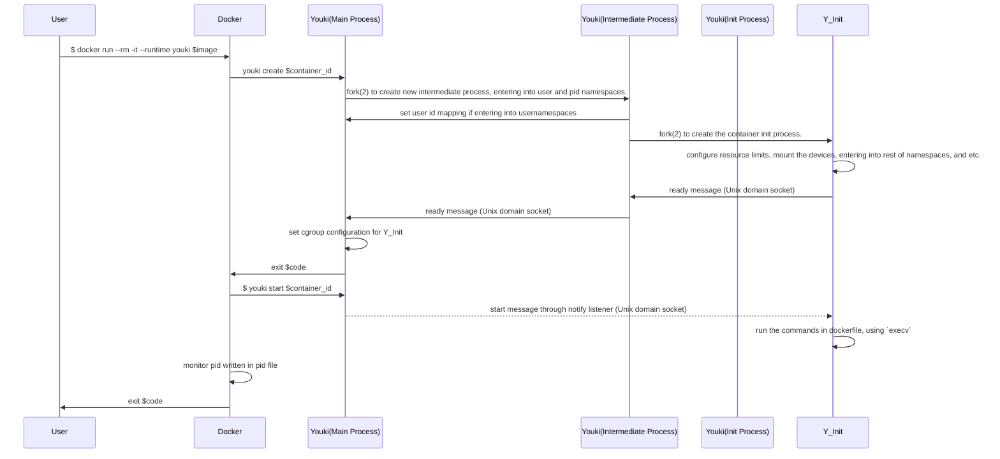

<a id="doc-06572a96a58dc510037d5efa"></a>

# youki-dev/youki / CHANGELOG.md

Upstream: https://github.com/youki-dev/youki/blob/54ab5353af8e94efffab3bf66301bf168c8425c6/CHANGELOG.md

Commit: `54ab5353af8e94efffab3bf66301bf168c8425c6`

Retrieved: 2026-10-01T15:47:18.781318+00:00

Kind: official-document

Raw SHA256: `767c709fd4ee9378f30cf5a0558bf02d99e79ad417d5d7a8f62369db9e4ad7de`

Source text below is untrusted reference content. Acquisition does not verify technical claims.

License status: UPSTREAM_NOTICES_CAPTURED_PER_FILE_REVIEW_REQUIRED. See this repository's captured license files.

---

# Changelog

## [v0.7.0](https://github.com/youki-dev/youki/compare/v0.6.0...v0.7.0) - 2026-07-23

### 💪 Improvements
- feat(checkpoint): add CRIU version validation as prerequisite for checkpoint/restore by @nayuta723 in https://github.com/youki-dev/youki/pull/3438
- Support manage-cgroup-mode option for checkpoint by @donkomura in https://github.com/youki-dev/youki/pull/3452
- fix(3207, 3209) Difference between the exec command in runc and youki by @tommady in https://github.com/youki-dev/youki/pull/3210
- fix(checkpoint): delete container state after checkpoint without --leave-running by @nayuta723 in https://github.com/youki-dev/youki/pull/3501
- feat: add with_bundle() builder for init containers by @JosiahParry in https://github.com/youki-dev/youki/pull/3502
- [ID-Mapped Mount] Impl Channel & Message by @YamasouA in https://github.com/youki-dev/youki/pull/3409
- [ID-Mapped Mount] add idmapped mount spec validation by @YamasouA in https://github.com/youki-dev/youki/pull/3572
- fix(libcgroups): add /run/systemd/private fallback for dbus system connection by @nayuta723 in https://github.com/youki-dev/youki/pull/3557
- feat(libcgroups): rootless cgroup v2 support by @JosiahParry in https://github.com/youki-dev/youki/pull/3609
- Support `--link-remap` checkpoint option by @donkomura in https://github.com/youki-dev/youki/pull/3618
- feat(checkpoint): register external namespaces with CRIU by @nayuta723 in https://github.com/youki-dev/youki/pull/3495
- Update LinuxIntelRdt to align with runtime-spec by @tommady in https://github.com/youki-dev/youki/pull/3523
- fix(libcgroups): `pids-limit` is set to 0, change it to 1 by @moz-sec in https://github.com/youki-dev/youki/pull/3634
- feat(youki-deploy): add DaemonSet-based installer for installing youki on Kubernetes   by @saku3 in https://github.com/youki-dev/youki/pull/3526
- support time namespace by @saku3 in https://github.com/youki-dev/youki/pull/3550
### 🐛 Bug Fixes
- fix duplicate mount entries on exec by @saku3 in https://github.com/youki-dev/youki/pull/3432
- fix: inherit config.json env vars in exec processes by @KevinKickass in https://github.com/youki-dev/youki/pull/3439
- Checking source file type with `is_dir()` in bind mount implementation by @logica0419 in https://github.com/youki-dev/youki/pull/3484
- fix(libcgroups): Set MemorySwapMax to 0 when memory::limit == memory::swap by @souk4711 in https://github.com/youki-dev/youki/pull/3488
- seccomp: fix multi-condition rule handling and follow runc for duplicate arg comparators by @saku3 in https://github.com/youki-dev/youki/pull/3489
- fix: validate process.terminal field against --console-socket option by @nayuta723 in https://github.com/youki-dev/youki/pull/3528
- fix: preserve mount flags for readonly remount of rootfs in init by @YawKar in https://github.com/youki-dev/youki/pull/3536
- fix: ratime and rnostrictatime mount options failing with EINVAL by @kechigon in https://github.com/youki-dev/youki/pull/3467
- fix(channel): split intermediate and init readiness channels by @uran0sH in https://github.com/youki-dev/youki/pull/3504
- fix: respect bundle option in youki spec command by @YawKar in https://github.com/youki-dev/youki/pull/3543
- fix(libcgroups): return typed error when systemd is not available by @SAY-5 in https://github.com/youki-dev/youki/pull/3546
- fix youki spec command overwrites the existing config.json by @tommady in https://github.com/youki-dev/youki/pull/3555
- fix: drop bounding caps by default if unset by @YawKar in https://github.com/youki-dev/youki/pull/3554
- Use process env for StartContainer hooks when without explicit hook env by @bells17 in https://github.com/youki-dev/youki/pull/3470
- fix: validation differences between youki and runc by @tommady in https://github.com/youki-dev/youki/pull/3556
- fix(libcontainer): consider gid_mappings when looking up id-map binaries by @tkshsbcue in https://github.com/youki-dev/youki/pull/3624
- fix(libcontainer): Bind mount detection should be based on bind/rbind options, not type == "bind" by @tommady in https://github.com/youki-dev/youki/pull/3611
- fix(libcontainer): scope pivot_root rslave to the old root only by @saku3 in https://github.com/youki-dev/youki/pull/3621
- fix: youki spec state vs runc spec state generated config differences by @tommady in https://github.com/youki-dev/youki/pull/3645
### 📖 Documentation improvements
- docs: add adopters and use cases page by @utam0k in https://github.com/youki-dev/youki/pull/3458
- fix(checkpoint): remove unimplemented options from help output by @nayuta723 in https://github.com/youki-dev/youki/pull/3455
- docs: update SECURITY.md with dedicated security contact email by @utam0k in https://github.com/youki-dev/youki/pull/3492
- docs: update logging guidance to reflect tracing usage by @saku3 in https://github.com/youki-dev/youki/pull/3498
- docs: add LF Projects copyright disclaimer by @saku3 in https://github.com/youki-dev/youki/pull/3521
- docs: promote @nayuta723 from Reviewer to Committer by @nayuta723 in https://github.com/youki-dev/youki/pull/3642
### 🧪 Test improvements and Misc Fixes
- Disable colors in logs by @stepancheg in https://github.com/youki-dev/youki/pull/3433
- [Bug]: Duplicate error and chain printing by @CarloQuick in https://github.com/youki-dev/youki/pull/3419
- test: remove runc skip for seccomp_notify and memory_policy by @nayuta723 in https://github.com/youki-dev/youki/pull/3445
- chore(deps): upgrade rust-criu to 0.5.0 and protobuf to 3.7.2 by @donkomura in https://github.com/youki-dev/youki/pull/3446
- docs(liboci-cli): add missing help descriptions to arguments and options by @xvchris in https://github.com/youki-dev/youki/pull/3456
- Fix logging for dropping capabilities by @stepancheg in https://github.com/youki-dev/youki/pull/3436
- contest: add checkpoint/restore integration tests by @nayuta723 in https://github.com/youki-dev/youki/pull/3448
- ci: install CRIU in containerd integration tests and skip checkpoint tests by @nayuta723 in https://github.com/youki-dev/youki/pull/3475
- Deduplicate e2e test hook helpers by @fspv in https://github.com/youki-dev/youki/pull/3412
- fix(cross): replace external apk-anywhere image with inlined Alpine apk in Dockerfile.musl by @saku3 in https://github.com/youki-dev/youki/pull/3491
- Add poststop_fail hook test by @fspv in https://github.com/youki-dev/youki/pull/3407
- fix: use correct fedora version number and deprecate riskv64 from lima-setup.sh by @gat786 in https://github.com/youki-dev/youki/pull/3497
- refactor: Use cargo autoinherit to factorize the dependencies by @lu-zero in https://github.com/youki-dev/youki/pull/3477
- chore: bump containerd to v2.2.3 and go to 1.24.3 by @tommady in https://github.com/youki-dev/youki/pull/3509
- ci: group wasmtime-related Dependabot updates by @saku3 in https://github.com/youki-dev/youki/pull/3511
- ci: remove unused cgroups v1 dind workflow steps by @saku3 in https://github.com/youki-dev/youki/pull/3512
- refactor: replace deprecated clap derive attributes with command and arg by @yan-ace62 in https://github.com/youki-dev/youki/pull/3466
- ci: build CRIU from source by @saku3 in https://github.com/youki-dev/youki/pull/3520
- docs: fix several typos in code, error messages, and docs by @Shion1305 in https://github.com/youki-dev/youki/pull/3535
- [Refactor] Use `&&` operator in if-let conditions by @logica0419 in https://github.com/youki-dev/youki/pull/3531
- Add checkpoint/restore integration tests to contest by @tommady in https://github.com/youki-dev/youki/pull/3493
- test(dind): pin docker:dind to 29.4 until youki supports time namespace by @saku3 in https://github.com/youki-dev/youki/pull/3539
- fix: parse info parameters exactly by @immanuwell in https://github.com/youki-dev/youki/pull/3541
- add aarch64 bundle for integration test by @saku3 in https://github.com/youki-dev/youki/pull/3530
- bump oci-spec 0.10.0 by @saku3 in https://github.com/youki-dev/youki/pull/3569
- Skip namespaces that are not specified for the init process by @saku3 in https://github.com/youki-dev/youki/pull/3551
- fix(wasmedge): replace unwrap with proper error propagation in exec by @immanuwell in https://github.com/youki-dev/youki/pull/3570
- chore: update rust to v1.96.0 by @YJDoc2 in https://github.com/youki-dev/youki/pull/3587
- feat(contest): add reason for TestResult::Skipped by @donkomura in https://github.com/youki-dev/youki/pull/3588
- test(contest): add update cgroup v2 common limits integration test by @hayama17 in https://github.com/youki-dev/youki/pull/3580
- test(config): Implement libcontainer config methods failure test cases by @Scanf-s in https://github.com/youki-dev/youki/pull/3602
- fix(utils): reject network device names exceeding the kernel limit according to the kernel reference by @Scanf-s in https://github.com/youki-dev/youki/pull/3608
- test: convert mount_into_container and cgroup_v2 tests to fd-based mock by @saku3 in https://github.com/youki-dev/youki/pull/3606
- test(contest): add cpu update integration tests for cgroup v2 by @hayama17 in https://github.com/youki-dev/youki/pull/3592
- test(contest): add update pids limit integration test by @moz-sec in https://github.com/youki-dev/youki/pull/3595
- test(contest): add cgroup v2 CPU update tests by @hayama17 in https://github.com/youki-dev/youki/pull/3614
- fix(contest): avoid flaky MAC race in checkpoint netdevice test by @donkomura in https://github.com/youki-dev/youki/pull/3640
- test(libcontainer): Implemented mount_console, verify_inode unit tests by @Scanf-s in https://github.com/youki-dev/youki/pull/3631
- add killsig test by @YamasouA in https://github.com/youki-dev/youki/pull/3612
- prepare v0.7.0 by @nayuta723 in https://github.com/youki-dev/youki/pull/3655
### Other Changes
- (auto merged) chore(deps): bump the patch group with 2 updates by @dependabot[bot] in https://github.com/youki-dev/youki/pull/3425
- chore(deps): bump uuid from 1.16.0 to 1.21.0 by @dependabot[bot] in https://github.com/youki-dev/youki/pull/3427
- chore(deps): bump tempfile from 3.24.0 to 3.25.0 by @dependabot[bot] in https://github.com/youki-dev/youki/pull/3426
- (auto merged) chore(deps): bump time from 0.3.45 to 0.3.47 by @dependabot[bot] in https://github.com/youki-dev/youki/pull/3449
- (auto merged) chore(deps): bump which from 8.0.0 to 8.0.2 in the patch group by @dependabot[bot] in https://github.com/youki-dev/youki/pull/3450
- (auto merged) chore(deps): bump quinn-proto from 0.11.13 to 0.11.14 by @dependabot[bot] in https://github.com/youki-dev/youki/pull/3451
- chore(deps): bump uuid from 1.21.0 to 1.22.0 by @dependabot[bot] in https://github.com/youki-dev/youki/pull/3443
- (auto merged) chore(deps): bump the patch group with 3 updates by @dependabot[bot] in https://github.com/youki-dev/youki/pull/3457
- (auto merged) chore(deps): bump lz4_flex from 0.12.0 to 0.12.1 by @dependabot[bot] in https://github.com/youki-dev/youki/pull/3459
- (auto merged) chore(deps): bump pathrs from 0.2.3 to 0.2.4 in the patch group by @dependabot[bot] in https://github.com/youki-dev/youki/pull/3460
- chore(deps): bump tempfile from 3.25.0 to 3.27.0 by @dependabot[bot] in https://github.com/youki-dev/youki/pull/3462
- (auto merged) chore(deps): bump tar from 0.4.44 to 0.4.45 in the patch group by @dependabot[bot] in https://github.com/youki-dev/youki/pull/3465
- (auto merged) chore(deps): bump env_logger from 0.11.9 to 0.11.10 in the patch group by @dependabot[bot] in https://github.com/youki-dev/youki/pull/3471
- chore(deps): bump uuid from 1.22.0 to 1.23.0 by @dependabot[bot] in https://github.com/youki-dev/youki/pull/3474
- chore(deps): bump wasmtime from 42.0.1 to 43.0.0 by @dependabot[bot] in https://github.com/youki-dev/youki/pull/3468
- chore(deps): bump wasi-common from 42.0.1 to 43.0.0 by @dependabot[bot] in https://github.com/youki-dev/youki/pull/3469
- (auto merged) chore(deps): bump libc from 0.2.183 to 0.2.184 in the patch group by @dependabot[bot] in https://github.com/youki-dev/youki/pull/3480
- Extend experiment seccomp program by @sat0ken in https://github.com/youki-dev/youki/pull/3464
- chore(deps): bump bytes from 1.6.0 to 1.11.1 in /experiment/seccomp by @dependabot[bot] in https://github.com/youki-dev/youki/pull/3487
- (auto merged) chore(deps): bump wasi-common from 43.0.0 to 43.0.1 in the patch group by @dependabot[bot] in https://github.com/youki-dev/youki/pull/3490
- (auto merged) chore(deps): bump the patch group with 2 updates by @dependabot[bot] in https://github.com/youki-dev/youki/pull/3494
- (auto merged) chore(deps): bump libc from 0.2.184 to 0.2.185 in the patch group by @dependabot[bot] in https://github.com/youki-dev/youki/pull/3496
- chore(deps): bump fastrand from 2.3.0 to 2.4.1 by @dependabot[bot] in https://github.com/youki-dev/youki/pull/3486
- (auto merged) chore(deps): bump uuid from 1.23.0 to 1.23.1 in the patch group by @dependabot[bot] in https://github.com/youki-dev/youki/pull/3505
- (auto merged) chore(deps): bump openssl from 0.10.75 to 0.10.78 by @dependabot[bot] in https://github.com/youki-dev/youki/pull/3513
- chore(deps): bump the wasmtime group with 2 updates by @dependabot[bot] in https://github.com/youki-dev/youki/pull/3514
- chore(deps): bump procfs from 0.17.0 to 0.18.0 by @dependabot[bot] in https://github.com/youki-dev/youki/pull/3290
- chore(deps): bump libc from 0.2.185 to 0.2.186 in the patch group across 1 directory by @dependabot[bot] in https://github.com/youki-dev/youki/pull/3516
- chore(deps): bump the wasmtime group across 1 directory with 2 updates by @dependabot[bot] in https://github.com/youki-dev/youki/pull/3519
- (auto merged) chore(deps): bump openssl from 0.10.78 to 0.10.79 by @dependabot[bot] in https://github.com/youki-dev/youki/pull/3532
- (auto merged) chore(deps): bump rkyv from 0.8.15 to 0.8.16 by @dependabot[bot] in https://github.com/youki-dev/youki/pull/3537
- (auto merged) chore(deps): bump tar from 0.4.45 to 0.4.46 in the patch group by @dependabot[bot] in https://github.com/youki-dev/youki/pull/3544
- (auto merged) chore(deps): bump serde_json from 1.0.149 to 1.0.150 in the patch group by @dependabot[bot] in https://github.com/youki-dev/youki/pull/3548
- (auto merged) chore(deps): bump openssl from 0.10.79 to 0.10.80 by @dependabot[bot] in https://github.com/youki-dev/youki/pull/3549
- (auto merged) chore(deps): bump uuid from 1.23.1 to 1.23.2 in the patch group by @dependabot[bot] in https://github.com/youki-dev/youki/pull/3574
- (auto merged) chore(deps): bump nc from 0.9.7 to 0.9.8 in the patch group by @dependabot[bot] in https://github.com/youki-dev/youki/pull/3579
- (auto merged) chore(deps): bump chrono from 0.4.44 to 0.4.45 in the patch group by @dependabot[bot] in https://github.com/youki-dev/youki/pull/3581
- (auto merged) chore(deps): bump which from 8.0.2 to 8.0.3 in the patch group by @dependabot[bot] in https://github.com/youki-dev/youki/pull/3582
- (auto merged) chore(deps): bump the patch group with 2 updates by @dependabot[bot] in https://github.com/youki-dev/youki/pull/3584
- chore(deps): bump serial_test from 3.4.0 to 3.5.0 by @dependabot[bot] in https://github.com/youki-dev/youki/pull/3575
- chore(deps): bump the wasmtime group across 1 directory with 2 updates by @dependabot[bot] in https://github.com/youki-dev/youki/pull/3583
- chore(deps): bump netlink-packet-route from 0.26.0 to 0.31.0 by @dependabot[bot] in https://github.com/youki-dev/youki/pull/3586
- (auto merged) chore(deps): bump the wasmtime group with 2 updates by @dependabot[bot] in https://github.com/youki-dev/youki/pull/3593
- (auto merged) chore(deps): bump which from 8.0.3 to 8.0.4 in the patch group by @dependabot[bot] in https://github.com/youki-dev/youki/pull/3598
- (auto merged) chore(deps): bump pathrs from 0.2.4 to 0.2.5 in the patch group by @dependabot[bot] in https://github.com/youki-dev/youki/pull/3601
- chore(deps): bump rust-criu from 0.5.0 to 0.6.1 by @dependabot[bot] in https://github.com/youki-dev/youki/pull/3610
- chore(deps): bump the wasmtime group with 2 updates by @dependabot[bot] in https://github.com/youki-dev/youki/pull/3613
- (auto merged) chore(deps): bump the wasmtime group with 2 updates by @dependabot[bot] in https://github.com/youki-dev/youki/pull/3615
- (auto merged) chore(deps): bump uuid from 1.23.3 to 1.23.4 in the patch group by @dependabot[bot] in https://github.com/youki-dev/youki/pull/3616
- (auto merged) chore(deps): bump the patch group with 2 updates by @dependabot[bot] in https://github.com/youki-dev/youki/pull/3617
- chore(deps): bump mockall from 0.14.0 to 0.15.0 by @dependabot[bot] in https://github.com/youki-dev/youki/pull/3625
- (auto merged) chore(deps): bump rand from 0.10.1 to 0.10.2 in the patch group by @dependabot[bot] in https://github.com/youki-dev/youki/pull/3635
- (auto merged) chore(deps): bump uuid from 1.23.4 to 1.23.5 in the patch group by @dependabot[bot] in https://github.com/youki-dev/youki/pull/3648
- chore(deps): bump regex from 1.12.4 to 1.13.0 by @dependabot[bot] in https://github.com/youki-dev/youki/pull/3647
- (auto merged) chore(deps): bump the patch group with 2 updates by @dependabot[bot] in https://github.com/youki-dev/youki/pull/3651
- chore(deps): bump uuid from 1.23.5 to 1.24.0 by @dependabot[bot] in https://github.com/youki-dev/youki/pull/3652
- (auto merged) chore(deps): bump the patch group across 1 directory with 5 updates by @dependabot[bot] in https://github.com/youki-dev/youki/pull/3660
- (auto merged) chore(deps): bump libc from 0.2.187 to 0.2.189 in the patch group by @dependabot[bot] in https://github.com/youki-dev/youki/pull/3663

## [v0.6.0](https://github.com/youki-dev/youki/compare/v0.5.7...v0.6.0) - 2026-02-25
### 💪 Improvements
- Add net device feature by @nayuta723 in https://github.com/youki-dev/youki/pull/3163
- feat(info): add rustc, spec, and libseccomp version by @nayuta723 in https://github.com/youki-dev/youki/pull/3318
- Implement Linux memory policy by @n4mlz in https://github.com/youki-dev/youki/pull/3230
- feat: add io limits controller for systemd by @gokulmaxi in https://github.com/youki-dev/youki/pull/3235
- Added SECCOMP_FILTER_FLAG_WAIT_KILLABLE_RECV by @viboognesh in https://github.com/youki-dev/youki/pull/3404
### 💥 Breaking Changes
- fix hooks order by @saku3 in https://github.com/youki-dev/youki/pull/3256
- mount info provider by @CheatCodeSam in https://github.com/youki-dev/youki/pull/3280
- Use oci spec container process state for seccomp by @nayuta723 in https://github.com/youki-dev/youki/pull/3330
- refactor(hooks): pass OCI-compliant state to lifecycle hooks by @nayuta723 in https://github.com/youki-dev/youki/pull/3346
### 🐛 Bug Fixes
- Implement mount destination validation to ensure absolute paths in OCI Runtime Spec by @nayuta723 in https://github.com/youki-dev/youki/pull/3315
- Fix default filemode for device creation by @you-matsuura in https://github.com/youki-dev/youki/pull/3276
- fix(3293) Ambient capabilities are not applied as expected by @tommady in https://github.com/youki-dev/youki/pull/3294
- fix(libcgroups): set `sz` field in `bpf_prog_load_opts` by @sou1118 in https://github.com/youki-dev/youki/pull/3340
- Fix recursive mount_setattr handling for rec_attr and improve mounts_recursive tests by @saku3 in https://github.com/youki-dev/youki/pull/3345
- fix(libcgroups): pass `full_path` to Devices controller instead of `cgroup_path` by @sou1118 in https://github.com/youki-dev/youki/pull/3355
- refactor(tty): call setup_console after pivot_root, use syscall for mount_console by @nayuta723 in https://github.com/youki-dev/youki/pull/3333
- Align with runc: use user's HOME when HOME is empty string by @bells17 in https://github.com/youki-dev/youki/pull/3269
- Refactor checkpoint by @nayuta723 in https://github.com/youki-dev/youki/pull/3365
### 📖 Documentation improvements
- chore: fix docs mdbook toml by @YJDoc2 in https://github.com/youki-dev/youki/pull/3307
- Doc: delete redundant statement on youki.md in dev doc by @logica0419 in https://github.com/youki-dev/youki/pull/3310
- Fix typos in documentation by @oglok in https://github.com/youki-dev/youki/pull/3343
- (chore) Fix broken links in user document by @donkomura in https://github.com/youki-dev/youki/pull/3361
- add tommady as reviewers into doc by @tommady in https://github.com/youki-dev/youki/pull/3369
- added saku3 as committer into doc by @saku3 in https://github.com/youki-dev/youki/pull/3370
- add nayuta723 as reviewer into doc by @nayuta723 in https://github.com/youki-dev/youki/pull/3373
### 🧪 Test improvements and Misc Fixes
- Update netlink-packet dependencies to versions 0.8.1 and 0.25.1 in Cargo.toml and Cargo.lock by @nayuta723 in https://github.com/youki-dev/youki/pull/3297
- Fixed minor spelling errors in libcontainer documentation. by @CheatCodeSam in https://github.com/youki-dev/youki/pull/3305
- Add poststart hook test by @fspv in https://github.com/youki-dev/youki/pull/3292
- Update/runc 1.4.0 by @nayuta723 in https://github.com/youki-dev/youki/pull/3304
- chore: runc compatibility test improvements by @saku3 in https://github.com/youki-dev/youki/pull/3319
- Replace once_cell with stdlib OnceLock/LazyLock by @yan-ace62 in https://github.com/youki-dev/youki/pull/3323
- Update Kind and Kubernetes versions for k8s e2e tests by @IrvingMg in https://github.com/youki-dev/youki/pull/3328
- ci(basic): pin Rust toolchain to 1.92.0 for cross-rs compatibility by @nayuta723 in https://github.com/youki-dev/youki/pull/3348
- test: output contest logs to stdout by @saku3 in https://github.com/youki-dev/youki/pull/3349
- Add poststart_fail hook test by @fspv in https://github.com/youki-dev/youki/pull/3313
- Added new test "kill no effect" by @oneplus1000 in https://github.com/youki-dev/youki/pull/3332
- Pass State directly to `run_hooks` instead of Container reference by @IrvingMg in https://github.com/youki-dev/youki/pull/3360
- Batch running the test groups in test_framework by @donkomura in https://github.com/youki-dev/youki/pull/3372
- refact mount_recursive test by @saku3 in https://github.com/youki-dev/youki/pull/3383
- Add test poststop hook by @donkomura in https://github.com/youki-dev/youki/pull/3395
- Add prestart hook test by @fspv in https://github.com/youki-dev/youki/pull/3382
- Add create_runtime hook test by @fspv in https://github.com/youki-dev/youki/pull/3396
- Sync the state to confirm hooks execution by @donkomura in https://github.com/youki-dev/youki/pull/3385
- Include container status to IncorrectStatus error messaging by @CarloQuick in https://github.com/youki-dev/youki/pull/3411
- Add prestart_fail hook test by @fspv in https://github.com/youki-dev/youki/pull/3406
- chore(deps): bump wasmer, wasmtime by @YJDoc2 in https://github.com/youki-dev/youki/pull/3423
- prepare v0.6.0 by @saku3 in https://github.com/youki-dev/youki/pull/3424
### Other Changes
- chore(deps): bump which from 7.0.2 to 8.0.0 by @dependabot[bot] in https://github.com/youki-dev/youki/pull/3287
- (auto merged) chore(deps): bump the patch group across 1 directory with 2 updates by @dependabot[bot] in https://github.com/youki-dev/youki/pull/3302
- (auto merged) chore(deps): bump tracing-journald from 0.3.1 to 0.3.2 in the patch group by @dependabot[bot] in https://github.com/youki-dev/youki/pull/3303
- (auto merged) chore(deps): bump the patch group with 2 updates by @dependabot[bot] in https://github.com/youki-dev/youki/pull/3306
- chore(deps): bump mockall from 0.13.1 to 0.14.0 by @dependabot[bot] in https://github.com/youki-dev/youki/pull/3301
- chore(deps): bump wasmtime from 31.0.0 to 35.0.0 by @dependabot[bot] in https://github.com/youki-dev/youki/pull/3288
- (auto merged) chore(deps): bump libc from 0.2.177 to 0.2.178 in the patch group by @dependabot[bot] in https://github.com/youki-dev/youki/pull/3308
- chore(deps): bump netlink-packet-route from 0.25.1 to 0.26.0 by @dependabot[bot] in https://github.com/youki-dev/youki/pull/3316
- (auto merged) chore(deps): bump oci-spec from 0.8.3 to 0.8.4 in the patch group by @dependabot[bot] in https://github.com/youki-dev/youki/pull/3329
- (auto merged) chore(deps): bump tracing from 0.1.43 to 0.1.44 in the patch group by @dependabot[bot] in https://github.com/youki-dev/youki/pull/3331
- (auto merged) chore(deps): bump serde_json from 1.0.145 to 1.0.146 in the patch group by @dependabot[bot] in https://github.com/youki-dev/youki/pull/3334
- (auto merged) chore(deps): bump serde_json from 1.0.146 to 1.0.147 in the patch group by @dependabot[bot] in https://github.com/youki-dev/youki/pull/3337
- (auto merged) chore(deps): bump serde_json from 1.0.147 to 1.0.148 in the patch group by @dependabot[bot] in https://github.com/youki-dev/youki/pull/3341
- (auto merged) chore(deps): bump libc from 0.2.178 to 0.2.179 in the patch group by @dependabot[bot] in https://github.com/youki-dev/youki/pull/3352
- (auto merged) chore(deps): bump serde_json from 1.0.148 to 1.0.149 in the patch group by @dependabot[bot] in https://github.com/youki-dev/youki/pull/3354
- chore(deps): bump serial_test from 3.2.0 to 3.3.1 by @dependabot[bot] in https://github.com/youki-dev/youki/pull/3353
- chore(deps): bump wasmtime from 35.0.0 to 40.0.0 by @dependabot[bot] in https://github.com/youki-dev/youki/pull/3335
- chore(deps): bump tempfile from 3.23.0 to 3.24.0 by @dependabot[bot] in https://github.com/youki-dev/youki/pull/3338
- (auto merged) chore(deps): bump the patch group with 2 updates by @dependabot[bot] in https://github.com/youki-dev/youki/pull/3356
- (auto merged) chore(deps): bump libc from 0.2.179 to 0.2.180 in the patch group by @dependabot[bot] in https://github.com/youki-dev/youki/pull/3357
- (auto merged) chore(deps): bump flate2 from 1.1.5 to 1.1.8 in the patch group by @dependabot[bot] in https://github.com/youki-dev/youki/pull/3359
- (auto merged) chore(deps): bump the patch group with 3 updates by @dependabot[bot] in https://github.com/youki-dev/youki/pull/3363
- (auto merged) chore(deps): bump the patch group across 1 directory with 2 updates by @dependabot[bot] in https://github.com/youki-dev/youki/pull/3371
- chore(deps): bump vergen-gitcl from 1.0.8 to 9.1.0 by @dependabot[bot] in https://github.com/youki-dev/youki/pull/3368
- (auto merged) chore(deps): bump wasmtime from 40.0.2 to 40.0.3 by @dependabot[bot] in https://github.com/youki-dev/youki/pull/3376
- (auto merged) chore(deps): bump pathrs from 0.2.2 to 0.2.3 in the patch group by @dependabot[bot] in https://github.com/youki-dev/youki/pull/3379
- (auto merged) chore(deps): bump bytes from 1.11.0 to 1.11.1 by @dependabot[bot] in https://github.com/youki-dev/youki/pull/3388
- (auto merged) chore(deps): bump the patch group with 2 updates by @dependabot[bot] in https://github.com/youki-dev/youki/pull/3389
- (auto merged) chore(deps): bump libbpf-sys from 1.6.2+v1.6.2 to 1.6.3+v1.6.3 in the patch group by @dependabot[bot] in https://github.com/youki-dev/youki/pull/3390
- (auto merged) chore(deps): bump anyhow from 1.0.100 to 1.0.101 in the patch group by @dependabot[bot] in https://github.com/youki-dev/youki/pull/3393
- chore(deps): bump quickcheck from 1.0.3 to 1.1.0 by @dependabot[bot] in https://github.com/youki-dev/youki/pull/3401
- chore(deps): bump rand from 0.9.2 to 0.10.0 by @dependabot[bot] in https://github.com/youki-dev/youki/pull/3397
- chore(deps): bump tempfile from 3.24.0 to 3.25.0 by @dependabot[bot] in https://github.com/youki-dev/youki/pull/3400
- (auto merged) chore(deps): bump the patch group across 1 directory with 2 updates by @dependabot[bot] in https://github.com/youki-dev/youki/pull/3413
- (auto merged) chore(deps): bump chrono from 0.4.43 to 0.4.44 in the patch group by @dependabot[bot] in https://github.com/youki-dev/youki/pull/3414
- (auto merged) chore(deps): bump wasmtime from 40.0.3 to 40.0.4 by @dependabot[bot] in https://github.com/youki-dev/youki/pull/3420
- chore(deps): bump serial_test from 3.3.1 to 3.4.0 by @dependabot[bot] in https://github.com/youki-dev/youki/pull/3416
- chore(deps): bump wasmtime and wasi-common from 40.0.4 to 41.0.4 by @dependabot[bot] in https://github.com/youki-dev/youki/pull/3421
- chore(deps): bump rbpf from 0.3.0 to 0.4.1 by @dependabot[bot] in https://github.com/youki-dev/youki/pull/3398

## [v0.5.7](https://github.com/youki-dev/youki/compare/v0.5.6...v0.5.7) - 2025-11-05
### 💪 Improvements
- Drop cgroup v1 in github workflows by @utam0k in https://github.com/youki-dev/youki/pull/3284
### 🐛 Bug Fixes
- Waiting on systemd to add intermediate process to cgroup. by @CheatCodeSam in https://github.com/youki-dev/youki/pull/3262
### 🧪 Test improvements and Misc Fixes
- Update/runc 1.3.2 by @n4mlz in https://github.com/youki-dev/youki/pull/3274
### Other Changes
- (auto merged) chore(deps): bump flate2 from 1.1.4 to 1.1.5 in the patch group by @dependabot[bot] in https://github.com/youki-dev/youki/pull/3281

## [v0.5.6](https://github.com/youki-dev/youki/compare/v0.5.5...v0.5.6) - 2025-10-24
### 💪 Improvements
- fix(3197): fix youki version command Part of Enhancing Compatibility with runc by @tommady in https://github.com/youki-dev/youki/pull/3200
- feat(3199): Add Linux personality support by @tommady in https://github.com/youki-dev/youki/pull/3202
### 💥 Breaking Changes
- Upgrade to Rust 1.89 and Edition 2024 by @utam0k in https://github.com/youki-dev/youki/pull/3244
### 📖 Documentation improvements
- added saku3 as reviewers by @saku3 in https://github.com/youki-dev/youki/pull/3228
- Changed the events_logger in the Dev Container to file by @bells17 in https://github.com/youki-dev/youki/pull/3221
- Update Rust edition requirement in docs to 2024 by @FalkWoldmann in https://github.com/youki-dev/youki/pull/3246
- Update basic_setup.md by @bells17 in https://github.com/youki-dev/youki/pull/3253
### 🧪 Test improvements and Misc Fixes
- Update Vagrantfile to support the ARM architecture by @bells17 in https://github.com/youki-dev/youki/pull/3222
- setup runc integration test by @saku3 in https://github.com/youki-dev/youki/pull/3182
- update runc ci to 1.3.1 by @saku3 in https://github.com/youki-dev/youki/pull/3237
- Add mdbook binary to devcontainer by @bells17 in https://github.com/youki-dev/youki/pull/3240
- Unskip runc tests after CI runc update 1.3.1 by @saku3 in https://github.com/youki-dev/youki/pull/3249
- Fix podman ci by @saku3 in https://github.com/youki-dev/youki/pull/3260
- add misc_props test by @YamasouA in https://github.com/youki-dev/youki/pull/3250
- chore(deps): bump libseccomp from 0.3.0 to 0.4.0 by @MattPatchava in https://github.com/youki-dev/youki/pull/3275
### Other Changes
- (auto merged) chore(deps): bump thiserror from 2.0.14 to 2.0.15 in the patch group by @dependabot[bot] in https://github.com/youki-dev/youki/pull/3223
- (auto merged) chore(deps): bump serde_json from 1.0.142 to 1.0.143 in the patch group by @dependabot[bot] in https://github.com/youki-dev/youki/pull/3225
- (auto merged) chore(deps): bump thiserror from 2.0.15 to 2.0.16 in the patch group by @dependabot[bot] in https://github.com/youki-dev/youki/pull/3226
- chore(deps): bump tempfile from 3.20.0 to 3.21.0 by @dependabot[bot] in https://github.com/youki-dev/youki/pull/3224
- (auto merged) chore(deps): bump regex from 1.11.1 to 1.11.2 in the patch group by @dependabot[bot] in https://github.com/youki-dev/youki/pull/3229
- (auto merged) chore(deps): bump tracing-subscriber from 0.3.19 to 0.3.20 by @dependabot[bot] in https://github.com/youki-dev/youki/pull/3231
- (auto merged) chore(deps): bump chrono from 0.4.41 to 0.4.42 in the patch group by @dependabot[bot] in https://github.com/youki-dev/youki/pull/3239
- (auto merged) chore(deps): bump errno from 0.3.13 to 0.3.14 in the patch group by @dependabot[bot] in https://github.com/youki-dev/youki/pull/3241
- (auto merged) chore(deps): bump the patch group with 2 updates by @dependabot[bot] in https://github.com/youki-dev/youki/pull/3245
- chore(deps): bump tempfile from 3.21.0 to 3.22.0 by @dependabot[bot] in https://github.com/youki-dev/youki/pull/3242
- (auto merged) chore(deps): bump serde from 1.0.223 to 1.0.224 in the patch group by @dependabot[bot] in https://github.com/youki-dev/youki/pull/3247
- (auto merged) chore(deps): bump serde from 1.0.224 to 1.0.225 in the patch group by @dependabot[bot] in https://github.com/youki-dev/youki/pull/3248
- (auto merged) chore(deps): bump the patch group with 2 updates by @dependabot[bot] in https://github.com/youki-dev/youki/pull/3251
- (auto merged) chore(deps): bump libc from 0.2.175 to 0.2.176 in the patch group by @dependabot[bot] in https://github.com/youki-dev/youki/pull/3254
- chore(deps): bump tempfile from 3.22.0 to 3.23.0 by @dependabot[bot] in https://github.com/youki-dev/youki/pull/3255
- (auto merged) chore(deps): bump the patch group with 2 updates by @dependabot[bot] in https://github.com/youki-dev/youki/pull/3257
- (auto merged) chore(deps): bump the patch group with 2 updates by @dependabot[bot] in https://github.com/youki-dev/youki/pull/3261
- (auto merged) chore(deps): bump flate2 from 1.1.2 to 1.1.4 in the patch group by @dependabot[bot] in https://github.com/youki-dev/youki/pull/3268
- (auto merged) chore(deps): bump the patch group with 2 updates by @dependabot[bot] in https://github.com/youki-dev/youki/pull/3270
- (auto merged) chore(deps): bump libc from 0.2.176 to 0.2.177 in the patch group by @dependabot[bot] in https://github.com/youki-dev/youki/pull/3271
- chore(deps): bump regex from 1.11.3 to 1.12.1 by @dependabot[bot] in https://github.com/youki-dev/youki/pull/3272
- (auto merged) chore(deps): bump regex from 1.12.1 to 1.12.2 in the patch group by @dependabot[bot] in https://github.com/youki-dev/youki/pull/3273
- (auto merged) chore(deps): bump caps from 0.5.5 to 0.5.6 in the patch group by @dependabot[bot] in https://github.com/youki-dev/youki/pull/3277

## [v0.5.5](https://github.com/youki-dev/youki/compare/v0.5.4...v0.5.5) - 2025-08-14
### 💪 Improvements
- fix(3198): fix difference in how commands are passed after exec and ps by @tommady in https://github.com/youki-dev/youki/pull/3201
### 📖 Documentation improvements
- Add license scan report and status by @fossabot in https://github.com/youki-dev/youki/pull/3204
### 🧪 Test improvements and Misc Fixes
- Revert "[DNM] ci: temp disable workflows" by @YJDoc2 in https://github.com/youki-dev/youki/pull/3194
- Fixed Minor Spelling Errors by @CheatCodeSam in https://github.com/youki-dev/youki/pull/3205
- chore(justfile):add install recipe by @saku3 in https://github.com/youki-dev/youki/pull/3213
### Other Changes
- (auto merged) chore(deps): bump the patch group with 2 updates by @dependabot[bot] in https://github.com/youki-dev/youki/pull/3203
- (auto merged) chore(deps): bump serde_json from 1.0.141 to 1.0.142 in the patch group by @dependabot[bot] in https://github.com/youki-dev/youki/pull/3212
- (auto merged) chore(deps): bump the patch group with 3 updates by @dependabot[bot] in https://github.com/youki-dev/youki/pull/3217
- (auto merged) chore(deps): bump oci-spec from 0.8.1 to 0.8.2 in the patch group by @dependabot[bot] in https://github.com/youki-dev/youki/pull/3219
- chore(deps): bump libbpf-sys from 1.5.2+v1.5.1 to 1.6.1+v1.6.1 by @dependabot[bot] in https://github.com/youki-dev/youki/pull/3218

## [v0.5.4](https://github.com/youki-dev/youki/compare/v0.5.3...v0.5.4) - 2025-07-17
### 💪 Improvements
- add support exec-cpu-affinity by @saku3 in https://github.com/youki-dev/youki/pull/3164
- fix: allow duplicate additionalGids by @saku3 in https://github.com/youki-dev/youki/pull/3189
### 🐛 Bug Fixes
- use additional gids,user,group in exec, inject path iif not given by @YJDoc2 in https://github.com/youki-dev/youki/pull/3131
- fix: mount retry and logging by @z63d in https://github.com/youki-dev/youki/pull/3157
- fix: Gracefully terminate processes after successful execution of Wasm executors by @z63d in https://github.com/youki-dev/youki/pull/3099
- fix: Running create_runtime hook after container is set to created. by @CheatCodeSam in https://github.com/youki-dev/youki/pull/3181
- fix: Ignoring CPU realtime on cgroupsv2 if set to zero by @CheatCodeSam in https://github.com/youki-dev/youki/pull/3180
### 📖 Documentation improvements
- Add the CNCF footer in README.md by @utam0k in https://github.com/youki-dev/youki/pull/3140
- chore(docs): Fix codecov link in README by @khanhtc1202 in https://github.com/youki-dev/youki/pull/3129
- Fixed grammatical error in README by @CheatCodeSam in https://github.com/youki-dev/youki/pull/3160
- fix: protobuf bug on docs rs by @mdaffad in https://github.com/youki-dev/youki/pull/3159
- docs: clarify reviewer qualification and self-nomination process by @utam0k in https://github.com/youki-dev/youki/pull/3175
### 🧪 Test improvements and Misc Fixes
- bump nix to 0.29.0 by @kemingy in https://github.com/youki-dev/youki/pull/3123
- update rust version to 1.85.0 by @YJDoc2 in https://github.com/youki-dev/youki/pull/3085
- add-test-linux_rootfs_propagation by @saku3 in https://github.com/youki-dev/youki/pull/3024
- Add a relative_network_cgroups test as one of the integration tests by @moz-sec in https://github.com/youki-dev/youki/pull/2986
- Refactor init process by @utam0k in https://github.com/youki-dev/youki/pull/3158
- add kill test by @YamasouA in https://github.com/youki-dev/youki/pull/2996
- allow running selected tests in contest.sh and justfile by @saku3 in https://github.com/youki-dev/youki/pull/3165
- fix: capet Ambient log level by @z63d in https://github.com/youki-dev/youki/pull/3150
- add test process_capabilities_fail by @kazmsk in https://github.com/youki-dev/youki/pull/3010
- fix typos and outdated typos ci action by @howjmay in https://github.com/youki-dev/youki/pull/3168
- add a system call mock for uid/gid. by @nayuta-ai in https://github.com/youki-dev/youki/pull/3173
- fix: remove println statements from contest tests by @YJDoc2 in https://github.com/youki-dev/youki/pull/3167
- Installing kubectl in dev container. by @CheatCodeSam in https://github.com/youki-dev/youki/pull/3177
- Add uid_mappings test by @moz-sec in https://github.com/youki-dev/youki/pull/3161
- fix: update devcontainer.json by @AobaIwaki123 in https://github.com/youki-dev/youki/pull/3172
- Remove oci tests that are duplicates of contest by @utam0k in https://github.com/youki-dev/youki/pull/3042
- Remove oci tests that are duplicates of contest by @saku3 in https://github.com/youki-dev/youki/pull/3184
- Fix debug logging for CPU affinity bitmask by @saku3 in https://github.com/youki-dev/youki/pull/3191
- [DNM] ci: temp disable workflows by @YJDoc2 in https://github.com/youki-dev/youki/pull/3192
### Other Changes
- chore(deps): bump uuid from 1.15.1 to 1.16.0 by @dependabot[bot] in https://github.com/youki-dev/youki/pull/3113
- (auto merged) chore(deps): bump once_cell from 1.21.1 to 1.21.2 in the patch group by @dependabot[bot] in https://github.com/youki-dev/youki/pull/3126
- (auto merged) chore(deps): bump once_cell from 1.21.2 to 1.21.3 in the patch group by @dependabot[bot] in https://github.com/youki-dev/youki/pull/3128
- (auto merged) chore(deps): bump the patch group with 2 updates by @dependabot[bot] in https://github.com/youki-dev/youki/pull/3133
- (auto merged) chore(deps): bump errno from 0.3.10 to 0.3.11 in the patch group by @dependabot[bot] in https://github.com/youki-dev/youki/pull/3135
- (auto merged) chore(deps): bump openssl from 0.10.70 to 0.10.72 by @dependabot[bot] in https://github.com/youki-dev/youki/pull/3134
- chore(deps): bump wasmtime from 29.0.1 to 31.0.0 by @dependabot[bot] in https://github.com/youki-dev/youki/pull/3121
- (auto merged) chore(deps): bump vergen-gitcl from 1.0.5 to 1.0.7 in the patch group by @dependabot[bot] in https://github.com/youki-dev/youki/pull/3142
- (auto merged) chore(deps): bump crossbeam-channel from 0.5.12 to 0.5.15 by @dependabot[bot] in https://github.com/youki-dev/youki/pull/3143
- (auto merged) chore(deps): bump vergen-gitcl from 1.0.7 to 1.0.8 in the patch group by @dependabot[bot] in https://github.com/youki-dev/youki/pull/3145
- (auto merged) chore(deps): bump anyhow from 1.0.97 to 1.0.98 in the patch group by @dependabot[bot] in https://github.com/youki-dev/youki/pull/3147
- (auto merged) chore(deps): bump libc from 0.2.171 to 0.2.172 in the patch group by @dependabot[bot] in https://github.com/youki-dev/youki/pull/3148
- (auto merged) chore(deps): bump rand from 0.9.0 to 0.9.1 in the patch group by @dependabot[bot] in https://github.com/youki-dev/youki/pull/3149
- chore(deps): bump tokio from 1.37.0 to 1.44.2 by @dependabot[bot] in https://github.com/youki-dev/youki/pull/3137
- Bump oci-spec.rs to v0.8.1 by @saku3 in https://github.com/youki-dev/youki/pull/3154
- (auto merged) chore(deps): bump chrono from 0.4.40 to 0.4.41 in the patch group by @dependabot[bot] in https://github.com/youki-dev/youki/pull/3156
- (auto merged) chore(deps): bump errno from 0.3.11 to 0.3.12 in the patch group by @dependabot[bot] in https://github.com/youki-dev/youki/pull/3169
- selinux: lima vm by @utam0k in https://github.com/youki-dev/youki/pull/3162
- chore(deps): bump tokio from 1.37.0 to 1.38.2 in /experiment/seccomp by @dependabot[bot] in https://github.com/youki-dev/youki/pull/3138
- (auto merged) chore(deps): bump libbpf-sys from 1.5.0+v1.5.0 to 1.5.1+v1.5.1 in the patch group by @dependabot[bot] in https://github.com/youki-dev/youki/pull/3171
- chore(deps): bump num_cpus from 1.16.0 to 1.17.0 by @dependabot[bot] in https://github.com/youki-dev/youki/pull/3176
- chore(deps): bump tempfile from 3.19.1 to 3.20.0 by @dependabot[bot] in https://github.com/youki-dev/youki/pull/3166
- (auto merged) chore(deps): bump flate2 from 1.1.1 to 1.1.2 in the patch group by @dependabot[bot] in https://github.com/youki-dev/youki/pull/3183
- chore(deps): bump libc from 0.2.172 to 0.2.173 in the patch group by @dependabot[bot] in https://github.com/youki-dev/youki/pull/3185
- (auto merged) chore(deps): bump libc from 0.2.173 to 0.2.174 in the patch group by @dependabot[bot] in https://github.com/youki-dev/youki/pull/3187
- (auto merged) chore(deps): bump errno from 0.3.12 to 0.3.13 in the patch group by @dependabot[bot] in https://github.com/youki-dev/youki/pull/3188
- (auto merged) chore(deps): bump libbpf-sys from 1.5.1+v1.5.1 to 1.5.2+v1.5.1 in the patch group by @dependabot[bot] in https://github.com/youki-dev/youki/pull/3190

## [v0.5.3](https://github.com/youki-dev/youki/compare/v0.5.2...v0.5.3) - 2025-03-21
### 🐛 Bug Fixes
- Security: Fix compromised `tj-actions/changed-files` action by @sou1118 in https://github.com/youki-dev/youki/pull/3112
### 🧪 Test improvements and Misc Fixes
- Fix the release flow by @utam0k in https://github.com/youki-dev/youki/pull/3098
- chore(ci): add cgroup v1 compatibility for tests on ubuntu-24.04 by @sou1118 in https://github.com/youki-dev/youki/pull/3102
- fix: CPU controller tests for Kernel 6.10 cgroup v2 changes by @sou1118 in https://github.com/youki-dev/youki/pull/3106
- chore(ci): Upgrade GitHub Actions workflows for `ubuntu-24.04` by @sou1118 in https://github.com/youki-dev/youki/pull/3097
- fix: release ci tests also need apparmor disable by @YJDoc2 in https://github.com/youki-dev/youki/pull/3118
- chore(ci): add criu ppa for podman-tests ci by @sou1118 in https://github.com/youki-dev/youki/pull/3120

## [v0.5.2](https://github.com/youki-dev/youki/compare/v0.5.1...v0.5.2) - 2025-03-04
### 💪 Improvements
- Support feature subcommand by @musaprg in https://github.com/youki-dev/youki/pull/2837
### 🐛 Bug Fixes
- fix(libcgroup): fix disable_oom_killer in cgroup v1 by @xujihui1985 in https://github.com/youki-dev/youki/pull/3090
### 🧪 Test improvements and Misc Fixes
- Add a PR template file by @Gekko0114 in https://github.com/youki-dev/youki/pull/3049
- add process rlimits fail test by @ntkm61027 in https://github.com/youki-dev/youki/pull/3051
- Use MountOption enum to parse mount options defined in the spec by @musaprg in https://github.com/youki-dev/youki/pull/2937
- ci: Publish packages after the release flow by @utam0k in https://github.com/youki-dev/youki/pull/3064
- Make `sepc` into `&spec` in test_{outside,inside}_containe by @utam0k in https://github.com/youki-dev/youki/pull/3068
- linux_masked_paths integration test by @nayuta-ai in https://github.com/youki-dev/youki/pull/2950
- fix: compilation errors in contest by @YJDoc2 in https://github.com/youki-dev/youki/pull/3086
- Remove problematic comments between package name in apt install by @musaprg in https://github.com/youki-dev/youki/pull/3060
- Add `delete` test by @sou1118 in https://github.com/youki-dev/youki/pull/3082
### Other Changes
- Upgrade direct dep rand to 0.9.0 by @YJDoc2 in https://github.com/youki-dev/youki/pull/3083
- rollup multiple dep updates by @YJDoc2 in https://github.com/youki-dev/youki/pull/3084
- lset_file_label should check for symlink instead of raw file by @foreverddong in https://github.com/youki-dev/youki/pull/3073

## [v0.5.1](https://github.com/youki-dev/youki/compare/v0.5.0...v0.5.1) - 2025-01-06
### 🐛 Bug Fixes
- Fix building the wasmedge feature by @utam0k in https://github.com/youki-dev/youki/pull/3041
### 🧪 Test improvements and Misc Fixes
- Do `cargo check` before releasing a new version by @utam0k in https://github.com/youki-dev/youki/pull/3039

## [v0.5.0](https://github.com/youki-dev/youki/compare/v0.4.1...v0.5.0) - 2025-01-02
### 💪 Improvements
- libcontainer: support set stdios for container by @abel-von in https://github.com/youki-dev/youki/pull/2961
- Add option to spawn processes as siblings by @jprendes in https://github.com/youki-dev/youki/pull/3012
### 💥 Breaking Changes
- libcontainer: use OwnedFd as console_socket  in ContainerBuilder by @abel-von in https://github.com/youki-dev/youki/pull/2966
### 🐛 Bug Fixes
- Fixed ENAMETOOLONG error in setup_console_socket by @morganllewellynjones in https://github.com/youki-dev/youki/pull/2915
- fix(libcontainer) no_pivot args is not used by @xujihui1985 in https://github.com/youki-dev/youki/pull/2923
- Fix/return multi errors on create failed by @xujihui1985 in https://github.com/youki-dev/youki/pull/2998
- fix duplicate gids in container creation by @YJDoc2 in https://github.com/youki-dev/youki/pull/3019
- Fix --preserve-fds, eliminate stray FD being passed into container by @aidanhs in https://github.com/youki-dev/youki/pull/2893
### 📖 Documentation improvements
- Add the affiliations of youki maintainers by @utam0k in https://github.com/youki-dev/youki/pull/2947
- docs: update github pages links by @tskxz in https://github.com/youki-dev/youki/pull/2969
- switch from license-file to license by @jprendes in https://github.com/youki-dev/youki/pull/3023
### 🧪 Test improvements and Misc Fixes
- ci: update action versions to fix deprecation warnings by @YJDoc2 in https://github.com/youki-dev/youki/pull/2918
- deps: update wasmedge to 0.14.0 by @YJDoc2 in https://github.com/youki-dev/youki/pull/2928
- Bump oci-spec to 0.7.0 by @kiokuless in https://github.com/youki-dev/youki/pull/2934
- remove incorrect dependency in readme by @YJDoc2 in https://github.com/youki-dev/youki/pull/2940
- Add seccomp into feature flags of youki to be compiled in by @musaprg in https://github.com/youki-dev/youki/pull/2924
- Add unittest to expertiment seccomp programs by @sat0ken in https://github.com/youki-dev/youki/pull/2956
- print "unknown" instead of defaults if we cannot get kernel config by @YJDoc2 in https://github.com/youki-dev/youki/pull/2964
- Add test process rlimits by @sat0ken in https://github.com/youki-dev/youki/pull/2977
- Add test process user by @sat0ken in https://github.com/youki-dev/youki/pull/2978
- add test process_oom_score_adj by @saku3 in https://github.com/youki-dev/youki/pull/2987
- Add  process test  by @sat0ken in https://github.com/youki-dev/youki/pull/2968
- refactor(test): refine function create_container by @xujihui1985 in https://github.com/youki-dev/youki/pull/2973
- Add test root readonly by @sat0ken in https://github.com/youki-dev/youki/pull/2976
- Adding Discord link to docs  by @crmejia in https://github.com/youki-dev/youki/pull/3005
- Prepare for v0.5.0 by @utam0k in https://github.com/youki-dev/youki/pull/3016
- Use later stable rust version 1.81.0 to fix the CI by @musaprg in https://github.com/youki-dev/youki/pull/3033
- Don't specify the versionFile for tagpr by @utam0k in https://github.com/youki-dev/youki/pull/3036
### Other Changes
- selinux: create Vagrantfile for SELinux by @Gekko0114 in https://github.com/youki-dev/youki/pull/2900
- Cargo.toml: remove unused dependnecies by @Mossaka in https://github.com/youki-dev/youki/pull/2921
- deps: update wasmtime by @YJDoc2 in https://github.com/youki-dev/youki/pull/2929
- selinux: fix xattr and remove anyhow by @Gekko0114 in https://github.com/youki-dev/youki/pull/2936
- .github/workflows/basic: check unused deps on 'check' job by @Mossaka in https://github.com/youki-dev/youki/pull/2941
- seccomp: Update experiment seccomp program by @sat0ken in https://github.com/youki-dev/youki/pull/2946
- create mount_rootfs method by @Gekko0114 in https://github.com/youki-dev/youki/pull/2953
- Update deps: roll multiple dependabot PRs into one by @YJDoc2 in https://github.com/youki-dev/youki/pull/2993

## [v0.4.1](https://github.com/containers/youki/compare/v0.4.0...v0.4.1) - 2024-09-02
### 🧪 Test improvements and Misc Fixes
- prepare for version 0.4.1 by @YJDoc2 in https://github.com/containers/youki/pull/2897

## [v0.4.0](https://github.com/containers/youki/compare/v0.3.3...v0.4.0) - 2024-08-23
### 💪 Improvements
- Export max_usage in cgroups v2 mode by @HeRaNO in https://github.com/containers/youki/pull/2802
- Add new `setup_envs` method for the `Executor` trait by @musaprg in https://github.com/containers/youki/pull/2820
### 💥 Breaking Changes
- Rename to improve readability by @utam0k in https://github.com/containers/youki/pull/2818
### 🐛 Bug Fixes
- Fix/dbus call issue by @YJDoc2 in https://github.com/containers/youki/pull/2838
### 📖 Documentation improvements
- Add the governance by @utam0k in https://github.com/containers/youki/pull/2806
- optimization runtime_tools.md doc by @lengrongfu in https://github.com/containers/youki/pull/2816
- Update README.md by @utam0k in https://github.com/containers/youki/pull/2822
- Fix typo by @utam0k in https://github.com/containers/youki/pull/2836
- docs: fix `with_executor` method description by @Andreagit97 in https://github.com/containers/youki/pull/2834
### 🧪 Test improvements and Misc Fixes
- Update nix to 0.28.0 by @omprakaash in https://github.com/containers/youki/pull/2728
- Fix word order in README sentence justifying Rust usage by @andrewimeson in https://github.com/containers/youki/pull/2805
- move macro define youki_version to use before by @lengrongfu in https://github.com/containers/youki/pull/2813
- Use HashMap for envs in container_init_process by @musaprg in https://github.com/containers/youki/pull/2817
- Ignore linter for MOUNT_ATTR__ATIME by @yihuaf in https://github.com/containers/youki/pull/2819
- Update go version in podman CI and vagrantfile by @YJDoc2 in https://github.com/containers/youki/pull/2828
- Fix typos and bump version for typos ci by @Jerrypoi in https://github.com/containers/youki/pull/2839
- Install nightly for running linter inside devcontainer by @musaprg in https://github.com/containers/youki/pull/2845
- Add issue templates by @YJDoc2 in https://github.com/containers/youki/pull/2829
- chore(deps): update oci-spec to v0.6.7 by @Mossaka in https://github.com/containers/youki/pull/2847
- Bump oci-spec by @keisku in https://github.com/containers/youki/pull/2854
- Update devcontainer.json by @keisku in https://github.com/containers/youki/pull/2857
- Apply building best practices to `.devcontainer/Dockerfile` by @keisku in https://github.com/containers/youki/pull/2856
- Fix markdown format in experiment/selinux/README.md by @keisku in https://github.com/containers/youki/pull/2855
- initial progress on supporting OwnedFd by @zahash in https://github.com/containers/youki/pull/2809
- Rust 1.80.0 by @utam0k in https://github.com/containers/youki/pull/2869
- Update nc dependency to 0.9.2 by @posutsai in https://github.com/containers/youki/pull/2884
- Prepare for v0.4.0 by @utam0k in https://github.com/containers/youki/pull/2880
### Other Changes
- Init a selinux project by @Gekko0114 in https://github.com/containers/youki/pull/2800
- selinux: write xattr related codes. by @Gekko0114 in https://github.com/containers/youki/pull/2825
- selinux: implemented remaining selinux functions by @Gekko0114 in https://github.com/containers/youki/pull/2850

## [v0.3.3](https://github.com/containers/youki/compare/v0.3.2...v0.3.3) - 2024-05-16
### 💪 Improvements
- Add support for rsvd hugetlb cgroup by @omprakaash in https://github.com/containers/youki/pull/2719
### 💥 Breaking Changes
- Improve error reporting and logging by @YJDoc2 in https://github.com/containers/youki/pull/2705
### 🐛 Bug Fixes
- Fix cgroups determination in exec implementation by @YJDoc2 in https://github.com/containers/youki/pull/2720
- Remove unnecessary chdir by @utam0k in https://github.com/containers/youki/pull/2780
### 🧪 Test improvements and Misc Fixes
- Rollup dep updates by @YJDoc2 in https://github.com/containers/youki/pull/2667
- Fill in TODO by @utam0k in https://github.com/containers/youki/pull/2677
- Fix the links of contest by @utam0k in https://github.com/containers/youki/pull/2680
- Set '--test-threads' option to 1 in unit tests by @YJDoc2 in https://github.com/containers/youki/pull/2685
- add io priority e2e test by @lengrongfu in https://github.com/containers/youki/pull/2646
- (fix) podman e2e : Update workflow for new required deps, add vagrantfile by @YJDoc2 in https://github.com/containers/youki/pull/2687
- Add missed test-threads=1 to coverage CI by @YJDoc2 in https://github.com/containers/youki/pull/2699
- Fix integration test validation CI, make io_priority test conditional by @YJDoc2 in https://github.com/containers/youki/pull/2707
- :memo: Remove GitPod and add link to GitHub codespaces by @homersimpsons in https://github.com/containers/youki/pull/2717
- Limt dependabot updates to only direct dependencies by @utam0k in https://github.com/containers/youki/pull/2725
- fix observability default log level comment by @zahash in https://github.com/containers/youki/pull/2737
- Update deps via cargo update by @YJDoc2 in https://github.com/containers/youki/pull/2747
- Rust 1.77.1 by @utam0k in https://github.com/containers/youki/pull/2746
- Make our codespaces more useful by @utam0k in https://github.com/containers/youki/pull/2753
- Fix README.md by @utam0k in https://github.com/containers/youki/pull/2759
- update wasmtime dep to 19.0.1, replace wasmtime-wasi with wasi-common by @YJDoc2 in https://github.com/containers/youki/pull/2752
- Reset console sockets to original in setup_console test by @YJDoc2 in https://github.com/containers/youki/pull/2764
- Update rust version to 1.77.2 by @YJDoc2 in https://github.com/containers/youki/pull/2779
- Add linux_devices test by @omprakaash in https://github.com/containers/youki/pull/2708
- deps: Disable unused/unnecessary regex features in libcontainer by @jirutka in https://github.com/containers/youki/pull/2781
- Add `rustfmt.toml` to standardize formatting by @jprendes in https://github.com/containers/youki/pull/2787
### Other Changes
- Rollup dep update by @YJDoc2 in https://github.com/containers/youki/pull/2674
- Init a seccomp project by @utam0k in https://github.com/containers/youki/pull/2729
- seccomp: Use offset_of! by @utam0k in https://github.com/containers/youki/pull/2763
- seccomp: Add a case for checking arguments by @utam0k in https://github.com/containers/youki/pull/2775

## [v0.3.2](https://github.com/containers/youki/compare/v0.3.1...v0.3.2) - 2024-01-31
### 💪 Improvements
- (feat) add support for `musl` using `cross-rs` by @jprendes in https://github.com/containers/youki/pull/2536
- add schedule entity by @lengrongfu in https://github.com/containers/youki/pull/2495
- Address GHSA-xr7r-f8xq-vfvv by @utam0k in https://github.com/containers/youki/pull/2663
### 📖 Documentation improvements
- fix: just instead make by @bestgopher in https://github.com/containers/youki/pull/2585
- [doc] Update doc with `cross-rs` and `musl` builds by @jprendes in https://github.com/containers/youki/pull/2621
### 🧪 Test improvements and Misc Fixes
- New Releases needs approval from the maintainer by @utam0k in https://github.com/containers/youki/pull/2583
- Updaet to Containerd 1.7.11 by @utam0k in https://github.com/containers/youki/pull/2558
- chore(deps) bump tabwriter, windows-core, tempfile, memchr, clang-sys by @YJDoc2 in https://github.com/containers/youki/pull/2608
- Name the test tools `contest` by @utam0k in https://github.com/containers/youki/pull/2486
- Fix the missed naming changes in integration test validation CI by @YJDoc2 in https://github.com/containers/youki/pull/2629
- Roll up various minor and major version dep upgrade by @YJDoc2 in https://github.com/containers/youki/pull/2638
- Add docker-in-docker e2e test by @jprendes in https://github.com/containers/youki/pull/2645
- Add domainname test by @higuruchi in https://github.com/containers/youki/pull/1544
- Re enable skipped e2e tests by @YJDoc2 in https://github.com/containers/youki/pull/2647

## [v0.3.1](https://github.com/containers/youki/compare/v0.3.0...v0.3.1) - 2023-12-19
### 💪 Improvements
- fix(libcgroups): report CPU throttling stats in 'libcgroups::v2' by @xiaoyang-sde in https://github.com/containers/youki/pull/2524
- fix(main): support arm64 release youki by @cuisongliu in https://github.com/containers/youki/pull/2498
### 🐛 Bug Fixes
- Specify the protobuf crate because of the rust-criu crate by @utam0k in https://github.com/containers/youki/pull/2497
### 📖 Documentation improvements
- docs(main): support arm64 release docs by @cuisongliu in https://github.com/containers/youki/pull/2510
- fix docs by @lengrongfu in https://github.com/containers/youki/pull/2550
- docs(main): auto release node using just by @cuisongliu in https://github.com/containers/youki/pull/2537
### 🧪 Test improvements and Misc Fixes
- Grouping patch updates in dependabot. by @utam0k in https://github.com/containers/youki/pull/2496
- Fix the config of the dependenda bot by @utam0k in https://github.com/containers/youki/pull/2502
- feature(main): add release  strip by @cuisongliu in https://github.com/containers/youki/pull/2503
- test(integration_test): port 'runtime-tools/validation/linux_sysctl' by @xiaoyang-sde in https://github.com/containers/youki/pull/2527
- docs(libcgroup): add docs for several items in 'libcgroup::v2' by @xiaoyang-sde in https://github.com/containers/youki/pull/2525
- test(integration_test): port 'runtime-tools/validation/linux_seccomp' by @xiaoyang-sde in https://github.com/containers/youki/pull/2531
- fix(libcgroups): clean up 'libcgroups::v1::manager' by @xiaoyang-sde in https://github.com/containers/youki/pull/2530
- small typo in trace message by @Pvlerick in https://github.com/containers/youki/pull/2535
- Set up userns in a straightforward way by @utam0k in https://github.com/containers/youki/pull/2548
- Rust 1.74.1 by @utam0k in https://github.com/containers/youki/pull/2557
- Simplify release workflow by @jprendes in https://github.com/containers/youki/pull/2541
- config: Automated Tagpr Update for 0.3.1 by @github-actions in https://github.com/containers/youki/pull/2571
- Release for v0.3.1 by @github-actions in https://github.com/containers/youki/pull/2570
- Ignore CHANGELOG.md in typos by @utam0k in https://github.com/containers/youki/pull/2572

## [v0.3.1](https://github.com/containers/youki/compare/v0.3.0...v0.3.1) - 2023-12-17
### 💪 Improvements
- fix(libcgroups): report CPU throttling stats in 'libcgroups::v2' by @xiaoyang-sde in https://github.com/containers/youki/pull/2524
- fix(main): support arm64 release youki by @cuisongliu in https://github.com/containers/youki/pull/2498
### 🐛 Bug Fixes
- Specify the protobuf crate because of the rust-criu crate by @utam0k in https://github.com/containers/youki/pull/2497
### 📖 Documentation improvements
- docs(main): support arm64 release docs by @cuisongliu in https://github.com/containers/youki/pull/2510
- fix docs by @lengrongfu in https://github.com/containers/youki/pull/2550
- docs(main): auto release node using just by @cuisongliu in https://github.com/containers/youki/pull/2537
### 🧪 Test improvements and Misc Fixes
- Grouping patch updates in dependabot. by @utam0k in https://github.com/containers/youki/pull/2496
- Fix the config of the dependenda bot by @utam0k in https://github.com/containers/youki/pull/2502
- feature(main): add release  strip by @cuisongliu in https://github.com/containers/youki/pull/2503
- test(integration_test): port 'runtime-tools/validation/linux_sysctl' by @xiaoyang-sde in https://github.com/containers/youki/pull/2527
- docs(libcgroup): add docs for several items in 'libcgroup::v2' by @xiaoyang-sde in https://github.com/containers/youki/pull/2525
- test(integration_test): port 'runtime-tools/validation/linux_seccomp' by @xiaoyang-sde in https://github.com/containers/youki/pull/2531
- fix(libcgroups): clean up 'libcgroups::v1::manager' by @xiaoyang-sde in https://github.com/containers/youki/pull/2530
- small typo in trace message by @Pvlerick in https://github.com/containers/youki/pull/2535
- Set up userns in a straightforward way by @utam0k in https://github.com/containers/youki/pull/2548
- Rust 1.74.1 by @utam0k in https://github.com/containers/youki/pull/2557
- Simplify release workflow by @jprendes in https://github.com/containers/youki/pull/2541
- config: Automated Tagpr Update for 0.3.1 by @github-actions in https://github.com/containers/youki/pull/2571

## [v0.3.0](https://github.com/containers/youki/compare/v0.2.0...v0.3.0) - 2023-10-15
### 💪 Improvements
- Feat/podman rootless by @YJDoc2 in https://github.com/containers/youki/pull/2370
- feat: allow customize cgroup root path by @fengxsong in https://github.com/containers/youki/pull/2411
### 🐛 Bug Fixes
- Use raw syscalls to avoid sporadic hangs by @jprendes in https://github.com/containers/youki/pull/2425
- Fix device duplication in rootfs preparation by @YJDoc2 in https://github.com/containers/youki/pull/2438
### 📖 Documentation improvements
- Add the documentation for debugging by @utam0k in https://github.com/containers/youki/pull/2382
- Update the developer documentation for the e2e tests. by @utam0k in https://github.com/containers/youki/pull/2381
- docs: update docs regarding the changes in #2411 by @fengxsong in https://github.com/containers/youki/pull/2434
### 🧪 Test improvements and Misc Fixes
- Change rootless required function and privilege decision by @YJDoc2 in https://github.com/containers/youki/pull/2279
- Skip the tests related to criu when criu is not found by @utam0k in https://github.com/containers/youki/pull/2365
- Refactor doc test and justfile by @yihuaf in https://github.com/containers/youki/pull/2330
- Add initial tests for rootless podman by @YJDoc2 in https://github.com/containers/youki/pull/2406
- update nix to 0.27.1 by @anti-entropy123 in https://github.com/containers/youki/pull/2369
- Refactor test dir structure by @YJDoc2 in https://github.com/containers/youki/pull/2421
- Use static build of wasmedge by @jprendes in https://github.com/containers/youki/pull/2420
- v0.3.0 by @utam0k in https://github.com/containers/youki/pull/2437

## [v0.2.0](https://github.com/containers/youki/compare/v0.1.0...v0.2.0) - 2023-09-01
### 💪 Improvements
- Liboci additional flags and subcommands, as required by ociplex by @c3d in https://github.com/containers/youki/pull/2149
- add io priority by @lengrongfu in https://github.com/containers/youki/pull/2164
- Implemented the clone fallback when clone3 returns ENOSYS by @yihuaf in https://github.com/containers/youki/pull/2203
- Return an error when passing unsupported mount options by @utam0k in https://github.com/containers/youki/pull/2308
- v0.2.0 by @utam0k in https://github.com/containers/youki/pull/2333
### 💥 Breaking Changes
- Use syscall type to delay the creation of syscall struct. by @yihuaf in https://github.com/containers/youki/pull/2155
- Refactor the libcgroups interface by @yihuaf in https://github.com/containers/youki/pull/2168
- refactored executor and executor manager by @yihuaf in https://github.com/containers/youki/pull/2186
- Refactored the Executor interface yet again by @yihuaf in https://github.com/containers/youki/pull/2230
- Rename the rootless struct  to UserNamespaceConfig by @YJDoc2 in https://github.com/containers/youki/pull/2257
- move the validation logic into executor by @yihuaf in https://github.com/containers/youki/pull/2258
### 📖 Documentation improvements
- Add one label to generate release notes by @utam0k in https://github.com/containers/youki/pull/2122
### 🧪 Test improvements and Misc Fixes
- [Trivial] exclude the oci-runtime-test from the typos by @yihuaf in https://github.com/containers/youki/pull/2133
- disable musl test for now by @yihuaf in https://github.com/containers/youki/pull/2150
- Fix musl test function not parametered correctly by @yihuaf in https://github.com/containers/youki/pull/2158
- Rust 1.71.0 by @utam0k in https://github.com/containers/youki/pull/2167
- Make container_args clone-able by @yihuaf in https://github.com/containers/youki/pull/2193
- Update CI go version to 1.20 by @YJDoc2 in https://github.com/containers/youki/pull/2227
- Fix podman tests to properly run by @YJDoc2 in https://github.com/containers/youki/pull/2233
- Named all GitHub Actions workflows by @utam0k in https://github.com/containers/youki/pull/2256
- Include Breaking Changes section in the release note by @utam0k in https://github.com/containers/youki/pull/2265
- Extend wait time for auto-merge by @utam0k in https://github.com/containers/youki/pull/2278
- Switch codespace from gitpod by @utam0k in https://github.com/containers/youki/pull/2306
- Rust 1.72 by @utam0k in https://github.com/containers/youki/pull/2323
- Update Migration Guide for 0.2.0 release by @YJDoc2 in https://github.com/containers/youki/pull/2334
### Other Changes
- turn on musl test in CI by @yihuaf in https://github.com/containers/youki/pull/2069
- Update wasm related deps by @YJDoc2 in https://github.com/containers/youki/pull/2087
- Quick install guide by @utam0k in https://github.com/containers/youki/pull/2096
- re-export oci-spec in libcontainer by @yihuaf in https://github.com/containers/youki/pull/2068
- Increate musl CI test timeout to 20 by @YJDoc2 in https://github.com/containers/youki/pull/2143

## [v0.1.0](https://github.com/containers/youki/compare/v0.0.5...v0.1.0) - 2023-06-21
- (auto merged) chore(deps): bump cap-std from 1.0.7 to 1.0.8 by @dependabot in https://github.com/containers/youki/pull/1747
- (auto merged) chore(deps): bump cap-fs-ext from 1.0.7 to 1.0.8 by @dependabot in https://github.com/containers/youki/pull/1750
- (auto merged) chore(deps): bump cap-time-ext from 1.0.7 to 1.0.8 by @dependabot in https://github.com/containers/youki/pull/1749
- chore(deps): bump wasmtime from 6.0.1 to 7.0.0 by @dependabot in https://github.com/containers/youki/pull/1702
- [Trivial] Fix makefile targets to use PHONY by @yihuaf in https://github.com/containers/youki/pull/1743
- Fix stop container when prestart hook fails. by @yihuaf in https://github.com/containers/youki/pull/1745
- (auto merged) chore(deps): bump system-interface from 0.25.4 to 0.25.5 by @dependabot in https://github.com/containers/youki/pull/1753
- (auto merged) chore(deps): bump futures-core from 0.3.27 to 0.3.28 by @dependabot in https://github.com/containers/youki/pull/1754
- (auto merged) chore(deps): bump futures-io from 0.3.27 to 0.3.28 by @dependabot in https://github.com/containers/youki/pull/1756
- (auto merged) chore(deps): bump iana-time-zone from 0.1.54 to 0.1.55 by @dependabot in https://github.com/containers/youki/pull/1758
- (auto merged) chore(deps): bump futures-sink from 0.3.27 to 0.3.28 by @dependabot in https://github.com/containers/youki/pull/1759
- [Trivial] Remove the metadata semvar causing a warning. by @yihuaf in https://github.com/containers/youki/pull/1744
- chore(deps): bump serial_test from 1.0.0 to 2.0.0 by @dependabot in https://github.com/containers/youki/pull/1755
- (auto merged) chore(deps): bump is-terminal from 0.4.5 to 0.4.6 by @dependabot in https://github.com/containers/youki/pull/1746
- (auto merged) chore(deps): bump cap-primitives from 1.0.8 to 1.0.9 by @dependabot in https://github.com/containers/youki/pull/1748
- chore(deps): bump tempfile from 3.4.0 to 3.5.0 by @dependabot in https://github.com/containers/youki/pull/1751
- (auto merged) chore(deps): bump memfd from 0.6.2 to 0.6.3 by @dependabot in https://github.com/containers/youki/pull/1752
- (auto merged) chore(deps): bump clang-sys from 1.6.0 to 1.6.1 by @dependabot in https://github.com/containers/youki/pull/1757
- (auto merged) chore(deps): bump cap-time-ext from 1.0.8 to 1.0.9 by @dependabot in https://github.com/containers/youki/pull/1760
- (auto merged) chore(deps): bump rkyv from 0.7.40 to 0.7.41 by @dependabot in https://github.com/containers/youki/pull/1761
- (auto merged) chore(deps): bump cap-std from 1.0.8 to 1.0.9 by @dependabot in https://github.com/containers/youki/pull/1762
- (auto merged) chore(deps): bump futures from 0.3.27 to 0.3.28 by @dependabot in https://github.com/containers/youki/pull/1765
- (auto merged) chore(deps): bump proc-macro2 from 1.0.54 to 1.0.55 by @dependabot in https://github.com/containers/youki/pull/1763
- (auto merged) chore(deps): bump core-foundation-sys from 0.8.3 to 0.8.4 by @dependabot in https://github.com/containers/youki/pull/1766
- (auto merged) chore(deps): bump cap-rand from 1.0.8 to 1.0.9 by @dependabot in https://github.com/containers/youki/pull/1768
- (auto merged) chore(deps): bump fd-lock from 3.0.10 to 3.0.11 by @dependabot in https://github.com/containers/youki/pull/1770
- (auto merged) chore(deps): bump iana-time-zone from 0.1.55 to 0.1.56 by @dependabot in https://github.com/containers/youki/pull/1771
- (auto merged) chore(deps): bump proc-macro2 from 1.0.55 to 1.0.56 by @dependabot in https://github.com/containers/youki/pull/1772
- (auto merged) chore(deps): bump cap-fs-ext from 1.0.8 to 1.0.9 by @dependabot in https://github.com/containers/youki/pull/1773
- chore(deps): bump rustix from 0.36.11 to 0.36.12 by @dependabot in https://github.com/containers/youki/pull/1774
- (auto merged) chore(deps): bump libc from 0.2.140 to 0.2.141 by @dependabot in https://github.com/containers/youki/pull/1776
- chore(deps): bump vergen from 7.5.1 to 8.1.1 by @dependabot in https://github.com/containers/youki/pull/1764
- (auto merged) chore(deps): bump zstd-sys from 2.0.7+zstd.1.5.4 to 2.0.8+zstd.1.5.5 by @dependabot in https://github.com/containers/youki/pull/1778
- (auto merged) chore(deps): bump filetime from 0.2.20 to 0.2.21 by @dependabot in https://github.com/containers/youki/pull/1780
- Fix path to youki binary in dockerd command by @kemkemG0 in https://github.com/containers/youki/pull/1781
- chore(deps): bump bitflags from 2.0.2 to 2.1.0 by @dependabot in https://github.com/containers/youki/pull/1779
- Address ECHILD by @utam0k in https://github.com/containers/youki/pull/1777
- (auto merged) chore(deps): bump io-lifetimes from 1.0.9 to 1.0.10 by @dependabot in https://github.com/containers/youki/pull/1775
- New logo! by @utam0k in https://github.com/containers/youki/pull/1782
- (auto merged) chore(deps): bump system-interface from 0.25.5 to 0.25.6 by @dependabot in https://github.com/containers/youki/pull/1783
- (auto merged) chore(deps): bump getrandom from 0.2.8 to 0.2.9 by @dependabot in https://github.com/containers/youki/pull/1784
- (auto merged) chore(deps): bump cap-rand from 1.0.9 to 1.0.10 by @dependabot in https://github.com/containers/youki/pull/1785
- (auto merged) chore(deps): bump cap-primitives from 1.0.9 to 1.0.10 by @dependabot in https://github.com/containers/youki/pull/1787
- (auto merged) chore(deps): bump io-extras from 0.17.2 to 0.17.4 by @dependabot in https://github.com/containers/youki/pull/1788
- (auto merged) chore(deps): bump is-terminal from 0.4.6 to 0.4.7 by @dependabot in https://github.com/containers/youki/pull/1790
- (auto merged) chore(deps): bump winx from 0.35.0 to 0.35.1 by @dependabot in https://github.com/containers/youki/pull/1789
- (auto merged) chore(deps): bump fd-lock from 3.0.11 to 3.0.12 by @dependabot in https://github.com/containers/youki/pull/1786
- Update version check in validate_spec to support 1.X.Y version.  by @utam0k in https://github.com/containers/youki/pull/1793
- (auto merged) chore(deps): bump cap-std from 1.0.9 to 1.0.10 by @dependabot in https://github.com/containers/youki/pull/1796
- (auto merged) chore(deps): bump crossbeam-channel from 0.5.7 to 0.5.8 by @dependabot in https://github.com/containers/youki/pull/1797
- (auto merged) chore(deps): bump cap-rand from 1.0.10 to 1.0.12 by @dependabot in https://github.com/containers/youki/pull/1798
- (auto merged) chore(deps): bump errno from 0.3.0 to 0.3.1 by @dependabot in https://github.com/containers/youki/pull/1799
- (auto merged) chore(deps): bump cap-time-ext from 1.0.9 to 1.0.10 by @dependabot in https://github.com/containers/youki/pull/1800
- (auto merged) chore(deps): bump cap-fs-ext from 1.0.9 to 1.0.10 by @dependabot in https://github.com/containers/youki/pull/1802
- (auto merged) chore(deps): bump uuid from 1.3.0 to 1.3.1 by @dependabot in https://github.com/containers/youki/pull/1801
- (auto merged) chore(deps): bump cap-primitives from 1.0.10 to 1.0.12 by @dependabot in https://github.com/containers/youki/pull/1795
- (auto merged) chore(deps): bump cap-fs-ext from 1.0.10 to 1.0.12 by @dependabot in https://github.com/containers/youki/pull/1804
- (auto merged) chore(deps): bump cap-std from 1.0.10 to 1.0.12 by @dependabot in https://github.com/containers/youki/pull/1805
- (auto merged) chore(deps): bump cap-time-ext from 1.0.10 to 1.0.12 by @dependabot in https://github.com/containers/youki/pull/1803
- Modify pointer type from i8 to c_char by @kemkemG0 in https://github.com/containers/youki/pull/1792
- (auto merged) chore(deps): bump serde from 1.0.159 to 1.0.160 by @dependabot in https://github.com/containers/youki/pull/1806
- (auto merged) chore(deps): bump cap-rand from 1.0.12 to 1.0.13 by @dependabot in https://github.com/containers/youki/pull/1807
- (auto merged) chore(deps): bump serde_json from 1.0.95 to 1.0.96 by @dependabot in https://github.com/containers/youki/pull/1809
- (auto merged) chore(deps): bump cap-primitives from 1.0.12 to 1.0.13 by @dependabot in https://github.com/containers/youki/pull/1808
- Add the bpftrace program file for debugging. by @utam0k in https://github.com/containers/youki/pull/1794
- (auto merged) chore(deps): bump wat from 1.0.61 to 1.0.62 by @dependabot in https://github.com/containers/youki/pull/1813
- (auto merged) chore(deps): bump cap-fs-ext from 1.0.12 to 1.0.13 by @dependabot in https://github.com/containers/youki/pull/1814
- (auto merged) chore(deps): bump cap-std from 1.0.12 to 1.0.13 by @dependabot in https://github.com/containers/youki/pull/1815
- (auto merged) chore(deps): bump cap-time-ext from 1.0.12 to 1.0.13 by @dependabot in https://github.com/containers/youki/pull/1816
- youki exec should not clean up on error by @yihuaf in https://github.com/containers/youki/pull/1818
- (auto merged) chore(deps): bump rustc-demangle from 0.1.22 to 0.1.23 by @dependabot in https://github.com/containers/youki/pull/1820
- (auto merged) chore(deps): bump libdbus-sys from 0.2.4 to 0.2.5 by @dependabot in https://github.com/containers/youki/pull/1821
- (auto merged) chore(deps): bump libc from 0.2.141 to 0.2.142 by @dependabot in https://github.com/containers/youki/pull/1829
- (auto merged) chore(deps): bump cap-primitives from 1.0.13 to 1.0.14 by @dependabot in https://github.com/containers/youki/pull/1831
- (auto merged) chore(deps): bump cpufeatures from 0.2.6 to 0.2.7 by @dependabot in https://github.com/containers/youki/pull/1832
- (auto merged) chore(deps): bump system-interface from 0.25.6 to 0.25.7 by @dependabot in https://github.com/containers/youki/pull/1833
- (auto merged) chore(deps): bump cap-rand from 1.0.13 to 1.0.14 by @dependabot in https://github.com/containers/youki/pull/1834
- chore(deps): bump regex from 1.7.3 to 1.8.0 by @dependabot in https://github.com/containers/youki/pull/1830
- Fix Errno as unresolved type. by @yihuaf in https://github.com/containers/youki/pull/1836
- (auto merged) chore(deps): bump cap-std from 1.0.13 to 1.0.14 by @dependabot in https://github.com/containers/youki/pull/1837
- (auto merged) chore(deps): bump syscalls from 0.6.9 to 0.6.10 by @dependabot in https://github.com/containers/youki/pull/1838
- (auto merged) chore(deps): bump cap-fs-ext from 1.0.13 to 1.0.14 by @dependabot in https://github.com/containers/youki/pull/1839
- (auto merged) chore(deps): bump cap-time-ext from 1.0.13 to 1.0.14 by @dependabot in https://github.com/containers/youki/pull/1840
- (auto merged) chore(deps): bump regex-syntax from 0.7.0 to 0.7.1 by @dependabot in https://github.com/containers/youki/pull/1842
- (auto merged) chore(deps): bump rustix from 0.36.12 to 0.36.13 by @dependabot in https://github.com/containers/youki/pull/1841
- (auto merged) chore(deps): bump bumpalo from 3.12.0 to 3.12.1 by @dependabot in https://github.com/containers/youki/pull/1843
- (auto merged) chore(deps): bump regex from 1.8.0 to 1.8.1 by @dependabot in https://github.com/containers/youki/pull/1844
- add cleanup container by @lengrongfu in https://github.com/containers/youki/pull/1824
- chore(deps): bump wasmer from 2.3.0 to 3.2.0 by @dependabot in https://github.com/containers/youki/pull/1825
- chore(deps): bump bitflags from 2.1.0 to 2.2.1 by @dependabot in https://github.com/containers/youki/pull/1845
- Named process for debugging. by @utam0k in https://github.com/containers/youki/pull/1846
- (auto merged) chore(deps): bump openssl-sys from 0.9.86 to 0.9.87 by @dependabot in https://github.com/containers/youki/pull/1848
- (auto merged) chore(deps): bump target-lexicon from 0.12.6 to 0.12.7 by @dependabot in https://github.com/containers/youki/pull/1850
- (auto merged) chore(deps): bump openssl from 0.10.51 to 0.10.52 by @dependabot in https://github.com/containers/youki/pull/1849
- (auto merged) chore(deps): bump tracing-attributes from 0.1.23 to 0.1.24 by @dependabot in https://github.com/containers/youki/pull/1851
- (auto merged) chore(deps): bump tracing from 0.1.37 to 0.1.38 by @dependabot in https://github.com/containers/youki/pull/1853
- (auto merged) chore(deps): bump vergen from 8.1.1 to 8.1.2 by @dependabot in https://github.com/containers/youki/pull/1854
- (auto merged) chore(deps): bump tokio-util from 0.7.7 to 0.7.8 by @dependabot in https://github.com/containers/youki/pull/1855
- Rust 1.69.0 by @utam0k in https://github.com/containers/youki/pull/1852
- chore(deps): bump tokio from 1.27.0 to 1.28.0 by @dependabot in https://github.com/containers/youki/pull/1856
- chore(deps): bump wasmtime from 7.0.0 to 8.0.0 by @dependabot in https://github.com/containers/youki/pull/1835
- Requires linux kernel 5.3 because of clone3(2) by @utam0k in https://github.com/containers/youki/pull/1857
- Override log opt when specified more than once by @boaz-quotient in https://github.com/containers/youki/pull/1847
- Add support to Intel RDT. by @ipuustin in https://github.com/containers/youki/pull/1822
- (auto merged) chore(deps): bump wasmtime from 8.0.0 to 8.0.1 by @dependabot in https://github.com/containers/youki/pull/1858
- (auto merged) chore(deps): bump wat from 1.0.62 to 1.0.63 by @dependabot in https://github.com/containers/youki/pull/1859
- (auto merged) chore(deps): bump vergen from 8.1.2 to 8.1.3 by @dependabot in https://github.com/containers/youki/pull/1860
- (auto merged) chore(deps): bump flate2 from 1.0.25 to 1.0.26 by @dependabot in https://github.com/containers/youki/pull/1862
- (auto merged) chore(deps): bump uuid from 1.3.1 to 1.3.2 by @dependabot in https://github.com/containers/youki/pull/1863
- (auto merged) chore(deps): bump reqwest from 0.11.16 to 0.11.17 by @dependabot in https://github.com/containers/youki/pull/1864
- (auto merged) chore(deps): bump winnow from 0.4.1 to 0.4.4 by @dependabot in https://github.com/containers/youki/pull/1865
- (auto merged) chore(deps): bump wasmtime-wasi from 8.0.0 to 8.0.1 by @dependabot in https://github.com/containers/youki/pull/1866
- (auto merged) chore(deps): bump anyhow from 1.0.70 to 1.0.71 by @dependabot in https://github.com/containers/youki/pull/1867
- (auto merged) chore(deps): bump winnow from 0.4.4 to 0.4.5 by @dependabot in https://github.com/containers/youki/pull/1870
- (auto merged) chore(deps): bump enumset from 1.0.12 to 1.0.13 by @dependabot in https://github.com/containers/youki/pull/1869
- (auto merged) chore(deps): bump anstream from 0.3.1 to 0.3.2 by @dependabot in https://github.com/containers/youki/pull/1871
- (auto merged) chore(deps): bump winnow from 0.4.5 to 0.4.6 by @dependabot in https://github.com/containers/youki/pull/1873
- Adopt `thiserror` for libcgroups by @squili in https://github.com/containers/youki/pull/1872
- Update the version of containerd used for testing by @utam0k in https://github.com/containers/youki/pull/1875
- (auto merged) chore(deps): bump slice-group-by from 0.3.0 to 0.3.1 by @dependabot in https://github.com/containers/youki/pull/1879
- Implement `thiserror` for libcontainer - Part 1 by @yihuaf in https://github.com/containers/youki/pull/1876
- rewrote the bpf example by @yihuaf in https://github.com/containers/youki/pull/1877
- (auto merged) chore(deps): bump serde from 1.0.160 to 1.0.161 by @dependabot in https://github.com/containers/youki/pull/1882
- (auto merged) chore(deps): bump pkg-config from 0.3.26 to 0.3.27 by @dependabot in https://github.com/containers/youki/pull/1878
- chore(deps): bump wasmer-wasix from 0.3.1 to 0.4.0 by @dependabot in https://github.com/containers/youki/pull/1880
- Refactor the lifecycle test by @yihuaf in https://github.com/containers/youki/pull/1868
- (auto merged) chore(deps): bump libc from 0.2.142 to 0.2.143 by @dependabot in https://github.com/containers/youki/pull/1885
- (auto merged) chore(deps): bump serde from 1.0.161 to 1.0.162 by @dependabot in https://github.com/containers/youki/pull/1886
- Implemented more `thiserror` for libcontainer (Part 2) by @yihuaf in https://github.com/containers/youki/pull/1881
- replaced tempdir in libcgroup by @yihuaf in https://github.com/containers/youki/pull/1888
- Add easy way to test with K8s by @utam0k in https://github.com/containers/youki/pull/1884
- (auto merged) chore(deps): bump libc from 0.2.143 to 0.2.144 by @dependabot in https://github.com/containers/youki/pull/1892
- Migrate to `tempfile` for `libcontainer` and `youki` crate by @yihuaf in https://github.com/containers/youki/pull/1887
- chore(deps): bump enumset from 1.0.13 to 1.1.1 by @dependabot in https://github.com/containers/youki/pull/1893
- (auto merged) chore(deps): bump quote from 1.0.26 to 1.0.27 by @dependabot in https://github.com/containers/youki/pull/1894
- (auto merged) chore(deps): bump js-sys from 0.3.61 to 0.3.62 by @dependabot in https://github.com/containers/youki/pull/1896
- (auto merged) chore(deps): bump bumpalo from 3.12.1 to 3.12.2 by @dependabot in https://github.com/containers/youki/pull/1898
- Migrate integration test to use tempfile by @yihuaf in https://github.com/containers/youki/pull/1891
- Implement `thiserror` for libcontainer - Part 3 by @yihuaf in https://github.com/containers/youki/pull/1895
- (auto merged) chore(deps): bump tokio from 1.28.0 to 1.28.1 by @dependabot in https://github.com/containers/youki/pull/1903
- (auto merged) chore(deps): bump enumset from 1.1.1 to 1.1.2 by @dependabot in https://github.com/containers/youki/pull/1902
- (auto merged) chore(deps): bump wasm-bindgen-futures from 0.4.34 to 0.4.35 by @dependabot in https://github.com/containers/youki/pull/1904
- (auto merged) chore(deps): bump web-sys from 0.3.61 to 0.3.62 by @dependabot in https://github.com/containers/youki/pull/1905
- (auto merged) chore(deps): bump enumset_derive from 0.8.0 to 0.8.1 by @dependabot in https://github.com/containers/youki/pull/1906
- Docs: Update readme by @njucjc in https://github.com/containers/youki/pull/1907
- deps: do not use chrono default-features. by @ipuustin in https://github.com/containers/youki/pull/1900
- (auto merged) chore(deps): bump serde from 1.0.162 to 1.0.163 by @dependabot in https://github.com/containers/youki/pull/1909
- (auto merged) chore(deps): bump tracing-core from 0.1.30 to 0.1.31 by @dependabot in https://github.com/containers/youki/pull/1910
- [Trivial] fix dependency for fedora by @yihuaf in https://github.com/containers/youki/pull/1908
- convert youki to use tracing by @yihuaf in https://github.com/containers/youki/pull/1899
- Use safe_path crate instead of our original secure_join by @utam0k in https://github.com/containers/youki/pull/1911
- (auto merged) chore(deps): bump rkyv_derive from 0.7.41 to 0.7.42 by @dependabot in https://github.com/containers/youki/pull/1913
- (auto merged) chore(deps): bump bytecheck_derive from 0.6.10 to 0.6.11 by @dependabot in https://github.com/containers/youki/pull/1914
- (auto merged) chore(deps): bump rkyv from 0.7.41 to 0.7.42 by @dependabot in https://github.com/containers/youki/pull/1916
- (auto merged) chore(deps): bump h2 from 0.3.18 to 0.3.19 by @dependabot in https://github.com/containers/youki/pull/1918
- (auto merged) chore(deps): bump iana-time-zone-haiku from 0.1.1 to 0.1.2 by @dependabot in https://github.com/containers/youki/pull/1919
- chore(deps): bump security-framework-sys from 2.8.0 to 2.9.0 by @dependabot in https://github.com/containers/youki/pull/1920
- chore(deps): bump pin-project from 1.0.12 to 1.1.0 by @dependabot in https://github.com/containers/youki/pull/1917
- chore(deps): bump wasmedge-sdk from 0.7.1 to 0.8.1 by @dependabot in https://github.com/containers/youki/pull/1915
- Implemented `thiserror` for libcontainer - Part 4 by @yihuaf in https://github.com/containers/youki/pull/1912
- (auto merged) chore(deps): bump js-sys from 0.3.62 to 0.3.63 by @dependabot in https://github.com/containers/youki/pull/1922
- (auto merged) chore(deps): bump wat from 1.0.63 to 1.0.64 by @dependabot in https://github.com/containers/youki/pull/1923
- (auto merged) chore(deps): bump proc-macro2 from 1.0.56 to 1.0.57 by @dependabot in https://github.com/containers/youki/pull/1925
- (auto merged) chore(deps): bump uuid from 1.3.2 to 1.3.3 by @dependabot in https://github.com/containers/youki/pull/1927
- (auto merged) chore(deps): bump wasm-bindgen from 0.2.85 to 0.2.86 by @dependabot in https://github.com/containers/youki/pull/1926
- chore(deps): bump security-framework from 2.8.2 to 2.9.0 by @dependabot in https://github.com/containers/youki/pull/1924
- (auto merged) chore(deps): bump web-sys from 0.3.62 to 0.3.63 by @dependabot in https://github.com/containers/youki/pull/1931
- (auto merged) chore(deps): bump cap-primitives from 1.0.14 to 1.0.15 by @dependabot in https://github.com/containers/youki/pull/1932
- (auto merged) chore(deps): bump wasm-bindgen-futures from 0.4.35 to 0.4.36 by @dependabot in https://github.com/containers/youki/pull/1933
- (auto merged) chore(deps): bump reqwest from 0.11.17 to 0.11.18 by @dependabot in https://github.com/containers/youki/pull/1934
- (auto merged) chore(deps): bump cap-rand from 1.0.14 to 1.0.15 by @dependabot in https://github.com/containers/youki/pull/1935
- Fixed typo by @CreepyPvP in https://github.com/containers/youki/pull/1928
- implemented thiserror for containers - Part 5 by @yihuaf in https://github.com/containers/youki/pull/1930
- main_process: close the channel receivers. by @ipuustin in https://github.com/containers/youki/pull/1936
- (auto merged) chore(deps): bump cap-fs-ext from 1.0.14 to 1.0.15 by @dependabot in https://github.com/containers/youki/pull/1938
- (auto merged) chore(deps): bump proc-macro2 from 1.0.57 to 1.0.58 by @dependabot in https://github.com/containers/youki/pull/1939
- (auto merged) chore(deps): bump syscalls from 0.6.10 to 0.6.11 by @dependabot in https://github.com/containers/youki/pull/1940
- (auto merged) chore(deps): bump cap-time-ext from 1.0.14 to 1.0.15 by @dependabot in https://github.com/containers/youki/pull/1941
- chore(deps): bump bitflags from 2.2.1 to 2.3.1 by @dependabot in https://github.com/containers/youki/pull/1943
- (auto merged) chore(deps): bump security-framework from 2.9.0 to 2.9.1 by @dependabot in https://github.com/containers/youki/pull/1944
- (auto merged) chore(deps): bump toml_edit from 0.19.8 to 0.19.9 by @dependabot in https://github.com/containers/youki/pull/1945
- Finally, remove `anyhow` from the libcontainer dependency. by @yihuaf in https://github.com/containers/youki/pull/1937
- Simplified syscall error by @yihuaf in https://github.com/containers/youki/pull/1949
- (auto merged) chore(deps): bump rustix from 0.36.13 to 0.36.14 by @dependabot in https://github.com/containers/youki/pull/1952
- (auto merged) chore(deps): bump digest from 0.10.6 to 0.10.7 by @dependabot in https://github.com/containers/youki/pull/1954
- (auto merged) chore(deps): bump base64 from 0.21.0 to 0.21.1 by @dependabot in https://github.com/containers/youki/pull/1955
- chore(deps): bump vergen from 8.1.3 to 8.2.0 by @dependabot in https://github.com/containers/youki/pull/1953
- (auto merged) chore(deps): bump regex from 1.8.1 to 1.8.2 by @dependabot in https://github.com/containers/youki/pull/1958
- chore(deps): bump bumpalo from 3.12.2 to 3.13.0 by @dependabot in https://github.com/containers/youki/pull/1957
- Fix the test to not use sigkill by @yihuaf in https://github.com/containers/youki/pull/1948
- (auto merged) chore(deps): bump wat from 1.0.64 to 1.0.65 by @dependabot in https://github.com/containers/youki/pull/1962
- (auto merged) chore(deps): bump toml_edit from 0.19.9 to 0.19.10 by @dependabot in https://github.com/containers/youki/pull/1961
- chore(deps): bump wasmtime from 8.0.1 to 9.0.1 by @dependabot in https://github.com/containers/youki/pull/1959
- Update dependencies described in docs by @l0rem1psum in https://github.com/containers/youki/pull/1960
- (auto merged) chore(deps): bump io-lifetimes from 1.0.10 to 1.0.11 by @dependabot in https://github.com/containers/youki/pull/1964
- (auto merged) chore(deps): bump vergen from 8.2.0 to 8.2.1 by @dependabot in https://github.com/containers/youki/pull/1965
- (auto merged) chore(deps): bump unicode-ident from 1.0.8 to 1.0.9 by @dependabot in https://github.com/containers/youki/pull/1966
- (auto merged) chore(deps): bump proc-macro2 from 1.0.58 to 1.0.59 by @dependabot in https://github.com/containers/youki/pull/1970
- (auto merged) chore(deps): bump quote from 1.0.27 to 1.0.28 by @dependabot in https://github.com/containers/youki/pull/1971
- (auto merged) chore(deps): bump regex from 1.8.2 to 1.8.3 by @dependabot in https://github.com/containers/youki/pull/1972
- (auto merged) chore(deps): bump base64 from 0.21.1 to 0.21.2 by @dependabot in https://github.com/containers/youki/pull/1968
- Add some clean up that improves coverage by @yihuaf in https://github.com/containers/youki/pull/1963
- (auto merged) chore(deps): bump mio from 0.8.6 to 0.8.7 by @dependabot in https://github.com/containers/youki/pull/1976
- (auto merged) chore(deps): bump syscalls from 0.6.11 to 0.6.12 by @dependabot in https://github.com/containers/youki/pull/1977
- (auto merged) chore(deps): bump tokio from 1.28.1 to 1.28.2 by @dependabot in https://github.com/containers/youki/pull/1978
- (auto merged) chore(deps): bump wat from 1.0.65 to 1.0.66 by @dependabot in https://github.com/containers/youki/pull/1980
- (auto merged) chore(deps): bump log from 0.4.17 to 0.4.18 by @dependabot in https://github.com/containers/youki/pull/1982
- (auto merged) chore(deps): bump webc from 5.0.0 to 5.0.2 by @dependabot in https://github.com/containers/youki/pull/1983
- (auto merged) chore(deps): bump wasmtime from 9.0.1 to 9.0.2 by @dependabot in https://github.com/containers/youki/pull/1981
- (auto merged) chore(deps): bump cranelift-control from 0.96.1 to 0.96.2 by @dependabot in https://github.com/containers/youki/pull/1979
- deprecate crossbeam since it is merged with std by @yihuaf in https://github.com/containers/youki/pull/1984
- (auto merged) chore(deps): bump once_cell from 1.17.1 to 1.17.2 by @dependabot in https://github.com/containers/youki/pull/1985
- (auto merged) chore(deps): bump wasmtime-wasi from 9.0.1 to 9.0.2 by @dependabot in https://github.com/containers/youki/pull/1986
- (auto merged) chore(deps): bump chrono from 0.4.24 to 0.4.25 by @dependabot in https://github.com/containers/youki/pull/1987
- (auto merged) chore(deps): bump openssl from 0.10.52 to 0.10.53 by @dependabot in https://github.com/containers/youki/pull/1988
- (auto merged) chore(deps): bump mio from 0.8.7 to 0.8.8 by @dependabot in https://github.com/containers/youki/pull/1989
- (auto merged) chore(deps): bump chrono from 0.4.25 to 0.4.26 by @dependabot in https://github.com/containers/youki/pull/1990
- Implemented sending logs to systemd-journald by @yihuaf in https://github.com/containers/youki/pull/1975
- chore(deps): bump rbpf from 0.1.0 to 0.2.0 by @dependabot in https://github.com/containers/youki/pull/1994
- (auto merged) chore(deps): bump openssl from 0.10.53 to 0.10.54 by @dependabot in https://github.com/containers/youki/pull/1998
- (auto merged) chore(deps): bump aho-corasick from 1.0.1 to 1.0.2 by @dependabot in https://github.com/containers/youki/pull/2002
- (auto merged) chore(deps): bump libc from 0.2.144 to 0.2.145 by @dependabot in https://github.com/containers/youki/pull/2003
- do not log error in the syscall crate by @yihuaf in https://github.com/containers/youki/pull/1973
- chore(deps): bump once_cell from 1.17.2 to 1.18.0 by @dependabot in https://github.com/containers/youki/pull/2001
- (auto merged) chore(deps): bump wasmtime from 9.0.2 to 9.0.3 by @dependabot in https://github.com/containers/youki/pull/1993
- (auto merged) chore(deps): bump cranelift-control from 0.96.2 to 0.96.3 by @dependabot in https://github.com/containers/youki/pull/1995
- Replace Makefiles with Just by @YJDoc2 in https://github.com/containers/youki/pull/1823
- (auto merged) chore(deps): bump wasmtime-wasi from 9.0.2 to 9.0.3 by @dependabot in https://github.com/containers/youki/pull/2006
- (auto merged) chore(deps): bump lock_api from 0.4.9 to 0.4.10 by @dependabot in https://github.com/containers/youki/pull/2008
- (auto merged) chore(deps): bump parking_lot_core from 0.9.7 to 0.9.8 by @dependabot in https://github.com/containers/youki/pull/2009
- chore(deps): bump percent-encoding from 2.2.0 to 2.3.0 by @dependabot in https://github.com/containers/youki/pull/2010
- chore(deps): bump url from 2.3.1 to 2.4.0 by @dependabot in https://github.com/containers/youki/pull/2011
- (auto merged) chore(deps): bump regex from 1.8.3 to 1.8.4 by @dependabot in https://github.com/containers/youki/pull/2007
- Do not try to acquire capabilities we are not allowed to by @jprendes in https://github.com/containers/youki/pull/2000
- (auto merged) chore(deps): bump getrandom from 0.2.9 to 0.2.10 by @dependabot in https://github.com/containers/youki/pull/2014
- (auto merged) chore(deps): bump webc from 5.0.2 to 5.0.3 by @dependabot in https://github.com/containers/youki/pull/2015
- (auto merged) chore(deps): bump object from 0.30.3 to 0.30.4 by @dependabot in https://github.com/containers/youki/pull/2017
- (auto merged) chore(deps): bump libc from 0.2.145 to 0.2.146 by @dependabot in https://github.com/containers/youki/pull/2016
- Refactor CI by @yihuaf in https://github.com/containers/youki/pull/2012
- add rsymfollow recursive mount test by @adrianalin in https://github.com/containers/youki/pull/1967
- chore(deps): bump tempfile from 3.5.0 to 3.6.0 by @dependabot in https://github.com/containers/youki/pull/2013
- (auto merged) chore(deps): bump iana-time-zone from 0.1.56 to 0.1.57 by @dependabot in https://github.com/containers/youki/pull/2020
- (auto merged) chore(deps): bump shared-buffer from 0.1.2 to 0.1.3 by @dependabot in https://github.com/containers/youki/pull/2021
- Using `typos-cli` to catch typos + fixes for existing typos by @yihuaf in https://github.com/containers/youki/pull/2018
- (auto merged) chore(deps): bump proc-macro2 from 1.0.59 to 1.0.60 by @dependabot in https://github.com/containers/youki/pull/2023
- (auto merged) chore(deps): bump serde from 1.0.163 to 1.0.164 by @dependabot in https://github.com/containers/youki/pull/2024
- (auto merged) chore(deps): bump webc from 5.0.3 to 5.0.4 by @dependabot in https://github.com/containers/youki/pull/2025
- Bump the oci-spec-rs to 0.6.1 to resolve seccomp rule issue by @yihuaf in https://github.com/containers/youki/pull/2029
- Add the test with kind to github action by @utam0k in https://github.com/containers/youki/pull/2027
- (auto merged) chore(deps): bump log from 0.4.18 to 0.4.19 by @dependabot in https://github.com/containers/youki/pull/2033
- (auto merged) chore(deps): bump tokio-rustls from 0.24.0 to 0.24.1 by @dependabot in https://github.com/containers/youki/pull/2035
- Don't create a file when it already exists when mounting with bind by @utam0k in https://github.com/containers/youki/pull/2031
- chore(deps): bump fastrand from 1.9.0 to 2.0.0 by @dependabot in https://github.com/containers/youki/pull/2032
- Update podman test workflow for new justfile setup by @YJDoc2 in https://github.com/containers/youki/pull/2037
- (auto merged) chore(deps): bump crossbeam-epoch from 0.9.14 to 0.9.15 by @dependabot in https://github.com/containers/youki/pull/2040
- (auto merged) chore(deps): bump wasm-bindgen from 0.2.86 to 0.2.87 by @dependabot in https://github.com/containers/youki/pull/2041
- (auto merged) chore(deps): bump js-sys from 0.3.63 to 0.3.64 by @dependabot in https://github.com/containers/youki/pull/2042
- (auto merged) chore(deps): bump crossbeam-utils from 0.8.15 to 0.8.16 by @dependabot in https://github.com/containers/youki/pull/2043
- (auto merged) chore(deps): bump arrayvec from 0.7.2 to 0.7.3 by @dependabot in https://github.com/containers/youki/pull/2044
- (auto merged) chore(deps): bump uuid from 1.3.3 to 1.3.4 by @dependabot in https://github.com/containers/youki/pull/2047
- (auto merged) chore(deps): bump web-sys from 0.3.63 to 0.3.64 by @dependabot in https://github.com/containers/youki/pull/2048
- (auto merged) chore(deps): bump cranelift-control from 0.96.3 to 0.96.4 by @dependabot in https://github.com/containers/youki/pull/2049
- (auto merged) chore(deps): bump bitflags from 2.3.1 to 2.3.2 by @dependabot in https://github.com/containers/youki/pull/2050
- (auto merged) chore(deps): bump wasm-bindgen-futures from 0.4.36 to 0.4.37 by @dependabot in https://github.com/containers/youki/pull/2051
- (auto merged) chore(deps): bump wasmtime from 9.0.3 to 9.0.4 by @dependabot in https://github.com/containers/youki/pull/2052
- (auto merged) chore(deps): bump winnow from 0.4.6 to 0.4.7 by @dependabot in https://github.com/containers/youki/pull/2054
- (auto merged) chore(deps): bump rustls from 0.21.1 to 0.21.2 by @dependabot in https://github.com/containers/youki/pull/2056
- (auto merged) chore(deps): bump want from 0.3.0 to 0.3.1 by @dependabot in https://github.com/containers/youki/pull/2053
- (auto merged) chore(deps): bump wasmtime-wasi from 9.0.3 to 9.0.4 by @dependabot in https://github.com/containers/youki/pull/2055
- (auto merged) chore(deps): bump sha2 from 0.10.6 to 0.10.7 by @dependabot in https://github.com/containers/youki/pull/2058
- (auto merged) chore(deps): bump cpufeatures from 0.2.7 to 0.2.8 by @dependabot in https://github.com/containers/youki/pull/2059
- Introduce a `log-level` flag. by @yihuaf in https://github.com/containers/youki/pull/2036
- (auto merged) chore(deps): bump serde_json from 1.0.96 to 1.0.97 by @dependabot in https://github.com/containers/youki/pull/2062
- (auto merged) chore(deps): bump arrayvec from 0.7.3 to 0.7.4 by @dependabot in https://github.com/containers/youki/pull/2063
- Fix the feature test and turn on in CI by @yihuaf in https://github.com/containers/youki/pull/2060
- (auto merged) chore(deps): bump tracing-attributes from 0.1.24 to 0.1.25 by @dependabot in https://github.com/containers/youki/pull/2067
- v0.1.0 by @utam0k in https://github.com/containers/youki/pull/2061
- Fix the release workflow by @utam0k in https://github.com/containers/youki/pull/2070
- (auto merged) chore(deps): bump openssl-sys from 0.9.88 to 0.9.90 by @dependabot in https://github.com/containers/youki/pull/2071
- (auto merged) chore(deps): bump target-lexicon from 0.12.7 to 0.12.8 by @dependabot in https://github.com/containers/youki/pull/2072
- (auto merged) chore(deps): bump anstyle from 1.0.0 to 1.0.1 by @dependabot in https://github.com/containers/youki/pull/2074
- (auto merged) chore(deps): bump anstyle-parse from 0.2.0 to 0.2.1 by @dependabot in https://github.com/containers/youki/pull/2075
- (auto merged) chore(deps): bump openssl from 0.10.54 to 0.10.55 by @dependabot in https://github.com/containers/youki/pull/2073

## [v0.0.5](https://github.com/containers/youki/compare/v0.0.4...v0.0.5) - 2023-03-29
- Support recursive mount attrs by using mount_setattr(2). by @higuruchi in https://github.com/containers/youki/pull/1398
- chore(deps): bump procfs from 0.14.1 to 0.14.2 by @dependabot in https://github.com/containers/youki/pull/1391
- chore(deps): bump io-lifetimes from 1.0.1 to 1.0.3 by @dependabot in https://github.com/containers/youki/pull/1411
- chore(deps): bump backtrace from 0.3.66 to 0.3.67 by @dependabot in https://github.com/containers/youki/pull/1412
- chore(deps): bump rustix from 0.36.4 to 0.36.5 by @dependabot in https://github.com/containers/youki/pull/1413
- chore(deps): bump linux-raw-sys from 0.1.3 to 0.1.4 by @dependabot in https://github.com/containers/youki/pull/1414
- chore(deps): bump predicates from 2.1.3 to 2.1.4 by @dependabot in https://github.com/containers/youki/pull/1395
- chore(deps): bump filetime from 0.2.18 to 0.2.19 by @dependabot in https://github.com/containers/youki/pull/1399
- chore(deps): bump libc from 0.2.133 to 0.2.138 by @dependabot in https://github.com/containers/youki/pull/1392
- chore(deps): bump cc from 1.0.77 to 1.0.78 by @dependabot in https://github.com/containers/youki/pull/1416
- chore(deps): bump thiserror from 1.0.37 to 1.0.38 by @dependabot in https://github.com/containers/youki/pull/1425
- chore(deps): bump unicode-ident from 1.0.5 to 1.0.6 by @dependabot in https://github.com/containers/youki/pull/1423
- chore(deps): bump ryu from 1.0.11 to 1.0.12 by @dependabot in https://github.com/containers/youki/pull/1421
- chore(deps): bump paste from 1.0.10 to 1.0.11 by @dependabot in https://github.com/containers/youki/pull/1420
- chore(deps): bump serial_test from 0.9.0 to 0.10.0 by @dependabot in https://github.com/containers/youki/pull/1417
- chore(deps): bump scratch from 1.0.2 to 1.0.3 by @dependabot in https://github.com/containers/youki/pull/1418
- chore(deps): bump serde_repr from 0.1.9 to 0.1.10 by @dependabot in https://github.com/containers/youki/pull/1419
- chore(deps): bump proc-macro2 from 1.0.47 to 1.0.49 by @dependabot in https://github.com/containers/youki/pull/1422
- chore(deps): bump quote from 1.0.21 to 1.0.23 by @dependabot in https://github.com/containers/youki/pull/1430
- chore(deps): bump cxx-build from 1.0.83 to 1.0.85 by @dependabot in https://github.com/containers/youki/pull/1435
- chore(deps): bump proc-macro-hack from 0.5.19 to 0.5.20+deprecated by @dependabot in https://github.com/containers/youki/pull/1429
- chore(deps): bump syn from 1.0.105 to 1.0.107 by @dependabot in https://github.com/containers/youki/pull/1431
- chore(deps): bump link-cplusplus from 1.0.7 to 1.0.8 by @dependabot in https://github.com/containers/youki/pull/1432
- chore(deps): bump serde_json from 1.0.89 to 1.0.91 by @dependabot in https://github.com/containers/youki/pull/1433
- chore(deps): bump rustversion from 1.0.9 to 1.0.11 by @dependabot in https://github.com/containers/youki/pull/1434
- chore(deps): bump cxx from 1.0.83 to 1.0.85 by @dependabot in https://github.com/containers/youki/pull/1436
- chore(deps): bump serde_bytes from 0.11.7 to 0.11.8 by @dependabot in https://github.com/containers/youki/pull/1437
- chore(deps): bump is-terminal from 0.4.1 to 0.4.2 by @dependabot in https://github.com/containers/youki/pull/1438
- chore(deps): bump num_cpus from 1.14.0 to 1.15.0 by @dependabot in https://github.com/containers/youki/pull/1439
- chore(deps): bump itoa from 1.0.4 to 1.0.5 by @dependabot in https://github.com/containers/youki/pull/1440
- chore(deps): bump serde from 1.0.150 to 1.0.151 by @dependabot in https://github.com/containers/youki/pull/1441
- Update  Rust 1.66 by @utam0k in https://github.com/containers/youki/pull/1444
- Add support for wasmtime by @Furisto in https://github.com/containers/youki/pull/1402
- chore(deps): bump serde from 1.0.151 to 1.0.152 by @dependabot in https://github.com/containers/youki/pull/1445
- chore(deps): bump predicates from 2.1.4 to 2.1.5 by @dependabot in https://github.com/containers/youki/pull/1450
- Upgrade clap to v4 by @Overflow0xFFFF in https://github.com/containers/youki/pull/1443
- chore(deps): bump once_cell from 1.16.0 to 1.17.0 by @dependabot in https://github.com/containers/youki/pull/1451
- skip cgroup v2 test of oci-tools by @utam0k in https://github.com/containers/youki/pull/1406
- chore(deps): bump nom from 7.1.1 to 7.1.2 by @dependabot in https://github.com/containers/youki/pull/1453
- Update wasmtime v4.0.0 by @utam0k in https://github.com/containers/youki/pull/1452
- chore(deps): bump libdbus-sys from 0.2.2 to 0.2.3 by @dependabot in https://github.com/containers/youki/pull/1461
- chore(deps): bump cxx from 1.0.85 to 1.0.86 by @dependabot in https://github.com/containers/youki/pull/1459
- chore(deps): bump vergen from 7.4.2 to 7.5.0 by @dependabot in https://github.com/containers/youki/pull/1455
- chore(deps): bump async-trait from 0.1.60 to 0.1.61 by @dependabot in https://github.com/containers/youki/pull/1465
- chore(deps): bump regex from 1.7.0 to 1.7.1 by @dependabot in https://github.com/containers/youki/pull/1464
- chore(deps): bump glob from 0.3.0 to 0.3.1 by @dependabot in https://github.com/containers/youki/pull/1463
- chore(deps): bump ipnet from 2.7.0 to 2.7.1 by @dependabot in https://github.com/containers/youki/pull/1460
- chore(deps): bump dbus from 0.9.6 to 0.9.7 by @dependabot in https://github.com/containers/youki/pull/1457
- chore(deps): bump file-per-thread-logger from 0.1.5 to 0.1.6 by @dependabot in https://github.com/containers/youki/pull/1456
- chore(deps): bump zstd-sys from 2.0.4+zstd.1.5.2 to 2.0.5+zstd.1.5.2 by @dependabot in https://github.com/containers/youki/pull/1471
- chore(deps): bump parking_lot_core from 0.9.5 to 0.9.6 by @dependabot in https://github.com/containers/youki/pull/1473
- chore(deps): bump cxx-build from 1.0.85 to 1.0.86 by @dependabot in https://github.com/containers/youki/pull/1470
- chore(deps): bump sysinfo from 0.27.2 to 0.27.5 by @dependabot in https://github.com/containers/youki/pull/1469
- chore(deps): bump libbpf-sys from 1.0.4+v1.0.1 to 1.1.1+v1.1.0 by @dependabot in https://github.com/containers/youki/pull/1468
- chore(deps): bump system-interface from 0.25.2 to 0.25.3 by @dependabot in https://github.com/containers/youki/pull/1466
- chore(deps): bump libgit2-sys from 0.14.0+1.5.0 to 0.14.1+1.5.0 by @dependabot in https://github.com/containers/youki/pull/1467
- chore(deps): bump sysinfo from 0.27.5 to 0.27.6 by @dependabot in https://github.com/containers/youki/pull/1477
- chore(deps): bump clap_lex from 0.3.0 to 0.3.1 by @dependabot in https://github.com/containers/youki/pull/1480
- chore(deps): bump nom from 7.1.2 to 7.1.3 by @dependabot in https://github.com/containers/youki/pull/1479
- chore(deps): bump termcolor from 1.1.3 to 1.2.0 by @dependabot in https://github.com/containers/youki/pull/1478
- chore(deps): bump io-lifetimes from 1.0.3 to 1.0.4 by @dependabot in https://github.com/containers/youki/pull/1475
- chore(deps): bump proc-macro2 from 1.0.49 to 1.0.50 by @dependabot in https://github.com/containers/youki/pull/1482
- chore(deps): bump sysinfo from 0.27.6 to 0.27.7 by @dependabot in https://github.com/containers/youki/pull/1489
- chore(deps): bump serial_test from 0.10.0 to 1.0.0 by @dependabot in https://github.com/containers/youki/pull/1488
- chore(deps): bump bumpalo from 3.11.1 to 3.12.0 by @dependabot in https://github.com/containers/youki/pull/1487
- chore(deps): bump wat from 1.0.52 to 1.0.53 by @dependabot in https://github.com/containers/youki/pull/1485
- chore(deps): bump windows_x86_64_gnullvm from 0.42.0 to 0.42.1 by @dependabot in https://github.com/containers/youki/pull/1474
- Automating Dependabot with GitHub Actions by @utam0k in https://github.com/containers/youki/pull/1481
- chore(deps): bump oci-spec from 0.5.8 to 0.6.0 by @dependabot in https://github.com/containers/youki/pull/1491
- chore(deps): bump rustix from 0.36.6 to 0.36.7 by @dependabot in https://github.com/containers/youki/pull/1492
- (auto merged) chore(deps): bump ittapi from 0.3.2 to 0.3.3 by @dependabot in https://github.com/containers/youki/pull/1495
- (auto merged) chore(deps): bump unicode-bidi from 0.3.8 to 0.3.9 by @dependabot in https://github.com/containers/youki/pull/1496
- (auto merged) chore(deps): bump ittapi-sys from 0.3.2 to 0.3.3 by @dependabot in https://github.com/containers/youki/pull/1497
- chore(deps): bump rust-criu from 0.2.0 to 0.4.0 by @dependabot in https://github.com/containers/youki/pull/1494
- chore(deps): bump cap-rand from 1.0.3 to 1.0.4 by @dependabot in https://github.com/containers/youki/pull/1490
- chore(deps): bump anyhow from 1.0.65 to 1.0.68 by @dependabot in https://github.com/containers/youki/pull/1424
- chore(deps): bump windows_aarch64_gnullvm from 0.42.0 to 0.42.1 by @dependabot in https://github.com/containers/youki/pull/1476
- chore(deps): bump libc from 0.2.138 to 0.2.139 by @dependabot in https://github.com/containers/youki/pull/1442
- (auto merged) chore(deps): bump libgit2-sys from 0.14.1+1.5.0 to 0.14.2+1.5.1 by @dependabot in https://github.com/containers/youki/pull/1498
- (auto merged) chore(deps): bump cxx from 1.0.86 to 1.0.87 by @dependabot in https://github.com/containers/youki/pull/1501
- (auto merged) chore(deps): bump rayon-core from 1.10.1 to 1.10.2 by @dependabot in https://github.com/containers/youki/pull/1504
- (auto merged) chore(deps): bump wat from 1.0.53 to 1.0.55 by @dependabot in https://github.com/containers/youki/pull/1506
- (auto merged) chore(deps): bump cxx-build from 1.0.86 to 1.0.87 by @dependabot in https://github.com/containers/youki/pull/1507
- (auto merged) chore(deps): bump async-trait from 0.1.61 to 0.1.63 by @dependabot in https://github.com/containers/youki/pull/1509
- (auto merged) chore(deps): bump toml from 0.5.10 to 0.5.11 by @dependabot in https://github.com/containers/youki/pull/1508
- (auto merged) chore(deps): bump unicode-bidi from 0.3.9 to 0.3.10 by @dependabot in https://github.com/containers/youki/pull/1510
- chore(deps): bump which from 4.3.0 to 4.4.0 by @dependabot in https://github.com/containers/youki/pull/1503
- (auto merged) chore(deps): bump fd-lock from 3.0.8 to 3.0.9 by @dependabot in https://github.com/containers/youki/pull/1512
- Add descriptors.json when creating checkpoint by @adrianreber in https://github.com/containers/youki/pull/1511
- Relax the version of some crates we dependent by @utam0k in https://github.com/containers/youki/pull/1500
- (auto merged) chore(deps): bump wat from 1.0.55 to 1.0.56 by @dependabot in https://github.com/containers/youki/pull/1513
- (auto merged) chore(deps): bump either from 1.8.0 to 1.8.1 by @dependabot in https://github.com/containers/youki/pull/1514
- (auto merged) chore(deps): bump cc from 1.0.78 to 1.0.79 by @dependabot in https://github.com/containers/youki/pull/1518
- (auto merged) chore(deps): bump cxx from 1.0.87 to 1.0.88 by @dependabot in https://github.com/containers/youki/pull/1519
- (auto merged) chore(deps): bump cxx-build from 1.0.87 to 1.0.88 by @dependabot in https://github.com/containers/youki/pull/1520
- Added recursive mount attr test by @higuruchi in https://github.com/containers/youki/pull/1428
- (auto merged) chore(deps): bump futures-core from 0.3.25 to 0.3.26 by @dependabot in https://github.com/containers/youki/pull/1521
- (auto merged) chore(deps): bump futures from 0.3.25 to 0.3.26 by @dependabot in https://github.com/containers/youki/pull/1522
- (auto merged) chore(deps): bump zstd-sys from 2.0.5+zstd.1.5.2 to 2.0.6+zstd.1.5.2 by @dependabot in https://github.com/containers/youki/pull/1531
- Fix formatting with `cargo fmt --check` by @rumpl in https://github.com/containers/youki/pull/1532
- (auto merged) chore(deps): bump futures-sink from 0.3.25 to 0.3.26 by @dependabot in https://github.com/containers/youki/pull/1527
- (auto merged) chore(deps): bump async-trait from 0.1.63 to 0.1.64 by @dependabot in https://github.com/containers/youki/pull/1528
- (auto merged) chore(deps): bump cxx-build from 1.0.88 to 1.0.89 by @dependabot in https://github.com/containers/youki/pull/1535
- (auto merged) chore(deps): bump wasm-bindgen from 0.2.83 to 0.2.84 by @dependabot in https://github.com/containers/youki/pull/1536
- (auto merged) chore(deps): bump cxx from 1.0.88 to 1.0.89 by @dependabot in https://github.com/containers/youki/pull/1537
- chore(deps): bump uuid from 1.2.2 to 1.3.0 by @dependabot in https://github.com/containers/youki/pull/1538
- (auto merged) chore(deps): bump miniz_oxide from 0.6.2 to 0.6.4 by @dependabot in https://github.com/containers/youki/pull/1539
- (auto merged) chore(deps): bump js-sys from 0.3.60 to 0.3.61 by @dependabot in https://github.com/containers/youki/pull/1540
- (auto merged) chore(deps): bump heck from 0.4.0 to 0.4.1 by @dependabot in https://github.com/containers/youki/pull/1541
- Update to rust 1.67 by @Furisto in https://github.com/containers/youki/pull/1516
- chore(deps): bump pnet_datalink from 0.31.0 to 0.33.0 by @dependabot in https://github.com/containers/youki/pull/1552
- (auto merged) chore(deps): bump serde_json from 1.0.91 to 1.0.92 by @dependabot in https://github.com/containers/youki/pull/1553
- (auto merged) chore(deps): bump tinyvec_macros from 0.1.0 to 0.1.1 by @dependabot in https://github.com/containers/youki/pull/1546
- (auto merged) chore(deps): bump serde_bytes from 0.11.8 to 0.11.9 by @dependabot in https://github.com/containers/youki/pull/1554
- (auto merged) chore(deps): bump serde_json from 1.0.92 to 1.0.93 by @dependabot in https://github.com/containers/youki/pull/1555
- (auto merged) chore(deps): bump wasm-encoder from 0.22.0 to 0.22.1 by @dependabot in https://github.com/containers/youki/pull/1551
- (auto merged) chore(deps): bump proc-macro2 from 1.0.50 to 1.0.51 by @dependabot in https://github.com/containers/youki/pull/1550
- (auto merged) chore(deps): bump wat from 1.0.56 to 1.0.57 by @dependabot in https://github.com/containers/youki/pull/1547
- (auto merged) chore(deps): bump cap-rand from 1.0.4 to 1.0.5 by @dependabot in https://github.com/containers/youki/pull/1548
- Add rust-toolchain file  by @utam0k in https://github.com/containers/youki/pull/1557
- (auto merged) chore(deps): bump wat from 1.0.57 to 1.0.58 by @dependabot in https://github.com/containers/youki/pull/1558
- (auto merged) chore(deps): bump libdbus-sys from 0.2.3 to 0.2.4 by @dependabot in https://github.com/containers/youki/pull/1559
- (auto merged) chore(deps): bump darling from 0.14.2 to 0.14.3 by @dependabot in https://github.com/containers/youki/pull/1560
- Sort out github actions by @utam0k in https://github.com/containers/youki/pull/1561
- (auto merged) chore(deps): bump cxx-build from 1.0.89 to 1.0.90 by @dependabot in https://github.com/containers/youki/pull/1566
- (auto merged) chore(deps): bump target-lexicon from 0.12.5 to 0.12.6 by @dependabot in https://github.com/containers/youki/pull/1565
- (auto merged) chore(deps): bump cxx from 1.0.89 to 1.0.90 by @dependabot in https://github.com/containers/youki/pull/1567
- (auto merged) chore(deps): bump zstd-sys from 2.0.6+zstd.1.5.2 to 2.0.7+zstd.1.5.4 by @dependabot in https://github.com/containers/youki/pull/1568
- fix: doc link by @lengrongfu in https://github.com/containers/youki/pull/1542
- fix the warns from cargo clippy by @utam0k in https://github.com/containers/youki/pull/1564
- (auto merged) chore(deps): bump anyhow from 1.0.68 to 1.0.69 by @dependabot in https://github.com/containers/youki/pull/1549
- Update runtime-tools by @utam0k in https://github.com/containers/youki/pull/1569
- (auto merged) chore(deps): bump vergen from 7.5.0 to 7.5.1 by @dependabot in https://github.com/containers/youki/pull/1570
- chore(deps): bump nix from 0.25.0 to 0.26.2 by @dependabot in https://github.com/containers/youki/pull/1486
- chore(deps): bump wasmtime from 4.0.0 to 5.0.0 by @dependabot in https://github.com/containers/youki/pull/1505
- (auto merged) chore(deps): bump wat from 1.0.58 to 1.0.59 by @dependabot in https://github.com/containers/youki/pull/1572
- (auto merged) chore(deps): bump mio from 0.8.5 to 0.8.6 by @dependabot in https://github.com/containers/youki/pull/1573
- (auto merged) chore(deps): bump once_cell from 1.17.0 to 1.17.1 by @dependabot in https://github.com/containers/youki/pull/1571
- chore(deps): bump errno from 0.2.8 to 0.3.0 by @dependabot in https://github.com/containers/youki/pull/1574
- (auto merged) chore(deps): bump cxx from 1.0.90 to 1.0.91 by @dependabot in https://github.com/containers/youki/pull/1577
- chore(deps): bump procfs from 0.14.2 to 0.15.0 by @dependabot in https://github.com/containers/youki/pull/1575
- (auto merged) chore(deps): bump cxx-build from 1.0.90 to 1.0.91 by @dependabot in https://github.com/containers/youki/pull/1576
- (auto merged) chore(deps): bump memmap2 from 0.5.8 to 0.5.9 by @dependabot in https://github.com/containers/youki/pull/1582
- (auto merged) chore(deps): bump slab from 0.4.7 to 0.4.8 by @dependabot in https://github.com/containers/youki/pull/1583
- (auto merged) chore(deps): bump procfs from 0.15.0 to 0.15.1 by @dependabot in https://github.com/containers/youki/pull/1584
- Use saturating_sub instead of - for unsigned ints by @rumpl in https://github.com/containers/youki/pull/1530
- buffer read and write by @wlsnx in https://github.com/containers/youki/pull/1581
- Fix github actions by @utam0k in https://github.com/containers/youki/pull/1588
- libcontainer: make device creation interfaces public by @ipuustin in https://github.com/containers/youki/pull/1578
- chore(deps): bump wasmtime from 5.0.0 to 6.0.0 by @dependabot in https://github.com/containers/youki/pull/1586
- (auto merged) chore(deps): bump memmap2 from 0.5.9 to 0.5.10 by @dependabot in https://github.com/containers/youki/pull/1589
- (auto merged) chore(deps): bump clap_lex from 0.3.1 to 0.3.2 by @dependabot in https://github.com/containers/youki/pull/1590
- (auto merged) chore(deps): bump syn from 1.0.107 to 1.0.108 by @dependabot in https://github.com/containers/youki/pull/1591
- (auto merged) chore(deps): bump is-terminal from 0.4.3 to 0.4.4 by @dependabot in https://github.com/containers/youki/pull/1593
- (auto merged) chore(deps): bump wat from 1.0.59 to 1.0.60 by @dependabot in https://github.com/containers/youki/pull/1594
- (auto merged) chore(deps): bump wit-parser from 0.6.1 to 0.6.2 by @dependabot in https://github.com/containers/youki/pull/1592
- (auto merged) chore(deps): bump sysinfo from 0.27.7 to 0.27.8 by @dependabot in https://github.com/containers/youki/pull/1596
- (auto merged) chore(deps): bump syn from 1.0.108 to 1.0.109 by @dependabot in https://github.com/containers/youki/pull/1599
- chore(deps): bump tempfile from 3.3.0 to 3.4.0 by @dependabot in https://github.com/containers/youki/pull/1597
- chore(deps): bump oci-spec from 0.5.8 to 0.6.0 by @dependabot in https://github.com/containers/youki/pull/1598
- chore(deps): bump path-clean from 0.1.0 to 1.0.1 by @dependabot in https://github.com/containers/youki/pull/1600
- (auto merged) chore(deps): bump crossbeam-deque from 0.8.2 to 0.8.3 by @dependabot in https://github.com/containers/youki/pull/1604
- (auto merged) chore(deps): bump crossbeam-utils from 0.8.14 to 0.8.15 by @dependabot in https://github.com/containers/youki/pull/1607
- (auto merged) chore(deps): bump bytecheck from 0.6.9 to 0.6.10 by @dependabot in https://github.com/containers/youki/pull/1605
- (auto merged) chore(deps): bump crossbeam-epoch from 0.9.13 to 0.9.14 by @dependabot in https://github.com/containers/youki/pull/1609
- (auto merged) chore(deps): bump jobserver from 0.1.25 to 0.1.26 by @dependabot in https://github.com/containers/youki/pull/1606
- (auto merged) chore(deps): bump crossbeam-channel from 0.5.6 to 0.5.7 by @dependabot in https://github.com/containers/youki/pull/1608
- Allow specification of syscall impl for devices by @Furisto in https://github.com/containers/youki/pull/1603
- feat Add container id validate by @lengrongfu in https://github.com/containers/youki/pull/1602
- fix: youki's image in doc by @shimatar0 in https://github.com/containers/youki/pull/1614
- (auto merged) chore(deps): bump cxx from 1.0.91 to 1.0.92 by @dependabot in https://github.com/containers/youki/pull/1618
- (auto merged) chore(deps): bump unicode-ident from 1.0.6 to 1.0.8 by @dependabot in https://github.com/containers/youki/pull/1617
- (auto merged) chore(deps): bump rustversion from 1.0.11 to 1.0.12 by @dependabot in https://github.com/containers/youki/pull/1623
- (auto merged) chore(deps): bump serde_json from 1.0.93 to 1.0.94 by @dependabot in https://github.com/containers/youki/pull/1624
- (auto merged) chore(deps): bump thiserror from 1.0.38 to 1.0.39 by @dependabot in https://github.com/containers/youki/pull/1626
- chore(deps): bump rayon from 1.6.1 to 1.7.0 by @dependabot in https://github.com/containers/youki/pull/1625
- Implement the container_clone using CLONE_PARENT by @yihuaf in https://github.com/containers/youki/pull/1610
- feat add rdiratime/rnodiratime recursive mount test by @lengrongfu in https://github.com/containers/youki/pull/1616
- (auto merged) chore(deps): bump ryu from 1.0.12 to 1.0.13 by @dependabot in https://github.com/containers/youki/pull/1622
- (auto merged) chore(deps): bump scratch from 1.0.3 to 1.0.5 by @dependabot in https://github.com/containers/youki/pull/1621
- (auto merged) chore(deps): bump serde_repr from 0.1.10 to 0.1.11 by @dependabot in https://github.com/containers/youki/pull/1619
- (auto merged) chore(deps): bump cxx-build from 1.0.91 to 1.0.92 by @dependabot in https://github.com/containers/youki/pull/1628
- (auto merged) chore(deps): bump wit-parser from 0.6.2 to 0.6.4 by @dependabot in https://github.com/containers/youki/pull/1629
- (auto merged) chore(deps): bump async-trait from 0.1.64 to 0.1.66 by @dependabot in https://github.com/containers/youki/pull/1630
- (auto merged) chore(deps): bump io-lifetimes from 1.0.5 to 1.0.6 by @dependabot in https://github.com/containers/youki/pull/1631
- (auto merged) chore(deps): bump itoa from 1.0.5 to 1.0.6 by @dependabot in https://github.com/containers/youki/pull/1632
- (auto merged) chore(deps): bump wat from 1.0.60 to 1.0.61 by @dependabot in https://github.com/containers/youki/pull/1633
- (auto merged) chore(deps): bump paste from 1.0.11 to 1.0.12 by @dependabot in https://github.com/containers/youki/pull/1635
- feat add rdev/rnodev recursive mount test by @lengrongfu in https://github.com/containers/youki/pull/1615
- add rrw/rexec recursive mount test by @lengrongfu in https://github.com/containers/youki/pull/1611
- (auto merged) chore(deps): bump serde from 1.0.152 to 1.0.153 by @dependabot in https://github.com/containers/youki/pull/1636
- (auto merged) chore(deps): bump wasmtime from 6.0.0 to 6.0.1 by @dependabot in https://github.com/containers/youki/pull/1644
- (auto merged) chore(deps): bump serde from 1.0.153 to 1.0.154 by @dependabot in https://github.com/containers/youki/pull/1645
- (auto merged) chore(deps): bump unicode-bidi from 0.3.10 to 0.3.11 by @dependabot in https://github.com/containers/youki/pull/1647
- (auto merged) chore(deps): bump wasmtime-wasi from 6.0.0 to 6.0.1 by @dependabot in https://github.com/containers/youki/pull/1646
- Fix CI rules not filtering integration test files properly by @lengrongfu in https://github.com/containers/youki/pull/1643
- Fix clippy warning by @yihuaf in https://github.com/containers/youki/pull/1638
- fix typo in container_main_process.rs by @minatoaquaMK2 in https://github.com/containers/youki/pull/1641
- (auto merged) chore(deps): bump rustix from 0.36.8 to 0.36.9 by @dependabot in https://github.com/containers/youki/pull/1634
- (auto merged) chore(deps): bump darling from 0.14.3 to 0.14.4 by @dependabot in https://github.com/containers/youki/pull/1651
- (auto merged) chore(deps): bump block-buffer from 0.10.3 to 0.10.4 by @dependabot in https://github.com/containers/youki/pull/1653
- fix container delete error by @lengrongfu in https://github.com/containers/youki/pull/1649
- (auto merged) chore(deps): bump libc from 0.2.139 to 0.2.140 by @dependabot in https://github.com/containers/youki/pull/1652
- Fixed container init process not re-parent to youki main process by @yihuaf in https://github.com/containers/youki/pull/1637
- add rrelatime mount test by @lengrongfu in https://github.com/containers/youki/pull/1642
- (auto merged) chore(deps): bump futures-sink from 0.3.26 to 0.3.27 by @dependabot in https://github.com/containers/youki/pull/1658
- (auto merged) chore(deps): bump futures-channel from 0.3.26 to 0.3.27 by @dependabot in https://github.com/containers/youki/pull/1657
- (auto merged) chore(deps): bump futures-task from 0.3.26 to 0.3.27 by @dependabot in https://github.com/containers/youki/pull/1659
- (auto merged) chore(deps): bump serde from 1.0.154 to 1.0.155 by @dependabot in https://github.com/containers/youki/pull/1660
- (auto merged) chore(deps): bump futures-io from 0.3.26 to 0.3.27 by @dependabot in https://github.com/containers/youki/pull/1661
- (auto merged) chore(deps): bump chrono from 0.4.23 to 0.4.24 by @dependabot in https://github.com/containers/youki/pull/1662
- (auto merged) chore(deps): bump proc-macro2 from 1.0.51 to 1.0.52 by @dependabot in https://github.com/containers/youki/pull/1664
- (auto merged) chore(deps): bump futures from 0.3.26 to 0.3.27 by @dependabot in https://github.com/containers/youki/pull/1665
- libcontainer: Make the workloads injectable by @utam0k in https://github.com/containers/youki/pull/1403
- ci: Fix test for podman by @utam0k in https://github.com/containers/youki/pull/1655
- (auto merged) chore(deps): bump windows_aarch64_gnullvm from 0.42.1 to 0.42.2 by @dependabot in https://github.com/containers/youki/pull/1667
- (auto merged) chore(deps): bump windows-targets from 0.42.1 to 0.42.2 by @dependabot in https://github.com/containers/youki/pull/1666
- (auto merged) chore(deps): bump quote from 1.0.23 to 1.0.26 by @dependabot in https://github.com/containers/youki/pull/1669
- chore(deps): bump bitflags from 1.3.2 to 2.0.0 by @dependabot in https://github.com/containers/youki/pull/1670
- (auto merged) chore(deps): bump serde from 1.0.155 to 1.0.156 by @dependabot in https://github.com/containers/youki/pull/1671
- (auto merged) chore(deps): bump predicates-tree from 1.0.7 to 1.0.9 by @dependabot in https://github.com/containers/youki/pull/1673
- (auto merged) chore(deps): bump predicates-core from 1.0.5 to 1.0.6 by @dependabot in https://github.com/containers/youki/pull/1674
- (auto merged) chore(deps): bump cap-rand from 1.0.5 to 1.0.6 by @dependabot in https://github.com/containers/youki/pull/1678
- (auto merged) chore(deps): bump io-lifetimes from 1.0.6 to 1.0.7 by @dependabot in https://github.com/containers/youki/pull/1679
- (auto merged) chore(deps): bump clap_lex from 0.3.2 to 0.3.3 by @dependabot in https://github.com/containers/youki/pull/1680
- (auto merged) chore(deps): bump bitflags from 2.0.0 to 2.0.1 by @dependabot in https://github.com/containers/youki/pull/1681
- Implement basic foreground mode by @yihuaf in https://github.com/containers/youki/pull/1656
- (auto merged) chore(deps): bump cap-primitives from 1.0.5 to 1.0.6 by @dependabot in https://github.com/containers/youki/pull/1677
- (auto merged) chore(deps): bump cxx-build from 1.0.92 to 1.0.93 by @dependabot in https://github.com/containers/youki/pull/1687
- (auto merged) chore(deps): bump bitflags from 2.0.1 to 2.0.2 by @dependabot in https://github.com/containers/youki/pull/1688
- (auto merged) chore(deps): bump is-terminal from 0.4.4 to 0.4.5 by @dependabot in https://github.com/containers/youki/pull/1693
- (auto merged) chore(deps): bump cap-rand from 1.0.6 to 1.0.7 by @dependabot in https://github.com/containers/youki/pull/1692
- (auto merged) chore(deps): bump unicode-bidi from 0.3.11 to 0.3.12 by @dependabot in https://github.com/containers/youki/pull/1695
- (auto merged) chore(deps): bump anyhow from 1.0.69 to 1.0.70 by @dependabot in https://github.com/containers/youki/pull/1694
- (auto merged) chore(deps): bump cap-std from 1.0.5 to 1.0.6 by @dependabot in https://github.com/containers/youki/pull/1696
- (auto merged) chore(deps): bump async-trait from 0.1.66 to 0.1.67 by @dependabot in https://github.com/containers/youki/pull/1686
- (auto merged) chore(deps): bump cap-fs-ext from 1.0.5 to 1.0.6 by @dependabot in https://github.com/containers/youki/pull/1700
- (auto merged) chore(deps): bump io-lifetimes from 1.0.7 to 1.0.9 by @dependabot in https://github.com/containers/youki/pull/1699
- (auto merged) chore(deps): bump unicode-bidi from 0.3.12 to 0.3.13 by @dependabot in https://github.com/containers/youki/pull/1701
- (auto merged) chore(deps): bump syscalls from 0.6.7 to 0.6.8 by @dependabot in https://github.com/containers/youki/pull/1703
- (auto merged) chore(deps): bump cap-primitives from 1.0.6 to 1.0.7 by @dependabot in https://github.com/containers/youki/pull/1689
- (auto merged) chore(deps): bump thiserror from 1.0.39 to 1.0.40 by @dependabot in https://github.com/containers/youki/pull/1690
- chore(deps): bump os_str_bytes from 6.4.1 to 6.5.0 by @dependabot in https://github.com/containers/youki/pull/1691
- chore(deps): bump cxx from 1.0.92 to 1.0.93 by @dependabot in https://github.com/containers/youki/pull/1697
- (auto merged) chore(deps): bump serde from 1.0.156 to 1.0.157 by @dependabot in https://github.com/containers/youki/pull/1705
- (auto merged) chore(deps): bump cap-std from 1.0.6 to 1.0.7 by @dependabot in https://github.com/containers/youki/pull/1708
- (auto merged) chore(deps): bump cap-fs-ext from 1.0.6 to 1.0.7 by @dependabot in https://github.com/containers/youki/pull/1709
- (auto merged) chore(deps): bump iana-time-zone from 0.1.53 to 0.1.54 by @dependabot in https://github.com/containers/youki/pull/1710
- (auto merged) chore(deps): bump regex-syntax from 0.6.28 to 0.6.29 by @dependabot in https://github.com/containers/youki/pull/1711
- (auto merged) chore(deps): bump serde_repr from 0.1.11 to 0.1.12 by @dependabot in https://github.com/containers/youki/pull/1712
- (auto merged) chore(deps): bump serde from 1.0.157 to 1.0.158 by @dependabot in https://github.com/containers/youki/pull/1715
- (auto merged) chore(deps): bump rustix from 0.36.9 to 0.36.11 by @dependabot in https://github.com/containers/youki/pull/1714
- (auto merged) chore(deps): bump regex from 1.7.1 to 1.7.2 by @dependabot in https://github.com/containers/youki/pull/1716
- chore(deps): bump cap-time-ext from 1.0.5 to 1.0.7 by @dependabot in https://github.com/containers/youki/pull/1713
- Refactor youki delete to match runc/crun. by @yihuaf in https://github.com/containers/youki/pull/1654
- (auto merged) chore(deps): bump proc-macro2 from 1.0.52 to 1.0.53 by @dependabot in https://github.com/containers/youki/pull/1718
- add rsuid and rnosymfollow by @lengrongfu in https://github.com/containers/youki/pull/1685
- fix(libcontainer): Run test_is_executable with a more common file by @Overflow0xFFFF in https://github.com/containers/youki/pull/1676
- add cargo fmt to make lint by @lengrongfu in https://github.com/containers/youki/pull/1719
- Introduce seccomp feature for libcontainer with musl by @krisnova in https://github.com/containers/youki/pull/1484
- (auto merged) chore(deps): bump rustc-demangle from 0.1.21 to 0.1.22 by @dependabot in https://github.com/containers/youki/pull/1721
- (auto merged) chore(deps): bump syscalls from 0.6.8 to 0.6.9 by @dependabot in https://github.com/containers/youki/pull/1722
- (auto merged) chore(deps): bump regex from 1.7.2 to 1.7.3 by @dependabot in https://github.com/containers/youki/pull/1724
- (auto merged) chore(deps): bump cxx from 1.0.93 to 1.0.94 by @dependabot in https://github.com/containers/youki/pull/1726
- (auto merged) chore(deps): bump proc-macro2 from 1.0.53 to 1.0.54 by @dependabot in https://github.com/containers/youki/pull/1727
- (auto merged) chore(deps): bump indexmap from 1.9.2 to 1.9.3 by @dependabot in https://github.com/containers/youki/pull/1728
- (auto merged) chore(deps): bump cpufeatures from 0.2.5 to 0.2.6 by @dependabot in https://github.com/containers/youki/pull/1729
- (auto merged) chore(deps): bump cxx-build from 1.0.93 to 1.0.94 by @dependabot in https://github.com/containers/youki/pull/1730
- (auto merged) chore(deps): bump mockall from 0.11.3 to 0.11.4 by @dependabot in https://github.com/containers/youki/pull/1731
- (auto merged) chore(deps): bump generic-array from 0.14.6 to 0.14.7 by @dependabot in https://github.com/containers/youki/pull/1732
- (auto merged) chore(deps): bump ipnet from 2.7.1 to 2.7.2 by @dependabot in https://github.com/containers/youki/pull/1733
- (auto merged) chore(deps): bump serde_json from 1.0.94 to 1.0.95 by @dependabot in https://github.com/containers/youki/pull/1734
- (auto merged) chore(deps): bump serde from 1.0.158 to 1.0.159 by @dependabot in https://github.com/containers/youki/pull/1736
- (auto merged) chore(deps): bump cmake from 0.1.49 to 0.1.50 by @dependabot in https://github.com/containers/youki/pull/1737
- (auto merged) chore(deps): bump cap-rand from 1.0.7 to 1.0.8 by @dependabot in https://github.com/containers/youki/pull/1738
- (auto merged) chore(deps): bump cap-primitives from 1.0.7 to 1.0.8 by @dependabot in https://github.com/containers/youki/pull/1739
- v0.0.5 by @utam0k in https://github.com/containers/youki/pull/1740
- CI: Comment out featuretest. by @utam0k in https://github.com/containers/youki/pull/1741

## [v0.0.4](https://github.com/containers/youki/compare/v0.0.3...v0.0.4) - 2022-12-13
- chore(deps): bump slab from 0.4.5 to 0.4.6 in /crates by @dependabot in https://github.com/containers/youki/pull/819
- chore(deps): bump clap from 3.1.7 to 3.1.8 in /crates by @dependabot in https://github.com/containers/youki/pull/818
- chore(deps): bump tracing-core from 0.1.23 to 0.1.24 in /crates by @dependabot in https://github.com/containers/youki/pull/817
- chore(deps): bump enumset from 1.0.8 to 1.0.9 in /crates by @dependabot in https://github.com/containers/youki/pull/822
- chore(deps): bump enumset_derive from 0.5.6 to 0.5.7 in /crates by @dependabot in https://github.com/containers/youki/pull/823
- chore(deps): bump enumset from 1.0.9 to 1.0.10 in /crates by @dependabot in https://github.com/containers/youki/pull/825
- chore(deps): bump sysinfo from 0.23.6 to 0.23.7 in /crates by @dependabot in https://github.com/containers/youki/pull/826
- chore(deps): bump syn from 1.0.90 to 1.0.91 in /crates by @dependabot in https://github.com/containers/youki/pull/827
- chore(deps): bump wat from 1.0.41 to 1.0.42 in /crates by @dependabot in https://github.com/containers/youki/pull/824
- chore(deps): bump sysinfo from 0.23.7 to 0.23.8 in /crates by @dependabot in https://github.com/containers/youki/pull/830
- chore(deps): bump libc from 0.2.121 to 0.2.122 in /crates by @dependabot in https://github.com/containers/youki/pull/829
- chore(deps): bump proc-macro2 from 1.0.36 to 1.0.37 in /crates by @dependabot in https://github.com/containers/youki/pull/828
- chore(deps): bump js-sys from 0.3.56 to 0.3.57 in /crates by @dependabot in https://github.com/containers/youki/pull/832
- chore(deps): bump wasm-bindgen from 0.2.79 to 0.2.80 in /crates by @dependabot in https://github.com/containers/youki/pull/831
- chore(rustdoc): Fix `rustdoc` warnings by @adoerr in https://github.com/containers/youki/pull/833
- Support rust 1.60.0 by @Furisto in https://github.com/containers/youki/pull/835
- Add support for CFS bandwith burst by @Furisto in https://github.com/containers/youki/pull/834
- chore(deps): bump tracing from 0.1.32 to 0.1.33 in /crates by @dependabot in https://github.com/containers/youki/pull/836
- chore(deps): bump sysinfo from 0.23.8 to 0.23.9 in /crates by @dependabot in https://github.com/containers/youki/pull/837
- chore(deps): bump quote from 1.0.17 to 1.0.18 in /crates by @dependabot in https://github.com/containers/youki/pull/841
- chore(deps): bump flate2 from 1.0.22 to 1.0.23 in /crates by @dependabot in https://github.com/containers/youki/pull/840
- chore(deps): bump libbpf-sys from 0.6.1-2 to 0.7.0+v0.7.0 in /crates by @dependabot in https://github.com/containers/youki/pull/839
- chore(deps): bump libc from 0.2.122 to 0.2.123 in /crates by @dependabot in https://github.com/containers/youki/pull/842
- chore(deps): bump enumset from 1.0.10 to 1.0.11 in /crates by @dependabot in https://github.com/containers/youki/pull/843
- chore(deps): bump tracing-core from 0.1.24 to 0.1.25 in /crates by @dependabot in https://github.com/containers/youki/pull/844
- Update the docs for the directory structure changes by @YJDoc2 in https://github.com/containers/youki/pull/813
- chore(deps): bump rayon-core from 1.9.1 to 1.9.2 in /crates by @dependabot in https://github.com/containers/youki/pull/848
- chore(deps): bump sysinfo from 0.23.9 to 0.23.10 in /crates by @dependabot in https://github.com/containers/youki/pull/846
- chore(deps): bump tracing from 0.1.33 to 0.1.34 in /crates by @dependabot in https://github.com/containers/youki/pull/850
- chore(deps): bump tracing-core from 0.1.25 to 0.1.26 in /crates by @dependabot in https://github.com/containers/youki/pull/849
- chore(deps): bump rayon from 1.5.1 to 1.5.2 in /crates by @dependabot in https://github.com/containers/youki/pull/847
- chore(deps): bump clap from 3.1.8 to 3.1.9 in /crates by @dependabot in https://github.com/containers/youki/pull/852
- Ensure pid and root path are canonicalized by @Furisto in https://github.com/containers/youki/pull/851
- chore(deps): bump backtrace from 0.3.64 to 0.3.65 in /crates by @dependabot in https://github.com/containers/youki/pull/853
- chore(deps): bump libc from 0.2.123 to 0.2.124 in /crates by @dependabot in https://github.com/containers/youki/pull/854
- chore(deps): bump clap from 3.1.9 to 3.1.10 in /crates by @dependabot in https://github.com/containers/youki/pull/856
- chore(deps): bump libbpf-sys from 0.7.0+v0.7.0 to 0.7.1+v0.7.0 in /crates by @dependabot in https://github.com/containers/youki/pull/857
- chore(deps): bump clap_complete from 3.1.1 to 3.1.2 in /crates by @dependabot in https://github.com/containers/youki/pull/858
- chore(deps): bump derive_builder from 0.11.1 to 0.11.2 in /crates by @dependabot in https://github.com/containers/youki/pull/859
- chore(deps): bump anyhow from 1.0.56 to 1.0.57 in /crates by @dependabot in https://github.com/containers/youki/pull/862
- chore(deps): bump darling from 0.13.1 to 0.13.4 in /crates by @dependabot in https://github.com/containers/youki/pull/860
- Follow the breaking changes of nix by @utam0k in https://github.com/containers/youki/pull/863
- chore(deps): bump tinyvec from 1.5.1 to 1.6.0 in /crates by @dependabot in https://github.com/containers/youki/pull/864
- Convenient use of rust-analyzer and other tools by placing Cargo.toml in the root. by @utam0k in https://github.com/containers/youki/pull/855
- chore(deps): bump uuid from 0.8.2 to 1.0.0 by @dependabot in https://github.com/containers/youki/pull/866
- Bump nix from 0.24.0 to 0.24.1 by @Furisto in https://github.com/containers/youki/pull/867
- chore(deps): bump unicode-bidi from 0.3.7 to 0.3.8 by @dependabot in https://github.com/containers/youki/pull/870
- chore(deps): bump tracing-attributes from 0.1.20 to 0.1.21 by @dependabot in https://github.com/containers/youki/pull/869
- Add a missing instruction in the readme by @RMPR in https://github.com/containers/youki/pull/871
- chore(deps): bump libz-sys from 1.1.5 to 1.1.6 by @dependabot in https://github.com/containers/youki/pull/872
- chore(deps): bump pin-project-lite from 0.2.8 to 0.2.9 by @dependabot in https://github.com/containers/youki/pull/868
- Add flat logos to docs folder by @scary4cat in https://github.com/containers/youki/pull/873
- chore(deps): bump clap from 3.1.12 to 3.1.14 by @dependabot in https://github.com/containers/youki/pull/884
- chore(deps): bump clap_complete from 3.1.2 to 3.1.3 by @dependabot in https://github.com/containers/youki/pull/883
- chore(deps): bump serde_json from 1.0.79 to 1.0.80 by @dependabot in https://github.com/containers/youki/pull/882
- chore(deps): bump syn from 1.0.91 to 1.0.92 by @dependabot in https://github.com/containers/youki/pull/885
- chore(deps): bump num-integer from 0.1.44 to 0.1.45 by @dependabot in https://github.com/containers/youki/pull/881
- chore(deps): bump thiserror from 1.0.30 to 1.0.31 by @dependabot in https://github.com/containers/youki/pull/880
- chore(deps): bump serde_bytes from 0.11.5 to 0.11.6 by @dependabot in https://github.com/containers/youki/pull/879
- chore(deps): bump memchr from 2.4.1 to 2.5.0 by @dependabot in https://github.com/containers/youki/pull/878
- chore(deps): bump serde from 1.0.136 to 1.0.137 by @dependabot in https://github.com/containers/youki/pull/877
- chore(deps): bump libc from 0.2.124 to 0.2.125 by @dependabot in https://github.com/containers/youki/pull/876
- chore(deps): bump sysinfo from 0.23.10 to 0.23.11 by @dependabot in https://github.com/containers/youki/pull/875
- chore(deps): bump clap from 3.1.14 to 3.1.15 by @dependabot in https://github.com/containers/youki/pull/886
- chore(deps): bump log from 0.4.16 to 0.4.17 by @dependabot in https://github.com/containers/youki/pull/887
- chore(deps): bump unicode-xid from 0.2.2 to 0.2.3 by @dependabot in https://github.com/containers/youki/pull/888
- chore(deps): bump serde_json from 1.0.80 to 1.0.81 by @dependabot in https://github.com/containers/youki/pull/893
- chore(deps): bump bytecheck from 0.6.7 to 0.6.8 by @dependabot in https://github.com/containers/youki/pull/892
- chore(deps): bump num-traits from 0.2.14 to 0.2.15 by @dependabot in https://github.com/containers/youki/pull/891
- chore(deps): bump rkyv from 0.7.37 to 0.7.38 by @dependabot in https://github.com/containers/youki/pull/890
- chore(deps): bump xattr from 0.2.2 to 0.2.3 by @dependabot in https://github.com/containers/youki/pull/889
- chore(deps): bump num_threads from 0.1.5 to 0.1.6 by @dependabot in https://github.com/containers/youki/pull/894
- Update README by @utam0k in https://github.com/containers/youki/pull/895
- How many times in my life do I have to repeat forgetting close? by @utam0k in https://github.com/containers/youki/pull/896
- resize page to fit svg image by @scary4cat in https://github.com/containers/youki/pull/901
- chore(deps): bump rust-criu from `6df3057` to `3f1340b` by @dependabot in https://github.com/containers/youki/pull/906
- chore(deps): bump clap_complete from 3.1.3 to 3.1.4 by @dependabot in https://github.com/containers/youki/pull/903
- chore(deps): bump clap from 3.1.15 to 3.1.17 by @dependabot in https://github.com/containers/youki/pull/904
- chore(deps): bump mio from 0.8.2 to 0.8.3 by @dependabot in https://github.com/containers/youki/pull/907
- chore(deps): bump proc-macro2 from 1.0.37 to 1.0.38 by @dependabot in https://github.com/containers/youki/pull/905
- chore(deps): bump object from 0.28.3 to 0.28.4 by @dependabot in https://github.com/containers/youki/pull/910
- chore(deps): bump syn from 1.0.92 to 1.0.93 by @dependabot in https://github.com/containers/youki/pull/913
- chore(deps): bump clap from 3.1.17 to 3.1.18 by @dependabot in https://github.com/containers/youki/pull/912
- chore(deps): bump sysinfo from 0.23.11 to 0.23.12 by @dependabot in https://github.com/containers/youki/pull/911
- support configure cpu.idle by Cgroupfs by @wineway in https://github.com/containers/youki/pull/908
- chore(deps): bump mockall from 0.11.0 to 0.11.1 by @dependabot in https://github.com/containers/youki/pull/918
- chore(deps): bump itoa from 1.0.1 to 1.0.2 by @dependabot in https://github.com/containers/youki/pull/922
- chore(deps): bump rayon from 1.5.2 to 1.5.3 by @dependabot in https://github.com/containers/youki/pull/921
- chore(deps): bump rayon-core from 1.9.2 to 1.9.3 by @dependabot in https://github.com/containers/youki/pull/920
- chore(deps): bump os_str_bytes from 6.0.0 to 6.0.1 by @dependabot in https://github.com/containers/youki/pull/919
- chore(deps): bump ryu from 1.0.9 to 1.0.10 by @dependabot in https://github.com/containers/youki/pull/917
- chore(deps): bump syn from 1.0.93 to 1.0.94 by @dependabot in https://github.com/containers/youki/pull/916
- put the runtime feature into the oci-spec-rs crate. by @utam0k in https://github.com/containers/youki/pull/923
- chore(deps): bump proc-macro2 from 1.0.38 to 1.0.39 by @dependabot in https://github.com/containers/youki/pull/924
- chore(deps): bump vergen from 7.0.0 to 7.1.0 by @dependabot in https://github.com/containers/youki/pull/927
- chore(deps): bump once_cell from 1.10.0 to 1.11.0 by @dependabot in https://github.com/containers/youki/pull/929
- chore(deps): bump wat from 1.0.42 to 1.0.43 by @dependabot in https://github.com/containers/youki/pull/928
- chore(deps): bump libc from 0.2.125 to 0.2.126 by @dependabot in https://github.com/containers/youki/pull/926
- chore(deps): bump syn from 1.0.94 to 1.0.95 by @dependabot in https://github.com/containers/youki/pull/925
- chore(deps): bump regex-syntax from 0.6.25 to 0.6.26 by @dependabot in https://github.com/containers/youki/pull/934
- chore(deps): bump regex from 1.5.5 to 1.5.6 by @dependabot in https://github.com/containers/youki/pull/932
- Rust 1.61.0 by @utam0k in https://github.com/containers/youki/pull/931
- chore(deps): bump sysinfo from 0.23.12 to 0.23.13 by @dependabot in https://github.com/containers/youki/pull/933
- chore(deps): bump once_cell from 1.11.0 to 1.12.0 by @dependabot in https://github.com/containers/youki/pull/937
- chore(deps): bump target-lexicon from 0.12.3 to 0.12.4 by @dependabot in https://github.com/containers/youki/pull/940
- Remove the build dependency from some tests. by @utam0k in https://github.com/containers/youki/pull/909
- Update cargo-llvm-cov and use rust 1.60.0 for coverage by @taiki-e in https://github.com/containers/youki/pull/898
- Fix CI compilation issues by @Furisto in https://github.com/containers/youki/pull/945
- chore(deps): bump os_str_bytes from 6.0.1 to 6.1.0 by @dependabot in https://github.com/containers/youki/pull/944
- chore(deps): bump uuid from 1.0.0 to 1.1.0 by @dependabot in https://github.com/containers/youki/pull/943
- bump git2 from 0.14.2 to 0.14.4 by @utam0k in https://github.com/containers/youki/pull/946
- support the all option in the kill command. by @utam0k in https://github.com/containers/youki/pull/935
- chore(deps): bump flate2 from 1.0.23 to 1.0.24 by @dependabot in https://github.com/containers/youki/pull/948
- chore(deps): bump indexmap from 1.8.1 to 1.8.2 by @dependabot in https://github.com/containers/youki/pull/949
- chore(deps): bump libz-sys from 1.1.6 to 1.1.8 by @dependabot in https://github.com/containers/youki/pull/950
- bump syscalls from 0.5.0 to 0.6.0  by @utam0k in https://github.com/containers/youki/pull/947
- chore(deps): bump miniz_oxide from 0.5.1 to 0.5.3 by @dependabot in https://github.com/containers/youki/pull/952
- chore(deps): bump uuid from 1.1.0 to 1.1.1 by @dependabot in https://github.com/containers/youki/pull/954
- chore(deps): bump syn from 1.0.95 to 1.0.96 by @dependabot in https://github.com/containers/youki/pull/957
- chore(deps): bump bumpalo from 3.9.1 to 3.10.0 by @dependabot in https://github.com/containers/youki/pull/956
- chore(deps): bump serial_test from 0.6.0 to 0.7.0 by @dependabot in https://github.com/containers/youki/pull/962
- chore(deps): bump memmap2 from 0.5.3 to 0.5.4 by @dependabot in https://github.com/containers/youki/pull/961
- chore(deps): bump libbpf-sys from 0.7.1+v0.7.0 to 0.8.0+v0.8.0 by @dependabot in https://github.com/containers/youki/pull/960
- chore: update .gitignore by @tony84727 in https://github.com/containers/youki/pull/964
- Use pnet_datalink instead of pnet. by @utam0k in https://github.com/containers/youki/pull/963
- Prepare containerd integration test environment using youki by @guni1192 in https://github.com/containers/youki/pull/914
- chore(deps): bump tracing from 0.1.34 to 0.1.35 by @dependabot in https://github.com/containers/youki/pull/969
- chore(deps): bump wasmer-wasi from 2.2.1 to 2.3.0 by @dependabot in https://github.com/containers/youki/pull/967
- chore(deps): bump tracing-core from 0.1.26 to 0.1.27 by @dependabot in https://github.com/containers/youki/pull/966
- chore(deps): bump vergen from 7.2.0 to 7.2.1 by @dependabot in https://github.com/containers/youki/pull/965
- chore(deps): bump fragile from 1.2.0 to 1.2.1 by @dependabot in https://github.com/containers/youki/pull/972
- chore(deps): bump syscalls from 0.6.0 to 0.6.1 by @dependabot in https://github.com/containers/youki/pull/971
- chore(deps): bump wat from 1.0.43 to 1.0.44 by @dependabot in https://github.com/containers/youki/pull/970
- chore(deps): bump uuid from 1.1.1 to 1.1.2 by @dependabot in https://github.com/containers/youki/pull/973
- chore(deps): bump getrandom from 0.2.6 to 0.2.7 by @dependabot in https://github.com/containers/youki/pull/978
- chore(deps): bump clap_lex from 0.2.0 to 0.2.2 by @dependabot in https://github.com/containers/youki/pull/977
- chore(deps): bump unicode-ident from 1.0.0 to 1.0.1 by @dependabot in https://github.com/containers/youki/pull/976
- chore(deps): bump js-sys from 0.3.57 to 0.3.58 by @dependabot in https://github.com/containers/youki/pull/982
- chore(deps): bump wasm-bindgen from 0.2.80 to 0.2.81 by @dependabot in https://github.com/containers/youki/pull/983
- chore(deps): bump clap from 3.1.18 to 3.2.4 by @dependabot in https://github.com/containers/youki/pull/984
- chore(deps): bump clap_complete from 3.1.4 to 3.2.1 by @dependabot in https://github.com/containers/youki/pull/985
- chore(deps): bump time from 0.1.43 to 0.1.44 by @dependabot in https://github.com/containers/youki/pull/986
- chore: a separate target directory for runtimetest by @tony84727 in https://github.com/containers/youki/pull/981
- chore(deps): bump clap from 3.2.4 to 3.2.5 by @dependabot in https://github.com/containers/youki/pull/988
- chore(deps): bump crossbeam-epoch from 0.9.8 to 0.9.9 by @dependabot in https://github.com/containers/youki/pull/992
- chore(deps): bump crossbeam-channel from 0.5.4 to 0.5.5 by @dependabot in https://github.com/containers/youki/pull/991
- chore(deps): bump crossbeam-utils from 0.8.8 to 0.8.9 by @dependabot in https://github.com/containers/youki/pull/990
- chore(deps): bump indexmap from 1.8.2 to 1.9.0 by @dependabot in https://github.com/containers/youki/pull/989
- test: hooks integration test by @tony84727 in https://github.com/containers/youki/pull/959
- Remove duplicated assignment by @cyyzero in https://github.com/containers/youki/pull/993
- chore(deps): bump mio from 0.8.3 to 0.8.4 by @dependabot in https://github.com/containers/youki/pull/995
- chore(deps): bump anyhow from 1.0.57 to 1.0.58 by @dependabot in https://github.com/containers/youki/pull/996
- chore(deps): bump syn from 1.0.96 to 1.0.98 by @dependabot in https://github.com/containers/youki/pull/994
- chore(deps): bump quote from 1.0.18 to 1.0.19 by @dependabot in https://github.com/containers/youki/pull/997
- chore(deps): bump rustversion from 1.0.6 to 1.0.7 by @dependabot in https://github.com/containers/youki/pull/998
- chore(deps): bump proc-macro2 from 1.0.39 to 1.0.40 by @dependabot in https://github.com/containers/youki/pull/999
- chore(deps): bump clap_lex from 0.2.2 to 0.2.3 by @dependabot in https://github.com/containers/youki/pull/1001
- chore(deps): bump indexmap from 1.9.0 to 1.9.1 by @dependabot in https://github.com/containers/youki/pull/1003
- chore(deps): bump clap_complete from 3.2.1 to 3.2.2 by @dependabot in https://github.com/containers/youki/pull/1004
- chore(deps): bump quote from 1.0.19 to 1.0.20 by @dependabot in https://github.com/containers/youki/pull/1005
- chore(deps): bump clap from 3.2.5 to 3.2.6 by @dependabot in https://github.com/containers/youki/pull/1006
- chore(deps): bump tracing-core from 0.1.27 to 0.1.28 by @dependabot in https://github.com/containers/youki/pull/1007
- chore(deps): bump crossbeam-utils from 0.8.9 to 0.8.10 by @dependabot in https://github.com/containers/youki/pull/1008
- chore(deps): bump smallvec from 1.8.0 to 1.8.1 by @dependabot in https://github.com/containers/youki/pull/1014
- chore(deps): bump serial_test from 0.7.0 to 0.8.0 by @dependabot in https://github.com/containers/youki/pull/1013
- chore(deps): bump base-x from 0.2.10 to 0.2.11 by @dependabot in https://github.com/containers/youki/pull/1012
- chore(deps): bump rkyv from 0.7.38 to 0.7.39 by @dependabot in https://github.com/containers/youki/pull/1010
- chore(deps): bump unicode-normalization from 0.1.19 to 0.1.20 by @dependabot in https://github.com/containers/youki/pull/1011
- chore(deps): bump clap_lex from 0.2.3 to 0.2.4 by @dependabot in https://github.com/containers/youki/pull/1015
- chore(deps): bump clap_complete from 3.2.2 to 3.2.3 by @dependabot in https://github.com/containers/youki/pull/1017
- Added podman local system tests by @stefins in https://github.com/containers/youki/pull/1009
- chore(deps): bump serde_json from 1.0.81 to 1.0.82 by @dependabot in https://github.com/containers/youki/pull/1021
- chore(deps): bump either from 1.6.1 to 1.7.0 by @dependabot in https://github.com/containers/youki/pull/1020
- chore(deps): bump smallvec from 1.8.1 to 1.9.0 by @dependabot in https://github.com/containers/youki/pull/1019
- chore(deps): bump clap from 3.2.6 to 3.2.7 by @dependabot in https://github.com/containers/youki/pull/1016
- chore(deps): bump tracing-attributes from 0.1.21 to 0.1.22 by @dependabot in https://github.com/containers/youki/pull/1024
- chore(deps): bump fixedbitset from 0.4.1 to 0.4.2 by @dependabot in https://github.com/containers/youki/pull/1025
- chore(deps): bump filetime from 0.2.16 to 0.2.17 by @dependabot in https://github.com/containers/youki/pull/1026
- chore(deps): bump unicode-normalization from 0.1.20 to 0.1.21 by @dependabot in https://github.com/containers/youki/pull/1027
- chore(deps): bump corosensei from 0.1.2 to 0.1.3 by @dependabot in https://github.com/containers/youki/pull/1029
- chore(deps): bump serde from 1.0.137 to 1.0.138 by @dependabot in https://github.com/containers/youki/pull/1030
- chore(deps): bump once_cell from 1.12.0 to 1.12.1 by @dependabot in https://github.com/containers/youki/pull/1031
- chore(deps): bump clap from 3.2.7 to 3.2.8 by @dependabot in https://github.com/containers/youki/pull/1023
- chore(deps): bump regex-syntax from 0.6.26 to 0.6.27 by @dependabot in https://github.com/containers/youki/pull/1033
- chore(deps): bump wat from 1.0.44 to 1.0.45 by @dependabot in https://github.com/containers/youki/pull/1034
- chore(deps): bump regex from 1.5.6 to 1.6.0 by @dependabot in https://github.com/containers/youki/pull/1035
- chore(deps): bump once_cell from 1.12.1 to 1.13.0 by @dependabot in https://github.com/containers/youki/pull/1032
- chore(deps): bump syscalls from 0.6.1 to 0.6.2 by @dependabot in https://github.com/containers/youki/pull/1022
- chore(deps): bump procfs from 0.12.0 to 0.13.0 by @dependabot in https://github.com/containers/youki/pull/1028
- chore(deps): bump backtrace from 0.3.65 to 0.3.66 by @dependabot in https://github.com/containers/youki/pull/1036
- chore(deps): bump syscalls from 0.6.2 to 0.6.3 by @dependabot in https://github.com/containers/youki/pull/1037
- Automatically publish packages by @MostlyAmiable in https://github.com/containers/youki/pull/1000
- chore(deps): bump libbpf-sys from 0.8.0+v0.8.0 to 0.8.1+v0.8.0 by @dependabot in https://github.com/containers/youki/pull/1041
- chore(deps): bump rust-criu from 0.1.0 to 0.2.0 by @dependabot in https://github.com/containers/youki/pull/1040
- chore(deps): bump memmap2 from 0.5.4 to 0.5.5 by @dependabot in https://github.com/containers/youki/pull/1039
- reduce the number of args. by @utam0k in https://github.com/containers/youki/pull/1042
- chore(deps): bump clap from 3.2.8 to 3.2.10 by @dependabot in https://github.com/containers/youki/pull/1046
- chore(deps): bump wat from 1.0.45 to 1.0.46 by @dependabot in https://github.com/containers/youki/pull/1048
- chore(deps): bump serde from 1.0.138 to 1.0.139 by @dependabot in https://github.com/containers/youki/pull/1045
- chore(deps): bump clap from 3.2.10 to 3.2.11 by @dependabot in https://github.com/containers/youki/pull/1047
- chore(deps): bump syscalls from 0.6.3 to 0.6.5 by @dependabot in https://github.com/containers/youki/pull/1050
- chore(deps): bump clap from 3.2.11 to 3.2.12 by @dependabot in https://github.com/containers/youki/pull/1049
- chore(deps): bump libbpf-sys from 0.8.1+v0.8.0 to 0.8.2+v0.8.1 by @dependabot in https://github.com/containers/youki/pull/1056
- chore(deps): bump dbus from 0.9.5 to 0.9.6 by @dependabot in https://github.com/containers/youki/pull/1043
- chore(deps): bump os_str_bytes from 6.1.0 to 6.2.0 by @dependabot in https://github.com/containers/youki/pull/1055
- chore(deps): bump rustversion from 1.0.7 to 1.0.8 by @dependabot in https://github.com/containers/youki/pull/1054
- chore(deps): bump gimli from 0.26.1 to 0.26.2 by @dependabot in https://github.com/containers/youki/pull/1053
- chore(deps): bump nix from 0.24.1 to 0.24.2 by @dependabot in https://github.com/containers/youki/pull/1052
- chore(deps): bump unicode-ident from 1.0.1 to 1.0.2 by @dependabot in https://github.com/containers/youki/pull/1051
- chore(deps): bump procfs from 0.13.0 to 0.13.2 by @dependabot in https://github.com/containers/youki/pull/1044
- Fix some typos by @z1cheng in https://github.com/containers/youki/pull/1057
- chore(deps): bump slab from 0.4.6 to 0.4.7 by @dependabot in https://github.com/containers/youki/pull/1058
- chore(deps): bump libbpf-sys from 0.8.2+v0.8.1 to 0.8.3+v0.8.1 by @dependabot in https://github.com/containers/youki/pull/1060
- chore(deps): bump clap from 3.2.12 to 3.2.13 by @dependabot in https://github.com/containers/youki/pull/1059
- chore(deps): bump serde from 1.0.139 to 1.0.140 by @dependabot in https://github.com/containers/youki/pull/1061
- chore(deps): bump clap from 3.2.13 to 3.2.14 by @dependabot in https://github.com/containers/youki/pull/1062
- chore(deps): bump crossbeam-epoch from 0.9.9 to 0.9.10 by @dependabot in https://github.com/containers/youki/pull/1072
- chore(deps): bump crossbeam from 0.8.1 to 0.8.2 by @dependabot in https://github.com/containers/youki/pull/1071
- chore(deps): bump bytecheck from 0.6.8 to 0.6.9 by @dependabot in https://github.com/containers/youki/pull/1070
- chore(deps): bump mockall from 0.11.1 to 0.11.2 by @dependabot in https://github.com/containers/youki/pull/1069
- chore(deps): bump crossbeam-channel from 0.5.5 to 0.5.6 by @dependabot in https://github.com/containers/youki/pull/1065
- chore(deps): bump fastrand from 1.7.0 to 1.8.0 by @dependabot in https://github.com/containers/youki/pull/1073
- chore(deps): bump proc-macro2 from 1.0.40 to 1.0.41 by @dependabot in https://github.com/containers/youki/pull/1074
- chore(deps): bump clap from 3.2.14 to 3.2.15 by @dependabot in https://github.com/containers/youki/pull/1078
- chore(deps): bump js-sys from 0.3.58 to 0.3.59 by @dependabot in https://github.com/containers/youki/pull/1077
- chore(deps): bump redox_syscall from 0.2.13 to 0.2.15 by @dependabot in https://github.com/containers/youki/pull/1066
- chore(deps): bump crossbeam-queue from 0.3.5 to 0.3.6 by @dependabot in https://github.com/containers/youki/pull/1064
- chore(deps): bump crossbeam-deque from 0.8.1 to 0.8.2 by @dependabot in https://github.com/containers/youki/pull/1063
- chore(deps): bump crossbeam-utils from 0.8.10 to 0.8.11 by @dependabot in https://github.com/containers/youki/pull/1068
- chore(deps): bump proc-macro2 from 1.0.41 to 1.0.42 by @dependabot in https://github.com/containers/youki/pull/1075
- chore(deps): bump redox_syscall from 0.2.15 to 0.2.16 by @dependabot in https://github.com/containers/youki/pull/1079
- chore(deps): bump wat from 1.0.46 to 1.0.47 by @dependabot in https://github.com/containers/youki/pull/1080
- chore(deps): bump git2 from 0.14.4 to 0.15.0 by @dependabot in https://github.com/containers/youki/pull/1081
- Update to rust 1.62.1 by @Furisto in https://github.com/containers/youki/pull/1082
- chore(deps): bump clap from 3.2.15 to 3.2.16 by @dependabot in https://github.com/containers/youki/pull/1085
- chore(deps): bump tracing from 0.1.35 to 0.1.36 by @dependabot in https://github.com/containers/youki/pull/1083
- chore(deps): bump vergen from 7.2.1 to 7.3.2 by @dependabot in https://github.com/containers/youki/pull/1084
- chore(deps): bump serde from 1.0.140 to 1.0.141 by @dependabot in https://github.com/containers/youki/pull/1089
- chore(deps): bump itoa from 1.0.2 to 1.0.3 by @dependabot in https://github.com/containers/youki/pull/1091
- chore(deps): bump serde from 1.0.141 to 1.0.142 by @dependabot in https://github.com/containers/youki/pull/1092
- chore(deps): bump serde_repr from 0.1.8 to 0.1.9 by @dependabot in https://github.com/containers/youki/pull/1098
- chore(deps): bump unicode-ident from 1.0.2 to 1.0.3 by @dependabot in https://github.com/containers/youki/pull/1093
- chore(deps): bump serde_bytes from 0.11.6 to 0.11.7 by @dependabot in https://github.com/containers/youki/pull/1097
- chore(deps): bump thiserror from 1.0.31 to 1.0.32 by @dependabot in https://github.com/containers/youki/pull/1094
- chore(deps): bump ryu from 1.0.10 to 1.0.11 by @dependabot in https://github.com/containers/youki/pull/1103
- chore(deps): bump syn from 1.0.98 to 1.0.99 by @dependabot in https://github.com/containers/youki/pull/1102
- chore(deps): bump proc-macro2 from 1.0.42 to 1.0.43 by @dependabot in https://github.com/containers/youki/pull/1096
- chore(deps): bump serde_json from 1.0.82 to 1.0.83 by @dependabot in https://github.com/containers/youki/pull/1100
- chore(deps): bump rustversion from 1.0.8 to 1.0.9 by @dependabot in https://github.com/containers/youki/pull/1095
- chore(deps): bump quote from 1.0.20 to 1.0.21 by @dependabot in https://github.com/containers/youki/pull/1099
- Bump procfs from 0.13.2 to 0.14.0 by @Furisto in https://github.com/containers/youki/pull/1106
- chore(deps): bump anyhow from 1.0.58 to 1.0.60 by @dependabot in https://github.com/containers/youki/pull/1090
- chore(deps): bump libc from 0.2.126 to 0.2.127 by @dependabot in https://github.com/containers/youki/pull/1101
- chore(deps): bump chrono from 0.4.19 to 0.4.21 by @dependabot in https://github.com/containers/youki/pull/1108
- Changed bats installation script to apt package manager by @stefins in https://github.com/containers/youki/pull/1125
- chore(deps): bump iana-time-zone from 0.1.41 to 0.1.45 by @dependabot in https://github.com/containers/youki/pull/1124
- chore(deps): bump io-lifetimes from 0.7.2 to 0.7.3 by @dependabot in https://github.com/containers/youki/pull/1126
- chore(deps): bump rustix from 0.35.7 to 0.35.9 by @dependabot in https://github.com/containers/youki/pull/1127
- chore(deps): bump vergen from 7.3.2 to 7.4.0 by @dependabot in https://github.com/containers/youki/pull/1130
- chore(deps): bump iana-time-zone from 0.1.45 to 0.1.46 by @dependabot in https://github.com/containers/youki/pull/1131
- chore(deps): bump clap_complete from 3.2.3 to 3.2.4 by @dependabot in https://github.com/containers/youki/pull/1132
- chore(deps): bump clap from 3.2.16 to 3.2.17 by @dependabot in https://github.com/containers/youki/pull/1117
- chore(deps): bump serial_test from 0.8.0 to 0.9.0 by @dependabot in https://github.com/containers/youki/pull/1113
- chore(deps): bump serde from 1.0.142 to 1.0.143 by @dependabot in https://github.com/containers/youki/pull/1110
- chore(deps): bump memmap2 from 0.5.5 to 0.5.7 by @dependabot in https://github.com/containers/youki/pull/1120
- chore(deps): bump chrono from 0.4.21 to 0.4.22 by @dependabot in https://github.com/containers/youki/pull/1135
- chore(deps): bump futures-core from 0.3.21 to 0.3.23 by @dependabot in https://github.com/containers/youki/pull/1136
- chore(deps): bump os_str_bytes from 6.2.0 to 6.3.0 by @dependabot in https://github.com/containers/youki/pull/1134
- chore(deps): bump futures-channel from 0.3.21 to 0.3.23 by @dependabot in https://github.com/containers/youki/pull/1141
- chore(deps): bump procfs from 0.14.0 to 0.14.1 by @dependabot in https://github.com/containers/youki/pull/1139
- chore(deps): bump bumpalo from 3.10.0 to 3.11.0 by @dependabot in https://github.com/containers/youki/pull/1138
- Fix bug that attempts is always 0 in delete_with_retry by @cyyzero in https://github.com/containers/youki/pull/1128
- Upgrade dependencies by @utam0k in https://github.com/containers/youki/pull/1137
- chore(deps): bump nix from 0.24.2 to 0.25.0 by @dependabot in https://github.com/containers/youki/pull/1147
- chore(deps): bump git2 from 0.14.4 to 0.15.0 by @dependabot in https://github.com/containers/youki/pull/1148
- build.sh enhancement for feature flags by @orimanabu in https://github.com/containers/youki/pull/1150
- chore(deps): bump lock_api from 0.4.7 to 0.4.8 by @dependabot in https://github.com/containers/youki/pull/1151
- Canonicalize the bundle path when storing in the new container data by @YJDoc2 in https://github.com/containers/youki/pull/1154
- chore(deps): bump futures-core from 0.3.23 to 0.3.24 by @dependabot in https://github.com/containers/youki/pull/1162
- chore(deps): bump futures from 0.3.23 to 0.3.24 by @dependabot in https://github.com/containers/youki/pull/1161
- chore(deps): bump futures-task from 0.3.23 to 0.3.24 by @dependabot in https://github.com/containers/youki/pull/1160
- chore(deps): bump futures-channel from 0.3.23 to 0.3.24 by @dependabot in https://github.com/containers/youki/pull/1159
- chore(deps): bump futures-io from 0.3.23 to 0.3.24 by @dependabot in https://github.com/containers/youki/pull/1158
- chore(deps): bump futures-sink from 0.3.23 to 0.3.24 by @dependabot in https://github.com/containers/youki/pull/1157
- chore(deps): bump clap from 3.2.17 to 3.2.18 by @dependabot in https://github.com/containers/youki/pull/1156
- Fix whitespaces: replace TABs to SPACEs by @orimanabu in https://github.com/containers/youki/pull/1167
- Add instructions for using podman and buildah to webassembly.md by @orimanabu in https://github.com/containers/youki/pull/1155
- chore(deps): bump which from 4.2.5 to 4.3.0 by @dependabot in https://github.com/containers/youki/pull/1170
- chore(deps): bump thiserror from 1.0.32 to 1.0.33 by @dependabot in https://github.com/containers/youki/pull/1169
- chore(deps): bump clap from 3.2.18 to 3.2.19 by @dependabot in https://github.com/containers/youki/pull/1166
- chore(deps): bump iana-time-zone from 0.1.46 to 0.1.47 by @dependabot in https://github.com/containers/youki/pull/1165
- chore(deps): bump android_system_properties from 0.1.4 to 0.1.5 by @dependabot in https://github.com/containers/youki/pull/1164
- chore(deps): bump dashmap from 5.3.4 to 5.4.0 by @dependabot in https://github.com/containers/youki/pull/1163
- Upgrade dependencies by @utam0k in https://github.com/containers/youki/pull/1172
- chore(deps): bump thiserror from 1.0.33 to 1.0.34 by @dependabot in https://github.com/containers/youki/pull/1175
- chore(deps): bump miniz_oxide from 0.5.3 to 0.5.4 by @dependabot in https://github.com/containers/youki/pull/1176
- chore(deps): bump oci-spec from 0.5.7 to 0.5.8 by @dependabot in https://github.com/containers/youki/pull/1179
- chore(deps): bump url from 2.2.2 to 2.3.0 by @dependabot in https://github.com/containers/youki/pull/1180
- chore(deps): bump percent-encoding from 2.1.0 to 2.2.0 by @dependabot in https://github.com/containers/youki/pull/1182
- chore(deps): bump url from 2.3.0 to 2.3.1 by @dependabot in https://github.com/containers/youki/pull/1181
- chore(deps): bump anyhow from 1.0.63 to 1.0.65 by @dependabot in https://github.com/containers/youki/pull/1192
- chore(deps): bump iana-time-zone from 0.1.47 to 0.1.48 by @dependabot in https://github.com/containers/youki/pull/1185
- chore(deps): bump clap from 3.2.20 to 3.2.21 by @dependabot in https://github.com/containers/youki/pull/1184
- Fix README issue links by @LeoColomb in https://github.com/containers/youki/pull/1183
- chore(deps): bump unicode-ident from 1.0.3 to 1.0.4 by @dependabot in https://github.com/containers/youki/pull/1193
- chore(deps): bump wasm-bindgen from 0.2.82 to 0.2.83 by @dependabot in https://github.com/containers/youki/pull/1186
- chore(deps): bump js-sys from 0.3.59 to 0.3.60 by @dependabot in https://github.com/containers/youki/pull/1188
- chore(deps): bump clap_complete from 3.2.4 to 3.2.5 by @dependabot in https://github.com/containers/youki/pull/1187
- chore(deps): bump syn from 1.0.99 to 1.0.100 by @dependabot in https://github.com/containers/youki/pull/1196
- chore(deps): bump unicode-normalization from 0.1.21 to 0.1.22 by @dependabot in https://github.com/containers/youki/pull/1199
- chore(deps): bump env_logger from 0.9.0 to 0.9.1 by @dependabot in https://github.com/containers/youki/pull/1198
- chore(deps): bump clap from 3.2.21 to 3.2.22 by @dependabot in https://github.com/containers/youki/pull/1197
- Get the result of exec command by @utam0k in https://github.com/containers/youki/pull/1018
- chore(deps): bump lock_api from 0.4.8 to 0.4.9 by @dependabot in https://github.com/containers/youki/pull/1203
- chore(deps): bump once_cell from 1.14.0 to 1.15.0 by @dependabot in https://github.com/containers/youki/pull/1201
- chore(deps): bump thiserror from 1.0.34 to 1.0.35 by @dependabot in https://github.com/containers/youki/pull/1191
- chore(deps): bump wat from 1.0.48 to 1.0.49 by @dependabot in https://github.com/containers/youki/pull/1205
- chore(deps): bump iana-time-zone from 0.1.48 to 0.1.49 by @dependabot in https://github.com/containers/youki/pull/1208
- chore(deps): bump serde from 1.0.144 to 1.0.145 by @dependabot in https://github.com/containers/youki/pull/1207
- chore(deps): bump rand_core from 0.6.3 to 0.6.4 by @dependabot in https://github.com/containers/youki/pull/1194
- chore(deps): bump unicode-width from 0.1.9 to 0.1.10 by @dependabot in https://github.com/containers/youki/pull/1189
- chore(deps): bump itertools from 0.10.3 to 0.10.5 by @dependabot in https://github.com/containers/youki/pull/1202
- chore(deps): bump jobserver from 0.1.24 to 0.1.25 by @dependabot in https://github.com/containers/youki/pull/1215
- chore(deps): bump proc-macro2 from 1.0.43 to 1.0.44 by @dependabot in https://github.com/containers/youki/pull/1216
- chore(deps): bump thiserror from 1.0.35 to 1.0.36 by @dependabot in https://github.com/containers/youki/pull/1218
- chore(deps): bump sysinfo from 0.26.2 to 0.26.3 by @dependabot in https://github.com/containers/youki/pull/1219
- chore(deps): bump iana-time-zone from 0.1.49 to 0.1.50 by @dependabot in https://github.com/containers/youki/pull/1220
- Rust 1.64.0 by @utam0k in https://github.com/containers/youki/pull/1211
- chore(deps): bump sysinfo from 0.26.3 to 0.26.4 by @dependabot in https://github.com/containers/youki/pull/1221
- chore(deps): bump syn from 1.0.100 to 1.0.101 by @dependabot in https://github.com/containers/youki/pull/1222
- Support domainname by @higuruchi in https://github.com/containers/youki/pull/1214
- chore(deps): bump rustix from 0.35.9 to 0.35.10 by @dependabot in https://github.com/containers/youki/pull/1206
- chore(deps): bump rustix from 0.35.10 to 0.35.11 by @dependabot in https://github.com/containers/youki/pull/1224
- chore(deps): bump thiserror from 1.0.36 to 1.0.37 by @dependabot in https://github.com/containers/youki/pull/1223
- chore(deps): bump proc-macro2 from 1.0.44 to 1.0.45 by @dependabot in https://github.com/containers/youki/pull/1226
- chore(deps): bump clap_derive from 3.2.18 to 4.0.1 by @dependabot in https://github.com/containers/youki/pull/1228
- chore(deps): bump crossbeam-utils from 0.8.11 to 0.8.12 by @dependabot in https://github.com/containers/youki/pull/1233
- chore(deps): bump proc-macro2 from 1.0.45 to 1.0.46 by @dependabot in https://github.com/containers/youki/pull/1230
- chore(deps): bump crossbeam-epoch from 0.9.10 to 0.9.11 by @dependabot in https://github.com/containers/youki/pull/1232
- chore(deps): bump smallvec from 1.9.0 to 1.10.0 by @dependabot in https://github.com/containers/youki/pull/1239
- chore(deps): bump clap_derive from 4.0.1 to 4.0.8 by @dependabot in https://github.com/containers/youki/pull/1237
- chore(deps): bump libseccomp from 0.2.3 to 0.3.0 by @dependabot in https://github.com/containers/youki/pull/1240
- chore(deps): bump enumset from 1.0.11 to 1.0.12 by @dependabot in https://github.com/containers/youki/pull/1244
- chore(deps): bump clap_derive from 4.0.8 to 4.0.9 by @dependabot in https://github.com/containers/youki/pull/1242
- chore(deps): bump wast from 47.0.0 to 47.0.1 by @dependabot in https://github.com/containers/youki/pull/1243
- chore(deps): bump enumset_derive from 0.6.0 to 0.6.1 by @dependabot in https://github.com/containers/youki/pull/1241
- chore(deps): bump clap_derive from 4.0.9 to 4.0.10 by @dependabot in https://github.com/containers/youki/pull/1245
- chore(deps): bump tracing-core from 0.1.29 to 0.1.30 by @dependabot in https://github.com/containers/youki/pull/1250
- chore(deps): bump tracing from 0.1.36 to 0.1.37 by @dependabot in https://github.com/containers/youki/pull/1249
- chore(deps): bump itoa from 1.0.3 to 1.0.4 by @dependabot in https://github.com/containers/youki/pull/1248
- Add git commit sha placeholder if .git not found by @YJDoc2 in https://github.com/containers/youki/pull/1251
- chore(deps): bump syn from 1.0.101 to 1.0.102 by @dependabot in https://github.com/containers/youki/pull/1247
- chore(deps): bump unicode-ident from 1.0.4 to 1.0.5 by @dependabot in https://github.com/containers/youki/pull/1253
- chore(deps): bump iana-time-zone from 0.1.50 to 0.1.51 by @dependabot in https://github.com/containers/youki/pull/1254
- chore(deps): bump uuid from 1.1.2 to 1.2.1 by @dependabot in https://github.com/containers/youki/pull/1255
- chore(deps): bump serde_json from 1.0.85 to 1.0.86 by @dependabot in https://github.com/containers/youki/pull/1256
- fix a typo by @DriedYellowPeach in https://github.com/containers/youki/pull/1257
- chore(deps): bump clap_derive from 4.0.10 to 4.0.13 by @dependabot in https://github.com/containers/youki/pull/1261
- chore(actions): upgrade to checkout action to v3 by @fsmiamoto in https://github.com/containers/youki/pull/1263
- chore(deps): bump syscalls from 0.6.6 to 0.6.7 by @dependabot in https://github.com/containers/youki/pull/1264
- chore(deps): bump iana-time-zone-haiku from 0.1.0 to 0.1.1 by @dependabot in https://github.com/containers/youki/pull/1271
- chore(deps): bump cxx-build from 1.0.78 to 1.0.79 by @dependabot in https://github.com/containers/youki/pull/1270
- chore(deps): bump proc-macro2 from 1.0.46 to 1.0.47 by @dependabot in https://github.com/containers/youki/pull/1268
- chore(deps): bump cxx from 1.0.78 to 1.0.79 by @dependabot in https://github.com/containers/youki/pull/1269
- Update libbpf to 1.0.3+v1.0.1 by @YJDoc2 in https://github.com/containers/youki/pull/1265
- chore(deps): bump bumpalo from 3.11.0 to 3.11.1 by @dependabot in https://github.com/containers/youki/pull/1276
- chore(deps): bump fragile from 1.2.1 to 1.2.2 by @dependabot in https://github.com/containers/youki/pull/1275
- chore(deps): bump parking_lot_core from 0.9.3 to 0.9.4 by @dependabot in https://github.com/containers/youki/pull/1274
- chore(deps): bump sysinfo from 0.26.4 to 0.26.5 by @dependabot in https://github.com/containers/youki/pull/1272
- chore(deps): bump mockall from 0.11.2 to 0.11.3 by @dependabot in https://github.com/containers/youki/pull/1273
- chore(deps): bump clap_derive from 4.0.13 to 4.0.18 by @dependabot in https://github.com/containers/youki/pull/1287
- chore(deps): bump futures from 0.3.24 to 0.3.25 by @dependabot in https://github.com/containers/youki/pull/1285
- chore(deps): bump futures-core from 0.3.24 to 0.3.25 by @dependabot in https://github.com/containers/youki/pull/1284
- chore(deps): bump futures-task from 0.3.24 to 0.3.25 by @dependabot in https://github.com/containers/youki/pull/1283
- chore(deps): bump syn from 1.0.102 to 1.0.103 by @dependabot in https://github.com/containers/youki/pull/1281
- chore(deps): bump getrandom from 0.2.7 to 0.2.8 by @dependabot in https://github.com/containers/youki/pull/1282
- chore(deps): bump futures-channel from 0.3.24 to 0.3.25 by @dependabot in https://github.com/containers/youki/pull/1280
- Make exec behaviour consistent with runc's exec by @YJDoc2 in https://github.com/containers/youki/pull/1252
- Fix how cgroup manager is created based on cgroups path by @YJDoc2 in https://github.com/containers/youki/pull/1288
- chore(deps): bump serde from 1.0.145 to 1.0.147 by @dependabot in https://github.com/containers/youki/pull/1290
- chore(deps): bump io-lifetimes from 0.7.3 to 0.7.4 by @dependabot in https://github.com/containers/youki/pull/1291
- chore(deps): bump filetime from 0.2.17 to 0.2.18 by @dependabot in https://github.com/containers/youki/pull/1292
- chore(deps): bump rustix from 0.35.11 to 0.35.12 by @dependabot in https://github.com/containers/youki/pull/1293
- chore(deps): bump cxx-build from 1.0.79 to 1.0.80 by @dependabot in https://github.com/containers/youki/pull/1294
- chore(deps): bump cxx from 1.0.79 to 1.0.80 by @dependabot in https://github.com/containers/youki/pull/1295
- chore(deps): bump clap from 3.2.22 to 3.2.23 by @dependabot in https://github.com/containers/youki/pull/1298
- chore(deps): bump mio from 0.8.4 to 0.8.5 by @dependabot in https://github.com/containers/youki/pull/1299
- chore(deps): bump libbpf-sys from 1.0.3+v1.0.1 to 1.0.4+v1.0.1 by @dependabot in https://github.com/containers/youki/pull/1301
- Log result of the command before returning from main by @YJDoc2 in https://github.com/containers/youki/pull/1302
- chore(deps): bump wat from 1.0.49 to 1.0.50 by @dependabot in https://github.com/containers/youki/pull/1303
- chore(deps): bump darling from 0.14.1 to 0.14.2 by @dependabot in https://github.com/containers/youki/pull/1306
- chore(deps): bump sysinfo from 0.26.5 to 0.26.6 by @dependabot in https://github.com/containers/youki/pull/1307
- chore(deps): bump pkg-config from 0.3.25 to 0.3.26 by @dependabot in https://github.com/containers/youki/pull/1308
- chore(deps): bump serde_json from 1.0.86 to 1.0.87 by @dependabot in https://github.com/containers/youki/pull/1279
- Thaw a paused container in cgroup v1 when it is forcely deleted. by @cyyzero in https://github.com/containers/youki/pull/1204
- chore(deps): bump once_cell from 1.15.0 to 1.16.0 by @dependabot in https://github.com/containers/youki/pull/1309
- chore(deps): bump io-lifetimes from 0.7.4 to 0.7.5 by @dependabot in https://github.com/containers/youki/pull/1317
- chore(deps): bump rustix from 0.35.12 to 0.35.13 by @dependabot in https://github.com/containers/youki/pull/1316
- chore(deps): bump caps from 0.5.4 to 0.5.5 by @dependabot in https://github.com/containers/youki/pull/1315
- chore(deps): bump sysinfo from 0.26.6 to 0.26.7 by @dependabot in https://github.com/containers/youki/pull/1313
- chore(deps): bump os_str_bytes from 6.3.0 to 6.3.1 by @dependabot in https://github.com/containers/youki/pull/1312
- chore(deps): bump iana-time-zone from 0.1.51 to 0.1.53 by @dependabot in https://github.com/containers/youki/pull/1310
- Add TestContainerKill required error message in kill command by @YJDoc2 in https://github.com/containers/youki/pull/1319
- chore(deps): bump predicates-core from 1.0.3 to 1.0.4 by @dependabot in https://github.com/containers/youki/pull/1322
- chore(deps): bump regex-syntax from 0.6.27 to 0.6.28 by @dependabot in https://github.com/containers/youki/pull/1328
- chore(deps): bump predicates-tree from 1.0.5 to 1.0.6 by @dependabot in https://github.com/containers/youki/pull/1323
- chore(deps): bump target-lexicon from 0.12.4 to 0.12.5 by @dependabot in https://github.com/containers/youki/pull/1324
- chore(deps): bump regex from 1.6.0 to 1.7.0 by @dependabot in https://github.com/containers/youki/pull/1325
- chore(deps): bump libloading from 0.7.3 to 0.7.4 by @dependabot in https://github.com/containers/youki/pull/1327
- Upgrade to 1.65 and fix lint errors by @YJDoc2 in https://github.com/containers/youki/pull/1321
- chore(deps): bump predicates from 2.1.1 to 2.1.2 by @dependabot in https://github.com/containers/youki/pull/1326
- chore(deps): bump cc from 1.0.73 to 1.0.74 by @dependabot in https://github.com/containers/youki/pull/1311
- Add the logo with the name by @utam0k in https://github.com/containers/youki/pull/1329
- chore(deps): bump wat from 1.0.50 to 1.0.51 by @dependabot in https://github.com/containers/youki/pull/1338
- chore(deps): bump num_cpus from 1.13.1 to 1.14.0 by @dependabot in https://github.com/containers/youki/pull/1337
- chore(deps): bump env_logger from 0.9.1 to 0.9.3 by @dependabot in https://github.com/containers/youki/pull/1335
- chore(deps): bump cxx from 1.0.80 to 1.0.81 by @dependabot in https://github.com/containers/youki/pull/1334
- chore(deps): bump ppv-lite86 from 0.2.16 to 0.2.17 by @dependabot in https://github.com/containers/youki/pull/1333
- chore(deps): bump memmap2 from 0.5.7 to 0.5.8 by @dependabot in https://github.com/containers/youki/pull/1340
- chore(deps): bump cc from 1.0.74 to 1.0.76 by @dependabot in https://github.com/containers/youki/pull/1336
- chore(deps): bump clap_derive from 4.0.18 to 4.0.21 by @dependabot in https://github.com/containers/youki/pull/1332
- chore(deps): bump cxx-build from 1.0.80 to 1.0.81 by @dependabot in https://github.com/containers/youki/pull/1331
- chore(deps): bump predicates from 2.1.2 to 2.1.3 by @dependabot in https://github.com/containers/youki/pull/1341
- chore(deps): bump predicates-tree from 1.0.6 to 1.0.7 by @dependabot in https://github.com/containers/youki/pull/1342
- chore(deps): bump predicates-core from 1.0.4 to 1.0.5 by @dependabot in https://github.com/containers/youki/pull/1343
- Ignore error when killing, if error is 'process does not exist' by @YJDoc2 in https://github.com/containers/youki/pull/1339
- chore(deps): bump chrono from 0.4.22 to 0.4.23 by @dependabot in https://github.com/containers/youki/pull/1344
- chore(deps): bump os_str_bytes from 6.3.1 to 6.4.0 by @dependabot in https://github.com/containers/youki/pull/1345
- chore(deps): bump uuid from 1.2.1 to 1.2.2 by @dependabot in https://github.com/containers/youki/pull/1346
- Fixed set capability fail. by @higuruchi in https://github.com/containers/youki/pull/1349
- Pass features across crates by @Silcet in https://github.com/containers/youki/pull/1330
- Detect architecture by uname command by @udzura in https://github.com/containers/youki/pull/1352
- chore(deps): bump indexmap from 1.9.1 to 1.9.2 by @dependabot in https://github.com/containers/youki/pull/1350
- Small fix and refine documents by @udzura in https://github.com/containers/youki/pull/1351
- chore(deps): bump rayon-core from 1.9.3 to 1.10.1 by @dependabot in https://github.com/containers/youki/pull/1360
- chore(deps): bump cc from 1.0.76 to 1.0.77 by @dependabot in https://github.com/containers/youki/pull/1353
- chore(deps): bump cxx-build from 1.0.81 to 1.0.82 by @dependabot in https://github.com/containers/youki/pull/1354
- chore(deps): bump crossbeam-epoch from 0.9.11 to 0.9.13 by @dependabot in https://github.com/containers/youki/pull/1362
- chore(deps): bump crossbeam-utils from 0.8.12 to 0.8.14 by @dependabot in https://github.com/containers/youki/pull/1364
- chore(deps): bump os_str_bytes from 6.4.0 to 6.4.1 by @dependabot in https://github.com/containers/youki/pull/1361
- chore(deps): bump cxx from 1.0.81 to 1.0.82 by @dependabot in https://github.com/containers/youki/pull/1355
- chore(deps): bump crossbeam-queue from 0.3.6 to 0.3.8 by @dependabot in https://github.com/containers/youki/pull/1363
- chore(deps): bump aho-corasick from 0.7.19 to 0.7.20 by @dependabot in https://github.com/containers/youki/pull/1370
- chore(deps): bump sysinfo from 0.26.7 to 0.26.8 by @dependabot in https://github.com/containers/youki/pull/1368
- chore(deps): bump serde_json from 1.0.87 to 1.0.89 by @dependabot in https://github.com/containers/youki/pull/1367
- chore(deps): bump wat from 1.0.51 to 1.0.52 by @dependabot in https://github.com/containers/youki/pull/1365
- chore(deps): bump rayon from 1.5.3 to 1.6.0 by @dependabot in https://github.com/containers/youki/pull/1366
- chore(deps): bump env_logger from 0.9.3 to 0.10.0 by @dependabot in https://github.com/containers/youki/pull/1374
- chore(deps): bump flate2 from 1.0.24 to 1.0.25 by @dependabot in https://github.com/containers/youki/pull/1373
- Improve the flow of the containerd test with youki by @utam0k in https://github.com/containers/youki/pull/1297
- Fix TestContainerNoBinaryExists test, by making create behaviour similar to runc by @YJDoc2 in https://github.com/containers/youki/pull/1347
- chore(deps): bump time from 0.1.44 to 0.1.45 by @dependabot in https://github.com/containers/youki/pull/1378
- chore(deps): bump syn from 1.0.103 to 1.0.104 by @dependabot in https://github.com/containers/youki/pull/1382
- chore(deps): bump serde from 1.0.147 to 1.0.148 by @dependabot in https://github.com/containers/youki/pull/1381
- chore(deps): bump is-terminal from 0.4.0 to 0.4.1 by @dependabot in https://github.com/containers/youki/pull/1380
- [libcontainer] Integrate WasmEdge Runtime by @apepkuss in https://github.com/containers/youki/pull/1320
- [actions] add workflow file for containerd integration testing by @guni1192 in https://github.com/containers/youki/pull/968
- Change targets in the makefile by @YJDoc2 in https://github.com/containers/youki/pull/1383
- Update makefile changes in containerd ci by @YJDoc2 in https://github.com/containers/youki/pull/1386
- chore(deps): bump parking_lot_core from 0.9.4 to 0.9.5 by @dependabot in https://github.com/containers/youki/pull/1384
- chore(deps): bump protobuf from 2.27.1 to 2.28.0 by @dependabot in https://github.com/containers/youki/pull/1387
- chore(deps): bump cmake from 0.1.48 to 0.1.49 by @dependabot in https://github.com/containers/youki/pull/1388
- chore(deps): bump syn from 1.0.104 to 1.0.105 by @dependabot in https://github.com/containers/youki/pull/1390
- Add hostname test by @chermehdi in https://github.com/containers/youki/pull/1376
- chore(deps): bump cxx from 1.0.82 to 1.0.83 by @dependabot in https://github.com/containers/youki/pull/1394
- chore(deps): bump cxx-build from 1.0.82 to 1.0.83 by @dependabot in https://github.com/containers/youki/pull/1393
- Check capabilities in youki info subcommand by @udzura in https://github.com/containers/youki/pull/1389
- chore(deps): bump serde from 1.0.148 to 1.0.149 by @dependabot in https://github.com/containers/youki/pull/1396
- Pin github action image by @Furisto in https://github.com/containers/youki/pull/1401
- Support pressure stall information by @Furisto in https://github.com/containers/youki/pull/1400
- chore(deps): bump rayon from 1.6.0 to 1.6.1 by @dependabot in https://github.com/containers/youki/pull/1405
- chore(deps): bump serde from 1.0.149 to 1.0.150 by @dependabot in https://github.com/containers/youki/pull/1404
- chore(deps): bump paste from 1.0.9 to 1.0.10 by @dependabot in https://github.com/containers/youki/pull/1408
- Fix release script and prepare for release by @YJDoc2 in https://github.com/containers/youki/pull/1397

## [v0.0.3](https://github.com/containers/youki/compare/v0.0.2...v0.0.3) - 2022-04-03
- Use /dev/null inside of the container by @adrianreber in https://github.com/containers/youki/pull/630
- Fix some typos and align formatting by @Szymongib in https://github.com/containers/youki/pull/631
- chore(deps): bump serde from 1.0.133 to 1.0.135 by @dependabot in https://github.com/containers/youki/pull/635
- chore(deps): bump serde_json from 1.0.75 to 1.0.78 by @dependabot in https://github.com/containers/youki/pull/637
- chore(deps): bump anyhow from 1.0.52 to 1.0.53 by @dependabot in https://github.com/containers/youki/pull/636
- chore(deps): bump crc32fast from 1.3.0 to 1.3.1 by @dependabot in https://github.com/containers/youki/pull/638
- chore(deps): bump quote from 1.0.14 to 1.0.15 by @dependabot in https://github.com/containers/youki/pull/639
- chore(deps): bump fastrand from 1.6.0 to 1.7.0 by @dependabot in https://github.com/containers/youki/pull/640
- Suppport executing wasm workloads with wasmer by @Furisto in https://github.com/containers/youki/pull/548
- chore(deps): bump libloading from 0.7.2 to 0.7.3 by @dependabot in https://github.com/containers/youki/pull/652
- chore(deps): bump wasm-bindgen from 0.2.78 to 0.2.79 by @dependabot in https://github.com/containers/youki/pull/651
- chore(deps): bump wasmer-types from 2.1.0 to 2.1.1 by @dependabot in https://github.com/containers/youki/pull/650
- chore(deps): bump rkyv from 0.7.28 to 0.7.29 by @dependabot in https://github.com/containers/youki/pull/648
- chore(deps): bump wasmer-vfs from 2.1.0 to 2.1.1 by @dependabot in https://github.com/containers/youki/pull/656
- chore(deps): bump js-sys from 0.3.55 to 0.3.56 by @dependabot in https://github.com/containers/youki/pull/655
- chore(deps): bump wat from 1.0.40 to 1.0.41 by @dependabot in https://github.com/containers/youki/pull/653
- Always call setsid by @Furisto in https://github.com/containers/youki/pull/632
- chore(deps): bump bumpalo from 3.8.0 to 3.9.1 by @dependabot in https://github.com/containers/youki/pull/649
- chore(deps): bump memmap2 from 0.5.0 to 0.5.2 by @dependabot in https://github.com/containers/youki/pull/643
- chore(deps): bump wasmer-compiler from 2.1.0 to 2.1.1 by @dependabot in https://github.com/containers/youki/pull/644
- chore(deps): bump vergen from 6.0.0 to 6.0.1 by @dependabot in https://github.com/containers/youki/pull/645
- chore(deps): bump wasmer-vm from 2.1.0 to 2.1.1 by @dependabot in https://github.com/containers/youki/pull/659
- chore(deps): bump sha1 from 0.6.0 to 0.6.1 by @dependabot in https://github.com/containers/youki/pull/646
- chore(deps): bump wasmer-derive from 2.1.0 to 2.1.1 by @dependabot in https://github.com/containers/youki/pull/658
- chore(deps): bump const_fn from 0.4.8 to 0.4.9 by @dependabot in https://github.com/containers/youki/pull/647
- chore(deps): bump libc from 0.2.113 to 0.2.114 by @dependabot in https://github.com/containers/youki/pull/654
- chore(deps): bump serde from 1.0.135 to 1.0.136 by @dependabot in https://github.com/containers/youki/pull/657
- chore(deps): bump wasmer-engine from 2.1.0 to 2.1.1 by @dependabot in https://github.com/containers/youki/pull/669
- chore(deps): bump wasmer-compiler-cranelift from 2.1.0 to 2.1.1 by @dependabot in https://github.com/containers/youki/pull/668
- chore(deps): bump rkyv from 0.7.29 to 0.7.31 by @dependabot in https://github.com/containers/youki/pull/667
- chore(deps): bump wasmer-object from 2.1.0 to 2.1.1 by @dependabot in https://github.com/containers/youki/pull/666
- chore(deps): bump wasmer-wasi-types from 2.1.0 to 2.1.1 by @dependabot in https://github.com/containers/youki/pull/660
- chore(deps): bump tempfile from 3.2.0 to 3.3.0 by @dependabot in https://github.com/containers/youki/pull/661
- chore(deps): bump which from 4.2.2 to 4.2.4 by @dependabot in https://github.com/containers/youki/pull/664
- chore(deps): bump libbpf-sys from 0.6.1-1 to 0.6.1-2 by @dependabot in https://github.com/containers/youki/pull/663
- chore(deps): bump wasmer from 2.1.0 to 2.1.1 by @dependabot in https://github.com/containers/youki/pull/665
- Support umask by @Furisto in https://github.com/containers/youki/pull/642
- chore(deps): bump wasmer-wasi from 2.1.0 to 2.1.1 by @dependabot in https://github.com/containers/youki/pull/672
- chore(deps): bump vergen from 6.0.1 to 6.0.2 by @dependabot in https://github.com/containers/youki/pull/671
- chore(deps): bump libc from 0.2.114 to 0.2.115 by @dependabot in https://github.com/containers/youki/pull/670
- ready for integration test for the exec command. by @utam0k in https://github.com/containers/youki/pull/622
- Ensure namespaces are entered in correct order by @Furisto in https://github.com/containers/youki/pull/674
- Remove duplication from commands execution in Integration tests by @Szymongib in https://github.com/containers/youki/pull/673
- chore(deps): bump lock_api from 0.4.5 to 0.4.6 by @dependabot in https://github.com/containers/youki/pull/675
- chore(deps): bump libc from 0.2.115 to 0.2.116 by @dependabot in https://github.com/containers/youki/pull/676
- chore(deps): bump backtrace from 0.3.63 to 0.3.64 by @dependabot in https://github.com/containers/youki/pull/677
- chore(deps): bump target-lexicon from 0.12.2 to 0.12.3 by @dependabot in https://github.com/containers/youki/pull/678
- chore(deps): bump libc from 0.2.116 to 0.2.117 by @dependabot in https://github.com/containers/youki/pull/679
- make sure test_make_parent_mount_private() passes even when root is not a slave. by @utam0k in https://github.com/containers/youki/pull/682
- chore(deps): bump tracing-core from 0.1.21 to 0.1.22 by @dependabot in https://github.com/containers/youki/pull/693
- chore(deps): bump crossbeam-utils from 0.8.6 to 0.8.7 by @dependabot in https://github.com/containers/youki/pull/684
- chore(deps): bump crossbeam-epoch from 0.9.6 to 0.9.7 by @dependabot in https://github.com/containers/youki/pull/685
- chore(deps): bump futures-sink from 0.3.19 to 0.3.21 by @dependabot in https://github.com/containers/youki/pull/686
- chore(deps): bump tracing-attributes from 0.1.18 to 0.1.19 by @dependabot in https://github.com/containers/youki/pull/687
- chore(deps): bump futures-channel from 0.3.19 to 0.3.21 by @dependabot in https://github.com/containers/youki/pull/688
- chore(deps): bump futures-core from 0.3.19 to 0.3.21 by @dependabot in https://github.com/containers/youki/pull/689
- chore(deps): bump crossbeam-queue from 0.3.3 to 0.3.4 by @dependabot in https://github.com/containers/youki/pull/691
- chore(deps): bump futures-io from 0.3.19 to 0.3.21 by @dependabot in https://github.com/containers/youki/pull/692
- chore(deps): bump unicode-segmentation from 1.8.0 to 1.9.0 by @dependabot in https://github.com/containers/youki/pull/697
- chore(deps): bump futures from 0.3.19 to 0.3.21 by @dependabot in https://github.com/containers/youki/pull/690
- chore(deps): bump tracing from 0.1.29 to 0.1.30 by @dependabot in https://github.com/containers/youki/pull/695
- chore(deps): bump futures-task from 0.3.19 to 0.3.21 by @dependabot in https://github.com/containers/youki/pull/696
- Use buffered io for reading state file by @Furisto in https://github.com/containers/youki/pull/683
- chore(deps): bump crc32fast from 1.3.1 to 1.3.2 by @dependabot in https://github.com/containers/youki/pull/700
- chore(deps): bump autocfg from 1.0.1 to 1.1.0 by @dependabot in https://github.com/containers/youki/pull/698
- chore(deps): bump sysinfo from 0.23.0 to 0.23.1 by @dependabot in https://github.com/containers/youki/pull/699
- adding HOME into envs when init containers by @mitnk in https://github.com/containers/youki/pull/681
- make the rootless code testable by @utam0k in https://github.com/containers/youki/pull/634
- chore(deps): bump memmap2 from 0.5.2 to 0.5.3 by @dependabot in https://github.com/containers/youki/pull/701
- Add tests to libcgroups/src/v2/devices/emulator.rs by @128f in https://github.com/containers/youki/pull/704
- Add gitpod as development option by @Furisto in https://github.com/containers/youki/pull/576
- Add a description to 'create daemon.json' in Basic Usage in docs by @kobotomorrow in https://github.com/containers/youki/pull/707
- chore(deps): bump sysinfo from 0.23.1 to 0.23.2 by @dependabot in https://github.com/containers/youki/pull/710
- chore(deps): bump ntapi from 0.3.6 to 0.3.7 by @dependabot in https://github.com/containers/youki/pull/709
- chore(deps): bump serde_json from 1.0.78 to 1.0.79 by @dependabot in https://github.com/containers/youki/pull/708
- remove cargo config by @junnplus in https://github.com/containers/youki/pull/712
- chore(deps): bump rand from 0.8.4 to 0.8.5 by @dependabot in https://github.com/containers/youki/pull/713
- Always use the same permissions for youki dir by @Szymongib in https://github.com/containers/youki/pull/705
- chore(deps): bump libc from 0.2.117 to 0.2.118 by @dependabot in https://github.com/containers/youki/pull/714
- chore(deps): bump cc from 1.0.72 to 1.0.73 by @dependabot in https://github.com/containers/youki/pull/716
- chore(deps): bump rkyv from 0.7.31 to 0.7.32 by @dependabot in https://github.com/containers/youki/pull/715
- chore(deps): bump tracing from 0.1.30 to 0.1.31 by @dependabot in https://github.com/containers/youki/pull/718
- add the rust-analyzer for gitpod. by @utam0k in https://github.com/containers/youki/pull/717
- chore(deps): bump anyhow from 1.0.53 to 1.0.54 by @dependabot in https://github.com/containers/youki/pull/723
- chore(deps): bump libc from 0.2.118 to 0.2.119 by @dependabot in https://github.com/containers/youki/pull/725
- chore(deps): bump rkyv from 0.7.32 to 0.7.33 by @dependabot in https://github.com/containers/youki/pull/724
- chore(deps): bump serial_test from 0.5.1 to 0.6.0 by @dependabot in https://github.com/containers/youki/pull/726
- chore(deps): bump anyhow from 1.0.54 to 1.0.55 by @dependabot in https://github.com/containers/youki/pull/728
- chore(deps): bump getrandom from 0.2.4 to 0.2.5 by @dependabot in https://github.com/containers/youki/pull/729
- Use cgroup.kill file if available by @Furisto in https://github.com/containers/youki/pull/722
- Add tests to crates/libcgroups/src/v2/devices/controller.rs by @128f in https://github.com/containers/youki/pull/706
- Remove caching of OCI tests in CI by @YJDoc2 in https://github.com/containers/youki/pull/727
- Add support for seccomp filter flags by @saschagrunert in https://github.com/containers/youki/pull/733
- Fix Cargo.lock file that gets generated after build by @harche in https://github.com/containers/youki/pull/734
- chore(deps): bump sysinfo from 0.23.2 to 0.23.3 by @dependabot in https://github.com/containers/youki/pull/736
- chore(deps): bump serial_test from 0.5.1 to 0.6.0 by @dependabot in https://github.com/containers/youki/pull/735
- chore(deps): bump sysinfo from 0.23.3 to 0.23.4 by @dependabot in https://github.com/containers/youki/pull/737
- chore(deps): bump git2 from 0.13.25 to 0.14.0 by @dependabot in https://github.com/containers/youki/pull/738
- Initial checkpoint support by @adrianreber in https://github.com/containers/youki/pull/641
- Add the metadates for publishing a crate by @utam0k in https://github.com/containers/youki/pull/732
- Bring back architecture diagrams to README. by @utam0k in https://github.com/containers/youki/pull/739
- Handle relative paths by @Szymongib in https://github.com/containers/youki/pull/740
- chore(deps): bump serial_test_derive from 0.5.1 to 0.6.0 by @dependabot in https://github.com/containers/youki/pull/742
- Support rust 1.59.0 by @utam0k in https://github.com/containers/youki/pull/745
- chore(deps): bump libgit2-sys from 0.13.0+1.4.1 to 0.13.1+1.4.2 by @dependabot in https://github.com/containers/youki/pull/747
- chore(deps): bump redox_syscall from 0.2.10 to 0.2.11 by @dependabot in https://github.com/containers/youki/pull/746
- chore(deps): bump git2 from 0.14.0 to 0.14.1 by @dependabot in https://github.com/containers/youki/pull/750
- chore(deps): bump sysinfo from 0.23.4 to 0.23.5 by @dependabot in https://github.com/containers/youki/pull/749
- chore(deps): bump wasmer-derive from 2.1.1 to 2.2.0 by @dependabot in https://github.com/containers/youki/pull/748
- chore(deps): bump wasmer-types from 2.1.1 to 2.2.0 by @dependabot in https://github.com/containers/youki/pull/752
- chore(deps): bump wasmer-vfs from 2.1.1 to 2.2.0 by @dependabot in https://github.com/containers/youki/pull/751
- chore(deps): bump wasmer-vm from 2.1.1 to 2.2.0 by @dependabot in https://github.com/containers/youki/pull/755
- chore(deps): bump wasmer-wasi-types from 2.1.1 to 2.2.0 by @dependabot in https://github.com/containers/youki/pull/756
- chore(deps): bump termcolor from 1.1.2 to 1.1.3 by @dependabot in https://github.com/containers/youki/pull/759
- chore(deps): bump once_cell from 1.9.0 to 1.10.0 by @dependabot in https://github.com/containers/youki/pull/761
- chore(deps): bump rkyv from 0.7.33 to 0.7.35 by @dependabot in https://github.com/containers/youki/pull/760
- Create the pid file with integration test by @utam0k in https://github.com/containers/youki/pull/762
- chore(deps): bump wasmer from 2.1.1 to 2.2.0 by @dependabot in https://github.com/containers/youki/pull/754
- Use the libseccomp-rs/libseccomp-rs crate instead of youki original libseccomp-rs. by @utam0k in https://github.com/containers/youki/pull/741
- chore(deps): bump wasmer-wasi from 2.1.1 to 2.2.0 by @dependabot in https://github.com/containers/youki/pull/764
- chore(deps): bump libz-sys from 1.1.3 to 1.1.4 by @dependabot in https://github.com/containers/youki/pull/765
- Adds more mocked tests by @128f in https://github.com/containers/youki/pull/711
- Use close_range where possible  by @Furisto in https://github.com/containers/youki/pull/758
- Update oci-spec-rs to v0.5.5 by @saschagrunert in https://github.com/containers/youki/pull/744
- Bump anyhow from 1.0.55 to 1.0.56 and fix warnings by @Furisto in https://github.com/containers/youki/pull/767
- chore(deps): bump regex from 1.5.4 to 1.5.5 by @dependabot in https://github.com/containers/youki/pull/770
- chore(deps): bump tracing-attributes from 0.1.19 to 0.1.20 by @dependabot in https://github.com/containers/youki/pull/769
- chore(deps): bump libz-sys from 1.1.4 to 1.1.5 by @dependabot in https://github.com/containers/youki/pull/768
- Refactor Directory structure by @YJDoc2 in https://github.com/containers/youki/pull/694
- Fix a comment explaining that `seccom_rule_add` requires multiple args to be broken into multiple rules. by @yihuaf in https://github.com/containers/youki/pull/775
- introduce the timeout for github actions by @utam0k in https://github.com/containers/youki/pull/777
- fix log control env val not passing properly. by @utam0k in https://github.com/containers/youki/pull/778
- Introduce the root Makefile. by @utam0k in https://github.com/containers/youki/pull/774
- update README.md for makefile. by @utam0k in https://github.com/containers/youki/pull/779
- Organize the workflows to adapt Makefile. by @utam0k in https://github.com/containers/youki/pull/780
- fix the release workflow. by @utam0k in https://github.com/containers/youki/pull/781
- make dependabot work again. by @utam0k in https://github.com/containers/youki/pull/782
- chore(deps): bump mio from 0.8.0 to 0.8.2 in /crates by @dependabot in https://github.com/containers/youki/pull/783
- chore(deps): bump log from 0.4.14 to 0.4.16 in /crates by @dependabot in https://github.com/containers/youki/pull/791
- chore(deps): bump rkyv from 0.7.35 to 0.7.36 in /crates by @dependabot in https://github.com/containers/youki/pull/787
- chore(deps): bump crossbeam-epoch from 0.9.7 to 0.9.8 in /crates by @dependabot in https://github.com/containers/youki/pull/795
- chore(deps): bump libc from 0.2.119 to 0.2.121 in /crates by @dependabot in https://github.com/containers/youki/pull/793
- chore(deps): bump quote from 1.0.15 to 1.0.16 in /crates by @dependabot in https://github.com/containers/youki/pull/790
- chore(deps): bump tracing from 0.1.31 to 0.1.32 in /crates by @dependabot in https://github.com/containers/youki/pull/785
- chore(deps): bump syn from 1.0.86 to 1.0.89 in /crates by @dependabot in https://github.com/containers/youki/pull/786
- chore(deps): bump crossbeam-utils from 0.8.7 to 0.8.8 in /crates by @dependabot in https://github.com/containers/youki/pull/784
- chore(deps): bump git2 from 0.14.1 to 0.14.2 in /crates by @dependabot in https://github.com/containers/youki/pull/796
- chore(deps): bump crossbeam-channel from 0.5.2 to 0.5.4 in /crates by @dependabot in https://github.com/containers/youki/pull/792
- chore(deps): bump libgit2-sys from 0.13.1+1.4.2 to 0.13.2+1.4.2 in /crates by @dependabot in https://github.com/containers/youki/pull/788
- chore(deps): bump redox_syscall from 0.2.11 to 0.2.12 in /crates by @dependabot in https://github.com/containers/youki/pull/794
- chore(deps): bump which from 4.2.4 to 4.2.5 in /crates by @dependabot in https://github.com/containers/youki/pull/799
- chore(deps): bump paste from 1.0.6 to 1.0.7 in /crates by @dependabot in https://github.com/containers/youki/pull/800
- chore(deps): bump quote from 1.0.16 to 1.0.17 in /crates by @dependabot in https://github.com/containers/youki/pull/801
- chore(deps): bump sysinfo from 0.23.5 to 0.23.6 in /crates by @dependabot in https://github.com/containers/youki/pull/806
- chore(deps): bump indexmap from 1.8.0 to 1.8.1 in /crates by @dependabot in https://github.com/containers/youki/pull/805
- chore(deps): bump fragile from 1.1.0 to 1.2.0 in /crates by @dependabot in https://github.com/containers/youki/pull/804
- chore(deps): bump getrandom from 0.2.5 to 0.2.6 in /crates by @dependabot in https://github.com/containers/youki/pull/802
- chore(deps): bump syn from 1.0.89 to 1.0.90 in /crates by @dependabot in https://github.com/containers/youki/pull/803
- Resolve deprecation warnings from clap by @YJDoc2 in https://github.com/containers/youki/pull/798
- chore(deps): bump redox_syscall from 0.2.12 to 0.2.13 in /crates by @dependabot in https://github.com/containers/youki/pull/808
- chore(deps): bump lock_api from 0.4.6 to 0.4.7 in /crates by @dependabot in https://github.com/containers/youki/pull/809
- chore(deps): bump rkyv from 0.7.36 to 0.7.37 in /crates by @dependabot in https://github.com/containers/youki/pull/807
- chore(deps): bump vergen from 6.0.2 to 7.0.0 in /crates by @dependabot in https://github.com/containers/youki/pull/789
- chore(deps): bump clap from 3.1.6 to 3.1.7 in /crates by @dependabot in https://github.com/containers/youki/pull/812
- chore(deps): bump pkg-config from 0.3.24 to 0.3.25 in /crates by @dependabot in https://github.com/containers/youki/pull/811
- Release v0.0.3 by @utam0k in https://github.com/containers/youki/pull/816

## [v0.0.2](https://github.com/containers/youki/compare/v0.0.1...v0.0.2) - 2022-01-22
- Bump syn from 1.0.83 to 1.0.84 by @dependabot in https://github.com/containers/youki/pull/566
- Bump proc-macro2 from 1.0.34 to 1.0.35 by @dependabot in https://github.com/containers/youki/pull/567
- Resolved `needs_to_handle` TODO's by @SarthakSingh31 in https://github.com/containers/youki/pull/568
- Fix typo in docs by @inductor in https://github.com/containers/youki/pull/572
- Bump proc-macro2 from 1.0.35 to 1.0.36 by @dependabot in https://github.com/containers/youki/pull/571
- Bump quote from 1.0.10 to 1.0.13 by @dependabot in https://github.com/containers/youki/pull/570
- Interpret a cpu quota of zero as default value by @Furisto in https://github.com/containers/youki/pull/569
- Add option to list test groups by @Furisto in https://github.com/containers/youki/pull/573
- fix the name of build artifacts at release. by @utam0k in https://github.com/containers/youki/pull/574
- Bump quote from 1.0.13 to 1.0.14 by @dependabot in https://github.com/containers/youki/pull/575
- Bump version_check from 0.9.3 to 0.9.4 by @dependabot in https://github.com/containers/youki/pull/577
- align the version of crates. by @utam0k in https://github.com/containers/youki/pull/578
- Bump ppv-lite86 from 0.2.15 to 0.2.16 by @dependabot in https://github.com/containers/youki/pull/581
- Use correct hugetlb interface file name by @Furisto in https://github.com/containers/youki/pull/579
- Bump serde_json from 1.0.73 to 1.0.74 by @dependabot in https://github.com/containers/youki/pull/590
- Bump serde from 1.0.132 to 1.0.133 by @dependabot in https://github.com/containers/youki/pull/589
- Bump pin-project-lite from 0.2.7 to 0.2.8 by @dependabot in https://github.com/containers/youki/pull/588
- Bump fixedbitset from 0.4.0 to 0.4.1 by @dependabot in https://github.com/containers/youki/pull/587
- style(spellcheck): Run a spellchecker and fix typos by @em- in https://github.com/containers/youki/pull/580
- Ignore autogenerated code by @Furisto in https://github.com/containers/youki/pull/592
- Add commit id to info cmd by @Furisto in https://github.com/containers/youki/pull/593
- Bump oci-spec to 0.5.3 to prevent specifying commit hash. by @utam0k in https://github.com/containers/youki/pull/596
- chore(deps): bump libbpf-sys from 0.6.0-1 to 0.6.1-1 by @dependabot in https://github.com/containers/youki/pull/599
- chore(deps): bump syn from 1.0.84 to 1.0.85 by @dependabot in https://github.com/containers/youki/pull/598
- Readonly paths by @YJDoc2 in https://github.com/containers/youki/pull/582
- clean up the shell script for youki integration test. by @utam0k in https://github.com/containers/youki/pull/600
- chore(deps): bump crossbeam-channel from 0.5.1 to 0.5.2 by @dependabot in https://github.com/containers/youki/pull/602
- chore(deps): bump crossbeam-epoch from 0.9.5 to 0.9.6 by @dependabot in https://github.com/containers/youki/pull/604
- chore(deps): bump indexmap from 1.7.0 to 1.8.0 by @dependabot in https://github.com/containers/youki/pull/603
- chore(deps): bump crossbeam-queue from 0.3.2 to 0.3.3 by @dependabot in https://github.com/containers/youki/pull/605
- chore(deps): bump crossbeam-utils from 0.8.5 to 0.8.6 by @dependabot in https://github.com/containers/youki/pull/606
- Improve cgroup path handling for rootless containers by @Furisto in https://github.com/containers/youki/pull/597
- chore(deps): bump getrandom from 0.2.3 to 0.2.4 by @dependabot in https://github.com/containers/youki/pull/611
- chore(deps): bump smallvec from 1.7.0 to 1.8.0 by @dependabot in https://github.com/containers/youki/pull/612
- chore(deps): bump pnet from 0.28.0 to 0.29.0 by @dependabot in https://github.com/containers/youki/pull/610
- Pin nightly version in CI as temporary fix to coverage issue by @YJDoc2 in https://github.com/containers/youki/pull/619
- Ensure youki runs under podman by @Furisto in https://github.com/containers/youki/pull/613
- chore(deps): bump serde_json from 1.0.74 to 1.0.75 by @dependabot in https://github.com/containers/youki/pull/618
- make the runtime-tools directory one level deeper. by @utam0k in https://github.com/containers/youki/pull/614
- support rust 1.58.0 by @utam0k in https://github.com/containers/youki/pull/615
- Ensure exec command can find config.json by @Furisto in https://github.com/containers/youki/pull/616
- chore(deps): bump syn from 1.0.85 to 1.0.86 by @dependabot in https://github.com/containers/youki/pull/625
- chore(deps): bump libc from 0.2.112 to 0.2.113 by @dependabot in https://github.com/containers/youki/pull/624
- Create device as 0666 and not 066 by @adrianreber in https://github.com/containers/youki/pull/627
- integration test: move `config.json` to the code. by @utam0k in https://github.com/containers/youki/pull/621
- Add minimum rust version requirement to libcgroups and libcontainers by @YJDoc2 in https://github.com/containers/youki/pull/626

## [v0.0.1](https://github.com/containers/youki/commits/v0.0.1) - 2021-12-26
- Add for local to README by @succie in https://github.com/containers/youki/pull/1
- Update README.md by @aoki in https://github.com/containers/youki/pull/3
- traial implementation of async/await. by @utam0k in https://github.com/containers/youki/pull/4
- introduce ci for checkinng codes by github actions. by @utam0k in https://github.com/containers/youki/pull/5
- implementation the controller of devices in cgroups. by @utam0k in https://github.com/containers/youki/pull/6
- Improvement to make easier to write tests by @utam0k in https://github.com/containers/youki/pull/7
- organize and add to the list of features. by @utam0k in https://github.com/containers/youki/pull/18
- add information about the pronunciation and the etymology of youki by @yuchiki in https://github.com/containers/youki/pull/19
- Support hugetlb cgroup by @Furisto in https://github.com/containers/youki/pull/15
- refactor a code of github actions. by @utam0k in https://github.com/containers/youki/pull/22
- add pids cgroup controller by @kmpzr in https://github.com/containers/youki/pull/26
- Change logo by @128f in https://github.com/containers/youki/pull/29
- add memory cgroup controller by @tsturzl in https://github.com/containers/youki/pull/16
- adjust the size of the logo. by @utam0k in https://github.com/containers/youki/pull/30
- Blkio cgroup support by @Furisto in https://github.com/containers/youki/pull/31
- Fix typo in README.md regarding opencontainers/runtime-tools by @akluth in https://github.com/containers/youki/pull/35
- cgroup v1 networking by @tsturzl in https://github.com/containers/youki/pull/34
- fix a memory subsystem by @utam0k in https://github.com/containers/youki/pull/36
- Add comments to main.rs by @YJDoc2 in https://github.com/containers/youki/pull/38
- Update Rust-Analyzer in Dockerfile by @nalpine in https://github.com/containers/youki/pull/40
- get oci_spec in separate crate by @ferrell-code in https://github.com/containers/youki/pull/42
- extract the integration tests written in the ci file as a script file. by @utam0k in https://github.com/containers/youki/pull/37
- revert asynchronous devices mounting. by @utam0k in https://github.com/containers/youki/pull/41
- organize the logger. by @utam0k in https://github.com/containers/youki/pull/47
- add default handling when there isn't cgroup path in config.json. by @utam0k in https://github.com/containers/youki/pull/45
- add the tutorial on using youki. by @utam0k in https://github.com/containers/youki/pull/49
- update README. by @utam0k in https://github.com/containers/youki/pull/50
- Initial support for cgroups v2 by @Furisto in https://github.com/containers/youki/pull/48
- make log level debug to get more information when ci failed. 4b260b0 by @utam0k in https://github.com/containers/youki/pull/53
- cargo clippy. by @utam0k in https://github.com/containers/youki/pull/52
- Align cgroup controller implementations by @Furisto in https://github.com/containers/youki/pull/54
- Consolidate cgroup test methods by @Furisto in https://github.com/containers/youki/pull/57
- Add 'Community' section to README.md by @nimrodshn in https://github.com/containers/youki/pull/59
- Update README.md by @aoki in https://github.com/containers/youki/pull/58
- Add comments to create.rs by @YJDoc2 in https://github.com/containers/youki/pull/43
- utam0k -> containers by @smorimoto in https://github.com/containers/youki/pull/61
- Support for cgroup v1 cpu and cpuset subsystem by @Furisto in https://github.com/containers/youki/pull/63
- Add comments to process module and minor refactoring by @YJDoc2 in https://github.com/containers/youki/pull/64
- Added install command for prerequisite in README by @PeterYordanov in https://github.com/containers/youki/pull/66
- Fixed spelling mistake in src/rootfs.rs by @PeterYordanov in https://github.com/containers/youki/pull/67
- add handling of WouldBlock error. by @utam0k in https://github.com/containers/youki/pull/68
- Change execution path and fix CI by @minakawa-daiki in https://github.com/containers/youki/pull/73
- Fix issues with cgroup v1 and v2 by @Furisto in https://github.com/containers/youki/pull/69
- Added Integration test template by @minakawa-daiki in https://github.com/containers/youki/pull/71
- Added doc comments modules by @PeterYordanov in https://github.com/containers/youki/pull/70
- add some widgets to README.md by @utam0k in https://github.com/containers/youki/pull/76
- Handle relative cgroup paths by @Furisto in https://github.com/containers/youki/pull/74
- Improved testing, property testing, device tests by @tsturzl in https://github.com/containers/youki/pull/75
- Document Container and Command modules by @YJDoc2 in https://github.com/containers/youki/pull/79
- Fix badges in README by @tsturzl in https://github.com/containers/youki/pull/80
- add create kill delete state in integration test by @lizhemingi in https://github.com/containers/youki/pull/81
- Provide better error messages by @Furisto in https://github.com/containers/youki/pull/84
- Clean up use of unsafe by @tsturzl in https://github.com/containers/youki/pull/85
- Add info command by @Furisto in https://github.com/containers/youki/pull/83
- Fix README link typo by @sasurau4 in https://github.com/containers/youki/pull/88
- Add CODE-OF-CONDUCT.md and SECURITY.md by @utam0k in https://github.com/containers/youki/pull/86
- clean up around the tty. by @utam0k in https://github.com/containers/youki/pull/89
- Rename Cond to Pipe by @YJDoc2 in https://github.com/containers/youki/pull/90
- make sure to log any unimplemented controllers. by @utam0k in https://github.com/containers/youki/pull/91
- [WIP] Add support for cpuacct in cgroup v1. by @yjuba in https://github.com/containers/youki/pull/92
- use bail! insted of anyhow by @utam0k in https://github.com/containers/youki/pull/94
- Add a test for applying CpuAcct. by @yjuba in https://github.com/containers/youki/pull/96
- Add cgroup v1 freezer controller by @lizhemingi in https://github.com/containers/youki/pull/93
- Experimental support for rootless containers by @Furisto in https://github.com/containers/youki/pull/98
- Add unit tests for tty module in https://github.com/containers/youki/pull/102
- Extend info cmd with version and os by @Furisto in https://github.com/containers/youki/pull/101
- Use `assert!` instead of `assert_eq!` when comparing a boolean. by @utam0k in https://github.com/containers/youki/pull/104
- Add support for systemd managed cgroups by @nimrodshn in https://github.com/containers/youki/pull/46
- update README.md by @utam0k in https://github.com/containers/youki/pull/105
- Fix README.md Fedora & Centos instructions by @nimrodshn in https://github.com/containers/youki/pull/107
- Add list command by @Furisto in https://github.com/containers/youki/pull/108
- improve build time in CI by @utam0k in https://github.com/containers/youki/pull/97
- split the subcommands into their own files. by @utam0k in https://github.com/containers/youki/pull/110
- Update README.md by @bkochendorfer in https://github.com/containers/youki/pull/112
- Separate adding tasks to cgroups and applying resource restrictions by @Furisto in https://github.com/containers/youki/pull/111
- Require only requested cgroups to be present by @Furisto in https://github.com/containers/youki/pull/114
- force delete container if it is running or created by @bobsongplus in https://github.com/containers/youki/pull/115
- add comments in intergration_test.sh about test case that runc no paas by @bobsongplus in https://github.com/containers/youki/pull/116
- remove unnecessary clone() in create.rs by @utam0k in https://github.com/containers/youki/pull/117
- add cgroup v2 pids controller by @bobsongplus in https://github.com/containers/youki/pull/119
- make String to signal conversion more simplify by using a Trait. by @utam0k in https://github.com/containers/youki/pull/122
- Reduce size of binary by @Furisto in https://github.com/containers/youki/pull/124
- Add cgroup v2 freezer controller by @lizhemingi in https://github.com/containers/youki/pull/123
- Modularize container creation by @Furisto in https://github.com/containers/youki/pull/121
- Cgroupv2 io controller by @bobsongplus in https://github.com/containers/youki/pull/128
- fix the warnings shown by cargo clippy by @utam0k in https://github.com/containers/youki/pull/127
- Add format check ci by @lizhemingi in https://github.com/containers/youki/pull/129
- Fix spec path in delete by @lizhemingi in https://github.com/containers/youki/pull/130
- Fix same tmp dir in freezer v2 tests by @lizhemingi in https://github.com/containers/youki/pull/133
- Document capabilities rs and refactor its drop_privileges function by @YJDoc2 in https://github.com/containers/youki/pull/131
- Document Info module by @YJDoc2 in https://github.com/containers/youki/pull/136
- cgroupsv2 hugetlb by @kmpzr in https://github.com/containers/youki/pull/135
- Document list and logger modules by @YJDoc2 in https://github.com/containers/youki/pull/137
- Implement exec command by @Furisto in https://github.com/containers/youki/pull/138
- Add pause and resume command by @lizhemingi in https://github.com/containers/youki/pull/139
- Adds spec cli command by @ferrell-code in https://github.com/containers/youki/pull/55
- memory cgv2 subsystem implemented by @tsturzl in https://github.com/containers/youki/pull/141
- add serde_support to caps by @ferrell-code in https://github.com/containers/youki/pull/151
- Correctly handle the rootfs path with bundle by @yihuaf in https://github.com/containers/youki/pull/153
- Refactor the container creation to use `clone(2)` instead of fork. by @yihuaf in https://github.com/containers/youki/pull/143
- prepare Vagrant instead of devcontainer for platforms other than linux. by @utam0k in https://github.com/containers/youki/pull/100
- Document namespace.rs by @YJDoc2 in https://github.com/containers/youki/pull/154
- Move commands into dedicated module by @Furisto in https://github.com/containers/youki/pull/155
- Fix alignment of cgroups info by @Furisto in https://github.com/containers/youki/pull/157
- Document Pause and Resume by @YJDoc2 in https://github.com/containers/youki/pull/156
- Converted linux in spec from Option<Linux> to Linux by @YJDoc2 in https://github.com/containers/youki/pull/158
- add implementation of run command by @zidoshare in https://github.com/containers/youki/pull/160
- Cleanup state file path construction by @saschagrunert in https://github.com/containers/youki/pull/161
- bump up to nix-0.22.0 by @utam0k in https://github.com/containers/youki/pull/164
- Add integration tests for life cycle by @minakawa-daiki in https://github.com/containers/youki/pull/113
- Use `remove_dir` instead of `remove_dir_all` because youki doesn't have permission to delete contents in cgroup directory. by @utam0k in https://github.com/containers/youki/pull/165
- add perf_event to cgroups v1 by @fbrv in https://github.com/containers/youki/pull/166
- Refactor clone(2) child stack creation. by @yihuaf in https://github.com/containers/youki/pull/167
- make the builder pattern more flowing and code readable. by @utam0k in https://github.com/containers/youki/pull/169
- Generalize OCI spec root by @saschagrunert in https://github.com/containers/youki/pull/174
- Fix how closure is transferred to the clone call. by @yihuaf in https://github.com/containers/youki/pull/173
- ci with release build by @utam0k in https://github.com/containers/youki/pull/175
- Implement events command for cgroup v1 stats by @Furisto in https://github.com/containers/youki/pull/171
- Implementation of ps commmand by @zidoshare in https://github.com/containers/youki/pull/172
- Implement --preserve-fds flag by @yihuaf in https://github.com/containers/youki/pull/177
- Add `Hooks` to OCI spec by @saschagrunert in https://github.com/containers/youki/pull/178
- implemented LISTEN_FDS by @yihuaf in https://github.com/containers/youki/pull/180
- Add Windows, VM and Solaris types by @saschagrunert in https://github.com/containers/youki/pull/181
- make ci fail even with clippy warning level. by @utam0k in https://github.com/containers/youki/pull/176
- Update README to reflect completion of features by @tsturzl in https://github.com/containers/youki/pull/190
- Implement events command for cgroup v2 stats by @Furisto in https://github.com/containers/youki/pull/191
- adjust author and version to current status. by @utam0k in https://github.com/containers/youki/pull/192
- Improve looking up the root directory by @Furisto in https://github.com/containers/youki/pull/193
- reduce the number of clones by introducing lifetime to rootless. by @utam0k in https://github.com/containers/youki/pull/194
- delete the original FileDescriptor. by @utam0k in https://github.com/containers/youki/pull/195
- Make optional types optional by @saschagrunert in https://github.com/containers/youki/pull/183
- support readonly path by @lizhemingi in https://github.com/containers/youki/pull/196
- reduce the number of clones by introducing lifetime to namespaces. by @utam0k in https://github.com/containers/youki/pull/197
- Move cgroups into own crate by @Furisto in https://github.com/containers/youki/pull/198
- Support sysctl by @Furisto in https://github.com/containers/youki/pull/199
- Change the license from MIT to Apache 2.0 by @utam0k in https://github.com/containers/youki/pull/200
- Implemented hooks by @yihuaf in https://github.com/containers/youki/pull/187
- Reflected that oci_spec has been moved to a separate repository by @utam0k in https://github.com/containers/youki/pull/202
- Support unified resource section by @Furisto in https://github.com/containers/youki/pull/203
- Organize integration tests and add current status to README by @utam0k in https://github.com/containers/youki/pull/204
- make sure integration tests complete in ubuntu 20.04 enviroment. by @utam0k in https://github.com/containers/youki/pull/206
- Fail fast to create a container if bundle path is illegal by @tiqwab in https://github.com/containers/youki/pull/210
- ensure theat read only paths work properly. by @utam0k in https://github.com/containers/youki/pull/212
- fork: use 8MB stack if rlimit returns unlimited  by @MoZhonghua in https://github.com/containers/youki/pull/214
- Chdir to process.cwd before starting container to pass integration test by @guni1192 in https://github.com/containers/youki/pull/215
- increment as we pass the `process` case. by @utam0k in https://github.com/containers/youki/pull/216
- Add necessary libraries to build youki in Vagrant provision by @tiqwab in https://github.com/containers/youki/pull/219
- Fix clone(2) with double fork by @yihuaf in https://github.com/containers/youki/pull/217
- Fix integration_test script for go env by @chenyukang in https://github.com/containers/youki/pull/222
- Show error log only when error happens by @chenyukang in https://github.com/containers/youki/pull/223
- exclude blkio test case in runtime-tools bacause it doesn't support linux kernel 5.0 or later. by @utam0k in https://github.com/containers/youki/pull/211
- Fix #209, pass root-readonly by @chenyukang in https://github.com/containers/youki/pull/224
- Tweak document by @chenyukang in https://github.com/containers/youki/pull/220
- introduction to sequence diagrams using vscode's draw.io by @utam0k in https://github.com/containers/youki/pull/231
- Fix user namespace for integration tests by @yihuaf in https://github.com/containers/youki/pull/233
- Fix tutorial in readme by @chenyukang in https://github.com/containers/youki/pull/229
- Fix graceful shutdown when intermediate or init process errors or panic by @yihuaf in https://github.com/containers/youki/pull/238
- [WIP] cgroups v2: PoC of devices controller by @MoZhonghua in https://github.com/containers/youki/pull/208
- Pass misc props test by @Furisto in https://github.com/containers/youki/pull/245
- Use chroot when not entering into mount namespace by @yihuaf in https://github.com/containers/youki/pull/242
- [Trivial] Include 3 more passed integration test by @yihuaf in https://github.com/containers/youki/pull/247
- distinguish channels more clearly between each process by @utam0k in https://github.com/containers/youki/pull/244
- [Trivial] Fix a typo where gid should be uid. by @yihuaf in https://github.com/containers/youki/pull/253
- enable oom_score_adj test by @yihuaf in https://github.com/containers/youki/pull/251
- Add codecov by @chenyukang in https://github.com/containers/youki/pull/232
- Pass process user integration test by @Furisto in https://github.com/containers/youki/pull/243
- Minor improvements to Container Struct by @utam0k in https://github.com/containers/youki/pull/257
- Add namespace information to info command by @Furisto in https://github.com/containers/youki/pull/258
- add tests of ContainerStatus. by @utam0k in https://github.com/containers/youki/pull/264
- The `.grcov.yml` moves under the `.github/` because `.github/workflows` is recognized as GitHub actions files. by @utam0k in https://github.com/containers/youki/pull/263
- Print logfile when test case crash by @chenyukang in https://github.com/containers/youki/pull/265
- Create test framework and setup initial integration tests by @YJDoc2 in https://github.com/containers/youki/pull/186
- fix unstable the channel tests. by @utam0k in https://github.com/containers/youki/pull/267
- fix a failure because it is running before checkout. by @utam0k in https://github.com/containers/youki/pull/270
- disable the code coverage because of unstable. by @utam0k in https://github.com/containers/youki/pull/272
- Rework cgroup detection by @Furisto in https://github.com/containers/youki/pull/269
- Pass mounts/mounts in testing by @chenyukang in https://github.com/containers/youki/pull/268
- bump clap and use crate_version macro by @humancalico in https://github.com/containers/youki/pull/259
- CI Code Coverage Fix by @YJDoc2 in https://github.com/containers/youki/pull/273
- Bump procfs by @Furisto in https://github.com/containers/youki/pull/274
- Pass linux_masked_paths by @chenyukang in https://github.com/containers/youki/pull/276
- Fixing and stabilizing github actions by @utam0k in https://github.com/containers/youki/pull/275
- Stablize cargo test by @yihuaf in https://github.com/containers/youki/pull/277
- Change cache action from default to Swatinem/rust-cache@v1  by @YJDoc2 in https://github.com/containers/youki/pull/278
- cache runtime-tools. by @utam0k in https://github.com/containers/youki/pull/280
- fix cargo clippy warning in cgroups. by @utam0k in https://github.com/containers/youki/pull/281
- fix: Mismatch of PWD in tutorial by @kenoss in https://github.com/containers/youki/pull/283
- Convert memory swap values by @Furisto in https://github.com/containers/youki/pull/285
- add Rust 1.55.0 by @utam0k in https://github.com/containers/youki/pull/288
- fix cargo clippy warning in cgroups by @utam0k in https://github.com/containers/youki/pull/291
- check if commands used in the unit test exists. by @utam0k in https://github.com/containers/youki/pull/290
- Pass uid_mapping test by @tommady in https://github.com/containers/youki/pull/289
- fix a failure when dirs is empty at changes job. by @utam0k in https://github.com/containers/youki/pull/294
- Upgrade oci-spec-rs to 0.4.0 by @guni1192 in https://github.com/containers/youki/pull/266
- update oci compliance in README. by @utam0k in https://github.com/containers/youki/pull/293
- 279 increate the code coverage of src capabilities by @tommady in https://github.com/containers/youki/pull/296
- Extend info cmd with status of cgroup controllers by @Furisto in https://github.com/containers/youki/pull/286
- sipliy split init.rs into several files. by @utam0k in https://github.com/containers/youki/pull/297
- Introduce a workspace to enable execution of commands in bulk. by @utam0k in https://github.com/containers/youki/pull/287
- Don't skip the hook timeout test, to incease coverage by @yihuaf in https://github.com/containers/youki/pull/298
- Implemented seccomp and pass the integration test by @yihuaf in https://github.com/containers/youki/pull/292
- update the README about seccomp. by @utam0k in https://github.com/containers/youki/pull/301
- fix doc comment of with_preserved_fds by @shorii in https://github.com/containers/youki/pull/302
- Forbid empty string values for container id in commands by @YJDoc2 in https://github.com/containers/youki/pull/305
- Fix Changes Job in CI by @YJDoc2 in https://github.com/containers/youki/pull/306
- prepare to use system call mocks in unit tests by @utam0k in https://github.com/containers/youki/pull/304
- handle name as a str instead of a String. by @utam0k in https://github.com/containers/youki/pull/308
- Add `new` method to instantiate Delete command by @rosds in https://github.com/containers/youki/pull/262
- Support 'shared' and 'unbindable' rootfs propagations by @tiqwab in https://github.com/containers/youki/pull/309
- Add integration test utils necessary for implementing rest integration tests by @YJDoc2 in https://github.com/containers/youki/pull/310
- Implement apparmor support by @Furisto in https://github.com/containers/youki/pull/312
- add unit tests for gid and uid mapping in `builder_impl()` by @utam0k in https://github.com/containers/youki/pull/311
- Fix error message(`LinuixIdMapping` to `uid_mappings`) by @shorii in https://github.com/containers/youki/pull/318
- style: Fix indentation by @kenoss in https://github.com/containers/youki/pull/319
- avoid cloning LinuxResources because it is a large structure. by @utam0k in https://github.com/containers/youki/pull/320
- fix vagrant errors #321 by @zidoshare in https://github.com/containers/youki/pull/322
- fix build error in vagrant by @zidoshare in https://github.com/containers/youki/pull/323
- rootful mode for vagrant by @zidoshare in https://github.com/containers/youki/pull/324
- fix flaky unit tests by @utam0k in https://github.com/containers/youki/pull/326
- Make container commands more suitable for use as a library by @Furisto in https://github.com/containers/youki/pull/314
- add a unit test for applying cgroup in builder_impl(). by @utam0k in https://github.com/containers/youki/pull/325
- Complete command help information by @Furisto in https://github.com/containers/youki/pull/334
- Improve readme and docs by @Furisto in https://github.com/containers/youki/pull/335
- Adds a note why `pidfile` integration test doesn't work by @yihuaf in https://github.com/containers/youki/pull/315
- add to README that all runtime_tools tests have been covered. by @utam0k in https://github.com/containers/youki/pull/336
- Updated oci-spec-rs to 0.5.1 or later by @guni1192 in https://github.com/containers/youki/pull/303
- Ensure cgroup error behavior is consistent with runc by @Furisto in https://github.com/containers/youki/pull/333
- fix inaccessiblity of private field. by @utam0k in https://github.com/containers/youki/pull/338
- Add various refactorings by @tranzystorekk in https://github.com/containers/youki/pull/341
- Implement seccomp notify by @yihuaf in https://github.com/containers/youki/pull/330
- Add HugeTLB tests by @YJDoc2 in https://github.com/containers/youki/pull/339
- README edits for clarity and correctness by @oldaccountdeadname in https://github.com/containers/youki/pull/348
- Implemented util function to test in child process by @yihuaf in https://github.com/containers/youki/pull/345
- Seal /proc/self/exe to protect against CVE-2019-5736 by @oblique in https://github.com/containers/youki/pull/343
- remove dead code in src/utils.rs by @hle0 in https://github.com/containers/youki/pull/352
- Support cgroup namespaces for cgroup v1 by @Furisto in https://github.com/containers/youki/pull/349
- Add pid to newuidmap/newgidmap as argument by @shorii in https://github.com/containers/youki/pull/353
- Add cgroup namespace to info command by @Furisto in https://github.com/containers/youki/pull/355
- Add rootless option for spec by @chenyukang in https://github.com/containers/youki/pull/350
- part of PR 340 - adding syscalls by @tommady in https://github.com/containers/youki/pull/356
- part of PR 340 moving syscalls into structure by @tommady in https://github.com/containers/youki/pull/357
- part of PR 340 adding two testcases test_to_sflag and test_parse_mount by @tommady in https://github.com/containers/youki/pull/358
- part of PR 340 adding test_setup_ptmx and test_setup_default_symlinks by @tommady in https://github.com/containers/youki/pull/359
- Implement secure_join for path by @Ian-Yy in https://github.com/containers/youki/pull/354
- part of PR 340 adding test_bind_dev,test_mknod_dev and test_create_devices by @tommady in https://github.com/containers/youki/pull/362
- use the console for code blocks. by @utam0k in https://github.com/containers/youki/pull/368
- Check libseccomp is available at correct version on build by @tsturzl in https://github.com/containers/youki/pull/367
- Use generic for signal argument in container_kill by @rosds in https://github.com/containers/youki/pull/363
- Combine test_framework and  add README and guide for integration tests by @YJDoc2 in https://github.com/containers/youki/pull/360
- Update Youki with latest oci-spec-rs by @yihuaf in https://github.com/containers/youki/pull/364
- remove a unnecessary clone method. by @utam0k in https://github.com/containers/youki/pull/370
- part of PR 340 adding test_mount_to_container and separate rootfs file by @tommady in https://github.com/containers/youki/pull/365
- Restructure the channel code once again by @yihuaf in https://github.com/containers/youki/pull/372
- organize the process around the namespace in init by @utam0k in https://github.com/containers/youki/pull/371
- Add integration tests validation workflow by @YJDoc2 in https://github.com/containers/youki/pull/375
- part of PR 340 adding test_make_parent_mount_private by @tommady in https://github.com/containers/youki/pull/374
- Support systemd named hierarchy and emulate cgroup namespaces for v1 control cgroups by @Furisto in https://github.com/containers/youki/pull/373
- Improve integration test readme by @Furisto in https://github.com/containers/youki/pull/377
- 279 increate the code coverage of src container by @tommady in https://github.com/containers/youki/pull/376
- Support cgroup v2 mounts by @Furisto in https://github.com/containers/youki/pull/378
- Add pidfile test by @YJDoc2 in https://github.com/containers/youki/pull/379
- remove a GitHub commit activeity. by @utam0k in https://github.com/containers/youki/pull/383
- Fix multi mapping for rootless containers by @Furisto in https://github.com/containers/youki/pull/381
- Update procfs by @Furisto in https://github.com/containers/youki/pull/387
- Fix path issues by @Furisto in https://github.com/containers/youki/pull/386
- fix running unit tests multiple times will cause a rare failed by @tommady in https://github.com/containers/youki/pull/380
- Refactor process and channel code by @yihuaf in https://github.com/containers/youki/pull/388
- remove a unnecessary calls to clone() by limiting the lifetime. by @utam0k in https://github.com/containers/youki/pull/390
- implement seccomp notify by @yihuaf in https://github.com/containers/youki/pull/384
- turning the sequnce diagram. by @utam0k in https://github.com/containers/youki/pull/394
- add a unit test for mounting cgroup v1 by @utam0k in https://github.com/containers/youki/pull/392
- Add readme for rootless by @chenyukang in https://github.com/containers/youki/pull/395
- Cgroup v1 pid integration tests by @Furisto in https://github.com/containers/youki/pull/391
- small improvement by @utam0k in https://github.com/containers/youki/pull/399
- Add ns_itype test by @YJDoc2 in https://github.com/containers/youki/pull/389
- add a unit test for fork. by @utam0k in https://github.com/containers/youki/pull/401
- add a unit test for the failed case of fork. by @utam0k in https://github.com/containers/youki/pull/402
- Make youki a library crate by @Furisto in https://github.com/containers/youki/pull/403
- [Trivial] minor fixes by @yihuaf in https://github.com/containers/youki/pull/406
- increate the code coverage of src process part1 by @tommady in https://github.com/containers/youki/pull/397
- add a config about the dependabot. by @utam0k in https://github.com/containers/youki/pull/407
- Bump instant from 0.1.10 to 0.1.12 by @dependabot in https://github.com/containers/youki/pull/408
- Bump syn from 1.0.76 to 1.0.80 by @dependabot in https://github.com/containers/youki/pull/409
- Bump smallvec from 1.6.1 to 1.7.0 by @dependabot in https://github.com/containers/youki/pull/412
- Bump cstr-argument from 0.1.1 to 0.1.2 by @dependabot in https://github.com/containers/youki/pull/414
- Bump anyhow from 1.0.43 to 1.0.44 by @dependabot in https://github.com/containers/youki/pull/417
- Bump dbus from 0.9.3 to 0.9.5 by @dependabot in https://github.com/containers/youki/pull/410
- Bump libc from 0.2.101 to 0.2.105 by @dependabot in https://github.com/containers/youki/pull/419
- Bump serde_json from 1.0.67 to 1.0.68 by @dependabot in https://github.com/containers/youki/pull/418
- Bump thiserror from 1.0.29 to 1.0.30 by @dependabot in https://github.com/containers/youki/pull/421
- Bump unicode-width from 0.1.8 to 0.1.9 by @dependabot in https://github.com/containers/youki/pull/420
- Bump cc from 1.0.70 to 1.0.71 by @dependabot in https://github.com/containers/youki/pull/422
- Bump pkg-config from 0.3.20 to 0.3.21 by @dependabot in https://github.com/containers/youki/pull/413
- Bump libbpf-sys from 0.4.0-2 to 0.5.0-1 by @dependabot in https://github.com/containers/youki/pull/411
- Bump nix from 0.22.1 to 0.23.0 by @dependabot in https://github.com/containers/youki/pull/425
- Bump proc-macro2 from 1.0.29 to 1.0.30 by @dependabot in https://github.com/containers/youki/pull/426
- Bump systemd from 0.8.2 to 0.9.0 by @dependabot in https://github.com/containers/youki/pull/429
- Bump slab from 0.4.4 to 0.4.5 by @dependabot in https://github.com/containers/youki/pull/427
- Bump mio from 0.7.13 to 0.7.14 by @dependabot in https://github.com/containers/youki/pull/424
- Bump errno-dragonfly from 0.1.1 to 0.1.2 by @dependabot in https://github.com/containers/youki/pull/433
- Bump ppv-lite86 from 0.2.14 to 0.2.15 by @dependabot in https://github.com/containers/youki/pull/432
- Bump quote from 1.0.9 to 1.0.10 by @dependabot in https://github.com/containers/youki/pull/430
- Bump pkg-config from 0.3.21 to 0.3.22 by @dependabot in https://github.com/containers/youki/pull/428
- Bump flate2 from 1.0.21 to 1.0.22 by @dependabot in https://github.com/containers/youki/pull/431
- implemented seccomp notify integration tests by @yihuaf in https://github.com/containers/youki/pull/435
- make the table of features in README more accurate. by @utam0k in https://github.com/containers/youki/pull/434
- Bump proc-macro2 from 1.0.30 to 1.0.32 by @dependabot in https://github.com/containers/youki/pull/437
- Update caps and clap by @YJDoc2 in https://github.com/containers/youki/pull/438
- Bump errno from 0.2.7 to 0.2.8 by @dependabot in https://github.com/containers/youki/pull/439
- Bump nix from 0.22.0 to 0.23.0 by @dependabot in https://github.com/containers/youki/pull/440
- add support for missing executable file. by @utam0k in https://github.com/containers/youki/pull/441
- increate the code coverage of src process part2 by @tommady in https://github.com/containers/youki/pull/436
- refactoring the syscall test by @tommady in https://github.com/containers/youki/pull/445
- Bump libc from 0.2.105 to 0.2.106 by @dependabot in https://github.com/containers/youki/pull/446
- Implement json log format by @yihuaf in https://github.com/containers/youki/pull/448
- Bump libbpf-sys from 0.5.0-1 to 0.5.0-2 by @dependabot in https://github.com/containers/youki/pull/449
- Bump anyhow from 1.0.44 to 1.0.45 by @dependabot in https://github.com/containers/youki/pull/450
- adding test_sync_seccomp for process/container_main_process by @tommady in https://github.com/containers/youki/pull/452
- Support resource control via systemd by @Furisto in https://github.com/containers/youki/pull/451
- Move to 2021 by @chenyukang in https://github.com/containers/youki/pull/405
- clearly state the feedback address in the README. by @utam0k in https://github.com/containers/youki/pull/456
- Integration test linux cgroups cpus by @tsturzl in https://github.com/containers/youki/pull/462
- Bump serde_json from 1.0.68 to 1.0.69 by @dependabot in https://github.com/containers/youki/pull/459
- Bump libc from 0.2.106 to 0.2.107 by @dependabot in https://github.com/containers/youki/pull/460
- `cgroup` should not be capitalized. by @utam0k in https://github.com/containers/youki/pull/463
- Bump cc from 1.0.71 to 1.0.72 by @dependabot in https://github.com/containers/youki/pull/466
- add a ci for the first release. by @utam0k in https://github.com/containers/youki/pull/458
- enable default error code for seccomp by @yihuaf in https://github.com/containers/youki/pull/470
- cgroups v1 memory integration test by @tsturzl in https://github.com/containers/youki/pull/473
- Fix test_make_parent_mount_private by @tsturzl in https://github.com/containers/youki/pull/472
- Bump mio from 0.7.14 to 0.8.0 by @dependabot in https://github.com/containers/youki/pull/477
- Bump serde_json from 1.0.69 to 1.0.70 by @dependabot in https://github.com/containers/youki/pull/476
- style: adjusting the position of parameters and flag declarations by @unknowndevQwQ in https://github.com/containers/youki/pull/474
- adding benchmark execution time github action by @tommady in https://github.com/containers/youki/pull/478
- Add debug flag by @unknowndevQwQ in https://github.com/containers/youki/pull/465
- Bump serde_json from 1.0.70 to 1.0.71 by @dependabot in https://github.com/containers/youki/pull/480
- youki original config by @utam0k in https://github.com/containers/youki/pull/447
- Systemd support for memory and unified restrictions by @Furisto in https://github.com/containers/youki/pull/479
- use a command instead of label to run benchmark. by @utam0k in https://github.com/containers/youki/pull/483
- Bump anyhow from 1.0.45 to 1.0.47 by @dependabot in https://github.com/containers/youki/pull/485
- Bump libc from 0.2.107 to 0.2.108 by @dependabot in https://github.com/containers/youki/pull/484
- Bump anyhow from 1.0.47 to 1.0.48 by @dependabot in https://github.com/containers/youki/pull/486
- Create a subdirectory under XDG_RUNTIME_DIR by @dgibson in https://github.com/containers/youki/pull/488
- Bump futures-io from 0.3.17 to 0.3.18 by @dependabot in https://github.com/containers/youki/pull/489
- Bump futures-core from 0.3.17 to 0.3.18 by @dependabot in https://github.com/containers/youki/pull/490
- Bump futures-channel from 0.3.17 to 0.3.18 by @dependabot in https://github.com/containers/youki/pull/493
- Bump crc32fast from 1.2.1 to 1.2.2 by @dependabot in https://github.com/containers/youki/pull/491
- Bump futures from 0.3.17 to 0.3.18 by @dependabot in https://github.com/containers/youki/pull/495
- Bump futures-task from 0.3.17 to 0.3.18 by @dependabot in https://github.com/containers/youki/pull/492
- Use /tmp/youki-<uid> rather than /tmp/youki/<uid> in determine_root_path by @dgibson in https://github.com/containers/youki/pull/497
- Bump syn from 1.0.81 to 1.0.82 by @dependabot in https://github.com/containers/youki/pull/501
- Bump serde_json from 1.0.71 to 1.0.72 by @dependabot in https://github.com/containers/youki/pull/500
- make complex loglevel decision easy to understand. by @utam0k in https://github.com/containers/youki/pull/482
- Support resource restrictions for rootless containers by @Furisto in https://github.com/containers/youki/pull/499
- Bump procfs from 0.11.0 to 0.11.1 by @dependabot in https://github.com/containers/youki/pull/505
- Bump ryu from 1.0.5 to 1.0.6 by @dependabot in https://github.com/containers/youki/pull/503
- Bump anyhow from 1.0.48 to 1.0.50 by @dependabot in https://github.com/containers/youki/pull/502
- Bump getset from 0.1.1 to 0.1.2 by @dependabot in https://github.com/containers/youki/pull/504
- Bump anyhow from 1.0.50 to 1.0.51 by @dependabot in https://github.com/containers/youki/pull/507
- Bump crc32fast from 1.2.2 to 1.3.0 by @dependabot in https://github.com/containers/youki/pull/510
- Fix log files and remove env_logger by @yihuaf in https://github.com/containers/youki/pull/511
- Split CLI parsing front end into a separate crate by @dgibson in https://github.com/containers/youki/pull/509
- Improvements to cgroup support by @Furisto in https://github.com/containers/youki/pull/513
- ignore integration test crate for code coverage by @tsturzl in https://github.com/containers/youki/pull/517
- Add shell completion by @theoparis in https://github.com/containers/youki/pull/515
- Bump memoffset from 0.6.4 to 0.6.5 by @dependabot in https://github.com/containers/youki/pull/522
- Bump libbpf-sys from 0.5.0-2 to 0.6.0-1 by @dependabot in https://github.com/containers/youki/pull/521
- Bump libc from 0.2.108 to 0.2.109 by @dependabot in https://github.com/containers/youki/pull/520
- Bump proc-macro2 from 1.0.32 to 1.0.33 by @dependabot in https://github.com/containers/youki/pull/519
- Bump pkg-config from 0.3.22 to 0.3.23 by @dependabot in https://github.com/containers/youki/pull/523
- Integration test: cgroup v1 network tests, fix to memory tests by @tsturzl in https://github.com/containers/youki/pull/516
- bump rust from 1.56.1 to 1.57.0 by @utam0k in https://github.com/containers/youki/pull/524
- Bump hermit-abi from 0.1.19 to 0.1.20 by @dependabot in https://github.com/containers/youki/pull/526
- remove unneede `impl Default` by @utam0k in https://github.com/containers/youki/pull/527
- Bump ryu from 1.0.6 to 1.0.9 by @dependabot in https://github.com/containers/youki/pull/535
- Bump libc from 0.2.109 to 0.2.111 by @dependabot in https://github.com/containers/youki/pull/533
- Bump pkg-config from 0.3.23 to 0.3.24 by @dependabot in https://github.com/containers/youki/pull/532
- Bump serde_json from 1.0.72 to 1.0.73 by @dependabot in https://github.com/containers/youki/pull/539
- Update version for runc compatibility for Moby by @jhult in https://github.com/containers/youki/pull/530
- Implement integration tests for cgroup v2 cpu by @Furisto in https://github.com/containers/youki/pull/528
- Bump libc from 0.2.111 to 0.2.112 by @dependabot in https://github.com/containers/youki/pull/538
- Bump procfs from 0.11.1 to 0.12.0 by @dependabot in https://github.com/containers/youki/pull/534
- Bump proc-macro2 from 1.0.33 to 1.0.34 by @dependabot in https://github.com/containers/youki/pull/542
- Bump tar from 0.4.37 to 0.4.38 by @dependabot in https://github.com/containers/youki/pull/541
- Bump once_cell from 1.8.0 to 1.9.0 by @dependabot in https://github.com/containers/youki/pull/540
- implement the update subcommand(partially) by @knight42 in https://github.com/containers/youki/pull/536
- add the benchmark result to README. by @utam0k in https://github.com/containers/youki/pull/544
- Bump serde from 1.0.131 to 1.0.132 by @dependabot in https://github.com/containers/youki/pull/545
- fix(libcgroup): make cgroup manager be able to set blkio weight by @knight42 in https://github.com/containers/youki/pull/543
- Add Cgroup V1 block IO integration test by @YJDoc2 in https://github.com/containers/youki/pull/537
- feat: add --resource option to update subcommand by @knight42 in https://github.com/containers/youki/pull/546
- Bump futures from 0.3.18 to 0.3.19 by @dependabot in https://github.com/containers/youki/pull/556
- Bump futures-io from 0.3.18 to 0.3.19 by @dependabot in https://github.com/containers/youki/pull/558
- Bump nix from 0.23.0 to 0.23.1 by @dependabot in https://github.com/containers/youki/pull/551
- Bump fastrand from 1.5.0 to 1.6.0 by @dependabot in https://github.com/containers/youki/pull/555
- Bump num_cpus from 1.13.0 to 1.13.1 by @dependabot in https://github.com/containers/youki/pull/559
- update README.md about the table of features. by @utam0k in https://github.com/containers/youki/pull/547
- Bump syn from 1.0.82 to 1.0.83 by @dependabot in https://github.com/containers/youki/pull/561
- Bump anyhow from 1.0.51 to 1.0.52 by @dependabot in https://github.com/containers/youki/pull/563
- Log value that is written to cgroup file by @Furisto in https://github.com/containers/youki/pull/562
- Add Mdbook documentation by @YJDoc2 in https://github.com/containers/youki/pull/560
- Update mdbook docs and Add doc link in the Readme by @YJDoc2 in https://github.com/containers/youki/pull/565
- The release tag generally begins with v by @utam0k in https://github.com/containers/youki/pull/564


<a id="doc-a82fe1c8cecf4df558b8f06a"></a>

# youki-dev/youki / CODE-OF-CONDUCT.md

Upstream: https://github.com/youki-dev/youki/blob/54ab5353af8e94efffab3bf66301bf168c8425c6/CODE-OF-CONDUCT.md

Commit: `54ab5353af8e94efffab3bf66301bf168c8425c6`

Retrieved: 2026-10-01T15:47:18.781318+00:00

Kind: official-document

Raw SHA256: `138fcfb96f444f25ef13d686f314889ab608d190083762939af35853b678be3e`

Source text below is untrusted reference content. Acquisition does not verify technical claims.

License status: UPSTREAM_NOTICES_CAPTURED_PER_FILE_REVIEW_REQUIRED. See this repository's captured license files.

---

Move to youki-dev.github.io/youki/community/governance.html#code-of-conduct


<a id="doc-c693279643b8cd5d248172d9"></a>

# youki-dev/youki / LICENSE

Upstream: https://github.com/youki-dev/youki/blob/54ab5353af8e94efffab3bf66301bf168c8425c6/LICENSE

Commit: `54ab5353af8e94efffab3bf66301bf168c8425c6`

Retrieved: 2026-10-01T15:47:18.781318+00:00

Kind: license

Raw SHA256: `cf088ffd3c6a81d0eaabf393a1333eaf043c74aaee6696c2247cd9dce65ee851`

Source text below is untrusted reference content. Acquisition does not verify technical claims.

License status: UPSTREAM_NOTICES_CAPTURED_PER_FILE_REVIEW_REQUIRED. See this repository's captured license files.

---

````text
                                 Apache License
                           Version 2.0, January 2004
                        http://www.apache.org/licenses/

   TERMS AND CONDITIONS FOR USE, REPRODUCTION, AND DISTRIBUTION

   1. Definitions.

      "License" shall mean the terms and conditions for use, reproduction,
      and distribution as defined by Sections 1 through 9 of this document.

      "Licensor" shall mean the copyright owner or entity authorized by
      the copyright owner that is granting the License.

      "Legal Entity" shall mean the union of the acting entity and all
      other entities that control, are controlled by, or are under common
      control with that entity. For the purposes of this definition,
      "control" means (i) the power, direct or indirect, to cause the
      direction or management of such entity, whether by contract or
      otherwise, or (ii) ownership of fifty percent (50%) or more of the
      outstanding shares, or (iii) beneficial ownership of such entity.

      "You" (or "Your") shall mean an individual or Legal Entity
      exercising permissions granted by this License.

      "Source" form shall mean the preferred form for making modifications,
      including but not limited to software source code, documentation
      source, and configuration files.

      "Object" form shall mean any form resulting from mechanical
      transformation or translation of a Source form, including but
      not limited to compiled object code, generated documentation,
      and conversions to other media types.

      "Work" shall mean the work of authorship, whether in Source or
      Object form, made available under the License, as indicated by a
      copyright notice that is included in or attached to the work
      (an example is provided in the Appendix below).

      "Derivative Works" shall mean any work, whether in Source or Object
      form, that is based on (or derived from) the Work and for which the
      editorial revisions, annotations, elaborations, or other modifications
      represent, as a whole, an original work of authorship. For the purposes
      of this License, Derivative Works shall not include works that remain
      separable from, or merely link (or bind by name) to the interfaces of,
      the Work and Derivative Works thereof.

      "Contribution" shall mean any work of authorship, including
      the original version of the Work and any modifications or additions
      to that Work or Derivative Works thereof, that is intentionally
      submitted to Licensor for inclusion in the Work by the copyright owner
      or by an individual or Legal Entity authorized to submit on behalf of
      the copyright owner. For the purposes of this definition, "submitted"
      means any form of electronic, verbal, or written communication sent
      to the Licensor or its representatives, including but not limited to
      communication on electronic mailing lists, source code control systems,
      and issue tracking systems that are managed by, or on behalf of, the
      Licensor for the purpose of discussing and improving the Work, but
      excluding communication that is conspicuously marked or otherwise
      designated in writing by the copyright owner as "Not a Contribution."

      "Contributor" shall mean Licensor and any individual or Legal Entity
      on behalf of whom a Contribution has been received by Licensor and
      subsequently incorporated within the Work.

   2. Grant of Copyright License. Subject to the terms and conditions of
      this License, each Contributor hereby grants to You a perpetual,
      worldwide, non-exclusive, no-charge, royalty-free, irrevocable
      copyright license to reproduce, prepare Derivative Works of,
      publicly display, publicly perform, sublicense, and distribute the
      Work and such Derivative Works in Source or Object form.

   3. Grant of Patent License. Subject to the terms and conditions of
      this License, each Contributor hereby grants to You a perpetual,
      worldwide, non-exclusive, no-charge, royalty-free, irrevocable
      (except as stated in this section) patent license to make, have made,
      use, offer to sell, sell, import, and otherwise transfer the Work,
      where such license applies only to those patent claims licensable
      by such Contributor that are necessarily infringed by their
      Contribution(s) alone or by combination of their Contribution(s)
      with the Work to which such Contribution(s) was submitted. If You
      institute patent litigation against any entity (including a
      cross-claim or counterclaim in a lawsuit) alleging that the Work
      or a Contribution incorporated within the Work constitutes direct
      or contributory patent infringement, then any patent licenses
      granted to You under this License for that Work shall terminate
      as of the date such litigation is filed.

   4. Redistribution. You may reproduce and distribute copies of the
      Work or Derivative Works thereof in any medium, with or without
      modifications, and in Source or Object form, provided that You
      meet the following conditions:

      (a) You must give any other recipients of the Work or
          Derivative Works a copy of this License; and

      (b) You must cause any modified files to carry prominent notices
          stating that You changed the files; and

      (c) You must retain, in the Source form of any Derivative Works
          that You distribute, all copyright, patent, trademark, and
          attribution notices from the Source form of the Work,
          excluding those notices that do not pertain to any part of
          the Derivative Works; and

      (d) If the Work includes a "NOTICE" text file as part of its
          distribution, then any Derivative Works that You distribute must
          include a readable copy of the attribution notices contained
          within such NOTICE file, excluding those notices that do not
          pertain to any part of the Derivative Works, in at least one
          of the following places: within a NOTICE text file distributed
          as part of the Derivative Works; within the Source form or
          documentation, if provided along with the Derivative Works; or,
          within a display generated by the Derivative Works, if and
          wherever such third-party notices normally appear. The contents
          of the NOTICE file are for informational purposes only and
          do not modify the License. You may add Your own attribution
          notices within Derivative Works that You distribute, alongside
          or as an addendum to the NOTICE text from the Work, provided
          that such additional attribution notices cannot be construed
          as modifying the License.

      You may add Your own copyright statement to Your modifications and
      may provide additional or different license terms and conditions
      for use, reproduction, or distribution of Your modifications, or
      for any such Derivative Works as a whole, provided Your use,
      reproduction, and distribution of the Work otherwise complies with
      the conditions stated in this License.

   5. Submission of Contributions. Unless You explicitly state otherwise,
      any Contribution intentionally submitted for inclusion in the Work
      by You to the Licensor shall be under the terms and conditions of
      this License, without any additional terms or conditions.
      Notwithstanding the above, nothing herein shall supersede or modify
      the terms of any separate license agreement you may have executed
      with Licensor regarding such Contributions.

   6. Trademarks. This License does not grant permission to use the trade
      names, trademarks, service marks, or product names of the Licensor,
      except as required for reasonable and customary use in describing the
      origin of the Work and reproducing the content of the NOTICE file.

   7. Disclaimer of Warranty. Unless required by applicable law or
      agreed to in writing, Licensor provides the Work (and each
      Contributor provides its Contributions) on an "AS IS" BASIS,
      WITHOUT WARRANTIES OR CONDITIONS OF ANY KIND, either express or
      implied, including, without limitation, any warranties or conditions
      of TITLE, NON-INFRINGEMENT, MERCHANTABILITY, or FITNESS FOR A
      PARTICULAR PURPOSE. You are solely responsible for determining the
      appropriateness of using or redistributing the Work and assume any
      risks associated with Your exercise of permissions under this License.

   8. Limitation of Liability. In no event and under no legal theory,
      whether in tort (including negligence), contract, or otherwise,
      unless required by applicable law (such as deliberate and grossly
      negligent acts) or agreed to in writing, shall any Contributor be
      liable to You for damages, including any direct, indirect, special,
      incidental, or consequential damages of any character arising as a
      result of this License or out of the use or inability to use the
      Work (including but not limited to damages for loss of goodwill,
      work stoppage, computer failure or malfunction, or any and all
      other commercial damages or losses), even if such Contributor
      has been advised of the possibility of such damages.

   9. Accepting Warranty or Additional Liability. While redistributing
      the Work or Derivative Works thereof, You may choose to offer,
      and charge a fee for, acceptance of support, warranty, indemnity,
      or other liability obligations and/or rights consistent with this
      License. However, in accepting such obligations, You may act only
      on Your own behalf and on Your sole responsibility, not on behalf
      of any other Contributor, and only if You agree to indemnify,
      defend, and hold each Contributor harmless for any liability
      incurred by, or claims asserted against, such Contributor by reason
      of your accepting any such warranty or additional liability.

   END OF TERMS AND CONDITIONS

   APPENDIX: How to apply the Apache License to your work.

      To apply the Apache License to your work, attach the following
      boilerplate notice, with the fields enclosed by brackets "[]"
      replaced with your own identifying information. (Don't include
      the brackets!)  The text should be enclosed in the appropriate
      comment syntax for the file format. We also recommend that a
      file or class name and description of purpose be included on the
      same "printed page" as the copyright notice for easier
      identification within third-party archives.

   Copyright [2021] [youki team]

   Licensed under the Apache License, Version 2.0 (the "License");
   you may not use this file except in compliance with the License.
   You may obtain a copy of the License at

       http://www.apache.org/licenses/LICENSE-2.0

   Unless required by applicable law or agreed to in writing, software
   distributed under the License is distributed on an "AS IS" BASIS,
   WITHOUT WARRANTIES OR CONDITIONS OF ANY KIND, either express or implied.
   See the License for the specific language governing permissions and
   limitations under the License.

````


<a id="doc-22e30fffbd31ca2410e97849"></a>

# youki-dev/youki / MigrationGuide.md

Upstream: https://github.com/youki-dev/youki/blob/54ab5353af8e94efffab3bf66301bf168c8425c6/MigrationGuide.md

Commit: `54ab5353af8e94efffab3bf66301bf168c8425c6`

Retrieved: 2026-10-01T15:47:18.781318+00:00

Kind: official-document

Raw SHA256: `343a79ed636d8aa4806014809eff5defad18fba225816daea7a7be2bcfc2a48f`

Source text below is untrusted reference content. Acquisition does not verify technical claims.

License status: UPSTREAM_NOTICES_CAPTURED_PER_FILE_REVIEW_REQUIRED. See this repository's captured license files.

---

# Migration Guide

This contains information for migrating library versions.

## v0.2.0 -> v0.3.0

### libcgroups
- Switched from dbus-rs to a native dbus implementation see [#2208](https://github.com/youki-dev/youki/issues/2208) for motivation behind this. This replaces the `dbus` module with `dbus_native` module. However, As this is not in public interface for the crate, the users of this crate should not need any code changes. As this removes the dependency on the `libdbus` system library, you can uninstall it if desired.

## v0.1.0 -> v0.2.0

### libcontainer

- The `Rootless` struct has been re-named as `UserNamespaceConfig` , `RootlessIDMapper` has been re-named to `UserNamespaceIDMapper` , and correspondingly the `RootlessError` has been re-named to `UserNamespaceError` . This is due to the fact that the structure was to be used for containers when a new user namespace is to be created, and that is not strictly only for rootless uses. Accordingly, the fields of various structs has been updated to reflect this change :
  - rootless (module name) -> user_ns
  - Rootless.rootless_id_mapper -> UserNamespaceConfig.id_mapper
  - LibcontainerError::Rootless -> LibcontainerError::UserNamespace
  - ContainerBuilderImpl.rootless -> ContainerBuilderImpl.user_ns_config
  - ContainerArgs.rootless -> ContainerArgs.user_ns_config

- Executor now contains 2 methods for implementation. We introduce a `validate` step in addition to execute. The `validate` should validate the input OCI spec. The step runs after all the namespaces are entered and rootfs is pivoted.

- Executor is now composible instead of an array of executor. To implement multiple executor, create a new executor that runs all the executor. The users are now in control of how multiple executor are run.


<a id="doc-b335630551682c19a781afeb"></a>

# youki-dev/youki / README.md

Upstream: https://github.com/youki-dev/youki/blob/54ab5353af8e94efffab3bf66301bf168c8425c6/README.md

Commit: `54ab5353af8e94efffab3bf66301bf168c8425c6`

Retrieved: 2026-10-01T15:47:18.781318+00:00

Kind: official-document

Raw SHA256: `a3dec9c3ec19474d87033ca96ef4cd1be0b498ccf53ff4e5590ac700a48f9d42`

Source text below is untrusted reference content. Acquisition does not verify technical claims.

License status: UPSTREAM_NOTICES_CAPTURED_PER_FILE_REVIEW_REQUIRED. See this repository's captured license files.

---

# youki: A container runtime in Rust

[](https://discord.gg/zHnyXKSQFD)
[](https://github.com/youki-dev/youki/graphs/contributors)
[](https://github.com/youki-dev/youki/actions)
[](https://app.fossa.com/projects/git%2Bgithub.com%2Fyouki-dev%2Fyouki?ref=badge_shield)

<p align="center">
  
</p>

**youki** is an implementation of the [OCI runtime-spec](https://github.com/opencontainers/runtime-spec) in Rust, similar to [runc](https://github.com/opencontainers/runc).  
Your ideas are welcome [here](https://github.com/youki-dev/youki/issues/10).

# 🏷️ About the name

youki is pronounced as /joʊki/ or yoh-key.
youki is named after the Japanese word 'youki', which means 'a container'. In Japanese language, youki also means 'cheerful', 'merry', or 'hilarious'.

# 🚀 Quick Start

> [!TIP]
> You can immediately set up your environment with youki on GitHub Codespaces and try it out.  
>
> [](https://codespaces.new/youki-dev/youki?quickstart=1)
> ```console
> just build
> docker run --runtime youki hello-world
> sudo podman run --cgroup-manager=cgroupfs --runtime /workspaces/youki/youki hello-world
> ```

[User Documentation](https://youki-dev.github.io/youki/user/basic_setup.html#quick-install)

# 🎯 Motivation

Here is why we are writing a new container runtime in Rust.

- Rust is one of the best languages to implement the oci-runtime spec. Many very nice container tools are currently written in Go. However, the container runtime requires the use of system calls, which requires a bit of special handling when implemented in Go. This is tricky (e.g. _namespaces(7)_, _fork(2)_); with Rust too, but it's not that tricky. And, unlike in C, Rust provides the benefit of memory safety. While Rust is not yet a major player in the container field, it has the potential to contribute a lot: something this project attempts to exemplify.
- youki has the potential to be faster and use less memory than runc, and therefore work in environments with tight memory usage requirements. Here is a simple benchmark of a container from creation to deletion.
  |  Runtime | Time (mean ± σ) | 	Range (min … max) | vs youki(mean) | Version | 
  | -------- | -------- | -------- | -------- | -------- |
  | youki     | 111.5 ms ± 11.6 ms  | 84.0 ms ± 142.5 ms   | 100% | 0.3.3 |
  | runc     | 224.6 ms ± 12.0 ms  | 190.5 ms ± 255.4 ms   | 200% | 1.1.7 |
  | crun     | 47.3 ms ± 2.8 ms  | 42.4 ms ± 56.2 ms   | 42% | 1.15 |
    <details>
  <summary>Details about the benchmark</summary>

  - A command used for the benchmark

    ```bash
    hyperfine --prepare 'sudo sync; echo 3 | sudo tee /proc/sys/vm/drop_caches' --warmup 10 --min-runs 100 'sudo ./youki create -b tutorial a && sudo ./youki start a && sudo ./youki delete -f a'
    ```

  - Environment

    ```console
    $ ./youki info
    Version           0.3.3
    Commit            4f3c8307
    Kernel-Release    6.5.0-35-generic
    Kernel-Version    #35~22.04.1-Ubuntu SMP PREEMPT_DYNAMIC Tue May  7 09:00:52 UTC 2
    Architecture      x86_64
    Operating System  Ubuntu 22.04.4 LTS
    Cores             16
    Total Memory      63870
    Cgroup setup      unified
    Cgroup mounts
    Namespaces        enabled
      mount           enabled
      uts             enabled
      ipc             enabled
      user            enabled
      pid             enabled
      network         enabled
      cgroup          enabled
    Capabilities
    CAP_BPF           available
    CAP_PERFMON       available
    CAP_CHECKPOINT_RESTORE available
    ```

  </details>

- I have fun implementing this. In fact, this may be the most important.

# 📍 Status of youki

**youki** has aced real-world use cases, including containerd's e2e test, and is now adopted by several production environments. See [Adopters and Use Cases](https://youki-dev.github.io/youki/community/adopters_and_use_cases.html) for public examples.
We have [our roadmap](https://github.com/orgs/containers/projects/15).


# 🔗 Related project

- [youki-dev/oci-spec-rs](https://github.com/youki-dev/oci-spec-rs) - OCI Runtime and Image Spec in Rust

# 🎨 Design and implementation of youki

The User and Developer Documentation for youki is hosted at [https://youki-dev.github.io/youki/](https://youki-dev.github.io/youki/)


# 🎬 Getting Started

Local build is only supported on Linux.
For other platforms, please use the [Vagrantfile](#setting-up-vagrant) that we have prepared. You can also spin up a fully preconfigured development environment in the cloud with [GitHub Codespaces](https://docs.github.com/en/codespaces/getting-started/quickstart).

## Requires

- Rust(See [here](https://www.rust-lang.org/tools/install)), edition 2024
- linux kernel ≥ 5.3

## Dependencies

To install `just`, follow the instruction [here](https://github.com/casey/just#installation).

### Debian, Ubuntu and related distributions

```console
sudo apt-get install    \
      pkg-config        \
      libsystemd-dev    \
      build-essential   \
      libelf-dev        \
      libseccomp-dev    \
      libclang-dev      \
      libssl-dev
```

### Fedora, CentOS, RHEL and related distributions

```console
sudo dnf install            \
      pkg-config            \
      systemd-devel         \
      elfutils-libelf-devel \
      libseccomp-devel      \
      clang-devel           \
      openssl-devel
```

## Build

```bash
git clone git@github.com:youki-dev/youki.git
cd youki
just youki-dev # or youki-release
./youki -h # you can get information about youki command
```

## Tutorial

### Requires

- Docker(See [here](https://docs.docker.com/engine/install))

### Create and run a container

Let's try to run a container that executes `sleep 30` with youki. This tutorial may need root permission.

```bash
git clone git@github.com:youki-dev/youki.git
cd youki
just youki-dev # or youki-release

mkdir -p tutorial/rootfs
cd tutorial
# use docker to export busybox into the rootfs directory
docker export $(docker create busybox) | tar -C rootfs -xvf -
```

Then, we need to prepare a configuration file. This file contains metadata and specs for a container, such as the process to run, environment variables to inject, sandboxing features to use, etc.

```bash
../youki spec  # will generate a spec file named config.json
```

We can edit the `config.json` to add customized behaviors for container. Here, we modify the `process` field to run `sleep 30`.

```json
  "process": {
    ...
    "args": [
      "sleep", "30"
    ],

  ...
  }
```

Then we can explore the lifecycle of a container:

```bash
cd ..                                                # go back to the repository root
sudo ./youki create -b tutorial tutorial_container   # create a container with name `tutorial_container`
sudo ./youki state tutorial_container                # you can see the state the container is `created`
sudo ./youki start tutorial_container                # start the container
sudo ./youki list                                    # will show the list of containers, the container is `running`
sudo ./youki delete tutorial_container               # delete the container
```

Change the command to be executed in `config.json` and try something other than `sleep 30`.

### Rootless container

`youki` provides the ability to run containers as non-root user([rootless mode](https://docs.docker.com/engine/security/rootless/)). To run a container in rootless mode, we need to add some extra options in `config.json`, other steps are same with above:

```bash
mkdir -p tutorial/rootfs
cd tutorial
# use docker to export busybox into the rootfs directory
docker export $(docker create busybox) | tar -C rootfs -xvf -

../youki spec --rootless          # will generate a spec file named config.json with rootless mode
## Modify the `args` field as you like

../youki run rootless-container   # will create and run a container with rootless mode
```

## Usage

Start the docker daemon.

```bash
dockerd --experimental --add-runtime="youki=$(pwd)/youki"
```

If you get an error like the below, that means your normal Docker daemon is running, and it needs to be stopped. Do that with your init system (i.e., with systemd, run `sudo systemctl stop docker`, as root if necessary).

```console
failed to start daemon: pid file found, ensure docker is not running or delete /var/run/docker.pid
```

Now repeat the command, which should start the docker daemon.

You can use youki in a different terminal to start the container.

```bash
docker run -it --rm --runtime youki busybox
```

Afterwards, you can close the docker daemon process in other the other terminal. To restart normal docker daemon (if you had stopped it before), run:

```bash
sudo systemctl start docker
```

### Integration Tests

Go and node-tap are required to run integration tests. See the [opencontainers/runtime-tools](https://github.com/opencontainers/runtime-tools) README for details.

```bash
git submodule update --init --recursive
just test-oci
```

### Setting up Vagrant

You can try youki on platforms other than Linux by using the Vagrantfile we have prepared. We have prepared two environments for vagrant, namely rootless mode and rootful mode

```bash
git clone git@github.com:youki-dev/youki.git
cd youki

# If you want to develop in rootless mode, and this is the default mode
vagrant up default
vagrant ssh default

# or if you want to develop in rootful mode
vagrant up rootful
vagrant ssh rootful

# in virtual machine
cd youki
just youki-dev # or youki-release
```

# 👥 Community and Contributing

Please refer to [our community page](https://youki-dev.github.io/youki/community/introduction.html).

Thanks to all the people who already contributed!

<a href="https://github.com/youki-dev/youki/graphs/contributors">
  
</a>

- - -
**We are a [Cloud Native Computing Foundation](https://cncf.io/) sandbox project.**

<picture>
  <source media="(prefers-color-scheme: dark)" srcset="https://www.cncf.io/wp-content/uploads/2022/07/cncf-white-logo.svg">
  
</picture>

The Linux Foundation® (TLF) has registered trademarks and uses trademarks. For a list of TLF trademarks, see [Trademark Usage](https://www.linuxfoundation.org/legal/trademark-usage).

Copyright Contributors to youki, established as youki a Series of LF Projects, LLC.


## License
[](https://app.fossa.com/projects/git%2Bgithub.com%2Fyouki-dev%2Fyouki?ref=badge_large)


<a id="doc-f6ed156e4bf5c79168066246"></a>

# youki-dev/youki / SECURITY.md

Upstream: https://github.com/youki-dev/youki/blob/54ab5353af8e94efffab3bf66301bf168c8425c6/SECURITY.md

Commit: `54ab5353af8e94efffab3bf66301bf168c8425c6`

Retrieved: 2026-10-01T15:47:18.781318+00:00

Kind: official-document

Raw SHA256: `8b13cb5f2a716f40b045eb27e644c75997880d967fb16da7001c835bfa639c06`

Source text below is untrusted reference content. Acquisition does not verify technical claims.

License status: UPSTREAM_NOTICES_CAPTURED_PER_FILE_REVIEW_REQUIRED. See this repository's captured license files.

---

# Reporting security issues

To report security issues, use GitHub Security Advisories (GHSA) forms such as https://github.com/youki-dev/youki/security/advisories/new .

If you do not have a GitHub account, you may use email to reach out to the [Committers](https://youki-dev.github.io/youki/community/governance.html) directly at `cncf-youki-security@lists.cncf.io`.

## Handling security issues

The [Committers](https://youki-dev.github.io/youki/community/governance.html) will try to triage the report and make the first response within 7 days.
Releasing a fix may take a longer time, and may need further assistance from the reporter.

If you do not see any response after 7 days, ping the Committers via email at `cncf-youki-security@lists.cncf.io`.


<a id="doc-38c1a45918e8a2c55a9824b6"></a>

# youki-dev/youki / crates/libcgroups/README.md

Upstream: https://github.com/youki-dev/youki/blob/54ab5353af8e94efffab3bf66301bf168c8425c6/crates/libcgroups/README.md

Commit: `54ab5353af8e94efffab3bf66301bf168c8425c6`

Retrieved: 2026-10-01T15:47:18.781318+00:00

Kind: official-document

Raw SHA256: `5ed1311412b39f9395eb077fdf82d217b7324649ce3697e36c5b47fb2b8f84fd`

Source text below is untrusted reference content. Acquisition does not verify technical claims.

License status: UPSTREAM_NOTICES_CAPTURED_PER_FILE_REVIEW_REQUIRED. See this repository's captured license files.

---

# libcgroups


<a id="doc-bc8ffa1ad7e3e6dd122e578c"></a>

# youki-dev/youki / crates/libcgroups/examples/bpf.rs

Upstream: https://github.com/youki-dev/youki/blob/54ab5353af8e94efffab3bf66301bf168c8425c6/crates/libcgroups/examples/bpf.rs

Commit: `54ab5353af8e94efffab3bf66301bf168c8425c6`

Retrieved: 2026-10-01T15:47:18.781318+00:00

Kind: upstream-example-code

Raw SHA256: `00232c6d683aabc3182122389e40597d79b2c87249bc0bf8faa779c94632a377`

Source text below is untrusted reference content. Acquisition does not verify technical claims.

License status: UPSTREAM_NOTICES_CAPTURED_PER_FILE_REVIEW_REQUIRED. See this repository's captured license files.

---

````text
use anyhow::Result;

#[cfg(feature = "cgroupsv2_devices")]
mod bpf {
    use std::os::unix::io::AsRawFd;
    use std::path::Path;

    use anyhow::{Result, bail};
    use clap::{Arg, Command};
    use libcgroups::v2::devices::{bpf, emulator, program};
    use nix::fcntl::OFlag;
    use nix::sys::stat::Mode;
    use oci_spec::runtime::LinuxDeviceCgroup;

    const LICENSE: &str = "Apache";
    fn cli() -> Command {
        clap::Command::new("bpf")
            .version("0.1")
            .about("tools to test BPF program for cgroups v2 devices")
            .arg(Arg::new("cgroup_dir").short('c').value_name("CGROUP_DIR"))
            .subcommand(
                Command::new("query").about("query list of BPF programs attached to cgroup dir"),
            )
            .subcommand(
                Command::new("detach")
                    .about("detach BPF program by id")
                    .arg(
                        Arg::new("id")
                            .value_name("PROG_ID")
                            .required(true)
                            .help("ID of BPF program returned by query command"),
                    ),
            )
            .subcommand(
                Command::new("attach")
                    .about("compile rules to BPF and attach to cgroup dir")
                    .arg(
                        Arg::new("input_file")
                            .value_name("INPUT_FILE")
                            .required(true)
                            .help("File contains Vec<LinuxDeviceCgroup> in json format"),
                    ),
            )
    }

    fn parse_cgroupv1_device_rules<P: AsRef<Path>>(path: P) -> Result<Vec<LinuxDeviceCgroup>> {
        let content = std::fs::read_to_string(path)?;
        let devices = serde_json::from_str(&content)?;
        Ok(devices)
    }

    pub fn run() -> Result<()> {
        let matches = cli().get_matches();
        let cgroup_dir = matches.get_one::<String>("cgroup_dir").unwrap();
        let cgroup_fd = nix::dir::Dir::open(
            cgroup_dir.as_str(),
            OFlag::O_RDONLY | OFlag::O_DIRECTORY,
            Mode::from_bits(0o600).unwrap(),
        )?;
        match matches.subcommand() {
            Some(("query", _)) => {
                let progs = bpf::prog::query(cgroup_fd.as_raw_fd())?;
                for prog in &progs {
                    println!("prog: id={}, fd={}", prog.id, prog.fd);
                }
            }
            Some(("detach", submatch)) => {
                let prog_id = submatch.get_one::<String>("id").unwrap().parse::<u32>()?;
                let progs = bpf::prog::query(cgroup_fd.as_raw_fd())?;
                let prog = progs.iter().find(|v| v.id == prog_id);
                if prog.is_none() {
                    bail!("can't get prog fd by prog id");
                }

                bpf::prog::detach2(prog.unwrap().fd, cgroup_fd.as_raw_fd())?;
                println!("detach ok");
            }
            Some(("attach", submatch)) => {
                let input_file = submatch.get_one::<String>("input_file").unwrap();
                let rules = parse_cgroupv1_device_rules(input_file)?;
                let mut emulator = emulator::Emulator::with_default_allow(false);
                emulator.add_rules(&rules);
                let prog = program::Program::from_rules(&emulator.rules, emulator.default_allow)?;
                let prog_fd = bpf::prog::load(LICENSE, prog.bytecodes())?;
                bpf::prog::attach(prog_fd, cgroup_fd.as_raw_fd())?;
                println!("attach ok");
            }

            _ => unreachable!(),
        };
        Ok(())
    }
}

#[cfg(not(feature = "cgroupsv2_devices"))]
mod bpf {
    use anyhow::{Result, bail};

    pub fn run() -> Result<()> {
        if !cfg!(feature = "cgroupsv2_devices") {
            bail!("cgroupsv2_devices feature is not enabled");
        }

        unreachable!()
    }
}

fn main() -> Result<()> {
    env_logger::init();
    bpf::run()?;

    Ok(())
}

````


<a id="doc-d9e06e84d3497294d8169580"></a>

# youki-dev/youki / crates/libcgroups/examples/systemd_io.rs

Upstream: https://github.com/youki-dev/youki/blob/54ab5353af8e94efffab3bf66301bf168c8425c6/crates/libcgroups/examples/systemd_io.rs

Commit: `54ab5353af8e94efffab3bf66301bf168c8425c6`

Retrieved: 2026-10-01T15:47:18.781318+00:00

Kind: upstream-example-code

Raw SHA256: `b6982bcbd51d9254dedd17291a827bc826f2d727bcf3fd49bca35b2227936519`

Source text below is untrusted reference content. Acquisition does not verify technical claims.

License status: UPSTREAM_NOTICES_CAPTURED_PER_FILE_REVIEW_REQUIRED. See this repository's captured license files.

---

````text
use std::path::PathBuf;
use std::process::{Command, Stdio};

use anyhow::Result;
use libcgroups::common::{CgroupConfig, CgroupManager, ControllerOpt, create_cgroup_manager};
use nix::unistd::Pid;
use oci_spec::runtime::{
    LinuxBlockIoBuilder, LinuxMemoryBuilder, LinuxResourcesBuilder, LinuxThrottleDeviceBuilder,
};
fn main() -> Result<()> {
    let cfg = CgroupConfig {
        cgroup_path: PathBuf::from("system.slice:youki:test"),
        systemd_cgroup: true,
        container_name: "test".to_owned(),
    };
    let manager = create_cgroup_manager(cfg)?;
    let mem_limit = 256 * 1024 * 1024;
    // Throttle rate in bytes per second (Bps) for the block IO device
    const THROTTLE_RATE_BPS: u64 = 1000;
    let rate: u64 = THROTTLE_RATE_BPS;
    let memory_resource = LinuxMemoryBuilder::default().limit(mem_limit).build()?;
    let device = LinuxThrottleDeviceBuilder::default()
        .major(259)
        .minor(0)
        .rate(rate)
        .build()?;
    let blkio = LinuxBlockIoBuilder::default()
        .throttle_read_bps_device(vec![device])
        .build()?;
    let resources = LinuxResourcesBuilder::default()
        .memory(memory_resource)
        .block_io(blkio)
        .build()?;
    let opts = ControllerOpt {
        resources: &resources,
        disable_oom_killer: false,
        oom_score_adj: None,
        freezer_state: None,
    };

    let pid = Pid::from_raw(std::process::id() as i32);
    manager.add_task(pid)?;
    manager.apply(&opts)?;

    println!("Cgroup created and properties applied.");
    println!("Launching interactive shell... (type exit to continue)");
    // use 'dd if=/dev/zero of=/tmp/test.bin bs=1M count=1024 oflag=direct' to test the read write speed
    // or check using 'systemctl --show youki-test.scope'
    Command::new("sh")
        .stdin(Stdio::inherit())
        .stdout(Stdio::inherit())
        .stderr(Stdio::inherit())
        .spawn()
        .expect("Failed to spawn shell")
        .wait()
        .expect("Shell process failed");

    println!("Shell exited. Removing cgroup...");

    manager.remove()?;
    Ok(())
}

````


<a id="doc-2dcefd45756132c1e56e529f"></a>

# youki-dev/youki / crates/libcontainer/README.md

Upstream: https://github.com/youki-dev/youki/blob/54ab5353af8e94efffab3bf66301bf168c8425c6/crates/libcontainer/README.md

Commit: `54ab5353af8e94efffab3bf66301bf168c8425c6`

Retrieved: 2026-10-01T15:47:18.781318+00:00

Kind: official-document

Raw SHA256: `d1aa0f464972fd90b67e79b891971f8b0a72b13cf2f39d0775fdc60b9b792a61`

Source text below is untrusted reference content. Acquisition does not verify technical claims.

License status: UPSTREAM_NOTICES_CAPTURED_PER_FILE_REVIEW_REQUIRED. See this repository's captured license files.

---

# libcontainer

### Building with musl

In order to build with musl you must first remove the libseccomp dependency as it will reference shared libraries (`libseccomp`) which cannot be built with musl.

Do this by using adding flags to Cargo. Use the `--no-default-features` flag followed by `-F` and whatever features you intend to build with such as `v2` as defined in Cargo.toml under features section.

Next you will also need the `+nightly` flags when building with `rustup` and `cargo`.

```bash
# Add rustup +nightly musl to toolchain
rustup +nightly target add $(uname -m)-unknown-linux-musl

# Build rustup +nightly stdlib with musl
rustup +nightly toolchain install nightly-$(uname -m)-unknown-linux-musl

# Build musl standard library
cargo +nightly build -Zbuild-std --target $(uname -m)-unknown-linux-musl --no-default-features -F v2

cargo +nightly build --target $(uname -m)-unknown-linux-musl --no-default-features -F v2
```


<a id="doc-08ca4f261b580ffa45eaecd2"></a>

# youki-dev/youki / crates/liboci-cli/README.md

Upstream: https://github.com/youki-dev/youki/blob/54ab5353af8e94efffab3bf66301bf168c8425c6/crates/liboci-cli/README.md

Commit: `54ab5353af8e94efffab3bf66301bf168c8425c6`

Retrieved: 2026-10-01T15:47:18.781318+00:00

Kind: official-document

Raw SHA256: `e48582569a60ede95df03d8277deac825df9e4d82575fade3d2ac92ca602f899`

Source text below is untrusted reference content. Acquisition does not verify technical claims.

License status: UPSTREAM_NOTICES_CAPTURED_PER_FILE_REVIEW_REQUIRED. See this repository's captured license files.

---

# liboci-cli

This is a crate to parse command line arguments for OCI container
runtimes as specified in the [OCI Runtime Command Line
Interface](https://github.com/opencontainers/runtime-tools/blob/master/docs/command-line-interface.md).

## Implemented subcommands

| Command    | liboci-cli | CLI Specification | runc | crun | youki |
| :--------: | :--------: | :---------------: | :--: | :--: | :---: |
| create     | ✅         | ✅                | ✅   | ✅   | ✅    |
| start      | ✅         | ✅                | ✅   | ✅   | ✅    |
| state      | ✅         | ✅                | ✅   | ✅   | ✅    |
| kill       | ✅         | ✅                | ✅   | ✅   | ✅    |
| delete     | ✅         | ✅                | ✅   | ✅   | ✅    |
| checkpoint |            |                   | ✅   | ✅   |       |
| events     | ✅         |                   | ✅   |      | ✅    |
| exec       | ✅         |                   | ✅   | ✅   | ✅    |
| features   | ✅         |                   | ✅   |      |       |
| list       | ✅         |                   | ✅   | ✅   | ✅    |
| pause      | ✅         |                   | ✅   | ✅   | ✅    |
| ps         | ✅         |                   | ✅   | ✅   | ✅    |
| restore    |            |                   | ✅   | ✅   |       |
| resume     | ✅         |                   | ✅   | ✅   | ✅    |
| run        | ✅         |                   | ✅   | ✅   | ✅    |
| spec       | ✅         |                   | ✅   | ✅   | ✅    |
| update     |            |                   | ✅   | ✅   |       |


<a id="doc-c919c1c06f8cb8309e0dcd84"></a>

# youki-dev/youki / docs/doc-draft.md

Upstream: https://github.com/youki-dev/youki/blob/54ab5353af8e94efffab3bf66301bf168c8425c6/docs/doc-draft.md

Commit: `54ab5353af8e94efffab3bf66301bf168c8425c6`

Retrieved: 2026-10-01T15:47:18.781318+00:00

Kind: official-document

Raw SHA256: `a550cba3597a6f2aee169e4f8c926eface7e032612d8d200506c7bbf9f5157ff`

Source text below is untrusted reference content. Acquisition does not verify technical claims.

License status: UPSTREAM_NOTICES_CAPTURED_PER_FILE_REVIEW_REQUIRED. See this repository's captured license files.

---

\_This is a draft for a high level documentation of Youki. After it is finished this is intended to explain how control flow and high level functioning of Youki happens for development purposes.

## Some reference links

These are references to various documentations and specifications, which can be useful to understand commands and constraints.

- [OCI runtime specification](https://github.com/opencontainers/runtime-spec/blob/master/runtime.md) : The specification for a container runtime. Any OCI complaisant runtime must follow this.
- [runc man pages](https://github.com/opencontainers/runc/tree/master/man) : Has description on commands and their options in runc.
- [cgroups man page](https://man7.org/linux/man-pages/man7/cgroups.7.html) : Contains information about cgroups, their creation, deletion etc.
- [pseudoterminal man page](https://man7.org/linux/man-pages/man7/pty.7.html) : Information about the pseudoterminal system, useful to understand console_socket parameter in create subcommand
- [Unix Sockets man page](https://man7.org/linux/man-pages/man7/unix.7.html) : Useful to understand sockets
- [prctl man page](https://man7.org/linux/man-pages/man2/prctl.2.html) : Process control man pages
- [OCI Linux spec](https://github.com/opencontainers/runtime-spec/blob/master/config-linux.md) : Linux specific section of OCI Spec
- [pipe2 man page](https://man7.org/linux/man-pages/man2/pipe.2.html) : Definition and usage of pipe2
- [systemd resource control](https://www.freedesktop.org/software/systemd/man/systemd.resource-control.html): Options offered by systemd for resource control

---

## Control flow diagram

This is diagram as given in #14, which is not actually how this works, but helpful to understand overall flow. Someone needs to check and correct.



---

## Control flow

### main invocation

On invoking Youki, main function parses args passed to it, which contains directory path to store container state (check runc . 8 . md in [runc man pages]), optional log path and log format string and a subcommand such as create, delete etc.

From there it matches subcommand arg with possible subcommand and takes appropriate actions, such as creating a new container, deleting a container, etc.

### create container

One thing to note is that in the end, a container is just another process in Linux, which has control groups, namespaces, pivot_root and other mechanisms applied to it. The program executing has the impression that is is running on a complete system, but from the host system's perspective, it is just another process, and has attributes such as pid, file descriptors, etc. associated with it like any other process.

When given the create command, Youki will load the specification, configuration, sockets etc., use clone syscall to create the container process (init process), applies the limits, namespaces, and etc. to the cloned container process. The container process will wait on a unix domain socket before executing the command/program.

The main youki process will setup pipes to communicate and synchronize with the intermediate and init process. The init process will notify the intermediate process, and then intermediate process to the main youki process that it is ready and start to wait on a unix domain socket. The youki process will then write the container state and exit.

- [mio Token definition](https://docs.rs/mio/0.7.11/mio/struct.Token.html)
- [oom-score-adj](https://dev.to/rrampage/surviving-the-linux-oom-killer-2ki9)
- [unshare man page](https://man7.org/linux/man-pages/man1/unshare.1.html)
- [user-namespace man page](https://man7.org/linux/man-pages/man7/user_namespaces.7.html)
- [wait man page](https://man7.org/linux/man-pages/man3/wait.3p.html)

### Process

This handles creation of the container process. The main youki process creates the intermediate process and the intermediate process creates the container process (init process). The hierarchy is: `main youki process -> intermediate process -> init process`

The main youki process will set up pipes used as message passing and synchronization mechanism with the init process. The reason youki needs to create/fork two process instead of one is due to the user and pid namespaces. In rootless container, we need to first enter user namespace, since all other namespaces requires CAP_SYSADMIN. When unshare or set_ns into pid namespace, only the children of the current process will enter into a different pid namespace. As a result, we must first fork a process to enter into user namespace, call unshare or set_ns for pid namespace, then fork again to enter into the correct pid namespace.

Note: clone(2) offers us the ability to enter into user and pid namespace by creatng only one process. However, clone(2) can only create new pid namespace, but cannot enter into existing pid namespaces. Therefore, to enter into existing pid namespaces, we would need to fork twice. Currently, there is no getting around this limitation.

- [fork(2) man page](https://man7.org/linux/man-pages/man2/fork.2.html)
- [clone(2) man page](https://man7.org/linux/man-pages/man2/clone.2.html)
- [pid namespace man page](https://man7.org/linux/man-pages/man7/pid_namespaces.7.html)

### Container

This structure contains functions related to container process and its state and status.

### Command

This contains a trait to wrap commonly required syscalls, so that they can be abstracted from implementation details for rest of Youki.
This also provides implementation for Linux syscalls for the trait.

- [pivot_root man page](https://man7.org/linux/man-pages/man2/pivot_root.2.html)
- [umount2 man page](https://man7.org/linux/man-pages/man2/umount2.2.html)
- [capabilities man page](https://man7.org/linux/man-pages/man7/capabilities.7.html)
- [unshare man page](https://man7.org/linux/man-pages/man2/unshare.2.html)

## Capabilities

This has functions related to set and reset specific capabilities, as well as to drop extra privileges

- [Simple explanation of capabilities](https://blog.container-solutions.com/linux-capabilities-in-practice)
- [man page for capabilities](https://man7.org/linux/man-pages/man7/capabilities.7.html)

## Info

This is primarily for printing info about system running youki, such as OS release, architecture, cpu info, cgroups info etc. , as this info can be helpful when reporting issues.

- [about /etc/os-release](https://www.freedesktop.org/software/systemd/man/os-release.html)

## Namespaces

This has functions related to setting of namespaces to the calling process

- [CLONE_NEWUSER flag](https://man7.org/linux/man-pages/man2/clone.2.html)

## Pause and Resume

This contains functionality regarding pausing and resuming container. Pausing a container indicates suspending all processes in it. This can be done with signals SIGSTOP and SIGCONT, but these can be intercepted. Using cgroups to suspend and resume processes without letting tasks know.

- [cgroups man page](https://man7.org/linux/man-pages/man7/cgroups.7.html)
- [freezer cgroup kernel documentation](https://www.kernel.org/doc/Documentation/cgroup-v1/freezer-subsystem.txt)

## Other references

- [oci runtime specification](https://github.com/opencontainers/runtime-spec/blob/master/runtime.md)
- [runc man pages](https://github.com/opencontainers/runc/blob/master/man/runc.8.md)


<a id="doc-6e490221db20aaa056f2ed2c"></a>

# youki-dev/youki / docs/src/SUMMARY.md

Upstream: https://github.com/youki-dev/youki/blob/54ab5353af8e94efffab3bf66301bf168c8425c6/docs/src/SUMMARY.md

Commit: `54ab5353af8e94efffab3bf66301bf168c8425c6`

Retrieved: 2026-10-01T15:47:18.781318+00:00

Kind: official-document

Raw SHA256: `8d5efede91c31de9a92eba2e24937d66ab78aa94d35eada1482d578c0b5a4bc5`

Source text below is untrusted reference content. Acquisition does not verify technical claims.

License status: UPSTREAM_NOTICES_CAPTURED_PER_FILE_REVIEW_REQUIRED. See this repository's captured license files.

---

# Summary

[Youki](./youki.md)

---

- [User Documentation](./user/introduction.md)
  - [Basic Setup](./user/basic_setup.md)
  - [Basic Usage](./user/basic_usage.md)
  - [Crates provided](./user/crates.md)
    - [libcgroups](./user/libcgroups.md)
    - [libcontainer](./user/libcontainer.md)
    - [liboci-cli](./user/liboci_cli.md)
    - [libseccomp](./user/libseccomp.md)
  - [Webassembly](./user/webassembly.md)
  - [Kubernetes](./user/kubernetes.md)

---

- [Community](./community/introduction.md)
    - [Adopters and Use Cases](./community/adopters_and_use_cases.md)
    - [Maintainer](./community/maintainer.md)
    - [Governance](./community/governance.md)
    - [Contributing](./community/contributing.md)
    - [Chat](./community/chat.md)

---

- [Developer Documentation](./developer/introduction.md)
  - [Basics](./developer/basics.md)
  - [Unwritten Rules](./developer/unwritten_rules.md)
  - [Good places to start](./developer/good_places_to_start.md)
  - [This Documentation](./developer/documentation_mdbook.md)
  - [Repository Structure](./developer/repo_structure.md)
  - [Debugging](./developer/debugging.md)
  - [Crate Specific Information](./developer/crate_specific_information.md)
    - [libcgroups](./developer/libcgroups.md)
    - [libcontainer](./developer/libcontainer.md)
    - [liboci-cli](./developer/liboci_cli.md)
    - [libseccomp](./developer/libseccomp.md)
    - [youki](./developer/youki.md)
  - [e2e tests](./developer/e2e/e2e_tests.md)
      - [rust oci tests](./developer/e2e/rust_oci_test.md)
        - [integration_test](./developer/e2e/integration_test.md)
        - [test_framework](./developer/e2e/test_framework.md)
        - [runtimetest](./developer/e2e/runtimetest.md)
      - [containerd integration test](./developer/e2e/containerd_integration_test_using_youki.md)
      - [runtime tools](./developer/e2e/runtime_tools.md)
      - [runc compatibility test](./developer/e2e/runc_compatibility_test.md)
      - [Kubernetes test](./developer/e2e/kubernetes_test.md)


<a id="doc-d725fcc0e3a704d6690d373b"></a>

# youki-dev/youki / docs/src/community/adopters_and_use_cases.md

Upstream: https://github.com/youki-dev/youki/blob/54ab5353af8e94efffab3bf66301bf168c8425c6/docs/src/community/adopters_and_use_cases.md

Commit: `54ab5353af8e94efffab3bf66301bf168c8425c6`

Retrieved: 2026-10-01T15:47:18.781318+00:00

Kind: official-document

Raw SHA256: `dece14050702d6438a9c176e1089c845f57bd87c546abb0bf495002637c7b879`

Source text below is untrusted reference content. Acquisition does not verify technical claims.

License status: UPSTREAM_NOTICES_CAPTURED_PER_FILE_REVIEW_REQUIRED. See this repository's captured license files.

---

# Adopters and Use Cases

This page collects public examples of projects that use youki or its crates.

If you would like to add your project, please open a pull request with:

- project name and link
- a one-line summary
- crates being used, if you want to share them

## [rk8s](https://github.com/rk8s-dev/rk8s)

A lightweight Kubernetes-compatible container orchestration system written in Rust, implementing the Container Runtime Interface (CRI) with support for single containers, Kubernetes-style pods, and Docker Compose-style multi-container applications.

Uses: `libcontainer`, `libcgroups`

## [runwasi](https://github.com/containerd/runwasi)

A containerd shim that runs WebAssembly workloads in Docker and Kubernetes while using an OCI-compatible sandbox.

Uses: `libcontainer`

## [SpinKube](https://www.spinkube.dev/)

A platform for running Spin applications on Kubernetes. SpinKube uses `runwasi`, which in turn uses `libcontainer` to provide an OCI-compatible sandbox for workloads.


<a id="doc-44b4fe2e81556d909501bc1b"></a>

# youki-dev/youki / docs/src/community/chat.md

Upstream: https://github.com/youki-dev/youki/blob/54ab5353af8e94efffab3bf66301bf168c8425c6/docs/src/community/chat.md

Commit: `54ab5353af8e94efffab3bf66301bf168c8425c6`

Retrieved: 2026-10-01T15:47:18.781318+00:00

Kind: official-document

Raw SHA256: `6b768290ddce9e9b657931d98a467d0f6d41441489bd255581f481c16a4e2180`

Source text below is untrusted reference content. Acquisition does not verify technical claims.

License status: UPSTREAM_NOTICES_CAPTURED_PER_FILE_REVIEW_REQUIRED. See this repository's captured license files.

---

# Chat
Please join our chat find help or discuss issues:
- [Discord invite](https://discord.gg/zHnyXKSQFD)


<a id="doc-be8ef88f8ed8ec415280a93a"></a>

# youki-dev/youki / docs/src/community/contributing.md

Upstream: https://github.com/youki-dev/youki/blob/54ab5353af8e94efffab3bf66301bf168c8425c6/docs/src/community/contributing.md

Commit: `54ab5353af8e94efffab3bf66301bf168c8425c6`

Retrieved: 2026-10-01T15:47:18.781318+00:00

Kind: official-document

Raw SHA256: `628864310d23b976f924cae602f194955986d1f08f0a51c87b470b4eccdd85ff`

Source text below is untrusted reference content. Acquisition does not verify technical claims.

License status: UPSTREAM_NOTICES_CAPTURED_PER_FILE_REVIEW_REQUIRED. See this repository's captured license files.

---

# Contributing

## Developer Certificate of Origin

Every commit must be signed off with the `Signed-off-by: REAL NAME <email@example.com>` line.
Use the `git commit -s` command to add the Signed-off-by line.

## Licensing

Youki is licensed under the terms of [Apache License 2.0](https://github.com/youki-dev/youki/blob/main/LICENSE).

## Sending pull requests

Pull requests can be submitted using [the GitHub standard process](https://docs.github.com/en/pull-requests/collaborating-with-pull-requests/proposing-changes-to-your-work-with-pull-requests/creating-a-pull-request).

## Merging pull requests

Committers can merge pull requests.
A Committer shouldn’t merge their own pull requests without approval by at least one other Committer.


<a id="doc-c69756bf1c69644df4e9b09f"></a>

# youki-dev/youki / docs/src/community/governance.md

Upstream: https://github.com/youki-dev/youki/blob/54ab5353af8e94efffab3bf66301bf168c8425c6/docs/src/community/governance.md

Commit: `54ab5353af8e94efffab3bf66301bf168c8425c6`

Retrieved: 2026-10-01T15:47:18.781318+00:00

Kind: official-document

Raw SHA256: `a60d3e7cb488058a39e231a67e6a90ad49070538690e84324a856c7a46a861d4`

Source text below is untrusted reference content. Acquisition does not verify technical claims.

License status: UPSTREAM_NOTICES_CAPTURED_PER_FILE_REVIEW_REQUIRED. See this repository's captured license files.

---

# Code of Conduct

Youki follows the [CNCF Code of Conduct](https://github.com/cncf/foundation/blob/main/code-of-conduct.md).

# Maintainership

Youki is governed by Maintainers who are elected from active contributors.
Youki will remain [vendor-neutral](https://contribute.cncf.io/maintainers/community/vendor-neutrality/).
Maintainers are [here](./maintainer.md).

## Roles

Maintainers consist of the following roles:

- Committer (Full maintainership)  
    Committers have full write accesses to repos.
    Committers’ commits should still be made via GitHub pull requests (except for urgent security fixes), and should not be pushed directly to the default branch.

- Reviewer (Limited maintainership)  
    Reviewers may moderate GitHub issues and pull requests (such as adding labels and cleaning up spams), but they do not have any access to merge pull requests nor push commits.
    A Reviewer is considered as a candidate to become a Committer.

## Addition and promotion of Maintainers

A contributor who has successfully merged 10 or more pull requests to the project has the qualification to become a Reviewer.
At least 5 of these pull requests must be code-related.
Contributors who meet this qualification can self-nominate by creating a GitHub issue.
A proposal to add or promote a Maintainer must be approved by 2/3 of the Committers who vote within 7 days.
Voting needs a minimum of 2 approvals. The proposer can vote too. Votes from the same company will be counted as one vote.
A proposal should be made via a GitHub pull request to the file containing the list of Maintainer defined above.
Before submitting the pull request, the proposer should reach out to the Committers to check their willingness to support the proposal.

## Removal and demotion of Maintainers

A Maintainer who do not show significant activities for 12 months, or, who violated the Code of Conduct, may be demoted or removed from the project.

A proposal to demote or remove a Maintainer must be approved by 2/3 of the Committers (excluding the person in question) who vote within 14 days.
Voting needs a minimum of 2 approvals. The proposer can vote too. Votes from the same company will be counted as one vote.

A proposal should be made via a GitHub pull request to the file containing the list of Maintainer defined above.
In the special case of removing a harmful Maintainer, this process can take place via a private discussion.
Before submitting the pull request, the proposer should reach out to the Committers to check their willingness.


<a id="doc-5317494feb5bbbfe432bface"></a>

# youki-dev/youki / docs/src/community/introduction.md

Upstream: https://github.com/youki-dev/youki/blob/54ab5353af8e94efffab3bf66301bf168c8425c6/docs/src/community/introduction.md

Commit: `54ab5353af8e94efffab3bf66301bf168c8425c6`

Retrieved: 2026-10-01T15:47:18.781318+00:00

Kind: official-document

Raw SHA256: `e16c5db6dab368616fb994db62255fccf834a601045893af4f1b2cf088722904`

Source text below is untrusted reference content. Acquisition does not verify technical claims.

License status: UPSTREAM_NOTICES_CAPTURED_PER_FILE_REVIEW_REQUIRED. See this repository's captured license files.

---

# Community

- [Adopters and Use Cases](./adopters_and_use_cases.md)
- [Maintainer](./maintainer.md)
- [Governance](./governance.md)
- [Contributing](./contributing.md)
- [Chat](./chat.md)


<a id="doc-624ea172cfdc421d30d0d553"></a>

# youki-dev/youki / docs/src/community/maintainer.md

Upstream: https://github.com/youki-dev/youki/blob/54ab5353af8e94efffab3bf66301bf168c8425c6/docs/src/community/maintainer.md

Commit: `54ab5353af8e94efffab3bf66301bf168c8425c6`

Retrieved: 2026-10-01T15:47:18.781318+00:00

Kind: official-document

Raw SHA256: `8e0556c9b6107c1e552ccf314822303e8886b102922c1f80ad5376f139d3785a`

Source text below is untrusted reference content. Acquisition does not verify technical claims.

License status: UPSTREAM_NOTICES_CAPTURED_PER_FILE_REVIEW_REQUIRED. See this repository's captured license files.

---

# Current Maintainers

| Name            | Role      | GitHub ID                                          | Affiliation        |
|-----------------|-----------|----------------------------------------------------|--------------------|
| Toru Komatsu    | Committer | [@utam0k](https://github.com/utam0k)               | Preferred Networks |
| Thomas Schubart | Committer | [@Furisto](https://github.com/Furisto)             | Gitpod             |
| Yashodhan       | Committer | [@YJDoc2](https://github.com/YJDoc2)               | Independent        |
| Eric Fang       | Committer | [@yihuaf](https://github.com/yihuaf)               | Independent        |
| Sascha Grunert  | Committer | [@saschagrunert](https://github.com/saschagrunert) | Red Hat            |
| Jorge Prendes   | Committer | [@jprendes](https://github.com/jprendes)           | Microsoft          |
| Yusuke Sakurai  | Committer | [@saku3](https://github.com/saku3)                 | 3-shake            |
| Lindroos Hsu    | Reviewer  | [@tommady](https://github.com/tommady)             | Independent        |
| Yuta Nagai      | Committer | [@nayuta723](https://github.com/nayuta723)         | CyberAgent         |


<a id="doc-8909509610374938dfe9f129"></a>

# youki-dev/youki / docs/src/developer/basics.md

Upstream: https://github.com/youki-dev/youki/blob/54ab5353af8e94efffab3bf66301bf168c8425c6/docs/src/developer/basics.md

Commit: `54ab5353af8e94efffab3bf66301bf168c8425c6`

Retrieved: 2026-10-01T15:47:18.781318+00:00

Kind: official-document

Raw SHA256: `8f5ac5d598075122d6e0737e92a0e5ddba09f3a34c9e5a33e15c61dae6c46fe5`

Source text below is untrusted reference content. Acquisition does not verify technical claims.

License status: UPSTREAM_NOTICES_CAPTURED_PER_FILE_REVIEW_REQUIRED. See this repository's captured license files.

---

# Basics

This section has the general information and resources needed to work with any part of youki. As youki is written in Rust, you should know some basic Rust before. If you don't yet, some good resources for that can be found on the Rust's [official site](https://www.rust-lang.org/learn).

## Youki

Youki is a low level container runtime, which deals with the creation and management of Linux containers. Some of other such low-level runtimes are [runc](https://github.com/opencontainers/runc) and [crun](https://github.com/containers/crun). These are usually used by a higher-level runtime such as Docker or Podman to actually create and manage containers, where the higher level runtime provides a much easier interface for users.

Before you start working on developing youki, you should go through [the User documentation](../user/introduction.md) as it specifies the requirements and setup for running youki. For developing youki, you will need to install the dependencies and clone the repo, as specified in the [Basic Setup](../user/basic_setup.md) and [Basic Usage](../user/basic_usage.md) sections.

## Testing while developing

While developing youki, you might need to compile and test the code from time to time, to make sure it is working and and something is not accidentally broken. Currently there are two ways to verify that:

- Unit tests, which test individual components of youki
- Integration tests, which test the complete functionality of youki commands from start to end.

As the steps to run these tests can be a bit tedious, a makefile in project the root provides an easy way to run these quickly. The makefile currently states three individual test :

- test: The unit tests
- oci-integration-test: The integration tests provided by OCI, these are the current standard to make sure youki is OCI compliant.
- integration-test: This is the Rust port of the OCI runtime tests, as there are some issues in the OCI tests. See [integration_test](./e2e/integration_test.md) page.

All three can be run by using `make test-all`, or you can run the individual command to run specific tests.

## Resources

#### OCI

Open containers initiative is project, which provides a standardization and standardized specification for operating-system-level virtualization. That way components that confirm to the specification provided by OCI spec, can interoperate with each other easily, and developing of new applications becomes easier. For example youki can be used in place of runc in Docker, as all three : Docker, runc and youki are OCI compliant, and have a standard interface.

Their main GitHub page is at [https://github.com/opencontainers](https://github.com/opencontainers), and more information about the runtime specifications can be found at [https://github.com/opencontainers/runtime-spec/blob/master/runtime.md](https://github.com/opencontainers/runtime-spec/blob/master/runtime.md).

As youki needs to deal with a lot of low level programming interfaces of Linux Kernel, another good place know is the online man pages project, which can be found at [https://man7.org/](https://man7.org/). Man pages provide detailed information about the programming interfaces of various features of Linux Kernel. You can simply search `man <feature-name>` using a search engine, or you can search at the site itself, at [https://man7.org/linux/man-pages/index.html](https://man7.org/linux/man-pages/index.html). These can be very helpful to know about the behavior and usage of and reasoning behind various kernel features used throughout youki.

Happy developing!!!


<a id="doc-5d578301582c12e0dd281a72"></a>

# youki-dev/youki / docs/src/developer/crate_specific_information.md

Upstream: https://github.com/youki-dev/youki/blob/54ab5353af8e94efffab3bf66301bf168c8425c6/docs/src/developer/crate_specific_information.md

Commit: `54ab5353af8e94efffab3bf66301bf168c8425c6`

Retrieved: 2026-10-01T15:47:18.781318+00:00

Kind: official-document

Raw SHA256: `2263cd33b267df74934dd343ea3919e1d30865002fc3827cf58159422f792ae5`

Source text below is untrusted reference content. Acquisition does not verify technical claims.

License status: UPSTREAM_NOTICES_CAPTURED_PER_FILE_REVIEW_REQUIRED. See this repository's captured license files.

---

# Crate Specific Information

This section contains subsections for each individual crate in the youki workspace. Each of the subsection will have information and resources on that particular crate.

In case you are working with some specific crate, you can find resources about it in its section. Also make sure you add any resources that you find when working on them as well.


<a id="doc-3d9797a9cfff4d07cf353dd5"></a>

# youki-dev/youki / docs/src/developer/debugging.md

Upstream: https://github.com/youki-dev/youki/blob/54ab5353af8e94efffab3bf66301bf168c8425c6/docs/src/developer/debugging.md

Commit: `54ab5353af8e94efffab3bf66301bf168c8425c6`

Retrieved: 2026-10-01T15:47:18.781318+00:00

Kind: official-document

Raw SHA256: `b67f0a82b66f5384d34c169eb392ae9a19396df65dfee88146e77d64c08358ff`

Source text below is untrusted reference content. Acquisition does not verify technical claims.

License status: UPSTREAM_NOTICES_CAPTURED_PER_FILE_REVIEW_REQUIRED. See this repository's captured license files.

---

# Debugging

Since Youki uses pipe and double-fork in the creating phase, it is hard to debug what happened.
You might encounter the error message, "Broken pipe ..." Unfortunately, 
this error message has only information that a child process exists with an error for some reason.

This section will give some tips to debug youki to know what happens in the child processes.

# bpftrace

[bpftrace](https://github.com/iovisor/bpftrace) is an eBPF based tool.
In the case of youki, you can catch the system calls youki issued.

For example, if you catch write system calls, you can see the log output until the middle of process.
It allows you to do something similar to print debugging.

_How to debug_
1. You need to install bpftrace, please refer to [the official documentation](https://github.com/iovisor/bpftrace/blob/master/INSTALL.md) to know how to install it.
2. Before running the process or comannd you want to debug, run the following command in another terminal.

    You need the root privilege to run it.
    ```console
    $ cd ${youki_repo}
    $ just hack-bpftrace
    ```
3. Run the command you want to debug.

_For example_

1. Run the bpftrace script.

    ```console
    $ just hack-bpftrace
    BPFTRACE_STRLEN=120 ./hack/debug.bt
    Attaching 13 probes...
    Tracing Youki syscalls... Hit Ctrl-C to end.
    TIME                 COMMAND PID      EVENT     CONTENT
    ```

2. Run the Kubernetes cluster using kind with youki

    ```console
    $ cd ${youki_repo}
    $ just test-kind
    docker buildx build --output=bin/ -f tests/k8s/Dockerfile --target kind-bin .
    ...
    Creating cluster "youki" ...
    ...
    kubectl --context=kind-youki apply -f tests/k8s/deploy.yaml
    runtimeclass.node.k8s.io/youki created
    deployment.apps/nginx-deployment created
    ...
    kubectl --context=kind-youki delete -f tests/k8s/deploy.yaml
    runtimeclass.node.k8s.io "youki" deleted
    deployment.apps "nginx-deployment" deleted
    ```

3. Returning to the first command executed, the system calls youki issued are caught and logged.
    
    ```console
    $ just hack-bpftrace
    BPFTRACE_STRLEN=120 ./hack/debug.bt
    Attaching 13 probes...
    Tracing Youki syscalls... Hit Ctrl-C to end.
    TIME                 COMMAND PID      EVENT     CONTENT
    207033348942           youki 13743    open      errno=2, fd=-1, file=/opt/containerd/lib/glibc-hwcaps/x86-64-v3/libc.so.6
    ...
    207035462044           youki 13743    open      errno=0, fd=3, file=/proc/self/exe
    207035478523           youki 13743    write     fd=4, ELF
    207066996623               4 13743    open      errno=2, fd=-1, file=/opt/containerd/lib/glibc-hwcaps/x86-64-v3/libc.so.6
    ...
    207070130175               4 13743    clone3
    207070418829 youki:[1:INTER] 13747    write     fd=4, {"timestamp":"2023-09-24T10:47:07.427846Z","level":"INFO","message":"cgroup manager V2 will be used","target":"libcgrou
    ...
    207084948440 youki:[1:INTER] 13747    clone3
    207085058811 youki:[1:INTER] 13747    write     fd=4, {"timestamp":"2023-09-24T10:47:07.442502Z","level":"DEBUG","message":"sending init pid (Pid(1305))","target":"libcontai
    207085343170  youki:[2:INIT] 13750    write     fd=4, {"timestamp":"2023-09-24T10:47:07.442746Z","level":"DEBUG","message":"unshare or setns: LinuxNamespace { typ: Uts, path
    ...
    207088256843  youki:[2:INIT] 13750    pivt_root new_root=/run/containerd/io.containerd.runtime.v2.task/k8s.io/0fea8cf5f8d1619a35ca67fd6fa73d8d7c8fc70ac2ed43ee2ac2f8610bb938f6/r, put_old=/run/containerd/io.containerd.runtime.v2.task/k8s.io/0fea8cf5f8d1619a35ca67fd6fa73d8d7c8fc70ac2ed43ee2ac2f8610bb938f6/r
    ...
    207097207551  youki:[2:INIT] 13750    write     fd=4, {"timestamp":"2023-09-24T10:47:07.454645Z","level":"DEBUG","message":"found executable in executor","executable":"\"/pa
    ...
    207139391811  youki:[2:INIT] 13750    write     fd=4, {"timestamp":"2023-09-24T10:47:07.496815Z","level":"DEBUG","message":"received: start container","target":"libcontainer
    207139423243  youki:[2:INIT] 13750    write     fd=4, {"timestamp":"2023-09-24T10:47:07.496868Z","level":"DEBUG","message":"executing workload with default handler","target"

    ```


<a id="doc-e2d54e8d4feda980414ffff8"></a>

# youki-dev/youki / docs/src/developer/documentation_mdbook.md

Upstream: https://github.com/youki-dev/youki/blob/54ab5353af8e94efffab3bf66301bf168c8425c6/docs/src/developer/documentation_mdbook.md

Commit: `54ab5353af8e94efffab3bf66301bf168c8425c6`

Retrieved: 2026-10-01T15:47:18.781318+00:00

Kind: official-document

Raw SHA256: `bf9b89e44e85e11898d8089dbe10f701dcf2937b95e1a47400b01fdfc3136b7c`

Source text below is untrusted reference content. Acquisition does not verify technical claims.

License status: UPSTREAM_NOTICES_CAPTURED_PER_FILE_REVIEW_REQUIRED. See this repository's captured license files.

---

# This Documentation

This documentation is created using mdbook and aims to provide a concise reference for users and developers of youki. For more information on mdbook itself, you can check out the [mdbook documentation](https://rust-lang.github.io/mdBook/).

Please make sure that you update this documentation along with newly added features and resources that you found helpful while developing, so that it will be helpful for newcomers.

Currently this documentation is hosted at [https://youki-dev.github.io/youki/](https://youki-dev.github.io/youki/), using GitHub pages. GitHub CI actions are used to automatically check if any files are changed in /docs on each push / PR merge to main branch, and if there are any changes, the mdbook is build and deployed to gh-pages. We use [https://github.com/peaceiris/actions-mdbook](https://github.com/peaceiris/actions-mdbook) to build and then [https://github.com/peaceiris/actions-gh-pages](https://github.com/peaceiris/actions-gh-pages) GitHub action to deploy the mdbook.

When testing locally you can manually test the changes by running `mdbook serve` in the docs directory (after installing mdbook), which will temporarily serve the mdbook at `localhost:3000` by default. You can check the mdbook documentation for more information.  
(If you are running inside a Dev Container, use `mdbook serve -n 0.0.0.0` instead)

If you want to test it using gh-pages on your own fork, you can use following steps in the docs directory.

```console
git worktree prune
# Do this if you are running this command first time after booting,
# As after shutdown /tmp files are removed
git branch -D gh-pages && git worktree add /tmp/book -b gh-pages
mdbook build
rm -rf /tmp/book/* # this won't delete the .git directory
cp -rp book/* /tmp/book/
cd /tmp/book
git add -A
git commit 'new book message'
git push -f origin gh-pages
cd -
```


<a id="doc-47dfdf192cfc5e5500f60b6b"></a>

# youki-dev/youki / docs/src/developer/e2e/containerd_integration_test_using_youki.md

Upstream: https://github.com/youki-dev/youki/blob/54ab5353af8e94efffab3bf66301bf168c8425c6/docs/src/developer/e2e/containerd_integration_test_using_youki.md

Commit: `54ab5353af8e94efffab3bf66301bf168c8425c6`

Retrieved: 2026-10-01T15:47:18.781318+00:00

Kind: official-document

Raw SHA256: `528cdecf6f0fc139f6d2181670f42c234d87b1cf5e52e454776938365348bbae`

Source text below is untrusted reference content. Acquisition does not verify technical claims.

License status: UPSTREAM_NOTICES_CAPTURED_PER_FILE_REVIEW_REQUIRED. See this repository's captured license files.

---

# containerd integration test using youki

## local

```console
just containerd-test
```


<a id="doc-012a868b0ab3213c40b35e16"></a>

# youki-dev/youki / docs/src/developer/e2e/e2e_tests.md

Upstream: https://github.com/youki-dev/youki/blob/54ab5353af8e94efffab3bf66301bf168c8425c6/docs/src/developer/e2e/e2e_tests.md

Commit: `54ab5353af8e94efffab3bf66301bf168c8425c6`

Retrieved: 2026-10-01T15:47:18.781318+00:00

Kind: official-document

Raw SHA256: `3be7e1323b69513e28eaeb5858ccf2f86e1a239ba3adac191c05b97f601e0b30`

Source text below is untrusted reference content. Acquisition does not verify technical claims.

License status: UPSTREAM_NOTICES_CAPTURED_PER_FILE_REVIEW_REQUIRED. See this repository's captured license files.

---

# e2e tests

There are various e2e tests:

- [rust oci tests](./rust_oci_test.md)

  This is youki's original integration to verify the behavior of the low-level container runtime.

- [containerd integration test](./containerd_integration_test_using_youki.md)

  This is the method that containerd's integration test runs with youki.

- [runtime tools](./runtime_tools.md)

  This is the method to run the runtime tools that OCI manages as a test tool to verify meeting the OCI Runtime Spec

- [Kubernetes test](./kubernetes_test.md)

  This test verifies youki works as a Kubernetes container runtime using Kind.


<a id="doc-4afbec28d16d9834c665d277"></a>

# youki-dev/youki / docs/src/developer/e2e/integration_test.md

Upstream: https://github.com/youki-dev/youki/blob/54ab5353af8e94efffab3bf66301bf168c8425c6/docs/src/developer/e2e/integration_test.md

Commit: `54ab5353af8e94efffab3bf66301bf168c8425c6`

Retrieved: 2026-10-01T15:47:18.781318+00:00

Kind: official-document

Raw SHA256: `db58e5adcf5c4f2d039d35be6ad743463fb49be05288cdea4270d812a6fc72fb`

Source text below is untrusted reference content. Acquisition does not verify technical claims.

License status: UPSTREAM_NOTICES_CAPTURED_PER_FILE_REVIEW_REQUIRED. See this repository's captured license files.

---

# integration_test

**Note** that these tests resides in `/tests/integration_test/` at the time of writing.

This crate contains the Rust port of OCI-runtime tools integration tests, which are used to test if the runtime works as per the OCI spec or not. Initially youki used the original implementation of these test provided in the OCI repository [here](https://github.com/opencontainers/runtime-tools/tree/master/validation). But those tests are written in Go, which made the developers depend on two language environments Rust and Go to compile youki and test it. The Validation tests themselves also have an optional dependency on node js to parse their output, which can make it a third language dependency.

Other than that, those tests also showed some issues while running on some local systems, and thus running the tests would be difficult on local system. As the runtime is a complex piece of software, it becomes useful to have a set of tests that can be run with changes in code, so one can verify that change in one part of youki has not accidentally broken some other part of youki.

Thus we decided to port the tests to Rust, and validate them, so that we have a set of unit tests as well of integration tests to validate the working of runtime. These tests are still under development, and you can check the [tracking issue](https://github.com/youki-dev/youki/issues/361) for more details. More details on working of these tests can be found at [https://github.com/youki-dev/youki/tree/main/crates/integration_test](https://github.com/youki-dev/youki/tree/main/tests/contest/contest).

As these tests are under development, these are validated on a standard runtime such as runc in the GitHub CI, so validate the tests themselves.

## Notes

### About the create container function

The test_utils provides a `create_container` function which can be used to run the `youki create` command. It returns the child process struct, which can be either `wait()` or `wait_with_output()` to wait for it finishing. Unless you know what are you doing, it is recommended to call `wait()` on it, as otherwise the process will hang. As explained in the [youki docs](../youki.md) , the `youki create` process, after starting forks, and the forked process keeps waiting for another youki process to send it the `start` signal , and after receiving it, that forked process execs the container program. If you are simply trying to create a container, such as in case of `test_outside_runtime` then calling `wait_with_output()` will cause it to hang. If you are actually going to start a container, and need output from the container process, then you must keep the `Child struct` returned by `create` function and call `wait_with_output()` on it **AFTER** you have called the start command on that container, which will give you the `stdout` and `stderr` of the process running inside the container.

To understand how this works, take a look at [handling stdio](https://github.com/opencontainers/runc/blob/master/docs/terminals.md) of the runc, specially the [detached pass-through mode](https://github.com/opencontainers/runc/blob/master/docs/terminals.md#detached-pass-through) section. As explained in it, we setup the stdio for the original youki process in `youki create` by setting the stdio to `Stdio::piped()` in the `create` function. Then we set the `terminal` option to `false` (which is the default anyway) in the spec, which makes it run in the pass-through mode. Then when the create process is done its work, and its forked process is waiting for the start signal, it uses the same stdio pipes. Thus calling `wait_with_output()` without starting will keep it hanged up, and after calling start, stdio of the program to be run inside the container can be obtained from the `youki create`'s process.

### How test inside container works

We use `test_inside_container` for making sure that the restrictions and constraints are uphold from inside the container process.
For that, first whichever integration test needs to use it, must define the runtimetest as the container process in the spec, and then use `test_inside_container` function. It requires a function which will do the necessary setup for the tests that are to be run inside. Then the counterpart for the test should be added to the `runtimetest` crate, which will run inside the container and if there is any error, print it to the `stderr`. The `test_inside_container` function will wait for the tests to be over and then check the `stderr` to be empty. If it is not, the test is assumed to fail.


<a id="doc-d0f8f6dddd73378cc9bb0d18"></a>

# youki-dev/youki / docs/src/developer/e2e/kubernetes_test.md

Upstream: https://github.com/youki-dev/youki/blob/54ab5353af8e94efffab3bf66301bf168c8425c6/docs/src/developer/e2e/kubernetes_test.md

Commit: `54ab5353af8e94efffab3bf66301bf168c8425c6`

Retrieved: 2026-10-01T15:47:18.781318+00:00

Kind: official-document

Raw SHA256: `9031d652becd51454b6691fcb8e56c3161660ea8aacf8e4a837560400c3e527f`

Source text below is untrusted reference content. Acquisition does not verify technical claims.

License status: UPSTREAM_NOTICES_CAPTURED_PER_FILE_REVIEW_REQUIRED. See this repository's captured license files.

---

# Kubernetes test

## Notes

This test verifies that youki works correctly as a container runtime in a Kubernetes environment using [Kind](https://kind.sigs.k8s.io/) (Kubernetes in Docker).

## Single Node deploy test

The test builds a custom Kind node image with youki, creates a cluster, and deploys nginx pods using a RuntimeClass that specifies youki as the runtime.

## Local

```console
$ just test-kind
```

To clean up an existing Kind cluster first:

```console
$ just clean-test-kind
```

## Multi Node deploy test

In addition to the single-node `test-kind` flow above, there is a
multi-node variant that mirrors how youki would be installed on a real
Kubernetes cluster: the cluster nodes themselves stay as vanilla
`kindest/node` images, and a DaemonSet running on every node
installs youki onto the host and registers it with containerd at
runtime.

### Local

```console
$ just test-kind-deploy
```

Or to only stand up the cluster + DaemonSet without the nginx smoke test:

```console
$ just kind-deploy
```

Clean up:

```console
$ just clean-test-kind-deploy
```


<a id="doc-f93f456d2a89ef4a6e073617"></a>

# youki-dev/youki / docs/src/developer/e2e/runc_compatibility_test.md

Upstream: https://github.com/youki-dev/youki/blob/54ab5353af8e94efffab3bf66301bf168c8425c6/docs/src/developer/e2e/runc_compatibility_test.md

Commit: `54ab5353af8e94efffab3bf66301bf168c8425c6`

Retrieved: 2026-10-01T15:47:18.781318+00:00

Kind: official-document

Raw SHA256: `158421a3e2d91c69612be03a3d33ccb64f0809a9a3b52e2f0f036dfcb4a57c1d`

Source text below is untrusted reference content. Acquisition does not verify technical claims.

License status: UPSTREAM_NOTICES_CAPTURED_PER_FILE_REVIEW_REQUIRED. See this repository's captured license files.

---

# runc compatibility test

## Notes

This test verifies compatibility with runc by running runc’s
[integration tests](https://github.com/opencontainers/runc/tree/main/tests/integration)
against the youki binary.

The list of tests to run is defined in `tests/runc/runc_test_pattern`.
Each line must match the test name in runc’s Bats test files (the string in `@test "..."`).
Prefix a line with `[skip]` to skip that test.

## Local

```console
$ git submodule update --init --recursive
$ just test-runc-comp
```


<a id="doc-acc4b6717665e8eeb7fdfc5d"></a>

# youki-dev/youki / docs/src/developer/e2e/runtime_tools.md

Upstream: https://github.com/youki-dev/youki/blob/54ab5353af8e94efffab3bf66301bf168c8425c6/docs/src/developer/e2e/runtime_tools.md

Commit: `54ab5353af8e94efffab3bf66301bf168c8425c6`

Retrieved: 2026-10-01T15:47:18.781318+00:00

Kind: official-document

Raw SHA256: `dd00787ca17f4fb205ee7f5de0100a30c6a618d91e9c7134d8ac4f43a120f3d8`

Source text below is untrusted reference content. Acquisition does not verify technical claims.

License status: UPSTREAM_NOTICES_CAPTURED_PER_FILE_REVIEW_REQUIRED. See this repository's captured license files.

---

# runtime tools

## local

```console
$ git submodule update --init --recursive
$ just test-oci
```


<a id="doc-46cd8c5d779c24c457e51d78"></a>

# youki-dev/youki / docs/src/developer/e2e/runtimetest.md

Upstream: https://github.com/youki-dev/youki/blob/54ab5353af8e94efffab3bf66301bf168c8425c6/docs/src/developer/e2e/runtimetest.md

Commit: `54ab5353af8e94efffab3bf66301bf168c8425c6`

Retrieved: 2026-10-01T15:47:18.781318+00:00

Kind: official-document

Raw SHA256: `3df1cfa09aee9ebfa75c03dfc54b27204ebcb7e21258be1f567ba8a0f4612198`

Source text below is untrusted reference content. Acquisition does not verify technical claims.

License status: UPSTREAM_NOTICES_CAPTURED_PER_FILE_REVIEW_REQUIRED. See this repository's captured license files.

---

# Runtime Test

**Note** that these tests resides in /tests/runtimetest at the time of writing.

This crate provides a binary which is used by integration tests to verify that the restrictions and constraints applied to the container are upheld by the container process, from inside the container process. This runs the tests one-by-one, and the failing test prints the error to the stderr.

## Notes

This binary must be compiled with the option of static linking to crt0 given to the rustc. If compiled without it, it will add a linking to /lib64/ld-linux-x86-64.so . The binary compiled this way cannot be run inside the container process, as they do not have access to /lib64/... Thus the runtime test must be statically linked to crt0.

While developing, originally this was added to the common workspace of all crates in youki. But then it was realized that this was quite inefficient because :

- All packages except runtimetest will be compiled with dynamic linking
- Runtimetest will be compiled with static linking

Now runtimetest needs at least `oci-spec` and `nix` package for its operations, which are also dependencies of other packages in the workspace. Thus both of these, and recursively their dependencies must be compiled twice, each time, once for dynamic linking and once for static. The took a long time in the compilation stage, especially when developing / adding new tests. Separating runtimetest from the workspace allows it to have a separate target/ directory, where it can store the statically compiled dependencies, and the workspace can have its target/ directory, where it can store its dynamically compiled dependencies. That way only the crates which have changes need to be compiled (runtimetest or integration test), and not their dependencies.

In case in future this separation is not required, or some other configuration is chosen, make sure the multiple compilation issue does not arise, or the advantages of new method outweigh the time spent in double compilation.

To see if a binary can be run inside the container process, run

```console
readelf -l path/to/binary |grep "program interpreter"
```

`[Requesting program interpreter: /lib64/ld-linux-x86-64.so.2]` means that the binary is not statically linked, and cannot be run inside the container process. If the above command gives no output, that means it does not require any program interpreter and can be run inside the container.

Another way is to run

```console
file path/to/binary
```

```console
./youki: ELF 64-bit LSB pie executable, x86-64, version 1 (SYSV), dynamically linked, interpreter /lib64/ld-linux-x86-64.so.2, BuildID[sha1]=...., for GNU/Linux 3.2.0, with debug_info, not stripped`
```

This output indicates that the binary is dynamically linked, thus cannot be run inside the container process

```console
./runtimetest: ELF 64-bit LSB executable, x86-64, version 1 (GNU/Linux), statically linked, BuildID[sha1]=...., for GNU/Linux 3.2.0, with debug_info, not stripped
```

This output indicates that the binary is statically linked, and can be run inside the container process

Some links to help :

- [how to generate static executable](https://stackoverflow.com/questions/31770604/how-to-generate-statically-linked-executables)
- [understanding the error which dynamically linked library gives](https://superuser.com/questions/248512/why-do-i-get-command-not-found-when-the-binary-file-exists)
- [Rust cargo config for rustflags](https://doc.rust-lang.org/cargo/reference/config.html)


<a id="doc-b8fc4ba34f255c3e93a7c2c5"></a>

# youki-dev/youki / docs/src/developer/e2e/rust_oci_test.md

Upstream: https://github.com/youki-dev/youki/blob/54ab5353af8e94efffab3bf66301bf168c8425c6/docs/src/developer/e2e/rust_oci_test.md

Commit: `54ab5353af8e94efffab3bf66301bf168c8425c6`

Retrieved: 2026-10-01T15:47:18.781318+00:00

Kind: official-document

Raw SHA256: `8e1c121c274cb07a7b03cd5e266125700696f71dbb23ff2444e0e792be081efa`

Source text below is untrusted reference content. Acquisition does not verify technical claims.

License status: UPSTREAM_NOTICES_CAPTURED_PER_FILE_REVIEW_REQUIRED. See this repository's captured license files.

---

# Contest

This is youki's original integration to verify the behavior of the low-level container runtime.


# How to run

```console
just test-contest
```

# How to write

We will not go into detail here, but will explain how to write and add a new test case based on an example test.

<details>
<summary>Fully the code of the example test</summary>
<p>

```rust,no_run,noplayground
{{#include ../../../../tests/contest/contest/src/tests/example/hello_world.rs}}
```

</p>
</details>


1. Build the OCI Runtime Spec you want to verify

    This testing framework automatically places [runtimetest](./runtimetest.md) in the container.
    In other words, you can test the processes you want to execute within a container by writing them in runtimetest.
    Therefore, it is common practice here to write an OCI Runtime Spec that executes `runtimetest`.

```rust,no_run,noplayground
{{#include ../../../../tests/contest/contest/src/tests/example/hello_world.rs:get_example_spec}}
```

2. Prepare a function that returns a `TestResult`, which represents the result of the test.

```rust,no_run,noplayground
{{#include ../../../../tests/contest/contest/src/tests/example/hello_world.rs:example_test}}
```

3. Create a `TestGroup` and register a test case you created

```rust,no_run,noplayground
{{#include ../../../../tests/contest/contest/src/tests/example/hello_world.rs:get_example_test}}
```

4. Register the `TestGroup` you created to a `TestManager`

```rust,no_run,noplayground
{{#include ../../../../tests/contest/contest/src/main.rs:register_example_test}}
```

5. Write the validation you want to run within a test container
```rust,no_run,noplayground
{{#include ../../../../tests/contest/runtimetest/src/main.rs:example_runtimetest_main}}
```
```rust,no_run,noplayground
{{#include ../../../../tests/contest/runtimetest/src/tests.rs:example_hello_world}}
```


<a id="doc-9ea602611342c64106d6390e"></a>

# youki-dev/youki / docs/src/developer/e2e/test_framework.md

Upstream: https://github.com/youki-dev/youki/blob/54ab5353af8e94efffab3bf66301bf168c8425c6/docs/src/developer/e2e/test_framework.md

Commit: `54ab5353af8e94efffab3bf66301bf168c8425c6`

Retrieved: 2026-10-01T15:47:18.781318+00:00

Kind: official-document

Raw SHA256: `e80b3d9b958cc3c6d8140cd772f9ebd82764d2f46eefbfdceb535783a9578572`

Source text below is untrusted reference content. Acquisition does not verify technical claims.

License status: UPSTREAM_NOTICES_CAPTURED_PER_FILE_REVIEW_REQUIRED. See this repository's captured license files.

---

# test_framework

**Note** that these tests resides in /tests/test_framework at the time of writing.

This crate contains the testing framework specifically developed for porting the OCI integration test to rust. This contains structs to represent the individual tests, group of tests and a test manager that has responsibility to run tests. This Also exposes traits which can be used to implement custom test structs or test group structs if needed.

By default the test groups are run in parallel using the [crossbeam crate](https://www.crates.io/crates/crossbeam), and the default test_group implementation also runs individual tests parallelly.

Sometimes you might need to run the tests in a test group serially or in certain order, for example in case of testing container lifecycle, a container must be created and started before stopping it. In such cases, you will need to implement the respective traits on your own structs, so that you can have fine control over the running of tests. Check the readme of the test_framework crate to see the struct and trait documentation [here](https://github.com/youki-dev/youki/tree/main/tests/contest/test_framework).


<a id="doc-8d14e743279f8d8d69858b73"></a>

# youki-dev/youki / docs/src/developer/good_places_to_start.md

Upstream: https://github.com/youki-dev/youki/blob/54ab5353af8e94efffab3bf66301bf168c8425c6/docs/src/developer/good_places_to_start.md

Commit: `54ab5353af8e94efffab3bf66301bf168c8425c6`

Retrieved: 2026-10-01T15:47:18.781318+00:00

Kind: official-document

Raw SHA256: `263718c084fc4a775a11696be4794392b107da163d07f66c75421a89abd71db4`

Source text below is untrusted reference content. Acquisition does not verify technical claims.

License status: UPSTREAM_NOTICES_CAPTURED_PER_FILE_REVIEW_REQUIRED. See this repository's captured license files.

---

# Good places to start

First of all, welcome to youki! Hope you have fun while developing and contributing :)

This lists some of the known places that are long-running and would be useful for beginners. But as the things under development can change any time, the best place to check are the issues on the [GitHub repo](https://github.com/youki-dev/youki/issues). You can find issues with labels `good first issue` or `help wanted` and start working on them.

You can also search for `TODO` or `FIXME` comments in the source, and try working on them, but not all of them are easy places to start, and some of them can be particularly tricky to fix.

---

This lists known parts of youki that can be good for beginners at the time of the writing. Please update as things change.

#### Documentation Comments

Currently youki is decently commented, and those explain most of the public facing API and structs. But there are still places which can use more doc comments, and examples showing usage, so people can use the docs generated by `cargo doc` as a guide.

If you don't know much about container runtime or low level system working, then this can be a good place to start. While going through the code and documenting it, you can learn about it. Make sure that you update this documentation with useful links that you found while commenting some code if it has some peculiar behavior, or it is hard to understand without knowing some background.

#### Integration Tests

You can find more detailed information about this in the `integration_test` crate, but in brief, we currently use [OCI-runtime-tools](https://github.com/opencontainers/runtime-tools) provided integration tests to validate that youki is OCI spec compliant. But those are written in Go, which makes the developer depend on two language env to compile youki and test it. These tests also have some issues which makes them hard to use on some system setups.

Thus we are porting those test to Rust, so that it can be a Rust implementation of OCI-runtime integration tests, as well as be easy to run on local systems for testing. If you know Go and Rust this can be a great place to start. Check out the [tracking issue](https://github.com/youki-dev/youki/issues/361).


<a id="doc-db89d69e4bc40950a2eb6276"></a>

# youki-dev/youki / docs/src/developer/introduction.md

Upstream: https://github.com/youki-dev/youki/blob/54ab5353af8e94efffab3bf66301bf168c8425c6/docs/src/developer/introduction.md

Commit: `54ab5353af8e94efffab3bf66301bf168c8425c6`

Retrieved: 2026-10-01T15:47:18.781318+00:00

Kind: official-document

Raw SHA256: `a88a6a6223991f03bc7f71ccd1fa6acc131022001d391590d968a6c4db6b4b68`

Source text below is untrusted reference content. Acquisition does not verify technical claims.

License status: UPSTREAM_NOTICES_CAPTURED_PER_FILE_REVIEW_REQUIRED. See this repository's captured license files.

---

# Developer Documentation

This section of the documentation is more oriented towards those who wish to contribute to youki, and contains more information and resources about the working and implementation of it. So if you are thinking of helping, this is a great place to start with.

Also, Thank you! If you have any issues or doubts, you can ask them on youki's discord server [here](https://discord.gg/h7R3HgWUct).

This section is split into following parts

- Basics : This contains general resources and information that you wold need to work with any parts of youki.

- Unwritten Rules : This is the part to make them written! This will contain conventions and rules that were discussed and decided in PRs or just commonly followed when developing.

- Good Places to Start : This section will contain some suggestions about the areas that will be a good place to start for new contributors.

- Crate specific Information : This is split into one sections for each crate, and will contains information and resources specific for that crate.

Happy Contributing!


<a id="doc-76c44ded9505f4f6a6fe34c9"></a>

# youki-dev/youki / docs/src/developer/libcgroups.md

Upstream: https://github.com/youki-dev/youki/blob/54ab5353af8e94efffab3bf66301bf168c8425c6/docs/src/developer/libcgroups.md

Commit: `54ab5353af8e94efffab3bf66301bf168c8425c6`

Retrieved: 2026-10-01T15:47:18.781318+00:00

Kind: official-document

Raw SHA256: `4095a29b9a39a9f8ea9eb8a9dec64a916399867565b779877ccff00ee455f615`

Source text below is untrusted reference content. Acquisition does not verify technical claims.

License status: UPSTREAM_NOTICES_CAPTURED_PER_FILE_REVIEW_REQUIRED. See this repository's captured license files.

---

# libcgroups

This crate provides an interface for working with cgroups in Linux. cgroups or control groups is a Linux kernel feature which can be used to fine-control resources and permissions given to a particular process or a group of processes. You can read more about them on the [cgroups man page](https://man7.org/linux/man-pages/man7/cgroups.7.html).

The initial version of cgroups is called the version 1 was implemented in kernel 2.6.24, and later in kernel version 4.5, a new version of cgroups was released, aimed to solve issues with v1, the version v2.

This crates exposes several functions and modules that can be used to work with cgroups :

- Common traits and functions which are used by both v1 and v2 such as

  - Trait `CgroupManager`, this abstracts over the underlying implementation of interacting with specific version of cgroups, and gives functions to add certain process to a certain cgroup, apply resource restrictions, get statistics of a cgroups, freeze a cgroup, remove a cgroup or get list of all processes belonging to a cgroup. v1 and v2 modules both contain a version specific cgroup manager which implements this trait, and thus either can be given to functions or structs which expects a cgroup manager, depending on which cgroups the host system uses.
  - Apart from the trait, this also contains functions which help with reading cgroups files, and write data to a cgroup file, which are used throughout this crate.
  - Functions to detect which cgroup setup (v1, v2 or hybrid) is on the host system with/without specified mounted cgroup root path, as well as functions to get the corresponding cgroups manager w/o cgroup root path.

- Functions and structs to get and store the statistics of a cgroups such as

  - CPU stats including usage and throttling
  - Memory stats including usage of normal and swap memory, usage of kernel memory, page cache in bytes etc
  - Pid stat including current active pids and maximum allowed pids
  - Block IO stats such as number of bytest transferred to/from a device in the cgroup, io operations performed by a device in the cgroup, amount of time cgroup had access to a device etc
  - Huge TLB stats such as usage and maximum usage etc.
  - Function to get pid stats
  - Function to get supported hugepage size
  - Function to parse flat keyed data and nested keyed data that can be in a cgroups file
  - Parse a device number

- Cgroups V1 module which deal with implementing a cgroup manager for systems which have cgroups v1 or hybrid cgroups
- Cgroups V2 module which deal with implementing a cgroup manager for systems which have cgroups v2

As youki currently depends on systemd as an init system, this crate also exposes module systemd, which provides interface for working with systemd related operations. [systemd resource control](https://www.freedesktop.org/software/systemd/man/systemd.resource-control.html) is a good place to read more about systemd and its involvement in resource control.

## Dbus Native

This module is the native implementation of dbus connection functionality used for connecting with systemd via dbus. Refer to [this issue discussion](https://github.com/youki-dev/youki/issues/2208) following for the discussion regarding moving away from existing dbus-interfacing library.

Note that this implements the minimal required functionality for youki to use dbus, and thus does not have all the dbus features.

- Refer to see [dbus specification](https://dbus.freedesktop.org/doc/dbus-specification.html) and [header format](https://dbus.freedesktop.org/doc/api/html/structDBusHeader.html) for the individual specifications.

- For systemd interface and types, you can generate the following file and take help from the auto-generated functions
`dbus-codegen-rust -s -g -m None -d org.freedesktop.systemd1 -p /org/freedesktop/systemd1`, see https://github.com/diwic/dbus-rs


<a id="doc-dfa25bb81048c78938d883ab"></a>

# youki-dev/youki / docs/src/developer/libcontainer.md

Upstream: https://github.com/youki-dev/youki/blob/54ab5353af8e94efffab3bf66301bf168c8425c6/docs/src/developer/libcontainer.md

Commit: `54ab5353af8e94efffab3bf66301bf168c8425c6`

Retrieved: 2026-10-01T15:47:18.781318+00:00

Kind: official-document

Raw SHA256: `1fe956dcd5aff5ead87ddc88cfbc4bf7146ae59757b2286665e72d5a868e00c1`

Source text below is untrusted reference content. Acquisition does not verify technical claims.

License status: UPSTREAM_NOTICES_CAPTURED_PER_FILE_REVIEW_REQUIRED. See this repository's captured license files.

---

# libcontainer

This crate is one of the core crates of the youki workspace, and has functions and structs that deal with the actual creation and management of the container processes.

Remember, in the end, a container is just another process in Linux, which has control groups, namespaces, pivot_root and other mechanisms applied to it. The program executing has the impression that it is running on a complete system, but from the host system's perspective, it is just another process, and has attributes such as pid, file descriptors, etc. associated with it like any other process.

Along with the container related functions, this crate also provides Youki Config, a subset of the OCI spec config. This config contains only the essential data required for running the containers, and due to its smaller size, parsing it and passing it around is more efficient than the complete OCI spec config struct.

Other than that, this crate also provides a wrapper over basic Linux sockets, which are then used internally as well as by youki to communicate between the main youki process and the forked container process as well as the intermediate process.

This crate also provides an interface for Apparmor which is another Linux Kernel module allowing to apply security profiles on a per-program basis. More information about it can be found at [https://apparmor.net/](https://apparmor.net/).

### Notes

#### Some other modules exposed by this crate are

- rootfs, which is a ramfs like simple filesystem used by kernel during initialization
- hooks, which allow running of specified program at certain points in the container lifecycle, such as before and after creation, start etc.
- signals, which provide a wrapper to convert to and from signal numbers and text representation of signal names
- capabilities, which has functions related to set and reset specific capabilities, as well as to drop extra privileges
  - [Simple explanation of capabilities](https://blog.container-solutions.com/linux-capabilities-in-practice)
  - [man page for capabilities](https://man7.org/linux/man-pages/man7/capabilities.7.html)
- tty module which deals with providing terminal interface to the container process
  - [pseudoterminal man page](https://man7.org/linux/man-pages/man7/pty.7.html) : Information about the pseudoterminal system, useful to understand console_socket parameter in create subcommand

#### Executor

By default and traditionally, the executor forks and execs into the binary
command that specified in the oci spec. Using executors, we can override this
behavior. For example, `youki` uses executor to implement running wasm
workloads. Instead of running the command specified in the process section of
the OCI spec, the wasm related executors can choose to execute wasm code
instead. The executor will run at the end of the container init process.

The API accepts only a single executor, so when using multiple executors, (try
wasm first, then defaults to running a binary), the users should compose
multiple executors into a single executor. The executor will return an error
when the executor can't handle the workload.

#### Namespaces : namespaces provide isolation of resources such as filesystem, process ids networks etc on kernel level. This module contains structs and functions related to applying or un-applying namespaces to the calling process

- [pid namespace man page](https://man7.org/linux/man-pages/man7/pid_namespaces.7.html)
- [CLONE_NEWUSER flag](https://man7.org/linux/man-pages/man2/clone.2.html)

> Note: clone(2) offers us the ability to enter into user and pid namespace by creating only one process. However, clone(2) can only create new pid namespace, but cannot enter into existing pid namespaces. Therefore, to enter into existing pid namespaces, we would need to fork twice. Currently, there is no getting around this limitation.

- [fork(2) man page](https://man7.org/linux/man-pages/man2/fork.2.html)
- [clone(2) man page](https://man7.org/linux/man-pages/man2/clone.2.html)

#### Pausing and resuming

Pausing a container indicates suspending all processes in it. This can be done with signals SIGSTOP and SIGCONT, but these can be intercepted. Using cgroups to suspend and resume processes without letting tasks know.

- [cgroups man page](https://man7.org/linux/man-pages/man7/cgroups.7.html)
- [freezer cgroup kernel documentation](https://www.kernel.org/doc/Documentation/cgroup-v1/freezer-subsystem.txt)

#### The following are some resources that can help understand with various Linux features used in the code of this crate

- [oom-score-adj](https://dev.to/rrampage/surviving-the-linux-oom-killer-2ki9)
- [unshare man page](https://man7.org/linux/man-pages/man1/unshare.1.html)
- [user-namespace man page](https://man7.org/linux/man-pages/man7/user_namespaces.7.html)
- [wait man page](https://man7.org/linux/man-pages/man3/wait.3p.html)
- [pipe2 man page](https://man7.org/linux/man-pages/man2/pipe.2.html) : Definition and usage of pipe2
- [Unix Sockets man page](https://man7.org/linux/man-pages/man7/unix.7.html) : Useful to understand sockets
- [prctl man page](https://man7.org/linux/man-pages/man2/prctl.2.html) : Process control man pages


<a id="doc-71a339a26e4d4ee11868f407"></a>

# youki-dev/youki / docs/src/developer/liboci_cli.md

Upstream: https://github.com/youki-dev/youki/blob/54ab5353af8e94efffab3bf66301bf168c8425c6/docs/src/developer/liboci_cli.md

Commit: `54ab5353af8e94efffab3bf66301bf168c8425c6`

Retrieved: 2026-10-01T15:47:18.781318+00:00

Kind: official-document

Raw SHA256: `a73f252fa042bbbff9773581d55e4646387c39cc9f6b06cd392121083185ada4`

Source text below is untrusted reference content. Acquisition does not verify technical claims.

License status: UPSTREAM_NOTICES_CAPTURED_PER_FILE_REVIEW_REQUIRED. See this repository's captured license files.

---

# liboci-cli

This crate was separated from original youki crate, and now contains a standalone implementation of structs needed for parsing commandline arguments for OCI-spec compliant runtime commandline interface. This is in turn used by youki to parse the command line arguments passed to it, but can be used in any other projects where there is need to parse OCI spec based commandline arguments.

This primarily uses the [crate clap-v4](https://docs.rs/clap/latest/clap/index.html) for parsing the actual commandline arguments given to the runtime.

You can refer to [OCI Commandline interface guide](https://github.com/opencontainers/runtime-tools/blob/master/docs/command-line-interface.md) to know more about the exact specification.


<a id="doc-f84a28d0403386e924077469"></a>

# youki-dev/youki / docs/src/developer/libseccomp.md

Upstream: https://github.com/youki-dev/youki/blob/54ab5353af8e94efffab3bf66301bf168c8425c6/docs/src/developer/libseccomp.md

Commit: `54ab5353af8e94efffab3bf66301bf168c8425c6`

Retrieved: 2026-10-01T15:47:18.781318+00:00

Kind: official-document

Raw SHA256: `28775d963e328f164afcff8a8d2b65e60b057c51aa827de3dbf6a1520ea4abe9`

Source text below is untrusted reference content. Acquisition does not verify technical claims.

License status: UPSTREAM_NOTICES_CAPTURED_PER_FILE_REVIEW_REQUIRED. See this repository's captured license files.

---

# libseccomp

Seccomp is a linux kernel feature that allows a process a one-way transition into secure mode, where restrictions are applied to the syscalls the process can make, as well as restrictions on the file descriptors. Specifically, it can exit, sigreturn and read/write already open file descriptors. This way the process can be isolated and restricted on how it interacts with rest of the system on a kernel level.

This crate does not actually implement any particular feature, but provides Rust FFI bindings for seccomp module. These are primarily generated by using rsut-bindgen on seccomp C header file, and then manually fixed where any issues were found. More information about seccomp can be found in its [man page](https://man7.org/linux/man-pages/man2/seccomp.2.html).


<a id="doc-194cbb175f7d52f1335fa376"></a>

# youki-dev/youki / docs/src/developer/repo_structure.md

Upstream: https://github.com/youki-dev/youki/blob/54ab5353af8e94efffab3bf66301bf168c8425c6/docs/src/developer/repo_structure.md

Commit: `54ab5353af8e94efffab3bf66301bf168c8425c6`

Retrieved: 2026-10-01T15:47:18.781318+00:00

Kind: official-document

Raw SHA256: `cc8f333ca8d2b2f66c56e64f371c5e538f6a7a69fc7e615b7d608cde60eeb6f9`

Source text below is untrusted reference content. Acquisition does not verify technical claims.

License status: UPSTREAM_NOTICES_CAPTURED_PER_FILE_REVIEW_REQUIRED. See this repository's captured license files.

---

# Repository Structure

This page might be the one that gets most easily outdated, as the structure might change at any time! Thus make sure to update this whenever there are any changes in the overall structure of the whole repo. For the same reason, this does not list the structure in detail but instead describes only the main directories.

### .github

Contains workflows and files needed by those workflows.

### crates

This is the core of youki. This contains various libraries that are developed alongside of youki and the youki binary itself.

### docs

The directory where the source of this documentation resides. The source is also divided into two parts, for developers and users. Please see [Documentation documentation](./documentation_mdbook.md) for more information.

### hack

As the name suggests, contains hack scripts for patching some issues which are currently not solvable in a straightforward way or solving issues for which we have no idea of why they occur.

### Scripts

Contains scripts for various purposes, such as building youki, running integration tests etc. These might be small scripts called from many other scripts, big scripts that perform a complex task or helper scripts for the main makefile.

### tests

This contains all the integration tests for validating youki. Note that these are integration tests for start-to-end testing of youki commands. Unit tests for individual parts are in their respective source files in crates.


<a id="doc-b7d09624914ca4a354e67dd2"></a>

# youki-dev/youki / docs/src/developer/runtimetest.md

Upstream: https://github.com/youki-dev/youki/blob/54ab5353af8e94efffab3bf66301bf168c8425c6/docs/src/developer/runtimetest.md

Commit: `54ab5353af8e94efffab3bf66301bf168c8425c6`

Retrieved: 2026-10-01T15:47:18.781318+00:00

Kind: official-document

Raw SHA256: `3df1cfa09aee9ebfa75c03dfc54b27204ebcb7e21258be1f567ba8a0f4612198`

Source text below is untrusted reference content. Acquisition does not verify technical claims.

License status: UPSTREAM_NOTICES_CAPTURED_PER_FILE_REVIEW_REQUIRED. See this repository's captured license files.

---

# Runtime Test

**Note** that these tests resides in /tests/runtimetest at the time of writing.

This crate provides a binary which is used by integration tests to verify that the restrictions and constraints applied to the container are upheld by the container process, from inside the container process. This runs the tests one-by-one, and the failing test prints the error to the stderr.

## Notes

This binary must be compiled with the option of static linking to crt0 given to the rustc. If compiled without it, it will add a linking to /lib64/ld-linux-x86-64.so . The binary compiled this way cannot be run inside the container process, as they do not have access to /lib64/... Thus the runtime test must be statically linked to crt0.

While developing, originally this was added to the common workspace of all crates in youki. But then it was realized that this was quite inefficient because :

- All packages except runtimetest will be compiled with dynamic linking
- Runtimetest will be compiled with static linking

Now runtimetest needs at least `oci-spec` and `nix` package for its operations, which are also dependencies of other packages in the workspace. Thus both of these, and recursively their dependencies must be compiled twice, each time, once for dynamic linking and once for static. The took a long time in the compilation stage, especially when developing / adding new tests. Separating runtimetest from the workspace allows it to have a separate target/ directory, where it can store the statically compiled dependencies, and the workspace can have its target/ directory, where it can store its dynamically compiled dependencies. That way only the crates which have changes need to be compiled (runtimetest or integration test), and not their dependencies.

In case in future this separation is not required, or some other configuration is chosen, make sure the multiple compilation issue does not arise, or the advantages of new method outweigh the time spent in double compilation.

To see if a binary can be run inside the container process, run

```console
readelf -l path/to/binary |grep "program interpreter"
```

`[Requesting program interpreter: /lib64/ld-linux-x86-64.so.2]` means that the binary is not statically linked, and cannot be run inside the container process. If the above command gives no output, that means it does not require any program interpreter and can be run inside the container.

Another way is to run

```console
file path/to/binary
```

```console
./youki: ELF 64-bit LSB pie executable, x86-64, version 1 (SYSV), dynamically linked, interpreter /lib64/ld-linux-x86-64.so.2, BuildID[sha1]=...., for GNU/Linux 3.2.0, with debug_info, not stripped`
```

This output indicates that the binary is dynamically linked, thus cannot be run inside the container process

```console
./runtimetest: ELF 64-bit LSB executable, x86-64, version 1 (GNU/Linux), statically linked, BuildID[sha1]=...., for GNU/Linux 3.2.0, with debug_info, not stripped
```

This output indicates that the binary is statically linked, and can be run inside the container process

Some links to help :

- [how to generate static executable](https://stackoverflow.com/questions/31770604/how-to-generate-statically-linked-executables)
- [understanding the error which dynamically linked library gives](https://superuser.com/questions/248512/why-do-i-get-command-not-found-when-the-binary-file-exists)
- [Rust cargo config for rustflags](https://doc.rust-lang.org/cargo/reference/config.html)


<a id="doc-46a86a106e832d787d5f3e88"></a>

# youki-dev/youki / docs/src/developer/unwritten_rules.md

Upstream: https://github.com/youki-dev/youki/blob/54ab5353af8e94efffab3bf66301bf168c8425c6/docs/src/developer/unwritten_rules.md

Commit: `54ab5353af8e94efffab3bf66301bf168c8425c6`

Retrieved: 2026-10-01T15:47:18.781318+00:00

Kind: official-document

Raw SHA256: `50fa57f397479c9b82e3dd076e98bab968451ba4161860bfb3d03a0ec7d00982`

Source text below is untrusted reference content. Acquisition does not verify technical claims.

License status: UPSTREAM_NOTICES_CAPTURED_PER_FILE_REVIEW_REQUIRED. See this repository's captured license files.

---

# Unwritten Rule

This is the place to write down rules or conventions that were discussed in PRs, so that newcomers can easily find them, without having to go through the PR history. So if you decide on any convention to follow for the project, please make sure to add them here.

## Conventions to follow

#### Errors

Youki currently uses [anyhow](https://www.crates.io/crates/anyhow) library to deal with errors occurring during its execution. So wherever you use fallible actions, or functions that can return `Result`, make sure you attach enough information with the errors so that error logs can be useful for debugging later. For example, if you are reading a file, or parsing something and the operation does not succeed, you can add the path from which you attempted to read the file, or the string that you attempted to parse.

Also for the error messages, we follow the convention all small-case letters and no period at the end, as discussed in [this PR](https://github.com/youki-dev/youki/issues/313). Whenever you write error messages, please follow this convention to keep them uniform.

#### Logs

youki uses the [tracing](https://crates.io/crates/tracing) crate for logging at runtime. When adding code that interacts with system or kernel features, please add logs at an appropriate level. Use `tracing::debug!` for information useful during debugging, `tracing::trace!` for very verbose details, and `tracing::error!` when reporting an actual error. These logs help trace failures and narrow down their causes.

#### Comments

Make sure that you comment copiously, and explain the peculiar behavior of your code so that others can understand why certain code is written the way it is. Also make sure to add doc comments and examples for `pub` items in the crates, so that users can find it from the docs generated by `cargo doc`.

#### Scripts

In any script, any makefile etc, make sure to `set -e` at the start. This will abort the script after any command fails, rather than continuing with incorrect state and creating knock-on errors.

#### Update This Documentation

Keep this Documentation updated! Make sure you add any relevant doc-links and resources to this that you found helpful or contains background information required to understand the code, so that it can help newcomers as well as others to find the resources in one single place.


<a id="doc-7d244d4340cd2b640ee449de"></a>

# youki-dev/youki / docs/src/developer/youki.md

Upstream: https://github.com/youki-dev/youki/blob/54ab5353af8e94efffab3bf66301bf168c8425c6/docs/src/developer/youki.md

Commit: `54ab5353af8e94efffab3bf66301bf168c8425c6`

Retrieved: 2026-10-01T15:47:18.781318+00:00

Kind: official-document

Raw SHA256: `a82d082d6e99eba920d71068c3151cff7ae451530f64bbec807c2e3614d4c15b`

Source text below is untrusted reference content. Acquisition does not verify technical claims.

License status: UPSTREAM_NOTICES_CAPTURED_PER_FILE_REVIEW_REQUIRED. See this repository's captured license files.

---

# youki

This is the core crate that contains the youki binary itself. This provides the user interface, as well as binds the other crates together to actually perform the work of creation and management of containers. Thus, this provides implementation of all the commands supported by youki.

The simple control flow of youki can be explained as :

<p align="center">
  
</p>

When given the create command, Youki will load the specification, configuration, sockets etc., and use clone syscall to create an intermediate process. This process will set the cgroups and capabilities, and then fork to the init process. Reason to create this intermediate process is that the clone syscall cannot enter into existing pid namespace that has been created for the container. Thus first we need to make a transition to that namespace in the intermediate process and fork that to the container process. After that the main youki process is requested the uid and gid mappings, and after receiving them the intermediate process sets these mapping, fork the init process and return pid of this init process to the main youki process before exiting.

The init process then transition completely into the new namespace setup for the container (the init process only transitions the pid namespace). It changes the root mountpoint for the process using [pivot_root](https://man7.org/linux/man-pages/man2/pivot_root.2.html), so that the container process can get impression that it has a complete root path access. After that the init process sets up the capabilities and seccomp, and sends the seccomp notify fd to the main youki process. When the seccomp agent running on the host system sets up the seccomp profile, it notifies the init process, after which it can execute the program inside the container. Thus the init process then sends ready notification to the main youki process, and waits for the start signal.

The main youki process which started creating the container, when receives the ready signals update the pid file of the container process and exits. This concludes the creation of the container.

To start the container, when youki start it executed along with the container id, start signal is sent to the waiting container init process, and the the youki process exists.

When the init process receives the start signal, it execs the program to be run in the container, and then exits.

### Notes

The main youki process will set up pipes used as message passing and synchronization mechanism with the init process. The reason youki needs to create/fork two process instead of one is due to the user and pid namespaces. In rootless container, we need to first enter user namespace, since all other namespaces requires CAP_SYSADMIN. When unshare or set_ns into pid namespace, only the children of the current process will enter into a different pid namespace. As a result, we must first fork a process to enter into user namespace, call unshare or set_ns for pid namespace, then fork again to enter into the correct pid namespace.


<a id="doc-8b072ee13c9a29a14970d78b"></a>

# youki-dev/youki / docs/src/user/basic_setup.md

Upstream: https://github.com/youki-dev/youki/blob/54ab5353af8e94efffab3bf66301bf168c8425c6/docs/src/user/basic_setup.md

Commit: `54ab5353af8e94efffab3bf66301bf168c8425c6`

Retrieved: 2026-10-01T15:47:18.781318+00:00

Kind: official-document

Raw SHA256: `4cd22ca142855aa756b06535b1820707356b0d35b11ccd0a06e5ce565d554d61`

Source text below is untrusted reference content. Acquisition does not verify technical claims.

License status: UPSTREAM_NOTICES_CAPTURED_PER_FILE_REVIEW_REQUIRED. See this repository's captured license files.

---

# Basic Setup

This explains the requirements to use youki as a low-level container runtime, or to depend once of its crates as dependency for your own project.

Youki currently only supports Linux Platform, and to use it on other platform you will need to use some kind of virtualization.

Also note that youki currently only supports and expects systemd as init system, and would not work on other systems. There is currently work on-going to put systemd dependent features behind a feature flag, but till then you will need a systemd enabled system to work with youki.

## Getting Started

### Runtime requirements

The static binary (musl) builds of youki have no additional runtime requirements. Otherwise you need to install the runtime requirements using your distribution's package manager:

#### Debian, Ubuntu and related distributions
```console
sudo apt-get install libseccomp2
```

#### Fedora, CentOS, RHEL and related distributions
```console
sudo dnf install libseccomp
```

### Install youki (prebuilt binary)

Install from the GitHub release as root:

<!--youki release begin-->
```console
# curl -sSfL https://github.com/youki-dev/youki/releases/download/v0.7.0/youki-0.7.0-$(uname -m)-musl.tar.gz | tar -xzvC /usr/bin/ youki
```
<!--youki release end-->

### Running youki

You can use youki by itself to start and run containers, but it can be a little tedious, as it is a low-level container runtime. You can use a High-level container runtime, with its runtime set to youki, so that it will be easier to use.

This documentation uses Docker in its examples, which can be installed from [here](https://docs.docker.com/engine/install).
After installing Docker, configure youki as a Docker runtime as follows:

```console
sudo cat > /etc/docker/daemon.json <<EOF
{
  "runtimes": {
    "youki": {
      "path": "/usr/bin/youki"
    }
  }
}
EOF

sudo systemctl reload docker
```

Once configured, you can run a container using youki like this:

```console
docker run --rm --runtime youki hello-world
```

For more details, see [Basic Usage](./basic_usage.md).

---

## Installing youki from source

### Build Requirements

As youki is written in Rust, you will need to install and setup Rust toolchain to compile it. The instructions for that can be found on Rust's official site [here](https://www.rust-lang.org/tools/install).
If you installed it using rustup, the correct compiler version will be setup automatically from `rust-toolchain.toml` in the repo root.

### Build with cross-rs

You can compile youki using [cross-rs](https://github.com/cross-rs/cross), which provides:
* Seamless compilation for different architectures (see `Cross.toml` in the repo root for the list of supported targets)
* No build time dependencies (compilation runs in a container)
* No runtime dependencies when building static binaries (musl targets)

The only build dependency is [cross-rs](https://github.com/cross-rs/cross?tab=readme-ov-file#installation) and its [dependencies](https://github.com/cross-rs/cross?tab=readme-ov-file#dependencies) (rustup and docker or podman).


```console
CARGO=cross TARGET=musl just youki-dev # or youki-release
```

### Build without cross-rs

Install the build dependencies and then run:
```console
just youki-dev # or youki-release
```

Install the build dependencies using your distribution's package manager

#### Debian, Ubuntu and related distributions
```console
sudo apt-get install    \
      pkg-config        \
      libsystemd-dev    \
      build-essential   \
      libelf-dev        \
      libseccomp-dev    \
      libclang-dev      \
      libssl-dev
```

#### Fedora, CentOS, RHEL and related distributions
```console
sudo dnf install            \
      pkg-config            \
      systemd-devel         \
      elfutils-libelf-devel \
      libseccomp-devel      \
      clang-devel           \
      openssl-devel
```

### Getting the source

Currently youki can only be installed from the source code itself, so you will need to clone the youki GitHub repository to get the source code for using it as a runtime. If you are using any crates of youki as dependency you need to do this step, as Cargo will automatically clone the repository for you.

To clone the repository, run

```console
git clone https://github.com/youki-dev/youki.git
```

This will create a directory named youki in the directory you ran the command in. This youki directory will be referred to as root directory throughout the documentation.

### Build from source

Once you have cloned the source, you can build it with [just](https://github.com/casey/just#installation) :

```console
# go into the cloned directory
cd youki
just youki-dev # or youki-release
./youki -h # get information about youki command
```

This will build the youki binary, and put it at the root level of the cloned directory, that is in the youki/ .

---

### Using sub-crates as dependency

To use any of the sub-crate as a dependency in your own project, you can specify the dependency as follows,

```toml
[dependencies]
...
liboci-cli = { git = "https://github.com/youki-dev/youki.git" }
...
```

Here we use `liboci-cli` as an example, which can be replaced by the sub-crate that you need.

Then you can use it in your source as

```
use liboci_cli::{...}
```

---

### Using Vagrant to run youki on non-Linux Platform

As explained before, youki only support Linux, and to build/use it on non-Linux Platforms, you will need to use some kind of virtualization. The repo provides a Vagrantfile to do the required VM setup using Vagrant, which can be installed from [here](https://www.vagrantup.com/docs/installation).

Once installed and setup, you can run vagrant commands in the cloned directory to run youki inside the VM created by vagrant :

```console
# in the youki directory

# for rootless mode, which is default
vagrant up default
vagrant ssh default

# or if you want to develop in rootful mode
vagrant up rootful
vagrant ssh rootful

# in virtual machine
cd youki
just youki-dev # or youki-release
```


<a id="doc-8df52567fecdcdbb2ee688c8"></a>

# youki-dev/youki / docs/src/user/basic_usage.md

Upstream: https://github.com/youki-dev/youki/blob/54ab5353af8e94efffab3bf66301bf168c8425c6/docs/src/user/basic_usage.md

Commit: `54ab5353af8e94efffab3bf66301bf168c8425c6`

Retrieved: 2026-10-01T15:47:18.781318+00:00

Kind: official-document

Raw SHA256: `b0b341316f513345a959c6cd9d1710cd21f245befc117e9cbbc8d26bb0a158fd`

Source text below is untrusted reference content. Acquisition does not verify technical claims.

License status: UPSTREAM_NOTICES_CAPTURED_PER_FILE_REVIEW_REQUIRED. See this repository's captured license files.

---

# Basic Usage

This explains using Youki as a low-level container runtime. Youki can be used by itself to create, start and run containers, but doing so can be tedious, and thus you might want to use a higher-level runtime with Youki set as its runtime, so that you can get a convenient and easy interface.

You can use Youki with Docker, or Podman, but for the purpose of the examples, we will illustrate using Docker.

Youki can run in two modes, namely rootful mode, and rootless mode. The primary difference from the user-perspective in these is that as the name suggests, rootless mode does not require root/admin permissions, while rootful mode needs the root permissions. Both of these are shown in the examples below.

#### Using youki with a high-level runtime

We will first see how to use Youki with a high-level runtime such as Docker. You can install Docker from [here](https://docs.docker.com/engine/install/).

By default, after installation the docker sets up so that its daemon process will start running in background after booting up. By default, this configures Docker to use its default low-level runtime, and to use Youki instead , we will first need to stop the running Docker daemon.

As Youki needs systemd to compile, this assumes that you are running on a systemd based system. So you an first check if the docker daemon is running or not by running

```console
sudo systemctl status docker
```

This will print a message showing if the daemon is active or not. If it is active, then you will need to stop it by running

```console
sudo systemctl stop docker
```

After this you need to manually restart the docker daemon, but with Youki as its runtime. To do this, run following command in the youki/ directory after building youki

```console
dockerd --experimental --add-runtime="youki=$(pwd)/youki" # run in the youki/scripts directory
```

This will start the daemon and hang up the console. You can either start this as a background process to continue using the same terminal, or use another terminal, which will make it easier to stop the docker daemon later.

In case you don't stop the original daemon, you can get an error message after previous command

```console
failed to start daemon: pid file found, ensure docker is not running or delete /var/run/docker.pid
```

Now that the docker daemon is running, you can use docker normally as you will, but you will be able to specify Youki as its low-level runtime to actually create, start and stop the containers.

You can try running a container such as

```console
docker run -it --rm --runtime youki busybox   # run a container
```

This will start a busybox container, and give access to terminal inside it.

After you are done, you can stop the docker daemon by sending it a signal, either by using `Ctrl` + `C` if you are running the process in another terminal, or by using kill command with the pid of it, if you have started it as a background process.

Then to start the original/normal Docker daemon, you can run

```console
sudo systemctl start docker
```

#### Let docker permanently know youki as a runtime

With newer versions of docker, you can update file `/etc/docker/daemon.json` to
let docker know youki
([source](https://docs.docker.com/engine/reference/commandline/dockerd/#on-linux)).
You may need to create this file, if it does not yet exist. A sample content of it:

```json
{
  "default-runtime": "runc",
  "runtimes": {
    "youki": {
      "path": "/path/to/youki/youki",
      "runtimeArgs": [
          "--debug",
          "--systemd-log"
      ]
    }
  }
}
```

After this (need to restart docker at the first time), you can use youki
with docker: `docker run --runtime youki ...`. You can verify the runtime includes `youki`:

```console
$ docker info|grep -i runtime
 Runtimes: youki runc
 Default Runtime: runc
```

#### Using Youki Standalone

Youki can also be used directly, without a higher-level runtime such as Docker to create, start, stop and delete the container, but the process can be tedious. Here we will show how you can do that, to run a simple container with desired program running in it.

Note that we will still be using Docker to generate the rootfs required for running the container.

To start, in the youki/scripts directory, make another directory named tutorial, and create a sub-directory rootfs inside it

```console
mkdir -p tutorial/rootfs
```

After that, you will need to use docker to create the required directory structure

```console
cd tutorial
docker export $(docker create busybox) | tar -C rootfs -xvf -
```

This will create the required directory structure for using it as a root directory inside the container.

Now the any container runtime gets the information about the permissions, configurations and constraints for the container process by using a config.json file. Youki has a command which can generate the default config for you. To do this, run

```console
../youki spec
```

After this, you can manually edit the file to customize the behavior of the container process. For example, to run the desired program inside the container, you can edit the process.args

```json
"process": {
...
"args": [
  "sleep", "30"
],
...
 }
```

Here you can change the args to specify the program to be run, and arguments to be given to it.

After this, go back to the youki/ directory

```console
cd ..
```

As the setup is complete, you can now use youki to create the container, start the container, get its state etc.

```console
# create a container with name `tutorial_container`
sudo ./youki create -b tutorial tutorial_container

# you can see the state the container is `created`
sudo ./youki state tutorial_container

# start the container
sudo ./youki start tutorial_container

# will show the list of containers, the container is `running`
sudo ./youki list

# delete the container
sudo ./youki delete tutorial_container
```

The example above shows how to run Youki in a 'rootful' way. To run it without root permissions, that is, in rootless mode, few changes are required.

First, after exporting the rootfs from docker, while generating the config, you will need to pass the rootless flag. This will generate the config with the options needed for rootless operation of the container.

```console
../youki spec --rootless
```

After this, the steps are basically the same, except you do not need to use sudo while running youki.

```console
cd ..
./youki create -b tutorial rootless_container
./youki state rootless_container
./youki start rootless_container
./youki list
./youki delete rootless_container
```

#### Log level

`youki` defaults the log level to `error` in the release build. In the debug
build, the log level defaults to `debug`. The `--log-level` flag can be used to
set the log-level. For least amount of log, we recommend using the `error` log
level. For the most spammy logging, we have a `trace` level.

For compatibility with `runc` and `crun`, we have a `--debug` flag to set the
log level to `debug`. This flag is ignored if `--log-level` is also set.


<a id="doc-1b27ad28500dc507f5392ffd"></a>

# youki-dev/youki / docs/src/user/crates.md

Upstream: https://github.com/youki-dev/youki/blob/54ab5353af8e94efffab3bf66301bf168c8425c6/docs/src/user/crates.md

Commit: `54ab5353af8e94efffab3bf66301bf168c8425c6`

Retrieved: 2026-10-01T15:47:18.781318+00:00

Kind: official-document

Raw SHA256: `956c449fce151a40342dd5528225c0390b15c3907432fc99d9516b1a53e74179`

Source text below is untrusted reference content. Acquisition does not verify technical claims.

License status: UPSTREAM_NOTICES_CAPTURED_PER_FILE_REVIEW_REQUIRED. See this repository's captured license files.

---

# Crates provided

Youki repo itself is a Cargo workspace, comprising of several sub-crates, each one for some specific functionality. The youki binary depends on this to provide the low-level functionality, and you can use these crate as a dependency for your own projects as well.

For more information on how to add a sub-crate as a dependency in your project, see [Basic Usage](./basic_usage.md).

The subsection in this part briefly explains some of the crates, and some of the functionality they expose. This should be good enough to get a general idea of each crate. To get detailed information about the structs, functions and modules each crate exposes, unfortunately, for the time being, you will need to go through the source itself, but we are working on creating better docs.


<a id="doc-b758382e61e76b6daae64399"></a>

# youki-dev/youki / docs/src/user/introduction.md

Upstream: https://github.com/youki-dev/youki/blob/54ab5353af8e94efffab3bf66301bf168c8425c6/docs/src/user/introduction.md

Commit: `54ab5353af8e94efffab3bf66301bf168c8425c6`

Retrieved: 2026-10-01T15:47:18.781318+00:00

Kind: official-document

Raw SHA256: `640508cefe281009170a3c3d4fa52e5242318dc2383dd7906100553f05cf2b01`

Source text below is untrusted reference content. Acquisition does not verify technical claims.

License status: UPSTREAM_NOTICES_CAPTURED_PER_FILE_REVIEW_REQUIRED. See this repository's captured license files.

---

# User Documentation

This section provides documentation of youki and the sub crates that the youki repo contains for the users. So if you are using youki as a low level container runtime, or using any of the crates in youki workspace as dependencies for your own project, this section might be helpful for you.

This is divided into following sub-sections :

- Basic Setup : This explains how the dependencies and setup required to compile and run youki
- Basic Usage : This explains using youki itself as a low-level container runtime, or using one of the crates as dependencies
- crates : This section provides brief explanation of the member crates of youki repo workspace
  - libcgroups
  - libcontainer
  - liboci-cli
  - libseccomp
- Webassembly : This explains how to use webassembly module with youki.
- Kubernetes : This explains how to install youki on a Kubernetes cluster as the OCI runtime via the youki-deploy DaemonSet.


<a id="doc-155bc5e61c09e4b714de5449"></a>

# youki-dev/youki / docs/src/user/kubernetes.md

Upstream: https://github.com/youki-dev/youki/blob/54ab5353af8e94efffab3bf66301bf168c8425c6/docs/src/user/kubernetes.md

Commit: `54ab5353af8e94efffab3bf66301bf168c8425c6`

Retrieved: 2026-10-01T15:47:18.781318+00:00

Kind: official-document

Raw SHA256: `381e9dd069fcef92862abc39eec93e62d4a4a9cfc5706f77c61bf28a79eebda2`

Source text below is untrusted reference content. Acquisition does not verify technical claims.

License status: UPSTREAM_NOTICES_CAPTURED_PER_FILE_REVIEW_REQUIRED. See this repository's captured license files.

---

# Using youki as a Kubernetes runtime

youki implements the OCI runtime spec, so it can be plugged into any
Kubernetes cluster. Once youki is installed on each node and the
node's container runtime is configured to know about it, individual
Pods can opt in via `runtimeClassName: youki`.

## youki-deploy: ready-to-use installer for kind / containerd

The repository ships a small installer under
[`tools/youki-deploy/`](https://github.com/youki-dev/youki/tree/main/tools/youki-deploy)
which automates install the youki binary on every node, and register
it as a containerd runtime. It is composed of:

- A Docker image that bundles the youki release binary and an
  `install-youki.sh` script.
- A Kubernetes DaemonSet manifest that runs that image as a privileged
  pod on every node, mounts the host's `/usr/local/bin` and
  `/etc/containerd`, copies the binary into place, patches
  `/etc/containerd/config.toml`, and restarts containerd.

It is currently exercised against [kind](https://kind.sigs.k8s.io/)
(Kubernetes-in-Docker) but the manifests are Kubernetes
resources and should apply to any containerd-based cluster.

## Try it locally on kind

To stand up the cluster + DaemonSet:

```console
$ just kind-deploy
```

To tear it down:

```console
$ just clean-test-kind-deploy
```

See also
[Developer Documentation > Kubernetes test](../developer/e2e/kubernetes_test.md).

## Using youki for your own Pods

Once the DaemonSet is installed, just add `runtimeClassName: youki` to
the pod spec:

```yaml
apiVersion: v1
kind: Pod
metadata:
  name: nginx-youki
spec:
  runtimeClassName: youki
  containers:
    - name: nginx
      image: nginx:1.27-alpine
```

Pods without `runtimeClassName` continue to use whatever the cluster's
default OCI runtime is (typically `runc`), so installing youki-deploy
is non-disruptive for existing workloads.

## Caveats

- The installer modifies `/usr/local/bin/youki` and
  `/etc/containerd/config.toml` on the host. It does not currently
  uninstall on DaemonSet deletion - removing youki and the containerd
  config patch must be done manually.
- The DaemonSet manifest references the installer image as
  `youki-installer:latest`, which is loaded into the local kind cluster
  by `just kind-deploy`. To deploy on a real cluster, build the image
  from `tools/youki-deploy/Dockerfile` and push it to a registry that
  your cluster nodes can pull from, then update the image field in
  `tools/youki-deploy/youki-deploy.yaml`.


<a id="doc-446877230d33bc770c910734"></a>

# youki-dev/youki / docs/src/user/libcgroups.md

Upstream: https://github.com/youki-dev/youki/blob/54ab5353af8e94efffab3bf66301bf168c8425c6/docs/src/user/libcgroups.md

Commit: `54ab5353af8e94efffab3bf66301bf168c8425c6`

Retrieved: 2026-10-01T15:47:18.781318+00:00

Kind: official-document

Raw SHA256: `ef41800e00c0ec8e4cdeb811e23bc58e64fd91aecb868200ae47f425f179766f`

Source text below is untrusted reference content. Acquisition does not verify technical claims.

License status: UPSTREAM_NOTICES_CAPTURED_PER_FILE_REVIEW_REQUIRED. See this repository's captured license files.

---

# libcgroups

libcgroups is the crate that contains functionality to work with Linux cgroups. This provide an easy to use interface over reading and writing cgroups files, as well as various structs that represent the cgroups data.

The modules that it exposes are :

- common
- stats
- systemd
- test_manager
- v1
- v2

Following is a short explanation of these modules.

### common

This module contains functionality that is general to any type of cgroup. Some of the things it provides are:

- trait `CgroupManager` which gives and interface for the following:

  - add a task to a cgroup
  - apply resource restriction
  - remove a cgroup
  - control freezer cgroup state
  - get stats from a cgroup
  - get pids belonging to the cgroup

- functions `write_cgroup_file_str` and `write_cgroup_file` which write data to a cgroup file
- function `read_cgroup_file` which reads data from given cgroup file
- function `get_cgroup_setup_with_root` which returns setup of cgroups (v1,v2, hybrid) on the system with specified cgroup root path
- function `get_cgroup_setup` which returns setup of cgroups (v1,v2, hybrid) on the system with default cgroup root path `/sys/fs/cgroup`
- function `create_cgroup_manager_with_root` which returns corresponding cgroup manager on the system with specified cgroup root path, if the passed `root_path` argument is `None`, then it's same as function `create_cgroup_manager`
- function `create_cgroup_manager` which returns corresponding cgroup manager on the system with default cgroup root path `/sys/fs/cgroup`

### stats

This module has functionalities related to statistics data of the cgroups, and structs representing it.

Some of the things it exposes are

- struct `Stats` which contains following structs:

  - `CpuStats` : contains cpu usage and throttling information

  - `MemoryStats` : contains usage of memory, swap and memory combined, kernel memory, kernel tcp memory and other memory stats

  - `PidStats` : contains current number of active pids and allowed number of pids

  - `BlkioStats` : contains block io related stats, such as number of bytes transferred from/to a device in cgroup, number of io operations done by a device in cgroup, device access and queue information etc.

  - `HugeTlbStats` : containing stats for Huge TLB such as usage, max_usage, and fail count

- function `supported_page_size` which returns hugepage size supported by the system

- utility functions to operate with data in cgroups files such as:

  - `parse_single_value` : reads file expecting it to have a single value, and returns the value

  - `parse_flat_keyed_data` : parses cgroup file data which is in flat keyed format (key value)

  - `parse_nested_keyed_data` : parses cgroup file data which is in nested keyed format (key list of values)

  - `parse_device_number` : parses major and minor number of device

### systemd

This is the module used by youki to interact with systemd, and it exposes several functions to interact:

- function `booted` to check if the system was booted with systemd or not

- module `controller_type`, which contains enum `ControllerType` which is used to specify cgroup controllers available on a system

- module `manager`, which contains `Manager` struct, which is the cgroup manager, and contain information such as the root cgroups path, path for the specific cgroups, client to communicate with systemd etc. This also implements `CgroupManager` trait, and thus can be used for cgroups related operations.

- module `dbus-native` is the native implementation for dbus connection, which is used to interact with systemd in rootless mode.

### test_manager

This exposes a `TestManager` struct which can be used as dummy for cgroup testing purposes, which also implements `CgroupManager`.

### v1 and v2

These two modules contains functionalities specific to cgroups version 1 and version 2. Both of these expose respective cgroup managers, which can be used to manage that type of cgroup, as well as some utility functions related to respective cgroup version, such as `get_mount_points` (for v1 and v2), `get_subsystem_mount points` (for v1), and `get_available_controllers` (for v2) etc.

The v2 module also exposes devices module, which provides functionality for working with bpf, such as load a bpf program, query info of a bpf program, attach and detach a bpf program to a cgroup, etc.


<a id="doc-3121689ec24e6c9c6f0548b3"></a>

# youki-dev/youki / docs/src/user/libcontainer.md

Upstream: https://github.com/youki-dev/youki/blob/54ab5353af8e94efffab3bf66301bf168c8425c6/docs/src/user/libcontainer.md

Commit: `54ab5353af8e94efffab3bf66301bf168c8425c6`

Retrieved: 2026-10-01T15:47:18.781318+00:00

Kind: official-document

Raw SHA256: `b9c14b1cbbfef675dff67e85a08fd6230a13e0e72c229d980fe9b998eb0b4d34`

Source text below is untrusted reference content. Acquisition does not verify technical claims.

License status: UPSTREAM_NOTICES_CAPTURED_PER_FILE_REVIEW_REQUIRED. See this repository's captured license files.

---

# libcontainer

This crate provides functionality for creating and managing containers. Youki itself uses this crate to manage and control the containers.

This exposes several modules, each dealing with a specific aspect of working with containers.

- `apparmor` : functions that deal with apparmor, which is a Linux Kernel security module to control program capabilities with per program profiles.

- `capabilities` : this has functions related to setting and resetting specific capabilities, as well as to drop extra privileges from container process.

- `config` : this exposes `YoukiConfig` struct, which contains a subset of the data in the `config.json`. This is the subset that is needed when starting or managing containers after creation, and rather than parsing and passing around whole `config.json`, the smaller `YoukiConfig` is passed, which is comparatively faster.

- `container` : This is the core of the container module, and contains sub-modules and structs that deal with the container lifecycle including creating, starting, stopping and deleting containers.

- `hooks` : exposes function `run_hooks`, which is used to run various container lifecycle hooks as specified in oci-spec.

- `namespaces` : exposes `Namespaces` struct, which deals with applying namespaces to a container process.

- `notify_socket` : this contains `NotifyListener` struct, which is used internally to communicate between the main youki process and the forked container processes.

- `process` : a module which exposes functions related to forking the process, setting up the namespaces and starting the container process with correct namespaces.

- `rootfs` : this contains modules which deal with rootfs, which is minimal filesystem that is provided to the container.

- `user_ns` : this deals with running containers in with new user namespace, usually rootless containers will use this, that is running containers without needing root permissions.

- `seccomp` : this deals with setting up seccomp for container process. It uses libseccomp crate in order to do that.

- `signal` : this provides simple wrappers for unix signal, so that parsing them from their names or signal numbers is easier.

- `syscall` : this provides a trait `Syscall`, which is used to abstract over several functionalities which need to call libc functions. This allows the other parts of library to use those functions without having to deal with implementation details.

- `tty` : this deals with setting up the tty for the container process.

- `utils` : provides various utility functions, such as `parse_env` to parse the env variables, `get_cgroups_path`, `create_dir_all_with_mode` etc.


<a id="doc-4965ff48b55482c0f0aa14e6"></a>

# youki-dev/youki / docs/src/user/liboci_cli.md

Upstream: https://github.com/youki-dev/youki/blob/54ab5353af8e94efffab3bf66301bf168c8425c6/docs/src/user/liboci_cli.md

Commit: `54ab5353af8e94efffab3bf66301bf168c8425c6`

Retrieved: 2026-10-01T15:47:18.781318+00:00

Kind: official-document

Raw SHA256: `6820417c583fbe5f3658309ec11f325bc4263e89ffdc3d88f45674ae22ffbbbc`

Source text below is untrusted reference content. Acquisition does not verify technical claims.

License status: UPSTREAM_NOTICES_CAPTURED_PER_FILE_REVIEW_REQUIRED. See this repository's captured license files.

---

# liboci-cli

This module provides the structs for command line arguments for OCI container runtimes as specified in the OCI Runtime Command Line Interface. The exposed structures derive `clap::Parser`, so that they can be directly used for parsing oci-commandline arguments.

### Implemented subcommands

|  Command   | liboci-cli | CLI Specification | runc | crun | youki |
| :--------: | :--------: | :---------------: | :--: | :--: | :---: |
|   create   |     ✅     |        ✅         |  ✅  |  ✅  |  ✅   |
|   start    |     ✅     |        ✅         |  ✅  |  ✅  |  ✅   |
|   state    |     ✅     |        ✅         |  ✅  |  ✅  |  ✅   |
|    kill    |     ✅     |        ✅         |  ✅  |  ✅  |  ✅   |
|   delete   |     ✅     |        ✅         |  ✅  |  ✅  |  ✅   |
| checkpoint |            |                   |  ✅  |  ✅  |       |
|   events   |     ✅     |                   |  ✅  |      |  ✅   |
|    exec    |     ✅     |                   |  ✅  |  ✅  |  ✅   |
|    list    |     ✅     |                   |  ✅  |  ✅  |  ✅   |
|   pause    |     ✅     |                   |  ✅  |  ✅  |  ✅   |
|     ps     |     ✅     |                   |  ✅  |  ✅  |  ✅   |
|  restore   |            |                   |  ✅  |  ✅  |       |
|   resume   |     ✅     |                   |  ✅  |  ✅  |  ✅   |
|    run     |     ✅     |                   |  ✅  |  ✅  |  ✅   |
|    spec    |     ✅     |                   |  ✅  |  ✅  |  ✅   |
|   update   |            |                   |  ✅  |  ✅  |       |


<a id="doc-3b2596e08e4a58148fadf5bf"></a>

# youki-dev/youki / docs/src/user/libseccomp.md

Upstream: https://github.com/youki-dev/youki/blob/54ab5353af8e94efffab3bf66301bf168c8425c6/docs/src/user/libseccomp.md

Commit: `54ab5353af8e94efffab3bf66301bf168c8425c6`

Retrieved: 2026-10-01T15:47:18.781318+00:00

Kind: official-document

Raw SHA256: `faa5f2b5728bfc22c73e156d4c4986bd3b523fd480fc295ac95f698849b2571e`

Source text below is untrusted reference content. Acquisition does not verify technical claims.

License status: UPSTREAM_NOTICES_CAPTURED_PER_FILE_REVIEW_REQUIRED. See this repository's captured license files.

---

# libseccomp

This crate provides Rust FFI bindings to [libseccomp](https://github.com/seccomp/libseccomp). This is adapted from code generated using rust-bindgen from a C header file. This also manually fixes some of the issues that occur as rust-bindgen has some issues when dealing with C function macros.


<a id="doc-d286a71111e263d2cc1c8fb7"></a>

# youki-dev/youki / docs/src/user/webassembly.md

Upstream: https://github.com/youki-dev/youki/blob/54ab5353af8e94efffab3bf66301bf168c8425c6/docs/src/user/webassembly.md

Commit: `54ab5353af8e94efffab3bf66301bf168c8425c6`

Retrieved: 2026-10-01T15:47:18.781318+00:00

Kind: official-document

Raw SHA256: `329d0d73d926cece17e8f60868eb876fc9a5a7d0b1070f104c3bdafe237fb3cf`

Source text below is untrusted reference content. Acquisition does not verify technical claims.

License status: UPSTREAM_NOTICES_CAPTURED_PER_FILE_REVIEW_REQUIRED. See this repository's captured license files.

---

# Webassembly

There are 3 things you need to do to run a WebAssembly module with youki.

1. Build youki with one of the wasm feature flags enabled
2. Build a container image with the WebAssembly module
3. Run the container with youki

## Build youki with `wasm-wasmedge`, `wasm-wasmer`, or `wasm-wasmtime` feature flag enabled

- Run `build.sh` with `-f wasm-wasmedge` option.

    ```bash
    ./scripts/build.sh -o . -r -f wasm-wasmedge
    ```

- Run `build.sh` with `-f wasm-wasmer` option.

    ```bash
    ./scripts/build.sh -o . -r -f wasm-wasmer
    ```

- Run `build.sh` with `-f wasm-wasmtime` option.

    ```bash
    ./scripts/build.sh -o . -r -f wasm-wasmtime
    ```

## Build a container image with the WebAssembly module

If you want to run a webassembly module with youki, your config.json has to include either **run.oci.handler** or **module.wasm.image/variant=compat**.

It also needs to specify a valid .wasm (webassembly binary) or .wat (webassembly text format) module as entrypoint for the container. If a wat module is specified it will be compiled to a wasm module by youki before it is executed. The module also needs to be available in the root filesystem of the container obviously.

```json
"ociVersion": "1.0.2-dev",
"annotations": {
    "run.oci.handler": "wasm"
},
"process": {
    "args": [
        "hello.wasm",
        "hello",
        "world"
    ],
...
}
...
```

### Compile a sample wasm module

A simple wasm module can be created by running

```console
rustup target add wasm32-wasip1
cargo new wasm-module --bin
cd ./wasm-module
vi src/main.rs
```

```rust
fn main() {
    println!("Printing args");
    for arg in std::env::args().skip(1) {
        println!("{}", arg);
    }

    println!("Printing envs");
    for envs in std::env::vars() {
        println!("{:?}", envs);
    }  
}
```

Then compile the program to WASI.

```console
cargo build --target wasm32-wasip1
```

### Build a container image with the module

Create a Dockerfile.

```console
vi Dockerfile
```

```Dockerfile
FROM scratch
COPY target/wasm32-wasip1/debug/wasm-module.wasm /
ENTRYPOINT ["/wasm-module.wasm"]
```

Then build a container image with `module.wasm.image/variant=compat` annotation.

```console
buildah build --annotation "module.wasm.image/variant=compat" -t wasm-module .
```

## Run the wasm module with youki and podman

Run podman with youki as runtime.

```bash
podman run --annotation "run.oci.handler=wasm" --runtime /PATH/WHERE/YOU/BUILT/youki localhost/wasm-module 1 2 3
```

The `--annotation "run.oci.handler=wasm"` flag tells youki to use its wasm handler. It is passed explicitly here because the `module.wasm.image/variant=compat` annotation set at build time is not always propagated to the container's `config.json` by podman.

> **Note:** The command above runs rootless, which is podman's default for a non-root user, so `sudo` is not required. If your host is not set up for rootless containers (for example, missing `subuid`/`subgid` configuration) or you need functionality that requires elevated privileges, run the same command with `sudo` (rootful mode).
>
> Make sure `buildah` and `podman` run in the same context (both rootless, or both with `sudo`). They use separate container storage per user (`~/.local/share/containers` for rootless, `/var/lib/containers` for rootful), so building the image with one and running it with the other will fail to find `localhost/wasm-module`.


<a id="doc-54608b2c4d4788cbb693b9d0"></a>

# youki-dev/youki / docs/src/youki.md

Upstream: https://github.com/youki-dev/youki/blob/54ab5353af8e94efffab3bf66301bf168c8425c6/docs/src/youki.md

Commit: `54ab5353af8e94efffab3bf66301bf168c8425c6`

Retrieved: 2026-10-01T15:47:18.781318+00:00

Kind: official-document

Raw SHA256: `d2412125b55eba2d415ac3ffbb397bd4fa8616971a36dfa0e343aac8785e7666`

Source text below is untrusted reference content. Acquisition does not verify technical claims.

License status: UPSTREAM_NOTICES_CAPTURED_PER_FILE_REVIEW_REQUIRED. See this repository's captured license files.

---

# Youki

<p align="center">
  
</p>

youki is an implementation of the [OCI runtime-spec](https://github.com/opencontainers/runtime-spec) in Rust, similar to [runc](https://github.com/opencontainers/runc).

## About the name

youki is pronounced as /joʊki/ or yoh-key.
youki is named after the Japanese word 'youki', which means 'a container'. In Japanese language, youki also means 'cheerful', 'merry', or 'hilarious'.

## Motivation

Here is why we are writing a new container runtime in Rust.

- Rust is one of the best languages to implement the oci-runtime spec. Many very nice container tools are currently written in Go. However, the container runtime requires the use of system calls, which requires a bit of special handling when implemented in Go. This is too tricky (e.g. _namespaces(7)_, _fork(2)_); with Rust, it's not that tricky. And, unlike in C, Rust provides the benefit of memory safety. While Rust is not yet a major player in the container field, it has the potential to contribute a lot: something this project attempts to exemplify.
- youki has the potential to be faster and use less memory than runc, and therefore work in environments with tight memory usage requirements. Here is a simple benchmark of a container from creation to deletion.

  | Runtime |  Time (mean ± σ)   |  Range (min … max)  |
  | :-----: | :----------------: | :-----------------: |
  |  youki  | 198.4 ms ± 52.1 ms | 97.2 ms … 296.1 ms  |
  |  runc   | 352.3 ms ± 53.3 ms | 248.3 ms … 772.2 ms |
  |  crun   | 153.5 ms ± 21.6 ms | 80.9 ms … 196.6 ms  |

  <details>
  <summary>Details about the benchmark</summary>

  - A command used for the benchmark
    ```console
    $ hyperfine --prepare 'sudo sync; echo 3 | sudo tee /proc/sys/vm/drop_caches' --warmup 10 --min-runs 100 'sudo ./youki create -b tutorial a && sudo ./youki start a && sudo ./youki delete -f a'
    ```
  - Environment
   `console $ ./youki info Version 0.0.1 Kernel-Release 5.11.0-41-generic Kernel-Version #45-Ubuntu SMP Fri Nov 5 11:37:01 UTC 2021 Architecture x86_64 Operating System Ubuntu 21.04 Cores 12 Total Memory 32025 Cgroup setup hybrid Cgroup mounts blkio /sys/fs/cgroup/blkio cpu /sys/fs/cgroup/cpu,cpuacct cpuacct /sys/fs/cgroup/cpu,cpuacct cpuset /sys/fs/cgroup/cpuset devices /sys/fs/cgroup/devices freezer /sys/fs/cgroup/freezer hugetlb /sys/fs/cgroup/hugetlb memory /sys/fs/cgroup/memory net_cls /sys/fs/cgroup/net_cls,net_prio net_prio /sys/fs/cgroup/net_cls,net_prio perf_event /sys/fs/cgroup/perf_event pids /sys/fs/cgroup/pids unified /sys/fs/cgroup/unified CGroup v2 controllers cpu detached cpuset detached hugetlb detached io detached memory detached pids detached device attached Namespaces enabled mount enabled uts enabled ipc enabled user enabled pid enabled network enabled cgroup enabled $ ./youki --version youki version 0.0.1 commit: 0.0.1-0-0be33bf $ runc -v runc version 1.0.0-rc93 commit: 12644e614e25b05da6fd08a38ffa0cfe1903fdec spec: 1.0.2-dev go: go1.13.15 libseccomp: 2.5.1 $ crun --version crun version 0.19.1.45-4cc7 commit: 4cc7fa1124cce75dc26e12186d9cbeabded2b710 spec: 1.0.0 +SYSTEMD +SELINUX +APPARMOR +CAP +SECCOMP +EBPF +CRIU +YAJL `
  </details>

- The development of [railcar](https://github.com/oracle/railcar) has been suspended. This project was very nice but is no longer being developed. This project is inspired by it.
- I have fun implementing this. In fact, this may be the most important.

---

Copyright youki a Series of LF Projects, LLC. For website terms of use, trademark policy and other project policies please see [lfprojects.org/policies/](https://lfprojects.org/policies/).


<a id="doc-9d1a1038b2c6dc56b219c0b5"></a>

# youki-dev/youki / experiment/seccomp/README.md

Upstream: https://github.com/youki-dev/youki/blob/54ab5353af8e94efffab3bf66301bf168c8425c6/experiment/seccomp/README.md

Commit: `54ab5353af8e94efffab3bf66301bf168c8425c6`

Retrieved: 2026-10-01T15:47:18.781318+00:00

Kind: official-document

Raw SHA256: `8a6a33d067ad1185f1d8fe2bfeee92bea33a76bee7d9a1d81087a436238892c1`

Source text below is untrusted reference content. Acquisition does not verify technical claims.

License status: UPSTREAM_NOTICES_CAPTURED_PER_FILE_REVIEW_REQUIRED. See this repository's captured license files.

---

This is an experimental project in order to get away from libseccomp.
Ref: https://github.com/youki-dev/youki/issues/2724

```console
# apply sample seccomp filter
$ cargo test --test filter -- --show-output

# output bpf instruction
$ cargo test --test readjson -- --show-output
```


<a id="doc-974cb965d624fac9c0a8534a"></a>

# youki-dev/youki / experiment/selinux/README.md

Upstream: https://github.com/youki-dev/youki/blob/54ab5353af8e94efffab3bf66301bf168c8425c6/experiment/selinux/README.md

Commit: `54ab5353af8e94efffab3bf66301bf168c8425c6`

Retrieved: 2026-10-01T15:47:18.781318+00:00

Kind: official-document

Raw SHA256: `70d83e0f28696dcb189a5c14ae685fd05dce290c971180c5873b27d31ea5b002`

Source text below is untrusted reference content. Acquisition does not verify technical claims.

License status: UPSTREAM_NOTICES_CAPTURED_PER_FILE_REVIEW_REQUIRED. See this repository's captured license files.

---

# SELinux for Youki

This is an experimental project to create a SELinux library in Rust.
Ref: https://github.com/youki-dev/youki/issues/2718.  
Reimplementation of [opencontainers/selinux](https://github.com/opencontainers/selinux) in Rust.  

## Requirements

- [Lima](https://github.com/lima-vm/lima)
- QEMU
- Rust and Cargo

## Development Environment

### Setup with Lima

```console
# Start the VM with default settings (non-interactive mode)
$ ./lima-setup.sh

# For interactive mode (when not running in CI)
$ ./lima-setup.sh --interactive

# See all available options
$ ./lima-setup.sh --help
```

### Running the Project

Once the VM is set up:

```console
# Inside the VM, run tests
$ ./lima-run.sh cargo test

# Inside the VM, run the application
$ ./lima-run.sh cargo run

# Connect to the VM
$ limactl shell --workdir /workdir/youki/experiment/shared youki-selinux

```

### Cleaning Up

When finished with development:

```console
# Remove the Lima VM
$ ./lima-setup.sh --cleanup
```


<a id="doc-25b96aa16f8b9f68c692d0db"></a>

# youki-dev/youki / scripts/README.md

Upstream: https://github.com/youki-dev/youki/blob/54ab5353af8e94efffab3bf66301bf168c8425c6/scripts/README.md

Commit: `54ab5353af8e94efffab3bf66301bf168c8425c6`

Retrieved: 2026-10-01T15:47:18.781318+00:00

Kind: official-document

Raw SHA256: `939a72f68d94741d9a42d0c123561683c339e3be42ff81c491cddf6d9aa82b15`

Source text below is untrusted reference content. Acquisition does not verify technical claims.

License status: UPSTREAM_NOTICES_CAPTURED_PER_FILE_REVIEW_REQUIRED. See this repository's captured license files.

---

# Scripts

This stores various scripts that do various things. These can be intended to be used directly, or can be for using from some other scripts or Makefiles.

#### Note

Please use `set -e` at the start of every script. This will ensure that the operation fails if any single command fails in that script. Without it, the script will continue after the failing command and might create a knock-on effect of incorrect results. In case you expect some step to fail, handle the failure directly rather than checking some condition to see if the command is successful in the rest of the script.


<a id="doc-ac8956b1e88c5d92434659ee"></a>

# youki-dev/youki / tests/contest/contest/README.md

Upstream: https://github.com/youki-dev/youki/blob/54ab5353af8e94efffab3bf66301bf168c8425c6/tests/contest/contest/README.md

Commit: `54ab5353af8e94efffab3bf66301bf168c8425c6`

Retrieved: 2026-10-01T15:47:18.781318+00:00

Kind: official-document

Raw SHA256: `d44d81d61ed3f4a1d337e8bb9826affc76a77fdf531ce75d40966d3327aa84e5`

Source text below is untrusted reference content. Acquisition does not verify technical claims.

License status: UPSTREAM_NOTICES_CAPTURED_PER_FILE_REVIEW_REQUIRED. See this repository's captured license files.

---

# Integration test

This provides a test suite to test low level OCI spec compliant container runtime

## Usage

```console
# in root folder
$ ./build.sh
$ cd crates/youki_integration_test
$ cp ../youki .
$ ./build.sh
# currently root access is required
$ sudo ./youki_integration_test -r ./youki
```

This provides following commandline options :

- --runtime (-r) : Required. Takes path of runtime executable to be tested. If the path is not valid, the program exits.
- --tests (-t) : Optional. Takes a list of tests to be run, and runs only those tests. Format for it is : `test-grp-1::test-1,test-2 <space> test-grp-2 <space> test-grp-3::test-3 ...`. The test groups with no specific tests specified, (test-grp-2 in the example) , will run all of its tests, and in other cases, only selected tests will be run. Test groups not mentioned will be ignored.

## Adding tests

To create and run tests, we use a custom test_framework, which resides in youki_integration_test/test_framework.
It provides some basic build in structs to define and run tests, but sometimes custom implementation of them might be required. For more info on the test_framework structs and how to use them, see the README.md file.

### Types of tests

The main two ways to add tests are :

- Use default provided Test, ConditionalTest and TestGroup structs. These are meant to be used for stateless tests, such as HugeTLB tests. Note that all these are run in parallel, so when using these defaults, please make sure there are no cross test dependencies. Currently **HugeTLB** tests are implemented in this way.
- For stateful tests, make a custom struct, and implement the TestableGroup trait, which can be then given to TestManager. That way you can add state information in the struct, and define and control the ordering of the test. Currently **lifecycle** and **create** tests are implemented in this way. This is required, as for lifecycle tests, the commands must be run in specific order, e.g. create must be executed before run, which must be done before stop and so on. Though there is some improvement needed in these tests.

When implementing tests, you should prefer one of these approaches. If required you can also make your own custom one.

The tests are modeled after the [OCI runtime tools](https://github.com/opencontainers/runtime-tools/tree/master/validation) tests. These tests should be taken as inspiration, but note that some of these tests are not passed successfully even by production level runtimes such as runc. The most important goal for these tests is that both youki and other runtimes are passing them successfully and to test these runtimes as carefully as possible.

### Utils provided

This framework also has some test utils, meant to help doing common operations in tests, which should be used whenever possible. If you notice that you are using the same patterns over and over again, you should think about adding them to the test utils. Some notable function provided are:

- generate_uuid : generates a unique id for the container
- prepare_bundle : creates a temp directory, and sets up the bundle and default config.json. This folder is automatically deleted when dropped.
- set_config : takes an OCI Spec struct, and saves it as config.json in the given bundle folder
- create_container : runs the runtime command with create argument, with given id and with given bundle directory
- kill_container: runs the runtime command with kill argument, with given id and with given bundle directory
- delete_container : runs the runtime command with delete argument, with given id and with given bundle directory
- get_state : runs the runtime command with state argument, with given id and with given bundle directory
- test_outside_container : this is meant to mimic [RuntimeOutsideValidate](https://github.com/opencontainers/runtime-tools/blob/59cdde06764be8d761db120664020f0415f36045/validation/util/test.go#L263) function of original tests.
- test_inside_container : this is meant to mimic [RuntimeInsideValidate](https://github.com/opencontainers/runtime-tools/blob/59cdde06764be8d761db120664020f0415f36045/validation/util/test.go#L180) function of original tests.
- check_container_created: this checks if the container was created successfully.
- test_result!: this is a macro, that allows you to convert from a Result<T,E> to a TestResult

Note that even though all of the above functions are provided, most of the time the only required function is test_outside_container, as it does all the work of setting up the bundle, creating and running the container, getting the state of the container, killing the container and then deleting the container.

In case you manually call any of these functions, make sure that the folder, cgroups ,spawned processes and other stuff created are disposed correctly when the test function completes.

### Test creation workflow

Usually the test creation workflow will be something like :

1. Create a new folder in src/tests with appropriate name.
2. Make a function which will check if the test can be run or not on a given system. This is important, as some tests such as blkio or cgroups memory need the kernel to be configured with certain flags, without which the test cannot be run. **Note** that this is different from the test failing: the test should fail when it is capable of running, but gives unexpected results, whereas the test should be skipped / not run in the first place, when the host system does not support it.
3. Create a function which will generate the OCI Spec required for test, using oci-spec-rs 's builder pattern. See the `make_hugetlb_spec` function in src/tests/tlb/tlb_test.rs to get an idea. Usually to understand the types of fields and which fields are available, you'll need to check [this file](https://github.com/youki-dev/oci-spec-rs/blob/main/src/runtime/linux.rs) and other source files to get an idea of what fields you need. The builder pattern is quite consistent, and using the github - vs code integration and doing a global search for what you need should do the trick.
4. Write the test functions and whatever needed: custom structs, etc.
5. Create a function which will create the custom/default tests, create a TestGroup/custom impl TestableGroup out of it, and return that. Make this function public, and `pub use` it from the mod.rs .
6. In the src/main.rs, import your function, and run it to get an instance of your test group, for example see lines 58-60 ish, where lifecycle, create and huge_tlb structs are created.
7. Add the reference of this to the test_manager in the main function.
8. Run your tests individually, run your test group individually and then run the whole suite against youki and some other production level runtime, such as runc. As stated previously, the important thing is to make sure runc passes it as well.
9. Make sure that the system is returned to the original state afterwards: make sure that no youki/runc/runtime process is running in the background, make sure that the /tmp (or respective on Windows/MacOS) does not have a uuid-looking directory in it, make sure that the /sys/fs/cgroup/\* directories do not have a runtime sub-directory of uuid-looking directory in them.
10. Commit, push and make a PR ;)

### Some common issues/errors

This lists some of the things that can be tricky, and can cause issues in running tests. **In case you encounter something, please update this list**.

- The create command should be waited by `wait`, and not `wait_with_output` on it after spawning if you are simply creating the container. The reason is, runtime process forks itself to create the container, and then keeps running to start the container. Thus if we try to `wait_with_output` on it, without having called `start` on it, it hangs. Trying to kill tests by `Ctrl+C` will cause the system to stay in modified state (/tmp directories, cgroup directories etc). In case you do this and need to end tests, open a new terminal and send a kill signal to the runtime process, that way that youki process will exit and the tests will continue.

- The kill and state commands take time. Thus whenever running these, call `wait` or `wait_with_output` on the spawned process to make sure you do not accidentally modify the directories that these use. One example is when running tests, as temp directory deletes itself when dropped, it can cause a race condition when state, or kill command is spawned and not waited. This will cause the directory in /tmp to be deleted first in the drop, and then to get created again due to kill / state command. _In the start of this implementation this problem caused several days to be spent on debugging where the directory in /tmp is getting created from_.


<a id="doc-8a88376b853f62bf7f73998c"></a>

# youki-dev/youki / tests/contest/contest/src/tests/example/hello_world.rs

Upstream: https://github.com/youki-dev/youki/blob/54ab5353af8e94efffab3bf66301bf168c8425c6/tests/contest/contest/src/tests/example/hello_world.rs

Commit: `54ab5353af8e94efffab3bf66301bf168c8425c6`

Retrieved: 2026-10-01T15:47:18.781318+00:00

Kind: upstream-example-code

Raw SHA256: `dc0ba724bc94b376c2f1edb96053fe097103ae3ec2a9bc9c7505d1d0f3f071ff`

Source text below is untrusted reference content. Acquisition does not verify technical claims.

License status: UPSTREAM_NOTICES_CAPTURED_PER_FILE_REVIEW_REQUIRED. See this repository's captured license files.

---

````text
use anyhow::{Context, Result};
use oci_spec::runtime::{ProcessBuilder, Spec, SpecBuilder};
use test_framework::{Test, TestGroup, TestResult, test_result};

use crate::utils::test_inside_container;
use crate::utils::test_utils::CreateOptions;

////////// ANCHOR: get_example_spec
fn create_spec() -> Result<Spec> {
    SpecBuilder::default()
        .process(
            ProcessBuilder::default()
                .args(
                    ["runtimetest", "hello_world"]
                        .iter()
                        .map(|s| s.to_string())
                        .collect::<Vec<String>>(),
                )
                .build()?,
        )
        .build()
        .context("failed to create spec")
}
////////// ANCHOR_END: get_example_spec

////////// ANCHOR: example_test
fn example_test() -> TestResult {
    let spec = test_result!(create_spec());
    test_inside_container(&spec, &CreateOptions::default(), &|_| Ok(()))
}
////////// ANCHOR_END: example_test

////////// ANCHOR: get_example_test
pub fn get_example_test() -> TestGroup {
    let mut test_group = TestGroup::new("example");
    let test1 = Test::new("hello world", Box::new(example_test));
    test_group.add(vec![Box::new(test1)]);

    test_group
}
////////// ANCHOR_END: get_example_test

````


<a id="doc-56408aa5a8f42cc79cc90cd2"></a>

# youki-dev/youki / tests/contest/contest/src/tests/example/mod.rs

Upstream: https://github.com/youki-dev/youki/blob/54ab5353af8e94efffab3bf66301bf168c8425c6/tests/contest/contest/src/tests/example/mod.rs

Commit: `54ab5353af8e94efffab3bf66301bf168c8425c6`

Retrieved: 2026-10-01T15:47:18.781318+00:00

Kind: upstream-example-code

Raw SHA256: `1a2888d7e95af582f70c0e16b615d62c7410c009bd3a47eef7935f1de82a95db`

Source text below is untrusted reference content. Acquisition does not verify technical claims.

License status: UPSTREAM_NOTICES_CAPTURED_PER_FILE_REVIEW_REQUIRED. See this repository's captured license files.

---

````text
mod hello_world;

pub use hello_world::get_example_test;

````


<a id="doc-9c4c1347b0f7265a216c9e97"></a>

# youki-dev/youki / tests/contest/runtimetest/README.md

Upstream: https://github.com/youki-dev/youki/blob/54ab5353af8e94efffab3bf66301bf168c8425c6/tests/contest/runtimetest/README.md

Commit: `54ab5353af8e94efffab3bf66301bf168c8425c6`

Retrieved: 2026-10-01T15:47:18.781318+00:00

Kind: official-document

Raw SHA256: `31d955e3abfe8ebf9184480f02bf4aee5b1d56726222f850782a97f0d6980587`

Source text below is untrusted reference content. Acquisition does not verify technical claims.

License status: UPSTREAM_NOTICES_CAPTURED_PER_FILE_REVIEW_REQUIRED. See this repository's captured license files.

---

# Runtime test

This is the binary which runs the tests inside the container process, and checks that constraints and restrictions are upheld from inside the container. This is supposed to be rust version of [runtimetest command](https://github.com/opencontainers/runtime-tools/tree/master/cmd/runtimetest) from runtime tools.

This is primarily used from the `test_inside_container` function related tests in the integration tests.

## Conventions

The main function will call the different tests functions, one by one to check that all required guarantees hold. This might be parallelized in future, but initially the tests are run serially.

The path of config spec will always be /spec.json , and this is fixed so that no additional env or cmd arg is required, and we don't need to depend on clap or manual parsing for that.

Make sure to consider failure cases, and try not to panic from any functions. If any error occur, or if some test fails, then it should write the error to the stderr, and return. The integration test will check stderr to be empty as an indication of all tests passing, and in case stderr is not empty, it will consider some test to be failing, and show the error as the contents of stderr. Thus make sure to include enough information in stderr message from failing tests to understand what failed in which test.
There is currently no convention of explicit indication of tests passing, the passing test may write `OK` or something similar to stdout, but as of now, the stdout will be completely ignored by integration test.

## Special Notes

This package must be compiled as a statically linked binary, as otherwise the rust compile will make it dynamically link to /lib64/ld-linux-x86-64.so , which is not available inside the container, and thus making the binary not usable inside the container process.

**Note** that the dynamically linked binary does not give a `segmentation fault` or similar error when tried to run inside the container, but instead gives `no such file or directory found` or `executable not found` error, even though the executable exists in the container. This made this tricky to debug correctly when originally developing, so if you decide on chaining the compilation or configuration of this , please make absolutely sure that the changes work and do not accidentally break something.

you can use

```bash
readelf -l path/to/binary | grep "program interpreter"  # should give empty output
file path/to/binary                                     # should specify statically linked in output
```

to find out if the binary is dynamically or statically linked.

Reading the Readme of integration tests can be helpful to understand how the integration tests and the runtime tests interoperate with one another.

see

<https://stackoverflow.com/questions/31770604/how-to-generate-statically-linked-executables>
<https://superuser.com/questions/248512/why-do-i-get-command-not-found-when-the-binary-file-exists>
<https://doc.rust-lang.org/cargo/reference/config.html>

for more info


<a id="doc-9508afc08666f4763de1fdc3"></a>

# youki-dev/youki / tests/contest/test_framework/README.md

Upstream: https://github.com/youki-dev/youki/blob/54ab5353af8e94efffab3bf66301bf168c8425c6/tests/contest/test_framework/README.md

Commit: `54ab5353af8e94efffab3bf66301bf168c8425c6`

Retrieved: 2026-10-01T15:47:18.781318+00:00

Kind: official-document

Raw SHA256: `4616d2e0b4ebc3fe1e2baea1e6f38b2ac84fe669b5009156aafcf47d6d51db90`

Source text below is untrusted reference content. Acquisition does not verify technical claims.

License status: UPSTREAM_NOTICES_CAPTURED_PER_FILE_REVIEW_REQUIRED. See this repository's captured license files.

---

# Test Framework for the Integration test

This is a simple test framework which provides various structs to setup and run tests.

## Docs

One important thing to note here, is that all structs provided by default, TestGroup and TestManager run the individual test cases, and test groups , respectively, in parallel. Also the default Test, ConditionalTest and TestGroup structs are meant for stateless tests. For stateful tests, or for tests which need to be run in serial, please implement respective traits on custom structs.

This crate provides following things.

#### TestResult

A Simple enum, similar to Rust Result, but Ok has no associated value, and has Skip variant to indicate that a test is skipped.

#### Trait Testable

This trait indicates that something can be used as a test. This is the smallest individual unit of the framework.

The implementor must implement three functions :

- get_name : returns name of the test.
- can_run : returns boolean indicating that if the particular test can be run or not. Defaults to returning true.
- run : runs the actual test, and returns a TestResult.

#### Trait TestableGroup

This trait indicates that something is a group of multiple tests. Primarily used for grouping tests, as well as providing namespacing.

The implementor must implement three functions :

- get_name : returns name of the test group
- run_all : run all of the tests belonging to this group, and return vector of tuples, each pair having name of test and its result.
- run_selected : takes slice of test names which are to be run, and should run only those tests. Return vector of tuples, each pair having name of test and its result.

#### Struct Test

Provides a simple template for a simple test, implements Testable. This is intended to quickly create tests which are always run, and do not require state information. The new function takes name and Boxed function, which is the test function.

#### Struct ConditionalTest

Provides a simple template for test which is to be run conditionally. Implements Testable, and is intended to be used for stateless tests, which may or may not run depending on some condition (system config, env var etc.) The new function takes name, a Boxed function which is condition function, which returns a boolean indicating if the test can be run or not, and another Boxed function, which is the test function.

#### Struct TestGroup

Provides a simple template for a test group. This implement TestableGroup. The new function takes the name of the test group, and add function takes vector of Testables. This is intended to used for grouping of simple, stateless tests.

#### Struct TestManager

This is the core manager for running of the tests. This stores test groups, controls running of them, and printing of results. It has following functions :

- add_test_group : adds a TestableGroup.
- run_all : runs all the tests in all test groups which can be run (whose can_run returns true) and prints their results to stdout
- run_selected : takes a vector of tuples of the form (group-name, optional vector of test names) . Then runs only selected tests. If the optional vector is not present (None) then runs all tests in the group, or else runs only the selected tests from the group.


<a id="doc-c3c4f1a0c5fde2cf1c39dd1b"></a>

# youki-dev/youki / tools/wasm-sample/README.md

Upstream: https://github.com/youki-dev/youki/blob/54ab5353af8e94efffab3bf66301bf168c8425c6/tools/wasm-sample/README.md

Commit: `54ab5353af8e94efffab3bf66301bf168c8425c6`

Retrieved: 2026-10-01T15:47:18.781318+00:00

Kind: official-document

Raw SHA256: `c3b3f08baaa709a3e5d8fdf85655321c3ed62815bf6beac8f289c9c23074087c`

Source text below is untrusted reference content. Acquisition does not verify technical claims.

License status: UPSTREAM_NOTICES_CAPTURED_PER_FILE_REVIEW_REQUIRED. See this repository's captured license files.

---

This is a simple wasm module for testing purposes. It prints out the arguments given to the program and all environment variables. You can compile the module with 

```
cargo build --target wasm32-wasip1
```

If you want youki to execute the module you must copy it to the root file system of the container and reference it in the args of the config.json. You must also ensure that the annotations contain `"run.oci.handler": "wasm"` and that youki has been compiled with one of the supported wasm runtimes. For further information please check the [documentation](https://youki-dev.github.io/youki/user/webassembly.html).

```
"ociVersion": "1.0.2-dev",
	"annotations": {
		"run.oci.handler": "wasm"
	},
	"process": {
		"terminal": true,
		"user": {
			"uid": 0,
			"gid": 0
		},
		"args": [
			"/wasm-sample.wasm",
			"hello",
			"wasm"
		],
```
